Linux in Egypt - Tested Hardware & Statistics (Notebooks)
---------------------------------------------------------

A project to collect tested hardware configurations for Linux in Egypt.

Anyone can contribute to this report by the [hw-probe](https://github.com/linuxhw/hw-probe) tool:

    sudo -E hw-probe -all -upload

Please contribute! Especially if your hardware is rare.

Contents
--------

* [ Test Cases ](#test-cases)

* [ System ](#system)
  - [ OS                       ](#os)
  - [ OS Family                ](#os-family)
  - [ Kernel                   ](#kernel)
  - [ Kernel Family            ](#kernel-family)
  - [ Kernel Major Ver.        ](#kernel-major-ver)
  - [ Arch                     ](#arch)
  - [ DE                       ](#de)
  - [ Display Server           ](#display-server)
  - [ Display Manager          ](#display-manager)
  - [ OS Lang                  ](#os-lang)
  - [ Boot Mode                ](#boot-mode)
  - [ Filesystem               ](#filesystem)
  - [ Part. scheme             ](#part-scheme)
  - [ Dual Boot with Linux/BSD ](#dual-boot-with-linuxbsd)
  - [ Dual Boot (Win)          ](#dual-boot-win)

* [ Board ](#board)
  - [ Vendor                   ](#vendor)
  - [ Model                    ](#model)
  - [ Model Family             ](#model-family)
  - [ MFG Year                 ](#mfg-year)
  - [ Form Factor              ](#form-factor)
  - [ Secure Boot              ](#secure-boot)
  - [ Coreboot                 ](#coreboot)
  - [ RAM Size                 ](#ram-size)
  - [ RAM Used                 ](#ram-used)
  - [ Total Drives             ](#total-drives)
  - [ Has CD-ROM               ](#has-cd-rom)
  - [ Has Ethernet             ](#has-ethernet)
  - [ Has WiFi                 ](#has-wifi)
  - [ Has Bluetooth            ](#has-bluetooth)

* [ Location ](#location)
  - [ Country                  ](#country)
  - [ City                     ](#city)

* [ Drives ](#drives)
  - [ Drive Vendor             ](#drive-vendor)
  - [ Drive Model              ](#drive-model)
  - [ HDD Vendor               ](#hdd-vendor)
  - [ SSD Vendor               ](#ssd-vendor)
  - [ Drive Kind               ](#drive-kind)
  - [ Drive Connector          ](#drive-connector)
  - [ Drive Size               ](#drive-size)
  - [ Space Total              ](#space-total)
  - [ Space Used               ](#space-used)
  - [ Malfunc. Drives          ](#malfunc-drives)
  - [ Malfunc. Drive Vendor    ](#malfunc-drive-vendor)
  - [ Malfunc. HDD Vendor      ](#malfunc-hdd-vendor)
  - [ Malfunc. Drive Kind      ](#malfunc-drive-kind)
  - [ Failed Drives            ](#failed-drives)
  - [ Failed Drive Vendor      ](#failed-drive-vendor)
  - [ Drive Status             ](#drive-status)

* [ Storage controller ](#storage-controller)
  - [ Storage Vendor           ](#storage-vendor)
  - [ Storage Model            ](#storage-model)
  - [ Storage Kind             ](#storage-kind)

* [ Processor ](#processor)
  - [ CPU Vendor               ](#cpu-vendor)
  - [ CPU Model                ](#cpu-model)
  - [ CPU Model Family         ](#cpu-model-family)
  - [ CPU Cores                ](#cpu-cores)
  - [ CPU Sockets              ](#cpu-sockets)
  - [ CPU Threads              ](#cpu-threads)
  - [ CPU Op-Modes             ](#cpu-op-modes)
  - [ CPU Microcode            ](#cpu-microcode)
  - [ CPU Microarch            ](#cpu-microarch)

* [ Graphics ](#graphics)
  - [ GPU Vendor               ](#gpu-vendor)
  - [ GPU Model                ](#gpu-model)
  - [ GPU Combo                ](#gpu-combo)
  - [ GPU Driver               ](#gpu-driver)
  - [ GPU Memory               ](#gpu-memory)

* [ Monitor ](#monitor)
  - [ Monitor Vendor           ](#monitor-vendor)
  - [ Monitor Model            ](#monitor-model)
  - [ Monitor Resolution       ](#monitor-resolution)
  - [ Monitor Diagonal         ](#monitor-diagonal)
  - [ Monitor Width            ](#monitor-width)
  - [ Aspect Ratio             ](#aspect-ratio)
  - [ Monitor Area             ](#monitor-area)
  - [ Pixel Density            ](#pixel-density)
  - [ Multiple Monitors        ](#multiple-monitors)

* [ Network ](#network)
  - [ Net Controller Vendor    ](#net-controller-vendor)
  - [ Net Controller Model     ](#net-controller-model)
  - [ Wireless Vendor          ](#wireless-vendor)
  - [ Wireless Model           ](#wireless-model)
  - [ Ethernet Vendor          ](#ethernet-vendor)
  - [ Ethernet Model           ](#ethernet-model)
  - [ Net Controller Kind      ](#net-controller-kind)
  - [ Used Controller          ](#used-controller)
  - [ NICs                     ](#nics)
  - [ IPv6                     ](#ipv6)

* [ Bluetooth ](#bluetooth)
  - [ Bluetooth Vendor         ](#bluetooth-vendor)
  - [ Bluetooth Model          ](#bluetooth-model)

* [ Sound ](#sound)
  - [ Sound Vendor             ](#sound-vendor)
  - [ Sound Model              ](#sound-model)

* [ Memory ](#memory)
  - [ Memory Vendor            ](#memory-vendor)
  - [ Memory Model             ](#memory-model)
  - [ Memory Kind              ](#memory-kind)
  - [ Memory Form Factor       ](#memory-form-factor)
  - [ Memory Size              ](#memory-size)
  - [ Memory Speed             ](#memory-speed)

* [ Printers & scanners ](#printers--scanners)
  - [ Printer Vendor           ](#printer-vendor)
  - [ Printer Model            ](#printer-model)
  - [ Scanner Vendor           ](#scanner-vendor)
  - [ Scanner Model            ](#scanner-model)

* [ Camera ](#camera)
  - [ Camera Vendor            ](#camera-vendor)
  - [ Camera Model             ](#camera-model)

* [ Security ](#security)
  - [ Fingerprint Vendor       ](#fingerprint-vendor)
  - [ Fingerprint Model        ](#fingerprint-model)
  - [ Chipcard Vendor          ](#chipcard-vendor)
  - [ Chipcard Model           ](#chipcard-model)

* [ Unsupported ](#unsupported)
  - [ Unsupported Devices      ](#unsupported-devices)
  - [ Unsupported Device Types ](#unsupported-device-types)

Test Cases
----------

Total: 392

| Vendor        | Model                       | Probe                                                      | Date         |
|---------------|-----------------------------|------------------------------------------------------------|--------------|
| HP            | EliteBook 745 G3            | [6c7a9e7fe5](https://linux-hardware.org/?probe=6c7a9e7fe5) | Nov 25, 2022 |
| HP            | ENVY m6                     | [cb48bbdcc1](https://linux-hardware.org/?probe=cb48bbdcc1) | Nov 25, 2022 |
| HP            | EliteBook 820 G4            | [d4ed3112e5](https://linux-hardware.org/?probe=d4ed3112e5) | Nov 21, 2022 |
| HP            | EliteBook 820 G4            | [c565a2d0fc](https://linux-hardware.org/?probe=c565a2d0fc) | Nov 21, 2022 |
| Lenovo        | Legion 5 15ARH7H 82RD       | [cba7abe277](https://linux-hardware.org/?probe=cba7abe277) | Nov 20, 2022 |
| Dell          | Inspiron 3593               | [f5c9f5e8e1](https://linux-hardware.org/?probe=f5c9f5e8e1) | Nov 19, 2022 |
| Lenovo        | IdeaPad Z470                | [bc0980a6df](https://linux-hardware.org/?probe=bc0980a6df) | Nov 16, 2022 |
| Hampoo        | Cherry Trail CR             | [ae8d0b2d8e](https://linux-hardware.org/?probe=ae8d0b2d8e) | Nov 13, 2022 |
| Dell          | Latitude D630               | [ef49631a3c](https://linux-hardware.org/?probe=ef49631a3c) | Nov 12, 2022 |
| Samsung       | 275E4E/275E5E               | [0eba8cf68e](https://linux-hardware.org/?probe=0eba8cf68e) | Nov 09, 2022 |
| Dell          | Precision 5520              | [a96e7097e1](https://linux-hardware.org/?probe=a96e7097e1) | Nov 03, 2022 |
| MSI           | Summit E13FlipEvo A12MT     | [8575548418](https://linux-hardware.org/?probe=8575548418) | Oct 28, 2022 |
| Lenovo        | IdeaPad 330-15AST 81D6      | [38c23f070a](https://linux-hardware.org/?probe=38c23f070a) | Oct 27, 2022 |
| Dell          | Latitude E7270              | [7c249e55c8](https://linux-hardware.org/?probe=7c249e55c8) | Oct 27, 2022 |
| HP            | Notebook                    | [d713217453](https://linux-hardware.org/?probe=d713217453) | Oct 23, 2022 |
| HP            | Notebook                    | [ef9adb0e8a](https://linux-hardware.org/?probe=ef9adb0e8a) | Oct 22, 2022 |
| HP            | EliteBook 755 G5            | [b1550ee8e1](https://linux-hardware.org/?probe=b1550ee8e1) | Oct 22, 2022 |
| Dell          | G15 5510                    | [1286ecf9dd](https://linux-hardware.org/?probe=1286ecf9dd) | Oct 18, 2022 |
| ASUSTek       | VivoBook 15_ASUS Laptop ... | [a360479032](https://linux-hardware.org/?probe=a360479032) | Oct 15, 2022 |
| ASUSTek       | VivoBook 15_ASUS Laptop ... | [72e2c65863](https://linux-hardware.org/?probe=72e2c65863) | Oct 13, 2022 |
| Lenovo        | IdeaPad 330-15IGM 81D1      | [792528e3b2](https://linux-hardware.org/?probe=792528e3b2) | Oct 10, 2022 |
| Dell          | Inspiron 3521               | [f6e7e1585c](https://linux-hardware.org/?probe=f6e7e1585c) | Oct 10, 2022 |
| Dell          | Inspiron 3521               | [0b225367b8](https://linux-hardware.org/?probe=0b225367b8) | Oct 08, 2022 |
| Sony          | VPCEH3LFX                   | [fbb59e09fc](https://linux-hardware.org/?probe=fbb59e09fc) | Oct 07, 2022 |
| ASUSTek       | ASUSPRO P1440FAC_P1440FA    | [f02e3f9e3b](https://linux-hardware.org/?probe=f02e3f9e3b) | Oct 04, 2022 |
| HP            | ENVY m6                     | [5c828496a7](https://linux-hardware.org/?probe=5c828496a7) | Oct 04, 2022 |
| HP            | Notebook                    | [a30c1af9a5](https://linux-hardware.org/?probe=a30c1af9a5) | Sep 30, 2022 |
| ASUSTek       | ROG Strix G531GW_G531GW     | [113f7431d5](https://linux-hardware.org/?probe=113f7431d5) | Sep 28, 2022 |
| Lenovo        | Y520-15IKBN 80WK            | [cf8fefa8b5](https://linux-hardware.org/?probe=cf8fefa8b5) | Sep 28, 2022 |
| ASUSTek       | ROG Strix G531GW_G531GW     | [d0f2ed977a](https://linux-hardware.org/?probe=d0f2ed977a) | Sep 28, 2022 |
| Dell          | Inspiron N5110              | [eff6424aa4](https://linux-hardware.org/?probe=eff6424aa4) | Sep 26, 2022 |
| Lenovo        | IdeaPad 330-15AST 81D6      | [3f9e2bb677](https://linux-hardware.org/?probe=3f9e2bb677) | Sep 23, 2022 |
| Lenovo        | IdeaPad 330-15AST 81D6      | [10103bf87f](https://linux-hardware.org/?probe=10103bf87f) | Sep 23, 2022 |
| Lenovo        | IdeaPad 520-15IKB 81BF      | [56bff32d34](https://linux-hardware.org/?probe=56bff32d34) | Sep 21, 2022 |
| Dell          | Latitude 3540               | [7e56d744b7](https://linux-hardware.org/?probe=7e56d744b7) | Sep 21, 2022 |
| Dell          | Latitude 3540               | [0216f52b36](https://linux-hardware.org/?probe=0216f52b36) | Sep 21, 2022 |
| Lenovo        | ThinkPad Edge 0578JJG       | [fef4bc54eb](https://linux-hardware.org/?probe=fef4bc54eb) | Sep 20, 2022 |
| Lenovo        | ThinkPad Edge 0578JJG       | [db6bdb0dbd](https://linux-hardware.org/?probe=db6bdb0dbd) | Sep 20, 2022 |
| Lenovo        | IdeaPad 520-15IKB 81BF      | [e91328a3c2](https://linux-hardware.org/?probe=e91328a3c2) | Sep 20, 2022 |
| Dell          | Inspiron 5521               | [085558878e](https://linux-hardware.org/?probe=085558878e) | Sep 20, 2022 |
| Samsung       | Lumpy                       | [9c1fd4f253](https://linux-hardware.org/?probe=9c1fd4f253) | Sep 18, 2022 |
| Samsung       | Lumpy                       | [1ea9c40a42](https://linux-hardware.org/?probe=1ea9c40a42) | Sep 15, 2022 |
| ASUSTek       | X555LD                      | [12d6e02796](https://linux-hardware.org/?probe=12d6e02796) | Sep 15, 2022 |
| ASUSTek       | VivoBook 15_ASUS Laptop ... | [0356a8d7a1](https://linux-hardware.org/?probe=0356a8d7a1) | Sep 05, 2022 |
| HP            | Pavilion 15                 | [ed8a48954e](https://linux-hardware.org/?probe=ed8a48954e) | Sep 04, 2022 |
| Dell          | G15 5510                    | [fbcdd4d274](https://linux-hardware.org/?probe=fbcdd4d274) | Sep 03, 2022 |
| ASUSTek       | VivoBook 15_ASUS Laptop ... | [93980a32fc](https://linux-hardware.org/?probe=93980a32fc) | Sep 02, 2022 |
| Lenovo        | IdeaPad 330-15IKB 81DE      | [e5545fc36a](https://linux-hardware.org/?probe=e5545fc36a) | Aug 30, 2022 |
| HP            | EliteBook 8560w             | [0ea43b9010](https://linux-hardware.org/?probe=0ea43b9010) | Aug 29, 2022 |
| ASUSTek       | VivoBook_ASUSLaptop X521... | [77a2156c5a](https://linux-hardware.org/?probe=77a2156c5a) | Aug 21, 2022 |
| HP            | ProBook 655 G1              | [e37e59a165](https://linux-hardware.org/?probe=e37e59a165) | Aug 20, 2022 |
| Lenovo        | IdeaPad 330S-15IKB 81F5     | [78ff8418f9](https://linux-hardware.org/?probe=78ff8418f9) | Aug 17, 2022 |
| Lenovo        | IdeaPad 130-15AST 81H5      | [c62eb0135b](https://linux-hardware.org/?probe=c62eb0135b) | Aug 15, 2022 |
| HP            | EliteBook 8560w             | [86b3f33331](https://linux-hardware.org/?probe=86b3f33331) | Aug 14, 2022 |
| HP            | EliteBook 8560w             | [4ea7538e24](https://linux-hardware.org/?probe=4ea7538e24) | Aug 14, 2022 |
| ASUSTek       | VivoBook 15_ASUS Laptop ... | [e97781a7cc](https://linux-hardware.org/?probe=e97781a7cc) | Aug 11, 2022 |
| ASUSTek       | VivoBook 15_ASUS Laptop ... | [abe7afa30f](https://linux-hardware.org/?probe=abe7afa30f) | Aug 09, 2022 |
| Lenovo        | V15-ADA 82C7                | [5b7d298ca6](https://linux-hardware.org/?probe=5b7d298ca6) | Aug 08, 2022 |
| Lenovo        | IdeaPad 330-15IKB 81DE      | [e0403fe18f](https://linux-hardware.org/?probe=e0403fe18f) | Aug 08, 2022 |
| Toshiba       | NB250                       | [e320782bcf](https://linux-hardware.org/?probe=e320782bcf) | Jul 30, 2022 |
| HP            | G62                         | [dd114592c4](https://linux-hardware.org/?probe=dd114592c4) | Jul 27, 2022 |
| MSI           | MS-14Y1                     | [782beac866](https://linux-hardware.org/?probe=782beac866) | Jul 18, 2022 |
| Lenovo        | IdeaPad Gaming 3 15IMH05... | [5510f2d904](https://linux-hardware.org/?probe=5510f2d904) | Jul 18, 2022 |
| Panasonic     | FZG1-3                      | [753cc1d311](https://linux-hardware.org/?probe=753cc1d311) | Jul 10, 2022 |
| Panasonic     | FZG1-3                      | [01d4651376](https://linux-hardware.org/?probe=01d4651376) | Jul 10, 2022 |
| ASUSTek       | VivoBook 15_ASUS Laptop ... | [1f42376321](https://linux-hardware.org/?probe=1f42376321) | Jul 09, 2022 |
| Lenovo        | IdeaPad Gaming 3 15IMH05... | [977cf239f9](https://linux-hardware.org/?probe=977cf239f9) | Jul 08, 2022 |
| Dell          | Inspiron 15 7000 Gaming     | [b1d77e2a01](https://linux-hardware.org/?probe=b1d77e2a01) | Jul 05, 2022 |
| Dell          | Inspiron 15 7000 Gaming     | [8e2249c595](https://linux-hardware.org/?probe=8e2249c595) | Jul 05, 2022 |
| HP            | EliteBook 840 G4            | [342facf96e](https://linux-hardware.org/?probe=342facf96e) | Jul 04, 2022 |
| HP            | Pavilion 15                 | [e35e3b2e52](https://linux-hardware.org/?probe=e35e3b2e52) | Jul 01, 2022 |
| HP            | Pavilion 15                 | [f76f8dff7a](https://linux-hardware.org/?probe=f76f8dff7a) | Jun 30, 2022 |
| HP            | ProBook 645 G1              | [1157ee7e3a](https://linux-hardware.org/?probe=1157ee7e3a) | Jun 21, 2022 |
| ASUSTek       | X555LJ                      | [ee2a9b3c87](https://linux-hardware.org/?probe=ee2a9b3c87) | Jun 20, 2022 |
| Dell          | G5 5587                     | [9f2ca6b48b](https://linux-hardware.org/?probe=9f2ca6b48b) | Jun 18, 2022 |
| Lenovo        | B40-80 80F6                 | [7449f0f8d2](https://linux-hardware.org/?probe=7449f0f8d2) | Jun 13, 2022 |
| HP            | ProBook 445 G7              | [f41d413820](https://linux-hardware.org/?probe=f41d413820) | Jun 13, 2022 |
| ASUSTek       | X553MA                      | [1794b92b61](https://linux-hardware.org/?probe=1794b92b61) | Jun 12, 2022 |
| Dell          | Latitude E6410              | [184348232a](https://linux-hardware.org/?probe=184348232a) | Jun 11, 2022 |
| Lenovo        | Legion 5 15ACH6 82JW        | [9a3948a7e8](https://linux-hardware.org/?probe=9a3948a7e8) | May 23, 2022 |
| Lenovo        | Legion 5 15ACH6 82JW        | [2e520c1e13](https://linux-hardware.org/?probe=2e520c1e13) | May 23, 2022 |
| Lenovo        | Legion 5 15ACH6 82JW        | [9be915450d](https://linux-hardware.org/?probe=9be915450d) | May 23, 2022 |
| Lenovo        | IdeaPad 520-15IKB 81BF      | [4058369652](https://linux-hardware.org/?probe=4058369652) | May 21, 2022 |
| Lenovo        | IdeaPad 520-15IKB 81BF      | [bd33528d52](https://linux-hardware.org/?probe=bd33528d52) | May 21, 2022 |
| HP            | Pavilion Gaming Laptop 1... | [f512156dc8](https://linux-hardware.org/?probe=f512156dc8) | May 16, 2022 |
| HP            | Pavilion 15                 | [a18593bb5b](https://linux-hardware.org/?probe=a18593bb5b) | May 07, 2022 |
| Dell          | Inspiron N4050              | [6d8f615203](https://linux-hardware.org/?probe=6d8f615203) | Apr 30, 2022 |
| Dell          | Inspiron N5110              | [fb1248d6be](https://linux-hardware.org/?probe=fb1248d6be) | Apr 29, 2022 |
| HP            | Pavilion 15                 | [fee7e96d70](https://linux-hardware.org/?probe=fee7e96d70) | Apr 28, 2022 |
| Fujitsu       | FMVA06004                   | [4c63e1bcc2](https://linux-hardware.org/?probe=4c63e1bcc2) | Apr 25, 2022 |
| Dell          | Latitude 3440               | [a0c0358f78](https://linux-hardware.org/?probe=a0c0358f78) | Apr 24, 2022 |
| HP            | Laptop 15-bs0xx             | [a1636896d9](https://linux-hardware.org/?probe=a1636896d9) | Apr 22, 2022 |
| HP            | Laptop 15-bs0xx             | [03481a94b3](https://linux-hardware.org/?probe=03481a94b3) | Apr 22, 2022 |
| HP            | 15                          | [3253e0fc56](https://linux-hardware.org/?probe=3253e0fc56) | Apr 21, 2022 |
| Sony          | SVT1121B2EW                 | [dd43f45353](https://linux-hardware.org/?probe=dd43f45353) | Apr 21, 2022 |
| Dell          | Inspiron 7577               | [6843f2bcfe](https://linux-hardware.org/?probe=6843f2bcfe) | Apr 20, 2022 |
| Alienware     | 17                          | [b9b420077c](https://linux-hardware.org/?probe=b9b420077c) | Apr 14, 2022 |
| Lenovo        | IdeaPad 330S-15IKB 81F5     | [fecdd237a4](https://linux-hardware.org/?probe=fecdd237a4) | Apr 11, 2022 |
| Lenovo        | Flex 2-14 20404             | [4368114931](https://linux-hardware.org/?probe=4368114931) | Apr 04, 2022 |
| Lenovo        | IdeaPad L340-15IRH Gamin... | [f93e8f46c2](https://linux-hardware.org/?probe=f93e8f46c2) | Apr 01, 2022 |
| HP            | Laptop 15-bs0xx             | [bd875807ce](https://linux-hardware.org/?probe=bd875807ce) | Mar 26, 2022 |
| HP            | Laptop 15-bs0xx             | [96f9ba743f](https://linux-hardware.org/?probe=96f9ba743f) | Mar 25, 2022 |
| Lenovo        | IdeaPad S540-15IWL GTX 8... | [55a2911462](https://linux-hardware.org/?probe=55a2911462) | Mar 25, 2022 |
| HP            | Pavilion Gaming Laptop 1... | [e4b8a2cc11](https://linux-hardware.org/?probe=e4b8a2cc11) | Mar 23, 2022 |
| HP            | Notebook                    | [4cc8a23994](https://linux-hardware.org/?probe=4cc8a23994) | Mar 22, 2022 |
| HP            | Notebook                    | [cb2c910f05](https://linux-hardware.org/?probe=cb2c910f05) | Mar 22, 2022 |
| HP            | Pavilion Gaming Laptop 1... | [64baae5b88](https://linux-hardware.org/?probe=64baae5b88) | Mar 22, 2022 |
| ASUSTek       | VivoBook 15_ASUS Laptop ... | [99dc5cde41](https://linux-hardware.org/?probe=99dc5cde41) | Mar 20, 2022 |
| ASUSTek       | VivoBook 15_ASUS Laptop ... | [d74cd69ff9](https://linux-hardware.org/?probe=d74cd69ff9) | Mar 20, 2022 |
| HP            | Pavilion 15                 | [0f3cb22c3d](https://linux-hardware.org/?probe=0f3cb22c3d) | Mar 20, 2022 |
| HP            | G62                         | [5a5a9ce935](https://linux-hardware.org/?probe=5a5a9ce935) | Mar 20, 2022 |
| HP            | ENVY dv6                    | [39ff0aa86d](https://linux-hardware.org/?probe=39ff0aa86d) | Mar 17, 2022 |
| Dell          | Latitude 3410               | [d21a10beb4](https://linux-hardware.org/?probe=d21a10beb4) | Mar 10, 2022 |
| Acer          | Aspire ES1-331              | [cbba045d50](https://linux-hardware.org/?probe=cbba045d50) | Mar 05, 2022 |
| HP            | Pavilion Notebook           | [57bb50b654](https://linux-hardware.org/?probe=57bb50b654) | Feb 27, 2022 |
| Dell          | Venue 10 Pro 5056           | [faf162367f](https://linux-hardware.org/?probe=faf162367f) | Feb 25, 2022 |
| HP            | Laptop 15-db0xxx            | [732784f9ec](https://linux-hardware.org/?probe=732784f9ec) | Feb 25, 2022 |
| HP            | EliteBook 745 G3            | [2c3ac58820](https://linux-hardware.org/?probe=2c3ac58820) | Feb 25, 2022 |
| HP            | EliteBook 745 G3            | [eed2589bd2](https://linux-hardware.org/?probe=eed2589bd2) | Feb 25, 2022 |
| HP            | ENVY dv6                    | [6d07aead9f](https://linux-hardware.org/?probe=6d07aead9f) | Feb 21, 2022 |
| HP            | Pavilion Gaming Laptop 1... | [c907453bf5](https://linux-hardware.org/?probe=c907453bf5) | Feb 18, 2022 |
| Dell          | G3 3500                     | [0010596573](https://linux-hardware.org/?probe=0010596573) | Feb 10, 2022 |
| Dell          | Latitude E6540              | [9129341c42](https://linux-hardware.org/?probe=9129341c42) | Jan 24, 2022 |
| HP            | ProBook 445 G7              | [bceca55120](https://linux-hardware.org/?probe=bceca55120) | Jan 23, 2022 |
| Sony          | SVF15328CXB                 | [d55d8f394d](https://linux-hardware.org/?probe=d55d8f394d) | Jan 21, 2022 |
| Lenovo        | IdeaPad 330-15IKB 81DE      | [dfbb7c034f](https://linux-hardware.org/?probe=dfbb7c034f) | Jan 20, 2022 |
| HP            | 250 G7 Notebook PC          | [6da1d84e76](https://linux-hardware.org/?probe=6da1d84e76) | Jan 16, 2022 |
| Dell          | Inspiron N5010              | [4edc707b67](https://linux-hardware.org/?probe=4edc707b67) | Jan 14, 2022 |
| HP            | EliteBook 8440p             | [b70942532f](https://linux-hardware.org/?probe=b70942532f) | Jan 04, 2022 |
| HP            | Pavilion Gaming Laptop 1... | [00f8c9d649](https://linux-hardware.org/?probe=00f8c9d649) | Jan 02, 2022 |
| HP            | EliteBook 8440p             | [bda1b240c9](https://linux-hardware.org/?probe=bda1b240c9) | Dec 28, 2021 |
| Dell          | G15 5510                    | [1209f0844f](https://linux-hardware.org/?probe=1209f0844f) | Dec 20, 2021 |
| Dell          | G15 5510                    | [e5039b3b7d](https://linux-hardware.org/?probe=e5039b3b7d) | Dec 18, 2021 |
| Lenovo        | IdeaPad 310-15IKB 80TV      | [f8dc028352](https://linux-hardware.org/?probe=f8dc028352) | Dec 08, 2021 |
| HP            | Compaq CQ58                 | [dd578dae69](https://linux-hardware.org/?probe=dd578dae69) | Dec 05, 2021 |
| HP            | Compaq CQ58                 | [d15350584d](https://linux-hardware.org/?probe=d15350584d) | Dec 05, 2021 |
| ASUSTek       | VivoBook E14 E402YA_E402... | [d6acd43784](https://linux-hardware.org/?probe=d6acd43784) | Nov 25, 2021 |
| ASUSTek       | VivoBook E14 E402YA_E402... | [e820cb3456](https://linux-hardware.org/?probe=e820cb3456) | Nov 25, 2021 |
| HP            | ProBook 470 G3              | [49f973804a](https://linux-hardware.org/?probe=49f973804a) | Nov 13, 2021 |
| Dell          | Latitude 5420               | [973018da2b](https://linux-hardware.org/?probe=973018da2b) | Nov 08, 2021 |
| Dell          | Inspiron 3537               | [eacb69d71e](https://linux-hardware.org/?probe=eacb69d71e) | Nov 05, 2021 |
| Lenovo        | ThinkPad E14 20RAS0CM00     | [a35aaaeb6d](https://linux-hardware.org/?probe=a35aaaeb6d) | Oct 31, 2021 |
| HP            | 255 G7 Notebook PC          | [e8781db5ab](https://linux-hardware.org/?probe=e8781db5ab) | Oct 31, 2021 |
| HP            | 255 G7 Notebook PC          | [e1978d5164](https://linux-hardware.org/?probe=e1978d5164) | Oct 31, 2021 |
| Lenovo        | IdeaPad 520-15IKB 81BF      | [08d287d2e2](https://linux-hardware.org/?probe=08d287d2e2) | Oct 30, 2021 |
| HP            | ProBook 6460b               | [317c62df4b](https://linux-hardware.org/?probe=317c62df4b) | Oct 23, 2021 |
| Lenovo        | IdeaPad 320-15AST 80XV      | [85036968bb](https://linux-hardware.org/?probe=85036968bb) | Oct 20, 2021 |
| HP            | ProBook 450 G7              | [2db5d6dc7c](https://linux-hardware.org/?probe=2db5d6dc7c) | Oct 20, 2021 |
| HP            | ProBook 450 G7              | [1faf3f28e5](https://linux-hardware.org/?probe=1faf3f28e5) | Oct 20, 2021 |
| Dell          | Inspiron 3521               | [831fff897a](https://linux-hardware.org/?probe=831fff897a) | Oct 15, 2021 |
| ASUSTek       | ASUS TUF Gaming F15 FX50... | [d69772c626](https://linux-hardware.org/?probe=d69772c626) | Oct 14, 2021 |
| Lenovo        | ThinkPad E15 20RD0086ED     | [2db7f4be45](https://linux-hardware.org/?probe=2db7f4be45) | Oct 13, 2021 |
| ASUSTek       | ASUS TUF Gaming F15 FX50... | [e8ae6d00a2](https://linux-hardware.org/?probe=e8ae6d00a2) | Oct 12, 2021 |
| Lenovo        | IdeaPad 500-15ISK 80NT      | [d0fb953c7e](https://linux-hardware.org/?probe=d0fb953c7e) | Oct 11, 2021 |
| HP            | ProBook 645 G1              | [102902cf2b](https://linux-hardware.org/?probe=102902cf2b) | Oct 10, 2021 |
| ASUSTek       | ASUS TUF Gaming F15 FX50... | [51d51a675d](https://linux-hardware.org/?probe=51d51a675d) | Oct 10, 2021 |
| Lenovo        | IdeaPad 330S-15IKB 81F5     | [f8d957d29f](https://linux-hardware.org/?probe=f8d957d29f) | Oct 09, 2021 |
| Lenovo        | IdeaPad 330S-15IKB 81F5     | [6c5495590b](https://linux-hardware.org/?probe=6c5495590b) | Oct 08, 2021 |
| Hampoo        | Cherry Trail CR             | [b95391e679](https://linux-hardware.org/?probe=b95391e679) | Oct 03, 2021 |
| Hampoo        | Cherry Trail CR             | [61c4dc2ac2](https://linux-hardware.org/?probe=61c4dc2ac2) | Oct 03, 2021 |
| ASUSTek       | N501JW                      | [0e37d3409d](https://linux-hardware.org/?probe=0e37d3409d) | Oct 01, 2021 |
| Dell          | Inspiron 5584               | [48b4af3338](https://linux-hardware.org/?probe=48b4af3338) | Sep 01, 2021 |
| Lenovo        | IdeaPad 520-15IKB 81BF      | [d2e64a8d57](https://linux-hardware.org/?probe=d2e64a8d57) | Aug 08, 2021 |
| HP            | Compaq 2510p                | [ea3c7d2fe2](https://linux-hardware.org/?probe=ea3c7d2fe2) | Aug 07, 2021 |
| HP            | Compaq 2510p                | [31449a4b42](https://linux-hardware.org/?probe=31449a4b42) | Aug 07, 2021 |
| Packard Be... | EasyNote LX                 | [125ad979fe](https://linux-hardware.org/?probe=125ad979fe) | Aug 06, 2021 |
| Dell          | G3 3579                     | [4f7539c771](https://linux-hardware.org/?probe=4f7539c771) | Jul 30, 2021 |
| Dell          | Inspiron 1564               | [08fc5f3b99](https://linux-hardware.org/?probe=08fc5f3b99) | Jul 27, 2021 |
| Dell          | Inspiron 5570               | [b07887acc1](https://linux-hardware.org/?probe=b07887acc1) | Jul 18, 2021 |
| Lenovo        | G510 20238                  | [428dcd6503](https://linux-hardware.org/?probe=428dcd6503) | Jul 07, 2021 |
| Dell          | G3 3579                     | [97c520db01](https://linux-hardware.org/?probe=97c520db01) | Jul 04, 2021 |
| ASUSTek       | X200MA                      | [c9edeec38a](https://linux-hardware.org/?probe=c9edeec38a) | Jun 26, 2021 |
| Dell          | Inspiron 1545               | [8c7ef2bc15](https://linux-hardware.org/?probe=8c7ef2bc15) | Jun 20, 2021 |
| Dell          | Inspiron 1545               | [4c397b8b70](https://linux-hardware.org/?probe=4c397b8b70) | Jun 20, 2021 |
| HP            | Pro x2 612 G1 Tablet        | [05dbeca379](https://linux-hardware.org/?probe=05dbeca379) | Jun 17, 2021 |
| HP            | Pro x2 612 G1 Tablet        | [f685842bb1](https://linux-hardware.org/?probe=f685842bb1) | Jun 16, 2021 |
| HP            | Pro x2 612 G1 Tablet        | [696a1c9564](https://linux-hardware.org/?probe=696a1c9564) | Jun 13, 2021 |
| Lenovo        | IdeaPad 330-15AST 81D6      | [e57c2fb16d](https://linux-hardware.org/?probe=e57c2fb16d) | May 30, 2021 |
| Lenovo        | IdeaPad 330-15AST 81D6      | [976e39384a](https://linux-hardware.org/?probe=976e39384a) | May 30, 2021 |
| HP            | ProBook 645 G1              | [a92458c2db](https://linux-hardware.org/?probe=a92458c2db) | May 26, 2021 |
| Fujitsu       | LIFEBOOK S752               | [6ae217a5a8](https://linux-hardware.org/?probe=6ae217a5a8) | May 21, 2021 |
| Dell          | G5 5587                     | [fae808ae7d](https://linux-hardware.org/?probe=fae808ae7d) | May 02, 2021 |
| HP            | Notebook                    | [872a5f9112](https://linux-hardware.org/?probe=872a5f9112) | Apr 18, 2021 |
| Hampoo        | Cherry Trail CR             | [101c47c9a2](https://linux-hardware.org/?probe=101c47c9a2) | Apr 17, 2021 |
| Fujitsu Si... | AMILO Li1705                | [3200f41cf0](https://linux-hardware.org/?probe=3200f41cf0) | Apr 13, 2021 |
| HP            | 15                          | [27bcfc6f15](https://linux-hardware.org/?probe=27bcfc6f15) | Apr 10, 2021 |
| HP            | 15                          | [aebfb75282](https://linux-hardware.org/?probe=aebfb75282) | Apr 10, 2021 |
| Lenovo        | IdeaPad 330-15IKB 81DE      | [2c17afdb0a](https://linux-hardware.org/?probe=2c17afdb0a) | Apr 08, 2021 |
| Lenovo        | IdeaPad L340-15IRH Gamin... | [820db16b30](https://linux-hardware.org/?probe=820db16b30) | Apr 08, 2021 |
| Dell          | Inspiron 3580               | [fcb5ccbc6c](https://linux-hardware.org/?probe=fcb5ccbc6c) | Apr 08, 2021 |
| Dell          | Inspiron 7577               | [a3ecba2a79](https://linux-hardware.org/?probe=a3ecba2a79) | Apr 06, 2021 |
| Lenovo        | ThinkPad S1 Yoga 12 20DK... | [bb1ef328b0](https://linux-hardware.org/?probe=bb1ef328b0) | Mar 30, 2021 |
| HP            | Unknown                     | [984ec41c5f](https://linux-hardware.org/?probe=984ec41c5f) | Mar 28, 2021 |
| HP            | Pavilion dv6                | [ecb76b364b](https://linux-hardware.org/?probe=ecb76b364b) | Mar 20, 2021 |
| Lenovo        | ThinkPad X250 20CM003WMS    | [9dbe8f6250](https://linux-hardware.org/?probe=9dbe8f6250) | Mar 12, 2021 |
| TECNO         | WinPad 10A                  | [e96bf0a4fa](https://linux-hardware.org/?probe=e96bf0a4fa) | Mar 08, 2021 |
| Lenovo        | AILZx                       | [b0c93e5b27](https://linux-hardware.org/?probe=b0c93e5b27) | Mar 07, 2021 |
| Lenovo        | AILZx                       | [d06410a1dd](https://linux-hardware.org/?probe=d06410a1dd) | Mar 04, 2021 |
| Lenovo        | AILZx                       | [cf1bc93ffd](https://linux-hardware.org/?probe=cf1bc93ffd) | Mar 04, 2021 |
| Lenovo        | G50-80 80E5                 | [5ba97fc0d2](https://linux-hardware.org/?probe=5ba97fc0d2) | Mar 03, 2021 |
| HP            | EliteBook 8470p             | [586d9baf41](https://linux-hardware.org/?probe=586d9baf41) | Feb 25, 2021 |
| HP            | EliteBook 8470p             | [f22c5da52d](https://linux-hardware.org/?probe=f22c5da52d) | Feb 25, 2021 |
| Dell          | Inspiron 5570               | [4fd5f831b6](https://linux-hardware.org/?probe=4fd5f831b6) | Feb 22, 2021 |
| Dell          | Latitude XT3                | [2335b761fb](https://linux-hardware.org/?probe=2335b761fb) | Feb 16, 2021 |
| HP            | 250 G3                      | [67cb272c8e](https://linux-hardware.org/?probe=67cb272c8e) | Feb 14, 2021 |
| Dell          | Latitude XT3                | [94f5a1f396](https://linux-hardware.org/?probe=94f5a1f396) | Feb 13, 2021 |
| HP            | Laptop 15-da1xxx            | [6472781079](https://linux-hardware.org/?probe=6472781079) | Feb 09, 2021 |
| Lenovo        | IdeaPad 520-15IKB 81BF      | [fdfa43b360](https://linux-hardware.org/?probe=fdfa43b360) | Feb 01, 2021 |
| HP            | ProBook 450 G7              | [7e3a962336](https://linux-hardware.org/?probe=7e3a962336) | Jan 31, 2021 |
| Lenovo        | G50-80 80E5                 | [9072c5e554](https://linux-hardware.org/?probe=9072c5e554) | Jan 29, 2021 |
| HP            | Pavilion dv6                | [55752483ef](https://linux-hardware.org/?probe=55752483ef) | Jan 25, 2021 |
| Lenovo        | ThinkPad T580 20LAS09100    | [92d071729f](https://linux-hardware.org/?probe=92d071729f) | Jan 22, 2021 |
| HP            | Laptop 15-da1xxx            | [e596928019](https://linux-hardware.org/?probe=e596928019) | Jan 22, 2021 |
| HP            | Laptop 15-da1xxx            | [8b2119a584](https://linux-hardware.org/?probe=8b2119a584) | Jan 22, 2021 |
| Lenovo        | Legion 5 15IMH05H 81Y6      | [bdfeee2839](https://linux-hardware.org/?probe=bdfeee2839) | Jan 21, 2021 |
| Dell          | G3 3590                     | [27fb9a0695](https://linux-hardware.org/?probe=27fb9a0695) | Jan 12, 2021 |
| HP            | Pavilion dv6                | [dbf279a62e](https://linux-hardware.org/?probe=dbf279a62e) | Jan 07, 2021 |
| HP            | Pavilion dv6                | [f14ce7c7c0](https://linux-hardware.org/?probe=f14ce7c7c0) | Jan 07, 2021 |
| Dell          | Inspiron 5520               | [a8f7f002a3](https://linux-hardware.org/?probe=a8f7f002a3) | Jan 06, 2021 |
| Dell          | Inspiron 7577               | [09ee69f73b](https://linux-hardware.org/?probe=09ee69f73b) | Jan 05, 2021 |
| HP            | ZBook 15 G2                 | [062d9c02f6](https://linux-hardware.org/?probe=062d9c02f6) | Jan 03, 2021 |
| HP            | Pavilion dv6                | [d18c93f636](https://linux-hardware.org/?probe=d18c93f636) | Dec 31, 2020 |
| HP            | Pavilion dv6                | [0a288440a6](https://linux-hardware.org/?probe=0a288440a6) | Dec 31, 2020 |
| Lenovo        | IdeaPad 330-15AST 81D6      | [1262d56db8](https://linux-hardware.org/?probe=1262d56db8) | Dec 30, 2020 |
| Dell          | Latitude E6400              | [9f5ac2d658](https://linux-hardware.org/?probe=9f5ac2d658) | Dec 30, 2020 |
| Toshiba       | Satellite C660              | [054d224782](https://linux-hardware.org/?probe=054d224782) | Dec 25, 2020 |
| Lenovo        | IdeaPad 500-15ISK 80NT      | [7038da6d94](https://linux-hardware.org/?probe=7038da6d94) | Dec 25, 2020 |
| Apple         | MacBookPro5,3               | [29542ce3fc](https://linux-hardware.org/?probe=29542ce3fc) | Dec 23, 2020 |
| Lenovo        | ThinkPad E15 20RD001HAD     | [4f6e684aa1](https://linux-hardware.org/?probe=4f6e684aa1) | Dec 22, 2020 |
| HP            | Pavilion g6                 | [172d4abbd7](https://linux-hardware.org/?probe=172d4abbd7) | Dec 19, 2020 |
| Lenovo        | IdeaPad 110-15ACL 80TJ      | [9d4e1e6361](https://linux-hardware.org/?probe=9d4e1e6361) | Dec 17, 2020 |
| HP            | ProBook 4540s               | [a35b479f53](https://linux-hardware.org/?probe=a35b479f53) | Dec 09, 2020 |
| HP            | ZBook 15                    | [f7f246578a](https://linux-hardware.org/?probe=f7f246578a) | Dec 07, 2020 |
| ASUSTek       | X455LD                      | [9e5d7995ce](https://linux-hardware.org/?probe=9e5d7995ce) | Dec 03, 2020 |
| Lenovo        | ThinkPad T580 20LAS09100    | [d5a8abcbc5](https://linux-hardware.org/?probe=d5a8abcbc5) | Dec 01, 2020 |
| Lenovo        | IdeaPad 310-15IKB 80TV      | [c9204a3c7d](https://linux-hardware.org/?probe=c9204a3c7d) | Nov 22, 2020 |
| Fujitsu       | LIFEBOOK S752               | [db7eb29112](https://linux-hardware.org/?probe=db7eb29112) | Nov 22, 2020 |
| I-Life Dig... | ZED AIR 2                   | [74f5e7c221](https://linux-hardware.org/?probe=74f5e7c221) | Nov 20, 2020 |
| I-Life Dig... | ZED AIR 2                   | [04802ac1cb](https://linux-hardware.org/?probe=04802ac1cb) | Nov 20, 2020 |
| HP            | ZBook 15                    | [9adafc3a81](https://linux-hardware.org/?probe=9adafc3a81) | Nov 19, 2020 |
| Dell          | Inspiron 7577               | [c09f7df61e](https://linux-hardware.org/?probe=c09f7df61e) | Nov 18, 2020 |
| Lenovo        | IdeaPad 310-15IKB 80TV      | [630b92e4d0](https://linux-hardware.org/?probe=630b92e4d0) | Nov 18, 2020 |
| HP            | EliteBook 2570p             | [3d005c24b6](https://linux-hardware.org/?probe=3d005c24b6) | Nov 17, 2020 |
| HP            | ProBook 450 G7              | [907aebb56a](https://linux-hardware.org/?probe=907aebb56a) | Nov 16, 2020 |
| HP            | EliteBook 745 G3            | [ec87278338](https://linux-hardware.org/?probe=ec87278338) | Nov 14, 2020 |
| HP            | EliteBook 850 G1            | [0b7205d523](https://linux-hardware.org/?probe=0b7205d523) | Nov 13, 2020 |
| ASUSTek       | VivoBook 15_ASUS Laptop ... | [cee12c5d76](https://linux-hardware.org/?probe=cee12c5d76) | Nov 09, 2020 |
| ASUSTek       | VivoBook 15_ASUS Laptop ... | [b5aff9926a](https://linux-hardware.org/?probe=b5aff9926a) | Nov 09, 2020 |
| HP            | Pavilion g6                 | [a1e12ac11a](https://linux-hardware.org/?probe=a1e12ac11a) | Nov 07, 2020 |
| HP            | Pavilion g6                 | [c9fef7b025](https://linux-hardware.org/?probe=c9fef7b025) | Nov 07, 2020 |
| Dell          | Latitude 3590               | [6a285d94b7](https://linux-hardware.org/?probe=6a285d94b7) | Nov 02, 2020 |
| Dell          | Latitude E5570              | [ba5361df9e](https://linux-hardware.org/?probe=ba5361df9e) | Oct 29, 2020 |
| Dell          | G5 5587                     | [14789ef506](https://linux-hardware.org/?probe=14789ef506) | Oct 27, 2020 |
| Dell          | G5 5587                     | [414f6ca570](https://linux-hardware.org/?probe=414f6ca570) | Oct 27, 2020 |
| Lenovo        | ThinkPad S1 Yoga 12 20DK... | [3810f22dfc](https://linux-hardware.org/?probe=3810f22dfc) | Oct 23, 2020 |
| Dell          | Inspiron 5570               | [b7c7ae8b8b](https://linux-hardware.org/?probe=b7c7ae8b8b) | Oct 17, 2020 |
| HP            | Laptop 15-da1xxx            | [8e58300f1c](https://linux-hardware.org/?probe=8e58300f1c) | Oct 17, 2020 |
| HP            | ProBook 450 G7              | [e6c4e6ff27](https://linux-hardware.org/?probe=e6c4e6ff27) | Oct 15, 2020 |
| Lenovo        | Legion Y540-15IRH 81SX      | [59bbdc5626](https://linux-hardware.org/?probe=59bbdc5626) | Oct 14, 2020 |
| HP            | ProBook 450 G7              | [1722d6f45f](https://linux-hardware.org/?probe=1722d6f45f) | Oct 13, 2020 |
| Lenovo        | IdeaPad 320-15IKB 81BT      | [9a361154cb](https://linux-hardware.org/?probe=9a361154cb) | Oct 11, 2020 |
| HP            | EliteBook 840 G1            | [8d775d0fba](https://linux-hardware.org/?probe=8d775d0fba) | Oct 07, 2020 |
| HP            | EliteBook 840 G1            | [0f22425e10](https://linux-hardware.org/?probe=0f22425e10) | Oct 07, 2020 |
| Lenovo        | IdeaPad 530S-15IKB 81EV     | [68e8da08fa](https://linux-hardware.org/?probe=68e8da08fa) | Oct 06, 2020 |
| HP            | ProBook 645 G1              | [6a95a69346](https://linux-hardware.org/?probe=6a95a69346) | Oct 04, 2020 |
| HP            | ProBook 645 G1              | [fc81852ffb](https://linux-hardware.org/?probe=fc81852ffb) | Oct 04, 2020 |
| ASUSTek       | G53SW                       | [cb9eb22047](https://linux-hardware.org/?probe=cb9eb22047) | Oct 02, 2020 |
| HP            | Laptop 15-da1xxx            | [6e17f92f25](https://linux-hardware.org/?probe=6e17f92f25) | Sep 30, 2020 |
| HP            | Laptop 15-da1xxx            | [839f278908](https://linux-hardware.org/?probe=839f278908) | Sep 30, 2020 |
| Lenovo        | IdeaPad 330-15AST 81D6      | [e22e757c8c](https://linux-hardware.org/?probe=e22e757c8c) | Sep 23, 2020 |
| Samsung       | 300E5EV/300E4EV/270E5EV/... | [105d229822](https://linux-hardware.org/?probe=105d229822) | Sep 17, 2020 |
| Samsung       | 300E5EV/300E4EV/270E5EV/... | [4d46200fc3](https://linux-hardware.org/?probe=4d46200fc3) | Sep 17, 2020 |
| ASUSTek       | X580VN                      | [cdd3998e5d](https://linux-hardware.org/?probe=cdd3998e5d) | Sep 12, 2020 |
| ASUSTek       | X580VN                      | [02de9a38ac](https://linux-hardware.org/?probe=02de9a38ac) | Sep 12, 2020 |
| HP            | ProBook 645 G1              | [0a888dfc64](https://linux-hardware.org/?probe=0a888dfc64) | Sep 12, 2020 |
| HP            | ZBook 15 G2                 | [29083832b1](https://linux-hardware.org/?probe=29083832b1) | Aug 22, 2020 |
| HP            | EliteBook 725 G2            | [f9f5c68624](https://linux-hardware.org/?probe=f9f5c68624) | Aug 22, 2020 |
| Dell          | Inspiron 3543               | [82f88ee681](https://linux-hardware.org/?probe=82f88ee681) | Aug 09, 2020 |
| Dell          | G5 5587                     | [ff9bde0012](https://linux-hardware.org/?probe=ff9bde0012) | Aug 06, 2020 |
| Dell          | G5 5587                     | [0f1718b1a5](https://linux-hardware.org/?probe=0f1718b1a5) | Aug 03, 2020 |
| HP            | EliteBook 745 G3            | [0107343e87](https://linux-hardware.org/?probe=0107343e87) | Aug 02, 2020 |
| Dell          | Latitude 7400               | [bb45d9a55f](https://linux-hardware.org/?probe=bb45d9a55f) | Jul 31, 2020 |
| Dell          | Inspiron 7577               | [3ed23397a7](https://linux-hardware.org/?probe=3ed23397a7) | Jul 30, 2020 |
| HP            | ZBook 15 G3                 | [5bd1b54d12](https://linux-hardware.org/?probe=5bd1b54d12) | Jul 28, 2020 |
| Dell          | Inspiron 3593               | [51ed8b0103](https://linux-hardware.org/?probe=51ed8b0103) | Jul 28, 2020 |
| Lenovo        | ThinkPad E420 1141D7G       | [f599cd92cd](https://linux-hardware.org/?probe=f599cd92cd) | Jul 27, 2020 |
| HP            | ZBook 15 G3                 | [81dd1b462b](https://linux-hardware.org/?probe=81dd1b462b) | Jul 26, 2020 |
| Lenovo        | ThinkPad E580 20KS0008AD    | [5e0f6c1dce](https://linux-hardware.org/?probe=5e0f6c1dce) | Jul 26, 2020 |
| Lenovo        | ThinkPad E420 1141D7G       | [f24dee8f72](https://linux-hardware.org/?probe=f24dee8f72) | Jul 24, 2020 |
| HP            | EliteBook 850 G5            | [56cf19c251](https://linux-hardware.org/?probe=56cf19c251) | Jul 18, 2020 |
| Dell          | Inspiron 5570               | [3d66bcb580](https://linux-hardware.org/?probe=3d66bcb580) | Jul 15, 2020 |
| HP            | EliteBook 840 G2            | [a2a8e9d267](https://linux-hardware.org/?probe=a2a8e9d267) | Jul 13, 2020 |
| Dell          | Inspiron 1525               | [754b2de717](https://linux-hardware.org/?probe=754b2de717) | Jun 27, 2020 |
| Lenovo        | G555 0873                   | [6a79c9f57b](https://linux-hardware.org/?probe=6a79c9f57b) | Jun 26, 2020 |
| Dell          | Inspiron 5559               | [3b7aa38697](https://linux-hardware.org/?probe=3b7aa38697) | Jun 24, 2020 |
| Dell          | Inspiron 5559               | [bf6cda0ab3](https://linux-hardware.org/?probe=bf6cda0ab3) | Jun 24, 2020 |
| Lenovo        | Y50-70 20378                | [f9ef75ee84](https://linux-hardware.org/?probe=f9ef75ee84) | Jun 23, 2020 |
| Dell          | Inspiron 5559               | [bd3ec8d031](https://linux-hardware.org/?probe=bd3ec8d031) | Jun 23, 2020 |
| Dell          | Inspiron 5559               | [bb181efab0](https://linux-hardware.org/?probe=bb181efab0) | Jun 22, 2020 |
| Dell          | Inspiron 5559               | [5cad704188](https://linux-hardware.org/?probe=5cad704188) | Jun 22, 2020 |
| Lenovo        | ThinkPad E480 20KN0082AD    | [f8743f8e7c](https://linux-hardware.org/?probe=f8743f8e7c) | Jun 03, 2020 |
| Acer          | Aspire 5253                 | [7951613e3c](https://linux-hardware.org/?probe=7951613e3c) | Jun 02, 2020 |
| Lenovo        | Z50-70 20354                | [474b3dc645](https://linux-hardware.org/?probe=474b3dc645) | Jun 01, 2020 |
| HP            | G60                         | [36393e3df7](https://linux-hardware.org/?probe=36393e3df7) | May 30, 2020 |
| Dell          | Latitude E5570              | [52fe4fa81d](https://linux-hardware.org/?probe=52fe4fa81d) | May 27, 2020 |
| Packard Be... | EasyNote TJ75               | [3e4f50b818](https://linux-hardware.org/?probe=3e4f50b818) | May 18, 2020 |
| Lenovo        | G555 0873                   | [80cd03a651](https://linux-hardware.org/?probe=80cd03a651) | May 17, 2020 |
| Lenovo        | G555 0873                   | [0c8aa224f6](https://linux-hardware.org/?probe=0c8aa224f6) | May 17, 2020 |
| Lenovo        | G50-70 20351                | [49f0886269](https://linux-hardware.org/?probe=49f0886269) | May 15, 2020 |
| Lenovo        | G50-70 20351                | [261ecd7cd3](https://linux-hardware.org/?probe=261ecd7cd3) | May 15, 2020 |
| HP            | Pavilion g4                 | [d72a853f70](https://linux-hardware.org/?probe=d72a853f70) | May 15, 2020 |
| MSI           | GS65 Stealth Thin 8RE       | [567c197788](https://linux-hardware.org/?probe=567c197788) | May 14, 2020 |
| HP            | ProBook 450 G1              | [d2f086da96](https://linux-hardware.org/?probe=d2f086da96) | May 13, 2020 |
| Dell          | G3 3579                     | [1391477c00](https://linux-hardware.org/?probe=1391477c00) | May 11, 2020 |
| Dell          | G3 3779                     | [8adf43a503](https://linux-hardware.org/?probe=8adf43a503) | May 05, 2020 |
| Dell          | Inspiron 3521               | [bdb886a73d](https://linux-hardware.org/?probe=bdb886a73d) | May 05, 2020 |
| HP            | Pavilion g4                 | [8dec145194](https://linux-hardware.org/?probe=8dec145194) | May 05, 2020 |
| Toshiba       | Satellite L850-A894         | [4cff22692a](https://linux-hardware.org/?probe=4cff22692a) | Apr 26, 2020 |
| Toshiba       | Satellite L850-A894         | [c6bd4ae874](https://linux-hardware.org/?probe=c6bd4ae874) | Apr 26, 2020 |
| Dell          | Inspiron 5583               | [73ad84a03c](https://linux-hardware.org/?probe=73ad84a03c) | Apr 22, 2020 |
| Dell          | G5 5587                     | [56485e9db4](https://linux-hardware.org/?probe=56485e9db4) | Apr 22, 2020 |
| Toshiba       | Satellite A300              | [cb33489db5](https://linux-hardware.org/?probe=cb33489db5) | Apr 18, 2020 |
| Toshiba       | Satellite A300              | [e39b380b81](https://linux-hardware.org/?probe=e39b380b81) | Apr 18, 2020 |
| Dell          | Inspiron 3543               | [165bdbdf8b](https://linux-hardware.org/?probe=165bdbdf8b) | Apr 09, 2020 |
| Acer          | Aspire E5-475G              | [a8a037650e](https://linux-hardware.org/?probe=a8a037650e) | Apr 05, 2020 |
| Toshiba       | Satellite C850D-B810        | [bfa7a5b4b3](https://linux-hardware.org/?probe=bfa7a5b4b3) | Apr 04, 2020 |
| Toshiba       | Satellite C850D-B810        | [d911f2bb34](https://linux-hardware.org/?probe=d911f2bb34) | Apr 04, 2020 |
| HP            | Pavilion dv6                | [5a16417e7b](https://linux-hardware.org/?probe=5a16417e7b) | Apr 04, 2020 |
| HP            | Pavilion Gaming Laptop 1... | [c6657af4bd](https://linux-hardware.org/?probe=c6657af4bd) | Mar 29, 2020 |
| HP            | Pavilion Gaming Laptop 1... | [2645325565](https://linux-hardware.org/?probe=2645325565) | Mar 29, 2020 |
| Lenovo        | IdeaPad 520-15IKB 81BF      | [b90d909930](https://linux-hardware.org/?probe=b90d909930) | Mar 28, 2020 |
| Lenovo        | IdeaPad 520-15IKB 81BF      | [3aa7a0e126](https://linux-hardware.org/?probe=3aa7a0e126) | Mar 27, 2020 |
| HP            | Pavilion dv7                | [6f801c5209](https://linux-hardware.org/?probe=6f801c5209) | Mar 20, 2020 |
| Dell          | Inspiron 3593               | [f7f247e8c5](https://linux-hardware.org/?probe=f7f247e8c5) | Mar 19, 2020 |
| Lenovo        | ThinkPad SL410 0616A44      | [2c3f83610d](https://linux-hardware.org/?probe=2c3f83610d) | Mar 04, 2020 |
| Lenovo        | Y50-70 20378                | [d4389ea7a1](https://linux-hardware.org/?probe=d4389ea7a1) | Feb 23, 2020 |
| Lenovo        | Yoga 3 Pro-1370 80HE        | [435f7d1017](https://linux-hardware.org/?probe=435f7d1017) | Feb 21, 2020 |
| Dell          | Inspiron N4050              | [9808803a9a](https://linux-hardware.org/?probe=9808803a9a) | Feb 07, 2020 |
| Dell          | Inspiron N4050              | [bd16699d67](https://linux-hardware.org/?probe=bd16699d67) | Feb 07, 2020 |
| Dell          | Inspiron 5570               | [101d794bd2](https://linux-hardware.org/?probe=101d794bd2) | Jan 30, 2020 |
| Dell          | Inspiron N5110              | [975cffd2a7](https://linux-hardware.org/?probe=975cffd2a7) | Jan 17, 2020 |
| Dell          | Inspiron N5110              | [d08a0ed65d](https://linux-hardware.org/?probe=d08a0ed65d) | Jan 16, 2020 |
| Lenovo        | ThinkPad E590 20NB0002AD    | [0fc61e3795](https://linux-hardware.org/?probe=0fc61e3795) | Jan 13, 2020 |
| HP            | EliteBook 745 G4            | [99937a33e7](https://linux-hardware.org/?probe=99937a33e7) | Jan 05, 2020 |
| ASUSTek       | X540UA                      | [714b86d8a5](https://linux-hardware.org/?probe=714b86d8a5) | Dec 31, 2019 |
| Dell          | Inspiron 5570               | [92a06ce5da](https://linux-hardware.org/?probe=92a06ce5da) | Dec 31, 2019 |
| HP            | Pavilion dv7                | [9091bfdcb2](https://linux-hardware.org/?probe=9091bfdcb2) | Dec 13, 2019 |
| Dell          | Inspiron 15-3567            | [ddc251a8e0](https://linux-hardware.org/?probe=ddc251a8e0) | Dec 07, 2019 |
| Dell          | Inspiron 3542               | [38da710325](https://linux-hardware.org/?probe=38da710325) | Dec 01, 2019 |
| Lenovo        | IdeaPad Z510 20287          | [19294a1943](https://linux-hardware.org/?probe=19294a1943) | Nov 29, 2019 |
| Dell          | Inspiron 15-3567            | [ba36a0ae04](https://linux-hardware.org/?probe=ba36a0ae04) | Nov 27, 2019 |
| Dell          | Inspiron 15-3567            | [a93aff23bf](https://linux-hardware.org/?probe=a93aff23bf) | Nov 24, 2019 |
| ASUSTek       | VivoBook 15_ASUS Laptop ... | [8f75febf6c](https://linux-hardware.org/?probe=8f75febf6c) | Nov 23, 2019 |
| HP            | Pavilion dv7                | [0261873b10](https://linux-hardware.org/?probe=0261873b10) | Nov 22, 2019 |
| Lenovo        | IdeaPad 310-15IKB 80TV      | [3054eabefb](https://linux-hardware.org/?probe=3054eabefb) | Nov 20, 2019 |
| Lenovo        | IdeaPad 310-15IKB 80TV      | [62081db5d0](https://linux-hardware.org/?probe=62081db5d0) | Nov 20, 2019 |
| Lenovo        | IdeaPad 310-15IKB 80TV      | [6ed324d188](https://linux-hardware.org/?probe=6ed324d188) | Nov 20, 2019 |
| HP            | Pavilion dv7                | [ab5fc8d0ac](https://linux-hardware.org/?probe=ab5fc8d0ac) | Nov 15, 2019 |
| Dell          | Inspiron 3543               | [5d228450e9](https://linux-hardware.org/?probe=5d228450e9) | Nov 11, 2019 |
| HP            | Pavilion dv7                | [41305d675a](https://linux-hardware.org/?probe=41305d675a) | Nov 09, 2019 |
| HP            | Pavilion dv7                | [6031485dd2](https://linux-hardware.org/?probe=6031485dd2) | Nov 08, 2019 |
| Lenovo        | ThinkPad T420 4178CXG       | [70105ff0ab](https://linux-hardware.org/?probe=70105ff0ab) | Nov 03, 2019 |
| Lenovo        | ThinkPad L460 20FVS0ER00    | [713a72e731](https://linux-hardware.org/?probe=713a72e731) | Oct 31, 2019 |
| HP            | ProBook 450 G4              | [e11bd3882e](https://linux-hardware.org/?probe=e11bd3882e) | Oct 22, 2019 |
| ASUSTek       | VivoBook 15_ASUS Laptop ... | [677874b570](https://linux-hardware.org/?probe=677874b570) | Oct 18, 2019 |
| HP            | ProBook 450 G2              | [d8532c559a](https://linux-hardware.org/?probe=d8532c559a) | Sep 18, 2019 |
| Dell          | Inspiron N5010              | [fb490db7bf](https://linux-hardware.org/?probe=fb490db7bf) | Sep 09, 2019 |
| Dell          | Inspiron N5010              | [993460ba08](https://linux-hardware.org/?probe=993460ba08) | Sep 09, 2019 |
| MSI           | GL62 7QF                    | [4d0dbc5874](https://linux-hardware.org/?probe=4d0dbc5874) | Aug 30, 2019 |
| MSI           | GL62 7QF                    | [e508053ff2](https://linux-hardware.org/?probe=e508053ff2) | Aug 29, 2019 |
| Dell          | G3 3579                     | [ddcae43a95](https://linux-hardware.org/?probe=ddcae43a95) | Aug 24, 2019 |
| Dell          | Latitude E6440              | [c9fc484b61](https://linux-hardware.org/?probe=c9fc484b61) | Aug 20, 2019 |
| Dell          | Latitude E6440              | [f153be7930](https://linux-hardware.org/?probe=f153be7930) | Aug 20, 2019 |
| HP            | Pavilion dv7                | [d2006e7a87](https://linux-hardware.org/?probe=d2006e7a87) | Jul 27, 2019 |
| Toshiba       | Satellite C850-B341         | [acd80fad4b](https://linux-hardware.org/?probe=acd80fad4b) | Jul 20, 2019 |
| Acer          | Aspire A315-21              | [ea1580c609](https://linux-hardware.org/?probe=ea1580c609) | Jul 01, 2019 |
| Dell          | Inspiron 5559               | [4cbf20a7cf](https://linux-hardware.org/?probe=4cbf20a7cf) | Jun 18, 2019 |
| Lenovo        | ThinkPad T410 2522N18       | [9ab11256e2](https://linux-hardware.org/?probe=9ab11256e2) | Jun 16, 2019 |
| Acer          | Aspire E5-576G              | [119e4e5705](https://linux-hardware.org/?probe=119e4e5705) | Jun 06, 2019 |
| Lenovo        | Yoga 300-11IBY 80M0         | [0d944086c2](https://linux-hardware.org/?probe=0d944086c2) | Jun 04, 2019 |
| HP            | Laptop 15-bs1xx             | [47b56cee05](https://linux-hardware.org/?probe=47b56cee05) | May 25, 2019 |
| HP            | EliteBook 840 G1            | [fb72c7a17e](https://linux-hardware.org/?probe=fb72c7a17e) | May 22, 2019 |
| HP            | EliteBook 840 G1            | [8cc7613eb4](https://linux-hardware.org/?probe=8cc7613eb4) | May 22, 2019 |
| Dell          | Inspiron 3576               | [e86a5c4340](https://linux-hardware.org/?probe=e86a5c4340) | Apr 12, 2019 |
| HP            | ProBook 450 G2              | [ed27c8b4b2](https://linux-hardware.org/?probe=ed27c8b4b2) | Feb 23, 2019 |
| Lenovo        | Legion Y530-15ICH 81FV      | [d1e0440b23](https://linux-hardware.org/?probe=d1e0440b23) | Jan 30, 2019 |
| Dell          | Inspiron 7520               | [4362c41db3](https://linux-hardware.org/?probe=4362c41db3) | Nov 17, 2018 |
| Dell          | Inspiron 7520               | [461541bb3a](https://linux-hardware.org/?probe=461541bb3a) | Nov 17, 2018 |
| Dell          | Latitude E5470              | [f54e62ab63](https://linux-hardware.org/?probe=f54e62ab63) | Nov 11, 2018 |
| Dell          | Latitude E5470              | [496335b114](https://linux-hardware.org/?probe=496335b114) | Nov 10, 2018 |
| Dell          | Latitude E5470              | [3c869c46e5](https://linux-hardware.org/?probe=3c869c46e5) | Nov 08, 2018 |
| Toshiba       | Satellite L50-A661          | [fad34d33ee](https://linux-hardware.org/?probe=fad34d33ee) | Apr 22, 2017 |

System
------

OS
--

Installed operating systems

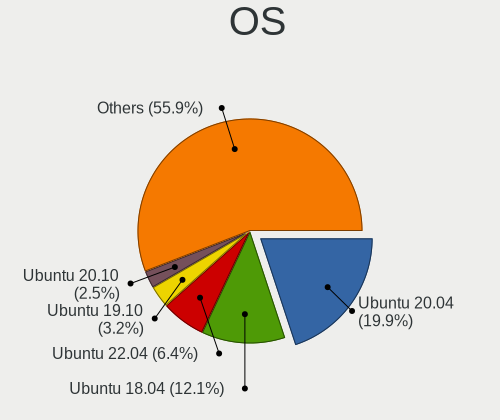

| Name                | Notebooks | Percent |
|---------------------|-----------|---------|
| Ubuntu 20.04        | 56        | 19.93%  |
| Ubuntu 18.04        | 34        | 12.1%   |
| Ubuntu 22.04        | 18        | 6.41%   |
| Ubuntu 19.10        | 9         | 3.2%    |
| Ubuntu 20.10        | 7         | 2.49%   |
| Zorin 16            | 6         | 2.14%   |
| Zorin 15            | 6         | 2.14%   |
| Pop!_OS 22.04       | 6         | 2.14%   |
| OpenMandriva 4.3    | 6         | 2.14%   |
| ArcoLinux Rolling   | 6         | 2.14%   |
| Pop!_OS 20.10       | 5         | 1.78%   |
| Fedora 36           | 5         | 1.78%   |
| Ubuntu 21.10        | 4         | 1.42%   |
| Linux Mint 19.3     | 4         | 1.42%   |
| Fedora 34           | 4         | 1.42%   |
| Arch                | 4         | 1.42%   |
| Ubuntu 21.04        | 3         | 1.07%   |
| Pop!_OS 20.04       | 3         | 1.07%   |
| Manjaro             | 3         | 1.07%   |
| Linux Mint 21       | 3         | 1.07%   |
| Linux Mint 20.3     | 3         | 1.07%   |
| Linux Mint 20.1     | 3         | 1.07%   |
| Linux Mint 19       | 3         | 1.07%   |
| Kubuntu 20.04       | 3         | 1.07%   |
| KDE neon 20.04      | 3         | 1.07%   |
| Fedora 35           | 3         | 1.07%   |
| Fedora 33           | 3         | 1.07%   |
| Ubuntu Unity 16.04  | 2         | 0.71%   |
| Ubuntu 19.04        | 2         | 0.71%   |
| Ubuntu 18.10        | 2         | 0.71%   |
| Pop!_OS 21.04       | 2         | 0.71%   |
| OpenMandriva 4.2    | 2         | 0.71%   |
| Kali 2022.3         | 2         | 0.71%   |
| Kali 2022.1         | 2         | 0.71%   |
| Kali 2021.1         | 2         | 0.71%   |
| Fedora 32           | 2         | 0.71%   |
| Endless 4.0.7       | 2         | 0.71%   |
| Xubuntu 22.04       | 1         | 0.36%   |
| Ubuntu Budgie 19.10 | 1         | 0.36%   |
| Ubuntu 22.10        | 1         | 0.36%   |

OS Family
---------

OS without a version

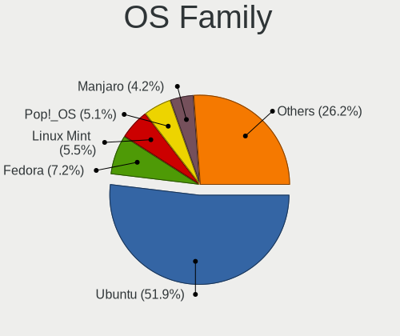

| Name          | Notebooks | Percent |
|---------------|-----------|---------|
| Ubuntu        | 134       | 49.45%  |
| Linux Mint    | 18        | 6.64%   |
| Fedora        | 18        | 6.64%   |
| Pop!_OS       | 15        | 5.54%   |
| Zorin         | 12        | 4.43%   |
| Manjaro       | 10        | 3.69%   |
| OpenMandriva  | 9         | 3.32%   |
| Kali          | 8         | 2.95%   |
| Endless       | 7         | 2.58%   |
| ArcoLinux     | 6         | 2.21%   |
| Kubuntu       | 4         | 1.48%   |
| Arch          | 4         | 1.48%   |
| ROSA          | 3         | 1.11%   |
| KDE neon      | 3         | 1.11%   |
| Ubuntu Unity  | 2         | 0.74%   |
| Lubuntu       | 2         | 0.74%   |
| Debian        | 2         | 0.74%   |
| Clear Linux   | 2         | 0.74%   |
| Xubuntu       | 1         | 0.37%   |
| Ubuntu Budgie | 1         | 0.37%   |
| RHEL          | 1         | 0.37%   |
| Parrot        | 1         | 0.37%   |
| MX            | 1         | 0.37%   |
| LMDE          | 1         | 0.37%   |
| EndeavourOS   | 1         | 0.37%   |
| Elementary    | 1         | 0.37%   |
| CentOS        | 1         | 0.37%   |
| BlackPanther  | 1         | 0.37%   |
| ALT Linux     | 1         | 0.37%   |
| Alpine        | 1         | 0.37%   |

Kernel
------

Version of the Linux kernel

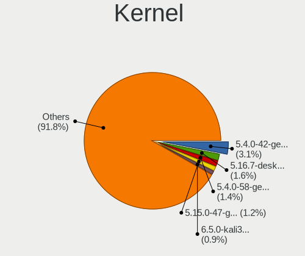

| Version                 | Notebooks | Percent |
|-------------------------|-----------|---------|
| 5.4.0-42-generic        | 13        | 4.39%   |
| 5.4.0-58-generic        | 6         | 2.03%   |
| 5.16.7-desktop-1omv4003 | 5         | 1.69%   |
| 5.8.0-7630-generic      | 4         | 1.35%   |
| 5.8.0-48-generic        | 4         | 1.35%   |
| 5.4.0-48-generic        | 4         | 1.35%   |
| 5.4.0-29-generic        | 4         | 1.35%   |
| 5.15.0-47-generic       | 4         | 1.35%   |
| 5.0.0-32-generic        | 4         | 1.35%   |
| 5.8.0-43-generic        | 3         | 1.01%   |
| 5.8.0-41-generic        | 3         | 1.01%   |
| 5.4.0-56-generic        | 3         | 1.01%   |
| 5.3.0-51-generic        | 3         | 1.01%   |
| 5.3.0-18-generic        | 3         | 1.01%   |
| 5.19.0-76051900-generic | 3         | 1.01%   |
| 5.15.0-52-generic       | 3         | 1.01%   |
| 5.15.0-50-generic       | 3         | 1.01%   |
| 5.15.0-48-generic       | 3         | 1.01%   |
| 5.15.0-40-generic       | 3         | 1.01%   |
| 5.13.0-30-generic       | 3         | 1.01%   |
| 5.11.0-38-generic       | 3         | 1.01%   |
| 5.11.0-37-generic       | 3         | 1.01%   |
| 5.11.0-35-generic       | 3         | 1.01%   |
| 5.4.0-80-generic        | 2         | 0.68%   |
| 5.4.0-59-generic        | 2         | 0.68%   |
| 5.4.0-54-generic        | 2         | 0.68%   |
| 5.4.0-53-generic        | 2         | 0.68%   |
| 5.4.0-52-generic        | 2         | 0.68%   |
| 5.4.0-40-generic        | 2         | 0.68%   |
| 5.4.0-100-generic       | 2         | 0.68%   |
| 5.3.0-46-generic        | 2         | 0.68%   |
| 5.3.0-45-generic        | 2         | 0.68%   |
| 5.3.0-42-generic        | 2         | 0.68%   |
| 5.3.0-26-generic        | 2         | 0.68%   |
| 5.3.0-23-generic        | 2         | 0.68%   |
| 5.18.17-200.fc36.x86_64 | 2         | 0.68%   |
| 5.17.5-76051705-generic | 2         | 0.68%   |
| 5.15.0-53-generic       | 2         | 0.68%   |
| 5.15.0-39-generic       | 2         | 0.68%   |
| 5.10.19-200.fc33.x86_64 | 2         | 0.68%   |

Kernel Family
-------------

Linux kernel without a distro release

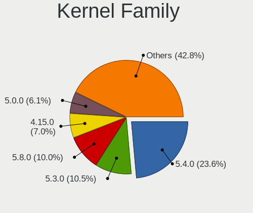

| Version | Notebooks | Percent |
|---------|-----------|---------|
| 5.4.0   | 57        | 20.07%  |
| 5.3.0   | 24        | 8.45%   |
| 5.15.0  | 24        | 8.45%   |
| 5.8.0   | 23        | 8.1%    |
| 4.15.0  | 19        | 6.69%   |
| 5.0.0   | 14        | 4.93%   |
| 5.13.0  | 13        | 4.58%   |
| 5.11.0  | 13        | 4.58%   |
| 4.18.0  | 8         | 2.82%   |
| 5.19.0  | 5         | 1.76%   |
| 5.16.7  | 5         | 1.76%   |
| 5.10.0  | 5         | 1.76%   |
| 5.17.5  | 3         | 1.06%   |
| 5.18.17 | 2         | 0.7%    |
| 5.17.1  | 2         | 0.7%    |
| 5.16.0  | 2         | 0.7%    |
| 5.14.0  | 2         | 0.7%    |
| 5.10.19 | 2         | 0.7%    |
| 5.10.14 | 2         | 0.7%    |
| 4.19.0  | 2         | 0.7%    |
| 6.0.6   | 1         | 0.35%   |
| 6.0.0   | 1         | 0.35%   |
| 5.9.1   | 1         | 0.35%   |
| 5.8.7   | 1         | 0.35%   |
| 5.8.15  | 1         | 0.35%   |
| 5.8.11  | 1         | 0.35%   |
| 5.8.10  | 1         | 0.35%   |
| 5.7.1   | 1         | 0.35%   |
| 5.6.8   | 1         | 0.35%   |
| 5.6.15  | 1         | 0.35%   |
| 5.5.13  | 1         | 0.35%   |
| 5.4.83  | 1         | 0.35%   |
| 5.4.70  | 1         | 0.35%   |
| 5.4.67  | 1         | 0.35%   |
| 5.4.13  | 1         | 0.35%   |
| 5.4.101 | 1         | 0.35%   |
| 5.3.8   | 1         | 0.35%   |
| 5.3.7   | 1         | 0.35%   |
| 5.19.16 | 1         | 0.35%   |
| 5.19.11 | 1         | 0.35%   |

Kernel Major Ver.
-----------------

Linux kernel major version

| Version | Notebooks | Percent |
|---------|-----------|---------|
| 5.4     | 62        | 22.3%   |
| 5.15    | 29        | 10.43%  |
| 5.8     | 26        | 9.35%   |
| 5.3     | 26        | 9.35%   |
| 4.15    | 19        | 6.83%   |
| 5.11    | 15        | 5.4%    |
| 5.10    | 15        | 5.4%    |
| 5.13    | 14        | 5.04%   |
| 5.0     | 14        | 5.04%   |
| 5.16    | 12        | 4.32%   |
| 4.18    | 9         | 3.24%   |
| 5.19    | 8         | 2.88%   |
| 5.17    | 7         | 2.52%   |
| 5.18    | 5         | 1.8%    |
| 5.14    | 3         | 1.08%   |
| 5.12    | 3         | 1.08%   |
| 6.0     | 2         | 0.72%   |
| 5.6     | 2         | 0.72%   |
| 4.19    | 2         | 0.72%   |
| 5.9     | 1         | 0.36%   |
| 5.7     | 1         | 0.36%   |
| 5.5     | 1         | 0.36%   |
| 4.9     | 1         | 0.36%   |
| 4.16    | 1         | 0.36%   |

Arch
----

OS architecture (x86_64, i586, etc.)

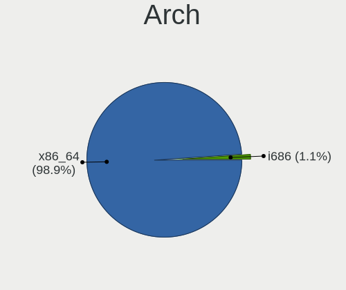

| Name   | Notebooks | Percent |
|--------|-----------|---------|
| x86_64 | 256       | 98.46%  |
| i686   | 4         | 1.54%   |

DE
--

Desktop Environment

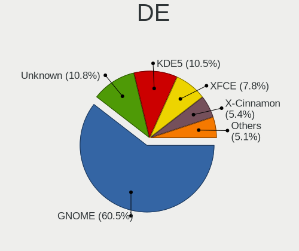

| Name          | Notebooks | Percent |
|---------------|-----------|---------|
| GNOME         | 161       | 59.85%  |
| Unknown       | 35        | 13.01%  |
| KDE5          | 22        | 8.18%   |
| XFCE          | 21        | 7.81%   |
| X-Cinnamon    | 14        | 5.2%    |
| MATE          | 3         | 1.12%   |
| Unity         | 2         | 0.74%   |
| KDE4          | 2         | 0.74%   |
| Cinnamon      | 2         | 0.74%   |
| qtile         | 1         | 0.37%   |
| LXQt          | 1         | 0.37%   |
| LXDE          | 1         | 0.37%   |
| KDE           | 1         | 0.37%   |
| i3            | 1         | 0.37%   |
| Enlightenment | 1         | 0.37%   |
| Budgie        | 1         | 0.37%   |

Display Server
--------------

X11 or Wayland

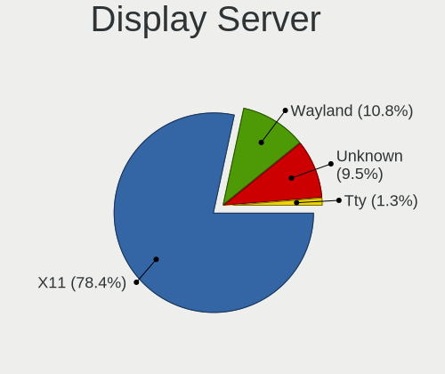

| Name    | Notebooks | Percent |
|---------|-----------|---------|
| X11     | 210       | 78.36%  |
| Wayland | 33        | 12.31%  |
| Unknown | 22        | 8.21%   |
| Tty     | 3         | 1.12%   |

Display Manager
---------------

SDDM, LightDM, etc.

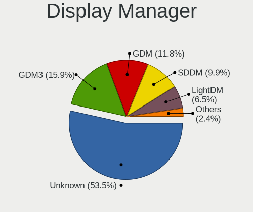

| Name    | Notebooks | Percent |
|---------|-----------|---------|
| Unknown | 162       | 60.9%   |
| GDM     | 31        | 11.65%  |
| GDM3    | 27        | 10.15%  |
| SDDM    | 21        | 7.89%   |
| LightDM | 17        | 6.39%   |
| TDM     | 6         | 2.26%   |
| KDM     | 2         | 0.75%   |

OS Lang
-------

Language

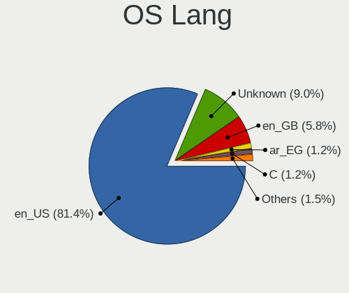

| Lang    | Notebooks | Percent |
|---------|-----------|---------|
| en_US   | 215       | 81.44%  |
| Unknown | 31        | 11.74%  |
| en_GB   | 10        | 3.79%   |
| ar_EG   | 3         | 1.14%   |
| ru_RU   | 2         | 0.76%   |
| C       | 2         | 0.76%   |
| de_DE   | 1         | 0.38%   |

Boot Mode
---------

EFI or BIOS

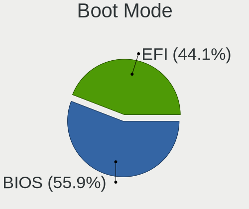

| Mode | Notebooks | Percent |
|------|-----------|---------|
| BIOS | 148       | 55.85%  |
| EFI  | 117       | 44.15%  |

Filesystem
----------

Type of filesystem

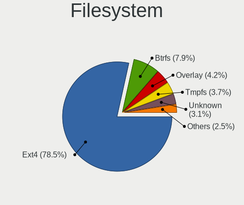

| Type    | Notebooks | Percent |
|---------|-----------|---------|
| Ext4    | 223       | 84.79%  |
| Btrfs   | 14        | 5.32%   |
| Unknown | 11        | 4.18%   |
| Overlay | 10        | 3.8%    |
| Xfs     | 3         | 1.14%   |
| Ext3    | 2         | 0.76%   |

Part. scheme
------------

Scheme of partitioning

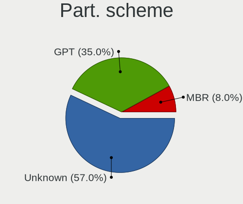

| Type    | Notebooks | Percent |
|---------|-----------|---------|
| Unknown | 178       | 68.2%   |
| GPT     | 62        | 23.75%  |
| MBR     | 21        | 8.05%   |

Dual Boot with Linux/BSD
------------------------

Hosting more than one Linux/BSD

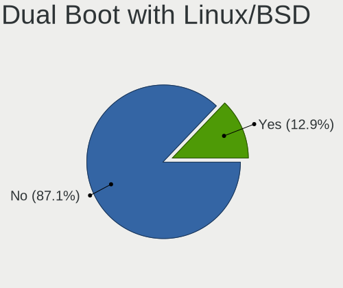

| Dual boot | Notebooks | Percent |
|-----------|-----------|---------|
| No        | 232       | 87.55%  |
| Yes       | 33        | 12.45%  |

Dual Boot (Win)
---------------

Hosting Linux and Windows

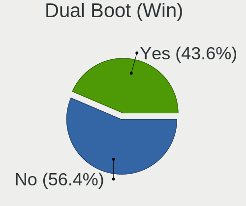

| Dual boot | Notebooks | Percent |
|-----------|-----------|---------|
| No        | 149       | 56.44%  |
| Yes       | 115       | 43.56%  |

Board
-----

Vendor
------

Motherboard manufacturer

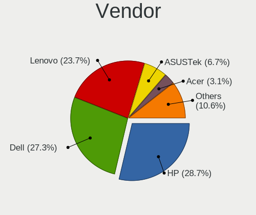

| Name                        | Notebooks | Percent |
|-----------------------------|-----------|---------|
| Hewlett-Packard             | 76        | 29.23%  |
| Dell                        | 72        | 27.69%  |
| Lenovo                      | 60        | 23.08%  |
| ASUSTek Computer            | 17        | 6.54%   |
| Toshiba                     | 7         | 2.69%   |
| Acer                        | 5         | 1.92%   |
| MSI                         | 4         | 1.54%   |
| Sony                        | 3         | 1.15%   |
| Samsung Electronics         | 3         | 1.15%   |
| Hampoo                      | 3         | 1.15%   |
| Packard Bell                | 2         | 0.77%   |
| Fujitsu                     | 2         | 0.77%   |
| TECNO                       | 1         | 0.38%   |
| Panasonic                   | 1         | 0.38%   |
| I-Life Digital Technologies | 1         | 0.38%   |
| Fujitsu Siemens             | 1         | 0.38%   |
| Apple                       | 1         | 0.38%   |
| Alienware                   | 1         | 0.38%   |

Model
-----

Motherboard model

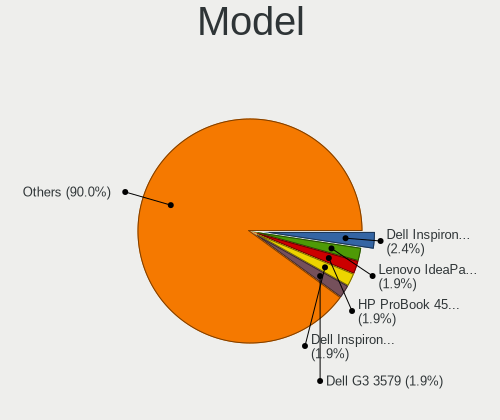

| Name                                  | Notebooks | Percent |
|---------------------------------------|-----------|---------|
| Lenovo IdeaPad 520-15IKB 81BF         | 5         | 1.92%   |
| Dell Inspiron 5570                    | 5         | 1.92%   |
| HP ProBook 450 G7                     | 4         | 1.54%   |
| HP Notebook                           | 4         | 1.54%   |
| Dell Inspiron 7577                    | 4         | 1.54%   |
| Dell G5 5587                          | 4         | 1.54%   |
| Dell G3 3579                          | 4         | 1.54%   |
| Lenovo IdeaPad 330-15AST 81D6         | 3         | 1.15%   |
| HP ProBook 645 G1                     | 3         | 1.15%   |
| HP Pavilion dv6                       | 3         | 1.15%   |
| HP Pavilion 15                        | 3         | 1.15%   |
| HP Laptop 15-da1xxx                   | 3         | 1.15%   |
| HP EliteBook 745 G3                   | 3         | 1.15%   |
| Hampoo Cherry Trail CR                | 3         | 1.15%   |
| Dell Inspiron N5110                   | 3         | 1.15%   |
| Dell Inspiron 3593                    | 3         | 1.15%   |
| Dell Inspiron 3521                    | 3         | 1.15%   |
| Dell G15 5510                         | 3         | 1.15%   |
| Lenovo Y50-70 20378                   | 2         | 0.77%   |
| Lenovo IdeaPad L340-15IRH Gaming 81LK | 2         | 0.77%   |
| Lenovo IdeaPad 310-15IKB 80TV         | 2         | 0.77%   |
| Lenovo G555 0873                      | 2         | 0.77%   |
| HP ZBook 15 G2                        | 2         | 0.77%   |
| HP ProBook 450 G2                     | 2         | 0.77%   |
| HP Pavilion g6                        | 2         | 0.77%   |
| HP Pavilion g4                        | 2         | 0.77%   |
| HP Pavilion dv7                       | 2         | 0.77%   |
| HP Laptop 15-bs0xx                    | 2         | 0.77%   |
| HP EliteBook 840 G1                   | 2         | 0.77%   |
| HP 15                                 | 2         | 0.77%   |
| Dell Latitude E5570                   | 2         | 0.77%   |
| Dell Inspiron N5010                   | 2         | 0.77%   |
| Dell Inspiron N4050                   | 2         | 0.77%   |
| Dell Inspiron 5559                    | 2         | 0.77%   |
| Dell Inspiron 3543                    | 2         | 0.77%   |
| ASUS VivoBook 15_ASUS Laptop X540UAR  | 2         | 0.77%   |
| Toshiba Satellite L850-A894           | 1         | 0.38%   |
| Toshiba Satellite L50-A661            | 1         | 0.38%   |
| Toshiba Satellite C850D-B810          | 1         | 0.38%   |
| Toshiba Satellite C850-B341           | 1         | 0.38%   |

Model Family
------------

Motherboard model prefix

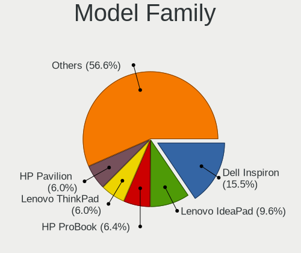

| Name                  | Notebooks | Percent |
|-----------------------|-----------|---------|
| Dell Inspiron         | 40        | 15.38%  |
| Lenovo IdeaPad        | 25        | 9.62%   |
| HP EliteBook          | 17        | 6.54%   |
| HP ProBook            | 16        | 6.15%   |
| Dell Latitude         | 16        | 6.15%   |
| Lenovo ThinkPad       | 15        | 5.77%   |
| HP Pavilion           | 15        | 5.77%   |
| HP Laptop             | 7         | 2.69%   |
| Dell G3               | 7         | 2.69%   |
| Toshiba Satellite     | 6         | 2.31%   |
| Lenovo Legion         | 5         | 1.92%   |
| ASUS VivoBook         | 5         | 1.92%   |
| Acer Aspire           | 5         | 1.92%   |
| HP ZBook              | 4         | 1.54%   |
| HP Notebook           | 4         | 1.54%   |
| Dell G5               | 4         | 1.54%   |
| Hampoo Cherry         | 3         | 1.15%   |
| Dell G15              | 3         | 1.15%   |
| Packard Bell EasyNote | 2         | 0.77%   |
| Lenovo Yoga           | 2         | 0.77%   |
| Lenovo Y50-70         | 2         | 0.77%   |
| Lenovo G555           | 2         | 0.77%   |
| HP ENVY               | 2         | 0.77%   |
| HP Compaq             | 2         | 0.77%   |
| HP 250                | 2         | 0.77%   |
| HP 15                 | 2         | 0.77%   |
| Toshiba NB250         | 1         | 0.38%   |
| TECNO WinPad          | 1         | 0.38%   |
| Sony VPCEH3LFX        | 1         | 0.38%   |
| Sony SVT1121B2EW      | 1         | 0.38%   |
| Sony SVF15328CXB      | 1         | 0.38%   |
| Samsung Lumpy         | 1         | 0.38%   |
| Samsung 300E5EV       | 1         | 0.38%   |
| Samsung 275E4E        | 1         | 0.38%   |
| Panasonic FZG1-3      | 1         | 0.38%   |
| MSI Summit            | 1         | 0.38%   |
| MSI MS-14Y1           | 1         | 0.38%   |
| MSI GS65              | 1         | 0.38%   |
| MSI GL62              | 1         | 0.38%   |
| Lenovo Z50-70         | 1         | 0.38%   |

MFG Year
--------

Motherboard manufacture year

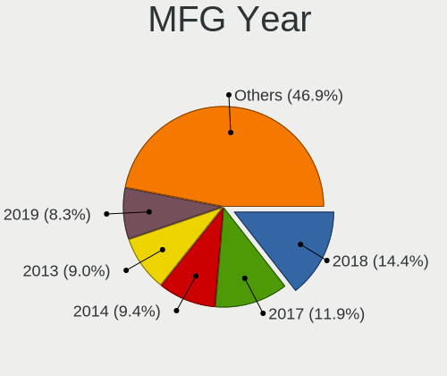

| Year | Notebooks | Percent |
|------|-----------|---------|
| 2018 | 37        | 14.23%  |
| 2017 | 31        | 11.92%  |
| 2014 | 25        | 9.62%   |
| 2013 | 24        | 9.23%   |
| 2016 | 23        | 8.85%   |
| 2019 | 22        | 8.46%   |
| 2011 | 19        | 7.31%   |
| 2015 | 16        | 6.15%   |
| 2012 | 14        | 5.38%   |
| 2010 | 13        | 5%      |
| 2020 | 12        | 4.62%   |
| 2008 | 10        | 3.85%   |
| 2021 | 4         | 1.54%   |
| 2009 | 4         | 1.54%   |
| 2022 | 3         | 1.15%   |
| 2007 | 3         | 1.15%   |

Form Factor
-----------

Physical design of the computer

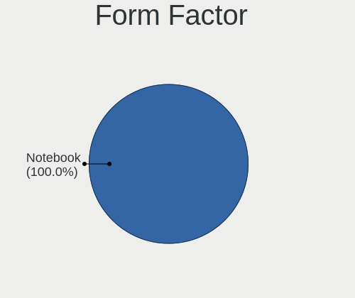

| Name     | Notebooks | Percent |
|----------|-----------|---------|
| Notebook | 260       | 100%    |

Secure Boot
-----------

Enabled or disabled

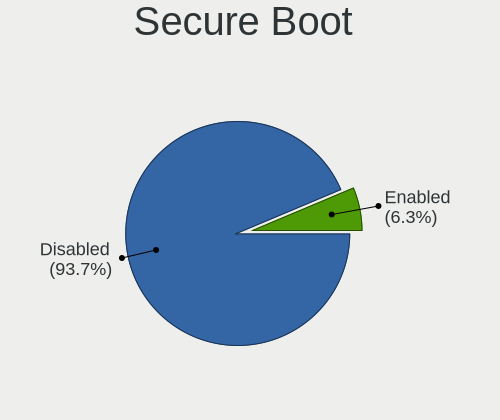

| State    | Notebooks | Percent |
|----------|-----------|---------|
| Disabled | 245       | 94.23%  |
| Enabled  | 15        | 5.77%   |

Coreboot
--------

Have coreboot on board

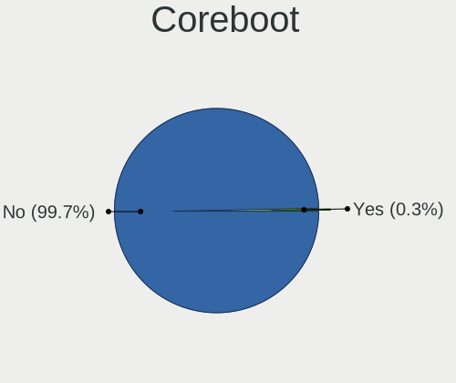

| Used | Notebooks | Percent |
|------|-----------|---------|
| No   | 259       | 99.62%  |
| Yes  | 1         | 0.38%   |

RAM Size
--------

Total RAM memory

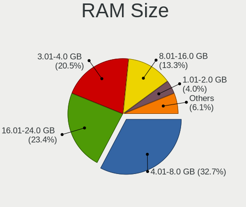

| Size in GB | Notebooks | Percent |
|------------|-----------|---------|
| 4.01-8.0   | 82        | 31.42%  |
| 16.01-24.0 | 63        | 24.14%  |
| 3.01-4.0   | 56        | 21.46%  |
| 8.01-16.0  | 34        | 13.03%  |
| 1.01-2.0   | 10        | 3.83%   |
| 2.01-3.0   | 7         | 2.68%   |
| 32.01-64.0 | 4         | 1.53%   |
| 24.01-32.0 | 4         | 1.53%   |
| 0.51-1.0   | 1         | 0.38%   |

RAM Used
--------

Used RAM memory

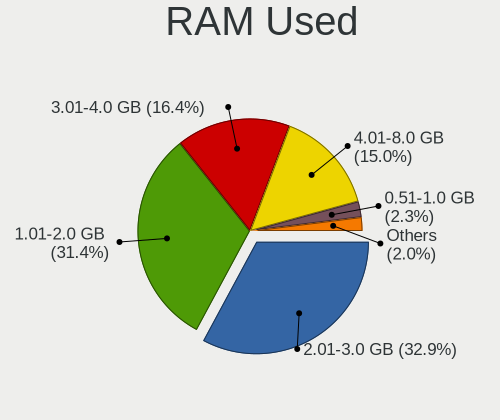

| Used GB   | Notebooks | Percent |
|-----------|-----------|---------|
| 1.01-2.0  | 93        | 32.63%  |
| 2.01-3.0  | 92        | 32.28%  |
| 3.01-4.0  | 46        | 16.14%  |
| 4.01-8.0  | 44        | 15.44%  |
| 0.51-1.0  | 6         | 2.11%   |
| 8.01-16.0 | 3         | 1.05%   |
| 0.01-0.5  | 1         | 0.35%   |

Total Drives
------------

Number of drives on board

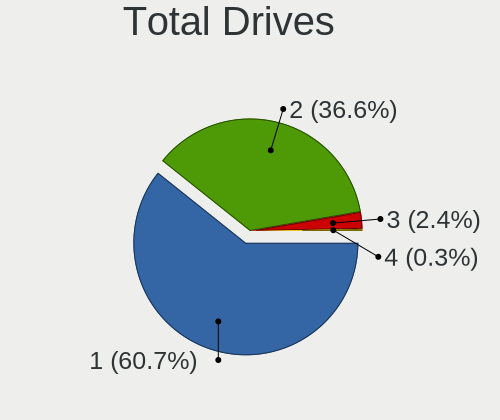

| Drives | Notebooks | Percent |
|--------|-----------|---------|
| 1      | 155       | 57.84%  |
| 2      | 106       | 39.55%  |
| 3      | 7         | 2.61%   |

Has CD-ROM
----------

Has CD-ROM on board

| Presented | Notebooks | Percent |
|-----------|-----------|---------|
| No        | 145       | 55.34%  |
| Yes       | 117       | 44.66%  |

Has Ethernet
------------

Has Ethernet on board

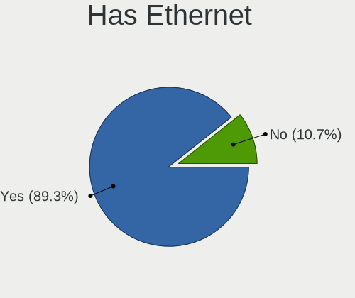

| Presented | Notebooks | Percent |
|-----------|-----------|---------|
| Yes       | 237       | 91.15%  |
| No        | 23        | 8.85%   |

Has WiFi
--------

Has WiFi module

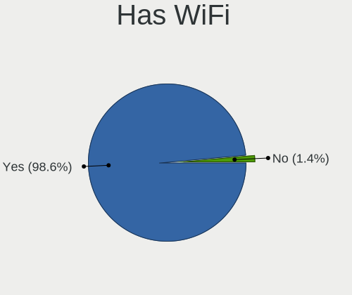

| Presented | Notebooks | Percent |
|-----------|-----------|---------|
| Yes       | 256       | 98.46%  |
| No        | 4         | 1.54%   |

Has Bluetooth
-------------

Has Bluetooth module

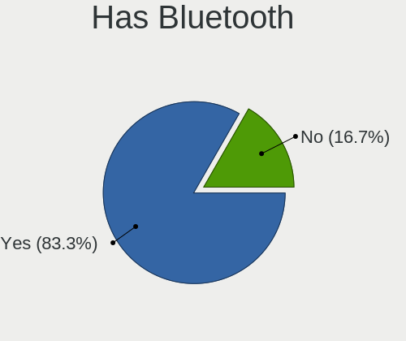

| Presented | Notebooks | Percent |
|-----------|-----------|---------|
| Yes       | 213       | 80.68%  |
| No        | 51        | 19.32%  |

Location
--------

Country
-------

Geographic location (country)

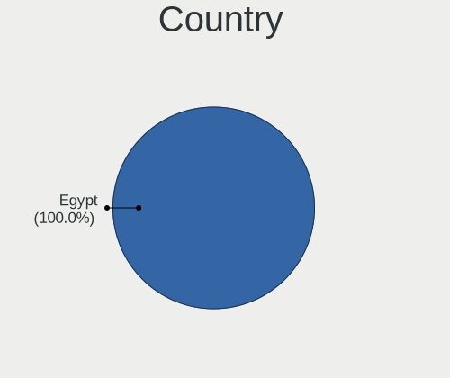

| Country | Notebooks | Percent |
|---------|-----------|---------|
| Egypt   | 260       | 100%    |

City
----

Geographic location (city)

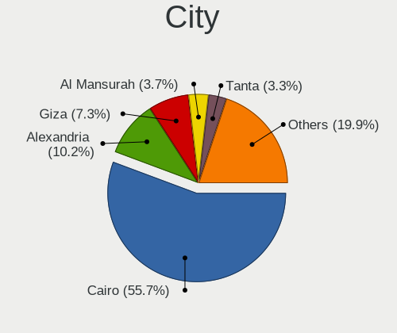

| City                | Notebooks | Percent |
|---------------------|-----------|---------|
| Cairo               | 155       | 55.36%  |
| Alexandria          | 31        | 11.07%  |
| Giza                | 20        | 7.14%   |
| Al Mansurah         | 10        | 3.57%   |
| Tanta               | 8         | 2.86%   |
| Awsim               | 4         | 1.43%   |
| Zagazig             | 3         | 1.07%   |
| Hurghada            | 3         | 1.07%   |
| Helwan              | 3         | 1.07%   |
| Assiut              | 3         | 1.07%   |
| Suez                | 2         | 0.71%   |
| New Cairo           | 2         | 0.71%   |
| Minya               | 2         | 0.71%   |
| Madinat as Sadat    | 2         | 0.71%   |
| Ismailia            | 2         | 0.71%   |
| Edfu                | 2         | 0.71%   |
| Damietta            | 2         | 0.71%   |
| Damanhur            | 2         | 0.71%   |
| Bani Suwayf         | 2         | 0.71%   |
| Aswan               | 2         | 0.71%   |
| Al Fayyum           | 2         | 0.71%   |
| Zefta               | 1         | 0.36%   |
| Tukh                | 1         | 0.36%   |
| Talkha              | 1         | 0.36%   |
| Sohag               | 1         | 0.36%   |
| Port Said           | 1         | 0.36%   |
| Monufia             | 1         | 0.36%   |
| Mashtul as Suq      | 1         | 0.36%   |
| Luxor               | 1         | 0.36%   |
| Kafr Shukr          | 1         | 0.36%   |
| Heliopolis          | 1         | 0.36%   |
| Fāraskūr          | 1         | 0.36%   |
| Diyarb Najm         | 1         | 0.36%   |
| Disuq               | 1         | 0.36%   |
| Banha               | 1         | 0.36%   |
| Badr                | 1         | 0.36%   |
| Ashmun              | 1         | 0.36%   |
| Aga                 | 1         | 0.36%   |
| 6th of October City | 1         | 0.36%   |

Drives
------

Drive Vendor
------------

Hard drive vendors

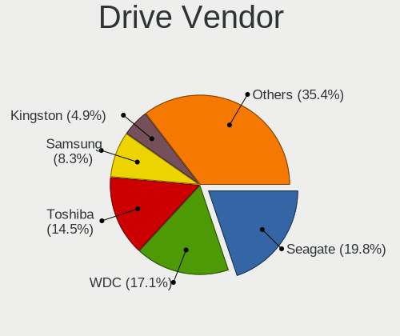

| Vendor                    | Notebooks | Drives | Percent |
|---------------------------|-----------|--------|---------|
| Seagate                   | 78        | 92     | 22.03%  |
| WDC                       | 66        | 77     | 18.64%  |
| Toshiba                   | 51        | 65     | 14.41%  |
| Samsung Electronics       | 31        | 42     | 8.76%   |
| Kingston                  | 16        | 17     | 4.52%   |
| Unknown                   | 14        | 19     | 3.95%   |
| Crucial                   | 13        | 15     | 3.67%   |
| SK hynix                  | 11        | 11     | 3.11%   |
| Hitachi                   | 10        | 13     | 2.82%   |
| SanDisk                   | 9         | 10     | 2.54%   |
| Micron Technology         | 8         | 8      | 2.26%   |
| HGST                      | 8         | 8      | 2.26%   |
| HS-SSD-C100               | 6         | 7      | 1.69%   |
| Intel                     | 5         | 5      | 1.41%   |
| LITEONIT                  | 3         | 4      | 0.85%   |
| LITEON                    | 3         | 5      | 0.85%   |
| TwinMOS                   | 2         | 2      | 0.56%   |
| Transcend                 | 2         | 2      | 0.56%   |
| Micron/Crucial Technology | 2         | 2      | 0.56%   |
| HS-SSD-E100               | 2         | 2      | 0.56%   |
| A-DATA Technology         | 2         | 2      | 0.56%   |
| Value                     | 1         | 1      | 0.28%   |
| Union Memory (Shenzhen)   | 1         | 1      | 0.28%   |
| UMIS                      | 1         | 1      | 0.28%   |
| Team                      | 1         | 1      | 0.28%   |
| Silicon Motion            | 1         | 1      | 0.28%   |
| Lexar                     | 1         | 1      | 0.28%   |
| KIOXIA                    | 1         | 1      | 0.28%   |
| KingSpec                  | 1         | 1      | 0.28%   |
| HUAWEI                    | 1         | 1      | 0.28%   |
| China                     | 1         | 1      | 0.28%   |
| Apple                     | 1         | 1      | 0.28%   |
| ADATA Technology          | 1         | 1      | 0.28%   |

Drive Model
-----------

Hard drive models

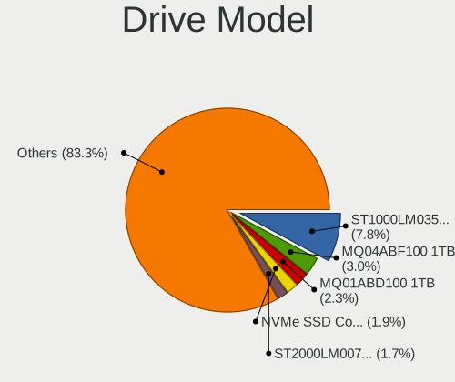

| Model                                  | Notebooks | Percent |
|----------------------------------------|-----------|---------|
| Seagate ST1000LM035-1RK172 1TB         | 35        | 9.7%    |
| Toshiba MQ04ABF100 1TB                 | 11        | 3.05%   |
| Toshiba MQ01ABD100 1TB                 | 9         | 2.49%   |
| Seagate ST2000LM007-1R8174 2TB         | 9         | 2.49%   |
| Samsung SM963 2.5" NVMe PCIe SSD 256GB | 6         | 1.66%   |
| Kingston SA400S37480G 480GB SSD        | 5         | 1.39%   |
| Kingston SA400S37240G 240GB SSD        | 5         | 1.39%   |
| Crucial CT480BX500SSD1 480GB           | 5         | 1.39%   |
| WDC WD10SPZX-60Z10T0 1TB               | 4         | 1.11%   |
| WDC WD10SPZX-24Z10 1TB                 | 4         | 1.11%   |
| WDC WD10JPVX-60JC3T1 1TB               | 4         | 1.11%   |
| Seagate ST750LM022 HN-M750MBB 752GB    | 4         | 1.11%   |
| Hitachi HTS547575A9E384 752GB          | 4         | 1.11%   |
| WDC WD10JPCX-24UE4T0 1TB               | 3         | 0.83%   |
| Unknown SD/MMC/MS PRO 8GB              | 3         | 0.83%   |
| Unknown MMC Card  64GB                 | 3         | 0.83%   |
| Unknown MMC Card  32GB                 | 3         | 0.83%   |
| Toshiba NVMe SSD Drive 256GB           | 3         | 0.83%   |
| Toshiba MQ01ACF032 320GB               | 3         | 0.83%   |
| Toshiba MQ01ABF050 500GB               | 3         | 0.83%   |
| Toshiba MK3276GSX 320GB                | 3         | 0.83%   |
| Seagate ST500LT012-1DG142 500GB        | 3         | 0.83%   |
| Seagate ST500LM012 HN-M500MBB 500GB    | 3         | 0.83%   |
| Seagate ST1000LM024 HN-M101MBB 1TB     | 3         | 0.83%   |
| SanDisk SD8SN8U-256G-1006 256GB SSD    | 3         | 0.83%   |
| Kingston SA400S37120G 120GB SSD        | 3         | 0.83%   |
| HGST HTS545050A7E680 500GB             | 3         | 0.83%   |
| Crucial CT240BX500SSD1 240GB           | 3         | 0.83%   |
| WDC WDS240G2G0A-00JH30 240GB SSD       | 2         | 0.55%   |
| WDC WDS120G2G0A-00JH30 120GB SSD       | 2         | 0.55%   |
| WDC WD5000LPVX-75V0TT0 500GB           | 2         | 0.55%   |
| WDC WD5000LPCX-24C6HT0 500GB           | 2         | 0.55%   |
| WDC WD3200BPVT-75JJ5T0 320GB           | 2         | 0.55%   |
| WDC WD1600BEVT-24A23T0 160GB           | 2         | 0.55%   |
| WDC WD10SPZX-75Z10T3 1TB               | 2         | 0.55%   |
| WDC WD10SPZX-75Z10T1 1TB               | 2         | 0.55%   |
| WDC WD10SPZX-24Z10T0 1TB               | 2         | 0.55%   |
| WDC WD10SPZX-21Z10T0 1TB               | 2         | 0.55%   |
| WDC WD10SPZX-00Z10T0 1TB               | 2         | 0.55%   |
| WDC WD10JPVX-75JC3T0 1TB               | 2         | 0.55%   |

HDD Vendor
----------

Hard disk drive vendors

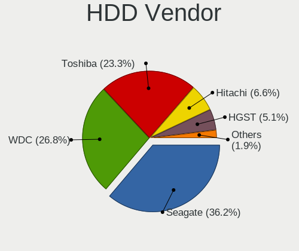

| Vendor              | Notebooks | Drives | Percent |
|---------------------|-----------|--------|---------|
| Seagate             | 78        | 92     | 38.24%  |
| WDC                 | 58        | 69     | 28.43%  |
| Toshiba             | 45        | 57     | 22.06%  |
| Hitachi             | 10        | 13     | 4.9%    |
| HGST                | 8         | 8      | 3.92%   |
| Unknown             | 3         | 3      | 1.47%   |
| Samsung Electronics | 1         | 2      | 0.49%   |
| Apple               | 1         | 1      | 0.49%   |

SSD Vendor
----------

Solid state drive vendors

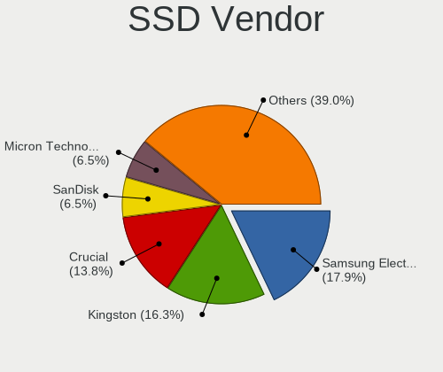

| Vendor              | Notebooks | Drives | Percent |
|---------------------|-----------|--------|---------|
| Kingston            | 15        | 16     | 17.24%  |
| Samsung Electronics | 14        | 16     | 16.09%  |
| Crucial             | 12        | 14     | 13.79%  |
| SanDisk             | 7         | 8      | 8.05%   |
| Micron Technology   | 6         | 6      | 6.9%    |
| WDC                 | 5         | 5      | 5.75%   |
| SK hynix            | 4         | 4      | 4.6%    |
| Intel               | 4         | 4      | 4.6%    |
| LITEONIT            | 3         | 4      | 3.45%   |
| LITEON              | 3         | 5      | 3.45%   |
| TwinMOS             | 2         | 2      | 2.3%    |
| Transcend           | 2         | 2      | 2.3%    |
| Toshiba             | 2         | 3      | 2.3%    |
| HS-SSD-C100         | 2         | 3      | 2.3%    |
| Value               | 1         | 1      | 1.15%   |
| Team                | 1         | 1      | 1.15%   |
| Lexar               | 1         | 1      | 1.15%   |
| KingSpec            | 1         | 1      | 1.15%   |
| China               | 1         | 1      | 1.15%   |
| A-DATA Technology   | 1         | 1      | 1.15%   |

Drive Kind
----------

HDD or SSD

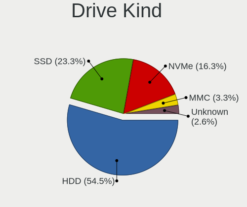

| Kind    | Notebooks | Drives | Percent |
|---------|-----------|--------|---------|
| HDD     | 196       | 245    | 57.14%  |
| SSD     | 83        | 98     | 24.2%   |
| NVMe    | 47        | 56     | 13.7%   |
| MMC     | 10        | 14     | 2.92%   |
| Unknown | 7         | 7      | 2.04%   |

Drive Connector
---------------

SATA, SAS, NVMe, etc.

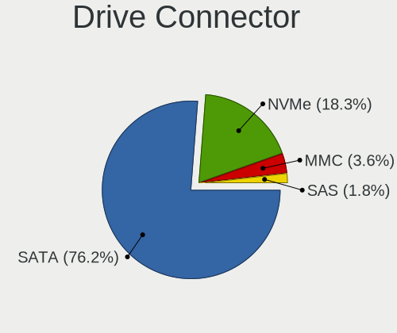

| Type | Notebooks | Drives | Percent |
|------|-----------|--------|---------|
| SATA | 236       | 346    | 79.46%  |
| NVMe | 47        | 56     | 15.82%  |
| MMC  | 10        | 14     | 3.37%   |
| SAS  | 4         | 4      | 1.35%   |

Drive Size
----------

Size of hard drive

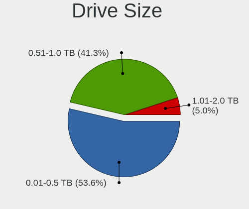

| Size in TB | Notebooks | Drives | Percent |
|------------|-----------|--------|---------|
| 0.01-0.5   | 143       | 179    | 51.62%  |
| 0.51-1.0   | 121       | 151    | 43.68%  |
| 1.01-2.0   | 13        | 13     | 4.69%   |

Space Total
-----------

Amount of disk space available on the file system

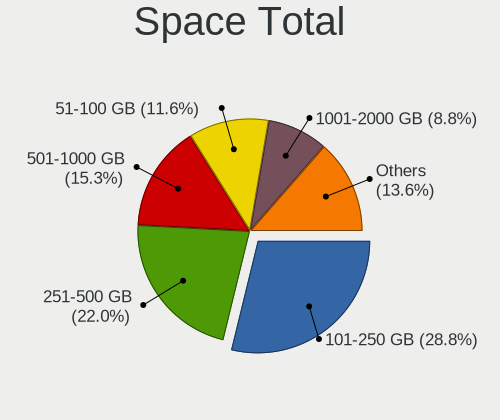

| Size in GB     | Notebooks | Percent |
|----------------|-----------|---------|
| 101-250        | 79        | 29.04%  |
| 251-500        | 58        | 21.32%  |
| 501-1000       | 42        | 15.44%  |
| 51-100         | 33        | 12.13%  |
| 1001-2000      | 25        | 9.19%   |
| 21-50          | 17        | 6.25%   |
| 1-20           | 13        | 4.78%   |
| Unknown        | 3         | 1.1%    |
| More than 3000 | 1         | 0.37%   |
| 2001-3000      | 1         | 0.37%   |

Space Used
----------

Amount of used disk space

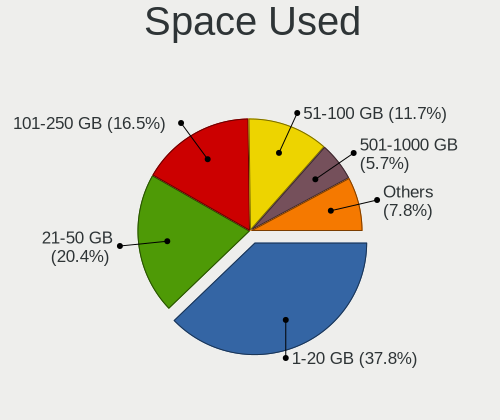

| Used GB   | Notebooks | Percent |
|-----------|-----------|---------|
| 1-20      | 101       | 36.33%  |
| 21-50     | 63        | 22.66%  |
| 101-250   | 46        | 16.55%  |
| 51-100    | 33        | 11.87%  |
| 501-1000  | 15        | 5.4%    |
| 251-500   | 14        | 5.04%   |
| Unknown   | 3         | 1.08%   |
| 1001-2000 | 2         | 0.72%   |
| 2001-3000 | 1         | 0.36%   |

Malfunc. Drives
---------------

Drive models with a malfunction

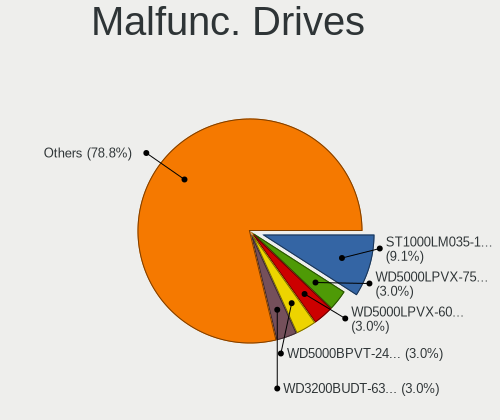

| Model                                               | Notebooks | Drives | Percent |
|-----------------------------------------------------|-----------|--------|---------|
| Seagate ST1000LM035-1RK172 1TB                      | 3         | 4      | 15%     |
| WDC WD5000LPVX-75V0TT0 500GB                        | 1         | 1      | 5%      |
| WDC WD5000LPVX-60V0TT0 500GB                        | 1         | 1      | 5%      |
| WDC WD5000BPVT-24HXZT3 500GB                        | 1         | 1      | 5%      |
| WDC WD3200BUDT-63DPZY0 320GB                        | 1         | 1      | 5%      |
| WDC WD3200BEKT-60V5T1 320GB                         | 1         | 2      | 5%      |
| SK hynix HFS128G39TND-N210A 128GB SSD               | 1         | 1      | 5%      |
| Seagate ST95005620AS 500GB                          | 1         | 2      | 5%      |
| Seagate ST9320328CS 320GB                           | 1         | 2      | 5%      |
| Seagate ST500LT012-9WS142 500GB                     | 1         | 1      | 5%      |
| Seagate ST2000LM015-2E81 2TB                        | 1         | 1      | 5%      |
| Seagate ST1000LM024 HN-M101MBB 1TB                  | 1         | 1      | 5%      |
| Micron Technology MTFDDAK256MAY-1AH12ABHA 256GB SSD | 1         | 1      | 5%      |
| Micron Technology MTFDDAK128MAY-1AH1ZABHA 128GB SSD | 1         | 1      | 5%      |
| Intel SSDSC2BF180A4H 180GB                          | 1         | 1      | 5%      |
| Hitachi HTS543225L9A300 250GB                       | 1         | 1      | 5%      |
| Apple HDD HTS547550A9E384 500GB                     | 1         | 1      | 5%      |
| A-DATA Technology IM2P33F3 NVMe 256GB               | 1         | 1      | 5%      |

Malfunc. Drive Vendor
---------------------

Vendors of faulty drives

| Vendor            | Notebooks | Drives | Percent |
|-------------------|-----------|--------|---------|
| Seagate           | 8         | 11     | 40%     |
| WDC               | 5         | 6      | 25%     |
| Micron Technology | 2         | 2      | 10%     |
| SK hynix          | 1         | 1      | 5%      |
| Intel             | 1         | 1      | 5%      |
| Hitachi           | 1         | 1      | 5%      |
| Apple             | 1         | 1      | 5%      |
| A-DATA Technology | 1         | 1      | 5%      |

Malfunc. HDD Vendor
-------------------

Vendors of faulty HDD drives

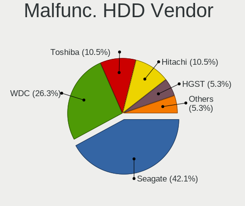

| Vendor  | Notebooks | Drives | Percent |
|---------|-----------|--------|---------|
| Seagate | 8         | 11     | 53.33%  |
| WDC     | 5         | 6      | 33.33%  |
| Hitachi | 1         | 1      | 6.67%   |
| Apple   | 1         | 1      | 6.67%   |

Malfunc. Drive Kind
-------------------

Kinds of faulty drives

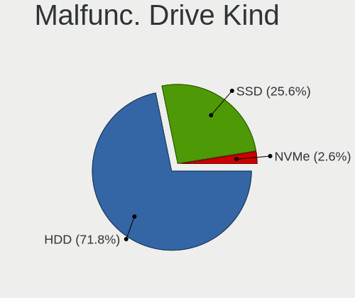

| Kind | Notebooks | Drives | Percent |
|------|-----------|--------|---------|
| HDD  | 15        | 19     | 75%     |
| SSD  | 4         | 4      | 20%     |
| NVMe | 1         | 1      | 5%      |

Failed Drives
-------------

Failed drive models

Zero info for selected period =(

Failed Drive Vendor
-------------------

Failed drive vendors

Zero info for selected period =(

Drive Status
------------

Number of failed and malfunc. drives

| Status   | Notebooks | Drives | Percent |
|----------|-----------|--------|---------|
| Detected | 181       | 284    | 67.04%  |
| Works    | 69        | 112    | 25.56%  |
| Malfunc  | 20        | 24     | 7.41%   |

Storage controller
------------------

Storage Vendor
--------------

Storage controller vendors

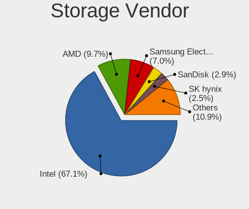

| Vendor                       | Notebooks | Percent |
|------------------------------|-----------|---------|
| Intel                        | 212       | 72.11%  |
| AMD                          | 30        | 10.2%   |
| Samsung Electronics          | 19        | 6.46%   |
| SK hynix                     | 7         | 2.38%   |
| Toshiba America Info Systems | 6         | 2.04%   |
| SanDisk                      | 5         | 1.7%    |
| Micron/Crucial Technology    | 3         | 1.02%   |
| Union Memory (Shenzhen)      | 2         | 0.68%   |
| Micron Technology            | 2         | 0.68%   |
| ADATA Technology             | 2         | 0.68%   |
| VIA Technologies             | 1         | 0.34%   |
| Silicon Motion               | 1         | 0.34%   |
| Shenzhen Longsys Electronics | 1         | 0.34%   |
| Nvidia                       | 1         | 0.34%   |
| KIOXIA                       | 1         | 0.34%   |
| Kingston Technology Company  | 1         | 0.34%   |

Storage Model
-------------

Storage controller models

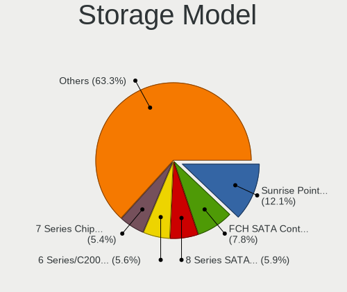

| Model                                                                          | Notebooks | Percent |
|--------------------------------------------------------------------------------|-----------|---------|
| Intel Sunrise Point-LP SATA Controller [AHCI mode]                             | 38        | 12.58%  |
| AMD FCH SATA Controller [AHCI mode]                                            | 26        | 8.61%   |
| Intel 8 Series SATA Controller 1 [AHCI mode]                                   | 21        | 6.95%   |
| Intel 6 Series/C200 Series Chipset Family 6 port Mobile SATA AHCI Controller   | 20        | 6.62%   |
| Intel 7 Series Chipset Family 6-port SATA Controller [AHCI mode]               | 17        | 5.63%   |
| Intel Cannon Lake Mobile PCH SATA AHCI Controller                              | 15        | 4.97%   |
| Intel Wildcat Point-LP SATA Controller [AHCI Mode]                             | 14        | 4.64%   |
| Samsung NVMe SSD Controller SM981/PM981/PM983                                  | 12        | 3.97%   |
| Intel 82801 Mobile SATA Controller [RAID mode]                                 | 12        | 3.97%   |
| Intel Comet Lake SATA AHCI Controller                                          | 9         | 2.98%   |
| Intel 8 Series/C220 Series Chipset Family 6-port SATA Controller 1 [AHCI mode] | 9         | 2.98%   |
| Intel HM170/QM170 Chipset SATA Controller [AHCI Mode]                          | 8         | 2.65%   |
| Intel 5 Series/3400 Series Chipset 4 port SATA AHCI Controller                 | 6         | 1.99%   |
| Intel Cannon Point-LP SATA Controller [AHCI Mode]                              | 5         | 1.66%   |
| Intel 82801IBM/IEM (ICH9M/ICH9M-E) 4 port SATA Controller [AHCI mode]          | 5         | 1.66%   |
| Intel 5 Series/3400 Series Chipset 6 port SATA AHCI Controller                 | 5         | 1.66%   |
| Toshiba America Info Systems BG3 NVMe SSD Controller                           | 4         | 1.32%   |
| Samsung NVMe SSD Controller 980                                                | 4         | 1.32%   |
| Intel 82801HM/HEM (ICH8M/ICH8M-E) IDE Controller                               | 4         | 1.32%   |
| Intel 400 Series Chipset Family SATA AHCI Controller                           | 4         | 1.32%   |
| SK hynix Gold P31/PC711 NVMe Solid State Drive                                 | 3         | 0.99%   |
| SK hynix BC501 NVMe Solid State Drive                                          | 3         | 0.99%   |
| Intel Q170/Q150/B150/H170/H110/Z170/CM236 Chipset SATA Controller [AHCI Mode]  | 3         | 0.99%   |
| Intel Ice Lake-LP SATA Controller [AHCI mode]                                  | 3         | 0.99%   |
| Intel Atom Processor E3800 Series SATA AHCI Controller                         | 3         | 0.99%   |
| AMD SB7x0/SB8x0/SB9x0 SATA Controller [AHCI mode]                              | 3         | 0.99%   |
| Union Memory (Shenzhen) Non-Volatile memory controller                         | 2         | 0.66%   |
| SanDisk PC SN520 NVMe SSD                                                      | 2         | 0.66%   |
| Samsung NVMe SSD Controller SM961/PM961/SM963                                  | 2         | 0.66%   |
| Micron Non-Volatile memory controller                                          | 2         | 0.66%   |
| Intel 82801HM/HEM (ICH8M/ICH8M-E) SATA Controller [AHCI mode]                  | 2         | 0.66%   |
| Intel 8 Series Chipset Family 4-port SATA Controller 1 [IDE mode] - Mobile     | 2         | 0.66%   |
| ADATA Non-Volatile memory controller                                           | 2         | 0.66%   |
| VIA VT82C586A/B/VT82C686/A/B/VT823x/A/C PIPC Bus Master IDE                    | 1         | 0.33%   |
| VIA VT8237A SATA 2-Port Controller                                             | 1         | 0.33%   |
| Toshiba America Info Systems XG6 NVMe SSD Controller                           | 1         | 0.33%   |
| Toshiba America Info Systems XG4 NVMe SSD Controller                           | 1         | 0.33%   |
| SK hynix BC511                                                                 | 1         | 0.33%   |
| Silicon Motion SM2263EN/SM2263XT SSD Controller                                | 1         | 0.33%   |
| Shenzhen Longsys Non-Volatile memory controller                                | 1         | 0.33%   |

Storage Kind
------------

Kind of storage controller (IDE, SATA, NVMe, SAS, ...)

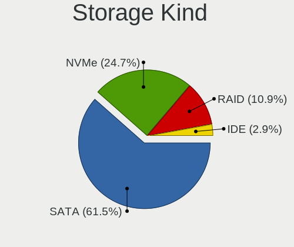

| Kind | Notebooks | Percent |
|------|-----------|---------|
| SATA | 221       | 74.92%  |
| NVMe | 49        | 16.61%  |
| RAID | 14        | 4.75%   |
| IDE  | 11        | 3.73%   |

Processor
---------

CPU Vendor
----------

Processor vendors

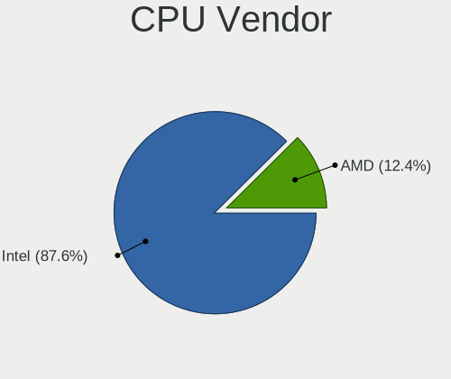

| Vendor | Notebooks | Percent |
|--------|-----------|---------|
| Intel  | 228       | 87.69%  |
| AMD    | 32        | 12.31%  |

CPU Model
---------

Processor models

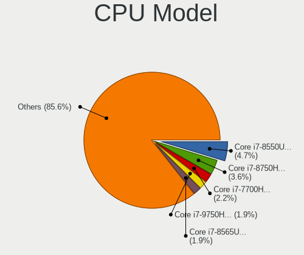

| Model                                        | Notebooks | Percent |
|----------------------------------------------|-----------|---------|
| Intel Core i7-8550U CPU @ 1.80GHz            | 13        | 5%      |
| Intel Core i7-8750H CPU @ 2.20GHz            | 11        | 4.23%   |
| Intel Core i7-7700HQ CPU @ 2.80GHz           | 8         | 3.08%   |
| Intel Core i7-8565U CPU @ 1.80GHz            | 7         | 2.69%   |
| Intel Core i7-7500U CPU @ 2.70GHz            | 7         | 2.69%   |
| Intel Core i5-8250U CPU @ 1.60GHz            | 5         | 1.92%   |
| Intel Core i5-5200U CPU @ 2.20GHz            | 5         | 1.92%   |
| Intel Core i7-9750H CPU @ 2.60GHz            | 4         | 1.54%   |
| Intel Core i7-6500U CPU @ 2.50GHz            | 4         | 1.54%   |
| Intel Core i7-4510U CPU @ 2.00GHz            | 4         | 1.54%   |
| Intel Core i7-10510U CPU @ 1.80GHz           | 4         | 1.54%   |
| Intel Core i5-4210U CPU @ 1.70GHz            | 4         | 1.54%   |
| Intel Core i5-2430M CPU @ 2.40GHz            | 4         | 1.54%   |
| Intel Core i3-3217U CPU @ 1.80GHz            | 4         | 1.54%   |
| Intel Core i7-5500U CPU @ 2.40GHz            | 3         | 1.15%   |
| Intel Core i7-4720HQ CPU @ 2.60GHz           | 3         | 1.15%   |
| Intel Core i7-2630QM CPU @ 2.00GHz           | 3         | 1.15%   |
| Intel Core i7-1065G7 CPU @ 1.30GHz           | 3         | 1.15%   |
| Intel Core i5-7200U CPU @ 2.50GHz            | 3         | 1.15%   |
| Intel Core i5-6200U CPU @ 2.30GHz            | 3         | 1.15%   |
| Intel Core i5-5300U CPU @ 2.30GHz            | 3         | 1.15%   |
| Intel Core i5-4200U CPU @ 1.60GHz            | 3         | 1.15%   |
| Intel Core i5-3210M CPU @ 2.50GHz            | 3         | 1.15%   |
| Intel Core i5-2450M CPU @ 2.50GHz            | 3         | 1.15%   |
| Intel Core i5-2410M CPU @ 2.30GHz            | 3         | 1.15%   |
| Intel Core i5-10210U CPU @ 1.60GHz           | 3         | 1.15%   |
| Intel Core i3-4005U CPU @ 1.70GHz            | 3         | 1.15%   |
| Intel Atom x5-Z8300 CPU @ 1.44GHz            | 3         | 1.15%   |
| AMD PRO A10-8700B R6, 10 Compute Cores 4C+6G | 3         | 1.15%   |
| AMD E2-9000 RADEON R2, 4 COMPUTE CORES 2C+2G | 3         | 1.15%   |
| AMD A6-9225 RADEON R4, 5 COMPUTE CORES 2C+3G | 3         | 1.15%   |
| Intel Core i7-6820HQ CPU @ 2.70GHz           | 2         | 0.77%   |
| Intel Core i7-4810MQ CPU @ 2.80GHz           | 2         | 0.77%   |
| Intel Core i7-4700MQ CPU @ 2.40GHz           | 2         | 0.77%   |
| Intel Core i7-2670QM CPU @ 2.20GHz           | 2         | 0.77%   |
| Intel Core i7-10750H CPU @ 2.60GHz           | 2         | 0.77%   |
| Intel Core i5-7300U CPU @ 2.60GHz            | 2         | 0.77%   |
| Intel Core i5-4300U CPU @ 1.90GHz            | 2         | 0.77%   |
| Intel Core i5-4200M CPU @ 2.50GHz            | 2         | 0.77%   |
| Intel Core i5-3320M CPU @ 2.60GHz            | 2         | 0.77%   |

CPU Model Family
----------------

Processor model prefix

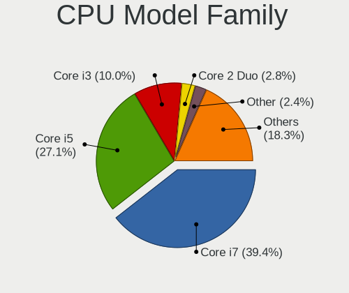

| Model                   | Notebooks | Percent |
|-------------------------|-----------|---------|
| Intel Core i7           | 100       | 38.46%  |
| Intel Core i5           | 71        | 27.31%  |
| Intel Core i3           | 25        | 9.62%   |
| Intel Core 2 Duo        | 8         | 3.08%   |
| Other                   | 6         | 2.31%   |
| Intel Celeron           | 6         | 2.31%   |
| Intel Atom              | 6         | 2.31%   |
| AMD E2                  | 5         | 1.92%   |
| Intel Pentium           | 4         | 1.54%   |
| AMD PRO A10             | 4         | 1.54%   |
| AMD A6                  | 4         | 1.54%   |
| AMD Ryzen 7             | 3         | 1.15%   |
| AMD A8                  | 3         | 1.15%   |
| Intel Pentium Dual-Core | 2         | 0.77%   |
| AMD Ryzen 5             | 2         | 0.77%   |
| AMD E1                  | 2         | 0.77%   |
| AMD Athlon II Dual-Core | 2         | 0.77%   |
| AMD A4                  | 2         | 0.77%   |
| Intel Genuine           | 1         | 0.38%   |
| Intel Core i9           | 1         | 0.38%   |
| AMD Ryzen 7 PRO         | 1         | 0.38%   |
| AMD E                   | 1         | 0.38%   |
| AMD A10                 | 1         | 0.38%   |

CPU Cores
---------

Number of processor cores

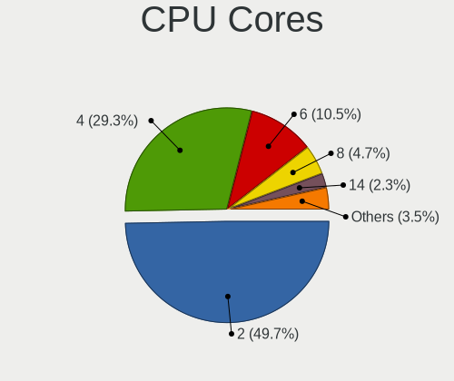

| Number | Notebooks | Percent |
|--------|-----------|---------|
| 2      | 146       | 56.15%  |
| 4      | 85        | 32.69%  |
| 6      | 21        | 8.08%   |
| 8      | 4         | 1.54%   |
| 1      | 3         | 1.15%   |
| 12     | 1         | 0.38%   |

CPU Sockets
-----------

Number of sockets

| Number | Notebooks | Percent |
|--------|-----------|---------|
| 1      | 260       | 100%    |

CPU Threads
-----------

Threads per core (Hyper-Threading)

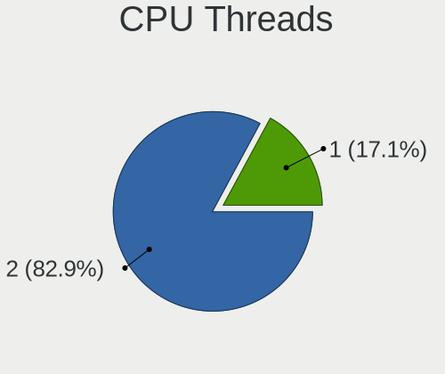

| Number | Notebooks | Percent |
|--------|-----------|---------|
| 2      | 214       | 82.31%  |
| 1      | 46        | 17.69%  |

CPU Op-Modes
------------

CPU Operation Modes (32-bit, 64-bit)

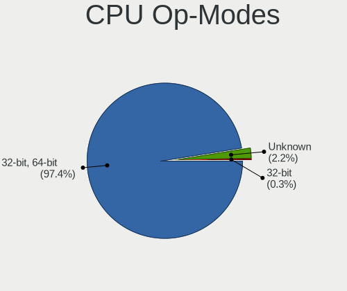

| Op mode        | Notebooks | Percent |
|----------------|-----------|---------|
| 32-bit, 64-bit | 253       | 96.93%  |
| Unknown        | 7         | 2.68%   |
| 32-bit         | 1         | 0.38%   |

CPU Microcode
-------------

Microcode number

| Number     | Notebooks | Percent |
|------------|-----------|---------|
| Unknown    | 57        | 21.27%  |
| 0x206a7    | 21        | 7.84%   |
| 0x40651    | 16        | 5.97%   |
| 0x806ea    | 14        | 5.22%   |
| 0x306c3    | 14        | 5.22%   |
| 0x306a9    | 14        | 5.22%   |
| 0x906ea    | 13        | 4.85%   |
| 0x806e9    | 13        | 4.85%   |
| 0x806ec    | 11        | 4.1%    |
| 0x306d4    | 11        | 4.1%    |
| 0x406e3    | 8         | 2.99%   |
| 0x906e9    | 7         | 2.61%   |
| 0xa0652    | 5         | 1.87%   |
| 0x20655    | 5         | 1.87%   |
| 0x1067a    | 5         | 1.87%   |
| 0x706e5    | 4         | 1.49%   |
| 0x6fd      | 4         | 1.49%   |
| 0x406c3    | 4         | 1.49%   |
| 0x30678    | 4         | 1.49%   |
| 0x06006704 | 4         | 1.49%   |
| 0x20652    | 3         | 1.12%   |
| 0x06006705 | 3         | 1.12%   |
| 0x0600111f | 3         | 1.12%   |
| 0x806eb    | 2         | 0.75%   |
| 0x506e3    | 2         | 0.75%   |
| 0x0600611a | 2         | 0.75%   |
| 0x906a3    | 1         | 0.37%   |
| 0x806c1    | 1         | 0.37%   |
| 0x706a1    | 1         | 0.37%   |
| 0x6e8      | 1         | 0.37%   |
| 0x506c9    | 1         | 0.37%   |
| 0x106e5    | 1         | 0.37%   |
| 0x106ca    | 1         | 0.37%   |
| 0x10676    | 1         | 0.37%   |
| 0x0a50000c | 1         | 0.37%   |
| 0x08600106 | 1         | 0.37%   |
| 0x08200103 | 1         | 0.37%   |
| 0x08108102 | 1         | 0.37%   |
| 0x08101016 | 1         | 0.37%   |
| 0x07030106 | 1         | 0.37%   |

CPU Microarch
-------------

Microarchitecture

| Name             | Notebooks | Percent |
|------------------|-----------|---------|
| KabyLake         | 77        | 29.62%  |
| Haswell          | 35        | 13.46%  |
| SandyBridge      | 24        | 9.23%   |
| IvyBridge        | 16        | 6.15%   |
| Broadwell        | 14        | 5.38%   |
| Skylake          | 13        | 5%      |
| Excavator        | 12        | 4.62%   |
| Westmere         | 11        | 4.23%   |
| Silvermont       | 9         | 3.46%   |
| CometLake        | 7         | 2.69%   |
| Penryn           | 6         | 2.31%   |
| Piledriver       | 5         | 1.92%   |
| IceLake          | 4         | 1.54%   |
| Core             | 4         | 1.54%   |
| Bobcat           | 3         | 1.15%   |
| Zen 2            | 2         | 0.77%   |
| Zen              | 2         | 0.77%   |
| TigerLake        | 2         | 0.77%   |
| Puma             | 2         | 0.77%   |
| K10              | 2         | 0.77%   |
| Zen+             | 1         | 0.38%   |
| Zen 3            | 1         | 0.38%   |
| Steamroller      | 1         | 0.38%   |
| P6               | 1         | 0.38%   |
| Nehalem          | 1         | 0.38%   |
| Goldmont plus    | 1         | 0.38%   |
| Goldmont         | 1         | 0.38%   |
| Bonnell          | 1         | 0.38%   |
| Alderlake Hybrid | 1         | 0.38%   |
| Unknown          | 1         | 0.38%   |

Graphics
--------

GPU Vendor
----------

Vendors of graphics cards

| Vendor           | Notebooks | Percent |
|------------------|-----------|---------|
| Intel            | 211       | 53.69%  |
| Nvidia           | 96        | 24.43%  |
| AMD              | 85        | 21.63%  |
| VIA Technologies | 1         | 0.25%   |

GPU Model
---------

Graphics card models

| Model                                                                                    | Notebooks | Percent |
|------------------------------------------------------------------------------------------|-----------|---------|
| Intel 2nd Generation Core Processor Family Integrated Graphics Controller                | 22        | 5.53%   |
| Intel UHD Graphics 620                                                                   | 19        | 4.77%   |
| Intel Haswell-ULT Integrated Graphics Controller                                         | 19        | 4.77%   |
| Intel CoffeeLake-H GT2 [UHD Graphics 630]                                                | 16        | 4.02%   |
| Intel 3rd Gen Core processor Graphics Controller                                         | 15        | 3.77%   |
| Nvidia GP107M [GeForce GTX 1050 Ti Mobile]                                               | 14        | 3.52%   |
| Intel HD Graphics 620                                                                    | 14        | 3.52%   |
| Intel HD Graphics 5500                                                                   | 13        | 3.27%   |
| AMD Topaz XT [Radeon R7 M260/M265 / M340/M360 / M440/M445 / 530/535 / 620/625 Mobile]    | 13        | 3.27%   |
| Intel 4th Gen Core Processor Integrated Graphics Controller                              | 12        | 3.02%   |
| Intel Skylake GT2 [HD Graphics 520]                                                      | 10        | 2.51%   |
| Nvidia GM108M [GeForce MX130]                                                            | 9         | 2.26%   |
| Intel WhiskeyLake-U GT2 [UHD Graphics 620]                                               | 9         | 2.26%   |
| Intel HD Graphics 630                                                                    | 9         | 2.26%   |
| Intel CometLake-U GT2 [UHD Graphics]                                                     | 9         | 2.26%   |
| Nvidia GP108M [GeForce MX150]                                                            | 8         | 2.01%   |
| AMD Stoney [Radeon R2/R3/R4/R5 Graphics]                                                 | 8         | 2.01%   |
| AMD Sun XT [Radeon HD 8670A/8670M/8690M / R5 M330 / M430 / Radeon 520 Mobile]            | 7         | 1.76%   |
| Nvidia TU117M [GeForce GTX 1650 Mobile / Max-Q]                                          | 6         | 1.51%   |
| Nvidia GF117M [GeForce 610M/710M/810M/820M / GT 620M/625M/630M/720M]                     | 6         | 1.51%   |
| Intel CometLake-H GT2 [UHD Graphics]                                                     | 6         | 1.51%   |
| Nvidia GK208M [GeForce GT 740M]                                                          | 5         | 1.26%   |
| Intel Core Processor Integrated Graphics Controller                                      | 5         | 1.26%   |
| Intel Atom/Celeron/Pentium Processor x5-E8000/J3xxx/N3xxx Integrated Graphics Controller | 5         | 1.26%   |
| Nvidia GM108M [GeForce 840M]                                                             | 4         | 1.01%   |
| Intel Mobile 4 Series Chipset Integrated Graphics Controller                             | 4         | 1.01%   |
| Intel Atom Processor Z36xxx/Z37xxx Series Graphics & Display                             | 4         | 1.01%   |
| AMD Whistler [Radeon HD 6730M/6770M/7690M XT]                                            | 4         | 1.01%   |
| AMD Wani [Radeon R5/R6/R7 Graphics]                                                      | 4         | 1.01%   |
| AMD Thames [Radeon HD 7500M/7600M Series]                                                | 4         | 1.01%   |
| Nvidia GP108M [GeForce MX230]                                                            | 3         | 0.75%   |
| Nvidia GP106M [GeForce GTX 1060 Mobile]                                                  | 3         | 0.75%   |
| Nvidia GM107M [GeForce GTX 960M]                                                         | 3         | 0.75%   |
| Intel Mobile GM965/GL960 Integrated Graphics Controller (secondary)                      | 3         | 0.75%   |
| Intel Mobile GM965/GL960 Integrated Graphics Controller (primary)                        | 3         | 0.75%   |
| Intel Iris Plus Graphics G7                                                              | 3         | 0.75%   |
| Intel HD Graphics 530                                                                    | 3         | 0.75%   |
| AMD Lexa [Radeon 540X/550X/630 / RX 640 / E9171 MCM]                                     | 3         | 0.75%   |
| AMD Lexa PRO [Radeon 540/540X/550/550X / RX 540X/550/550X]                               | 3         | 0.75%   |
| Nvidia TU117M                                                                            | 2         | 0.5%    |

GPU Combo
---------

Combinations of graphics cards

| Name           | Notebooks | Percent |
|----------------|-----------|---------|
| 1 x Intel      | 85        | 32.32%  |
| Intel + Nvidia | 84        | 31.94%  |
| Intel + AMD    | 45        | 17.11%  |
| 1 x AMD        | 35        | 13.31%  |
| 1 x Nvidia     | 8         | 3.04%   |
| AMD + Nvidia   | 3         | 1.14%   |
| 2 x AMD        | 2         | 0.76%   |
| 1 x VIA        | 1         | 0.38%   |

GPU Driver
----------

Free vs proprietary

| Driver      | Notebooks | Percent |
|-------------|-----------|---------|
| Free        | 211       | 79.62%  |
| Proprietary | 48        | 18.11%  |
| Unknown     | 6         | 2.26%   |

GPU Memory
----------

Total video memory

| Size in GB | Notebooks | Percent |
|------------|-----------|---------|
| Unknown    | 143       | 53.56%  |
| 1.01-2.0   | 47        | 17.6%   |
| 3.01-4.0   | 36        | 13.48%  |
| 0.01-0.5   | 19        | 7.12%   |
| 0.51-1.0   | 18        | 6.74%   |
| 5.01-6.0   | 3         | 1.12%   |
| 7.01-8.0   | 1         | 0.37%   |

Monitor
-------

Monitor Vendor
--------------

Monitor vendors

| Vendor                  | Notebooks | Percent |
|-------------------------|-----------|---------|
| LG Display              | 51        | 19.17%  |
| BOE                     | 50        | 18.8%   |
| AU Optronics            | 46        | 17.29%  |
| Chimei Innolux          | 43        | 16.17%  |
| Samsung Electronics     | 34        | 12.78%  |
| Chi Mei Optoelectronics | 12        | 4.51%   |
| Lenovo                  | 7         | 2.63%   |
| Dell                    | 6         | 2.26%   |
| Sharp                   | 4         | 1.5%    |
| InfoVision              | 3         | 1.13%   |
| Philips                 | 2         | 0.75%   |
| PANDA                   | 2         | 0.75%   |
| Unknown                 | 1         | 0.38%   |
| Panasonic               | 1         | 0.38%   |
| LG Philips              | 1         | 0.38%   |
| KDC                     | 1         | 0.38%   |
| CPT                     | 1         | 0.38%   |
| Apple                   | 1         | 0.38%   |

Monitor Model
-------------

Monitor models

| Model                                                                    | Notebooks | Percent |
|--------------------------------------------------------------------------|-----------|---------|
| AU Optronics LCD Monitor AUO38ED 1920x1080 344x193mm 15.5-inch           | 8         | 3%      |
| BOE LCD Monitor BOE06A5 1366x768 344x194mm 15.5-inch                     | 6         | 2.25%   |
| LG Display LCD Monitor LGD053F 1920x1080 344x194mm 15.5-inch             | 5         | 1.87%   |
| LG Display LCD Monitor LGD02E9 1366x768 309x174mm 14.0-inch              | 4         | 1.5%    |
| Lenovo LCD Monitor LEN40A0 1366x768 309x174mm 14.0-inch                  | 4         | 1.5%    |
| Chimei Innolux LCD Monitor CMN15DB 1366x768 344x193mm 15.5-inch          | 4         | 1.5%    |
| Chimei Innolux LCD Monitor CMN15AB 1366x768 344x194mm 15.5-inch          | 4         | 1.5%    |
| BOE LCD Monitor BOE07B0 1920x1080 344x194mm 15.5-inch                    | 4         | 1.5%    |
| BOE LCD Monitor BOE0687 1920x1080 344x193mm 15.5-inch                    | 4         | 1.5%    |
| AU Optronics LCD Monitor AUO81EC 1366x768 344x193mm 15.5-inch            | 4         | 1.5%    |
| Samsung Electronics LCD Monitor SEC3151 1366x768 344x194mm 15.5-inch     | 3         | 1.12%   |
| Samsung Electronics LCD Monitor SDC4852 1366x768 344x194mm 15.5-inch     | 3         | 1.12%   |
| LG Display LCD Monitor LGD0590 1920x1080 344x194mm 15.5-inch             | 3         | 1.12%   |
| Chimei Innolux LCD Monitor CMN15E6 1366x768 344x193mm 15.5-inch          | 3         | 1.12%   |
| Chimei Innolux LCD Monitor CMN15DC 1366x768 344x193mm 15.5-inch          | 3         | 1.12%   |
| Chimei Innolux LCD Monitor CMN1490 1366x768 309x173mm 13.9-inch          | 3         | 1.12%   |
| BOE LCD Monitor BOE0802 1920x1080 344x193mm 15.5-inch                    | 3         | 1.12%   |
| BOE LCD Monitor BOE06C6 1920x1080 344x194mm 15.5-inch                    | 3         | 1.12%   |
| AU Optronics LCD Monitor AUO71EC 1366x768 344x193mm 15.5-inch            | 3         | 1.12%   |
| AU Optronics LCD Monitor AUO45EC 1366x768 344x193mm 15.5-inch            | 3         | 1.12%   |
| AU Optronics LCD Monitor AUO22EC 1366x768 344x193mm 15.5-inch            | 3         | 1.12%   |
| Samsung Electronics LCD Monitor SEC3150 1366x768 344x193mm 15.5-inch     | 2         | 0.75%   |
| Samsung Electronics LCD Monitor SDC5344 1920x1080 344x194mm 15.5-inch    | 2         | 0.75%   |
| LG Display LCD Monitor LGD03AB 1366x768 344x194mm 15.5-inch              | 2         | 0.75%   |
| LG Display LCD Monitor LGD038E 1366x768 344x194mm 15.5-inch              | 2         | 0.75%   |
| Lenovo LCD Monitor LEN4035 1280x800 304x190mm 14.1-inch                  | 2         | 0.75%   |
| Chimei Innolux LCD Monitor CMN15E7 1920x1080 344x193mm 15.5-inch         | 2         | 0.75%   |
| Chimei Innolux LCD Monitor CMN15D5 1920x1080 344x193mm 15.5-inch         | 2         | 0.75%   |
| Chimei Innolux LCD Monitor CMN15C2 1920x1080 344x194mm 15.5-inch         | 2         | 0.75%   |
| Chi Mei Optoelectronics LCD Monitor CMO15A7 1366x768 344x193mm 15.5-inch | 2         | 0.75%   |
| Chi Mei Optoelectronics LCD Monitor CMO15A4 1366x768 344x194mm 15.5-inch | 2         | 0.75%   |
| BOE LCD Monitor BOE0826 1920x1080 344x193mm 15.5-inch                    | 2         | 0.75%   |
| BOE LCD Monitor BOE06FB 1920x1080 344x194mm 15.5-inch                    | 2         | 0.75%   |
| BOE LCD Monitor BOE06A9 1920x1080 344x193mm 15.5-inch                    | 2         | 0.75%   |
| BOE LCD Monitor BOE0615 1366x768 309x173mm 13.9-inch                     | 2         | 0.75%   |
| AU Optronics LCD Monitor AUO63ED 1920x1080 344x193mm 15.5-inch           | 2         | 0.75%   |
| AU Optronics LCD Monitor AUO46EC 1366x768 344x193mm 15.5-inch            | 2         | 0.75%   |
| Unknown LCD Monitor FFFF 2288x1287 2550x2550mm 142.0-inch                | 1         | 0.37%   |
| Sharp LQ156M1JW09 SHP14D3 1920x1080 344x194mm 15.5-inch                  | 1         | 0.37%   |
| Sharp LQ134N1JW53 SHP1521 1920x1200 288x180mm 13.4-inch                  | 1         | 0.37%   |

Monitor Resolution
------------------

Monitor screen resolution

| Resolution         | Notebooks | Percent |
|--------------------|-----------|---------|
| 1366x768 (WXGA)    | 133       | 50.57%  |
| 1920x1080 (FHD)    | 101       | 38.4%   |
| 1600x900 (HD+)     | 7         | 2.66%   |
| 1280x800 (WXGA)    | 6         | 2.28%   |
| 3840x2160 (4K)     | 5         | 1.9%    |
| 1440x900 (WXGA+)   | 4         | 1.52%   |
| 1680x1050 (WSXGA+) | 2         | 0.76%   |
| 3200x1800 (QHD+)   | 1         | 0.38%   |
| 2560x1440 (QHD)    | 1         | 0.38%   |
| 2288x1287          | 1         | 0.38%   |
| 1920x1200 (WUXGA)  | 1         | 0.38%   |
| 1024x600           | 1         | 0.38%   |

Monitor Diagonal
----------------

Diagonal size in inches

| Inches  | Notebooks | Percent |
|---------|-----------|---------|
| 15      | 178       | 66.92%  |
| 14      | 35        | 13.16%  |
| 13      | 16        | 6.02%   |
| 12      | 8         | 3.01%   |
| 17      | 7         | 2.63%   |
| 24      | 4         | 1.5%    |
| 18      | 3         | 1.13%   |
| 27      | 2         | 0.75%   |
| 22      | 2         | 0.75%   |
| 21      | 2         | 0.75%   |
| 19      | 2         | 0.75%   |
| 11      | 2         | 0.75%   |
| 142     | 1         | 0.38%   |
| 58      | 1         | 0.38%   |
| 23      | 1         | 0.38%   |
| 10      | 1         | 0.38%   |
| Unknown | 1         | 0.38%   |

Monitor Width
-------------

Physical width

| Width in mm    | Notebooks | Percent |
|----------------|-----------|---------|
| 301-350        | 224       | 84.85%  |
| 201-300        | 15        | 5.68%   |
| 401-500        | 8         | 3.03%   |
| 501-600        | 7         | 2.65%   |
| 351-400        | 7         | 2.65%   |
| More than 2000 | 1         | 0.38%   |
| 1001-1500      | 1         | 0.38%   |
| Unknown        | 1         | 0.38%   |

Aspect Ratio
------------

Proportional relationship between the width and the height

| Ratio   | Notebooks | Percent |
|---------|-----------|---------|
| 16/9    | 240       | 94.86%  |
| 16/10   | 11        | 4.35%   |
| 1.00    | 1         | 0.4%    |
| Unknown | 1         | 0.4%    |

Monitor Area
------------

Area in inch²

| Area in inch² | Notebooks | Percent |
|----------------|-----------|---------|
| 101-110        | 175       | 65.79%  |
| 81-90          | 46        | 17.29%  |
| 61-70          | 8         | 3.01%   |
| 201-250        | 8         | 3.01%   |
| 121-130        | 6         | 2.26%   |
| 71-80          | 4         | 1.5%    |
| 91-100         | 4         | 1.5%    |
| 151-200        | 3         | 1.13%   |
| More than 1000 | 2         | 0.75%   |
| 51-60          | 2         | 0.75%   |
| 301-350        | 2         | 0.75%   |
| 141-150        | 2         | 0.75%   |
| 41-50          | 1         | 0.38%   |
| 251-300        | 1         | 0.38%   |
| 131-140        | 1         | 0.38%   |
| Unknown        | 1         | 0.38%   |

Pixel Density
-------------

Pixels per inch

| Density       | Notebooks | Percent |
|---------------|-----------|---------|
| 101-120       | 123       | 46.95%  |
| 121-160       | 101       | 38.55%  |
| 51-100        | 28        | 10.69%  |
| 161-240       | 4         | 1.53%   |
| More than 240 | 3         | 1.15%   |
| 1-50          | 2         | 0.76%   |
| Unknown       | 1         | 0.38%   |

Multiple Monitors
-----------------

Total monitors connected

| Total | Notebooks | Percent |
|-------|-----------|---------|
| 1     | 242       | 92.02%  |
| 2     | 17        | 6.46%   |
| 0     | 3         | 1.14%   |
| 3     | 1         | 0.38%   |

Network
-------

Net Controller Vendor
---------------------

Controller vendors

| Vendor                            | Notebooks | Percent |
|-----------------------------------|-----------|---------|
| Realtek Semiconductor             | 187       | 42.02%  |
| Intel                             | 118       | 26.52%  |
| Qualcomm Atheros                  | 71        | 15.96%  |
| Broadcom                          | 33        | 7.42%   |
| Broadcom Limited                  | 7         | 1.57%   |
| Ralink                            | 6         | 1.35%   |
| Huawei Technologies               | 4         | 0.9%    |
| MediaTek                          | 3         | 0.67%   |
| TP-Link                           | 2         | 0.45%   |
| Samsung Electronics               | 2         | 0.45%   |
| Ralink Technology                 | 2         | 0.45%   |
| Marvell Technology Group          | 2         | 0.45%   |
| VIA Technologies                  | 1         | 0.22%   |
| Sierra Wireless                   | 1         | 0.22%   |
| Nvidia                            | 1         | 0.22%   |
| Hewlett-Packard                   | 1         | 0.22%   |
| Ericsson Business Mobile Networks | 1         | 0.22%   |
| Dell                              | 1         | 0.22%   |
| D-Link                            | 1         | 0.22%   |
| ASIX Electronics                  | 1         | 0.22%   |

Net Controller Model
--------------------

Controller models

| Model                                                             | Notebooks | Percent |
|-------------------------------------------------------------------|-----------|---------|
| Realtek RTL8111/8168/8411 PCI Express Gigabit Ethernet Controller | 110       | 21.44%  |
| Realtek RTL810xE PCI Express Fast Ethernet controller             | 70        | 13.65%  |
| Qualcomm Atheros QCA9377 802.11ac Wireless Network Adapter        | 26        | 5.07%   |
| Intel Cannon Lake PCH CNVi WiFi                                   | 13        | 2.53%   |
| Qualcomm Atheros QCA9565 / AR9565 Wireless Network Adapter        | 12        | 2.34%   |
| Intel Wireless 8265 / 8275                                        | 12        | 2.34%   |
| Qualcomm Atheros AR9285 Wireless Network Adapter (PCI-Express)    | 11        | 2.14%   |
| Broadcom BCM43142 802.11b/g/n                                     | 11        | 2.14%   |
| Realtek RTL8821CE 802.11ac PCIe Wireless Network Adapter          | 10        | 1.95%   |
| Realtek RTL8723BE PCIe Wireless Network Adapter                   | 10        | 1.95%   |
| Intel Wireless 7265                                               | 9         | 1.75%   |
| Intel Wireless 7260                                               | 9         | 1.75%   |
| Intel Comet Lake PCH-LP CNVi WiFi                                 | 9         | 1.75%   |
| Intel Wireless 8260                                               | 8         | 1.56%   |
| Broadcom BCM4313 802.11bgn Wireless Network Adapter               | 8         | 1.56%   |
| Qualcomm Atheros AR9485 Wireless Network Adapter                  | 7         | 1.36%   |
| Intel Comet Lake PCH CNVi WiFi                                    | 7         | 1.36%   |
| Intel Wireless 3160                                               | 6         | 1.17%   |
| Realtek RTL8822BE 802.11a/b/g/n/ac WiFi adapter                   | 5         | 0.97%   |
| Intel Ethernet Connection I217-LM                                 | 5         | 0.97%   |
| Intel Dual Band Wireless-AC 3165 Plus Bluetooth                   | 5         | 0.97%   |
| Intel 82579LM Gigabit Network Connection (Lewisville)             | 5         | 0.97%   |
| Ralink RT3290 Wireless 802.11n 1T/1R PCIe                         | 4         | 0.78%   |
| Intel Ethernet Connection I218-LM                                 | 4         | 0.78%   |
| Intel Centrino Wireless-N 1000 [Condor Peak]                      | 4         | 0.78%   |
| Broadcom BCM43228 802.11a/b/g/n                                   | 4         | 0.78%   |
| Qualcomm Atheros Killer E2400 Gigabit Ethernet Controller         | 3         | 0.58%   |
| Intel PRODUCT_MODEM                                               | 3         | 0.58%   |
| Intel Ethernet Connection I219-LM                                 | 3         | 0.58%   |
| Intel Ethernet Connection (4) I219-LM                             | 3         | 0.58%   |
| Intel Ethernet Connection (2) I219-LM                             | 3         | 0.58%   |
| Intel Dual Band Wireless-AC 3168NGW [Stone Peak]                  | 3         | 0.58%   |
| Intel Centrino Wireless-N 1030 [Rainbow Peak]                     | 3         | 0.58%   |
| Intel Centrino Advanced-N 6235                                    | 3         | 0.58%   |
| Intel 82577LM Gigabit Network Connection                          | 3         | 0.58%   |
| Broadcom NetXtreme BCM5762 Gigabit Ethernet PCIe                  | 3         | 0.58%   |
| Broadcom Limited BCM4312 802.11b/g LP-PHY                         | 3         | 0.58%   |
| Samsung GT-I9070 (network tethering, USB debugging enabled)       | 2         | 0.39%   |
| Realtek RTL8822CE 802.11ac PCIe Wireless Network Adapter          | 2         | 0.39%   |
| Realtek RTL8821AE 802.11ac PCIe Wireless Network Adapter          | 2         | 0.39%   |

Wireless Vendor
---------------

Wireless vendors

| Vendor                | Notebooks | Percent |
|-----------------------|-----------|---------|
| Intel                 | 113       | 42.64%  |
| Qualcomm Atheros      | 63        | 23.77%  |
| Realtek Semiconductor | 40        | 15.09%  |
| Broadcom              | 29        | 10.94%  |
| Ralink                | 6         | 2.26%   |
| Broadcom Limited      | 6         | 2.26%   |
| Ralink Technology     | 2         | 0.75%   |
| MediaTek              | 2         | 0.75%   |
| TP-Link               | 1         | 0.38%   |
| Sierra Wireless       | 1         | 0.38%   |
| Dell                  | 1         | 0.38%   |
| D-Link                | 1         | 0.38%   |

Wireless Model
--------------

Wireless models

| Model                                                          | Notebooks | Percent |
|----------------------------------------------------------------|-----------|---------|
| Qualcomm Atheros QCA9377 802.11ac Wireless Network Adapter     | 26        | 9.77%   |
| Intel Cannon Lake PCH CNVi WiFi                                | 13        | 4.89%   |
| Qualcomm Atheros QCA9565 / AR9565 Wireless Network Adapter     | 12        | 4.51%   |
| Intel Wireless 8265 / 8275                                     | 12        | 4.51%   |
| Qualcomm Atheros AR9285 Wireless Network Adapter (PCI-Express) | 11        | 4.14%   |
| Broadcom BCM43142 802.11b/g/n                                  | 11        | 4.14%   |
| Realtek RTL8821CE 802.11ac PCIe Wireless Network Adapter       | 10        | 3.76%   |
| Realtek RTL8723BE PCIe Wireless Network Adapter                | 10        | 3.76%   |
| Intel Wireless 7265                                            | 9         | 3.38%   |
| Intel Wireless 7260                                            | 9         | 3.38%   |
| Intel Comet Lake PCH-LP CNVi WiFi                              | 9         | 3.38%   |
| Intel Wireless 8260                                            | 8         | 3.01%   |
| Broadcom BCM4313 802.11bgn Wireless Network Adapter            | 8         | 3.01%   |
| Qualcomm Atheros AR9485 Wireless Network Adapter               | 7         | 2.63%   |
| Intel Comet Lake PCH CNVi WiFi                                 | 7         | 2.63%   |
| Intel Wireless 3160                                            | 6         | 2.26%   |
| Realtek RTL8822BE 802.11a/b/g/n/ac WiFi adapter                | 5         | 1.88%   |
| Intel Dual Band Wireless-AC 3165 Plus Bluetooth                | 5         | 1.88%   |
| Ralink RT3290 Wireless 802.11n 1T/1R PCIe                      | 4         | 1.5%    |
| Intel Centrino Wireless-N 1000 [Condor Peak]                   | 4         | 1.5%    |
| Broadcom BCM43228 802.11a/b/g/n                                | 4         | 1.5%    |
| Intel PRODUCT_MODEM                                            | 3         | 1.13%   |
| Intel Dual Band Wireless-AC 3168NGW [Stone Peak]               | 3         | 1.13%   |
| Intel Centrino Wireless-N 1030 [Rainbow Peak]                  | 3         | 1.13%   |
| Intel Centrino Advanced-N 6235                                 | 3         | 1.13%   |
| Broadcom Limited BCM4312 802.11b/g LP-PHY                      | 3         | 1.13%   |
| Realtek RTL8822CE 802.11ac PCIe Wireless Network Adapter       | 2         | 0.75%   |
| Realtek RTL8821AE 802.11ac PCIe Wireless Network Adapter       | 2         | 0.75%   |
| Realtek RTL8723DE Wireless Network Adapter                     | 2         | 0.75%   |
| Realtek RTL8723AE PCIe Wireless Network Adapter                | 2         | 0.75%   |
| Realtek 802.11n                                                | 2         | 0.75%   |
| Ralink RT5370 Wireless Adapter                                 | 2         | 0.75%   |
| Ralink RT5390 Wireless 802.11n 1T/1R PCIe                      | 2         | 0.75%   |
| Qualcomm Atheros QCA6174 802.11ac Wireless Network Adapter     | 2         | 0.75%   |
| Intel Wireless 3165                                            | 2         | 0.75%   |
| Intel Wi-Fi 6 AX201                                            | 2         | 0.75%   |
| Intel Centrino Wireless-N 2230                                 | 2         | 0.75%   |
| Intel Centrino Advanced-N 6205 [Taylor Peak]                   | 2         | 0.75%   |
| Intel Centrino Advanced-N 6200                                 | 2         | 0.75%   |
| Intel Cannon Point-LP CNVi [Wireless-AC]                       | 2         | 0.75%   |

Ethernet Vendor
---------------

Ethernet vendors

| Vendor                   | Notebooks | Percent |
|--------------------------|-----------|---------|
| Realtek Semiconductor    | 180       | 74.07%  |
| Intel                    | 34        | 13.99%  |
| Qualcomm Atheros         | 12        | 4.94%   |
| Broadcom                 | 5         | 2.06%   |
| Samsung Electronics      | 2         | 0.82%   |
| Marvell Technology Group | 2         | 0.82%   |
| Huawei Technologies      | 2         | 0.82%   |
| VIA Technologies         | 1         | 0.41%   |
| TP-Link                  | 1         | 0.41%   |
| Nvidia                   | 1         | 0.41%   |
| MediaTek                 | 1         | 0.41%   |
| Broadcom Limited         | 1         | 0.41%   |
| ASIX Electronics         | 1         | 0.41%   |

Ethernet Model
--------------

Ethernet models

| Model                                                             | Notebooks | Percent |
|-------------------------------------------------------------------|-----------|---------|
| Realtek RTL8111/8168/8411 PCI Express Gigabit Ethernet Controller | 110       | 45.27%  |
| Realtek RTL810xE PCI Express Fast Ethernet controller             | 70        | 28.81%  |
| Intel Ethernet Connection I217-LM                                 | 5         | 2.06%   |
| Intel 82579LM Gigabit Network Connection (Lewisville)             | 5         | 2.06%   |
| Intel Ethernet Connection I218-LM                                 | 4         | 1.65%   |
| Qualcomm Atheros Killer E2400 Gigabit Ethernet Controller         | 3         | 1.23%   |
| Intel Ethernet Connection I219-LM                                 | 3         | 1.23%   |
| Intel Ethernet Connection (4) I219-LM                             | 3         | 1.23%   |
| Intel Ethernet Connection (2) I219-LM                             | 3         | 1.23%   |
| Intel 82577LM Gigabit Network Connection                          | 3         | 1.23%   |
| Broadcom NetXtreme BCM5762 Gigabit Ethernet PCIe                  | 3         | 1.23%   |
| Samsung GT-I9070 (network tethering, USB debugging enabled)       | 2         | 0.82%   |
| Qualcomm Atheros QCA8171 Gigabit Ethernet                         | 2         | 0.82%   |
| Qualcomm Atheros AR8132 Fast Ethernet                             | 2         | 0.82%   |
| Marvell Group 88E8040 PCI-E Fast Ethernet Controller              | 2         | 0.82%   |
| Intel Ethernet Connection (3) I218-LM                             | 2         | 0.82%   |
| Intel 82579V Gigabit Network Connection                           | 2         | 0.82%   |
| VIA VT6102/VT6103 [Rhine-II]                                      | 1         | 0.41%   |
| TP-Link UE300 10/100/1000 LAN (ethernet mode) [Realtek RTL8153]   | 1         | 0.41%   |
| Qualcomm Atheros QCA8172 Fast Ethernet                            | 1         | 0.41%   |
| Qualcomm Atheros Killer E2500 Gigabit Ethernet Controller         | 1         | 0.41%   |
| Qualcomm Atheros Killer E220x Gigabit Ethernet Controller         | 1         | 0.41%   |
| Qualcomm Atheros AR8151 v2.0 Gigabit Ethernet                     | 1         | 0.41%   |
| Qualcomm Atheros AR8151 v1.0 Gigabit Ethernet                     | 1         | 0.41%   |
| Nvidia MCP79 Ethernet                                             | 1         | 0.41%   |
| MediaTek N152DL                                                   | 1         | 0.41%   |
| Intel Ethernet Connection (4) I219-V                              | 1         | 0.41%   |
| Intel Ethernet Connection (13) I219-V                             | 1         | 0.41%   |
| Intel 82567LM Gigabit Network Connection                          | 1         | 0.41%   |
| Intel 82566MM Gigabit Network Connection                          | 1         | 0.41%   |
| Huawei SNE-LX1                                                    | 1         | 0.41%   |
| Huawei E353/E3131                                                 | 1         | 0.41%   |
| Broadcom NetXtreme BCM5755M Gigabit Ethernet PCI Express          | 1         | 0.41%   |
| Broadcom NetLink BCM57780 Gigabit Ethernet PCIe                   | 1         | 0.41%   |
| Broadcom Limited NetXtreme BCM5762 Gigabit Ethernet PCIe          | 1         | 0.41%   |
| ASIX AX88772B                                                     | 1         | 0.41%   |

Net Controller Kind
-------------------

Ethernet, WiFi or modem

| Kind     | Notebooks | Percent |
|----------|-----------|---------|
| WiFi     | 256       | 51.51%  |
| Ethernet | 237       | 47.69%  |
| Modem    | 4         | 0.8%    |

Used Controller
---------------

Currently used network controller

| Kind     | Notebooks | Percent |
|----------|-----------|---------|
| WiFi     | 217       | 82.2%   |
| Ethernet | 47        | 17.8%   |

NICs
----

Total network controllers on board

| Total | Notebooks | Percent |
|-------|-----------|---------|
| 2     | 230       | 88.46%  |
| 1     | 23        | 8.85%   |
| 0     | 5         | 1.92%   |
| 3     | 2         | 0.77%   |

IPv6
----

IPv6 vs IPv4

| Used | Notebooks | Percent |
|------|-----------|---------|
| No   | 260       | 99.62%  |
| Yes  | 1         | 0.38%   |

Bluetooth
---------

Bluetooth Vendor
----------------

Controller vendors

| Vendor                          | Notebooks | Percent |
|---------------------------------|-----------|---------|
| Intel                           | 91        | 42.52%  |
| Qualcomm Atheros Communications | 39        | 18.22%  |
| Realtek Semiconductor           | 27        | 12.62%  |
| Broadcom                        | 21        | 9.81%   |
| Foxconn / Hon Hai               | 7         | 3.27%   |
| Lite-On Technology              | 6         | 2.8%    |
| Toshiba                         | 5         | 2.34%   |
| Ralink                          | 4         | 1.87%   |
| IMC Networks                    | 4         | 1.87%   |
| Dell                            | 3         | 1.4%    |
| Cambridge Silicon Radio         | 3         | 1.4%    |
| Hewlett-Packard                 | 2         | 0.93%   |
| MediaTek                        | 1         | 0.47%   |
| Apple                           | 1         | 0.47%   |

Bluetooth Model
---------------

Controller models

| Model                                               | Notebooks | Percent |
|-----------------------------------------------------|-----------|---------|
| Intel Bluetooth wireless interface                  | 47        | 21.96%  |
| Qualcomm Atheros  Bluetooth Device                  | 25        | 11.68%  |
| Realtek Bluetooth Radio                             | 17        | 7.94%   |
| Intel Bluetooth 9460/9560 Jefferson Peak (JfP)      | 17        | 7.94%   |
| Intel AX201 Bluetooth                               | 15        | 7.01%   |
| Realtek  Bluetooth 4.2 Adapter                      | 5         | 2.34%   |
| Qualcomm Atheros AR3011 Bluetooth                   | 5         | 2.34%   |
| Broadcom BCM43142 Bluetooth 4.0                     | 5         | 2.34%   |
| Ralink RT3290 Bluetooth                             | 4         | 1.87%   |
| Qualcomm Atheros AR9462 Bluetooth                   | 4         | 1.87%   |
| Intel Centrino Bluetooth Wireless Transceiver       | 4         | 1.87%   |
| Broadcom HP Portable Bumble Bee                     | 4         | 1.87%   |
| Realtek RTL8723B Bluetooth                          | 3         | 1.4%    |
| Qualcomm Atheros AR3012 Bluetooth 4.0               | 3         | 1.4%    |
| Lite-On Qualcomm Atheros QCA9377 Bluetooth          | 3         | 1.4%    |
| Lite-On Bluetooth Device                            | 3         | 1.4%    |
| Intel Wireless-AC 3168 Bluetooth                    | 3         | 1.4%    |
| Intel Centrino Advanced-N 6230 Bluetooth adapter    | 3         | 1.4%    |
| Dell Wireless 365 Bluetooth                         | 3         | 1.4%    |
| Cambridge Silicon Radio Bluetooth Dongle (HCI mode) | 3         | 1.4%    |
| Broadcom BCM2045B (BDC-2.1)                         | 3         | 1.4%    |
| Realtek RTL8821A Bluetooth                          | 2         | 0.93%   |
| Qualcomm Atheros Bluetooth USB Host Controller      | 2         | 0.93%   |
| IMC Networks Bluetooth Radio                        | 2         | 0.93%   |
| HP Broadcom 2070 Bluetooth Combo                    | 2         | 0.93%   |
| Foxconn / Hon Hai Bluetooth Device                  | 2         | 0.93%   |
| Foxconn / Hon Hai BCM20702A0                        | 2         | 0.93%   |
| Broadcom HP Portable SoftSailing                    | 2         | 0.93%   |
| Broadcom BCM43142A0 Bluetooth Device                | 2         | 0.93%   |
| Broadcom BCM43142A0 Bluetooth 4.0                   | 2         | 0.93%   |
| Broadcom BCM2070 Bluetooth 2.1 + EDR                | 2         | 0.93%   |
| Toshiba RT Bluetooth Radio                          | 1         | 0.47%   |
| Toshiba Integrated Bluetooth HCI                    | 1         | 0.47%   |
| Toshiba Bluetooth USB Host Controller               | 1         | 0.47%   |
| Toshiba Bluetooth Device                            | 1         | 0.47%   |
| Toshiba Askey Bluetooth Module                      | 1         | 0.47%   |
| MediaTek MT7630e Bluetooth Adapter                  | 1         | 0.47%   |
| Intel Bluetooth Device                              | 1         | 0.47%   |
| Intel AX200 Bluetooth                               | 1         | 0.47%   |
| IMC Networks Bluetooth Device                       | 1         | 0.47%   |

Sound
-----

Sound Vendor
------------

Sound card vendors

| Vendor            | Notebooks | Percent |
|-------------------|-----------|---------|
| Intel             | 220       | 72.37%  |
| Nvidia            | 41        | 13.49%  |
| AMD               | 40        | 13.16%  |
| VIA Technologies  | 1         | 0.33%   |
| Texas Instruments | 1         | 0.33%   |
| Logitech          | 1         | 0.33%   |

Sound Model
-----------

Sound card models

| Model                                                                      | Notebooks | Percent |
|----------------------------------------------------------------------------|-----------|---------|
| Intel Sunrise Point-LP HD Audio                                            | 43        | 11.41%  |
| Intel 6 Series/C200 Series Chipset Family High Definition Audio Controller | 22        | 5.84%   |
| Intel 8 Series HD Audio Controller                                         | 21        | 5.57%   |
| Intel Haswell-ULT HD Audio Controller                                      | 19        | 5.04%   |
| Intel 7 Series/C216 Chipset Family High Definition Audio Controller        | 18        | 4.77%   |
| Intel Cannon Lake PCH cAVS                                                 | 17        | 4.51%   |
| Intel Wildcat Point-LP High Definition Audio Controller                    | 14        | 3.71%   |
| Intel Broadwell-U Audio Controller                                         | 14        | 3.71%   |
| Intel 8 Series/C220 Series Chipset High Definition Audio Controller        | 14        | 3.71%   |
| Intel 5 Series/3400 Series Chipset High Definition Audio                   | 12        | 3.18%   |
| AMD Family 15h (Models 60h-6fh) Audio Controller                           | 12        | 3.18%   |
| Intel Xeon E3-1200 v3/4th Gen Core Processor HD Audio Controller           | 11        | 2.92%   |
| AMD FCH Azalia Controller                                                  | 10        | 2.65%   |
| Nvidia TU107 GeForce GTX 1650 High Definition Audio Controller             | 9         | 2.39%   |
| Nvidia GP107GL High Definition Audio Controller                            | 9         | 2.39%   |
| Intel Comet Lake PCH-LP cAVS                                               | 9         | 2.39%   |
| Intel CM238 HD Audio Controller                                            | 9         | 2.39%   |
| Intel Cannon Point-LP High Definition Audio Controller                     | 9         | 2.39%   |
| AMD High Definition Audio Controller                                       | 8         | 2.12%   |
| Intel Comet Lake PCH cAVS                                                  | 7         | 1.86%   |
| AMD Family 17h/19h HD Audio Controller                                     | 7         | 1.86%   |
| AMD Kabini HDMI/DP Audio                                                   | 6         | 1.59%   |
| Intel 82801I (ICH9 Family) HD Audio Controller                             | 5         | 1.33%   |
| AMD Trinity HDMI Audio Controller                                          | 5         | 1.33%   |
| Intel Ice Lake-LP Smart Sound Technology Audio Controller                  | 4         | 1.06%   |
| Intel 82801H (ICH8 Family) HD Audio Controller                             | 4         | 1.06%   |
| Nvidia GK107 HDMI Audio Controller                                         | 3         | 0.8%    |
| Intel 100 Series/C230 Series Chipset Family HD Audio Controller            | 3         | 0.8%    |
| AMD Wrestler HDMI Audio                                                    | 3         | 0.8%    |
| AMD SBx00 Azalia (Intel HDA)                                               | 3         | 0.8%    |
| AMD Raven/Raven2/Fenghuang HDMI/DP Audio Controller                        | 3         | 0.8%    |
| Nvidia TU116 High Definition Audio Controller                              | 2         | 0.53%   |
| Nvidia TU106 High Definition Audio Controller                              | 2         | 0.53%   |
| Nvidia GP106 High Definition Audio Controller                              | 2         | 0.53%   |
| Nvidia GM107 High Definition Audio Controller [GeForce 940MX]              | 2         | 0.53%   |
| Nvidia GF108 High Definition Audio Controller                              | 2         | 0.53%   |
| Intel Tiger Lake-LP Smart Sound Technology Audio Controller                | 2         | 0.53%   |
| Intel Atom Processor Z36xxx/Z37xxx Series High Definition Audio Controller | 2         | 0.53%   |
| AMD Turks HDMI Audio [Radeon HD 6500/6600 / 6700M Series]                  | 2         | 0.53%   |
| AMD Redwood HDMI Audio [Radeon HD 5000 Series]                             | 2         | 0.53%   |

Memory
------

Memory Vendor
-------------

Memory module vendors

| Vendor              | Notebooks | Percent |
|---------------------|-----------|---------|
| SK hynix            | 49        | 33.79%  |
| Samsung Electronics | 41        | 28.28%  |
| Micron Technology   | 16        | 11.03%  |
| Ramaxel Technology  | 9         | 6.21%   |
| Kingston            | 8         | 5.52%   |
| Crucial             | 7         | 4.83%   |
| Unknown             | 4         | 2.76%   |
| Nanya Technology    | 3         | 2.07%   |
| Team                | 2         | 1.38%   |
| Unknown             | 2         | 1.38%   |
| Unknown (ABCD)      | 1         | 0.69%   |
| G.Skill             | 1         | 0.69%   |
| Elpida              | 1         | 0.69%   |
| Axiom               | 1         | 0.69%   |

Memory Model
------------

Memory module models

| Model                                                            | Notebooks | Percent |
|------------------------------------------------------------------|-----------|---------|
| SK hynix RAM HMA81GS6AFR8N-UH 8GB SODIMM DDR4 2667MT/s           | 7         | 4.73%   |
| Samsung RAM M471A5244CB0-CRC 4GB SODIMM DDR4 2667MT/s            | 5         | 3.38%   |
| SK hynix RAM HMT451S6BFR8A-PB 4GB SODIMM DDR3 1600MT/s           | 3         | 2.03%   |
| SK hynix RAM HMT425S6AFR6A-PB 2GB SODIMM DDR3 1600MT/s           | 3         | 2.03%   |
| SK hynix RAM HMAA1GS6CJR6N-XN 8GB SODIMM DDR4 3200MT/s           | 3         | 2.03%   |
| SK hynix RAM HMA81GS6JJR8N-VK 8GB SODIMM DDR4 2667MT/s           | 3         | 2.03%   |
| Samsung RAM M471B1G73DB0-YK0 8GB SODIMM DDR3 1600MT/s            | 3         | 2.03%   |
| Samsung RAM M471A2K43DB1-CTD 16GB SODIMM DDR4 2667MT/s           | 3         | 2.03%   |
| Micron RAM 16JSF51264HZ-1G4D1 4096MB SODIMM DDR3 1334MT/s        | 3         | 2.03%   |
| SK hynix RAM HMT41GS6BFR8A-PB 8GB SODIMM DDR3 1600MT/s           | 2         | 1.35%   |
| SK hynix RAM HMT41GS6AFR8A-PB 8GB SODIMM DDR3 1600MT/s           | 2         | 1.35%   |
| SK hynix RAM HMA41GS6AFR8N-TF 8GB SODIMM DDR4 2667MT/s           | 2         | 1.35%   |
| Samsung RAM M471B5773DH0-CH9 2GB SODIMM DDR3 1600MT/s            | 2         | 1.35%   |
| Samsung RAM M471B5273DH0-CK0 4GB SODIMM DDR3 1600MT/s            | 2         | 1.35%   |
| Samsung RAM M471A2K43CB1-CTD 16GB SODIMM DDR4 8400MT/s           | 2         | 1.35%   |
| Samsung RAM M471A2K43CB1-CRC 16GB SODIMM DDR4 2667MT/s           | 2         | 1.35%   |
| Samsung RAM M471A1K43DB1-CTD 8GB SODIMM DDR4 2667MT/s            | 2         | 1.35%   |
| Samsung RAM M471A1K43CB1-CRC 8GB SODIMM DDR4 2667MT/s            | 2         | 1.35%   |
| Samsung RAM M471A1K43BB1-CRC 8GB SODIMM DDR4 2667MT/s            | 2         | 1.35%   |
| Ramaxel RAM RMSA3260NA78HAF-2400 8GB SODIMM DDR4 2400MT/s        | 2         | 1.35%   |
| Nanya RAM NT2GC64B88B0NS-CG 2GB SODIMM DDR3 1334MT/s             | 2         | 1.35%   |
| Micron RAM 4ATF51264HZ-2G6E1 4GB SODIMM DDR4 2667MT/s            | 2         | 1.35%   |
| Unknown                                                          | 2         | 1.35%   |
| Unknown RAM Module 8GB SODIMM DDR3 1600MT/s                      | 1         | 0.68%   |
| Unknown RAM Module 8GB SODIMM DDR3                               | 1         | 0.68%   |
| Unknown RAM Module 2GB SODIMM DDR3 1333MT/s                      | 1         | 0.68%   |
| Unknown RAM Module 2048MB SODIMM DDR3 1600MT/s                   | 1         | 0.68%   |
| Unknown (ABCD) RAM 123456789012345678 2GB SODIMM LPDDR4 2400MT/s | 1         | 0.68%   |
| Team RAM TEAMGROUP-SD3-1600 4GB SODIMM DDR3 1600MT/s             | 1         | 0.68%   |
| Team RAM Elite-1600 4GB SODIMM DDR3 1600MT/s                     | 1         | 0.68%   |
| SK hynix RAM Module 8GB SODIMM DDR4 3200MT/s                     | 1         | 0.68%   |
| SK hynix RAM Module 8GB SODIMM DDR3 1600MT/s                     | 1         | 0.68%   |
| SK hynix RAM Module 8192MB SODIMM DDR4 3200MT/s                  | 1         | 0.68%   |
| SK hynix RAM Module 8192MB SODIMM DDR4 2667MT/s                  | 1         | 0.68%   |
| SK hynix RAM Module 4GB DIMM DDR3 1600MT/s                       | 1         | 0.68%   |
| SK hynix RAM Module 2048MB SODIMM DDR3 1600MT/s                  | 1         | 0.68%   |
| SK hynix RAM Module 16GB SODIMM DDR4 2133MT/s                    | 1         | 0.68%   |
| SK hynix RAM Module 16384MB SODIMM DDR4 2133MT/s                 | 1         | 0.68%   |
| SK hynix RAM HMT451S6MFR8A-PB 4GB SODIMM DDR3 1600MT/s           | 1         | 0.68%   |
| SK hynix RAM HMT425S2AFR6R-PB 2GB SODIMM DDR3 1333MT/s           | 1         | 0.68%   |

Memory Kind
-----------

Memory module kinds

| Kind   | Notebooks | Percent |
|--------|-----------|---------|
| DDR4   | 65        | 56.52%  |
| DDR3   | 44        | 38.26%  |
| LPDDR4 | 2         | 1.74%   |
| SDRAM  | 1         | 0.87%   |
| LPDDR5 | 1         | 0.87%   |
| DDR2   | 1         | 0.87%   |
| DDR    | 1         | 0.87%   |

Memory Form Factor
------------------

Physical design of the memory module

| Name         | Notebooks | Percent |
|--------------|-----------|---------|
| SODIMM       | 110       | 98.21%  |
| Row Of Chips | 1         | 0.89%   |
| DIMM         | 1         | 0.89%   |

Memory Size
-----------

Memory module size

| Size  | Notebooks | Percent |
|-------|-----------|---------|
| 8192  | 46        | 35.11%  |
| 4096  | 42        | 32.06%  |
| 16384 | 28        | 21.37%  |
| 2048  | 13        | 9.92%   |
| 1024  | 1         | 0.76%   |
| 512   | 1         | 0.76%   |

Memory Speed
------------

Memory module speed

| Speed   | Notebooks | Percent |
|---------|-----------|---------|
| 2667    | 43        | 34.4%   |
| 1600    | 34        | 27.2%   |
| 2400    | 10        | 8%      |
| 1334    | 10        | 8%      |
| 3200    | 9         | 7.2%    |
| 2133    | 6         | 4.8%    |
| 1333    | 3         | 2.4%    |
| 8400    | 2         | 1.6%    |
| 1866    | 2         | 1.6%    |
| 6400    | 1         | 0.8%    |
| 4199    | 1         | 0.8%    |
| 3266    | 1         | 0.8%    |
| 800     | 1         | 0.8%    |
| 667     | 1         | 0.8%    |
| Unknown | 1         | 0.8%    |

Printers & scanners
-------------------

Printer Vendor
--------------

Printer device vendors

| Vendor          | Notebooks | Percent |
|-----------------|-----------|---------|
| Hewlett-Packard | 2         | 100%    |

Printer Model
-------------

Printer device models

| Model            | Notebooks | Percent |
|------------------|-----------|---------|
| HP LaserJet 1018 | 1         | 50%     |
| HP Deskjet 1510  | 1         | 50%     |

Scanner Vendor
--------------

Scanner device vendors

Zero info for selected period =(

Scanner Model
-------------

Scanner device models

Zero info for selected period =(

Camera
------

Camera Vendor
-------------

Camera device vendors

| Vendor                                 | Notebooks | Percent |
|----------------------------------------|-----------|---------|
| Chicony Electronics                    | 57        | 24.26%  |
| Microdia                               | 32        | 13.62%  |
| Realtek Semiconductor                  | 28        | 11.91%  |
| Cheng Uei Precision Industry (Foxlink) | 25        | 10.64%  |
| IMC Networks                           | 19        | 8.09%   |
| Acer                                   | 18        | 7.66%   |
| Sunplus Innovation Technology          | 17        | 7.23%   |
| Lite-On Technology                     | 9         | 3.83%   |
| Suyin                                  | 6         | 2.55%   |
| Silicon Motion                         | 5         | 2.13%   |
| Quanta                                 | 5         | 2.13%   |
| Syntek                                 | 3         | 1.28%   |
| Apple                                  | 3         | 1.28%   |
| Lenovo                                 | 2         | 0.85%   |
| Sonix Technology                       | 1         | 0.43%   |
| OmniVision Technologies                | 1         | 0.43%   |
| MacroSilicon                           | 1         | 0.43%   |
| Luxvisions Innotech Limited            | 1         | 0.43%   |
| Intel                                  | 1         | 0.43%   |
| ALi                                    | 1         | 0.43%   |

Camera Model
------------

Camera device models

| Model                                                                      | Notebooks | Percent |
|----------------------------------------------------------------------------|-----------|---------|
| Microdia Integrated_Webcam_HD                                              | 16        | 6.75%   |
| Realtek Integrated_Webcam_HD                                               | 14        | 5.91%   |
| Chicony EasyCamera                                                         | 9         | 3.8%    |
| Cheng Uei Precision Industry (Foxlink) HP HD Webcam                        | 7         | 2.95%   |
| IMC Networks USB2.0 VGA UVC WebCam                                         | 6         | 2.53%   |
| IMC Networks Integrated Camera                                             | 6         | 2.53%   |
| Chicony Integrated Camera                                                  | 6         | 2.53%   |
| Acer Lenovo EasyCamera                                                     | 6         | 2.53%   |
| Sunplus Integrated_Webcam_HD                                               | 5         | 2.11%   |
| Cheng Uei Precision Industry (Foxlink) HP HD Camera                        | 5         | 2.11%   |
| Realtek Integrated Webcam                                                  | 4         | 1.69%   |
| Microdia Dell Laptop Integrated Webcam HD                                  | 4         | 1.69%   |
| Chicony HP Truevision HD camera                                            | 4         | 1.69%   |
| Chicony HP HD Webcam                                                       | 4         | 1.69%   |
| Chicony HP HD Camera                                                       | 4         | 1.69%   |
| Cheng Uei Precision Industry (Foxlink) HP Wide Vision HD Integrated Webcam | 4         | 1.69%   |
| Cheng Uei Precision Industry (Foxlink) HP Webcam                           | 4         | 1.69%   |
| Acer HP TrueVision HD Webcam                                               | 4         | 1.69%   |
| Sunplus Dell HD Webcam                                                     | 3         | 1.27%   |
| Realtek Integrated Webcam HD                                               | 3         | 1.27%   |
| Microdia Laptop_Integrated_Webcam_HD                                       | 3         | 1.27%   |
| Lite-On HP HD Webcam                                                       | 3         | 1.27%   |
| Lite-On HP HD Camera                                                       | 3         | 1.27%   |
| IMC Networks EasyCamera                                                    | 3         | 1.27%   |
| Chicony USB2.0 VGA UVC WebCam                                              | 3         | 1.27%   |
| Chicony USB 2.0 Camera                                                     | 3         | 1.27%   |
| Syntek Integrated Camera                                                   | 2         | 0.84%   |
| Suyin HP Truevision HD                                                     | 2         | 0.84%   |
| Sunplus HP Universal Camera                                                | 2         | 0.84%   |
| Sunplus HP HD Webcam [Fixed]                                               | 2         | 0.84%   |
| Silicon Motion WebCam SC-03M12736N                                         | 2         | 0.84%   |
| Realtek Lenovo easy camera                                                 | 2         | 0.84%   |
| Quanta HP Webcam                                                           | 2         | 0.84%   |
| Microdia Laptop_Integrated_Webcam_1.3M                                     | 2         | 0.84%   |
| Microdia 1.3 MPixel Integrated Webcam                                      | 2         | 0.84%   |
| Lite-On Integrated Camera                                                  | 2         | 0.84%   |
| Lenovo Integrated Webcam [R5U877]                                          | 2         | 0.84%   |
| IMC Networks USB2.0 HD UVC WebCam                                          | 2         | 0.84%   |
| IMC Networks Lenovo EasyCamera                                             | 2         | 0.84%   |
| Chicony HP Integrated Webcam                                               | 2         | 0.84%   |

Security
--------

Fingerprint Vendor
------------------

Fingerprint sensor vendors

| Vendor                     | Notebooks | Percent |
|----------------------------|-----------|---------|
| Validity Sensors           | 26        | 56.52%  |
| Synaptics                  | 10        | 21.74%  |
| Shenzhen Goodix Technology | 5         | 10.87%  |
| Upek                       | 4         | 8.7%    |
| AuthenTec                  | 1         | 2.17%   |

Fingerprint Model
-----------------

Fingerprint sensor models

| Model                                                                      | Notebooks | Percent |
|----------------------------------------------------------------------------|-----------|---------|
| Validity Sensors VFS495 Fingerprint Reader                                 | 14        | 30.43%  |
| Validity Sensors Fingerprint scanner                                       | 6         | 13.04%  |
| Synaptics  FS7604 Touch Fingerprint Sensor with PurePrint                  | 4         | 8.7%    |
| Shenzhen Goodix Fingerprint Reader                                         | 4         | 8.7%    |
| Upek Biometric Touchchip/Touchstrip Fingerprint Sensor                     | 3         | 6.52%   |
| Synaptics  WBDI                                                            | 3         | 6.52%   |
| Synaptics Metallica MOH Touch Fingerprint Reader                           | 3         | 6.52%   |
| Validity Sensors VFS491                                                    | 2         | 4.35%   |
| Validity Sensors VFS451 Fingerprint Reader                                 | 1         | 2.17%   |
| Validity Sensors VFS301 Fingerprint Reader                                 | 1         | 2.17%   |
| Validity Sensors VFS 5011 fingerprint sensor                               | 1         | 2.17%   |
| Validity Sensors Synaptics VFS7552 Touch Fingerprint Sensor with PurePrint | 1         | 2.17%   |
| Upek TCS5B Fingerprint sensor                                              | 1         | 2.17%   |
| Shenzhen Goodix  FingerPrint Device                                        | 1         | 2.17%   |
| AuthenTec AES2501 Fingerprint Sensor                                       | 1         | 2.17%   |

Chipcard Vendor
---------------

Chipcard module vendors

| Vendor      | Notebooks | Percent |
|-------------|-----------|---------|
| Broadcom    | 8         | 57.14%  |
| Alcor Micro | 3         | 21.43%  |
| O2 Micro    | 2         | 14.29%  |
| Lenovo      | 1         | 7.14%   |

Chipcard Model
--------------

Chipcard module models

| Model                                                                        | Notebooks | Percent |
|------------------------------------------------------------------------------|-----------|---------|
| Broadcom BCM5880 Secure Applications Processor                               | 3         | 21.43%  |
| Broadcom 5880                                                                | 3         | 21.43%  |
| Alcor Micro AU9540 Smartcard Reader                                          | 3         | 21.43%  |
| O2 Micro OZ776 CCID Smartcard Reader                                         | 2         | 14.29%  |
| Lenovo Integrated Smart Card Reader                                          | 1         | 7.14%   |
| Broadcom BCM5880 Secure Applications Processor with fingerprint swipe sensor | 1         | 7.14%   |
| Broadcom 58200                                                               | 1         | 7.14%   |

Unsupported
-----------

Unsupported Devices
-------------------

Total unsupported devices on board

| Total | Notebooks | Percent |
|-------|-----------|---------|
| 0     | 169       | 63.3%   |
| 1     | 83        | 31.09%  |
| 2     | 14        | 5.24%   |
| 4     | 1         | 0.37%   |

Unsupported Device Types
------------------------

Types of unsupported devices

| Type                     | Notebooks | Percent |
|--------------------------|-----------|---------|
| Fingerprint reader       | 45        | 40.54%  |
| Graphics card            | 27        | 24.32%  |
| Chipcard                 | 14        | 12.61%  |
| Net/wireless             | 12        | 10.81%  |
| Bluetooth                | 6         | 5.41%   |
| Multimedia controller    | 3         | 2.7%    |
| Sound                    | 1         | 0.9%    |
| Net/ethernet             | 1         | 0.9%    |
| Communication controller | 1         | 0.9%    |
| Card reader              | 1         | 0.9%    |

