Linux in Egypt - Tested Hardware & Statistics
---------------------------------------------

A project to collect tested hardware configurations for Linux in Egypt.

Anyone can contribute to this report by the [hw-probe](https://github.com/linuxhw/hw-probe) tool:

    sudo -E hw-probe -all -upload

Please contribute! Especially if your hardware is rare.

This is a report for all computer types. See also reports for [desktops](/Location/Egypt/Desktop/README.md) and [notebooks](/Location/Egypt/Notebook/README.md).

Contents
--------

* [ Test Cases ](#test-cases)

* [ System ](#system)
  - [ OS                       ](#os)
  - [ OS Family                ](#os-family)
  - [ Kernel                   ](#kernel)
  - [ Kernel Family            ](#kernel-family)
  - [ Kernel Major Ver.        ](#kernel-major-ver)
  - [ Arch                     ](#arch)
  - [ DE                       ](#de)
  - [ Display Server           ](#display-server)
  - [ Display Manager          ](#display-manager)
  - [ OS Lang                  ](#os-lang)
  - [ Boot Mode                ](#boot-mode)
  - [ Filesystem               ](#filesystem)
  - [ Part. scheme             ](#part-scheme)
  - [ Dual Boot with Linux/BSD ](#dual-boot-with-linuxbsd)
  - [ Dual Boot (Win)          ](#dual-boot-win)

* [ Board ](#board)
  - [ Vendor                   ](#vendor)
  - [ Model                    ](#model)
  - [ Model Family             ](#model-family)
  - [ MFG Year                 ](#mfg-year)
  - [ Form Factor              ](#form-factor)
  - [ Secure Boot              ](#secure-boot)
  - [ Coreboot                 ](#coreboot)
  - [ RAM Size                 ](#ram-size)
  - [ RAM Used                 ](#ram-used)
  - [ Total Drives             ](#total-drives)
  - [ Has CD-ROM               ](#has-cd-rom)
  - [ Has Ethernet             ](#has-ethernet)
  - [ Has WiFi                 ](#has-wifi)
  - [ Has Bluetooth            ](#has-bluetooth)

* [ Location ](#location)
  - [ Country                  ](#country)
  - [ City                     ](#city)

* [ Drives ](#drives)
  - [ Drive Vendor             ](#drive-vendor)
  - [ Drive Model              ](#drive-model)
  - [ HDD Vendor               ](#hdd-vendor)
  - [ SSD Vendor               ](#ssd-vendor)
  - [ Drive Kind               ](#drive-kind)
  - [ Drive Connector          ](#drive-connector)
  - [ Drive Size               ](#drive-size)
  - [ Space Total              ](#space-total)
  - [ Space Used               ](#space-used)
  - [ Malfunc. Drives          ](#malfunc-drives)
  - [ Malfunc. Drive Vendor    ](#malfunc-drive-vendor)
  - [ Malfunc. HDD Vendor      ](#malfunc-hdd-vendor)
  - [ Malfunc. Drive Kind      ](#malfunc-drive-kind)
  - [ Failed Drives            ](#failed-drives)
  - [ Failed Drive Vendor      ](#failed-drive-vendor)
  - [ Drive Status             ](#drive-status)

* [ Storage controller ](#storage-controller)
  - [ Storage Vendor           ](#storage-vendor)
  - [ Storage Model            ](#storage-model)
  - [ Storage Kind             ](#storage-kind)

* [ Processor ](#processor)
  - [ CPU Vendor               ](#cpu-vendor)
  - [ CPU Model                ](#cpu-model)
  - [ CPU Model Family         ](#cpu-model-family)
  - [ CPU Cores                ](#cpu-cores)
  - [ CPU Sockets              ](#cpu-sockets)
  - [ CPU Threads              ](#cpu-threads)
  - [ CPU Op-Modes             ](#cpu-op-modes)
  - [ CPU Microcode            ](#cpu-microcode)
  - [ CPU Microarch            ](#cpu-microarch)

* [ Graphics ](#graphics)
  - [ GPU Vendor               ](#gpu-vendor)
  - [ GPU Model                ](#gpu-model)
  - [ GPU Combo                ](#gpu-combo)
  - [ GPU Driver               ](#gpu-driver)
  - [ GPU Memory               ](#gpu-memory)

* [ Monitor ](#monitor)
  - [ Monitor Vendor           ](#monitor-vendor)
  - [ Monitor Model            ](#monitor-model)
  - [ Monitor Resolution       ](#monitor-resolution)
  - [ Monitor Diagonal         ](#monitor-diagonal)
  - [ Monitor Width            ](#monitor-width)
  - [ Aspect Ratio             ](#aspect-ratio)
  - [ Monitor Area             ](#monitor-area)
  - [ Pixel Density            ](#pixel-density)
  - [ Multiple Monitors        ](#multiple-monitors)

* [ Network ](#network)
  - [ Net Controller Vendor    ](#net-controller-vendor)
  - [ Net Controller Model     ](#net-controller-model)
  - [ Wireless Vendor          ](#wireless-vendor)
  - [ Wireless Model           ](#wireless-model)
  - [ Ethernet Vendor          ](#ethernet-vendor)
  - [ Ethernet Model           ](#ethernet-model)
  - [ Net Controller Kind      ](#net-controller-kind)
  - [ Used Controller          ](#used-controller)
  - [ NICs                     ](#nics)
  - [ IPv6                     ](#ipv6)

* [ Bluetooth ](#bluetooth)
  - [ Bluetooth Vendor         ](#bluetooth-vendor)
  - [ Bluetooth Model          ](#bluetooth-model)

* [ Sound ](#sound)
  - [ Sound Vendor             ](#sound-vendor)
  - [ Sound Model              ](#sound-model)

* [ Memory ](#memory)
  - [ Memory Vendor            ](#memory-vendor)
  - [ Memory Model             ](#memory-model)
  - [ Memory Kind              ](#memory-kind)
  - [ Memory Form Factor       ](#memory-form-factor)
  - [ Memory Size              ](#memory-size)
  - [ Memory Speed             ](#memory-speed)

* [ Printers & scanners ](#printers--scanners)
  - [ Printer Vendor           ](#printer-vendor)
  - [ Printer Model            ](#printer-model)
  - [ Scanner Vendor           ](#scanner-vendor)
  - [ Scanner Model            ](#scanner-model)

* [ Camera ](#camera)
  - [ Camera Vendor            ](#camera-vendor)
  - [ Camera Model             ](#camera-model)

* [ Security ](#security)
  - [ Fingerprint Vendor       ](#fingerprint-vendor)
  - [ Fingerprint Model        ](#fingerprint-model)
  - [ Chipcard Vendor          ](#chipcard-vendor)
  - [ Chipcard Model           ](#chipcard-model)

* [ Unsupported ](#unsupported)
  - [ Unsupported Devices      ](#unsupported-devices)
  - [ Unsupported Device Types ](#unsupported-device-types)

Test Cases
----------

Total: 1090

| Vendor        | Model                       | Form-Factor | Probe                                                      | Date         |
|---------------|-----------------------------|-------------|------------------------------------------------------------|--------------|
| Fujitsu       | LIFEBOOK T939               | Convertible | [a56f47a26f](https://linux-hardware.org/?probe=a56f47a26f) | Jan 06, 2025 |
| Intel         | H61M-DS2                    | Desktop     | [2ef34839f4](https://linux-hardware.org/?probe=2ef34839f4) | Jan 06, 2025 |
| Panasonic     | CF-31SBLEB1M                | Notebook    | [c01282e1c8](https://linux-hardware.org/?probe=c01282e1c8) | Dec 27, 2024 |
| Panasonic     | CF-31SBLEB1M                | Notebook    | [b1be038c76](https://linux-hardware.org/?probe=b1be038c76) | Dec 27, 2024 |
| Dell          | XPS 15 9500                 | Notebook    | [985a70079c](https://linux-hardware.org/?probe=985a70079c) | Dec 26, 2024 |
| Dell          | XPS 15 9500                 | Notebook    | [6beec071ad](https://linux-hardware.org/?probe=6beec071ad) | Dec 25, 2024 |
| Lenovo        | ThinkPad T14 Gen 3 21AJS... | Notebook    | [729549a358](https://linux-hardware.org/?probe=729549a358) | Dec 25, 2024 |
| HP            | 3646h                       | Desktop     | [dccac4d763](https://linux-hardware.org/?probe=dccac4d763) | Dec 24, 2024 |
| ASUSTek       | ASUS TUF Gaming F15 FX50... | Notebook    | [fe9e479afd](https://linux-hardware.org/?probe=fe9e479afd) | Dec 21, 2024 |
| HP            | 18E7                        | Desktop     | [d0b93f0461](https://linux-hardware.org/?probe=d0b93f0461) | Dec 21, 2024 |
| HP            | 18E7                        | Desktop     | [5a4b0dfd19](https://linux-hardware.org/?probe=5a4b0dfd19) | Dec 19, 2024 |
| Toshiba       | Satellite L50-B             | Notebook    | [44d23fe380](https://linux-hardware.org/?probe=44d23fe380) | Dec 14, 2024 |
| Dell          | Inspiron 5405               | Notebook    | [3bbbe8e729](https://linux-hardware.org/?probe=3bbbe8e729) | Dec 13, 2024 |
| HP            | Laptop 15-dw3xxx            | Notebook    | [6b8ce5850b](https://linux-hardware.org/?probe=6b8ce5850b) | Dec 12, 2024 |
| Dell          | 0Y9655                      | Desktop     | [02dddf8f3b](https://linux-hardware.org/?probe=02dddf8f3b) | Dec 10, 2024 |
| Dell          | 0Y9655                      | Desktop     | [b5f13b6611](https://linux-hardware.org/?probe=b5f13b6611) | Dec 07, 2024 |
| Dell          | Latitude 5430               | Notebook    | [da4238a565](https://linux-hardware.org/?probe=da4238a565) | Dec 06, 2024 |
| ASUSTek       | VivoBook_ASUSLaptop X150... | Notebook    | [b83929cc27](https://linux-hardware.org/?probe=b83929cc27) | Dec 02, 2024 |
| HUAWEI        | NBLK-WAX9X                  | Notebook    | [2f6d2fe7e2](https://linux-hardware.org/?probe=2f6d2fe7e2) | Dec 01, 2024 |
| Alienware     | 17                          | Notebook    | [feba90fb9d](https://linux-hardware.org/?probe=feba90fb9d) | Nov 30, 2024 |
| ASUSTek       | VivoBook_ASUSLaptop M160... | Notebook    | [82cdcbb4ca](https://linux-hardware.org/?probe=82cdcbb4ca) | Nov 29, 2024 |
| Dell          | Precision M4800             | Notebook    | [c97548d58c](https://linux-hardware.org/?probe=c97548d58c) | Nov 28, 2024 |
| Dell          | Precision M4800             | Notebook    | [8cddfc2c38](https://linux-hardware.org/?probe=8cddfc2c38) | Nov 28, 2024 |
| Dell          | Precision M4800             | Notebook    | [932bc22167](https://linux-hardware.org/?probe=932bc22167) | Nov 28, 2024 |
| HP            | 1850                        | Desktop     | [371b052cf9](https://linux-hardware.org/?probe=371b052cf9) | Nov 28, 2024 |
| HP            | 82B4                        | Desktop     | [6d6647f3e4](https://linux-hardware.org/?probe=6d6647f3e4) | Nov 27, 2024 |
| HP            | 82B4                        | Desktop     | [fbe90d8967](https://linux-hardware.org/?probe=fbe90d8967) | Nov 27, 2024 |
| Unknown       | Unknown                     | Phone       | [f0f007efa8](https://linux-hardware.org/?probe=f0f007efa8) | Nov 23, 2024 |
| ASUSTek       | X553MA                      | Notebook    | [68441310db](https://linux-hardware.org/?probe=68441310db) | Nov 20, 2024 |
| ASUSTek       | X553MA                      | Notebook    | [43952ac7ef](https://linux-hardware.org/?probe=43952ac7ef) | Nov 20, 2024 |
| Toshiba       | Satellite C55D-B            | Notebook    | [7c3fb96c09](https://linux-hardware.org/?probe=7c3fb96c09) | Nov 18, 2024 |
| Lenovo        | ThinkPad X1 Yoga 1st 20F... | Convertible | [e0c753b463](https://linux-hardware.org/?probe=e0c753b463) | Nov 17, 2024 |
| HP            | 829D                        | Desktop     | [e50b3cd963](https://linux-hardware.org/?probe=e50b3cd963) | Nov 16, 2024 |
| HP            | 829D                        | Desktop     | [414970c712](https://linux-hardware.org/?probe=414970c712) | Nov 14, 2024 |
| HP            | 18E7                        | Desktop     | [e6421394f6](https://linux-hardware.org/?probe=e6421394f6) | Nov 13, 2024 |
| HP            | EliteBook 845 G8 Noteboo... | Notebook    | [cbaa46528f](https://linux-hardware.org/?probe=cbaa46528f) | Nov 10, 2024 |
| HP            | EliteBook 845 G8 Noteboo... | Notebook    | [765457bf04](https://linux-hardware.org/?probe=765457bf04) | Nov 09, 2024 |
| Lenovo        | 3176 NOK                    | Desktop     | [5e69593bff](https://linux-hardware.org/?probe=5e69593bff) | Nov 06, 2024 |
| HP            | ProBook 450 G4              | Notebook    | [bbe42e4f22](https://linux-hardware.org/?probe=bbe42e4f22) | Nov 04, 2024 |
| Lenovo        | IdeaPad 330-15IKB 81DE      | Notebook    | [dde9b2b53c](https://linux-hardware.org/?probe=dde9b2b53c) | Nov 04, 2024 |
| HP            | 250 G7 Notebook PC          | Notebook    | [a3e0d131dc](https://linux-hardware.org/?probe=a3e0d131dc) | Nov 01, 2024 |
| Lenovo        | ThinkPad T460s 20F9001DU... | Notebook    | [02bcf148cc](https://linux-hardware.org/?probe=02bcf148cc) | Oct 31, 2024 |
| Apple         | MacBookPro13,1              | Notebook    | [a4cea0834a](https://linux-hardware.org/?probe=a4cea0834a) | Oct 29, 2024 |
| HP            | ProBook x360 11 G5 EE       | Convertible | [3cf2d45223](https://linux-hardware.org/?probe=3cf2d45223) | Oct 28, 2024 |
| Dell          | G15 5515                    | Notebook    | [e1bfa90d78](https://linux-hardware.org/?probe=e1bfa90d78) | Oct 28, 2024 |
| Lenovo        | Legion Y540-15IRH 81SX      | Notebook    | [4c16301925](https://linux-hardware.org/?probe=4c16301925) | Oct 27, 2024 |
| HP            | ProBook x360 11 G5 EE       | Convertible | [1d8bed869f](https://linux-hardware.org/?probe=1d8bed869f) | Oct 23, 2024 |
| Biostar       | A320MH PRO                  | Desktop     | [714325c3c9](https://linux-hardware.org/?probe=714325c3c9) | Oct 20, 2024 |
| HP            | ProBook 450 G4              | Notebook    | [e519e7e92e](https://linux-hardware.org/?probe=e519e7e92e) | Oct 15, 2024 |
| HP            | EliteBook 2730p             | Notebook    | [d19cdc0aa3](https://linux-hardware.org/?probe=d19cdc0aa3) | Oct 14, 2024 |
| HP            | EliteBook 2730p             | Notebook    | [77f96f6424](https://linux-hardware.org/?probe=77f96f6424) | Oct 14, 2024 |
| Dell          | G15 5515                    | Notebook    | [13906ffd4a](https://linux-hardware.org/?probe=13906ffd4a) | Oct 13, 2024 |
| Dell          | G15 5515                    | Notebook    | [876d624fba](https://linux-hardware.org/?probe=876d624fba) | Oct 13, 2024 |
| Dell          | Precision 7530              | Notebook    | [ca12dbc1be](https://linux-hardware.org/?probe=ca12dbc1be) | Oct 11, 2024 |
| Dell          | G15 5520                    | Notebook    | [0d6ad139c2](https://linux-hardware.org/?probe=0d6ad139c2) | Oct 11, 2024 |
| Dell          | Precision 7530              | Notebook    | [c386366ce5](https://linux-hardware.org/?probe=c386366ce5) | Oct 10, 2024 |
| HP            | Laptop 15-dw3xxx            | Notebook    | [5188f7bee3](https://linux-hardware.org/?probe=5188f7bee3) | Oct 09, 2024 |
| Dell          | Precision M4800             | Notebook    | [87e17e0353](https://linux-hardware.org/?probe=87e17e0353) | Oct 09, 2024 |
| Lenovo        | IdeaPad 1 15IAU7 82QD       | Notebook    | [70445ed733](https://linux-hardware.org/?probe=70445ed733) | Oct 09, 2024 |
| Lenovo        | IdeaPad 1 15IAU7 82QD       | Notebook    | [267a889e66](https://linux-hardware.org/?probe=267a889e66) | Oct 07, 2024 |
| HP            | EliteBook 745 G6            | Notebook    | [00186bd746](https://linux-hardware.org/?probe=00186bd746) | Oct 04, 2024 |
| Dell          | 06D7TR A00                  | Desktop     | [489410fb9f](https://linux-hardware.org/?probe=489410fb9f) | Oct 03, 2024 |
| Lenovo        | LOQ 15IAX9 83GS             | Notebook    | [ae376b3f78](https://linux-hardware.org/?probe=ae376b3f78) | Oct 02, 2024 |
| HP            | OMEN by Laptop 15-dc1xxx    | Notebook    | [5fca760834](https://linux-hardware.org/?probe=5fca760834) | Oct 02, 2024 |
| Lenovo        | LOQ 15IAX9 83GS             | Notebook    | [c05357e589](https://linux-hardware.org/?probe=c05357e589) | Oct 02, 2024 |
| HP            | ProBook 450 G4              | Notebook    | [74d843a3ff](https://linux-hardware.org/?probe=74d843a3ff) | Oct 01, 2024 |
| Lenovo        | Legion Y545 81Q6            | Notebook    | [451563b4fb](https://linux-hardware.org/?probe=451563b4fb) | Oct 01, 2024 |
| HP            | ProBook 450 G4              | Notebook    | [15151ed93a](https://linux-hardware.org/?probe=15151ed93a) | Sep 28, 2024 |
| Sony          | SVE15126CAB                 | Notebook    | [f60413658c](https://linux-hardware.org/?probe=f60413658c) | Sep 28, 2024 |
| Micro Comp... | V3                          | Tablet      | [ff1521c6b1](https://linux-hardware.org/?probe=ff1521c6b1) | Sep 28, 2024 |
| HP            | EliteBook 745 G3            | Notebook    | [f8be1ee994](https://linux-hardware.org/?probe=f8be1ee994) | Sep 22, 2024 |
| HP            | 158A                        | Desktop     | [6d925337a1](https://linux-hardware.org/?probe=6d925337a1) | Sep 20, 2024 |
| HP            | ZBook 15 G6                 | Notebook    | [edda518320](https://linux-hardware.org/?probe=edda518320) | Sep 17, 2024 |
| Lenovo        | IdeaPad 320-15IKB 81BT      | Notebook    | [75f181c794](https://linux-hardware.org/?probe=75f181c794) | Sep 17, 2024 |
| HP            | Pavilion Laptop 15-eh1xx... | Notebook    | [e9442ac0ef](https://linux-hardware.org/?probe=e9442ac0ef) | Sep 13, 2024 |
| Lenovo        | ThinkPad T460s 20F9001DU... | Notebook    | [cbd5c6f4d1](https://linux-hardware.org/?probe=cbd5c6f4d1) | Sep 11, 2024 |
| Gigabyte      | H61M-S2PT                   | Desktop     | [addda32455](https://linux-hardware.org/?probe=addda32455) | Sep 10, 2024 |
| Dell          | Precision M6500             | Notebook    | [f33e0f389f](https://linux-hardware.org/?probe=f33e0f389f) | Sep 10, 2024 |
| Dell          | Inspiron 15 7000 Gaming     | Notebook    | [f12c5f1a0e](https://linux-hardware.org/?probe=f12c5f1a0e) | Sep 07, 2024 |
| ASUSTek       | ASUS TUF Gaming F15 FX50... | Notebook    | [558e2441f3](https://linux-hardware.org/?probe=558e2441f3) | Sep 07, 2024 |
| Dell          | Precision M6500             | Notebook    | [d38f4f3a0d](https://linux-hardware.org/?probe=d38f4f3a0d) | Sep 04, 2024 |
| HP            | 1850                        | Desktop     | [29a0446b30](https://linux-hardware.org/?probe=29a0446b30) | Sep 04, 2024 |
| HP            | ProBook x360 11 G1 EE       | Notebook    | [c191463e94](https://linux-hardware.org/?probe=c191463e94) | Sep 03, 2024 |
| HUAWEI        | BOHB-WAX9                   | Notebook    | [7fd01bbf58](https://linux-hardware.org/?probe=7fd01bbf58) | Sep 03, 2024 |
| Lenovo        | ThinkPad T460s 20F9001DU... | Notebook    | [9fbc883284](https://linux-hardware.org/?probe=9fbc883284) | Sep 03, 2024 |
| HP            | 18E4                        | Desktop     | [c35e92df21](https://linux-hardware.org/?probe=c35e92df21) | Sep 03, 2024 |
| MiTAC         | 9525                        | Notebook    | [dae6039353](https://linux-hardware.org/?probe=dae6039353) | Sep 01, 2024 |
| HP            | EliteBook 840 G2            | Notebook    | [70206460b9](https://linux-hardware.org/?probe=70206460b9) | Aug 31, 2024 |
| HP            | 1850                        | Desktop     | [497427a54f](https://linux-hardware.org/?probe=497427a54f) | Aug 31, 2024 |
| HP            | ZBook 14 G2                 | Notebook    | [7f0dc8a5ee](https://linux-hardware.org/?probe=7f0dc8a5ee) | Aug 30, 2024 |
| HP            | ZBook 14 G2                 | Notebook    | [0afb138cf7](https://linux-hardware.org/?probe=0afb138cf7) | Aug 30, 2024 |
| Samsung       | RV420/RV520/RV720/E3530/... | Notebook    | [4a96c956a3](https://linux-hardware.org/?probe=4a96c956a3) | Aug 25, 2024 |
| Lenovo        | B550 20053                  | Notebook    | [d7a362e8ae](https://linux-hardware.org/?probe=d7a362e8ae) | Aug 25, 2024 |
| ASUSTek       | VivoBook_ASUSLaptop M160... | Notebook    | [8ef075cdc6](https://linux-hardware.org/?probe=8ef075cdc6) | Aug 24, 2024 |
| Lenovo        | MAHOBAY Win8 Pro DPK TPG    | Desktop     | [5c65c772a0](https://linux-hardware.org/?probe=5c65c772a0) | Aug 23, 2024 |
| Samsung       | RV420/RV520/RV720/E3530/... | Notebook    | [7e292e87db](https://linux-hardware.org/?probe=7e292e87db) | Aug 21, 2024 |
| Lenovo        | IdeaPad L340-15IRH Gamin... | Notebook    | [e06d0034c0](https://linux-hardware.org/?probe=e06d0034c0) | Aug 20, 2024 |
| Lenovo        | IdeaPad 110-15ISK 80UD      | Notebook    | [5af8f48189](https://linux-hardware.org/?probe=5af8f48189) | Aug 19, 2024 |
| Gigabyte      | G41MT-S2PT                  | Desktop     | [18c286a7b5](https://linux-hardware.org/?probe=18c286a7b5) | Aug 18, 2024 |
| Gigabyte      | G41MT-S2PT                  | Desktop     | [52ae72249a](https://linux-hardware.org/?probe=52ae72249a) | Aug 18, 2024 |
| Dell          | 0VG93V A00                  | Desktop     | [b81443c816](https://linux-hardware.org/?probe=b81443c816) | Aug 18, 2024 |
| Dell          | 0VG93V A00                  | Desktop     | [c6be5f6727](https://linux-hardware.org/?probe=c6be5f6727) | Aug 17, 2024 |
| MiTAC         | 9525                        | Notebook    | [1c218ead51](https://linux-hardware.org/?probe=1c218ead51) | Aug 17, 2024 |
| Lenovo        | IdeaPad Gaming 3 15ACH6 ... | Notebook    | [625bb8784e](https://linux-hardware.org/?probe=625bb8784e) | Aug 15, 2024 |
| Lenovo        | IdeaPad Gaming 3 15ACH6 ... | Notebook    | [19095098a9](https://linux-hardware.org/?probe=19095098a9) | Aug 15, 2024 |
| HP            | 1850                        | Desktop     | [d54e50f3b1](https://linux-hardware.org/?probe=d54e50f3b1) | Aug 14, 2024 |
| Toshiba       | Satellite C55D-B            | Notebook    | [abeade75bf](https://linux-hardware.org/?probe=abeade75bf) | Aug 07, 2024 |
| Toshiba       | Satellite C55D-B            | Notebook    | [32fc2acd15](https://linux-hardware.org/?probe=32fc2acd15) | Aug 06, 2024 |
| Dell          | Inspiron 5520               | Notebook    | [2b509a59ee](https://linux-hardware.org/?probe=2b509a59ee) | Aug 05, 2024 |
| HP            | Pavilion Laptop 15-cs3xx... | Notebook    | [694cfee657](https://linux-hardware.org/?probe=694cfee657) | Aug 03, 2024 |
| Dell          | Inspiron 5520               | Notebook    | [f9c0a1fd98](https://linux-hardware.org/?probe=f9c0a1fd98) | Aug 03, 2024 |
| Dell          | Inspiron 5520               | Notebook    | [96341f34a7](https://linux-hardware.org/?probe=96341f34a7) | Aug 03, 2024 |
| Lenovo        | IdeaPad L340-15IRH Gamin... | Notebook    | [15d899f5d6](https://linux-hardware.org/?probe=15d899f5d6) | Aug 01, 2024 |
| Gigabyte      | H67MA-D2H-B3                | Desktop     | [dcd172f513](https://linux-hardware.org/?probe=dcd172f513) | Aug 01, 2024 |
| HP            | Pavilion Gaming Laptop 1... | Notebook    | [3070972064](https://linux-hardware.org/?probe=3070972064) | Jul 30, 2024 |
| Toshiba       | Satellite C655D             | Notebook    | [e81fee8a6c](https://linux-hardware.org/?probe=e81fee8a6c) | Jul 29, 2024 |
| ASUSTek       | ROG Zephyrus G15 GA503RS... | Notebook    | [3141d6b0c5](https://linux-hardware.org/?probe=3141d6b0c5) | Jul 28, 2024 |
| ASUSTek       | ROG Zephyrus G15 GA503RS... | Notebook    | [e3fc443c3c](https://linux-hardware.org/?probe=e3fc443c3c) | Jul 28, 2024 |
| HP            | Pavilion 17                 | Notebook    | [059579abe8](https://linux-hardware.org/?probe=059579abe8) | Jul 25, 2024 |
| HP            | Notebook                    | Notebook    | [a1f1e83afe](https://linux-hardware.org/?probe=a1f1e83afe) | Jul 23, 2024 |
| HP            | 250 G7 Notebook PC          | Notebook    | [154385f06a](https://linux-hardware.org/?probe=154385f06a) | Jul 23, 2024 |
| HP            | Notebook                    | Notebook    | [1df59c0265](https://linux-hardware.org/?probe=1df59c0265) | Jul 23, 2024 |
| HP            | 158B                        | Desktop     | [8968fc3701](https://linux-hardware.org/?probe=8968fc3701) | Jul 22, 2024 |
| HP            | ProBook 450 G3              | Notebook    | [2bac99deff](https://linux-hardware.org/?probe=2bac99deff) | Jul 21, 2024 |
| Dell          | Inspiron 7577               | Notebook    | [414b4921b3](https://linux-hardware.org/?probe=414b4921b3) | Jul 21, 2024 |
| Dell          | Inspiron 7577               | Notebook    | [5cc826a584](https://linux-hardware.org/?probe=5cc826a584) | Jul 21, 2024 |
| Dell          | Inspiron 7577               | Notebook    | [1757077236](https://linux-hardware.org/?probe=1757077236) | Jul 21, 2024 |
| HP            | Pavilion Laptop 15-cs3xx... | Notebook    | [000b9c52ac](https://linux-hardware.org/?probe=000b9c52ac) | Jul 20, 2024 |
| ASUSTek       | TUF Gaming Z790-PLUS WIF... | Desktop     | [15d7334bb1](https://linux-hardware.org/?probe=15d7334bb1) | Jul 20, 2024 |
| HP            | 1850                        | Desktop     | [41ee740278](https://linux-hardware.org/?probe=41ee740278) | Jul 20, 2024 |
| Toshiba       | Satellite C850-C010         | Notebook    | [903cf22463](https://linux-hardware.org/?probe=903cf22463) | Jul 20, 2024 |
| Toshiba       | Satellite C850-C010         | Notebook    | [94ab3f5efb](https://linux-hardware.org/?probe=94ab3f5efb) | Jul 20, 2024 |
| Dell          | Latitude E6230              | Notebook    | [49a877be66](https://linux-hardware.org/?probe=49a877be66) | Jul 17, 2024 |
| Dell          | Latitude E6230              | Notebook    | [804f26874d](https://linux-hardware.org/?probe=804f26874d) | Jul 17, 2024 |
| Dell          | Latitude 9520               | Convertible | [492747d61c](https://linux-hardware.org/?probe=492747d61c) | Jul 15, 2024 |
| Dell          | Latitude 9520               | Convertible | [1dc165b627](https://linux-hardware.org/?probe=1dc165b627) | Jul 15, 2024 |
| Toshiba       | Satellite C870-D7K          | Notebook    | [448a44a1ec](https://linux-hardware.org/?probe=448a44a1ec) | Jul 14, 2024 |
| HP            | 158B                        | Desktop     | [fd2a4a4a87](https://linux-hardware.org/?probe=fd2a4a4a87) | Jul 13, 2024 |
| Lenovo        | 3098 NOK                    | Desktop     | [bebed79fcb](https://linux-hardware.org/?probe=bebed79fcb) | Jul 11, 2024 |
| HP            | ProBook x360 11 G5 EE       | Convertible | [38b32e8ac2](https://linux-hardware.org/?probe=38b32e8ac2) | Jul 07, 2024 |
| HP            | 250 G7 Notebook PC          | Notebook    | [38b439c526](https://linux-hardware.org/?probe=38b439c526) | Jul 06, 2024 |
| HP            | ProBook x360 11 G5 EE       | Convertible | [d9c9dbd8c1](https://linux-hardware.org/?probe=d9c9dbd8c1) | Jul 04, 2024 |
| Dell          | Latitude E5520              | Notebook    | [c9c6c2b869](https://linux-hardware.org/?probe=c9c6c2b869) | Jul 04, 2024 |
| Dell          | Latitude 7480               | Notebook    | [b496b8fd50](https://linux-hardware.org/?probe=b496b8fd50) | Jul 02, 2024 |
| Dell          | Latitude 7480               | Notebook    | [a3c6aac33a](https://linux-hardware.org/?probe=a3c6aac33a) | Jul 02, 2024 |
| ASUSTek       | Zenbook UM3402YAR_UM3402... | Notebook    | [4a6c68bf6a](https://linux-hardware.org/?probe=4a6c68bf6a) | Jun 28, 2024 |
| Gigabyte      | GA-MA69VM-S2                | Desktop     | [09efd74667](https://linux-hardware.org/?probe=09efd74667) | Jun 27, 2024 |
| Lenovo        | V14-IIL 82C4                | Notebook    | [09ef0acf45](https://linux-hardware.org/?probe=09ef0acf45) | Jun 23, 2024 |
| GPD           | G1618-04                    | Tablet      | [665c71f6b0](https://linux-hardware.org/?probe=665c71f6b0) | Jun 22, 2024 |
| GPD           | G1618-04                    | Tablet      | [e5cdfd42b9](https://linux-hardware.org/?probe=e5cdfd42b9) | Jun 22, 2024 |
| HP            | Victus by Laptop 16-d1xx... | Notebook    | [25f65c8ddd](https://linux-hardware.org/?probe=25f65c8ddd) | Jun 20, 2024 |
| HP            | 350 G1                      | Notebook    | [26da241c3b](https://linux-hardware.org/?probe=26da241c3b) | Jun 15, 2024 |
| Dell          | 0F5C5X A00                  | Desktop     | [8db1dee6a9](https://linux-hardware.org/?probe=8db1dee6a9) | Jun 13, 2024 |
| HP            | 802F                        | Desktop     | [d61162e434](https://linux-hardware.org/?probe=d61162e434) | Jun 05, 2024 |
| Lenovo        | IdeaPad 110-15ACL 80TJ      | Notebook    | [3ece85e84e](https://linux-hardware.org/?probe=3ece85e84e) | Jun 04, 2024 |
| Dell          | Latitude E6410              | Notebook    | [ab1f6d2cd0](https://linux-hardware.org/?probe=ab1f6d2cd0) | Jun 03, 2024 |
| Lenovo        | IdeaPad Gaming 3 15ARH05... | Notebook    | [e611c9b374](https://linux-hardware.org/?probe=e611c9b374) | Jun 02, 2024 |
| Dell          | Latitude 5495               | Notebook    | [4af3b4124d](https://linux-hardware.org/?probe=4af3b4124d) | Jun 02, 2024 |
| Dell          | Latitude 5495               | Notebook    | [ce25c22ac7](https://linux-hardware.org/?probe=ce25c22ac7) | Jun 02, 2024 |
| Dell          | Latitude 3520               | Notebook    | [63f78aa5ba](https://linux-hardware.org/?probe=63f78aa5ba) | May 24, 2024 |
| ASUSTek       | VivoBook_ASUSLaptop X160... | Notebook    | [ea24258471](https://linux-hardware.org/?probe=ea24258471) | May 22, 2024 |
| Acer          | Aspire A515-45G             | Notebook    | [2e3cf7fe5c](https://linux-hardware.org/?probe=2e3cf7fe5c) | May 18, 2024 |
| Lenovo        | ThinkPad P50 20EQS3B327     | Notebook    | [1d0eb1521b](https://linux-hardware.org/?probe=1d0eb1521b) | May 17, 2024 |
| ASUSTek       | VivoBook_ASUSLaptop M350... | Notebook    | [77f3080542](https://linux-hardware.org/?probe=77f3080542) | May 15, 2024 |
| Sony          | SVE1512D1RB                 | Notebook    | [07bdd1d315](https://linux-hardware.org/?probe=07bdd1d315) | May 12, 2024 |
| HP            | EliteBook 8560p             | Notebook    | [9f23553e6a](https://linux-hardware.org/?probe=9f23553e6a) | May 12, 2024 |
| Toshiba       | Satellite C55D-B            | Notebook    | [916a3269bb](https://linux-hardware.org/?probe=916a3269bb) | May 11, 2024 |
| Dell          | Latitude E5520              | Notebook    | [1c27a2760d](https://linux-hardware.org/?probe=1c27a2760d) | May 08, 2024 |
| HP            | ZBook 15 G3                 | Notebook    | [8fbd2e21a7](https://linux-hardware.org/?probe=8fbd2e21a7) | May 08, 2024 |
| HP            | EliteBook 745 G3            | Notebook    | [7eae46245c](https://linux-hardware.org/?probe=7eae46245c) | May 06, 2024 |
| Gigabyte      | H61M-S2P                    | Desktop     | [157cc8b4cc](https://linux-hardware.org/?probe=157cc8b4cc) | May 04, 2024 |
| Dell          | G15 5511                    | Notebook    | [8bb70e4a24](https://linux-hardware.org/?probe=8bb70e4a24) | May 04, 2024 |
| Lenovo        | IdeaPad L340-15IRH Gamin... | Notebook    | [0839696375](https://linux-hardware.org/?probe=0839696375) | May 04, 2024 |
| Dell          | Latitude E5520              | Notebook    | [0c2c1716be](https://linux-hardware.org/?probe=0c2c1716be) | May 04, 2024 |
| MSI           | MS-7309                     | Desktop     | [0683637148](https://linux-hardware.org/?probe=0683637148) | May 03, 2024 |
| HP            | 805A                        | Desktop     | [1c688de61d](https://linux-hardware.org/?probe=1c688de61d) | May 02, 2024 |
| ASUSTek       | VivoBook_ASUSLaptop X160... | Notebook    | [06046f8679](https://linux-hardware.org/?probe=06046f8679) | Apr 30, 2024 |
| HP            | ZBook 15                    | Notebook    | [b5181afe2b](https://linux-hardware.org/?probe=b5181afe2b) | Apr 25, 2024 |
| HP            | Pavilion Notebook           | Notebook    | [0ed4e3a757](https://linux-hardware.org/?probe=0ed4e3a757) | Apr 24, 2024 |
| HP            | ProBook 645 G4              | Notebook    | [5e0b981c4f](https://linux-hardware.org/?probe=5e0b981c4f) | Apr 20, 2024 |
| HP            | 1632                        | Desktop     | [1a23bb9aba](https://linux-hardware.org/?probe=1a23bb9aba) | Apr 19, 2024 |
| Lenovo        | IdeaPad L340-15IRH Gamin... | Notebook    | [8f4cd3f89d](https://linux-hardware.org/?probe=8f4cd3f89d) | Apr 19, 2024 |
| HP            | 1632                        | Desktop     | [2d11bc974f](https://linux-hardware.org/?probe=2d11bc974f) | Apr 18, 2024 |
| Toshiba       | Satellite C55D-B            | Notebook    | [0d2ecb9207](https://linux-hardware.org/?probe=0d2ecb9207) | Apr 17, 2024 |
| Lenovo        | B590 20206                  | Notebook    | [e99c52e2f5](https://linux-hardware.org/?probe=e99c52e2f5) | Apr 16, 2024 |
| HP            | Pavilion 15                 | Notebook    | [e7d5a8c55a](https://linux-hardware.org/?probe=e7d5a8c55a) | Apr 14, 2024 |
| Dell          | Inspiron N5010              | Notebook    | [e820d6337a](https://linux-hardware.org/?probe=e820d6337a) | Apr 11, 2024 |
| HP            | ZBook 15 G5                 | Notebook    | [d8a1d4fd64](https://linux-hardware.org/?probe=d8a1d4fd64) | Apr 10, 2024 |
| Dell          | Inspiron N5010              | Notebook    | [7fe3c3fa19](https://linux-hardware.org/?probe=7fe3c3fa19) | Apr 09, 2024 |
| Dell          | G15 5511                    | Notebook    | [3493d65893](https://linux-hardware.org/?probe=3493d65893) | Apr 06, 2024 |
| Dell          | G15 5511                    | Notebook    | [98ba745e2f](https://linux-hardware.org/?probe=98ba745e2f) | Apr 06, 2024 |
| MSI           | Modern 14 B5M               | Notebook    | [0862e9e806](https://linux-hardware.org/?probe=0862e9e806) | Apr 05, 2024 |
| Shenzhen M... | F7BFC                       | Desktop     | [4b0127a449](https://linux-hardware.org/?probe=4b0127a449) | Apr 04, 2024 |
| HP            | 8434 11                     | Desktop     | [a1a62e20a4](https://linux-hardware.org/?probe=a1a62e20a4) | Apr 03, 2024 |
| ASUSTek       | VivoBook_ASUSLaptop X160... | Notebook    | [21c028b980](https://linux-hardware.org/?probe=21c028b980) | Apr 02, 2024 |
| Apple         | MacBook10,1                 | Notebook    | [2da6005f10](https://linux-hardware.org/?probe=2da6005f10) | Apr 01, 2024 |
| Apple         | MacBook10,1                 | Notebook    | [36d6f74236](https://linux-hardware.org/?probe=36d6f74236) | Apr 01, 2024 |
| HP            | Pavilion Gaming Laptop 1... | Notebook    | [900e722a10](https://linux-hardware.org/?probe=900e722a10) | Apr 01, 2024 |
| HP            | 1998                        | Desktop     | [4c2971ed76](https://linux-hardware.org/?probe=4c2971ed76) | Mar 27, 2024 |
| Dell          | Latitude 5290 2-in-1        | Tablet      | [18b1b5d0e9](https://linux-hardware.org/?probe=18b1b5d0e9) | Mar 26, 2024 |
| Dell          | Latitude E6540              | Notebook    | [cb66e3c3d1](https://linux-hardware.org/?probe=cb66e3c3d1) | Mar 26, 2024 |
| Lenovo        | ThinkPad E480 20KN0082AD    | Notebook    | [db9cb980a5](https://linux-hardware.org/?probe=db9cb980a5) | Mar 25, 2024 |
| HP            | 1998                        | Desktop     | [d8865ee940](https://linux-hardware.org/?probe=d8865ee940) | Mar 24, 2024 |
| HP            | Laptop 15-bs1xx             | Notebook    | [f341009f68](https://linux-hardware.org/?probe=f341009f68) | Mar 19, 2024 |
| HP            | Laptop 15-bs1xx             | Notebook    | [585d283a71](https://linux-hardware.org/?probe=585d283a71) | Mar 15, 2024 |
| ASUSTek       | ASUS TUF Gaming F15 FX50... | Notebook    | [7a99f5e6bc](https://linux-hardware.org/?probe=7a99f5e6bc) | Mar 13, 2024 |
| Lenovo        | Legion Y540-15IRH 81SX      | Notebook    | [13aa71b72d](https://linux-hardware.org/?probe=13aa71b72d) | Mar 07, 2024 |
| HP            | ZBook 17 G3                 | Notebook    | [e69ebcea87](https://linux-hardware.org/?probe=e69ebcea87) | Mar 06, 2024 |
| HP            | Pavilion Gaming Laptop 1... | Notebook    | [1446f9eae8](https://linux-hardware.org/?probe=1446f9eae8) | Mar 05, 2024 |
| Apple         | MacBookPro5,3               | Notebook    | [20e198611e](https://linux-hardware.org/?probe=20e198611e) | Mar 02, 2024 |
| HP            | 1998                        | Desktop     | [de124e0aad](https://linux-hardware.org/?probe=de124e0aad) | Feb 29, 2024 |
| HP            | ProBook 640 G2              | Notebook    | [70cfce9afd](https://linux-hardware.org/?probe=70cfce9afd) | Feb 28, 2024 |
| HUAWEI        | NBD-WXX9                    | Notebook    | [a3e7bc047a](https://linux-hardware.org/?probe=a3e7bc047a) | Feb 27, 2024 |
| HP            | 1998                        | Desktop     | [6629121159](https://linux-hardware.org/?probe=6629121159) | Feb 24, 2024 |
| HP            | 1998                        | Desktop     | [c36364061e](https://linux-hardware.org/?probe=c36364061e) | Feb 24, 2024 |
| Lenovo        | ThinkPad X1 Carbon 4th 2... | Convertible | [e0a46a8c21](https://linux-hardware.org/?probe=e0a46a8c21) | Feb 23, 2024 |
| HP            | ZBook 17 G3                 | Notebook    | [9b0019e8dd](https://linux-hardware.org/?probe=9b0019e8dd) | Feb 23, 2024 |
| HP            | 2215                        | Desktop     | [eef0673d86](https://linux-hardware.org/?probe=eef0673d86) | Feb 21, 2024 |
| HP            | 2215                        | Desktop     | [3333f97016](https://linux-hardware.org/?probe=3333f97016) | Feb 21, 2024 |
| HP            | 2215                        | Desktop     | [d23162f59f](https://linux-hardware.org/?probe=d23162f59f) | Feb 20, 2024 |
| Acer          | Veriton X4110G              | Desktop     | [85c69e6034](https://linux-hardware.org/?probe=85c69e6034) | Feb 20, 2024 |
| HP            | 2215                        | Desktop     | [8fec3e792a](https://linux-hardware.org/?probe=8fec3e792a) | Feb 19, 2024 |
| HP            | 250 G8 Notebook PC          | Notebook    | [7ed42ddb2a](https://linux-hardware.org/?probe=7ed42ddb2a) | Feb 19, 2024 |
| HP            | 250 G8 Notebook PC          | Notebook    | [6e7ac3ec7e](https://linux-hardware.org/?probe=6e7ac3ec7e) | Feb 19, 2024 |
| ASUSTek       | VivoBook_ASUSLaptop X160... | Notebook    | [4bfbb106d2](https://linux-hardware.org/?probe=4bfbb106d2) | Feb 18, 2024 |
| ASUSTek       | VivoBook_ASUSLaptop X160... | Notebook    | [96859b01b7](https://linux-hardware.org/?probe=96859b01b7) | Feb 17, 2024 |
| Toshiba       | Satellite C660              | Notebook    | [6e9a9b6226](https://linux-hardware.org/?probe=6e9a9b6226) | Feb 17, 2024 |
| Toshiba       | Satellite C660              | Notebook    | [336464e94f](https://linux-hardware.org/?probe=336464e94f) | Feb 16, 2024 |
| HP            | 3047h                       | Desktop     | [05f8efc7c6](https://linux-hardware.org/?probe=05f8efc7c6) | Feb 15, 2024 |
| ASUSTek       | ASUS TUF Gaming F15 FX50... | Notebook    | [c1504decd1](https://linux-hardware.org/?probe=c1504decd1) | Feb 15, 2024 |
| HP            | ProBook 450 G4              | Notebook    | [25a3c438a1](https://linux-hardware.org/?probe=25a3c438a1) | Feb 13, 2024 |
| HP            | 1998                        | Desktop     | [de3c15346c](https://linux-hardware.org/?probe=de3c15346c) | Feb 10, 2024 |
| HP            | 215 G1                      | Notebook    | [52df684d4c](https://linux-hardware.org/?probe=52df684d4c) | Feb 05, 2024 |
| HP            | 215 G1                      | Notebook    | [c992749b63](https://linux-hardware.org/?probe=c992749b63) | Feb 05, 2024 |
| HP            | 1998                        | Desktop     | [5e85b19897](https://linux-hardware.org/?probe=5e85b19897) | Feb 05, 2024 |
| Acer          | Aspire A515-45G             | Notebook    | [4012edd9e1](https://linux-hardware.org/?probe=4012edd9e1) | Feb 04, 2024 |
| HUAWEI        | BOHB-WAX9                   | Notebook    | [8de0a1db50](https://linux-hardware.org/?probe=8de0a1db50) | Feb 04, 2024 |
| HUAWEI        | BOHB-WAX9                   | Notebook    | [e58ba87da3](https://linux-hardware.org/?probe=e58ba87da3) | Feb 04, 2024 |
| Dell          | 0G214D A00                  | Desktop     | [1a1b425da2](https://linux-hardware.org/?probe=1a1b425da2) | Feb 04, 2024 |
| HP            | ZBook 15 G2                 | Notebook    | [2fe30cca38](https://linux-hardware.org/?probe=2fe30cca38) | Feb 03, 2024 |
| Dell          | Latitude 3420               | Notebook    | [15de060676](https://linux-hardware.org/?probe=15de060676) | Feb 02, 2024 |
| Dell          | Latitude E6420              | Notebook    | [ff73a45b61](https://linux-hardware.org/?probe=ff73a45b61) | Feb 01, 2024 |
| HP            | 1998                        | Desktop     | [8ab7c171c3](https://linux-hardware.org/?probe=8ab7c171c3) | Jan 31, 2024 |
| HP            | 1998                        | Desktop     | [92ff4b3ecd](https://linux-hardware.org/?probe=92ff4b3ecd) | Jan 30, 2024 |
| HP            | 0B4Ch D                     | Desktop     | [fc77fc72a5](https://linux-hardware.org/?probe=fc77fc72a5) | Jan 29, 2024 |
| Dell          | 03NVJ6 A03                  | Desktop     | [2ad42e2ce5](https://linux-hardware.org/?probe=2ad42e2ce5) | Jan 29, 2024 |
| Dell          | Inspiron 5521               | Notebook    | [e9f2d87f0f](https://linux-hardware.org/?probe=e9f2d87f0f) | Jan 26, 2024 |
| Dell          | Inspiron 5521               | Notebook    | [1c9b6b485d](https://linux-hardware.org/?probe=1c9b6b485d) | Jan 26, 2024 |
| HP            | ProBook 645 G4              | Notebook    | [af6ac91f2a](https://linux-hardware.org/?probe=af6ac91f2a) | Jan 25, 2024 |
| Dell          | 040DDP A01                  | Desktop     | [521a18e93d](https://linux-hardware.org/?probe=521a18e93d) | Jan 20, 2024 |
| MSI           | MAG B660M BAZOOKA DDR4      | Desktop     | [c2522bf7b3](https://linux-hardware.org/?probe=c2522bf7b3) | Jan 19, 2024 |
| Dell          | 040DDP A01                  | Desktop     | [c332d169ee](https://linux-hardware.org/?probe=c332d169ee) | Jan 18, 2024 |
| Lenovo        | ThinkPad X1 Yoga 1st 20F... | Convertible | [d5e4257979](https://linux-hardware.org/?probe=d5e4257979) | Jan 18, 2024 |
| Lenovo        | ThinkPad X1 Yoga 1st 20F... | Convertible | [4f35e40b86](https://linux-hardware.org/?probe=4f35e40b86) | Jan 16, 2024 |
| HP            | Laptop 14-cf1xxx            | Notebook    | [b26a65cafd](https://linux-hardware.org/?probe=b26a65cafd) | Jan 16, 2024 |
| Acer          | Predator G9-592             | Notebook    | [67dd34e639](https://linux-hardware.org/?probe=67dd34e639) | Jan 16, 2024 |
| Gigabyte      | H61M-S2P                    | Desktop     | [b9dd6cbf20](https://linux-hardware.org/?probe=b9dd6cbf20) | Jan 15, 2024 |
| Acer          | Aspire A515-45G             | Notebook    | [9f83faffad](https://linux-hardware.org/?probe=9f83faffad) | Jan 14, 2024 |
| HP            | 3647h                       | Desktop     | [e9767a4e96](https://linux-hardware.org/?probe=e9767a4e96) | Jan 12, 2024 |
| HP            | 3647h                       | Desktop     | [39414040e7](https://linux-hardware.org/?probe=39414040e7) | Jan 12, 2024 |
| HP            | Victus by Gaming Laptop ... | Notebook    | [feaf3edd58](https://linux-hardware.org/?probe=feaf3edd58) | Jan 10, 2024 |
| Dell          | Inspiron 3593               | Notebook    | [e82da0cd29](https://linux-hardware.org/?probe=e82da0cd29) | Jan 05, 2024 |
| HP            | ZBook 15 G5                 | Notebook    | [7d1279f3ef](https://linux-hardware.org/?probe=7d1279f3ef) | Jan 04, 2024 |
| Dell          | 06FW8P A01                  | Desktop     | [64eb36d553](https://linux-hardware.org/?probe=64eb36d553) | Jan 04, 2024 |
| Dell          | 06FW8P A01                  | Desktop     | [4a93269eb2](https://linux-hardware.org/?probe=4a93269eb2) | Jan 04, 2024 |
| Dell          | 03NVJ6 A03                  | Desktop     | [a87a530d24](https://linux-hardware.org/?probe=a87a530d24) | Dec 30, 2023 |
| Dell          | 02VCFF A00                  | Desktop     | [902c7a4466](https://linux-hardware.org/?probe=902c7a4466) | Dec 27, 2023 |
| Lenovo        | Legion 7 16ACHg6 82N6       | Notebook    | [7378a1bdb4](https://linux-hardware.org/?probe=7378a1bdb4) | Dec 27, 2023 |
| Dell          | 03NVJ6 A03                  | Desktop     | [b6056625fc](https://linux-hardware.org/?probe=b6056625fc) | Dec 26, 2023 |
| HP            | G62                         | Notebook    | [434b8aa389](https://linux-hardware.org/?probe=434b8aa389) | Dec 25, 2023 |
| Acer          | Predator PH317-53           | Notebook    | [fcc1b4896e](https://linux-hardware.org/?probe=fcc1b4896e) | Dec 25, 2023 |
| Acer          | Extensa 2519                | Notebook    | [29bc812d6d](https://linux-hardware.org/?probe=29bc812d6d) | Dec 23, 2023 |
| HP            | 18E7                        | Desktop     | [71f34bba13](https://linux-hardware.org/?probe=71f34bba13) | Dec 21, 2023 |
| Lenovo        | IdeaPad L340-15IRH Gamin... | Notebook    | [1fff6e8409](https://linux-hardware.org/?probe=1fff6e8409) | Dec 20, 2023 |
| HP            | OMEN by Gaming Laptop 16... | Notebook    | [5574b0048b](https://linux-hardware.org/?probe=5574b0048b) | Dec 16, 2023 |
| Dell          | Precision 5540              | Notebook    | [ff22e47089](https://linux-hardware.org/?probe=ff22e47089) | Dec 16, 2023 |
| Lenovo        | SHARKBAY 0B98401 PRO        | Desktop     | [f33ae0cc45](https://linux-hardware.org/?probe=f33ae0cc45) | Dec 14, 2023 |
| ASUSTek       | H61M-K                      | Desktop     | [15f1f8f029](https://linux-hardware.org/?probe=15f1f8f029) | Dec 13, 2023 |
| ASUSTek       | H61M-K                      | Desktop     | [d7a660dbef](https://linux-hardware.org/?probe=d7a660dbef) | Dec 13, 2023 |
| HP            | 1850                        | Desktop     | [903e4b5eb1](https://linux-hardware.org/?probe=903e4b5eb1) | Dec 11, 2023 |
| HP            | 3029h                       | Desktop     | [f7d6a9e2d4](https://linux-hardware.org/?probe=f7d6a9e2d4) | Dec 10, 2023 |
| Dell          | Latitude 5430               | Notebook    | [c105b5162b](https://linux-hardware.org/?probe=c105b5162b) | Dec 05, 2023 |
| Dell          | Latitude 5430               | Notebook    | [ed7195f601](https://linux-hardware.org/?probe=ed7195f601) | Dec 05, 2023 |
| Lenovo        | Legion 5 15ITH6H 82JH       | Notebook    | [fe13325e26](https://linux-hardware.org/?probe=fe13325e26) | Dec 05, 2023 |
| Lenovo        | IdeaPad Gaming 3 15ACH6 ... | Notebook    | [a63677b9e1](https://linux-hardware.org/?probe=a63677b9e1) | Dec 03, 2023 |
| HP            | 2215                        | Desktop     | [f29d88c563](https://linux-hardware.org/?probe=f29d88c563) | Dec 03, 2023 |
| ASUSTek       | PRIME X670-P                | Desktop     | [f7bf7a5dcc](https://linux-hardware.org/?probe=f7bf7a5dcc) | Dec 02, 2023 |
| ASUSTek       | PRIME H510M-K               | Desktop     | [cd95525dd4](https://linux-hardware.org/?probe=cd95525dd4) | Dec 01, 2023 |
| Acer          | Nitro AN515-58              | Notebook    | [eb52097d1b](https://linux-hardware.org/?probe=eb52097d1b) | Nov 29, 2023 |
| HP            | Laptop 15-bs0xx             | Notebook    | [beba27b952](https://linux-hardware.org/?probe=beba27b952) | Nov 28, 2023 |
| Lenovo        | IdeaPad 110-15IBR 80T7      | Notebook    | [ce1806eec5](https://linux-hardware.org/?probe=ce1806eec5) | Nov 26, 2023 |
| HP            | Laptop 15-bs0xx             | Notebook    | [e9bfd98ad2](https://linux-hardware.org/?probe=e9bfd98ad2) | Nov 26, 2023 |
| HP            | Unknown                     | Notebook    | [74afdb551a](https://linux-hardware.org/?probe=74afdb551a) | Nov 26, 2023 |
| HP            | Unknown                     | Notebook    | [6d4bc0aed6](https://linux-hardware.org/?probe=6d4bc0aed6) | Nov 26, 2023 |
| HP            | ProBook 450 G7              | Notebook    | [6e903b92f6](https://linux-hardware.org/?probe=6e903b92f6) | Nov 26, 2023 |
| Dell          | Inspiron 5537               | Notebook    | [ea362b85cf](https://linux-hardware.org/?probe=ea362b85cf) | Nov 25, 2023 |
| HP            | ProBook 450 G7              | Notebook    | [30edbbd6f0](https://linux-hardware.org/?probe=30edbbd6f0) | Nov 23, 2023 |
| Acer          | Nitro AN515-58              | Notebook    | [193588412a](https://linux-hardware.org/?probe=193588412a) | Nov 23, 2023 |
| Dell          | Latitude E5430 non-vPro     | Notebook    | [d277e32193](https://linux-hardware.org/?probe=d277e32193) | Nov 20, 2023 |
| HP            | ProBook 11 G2               | Notebook    | [72e5f7b707](https://linux-hardware.org/?probe=72e5f7b707) | Nov 19, 2023 |
| Acer          | Nitro AN515-58              | Notebook    | [29dc31d4de](https://linux-hardware.org/?probe=29dc31d4de) | Nov 16, 2023 |
| Acer          | Nitro AN515-58              | Notebook    | [b612f7a489](https://linux-hardware.org/?probe=b612f7a489) | Nov 16, 2023 |
| Dell          | Latitude E5430 non-vPro     | Notebook    | [3843b68ba8](https://linux-hardware.org/?probe=3843b68ba8) | Nov 15, 2023 |
| ASUSTek       | PRIME X670-P                | Desktop     | [2158fdddd7](https://linux-hardware.org/?probe=2158fdddd7) | Nov 14, 2023 |
| ASUSTek       | ROG STRIX X670E-E GAMING... | Desktop     | [a3eb4c9d76](https://linux-hardware.org/?probe=a3eb4c9d76) | Nov 04, 2023 |
| Acer          | Predator PH315-53           | Notebook    | [476a922e2f](https://linux-hardware.org/?probe=476a922e2f) | Nov 02, 2023 |
| ASUSTek       | ROG Flow X13 GV301QH_GV3... | Notebook    | [6efacfa5c8](https://linux-hardware.org/?probe=6efacfa5c8) | Nov 01, 2023 |
| Sony          | SVS15116GAB                 | Notebook    | [03634a7731](https://linux-hardware.org/?probe=03634a7731) | Oct 30, 2023 |
| HP            | Elite x2 1012 G2            | Tablet      | [eebc7d0d72](https://linux-hardware.org/?probe=eebc7d0d72) | Oct 28, 2023 |
| Dell          | Latitude 5530               | Notebook    | [70ffc0b609](https://linux-hardware.org/?probe=70ffc0b609) | Oct 23, 2023 |
| Dell          | Latitude E5570              | Notebook    | [3c4a0eb291](https://linux-hardware.org/?probe=3c4a0eb291) | Oct 23, 2023 |
| Dell          | Precision M4800             | Notebook    | [1538f5153d](https://linux-hardware.org/?probe=1538f5153d) | Oct 19, 2023 |
| Dell          | Precision M4800             | Notebook    | [03012f2d54](https://linux-hardware.org/?probe=03012f2d54) | Oct 19, 2023 |
| Dell          | 0TY915                      | Desktop     | [8ebe2fefc1](https://linux-hardware.org/?probe=8ebe2fefc1) | Oct 15, 2023 |
| Dell          | 0TY915                      | Desktop     | [736f520474](https://linux-hardware.org/?probe=736f520474) | Oct 15, 2023 |
| Acer          | Nitro AN515-52              | Notebook    | [6ec1b6d812](https://linux-hardware.org/?probe=6ec1b6d812) | Oct 13, 2023 |
| Acer          | Nitro AN515-52              | Notebook    | [25433b6adb](https://linux-hardware.org/?probe=25433b6adb) | Oct 13, 2023 |
| Dell          | Precision 5530              | Notebook    | [2c19c2e063](https://linux-hardware.org/?probe=2c19c2e063) | Oct 12, 2023 |
| Lenovo        | ThinkPad T530 23594LU       | Notebook    | [b18b8f45a4](https://linux-hardware.org/?probe=b18b8f45a4) | Oct 11, 2023 |
| Dell          | Latitude 7210 2-in-1        | Tablet      | [e223a799bc](https://linux-hardware.org/?probe=e223a799bc) | Oct 07, 2023 |
| Dell          | 0WWJRX A00                  | Desktop     | [331ecd3ee8](https://linux-hardware.org/?probe=331ecd3ee8) | Oct 06, 2023 |
| Dell          | Latitude E6520              | Notebook    | [cb7181f79f](https://linux-hardware.org/?probe=cb7181f79f) | Oct 05, 2023 |
| HP            | EliteBook 745 G3            | Notebook    | [a9e2c9b64e](https://linux-hardware.org/?probe=a9e2c9b64e) | Oct 03, 2023 |
| HP            | Pavilion x360 Convertibl... | Convertible | [cd70d42de1](https://linux-hardware.org/?probe=cd70d42de1) | Oct 01, 2023 |
| HP            | Pavilion x360 Convertibl... | Convertible | [21a71fe352](https://linux-hardware.org/?probe=21a71fe352) | Oct 01, 2023 |
| Lenovo        | IdeaPad 320-15IKB 81BT      | Notebook    | [4fc3b1e588](https://linux-hardware.org/?probe=4fc3b1e588) | Oct 01, 2023 |
| Lenovo        | IdeaPad 320-15IKB 81BT      | Notebook    | [01d6d4f3c4](https://linux-hardware.org/?probe=01d6d4f3c4) | Oct 01, 2023 |
| Dell          | Inspiron N5010              | Notebook    | [fe6b9d4c65](https://linux-hardware.org/?probe=fe6b9d4c65) | Oct 01, 2023 |
| HP            | EliteBook 745 G3            | Notebook    | [5cae9ddf98](https://linux-hardware.org/?probe=5cae9ddf98) | Sep 30, 2023 |
| HP            | EliteBook 745 G3            | Notebook    | [700c901144](https://linux-hardware.org/?probe=700c901144) | Sep 30, 2023 |
| HP            | EliteBook 745 G3            | Notebook    | [16f4068970](https://linux-hardware.org/?probe=16f4068970) | Sep 30, 2023 |
| Dell          | Latitude E6530              | Notebook    | [5fc5673815](https://linux-hardware.org/?probe=5fc5673815) | Sep 29, 2023 |
| Lenovo        | IdeaPad 320-15IKB 81BT      | Notebook    | [ba269d8c4a](https://linux-hardware.org/?probe=ba269d8c4a) | Sep 29, 2023 |
| HP            | ZBook Studio x360 G5        | Convertible | [dd0d8dda44](https://linux-hardware.org/?probe=dd0d8dda44) | Sep 26, 2023 |
| Lenovo        | Legion 5 15IMH05H 81Y6      | Notebook    | [c62002acdf](https://linux-hardware.org/?probe=c62002acdf) | Sep 25, 2023 |
| Sary          | Tab2                        | Tablet      | [7078e2b899](https://linux-hardware.org/?probe=7078e2b899) | Sep 23, 2023 |
| Sary          | Tab2                        | Tablet      | [913ec00764](https://linux-hardware.org/?probe=913ec00764) | Sep 23, 2023 |
| Dell          | Latitude E6520              | Notebook    | [734076d709](https://linux-hardware.org/?probe=734076d709) | Sep 23, 2023 |
| Lenovo        | IdeaPad 310-15IKB 80TV      | Notebook    | [966f802eb6](https://linux-hardware.org/?probe=966f802eb6) | Sep 21, 2023 |
| Toshiba       | PORTEGE M750                | Notebook    | [1c3442d87f](https://linux-hardware.org/?probe=1c3442d87f) | Sep 14, 2023 |
| HP            | ENVY x360 2-in-1 Laptop ... | Convertible | [d1e95788fd](https://linux-hardware.org/?probe=d1e95788fd) | Sep 13, 2023 |
| HP            | ProBook 645 G1              | Notebook    | [ced1631b20](https://linux-hardware.org/?probe=ced1631b20) | Sep 11, 2023 |
| HP            | ProBook 645 G1              | Notebook    | [e78c297114](https://linux-hardware.org/?probe=e78c297114) | Sep 10, 2023 |
| Gigabyte      | H510M S2H                   | Desktop     | [75eb2afaca](https://linux-hardware.org/?probe=75eb2afaca) | Sep 09, 2023 |
| ASUSTek       | TP500LN                     | Notebook    | [d90f472bcf](https://linux-hardware.org/?probe=d90f472bcf) | Sep 09, 2023 |
| Unknown       | Unknown                     | Soc         | [55b8727f3f](https://linux-hardware.org/?probe=55b8727f3f) | Sep 06, 2023 |
| Gigabyte      | X470 AORUS GAMING 7 WIFI... | Desktop     | [a28ca9b2fb](https://linux-hardware.org/?probe=a28ca9b2fb) | Sep 04, 2023 |
| MSI           | Modern 14 B11MOU            | Notebook    | [239c2bbc02](https://linux-hardware.org/?probe=239c2bbc02) | Sep 02, 2023 |
| HP            | Laptop 15-da1xxx            | Notebook    | [ad844f1a8c](https://linux-hardware.org/?probe=ad844f1a8c) | Aug 30, 2023 |
| HP            | Laptop 15-da1xxx            | Notebook    | [0c279f8cf0](https://linux-hardware.org/?probe=0c279f8cf0) | Aug 30, 2023 |
| HP            | 350 G1                      | Notebook    | [1e317e5a51](https://linux-hardware.org/?probe=1e317e5a51) | Aug 30, 2023 |
| HP            | 8061                        | Desktop     | [31a0fa50a3](https://linux-hardware.org/?probe=31a0fa50a3) | Aug 29, 2023 |
| HP            | 350 G1                      | Notebook    | [d800790bce](https://linux-hardware.org/?probe=d800790bce) | Aug 28, 2023 |
| HP            | EliteBook 8440p             | Notebook    | [89e74082d8](https://linux-hardware.org/?probe=89e74082d8) | Aug 23, 2023 |
| Acer          | Aspire 5750G                | Notebook    | [205a407b60](https://linux-hardware.org/?probe=205a407b60) | Aug 21, 2023 |
| HP            | G62                         | Notebook    | [778c1c04b9](https://linux-hardware.org/?probe=778c1c04b9) | Aug 19, 2023 |
| Gigabyte      | F2A68HM-HD2                 | Desktop     | [8735b5577b](https://linux-hardware.org/?probe=8735b5577b) | Aug 18, 2023 |
| Dell          | Inspiron 5570               | Notebook    | [3771669b84](https://linux-hardware.org/?probe=3771669b84) | Aug 10, 2023 |
| Lenovo        | IdeaPad L340-15IRH Gamin... | Notebook    | [d3999a626a](https://linux-hardware.org/?probe=d3999a626a) | Aug 07, 2023 |
| HP            | OMEN Laptop 15-en0xxx       | Notebook    | [32c2f39f3a](https://linux-hardware.org/?probe=32c2f39f3a) | Aug 06, 2023 |
| Dell          | Inspiron 3558               | Notebook    | [5331913f13](https://linux-hardware.org/?probe=5331913f13) | Aug 04, 2023 |
| Toshiba       | Satellite C855D             | Notebook    | [4835e837bd](https://linux-hardware.org/?probe=4835e837bd) | Aug 03, 2023 |
| HP            | ProBook 6475b               | Notebook    | [c3cfc235fe](https://linux-hardware.org/?probe=c3cfc235fe) | Aug 01, 2023 |
| Lenovo        | IdeaPad 110-15ISK 80UD      | Notebook    | [ad721ddbad](https://linux-hardware.org/?probe=ad721ddbad) | Jul 31, 2023 |
| Dell          | Vostro 15 3515              | Notebook    | [08990a8da3](https://linux-hardware.org/?probe=08990a8da3) | Jul 28, 2023 |
| HP            | 3047h                       | Desktop     | [07de35877b](https://linux-hardware.org/?probe=07de35877b) | Jul 21, 2023 |
| Lenovo        | IdeaPad L340-15IRH Gamin... | Notebook    | [8abec746f7](https://linux-hardware.org/?probe=8abec746f7) | Jul 19, 2023 |
| Dell          | Inspiron N4050              | Notebook    | [42ddc0425b](https://linux-hardware.org/?probe=42ddc0425b) | Jul 19, 2023 |
| Lenovo        | IdeaPad L340-15IRH Gamin... | Notebook    | [8e533f69a9](https://linux-hardware.org/?probe=8e533f69a9) | Jul 19, 2023 |
| Fujitsu Si... | LIFEBOOK E8310              | Notebook    | [0093aba5fd](https://linux-hardware.org/?probe=0093aba5fd) | Jul 16, 2023 |
| HP            | Unknown                     | Notebook    | [e36ee407e4](https://linux-hardware.org/?probe=e36ee407e4) | Jul 12, 2023 |
| HP            | 18E4                        | Desktop     | [6d3964fd1b](https://linux-hardware.org/?probe=6d3964fd1b) | Jul 05, 2023 |
| HP            | 18E4                        | Desktop     | [8a382f8911](https://linux-hardware.org/?probe=8a382f8911) | Jul 05, 2023 |
| Lenovo        | IdeaPad 520-15IKB 81BF      | Notebook    | [5d4cb4e73a](https://linux-hardware.org/?probe=5d4cb4e73a) | Jul 03, 2023 |
| HP            | Laptop 15-dw3xxx            | Notebook    | [3fe182f682](https://linux-hardware.org/?probe=3fe182f682) | Jul 02, 2023 |
| HP            | Laptop 15-dw3xxx            | Notebook    | [587f8b6b83](https://linux-hardware.org/?probe=587f8b6b83) | Jul 01, 2023 |
| HP            | 18E7                        | Desktop     | [1ae4c92b7f](https://linux-hardware.org/?probe=1ae4c92b7f) | Jun 26, 2023 |
| Razer         | Blade 16 - RZ09-0483        | Notebook    | [9f1f9757a2](https://linux-hardware.org/?probe=9f1f9757a2) | Jun 25, 2023 |
| Razer         | Blade 16 - RZ09-0483        | Notebook    | [7d8f0212e9](https://linux-hardware.org/?probe=7d8f0212e9) | Jun 24, 2023 |
| Gigabyte      | Z590 AORUS ELITE AX         | Desktop     | [0f64e88f33](https://linux-hardware.org/?probe=0f64e88f33) | Jun 23, 2023 |
| HP            | EliteBook 8540w             | Notebook    | [6d8c00ff02](https://linux-hardware.org/?probe=6d8c00ff02) | Jun 23, 2023 |
| HP            | EliteBook 8540w             | Notebook    | [1c1a2724f4](https://linux-hardware.org/?probe=1c1a2724f4) | Jun 23, 2023 |
| Gigabyte      | G1.Sniper Z87               | Desktop     | [8df9a683cb](https://linux-hardware.org/?probe=8df9a683cb) | Jun 23, 2023 |
| Gigabyte      | G1.Sniper Z87               | Desktop     | [4d419c5b63](https://linux-hardware.org/?probe=4d419c5b63) | Jun 23, 2023 |
| Gigabyte      | GA-990FXA-D3                | Desktop     | [44f21e0f7e](https://linux-hardware.org/?probe=44f21e0f7e) | Jun 17, 2023 |
| Dell          | 0HMX8D A01                  | Desktop     | [e96dd04034](https://linux-hardware.org/?probe=e96dd04034) | Jun 15, 2023 |
| Lenovo        | Legion 5 15IMH05H 81Y6      | Notebook    | [d4da1625e2](https://linux-hardware.org/?probe=d4da1625e2) | Jun 12, 2023 |
| Lenovo        | G580 ChiefRiver Platform    | Notebook    | [ac48eeb92c](https://linux-hardware.org/?probe=ac48eeb92c) | Jun 10, 2023 |
| Lenovo        | G580 ChiefRiver Platform    | Notebook    | [ade15528d8](https://linux-hardware.org/?probe=ade15528d8) | Jun 10, 2023 |
| HP            | 1494                        | Desktop     | [7e431c0351](https://linux-hardware.org/?probe=7e431c0351) | Jun 08, 2023 |
| Lenovo        | Yoga 500-14ISK 80R5         | Notebook    | [2b1a1d3e39](https://linux-hardware.org/?probe=2b1a1d3e39) | Jun 07, 2023 |
| HP            | 1494                        | Desktop     | [0f032c101b](https://linux-hardware.org/?probe=0f032c101b) | Jun 07, 2023 |
| Lenovo        | Yoga 500-14ISK 80R5         | Notebook    | [3308d91565](https://linux-hardware.org/?probe=3308d91565) | Jun 07, 2023 |
| Dell          | Vostro 15 3515              | Notebook    | [8a69d6c123](https://linux-hardware.org/?probe=8a69d6c123) | Jun 01, 2023 |
| Dell          | Vostro 15 3515              | Notebook    | [ecfe7565f4](https://linux-hardware.org/?probe=ecfe7565f4) | Jun 01, 2023 |
| Gigabyte      | Z590 AORUS ELITE AX         | Desktop     | [183ee8e37a](https://linux-hardware.org/?probe=183ee8e37a) | May 27, 2023 |
| Dell          | Vostro 15 3515              | Notebook    | [2fadb86df4](https://linux-hardware.org/?probe=2fadb86df4) | May 27, 2023 |
| HP            | EliteBook 8440p             | Notebook    | [cbcea9cc58](https://linux-hardware.org/?probe=cbcea9cc58) | May 27, 2023 |
| Pegatron      | 2A94h                       | Desktop     | [b17003f11e](https://linux-hardware.org/?probe=b17003f11e) | May 27, 2023 |
| ASUSTek       | VivoBook_ASUSLaptop E410... | Notebook    | [dedcc1bb3f](https://linux-hardware.org/?probe=dedcc1bb3f) | May 22, 2023 |
| Dell          | Inspiron N4050              | Notebook    | [ec1357e74e](https://linux-hardware.org/?probe=ec1357e74e) | May 20, 2023 |
| Lenovo        | IdeaPad 330-15IKB 81DE      | Notebook    | [7ab850285a](https://linux-hardware.org/?probe=7ab850285a) | May 14, 2023 |
| Dell          | 0GY6Y8 A02                  | Desktop     | [6a031fd8a6](https://linux-hardware.org/?probe=6a031fd8a6) | May 13, 2023 |
| Gigabyte      | Z590 AORUS ELITE AX         | Desktop     | [25c4b5fe60](https://linux-hardware.org/?probe=25c4b5fe60) | May 07, 2023 |
| Lenovo        | V14-IIL 82C4                | Notebook    | [3ff6a3dac0](https://linux-hardware.org/?probe=3ff6a3dac0) | May 06, 2023 |
| Lenovo        | IdeaPad 330-15AST 81D6      | Notebook    | [483415e8cb](https://linux-hardware.org/?probe=483415e8cb) | May 05, 2023 |
| Apple         | Mac-35C5E08120C7EEAF Mac... | Mini pc     | [fa074ed7c9](https://linux-hardware.org/?probe=fa074ed7c9) | May 04, 2023 |
| Apple         | Mac-35C5E08120C7EEAF Mac... | Mini pc     | [640e50acf8](https://linux-hardware.org/?probe=640e50acf8) | May 04, 2023 |
| Gigabyte      | Z590 AORUS ELITE AX         | Desktop     | [a2f3590a6a](https://linux-hardware.org/?probe=a2f3590a6a) | May 04, 2023 |
| HP            | ProBook 450 15.6 inch G9... | Notebook    | [3ab78594e3](https://linux-hardware.org/?probe=3ab78594e3) | May 02, 2023 |
| Gigabyte      | Z590 AORUS ELITE AX         | Desktop     | [bf317c9241](https://linux-hardware.org/?probe=bf317c9241) | May 01, 2023 |
| Apple         | Mac-35C5E08120C7EEAF Mac... | Mini pc     | [0db7cac0f4](https://linux-hardware.org/?probe=0db7cac0f4) | May 01, 2023 |
| HP            | Unknown                     | Notebook    | [475eb33956](https://linux-hardware.org/?probe=475eb33956) | May 01, 2023 |
| Lenovo        | ThinkPad X220 429044U       | Notebook    | [1bf66ba9be](https://linux-hardware.org/?probe=1bf66ba9be) | Apr 26, 2023 |
| Apple         | Mac-35C5E08120C7EEAF Mac... | Mini pc     | [e97953e840](https://linux-hardware.org/?probe=e97953e840) | Apr 26, 2023 |
| HP            | EliteBook 2730p             | Notebook    | [51c0fadfdb](https://linux-hardware.org/?probe=51c0fadfdb) | Apr 25, 2023 |
| Dell          | 0773VG A01                  | Desktop     | [40cf2f15c2](https://linux-hardware.org/?probe=40cf2f15c2) | Apr 25, 2023 |
| ASUSTek       | VivoBook_ASUSLaptop X350... | Notebook    | [7d3b6ba1a3](https://linux-hardware.org/?probe=7d3b6ba1a3) | Apr 25, 2023 |
| Gigabyte      | Z590 AORUS ELITE AX         | Desktop     | [ed8414c493](https://linux-hardware.org/?probe=ed8414c493) | Apr 24, 2023 |
| Gigabyte      | Z590 AORUS ELITE AX         | Desktop     | [695220be38](https://linux-hardware.org/?probe=695220be38) | Apr 24, 2023 |
| ASUSTek       | ASUS TUF Gaming F15 FX50... | Notebook    | [43aae4850b](https://linux-hardware.org/?probe=43aae4850b) | Apr 23, 2023 |
| HP            | Notebook                    | Notebook    | [36788985ec](https://linux-hardware.org/?probe=36788985ec) | Apr 20, 2023 |
| Lenovo        | IdeaPad 520-15IKB 81BF      | Notebook    | [b1c04430cc](https://linux-hardware.org/?probe=b1c04430cc) | Apr 19, 2023 |
| Lenovo        | IdeaPad 520-15IKB 81BF      | Notebook    | [b2873d15a0](https://linux-hardware.org/?probe=b2873d15a0) | Apr 19, 2023 |
| HP            | Notebook                    | Notebook    | [072fc2bf12](https://linux-hardware.org/?probe=072fc2bf12) | Apr 19, 2023 |
| HP            | Laptop 15s-eq2xxx           | Notebook    | [6fae9a24fb](https://linux-hardware.org/?probe=6fae9a24fb) | Apr 19, 2023 |
| MSI           | B450 TOMAHAWK               | Desktop     | [fb3d31599f](https://linux-hardware.org/?probe=fb3d31599f) | Apr 18, 2023 |
| Apple         | Mac-35C5E08120C7EEAF Mac... | Mini pc     | [3d5c848955](https://linux-hardware.org/?probe=3d5c848955) | Apr 18, 2023 |
| Lenovo        | IdeaPad 110-15IBR 80T7      | Notebook    | [c33ef2ceeb](https://linux-hardware.org/?probe=c33ef2ceeb) | Apr 11, 2023 |
| Nvidia        | Tegra                       | Soc         | [1378d303e3](https://linux-hardware.org/?probe=1378d303e3) | Apr 08, 2023 |
| HP            | Laptop 15-bs0xx             | Notebook    | [c73108de7b](https://linux-hardware.org/?probe=c73108de7b) | Apr 06, 2023 |
| Dell          | Latitude 7350               | Notebook    | [9bdfad0684](https://linux-hardware.org/?probe=9bdfad0684) | Apr 06, 2023 |
| Nvidia        | Tegra                       | Soc         | [d57318f254](https://linux-hardware.org/?probe=d57318f254) | Apr 02, 2023 |
| Lenovo        | ThinkPad T530 23594LU       | Notebook    | [9de89fee19](https://linux-hardware.org/?probe=9de89fee19) | Apr 01, 2023 |
| Dell          | Vostro 15 3515              | Notebook    | [7b4a51d5e3](https://linux-hardware.org/?probe=7b4a51d5e3) | Mar 29, 2023 |
| Dell          | Latitude 7350               | Notebook    | [de44a7d43c](https://linux-hardware.org/?probe=de44a7d43c) | Mar 28, 2023 |
| HP            | Compaq 610                  | Notebook    | [dc9383200e](https://linux-hardware.org/?probe=dc9383200e) | Mar 28, 2023 |
| Dell          | Latitude 7350               | Notebook    | [8ef24a8281](https://linux-hardware.org/?probe=8ef24a8281) | Mar 28, 2023 |
| Dell          | Latitude E6430              | Notebook    | [912e5e8577](https://linux-hardware.org/?probe=912e5e8577) | Mar 26, 2023 |
| Dell          | Latitude E6430              | Notebook    | [237dabb566](https://linux-hardware.org/?probe=237dabb566) | Mar 26, 2023 |
| HP            | 250 G4                      | Notebook    | [e0ff721413](https://linux-hardware.org/?probe=e0ff721413) | Mar 23, 2023 |
| Lenovo        | S20-30 20421                | Notebook    | [3c1dd3564d](https://linux-hardware.org/?probe=3c1dd3564d) | Mar 19, 2023 |
| Dell          | G5 5500                     | Notebook    | [f9b3b5d852](https://linux-hardware.org/?probe=f9b3b5d852) | Mar 19, 2023 |
| HP            | EliteBook x360 1030 G2      | Convertible | [211a71ed78](https://linux-hardware.org/?probe=211a71ed78) | Mar 18, 2023 |
| Gigabyte      | G41MT-S2P                   | Desktop     | [abb09d2f8e](https://linux-hardware.org/?probe=abb09d2f8e) | Mar 17, 2023 |
| Dell          | G3 3579                     | Notebook    | [e548fa074e](https://linux-hardware.org/?probe=e548fa074e) | Mar 14, 2023 |
| Dell          | Inspiron N4050              | Notebook    | [3b1827fe4f](https://linux-hardware.org/?probe=3b1827fe4f) | Mar 13, 2023 |
| HUAWEI        | BOD-WXX9                    | Notebook    | [74452c1274](https://linux-hardware.org/?probe=74452c1274) | Mar 13, 2023 |
| Dell          | Latitude 5420               | Notebook    | [948cbeda59](https://linux-hardware.org/?probe=948cbeda59) | Feb 23, 2023 |
| Dell          | 073MMW A02                  | Desktop     | [aa198228bc](https://linux-hardware.org/?probe=aa198228bc) | Feb 19, 2023 |
| Gigabyte      | H87M-HD3                    | Desktop     | [778b7898e3](https://linux-hardware.org/?probe=778b7898e3) | Feb 17, 2023 |
| ASUSTek       | ROG Zephyrus G14 GA401QM... | Notebook    | [8043264215](https://linux-hardware.org/?probe=8043264215) | Feb 16, 2023 |
| HP            | ProBook 450 G3              | Notebook    | [9d060a9cc6](https://linux-hardware.org/?probe=9d060a9cc6) | Feb 15, 2023 |
| HP            | ProBook 450 G3              | Notebook    | [0cbe95253a](https://linux-hardware.org/?probe=0cbe95253a) | Feb 15, 2023 |
| Dell          | G3 3579                     | Notebook    | [4721b18608](https://linux-hardware.org/?probe=4721b18608) | Feb 09, 2023 |
| HP            | Compaq Presario CQ61        | Notebook    | [df4d59acd5](https://linux-hardware.org/?probe=df4d59acd5) | Feb 07, 2023 |
| Dell          | Inspiron 7405 2n1           | Convertible | [fa32fd369b](https://linux-hardware.org/?probe=fa32fd369b) | Feb 07, 2023 |
| Dell          | Inspiron 7405 2n1           | Convertible | [fe5eeacae5](https://linux-hardware.org/?probe=fe5eeacae5) | Feb 07, 2023 |
| HP            | 2B34                        | Desktop     | [3376fc38b3](https://linux-hardware.org/?probe=3376fc38b3) | Feb 05, 2023 |
| HP            | 802F                        | Desktop     | [b36a46a944](https://linux-hardware.org/?probe=b36a46a944) | Feb 03, 2023 |
| Fujitsu Si... | LIFEBOOK E8310              | Notebook    | [bc685693a6](https://linux-hardware.org/?probe=bc685693a6) | Jan 30, 2023 |
| Dell          | Inspiron 3580               | Notebook    | [e049beb54a](https://linux-hardware.org/?probe=e049beb54a) | Jan 28, 2023 |
| Gigabyte      | GA-MA78G-DS3H               | Desktop     | [9a1bab8f2c](https://linux-hardware.org/?probe=9a1bab8f2c) | Jan 26, 2023 |
| Lenovo        | ThinkCentre M58 6258D3G     | Desktop     | [8bc1c22b23](https://linux-hardware.org/?probe=8bc1c22b23) | Jan 25, 2023 |
| Lenovo        | Z51-70 80K6                 | Notebook    | [c083024afa](https://linux-hardware.org/?probe=c083024afa) | Jan 25, 2023 |
| Dell          | G15 5511                    | Notebook    | [cea8996d31](https://linux-hardware.org/?probe=cea8996d31) | Jan 23, 2023 |
| Dell          | Latitude 5580               | Notebook    | [9cfd456bd4](https://linux-hardware.org/?probe=9cfd456bd4) | Jan 22, 2023 |
| Gigabyte      | F2A68HM-HD2                 | Desktop     | [fc8a27e6c5](https://linux-hardware.org/?probe=fc8a27e6c5) | Jan 17, 2023 |
| Lenovo        | ThinkBook 15 G2 ITL 20VE    | Notebook    | [7b36d7e8eb](https://linux-hardware.org/?probe=7b36d7e8eb) | Jan 17, 2023 |
| HP            | Pavilion x360 Convertibl... | Convertible | [93380bb1f5](https://linux-hardware.org/?probe=93380bb1f5) | Jan 17, 2023 |
| Acer          | Nitro AN515-55              | Notebook    | [58db914ce7](https://linux-hardware.org/?probe=58db914ce7) | Jan 14, 2023 |
| ASRock        | X570 Phantom Gaming 4       | Desktop     | [482cc76bce](https://linux-hardware.org/?probe=482cc76bce) | Jan 14, 2023 |
| ASRock        | X570 Phantom Gaming 4       | Desktop     | [662223c5f6](https://linux-hardware.org/?probe=662223c5f6) | Jan 14, 2023 |
| Acer          | Nitro AN515-55              | Notebook    | [85969e813b](https://linux-hardware.org/?probe=85969e813b) | Jan 13, 2023 |
| HP            | Laptop 15-bs0xx             | Notebook    | [3cd650450c](https://linux-hardware.org/?probe=3cd650450c) | Jan 12, 2023 |
| HP            | 3047h                       | Desktop     | [0dd7c7c08f](https://linux-hardware.org/?probe=0dd7c7c08f) | Jan 11, 2023 |
| Dell          | Inspiron N4050              | Notebook    | [9464593531](https://linux-hardware.org/?probe=9464593531) | Jan 08, 2023 |
| Lenovo        | SHARKBAY 0B98401 PRO        | Desktop     | [cedf3a8ef8](https://linux-hardware.org/?probe=cedf3a8ef8) | Jan 07, 2023 |
| ASUSTek       | VivoBook_ASUSLaptop X415... | Notebook    | [eab4c8b296](https://linux-hardware.org/?probe=eab4c8b296) | Jan 06, 2023 |
| Lenovo        | Z51-70 80K6                 | Notebook    | [7fff20462c](https://linux-hardware.org/?probe=7fff20462c) | Jan 03, 2023 |
| Lenovo        | IdeaPad 3 15ITL6 82H8       | Notebook    | [7474151c7e](https://linux-hardware.org/?probe=7474151c7e) | Jan 01, 2023 |
| HP            | Pavilion 15                 | Notebook    | [956866bbdd](https://linux-hardware.org/?probe=956866bbdd) | Dec 29, 2022 |
| HP            | Laptop 15-bs0xx             | Notebook    | [3d50b74a6b](https://linux-hardware.org/?probe=3d50b74a6b) | Dec 23, 2022 |
| Apple         | MacBookAir7,2               | Notebook    | [00e62a7231](https://linux-hardware.org/?probe=00e62a7231) | Dec 23, 2022 |
| Gigabyte      | GA-990FXA-D3                | Desktop     | [30822e6e18](https://linux-hardware.org/?probe=30822e6e18) | Dec 22, 2022 |
| Dell          | Latitude E7470              | Notebook    | [2894205731](https://linux-hardware.org/?probe=2894205731) | Dec 19, 2022 |
| Dell          | Latitude 5580               | Notebook    | [c8b402d4df](https://linux-hardware.org/?probe=c8b402d4df) | Dec 18, 2022 |
| Dell          | Latitude 5580               | Notebook    | [b45e1798cc](https://linux-hardware.org/?probe=b45e1798cc) | Dec 18, 2022 |
| HP            | 15                          | Notebook    | [95f40991cc](https://linux-hardware.org/?probe=95f40991cc) | Dec 18, 2022 |
| HP            | EliteBook 840 G5            | Notebook    | [2c57417bdf](https://linux-hardware.org/?probe=2c57417bdf) | Dec 16, 2022 |
| Lenovo        | IdeaPad 330-15IKB 81DE      | Notebook    | [52a8f66027](https://linux-hardware.org/?probe=52a8f66027) | Dec 10, 2022 |
| Lenovo        | ThinkCentre M58 6258D3G     | Desktop     | [1613228bb2](https://linux-hardware.org/?probe=1613228bb2) | Dec 08, 2022 |
| Lenovo        | ThinkCentre M58 6258D3G     | Desktop     | [04a09baf04](https://linux-hardware.org/?probe=04a09baf04) | Dec 08, 2022 |
| Lenovo        | Z50-70 20354                | Notebook    | [07bf98d8f7](https://linux-hardware.org/?probe=07bf98d8f7) | Dec 07, 2022 |
| ASUSTek       | P6T                         | Desktop     | [8268d853c9](https://linux-hardware.org/?probe=8268d853c9) | Dec 06, 2022 |
| HP            | Laptop 15s-eq2xxx           | Notebook    | [686afd3c20](https://linux-hardware.org/?probe=686afd3c20) | Dec 02, 2022 |
| HP            | 1850                        | Desktop     | [1d0a3a4461](https://linux-hardware.org/?probe=1d0a3a4461) | Nov 29, 2022 |
| HP            | EliteBook 745 G3            | Notebook    | [6c7a9e7fe5](https://linux-hardware.org/?probe=6c7a9e7fe5) | Nov 25, 2022 |
| HP            | ENVY m6                     | Notebook    | [cb48bbdcc1](https://linux-hardware.org/?probe=cb48bbdcc1) | Nov 25, 2022 |
| HP            | EliteBook 820 G4            | Notebook    | [d4ed3112e5](https://linux-hardware.org/?probe=d4ed3112e5) | Nov 21, 2022 |
| HP            | EliteBook 820 G4            | Notebook    | [c565a2d0fc](https://linux-hardware.org/?probe=c565a2d0fc) | Nov 21, 2022 |
| Lenovo        | Legion 5 15ARH7H 82RD       | Notebook    | [cba7abe277](https://linux-hardware.org/?probe=cba7abe277) | Nov 20, 2022 |
| Pegatron      | 2A94h                       | Desktop     | [be99475703](https://linux-hardware.org/?probe=be99475703) | Nov 19, 2022 |
| Dell          | Inspiron 3593               | Notebook    | [f5c9f5e8e1](https://linux-hardware.org/?probe=f5c9f5e8e1) | Nov 19, 2022 |
| Lenovo        | IdeaPad Z470                | Notebook    | [bc0980a6df](https://linux-hardware.org/?probe=bc0980a6df) | Nov 16, 2022 |
| Hampoo        | Cherry Trail CR             | Notebook    | [ae8d0b2d8e](https://linux-hardware.org/?probe=ae8d0b2d8e) | Nov 13, 2022 |
| Dell          | Latitude D630               | Notebook    | [ef49631a3c](https://linux-hardware.org/?probe=ef49631a3c) | Nov 12, 2022 |
| Samsung       | 275E4E/275E5E               | Notebook    | [0eba8cf68e](https://linux-hardware.org/?probe=0eba8cf68e) | Nov 09, 2022 |
| Dell          | Precision 5520              | Notebook    | [a96e7097e1](https://linux-hardware.org/?probe=a96e7097e1) | Nov 03, 2022 |
| MSI           | Summit E13FlipEvo A12MT     | Notebook    | [8575548418](https://linux-hardware.org/?probe=8575548418) | Oct 28, 2022 |
| Lenovo        | IdeaPad 330-15AST 81D6      | Notebook    | [38c23f070a](https://linux-hardware.org/?probe=38c23f070a) | Oct 27, 2022 |
| Dell          | Latitude E7270              | Notebook    | [7c249e55c8](https://linux-hardware.org/?probe=7c249e55c8) | Oct 27, 2022 |
| HP            | Notebook                    | Notebook    | [d713217453](https://linux-hardware.org/?probe=d713217453) | Oct 23, 2022 |
| HP            | Notebook                    | Notebook    | [ef9adb0e8a](https://linux-hardware.org/?probe=ef9adb0e8a) | Oct 22, 2022 |
| HP            | EliteBook 755 G5            | Notebook    | [b1550ee8e1](https://linux-hardware.org/?probe=b1550ee8e1) | Oct 22, 2022 |
| Acer          | Predator PO3-630            | Desktop     | [aae61f30c7](https://linux-hardware.org/?probe=aae61f30c7) | Oct 20, 2022 |
| Dell          | G15 5510                    | Notebook    | [1286ecf9dd](https://linux-hardware.org/?probe=1286ecf9dd) | Oct 18, 2022 |
| ASUSTek       | VivoBook 15_ASUS Laptop ... | Notebook    | [a360479032](https://linux-hardware.org/?probe=a360479032) | Oct 15, 2022 |
| ASUSTek       | VivoBook 15_ASUS Laptop ... | Notebook    | [72e2c65863](https://linux-hardware.org/?probe=72e2c65863) | Oct 13, 2022 |
| HP            | 18E7                        | Desktop     | [98b59ebfce](https://linux-hardware.org/?probe=98b59ebfce) | Oct 13, 2022 |
| HP            | 0AA0h                       | Desktop     | [f4a69ac6f5](https://linux-hardware.org/?probe=f4a69ac6f5) | Oct 13, 2022 |
| Lenovo        | IdeaPad 330-15IGM 81D1      | Notebook    | [792528e3b2](https://linux-hardware.org/?probe=792528e3b2) | Oct 10, 2022 |
| Dell          | Inspiron 3521               | Notebook    | [f6e7e1585c](https://linux-hardware.org/?probe=f6e7e1585c) | Oct 10, 2022 |
| Dell          | Inspiron 3521               | Notebook    | [0b225367b8](https://linux-hardware.org/?probe=0b225367b8) | Oct 08, 2022 |
| Sony          | VPCEH3LFX                   | Notebook    | [fbb59e09fc](https://linux-hardware.org/?probe=fbb59e09fc) | Oct 07, 2022 |
| ASUSTek       | TUF Gaming B450M-PRO S      | Desktop     | [6f0af51d33](https://linux-hardware.org/?probe=6f0af51d33) | Oct 06, 2022 |
| ASUSTek       | TUF Gaming B450M-PRO S      | Desktop     | [843cabf6e6](https://linux-hardware.org/?probe=843cabf6e6) | Oct 06, 2022 |
| ASUSTek       | ASUSPRO P1440FAC_P1440FA    | Notebook    | [f02e3f9e3b](https://linux-hardware.org/?probe=f02e3f9e3b) | Oct 04, 2022 |
| HP            | ENVY m6                     | Notebook    | [5c828496a7](https://linux-hardware.org/?probe=5c828496a7) | Oct 04, 2022 |
| HP            | 1850                        | Desktop     | [f111f19884](https://linux-hardware.org/?probe=f111f19884) | Oct 04, 2022 |
| HP            | Notebook                    | Notebook    | [a30c1af9a5](https://linux-hardware.org/?probe=a30c1af9a5) | Sep 30, 2022 |
| MSI           | B450 TOMAHAWK MAX           | Desktop     | [c83049a0f6](https://linux-hardware.org/?probe=c83049a0f6) | Sep 29, 2022 |
| HP            | 843C                        | Desktop     | [e27595d303](https://linux-hardware.org/?probe=e27595d303) | Sep 29, 2022 |
| ASUSTek       | ROG Strix G531GW_G531GW     | Notebook    | [113f7431d5](https://linux-hardware.org/?probe=113f7431d5) | Sep 28, 2022 |
| Lenovo        | Y520-15IKBN 80WK            | Notebook    | [cf8fefa8b5](https://linux-hardware.org/?probe=cf8fefa8b5) | Sep 28, 2022 |
| ASUSTek       | ROG Strix G531GW_G531GW     | Notebook    | [d0f2ed977a](https://linux-hardware.org/?probe=d0f2ed977a) | Sep 28, 2022 |
| Dell          | Inspiron N5110              | Notebook    | [eff6424aa4](https://linux-hardware.org/?probe=eff6424aa4) | Sep 26, 2022 |
| Lenovo        | IdeaPad 330-15AST 81D6      | Notebook    | [3f9e2bb677](https://linux-hardware.org/?probe=3f9e2bb677) | Sep 23, 2022 |
| Lenovo        | IdeaPad 330-15AST 81D6      | Notebook    | [10103bf87f](https://linux-hardware.org/?probe=10103bf87f) | Sep 23, 2022 |
| Lenovo        | IdeaPad 520-15IKB 81BF      | Notebook    | [56bff32d34](https://linux-hardware.org/?probe=56bff32d34) | Sep 21, 2022 |
| Dell          | Latitude 3540               | Notebook    | [7e56d744b7](https://linux-hardware.org/?probe=7e56d744b7) | Sep 21, 2022 |
| Dell          | Latitude 3540               | Notebook    | [0216f52b36](https://linux-hardware.org/?probe=0216f52b36) | Sep 21, 2022 |
| Dell          | 0D441T A01                  | Desktop     | [c315329853](https://linux-hardware.org/?probe=c315329853) | Sep 20, 2022 |
| Lenovo        | ThinkPad Edge 0578JJG       | Notebook    | [fef4bc54eb](https://linux-hardware.org/?probe=fef4bc54eb) | Sep 20, 2022 |
| Lenovo        | ThinkPad Edge 0578JJG       | Notebook    | [db6bdb0dbd](https://linux-hardware.org/?probe=db6bdb0dbd) | Sep 20, 2022 |
| Lenovo        | IdeaPad 520-15IKB 81BF      | Notebook    | [e91328a3c2](https://linux-hardware.org/?probe=e91328a3c2) | Sep 20, 2022 |
| Dell          | Inspiron 5521               | Notebook    | [085558878e](https://linux-hardware.org/?probe=085558878e) | Sep 20, 2022 |
| Samsung       | Lumpy                       | Notebook    | [9c1fd4f253](https://linux-hardware.org/?probe=9c1fd4f253) | Sep 18, 2022 |
| Samsung       | Lumpy                       | Notebook    | [1ea9c40a42](https://linux-hardware.org/?probe=1ea9c40a42) | Sep 15, 2022 |
| ASUSTek       | X555LD                      | Notebook    | [12d6e02796](https://linux-hardware.org/?probe=12d6e02796) | Sep 15, 2022 |
| Gigabyte      | H510M S2H                   | Desktop     | [f004b06a17](https://linux-hardware.org/?probe=f004b06a17) | Sep 12, 2022 |
| HP            | ZBook Studio x360 G5        | Convertible | [5fe757d559](https://linux-hardware.org/?probe=5fe757d559) | Sep 09, 2022 |
| ASUSTek       | VivoBook 15_ASUS Laptop ... | Notebook    | [0356a8d7a1](https://linux-hardware.org/?probe=0356a8d7a1) | Sep 05, 2022 |
| Gigabyte      | G31M-S2C                    | Desktop     | [91001df765](https://linux-hardware.org/?probe=91001df765) | Sep 04, 2022 |
| Gigabyte      | G31M-S2C                    | Desktop     | [9281a357e0](https://linux-hardware.org/?probe=9281a357e0) | Sep 04, 2022 |
| Gigabyte      | G31M-S2C                    | Desktop     | [ac5ecfc107](https://linux-hardware.org/?probe=ac5ecfc107) | Sep 04, 2022 |
| HP            | Pavilion 15                 | Notebook    | [ed8a48954e](https://linux-hardware.org/?probe=ed8a48954e) | Sep 04, 2022 |
| Dell          | G15 5510                    | Notebook    | [fbcdd4d274](https://linux-hardware.org/?probe=fbcdd4d274) | Sep 03, 2022 |
| ASUSTek       | VivoBook 15_ASUS Laptop ... | Notebook    | [93980a32fc](https://linux-hardware.org/?probe=93980a32fc) | Sep 02, 2022 |
| Lenovo        | IdeaPad 330-15IKB 81DE      | Notebook    | [e5545fc36a](https://linux-hardware.org/?probe=e5545fc36a) | Aug 30, 2022 |
| HP            | EliteBook 8560w             | Notebook    | [0ea43b9010](https://linux-hardware.org/?probe=0ea43b9010) | Aug 29, 2022 |
| HP            | ENVY x360 Convertible 15... | Convertible | [750425c2c2](https://linux-hardware.org/?probe=750425c2c2) | Aug 21, 2022 |
| ASUSTek       | VivoBook_ASUSLaptop X521... | Notebook    | [77a2156c5a](https://linux-hardware.org/?probe=77a2156c5a) | Aug 21, 2022 |
| HP            | ProBook 655 G1              | Notebook    | [e37e59a165](https://linux-hardware.org/?probe=e37e59a165) | Aug 20, 2022 |
| Gigabyte      | H61M-S2P                    | Desktop     | [49aedf1cf8](https://linux-hardware.org/?probe=49aedf1cf8) | Aug 17, 2022 |
| Lenovo        | IdeaPad 330S-15IKB 81F5     | Notebook    | [78ff8418f9](https://linux-hardware.org/?probe=78ff8418f9) | Aug 17, 2022 |
| Lenovo        | IdeaPad 130-15AST 81H5      | Notebook    | [c62eb0135b](https://linux-hardware.org/?probe=c62eb0135b) | Aug 15, 2022 |
| HP            | EliteBook 8560w             | Notebook    | [86b3f33331](https://linux-hardware.org/?probe=86b3f33331) | Aug 14, 2022 |
| HP            | EliteBook 8560w             | Notebook    | [4ea7538e24](https://linux-hardware.org/?probe=4ea7538e24) | Aug 14, 2022 |
| HP            | 18E7                        | Desktop     | [06374a6240](https://linux-hardware.org/?probe=06374a6240) | Aug 14, 2022 |
| HP            | 1850                        | Desktop     | [33933e3e5d](https://linux-hardware.org/?probe=33933e3e5d) | Aug 12, 2022 |
| ASUSTek       | VivoBook 15_ASUS Laptop ... | Notebook    | [e97781a7cc](https://linux-hardware.org/?probe=e97781a7cc) | Aug 11, 2022 |
| ASUSTek       | VivoBook 15_ASUS Laptop ... | Notebook    | [abe7afa30f](https://linux-hardware.org/?probe=abe7afa30f) | Aug 09, 2022 |
| Lenovo        | V15-ADA 82C7                | Notebook    | [5b7d298ca6](https://linux-hardware.org/?probe=5b7d298ca6) | Aug 08, 2022 |
| Lenovo        | IdeaPad 330-15IKB 81DE      | Notebook    | [e0403fe18f](https://linux-hardware.org/?probe=e0403fe18f) | Aug 08, 2022 |
| Toshiba       | NB250                       | Notebook    | [e320782bcf](https://linux-hardware.org/?probe=e320782bcf) | Jul 30, 2022 |
| HP            | 18E4                        | Desktop     | [d13265fa57](https://linux-hardware.org/?probe=d13265fa57) | Jul 29, 2022 |
| HP            | G62                         | Notebook    | [dd114592c4](https://linux-hardware.org/?probe=dd114592c4) | Jul 27, 2022 |
| HP            | 3647h                       | Desktop     | [ed98e07a47](https://linux-hardware.org/?probe=ed98e07a47) | Jul 26, 2022 |
| MSI           | MS-14Y1                     | Notebook    | [782beac866](https://linux-hardware.org/?probe=782beac866) | Jul 18, 2022 |
| Lenovo        | IdeaPad Gaming 3 15IMH05... | Notebook    | [5510f2d904](https://linux-hardware.org/?probe=5510f2d904) | Jul 18, 2022 |
| Dell          | 0200DY A01                  | Desktop     | [99eacb5700](https://linux-hardware.org/?probe=99eacb5700) | Jul 11, 2022 |
| Panasonic     | FZG1-3                      | Notebook    | [753cc1d311](https://linux-hardware.org/?probe=753cc1d311) | Jul 10, 2022 |
| Panasonic     | FZG1-3                      | Notebook    | [01d4651376](https://linux-hardware.org/?probe=01d4651376) | Jul 10, 2022 |
| ASUSTek       | VivoBook 15_ASUS Laptop ... | Notebook    | [1f42376321](https://linux-hardware.org/?probe=1f42376321) | Jul 09, 2022 |
| Lenovo        | IdeaPad Gaming 3 15IMH05... | Notebook    | [977cf239f9](https://linux-hardware.org/?probe=977cf239f9) | Jul 08, 2022 |
| Dell          | Inspiron 15 7000 Gaming     | Notebook    | [b1d77e2a01](https://linux-hardware.org/?probe=b1d77e2a01) | Jul 05, 2022 |
| Dell          | Inspiron 15 7000 Gaming     | Notebook    | [8e2249c595](https://linux-hardware.org/?probe=8e2249c595) | Jul 05, 2022 |
| HP            | EliteBook 840 G4            | Notebook    | [342facf96e](https://linux-hardware.org/?probe=342facf96e) | Jul 04, 2022 |
| MSI           | B450 TOMAHAWK MAX           | Desktop     | [21dd020507](https://linux-hardware.org/?probe=21dd020507) | Jul 01, 2022 |
| HP            | Pavilion 15                 | Notebook    | [e35e3b2e52](https://linux-hardware.org/?probe=e35e3b2e52) | Jul 01, 2022 |
| HP            | Pavilion 15                 | Notebook    | [f76f8dff7a](https://linux-hardware.org/?probe=f76f8dff7a) | Jun 30, 2022 |
| HP            | ProBook 645 G1              | Notebook    | [1157ee7e3a](https://linux-hardware.org/?probe=1157ee7e3a) | Jun 21, 2022 |
| ASUSTek       | X555LJ                      | Notebook    | [ee2a9b3c87](https://linux-hardware.org/?probe=ee2a9b3c87) | Jun 20, 2022 |
| Dell          | G5 5587                     | Notebook    | [9f2ca6b48b](https://linux-hardware.org/?probe=9f2ca6b48b) | Jun 18, 2022 |
| Lenovo        | B40-80 80F6                 | Notebook    | [7449f0f8d2](https://linux-hardware.org/?probe=7449f0f8d2) | Jun 13, 2022 |
| ASUSTek       | P5GC-MX/1333                | Desktop     | [428eebd42f](https://linux-hardware.org/?probe=428eebd42f) | Jun 13, 2022 |
| HP            | ProBook 445 G7              | Notebook    | [f41d413820](https://linux-hardware.org/?probe=f41d413820) | Jun 13, 2022 |
| ASUSTek       | X553MA                      | Notebook    | [1794b92b61](https://linux-hardware.org/?probe=1794b92b61) | Jun 12, 2022 |
| Dell          | Latitude E6410              | Notebook    | [184348232a](https://linux-hardware.org/?probe=184348232a) | Jun 11, 2022 |
| Dell          | 0GY6Y8 A03                  | Desktop     | [4668e3772e](https://linux-hardware.org/?probe=4668e3772e) | Jun 05, 2022 |
| Dell          | 040DDP A01                  | Desktop     | [208a2ee137](https://linux-hardware.org/?probe=208a2ee137) | Jun 02, 2022 |
| HP            | 0A80h                       | Desktop     | [7e5c6cf61e](https://linux-hardware.org/?probe=7e5c6cf61e) | May 27, 2022 |
| Lenovo        | Legion 5 15ACH6 82JW        | Notebook    | [9a3948a7e8](https://linux-hardware.org/?probe=9a3948a7e8) | May 23, 2022 |
| Lenovo        | Legion 5 15ACH6 82JW        | Notebook    | [2e520c1e13](https://linux-hardware.org/?probe=2e520c1e13) | May 23, 2022 |
| Lenovo        | Legion 5 15ACH6 82JW        | Notebook    | [9be915450d](https://linux-hardware.org/?probe=9be915450d) | May 23, 2022 |
| Lenovo        | IdeaPad 520-15IKB 81BF      | Notebook    | [4058369652](https://linux-hardware.org/?probe=4058369652) | May 21, 2022 |
| Lenovo        | IdeaPad 520-15IKB 81BF      | Notebook    | [bd33528d52](https://linux-hardware.org/?probe=bd33528d52) | May 21, 2022 |
| HP            | Pavilion Gaming Laptop 1... | Notebook    | [f512156dc8](https://linux-hardware.org/?probe=f512156dc8) | May 16, 2022 |
| HP            | Pavilion 15                 | Notebook    | [a18593bb5b](https://linux-hardware.org/?probe=a18593bb5b) | May 07, 2022 |
| Dell          | 03NVJ6 A04                  | Desktop     | [ebacf887d7](https://linux-hardware.org/?probe=ebacf887d7) | May 04, 2022 |
| Dell          | Inspiron N4050              | Notebook    | [6d8f615203](https://linux-hardware.org/?probe=6d8f615203) | Apr 30, 2022 |
| Dell          | Inspiron N5110              | Notebook    | [fb1248d6be](https://linux-hardware.org/?probe=fb1248d6be) | Apr 29, 2022 |
| HP            | Pavilion 15                 | Notebook    | [fee7e96d70](https://linux-hardware.org/?probe=fee7e96d70) | Apr 28, 2022 |
| Fujitsu       | FMVA06004                   | Notebook    | [4c63e1bcc2](https://linux-hardware.org/?probe=4c63e1bcc2) | Apr 25, 2022 |
| Dell          | 08WKV3 A00                  | Desktop     | [e6ef37e2a0](https://linux-hardware.org/?probe=e6ef37e2a0) | Apr 24, 2022 |
| Dell          | Latitude 3440               | Notebook    | [a0c0358f78](https://linux-hardware.org/?probe=a0c0358f78) | Apr 24, 2022 |
| HP            | 8053                        | Desktop     | [f214dbdf74](https://linux-hardware.org/?probe=f214dbdf74) | Apr 23, 2022 |
| HP            | Laptop 15-bs0xx             | Notebook    | [a1636896d9](https://linux-hardware.org/?probe=a1636896d9) | Apr 22, 2022 |
| HP            | Laptop 15-bs0xx             | Notebook    | [03481a94b3](https://linux-hardware.org/?probe=03481a94b3) | Apr 22, 2022 |
| Lenovo        | ThinkCentre M58 6258D3G     | Desktop     | [b84eab559e](https://linux-hardware.org/?probe=b84eab559e) | Apr 21, 2022 |
| HP            | 15                          | Notebook    | [3253e0fc56](https://linux-hardware.org/?probe=3253e0fc56) | Apr 21, 2022 |
| Sony          | SVT1121B2EW                 | Notebook    | [dd43f45353](https://linux-hardware.org/?probe=dd43f45353) | Apr 21, 2022 |
| Dell          | Inspiron 7577               | Notebook    | [6843f2bcfe](https://linux-hardware.org/?probe=6843f2bcfe) | Apr 20, 2022 |
| HP            | 18E7                        | Desktop     | [1b6db66cc1](https://linux-hardware.org/?probe=1b6db66cc1) | Apr 19, 2022 |
| HP            | 8265                        | Desktop     | [6a7abd0db8](https://linux-hardware.org/?probe=6a7abd0db8) | Apr 19, 2022 |
| Dell          | 08WKV3 A00                  | Desktop     | [f3afe20dae](https://linux-hardware.org/?probe=f3afe20dae) | Apr 16, 2022 |
| Alienware     | 17                          | Notebook    | [b9b420077c](https://linux-hardware.org/?probe=b9b420077c) | Apr 14, 2022 |
| Lenovo        | IdeaPad 330S-15IKB 81F5     | Notebook    | [fecdd237a4](https://linux-hardware.org/?probe=fecdd237a4) | Apr 11, 2022 |
| Lenovo        | Flex 2-14 20404             | Notebook    | [4368114931](https://linux-hardware.org/?probe=4368114931) | Apr 04, 2022 |
| Dell          | 0WK833                      | Desktop     | [efee7c0ec6](https://linux-hardware.org/?probe=efee7c0ec6) | Apr 02, 2022 |
| Dell          | 0WK833                      | Desktop     | [a8703c7598](https://linux-hardware.org/?probe=a8703c7598) | Apr 02, 2022 |
| Lenovo        | IdeaPad L340-15IRH Gamin... | Notebook    | [f93e8f46c2](https://linux-hardware.org/?probe=f93e8f46c2) | Apr 01, 2022 |
| Lenovo        | ThinkCentre M58 6258D3G     | Desktop     | [b67f1750b8](https://linux-hardware.org/?probe=b67f1750b8) | Mar 31, 2022 |
| Lenovo        | ThinkCentre M58 6258D3G     | Desktop     | [1cd22c83f1](https://linux-hardware.org/?probe=1cd22c83f1) | Mar 31, 2022 |
| ASUSTek       | B250 MINING EXPERT          | Desktop     | [2da8f96ad8](https://linux-hardware.org/?probe=2da8f96ad8) | Mar 29, 2022 |
| HP            | Laptop 15-bs0xx             | Notebook    | [bd875807ce](https://linux-hardware.org/?probe=bd875807ce) | Mar 26, 2022 |
| HP            | Laptop 15-bs0xx             | Notebook    | [96f9ba743f](https://linux-hardware.org/?probe=96f9ba743f) | Mar 25, 2022 |
| Lenovo        | IdeaPad S540-15IWL GTX 8... | Notebook    | [55a2911462](https://linux-hardware.org/?probe=55a2911462) | Mar 25, 2022 |
| HP            | Pavilion Gaming Laptop 1... | Notebook    | [e4b8a2cc11](https://linux-hardware.org/?probe=e4b8a2cc11) | Mar 23, 2022 |
| HP            | Notebook                    | Notebook    | [4cc8a23994](https://linux-hardware.org/?probe=4cc8a23994) | Mar 22, 2022 |
| HP            | Notebook                    | Notebook    | [cb2c910f05](https://linux-hardware.org/?probe=cb2c910f05) | Mar 22, 2022 |
| HP            | Pavilion Gaming Laptop 1... | Notebook    | [64baae5b88](https://linux-hardware.org/?probe=64baae5b88) | Mar 22, 2022 |
| ASUSTek       | VivoBook 15_ASUS Laptop ... | Notebook    | [99dc5cde41](https://linux-hardware.org/?probe=99dc5cde41) | Mar 20, 2022 |
| ASUSTek       | VivoBook 15_ASUS Laptop ... | Notebook    | [d74cd69ff9](https://linux-hardware.org/?probe=d74cd69ff9) | Mar 20, 2022 |
| HP            | Pavilion 15                 | Notebook    | [0f3cb22c3d](https://linux-hardware.org/?probe=0f3cb22c3d) | Mar 20, 2022 |
| HP            | G62                         | Notebook    | [5a5a9ce935](https://linux-hardware.org/?probe=5a5a9ce935) | Mar 20, 2022 |
| Dell          | 0804P1 A05                  | Server      | [97777b0db4](https://linux-hardware.org/?probe=97777b0db4) | Mar 17, 2022 |
| HP            | ENVY dv6                    | Notebook    | [39ff0aa86d](https://linux-hardware.org/?probe=39ff0aa86d) | Mar 17, 2022 |
| Dell          | Latitude 3410               | Notebook    | [d21a10beb4](https://linux-hardware.org/?probe=d21a10beb4) | Mar 10, 2022 |
| Gigabyte      | H110M-S2PT-CF               | Desktop     | [506afdf9c7](https://linux-hardware.org/?probe=506afdf9c7) | Mar 09, 2022 |
| Lenovo        | 3136 SDK0J40697 WIN 3305... | Mini pc     | [b3ba67d085](https://linux-hardware.org/?probe=b3ba67d085) | Mar 08, 2022 |
| Intel         | DQ965MT AAD36265-505        | Desktop     | [93758c64fa](https://linux-hardware.org/?probe=93758c64fa) | Mar 07, 2022 |
| Acer          | Aspire ES1-331              | Notebook    | [cbba045d50](https://linux-hardware.org/?probe=cbba045d50) | Mar 05, 2022 |
| Dell          | 0XG309                      | Desktop     | [535c8e4e2e](https://linux-hardware.org/?probe=535c8e4e2e) | Feb 28, 2022 |
| Dell          | 0XG309                      | Desktop     | [d9f753df89](https://linux-hardware.org/?probe=d9f753df89) | Feb 28, 2022 |
| HP            | Pavilion Notebook           | Notebook    | [57bb50b654](https://linux-hardware.org/?probe=57bb50b654) | Feb 27, 2022 |
| MSI           | MAG X570 TOMAHAWK WIFI      | Desktop     | [f0692aebbe](https://linux-hardware.org/?probe=f0692aebbe) | Feb 25, 2022 |
| Dell          | Venue 10 Pro 5056           | Notebook    | [faf162367f](https://linux-hardware.org/?probe=faf162367f) | Feb 25, 2022 |
| HP            | Laptop 15-db0xxx            | Notebook    | [732784f9ec](https://linux-hardware.org/?probe=732784f9ec) | Feb 25, 2022 |
| HP            | EliteBook 745 G3            | Notebook    | [2c3ac58820](https://linux-hardware.org/?probe=2c3ac58820) | Feb 25, 2022 |
| HP            | EliteBook 745 G3            | Notebook    | [eed2589bd2](https://linux-hardware.org/?probe=eed2589bd2) | Feb 25, 2022 |
| Gigabyte      | Z87-HD3                     | Desktop     | [d1fd917c74](https://linux-hardware.org/?probe=d1fd917c74) | Feb 24, 2022 |
| HP            | 3397                        | Desktop     | [de499e61b9](https://linux-hardware.org/?probe=de499e61b9) | Feb 22, 2022 |
| HP            | ENVY dv6                    | Notebook    | [6d07aead9f](https://linux-hardware.org/?probe=6d07aead9f) | Feb 21, 2022 |
| Gigabyte      | G41MT-S2PT                  | Desktop     | [2ddf4948c9](https://linux-hardware.org/?probe=2ddf4948c9) | Feb 19, 2022 |
| Gigabyte      | GA-MA78G-DS3H               | Desktop     | [d799c9b2f2](https://linux-hardware.org/?probe=d799c9b2f2) | Feb 18, 2022 |
| HP            | Pavilion Gaming Laptop 1... | Notebook    | [c907453bf5](https://linux-hardware.org/?probe=c907453bf5) | Feb 18, 2022 |
| Dell          | 0C27VV A01                  | Desktop     | [5760b6c177](https://linux-hardware.org/?probe=5760b6c177) | Feb 14, 2022 |
| HP            | 3397                        | Desktop     | [06f2eef752](https://linux-hardware.org/?probe=06f2eef752) | Feb 13, 2022 |
| Dell          | G3 3500                     | Notebook    | [0010596573](https://linux-hardware.org/?probe=0010596573) | Feb 10, 2022 |
| HP            | 1906                        | Desktop     | [c2107ad290](https://linux-hardware.org/?probe=c2107ad290) | Feb 08, 2022 |
| HP            | 1906                        | Desktop     | [9f08673e43](https://linux-hardware.org/?probe=9f08673e43) | Feb 08, 2022 |
| Dell          | Latitude E6540              | Notebook    | [9129341c42](https://linux-hardware.org/?probe=9129341c42) | Jan 24, 2022 |
| HP            | ProBook 445 G7              | Notebook    | [bceca55120](https://linux-hardware.org/?probe=bceca55120) | Jan 23, 2022 |
| Sony          | SVF15328CXB                 | Notebook    | [d55d8f394d](https://linux-hardware.org/?probe=d55d8f394d) | Jan 21, 2022 |
| Lenovo        | IdeaPad 330-15IKB 81DE      | Notebook    | [dfbb7c034f](https://linux-hardware.org/?probe=dfbb7c034f) | Jan 20, 2022 |
| HP            | 250 G7 Notebook PC          | Notebook    | [6da1d84e76](https://linux-hardware.org/?probe=6da1d84e76) | Jan 16, 2022 |
| Dell          | Inspiron N5010              | Notebook    | [4edc707b67](https://linux-hardware.org/?probe=4edc707b67) | Jan 14, 2022 |
| Lenovo        | ThinkPad X1 Yoga 1st 20F... | Convertible | [71a9fb4409](https://linux-hardware.org/?probe=71a9fb4409) | Jan 13, 2022 |
| Lenovo        | ThinkPad X1 Yoga 1st 20F... | Convertible | [9087ece92b](https://linux-hardware.org/?probe=9087ece92b) | Jan 13, 2022 |
| HP            | EliteBook 8440p             | Notebook    | [b70942532f](https://linux-hardware.org/?probe=b70942532f) | Jan 04, 2022 |
| HP            | Pavilion Gaming Laptop 1... | Notebook    | [00f8c9d649](https://linux-hardware.org/?probe=00f8c9d649) | Jan 02, 2022 |
| HP            | EliteBook 8440p             | Notebook    | [bda1b240c9](https://linux-hardware.org/?probe=bda1b240c9) | Dec 28, 2021 |
| Lenovo        | BRASWELL NOK                | Desktop     | [0b12f54345](https://linux-hardware.org/?probe=0b12f54345) | Dec 26, 2021 |
| HP            | 3047h                       | Desktop     | [71b6f0abea](https://linux-hardware.org/?probe=71b6f0abea) | Dec 25, 2021 |
| Dell          | G15 5510                    | Notebook    | [1209f0844f](https://linux-hardware.org/?probe=1209f0844f) | Dec 20, 2021 |
| Dell          | G15 5510                    | Notebook    | [e5039b3b7d](https://linux-hardware.org/?probe=e5039b3b7d) | Dec 18, 2021 |
| Raspberry ... | Raspberry Pi 4 Model B R... | Soc         | [7326d20e8a](https://linux-hardware.org/?probe=7326d20e8a) | Dec 12, 2021 |
| Raspberry ... | Raspberry Pi 4 Model B R... | Soc         | [357bfe0849](https://linux-hardware.org/?probe=357bfe0849) | Dec 11, 2021 |
| Lenovo        | IdeaPad 310-15IKB 80TV      | Notebook    | [f8dc028352](https://linux-hardware.org/?probe=f8dc028352) | Dec 08, 2021 |
| HP            | Compaq CQ58                 | Notebook    | [dd578dae69](https://linux-hardware.org/?probe=dd578dae69) | Dec 05, 2021 |
| HP            | Compaq CQ58                 | Notebook    | [d15350584d](https://linux-hardware.org/?probe=d15350584d) | Dec 05, 2021 |
| ASUSTek       | VivoBook E14 E402YA_E402... | Notebook    | [d6acd43784](https://linux-hardware.org/?probe=d6acd43784) | Nov 25, 2021 |
| ASUSTek       | VivoBook E14 E402YA_E402... | Notebook    | [e820cb3456](https://linux-hardware.org/?probe=e820cb3456) | Nov 25, 2021 |
| HP            | 83DD                        | Mini pc     | [9ec6f2e5fe](https://linux-hardware.org/?probe=9ec6f2e5fe) | Nov 16, 2021 |
| HP            | ProBook 470 G3              | Notebook    | [49f973804a](https://linux-hardware.org/?probe=49f973804a) | Nov 13, 2021 |
| Dell          | Latitude 5420               | Notebook    | [973018da2b](https://linux-hardware.org/?probe=973018da2b) | Nov 08, 2021 |
| Dell          | Precision WorkStation 49... | Desktop     | [b40b65db05](https://linux-hardware.org/?probe=b40b65db05) | Nov 07, 2021 |
| Dell          | Inspiron 3537               | Notebook    | [eacb69d71e](https://linux-hardware.org/?probe=eacb69d71e) | Nov 05, 2021 |
| Lenovo        | ThinkPad E14 20RAS0CM00     | Notebook    | [a35aaaeb6d](https://linux-hardware.org/?probe=a35aaaeb6d) | Oct 31, 2021 |
| HP            | 255 G7 Notebook PC          | Notebook    | [e8781db5ab](https://linux-hardware.org/?probe=e8781db5ab) | Oct 31, 2021 |
| HP            | 255 G7 Notebook PC          | Notebook    | [e1978d5164](https://linux-hardware.org/?probe=e1978d5164) | Oct 31, 2021 |
| Lenovo        | IdeaPad 520-15IKB 81BF      | Notebook    | [08d287d2e2](https://linux-hardware.org/?probe=08d287d2e2) | Oct 30, 2021 |
| Dell          | 0CRH6C A01                  | Desktop     | [ff796824d2](https://linux-hardware.org/?probe=ff796824d2) | Oct 30, 2021 |
| HP            | 1850                        | Desktop     | [b155e888a5](https://linux-hardware.org/?probe=b155e888a5) | Oct 24, 2021 |
| HP            | ProBook 6460b               | Notebook    | [317c62df4b](https://linux-hardware.org/?probe=317c62df4b) | Oct 23, 2021 |
| Gigabyte      | G41MT-S2P                   | Desktop     | [e66a1ae149](https://linux-hardware.org/?probe=e66a1ae149) | Oct 21, 2021 |
| Gigabyte      | G41MT-S2P                   | Desktop     | [7339dc6e79](https://linux-hardware.org/?probe=7339dc6e79) | Oct 21, 2021 |
| Lenovo        | IdeaPad 320-15AST 80XV      | Notebook    | [85036968bb](https://linux-hardware.org/?probe=85036968bb) | Oct 20, 2021 |
| HP            | ProBook 450 G7              | Notebook    | [2db5d6dc7c](https://linux-hardware.org/?probe=2db5d6dc7c) | Oct 20, 2021 |
| HP            | ProBook 450 G7              | Notebook    | [1faf3f28e5](https://linux-hardware.org/?probe=1faf3f28e5) | Oct 20, 2021 |
| ASUSTek       | B250 MINING EXPERT          | Desktop     | [8c1989ae75](https://linux-hardware.org/?probe=8c1989ae75) | Oct 16, 2021 |
| ASUSTek       | B250 MINING EXPERT          | Desktop     | [6c2357c3a8](https://linux-hardware.org/?probe=6c2357c3a8) | Oct 16, 2021 |
| Dell          | Inspiron 3521               | Notebook    | [831fff897a](https://linux-hardware.org/?probe=831fff897a) | Oct 15, 2021 |
| ASUSTek       | ASUS TUF Gaming F15 FX50... | Notebook    | [d69772c626](https://linux-hardware.org/?probe=d69772c626) | Oct 14, 2021 |
| Lenovo        | ThinkPad E15 20RD0086ED     | Notebook    | [2db7f4be45](https://linux-hardware.org/?probe=2db7f4be45) | Oct 13, 2021 |
| ASUSTek       | ASUS TUF Gaming F15 FX50... | Notebook    | [e8ae6d00a2](https://linux-hardware.org/?probe=e8ae6d00a2) | Oct 12, 2021 |
| Lenovo        | IdeaPad 500-15ISK 80NT      | Notebook    | [d0fb953c7e](https://linux-hardware.org/?probe=d0fb953c7e) | Oct 11, 2021 |
| Alienware     | 0P0JWX A00                  | Desktop     | [bc2b8a4fa5](https://linux-hardware.org/?probe=bc2b8a4fa5) | Oct 11, 2021 |
| Alienware     | 0P0JWX A00                  | Desktop     | [879496302d](https://linux-hardware.org/?probe=879496302d) | Oct 11, 2021 |
| Alienware     | 0P0JWX A00                  | Desktop     | [bbe7dc3f56](https://linux-hardware.org/?probe=bbe7dc3f56) | Oct 11, 2021 |
| HP            | ProBook 645 G1              | Notebook    | [102902cf2b](https://linux-hardware.org/?probe=102902cf2b) | Oct 10, 2021 |
| ASUSTek       | ASUS TUF Gaming F15 FX50... | Notebook    | [51d51a675d](https://linux-hardware.org/?probe=51d51a675d) | Oct 10, 2021 |
| Gigabyte      | H510M S2H                   | Desktop     | [77205a87c4](https://linux-hardware.org/?probe=77205a87c4) | Oct 09, 2021 |
| Lenovo        | IdeaPad 330S-15IKB 81F5     | Notebook    | [f8d957d29f](https://linux-hardware.org/?probe=f8d957d29f) | Oct 09, 2021 |
| Lenovo        | IdeaPad 330S-15IKB 81F5     | Notebook    | [6c5495590b](https://linux-hardware.org/?probe=6c5495590b) | Oct 08, 2021 |
| Hampoo        | Cherry Trail CR             | Notebook    | [b95391e679](https://linux-hardware.org/?probe=b95391e679) | Oct 03, 2021 |
| Hampoo        | Cherry Trail CR             | Notebook    | [61c4dc2ac2](https://linux-hardware.org/?probe=61c4dc2ac2) | Oct 03, 2021 |
| ASUSTek       | TUF B450M-PLUS GAMING       | Desktop     | [6df5eb55f0](https://linux-hardware.org/?probe=6df5eb55f0) | Oct 03, 2021 |
| ASUSTek       | N501JW                      | Notebook    | [0e37d3409d](https://linux-hardware.org/?probe=0e37d3409d) | Oct 01, 2021 |
| Dell          | Inspiron 5584               | Notebook    | [48b4af3338](https://linux-hardware.org/?probe=48b4af3338) | Sep 01, 2021 |
| HP            | 1632                        | Desktop     | [269b4ad58e](https://linux-hardware.org/?probe=269b4ad58e) | Aug 22, 2021 |
| MSI           | MAG X570 TOMAHAWK WIFI      | Desktop     | [3eb5c512ad](https://linux-hardware.org/?probe=3eb5c512ad) | Aug 19, 2021 |
| Gigabyte      | G31M-ES2L                   | Desktop     | [26cae4bb7a](https://linux-hardware.org/?probe=26cae4bb7a) | Aug 16, 2021 |
| Lenovo        | IdeaPad 520-15IKB 81BF      | Notebook    | [d2e64a8d57](https://linux-hardware.org/?probe=d2e64a8d57) | Aug 08, 2021 |
| HP            | Compaq 2510p                | Notebook    | [ea3c7d2fe2](https://linux-hardware.org/?probe=ea3c7d2fe2) | Aug 07, 2021 |
| HP            | Compaq 2510p                | Notebook    | [31449a4b42](https://linux-hardware.org/?probe=31449a4b42) | Aug 07, 2021 |
| Packard Be... | EasyNote LX                 | Notebook    | [125ad979fe](https://linux-hardware.org/?probe=125ad979fe) | Aug 06, 2021 |
| Intel         | DG31PR AAD97573-205         | Desktop     | [9bda168dc6](https://linux-hardware.org/?probe=9bda168dc6) | Aug 04, 2021 |
| Dell          | 0DR845                      | Desktop     | [1714388038](https://linux-hardware.org/?probe=1714388038) | Aug 03, 2021 |
| Dell          | G3 3579                     | Notebook    | [4f7539c771](https://linux-hardware.org/?probe=4f7539c771) | Jul 30, 2021 |
| Dell          | Inspiron 1564               | Notebook    | [08fc5f3b99](https://linux-hardware.org/?probe=08fc5f3b99) | Jul 27, 2021 |
| HP            | 3047h                       | Desktop     | [58b480757e](https://linux-hardware.org/?probe=58b480757e) | Jul 18, 2021 |
| HP            | 3047h                       | Desktop     | [40a25f223c](https://linux-hardware.org/?probe=40a25f223c) | Jul 18, 2021 |
| Dell          | Inspiron 5570               | Notebook    | [b07887acc1](https://linux-hardware.org/?probe=b07887acc1) | Jul 18, 2021 |
| HP            | 0AE8h C                     | Desktop     | [b8b861a13d](https://linux-hardware.org/?probe=b8b861a13d) | Jul 13, 2021 |
| MSI           | MS-7507                     | Desktop     | [ede4b6fc34](https://linux-hardware.org/?probe=ede4b6fc34) | Jul 11, 2021 |
| Lenovo        | G510 20238                  | Notebook    | [428dcd6503](https://linux-hardware.org/?probe=428dcd6503) | Jul 07, 2021 |
| Dell          | G3 3579                     | Notebook    | [97c520db01](https://linux-hardware.org/?probe=97c520db01) | Jul 04, 2021 |
| HP            | 0A54h                       | Desktop     | [c8d8757784](https://linux-hardware.org/?probe=c8d8757784) | Jul 02, 2021 |
| ASUSTek       | X200MA                      | Notebook    | [c9edeec38a](https://linux-hardware.org/?probe=c9edeec38a) | Jun 26, 2021 |
| Dell          | Inspiron 1545               | Notebook    | [8c7ef2bc15](https://linux-hardware.org/?probe=8c7ef2bc15) | Jun 20, 2021 |
| Dell          | Inspiron 1545               | Notebook    | [4c397b8b70](https://linux-hardware.org/?probe=4c397b8b70) | Jun 20, 2021 |
| HP            | Pro x2 612 G1 Tablet        | Notebook    | [05dbeca379](https://linux-hardware.org/?probe=05dbeca379) | Jun 17, 2021 |
| HP            | Pro x2 612 G1 Tablet        | Notebook    | [f685842bb1](https://linux-hardware.org/?probe=f685842bb1) | Jun 16, 2021 |
| HP            | Pro x2 612 G1 Tablet        | Notebook    | [696a1c9564](https://linux-hardware.org/?probe=696a1c9564) | Jun 13, 2021 |
| Lenovo        | 0B98401 WIN                 | Desktop     | [c432c046f1](https://linux-hardware.org/?probe=c432c046f1) | Jun 04, 2021 |
| HP            | 158B                        | Desktop     | [cc2472f216](https://linux-hardware.org/?probe=cc2472f216) | Jun 03, 2021 |
| HP            | 83E1                        | Desktop     | [a10433a3cb](https://linux-hardware.org/?probe=a10433a3cb) | Jun 03, 2021 |
| Dell          | 09KPNV A01                  | Desktop     | [ace51e66cb](https://linux-hardware.org/?probe=ace51e66cb) | May 31, 2021 |
| Lenovo        | IdeaPad 330-15AST 81D6      | Notebook    | [e57c2fb16d](https://linux-hardware.org/?probe=e57c2fb16d) | May 30, 2021 |
| Lenovo        | IdeaPad 330-15AST 81D6      | Notebook    | [976e39384a](https://linux-hardware.org/?probe=976e39384a) | May 30, 2021 |
| HP            | ProBook 645 G1              | Notebook    | [a92458c2db](https://linux-hardware.org/?probe=a92458c2db) | May 26, 2021 |
| HP            | 2129                        | Desktop     | [3991895525](https://linux-hardware.org/?probe=3991895525) | May 23, 2021 |
| Fujitsu       | LIFEBOOK S752               | Notebook    | [6ae217a5a8](https://linux-hardware.org/?probe=6ae217a5a8) | May 21, 2021 |
| Dell          | G5 5587                     | Notebook    | [fae808ae7d](https://linux-hardware.org/?probe=fae808ae7d) | May 02, 2021 |
| Dell          | 09KPNV A01                  | Desktop     | [b902c359da](https://linux-hardware.org/?probe=b902c359da) | Apr 30, 2021 |
| Unknown       | Unknown                     | Phone       | [da645fe697](https://linux-hardware.org/?probe=da645fe697) | Apr 25, 2021 |
| Gigabyte      | H55M-S2V                    | Desktop     | [9170ec8194](https://linux-hardware.org/?probe=9170ec8194) | Apr 20, 2021 |
| HP            | Notebook                    | Notebook    | [872a5f9112](https://linux-hardware.org/?probe=872a5f9112) | Apr 18, 2021 |
| HP            | 3397                        | Desktop     | [bb31fb43b4](https://linux-hardware.org/?probe=bb31fb43b4) | Apr 17, 2021 |
| Dell          | 09KPNV A01                  | Desktop     | [b7fe68e060](https://linux-hardware.org/?probe=b7fe68e060) | Apr 17, 2021 |
| Hampoo        | Cherry Trail CR             | Notebook    | [101c47c9a2](https://linux-hardware.org/?probe=101c47c9a2) | Apr 17, 2021 |
| Fujitsu Si... | AMILO Li1705                | Notebook    | [3200f41cf0](https://linux-hardware.org/?probe=3200f41cf0) | Apr 13, 2021 |
| HP            | 3397                        | Desktop     | [aa5cc70dda](https://linux-hardware.org/?probe=aa5cc70dda) | Apr 12, 2021 |
| HP            | 15                          | Notebook    | [27bcfc6f15](https://linux-hardware.org/?probe=27bcfc6f15) | Apr 10, 2021 |
| HP            | 15                          | Notebook    | [aebfb75282](https://linux-hardware.org/?probe=aebfb75282) | Apr 10, 2021 |
| Lenovo        | IdeaPad 330-15IKB 81DE      | Notebook    | [2c17afdb0a](https://linux-hardware.org/?probe=2c17afdb0a) | Apr 08, 2021 |
| Lenovo        | IdeaPad L340-15IRH Gamin... | Notebook    | [820db16b30](https://linux-hardware.org/?probe=820db16b30) | Apr 08, 2021 |
| Dell          | Inspiron 3580               | Notebook    | [fcb5ccbc6c](https://linux-hardware.org/?probe=fcb5ccbc6c) | Apr 08, 2021 |
| Dell          | Inspiron 7577               | Notebook    | [a3ecba2a79](https://linux-hardware.org/?probe=a3ecba2a79) | Apr 06, 2021 |
| Dell          | 0F5C5X A00                  | Desktop     | [7eda600c97](https://linux-hardware.org/?probe=7eda600c97) | Apr 05, 2021 |
| Lenovo        | ThinkPad S1 Yoga 12 20DK... | Notebook    | [bb1ef328b0](https://linux-hardware.org/?probe=bb1ef328b0) | Mar 30, 2021 |
| HP            | Unknown                     | Notebook    | [984ec41c5f](https://linux-hardware.org/?probe=984ec41c5f) | Mar 28, 2021 |
| Dell          | 09KPNV A01                  | Desktop     | [10aaa9110b](https://linux-hardware.org/?probe=10aaa9110b) | Mar 23, 2021 |
| Gigabyte      | H61M-S2P                    | Desktop     | [280d47279c](https://linux-hardware.org/?probe=280d47279c) | Mar 23, 2021 |
| Gigabyte      | H61M-S2P                    | Desktop     | [a33947d95c](https://linux-hardware.org/?probe=a33947d95c) | Mar 23, 2021 |
| HP            | 2215                        | Desktop     | [baefda0ada](https://linux-hardware.org/?probe=baefda0ada) | Mar 22, 2021 |
| HP            | Pavilion dv6                | Notebook    | [ecb76b364b](https://linux-hardware.org/?probe=ecb76b364b) | Mar 20, 2021 |
| Dell          | 06D7TR A00                  | Desktop     | [d48c515893](https://linux-hardware.org/?probe=d48c515893) | Mar 20, 2021 |
| Gigabyte      | G41MT-S2P                   | Desktop     | [ca4e78877a](https://linux-hardware.org/?probe=ca4e78877a) | Mar 12, 2021 |
| Lenovo        | ThinkPad X250 20CM003WMS    | Notebook    | [9dbe8f6250](https://linux-hardware.org/?probe=9dbe8f6250) | Mar 12, 2021 |
| TECNO         | WinPad 10A                  | Notebook    | [e96bf0a4fa](https://linux-hardware.org/?probe=e96bf0a4fa) | Mar 08, 2021 |
| Lenovo        | AILZx                       | Notebook    | [b0c93e5b27](https://linux-hardware.org/?probe=b0c93e5b27) | Mar 07, 2021 |
| Lenovo        | AILZx                       | Notebook    | [d06410a1dd](https://linux-hardware.org/?probe=d06410a1dd) | Mar 04, 2021 |
| Lenovo        | AILZx                       | Notebook    | [cf1bc93ffd](https://linux-hardware.org/?probe=cf1bc93ffd) | Mar 04, 2021 |
| Lenovo        | G50-80 80E5                 | Notebook    | [5ba97fc0d2](https://linux-hardware.org/?probe=5ba97fc0d2) | Mar 03, 2021 |
| HP            | EliteBook 8470p             | Notebook    | [586d9baf41](https://linux-hardware.org/?probe=586d9baf41) | Feb 25, 2021 |
| HP            | EliteBook 8470p             | Notebook    | [f22c5da52d](https://linux-hardware.org/?probe=f22c5da52d) | Feb 25, 2021 |
| Dell          | Inspiron 5570               | Notebook    | [4fd5f831b6](https://linux-hardware.org/?probe=4fd5f831b6) | Feb 22, 2021 |
| Dell          | 09KPNV A01                  | Desktop     | [8f9a642417](https://linux-hardware.org/?probe=8f9a642417) | Feb 22, 2021 |
| HP            | 3397                        | Desktop     | [d20792e0ea](https://linux-hardware.org/?probe=d20792e0ea) | Feb 17, 2021 |
| Dell          | Latitude XT3                | Notebook    | [2335b761fb](https://linux-hardware.org/?probe=2335b761fb) | Feb 16, 2021 |
| Gigabyte      | H61M-S2P                    | Desktop     | [93bf0c5ca7](https://linux-hardware.org/?probe=93bf0c5ca7) | Feb 16, 2021 |
| HP            | 250 G3                      | Notebook    | [67cb272c8e](https://linux-hardware.org/?probe=67cb272c8e) | Feb 14, 2021 |
| Dell          | Latitude XT3                | Notebook    | [94f5a1f396](https://linux-hardware.org/?probe=94f5a1f396) | Feb 13, 2021 |
| HP            | Laptop 15-da1xxx            | Notebook    | [6472781079](https://linux-hardware.org/?probe=6472781079) | Feb 09, 2021 |
| Dell          | 09KPNV A01                  | Desktop     | [80ffaa3d5b](https://linux-hardware.org/?probe=80ffaa3d5b) | Feb 07, 2021 |
| Raspberry ... | Raspberry Pi                | Soc         | [ab3be4f904](https://linux-hardware.org/?probe=ab3be4f904) | Feb 07, 2021 |
| Dell          | 09KPNV A01                  | Desktop     | [ed032a4225](https://linux-hardware.org/?probe=ed032a4225) | Feb 07, 2021 |
| Lenovo        | IdeaPad 520-15IKB 81BF      | Notebook    | [fdfa43b360](https://linux-hardware.org/?probe=fdfa43b360) | Feb 01, 2021 |
| HP            | ProBook 450 G7              | Notebook    | [7e3a962336](https://linux-hardware.org/?probe=7e3a962336) | Jan 31, 2021 |
| Lenovo        | G50-80 80E5                 | Notebook    | [9072c5e554](https://linux-hardware.org/?probe=9072c5e554) | Jan 29, 2021 |
| HP            | Pavilion dv6                | Notebook    | [55752483ef](https://linux-hardware.org/?probe=55752483ef) | Jan 25, 2021 |
| Lenovo        | ThinkPad T580 20LAS09100    | Notebook    | [92d071729f](https://linux-hardware.org/?probe=92d071729f) | Jan 22, 2021 |
| HP            | Laptop 15-da1xxx            | Notebook    | [e596928019](https://linux-hardware.org/?probe=e596928019) | Jan 22, 2021 |
| HP            | Laptop 15-da1xxx            | Notebook    | [8b2119a584](https://linux-hardware.org/?probe=8b2119a584) | Jan 22, 2021 |
| Lenovo        | Legion 5 15IMH05H 81Y6      | Notebook    | [bdfeee2839](https://linux-hardware.org/?probe=bdfeee2839) | Jan 21, 2021 |
| Gigabyte      | G41MT-S2PT                  | Desktop     | [835511d4d7](https://linux-hardware.org/?probe=835511d4d7) | Jan 21, 2021 |
| Dell          | G3 3590                     | Notebook    | [27fb9a0695](https://linux-hardware.org/?probe=27fb9a0695) | Jan 12, 2021 |
| HP            | 18E7                        | Desktop     | [627983aa9a](https://linux-hardware.org/?probe=627983aa9a) | Jan 08, 2021 |
| HP            | 18E7                        | Desktop     | [84402293e1](https://linux-hardware.org/?probe=84402293e1) | Jan 08, 2021 |
| HP            | Pavilion dv6                | Notebook    | [dbf279a62e](https://linux-hardware.org/?probe=dbf279a62e) | Jan 07, 2021 |
| HP            | Pavilion dv6                | Notebook    | [f14ce7c7c0](https://linux-hardware.org/?probe=f14ce7c7c0) | Jan 07, 2021 |
| Dell          | Inspiron 5520               | Notebook    | [a8f7f002a3](https://linux-hardware.org/?probe=a8f7f002a3) | Jan 06, 2021 |
| Dell          | Inspiron 7577               | Notebook    | [09ee69f73b](https://linux-hardware.org/?probe=09ee69f73b) | Jan 05, 2021 |
| HP            | ZBook 15 G2                 | Notebook    | [062d9c02f6](https://linux-hardware.org/?probe=062d9c02f6) | Jan 03, 2021 |
| Acer          | Veriton ES2735G V:2.0       | Desktop     | [c7f3ccb243](https://linux-hardware.org/?probe=c7f3ccb243) | Jan 03, 2021 |
| HP            | Pavilion dv6                | Notebook    | [d18c93f636](https://linux-hardware.org/?probe=d18c93f636) | Dec 31, 2020 |
| HP            | Pavilion dv6                | Notebook    | [0a288440a6](https://linux-hardware.org/?probe=0a288440a6) | Dec 31, 2020 |
| Lenovo        | IdeaPad 330-15AST 81D6      | Notebook    | [1262d56db8](https://linux-hardware.org/?probe=1262d56db8) | Dec 30, 2020 |
| Dell          | Latitude E6400              | Notebook    | [9f5ac2d658](https://linux-hardware.org/?probe=9f5ac2d658) | Dec 30, 2020 |
| HP            | Spectre x360 Convertible... | Convertible | [7b24857e8f](https://linux-hardware.org/?probe=7b24857e8f) | Dec 28, 2020 |
| Gigabyte      | G41MT-S2PT                  | Desktop     | [91e7e7c14e](https://linux-hardware.org/?probe=91e7e7c14e) | Dec 27, 2020 |
| Gigabyte      | G41MT-S2PT                  | Desktop     | [3f73a22244](https://linux-hardware.org/?probe=3f73a22244) | Dec 27, 2020 |
| Toshiba       | Satellite C660              | Notebook    | [054d224782](https://linux-hardware.org/?probe=054d224782) | Dec 25, 2020 |
| Lenovo        | IdeaPad 500-15ISK 80NT      | Notebook    | [7038da6d94](https://linux-hardware.org/?probe=7038da6d94) | Dec 25, 2020 |
| Apple         | MacBookPro5,3               | Notebook    | [29542ce3fc](https://linux-hardware.org/?probe=29542ce3fc) | Dec 23, 2020 |
| Lenovo        | ThinkPad E15 20RD001HAD     | Notebook    | [4f6e684aa1](https://linux-hardware.org/?probe=4f6e684aa1) | Dec 22, 2020 |
| HP            | Pavilion g6                 | Notebook    | [172d4abbd7](https://linux-hardware.org/?probe=172d4abbd7) | Dec 19, 2020 |
| Lenovo        | IdeaPad 110-15ACL 80TJ      | Notebook    | [9d4e1e6361](https://linux-hardware.org/?probe=9d4e1e6361) | Dec 17, 2020 |
| ASUSTek       | ROG STRIX X570-F GAMING     | Desktop     | [ed8e771bf5](https://linux-hardware.org/?probe=ed8e771bf5) | Dec 15, 2020 |
| HP            | ProBook 4540s               | Notebook    | [a35b479f53](https://linux-hardware.org/?probe=a35b479f53) | Dec 09, 2020 |
| HP            | ZBook 15                    | Notebook    | [f7f246578a](https://linux-hardware.org/?probe=f7f246578a) | Dec 07, 2020 |
| ASUSTek       | X455LD                      | Notebook    | [9e5d7995ce](https://linux-hardware.org/?probe=9e5d7995ce) | Dec 03, 2020 |
| Lenovo        | ThinkPad T580 20LAS09100    | Notebook    | [d5a8abcbc5](https://linux-hardware.org/?probe=d5a8abcbc5) | Dec 01, 2020 |
| Dell          | Inspiron 7786               | Convertible | [d4082453c1](https://linux-hardware.org/?probe=d4082453c1) | Nov 24, 2020 |
| Lenovo        | IdeaPad 310-15IKB 80TV      | Notebook    | [c9204a3c7d](https://linux-hardware.org/?probe=c9204a3c7d) | Nov 22, 2020 |
| Fujitsu       | LIFEBOOK S752               | Notebook    | [db7eb29112](https://linux-hardware.org/?probe=db7eb29112) | Nov 22, 2020 |
| I-Life Dig... | ZED AIR 2                   | Notebook    | [74f5e7c221](https://linux-hardware.org/?probe=74f5e7c221) | Nov 20, 2020 |
| I-Life Dig... | ZED AIR 2                   | Notebook    | [04802ac1cb](https://linux-hardware.org/?probe=04802ac1cb) | Nov 20, 2020 |
| HP            | ZBook 15                    | Notebook    | [9adafc3a81](https://linux-hardware.org/?probe=9adafc3a81) | Nov 19, 2020 |
| Dell          | Inspiron 7577               | Notebook    | [c09f7df61e](https://linux-hardware.org/?probe=c09f7df61e) | Nov 18, 2020 |
| Lenovo        | IdeaPad 310-15IKB 80TV      | Notebook    | [630b92e4d0](https://linux-hardware.org/?probe=630b92e4d0) | Nov 18, 2020 |
| Dell          | 0WWJRX A00                  | Desktop     | [79bddf0f48](https://linux-hardware.org/?probe=79bddf0f48) | Nov 17, 2020 |
| HP            | EliteBook 2570p             | Notebook    | [3d005c24b6](https://linux-hardware.org/?probe=3d005c24b6) | Nov 17, 2020 |
| HP            | ProBook 450 G7              | Notebook    | [907aebb56a](https://linux-hardware.org/?probe=907aebb56a) | Nov 16, 2020 |
| HP            | EliteBook 745 G3            | Notebook    | [ec87278338](https://linux-hardware.org/?probe=ec87278338) | Nov 14, 2020 |
| HP            | EliteBook 850 G1            | Notebook    | [0b7205d523](https://linux-hardware.org/?probe=0b7205d523) | Nov 13, 2020 |
| ASUSTek       | VivoBook 15_ASUS Laptop ... | Notebook    | [cee12c5d76](https://linux-hardware.org/?probe=cee12c5d76) | Nov 09, 2020 |
| ASUSTek       | VivoBook 15_ASUS Laptop ... | Notebook    | [b5aff9926a](https://linux-hardware.org/?probe=b5aff9926a) | Nov 09, 2020 |
| HP            | Pavilion g6                 | Notebook    | [a1e12ac11a](https://linux-hardware.org/?probe=a1e12ac11a) | Nov 07, 2020 |
| HP            | Pavilion g6                 | Notebook    | [c9fef7b025](https://linux-hardware.org/?probe=c9fef7b025) | Nov 07, 2020 |
| Dell          | Latitude 3590               | Notebook    | [6a285d94b7](https://linux-hardware.org/?probe=6a285d94b7) | Nov 02, 2020 |
| Dell          | Latitude E5570              | Notebook    | [ba5361df9e](https://linux-hardware.org/?probe=ba5361df9e) | Oct 29, 2020 |
| MSI           | B450 TOMAHAWK               | Desktop     | [59b28e7f27](https://linux-hardware.org/?probe=59b28e7f27) | Oct 29, 2020 |
| MSI           | B450 TOMAHAWK               | Desktop     | [812301310e](https://linux-hardware.org/?probe=812301310e) | Oct 29, 2020 |
| Dell          | G5 5587                     | Notebook    | [14789ef506](https://linux-hardware.org/?probe=14789ef506) | Oct 27, 2020 |
| Dell          | G5 5587                     | Notebook    | [414f6ca570](https://linux-hardware.org/?probe=414f6ca570) | Oct 27, 2020 |
| Lenovo        | ThinkPad S1 Yoga 12 20DK... | Notebook    | [3810f22dfc](https://linux-hardware.org/?probe=3810f22dfc) | Oct 23, 2020 |
| Gigabyte      | G41MT-S2PT                  | Desktop     | [183944533e](https://linux-hardware.org/?probe=183944533e) | Oct 19, 2020 |
| Dell          | Inspiron 5570               | Notebook    | [b7c7ae8b8b](https://linux-hardware.org/?probe=b7c7ae8b8b) | Oct 17, 2020 |
| HP            | Laptop 15-da1xxx            | Notebook    | [8e58300f1c](https://linux-hardware.org/?probe=8e58300f1c) | Oct 17, 2020 |
| HP            | ProBook 450 G7              | Notebook    | [e6c4e6ff27](https://linux-hardware.org/?probe=e6c4e6ff27) | Oct 15, 2020 |
| Lenovo        | Legion Y540-15IRH 81SX      | Notebook    | [59bbdc5626](https://linux-hardware.org/?probe=59bbdc5626) | Oct 14, 2020 |
| HP            | 304Ah                       | Desktop     | [a304d64545](https://linux-hardware.org/?probe=a304d64545) | Oct 14, 2020 |
| HP            | 304Ah                       | Desktop     | [539e24cc37](https://linux-hardware.org/?probe=539e24cc37) | Oct 13, 2020 |
| HP            | ProBook 450 G7              | Notebook    | [1722d6f45f](https://linux-hardware.org/?probe=1722d6f45f) | Oct 13, 2020 |
| Lenovo        | IdeaPad 320-15IKB 81BT      | Notebook    | [9a361154cb](https://linux-hardware.org/?probe=9a361154cb) | Oct 11, 2020 |
| ASUSTek       | P6T                         | Desktop     | [3dd96c341e](https://linux-hardware.org/?probe=3dd96c341e) | Oct 08, 2020 |
| HP            | EliteBook 840 G1            | Notebook    | [8d775d0fba](https://linux-hardware.org/?probe=8d775d0fba) | Oct 07, 2020 |
| HP            | EliteBook 840 G1            | Notebook    | [0f22425e10](https://linux-hardware.org/?probe=0f22425e10) | Oct 07, 2020 |
| Lenovo        | IdeaPad 530S-15IKB 81EV     | Notebook    | [68e8da08fa](https://linux-hardware.org/?probe=68e8da08fa) | Oct 06, 2020 |
| HP            | 304Ah                       | Desktop     | [720e05d59c](https://linux-hardware.org/?probe=720e05d59c) | Oct 04, 2020 |
| HP            | ProBook 645 G1              | Notebook    | [6a95a69346](https://linux-hardware.org/?probe=6a95a69346) | Oct 04, 2020 |
| HP            | 304Ah                       | Desktop     | [e8bf5f6700](https://linux-hardware.org/?probe=e8bf5f6700) | Oct 04, 2020 |
| HP            | ProBook 645 G1              | Notebook    | [fc81852ffb](https://linux-hardware.org/?probe=fc81852ffb) | Oct 04, 2020 |
| ASUSTek       | G53SW                       | Notebook    | [cb9eb22047](https://linux-hardware.org/?probe=cb9eb22047) | Oct 02, 2020 |
| Gigabyte      | G41MT-S2PT                  | Desktop     | [cfddb029a9](https://linux-hardware.org/?probe=cfddb029a9) | Oct 01, 2020 |
| HP            | Laptop 15-da1xxx            | Notebook    | [6e17f92f25](https://linux-hardware.org/?probe=6e17f92f25) | Sep 30, 2020 |
| HP            | Laptop 15-da1xxx            | Notebook    | [839f278908](https://linux-hardware.org/?probe=839f278908) | Sep 30, 2020 |
| Gigabyte      | P61-DS3-B3                  | Desktop     | [3e2d37b04f](https://linux-hardware.org/?probe=3e2d37b04f) | Sep 30, 2020 |
| Gigabyte      | P61-DS3-B3                  | Desktop     | [a8eb27996e](https://linux-hardware.org/?probe=a8eb27996e) | Sep 30, 2020 |
| HP            | 304Ah                       | Desktop     | [11dc9e4238](https://linux-hardware.org/?probe=11dc9e4238) | Sep 28, 2020 |
| HP            | 2215                        | Desktop     | [4251c60f57](https://linux-hardware.org/?probe=4251c60f57) | Sep 28, 2020 |
| Lenovo        | IdeaPad 330-15AST 81D6      | Notebook    | [e22e757c8c](https://linux-hardware.org/?probe=e22e757c8c) | Sep 23, 2020 |
| Samsung       | 300E5EV/300E4EV/270E5EV/... | Notebook    | [105d229822](https://linux-hardware.org/?probe=105d229822) | Sep 17, 2020 |
| Samsung       | 300E5EV/300E4EV/270E5EV/... | Notebook    | [4d46200fc3](https://linux-hardware.org/?probe=4d46200fc3) | Sep 17, 2020 |
| ASUSTek       | X580VN                      | Notebook    | [cdd3998e5d](https://linux-hardware.org/?probe=cdd3998e5d) | Sep 12, 2020 |
| ASUSTek       | X580VN                      | Notebook    | [02de9a38ac](https://linux-hardware.org/?probe=02de9a38ac) | Sep 12, 2020 |
| HP            | ProBook 645 G1              | Notebook    | [0a888dfc64](https://linux-hardware.org/?probe=0a888dfc64) | Sep 12, 2020 |
| Dell          | 0C27VV A00                  | Desktop     | [63ac37dbe0](https://linux-hardware.org/?probe=63ac37dbe0) | Sep 09, 2020 |
| HP            | 1850                        | Desktop     | [b4067f01b9](https://linux-hardware.org/?probe=b4067f01b9) | Aug 28, 2020 |
| HP            | ZBook 15 G2                 | Notebook    | [29083832b1](https://linux-hardware.org/?probe=29083832b1) | Aug 22, 2020 |
| HP            | EliteBook 725 G2            | Notebook    | [f9f5c68624](https://linux-hardware.org/?probe=f9f5c68624) | Aug 22, 2020 |
| HP            | 0AA8h                       | Desktop     | [1d5b0d8069](https://linux-hardware.org/?probe=1d5b0d8069) | Aug 18, 2020 |
| Gigabyte      | G41MT-S2PT                  | Desktop     | [2c424580ec](https://linux-hardware.org/?probe=2c424580ec) | Aug 15, 2020 |
| Gigabyte      | G41MT-S2PT                  | Desktop     | [8b2bb78e5e](https://linux-hardware.org/?probe=8b2bb78e5e) | Aug 15, 2020 |
| Dell          | Inspiron 3543               | Notebook    | [82f88ee681](https://linux-hardware.org/?probe=82f88ee681) | Aug 09, 2020 |
| Dell          | G5 5587                     | Notebook    | [ff9bde0012](https://linux-hardware.org/?probe=ff9bde0012) | Aug 06, 2020 |
| Gigabyte      | H55M-S2V                    | Desktop     | [07f217e703](https://linux-hardware.org/?probe=07f217e703) | Aug 03, 2020 |
| Gigabyte      | H55M-S2V                    | Desktop     | [ed1664a437](https://linux-hardware.org/?probe=ed1664a437) | Aug 03, 2020 |
| Dell          | G5 5587                     | Notebook    | [0f1718b1a5](https://linux-hardware.org/?probe=0f1718b1a5) | Aug 03, 2020 |
| Gigabyte      | Z97-D3H-CF                  | Desktop     | [fd308ae7e8](https://linux-hardware.org/?probe=fd308ae7e8) | Aug 03, 2020 |
| HP            | EliteBook 745 G3            | Notebook    | [0107343e87](https://linux-hardware.org/?probe=0107343e87) | Aug 02, 2020 |
| Dell          | Latitude 7400               | Notebook    | [bb45d9a55f](https://linux-hardware.org/?probe=bb45d9a55f) | Jul 31, 2020 |
| Dell          | Inspiron 7577               | Notebook    | [3ed23397a7](https://linux-hardware.org/?probe=3ed23397a7) | Jul 30, 2020 |
| HP            | ZBook 15 G3                 | Notebook    | [5bd1b54d12](https://linux-hardware.org/?probe=5bd1b54d12) | Jul 28, 2020 |
| Dell          | Inspiron 3593               | Notebook    | [51ed8b0103](https://linux-hardware.org/?probe=51ed8b0103) | Jul 28, 2020 |
| Lenovo        | ThinkPad E420 1141D7G       | Notebook    | [f599cd92cd](https://linux-hardware.org/?probe=f599cd92cd) | Jul 27, 2020 |
| HP            | ZBook 15 G3                 | Notebook    | [81dd1b462b](https://linux-hardware.org/?probe=81dd1b462b) | Jul 26, 2020 |
| Lenovo        | ThinkPad E580 20KS0008AD    | Notebook    | [5e0f6c1dce](https://linux-hardware.org/?probe=5e0f6c1dce) | Jul 26, 2020 |
| Lenovo        | ThinkPad E420 1141D7G       | Notebook    | [f24dee8f72](https://linux-hardware.org/?probe=f24dee8f72) | Jul 24, 2020 |
| HP            | EliteBook 850 G5            | Notebook    | [56cf19c251](https://linux-hardware.org/?probe=56cf19c251) | Jul 18, 2020 |
| Dell          | Inspiron 5570               | Notebook    | [3d66bcb580](https://linux-hardware.org/?probe=3d66bcb580) | Jul 15, 2020 |
| Lenovo        | ThinkCentre M55p 8811Y4U    | Desktop     | [0aea737b4e](https://linux-hardware.org/?probe=0aea737b4e) | Jul 14, 2020 |
| HP            | EliteBook 840 G2            | Notebook    | [a2a8e9d267](https://linux-hardware.org/?probe=a2a8e9d267) | Jul 13, 2020 |
| Dell          | Inspiron 1525               | Notebook    | [754b2de717](https://linux-hardware.org/?probe=754b2de717) | Jun 27, 2020 |
| Lenovo        | G555 0873                   | Notebook    | [6a79c9f57b](https://linux-hardware.org/?probe=6a79c9f57b) | Jun 26, 2020 |
| Dell          | Inspiron 5559               | Notebook    | [3b7aa38697](https://linux-hardware.org/?probe=3b7aa38697) | Jun 24, 2020 |
| Dell          | Inspiron 5559               | Notebook    | [bf6cda0ab3](https://linux-hardware.org/?probe=bf6cda0ab3) | Jun 24, 2020 |
| Lenovo        | Y50-70 20378                | Notebook    | [f9ef75ee84](https://linux-hardware.org/?probe=f9ef75ee84) | Jun 23, 2020 |
| Dell          | Inspiron 5559               | Notebook    | [bd3ec8d031](https://linux-hardware.org/?probe=bd3ec8d031) | Jun 23, 2020 |
| Dell          | Inspiron 5559               | Notebook    | [bb181efab0](https://linux-hardware.org/?probe=bb181efab0) | Jun 22, 2020 |
| Dell          | Inspiron 5559               | Notebook    | [5cad704188](https://linux-hardware.org/?probe=5cad704188) | Jun 22, 2020 |
| ECS           | G41T-M6                     | Desktop     | [c053fd66c4](https://linux-hardware.org/?probe=c053fd66c4) | Jun 20, 2020 |
| Gigabyte      | H61M-S2V-B3                 | Desktop     | [c0a0033c02](https://linux-hardware.org/?probe=c0a0033c02) | Jun 19, 2020 |
| Gigabyte      | GA-MA78LMT-S2               | Desktop     | [1785e9c758](https://linux-hardware.org/?probe=1785e9c758) | Jun 09, 2020 |
| Lenovo        | ThinkPad E480 20KN0082AD    | Notebook    | [f8743f8e7c](https://linux-hardware.org/?probe=f8743f8e7c) | Jun 03, 2020 |
| Acer          | Aspire 5253                 | Notebook    | [7951613e3c](https://linux-hardware.org/?probe=7951613e3c) | Jun 02, 2020 |
| Lenovo        | Z50-70 20354                | Notebook    | [474b3dc645](https://linux-hardware.org/?probe=474b3dc645) | Jun 01, 2020 |
| HP            | 0AA8h                       | Desktop     | [7bc753da45](https://linux-hardware.org/?probe=7bc753da45) | Jun 01, 2020 |
| Gigabyte      | B450 AORUS PRO-CF           | Desktop     | [cad337153c](https://linux-hardware.org/?probe=cad337153c) | May 30, 2020 |
| HP            | G60                         | Notebook    | [36393e3df7](https://linux-hardware.org/?probe=36393e3df7) | May 30, 2020 |
| Dell          | Latitude E5570              | Notebook    | [52fe4fa81d](https://linux-hardware.org/?probe=52fe4fa81d) | May 27, 2020 |
| HP            | 0A64h                       | Desktop     | [2bd2c492f2](https://linux-hardware.org/?probe=2bd2c492f2) | May 19, 2020 |
| Packard Be... | EasyNote TJ75               | Notebook    | [3e4f50b818](https://linux-hardware.org/?probe=3e4f50b818) | May 18, 2020 |
| Lenovo        | G555 0873                   | Notebook    | [80cd03a651](https://linux-hardware.org/?probe=80cd03a651) | May 17, 2020 |
| Lenovo        | G555 0873                   | Notebook    | [0c8aa224f6](https://linux-hardware.org/?probe=0c8aa224f6) | May 17, 2020 |
| Lenovo        | G50-70 20351                | Notebook    | [49f0886269](https://linux-hardware.org/?probe=49f0886269) | May 15, 2020 |
| Lenovo        | G50-70 20351                | Notebook    | [261ecd7cd3](https://linux-hardware.org/?probe=261ecd7cd3) | May 15, 2020 |
| HP            | Pavilion g4                 | Notebook    | [d72a853f70](https://linux-hardware.org/?probe=d72a853f70) | May 15, 2020 |
| MSI           | GS65 Stealth Thin 8RE       | Notebook    | [567c197788](https://linux-hardware.org/?probe=567c197788) | May 14, 2020 |
| HP            | ProBook 450 G1              | Notebook    | [d2f086da96](https://linux-hardware.org/?probe=d2f086da96) | May 13, 2020 |
| Gigabyte      | GA-MA78LMT-S2               | Desktop     | [143dc371cc](https://linux-hardware.org/?probe=143dc371cc) | May 13, 2020 |
| Dell          | G3 3579                     | Notebook    | [1391477c00](https://linux-hardware.org/?probe=1391477c00) | May 11, 2020 |
| Dell          | 0F5C5X A00                  | Desktop     | [7249cfd353](https://linux-hardware.org/?probe=7249cfd353) | May 11, 2020 |
| Dell          | 0M863N A01                  | Desktop     | [9d837a84d6](https://linux-hardware.org/?probe=9d837a84d6) | May 06, 2020 |
| Dell          | G3 3779                     | Notebook    | [8adf43a503](https://linux-hardware.org/?probe=8adf43a503) | May 05, 2020 |
| Dell          | Inspiron 3521               | Notebook    | [bdb886a73d](https://linux-hardware.org/?probe=bdb886a73d) | May 05, 2020 |
| HP            | Pavilion g4                 | Notebook    | [8dec145194](https://linux-hardware.org/?probe=8dec145194) | May 05, 2020 |
| Gigabyte      | GA-MA78LMT-S2               | Desktop     | [3cc9bc0ca6](https://linux-hardware.org/?probe=3cc9bc0ca6) | May 02, 2020 |
| Gigabyte      | GA-MA78LMT-S2               | Desktop     | [ca61693f79](https://linux-hardware.org/?probe=ca61693f79) | May 02, 2020 |
| ASUSTek       | TUF Z390M-PRO GAMING        | Desktop     | [aa0e93d8ea](https://linux-hardware.org/?probe=aa0e93d8ea) | May 01, 2020 |
| ASUSTek       | TUF Z390M-PRO GAMING        | Desktop     | [ec80a4e6c4](https://linux-hardware.org/?probe=ec80a4e6c4) | May 01, 2020 |
| HP            | 0A64h                       | Desktop     | [33c495a402](https://linux-hardware.org/?probe=33c495a402) | Apr 29, 2020 |
| HP            | 0A64h                       | Desktop     | [fa43db5ed0](https://linux-hardware.org/?probe=fa43db5ed0) | Apr 29, 2020 |
| Toshiba       | Satellite L850-A894         | Notebook    | [4cff22692a](https://linux-hardware.org/?probe=4cff22692a) | Apr 26, 2020 |
| Toshiba       | Satellite L850-A894         | Notebook    | [c6bd4ae874](https://linux-hardware.org/?probe=c6bd4ae874) | Apr 26, 2020 |
| Dell          | Inspiron 5583               | Notebook    | [73ad84a03c](https://linux-hardware.org/?probe=73ad84a03c) | Apr 22, 2020 |
| Dell          | G5 5587                     | Notebook    | [56485e9db4](https://linux-hardware.org/?probe=56485e9db4) | Apr 22, 2020 |
| Hampoo        | P02BD6_HI-122LP             | Tablet      | [518f5df11e](https://linux-hardware.org/?probe=518f5df11e) | Apr 19, 2020 |
| Toshiba       | Satellite A300              | Notebook    | [cb33489db5](https://linux-hardware.org/?probe=cb33489db5) | Apr 18, 2020 |
| Toshiba       | Satellite A300              | Notebook    | [e39b380b81](https://linux-hardware.org/?probe=e39b380b81) | Apr 18, 2020 |
| Dell          | Inspiron 3543               | Notebook    | [165bdbdf8b](https://linux-hardware.org/?probe=165bdbdf8b) | Apr 09, 2020 |
| Acer          | Aspire E5-475G              | Notebook    | [a8a037650e](https://linux-hardware.org/?probe=a8a037650e) | Apr 05, 2020 |
| Toshiba       | Satellite C850D-B810        | Notebook    | [bfa7a5b4b3](https://linux-hardware.org/?probe=bfa7a5b4b3) | Apr 04, 2020 |
| Toshiba       | Satellite C850D-B810        | Notebook    | [d911f2bb34](https://linux-hardware.org/?probe=d911f2bb34) | Apr 04, 2020 |
| HP            | Pavilion dv6                | Notebook    | [5a16417e7b](https://linux-hardware.org/?probe=5a16417e7b) | Apr 04, 2020 |
| HP            | 3029h                       | Desktop     | [79951d69d3](https://linux-hardware.org/?probe=79951d69d3) | Apr 03, 2020 |
| HP            | 0B54h D                     | Desktop     | [90835f49e4](https://linux-hardware.org/?probe=90835f49e4) | Apr 01, 2020 |
| HP            | 0B54h D                     | Desktop     | [ccfbb22390](https://linux-hardware.org/?probe=ccfbb22390) | Apr 01, 2020 |
| HP            | Pavilion Gaming Laptop 1... | Notebook    | [c6657af4bd](https://linux-hardware.org/?probe=c6657af4bd) | Mar 29, 2020 |
| HP            | Pavilion Gaming Laptop 1... | Notebook    | [2645325565](https://linux-hardware.org/?probe=2645325565) | Mar 29, 2020 |
| Lenovo        | IdeaPad 520-15IKB 81BF      | Notebook    | [b90d909930](https://linux-hardware.org/?probe=b90d909930) | Mar 28, 2020 |
| Lenovo        | IdeaPad 520-15IKB 81BF      | Notebook    | [3aa7a0e126](https://linux-hardware.org/?probe=3aa7a0e126) | Mar 27, 2020 |
| HP            | Pavilion dv7                | Notebook    | [6f801c5209](https://linux-hardware.org/?probe=6f801c5209) | Mar 20, 2020 |
| Dell          | Inspiron 3593               | Notebook    | [f7f247e8c5](https://linux-hardware.org/?probe=f7f247e8c5) | Mar 19, 2020 |
| Lenovo        | ThinkPad SL410 0616A44      | Notebook    | [2c3f83610d](https://linux-hardware.org/?probe=2c3f83610d) | Mar 04, 2020 |
| HP            | 304Ah                       | Desktop     | [6b3da5e7b3](https://linux-hardware.org/?probe=6b3da5e7b3) | Mar 02, 2020 |
| ASUSTek       | P8B75-M                     | Desktop     | [56ae5142e3](https://linux-hardware.org/?probe=56ae5142e3) | Feb 24, 2020 |
| Lenovo        | Y50-70 20378                | Notebook    | [d4389ea7a1](https://linux-hardware.org/?probe=d4389ea7a1) | Feb 23, 2020 |
| Lenovo        | Yoga 3 Pro-1370 80HE        | Notebook    | [435f7d1017](https://linux-hardware.org/?probe=435f7d1017) | Feb 21, 2020 |
| Gigabyte      | G41MT-S2PT                  | Desktop     | [d9e2a26971](https://linux-hardware.org/?probe=d9e2a26971) | Feb 11, 2020 |
| Gigabyte      | G41MT-S2PT                  | Desktop     | [3b89d35524](https://linux-hardware.org/?probe=3b89d35524) | Feb 11, 2020 |
| Dell          | Inspiron N4050              | Notebook    | [9808803a9a](https://linux-hardware.org/?probe=9808803a9a) | Feb 07, 2020 |
| Dell          | Inspiron N4050              | Notebook    | [bd16699d67](https://linux-hardware.org/?probe=bd16699d67) | Feb 07, 2020 |
| Dell          | Inspiron 5570               | Notebook    | [101d794bd2](https://linux-hardware.org/?probe=101d794bd2) | Jan 30, 2020 |
| Dell          | Inspiron N5110              | Notebook    | [975cffd2a7](https://linux-hardware.org/?probe=975cffd2a7) | Jan 17, 2020 |
| Dell          | Inspiron N5110              | Notebook    | [d08a0ed65d](https://linux-hardware.org/?probe=d08a0ed65d) | Jan 16, 2020 |

...

See full list of test cases in the file [Test_Cases.md](</Location/Egypt/All/Test_Cases.md>).

System
------

OS
--

Installed operating systems

| Name               | Computers | Percent |
|--------------------|-----------|---------|
| Ubuntu 20.04       | 86        | 11.05%  |
| Ubuntu 22.04       | 68        | 8.74%   |
| Ubuntu 18.04       | 45        | 5.78%   |
| Arch Rolling       | 27        | 3.47%   |
| Zorin 17           | 25        | 3.21%   |
| Zorin 16           | 24        | 3.08%   |
| OpenMandriva 4.3   | 21        | 2.7%    |
| Fedora 40          | 21        | 2.7%    |
| ArcoLinux Rolling  | 17        | 2.19%   |
| Fedora 39          | 16        | 2.06%   |
| Pop!_OS 22.04      | 14        | 1.8%    |
| Ubuntu 24.04       | 12        | 1.54%   |
| Fedora 38          | 12        | 1.54%   |
| Debian 12          | 10        | 1.29%   |
| Ubuntu 19.10       | 9         | 1.16%   |
| OpenMandriva 4.2   | 9         | 1.16%   |
| Zorin 15           | 8         | 1.03%   |
| Ubuntu 20.10       | 8         | 1.03%   |
| OpenMandriva 23.01 | 8         | 1.03%   |
| Manjaro            | 8         | 1.03%   |
| Ubuntu 22.10       | 7         | 0.9%    |
| Ubuntu 21.10       | 7         | 0.9%    |
| Pop!_OS 20.10      | 7         | 0.9%    |
| Arch               | 7         | 0.9%    |
| Ubuntu 23.10       | 6         | 0.77%   |
| Linux Mint 20.3    | 6         | 0.77%   |
| Kali 2023.3        | 6         | 0.77%   |
| Fedora 41          | 6         | 0.77%   |
| Fedora 36          | 6         | 0.77%   |
| OpenMandriva 23.03 | 5         | 0.64%   |
| Linux Mint 21.2    | 5         | 0.64%   |
| Linux Mint 19.3    | 5         | 0.64%   |
| KDE neon 20.04     | 5         | 0.64%   |
| Fedora 37          | 5         | 0.64%   |
| Fedora 35          | 5         | 0.64%   |
| Fedora 34          | 5         | 0.64%   |
| Ubuntu 23.04       | 4         | 0.51%   |
| Ubuntu 19.04       | 4         | 0.51%   |
| Pop!_OS 21.04      | 4         | 0.51%   |
| Pop!_OS 20.04      | 4         | 0.51%   |

OS Family
---------

OS without a version

| Name          | Computers | Percent |
|---------------|-----------|---------|
| Ubuntu        | 260       | 34.85%  |
| Fedora        | 84        | 11.26%  |
| Zorin         | 57        | 7.64%   |
| OpenMandriva  | 51        | 6.84%   |
| Linux Mint    | 40        | 5.36%   |
| Arch          | 34        | 4.56%   |
| Pop!_OS       | 28        | 3.75%   |
| Kali          | 27        | 3.62%   |
| Manjaro       | 20        | 2.68%   |
| Debian        | 18        | 2.41%   |
| ArcoLinux     | 18        | 2.41%   |
| Kubuntu       | 11        | 1.47%   |
| ROSA          | 10        | 1.34%   |
| Endless       | 10        | 1.34%   |
| Elementary    | 9         | 1.21%   |
| KDE neon      | 8         | 1.07%   |
| Xubuntu       | 6         | 0.8%    |
| Parrot        | 6         | 0.8%    |
| MX            | 5         | 0.67%   |
| BlackPanther  | 4         | 0.54%   |
| Ubuntu Unity  | 3         | 0.4%    |
| RHEL          | 3         | 0.4%    |
| Nobara        | 3         | 0.4%    |
| Xero          | 2         | 0.27%   |
| openSUSE      | 2         | 0.27%   |
| Lubuntu       | 2         | 0.27%   |
| LMDE          | 2         | 0.27%   |
| Gentoo        | 2         | 0.27%   |
| EndeavourOS   | 2         | 0.27%   |
| Clear Linux   | 2         | 0.27%   |
| Android       | 2         | 0.27%   |
| ALT Linux     | 2         | 0.27%   |
| Ultramarine   | 1         | 0.13%   |
| Ultimate      | 1         | 0.13%   |
| Ubuntu Budgie | 1         | 0.13%   |
| TUXEDO OS     | 1         | 0.13%   |
| Rocky Linux   | 1         | 0.13%   |
| Reborn OS     | 1         | 0.13%   |
| Q4OS          | 1         | 0.13%   |
| Peppermint    | 1         | 0.13%   |

Kernel
------

Version of the Linux kernel

| Version                  | Computers | Percent |
|--------------------------|-----------|---------|
| 5.16.7-desktop-1omv4003  | 18        | 2.17%   |
| 5.4.0-42-generic         | 17        | 2.05%   |
| 5.10.14-desktop-1omv4002 | 9         | 1.09%   |
| 5.4.0-58-generic         | 8         | 0.97%   |
| 6.8.0-45-generic         | 6         | 0.72%   |
| 6.2.6-desktop-1omv2390   | 6         | 0.72%   |
| 6.1.1-desktop-1omv2290   | 6         | 0.72%   |
| 5.4.0-48-generic         | 6         | 0.72%   |
| 5.15.0-48-generic        | 6         | 0.72%   |
| 5.15.0-47-generic        | 6         | 0.72%   |
| 5.11.0-37-generic        | 6         | 0.72%   |
| 6.8.0-49-generic         | 5         | 0.6%    |
| 6.5.0-kali3-amd64        | 5         | 0.6%    |
| 6.5.0-35-generic         | 5         | 0.6%    |
| 6.5.0-28-generic         | 5         | 0.6%    |
| 6.2.0-39-generic         | 5         | 0.6%    |
| 5.8.0-7630-generic       | 5         | 0.6%    |
| 5.3.0-51-generic         | 5         | 0.6%    |
| 5.19.0-76051900-generic  | 5         | 0.6%    |
| 5.15.0-56-generic        | 5         | 0.6%    |
| 5.15.0-50-generic        | 5         | 0.6%    |
| 5.13.0-30-generic        | 5         | 0.6%    |
| 6.8.5-301.fc40.x86_64    | 4         | 0.48%   |
| 6.8.0-41-generic         | 4         | 0.48%   |
| 6.8.0-40-generic         | 4         | 0.48%   |
| 6.5.0-18-generic         | 4         | 0.48%   |
| 6.2.0-26-generic         | 4         | 0.48%   |
| 6.1.0-23-amd64           | 4         | 0.48%   |
| 5.8.0-48-generic         | 4         | 0.48%   |
| 5.4.0-29-generic         | 4         | 0.48%   |
| 5.19.0-41-generic        | 4         | 0.48%   |
| 5.19.0-38-generic        | 4         | 0.48%   |
| 5.15.0-58-generic        | 4         | 0.48%   |
| 5.11.0-38-generic        | 4         | 0.48%   |
| 5.0.0-32-generic         | 4         | 0.48%   |
| 6.9.3-76060903-generic   | 3         | 0.36%   |
| 6.8.9-300.fc40.x86_64    | 3         | 0.36%   |
| 6.8.0-47-generic         | 3         | 0.36%   |
| 6.6.9-amd64              | 3         | 0.36%   |
| 6.6.2-desktop-1omv2390   | 3         | 0.36%   |

Kernel Family
-------------

Linux kernel without a distro release

| Version | Computers | Percent |
|---------|-----------|---------|
| 5.4.0   | 84        | 10.58%  |
| 5.15.0  | 68        | 8.56%   |
| 6.5.0   | 52        | 6.55%   |
| 6.8.0   | 31        | 3.9%    |
| 5.3.0   | 30        | 3.78%   |
| 4.15.0  | 30        | 3.78%   |
| 5.8.0   | 27        | 3.4%    |
| 5.19.0  | 25        | 3.15%   |
| 5.13.0  | 24        | 3.02%   |
| 5.11.0  | 21        | 2.64%   |
| 6.2.0   | 20        | 2.52%   |
| 5.16.7  | 18        | 2.27%   |
| 5.0.0   | 18        | 2.27%   |
| 6.1.0   | 12        | 1.51%   |
| 5.10.0  | 11        | 1.39%   |
| 4.18.0  | 10        | 1.26%   |
| 5.10.14 | 9         | 1.13%   |
| 6.2.6   | 7         | 0.88%   |
| 6.6.2   | 6         | 0.76%   |
| 6.1.1   | 6         | 0.76%   |
| 6.6.9   | 5         | 0.63%   |
| 6.9.3   | 4         | 0.5%    |
| 6.8.9   | 4         | 0.5%    |
| 6.8.5   | 4         | 0.5%    |
| 6.4.11  | 4         | 0.5%    |
| 6.10.11 | 4         | 0.5%    |
| 5.16.0  | 4         | 0.5%    |
| 5.14.0  | 4         | 0.5%    |
| 4.19.0  | 4         | 0.5%    |
| 6.9.10  | 3         | 0.38%   |
| 6.8.11  | 3         | 0.38%   |
| 6.7.0   | 3         | 0.38%   |
| 6.6.16  | 3         | 0.38%   |
| 6.5.5   | 3         | 0.38%   |
| 6.4.8   | 3         | 0.38%   |
| 6.4.12  | 3         | 0.38%   |
| 6.3.9   | 3         | 0.38%   |
| 6.12.1  | 3         | 0.38%   |
| 6.11.5  | 3         | 0.38%   |
| 6.11.0  | 3         | 0.38%   |

Kernel Major Ver.
-----------------

Linux kernel major version

| Version | Computers | Percent |
|---------|-----------|---------|
| 5.4     | 91        | 11.62%  |
| 5.15    | 77        | 9.83%   |
| 6.5     | 59        | 7.54%   |
| 6.8     | 49        | 6.26%   |
| 6.2     | 35        | 4.47%   |
| 5.3     | 33        | 4.21%   |
| 5.16    | 32        | 4.09%   |
| 5.10    | 32        | 4.09%   |
| 5.8     | 31        | 3.96%   |
| 5.19    | 31        | 3.96%   |
| 4.15    | 30        | 3.83%   |
| 6.6     | 29        | 3.7%    |
| 6.1     | 28        | 3.58%   |
| 5.13    | 26        | 3.32%   |
| 5.11    | 24        | 3.07%   |
| 5.0     | 18        | 2.3%    |
| 6.4     | 16        | 2.04%   |
| 6.11    | 15        | 1.92%   |
| 6.10    | 14        | 1.79%   |
| 4.18    | 13        | 1.66%   |
| 6.9     | 12        | 1.53%   |
| 6.7     | 10        | 1.28%   |
| 4.9     | 10        | 1.28%   |
| 6.3     | 9         | 1.15%   |
| 6.0     | 9         | 1.15%   |
| 5.18    | 8         | 1.02%   |
| 5.17    | 8         | 1.02%   |
| 6.12    | 5         | 0.64%   |
| 5.14    | 5         | 0.64%   |
| 5.9     | 4         | 0.51%   |
| 5.6     | 4         | 0.51%   |
| 4.19    | 4         | 0.51%   |
| 5.12    | 3         | 0.38%   |
| 5.7     | 2         | 0.26%   |
| 5.5     | 2         | 0.26%   |
| 5.2     | 1         | 0.13%   |
| 4.4     | 1         | 0.13%   |
| 4.16    | 1         | 0.13%   |
| 4.14    | 1         | 0.13%   |
| 4.13    | 1         | 0.13%   |

Arch
----

OS architecture (x86_64, i586, etc.)

| Name    | Computers | Percent |
|---------|-----------|---------|
| x86_64  | 698       | 97.62%  |
| i686    | 10        | 1.4%    |
| aarch64 | 7         | 0.98%   |

DE
--

Desktop Environment

| Name            | Computers | Percent |
|-----------------|-----------|---------|
| GNOME           | 419       | 56.09%  |
| KDE5            | 105       | 14.06%  |
| Unknown         | 61        | 8.17%   |
| XFCE            | 57        | 7.63%   |
| X-Cinnamon      | 32        | 4.28%   |
| KDE6            | 17        | 2.28%   |
| MATE            | 10        | 1.34%   |
| Pantheon        | 7         | 0.94%   |
| KDE4            | 6         | 0.8%    |
| KDE             | 5         | 0.67%   |
| Cinnamon        | 5         | 0.67%   |
| Unity           | 3         | 0.4%    |
| i3              | 3         | 0.4%    |
| Budgie          | 3         | 0.4%    |
| LXQt            | 2         | 0.27%   |
| LXDE            | 2         | 0.27%   |
| GNOME Flashback | 2         | 0.27%   |
| GNOME Classic   | 2         | 0.27%   |
| Sway            | 1         | 0.13%   |
| qtile           | 1         | 0.13%   |
| Hyprland        | 1         | 0.13%   |
| Enlightenment   | 1         | 0.13%   |
| Endless:GNOME   | 1         | 0.13%   |
| awesome         | 1         | 0.13%   |

Display Server
--------------

X11 or Wayland

| Name    | Computers | Percent |
|---------|-----------|---------|
| X11     | 485       | 65.63%  |
| Wayland | 211       | 28.55%  |
| Unknown | 33        | 4.47%   |
| Tty     | 10        | 1.35%   |

Display Manager
---------------

SDDM, LightDM, etc.

| Name    | Computers | Percent |
|---------|-----------|---------|
| Unknown | 367       | 49.93%  |
| GDM3    | 118       | 16.05%  |
| SDDM    | 108       | 14.69%  |
| GDM     | 71        | 9.66%   |
| LightDM | 50        | 6.8%    |
| TDM     | 11        | 1.5%    |
| KDM     | 6         | 0.82%   |
| XDM     | 1         | 0.14%   |
| LY-DM   | 1         | 0.14%   |
| Ly      | 1         | 0.14%   |
| GREETD  | 1         | 0.14%   |

OS Lang
-------

Language

| Lang        | Computers | Percent |
|-------------|-----------|---------|
| en_US       | 581       | 79.48%  |
| Unknown     | 57        | 7.8%    |
| en_GB       | 29        | 3.97%   |
| ar_EG       | 28        | 3.83%   |
| C           | 25        | 3.42%   |
| en_ZA       | 3         | 0.41%   |
| ru_RU       | 2         | 0.27%   |
| de_DE       | 2         | 0.27%   |
| POSIX       | 1         | 0.14%   |
| fr_FR       | 1         | 0.14%   |
| en_US.UFT-8 | 1         | 0.14%   |
| C.UTF8      | 1         | 0.14%   |

Boot Mode
---------

EFI or BIOS

| Mode | Computers | Percent |
|------|-----------|---------|
| BIOS | 438       | 60.41%  |
| EFI  | 287       | 39.59%  |

Filesystem
----------

Type of filesystem

| Type    | Computers | Percent |
|---------|-----------|---------|
| Ext4    | 509       | 69.06%  |
| Btrfs   | 90        | 12.21%  |
| Tmpfs   | 52        | 7.06%   |
| Overlay | 47        | 6.38%   |
| Unknown | 19        | 2.58%   |
| Xfs     | 11        | 1.49%   |
| Zfs     | 4         | 0.54%   |
| Ext2    | 3         | 0.41%   |
| Ext3    | 2         | 0.27%   |

Part. scheme
------------

Scheme of partitioning

| Type    | Computers | Percent |
|---------|-----------|---------|
| Unknown | 384       | 52.89%  |
| GPT     | 253       | 34.85%  |
| MBR     | 89        | 12.26%  |

Dual Boot with Linux/BSD
------------------------

Hosting more than one Linux/BSD

| Dual boot | Computers | Percent |
|-----------|-----------|---------|
| No        | 635       | 87.23%  |
| Yes       | 93        | 12.77%  |

Dual Boot (Win)
---------------

Hosting Linux and Windows

| Dual boot | Computers | Percent |
|-----------|-----------|---------|
| No        | 432       | 59.26%  |
| Yes       | 297       | 40.74%  |

Board
-----

Vendor
------

Motherboard manufacturer

| Name                                 | Computers | Percent |
|--------------------------------------|-----------|---------|
| Hewlett-Packard                      | 224       | 31.37%  |
| Dell                                 | 168       | 23.53%  |
| Lenovo                               | 116       | 16.25%  |
| ASUSTek Computer                     | 56        | 7.84%   |
| Gigabyte Technology                  | 42        | 5.88%   |
| Acer                                 | 19        | 2.66%   |
| Toshiba                              | 15        | 2.1%    |
| MSI                                  | 13        | 1.82%   |
| Sony                                 | 6         | 0.84%   |
| Apple                                | 6         | 0.84%   |
| HUAWEI                               | 5         | 0.7%    |
| Samsung Electronics                  | 4         | 0.56%   |
| Hampoo                               | 4         | 0.56%   |
| Alienware                            | 4         | 0.56%   |
| Intel                                | 3         | 0.42%   |
| Fujitsu                              | 3         | 0.42%   |
| Unknown                              | 3         | 0.42%   |
| Raspberry Pi Foundation              | 2         | 0.28%   |
| Panasonic                            | 2         | 0.28%   |
| Packard Bell                         | 2         | 0.28%   |
| Nvidia                               | 2         | 0.28%   |
| Fujitsu Siemens                      | 2         | 0.28%   |
| TECNO                                | 1         | 0.14%   |
| Shenzhen Meigao Electronic Equipment | 1         | 0.14%   |
| Sary                                 | 1         | 0.14%   |
| Razer                                | 1         | 0.14%   |
| Pegatron                             | 1         | 0.14%   |
| MiTAC                                | 1         | 0.14%   |
| Micro Computer (HK) Tech Limited     | 1         | 0.14%   |
| IBM                                  | 1         | 0.14%   |
| I-Life Digital Technologies          | 1         | 0.14%   |
| GPD                                  | 1         | 0.14%   |
| ECS                                  | 1         | 0.14%   |
| Biostar                              | 1         | 0.14%   |
| ASRock                               | 1         | 0.14%   |

Model
-----

Motherboard model

| Name                                     | Computers | Percent |
|------------------------------------------|-----------|---------|
| Gigabyte G41MT-S2PT                      | 8         | 1.12%   |
| Lenovo IdeaPad 520-15IKB 81BF            | 7         | 0.98%   |
| HP Notebook                              | 6         | 0.84%   |
| HP EliteBook 745 G3                      | 6         | 0.84%   |
| Dell Inspiron 5570                       | 6         | 0.84%   |
| Unknown                                  | 6         | 0.84%   |
| HP ProDesk 600 G1 TWR                    | 5         | 0.7%    |
| HP ProBook 450 G7                        | 5         | 0.7%    |
| HP Compaq Pro 6305 SFF                   | 5         | 0.7%    |
| Gigabyte H61M-S2P                        | 5         | 0.7%    |
| Dell OptiPlex 780                        | 5         | 0.7%    |
| Dell Inspiron 7577                       | 5         | 0.7%    |
| Dell G3 3579                             | 5         | 0.7%    |
| ASUS VivoBook_ASUSLaptop X1605VA_X1605VA | 5         | 0.7%    |
| Lenovo IdeaPad L340-15IRH Gaming 81LK    | 4         | 0.56%   |
| Lenovo IdeaPad 330-15IKB 81DE            | 4         | 0.56%   |
| Lenovo IdeaPad 330-15AST 81D6            | 4         | 0.56%   |
| HP ProBook 645 G1                        | 4         | 0.56%   |
| HP Pavilion 15                           | 4         | 0.56%   |
| HP Laptop 15-da1xxx                      | 4         | 0.56%   |
| HP Compaq 6005 Pro SFF PC                | 4         | 0.56%   |
| Dell OptiPlex 760                        | 4         | 0.56%   |
| Dell OptiPlex 7020                       | 4         | 0.56%   |
| Dell Inspiron N5010                      | 4         | 0.56%   |
| Dell Inspiron 3593                       | 4         | 0.56%   |
| Dell G5 5587                             | 4         | 0.56%   |
| MSI MS-7C02                              | 3         | 0.42%   |
| Lenovo Legion Y540-15IRH 81SX            | 3         | 0.42%   |
| Lenovo Legion 5 15IMH05H 81Y6            | 3         | 0.42%   |
| Lenovo IdeaPad 320-15IKB 81BT            | 3         | 0.42%   |
| Lenovo IdeaPad 310-15IKB 80TV            | 3         | 0.42%   |
| HP ZBook 15 G2                           | 3         | 0.42%   |
| HP ProDesk 600 G1 SFF                    | 3         | 0.42%   |
| HP Pavilion dv6                          | 3         | 0.42%   |
| HP Laptop 15-bs0xx                       | 3         | 0.42%   |
| HP EliteDesk 800 G1 SFF                  | 3         | 0.42%   |
| HP EliteDesk 705 G1 SFF                  | 3         | 0.42%   |
| HP EliteBook 8440p                       | 3         | 0.42%   |
| HP 250 G7 Notebook PC                    | 3         | 0.42%   |
| HP 15                                    | 3         | 0.42%   |

Model Family
------------

Motherboard model prefix

| Name                | Computers | Percent |
|---------------------|-----------|---------|
| Dell Inspiron       | 54        | 7.56%   |
| Lenovo IdeaPad      | 45        | 6.3%    |
| Dell Latitude       | 42        | 5.88%   |
| HP EliteBook        | 31        | 4.34%   |
| HP Compaq           | 31        | 4.34%   |
| Dell OptiPlex       | 30        | 4.2%    |
| HP ProBook          | 29        | 4.06%   |
| Lenovo ThinkPad     | 24        | 3.36%   |
| HP Pavilion         | 24        | 3.36%   |
| ASUS VivoBook       | 17        | 2.38%   |
| Dell Precision      | 16        | 2.24%   |
| HP Laptop           | 14        | 1.96%   |
| HP EliteDesk        | 14        | 1.96%   |
| Toshiba Satellite   | 13        | 1.82%   |
| HP ZBook            | 13        | 1.82%   |
| Lenovo Legion       | 12        | 1.68%   |
| HP ProDesk          | 11        | 1.54%   |
| Dell G15            | 9         | 1.26%   |
| Gigabyte G41MT-S2PT | 8         | 1.12%   |
| Dell G3             | 8         | 1.12%   |
| Acer Aspire         | 8         | 1.12%   |
| Lenovo ThinkCentre  | 7         | 0.98%   |
| HP Notebook         | 6         | 0.84%   |
| HP 250              | 6         | 0.84%   |
| ASUS ROG            | 6         | 0.84%   |
| ASUS ASUS           | 6         | 0.84%   |
| Unknown             | 6         | 0.84%   |
| Gigabyte H61M-S2P   | 5         | 0.7%    |
| Dell G5             | 5         | 0.7%    |
| HP ENVY             | 4         | 0.56%   |
| ASUS TUF            | 4         | 0.56%   |
| Acer Predator       | 4         | 0.56%   |
| MSI MS-7C02         | 3         | 0.42%   |
| Lenovo Yoga         | 3         | 0.42%   |
| HP OMEN             | 3         | 0.42%   |
| HP 15               | 3         | 0.42%   |
| Hampoo Cherry       | 3         | 0.42%   |
| Acer Veriton        | 3         | 0.42%   |
| Acer Nitro          | 3         | 0.42%   |
| RPi Raspberry       | 2         | 0.28%   |

MFG Year
--------

Motherboard manufacture year

| Year    | Computers | Percent |
|---------|-----------|---------|
| 2018    | 70        | 9.8%    |
| 2013    | 62        | 8.68%   |
| 2017    | 58        | 8.12%   |
| 2012    | 58        | 8.12%   |
| 2014    | 51        | 7.14%   |
| 2011    | 49        | 6.86%   |
| 2019    | 48        | 6.72%   |
| 2021    | 45        | 6.3%    |
| 2015    | 42        | 5.88%   |
| 2016    | 37        | 5.18%   |
| 2020    | 36        | 5.04%   |
| 2010    | 34        | 4.76%   |
| 2022    | 31        | 4.34%   |
| 2009    | 29        | 4.06%   |
| 2008    | 26        | 3.64%   |
| 2007    | 14        | 1.96%   |
| 2023    | 9         | 1.26%   |
| Unknown | 6         | 0.84%   |
| 2005    | 4         | 0.56%   |
| 2006    | 3         | 0.42%   |
| 2024    | 2         | 0.28%   |

Form Factor
-----------

Physical design of the computer

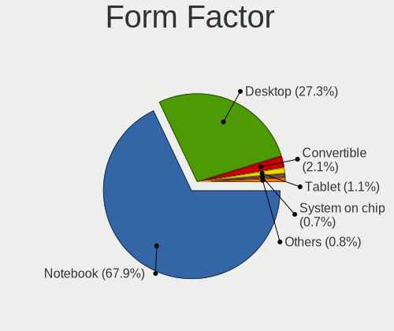

| Name           | Computers | Percent |
|----------------|-----------|---------|
| Notebook       | 485       | 67.93%  |
| Desktop        | 195       | 27.31%  |
| Convertible    | 15        | 2.1%    |
| Tablet         | 8         | 1.12%   |
| System on chip | 5         | 0.7%    |
| Mini pc        | 3         | 0.42%   |
| Phone          | 2         | 0.28%   |
| Server         | 1         | 0.14%   |

Secure Boot
-----------

Enabled or disabled

| State    | Computers | Percent |
|----------|-----------|---------|
| Disabled | 676       | 94.55%  |
| Enabled  | 39        | 5.45%   |

Coreboot
--------

Have coreboot on board

| Used | Computers | Percent |
|------|-----------|---------|
| No   | 713       | 99.86%  |
| Yes  | 1         | 0.14%   |

RAM Size
--------

Total RAM memory

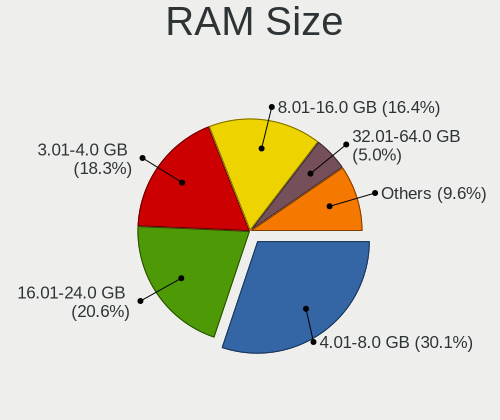

| Size in GB  | Computers | Percent |
|-------------|-----------|---------|
| 4.01-8.0    | 217       | 30.14%  |
| 16.01-24.0  | 148       | 20.56%  |
| 3.01-4.0    | 132       | 18.33%  |
| 8.01-16.0   | 118       | 16.39%  |
| 32.01-64.0  | 36        | 5%      |
| 1.01-2.0    | 25        | 3.47%   |
| 24.01-32.0  | 17        | 2.36%   |
| 2.01-3.0    | 17        | 2.36%   |
| 64.01-256.0 | 7         | 0.97%   |
| 0.51-1.0    | 2         | 0.28%   |
| 0.01-0.5    | 1         | 0.14%   |

RAM Used
--------

Used RAM memory

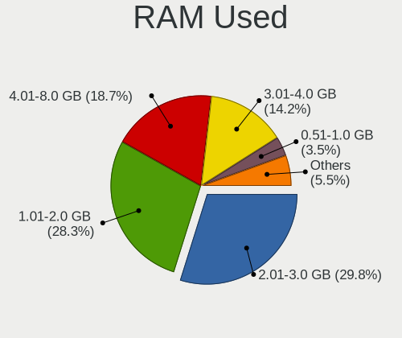

| Used GB     | Computers | Percent |
|-------------|-----------|---------|
| 2.01-3.0    | 233       | 29.83%  |
| 1.01-2.0    | 221       | 28.3%   |
| 4.01-8.0    | 146       | 18.69%  |
| 3.01-4.0    | 111       | 14.21%  |
| 0.51-1.0    | 27        | 3.46%   |
| 8.01-16.0   | 26        | 3.33%   |
| 0.01-0.5    | 10        | 1.28%   |
| 16.01-24.0  | 4         | 0.51%   |
| 32.01-64.0  | 2         | 0.26%   |
| 64.01-256.0 | 1         | 0.13%   |

Total Drives
------------

Number of drives on board

| Drives  | Computers | Percent |
|---------|-----------|---------|
| 1       | 421       | 57.51%  |
| 2       | 259       | 35.38%  |
| 3       | 35        | 4.78%   |
| 4       | 9         | 1.23%   |
| 0       | 3         | 0.41%   |
| 9       | 2         | 0.27%   |
| 6       | 1         | 0.14%   |
| 5       | 1         | 0.14%   |
| Unknown | 1         | 0.14%   |

Has CD-ROM
----------

Has CD-ROM on board

| Presented | Computers | Percent |
|-----------|-----------|---------|
| No        | 440       | 61.11%  |
| Yes       | 280       | 38.89%  |

Has Ethernet
------------

Has Ethernet on board

| Presented | Computers | Percent |
|-----------|-----------|---------|
| Yes       | 632       | 88.52%  |
| No        | 82        | 11.48%  |

Has WiFi
--------

Has WiFi module

| Presented | Computers | Percent |
|-----------|-----------|---------|
| Yes       | 579       | 80.64%  |
| No        | 139       | 19.36%  |

Has Bluetooth
-------------

Has Bluetooth module

| Presented | Computers | Percent |
|-----------|-----------|---------|
| Yes       | 462       | 63.9%   |
| No        | 261       | 36.1%   |

Location
--------

Country
-------

Geographic location (country)

| Country | Computers | Percent |
|---------|-----------|---------|
| Egypt   | 714       | 100%    |

City
----

Geographic location (city)

| City                  | Computers | Percent |
|-----------------------|-----------|---------|
| Cairo                 | 382       | 49.29%  |
| Alexandria            | 93        | 12%     |
| Giza                  | 68        | 8.77%   |
| Al Mansurah           | 25        | 3.23%   |
| Tanta                 | 19        | 2.45%   |
| Zagazig               | 9         | 1.16%   |
| Assiut                | 9         | 1.16%   |
| Qina                  | 8         | 1.03%   |
| Bani Suwayf           | 8         | 1.03%   |
| Port Said             | 7         | 0.9%    |
| Hurghada              | 7         | 0.9%    |
| Suez                  | 6         | 0.77%   |
| Minya                 | 6         | 0.77%   |
| Ismailia              | 6         | 0.77%   |
| Damietta              | 6         | 0.77%   |
| Aswan                 | 6         | 0.77%   |
| Banha                 | 5         | 0.65%   |
| Al Ma`adi             | 5         | 0.65%   |
| New Cairo             | 4         | 0.52%   |
| Kafr ash Shaykh       | 4         | 0.52%   |
| Helwan                | 4         | 0.52%   |
| Awsim                 | 4         | 0.52%   |
| Al Qahirah al Jadidah | 4         | 0.52%   |
| Sharqia               | 3         | 0.39%   |
| Madinat an Nasr       | 3         | 0.39%   |
| Damanhur              | 3         | 0.39%   |
| Al Fayyum             | 3         | 0.39%   |
| Al 'Ashir min Ramadan | 3         | 0.39%   |
| Zefta                 | 2         | 0.26%   |
| Tukh                  | 2         | 0.26%   |
| Talkha                | 2         | 0.26%   |
| Tala                  | 2         | 0.26%   |
| Sohag                 | 2         | 0.26%   |
| Rosetta               | 2         | 0.26%   |
| Mohandessin           | 2         | 0.26%   |
| Madinat as Sadat      | 2         | 0.26%   |
| Luxor                 | 2         | 0.26%   |
| Ibshaway              | 2         | 0.26%   |
| Gharbia               | 2         | 0.26%   |
| Fraskr            | 2         | 0.26%   |

Drives
------

Drive Vendor
------------

Hard drive vendors

| Vendor                         | Computers | Drives | Percent |
|--------------------------------|-----------|--------|---------|
| WDC                            | 208       | 297    | 20.76%  |
| Seagate                        | 186       | 237    | 18.56%  |
| Samsung Electronics            | 99        | 132    | 9.88%   |
| Toshiba                        | 95        | 119    | 9.48%   |
| Kingston                       | 57        | 75     | 5.69%   |
| Unknown                        | 36        | 43     | 3.59%   |
| Crucial                        | 36        | 43     | 3.59%   |
| SanDisk                        | 32        | 35     | 3.19%   |
| SK hynix                       | 27        | 33     | 2.69%   |
| Hitachi                        | 27        | 32     | 2.69%   |
| Micron Technology              | 24        | 29     | 2.4%    |
| Intel                          | 22        | 22     | 2.2%    |
| HGST                           | 21        | 25     | 2.1%    |
| Micron/Crucial Technology      | 13        | 13     | 1.3%    |
| HS-SSD-C100                    | 13        | 17     | 1.3%    |
| KIOXIA                         | 8         | 9      | 0.8%    |
| LITEONIT                       | 7         | 8      | 0.7%    |
| LITEON                         | 7         | 12     | 0.7%    |
| Kingston Technology Company    | 7         | 8      | 0.7%    |
| JMicron Technology             | 6         | 7      | 0.6%    |
| Apple                          | 6         | 9      | 0.6%    |
| TwinMOS                        | 5         | 7      | 0.5%    |
| KingSpec                       | 5         | 5      | 0.5%    |
| HS-SSD-E100                    | 4         | 4      | 0.4%    |
| A-DATA Technology              | 4         | 4      | 0.4%    |
| Transcend                      | 3         | 3      | 0.3%    |
| Hewlett-Packard                | 3         | 3      | 0.3%    |
| Fujitsu                        | 3         | 4      | 0.3%    |
| Solid State Storage Technology | 2         | 2      | 0.2%    |
| Silicon Motion                 | 2         | 2      | 0.2%    |
| Shenzhen Longsys Electronics   | 2         | 2      | 0.2%    |
| Phison Electronics             | 2         | 3      | 0.2%    |
| Maxtor                         | 2         | 3      | 0.2%    |
| MAXIO Technology (Hangzhou)    | 2         | 3      | 0.2%    |
| Lexar                          | 2         | 2      | 0.2%    |
| China                          | 2         | 2      | 0.2%    |
| ZOTAC                          | 1         | 1      | 0.1%    |
| YMTC                           | 1         | 1      | 0.1%    |
| Yangtze Memory Technologies    | 1         | 1      | 0.1%    |
| Verbatim                       | 1         | 1      | 0.1%    |

Drive Model
-----------

Hard drive models

| Model                                               | Computers | Percent |
|-----------------------------------------------------|-----------|---------|
| Seagate ST1000LM035-1RK172 1TB                      | 49        | 4.64%   |
| Toshiba MQ04ABF100 1TB                              | 20        | 1.9%    |
| Kingston SA400S37240G 240GB SSD                     | 15        | 1.42%   |
| Samsung NVMe SSD Controller SM981/PM981/PM983 512GB | 14        | 1.33%   |
| Toshiba MQ01ABD100 1TB                              | 13        | 1.23%   |
| Seagate ST500DM002-1BD142 500GB                     | 13        | 1.23%   |
| Kingston SA400S37480G 480GB SSD                     | 13        | 1.23%   |
| Micron/Crucial P2 NVMe PCIe SSD 500GB               | 11        | 1.04%   |
| Seagate ST2000LM007-1R8174 2TB                      | 10        | 0.95%   |
| Kingston SA400S37120G 120GB SSD                     | 10        | 0.95%   |
| Unknown MMC Card  64GB                              | 9         | 0.85%   |
| Seagate ST3500312CS 500GB                           | 9         | 0.85%   |
| Crucial CT240BX500SSD1 240GB                        | 9         | 0.85%   |
| Intel SSDPEKNU512GZ 512GB                           | 8         | 0.76%   |
| WDC WD10SPZX-24Z10 1TB                              | 7         | 0.66%   |
| Unknown MMC Card  32GB                              | 7         | 0.66%   |
| Seagate ST500LT012-1DG142 500GB                     | 7         | 0.66%   |
| Seagate ST3500414CS 500GB                           | 7         | 0.66%   |
| Crucial CT480BX500SSD1 480GB                        | 7         | 0.66%   |
| WDC WD10JPVX-60JC3T1 1TB                            | 6         | 0.57%   |
| Toshiba MQ01ABF050 500GB                            | 6         | 0.57%   |
| Samsung NVMe SSD Drive 256GB                        | 6         | 0.57%   |
| WDC WDS120G2G0A-00JH30 120GB SSD                    | 5         | 0.47%   |
| WDC WD5000AAKX-001CA0 500GB                         | 5         | 0.47%   |
| WDC WD10SPZX-60Z10T0 1TB                            | 5         | 0.47%   |
| Toshiba DT01ACA050 500GB                            | 5         | 0.47%   |
| Seagate ST750LM022 HN-M750MBB 752GB                 | 5         | 0.47%   |
| Seagate ST1000DM010-2EP102 1TB                      | 5         | 0.47%   |
| Samsung SSD 860 EVO 500GB                           | 5         | 0.47%   |
| HS-SSD-C100 SSD 240G                                | 5         | 0.47%   |
| HS-SSD-C100 120G                                    | 5         | 0.47%   |
| HGST HTS725050A7E630 500GB                          | 5         | 0.47%   |
| HGST HTS541010A9E680 1TB                            | 5         | 0.47%   |
| WDC WDS500G2B0A-00SM50 500GB SSD                    | 4         | 0.38%   |
| WDC WD5000AAKX-00ERMA0 500GB                        | 4         | 0.38%   |
| WDC WD5000AADS-00S9B0 500GB                         | 4         | 0.38%   |
| WDC WD3200AAJS-00L7A0 320GB                         | 4         | 0.38%   |
| WDC WD1600AABS-00PRA0 160GB                         | 4         | 0.38%   |
| WDC WD10SPZX-75Z10T1 1TB                            | 4         | 0.38%   |
| WDC WD10JPCX-24UE4T0 1TB                            | 4         | 0.38%   |

HDD Vendor
----------

Hard disk drive vendors

| Vendor              | Computers | Drives | Percent |
|---------------------|-----------|--------|---------|
| WDC                 | 191       | 276    | 35.9%   |
| Seagate             | 186       | 236    | 34.96%  |
| Toshiba             | 81        | 101    | 15.23%  |
| Hitachi             | 27        | 32     | 5.08%   |
| HGST                | 21        | 25     | 3.95%   |
| Samsung Electronics | 11        | 15     | 2.07%   |
| JMicron Technology  | 4         | 4      | 0.75%   |
| Unknown             | 3         | 3      | 0.56%   |
| Fujitsu             | 3         | 4      | 0.56%   |
| Apple               | 3         | 4      | 0.56%   |
| Maxtor              | 1         | 2      | 0.19%   |
| Hewlett-Packard     | 1         | 1      | 0.19%   |

SSD Vendor
----------

Solid state drive vendors

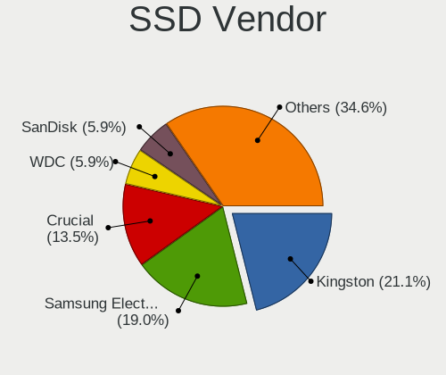

| Vendor              | Computers | Drives | Percent |
|---------------------|-----------|--------|---------|
| Kingston            | 50        | 67     | 21.1%   |
| Samsung Electronics | 45        | 51     | 18.99%  |
| Crucial             | 32        | 39     | 13.5%   |
| WDC                 | 14        | 16     | 5.91%   |
| SanDisk             | 14        | 16     | 5.91%   |
| Micron Technology   | 10        | 13     | 4.22%   |
| Intel               | 9         | 9      | 3.8%    |
| SK hynix            | 8         | 8      | 3.38%   |
| LITEONIT            | 7         | 8      | 2.95%   |
| LITEON              | 7         | 12     | 2.95%   |
| Toshiba             | 6         | 8      | 2.53%   |
| TwinMOS             | 5         | 7      | 2.11%   |
| KingSpec            | 5         | 5      | 2.11%   |
| HS-SSD-C100         | 5         | 7      | 2.11%   |
| Transcend           | 3         | 3      | 1.27%   |
| Lexar               | 2         | 2      | 0.84%   |
| China               | 2         | 2      | 0.84%   |
| ZOTAC               | 1         | 1      | 0.42%   |
| Verbatim            | 1         | 1      | 0.42%   |
| Value               | 1         | 1      | 0.42%   |
| Team                | 1         | 1      | 0.42%   |
| Maxtor              | 1         | 1      | 0.42%   |
| KingFast            | 1         | 1      | 0.42%   |
| Hikvision           | 1         | 1      | 0.42%   |
| HEYGATE             | 1         | 1      | 0.42%   |
| Hewlett-Packard     | 1         | 1      | 0.42%   |
| Dahua               | 1         | 1      | 0.42%   |
| CARLSTEIN           | 1         | 1      | 0.42%   |
| Apple               | 1         | 1      | 0.42%   |
| A-DATA Technology   | 1         | 1      | 0.42%   |

Drive Kind
----------

HDD or SSD

| Kind    | Computers | Drives | Percent |
|---------|-----------|--------|---------|
| HDD     | 486       | 703    | 51.81%  |
| SSD     | 220       | 286    | 23.45%  |
| NVMe    | 181       | 228    | 19.3%   |
| MMC     | 30        | 36     | 3.2%    |
| Unknown | 21        | 24     | 2.24%   |

Drive Connector
---------------

SATA, SAS, NVMe, etc.

| Type | Computers | Drives | Percent |
|------|-----------|--------|---------|
| SATA | 583       | 992    | 71.98%  |
| NVMe | 181       | 228    | 22.35%  |
| MMC  | 30        | 36     | 3.7%    |
| SAS  | 16        | 21     | 1.98%   |

Drive Size
----------

Size of hard drive

| Size in TB | Computers | Drives | Percent |
|------------|-----------|--------|---------|
| 0.01-0.5   | 408       | 632    | 59.82%  |
| 0.51-1.0   | 238       | 308    | 34.9%   |
| 1.01-2.0   | 32        | 38     | 4.69%   |
| 3.01-4.0   | 3         | 5      | 0.44%   |
| 4.01-10.0  | 1         | 6      | 0.15%   |

Space Total
-----------

Amount of disk space available on the file system

| Size in GB     | Computers | Percent |
|----------------|-----------|---------|
| 101-250        | 195       | 25.79%  |
| 251-500        | 169       | 22.35%  |
| 501-1000       | 115       | 15.21%  |
| 51-100         | 82        | 10.85%  |
| 1001-2000      | 60        | 7.94%   |
| 21-50          | 55        | 7.28%   |
| 1-20           | 43        | 5.69%   |
| Unknown        | 16        | 2.12%   |
| 2001-3000      | 11        | 1.46%   |
| More than 3000 | 10        | 1.32%   |

Space Used
----------

Amount of used disk space

| Used GB        | Computers | Percent |
|----------------|-----------|---------|
| 1-20           | 266       | 34.37%  |
| 21-50          | 148       | 19.12%  |
| 101-250        | 120       | 15.5%   |
| 51-100         | 93        | 12.02%  |
| 251-500        | 68        | 8.79%   |
| 501-1000       | 43        | 5.56%   |
| Unknown        | 16        | 2.07%   |
| 1001-2000      | 11        | 1.42%   |
| 2001-3000      | 6         | 0.78%   |
| More than 3000 | 3         | 0.39%   |

Malfunc. Drives
---------------

Drive models with a malfunction

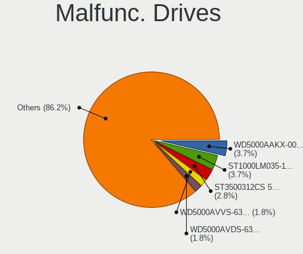

| Model                                 | Computers | Drives | Percent |
|---------------------------------------|-----------|--------|---------|
| WDC WD5000AAKX-00ERMA0 500GB          | 4         | 6      | 3.67%   |
| Seagate ST1000LM035-1RK172 1TB        | 4         | 5      | 3.67%   |
| Seagate ST3500312CS 500GB             | 3         | 6      | 2.75%   |
| WDC WD5000AVVS-63H0B1 500GB           | 2         | 2      | 1.83%   |
| WDC WD5000AVDS-63U7B1 500GB           | 2         | 2      | 1.83%   |
| WDC WD1600AABS-00H4A0 160GB           | 2         | 2      | 1.83%   |
| Toshiba MQ01ABF050 500GB              | 2         | 4      | 1.83%   |
| SK hynix HFS128G39TND-N210A 128GB SSD | 2         | 2      | 1.83%   |
| Seagate ST500DM002-1BD142 500GB       | 2         | 4      | 1.83%   |
| Seagate ST380815AS 80GB               | 2         | 2      | 1.83%   |
| Seagate ST3500413AS 500GB             | 2         | 3      | 1.83%   |
| Samsung Electronics SSD 870 EVO 500GB | 2         | 2      | 1.83%   |
| WDC WD800JD-60LSA5 80GB               | 1         | 1      | 0.92%   |
| WDC WD800BD-22MRA1 80GB               | 1         | 1      | 0.92%   |
| WDC WD5000LPVX-75V0TT0 500GB          | 1         | 1      | 0.92%   |
| WDC WD5000LPVX-60V0TT0 500GB          | 1         | 1      | 0.92%   |
| WDC WD5000BPVT-24HXZT3 500GB          | 1         | 1      | 0.92%   |
| WDC WD5000BPVT-22HXZT3 500GB          | 1         | 2      | 0.92%   |
| WDC WD5000AAVS-22G9B1 500GB           | 1         | 1      | 0.92%   |
| WDC WD5000AAKX-75U6AA0 500GB          | 1         | 2      | 0.92%   |
| WDC WD5000AAKX-60U6AA0 500GB          | 1         | 1      | 0.92%   |
| WDC WD5000AAKX-08U6AA0 500GB          | 1         | 2      | 0.92%   |
| WDC WD5000AAKX-009FA0 500GB           | 1         | 1      | 0.92%   |
| WDC WD5000AAKS-00V6A0 500GB           | 1         | 1      | 0.92%   |
| WDC WD5000AADS-00S9B0 500GB           | 1         | 1      | 0.92%   |
| WDC WD5000AADS-00M2B0 500GB           | 1         | 1      | 0.92%   |
| WDC WD3200BUDT-63DPZY0 320GB          | 1         | 1      | 0.92%   |
| WDC WD3200BEKT-60V5T1 320GB           | 1         | 3      | 0.92%   |
| WDC WD3200AAJS-56M0A0 320GB           | 1         | 1      | 0.92%   |
| WDC WD3200AAJS-56B4A0 320GB           | 1         | 2      | 0.92%   |
| WDC WD3200AAJS-00L7A0 320GB           | 1         | 1      | 0.92%   |
| WDC WD3200AAJS-00B4A0 320GB           | 1         | 1      | 0.92%   |
| WDC WD3200A 320GB                     | 1         | 1      | 0.92%   |
| WDC WD2500AAJS-00VTA0 250GB           | 1         | 1      | 0.92%   |
| WDC WD20SPZX-75UA7T0 2TB              | 1         | 1      | 0.92%   |
| WDC WD1600AVVS-63L2B0 160GB           | 1         | 1      | 0.92%   |
| WDC WD1600AAJS-00L7A0 160GB           | 1         | 1      | 0.92%   |
| WDC WD1600AABB-22PUA0 160GB           | 1         | 1      | 0.92%   |
| WDC WD10SPZX-60Z10T0 1TB              | 1         | 1      | 0.92%   |
| WDC WD10SPCX-24HWST1 1TB              | 1         | 1      | 0.92%   |

Malfunc. Drive Vendor
---------------------

Vendors of faulty drives

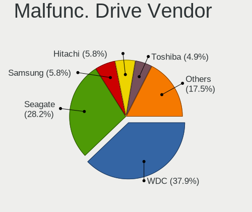

| Vendor              | Computers | Drives | Percent |
|---------------------|-----------|--------|---------|
| WDC                 | 39        | 51     | 37.86%  |
| Seagate             | 29        | 44     | 28.16%  |
| Samsung Electronics | 6         | 6      | 5.83%   |
| Hitachi             | 6         | 6      | 5.83%   |
| Toshiba             | 5         | 8      | 4.85%   |
| Micron Technology   | 3         | 4      | 2.91%   |
| Intel               | 3         | 3      | 2.91%   |
| HGST                | 3         | 6      | 2.91%   |
| SK hynix            | 2         | 2      | 1.94%   |
| A-DATA Technology   | 2         | 2      | 1.94%   |
| TwinMOS             | 1         | 1      | 0.97%   |
| Kingston            | 1         | 2      | 0.97%   |
| Hewlett-Packard     | 1         | 1      | 0.97%   |
| Fujitsu             | 1         | 2      | 0.97%   |
| Apple               | 1         | 1      | 0.97%   |

Malfunc. HDD Vendor
-------------------

Vendors of faulty HDD drives

| Vendor              | Computers | Drives | Percent |
|---------------------|-----------|--------|---------|
| WDC                 | 39        | 51     | 45.35%  |
| Seagate             | 29        | 44     | 33.72%  |
| Hitachi             | 6         | 6      | 6.98%   |
| Toshiba             | 4         | 7      | 4.65%   |
| HGST                | 3         | 6      | 3.49%   |
| Samsung Electronics | 2         | 2      | 2.33%   |
| Hewlett-Packard     | 1         | 1      | 1.16%   |
| Fujitsu             | 1         | 2      | 1.16%   |
| Apple               | 1         | 1      | 1.16%   |

Malfunc. Drive Kind
-------------------

Kinds of faulty drives

| Kind | Computers | Drives | Percent |
|------|-----------|--------|---------|
| HDD  | 83        | 120    | 83%     |
| SSD  | 14        | 16     | 14%     |
| NVMe | 3         | 3      | 3%      |

Failed Drives
-------------

Failed drive models

| Model                                            | Computers | Drives | Percent |
|--------------------------------------------------|-----------|--------|---------|
| WDC WD3200AAJS-00L7A0 320GB                      | 1         | 2      | 25%     |
| Toshiba MK3265GSXV 320GB                         | 1         | 1      | 25%     |
| Samsung Electronics MZ7TY128HDHP-000L1 128GB SSD | 1         | 1      | 25%     |
| Samsung Electronics MZ7PC128HAFU-000H1 128GB SSD | 1         | 1      | 25%     |

Failed Drive Vendor
-------------------

Failed drive vendors

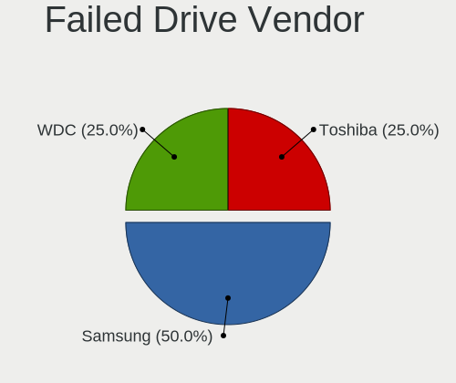

| Vendor              | Computers | Drives | Percent |
|---------------------|-----------|--------|---------|
| Samsung Electronics | 2         | 2      | 50%     |
| WDC                 | 1         | 2      | 25%     |
| Toshiba             | 1         | 1      | 25%     |

Drive Status
------------

Number of failed and malfunc. drives

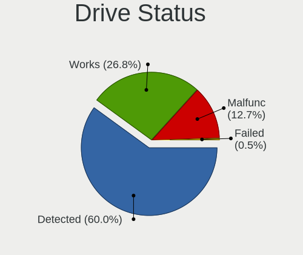

| Status   | Computers | Drives | Percent |
|----------|-----------|--------|---------|
| Detected | 462       | 793    | 60%     |
| Works    | 206       | 340    | 26.75%  |
| Malfunc  | 98        | 139    | 12.73%  |
| Failed   | 4         | 5      | 0.52%   |

Storage controller
------------------

Storage Vendor
--------------

Storage controller vendors

| Vendor                         | Computers | Percent |
|--------------------------------|-----------|---------|
| Intel                          | 540       | 64.67%  |
| AMD                            | 99        | 11.86%  |
| Samsung Electronics            | 51        | 6.11%   |
| SanDisk                        | 23        | 2.75%   |
| SK hynix                       | 19        | 2.28%   |
| Micron/Crucial Technology      | 17        | 2.04%   |
| Kingston Technology Company    | 15        | 1.8%    |
| Micron Technology              | 14        | 1.68%   |
| Toshiba America Info Systems   | 10        | 1.2%    |
| KIOXIA                         | 8         | 0.96%   |
| ADATA Technology               | 4         | 0.48%   |
| Union Memory (Shenzhen)        | 3         | 0.36%   |
| Shenzhen Longsys Electronics   | 3         | 0.36%   |
| Phison Electronics             | 3         | 0.36%   |
| Nvidia                         | 3         | 0.36%   |
| Broadcom / LSI                 | 3         | 0.36%   |
| Yangtze Memory Technologies    | 2         | 0.24%   |
| Solid State Storage Technology | 2         | 0.24%   |
| Silicon Motion                 | 2         | 0.24%   |
| MAXIO Technology (Hangzhou)    | 2         | 0.24%   |
| Marvell Technology Group       | 2         | 0.24%   |
| LSI Logic / Symbios Logic      | 2         | 0.24%   |
| Apple                          | 2         | 0.24%   |
| VIA Technologies               | 1         | 0.12%   |
| Seagate Technology             | 1         | 0.12%   |
| Lite-On Technology             | 1         | 0.12%   |
| JMicron Technology             | 1         | 0.12%   |
| INNOGRIT                       | 1         | 0.12%   |
| Biwin Storage Technology       | 1         | 0.12%   |

Storage Model
-------------

Storage controller models

| Model                                                                                   | Computers | Percent |
|-----------------------------------------------------------------------------------------|-----------|---------|
| AMD FCH SATA Controller [AHCI mode]                                                     | 72        | 7.64%   |
| Intel Sunrise Point-LP SATA Controller [AHCI mode]                                      | 60        | 6.36%   |
| Intel 82801 Mobile SATA Controller [RAID mode]                                          | 45        | 4.77%   |
| Intel 8 Series/C220 Series Chipset Family 6-port SATA Controller 1 [AHCI mode]          | 34        | 3.61%   |
| Intel Cannon Lake Mobile PCH SATA AHCI Controller                                       | 29        | 3.08%   |
| Intel 8 Series SATA Controller 1 [AHCI mode]                                            | 28        | 2.97%   |
| Intel 7 Series Chipset Family 6-port SATA Controller [AHCI mode]                        | 28        | 2.97%   |
| Samsung NVMe SSD Controller SM981/PM981/PM983                                           | 27        | 2.86%   |
| Intel 6 Series/C200 Series Chipset Family 6 port Mobile SATA AHCI Controller            | 26        | 2.76%   |
| Intel Wildcat Point-LP SATA Controller [AHCI Mode]                                      | 20        | 2.12%   |
| Intel NM10/ICH7 Family SATA Controller [IDE mode]                                       | 18        | 1.91%   |
| Intel SATA Controller [RAID mode]                                                       | 17        | 1.8%    |
| Micron/Crucial P2 [Nick P2] / P3 / P3 Plus NVMe PCIe SSD (DRAM-less)                    | 15        | 1.59%   |
| Intel Comet Lake SATA AHCI Controller                                                   | 15        | 1.59%   |
| Intel Volume Management Device NVMe RAID Controller                                     | 14        | 1.48%   |
| Intel 5 Series/3400 Series Chipset 6 port SATA AHCI Controller                          | 14        | 1.48%   |
| Intel SSD 670p Series [Keystone Harbor]                                                 | 12        | 1.27%   |
| Samsung NVMe SSD Controller 980 (DRAM-less)                                             | 11        | 1.17%   |
| Intel Q170/Q150/B150/H170/H110/Z170/CM236 Chipset SATA Controller [AHCI Mode]           | 11        | 1.17%   |
| Intel 82801IBM/IEM (ICH9M/ICH9M-E) 4 port SATA Controller [AHCI mode]                   | 11        | 1.17%   |
| Intel 6 Series/C200 Series Chipset Family Desktop SATA Controller (IDE mode, ports 4-5) | 10        | 1.06%   |
| Intel 6 Series/C200 Series Chipset Family Desktop SATA Controller (IDE mode, ports 0-3) | 10        | 1.06%   |
| Intel 4 Series Chipset PT IDER Controller                                               | 10        | 1.06%   |
| Intel HM170/QM170 Chipset SATA Controller [AHCI Mode]                                   | 9         | 0.95%   |
| Intel 400 Series Chipset Family SATA AHCI Controller                                    | 9         | 0.95%   |
| AMD SB7x0/SB8x0/SB9x0 SATA Controller [AHCI mode]                                       | 9         | 0.95%   |
| Intel 5 Series/3400 Series Chipset 4 port SATA AHCI Controller                          | 8         | 0.85%   |
| Intel 200 Series PCH SATA controller [AHCI mode]                                        | 8         | 0.85%   |
| Samsung NVMe SSD Controller PM9A1/PM9A3/980PRO                                          | 7         | 0.74%   |
| Micron 2210 NVMe SSD [Cobain]                                                           | 7         | 0.74%   |
| KIOXIA NVMe SSD Controller BG4 (DRAM-less)                                              | 7         | 0.74%   |
| Intel Volume Management Device NVMe RAID Controller Intel Corporation                   | 7         | 0.74%   |
| Intel Tiger Lake-LP SATA Controller                                                     | 7         | 0.74%   |
| Intel Cannon Point-LP SATA Controller [AHCI Mode]                                       | 7         | 0.74%   |
| Intel 82801JD/DO (ICH10 Family) SATA AHCI Controller                                    | 7         | 0.74%   |
| Intel 82801HM/HEM (ICH8M/ICH8M-E) IDE Controller                                        | 7         | 0.74%   |
| Intel 6 Series/C200 Series Chipset Family 6 port Desktop SATA AHCI Controller           | 7         | 0.74%   |
| AMD 400 Series Chipset SATA Controller                                                  | 7         | 0.74%   |
| SK hynix Gold P31/BC711/PC711 NVMe Solid State Drive                                    | 6         | 0.64%   |
| SK hynix BC501 NVMe Solid State Drive                                                   | 6         | 0.64%   |

Storage Kind
------------

Kind of storage controller (IDE, SATA, NVMe, SAS, ...)

| Kind | Computers | Percent |
|------|-----------|---------|
| SATA | 499       | 57.69%  |
| NVMe | 183       | 21.16%  |
| IDE  | 90        | 10.4%   |
| RAID | 85        | 9.83%   |
| SAS  | 6         | 0.69%   |
| SCSI | 2         | 0.23%   |

Processor
---------

CPU Vendor
----------

Processor vendors

| Vendor   | Computers | Percent |
|----------|-----------|---------|
| Intel    | 585       | 81.93%  |
| AMD      | 122       | 17.09%  |
| ARM      | 6         | 0.84%   |
| Qualcomm | 1         | 0.14%   |

CPU Model
---------

Processor models

| Model                                        | Computers | Percent |
|----------------------------------------------|-----------|---------|
| Intel Core i7-8550U CPU @ 1.80GHz            | 17        | 2.38%   |
| Intel Core i7-8750H CPU @ 2.20GHz            | 15        | 2.1%    |
| Intel Core i7-9750H CPU @ 2.60GHz            | 11        | 1.54%   |
| Intel Core i7-7700HQ CPU @ 2.80GHz           | 9         | 1.26%   |
| Intel Core i7-10750H CPU @ 2.60GHz           | 9         | 1.26%   |
| Intel Core 2 Duo CPU E8400 @ 3.00GHz         | 9         | 1.26%   |
| Intel Core i7-8565U CPU @ 1.80GHz            | 8         | 1.12%   |
| Intel Core i5-8250U CPU @ 1.60GHz            | 8         | 1.12%   |
| Intel Core i7-7500U CPU @ 2.70GHz            | 7         | 0.98%   |
| Intel Core i7-6500U CPU @ 2.50GHz            | 7         | 0.98%   |
| Intel Core i5-7200U CPU @ 2.50GHz            | 7         | 0.98%   |
| Intel Core i5-4590 CPU @ 3.30GHz             | 7         | 0.98%   |
| Intel Core i5-4570 CPU @ 3.20GHz             | 7         | 0.98%   |
| Intel Core i7-1065G7 CPU @ 1.30GHz           | 6         | 0.84%   |
| Intel Core i5-5200U CPU @ 2.20GHz            | 6         | 0.84%   |
| Intel Core i5-4200U CPU @ 1.60GHz            | 6         | 0.84%   |
| Intel 12th Gen Core i7-12700H                | 6         | 0.84%   |
| Intel Core i7-6820HQ CPU @ 2.70GHz           | 5         | 0.7%    |
| Intel Core i7-6600U CPU @ 2.60GHz            | 5         | 0.7%    |
| Intel Core i7-4790 CPU @ 3.60GHz             | 5         | 0.7%    |
| Intel Core i7-4510U CPU @ 2.00GHz            | 5         | 0.7%    |
| Intel Core i7-10510U CPU @ 1.80GHz           | 5         | 0.7%    |
| Intel Core i5-6200U CPU @ 2.30GHz            | 5         | 0.7%    |
| Intel Core i5-4210U CPU @ 1.70GHz            | 5         | 0.7%    |
| Intel Core i5-3320M CPU @ 2.60GHz            | 5         | 0.7%    |
| Intel Core i5-3210M CPU @ 2.50GHz            | 5         | 0.7%    |
| Intel Core i5-2520M CPU @ 2.50GHz            | 5         | 0.7%    |
| Intel 11th Gen Core i7-1165G7 @ 2.80GHz      | 5         | 0.7%    |
| Intel 11th Gen Core i5-1135G7 @ 2.40GHz      | 5         | 0.7%    |
| ARM Processor                                | 5         | 0.7%    |
| AMD Ryzen 5 5600H with Radeon Graphics       | 5         | 0.7%    |
| AMD PRO A10-8700B R6, 10 Compute Cores 4C+6G | 5         | 0.7%    |
| Intel Core i7-5500U CPU @ 2.40GHz            | 4         | 0.56%   |
| Intel Core i7-4810MQ CPU @ 2.80GHz           | 4         | 0.56%   |
| Intel Core i7-2630QM CPU @ 2.00GHz           | 4         | 0.56%   |
| Intel Core i5-8265U CPU @ 1.60GHz            | 4         | 0.56%   |
| Intel Core i5-7300U CPU @ 2.60GHz            | 4         | 0.56%   |
| Intel Core i5-6500 CPU @ 3.20GHz             | 4         | 0.56%   |
| Intel Core i5-6300U CPU @ 2.40GHz            | 4         | 0.56%   |
| Intel Core i5-5300U CPU @ 2.30GHz            | 4         | 0.56%   |

CPU Model Family
----------------

Processor model prefix

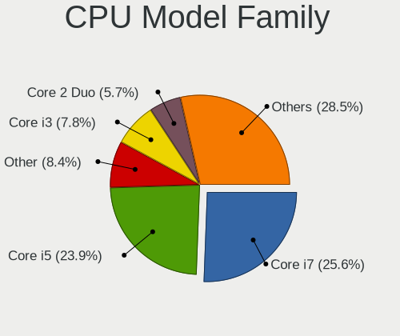

| Model                   | Computers | Percent |
|-------------------------|-----------|---------|
| Intel Core i7           | 183       | 25.59%  |
| Intel Core i5           | 171       | 23.92%  |
| Other                   | 60        | 8.39%   |
| Intel Core i3           | 56        | 7.83%   |
| Intel Core 2 Duo        | 41        | 5.73%   |
| AMD Ryzen 7             | 22        | 3.08%   |
| AMD Ryzen 5             | 19        | 2.66%   |
| Intel Xeon              | 17        | 2.38%   |
| Intel Celeron           | 16        | 2.24%   |
| Intel Pentium           | 12        | 1.68%   |
| Intel Atom              | 9         | 1.26%   |
| AMD A6                  | 9         | 1.26%   |
| AMD A4                  | 9         | 1.26%   |
| AMD PRO A10             | 7         | 0.98%   |
| AMD A8                  | 7         | 0.98%   |
| AMD Ryzen 9             | 6         | 0.84%   |
| AMD E2                  | 6         | 0.84%   |
| Intel Core 2 Quad       | 5         | 0.7%    |
| Intel Core 2            | 5         | 0.7%    |
| Intel Pentium Dual-Core | 4         | 0.56%   |
| Intel Pentium 4         | 4         | 0.56%   |
| AMD A10                 | 4         | 0.56%   |
| Intel Pentium D         | 3         | 0.42%   |
| AMD Ryzen 7 PRO         | 3         | 0.42%   |
| AMD Ryzen 5 PRO         | 3         | 0.42%   |
| AMD Phenom II X4        | 3         | 0.42%   |
| AMD E1                  | 3         | 0.42%   |
| Intel Celeron D         | 2         | 0.28%   |
| AMD PRO A8              | 2         | 0.28%   |
| AMD Phenom              | 2         | 0.28%   |
| AMD Athlon II X2        | 2         | 0.28%   |
| AMD Athlon II Dual-Core | 2         | 0.28%   |
| AMD Athlon 64 X2        | 2         | 0.28%   |
| Intel Xeon Silver       | 1         | 0.14%   |
| Intel Pentium Silver    | 1         | 0.14%   |
| Intel Genuine           | 1         | 0.14%   |
| Intel Core M            | 1         | 0.14%   |
| Intel Core i9           | 1         | 0.14%   |
| Intel Celeron Dual-Core | 1         | 0.14%   |
| ARM AArch64             | 1         | 0.14%   |

CPU Cores
---------

Number of processor cores

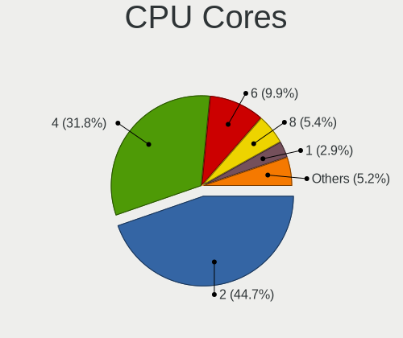

| Number | Computers | Percent |
|--------|-----------|---------|
| 2      | 320       | 44.69%  |
| 4      | 228       | 31.84%  |
| 6      | 71        | 9.92%   |
| 8      | 39        | 5.45%   |
| 1      | 21        | 2.93%   |
| 14     | 11        | 1.54%   |
| 10     | 9         | 1.26%   |
| 12     | 8         | 1.12%   |
| 24     | 3         | 0.42%   |
| 16     | 3         | 0.42%   |
| 3      | 3         | 0.42%   |

CPU Sockets
-----------

Number of sockets

| Number | Computers | Percent |
|--------|-----------|---------|
| 1      | 703       | 98.46%  |
| 2      | 11        | 1.54%   |

CPU Threads
-----------

Threads per core (Hyper-Threading)

| Number | Computers | Percent |
|--------|-----------|---------|
| 2      | 506       | 70.47%  |
| 1      | 212       | 29.53%  |

CPU Op-Modes
------------

CPU Operation Modes (32-bit, 64-bit)

| Op mode        | Computers | Percent |
|----------------|-----------|---------|
| 32-bit, 64-bit | 703       | 98.18%  |
| Unknown        | 10        | 1.4%    |
| 32-bit         | 3         | 0.42%   |

CPU Microcode
-------------

Microcode number

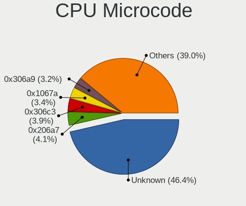

| Number     | Computers | Percent |
|------------|-----------|---------|
| Unknown    | 343       | 46.41%  |
| 0x206a7    | 30        | 4.06%   |
| 0x306c3    | 29        | 3.92%   |
| 0x1067a    | 25        | 3.38%   |
| 0x306a9    | 24        | 3.25%   |
| 0x906ea    | 19        | 2.57%   |
| 0x40651    | 18        | 2.44%   |
| 0x806ea    | 17        | 2.3%    |
| 0x806e9    | 16        | 2.17%   |
| 0x306d4    | 15        | 2.03%   |
| 0x906e9    | 11        | 1.49%   |
| 0x806ec    | 11        | 1.49%   |
| 0x406e3    | 11        | 1.49%   |
| 0x6fd      | 8         | 1.08%   |
| 0x06001119 | 8         | 1.08%   |
| 0x20655    | 7         | 0.95%   |
| 0xa0652    | 6         | 0.81%   |
| 0x806c1    | 5         | 0.68%   |
| 0x706e5    | 5         | 0.68%   |
| 0x6fb      | 5         | 0.68%   |
| 0x506e3    | 5         | 0.68%   |
| 0x30678    | 5         | 0.68%   |
| 0x20652    | 5         | 0.68%   |
| 0x0600111f | 5         | 0.68%   |
| 0xf65      | 4         | 0.54%   |
| 0x806eb    | 4         | 0.54%   |
| 0x406c4    | 4         | 0.54%   |
| 0x406c3    | 4         | 0.54%   |
| 0x10676    | 4         | 0.54%   |
| 0x06006705 | 4         | 0.54%   |
| 0x06006704 | 4         | 0.54%   |
| 0xa0671    | 3         | 0.41%   |
| 0x206c2    | 3         | 0.41%   |
| 0x106e5    | 3         | 0.41%   |
| 0x0a50000c | 3         | 0.41%   |
| 0x0800820d | 3         | 0.41%   |
| 0x010000c8 | 3         | 0.41%   |
| 0xf41      | 2         | 0.27%   |
| 0x906a4    | 2         | 0.27%   |
| 0x906a3    | 2         | 0.27%   |

CPU Microarch
-------------

Microarchitecture

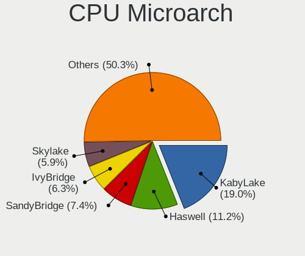

| Name             | Computers | Percent |
|------------------|-----------|---------|
| KabyLake         | 136       | 18.99%  |
| Haswell          | 80        | 11.17%  |
| SandyBridge      | 53        | 7.4%    |
| IvyBridge        | 45        | 6.28%   |
| Skylake          | 42        | 5.87%   |
| Penryn           | 36        | 5.03%   |
| Unknown          | 31        | 4.33%   |
| Westmere         | 26        | 3.63%   |
| Broadwell        | 22        | 3.07%   |
| Core             | 21        | 2.93%   |
| IceLake          | 19        | 2.65%   |
| CometLake        | 19        | 2.65%   |
| Silvermont       | 18        | 2.51%   |
| Alderlake Hybrid | 18        | 2.51%   |
| Piledriver       | 17        | 2.37%   |
| Excavator        | 17        | 2.37%   |
| Zen 3            | 15        | 2.09%   |
| TigerLake        | 15        | 2.09%   |
| NetBurst         | 12        | 1.68%   |
| K10              | 12        | 1.68%   |
| Zen+             | 11        | 1.54%   |
| Zen 2            | 11        | 1.54%   |
| Zen              | 7         | 0.98%   |
| Steamroller      | 6         | 0.84%   |
| Nehalem          | 6         | 0.84%   |
| K8 Hammer        | 4         | 0.56%   |
| Bobcat           | 4         | 0.56%   |
| Puma             | 3         | 0.42%   |
| Goldmont plus    | 3         | 0.42%   |
| Jaguar           | 2         | 0.28%   |
| Goldmont         | 2         | 0.28%   |
| P6               | 1         | 0.14%   |
| Bulldozer        | 1         | 0.14%   |
| Bonnell          | 1         | 0.14%   |

Graphics
--------

GPU Vendor
----------

Vendors of graphics cards

| Vendor           | Computers | Percent |
|------------------|-----------|---------|
| Intel            | 488       | 51.59%  |
| Nvidia           | 241       | 25.48%  |
| AMD              | 216       | 22.83%  |
| VIA Technologies | 1         | 0.11%   |

GPU Model
---------

Graphics card models

| Model                                                                                    | Computers | Percent |
|------------------------------------------------------------------------------------------|-----------|---------|
| Intel 2nd Generation Core Processor Family Integrated Graphics Controller                | 36        | 3.74%   |
| Intel UHD Graphics 620                                                                   | 28        | 2.91%   |
| Intel 3rd Gen Core processor Graphics Controller                                         | 28        | 2.91%   |
| Intel CoffeeLake-H GT2 [UHD Graphics 630]                                                | 27        | 2.81%   |
| Intel Haswell-ULT Integrated Graphics Controller                                         | 26        | 2.7%    |
| Intel Xeon E3-1200 v3/4th Gen Core Processor Integrated Graphics Controller              | 25        | 2.6%    |
| Intel Skylake GT2 [HD Graphics 520]                                                      | 25        | 2.6%    |
| Intel HD Graphics 620                                                                    | 22        | 2.29%   |
| AMD Topaz XT [Radeon R7 M260/M265 / M340/M360 / M440/M445 / 530/535 / 620/625 Mobile]    | 21        | 2.18%   |
| Intel HD Graphics 5500                                                                   | 19        | 1.98%   |
| Intel 4th Gen Core Processor Integrated Graphics Controller                              | 18        | 1.87%   |
| Intel 4 Series Chipset Integrated Graphics Controller                                    | 16        | 1.66%   |
| Nvidia GP107M [GeForce GTX 1050 Ti Mobile]                                               | 15        | 1.56%   |
| Intel HD Graphics 630                                                                    | 15        | 1.56%   |
| Intel WhiskeyLake-U GT2 [UHD Graphics 620]                                               | 14        | 1.46%   |
| Nvidia TU117M [GeForce GTX 1650 Mobile / Max-Q]                                          | 13        | 1.35%   |
| Intel CometLake-U GT2 [UHD Graphics]                                                     | 13        | 1.35%   |
| Intel CometLake-H GT2 [UHD Graphics]                                                     | 13        | 1.35%   |
| AMD Sun XT [Radeon HD 8670A/8670M/8690M / R5 M330 / M430 / Radeon 520 Mobile]            | 13        | 1.35%   |
| Intel TigerLake-LP GT2 [Iris Xe Graphics]                                                | 12        | 1.25%   |
| Intel HD Graphics 530                                                                    | 12        | 1.25%   |
| Intel Core Processor Integrated Graphics Controller                                      | 12        | 1.25%   |
| Intel Atom/Celeron/Pentium Processor x5-E8000/J3xxx/N3xxx Integrated Graphics Controller | 12        | 1.25%   |
| Nvidia GP108M [GeForce MX150]                                                            | 11        | 1.14%   |
| AMD Cezanne [Radeon Vega Series / Radeon Vega Mobile Series]                             | 11        | 1.14%   |
| Nvidia GT218 [GeForce 210]                                                               | 10        | 1.04%   |
| Nvidia GM108M [GeForce MX130]                                                            | 10        | 1.04%   |
| Intel Mobile 4 Series Chipset Integrated Graphics Controller                             | 10        | 1.04%   |
| Intel Xeon E3-1200 v2/3rd Gen Core processor Graphics Controller                         | 9         | 0.94%   |
| AMD Stoney [Radeon R2/R3/R4/R5 Graphics]                                                 | 9         | 0.94%   |
| Intel Alder Lake-P GT2 [Iris Xe Graphics]                                                | 8         | 0.83%   |
| AMD Wani [Radeon R5/R6/R7 Graphics]                                                      | 8         | 0.83%   |
| AMD Ellesmere [Radeon RX 470/480/570/570X/580/580X/590]                                  | 8         | 0.83%   |
| Nvidia TU117M [GeForce GTX 1650 Ti Mobile]                                               | 7         | 0.73%   |
| Nvidia TU116M [GeForce GTX 1660 Ti Mobile]                                               | 7         | 0.73%   |
| Nvidia GA107M [GeForce RTX 3050 Mobile]                                                  | 7         | 0.73%   |
| AMD Renoir [Radeon Vega Series / Radeon Vega Mobile Series]                              | 7         | 0.73%   |
| AMD Picasso/Raven 2 [Radeon Vega Series / Radeon Vega Mobile Series]                     | 7         | 0.73%   |
| Nvidia GM108M [GeForce 840M]                                                             | 6         | 0.62%   |
| Nvidia GF117M [GeForce 610M/710M/810M/820M / GT 620M/625M/630M/720M]                     | 6         | 0.62%   |

GPU Combo
---------

Combinations of graphics cards

| Name                   | Computers | Percent |
|------------------------|-----------|---------|
| 1 x Intel              | 268       | 37.02%  |
| Intel + Nvidia         | 148       | 20.44%  |
| 1 x AMD                | 123       | 16.99%  |
| 1 x Nvidia             | 77        | 10.64%  |
| Intel + AMD            | 70        | 9.67%   |
| AMD + Nvidia           | 15        | 2.07%   |
| Other                  | 7         | 0.97%   |
| 2 x AMD                | 7         | 0.97%   |
| 2 x Intel              | 4         | 0.55%   |
| 2 x Nvidia             | 2         | 0.28%   |
| 3 x AMD                | 1         | 0.14%   |
| 1 x VIA                | 1         | 0.14%   |
| 1 x Intel + 3 x Nvidia | 1         | 0.14%   |

GPU Driver
----------

Free vs proprietary

| Driver      | Computers | Percent |
|-------------|-----------|---------|
| Free        | 569       | 77.95%  |
| Proprietary | 123       | 16.85%  |
| Unknown     | 38        | 5.21%   |

GPU Memory
----------

Total video memory

| Size in GB | Computers | Percent |
|------------|-----------|---------|
| Unknown    | 461       | 62.72%  |
| 1.01-2.0   | 78        | 10.61%  |
| 0.01-0.5   | 58        | 7.89%   |
| 3.01-4.0   | 55        | 7.48%   |
| 0.51-1.0   | 52        | 7.07%   |
| 7.01-8.0   | 12        | 1.63%   |
| 5.01-6.0   | 11        | 1.5%    |
| 8.01-16.0  | 7         | 0.95%   |
| 2.01-3.0   | 1         | 0.14%   |

Monitor
-------

Monitor Vendor
--------------

Monitor vendors

| Vendor                  | Computers | Percent |
|-------------------------|-----------|---------|
| AU Optronics            | 96        | 13.79%  |
| BOE                     | 93        | 13.36%  |
| LG Display              | 92        | 13.22%  |
| Samsung Electronics     | 91        | 13.07%  |
| Chimei Innolux          | 89        | 12.79%  |
| Dell                    | 47        | 6.75%   |
| Hewlett-Packard         | 31        | 4.45%   |
| Chi Mei Optoelectronics | 20        | 2.87%   |
| Lenovo                  | 17        | 2.44%   |
| Sharp                   | 12        | 1.72%   |
| InfoVision              | 11        | 1.58%   |
| Goldstar                | 11        | 1.58%   |
| PANDA                   | 10        | 1.44%   |
| Unknown                 | 5         | 0.72%   |
| Philips                 | 5         | 0.72%   |
| Apple                   | 5         | 0.72%   |
| Acer                    | 5         | 0.72%   |
| NEC Computers           | 4         | 0.57%   |
| Fujitsu Siemens         | 4         | 0.57%   |
| BenQ                    | 4         | 0.57%   |
| ASUSTek Computer        | 4         | 0.57%   |
| AOC                     | 4         | 0.57%   |
| HKC                     | 3         | 0.43%   |
| Panasonic               | 2         | 0.29%   |
| MStar                   | 2         | 0.29%   |
| InnoLux Display         | 2         | 0.29%   |
| Eizo                    | 2         | 0.29%   |
| CSO                     | 2         | 0.29%   |
| ViewSonic               | 1         | 0.14%   |
| Toshiba                 | 1         | 0.14%   |
| TMX                     | 1         | 0.14%   |
| Sun                     | 1         | 0.14%   |
| Sony                    | 1         | 0.14%   |
| RGT                     | 1         | 0.14%   |
| QCM                     | 1         | 0.14%   |
| Planar                  | 1         | 0.14%   |
| NCS                     | 1         | 0.14%   |
| MLT                     | 1         | 0.14%   |
| LG Philips              | 1         | 0.14%   |
| KDC                     | 1         | 0.14%   |

Monitor Model
-------------

Monitor models

| Model                                                                | Computers | Percent |
|----------------------------------------------------------------------|-----------|---------|
| AU Optronics LCD Monitor AUO38ED 1920x1080 344x193mm 15.5-inch       | 10        | 1.42%   |
| LG Display LCD Monitor LGD053F 1920x1080 344x194mm 15.5-inch         | 8         | 1.13%   |
| BOE LCD Monitor BOE06A5 1366x768 344x194mm 15.5-inch                 | 8         | 1.13%   |
| Chimei Innolux LCD Monitor CMN1618 1920x1200 344x215mm 16.0-inch     | 6         | 0.85%   |
| Chimei Innolux LCD Monitor CMN15DB 1366x768 344x193mm 15.5-inch      | 6         | 0.85%   |
| Chimei Innolux LCD Monitor CMN15AB 1366x768 344x193mm 15.5-inch      | 6         | 0.85%   |
| PANDA LCD Monitor NCP004D 1920x1080 344x194mm 15.5-inch              | 5         | 0.71%   |
| Dell E170S DELA04A 1280x1024 338x270mm 17.0-inch                     | 5         | 0.71%   |
| BOE LCD Monitor BOE0687 1920x1080 344x193mm 15.5-inch                | 5         | 0.71%   |
| LG Display LCD Monitor LGD02E9 1366x768 309x174mm 14.0-inch          | 4         | 0.57%   |
| Lenovo LEN T2454pA LEN60C9 1920x1080 518x324mm 24.1-inch             | 4         | 0.57%   |
| Lenovo LCD Monitor LEN40A0 1366x768 309x174mm 14.0-inch              | 4         | 0.57%   |
| Chimei Innolux LCD Monitor CMN15F5 1920x1080 344x193mm 15.5-inch     | 4         | 0.57%   |
| Chimei Innolux LCD Monitor CMN15E7 1920x1080 344x193mm 15.5-inch     | 4         | 0.57%   |
| Chimei Innolux LCD Monitor CMN15DC 1366x768 344x193mm 15.5-inch      | 4         | 0.57%   |
| Chimei Innolux LCD Monitor CMN14C0 1920x1080 308x173mm 13.9-inch     | 4         | 0.57%   |
| BOE LCD Monitor BOE0802 1920x1080 344x193mm 15.5-inch                | 4         | 0.57%   |
| BOE LCD Monitor BOE07B0 1920x1080 344x194mm 15.5-inch                | 4         | 0.57%   |
| BOE LCD Monitor BOE0672 1366x768 344x194mm 15.5-inch                 | 4         | 0.57%   |
| AU Optronics LCD Monitor AUOD1ED 1920x1080 344x193mm 15.5-inch       | 4         | 0.57%   |
| AU Optronics LCD Monitor AUO81EC 1366x768 344x193mm 15.5-inch        | 4         | 0.57%   |
| AU Optronics LCD Monitor AUO71EC 1366x768 344x193mm 15.5-inch        | 4         | 0.57%   |
| Unknown LCD Monitor FFFF 2288x1287 2550x2550mm 142.0-inch            | 3         | 0.43%   |
| Samsung Electronics S19B150 SAM08A2 1366x768 410x230mm 18.5-inch     | 3         | 0.43%   |
| Samsung Electronics LCD Monitor SEC3151 1366x768 344x194mm 15.5-inch | 3         | 0.43%   |
| Samsung Electronics LCD Monitor SEC3150 1366x768 344x193mm 15.5-inch | 3         | 0.43%   |
| Samsung Electronics LCD Monitor SDC4852 1366x768 344x194mm 15.5-inch | 3         | 0.43%   |
| PANDA LCD Monitor NCP005F 1920x1080 344x194mm 15.5-inch              | 3         | 0.43%   |
| LG Display LCD Monitor LGD0590 1920x1080 344x194mm 15.5-inch         | 3         | 0.43%   |
| LG Display LCD Monitor LGD0484 1366x768 344x194mm 15.5-inch          | 3         | 0.43%   |
| InfoVision LCD Monitor IVO03F4 1920x1080 309x173mm 13.9-inch         | 3         | 0.43%   |
| Hewlett-Packard L1950 HWP26E7 1280x1024 380x300mm 19.1-inch          | 3         | 0.43%   |
| Hewlett-Packard E231 HWP3064 1920x1080 510x290mm 23.1-inch           | 3         | 0.43%   |
| Chimei Innolux LCD Monitor CMN15E6 1366x768 344x193mm 15.5-inch      | 3         | 0.43%   |
| Chimei Innolux LCD Monitor CMN15D5 1920x1080 344x193mm 15.5-inch     | 3         | 0.43%   |
| Chimei Innolux LCD Monitor CMN15C2 1920x1080 344x194mm 15.5-inch     | 3         | 0.43%   |
| Chimei Innolux LCD Monitor CMN15BE 1366x768 344x193mm 15.5-inch      | 3         | 0.43%   |
| Chimei Innolux LCD Monitor CMN1521 1920x1080 344x193mm 15.5-inch     | 3         | 0.43%   |
| Chimei Innolux LCD Monitor CMN1490 1366x768 309x173mm 13.9-inch      | 3         | 0.43%   |
| BOE LCD Monitor BOE06C6 1920x1080 344x194mm 15.5-inch                | 3         | 0.43%   |

Monitor Resolution
------------------

Monitor screen resolution

| Resolution         | Computers | Percent |
|--------------------|-----------|---------|
| 1920x1080 (FHD)    | 292       | 42.69%  |
| 1366x768 (WXGA)    | 219       | 32.02%  |
| 1280x1024 (SXGA)   | 30        | 4.39%   |
| 1600x900 (HD+)     | 22        | 3.22%   |
| 1440x900 (WXGA+)   | 20        | 2.92%   |
| 1920x1200 (WUXGA)  | 18        | 2.63%   |
| 1680x1050 (WSXGA+) | 15        | 2.19%   |
| 3840x2160 (4K)     | 14        | 2.05%   |
| 2560x1440 (QHD)    | 12        | 1.75%   |
| 1280x800 (WXGA)    | 10        | 1.46%   |
| 2560x1600          | 4         | 0.58%   |
| 2288x1287          | 3         | 0.44%   |
| 2880x1800          | 2         | 0.29%   |
| 1920x540           | 2         | 0.29%   |
| 1920x1280          | 2         | 0.29%   |
| 1600x1200          | 2         | 0.29%   |
| Unknown            | 2         | 0.29%   |
| 5760x1080          | 1         | 0.15%   |
| 3840x2400          | 1         | 0.15%   |
| 3440x1440          | 1         | 0.15%   |
| 3200x1800 (QHD+)   | 1         | 0.15%   |
| 2880x1620          | 1         | 0.15%   |
| 2800x1752          | 1         | 0.15%   |
| 2736x1824          | 1         | 0.15%   |
| 2304x1440          | 1         | 0.15%   |
| 2160x1440          | 1         | 0.15%   |
| 1400x1050          | 1         | 0.15%   |
| 1360x768           | 1         | 0.15%   |
| 1280x960           | 1         | 0.15%   |
| 1280x720 (HD)      | 1         | 0.15%   |
| 1024x768 (XGA)     | 1         | 0.15%   |
| 1024x600           | 1         | 0.15%   |

Monitor Diagonal
----------------

Diagonal size in inches

| Inches  | Computers | Percent |
|---------|-----------|---------|
| 15      | 328       | 47.19%  |
| 14      | 68        | 9.78%   |
| 13      | 43        | 6.19%   |
| 17      | 35        | 5.04%   |
| 24      | 26        | 3.74%   |
| 23      | 24        | 3.45%   |
| 19      | 21        | 3.02%   |
| 21      | 17        | 2.45%   |
| 18      | 17        | 2.45%   |
| 12      | 17        | 2.45%   |
| 27      | 16        | 2.3%    |
| Unknown | 16        | 2.3%    |
| 22      | 14        | 2.01%   |
| 16      | 12        | 1.73%   |
| 20      | 10        | 1.44%   |
| 31      | 7         | 1.01%   |
| 11      | 6         | 0.86%   |
| 142     | 3         | 0.43%   |
| 32      | 3         | 0.43%   |
| 54      | 2         | 0.29%   |
| 67      | 1         | 0.14%   |
| 58      | 1         | 0.14%   |
| 46      | 1         | 0.14%   |
| 42      | 1         | 0.14%   |
| 40      | 1         | 0.14%   |
| 37      | 1         | 0.14%   |
| 34      | 1         | 0.14%   |
| 29      | 1         | 0.14%   |
| 25      | 1         | 0.14%   |
| 10      | 1         | 0.14%   |

Monitor Width
-------------

Physical width

| Width in mm    | Computers | Percent |
|----------------|-----------|---------|
| 301-350        | 449       | 65.17%  |
| 401-500        | 69        | 10.01%  |
| 501-600        | 62        | 9%      |
| 201-300        | 38        | 5.52%   |
| 351-400        | 30        | 4.35%   |
| Unknown        | 16        | 2.32%   |
| 601-700        | 10        | 1.45%   |
| 701-800        | 5         | 0.73%   |
| 1001-1500      | 4         | 0.58%   |
| More than 2000 | 3         | 0.44%   |
| 801-900        | 2         | 0.29%   |
| 901-1000       | 1         | 0.15%   |

Aspect Ratio
------------

Proportional relationship between the width and the height

| Ratio   | Computers | Percent |
|---------|-----------|---------|
| 16/9    | 535       | 80.69%  |
| 16/10   | 71        | 10.71%  |
| 5/4     | 27        | 4.07%   |
| Unknown | 14        | 2.11%   |
| 4/3     | 8         | 1.21%   |
| 3/2     | 3         | 0.45%   |
| 1.00    | 3         | 0.45%   |
| 21/9    | 1         | 0.15%   |
| 0.45    | 1         | 0.15%   |

Monitor Area
------------

Area in inch

| Area in inch | Computers | Percent |
|----------------|-----------|---------|
| 101-110        | 325       | 46.83%  |
| 81-90          | 97        | 13.98%  |
| 201-250        | 66        | 9.51%   |
| 151-200        | 39        | 5.62%   |
| 141-150        | 31        | 4.47%   |
| 61-70          | 16        | 2.31%   |
| 301-350        | 16        | 2.31%   |
| Unknown        | 16        | 2.31%   |
| 71-80          | 12        | 1.73%   |
| 351-500        | 12        | 1.73%   |
| 251-300        | 12        | 1.73%   |
| 111-120        | 12        | 1.73%   |
| 121-130        | 11        | 1.59%   |
| More than 1000 | 7         | 1.01%   |
| 51-60          | 6         | 0.86%   |
| 131-140        | 6         | 0.86%   |
| 91-100         | 5         | 0.72%   |
| 501-1000       | 4         | 0.58%   |
| 41-50          | 1         | 0.14%   |

Pixel Density
-------------

Pixels per inch

| Density       | Computers | Percent |
|---------------|-----------|---------|
| 121-160       | 241       | 35.23%  |
| 101-120       | 219       | 32.02%  |
| 51-100        | 170       | 24.85%  |
| 161-240       | 21        | 3.07%   |
| Unknown       | 16        | 2.34%   |
| 1-50          | 9         | 1.32%   |
| More than 240 | 8         | 1.17%   |

Multiple Monitors
-----------------

Total monitors connected

| Total | Computers | Percent |
|-------|-----------|---------|
| 1     | 623       | 85.11%  |
| 2     | 61        | 8.33%   |
| 0     | 45        | 6.15%   |
| 3     | 3         | 0.41%   |

Network
-------

Net Controller Vendor
---------------------

Controller vendors

| Vendor                            | Computers | Percent |
|-----------------------------------|-----------|---------|
| Realtek Semiconductor             | 402       | 36.15%  |
| Intel                             | 346       | 31.12%  |
| Qualcomm Atheros                  | 122       | 10.97%  |
| Broadcom                          | 87        | 7.82%   |
| Ralink Technology                 | 38        | 3.42%   |
| MediaTek                          | 22        | 1.98%   |
| Broadcom Limited                  | 22        | 1.98%   |
| Ralink                            | 13        | 1.17%   |
| TP-Link                           | 9         | 0.81%   |
| Samsung Electronics               | 6         | 0.54%   |
| Qualcomm Atheros Communications   | 5         | 0.45%   |
| Xiaomi                            | 4         | 0.36%   |
| Marvell Technology Group          | 4         | 0.36%   |
| Huawei Technologies               | 4         | 0.36%   |
| Nvidia                            | 3         | 0.27%   |
| ASIX Electronics                  | 3         | 0.27%   |
| Sierra Wireless                   | 2         | 0.18%   |
| Qualcomm                          | 2         | 0.18%   |
| Edimax Technology                 | 2         | 0.18%   |
| Dell                              | 2         | 0.18%   |
| D-Link                            | 2         | 0.18%   |
| ZyDAS                             | 1         | 0.09%   |
| VIA Technologies                  | 1         | 0.09%   |
| Sundance Technology Inc / IC Plus | 1         | 0.09%   |
| Motorola                          | 1         | 0.09%   |
| Mercucys                          | 1         | 0.09%   |
| Linux Foundation                  | 1         | 0.09%   |
| Lenovo                            | 1         | 0.09%   |
| JMicron Technology                | 1         | 0.09%   |
| Hewlett-Packard                   | 1         | 0.09%   |
| Ericsson Business Mobile Networks | 1         | 0.09%   |
| Belkin Components                 | 1         | 0.09%   |
| 3Com                              | 1         | 0.09%   |

Net Controller Model
--------------------

Controller models

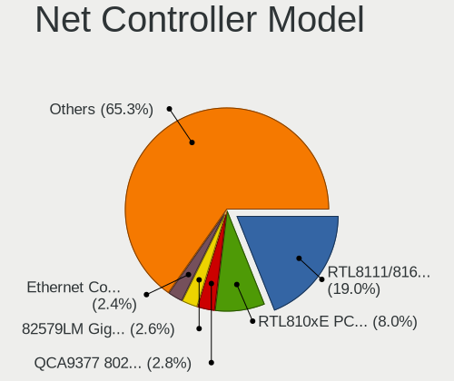

| Model                                                                  | Computers | Percent |
|------------------------------------------------------------------------|-----------|---------|
| Realtek RTL8111/8168/8211/8411 PCI Express Gigabit Ethernet Controller | 243       | 18.95%  |
| Realtek RTL810xE PCI Express Fast Ethernet controller                  | 102       | 7.96%   |
| Qualcomm Atheros QCA9377 802.11ac Wireless Network Adapter             | 36        | 2.81%   |
| Intel 82579LM Gigabit Network Connection (Lewisville)                  | 33        | 2.57%   |
| Intel Ethernet Connection I217-LM                                      | 31        | 2.42%   |
| Intel Cannon Lake PCH CNVi WiFi                                        | 24        | 1.87%   |
| Intel Wireless 8265 / 8275                                             | 22        | 1.72%   |
| Realtek RTL8821CE 802.11ac PCIe Wireless Network Adapter               | 20        | 1.56%   |
| Intel Wireless 8260                                                    | 20        | 1.56%   |
| Ralink RT5370 Wireless Adapter                                         | 19        | 1.48%   |
| Broadcom BCM43142 802.11b/g/n                                          | 18        | 1.4%    |
| Ralink MT7601U Wireless Adapter                                        | 16        | 1.25%   |
| Qualcomm Atheros QCA9565 / AR9565 Wireless Network Adapter             | 16        | 1.25%   |
| Qualcomm Atheros AR9285 Wireless Network Adapter (PCI-Express)         | 16        | 1.25%   |
| Intel Wireless 7265                                                    | 16        | 1.25%   |
| Intel Comet Lake PCH CNVi WiFi                                         | 16        | 1.25%   |
| Realtek RTL8723BE PCIe Wireless Network Adapter                        | 14        | 1.09%   |
| Realtek RTL8188FTV 802.11b/g/n 1T1R 2.4G WLAN Adapter                  | 14        | 1.09%   |
| Intel Alder Lake-P PCH CNVi WiFi                                       | 14        | 1.09%   |
| Broadcom BCM4313 802.11bgn Wireless Network Adapter                    | 14        | 1.09%   |
| Intel Comet Lake PCH-LP CNVi WiFi                                      | 13        | 1.01%   |
| Intel 82567LM-3 Gigabit Network Connection                             | 13        | 1.01%   |
| Broadcom NetXtreme BCM5762 Gigabit Ethernet PCIe                       | 13        | 1.01%   |
| Qualcomm Atheros AR8151 v2.0 Gigabit Ethernet                          | 12        | 0.94%   |
| Intel Wireless 7260                                                    | 12        | 0.94%   |
| Intel Wi-Fi 6 AX200                                                    | 12        | 0.94%   |
| Realtek RTL8188EUS 802.11n Wireless Network Adapter                    | 10        | 0.78%   |
| MediaTek MT7921 802.11ax PCI Express Wireless Network Adapter          | 10        | 0.78%   |
| Intel Wi-Fi 6 AX201                                                    | 10        | 0.78%   |
| Broadcom NetXtreme BCM5761 Gigabit Ethernet PCIe                       | 10        | 0.78%   |
| Realtek RTL8822CE 802.11ac PCIe Wireless Network Adapter               | 9         | 0.7%    |
| Qualcomm Atheros AR9485 Wireless Network Adapter                       | 9         | 0.7%    |
| Intel Ethernet Connection I219-LM                                      | 9         | 0.7%    |
| Intel Ethernet Connection (2) I219-LM                                  | 9         | 0.7%    |
| Broadcom BCM43228 802.11a/b/g/n                                        | 9         | 0.7%    |
| Realtek RTL8125 2.5GbE Controller                                      | 8         | 0.62%   |
| Ralink RT3290 Wireless 802.11n 1T/1R PCIe                              | 8         | 0.62%   |
| Qualcomm Atheros QCA6174 802.11ac Wireless Network Adapter             | 8         | 0.62%   |
| Intel Wireless 3160                                                    | 8         | 0.62%   |
| Intel Dual Band Wireless-AC 3165 Plus Bluetooth                        | 8         | 0.62%   |

Wireless Vendor
---------------

Wireless vendors

| Vendor                          | Computers | Percent |
|---------------------------------|-----------|---------|
| Intel                           | 251       | 41.01%  |
| Realtek Semiconductor           | 107       | 17.48%  |
| Qualcomm Atheros                | 96        | 15.69%  |
| Broadcom                        | 52        | 8.5%    |
| Ralink Technology               | 38        | 6.21%   |
| MediaTek                        | 20        | 3.27%   |
| Ralink                          | 13        | 2.12%   |
| Broadcom Limited                | 10        | 1.63%   |
| TP-Link                         | 8         | 1.31%   |
| Qualcomm Atheros Communications | 5         | 0.82%   |
| Sierra Wireless                 | 2         | 0.33%   |
| Edimax Technology               | 2         | 0.33%   |
| Dell                            | 2         | 0.33%   |
| D-Link                          | 2         | 0.33%   |
| ZyDAS                           | 1         | 0.16%   |
| Qualcomm                        | 1         | 0.16%   |
| Mercucys                        | 1         | 0.16%   |
| Belkin Components               | 1         | 0.16%   |

Wireless Model
--------------

Wireless models

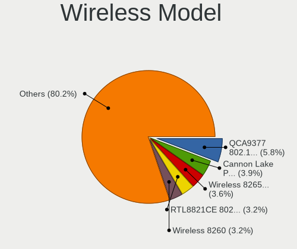

| Model                                                          | Computers | Percent |
|----------------------------------------------------------------|-----------|---------|
| Qualcomm Atheros QCA9377 802.11ac Wireless Network Adapter     | 36        | 5.84%   |
| Intel Cannon Lake PCH CNVi WiFi                                | 24        | 3.9%    |
| Intel Wireless 8265 / 8275                                     | 22        | 3.57%   |
| Realtek RTL8821CE 802.11ac PCIe Wireless Network Adapter       | 20        | 3.25%   |
| Intel Wireless 8260                                            | 20        | 3.25%   |
| Ralink RT5370 Wireless Adapter                                 | 19        | 3.08%   |
| Broadcom BCM43142 802.11b/g/n                                  | 18        | 2.92%   |
| Ralink MT7601U Wireless Adapter                                | 16        | 2.6%    |
| Qualcomm Atheros QCA9565 / AR9565 Wireless Network Adapter     | 16        | 2.6%    |
| Qualcomm Atheros AR9285 Wireless Network Adapter (PCI-Express) | 16        | 2.6%    |
| Intel Wireless 7265                                            | 16        | 2.6%    |
| Intel Comet Lake PCH CNVi WiFi                                 | 16        | 2.6%    |
| Realtek RTL8723BE PCIe Wireless Network Adapter                | 14        | 2.27%   |
| Realtek RTL8188FTV 802.11b/g/n 1T1R 2.4G WLAN Adapter          | 14        | 2.27%   |
| Intel Alder Lake-P PCH CNVi WiFi                               | 14        | 2.27%   |
| Broadcom BCM4313 802.11bgn Wireless Network Adapter            | 14        | 2.27%   |
| Intel Comet Lake PCH-LP CNVi WiFi                              | 13        | 2.11%   |
| Intel Wireless 7260                                            | 12        | 1.95%   |
| Intel Wi-Fi 6 AX200                                            | 12        | 1.95%   |
| Realtek RTL8188EUS 802.11n Wireless Network Adapter            | 10        | 1.62%   |
| MediaTek MT7921 802.11ax PCI Express Wireless Network Adapter  | 10        | 1.62%   |
| Intel Wi-Fi 6 AX201                                            | 10        | 1.62%   |
| Realtek RTL8822CE 802.11ac PCIe Wireless Network Adapter       | 9         | 1.46%   |
| Qualcomm Atheros AR9485 Wireless Network Adapter               | 9         | 1.46%   |
| Broadcom BCM43228 802.11a/b/g/n                                | 9         | 1.46%   |
| Ralink RT3290 Wireless 802.11n 1T/1R PCIe                      | 8         | 1.3%    |
| Qualcomm Atheros QCA6174 802.11ac Wireless Network Adapter     | 8         | 1.3%    |
| Intel Wireless 3160                                            | 8         | 1.3%    |
| Intel Dual Band Wireless-AC 3165 Plus Bluetooth                | 8         | 1.3%    |
| Realtek RTL8822BE 802.11a/b/g/n/ac WiFi adapter                | 7         | 1.14%   |
| Intel Centrino Advanced-N 6205 [Taylor Peak]                   | 7         | 1.14%   |
| Realtek RTL8821AE 802.11ac PCIe Wireless Network Adapter       | 6         | 0.97%   |
| MediaTek Wi-Fi 6E MT7902 Wireless Network Adapter              | 6         | 0.97%   |
| Intel Tiger Lake PCH CNVi WiFi                                 | 6         | 0.97%   |
| Intel Centrino Advanced-N 6235                                 | 6         | 0.97%   |
| Intel Wireless 3165                                            | 5         | 0.81%   |
| Intel Wi-Fi 5(802.11ac) Wireless-AC 9x6x [Thunder Peak]        | 5         | 0.81%   |
| Intel Dual Band Wireless-AC 3168NGW [Stone Peak]               | 5         | 0.81%   |
| Intel Cannon Point-LP CNVi [Wireless-AC]                       | 5         | 0.81%   |
| TP-Link TL-WN722N v2/v3 [Realtek RTL8188EUS]                   | 4         | 0.65%   |

Ethernet Vendor
---------------

Ethernet vendors

| Vendor                            | Computers | Percent |
|-----------------------------------|-----------|---------|
| Realtek Semiconductor             | 363       | 56.19%  |
| Intel                             | 172       | 26.63%  |
| Broadcom                          | 39        | 6.04%   |
| Qualcomm Atheros                  | 34        | 5.26%   |
| Broadcom Limited                  | 12        | 1.86%   |
| Xiaomi                            | 4         | 0.62%   |
| Marvell Technology Group          | 4         | 0.62%   |
| Nvidia                            | 3         | 0.46%   |
| ASIX Electronics                  | 3         | 0.46%   |
| MediaTek                          | 2         | 0.31%   |
| Huawei Technologies               | 2         | 0.31%   |
| VIA Technologies                  | 1         | 0.15%   |
| TP-Link                           | 1         | 0.15%   |
| Sundance Technology Inc / IC Plus | 1         | 0.15%   |
| Samsung Electronics               | 1         | 0.15%   |
| Qualcomm                          | 1         | 0.15%   |
| Lenovo                            | 1         | 0.15%   |
| JMicron Technology                | 1         | 0.15%   |
| 3Com                              | 1         | 0.15%   |

Ethernet Model
--------------

Ethernet models

| Model                                                                  | Computers | Percent |
|------------------------------------------------------------------------|-----------|---------|
| Realtek RTL8111/8168/8211/8411 PCI Express Gigabit Ethernet Controller | 243       | 37.1%   |
| Realtek RTL810xE PCI Express Fast Ethernet controller                  | 102       | 15.57%  |
| Intel 82579LM Gigabit Network Connection (Lewisville)                  | 33        | 5.04%   |
| Intel Ethernet Connection I217-LM                                      | 31        | 4.73%   |
| Intel 82567LM-3 Gigabit Network Connection                             | 13        | 1.98%   |
| Broadcom NetXtreme BCM5762 Gigabit Ethernet PCIe                       | 13        | 1.98%   |
| Qualcomm Atheros AR8151 v2.0 Gigabit Ethernet                          | 12        | 1.83%   |
| Broadcom NetXtreme BCM5761 Gigabit Ethernet PCIe                       | 10        | 1.53%   |
| Intel Ethernet Connection I219-LM                                      | 9         | 1.37%   |
| Intel Ethernet Connection (2) I219-LM                                  | 9         | 1.37%   |
| Realtek RTL8125 2.5GbE Controller                                      | 8         | 1.22%   |
| Intel 82577LM Gigabit Network Connection                               | 8         | 1.22%   |
| Intel Ethernet Connection (16) I219-LM                                 | 7         | 1.07%   |
| Broadcom Limited NetXtreme BCM5761 Gigabit Ethernet PCIe               | 7         | 1.07%   |
| Intel Ethernet Connection (7) I219-LM                                  | 6         | 0.92%   |
| Realtek Killer E2600 GbE Controller                                    | 5         | 0.76%   |
| Intel Ethernet Connection (4) I219-LM                                  | 5         | 0.76%   |
| Qualcomm Atheros Killer E2400 Gigabit Ethernet Controller              | 4         | 0.61%   |
| Qualcomm Atheros Killer E220x Gigabit Ethernet Controller              | 4         | 0.61%   |
| Intel I211 Gigabit Network Connection                                  | 4         | 0.61%   |
| Intel Ethernet Connection I218-LM                                      | 4         | 0.61%   |
| Intel Ethernet Connection (3) I218-LM                                  | 4         | 0.61%   |
| Intel 82574L Gigabit Network Connection                                | 4         | 0.61%   |
| Intel 82567LM Gigabit Network Connection                               | 4         | 0.61%   |
| Intel 82566DM-2 Gigabit Network Connection                             | 4         | 0.61%   |
| Xiaomi Mi/Redmi series (RNDIS + ADB)                                   | 3         | 0.46%   |
| Qualcomm Atheros AR8151 v1.0 Gigabit Ethernet                          | 3         | 0.46%   |
| Qualcomm Atheros AR8132 Fast Ethernet                                  | 3         | 0.46%   |
| Intel Ethernet Connection (5) I219-LM                                  | 3         | 0.46%   |
| Intel 82566DM Gigabit Network Connection                               | 3         | 0.46%   |
| Broadcom NetXtreme BCM5764M Gigabit Ethernet PCIe                      | 3         | 0.46%   |
| Realtek Killer E3000 2.5GbE Controller                                 | 2         | 0.31%   |
| Qualcomm Atheros QCA8171 Gigabit Ethernet                              | 2         | 0.31%   |
| Qualcomm Atheros Killer E2500 Gigabit Ethernet Controller              | 2         | 0.31%   |
| Nvidia MCP79 Ethernet                                                  | 2         | 0.31%   |
| Marvell Group 88E8040 PCI-E Fast Ethernet Controller                   | 2         | 0.31%   |
| Intel Ethernet Controller I226-V                                       | 2         | 0.31%   |
| Intel Ethernet Connection (2) I219-V                                   | 2         | 0.31%   |
| Intel Ethernet Connection (13) I219-V                                  | 2         | 0.31%   |
| Intel 82579V Gigabit Network Connection                                | 2         | 0.31%   |

Net Controller Kind
-------------------

Ethernet, WiFi or modem

| Kind     | Computers | Percent |
|----------|-----------|---------|
| Ethernet | 629       | 51.64%  |
| WiFi     | 578       | 47.45%  |
| Modem    | 11        | 0.9%    |

Used Controller
---------------

Currently used network controller

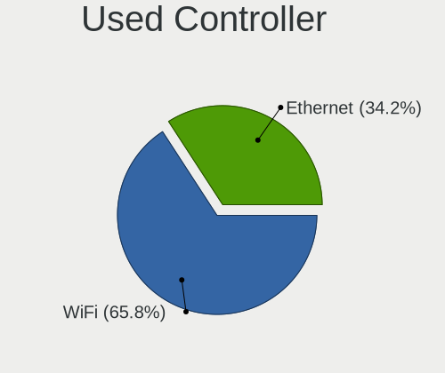

| Kind     | Computers | Percent |
|----------|-----------|---------|
| WiFi     | 478       | 65.84%  |
| Ethernet | 248       | 34.16%  |

NICs
----

Total network controllers on board

| Total | Computers | Percent |
|-------|-----------|---------|
| 2     | 447       | 62.61%  |
| 1     | 248       | 34.73%  |
| 0     | 14        | 1.96%   |
| 3     | 5         | 0.7%    |

IPv6
----

IPv6 vs IPv4

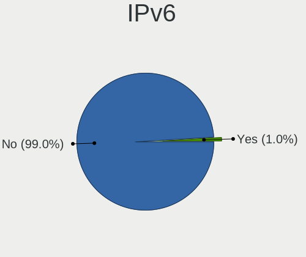

| Used | Computers | Percent |
|------|-----------|---------|
| No   | 709       | 99.02%  |
| Yes  | 7         | 0.98%   |

Bluetooth
---------

Bluetooth Vendor
----------------

Controller vendors

| Vendor                          | Computers | Percent |
|---------------------------------|-----------|---------|
| Intel                           | 207       | 44.52%  |
| Realtek Semiconductor           | 58        | 12.47%  |
| Qualcomm Atheros Communications | 58        | 12.47%  |
| Broadcom                        | 29        | 6.24%   |
| IMC Networks                    | 22        | 4.73%   |
| Cambridge Silicon Radio         | 20        | 4.3%    |
| Lite-On Technology              | 11        | 2.37%   |
| Hewlett-Packard                 | 11        | 2.37%   |
| Toshiba                         | 10        | 2.15%   |
| Foxconn / Hon Hai               | 10        | 2.15%   |
| Ralink                          | 8         | 1.72%   |
| Dell                            | 7         | 1.51%   |
| MediaTek                        | 3         | 0.65%   |
| Apple                           | 3         | 0.65%   |
| TP-Link                         | 2         | 0.43%   |
| Foxconn International           | 2         | 0.43%   |
| Taiyo Yuden                     | 1         | 0.22%   |
| Realtek                         | 1         | 0.22%   |
| Ralink Technology               | 1         | 0.22%   |
| Edimax Technology               | 1         | 0.22%   |

Bluetooth Model
---------------

Controller models

| Model                                               | Computers | Percent |
|-----------------------------------------------------|-----------|---------|
| Intel Bluetooth wireless interface                  | 83        | 17.85%  |
| Intel AX201 Bluetooth                               | 47        | 10.11%  |
| Qualcomm Atheros  Bluetooth Device                  | 40        | 8.6%    |
| Intel Bluetooth 9460/9560 Jefferson Peak (JfP)      | 35        | 7.53%   |
| Realtek Bluetooth Radio                             | 33        | 7.1%    |
| Cambridge Silicon Radio Bluetooth Dongle (HCI mode) | 20        | 4.3%    |
| IMC Networks Wireless_Device                        | 14        | 3.01%   |
| Realtek  Bluetooth 4.2 Adapter                      | 11        | 2.37%   |
| Intel AX200 Bluetooth                               | 11        | 2.37%   |
| Intel AX211 Bluetooth                               | 9         | 1.94%   |
| Ralink RT3290 Bluetooth                             | 8         | 1.72%   |
| HP Broadcom 2070 Bluetooth Combo                    | 8         | 1.72%   |
| Realtek RTL8821A Bluetooth                          | 7         | 1.51%   |
| Intel Centrino Bluetooth Wireless Transceiver       | 7         | 1.51%   |
| Broadcom BCM43142 Bluetooth 4.0                     | 7         | 1.51%   |
| Qualcomm Atheros AR3011 Bluetooth                   | 6         | 1.29%   |
| Broadcom HP Portable Bumble Bee                     | 6         | 1.29%   |
| Qualcomm Atheros AR9462 Bluetooth                   | 5         | 1.08%   |
| Intel Wireless-AC 3168 Bluetooth                    | 5         | 1.08%   |
| Realtek RTL8723B Bluetooth                          | 4         | 0.86%   |
| Intel AX210 Bluetooth                               | 4         | 0.86%   |
| IMC Networks Bluetooth Radio                        | 4         | 0.86%   |
| Dell Wireless 365 Bluetooth                         | 4         | 0.86%   |
| Toshiba RT Bluetooth Radio                          | 3         | 0.65%   |
| Qualcomm Atheros AR3012 Bluetooth 4.0               | 3         | 0.65%   |
| Lite-On Qualcomm Atheros QCA9377 Bluetooth          | 3         | 0.65%   |
| Lite-On Bluetooth Device                            | 3         | 0.65%   |
| Intel Wireless-AC 9260 Bluetooth Adapter            | 3         | 0.65%   |
| Intel Centrino Advanced-N 6230 Bluetooth adapter    | 3         | 0.65%   |
| HP Bluetooth 2.0 Interface [Broadcom BCM2045]       | 3         | 0.65%   |
| Foxconn / Hon Hai Bluetooth Device                  | 3         | 0.65%   |
| Dell DW375 Bluetooth Module                         | 3         | 0.65%   |
| Broadcom HP Portable SoftSailing                    | 3         | 0.65%   |
| Broadcom BCM43142A0 Bluetooth 4.0                   | 3         | 0.65%   |
| Broadcom BCM2045B (BDC-2.1)                         | 3         | 0.65%   |
| TP-Link TP-Link Bluetooth USB Adapter               | 2         | 0.43%   |
| Toshiba Integrated Bluetooth HCI                    | 2         | 0.43%   |
| Toshiba Askey Bluetooth Module                      | 2         | 0.43%   |
| Realtek 802.11ac WLAN Adapter                       | 2         | 0.43%   |
| Qualcomm Atheros QCA61x4 Bluetooth 4.0              | 2         | 0.43%   |

Sound
-----

Sound Vendor
------------

Sound card vendors

| Vendor                 | Computers | Percent |
|------------------------|-----------|---------|
| Intel                  | 571       | 62.61%  |
| AMD                    | 159       | 17.43%  |
| Nvidia                 | 154       | 16.89%  |
| JMTek                  | 4         | 0.44%   |
| Generalplus Technology | 4         | 0.44%   |
| C-Media Electronics    | 4         | 0.44%   |
| ASUSTek Computer       | 4         | 0.44%   |
| Conexant Systems       | 3         | 0.33%   |
| Logitech               | 2         | 0.22%   |
| VIA Technologies       | 1         | 0.11%   |
| Thermaltake            | 1         | 0.11%   |
| Texas Instruments      | 1         | 0.11%   |
| Tenx Technology        | 1         | 0.11%   |
| Kingston Technology    | 1         | 0.11%   |
| Hewlett-Packard        | 1         | 0.11%   |
| Astro Gaming           | 1         | 0.11%   |

Sound Model
-----------

Sound card models

| Model                                                                      | Computers | Percent |
|----------------------------------------------------------------------------|-----------|---------|
| Intel Sunrise Point-LP HD Audio                                            | 78        | 7.1%    |
| Intel 8 Series/C220 Series Chipset High Definition Audio Controller        | 49        | 4.46%   |
| Intel 6 Series/C200 Series Chipset Family High Definition Audio Controller | 49        | 4.46%   |
| Intel 7 Series/C216 Chipset Family High Definition Audio Controller        | 44        | 4%      |
| AMD Family 17h/19h/1ah HD Audio Controller                                 | 44        | 4%      |
| Intel Xeon E3-1200 v3/4th Gen Core Processor HD Audio Controller           | 41        | 3.73%   |
| Intel Cannon Lake PCH cAVS                                                 | 39        | 3.55%   |
| AMD FCH Azalia Controller                                                  | 31        | 2.82%   |
| Intel 8 Series HD Audio Controller                                         | 28        | 2.55%   |
| Intel Haswell-ULT HD Audio Controller                                      | 26        | 2.37%   |
| Intel 5 Series/3400 Series Chipset High Definition Audio                   | 25        | 2.27%   |
| Intel Broadwell-U Audio Controller                                         | 22        | 2%      |
| Intel Wildcat Point-LP High Definition Audio Controller                    | 21        | 1.91%   |
| Nvidia TU107 GeForce GTX 1650 High Definition Audio Controller             | 19        | 1.73%   |
| AMD Renoir Radeon High Definition Audio Controller                         | 19        | 1.73%   |
| Nvidia GP107GL High Definition Audio Controller                            | 18        | 1.64%   |
| AMD SBx00 Azalia (Intel HDA)                                               | 18        | 1.64%   |
| Intel NM10/ICH7 Family High Definition Audio Controller                    | 17        | 1.55%   |
| AMD Family 15h (Models 60h-6fh) Audio Controller                           | 17        | 1.55%   |
| Intel Comet Lake PCH cAVS                                                  | 16        | 1.46%   |
| Intel Alder Lake PCH-P High Definition Audio Controller                    | 16        | 1.46%   |
| Intel 82801I (ICH9 Family) HD Audio Controller                             | 16        | 1.46%   |
| AMD Trinity HDMI Audio Controller                                          | 16        | 1.46%   |
| Intel Tiger Lake-LP Smart Sound Technology Audio Controller                | 15        | 1.36%   |
| Nvidia GA107 High Definition Audio Controller                              | 14        | 1.27%   |
| Intel Cannon Point-LP High Definition Audio Controller                     | 14        | 1.27%   |
| Nvidia High Definition Audio Controller                                    | 13        | 1.18%   |
| Intel Comet Lake PCH-LP cAVS                                               | 13        | 1.18%   |
| Intel 82801JD/DO (ICH10 Family) HD Audio Controller                        | 13        | 1.18%   |
| Intel 100 Series/C230 Series Chipset Family HD Audio Controller            | 13        | 1.18%   |
| AMD Raven/Raven2/Fenghuang HDMI/DP Audio Controller                        | 13        | 1.18%   |
| AMD Kabini HDMI/DP Audio                                                   | 13        | 1.18%   |
| Intel Ice Lake-LP Smart Sound Technology Audio Controller                  | 12        | 1.09%   |
| Intel CM238 HD Audio Controller                                            | 12        | 1.09%   |
| Intel 82801H (ICH8 Family) HD Audio Controller                             | 12        | 1.09%   |
| Nvidia GF119 HDMI Audio Controller                                         | 10        | 0.91%   |
| AMD Ellesmere HDMI Audio [Radeon RX 470/480 / 570/580/590]                 | 10        | 0.91%   |
| AMD High Definition Audio Controller                                       | 9         | 0.82%   |
| Nvidia TU116 High Definition Audio Controller                              | 8         | 0.73%   |
| Nvidia GA104 High Definition Audio Controller                              | 8         | 0.73%   |

Memory
------

Memory Vendor
-------------

Memory module vendors

| Vendor                       | Computers | Percent |
|------------------------------|-----------|---------|
| Samsung Electronics          | 120       | 27.52%  |
| SK hynix                     | 96        | 22.02%  |
| Micron Technology            | 58        | 13.3%   |
| Kingston                     | 36        | 8.26%   |
| Unknown                      | 34        | 7.8%    |
| Crucial                      | 31        | 7.11%   |
| Ramaxel Technology           | 18        | 4.13%   |
| Nanya Technology             | 9         | 2.06%   |
| Elpida                       | 8         | 1.83%   |
| Corsair                      | 6         | 1.38%   |
| M                            | 3         | 0.69%   |
| Team                         | 2         | 0.46%   |
| MINPO                        | 2         | 0.46%   |
| G.Skill                      | 2         | 0.46%   |
| Unknown                      | 2         | 0.46%   |
| Unknown (E)                  | 1         | 0.23%   |
| Unknown (ABCD)               | 1         | 0.23%   |
| Unknown (0x7F7FB5FFFFFFFFFF) | 1         | 0.23%   |
| S                            | 1         | 0.23%   |
| Lexar Co Limited             | 1         | 0.23%   |
| Kingmax                      | 1         | 0.23%   |
| H                            | 1         | 0.23%   |
| Axiom                        | 1         | 0.23%   |
| A-DATA Technology            | 1         | 0.23%   |

Memory Model
------------

Memory module models

| Model                                                     | Computers | Percent |
|-----------------------------------------------------------|-----------|---------|
| Micron RAM 8JTF51264AZ-1G6E1 4GB DIMM 1600MT/s            | 8         | 1.71%   |
| SK hynix RAM HMA81GS6AFR8N-UH 8GB SODIMM DDR4 2667MT/s    | 7         | 1.5%    |
| SK hynix RAM HMAA1GS6CJR6N-XN 8GB SODIMM DDR4 3200MT/s    | 6         | 1.28%   |
| Samsung RAM M471A5244CB0-CRC 4GB SODIMM DDR4 2667MT/s     | 6         | 1.28%   |
| Samsung RAM M471A1K43DB1-CTD 8GB SODIMM DDR4 2667MT/s     | 5         | 1.07%   |
| SK hynix RAM HMT351S6CFR8C-PB 4GB SODIMM DDR3 1600MT/s    | 4         | 0.85%   |
| SK hynix RAM HMA81GS6JJR8N-VK 8GB SODIMM DDR4 2667MT/s    | 4         | 0.85%   |
| SK hynix RAM HMA41GS6AFR8N-TF 8GB SODIMM DDR4 2667MT/s    | 4         | 0.85%   |
| Samsung RAM M471A1K43CB1-CRC 8GB SODIMM DDR4 2667MT/s     | 4         | 0.85%   |
| Samsung RAM M378B5673FH0-CH9 2GB DIMM DDR3 1600MT/s       | 4         | 0.85%   |
| Samsung RAM M378B5273CH0-CH9 4GB DIMM DDR3 1867MT/s       | 4         | 0.85%   |
| Samsung RAM M378B5173DB0-CK0 4096MB DIMM DDR3 1600MT/s    | 4         | 0.85%   |
| Micron RAM 16JSF51264HZ-1G4D1 4GB SODIMM DDR3 1334MT/s    | 4         | 0.85%   |
| Unknown RAM Module 2GB DIMM 800MT/s                       | 3         | 0.64%   |
| SK hynix RAM HMT451U6BFR8A-PB 4GB DIMM DDR3 1600MT/s      | 3         | 0.64%   |
| SK hynix RAM HMT451S6BFR8A-PB 4096MB SODIMM DDR3 1600MT/s | 3         | 0.64%   |
| SK hynix RAM HMT425S6AFR6A-PB 2GB SODIMM DDR3 1600MT/s    | 3         | 0.64%   |
| SK hynix RAM HMT41GS6BFR8A-PB 8GB SODIMM DDR3 1600MT/s    | 3         | 0.64%   |
| Samsung RAM Module 16GB SODIMM DDR4 2667MT/s              | 3         | 0.64%   |
| Samsung RAM M471B5773CHS-CH9 2GB SODIMM DDR3 4199MT/s     | 3         | 0.64%   |
| Samsung RAM M471B5173DB0-YK0 4GB SODIMM DDR3 1600MT/s     | 3         | 0.64%   |
| Samsung RAM M471B1G73DB0-YK0 8GB SODIMM DDR3 1600MT/s     | 3         | 0.64%   |
| Samsung RAM M471A5244CB0-CWE 4096MB SODIMM DDR4 3200MT/s  | 3         | 0.64%   |
| Samsung RAM M471A2K43DB1-CTD 16GB SODIMM DDR4 2667MT/s    | 3         | 0.64%   |
| Samsung RAM M471A2K43CB1-CRC 16GB SODIMM DDR4 2667MT/s    | 3         | 0.64%   |
| Samsung RAM M471A1K43EB1-CWE 8GB SODIMM DDR4 3200MT/s     | 3         | 0.64%   |
| Samsung RAM M471A1K43DB1-CWE 8GB SODIMM DDR4 3200MT/s     | 3         | 0.64%   |
| Samsung RAM M471A1G44BB0-CWE 8GB SODIMM DDR4 3200MT/s     | 3         | 0.64%   |
| Samsung RAM M378B5173QH0-CK0 4GB DIMM DDR3 1600MT/s       | 3         | 0.64%   |
| Micron RAM 8ATF1G64HZ-3G2R1 8GB SODIMM DDR4 3200MT/s      | 3         | 0.64%   |
| Micron RAM 4ATF51264HZ-2G6E1 4GB SODIMM DDR4 2667MT/s     | 3         | 0.64%   |
| Micron RAM 4ATF51264HZ-2G3AZ 4GB SODIMM DDR4 2133MT/s     | 3         | 0.64%   |
| Micron RAM 4ATF1G64HZ-3G2F1 8GB SODIMM DDR4 3200MT/s      | 3         | 0.64%   |
| Micron RAM 4ATF1G64HZ-3G2E1 8GB SODIMM DDR4 3200MT/s      | 3         | 0.64%   |
| Corsair RAM CMK8GX4M1D3000C16 8GB DIMM DDR4 3600MT/s      | 3         | 0.64%   |
| Unknown RAM Module 4GB DIMM 400MT/s                       | 2         | 0.43%   |
| Unknown RAM Module 4096MB DIMM 400MT/s                    | 2         | 0.43%   |
| Unknown RAM Module 2GB DIMM 667MT/s                       | 2         | 0.43%   |
| Unknown RAM Module 2GB DIMM 400MT/s                       | 2         | 0.43%   |
| Unknown RAM Module 2048MB DIMM 800MT/s                    | 2         | 0.43%   |

Memory Kind
-----------

Memory module kinds

| Kind    | Computers | Percent |
|---------|-----------|---------|
| DDR4    | 158       | 45.66%  |
| DDR3    | 122       | 35.26%  |
| SDRAM   | 19        | 5.49%   |
| Unknown | 18        | 5.2%    |
| DDR2    | 10        | 2.89%   |
| DDR5    | 7         | 2.02%   |
| LPDDR3  | 5         | 1.45%   |
| LPDDR4  | 4         | 1.16%   |
| DDR     | 2         | 0.58%   |
| LPDDR5  | 1         | 0.29%   |

Memory Form Factor
------------------

Physical design of the memory module

| Name         | Computers | Percent |
|--------------|-----------|---------|
| SODIMM       | 224       | 67.47%  |
| DIMM         | 99        | 29.82%  |
| Row Of Chips | 6         | 1.81%   |
| Chip         | 3         | 0.9%    |

Memory Size
-----------

Memory module size

| Size  | Computers | Percent |
|-------|-----------|---------|
| 8192  | 129       | 33.68%  |
| 4096  | 111       | 28.98%  |
| 16384 | 69        | 18.02%  |
| 2048  | 56        | 14.62%  |
| 1024  | 11        | 2.87%   |
| 32768 | 4         | 1.04%   |
| 512   | 3         | 0.78%   |

Memory Speed
------------

Memory module speed

| Speed   | Computers | Percent |
|---------|-----------|---------|
| 1600    | 88        | 22.74%  |
| 2667    | 81        | 20.93%  |
| 3200    | 53        | 13.7%   |
| 1333    | 23        | 5.94%   |
| 2133    | 17        | 4.39%   |
| 2400    | 15        | 3.88%   |
| 1334    | 14        | 3.62%   |
| 667     | 11        | 2.84%   |
| 1867    | 10        | 2.58%   |
| 800     | 9         | 2.33%   |
| 400     | 8         | 2.07%   |
| 1866    | 7         | 1.81%   |
| 4800    | 6         | 1.55%   |
| 3600    | 5         | 1.29%   |
| Unknown | 5         | 1.29%   |
| 1066    | 4         | 1.03%   |
| 4199    | 3         | 0.78%   |
| 3467    | 3         | 0.78%   |
| 2048    | 3         | 0.78%   |
| 1648    | 3         | 0.78%   |
| 8400    | 2         | 0.52%   |
| 3266    | 2         | 0.52%   |
| 1800    | 2         | 0.52%   |
| 1331    | 2         | 0.52%   |
| 533     | 2         | 0.52%   |
| 49926   | 1         | 0.26%   |
| 6400    | 1         | 0.26%   |
| 5200    | 1         | 0.26%   |
| 4266    | 1         | 0.26%   |
| 3800    | 1         | 0.26%   |
| 3000    | 1         | 0.26%   |
| 2666    | 1         | 0.26%   |
| 2000    | 1         | 0.26%   |
| 1639    | 1         | 0.26%   |

Printers & scanners
-------------------

Printer Vendor
--------------

Printer device vendors

| Vendor          | Computers | Percent |
|-----------------|-----------|---------|
| Hewlett-Packard | 6         | 54.55%  |
| Seiko Epson     | 2         | 18.18%  |
| Ricoh           | 1         | 9.09%   |
| Kyocera         | 1         | 9.09%   |
| Canon           | 1         | 9.09%   |

Printer Model
-------------

Printer device models

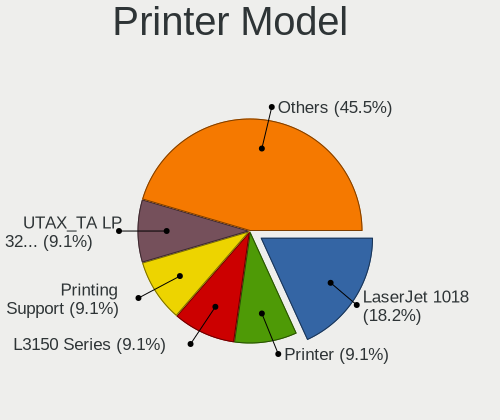

| Model                           | Computers | Percent |
|---------------------------------|-----------|---------|
| HP LaserJet 1018                | 2         | 18.18%  |
| Seiko Epson Printer             | 1         | 9.09%   |
| Seiko Epson L3150 Series        | 1         | 9.09%   |
| Ricoh Printing Support          | 1         | 9.09%   |
| Kyocera UTAX_TA LP 3240_LP 4240 | 1         | 9.09%   |
| HP LaserJet P3005               | 1         | 9.09%   |
| HP LaserJet M402d               | 1         | 9.09%   |
| HP DeskJet F2492 All-in-One     | 1         | 9.09%   |
| HP Deskjet 1510                 | 1         | 9.09%   |
| Canon LBP3010/LBP3018/LBP3050   | 1         | 9.09%   |

Scanner Vendor
--------------

Scanner device vendors

Zero info for selected period =(

Scanner Model
-------------

Scanner device models

Zero info for selected period =(

Camera
------

Camera Vendor
-------------

Camera device vendors

| Vendor                                 | Computers | Percent |
|----------------------------------------|-----------|---------|
| Chicony Electronics                    | 109       | 22.61%  |
| Microdia                               | 62        | 12.86%  |
| IMC Networks                           | 46        | 9.54%   |
| Realtek Semiconductor                  | 41        | 8.51%   |
| Cheng Uei Precision Industry (Foxlink) | 40        | 8.3%    |
| Sunplus Innovation Technology          | 30        | 6.22%   |
| Lite-On Technology                     | 24        | 4.98%   |
| Bison Electronics                      | 20        | 4.15%   |
| Quanta                                 | 18        | 3.73%   |
| Suyin                                  | 13        | 2.7%    |
| Acer                                   | 12        | 2.49%   |
| Syntek                                 | 9         | 1.87%   |
| Silicon Motion                         | 9         | 1.87%   |
| Apple                                  | 7         | 1.45%   |
| Sonix Technology                       | 6         | 1.24%   |
| Samsung Electronics                    | 6         | 1.24%   |
| Luxvisions Innotech Limited            | 4         | 0.83%   |
| Logitech                               | 3         | 0.62%   |
| Lenovo                                 | 2         | 0.41%   |
| eMPIA Technology                       | 2         | 0.41%   |
| Cubeternet                             | 2         | 0.41%   |
| Z-Star Microelectronics                | 1         | 0.21%   |
| vivo                                   | 1         | 0.21%   |
| ShineTech                              | 1         | 0.21%   |
| OPPO Electronics                       | 1         | 0.21%   |
| OmniVision Technologies                | 1         | 0.21%   |
| Microsoft                              | 1         | 0.21%   |
| MacroSilicon                           | 1         | 0.21%   |
| kingcome                               | 1         | 0.21%   |
| Jieli Technology                       | 1         | 0.21%   |
| Intel                                  | 1         | 0.21%   |
| Genesys Logic                          | 1         | 0.21%   |
| Foxconn / Hon Hai                      | 1         | 0.21%   |
| Aveo Technology                        | 1         | 0.21%   |
| Arkmicro Technologies                  | 1         | 0.21%   |
| ALi                                    | 1         | 0.21%   |
| Alcor Micro                            | 1         | 0.21%   |
| Unknown                                | 1         | 0.21%   |

Camera Model
------------

Camera device models

| Model                                                                      | Computers | Percent |
|----------------------------------------------------------------------------|-----------|---------|
| Microdia Integrated_Webcam_HD                                              | 36        | 7.42%   |
| Realtek Integrated_Webcam_HD                                               | 17        | 3.51%   |
| Chicony Integrated Camera                                                  | 15        | 3.09%   |
| IMC Networks USB2.0 HD UVC WebCam                                          | 14        | 2.89%   |
| IMC Networks Integrated Camera                                             | 13        | 2.68%   |
| Chicony EasyCamera                                                         | 13        | 2.68%   |
| Chicony HP HD Camera                                                       | 12        | 2.47%   |
| Sunplus Integrated_Webcam_HD                                               | 9         | 1.86%   |
| Cheng Uei Precision Industry (Foxlink) HP HD Webcam                        | 9         | 1.86%   |
| Lite-On HP HD Webcam                                                       | 8         | 1.65%   |
| IMC Networks USB2.0 VGA UVC WebCam                                         | 8         | 1.65%   |
| Cheng Uei Precision Industry (Foxlink) HP HD Camera                        | 8         | 1.65%   |
| Suyin HP Truevision HD                                                     | 7         | 1.44%   |
| Chicony HP TrueVision HD Camera                                            | 7         | 1.44%   |
| Cheng Uei Precision Industry (Foxlink) HP Wide Vision HD Integrated Webcam | 7         | 1.44%   |
| Realtek Integrated Webcam HD                                               | 6         | 1.24%   |
| Microdia Laptop_Integrated_Webcam_HD                                       | 6         | 1.24%   |
| Lite-On HP HD Camera                                                       | 6         | 1.24%   |
| Cheng Uei Precision Industry (Foxlink) HP Webcam                           | 6         | 1.24%   |
| Apple iPhone 5/5C/5S/6/SE/7/8/X/XR                                         | 6         | 1.24%   |
| Syntek Integrated Camera                                                   | 5         | 1.03%   |
| Samsung Galaxy series, misc. (MTP mode)                                    | 5         | 1.03%   |
| Lite-On Integrated Camera                                                  | 5         | 1.03%   |
| Bison Lenovo EasyCamera                                                    | 5         | 1.03%   |
| Sonix USB2.0 HD UVC WebCam                                                 | 4         | 0.82%   |
| Realtek Integrated Webcam                                                  | 4         | 0.82%   |
| Realtek EasyCamera                                                         | 4         | 0.82%   |
| Microdia Dell Laptop Integrated Webcam HD                                  | 4         | 0.82%   |
| Microdia 1.3 MPixel Integrated Webcam                                      | 4         | 0.82%   |
| IMC Networks EasyCamera                                                    | 4         | 0.82%   |
| Chicony USB2.0 VGA UVC WebCam                                              | 4         | 0.82%   |
| Chicony TOSHIBA Web Camera - HD                                            | 4         | 0.82%   |
| Chicony HP HD Webcam                                                       | 4         | 0.82%   |
| Bison EasyCamera                                                           | 4         | 0.82%   |
| Acer Lenovo EasyCamera                                                     | 4         | 0.82%   |
| Acer HP TrueVision HD                                                      | 4         | 0.82%   |
| Syntek EasyCamera                                                          | 3         | 0.62%   |
| Sunplus Laptop_Integrated_Webcam_FHD                                       | 3         | 0.62%   |
| Sunplus Dell HD Webcam                                                     | 3         | 0.62%   |
| Quanta HP TrueVision HD Camera                                             | 3         | 0.62%   |

Security
--------

Fingerprint Vendor
------------------

Fingerprint sensor vendors

| Vendor                             | Computers | Percent |
|------------------------------------|-----------|---------|
| Validity Sensors                   | 51        | 54.84%  |
| Synaptics                          | 18        | 19.35%  |
| Shenzhen Goodix Technology         | 10        | 10.75%  |
| AuthenTec                          | 6         | 6.45%   |
| Upek                               | 5         | 5.38%   |
| Realtek USB2.0 Finger Print Bridge | 1         | 1.08%   |
| Focal-systems.Corp                 | 1         | 1.08%   |
| Elan Microelectronics              | 1         | 1.08%   |

Fingerprint Model
-----------------

Fingerprint sensor models

| Model                                                                      | Computers | Percent |
|----------------------------------------------------------------------------|-----------|---------|
| Validity Sensors VFS495 Fingerprint Reader                                 | 22        | 23.66%  |
| Validity Sensors Synaptics VFS7552 Touch Fingerprint Sensor with PurePrint | 6         | 6.45%   |
| Validity Sensors Fingerprint scanner                                       | 6         | 6.45%   |
| Validity Sensors VFS451 Fingerprint Reader                                 | 5         | 5.38%   |
| Synaptics  FS7604 Touch Fingerprint Sensor with PurePrint                  | 5         | 5.38%   |
| Shenzhen Goodix Fingerprint Reader                                         | 5         | 5.38%   |
| Validity Sensors VFS7500 Touch Fingerprint Sensor                          | 4         | 4.3%    |
| Upek Biometric Touchchip/Touchstrip Fingerprint Sensor                     | 4         | 4.3%    |
| Synaptics  WBDI                                                            | 4         | 4.3%    |
| Shenzhen Goodix  Fingerprint Device                                        | 4         | 4.3%    |
| Synaptics Metallica MOH Touch Fingerprint Reader                           | 3         | 3.23%   |
| AuthenTec AES2810                                                          | 3         | 3.23%   |
| Validity Sensors VFS491                                                    | 2         | 2.15%   |
| Validity Sensors Swipe Fingerprint Sensor                                  | 2         | 2.15%   |
| Synaptics UWP WBDI                                                         | 2         | 2.15%   |
| Synaptics Fingerprint reader [HP G6]                                       | 2         | 2.15%   |
| Validity Sensors VFS471 Fingerprint Reader                                 | 1         | 1.08%   |
| Validity Sensors VFS301 Fingerprint Reader                                 | 1         | 1.08%   |
| Validity Sensors VFS 5011 fingerprint sensor                               | 1         | 1.08%   |
| Validity Sensors Synaptics VFS7552 Touch Fingerprint Sensor                | 1         | 1.08%   |
| Upek TCS5B Fingerprint sensor                                              | 1         | 1.08%   |
| Synaptics UWP WBDI Device                                                  | 1         | 1.08%   |
| Synaptics FS7604 Touch Fingerprint Sensor with PurePrint                   | 1         | 1.08%   |
| Shenzhen Goodix FingerPrint                                                | 1         | 1.08%   |
| Realtek USB2.0 Finger Print Bridge FocalTech Fingerprint Device            | 1         | 1.08%   |
| Focal-systems.Corp FT9201Fingerprint.                                  | 1         | 1.08%   |
| Elan ELAN:ARM-M4                                                           | 1         | 1.08%   |
| AuthenTec AES2501 Fingerprint Sensor                                       | 1         | 1.08%   |
| AuthenTec AES1660 Fingerprint Sensor                                       | 1         | 1.08%   |
| AuthenTec AES1600                                                          | 1         | 1.08%   |

Chipcard Vendor
---------------

Chipcard module vendors

| Vendor              | Computers | Percent |
|---------------------|-----------|---------|
| Broadcom            | 30        | 75%     |
| Alcor Micro         | 5         | 12.5%   |
| O2 Micro            | 2         | 5%      |
| Lenovo              | 1         | 2.5%    |
| Hewlett-Packard     | 1         | 2.5%    |
| Chicony Electronics | 1         | 2.5%    |

Chipcard Model
--------------

Chipcard module models

| Model                                                                        | Computers | Percent |
|------------------------------------------------------------------------------|-----------|---------|
| Broadcom BCM5880 Secure Applications Processor                               | 11        | 27.5%   |
| Broadcom 5880                                                                | 10        | 25%     |
| Broadcom 58200                                                               | 6         | 15%     |
| Alcor Micro AU9540 Smartcard Reader                                          | 5         | 12.5%   |
| Broadcom BCM5880 Secure Applications Processor with fingerprint swipe sensor | 3         | 7.5%    |
| O2 Micro OZ776 CCID Smartcard Reader                                         | 2         | 5%      |
| Lenovo Integrated Smart Card Reader                                          | 1         | 2.5%    |
| Hewlett-Packard SC Keyboard - Apollo (Liteon)                                | 1         | 2.5%    |
| Chicony Electronics HP Skylab USB Smartcard Keyboard                         | 1         | 2.5%    |

Unsupported
-----------

Unsupported Devices
-------------------

Total unsupported devices on board

| Total | Computers | Percent |
|-------|-----------|---------|
| 0     | 457       | 61.76%  |
| 1     | 225       | 30.41%  |
| 2     | 51        | 6.89%   |
| 3     | 4         | 0.54%   |
| 5     | 2         | 0.27%   |
| 4     | 1         | 0.14%   |

Unsupported Device Types
------------------------

Types of unsupported devices

| Type                     | Computers | Percent |
|--------------------------|-----------|---------|
| Graphics card            | 105       | 31.44%  |
| Fingerprint reader       | 92        | 27.54%  |
| Net/wireless             | 37        | 11.08%  |
| Chipcard                 | 33        | 9.88%   |
| Multimedia controller    | 18        | 5.39%   |
| Bluetooth                | 12        | 3.59%   |
| Communication controller | 6         | 1.8%    |
| Camera                   | 6         | 1.8%    |
| Storage                  | 5         | 1.5%    |
| Sound                    | 5         | 1.5%    |
| Net/ethernet             | 5         | 1.5%    |
| Unassigned class         | 3         | 0.9%    |
| Storage/ide              | 2         | 0.6%    |
| Wireless                 | 1         | 0.3%    |
| Network                  | 1         | 0.3%    |
| Modem                    | 1         | 0.3%    |
| Firewire controller      | 1         | 0.3%    |
| Card reader              | 1         | 0.3%    |

