Linux in Egypt - Tested Hardware & Statistics
---------------------------------------------

A project to collect tested hardware configurations for Linux in Egypt.

Anyone can contribute to this report by the [hw-probe](https://github.com/linuxhw/hw-probe) tool:

    sudo -E hw-probe -all -upload

Please contribute! Especially if your hardware is rare.

This is a report for all computer types. See also reports for [desktops](/Location/Egypt/Desktop/README.md) and [notebooks](/Location/Egypt/Notebook/README.md).

Contents
--------

* [ Test Cases ](#test-cases)

* [ System ](#system)
  - [ OS                       ](#os)
  - [ OS Family                ](#os-family)
  - [ Kernel                   ](#kernel)
  - [ Kernel Family            ](#kernel-family)
  - [ Kernel Major Ver.        ](#kernel-major-ver)
  - [ Arch                     ](#arch)
  - [ DE                       ](#de)
  - [ Display Server           ](#display-server)
  - [ Display Manager          ](#display-manager)
  - [ OS Lang                  ](#os-lang)
  - [ Boot Mode                ](#boot-mode)
  - [ Filesystem               ](#filesystem)
  - [ Part. scheme             ](#part-scheme)
  - [ Dual Boot with Linux/BSD ](#dual-boot-with-linuxbsd)
  - [ Dual Boot (Win)          ](#dual-boot-win)

* [ Board ](#board)
  - [ Vendor                   ](#vendor)
  - [ Model                    ](#model)
  - [ Model Family             ](#model-family)
  - [ MFG Year                 ](#mfg-year)
  - [ Form Factor              ](#form-factor)
  - [ Secure Boot              ](#secure-boot)
  - [ Coreboot                 ](#coreboot)
  - [ RAM Size                 ](#ram-size)
  - [ RAM Used                 ](#ram-used)
  - [ Total Drives             ](#total-drives)
  - [ Has CD-ROM               ](#has-cd-rom)
  - [ Has Ethernet             ](#has-ethernet)
  - [ Has WiFi                 ](#has-wifi)
  - [ Has Bluetooth            ](#has-bluetooth)

* [ Location ](#location)
  - [ Country                  ](#country)
  - [ City                     ](#city)

* [ Drives ](#drives)
  - [ Drive Vendor             ](#drive-vendor)
  - [ Drive Model              ](#drive-model)
  - [ HDD Vendor               ](#hdd-vendor)
  - [ SSD Vendor               ](#ssd-vendor)
  - [ Drive Kind               ](#drive-kind)
  - [ Drive Connector          ](#drive-connector)
  - [ Drive Size               ](#drive-size)
  - [ Space Total              ](#space-total)
  - [ Space Used               ](#space-used)
  - [ Malfunc. Drives          ](#malfunc-drives)
  - [ Malfunc. Drive Vendor    ](#malfunc-drive-vendor)
  - [ Malfunc. HDD Vendor      ](#malfunc-hdd-vendor)
  - [ Malfunc. Drive Kind      ](#malfunc-drive-kind)
  - [ Failed Drives            ](#failed-drives)
  - [ Failed Drive Vendor      ](#failed-drive-vendor)
  - [ Drive Status             ](#drive-status)

* [ Storage controller ](#storage-controller)
  - [ Storage Vendor           ](#storage-vendor)
  - [ Storage Model            ](#storage-model)
  - [ Storage Kind             ](#storage-kind)

* [ Processor ](#processor)
  - [ CPU Vendor               ](#cpu-vendor)
  - [ CPU Model                ](#cpu-model)
  - [ CPU Model Family         ](#cpu-model-family)
  - [ CPU Cores                ](#cpu-cores)
  - [ CPU Sockets              ](#cpu-sockets)
  - [ CPU Threads              ](#cpu-threads)
  - [ CPU Op-Modes             ](#cpu-op-modes)
  - [ CPU Microcode            ](#cpu-microcode)
  - [ CPU Microarch            ](#cpu-microarch)

* [ Graphics ](#graphics)
  - [ GPU Vendor               ](#gpu-vendor)
  - [ GPU Model                ](#gpu-model)
  - [ GPU Combo                ](#gpu-combo)
  - [ GPU Driver               ](#gpu-driver)
  - [ GPU Memory               ](#gpu-memory)

* [ Monitor ](#monitor)
  - [ Monitor Vendor           ](#monitor-vendor)
  - [ Monitor Model            ](#monitor-model)
  - [ Monitor Resolution       ](#monitor-resolution)
  - [ Monitor Diagonal         ](#monitor-diagonal)
  - [ Monitor Width            ](#monitor-width)
  - [ Aspect Ratio             ](#aspect-ratio)
  - [ Monitor Area             ](#monitor-area)
  - [ Pixel Density            ](#pixel-density)
  - [ Multiple Monitors        ](#multiple-monitors)

* [ Network ](#network)
  - [ Net Controller Vendor    ](#net-controller-vendor)
  - [ Net Controller Model     ](#net-controller-model)
  - [ Wireless Vendor          ](#wireless-vendor)
  - [ Wireless Model           ](#wireless-model)
  - [ Ethernet Vendor          ](#ethernet-vendor)
  - [ Ethernet Model           ](#ethernet-model)
  - [ Net Controller Kind      ](#net-controller-kind)
  - [ Used Controller          ](#used-controller)
  - [ NICs                     ](#nics)
  - [ IPv6                     ](#ipv6)

* [ Bluetooth ](#bluetooth)
  - [ Bluetooth Vendor         ](#bluetooth-vendor)
  - [ Bluetooth Model          ](#bluetooth-model)

* [ Sound ](#sound)
  - [ Sound Vendor             ](#sound-vendor)
  - [ Sound Model              ](#sound-model)

* [ Memory ](#memory)
  - [ Memory Vendor            ](#memory-vendor)
  - [ Memory Model             ](#memory-model)
  - [ Memory Kind              ](#memory-kind)
  - [ Memory Form Factor       ](#memory-form-factor)
  - [ Memory Size              ](#memory-size)
  - [ Memory Speed             ](#memory-speed)

* [ Printers & scanners ](#printers--scanners)
  - [ Printer Vendor           ](#printer-vendor)
  - [ Printer Model            ](#printer-model)
  - [ Scanner Vendor           ](#scanner-vendor)
  - [ Scanner Model            ](#scanner-model)

* [ Camera ](#camera)
  - [ Camera Vendor            ](#camera-vendor)
  - [ Camera Model             ](#camera-model)

* [ Security ](#security)
  - [ Fingerprint Vendor       ](#fingerprint-vendor)
  - [ Fingerprint Model        ](#fingerprint-model)
  - [ Chipcard Vendor          ](#chipcard-vendor)
  - [ Chipcard Model           ](#chipcard-model)

* [ Unsupported ](#unsupported)
  - [ Unsupported Devices      ](#unsupported-devices)
  - [ Unsupported Device Types ](#unsupported-device-types)

Test Cases
----------

Total: 609

| Vendor        | Model                       | Form-Factor | Probe                                                      | Date         |
|---------------|-----------------------------|-------------|------------------------------------------------------------|--------------|
| HP            | Pavilion 15                 | Notebook    | [956866bbdd](https://linux-hardware.org/?probe=956866bbdd) | Dec 29, 2022 |
| HP            | Laptop 15-bs0xx             | Notebook    | [3d50b74a6b](https://linux-hardware.org/?probe=3d50b74a6b) | Dec 23, 2022 |
| Apple         | MacBookAir7,2               | Notebook    | [00e62a7231](https://linux-hardware.org/?probe=00e62a7231) | Dec 23, 2022 |
| Gigabyte      | GA-990FXA-D3                | Desktop     | [30822e6e18](https://linux-hardware.org/?probe=30822e6e18) | Dec 22, 2022 |
| Dell          | Latitude E7470              | Notebook    | [2894205731](https://linux-hardware.org/?probe=2894205731) | Dec 19, 2022 |
| Dell          | Latitude 5580               | Notebook    | [c8b402d4df](https://linux-hardware.org/?probe=c8b402d4df) | Dec 18, 2022 |
| Dell          | Latitude 5580               | Notebook    | [b45e1798cc](https://linux-hardware.org/?probe=b45e1798cc) | Dec 18, 2022 |
| HP            | 15                          | Notebook    | [95f40991cc](https://linux-hardware.org/?probe=95f40991cc) | Dec 18, 2022 |
| HP            | EliteBook 840 G5            | Notebook    | [2c57417bdf](https://linux-hardware.org/?probe=2c57417bdf) | Dec 16, 2022 |
| Lenovo        | IdeaPad 330-15IKB 81DE      | Notebook    | [52a8f66027](https://linux-hardware.org/?probe=52a8f66027) | Dec 10, 2022 |
| Lenovo        | ThinkCentre M58 6258D3G     | Desktop     | [1613228bb2](https://linux-hardware.org/?probe=1613228bb2) | Dec 08, 2022 |
| Lenovo        | ThinkCentre M58 6258D3G     | Desktop     | [04a09baf04](https://linux-hardware.org/?probe=04a09baf04) | Dec 08, 2022 |
| Lenovo        | Z50-70 20354                | Notebook    | [07bf98d8f7](https://linux-hardware.org/?probe=07bf98d8f7) | Dec 07, 2022 |
| ASUSTek       | P6T                         | Desktop     | [8268d853c9](https://linux-hardware.org/?probe=8268d853c9) | Dec 06, 2022 |
| HP            | Laptop 15s-eq2xxx           | Notebook    | [686afd3c20](https://linux-hardware.org/?probe=686afd3c20) | Dec 02, 2022 |
| HP            | 1850                        | Desktop     | [1d0a3a4461](https://linux-hardware.org/?probe=1d0a3a4461) | Nov 29, 2022 |
| HP            | EliteBook 745 G3            | Notebook    | [6c7a9e7fe5](https://linux-hardware.org/?probe=6c7a9e7fe5) | Nov 25, 2022 |
| HP            | ENVY m6                     | Notebook    | [cb48bbdcc1](https://linux-hardware.org/?probe=cb48bbdcc1) | Nov 25, 2022 |
| HP            | EliteBook 820 G4            | Notebook    | [d4ed3112e5](https://linux-hardware.org/?probe=d4ed3112e5) | Nov 21, 2022 |
| HP            | EliteBook 820 G4            | Notebook    | [c565a2d0fc](https://linux-hardware.org/?probe=c565a2d0fc) | Nov 21, 2022 |
| Lenovo        | Legion 5 15ARH7H 82RD       | Notebook    | [cba7abe277](https://linux-hardware.org/?probe=cba7abe277) | Nov 20, 2022 |
| Pegatron      | 2A94h                       | Desktop     | [be99475703](https://linux-hardware.org/?probe=be99475703) | Nov 19, 2022 |
| Dell          | Inspiron 3593               | Notebook    | [f5c9f5e8e1](https://linux-hardware.org/?probe=f5c9f5e8e1) | Nov 19, 2022 |
| Lenovo        | IdeaPad Z470                | Notebook    | [bc0980a6df](https://linux-hardware.org/?probe=bc0980a6df) | Nov 16, 2022 |
| Hampoo        | Cherry Trail CR             | Notebook    | [ae8d0b2d8e](https://linux-hardware.org/?probe=ae8d0b2d8e) | Nov 13, 2022 |
| Dell          | Latitude D630               | Notebook    | [ef49631a3c](https://linux-hardware.org/?probe=ef49631a3c) | Nov 12, 2022 |
| Samsung       | 275E4E/275E5E               | Notebook    | [0eba8cf68e](https://linux-hardware.org/?probe=0eba8cf68e) | Nov 09, 2022 |
| Dell          | Precision 5520              | Notebook    | [a96e7097e1](https://linux-hardware.org/?probe=a96e7097e1) | Nov 03, 2022 |
| MSI           | Summit E13FlipEvo A12MT     | Notebook    | [8575548418](https://linux-hardware.org/?probe=8575548418) | Oct 28, 2022 |
| Lenovo        | IdeaPad 330-15AST 81D6      | Notebook    | [38c23f070a](https://linux-hardware.org/?probe=38c23f070a) | Oct 27, 2022 |
| Dell          | Latitude E7270              | Notebook    | [7c249e55c8](https://linux-hardware.org/?probe=7c249e55c8) | Oct 27, 2022 |
| HP            | Notebook                    | Notebook    | [d713217453](https://linux-hardware.org/?probe=d713217453) | Oct 23, 2022 |
| HP            | Notebook                    | Notebook    | [ef9adb0e8a](https://linux-hardware.org/?probe=ef9adb0e8a) | Oct 22, 2022 |
| HP            | EliteBook 755 G5            | Notebook    | [b1550ee8e1](https://linux-hardware.org/?probe=b1550ee8e1) | Oct 22, 2022 |
| Acer          | Predator PO3-630            | Desktop     | [aae61f30c7](https://linux-hardware.org/?probe=aae61f30c7) | Oct 20, 2022 |
| Dell          | G15 5510                    | Notebook    | [1286ecf9dd](https://linux-hardware.org/?probe=1286ecf9dd) | Oct 18, 2022 |
| ASUSTek       | VivoBook 15_ASUS Laptop ... | Notebook    | [a360479032](https://linux-hardware.org/?probe=a360479032) | Oct 15, 2022 |
| ASUSTek       | VivoBook 15_ASUS Laptop ... | Notebook    | [72e2c65863](https://linux-hardware.org/?probe=72e2c65863) | Oct 13, 2022 |
| HP            | 18E7                        | Desktop     | [98b59ebfce](https://linux-hardware.org/?probe=98b59ebfce) | Oct 13, 2022 |
| HP            | 0AA0h                       | Desktop     | [f4a69ac6f5](https://linux-hardware.org/?probe=f4a69ac6f5) | Oct 13, 2022 |
| Lenovo        | IdeaPad 330-15IGM 81D1      | Notebook    | [792528e3b2](https://linux-hardware.org/?probe=792528e3b2) | Oct 10, 2022 |
| Dell          | Inspiron 3521               | Notebook    | [f6e7e1585c](https://linux-hardware.org/?probe=f6e7e1585c) | Oct 10, 2022 |
| Dell          | Inspiron 3521               | Notebook    | [0b225367b8](https://linux-hardware.org/?probe=0b225367b8) | Oct 08, 2022 |
| Sony          | VPCEH3LFX                   | Notebook    | [fbb59e09fc](https://linux-hardware.org/?probe=fbb59e09fc) | Oct 07, 2022 |
| ASUSTek       | TUF Gaming B450M-PRO S      | Desktop     | [6f0af51d33](https://linux-hardware.org/?probe=6f0af51d33) | Oct 06, 2022 |
| ASUSTek       | TUF Gaming B450M-PRO S      | Desktop     | [843cabf6e6](https://linux-hardware.org/?probe=843cabf6e6) | Oct 06, 2022 |
| ASUSTek       | ASUSPRO P1440FAC_P1440FA    | Notebook    | [f02e3f9e3b](https://linux-hardware.org/?probe=f02e3f9e3b) | Oct 04, 2022 |
| HP            | ENVY m6                     | Notebook    | [5c828496a7](https://linux-hardware.org/?probe=5c828496a7) | Oct 04, 2022 |
| HP            | 1850                        | Desktop     | [f111f19884](https://linux-hardware.org/?probe=f111f19884) | Oct 04, 2022 |
| HP            | Notebook                    | Notebook    | [a30c1af9a5](https://linux-hardware.org/?probe=a30c1af9a5) | Sep 30, 2022 |
| MSI           | B450 TOMAHAWK MAX           | Desktop     | [c83049a0f6](https://linux-hardware.org/?probe=c83049a0f6) | Sep 29, 2022 |
| HP            | 843C                        | Desktop     | [e27595d303](https://linux-hardware.org/?probe=e27595d303) | Sep 29, 2022 |
| ASUSTek       | ROG Strix G531GW_G531GW     | Notebook    | [113f7431d5](https://linux-hardware.org/?probe=113f7431d5) | Sep 28, 2022 |
| Lenovo        | Y520-15IKBN 80WK            | Notebook    | [cf8fefa8b5](https://linux-hardware.org/?probe=cf8fefa8b5) | Sep 28, 2022 |
| ASUSTek       | ROG Strix G531GW_G531GW     | Notebook    | [d0f2ed977a](https://linux-hardware.org/?probe=d0f2ed977a) | Sep 28, 2022 |
| Dell          | Inspiron N5110              | Notebook    | [eff6424aa4](https://linux-hardware.org/?probe=eff6424aa4) | Sep 26, 2022 |
| Lenovo        | IdeaPad 330-15AST 81D6      | Notebook    | [3f9e2bb677](https://linux-hardware.org/?probe=3f9e2bb677) | Sep 23, 2022 |
| Lenovo        | IdeaPad 330-15AST 81D6      | Notebook    | [10103bf87f](https://linux-hardware.org/?probe=10103bf87f) | Sep 23, 2022 |
| Lenovo        | IdeaPad 520-15IKB 81BF      | Notebook    | [56bff32d34](https://linux-hardware.org/?probe=56bff32d34) | Sep 21, 2022 |
| Dell          | Latitude 3540               | Notebook    | [7e56d744b7](https://linux-hardware.org/?probe=7e56d744b7) | Sep 21, 2022 |
| Dell          | Latitude 3540               | Notebook    | [0216f52b36](https://linux-hardware.org/?probe=0216f52b36) | Sep 21, 2022 |
| Dell          | 0D441T A01                  | Desktop     | [c315329853](https://linux-hardware.org/?probe=c315329853) | Sep 20, 2022 |
| Lenovo        | ThinkPad Edge 0578JJG       | Notebook    | [fef4bc54eb](https://linux-hardware.org/?probe=fef4bc54eb) | Sep 20, 2022 |
| Lenovo        | ThinkPad Edge 0578JJG       | Notebook    | [db6bdb0dbd](https://linux-hardware.org/?probe=db6bdb0dbd) | Sep 20, 2022 |
| Lenovo        | IdeaPad 520-15IKB 81BF      | Notebook    | [e91328a3c2](https://linux-hardware.org/?probe=e91328a3c2) | Sep 20, 2022 |
| Dell          | Inspiron 5521               | Notebook    | [085558878e](https://linux-hardware.org/?probe=085558878e) | Sep 20, 2022 |
| Samsung       | Lumpy                       | Notebook    | [9c1fd4f253](https://linux-hardware.org/?probe=9c1fd4f253) | Sep 18, 2022 |
| Samsung       | Lumpy                       | Notebook    | [1ea9c40a42](https://linux-hardware.org/?probe=1ea9c40a42) | Sep 15, 2022 |
| ASUSTek       | X555LD                      | Notebook    | [12d6e02796](https://linux-hardware.org/?probe=12d6e02796) | Sep 15, 2022 |
| Gigabyte      | H510M S2H                   | Desktop     | [f004b06a17](https://linux-hardware.org/?probe=f004b06a17) | Sep 12, 2022 |
| HP            | ZBook Studio x360 G5        | Convertible | [5fe757d559](https://linux-hardware.org/?probe=5fe757d559) | Sep 09, 2022 |
| ASUSTek       | VivoBook 15_ASUS Laptop ... | Notebook    | [0356a8d7a1](https://linux-hardware.org/?probe=0356a8d7a1) | Sep 05, 2022 |
| Gigabyte      | G31M-S2C                    | Desktop     | [91001df765](https://linux-hardware.org/?probe=91001df765) | Sep 04, 2022 |
| Gigabyte      | G31M-S2C                    | Desktop     | [9281a357e0](https://linux-hardware.org/?probe=9281a357e0) | Sep 04, 2022 |
| Gigabyte      | G31M-S2C                    | Desktop     | [ac5ecfc107](https://linux-hardware.org/?probe=ac5ecfc107) | Sep 04, 2022 |
| HP            | Pavilion 15                 | Notebook    | [ed8a48954e](https://linux-hardware.org/?probe=ed8a48954e) | Sep 04, 2022 |
| Dell          | G15 5510                    | Notebook    | [fbcdd4d274](https://linux-hardware.org/?probe=fbcdd4d274) | Sep 03, 2022 |
| ASUSTek       | VivoBook 15_ASUS Laptop ... | Notebook    | [93980a32fc](https://linux-hardware.org/?probe=93980a32fc) | Sep 02, 2022 |
| Lenovo        | IdeaPad 330-15IKB 81DE      | Notebook    | [e5545fc36a](https://linux-hardware.org/?probe=e5545fc36a) | Aug 30, 2022 |
| HP            | EliteBook 8560w             | Notebook    | [0ea43b9010](https://linux-hardware.org/?probe=0ea43b9010) | Aug 29, 2022 |
| HP            | ENVY x360 Convertible 15... | Convertible | [750425c2c2](https://linux-hardware.org/?probe=750425c2c2) | Aug 21, 2022 |
| ASUSTek       | VivoBook_ASUSLaptop X521... | Notebook    | [77a2156c5a](https://linux-hardware.org/?probe=77a2156c5a) | Aug 21, 2022 |
| HP            | ProBook 655 G1              | Notebook    | [e37e59a165](https://linux-hardware.org/?probe=e37e59a165) | Aug 20, 2022 |
| Gigabyte      | H61M-S2P                    | Desktop     | [49aedf1cf8](https://linux-hardware.org/?probe=49aedf1cf8) | Aug 17, 2022 |
| Lenovo        | IdeaPad 330S-15IKB 81F5     | Notebook    | [78ff8418f9](https://linux-hardware.org/?probe=78ff8418f9) | Aug 17, 2022 |
| Lenovo        | IdeaPad 130-15AST 81H5      | Notebook    | [c62eb0135b](https://linux-hardware.org/?probe=c62eb0135b) | Aug 15, 2022 |
| HP            | EliteBook 8560w             | Notebook    | [86b3f33331](https://linux-hardware.org/?probe=86b3f33331) | Aug 14, 2022 |
| HP            | EliteBook 8560w             | Notebook    | [4ea7538e24](https://linux-hardware.org/?probe=4ea7538e24) | Aug 14, 2022 |
| HP            | 18E7                        | Desktop     | [06374a6240](https://linux-hardware.org/?probe=06374a6240) | Aug 14, 2022 |
| HP            | 1850                        | Desktop     | [33933e3e5d](https://linux-hardware.org/?probe=33933e3e5d) | Aug 12, 2022 |
| ASUSTek       | VivoBook 15_ASUS Laptop ... | Notebook    | [e97781a7cc](https://linux-hardware.org/?probe=e97781a7cc) | Aug 11, 2022 |
| ASUSTek       | VivoBook 15_ASUS Laptop ... | Notebook    | [abe7afa30f](https://linux-hardware.org/?probe=abe7afa30f) | Aug 09, 2022 |
| Lenovo        | V15-ADA 82C7                | Notebook    | [5b7d298ca6](https://linux-hardware.org/?probe=5b7d298ca6) | Aug 08, 2022 |
| Lenovo        | IdeaPad 330-15IKB 81DE      | Notebook    | [e0403fe18f](https://linux-hardware.org/?probe=e0403fe18f) | Aug 08, 2022 |
| Toshiba       | NB250                       | Notebook    | [e320782bcf](https://linux-hardware.org/?probe=e320782bcf) | Jul 30, 2022 |
| HP            | 18E4                        | Desktop     | [d13265fa57](https://linux-hardware.org/?probe=d13265fa57) | Jul 29, 2022 |
| HP            | G62                         | Notebook    | [dd114592c4](https://linux-hardware.org/?probe=dd114592c4) | Jul 27, 2022 |
| HP            | 3647h                       | Desktop     | [ed98e07a47](https://linux-hardware.org/?probe=ed98e07a47) | Jul 26, 2022 |
| MSI           | MS-14Y1                     | Notebook    | [782beac866](https://linux-hardware.org/?probe=782beac866) | Jul 18, 2022 |
| Lenovo        | IdeaPad Gaming 3 15IMH05... | Notebook    | [5510f2d904](https://linux-hardware.org/?probe=5510f2d904) | Jul 18, 2022 |
| Dell          | 0200DY A01                  | Desktop     | [99eacb5700](https://linux-hardware.org/?probe=99eacb5700) | Jul 11, 2022 |
| Panasonic     | FZG1-3                      | Notebook    | [753cc1d311](https://linux-hardware.org/?probe=753cc1d311) | Jul 10, 2022 |
| Panasonic     | FZG1-3                      | Notebook    | [01d4651376](https://linux-hardware.org/?probe=01d4651376) | Jul 10, 2022 |
| ASUSTek       | VivoBook 15_ASUS Laptop ... | Notebook    | [1f42376321](https://linux-hardware.org/?probe=1f42376321) | Jul 09, 2022 |
| Lenovo        | IdeaPad Gaming 3 15IMH05... | Notebook    | [977cf239f9](https://linux-hardware.org/?probe=977cf239f9) | Jul 08, 2022 |
| Dell          | Inspiron 15 7000 Gaming     | Notebook    | [b1d77e2a01](https://linux-hardware.org/?probe=b1d77e2a01) | Jul 05, 2022 |
| Dell          | Inspiron 15 7000 Gaming     | Notebook    | [8e2249c595](https://linux-hardware.org/?probe=8e2249c595) | Jul 05, 2022 |
| HP            | EliteBook 840 G4            | Notebook    | [342facf96e](https://linux-hardware.org/?probe=342facf96e) | Jul 04, 2022 |
| MSI           | B450 TOMAHAWK MAX           | Desktop     | [21dd020507](https://linux-hardware.org/?probe=21dd020507) | Jul 01, 2022 |
| HP            | Pavilion 15                 | Notebook    | [e35e3b2e52](https://linux-hardware.org/?probe=e35e3b2e52) | Jul 01, 2022 |
| HP            | Pavilion 15                 | Notebook    | [f76f8dff7a](https://linux-hardware.org/?probe=f76f8dff7a) | Jun 30, 2022 |
| HP            | ProBook 645 G1              | Notebook    | [1157ee7e3a](https://linux-hardware.org/?probe=1157ee7e3a) | Jun 21, 2022 |
| ASUSTek       | X555LJ                      | Notebook    | [ee2a9b3c87](https://linux-hardware.org/?probe=ee2a9b3c87) | Jun 20, 2022 |
| Dell          | G5 5587                     | Notebook    | [9f2ca6b48b](https://linux-hardware.org/?probe=9f2ca6b48b) | Jun 18, 2022 |
| Lenovo        | B40-80 80F6                 | Notebook    | [7449f0f8d2](https://linux-hardware.org/?probe=7449f0f8d2) | Jun 13, 2022 |
| ASUSTek       | P5GC-MX/1333                | Desktop     | [428eebd42f](https://linux-hardware.org/?probe=428eebd42f) | Jun 13, 2022 |
| HP            | ProBook 445 G7              | Notebook    | [f41d413820](https://linux-hardware.org/?probe=f41d413820) | Jun 13, 2022 |
| ASUSTek       | X553MA                      | Notebook    | [1794b92b61](https://linux-hardware.org/?probe=1794b92b61) | Jun 12, 2022 |
| Dell          | Latitude E6410              | Notebook    | [184348232a](https://linux-hardware.org/?probe=184348232a) | Jun 11, 2022 |
| Dell          | 0GY6Y8 A03                  | Desktop     | [4668e3772e](https://linux-hardware.org/?probe=4668e3772e) | Jun 05, 2022 |
| Dell          | 040DDP A01                  | Desktop     | [208a2ee137](https://linux-hardware.org/?probe=208a2ee137) | Jun 02, 2022 |
| HP            | 0A80h                       | Desktop     | [7e5c6cf61e](https://linux-hardware.org/?probe=7e5c6cf61e) | May 27, 2022 |
| Lenovo        | Legion 5 15ACH6 82JW        | Notebook    | [9a3948a7e8](https://linux-hardware.org/?probe=9a3948a7e8) | May 23, 2022 |
| Lenovo        | Legion 5 15ACH6 82JW        | Notebook    | [2e520c1e13](https://linux-hardware.org/?probe=2e520c1e13) | May 23, 2022 |
| Lenovo        | Legion 5 15ACH6 82JW        | Notebook    | [9be915450d](https://linux-hardware.org/?probe=9be915450d) | May 23, 2022 |
| Lenovo        | IdeaPad 520-15IKB 81BF      | Notebook    | [4058369652](https://linux-hardware.org/?probe=4058369652) | May 21, 2022 |
| Lenovo        | IdeaPad 520-15IKB 81BF      | Notebook    | [bd33528d52](https://linux-hardware.org/?probe=bd33528d52) | May 21, 2022 |
| HP            | Pavilion Gaming Laptop 1... | Notebook    | [f512156dc8](https://linux-hardware.org/?probe=f512156dc8) | May 16, 2022 |
| HP            | Pavilion 15                 | Notebook    | [a18593bb5b](https://linux-hardware.org/?probe=a18593bb5b) | May 07, 2022 |
| Dell          | 03NVJ6 A04                  | Desktop     | [ebacf887d7](https://linux-hardware.org/?probe=ebacf887d7) | May 04, 2022 |
| Dell          | Inspiron N4050              | Notebook    | [6d8f615203](https://linux-hardware.org/?probe=6d8f615203) | Apr 30, 2022 |
| Dell          | Inspiron N5110              | Notebook    | [fb1248d6be](https://linux-hardware.org/?probe=fb1248d6be) | Apr 29, 2022 |
| HP            | Pavilion 15                 | Notebook    | [fee7e96d70](https://linux-hardware.org/?probe=fee7e96d70) | Apr 28, 2022 |
| Fujitsu       | FMVA06004                   | Notebook    | [4c63e1bcc2](https://linux-hardware.org/?probe=4c63e1bcc2) | Apr 25, 2022 |
| Dell          | 08WKV3 A00                  | Desktop     | [e6ef37e2a0](https://linux-hardware.org/?probe=e6ef37e2a0) | Apr 24, 2022 |
| Dell          | Latitude 3440               | Notebook    | [a0c0358f78](https://linux-hardware.org/?probe=a0c0358f78) | Apr 24, 2022 |
| HP            | 8053                        | Desktop     | [f214dbdf74](https://linux-hardware.org/?probe=f214dbdf74) | Apr 23, 2022 |
| HP            | Laptop 15-bs0xx             | Notebook    | [a1636896d9](https://linux-hardware.org/?probe=a1636896d9) | Apr 22, 2022 |
| HP            | Laptop 15-bs0xx             | Notebook    | [03481a94b3](https://linux-hardware.org/?probe=03481a94b3) | Apr 22, 2022 |
| Lenovo        | ThinkCentre M58 6258D3G     | Desktop     | [b84eab559e](https://linux-hardware.org/?probe=b84eab559e) | Apr 21, 2022 |
| HP            | 15                          | Notebook    | [3253e0fc56](https://linux-hardware.org/?probe=3253e0fc56) | Apr 21, 2022 |
| Sony          | SVT1121B2EW                 | Notebook    | [dd43f45353](https://linux-hardware.org/?probe=dd43f45353) | Apr 21, 2022 |
| Dell          | Inspiron 7577               | Notebook    | [6843f2bcfe](https://linux-hardware.org/?probe=6843f2bcfe) | Apr 20, 2022 |
| HP            | 18E7                        | Desktop     | [1b6db66cc1](https://linux-hardware.org/?probe=1b6db66cc1) | Apr 19, 2022 |
| HP            | 8265                        | Desktop     | [6a7abd0db8](https://linux-hardware.org/?probe=6a7abd0db8) | Apr 19, 2022 |
| Dell          | 08WKV3 A00                  | Desktop     | [f3afe20dae](https://linux-hardware.org/?probe=f3afe20dae) | Apr 16, 2022 |
| Alienware     | 17                          | Notebook    | [b9b420077c](https://linux-hardware.org/?probe=b9b420077c) | Apr 14, 2022 |
| Lenovo        | IdeaPad 330S-15IKB 81F5     | Notebook    | [fecdd237a4](https://linux-hardware.org/?probe=fecdd237a4) | Apr 11, 2022 |
| Lenovo        | Flex 2-14 20404             | Notebook    | [4368114931](https://linux-hardware.org/?probe=4368114931) | Apr 04, 2022 |
| Dell          | 0WK833                      | Desktop     | [efee7c0ec6](https://linux-hardware.org/?probe=efee7c0ec6) | Apr 02, 2022 |
| Dell          | 0WK833                      | Desktop     | [a8703c7598](https://linux-hardware.org/?probe=a8703c7598) | Apr 02, 2022 |
| Lenovo        | IdeaPad L340-15IRH Gamin... | Notebook    | [f93e8f46c2](https://linux-hardware.org/?probe=f93e8f46c2) | Apr 01, 2022 |
| Lenovo        | ThinkCentre M58 6258D3G     | Desktop     | [b67f1750b8](https://linux-hardware.org/?probe=b67f1750b8) | Mar 31, 2022 |
| Lenovo        | ThinkCentre M58 6258D3G     | Desktop     | [1cd22c83f1](https://linux-hardware.org/?probe=1cd22c83f1) | Mar 31, 2022 |
| ASUSTek       | B250 MINING EXPERT          | Desktop     | [2da8f96ad8](https://linux-hardware.org/?probe=2da8f96ad8) | Mar 29, 2022 |
| HP            | Laptop 15-bs0xx             | Notebook    | [bd875807ce](https://linux-hardware.org/?probe=bd875807ce) | Mar 26, 2022 |
| HP            | Laptop 15-bs0xx             | Notebook    | [96f9ba743f](https://linux-hardware.org/?probe=96f9ba743f) | Mar 25, 2022 |
| Lenovo        | IdeaPad S540-15IWL GTX 8... | Notebook    | [55a2911462](https://linux-hardware.org/?probe=55a2911462) | Mar 25, 2022 |
| HP            | Pavilion Gaming Laptop 1... | Notebook    | [e4b8a2cc11](https://linux-hardware.org/?probe=e4b8a2cc11) | Mar 23, 2022 |
| HP            | Notebook                    | Notebook    | [4cc8a23994](https://linux-hardware.org/?probe=4cc8a23994) | Mar 22, 2022 |
| HP            | Notebook                    | Notebook    | [cb2c910f05](https://linux-hardware.org/?probe=cb2c910f05) | Mar 22, 2022 |
| HP            | Pavilion Gaming Laptop 1... | Notebook    | [64baae5b88](https://linux-hardware.org/?probe=64baae5b88) | Mar 22, 2022 |
| ASUSTek       | VivoBook 15_ASUS Laptop ... | Notebook    | [99dc5cde41](https://linux-hardware.org/?probe=99dc5cde41) | Mar 20, 2022 |
| ASUSTek       | VivoBook 15_ASUS Laptop ... | Notebook    | [d74cd69ff9](https://linux-hardware.org/?probe=d74cd69ff9) | Mar 20, 2022 |
| HP            | Pavilion 15                 | Notebook    | [0f3cb22c3d](https://linux-hardware.org/?probe=0f3cb22c3d) | Mar 20, 2022 |
| HP            | G62                         | Notebook    | [5a5a9ce935](https://linux-hardware.org/?probe=5a5a9ce935) | Mar 20, 2022 |
| Dell          | 0804P1 A05                  | Server      | [97777b0db4](https://linux-hardware.org/?probe=97777b0db4) | Mar 17, 2022 |
| HP            | ENVY dv6                    | Notebook    | [39ff0aa86d](https://linux-hardware.org/?probe=39ff0aa86d) | Mar 17, 2022 |
| Dell          | Latitude 3410               | Notebook    | [d21a10beb4](https://linux-hardware.org/?probe=d21a10beb4) | Mar 10, 2022 |
| Gigabyte      | H110M-S2PT-CF               | Desktop     | [506afdf9c7](https://linux-hardware.org/?probe=506afdf9c7) | Mar 09, 2022 |
| Lenovo        | 3136 SDK0J40697 WIN 3305... | Mini pc     | [b3ba67d085](https://linux-hardware.org/?probe=b3ba67d085) | Mar 08, 2022 |
| Intel         | DQ965MT AAD36265-505        | Desktop     | [93758c64fa](https://linux-hardware.org/?probe=93758c64fa) | Mar 07, 2022 |
| Acer          | Aspire ES1-331              | Notebook    | [cbba045d50](https://linux-hardware.org/?probe=cbba045d50) | Mar 05, 2022 |
| Dell          | 0XG309                      | Desktop     | [535c8e4e2e](https://linux-hardware.org/?probe=535c8e4e2e) | Feb 28, 2022 |
| Dell          | 0XG309                      | Desktop     | [d9f753df89](https://linux-hardware.org/?probe=d9f753df89) | Feb 28, 2022 |
| HP            | Pavilion Notebook           | Notebook    | [57bb50b654](https://linux-hardware.org/?probe=57bb50b654) | Feb 27, 2022 |
| MSI           | MAG X570 TOMAHAWK WIFI      | Desktop     | [f0692aebbe](https://linux-hardware.org/?probe=f0692aebbe) | Feb 25, 2022 |
| Dell          | Venue 10 Pro 5056           | Notebook    | [faf162367f](https://linux-hardware.org/?probe=faf162367f) | Feb 25, 2022 |
| HP            | Laptop 15-db0xxx            | Notebook    | [732784f9ec](https://linux-hardware.org/?probe=732784f9ec) | Feb 25, 2022 |
| HP            | EliteBook 745 G3            | Notebook    | [2c3ac58820](https://linux-hardware.org/?probe=2c3ac58820) | Feb 25, 2022 |
| HP            | EliteBook 745 G3            | Notebook    | [eed2589bd2](https://linux-hardware.org/?probe=eed2589bd2) | Feb 25, 2022 |
| Gigabyte      | Z87-HD3                     | Desktop     | [d1fd917c74](https://linux-hardware.org/?probe=d1fd917c74) | Feb 24, 2022 |
| HP            | 3397                        | Desktop     | [de499e61b9](https://linux-hardware.org/?probe=de499e61b9) | Feb 22, 2022 |
| HP            | ENVY dv6                    | Notebook    | [6d07aead9f](https://linux-hardware.org/?probe=6d07aead9f) | Feb 21, 2022 |
| Gigabyte      | G41MT-S2PT                  | Desktop     | [2ddf4948c9](https://linux-hardware.org/?probe=2ddf4948c9) | Feb 19, 2022 |
| Gigabyte      | GA-MA78G-DS3H               | Desktop     | [d799c9b2f2](https://linux-hardware.org/?probe=d799c9b2f2) | Feb 18, 2022 |
| HP            | Pavilion Gaming Laptop 1... | Notebook    | [c907453bf5](https://linux-hardware.org/?probe=c907453bf5) | Feb 18, 2022 |
| Dell          | 0C27VV A01                  | Desktop     | [5760b6c177](https://linux-hardware.org/?probe=5760b6c177) | Feb 14, 2022 |
| HP            | 3397                        | Desktop     | [06f2eef752](https://linux-hardware.org/?probe=06f2eef752) | Feb 13, 2022 |
| Dell          | G3 3500                     | Notebook    | [0010596573](https://linux-hardware.org/?probe=0010596573) | Feb 10, 2022 |
| HP            | 1906                        | Desktop     | [c2107ad290](https://linux-hardware.org/?probe=c2107ad290) | Feb 08, 2022 |
| HP            | 1906                        | Desktop     | [9f08673e43](https://linux-hardware.org/?probe=9f08673e43) | Feb 08, 2022 |
| Dell          | Latitude E6540              | Notebook    | [9129341c42](https://linux-hardware.org/?probe=9129341c42) | Jan 24, 2022 |
| HP            | ProBook 445 G7              | Notebook    | [bceca55120](https://linux-hardware.org/?probe=bceca55120) | Jan 23, 2022 |
| Sony          | SVF15328CXB                 | Notebook    | [d55d8f394d](https://linux-hardware.org/?probe=d55d8f394d) | Jan 21, 2022 |
| Lenovo        | IdeaPad 330-15IKB 81DE      | Notebook    | [dfbb7c034f](https://linux-hardware.org/?probe=dfbb7c034f) | Jan 20, 2022 |
| HP            | 250 G7 Notebook PC          | Notebook    | [6da1d84e76](https://linux-hardware.org/?probe=6da1d84e76) | Jan 16, 2022 |
| Dell          | Inspiron N5010              | Notebook    | [4edc707b67](https://linux-hardware.org/?probe=4edc707b67) | Jan 14, 2022 |
| Lenovo        | ThinkPad X1 Yoga 1st 20F... | Convertible | [71a9fb4409](https://linux-hardware.org/?probe=71a9fb4409) | Jan 13, 2022 |
| Lenovo        | ThinkPad X1 Yoga 1st 20F... | Convertible | [9087ece92b](https://linux-hardware.org/?probe=9087ece92b) | Jan 13, 2022 |
| HP            | EliteBook 8440p             | Notebook    | [b70942532f](https://linux-hardware.org/?probe=b70942532f) | Jan 04, 2022 |
| HP            | Pavilion Gaming Laptop 1... | Notebook    | [00f8c9d649](https://linux-hardware.org/?probe=00f8c9d649) | Jan 02, 2022 |
| HP            | EliteBook 8440p             | Notebook    | [bda1b240c9](https://linux-hardware.org/?probe=bda1b240c9) | Dec 28, 2021 |
| Lenovo        | BRASWELL NOK                | Desktop     | [0b12f54345](https://linux-hardware.org/?probe=0b12f54345) | Dec 26, 2021 |
| HP            | 3047h                       | Desktop     | [71b6f0abea](https://linux-hardware.org/?probe=71b6f0abea) | Dec 25, 2021 |
| Dell          | G15 5510                    | Notebook    | [1209f0844f](https://linux-hardware.org/?probe=1209f0844f) | Dec 20, 2021 |
| Dell          | G15 5510                    | Notebook    | [e5039b3b7d](https://linux-hardware.org/?probe=e5039b3b7d) | Dec 18, 2021 |
| Raspberry ... | Raspberry Pi 4 Model B R... | Soc         | [7326d20e8a](https://linux-hardware.org/?probe=7326d20e8a) | Dec 12, 2021 |
| Raspberry ... | Raspberry Pi 4 Model B R... | Soc         | [357bfe0849](https://linux-hardware.org/?probe=357bfe0849) | Dec 11, 2021 |
| Lenovo        | IdeaPad 310-15IKB 80TV      | Notebook    | [f8dc028352](https://linux-hardware.org/?probe=f8dc028352) | Dec 08, 2021 |
| HP            | Compaq CQ58                 | Notebook    | [dd578dae69](https://linux-hardware.org/?probe=dd578dae69) | Dec 05, 2021 |
| HP            | Compaq CQ58                 | Notebook    | [d15350584d](https://linux-hardware.org/?probe=d15350584d) | Dec 05, 2021 |
| ASUSTek       | VivoBook E14 E402YA_E402... | Notebook    | [d6acd43784](https://linux-hardware.org/?probe=d6acd43784) | Nov 25, 2021 |
| ASUSTek       | VivoBook E14 E402YA_E402... | Notebook    | [e820cb3456](https://linux-hardware.org/?probe=e820cb3456) | Nov 25, 2021 |
| HP            | 83DD                        | Mini pc     | [9ec6f2e5fe](https://linux-hardware.org/?probe=9ec6f2e5fe) | Nov 16, 2021 |
| HP            | ProBook 470 G3              | Notebook    | [49f973804a](https://linux-hardware.org/?probe=49f973804a) | Nov 13, 2021 |
| Dell          | Latitude 5420               | Notebook    | [973018da2b](https://linux-hardware.org/?probe=973018da2b) | Nov 08, 2021 |
| Dell          | Precision WorkStation 49... | Desktop     | [b40b65db05](https://linux-hardware.org/?probe=b40b65db05) | Nov 07, 2021 |
| Dell          | Inspiron 3537               | Notebook    | [eacb69d71e](https://linux-hardware.org/?probe=eacb69d71e) | Nov 05, 2021 |
| Lenovo        | ThinkPad E14 20RAS0CM00     | Notebook    | [a35aaaeb6d](https://linux-hardware.org/?probe=a35aaaeb6d) | Oct 31, 2021 |
| HP            | 255 G7 Notebook PC          | Notebook    | [e8781db5ab](https://linux-hardware.org/?probe=e8781db5ab) | Oct 31, 2021 |
| HP            | 255 G7 Notebook PC          | Notebook    | [e1978d5164](https://linux-hardware.org/?probe=e1978d5164) | Oct 31, 2021 |
| Lenovo        | IdeaPad 520-15IKB 81BF      | Notebook    | [08d287d2e2](https://linux-hardware.org/?probe=08d287d2e2) | Oct 30, 2021 |
| Dell          | 0CRH6C A01                  | Desktop     | [ff796824d2](https://linux-hardware.org/?probe=ff796824d2) | Oct 30, 2021 |
| HP            | 1850                        | Desktop     | [b155e888a5](https://linux-hardware.org/?probe=b155e888a5) | Oct 24, 2021 |
| HP            | ProBook 6460b               | Notebook    | [317c62df4b](https://linux-hardware.org/?probe=317c62df4b) | Oct 23, 2021 |
| Gigabyte      | G41MT-S2P                   | Desktop     | [e66a1ae149](https://linux-hardware.org/?probe=e66a1ae149) | Oct 21, 2021 |
| Gigabyte      | G41MT-S2P                   | Desktop     | [7339dc6e79](https://linux-hardware.org/?probe=7339dc6e79) | Oct 21, 2021 |
| Lenovo        | IdeaPad 320-15AST 80XV      | Notebook    | [85036968bb](https://linux-hardware.org/?probe=85036968bb) | Oct 20, 2021 |
| HP            | ProBook 450 G7              | Notebook    | [2db5d6dc7c](https://linux-hardware.org/?probe=2db5d6dc7c) | Oct 20, 2021 |
| HP            | ProBook 450 G7              | Notebook    | [1faf3f28e5](https://linux-hardware.org/?probe=1faf3f28e5) | Oct 20, 2021 |
| ASUSTek       | B250 MINING EXPERT          | Desktop     | [8c1989ae75](https://linux-hardware.org/?probe=8c1989ae75) | Oct 16, 2021 |
| ASUSTek       | B250 MINING EXPERT          | Desktop     | [6c2357c3a8](https://linux-hardware.org/?probe=6c2357c3a8) | Oct 16, 2021 |
| Dell          | Inspiron 3521               | Notebook    | [831fff897a](https://linux-hardware.org/?probe=831fff897a) | Oct 15, 2021 |
| ASUSTek       | ASUS TUF Gaming F15 FX50... | Notebook    | [d69772c626](https://linux-hardware.org/?probe=d69772c626) | Oct 14, 2021 |
| Lenovo        | ThinkPad E15 20RD0086ED     | Notebook    | [2db7f4be45](https://linux-hardware.org/?probe=2db7f4be45) | Oct 13, 2021 |
| ASUSTek       | ASUS TUF Gaming F15 FX50... | Notebook    | [e8ae6d00a2](https://linux-hardware.org/?probe=e8ae6d00a2) | Oct 12, 2021 |
| Lenovo        | IdeaPad 500-15ISK 80NT      | Notebook    | [d0fb953c7e](https://linux-hardware.org/?probe=d0fb953c7e) | Oct 11, 2021 |
| Alienware     | 0P0JWX A00                  | Desktop     | [bc2b8a4fa5](https://linux-hardware.org/?probe=bc2b8a4fa5) | Oct 11, 2021 |
| Alienware     | 0P0JWX A00                  | Desktop     | [879496302d](https://linux-hardware.org/?probe=879496302d) | Oct 11, 2021 |
| Alienware     | 0P0JWX A00                  | Desktop     | [bbe7dc3f56](https://linux-hardware.org/?probe=bbe7dc3f56) | Oct 11, 2021 |
| HP            | ProBook 645 G1              | Notebook    | [102902cf2b](https://linux-hardware.org/?probe=102902cf2b) | Oct 10, 2021 |
| ASUSTek       | ASUS TUF Gaming F15 FX50... | Notebook    | [51d51a675d](https://linux-hardware.org/?probe=51d51a675d) | Oct 10, 2021 |
| Gigabyte      | H510M S2H                   | Desktop     | [77205a87c4](https://linux-hardware.org/?probe=77205a87c4) | Oct 09, 2021 |
| Lenovo        | IdeaPad 330S-15IKB 81F5     | Notebook    | [f8d957d29f](https://linux-hardware.org/?probe=f8d957d29f) | Oct 09, 2021 |
| Lenovo        | IdeaPad 330S-15IKB 81F5     | Notebook    | [6c5495590b](https://linux-hardware.org/?probe=6c5495590b) | Oct 08, 2021 |
| Hampoo        | Cherry Trail CR             | Notebook    | [b95391e679](https://linux-hardware.org/?probe=b95391e679) | Oct 03, 2021 |
| Hampoo        | Cherry Trail CR             | Notebook    | [61c4dc2ac2](https://linux-hardware.org/?probe=61c4dc2ac2) | Oct 03, 2021 |
| ASUSTek       | TUF B450M-PLUS GAMING       | Desktop     | [6df5eb55f0](https://linux-hardware.org/?probe=6df5eb55f0) | Oct 03, 2021 |
| ASUSTek       | N501JW                      | Notebook    | [0e37d3409d](https://linux-hardware.org/?probe=0e37d3409d) | Oct 01, 2021 |
| Dell          | Inspiron 5584               | Notebook    | [48b4af3338](https://linux-hardware.org/?probe=48b4af3338) | Sep 01, 2021 |
| HP            | 1632                        | Desktop     | [269b4ad58e](https://linux-hardware.org/?probe=269b4ad58e) | Aug 22, 2021 |
| MSI           | MAG X570 TOMAHAWK WIFI      | Desktop     | [3eb5c512ad](https://linux-hardware.org/?probe=3eb5c512ad) | Aug 19, 2021 |
| Gigabyte      | G31M-ES2L                   | Desktop     | [26cae4bb7a](https://linux-hardware.org/?probe=26cae4bb7a) | Aug 16, 2021 |
| Lenovo        | IdeaPad 520-15IKB 81BF      | Notebook    | [d2e64a8d57](https://linux-hardware.org/?probe=d2e64a8d57) | Aug 08, 2021 |
| HP            | Compaq 2510p                | Notebook    | [ea3c7d2fe2](https://linux-hardware.org/?probe=ea3c7d2fe2) | Aug 07, 2021 |
| HP            | Compaq 2510p                | Notebook    | [31449a4b42](https://linux-hardware.org/?probe=31449a4b42) | Aug 07, 2021 |
| Packard Be... | EasyNote LX                 | Notebook    | [125ad979fe](https://linux-hardware.org/?probe=125ad979fe) | Aug 06, 2021 |
| Intel         | DG31PR AAD97573-205         | Desktop     | [9bda168dc6](https://linux-hardware.org/?probe=9bda168dc6) | Aug 04, 2021 |
| Dell          | 0DR845                      | Desktop     | [1714388038](https://linux-hardware.org/?probe=1714388038) | Aug 03, 2021 |
| Dell          | G3 3579                     | Notebook    | [4f7539c771](https://linux-hardware.org/?probe=4f7539c771) | Jul 30, 2021 |
| Dell          | Inspiron 1564               | Notebook    | [08fc5f3b99](https://linux-hardware.org/?probe=08fc5f3b99) | Jul 27, 2021 |
| HP            | 3047h                       | Desktop     | [58b480757e](https://linux-hardware.org/?probe=58b480757e) | Jul 18, 2021 |
| HP            | 3047h                       | Desktop     | [40a25f223c](https://linux-hardware.org/?probe=40a25f223c) | Jul 18, 2021 |
| Dell          | Inspiron 5570               | Notebook    | [b07887acc1](https://linux-hardware.org/?probe=b07887acc1) | Jul 18, 2021 |
| HP            | 0AE8h C                     | Desktop     | [b8b861a13d](https://linux-hardware.org/?probe=b8b861a13d) | Jul 13, 2021 |
| MSI           | MS-7507                     | Desktop     | [ede4b6fc34](https://linux-hardware.org/?probe=ede4b6fc34) | Jul 11, 2021 |
| Lenovo        | G510 20238                  | Notebook    | [428dcd6503](https://linux-hardware.org/?probe=428dcd6503) | Jul 07, 2021 |
| Dell          | G3 3579                     | Notebook    | [97c520db01](https://linux-hardware.org/?probe=97c520db01) | Jul 04, 2021 |
| HP            | 0A54h                       | Desktop     | [c8d8757784](https://linux-hardware.org/?probe=c8d8757784) | Jul 02, 2021 |
| ASUSTek       | X200MA                      | Notebook    | [c9edeec38a](https://linux-hardware.org/?probe=c9edeec38a) | Jun 26, 2021 |
| Dell          | Inspiron 1545               | Notebook    | [8c7ef2bc15](https://linux-hardware.org/?probe=8c7ef2bc15) | Jun 20, 2021 |
| Dell          | Inspiron 1545               | Notebook    | [4c397b8b70](https://linux-hardware.org/?probe=4c397b8b70) | Jun 20, 2021 |
| HP            | Pro x2 612 G1 Tablet        | Notebook    | [05dbeca379](https://linux-hardware.org/?probe=05dbeca379) | Jun 17, 2021 |
| HP            | Pro x2 612 G1 Tablet        | Notebook    | [f685842bb1](https://linux-hardware.org/?probe=f685842bb1) | Jun 16, 2021 |
| HP            | Pro x2 612 G1 Tablet        | Notebook    | [696a1c9564](https://linux-hardware.org/?probe=696a1c9564) | Jun 13, 2021 |
| Lenovo        | 0B98401 WIN                 | Desktop     | [c432c046f1](https://linux-hardware.org/?probe=c432c046f1) | Jun 04, 2021 |
| HP            | 158B                        | Desktop     | [cc2472f216](https://linux-hardware.org/?probe=cc2472f216) | Jun 03, 2021 |
| HP            | 83E1                        | Desktop     | [a10433a3cb](https://linux-hardware.org/?probe=a10433a3cb) | Jun 03, 2021 |
| Dell          | 09KPNV A01                  | Desktop     | [ace51e66cb](https://linux-hardware.org/?probe=ace51e66cb) | May 31, 2021 |
| Lenovo        | IdeaPad 330-15AST 81D6      | Notebook    | [e57c2fb16d](https://linux-hardware.org/?probe=e57c2fb16d) | May 30, 2021 |
| Lenovo        | IdeaPad 330-15AST 81D6      | Notebook    | [976e39384a](https://linux-hardware.org/?probe=976e39384a) | May 30, 2021 |
| HP            | ProBook 645 G1              | Notebook    | [a92458c2db](https://linux-hardware.org/?probe=a92458c2db) | May 26, 2021 |
| HP            | 2129                        | Desktop     | [3991895525](https://linux-hardware.org/?probe=3991895525) | May 23, 2021 |
| Fujitsu       | LIFEBOOK S752               | Notebook    | [6ae217a5a8](https://linux-hardware.org/?probe=6ae217a5a8) | May 21, 2021 |
| Dell          | G5 5587                     | Notebook    | [fae808ae7d](https://linux-hardware.org/?probe=fae808ae7d) | May 02, 2021 |
| Dell          | 09KPNV A01                  | Desktop     | [b902c359da](https://linux-hardware.org/?probe=b902c359da) | Apr 30, 2021 |
| Unknown       | Unknown                     | Phone       | [da645fe697](https://linux-hardware.org/?probe=da645fe697) | Apr 25, 2021 |
| Gigabyte      | H55M-S2V                    | Desktop     | [9170ec8194](https://linux-hardware.org/?probe=9170ec8194) | Apr 20, 2021 |
| HP            | Notebook                    | Notebook    | [872a5f9112](https://linux-hardware.org/?probe=872a5f9112) | Apr 18, 2021 |
| HP            | 3397                        | Desktop     | [bb31fb43b4](https://linux-hardware.org/?probe=bb31fb43b4) | Apr 17, 2021 |
| Dell          | 09KPNV A01                  | Desktop     | [b7fe68e060](https://linux-hardware.org/?probe=b7fe68e060) | Apr 17, 2021 |
| Hampoo        | Cherry Trail CR             | Notebook    | [101c47c9a2](https://linux-hardware.org/?probe=101c47c9a2) | Apr 17, 2021 |
| Fujitsu Si... | AMILO Li1705                | Notebook    | [3200f41cf0](https://linux-hardware.org/?probe=3200f41cf0) | Apr 13, 2021 |
| HP            | 3397                        | Desktop     | [aa5cc70dda](https://linux-hardware.org/?probe=aa5cc70dda) | Apr 12, 2021 |
| HP            | 15                          | Notebook    | [27bcfc6f15](https://linux-hardware.org/?probe=27bcfc6f15) | Apr 10, 2021 |
| HP            | 15                          | Notebook    | [aebfb75282](https://linux-hardware.org/?probe=aebfb75282) | Apr 10, 2021 |
| Lenovo        | IdeaPad 330-15IKB 81DE      | Notebook    | [2c17afdb0a](https://linux-hardware.org/?probe=2c17afdb0a) | Apr 08, 2021 |
| Lenovo        | IdeaPad L340-15IRH Gamin... | Notebook    | [820db16b30](https://linux-hardware.org/?probe=820db16b30) | Apr 08, 2021 |
| Dell          | Inspiron 3580               | Notebook    | [fcb5ccbc6c](https://linux-hardware.org/?probe=fcb5ccbc6c) | Apr 08, 2021 |
| Dell          | Inspiron 7577               | Notebook    | [a3ecba2a79](https://linux-hardware.org/?probe=a3ecba2a79) | Apr 06, 2021 |
| Dell          | 0F5C5X A00                  | Desktop     | [7eda600c97](https://linux-hardware.org/?probe=7eda600c97) | Apr 05, 2021 |
| Lenovo        | ThinkPad S1 Yoga 12 20DK... | Notebook    | [bb1ef328b0](https://linux-hardware.org/?probe=bb1ef328b0) | Mar 30, 2021 |
| HP            | Unknown                     | Notebook    | [984ec41c5f](https://linux-hardware.org/?probe=984ec41c5f) | Mar 28, 2021 |
| Dell          | 09KPNV A01                  | Desktop     | [10aaa9110b](https://linux-hardware.org/?probe=10aaa9110b) | Mar 23, 2021 |
| Gigabyte      | H61M-S2P                    | Desktop     | [280d47279c](https://linux-hardware.org/?probe=280d47279c) | Mar 23, 2021 |
| Gigabyte      | H61M-S2P                    | Desktop     | [a33947d95c](https://linux-hardware.org/?probe=a33947d95c) | Mar 23, 2021 |
| HP            | 2215                        | Desktop     | [baefda0ada](https://linux-hardware.org/?probe=baefda0ada) | Mar 22, 2021 |
| HP            | Pavilion dv6                | Notebook    | [ecb76b364b](https://linux-hardware.org/?probe=ecb76b364b) | Mar 20, 2021 |
| Dell          | 06D7TR A00                  | Desktop     | [d48c515893](https://linux-hardware.org/?probe=d48c515893) | Mar 20, 2021 |
| Gigabyte      | G41MT-S2P                   | Desktop     | [ca4e78877a](https://linux-hardware.org/?probe=ca4e78877a) | Mar 12, 2021 |
| Lenovo        | ThinkPad X250 20CM003WMS    | Notebook    | [9dbe8f6250](https://linux-hardware.org/?probe=9dbe8f6250) | Mar 12, 2021 |
| TECNO         | WinPad 10A                  | Notebook    | [e96bf0a4fa](https://linux-hardware.org/?probe=e96bf0a4fa) | Mar 08, 2021 |
| Lenovo        | AILZx                       | Notebook    | [b0c93e5b27](https://linux-hardware.org/?probe=b0c93e5b27) | Mar 07, 2021 |
| Lenovo        | AILZx                       | Notebook    | [d06410a1dd](https://linux-hardware.org/?probe=d06410a1dd) | Mar 04, 2021 |
| Lenovo        | AILZx                       | Notebook    | [cf1bc93ffd](https://linux-hardware.org/?probe=cf1bc93ffd) | Mar 04, 2021 |
| Lenovo        | G50-80 80E5                 | Notebook    | [5ba97fc0d2](https://linux-hardware.org/?probe=5ba97fc0d2) | Mar 03, 2021 |
| HP            | EliteBook 8470p             | Notebook    | [586d9baf41](https://linux-hardware.org/?probe=586d9baf41) | Feb 25, 2021 |
| HP            | EliteBook 8470p             | Notebook    | [f22c5da52d](https://linux-hardware.org/?probe=f22c5da52d) | Feb 25, 2021 |
| Dell          | Inspiron 5570               | Notebook    | [4fd5f831b6](https://linux-hardware.org/?probe=4fd5f831b6) | Feb 22, 2021 |
| Dell          | 09KPNV A01                  | Desktop     | [8f9a642417](https://linux-hardware.org/?probe=8f9a642417) | Feb 22, 2021 |
| HP            | 3397                        | Desktop     | [d20792e0ea](https://linux-hardware.org/?probe=d20792e0ea) | Feb 17, 2021 |
| Dell          | Latitude XT3                | Notebook    | [2335b761fb](https://linux-hardware.org/?probe=2335b761fb) | Feb 16, 2021 |
| Gigabyte      | H61M-S2P                    | Desktop     | [93bf0c5ca7](https://linux-hardware.org/?probe=93bf0c5ca7) | Feb 16, 2021 |
| HP            | 250 G3                      | Notebook    | [67cb272c8e](https://linux-hardware.org/?probe=67cb272c8e) | Feb 14, 2021 |
| Dell          | Latitude XT3                | Notebook    | [94f5a1f396](https://linux-hardware.org/?probe=94f5a1f396) | Feb 13, 2021 |
| HP            | Laptop 15-da1xxx            | Notebook    | [6472781079](https://linux-hardware.org/?probe=6472781079) | Feb 09, 2021 |
| Dell          | 09KPNV A01                  | Desktop     | [80ffaa3d5b](https://linux-hardware.org/?probe=80ffaa3d5b) | Feb 07, 2021 |
| Raspberry ... | Raspberry Pi                | Soc         | [ab3be4f904](https://linux-hardware.org/?probe=ab3be4f904) | Feb 07, 2021 |
| Dell          | 09KPNV A01                  | Desktop     | [ed032a4225](https://linux-hardware.org/?probe=ed032a4225) | Feb 07, 2021 |
| Lenovo        | IdeaPad 520-15IKB 81BF      | Notebook    | [fdfa43b360](https://linux-hardware.org/?probe=fdfa43b360) | Feb 01, 2021 |
| HP            | ProBook 450 G7              | Notebook    | [7e3a962336](https://linux-hardware.org/?probe=7e3a962336) | Jan 31, 2021 |
| Lenovo        | G50-80 80E5                 | Notebook    | [9072c5e554](https://linux-hardware.org/?probe=9072c5e554) | Jan 29, 2021 |
| HP            | Pavilion dv6                | Notebook    | [55752483ef](https://linux-hardware.org/?probe=55752483ef) | Jan 25, 2021 |
| Lenovo        | ThinkPad T580 20LAS09100    | Notebook    | [92d071729f](https://linux-hardware.org/?probe=92d071729f) | Jan 22, 2021 |
| HP            | Laptop 15-da1xxx            | Notebook    | [e596928019](https://linux-hardware.org/?probe=e596928019) | Jan 22, 2021 |
| HP            | Laptop 15-da1xxx            | Notebook    | [8b2119a584](https://linux-hardware.org/?probe=8b2119a584) | Jan 22, 2021 |
| Lenovo        | Legion 5 15IMH05H 81Y6      | Notebook    | [bdfeee2839](https://linux-hardware.org/?probe=bdfeee2839) | Jan 21, 2021 |
| Gigabyte      | G41MT-S2PT                  | Desktop     | [835511d4d7](https://linux-hardware.org/?probe=835511d4d7) | Jan 21, 2021 |
| Dell          | G3 3590                     | Notebook    | [27fb9a0695](https://linux-hardware.org/?probe=27fb9a0695) | Jan 12, 2021 |
| HP            | 18E7                        | Desktop     | [627983aa9a](https://linux-hardware.org/?probe=627983aa9a) | Jan 08, 2021 |
| HP            | 18E7                        | Desktop     | [84402293e1](https://linux-hardware.org/?probe=84402293e1) | Jan 08, 2021 |
| HP            | Pavilion dv6                | Notebook    | [dbf279a62e](https://linux-hardware.org/?probe=dbf279a62e) | Jan 07, 2021 |
| HP            | Pavilion dv6                | Notebook    | [f14ce7c7c0](https://linux-hardware.org/?probe=f14ce7c7c0) | Jan 07, 2021 |
| Dell          | Inspiron 5520               | Notebook    | [a8f7f002a3](https://linux-hardware.org/?probe=a8f7f002a3) | Jan 06, 2021 |
| Dell          | Inspiron 7577               | Notebook    | [09ee69f73b](https://linux-hardware.org/?probe=09ee69f73b) | Jan 05, 2021 |
| HP            | ZBook 15 G2                 | Notebook    | [062d9c02f6](https://linux-hardware.org/?probe=062d9c02f6) | Jan 03, 2021 |
| Acer          | Veriton ES2735G V:2.0       | Desktop     | [c7f3ccb243](https://linux-hardware.org/?probe=c7f3ccb243) | Jan 03, 2021 |
| HP            | Pavilion dv6                | Notebook    | [d18c93f636](https://linux-hardware.org/?probe=d18c93f636) | Dec 31, 2020 |
| HP            | Pavilion dv6                | Notebook    | [0a288440a6](https://linux-hardware.org/?probe=0a288440a6) | Dec 31, 2020 |
| Lenovo        | IdeaPad 330-15AST 81D6      | Notebook    | [1262d56db8](https://linux-hardware.org/?probe=1262d56db8) | Dec 30, 2020 |
| Dell          | Latitude E6400              | Notebook    | [9f5ac2d658](https://linux-hardware.org/?probe=9f5ac2d658) | Dec 30, 2020 |
| HP            | Spectre x360 Convertible... | Convertible | [7b24857e8f](https://linux-hardware.org/?probe=7b24857e8f) | Dec 28, 2020 |
| Gigabyte      | G41MT-S2PT                  | Desktop     | [91e7e7c14e](https://linux-hardware.org/?probe=91e7e7c14e) | Dec 27, 2020 |
| Gigabyte      | G41MT-S2PT                  | Desktop     | [3f73a22244](https://linux-hardware.org/?probe=3f73a22244) | Dec 27, 2020 |
| Toshiba       | Satellite C660              | Notebook    | [054d224782](https://linux-hardware.org/?probe=054d224782) | Dec 25, 2020 |
| Lenovo        | IdeaPad 500-15ISK 80NT      | Notebook    | [7038da6d94](https://linux-hardware.org/?probe=7038da6d94) | Dec 25, 2020 |
| Apple         | MacBookPro5,3               | Notebook    | [29542ce3fc](https://linux-hardware.org/?probe=29542ce3fc) | Dec 23, 2020 |
| Lenovo        | ThinkPad E15 20RD001HAD     | Notebook    | [4f6e684aa1](https://linux-hardware.org/?probe=4f6e684aa1) | Dec 22, 2020 |
| HP            | Pavilion g6                 | Notebook    | [172d4abbd7](https://linux-hardware.org/?probe=172d4abbd7) | Dec 19, 2020 |
| Lenovo        | IdeaPad 110-15ACL 80TJ      | Notebook    | [9d4e1e6361](https://linux-hardware.org/?probe=9d4e1e6361) | Dec 17, 2020 |
| ASUSTek       | ROG STRIX X570-F GAMING     | Desktop     | [ed8e771bf5](https://linux-hardware.org/?probe=ed8e771bf5) | Dec 15, 2020 |
| HP            | ProBook 4540s               | Notebook    | [a35b479f53](https://linux-hardware.org/?probe=a35b479f53) | Dec 09, 2020 |
| HP            | ZBook 15                    | Notebook    | [f7f246578a](https://linux-hardware.org/?probe=f7f246578a) | Dec 07, 2020 |
| ASUSTek       | X455LD                      | Notebook    | [9e5d7995ce](https://linux-hardware.org/?probe=9e5d7995ce) | Dec 03, 2020 |
| Lenovo        | ThinkPad T580 20LAS09100    | Notebook    | [d5a8abcbc5](https://linux-hardware.org/?probe=d5a8abcbc5) | Dec 01, 2020 |
| Dell          | Inspiron 7786               | Convertible | [d4082453c1](https://linux-hardware.org/?probe=d4082453c1) | Nov 24, 2020 |
| Lenovo        | IdeaPad 310-15IKB 80TV      | Notebook    | [c9204a3c7d](https://linux-hardware.org/?probe=c9204a3c7d) | Nov 22, 2020 |
| Fujitsu       | LIFEBOOK S752               | Notebook    | [db7eb29112](https://linux-hardware.org/?probe=db7eb29112) | Nov 22, 2020 |
| I-Life Dig... | ZED AIR 2                   | Notebook    | [74f5e7c221](https://linux-hardware.org/?probe=74f5e7c221) | Nov 20, 2020 |
| I-Life Dig... | ZED AIR 2                   | Notebook    | [04802ac1cb](https://linux-hardware.org/?probe=04802ac1cb) | Nov 20, 2020 |
| HP            | ZBook 15                    | Notebook    | [9adafc3a81](https://linux-hardware.org/?probe=9adafc3a81) | Nov 19, 2020 |
| Dell          | Inspiron 7577               | Notebook    | [c09f7df61e](https://linux-hardware.org/?probe=c09f7df61e) | Nov 18, 2020 |
| Lenovo        | IdeaPad 310-15IKB 80TV      | Notebook    | [630b92e4d0](https://linux-hardware.org/?probe=630b92e4d0) | Nov 18, 2020 |
| Dell          | 0WWJRX A00                  | Desktop     | [79bddf0f48](https://linux-hardware.org/?probe=79bddf0f48) | Nov 17, 2020 |
| HP            | EliteBook 2570p             | Notebook    | [3d005c24b6](https://linux-hardware.org/?probe=3d005c24b6) | Nov 17, 2020 |
| HP            | ProBook 450 G7              | Notebook    | [907aebb56a](https://linux-hardware.org/?probe=907aebb56a) | Nov 16, 2020 |
| HP            | EliteBook 745 G3            | Notebook    | [ec87278338](https://linux-hardware.org/?probe=ec87278338) | Nov 14, 2020 |
| HP            | EliteBook 850 G1            | Notebook    | [0b7205d523](https://linux-hardware.org/?probe=0b7205d523) | Nov 13, 2020 |
| ASUSTek       | VivoBook 15_ASUS Laptop ... | Notebook    | [cee12c5d76](https://linux-hardware.org/?probe=cee12c5d76) | Nov 09, 2020 |
| ASUSTek       | VivoBook 15_ASUS Laptop ... | Notebook    | [b5aff9926a](https://linux-hardware.org/?probe=b5aff9926a) | Nov 09, 2020 |
| HP            | Pavilion g6                 | Notebook    | [a1e12ac11a](https://linux-hardware.org/?probe=a1e12ac11a) | Nov 07, 2020 |
| HP            | Pavilion g6                 | Notebook    | [c9fef7b025](https://linux-hardware.org/?probe=c9fef7b025) | Nov 07, 2020 |
| Dell          | Latitude 3590               | Notebook    | [6a285d94b7](https://linux-hardware.org/?probe=6a285d94b7) | Nov 02, 2020 |
| Dell          | Latitude E5570              | Notebook    | [ba5361df9e](https://linux-hardware.org/?probe=ba5361df9e) | Oct 29, 2020 |
| MSI           | B450 TOMAHAWK               | Desktop     | [59b28e7f27](https://linux-hardware.org/?probe=59b28e7f27) | Oct 29, 2020 |
| MSI           | B450 TOMAHAWK               | Desktop     | [812301310e](https://linux-hardware.org/?probe=812301310e) | Oct 29, 2020 |
| Dell          | G5 5587                     | Notebook    | [14789ef506](https://linux-hardware.org/?probe=14789ef506) | Oct 27, 2020 |
| Dell          | G5 5587                     | Notebook    | [414f6ca570](https://linux-hardware.org/?probe=414f6ca570) | Oct 27, 2020 |
| Lenovo        | ThinkPad S1 Yoga 12 20DK... | Notebook    | [3810f22dfc](https://linux-hardware.org/?probe=3810f22dfc) | Oct 23, 2020 |
| Gigabyte      | G41MT-S2PT                  | Desktop     | [183944533e](https://linux-hardware.org/?probe=183944533e) | Oct 19, 2020 |
| Dell          | Inspiron 5570               | Notebook    | [b7c7ae8b8b](https://linux-hardware.org/?probe=b7c7ae8b8b) | Oct 17, 2020 |
| HP            | Laptop 15-da1xxx            | Notebook    | [8e58300f1c](https://linux-hardware.org/?probe=8e58300f1c) | Oct 17, 2020 |
| HP            | ProBook 450 G7              | Notebook    | [e6c4e6ff27](https://linux-hardware.org/?probe=e6c4e6ff27) | Oct 15, 2020 |
| Lenovo        | Legion Y540-15IRH 81SX      | Notebook    | [59bbdc5626](https://linux-hardware.org/?probe=59bbdc5626) | Oct 14, 2020 |
| HP            | 304Ah                       | Desktop     | [a304d64545](https://linux-hardware.org/?probe=a304d64545) | Oct 14, 2020 |
| HP            | 304Ah                       | Desktop     | [539e24cc37](https://linux-hardware.org/?probe=539e24cc37) | Oct 13, 2020 |
| HP            | ProBook 450 G7              | Notebook    | [1722d6f45f](https://linux-hardware.org/?probe=1722d6f45f) | Oct 13, 2020 |
| Lenovo        | IdeaPad 320-15IKB 81BT      | Notebook    | [9a361154cb](https://linux-hardware.org/?probe=9a361154cb) | Oct 11, 2020 |
| ASUSTek       | P6T                         | Desktop     | [3dd96c341e](https://linux-hardware.org/?probe=3dd96c341e) | Oct 08, 2020 |
| HP            | EliteBook 840 G1            | Notebook    | [8d775d0fba](https://linux-hardware.org/?probe=8d775d0fba) | Oct 07, 2020 |
| HP            | EliteBook 840 G1            | Notebook    | [0f22425e10](https://linux-hardware.org/?probe=0f22425e10) | Oct 07, 2020 |
| Lenovo        | IdeaPad 530S-15IKB 81EV     | Notebook    | [68e8da08fa](https://linux-hardware.org/?probe=68e8da08fa) | Oct 06, 2020 |
| HP            | 304Ah                       | Desktop     | [720e05d59c](https://linux-hardware.org/?probe=720e05d59c) | Oct 04, 2020 |
| HP            | ProBook 645 G1              | Notebook    | [6a95a69346](https://linux-hardware.org/?probe=6a95a69346) | Oct 04, 2020 |
| HP            | 304Ah                       | Desktop     | [e8bf5f6700](https://linux-hardware.org/?probe=e8bf5f6700) | Oct 04, 2020 |
| HP            | ProBook 645 G1              | Notebook    | [fc81852ffb](https://linux-hardware.org/?probe=fc81852ffb) | Oct 04, 2020 |
| ASUSTek       | G53SW                       | Notebook    | [cb9eb22047](https://linux-hardware.org/?probe=cb9eb22047) | Oct 02, 2020 |
| Gigabyte      | G41MT-S2PT                  | Desktop     | [cfddb029a9](https://linux-hardware.org/?probe=cfddb029a9) | Oct 01, 2020 |
| HP            | Laptop 15-da1xxx            | Notebook    | [6e17f92f25](https://linux-hardware.org/?probe=6e17f92f25) | Sep 30, 2020 |
| HP            | Laptop 15-da1xxx            | Notebook    | [839f278908](https://linux-hardware.org/?probe=839f278908) | Sep 30, 2020 |
| Gigabyte      | P61-DS3-B3                  | Desktop     | [3e2d37b04f](https://linux-hardware.org/?probe=3e2d37b04f) | Sep 30, 2020 |
| Gigabyte      | P61-DS3-B3                  | Desktop     | [a8eb27996e](https://linux-hardware.org/?probe=a8eb27996e) | Sep 30, 2020 |
| HP            | 304Ah                       | Desktop     | [11dc9e4238](https://linux-hardware.org/?probe=11dc9e4238) | Sep 28, 2020 |
| HP            | 2215                        | Desktop     | [4251c60f57](https://linux-hardware.org/?probe=4251c60f57) | Sep 28, 2020 |
| Lenovo        | IdeaPad 330-15AST 81D6      | Notebook    | [e22e757c8c](https://linux-hardware.org/?probe=e22e757c8c) | Sep 23, 2020 |
| Samsung       | 300E5EV/300E4EV/270E5EV/... | Notebook    | [105d229822](https://linux-hardware.org/?probe=105d229822) | Sep 17, 2020 |
| Samsung       | 300E5EV/300E4EV/270E5EV/... | Notebook    | [4d46200fc3](https://linux-hardware.org/?probe=4d46200fc3) | Sep 17, 2020 |
| ASUSTek       | X580VN                      | Notebook    | [cdd3998e5d](https://linux-hardware.org/?probe=cdd3998e5d) | Sep 12, 2020 |
| ASUSTek       | X580VN                      | Notebook    | [02de9a38ac](https://linux-hardware.org/?probe=02de9a38ac) | Sep 12, 2020 |
| HP            | ProBook 645 G1              | Notebook    | [0a888dfc64](https://linux-hardware.org/?probe=0a888dfc64) | Sep 12, 2020 |
| Dell          | 0C27VV A00                  | Desktop     | [63ac37dbe0](https://linux-hardware.org/?probe=63ac37dbe0) | Sep 09, 2020 |
| HP            | 1850                        | Desktop     | [b4067f01b9](https://linux-hardware.org/?probe=b4067f01b9) | Aug 28, 2020 |
| HP            | ZBook 15 G2                 | Notebook    | [29083832b1](https://linux-hardware.org/?probe=29083832b1) | Aug 22, 2020 |
| HP            | EliteBook 725 G2            | Notebook    | [f9f5c68624](https://linux-hardware.org/?probe=f9f5c68624) | Aug 22, 2020 |
| HP            | 0AA8h                       | Desktop     | [1d5b0d8069](https://linux-hardware.org/?probe=1d5b0d8069) | Aug 18, 2020 |
| Gigabyte      | G41MT-S2PT                  | Desktop     | [2c424580ec](https://linux-hardware.org/?probe=2c424580ec) | Aug 15, 2020 |
| Gigabyte      | G41MT-S2PT                  | Desktop     | [8b2bb78e5e](https://linux-hardware.org/?probe=8b2bb78e5e) | Aug 15, 2020 |
| Dell          | Inspiron 3543               | Notebook    | [82f88ee681](https://linux-hardware.org/?probe=82f88ee681) | Aug 09, 2020 |
| Dell          | G5 5587                     | Notebook    | [ff9bde0012](https://linux-hardware.org/?probe=ff9bde0012) | Aug 06, 2020 |
| Gigabyte      | H55M-S2V                    | Desktop     | [07f217e703](https://linux-hardware.org/?probe=07f217e703) | Aug 03, 2020 |
| Gigabyte      | H55M-S2V                    | Desktop     | [ed1664a437](https://linux-hardware.org/?probe=ed1664a437) | Aug 03, 2020 |
| Dell          | G5 5587                     | Notebook    | [0f1718b1a5](https://linux-hardware.org/?probe=0f1718b1a5) | Aug 03, 2020 |
| Gigabyte      | Z97-D3H-CF                  | Desktop     | [fd308ae7e8](https://linux-hardware.org/?probe=fd308ae7e8) | Aug 03, 2020 |
| HP            | EliteBook 745 G3            | Notebook    | [0107343e87](https://linux-hardware.org/?probe=0107343e87) | Aug 02, 2020 |
| Dell          | Latitude 7400               | Notebook    | [bb45d9a55f](https://linux-hardware.org/?probe=bb45d9a55f) | Jul 31, 2020 |
| Dell          | Inspiron 7577               | Notebook    | [3ed23397a7](https://linux-hardware.org/?probe=3ed23397a7) | Jul 30, 2020 |
| HP            | ZBook 15 G3                 | Notebook    | [5bd1b54d12](https://linux-hardware.org/?probe=5bd1b54d12) | Jul 28, 2020 |
| Dell          | Inspiron 3593               | Notebook    | [51ed8b0103](https://linux-hardware.org/?probe=51ed8b0103) | Jul 28, 2020 |
| Lenovo        | ThinkPad E420 1141D7G       | Notebook    | [f599cd92cd](https://linux-hardware.org/?probe=f599cd92cd) | Jul 27, 2020 |
| HP            | ZBook 15 G3                 | Notebook    | [81dd1b462b](https://linux-hardware.org/?probe=81dd1b462b) | Jul 26, 2020 |
| Lenovo        | ThinkPad E580 20KS0008AD    | Notebook    | [5e0f6c1dce](https://linux-hardware.org/?probe=5e0f6c1dce) | Jul 26, 2020 |
| Lenovo        | ThinkPad E420 1141D7G       | Notebook    | [f24dee8f72](https://linux-hardware.org/?probe=f24dee8f72) | Jul 24, 2020 |
| HP            | EliteBook 850 G5            | Notebook    | [56cf19c251](https://linux-hardware.org/?probe=56cf19c251) | Jul 18, 2020 |
| Dell          | Inspiron 5570               | Notebook    | [3d66bcb580](https://linux-hardware.org/?probe=3d66bcb580) | Jul 15, 2020 |
| Lenovo        | ThinkCentre M55p 8811Y4U    | Desktop     | [0aea737b4e](https://linux-hardware.org/?probe=0aea737b4e) | Jul 14, 2020 |
| HP            | EliteBook 840 G2            | Notebook    | [a2a8e9d267](https://linux-hardware.org/?probe=a2a8e9d267) | Jul 13, 2020 |
| Dell          | Inspiron 1525               | Notebook    | [754b2de717](https://linux-hardware.org/?probe=754b2de717) | Jun 27, 2020 |
| Lenovo        | G555 0873                   | Notebook    | [6a79c9f57b](https://linux-hardware.org/?probe=6a79c9f57b) | Jun 26, 2020 |
| Dell          | Inspiron 5559               | Notebook    | [3b7aa38697](https://linux-hardware.org/?probe=3b7aa38697) | Jun 24, 2020 |
| Dell          | Inspiron 5559               | Notebook    | [bf6cda0ab3](https://linux-hardware.org/?probe=bf6cda0ab3) | Jun 24, 2020 |
| Lenovo        | Y50-70 20378                | Notebook    | [f9ef75ee84](https://linux-hardware.org/?probe=f9ef75ee84) | Jun 23, 2020 |
| Dell          | Inspiron 5559               | Notebook    | [bd3ec8d031](https://linux-hardware.org/?probe=bd3ec8d031) | Jun 23, 2020 |
| Dell          | Inspiron 5559               | Notebook    | [bb181efab0](https://linux-hardware.org/?probe=bb181efab0) | Jun 22, 2020 |
| Dell          | Inspiron 5559               | Notebook    | [5cad704188](https://linux-hardware.org/?probe=5cad704188) | Jun 22, 2020 |
| ECS           | G41T-M6                     | Desktop     | [c053fd66c4](https://linux-hardware.org/?probe=c053fd66c4) | Jun 20, 2020 |
| Gigabyte      | H61M-S2V-B3                 | Desktop     | [c0a0033c02](https://linux-hardware.org/?probe=c0a0033c02) | Jun 19, 2020 |
| Gigabyte      | GA-MA78LMT-S2               | Desktop     | [1785e9c758](https://linux-hardware.org/?probe=1785e9c758) | Jun 09, 2020 |
| Lenovo        | ThinkPad E480 20KN0082AD    | Notebook    | [f8743f8e7c](https://linux-hardware.org/?probe=f8743f8e7c) | Jun 03, 2020 |
| Acer          | Aspire 5253                 | Notebook    | [7951613e3c](https://linux-hardware.org/?probe=7951613e3c) | Jun 02, 2020 |
| Lenovo        | Z50-70 20354                | Notebook    | [474b3dc645](https://linux-hardware.org/?probe=474b3dc645) | Jun 01, 2020 |
| HP            | 0AA8h                       | Desktop     | [7bc753da45](https://linux-hardware.org/?probe=7bc753da45) | Jun 01, 2020 |
| Gigabyte      | B450 AORUS PRO-CF           | Desktop     | [cad337153c](https://linux-hardware.org/?probe=cad337153c) | May 30, 2020 |
| HP            | G60                         | Notebook    | [36393e3df7](https://linux-hardware.org/?probe=36393e3df7) | May 30, 2020 |
| Dell          | Latitude E5570              | Notebook    | [52fe4fa81d](https://linux-hardware.org/?probe=52fe4fa81d) | May 27, 2020 |
| HP            | 0A64h                       | Desktop     | [2bd2c492f2](https://linux-hardware.org/?probe=2bd2c492f2) | May 19, 2020 |
| Packard Be... | EasyNote TJ75               | Notebook    | [3e4f50b818](https://linux-hardware.org/?probe=3e4f50b818) | May 18, 2020 |
| Lenovo        | G555 0873                   | Notebook    | [80cd03a651](https://linux-hardware.org/?probe=80cd03a651) | May 17, 2020 |
| Lenovo        | G555 0873                   | Notebook    | [0c8aa224f6](https://linux-hardware.org/?probe=0c8aa224f6) | May 17, 2020 |
| Lenovo        | G50-70 20351                | Notebook    | [49f0886269](https://linux-hardware.org/?probe=49f0886269) | May 15, 2020 |
| Lenovo        | G50-70 20351                | Notebook    | [261ecd7cd3](https://linux-hardware.org/?probe=261ecd7cd3) | May 15, 2020 |
| HP            | Pavilion g4                 | Notebook    | [d72a853f70](https://linux-hardware.org/?probe=d72a853f70) | May 15, 2020 |
| MSI           | GS65 Stealth Thin 8RE       | Notebook    | [567c197788](https://linux-hardware.org/?probe=567c197788) | May 14, 2020 |
| HP            | ProBook 450 G1              | Notebook    | [d2f086da96](https://linux-hardware.org/?probe=d2f086da96) | May 13, 2020 |
| Gigabyte      | GA-MA78LMT-S2               | Desktop     | [143dc371cc](https://linux-hardware.org/?probe=143dc371cc) | May 13, 2020 |
| Dell          | G3 3579                     | Notebook    | [1391477c00](https://linux-hardware.org/?probe=1391477c00) | May 11, 2020 |
| Dell          | 0F5C5X A00                  | Desktop     | [7249cfd353](https://linux-hardware.org/?probe=7249cfd353) | May 11, 2020 |
| Dell          | 0M863N A01                  | Desktop     | [9d837a84d6](https://linux-hardware.org/?probe=9d837a84d6) | May 06, 2020 |
| Dell          | G3 3779                     | Notebook    | [8adf43a503](https://linux-hardware.org/?probe=8adf43a503) | May 05, 2020 |
| Dell          | Inspiron 3521               | Notebook    | [bdb886a73d](https://linux-hardware.org/?probe=bdb886a73d) | May 05, 2020 |
| HP            | Pavilion g4                 | Notebook    | [8dec145194](https://linux-hardware.org/?probe=8dec145194) | May 05, 2020 |
| Gigabyte      | GA-MA78LMT-S2               | Desktop     | [3cc9bc0ca6](https://linux-hardware.org/?probe=3cc9bc0ca6) | May 02, 2020 |
| Gigabyte      | GA-MA78LMT-S2               | Desktop     | [ca61693f79](https://linux-hardware.org/?probe=ca61693f79) | May 02, 2020 |
| ASUSTek       | TUF Z390M-PRO GAMING        | Desktop     | [aa0e93d8ea](https://linux-hardware.org/?probe=aa0e93d8ea) | May 01, 2020 |
| ASUSTek       | TUF Z390M-PRO GAMING        | Desktop     | [ec80a4e6c4](https://linux-hardware.org/?probe=ec80a4e6c4) | May 01, 2020 |
| HP            | 0A64h                       | Desktop     | [33c495a402](https://linux-hardware.org/?probe=33c495a402) | Apr 29, 2020 |
| HP            | 0A64h                       | Desktop     | [fa43db5ed0](https://linux-hardware.org/?probe=fa43db5ed0) | Apr 29, 2020 |
| Toshiba       | Satellite L850-A894         | Notebook    | [4cff22692a](https://linux-hardware.org/?probe=4cff22692a) | Apr 26, 2020 |
| Toshiba       | Satellite L850-A894         | Notebook    | [c6bd4ae874](https://linux-hardware.org/?probe=c6bd4ae874) | Apr 26, 2020 |
| Dell          | Inspiron 5583               | Notebook    | [73ad84a03c](https://linux-hardware.org/?probe=73ad84a03c) | Apr 22, 2020 |
| Dell          | G5 5587                     | Notebook    | [56485e9db4](https://linux-hardware.org/?probe=56485e9db4) | Apr 22, 2020 |
| Hampoo        | P02BD6_HI-122LP             | Tablet      | [518f5df11e](https://linux-hardware.org/?probe=518f5df11e) | Apr 19, 2020 |
| Toshiba       | Satellite A300              | Notebook    | [cb33489db5](https://linux-hardware.org/?probe=cb33489db5) | Apr 18, 2020 |
| Toshiba       | Satellite A300              | Notebook    | [e39b380b81](https://linux-hardware.org/?probe=e39b380b81) | Apr 18, 2020 |
| Dell          | Inspiron 3543               | Notebook    | [165bdbdf8b](https://linux-hardware.org/?probe=165bdbdf8b) | Apr 09, 2020 |
| Acer          | Aspire E5-475G              | Notebook    | [a8a037650e](https://linux-hardware.org/?probe=a8a037650e) | Apr 05, 2020 |
| Toshiba       | Satellite C850D-B810        | Notebook    | [bfa7a5b4b3](https://linux-hardware.org/?probe=bfa7a5b4b3) | Apr 04, 2020 |
| Toshiba       | Satellite C850D-B810        | Notebook    | [d911f2bb34](https://linux-hardware.org/?probe=d911f2bb34) | Apr 04, 2020 |
| HP            | Pavilion dv6                | Notebook    | [5a16417e7b](https://linux-hardware.org/?probe=5a16417e7b) | Apr 04, 2020 |
| HP            | 3029h                       | Desktop     | [79951d69d3](https://linux-hardware.org/?probe=79951d69d3) | Apr 03, 2020 |
| HP            | 0B54h D                     | Desktop     | [90835f49e4](https://linux-hardware.org/?probe=90835f49e4) | Apr 01, 2020 |
| HP            | 0B54h D                     | Desktop     | [ccfbb22390](https://linux-hardware.org/?probe=ccfbb22390) | Apr 01, 2020 |
| HP            | Pavilion Gaming Laptop 1... | Notebook    | [c6657af4bd](https://linux-hardware.org/?probe=c6657af4bd) | Mar 29, 2020 |
| HP            | Pavilion Gaming Laptop 1... | Notebook    | [2645325565](https://linux-hardware.org/?probe=2645325565) | Mar 29, 2020 |
| Lenovo        | IdeaPad 520-15IKB 81BF      | Notebook    | [b90d909930](https://linux-hardware.org/?probe=b90d909930) | Mar 28, 2020 |
| Lenovo        | IdeaPad 520-15IKB 81BF      | Notebook    | [3aa7a0e126](https://linux-hardware.org/?probe=3aa7a0e126) | Mar 27, 2020 |
| HP            | Pavilion dv7                | Notebook    | [6f801c5209](https://linux-hardware.org/?probe=6f801c5209) | Mar 20, 2020 |
| Dell          | Inspiron 3593               | Notebook    | [f7f247e8c5](https://linux-hardware.org/?probe=f7f247e8c5) | Mar 19, 2020 |
| Lenovo        | ThinkPad SL410 0616A44      | Notebook    | [2c3f83610d](https://linux-hardware.org/?probe=2c3f83610d) | Mar 04, 2020 |
| HP            | 304Ah                       | Desktop     | [6b3da5e7b3](https://linux-hardware.org/?probe=6b3da5e7b3) | Mar 02, 2020 |
| ASUSTek       | P8B75-M                     | Desktop     | [56ae5142e3](https://linux-hardware.org/?probe=56ae5142e3) | Feb 24, 2020 |
| Lenovo        | Y50-70 20378                | Notebook    | [d4389ea7a1](https://linux-hardware.org/?probe=d4389ea7a1) | Feb 23, 2020 |
| Lenovo        | Yoga 3 Pro-1370 80HE        | Notebook    | [435f7d1017](https://linux-hardware.org/?probe=435f7d1017) | Feb 21, 2020 |
| Gigabyte      | G41MT-S2PT                  | Desktop     | [d9e2a26971](https://linux-hardware.org/?probe=d9e2a26971) | Feb 11, 2020 |
| Gigabyte      | G41MT-S2PT                  | Desktop     | [3b89d35524](https://linux-hardware.org/?probe=3b89d35524) | Feb 11, 2020 |
| Dell          | Inspiron N4050              | Notebook    | [9808803a9a](https://linux-hardware.org/?probe=9808803a9a) | Feb 07, 2020 |
| Dell          | Inspiron N4050              | Notebook    | [bd16699d67](https://linux-hardware.org/?probe=bd16699d67) | Feb 07, 2020 |
| Dell          | Inspiron 5570               | Notebook    | [101d794bd2](https://linux-hardware.org/?probe=101d794bd2) | Jan 30, 2020 |
| Dell          | Inspiron N5110              | Notebook    | [975cffd2a7](https://linux-hardware.org/?probe=975cffd2a7) | Jan 17, 2020 |
| Dell          | Inspiron N5110              | Notebook    | [d08a0ed65d](https://linux-hardware.org/?probe=d08a0ed65d) | Jan 16, 2020 |
| Lenovo        | ThinkCentre M55p 8811Y4U    | Desktop     | [ad3e13542c](https://linux-hardware.org/?probe=ad3e13542c) | Jan 15, 2020 |
| Lenovo        | ThinkCentre M55p 8811Y4U    | Desktop     | [9658459b91](https://linux-hardware.org/?probe=9658459b91) | Jan 14, 2020 |
| Lenovo        | ThinkPad E590 20NB0002AD    | Notebook    | [0fc61e3795](https://linux-hardware.org/?probe=0fc61e3795) | Jan 13, 2020 |
| HP            | EliteBook 745 G4            | Notebook    | [99937a33e7](https://linux-hardware.org/?probe=99937a33e7) | Jan 05, 2020 |
| IBM           | 81713FG                     | Desktop     | [53dead81c6](https://linux-hardware.org/?probe=53dead81c6) | Jan 03, 2020 |
| IBM           | 81713FG                     | Desktop     | [d8e454de5c](https://linux-hardware.org/?probe=d8e454de5c) | Jan 03, 2020 |
| ASUSTek       | X540UA                      | Notebook    | [714b86d8a5](https://linux-hardware.org/?probe=714b86d8a5) | Dec 31, 2019 |
| Dell          | Inspiron 5570               | Notebook    | [92a06ce5da](https://linux-hardware.org/?probe=92a06ce5da) | Dec 31, 2019 |
| HP            | Pavilion dv7                | Notebook    | [9091bfdcb2](https://linux-hardware.org/?probe=9091bfdcb2) | Dec 13, 2019 |
| ASUSTek       | T103HAF                     | Tablet      | [5fcf1662db](https://linux-hardware.org/?probe=5fcf1662db) | Dec 08, 2019 |
| Dell          | Inspiron 15-3567            | Notebook    | [ddc251a8e0](https://linux-hardware.org/?probe=ddc251a8e0) | Dec 07, 2019 |
| Dell          | Inspiron 3542               | Notebook    | [38da710325](https://linux-hardware.org/?probe=38da710325) | Dec 01, 2019 |
| Lenovo        | IdeaPad Z510 20287          | Notebook    | [19294a1943](https://linux-hardware.org/?probe=19294a1943) | Nov 29, 2019 |
| ASUSTek       | H61M-K                      | Desktop     | [60762839f9](https://linux-hardware.org/?probe=60762839f9) | Nov 28, 2019 |
| Dell          | Inspiron 15-3567            | Notebook    | [ba36a0ae04](https://linux-hardware.org/?probe=ba36a0ae04) | Nov 27, 2019 |
| Dell          | Inspiron 15-3567            | Notebook    | [a93aff23bf](https://linux-hardware.org/?probe=a93aff23bf) | Nov 24, 2019 |
| ASUSTek       | VivoBook 15_ASUS Laptop ... | Notebook    | [8f75febf6c](https://linux-hardware.org/?probe=8f75febf6c) | Nov 23, 2019 |
| HP            | Pavilion dv7                | Notebook    | [0261873b10](https://linux-hardware.org/?probe=0261873b10) | Nov 22, 2019 |
| ASUSTek       | H61M-K                      | Desktop     | [7ab32a09a5](https://linux-hardware.org/?probe=7ab32a09a5) | Nov 20, 2019 |
| Lenovo        | IdeaPad 310-15IKB 80TV      | Notebook    | [3054eabefb](https://linux-hardware.org/?probe=3054eabefb) | Nov 20, 2019 |
| Lenovo        | IdeaPad 310-15IKB 80TV      | Notebook    | [62081db5d0](https://linux-hardware.org/?probe=62081db5d0) | Nov 20, 2019 |
| Lenovo        | IdeaPad 310-15IKB 80TV      | Notebook    | [6ed324d188](https://linux-hardware.org/?probe=6ed324d188) | Nov 20, 2019 |
| HP            | Pavilion dv7                | Notebook    | [ab5fc8d0ac](https://linux-hardware.org/?probe=ab5fc8d0ac) | Nov 15, 2019 |
| Dell          | Inspiron 3543               | Notebook    | [5d228450e9](https://linux-hardware.org/?probe=5d228450e9) | Nov 11, 2019 |
| HP            | Pavilion dv7                | Notebook    | [41305d675a](https://linux-hardware.org/?probe=41305d675a) | Nov 09, 2019 |
| HP            | Pavilion dv7                | Notebook    | [6031485dd2](https://linux-hardware.org/?probe=6031485dd2) | Nov 08, 2019 |
| Lenovo        | ThinkPad T420 4178CXG       | Notebook    | [70105ff0ab](https://linux-hardware.org/?probe=70105ff0ab) | Nov 03, 2019 |
| Lenovo        | ThinkPad L460 20FVS0ER00    | Notebook    | [713a72e731](https://linux-hardware.org/?probe=713a72e731) | Oct 31, 2019 |
| HP            | ProBook 450 G4              | Notebook    | [e11bd3882e](https://linux-hardware.org/?probe=e11bd3882e) | Oct 22, 2019 |
| ASUSTek       | VivoBook 15_ASUS Laptop ... | Notebook    | [677874b570](https://linux-hardware.org/?probe=677874b570) | Oct 18, 2019 |
| Dell          | 0G214D A00                  | Desktop     | [9ed0af6e0a](https://linux-hardware.org/?probe=9ed0af6e0a) | Oct 11, 2019 |
| Gigabyte      | H61M-S2PT                   | Desktop     | [63cd905908](https://linux-hardware.org/?probe=63cd905908) | Oct 10, 2019 |
| HP            | 2820h                       | Desktop     | [11ccf345fc](https://linux-hardware.org/?probe=11ccf345fc) | Oct 06, 2019 |
| Gigabyte      | 8I848P-G                    | Desktop     | [dc8d0265cd](https://linux-hardware.org/?probe=dc8d0265cd) | Sep 29, 2019 |
| Gigabyte      | 8I848P-G                    | Desktop     | [ab92c43036](https://linux-hardware.org/?probe=ab92c43036) | Sep 28, 2019 |
| HP            | ProBook 450 G2              | Notebook    | [d8532c559a](https://linux-hardware.org/?probe=d8532c559a) | Sep 18, 2019 |
| Dell          | 0G214D A00                  | Desktop     | [e8c153f59c](https://linux-hardware.org/?probe=e8c153f59c) | Sep 09, 2019 |
| Dell          | Inspiron N5010              | Notebook    | [fb490db7bf](https://linux-hardware.org/?probe=fb490db7bf) | Sep 09, 2019 |
| Dell          | Inspiron N5010              | Notebook    | [993460ba08](https://linux-hardware.org/?probe=993460ba08) | Sep 09, 2019 |
| MSI           | GL62 7QF                    | Notebook    | [4d0dbc5874](https://linux-hardware.org/?probe=4d0dbc5874) | Aug 30, 2019 |
| MSI           | GL62 7QF                    | Notebook    | [e508053ff2](https://linux-hardware.org/?probe=e508053ff2) | Aug 29, 2019 |
| Dell          | G3 3579                     | Notebook    | [ddcae43a95](https://linux-hardware.org/?probe=ddcae43a95) | Aug 24, 2019 |
| Dell          | Latitude E6440              | Notebook    | [c9fc484b61](https://linux-hardware.org/?probe=c9fc484b61) | Aug 20, 2019 |
| Dell          | Latitude E6440              | Notebook    | [f153be7930](https://linux-hardware.org/?probe=f153be7930) | Aug 20, 2019 |
| Dell          | 0G214D A00                  | Desktop     | [16230f6527](https://linux-hardware.org/?probe=16230f6527) | Aug 10, 2019 |
| HP            | 0AA8h                       | Desktop     | [590f9d42ea](https://linux-hardware.org/?probe=590f9d42ea) | Aug 09, 2019 |
| HP            | 0AA8h                       | Desktop     | [822e83d86b](https://linux-hardware.org/?probe=822e83d86b) | Aug 09, 2019 |
| Dell          | 0RW199                      | Desktop     | [dfb1809733](https://linux-hardware.org/?probe=dfb1809733) | Aug 05, 2019 |
| HP            | 0AA8h                       | Desktop     | [e4137ad45b](https://linux-hardware.org/?probe=e4137ad45b) | Jul 31, 2019 |
| HP            | 0AA8h                       | Desktop     | [22921b3801](https://linux-hardware.org/?probe=22921b3801) | Jul 31, 2019 |
| HP            | Pavilion dv7                | Notebook    | [d2006e7a87](https://linux-hardware.org/?probe=d2006e7a87) | Jul 27, 2019 |
| Toshiba       | Satellite C850-B341         | Notebook    | [acd80fad4b](https://linux-hardware.org/?probe=acd80fad4b) | Jul 20, 2019 |
| Gigabyte      | H61M-S2PT                   | Desktop     | [0beb4b51ba](https://linux-hardware.org/?probe=0beb4b51ba) | Jul 12, 2019 |
| Acer          | Aspire A315-21              | Notebook    | [ea1580c609](https://linux-hardware.org/?probe=ea1580c609) | Jul 01, 2019 |
| Gigabyte      | H61M-S2PT                   | Desktop     | [8a7237435e](https://linux-hardware.org/?probe=8a7237435e) | Jun 28, 2019 |
| Dell          | Inspiron 5559               | Notebook    | [4cbf20a7cf](https://linux-hardware.org/?probe=4cbf20a7cf) | Jun 18, 2019 |
| Lenovo        | ThinkPad T410 2522N18       | Notebook    | [9ab11256e2](https://linux-hardware.org/?probe=9ab11256e2) | Jun 16, 2019 |
| Acer          | Aspire E5-576G              | Notebook    | [119e4e5705](https://linux-hardware.org/?probe=119e4e5705) | Jun 06, 2019 |
| Lenovo        | Yoga 300-11IBY 80M0         | Notebook    | [0d944086c2](https://linux-hardware.org/?probe=0d944086c2) | Jun 04, 2019 |
| HP            | Laptop 15-bs1xx             | Notebook    | [47b56cee05](https://linux-hardware.org/?probe=47b56cee05) | May 25, 2019 |
| Gigabyte      | G41MT-S2PT                  | Desktop     | [ada1dd6ed6](https://linux-hardware.org/?probe=ada1dd6ed6) | May 25, 2019 |
| HP            | EliteBook 840 G1            | Notebook    | [fb72c7a17e](https://linux-hardware.org/?probe=fb72c7a17e) | May 22, 2019 |
| HP            | EliteBook 840 G1            | Notebook    | [8cc7613eb4](https://linux-hardware.org/?probe=8cc7613eb4) | May 22, 2019 |
| HP            | 339A                        | Desktop     | [5b75c30305](https://linux-hardware.org/?probe=5b75c30305) | May 07, 2019 |
| HP            | 339A                        | Desktop     | [8d28878fde](https://linux-hardware.org/?probe=8d28878fde) | Apr 24, 2019 |
| Acer          | RS880M05                    | Desktop     | [17c0c75b39](https://linux-hardware.org/?probe=17c0c75b39) | Apr 23, 2019 |
| Dell          | Inspiron 3576               | Notebook    | [e86a5c4340](https://linux-hardware.org/?probe=e86a5c4340) | Apr 12, 2019 |
| HP            | 158A                        | Desktop     | [61be039d0f](https://linux-hardware.org/?probe=61be039d0f) | Apr 02, 2019 |
| Gigabyte      | Z97X-Gaming GT              | Desktop     | [7a92794877](https://linux-hardware.org/?probe=7a92794877) | Apr 01, 2019 |
| HP            | ProBook 450 G2              | Notebook    | [ed27c8b4b2](https://linux-hardware.org/?probe=ed27c8b4b2) | Feb 23, 2019 |
| Gigabyte      | Z97X-Gaming GT              | Desktop     | [db8cfde0fc](https://linux-hardware.org/?probe=db8cfde0fc) | Feb 15, 2019 |
| Gigabyte      | Z97X-Gaming GT              | Desktop     | [2c4a8b9bfc](https://linux-hardware.org/?probe=2c4a8b9bfc) | Feb 14, 2019 |
| Gigabyte      | Z97X-Gaming GT              | Desktop     | [4bd60c5d00](https://linux-hardware.org/?probe=4bd60c5d00) | Feb 13, 2019 |
| Dell          | 0W0CHX A00                  | Desktop     | [84777ce1be](https://linux-hardware.org/?probe=84777ce1be) | Feb 05, 2019 |
| Lenovo        | Legion Y530-15ICH 81FV      | Notebook    | [d1e0440b23](https://linux-hardware.org/?probe=d1e0440b23) | Jan 30, 2019 |
| Gigabyte      | H61M-S2V-B3                 | Desktop     | [4ea628d244](https://linux-hardware.org/?probe=4ea628d244) | Nov 27, 2018 |
| Dell          | Inspiron 7520               | Notebook    | [4362c41db3](https://linux-hardware.org/?probe=4362c41db3) | Nov 17, 2018 |
| Dell          | Inspiron 7520               | Notebook    | [461541bb3a](https://linux-hardware.org/?probe=461541bb3a) | Nov 17, 2018 |
| MSI           | MS-7309                     | Desktop     | [dcfb685544](https://linux-hardware.org/?probe=dcfb685544) | Nov 16, 2018 |
| Dell          | Latitude E5470              | Notebook    | [f54e62ab63](https://linux-hardware.org/?probe=f54e62ab63) | Nov 11, 2018 |
| Dell          | Latitude E5470              | Notebook    | [496335b114](https://linux-hardware.org/?probe=496335b114) | Nov 10, 2018 |
| Dell          | Latitude E5470              | Notebook    | [3c869c46e5](https://linux-hardware.org/?probe=3c869c46e5) | Nov 08, 2018 |
| Gigabyte      | P31-DS3L                    | Desktop     | [5e5236f775](https://linux-hardware.org/?probe=5e5236f775) | May 31, 2018 |
| Gigabyte      | P31-DS3L                    | Desktop     | [cb1a0d9cdd](https://linux-hardware.org/?probe=cb1a0d9cdd) | Jan 30, 2018 |
| Gigabyte      | P31-DS3L                    | Desktop     | [a3bd2e39bb](https://linux-hardware.org/?probe=a3bd2e39bb) | Jan 05, 2018 |
| MSI           | MS-7309                     | Desktop     | [bfa74baa2d](https://linux-hardware.org/?probe=bfa74baa2d) | Oct 30, 2017 |
| Gigabyte      | GA-MA78G-DS3H               | Desktop     | [d033ac1daf](https://linux-hardware.org/?probe=d033ac1daf) | Jun 18, 2017 |
| Gigabyte      | GA-MA78G-DS3H               | Desktop     | [89a443e757](https://linux-hardware.org/?probe=89a443e757) | Jun 15, 2017 |
| Toshiba       | Satellite L50-A661          | Notebook    | [fad34d33ee](https://linux-hardware.org/?probe=fad34d33ee) | Apr 22, 2017 |

...

See full list of test cases in the file [Test_Cases.md](</Location/Egypt/All/Test_Cases.md>).

System
------

OS
--

Installed operating systems

| Name               | Computers | Percent |
|--------------------|-----------|---------|
| Ubuntu 20.04       | 76        | 17.39%  |
| Ubuntu 18.04       | 45        | 10.3%   |
| Ubuntu 22.04       | 23        | 5.26%   |
| OpenMandriva 4.3   | 19        | 4.35%   |
| Zorin 16           | 14        | 3.2%    |
| Ubuntu 19.10       | 9         | 2.06%   |
| OpenMandriva 4.2   | 9         | 2.06%   |
| Zorin 15           | 8         | 1.83%   |
| Ubuntu 20.10       | 8         | 1.83%   |
| Pop!_OS 22.04      | 7         | 1.6%    |
| Pop!_OS 20.10      | 7         | 1.6%    |
| ArcoLinux Rolling  | 7         | 1.6%    |
| Arch               | 7         | 1.6%    |
| Ubuntu 21.10       | 6         | 1.37%   |
| Manjaro            | 5         | 1.14%   |
| Linux Mint 20.3    | 5         | 1.14%   |
| Linux Mint 19.3    | 5         | 1.14%   |
| KDE neon 20.04     | 5         | 1.14%   |
| Fedora 36          | 5         | 1.14%   |
| Fedora 35          | 5         | 1.14%   |
| Fedora 34          | 5         | 1.14%   |
| Ubuntu 19.04       | 4         | 0.92%   |
| Pop!_OS 21.04      | 4         | 0.92%   |
| Pop!_OS 20.04      | 4         | 0.92%   |
| Linux Mint 20.1    | 4         | 0.92%   |
| Linux Mint 20      | 4         | 0.92%   |
| Kali 2022.1        | 4         | 0.92%   |
| Fedora 32          | 4         | 0.92%   |
| BlackPanther 18.1  | 4         | 0.92%   |
| Ubuntu Unity 16.04 | 3         | 0.69%   |
| Ubuntu 22.10       | 3         | 0.69%   |
| Ubuntu 21.04       | 3         | 0.69%   |
| ROSA R9            | 3         | 0.69%   |
| ROSA R10           | 3         | 0.69%   |
| OpenMandriva 4.90  | 3         | 0.69%   |
| Linux Mint 21      | 3         | 0.69%   |
| Linux Mint 19      | 3         | 0.69%   |
| Kubuntu 20.04      | 3         | 0.69%   |
| Kali 2021.1        | 3         | 0.69%   |
| Fedora 33          | 3         | 0.69%   |

OS Family
---------

OS without a version

| Name          | Computers | Percent |
|---------------|-----------|---------|
| Ubuntu        | 177       | 42.14%  |
| OpenMandriva  | 31        | 7.38%   |
| Linux Mint    | 30        | 7.14%   |
| Fedora        | 25        | 5.95%   |
| Zorin         | 22        | 5.24%   |
| Pop!_OS       | 21        | 5%      |
| Manjaro       | 16        | 3.81%   |
| Kali          | 11        | 2.62%   |
| ROSA          | 10        | 2.38%   |
| Arch          | 10        | 2.38%   |
| ArcoLinux     | 9         | 2.14%   |
| Endless       | 8         | 1.9%    |
| KDE neon      | 5         | 1.19%   |
| Elementary    | 5         | 1.19%   |
| Xubuntu       | 4         | 0.95%   |
| Kubuntu       | 4         | 0.95%   |
| Debian        | 4         | 0.95%   |
| BlackPanther  | 4         | 0.95%   |
| Ubuntu Unity  | 3         | 0.71%   |
| RHEL          | 2         | 0.48%   |
| Parrot        | 2         | 0.48%   |
| Nobara        | 2         | 0.48%   |
| Lubuntu       | 2         | 0.48%   |
| LMDE          | 2         | 0.48%   |
| Clear Linux   | 2         | 0.48%   |
| Ubuntu Budgie | 1         | 0.24%   |
| Reborn OS     | 1         | 0.24%   |
| MX            | 1         | 0.24%   |
| Gentoo        | 1         | 0.24%   |
| EndeavourOS   | 1         | 0.24%   |
| CentOS        | 1         | 0.24%   |
| Android       | 1         | 0.24%   |
| ALT Linux     | 1         | 0.24%   |
| Alpine        | 1         | 0.24%   |

Kernel
------

Version of the Linux kernel

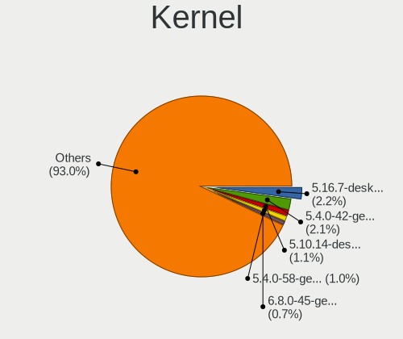

| Version                  | Computers | Percent |
|--------------------------|-----------|---------|
| 5.4.0-42-generic         | 17        | 3.67%   |
| 5.16.7-desktop-1omv4003  | 17        | 3.67%   |
| 5.10.14-desktop-1omv4002 | 9         | 1.94%   |
| 5.4.0-58-generic         | 8         | 1.73%   |
| 5.4.0-48-generic         | 6         | 1.3%    |
| 5.15.0-48-generic        | 6         | 1.3%    |
| 5.11.0-37-generic        | 6         | 1.3%    |
| 5.8.0-7630-generic       | 5         | 1.08%   |
| 5.3.0-51-generic         | 5         | 1.08%   |
| 5.19.0-76051900-generic  | 5         | 1.08%   |
| 5.15.0-50-generic        | 5         | 1.08%   |
| 5.15.0-47-generic        | 5         | 1.08%   |
| 5.13.0-30-generic        | 5         | 1.08%   |
| 5.8.0-48-generic         | 4         | 0.86%   |
| 5.4.0-29-generic         | 4         | 0.86%   |
| 5.11.0-38-generic        | 4         | 0.86%   |
| 5.0.0-32-generic         | 4         | 0.86%   |
| 5.9.1-arch1-1            | 3         | 0.65%   |
| 5.8.0-43-generic         | 3         | 0.65%   |
| 5.8.0-41-generic         | 3         | 0.65%   |
| 5.4.0-59-generic         | 3         | 0.65%   |
| 5.4.0-56-generic         | 3         | 0.65%   |
| 5.4.0-54-generic         | 3         | 0.65%   |
| 5.4.0-37-generic         | 3         | 0.65%   |
| 5.4.0-26-generic         | 3         | 0.65%   |
| 5.3.0-45-generic         | 3         | 0.65%   |
| 5.3.0-26-generic         | 3         | 0.65%   |
| 5.3.0-18-generic         | 3         | 0.65%   |
| 5.18.12-desktop-3omv4090 | 3         | 0.65%   |
| 5.15.0-52-generic        | 3         | 0.65%   |
| 5.15.0-40-generic        | 3         | 0.65%   |
| 5.11.0-35-generic        | 3         | 0.65%   |
| 4.18.16-desktop-1bP      | 3         | 0.65%   |
| 4.15.0-55-generic        | 3         | 0.65%   |
| 4.15.0-54-generic        | 3         | 0.65%   |
| 6.0.10-201.fc36.x86_64   | 2         | 0.43%   |
| 5.4.0-89-generic         | 2         | 0.43%   |
| 5.4.0-80-generic         | 2         | 0.43%   |
| 5.4.0-64-generic         | 2         | 0.43%   |
| 5.4.0-53-generic         | 2         | 0.43%   |

Kernel Family
-------------

Linux kernel without a distro release

| Version | Computers | Percent |
|---------|-----------|---------|
| 5.4.0   | 84        | 19%     |
| 5.15.0  | 34        | 7.69%   |
| 5.3.0   | 30        | 6.79%   |
| 4.15.0  | 30        | 6.79%   |
| 5.8.0   | 27        | 6.11%   |
| 5.13.0  | 22        | 4.98%   |
| 5.11.0  | 21        | 4.75%   |
| 5.0.0   | 18        | 4.07%   |
| 5.16.7  | 17        | 3.85%   |
| 5.19.0  | 10        | 2.26%   |
| 4.18.0  | 10        | 2.26%   |
| 5.10.14 | 9         | 2.04%   |
| 5.10.0  | 6         | 1.36%   |
| 5.16.0  | 4         | 0.9%    |
| 4.19.0  | 4         | 0.9%    |
| 5.9.1   | 3         | 0.68%   |
| 5.18.12 | 3         | 0.68%   |
| 5.17.5  | 3         | 0.68%   |
| 4.18.16 | 3         | 0.68%   |
| 6.0.10  | 2         | 0.45%   |
| 5.5.13  | 2         | 0.45%   |
| 5.18.17 | 2         | 0.45%   |
| 5.17.1  | 2         | 0.45%   |
| 5.16.13 | 2         | 0.45%   |
| 5.14.0  | 2         | 0.45%   |
| 5.10.74 | 2         | 0.45%   |
| 5.10.19 | 2         | 0.45%   |
| 4.9.60  | 2         | 0.45%   |
| 4.9.20  | 2         | 0.45%   |
| 6.0.9   | 1         | 0.23%   |
| 6.0.6   | 1         | 0.23%   |
| 6.0.5   | 1         | 0.23%   |
| 6.0.11  | 1         | 0.23%   |
| 6.0.0   | 1         | 0.23%   |
| 5.9.0   | 1         | 0.23%   |
| 5.8.7   | 1         | 0.23%   |
| 5.8.15  | 1         | 0.23%   |
| 5.8.14  | 1         | 0.23%   |
| 5.8.11  | 1         | 0.23%   |
| 5.8.10  | 1         | 0.23%   |

Kernel Major Ver.
-----------------

Linux kernel major version

| Version | Computers | Percent |
|---------|-----------|---------|
| 5.4     | 91        | 20.97%  |
| 5.15    | 42        | 9.68%   |
| 5.3     | 33        | 7.6%    |
| 5.8     | 31        | 7.14%   |
| 5.16    | 30        | 6.91%   |
| 4.15    | 30        | 6.91%   |
| 5.10    | 27        | 6.22%   |
| 5.13    | 24        | 5.53%   |
| 5.11    | 24        | 5.53%   |
| 5.0     | 18        | 4.15%   |
| 5.19    | 16        | 3.69%   |
| 4.18    | 13        | 3%      |
| 5.17    | 8         | 1.84%   |
| 6.0     | 7         | 1.61%   |
| 5.18    | 7         | 1.61%   |
| 4.9     | 7         | 1.61%   |
| 5.9     | 4         | 0.92%   |
| 5.6     | 4         | 0.92%   |
| 4.19    | 4         | 0.92%   |
| 5.14    | 3         | 0.69%   |
| 5.12    | 3         | 0.69%   |
| 5.7     | 2         | 0.46%   |
| 5.5     | 2         | 0.46%   |
| 5.2     | 1         | 0.23%   |
| 4.4     | 1         | 0.23%   |
| 4.16    | 1         | 0.23%   |
| 4.13    | 1         | 0.23%   |

Arch
----

OS architecture (x86_64, i586, etc.)

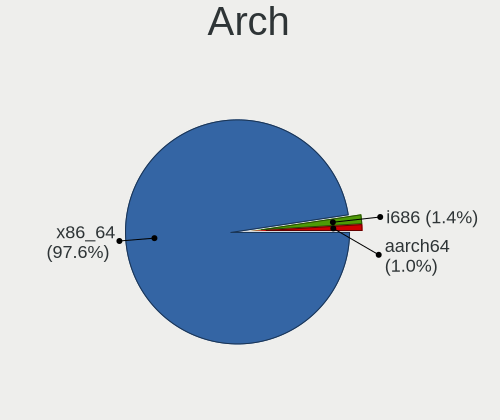

| Name    | Computers | Percent |
|---------|-----------|---------|
| x86_64  | 391       | 97.02%  |
| i686    | 9         | 2.23%   |
| aarch64 | 3         | 0.74%   |

DE
--

Desktop Environment

| Name            | Computers | Percent |
|-----------------|-----------|---------|
| GNOME           | 225       | 53.96%  |
| KDE5            | 58        | 13.91%  |
| Unknown         | 47        | 11.27%  |
| XFCE            | 29        | 6.95%   |
| X-Cinnamon      | 24        | 5.76%   |
| MATE            | 6         | 1.44%   |
| KDE4            | 6         | 1.44%   |
| Cinnamon        | 4         | 0.96%   |
| Unity           | 3         | 0.72%   |
| Pantheon        | 3         | 0.72%   |
| LXDE            | 2         | 0.48%   |
| KDE             | 2         | 0.48%   |
| Budgie          | 2         | 0.48%   |
| qtile           | 1         | 0.24%   |
| LXQt            | 1         | 0.24%   |
| i3              | 1         | 0.24%   |
| GNOME Flashback | 1         | 0.24%   |
| GNOME Classic   | 1         | 0.24%   |
| Enlightenment   | 1         | 0.24%   |

Display Server
--------------

X11 or Wayland

| Name    | Computers | Percent |
|---------|-----------|---------|
| X11     | 331       | 80.15%  |
| Wayland | 49        | 11.86%  |
| Unknown | 28        | 6.78%   |
| Tty     | 5         | 1.21%   |

Display Manager
---------------

SDDM, LightDM, etc.

| Name    | Computers | Percent |
|---------|-----------|---------|
| Unknown | 225       | 54.74%  |
| SDDM    | 53        | 12.9%   |
| GDM     | 45        | 10.95%  |
| GDM3    | 44        | 10.71%  |
| LightDM | 26        | 6.33%   |
| TDM     | 11        | 2.68%   |
| KDM     | 6         | 1.46%   |
| Ly      | 1         | 0.24%   |

OS Lang
-------

Language

| Lang    | Computers | Percent |
|---------|-----------|---------|
| en_US   | 318       | 77.75%  |
| Unknown | 55        | 13.45%  |
| en_GB   | 15        | 3.67%   |
| ar_EG   | 12        | 2.93%   |
| C       | 5         | 1.22%   |
| ru_RU   | 2         | 0.49%   |
| en_ZA   | 1         | 0.24%   |
| de_DE   | 1         | 0.24%   |

Boot Mode
---------

EFI or BIOS

| Mode | Computers | Percent |
|------|-----------|---------|
| BIOS | 245       | 60.05%  |
| EFI  | 163       | 39.95%  |

Filesystem
----------

Type of filesystem

| Type    | Computers | Percent |
|---------|-----------|---------|
| Ext4    | 331       | 80.54%  |
| Overlay | 32        | 7.79%   |
| Btrfs   | 19        | 4.62%   |
| Unknown | 18        | 4.38%   |
| Xfs     | 7         | 1.7%    |
| Zfs     | 2         | 0.49%   |
| Ext3    | 2         | 0.49%   |

Part. scheme
------------

Scheme of partitioning

| Type    | Computers | Percent |
|---------|-----------|---------|
| Unknown | 250       | 61.43%  |
| GPT     | 103       | 25.31%  |
| MBR     | 54        | 13.27%  |

Dual Boot with Linux/BSD
------------------------

Hosting more than one Linux/BSD

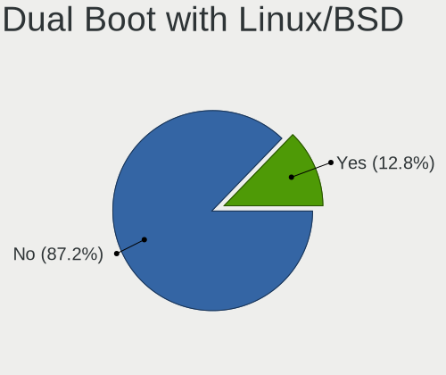

| Dual boot | Computers | Percent |
|-----------|-----------|---------|
| No        | 350       | 85.16%  |
| Yes       | 61        | 14.84%  |

Dual Boot (Win)
---------------

Hosting Linux and Windows

| Dual boot | Computers | Percent |
|-----------|-----------|---------|
| No        | 228       | 55.61%  |
| Yes       | 182       | 44.39%  |

Board
-----

Vendor
------

Motherboard manufacturer

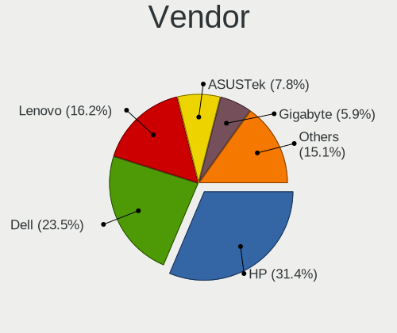

| Name                        | Computers | Percent |
|-----------------------------|-----------|---------|
| Hewlett-Packard             | 122       | 30.35%  |
| Dell                        | 99        | 24.63%  |
| Lenovo                      | 68        | 16.92%  |
| Gigabyte Technology         | 30        | 7.46%   |
| ASUSTek Computer            | 28        | 6.97%   |
| MSI                         | 9         | 2.24%   |
| Acer                        | 8         | 1.99%   |
| Toshiba                     | 7         | 1.74%   |
| Hampoo                      | 4         | 1%      |
| Sony                        | 3         | 0.75%   |
| Samsung Electronics         | 3         | 0.75%   |
| Alienware                   | 3         | 0.75%   |
| Raspberry Pi Foundation     | 2         | 0.5%    |
| Packard Bell                | 2         | 0.5%    |
| Intel                       | 2         | 0.5%    |
| Fujitsu                     | 2         | 0.5%    |
| Apple                       | 2         | 0.5%    |
| TECNO                       | 1         | 0.25%   |
| Pegatron                    | 1         | 0.25%   |
| Panasonic                   | 1         | 0.25%   |
| IBM                         | 1         | 0.25%   |
| I-Life Digital Technologies | 1         | 0.25%   |
| Fujitsu Siemens             | 1         | 0.25%   |
| ECS                         | 1         | 0.25%   |
| Unknown                     | 1         | 0.25%   |

Model
-----

Motherboard model

| Name                                  | Computers | Percent |
|---------------------------------------|-----------|---------|
| Gigabyte G41MT-S2PT                   | 7         | 1.74%   |
| Lenovo IdeaPad 520-15IKB 81BF         | 5         | 1.24%   |
| Dell Inspiron 5570                    | 5         | 1.24%   |
| HP ProBook 450 G7                     | 4         | 1%      |
| HP Notebook                           | 4         | 1%      |
| Dell OptiPlex 780                     | 4         | 1%      |
| Dell Inspiron 7577                    | 4         | 1%      |
| Dell G5 5587                          | 4         | 1%      |
| Dell G3 3579                          | 4         | 1%      |
| Lenovo IdeaPad 330-15AST 81D6         | 3         | 0.75%   |
| HP ProBook 645 G1                     | 3         | 0.75%   |
| HP Pavilion dv6                       | 3         | 0.75%   |
| HP Pavilion 15                        | 3         | 0.75%   |
| HP Laptop 15-da1xxx                   | 3         | 0.75%   |
| HP EliteBook 745 G3                   | 3         | 0.75%   |
| HP Compaq Pro 6305 SFF                | 3         | 0.75%   |
| HP 15                                 | 3         | 0.75%   |
| Hampoo Cherry Trail CR                | 3         | 0.75%   |
| Gigabyte H61M-S2P                     | 3         | 0.75%   |
| Dell OptiPlex 760                     | 3         | 0.75%   |
| Dell OptiPlex 7020                    | 3         | 0.75%   |
| Dell Inspiron N5110                   | 3         | 0.75%   |
| Dell Inspiron 3593                    | 3         | 0.75%   |
| Dell Inspiron 3521                    | 3         | 0.75%   |
| Dell G15 5510                         | 3         | 0.75%   |
| MSI MS-7C02                           | 2         | 0.5%    |
| Lenovo Z50-70 20354                   | 2         | 0.5%    |
| Lenovo Y50-70 20378                   | 2         | 0.5%    |
| Lenovo IdeaPad L340-15IRH Gaming 81LK | 2         | 0.5%    |
| Lenovo IdeaPad 330-15IKB 81DE         | 2         | 0.5%    |
| Lenovo IdeaPad 310-15IKB 80TV         | 2         | 0.5%    |
| Lenovo G555 0873                      | 2         | 0.5%    |
| HP ZBook 15 G2                        | 2         | 0.5%    |
| HP Z600 Workstation                   | 2         | 0.5%    |
| HP ProDesk 600 G1 TWR                 | 2         | 0.5%    |
| HP ProDesk 600 G1 SFF                 | 2         | 0.5%    |
| HP ProBook 450 G2                     | 2         | 0.5%    |
| HP Pavilion g6                        | 2         | 0.5%    |
| HP Pavilion g4                        | 2         | 0.5%    |
| HP Pavilion dv7                       | 2         | 0.5%    |

Model Family
------------

Motherboard model prefix

| Name                  | Computers | Percent |
|-----------------------|-----------|---------|
| Dell Inspiron         | 41        | 10.2%   |
| Lenovo IdeaPad        | 26        | 6.47%   |
| HP Compaq             | 20        | 4.98%   |
| Dell OptiPlex         | 19        | 4.73%   |
| HP EliteBook          | 18        | 4.48%   |
| Dell Latitude         | 18        | 4.48%   |
| Lenovo ThinkPad       | 16        | 3.98%   |
| HP ProBook            | 16        | 3.98%   |
| HP Pavilion           | 15        | 3.73%   |
| HP Laptop             | 8         | 1.99%   |
| Gigabyte G41MT-S2PT   | 7         | 1.74%   |
| Dell G3               | 7         | 1.74%   |
| Toshiba Satellite     | 6         | 1.49%   |
| HP EliteDesk          | 6         | 1.49%   |
| Dell Precision        | 6         | 1.49%   |
| Lenovo Legion         | 5         | 1.24%   |
| HP ZBook              | 5         | 1.24%   |
| ASUS VivoBook         | 5         | 1.24%   |
| Acer Aspire           | 5         | 1.24%   |
| Lenovo ThinkCentre    | 4         | 1%      |
| HP ProDesk            | 4         | 1%      |
| HP Notebook           | 4         | 1%      |
| Dell G5               | 4         | 1%      |
| HP ENVY               | 3         | 0.75%   |
| HP 15                 | 3         | 0.75%   |
| Hampoo Cherry         | 3         | 0.75%   |
| Gigabyte H61M-S2P     | 3         | 0.75%   |
| Dell G15              | 3         | 0.75%   |
| ASUS TUF              | 3         | 0.75%   |
| RPi Raspberry         | 2         | 0.5%    |
| Packard Bell EasyNote | 2         | 0.5%    |
| MSI MS-7C02           | 2         | 0.5%    |
| Lenovo Z50-70         | 2         | 0.5%    |
| Lenovo Yoga           | 2         | 0.5%    |
| Lenovo Y50-70         | 2         | 0.5%    |
| Lenovo G555           | 2         | 0.5%    |
| HP Z600               | 2         | 0.5%    |
| HP 250                | 2         | 0.5%    |
| Gigabyte H61M-S2V-B3  | 2         | 0.5%    |
| Gigabyte G41MT-S2P    | 2         | 0.5%    |

MFG Year
--------

Motherboard manufacture year

| Year    | Computers | Percent |
|---------|-----------|---------|
| 2018    | 47        | 11.69%  |
| 2017    | 40        | 9.95%   |
| 2011    | 35        | 8.71%   |
| 2013    | 34        | 8.46%   |
| 2014    | 32        | 7.96%   |
| 2019    | 28        | 6.97%   |
| 2012    | 28        | 6.97%   |
| 2016    | 26        | 6.47%   |
| 2008    | 22        | 5.47%   |
| 2015    | 21        | 5.22%   |
| 2010    | 21        | 5.22%   |
| 2009    | 17        | 4.23%   |
| 2020    | 16        | 3.98%   |
| 2021    | 12        | 2.99%   |
| 2007    | 11        | 2.74%   |
| 2022    | 3         | 0.75%   |
| 2006    | 3         | 0.75%   |
| 2005    | 3         | 0.75%   |
| Unknown | 3         | 0.75%   |

Form Factor
-----------

Physical design of the computer

| Name           | Computers | Percent |
|----------------|-----------|---------|
| Notebook       | 268       | 66.67%  |
| Desktop        | 121       | 30.1%   |
| Convertible    | 5         | 1.24%   |
| System on chip | 2         | 0.5%    |
| Tablet         | 2         | 0.5%    |
| Mini pc        | 2         | 0.5%    |
| Phone          | 1         | 0.25%   |
| Server         | 1         | 0.25%   |

Secure Boot
-----------

Enabled or disabled

| State    | Computers | Percent |
|----------|-----------|---------|
| Disabled | 385       | 95.77%  |
| Enabled  | 17        | 4.23%   |

Coreboot
--------

Have coreboot on board

| Used | Computers | Percent |
|------|-----------|---------|
| No   | 401       | 99.75%  |
| Yes  | 1         | 0.25%   |

RAM Size
--------

Total RAM memory

| Size in GB  | Computers | Percent |
|-------------|-----------|---------|
| 4.01-8.0    | 115       | 28.47%  |
| 3.01-4.0    | 96        | 23.76%  |
| 16.01-24.0  | 86        | 21.29%  |
| 8.01-16.0   | 59        | 14.6%   |
| 1.01-2.0    | 15        | 3.71%   |
| 2.01-3.0    | 13        | 3.22%   |
| 32.01-64.0  | 9         | 2.23%   |
| 24.01-32.0  | 5         | 1.24%   |
| 64.01-256.0 | 3         | 0.74%   |
| 0.51-1.0    | 2         | 0.5%    |
| 0.01-0.5    | 1         | 0.25%   |

RAM Used
--------

Used RAM memory

| Used GB     | Computers | Percent |
|-------------|-----------|---------|
| 1.01-2.0    | 145       | 32.95%  |
| 2.01-3.0    | 141       | 32.05%  |
| 3.01-4.0    | 61        | 13.86%  |
| 4.01-8.0    | 56        | 12.73%  |
| 0.51-1.0    | 18        | 4.09%   |
| 0.01-0.5    | 9         | 2.05%   |
| 8.01-16.0   | 8         | 1.82%   |
| 32.01-64.0  | 1         | 0.23%   |
| 64.01-256.0 | 1         | 0.23%   |

Total Drives
------------

Number of drives on board

| Drives  | Computers | Percent |
|---------|-----------|---------|
| 1       | 235       | 56.49%  |
| 2       | 151       | 36.3%   |
| 3       | 22        | 5.29%   |
| 4       | 4         | 0.96%   |
| 9       | 1         | 0.24%   |
| 5       | 1         | 0.24%   |
| 0       | 1         | 0.24%   |
| Unknown | 1         | 0.24%   |

Has CD-ROM
----------

Has CD-ROM on board

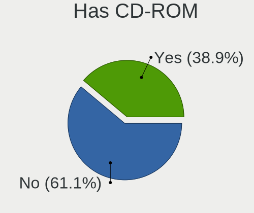

| Presented | Computers | Percent |
|-----------|-----------|---------|
| No        | 221       | 54.57%  |
| Yes       | 184       | 45.43%  |

Has Ethernet
------------

Has Ethernet on board

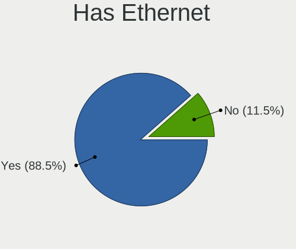

| Presented | Computers | Percent |
|-----------|-----------|---------|
| Yes       | 367       | 91.29%  |
| No        | 35        | 8.71%   |

Has WiFi
--------

Has WiFi module

| Presented | Computers | Percent |
|-----------|-----------|---------|
| Yes       | 318       | 78.71%  |
| No        | 86        | 21.29%  |

Has Bluetooth
-------------

Has Bluetooth module

| Presented | Computers | Percent |
|-----------|-----------|---------|
| Yes       | 242       | 59.46%  |
| No        | 165       | 40.54%  |

Location
--------

Country
-------

Geographic location (country)

| Country | Computers | Percent |
|---------|-----------|---------|
| Egypt   | 402       | 100%    |

City
----

Geographic location (city)

| City                | Computers | Percent |
|---------------------|-----------|---------|
| Cairo               | 239       | 55.45%  |
| Alexandria          | 43        | 9.98%   |
| Giza                | 31        | 7.19%   |
| Al Mansurah         | 16        | 3.71%   |
| Tanta               | 12        | 2.78%   |
| Zagazig             | 5         | 1.16%   |
| Aswan               | 5         | 1.16%   |
| Assiut              | 5         | 1.16%   |
| Suez                | 4         | 0.93%   |
| Port Said           | 4         | 0.93%   |
| Minya               | 4         | 0.93%   |
| Hurghada            | 4         | 0.93%   |
| Helwan              | 4         | 0.93%   |
| Awsim               | 4         | 0.93%   |
| New Cairo           | 3         | 0.7%    |
| Ismailia            | 3         | 0.7%    |
| Zefta               | 2         | 0.46%   |
| Mohandessin         | 2         | 0.46%   |
| Madinat as Sadat    | 2         | 0.46%   |
| Luxor               | 2         | 0.46%   |
| Edfu                | 2         | 0.46%   |
| Damietta            | 2         | 0.46%   |
| Damanhur            | 2         | 0.46%   |
| Bani Suwayf         | 2         | 0.46%   |
| Banha               | 2         | 0.46%   |
| Al Ma`adi           | 2         | 0.46%   |
| Al Fayyum           | 2         | 0.46%   |
| 6th of October City | 2         | 0.46%   |
| Tukh                | 1         | 0.23%   |
| Talkha              | 1         | 0.23%   |
| Sohag               | 1         | 0.23%   |
| Sharqia             | 1         | 0.23%   |
| Sharm el Sheikh     | 1         | 0.23%   |
| Monufia             | 1         | 0.23%   |
| Mashtul as Suq      | 1         | 0.23%   |
| Mallawi             | 1         | 0.23%   |
| Kafr Shukr          | 1         | 0.23%   |
| Kafr ash Shaykh     | 1         | 0.23%   |
| Heliopolis          | 1         | 0.23%   |
| Fraskr          | 1         | 0.23%   |

Drives
------

Drive Vendor
------------

Hard drive vendors

| Vendor                      | Computers | Drives | Percent |
|-----------------------------|-----------|--------|---------|
| WDC                         | 136       | 190    | 24.37%  |
| Seagate                     | 122       | 153    | 21.86%  |
| Toshiba                     | 64        | 80     | 11.47%  |
| Samsung Electronics         | 51        | 70     | 9.14%   |
| Kingston                    | 27        | 34     | 4.84%   |
| Unknown                     | 20        | 26     | 3.58%   |
| Crucial                     | 20        | 24     | 3.58%   |
| Hitachi                     | 14        | 17     | 2.51%   |
| SanDisk                     | 12        | 13     | 2.15%   |
| SK hynix                    | 11        | 11     | 1.97%   |
| Micron Technology           | 9         | 9      | 1.61%   |
| HS-SSD-C100                 | 9         | 11     | 1.61%   |
| HGST                        | 8         | 8      | 1.43%   |
| Intel                       | 7         | 7      | 1.25%   |
| LITEONIT                    | 4         | 5      | 0.72%   |
| KingSpec                    | 4         | 4      | 0.72%   |
| TwinMOS                     | 3         | 4      | 0.54%   |
| Transcend                   | 3         | 3      | 0.54%   |
| LITEON                      | 3         | 5      | 0.54%   |
| KIOXIA                      | 3         | 3      | 0.54%   |
| HS-SSD-E100                 | 3         | 3      | 0.54%   |
| Micron/Crucial Technology   | 2         | 2      | 0.36%   |
| Hewlett-Packard             | 2         | 2      | 0.36%   |
| Apple                       | 2         | 2      | 0.36%   |
| A-DATA Technology           | 2         | 2      | 0.36%   |
| ZOTAC                       | 1         | 1      | 0.18%   |
| Verbatim                    | 1         | 1      | 0.18%   |
| Value                       | 1         | 1      | 0.18%   |
| Union Memory (Shenzhen)     | 1         | 1      | 0.18%   |
| UMIS                        | 1         | 1      | 0.18%   |
| Team                        | 1         | 1      | 0.18%   |
| Silicon Motion              | 1         | 1      | 0.18%   |
| Maxtor                      | 1         | 2      | 0.18%   |
| Lite-On Technology          | 1         | 1      | 0.18%   |
| Lexar                       | 1         | 1      | 0.18%   |
| Kingston Technology Company | 1         | 1      | 0.18%   |
| JMicron Technology          | 1         | 1      | 0.18%   |
| HUAWEI                      | 1         | 1      | 0.18%   |
| Hikvision                   | 1         | 1      | 0.18%   |
| Fujitsu                     | 1         | 1      | 0.18%   |

Drive Model
-----------

Hard drive models

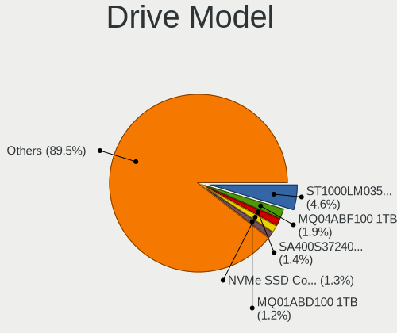

| Model                                  | Computers | Percent |
|----------------------------------------|-----------|---------|
| Seagate ST1000LM035-1RK172 1TB         | 36        | 6.11%   |
| Toshiba MQ04ABF100 1TB                 | 11        | 1.87%   |
| Toshiba MQ01ABD100 1TB                 | 9         | 1.53%   |
| Seagate ST2000LM007-1R8174 2TB         | 9         | 1.53%   |
| Kingston SA400S37480G 480GB SSD        | 8         | 1.36%   |
| Kingston SA400S37240G 240GB SSD        | 8         | 1.36%   |
| Unknown MMC Card  64GB                 | 7         | 1.19%   |
| Seagate ST500DM002-1BD142 500GB        | 7         | 1.19%   |
| Seagate ST3500414CS 500GB              | 7         | 1.19%   |
| Samsung SM963 2.5" NVMe PCIe SSD 256GB | 6         | 1.02%   |
| Toshiba DT01ACA050 500GB               | 5         | 0.85%   |
| Seagate ST3500312CS 500GB              | 5         | 0.85%   |
| Kingston SA400S37120G 120GB SSD        | 5         | 0.85%   |
| Crucial CT480BX500SSD1 480GB           | 5         | 0.85%   |
| Crucial CT240BX500SSD1 240GB           | 5         | 0.85%   |
| WDC WD10SPZX-60Z10T0 1TB               | 4         | 0.68%   |
| WDC WD10SPZX-24Z10 1TB                 | 4         | 0.68%   |
| WDC WD10JPVX-60JC3T1 1TB               | 4         | 0.68%   |
| Unknown MMC Card  32GB                 | 4         | 0.68%   |
| Toshiba MQ01ABF050 500GB               | 4         | 0.68%   |
| Seagate ST750LM022 HN-M750MBB 752GB    | 4         | 0.68%   |
| Seagate ST500LT012-1DG142 500GB        | 4         | 0.68%   |
| Samsung SSD 860 EVO 500GB              | 4         | 0.68%   |
| HS-SSD-C100 120G                       | 4         | 0.68%   |
| Hitachi HTS547575A9E384 752GB          | 4         | 0.68%   |
| WDC WDS240G2G0A-00JH30 240GB SSD       | 3         | 0.51%   |
| WDC WDS120G2G0A-00JH30 120GB SSD       | 3         | 0.51%   |
| WDC WD5000AAKX-75U6AA0 500GB           | 3         | 0.51%   |
| WDC WD5000AAKX-001CA0 500GB            | 3         | 0.51%   |
| WDC WD5000AADS-00S9B0 500GB            | 3         | 0.51%   |
| WDC WD3200AAJS-00L7A0 320GB            | 3         | 0.51%   |
| WDC WD2500AAKX-75U6AA0 250GB           | 3         | 0.51%   |
| WDC WD1600AABS-00PRA0 160GB            | 3         | 0.51%   |
| WDC WD10JPCX-24UE4T0 1TB               | 3         | 0.51%   |
| WDC WD10EZEX-08WN4A0 1TB               | 3         | 0.51%   |
| WDC WD10EZEX-00BN5A0 1TB               | 3         | 0.51%   |
| WDC WD10EARS-00Y5B1 1TB                | 3         | 0.51%   |
| Unknown SD/MMC/MS PRO 64GB             | 3         | 0.51%   |
| TwinMOS SSD 128GB                      | 3         | 0.51%   |
| Toshiba NVMe SSD Drive 256GB           | 3         | 0.51%   |

HDD Vendor
----------

Hard disk drive vendors

| Vendor              | Computers | Drives | Percent |
|---------------------|-----------|--------|---------|
| WDC                 | 126       | 179    | 37.17%  |
| Seagate             | 122       | 152    | 35.99%  |
| Toshiba             | 54        | 68     | 15.93%  |
| Hitachi             | 14        | 17     | 4.13%   |
| Samsung Electronics | 8         | 12     | 2.36%   |
| HGST                | 8         | 8      | 2.36%   |
| Unknown             | 3         | 3      | 0.88%   |
| Maxtor              | 1         | 2      | 0.29%   |
| Hewlett-Packard     | 1         | 1      | 0.29%   |
| Fujitsu             | 1         | 1      | 0.29%   |
| Apple               | 1         | 1      | 0.29%   |

SSD Vendor
----------

Solid state drive vendors

| Vendor              | Computers | Drives | Percent |
|---------------------|-----------|--------|---------|
| Kingston            | 26        | 33     | 19.55%  |
| Samsung Electronics | 21        | 23     | 15.79%  |
| Crucial             | 19        | 23     | 14.29%  |
| WDC                 | 8         | 8      | 6.02%   |
| SanDisk             | 8         | 9      | 6.02%   |
| Micron Technology   | 7         | 7      | 5.26%   |
| Intel               | 6         | 6      | 4.51%   |
| Toshiba             | 4         | 5      | 3.01%   |
| SK hynix            | 4         | 4      | 3.01%   |
| LITEONIT            | 4         | 5      | 3.01%   |
| KingSpec            | 4         | 4      | 3.01%   |
| TwinMOS             | 3         | 4      | 2.26%   |
| Transcend           | 3         | 3      | 2.26%   |
| LITEON              | 3         | 5      | 2.26%   |
| HS-SSD-C100         | 2         | 3      | 1.5%    |
| ZOTAC               | 1         | 1      | 0.75%   |
| Verbatim            | 1         | 1      | 0.75%   |
| Value               | 1         | 1      | 0.75%   |
| Team                | 1         | 1      | 0.75%   |
| Lexar               | 1         | 1      | 0.75%   |
| JMicron Technology  | 1         | 1      | 0.75%   |
| Hikvision           | 1         | 1      | 0.75%   |
| Hewlett-Packard     | 1         | 1      | 0.75%   |
| China               | 1         | 1      | 0.75%   |
| Apple               | 1         | 1      | 0.75%   |
| A-DATA Technology   | 1         | 1      | 0.75%   |

Drive Kind
----------

HDD or SSD

| Kind    | Computers | Drives | Percent |
|---------|-----------|--------|---------|
| HDD     | 310       | 444    | 59.27%  |
| SSD     | 123       | 153    | 23.52%  |
| NVMe    | 63        | 76     | 12.05%  |
| MMC     | 16        | 21     | 3.06%   |
| Unknown | 11        | 12     | 2.1%    |

Drive Connector
---------------

SATA, SAS, NVMe, etc.

| Type | Computers | Drives | Percent |
|------|-----------|--------|---------|
| SATA | 363       | 604    | 81.21%  |
| NVMe | 63        | 76     | 14.09%  |
| MMC  | 16        | 21     | 3.58%   |
| SAS  | 5         | 5      | 1.12%   |

Drive Size
----------

Size of hard drive

| Size in TB | Computers | Drives | Percent |
|------------|-----------|--------|---------|
| 0.01-0.5   | 250       | 369    | 58.55%  |
| 0.51-1.0   | 154       | 195    | 36.07%  |
| 1.01-2.0   | 20        | 23     | 4.68%   |
| 3.01-4.0   | 2         | 4      | 0.47%   |
| 4.01-10.0  | 1         | 6      | 0.23%   |

Space Total
-----------

Amount of disk space available on the file system

| Size in GB     | Computers | Percent |
|----------------|-----------|---------|
| 101-250        | 112       | 26.35%  |
| 251-500        | 89        | 20.94%  |
| 501-1000       | 59        | 13.88%  |
| 51-100         | 56        | 13.18%  |
| 1001-2000      | 33        | 7.76%   |
| 1-20           | 33        | 7.76%   |
| 21-50          | 28        | 6.59%   |
| Unknown        | 7         | 1.65%   |
| 2001-3000      | 5         | 1.18%   |
| More than 3000 | 3         | 0.71%   |

Space Used
----------

Amount of used disk space

| Used GB        | Computers | Percent |
|----------------|-----------|---------|
| 1-20           | 166       | 38.43%  |
| 21-50          | 83        | 19.21%  |
| 101-250        | 73        | 16.9%   |
| 51-100         | 47        | 10.88%  |
| 251-500        | 27        | 6.25%   |
| 501-1000       | 23        | 5.32%   |
| Unknown        | 7         | 1.62%   |
| 1001-2000      | 3         | 0.69%   |
| More than 3000 | 2         | 0.46%   |
| 2001-3000      | 1         | 0.23%   |

Malfunc. Drives
---------------

Drive models with a malfunction

| Model                                    | Computers | Drives | Percent |
|------------------------------------------|-----------|--------|---------|
| Seagate ST1000LM035-1RK172 1TB           | 4         | 5      | 6.56%   |
| WDC WD5000AVVS-63H0B1 500GB              | 2         | 2      | 3.28%   |
| WDC WD5000AVDS-63U7B1 500GB              | 2         | 2      | 3.28%   |
| WDC WD5000AAKX-00ERMA0 500GB             | 2         | 3      | 3.28%   |
| WDC WD1600AABS-00H4A0 160GB              | 2         | 2      | 3.28%   |
| Seagate ST380815AS 80GB                  | 2         | 2      | 3.28%   |
| WDC WD800JD-60LSA5 80GB                  | 1         | 1      | 1.64%   |
| WDC WD800BD-22MRA1 80GB                  | 1         | 1      | 1.64%   |
| WDC WD5000LPVX-75V0TT0 500GB             | 1         | 1      | 1.64%   |
| WDC WD5000LPVX-60V0TT0 500GB             | 1         | 1      | 1.64%   |
| WDC WD5000BPVT-24HXZT3 500GB             | 1         | 1      | 1.64%   |
| WDC WD5000AAVS-22G9B1 500GB              | 1         | 1      | 1.64%   |
| WDC WD5000AAKX-75U6AA0 500GB             | 1         | 2      | 1.64%   |
| WDC WD5000AAKX-08U6AA0 500GB             | 1         | 1      | 1.64%   |
| WDC WD5000AAKX-009FA0 500GB              | 1         | 1      | 1.64%   |
| WDC WD5000AAKS-00V6A0 500GB              | 1         | 1      | 1.64%   |
| WDC WD5000AADS-00S9B0 500GB              | 1         | 1      | 1.64%   |
| WDC WD5000AADS-00M2B0 500GB              | 1         | 1      | 1.64%   |
| WDC WD3200BUDT-63DPZY0 320GB             | 1         | 1      | 1.64%   |
| WDC WD3200BEKT-60V5T1 320GB              | 1         | 2      | 1.64%   |
| WDC WD3200AAJS-56M0A0 320GB              | 1         | 1      | 1.64%   |
| WDC WD3200AAJS-00L7A0 320GB              | 1         | 1      | 1.64%   |
| WDC WD3200AAJS-00B4A0 320GB              | 1         | 1      | 1.64%   |
| WDC WD3200A 320GB                        | 1         | 1      | 1.64%   |
| WDC WD2500AAJS-00VTA0 250GB              | 1         | 1      | 1.64%   |
| WDC WD1600AVVS-63L2B0 160GB              | 1         | 1      | 1.64%   |
| WDC WD10EZEX-08M2NA0 1TB                 | 1         | 1      | 1.64%   |
| WDC WD10EZEX-00BN5A0 1TB                 | 1         | 1      | 1.64%   |
| WDC WD10EARS-00Y5B1 1TB                  | 1         | 1      | 1.64%   |
| Toshiba THNSNK256GVN8 M.2 2280 256GB SSD | 1         | 1      | 1.64%   |
| Toshiba MQ01ABF050 500GB                 | 1         | 2      | 1.64%   |
| SK hynix HFS128G39TND-N210A 128GB SSD    | 1         | 1      | 1.64%   |
| Seagate ST95005620AS 500GB               | 1         | 2      | 1.64%   |
| Seagate ST9320328CS 320GB                | 1         | 2      | 1.64%   |
| Seagate ST500LT012-9WS142 500GB          | 1         | 1      | 1.64%   |
| Seagate ST500DM002-1BD142 500GB          | 1         | 3      | 1.64%   |
| Seagate ST3500413AS 500GB                | 1         | 1      | 1.64%   |
| Seagate ST3500312CS 500GB                | 1         | 1      | 1.64%   |
| Seagate ST3320613AS 320GB                | 1         | 1      | 1.64%   |
| Seagate ST3160211AS 160GB                | 1         | 2      | 1.64%   |

Malfunc. Drive Vendor
---------------------

Vendors of faulty drives

| Vendor              | Computers | Drives | Percent |
|---------------------|-----------|--------|---------|
| WDC                 | 27        | 34     | 47.37%  |
| Seagate             | 16        | 22     | 28.07%  |
| Toshiba             | 2         | 3      | 3.51%   |
| Samsung Electronics | 2         | 2      | 3.51%   |
| Micron Technology   | 2         | 2      | 3.51%   |
| Intel               | 2         | 2      | 3.51%   |
| SK hynix            | 1         | 1      | 1.75%   |
| Kingston            | 1         | 2      | 1.75%   |
| Hitachi             | 1         | 1      | 1.75%   |
| Hewlett-Packard     | 1         | 1      | 1.75%   |
| Apple               | 1         | 1      | 1.75%   |
| A-DATA Technology   | 1         | 1      | 1.75%   |

Malfunc. HDD Vendor
-------------------

Vendors of faulty HDD drives

| Vendor              | Computers | Drives | Percent |
|---------------------|-----------|--------|---------|
| WDC                 | 27        | 34     | 56.25%  |
| Seagate             | 16        | 22     | 33.33%  |
| Toshiba             | 1         | 2      | 2.08%   |
| Samsung Electronics | 1         | 1      | 2.08%   |
| Hitachi             | 1         | 1      | 2.08%   |
| Hewlett-Packard     | 1         | 1      | 2.08%   |
| Apple               | 1         | 1      | 2.08%   |

Malfunc. Drive Kind
-------------------

Kinds of faulty drives

| Kind | Computers | Drives | Percent |
|------|-----------|--------|---------|
| HDD  | 46        | 62     | 83.64%  |
| SSD  | 8         | 9      | 14.55%  |
| NVMe | 1         | 1      | 1.82%   |

Failed Drives
-------------

Failed drive models

| Model                                            | Computers | Drives | Percent |
|--------------------------------------------------|-----------|--------|---------|
| WDC WD3200AAJS-00L7A0 320GB                      | 1         | 2      | 50%     |
| Samsung Electronics MZ7TY128HDHP-000L1 128GB SSD | 1         | 1      | 50%     |

Failed Drive Vendor
-------------------

Failed drive vendors

| Vendor              | Computers | Drives | Percent |
|---------------------|-----------|--------|---------|
| WDC                 | 1         | 2      | 50%     |
| Samsung Electronics | 1         | 1      | 50%     |

Drive Status
------------

Number of failed and malfunc. drives

| Status   | Computers | Drives | Percent |
|----------|-----------|--------|---------|
| Detected | 263       | 431    | 60.74%  |
| Works    | 113       | 200    | 26.1%   |
| Malfunc  | 55        | 72     | 12.7%   |
| Failed   | 2         | 3      | 0.46%   |

Storage controller
------------------

Storage Vendor
--------------

Storage controller vendors

| Vendor                       | Computers | Percent |
|------------------------------|-----------|---------|
| Intel                        | 319       | 71.05%  |
| AMD                          | 54        | 12.03%  |
| Samsung Electronics          | 27        | 6.01%   |
| Toshiba America Info Systems | 8         | 1.78%   |
| SK hynix                     | 7         | 1.56%   |
| SanDisk                      | 7         | 1.56%   |
| Micron/Crucial Technology    | 3         | 0.67%   |
| KIOXIA                       | 3         | 0.67%   |
| Union Memory (Shenzhen)      | 2         | 0.45%   |
| Nvidia                       | 2         | 0.45%   |
| Micron Technology            | 2         | 0.45%   |
| Marvell Technology Group     | 2         | 0.45%   |
| Kingston Technology Company  | 2         | 0.45%   |
| Broadcom / LSI               | 2         | 0.45%   |
| ADATA Technology             | 2         | 0.45%   |
| VIA Technologies             | 1         | 0.22%   |
| Silicon Motion               | 1         | 0.22%   |
| Shenzhen Longsys Electronics | 1         | 0.22%   |
| Seagate Technology           | 1         | 0.22%   |
| LSI Logic / Symbios Logic    | 1         | 0.22%   |
| Lite-On Technology           | 1         | 0.22%   |
| JMicron Technology           | 1         | 0.22%   |

Storage Model
-------------

Storage controller models

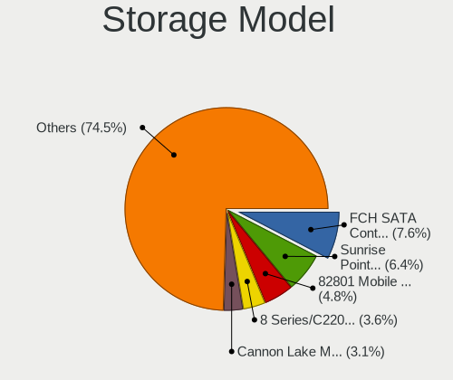

| Model                                                                                   | Computers | Percent |
|-----------------------------------------------------------------------------------------|-----------|---------|
| Intel Sunrise Point-LP SATA Controller [AHCI mode]                                      | 40        | 7.81%   |
| AMD FCH SATA Controller [AHCI mode]                                                     | 38        | 7.42%   |
| Intel 8 Series SATA Controller 1 [AHCI mode]                                            | 22        | 4.3%    |
| Intel 6 Series/C200 Series Chipset Family 6 port Mobile SATA AHCI Controller            | 20        | 3.91%   |
| Intel 8 Series/C220 Series Chipset Family 6-port SATA Controller 1 [AHCI mode]          | 18        | 3.52%   |
| Intel 7 Series Chipset Family 6-port SATA Controller [AHCI mode]                        | 18        | 3.52%   |
| Intel NM10/ICH7 Family SATA Controller [IDE mode]                                       | 17        | 3.32%   |
| Samsung NVMe SSD Controller SM981/PM981/PM983                                           | 16        | 3.13%   |
| Intel Cannon Lake Mobile PCH SATA AHCI Controller                                       | 16        | 3.13%   |
| Intel Wildcat Point-LP SATA Controller [AHCI Mode]                                      | 14        | 2.73%   |
| Intel 82801 Mobile SATA Controller [RAID mode]                                          | 14        | 2.73%   |
| Intel Comet Lake SATA AHCI Controller                                                   | 11        | 2.15%   |
| Intel HM170/QM170 Chipset SATA Controller [AHCI Mode]                                   | 8         | 1.56%   |
| Intel SATA Controller [RAID mode]                                                       | 7         | 1.37%   |
| Intel 5 Series/3400 Series Chipset 6 port SATA AHCI Controller                          | 7         | 1.37%   |
| Intel 4 Series Chipset PT IDER Controller                                               | 7         | 1.37%   |
| Intel Q170/Q150/B150/H170/H110/Z170/CM236 Chipset SATA Controller [AHCI Mode]           | 6         | 1.17%   |
| Intel Cannon Point-LP SATA Controller [AHCI Mode]                                       | 6         | 1.17%   |
| Intel 6 Series/C200 Series Chipset Family Desktop SATA Controller (IDE mode, ports 4-5) | 6         | 1.17%   |
| Intel 6 Series/C200 Series Chipset Family Desktop SATA Controller (IDE mode, ports 0-3) | 6         | 1.17%   |
| Intel 5 Series/3400 Series Chipset 4 port SATA AHCI Controller                          | 6         | 1.17%   |
| Intel 82801IBM/IEM (ICH9M/ICH9M-E) 4 port SATA Controller [AHCI mode]                   | 5         | 0.98%   |
| Intel 82801G (ICH7 Family) IDE Controller                                               | 5         | 0.98%   |
| Intel 200 Series PCH SATA controller [AHCI mode]                                        | 5         | 0.98%   |
| AMD SB7x0/SB8x0/SB9x0 SATA Controller [AHCI mode]                                       | 5         | 0.98%   |
| AMD 400 Series Chipset SATA Controller                                                  | 5         | 0.98%   |
| Toshiba America Info Systems BG3 NVMe SSD Controller                                    | 4         | 0.78%   |
| Samsung NVMe SSD Controller PM9A1/PM9A3/980PRO                                          | 4         | 0.78%   |
| Samsung NVMe SSD Controller 980                                                         | 4         | 0.78%   |
| Intel Cannon Lake PCH SATA AHCI Controller                                              | 4         | 0.78%   |
| Intel 82801JD/DO (ICH10 Family) SATA AHCI Controller                                    | 4         | 0.78%   |
| Intel 82801JD/DO (ICH10 Family) 4-port SATA IDE Controller                              | 4         | 0.78%   |
| Intel 82801JD/DO (ICH10 Family) 2-port SATA IDE Controller                              | 4         | 0.78%   |
| Intel 82801I (ICH9 Family) 2 port SATA Controller [IDE mode]                            | 4         | 0.78%   |
| Intel 82801HM/HEM (ICH8M/ICH8M-E) IDE Controller                                        | 4         | 0.78%   |
| Intel 82801H (ICH8 Family) 4 port SATA Controller [IDE mode]                            | 4         | 0.78%   |
| Intel 7 Series/C210 Series Chipset Family 6-port SATA Controller [AHCI mode]            | 4         | 0.78%   |
| Intel 400 Series Chipset Family SATA AHCI Controller                                    | 4         | 0.78%   |
| AMD SB7x0/SB8x0/SB9x0 SATA Controller [IDE mode]                                        | 4         | 0.78%   |
| SK hynix Gold P31/PC711 NVMe Solid State Drive                                          | 3         | 0.59%   |

Storage Kind
------------

Kind of storage controller (IDE, SATA, NVMe, SAS, ...)

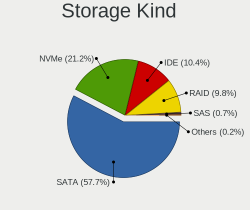

| Kind | Computers | Percent |
|------|-----------|---------|
| SATA | 299       | 64.86%  |
| IDE  | 66        | 14.32%  |
| NVMe | 65        | 14.1%   |
| RAID | 26        | 5.64%   |
| SAS  | 4         | 0.87%   |
| SCSI | 1         | 0.22%   |

Processor
---------

CPU Vendor
----------

Processor vendors

| Vendor | Computers | Percent |
|--------|-----------|---------|
| Intel  | 340       | 84.58%  |
| AMD    | 59        | 14.68%  |
| ARM    | 3         | 0.75%   |

CPU Model
---------

Processor models

| Model                                        | Computers | Percent |
|----------------------------------------------|-----------|---------|
| Intel Core i7-8550U CPU @ 1.80GHz            | 13        | 3.23%   |
| Intel Core i7-8750H CPU @ 2.20GHz            | 11        | 2.73%   |
| Intel Core i7-8565U CPU @ 1.80GHz            | 8         | 1.99%   |
| Intel Core i7-7700HQ CPU @ 2.80GHz           | 8         | 1.99%   |
| Intel Core i7-7500U CPU @ 2.70GHz            | 7         | 1.74%   |
| Intel Core i5-8250U CPU @ 1.60GHz            | 6         | 1.49%   |
| Intel Core 2 Duo CPU E8400 @ 3.00GHz         | 6         | 1.49%   |
| Intel Core i5-5200U CPU @ 2.20GHz            | 5         | 1.24%   |
| Intel Core i5-4590 CPU @ 3.30GHz             | 5         | 1.24%   |
| Intel Core i5-4210U CPU @ 1.70GHz            | 5         | 1.24%   |
| Intel Core i7-9750H CPU @ 2.60GHz            | 4         | 0.99%   |
| Intel Core i7-6500U CPU @ 2.50GHz            | 4         | 0.99%   |
| Intel Core i7-4510U CPU @ 2.00GHz            | 4         | 0.99%   |
| Intel Core i7-1065G7 CPU @ 1.30GHz           | 4         | 0.99%   |
| Intel Core i7-10510U CPU @ 1.80GHz           | 4         | 0.99%   |
| Intel Core i5-2430M CPU @ 2.40GHz            | 4         | 0.99%   |
| Intel Core i3-3217U CPU @ 1.80GHz            | 4         | 0.99%   |
| Intel Pentium D CPU 3.00GHz                  | 3         | 0.74%   |
| Intel Core i7-5500U CPU @ 2.40GHz            | 3         | 0.74%   |
| Intel Core i7-4790 CPU @ 3.60GHz             | 3         | 0.74%   |
| Intel Core i7-4720HQ CPU @ 2.60GHz           | 3         | 0.74%   |
| Intel Core i7-2630QM CPU @ 2.00GHz           | 3         | 0.74%   |
| Intel Core i5-7200U CPU @ 2.50GHz            | 3         | 0.74%   |
| Intel Core i5-6200U CPU @ 2.30GHz            | 3         | 0.74%   |
| Intel Core i5-5300U CPU @ 2.30GHz            | 3         | 0.74%   |
| Intel Core i5-4200U CPU @ 1.60GHz            | 3         | 0.74%   |
| Intel Core i5-3210M CPU @ 2.50GHz            | 3         | 0.74%   |
| Intel Core i5-2450M CPU @ 2.50GHz            | 3         | 0.74%   |
| Intel Core i5-2410M CPU @ 2.30GHz            | 3         | 0.74%   |
| Intel Core i5-2400 CPU @ 3.10GHz             | 3         | 0.74%   |
| Intel Core i5-10210U CPU @ 1.60GHz           | 3         | 0.74%   |
| Intel Core i3-4005U CPU @ 1.70GHz            | 3         | 0.74%   |
| Intel Core 2 Duo CPU E8500 @ 3.16GHz         | 3         | 0.74%   |
| Intel Core 2 Duo CPU E7500 @ 2.93GHz         | 3         | 0.74%   |
| Intel Core 2 Duo CPU E6550 @ 2.33GHz         | 3         | 0.74%   |
| Intel Atom x5-Z8300 CPU @ 1.44GHz            | 3         | 0.74%   |
| Intel 11th Gen Core i7-11700F @ 2.50GHz      | 3         | 0.74%   |
| AMD PRO A10-8700B R6, 10 Compute Cores 4C+6G | 3         | 0.74%   |
| AMD E2-9000 RADEON R2, 4 COMPUTE CORES 2C+2G | 3         | 0.74%   |
| AMD A6-9225 RADEON R4, 5 COMPUTE CORES 2C+3G | 3         | 0.74%   |

CPU Model Family
----------------

Processor model prefix

| Model                   | Computers | Percent |
|-------------------------|-----------|---------|
| Intel Core i7           | 115       | 28.54%  |
| Intel Core i5           | 96        | 23.82%  |
| Intel Core i3           | 36        | 8.93%   |
| Intel Core 2 Duo        | 29        | 7.2%    |
| Other                   | 12        | 2.98%   |
| Intel Xeon              | 12        | 2.98%   |
| Intel Celeron           | 8         | 1.99%   |
| Intel Atom              | 8         | 1.99%   |
| AMD Ryzen 5             | 8         | 1.99%   |
| Intel Pentium           | 6         | 1.49%   |
| AMD Ryzen 7             | 5         | 1.24%   |
| AMD PRO A10             | 5         | 1.24%   |
| AMD E2                  | 5         | 1.24%   |
| AMD A8                  | 5         | 1.24%   |
| AMD A6                  | 5         | 1.24%   |
| AMD A4                  | 5         | 1.24%   |
| Intel Pentium Dual-Core | 4         | 0.99%   |
| Intel Core 2 Quad       | 4         | 0.99%   |
| Intel Core 2            | 4         | 0.99%   |
| Intel Pentium D         | 3         | 0.74%   |
| Intel Pentium 4         | 3         | 0.74%   |
| Intel Celeron D         | 2         | 0.5%    |
| AMD Phenom              | 2         | 0.5%    |
| AMD E1                  | 2         | 0.5%    |
| AMD Athlon II Dual-Core | 2         | 0.5%    |
| AMD A10                 | 2         | 0.5%    |
| Intel Xeon Silver       | 1         | 0.25%   |
| Intel Genuine           | 1         | 0.25%   |
| Intel Core i9           | 1         | 0.25%   |
| ARM AArch64             | 1         | 0.25%   |
| AMD Sempron             | 1         | 0.25%   |
| AMD Ryzen 9             | 1         | 0.25%   |
| AMD Ryzen 7 PRO         | 1         | 0.25%   |
| AMD Ryzen 3 PRO         | 1         | 0.25%   |
| AMD Phenom II X4        | 1         | 0.25%   |
| AMD FX                  | 1         | 0.25%   |
| AMD E                   | 1         | 0.25%   |
| AMD Athlon II X3        | 1         | 0.25%   |
| AMD Athlon II X2        | 1         | 0.25%   |
| AMD Athlon 64 X2        | 1         | 0.25%   |

CPU Cores
---------

Number of processor cores

| Number | Computers | Percent |
|--------|-----------|---------|
| 2      | 201       | 49.88%  |
| 4      | 132       | 32.75%  |
| 6      | 31        | 7.69%   |
| 1      | 15        | 3.72%   |
| 8      | 14        | 3.47%   |
| 16     | 3         | 0.74%   |
| 3      | 3         | 0.74%   |
| 12     | 2         | 0.5%    |
| 24     | 1         | 0.25%   |
| 10     | 1         | 0.25%   |

CPU Sockets
-----------

Number of sockets

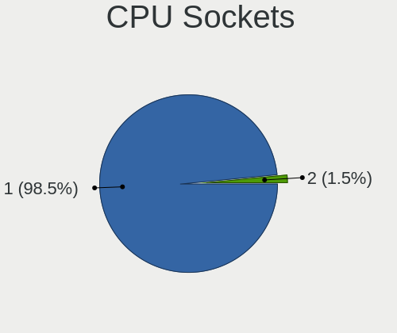

| Number | Computers | Percent |
|--------|-----------|---------|
| 1      | 394       | 98.01%  |
| 2      | 8         | 1.99%   |

CPU Threads
-----------

Threads per core (Hyper-Threading)

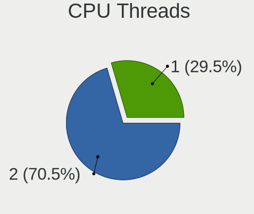

| Number | Computers | Percent |
|--------|-----------|---------|
| 2      | 278       | 68.81%  |
| 1      | 126       | 31.19%  |

CPU Op-Modes
------------

CPU Operation Modes (32-bit, 64-bit)

| Op mode        | Computers | Percent |
|----------------|-----------|---------|
| 32-bit, 64-bit | 391       | 96.78%  |
| Unknown        | 10        | 2.48%   |
| 32-bit         | 3         | 0.74%   |

CPU Microcode
-------------

Microcode number

| Number     | Computers | Percent |
|------------|-----------|---------|
| Unknown    | 94        | 22.6%   |
| 0x206a7    | 28        | 6.73%   |
| 0x306c3    | 25        | 6.01%   |
| 0x306a9    | 20        | 4.81%   |
| 0x1067a    | 20        | 4.81%   |
| 0x906ea    | 18        | 4.33%   |
| 0x40651    | 17        | 4.09%   |
| 0x806ea    | 15        | 3.61%   |
| 0x806e9    | 13        | 3.13%   |
| 0x306d4    | 12        | 2.88%   |
| 0x806ec    | 11        | 2.64%   |
| 0x906e9    | 10        | 2.4%    |
| 0x406e3    | 9         | 2.16%   |
| 0x6fd      | 7         | 1.68%   |
| 0x20655    | 6         | 1.44%   |
| 0xa0652    | 5         | 1.2%    |
| 0x706e5    | 5         | 1.2%    |
| 0x6fb      | 5         | 1.2%    |
| 0xf65      | 4         | 0.96%   |
| 0x506e3    | 4         | 0.96%   |
| 0x406c3    | 4         | 0.96%   |
| 0x30678    | 4         | 0.96%   |
| 0x20652    | 4         | 0.96%   |
| 0x06006704 | 4         | 0.96%   |
| 0x06001119 | 4         | 0.96%   |
| 0xa0671    | 3         | 0.72%   |
| 0x806eb    | 3         | 0.72%   |
| 0x206c2    | 3         | 0.72%   |
| 0x10676    | 3         | 0.72%   |
| 0x0800820d | 3         | 0.72%   |
| 0x06006705 | 3         | 0.72%   |
| 0x0600111f | 3         | 0.72%   |
| 0xf41      | 2         | 0.48%   |
| 0x6f6      | 2         | 0.48%   |
| 0x406c4    | 2         | 0.48%   |
| 0x306e4    | 2         | 0.48%   |
| 0x106e5    | 2         | 0.48%   |
| 0x106a5    | 2         | 0.48%   |
| 0x08108102 | 2         | 0.48%   |
| 0x08101016 | 2         | 0.48%   |

CPU Microarch
-------------

Microarchitecture

| Name             | Computers | Percent |
|------------------|-----------|---------|
| KabyLake         | 91        | 22.52%  |
| Haswell          | 50        | 12.38%  |
| SandyBridge      | 34        | 8.42%   |
| IvyBridge        | 26        | 6.44%   |
| Penryn           | 25        | 6.19%   |
| Skylake          | 18        | 4.46%   |
| Core             | 17        | 4.21%   |
| Westmere         | 16        | 3.96%   |
| Broadwell        | 15        | 3.71%   |
| Excavator        | 13        | 3.22%   |
| Silvermont       | 12        | 2.97%   |
| Piledriver       | 10        | 2.48%   |
| NetBurst         | 10        | 2.48%   |
| K10              | 8         | 1.98%   |
| Icelake          | 8         | 1.98%   |
| CometLake        | 7         | 1.73%   |
| Unknown          | 7         | 1.73%   |
| Zen+             | 5         | 1.24%   |
| Zen 2            | 4         | 0.99%   |
| Nehalem          | 4         | 0.99%   |
| Zen 3            | 3         | 0.74%   |
| Zen              | 3         | 0.74%   |
| Steamroller      | 3         | 0.74%   |
| Bobcat           | 3         | 0.74%   |
| TigerLake        | 2         | 0.5%    |
| Puma             | 2         | 0.5%    |
| K8 Hammer        | 2         | 0.5%    |
| P6               | 1         | 0.25%   |
| Goldmont plus    | 1         | 0.25%   |
| Goldmont         | 1         | 0.25%   |
| Bulldozer        | 1         | 0.25%   |
| Bonnell          | 1         | 0.25%   |
| Alderlake Hybrid | 1         | 0.25%   |

Graphics
--------

GPU Vendor
----------

Vendors of graphics cards

| Vendor           | Computers | Percent |
|------------------|-----------|---------|
| Intel            | 285       | 52.39%  |
| Nvidia           | 137       | 25.18%  |
| AMD              | 121       | 22.24%  |
| VIA Technologies | 1         | 0.18%   |

GPU Model
---------

Graphics card models

| Model                                                                                    | Computers | Percent |
|------------------------------------------------------------------------------------------|-----------|---------|
| Intel 2nd Generation Core Processor Family Integrated Graphics Controller                | 25        | 4.55%   |
| Intel UHD Graphics 620                                                                   | 21        | 3.82%   |
| Intel Haswell-ULT Integrated Graphics Controller                                         | 20        | 3.64%   |
| Intel CoffeeLake-H GT2 [UHD Graphics 630]                                                | 16        | 2.91%   |
| Intel 3rd Gen Core processor Graphics Controller                                         | 16        | 2.91%   |
| Nvidia GP107M [GeForce GTX 1050 Ti Mobile]                                               | 14        | 2.55%   |
| Intel HD Graphics 620                                                                    | 14        | 2.55%   |
| Intel 4 Series Chipset Integrated Graphics Controller                                    | 14        | 2.55%   |
| AMD Topaz XT [Radeon R7 M260/M265 / M340/M360 / M440/M445 / 530/535 / 620/625 Mobile]    | 14        | 2.55%   |
| Intel HD Graphics 630                                                                    | 13        | 2.36%   |
| Intel HD Graphics 5500                                                                   | 13        | 2.36%   |
| Intel Skylake GT2 [HD Graphics 520]                                                      | 12        | 2.18%   |
| Intel 4th Gen Core Processor Integrated Graphics Controller                              | 12        | 2.18%   |
| Intel Xeon E3-1200 v3/4th Gen Core Processor Integrated Graphics Controller              | 11        | 2%      |
| Intel WhiskeyLake-U GT2 [UHD Graphics 620]                                               | 10        | 1.82%   |
| Nvidia GP108M [GeForce MX150]                                                            | 9         | 1.64%   |
| Nvidia GM108M [GeForce MX130]                                                            | 9         | 1.64%   |
| Intel CometLake-U GT2 [UHD Graphics]                                                     | 9         | 1.64%   |
| Nvidia GT218 [GeForce 210]                                                               | 8         | 1.45%   |
| Intel Atom/Celeron/Pentium Processor x5-E8000/J3xxx/N3xxx Integrated Graphics Controller | 8         | 1.45%   |
| AMD Stoney [Radeon R2/R3/R4/R5 Graphics]                                                 | 8         | 1.45%   |
| Intel Core Processor Integrated Graphics Controller                                      | 7         | 1.27%   |
| AMD Sun XT [Radeon HD 8670A/8670M/8690M / R5 M330 / M430 / Radeon 520 Mobile]            | 7         | 1.27%   |
| AMD Ellesmere [Radeon RX 470/480/570/570X/580/580X/590]                                  | 7         | 1.27%   |
| Nvidia TU117M [GeForce GTX 1650 Mobile / Max-Q]                                          | 6         | 1.09%   |
| Nvidia GF117M [GeForce 610M/710M/810M/820M / GT 620M/625M/630M/720M]                     | 6         | 1.09%   |
| Intel CometLake-H GT2 [UHD Graphics]                                                     | 6         | 1.09%   |
| Nvidia GM108M [GeForce 840M]                                                             | 5         | 0.91%   |
| Nvidia GK208M [GeForce GT 740M]                                                          | 5         | 0.91%   |
| Intel Xeon E3-1200 v2/3rd Gen Core processor Graphics Controller                         | 5         | 0.91%   |
| Intel 82Q963/Q965 Integrated Graphics Controller                                         | 5         | 0.91%   |
| AMD Wani [Radeon R5/R6/R7 Graphics]                                                      | 5         | 0.91%   |
| Nvidia GA104 [GeForce RTX 3070]                                                          | 4         | 0.73%   |
| Intel Mobile 4 Series Chipset Integrated Graphics Controller                             | 4         | 0.73%   |
| Intel Iris Plus Graphics G7                                                              | 4         | 0.73%   |
| Intel HD Graphics 530                                                                    | 4         | 0.73%   |
| Intel Atom Processor Z36xxx/Z37xxx Series Graphics & Display                             | 4         | 0.73%   |
| AMD Whistler [Radeon HD 6730M/6770M/7690M XT]                                            | 4         | 0.73%   |
| AMD Thames [Radeon HD 7500M/7600M Series]                                                | 4         | 0.73%   |
| Nvidia GP108M [GeForce MX230]                                                            | 3         | 0.55%   |

GPU Combo
---------

Combinations of graphics cards

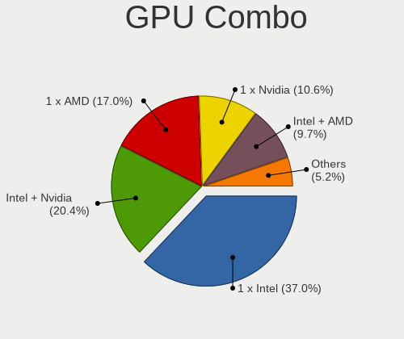

| Name           | Computers | Percent |
|----------------|-----------|---------|
| 1 x Intel      | 147       | 36.3%   |
| Intel + Nvidia | 88        | 21.73%  |
| 1 x AMD        | 63        | 15.56%  |
| Intel + AMD    | 50        | 12.35%  |
| 1 x Nvidia     | 44        | 10.86%  |
| AMD + Nvidia   | 4         | 0.99%   |
| Other          | 3         | 0.74%   |
| 2 x AMD        | 3         | 0.74%   |
| 3 x AMD        | 1         | 0.25%   |
| 2 x Intel      | 1         | 0.25%   |
| 1 x VIA        | 1         | 0.25%   |

GPU Driver
----------

Free vs proprietary

| Driver      | Computers | Percent |
|-------------|-----------|---------|
| Free        | 321       | 78.1%   |
| Proprietary | 68        | 16.55%  |
| Unknown     | 22        | 5.35%   |

GPU Memory
----------

Total video memory

| Size in GB | Computers | Percent |
|------------|-----------|---------|
| Unknown    | 226       | 54.59%  |
| 1.01-2.0   | 62        | 14.98%  |
| 3.01-4.0   | 42        | 10.14%  |
| 0.01-0.5   | 37        | 8.94%   |
| 0.51-1.0   | 33        | 7.97%   |
| 7.01-8.0   | 9         | 2.17%   |
| 5.01-6.0   | 3         | 0.72%   |
| 8.01-16.0  | 2         | 0.48%   |

Monitor
-------

Monitor Vendor
--------------

Monitor vendors

| Vendor                  | Computers | Percent |
|-------------------------|-----------|---------|
| Samsung Electronics     | 62        | 16.15%  |
| LG Display              | 56        | 14.58%  |
| BOE                     | 51        | 13.28%  |
| AU Optronics            | 48        | 12.5%   |
| Chimei Innolux          | 44        | 11.46%  |
| Dell                    | 26        | 6.77%   |
| Hewlett-Packard         | 19        | 4.95%   |
| Lenovo                  | 13        | 3.39%   |
| Chi Mei Optoelectronics | 13        | 3.39%   |
| InfoVision              | 5         | 1.3%    |
| Goldstar                | 5         | 1.3%    |
| Sharp                   | 4         | 1.04%   |
| Philips                 | 4         | 1.04%   |
| Fujitsu Siemens         | 3         | 0.78%   |
| Unknown                 | 2         | 0.52%   |
| PANDA                   | 2         | 0.52%   |
| Panasonic               | 2         | 0.52%   |
| NEC Computers           | 2         | 0.52%   |
| Eizo                    | 2         | 0.52%   |
| BenQ                    | 2         | 0.52%   |
| ASUSTek Computer        | 2         | 0.52%   |
| Apple                   | 2         | 0.52%   |
| ViewSonic               | 1         | 0.26%   |
| Sun                     | 1         | 0.26%   |
| Sony                    | 1         | 0.26%   |
| Planar                  | 1         | 0.26%   |
| MStar                   | 1         | 0.26%   |
| LG Philips              | 1         | 0.26%   |
| KDC                     | 1         | 0.26%   |
| JWY                     | 1         | 0.26%   |
| Gigabyte Technology     | 1         | 0.26%   |
| eMachines               | 1         | 0.26%   |
| CPT                     | 1         | 0.26%   |
| AUS                     | 1         | 0.26%   |
| AOC                     | 1         | 0.26%   |
| Ancor Communications    | 1         | 0.26%   |
| Acer                    | 1         | 0.26%   |

Monitor Model
-------------

Monitor models

| Model                                                                 | Computers | Percent |
|-----------------------------------------------------------------------|-----------|---------|
| AU Optronics LCD Monitor AUO38ED 1920x1080 344x193mm 15.5-inch        | 8         | 2.05%   |
| BOE LCD Monitor BOE06A5 1366x768 344x194mm 15.5-inch                  | 6         | 1.54%   |
| LG Display LCD Monitor LGD053F 1920x1080 344x194mm 15.5-inch          | 5         | 1.28%   |
| Dell E170S DELA04A 1280x1024 338x270mm 17.0-inch                      | 5         | 1.28%   |
| LG Display LCD Monitor LGD02E9 1366x768 310x170mm 13.9-inch           | 4         | 1.03%   |
| Lenovo LCD Monitor LEN40A0 1366x768 309x174mm 14.0-inch               | 4         | 1.03%   |
| Chimei Innolux LCD Monitor CMN15DB 1366x768 344x193mm 15.5-inch       | 4         | 1.03%   |
| Chimei Innolux LCD Monitor CMN15AB 1366x768 344x194mm 15.5-inch       | 4         | 1.03%   |
| BOE LCD Monitor BOE07B0 1920x1080 344x194mm 15.5-inch                 | 4         | 1.03%   |
| BOE LCD Monitor BOE0687 1920x1080 344x193mm 15.5-inch                 | 4         | 1.03%   |
| AU Optronics LCD Monitor AUO81EC 1366x768 344x193mm 15.5-inch         | 4         | 1.03%   |
| Samsung Electronics S19B150 SAM08A2 1366x768 410x230mm 18.5-inch      | 3         | 0.77%   |
| Samsung Electronics LCD Monitor SEC3151 1366x768 344x194mm 15.5-inch  | 3         | 0.77%   |
| Samsung Electronics LCD Monitor SDC4852 1366x768 340x190mm 15.3-inch  | 3         | 0.77%   |
| LG Display LCD Monitor LGD0590 1920x1080 344x194mm 15.5-inch          | 3         | 0.77%   |
| Lenovo LEN T2454pA LEN60C9 1920x1200 518x324mm 24.1-inch              | 3         | 0.77%   |
| Hewlett-Packard L1950 HWP26E7 1280x1024 380x300mm 19.1-inch           | 3         | 0.77%   |
| Chimei Innolux LCD Monitor CMN15E6 1366x768 344x193mm 15.5-inch       | 3         | 0.77%   |
| Chimei Innolux LCD Monitor CMN15DC 1366x768 344x193mm 15.5-inch       | 3         | 0.77%   |
| Chimei Innolux LCD Monitor CMN15D5 1920x1080 344x193mm 15.5-inch      | 3         | 0.77%   |
| Chimei Innolux LCD Monitor CMN1490 1366x768 309x173mm 13.9-inch       | 3         | 0.77%   |
| BOE LCD Monitor BOE0802 1920x1080 344x193mm 15.5-inch                 | 3         | 0.77%   |
| BOE LCD Monitor BOE06C6 1920x1080 344x194mm 15.5-inch                 | 3         | 0.77%   |
| AU Optronics LCD Monitor AUO71EC 1366x768 344x193mm 15.5-inch         | 3         | 0.77%   |
| AU Optronics LCD Monitor AUO45EC 1366x768 344x193mm 15.5-inch         | 3         | 0.77%   |
| AU Optronics LCD Monitor AUO22EC 1366x768 344x193mm 15.5-inch         | 3         | 0.77%   |
| Samsung Electronics U28E590 SAM0C4D 3840x2160 607x345mm 27.5-inch     | 2         | 0.51%   |
| Samsung Electronics SyncMaster SAM0350 1440x900 428x255mm 19.6-inch   | 2         | 0.51%   |
| Samsung Electronics SMB1930N SAM0632 1366x768 410x230mm 18.5-inch     | 2         | 0.51%   |
| Samsung Electronics S19D300 SAM0B34 1366x768 410x230mm 18.5-inch      | 2         | 0.51%   |
| Samsung Electronics LCD Monitor SEC3150 1366x768 344x193mm 15.5-inch  | 2         | 0.51%   |
| Samsung Electronics LCD Monitor SDC5344 1920x1080 344x194mm 15.5-inch | 2         | 0.51%   |
| Panasonic LCD Monitor MEI96A2 2880x1620 344x193mm 15.5-inch           | 2         | 0.51%   |
| LG Display LCD Monitor LGD03AB 1366x768 344x194mm 15.5-inch           | 2         | 0.51%   |
| LG Display LCD Monitor LGD038E 1366x768 344x194mm 15.5-inch           | 2         | 0.51%   |
| Lenovo LCD Monitor LEN4035 1280x800 303x190mm 14.1-inch               | 2         | 0.51%   |
| Hewlett-Packard LA2206 HWP2948 1920x1080 476x268mm 21.5-inch          | 2         | 0.51%   |
| Dell P2210 DEL404E 1680x1050 474x296mm 22.0-inch                      | 2         | 0.51%   |
| Dell E2014H DELD03B 1600x900 432x240mm 19.5-inch                      | 2         | 0.51%   |
| Chimei Innolux LCD Monitor CMN15E7 1920x1080 344x193mm 15.5-inch      | 2         | 0.51%   |

Monitor Resolution
------------------

Monitor screen resolution

| Resolution         | Computers | Percent |
|--------------------|-----------|---------|
| 1366x768 (WXGA)    | 145       | 38.36%  |
| 1920x1080 (FHD)    | 144       | 38.1%   |
| 1280x1024 (SXGA)   | 22        | 5.82%   |
| 1440x900 (WXGA+)   | 14        | 3.7%    |
| 1600x900 (HD+)     | 13        | 3.44%   |
| 3840x2160 (4K)     | 10        | 2.65%   |
| 1680x1050 (WSXGA+) | 7         | 1.85%   |
| 1280x800 (WXGA)    | 6         | 1.59%   |
| 2560x1440 (QHD)    | 3         | 0.79%   |
| 1920x1200 (WUXGA)  | 2         | 0.53%   |
| 3440x1440          | 1         | 0.26%   |
| 3200x1800 (QHD+)   | 1         | 0.26%   |
| 2560x1600          | 1         | 0.26%   |
| 2288x1287          | 1         | 0.26%   |
| 2160x1440          | 1         | 0.26%   |
| 1920x540           | 1         | 0.26%   |
| 1600x1200          | 1         | 0.26%   |
| 1400x1050          | 1         | 0.26%   |
| 1360x768           | 1         | 0.26%   |
| 1280x720 (HD)      | 1         | 0.26%   |
| 1024x768 (XGA)     | 1         | 0.26%   |
| 1024x600           | 1         | 0.26%   |

Monitor Diagonal
----------------

Diagonal size in inches

| Inches  | Computers | Percent |
|---------|-----------|---------|
| 15      | 189       | 49.22%  |
| 14      | 39        | 10.16%  |
| 17      | 25        | 6.51%   |
| 13      | 18        | 4.69%   |
| 19      | 15        | 3.91%   |
| 24      | 13        | 3.39%   |
| 18      | 13        | 3.39%   |
| Unknown | 11        | 2.86%   |
| 21      | 10        | 2.6%    |
| 23      | 9         | 2.34%   |
| 12      | 8         | 2.08%   |
| 27      | 7         | 1.82%   |
| 22      | 7         | 1.82%   |
| 20      | 6         | 1.56%   |
| 32      | 2         | 0.52%   |
| 31      | 2         | 0.52%   |
| 11      | 2         | 0.52%   |
| 142     | 1         | 0.26%   |
| 58      | 1         | 0.26%   |
| 54      | 1         | 0.26%   |
| 34      | 1         | 0.26%   |
| 29      | 1         | 0.26%   |
| 25      | 1         | 0.26%   |
| 16      | 1         | 0.26%   |
| 10      | 1         | 0.26%   |

Monitor Width
-------------

Physical width

| Width in mm    | Computers | Percent |
|----------------|-----------|---------|
| 301-350        | 250       | 65.62%  |
| 401-500        | 43        | 11.29%  |
| 501-600        | 27        | 7.09%   |
| 351-400        | 21        | 5.51%   |
| 201-300        | 18        | 4.72%   |
| Unknown        | 11        | 2.89%   |
| 601-700        | 5         | 1.31%   |
| 701-800        | 3         | 0.79%   |
| 1001-1500      | 2         | 0.52%   |
| More than 2000 | 1         | 0.26%   |

Aspect Ratio
------------

Proportional relationship between the width and the height

| Ratio   | Computers | Percent |
|---------|-----------|---------|
| 16/9    | 300       | 81.74%  |
| 16/10   | 30        | 8.17%   |
| 5/4     | 19        | 5.18%   |
| Unknown | 10        | 2.72%   |
| 4/3     | 6         | 1.63%   |
| 21/9    | 1         | 0.27%   |
| 1.00    | 1         | 0.27%   |

Monitor Area
------------

Area in inch

| Area in inch | Computers | Percent |
|----------------|-----------|---------|
| 101-110        | 185       | 48.3%   |
| 81-90          | 50        | 13.05%  |
| 201-250        | 28        | 7.31%   |
| 151-200        | 28        | 7.31%   |
| 141-150        | 23        | 6.01%   |
| Unknown        | 11        | 2.87%   |
| 121-130        | 9         | 2.35%   |
| 61-70          | 8         | 2.09%   |
| 301-350        | 7         | 1.83%   |
| 251-300        | 7         | 1.83%   |
| 351-500        | 6         | 1.57%   |
| 71-80          | 5         | 1.31%   |
| 131-140        | 4         | 1.04%   |
| 91-100         | 4         | 1.04%   |
| More than 1000 | 3         | 0.78%   |
| 51-60          | 2         | 0.52%   |
| 111-120        | 2         | 0.52%   |
| 41-50          | 1         | 0.26%   |

Pixel Density
-------------

Pixels per inch

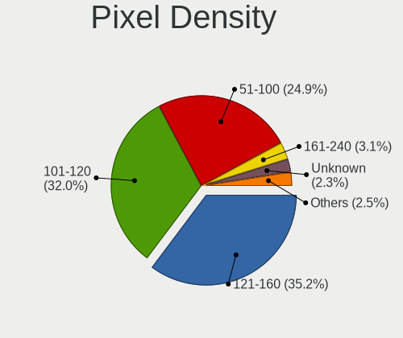

| Density       | Computers | Percent |
|---------------|-----------|---------|
| 101-120       | 140       | 37.23%  |
| 121-160       | 113       | 30.05%  |
| 51-100        | 100       | 26.6%   |
| Unknown       | 11        | 2.93%   |
| 161-240       | 5         | 1.33%   |
| More than 240 | 4         | 1.06%   |
| 1-50          | 3         | 0.8%    |

Multiple Monitors
-----------------

Total monitors connected

| Total | Computers | Percent |
|-------|-----------|---------|
| 1     | 361       | 87.62%  |
| 2     | 29        | 7.04%   |
| 0     | 21        | 5.1%    |
| 3     | 1         | 0.24%   |

Network
-------

Net Controller Vendor
---------------------

Controller vendors

| Vendor                            | Computers | Percent |
|-----------------------------------|-----------|---------|
| Realtek Semiconductor             | 243       | 37.91%  |
| Intel                             | 180       | 28.08%  |
| Qualcomm Atheros                  | 90        | 14.04%  |
| Broadcom                          | 48        | 7.49%   |
| Ralink Technology                 | 17        | 2.65%   |
| Broadcom Limited                  | 15        | 2.34%   |
| Ralink                            | 8         | 1.25%   |
| TP-Link                           | 5         | 0.78%   |
| Samsung Electronics               | 5         | 0.78%   |
| Qualcomm Atheros Communications   | 4         | 0.62%   |
| Huawei Technologies               | 4         | 0.62%   |
| MediaTek                          | 3         | 0.47%   |
| Nvidia                            | 2         | 0.31%   |
| Marvell Technology Group          | 2         | 0.31%   |
| Edimax Technology                 | 2         | 0.31%   |
| D-Link                            | 2         | 0.31%   |
| VIA Technologies                  | 1         | 0.16%   |
| Sundance Technology Inc / IC Plus | 1         | 0.16%   |
| Sierra Wireless                   | 1         | 0.16%   |
| Qualcomm                          | 1         | 0.16%   |
| Motorola                          | 1         | 0.16%   |
| Lenovo                            | 1         | 0.16%   |
| Hewlett-Packard                   | 1         | 0.16%   |
| Ericsson Business Mobile Networks | 1         | 0.16%   |
| Dell                              | 1         | 0.16%   |
| ASIX Electronics                  | 1         | 0.16%   |
| 3Com                              | 1         | 0.16%   |

Net Controller Model
--------------------

Controller models

| Model                                                                         | Computers | Percent |
|-------------------------------------------------------------------------------|-----------|---------|
| Realtek RTL8111/8168/8411 PCI Express Gigabit Ethernet Controller             | 144       | 19.97%  |
| Realtek RTL810xE PCI Express Fast Ethernet controller                         | 73        | 10.12%  |
| Qualcomm Atheros QCA9377 802.11ac Wireless Network Adapter                    | 27        | 3.74%   |
| Intel Cannon Lake PCH CNVi WiFi                                               | 15        | 2.08%   |
| Intel 82579LM Gigabit Network Connection (Lewisville)                         | 15        | 2.08%   |
| Intel Wireless 8265 / 8275                                                    | 14        | 1.94%   |
| Intel Ethernet Connection I217-LM                                             | 14        | 1.94%   |
| Qualcomm Atheros QCA9565 / AR9565 Wireless Network Adapter                    | 13        | 1.8%    |
| Broadcom BCM43142 802.11b/g/n                                                 | 12        | 1.66%   |
| Ralink RT5370 Wireless Adapter                                                | 11        | 1.53%   |
| Qualcomm Atheros AR9285 Wireless Network Adapter (PCI-Express)                | 11        | 1.53%   |
| Realtek RTL8821CE 802.11ac PCIe Wireless Network Adapter                      | 10        | 1.39%   |
| Realtek RTL8723BE PCIe Wireless Network Adapter                               | 10        | 1.39%   |
| Intel Wireless 8260                                                           | 10        | 1.39%   |
| Qualcomm Atheros AR8151 v2.0 Gigabit Ethernet                                 | 9         | 1.25%   |
| Intel Wireless 7265                                                           | 9         | 1.25%   |
| Intel Wireless 7260                                                           | 9         | 1.25%   |
| Intel Comet Lake PCH-LP CNVi WiFi                                             | 9         | 1.25%   |
| Intel Comet Lake PCH CNVi WiFi                                                | 9         | 1.25%   |
| Intel 82567LM-3 Gigabit Network Connection                                    | 9         | 1.25%   |
| Realtek RTL8188FTV 802.11b/g/n 1T1R 2.4G WLAN Adapter                         | 8         | 1.11%   |
| Broadcom BCM4313 802.11bgn Wireless Network Adapter                           | 8         | 1.11%   |
| Qualcomm Atheros AR9485 Wireless Network Adapter                              | 7         | 0.97%   |
| Realtek RTL8822BE 802.11a/b/g/n/ac WiFi adapter                               | 6         | 0.83%   |
| Ralink MT7601U Wireless Adapter                                               | 6         | 0.83%   |
| Intel Wireless 3160                                                           | 6         | 0.83%   |
| Intel Dual Band Wireless-AC 3165 Plus Bluetooth                               | 6         | 0.83%   |
| Broadcom NetXtreme BCM5762 Gigabit Ethernet PCIe                              | 6         | 0.83%   |
| Realtek RTL8188EUS 802.11n Wireless Network Adapter                           | 5         | 0.69%   |
| Intel Ethernet Connection I219-LM                                             | 5         | 0.69%   |
| Broadcom Limited NetXtreme BCM5761 Gigabit Ethernet PCIe                      | 5         | 0.69%   |
| Samsung GT-I9070 (network tethering, USB debugging enabled)                   | 4         | 0.55%   |
| Ralink RT3290 Wireless 802.11n 1T/1R PCIe                                     | 4         | 0.55%   |
| Qualcomm Atheros AR2413/AR2414 Wireless Network Adapter [AR5005G(S) 802.11bg] | 4         | 0.55%   |
| Intel Ethernet Connection I218-LM                                             | 4         | 0.55%   |
| Intel Ethernet Connection (4) I219-LM                                         | 4         | 0.55%   |
| Intel Ethernet Connection (2) I219-LM                                         | 4         | 0.55%   |
| Intel Centrino Wireless-N 1000 [Condor Peak]                                  | 4         | 0.55%   |
| Intel 82566DM-2 Gigabit Network Connection                                    | 4         | 0.55%   |
| Broadcom NetXtreme BCM5761 Gigabit Ethernet PCIe                              | 4         | 0.55%   |

Wireless Vendor
---------------

Wireless vendors

| Vendor                          | Computers | Percent |
|---------------------------------|-----------|---------|
| Intel                           | 126       | 38.18%  |
| Qualcomm Atheros                | 70        | 21.21%  |
| Realtek Semiconductor           | 56        | 16.97%  |
| Broadcom                        | 30        | 9.09%   |
| Ralink Technology               | 17        | 5.15%   |
| Ralink                          | 8         | 2.42%   |
| Broadcom Limited                | 7         | 2.12%   |
| TP-Link                         | 4         | 1.21%   |
| Qualcomm Atheros Communications | 4         | 1.21%   |
| MediaTek                        | 2         | 0.61%   |
| Edimax Technology               | 2         | 0.61%   |
| D-Link                          | 2         | 0.61%   |
| Sierra Wireless                 | 1         | 0.3%    |
| Dell                            | 1         | 0.3%    |

Wireless Model
--------------

Wireless models

| Model                                                                         | Computers | Percent |
|-------------------------------------------------------------------------------|-----------|---------|
| Qualcomm Atheros QCA9377 802.11ac Wireless Network Adapter                    | 27        | 8.13%   |
| Intel Cannon Lake PCH CNVi WiFi                                               | 15        | 4.52%   |
| Intel Wireless 8265 / 8275                                                    | 14        | 4.22%   |
| Qualcomm Atheros QCA9565 / AR9565 Wireless Network Adapter                    | 13        | 3.92%   |
| Broadcom BCM43142 802.11b/g/n                                                 | 12        | 3.61%   |
| Ralink RT5370 Wireless Adapter                                                | 11        | 3.31%   |
| Qualcomm Atheros AR9285 Wireless Network Adapter (PCI-Express)                | 11        | 3.31%   |
| Realtek RTL8821CE 802.11ac PCIe Wireless Network Adapter                      | 10        | 3.01%   |
| Realtek RTL8723BE PCIe Wireless Network Adapter                               | 10        | 3.01%   |
| Intel Wireless 8260                                                           | 10        | 3.01%   |
| Intel Wireless 7265                                                           | 9         | 2.71%   |
| Intel Wireless 7260                                                           | 9         | 2.71%   |
| Intel Comet Lake PCH-LP CNVi WiFi                                             | 9         | 2.71%   |
| Intel Comet Lake PCH CNVi WiFi                                                | 9         | 2.71%   |
| Realtek RTL8188FTV 802.11b/g/n 1T1R 2.4G WLAN Adapter                         | 8         | 2.41%   |
| Broadcom BCM4313 802.11bgn Wireless Network Adapter                           | 8         | 2.41%   |
| Qualcomm Atheros AR9485 Wireless Network Adapter                              | 7         | 2.11%   |
| Realtek RTL8822BE 802.11a/b/g/n/ac WiFi adapter                               | 6         | 1.81%   |
| Ralink MT7601U Wireless Adapter                                               | 6         | 1.81%   |
| Intel Wireless 3160                                                           | 6         | 1.81%   |
| Intel Dual Band Wireless-AC 3165 Plus Bluetooth                               | 6         | 1.81%   |
| Realtek RTL8188EUS 802.11n Wireless Network Adapter                           | 5         | 1.51%   |
| Ralink RT3290 Wireless 802.11n 1T/1R PCIe                                     | 4         | 1.2%    |
| Qualcomm Atheros AR2413/AR2414 Wireless Network Adapter [AR5005G(S) 802.11bg] | 4         | 1.2%    |
| Intel Centrino Wireless-N 1000 [Condor Peak]                                  | 4         | 1.2%    |
| Broadcom BCM43228 802.11a/b/g/n                                               | 4         | 1.2%    |
| Realtek RTL8822CE 802.11ac PCIe Wireless Network Adapter                      | 3         | 0.9%    |
| Realtek RTL8188CUS 802.11n WLAN Adapter                                       | 3         | 0.9%    |
| Qualcomm Atheros QCA6174 802.11ac Wireless Network Adapter                    | 3         | 0.9%    |
| Qualcomm Atheros TP-Link TL-WN322G v3 / TL-WN422G v2 802.11g [Atheros AR9271] | 3         | 0.9%    |
| Intel PRODUCT_MODEM                                                           | 3         | 0.9%    |
| Intel Dual Band Wireless-AC 3168NGW [Stone Peak]                              | 3         | 0.9%    |
| Intel Centrino Wireless-N 1030 [Rainbow Peak]                                 | 3         | 0.9%    |
| Intel Centrino Advanced-N 6235                                                | 3         | 0.9%    |
| Intel Cannon Point-LP CNVi [Wireless-AC]                                      | 3         | 0.9%    |
| Broadcom Limited BCM4312 802.11b/g LP-PHY                                     | 3         | 0.9%    |
| Realtek RTL8821AE 802.11ac PCIe Wireless Network Adapter                      | 2         | 0.6%    |
| Realtek RTL8723DE Wireless Network Adapter                                    | 2         | 0.6%    |
| Realtek RTL8723AE PCIe Wireless Network Adapter                               | 2         | 0.6%    |
| Ralink RT5390 Wireless 802.11n 1T/1R PCIe                                     | 2         | 0.6%    |

Ethernet Vendor
---------------

Ethernet vendors

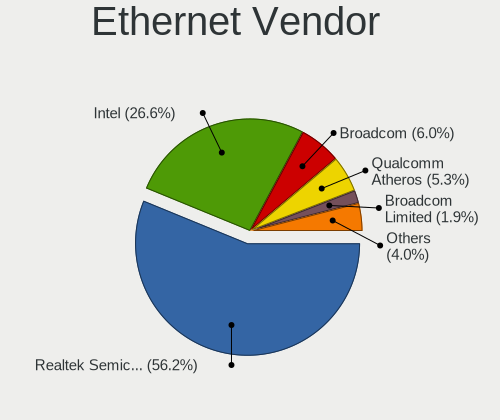

| Vendor                            | Computers | Percent |
|-----------------------------------|-----------|---------|
| Realtek Semiconductor             | 223       | 58.53%  |
| Intel                             | 87        | 22.83%  |
| Qualcomm Atheros                  | 25        | 6.56%   |
| Broadcom                          | 19        | 4.99%   |
| Broadcom Limited                  | 8         | 2.1%    |
| Samsung Electronics               | 5         | 1.31%   |
| Nvidia                            | 2         | 0.52%   |
| Marvell Technology Group          | 2         | 0.52%   |
| Huawei Technologies               | 2         | 0.52%   |
| VIA Technologies                  | 1         | 0.26%   |
| TP-Link                           | 1         | 0.26%   |
| Sundance Technology Inc / IC Plus | 1         | 0.26%   |
| Qualcomm                          | 1         | 0.26%   |
| MediaTek                          | 1         | 0.26%   |
| Lenovo                            | 1         | 0.26%   |
| ASIX Electronics                  | 1         | 0.26%   |
| 3Com                              | 1         | 0.26%   |

Ethernet Model
--------------

Ethernet models

| Model                                                                      | Computers | Percent |
|----------------------------------------------------------------------------|-----------|---------|
| Realtek RTL8111/8168/8411 PCI Express Gigabit Ethernet Controller          | 144       | 37.5%   |
| Realtek RTL810xE PCI Express Fast Ethernet controller                      | 73        | 19.01%  |
| Intel 82579LM Gigabit Network Connection (Lewisville)                      | 15        | 3.91%   |
| Intel Ethernet Connection I217-LM                                          | 14        | 3.65%   |
| Qualcomm Atheros AR8151 v2.0 Gigabit Ethernet                              | 9         | 2.34%   |
| Intel 82567LM-3 Gigabit Network Connection                                 | 9         | 2.34%   |
| Broadcom NetXtreme BCM5762 Gigabit Ethernet PCIe                           | 6         | 1.56%   |
| Intel Ethernet Connection I219-LM                                          | 5         | 1.3%    |
| Broadcom Limited NetXtreme BCM5761 Gigabit Ethernet PCIe                   | 5         | 1.3%    |
| Samsung GT-I9070 (network tethering, USB debugging enabled)                | 4         | 1.04%   |
| Intel Ethernet Connection I218-LM                                          | 4         | 1.04%   |
| Intel Ethernet Connection (4) I219-LM                                      | 4         | 1.04%   |
| Intel Ethernet Connection (2) I219-LM                                      | 4         | 1.04%   |
| Intel 82566DM-2 Gigabit Network Connection                                 | 4         | 1.04%   |
| Broadcom NetXtreme BCM5761 Gigabit Ethernet PCIe                           | 4         | 1.04%   |
| Qualcomm Atheros Killer E2400 Gigabit Ethernet Controller                  | 3         | 0.78%   |
| Qualcomm Atheros AR8151 v1.0 Gigabit Ethernet                              | 3         | 0.78%   |
| Qualcomm Atheros AR8132 Fast Ethernet                                      | 3         | 0.78%   |
| Intel 82577LM Gigabit Network Connection                                   | 3         | 0.78%   |
| Intel 82566DM Gigabit Network Connection                                   | 3         | 0.78%   |
| Realtek RTL8125 2.5GbE Controller                                          | 2         | 0.52%   |
| Realtek Killer E3000 2.5GbE Controller                                     | 2         | 0.52%   |
| Qualcomm Atheros QCA8171 Gigabit Ethernet                                  | 2         | 0.52%   |
| Qualcomm Atheros Killer E220x Gigabit Ethernet Controller                  | 2         | 0.52%   |
| Marvell Group 88E8040 PCI-E Fast Ethernet Controller                       | 2         | 0.52%   |
| Intel I211 Gigabit Network Connection                                      | 2         | 0.52%   |
| Intel Ethernet Connection (7) I219-LM                                      | 2         | 0.52%   |
| Intel Ethernet Connection (3) I218-LM                                      | 2         | 0.52%   |
| Intel Ethernet Connection (2) I219-V                                       | 2         | 0.52%   |
| Intel 82579V Gigabit Network Connection                                    | 2         | 0.52%   |
| Intel 82578DM Gigabit Network Connection                                   | 2         | 0.52%   |
| Intel 82574L Gigabit Network Connection                                    | 2         | 0.52%   |
| Broadcom NetXtreme BCM5764M Gigabit Ethernet PCIe                          | 2         | 0.52%   |
| Broadcom NetXtreme BCM5754 Gigabit Ethernet PCI Express                    | 2         | 0.52%   |
| VIA VT6102/VT6103 [Rhine-II]                                               | 1         | 0.26%   |
| TP-Link UE300 10/100/1000 LAN (ethernet mode) [Realtek RTL8153]            | 1         | 0.26%   |
| Sundance Inc / IC Plus IC Plus IP100A Integrated 10/100 Ethernet MAC + PHY | 1         | 0.26%   |
| Samsung Galaxy series, misc. (tethering mode)                              | 1         | 0.26%   |
| Realtek RTL-8100/8101L/8139 PCI Fast Ethernet Adapter                      | 1         | 0.26%   |
| Realtek Killer E2600 Gigabit Ethernet Controller                           | 1         | 0.26%   |

Net Controller Kind
-------------------

Ethernet, WiFi or modem

| Kind     | Computers | Percent |
|----------|-----------|---------|
| Ethernet | 367       | 53.27%  |
| WiFi     | 317       | 46.01%  |
| Modem    | 5         | 0.73%   |

Used Controller
---------------

Currently used network controller

| Kind     | Computers | Percent |
|----------|-----------|---------|
| WiFi     | 254       | 63.34%  |
| Ethernet | 147       | 36.66%  |

NICs
----

Total network controllers on board

| Total | Computers | Percent |
|-------|-----------|---------|
| 2     | 256       | 63.68%  |
| 1     | 133       | 33.08%  |
| 0     | 11        | 2.74%   |
| 3     | 2         | 0.5%    |

IPv6
----

IPv6 vs IPv4

| Used | Computers | Percent |
|------|-----------|---------|
| No   | 402       | 99.75%  |
| Yes  | 1         | 0.25%   |

Bluetooth
---------

Bluetooth Vendor
----------------

Controller vendors

| Vendor                          | Computers | Percent |
|---------------------------------|-----------|---------|
| Intel                           | 104       | 42.62%  |
| Qualcomm Atheros Communications | 41        | 16.8%   |
| Realtek Semiconductor           | 30        | 12.3%   |
| Broadcom                        | 21        | 8.61%   |
| Cambridge Silicon Radio         | 11        | 4.51%   |
| Foxconn / Hon Hai               | 7         | 2.87%   |
| Lite-On Technology              | 6         | 2.46%   |
| Toshiba                         | 5         | 2.05%   |
| IMC Networks                    | 5         | 2.05%   |
| Ralink                          | 4         | 1.64%   |
| Dell                            | 3         | 1.23%   |
| Hewlett-Packard                 | 2         | 0.82%   |
| Apple                           | 2         | 0.82%   |
| MediaTek                        | 1         | 0.41%   |
| Foxconn International           | 1         | 0.41%   |
| Edimax Technology               | 1         | 0.41%   |

Bluetooth Model
---------------

Controller models

| Model                                               | Computers | Percent |
|-----------------------------------------------------|-----------|---------|
| Intel Bluetooth wireless interface                  | 52        | 21.31%  |
| Qualcomm Atheros  Bluetooth Device                  | 27        | 11.07%  |
| Intel Bluetooth 9460/9560 Jefferson Peak (JfP)      | 20        | 8.2%    |
| Intel AX201 Bluetooth                               | 19        | 7.79%   |
| Realtek Bluetooth Radio                             | 18        | 7.38%   |
| Cambridge Silicon Radio Bluetooth Dongle (HCI mode) | 11        | 4.51%   |
| Realtek  Bluetooth 4.2 Adapter                      | 6         | 2.46%   |
| Qualcomm Atheros AR3011 Bluetooth                   | 5         | 2.05%   |
| Broadcom BCM43142 Bluetooth 4.0                     | 5         | 2.05%   |
| Ralink RT3290 Bluetooth                             | 4         | 1.64%   |
| Qualcomm Atheros AR9462 Bluetooth                   | 4         | 1.64%   |
| Intel Centrino Bluetooth Wireless Transceiver       | 4         | 1.64%   |
| Broadcom HP Portable Bumble Bee                     | 4         | 1.64%   |
| Realtek RTL8821A Bluetooth                          | 3         | 1.23%   |
| Realtek RTL8723B Bluetooth                          | 3         | 1.23%   |
| Qualcomm Atheros AR3012 Bluetooth 4.0               | 3         | 1.23%   |
| Lite-On Qualcomm Atheros QCA9377 Bluetooth          | 3         | 1.23%   |
| Lite-On Bluetooth Device                            | 3         | 1.23%   |
| Intel Wireless-AC 3168 Bluetooth                    | 3         | 1.23%   |
| Intel Centrino Advanced-N 6230 Bluetooth adapter    | 3         | 1.23%   |
| Dell Wireless 365 Bluetooth                         | 3         | 1.23%   |
| Broadcom BCM2045B (BDC-2.1)                         | 3         | 1.23%   |
| Qualcomm Atheros Bluetooth USB Host Controller      | 2         | 0.82%   |
| Intel AX200 Bluetooth                               | 2         | 0.82%   |
| IMC Networks Bluetooth Radio                        | 2         | 0.82%   |
| IMC Networks Bluetooth Device                       | 2         | 0.82%   |
| HP Broadcom 2070 Bluetooth Combo                    | 2         | 0.82%   |
| Foxconn / Hon Hai Bluetooth Device                  | 2         | 0.82%   |
| Foxconn / Hon Hai BCM20702A0                        | 2         | 0.82%   |
| Broadcom HP Portable SoftSailing                    | 2         | 0.82%   |
| Broadcom BCM43142A0 Bluetooth Device                | 2         | 0.82%   |
| Broadcom BCM43142A0 Bluetooth 4.0                   | 2         | 0.82%   |
| Broadcom BCM2070 Bluetooth 2.1 + EDR                | 2         | 0.82%   |
| Toshiba RT Bluetooth Radio                          | 1         | 0.41%   |
| Toshiba Integrated Bluetooth HCI                    | 1         | 0.41%   |
| Toshiba Bluetooth USB Host Controller               | 1         | 0.41%   |
| Toshiba Bluetooth Device                            | 1         | 0.41%   |
| Toshiba Askey Bluetooth Module                      | 1         | 0.41%   |
| MediaTek MT7630e Bluetooth Adapter                  | 1         | 0.41%   |
| Intel Bluetooth Device                              | 1         | 0.41%   |

Sound
-----

Sound Vendor
------------

Sound card vendors

| Vendor                 | Computers | Percent |
|------------------------|-----------|---------|
| Intel                  | 329       | 66.87%  |
| AMD                    | 80        | 16.26%  |
| Nvidia                 | 73        | 14.84%  |
| Logitech               | 2         | 0.41%   |
| JMTek                  | 2         | 0.41%   |
| VIA Technologies       | 1         | 0.2%    |
| Thermaltake            | 1         | 0.2%    |
| Texas Instruments      | 1         | 0.2%    |
| Tenx Technology        | 1         | 0.2%    |
| Generalplus Technology | 1         | 0.2%    |
| C-Media Electronics    | 1         | 0.2%    |

Sound Model
-----------

Sound card models

| Model                                                                      | Computers | Percent |
|----------------------------------------------------------------------------|-----------|---------|
| Intel Sunrise Point-LP HD Audio                                            | 47        | 7.9%    |
| Intel 6 Series/C200 Series Chipset Family High Definition Audio Controller | 32        | 5.38%   |
| Intel 8 Series/C220 Series Chipset High Definition Audio Controller        | 25        | 4.2%    |
| Intel 7 Series/C216 Chipset Family High Definition Audio Controller        | 25        | 4.2%    |
| Intel Xeon E3-1200 v3/4th Gen Core Processor HD Audio Controller           | 23        | 3.87%   |
| Intel Cannon Lake PCH cAVS                                                 | 22        | 3.7%    |
| Intel 8 Series HD Audio Controller                                         | 22        | 3.7%    |
| Intel Haswell-ULT HD Audio Controller                                      | 20        | 3.36%   |
| AMD FCH Azalia Controller                                                  | 17        | 2.86%   |
| Intel NM10/ICH7 Family High Definition Audio Controller                    | 16        | 2.69%   |
| Intel Wildcat Point-LP High Definition Audio Controller                    | 15        | 2.52%   |
| Intel Broadwell-U Audio Controller                                         | 15        | 2.52%   |
| Intel 5 Series/3400 Series Chipset High Definition Audio                   | 15        | 2.52%   |
| AMD Family 15h (Models 60h-6fh) Audio Controller                           | 13        | 2.18%   |
| AMD SBx00 Azalia (Intel HDA)                                               | 11        | 1.85%   |
| Nvidia GP107GL High Definition Audio Controller                            | 10        | 1.68%   |
| Intel CM238 HD Audio Controller                                            | 10        | 1.68%   |
| Intel Cannon Point-LP High Definition Audio Controller                     | 10        | 1.68%   |
| Intel 82801I (ICH9 Family) HD Audio Controller                             | 10        | 1.68%   |
| AMD Trinity HDMI Audio Controller                                          | 10        | 1.68%   |
| AMD Family 17h/19h HD Audio Controller                                     | 10        | 1.68%   |
| Nvidia TU107 GeForce GTX 1650 High Definition Audio Controller             | 9         | 1.51%   |
| Nvidia High Definition Audio Controller                                    | 9         | 1.51%   |
| Intel Comet Lake PCH-LP cAVS                                               | 9         | 1.51%   |
| Intel 82801JD/DO (ICH10 Family) HD Audio Controller                        | 9         | 1.51%   |
| Intel 82801H (ICH8 Family) HD Audio Controller                             | 9         | 1.51%   |
| AMD High Definition Audio Controller                                       | 8         | 1.34%   |
| Intel Comet Lake PCH cAVS                                                  | 7         | 1.18%   |
| AMD Kabini HDMI/DP Audio                                                   | 7         | 1.18%   |
| AMD Ellesmere HDMI Audio [Radeon RX 470/480 / 570/580/590]                 | 7         | 1.18%   |
| Intel 82801JI (ICH10 Family) HD Audio Controller                           | 6         | 1.01%   |
| Nvidia GF119 HDMI Audio Controller                                         | 5         | 0.84%   |
| Nvidia GF108 High Definition Audio Controller                              | 5         | 0.84%   |
| Nvidia GA104 High Definition Audio Controller                              | 5         | 0.84%   |
| Intel Ice Lake-LP Smart Sound Technology Audio Controller                  | 5         | 0.84%   |
| Intel 200 Series PCH HD Audio                                              | 5         | 0.84%   |
| Intel 100 Series/C230 Series Chipset Family HD Audio Controller            | 5         | 0.84%   |
| AMD Raven/Raven2/Fenghuang HDMI/DP Audio Controller                        | 5         | 0.84%   |
| Nvidia GM107 High Definition Audio Controller [GeForce 940MX]              | 4         | 0.67%   |
| AMD Starship/Matisse HD Audio Controller                                   | 4         | 0.67%   |

Memory
------

Memory Vendor
-------------

Memory module vendors

| Vendor                       | Computers | Percent |
|------------------------------|-----------|---------|
| SK hynix                     | 66        | 26.19%  |
| Samsung Electronics          | 60        | 23.81%  |
| Unknown                      | 27        | 10.71%  |
| Micron Technology            | 25        | 9.92%   |
| Kingston                     | 23        | 9.13%   |
| Ramaxel Technology           | 12        | 4.76%   |
| Crucial                      | 12        | 4.76%   |
| Nanya Technology             | 6         | 2.38%   |
| M                            | 3         | 1.19%   |
| Corsair                      | 3         | 1.19%   |
| Team                         | 2         | 0.79%   |
| MINPO                        | 2         | 0.79%   |
| Elpida                       | 2         | 0.79%   |
| Unknown                      | 2         | 0.79%   |
| Unknown (E)                  | 1         | 0.4%    |
| Unknown (ABCD)               | 1         | 0.4%    |
| Unknown (0x7F7FB5FFFFFFFFFF) | 1         | 0.4%    |
| S                            | 1         | 0.4%    |
| Kingmax                      | 1         | 0.4%    |
| G.Skill                      | 1         | 0.4%    |
| Axiom                        | 1         | 0.4%    |

Memory Model
------------

Memory module models

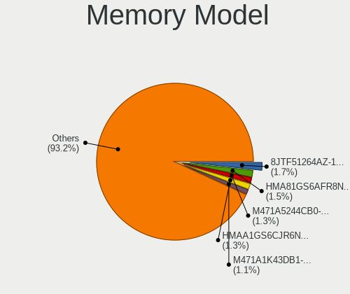

| Model                                                     | Computers | Percent |
|-----------------------------------------------------------|-----------|---------|
| SK hynix RAM HMA81GS6AFR8N-UH 8GB SODIMM DDR4 2667MT/s    | 7         | 2.62%   |
| Samsung RAM M471A5244CB0-CRC 4GB SODIMM DDR4 2667MT/s     | 5         | 1.87%   |
| SK hynix RAM HMA81GS6JJR8N-VK 8GB SODIMM DDR4 2667MT/s    | 4         | 1.5%    |
| Micron RAM 8JTF51264AZ-1G6E1 4GB DIMM DDR3 1600MT/s       | 4         | 1.5%    |
| Unknown RAM Module 2GB DIMM 800MT/s                       | 3         | 1.12%   |
| SK hynix RAM HMT451S6BFR8A-PB 4GB SODIMM DDR3 1600MT/s    | 3         | 1.12%   |
| SK hynix RAM HMT425S6AFR6A-PB 2GB SODIMM DDR3 1600MT/s    | 3         | 1.12%   |
| SK hynix RAM HMAA1GS6CJR6N-XN 8GB SODIMM DDR4 3200MT/s    | 3         | 1.12%   |
| Samsung RAM M471B1G73DB0-YK0 8GB SODIMM DDR3 1600MT/s     | 3         | 1.12%   |
| Samsung RAM M471A2K43DB1-CTD 16GB SODIMM DDR4 2667MT/s    | 3         | 1.12%   |
| Samsung RAM M378B5173DB0-CK0 4GB DIMM DDR3 1600MT/s       | 3         | 1.12%   |
| Micron RAM 16JSF51264HZ-1G4D1 4096MB SODIMM DDR3 1334MT/s | 3         | 1.12%   |
| Corsair RAM CMK8GX4M1D3000C16 8GB DIMM DDR4 3200MT/s      | 3         | 1.12%   |
| Unknown RAM Module 4GB DIMM 400MT/s                       | 2         | 0.75%   |
| Unknown RAM Module 4096MB DIMM 400MT/s                    | 2         | 0.75%   |
| Unknown RAM Module 2048MB DIMM 800MT/s                    | 2         | 0.75%   |
| Unknown RAM Module 2048MB DIMM 400MT/s                    | 2         | 0.75%   |
| SK hynix RAM HYMP512U64CP8-Y5 1GB DIMM DDR 667MT/s        | 2         | 0.75%   |
| SK hynix RAM HMT41GS6BFR8A-PB 8GB SODIMM DDR3 1600MT/s    | 2         | 0.75%   |
| SK hynix RAM HMT41GS6AFR8A-PB 8GB SODIMM DDR3 1600MT/s    | 2         | 0.75%   |
| SK hynix RAM HMA41GS6AFR8N-TF 8GB SODIMM DDR4 2667MT/s    | 2         | 0.75%   |
| Samsung RAM M471B5773DH0-CH9 2GB SODIMM DDR3 1600MT/s     | 2         | 0.75%   |
| Samsung RAM M471B5273DH0-CK0 4GB SODIMM DDR3 1600MT/s     | 2         | 0.75%   |
| Samsung RAM M471A2K43CB1-CTD 16GB SODIMM DDR4 8400MT/s    | 2         | 0.75%   |
| Samsung RAM M471A2K43CB1-CRC 16GB SODIMM DDR4 2667MT/s    | 2         | 0.75%   |
| Samsung RAM M471A1K43DB1-CTD 8GB SODIMM DDR4 2667MT/s     | 2         | 0.75%   |
| Samsung RAM M471A1K43CB1-CRC 8GB SODIMM DDR4 2667MT/s     | 2         | 0.75%   |
| Samsung RAM M471A1K43BB1-CRC 8192MB SODIMM DDR4 2667MT/s  | 2         | 0.75%   |
| Samsung RAM M378B5773DH0-CK0 2GB DIMM DDR3 1600MT/s       | 2         | 0.75%   |
| Samsung RAM M378B5673FH0-CH9 2GB DIMM DDR3 1600MT/s       | 2         | 0.75%   |
| Samsung RAM M378B5273CH0-CH9 4GB DIMM DDR3 1867MT/s       | 2         | 0.75%   |
| Samsung RAM M378B5173QH0-CK0 4GB DIMM DDR3 1600MT/s       | 2         | 0.75%   |
| Ramaxel RAM RMSA3260NA78HAF-2400 8GB SODIMM DDR4 2400MT/s | 2         | 0.75%   |
| Nanya RAM NT2GC64B88B0NS-CG 2GB SODIMM DDR3 1334MT/s      | 2         | 0.75%   |
| Micron RAM 4ATF51264HZ-2G6E1 4GB SODIMM DDR4 2667MT/s     | 2         | 0.75%   |
| Micron RAM 4ATF51264HZ-2G3B1 4GB SODIMM DDR4 2400MT/s     | 2         | 0.75%   |
| M RAM Module 2048MB DIMM DDR3 667MT/s                     | 2         | 0.75%   |
| Kingston RAM XK2M26-MIE 16384MB DIMM DDR4 3467MT/s        | 2         | 0.75%   |
| Unknown                                                   | 2         | 0.75%   |
| Unknown RAM Module 8GB SODIMM DDR3 1600MT/s               | 1         | 0.37%   |

Memory Kind
-----------

Memory module kinds

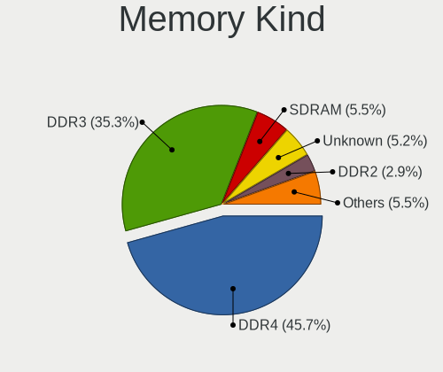

| Kind    | Computers | Percent |
|---------|-----------|---------|
| DDR4    | 81        | 41.33%  |
| DDR3    | 75        | 38.27%  |
| Unknown | 14        | 7.14%   |
| SDRAM   | 11        | 5.61%   |
| DDR2    | 9         | 4.59%   |
| DDR     | 3         | 1.53%   |
| LPDDR4  | 2         | 1.02%   |
| LPDDR5  | 1         | 0.51%   |

Memory Form Factor
------------------

Physical design of the memory module

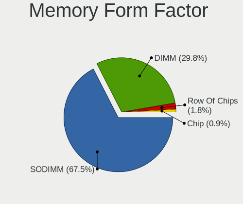

| Name         | Computers | Percent |
|--------------|-----------|---------|
| SODIMM       | 117       | 63.24%  |
| DIMM         | 67        | 36.22%  |
| Row Of Chips | 1         | 0.54%   |

Memory Size
-----------

Memory module size

| Size  | Computers | Percent |
|-------|-----------|---------|
| 4096  | 71        | 31.98%  |
| 8192  | 62        | 27.93%  |
| 2048  | 42        | 18.92%  |
| 16384 | 35        | 15.77%  |
| 1024  | 9         | 4.05%   |
| 512   | 3         | 1.35%   |

Memory Speed
------------

Memory module speed

| Speed   | Computers | Percent |
|---------|-----------|---------|
| 1600    | 53        | 24.31%  |
| 2667    | 49        | 22.48%  |
| 2400    | 15        | 6.88%   |
| 1333    | 14        | 6.42%   |
| 3200    | 13        | 5.96%   |
| 667     | 11        | 5.05%   |
| 1334    | 10        | 4.59%   |
| 800     | 9         | 4.13%   |
| 400     | 7         | 3.21%   |
| 2133    | 6         | 2.75%   |
| 1866    | 5         | 2.29%   |
| Unknown | 4         | 1.83%   |
| 1867    | 3         | 1.38%   |
| 1066    | 3         | 1.38%   |
| 8400    | 2         | 0.92%   |
| 3467    | 2         | 0.92%   |
| 533     | 2         | 0.92%   |
| 49926   | 1         | 0.46%   |
| 6400    | 1         | 0.46%   |
| 4199    | 1         | 0.46%   |
| 3600    | 1         | 0.46%   |
| 3266    | 1         | 0.46%   |
| 3000    | 1         | 0.46%   |
| 2666    | 1         | 0.46%   |
| 2048    | 1         | 0.46%   |
| 2000    | 1         | 0.46%   |
| 1800    | 1         | 0.46%   |

Printers & scanners
-------------------

Printer Vendor
--------------

Printer device vendors

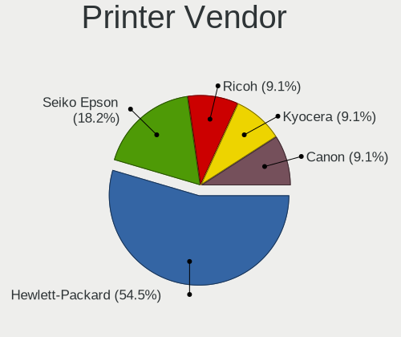

| Vendor          | Computers | Percent |
|-----------------|-----------|---------|
| Hewlett-Packard | 4         | 80%     |
| Seiko Epson     | 1         | 20%     |

Printer Model
-------------

Printer device models

| Model               | Computers | Percent |
|---------------------|-----------|---------|
| HP LaserJet 1018    | 2         | 40%     |
| Seiko Epson Printer | 1         | 20%     |
| HP LaserJet P3005   | 1         | 20%     |
| HP Deskjet 1510     | 1         | 20%     |

Scanner Vendor
--------------

Scanner device vendors

Zero info for selected period =(

Scanner Model
-------------

Scanner device models

Zero info for selected period =(

Camera
------

Camera Vendor
-------------

Camera device vendors

| Vendor                                 | Computers | Percent |
|----------------------------------------|-----------|---------|
| Chicony Electronics                    | 61        | 23.64%  |
| Microdia                               | 33        | 12.79%  |
| Realtek Semiconductor                  | 30        | 11.63%  |
| Cheng Uei Precision Industry (Foxlink) | 26        | 10.08%  |
| IMC Networks                           | 19        | 7.36%   |
| Acer                                   | 19        | 7.36%   |
| Sunplus Innovation Technology          | 18        | 6.98%   |
| Quanta                                 | 9         | 3.49%   |
| Lite-On Technology                     | 9         | 3.49%   |
| Suyin                                  | 6         | 2.33%   |
| Silicon Motion                         | 5         | 1.94%   |
| Syntek                                 | 3         | 1.16%   |
| Samsung Electronics                    | 3         | 1.16%   |
| Apple                                  | 3         | 1.16%   |
| Logitech                               | 2         | 0.78%   |
| Lenovo                                 | 2         | 0.78%   |
| Cubeternet                             | 2         | 0.78%   |
| Z-Star Microelectronics                | 1         | 0.39%   |
| Sonix Technology                       | 1         | 0.39%   |
| OmniVision Technologies                | 1         | 0.39%   |
| MacroSilicon                           | 1         | 0.39%   |
| Luxvisions Innotech Limited            | 1         | 0.39%   |
| Intel                                  | 1         | 0.39%   |
| eMPIA Technology                       | 1         | 0.39%   |
| ALi                                    | 1         | 0.39%   |

Camera Model
------------

Camera device models

| Model                                                                      | Computers | Percent |
|----------------------------------------------------------------------------|-----------|---------|
| Microdia Integrated_Webcam_HD                                              | 17        | 6.54%   |
| Realtek Integrated_Webcam_HD                                               | 15        | 5.77%   |
| Chicony EasyCamera                                                         | 9         | 3.46%   |
| Chicony Integrated Camera                                                  | 7         | 2.69%   |
| Cheng Uei Precision Industry (Foxlink) HP HD Webcam                        | 7         | 2.69%   |
| Acer Lenovo EasyCamera                                                     | 7         | 2.69%   |
| IMC Networks USB2.0 VGA UVC WebCam                                         | 6         | 2.31%   |
| IMC Networks Integrated Camera                                             | 6         | 2.31%   |
| Sunplus Integrated_Webcam_HD                                               | 5         | 1.92%   |
| Chicony HP HD Camera                                                       | 5         | 1.92%   |
| Cheng Uei Precision Industry (Foxlink) HP HD Camera                        | 5         | 1.92%   |
| Realtek Integrated Webcam                                                  | 4         | 1.54%   |
| Realtek EasyCamera                                                         | 4         | 1.54%   |
| Microdia Dell Laptop Integrated Webcam HD                                  | 4         | 1.54%   |
| Chicony HP Truevision HD camera                                            | 4         | 1.54%   |
| Chicony HP HD Webcam                                                       | 4         | 1.54%   |
| Cheng Uei Precision Industry (Foxlink) HP Wide Vision HD Integrated Webcam | 4         | 1.54%   |
| Cheng Uei Precision Industry (Foxlink) HP Webcam                           | 4         | 1.54%   |
| Acer HP TrueVision HD Webcam                                               | 4         | 1.54%   |
| Sunplus Dell HD Webcam                                                     | 3         | 1.15%   |
| Samsung Galaxy A5 (MTP)                                                    | 3         | 1.15%   |
| Realtek Integrated Webcam HD                                               | 3         | 1.15%   |
| Quanta HP HD Camera                                                        | 3         | 1.15%   |
| Microdia Laptop_Integrated_Webcam_HD                                       | 3         | 1.15%   |
| Lite-On HP HD Webcam                                                       | 3         | 1.15%   |
| Lite-On HP HD Camera                                                       | 3         | 1.15%   |
| IMC Networks EasyCamera                                                    | 3         | 1.15%   |
| Chicony USB2.0 VGA UVC WebCam                                              | 3         | 1.15%   |
| Chicony USB 2.0 Camera                                                     | 3         | 1.15%   |
| Syntek Integrated Camera                                                   | 2         | 0.77%   |
| Suyin HP Truevision HD                                                     | 2         | 0.77%   |
| Sunplus HP Universal Camera                                                | 2         | 0.77%   |
| Sunplus HP HD Webcam [Fixed]                                               | 2         | 0.77%   |
| Sunplus Dell E5570 integrated webcam                                       | 2         | 0.77%   |
| Silicon Motion WebCam SC-03M12736N                                         | 2         | 0.77%   |
| Quanta HP Webcam                                                           | 2         | 0.77%   |
| Quanta HP TrueVision HD Camera                                             | 2         | 0.77%   |
| Microdia Laptop_Integrated_Webcam_1.3M                                     | 2         | 0.77%   |
| Microdia 1.3 MPixel Integrated Webcam                                      | 2         | 0.77%   |
| Logitech Webcam C270                                                       | 2         | 0.77%   |

Security
--------

Fingerprint Vendor
------------------

Fingerprint sensor vendors

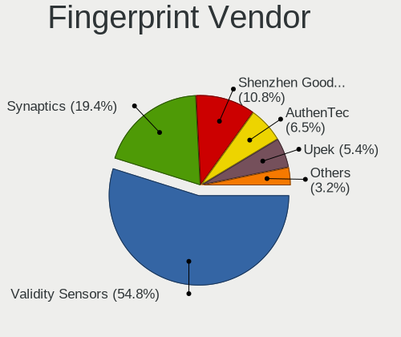

| Vendor                     | Computers | Percent |
|----------------------------|-----------|---------|
| Validity Sensors           | 30        | 56.6%   |
| Synaptics                  | 12        | 22.64%  |
| Shenzhen Goodix Technology | 6         | 11.32%  |
| Upek                       | 4         | 7.55%   |
| AuthenTec                  | 1         | 1.89%   |

Fingerprint Model
-----------------

Fingerprint sensor models

| Model                                                                      | Computers | Percent |
|----------------------------------------------------------------------------|-----------|---------|
| Validity Sensors VFS495 Fingerprint Reader                                 | 14        | 26.42%  |
| Validity Sensors Fingerprint scanner                                       | 6         | 11.32%  |
| Shenzhen Goodix Fingerprint Reader                                         | 5         | 9.43%   |
| Validity Sensors Synaptics VFS7552 Touch Fingerprint Sensor with PurePrint | 4         | 7.55%   |
| Synaptics  FS7604 Touch Fingerprint Sensor with PurePrint                  | 4         | 7.55%   |
| Upek Biometric Touchchip/Touchstrip Fingerprint Sensor                     | 3         | 5.66%   |
| Synaptics  WBDI                                                            | 3         | 5.66%   |
| Synaptics Metallica MOH Touch Fingerprint Reader                           | 3         | 5.66%   |
| Validity Sensors VFS491                                                    | 2         | 3.77%   |
| Unknown                                                                    | 2         | 3.77%   |
| Validity Sensors VFS7500 Touch Fingerprint Sensor                          | 1         | 1.89%   |
| Validity Sensors VFS451 Fingerprint Reader                                 | 1         | 1.89%   |
| Validity Sensors VFS301 Fingerprint Reader                                 | 1         | 1.89%   |
| Validity Sensors VFS 5011 fingerprint sensor                               | 1         | 1.89%   |
| Upek TCS5B Fingerprint sensor                                              | 1         | 1.89%   |
| Shenzhen Goodix  FingerPrint Device                                        | 1         | 1.89%   |
| AuthenTec AES2501 Fingerprint Sensor                                       | 1         | 1.89%   |

Chipcard Vendor
---------------

Chipcard module vendors

| Vendor          | Computers | Percent |
|-----------------|-----------|---------|
| Broadcom        | 9         | 56.25%  |
| Alcor Micro     | 3         | 18.75%  |
| O2 Micro        | 2         | 12.5%   |
| Lenovo          | 1         | 6.25%   |
| Hewlett-Packard | 1         | 6.25%   |

Chipcard Model
--------------

Chipcard module models

| Model                                                                        | Computers | Percent |
|------------------------------------------------------------------------------|-----------|---------|
| Broadcom 5880                                                                | 4         | 25%     |
| Broadcom BCM5880 Secure Applications Processor                               | 3         | 18.75%  |
| Alcor Micro AU9540 Smartcard Reader                                          | 3         | 18.75%  |
| O2 Micro OZ776 CCID Smartcard Reader                                         | 2         | 12.5%   |
| Lenovo Integrated Smart Card Reader                                          | 1         | 6.25%   |
| Hewlett-Packard SC Keyboard - Apollo (Liteon)                                | 1         | 6.25%   |
| Broadcom BCM5880 Secure Applications Processor with fingerprint swipe sensor | 1         | 6.25%   |
| Broadcom 58200                                                               | 1         | 6.25%   |

Unsupported
-----------

Unsupported Devices
-------------------

Total unsupported devices on board

| Total | Computers | Percent |
|-------|-----------|---------|
| 0     | 279       | 67.23%  |
| 1     | 114       | 27.47%  |
| 2     | 20        | 4.82%   |
| 5     | 1         | 0.24%   |
| 4     | 1         | 0.24%   |

Unsupported Device Types
------------------------

Types of unsupported devices

| Type                     | Computers | Percent |
|--------------------------|-----------|---------|
| Fingerprint reader       | 52        | 33.77%  |
| Graphics card            | 43        | 27.92%  |
| Net/wireless             | 21        | 13.64%  |
| Chipcard                 | 15        | 9.74%   |
| Multimedia controller    | 6         | 3.9%    |
| Bluetooth                | 6         | 3.9%    |
| Unassigned class         | 2         | 1.3%    |
| Sound                    | 2         | 1.3%    |
| Communication controller | 2         | 1.3%    |
| Storage/ide              | 1         | 0.65%   |
| Net/ethernet             | 1         | 0.65%   |
| Modem                    | 1         | 0.65%   |
| Card reader              | 1         | 0.65%   |
| Camera                   | 1         | 0.65%   |

