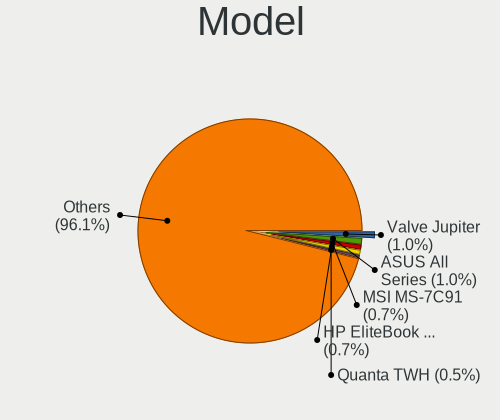
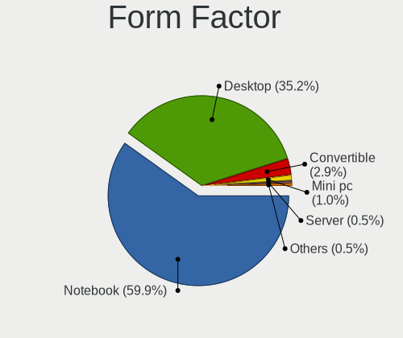
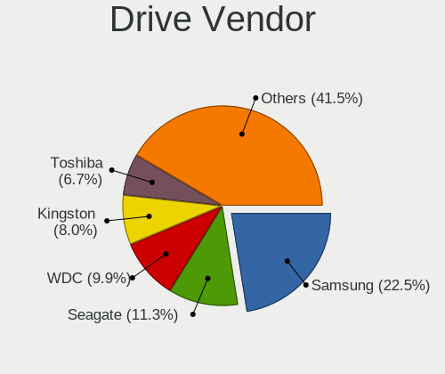
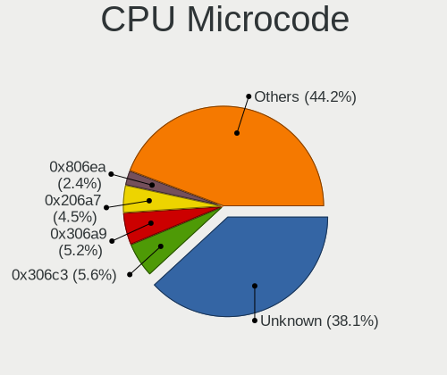
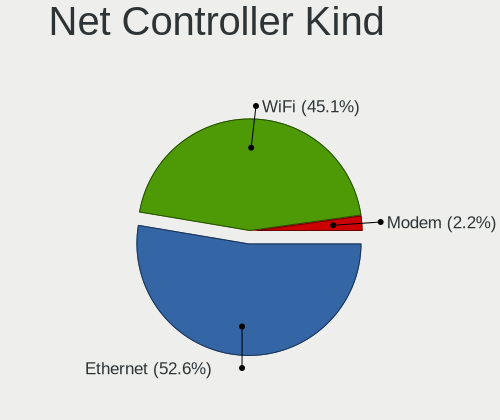
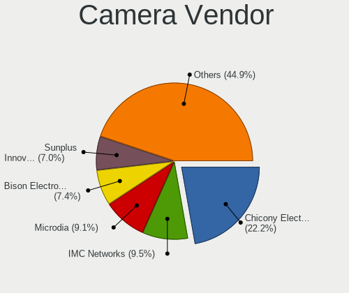
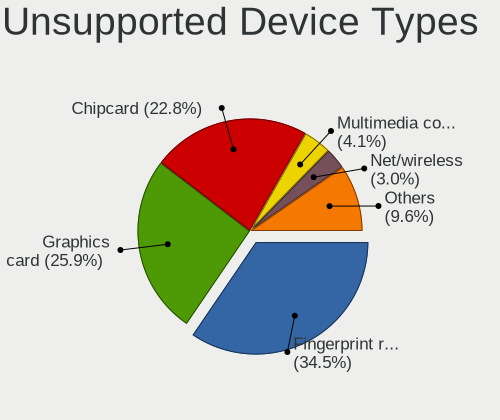

Linux in Estonia - Tested Hardware & Statistics
-----------------------------------------------

A project to collect tested hardware configurations for Linux in Estonia.

Anyone can contribute to this report by the [hw-probe](https://github.com/linuxhw/hw-probe) tool:

    sudo -E hw-probe -all -upload

Please contribute! Especially if your hardware is rare.

This is a report for all computer types. See also reports for [desktops](/Location/Estonia/Desktop/README.md) and [notebooks](/Location/Estonia/Notebook/README.md).

Contents
--------

* [ Test Cases ](#test-cases)

* [ System ](#system)
  - [ OS                       ](#os)
  - [ OS Family                ](#os-family)
  - [ Kernel                   ](#kernel)
  - [ Kernel Family            ](#kernel-family)
  - [ Kernel Major Ver.        ](#kernel-major-ver)
  - [ Arch                     ](#arch)
  - [ DE                       ](#de)
  - [ Display Server           ](#display-server)
  - [ Display Manager          ](#display-manager)
  - [ OS Lang                  ](#os-lang)
  - [ Boot Mode                ](#boot-mode)
  - [ Filesystem               ](#filesystem)
  - [ Part. scheme             ](#part-scheme)
  - [ Dual Boot with Linux/BSD ](#dual-boot-with-linuxbsd)
  - [ Dual Boot (Win)          ](#dual-boot-win)

* [ Board ](#board)
  - [ Vendor                   ](#vendor)
  - [ Model                    ](#model)
  - [ Model Family             ](#model-family)
  - [ MFG Year                 ](#mfg-year)
  - [ Form Factor              ](#form-factor)
  - [ Secure Boot              ](#secure-boot)
  - [ Coreboot                 ](#coreboot)
  - [ RAM Size                 ](#ram-size)
  - [ RAM Used                 ](#ram-used)
  - [ Total Drives             ](#total-drives)
  - [ Has CD-ROM               ](#has-cd-rom)
  - [ Has Ethernet             ](#has-ethernet)
  - [ Has WiFi                 ](#has-wifi)
  - [ Has Bluetooth            ](#has-bluetooth)

* [ Location ](#location)
  - [ Country                  ](#country)
  - [ City                     ](#city)

* [ Drives ](#drives)
  - [ Drive Vendor             ](#drive-vendor)
  - [ Drive Model              ](#drive-model)
  - [ HDD Vendor               ](#hdd-vendor)
  - [ SSD Vendor               ](#ssd-vendor)
  - [ Drive Kind               ](#drive-kind)
  - [ Drive Connector          ](#drive-connector)
  - [ Drive Size               ](#drive-size)
  - [ Space Total              ](#space-total)
  - [ Space Used               ](#space-used)
  - [ Malfunc. Drives          ](#malfunc-drives)
  - [ Malfunc. Drive Vendor    ](#malfunc-drive-vendor)
  - [ Malfunc. HDD Vendor      ](#malfunc-hdd-vendor)
  - [ Malfunc. Drive Kind      ](#malfunc-drive-kind)
  - [ Failed Drives            ](#failed-drives)
  - [ Failed Drive Vendor      ](#failed-drive-vendor)
  - [ Drive Status             ](#drive-status)

* [ Storage controller ](#storage-controller)
  - [ Storage Vendor           ](#storage-vendor)
  - [ Storage Model            ](#storage-model)
  - [ Storage Kind             ](#storage-kind)

* [ Processor ](#processor)
  - [ CPU Vendor               ](#cpu-vendor)
  - [ CPU Model                ](#cpu-model)
  - [ CPU Model Family         ](#cpu-model-family)
  - [ CPU Cores                ](#cpu-cores)
  - [ CPU Sockets              ](#cpu-sockets)
  - [ CPU Threads              ](#cpu-threads)
  - [ CPU Op-Modes             ](#cpu-op-modes)
  - [ CPU Microcode            ](#cpu-microcode)
  - [ CPU Microarch            ](#cpu-microarch)

* [ Graphics ](#graphics)
  - [ GPU Vendor               ](#gpu-vendor)
  - [ GPU Model                ](#gpu-model)
  - [ GPU Combo                ](#gpu-combo)
  - [ GPU Driver               ](#gpu-driver)
  - [ GPU Memory               ](#gpu-memory)

* [ Monitor ](#monitor)
  - [ Monitor Vendor           ](#monitor-vendor)
  - [ Monitor Model            ](#monitor-model)
  - [ Monitor Resolution       ](#monitor-resolution)
  - [ Monitor Diagonal         ](#monitor-diagonal)
  - [ Monitor Width            ](#monitor-width)
  - [ Aspect Ratio             ](#aspect-ratio)
  - [ Monitor Area             ](#monitor-area)
  - [ Pixel Density            ](#pixel-density)
  - [ Multiple Monitors        ](#multiple-monitors)

* [ Network ](#network)
  - [ Net Controller Vendor    ](#net-controller-vendor)
  - [ Net Controller Model     ](#net-controller-model)
  - [ Wireless Vendor          ](#wireless-vendor)
  - [ Wireless Model           ](#wireless-model)
  - [ Ethernet Vendor          ](#ethernet-vendor)
  - [ Ethernet Model           ](#ethernet-model)
  - [ Net Controller Kind      ](#net-controller-kind)
  - [ Used Controller          ](#used-controller)
  - [ NICs                     ](#nics)
  - [ IPv6                     ](#ipv6)

* [ Bluetooth ](#bluetooth)
  - [ Bluetooth Vendor         ](#bluetooth-vendor)
  - [ Bluetooth Model          ](#bluetooth-model)

* [ Sound ](#sound)
  - [ Sound Vendor             ](#sound-vendor)
  - [ Sound Model              ](#sound-model)

* [ Memory ](#memory)
  - [ Memory Vendor            ](#memory-vendor)
  - [ Memory Model             ](#memory-model)
  - [ Memory Kind              ](#memory-kind)
  - [ Memory Form Factor       ](#memory-form-factor)
  - [ Memory Size              ](#memory-size)
  - [ Memory Speed             ](#memory-speed)

* [ Printers & scanners ](#printers--scanners)
  - [ Printer Vendor           ](#printer-vendor)
  - [ Printer Model            ](#printer-model)
  - [ Scanner Vendor           ](#scanner-vendor)
  - [ Scanner Model            ](#scanner-model)

* [ Camera ](#camera)
  - [ Camera Vendor            ](#camera-vendor)
  - [ Camera Model             ](#camera-model)

* [ Security ](#security)
  - [ Fingerprint Vendor       ](#fingerprint-vendor)
  - [ Fingerprint Model        ](#fingerprint-model)
  - [ Chipcard Vendor          ](#chipcard-vendor)
  - [ Chipcard Model           ](#chipcard-model)

* [ Unsupported ](#unsupported)
  - [ Unsupported Devices      ](#unsupported-devices)
  - [ Unsupported Device Types ](#unsupported-device-types)

Test Cases
----------

Total: 466

| Vendor        | Model                       | Form-Factor | Probe                                                      | Date         |
|---------------|-----------------------------|-------------|------------------------------------------------------------|--------------|
| Valve         | Jupiter                     | Notebook    | [ff59f7877a](https://linux-hardware.org/?probe=ff59f7877a) | Feb 02, 2024 |
| Dell          | Latitude 7490               | Notebook    | [d2085f3674](https://linux-hardware.org/?probe=d2085f3674) | Jan 24, 2024 |
| Dell          | Inspiron N5010              | Notebook    | [ab07a9741b](https://linux-hardware.org/?probe=ab07a9741b) | Jan 13, 2024 |
| MSI           | Pulse GL66 11UDK            | Notebook    | [fdb748bed5](https://linux-hardware.org/?probe=fdb748bed5) | Jan 13, 2024 |
| ASUSTek       | PRIME B550M-K               | Desktop     | [7536a68c05](https://linux-hardware.org/?probe=7536a68c05) | Jan 06, 2024 |
| Dell          | Inspiron N5010              | Notebook    | [8991ffeadc](https://linux-hardware.org/?probe=8991ffeadc) | Jan 04, 2024 |
| ASUSTek       | M5A97 LE R2.0               | Desktop     | [0863d91cdc](https://linux-hardware.org/?probe=0863d91cdc) | Dec 25, 2023 |
| Fujitsu       | D3161-A1 S26361-D3161-A1    | Desktop     | [c1069bda0b](https://linux-hardware.org/?probe=c1069bda0b) | Dec 23, 2023 |
| Acer          | Nitro AN517-55              | Notebook    | [f3e3de235b](https://linux-hardware.org/?probe=f3e3de235b) | Dec 23, 2023 |
| ASUSTek       | M5A97 LE R2.0               | Desktop     | [e222a97c0b](https://linux-hardware.org/?probe=e222a97c0b) | Dec 21, 2023 |
| HP            | ProBook 6570b               | Notebook    | [7dbd0f9be1](https://linux-hardware.org/?probe=7dbd0f9be1) | Dec 21, 2023 |
| HP            | ProBook 6570b               | Notebook    | [7a4a6018b6](https://linux-hardware.org/?probe=7a4a6018b6) | Dec 21, 2023 |
| TUXEDO        | Polaris AMD Gen5            | Notebook    | [84a93dbb91](https://linux-hardware.org/?probe=84a93dbb91) | Dec 19, 2023 |
| ASUSTek       | Zenbook UM3402YAR_UM3402... | Notebook    | [646c403e2f](https://linux-hardware.org/?probe=646c403e2f) | Dec 16, 2023 |
| ASUSTek       | Zenbook UM3402YAR_UM3402... | Notebook    | [7fc71d8954](https://linux-hardware.org/?probe=7fc71d8954) | Dec 16, 2023 |
| Fujitsu       | D3161-A1 S26361-D3161-A1    | Desktop     | [9c4f708056](https://linux-hardware.org/?probe=9c4f708056) | Dec 10, 2023 |
| Apple         | MacBookAir6,2               | Notebook    | [62734db5de](https://linux-hardware.org/?probe=62734db5de) | Dec 10, 2023 |
| Fujitsu       | D3161-A1 S26361-D3161-A1    | Desktop     | [be768fb273](https://linux-hardware.org/?probe=be768fb273) | Dec 06, 2023 |
| HP            | 8619                        | Desktop     | [a33e273f33](https://linux-hardware.org/?probe=a33e273f33) | Dec 04, 2023 |
| MSI           | MPG B550 GAMING EDGE WIF... | Desktop     | [bb0ded92ef](https://linux-hardware.org/?probe=bb0ded92ef) | Dec 03, 2023 |
| ASUSTek       | PRIME B550M-K               | Desktop     | [a1ab0858a6](https://linux-hardware.org/?probe=a1ab0858a6) | Dec 01, 2023 |
| HP            | ProBook 4530s               | Notebook    | [5743a3e441](https://linux-hardware.org/?probe=5743a3e441) | Nov 28, 2023 |
| ASUSTek       | ROG STRIX B550-F GAMING     | Desktop     | [78e9bae926](https://linux-hardware.org/?probe=78e9bae926) | Nov 26, 2023 |
| Dell          | Precision M4600             | Notebook    | [864f0c5cfe](https://linux-hardware.org/?probe=864f0c5cfe) | Nov 22, 2023 |
| ASUSTek       | ROG STRIX B650E-I GAMING... | Desktop     | [2ab108f743](https://linux-hardware.org/?probe=2ab108f743) | Nov 22, 2023 |
| Dell          | Precision M4600             | Notebook    | [af124219eb](https://linux-hardware.org/?probe=af124219eb) | Nov 18, 2023 |
| Acer          | Predator PH317-53           | Notebook    | [84650e7d6f](https://linux-hardware.org/?probe=84650e7d6f) | Nov 15, 2023 |
| Intel         | DH61DL AAG14066-205         | Desktop     | [be33944c69](https://linux-hardware.org/?probe=be33944c69) | Nov 05, 2023 |
| Lenovo        | ThinkPad T14 Gen 4 21HDC... | Notebook    | [0d9316dbcf](https://linux-hardware.org/?probe=0d9316dbcf) | Oct 31, 2023 |
| ECS           | H61H2-M12                   | Desktop     | [885cbf522c](https://linux-hardware.org/?probe=885cbf522c) | Oct 28, 2023 |
| HP            | 250 G5 Notebook PC          | Notebook    | [bc710e10c6](https://linux-hardware.org/?probe=bc710e10c6) | Oct 27, 2023 |
| Lenovo        | YB1-X91L                    | Convertible | [235eadfef8](https://linux-hardware.org/?probe=235eadfef8) | Oct 18, 2023 |
| Lenovo        | YB1-X91L                    | Convertible | [42b86ea4ec](https://linux-hardware.org/?probe=42b86ea4ec) | Oct 18, 2023 |
| MSI           | PRO B660-A DDR4             | Desktop     | [506accae39](https://linux-hardware.org/?probe=506accae39) | Oct 16, 2023 |
| Lenovo        | ThinkPad T440p 20AWS49Q0... | Notebook    | [65fa77246e](https://linux-hardware.org/?probe=65fa77246e) | Sep 21, 2023 |
| Dell          | Latitude E5550              | Notebook    | [9044f3b345](https://linux-hardware.org/?probe=9044f3b345) | Sep 12, 2023 |
| HP            | 250 G5 Notebook PC          | Notebook    | [773143cf61](https://linux-hardware.org/?probe=773143cf61) | Sep 01, 2023 |
| Lenovo        | ThinkPad T16 Gen 1 21BV0... | Notebook    | [3d7ba31c2a](https://linux-hardware.org/?probe=3d7ba31c2a) | Aug 24, 2023 |
| Lenovo        | ThinkPad P50 20EQS4XN00     | Notebook    | [a517cc57b8](https://linux-hardware.org/?probe=a517cc57b8) | Aug 23, 2023 |
| Lenovo        | ThinkPad T490 20N3S79M38    | Notebook    | [cb5346a558](https://linux-hardware.org/?probe=cb5346a558) | Aug 17, 2023 |
| Lenovo        | ThinkPad T490 20N3S79M38    | Notebook    | [4bfb2c68ca](https://linux-hardware.org/?probe=4bfb2c68ca) | Aug 17, 2023 |
| Gigabyte      | B75M-D3H                    | Desktop     | [d78e4ab87d](https://linux-hardware.org/?probe=d78e4ab87d) | Aug 08, 2023 |
| Lenovo        | IdeaPad C340-14API 81N6     | Notebook    | [482b97d3de](https://linux-hardware.org/?probe=482b97d3de) | Aug 02, 2023 |
| Dell          | Vostro 3700                 | Notebook    | [96e4579b7b](https://linux-hardware.org/?probe=96e4579b7b) | Aug 01, 2023 |
| Intel         | powered classmate PC        | Notebook    | [ccbb0cb45a](https://linux-hardware.org/?probe=ccbb0cb45a) | Jul 24, 2023 |
| Lenovo        | Legion 5 15ARH05H 82B1      | Notebook    | [00bda81c25](https://linux-hardware.org/?probe=00bda81c25) | Jul 19, 2023 |
| HP            | ProBook 640 G1              | Notebook    | [8c2fd03132](https://linux-hardware.org/?probe=8c2fd03132) | Jul 06, 2023 |
| ASUSTek       | PRIME Z790M-PLUS            | Desktop     | [ea7090722f](https://linux-hardware.org/?probe=ea7090722f) | Jun 22, 2023 |
| HP            | 8643 SMVB                   | Desktop     | [961a04643c](https://linux-hardware.org/?probe=961a04643c) | May 25, 2023 |
| Lenovo        | ThinkPad T14s Gen 1 20UH... | Notebook    | [a38171543f](https://linux-hardware.org/?probe=a38171543f) | May 24, 2023 |
| Microsoft     | Surface Book                | Tablet      | [7bb9611a98](https://linux-hardware.org/?probe=7bb9611a98) | May 21, 2023 |
| Lenovo        | ThinkPad L480 20LTSAK70R    | Notebook    | [551d238ad3](https://linux-hardware.org/?probe=551d238ad3) | May 16, 2023 |
| Notebook      | N150SD/N155SD               | Notebook    | [55f219bc3f](https://linux-hardware.org/?probe=55f219bc3f) | May 11, 2023 |
| ASUSTek       | N550JK                      | Notebook    | [a799667521](https://linux-hardware.org/?probe=a799667521) | May 04, 2023 |
| Lenovo        | ThinkPad E15 Gen 3 20YG0... | Notebook    | [fdaef83d1e](https://linux-hardware.org/?probe=fdaef83d1e) | Apr 23, 2023 |
| Lenovo        | ThinkStation D20 4158GK1    | Desktop     | [44d9536051](https://linux-hardware.org/?probe=44d9536051) | Apr 14, 2023 |
| MSI           | GF63 Thin 10SCXR            | Notebook    | [33e5d369a7](https://linux-hardware.org/?probe=33e5d369a7) | Apr 04, 2023 |
| HP            | 304Ah                       | Desktop     | [14d92e85a2](https://linux-hardware.org/?probe=14d92e85a2) | Apr 01, 2023 |
| ASUSTek       | TUF Gaming B550-PLUS        | Desktop     | [6694c9279d](https://linux-hardware.org/?probe=6694c9279d) | Mar 31, 2023 |
| Apple         | MacBookPro5,1               | Notebook    | [b06257fd9c](https://linux-hardware.org/?probe=b06257fd9c) | Mar 28, 2023 |
| Apple         | MacBookPro5,1               | Notebook    | [3a0d77d195](https://linux-hardware.org/?probe=3a0d77d195) | Mar 28, 2023 |
| ASUSTek       | P8Z77-V LK                  | Desktop     | [6b088adaf9](https://linux-hardware.org/?probe=6b088adaf9) | Mar 27, 2023 |
| Gigabyte      | G5 KD                       | Notebook    | [32afc6a4cf](https://linux-hardware.org/?probe=32afc6a4cf) | Mar 23, 2023 |
| Apple         | MacBookPro9,2               | Notebook    | [4efbf8be88](https://linux-hardware.org/?probe=4efbf8be88) | Mar 23, 2023 |
| ASRock        | B660M-ITX/ac                | Desktop     | [95687a223c](https://linux-hardware.org/?probe=95687a223c) | Mar 22, 2023 |
| GPD           | G1619-04                    | Notebook    | [c69bb703ae](https://linux-hardware.org/?probe=c69bb703ae) | Mar 21, 2023 |
| HP            | 304Ah                       | Desktop     | [49adbe8acf](https://linux-hardware.org/?probe=49adbe8acf) | Mar 20, 2023 |
| ASUSTek       | VivoBook_ASUSLaptop M560... | Notebook    | [c87313bdd4](https://linux-hardware.org/?probe=c87313bdd4) | Mar 20, 2023 |
| ASUSTek       | ROG STRIX B650E-E GAMING... | Desktop     | [37bf97e9b3](https://linux-hardware.org/?probe=37bf97e9b3) | Mar 16, 2023 |
| Lenovo        | ThinkPad T540p 20BFS3BR0... | Notebook    | [6218acf76f](https://linux-hardware.org/?probe=6218acf76f) | Mar 12, 2023 |
| MSI           | B450-A PRO MAX              | Desktop     | [ec707b621c](https://linux-hardware.org/?probe=ec707b621c) | Mar 05, 2023 |
| MSI           | B450-A PRO MAX              | Desktop     | [36699f94c9](https://linux-hardware.org/?probe=36699f94c9) | Mar 05, 2023 |
| ASRock        | H81M-DGS R2.0               | Desktop     | [396ad2d6aa](https://linux-hardware.org/?probe=396ad2d6aa) | Mar 04, 2023 |
| ASRock        | B660M-ITX/ac                | Desktop     | [c2e600e445](https://linux-hardware.org/?probe=c2e600e445) | Feb 28, 2023 |
| ASRock        | B660M-ITX/ac                | Desktop     | [1efc15e2cc](https://linux-hardware.org/?probe=1efc15e2cc) | Feb 28, 2023 |
| ASUSTek       | H81M-K                      | Desktop     | [6f09d6cd6c](https://linux-hardware.org/?probe=6f09d6cd6c) | Feb 05, 2023 |
| Fujitsu       | D3161-A1 S26361-D3161-A1    | Desktop     | [07d496ada9](https://linux-hardware.org/?probe=07d496ada9) | Feb 04, 2023 |
| Packard Be... | EasyNote TK87               | Notebook    | [82ce911f26](https://linux-hardware.org/?probe=82ce911f26) | Jan 25, 2023 |
| Lenovo        | ThinkPad E14 Gen 2 20T60... | Notebook    | [2141789e3a](https://linux-hardware.org/?probe=2141789e3a) | Jan 14, 2023 |
| Packard Be... | EasyNote TK87               | Notebook    | [f1c4c8b89e](https://linux-hardware.org/?probe=f1c4c8b89e) | Jan 13, 2023 |
| Lenovo        | ThinkPad L13 Yoga Gen 2 ... | Convertible | [8674044a95](https://linux-hardware.org/?probe=8674044a95) | Jan 13, 2023 |
| Lenovo        | ThinkPad L15 Gen 1 20U70... | Notebook    | [ff12fe840d](https://linux-hardware.org/?probe=ff12fe840d) | Jan 12, 2023 |
| ASUSTek       | PRIME H310M-K               | Desktop     | [146f307b8e](https://linux-hardware.org/?probe=146f307b8e) | Jan 10, 2023 |
| ASUSTek       | PRIME B360M-C               | Desktop     | [aa21c2b75f](https://linux-hardware.org/?probe=aa21c2b75f) | Jan 06, 2023 |
| Fujitsu       | D3161-A1 S26361-D3161-A1    | Desktop     | [efa2d6986f](https://linux-hardware.org/?probe=efa2d6986f) | Dec 28, 2022 |
| HP            | EliteBook 840 G2            | Notebook    | [4a85ebbc33](https://linux-hardware.org/?probe=4a85ebbc33) | Dec 26, 2022 |
| Fujitsu       | D3161-A1 S26361-D3161-A1    | Desktop     | [70436ae3c3](https://linux-hardware.org/?probe=70436ae3c3) | Dec 15, 2022 |
| Fujitsu       | D3161-A1 S26361-D3161-A1    | Desktop     | [4c5bac90eb](https://linux-hardware.org/?probe=4c5bac90eb) | Dec 15, 2022 |
| ASRock        | Z490M Pro4                  | Desktop     | [2ace77f72c](https://linux-hardware.org/?probe=2ace77f72c) | Dec 14, 2022 |
| ASRock        | Z490M Pro4                  | Desktop     | [0b91c8c70f](https://linux-hardware.org/?probe=0b91c8c70f) | Dec 14, 2022 |
| Lenovo        | ThinkPad X13 Gen 1 20UF0... | Notebook    | [d8b614d1ca](https://linux-hardware.org/?probe=d8b614d1ca) | Dec 12, 2022 |
| MSI           | MAG B660M BAZOOKA DDR4      | Desktop     | [280f28a486](https://linux-hardware.org/?probe=280f28a486) | Dec 11, 2022 |
| Lenovo        | ThinkPad X1 Carbon Gen 9... | Notebook    | [1f904e68af](https://linux-hardware.org/?probe=1f904e68af) | Nov 29, 2022 |
| HP            | EliteBook 8460p             | Notebook    | [6f3bf3fe46](https://linux-hardware.org/?probe=6f3bf3fe46) | Nov 28, 2022 |
| ASUSTek       | N53Jf                       | Notebook    | [e4dc6e5cd9](https://linux-hardware.org/?probe=e4dc6e5cd9) | Nov 27, 2022 |
| Lenovo        | ThinkPad X240 20AMA0W706    | Notebook    | [b792955af6](https://linux-hardware.org/?probe=b792955af6) | Nov 27, 2022 |
| Lenovo        | ThinkPad X240 20AMA0W706    | Notebook    | [033e206fab](https://linux-hardware.org/?probe=033e206fab) | Nov 25, 2022 |
| MSI           | Z490-A PRO                  | Desktop     | [9154fdbc9e](https://linux-hardware.org/?probe=9154fdbc9e) | Nov 24, 2022 |
| Valve         | Jupiter                     | Notebook    | [0e77de9dba](https://linux-hardware.org/?probe=0e77de9dba) | Nov 20, 2022 |
| Acer          | Swift SF114-34              | Notebook    | [96d82e20c4](https://linux-hardware.org/?probe=96d82e20c4) | Nov 19, 2022 |
| Acer          | Swift SF114-34              | Notebook    | [f5fd517d69](https://linux-hardware.org/?probe=f5fd517d69) | Nov 19, 2022 |
| Lenovo        | Legion 7 16ARHA7 82UH       | Notebook    | [b8dae15ebf](https://linux-hardware.org/?probe=b8dae15ebf) | Nov 09, 2022 |
| Alienware     | 17                          | Notebook    | [91358a0bec](https://linux-hardware.org/?probe=91358a0bec) | Nov 09, 2022 |
| Fujitsu       | LIFEBOOK A512               | Notebook    | [c479fc2cea](https://linux-hardware.org/?probe=c479fc2cea) | Nov 06, 2022 |
| HP            | Unknown                     | Notebook    | [aa28b92716](https://linux-hardware.org/?probe=aa28b92716) | Nov 06, 2022 |
| Lenovo        | ThinkPad T440p 20AW000GU... | Notebook    | [b4ff1758e9](https://linux-hardware.org/?probe=b4ff1758e9) | Nov 02, 2022 |
| Lenovo        | ThinkPad L14 Gen 2 20X2S... | Notebook    | [36d7199821](https://linux-hardware.org/?probe=36d7199821) | Nov 01, 2022 |
| ASUSTek       | M4A78                       | Desktop     | [8eb1316a14](https://linux-hardware.org/?probe=8eb1316a14) | Oct 31, 2022 |
| ASUSTek       | M4A78                       | Desktop     | [81374a561c](https://linux-hardware.org/?probe=81374a561c) | Oct 31, 2022 |
| ASUSTek       | M4A78                       | Desktop     | [d88d101a3c](https://linux-hardware.org/?probe=d88d101a3c) | Oct 29, 2022 |
| MSI           | GL72 6QD                    | Notebook    | [2f7c223f5a](https://linux-hardware.org/?probe=2f7c223f5a) | Oct 29, 2022 |
| Gigabyte      | B550 GAMING X V2            | Desktop     | [5405caf9dc](https://linux-hardware.org/?probe=5405caf9dc) | Oct 28, 2022 |
| HUAWEI        | BOM-WXX9                    | Notebook    | [5548027da3](https://linux-hardware.org/?probe=5548027da3) | Oct 27, 2022 |
| HP            | ENVY x360 Convertible 13... | Convertible | [26d539c606](https://linux-hardware.org/?probe=26d539c606) | Oct 26, 2022 |
| Gigabyte      | GA-MA770-UD3                | Desktop     | [dbb72f4c00](https://linux-hardware.org/?probe=dbb72f4c00) | Oct 26, 2022 |
| MSI           | B450 TOMAHAWK MAX           | Desktop     | [8b459ac79b](https://linux-hardware.org/?probe=8b459ac79b) | Oct 20, 2022 |
| HP            | OMEN Laptop 15-en0xxx       | Notebook    | [dad786ca06](https://linux-hardware.org/?probe=dad786ca06) | Oct 15, 2022 |
| ASRock        | B460 Steel Legend           | Desktop     | [ca98840e23](https://linux-hardware.org/?probe=ca98840e23) | Oct 14, 2022 |
| HP            | ENVY x360 Convertible 13... | Convertible | [7a1b08d912](https://linux-hardware.org/?probe=7a1b08d912) | Oct 13, 2022 |
| HP            | ENVY x360 Convertible 13... | Convertible | [3f808f36a0](https://linux-hardware.org/?probe=3f808f36a0) | Oct 13, 2022 |
| Unknown       | Seagate Personal Cloud (... | Desktop     | [40ea197650](https://linux-hardware.org/?probe=40ea197650) | Oct 09, 2022 |
| Dell          | Latitude 7390               | Notebook    | [268add52b3](https://linux-hardware.org/?probe=268add52b3) | Sep 19, 2022 |
| Chuwi         | HeroBook Pro                | Notebook    | [9a7d178f1b](https://linux-hardware.org/?probe=9a7d178f1b) | Sep 15, 2022 |
| ASUSTek       | 1225C                       | Notebook    | [91f049c977](https://linux-hardware.org/?probe=91f049c977) | Sep 09, 2022 |
| Fujitsu       | LIFEBOOK S760               | Notebook    | [d805aa67b2](https://linux-hardware.org/?probe=d805aa67b2) | Sep 09, 2022 |
| Gigabyte      | GA-MA770T-UD3               | Desktop     | [f6c6b627f7](https://linux-hardware.org/?probe=f6c6b627f7) | Aug 28, 2022 |
| ASUSTek       | TUF Gaming B450-PLUS II     | Desktop     | [7332174749](https://linux-hardware.org/?probe=7332174749) | Aug 24, 2022 |
| Apple         | MacBookPro11,1              | Notebook    | [5097845796](https://linux-hardware.org/?probe=5097845796) | Aug 24, 2022 |
| Gigabyte      | Q87M-D2H                    | Desktop     | [8c56960243](https://linux-hardware.org/?probe=8c56960243) | Aug 19, 2022 |
| Apple         | MacBookPro11,1              | Notebook    | [4d6f6d6a23](https://linux-hardware.org/?probe=4d6f6d6a23) | Aug 15, 2022 |
| Valve         | Jupiter                     | Notebook    | [ced35212a7](https://linux-hardware.org/?probe=ced35212a7) | Aug 07, 2022 |
| MSI           | MAG B460M BAZOOKA           | Desktop     | [5dae076f42](https://linux-hardware.org/?probe=5dae076f42) | Jul 27, 2022 |
| ECS           | G41T-M7                     | Desktop     | [a531a754a8](https://linux-hardware.org/?probe=a531a754a8) | Jul 23, 2022 |
| Lenovo        | Legion 5 Pro 16ACH6H 82J... | Notebook    | [e71169659f](https://linux-hardware.org/?probe=e71169659f) | Jul 22, 2022 |
| HP            | 3646h                       | Desktop     | [88b38da161](https://linux-hardware.org/?probe=88b38da161) | Jul 11, 2022 |
| Gigabyte      | B550 GAMING X V2            | Desktop     | [cdb4149eba](https://linux-hardware.org/?probe=cdb4149eba) | Jun 27, 2022 |
| MSI           | Z77A-G41                    | Desktop     | [d0f55f3c0b](https://linux-hardware.org/?probe=d0f55f3c0b) | Jun 22, 2022 |
| Dell          | 0VHWTR A02                  | Desktop     | [d8f9374e6c](https://linux-hardware.org/?probe=d8f9374e6c) | Jun 22, 2022 |
| Dell          | 0VHWTR A02                  | Desktop     | [00495646c1](https://linux-hardware.org/?probe=00495646c1) | Jun 22, 2022 |
| Dell          | 0VHWTR A02                  | Desktop     | [208e447fe1](https://linux-hardware.org/?probe=208e447fe1) | Jun 17, 2022 |
| ASUSTek       | E502NA                      | Notebook    | [d65dd8fc52](https://linux-hardware.org/?probe=d65dd8fc52) | Jun 09, 2022 |
| ASUSTek       | E502NA                      | Notebook    | [d3d64dcb5b](https://linux-hardware.org/?probe=d3d64dcb5b) | Jun 09, 2022 |
| Lenovo        | IdeaPadFlex 5 14ARE05 81... | Convertible | [a068a18649](https://linux-hardware.org/?probe=a068a18649) | Jun 08, 2022 |
| Dell          | 088DT1 A00                  | Desktop     | [b585cb1f70](https://linux-hardware.org/?probe=b585cb1f70) | Jun 07, 2022 |
| HP            | Presario CQ57               | Notebook    | [9f87592293](https://linux-hardware.org/?probe=9f87592293) | Jun 02, 2022 |
| Intel         | DP67BG AAG10491-305         | Desktop     | [714722d24b](https://linux-hardware.org/?probe=714722d24b) | Jun 01, 2022 |
| Intel         | DP67BG AAG10491-305         | Desktop     | [966ab11802](https://linux-hardware.org/?probe=966ab11802) | May 31, 2022 |
| ASRock        | AB350 Pro4                  | Desktop     | [49223fe44b](https://linux-hardware.org/?probe=49223fe44b) | May 21, 2022 |
| ASRock        | AB350 Pro4                  | Desktop     | [40cb336486](https://linux-hardware.org/?probe=40cb336486) | May 21, 2022 |
| Gigabyte      | H55M-S2                     | Desktop     | [4d68acc78c](https://linux-hardware.org/?probe=4d68acc78c) | May 18, 2022 |
| Dell          | Latitude 5520               | Notebook    | [320ed1c4fc](https://linux-hardware.org/?probe=320ed1c4fc) | May 17, 2022 |
| Dell          | Latitude 5520               | Notebook    | [18823f33fb](https://linux-hardware.org/?probe=18823f33fb) | May 17, 2022 |
| ASUSTek       | VivoBook_ASUSLaptop X509... | Notebook    | [5107890ffd](https://linux-hardware.org/?probe=5107890ffd) | May 15, 2022 |
| Lenovo        | ThinkCentre M58 7360WQK     | Desktop     | [9002375046](https://linux-hardware.org/?probe=9002375046) | May 13, 2022 |
| HP            | EliteBook 8470p             | Notebook    | [0773b6244e](https://linux-hardware.org/?probe=0773b6244e) | May 11, 2022 |
| Gigabyte      | B560 HD3                    | Desktop     | [34fd3f60c4](https://linux-hardware.org/?probe=34fd3f60c4) | May 11, 2022 |
| Lenovo        | ThinkPad T490s 20NX000AM... | Notebook    | [f07b38c5f9](https://linux-hardware.org/?probe=f07b38c5f9) | May 10, 2022 |
| Apple         | MacBookPro8,1               | Notebook    | [92637583b8](https://linux-hardware.org/?probe=92637583b8) | May 10, 2022 |
| mPTech        | ARC 11.6 128GB HD           | Notebook    | [aafa7cb1cb](https://linux-hardware.org/?probe=aafa7cb1cb) | May 07, 2022 |
| Dell          | Precision 7540              | Notebook    | [8b1b7dd8da](https://linux-hardware.org/?probe=8b1b7dd8da) | Apr 30, 2022 |
| Lenovo        | ThinkPad T520 4243RT9       | Notebook    | [a10fb9fe10](https://linux-hardware.org/?probe=a10fb9fe10) | Apr 23, 2022 |
| HP            | EliteBook 840 G2            | Notebook    | [b963507390](https://linux-hardware.org/?probe=b963507390) | Apr 19, 2022 |
| HP            | EliteBook 840 G2            | Notebook    | [fff8ad361e](https://linux-hardware.org/?probe=fff8ad361e) | Apr 19, 2022 |
| Lenovo        | ThinkPad T520 4243RT9       | Notebook    | [d948d987b4](https://linux-hardware.org/?probe=d948d987b4) | Apr 18, 2022 |
| Framework     | Laptop                      | Notebook    | [d4a02dfec9](https://linux-hardware.org/?probe=d4a02dfec9) | Apr 14, 2022 |
| Lenovo        | IdeaPad 320S-13IKB 81AK     | Notebook    | [8444b44333](https://linux-hardware.org/?probe=8444b44333) | Apr 04, 2022 |
| Lenovo        | ThinkPad X260 20F5S84400    | Notebook    | [69e1c25b4c](https://linux-hardware.org/?probe=69e1c25b4c) | Apr 03, 2022 |
| Lenovo        | IdeaPadFlex 5 14ARE05 81... | Convertible | [8af8994f80](https://linux-hardware.org/?probe=8af8994f80) | Apr 02, 2022 |
| ASUSTek       | H97M-PLUS                   | Desktop     | [ccf4457b51](https://linux-hardware.org/?probe=ccf4457b51) | Mar 28, 2022 |
| HP            | 18E9                        | Desktop     | [5a223b8722](https://linux-hardware.org/?probe=5a223b8722) | Mar 23, 2022 |
| Dell          | Latitude 5520               | Notebook    | [a8e30b61c6](https://linux-hardware.org/?probe=a8e30b61c6) | Mar 21, 2022 |
| Dell          | Latitude 5520               | Notebook    | [02b408b5f6](https://linux-hardware.org/?probe=02b408b5f6) | Mar 21, 2022 |
| Lenovo        | ThinkPad P14s Gen 1 20S4... | Notebook    | [ee3693d6a7](https://linux-hardware.org/?probe=ee3693d6a7) | Mar 09, 2022 |
| HP            | ENVY Laptop 13-ah0xxx       | Notebook    | [7fb04e6c7d](https://linux-hardware.org/?probe=7fb04e6c7d) | Mar 03, 2022 |
| HP            | ENVY Laptop 13-ah0xxx       | Notebook    | [0f27bdf5a8](https://linux-hardware.org/?probe=0f27bdf5a8) | Mar 02, 2022 |
| Lenovo        | 31900058 STD                | Desktop     | [d34e3c79a0](https://linux-hardware.org/?probe=d34e3c79a0) | Mar 01, 2022 |
| Lenovo        | ThinkPad X220 429136G       | Notebook    | [324d66c0fc](https://linux-hardware.org/?probe=324d66c0fc) | Feb 23, 2022 |
| ECS           | G41T-M7                     | Desktop     | [c4aca5bc12](https://linux-hardware.org/?probe=c4aca5bc12) | Feb 20, 2022 |
| HP            | EliteBook Folio 1040 G2     | Notebook    | [5f3cd9e8d5](https://linux-hardware.org/?probe=5f3cd9e8d5) | Feb 16, 2022 |
| MSI           | B150M PRO-VD                | Desktop     | [b46943492e](https://linux-hardware.org/?probe=b46943492e) | Feb 15, 2022 |
| HP            | 304Ah                       | Desktop     | [078b605c39](https://linux-hardware.org/?probe=078b605c39) | Feb 09, 2022 |
| Dell          | XPS 15 7590                 | Notebook    | [96f97ed2d6](https://linux-hardware.org/?probe=96f97ed2d6) | Jan 23, 2022 |
| MSI           | Z390-A PRO                  | Desktop     | [c9b246d9a8](https://linux-hardware.org/?probe=c9b246d9a8) | Jan 12, 2022 |
| MSI           | Z390-A PRO                  | Desktop     | [49234f883d](https://linux-hardware.org/?probe=49234f883d) | Jan 12, 2022 |
| Huanan        | X79 V2.47                   | Desktop     | [a27e7cdbef](https://linux-hardware.org/?probe=a27e7cdbef) | Jan 09, 2022 |
| Dell          | 0KH290                      | Desktop     | [e8c0e16dfb](https://linux-hardware.org/?probe=e8c0e16dfb) | Dec 28, 2021 |
| HP            | EliteBook 8460p             | Notebook    | [ca26ae6ff8](https://linux-hardware.org/?probe=ca26ae6ff8) | Dec 22, 2021 |
| ASUSTek       | K52Jc                       | Notebook    | [f6789bc7ac](https://linux-hardware.org/?probe=f6789bc7ac) | Dec 18, 2021 |
| ASUSTek       | TUF Gaming B560M-PLUS       | Desktop     | [5c0550c1e8](https://linux-hardware.org/?probe=5c0550c1e8) | Dec 09, 2021 |
| ASUSTek       | ProArt X570-CREATOR WIFI    | Desktop     | [db552307a3](https://linux-hardware.org/?probe=db552307a3) | Dec 07, 2021 |
| Lenovo        | IdeaPadFlex 5 14ARE05 81... | Convertible | [142cab14c6](https://linux-hardware.org/?probe=142cab14c6) | Dec 02, 2021 |
| Lenovo        | IdeaPadFlex 5 14ARE05 81... | Convertible | [0b2751c5c1](https://linux-hardware.org/?probe=0b2751c5c1) | Dec 02, 2021 |
| HP            | EliteBook 820 G1            | Notebook    | [dbbe56da66](https://linux-hardware.org/?probe=dbbe56da66) | Dec 01, 2021 |
| Gigabyte      | X570 UD                     | Desktop     | [79c117738b](https://linux-hardware.org/?probe=79c117738b) | Dec 01, 2021 |
| Lenovo        | IdeaPad 100-15IBD 80QQ      | Notebook    | [dc981a1604](https://linux-hardware.org/?probe=dc981a1604) | Nov 27, 2021 |
| ASUSTek       | VivoBook_ASUSLaptop X705... | Notebook    | [362a840c47](https://linux-hardware.org/?probe=362a840c47) | Nov 20, 2021 |
| Alienware     | 17                          | Notebook    | [d3460bdfd1](https://linux-hardware.org/?probe=d3460bdfd1) | Nov 20, 2021 |
| Dell          | Precision 5550              | Notebook    | [f7853ec2b6](https://linux-hardware.org/?probe=f7853ec2b6) | Nov 18, 2021 |
| Gigabyte      | GA-790XTA-UD4               | Desktop     | [6eb5a4107e](https://linux-hardware.org/?probe=6eb5a4107e) | Nov 10, 2021 |
| Intel         | D33217GKE G69901-205        | Desktop     | [a922d5f3fc](https://linux-hardware.org/?probe=a922d5f3fc) | Nov 10, 2021 |
| ZOTAC         | ZBOX-CA621NANO              | Mini pc     | [e540507afc](https://linux-hardware.org/?probe=e540507afc) | Nov 10, 2021 |
| Intel         | D33217GKE G69901-205        | Desktop     | [dd1ddaf74f](https://linux-hardware.org/?probe=dd1ddaf74f) | Nov 09, 2021 |
| MSI           | MAG Z390 TOMAHAWK           | Desktop     | [201bc8d044](https://linux-hardware.org/?probe=201bc8d044) | Oct 17, 2021 |
| Getac         | B300G4                      | Notebook    | [78b2fab1e0](https://linux-hardware.org/?probe=78b2fab1e0) | Oct 17, 2021 |
| HP            | Pavilion dv7                | Notebook    | [6c14033e55](https://linux-hardware.org/?probe=6c14033e55) | Oct 16, 2021 |
| HP            | Pavilion dv7                | Notebook    | [f93789f29a](https://linux-hardware.org/?probe=f93789f29a) | Oct 16, 2021 |
| Acer          | Extensa 5620                | Notebook    | [5cae4fe0fa](https://linux-hardware.org/?probe=5cae4fe0fa) | Oct 11, 2021 |
| HP            | EliteBook x360 1030 G2      | Convertible | [95d389bfe5](https://linux-hardware.org/?probe=95d389bfe5) | Oct 07, 2021 |
| Huanan        | X79 V2.47                   | Desktop     | [326b3f5892](https://linux-hardware.org/?probe=326b3f5892) | Oct 07, 2021 |
| Huanan        | X79 V2.47                   | Desktop     | [c2c6287186](https://linux-hardware.org/?probe=c2c6287186) | Oct 07, 2021 |
| Lenovo        | 318E SDK0J40697 WIN 3305... | Desktop     | [9cd559605c](https://linux-hardware.org/?probe=9cd559605c) | Sep 27, 2021 |
| Lenovo        | 318E SDK0J40697 WIN 3305... | Desktop     | [68f4ff7431](https://linux-hardware.org/?probe=68f4ff7431) | Sep 27, 2021 |
| Lenovo        | ThinkPad E14 20RA0036MX     | Notebook    | [b2183edddf](https://linux-hardware.org/?probe=b2183edddf) | Sep 24, 2021 |
| Lenovo        | IdeaPadFlex 5 14ARE05 81... | Convertible | [d339553d59](https://linux-hardware.org/?probe=d339553d59) | Sep 19, 2021 |
| Prestigio     | PNT10131DEDB                | Convertible | [39dc1df1df](https://linux-hardware.org/?probe=39dc1df1df) | Sep 18, 2021 |
| Alienware     | 17                          | Notebook    | [c97b201719](https://linux-hardware.org/?probe=c97b201719) | Sep 17, 2021 |
| Lenovo        | IdeaPadFlex 5 14ARE05 81... | Convertible | [47fb03fde8](https://linux-hardware.org/?probe=47fb03fde8) | Sep 17, 2021 |
| MSI           | MS-B901                     | All in one  | [282992f343](https://linux-hardware.org/?probe=282992f343) | Sep 14, 2021 |
| MSI           | MS-B901                     | All in one  | [3a288bcc81](https://linux-hardware.org/?probe=3a288bcc81) | Sep 14, 2021 |
| ASUSTek       | VivoBook 15_ASUS Laptop ... | Notebook    | [4f393c5347](https://linux-hardware.org/?probe=4f393c5347) | Sep 13, 2021 |
| Lenovo        | ThinkPad E14 Gen 2 20T60... | Notebook    | [1240138d48](https://linux-hardware.org/?probe=1240138d48) | Sep 11, 2021 |
| ASUSTek       | UX530UX                     | Notebook    | [c713dcf9e2](https://linux-hardware.org/?probe=c713dcf9e2) | Sep 08, 2021 |
| ASUSTek       | X510UA                      | Notebook    | [0a8045cc4f](https://linux-hardware.org/?probe=0a8045cc4f) | Sep 05, 2021 |
| ASUSTek       | X550ZA                      | Notebook    | [210ca88228](https://linux-hardware.org/?probe=210ca88228) | Aug 30, 2021 |
| Lenovo        | ThinkPad X201 3680CG7       | Notebook    | [9565bae9c3](https://linux-hardware.org/?probe=9565bae9c3) | Aug 30, 2021 |
| HP            | Pavilion Gaming Laptop 1... | Notebook    | [75619baa6e](https://linux-hardware.org/?probe=75619baa6e) | Aug 29, 2021 |
| ASUSTek       | X550ZA                      | Notebook    | [0a21d3b326](https://linux-hardware.org/?probe=0a21d3b326) | Aug 27, 2021 |
| Dell          | 0NW6H5 A00                  | Desktop     | [bf81c78371](https://linux-hardware.org/?probe=bf81c78371) | Aug 26, 2021 |
| Gigabyte      | Z87X-D3H-CF                 | Desktop     | [b40ad47903](https://linux-hardware.org/?probe=b40ad47903) | Aug 25, 2021 |
| Lenovo        | ThinkPad T510 4384GFG       | Notebook    | [e5d8500e1c](https://linux-hardware.org/?probe=e5d8500e1c) | Aug 21, 2021 |
| Lenovo        | ThinkPad T510 4384GFG       | Notebook    | [67b971a2dd](https://linux-hardware.org/?probe=67b971a2dd) | Aug 21, 2021 |
| Lenovo        | ThinkPad W541 20EF001TMS    | Notebook    | [bc2879c7e5](https://linux-hardware.org/?probe=bc2879c7e5) | Aug 19, 2021 |
| Lenovo        | ThinkPad 20AY001DMH         | Notebook    | [d3f7b62a42](https://linux-hardware.org/?probe=d3f7b62a42) | Aug 19, 2021 |
| Dell          | 0NW6H5 A00                  | Desktop     | [559742f4d7](https://linux-hardware.org/?probe=559742f4d7) | Aug 19, 2021 |
| Dell          | XPS 15 9500                 | Notebook    | [f21459caa1](https://linux-hardware.org/?probe=f21459caa1) | Aug 19, 2021 |
| Lenovo        | ThinkPad T440 20B60061MD    | Notebook    | [5f9d1cd1a6](https://linux-hardware.org/?probe=5f9d1cd1a6) | Aug 18, 2021 |
| Dell          | 0NW6H5 A00                  | Desktop     | [d28cc83aed](https://linux-hardware.org/?probe=d28cc83aed) | Aug 17, 2021 |
| Dell          | 0NW6H5 A00                  | Desktop     | [be5db43316](https://linux-hardware.org/?probe=be5db43316) | Aug 17, 2021 |
| HP            | EliteBook 8460p             | Notebook    | [0ce69e02fa](https://linux-hardware.org/?probe=0ce69e02fa) | Aug 17, 2021 |
| Gigabyte      | F2A68HM-S1                  | Desktop     | [286d06cd5e](https://linux-hardware.org/?probe=286d06cd5e) | Aug 15, 2021 |
| Lenovo        | ThinkPad T440 20B60061MD    | Notebook    | [fcd91a58e2](https://linux-hardware.org/?probe=fcd91a58e2) | Aug 13, 2021 |
| Gigabyte      | B250M-D2V-CF                | Desktop     | [b2db3ea0a9](https://linux-hardware.org/?probe=b2db3ea0a9) | Aug 10, 2021 |
| Gigabyte      | B250M-D2V-CF                | Desktop     | [c086b1441c](https://linux-hardware.org/?probe=c086b1441c) | Aug 09, 2021 |
| HP            | Pavilion dv7                | Notebook    | [a56935a751](https://linux-hardware.org/?probe=a56935a751) | Aug 09, 2021 |
| ASUSTek       | ROG STRIX B550-F GAMING     | Desktop     | [2a9fe5f63c](https://linux-hardware.org/?probe=2a9fe5f63c) | Jul 31, 2021 |
| ASUSTek       | ROG STRIX B550-F GAMING     | Desktop     | [1c5dccfd22](https://linux-hardware.org/?probe=1c5dccfd22) | Jul 31, 2021 |
| MSI           | GP62M 7RDX                  | Notebook    | [f02c96473f](https://linux-hardware.org/?probe=f02c96473f) | Jul 30, 2021 |
| Dell          | Inspiron 15-3567            | Notebook    | [19a4054ab4](https://linux-hardware.org/?probe=19a4054ab4) | Jul 28, 2021 |
| Dell          | Inspiron 15-3567            | Notebook    | [bc64d314a1](https://linux-hardware.org/?probe=bc64d314a1) | Jul 28, 2021 |
| ASUSTek       | M3N78                       | Desktop     | [810e386d8b](https://linux-hardware.org/?probe=810e386d8b) | Jul 26, 2021 |
| Gigabyte      | Q87M-D2H                    | Desktop     | [4f26f93184](https://linux-hardware.org/?probe=4f26f93184) | Jul 26, 2021 |
| Gigabyte      | X570 AORUS PRO              | Desktop     | [932c4de6ce](https://linux-hardware.org/?probe=932c4de6ce) | Jul 18, 2021 |
| Lenovo        | ThinkPad T440 20B60061MD    | Notebook    | [7207e6aa0f](https://linux-hardware.org/?probe=7207e6aa0f) | Jul 08, 2021 |
| Dell          | XPS 15 9500                 | Notebook    | [a47fb764b4](https://linux-hardware.org/?probe=a47fb764b4) | Jul 01, 2021 |
| ASUSTek       | N3050I-C                    | Desktop     | [e9cd0640f7](https://linux-hardware.org/?probe=e9cd0640f7) | Jun 30, 2021 |
| MSI           | MAG B550 TOMAHAWK           | Desktop     | [7a01d3d232](https://linux-hardware.org/?probe=7a01d3d232) | Jun 28, 2021 |
| ASUSTek       | N3050I-C                    | Desktop     | [c42e493962](https://linux-hardware.org/?probe=c42e493962) | Jun 26, 2021 |
| ASUSTek       | N3050I-C                    | Desktop     | [9834731c15](https://linux-hardware.org/?probe=9834731c15) | Jun 26, 2021 |
| Lenovo        | IdeaPadFlex 10 20324        | Notebook    | [d96aea9f90](https://linux-hardware.org/?probe=d96aea9f90) | Jun 26, 2021 |
| Lenovo        | ThinkPad T14 Gen 1 20UDC... | Notebook    | [cb4242a344](https://linux-hardware.org/?probe=cb4242a344) | Jun 15, 2021 |
| HP            | EliteBook 8460p             | Notebook    | [7bf0e678ea](https://linux-hardware.org/?probe=7bf0e678ea) | Jun 13, 2021 |
| Lenovo        | ThinkPad T450s 20BWS1RG0... | Notebook    | [79d386a567](https://linux-hardware.org/?probe=79d386a567) | Jun 08, 2021 |
| Dell          | Latitude 5511               | Notebook    | [933fb253d4](https://linux-hardware.org/?probe=933fb253d4) | Jun 07, 2021 |
| Dell          | Latitude 5511               | Notebook    | [7b5e6276c0](https://linux-hardware.org/?probe=7b5e6276c0) | Jun 07, 2021 |
| HP            | EliteBook 8460p             | Notebook    | [6a7fe6469a](https://linux-hardware.org/?probe=6a7fe6469a) | Jun 06, 2021 |
| Timi          | RedmiBook 14 II             | Notebook    | [8700a7eaed](https://linux-hardware.org/?probe=8700a7eaed) | May 31, 2021 |
| Dell          | XPS 15 9500                 | Notebook    | [1ba665b0b3](https://linux-hardware.org/?probe=1ba665b0b3) | May 24, 2021 |
| HP            | OMEN Laptop 15-en0xxx       | Notebook    | [3ae2f83c9f](https://linux-hardware.org/?probe=3ae2f83c9f) | May 23, 2021 |
| Dell          | G5 5587                     | Notebook    | [39be80ad79](https://linux-hardware.org/?probe=39be80ad79) | May 19, 2021 |
| Dell          | Precision 5530              | Notebook    | [aa0aa77e62](https://linux-hardware.org/?probe=aa0aa77e62) | May 16, 2021 |
| HP            | EliteBook 8460p             | Notebook    | [6f3d7a9d3f](https://linux-hardware.org/?probe=6f3d7a9d3f) | May 15, 2021 |
| Dell          | Vostro V131                 | Notebook    | [43fe3f190f](https://linux-hardware.org/?probe=43fe3f190f) | May 14, 2021 |
| HP            | EliteBook 8460p             | Notebook    | [426f99f758](https://linux-hardware.org/?probe=426f99f758) | May 14, 2021 |
| Lenovo        | Y50-70 20378                | Notebook    | [fe95dd9355](https://linux-hardware.org/?probe=fe95dd9355) | May 11, 2021 |
| Dell          | System Inspiron N7110       | Notebook    | [f5f418c337](https://linux-hardware.org/?probe=f5f418c337) | May 02, 2021 |
| Dell          | XPS 15 9500                 | Notebook    | [1bbe4079c5](https://linux-hardware.org/?probe=1bbe4079c5) | Apr 27, 2021 |
| HP            | Compaq nx6120 (PV170PA#U... | Notebook    | [5f105dda68](https://linux-hardware.org/?probe=5f105dda68) | Apr 21, 2021 |
| HP            | Pavilion Gaming Laptop 1... | Notebook    | [f84cf26650](https://linux-hardware.org/?probe=f84cf26650) | Apr 10, 2021 |
| Dell          | Inspiron N5110              | Notebook    | [a677fe0972](https://linux-hardware.org/?probe=a677fe0972) | Apr 08, 2021 |
| MSI           | B250M PRO-VD                | Desktop     | [20ff770033](https://linux-hardware.org/?probe=20ff770033) | Apr 07, 2021 |
| Dell          | Latitude E5430 non-vPro     | Notebook    | [ed6b3b5754](https://linux-hardware.org/?probe=ed6b3b5754) | Apr 04, 2021 |
| Dell          | Latitude E5430 non-vPro     | Notebook    | [218092e59f](https://linux-hardware.org/?probe=218092e59f) | Apr 03, 2021 |
| Lenovo        | Y50-70 20378                | Notebook    | [18ec5d54a4](https://linux-hardware.org/?probe=18ec5d54a4) | Apr 02, 2021 |
| Dell          | XPS 15 7590                 | Notebook    | [6e6dc77b21](https://linux-hardware.org/?probe=6e6dc77b21) | Mar 29, 2021 |
| Samsung       | R410                        | Notebook    | [331d909654](https://linux-hardware.org/?probe=331d909654) | Mar 27, 2021 |
| ASUSTek       | P5LD2                       | Desktop     | [72b40a39d4](https://linux-hardware.org/?probe=72b40a39d4) | Mar 25, 2021 |
| Samsung       | R410                        | Notebook    | [5aa6fee818](https://linux-hardware.org/?probe=5aa6fee818) | Mar 25, 2021 |
| MSI           | B450 TOMAHAWK MAX           | Desktop     | [f555918663](https://linux-hardware.org/?probe=f555918663) | Mar 24, 2021 |
| Samsung       | R410                        | Notebook    | [d3f94bcc8c](https://linux-hardware.org/?probe=d3f94bcc8c) | Mar 24, 2021 |
| OEM           | Intel H81                   | Desktop     | [385b6ee448](https://linux-hardware.org/?probe=385b6ee448) | Mar 19, 2021 |
| Dell          | XPS 13 7390 2-in-1          | Convertible | [013a785195](https://linux-hardware.org/?probe=013a785195) | Mar 18, 2021 |
| ASUSTek       | ZenBook UX325EA_UX325EA     | Notebook    | [fb33c2e9b9](https://linux-hardware.org/?probe=fb33c2e9b9) | Mar 17, 2021 |
| MSI           | MPG X570 GAMING PLUS        | Desktop     | [9b991380f9](https://linux-hardware.org/?probe=9b991380f9) | Mar 17, 2021 |
| MSI           | B450 TOMAHAWK MAX           | Desktop     | [273fba9fd2](https://linux-hardware.org/?probe=273fba9fd2) | Mar 14, 2021 |
| MSI           | B450 TOMAHAWK MAX           | Desktop     | [75a661f9f8](https://linux-hardware.org/?probe=75a661f9f8) | Mar 14, 2021 |
| Notebook      | W35xSS_370SS                | Notebook    | [0e98472f08](https://linux-hardware.org/?probe=0e98472f08) | Mar 02, 2021 |
| Gigabyte      | Z370 AORUS Gaming 5-CF      | Desktop     | [ff698cacf3](https://linux-hardware.org/?probe=ff698cacf3) | Feb 27, 2021 |
| Gigabyte      | Z370 AORUS Gaming 5-CF      | Desktop     | [116202ee88](https://linux-hardware.org/?probe=116202ee88) | Feb 27, 2021 |
| Lenovo        | ThinkPad T61 766112G        | Notebook    | [04ec7d5efd](https://linux-hardware.org/?probe=04ec7d5efd) | Feb 25, 2021 |
| Acer          | Aspire V5-572P              | Notebook    | [61834c786c](https://linux-hardware.org/?probe=61834c786c) | Feb 24, 2021 |
| HP            | EliteBook 850 G2            | Notebook    | [4c935ce981](https://linux-hardware.org/?probe=4c935ce981) | Feb 18, 2021 |
| HP            | EliteBook 850 G2            | Notebook    | [69090d5f4c](https://linux-hardware.org/?probe=69090d5f4c) | Feb 17, 2021 |
| MSI           | MS-7267                     | Desktop     | [b987c1ad14](https://linux-hardware.org/?probe=b987c1ad14) | Feb 15, 2021 |
| ASUSTek       | PRIME B350-PLUS             | Desktop     | [e1dc5a8ea7](https://linux-hardware.org/?probe=e1dc5a8ea7) | Feb 14, 2021 |
| ASRock        | B450M Steel Legend          | Desktop     | [d3004980ee](https://linux-hardware.org/?probe=d3004980ee) | Feb 09, 2021 |
| Dell          | XPS 15 9500                 | Notebook    | [8652b51903](https://linux-hardware.org/?probe=8652b51903) | Jan 20, 2021 |
| Dell          | XPS 15 9500                 | Notebook    | [77be7c1164](https://linux-hardware.org/?probe=77be7c1164) | Jan 18, 2021 |
| HP            | EliteBook 840 G5            | Notebook    | [59aaeda6a9](https://linux-hardware.org/?probe=59aaeda6a9) | Dec 28, 2020 |
| Fujitsu       | LIFEBOOK E744               | Notebook    | [81daeffb49](https://linux-hardware.org/?probe=81daeffb49) | Dec 28, 2020 |
| MSI           | Z77A-G41                    | Desktop     | [171be87aa0](https://linux-hardware.org/?probe=171be87aa0) | Dec 27, 2020 |
| Timi          | RedmiBook 16                | Notebook    | [34bc3ceb48](https://linux-hardware.org/?probe=34bc3ceb48) | Dec 24, 2020 |
| MSI           | GT70 2OC/2OD                | Notebook    | [e52bbc40aa](https://linux-hardware.org/?probe=e52bbc40aa) | Dec 19, 2020 |
| Lenovo        | ThinkPad T61 64665DG        | Notebook    | [95355fcff6](https://linux-hardware.org/?probe=95355fcff6) | Dec 17, 2020 |
| Lenovo        | ThinkPad T61 64665DG        | Notebook    | [3ee030e6ac](https://linux-hardware.org/?probe=3ee030e6ac) | Dec 17, 2020 |
| Lenovo        | ThinkPad T61 765912G        | Notebook    | [9651814a46](https://linux-hardware.org/?probe=9651814a46) | Dec 08, 2020 |
| MSI           | H81I                        | Desktop     | [772ce7ff24](https://linux-hardware.org/?probe=772ce7ff24) | Dec 03, 2020 |
| MSI           | Boston                      | Desktop     | [9843e15faa](https://linux-hardware.org/?probe=9843e15faa) | Dec 01, 2020 |
| Lenovo        | Y50-70 20378                | Notebook    | [07c05e281b](https://linux-hardware.org/?probe=07c05e281b) | Nov 29, 2020 |
| HP            | ENVY Laptop 13-ah0xxx       | Notebook    | [4defcea6f8](https://linux-hardware.org/?probe=4defcea6f8) | Nov 24, 2020 |
| Gigabyte      | F2A68HM-S1                  | Desktop     | [1280ebbedf](https://linux-hardware.org/?probe=1280ebbedf) | Nov 17, 2020 |
| Intel         | D425KT AAE93083-400         | Mini pc     | [e1f6c727d9](https://linux-hardware.org/?probe=e1f6c727d9) | Oct 14, 2020 |
| ASUSTek       | P8H61-M LX3 R2.0            | Desktop     | [f61cacc391](https://linux-hardware.org/?probe=f61cacc391) | Oct 05, 2020 |
| Notebook      | W35xSS_370SS                | Notebook    | [ed0e6634d4](https://linux-hardware.org/?probe=ed0e6634d4) | Sep 29, 2020 |
| HP            | EliteBook 745 G5            | Notebook    | [e9d2889a6d](https://linux-hardware.org/?probe=e9d2889a6d) | Sep 28, 2020 |
| MSI           | X470 GAMING PRO             | Desktop     | [6b818c1352](https://linux-hardware.org/?probe=6b818c1352) | Sep 28, 2020 |
| ASUSTek       | PRIME X370-PRO              | Desktop     | [3255a17583](https://linux-hardware.org/?probe=3255a17583) | Sep 28, 2020 |
| MSI           | Z170-A PRO                  | Desktop     | [bcf22d328e](https://linux-hardware.org/?probe=bcf22d328e) | Sep 28, 2020 |
| Dell          | Latitude 7490               | Notebook    | [cfd6c8dcc4](https://linux-hardware.org/?probe=cfd6c8dcc4) | Sep 28, 2020 |
| Intel         | DX79TO AAG28805-400         | Desktop     | [d4cdc0726f](https://linux-hardware.org/?probe=d4cdc0726f) | Sep 26, 2020 |
| MSI           | MPG X570 GAMING PLUS        | Desktop     | [118729faeb](https://linux-hardware.org/?probe=118729faeb) | Sep 23, 2020 |
| TUXEDO        | Book BA1510                 | Notebook    | [d89436074e](https://linux-hardware.org/?probe=d89436074e) | Sep 23, 2020 |
| Lenovo        | ThinkPad E495 20NE001GMX    | Notebook    | [3399940dd9](https://linux-hardware.org/?probe=3399940dd9) | Sep 17, 2020 |
| Samsung       | 300E5EV/300E4EV/270E5EV/... | Notebook    | [5bd6ca5aba](https://linux-hardware.org/?probe=5bd6ca5aba) | Sep 15, 2020 |
| Samsung       | 300E5EV/300E4EV/270E5EV/... | Notebook    | [83263681eb](https://linux-hardware.org/?probe=83263681eb) | Sep 15, 2020 |
| Notebook      | W35xSS_370SS                | Notebook    | [5b35813fca](https://linux-hardware.org/?probe=5b35813fca) | Sep 10, 2020 |
| HP            | ZBook 17                    | Notebook    | [605dfd3279](https://linux-hardware.org/?probe=605dfd3279) | Sep 08, 2020 |
| HP            | ZBook 17                    | Notebook    | [09e5bd8eb6](https://linux-hardware.org/?probe=09e5bd8eb6) | Sep 08, 2020 |
| ASUSTek       | PRIME B550M-K               | Desktop     | [0dd7682249](https://linux-hardware.org/?probe=0dd7682249) | Sep 08, 2020 |
| ASUSTek       | X542UQR                     | Notebook    | [7782f01f3c](https://linux-hardware.org/?probe=7782f01f3c) | Sep 04, 2020 |
| ASUSTek       | E502MA                      | Notebook    | [1eb9e7db73](https://linux-hardware.org/?probe=1eb9e7db73) | Sep 01, 2020 |
| ASUSTek       | X501U                       | Notebook    | [006dc7a8d6](https://linux-hardware.org/?probe=006dc7a8d6) | Aug 15, 2020 |
| ASRock        | P45DE3                      | Desktop     | [3fce267079](https://linux-hardware.org/?probe=3fce267079) | Aug 11, 2020 |
| Lenovo        | 0x36A017AA SDK0J40700 WI... | Desktop     | [5b48876c88](https://linux-hardware.org/?probe=5b48876c88) | Aug 11, 2020 |
| Lenovo        | 0x36A017AA SDK0J40700 WI... | Desktop     | [420e531d0c](https://linux-hardware.org/?probe=420e531d0c) | Aug 11, 2020 |
| Gigabyte      | X570 I AORUS PRO WIFI       | Desktop     | [fd8d68081e](https://linux-hardware.org/?probe=fd8d68081e) | Aug 08, 2020 |
| Gigabyte      | X570 I AORUS PRO WIFI       | Desktop     | [30d102a39e](https://linux-hardware.org/?probe=30d102a39e) | Aug 07, 2020 |
| Lenovo        | ThinkPad X220 4291R30       | Notebook    | [bdf2c40591](https://linux-hardware.org/?probe=bdf2c40591) | Aug 06, 2020 |
| Lenovo        | ThinkPad T490 20N2000NMX    | Notebook    | [8f21de6e06](https://linux-hardware.org/?probe=8f21de6e06) | Aug 05, 2020 |
| Acer          | Extensa 5620                | Notebook    | [dba48971a3](https://linux-hardware.org/?probe=dba48971a3) | Jul 24, 2020 |
| Gigabyte      | X570 AORUS PRO              | Desktop     | [f6f1267e91](https://linux-hardware.org/?probe=f6f1267e91) | Jul 23, 2020 |
| Lenovo        | ThinkPad T480s 20L7001VU... | Notebook    | [03bcc8865c](https://linux-hardware.org/?probe=03bcc8865c) | Jul 23, 2020 |
| ASRock        | B250M Pro4                  | Desktop     | [3ad9bafdc1](https://linux-hardware.org/?probe=3ad9bafdc1) | Jul 19, 2020 |
| MSI           | MPG X570 GAMING PLUS        | Desktop     | [43684f5ded](https://linux-hardware.org/?probe=43684f5ded) | Jul 15, 2020 |
| ASUSTek       | P5LD2                       | Desktop     | [caa5d2a038](https://linux-hardware.org/?probe=caa5d2a038) | Jul 13, 2020 |
| Gigabyte      | H310M S2H x.x               | Desktop     | [751ba49889](https://linux-hardware.org/?probe=751ba49889) | Jul 09, 2020 |
| ASRock        | Z170 Pro4S                  | Desktop     | [71665893c0](https://linux-hardware.org/?probe=71665893c0) | Jul 08, 2020 |
| ASRock        | Z170 Pro4S                  | Desktop     | [2d7a70bd54](https://linux-hardware.org/?probe=2d7a70bd54) | Jul 06, 2020 |
| Gigabyte      | H310M S2H x.x               | Desktop     | [3149f0037a](https://linux-hardware.org/?probe=3149f0037a) | Jul 03, 2020 |
| Gigabyte      | H310M S2H x.x               | Desktop     | [9bd5a64d0d](https://linux-hardware.org/?probe=9bd5a64d0d) | Jun 25, 2020 |
| HP            | Presario CQ56               | Notebook    | [f668bc59f5](https://linux-hardware.org/?probe=f668bc59f5) | Jun 23, 2020 |
| HP            | Presario CQ56               | Notebook    | [b8db4c3694](https://linux-hardware.org/?probe=b8db4c3694) | Jun 23, 2020 |
| Dell          | XPS 15 9560                 | Notebook    | [867ca870fd](https://linux-hardware.org/?probe=867ca870fd) | Jun 14, 2020 |
| ASUSTek       | WS X299 SAGE                | Desktop     | [bfc9505d4b](https://linux-hardware.org/?probe=bfc9505d4b) | Jun 05, 2020 |
| MSI           | Boston                      | Desktop     | [48a3bf1932](https://linux-hardware.org/?probe=48a3bf1932) | Jun 02, 2020 |
| Samsung       | 535U3C                      | Notebook    | [e7bc13b354](https://linux-hardware.org/?probe=e7bc13b354) | May 30, 2020 |
| Lenovo        | ThinkPad P43s 20RH0021MX    | Notebook    | [26c8949a0a](https://linux-hardware.org/?probe=26c8949a0a) | May 29, 2020 |
| Supermicro    | X10SLH-F/X10SLM+-F          | Server      | [869444acf6](https://linux-hardware.org/?probe=869444acf6) | May 26, 2020 |
| Lenovo        | ThinkPad Yoga 370 20JJS0... | Convertible | [d4e3d725fa](https://linux-hardware.org/?probe=d4e3d725fa) | May 19, 2020 |
| ASUSTek       | Z97-A                       | Desktop     | [32fc505cab](https://linux-hardware.org/?probe=32fc505cab) | May 17, 2020 |
| MSI           | Z170A GAMING M3             | Desktop     | [369ce228c3](https://linux-hardware.org/?probe=369ce228c3) | May 16, 2020 |
| Lenovo        | ThinkPad T540p 20BFS4510... | Notebook    | [6c5bf8bfbe](https://linux-hardware.org/?probe=6c5bf8bfbe) | May 05, 2020 |
| HP            | EliteBook 840 G2            | Notebook    | [e1602a8c0e](https://linux-hardware.org/?probe=e1602a8c0e) | May 04, 2020 |
| Lenovo        | Y720-15IKB 80VR             | Notebook    | [a1a1ce6e00](https://linux-hardware.org/?probe=a1a1ce6e00) | May 02, 2020 |
| Lenovo        | Y720-15IKB 80VR             | Notebook    | [e3321de949](https://linux-hardware.org/?probe=e3321de949) | May 02, 2020 |
| Samsung       | 900X3C/900X3D/900X4C/900... | Notebook    | [35b95432ac](https://linux-hardware.org/?probe=35b95432ac) | Apr 30, 2020 |
| Dell          | XPS 15 9560                 | Notebook    | [eea0fa4941](https://linux-hardware.org/?probe=eea0fa4941) | Apr 25, 2020 |
| MSI           | B360-A PRO                  | Desktop     | [c42cb75770](https://linux-hardware.org/?probe=c42cb75770) | Apr 24, 2020 |
| ASUSTek       | ZenBook UX534FTC_UX534FT    | Notebook    | [91770bcd78](https://linux-hardware.org/?probe=91770bcd78) | Apr 22, 2020 |
| MSI           | GS75 Stealth 8SE            | Notebook    | [1c50333136](https://linux-hardware.org/?probe=1c50333136) | Apr 07, 2020 |
| HP            | EliteBook 2560p             | Notebook    | [cdca82a043](https://linux-hardware.org/?probe=cdca82a043) | Apr 05, 2020 |
| ASUSTek       | PRIME X570-PRO              | Desktop     | [61c4420d0e](https://linux-hardware.org/?probe=61c4420d0e) | Mar 22, 2020 |
| Gigabyte      | Z77X-D3H                    | Desktop     | [76af4a7e0b](https://linux-hardware.org/?probe=76af4a7e0b) | Mar 21, 2020 |
| ASRock        | P45DE3                      | Desktop     | [fffef664cd](https://linux-hardware.org/?probe=fffef664cd) | Mar 18, 2020 |
| MSI           | B75A-G43                    | Desktop     | [9683ec9bd4](https://linux-hardware.org/?probe=9683ec9bd4) | Mar 16, 2020 |
| ASUSTek       | PRIME X570-PRO              | Desktop     | [95eb08349e](https://linux-hardware.org/?probe=95eb08349e) | Mar 15, 2020 |
| Samsung       | 275E4E/275E5E               | Notebook    | [6b624f1079](https://linux-hardware.org/?probe=6b624f1079) | Mar 12, 2020 |
| Lenovo        | ThinkPad A285 20MXS0BG00    | Notebook    | [4dabcb8d3f](https://linux-hardware.org/?probe=4dabcb8d3f) | Mar 11, 2020 |
| ASUSTek       | PRIME X570-PRO              | Desktop     | [e30b449cc4](https://linux-hardware.org/?probe=e30b449cc4) | Mar 08, 2020 |
| ASUSTek       | Z97-A                       | Desktop     | [8bc7b7979a](https://linux-hardware.org/?probe=8bc7b7979a) | Mar 01, 2020 |
| Lenovo        | IdeaPad C340-14IWL 81N4     | Convertible | [63e19ed1f4](https://linux-hardware.org/?probe=63e19ed1f4) | Feb 28, 2020 |
| MSI           | 990FXA-GD65                 | Desktop     | [adc15c7147](https://linux-hardware.org/?probe=adc15c7147) | Feb 24, 2020 |
| Gigabyte      | B450 AORUS ELITE            | Desktop     | [b17f2abd3e](https://linux-hardware.org/?probe=b17f2abd3e) | Feb 20, 2020 |
| Lenovo        | ThinkPad P50 20EN0006MS     | Notebook    | [c71def9148](https://linux-hardware.org/?probe=c71def9148) | Feb 18, 2020 |
| HP            | EliteBook 8470p             | Notebook    | [ed5efcdf48](https://linux-hardware.org/?probe=ed5efcdf48) | Feb 03, 2020 |
| Gigabyte      | H81M-S1                     | Desktop     | [754bdf88c1](https://linux-hardware.org/?probe=754bdf88c1) | Jan 26, 2020 |
| ASUSTek       | ROG STRIX Z390-F GAMING     | Desktop     | [1eb5f177d1](https://linux-hardware.org/?probe=1eb5f177d1) | Jan 13, 2020 |
| Dell          | 0D28YY A01                  | Desktop     | [be51211fe3](https://linux-hardware.org/?probe=be51211fe3) | Dec 09, 2019 |
| Dell          | Latitude 5289               | Convertible | [dfdc8c484f](https://linux-hardware.org/?probe=dfdc8c484f) | Dec 04, 2019 |
| Gigabyte      | H81M-S1                     | Desktop     | [57524ab581](https://linux-hardware.org/?probe=57524ab581) | Dec 03, 2019 |
| Dell          | Precision 5510              | Notebook    | [68c56e0ab4](https://linux-hardware.org/?probe=68c56e0ab4) | Dec 02, 2019 |
| ASUSTek       | VM60                        | Desktop     | [4842363a0b](https://linux-hardware.org/?probe=4842363a0b) | Nov 14, 2019 |
| HP            | Pavilion Gaming Notebook    | Notebook    | [c4917de06e](https://linux-hardware.org/?probe=c4917de06e) | Oct 17, 2019 |
| HP            | Pavilion Gaming Notebook    | Notebook    | [9f867b307a](https://linux-hardware.org/?probe=9f867b307a) | Oct 12, 2019 |
| ASRock        | B250M Pro4                  | Desktop     | [8beb57338d](https://linux-hardware.org/?probe=8beb57338d) | Oct 02, 2019 |
| HP            | Pavilion Gaming Notebook    | Notebook    | [f3f1a208c1](https://linux-hardware.org/?probe=f3f1a208c1) | Sep 26, 2019 |
| HP            | Pavilion Gaming Notebook    | Notebook    | [0639ef182a](https://linux-hardware.org/?probe=0639ef182a) | Sep 20, 2019 |
| HP            | Pavilion Gaming Notebook    | Notebook    | [3b99dff2c2](https://linux-hardware.org/?probe=3b99dff2c2) | Sep 19, 2019 |
| ASUSTek       | A8N32-SLI-Deluxe            | Desktop     | [abc398724a](https://linux-hardware.org/?probe=abc398724a) | Sep 16, 2019 |
| ASUSTek       | A8N32-SLI-Deluxe            | Desktop     | [f6acac9fc8](https://linux-hardware.org/?probe=f6acac9fc8) | Sep 15, 2019 |
| ASUSTek       | A8N32-SLI-Deluxe            | Desktop     | [d2b5c32d2f](https://linux-hardware.org/?probe=d2b5c32d2f) | Sep 15, 2019 |
| Dell          | Inspiron 5748               | Notebook    | [75647e5457](https://linux-hardware.org/?probe=75647e5457) | Sep 03, 2019 |
| Acer          | Aspire V3-771               | Notebook    | [335c3fea78](https://linux-hardware.org/?probe=335c3fea78) | Aug 10, 2019 |
| Quanta        | TWH                         | Notebook    | [b6c3554305](https://linux-hardware.org/?probe=b6c3554305) | Aug 05, 2019 |
| Quanta        | TWH                         | Notebook    | [243be58298](https://linux-hardware.org/?probe=243be58298) | Aug 05, 2019 |
| HP            | OMEN by Laptop              | Notebook    | [4a247c1234](https://linux-hardware.org/?probe=4a247c1234) | Aug 03, 2019 |
| Lenovo        | V110-15ISK 80TL             | Notebook    | [15bfdc0f25](https://linux-hardware.org/?probe=15bfdc0f25) | Aug 03, 2019 |
| HP            | OMEN by Laptop              | Notebook    | [cd37f24ff8](https://linux-hardware.org/?probe=cd37f24ff8) | Aug 01, 2019 |
| HP            | 1495                        | Desktop     | [3d9e77ae8a](https://linux-hardware.org/?probe=3d9e77ae8a) | Jul 23, 2019 |
| Lenovo        | MAHOBAY 0B98401 PRO         | Desktop     | [46e1a9fc55](https://linux-hardware.org/?probe=46e1a9fc55) | Jul 04, 2019 |
| Dell          | Inspiron 5558               | Notebook    | [f26b9a5e36](https://linux-hardware.org/?probe=f26b9a5e36) | Jun 29, 2019 |
| ASUSTek       | N56VZ                       | Notebook    | [02928f6b1e](https://linux-hardware.org/?probe=02928f6b1e) | Jun 25, 2019 |
| ASRock        | B250M Pro4                  | Desktop     | [3a8d19c8fc](https://linux-hardware.org/?probe=3a8d19c8fc) | Jun 22, 2019 |
| Gigabyte      | 970-GAMING                  | Desktop     | [aa1385d100](https://linux-hardware.org/?probe=aa1385d100) | Jun 03, 2019 |
| Lenovo        | IdeaPad U330p 20267         | Notebook    | [1edb7b5f96](https://linux-hardware.org/?probe=1edb7b5f96) | May 25, 2019 |
| HP            | Pavilion dv4000 (EK980EA... | Notebook    | [837230178b](https://linux-hardware.org/?probe=837230178b) | May 23, 2019 |
| Intel         | DQ35JO AAD82085-807         | Desktop     | [7f57ad053d](https://linux-hardware.org/?probe=7f57ad053d) | May 20, 2019 |
| Lenovo        | G50-70 20351                | Notebook    | [84c3544bb2](https://linux-hardware.org/?probe=84c3544bb2) | May 20, 2019 |
| Samsung       | 275E4E/275E5E               | Notebook    | [60cb87eeb6](https://linux-hardware.org/?probe=60cb87eeb6) | May 11, 2019 |
| Dell          | Latitude 5289               | Convertible | [e28d069f05](https://linux-hardware.org/?probe=e28d069f05) | May 07, 2019 |
| Lenovo        | ThinkPad T61 76641FG        | Notebook    | [cfcb3e3b82](https://linux-hardware.org/?probe=cfcb3e3b82) | May 02, 2019 |
| Lenovo        | ThinkPad T61 76641FG        | Notebook    | [c577dfbf17](https://linux-hardware.org/?probe=c577dfbf17) | May 02, 2019 |
| Samsung       | 770Z5E/780Z5E               | Notebook    | [e07529a7fc](https://linux-hardware.org/?probe=e07529a7fc) | Apr 14, 2019 |
| Dell          | 0KP561                      | Desktop     | [bba0fe2672](https://linux-hardware.org/?probe=bba0fe2672) | Apr 05, 2019 |
| Dell          | 0KP561                      | Desktop     | [f3085d1ae9](https://linux-hardware.org/?probe=f3085d1ae9) | Apr 04, 2019 |
| Fujitsu Si... | AMILO La1703                | Notebook    | [4530891733](https://linux-hardware.org/?probe=4530891733) | Apr 01, 2019 |
| ASRock        | H370M-ITX/ac                | Desktop     | [ba39531b87](https://linux-hardware.org/?probe=ba39531b87) | Mar 31, 2019 |
| Dell          | Inspiron 3543               | Notebook    | [e411551975](https://linux-hardware.org/?probe=e411551975) | Mar 21, 2019 |
| Dell          | Inspiron 3543               | Notebook    | [f85fec55bb](https://linux-hardware.org/?probe=f85fec55bb) | Mar 19, 2019 |
| Samsung       | 900X3C/900X3D/900X3E/900... | Notebook    | [bee48cd1c5](https://linux-hardware.org/?probe=bee48cd1c5) | Mar 09, 2019 |
| Lenovo        | ThinkPad T580 20L90026MX    | Notebook    | [14afd9ea12](https://linux-hardware.org/?probe=14afd9ea12) | Feb 27, 2019 |
| HP            | 18E7                        | Desktop     | [19df4fb560](https://linux-hardware.org/?probe=19df4fb560) | Feb 22, 2019 |
| HP            | ProBook 470 G1              | Notebook    | [268414d1b5](https://linux-hardware.org/?probe=268414d1b5) | Feb 07, 2019 |
| ABIT          | KN9 Series                  | Desktop     | [10015b723b](https://linux-hardware.org/?probe=10015b723b) | Feb 04, 2019 |
| Intel         | NUC8BEB J72692-303          | Mini pc     | [f1a9b27e5c](https://linux-hardware.org/?probe=f1a9b27e5c) | Feb 04, 2019 |
| ASRock        | B250M Pro4                  | Desktop     | [b702949950](https://linux-hardware.org/?probe=b702949950) | Dec 19, 2018 |
| Lenovo        | ThinkPad T480 20L5000BMX    | Notebook    | [5357d8ad3a](https://linux-hardware.org/?probe=5357d8ad3a) | Dec 04, 2018 |
| Gigabyte      | AX370M-Gaming 3-CF          | Desktop     | [158fb83dcc](https://linux-hardware.org/?probe=158fb83dcc) | Nov 13, 2018 |
| ASRock        | B250M Pro4                  | Desktop     | [a00ad66604](https://linux-hardware.org/?probe=a00ad66604) | Oct 24, 2018 |
| ASRock        | B250M Pro4                  | Desktop     | [9c47ffacd5](https://linux-hardware.org/?probe=9c47ffacd5) | Oct 24, 2018 |
| Lenovo        | Y520-15IKBN 80WK            | Notebook    | [a075fc73d3](https://linux-hardware.org/?probe=a075fc73d3) | Oct 09, 2018 |
| ASUSTek       | X55A                        | Notebook    | [403b1aa1d7](https://linux-hardware.org/?probe=403b1aa1d7) | May 08, 2018 |
| ASUSTek       | K40IJ                       | Notebook    | [24366329c2](https://linux-hardware.org/?probe=24366329c2) | May 07, 2018 |
| ECS           | H55H-3.8L                   | Desktop     | [7e782321c8](https://linux-hardware.org/?probe=7e782321c8) | Mar 31, 2018 |
| Dell          | Inspiron N5110              | Notebook    | [d7b2f7f719](https://linux-hardware.org/?probe=d7b2f7f719) | Oct 05, 2017 |
| ASUSTek       | M2N-MX SE                   | Desktop     | [78791d4918](https://linux-hardware.org/?probe=78791d4918) | Sep 13, 2017 |
| Acer          | Aspire 6530G                | Notebook    | [2f88dba791](https://linux-hardware.org/?probe=2f88dba791) | Aug 13, 2017 |
| ASUSTek       | P8H67                       | Desktop     | [e36d00c6f9](https://linux-hardware.org/?probe=e36d00c6f9) | Jul 21, 2017 |
| HP            | Compaq nx7400 (RH387EA#A... | Notebook    | [116c8bc9de](https://linux-hardware.org/?probe=116c8bc9de) | Jun 03, 2017 |
| Toshiba       | Satellite L855              | Notebook    | [de2e163003](https://linux-hardware.org/?probe=de2e163003) | May 17, 2017 |
| ECS           | nVidia-nForce               | Desktop     | [db8fd734f9](https://linux-hardware.org/?probe=db8fd734f9) | May 16, 2017 |
| HP            | Pavilion dv5                | Notebook    | [3191678465](https://linux-hardware.org/?probe=3191678465) | May 04, 2017 |
| HP            | Pavilion dv5                | Notebook    | [1f21f421ed](https://linux-hardware.org/?probe=1f21f421ed) | May 02, 2017 |
| Quanta        | TWH                         | Notebook    | [4807bd6702](https://linux-hardware.org/?probe=4807bd6702) | Apr 28, 2017 |
| Quanta        | TWH                         | Notebook    | [0105619fb7](https://linux-hardware.org/?probe=0105619fb7) | Apr 27, 2017 |
| Acer          | Aspire 5541                 | Notebook    | [efa45ad21c](https://linux-hardware.org/?probe=efa45ad21c) | Nov 14, 2016 |
| Acer          | Aspire 5541                 | Notebook    | [b61eb7bcb0](https://linux-hardware.org/?probe=b61eb7bcb0) | Nov 13, 2016 |

System
------

OS
--

Installed operating systems

| Name              | Computers | Percent |
|-------------------|-----------|---------|
| Ubuntu 20.04      | 31        | 8.96%   |
| Ubuntu 22.04      | 24        | 6.94%   |
| Ubuntu 18.04      | 22        | 6.36%   |
| Arch Rolling      | 14        | 4.05%   |
| ROSA R11          | 10        | 2.89%   |
| Arch              | 10        | 2.89%   |
| OpenMandriva 4.3  | 9         | 2.6%    |
| Fedora 34         | 8         | 2.31%   |
| ArcoLinux Rolling | 8         | 2.31%   |
| Ubuntu 19.04      | 7         | 2.02%   |
| ROSA R8.1         | 7         | 2.02%   |
| Kubuntu 20.04     | 7         | 2.02%   |
| Manjaro           | 6         | 1.73%   |
| Linux Mint 20.1   | 6         | 1.73%   |
| Debian 12         | 6         | 1.73%   |
| ROSA 12.2         | 5         | 1.45%   |
| OpenMandriva 4.2  | 5         | 1.45%   |
| Fedora 36         | 5         | 1.45%   |
| Fedora 35         | 5         | 1.45%   |
| ROSA R9           | 4         | 1.16%   |
| Kubuntu 22.04     | 4         | 1.16%   |
| KDE neon 20.04    | 4         | 1.16%   |
| Zorin 16          | 3         | 0.87%   |
| Ubuntu MATE 22.04 | 3         | 0.87%   |
| Ubuntu 21.10      | 3         | 0.87%   |
| Ubuntu 19.10      | 3         | 0.87%   |
| ROSA R10          | 3         | 0.87%   |
| Pop!_OS 22.04     | 3         | 0.87%   |
| Pop!_OS 20.04     | 3         | 0.87%   |
| Nobara 37         | 3         | 0.87%   |
| Linux Mint 21.2   | 3         | 0.87%   |
| Linux Mint 20.3   | 3         | 0.87%   |
| Gentoo 2.6        | 3         | 0.87%   |
| Fedora 31         | 3         | 0.87%   |
| Debian Testing    | 3         | 0.87%   |
| Debian 11         | 3         | 0.87%   |
| Xubuntu 20.04     | 2         | 0.58%   |
| Xubuntu 18.04     | 2         | 0.58%   |
| Ubuntu MATE 20.04 | 2         | 0.58%   |
| Ubuntu 21.04      | 2         | 0.58%   |

OS Family
---------

OS without a version

| Name         | Computers | Percent |
|--------------|-----------|---------|
| Ubuntu       | 97        | 28.61%  |
| ROSA         | 34        | 10.03%  |
| Fedora       | 25        | 7.37%   |
| Arch         | 24        | 7.08%   |
| Linux Mint   | 19        | 5.6%    |
| OpenMandriva | 18        | 5.31%   |
| Manjaro      | 16        | 4.72%   |
| Debian       | 14        | 4.13%   |
| Kubuntu      | 11        | 3.24%   |
| Pop!_OS      | 10        | 2.95%   |
| ArcoLinux    | 8         | 2.36%   |
| Xubuntu      | 6         | 1.77%   |
| Zorin        | 5         | 1.47%   |
| Ubuntu MATE  | 5         | 1.47%   |
| KDE neon     | 5         | 1.47%   |
| Nobara       | 4         | 1.18%   |
| Gentoo       | 4         | 1.18%   |
| Endless      | 4         | 1.18%   |
| Elementary   | 4         | 1.18%   |
| SteamOS      | 3         | 0.88%   |
| openSUSE     | 3         | 0.88%   |
| Kali         | 3         | 0.88%   |
| Clear Linux  | 3         | 0.88%   |
| Reborn OS    | 2         | 0.59%   |
| MX           | 2         | 0.59%   |
| LMDE         | 2         | 0.59%   |
| EndeavourOS  | 2         | 0.59%   |
| Xero         | 1         | 0.29%   |
| Ubuntu Unity | 1         | 0.29%   |
| TUXEDO OS    | 1         | 0.29%   |
| Lubuntu      | 1         | 0.29%   |
| ChimeraOS    | 1         | 0.29%   |
| ALT Linux    | 1         | 0.29%   |

Kernel
------

Version of the Linux kernel

| Version                             | Computers | Percent |
|-------------------------------------|-----------|---------|
| 5.16.7-desktop-1omv4003             | 9         | 2.41%   |
| 5.4.0-42-generic                    | 8         | 2.14%   |
| 6.1.0-13-amd64                      | 5         | 1.34%   |
| 5.15.0-52-generic                   | 5         | 1.34%   |
| 5.10.14-desktop-1omv4002            | 5         | 1.34%   |
| 5.15.0-53-generic                   | 4         | 1.07%   |
| 4.9.20-nrj-desktop-1rosa-x86_64     | 4         | 1.07%   |
| 6.2.0-26-generic                    | 3         | 0.8%    |
| 5.4.0-65-generic                    | 3         | 0.8%    |
| 5.4.0-47-generic                    | 3         | 0.8%    |
| 5.4.0-28-generic                    | 3         | 0.8%    |
| 5.15.0-56-generic                   | 3         | 0.8%    |
| 5.10.74-generic-2rosa2021.1-x86_64  | 3         | 0.8%    |
| 5.10.118-generic-2rosa2021.1-x86_64 | 3         | 0.8%    |
| 4.15.0-desktop-45.1rosa-x86_64      | 3         | 0.8%    |
| 6.5.0-14-generic                    | 2         | 0.53%   |
| 6.2.6-desktop-1omv2390              | 2         | 0.53%   |
| 6.2.0-39-generic                    | 2         | 0.53%   |
| 6.1.1-desktop-1omv2290              | 2         | 0.53%   |
| 6.1.0-kali7-amd64                   | 2         | 0.53%   |
| 5.8.0-63-generic                    | 2         | 0.53%   |
| 5.8.0-53-generic                    | 2         | 0.53%   |
| 5.5.2-1-MANJARO                     | 2         | 0.53%   |
| 5.4.0-88-generic                    | 2         | 0.53%   |
| 5.4.0-58-generic                    | 2         | 0.53%   |
| 5.4.0-53-generic                    | 2         | 0.53%   |
| 5.4.0-45-generic                    | 2         | 0.53%   |
| 5.4.0-33-generic                    | 2         | 0.53%   |
| 5.4.0-29-generic                    | 2         | 0.53%   |
| 5.4.0-26-generic                    | 2         | 0.53%   |
| 5.3.0-40-generic                    | 2         | 0.53%   |
| 5.15.5-76051505-generic             | 2         | 0.53%   |
| 5.15.2-arch1-1                      | 2         | 0.53%   |
| 5.15.0-46-generic                   | 2         | 0.53%   |
| 5.15.0-41-generic                   | 2         | 0.53%   |
| 5.13.12-200.fc34.x86_64             | 2         | 0.53%   |
| 5.13.0-39-generic                   | 2         | 0.53%   |
| 5.11.0-37-generic                   | 2         | 0.53%   |
| 5.11.0-34-generic                   | 2         | 0.53%   |
| 5.11.0-27-generic                   | 2         | 0.53%   |

Kernel Family
-------------

Linux kernel without a distro release

| Version  | Computers | Percent |
|----------|-----------|---------|
| 5.4.0    | 48        | 13.26%  |
| 5.15.0   | 27        | 7.46%   |
| 4.15.0   | 27        | 7.46%   |
| 5.11.0   | 15        | 4.14%   |
| 5.13.0   | 12        | 3.31%   |
| 5.8.0    | 11        | 3.04%   |
| 5.0.0    | 10        | 2.76%   |
| 5.16.7   | 9         | 2.49%   |
| 6.2.0    | 8         | 2.21%   |
| 6.1.0    | 8         | 2.21%   |
| 5.3.0    | 6         | 1.66%   |
| 4.18.0   | 6         | 1.66%   |
| 6.2.6    | 5         | 1.38%   |
| 5.19.0   | 5         | 1.38%   |
| 5.10.14  | 5         | 1.38%   |
| 5.10.0   | 5         | 1.38%   |
| 4.9.20   | 5         | 1.38%   |
| 6.5.0    | 4         | 1.1%    |
| 5.15.2   | 3         | 0.83%   |
| 5.13.12  | 3         | 0.83%   |
| 5.10.74  | 3         | 0.83%   |
| 5.10.118 | 3         | 0.83%   |
| 4.9.9    | 3         | 0.83%   |
| 6.5.6    | 2         | 0.55%   |
| 6.1.1    | 2         | 0.55%   |
| 6.0.9    | 2         | 0.55%   |
| 6.0.11   | 2         | 0.55%   |
| 5.8.10   | 2         | 0.55%   |
| 5.5.2    | 2         | 0.55%   |
| 5.17.1   | 2         | 0.55%   |
| 5.15.5   | 2         | 0.55%   |
| 5.13.19  | 2         | 0.55%   |
| 5.13.13  | 2         | 0.55%   |
| 5.11.12  | 2         | 0.55%   |
| 5.11.11  | 2         | 0.55%   |
| 4.9.60   | 2         | 0.55%   |
| 4.19.0   | 2         | 0.55%   |
| 6.6.7    | 1         | 0.28%   |
| 6.6.3    | 1         | 0.28%   |
| 6.6.2    | 1         | 0.28%   |

Kernel Major Ver.
-----------------

Linux kernel major version

| Version | Computers | Percent |
|---------|-----------|---------|
| 5.4     | 54        | 14.96%  |
| 5.15    | 35        | 9.7%    |
| 4.15    | 27        | 7.48%   |
| 5.13    | 25        | 6.93%   |
| 6.1     | 23        | 6.37%   |
| 5.10    | 23        | 6.37%   |
| 5.11    | 20        | 5.54%   |
| 6.2     | 14        | 3.88%   |
| 5.8     | 14        | 3.88%   |
| 5.16    | 14        | 3.88%   |
| 4.9     | 14        | 3.88%   |
| 5.0     | 11        | 3.05%   |
| 6.0     | 9         | 2.49%   |
| 5.3     | 8         | 2.22%   |
| 5.14    | 8         | 2.22%   |
| 6.5     | 7         | 1.94%   |
| 5.19    | 7         | 1.94%   |
| 5.17    | 6         | 1.66%   |
| 4.18    | 6         | 1.66%   |
| 5.9     | 4         | 1.11%   |
| 5.5     | 4         | 1.11%   |
| 5.12    | 4         | 1.11%   |
| 4.19    | 4         | 1.11%   |
| 6.6     | 3         | 0.83%   |
| 5.6     | 3         | 0.83%   |
| 5.18    | 3         | 0.83%   |
| 6.4     | 2         | 0.55%   |
| 6.3     | 2         | 0.55%   |
| 4.1     | 2         | 0.55%   |
| 5.7     | 1         | 0.28%   |
| 5.1     | 1         | 0.28%   |
| 4.4     | 1         | 0.28%   |
| 4.10    | 1         | 0.28%   |
| 3.16    | 1         | 0.28%   |

Arch
----

OS architecture (x86_64, i586, etc.)

| Name   | Computers | Percent |
|--------|-----------|---------|
| x86_64 | 318       | 96.07%  |
| i686   | 12        | 3.63%   |
| armv7l | 1         | 0.3%    |

DE
--

Desktop Environment

| Name       | Computers | Percent |
|------------|-----------|---------|
| GNOME      | 124       | 36.36%  |
| KDE5       | 66        | 19.35%  |
| Unknown    | 44        | 12.9%   |
| XFCE       | 24        | 7.04%   |
| KDE4       | 20        | 5.87%   |
| X-Cinnamon | 19        | 5.57%   |
| MATE       | 12        | 3.52%   |
| LXQt       | 5         | 1.47%   |
| KDE        | 5         | 1.47%   |
| i3         | 5         | 1.47%   |
| Pantheon   | 4         | 1.17%   |
| Budgie     | 3         | 0.88%   |
| Unity      | 2         | 0.59%   |
| sway       | 2         | 0.59%   |
| LXDE       | 2         | 0.59%   |
| awesome    | 2         | 0.59%   |
| openbox    | 1         | 0.29%   |
| Cinnamon   | 1         | 0.29%   |

Display Server
--------------

X11 or Wayland

| Name    | Computers | Percent |
|---------|-----------|---------|
| X11     | 255       | 76.12%  |
| Wayland | 60        | 17.91%  |
| Unknown | 16        | 4.78%   |
| Tty     | 3         | 0.9%    |
| Web     | 1         | 0.3%    |

Display Manager
---------------

SDDM, LightDM, etc.

| Name    | Computers | Percent |
|---------|-----------|---------|
| Unknown | 146       | 43.32%  |
| SDDM    | 60        | 17.8%   |
| GDM     | 40        | 11.87%  |
| GDM3    | 35        | 10.39%  |
| LightDM | 24        | 7.12%   |
| KDM     | 20        | 5.93%   |
| TDM     | 12        | 3.56%   |

OS Lang
-------

Language

| Lang            | Computers | Percent |
|-----------------|-----------|---------|
| en_US           | 162       | 48.07%  |
| Unknown         | 60        | 17.8%   |
| et_EE           | 53        | 15.73%  |
| ru_RU           | 33        | 9.79%   |
| en_GB           | 11        | 3.26%   |
| de_DE           | 4         | 1.19%   |
| pl_PL           | 2         | 0.59%   |
| fr_FR           | 2         | 0.59%   |
| en_DK           | 2         | 0.59%   |
| C               | 2         | 0.59%   |
| uk_UA           | 1         | 0.3%    |
| ru_UA           | 1         | 0.3%    |
| es_MX           | 1         | 0.3%    |
| en_US.iso885915 | 1         | 0.3%    |
| en_IE           | 1         | 0.3%    |
| en_DE           | 1         | 0.3%    |

Boot Mode
---------

EFI or BIOS

| Mode | Computers | Percent |
|------|-----------|---------|
| BIOS | 179       | 52.96%  |
| EFI  | 159       | 47.04%  |

Filesystem
----------

Type of filesystem

| Type    | Computers | Percent |
|---------|-----------|---------|
| Ext4    | 236       | 70.87%  |
| Btrfs   | 47        | 14.11%  |
| Overlay | 19        | 5.71%   |
| Unknown | 19        | 5.71%   |
| Tmpfs   | 5         | 1.5%    |
| Xfs     | 4         | 1.2%    |
| Ext3    | 2         | 0.6%    |
| Zfs     | 1         | 0.3%    |

Part. scheme
------------

Scheme of partitioning

| Type    | Computers | Percent |
|---------|-----------|---------|
| Unknown | 150       | 44.91%  |
| GPT     | 138       | 41.32%  |
| MBR     | 46        | 13.77%  |

Dual Boot with Linux/BSD
------------------------

Hosting more than one Linux/BSD

| Dual boot | Computers | Percent |
|-----------|-----------|---------|
| No        | 282       | 83.93%  |
| Yes       | 54        | 16.07%  |

Dual Boot (Win)
---------------

Hosting Linux and Windows

| Dual boot | Computers | Percent |
|-----------|-----------|---------|
| No        | 234       | 69.44%  |
| Yes       | 103       | 30.56%  |

Board
-----

Vendor
------

Motherboard manufacturer

| Name                | Computers | Percent |
|---------------------|-----------|---------|
| Lenovo              | 69        | 20.85%  |
| ASUSTek Computer    | 53        | 16.01%  |
| Hewlett-Packard     | 44        | 13.29%  |
| Dell                | 34        | 10.27%  |
| MSI                 | 31        | 9.37%   |
| Gigabyte Technology | 24        | 7.25%   |
| ASRock              | 10        | 3.02%   |
| Intel               | 8         | 2.42%   |
| Acer                | 8         | 2.42%   |
| Samsung Electronics | 7         | 2.11%   |
| Apple               | 5         | 1.51%   |
| Fujitsu             | 4         | 1.21%   |
| ECS                 | 4         | 1.21%   |
| Valve               | 3         | 0.91%   |
| TUXEDO              | 2         | 0.6%    |
| Timi                | 2         | 0.6%    |
| Quanta              | 2         | 0.6%    |
| Notebook            | 2         | 0.6%    |
| Alienware           | 2         | 0.6%    |
| ZOTAC               | 1         | 0.3%    |
| Toshiba             | 1         | 0.3%    |
| Supermicro          | 1         | 0.3%    |
| Prestigio           | 1         | 0.3%    |
| Packard Bell        | 1         | 0.3%    |
| OEM                 | 1         | 0.3%    |
| mPTech              | 1         | 0.3%    |
| Microsoft           | 1         | 0.3%    |
| HUAWEI              | 1         | 0.3%    |
| Huanan              | 1         | 0.3%    |
| GPD                 | 1         | 0.3%    |
| Getac               | 1         | 0.3%    |
| Fujitsu Siemens     | 1         | 0.3%    |
| Framework           | 1         | 0.3%    |
| Chuwi               | 1         | 0.3%    |
| ABIT                | 1         | 0.3%    |
| Unknown             | 1         | 0.3%    |

Model
-----

Motherboard model

| Name                                                  | Computers | Percent |
|-------------------------------------------------------|-----------|---------|
| ASUS All Series                                       | 4         | 1.21%   |
| Valve Jupiter                                         | 3         | 0.91%   |
| Quanta TWH                                            | 2         | 0.6%    |
| MSI MS-7C91                                           | 2         | 0.6%    |
| MSI MS-7C02                                           | 2         | 0.6%    |
| MSI MS-7758                                           | 2         | 0.6%    |
| Lenovo Y50-70 20378                                   | 2         | 0.6%    |
| Lenovo IdeaPadFlex 5 14ARE05 81X2                     | 2         | 0.6%    |
| HP Pavilion Gaming Laptop 15-ec1xxx                   | 2         | 0.6%    |
| HP Pavilion dv7                                       | 2         | 0.6%    |
| HP ENVY Laptop 13-ah0xxx                              | 2         | 0.6%    |
| HP EliteBook 8470p                                    | 2         | 0.6%    |
| HP EliteBook 8460p                                    | 2         | 0.6%    |
| HP EliteBook 840 G2                                   | 2         | 0.6%    |
| HP Compaq 8100 Elite SFF PC                           | 2         | 0.6%    |
| Gigabyte X570 AORUS PRO                               | 2         | 0.6%    |
| Gigabyte Q87M-D2H                                     | 2         | 0.6%    |
| Dell Latitude 7490                                    | 2         | 0.6%    |
| Dell Inspiron N5110                                   | 2         | 0.6%    |
| ASUS ROG STRIX B550-F GAMING                          | 2         | 0.6%    |
| ASUS PRIME B550M-K                                    | 2         | 0.6%    |
| Alienware 17                                          | 2         | 0.6%    |
| Unknown                                               | 2         | 0.6%    |
| ZOTAC B410                                            | 1         | 0.3%    |
| TUXEDO Polaris AMD Gen5                               | 1         | 0.3%    |
| TUXEDO Book BA1510                                    | 1         | 0.3%    |
| Toshiba Satellite L855                                | 1         | 0.3%    |
| Timi RedmiBook 16                                     | 1         | 0.3%    |
| Timi RedmiBook 14 II                                  | 1         | 0.3%    |
| Supermicro X10SLH-F/X10SLM+-F                         | 1         | 0.3%    |
| Samsung R410                                          | 1         | 0.3%    |
| Samsung 900X3C/900X3D/900X4C/900X4D                   | 1         | 0.3%    |
| Samsung 900X3C/900X3D/900X3E/900X4C/900X4D            | 1         | 0.3%    |
| Samsung 770Z5E/780Z5E                                 | 1         | 0.3%    |
| Samsung 535U3C                                        | 1         | 0.3%    |
| Samsung 300E5EV/300E4EV/270E5EV/270E4EV/2470EV/2470EE | 1         | 0.3%    |
| Samsung 275E4E/275E5E                                 | 1         | 0.3%    |
| Prestigio PNT10131DEDB                                | 1         | 0.3%    |
| Packard Bell EasyNote TK87                            | 1         | 0.3%    |
| OEM Intel H81                                         | 1         | 0.3%    |

Model Family
------------

Motherboard model prefix

| Name               | Computers | Percent |
|--------------------|-----------|---------|
| Lenovo ThinkPad    | 45        | 13.6%   |
| HP EliteBook       | 13        | 3.93%   |
| HP Pavilion        | 8         | 2.42%   |
| Dell Latitude      | 8         | 2.42%   |
| Dell Inspiron      | 8         | 2.42%   |
| ASUS PRIME         | 8         | 2.42%   |
| HP Compaq          | 6         | 1.81%   |
| Lenovo IdeaPad     | 5         | 1.51%   |
| Dell Precision     | 5         | 1.51%   |
| Dell OptiPlex      | 5         | 1.51%   |
| ASUS ROG           | 5         | 1.51%   |
| HP ProBook         | 4         | 1.21%   |
| Gigabyte X570      | 4         | 1.21%   |
| Dell XPS           | 4         | 1.21%   |
| ASUS VivoBook      | 4         | 1.21%   |
| ASUS All           | 4         | 1.21%   |
| Acer Aspire        | 4         | 1.21%   |
| Valve Jupiter      | 3         | 0.91%   |
| Lenovo ThinkCentre | 3         | 0.91%   |
| Lenovo Legion      | 3         | 0.91%   |
| Lenovo IdeaPadFlex | 3         | 0.91%   |
| HP ENVY            | 3         | 0.91%   |
| Fujitsu LIFEBOOK   | 3         | 0.91%   |
| ASUS ZenBook       | 3         | 0.91%   |
| ASUS TUF           | 3         | 0.91%   |
| Timi RedmiBook     | 2         | 0.6%    |
| Samsung 900X3C     | 2         | 0.6%    |
| Quanta TWH         | 2         | 0.6%    |
| MSI MS-7C91        | 2         | 0.6%    |
| MSI MS-7C02        | 2         | 0.6%    |
| MSI MS-7758        | 2         | 0.6%    |
| Lenovo Y50-70      | 2         | 0.6%    |
| HP ProDesk         | 2         | 0.6%    |
| HP Presario        | 2         | 0.6%    |
| HP OMEN            | 2         | 0.6%    |
| Gigabyte Q87M-D2H  | 2         | 0.6%    |
| Dell Vostro        | 2         | 0.6%    |
| Alienware 17       | 2         | 0.6%    |
| Unknown            | 2         | 0.6%    |
| ZOTAC B410         | 1         | 0.3%    |

MFG Year
--------

Motherboard manufacture year

| Year    | Computers | Percent |
|---------|-----------|---------|
| 2020    | 41        | 12.39%  |
| 2018    | 32        | 9.67%   |
| 2013    | 31        | 9.37%   |
| 2019    | 28        | 8.46%   |
| 2012    | 24        | 7.25%   |
| 2011    | 23        | 6.95%   |
| 2014    | 20        | 6.04%   |
| 2017    | 18        | 5.44%   |
| 2015    | 18        | 5.44%   |
| 2010    | 15        | 4.53%   |
| 2022    | 14        | 4.23%   |
| 2016    | 14        | 4.23%   |
| 2021    | 13        | 3.93%   |
| 2009    | 10        | 3.02%   |
| 2008    | 10        | 3.02%   |
| 2007    | 9         | 2.72%   |
| 2006    | 4         | 1.21%   |
| 2023    | 3         | 0.91%   |
| 2005    | 2         | 0.6%    |
| 2004    | 1         | 0.3%    |
| Unknown | 1         | 0.3%    |

Form Factor
-----------

Physical design of the computer

| Name        | Computers | Percent |
|-------------|-----------|---------|
| Notebook    | 191       | 57.7%   |
| Desktop     | 123       | 37.16%  |
| Convertible | 11        | 3.32%   |
| Mini pc     | 3         | 0.91%   |
| Tablet      | 1         | 0.3%    |
| All in one  | 1         | 0.3%    |
| Server      | 1         | 0.3%    |

Secure Boot
-----------

Enabled or disabled

| State    | Computers | Percent |
|----------|-----------|---------|
| Disabled | 313       | 93.99%  |
| Enabled  | 20        | 6.01%   |

Coreboot
--------

Have coreboot on board

| Used | Computers | Percent |
|------|-----------|---------|
| No   | 331       | 100%    |

RAM Size
--------

Total RAM memory

| Size in GB  | Computers | Percent |
|-------------|-----------|---------|
| 16.01-24.0  | 71        | 21.26%  |
| 8.01-16.0   | 69        | 20.66%  |
| 4.01-8.0    | 61        | 18.26%  |
| 3.01-4.0    | 52        | 15.57%  |
| 32.01-64.0  | 39        | 11.68%  |
| 24.01-32.0  | 11        | 3.29%   |
| 2.01-3.0    | 10        | 2.99%   |
| 1.01-2.0    | 10        | 2.99%   |
| 64.01-256.0 | 8         | 2.4%    |
| 0.51-1.0    | 2         | 0.6%    |
| 0.01-0.5    | 1         | 0.3%    |

RAM Used
--------

Used RAM memory

| Used GB    | Computers | Percent |
|------------|-----------|---------|
| 1.01-2.0   | 103       | 29.1%   |
| 2.01-3.0   | 80        | 22.6%   |
| 4.01-8.0   | 67        | 18.93%  |
| 3.01-4.0   | 41        | 11.58%  |
| 0.51-1.0   | 30        | 8.47%   |
| 8.01-16.0  | 23        | 6.5%    |
| 0.01-0.5   | 4         | 1.13%   |
| 24.01-32.0 | 3         | 0.85%   |
| 16.01-24.0 | 3         | 0.85%   |

Total Drives
------------

Number of drives on board

| Drives | Computers | Percent |
|--------|-----------|---------|
| 1      | 200       | 58.82%  |
| 2      | 81        | 23.82%  |
| 3      | 31        | 9.12%   |
| 4      | 12        | 3.53%   |
| 6      | 8         | 2.35%   |
| 5      | 5         | 1.47%   |
| 0      | 2         | 0.59%   |
| 7      | 1         | 0.29%   |

Has CD-ROM
----------

Has CD-ROM on board

| Presented | Computers | Percent |
|-----------|-----------|---------|
| No        | 209       | 62.57%  |
| Yes       | 125       | 37.43%  |

Has Ethernet
------------

Has Ethernet on board

| Presented | Computers | Percent |
|-----------|-----------|---------|
| Yes       | 295       | 88.59%  |
| No        | 38        | 11.41%  |

Has WiFi
--------

Has WiFi module

| Presented | Computers | Percent |
|-----------|-----------|---------|
| Yes       | 247       | 74.62%  |
| No        | 84        | 25.38%  |

Has Bluetooth
-------------

Has Bluetooth module

| Presented | Computers | Percent |
|-----------|-----------|---------|
| Yes       | 199       | 59.58%  |
| No        | 135       | 40.42%  |

Location
--------

Country
-------

Geographic location (country)

| Country | Computers | Percent |
|---------|-----------|---------|
| Estonia | 331       | 100%    |

City
----

Geographic location (city)

| City              | Computers | Percent |
|-------------------|-----------|---------|
| Tallinn           | 213       | 62.83%  |
| Tartu             | 35        | 10.32%  |
| Prnu            | 12        | 3.54%   |
| Rapla             | 7         | 2.06%   |
| Rakvere           | 7         | 2.06%   |
| Narva             | 6         | 1.77%   |
| Haapsalu          | 6         | 1.77%   |
| Maardu            | 3         | 0.88%   |
| Vinni             | 2         | 0.59%   |
| Viljandi          | 2         | 0.59%   |
| Valga             | 2         | 0.59%   |
| Tapa              | 2         | 0.59%   |
| Tabasalu          | 2         | 0.59%   |
| Saku              | 2         | 0.59%   |
| Plva            | 2         | 0.59%   |
| Paldiski          | 2         | 0.59%   |
| Otepaeae          | 2         | 0.59%   |
| Kohtla-Jrve     | 2         | 0.59%   |
| Keila             | 2         | 0.59%   |
| Jhvi            | 2         | 0.59%   |
| Vru             | 1         | 0.29%   |
| Viimsi            | 1         | 0.29%   |
| Vatla             | 1         | 0.29%   |
| Vaidasoo          | 1         | 0.29%   |
| Tri             | 1         | 0.29%   |
| Sindi             | 1         | 0.29%   |
| Sillame         | 1         | 0.29%   |
| Sauga             | 1         | 0.29%   |
| Rae Parish        | 1         | 0.29%   |
| Pohja-Sakala vald | 1         | 0.29%   |
| Palamuse          | 1         | 0.29%   |
| Paide             | 1         | 0.29%   |
| Lohkva            | 1         | 0.29%   |
| Laagri            | 1         | 0.29%   |
| Kuressaare        | 1         | 0.29%   |
| Kose              | 1         | 0.29%   |
| Kivili          | 1         | 0.29%   |
| Krdla           | 1         | 0.29%   |
| Kaeina            | 1         | 0.29%   |
| Kadrina           | 1         | 0.29%   |

Drives
------

Drive Vendor
------------

Hard drive vendors

| Vendor                      | Computers | Drives | Percent |
|-----------------------------|-----------|--------|---------|
| Samsung Electronics         | 112       | 152    | 22.54%  |
| Seagate                     | 64        | 83     | 12.88%  |
| WDC                         | 53        | 78     | 10.66%  |
| Kingston                    | 41        | 56     | 8.25%   |
| Toshiba                     | 32        | 33     | 6.44%   |
| Sandisk                     | 19        | 21     | 3.82%   |
| Crucial                     | 17        | 26     | 3.42%   |
| Hitachi                     | 16        | 20     | 3.22%   |
| SK hynix                    | 15        | 19     | 3.02%   |
| Unknown                     | 14        | 15     | 2.82%   |
| HGST                        | 13        | 17     | 2.62%   |
| Intel                       | 10        | 12     | 2.01%   |
| A-DATA Technology           | 9         | 15     | 1.81%   |
| Patriot                     | 7         | 8      | 1.41%   |
| Apacer                      | 6         | 7      | 1.21%   |
| China                       | 5         | 5      | 1.01%   |
| Micron Technology           | 4         | 4      | 0.8%    |
| KingSpec                    | 4         | 6      | 0.8%    |
| Gigabyte Technology         | 4         | 5      | 0.8%    |
| Transcend                   | 3         | 6      | 0.6%    |
| Lenovo                      | 3         | 3      | 0.6%    |
| Kingston Technology Company | 3         | 3      | 0.6%    |
| Apple                       | 3         | 3      | 0.6%    |
| ADATA Technology            | 3         | 3      | 0.6%    |
| XPG                         | 2         | 2      | 0.4%    |
| Team                        | 2         | 3      | 0.4%    |
| SPCC                        | 2         | 2      | 0.4%    |
| Silicon Motion              | 2         | 4      | 0.4%    |
| Phison Electronics          | 2         | 2      | 0.4%    |
| Maxtor                      | 2         | 2      | 0.4%    |
| LITEONIT                    | 2         | 2      | 0.4%    |
| KIOXIA                      | 2         | 3      | 0.4%    |
| Fujitsu                     | 2         | 2      | 0.4%    |
| Corsair                     | 2         | 2      | 0.4%    |
| ZADAK                       | 1         | 1      | 0.2%    |
| PNY                         | 1         | 1      | 0.2%    |
| Plextor                     | 1         | 1      | 0.2%    |
| Phison                      | 1         | 1      | 0.2%    |
| Netac                       | 1         | 1      | 0.2%    |
| Micron/Crucial Technology   | 1         | 1      | 0.2%    |

Drive Model
-----------

Hard drive models

| Model                                                           | Computers | Percent |
|-----------------------------------------------------------------|-----------|---------|
| Samsung NVMe SSD Controller SM981/PM981/PM983 1TB               | 8         | 1.45%   |
| Samsung SSD 850 EVO 250GB                                       | 7         | 1.27%   |
| Kingston SA400S37240G 240GB SSD                                 | 7         | 1.27%   |
| Samsung SSD 850 EVO 500GB                                       | 6         | 1.09%   |
| Samsung NVMe SSD Drive 1TB                                      | 6         | 1.09%   |
| Seagate ST2000DM008-2FR102 2TB                                  | 5         | 0.91%   |
| Seagate ST1000DM010-2EP102 1TB                                  | 5         | 0.91%   |
| Samsung SSD 860 EVO 250GB                                       | 5         | 0.91%   |
| Seagate ST500LT012-9WS142 500GB                                 | 4         | 0.72%   |
| Samsung SSD 970 EVO Plus 500GB                                  | 4         | 0.72%   |
| Samsung NVMe SSD Drive 512GB                                    | 4         | 0.72%   |
| Samsung HD103SJ 1TB                                             | 4         | 0.72%   |
| Kingston SA400S37120G 120GB SSD                                 | 4         | 0.72%   |
| HGST HTS721010A9E630 1TB                                        | 4         | 0.72%   |
| HGST HTS541010A9E680 1TB                                        | 4         | 0.72%   |
| SK hynix NVMe SSD Drive 256GB                                   | 3         | 0.54%   |
| Seagate ST500LM021-1KJ152 500GB                                 | 3         | 0.54%   |
| Seagate ST500DM002-1BD142 500GB                                 | 3         | 0.54%   |
| Samsung SSD 970 EVO Plus 1TB                                    | 3         | 0.54%   |
| Samsung SSD 960 PRO 512GB                                       | 3         | 0.54%   |
| Samsung SSD 870 QVO 1TB                                         | 3         | 0.54%   |
| Samsung SSD 860 EVO 500GB                                       | 3         | 0.54%   |
| Samsung MZ7TY128HDHP-000L1 128GB SSD                            | 3         | 0.54%   |
| Samsung HD080HJ 80GB                                            | 3         | 0.54%   |
| Kingston SV300S37A120G 120GB SSD                                | 3         | 0.54%   |
| Kingston SUV400S37240G 240GB SSD                                | 3         | 0.54%   |
| Kingston SA400S37960G 960GB SSD                                 | 3         | 0.54%   |
| Crucial CT500MX500SSD1 500GB                                    | 3         | 0.54%   |
| Apacer AS350 512GB SSD                                          | 3         | 0.54%   |
| ADATA XPG SX8200 Pro PCIe Gen3x4 M.2 2280 Solid State Drive 2TB | 3         | 0.54%   |
| A-DATA SX8200PNP 512GB                                          | 3         | 0.54%   |
| WDC WD10EADS-00M2B0 1TB                                         | 2         | 0.36%   |
| WDC PC SN730 SDBQNTY-512G-1001 512GB                            | 2         | 0.36%   |
| WDC PC SN530 SDBPMPZ-256G-1001 256GB                            | 2         | 0.36%   |
| Unknown MMC Card  512GB                                         | 2         | 0.36%   |
| Unknown MMC Card  16GB                                          | 2         | 0.36%   |
| Unknown ArtisanTribute-512GB                                    | 2         | 0.36%   |
| Toshiba NVMe SSD Drive 512GB                                    | 2         | 0.36%   |
| Toshiba MQ01ABF050 500GB                                        | 2         | 0.36%   |
| Toshiba MQ01ABD100 1TB                                          | 2         | 0.36%   |

HDD Vendor
----------

Hard disk drive vendors

| Vendor              | Computers | Drives | Percent |
|---------------------|-----------|--------|---------|
| Seagate             | 63        | 82     | 36.21%  |
| WDC                 | 40        | 58     | 22.99%  |
| Toshiba             | 19        | 19     | 10.92%  |
| Samsung Electronics | 16        | 20     | 9.2%    |
| Hitachi             | 16        | 20     | 9.2%    |
| HGST                | 13        | 17     | 7.47%   |
| Maxtor              | 2         | 2      | 1.15%   |
| Fujitsu             | 2         | 2      | 1.15%   |
| Unknown             | 1         | 1      | 0.57%   |
| External            | 1         | 1      | 0.57%   |
| Apple               | 1         | 1      | 0.57%   |

SSD Vendor
----------

Solid state drive vendors

| Vendor              | Computers | Drives | Percent |
|---------------------|-----------|--------|---------|
| Samsung Electronics | 60        | 74     | 31.25%  |
| Kingston            | 32        | 43     | 16.67%  |
| Crucial             | 17        | 26     | 8.85%   |
| SanDisk             | 11        | 13     | 5.73%   |
| WDC                 | 8         | 11     | 4.17%   |
| A-DATA Technology   | 7         | 12     | 3.65%   |
| Patriot             | 6         | 7      | 3.13%   |
| Apacer              | 6         | 7      | 3.13%   |
| China               | 5         | 5      | 2.6%    |
| SK hynix            | 4         | 4      | 2.08%   |
| Micron Technology   | 4         | 4      | 2.08%   |
| KingSpec            | 4         | 6      | 2.08%   |
| Transcend           | 3         | 6      | 1.56%   |
| Toshiba             | 3         | 4      | 1.56%   |
| Intel               | 3         | 4      | 1.56%   |
| Team                | 2         | 3      | 1.04%   |
| SPCC                | 2         | 2      | 1.04%   |
| LITEONIT            | 2         | 2      | 1.04%   |
| Gigabyte Technology | 2         | 3      | 1.04%   |
| Corsair             | 2         | 2      | 1.04%   |
| Apple               | 2         | 2      | 1.04%   |
| Plextor             | 1         | 1      | 0.52%   |
| Netac               | 1         | 1      | 0.52%   |
| Lexar               | 1         | 1      | 0.52%   |
| Intenso             | 1         | 1      | 0.52%   |
| Integral            | 1         | 1      | 0.52%   |
| i-FlashDisk         | 1         | 1      | 0.52%   |
| ASMT                | 1         | 1      | 0.52%   |

Drive Kind
----------

HDD or SSD

| Kind    | Computers | Drives | Percent |
|---------|-----------|--------|---------|
| SSD     | 157       | 247    | 36.18%  |
| HDD     | 143       | 223    | 32.95%  |
| NVMe    | 115       | 151    | 26.5%   |
| MMC     | 12        | 13     | 2.76%   |
| Unknown | 7         | 8      | 1.61%   |

Drive Connector
---------------

SATA, SAS, NVMe, etc.

| Type | Computers | Drives | Percent |
|------|-----------|--------|---------|
| SATA | 245       | 463    | 63.14%  |
| NVMe | 115       | 150    | 29.64%  |
| SAS  | 16        | 16     | 4.12%   |
| MMC  | 12        | 13     | 3.09%   |

Drive Size
----------

Size of hard drive

| Size in TB | Computers | Drives | Percent |
|------------|-----------|--------|---------|
| 0.01-0.5   | 196       | 302    | 60.49%  |
| 0.51-1.0   | 90        | 116    | 27.78%  |
| 1.01-2.0   | 21        | 28     | 6.48%   |
| 3.01-4.0   | 6         | 6      | 1.85%   |
| 2.01-3.0   | 5         | 12     | 1.54%   |
| 4.01-10.0  | 5         | 5      | 1.54%   |
| 10.01-20.0 | 1         | 1      | 0.31%   |

Space Total
-----------

Amount of disk space available on the file system

| Size in GB     | Computers | Percent |
|----------------|-----------|---------|
| 101-250        | 99        | 28.7%   |
| 251-500        | 70        | 20.29%  |
| 501-1000       | 42        | 12.17%  |
| 1-20           | 32        | 9.28%   |
| 1001-2000      | 28        | 8.12%   |
| 51-100         | 24        | 6.96%   |
| More than 3000 | 22        | 6.38%   |
| Unknown        | 11        | 3.19%   |
| 21-50          | 10        | 2.9%    |
| 2001-3000      | 7         | 2.03%   |

Space Used
----------

Amount of used disk space

| Used GB        | Computers | Percent |
|----------------|-----------|---------|
| 1-20           | 140       | 39.66%  |
| 21-50          | 51        | 14.45%  |
| 101-250        | 49        | 13.88%  |
| 51-100         | 33        | 9.35%   |
| 251-500        | 25        | 7.08%   |
| 501-1000       | 20        | 5.67%   |
| 1001-2000      | 12        | 3.4%    |
| Unknown        | 11        | 3.12%   |
| More than 3000 | 9         | 2.55%   |
| 2001-3000      | 3         | 0.85%   |

Malfunc. Drives
---------------

Drive models with a malfunction

| Model                                               | Computers | Drives | Percent |
|-----------------------------------------------------|-----------|--------|---------|
| Crucial CT128MX100SSD1 128GB                        | 2         | 3      | 4.26%   |
| WDC WD60EFRX-68MYMN1 6TB                            | 1         | 1      | 2.13%   |
| WDC WD5002AALX-00J37A0 500GB                        | 1         | 1      | 2.13%   |
| WDC WD5000BPVT-00HXZT1 500GB                        | 1         | 1      | 2.13%   |
| WDC WD5000AAKX-00ERMA0 500GB                        | 1         | 1      | 2.13%   |
| WDC WD2500BEVT-80A23T0 250GB                        | 1         | 1      | 2.13%   |
| WDC WD20EZRX-00DC0B0 2TB                            | 1         | 2      | 2.13%   |
| WDC WD20EARX-00PASB0 2TB                            | 1         | 1      | 2.13%   |
| WDC WD10PURX-64E5EY0 1TB                            | 1         | 1      | 2.13%   |
| WDC WD10EAVS-00D7B1 1TB                             | 1         | 1      | 2.13%   |
| WDC WD10EADS-00M2B0 1TB                             | 1         | 2      | 2.13%   |
| Toshiba THNSNK256GVN8 M.2 2280 256GB SSD            | 1         | 2      | 2.13%   |
| Toshiba MK6475GSX 640GB                             | 1         | 1      | 2.13%   |
| Toshiba MK3261GSYN 320GB                            | 1         | 1      | 2.13%   |
| Seagate ST98823AS 80GB                              | 1         | 1      | 2.13%   |
| Seagate ST9320325AS 320GB                           | 1         | 1      | 2.13%   |
| Seagate ST9250315AS 250GB                           | 1         | 1      | 2.13%   |
| Seagate ST9160412AS 160GB                           | 1         | 1      | 2.13%   |
| Seagate ST750LX003-1AC154 752GB                     | 1         | 1      | 2.13%   |
| Seagate ST500DM002-1BD142 500GB                     | 1         | 1      | 2.13%   |
| Seagate ST340016A 40GB                              | 1         | 2      | 2.13%   |
| Seagate ST320LT012-9WS14C 320GB                     | 1         | 1      | 2.13%   |
| Seagate ST31000528AS 1TB                            | 1         | 1      | 2.13%   |
| Seagate ST1000LM035-1RK172 1TB                      | 1         | 1      | 2.13%   |
| Seagate ST1000DM010-2EP102 1TB                      | 1         | 1      | 2.13%   |
| Samsung Electronics SSD 840 PRO Series 128GB        | 1         | 1      | 2.13%   |
| Samsung Electronics SP0802N 80GB                    | 1         | 1      | 2.13%   |
| Samsung Electronics HD642JJ 640GB                   | 1         | 1      | 2.13%   |
| Samsung Electronics HD501LJ 500GB                   | 1         | 1      | 2.13%   |
| Samsung Electronics HD103SJ 1TB                     | 1         | 1      | 2.13%   |
| Samsung Electronics HD080HJ 80GB                    | 1         | 1      | 2.13%   |
| Patriot P210 256GB SSD                              | 1         | 1      | 2.13%   |
| Patriot Burst 480GB SSD                             | 1         | 1      | 2.13%   |
| Netac SSD 720GB                                     | 1         | 1      | 2.13%   |
| Micron Technology MTFDDAK256TDL-1AW15ABHA 256GB SSD | 1         | 1      | 2.13%   |
| Micron Technology MTFDDAK128MAY-1AH1ZABHA 128GB SSD | 1         | 1      | 2.13%   |
| Maxtor STM3250310AS 250GB                           | 1         | 1      | 2.13%   |
| Kingston SA400S37960G 960GB SSD                     | 1         | 1      | 2.13%   |
| Kingston RBU-SNS8152S3256GG2 256GB SSD              | 1         | 1      | 2.13%   |
| Hitachi HTS547550A9E384 500GB                       | 1         | 1      | 2.13%   |

Malfunc. Drive Vendor
---------------------

Vendors of faulty drives

| Vendor              | Computers | Drives | Percent |
|---------------------|-----------|--------|---------|
| Seagate             | 11        | 12     | 24.44%  |
| WDC                 | 9         | 12     | 20%     |
| Samsung Electronics | 5         | 6      | 11.11%  |
| Crucial             | 4         | 5      | 8.89%   |
| Toshiba             | 3         | 4      | 6.67%   |
| Hitachi             | 3         | 3      | 6.67%   |
| Patriot             | 2         | 2      | 4.44%   |
| Micron Technology   | 2         | 2      | 4.44%   |
| Kingston            | 2         | 2      | 4.44%   |
| Netac               | 1         | 1      | 2.22%   |
| Maxtor              | 1         | 1      | 2.22%   |
| HGST                | 1         | 1      | 2.22%   |
| Fujitsu             | 1         | 1      | 2.22%   |

Malfunc. HDD Vendor
-------------------

Vendors of faulty HDD drives

| Vendor              | Computers | Drives | Percent |
|---------------------|-----------|--------|---------|
| Seagate             | 11        | 12     | 34.38%  |
| WDC                 | 9         | 12     | 28.13%  |
| Samsung Electronics | 4         | 5      | 12.5%   |
| Hitachi             | 3         | 3      | 9.38%   |
| Toshiba             | 2         | 2      | 6.25%   |
| Maxtor              | 1         | 1      | 3.13%   |
| HGST                | 1         | 1      | 3.13%   |
| Fujitsu             | 1         | 1      | 3.13%   |

Malfunc. Drive Kind
-------------------

Kinds of faulty drives

| Kind | Computers | Drives | Percent |
|------|-----------|--------|---------|
| HDD  | 30        | 37     | 71.43%  |
| SSD  | 12        | 15     | 28.57%  |

Failed Drives
-------------

Failed drive models

| Model                                            | Computers | Drives | Percent |
|--------------------------------------------------|-----------|--------|---------|
| Samsung Electronics MZ7TY128HDHP-000L1 128GB SSD | 1         | 1      | 100%    |

Failed Drive Vendor
-------------------

Failed drive vendors

| Vendor              | Computers | Drives | Percent |
|---------------------|-----------|--------|---------|
| Samsung Electronics | 1         | 1      | 100%    |

Drive Status
------------

Number of failed and malfunc. drives

| Status   | Computers | Drives | Percent |
|----------|-----------|--------|---------|
| Detected | 175       | 343    | 48.34%  |
| Works    | 145       | 246    | 40.06%  |
| Malfunc  | 41        | 52     | 11.33%  |
| Failed   | 1         | 1      | 0.28%   |

Storage controller
------------------

Storage Vendor
--------------

Storage controller vendors

| Vendor                       | Computers | Percent |
|------------------------------|-----------|---------|
| Intel                        | 218       | 51.05%  |
| AMD                          | 63        | 14.75%  |
| Samsung Electronics          | 49        | 11.48%  |
| SanDisk                      | 16        | 3.75%   |
| Kingston Technology Company  | 12        | 2.81%   |
| SK hynix                     | 11        | 2.58%   |
| Toshiba America Info Systems | 8         | 1.87%   |
| Marvell Technology Group     | 8         | 1.87%   |
| ADATA Technology             | 7         | 1.64%   |
| Nvidia                       | 6         | 1.41%   |
| Phison Electronics           | 5         | 1.17%   |
| KIOXIA                       | 5         | 1.17%   |
| ASMedia Technology           | 4         | 0.94%   |
| VIA Technologies             | 3         | 0.7%    |
| Silicon Motion               | 3         | 0.7%    |
| Lenovo                       | 3         | 0.7%    |
| JMicron Technology           | 2         | 0.47%   |
| Silicon Image                | 1         | 0.23%   |
| Micron/Crucial Technology    | 1         | 0.23%   |
| Hosin Global Electronics     | 1         | 0.23%   |
| Adaptec                      | 1         | 0.23%   |

Storage Model
-------------

Storage controller models

| Model                                                                          | Computers | Percent |
|--------------------------------------------------------------------------------|-----------|---------|
| AMD FCH SATA Controller [AHCI mode]                                            | 39        | 8.13%   |
| Samsung NVMe SSD Controller SM981/PM981/PM983                                  | 31        | 6.46%   |
| Intel 8 Series/C220 Series Chipset Family 6-port SATA Controller 1 [AHCI mode] | 29        | 6.04%   |
| Intel 7 Series Chipset Family 6-port SATA Controller [AHCI mode]               | 17        | 3.54%   |
| Intel 6 Series/C200 Series Chipset Family 6 port Mobile SATA AHCI Controller   | 14        | 2.92%   |
| Samsung NVMe SSD Controller SM961/PM961/SM963                                  | 9         | 1.88%   |
| Intel Wildcat Point-LP SATA Controller [AHCI Mode]                             | 9         | 1.88%   |
| Intel Sunrise Point-LP SATA Controller [AHCI mode]                             | 9         | 1.88%   |
| AMD 500 Series Chipset SATA Controller                                         | 9         | 1.88%   |
| AMD 400 Series Chipset SATA Controller                                         | 9         | 1.88%   |
| Intel Q170/Q150/B150/H170/H110/Z170/CM236 Chipset SATA Controller [AHCI Mode]  | 8         | 1.67%   |
| Intel 82801 Mobile SATA Controller [RAID mode]                                 | 8         | 1.67%   |
| Intel 8 Series SATA Controller 1 [AHCI mode]                                   | 8         | 1.67%   |
| Intel 5 Series/3400 Series Chipset 6 port SATA AHCI Controller                 | 8         | 1.67%   |
| Samsung NVMe SSD Controller 980 (DRAM-less)                                    | 7         | 1.46%   |
| Intel HM170/QM170 Chipset SATA Controller [AHCI Mode]                          | 7         | 1.46%   |
| Intel 6 Series/C200 Series Chipset Family 6 port Desktop SATA AHCI Controller  | 7         | 1.46%   |
| Intel 200 Series PCH SATA controller [AHCI mode]                               | 7         | 1.46%   |
| Intel NM10/ICH7 Family SATA Controller [IDE mode]                              | 6         | 1.25%   |
| Intel Cannon Lake PCH SATA AHCI Controller                                     | 6         | 1.25%   |
| Intel 82801HM/HEM (ICH8M/ICH8M-E) IDE Controller                               | 6         | 1.25%   |
| Intel 82801G (ICH7 Family) IDE Controller                                      | 6         | 1.25%   |
| Intel 7 Series/C210 Series Chipset Family 6-port SATA Controller [AHCI mode]   | 6         | 1.25%   |
| AMD SB7x0/SB8x0/SB9x0 SATA Controller [AHCI mode]                              | 6         | 1.25%   |
| ADATA XPG SX8200 Pro PCIe Gen3x4 M.2 2280 Solid State Drive                    | 6         | 1.25%   |
| SanDisk Extreme Pro / WD Black SN750 / PC SN730 / Red SN700 NVMe SSD           | 5         | 1.04%   |
| Intel Cannon Lake Mobile PCH SATA AHCI Controller                              | 5         | 1.04%   |
| Intel 82801HM/HEM (ICH8M/ICH8M-E) SATA Controller [AHCI mode]                  | 5         | 1.04%   |
| AMD SB7x0/SB8x0/SB9x0 IDE Controller                                           | 5         | 1.04%   |
| Samsung NVMe SSD Controller PM9A1/PM9A3/980PRO                                 | 4         | 0.83%   |
| KIOXIA NVMe SSD Controller BG4 (DRAM-less)                                     | 4         | 0.83%   |
| Intel 82801IBM/IEM (ICH9M/ICH9M-E) 4 port SATA Controller [AHCI mode]          | 4         | 0.83%   |
| Intel 400 Series Chipset Family SATA AHCI Controller                           | 4         | 0.83%   |
| ASMedia ASM1061/ASM1062 Serial ATA Controller                                  | 4         | 0.83%   |
| AMD SB7x0/SB8x0/SB9x0 SATA Controller [IDE mode]                               | 4         | 0.83%   |
| Toshiba America Info Systems XG6 NVMe SSD Controller                           | 3         | 0.63%   |
| SK hynix PC401 NVMe Solid State Drive 256GB                                    | 3         | 0.63%   |
| SK hynix BC501 NVMe Solid State Drive                                          | 3         | 0.63%   |
| Phison E16 PCIe4 NVMe Controller                                               | 3         | 0.63%   |
| Kingston Company OM3PDP3 NVMe SSD                                              | 3         | 0.63%   |

Storage Kind
------------

Kind of storage controller (IDE, SATA, NVMe, SAS, ...)

| Kind | Computers | Percent |
|------|-----------|---------|
| SATA | 255       | 59.86%  |
| NVMe | 117       | 27.46%  |
| IDE  | 38        | 8.92%   |
| RAID | 15        | 3.52%   |
| SCSI | 1         | 0.23%   |

Processor
---------

CPU Vendor
----------

Processor vendors

| Vendor                | Computers | Percent |
|-----------------------|-----------|---------|
| Intel                 | 245       | 74.02%  |
| AMD                   | 85        | 25.68%  |
| Marvell Semiconductor | 1         | 0.3%    |

CPU Model
---------

Processor models

| Model                                   | Computers | Percent |
|-----------------------------------------|-----------|---------|
| Intel Core i5-8250U CPU @ 1.60GHz       | 7         | 2.11%   |
| AMD Ryzen 7 3700X 8-Core Processor      | 6         | 1.81%   |
| Intel 11th Gen Core i7-1165G7 @ 2.80GHz | 5         | 1.51%   |
| Intel Core i7-8565U CPU @ 1.80GHz       | 4         | 1.21%   |
| Intel Core i5-2520M CPU @ 2.50GHz       | 4         | 1.21%   |
| AMD Ryzen 5 4500U with Radeon Graphics  | 4         | 1.21%   |
| AMD Ryzen 5 3600 6-Core Processor       | 4         | 1.21%   |
| Intel Core i7-8550U CPU @ 1.80GHz       | 3         | 0.91%   |
| Intel Core i7-7700HQ CPU @ 2.80GHz      | 3         | 0.91%   |
| Intel Core i7-5600U CPU @ 2.60GHz       | 3         | 0.91%   |
| Intel Core i7-4710MQ CPU @ 2.50GHz      | 3         | 0.91%   |
| Intel Core i7-10750H CPU @ 2.60GHz      | 3         | 0.91%   |
| Intel Core i5-7300U CPU @ 2.60GHz       | 3         | 0.91%   |
| Intel Core i5 CPU M 460 @ 2.53GHz       | 3         | 0.91%   |
| Intel Core i3-4130 CPU @ 3.40GHz        | 3         | 0.91%   |
| Intel Core 2 Duo CPU E8400 @ 3.00GHz    | 3         | 0.91%   |
| AMD Ryzen 7 4700U with Radeon Graphics  | 3         | 0.91%   |
| AMD Custom APU 0405                     | 3         | 0.91%   |
| Intel Xeon CPU E3-1241 v3 @ 3.50GHz     | 2         | 0.6%    |
| Intel Core i7-9750H CPU @ 2.60GHz       | 2         | 0.6%    |
| Intel Core i7-8650U CPU @ 1.90GHz       | 2         | 0.6%    |
| Intel Core i7-7700 CPU @ 3.60GHz        | 2         | 0.6%    |
| Intel Core i7-6820HQ CPU @ 2.70GHz      | 2         | 0.6%    |
| Intel Core i7-6700HQ CPU @ 2.60GHz      | 2         | 0.6%    |
| Intel Core i7-4800MQ CPU @ 2.70GHz      | 2         | 0.6%    |
| Intel Core i7-4790 CPU @ 3.60GHz        | 2         | 0.6%    |
| Intel Core i7-4710HQ CPU @ 2.50GHz      | 2         | 0.6%    |
| Intel Core i7-4700MQ CPU @ 2.40GHz      | 2         | 0.6%    |
| Intel Core i7-4500U CPU @ 1.80GHz       | 2         | 0.6%    |
| Intel Core i7-2620M CPU @ 2.70GHz       | 2         | 0.6%    |
| Intel Core i7-10510U CPU @ 1.80GHz      | 2         | 0.6%    |
| Intel Core i5-9600K CPU @ 3.70GHz       | 2         | 0.6%    |
| Intel Core i5-7300HQ CPU @ 2.50GHz      | 2         | 0.6%    |
| Intel Core i5-5200U CPU @ 2.20GHz       | 2         | 0.6%    |
| Intel Core i5-4690K CPU @ 3.50GHz       | 2         | 0.6%    |
| Intel Core i5-4590 CPU @ 3.30GHz        | 2         | 0.6%    |
| Intel Core i5-4200U CPU @ 1.60GHz       | 2         | 0.6%    |
| Intel Core i5-3320M CPU @ 2.60GHz       | 2         | 0.6%    |
| Intel Core i5-3230M CPU @ 2.60GHz       | 2         | 0.6%    |
| Intel Core i5-3210M CPU @ 2.50GHz       | 2         | 0.6%    |

CPU Model Family
----------------

Processor model prefix

| Model                          | Computers | Percent |
|--------------------------------|-----------|---------|
| Intel Core i5                  | 82        | 24.77%  |
| Intel Core i7                  | 66        | 19.94%  |
| AMD Ryzen 7                    | 22        | 6.65%   |
| Other                          | 21        | 6.34%   |
| Intel Core i3                  | 21        | 6.34%   |
| AMD Ryzen 5                    | 21        | 6.34%   |
| Intel Core 2 Duo               | 13        | 3.93%   |
| Intel Celeron                  | 13        | 3.93%   |
| Intel Pentium                  | 7         | 2.11%   |
| Intel Xeon                     | 6         | 1.81%   |
| AMD Ryzen 9                    | 6         | 1.81%   |
| Intel Atom                     | 5         | 1.51%   |
| AMD Ryzen 7 PRO                | 5         | 1.51%   |
| AMD Phenom II X4               | 4         | 1.21%   |
| AMD Athlon 64 X2               | 4         | 1.21%   |
| Intel Core i9                  | 3         | 0.91%   |
| AMD FX                         | 3         | 0.91%   |
| Intel Pentium M                | 2         | 0.6%    |
| Intel Celeron Dual-Core        | 2         | 0.6%    |
| AMD Ryzen 3 PRO                | 2         | 0.6%    |
| AMD Ryzen 3                    | 2         | 0.6%    |
| AMD A10                        | 2         | 0.6%    |
| Intel Pentium Silver           | 1         | 0.3%    |
| Intel Pentium Gold             | 1         | 0.3%    |
| Intel Pentium Dual-Core        | 1         | 0.3%    |
| Intel Pentium Dual             | 1         | 0.3%    |
| Intel Pentium D                | 1         | 0.3%    |
| Intel Pentium 4                | 1         | 0.3%    |
| Intel Core 2                   | 1         | 0.3%    |
| Intel Celeron M                | 1         | 0.3%    |
| AMD Turion X2 Dual-Core Mobile | 1         | 0.3%    |
| AMD Ryzen 5 PRO                | 1         | 0.3%    |
| AMD Phenom II X6               | 1         | 0.3%    |
| AMD E2                         | 1         | 0.3%    |
| AMD E                          | 1         | 0.3%    |
| AMD C-60                       | 1         | 0.3%    |
| AMD Athlon XP                  | 1         | 0.3%    |
| AMD Athlon II Dual-Core        | 1         | 0.3%    |
| AMD A8                         | 1         | 0.3%    |
| AMD A6                         | 1         | 0.3%    |

CPU Cores
---------

Number of processor cores

| Number  | Computers | Percent |
|---------|-----------|---------|
| 2       | 126       | 38.07%  |
| 4       | 105       | 31.72%  |
| 6       | 40        | 12.08%  |
| 8       | 32        | 9.67%   |
| 1       | 12        | 3.63%   |
| 12      | 5         | 1.51%   |
| 16      | 3         | 0.91%   |
| 14      | 3         | 0.91%   |
| Unknown | 3         | 0.91%   |
| 10      | 1         | 0.3%    |
| 3       | 1         | 0.3%    |

CPU Sockets
-----------

Number of sockets

| Number | Computers | Percent |
|--------|-----------|---------|
| 1      | 330       | 99.7%   |
| 2      | 1         | 0.3%    |

CPU Threads
-----------

Threads per core (Hyper-Threading)

| Number  | Computers | Percent |
|---------|-----------|---------|
| 2       | 230       | 69.28%  |
| 1       | 99        | 29.82%  |
| Unknown | 3         | 0.9%    |

CPU Op-Modes
------------

CPU Operation Modes (32-bit, 64-bit)

| Op mode        | Computers | Percent |
|----------------|-----------|---------|
| 32-bit, 64-bit | 325       | 97.89%  |
| Unknown        | 4         | 1.2%    |
| 32-bit         | 3         | 0.9%    |

CPU Microcode
-------------

Microcode number

| Number     | Computers | Percent |
|------------|-----------|---------|
| Unknown    | 91        | 26.61%  |
| 0x306c3    | 23        | 6.73%   |
| 0x306a9    | 22        | 6.43%   |
| 0x206a7    | 18        | 5.26%   |
| 0x906e9    | 9         | 2.63%   |
| 0x806ea    | 9         | 2.63%   |
| 0x08600106 | 9         | 2.63%   |
| 0x40651    | 8         | 2.34%   |
| 0x1067a    | 8         | 2.34%   |
| 0x906ea    | 7         | 2.05%   |
| 0x20655    | 7         | 2.05%   |
| 0x08701021 | 7         | 2.05%   |
| 0x806ec    | 6         | 1.75%   |
| 0x506e3    | 6         | 1.75%   |
| 0x306d4    | 6         | 1.75%   |
| 0x806e9    | 5         | 1.46%   |
| 0x806c1    | 5         | 1.46%   |
| 0x6fb      | 5         | 1.46%   |
| 0x08701013 | 5         | 1.46%   |
| 0xa0652    | 4         | 1.17%   |
| 0x6fd      | 4         | 1.17%   |
| 0x08108102 | 4         | 1.17%   |
| 0xa0655    | 3         | 0.88%   |
| 0x90672    | 3         | 0.88%   |
| 0x406e3    | 3         | 0.88%   |
| 0x06000852 | 3         | 0.88%   |
| 0x05000119 | 3         | 0.88%   |
| 0xa0671    | 2         | 0.58%   |
| 0x906ed    | 2         | 0.58%   |
| 0x706a1    | 2         | 0.58%   |
| 0x6d8      | 2         | 0.58%   |
| 0x406c4    | 2         | 0.58%   |
| 0x30678    | 2         | 0.58%   |
| 0x106ca    | 2         | 0.58%   |
| 0x0a50000c | 2         | 0.58%   |
| 0x08600103 | 2         | 0.58%   |
| 0x0810100b | 2         | 0.58%   |
| 0x08001138 | 2         | 0.58%   |
| 0x06003106 | 2         | 0.58%   |
| 0x010000db | 2         | 0.58%   |

CPU Microarch
-------------

Microarchitecture

| Name             | Computers | Percent |
|------------------|-----------|---------|
| KabyLake         | 52        | 15.71%  |
| Haswell          | 43        | 12.99%  |
| Zen 2            | 32        | 9.67%   |
| IvyBridge        | 26        | 7.85%   |
| SandyBridge      | 24        | 7.25%   |
| Skylake          | 14        | 4.23%   |
| Unknown          | 14        | 4.23%   |
| Westmere         | 13        | 3.93%   |
| Core             | 12        | 3.63%   |
| Penryn           | 9         | 2.72%   |
| Broadwell        | 9         | 2.72%   |
| Zen 3            | 8         | 2.42%   |
| CometLake        | 8         | 2.42%   |
| Zen+             | 7         | 2.11%   |
| TigerLake        | 6         | 1.81%   |
| K10              | 6         | 1.81%   |
| Alderlake Hybrid | 6         | 1.81%   |
| Zen              | 5         | 1.51%   |
| Silvermont       | 5         | 1.51%   |
| Piledriver       | 4         | 1.21%   |
| K8 Hammer        | 4         | 1.21%   |
| Icelake          | 4         | 1.21%   |
| Steamroller      | 3         | 0.91%   |
| Goldmont plus    | 3         | 0.91%   |
| Bonnell          | 3         | 0.91%   |
| Bobcat           | 3         | 0.91%   |
| P6               | 2         | 0.6%    |
| NetBurst         | 2         | 0.6%    |
| K8 & K10 hybrid  | 1         | 0.3%    |
| K6               | 1         | 0.3%    |
| Goldmont         | 1         | 0.3%    |
| Excavator        | 1         | 0.3%    |

Graphics
--------

GPU Vendor
----------

Vendors of graphics cards

| Vendor            | Computers | Percent |
|-------------------|-----------|---------|
| Intel             | 193       | 46.06%  |
| Nvidia            | 140       | 33.41%  |
| AMD               | 84        | 20.05%  |
| VIA Technologies  | 1         | 0.24%   |
| ASPEED Technology | 1         | 0.24%   |

GPU Model
---------

Graphics card models

| Model                                                                                    | Computers | Percent |
|------------------------------------------------------------------------------------------|-----------|---------|
| Intel 3rd Gen Core processor Graphics Controller                                         | 17        | 3.95%   |
| Intel 2nd Generation Core Processor Family Integrated Graphics Controller                | 16        | 3.72%   |
| AMD Renoir [Radeon RX Vega 6 (Ryzen 4000/5000 Mobile Series)]                            | 15        | 3.49%   |
| Intel 4th Gen Core Processor Integrated Graphics Controller                              | 14        | 3.26%   |
| Intel UHD Graphics 620                                                                   | 12        | 2.79%   |
| AMD Ellesmere [Radeon RX 470/480/570/570X/580/580X/590]                                  | 12        | 2.79%   |
| Intel Core Processor Integrated Graphics Controller                                      | 11        | 2.56%   |
| Intel Haswell-ULT Integrated Graphics Controller                                         | 10        | 2.33%   |
| Intel HD Graphics 630                                                                    | 7         | 1.63%   |
| Intel HD Graphics 5500                                                                   | 7         | 1.63%   |
| Intel WhiskeyLake-U GT2 [UHD Graphics 620]                                               | 6         | 1.4%    |
| Intel TigerLake-LP GT2 [Iris Xe Graphics]                                                | 6         | 1.4%    |
| Intel CoffeeLake-S GT2 [UHD Graphics 630]                                                | 6         | 1.4%    |
| Intel CoffeeLake-H GT2 [UHD Graphics 630]                                                | 6         | 1.4%    |
| AMD Picasso/Raven 2 [Radeon Vega Series / Radeon Vega Mobile Series]                     | 6         | 1.4%    |
| Nvidia GP108M [GeForce MX150]                                                            | 5         | 1.16%   |
| Nvidia GP107M [GeForce GTX 1050 Mobile]                                                  | 5         | 1.16%   |
| Nvidia GP104 [GeForce GTX 1070]                                                          | 5         | 1.16%   |
| Intel Mobile GM965/GL960 Integrated Graphics Controller (secondary)                      | 5         | 1.16%   |
| Intel Mobile GM965/GL960 Integrated Graphics Controller (primary)                        | 5         | 1.16%   |
| Intel HD Graphics 620                                                                    | 5         | 1.16%   |
| Nvidia TU106M [GeForce RTX 2060 Mobile]                                                  | 4         | 0.93%   |
| Nvidia GP107 [GeForce GTX 1050 Ti]                                                       | 4         | 0.93%   |
| Intel Xeon E3-1200 v3/4th Gen Core Processor Integrated Graphics Controller              | 4         | 0.93%   |
| Intel Xeon E3-1200 v2/3rd Gen Core processor Graphics Controller                         | 4         | 0.93%   |
| Intel HD Graphics 530                                                                    | 4         | 0.93%   |
| Intel CometLake-H GT2 [UHD Graphics]                                                     | 4         | 0.93%   |
| Nvidia TU117M [GeForce GTX 1650 Mobile / Max-Q]                                          | 3         | 0.7%    |
| Nvidia GP108 [GeForce GT 1030]                                                           | 3         | 0.7%    |
| Nvidia GP102 [GeForce GTX 1080 Ti]                                                       | 3         | 0.7%    |
| Nvidia GM107M [GeForce GTX 950M]                                                         | 3         | 0.7%    |
| Nvidia GK208M [GeForce GT 730M]                                                          | 3         | 0.7%    |
| Nvidia GK208B [GeForce GT 710]                                                           | 3         | 0.7%    |
| Nvidia GA106M [GeForce RTX 3060 Mobile / Max-Q]                                          | 3         | 0.7%    |
| Intel Skylake GT2 [HD Graphics 520]                                                      | 3         | 0.7%    |
| Intel GeminiLake [UHD Graphics 600]                                                      | 3         | 0.7%    |
| Intel CometLake-U GT2 [UHD Graphics]                                                     | 3         | 0.7%    |
| Intel Atom/Celeron/Pentium Processor x5-E8000/J3xxx/N3xxx Integrated Graphics Controller | 3         | 0.7%    |
| Intel 4 Series Chipset Integrated Graphics Controller                                    | 3         | 0.7%    |
| AMD VanGogh [AMD Custom GPU 0405]                                                        | 3         | 0.7%    |

GPU Combo
---------

Combinations of graphics cards

| Name           | Computers | Percent |
|----------------|-----------|---------|
| 1 x Intel      | 117       | 35.14%  |
| 1 x Nvidia     | 66        | 19.82%  |
| Intel + Nvidia | 64        | 19.22%  |
| 1 x AMD        | 64        | 19.22%  |
| Intel + AMD    | 8         | 2.4%    |
| AMD + Nvidia   | 7         | 2.1%    |
| 2 x AMD        | 3         | 0.9%    |
| Other          | 1         | 0.3%    |
| 2 x Nvidia     | 1         | 0.3%    |
| 1 x VIA        | 1         | 0.3%    |
| AMD + ASPEED   | 1         | 0.3%    |

GPU Driver
----------

Free vs proprietary

| Driver      | Computers | Percent |
|-------------|-----------|---------|
| Free        | 236       | 69.62%  |
| Proprietary | 90        | 26.55%  |
| Unknown     | 13        | 3.83%   |

GPU Memory
----------

Total video memory

| Size in GB | Computers | Percent |
|------------|-----------|---------|
| Unknown    | 163       | 48.37%  |
| 1.01-2.0   | 51        | 15.13%  |
| 0.01-0.5   | 37        | 10.98%  |
| 3.01-4.0   | 25        | 7.42%   |
| 0.51-1.0   | 20        | 5.93%   |
| 7.01-8.0   | 19        | 5.64%   |
| 5.01-6.0   | 10        | 2.97%   |
| 8.01-16.0  | 8         | 2.37%   |
| 2.01-3.0   | 2         | 0.59%   |
| 4.01-5.0   | 1         | 0.3%    |
| 16.01-24.0 | 1         | 0.3%    |

Monitor
-------

Monitor Vendor
--------------

Monitor vendors

| Vendor                  | Computers | Percent |
|-------------------------|-----------|---------|
| Samsung Electronics     | 49        | 12.83%  |
| Dell                    | 46        | 12.04%  |
| Chimei Innolux          | 41        | 10.73%  |
| AU Optronics            | 38        | 9.95%   |
| LG Display              | 29        | 7.59%   |
| Goldstar                | 24        | 6.28%   |
| BOE                     | 24        | 6.28%   |
| Hewlett-Packard         | 14        | 3.66%   |
| AOC                     | 12        | 3.14%   |
| Chi Mei Optoelectronics | 11        | 2.88%   |
| ViewSonic               | 9         | 2.36%   |
| Philips                 | 9         | 2.36%   |
| Sharp                   | 8         | 2.09%   |
| Lenovo                  | 8         | 2.09%   |
| BenQ                    | 6         | 1.57%   |
| Apple                   | 5         | 1.31%   |
| PANDA                   | 4         | 1.05%   |
| Ancor Communications    | 4         | 1.05%   |
| Sony                    | 3         | 0.79%   |
| LG Philips              | 3         | 0.79%   |
| Hitachi                 | 3         | 0.79%   |
| ASUSTek Computer        | 3         | 0.79%   |
| Unknown                 | 2         | 0.52%   |
| RoverScan               | 2         | 0.52%   |
| Panasonic               | 2         | 0.52%   |
| Lenovo Group Limited    | 2         | 0.52%   |
| Fujitsu Siemens         | 2         | 0.52%   |
| CPT                     | 2         | 0.52%   |
| Acer                    | 2         | 0.52%   |
| Valve                   | 1         | 0.26%   |
| Toshiba                 | 1         | 0.26%   |
| Tech Concepts           | 1         | 0.26%   |
| Seiko/Epson             | 1         | 0.26%   |
| Plain Tree Systems      | 1         | 0.26%   |
| LG Electronics          | 1         | 0.26%   |
| KDB                     | 1         | 0.26%   |
| JDI                     | 1         | 0.26%   |
| InfoVision              | 1         | 0.26%   |
| Gigabyte Technology     | 1         | 0.26%   |
| Eizo                    | 1         | 0.26%   |

Monitor Model
-------------

Monitor models

| Model                                                                     | Computers | Percent |
|---------------------------------------------------------------------------|-----------|---------|
| Chimei Innolux LCD Monitor CMN14D4 1920x1080 309x173mm 13.9-inch          | 5         | 1.24%   |
| Dell U2412M DELA07A 1920x1200 518x324mm 24.1-inch                         | 4         | 1%      |
| AU Optronics LCD Monitor AUO573D 1920x1080 309x174mm 14.0-inch            | 4         | 1%      |
| Goldstar 27GL850 GSM5B80 1920x1080 700x390mm 31.5-inch                    | 3         | 0.75%   |
| AU Optronics LCD Monitor AUO22EC 1366x768 344x193mm 15.5-inch             | 3         | 0.75%   |
| ViewSonic VA703-4SERIES VSC6A1E 1280x1024 340x270mm 17.1-inch             | 2         | 0.5%    |
| Sony TV SNYDB01 1920x1080                                                 | 2         | 0.5%    |
| Sharp LCD Monitor SHP14D1 1920x1200 336x210mm 15.6-inch                   | 2         | 0.5%    |
| Samsung Electronics S32D850 SAM0BCB 2560x1440 708x398mm 32.0-inch         | 2         | 0.5%    |
| Samsung Electronics S24C650 SAM0B18 1920x1200 518x324mm 24.1-inch         | 2         | 0.5%    |
| Samsung Electronics LCD Monitor SEC3046 1366x768 344x193mm 15.5-inch      | 2         | 0.5%    |
| Panasonic VVX14P048M00 MEI96A2 3000x2000 285x190mm 13.5-inch              | 2         | 0.5%    |
| LG Display LCD Monitor LGD0685 1920x1080 309x174mm 14.0-inch              | 2         | 0.5%    |
| Lenovo LCD Monitor LEN40B1 1600x900 344x193mm 15.5-inch                   | 2         | 0.5%    |
| Hitachi HISENSE HEC0030 3840x2160 1872x1053mm 84.6-inch                   | 2         | 0.5%    |
| Hewlett-Packard ZR24w HWP2869 1920x1200 546x352mm 25.6-inch               | 2         | 0.5%    |
| Hewlett-Packard 27es HWP3325 1920x1080 598x336mm 27.0-inch                | 2         | 0.5%    |
| Goldstar ULTRAWIDE GSM7768 3440x1440 800x334mm 34.1-inch                  | 2         | 0.5%    |
| Goldstar MP59G GSM5B34 1920x1080 480x270mm 21.7-inch                      | 2         | 0.5%    |
| Goldstar FULL HD GSM5B55 1920x1080 480x270mm 21.7-inch                    | 2         | 0.5%    |
| Dell U2719D DEL415A 2560x1440 597x336mm 27.0-inch                         | 2         | 0.5%    |
| Dell U2312HM DEL4073 1920x1080 510x287mm 23.0-inch                        | 2         | 0.5%    |
| Dell P3421W DELA1A8 3440x1440 800x335mm 34.1-inch                         | 2         | 0.5%    |
| Dell P2418D DELD0C2 2560x1440 526x296mm 23.8-inch                         | 2         | 0.5%    |
| Dell P2314H DEL4098 1920x1080 509x286mm 23.0-inch                         | 2         | 0.5%    |
| Dell 2407WFP DELA017 1920x1200 519x324mm 24.1-inch                        | 2         | 0.5%    |
| Chimei Innolux LCD Monitor CMN175C 1920x1080 381x214mm 17.2-inch          | 2         | 0.5%    |
| Chimei Innolux LCD Monitor CMN15E8 1920x1080 344x193mm 15.5-inch          | 2         | 0.5%    |
| Chimei Innolux LCD Monitor CMN15CA 1366x768 344x193mm 15.5-inch           | 2         | 0.5%    |
| Chimei Innolux LCD Monitor CMN15C6 1366x768 344x193mm 15.5-inch           | 2         | 0.5%    |
| Chimei Innolux LCD Monitor CMN1406 1920x1080 309x173mm 13.9-inch          | 2         | 0.5%    |
| Chimei Innolux LCD Monitor CMN1239 1920x1080 276x155mm 12.5-inch          | 2         | 0.5%    |
| Chi Mei Optoelectronics LCD Monitor CMO1720 1920x1080 382x215mm 17.3-inch | 2         | 0.5%    |
| Chi Mei Optoelectronics LCD Monitor CMO15A3 1366x768 344x193mm 15.5-inch  | 2         | 0.5%    |
| Chi Mei Optoelectronics LCD Monitor CMO1592 1366x768 344x193mm 15.5-inch  | 2         | 0.5%    |
| Chi Mei Optoelectronics LCD Monitor CMO1467 1366x768 309x174mm 14.0-inch  | 2         | 0.5%    |
| BOE LCD Monitor BOE07DB 1920x1080 309x174mm 14.0-inch                     | 2         | 0.5%    |
| BOE LCD Monitor BOE077A 1920x1080 294x165mm 13.3-inch                     | 2         | 0.5%    |
| AU Optronics LCD Monitor AUO36ED 1920x1080 344x193mm 15.5-inch            | 2         | 0.5%    |
| AU Optronics LCD Monitor AUO303E 1600x900 309x174mm 14.0-inch             | 2         | 0.5%    |

Monitor Resolution
------------------

Monitor screen resolution

| Resolution         | Computers | Percent |
|--------------------|-----------|---------|
| 1920x1080 (FHD)    | 151       | 41.71%  |
| 1366x768 (WXGA)    | 48        | 13.26%  |
| 3840x2160 (4K)     | 31        | 8.56%   |
| 1920x1200 (WUXGA)  | 23        | 6.35%   |
| 2560x1440 (QHD)    | 22        | 6.08%   |
| 1280x1024 (SXGA)   | 21        | 5.8%    |
| 1600x900 (HD+)     | 19        | 5.25%   |
| 1280x800 (WXGA)    | 11        | 3.04%   |
| 3440x1440          | 9         | 2.49%   |
| 1680x1050 (WSXGA+) | 7         | 1.93%   |
| 2560x1600          | 6         | 1.66%   |
| 1440x900 (WXGA+)   | 6         | 1.66%   |
| 800x1280           | 2         | 0.55%   |
| 3840x2400          | 1         | 0.28%   |
| 2880x1800          | 1         | 0.28%   |
| 2560x1080          | 1         | 0.28%   |
| 2256x1504          | 1         | 0.28%   |
| 1920x540           | 1         | 0.28%   |
| 1600x1200          | 1         | 0.28%   |

Monitor Diagonal
----------------

Diagonal size in inches

| Inches  | Computers | Percent |
|---------|-----------|---------|
| 15      | 90        | 23.2%   |
| 24      | 39        | 10.05%  |
| 13      | 35        | 9.02%   |
| 14      | 33        | 8.51%   |
| 17      | 31        | 7.99%   |
| 27      | 26        | 6.7%    |
| 23      | 22        | 5.67%   |
| Unknown | 16        | 4.12%   |
| 21      | 15        | 3.87%   |
| 12      | 9         | 2.32%   |
| 34      | 8         | 2.06%   |
| 19      | 8         | 2.06%   |
| 31      | 6         | 1.55%   |
| 84      | 5         | 1.29%   |
| 40      | 5         | 1.29%   |
| 20      | 4         | 1.03%   |
| 18      | 4         | 1.03%   |
| 16      | 4         | 1.03%   |
| 72      | 3         | 0.77%   |
| 32      | 3         | 0.77%   |
| 25      | 3         | 0.77%   |
| 22      | 3         | 0.77%   |
| 54      | 2         | 0.52%   |
| 43      | 2         | 0.52%   |
| 33      | 2         | 0.52%   |
| 86      | 1         | 0.26%   |
| 65      | 1         | 0.26%   |
| 38      | 1         | 0.26%   |
| 29      | 1         | 0.26%   |
| 28      | 1         | 0.26%   |
| 11      | 1         | 0.26%   |
| 10      | 1         | 0.26%   |
| 9       | 1         | 0.26%   |
| 7       | 1         | 0.26%   |
| 3       | 1         | 0.26%   |

Monitor Width
-------------

Physical width

| Width in mm | Computers | Percent |
|-------------|-----------|---------|
| 301-350     | 151       | 39.63%  |
| 501-600     | 79        | 20.73%  |
| 201-300     | 33        | 8.66%   |
| 401-500     | 28        | 7.35%   |
| 351-400     | 25        | 6.56%   |
| Unknown     | 16        | 4.2%    |
| 601-700     | 14        | 3.67%   |
| 701-800     | 13        | 3.41%   |
| 1501-2000   | 8         | 2.1%    |
| 801-900     | 6         | 1.57%   |
| 1001-1500   | 4         | 1.05%   |
| 901-1000    | 2         | 0.52%   |
| 1-100       | 2         | 0.52%   |

Aspect Ratio
------------

Proportional relationship between the width and the height

| Ratio   | Computers | Percent |
|---------|-----------|---------|
| 16/9    | 239       | 69.08%  |
| 16/10   | 56        | 16.18%  |
| 5/4     | 18        | 5.2%    |
| Unknown | 14        | 4.05%   |
| 21/9    | 8         | 2.31%   |
| 6/5     | 3         | 0.87%   |
| 3/2     | 3         | 0.87%   |
| 4/3     | 2         | 0.58%   |
| 32/9    | 1         | 0.29%   |
| 0.67    | 1         | 0.29%   |
| 0.56    | 1         | 0.29%   |

Monitor Area
------------

Area in inch

| Area in inch | Computers | Percent |
|----------------|-----------|---------|
| 101-110        | 87        | 22.6%   |
| 81-90          | 50        | 12.99%  |
| 201-250        | 50        | 12.99%  |
| 301-350        | 26        | 6.75%   |
| 251-300        | 26        | 6.75%   |
| 351-500        | 21        | 5.45%   |
| 71-80          | 18        | 4.68%   |
| 141-150        | 17        | 4.42%   |
| 151-200        | 16        | 4.16%   |
| 121-130        | 16        | 4.16%   |
| Unknown        | 16        | 4.16%   |
| More than 1000 | 12        | 3.12%   |
| 61-70          | 9         | 2.34%   |
| 501-1000       | 8         | 2.08%   |
| 111-120        | 7         | 1.82%   |
| 41-50          | 2         | 0.52%   |
| 1-40           | 2         | 0.52%   |
| 51-60          | 1         | 0.26%   |
| 131-140        | 1         | 0.26%   |

Pixel Density
-------------

Pixels per inch

| Density       | Computers | Percent |
|---------------|-----------|---------|
| 51-100        | 124       | 33.16%  |
| 121-160       | 108       | 28.88%  |
| 101-120       | 82        | 21.93%  |
| 161-240       | 27        | 7.22%   |
| Unknown       | 16        | 4.28%   |
| More than 240 | 10        | 2.67%   |
| 1-50          | 7         | 1.87%   |

Multiple Monitors
-----------------

Total monitors connected

| Total | Computers | Percent |
|-------|-----------|---------|
| 1     | 251       | 74.26%  |
| 2     | 68        | 20.12%  |
| 3     | 9         | 2.66%   |
| 0     | 9         | 2.66%   |
| 4     | 1         | 0.3%    |

Network
-------

Net Controller Vendor
---------------------

Controller vendors

| Vendor                            | Computers | Percent |
|-----------------------------------|-----------|---------|
| Intel                             | 172       | 34.75%  |
| Realtek Semiconductor             | 162       | 32.73%  |
| Qualcomm Atheros                  | 47        | 9.49%   |
| Broadcom                          | 21        | 4.24%   |
| TP-Link                           | 11        | 2.22%   |
| MediaTek                          | 11        | 2.22%   |
| Ralink                            | 7         | 1.41%   |
| Broadcom Limited                  | 7         | 1.41%   |
| Nvidia                            | 6         | 1.21%   |
| Ralink Technology                 | 5         | 1.01%   |
| ASIX Electronics                  | 5         | 1.01%   |
| Marvell Technology Group          | 4         | 0.81%   |
| Lenovo                            | 4         | 0.81%   |
| Ericsson Business Mobile Networks | 4         | 0.81%   |
| Sierra Wireless                   | 3         | 0.61%   |
| Hewlett-Packard                   | 3         | 0.61%   |
| Fibocom                           | 3         | 0.61%   |
| Samsung Electronics               | 2         | 0.4%    |
| Qualcomm Atheros Communications   | 2         | 0.4%    |
| Microsoft                         | 2         | 0.4%    |
| JMicron Technology                | 2         | 0.4%    |
| Huawei Technologies               | 2         | 0.4%    |
| D-Link System                     | 2         | 0.4%    |
| VIA Technologies                  | 1         | 0.2%    |
| Van Ooijen Technische Informatica | 1         | 0.2%    |
| OPPO Electronics                  | 1         | 0.2%    |
| DisplayLink                       | 1         | 0.2%    |
| D-Link                            | 1         | 0.2%    |
| ASUSTek Computer                  | 1         | 0.2%    |
| Aquantia                          | 1         | 0.2%    |
| Apple                             | 1         | 0.2%    |

Net Controller Model
--------------------

Controller models

| Model                                                                  | Computers | Percent |
|------------------------------------------------------------------------|-----------|---------|
| Realtek RTL8111/8168/8211/8411 PCI Express Gigabit Ethernet Controller | 103       | 17.37%  |
| Realtek RTL810xE PCI Express Fast Ethernet controller                  | 21        | 3.54%   |
| Intel Wireless 8265 / 8275                                             | 14        | 2.36%   |
| Intel Wi-Fi 6 AX200                                                    | 13        | 2.19%   |
| Intel 82579LM Gigabit Network Connection (Lewisville)                  | 13        | 2.19%   |
| Realtek RTL8822CE 802.11ac PCIe Wireless Network Adapter               | 12        | 2.02%   |
| Intel Wireless 7260                                                    | 11        | 1.85%   |
| Intel Centrino Advanced-N 6205 [Taylor Peak]                           | 11        | 1.85%   |
| Realtek RTL8153 Gigabit Ethernet Adapter                               | 9         | 1.52%   |
| Intel Wireless 7265                                                    | 9         | 1.52%   |
| Intel Ethernet Connection I217-LM                                      | 9         | 1.52%   |
| Realtek RTL8125 2.5GbE Controller                                      | 8         | 1.35%   |
| Qualcomm Atheros QCA9565 / AR9565 Wireless Network Adapter             | 7         | 1.18%   |
| Qualcomm Atheros AR9285 Wireless Network Adapter (PCI-Express)         | 7         | 1.18%   |
| Intel I211 Gigabit Network Connection                                  | 7         | 1.18%   |
| Intel Wireless 3165                                                    | 6         | 1.01%   |
| Intel Ethernet Connection (7) I219-V                                   | 6         | 1.01%   |
| Intel Ethernet Connection (3) I218-LM                                  | 6         | 1.01%   |
| Intel Cannon Point-LP CNVi [Wireless-AC]                               | 6         | 1.01%   |
| Qualcomm Atheros QCA9377 802.11ac Wireless Network Adapter             | 5         | 0.84%   |
| Qualcomm Atheros AR9485 Wireless Network Adapter                       | 5         | 0.84%   |
| Qualcomm Atheros AR9462 Wireless Network Adapter                       | 5         | 0.84%   |
| Intel Wireless 8260                                                    | 5         | 0.84%   |
| Intel Ethernet Connection (4) I219-V                                   | 5         | 0.84%   |
| Intel Comet Lake PCH CNVi WiFi                                         | 5         | 0.84%   |
| Realtek RTL8188EUS 802.11n Wireless Network Adapter                    | 4         | 0.67%   |
| Qualcomm Atheros AR8151 v2.0 Gigabit Ethernet                          | 4         | 0.67%   |
| MediaTek MT7922 802.11ax PCI Express Wireless Network Adapter          | 4         | 0.67%   |
| Intel Wi-Fi 6 AX201                                                    | 4         | 0.67%   |
| Intel Ethernet Controller I225-V                                       | 4         | 0.67%   |
| Intel Ethernet Connection (6) I219-V                                   | 4         | 0.67%   |
| Intel Ethernet Connection (4) I219-LM                                  | 4         | 0.67%   |
| Intel 82579V Gigabit Network Connection                                | 4         | 0.67%   |
| Intel 82566MM Gigabit Network Connection                               | 4         | 0.67%   |
| Broadcom BCM4313 802.11bgn Wireless Network Adapter                    | 4         | 0.67%   |
| ASIX AX88179 Gigabit Ethernet                                          | 4         | 0.67%   |
| Realtek RTL8723BE PCIe Wireless Network Adapter                        | 3         | 0.51%   |
| Ralink RT5390 Wireless 802.11n 1T/1R PCIe                              | 3         | 0.51%   |
| Qualcomm Atheros Killer E2400 Gigabit Ethernet Controller              | 3         | 0.51%   |
| Qualcomm Atheros Killer E220x Gigabit Ethernet Controller              | 3         | 0.51%   |

Wireless Vendor
---------------

Wireless vendors

| Vendor                            | Computers | Percent |
|-----------------------------------|-----------|---------|
| Intel                             | 128       | 48.48%  |
| Realtek Semiconductor             | 35        | 13.26%  |
| Qualcomm Atheros                  | 33        | 12.5%   |
| Broadcom                          | 16        | 6.06%   |
| TP-Link                           | 10        | 3.79%   |
| MediaTek                          | 10        | 3.79%   |
| Ralink                            | 7         | 2.65%   |
| Ralink Technology                 | 5         | 1.89%   |
| Broadcom Limited                  | 4         | 1.52%   |
| Sierra Wireless                   | 3         | 1.14%   |
| Fibocom                           | 3         | 1.14%   |
| Qualcomm Atheros Communications   | 2         | 0.76%   |
| Microsoft                         | 2         | 0.76%   |
| Ericsson Business Mobile Networks | 2         | 0.76%   |
| Marvell Technology Group          | 1         | 0.38%   |
| Hewlett-Packard                   | 1         | 0.38%   |
| D-Link System                     | 1         | 0.38%   |
| D-Link                            | 1         | 0.38%   |

Wireless Model
--------------

Wireless models

| Model                                                          | Computers | Percent |
|----------------------------------------------------------------|-----------|---------|
| Intel Wireless 8265 / 8275                                     | 14        | 5.26%   |
| Intel Wi-Fi 6 AX200                                            | 13        | 4.89%   |
| Realtek RTL8822CE 802.11ac PCIe Wireless Network Adapter       | 12        | 4.51%   |
| Intel Wireless 7260                                            | 11        | 4.14%   |
| Intel Centrino Advanced-N 6205 [Taylor Peak]                   | 11        | 4.14%   |
| Intel Wireless 7265                                            | 9         | 3.38%   |
| Qualcomm Atheros QCA9565 / AR9565 Wireless Network Adapter     | 7         | 2.63%   |
| Qualcomm Atheros AR9285 Wireless Network Adapter (PCI-Express) | 7         | 2.63%   |
| Intel Wireless 3165                                            | 6         | 2.26%   |
| Intel Cannon Point-LP CNVi [Wireless-AC]                       | 6         | 2.26%   |
| Qualcomm Atheros QCA9377 802.11ac Wireless Network Adapter     | 5         | 1.88%   |
| Qualcomm Atheros AR9485 Wireless Network Adapter               | 5         | 1.88%   |
| Qualcomm Atheros AR9462 Wireless Network Adapter               | 5         | 1.88%   |
| Intel Wireless 8260                                            | 5         | 1.88%   |
| Intel Comet Lake PCH CNVi WiFi                                 | 5         | 1.88%   |
| Realtek RTL8188EUS 802.11n Wireless Network Adapter            | 4         | 1.5%    |
| MediaTek MT7922 802.11ax PCI Express Wireless Network Adapter  | 4         | 1.5%    |
| Intel Wi-Fi 6 AX201                                            | 4         | 1.5%    |
| Broadcom BCM4313 802.11bgn Wireless Network Adapter            | 4         | 1.5%    |
| Realtek RTL8723BE PCIe Wireless Network Adapter                | 3         | 1.13%   |
| Ralink RT5390 Wireless 802.11n 1T/1R PCIe                      | 3         | 1.13%   |
| MediaTek MT7921 802.11ax PCI Express Wireless Network Adapter  | 3         | 1.13%   |
| Intel Wireless 3160                                            | 3         | 1.13%   |
| Intel Wi-Fi 6E(802.11ax) AX210/AX1675* 2x2 [Typhoon Peak]      | 3         | 1.13%   |
| Intel PRO/Wireless 4965 AG or AGN [Kedron] Network Connection  | 3         | 1.13%   |
| Intel Dual Band Wireless-AC 3168NGW [Stone Peak]               | 3         | 1.13%   |
| Intel Dual Band Wireless-AC 3165 Plus Bluetooth                | 3         | 1.13%   |
| Intel Comet Lake PCH-LP CNVi WiFi                              | 3         | 1.13%   |
| Intel Centrino Advanced-N 6235                                 | 3         | 1.13%   |
| Fibocom L830-EB-00 LTE WWAN Modem                              | 3         | 1.13%   |
| TP-Link TL-WN821N v5/v6 [RTL8192EU]                            | 2         | 0.75%   |
| TP-Link TL-WN722N v2/v3 [Realtek RTL8188EUS]                   | 2         | 0.75%   |
| TP-Link Archer T4U ver.3                                       | 2         | 0.75%   |
| TP-Link Archer T4U v2 [Realtek RTL8812AU]                      | 2         | 0.75%   |
| Sierra Wireless EM7345 4G LTE                                  | 2         | 0.75%   |
| Realtek RTL8852AE 802.11ax PCIe Wireless Network Adapter       | 2         | 0.75%   |
| Realtek RTL8822BE 802.11a/b/g/n/ac WiFi adapter                | 2         | 0.75%   |
| Realtek RTL8821AE 802.11ac PCIe Wireless Network Adapter       | 2         | 0.75%   |
| Realtek RTL8812AE 802.11ac PCIe Wireless Network Adapter       | 2         | 0.75%   |
| Realtek RTL8188CE 802.11b/g/n WiFi Adapter                     | 2         | 0.75%   |

Ethernet Vendor
---------------

Ethernet vendors

| Vendor                   | Computers | Percent |
|--------------------------|-----------|---------|
| Realtek Semiconductor    | 143       | 45.83%  |
| Intel                    | 106       | 33.97%  |
| Qualcomm Atheros         | 21        | 6.73%   |
| Broadcom                 | 8         | 2.56%   |
| Nvidia                   | 6         | 1.92%   |
| ASIX Electronics         | 5         | 1.6%    |
| Marvell Technology Group | 3         | 0.96%   |
| Lenovo                   | 3         | 0.96%   |
| Broadcom Limited         | 3         | 0.96%   |
| Samsung Electronics      | 2         | 0.64%   |
| JMicron Technology       | 2         | 0.64%   |
| VIA Technologies         | 1         | 0.32%   |
| TP-Link                  | 1         | 0.32%   |
| OPPO Electronics         | 1         | 0.32%   |
| MediaTek                 | 1         | 0.32%   |
| Hewlett-Packard          | 1         | 0.32%   |
| DisplayLink              | 1         | 0.32%   |
| D-Link System            | 1         | 0.32%   |
| ASUSTek Computer         | 1         | 0.32%   |
| Aquantia                 | 1         | 0.32%   |
| Apple                    | 1         | 0.32%   |

Ethernet Model
--------------

Ethernet models

| Model                                                                  | Computers | Percent |
|------------------------------------------------------------------------|-----------|---------|
| Realtek RTL8111/8168/8211/8411 PCI Express Gigabit Ethernet Controller | 103       | 32.39%  |
| Realtek RTL810xE PCI Express Fast Ethernet controller                  | 21        | 6.6%    |
| Intel 82579LM Gigabit Network Connection (Lewisville)                  | 13        | 4.09%   |
| Realtek RTL8153 Gigabit Ethernet Adapter                               | 9         | 2.83%   |
| Intel Ethernet Connection I217-LM                                      | 9         | 2.83%   |
| Realtek RTL8125 2.5GbE Controller                                      | 8         | 2.52%   |
| Intel I211 Gigabit Network Connection                                  | 7         | 2.2%    |
| Intel Ethernet Connection (7) I219-V                                   | 6         | 1.89%   |
| Intel Ethernet Connection (3) I218-LM                                  | 6         | 1.89%   |
| Intel Ethernet Connection (4) I219-V                                   | 5         | 1.57%   |
| Qualcomm Atheros AR8151 v2.0 Gigabit Ethernet                          | 4         | 1.26%   |
| Intel Ethernet Controller I225-V                                       | 4         | 1.26%   |
| Intel Ethernet Connection (6) I219-V                                   | 4         | 1.26%   |
| Intel Ethernet Connection (4) I219-LM                                  | 4         | 1.26%   |
| Intel 82579V Gigabit Network Connection                                | 4         | 1.26%   |
| Intel 82566MM Gigabit Network Connection                               | 4         | 1.26%   |
| ASIX AX88179 Gigabit Ethernet                                          | 4         | 1.26%   |
| Qualcomm Atheros Killer E2400 Gigabit Ethernet Controller              | 3         | 0.94%   |
| Qualcomm Atheros Killer E220x Gigabit Ethernet Controller              | 3         | 0.94%   |
| Qualcomm Atheros AR8161 Gigabit Ethernet                               | 3         | 0.94%   |
| Intel Ethernet Connection I217-V                                       | 3         | 0.94%   |
| Intel Ethernet Connection (2) I219-V                                   | 3         | 0.94%   |
| Intel Ethernet Connection (2) I219-LM                                  | 3         | 0.94%   |
| Intel 82577LM Gigabit Network Connection                               | 3         | 0.94%   |
| Samsung GT-I9070 (network tethering, USB debugging enabled)            | 2         | 0.63%   |
| Realtek RTL-8100/8101L/8139 PCI Fast Ethernet Adapter                  | 2         | 0.63%   |
| Qualcomm Atheros Killer E2500 Gigabit Ethernet Controller              | 2         | 0.63%   |
| Qualcomm Atheros AR8121/AR8113/AR8114 Gigabit or Fast Ethernet         | 2         | 0.63%   |
| Nvidia CK804 Ethernet Controller                                       | 2         | 0.63%   |
| Lenovo ThinkPad TBT3 LAN                                               | 2         | 0.63%   |
| Intel I210 Gigabit Network Connection                                  | 2         | 0.63%   |
| Intel Ethernet Connection I218-LM                                      | 2         | 0.63%   |
| Intel Ethernet Connection (2) I218-V                                   | 2         | 0.63%   |
| Intel Ethernet Connection (13) I219-V                                  | 2         | 0.63%   |
| Intel 82578DM Gigabit Network Connection                               | 2         | 0.63%   |
| Intel 82567LM-3 Gigabit Network Connection                             | 2         | 0.63%   |
| Broadcom NetXtreme BCM57765 Gigabit Ethernet PCIe                      | 2         | 0.63%   |
| VIA VT6102/VT6103 [Rhine-II]                                           | 1         | 0.31%   |
| TP-Link UE300 10/100/1000 LAN (ethernet mode) [Realtek RTL8153]        | 1         | 0.31%   |
| Realtek RTL8152 Fast Ethernet Adapter                                  | 1         | 0.31%   |

Net Controller Kind
-------------------

Ethernet, WiFi or modem

| Kind     | Computers | Percent |
|----------|-----------|---------|
| Ethernet | 294       | 53.45%  |
| WiFi     | 247       | 44.91%  |
| Modem    | 9         | 1.64%   |

Used Controller
---------------

Currently used network controller

| Kind     | Computers | Percent |
|----------|-----------|---------|
| WiFi     | 187       | 55%     |
| Ethernet | 153       | 45%     |

NICs
----

Total network controllers on board

| Total | Computers | Percent |
|-------|-----------|---------|
| 2     | 183       | 55.29%  |
| 1     | 137       | 41.39%  |
| 0     | 6         | 1.81%   |
| 3     | 4         | 1.21%   |
| 6     | 1         | 0.3%    |

IPv6
----

IPv6 vs IPv4

| Used | Computers | Percent |
|------|-----------|---------|
| No   | 280       | 83.33%  |
| Yes  | 56        | 16.67%  |

Bluetooth
---------

Bluetooth Vendor
----------------

Controller vendors

| Vendor                          | Computers | Percent |
|---------------------------------|-----------|---------|
| Intel                           | 95        | 47.26%  |
| Cambridge Silicon Radio         | 18        | 8.96%   |
| Realtek Semiconductor           | 15        | 7.46%   |
| Qualcomm Atheros Communications | 14        | 6.97%   |
| Broadcom                        | 14        | 6.97%   |
| IMC Networks                    | 11        | 5.47%   |
| Foxconn / Hon Hai               | 5         | 2.49%   |
| Apple                           | 5         | 2.49%   |
| Realtek                         | 4         | 1.99%   |
| Hewlett-Packard                 | 4         | 1.99%   |
| TP-Link                         | 3         | 1.49%   |
| ASUSTek Computer                | 3         | 1.49%   |
| Edimax Technology               | 2         | 1%      |
| Dell                            | 2         | 1%      |
| Toshiba                         | 1         | 0.5%    |
| Ralink                          | 1         | 0.5%    |
| MediaTek                        | 1         | 0.5%    |
| Lite-On Technology              | 1         | 0.5%    |
| Integrated System Solution      | 1         | 0.5%    |
| Askey Computer                  | 1         | 0.5%    |

Bluetooth Model
---------------

Controller models

| Model                                                 | Computers | Percent |
|-------------------------------------------------------|-----------|---------|
| Intel Bluetooth wireless interface                    | 45        | 22.39%  |
| Cambridge Silicon Radio Bluetooth Dongle (HCI mode)   | 18        | 8.96%   |
| Intel AX201 Bluetooth                                 | 14        | 6.97%   |
| Realtek Bluetooth Radio                               | 11        | 5.47%   |
| Intel AX200 Bluetooth                                 | 11        | 5.47%   |
| Intel Bluetooth 9460/9560 Jefferson Peak (JfP)        | 9         | 4.48%   |
| Qualcomm Atheros AR3012 Bluetooth 4.0                 | 6         | 2.99%   |
| Intel Bluetooth Device                                | 5         | 2.49%   |
| IMC Networks Bluetooth Device                         | 5         | 2.49%   |
| Foxconn / Hon Hai Wireless_Device                     | 5         | 2.49%   |
| Realtek Bluetooth Radio                               | 4         | 1.99%   |
| Intel Centrino Bluetooth Wireless Transceiver         | 4         | 1.99%   |
| TP-Link UB500 Adapter                                 | 3         | 1.49%   |
| Qualcomm Atheros  Bluetooth Device                    | 3         | 1.49%   |
| Qualcomm Atheros AR3011 Bluetooth                     | 3         | 1.49%   |
| Intel Wireless-AC 3168 Bluetooth                      | 3         | 1.49%   |
| Intel AX210 Bluetooth                                 | 3         | 1.49%   |
| IMC Networks Bluetooth Radio                          | 3         | 1.49%   |
| HP Broadcom 2070 Bluetooth Combo                      | 3         | 1.49%   |
| Broadcom BCM2045B (BDC-2) [Bluetooth Controller]      | 3         | 1.49%   |
| Apple Bluetooth Host Controller                       | 3         | 1.49%   |
| Realtek RTL8723B Bluetooth                            | 2         | 1%      |
| Realtek  Bluetooth 4.2 Adapter                        | 2         | 1%      |
| Edimax Bluetooth Adapter                              | 2         | 1%      |
| Broadcom HP Portable SoftSailing                      | 2         | 1%      |
| Broadcom BCM43142 Bluetooth 4.0                       | 2         | 1%      |
| Broadcom BCM2045B (BDC-2.1)                           | 2         | 1%      |
| Broadcom BCM2045 Bluetooth                            | 2         | 1%      |
| ASUS ASUS USB-BT500                                   | 2         | 1%      |
| Apple Bluetooth USB Host Controller                   | 2         | 1%      |
| Toshiba Bluetooth USB Host Controller                 | 1         | 0.5%    |
| Ralink RT3290 Bluetooth                               | 1         | 0.5%    |
| Qualcomm Atheros AR9462 Bluetooth                     | 1         | 0.5%    |
| Qualcomm Atheros AR3012 Bluetooth                     | 1         | 0.5%    |
| MediaTek Wireless_Device                              | 1         | 0.5%    |
| Lite-On Bluetooth Device                              | 1         | 0.5%    |
| Intel Wireless-AC 9260 Bluetooth Adapter              | 1         | 0.5%    |
| Integrated System Solution KY-BT100 Bluetooth Adapter | 1         | 0.5%    |
| IMC Networks Wireless_Device                          | 1         | 0.5%    |
| IMC Networks BCM20702A0                               | 1         | 0.5%    |

Sound
-----

Sound Vendor
------------

Sound card vendors

| Vendor                  | Computers | Percent |
|-------------------------|-----------|---------|
| Intel                   | 238       | 49.69%  |
| AMD                     | 100       | 20.88%  |
| Nvidia                  | 90        | 18.79%  |
| C-Media Electronics     | 8         | 1.67%   |
| Logitech                | 5         | 1.04%   |
| Kingston Technology     | 5         | 1.04%   |
| Lenovo                  | 4         | 0.84%   |
| Razer USA               | 3         | 0.63%   |
| TerraTec Electronic     | 2         | 0.42%   |
| SteelSeries ApS         | 2         | 0.42%   |
| Realtek Semiconductor   | 2         | 0.42%   |
| JMTek                   | 2         | 0.42%   |
| Focusrite-Novation      | 2         | 0.42%   |
| Creative Labs           | 2         | 0.42%   |
| ASUSTek Computer        | 2         | 0.42%   |
| VIA Technologies        | 1         | 0.21%   |
| Texas Instruments       | 1         | 0.21%   |
| Syntek                  | 1         | 0.21%   |
| Samson Technologies     | 1         | 0.21%   |
| Roland                  | 1         | 0.21%   |
| Micronas                | 1         | 0.21%   |
| Mark of the Unicorn     | 1         | 0.21%   |
| M-Audio                 | 1         | 0.21%   |
| GYROCOM C&C             | 1         | 0.21%   |
| Generalplus Technology  | 1         | 0.21%   |
| DSEA A/S                | 1         | 0.21%   |
| BEHRINGER International | 1         | 0.21%   |

Sound Model
-----------

Sound card models

| Model                                                                      | Computers | Percent |
|----------------------------------------------------------------------------|-----------|---------|
| AMD Family 17h/19h HD Audio Controller                                     | 33        | 5.87%   |
| Intel 8 Series/C220 Series Chipset High Definition Audio Controller        | 29        | 5.16%   |
| Intel 6 Series/C200 Series Chipset Family High Definition Audio Controller | 25        | 4.45%   |
| Intel 7 Series/C216 Chipset Family High Definition Audio Controller        | 24        | 4.27%   |
| Intel Sunrise Point-LP HD Audio                                            | 21        | 3.74%   |
| Intel Xeon E3-1200 v3/4th Gen Core Processor HD Audio Controller           | 19        | 3.38%   |
| AMD Starship/Matisse HD Audio Controller                                   | 18        | 3.2%    |
| AMD Renoir Radeon High Definition Audio Controller                         | 17        | 3.02%   |
| Intel Cannon Lake PCH cAVS                                                 | 13        | 2.31%   |
| Intel 5 Series/3400 Series Chipset High Definition Audio                   | 12        | 2.14%   |
| AMD Ellesmere HDMI Audio [Radeon RX 470/480 / 570/580/590]                 | 12        | 2.14%   |
| AMD SBx00 Azalia (Intel HDA)                                               | 11        | 1.96%   |
| Nvidia TU106 High Definition Audio Controller                              | 10        | 1.78%   |
| Intel Haswell-ULT HD Audio Controller                                      | 10        | 1.78%   |
| Intel 8 Series HD Audio Controller                                         | 10        | 1.78%   |
| Intel Wildcat Point-LP High Definition Audio Controller                    | 9         | 1.6%    |
| Intel NM10/ICH7 Family High Definition Audio Controller                    | 9         | 1.6%    |
| Intel Broadwell-U Audio Controller                                         | 9         | 1.6%    |
| Intel 100 Series/C230 Series Chipset Family HD Audio Controller            | 9         | 1.6%    |
| AMD Raven/Raven2/Fenghuang HDMI/DP Audio Controller                        | 9         | 1.6%    |
| Nvidia GP104 High Definition Audio Controller                              | 7         | 1.25%   |
| Intel Cannon Point-LP High Definition Audio Controller                     | 7         | 1.25%   |
| Intel 200 Series PCH HD Audio                                              | 7         | 1.25%   |
| AMD Rembrandt Radeon High Definition Audio Controller                      | 7         | 1.25%   |
| Nvidia TU116 High Definition Audio Controller                              | 6         | 1.07%   |
| Intel Tiger Lake-LP Smart Sound Technology Audio Controller                | 6         | 1.07%   |
| Intel 82801H (ICH8 Family) HD Audio Controller                             | 6         | 1.07%   |
| AMD FCH Azalia Controller                                                  | 6         | 1.07%   |
| Nvidia GP107GL High Definition Audio Controller                            | 5         | 0.89%   |
| Intel Comet Lake PCH cAVS                                                  | 5         | 0.89%   |
| Intel CM238 HD Audio Controller                                            | 5         | 0.89%   |
| Intel 82801I (ICH9 Family) HD Audio Controller                             | 5         | 0.89%   |
| Nvidia GP106 High Definition Audio Controller                              | 4         | 0.71%   |
| Nvidia GK104 HDMI Audio Controller                                         | 4         | 0.71%   |
| Nvidia GF108 High Definition Audio Controller                              | 4         | 0.71%   |
| Nvidia GA104 High Definition Audio Controller                              | 4         | 0.71%   |
| Kingston Technology HyperX 7.1 Audio                                       | 4         | 0.71%   |
| Nvidia TU107 GeForce GTX 1650 High Definition Audio Controller             | 3         | 0.53%   |
| Nvidia GP108 High Definition Audio Controller                              | 3         | 0.53%   |
| Nvidia GP102 HDMI Audio Controller                                         | 3         | 0.53%   |

Memory
------

Memory Vendor
-------------

Memory module vendors

| Vendor              | Computers | Percent |
|---------------------|-----------|---------|
| Samsung Electronics | 52        | 22.03%  |
| SK hynix            | 41        | 17.37%  |
| Kingston            | 32        | 13.56%  |
| Unknown             | 22        | 9.32%   |
| Micron Technology   | 22        | 9.32%   |
| G.Skill             | 18        | 7.63%   |
| Crucial             | 15        | 6.36%   |
| Corsair             | 5         | 2.12%   |
| Ramaxel Technology  | 4         | 1.69%   |
| Nanya Technology    | 3         | 1.27%   |
| A-DATA Technology   | 3         | 1.27%   |
| Unknown (ABCD)      | 2         | 0.85%   |
| Patriot             | 2         | 0.85%   |
| Elpida              | 2         | 0.85%   |
| ASint Technology    | 2         | 0.85%   |
| Apacer              | 2         | 0.85%   |
| Wilk                | 1         | 0.42%   |
| Unifosa             | 1         | 0.42%   |
| Team                | 1         | 0.42%   |
| Silicon Power       | 1         | 0.42%   |
| Qimonda             | 1         | 0.42%   |
| GOODRAM             | 1         | 0.42%   |
| AMD                 | 1         | 0.42%   |
| Aeneon              | 1         | 0.42%   |
| Unknown             | 1         | 0.42%   |

Memory Model
------------

Memory module models

| Model                                                               | Computers | Percent |
|---------------------------------------------------------------------|-----------|---------|
| Samsung RAM M471B5173QH0-YK0 4096MB SODIMM DDR3 1600MT/s            | 6         | 2.33%   |
| Samsung RAM M471B1G73QH0-YK0 8GB SODIMM DDR3 1600MT/s               | 4         | 1.56%   |
| SK hynix RAM HMT351S6CFR8C-PB 4GB SODIMM DDR3 1600MT/s              | 3         | 1.17%   |
| Samsung RAM M471A5244CB0-CTD 4096MB SODIMM DDR4 3266MT/s            | 3         | 1.17%   |
| Samsung RAM M471A1K43BB1-CTD 8GB SODIMM DDR4 2667MT/s               | 3         | 1.17%   |
| Unknown RAM Module 512MB DIMM SDRAM                                 | 2         | 0.78%   |
| Unknown RAM Module 2048MB DIMM SDRAM                                | 2         | 0.78%   |
| Unknown (ABCD) RAM 123456789012345678 2048MB SODIMM LPDDR4 2400MT/s | 2         | 0.78%   |
| SK hynix RAM HMT451S6BFR8A-PB 4GB SODIMM DDR3 1600MT/s              | 2         | 0.78%   |
| SK hynix RAM HMT41GS6BFR8A-PB 8GB SODIMM DDR3 1600MT/s              | 2         | 0.78%   |
| SK hynix RAM HMA82GS6AFR8N-UH 16GB SODIMM DDR4 2667MT/s             | 2         | 0.78%   |
| Samsung RAM M471B5673FH0-CF8 2GB SODIMM DDR3 1067MT/s               | 2         | 0.78%   |
| Samsung RAM M471B5273CH0-CH9 4GB SODIMM DDR3 1334MT/s               | 2         | 0.78%   |
| Samsung RAM M471B1G73EB0-YK0 8GB SODIMM DDR3 1600MT/s               | 2         | 0.78%   |
| Samsung RAM M471B1G73BH0-YK0 8GB SODIMM DDR3 1600MT/s               | 2         | 0.78%   |
| Samsung RAM M471A2K43DB1-CWE 16GB SODIMM DDR4 3200MT/s              | 2         | 0.78%   |
| Samsung RAM M471A2G44AM0-CWE 16GB SODIMM DDR4 3200MT/s              | 2         | 0.78%   |
| Samsung RAM M471A1K43DB1-CWE 8GB SODIMM DDR4 3200MT/s               | 2         | 0.78%   |
| Samsung RAM M471A1G44AB0-CTD 8GB SODIMM DDR4 2667MT/s               | 2         | 0.78%   |
| Samsung RAM M378B5173DB0-CK0 4GB DIMM DDR3 1600MT/s                 | 2         | 0.78%   |
| Nanya RAM NT4GC64B8HB0NS-CG 4GB SODIMM DDR3 1334MT/s                | 2         | 0.78%   |
| Micron RAM 4ATF51264HZ-3G2J1 4GB Row Of Chips DDR4 3200MT/s         | 2         | 0.78%   |
| Crucial RAM CT102464BF160B.C16 8GB SODIMM DDR3 1600MT/s             | 2         | 0.78%   |
| Crucial RAM BLS8G4D240FSB.16FBR2 8GB DIMM DDR4 2400MT/s             | 2         | 0.78%   |
| Wilk RAM IRX3200D464L16SA/8G 8GB DIMM DDR4 3200MT/s                 | 1         | 0.39%   |
| Unknown RAM Module 8GB DIMM DDR3 1600MT/s                           | 1         | 0.39%   |
| Unknown RAM Module 8192MB DIMM DDR3 1600MT/s                        | 1         | 0.39%   |
| Unknown RAM Module 512MB SODIMM DDR2                                | 1         | 0.39%   |
| Unknown RAM Module 512MB DIMM                                       | 1         | 0.39%   |
| Unknown RAM Module 4GB SODIMM DDR3 1333MT/s                         | 1         | 0.39%   |
| Unknown RAM Module 4096MB Row Of Chips LPDDR3 1867MT/s              | 1         | 0.39%   |
| Unknown RAM Module 4096MB DIMM 667MT/s                              | 1         | 0.39%   |
| Unknown RAM Module 4096MB DIMM 1333MT/s                             | 1         | 0.39%   |
| Unknown RAM Module 2GB SODIMM DDR3 1600MT/s                         | 1         | 0.39%   |
| Unknown RAM Module 2GB SODIMM DDR2 667MT/s                          | 1         | 0.39%   |
| Unknown RAM Module 2GB DIMM DDR2 800MT/s                            | 1         | 0.39%   |
| Unknown RAM Module 2GB DIMM 1333MT/s                                | 1         | 0.39%   |
| Unknown RAM Module 256MB DIMM                                       | 1         | 0.39%   |
| Unknown RAM Module 2048MB SODIMM DDR2 667MT/s                       | 1         | 0.39%   |
| Unknown RAM Module 2048MB SODIMM DDR2                               | 1         | 0.39%   |

Memory Kind
-----------

Memory module kinds

| Kind    | Computers | Percent |
|---------|-----------|---------|
| DDR4    | 91        | 46.19%  |
| DDR3    | 70        | 35.53%  |
| DDR2    | 10        | 5.08%   |
| SDRAM   | 7         | 3.55%   |
| LPDDR4  | 6         | 3.05%   |
| Unknown | 5         | 2.54%   |
| DDR5    | 3         | 1.52%   |
| LPDDR3  | 2         | 1.02%   |
| DDR     | 2         | 1.02%   |
| LPDDR5  | 1         | 0.51%   |

Memory Form Factor
------------------

Physical design of the memory module

| Name         | Computers | Percent |
|--------------|-----------|---------|
| SODIMM       | 109       | 55.9%   |
| DIMM         | 78        | 40%     |
| Row Of Chips | 8         | 4.1%    |

Memory Size
-----------

Memory module size

| Size  | Computers | Percent |
|-------|-----------|---------|
| 8192  | 82        | 38.14%  |
| 4096  | 55        | 25.58%  |
| 16384 | 31        | 14.42%  |
| 2048  | 27        | 12.56%  |
| 1024  | 9         | 4.19%   |
| 32768 | 5         | 2.33%   |
| 512   | 5         | 2.33%   |
| 256   | 1         | 0.47%   |

Memory Speed
------------

Memory module speed

| Speed   | Computers | Percent |
|---------|-----------|---------|
| 1600    | 48        | 21.52%  |
| 2667    | 34        | 15.25%  |
| 3200    | 31        | 13.9%   |
| 1333    | 19        | 8.52%   |
| 2400    | 10        | 4.48%   |
| 2133    | 8         | 3.59%   |
| 1334    | 8         | 3.59%   |
| 3600    | 7         | 3.14%   |
| Unknown | 7         | 3.14%   |
| 667     | 6         | 2.69%   |
| 3266    | 4         | 1.79%   |
| 1067    | 4         | 1.79%   |
| 800     | 4         | 1.79%   |
| 4267    | 3         | 1.35%   |
| 3666    | 3         | 1.35%   |
| 5600    | 2         | 0.9%    |
| 4199    | 2         | 0.9%    |
| 3733    | 2         | 0.9%    |
| 2666    | 2         | 0.9%    |
| 1867    | 2         | 0.9%    |
| 6400    | 1         | 0.45%   |
| 6000    | 1         | 0.45%   |
| 4266    | 1         | 0.45%   |
| 4133    | 1         | 0.45%   |
| 3800    | 1         | 0.45%   |
| 3334    | 1         | 0.45%   |
| 3000    | 1         | 0.45%   |
| 2933    | 1         | 0.45%   |
| 2733    | 1         | 0.45%   |
| 2134    | 1         | 0.45%   |
| 1866    | 1         | 0.45%   |
| 1800    | 1         | 0.45%   |
| 1632    | 1         | 0.45%   |
| 1066    | 1         | 0.45%   |
| 975     | 1         | 0.45%   |
| 533     | 1         | 0.45%   |
| 400     | 1         | 0.45%   |

Printers & scanners
-------------------

Printer Vendor
--------------

Printer device vendors

| Vendor                          | Computers | Percent |
|---------------------------------|-----------|---------|
| Brother Industries              | 2         | 25%     |
| Seiko Epson                     | 1         | 12.5%   |
| Samsung Electronics             | 1         | 12.5%   |
| QinHeng Electronics             | 1         | 12.5%   |
| Konica Minolta                  | 1         | 12.5%   |
| Hewlett-Packard                 | 1         | 12.5%   |
| cab Produkttechnik GmbH & Co KG | 1         | 12.5%   |

Printer Model
-------------

Printer device models

| Model                                        | Computers | Percent |
|----------------------------------------------|-----------|---------|
| Seiko Epson Thermal Receipt Printer [TM-T20] | 1         | 12.5%   |
| Samsung SCX-3400 Series                      | 1         | 12.5%   |
| QinHeng CH340S                               | 1         | 12.5%   |
| Konica Minolta Printer                       | 1         | 12.5%   |
| HP Smart Tank 750 series                     | 1         | 12.5%   |
| cab Produkttechnik GmbH & Co KG EOS2/300     | 1         | 12.5%   |
| Brother HL-4140CN series                     | 1         | 12.5%   |
| Brother DCP-L2510D series                    | 1         | 12.5%   |

Scanner Vendor
--------------

Scanner device vendors

| Vendor      | Computers | Percent |
|-------------|-----------|---------|
| Seiko Epson | 2         | 100%    |

Scanner Model
-------------

Scanner device models

| Model                                               | Computers | Percent |
|-----------------------------------------------------|-----------|---------|
| Seiko Epson Perfection 660                          | 1         | 50%     |
| Seiko Epson GT-F520/GT-F570 [Perfection 3590 PHOTO] | 1         | 50%     |

Camera
------

Camera Vendor
-------------

Camera device vendors

| Vendor                                 | Computers | Percent |
|----------------------------------------|-----------|---------|
| Chicony Electronics                    | 45        | 23.08%  |
| Microdia                               | 18        | 9.23%   |
| IMC Networks                           | 16        | 8.21%   |
| Sunplus Innovation Technology          | 15        | 7.69%   |
| Realtek Semiconductor                  | 15        | 7.69%   |
| Bison Electronics                      | 13        | 6.67%   |
| Logitech                               | 11        | 5.64%   |
| Lite-On Technology                     | 7         | 3.59%   |
| Syntek                                 | 6         | 3.08%   |
| Suyin                                  | 5         | 2.56%   |
| Silicon Motion                         | 5         | 2.56%   |
| Cheng Uei Precision Industry (Foxlink) | 5         | 2.56%   |
| Apple                                  | 5         | 2.56%   |
| Acer                                   | 5         | 2.56%   |
| Quanta                                 | 3         | 1.54%   |
| Luxvisions Innotech Limited            | 3         | 1.54%   |
| Sonix Technology                       | 2         | 1.03%   |
| Lenovo                                 | 2         | 1.03%   |
| Arkmicro Technologies                  | 2         | 1.03%   |
| Alcor Micro                            | 2         | 1.03%   |
| Z-Star Microelectronics                | 1         | 0.51%   |
| Xiaomi                                 | 1         | 0.51%   |
| Tripath Technology                     | 1         | 0.51%   |
| Samsung Electronics                    | 1         | 0.51%   |
| Microsoft                              | 1         | 0.51%   |
| LG Electronics                         | 1         | 0.51%   |
| Importek                               | 1         | 0.51%   |
| Huddly                                 | 1         | 0.51%   |
| Creative Technology                    | 1         | 0.51%   |
| 8SSC20F27114V1SR0BK1X4S                | 1         | 0.51%   |

Camera Model
------------

Camera device models

| Model                                                   | Computers | Percent |
|---------------------------------------------------------|-----------|---------|
| Microdia Integrated_Webcam_HD                           | 9         | 4.57%   |
| Chicony Integrated Camera                               | 9         | 4.57%   |
| Lite-On Integrated Camera                               | 6         | 3.05%   |
| Bison Integrated Camera                                 | 6         | 3.05%   |
| IMC Networks Integrated Camera                          | 5         | 2.54%   |
| Syntek Integrated Camera                                | 4         | 2.03%   |
| Realtek USB Camera                                      | 4         | 2.03%   |
| Realtek Integrated_Webcam_HD                            | 4         | 2.03%   |
| Sunplus Integrated_Webcam_HD                            | 3         | 1.52%   |
| Logitech Webcam C930e                                   | 3         | 1.52%   |
| Logitech HD Webcam C525                                 | 3         | 1.52%   |
| IMC Networks USB2.0 VGA UVC WebCam                      | 3         | 1.52%   |
| Chicony ThinkPad T490 Webcam                            | 3         | 1.52%   |
| Chicony Lenovo Integrated Camera (0.3MP)                | 3         | 1.52%   |
| Chicony Integrated HP HD Webcam                         | 3         | 1.52%   |
| Chicony HP HD Webcam                                    | 3         | 1.52%   |
| Chicony FJ Camera                                       | 3         | 1.52%   |
| Sunplus Asus Webcam                                     | 2         | 1.02%   |
| Sonix USB2.0 FHD UVC WebCam                             | 2         | 1.02%   |
| Silicon Motion Webcam SC-13HDL11624N [Namuga Co., Ltd.] | 2         | 1.02%   |
| Realtek USB2.0 HD UVC WebCam                            | 2         | 1.02%   |
| Realtek Lenovo EasyCamera                               | 2         | 1.02%   |
| Microdia Laptop_Integrated_Webcam_HD                    | 2         | 1.02%   |
| Luxvisions Innotech Limited HP TrueVision HD Camera     | 2         | 1.02%   |
| Logitech Webcam C270                                    | 2         | 1.02%   |
| Logitech HD Pro Webcam C920                             | 2         | 1.02%   |
| Chicony USB2.0 VGA UVC WebCam                           | 2         | 1.02%   |
| Chicony Integrated Camera (1280x720@30)                 | 2         | 1.02%   |
| Chicony HP Wide Vision HD Camera                        | 2         | 1.02%   |
| Chicony HD Webcam                                       | 2         | 1.02%   |
| Chicony HD User Facing                                  | 2         | 1.02%   |
| Bison SunplusIT INC. Integrated Camera                  | 2         | 1.02%   |
| Arkmicro USB2.0 PC CAMERA                               | 2         | 1.02%   |
| Apple iPhone 5/5C/5S/6/SE/7/8/X/XR                      | 2         | 1.02%   |
| Apple FaceTime HD Camera                                | 2         | 1.02%   |
| Z-Star A4 TECH USB2.0 PC Camera E                       | 1         | 0.51%   |
| Xiaomi Mi 11 Lite                                       | 1         | 0.51%   |
| Tripath USB Camera                                      | 1         | 0.51%   |
| Syntek USB2.0 UVC PC Camera                             | 1         | 0.51%   |
| Syntek Lenovo EasyCamera                                | 1         | 0.51%   |

Security
--------

Fingerprint Vendor
------------------

Fingerprint sensor vendors

| Vendor                             | Computers | Percent |
|------------------------------------|-----------|---------|
| Validity Sensors                   | 24        | 44.44%  |
| Synaptics                          | 14        | 25.93%  |
| Upek                               | 4         | 7.41%   |
| STMicroelectronics                 | 4         | 7.41%   |
| Shenzhen Goodix Technology         | 4         | 7.41%   |
| Realtek USB2.0 Finger Print Bridge | 1         | 1.85%   |
| LighTuning Technology              | 1         | 1.85%   |
| Elan Microelectronics              | 1         | 1.85%   |
| AuthenTec                          | 1         | 1.85%   |

Fingerprint Model
-----------------

Fingerprint sensor models

| Model                                                           | Computers | Percent |
|-----------------------------------------------------------------|-----------|---------|
| Validity Sensors VFS495 Fingerprint Reader                      | 6         | 11.11%  |
| Synaptics Prometheus MIS Touch Fingerprint Reader               | 6         | 11.11%  |
| Validity Sensors VFS 5011 fingerprint sensor                    | 5         | 9.26%   |
| Upek Biometric Touchchip/Touchstrip Fingerprint Sensor          | 4         | 7.41%   |
| Synaptics Metallica MIS Touch Fingerprint Reader                | 4         | 7.41%   |
| STMicroelectronics Fingerprint Reader                           | 4         | 7.41%   |
| Validity Sensors VFS471 Fingerprint Reader                      | 3         | 5.56%   |
| Synaptics WBDI                                                  | 3         | 5.56%   |
| Validity Sensors VFS7500 Touch Fingerprint Sensor               | 2         | 3.7%    |
| Validity Sensors VFS5011 Fingerprint Reader                     | 2         | 3.7%    |
| Shenzhen Goodix  FingerPrint Device                             | 2         | 3.7%    |
| Shenzhen Goodix FingerPrint                                     | 2         | 3.7%    |
| Validity Sensors VFS491                                         | 1         | 1.85%   |
| Validity Sensors VFS300 Fingerprint Reader                      | 1         | 1.85%   |
| Validity Sensors VFS101 Fingerprint Reader                      | 1         | 1.85%   |
| Validity Sensors Synaptics WBDI                                 | 1         | 1.85%   |
| Validity Sensors Synaptics VFS7552 Touch Fingerprint Sensor     | 1         | 1.85%   |
| Validity Sensors Fingerprint scanner                            | 1         | 1.85%   |
| Synaptics UWP WBDI                                              | 1         | 1.85%   |
| Realtek USB2.0 Finger Print Bridge FocalTech Fingerprint Device | 1         | 1.85%   |
| LighTuning ES603 Swipe Fingerprint Sensor                       | 1         | 1.85%   |
| Elan ELAN:Fingerprint                                           | 1         | 1.85%   |
| AuthenTec AES2550 Fingerprint Sensor                            | 1         | 1.85%   |

Chipcard Vendor
---------------

Chipcard module vendors

| Vendor                | Computers | Percent |
|-----------------------|-----------|---------|
| Alcor Micro           | 27        | 41.54%  |
| OmniKey               | 19        | 29.23%  |
| Gemalto (was Gemplus) | 7         | 10.77%  |
| Broadcom              | 5         | 7.69%   |
| Lenovo                | 3         | 4.62%   |
| SCM Microsystems      | 1         | 1.54%   |
| O2 Micro              | 1         | 1.54%   |
| Clay Logic            | 1         | 1.54%   |
| Chicony Electronics   | 1         | 1.54%   |

Chipcard Model
--------------

Chipcard module models

| Model                                                                        | Computers | Percent |
|------------------------------------------------------------------------------|-----------|---------|
| Alcor Micro AU9540 Smartcard Reader                                          | 23        | 35.38%  |
| OmniKey CardMan 1021                                                         | 16        | 24.62%  |
| Gemalto (was Gemplus) GemPC Twin SmartCard Reader                            | 6         | 9.23%   |
| Alcor Micro Watchdata W 1981                                                 | 4         | 6.15%   |
| OmniKey CardMan 4321                                                         | 3         | 4.62%   |
| Lenovo Integrated Smart Card Reader                                          | 3         | 4.62%   |
| Broadcom 58200                                                               | 3         | 4.62%   |
| Broadcom BCM5880 Secure Applications Processor with fingerprint swipe sensor | 2         | 3.08%   |
| SCM Microsystems SCR331-LC1 / SCR3310 SmartCard Reader                       | 1         | 1.54%   |
| O2 Micro OZ776 CCID Smartcard Reader                                         | 1         | 1.54%   |
| Gemalto (was Gemplus) Compact Smart Card Reader Writer                       | 1         | 1.54%   |
| Clay Logic Nitrokey Start                                                    | 1         | 1.54%   |
| Chicony Electronics HP Skylab USB Smartcard Keyboard                         | 1         | 1.54%   |

Unsupported
-----------

Unsupported Devices
-------------------

Total unsupported devices on board

| Total | Computers | Percent |
|-------|-----------|---------|
| 0     | 217       | 64.01%  |
| 1     | 95        | 28.02%  |
| 2     | 25        | 7.37%   |
| 4     | 1         | 0.29%   |
| 3     | 1         | 0.29%   |

Unsupported Device Types
------------------------

Types of unsupported devices

| Type                     | Computers | Percent |
|--------------------------|-----------|---------|
| Fingerprint reader       | 54        | 36.24%  |
| Graphics card            | 35        | 23.49%  |
| Chipcard                 | 33        | 22.15%  |
| Net/wireless             | 6         | 4.03%   |
| Multimedia controller    | 5         | 3.36%   |
| Camera                   | 5         | 3.36%   |
| Communication controller | 3         | 2.01%   |
| Net/ethernet             | 2         | 1.34%   |
| Card reader              | 2         | 1.34%   |
| Storage                  | 1         | 0.67%   |
| Sound                    | 1         | 0.67%   |
| Modem                    | 1         | 0.67%   |
| Bluetooth                | 1         | 0.67%   |

