Linux in Estonia - Tested Hardware & Statistics (Desktops)
----------------------------------------------------------

A project to collect tested hardware configurations for Linux in Estonia.

Anyone can contribute to this report by the [hw-probe](https://github.com/linuxhw/hw-probe) tool:

    sudo -E hw-probe -all -upload

Please contribute! Especially if your hardware is rare.

Contents
--------

* [ Test Cases ](#test-cases)

* [ System ](#system)
  - [ OS                       ](#os)
  - [ OS Family                ](#os-family)
  - [ Kernel                   ](#kernel)
  - [ Kernel Family            ](#kernel-family)
  - [ Kernel Major Ver.        ](#kernel-major-ver)
  - [ Arch                     ](#arch)
  - [ DE                       ](#de)
  - [ Display Server           ](#display-server)
  - [ Display Manager          ](#display-manager)
  - [ OS Lang                  ](#os-lang)
  - [ Boot Mode                ](#boot-mode)
  - [ Filesystem               ](#filesystem)
  - [ Part. scheme             ](#part-scheme)
  - [ Dual Boot with Linux/BSD ](#dual-boot-with-linuxbsd)
  - [ Dual Boot (Win)          ](#dual-boot-win)

* [ Board ](#board)
  - [ Vendor                   ](#vendor)
  - [ Model                    ](#model)
  - [ Model Family             ](#model-family)
  - [ MFG Year                 ](#mfg-year)
  - [ Form Factor              ](#form-factor)
  - [ Secure Boot              ](#secure-boot)
  - [ Coreboot                 ](#coreboot)
  - [ RAM Size                 ](#ram-size)
  - [ RAM Used                 ](#ram-used)
  - [ Total Drives             ](#total-drives)
  - [ Has CD-ROM               ](#has-cd-rom)
  - [ Has Ethernet             ](#has-ethernet)
  - [ Has WiFi                 ](#has-wifi)
  - [ Has Bluetooth            ](#has-bluetooth)

* [ Location ](#location)
  - [ Country                  ](#country)
  - [ City                     ](#city)

* [ Drives ](#drives)
  - [ Drive Vendor             ](#drive-vendor)
  - [ Drive Model              ](#drive-model)
  - [ HDD Vendor               ](#hdd-vendor)
  - [ SSD Vendor               ](#ssd-vendor)
  - [ Drive Kind               ](#drive-kind)
  - [ Drive Connector          ](#drive-connector)
  - [ Drive Size               ](#drive-size)
  - [ Space Total              ](#space-total)
  - [ Space Used               ](#space-used)
  - [ Malfunc. Drives          ](#malfunc-drives)
  - [ Malfunc. Drive Vendor    ](#malfunc-drive-vendor)
  - [ Malfunc. HDD Vendor      ](#malfunc-hdd-vendor)
  - [ Malfunc. Drive Kind      ](#malfunc-drive-kind)
  - [ Failed Drives            ](#failed-drives)
  - [ Failed Drive Vendor      ](#failed-drive-vendor)
  - [ Drive Status             ](#drive-status)

* [ Storage controller ](#storage-controller)
  - [ Storage Vendor           ](#storage-vendor)
  - [ Storage Model            ](#storage-model)
  - [ Storage Kind             ](#storage-kind)

* [ Processor ](#processor)
  - [ CPU Vendor               ](#cpu-vendor)
  - [ CPU Model                ](#cpu-model)
  - [ CPU Model Family         ](#cpu-model-family)
  - [ CPU Cores                ](#cpu-cores)
  - [ CPU Sockets              ](#cpu-sockets)
  - [ CPU Threads              ](#cpu-threads)
  - [ CPU Op-Modes             ](#cpu-op-modes)
  - [ CPU Microcode            ](#cpu-microcode)
  - [ CPU Microarch            ](#cpu-microarch)

* [ Graphics ](#graphics)
  - [ GPU Vendor               ](#gpu-vendor)
  - [ GPU Model                ](#gpu-model)
  - [ GPU Combo                ](#gpu-combo)
  - [ GPU Driver               ](#gpu-driver)
  - [ GPU Memory               ](#gpu-memory)

* [ Monitor ](#monitor)
  - [ Monitor Vendor           ](#monitor-vendor)
  - [ Monitor Model            ](#monitor-model)
  - [ Monitor Resolution       ](#monitor-resolution)
  - [ Monitor Diagonal         ](#monitor-diagonal)
  - [ Monitor Width            ](#monitor-width)
  - [ Aspect Ratio             ](#aspect-ratio)
  - [ Monitor Area             ](#monitor-area)
  - [ Pixel Density            ](#pixel-density)
  - [ Multiple Monitors        ](#multiple-monitors)

* [ Network ](#network)
  - [ Net Controller Vendor    ](#net-controller-vendor)
  - [ Net Controller Model     ](#net-controller-model)
  - [ Wireless Vendor          ](#wireless-vendor)
  - [ Wireless Model           ](#wireless-model)
  - [ Ethernet Vendor          ](#ethernet-vendor)
  - [ Ethernet Model           ](#ethernet-model)
  - [ Net Controller Kind      ](#net-controller-kind)
  - [ Used Controller          ](#used-controller)
  - [ NICs                     ](#nics)
  - [ IPv6                     ](#ipv6)

* [ Bluetooth ](#bluetooth)
  - [ Bluetooth Vendor         ](#bluetooth-vendor)
  - [ Bluetooth Model          ](#bluetooth-model)

* [ Sound ](#sound)
  - [ Sound Vendor             ](#sound-vendor)
  - [ Sound Model              ](#sound-model)

* [ Memory ](#memory)
  - [ Memory Vendor            ](#memory-vendor)
  - [ Memory Model             ](#memory-model)
  - [ Memory Kind              ](#memory-kind)
  - [ Memory Form Factor       ](#memory-form-factor)
  - [ Memory Size              ](#memory-size)
  - [ Memory Speed             ](#memory-speed)

* [ Printers & scanners ](#printers--scanners)
  - [ Printer Vendor           ](#printer-vendor)
  - [ Printer Model            ](#printer-model)
  - [ Scanner Vendor           ](#scanner-vendor)
  - [ Scanner Model            ](#scanner-model)

* [ Camera ](#camera)
  - [ Camera Vendor            ](#camera-vendor)
  - [ Camera Model             ](#camera-model)

* [ Security ](#security)
  - [ Fingerprint Vendor       ](#fingerprint-vendor)
  - [ Fingerprint Model        ](#fingerprint-model)
  - [ Chipcard Vendor          ](#chipcard-vendor)
  - [ Chipcard Model           ](#chipcard-model)

* [ Unsupported ](#unsupported)
  - [ Unsupported Devices      ](#unsupported-devices)
  - [ Unsupported Device Types ](#unsupported-device-types)

Test Cases
----------

Total: 260

| Vendor    | Model                       | Probe                                                      | Date         |
|-----------|-----------------------------|------------------------------------------------------------|--------------|
| HP        | 8054                        | [4dd9ded903](https://linux-hardware.org/?probe=4dd9ded903) | Dec 18, 2025 |
| HP        | 8054                        | [3a036d008d](https://linux-hardware.org/?probe=3a036d008d) | Dec 18, 2025 |
| ASUSTek   | TUF Gaming B550M-E          | [df3602e76a](https://linux-hardware.org/?probe=df3602e76a) | Dec 17, 2025 |
| ASRock    | B550M Pro4                  | [1d5172aa80](https://linux-hardware.org/?probe=1d5172aa80) | Dec 13, 2025 |
| Gigabyte  | H410M H V2                  | [e6c5d99360](https://linux-hardware.org/?probe=e6c5d99360) | Dec 12, 2025 |
| ASUSTek   | TUF Gaming B550M-PLUS WI... | [1a1e65db1a](https://linux-hardware.org/?probe=1a1e65db1a) | Dec 09, 2025 |
| ASUSTek   | PRIME B550-PLUS             | [4bc887a2f1](https://linux-hardware.org/?probe=4bc887a2f1) | Dec 08, 2025 |
| Gigabyte  | A520I AC                    | [d77e425355](https://linux-hardware.org/?probe=d77e425355) | Dec 04, 2025 |
| ASUSTek   | ROG STRIX X570-F GAMING     | [4cbef30a8f](https://linux-hardware.org/?probe=4cbef30a8f) | Dec 04, 2025 |
| Gigabyte  | X670 GAMING X AX            | [095ff236bd](https://linux-hardware.org/?probe=095ff236bd) | Dec 01, 2025 |
| MSI       | MPG X670E CARBON WIFI       | [5830707879](https://linux-hardware.org/?probe=5830707879) | Nov 30, 2025 |
| Unknown   | GB01                        | [286b0b27d8](https://linux-hardware.org/?probe=286b0b27d8) | Nov 08, 2025 |
| HP        | 8056                        | [054501371a](https://linux-hardware.org/?probe=054501371a) | Nov 03, 2025 |
| MSI       | A520M-A PRO                 | [b6e8caa135](https://linux-hardware.org/?probe=b6e8caa135) | Nov 03, 2025 |
| ASRock    | B450 Steel Legend           | [6c9f79c082](https://linux-hardware.org/?probe=6c9f79c082) | Nov 02, 2025 |
| Lenovo    | SHARKBAY 0B98401 PRO        | [64fccee2dc](https://linux-hardware.org/?probe=64fccee2dc) | Oct 31, 2025 |
| Lenovo    | SHARKBAY 0B98401 PRO        | [f52148a8a2](https://linux-hardware.org/?probe=f52148a8a2) | Oct 31, 2025 |
| ASUSTek   | ROG STRIX B550-A GAMING     | [45164b6ebb](https://linux-hardware.org/?probe=45164b6ebb) | Oct 31, 2025 |
| MSI       | H81M-E33 V2                 | [dae3d11df3](https://linux-hardware.org/?probe=dae3d11df3) | Oct 30, 2025 |
| HP        | 8917                        | [5286dacfd8](https://linux-hardware.org/?probe=5286dacfd8) | Oct 26, 2025 |
| ASRock    | B550M-HDV                   | [17ef857adf](https://linux-hardware.org/?probe=17ef857adf) | Oct 18, 2025 |
| Gigabyte  | B650 EAGLE AX               | [90cd7a83f3](https://linux-hardware.org/?probe=90cd7a83f3) | Oct 14, 2025 |
| ASUSTek   | ROG STRIX B850-I GAMING ... | [618f2e5fdf](https://linux-hardware.org/?probe=618f2e5fdf) | Sep 28, 2025 |
| MSI       | MAG B550 TORPEDO            | [a55e64dcc5](https://linux-hardware.org/?probe=a55e64dcc5) | Sep 28, 2025 |
| MSI       | MAG B550 TORPEDO            | [43fc490ac7](https://linux-hardware.org/?probe=43fc490ac7) | Sep 28, 2025 |
| Fujitsu   | D3220-A1 S26361-D3220-A1    | [bf5d1fe87a](https://linux-hardware.org/?probe=bf5d1fe87a) | Sep 19, 2025 |
| Fujitsu   | D3220-A1 S26361-D3220-A1    | [5eeec43c14](https://linux-hardware.org/?probe=5eeec43c14) | Sep 11, 2025 |
| ASRock    | X300M-STX                   | [ecf5edd56b](https://linux-hardware.org/?probe=ecf5edd56b) | Sep 11, 2025 |
| ASRock    | X300M-STX                   | [d73a77ca97](https://linux-hardware.org/?probe=d73a77ca97) | Sep 07, 2025 |
| Intel     | DH61CR AAG14064-208         | [29807f043c](https://linux-hardware.org/?probe=29807f043c) | Sep 06, 2025 |
| Gigabyte  | B360HD3                     | [6d09c0c78b](https://linux-hardware.org/?probe=6d09c0c78b) | Aug 15, 2025 |
| Gigabyte  | 990FXA-UD3                  | [fea21bc343](https://linux-hardware.org/?probe=fea21bc343) | Aug 10, 2025 |
| Gigabyte  | B760M AORUS ELITE AX        | [5d818f8619](https://linux-hardware.org/?probe=5d818f8619) | Jun 22, 2025 |
| ASRock    | X470 Taichi                 | [e0f9e1a639](https://linux-hardware.org/?probe=e0f9e1a639) | Jun 10, 2025 |
| Gigabyte  | GA-A55-DS3P                 | [92a3ebcf80](https://linux-hardware.org/?probe=92a3ebcf80) | Jun 06, 2025 |
| ASUSTek   | Maximus IX HERO             | [b58e0e68b4](https://linux-hardware.org/?probe=b58e0e68b4) | May 16, 2025 |
| ASUSTek   | Maximus IX HERO             | [f090c9b6a6](https://linux-hardware.org/?probe=f090c9b6a6) | May 16, 2025 |
| ASUSTek   | PRIME Z690-P D4             | [8d802b57fb](https://linux-hardware.org/?probe=8d802b57fb) | May 15, 2025 |
| ASRock    | X300M-STX                   | [9db19f1ced](https://linux-hardware.org/?probe=9db19f1ced) | May 15, 2025 |
| Gigabyte  | B450 I AORUS PRO WIFI-CF    | [f6485a2930](https://linux-hardware.org/?probe=f6485a2930) | Mar 17, 2025 |
| ASUSTek   | ROG STRIX B650E-E GAMING... | [4a41b757f6](https://linux-hardware.org/?probe=4a41b757f6) | Mar 13, 2025 |
| ASRock    | X300M-STX                   | [2c7f0f1a03](https://linux-hardware.org/?probe=2c7f0f1a03) | Feb 18, 2025 |
| ASRock    | X300M-STX                   | [e1a56f4904](https://linux-hardware.org/?probe=e1a56f4904) | Feb 16, 2025 |
| MSI       | MAG B650 TOMAHAWK WIFI      | [8761ae5ace](https://linux-hardware.org/?probe=8761ae5ace) | Feb 04, 2025 |
| Gigabyte  | X470 AORUS ULTRA GAMING-... | [11555b90a6](https://linux-hardware.org/?probe=11555b90a6) | Jan 25, 2025 |
| ASUSTek   | TUF Gaming X570-PLUS        | [04d8b45864](https://linux-hardware.org/?probe=04d8b45864) | Jan 16, 2025 |
| MSI       | B760 GAMING PLUS WIFI       | [6f0df5310a](https://linux-hardware.org/?probe=6f0df5310a) | Jan 14, 2025 |
| Fujitsu   | D3171-A1 S26361-D3171-A1    | [9167e2df37](https://linux-hardware.org/?probe=9167e2df37) | Jan 08, 2025 |
| Intel     | HM570                       | [74847a808d](https://linux-hardware.org/?probe=74847a808d) | Dec 21, 2024 |
| MSI       | MEG Z490I UNIFY             | [34567a9026](https://linux-hardware.org/?probe=34567a9026) | Dec 20, 2024 |
| Gigabyte  | Z77X-UD3H                   | [c511952a11](https://linux-hardware.org/?probe=c511952a11) | Dec 19, 2024 |
| MACHINIST | E5-RS9 V1.1                 | [9f5f41fa91](https://linux-hardware.org/?probe=9f5f41fa91) | Dec 07, 2024 |
| Lenovo    | ThinkStation D20 4158GK1    | [8af2b2f494](https://linux-hardware.org/?probe=8af2b2f494) | Nov 24, 2024 |
| MSI       | MAG X570S TOMAHAWK MAX W... | [ac01b2a1d7](https://linux-hardware.org/?probe=ac01b2a1d7) | Nov 19, 2024 |
| Gigabyte  | X470 AORUS ULTRA GAMING-... | [6dda519942](https://linux-hardware.org/?probe=6dda519942) | Nov 07, 2024 |
| Intel     | JSL MRD                     | [8ccee12f0f](https://linux-hardware.org/?probe=8ccee12f0f) | Oct 02, 2024 |
| MSI       | PRO B550M-P GEN3            | [29d2b26873](https://linux-hardware.org/?probe=29d2b26873) | Sep 30, 2024 |
| Intel     | DH61CR AAG14064-208         | [10e7fcebd5](https://linux-hardware.org/?probe=10e7fcebd5) | Sep 28, 2024 |
| Gigabyte  | Z77X-UD3H                   | [6f566682d4](https://linux-hardware.org/?probe=6f566682d4) | Sep 19, 2024 |
| MSI       | B75MA-P45                   | [177c4ba401](https://linux-hardware.org/?probe=177c4ba401) | Sep 01, 2024 |
| MSI       | MAG B550 TOMAHAWK           | [14e3740dda](https://linux-hardware.org/?probe=14e3740dda) | Aug 22, 2024 |
| Gigabyte  | X470 AORUS ULTRA GAMING-... | [04fbf91f84](https://linux-hardware.org/?probe=04fbf91f84) | Aug 22, 2024 |
| MSI       | MAG B550 TOMAHAWK           | [0bfe4993d8](https://linux-hardware.org/?probe=0bfe4993d8) | Aug 22, 2024 |
| ASUSTek   | ROG STRIX B650E-E GAMING... | [83343a4a26](https://linux-hardware.org/?probe=83343a4a26) | Aug 07, 2024 |
| ASUSTek   | PRIME B350-PLUS             | [c3feea4b6d](https://linux-hardware.org/?probe=c3feea4b6d) | Aug 03, 2024 |
| ASUSTek   | ROG STRIX B650E-E GAMING... | [0050e9851f](https://linux-hardware.org/?probe=0050e9851f) | Jul 08, 2024 |
| ASRock    | B460 Steel Legend           | [937d1eb881](https://linux-hardware.org/?probe=937d1eb881) | Jul 01, 2024 |
| ASUSTek   | PRIME X570-PRO              | [fbc31b1a58](https://linux-hardware.org/?probe=fbc31b1a58) | May 19, 2024 |
| Gigabyte  | 990FXA-UD3                  | [8818119aed](https://linux-hardware.org/?probe=8818119aed) | May 16, 2024 |
| Gigabyte  | H81M-S                      | [d18c354852](https://linux-hardware.org/?probe=d18c354852) | Mar 31, 2024 |
| Intel     | DB85FL AAG89861-201         | [15f1dac527](https://linux-hardware.org/?probe=15f1dac527) | Mar 21, 2024 |
| ASRock    | H310M-HDV                   | [4e2f714f49](https://linux-hardware.org/?probe=4e2f714f49) | Mar 16, 2024 |
| ASRock    | H310M-HDV                   | [8d62cae785](https://linux-hardware.org/?probe=8d62cae785) | Mar 15, 2024 |
| MSI       | B85M-G43                    | [c1b1061c0d](https://linux-hardware.org/?probe=c1b1061c0d) | Mar 14, 2024 |
| Gigabyte  | 970A-DS3P                   | [66295fb0e8](https://linux-hardware.org/?probe=66295fb0e8) | Mar 04, 2024 |
| Gigabyte  | X570S AORUS PRO AX          | [9dbfe4a6eb](https://linux-hardware.org/?probe=9dbfe4a6eb) | Mar 04, 2024 |
| MSI       | X570-A PRO                  | [779b399243](https://linux-hardware.org/?probe=779b399243) | Feb 09, 2024 |
| ASUSTek   | PRIME B550M-K               | [7536a68c05](https://linux-hardware.org/?probe=7536a68c05) | Jan 06, 2024 |
| ASUSTek   | M5A97 LE R2.0               | [0863d91cdc](https://linux-hardware.org/?probe=0863d91cdc) | Dec 25, 2023 |
| Fujitsu   | D3161-A1 S26361-D3161-A1    | [c1069bda0b](https://linux-hardware.org/?probe=c1069bda0b) | Dec 23, 2023 |
| ASUSTek   | M5A97 LE R2.0               | [e222a97c0b](https://linux-hardware.org/?probe=e222a97c0b) | Dec 21, 2023 |
| Fujitsu   | D3161-A1 S26361-D3161-A1    | [9c4f708056](https://linux-hardware.org/?probe=9c4f708056) | Dec 10, 2023 |
| Fujitsu   | D3161-A1 S26361-D3161-A1    | [be768fb273](https://linux-hardware.org/?probe=be768fb273) | Dec 06, 2023 |
| HP        | 8619                        | [a33e273f33](https://linux-hardware.org/?probe=a33e273f33) | Dec 04, 2023 |
| MSI       | MPG B550 GAMING EDGE WIF... | [bb0ded92ef](https://linux-hardware.org/?probe=bb0ded92ef) | Dec 03, 2023 |
| ASUSTek   | PRIME B550M-K               | [a1ab0858a6](https://linux-hardware.org/?probe=a1ab0858a6) | Dec 01, 2023 |
| ASUSTek   | ROG STRIX B550-F GAMING     | [78e9bae926](https://linux-hardware.org/?probe=78e9bae926) | Nov 26, 2023 |
| ASUSTek   | ROG STRIX B650E-I GAMING... | [2ab108f743](https://linux-hardware.org/?probe=2ab108f743) | Nov 22, 2023 |
| Intel     | DH61DL AAG14066-205         | [be33944c69](https://linux-hardware.org/?probe=be33944c69) | Nov 05, 2023 |
| ECS       | H61H2-M12                   | [885cbf522c](https://linux-hardware.org/?probe=885cbf522c) | Oct 28, 2023 |
| MSI       | PRO B660-A DDR4             | [506accae39](https://linux-hardware.org/?probe=506accae39) | Oct 16, 2023 |
| Gigabyte  | B75M-D3H                    | [d78e4ab87d](https://linux-hardware.org/?probe=d78e4ab87d) | Aug 08, 2023 |
| ASUSTek   | PRIME Z790M-PLUS            | [ea7090722f](https://linux-hardware.org/?probe=ea7090722f) | Jun 22, 2023 |
| HP        | 8643 SMVB                   | [961a04643c](https://linux-hardware.org/?probe=961a04643c) | May 25, 2023 |
| Lenovo    | ThinkStation D20 4158GK1    | [44d9536051](https://linux-hardware.org/?probe=44d9536051) | Apr 14, 2023 |
| HP        | 304Ah                       | [14d92e85a2](https://linux-hardware.org/?probe=14d92e85a2) | Apr 01, 2023 |
| ASUSTek   | TUF Gaming B550-PLUS        | [6694c9279d](https://linux-hardware.org/?probe=6694c9279d) | Mar 31, 2023 |
| ASUSTek   | P8Z77-V LK                  | [6b088adaf9](https://linux-hardware.org/?probe=6b088adaf9) | Mar 27, 2023 |
| ASRock    | B660M-ITX/ac                | [95687a223c](https://linux-hardware.org/?probe=95687a223c) | Mar 22, 2023 |
| HP        | 304Ah                       | [49adbe8acf](https://linux-hardware.org/?probe=49adbe8acf) | Mar 20, 2023 |
| ASUSTek   | ROG STRIX B650E-E GAMING... | [37bf97e9b3](https://linux-hardware.org/?probe=37bf97e9b3) | Mar 16, 2023 |
| MSI       | B450-A PRO MAX              | [ec707b621c](https://linux-hardware.org/?probe=ec707b621c) | Mar 05, 2023 |
| MSI       | B450-A PRO MAX              | [36699f94c9](https://linux-hardware.org/?probe=36699f94c9) | Mar 05, 2023 |
| ASRock    | H81M-DGS R2.0               | [396ad2d6aa](https://linux-hardware.org/?probe=396ad2d6aa) | Mar 04, 2023 |
| ASRock    | B660M-ITX/ac                | [c2e600e445](https://linux-hardware.org/?probe=c2e600e445) | Feb 28, 2023 |
| ASRock    | B660M-ITX/ac                | [1efc15e2cc](https://linux-hardware.org/?probe=1efc15e2cc) | Feb 28, 2023 |
| ASUSTek   | H81M-K                      | [6f09d6cd6c](https://linux-hardware.org/?probe=6f09d6cd6c) | Feb 05, 2023 |
| Fujitsu   | D3161-A1 S26361-D3161-A1    | [07d496ada9](https://linux-hardware.org/?probe=07d496ada9) | Feb 04, 2023 |
| ASUSTek   | PRIME H310M-K               | [146f307b8e](https://linux-hardware.org/?probe=146f307b8e) | Jan 10, 2023 |
| ASUSTek   | PRIME B360M-C               | [aa21c2b75f](https://linux-hardware.org/?probe=aa21c2b75f) | Jan 06, 2023 |
| Fujitsu   | D3161-A1 S26361-D3161-A1    | [efa2d6986f](https://linux-hardware.org/?probe=efa2d6986f) | Dec 28, 2022 |
| Fujitsu   | D3161-A1 S26361-D3161-A1    | [70436ae3c3](https://linux-hardware.org/?probe=70436ae3c3) | Dec 15, 2022 |
| Fujitsu   | D3161-A1 S26361-D3161-A1    | [4c5bac90eb](https://linux-hardware.org/?probe=4c5bac90eb) | Dec 15, 2022 |
| ASRock    | Z490M Pro4                  | [2ace77f72c](https://linux-hardware.org/?probe=2ace77f72c) | Dec 14, 2022 |
| ASRock    | Z490M Pro4                  | [0b91c8c70f](https://linux-hardware.org/?probe=0b91c8c70f) | Dec 14, 2022 |
| MSI       | MAG B660M BAZOOKA DDR4      | [280f28a486](https://linux-hardware.org/?probe=280f28a486) | Dec 11, 2022 |
| MSI       | Z490-A PRO                  | [9154fdbc9e](https://linux-hardware.org/?probe=9154fdbc9e) | Nov 24, 2022 |
| ASUSTek   | M4A78                       | [8eb1316a14](https://linux-hardware.org/?probe=8eb1316a14) | Oct 31, 2022 |
| ASUSTek   | M4A78                       | [81374a561c](https://linux-hardware.org/?probe=81374a561c) | Oct 31, 2022 |
| ASUSTek   | M4A78                       | [d88d101a3c](https://linux-hardware.org/?probe=d88d101a3c) | Oct 29, 2022 |
| Gigabyte  | B550 GAMING X V2            | [5405caf9dc](https://linux-hardware.org/?probe=5405caf9dc) | Oct 28, 2022 |
| Gigabyte  | GA-MA770-UD3                | [dbb72f4c00](https://linux-hardware.org/?probe=dbb72f4c00) | Oct 26, 2022 |
| MSI       | B450 TOMAHAWK MAX           | [8b459ac79b](https://linux-hardware.org/?probe=8b459ac79b) | Oct 20, 2022 |
| ASRock    | B460 Steel Legend           | [ca98840e23](https://linux-hardware.org/?probe=ca98840e23) | Oct 14, 2022 |
| Unknown   | Seagate Personal Cloud (... | [40ea197650](https://linux-hardware.org/?probe=40ea197650) | Oct 09, 2022 |
| Gigabyte  | GA-MA770T-UD3               | [f6c6b627f7](https://linux-hardware.org/?probe=f6c6b627f7) | Aug 28, 2022 |
| ASUSTek   | TUF Gaming B450-PLUS II     | [7332174749](https://linux-hardware.org/?probe=7332174749) | Aug 24, 2022 |
| Gigabyte  | Q87M-D2H                    | [8c56960243](https://linux-hardware.org/?probe=8c56960243) | Aug 19, 2022 |
| MSI       | MAG B460M BAZOOKA           | [5dae076f42](https://linux-hardware.org/?probe=5dae076f42) | Jul 27, 2022 |
| ECS       | G41T-M7                     | [a531a754a8](https://linux-hardware.org/?probe=a531a754a8) | Jul 23, 2022 |
| HP        | 3646h                       | [88b38da161](https://linux-hardware.org/?probe=88b38da161) | Jul 11, 2022 |
| Gigabyte  | B550 GAMING X V2            | [cdb4149eba](https://linux-hardware.org/?probe=cdb4149eba) | Jun 27, 2022 |
| MSI       | Z77A-G41                    | [d0f55f3c0b](https://linux-hardware.org/?probe=d0f55f3c0b) | Jun 22, 2022 |
| Dell      | 0VHWTR A02                  | [d8f9374e6c](https://linux-hardware.org/?probe=d8f9374e6c) | Jun 22, 2022 |
| Dell      | 0VHWTR A02                  | [00495646c1](https://linux-hardware.org/?probe=00495646c1) | Jun 22, 2022 |
| Dell      | 0VHWTR A02                  | [208e447fe1](https://linux-hardware.org/?probe=208e447fe1) | Jun 17, 2022 |
| Dell      | 088DT1 A00                  | [b585cb1f70](https://linux-hardware.org/?probe=b585cb1f70) | Jun 07, 2022 |
| Intel     | DP67BG AAG10491-305         | [714722d24b](https://linux-hardware.org/?probe=714722d24b) | Jun 01, 2022 |
| Intel     | DP67BG AAG10491-305         | [966ab11802](https://linux-hardware.org/?probe=966ab11802) | May 31, 2022 |
| ASRock    | AB350 Pro4                  | [49223fe44b](https://linux-hardware.org/?probe=49223fe44b) | May 21, 2022 |
| ASRock    | AB350 Pro4                  | [40cb336486](https://linux-hardware.org/?probe=40cb336486) | May 21, 2022 |
| Gigabyte  | H55M-S2                     | [4d68acc78c](https://linux-hardware.org/?probe=4d68acc78c) | May 18, 2022 |
| Lenovo    | ThinkCentre M58 7360WQK     | [9002375046](https://linux-hardware.org/?probe=9002375046) | May 13, 2022 |
| Gigabyte  | B560 HD3                    | [34fd3f60c4](https://linux-hardware.org/?probe=34fd3f60c4) | May 11, 2022 |
| ASUSTek   | H97M-PLUS                   | [ccf4457b51](https://linux-hardware.org/?probe=ccf4457b51) | Mar 28, 2022 |
| HP        | 18E9                        | [5a223b8722](https://linux-hardware.org/?probe=5a223b8722) | Mar 23, 2022 |
| Lenovo    | 31900058 STD                | [d34e3c79a0](https://linux-hardware.org/?probe=d34e3c79a0) | Mar 01, 2022 |
| ECS       | G41T-M7                     | [c4aca5bc12](https://linux-hardware.org/?probe=c4aca5bc12) | Feb 20, 2022 |
| MSI       | B150M PRO-VD                | [b46943492e](https://linux-hardware.org/?probe=b46943492e) | Feb 15, 2022 |
| HP        | 304Ah                       | [078b605c39](https://linux-hardware.org/?probe=078b605c39) | Feb 09, 2022 |
| MSI       | Z390-A PRO                  | [c9b246d9a8](https://linux-hardware.org/?probe=c9b246d9a8) | Jan 12, 2022 |
| MSI       | Z390-A PRO                  | [49234f883d](https://linux-hardware.org/?probe=49234f883d) | Jan 12, 2022 |
| Huanan    | X79 V2.47                   | [a27e7cdbef](https://linux-hardware.org/?probe=a27e7cdbef) | Jan 09, 2022 |
| Dell      | 0KH290                      | [e8c0e16dfb](https://linux-hardware.org/?probe=e8c0e16dfb) | Dec 28, 2021 |
| ASUSTek   | TUF Gaming B560M-PLUS       | [5c0550c1e8](https://linux-hardware.org/?probe=5c0550c1e8) | Dec 09, 2021 |
| ASUSTek   | ProArt X570-CREATOR WIFI    | [db552307a3](https://linux-hardware.org/?probe=db552307a3) | Dec 07, 2021 |
| Gigabyte  | X570 UD                     | [79c117738b](https://linux-hardware.org/?probe=79c117738b) | Dec 01, 2021 |
| Gigabyte  | GA-790XTA-UD4               | [6eb5a4107e](https://linux-hardware.org/?probe=6eb5a4107e) | Nov 10, 2021 |
| Intel     | D33217GKE G69901-205        | [a922d5f3fc](https://linux-hardware.org/?probe=a922d5f3fc) | Nov 10, 2021 |
| Intel     | D33217GKE G69901-205        | [dd1ddaf74f](https://linux-hardware.org/?probe=dd1ddaf74f) | Nov 09, 2021 |
| MSI       | MAG Z390 TOMAHAWK           | [201bc8d044](https://linux-hardware.org/?probe=201bc8d044) | Oct 17, 2021 |
| Huanan    | X79 V2.47                   | [326b3f5892](https://linux-hardware.org/?probe=326b3f5892) | Oct 07, 2021 |
| Huanan    | X79 V2.47                   | [c2c6287186](https://linux-hardware.org/?probe=c2c6287186) | Oct 07, 2021 |
| Lenovo    | 318E SDK0J40697 WIN 3305... | [9cd559605c](https://linux-hardware.org/?probe=9cd559605c) | Sep 27, 2021 |
| Lenovo    | 318E SDK0J40697 WIN 3305... | [68f4ff7431](https://linux-hardware.org/?probe=68f4ff7431) | Sep 27, 2021 |
| Dell      | 0NW6H5 A00                  | [bf81c78371](https://linux-hardware.org/?probe=bf81c78371) | Aug 26, 2021 |
| Gigabyte  | Z87X-D3H-CF                 | [b40ad47903](https://linux-hardware.org/?probe=b40ad47903) | Aug 25, 2021 |
| Dell      | 0NW6H5 A00                  | [559742f4d7](https://linux-hardware.org/?probe=559742f4d7) | Aug 19, 2021 |
| Dell      | 0NW6H5 A00                  | [d28cc83aed](https://linux-hardware.org/?probe=d28cc83aed) | Aug 17, 2021 |
| Dell      | 0NW6H5 A00                  | [be5db43316](https://linux-hardware.org/?probe=be5db43316) | Aug 17, 2021 |
| Gigabyte  | F2A68HM-S1                  | [286d06cd5e](https://linux-hardware.org/?probe=286d06cd5e) | Aug 15, 2021 |
| Gigabyte  | B250M-D2V-CF                | [b2db3ea0a9](https://linux-hardware.org/?probe=b2db3ea0a9) | Aug 10, 2021 |
| Gigabyte  | B250M-D2V-CF                | [c086b1441c](https://linux-hardware.org/?probe=c086b1441c) | Aug 09, 2021 |
| ASUSTek   | ROG STRIX B550-F GAMING     | [2a9fe5f63c](https://linux-hardware.org/?probe=2a9fe5f63c) | Jul 31, 2021 |
| ASUSTek   | ROG STRIX B550-F GAMING     | [1c5dccfd22](https://linux-hardware.org/?probe=1c5dccfd22) | Jul 31, 2021 |
| ASUSTek   | M3N78                       | [810e386d8b](https://linux-hardware.org/?probe=810e386d8b) | Jul 26, 2021 |
| Gigabyte  | Q87M-D2H                    | [4f26f93184](https://linux-hardware.org/?probe=4f26f93184) | Jul 26, 2021 |
| Gigabyte  | X570 AORUS PRO              | [932c4de6ce](https://linux-hardware.org/?probe=932c4de6ce) | Jul 18, 2021 |
| ASUSTek   | N3050I-C                    | [e9cd0640f7](https://linux-hardware.org/?probe=e9cd0640f7) | Jun 30, 2021 |
| MSI       | MAG B550 TOMAHAWK           | [7a01d3d232](https://linux-hardware.org/?probe=7a01d3d232) | Jun 28, 2021 |
| ASUSTek   | N3050I-C                    | [c42e493962](https://linux-hardware.org/?probe=c42e493962) | Jun 26, 2021 |
| ASUSTek   | N3050I-C                    | [9834731c15](https://linux-hardware.org/?probe=9834731c15) | Jun 26, 2021 |
| MSI       | B250M PRO-VD                | [20ff770033](https://linux-hardware.org/?probe=20ff770033) | Apr 07, 2021 |
| ASUSTek   | P5LD2                       | [72b40a39d4](https://linux-hardware.org/?probe=72b40a39d4) | Mar 25, 2021 |
| MSI       | B450 TOMAHAWK MAX           | [f555918663](https://linux-hardware.org/?probe=f555918663) | Mar 24, 2021 |
| OEM       | Intel H81                   | [385b6ee448](https://linux-hardware.org/?probe=385b6ee448) | Mar 19, 2021 |
| MSI       | MPG X570 GAMING PLUS        | [9b991380f9](https://linux-hardware.org/?probe=9b991380f9) | Mar 17, 2021 |
| MSI       | B450 TOMAHAWK MAX           | [273fba9fd2](https://linux-hardware.org/?probe=273fba9fd2) | Mar 14, 2021 |
| MSI       | B450 TOMAHAWK MAX           | [75a661f9f8](https://linux-hardware.org/?probe=75a661f9f8) | Mar 14, 2021 |
| Gigabyte  | Z370 AORUS Gaming 5-CF      | [ff698cacf3](https://linux-hardware.org/?probe=ff698cacf3) | Feb 27, 2021 |
| Gigabyte  | Z370 AORUS Gaming 5-CF      | [116202ee88](https://linux-hardware.org/?probe=116202ee88) | Feb 27, 2021 |
| MSI       | MS-7267                     | [b987c1ad14](https://linux-hardware.org/?probe=b987c1ad14) | Feb 15, 2021 |
| ASUSTek   | PRIME B350-PLUS             | [e1dc5a8ea7](https://linux-hardware.org/?probe=e1dc5a8ea7) | Feb 14, 2021 |
| ASRock    | B450M Steel Legend          | [d3004980ee](https://linux-hardware.org/?probe=d3004980ee) | Feb 09, 2021 |
| MSI       | Z77A-G41                    | [171be87aa0](https://linux-hardware.org/?probe=171be87aa0) | Dec 27, 2020 |
| MSI       | H81I                        | [772ce7ff24](https://linux-hardware.org/?probe=772ce7ff24) | Dec 03, 2020 |
| MSI       | Boston                      | [9843e15faa](https://linux-hardware.org/?probe=9843e15faa) | Dec 01, 2020 |
| Gigabyte  | F2A68HM-S1                  | [1280ebbedf](https://linux-hardware.org/?probe=1280ebbedf) | Nov 17, 2020 |
| ASUSTek   | P8H61-M LX3 R2.0            | [f61cacc391](https://linux-hardware.org/?probe=f61cacc391) | Oct 05, 2020 |
| MSI       | X470 GAMING PRO             | [6b818c1352](https://linux-hardware.org/?probe=6b818c1352) | Sep 28, 2020 |
| ASUSTek   | PRIME X370-PRO              | [3255a17583](https://linux-hardware.org/?probe=3255a17583) | Sep 28, 2020 |
| MSI       | Z170-A PRO                  | [bcf22d328e](https://linux-hardware.org/?probe=bcf22d328e) | Sep 28, 2020 |
| Intel     | DX79TO AAG28805-400         | [d4cdc0726f](https://linux-hardware.org/?probe=d4cdc0726f) | Sep 26, 2020 |
| MSI       | MPG X570 GAMING PLUS        | [118729faeb](https://linux-hardware.org/?probe=118729faeb) | Sep 23, 2020 |
| ASUSTek   | PRIME B550M-K               | [0dd7682249](https://linux-hardware.org/?probe=0dd7682249) | Sep 08, 2020 |
| ASRock    | P45DE3                      | [3fce267079](https://linux-hardware.org/?probe=3fce267079) | Aug 11, 2020 |
| Lenovo    | 0x36A017AA SDK0J40700 WI... | [5b48876c88](https://linux-hardware.org/?probe=5b48876c88) | Aug 11, 2020 |
| Lenovo    | 0x36A017AA SDK0J40700 WI... | [420e531d0c](https://linux-hardware.org/?probe=420e531d0c) | Aug 11, 2020 |
| Gigabyte  | X570 I AORUS PRO WIFI       | [fd8d68081e](https://linux-hardware.org/?probe=fd8d68081e) | Aug 08, 2020 |
| Gigabyte  | X570 I AORUS PRO WIFI       | [30d102a39e](https://linux-hardware.org/?probe=30d102a39e) | Aug 07, 2020 |
| Gigabyte  | X570 AORUS PRO              | [f6f1267e91](https://linux-hardware.org/?probe=f6f1267e91) | Jul 23, 2020 |
| ASRock    | B250M Pro4                  | [3ad9bafdc1](https://linux-hardware.org/?probe=3ad9bafdc1) | Jul 19, 2020 |
| MSI       | MPG X570 GAMING PLUS        | [43684f5ded](https://linux-hardware.org/?probe=43684f5ded) | Jul 15, 2020 |
| ASUSTek   | P5LD2                       | [caa5d2a038](https://linux-hardware.org/?probe=caa5d2a038) | Jul 13, 2020 |
| Gigabyte  | H310M S2H x.x               | [751ba49889](https://linux-hardware.org/?probe=751ba49889) | Jul 09, 2020 |
| ASRock    | Z170 Pro4S                  | [71665893c0](https://linux-hardware.org/?probe=71665893c0) | Jul 08, 2020 |
| ASRock    | Z170 Pro4S                  | [2d7a70bd54](https://linux-hardware.org/?probe=2d7a70bd54) | Jul 06, 2020 |
| Gigabyte  | H310M S2H x.x               | [3149f0037a](https://linux-hardware.org/?probe=3149f0037a) | Jul 03, 2020 |
| Gigabyte  | H310M S2H x.x               | [9bd5a64d0d](https://linux-hardware.org/?probe=9bd5a64d0d) | Jun 25, 2020 |
| ASUSTek   | WS X299 SAGE                | [bfc9505d4b](https://linux-hardware.org/?probe=bfc9505d4b) | Jun 05, 2020 |
| MSI       | Boston                      | [48a3bf1932](https://linux-hardware.org/?probe=48a3bf1932) | Jun 02, 2020 |
| ASUSTek   | Z97-A                       | [32fc505cab](https://linux-hardware.org/?probe=32fc505cab) | May 17, 2020 |
| MSI       | Z170A GAMING M3             | [369ce228c3](https://linux-hardware.org/?probe=369ce228c3) | May 16, 2020 |
| MSI       | B360-A PRO                  | [c42cb75770](https://linux-hardware.org/?probe=c42cb75770) | Apr 24, 2020 |
| ASUSTek   | PRIME X570-PRO              | [61c4420d0e](https://linux-hardware.org/?probe=61c4420d0e) | Mar 22, 2020 |
| Gigabyte  | Z77X-D3H                    | [76af4a7e0b](https://linux-hardware.org/?probe=76af4a7e0b) | Mar 21, 2020 |
| ASRock    | P45DE3                      | [fffef664cd](https://linux-hardware.org/?probe=fffef664cd) | Mar 18, 2020 |
| MSI       | B75A-G43                    | [9683ec9bd4](https://linux-hardware.org/?probe=9683ec9bd4) | Mar 16, 2020 |
| ASUSTek   | PRIME X570-PRO              | [95eb08349e](https://linux-hardware.org/?probe=95eb08349e) | Mar 15, 2020 |
| ASUSTek   | PRIME X570-PRO              | [e30b449cc4](https://linux-hardware.org/?probe=e30b449cc4) | Mar 08, 2020 |
| ASUSTek   | Z97-A                       | [8bc7b7979a](https://linux-hardware.org/?probe=8bc7b7979a) | Mar 01, 2020 |
| MSI       | 990FXA-GD65                 | [adc15c7147](https://linux-hardware.org/?probe=adc15c7147) | Feb 24, 2020 |
| Gigabyte  | B450 AORUS ELITE            | [b17f2abd3e](https://linux-hardware.org/?probe=b17f2abd3e) | Feb 20, 2020 |
| Gigabyte  | H81M-S1                     | [754bdf88c1](https://linux-hardware.org/?probe=754bdf88c1) | Jan 26, 2020 |
| ASUSTek   | ROG STRIX Z390-F GAMING     | [1eb5f177d1](https://linux-hardware.org/?probe=1eb5f177d1) | Jan 13, 2020 |
| Dell      | 0D28YY A01                  | [be51211fe3](https://linux-hardware.org/?probe=be51211fe3) | Dec 09, 2019 |
| Gigabyte  | H81M-S1                     | [57524ab581](https://linux-hardware.org/?probe=57524ab581) | Dec 03, 2019 |
| ASUSTek   | VM60                        | [4842363a0b](https://linux-hardware.org/?probe=4842363a0b) | Nov 14, 2019 |
| ASRock    | B250M Pro4                  | [8beb57338d](https://linux-hardware.org/?probe=8beb57338d) | Oct 02, 2019 |
| ASUSTek   | A8N32-SLI-Deluxe            | [abc398724a](https://linux-hardware.org/?probe=abc398724a) | Sep 16, 2019 |
| ASUSTek   | A8N32-SLI-Deluxe            | [f6acac9fc8](https://linux-hardware.org/?probe=f6acac9fc8) | Sep 15, 2019 |
| ASUSTek   | A8N32-SLI-Deluxe            | [d2b5c32d2f](https://linux-hardware.org/?probe=d2b5c32d2f) | Sep 15, 2019 |
| HP        | 1495                        | [3d9e77ae8a](https://linux-hardware.org/?probe=3d9e77ae8a) | Jul 23, 2019 |
| Lenovo    | MAHOBAY 0B98401 PRO         | [46e1a9fc55](https://linux-hardware.org/?probe=46e1a9fc55) | Jul 04, 2019 |
| ASRock    | B250M Pro4                  | [3a8d19c8fc](https://linux-hardware.org/?probe=3a8d19c8fc) | Jun 22, 2019 |
| Gigabyte  | 970-GAMING                  | [aa1385d100](https://linux-hardware.org/?probe=aa1385d100) | Jun 03, 2019 |
| Intel     | DQ35JO AAD82085-807         | [7f57ad053d](https://linux-hardware.org/?probe=7f57ad053d) | May 20, 2019 |
| Dell      | 0KP561                      | [bba0fe2672](https://linux-hardware.org/?probe=bba0fe2672) | Apr 05, 2019 |
| Dell      | 0KP561                      | [f3085d1ae9](https://linux-hardware.org/?probe=f3085d1ae9) | Apr 04, 2019 |
| ASRock    | H370M-ITX/ac                | [ba39531b87](https://linux-hardware.org/?probe=ba39531b87) | Mar 31, 2019 |
| HP        | 18E7                        | [19df4fb560](https://linux-hardware.org/?probe=19df4fb560) | Feb 22, 2019 |
| ABIT      | KN9 Series                  | [10015b723b](https://linux-hardware.org/?probe=10015b723b) | Feb 04, 2019 |
| ASRock    | B250M Pro4                  | [b702949950](https://linux-hardware.org/?probe=b702949950) | Dec 19, 2018 |
| Gigabyte  | AX370M-Gaming 3-CF          | [158fb83dcc](https://linux-hardware.org/?probe=158fb83dcc) | Nov 13, 2018 |
| ASRock    | B250M Pro4                  | [a00ad66604](https://linux-hardware.org/?probe=a00ad66604) | Oct 24, 2018 |
| ASRock    | B250M Pro4                  | [9c47ffacd5](https://linux-hardware.org/?probe=9c47ffacd5) | Oct 24, 2018 |
| ECS       | H55H-3.8L                   | [7e782321c8](https://linux-hardware.org/?probe=7e782321c8) | Mar 31, 2018 |
| ASUSTek   | M2N-MX SE                   | [78791d4918](https://linux-hardware.org/?probe=78791d4918) | Sep 13, 2017 |
| ASUSTek   | P8H67                       | [e36d00c6f9](https://linux-hardware.org/?probe=e36d00c6f9) | Jul 21, 2017 |
| ECS       | nVidia-nForce               | [db8fd734f9](https://linux-hardware.org/?probe=db8fd734f9) | May 16, 2017 |

System
------

OS
--

Installed operating systems

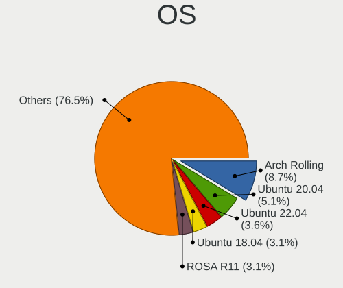

| Name                         | Desktops | Percent |
|------------------------------|----------|---------|
| Arch Rolling                 | 17       | 8.67%   |
| Ubuntu 20.04                 | 10       | 5.1%    |
| Ubuntu 22.04                 | 7        | 3.57%   |
| Ubuntu 18.04                 | 6        | 3.06%   |
| ROSA R11                     | 6        | 3.06%   |
| OpenMandriva 4.3             | 6        | 3.06%   |
| Debian 12                    | 5        | 2.55%   |
| ROSA R8.1                    | 4        | 2.04%   |
| openSUSE Tumbleweed-XXXXXXXX | 4        | 2.04%   |
| Manjaro                      | 4        | 2.04%   |
| Linux Mint 22.2              | 4        | 2.04%   |
| Kubuntu 20.04                | 4        | 2.04%   |
| Fedora 42                    | 4        | 2.04%   |
| Ubuntu 21.10                 | 3        | 1.53%   |
| ROSA 12.2                    | 3        | 1.53%   |
| Pop!_OS 22.04                | 3        | 1.53%   |
| Gentoo 2.6                   | 3        | 1.53%   |
| Fedora 34                    | 3        | 1.53%   |
| Fedora 31                    | 3        | 1.53%   |
| Zorin 17                     | 2        | 1.02%   |
| Ubuntu 24.04                 | 2        | 1.02%   |
| Pop!_OS 21.04                | 2        | 1.02%   |
| OpenMandriva 4.2             | 2        | 1.02%   |
| OpenMandriva 23.03           | 2        | 1.02%   |
| Nobara 37                    | 2        | 1.02%   |
| KDE neon 20.04               | 2        | 1.02%   |
| Fedora 40                    | 2        | 1.02%   |
| Fedora 39                    | 2        | 1.02%   |
| Fedora 36                    | 2        | 1.02%   |
| EndeavourOS Rolling          | 2        | 1.02%   |
| Debian Testing               | 2        | 1.02%   |
| Debian 11                    | 2        | 1.02%   |
| Bazzite 43                   | 2        | 1.02%   |
| ArcoLinux Rolling            | 2        | 1.02%   |
| Arch                         | 2        | 1.02%   |
| Zorin 18                     | 1        | 0.51%   |
| Zorin 16                     | 1        | 0.51%   |
| Xubuntu 18.04                | 1        | 0.51%   |
| Ubuntu MATE 24.04            | 1        | 0.51%   |
| Ubuntu MATE 22.04            | 1        | 0.51%   |

OS Family
---------

OS without a version

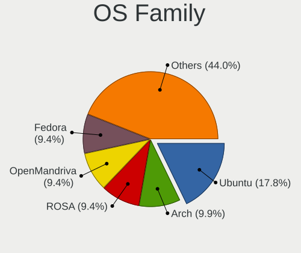

| Name         | Desktops | Percent |
|--------------|----------|---------|
| Ubuntu       | 34       | 17.8%   |
| Arch         | 19       | 9.95%   |
| ROSA         | 18       | 9.42%   |
| OpenMandriva | 18       | 9.42%   |
| Fedora       | 18       | 9.42%   |
| Debian       | 13       | 6.81%   |
| Manjaro      | 8        | 4.19%   |
| Linux Mint   | 7        | 3.66%   |
| Kubuntu      | 7        | 3.66%   |
| openSUSE     | 6        | 3.14%   |
| Gentoo       | 6        | 3.14%   |
| Pop!_OS      | 5        | 2.62%   |
| Zorin        | 4        | 2.09%   |
| Bazzite      | 4        | 2.09%   |
| Ubuntu MATE  | 3        | 1.57%   |
| Nobara       | 3        | 1.57%   |
| KDE neon     | 3        | 1.57%   |
| EndeavourOS  | 2        | 1.05%   |
| CachyOS      | 2        | 1.05%   |
| ArcoLinux    | 2        | 1.05%   |
| Xubuntu      | 1        | 0.52%   |
| Reborn OS    | 1        | 0.52%   |
| MX           | 1        | 0.52%   |
| Methaneos    | 1        | 0.52%   |
| LMDE         | 1        | 0.52%   |
| Kali         | 1        | 0.52%   |
| Garuda Linux | 1        | 0.52%   |
| Elementary   | 1        | 0.52%   |
| Clear Linux  | 1        | 0.52%   |

Kernel
------

Version of the Linux kernel

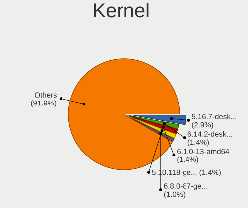

| Version                             | Desktops | Percent |
|-------------------------------------|----------|---------|
| 5.16.7-desktop-1omv4003             | 6        | 2.87%   |
| 6.14.2-desktop-3omv2590             | 3        | 1.44%   |
| 6.1.0-13-amd64                      | 3        | 1.44%   |
| 5.10.118-generic-2rosa2021.1-x86_64 | 3        | 1.44%   |
| 6.8.0-87-generic                    | 2        | 0.96%   |
| 6.8.0-41-generic                    | 2        | 0.96%   |
| 6.2.6-desktop-1omv2390              | 2        | 0.96%   |
| 6.17.7-ba19.fc43.x86_64             | 2        | 0.96%   |
| 6.14.0-34-generic                   | 2        | 0.96%   |
| 6.14.0-29-generic                   | 2        | 0.96%   |
| 6.12.9-desktop-1omv2490             | 2        | 0.96%   |
| 6.10.10-zen1-1-zen                  | 2        | 0.96%   |
| 5.5.2-1-MANJARO                     | 2        | 0.96%   |
| 5.4.0-53-generic                    | 2        | 0.96%   |
| 5.4.0-42-generic                    | 2        | 0.96%   |
| 5.4.0-26-generic                    | 2        | 0.96%   |
| 5.11.0-25-generic                   | 2        | 0.96%   |
| 5.10.14-desktop-1omv4002            | 2        | 0.96%   |
| 4.15.0-desktop-45.1rosa-x86_64      | 2        | 0.96%   |
| 6.9.3-x64v-xanmod1-1                | 1        | 0.48%   |
| 6.8.0-52-generic                    | 1        | 0.48%   |
| 6.8.0-49-generic                    | 1        | 0.48%   |
| 6.7.8-zen1-1-zen                    | 1        | 0.48%   |
| 6.7.4-arch1-1                       | 1        | 0.48%   |
| 6.7.10-200.fc39.x86_64              | 1        | 0.48%   |
| 6.6.62-gentoo-sdb8                  | 1        | 0.48%   |
| 6.6.36-1-longterm                   | 1        | 0.48%   |
| 6.6.3-arch1-1                       | 1        | 0.48%   |
| 6.6.21-1-lts                        | 1        | 0.48%   |
| 6.6.2-201.fc39.x86_64               | 1        | 0.48%   |
| 6.5.6-76060506-generic              | 1        | 0.48%   |
| 6.5.0-35-generic                    | 1        | 0.48%   |
| 6.5.0-21-generic                    | 1        | 0.48%   |
| 6.5.0-14-generic                    | 1        | 0.48%   |
| 6.4.8-desktop-2omv2390              | 1        | 0.48%   |
| 6.4.10-202.fsync.fc38.x86_64        | 1        | 0.48%   |
| 6.2.6-201.fsync.fc37.x86_64         | 1        | 0.48%   |
| 6.2.6-1-default                     | 1        | 0.48%   |
| 6.2.0-23-generic                    | 1        | 0.48%   |
| 6.17.9-arch1-1                      | 1        | 0.48%   |

Kernel Family
-------------

Linux kernel without a distro release

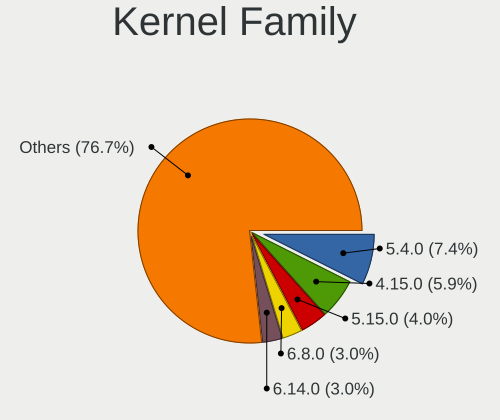

| Version  | Desktops | Percent |
|----------|----------|---------|
| 5.4.0    | 15       | 7.43%   |
| 4.15.0   | 12       | 5.94%   |
| 5.15.0   | 8        | 3.96%   |
| 6.8.0    | 6        | 2.97%   |
| 6.14.0   | 6        | 2.97%   |
| 5.16.7   | 6        | 2.97%   |
| 6.1.0    | 5        | 2.48%   |
| 5.13.0   | 5        | 2.48%   |
| 5.11.0   | 5        | 2.48%   |
| 6.2.6    | 4        | 1.98%   |
| 5.10.0   | 4        | 1.98%   |
| 6.5.0    | 3        | 1.49%   |
| 6.17.7   | 3        | 1.49%   |
| 6.14.2   | 3        | 1.49%   |
| 5.10.118 | 3        | 1.49%   |
| 6.17.9   | 2        | 0.99%   |
| 6.17.5   | 2        | 0.99%   |
| 6.16.4   | 2        | 0.99%   |
| 6.14.6   | 2        | 0.99%   |
| 6.12.9   | 2        | 0.99%   |
| 6.11.9   | 2        | 0.99%   |
| 6.11.0   | 2        | 0.99%   |
| 6.10.10  | 2        | 0.99%   |
| 6.0.11   | 2        | 0.99%   |
| 5.8.10   | 2        | 0.99%   |
| 5.8.0    | 2        | 0.99%   |
| 5.5.2    | 2        | 0.99%   |
| 5.3.0    | 2        | 0.99%   |
| 5.19.0   | 2        | 0.99%   |
| 5.10.14  | 2        | 0.99%   |
| 5.0.0    | 2        | 0.99%   |
| 4.9.9    | 2        | 0.99%   |
| 6.9.3    | 1        | 0.5%    |
| 6.7.8    | 1        | 0.5%    |
| 6.7.4    | 1        | 0.5%    |
| 6.7.10   | 1        | 0.5%    |
| 6.6.62   | 1        | 0.5%    |
| 6.6.36   | 1        | 0.5%    |
| 6.6.3    | 1        | 0.5%    |
| 6.6.21   | 1        | 0.5%    |

Kernel Major Ver.
-----------------

Linux kernel major version

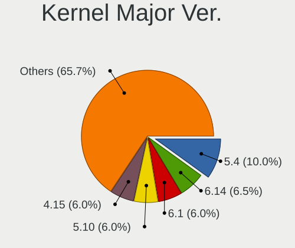

| Version | Desktops | Percent |
|---------|----------|---------|
| 5.4     | 20       | 9.95%   |
| 6.14    | 13       | 6.47%   |
| 6.1     | 12       | 5.97%   |
| 5.10    | 12       | 5.97%   |
| 4.15    | 12       | 5.97%   |
| 5.15    | 11       | 5.47%   |
| 6.17    | 9        | 4.48%   |
| 5.13    | 8        | 3.98%   |
| 6.12    | 7        | 3.48%   |
| 6.10    | 7        | 3.48%   |
| 5.16    | 7        | 3.48%   |
| 5.11    | 7        | 3.48%   |
| 6.8     | 6        | 2.99%   |
| 6.11    | 6        | 2.99%   |
| 4.9     | 6        | 2.99%   |
| 6.6     | 5        | 2.49%   |
| 6.2     | 5        | 2.49%   |
| 6.5     | 4        | 1.99%   |
| 6.0     | 4        | 1.99%   |
| 5.8     | 4        | 1.99%   |
| 5.3     | 4        | 1.99%   |
| 6.7     | 3        | 1.49%   |
| 6.16    | 3        | 1.49%   |
| 5.5     | 3        | 1.49%   |
| 5.18    | 3        | 1.49%   |
| 6.4     | 2        | 1%      |
| 6.15    | 2        | 1%      |
| 5.6     | 2        | 1%      |
| 5.19    | 2        | 1%      |
| 5.14    | 2        | 1%      |
| 5.0     | 2        | 1%      |
| 4.19    | 2        | 1%      |
| 6.9     | 1        | 0.5%    |
| 6.13    | 1        | 0.5%    |
| 5.7     | 1        | 0.5%    |
| 5.17    | 1        | 0.5%    |
| 5.1     | 1        | 0.5%    |
| 4.1     | 1        | 0.5%    |

Arch
----

OS architecture (x86_64, i586, etc.)

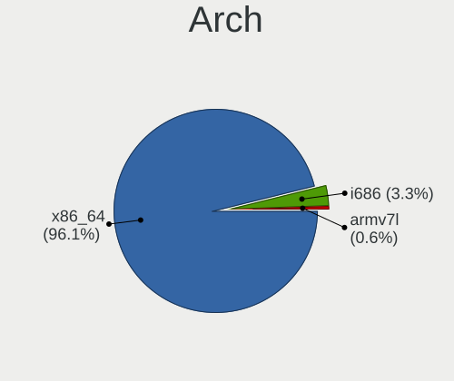

| Name   | Desktops | Percent |
|--------|----------|---------|
| x86_64 | 174      | 96.13%  |
| i686   | 6        | 3.31%   |
| armv7l | 1        | 0.55%   |

DE
--

Desktop Environment

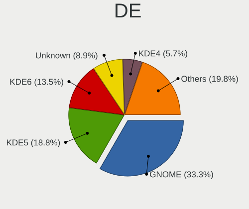

| Name       | Desktops | Percent |
|------------|----------|---------|
| GNOME      | 64       | 33.33%  |
| KDE5       | 36       | 18.75%  |
| KDE6       | 26       | 13.54%  |
| Unknown    | 17       | 8.85%   |
| KDE4       | 11       | 5.73%   |
| X-Cinnamon | 10       | 5.21%   |
| XFCE       | 7        | 3.65%   |
| MATE       | 7        | 3.65%   |
| Hyprland   | 3        | 1.56%   |
| sway       | 2        | 1.04%   |
| LXQt       | 2        | 1.04%   |
| KDE        | 2        | 1.04%   |
| i3         | 2        | 1.04%   |
| Pantheon   | 1        | 0.52%   |
| COSMIC     | 1        | 0.52%   |
| Budgie     | 1        | 0.52%   |

Display Server
--------------

X11 or Wayland

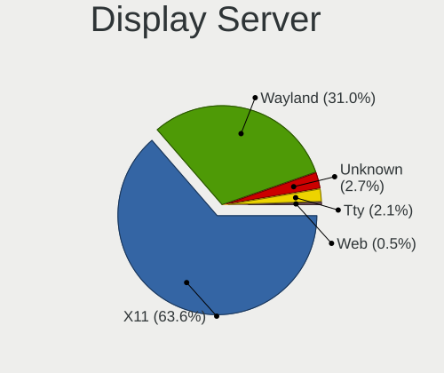

| Name    | Desktops | Percent |
|---------|----------|---------|
| X11     | 119      | 63.64%  |
| Wayland | 58       | 31.02%  |
| Unknown | 5        | 2.67%   |
| Tty     | 4        | 2.14%   |
| Web     | 1        | 0.53%   |

Display Manager
---------------

SDDM, LightDM, etc.

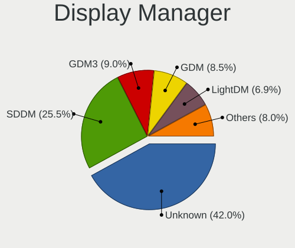

| Name    | Desktops | Percent |
|---------|----------|---------|
| Unknown | 79       | 42.02%  |
| SDDM    | 48       | 25.53%  |
| GDM3    | 17       | 9.04%   |
| GDM     | 16       | 8.51%   |
| LightDM | 13       | 6.91%   |
| KDM     | 11       | 5.85%   |
| TDM     | 3        | 1.6%    |
| GREETD  | 1        | 0.53%   |

OS Lang
-------

Language

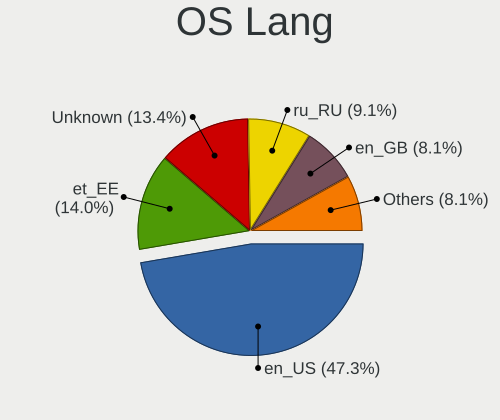

| Lang        | Desktops | Percent |
|-------------|----------|---------|
| en_US       | 88       | 47.31%  |
| et_EE       | 26       | 13.98%  |
| Unknown     | 25       | 13.44%  |
| ru_RU       | 17       | 9.14%   |
| en_GB       | 15       | 8.06%   |
| de_DE       | 3        | 1.61%   |
| pl_PL       | 2        | 1.08%   |
| en_IE       | 2        | 1.08%   |
| C.UTF8      | 2        | 1.08%   |
| POSIX       | 1        | 0.54%   |
| it_IT       | 1        | 0.54%   |
| fr_FR       | 1        | 0.54%   |
| en_BW       | 1        | 0.54%   |
| C           | 1        | 0.54%   |
| be_BY@latin | 1        | 0.54%   |

Boot Mode
---------

EFI or BIOS

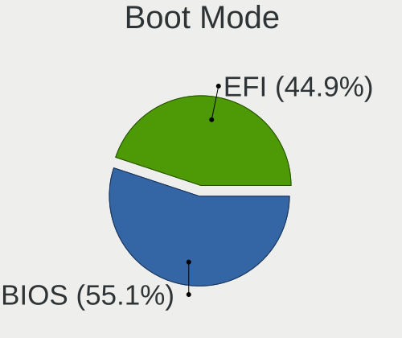

| Mode | Desktops | Percent |
|------|----------|---------|
| BIOS | 103      | 55.08%  |
| EFI  | 84       | 44.92%  |

Filesystem
----------

Type of filesystem

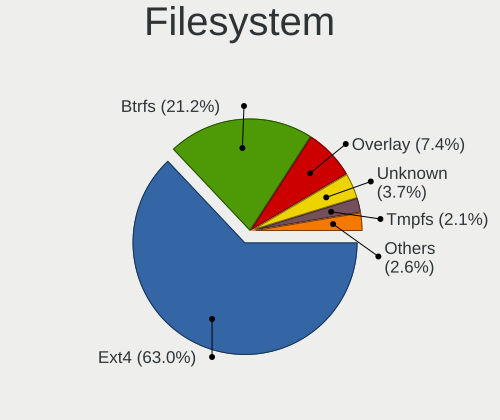

| Type    | Desktops | Percent |
|---------|----------|---------|
| Ext4    | 119      | 62.96%  |
| Btrfs   | 40       | 21.16%  |
| Overlay | 14       | 7.41%   |
| Unknown | 7        | 3.7%    |
| Tmpfs   | 4        | 2.12%   |
| Xfs     | 3        | 1.59%   |
| Zfs     | 1        | 0.53%   |
| Ext3    | 1        | 0.53%   |

Part. scheme
------------

Scheme of partitioning

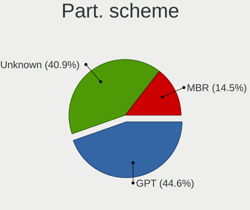

| Type    | Desktops | Percent |
|---------|----------|---------|
| GPT     | 83       | 44.62%  |
| Unknown | 76       | 40.86%  |
| MBR     | 27       | 14.52%  |

Dual Boot with Linux/BSD
------------------------

Hosting more than one Linux/BSD

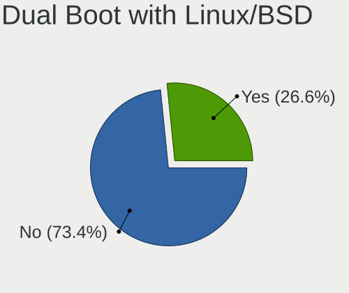

| Dual boot | Desktops | Percent |
|-----------|----------|---------|
| No        | 138      | 73.4%   |
| Yes       | 50       | 26.6%   |

Dual Boot (Win)
---------------

Hosting Linux and Windows

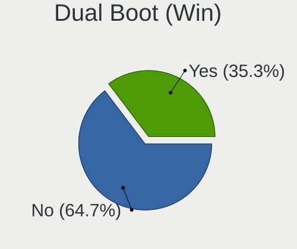

| Dual boot | Desktops | Percent |
|-----------|----------|---------|
| No        | 121      | 64.71%  |
| Yes       | 66       | 35.29%  |

Board
-----

Vendor
------

Motherboard manufacturer

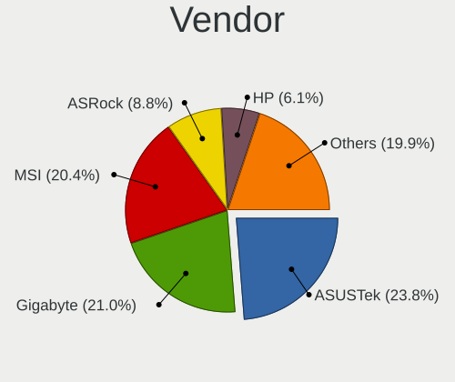

| Name                | Desktops | Percent |
|---------------------|----------|---------|
| ASUSTek Computer    | 43       | 23.76%  |
| Gigabyte Technology | 38       | 20.99%  |
| MSI                 | 37       | 20.44%  |
| ASRock              | 16       | 8.84%   |
| Hewlett-Packard     | 11       | 6.08%   |
| Intel               | 10       | 5.52%   |
| Lenovo              | 7        | 3.87%   |
| Dell                | 6        | 3.31%   |
| ECS                 | 4        | 2.21%   |
| Fujitsu             | 3        | 1.66%   |
| Unknown             | 2        | 1.1%    |
| OEM                 | 1        | 0.55%   |
| MACHINIST           | 1        | 0.55%   |
| Huanan              | 1        | 0.55%   |
| ABIT                | 1        | 0.55%   |

Model
-----

Motherboard model

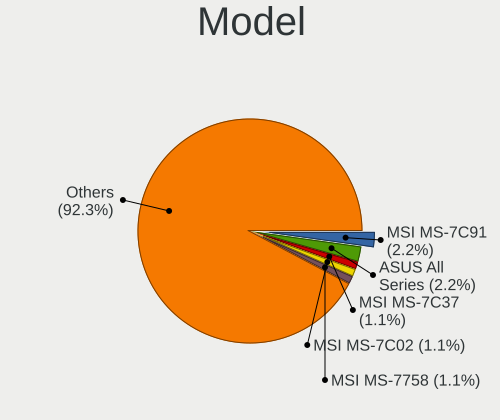

| Name                               | Desktops | Percent |
|------------------------------------|----------|---------|
| MSI MS-7C91                        | 4        | 2.21%   |
| ASUS All Series                    | 4        | 2.21%   |
| MSI MS-7C37                        | 2        | 1.1%    |
| MSI MS-7C02                        | 2        | 1.1%    |
| MSI MS-7758                        | 2        | 1.1%    |
| HP Compaq 8100 Elite SFF PC        | 2        | 1.1%    |
| Gigabyte X570 AORUS PRO            | 2        | 1.1%    |
| Gigabyte Q87M-D2H                  | 2        | 1.1%    |
| Gigabyte 990FXA-UD3                | 2        | 1.1%    |
| ASUS ROG STRIX B650E-E GAMING WIFI | 2        | 1.1%    |
| ASUS ROG STRIX B550-F GAMING       | 2        | 1.1%    |
| ASUS PRIME X570-PRO                | 2        | 1.1%    |
| ASUS PRIME B550M-K                 | 2        | 1.1%    |
| Unknown                            | 2        | 1.1%    |
| OEM Intel H81                      | 1        | 0.55%   |
| MSI MS-7D98                        | 1        | 0.55%   |
| MSI MS-7D95                        | 1        | 0.55%   |
| MSI MS-7D75                        | 1        | 0.55%   |
| MSI MS-7D70                        | 1        | 0.55%   |
| MSI MS-7D59                        | 1        | 0.55%   |
| MSI MS-7D54                        | 1        | 0.55%   |
| MSI MS-7D43                        | 1        | 0.55%   |
| MSI MS-7C96                        | 1        | 0.55%   |
| MSI MS-7C83                        | 1        | 0.55%   |
| MSI MS-7C77                        | 1        | 0.55%   |
| MSI MS-7C75                        | 1        | 0.55%   |
| MSI MS-7B98                        | 1        | 0.55%   |
| MSI MS-7B86                        | 1        | 0.55%   |
| MSI MS-7B79                        | 1        | 0.55%   |
| MSI MS-7B22                        | 1        | 0.55%   |
| MSI MS-7B18                        | 1        | 0.55%   |
| MSI MS-7A74                        | 1        | 0.55%   |
| MSI MS-7996                        | 1        | 0.55%   |
| MSI MS-7978                        | 1        | 0.55%   |
| MSI MS-7971                        | 1        | 0.55%   |
| MSI MS-7851                        | 1        | 0.55%   |
| MSI MS-7846                        | 1        | 0.55%   |
| MSI MS-7823                        | 1        | 0.55%   |
| MSI MS-7798                        | 1        | 0.55%   |
| MSI MS-7640                        | 1        | 0.55%   |

Model Family
------------

Motherboard model prefix

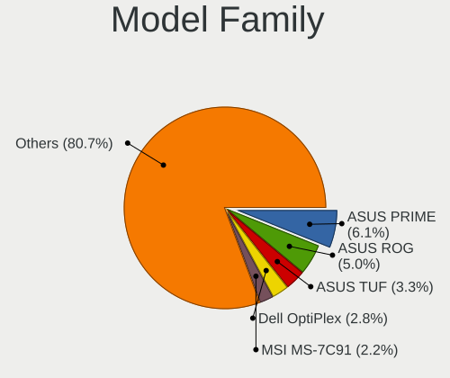

| Name                | Desktops | Percent |
|---------------------|----------|---------|
| ASUS PRIME          | 11       | 6.08%   |
| ASUS ROG            | 9        | 4.97%   |
| ASUS TUF            | 6        | 3.31%   |
| Dell OptiPlex       | 5        | 2.76%   |
| MSI MS-7C91         | 4        | 2.21%   |
| Lenovo ThinkCentre  | 4        | 2.21%   |
| HP Compaq           | 4        | 2.21%   |
| Gigabyte X570       | 4        | 2.21%   |
| ASUS All            | 4        | 2.21%   |
| HP EliteDesk        | 3        | 1.66%   |
| Fujitsu ESPRIMO     | 3        | 1.66%   |
| MSI MS-7C37         | 2        | 1.1%    |
| MSI MS-7C02         | 2        | 1.1%    |
| MSI MS-7758         | 2        | 1.1%    |
| HP ProDesk          | 2        | 1.1%    |
| Gigabyte Q87M-D2H   | 2        | 1.1%    |
| Gigabyte B450       | 2        | 1.1%    |
| Gigabyte 990FXA-UD3 | 2        | 1.1%    |
| Unknown             | 2        | 1.1%    |
| OEM Intel           | 1        | 0.55%   |
| MSI MS-7D98         | 1        | 0.55%   |
| MSI MS-7D95         | 1        | 0.55%   |
| MSI MS-7D75         | 1        | 0.55%   |
| MSI MS-7D70         | 1        | 0.55%   |
| MSI MS-7D59         | 1        | 0.55%   |
| MSI MS-7D54         | 1        | 0.55%   |
| MSI MS-7D43         | 1        | 0.55%   |
| MSI MS-7C96         | 1        | 0.55%   |
| MSI MS-7C83         | 1        | 0.55%   |
| MSI MS-7C77         | 1        | 0.55%   |
| MSI MS-7C75         | 1        | 0.55%   |
| MSI MS-7B98         | 1        | 0.55%   |
| MSI MS-7B86         | 1        | 0.55%   |
| MSI MS-7B79         | 1        | 0.55%   |
| MSI MS-7B22         | 1        | 0.55%   |
| MSI MS-7B18         | 1        | 0.55%   |
| MSI MS-7A74         | 1        | 0.55%   |
| MSI MS-7996         | 1        | 0.55%   |
| MSI MS-7978         | 1        | 0.55%   |
| MSI MS-7971         | 1        | 0.55%   |

MFG Year
--------

Motherboard manufacture year

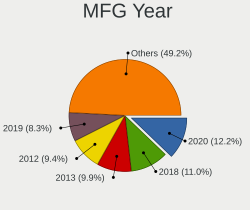

| Year    | Desktops | Percent |
|---------|----------|---------|
| 2020    | 22       | 12.15%  |
| 2018    | 20       | 11.05%  |
| 2013    | 18       | 9.94%   |
| 2012    | 17       | 9.39%   |
| 2019    | 15       | 8.29%   |
| 2022    | 14       | 7.73%   |
| 2021    | 13       | 7.18%   |
| 2015    | 9        | 4.97%   |
| 2009    | 8        | 4.42%   |
| 2016    | 7        | 3.87%   |
| 2014    | 6        | 3.31%   |
| 2011    | 6        | 3.31%   |
| 2017    | 5        | 2.76%   |
| 2010    | 5        | 2.76%   |
| 2023    | 3        | 1.66%   |
| 2008    | 3        | 1.66%   |
| 2006    | 3        | 1.66%   |
| 2007    | 2        | 1.1%    |
| 2005    | 2        | 1.1%    |
| 2024    | 1        | 0.55%   |
| 2004    | 1        | 0.55%   |
| Unknown | 1        | 0.55%   |

Form Factor
-----------

Physical design of the computer

| Name    | Desktops | Percent |
|---------|----------|---------|
| Desktop | 181      | 100%    |

Secure Boot
-----------

Enabled or disabled

| State    | Desktops | Percent |
|----------|----------|---------|
| Disabled | 176      | 96.7%   |
| Enabled  | 6        | 3.3%    |

Coreboot
--------

Have coreboot on board

| Used | Desktops | Percent |
|------|----------|---------|
| No   | 181      | 100%    |

RAM Size
--------

Total RAM memory

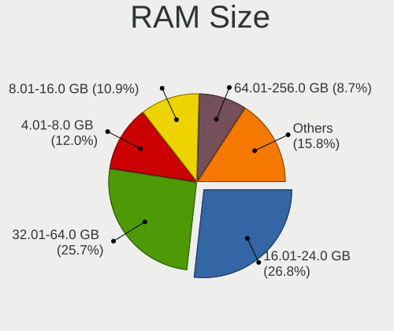

| Size in GB  | Desktops | Percent |
|-------------|----------|---------|
| 16.01-24.0  | 49       | 26.78%  |
| 32.01-64.0  | 47       | 25.68%  |
| 4.01-8.0    | 22       | 12.02%  |
| 8.01-16.0   | 20       | 10.93%  |
| 64.01-256.0 | 16       | 8.74%   |
| 3.01-4.0    | 15       | 8.2%    |
| 24.01-32.0  | 5        | 2.73%   |
| 1.01-2.0    | 4        | 2.19%   |
| 2.01-3.0    | 2        | 1.09%   |
| 0.51-1.0    | 2        | 1.09%   |
| 0.01-0.5    | 1        | 0.55%   |

RAM Used
--------

Used RAM memory

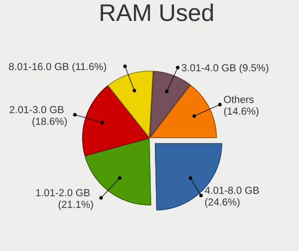

| Used GB    | Desktops | Percent |
|------------|----------|---------|
| 4.01-8.0   | 49       | 24.62%  |
| 1.01-2.0   | 42       | 21.11%  |
| 2.01-3.0   | 37       | 18.59%  |
| 8.01-16.0  | 23       | 11.56%  |
| 3.01-4.0   | 19       | 9.55%   |
| 0.51-1.0   | 18       | 9.05%   |
| 16.01-24.0 | 5        | 2.51%   |
| 0.01-0.5   | 4        | 2.01%   |
| 24.01-32.0 | 2        | 1.01%   |

Total Drives
------------

Number of drives on board

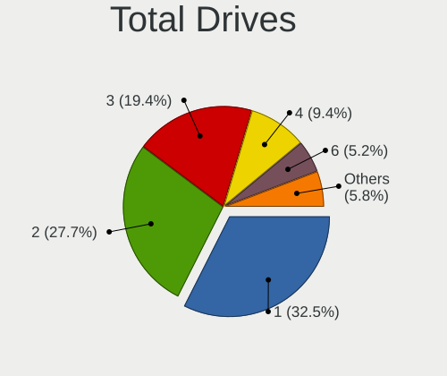

| Drives | Desktops | Percent |
|--------|----------|---------|
| 1      | 62       | 32.46%  |
| 2      | 53       | 27.75%  |
| 3      | 37       | 19.37%  |
| 4      | 18       | 9.42%   |
| 6      | 10       | 5.24%   |
| 5      | 8        | 4.19%   |
| 7      | 2        | 1.05%   |
| 0      | 1        | 0.52%   |

Has CD-ROM
----------

Has CD-ROM on board

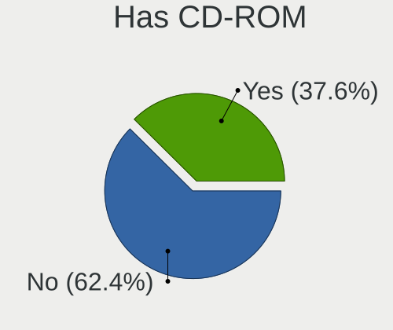

| Presented | Desktops | Percent |
|-----------|----------|---------|
| No        | 113      | 62.43%  |
| Yes       | 68       | 37.57%  |

Has Ethernet
------------

Has Ethernet on board

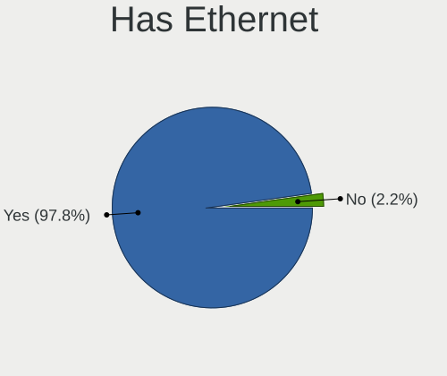

| Presented | Desktops | Percent |
|-----------|----------|---------|
| Yes       | 178      | 97.8%   |
| No        | 4        | 2.2%    |

Has WiFi
--------

Has WiFi module

| Presented | Desktops | Percent |
|-----------|----------|---------|
| No        | 114      | 62.64%  |
| Yes       | 68       | 37.36%  |

Has Bluetooth
-------------

Has Bluetooth module

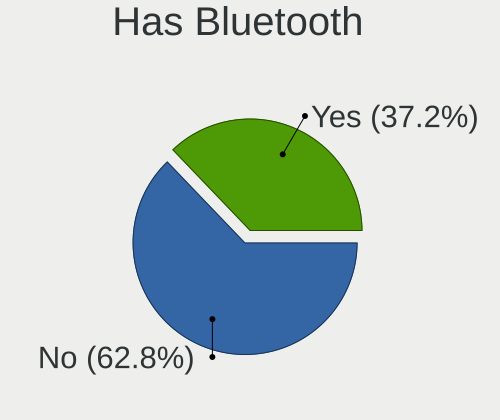

| Presented | Desktops | Percent |
|-----------|----------|---------|
| No        | 115      | 62.84%  |
| Yes       | 68       | 37.16%  |

Location
--------

Country
-------

Geographic location (country)

| Country | Desktops | Percent |
|---------|----------|---------|
| Estonia | 181      | 100%    |

City
----

Geographic location (city)

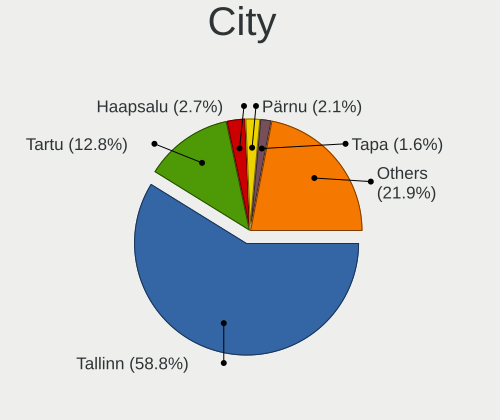

| City          | Desktops | Percent |
|---------------|----------|---------|
| Tallinn       | 110      | 58.82%  |
| Tartu         | 24       | 12.83%  |
| Haapsalu      | 5        | 2.67%   |
| Pärnu        | 4        | 2.14%   |
| Tapa          | 3        | 1.6%    |
| Rapla         | 3        | 1.6%    |
| Peetrimoisa   | 3        | 1.6%    |
| Paldiski      | 3        | 1.6%    |
| Viljandi      | 2        | 1.07%   |
| Viimsi        | 2        | 1.07%   |
| Türi         | 2        | 1.07%   |
| Saku          | 2        | 1.07%   |
| Rakvere       | 2        | 1.07%   |
| Narva         | 2        | 1.07%   |
| Kuressaare    | 2        | 1.07%   |
| Kohtla-Järve | 2        | 1.07%   |
| Kadrina       | 2        | 1.07%   |
| Valga         | 1        | 0.53%   |
| Vaidasoo      | 1        | 0.53%   |
| Tabasalu      | 1        | 0.53%   |
| Sindi         | 1        | 0.53%   |
| Põlva        | 1        | 0.53%   |
| Maardu        | 1        | 0.53%   |
| Lohkva        | 1        | 0.53%   |
| Kose          | 1        | 0.53%   |
| Kiviõli      | 1        | 0.53%   |
| Jõhvi        | 1        | 0.53%   |
| Jaerveotsa    | 1        | 0.53%   |
| Jaerva vald   | 1        | 0.53%   |
| Hiiumaa       | 1        | 0.53%   |
| Haabneeme     | 1        | 0.53%   |

Drives
------

Drive Vendor
------------

Hard drive vendors

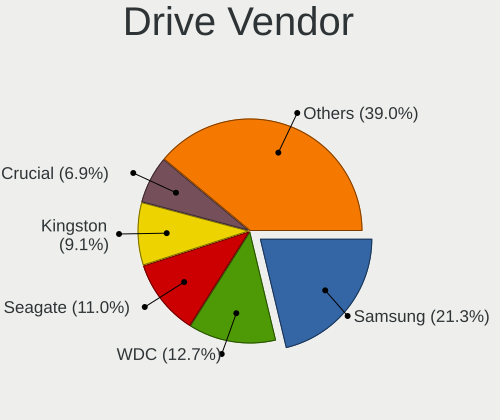

| Vendor                       | Desktops | Drives | Percent |
|------------------------------|----------|--------|---------|
| Samsung Electronics          | 77       | 128    | 21.27%  |
| WDC                          | 46       | 72     | 12.71%  |
| Seagate                      | 40       | 60     | 11.05%  |
| Kingston                     | 33       | 52     | 9.12%   |
| Crucial                      | 25       | 36     | 6.91%   |
| Toshiba                      | 19       | 20     | 5.25%   |
| SanDisk                      | 12       | 14     | 3.31%   |
| Hitachi                      | 12       | 16     | 3.31%   |
| A-DATA Technology            | 9        | 15     | 2.49%   |
| HGST                         | 7        | 10     | 1.93%   |
| Kingston Technology Company  | 6        | 7      | 1.66%   |
| ADATA Technology             | 6        | 7      | 1.66%   |
| Intel                        | 5        | 8      | 1.38%   |
| Apacer                       | 5        | 6      | 1.38%   |
| Patriot                      | 4        | 4      | 1.1%    |
| China                        | 4        | 4      | 1.1%    |
| XPG                          | 3        | 3      | 0.83%   |
| SPCC                         | 3        | 3      | 0.83%   |
| Phison Electronics           | 3        | 4      | 0.83%   |
| Maxtor                       | 3        | 3      | 0.83%   |
| Unknown                      | 2        | 2      | 0.55%   |
| Team                         | 2        | 3      | 0.55%   |
| SK hynix                     | 2        | 2      | 0.55%   |
| Silicon Motion               | 2        | 4      | 0.55%   |
| Plextor                      | 2        | 2      | 0.55%   |
| Netac                        | 2        | 2      | 0.55%   |
| Micron/Crucial Technology    | 2        | 2      | 0.55%   |
| KingSpec                     | 2        | 3      | 0.55%   |
| Gigabyte Technology          | 2        | 2      | 0.55%   |
| Corsair                      | 2        | 2      | 0.55%   |
| ASMT                         | 2        | 2      | 0.55%   |
| ZADAK                        | 1        | 1      | 0.28%   |
| WD_BLACK                     | 1        | 1      | 0.28%   |
| Transcend                    | 1        | 1      | 0.28%   |
| Synology                     | 1        | 1      | 0.28%   |
| Shenzhen Longsys Electronics | 1        | 1      | 0.28%   |
| SHAREVDI                     | 1        | 1      | 0.28%   |
| ORICO                        | 1        | 1      | 0.28%   |
| Micron Technology            | 1        | 1      | 0.28%   |
| MAXIO Technology (Hangzhou)  | 1        | 1      | 0.28%   |

Drive Model
-----------

Hard drive models

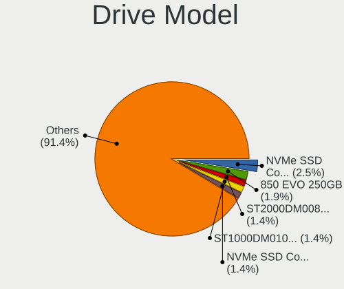

| Model                                                              | Desktops | Percent |
|--------------------------------------------------------------------|----------|---------|
| Samsung NVMe SSD Controller SM981/PM981/PM983 1TB                  | 11       | 2.55%   |
| Samsung SSD 850 EVO 250GB                                          | 8        | 1.85%   |
| Seagate ST2000DM008-2FR102 2TB                                     | 6        | 1.39%   |
| Seagate ST1000DM010-2EP102 1TB                                     | 6        | 1.39%   |
| Samsung NVMe SSD Controller PM9A1/PM9A3/980PRO 1TB                 | 6        | 1.39%   |
| Kingston SA400S37240G 240GB SSD                                    | 5        | 1.16%   |
| Toshiba DT01ACA100 1TB                                             | 4        | 0.93%   |
| Samsung SSD 860 EVO 250GB                                          | 4        | 0.93%   |
| Samsung SSD 850 EVO 500GB                                          | 4        | 0.93%   |
| Samsung NVMe SSD Drive 1TB                                         | 4        | 0.93%   |
| Samsung HD103SJ 1TB                                                | 4        | 0.93%   |
| Kingston SA400S37480G 480GB SSD                                    | 4        | 0.93%   |
| Kingston SA400S37120G 120GB SSD                                    | 4        | 0.93%   |
| Crucial CT500MX500SSD1 500GB                                       | 4        | 0.93%   |
| Crucial CT1000MX500SSD1 1TB                                        | 4        | 0.93%   |
| ADATA XPG SX8200 Pro PCIe Gen3x4 M.2 2280 Solid State Drive 1024GB | 4        | 0.93%   |
| Toshiba HDWD130 3TB                                                | 3        | 0.69%   |
| Toshiba DT01ACA200 2TB                                             | 3        | 0.69%   |
| Seagate ST500LT012-9WS142 500GB                                    | 3        | 0.69%   |
| Seagate ST500DM002-1BD142 500GB                                    | 3        | 0.69%   |
| Samsung SSD 960 PRO 512GB                                          | 3        | 0.69%   |
| Samsung SSD 840 EVO 250GB                                          | 3        | 0.69%   |
| Samsung MZ7TY128HDHP-000L1 128GB SSD                               | 3        | 0.69%   |
| Samsung HD080HJ/ 80GB                                              | 3        | 0.69%   |
| Hitachi HTS723225L9A360 250GB                                      | 3        | 0.69%   |
| Apacer AS350 512GB SSD                                             | 3        | 0.69%   |
| A-DATA SX8200PNP 512GB                                             | 3        | 0.69%   |
| WDC WD30EFRX-68EUZN0 3TB                                           | 2        | 0.46%   |
| WDC WD20EZBX-00AYRA0 2TB                                           | 2        | 0.46%   |
| WDC WD10EZRZ-00HTKB0 1TB                                           | 2        | 0.46%   |
| WDC WD10EADS-00M2B0 1TB                                            | 2        | 0.46%   |
| Unknown ArtisanTribute-512GB                                       | 2        | 0.46%   |
| Seagate ST4000DM004-2CV104 4TB                                     | 2        | 0.46%   |
| Seagate ST3250318AS 250GB                                          | 2        | 0.46%   |
| Seagate ST3000DM008-2DM166 3TB                                     | 2        | 0.46%   |
| Seagate ST2000DM001-1ER164 2TB                                     | 2        | 0.46%   |
| Seagate ST1000DM003-1SB102 1TB                                     | 2        | 0.46%   |
| Seagate ST1000DM003-1ER162 1TB                                     | 2        | 0.46%   |
| Sandisk WD Blue SN570 1TB                                          | 2        | 0.46%   |
| Samsung SSD 990 PRO 4TB                                            | 2        | 0.46%   |

HDD Vendor
----------

Hard disk drive vendors

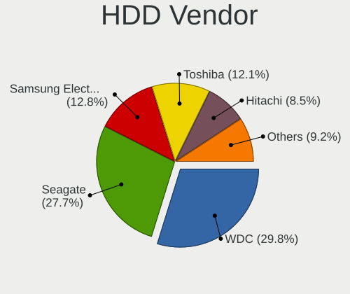

| Vendor              | Desktops | Drives | Percent |
|---------------------|----------|--------|---------|
| WDC                 | 42       | 62     | 29.79%  |
| Seagate             | 39       | 59     | 27.66%  |
| Samsung Electronics | 18       | 24     | 12.77%  |
| Toshiba             | 17       | 18     | 12.06%  |
| Hitachi             | 12       | 16     | 8.51%   |
| HGST                | 7        | 10     | 4.96%   |
| Maxtor              | 3        | 3      | 2.13%   |
| Synology            | 1        | 1      | 0.71%   |
| JMicron Technology  | 1        | 1      | 0.71%   |
| Apple               | 1        | 1      | 0.71%   |

SSD Vendor
----------

Solid state drive vendors

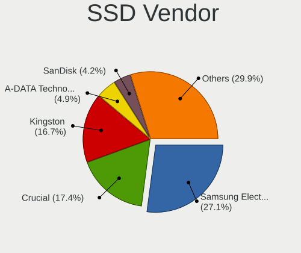

| Vendor              | Desktops | Drives | Percent |
|---------------------|----------|--------|---------|
| Samsung Electronics | 39       | 53     | 27.08%  |
| Crucial             | 25       | 36     | 17.36%  |
| Kingston            | 24       | 37     | 16.67%  |
| A-DATA Technology   | 7        | 12     | 4.86%   |
| SanDisk             | 6        | 6      | 4.17%   |
| WDC                 | 5        | 7      | 3.47%   |
| Apacer              | 5        | 6      | 3.47%   |
| Patriot             | 4        | 4      | 2.78%   |
| China               | 4        | 4      | 2.78%   |
| SPCC                | 3        | 3      | 2.08%   |
| Team                | 2        | 3      | 1.39%   |
| Plextor             | 2        | 2      | 1.39%   |
| Netac               | 2        | 2      | 1.39%   |
| KingSpec            | 2        | 3      | 1.39%   |
| Intel               | 2        | 2      | 1.39%   |
| Corsair             | 2        | 2      | 1.39%   |
| ZADAK               | 1        | 1      | 0.69%   |
| Transcend           | 1        | 1      | 0.69%   |
| SK hynix            | 1        | 1      | 0.69%   |
| SHAREVDI            | 1        | 1      | 0.69%   |
| Lexar               | 1        | 1      | 0.69%   |
| Intenso             | 1        | 1      | 0.69%   |
| Integral            | 1        | 1      | 0.69%   |
| i-FlashDisk         | 1        | 1      | 0.69%   |
| Gigabyte Technology | 1        | 1      | 0.69%   |
| ASMT                | 1        | 1      | 0.69%   |

Drive Kind
----------

HDD or SSD

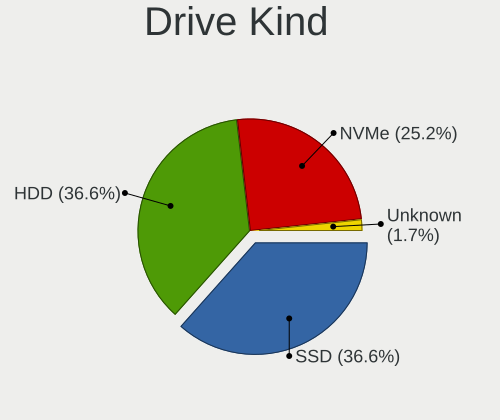

| Kind    | Desktops | Drives | Percent |
|---------|----------|--------|---------|
| SSD     | 109      | 192    | 36.58%  |
| HDD     | 109      | 195    | 36.58%  |
| NVMe    | 75       | 127    | 25.17%  |
| Unknown | 5        | 5      | 1.68%   |

Drive Connector
---------------

SATA, SAS, NVMe, etc.

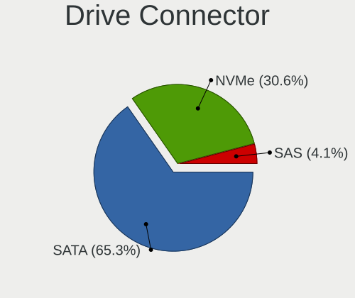

| Type | Desktops | Drives | Percent |
|------|----------|--------|---------|
| SATA | 160      | 384    | 65.31%  |
| NVMe | 75       | 125    | 30.61%  |
| SAS  | 10       | 10     | 4.08%   |

Drive Size
----------

Size of hard drive

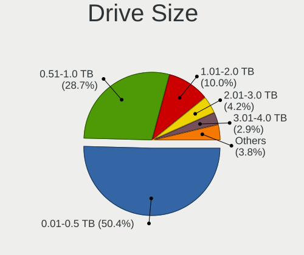

| Size in TB | Desktops | Drives | Percent |
|------------|----------|--------|---------|
| 0.01-0.5   | 121      | 220    | 50.42%  |
| 0.51-1.0   | 69       | 101    | 28.75%  |
| 1.01-2.0   | 24       | 32     | 10%     |
| 2.01-3.0   | 10       | 18     | 4.17%   |
| 3.01-4.0   | 7        | 7      | 2.92%   |
| 4.01-10.0  | 6        | 6      | 2.5%    |
| 10.01-20.0 | 3        | 3      | 1.25%   |

Space Total
-----------

Amount of disk space available on the file system

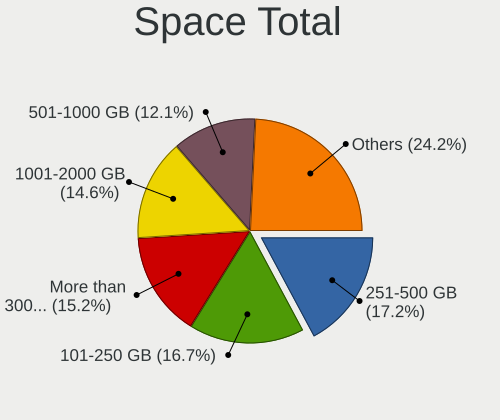

| Size in GB     | Desktops | Percent |
|----------------|----------|---------|
| 251-500        | 34       | 17.17%  |
| 101-250        | 33       | 16.67%  |
| More than 3000 | 30       | 15.15%  |
| 1001-2000      | 29       | 14.65%  |
| 501-1000       | 24       | 12.12%  |
| 1-20           | 15       | 7.58%   |
| 2001-3000      | 13       | 6.57%   |
| Unknown        | 8        | 4.04%   |
| 51-100         | 7        | 3.54%   |
| 21-50          | 5        | 2.53%   |

Space Used
----------

Amount of used disk space

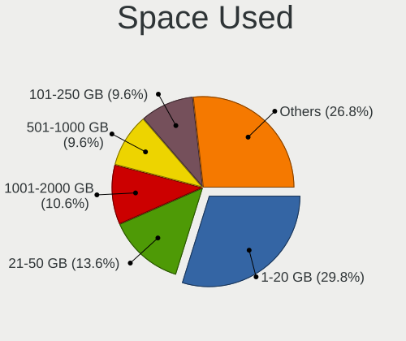

| Used GB        | Desktops | Percent |
|----------------|----------|---------|
| 1-20           | 59       | 29.8%   |
| 21-50          | 27       | 13.64%  |
| 1001-2000      | 21       | 10.61%  |
| 101-250        | 19       | 9.6%    |
| 501-1000       | 19       | 9.6%    |
| 251-500        | 16       | 8.08%   |
| 51-100         | 13       | 6.57%   |
| More than 3000 | 12       | 6.06%   |
| Unknown        | 8        | 4.04%   |
| 2001-3000      | 4        | 2.02%   |

Malfunc. Drives
---------------

Drive models with a malfunction

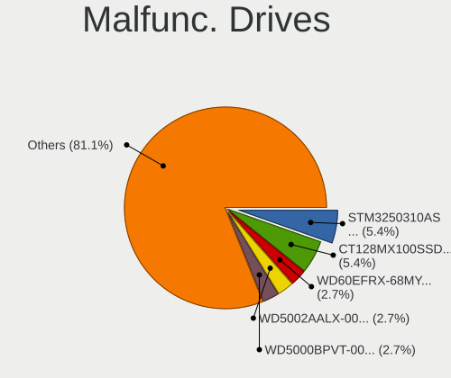

| Model                                        | Desktops | Drives | Percent |
|----------------------------------------------|----------|--------|---------|
| Maxtor STM3250310AS 250GB                    | 2        | 2      | 5.41%   |
| Crucial CT128MX100SSD1 128GB                 | 2        | 3      | 5.41%   |
| WDC WD60EFRX-68MYMN1 6TB                     | 1        | 1      | 2.7%    |
| WDC WD5002AALX-00J37A0 500GB                 | 1        | 1      | 2.7%    |
| WDC WD5000BPVT-00HXZT1 500GB                 | 1        | 1      | 2.7%    |
| WDC WD5000AAKX-00ERMA0 500GB                 | 1        | 1      | 2.7%    |
| WDC WD30EFRX-68EUZN0 3TB                     | 1        | 1      | 2.7%    |
| WDC WD20EZRX-00DC0B0 2TB                     | 1        | 2      | 2.7%    |
| WDC WD20EARX-00PASB0 2TB                     | 1        | 1      | 2.7%    |
| WDC WD10PURX-64E5EY0 1TB                     | 1        | 1      | 2.7%    |
| WDC WD10EAVS-00D7B1 1TB                      | 1        | 1      | 2.7%    |
| WDC WD10EADS-00M2B0 1TB                      | 1        | 2      | 2.7%    |
| Toshiba MK6475GSX 640GB                      | 1        | 1      | 2.7%    |
| Toshiba MK3261GSYN 320GB                     | 1        | 1      | 2.7%    |
| Toshiba DT01ACA200 2TB                       | 1        | 1      | 2.7%    |
| SHAREVDI 256GB SSD                           | 1        | 1      | 2.7%    |
| Seagate ST500DM002-1BD142 500GB              | 1        | 1      | 2.7%    |
| Seagate ST340016A 40GB                       | 1        | 2      | 2.7%    |
| Seagate ST31000528AS 1TB                     | 1        | 1      | 2.7%    |
| Seagate ST3000DM008-2DM166 3TB               | 1        | 1      | 2.7%    |
| Seagate ST1000DM010-2EP102 1TB               | 1        | 1      | 2.7%    |
| Samsung Electronics SSD 840 PRO Series 128GB | 1        | 1      | 2.7%    |
| Samsung Electronics SP0802N 80GB             | 1        | 1      | 2.7%    |
| Samsung Electronics HD642JJ 640GB            | 1        | 2      | 2.7%    |
| Samsung Electronics HD501LJ 500GB            | 1        | 1      | 2.7%    |
| Samsung Electronics HD103SJ 1TB              | 1        | 1      | 2.7%    |
| Samsung Electronics HD080HJ/ 80GB            | 1        | 1      | 2.7%    |
| Patriot P210 256GB SSD                       | 1        | 1      | 2.7%    |
| Patriot Burst 480GB SSD                      | 1        | 1      | 2.7%    |
| Kingston SA400S37480G 480GB SSD              | 1        | 1      | 2.7%    |
| Hitachi HTS723225L9A360 250GB                | 1        | 1      | 2.7%    |
| Hitachi HDS721680PLA380 80GB                 | 1        | 1      | 2.7%    |
| Hitachi HDS721010DLE630 1TB                  | 1        | 1      | 2.7%    |
| Crucial CT256MX100SSD1 256GB                 | 1        | 1      | 2.7%    |
| A-DATA Technology SP900 512GB SSD            | 1        | 1      | 2.7%    |

Malfunc. Drive Vendor
---------------------

Vendors of faulty drives

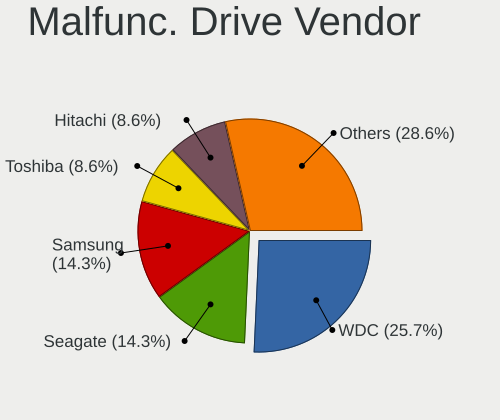

| Vendor              | Desktops | Drives | Percent |
|---------------------|----------|--------|---------|
| WDC                 | 9        | 12     | 25.71%  |
| Seagate             | 5        | 6      | 14.29%  |
| Samsung Electronics | 5        | 7      | 14.29%  |
| Toshiba             | 3        | 3      | 8.57%   |
| Hitachi             | 3        | 3      | 8.57%   |
| Crucial             | 3        | 4      | 8.57%   |
| Patriot             | 2        | 2      | 5.71%   |
| Maxtor              | 2        | 2      | 5.71%   |
| SHAREVDI            | 1        | 1      | 2.86%   |
| Kingston            | 1        | 1      | 2.86%   |
| A-DATA Technology   | 1        | 1      | 2.86%   |

Malfunc. HDD Vendor
-------------------

Vendors of faulty HDD drives

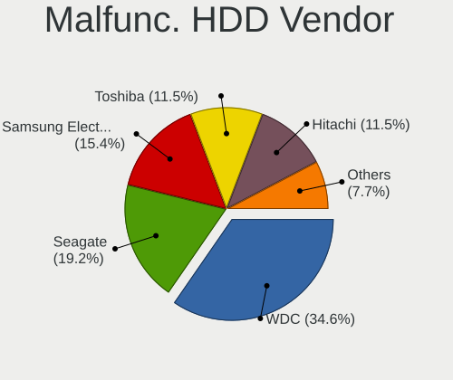

| Vendor              | Desktops | Drives | Percent |
|---------------------|----------|--------|---------|
| WDC                 | 9        | 12     | 34.62%  |
| Seagate             | 5        | 6      | 19.23%  |
| Samsung Electronics | 4        | 6      | 15.38%  |
| Toshiba             | 3        | 3      | 11.54%  |
| Hitachi             | 3        | 3      | 11.54%  |
| Maxtor              | 2        | 2      | 7.69%   |

Malfunc. Drive Kind
-------------------

Kinds of faulty drives

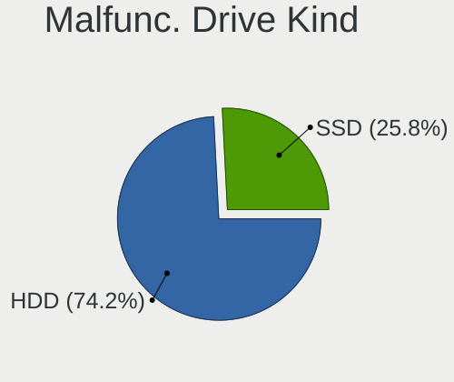

| Kind | Desktops | Drives | Percent |
|------|----------|--------|---------|
| HDD  | 23       | 32     | 74.19%  |
| SSD  | 8        | 10     | 25.81%  |

Failed Drives
-------------

Failed drive models

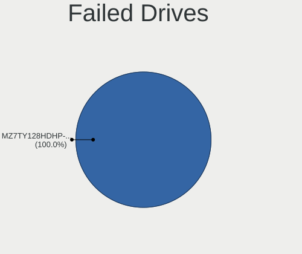

| Model                                            | Desktops | Drives | Percent |
|--------------------------------------------------|----------|--------|---------|
| Samsung Electronics MZ7TY128HDHP-000L1 128GB SSD | 1        | 1      | 100%    |

Failed Drive Vendor
-------------------

Failed drive vendors

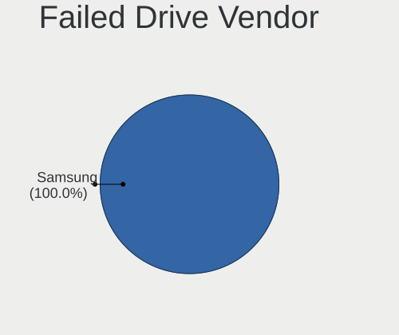

| Vendor              | Desktops | Drives | Percent |
|---------------------|----------|--------|---------|
| Samsung Electronics | 1        | 1      | 100%    |

Drive Status
------------

Number of failed and malfunc. drives

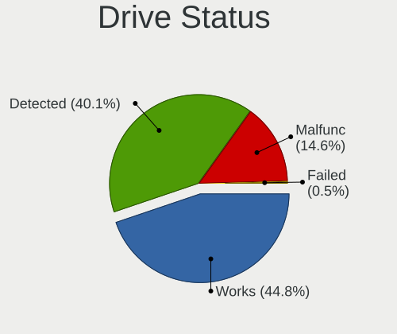

| Status   | Desktops | Drives | Percent |
|----------|----------|--------|---------|
| Works    | 95       | 234    | 44.81%  |
| Detected | 85       | 242    | 40.09%  |
| Malfunc  | 31       | 42     | 14.62%  |
| Failed   | 1        | 1      | 0.47%   |

Storage controller
------------------

Storage Vendor
--------------

Storage controller vendors

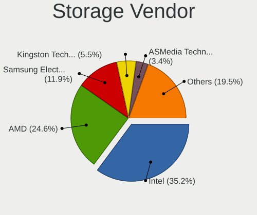

| Vendor                       | Desktops | Percent |
|------------------------------|----------|---------|
| Intel                        | 103      | 35.15%  |
| AMD                          | 72       | 24.57%  |
| Samsung Electronics          | 35       | 11.95%  |
| Kingston Technology Company  | 16       | 5.46%   |
| ASMedia Technology           | 10       | 3.41%   |
| ADATA Technology             | 10       | 3.41%   |
| SanDisk                      | 9        | 3.07%   |
| Marvell Technology Group     | 9        | 3.07%   |
| Nvidia                       | 5        | 1.71%   |
| Phison Electronics           | 4        | 1.37%   |
| Silicon Motion               | 3        | 1.02%   |
| VIA Technologies             | 2        | 0.68%   |
| Toshiba America Info Systems | 2        | 0.68%   |
| Micron/Crucial Technology    | 2        | 0.68%   |
| JMicron Technology           | 2        | 0.68%   |
| SK hynix                     | 1        | 0.34%   |
| Silicon Image                | 1        | 0.34%   |
| Shenzhen Longsys Electronics | 1        | 0.34%   |
| Seagate Technology           | 1        | 0.34%   |
| Micron Technology            | 1        | 0.34%   |
| MAXIO Technology (Hangzhou)  | 1        | 0.34%   |
| Lite-On IT Corp. / Plextor   | 1        | 0.34%   |
| KIOXIA                       | 1        | 0.34%   |
| Adaptec                      | 1        | 0.34%   |

Storage Model
-------------

Storage controller models

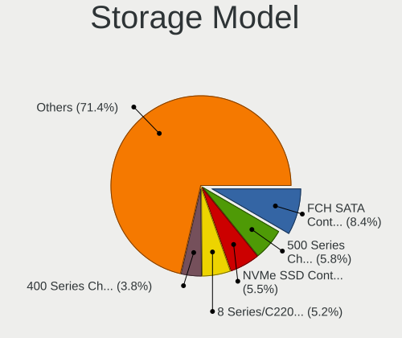

| Model                                                                          | Desktops | Percent |
|--------------------------------------------------------------------------------|----------|---------|
| AMD FCH SATA Controller [AHCI mode]                                            | 29       | 8.38%   |
| AMD 500 Series Chipset SATA Controller                                         | 20       | 5.78%   |
| Samsung NVMe SSD Controller SM981/PM981/PM983                                  | 19       | 5.49%   |
| Intel 8 Series/C220 Series Chipset Family 6-port SATA Controller 1 [AHCI mode] | 18       | 5.2%    |
| AMD 400 Series Chipset SATA Controller                                         | 13       | 3.76%   |
| ASMedia ASM1061/ASM1062 Serial ATA Controller                                  | 10       | 2.89%   |
| Intel 7 Series/C210 Series Chipset Family 6-port SATA Controller [AHCI mode]   | 9        | 2.6%    |
| Intel 6 Series/C200 Series Chipset Family 6 port Desktop SATA AHCI Controller  | 9        | 2.6%    |
| Intel Cannon Lake PCH SATA AHCI Controller                                     | 8        | 2.31%   |
| AMD 600 Series Chipset SATA Controller                                         | 8        | 2.31%   |
| Samsung NVMe SSD Controller S4LV008[Pascal]                                    | 7        | 2.02%   |
| Samsung NVMe SSD Controller PM9A1/PM9A3/980PRO                                 | 7        | 2.02%   |
| Intel 200 Series PCH SATA controller [AHCI mode]                               | 7        | 2.02%   |
| AMD SB7x0/SB8x0/SB9x0 SATA Controller [AHCI mode]                              | 7        | 2.02%   |
| AMD SB7x0/SB8x0/SB9x0 IDE Controller                                           | 7        | 2.02%   |
| ADATA XPG SX8200 Pro PCIe Gen3x4 M.2 2280 Solid State Drive                    | 7        | 2.02%   |
| Samsung NVMe SSD Controller SM961/PM961/SM963                                  | 6        | 1.73%   |
| Kingston Company KC3000/FURY Renegade NVMe SSD [E18]                           | 5        | 1.45%   |
| Intel Q170/Q150/B150/H170/H110/Z170/CM236 Chipset SATA Controller [AHCI Mode]  | 5        | 1.45%   |
| Intel NM10/ICH7 Family SATA Controller [IDE mode]                              | 5        | 1.45%   |
| Intel Alder Lake-S PCH SATA Controller [AHCI Mode]                             | 5        | 1.45%   |
| Intel 82801G (ICH7 Family) IDE Controller                                      | 5        | 1.45%   |
| Marvell Group 88SE9172 SATA 6Gb/s Controller                                   | 4        | 1.16%   |
| Intel Comet Lake SATA AHCI Controller                                          | 4        | 1.16%   |
| SanDisk Ultra 3D / WD PC SN530, IX SN530, Blue SN550 NVMe SSD (DRAM-less)      | 3        | 0.87%   |
| Samsung NVMe SSD Controller PM9C1a (DRAM-less)                                 | 3        | 0.87%   |
| Samsung NVMe SSD Controller 980 (DRAM-less)                                    | 3        | 0.87%   |
| Kingston Company A2000 NVMe SSD [SM2263EN]                                     | 3        | 0.87%   |
| Kingston Company A1000/U-SNS8154P3 x2 NVMe SSD [E8]                            | 3        | 0.87%   |
| Intel Raptor Lake SATA AHCI Controller                                         | 3        | 0.87%   |
| Intel 5 Series/3400 Series Chipset 6 port SATA AHCI Controller                 | 3        | 0.87%   |
| AMD SB7x0/SB8x0/SB9x0 SATA Controller [IDE mode]                               | 3        | 0.87%   |
| VIA VT6415 PATA IDE Host Controller                                            | 2        | 0.58%   |
| Silicon Motion SM2262/SM2262EN SSD Controller                                  | 2        | 0.58%   |
| SanDisk Ultra 3D / WD Blue SN570 NVMe SSD (DRAM-less)                          | 2        | 0.58%   |
| Phison E16 PCIe4 NVMe Controller                                               | 2        | 0.58%   |
| Nvidia CK804 Serial ATA Controller                                             | 2        | 0.58%   |
| Nvidia CK804 IDE                                                               | 2        | 0.58%   |
| Kingston Company NV2 NVMe SSD [SM2267XT] (DRAM-less)                           | 2        | 0.58%   |
| JMicron JMB363 SATA/IDE Controller                                             | 2        | 0.58%   |

Storage Kind
------------

Kind of storage controller (IDE, SATA, NVMe, SAS, ...)

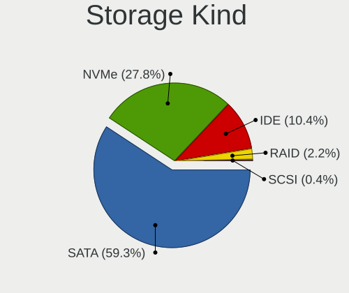

| Kind | Desktops | Percent |
|------|----------|---------|
| SATA | 160      | 59.26%  |
| NVMe | 75       | 27.78%  |
| IDE  | 28       | 10.37%  |
| RAID | 6        | 2.22%   |
| SCSI | 1        | 0.37%   |

Processor
---------

CPU Vendor
----------

Processor vendors

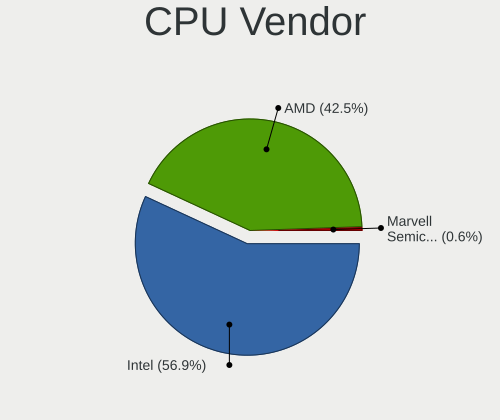

| Vendor                | Desktops | Percent |
|-----------------------|----------|---------|
| Intel                 | 103      | 56.91%  |
| AMD                   | 77       | 42.54%  |
| Marvell Semiconductor | 1        | 0.55%   |

CPU Model
---------

Processor models

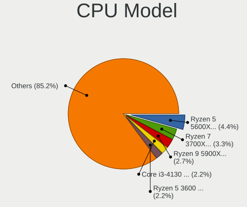

| Model                                                               | Desktops | Percent |
|---------------------------------------------------------------------|----------|---------|
| AMD Ryzen 5 5600X 6-Core Processor                                  | 8        | 4.4%    |
| AMD Ryzen 7 3700X 8-Core Processor                                  | 6        | 3.3%    |
| AMD Ryzen 9 5900X 12-Core Processor                                 | 5        | 2.75%   |
| Intel Core i3-4130 CPU @ 3.40GHz                                    | 4        | 2.2%    |
| AMD Ryzen 5 3600 6-Core Processor                                   | 4        | 2.2%    |
| Intel Core i7-4790 CPU @ 3.60GHz                                    | 3        | 1.65%   |
| Intel Core i5-6500 CPU @ 3.20GHz                                    | 3        | 1.65%   |
| Intel Core 2 Duo CPU E8400 @ 3.00GHz                                | 3        | 1.65%   |
| AMD Ryzen 9 3900X 12-Core Processor                                 | 3        | 1.65%   |
| AMD Ryzen 7 5800X3D 8-Core Processor                                | 3        | 1.65%   |
| AMD FX-8350 Eight-Core Processor                                    | 3        | 1.65%   |
| Intel Core i7-7700 CPU @ 3.60GHz                                    | 2        | 1.1%    |
| Intel Core i7-4770 CPU @ 3.40GHz                                    | 2        | 1.1%    |
| Intel Core i5-9600K CPU @ 3.70GHz                                   | 2        | 1.1%    |
| Intel Core i5-4690K CPU @ 3.50GHz                                   | 2        | 1.1%    |
| Intel Core i5-4590 CPU @ 3.30GHz                                    | 2        | 1.1%    |
| Intel Core i5-4460 CPU @ 3.20GHz                                    | 2        | 1.1%    |
| Intel Core i5-3470 CPU @ 3.20GHz                                    | 2        | 1.1%    |
| Intel Core i5-2500 CPU @ 3.30GHz                                    | 2        | 1.1%    |
| Intel Core i5-2400 CPU @ 3.10GHz                                    | 2        | 1.1%    |
| Intel Core i5-10600K CPU @ 4.10GHz                                  | 2        | 1.1%    |
| Intel Core i3-3220 CPU @ 3.30GHz                                    | 2        | 1.1%    |
| Intel Core i3-3217U CPU @ 1.80GHz                                   | 2        | 1.1%    |
| Intel 13th Gen Core i7-13700K                                       | 2        | 1.1%    |
| AMD Ryzen 9 7950X 16-Core Processor                                 | 2        | 1.1%    |
| AMD Ryzen 7 PRO 4750G with Radeon Graphics                          | 2        | 1.1%    |
| AMD Ryzen 7 5800X 8-Core Processor                                  | 2        | 1.1%    |
| AMD Ryzen 7 3800X 8-Core Processor                                  | 2        | 1.1%    |
| AMD Ryzen 5 7600X 6-Core Processor                                  | 2        | 1.1%    |
| AMD Ryzen 5 5500                                                    | 2        | 1.1%    |
| AMD Athlon 64 X2 Dual Core Processor 3800+                          | 2        | 1.1%    |
| Marvell Semiconductor Marvell Armada 370/XP (Device Tree) Processor | 1        | 0.55%   |
| Intel Xeon CPU E5620 @ 2.40GHz                                      | 1        | 0.55%   |
| Intel Xeon CPU E5-2689 0 @ 2.60GHz                                  | 1        | 0.55%   |
| Intel Xeon CPU E5-2650 v4 @ 2.20GHz                                 | 1        | 0.55%   |
| Intel Xeon CPU E3-1245 v3 @ 3.40GHz                                 | 1        | 0.55%   |
| Intel Xeon CPU E3-1241 v3 @ 3.50GHz                                 | 1        | 0.55%   |
| Intel Pentium Gold G5400 CPU @ 3.70GHz                              | 1        | 0.55%   |
| Intel Pentium Dual-Core CPU E5300 @ 2.60GHz                         | 1        | 0.55%   |
| Intel Pentium D CPU 2.80GHz                                         | 1        | 0.55%   |

CPU Model Family
----------------

Processor model prefix

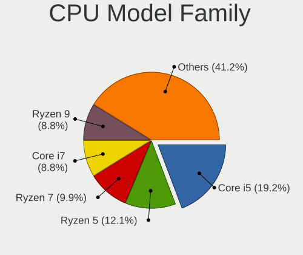

| Model                   | Desktops | Percent |
|-------------------------|----------|---------|
| Intel Core i5           | 35       | 19.23%  |
| AMD Ryzen 5             | 22       | 12.09%  |
| AMD Ryzen 7             | 18       | 9.89%   |
| Intel Core i7           | 16       | 8.79%   |
| AMD Ryzen 9             | 16       | 8.79%   |
| Intel Core i3           | 14       | 7.69%   |
| Other                   | 11       | 6.04%   |
| Intel Celeron           | 7        | 3.85%   |
| AMD FX                  | 6        | 3.3%    |
| Intel Xeon              | 5        | 2.75%   |
| Intel Core 2 Duo        | 5        | 2.75%   |
| Intel Pentium           | 4        | 2.2%    |
| AMD Phenom II X4        | 4        | 2.2%    |
| AMD Athlon 64 X2        | 3        | 1.65%   |
| Intel Core i9           | 2        | 1.1%    |
| AMD Ryzen 7 PRO         | 2        | 1.1%    |
| AMD A10                 | 2        | 1.1%    |
| Intel Pentium Gold      | 1        | 0.55%   |
| Intel Pentium Dual-Core | 1        | 0.55%   |
| Intel Pentium D         | 1        | 0.55%   |
| Intel Pentium 4         | 1        | 0.55%   |
| Intel Genuine           | 1        | 0.55%   |
| AMD Ryzen 5 PRO         | 1        | 0.55%   |
| AMD Ryzen 3 PRO         | 1        | 0.55%   |
| AMD Phenom II X6        | 1        | 0.55%   |
| AMD Athlon XP           | 1        | 0.55%   |
| AMD A6                  | 1        | 0.55%   |

CPU Cores
---------

Number of processor cores

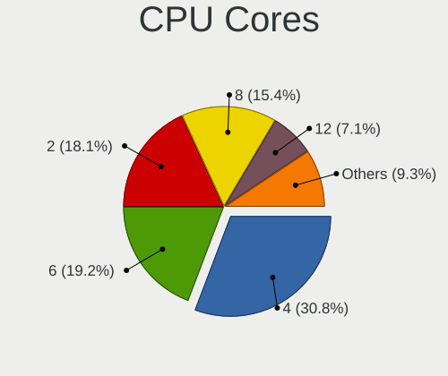

| Number  | Desktops | Percent |
|---------|----------|---------|
| 4       | 56       | 30.77%  |
| 6       | 35       | 19.23%  |
| 2       | 33       | 18.13%  |
| 8       | 28       | 15.38%  |
| 12      | 13       | 7.14%   |
| 16      | 8        | 4.4%    |
| 1       | 4        | 2.2%    |
| 14      | 2        | 1.1%    |
| 10      | 1        | 0.55%   |
| 3       | 1        | 0.55%   |
| Unknown | 1        | 0.55%   |

CPU Sockets
-----------

Number of sockets

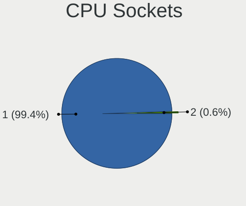

| Number | Desktops | Percent |
|--------|----------|---------|
| 1      | 180      | 99.45%  |
| 2      | 1        | 0.55%   |

CPU Threads
-----------

Threads per core (Hyper-Threading)

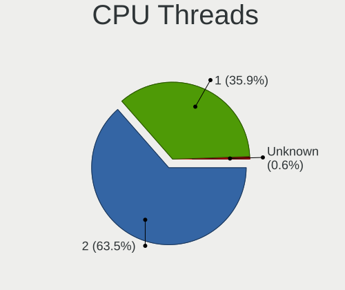

| Number  | Desktops | Percent |
|---------|----------|---------|
| 2       | 115      | 63.54%  |
| 1       | 65       | 35.91%  |
| Unknown | 1        | 0.55%   |

CPU Op-Modes
------------

CPU Operation Modes (32-bit, 64-bit)

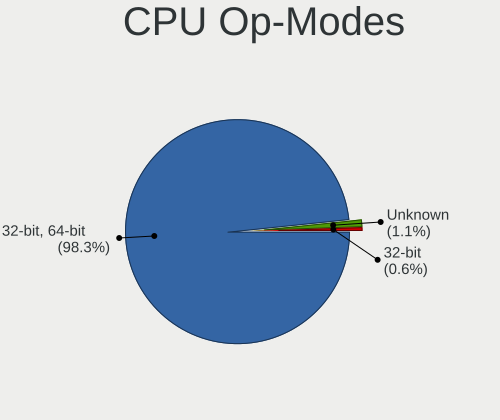

| Op mode        | Desktops | Percent |
|----------------|----------|---------|
| 32-bit, 64-bit | 178      | 98.34%  |
| Unknown        | 2        | 1.1%    |
| 32-bit         | 1        | 0.55%   |

CPU Microcode
-------------

Microcode number

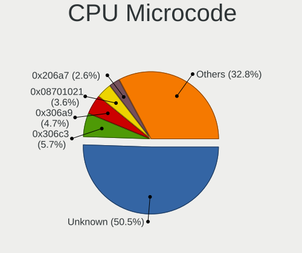

| Number     | Desktops | Percent |
|------------|----------|---------|
| Unknown    | 97       | 50.52%  |
| 0x306c3    | 11       | 5.73%   |
| 0x306a9    | 9        | 4.69%   |
| 0x08701021 | 7        | 3.65%   |
| 0x206a7    | 5        | 2.6%    |
| 0x08701013 | 5        | 2.6%    |
| 0x906ea    | 4        | 2.08%   |
| 0x906e9    | 4        | 2.08%   |
| 0x1067a    | 4        | 2.08%   |
| 0xa0655    | 3        | 1.56%   |
| 0x90672    | 3        | 1.56%   |
| 0x06000852 | 3        | 1.56%   |
| 0xa0671    | 2        | 1.04%   |
| 0x506e3    | 2        | 1.04%   |
| 0x20655    | 2        | 1.04%   |
| 0x0a601206 | 2        | 1.04%   |
| 0x08001138 | 2        | 1.04%   |
| 0x06003106 | 2        | 1.04%   |
| 0x010000db | 2        | 1.04%   |
| 0xf64      | 1        | 0.52%   |
| 0xf4a      | 1        | 0.52%   |
| 0xa0653    | 1        | 0.52%   |
| 0x906ed    | 1        | 0.52%   |
| 0x906eb    | 1        | 0.52%   |
| 0x6fd      | 1        | 0.52%   |
| 0x6fb      | 1        | 0.52%   |
| 0x50654    | 1        | 0.52%   |
| 0x406c3    | 1        | 0.52%   |
| 0x206d7    | 1        | 0.52%   |
| 0x20652    | 1        | 0.52%   |
| 0x10676    | 1        | 0.52%   |
| 0x10661    | 1        | 0.52%   |
| 0x0a601203 | 1        | 0.52%   |
| 0x0a201211 | 1        | 0.52%   |
| 0x0a201016 | 1        | 0.52%   |
| 0x0a201009 | 1        | 0.52%   |
| 0x08600106 | 1        | 0.52%   |
| 0x08600103 | 1        | 0.52%   |
| 0x08108109 | 1        | 0.52%   |
| 0x0810100b | 1        | 0.52%   |

CPU Microarch
-------------

Microarchitecture

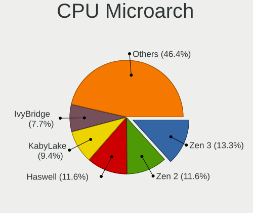

| Name             | Desktops | Percent |
|------------------|----------|---------|
| Zen 3            | 24       | 13.26%  |
| Zen 2            | 21       | 11.6%   |
| Haswell          | 21       | 11.6%   |
| KabyLake         | 17       | 9.39%   |
| IvyBridge        | 14       | 7.73%   |
| Unknown          | 13       | 7.18%   |
| SandyBridge      | 9        | 4.97%   |
| Skylake          | 6        | 3.31%   |
| Piledriver       | 6        | 3.31%   |
| CometLake        | 6        | 3.31%   |
| Alderlake Hybrid | 6        | 3.31%   |
| Westmere         | 5        | 2.76%   |
| Penryn           | 5        | 2.76%   |
| K10              | 5        | 2.76%   |
| Zen+             | 3        | 1.66%   |
| Zen              | 3        | 1.66%   |
| K8 Hammer        | 3        | 1.66%   |
| Core             | 3        | 1.66%   |
| Steamroller      | 2        | 1.1%    |
| NetBurst         | 2        | 1.1%    |
| Icelake          | 2        | 1.1%    |
| Silvermont       | 1        | 0.55%   |
| K6               | 1        | 0.55%   |
| K10 Llano        | 1        | 0.55%   |
| Goldmont plus    | 1        | 0.55%   |
| Broadwell        | 1        | 0.55%   |

Graphics
--------

GPU Vendor
----------

Vendors of graphics cards

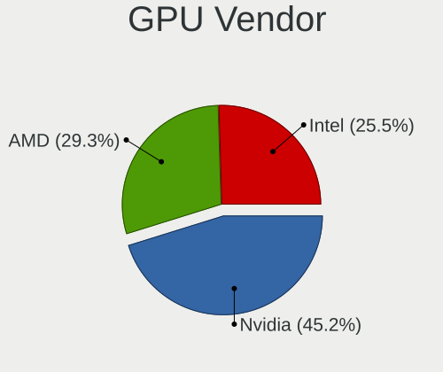

| Vendor | Desktops | Percent |
|--------|----------|---------|
| Nvidia | 94       | 45.19%  |
| AMD    | 61       | 29.33%  |
| Intel  | 53       | 25.48%  |

GPU Model
---------

Graphics card models

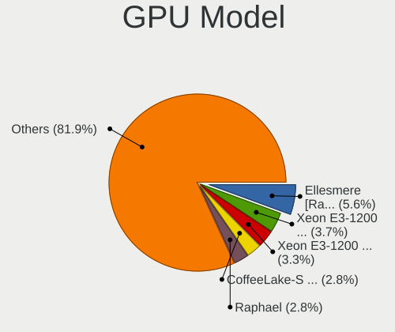

| Model                                                                       | Desktops | Percent |
|-----------------------------------------------------------------------------|----------|---------|
| AMD Ellesmere [Radeon RX 470/480/570/570X/580/580X/590]                     | 12       | 5.58%   |
| Intel Xeon E3-1200 v3/4th Gen Core Processor Integrated Graphics Controller | 8        | 3.72%   |
| Intel Xeon E3-1200 v2/3rd Gen Core processor Graphics Controller            | 7        | 3.26%   |
| Intel CoffeeLake-S GT2 [UHD Graphics 630]                                   | 6        | 2.79%   |
| AMD Raphael                                                                 | 6        | 2.79%   |
| Nvidia GP107 [GeForce GTX 1050 Ti]                                          | 5        | 2.33%   |
| Nvidia GP104 [GeForce GTX 1070]                                             | 5        | 2.33%   |
| AMD Navi 31 [Radeon RX 7900 XT/7900 XTX/7900 GRE/7900M]                     | 5        | 2.33%   |
| Nvidia GP102 [GeForce GTX 1080 Ti]                                          | 4        | 1.86%   |
| AMD Navi 22 [Radeon RX 6700/6700 XT/6750 XT / 6800M/6850M XT]               | 4        | 1.86%   |
| Nvidia TU116 [GeForce GTX 1660]                                             | 3        | 1.4%    |
| Nvidia TU106 [GeForce RTX 2070]                                             | 3        | 1.4%    |
| Nvidia GP108 [GeForce GT 1030]                                              | 3        | 1.4%    |
| Nvidia GM204 [GeForce GTX 970]                                              | 3        | 1.4%    |
| Nvidia GK208B [GeForce GT 710]                                              | 3        | 1.4%    |
| Nvidia GA104 [GeForce RTX 3060 Ti Lite Hash Rate]                           | 3        | 1.4%    |
| Intel Raptor Lake-S GT1 [UHD Graphics 770]                                  | 3        | 1.4%    |
| Intel Core Processor Integrated Graphics Controller                         | 3        | 1.4%    |
| Intel 4th Generation Core Processor Family Integrated Graphics Controller   | 3        | 1.4%    |
| Intel 4 Series Chipset Integrated Graphics Controller                       | 3        | 1.4%    |
| AMD Renoir [Radeon Vega Series / Radeon Vega Mobile Series]                 | 3        | 1.4%    |
| AMD Navi 32 [Radeon RX 7700 XT / 7800 XT]                                   | 3        | 1.4%    |
| Nvidia TU116 [GeForce GTX 1660 Ti]                                          | 2        | 0.93%   |
| Nvidia TU106 [GeForce RTX 2060 SUPER]                                       | 2        | 0.93%   |
| Nvidia TU104 [GeForce RTX 2070 SUPER]                                       | 2        | 0.93%   |
| Nvidia GT218 [GeForce 210]                                                  | 2        | 0.93%   |
| Nvidia GP106 [GeForce GTX 1060 6GB]                                         | 2        | 0.93%   |
| Nvidia GP104 [GeForce GTX 1070 Ti]                                          | 2        | 0.93%   |
| Nvidia GM107 [GeForce GTX 750 Ti]                                           | 2        | 0.93%   |
| Nvidia GK104 [GeForce GTX 760]                                              | 2        | 0.93%   |
| Nvidia GB206 [GeForce RTX 5060]                                             | 2        | 0.93%   |
| Nvidia GA104 [GeForce RTX 3070]                                             | 2        | 0.93%   |
| Nvidia GA104 [GeForce RTX 3070 Lite Hash Rate]                              | 2        | 0.93%   |
| Nvidia GA104 [GeForce RTX 3060]                                             | 2        | 0.93%   |
| Nvidia GA102 [GeForce RTX 3080 Lite Hash Rate]                              | 2        | 0.93%   |
| Nvidia AD102 [GeForce RTX 4090]                                             | 2        | 0.93%   |
| Intel Skylake-S GT2 [HD Graphics 530]                                       | 2        | 0.93%   |
| Intel Kaby Lake-S GT2 [HD Graphics 630]                                     | 2        | 0.93%   |
| Intel 82945G/GZ Integrated Graphics Controller                              | 2        | 0.93%   |
| Intel 3rd Gen Core processor Graphics Controller                            | 2        | 0.93%   |

GPU Combo
---------

Combinations of graphics cards

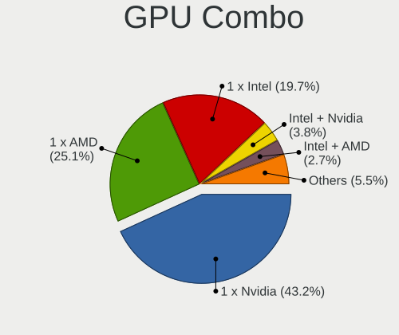

| Name           | Desktops | Percent |
|----------------|----------|---------|
| 1 x Nvidia     | 79       | 43.17%  |
| 1 x AMD        | 46       | 25.14%  |
| 1 x Intel      | 36       | 19.67%  |
| Intel + Nvidia | 7        | 3.83%   |
| Intel + AMD    | 5        | 2.73%   |
| AMD + Nvidia   | 5        | 2.73%   |
| 2 x AMD        | 4        | 2.19%   |
| Other          | 1        | 0.55%   |

GPU Driver
----------

Free vs proprietary

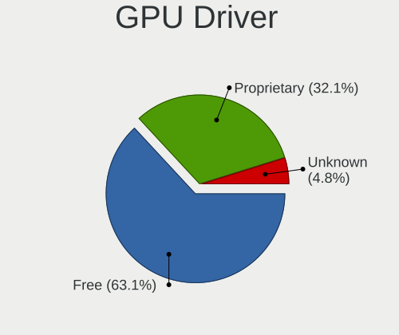

| Driver      | Desktops | Percent |
|-------------|----------|---------|
| Free        | 118      | 63.1%   |
| Proprietary | 60       | 32.09%  |
| Unknown     | 9        | 4.81%   |

GPU Memory
----------

Total video memory

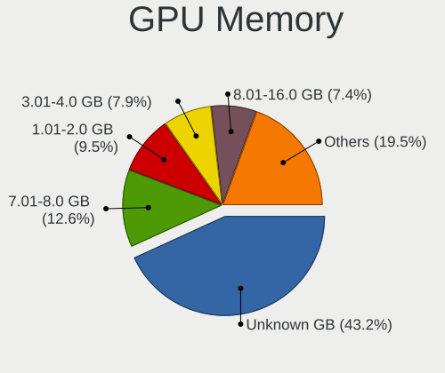

| Size in GB | Desktops | Percent |
|------------|----------|---------|
| Unknown    | 82       | 43.16%  |
| 7.01-8.0   | 24       | 12.63%  |
| 1.01-2.0   | 18       | 9.47%   |
| 3.01-4.0   | 15       | 7.89%   |
| 8.01-16.0  | 14       | 7.37%   |
| 0.51-1.0   | 11       | 5.79%   |
| 0.01-0.5   | 11       | 5.79%   |
| 16.01-24.0 | 7        | 3.68%   |
| 5.01-6.0   | 6        | 3.16%   |
| 4.01-5.0   | 1        | 0.53%   |
| 2.01-3.0   | 1        | 0.53%   |

Monitor
-------

Monitor Vendor
--------------

Monitor vendors

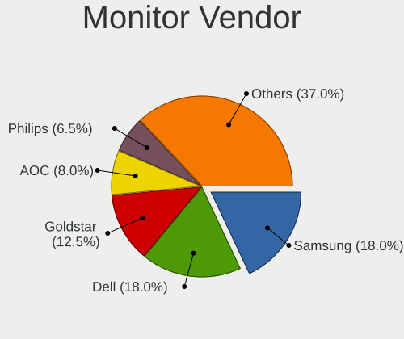

| Vendor               | Desktops | Percent |
|----------------------|----------|---------|
| Samsung Electronics  | 36       | 18%     |
| Dell                 | 36       | 18%     |
| Goldstar             | 25       | 12.5%   |
| AOC                  | 16       | 8%      |
| Philips              | 13       | 6.5%    |
| Hewlett-Packard      | 12       | 6%      |
| ViewSonic            | 9        | 4.5%    |
| BenQ                 | 9        | 4.5%    |
| Hitachi              | 5        | 2.5%    |
| ASUSTek Computer     | 5        | 2.5%    |
| Ancor Communications | 5        | 2.5%    |
| Gigabyte Technology  | 4        | 2%      |
| Lenovo               | 3        | 1.5%    |
| Acer                 | 3        | 1.5%    |
| Unknown              | 2        | 1%      |
| RoverScan            | 2        | 1%      |
| MSI                  | 2        | 1%      |
| LG Electronics       | 2        | 1%      |
| Tech Concepts        | 1        | 0.5%    |
| TCL                  | 1        | 0.5%    |
| Sony                 | 1        | 0.5%    |
| Plain Tree Systems   | 1        | 0.5%    |
| Lenovo Group Limited | 1        | 0.5%    |
| Huion                | 1        | 0.5%    |
| Hisense              | 1        | 0.5%    |
| Fujitsu Siemens      | 1        | 0.5%    |
| Eizo                 | 1        | 0.5%    |
| Belinea              | 1        | 0.5%    |
| Unknown              | 1        | 0.5%    |

Monitor Model
-------------

Monitor models

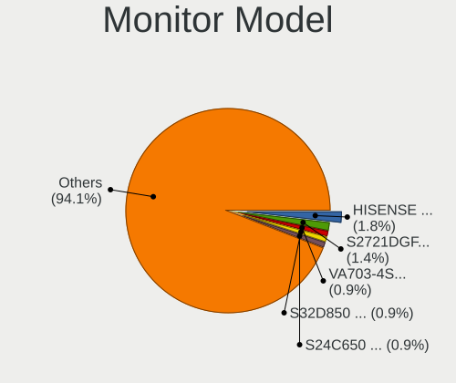

| Model                                                                | Desktops | Percent |
|----------------------------------------------------------------------|----------|---------|
| Hitachi HISENSE HEC0030 3840x2160 1872x1053mm 84.6-inch              | 4        | 1.81%   |
| Dell S2721DGF DEL41D9 2560x1440 597x336mm 27.0-inch                  | 3        | 1.36%   |
| ViewSonic VA703-4Series VSC6A1E 1280x1024 341x274mm 17.2-inch        | 2        | 0.9%    |
| Samsung Electronics S32D850 SAM0BCB 2560x1440 710x400mm 32.1-inch    | 2        | 0.9%    |
| Samsung Electronics S24C650 SAM0B18 1920x1200 518x324mm 24.1-inch    | 2        | 0.9%    |
| Hewlett-Packard ZR24w HWP2869 1920x1200 518x324mm 24.1-inch          | 2        | 0.9%    |
| Hewlett-Packard 27er HWP3325 1920x1080 598x336mm 27.0-inch           | 2        | 0.9%    |
| Goldstar W2243 GSM56FE 1920x1080 477x269mm 21.6-inch                 | 2        | 0.9%    |
| Goldstar MP59G GSM5B34 1920x1080 480x270mm 21.7-inch                 | 2        | 0.9%    |
| Goldstar FULL HD GSM5B55 1920x1080 480x270mm 21.7-inch               | 2        | 0.9%    |
| Goldstar 27GL850 GSM5B80 2560x1440 697x392mm 31.5-inch               | 2        | 0.9%    |
| Dell U2719D DEL415A 2560x1440 597x336mm 27.0-inch                    | 2        | 0.9%    |
| Dell U2518D DEL413A 2560x1440 553x311mm 25.0-inch                    | 2        | 0.9%    |
| Dell U2312HM DEL4073 1920x1080 510x287mm 23.0-inch                   | 2        | 0.9%    |
| Dell P2314H DEL4098 1920x1080 510x290mm 23.1-inch                    | 2        | 0.9%    |
| AOC Q3279WG5B AOC3279 2560x1440 725x428mm 33.1-inch                  | 2        | 0.9%    |
| AOC G2460 AOC2460 1920x1080 531x299mm 24.0-inch                      | 2        | 0.9%    |
| AOC 24G2W1G3 AOC2402 1920x1080 527x296mm 23.8-inch                   | 2        | 0.9%    |
| ViewSonic XG2405 VSC0D39 1920x1080 527x296mm 23.8-inch               | 1        | 0.45%   |
| ViewSonic VX2210 SERIES VSC172B 1920x1080 476x268mm 21.5-inch        | 1        | 0.45%   |
| ViewSonic VP920 Series VSCB01C 1280x1024 376x301mm 19.0-inch         | 1        | 0.45%   |
| ViewSonic VG2428wm VSCA426 1920x1080 520x290mm 23.4-inch             | 1        | 0.45%   |
| ViewSonic VG170m VSCBF0C 1280x1024 338x270mm 17.0-inch               | 1        | 0.45%   |
| ViewSonic VE902m VSC491B 1280x1024 376x301mm 19.0-inch               | 1        | 0.45%   |
| ViewSonic VA2445 SERIES VSC712E 1920x1080 521x293mm 23.5-inch        | 1        | 0.45%   |
| Unknown LCD Monitor SAMSUNG 1920x1080                                | 1        | 0.45%   |
| Unknown LCD Monitor GBT G34WQC 3440x1440                             | 1        | 0.45%   |
| Tech Concepts LCD Monitor MT5531 1920x1080                           | 1        | 0.45%   |
| TCL 25G64 TCL1003 1920x1080 540x310mm 24.5-inch                      | 1        | 0.45%   |
| Sony TV *30 SNY7105 3840x2160 1218x685mm 55.0-inch                   | 1        | 0.45%   |
| Samsung Electronics U32H85x SAM0E3C 3840x2160 697x392mm 31.5-inch    | 1        | 0.45%   |
| Samsung Electronics U28H75x SAM0E00 3840x2160 607x345mm 27.5-inch    | 1        | 0.45%   |
| Samsung Electronics U28H75x SAM0DFF 3840x2160 608x345mm 27.5-inch    | 1        | 0.45%   |
| Samsung Electronics U28E590 SAM0C4D 3840x2160 607x345mm 27.5-inch    | 1        | 0.45%   |
| Samsung Electronics TV SAM0289 1280x720                              | 1        | 0.45%   |
| Samsung Electronics T22E390 SAM0C1E 1920x1080 477x268mm 21.5-inch    | 1        | 0.45%   |
| Samsung Electronics SyncMaster SAM0587 1920x1200 518x324mm 24.1-inch | 1        | 0.45%   |
| Samsung Electronics SyncMaster SAM03C2 1680x1050 459x296mm 21.5-inch | 1        | 0.45%   |
| Samsung Electronics SyncMaster SAM036F 1440x900 428x255mm 19.6-inch  | 1        | 0.45%   |
| Samsung Electronics SyncMaster SAM027D 1680x1050 433x271mm 20.1-inch | 1        | 0.45%   |

Monitor Resolution
------------------

Monitor screen resolution

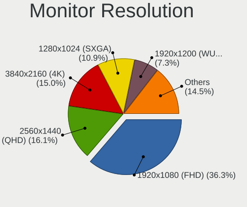

| Resolution         | Desktops | Percent |
|--------------------|----------|---------|
| 1920x1080 (FHD)    | 70       | 36.27%  |
| 2560x1440 (QHD)    | 31       | 16.06%  |
| 3840x2160 (4K)     | 29       | 15.03%  |
| 1280x1024 (SXGA)   | 21       | 10.88%  |
| 1920x1200 (WUXGA)  | 14       | 7.25%   |
| 3440x1440          | 10       | 5.18%   |
| 1680x1050 (WSXGA+) | 4        | 2.07%   |
| 1440x900 (WXGA+)   | 4        | 2.07%   |
| 1600x900 (HD+)     | 3        | 1.55%   |
| 3840x1600          | 2        | 1.04%   |
| 1366x768 (WXGA)    | 2        | 1.04%   |
| 2560x1080          | 1        | 0.52%   |
| 1920x540           | 1        | 0.52%   |
| 1360x768           | 1        | 0.52%   |

Monitor Diagonal
----------------

Diagonal size in inches

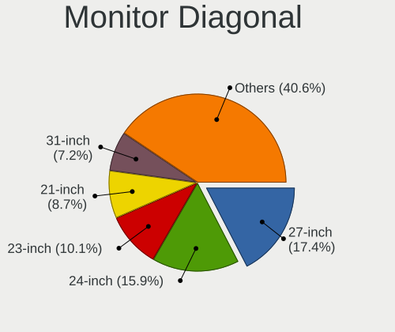

| Inches  | Desktops | Percent |
|---------|----------|---------|
| 27      | 36       | 17.39%  |
| 24      | 33       | 15.94%  |
| 23      | 21       | 10.14%  |
| 21      | 18       | 8.7%    |
| 31      | 15       | 7.25%   |
| Unknown | 14       | 6.76%   |
| 17      | 13       | 6.28%   |
| 19      | 11       | 5.31%   |
| 34      | 7        | 3.38%   |
| 84      | 5        | 2.42%   |
| 32      | 5        | 2.42%   |
| 20      | 5        | 2.42%   |
| 25      | 4        | 1.93%   |
| 40      | 3        | 1.45%   |
| 18      | 3        | 1.45%   |
| 37      | 2        | 0.97%   |
| 33      | 2        | 0.97%   |
| 28      | 2        | 0.97%   |
| 75      | 1        | 0.48%   |
| 65      | 1        | 0.48%   |
| 54      | 1        | 0.48%   |
| 48      | 1        | 0.48%   |
| 43      | 1        | 0.48%   |
| 35      | 1        | 0.48%   |
| 16      | 1        | 0.48%   |
| 15      | 1        | 0.48%   |

Monitor Width
-------------

Physical width

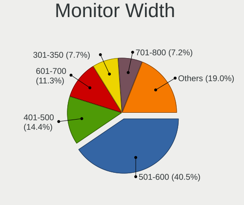

| Width in mm | Desktops | Percent |
|-------------|----------|---------|
| 501-600     | 79       | 40.51%  |
| 401-500     | 28       | 14.36%  |
| 601-700     | 22       | 11.28%  |
| 301-350     | 15       | 7.69%   |
| 701-800     | 14       | 7.18%   |
| Unknown     | 14       | 7.18%   |
| 351-400     | 7        | 3.59%   |
| 801-900     | 6        | 3.08%   |
| 1501-2000   | 6        | 3.08%   |
| 1001-1500   | 3        | 1.54%   |
| 901-1000    | 1        | 0.51%   |

Aspect Ratio
------------

Proportional relationship between the width and the height

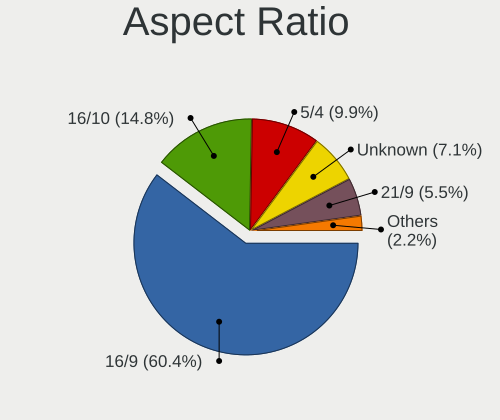

| Ratio   | Desktops | Percent |
|---------|----------|---------|
| 16/9    | 110      | 60.44%  |
| 16/10   | 27       | 14.84%  |
| 5/4     | 18       | 9.89%   |
| Unknown | 13       | 7.14%   |
| 21/9    | 10       | 5.49%   |
| 6/5     | 2        | 1.1%    |
| 4/3     | 1        | 0.55%   |
| 32/9    | 1        | 0.55%   |

Monitor Area
------------

Area in inch²

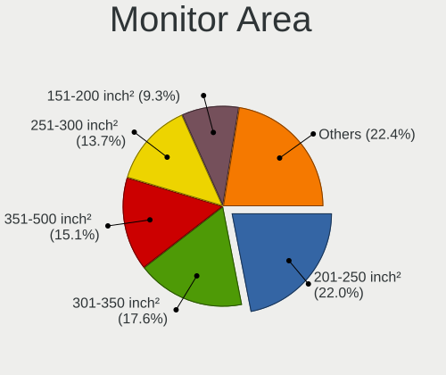

| Area in inch² | Desktops | Percent |
|----------------|----------|---------|
| 201-250        | 45       | 21.95%  |
| 301-350        | 36       | 17.56%  |
| 351-500        | 31       | 15.12%  |
| 251-300        | 28       | 13.66%  |
| 151-200        | 19       | 9.27%   |
| 141-150        | 15       | 7.32%   |
| Unknown        | 14       | 6.83%   |
| More than 1000 | 9        | 4.39%   |
| 501-1000       | 6        | 2.93%   |
| 111-120        | 1        | 0.49%   |
| 101-110        | 1        | 0.49%   |

Pixel Density
-------------

Pixels per inch

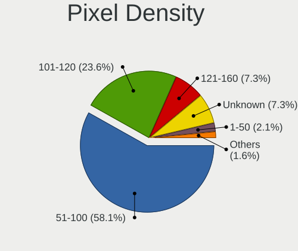

| Density | Desktops | Percent |
|---------|----------|---------|
| 51-100  | 111      | 58.12%  |
| 101-120 | 45       | 23.56%  |
| 121-160 | 14       | 7.33%   |
| Unknown | 14       | 7.33%   |
| 1-50    | 4        | 2.09%   |
| 161-240 | 3        | 1.57%   |

Multiple Monitors
-----------------

Total monitors connected

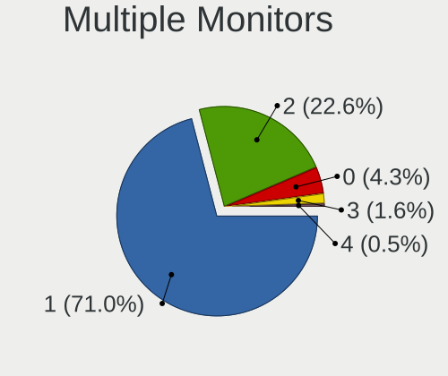

| Total | Desktops | Percent |
|-------|----------|---------|
| 1     | 132      | 70.97%  |
| 2     | 42       | 22.58%  |
| 0     | 8        | 4.3%    |
| 3     | 3        | 1.61%   |
| 4     | 1        | 0.54%   |

Network
-------

Net Controller Vendor
---------------------

Controller vendors

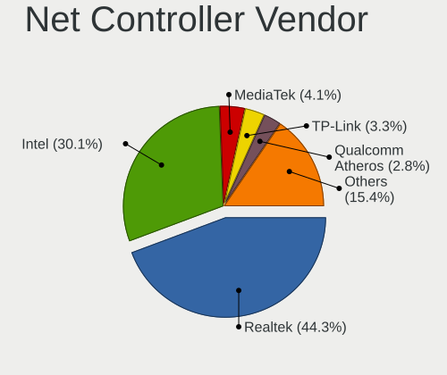

| Vendor                          | Desktops | Percent |
|---------------------------------|----------|---------|
| Realtek Semiconductor           | 109      | 44.31%  |
| Intel                           | 74       | 30.08%  |
| MediaTek                        | 10       | 4.07%   |
| TP-Link                         | 8        | 3.25%   |
| Qualcomm Atheros                | 7        | 2.85%   |
| Ralink Technology               | 6        | 2.44%   |
| Nvidia                          | 5        | 2.03%   |
| Ralink                          | 3        | 1.22%   |
| Microsoft                       | 3        | 1.22%   |
| Broadcom                        | 3        | 1.22%   |
| Samsung Electronics             | 2        | 0.81%   |
| Marvell Technology Group        | 2        | 0.81%   |
| D-Link System                   | 2        | 0.81%   |
| Broadcom Limited                | 2        | 0.81%   |
| Xiaomi                          | 1        | 0.41%   |
| STMicroelectronics              | 1        | 0.41%   |
| Qualcomm Atheros Communications | 1        | 0.41%   |
| QinHeng Electronics             | 1        | 0.41%   |
| Google                          | 1        | 0.41%   |
| Espressif                       | 1        | 0.41%   |
| D-Link                          | 1        | 0.41%   |
| Belkin Components               | 1        | 0.41%   |
| Aquantia                        | 1        | 0.41%   |
| Apple                           | 1        | 0.41%   |

Net Controller Model
--------------------

Controller models

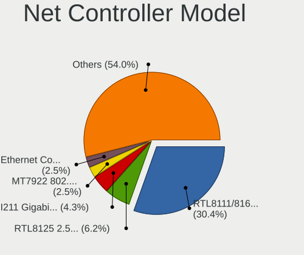

| Model                                                                  | Desktops | Percent |
|------------------------------------------------------------------------|----------|---------|
| Realtek RTL8111/8168/8211/8411 PCI Express Gigabit Ethernet Controller | 84       | 30.43%  |
| Realtek RTL8125 2.5GbE Controller                                      | 17       | 6.16%   |
| Intel I211 Gigabit Network Connection                                  | 12       | 4.35%   |
| MediaTek MT7922 802.11ax PCI Express Wireless Network Adapter          | 7        | 2.54%   |
| Intel Ethernet Controller I225-V                                       | 7        | 2.54%   |
| Intel Wi-Fi 6 AX200                                                    | 6        | 2.17%   |
| Intel Ethernet Connection (7) I219-V                                   | 6        | 2.17%   |
| Intel 82579V Gigabit Network Connection                                | 5        | 1.81%   |
| Realtek RTL8188EUS 802.11n Wireless Network Adapter                    | 4        | 1.45%   |
| Realtek RTL8153 Gigabit Ethernet Adapter                               | 4        | 1.45%   |
| Intel Ethernet Connection I217-LM                                      | 4        | 1.45%   |
| Intel Ethernet Connection (2) I219-V                                   | 4        | 1.45%   |
| Realtek RTL8821CE 802.11ac PCIe Wireless Network Adapter               | 3        | 1.09%   |
| Ralink RT5370 Wireless Adapter                                         | 3        | 1.09%   |
| Intel Wi-Fi 6E(802.11ax) AX210/AX1675* 2x2 [Typhoon Peak]              | 3        | 1.09%   |
| Intel Ethernet Connection I217-V                                       | 3        | 1.09%   |
| Intel Ethernet Connection (2) I219-LM                                  | 3        | 1.09%   |
| Intel 82579LM Gigabit Network Connection (Lewisville)                  | 3        | 1.09%   |
| TP-Link Archer T4U ver.3                                               | 2        | 0.72%   |
| TP-Link Archer T4U v2 [Realtek RTL8812AU]                              | 2        | 0.72%   |
| Samsung GT-I9070 (network tethering, USB debugging enabled)            | 2        | 0.72%   |
| Realtek RTL8821AE 802.11ac PCIe Wireless Network Adapter               | 2        | 0.72%   |
| Realtek RTL8812AE 802.11ac PCIe Wireless Network Adapter               | 2        | 0.72%   |
| Realtek RTL810xE PCI Express Fast Ethernet controller                  | 2        | 0.72%   |
| Ralink MT7601U Wireless Adapter                                        | 2        | 0.72%   |
| Ralink RT2500 Wireless 802.11bg                                        | 2        | 0.72%   |
| Qualcomm Atheros AR8151 v2.0 Gigabit Ethernet                          | 2        | 0.72%   |
| Nvidia CK804 Ethernet Controller                                       | 2        | 0.72%   |
| Microsoft Xbox 360 Wireless Adapter                                    | 2        | 0.72%   |
| Intel Ethernet Connection (2) I218-V                                   | 2        | 0.72%   |
| Intel Dual Band Wireless-AC 3168NGW [Stone Peak]                       | 2        | 0.72%   |
| Intel Comet Lake PCH CNVi WiFi                                         | 2        | 0.72%   |
| Intel Alder Lake-S PCH CNVi WiFi                                       | 2        | 0.72%   |
| Intel 82578DM Gigabit Network Connection                               | 2        | 0.72%   |
| Intel 82567LM-3 Gigabit Network Connection                             | 2        | 0.72%   |
| Intel 700 Series Chipset CNVi WiFi                                     | 2        | 0.72%   |
| Xiaomi Mi/Redmi series (RNDIS)                                         | 1        | 0.36%   |
| TP-Link TL-WN821N v5/v6 [RTL8192EU]                                    | 1        | 0.36%   |
| TP-Link TL-WN722N v2/v3 [Realtek RTL8188EUS]                           | 1        | 0.36%   |
| TP-Link Archer T2U PLUS [RTL8821AU]                                    | 1        | 0.36%   |

Wireless Vendor
---------------

Wireless vendors

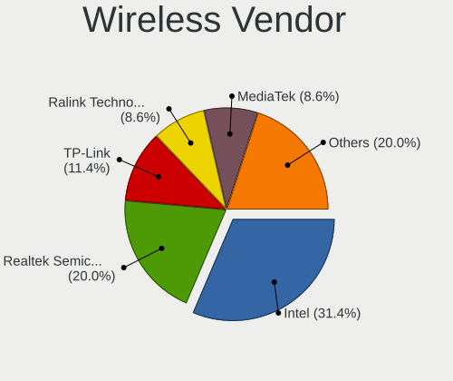

| Vendor                          | Desktops | Percent |
|---------------------------------|----------|---------|
| Intel                           | 22       | 31.43%  |
| Realtek Semiconductor           | 14       | 20%     |
| TP-Link                         | 8        | 11.43%  |
| Ralink Technology               | 6        | 8.57%   |
| MediaTek                        | 6        | 8.57%   |
| Ralink                          | 3        | 4.29%   |
| Qualcomm Atheros                | 3        | 4.29%   |
| Microsoft                       | 3        | 4.29%   |
| Qualcomm Atheros Communications | 1        | 1.43%   |
| D-Link System                   | 1        | 1.43%   |
| D-Link                          | 1        | 1.43%   |
| Broadcom                        | 1        | 1.43%   |
| Belkin Components               | 1        | 1.43%   |

Wireless Model
--------------

Wireless models

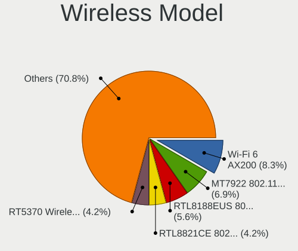

| Model                                                                | Desktops | Percent |
|----------------------------------------------------------------------|----------|---------|
| Intel Wi-Fi 6 AX200                                                  | 6        | 8.33%   |
| MediaTek MT7922 802.11ax PCI Express Wireless Network Adapter        | 5        | 6.94%   |
| Realtek RTL8188EUS 802.11n Wireless Network Adapter                  | 4        | 5.56%   |
| Realtek RTL8821CE 802.11ac PCIe Wireless Network Adapter             | 3        | 4.17%   |
| Ralink RT5370 Wireless Adapter                                       | 3        | 4.17%   |
| Intel Wi-Fi 6E(802.11ax) AX210/AX1675* 2x2 [Typhoon Peak]            | 3        | 4.17%   |
| TP-Link Archer T4U ver.3                                             | 2        | 2.78%   |
| TP-Link Archer T4U v2 [Realtek RTL8812AU]                            | 2        | 2.78%   |
| Realtek RTL8821AE 802.11ac PCIe Wireless Network Adapter             | 2        | 2.78%   |
| Realtek RTL8812AE 802.11ac PCIe Wireless Network Adapter             | 2        | 2.78%   |
| Ralink MT7601U Wireless Adapter                                      | 2        | 2.78%   |
| Ralink RT2500 Wireless 802.11bg                                      | 2        | 2.78%   |
| Microsoft Xbox 360 Wireless Adapter                                  | 2        | 2.78%   |
| Intel Dual Band Wireless-AC 3168NGW [Stone Peak]                     | 2        | 2.78%   |
| Intel Comet Lake PCH CNVi WiFi                                       | 2        | 2.78%   |
| Intel Alder Lake-S PCH CNVi WiFi                                     | 2        | 2.78%   |
| Intel 700 Series Chipset CNVi WiFi                                   | 2        | 2.78%   |
| TP-Link TL-WN821N v5/v6 [RTL8192EU]                                  | 1        | 1.39%   |
| TP-Link TL-WN722N v2/v3 [Realtek RTL8188EUS]                         | 1        | 1.39%   |
| TP-Link Archer T2U PLUS [RTL8821AU]                                  | 1        | 1.39%   |
| TP-Link 802.11ac WLAN Adapter                                        | 1        | 1.39%   |
| TP-Link 802.11ac NIC                                                 | 1        | 1.39%   |
| Realtek RTL8852CE PCIe 802.11ax Wireless Network Controller          | 1        | 1.39%   |
| Realtek RTL8852BE PCIe 802.11ax Wireless Network Controller          | 1        | 1.39%   |
| Realtek RTL8192CU 802.11n WLAN Adapter                               | 1        | 1.39%   |
| Realtek RTL8188CUS 802.11n WLAN Adapter                              | 1        | 1.39%   |
| Ralink RT2770 Wireless Adapter                                       | 1        | 1.39%   |
| Ralink RT3090 Wireless 802.11n 1T/1R PCIe                            | 1        | 1.39%   |
| Qualcomm Atheros QCA9565 / AR9565 Wireless Network Adapter           | 1        | 1.39%   |
| Qualcomm Atheros AR9271 802.11n                                      | 1        | 1.39%   |
| Qualcomm Atheros AR9485 Wireless Network Adapter                     | 1        | 1.39%   |
| Qualcomm Atheros AR9287 Wireless Network Adapter (PCI-Express)       | 1        | 1.39%   |
| Microsoft Wireless XBox Controller Dongle                            | 1        | 1.39%   |
| MediaTek MT7921K (RZ608) Wi-Fi 6E 80MHz                              | 1        | 1.39%   |
| Intel Wireless 3165                                                  | 1        | 1.39%   |
| Intel Wi-Fi 5(802.11ac) Wireless-AC 9x6x [Thunder Peak]              | 1        | 1.39%   |
| Intel Gemini Lake PCH CNVi WiFi                                      | 1        | 1.39%   |
| Intel Centrino Wireless-N 2230                                       | 1        | 1.39%   |
| Intel Centrino Advanced-N 6230 [Rainbow Peak]                        | 1        | 1.39%   |
| D-Link System DWA-125 Wireless N 150 Adapter(rev.A1) [Ralink RT3070] | 1        | 1.39%   |

Ethernet Vendor
---------------

Ethernet vendors

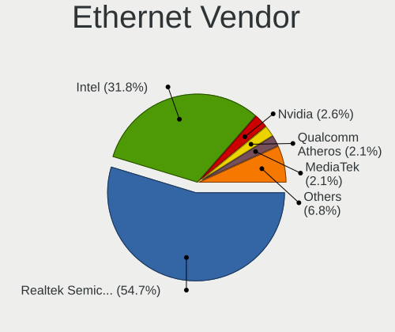

| Vendor                   | Desktops | Percent |
|--------------------------|----------|---------|
| Realtek Semiconductor    | 105      | 54.69%  |
| Intel                    | 61       | 31.77%  |
| Nvidia                   | 5        | 2.6%    |
| Qualcomm Atheros         | 4        | 2.08%   |
| MediaTek                 | 4        | 2.08%   |
| Samsung Electronics      | 2        | 1.04%   |
| Marvell Technology Group | 2        | 1.04%   |
| Broadcom Limited         | 2        | 1.04%   |
| Broadcom                 | 2        | 1.04%   |
| Xiaomi                   | 1        | 0.52%   |
| Google                   | 1        | 0.52%   |
| D-Link System            | 1        | 0.52%   |
| Aquantia                 | 1        | 0.52%   |
| Apple                    | 1        | 0.52%   |

Ethernet Model
--------------

Ethernet models

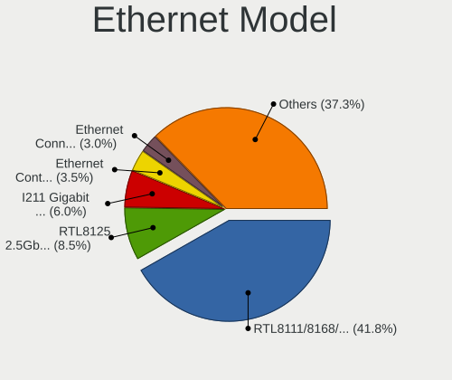

| Model                                                                           | Desktops | Percent |
|---------------------------------------------------------------------------------|----------|---------|
| Realtek RTL8111/8168/8211/8411 PCI Express Gigabit Ethernet Controller          | 84       | 41.79%  |
| Realtek RTL8125 2.5GbE Controller                                               | 17       | 8.46%   |
| Intel I211 Gigabit Network Connection                                           | 12       | 5.97%   |
| Intel Ethernet Controller I225-V                                                | 7        | 3.48%   |
| Intel Ethernet Connection (7) I219-V                                            | 6        | 2.99%   |
| Intel 82579V Gigabit Network Connection                                         | 5        | 2.49%   |
| Realtek RTL8153 Gigabit Ethernet Adapter                                        | 4        | 1.99%   |
| Intel Ethernet Connection I217-LM                                               | 4        | 1.99%   |
| Intel Ethernet Connection (2) I219-V                                            | 4        | 1.99%   |
| Intel Ethernet Connection I217-V                                                | 3        | 1.49%   |
| Intel Ethernet Connection (2) I219-LM                                           | 3        | 1.49%   |
| Intel 82579LM Gigabit Network Connection (Lewisville)                           | 3        | 1.49%   |
| Samsung GT-I9070 (network tethering, USB debugging enabled)                     | 2        | 1%      |
| Realtek RTL810xE PCI Express Fast Ethernet controller                           | 2        | 1%      |
| Qualcomm Atheros AR8151 v2.0 Gigabit Ethernet                                   | 2        | 1%      |
| Nvidia CK804 Ethernet Controller                                                | 2        | 1%      |
| MediaTek MT7922 802.11ax PCI Express Wireless Network Adapter                   | 2        | 1%      |
| Intel Ethernet Connection (2) I218-V                                            | 2        | 1%      |
| Intel 82578DM Gigabit Network Connection                                        | 2        | 1%      |
| Intel 82567LM-3 Gigabit Network Connection                                      | 2        | 1%      |
| Xiaomi Mi/Redmi series (RNDIS)                                                  | 1        | 0.5%    |
| Realtek USB 10/100/1G/2.5 LAN                                                   | 1        | 0.5%    |
| Realtek RTL8111/8168/8411 PCI Express Gigabit Ethernet Controller               | 1        | 0.5%    |
| Realtek RTL-8100/8101L/8139 PCI Fast Ethernet Adapter                           | 1        | 0.5%    |
| Qualcomm Atheros Killer E2400 Gigabit Ethernet Controller                       | 1        | 0.5%    |
| Qualcomm Atheros AR8152 v2.0 Fast Ethernet                                      | 1        | 0.5%    |
| Nvidia nForce2 Ethernet Controller                                              | 1        | 0.5%    |
| Nvidia MCP77 Ethernet                                                           | 1        | 0.5%    |
| Nvidia MCP61 Ethernet                                                           | 1        | 0.5%    |
| MediaTek MT7925 802.11be 160MHz 2x2 PCIe Wireless Network Adapter [Filogic 360] | 1        | 0.5%    |
| MediaTek Infinix HOT 50i                                                        | 1        | 0.5%    |
| Marvell Group 88E8053 PCI-E Gigabit Ethernet Controller                         | 1        | 0.5%    |
| Marvell Group 88E8052 PCI-E ASF Gigabit Ethernet Controller                     | 1        | 0.5%    |
| Intel I350 Gigabit Network Connection                                           | 1        | 0.5%    |
| Intel I210 Gigabit Network Connection                                           | 1        | 0.5%    |
| Intel Ethernet Controller I226-V                                                | 1        | 0.5%    |
| Intel Ethernet Controller I219-V                                                | 1        | 0.5%    |
| Intel Ethernet Connection (5) I219-LM                                           | 1        | 0.5%    |
| Intel Ethernet Connection (17) I219-V                                           | 1        | 0.5%    |
| Intel Ethernet Connection (11) I219-V                                           | 1        | 0.5%    |

Net Controller Kind
-------------------

Ethernet, WiFi or modem

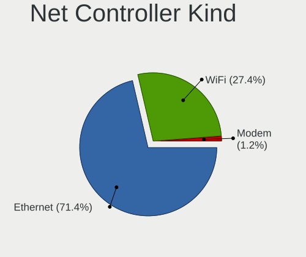

| Kind     | Desktops | Percent |
|----------|----------|---------|
| Ethernet | 177      | 71.37%  |
| WiFi     | 68       | 27.42%  |
| Modem    | 3        | 1.21%   |

Used Controller
---------------

Currently used network controller

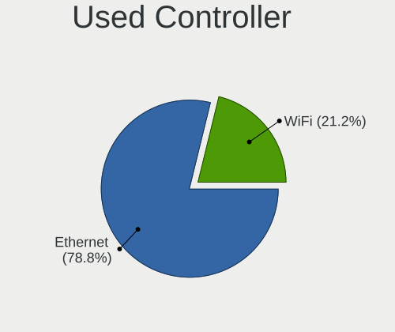

| Kind     | Desktops | Percent |
|----------|----------|---------|
| Ethernet | 144      | 80%     |
| WiFi     | 36       | 20%     |

NICs
----

Total network controllers on board

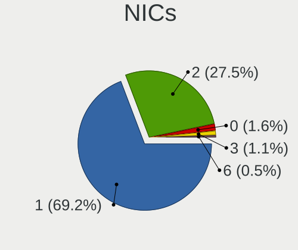

| Total | Desktops | Percent |
|-------|----------|---------|
| 1     | 126      | 69.23%  |
| 2     | 50       | 27.47%  |
| 0     | 3        | 1.65%   |
| 3     | 2        | 1.1%    |
| 6     | 1        | 0.55%   |

IPv6
----

IPv6 vs IPv4

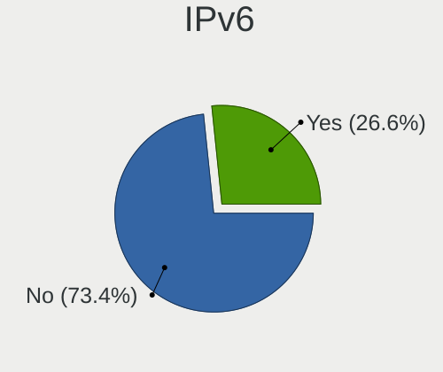

| Used | Desktops | Percent |
|------|----------|---------|
| No   | 135      | 73.37%  |
| Yes  | 49       | 26.63%  |

Bluetooth
---------

Bluetooth Vendor
----------------

Controller vendors

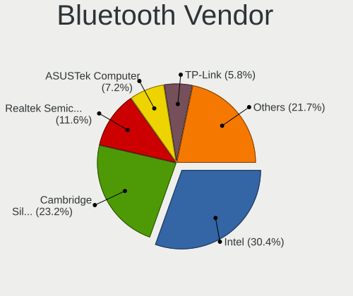

| Vendor                          | Desktops | Percent |
|---------------------------------|----------|---------|
| Intel                           | 21       | 30.43%  |
| Cambridge Silicon Radio         | 16       | 23.19%  |
| Realtek Semiconductor           | 8        | 11.59%  |
| ASUSTek Computer                | 5        | 7.25%   |
| TP-Link                         | 4        | 5.8%    |
| MediaTek                        | 4        | 5.8%    |
| IMC Networks                    | 4        | 5.8%    |
| Foxconn / Hon Hai               | 2        | 2.9%    |
| Edimax Technology               | 2        | 2.9%    |
| Qualcomm Atheros Communications | 1        | 1.45%   |
| Integrated System Solution      | 1        | 1.45%   |
| Broadcom                        | 1        | 1.45%   |

Bluetooth Model
---------------

Controller models

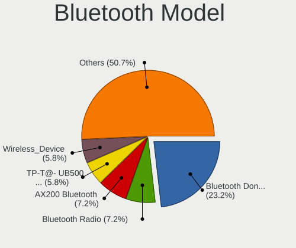

| Model                                                 | Desktops | Percent |
|-------------------------------------------------------|----------|---------|
| Cambridge Silicon Radio Bluetooth Dongle (HCI mode)   | 16       | 23.19%  |
| Realtek Bluetooth Radio                               | 5        | 7.25%   |
| Intel AX200 Bluetooth                                 | 5        | 7.25%   |
| TP-Link TP-T@- UB500 Adapter                          | 4        | 5.8%    |
| MediaTek Wireless_Device                              | 4        | 5.8%    |
| Intel Bluetooth Device                                | 3        | 4.35%   |
| Intel AX210 Bluetooth                                 | 3        | 4.35%   |
| Intel Wireless-AC 9260 Bluetooth Adapter              | 2        | 2.9%    |
| Intel Wireless-AC 3168 Bluetooth                      | 2        | 2.9%    |
| Intel Bluetooth 9460/9560 Jefferson Peak (JfP)        | 2        | 2.9%    |
| Intel AX201 Bluetooth                                 | 2        | 2.9%    |
| IMC Networks Wireless_Device                          | 2        | 2.9%    |
| IMC Networks Bluetooth Radio                          | 2        | 2.9%    |
| Foxconn / Hon Hai Wireless_Device                     | 2        | 2.9%    |
| Edimax Bluetooth Device                               | 2        | 2.9%    |
| ASUS Broadcom BCM20702A0 Bluetooth                    | 2        | 2.9%    |
| ASUS ASUS USB-BT500                                   | 2        | 2.9%    |
| Realtek RTL8821A Bluetooth                            | 1        | 1.45%   |
| Realtek  Bluetooth 4.2 Adapter                        | 1        | 1.45%   |
| Realtek Bluetooth 5.3 Radio                           | 1        | 1.45%   |
| Qualcomm Atheros AR9462 Bluetooth                     | 1        | 1.45%   |
| Intel Centrino Bluetooth Wireless Transceiver         | 1        | 1.45%   |
| Intel Bluetooth wireless interface                    | 1        | 1.45%   |
| Integrated System Solution KY-BT100 Bluetooth Adapter | 1        | 1.45%   |
| Broadcom BCM2046 V2.1 Dongle                          | 1        | 1.45%   |
| ASUS Bluetooth Radio                                  | 1        | 1.45%   |

Sound
-----

Sound Vendor
------------

Sound card vendors

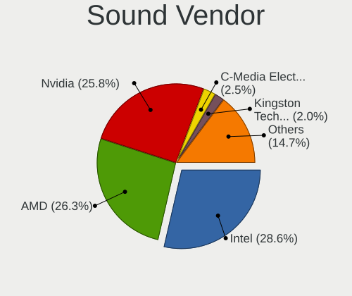

| Vendor                               | Desktops | Percent |
|--------------------------------------|----------|---------|
| Intel                                | 101      | 28.61%  |
| AMD                                  | 93       | 26.35%  |
| Nvidia                               | 91       | 25.78%  |
| C-Media Electronics                  | 9        | 2.55%   |
| Kingston Technology                  | 7        | 1.98%   |
| Logitech                             | 6        | 1.7%    |
| SteelSeries ApS                      | 5        | 1.42%   |
| ASUSTek Computer                     | 5        | 1.42%   |
| Razer USA                            | 4        | 1.13%   |
| Micro Star International             | 3        | 0.85%   |
| Generalplus Technology               | 3        | 0.85%   |
| Creative Labs                        | 3        | 0.85%   |
| TerraTec Electronic                  | 2        | 0.57%   |
| KTMicro                              | 2        | 0.57%   |
| JMTek                                | 2        | 0.57%   |
| Focusrite-Novation                   | 2        | 0.57%   |
| DSEA A/S                             | 2        | 0.57%   |
| Thesycon Systemsoftware & Consulting | 1        | 0.28%   |
| Syntek                               | 1        | 0.28%   |
| Samson Technologies                  | 1        | 0.28%   |
| M-Audio                              | 1        | 0.28%   |
| Hewlett-Packard                      | 1        | 0.28%   |
| GYROCOM C&C                          | 1        | 0.28%   |
| Giga-Byte Technology                 | 1        | 0.28%   |
| FiiO Electronics Technology          | 1        | 0.28%   |
| Elite Silicon                        | 1        | 0.28%   |
| Dell                                 | 1        | 0.28%   |
| Creative Technology                  | 1        | 0.28%   |
| BEHRINGER International              | 1        | 0.28%   |
| Unknown                              | 1        | 0.28%   |

Sound Model
-----------

Sound card models

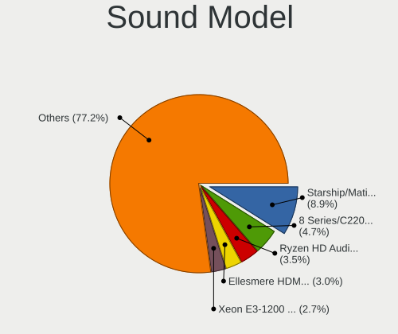

| Model                                                                      | Desktops | Percent |
|----------------------------------------------------------------------------|----------|---------|
| AMD Starship/Matisse HD Audio Controller                                   | 36       | 8.93%   |
| Intel 8 Series/C220 Series Chipset High Definition Audio Controller        | 19       | 4.71%   |
| AMD Ryzen HD Audio Controller                                              | 14       | 3.47%   |
| AMD Ellesmere HDMI Audio [Radeon RX 470/480 / 570/580/590]                 | 12       | 2.98%   |
| Intel Xeon E3-1200 v3/4th Gen Core Processor HD Audio Controller           | 11       | 2.73%   |
| Intel 7 Series/C216 Chipset Family High Definition Audio Controller        | 11       | 2.73%   |
| Intel 6 Series/C200 Series Chipset Family High Definition Audio Controller | 11       | 2.73%   |
| Nvidia GA104 High Definition Audio Controller                              | 10       | 2.48%   |
| AMD SBx00 Azalia (Intel HDA)                                               | 10       | 2.48%   |
| AMD Navi 31 HDMI/DP Audio                                                  | 10       | 2.48%   |
| Intel Cannon Lake PCH cAVS                                                 | 9        | 2.23%   |
| AMD Navi 21/23 HDMI/DP Audio Controller                                    | 9        | 2.23%   |
| Nvidia GP104 High Definition Audio Controller                              | 8        | 1.99%   |
| Intel 200 Series PCH HD Audio                                              | 8        | 1.99%   |
| Nvidia TU116 High Definition Audio Controller                              | 7        | 1.74%   |
| Nvidia TU106 High Definition Audio Controller                              | 7        | 1.74%   |
| AMD Renoir/Cezanne HDMI/DP Audio Controller                                | 7        | 1.74%   |
| AMD Radeon High Definition Audio Controller                                | 6        | 1.49%   |
| Intel NM10/ICH7 Family High Definition Audio Controller                    | 5        | 1.24%   |
| Intel Alder Lake-S HD Audio Controller                                     | 5        | 1.24%   |
| Intel 100 Series/C230 Series Chipset Family HD Audio Controller            | 5        | 1.24%   |
| ASUSTek Computer USB Audio                                                 | 5        | 1.24%   |
| Nvidia GP107GL High Definition Audio Controller                            | 4        | 0.99%   |
| Nvidia GP102 HDMI Audio Controller                                         | 4        | 0.99%   |
| Kingston Technology HyperX 7.1 Audio                                       | 4        | 0.99%   |
| Intel 5 Series/3400 Series Chipset High Definition Audio                   | 4        | 0.99%   |
| Nvidia GP108 High Definition Audio Controller                              | 3        | 0.74%   |
| Nvidia GP106 High Definition Audio Controller                              | 3        | 0.74%   |
| Nvidia GM204 High Definition Audio Controller                              | 3        | 0.74%   |
| Nvidia GM107 High Definition Audio Controller [GeForce 940MX]              | 3        | 0.74%   |
| Nvidia GK208 HDMI/DP Audio Controller                                      | 3        | 0.74%   |
| Nvidia GK104 HDMI Audio Controller                                         | 3        | 0.74%   |
| Nvidia GA102 High Definition Audio Controller                              | 3        | 0.74%   |
| Nvidia AD103 High Definition Audio Controller                              | 3        | 0.74%   |
| Micro Star International USB Audio                                         | 3        | 0.74%   |
| Logitech Logitech G PRO X Gaming Headset                                   | 3        | 0.74%   |
| Intel Raptor Lake High Definition Audio Controller                         | 3        | 0.74%   |
| Intel Comet Lake PCH cAVS                                                  | 3        | 0.74%   |
| Generalplus Technology USB Audio Device                                    | 3        | 0.74%   |
| C-Media Electronics USB Audio Device                                       | 3        | 0.74%   |

Memory
------

Memory Vendor
-------------

Memory module vendors

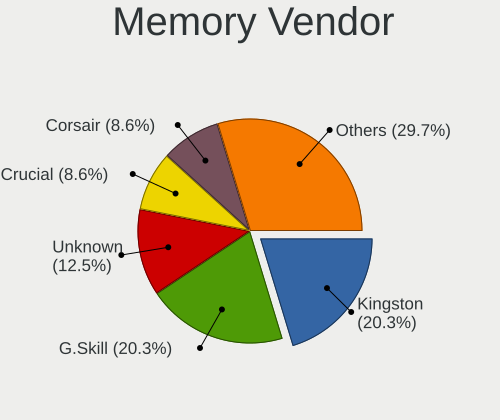

| Vendor              | Desktops | Percent |
|---------------------|----------|---------|
| Kingston            | 26       | 20.31%  |
| G.Skill             | 26       | 20.31%  |
| Unknown             | 16       | 12.5%   |
| Crucial             | 11       | 8.59%   |
| Corsair             | 11       | 8.59%   |
| Samsung Electronics | 8        | 6.25%   |
| SK hynix            | 7        | 5.47%   |
| A-DATA Technology   | 4        | 3.13%   |
| Patriot             | 3        | 2.34%   |
| Micron Technology   | 2        | 1.56%   |
| GOODRAM             | 2        | 1.56%   |
| Apacer              | 2        | 1.56%   |
| Wilk                | 1        | 0.78%   |
| Unknown (ABCD)      | 1        | 0.78%   |
| Team                | 1        | 0.78%   |
| Silicon Power       | 1        | 0.78%   |
| Ramaxel Technology  | 1        | 0.78%   |
| Gigabyte Technology | 1        | 0.78%   |
| Elpida              | 1        | 0.78%   |
| AMD                 | 1        | 0.78%   |
| Aeneon              | 1        | 0.78%   |
| Unknown             | 1        | 0.78%   |

Memory Model
------------

Memory module models

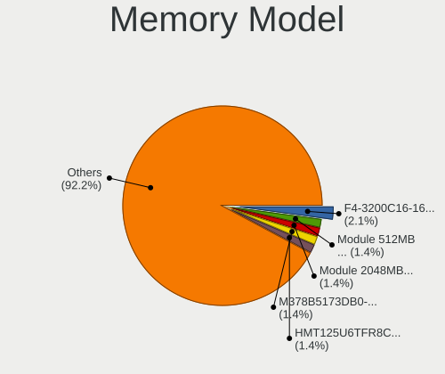

| Model                                                          | Desktops | Percent |
|----------------------------------------------------------------|----------|---------|
| G.Skill RAM F4-3200C16-16GIS 16GB DIMM DDR4 3600MT/s           | 3        | 2.13%   |
| Unknown RAM Module 512MB DIMM SDRAM                            | 2        | 1.42%   |
| Unknown RAM Module 2048MB DIMM SDRAM                           | 2        | 1.42%   |
| SK hynix RAM HMT125U6TFR8C-G7 2GB DIMM DDR3 1067MT/s           | 2        | 1.42%   |
| Samsung RAM M378B5173DB0-CK0 4096MB DIMM DDR3 1600MT/s         | 2        | 1.42%   |
| Kingston RAM KF560C40-16 16GB DIMM 6000MT/s                    | 2        | 1.42%   |
| Kingston RAM KF3200C16D4/16GX 16GB DIMM DDR4 3733MT/s          | 2        | 1.42%   |
| G.Skill RAM F4-3600C18-16GTZN 16GB DIMM DDR4 3666MT/s          | 2        | 1.42%   |
| Crucial RAM CT51264BA160BJ.C8 4GB DIMM DDR3 1632MT/s           | 2        | 1.42%   |
| Crucial RAM BLS8G4D240FSB.16FBR2 8GB DIMM DDR4 2400MT/s        | 2        | 1.42%   |
| Wilk RAM IRX3200D464L16SA/8G 8GB DIMM DDR4 3200MT/s            | 1        | 0.71%   |
| Unknown RAM Module 8GB DIMM DDR3 1600MT/s                      | 1        | 0.71%   |
| Unknown RAM Module 8192MB DIMM DDR3 1600MT/s                   | 1        | 0.71%   |
| Unknown RAM Module 512MB DIMM                                  | 1        | 0.71%   |
| Unknown RAM Module 4GB DIMM 1600MT/s                           | 1        | 0.71%   |
| Unknown RAM Module 4096MB DIMM 667MT/s                         | 1        | 0.71%   |
| Unknown RAM Module 4096MB DIMM 1333MT/s                        | 1        | 0.71%   |
| Unknown RAM Module 2GB DIMM DDR2 800MT/s                       | 1        | 0.71%   |
| Unknown RAM Module 2GB DIMM 1333MT/s                           | 1        | 0.71%   |
| Unknown RAM Module 256MB DIMM                                  | 1        | 0.71%   |
| Unknown RAM Module 2048MB DIMM DDR2 800MT/s                    | 1        | 0.71%   |
| Unknown RAM Module 1GB DIMM SDRAM                              | 1        | 0.71%   |
| Unknown RAM Module 1024MB DIMM DDR2 667MT/s                    | 1        | 0.71%   |
| Unknown RAM Module 1024MB DIMM                                 | 1        | 0.71%   |
| Unknown RAM 1600 CL9 Series 8192MB DIMM DDR3 1066MT/s          | 1        | 0.71%   |
| Unknown (ABCD) RAM 123456789012345678 2GB DIMM LPDDR4 2133MT/s | 1        | 0.71%   |
| Team RAM TEAMGROUP-UD4-3600 16GB DIMM DDR4 4000MT/s            | 1        | 0.71%   |
| SK hynix RAM Module 8192MB DIMM DDR3 1333MT/s                  | 1        | 0.71%   |
| SK hynix RAM Module 2048MB DIMM DDR3 1333MT/s                  | 1        | 0.71%   |
| SK hynix RAM HMT351U7BFR8C-H9 4GB DIMM DDR3 1333MT/s           | 1        | 0.71%   |
| SK hynix RAM HMT351U6CFR8C-PB 4GB DIMM DDR3 1800MT/s           | 1        | 0.71%   |
| SK hynix RAM HMT351U6CFR8C-H9 4GB DIMM DDR3 1333MT/s           | 1        | 0.71%   |
| SK hynix RAM HMT325U6CFR8C-PB 2GB DIMM DDR3 1600MT/s           | 1        | 0.71%   |
| Silicon Power RAM SP008GBLTU160N02 8GB DIMM DDR3 1600MT/s      | 1        | 0.71%   |
| Silicon Power RAM DCLT8GN128S 8192MB DIMM DDR3 1600MT/s        | 1        | 0.71%   |
| Samsung RAM Module 8GB SODIMM DDR4 2133MT/s                    | 1        | 0.71%   |
| Samsung RAM M471B5273EB0-CK0 4GB SODIMM DDR3 4199MT/s          | 1        | 0.71%   |
| Samsung RAM M471B5173QH0-YK0 4GB SODIMM DDR3 1600MT/s          | 1        | 0.71%   |
| Samsung RAM M378B5773DH0-CH9 2GB DIMM DDR3 1333MT/s            | 1        | 0.71%   |
| Samsung RAM M378B5273DH0-CH9 4GB DIMM DDR3 2133MT/s            | 1        | 0.71%   |

Memory Kind
-----------

Memory module kinds

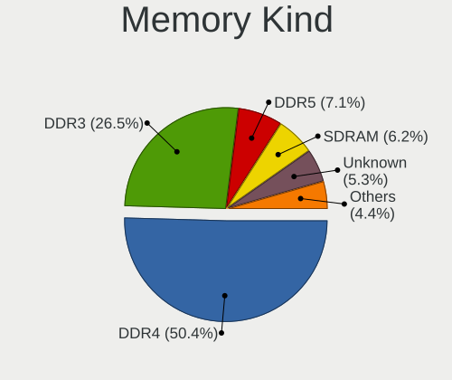

| Kind    | Desktops | Percent |
|---------|----------|---------|
| DDR4    | 57       | 50.44%  |
| DDR3    | 30       | 26.55%  |
| DDR5    | 8        | 7.08%   |
| SDRAM   | 7        | 6.19%   |
| Unknown | 6        | 5.31%   |
| DDR2    | 3        | 2.65%   |
| LPDDR4  | 1        | 0.88%   |
| DDR     | 1        | 0.88%   |

Memory Form Factor
------------------

Physical design of the memory module

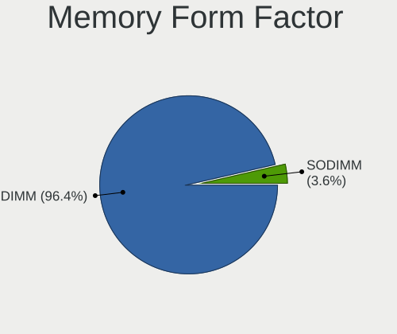

| Name   | Desktops | Percent |
|--------|----------|---------|
| DIMM   | 107      | 96.4%   |
| SODIMM | 4        | 3.6%    |

Memory Size
-----------

Memory module size

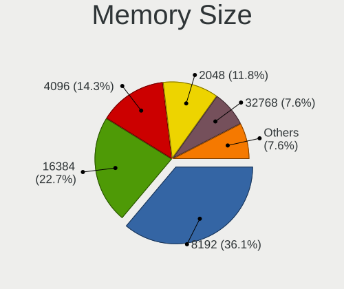

| Size  | Desktops | Percent |
|-------|----------|---------|
| 8192  | 43       | 36.13%  |
| 16384 | 27       | 22.69%  |
| 4096  | 17       | 14.29%  |
| 2048  | 14       | 11.76%  |
| 32768 | 9        | 7.56%   |
| 1024  | 4        | 3.36%   |
| 512   | 4        | 3.36%   |
| 256   | 1        | 0.84%   |

Memory Speed
------------

Memory module speed

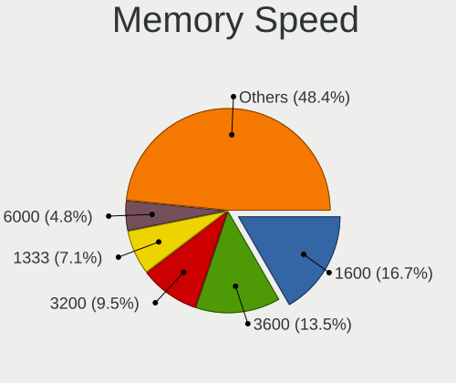

| Speed   | Desktops | Percent |
|---------|----------|---------|
| 1600    | 21       | 16.67%  |
| 3600    | 17       | 13.49%  |
| 3200    | 12       | 9.52%   |
| 1333    | 9        | 7.14%   |
| 6000    | 6        | 4.76%   |
| Unknown | 6        | 4.76%   |
| 2667    | 5        | 3.97%   |
| 2400    | 5        | 3.97%   |
| 2133    | 4        | 3.17%   |
| 3733    | 3        | 2.38%   |
| 3666    | 3        | 2.38%   |
| 2666    | 3        | 2.38%   |
| 4000    | 2        | 1.59%   |
| 3800    | 2        | 1.59%   |
| 3000    | 2        | 1.59%   |
| 1866    | 2        | 1.59%   |
| 1632    | 2        | 1.59%   |
| 1067    | 2        | 1.59%   |
| 800     | 2        | 1.59%   |
| 667     | 2        | 1.59%   |
| 6400    | 1        | 0.79%   |
| 4800    | 1        | 0.79%   |
| 4199    | 1        | 0.79%   |
| 4133    | 1        | 0.79%   |
| 3466    | 1        | 0.79%   |
| 3334    | 1        | 0.79%   |
| 3333    | 1        | 0.79%   |
| 3266    | 1        | 0.79%   |
| 2933    | 1        | 0.79%   |
| 2800    | 1        | 0.79%   |
| 2733    | 1        | 0.79%   |
| 2134    | 1        | 0.79%   |
| 1867    | 1        | 0.79%   |
| 1800    | 1        | 0.79%   |
| 1334    | 1        | 0.79%   |
| 533     | 1        | 0.79%   |

Printers & scanners
-------------------

Printer Vendor
--------------

Printer device vendors

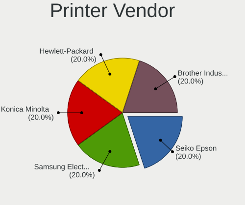

| Vendor              | Desktops | Percent |
|---------------------|----------|---------|
| Brother Industries  | 2        | 33.33%  |
| Seiko Epson         | 1        | 16.67%  |
| Samsung Electronics | 1        | 16.67%  |
| Konica Minolta      | 1        | 16.67%  |
| Hewlett-Packard     | 1        | 16.67%  |

Printer Model
-------------

Printer device models

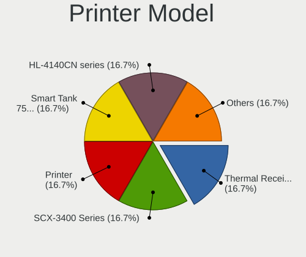

| Model                                        | Desktops | Percent |
|----------------------------------------------|----------|---------|
| Seiko Epson Thermal Receipt Printer [TM-T20] | 1        | 16.67%  |
| Samsung SCX-3400 Series                      | 1        | 16.67%  |
| Konica Minolta Printer                       | 1        | 16.67%  |
| HP Smart Tank 750 series                     | 1        | 16.67%  |
| Brother HL-4140CN series                     | 1        | 16.67%  |
| Brother DCP-J152W                            | 1        | 16.67%  |

Scanner Vendor
--------------

Scanner device vendors

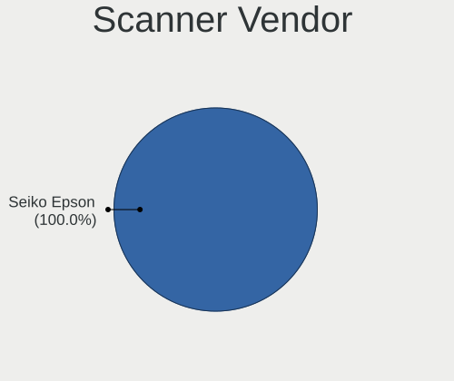

| Vendor      | Desktops | Percent |
|-------------|----------|---------|
| Seiko Epson | 1        | 100%    |

Scanner Model
-------------

Scanner device models

| Model                      | Desktops | Percent |
|----------------------------|----------|---------|
| Seiko Epson Perfection 660 | 1        | 100%    |

Camera
------

Camera Vendor
-------------

Camera device vendors

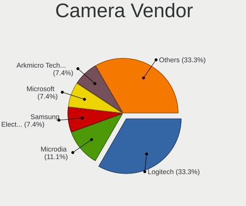

| Vendor                        | Desktops | Percent |
|-------------------------------|----------|---------|
| Logitech                      | 9        | 33.33%  |
| Microdia                      | 3        | 11.11%  |
| Samsung Electronics           | 2        | 7.41%   |
| Microsoft                     | 2        | 7.41%   |
| Arkmicro Technologies         | 2        | 7.41%   |
| Apple                         | 2        | 7.41%   |
| Z-Star Microelectronics       | 1        | 3.7%    |
| Xinfrared                     | 1        | 3.7%    |
| Sunplus Innovation Technology | 1        | 3.7%    |
| Realtek Semiconductor         | 1        | 3.7%    |
| Polycom                       | 1        | 3.7%    |
| Lenovo                        | 1        | 3.7%    |
| Creative Technology           | 1        | 3.7%    |

Camera Model
------------

Camera device models

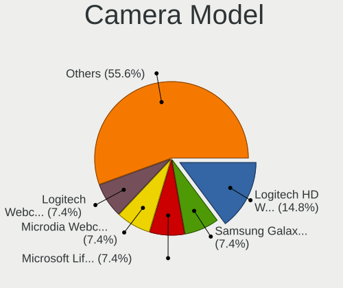

| Model                                   | Desktops | Percent |
|-----------------------------------------|----------|---------|
| Logitech HD Webcam C525                 | 4        | 14.81%  |
| Samsung Galaxy series, misc. (MTP mode) | 2        | 7.41%   |
| Microsoft LifeCam HD-3000               | 2        | 7.41%   |
| Microdia Webcam Vitade AF               | 2        | 7.41%   |
| Logitech Webcam C930e                   | 2        | 7.41%   |
| Arkmicro USB2.0 PC CAMERA               | 2        | 7.41%   |
| Apple iPhone 5/5C/5S/6/SE/7/8/X         | 2        | 7.41%   |
| Z-Star A4 TECH USB2.0 PC Camera E       | 1        | 3.7%    |
| Xinfrared T2S+_A2                       | 1        | 3.7%    |
| Sunplus Aukey-PC-LM1E Camera            | 1        | 3.7%    |
| Realtek USB Camera                      | 1        | 3.7%    |
| Polycom Poly Studio P5 webcam           | 1        | 3.7%    |
| Microdia USB 2.0 Camera                 | 1        | 3.7%    |
| Logitech Webcam C270                    | 1        | 3.7%    |
| Logitech HD Pro Webcam C920             | 1        | 3.7%    |
| Logitech B525 HD Webcam                 | 1        | 3.7%    |
| Lenovo 500 RGB Camera                   | 1        | 3.7%    |
| Creative Live! Cam Chat HD [VF0700]     | 1        | 3.7%    |

Security
--------

Fingerprint Vendor
------------------

Fingerprint sensor vendors

Zero info for selected period =(

Fingerprint Model
-----------------

Fingerprint sensor models

Zero info for selected period =(

Chipcard Vendor
---------------

Chipcard module vendors

| Vendor                | Desktops | Percent |
|-----------------------|----------|---------|
| OmniKey               | 15       | 48.39%  |
| Alcor Micro           | 7        | 22.58%  |
| Gemalto (was Gemplus) | 5        | 16.13%  |
| SCM Microsystems      | 1        | 3.23%   |
| Clay Logic            | 1        | 3.23%   |
| Chicony Electronics   | 1        | 3.23%   |
| Aladdin R.D.          | 1        | 3.23%   |

Chipcard Model
--------------

Chipcard module models

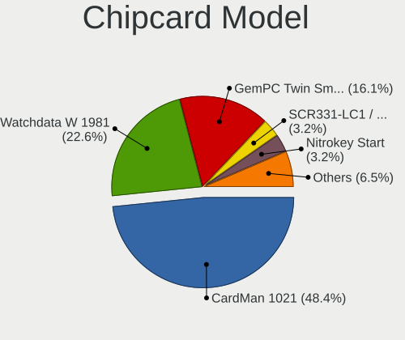

| Model                                                  | Desktops | Percent |
|--------------------------------------------------------|----------|---------|
| OmniKey CardMan 1021                                   | 15       | 48.39%  |
| Alcor Micro Watchdata W 1981                           | 7        | 22.58%  |
| Gemalto (was Gemplus) GemPC Twin SmartCard Reader      | 5        | 16.13%  |
| SCM Microsystems SCR331-LC1 / SCR3310 SmartCard Reader | 1        | 3.23%   |
| Clay Logic Nitrokey Start                              | 1        | 3.23%   |
| Chicony Electronics HP Skylab USB Smartcard Keyboard   | 1        | 3.23%   |
| Aladdin R.D. JaCarta                                   | 1        | 3.23%   |

Unsupported
-----------

Unsupported Devices
-------------------

Total unsupported devices on board

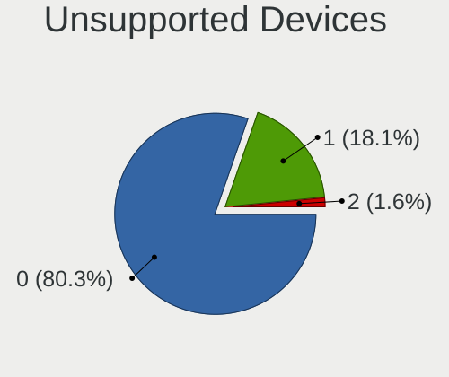

| Total | Desktops | Percent |
|-------|----------|---------|
| 0     | 151      | 80.32%  |
| 1     | 34       | 18.09%  |
| 2     | 3        | 1.6%    |

Unsupported Device Types
------------------------

Types of unsupported devices

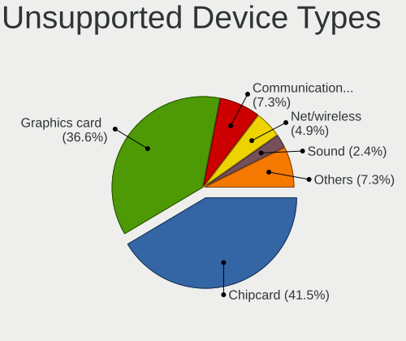

| Type                     | Desktops | Percent |
|--------------------------|----------|---------|
| Chipcard                 | 17       | 41.46%  |
| Graphics card            | 15       | 36.59%  |
| Communication controller | 3        | 7.32%   |
| Net/wireless             | 2        | 4.88%   |
| Sound                    | 1        | 2.44%   |
| Net/ethernet             | 1        | 2.44%   |
| Multimedia controller    | 1        | 2.44%   |
| Camera                   | 1        | 2.44%   |

