Linux in Estonia - Tested Hardware & Statistics (Desktops)
----------------------------------------------------------

A project to collect tested hardware configurations for Linux in Estonia.

Anyone can contribute to this report by the [hw-probe](https://github.com/linuxhw/hw-probe) tool:

    sudo -E hw-probe -all -upload

Please contribute! Especially if your hardware is rare.

Contents
--------

* [ Test Cases ](#test-cases)

* [ System ](#system)
  - [ OS                       ](#os)
  - [ OS Family                ](#os-family)
  - [ Kernel                   ](#kernel)
  - [ Kernel Family            ](#kernel-family)
  - [ Kernel Major Ver.        ](#kernel-major-ver)
  - [ Arch                     ](#arch)
  - [ DE                       ](#de)
  - [ Display Server           ](#display-server)
  - [ Display Manager          ](#display-manager)
  - [ OS Lang                  ](#os-lang)
  - [ Boot Mode                ](#boot-mode)
  - [ Filesystem               ](#filesystem)
  - [ Part. scheme             ](#part-scheme)
  - [ Dual Boot with Linux/BSD ](#dual-boot-with-linuxbsd)
  - [ Dual Boot (Win)          ](#dual-boot-win)

* [ Board ](#board)
  - [ Vendor                   ](#vendor)
  - [ Model                    ](#model)
  - [ Model Family             ](#model-family)
  - [ MFG Year                 ](#mfg-year)
  - [ Form Factor              ](#form-factor)
  - [ Secure Boot              ](#secure-boot)
  - [ Coreboot                 ](#coreboot)
  - [ RAM Size                 ](#ram-size)
  - [ RAM Used                 ](#ram-used)
  - [ Total Drives             ](#total-drives)
  - [ Has CD-ROM               ](#has-cd-rom)
  - [ Has Ethernet             ](#has-ethernet)
  - [ Has WiFi                 ](#has-wifi)
  - [ Has Bluetooth            ](#has-bluetooth)

* [ Location ](#location)
  - [ Country                  ](#country)
  - [ City                     ](#city)

* [ Drives ](#drives)
  - [ Drive Vendor             ](#drive-vendor)
  - [ Drive Model              ](#drive-model)
  - [ HDD Vendor               ](#hdd-vendor)
  - [ SSD Vendor               ](#ssd-vendor)
  - [ Drive Kind               ](#drive-kind)
  - [ Drive Connector          ](#drive-connector)
  - [ Drive Size               ](#drive-size)
  - [ Space Total              ](#space-total)
  - [ Space Used               ](#space-used)
  - [ Malfunc. Drives          ](#malfunc-drives)
  - [ Malfunc. Drive Vendor    ](#malfunc-drive-vendor)
  - [ Malfunc. HDD Vendor      ](#malfunc-hdd-vendor)
  - [ Malfunc. Drive Kind      ](#malfunc-drive-kind)
  - [ Failed Drives            ](#failed-drives)
  - [ Failed Drive Vendor      ](#failed-drive-vendor)
  - [ Drive Status             ](#drive-status)

* [ Storage controller ](#storage-controller)
  - [ Storage Vendor           ](#storage-vendor)
  - [ Storage Model            ](#storage-model)
  - [ Storage Kind             ](#storage-kind)

* [ Processor ](#processor)
  - [ CPU Vendor               ](#cpu-vendor)
  - [ CPU Model                ](#cpu-model)
  - [ CPU Model Family         ](#cpu-model-family)
  - [ CPU Cores                ](#cpu-cores)
  - [ CPU Sockets              ](#cpu-sockets)
  - [ CPU Threads              ](#cpu-threads)
  - [ CPU Op-Modes             ](#cpu-op-modes)
  - [ CPU Microcode            ](#cpu-microcode)
  - [ CPU Microarch            ](#cpu-microarch)

* [ Graphics ](#graphics)
  - [ GPU Vendor               ](#gpu-vendor)
  - [ GPU Model                ](#gpu-model)
  - [ GPU Combo                ](#gpu-combo)
  - [ GPU Driver               ](#gpu-driver)
  - [ GPU Memory               ](#gpu-memory)

* [ Monitor ](#monitor)
  - [ Monitor Vendor           ](#monitor-vendor)
  - [ Monitor Model            ](#monitor-model)
  - [ Monitor Resolution       ](#monitor-resolution)
  - [ Monitor Diagonal         ](#monitor-diagonal)
  - [ Monitor Width            ](#monitor-width)
  - [ Aspect Ratio             ](#aspect-ratio)
  - [ Monitor Area             ](#monitor-area)
  - [ Pixel Density            ](#pixel-density)
  - [ Multiple Monitors        ](#multiple-monitors)

* [ Network ](#network)
  - [ Net Controller Vendor    ](#net-controller-vendor)
  - [ Net Controller Model     ](#net-controller-model)
  - [ Wireless Vendor          ](#wireless-vendor)
  - [ Wireless Model           ](#wireless-model)
  - [ Ethernet Vendor          ](#ethernet-vendor)
  - [ Ethernet Model           ](#ethernet-model)
  - [ Net Controller Kind      ](#net-controller-kind)
  - [ Used Controller          ](#used-controller)
  - [ NICs                     ](#nics)
  - [ IPv6                     ](#ipv6)

* [ Bluetooth ](#bluetooth)
  - [ Bluetooth Vendor         ](#bluetooth-vendor)
  - [ Bluetooth Model          ](#bluetooth-model)

* [ Sound ](#sound)
  - [ Sound Vendor             ](#sound-vendor)
  - [ Sound Model              ](#sound-model)

* [ Memory ](#memory)
  - [ Memory Vendor            ](#memory-vendor)
  - [ Memory Model             ](#memory-model)
  - [ Memory Kind              ](#memory-kind)
  - [ Memory Form Factor       ](#memory-form-factor)
  - [ Memory Size              ](#memory-size)
  - [ Memory Speed             ](#memory-speed)

* [ Printers & scanners ](#printers--scanners)
  - [ Printer Vendor           ](#printer-vendor)
  - [ Printer Model            ](#printer-model)
  - [ Scanner Vendor           ](#scanner-vendor)
  - [ Scanner Model            ](#scanner-model)

* [ Camera ](#camera)
  - [ Camera Vendor            ](#camera-vendor)
  - [ Camera Model             ](#camera-model)

* [ Security ](#security)
  - [ Fingerprint Vendor       ](#fingerprint-vendor)
  - [ Fingerprint Model        ](#fingerprint-model)
  - [ Chipcard Vendor          ](#chipcard-vendor)
  - [ Chipcard Model           ](#chipcard-model)

* [ Unsupported ](#unsupported)
  - [ Unsupported Devices      ](#unsupported-devices)
  - [ Unsupported Device Types ](#unsupported-device-types)

Test Cases
----------

Total: 169

| Vendor   | Model                       | Probe                                                      | Date         |
|----------|-----------------------------|------------------------------------------------------------|--------------|
| Gigabyte | B75M-D3H                    | [d78e4ab87d](https://linux-hardware.org/?probe=d78e4ab87d) | Aug 08, 2023 |
| ASUSTek  | PRIME Z790M-PLUS            | [ea7090722f](https://linux-hardware.org/?probe=ea7090722f) | Jun 22, 2023 |
| HP       | 8643 SMVB                   | [961a04643c](https://linux-hardware.org/?probe=961a04643c) | May 25, 2023 |
| Lenovo   | ThinkStation D20 4158GK1    | [44d9536051](https://linux-hardware.org/?probe=44d9536051) | Apr 14, 2023 |
| HP       | 304Ah                       | [14d92e85a2](https://linux-hardware.org/?probe=14d92e85a2) | Apr 01, 2023 |
| ASUSTek  | TUF Gaming B550-PLUS        | [6694c9279d](https://linux-hardware.org/?probe=6694c9279d) | Mar 31, 2023 |
| ASUSTek  | P8Z77-V LK                  | [6b088adaf9](https://linux-hardware.org/?probe=6b088adaf9) | Mar 27, 2023 |
| ASRock   | B660M-ITX/ac                | [95687a223c](https://linux-hardware.org/?probe=95687a223c) | Mar 22, 2023 |
| HP       | 304Ah                       | [49adbe8acf](https://linux-hardware.org/?probe=49adbe8acf) | Mar 20, 2023 |
| ASUSTek  | ROG STRIX B650E-E GAMING... | [37bf97e9b3](https://linux-hardware.org/?probe=37bf97e9b3) | Mar 16, 2023 |
| MSI      | B450-A PRO MAX              | [ec707b621c](https://linux-hardware.org/?probe=ec707b621c) | Mar 05, 2023 |
| MSI      | B450-A PRO MAX              | [36699f94c9](https://linux-hardware.org/?probe=36699f94c9) | Mar 05, 2023 |
| ASRock   | H81M-DGS R2.0               | [396ad2d6aa](https://linux-hardware.org/?probe=396ad2d6aa) | Mar 04, 2023 |
| ASRock   | B660M-ITX/ac                | [c2e600e445](https://linux-hardware.org/?probe=c2e600e445) | Feb 28, 2023 |
| ASRock   | B660M-ITX/ac                | [1efc15e2cc](https://linux-hardware.org/?probe=1efc15e2cc) | Feb 28, 2023 |
| ASUSTek  | H81M-K                      | [6f09d6cd6c](https://linux-hardware.org/?probe=6f09d6cd6c) | Feb 05, 2023 |
| Fujitsu  | D3161-A1 S26361-D3161-A1    | [07d496ada9](https://linux-hardware.org/?probe=07d496ada9) | Feb 04, 2023 |
| ASUSTek  | PRIME H310M-K               | [146f307b8e](https://linux-hardware.org/?probe=146f307b8e) | Jan 10, 2023 |
| ASUSTek  | PRIME B360M-C               | [aa21c2b75f](https://linux-hardware.org/?probe=aa21c2b75f) | Jan 06, 2023 |
| Fujitsu  | D3161-A1 S26361-D3161-A1    | [efa2d6986f](https://linux-hardware.org/?probe=efa2d6986f) | Dec 28, 2022 |
| Fujitsu  | D3161-A1 S26361-D3161-A1    | [70436ae3c3](https://linux-hardware.org/?probe=70436ae3c3) | Dec 15, 2022 |
| Fujitsu  | D3161-A1 S26361-D3161-A1    | [4c5bac90eb](https://linux-hardware.org/?probe=4c5bac90eb) | Dec 15, 2022 |
| ASRock   | Z490M Pro4                  | [2ace77f72c](https://linux-hardware.org/?probe=2ace77f72c) | Dec 14, 2022 |
| ASRock   | Z490M Pro4                  | [0b91c8c70f](https://linux-hardware.org/?probe=0b91c8c70f) | Dec 14, 2022 |
| MSI      | MAG B660M BAZOOKA DDR4      | [280f28a486](https://linux-hardware.org/?probe=280f28a486) | Dec 11, 2022 |
| MSI      | Z490-A PRO                  | [9154fdbc9e](https://linux-hardware.org/?probe=9154fdbc9e) | Nov 24, 2022 |
| ASUSTek  | M4A78                       | [8eb1316a14](https://linux-hardware.org/?probe=8eb1316a14) | Oct 31, 2022 |
| ASUSTek  | M4A78                       | [81374a561c](https://linux-hardware.org/?probe=81374a561c) | Oct 31, 2022 |
| ASUSTek  | M4A78                       | [d88d101a3c](https://linux-hardware.org/?probe=d88d101a3c) | Oct 29, 2022 |
| Gigabyte | B550 GAMING X V2            | [5405caf9dc](https://linux-hardware.org/?probe=5405caf9dc) | Oct 28, 2022 |
| Gigabyte | GA-MA770-UD3                | [dbb72f4c00](https://linux-hardware.org/?probe=dbb72f4c00) | Oct 26, 2022 |
| MSI      | B450 TOMAHAWK MAX           | [8b459ac79b](https://linux-hardware.org/?probe=8b459ac79b) | Oct 20, 2022 |
| ASRock   | B460 Steel Legend           | [ca98840e23](https://linux-hardware.org/?probe=ca98840e23) | Oct 14, 2022 |
| Unknown  | Seagate Personal Cloud (... | [40ea197650](https://linux-hardware.org/?probe=40ea197650) | Oct 09, 2022 |
| Gigabyte | GA-MA770T-UD3               | [f6c6b627f7](https://linux-hardware.org/?probe=f6c6b627f7) | Aug 28, 2022 |
| ASUSTek  | TUF Gaming B450-PLUS II     | [7332174749](https://linux-hardware.org/?probe=7332174749) | Aug 24, 2022 |
| Gigabyte | Q87M-D2H                    | [8c56960243](https://linux-hardware.org/?probe=8c56960243) | Aug 19, 2022 |
| MSI      | MAG B460M BAZOOKA           | [5dae076f42](https://linux-hardware.org/?probe=5dae076f42) | Jul 27, 2022 |
| ECS      | G41T-M7                     | [a531a754a8](https://linux-hardware.org/?probe=a531a754a8) | Jul 23, 2022 |
| HP       | 3646h                       | [88b38da161](https://linux-hardware.org/?probe=88b38da161) | Jul 11, 2022 |
| Gigabyte | B550 GAMING X V2            | [cdb4149eba](https://linux-hardware.org/?probe=cdb4149eba) | Jun 27, 2022 |
| MSI      | Z77A-G41                    | [d0f55f3c0b](https://linux-hardware.org/?probe=d0f55f3c0b) | Jun 22, 2022 |
| Dell     | 0VHWTR A02                  | [d8f9374e6c](https://linux-hardware.org/?probe=d8f9374e6c) | Jun 22, 2022 |
| Dell     | 0VHWTR A02                  | [00495646c1](https://linux-hardware.org/?probe=00495646c1) | Jun 22, 2022 |
| Dell     | 0VHWTR A02                  | [208e447fe1](https://linux-hardware.org/?probe=208e447fe1) | Jun 17, 2022 |
| Dell     | 088DT1 A00                  | [b585cb1f70](https://linux-hardware.org/?probe=b585cb1f70) | Jun 07, 2022 |
| Intel    | DP67BG AAG10491-305         | [714722d24b](https://linux-hardware.org/?probe=714722d24b) | Jun 01, 2022 |
| Intel    | DP67BG AAG10491-305         | [966ab11802](https://linux-hardware.org/?probe=966ab11802) | May 31, 2022 |
| ASRock   | AB350 Pro4                  | [49223fe44b](https://linux-hardware.org/?probe=49223fe44b) | May 21, 2022 |
| ASRock   | AB350 Pro4                  | [40cb336486](https://linux-hardware.org/?probe=40cb336486) | May 21, 2022 |
| Gigabyte | H55M-S2                     | [4d68acc78c](https://linux-hardware.org/?probe=4d68acc78c) | May 18, 2022 |
| Lenovo   | ThinkCentre M58 7360WQK     | [9002375046](https://linux-hardware.org/?probe=9002375046) | May 13, 2022 |
| Gigabyte | B560 HD3                    | [34fd3f60c4](https://linux-hardware.org/?probe=34fd3f60c4) | May 11, 2022 |
| ASUSTek  | H97M-PLUS                   | [ccf4457b51](https://linux-hardware.org/?probe=ccf4457b51) | Mar 28, 2022 |
| HP       | 18E9                        | [5a223b8722](https://linux-hardware.org/?probe=5a223b8722) | Mar 23, 2022 |
| Lenovo   | 31900058 STD                | [d34e3c79a0](https://linux-hardware.org/?probe=d34e3c79a0) | Mar 01, 2022 |
| ECS      | G41T-M7                     | [c4aca5bc12](https://linux-hardware.org/?probe=c4aca5bc12) | Feb 20, 2022 |
| MSI      | B150M PRO-VD                | [b46943492e](https://linux-hardware.org/?probe=b46943492e) | Feb 15, 2022 |
| HP       | 304Ah                       | [078b605c39](https://linux-hardware.org/?probe=078b605c39) | Feb 09, 2022 |
| MSI      | Z390-A PRO                  | [c9b246d9a8](https://linux-hardware.org/?probe=c9b246d9a8) | Jan 12, 2022 |
| MSI      | Z390-A PRO                  | [49234f883d](https://linux-hardware.org/?probe=49234f883d) | Jan 12, 2022 |
| Huanan   | X79 V2.47                   | [a27e7cdbef](https://linux-hardware.org/?probe=a27e7cdbef) | Jan 09, 2022 |
| Dell     | 0KH290                      | [e8c0e16dfb](https://linux-hardware.org/?probe=e8c0e16dfb) | Dec 28, 2021 |
| ASUSTek  | TUF Gaming B560M-PLUS       | [5c0550c1e8](https://linux-hardware.org/?probe=5c0550c1e8) | Dec 09, 2021 |
| ASUSTek  | ProArt X570-CREATOR WIFI    | [db552307a3](https://linux-hardware.org/?probe=db552307a3) | Dec 07, 2021 |
| Gigabyte | X570 UD                     | [79c117738b](https://linux-hardware.org/?probe=79c117738b) | Dec 01, 2021 |
| Gigabyte | GA-790XTA-UD4               | [6eb5a4107e](https://linux-hardware.org/?probe=6eb5a4107e) | Nov 10, 2021 |
| Intel    | D33217GKE G69901-205        | [a922d5f3fc](https://linux-hardware.org/?probe=a922d5f3fc) | Nov 10, 2021 |
| Intel    | D33217GKE G69901-205        | [dd1ddaf74f](https://linux-hardware.org/?probe=dd1ddaf74f) | Nov 09, 2021 |
| MSI      | MAG Z390 TOMAHAWK           | [201bc8d044](https://linux-hardware.org/?probe=201bc8d044) | Oct 17, 2021 |
| Huanan   | X79 V2.47                   | [326b3f5892](https://linux-hardware.org/?probe=326b3f5892) | Oct 07, 2021 |
| Huanan   | X79 V2.47                   | [c2c6287186](https://linux-hardware.org/?probe=c2c6287186) | Oct 07, 2021 |
| Lenovo   | 318E SDK0J40697 WIN 3305... | [9cd559605c](https://linux-hardware.org/?probe=9cd559605c) | Sep 27, 2021 |
| Lenovo   | 318E SDK0J40697 WIN 3305... | [68f4ff7431](https://linux-hardware.org/?probe=68f4ff7431) | Sep 27, 2021 |
| Dell     | 0NW6H5 A00                  | [bf81c78371](https://linux-hardware.org/?probe=bf81c78371) | Aug 26, 2021 |
| Gigabyte | Z87X-D3H-CF                 | [b40ad47903](https://linux-hardware.org/?probe=b40ad47903) | Aug 25, 2021 |
| Dell     | 0NW6H5 A00                  | [559742f4d7](https://linux-hardware.org/?probe=559742f4d7) | Aug 19, 2021 |
| Dell     | 0NW6H5 A00                  | [d28cc83aed](https://linux-hardware.org/?probe=d28cc83aed) | Aug 17, 2021 |
| Dell     | 0NW6H5 A00                  | [be5db43316](https://linux-hardware.org/?probe=be5db43316) | Aug 17, 2021 |
| Gigabyte | F2A68HM-S1                  | [286d06cd5e](https://linux-hardware.org/?probe=286d06cd5e) | Aug 15, 2021 |
| Gigabyte | B250M-D2V-CF                | [b2db3ea0a9](https://linux-hardware.org/?probe=b2db3ea0a9) | Aug 10, 2021 |
| Gigabyte | B250M-D2V-CF                | [c086b1441c](https://linux-hardware.org/?probe=c086b1441c) | Aug 09, 2021 |
| ASUSTek  | ROG STRIX B550-F GAMING     | [2a9fe5f63c](https://linux-hardware.org/?probe=2a9fe5f63c) | Jul 31, 2021 |
| ASUSTek  | ROG STRIX B550-F GAMING     | [1c5dccfd22](https://linux-hardware.org/?probe=1c5dccfd22) | Jul 31, 2021 |
| ASUSTek  | M3N78                       | [810e386d8b](https://linux-hardware.org/?probe=810e386d8b) | Jul 26, 2021 |
| Gigabyte | Q87M-D2H                    | [4f26f93184](https://linux-hardware.org/?probe=4f26f93184) | Jul 26, 2021 |
| Gigabyte | X570 AORUS PRO              | [932c4de6ce](https://linux-hardware.org/?probe=932c4de6ce) | Jul 18, 2021 |
| ASUSTek  | N3050I-C                    | [e9cd0640f7](https://linux-hardware.org/?probe=e9cd0640f7) | Jun 30, 2021 |
| MSI      | MAG B550 TOMAHAWK           | [7a01d3d232](https://linux-hardware.org/?probe=7a01d3d232) | Jun 28, 2021 |
| ASUSTek  | N3050I-C                    | [c42e493962](https://linux-hardware.org/?probe=c42e493962) | Jun 26, 2021 |
| ASUSTek  | N3050I-C                    | [9834731c15](https://linux-hardware.org/?probe=9834731c15) | Jun 26, 2021 |
| MSI      | B250M PRO-VD                | [20ff770033](https://linux-hardware.org/?probe=20ff770033) | Apr 07, 2021 |
| ASUSTek  | P5LD2                       | [72b40a39d4](https://linux-hardware.org/?probe=72b40a39d4) | Mar 25, 2021 |
| MSI      | B450 TOMAHAWK MAX           | [f555918663](https://linux-hardware.org/?probe=f555918663) | Mar 24, 2021 |
| OEM      | Intel H81                   | [385b6ee448](https://linux-hardware.org/?probe=385b6ee448) | Mar 19, 2021 |
| MSI      | MPG X570 GAMING PLUS        | [9b991380f9](https://linux-hardware.org/?probe=9b991380f9) | Mar 17, 2021 |
| MSI      | B450 TOMAHAWK MAX           | [273fba9fd2](https://linux-hardware.org/?probe=273fba9fd2) | Mar 14, 2021 |
| MSI      | B450 TOMAHAWK MAX           | [75a661f9f8](https://linux-hardware.org/?probe=75a661f9f8) | Mar 14, 2021 |
| Gigabyte | Z370 AORUS Gaming 5-CF      | [ff698cacf3](https://linux-hardware.org/?probe=ff698cacf3) | Feb 27, 2021 |
| Gigabyte | Z370 AORUS Gaming 5-CF      | [116202ee88](https://linux-hardware.org/?probe=116202ee88) | Feb 27, 2021 |
| MSI      | MS-7267                     | [b987c1ad14](https://linux-hardware.org/?probe=b987c1ad14) | Feb 15, 2021 |
| ASUSTek  | PRIME B350-PLUS             | [e1dc5a8ea7](https://linux-hardware.org/?probe=e1dc5a8ea7) | Feb 14, 2021 |
| ASRock   | B450M Steel Legend          | [d3004980ee](https://linux-hardware.org/?probe=d3004980ee) | Feb 09, 2021 |
| MSI      | Z77A-G41                    | [171be87aa0](https://linux-hardware.org/?probe=171be87aa0) | Dec 27, 2020 |
| MSI      | H81I                        | [772ce7ff24](https://linux-hardware.org/?probe=772ce7ff24) | Dec 03, 2020 |
| MSI      | Boston                      | [9843e15faa](https://linux-hardware.org/?probe=9843e15faa) | Dec 01, 2020 |
| Gigabyte | F2A68HM-S1                  | [1280ebbedf](https://linux-hardware.org/?probe=1280ebbedf) | Nov 17, 2020 |
| ASUSTek  | P8H61-M LX3 R2.0            | [f61cacc391](https://linux-hardware.org/?probe=f61cacc391) | Oct 05, 2020 |
| MSI      | X470 GAMING PRO             | [6b818c1352](https://linux-hardware.org/?probe=6b818c1352) | Sep 28, 2020 |
| ASUSTek  | PRIME X370-PRO              | [3255a17583](https://linux-hardware.org/?probe=3255a17583) | Sep 28, 2020 |
| MSI      | Z170-A PRO                  | [bcf22d328e](https://linux-hardware.org/?probe=bcf22d328e) | Sep 28, 2020 |
| Intel    | DX79TO AAG28805-400         | [d4cdc0726f](https://linux-hardware.org/?probe=d4cdc0726f) | Sep 26, 2020 |
| MSI      | MPG X570 GAMING PLUS        | [118729faeb](https://linux-hardware.org/?probe=118729faeb) | Sep 23, 2020 |
| ASUSTek  | PRIME B550M-K               | [0dd7682249](https://linux-hardware.org/?probe=0dd7682249) | Sep 08, 2020 |
| ASRock   | P45DE3                      | [3fce267079](https://linux-hardware.org/?probe=3fce267079) | Aug 11, 2020 |
| Lenovo   | 0x36A017AA SDK0J40700 WI... | [5b48876c88](https://linux-hardware.org/?probe=5b48876c88) | Aug 11, 2020 |
| Lenovo   | 0x36A017AA SDK0J40700 WI... | [420e531d0c](https://linux-hardware.org/?probe=420e531d0c) | Aug 11, 2020 |
| Gigabyte | X570 I AORUS PRO WIFI       | [fd8d68081e](https://linux-hardware.org/?probe=fd8d68081e) | Aug 08, 2020 |
| Gigabyte | X570 I AORUS PRO WIFI       | [30d102a39e](https://linux-hardware.org/?probe=30d102a39e) | Aug 07, 2020 |
| Gigabyte | X570 AORUS PRO              | [f6f1267e91](https://linux-hardware.org/?probe=f6f1267e91) | Jul 23, 2020 |
| ASRock   | B250M Pro4                  | [3ad9bafdc1](https://linux-hardware.org/?probe=3ad9bafdc1) | Jul 19, 2020 |
| MSI      | MPG X570 GAMING PLUS        | [43684f5ded](https://linux-hardware.org/?probe=43684f5ded) | Jul 15, 2020 |
| ASUSTek  | P5LD2                       | [caa5d2a038](https://linux-hardware.org/?probe=caa5d2a038) | Jul 13, 2020 |
| Gigabyte | H310M S2H x.x               | [751ba49889](https://linux-hardware.org/?probe=751ba49889) | Jul 09, 2020 |
| ASRock   | Z170 Pro4S                  | [71665893c0](https://linux-hardware.org/?probe=71665893c0) | Jul 08, 2020 |
| ASRock   | Z170 Pro4S                  | [2d7a70bd54](https://linux-hardware.org/?probe=2d7a70bd54) | Jul 06, 2020 |
| Gigabyte | H310M S2H x.x               | [3149f0037a](https://linux-hardware.org/?probe=3149f0037a) | Jul 03, 2020 |
| Gigabyte | H310M S2H x.x               | [9bd5a64d0d](https://linux-hardware.org/?probe=9bd5a64d0d) | Jun 25, 2020 |
| ASUSTek  | WS X299 SAGE                | [bfc9505d4b](https://linux-hardware.org/?probe=bfc9505d4b) | Jun 05, 2020 |
| MSI      | Boston                      | [48a3bf1932](https://linux-hardware.org/?probe=48a3bf1932) | Jun 02, 2020 |
| ASUSTek  | Z97-A                       | [32fc505cab](https://linux-hardware.org/?probe=32fc505cab) | May 17, 2020 |
| MSI      | Z170A GAMING M3             | [369ce228c3](https://linux-hardware.org/?probe=369ce228c3) | May 16, 2020 |
| MSI      | B360-A PRO                  | [c42cb75770](https://linux-hardware.org/?probe=c42cb75770) | Apr 24, 2020 |
| ASUSTek  | PRIME X570-PRO              | [61c4420d0e](https://linux-hardware.org/?probe=61c4420d0e) | Mar 22, 2020 |
| Gigabyte | Z77X-D3H                    | [76af4a7e0b](https://linux-hardware.org/?probe=76af4a7e0b) | Mar 21, 2020 |
| ASRock   | P45DE3                      | [fffef664cd](https://linux-hardware.org/?probe=fffef664cd) | Mar 18, 2020 |
| MSI      | B75A-G43                    | [9683ec9bd4](https://linux-hardware.org/?probe=9683ec9bd4) | Mar 16, 2020 |
| ASUSTek  | PRIME X570-PRO              | [95eb08349e](https://linux-hardware.org/?probe=95eb08349e) | Mar 15, 2020 |
| ASUSTek  | PRIME X570-PRO              | [e30b449cc4](https://linux-hardware.org/?probe=e30b449cc4) | Mar 08, 2020 |
| ASUSTek  | Z97-A                       | [8bc7b7979a](https://linux-hardware.org/?probe=8bc7b7979a) | Mar 01, 2020 |
| MSI      | 990FXA-GD65                 | [adc15c7147](https://linux-hardware.org/?probe=adc15c7147) | Feb 24, 2020 |
| Gigabyte | B450 AORUS ELITE            | [b17f2abd3e](https://linux-hardware.org/?probe=b17f2abd3e) | Feb 20, 2020 |
| Gigabyte | H81M-S1                     | [754bdf88c1](https://linux-hardware.org/?probe=754bdf88c1) | Jan 26, 2020 |
| ASUSTek  | ROG STRIX Z390-F GAMING     | [1eb5f177d1](https://linux-hardware.org/?probe=1eb5f177d1) | Jan 13, 2020 |
| Dell     | 0D28YY A01                  | [be51211fe3](https://linux-hardware.org/?probe=be51211fe3) | Dec 09, 2019 |
| Gigabyte | H81M-S1                     | [57524ab581](https://linux-hardware.org/?probe=57524ab581) | Dec 03, 2019 |
| ASUSTek  | VM60                        | [4842363a0b](https://linux-hardware.org/?probe=4842363a0b) | Nov 14, 2019 |
| ASRock   | B250M Pro4                  | [8beb57338d](https://linux-hardware.org/?probe=8beb57338d) | Oct 02, 2019 |
| ASUSTek  | A8N32-SLI-Deluxe            | [abc398724a](https://linux-hardware.org/?probe=abc398724a) | Sep 16, 2019 |
| ASUSTek  | A8N32-SLI-Deluxe            | [f6acac9fc8](https://linux-hardware.org/?probe=f6acac9fc8) | Sep 15, 2019 |
| ASUSTek  | A8N32-SLI-Deluxe            | [d2b5c32d2f](https://linux-hardware.org/?probe=d2b5c32d2f) | Sep 15, 2019 |
| HP       | 1495                        | [3d9e77ae8a](https://linux-hardware.org/?probe=3d9e77ae8a) | Jul 23, 2019 |
| Lenovo   | MAHOBAY 0B98401 PRO         | [46e1a9fc55](https://linux-hardware.org/?probe=46e1a9fc55) | Jul 04, 2019 |
| ASRock   | B250M Pro4                  | [3a8d19c8fc](https://linux-hardware.org/?probe=3a8d19c8fc) | Jun 22, 2019 |
| Gigabyte | 970-GAMING                  | [aa1385d100](https://linux-hardware.org/?probe=aa1385d100) | Jun 03, 2019 |
| Intel    | DQ35JO AAD82085-807         | [7f57ad053d](https://linux-hardware.org/?probe=7f57ad053d) | May 20, 2019 |
| Dell     | 0KP561                      | [bba0fe2672](https://linux-hardware.org/?probe=bba0fe2672) | Apr 05, 2019 |
| Dell     | 0KP561                      | [f3085d1ae9](https://linux-hardware.org/?probe=f3085d1ae9) | Apr 04, 2019 |
| ASRock   | H370M-ITX/ac                | [ba39531b87](https://linux-hardware.org/?probe=ba39531b87) | Mar 31, 2019 |
| HP       | 18E7                        | [19df4fb560](https://linux-hardware.org/?probe=19df4fb560) | Feb 22, 2019 |
| ABIT     | KN9 Series                  | [10015b723b](https://linux-hardware.org/?probe=10015b723b) | Feb 04, 2019 |
| ASRock   | B250M Pro4                  | [b702949950](https://linux-hardware.org/?probe=b702949950) | Dec 19, 2018 |
| Gigabyte | AX370M-Gaming 3-CF          | [158fb83dcc](https://linux-hardware.org/?probe=158fb83dcc) | Nov 13, 2018 |
| ASRock   | B250M Pro4                  | [a00ad66604](https://linux-hardware.org/?probe=a00ad66604) | Oct 24, 2018 |
| ASRock   | B250M Pro4                  | [9c47ffacd5](https://linux-hardware.org/?probe=9c47ffacd5) | Oct 24, 2018 |
| ECS      | H55H-3.8L                   | [7e782321c8](https://linux-hardware.org/?probe=7e782321c8) | Mar 31, 2018 |
| ASUSTek  | M2N-MX SE                   | [78791d4918](https://linux-hardware.org/?probe=78791d4918) | Sep 13, 2017 |
| ASUSTek  | P8H67                       | [e36d00c6f9](https://linux-hardware.org/?probe=e36d00c6f9) | Jul 21, 2017 |
| ECS      | nVidia-nForce               | [db8fd734f9](https://linux-hardware.org/?probe=db8fd734f9) | May 16, 2017 |

System
------

OS
--

Installed operating systems

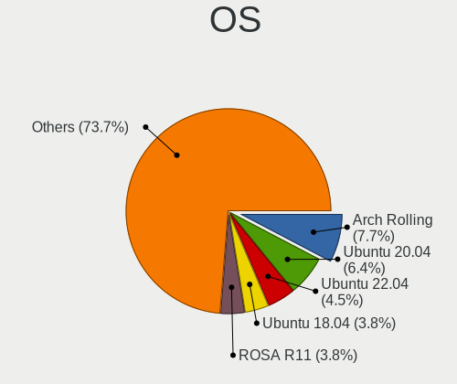

| Name                         | Desktops | Percent |
|------------------------------|----------|---------|
| Ubuntu 20.04                 | 10       | 8.33%   |
| Arch Rolling                 | 7        | 5.83%   |
| Ubuntu 22.04                 | 6        | 5%      |
| Ubuntu 18.04                 | 6        | 5%      |
| ROSA R11                     | 6        | 5%      |
| OpenMandriva 4.3             | 6        | 5%      |
| ROSA R8.1                    | 4        | 3.33%   |
| Manjaro                      | 4        | 3.33%   |
| Kubuntu 20.04                | 4        | 3.33%   |
| Ubuntu 21.10                 | 3        | 2.5%    |
| ROSA 12.2                    | 3        | 2.5%    |
| Gentoo 2.6                   | 3        | 2.5%    |
| Fedora 34                    | 3        | 2.5%    |
| Fedora 31                    | 3        | 2.5%    |
| Pop!_OS 21.04                | 2        | 1.67%   |
| OpenMandriva 4.2             | 2        | 1.67%   |
| OpenMandriva 23.03           | 2        | 1.67%   |
| Nobara 37                    | 2        | 1.67%   |
| KDE neon 20.04               | 2        | 1.67%   |
| Fedora 36                    | 2        | 1.67%   |
| Debian Testing               | 2        | 1.67%   |
| Arch                         | 2        | 1.67%   |
| Zorin 16                     | 1        | 0.83%   |
| Xubuntu 18.04                | 1        | 0.83%   |
| Ubuntu MATE 22.04            | 1        | 0.83%   |
| Ubuntu MATE 20.04            | 1        | 0.83%   |
| Ubuntu 23.04                 | 1        | 0.83%   |
| Ubuntu 21.04                 | 1        | 0.83%   |
| Ubuntu 19.10                 | 1        | 0.83%   |
| Ubuntu 19.04                 | 1        | 0.83%   |
| Ubuntu 16.04                 | 1        | 0.83%   |
| ROSA R9                      | 1        | 0.83%   |
| ROSA R10                     | 1        | 0.83%   |
| ROSA 12.4                    | 1        | 0.83%   |
| ROSA 12                      | 1        | 0.83%   |
| Pop!_OS 22.04                | 1        | 0.83%   |
| Pop!_OS 21.10                | 1        | 0.83%   |
| openSUSE Tumbleweed-XXXXXXXX | 1        | 0.83%   |
| openSUSE Leap-15.3           | 1        | 0.83%   |
| OpenMandriva 4.90            | 1        | 0.83%   |

OS Family
---------

OS without a version

| Name         | Desktops | Percent |
|--------------|----------|---------|
| Ubuntu       | 30       | 25.64%  |
| ROSA         | 17       | 14.53%  |
| OpenMandriva | 11       | 9.4%    |
| Fedora       | 9        | 7.69%   |
| Arch         | 9        | 7.69%   |
| Manjaro      | 7        | 5.98%   |
| Debian       | 5        | 4.27%   |
| Kubuntu      | 4        | 3.42%   |
| Gentoo       | 4        | 3.42%   |
| Pop!_OS      | 3        | 2.56%   |
| Ubuntu MATE  | 2        | 1.71%   |
| openSUSE     | 2        | 1.71%   |
| Nobara       | 2        | 1.71%   |
| Linux Mint   | 2        | 1.71%   |
| KDE neon     | 2        | 1.71%   |
| Zorin        | 1        | 0.85%   |
| Xubuntu      | 1        | 0.85%   |
| MX           | 1        | 0.85%   |
| LMDE         | 1        | 0.85%   |
| EndeavourOS  | 1        | 0.85%   |
| Elementary   | 1        | 0.85%   |
| Clear Linux  | 1        | 0.85%   |
| ArcoLinux    | 1        | 0.85%   |

Kernel
------

Version of the Linux kernel

| Version                             | Desktops | Percent |
|-------------------------------------|----------|---------|
| 5.16.7-desktop-1omv4003             | 6        | 4.58%   |
| 5.10.118-generic-2rosa2021.1-x86_64 | 3        | 2.29%   |
| 6.2.6-desktop-1omv2390              | 2        | 1.53%   |
| 5.5.2-1-MANJARO                     | 2        | 1.53%   |
| 5.4.0-53-generic                    | 2        | 1.53%   |
| 5.4.0-42-generic                    | 2        | 1.53%   |
| 5.4.0-26-generic                    | 2        | 1.53%   |
| 5.11.0-25-generic                   | 2        | 1.53%   |
| 5.10.14-desktop-1omv4002            | 2        | 1.53%   |
| 4.15.0-desktop-45.1rosa-x86_64      | 2        | 1.53%   |
| 6.2.6-201.fsync.fc37.x86_64         | 1        | 0.76%   |
| 6.2.6-1-default                     | 1        | 0.76%   |
| 6.2.0-23-generic                    | 1        | 0.76%   |
| 6.1.9-200.fsync.fc37.x86_64         | 1        | 0.76%   |
| 6.1.38-generic-1rosa2021.1-x86_64   | 1        | 0.76%   |
| 6.1.29-1-lts                        | 1        | 0.76%   |
| 6.1.14-201.fsync.fc37.x86_64        | 1        | 0.76%   |
| 6.1.12-1-MANJARO                    | 1        | 0.76%   |
| 6.1.1-desktop-1omv2290              | 1        | 0.76%   |
| 6.0.12-76060006-generic             | 1        | 0.76%   |
| 6.0.11-x64v1-xanmod1-1              | 1        | 0.76%   |
| 6.0.11-arch1-1                      | 1        | 0.76%   |
| 6.0.1-zen2-1-zen                    | 1        | 0.76%   |
| 5.8.10-zen1-1-zen                   | 1        | 0.76%   |
| 5.8.10-arch1-1                      | 1        | 0.76%   |
| 5.8.0-63-generic                    | 1        | 0.76%   |
| 5.8.0-1-tkg-pds                     | 1        | 0.76%   |
| 5.7.0-2-amd64                       | 1        | 0.76%   |
| 5.6.11-gentoo                       | 1        | 0.76%   |
| 5.6.10-947.native                   | 1        | 0.76%   |
| 5.5.9-200.fc31.x86_64               | 1        | 0.76%   |
| 5.4.8-200.fc31.x86_64               | 1        | 0.76%   |
| 5.4.48-gentoo                       | 1        | 0.76%   |
| 5.4.38-gentoo-x86_64                | 1        | 0.76%   |
| 5.4.17-901.native                   | 1        | 0.76%   |
| 5.4.13-201.fc31.x86_64              | 1        | 0.76%   |
| 5.4.0-91-generic                    | 1        | 0.76%   |
| 5.4.0-77-generic                    | 1        | 0.76%   |
| 5.4.0-65-generic                    | 1        | 0.76%   |
| 5.4.0-58-generic                    | 1        | 0.76%   |

Kernel Family
-------------

Linux kernel without a distro release

| Version  | Desktops | Percent |
|----------|----------|---------|
| 5.4.0    | 15       | 12%     |
| 4.15.0   | 11       | 8.8%    |
| 5.15.0   | 8        | 6.4%    |
| 5.16.7   | 6        | 4.8%    |
| 5.13.0   | 5        | 4%      |
| 5.11.0   | 5        | 4%      |
| 6.2.6    | 4        | 3.2%    |
| 5.10.118 | 3        | 2.4%    |
| 5.10.0   | 3        | 2.4%    |
| 6.0.11   | 2        | 1.6%    |
| 5.8.10   | 2        | 1.6%    |
| 5.8.0    | 2        | 1.6%    |
| 5.5.2    | 2        | 1.6%    |
| 5.3.0    | 2        | 1.6%    |
| 5.19.0   | 2        | 1.6%    |
| 5.10.14  | 2        | 1.6%    |
| 5.0.0    | 2        | 1.6%    |
| 4.9.9    | 2        | 1.6%    |
| 6.2.0    | 1        | 0.8%    |
| 6.1.9    | 1        | 0.8%    |
| 6.1.38   | 1        | 0.8%    |
| 6.1.29   | 1        | 0.8%    |
| 6.1.14   | 1        | 0.8%    |
| 6.1.12   | 1        | 0.8%    |
| 6.1.1    | 1        | 0.8%    |
| 6.0.12   | 1        | 0.8%    |
| 6.0.1    | 1        | 0.8%    |
| 5.7.0    | 1        | 0.8%    |
| 5.6.11   | 1        | 0.8%    |
| 5.6.10   | 1        | 0.8%    |
| 5.5.9    | 1        | 0.8%    |
| 5.4.8    | 1        | 0.8%    |
| 5.4.48   | 1        | 0.8%    |
| 5.4.38   | 1        | 0.8%    |
| 5.4.17   | 1        | 0.8%    |
| 5.4.13   | 1        | 0.8%    |
| 5.3.18   | 1        | 0.8%    |
| 5.3.13   | 1        | 0.8%    |
| 5.18.3   | 1        | 0.8%    |
| 5.18.12  | 1        | 0.8%    |

Kernel Major Ver.
-----------------

Linux kernel major version

| Version | Desktops | Percent |
|---------|----------|---------|
| 5.4     | 20       | 16.13%  |
| 5.15    | 11       | 8.87%   |
| 5.10    | 11       | 8.87%   |
| 4.15    | 11       | 8.87%   |
| 5.13    | 8        | 6.45%   |
| 5.16    | 7        | 5.65%   |
| 5.11    | 7        | 5.65%   |
| 6.1     | 6        | 4.84%   |
| 4.9     | 6        | 4.84%   |
| 6.2     | 5        | 4.03%   |
| 6.0     | 4        | 3.23%   |
| 5.8     | 4        | 3.23%   |
| 5.3     | 4        | 3.23%   |
| 5.5     | 3        | 2.42%   |
| 5.18    | 3        | 2.42%   |
| 5.6     | 2        | 1.61%   |
| 5.19    | 2        | 1.61%   |
| 5.14    | 2        | 1.61%   |
| 5.0     | 2        | 1.61%   |
| 4.19    | 2        | 1.61%   |
| 5.7     | 1        | 0.81%   |
| 5.17    | 1        | 0.81%   |
| 5.1     | 1        | 0.81%   |
| 4.1     | 1        | 0.81%   |

Arch
----

OS architecture (x86_64, i586, etc.)

| Name   | Desktops | Percent |
|--------|----------|---------|
| x86_64 | 108      | 94.74%  |
| i686   | 5        | 4.39%   |
| armv7l | 1        | 0.88%   |

DE
--

Desktop Environment

| Name       | Desktops | Percent |
|------------|----------|---------|
| GNOME      | 42       | 35.59%  |
| KDE5       | 29       | 24.58%  |
| Unknown    | 15       | 12.71%  |
| KDE4       | 10       | 8.47%   |
| XFCE       | 6        | 5.08%   |
| X-Cinnamon | 5        | 4.24%   |
| MATE       | 4        | 3.39%   |
| sway       | 2        | 1.69%   |
| i3         | 2        | 1.69%   |
| Pantheon   | 1        | 0.85%   |
| LXQt       | 1        | 0.85%   |
| KDE        | 1        | 0.85%   |

Display Server
--------------

X11 or Wayland

| Name    | Desktops | Percent |
|---------|----------|---------|
| X11     | 87       | 75.65%  |
| Wayland | 21       | 18.26%  |
| Unknown | 5        | 4.35%   |
| Web     | 1        | 0.87%   |
| Tty     | 1        | 0.87%   |

Display Manager
---------------

SDDM, LightDM, etc.

| Name    | Desktops | Percent |
|---------|----------|---------|
| Unknown | 46       | 40%     |
| SDDM    | 24       | 20.87%  |
| GDM     | 15       | 13.04%  |
| GDM3    | 11       | 9.57%   |
| KDM     | 10       | 8.7%    |
| LightDM | 6        | 5.22%   |
| TDM     | 3        | 2.61%   |

OS Lang
-------

Language

| Lang    | Desktops | Percent |
|---------|----------|---------|
| en_US   | 52       | 44.44%  |
| Unknown | 24       | 20.51%  |
| et_EE   | 19       | 16.24%  |
| ru_RU   | 12       | 10.26%  |
| en_GB   | 5        | 4.27%   |
| pl_PL   | 2        | 1.71%   |
| fr_FR   | 1        | 0.85%   |
| de_DE   | 1        | 0.85%   |
| C       | 1        | 0.85%   |

Boot Mode
---------

EFI or BIOS

| Mode | Desktops | Percent |
|------|----------|---------|
| BIOS | 68       | 58.62%  |
| EFI  | 48       | 41.38%  |

Filesystem
----------

Type of filesystem

| Type    | Desktops | Percent |
|---------|----------|---------|
| Ext4    | 81       | 69.83%  |
| Btrfs   | 15       | 12.93%  |
| Overlay | 12       | 10.34%  |
| Unknown | 6        | 5.17%   |
| Xfs     | 1        | 0.86%   |
| Ext3    | 1        | 0.86%   |

Part. scheme
------------

Scheme of partitioning

| Type    | Desktops | Percent |
|---------|----------|---------|
| GPT     | 48       | 42.11%  |
| Unknown | 45       | 39.47%  |
| MBR     | 21       | 18.42%  |

Dual Boot with Linux/BSD
------------------------

Hosting more than one Linux/BSD

| Dual boot | Desktops | Percent |
|-----------|----------|---------|
| No        | 82       | 70.09%  |
| Yes       | 35       | 29.91%  |

Dual Boot (Win)
---------------

Hosting Linux and Windows

| Dual boot | Desktops | Percent |
|-----------|----------|---------|
| No        | 73       | 63.48%  |
| Yes       | 42       | 36.52%  |

Board
-----

Vendor
------

Motherboard manufacturer

| Name                | Desktops | Percent |
|---------------------|----------|---------|
| ASUSTek Computer    | 28       | 24.56%  |
| Gigabyte Technology | 23       | 20.18%  |
| MSI                 | 22       | 19.3%   |
| ASRock              | 10       | 8.77%   |
| Hewlett-Packard     | 7        | 6.14%   |
| Lenovo              | 6        | 5.26%   |
| Dell                | 6        | 5.26%   |
| Intel               | 4        | 3.51%   |
| ECS                 | 3        | 2.63%   |
| OEM                 | 1        | 0.88%   |
| Huanan              | 1        | 0.88%   |
| Fujitsu             | 1        | 0.88%   |
| ABIT                | 1        | 0.88%   |
| Unknown             | 1        | 0.88%   |

Model
-----

Motherboard model

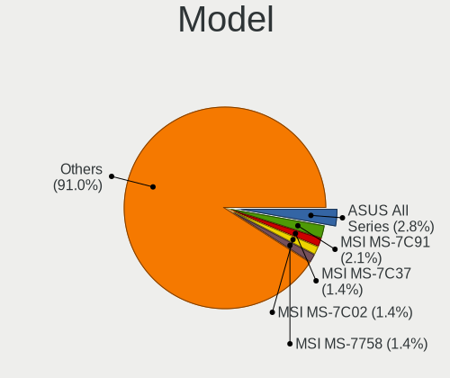

| Name                                     | Desktops | Percent |
|------------------------------------------|----------|---------|
| ASUS All Series                          | 4        | 3.51%   |
| MSI MS-7C02                              | 2        | 1.75%   |
| MSI MS-7758                              | 2        | 1.75%   |
| HP Compaq 8100 Elite SFF PC              | 2        | 1.75%   |
| Gigabyte X570 AORUS PRO                  | 2        | 1.75%   |
| Gigabyte Q87M-D2H                        | 2        | 1.75%   |
| OEM Intel H81                            | 1        | 0.88%   |
| MSI MS-7D43                              | 1        | 0.88%   |
| MSI MS-7C91                              | 1        | 0.88%   |
| MSI MS-7C83                              | 1        | 0.88%   |
| MSI MS-7C75                              | 1        | 0.88%   |
| MSI MS-7C37                              | 1        | 0.88%   |
| MSI MS-7B98                              | 1        | 0.88%   |
| MSI MS-7B86                              | 1        | 0.88%   |
| MSI MS-7B79                              | 1        | 0.88%   |
| MSI MS-7B22                              | 1        | 0.88%   |
| MSI MS-7B18                              | 1        | 0.88%   |
| MSI MS-7A74                              | 1        | 0.88%   |
| MSI MS-7996                              | 1        | 0.88%   |
| MSI MS-7978                              | 1        | 0.88%   |
| MSI MS-7971                              | 1        | 0.88%   |
| MSI MS-7851                              | 1        | 0.88%   |
| MSI MS-7640                              | 1        | 0.88%   |
| MSI MS-7267                              | 1        | 0.88%   |
| MSI FJ418AA-UUW a6522.SC                 | 1        | 0.88%   |
| Lenovo ThinkStation D20 4158GK1          | 1        | 0.88%   |
| Lenovo ThinkCentre M75s Gen 2 11JB002GPB | 1        | 0.88%   |
| Lenovo ThinkCentre M72z 3543C8G          | 1        | 0.88%   |
| Lenovo ThinkCentre M58 7360WQK           | 1        | 0.88%   |
| Lenovo H50-55 90BF005SMW                 | 1        | 0.88%   |
| Lenovo Erazer X310 90AV000CMT            | 1        | 0.88%   |
| Intel DX79TO AAG28805-400                | 1        | 0.88%   |
| Intel DQ35JO AAD82085-807                | 1        | 0.88%   |
| Intel DP67BG AAG10491-305                | 1        | 0.88%   |
| Intel D33217GKE G69901-205               | 1        | 0.88%   |
| Huanan X79 V2.47                         | 1        | 0.88%   |
| HP ProDesk 600 G1 SFF                    | 1        | 0.88%   |
| HP ProDesk 400 G1 SFF                    | 1        | 0.88%   |
| HP Pavilion Gaming Desktop TG01-0xxx     | 1        | 0.88%   |
| HP Compaq 8200 Elite SFF PC              | 1        | 0.88%   |

Model Family
------------

Motherboard model prefix

| Name                | Desktops | Percent |
|---------------------|----------|---------|
| ASUS PRIME          | 7        | 6.14%   |
| Dell OptiPlex       | 5        | 4.39%   |
| HP Compaq           | 4        | 3.51%   |
| Gigabyte X570       | 4        | 3.51%   |
| ASUS All            | 4        | 3.51%   |
| Lenovo ThinkCentre  | 3        | 2.63%   |
| ASUS TUF            | 3        | 2.63%   |
| ASUS ROG            | 3        | 2.63%   |
| MSI MS-7C02         | 2        | 1.75%   |
| MSI MS-7758         | 2        | 1.75%   |
| HP ProDesk          | 2        | 1.75%   |
| Gigabyte Q87M-D2H   | 2        | 1.75%   |
| OEM Intel           | 1        | 0.88%   |
| MSI MS-7D43         | 1        | 0.88%   |
| MSI MS-7C91         | 1        | 0.88%   |
| MSI MS-7C83         | 1        | 0.88%   |
| MSI MS-7C75         | 1        | 0.88%   |
| MSI MS-7C37         | 1        | 0.88%   |
| MSI MS-7B98         | 1        | 0.88%   |
| MSI MS-7B86         | 1        | 0.88%   |
| MSI MS-7B79         | 1        | 0.88%   |
| MSI MS-7B22         | 1        | 0.88%   |
| MSI MS-7B18         | 1        | 0.88%   |
| MSI MS-7A74         | 1        | 0.88%   |
| MSI MS-7996         | 1        | 0.88%   |
| MSI MS-7978         | 1        | 0.88%   |
| MSI MS-7971         | 1        | 0.88%   |
| MSI MS-7851         | 1        | 0.88%   |
| MSI MS-7640         | 1        | 0.88%   |
| MSI MS-7267         | 1        | 0.88%   |
| MSI FJ418AA-UUW     | 1        | 0.88%   |
| Lenovo ThinkStation | 1        | 0.88%   |
| Lenovo H50-55       | 1        | 0.88%   |
| Lenovo Erazer       | 1        | 0.88%   |
| Intel DX79TO        | 1        | 0.88%   |
| Intel DQ35JO        | 1        | 0.88%   |
| Intel DP67BG        | 1        | 0.88%   |
| Intel D33217GKE     | 1        | 0.88%   |
| Huanan X79          | 1        | 0.88%   |
| HP Pavilion         | 1        | 0.88%   |

MFG Year
--------

Motherboard manufacture year

| Year    | Desktops | Percent |
|---------|----------|---------|
| 2018    | 14       | 12.28%  |
| 2020    | 11       | 9.65%   |
| 2019    | 10       | 8.77%   |
| 2012    | 10       | 8.77%   |
| 2013    | 9        | 7.89%   |
| 2009    | 8        | 7.02%   |
| 2016    | 7        | 6.14%   |
| 2015    | 6        | 5.26%   |
| 2014    | 6        | 5.26%   |
| 2021    | 5        | 4.39%   |
| 2017    | 5        | 4.39%   |
| 2010    | 5        | 4.39%   |
| 2022    | 3        | 2.63%   |
| 2011    | 3        | 2.63%   |
| 2008    | 3        | 2.63%   |
| 2006    | 3        | 2.63%   |
| 2007    | 2        | 1.75%   |
| 2005    | 2        | 1.75%   |
| 2004    | 1        | 0.88%   |
| Unknown | 1        | 0.88%   |

Form Factor
-----------

Physical design of the computer

| Name    | Desktops | Percent |
|---------|----------|---------|
| Desktop | 114      | 100%    |

Secure Boot
-----------

Enabled or disabled

| State    | Desktops | Percent |
|----------|----------|---------|
| Disabled | 112      | 97.39%  |
| Enabled  | 3        | 2.61%   |

Coreboot
--------

Have coreboot on board

| Used | Desktops | Percent |
|------|----------|---------|
| No   | 114      | 100%    |

RAM Size
--------

Total RAM memory

| Size in GB  | Desktops | Percent |
|-------------|----------|---------|
| 16.01-24.0  | 29       | 25.22%  |
| 32.01-64.0  | 26       | 22.61%  |
| 8.01-16.0   | 17       | 14.78%  |
| 3.01-4.0    | 14       | 12.17%  |
| 4.01-8.0    | 13       | 11.3%   |
| 64.01-256.0 | 5        | 4.35%   |
| 24.01-32.0  | 3        | 2.61%   |
| 1.01-2.0    | 3        | 2.61%   |
| 2.01-3.0    | 2        | 1.74%   |
| 0.51-1.0    | 2        | 1.74%   |
| 0.01-0.5    | 1        | 0.87%   |

RAM Used
--------

Used RAM memory

| Used GB    | Desktops | Percent |
|------------|----------|---------|
| 1.01-2.0   | 32       | 26.02%  |
| 2.01-3.0   | 27       | 21.95%  |
| 4.01-8.0   | 21       | 17.07%  |
| 0.51-1.0   | 15       | 12.2%   |
| 8.01-16.0  | 11       | 8.94%   |
| 3.01-4.0   | 9        | 7.32%   |
| 0.01-0.5   | 4        | 3.25%   |
| 24.01-32.0 | 2        | 1.63%   |
| 16.01-24.0 | 2        | 1.63%   |

Total Drives
------------

Number of drives on board

| Drives | Desktops | Percent |
|--------|----------|---------|
| 1      | 41       | 34.45%  |
| 2      | 30       | 25.21%  |
| 3      | 25       | 21.01%  |
| 4      | 10       | 8.4%    |
| 6      | 8        | 6.72%   |
| 5      | 3        | 2.52%   |
| 7      | 1        | 0.84%   |
| 0      | 1        | 0.84%   |

Has CD-ROM
----------

Has CD-ROM on board

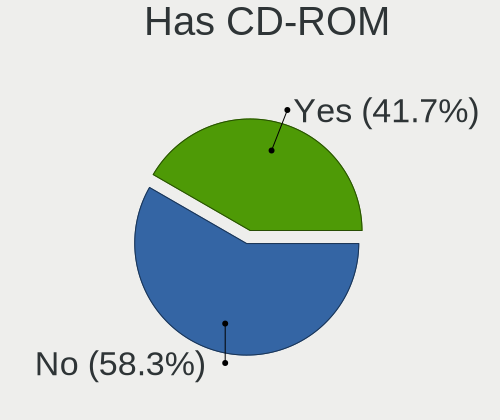

| Presented | Desktops | Percent |
|-----------|----------|---------|
| No        | 62       | 54.39%  |
| Yes       | 52       | 45.61%  |

Has Ethernet
------------

Has Ethernet on board

| Presented | Desktops | Percent |
|-----------|----------|---------|
| Yes       | 112      | 97.39%  |
| No        | 3        | 2.61%   |

Has WiFi
--------

Has WiFi module

| Presented | Desktops | Percent |
|-----------|----------|---------|
| No        | 75       | 65.79%  |
| Yes       | 39       | 34.21%  |

Has Bluetooth
-------------

Has Bluetooth module

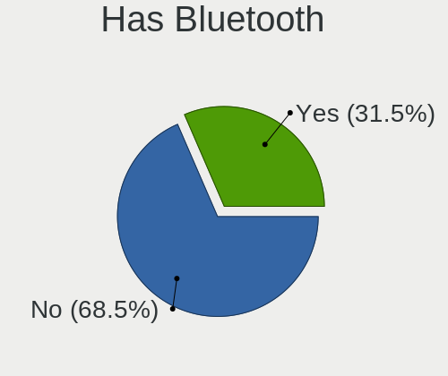

| Presented | Desktops | Percent |
|-----------|----------|---------|
| No        | 83       | 71.55%  |
| Yes       | 33       | 28.45%  |

Location
--------

Country
-------

Geographic location (country)

| Country | Desktops | Percent |
|---------|----------|---------|
| Estonia | 114      | 100%    |

City
----

Geographic location (city)

| City          | Desktops | Percent |
|---------------|----------|---------|
| Tallinn       | 71       | 60.17%  |
| Tartu         | 14       | 11.86%  |
| Haapsalu      | 4        | 3.39%   |
| Rapla         | 3        | 2.54%   |
| Pärnu        | 3        | 2.54%   |
| Tapa          | 2        | 1.69%   |
| Rakvere       | 2        | 1.69%   |
| Paldiski      | 2        | 1.69%   |
| Kohtla-Järve | 2        | 1.69%   |
| Viljandi      | 1        | 0.85%   |
| Vaidasoo      | 1        | 0.85%   |
| Türi         | 1        | 0.85%   |
| Sindi         | 1        | 0.85%   |
| Põlva        | 1        | 0.85%   |
| Maardu        | 1        | 0.85%   |
| Lohkva        | 1        | 0.85%   |
| Kuressaare    | 1        | 0.85%   |
| Kose          | 1        | 0.85%   |
| Kiviõli      | 1        | 0.85%   |
| Kadrina       | 1        | 0.85%   |
| Jõhvi        | 1        | 0.85%   |
| Jaerva vald   | 1        | 0.85%   |
| Hiiumaa       | 1        | 0.85%   |
| Haabneeme     | 1        | 0.85%   |

Drives
------

Drive Vendor
------------

Hard drive vendors

| Vendor                      | Desktops | Drives | Percent |
|-----------------------------|----------|--------|---------|
| Samsung Electronics         | 45       | 69     | 20.27%  |
| WDC                         | 35       | 58     | 15.77%  |
| Seagate                     | 31       | 45     | 13.96%  |
| Kingston                    | 24       | 37     | 10.81%  |
| Crucial                     | 13       | 22     | 5.86%   |
| Toshiba                     | 10       | 10     | 4.5%    |
| Hitachi                     | 10       | 14     | 4.5%    |
| SanDisk                     | 7        | 7      | 3.15%   |
| A-DATA Technology           | 6        | 12     | 2.7%    |
| HGST                        | 5        | 8      | 2.25%   |
| Apacer                      | 3        | 4      | 1.35%   |
| Unknown                     | 2        | 2      | 0.9%    |
| Patriot                     | 2        | 2      | 0.9%    |
| Maxtor                      | 2        | 2      | 0.9%    |
| KingSpec                    | 2        | 3      | 0.9%    |
| Intel                       | 2        | 3      | 0.9%    |
| Gigabyte Technology         | 2        | 2      | 0.9%    |
| Corsair                     | 2        | 2      | 0.9%    |
| China                       | 2        | 2      | 0.9%    |
| ADATA Technology            | 2        | 2      | 0.9%    |
| ZADAK                       | 1        | 1      | 0.45%   |
| XPG                         | 1        | 1      | 0.45%   |
| Team                        | 1        | 2      | 0.45%   |
| SPCC                        | 1        | 1      | 0.45%   |
| SK hynix                    | 1        | 1      | 0.45%   |
| Silicon Motion              | 1        | 2      | 0.45%   |
| Plextor                     | 1        | 1      | 0.45%   |
| Micron/Crucial Technology   | 1        | 1      | 0.45%   |
| KIOXIA-EXCERIA              | 1        | 1      | 0.45%   |
| Kingston Technology Company | 1        | 1      | 0.45%   |
| Integral                    | 1        | 1      | 0.45%   |
| Inateck                     | 1        | 1      | 0.45%   |
| i-FlashDisk                 | 1        | 1      | 0.45%   |
| ASMT                        | 1        | 1      | 0.45%   |
| Apple                       | 1        | 1      | 0.45%   |

Drive Model
-----------

Hard drive models

| Model                                                              | Desktops | Percent |
|--------------------------------------------------------------------|----------|---------|
| Samsung SSD 850 EVO 250GB                                          | 6        | 2.27%   |
| Seagate ST2000DM008-2FR102 2TB                                     | 5        | 1.89%   |
| Samsung NVMe SSD Drive 1TB                                         | 4        | 1.52%   |
| Samsung HD103SJ 1TB                                                | 4        | 1.52%   |
| Kingston SA400S37240G 240GB SSD                                    | 4        | 1.52%   |
| Seagate ST500LT012-9WS142 500GB                                    | 3        | 1.14%   |
| Seagate ST500DM002-1BD142 500GB                                    | 3        | 1.14%   |
| Seagate ST1000DM010-2EP102 1TB                                     | 3        | 1.14%   |
| Samsung SSD 960 PRO 512GB                                          | 3        | 1.14%   |
| Samsung SSD 860 EVO 250GB                                          | 3        | 1.14%   |
| Samsung SSD 850 EVO 500GB                                          | 3        | 1.14%   |
| Samsung MZ7TY128HDHP-000L1 128GB SSD                               | 3        | 1.14%   |
| Kingston SA400S37120G 120GB SSD                                    | 3        | 1.14%   |
| Crucial CT500MX500SSD1 500GB                                       | 3        | 1.14%   |
| A-DATA SX8200PNP 512GB                                             | 3        | 1.14%   |
| WDC WD10EADS-00M2B0 1TB                                            | 2        | 0.76%   |
| Unknown ArtisanTribute-512GB                                       | 2        | 0.76%   |
| Toshiba HDWD130 3TB                                                | 2        | 0.76%   |
| Toshiba DT01ACA100 1TB                                             | 2        | 0.76%   |
| Seagate ST3250318AS 250GB                                          | 2        | 0.76%   |
| Seagate ST1000DM003-1SB102 1TB                                     | 2        | 0.76%   |
| Seagate ST1000DM003-1ER162 1TB                                     | 2        | 0.76%   |
| Sandisk WD Blue SN570 1TB                                          | 2        | 0.76%   |
| Samsung SSD 970 EVO Plus 500GB                                     | 2        | 0.76%   |
| Samsung SSD 860 EVO 500GB                                          | 2        | 0.76%   |
| Samsung SSD 850 PRO 256GB                                          | 2        | 0.76%   |
| Samsung SSD 840 PRO Series 128GB                                   | 2        | 0.76%   |
| Samsung SP0802N 80GB                                               | 2        | 0.76%   |
| Samsung NVMe SSD Controller SM981/PM981/PM983 500GB                | 2        | 0.76%   |
| Kingston SUV400S37240G 240GB SSD                                   | 2        | 0.76%   |
| Hitachi HTS723225L9A360 250GB                                      | 2        | 0.76%   |
| HGST HTS541010A9E680 1TB                                           | 2        | 0.76%   |
| Crucial CT2000MX500SSD1 2TB                                        | 2        | 0.76%   |
| Crucial CT128MX100SSD1 128GB                                       | 2        | 0.76%   |
| Apacer AS350 512GB SSD                                             | 2        | 0.76%   |
| ADATA XPG SX8200 Pro PCIe Gen3x4 M.2 2280 Solid State Drive 1024GB | 2        | 0.76%   |
| A-DATA SU800 128GB SSD                                             | 2        | 0.76%   |
| A-DATA SP550 120GB SSD                                             | 2        | 0.76%   |
| ZADAK TWSS3 512GB                                                  | 1        | 0.38%   |
| XPG GAMMIX S11 240GB                                               | 1        | 0.38%   |

HDD Vendor
----------

Hard disk drive vendors

| Vendor              | Desktops | Drives | Percent |
|---------------------|----------|--------|---------|
| WDC                 | 32       | 49     | 30.48%  |
| Seagate             | 31       | 45     | 29.52%  |
| Samsung Electronics | 13       | 16     | 12.38%  |
| Toshiba             | 10       | 10     | 9.52%   |
| Hitachi             | 10       | 14     | 9.52%   |
| HGST                | 5        | 8      | 4.76%   |
| Maxtor              | 2        | 2      | 1.9%    |
| ASMT                | 1        | 1      | 0.95%   |
| Apple               | 1        | 1      | 0.95%   |

SSD Vendor
----------

Solid state drive vendors

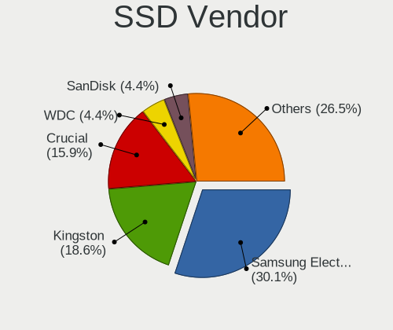

| Vendor              | Desktops | Drives | Percent |
|---------------------|----------|--------|---------|
| Samsung Electronics | 27       | 34     | 30%     |
| Kingston            | 18       | 27     | 20%     |
| Crucial             | 13       | 22     | 14.44%  |
| WDC                 | 5        | 7      | 5.56%   |
| SanDisk             | 5        | 5      | 5.56%   |
| A-DATA Technology   | 4        | 9      | 4.44%   |
| Apacer              | 3        | 4      | 3.33%   |
| Patriot             | 2        | 2      | 2.22%   |
| KingSpec            | 2        | 3      | 2.22%   |
| Corsair             | 2        | 2      | 2.22%   |
| China               | 2        | 2      | 2.22%   |
| Team                | 1        | 2      | 1.11%   |
| SPCC                | 1        | 1      | 1.11%   |
| Plextor             | 1        | 1      | 1.11%   |
| Intel               | 1        | 1      | 1.11%   |
| Integral            | 1        | 1      | 1.11%   |
| i-FlashDisk         | 1        | 1      | 1.11%   |
| Gigabyte Technology | 1        | 1      | 1.11%   |

Drive Kind
----------

HDD or SSD

| Kind    | Desktops | Drives | Percent |
|---------|----------|--------|---------|
| HDD     | 78       | 146    | 42.62%  |
| SSD     | 67       | 125    | 36.61%  |
| NVMe    | 34       | 48     | 18.58%  |
| Unknown | 4        | 4      | 2.19%   |

Drive Connector
---------------

SATA, SAS, NVMe, etc.

| Type | Desktops | Drives | Percent |
|------|----------|--------|---------|
| SATA | 107      | 270    | 73.29%  |
| NVMe | 34       | 48     | 23.29%  |
| SAS  | 5        | 5      | 3.42%   |

Drive Size
----------

Size of hard drive

| Size in TB | Desktops | Drives | Percent |
|------------|----------|--------|---------|
| 0.01-0.5   | 88       | 166    | 54.66%  |
| 0.51-1.0   | 42       | 61     | 26.09%  |
| 1.01-2.0   | 16       | 22     | 9.94%   |
| 2.01-3.0   | 5        | 12     | 3.11%   |
| 4.01-10.0  | 5        | 5      | 3.11%   |
| 3.01-4.0   | 4        | 4      | 2.48%   |
| 10.01-20.0 | 1        | 1      | 0.62%   |

Space Total
-----------

Amount of disk space available on the file system

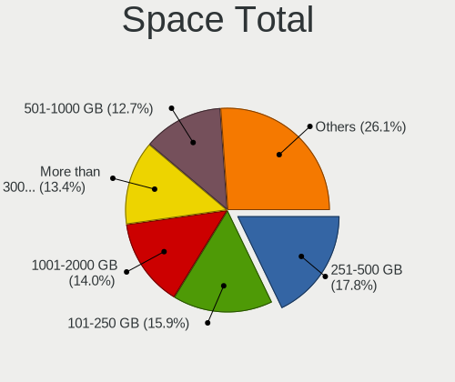

| Size in GB     | Desktops | Percent |
|----------------|----------|---------|
| 251-500        | 25       | 20.49%  |
| 101-250        | 22       | 18.03%  |
| 1001-2000      | 17       | 13.93%  |
| More than 3000 | 13       | 10.66%  |
| 1-20           | 13       | 10.66%  |
| 501-1000       | 13       | 10.66%  |
| 2001-3000      | 6        | 4.92%   |
| 51-100         | 6        | 4.92%   |
| Unknown        | 4        | 3.28%   |
| 21-50          | 3        | 2.46%   |

Space Used
----------

Amount of used disk space

| Used GB        | Desktops | Percent |
|----------------|----------|---------|
| 1-20           | 44       | 36.07%  |
| 101-250        | 16       | 13.11%  |
| 21-50          | 14       | 11.48%  |
| 501-1000       | 11       | 9.02%   |
| 1001-2000      | 9        | 7.38%   |
| 251-500        | 8        | 6.56%   |
| 51-100         | 8        | 6.56%   |
| More than 3000 | 7        | 5.74%   |
| Unknown        | 4        | 3.28%   |
| 2001-3000      | 1        | 0.82%   |

Malfunc. Drives
---------------

Drive models with a malfunction

| Model                                        | Desktops | Drives | Percent |
|----------------------------------------------|----------|--------|---------|
| Crucial CT128MX100SSD1 128GB                 | 2        | 3      | 7.41%   |
| WDC WD60EFRX-68MYMN1 6TB                     | 1        | 1      | 3.7%    |
| WDC WD5002AALX-00J37A0 500GB                 | 1        | 1      | 3.7%    |
| WDC WD5000BPVT-00HXZT1 500GB                 | 1        | 1      | 3.7%    |
| WDC WD5000AAKX-00ERMA0 500GB                 | 1        | 1      | 3.7%    |
| WDC WD20EZRX-00DC0B0 2TB                     | 1        | 2      | 3.7%    |
| WDC WD20EARX-00PASB0 2TB                     | 1        | 1      | 3.7%    |
| WDC WD10PURX-64E5EY0 1TB                     | 1        | 1      | 3.7%    |
| WDC WD10EAVS-00D7B1 1TB                      | 1        | 1      | 3.7%    |
| WDC WD10EADS-00M2B0 1TB                      | 1        | 2      | 3.7%    |
| Toshiba MK6475GSX 640GB                      | 1        | 1      | 3.7%    |
| Seagate ST500DM002-1BD142 500GB              | 1        | 1      | 3.7%    |
| Seagate ST340016A 40GB                       | 1        | 2      | 3.7%    |
| Seagate ST31000528AS 1TB                     | 1        | 1      | 3.7%    |
| Seagate ST1000DM010-2EP102 1TB               | 1        | 1      | 3.7%    |
| Samsung Electronics SSD 840 PRO Series 128GB | 1        | 1      | 3.7%    |
| Samsung Electronics SP0802N 80GB             | 1        | 1      | 3.7%    |
| Samsung Electronics HD642JJ 640GB            | 1        | 1      | 3.7%    |
| Samsung Electronics HD501LJ 500GB            | 1        | 1      | 3.7%    |
| Samsung Electronics HD103SJ 1TB              | 1        | 1      | 3.7%    |
| Patriot P210 256GB SSD                       | 1        | 1      | 3.7%    |
| Patriot Burst 480GB SSD                      | 1        | 1      | 3.7%    |
| Maxtor STM3250310AS 250GB                    | 1        | 1      | 3.7%    |
| Hitachi HDS721680PLA380 80GB                 | 1        | 1      | 3.7%    |
| Hitachi HDS721010DLE630 1TB                  | 1        | 1      | 3.7%    |
| Crucial CT256MX100SSD1 256GB                 | 1        | 1      | 3.7%    |

Malfunc. Drive Vendor
---------------------

Vendors of faulty drives

| Vendor              | Desktops | Drives | Percent |
|---------------------|----------|--------|---------|
| WDC                 | 8        | 11     | 32%     |
| Seagate             | 4        | 5      | 16%     |
| Samsung Electronics | 4        | 5      | 16%     |
| Crucial             | 3        | 4      | 12%     |
| Patriot             | 2        | 2      | 8%      |
| Hitachi             | 2        | 2      | 8%      |
| Toshiba             | 1        | 1      | 4%      |
| Maxtor              | 1        | 1      | 4%      |

Malfunc. HDD Vendor
-------------------

Vendors of faulty HDD drives

| Vendor              | Desktops | Drives | Percent |
|---------------------|----------|--------|---------|
| WDC                 | 8        | 11     | 42.11%  |
| Seagate             | 4        | 5      | 21.05%  |
| Samsung Electronics | 3        | 4      | 15.79%  |
| Hitachi             | 2        | 2      | 10.53%  |
| Toshiba             | 1        | 1      | 5.26%   |
| Maxtor              | 1        | 1      | 5.26%   |

Malfunc. Drive Kind
-------------------

Kinds of faulty drives

| Kind | Desktops | Drives | Percent |
|------|----------|--------|---------|
| HDD  | 18       | 24     | 78.26%  |
| SSD  | 5        | 7      | 21.74%  |

Failed Drives
-------------

Failed drive models

| Model                                            | Desktops | Drives | Percent |
|--------------------------------------------------|----------|--------|---------|
| Samsung Electronics MZ7TY128HDHP-000L1 128GB SSD | 1        | 1      | 100%    |

Failed Drive Vendor
-------------------

Failed drive vendors

| Vendor              | Desktops | Drives | Percent |
|---------------------|----------|--------|---------|
| Samsung Electronics | 1        | 1      | 100%    |

Drive Status
------------

Number of failed and malfunc. drives

| Status   | Desktops | Drives | Percent |
|----------|----------|--------|---------|
| Works    | 60       | 137    | 44.12%  |
| Detected | 52       | 154    | 38.24%  |
| Malfunc  | 23       | 31     | 16.91%  |
| Failed   | 1        | 1      | 0.74%   |

Storage controller
------------------

Storage Vendor
--------------

Storage controller vendors

| Vendor                      | Desktops | Percent |
|-----------------------------|----------|---------|
| Intel                       | 74       | 44.31%  |
| AMD                         | 34       | 20.36%  |
| Samsung Electronics         | 15       | 8.98%   |
| Kingston Technology Company | 8        | 4.79%   |
| Marvell Technology Group    | 6        | 3.59%   |
| Nvidia                      | 5        | 2.99%   |
| ADATA Technology            | 5        | 2.99%   |
| SanDisk                     | 4        | 2.4%    |
| ASMedia Technology          | 4        | 2.4%    |
| VIA Technologies            | 2        | 1.2%    |
| Silicon Motion              | 2        | 1.2%    |
| JMicron Technology          | 2        | 1.2%    |
| SK hynix                    | 1        | 0.6%    |
| Silicon Image               | 1        | 0.6%    |
| Phison Electronics          | 1        | 0.6%    |
| Micron/Crucial Technology   | 1        | 0.6%    |
| KIOXIA                      | 1        | 0.6%    |
| Adaptec                     | 1        | 0.6%    |

Storage Model
-------------

Storage controller models

| Model                                                                                   | Desktops | Percent |
|-----------------------------------------------------------------------------------------|----------|---------|
| AMD FCH SATA Controller [AHCI mode]                                                     | 21       | 10.4%   |
| Intel 8 Series/C220 Series Chipset Family 6-port SATA Controller 1 [AHCI mode]          | 12       | 5.94%   |
| Samsung NVMe SSD Controller SM981/PM981/PM983                                           | 10       | 4.95%   |
| AMD 400 Series Chipset SATA Controller                                                  | 8        | 3.96%   |
| Intel 200 Series PCH SATA controller [AHCI mode]                                        | 7        | 3.47%   |
| Intel Cannon Lake PCH SATA AHCI Controller                                              | 6        | 2.97%   |
| Intel 7 Series/C210 Series Chipset Family 6-port SATA Controller [AHCI mode]            | 6        | 2.97%   |
| AMD 500 Series Chipset SATA Controller                                                  | 6        | 2.97%   |
| Samsung NVMe SSD Controller SM961/PM961/SM963                                           | 5        | 2.48%   |
| Intel NM10/ICH7 Family SATA Controller [IDE mode]                                       | 5        | 2.48%   |
| Intel 82801G (ICH7 Family) IDE Controller                                               | 5        | 2.48%   |
| Intel 6 Series/C200 Series Chipset Family 6 port Desktop SATA AHCI Controller           | 5        | 2.48%   |
| ADATA XPG SX8200 Pro PCIe Gen3x4 M.2 2280 Solid State Drive                             | 5        | 2.48%   |
| Intel Q170/Q150/B150/H170/H110/Z170/CM236 Chipset SATA Controller [AHCI Mode]           | 4        | 1.98%   |
| ASMedia ASM1062 Serial ATA Controller                                                   | 4        | 1.98%   |
| AMD SB7x0/SB8x0/SB9x0 SATA Controller [AHCI mode]                                       | 4        | 1.98%   |
| AMD SB7x0/SB8x0/SB9x0 IDE Controller                                                    | 4        | 1.98%   |
| Kingston Company A2000 NVMe SSD                                                         | 3        | 1.49%   |
| Intel 5 Series/3400 Series Chipset 6 port SATA AHCI Controller                          | 3        | 1.49%   |
| VIA VT6415 PATA IDE Host Controller                                                     | 2        | 0.99%   |
| SanDisk WD Blue SN570 NVMe SSD 1TB                                                      | 2        | 0.99%   |
| SanDisk WD Blue SN550 NVMe SSD                                                          | 2        | 0.99%   |
| Nvidia CK804 Serial ATA Controller                                                      | 2        | 0.99%   |
| Nvidia CK804 IDE                                                                        | 2        | 0.99%   |
| Kingston Company U-SNS8154P3 NVMe SSD                                                   | 2        | 0.99%   |
| JMicron JMB363 SATA/IDE Controller                                                      | 2        | 0.99%   |
| Intel Comet Lake SATA AHCI Controller                                                   | 2        | 0.99%   |
| Intel Alder Lake-S PCH SATA Controller [AHCI Mode]                                      | 2        | 0.99%   |
| Intel 9 Series Chipset Family SATA Controller [AHCI Mode]                               | 2        | 0.99%   |
| Intel 82801JD/DO (ICH10 Family) SATA AHCI Controller                                    | 2        | 0.99%   |
| Intel 7 Series Chipset Family 6-port SATA Controller [AHCI mode]                        | 2        | 0.99%   |
| Intel 6 Series/C200 Series Chipset Family Desktop SATA Controller (IDE mode, ports 4-5) | 2        | 0.99%   |
| Intel 6 Series/C200 Series Chipset Family Desktop SATA Controller (IDE mode, ports 0-3) | 2        | 0.99%   |
| Intel 500 Series Chipset Family SATA AHCI Controller                                    | 2        | 0.99%   |
| Intel 400 Series Chipset Family SATA AHCI Controller                                    | 2        | 0.99%   |
| AMD X370 Series Chipset SATA Controller                                                 | 2        | 0.99%   |
| AMD SB7x0/SB8x0/SB9x0 SATA Controller [IDE mode]                                        | 2        | 0.99%   |
| AMD 300 Series Chipset SATA Controller                                                  | 2        | 0.99%   |
| SK hynix BC501 NVMe Solid State Drive                                                   | 1        | 0.5%    |
| Silicon Motion SM2263EN/SM2263XT (DRAM-less) NVMe SSD Controllers                       | 1        | 0.5%    |

Storage Kind
------------

Kind of storage controller (IDE, SATA, NVMe, SAS, ...)

| Kind | Desktops | Percent |
|------|----------|---------|
| SATA | 97       | 60.63%  |
| NVMe | 34       | 21.25%  |
| IDE  | 24       | 15%     |
| RAID | 4        | 2.5%    |
| SCSI | 1        | 0.63%   |

Processor
---------

CPU Vendor
----------

Processor vendors

| Vendor                | Desktops | Percent |
|-----------------------|----------|---------|
| Intel                 | 74       | 64.91%  |
| AMD                   | 39       | 34.21%  |
| Marvell Semiconductor | 1        | 0.88%   |

CPU Model
---------

Processor models

| Model                                                               | Desktops | Percent |
|---------------------------------------------------------------------|----------|---------|
| AMD Ryzen 7 3700X 8-Core Processor                                  | 5        | 4.39%   |
| AMD Ryzen 5 3600 6-Core Processor                                   | 4        | 3.51%   |
| Intel Core i3-4130 CPU @ 3.40GHz                                    | 3        | 2.63%   |
| Intel Core 2 Duo CPU E8400 @ 3.00GHz                                | 3        | 2.63%   |
| Intel Core i7-7700 CPU @ 3.60GHz                                    | 2        | 1.75%   |
| Intel Core i7-4790 CPU @ 3.60GHz                                    | 2        | 1.75%   |
| Intel Core i5-9600K CPU @ 3.70GHz                                   | 2        | 1.75%   |
| Intel Core i5-4690K CPU @ 3.50GHz                                   | 2        | 1.75%   |
| Intel Core i5-4590 CPU @ 3.30GHz                                    | 2        | 1.75%   |
| Intel Core i5-2500 CPU @ 3.30GHz                                    | 2        | 1.75%   |
| Intel Core i3-3217U CPU @ 1.80GHz                                   | 2        | 1.75%   |
| AMD Ryzen 9 3900X 12-Core Processor                                 | 2        | 1.75%   |
| AMD Ryzen 7 PRO 4750G with Radeon Graphics                          | 2        | 1.75%   |
| AMD Athlon 64 X2 Dual Core Processor 3800+                          | 2        | 1.75%   |
| Marvell Semiconductor Marvell Armada 370/XP (Device Tree) Processor | 1        | 0.88%   |
| Intel Xeon CPU E5620 @ 2.40GHz                                      | 1        | 0.88%   |
| Intel Xeon CPU E5-2689 0 @ 2.60GHz                                  | 1        | 0.88%   |
| Intel Xeon CPU E3-1245 v3 @ 3.40GHz                                 | 1        | 0.88%   |
| Intel Xeon CPU E3-1241 v3 @ 3.50GHz                                 | 1        | 0.88%   |
| Intel Pentium Gold G5400 CPU @ 3.70GHz                              | 1        | 0.88%   |
| Intel Pentium Dual-Core CPU E5300 @ 2.60GHz                         | 1        | 0.88%   |
| Intel Pentium D CPU 2.80GHz                                         | 1        | 0.88%   |
| Intel Pentium CPU G850 @ 2.90GHz                                    | 1        | 0.88%   |
| Intel Pentium CPU G4560T @ 2.90GHz                                  | 1        | 0.88%   |
| Intel Pentium CPU G2120 @ 3.10GHz                                   | 1        | 0.88%   |
| Intel Pentium CPU G2030 @ 3.00GHz                                   | 1        | 0.88%   |
| Intel Pentium 4 CPU 3.00GHz                                         | 1        | 0.88%   |
| Intel Core i9-9900K CPU @ 3.60GHz                                   | 1        | 0.88%   |
| Intel Core i9-7940X CPU @ 3.10GHz                                   | 1        | 0.88%   |
| Intel Core i7-8700K CPU @ 3.70GHz                                   | 1        | 0.88%   |
| Intel Core i7-8700 CPU @ 3.20GHz                                    | 1        | 0.88%   |
| Intel Core i7-6700K CPU @ 4.00GHz                                   | 1        | 0.88%   |
| Intel Core i7-3820 CPU @ 3.60GHz                                    | 1        | 0.88%   |
| Intel Core i7-3770K CPU @ 3.50GHz                                   | 1        | 0.88%   |
| Intel Core i7-10700 CPU @ 2.90GHz                                   | 1        | 0.88%   |
| Intel Core i5-9500 CPU @ 3.00GHz                                    | 1        | 0.88%   |
| Intel Core i5-8400 CPU @ 2.80GHz                                    | 1        | 0.88%   |
| Intel Core i5-7600K CPU @ 3.80GHz                                   | 1        | 0.88%   |
| Intel Core i5-7500 CPU @ 3.40GHz                                    | 1        | 0.88%   |
| Intel Core i5-6500 CPU @ 3.20GHz                                    | 1        | 0.88%   |

CPU Model Family
----------------

Processor model prefix

| Model                   | Desktops | Percent |
|-------------------------|----------|---------|
| Intel Core i5           | 25       | 21.93%  |
| Intel Core i3           | 11       | 9.65%   |
| Intel Core i7           | 10       | 8.77%   |
| AMD Ryzen 7             | 10       | 8.77%   |
| AMD Ryzen 5             | 9        | 7.89%   |
| Other                   | 6        | 5.26%   |
| Intel Core 2 Duo        | 5        | 4.39%   |
| AMD Ryzen 9             | 5        | 4.39%   |
| Intel Xeon              | 4        | 3.51%   |
| Intel Pentium           | 4        | 3.51%   |
| Intel Celeron           | 4        | 3.51%   |
| AMD Phenom II X4        | 4        | 3.51%   |
| AMD Athlon 64 X2        | 3        | 2.63%   |
| Intel Core i9           | 2        | 1.75%   |
| AMD Ryzen 7 PRO         | 2        | 1.75%   |
| AMD FX                  | 2        | 1.75%   |
| AMD A10                 | 2        | 1.75%   |
| Intel Pentium Gold      | 1        | 0.88%   |
| Intel Pentium Dual-Core | 1        | 0.88%   |
| Intel Pentium D         | 1        | 0.88%   |
| Intel Pentium 4         | 1        | 0.88%   |
| AMD Phenom II X6        | 1        | 0.88%   |
| AMD Athlon XP           | 1        | 0.88%   |

CPU Cores
---------

Number of processor cores

| Number  | Desktops | Percent |
|---------|----------|---------|
| 4       | 35       | 30.7%   |
| 2       | 30       | 26.32%  |
| 6       | 19       | 16.67%  |
| 8       | 17       | 14.91%  |
| 1       | 4        | 3.51%   |
| 12      | 3        | 2.63%   |
| 16      | 2        | 1.75%   |
| 14      | 2        | 1.75%   |
| 3       | 1        | 0.88%   |
| Unknown | 1        | 0.88%   |

CPU Sockets
-----------

Number of sockets

| Number | Desktops | Percent |
|--------|----------|---------|
| 1      | 113      | 99.12%  |
| 2      | 1        | 0.88%   |

CPU Threads
-----------

Threads per core (Hyper-Threading)

| Number  | Desktops | Percent |
|---------|----------|---------|
| 2       | 64       | 56.14%  |
| 1       | 49       | 42.98%  |
| Unknown | 1        | 0.88%   |

CPU Op-Modes
------------

CPU Operation Modes (32-bit, 64-bit)

| Op mode        | Desktops | Percent |
|----------------|----------|---------|
| 32-bit, 64-bit | 111      | 97.37%  |
| Unknown        | 2        | 1.75%   |
| 32-bit         | 1        | 0.88%   |

CPU Microcode
-------------

Microcode number

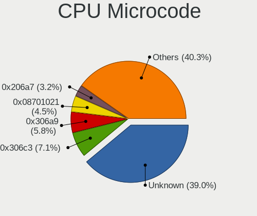

| Number     | Desktops | Percent |
|------------|----------|---------|
| Unknown    | 35       | 28.93%  |
| 0x306c3    | 10       | 8.26%   |
| 0x306a9    | 8        | 6.61%   |
| 0x08701021 | 6        | 4.96%   |
| 0x08701013 | 5        | 4.13%   |
| 0x906ea    | 4        | 3.31%   |
| 0x906e9    | 4        | 3.31%   |
| 0x206a7    | 4        | 3.31%   |
| 0x1067a    | 4        | 3.31%   |
| 0xa0655    | 3        | 2.48%   |
| 0xa0671    | 2        | 1.65%   |
| 0x90672    | 2        | 1.65%   |
| 0x506e3    | 2        | 1.65%   |
| 0x20655    | 2        | 1.65%   |
| 0x08001138 | 2        | 1.65%   |
| 0x06003106 | 2        | 1.65%   |
| 0x06000852 | 2        | 1.65%   |
| 0x010000db | 2        | 1.65%   |
| 0xf64      | 1        | 0.83%   |
| 0xf4a      | 1        | 0.83%   |
| 0xa0653    | 1        | 0.83%   |
| 0x906ed    | 1        | 0.83%   |
| 0x906eb    | 1        | 0.83%   |
| 0x6fd      | 1        | 0.83%   |
| 0x6fb      | 1        | 0.83%   |
| 0x50654    | 1        | 0.83%   |
| 0x406c3    | 1        | 0.83%   |
| 0x206d7    | 1        | 0.83%   |
| 0x20652    | 1        | 0.83%   |
| 0x10676    | 1        | 0.83%   |
| 0x10661    | 1        | 0.83%   |
| 0x0a601203 | 1        | 0.83%   |
| 0x0a201016 | 1        | 0.83%   |
| 0x0a201009 | 1        | 0.83%   |
| 0x08600106 | 1        | 0.83%   |
| 0x08600103 | 1        | 0.83%   |
| 0x08108109 | 1        | 0.83%   |
| 0x0810100b | 1        | 0.83%   |
| 0x0800820d | 1        | 0.83%   |
| 0x010000c8 | 1        | 0.83%   |

CPU Microarch
-------------

Microarchitecture

| Name             | Desktops | Percent |
|------------------|----------|---------|
| Zen 2            | 17       | 14.91%  |
| Haswell          | 15       | 13.16%  |
| KabyLake         | 14       | 12.28%  |
| IvyBridge        | 9        | 7.89%   |
| SandyBridge      | 7        | 6.14%   |
| Westmere         | 5        | 4.39%   |
| Penryn           | 5        | 4.39%   |
| K10              | 5        | 4.39%   |
| Skylake          | 4        | 3.51%   |
| CometLake        | 4        | 3.51%   |
| Zen 3            | 3        | 2.63%   |
| Zen              | 3        | 2.63%   |
| K8 Hammer        | 3        | 2.63%   |
| Core             | 3        | 2.63%   |
| Alderlake Hybrid | 3        | 2.63%   |
| Zen+             | 2        | 1.75%   |
| Steamroller      | 2        | 1.75%   |
| Piledriver       | 2        | 1.75%   |
| NetBurst         | 2        | 1.75%   |
| Icelake          | 2        | 1.75%   |
| Unknown          | 2        | 1.75%   |
| Silvermont       | 1        | 0.88%   |
| K6               | 1        | 0.88%   |

Graphics
--------

GPU Vendor
----------

Vendors of graphics cards

| Vendor | Desktops | Percent |
|--------|----------|---------|
| Nvidia | 58       | 44.96%  |
| Intel  | 37       | 28.68%  |
| AMD    | 34       | 26.36%  |

GPU Model
---------

Graphics card models

| Model                                                                       | Desktops | Percent |
|-----------------------------------------------------------------------------|----------|---------|
| AMD Ellesmere [Radeon RX 470/480/570/570X/580/580X/590]                     | 12       | 9.09%   |
| Intel CoffeeLake-S GT2 [UHD Graphics 630]                                   | 6        | 4.55%   |
| Nvidia GP107 [GeForce GTX 1050 Ti]                                          | 4        | 3.03%   |
| Intel Xeon E3-1200 v3/4th Gen Core Processor Integrated Graphics Controller | 4        | 3.03%   |
| Nvidia GP108 [GeForce GT 1030]                                              | 3        | 2.27%   |
| Nvidia GP104 [GeForce GTX 1070]                                             | 3        | 2.27%   |
| Nvidia GP102 [GeForce GTX 1080 Ti]                                          | 3        | 2.27%   |
| Nvidia GK208B [GeForce GT 710]                                              | 3        | 2.27%   |
| Intel Xeon E3-1200 v2/3rd Gen Core processor Graphics Controller            | 3        | 2.27%   |
| Intel Core Processor Integrated Graphics Controller                         | 3        | 2.27%   |
| Intel 4 Series Chipset Integrated Graphics Controller                       | 3        | 2.27%   |
| Nvidia TU116 [GeForce GTX 1660 Ti]                                          | 2        | 1.52%   |
| Nvidia TU106 [GeForce RTX 2070]                                             | 2        | 1.52%   |
| Nvidia TU106 [GeForce RTX 2060 SUPER]                                       | 2        | 1.52%   |
| Nvidia TU104 [GeForce RTX 2070 SUPER]                                       | 2        | 1.52%   |
| Nvidia GP106 [GeForce GTX 1060 6GB]                                         | 2        | 1.52%   |
| Nvidia GP104 [GeForce GTX 1070 Ti]                                          | 2        | 1.52%   |
| Intel HD Graphics 630                                                       | 2        | 1.52%   |
| Intel 82945G/GZ Integrated Graphics Controller                              | 2        | 1.52%   |
| Intel 4th Generation Core Processor Family Integrated Graphics Controller   | 2        | 1.52%   |
| Intel 3rd Gen Core processor Graphics Controller                            | 2        | 1.52%   |
| Intel 2nd Generation Core Processor Family Integrated Graphics Controller   | 2        | 1.52%   |
| AMD Tonga PRO [Radeon R9 285/380]                                           | 2        | 1.52%   |
| AMD RV610 [Radeon HD 2400 PRO]                                              | 2        | 1.52%   |
| AMD Renoir                                                                  | 2        | 1.52%   |
| Nvidia TU117 [GeForce GTX 1650]                                             | 1        | 0.76%   |
| Nvidia TU116 [GeForce GTX 1660]                                             | 1        | 0.76%   |
| Nvidia TU116 [GeForce GTX 1650]                                             | 1        | 0.76%   |
| Nvidia TU116 [GeForce GTX 1650 SUPER]                                       | 1        | 0.76%   |
| Nvidia TU106 [GeForce RTX 2070 Rev. A]                                      | 1        | 0.76%   |
| Nvidia TU106 [GeForce RTX 2060 Rev. A]                                      | 1        | 0.76%   |
| Nvidia TU102 [GeForce RTX 2080 Ti Rev. A]                                   | 1        | 0.76%   |
| Nvidia NV43GL [Quadro FX 540]                                               | 1        | 0.76%   |
| Nvidia NV43 [GeForce 6600 GT]                                               | 1        | 0.76%   |
| Nvidia NV34 [GeForce FX 5200]                                               | 1        | 0.76%   |
| Nvidia GT218 [GeForce 210]                                                  | 1        | 0.76%   |
| Nvidia GP106 [GeForce GTX 1060 3GB]                                         | 1        | 0.76%   |
| Nvidia GM206 [GeForce GTX 960]                                              | 1        | 0.76%   |
| Nvidia GM206 [GeForce GTX 750 v2]                                           | 1        | 0.76%   |
| Nvidia GM204 [GeForce GTX 970]                                              | 1        | 0.76%   |

GPU Combo
---------

Combinations of graphics cards

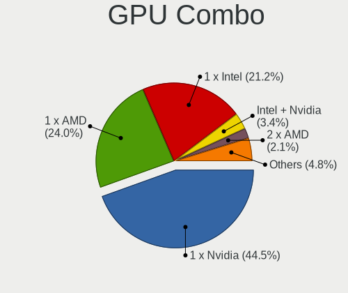

| Name           | Desktops | Percent |
|----------------|----------|---------|
| 1 x Nvidia     | 51       | 44.35%  |
| 1 x Intel      | 26       | 22.61%  |
| 1 x AMD        | 26       | 22.61%  |
| Intel + Nvidia | 4        | 3.48%   |
| Intel + AMD    | 3        | 2.61%   |
| 2 x AMD        | 2        | 1.74%   |
| AMD + Nvidia   | 2        | 1.74%   |
| Other          | 1        | 0.87%   |

GPU Driver
----------

Free vs proprietary

| Driver      | Desktops | Percent |
|-------------|----------|---------|
| Free        | 73       | 62.39%  |
| Proprietary | 36       | 30.77%  |
| Unknown     | 8        | 6.84%   |

GPU Memory
----------

Total video memory

| Size in GB | Desktops | Percent |
|------------|----------|---------|
| Unknown    | 43       | 36.44%  |
| 7.01-8.0   | 17       | 14.41%  |
| 1.01-2.0   | 15       | 12.71%  |
| 3.01-4.0   | 12       | 10.17%  |
| 0.01-0.5   | 11       | 9.32%   |
| 0.51-1.0   | 7        | 5.93%   |
| 8.01-16.0  | 6        | 5.08%   |
| 5.01-6.0   | 5        | 4.24%   |
| 4.01-5.0   | 1        | 0.85%   |
| 2.01-3.0   | 1        | 0.85%   |

Monitor
-------

Monitor Vendor
--------------

Monitor vendors

| Vendor               | Desktops | Percent |
|----------------------|----------|---------|
| Dell                 | 23       | 19.33%  |
| Samsung Electronics  | 22       | 18.49%  |
| Goldstar             | 18       | 15.13%  |
| AOC                  | 9        | 7.56%   |
| Philips              | 8        | 6.72%   |
| Hewlett-Packard      | 8        | 6.72%   |
| ViewSonic            | 7        | 5.88%   |
| BenQ                 | 4        | 3.36%   |
| Hitachi              | 3        | 2.52%   |
| Unknown              | 2        | 1.68%   |
| RoverScan            | 2        | 1.68%   |
| Ancor Communications | 2        | 1.68%   |
| Tech Concepts        | 1        | 0.84%   |
| Plain Tree Systems   | 1        | 0.84%   |
| LG Electronics       | 1        | 0.84%   |
| Lenovo               | 1        | 0.84%   |
| Gigabyte Technology  | 1        | 0.84%   |
| Fujitsu Siemens      | 1        | 0.84%   |
| Eizo                 | 1        | 0.84%   |
| Belinea              | 1        | 0.84%   |
| ASUSTek Computer     | 1        | 0.84%   |
| Acer                 | 1        | 0.84%   |
| Unknown              | 1        | 0.84%   |

Monitor Model
-------------

Monitor models

| Model                                                                  | Desktops | Percent |
|------------------------------------------------------------------------|----------|---------|
| ViewSonic VA703-4SERIES VSC6A1E 1280x1024 338x270mm 17.0-inch          | 2        | 1.54%   |
| Samsung Electronics S32D850 SAM0BCB 2560x1440 708x398mm 32.0-inch      | 2        | 1.54%   |
| Samsung Electronics S24C650 SAM0B18 1920x1200 518x324mm 24.1-inch      | 2        | 1.54%   |
| Hitachi HISENSE HEC0030 3840x2160 1095x616mm 49.5-inch                 | 2        | 1.54%   |
| Hewlett-Packard ZR24w HWP2869 1920x1200 546x352mm 25.6-inch            | 2        | 1.54%   |
| Goldstar ULTRAGEAR GSM5B80 2560x1440 597x336mm 27.0-inch               | 2        | 1.54%   |
| Goldstar MP59G GSM5B34 1920x1080 480x270mm 21.7-inch                   | 2        | 1.54%   |
| Goldstar FULL HD GSM5B55 1920x1080 480x270mm 21.7-inch                 | 2        | 1.54%   |
| Dell U2719D DEL415A 2560x1440 597x336mm 27.0-inch                      | 2        | 1.54%   |
| Dell U2312HM DEL4073 1920x1080 510x287mm 23.0-inch                     | 2        | 1.54%   |
| Dell P2314H DEL4098 1920x1080 509x286mm 23.0-inch                      | 2        | 1.54%   |
| AOC Q3279WG5B AOC3279 2560x1440 725x428mm 33.1-inch                    | 2        | 1.54%   |
| ViewSonic XG2405 VSC0D39 1920x1080 527x296mm 23.8-inch                 | 1        | 0.77%   |
| ViewSonic VG2428wm VSCA426 1920x1080 520x290mm 23.4-inch               | 1        | 0.77%   |
| ViewSonic VG170m VSCBF0C 1280x1024 338x270mm 17.0-inch                 | 1        | 0.77%   |
| ViewSonic VE902m VSC491B 1280x1024 376x301mm 19.0-inch                 | 1        | 0.77%   |
| ViewSonic VA2445 SERIES VSC712E 1920x1080 521x293mm 23.5-inch          | 1        | 0.77%   |
| Unknown LCD Monitor SAMSUNG 1920x1080                                  | 1        | 0.77%   |
| Unknown LCD Monitor GBT G34WQC 3440x1440                               | 1        | 0.77%   |
| Tech Concepts LCD Monitor MT5531 1920x1080                             | 1        | 0.77%   |
| Samsung Electronics U28H75x SAM0E00 3840x2160 607x345mm 27.5-inch      | 1        | 0.77%   |
| Samsung Electronics U28H75x SAM0DFF 3840x2160 608x345mm 27.5-inch      | 1        | 0.77%   |
| Samsung Electronics U28E590 SAM0C4D 3840x2160 607x345mm 27.5-inch      | 1        | 0.77%   |
| Samsung Electronics TV SAM0289 1920x540                                | 1        | 0.77%   |
| Samsung Electronics SyncMaster SAM0587 1920x1200 520x320mm 24.0-inch   | 1        | 0.77%   |
| Samsung Electronics SyncMaster SAM027D 1680x1050 433x271mm 20.1-inch   | 1        | 0.77%   |
| Samsung Electronics SyncMaster SAM027C 1680x1050 433x271mm 20.1-inch   | 1        | 0.77%   |
| Samsung Electronics SyncMaster SAM01F9 1280x1024 376x301mm 19.0-inch   | 1        | 0.77%   |
| Samsung Electronics SyncMaster SAM01B7 1280x1024 338x270mm 17.0-inch   | 1        | 0.77%   |
| Samsung Electronics SyncMaster SAM0193 1280x1024 376x301mm 19.0-inch   | 1        | 0.77%   |
| Samsung Electronics SyncMaster SAM011F 1280x1024 376x301mm 19.0-inch   | 1        | 0.77%   |
| Samsung Electronics SyncMaster SAM011E 1280x1024 338x270mm 17.0-inch   | 1        | 0.77%   |
| Samsung Electronics S24C450 SAM09CB 1920x1080 531x299mm 24.0-inch      | 1        | 0.77%   |
| Samsung Electronics S22R35x SAM103A 1920x1080 476x268mm 21.5-inch      | 1        | 0.77%   |
| Samsung Electronics S22B350 SAM08D4 1920x1080 477x268mm 21.5-inch      | 1        | 0.77%   |
| Samsung Electronics LS27R75 SAM102E 2560x1440 600x340mm 27.2-inch      | 1        | 0.77%   |
| Samsung Electronics LCD Monitor SAM0D4F 1920x1080 1210x680mm 54.6-inch | 1        | 0.77%   |
| Samsung Electronics C27F390 SAM0D33 1920x1080 598x336mm 27.0-inch      | 1        | 0.77%   |
| Samsung Electronics C27F390 SAM0D32 1920x1080 598x336mm 27.0-inch      | 1        | 0.77%   |
| RoverScan Optima 170 DVM6787 1280x1024 340x270mm 17.1-inch             | 1        | 0.77%   |

Monitor Resolution
------------------

Monitor screen resolution

| Resolution         | Desktops | Percent |
|--------------------|----------|---------|
| 1920x1080 (FHD)    | 43       | 37.72%  |
| 1280x1024 (SXGA)   | 18       | 15.79%  |
| 3840x2160 (4K)     | 16       | 14.04%  |
| 2560x1440 (QHD)    | 13       | 11.4%   |
| 1920x1200 (WUXGA)  | 11       | 9.65%   |
| 3440x1440          | 5        | 4.39%   |
| 1680x1050 (WSXGA+) | 2        | 1.75%   |
| 1600x900 (HD+)     | 2        | 1.75%   |
| 1440x900 (WXGA+)   | 2        | 1.75%   |
| 1920x540           | 1        | 0.88%   |
| 1366x768 (WXGA)    | 1        | 0.88%   |

Monitor Diagonal
----------------

Diagonal size in inches

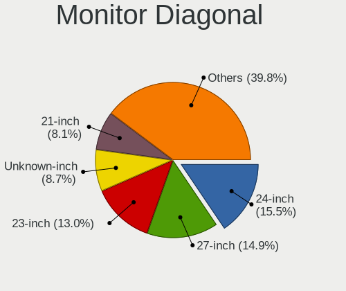

| Inches  | Desktops | Percent |
|---------|----------|---------|
| 24      | 19       | 15.7%   |
| 27      | 17       | 14.05%  |
| 23      | 16       | 13.22%  |
| 17      | 13       | 10.74%  |
| 21      | 12       | 9.92%   |
| Unknown | 9        | 7.44%   |
| 31      | 5        | 4.13%   |
| 19      | 5        | 4.13%   |
| 84      | 3        | 2.48%   |
| 34      | 3        | 2.48%   |
| 32      | 3        | 2.48%   |
| 25      | 3        | 2.48%   |
| 20      | 3        | 2.48%   |
| 18      | 3        | 2.48%   |
| 40      | 2        | 1.65%   |
| 33      | 2        | 1.65%   |
| 54      | 1        | 0.83%   |
| 43      | 1        | 0.83%   |
| 15      | 1        | 0.83%   |

Monitor Width
-------------

Physical width

| Width in mm | Desktops | Percent |
|-------------|----------|---------|
| 501-600     | 45       | 39.13%  |
| 401-500     | 19       | 16.52%  |
| 301-350     | 14       | 12.17%  |
| 601-700     | 9        | 7.83%   |
| Unknown     | 9        | 7.83%   |
| 701-800     | 8        | 6.96%   |
| 351-400     | 4        | 3.48%   |
| 1501-2000   | 3        | 2.61%   |
| 801-900     | 2        | 1.74%   |
| 1001-1500   | 1        | 0.87%   |
| 901-1000    | 1        | 0.87%   |

Aspect Ratio
------------

Proportional relationship between the width and the height

| Ratio   | Desktops | Percent |
|---------|----------|---------|
| 16/9    | 60       | 55.56%  |
| 16/10   | 18       | 16.67%  |
| 5/4     | 15       | 13.89%  |
| Unknown | 8        | 7.41%   |
| 21/9    | 3        | 2.78%   |
| 6/5     | 2        | 1.85%   |
| 4/3     | 1        | 0.93%   |
| 32/9    | 1        | 0.93%   |

Monitor Area
------------

Area in inch²

| Area in inch² | Desktops | Percent |
|----------------|----------|---------|
| 201-250        | 31       | 26.05%  |
| 301-350        | 17       | 14.29%  |
| 251-300        | 16       | 13.45%  |
| 141-150        | 15       | 12.61%  |
| 351-500        | 13       | 10.92%  |
| 151-200        | 10       | 8.4%    |
| Unknown        | 9        | 7.56%   |
| More than 1000 | 4        | 3.36%   |
| 501-1000       | 3        | 2.52%   |
| 101-110        | 1        | 0.84%   |

Pixel Density
-------------

Pixels per inch

| Density | Desktops | Percent |
|---------|----------|---------|
| 51-100  | 71       | 63.96%  |
| 101-120 | 22       | 19.82%  |
| Unknown | 9        | 8.11%   |
| 121-160 | 8        | 7.21%   |
| 1-50    | 1        | 0.9%    |

Multiple Monitors
-----------------

Total monitors connected

| Total | Desktops | Percent |
|-------|----------|---------|
| 1     | 85       | 73.28%  |
| 2     | 20       | 17.24%  |
| 0     | 8        | 6.9%    |
| 3     | 2        | 1.72%   |
| 4     | 1        | 0.86%   |

Network
-------

Net Controller Vendor
---------------------

Controller vendors

| Vendor                          | Desktops | Percent |
|---------------------------------|----------|---------|
| Realtek Semiconductor           | 64       | 42.67%  |
| Intel                           | 44       | 29.33%  |
| TP-Link                         | 7        | 4.67%   |
| Qualcomm Atheros                | 5        | 3.33%   |
| Nvidia                          | 5        | 3.33%   |
| Ralink Technology               | 4        | 2.67%   |
| Ralink                          | 3        | 2%      |
| Samsung Electronics             | 2        | 1.33%   |
| Microsoft                       | 2        | 1.33%   |
| MediaTek                        | 2        | 1.33%   |
| Marvell Technology Group        | 2        | 1.33%   |
| D-Link System                   | 2        | 1.33%   |
| Broadcom Limited                | 2        | 1.33%   |
| Broadcom                        | 2        | 1.33%   |
| Qualcomm Atheros Communications | 1        | 0.67%   |
| D-Link                          | 1        | 0.67%   |
| Aquantia                        | 1        | 0.67%   |
| Apple                           | 1        | 0.67%   |

Net Controller Model
--------------------

Controller models

| Model                                                             | Desktops | Percent |
|-------------------------------------------------------------------|----------|---------|
| Realtek RTL8111/8168/8411 PCI Express Gigabit Ethernet Controller | 52       | 30.95%  |
| Intel I211 Gigabit Network Connection                             | 7        | 4.17%   |
| Intel Ethernet Connection (7) I219-V                              | 6        | 3.57%   |
| Realtek RTL8125 2.5GbE Controller                                 | 5        | 2.98%   |
| Realtek RTL8188EUS 802.11n Wireless Network Adapter               | 4        | 2.38%   |
| Intel Ethernet Connection I217-LM                                 | 3        | 1.79%   |
| Intel Ethernet Connection (2) I219-V                              | 3        | 1.79%   |
| Intel 82579LM Gigabit Network Connection (Lewisville)             | 3        | 1.79%   |
| TP-Link Archer T4U v2 [Realtek RTL8812AU]                         | 2        | 1.19%   |
| Samsung GT-I9070 (network tethering, USB debugging enabled)       | 2        | 1.19%   |
| Realtek RTL8821AE 802.11ac PCIe Wireless Network Adapter          | 2        | 1.19%   |
| Realtek RTL8153 Gigabit Ethernet Adapter                          | 2        | 1.19%   |
| Realtek RTL810xE PCI Express Fast Ethernet controller             | 2        | 1.19%   |
| Ralink MT7601U Wireless Adapter                                   | 2        | 1.19%   |
| Ralink RT2500 Wireless 802.11bg                                   | 2        | 1.19%   |
| Nvidia CK804 Ethernet Controller                                  | 2        | 1.19%   |
| Intel Wi-Fi 6 AX200                                               | 2        | 1.19%   |
| Intel Ethernet Controller I225-V                                  | 2        | 1.19%   |
| Intel Ethernet Connection (2) I218-V                              | 2        | 1.19%   |
| Intel 82579V Gigabit Network Connection                           | 2        | 1.19%   |
| Intel 82578DM Gigabit Network Connection                          | 2        | 1.19%   |
| Intel 82567LM-3 Gigabit Network Connection                        | 2        | 1.19%   |
| TP-Link TL-WN821N v5/v6 [RTL8192EU]                               | 1        | 0.6%    |
| TP-Link TL-WN722N v2/v3 [Realtek RTL8188EUS]                      | 1        | 0.6%    |
| TP-Link Archer T4U ver.3                                          | 1        | 0.6%    |
| TP-Link Archer T2U PLUS [RTL8821AU]                               | 1        | 0.6%    |
| TP-Link 802.11ac WLAN Adapter                                     | 1        | 0.6%    |
| TP-Link 802.11ac NIC                                              | 1        | 0.6%    |
| Realtek RTL8821CE 802.11ac PCIe Wireless Network Adapter          | 1        | 0.6%    |
| Realtek RTL8812AE 802.11ac PCIe Wireless Network Adapter          | 1        | 0.6%    |
| Realtek RTL8192CU 802.11n WLAN Adapter                            | 1        | 0.6%    |
| Realtek RTL-8100/8101L/8139 PCI Fast Ethernet Adapter             | 1        | 0.6%    |
| Ralink RT5370 Wireless Adapter                                    | 1        | 0.6%    |
| Ralink RT2770 Wireless Adapter                                    | 1        | 0.6%    |
| Ralink RT3090 Wireless 802.11n 1T/1R PCIe                         | 1        | 0.6%    |
| Qualcomm Atheros QCA9565 / AR9565 Wireless Network Adapter        | 1        | 0.6%    |
| Qualcomm Atheros Killer E2400 Gigabit Ethernet Controller         | 1        | 0.6%    |
| Qualcomm Atheros AR9271 802.11n                                   | 1        | 0.6%    |
| Qualcomm Atheros AR9485 Wireless Network Adapter                  | 1        | 0.6%    |
| Qualcomm Atheros AR9287 Wireless Network Adapter (PCI-Express)    | 1        | 0.6%    |

Wireless Vendor
---------------

Wireless vendors

| Vendor                          | Desktops | Percent |
|---------------------------------|----------|---------|
| Intel                           | 9        | 22.5%   |
| Realtek Semiconductor           | 8        | 20%     |
| TP-Link                         | 7        | 17.5%   |
| Ralink Technology               | 4        | 10%     |
| Ralink                          | 3        | 7.5%    |
| Qualcomm Atheros                | 3        | 7.5%    |
| Microsoft                       | 2        | 5%      |
| Qualcomm Atheros Communications | 1        | 2.5%    |
| MediaTek                        | 1        | 2.5%    |
| D-Link System                   | 1        | 2.5%    |
| D-Link                          | 1        | 2.5%    |

Wireless Model
--------------

Wireless models

| Model                                                                | Desktops | Percent |
|----------------------------------------------------------------------|----------|---------|
| Realtek RTL8188EUS 802.11n Wireless Network Adapter                  | 4        | 9.52%   |
| TP-Link Archer T4U v2 [Realtek RTL8812AU]                            | 2        | 4.76%   |
| Realtek RTL8821AE 802.11ac PCIe Wireless Network Adapter             | 2        | 4.76%   |
| Ralink MT7601U Wireless Adapter                                      | 2        | 4.76%   |
| Ralink RT2500 Wireless 802.11bg                                      | 2        | 4.76%   |
| Intel Wi-Fi 6 AX200                                                  | 2        | 4.76%   |
| TP-Link TL-WN821N v5/v6 [RTL8192EU]                                  | 1        | 2.38%   |
| TP-Link TL-WN722N v2/v3 [Realtek RTL8188EUS]                         | 1        | 2.38%   |
| TP-Link Archer T4U ver.3                                             | 1        | 2.38%   |
| TP-Link Archer T2U PLUS [RTL8821AU]                                  | 1        | 2.38%   |
| TP-Link 802.11ac WLAN Adapter                                        | 1        | 2.38%   |
| TP-Link 802.11ac NIC                                                 | 1        | 2.38%   |
| Realtek RTL8821CE 802.11ac PCIe Wireless Network Adapter             | 1        | 2.38%   |
| Realtek RTL8812AE 802.11ac PCIe Wireless Network Adapter             | 1        | 2.38%   |
| Realtek RTL8192CU 802.11n WLAN Adapter                               | 1        | 2.38%   |
| Ralink RT5370 Wireless Adapter                                       | 1        | 2.38%   |
| Ralink RT2770 Wireless Adapter                                       | 1        | 2.38%   |
| Ralink RT3090 Wireless 802.11n 1T/1R PCIe                            | 1        | 2.38%   |
| Qualcomm Atheros QCA9565 / AR9565 Wireless Network Adapter           | 1        | 2.38%   |
| Qualcomm Atheros AR9271 802.11n                                      | 1        | 2.38%   |
| Qualcomm Atheros AR9485 Wireless Network Adapter                     | 1        | 2.38%   |
| Qualcomm Atheros AR9287 Wireless Network Adapter (PCI-Express)       | 1        | 2.38%   |
| Microsoft Xbox Wireless Adapter for Windows                          | 1        | 2.38%   |
| Microsoft Xbox 360 Wireless Adapter                                  | 1        | 2.38%   |
| MediaTek MT7922 802.11ax PCI Express Wireless Network Adapter        | 1        | 2.38%   |
| Intel Wireless 3165                                                  | 1        | 2.38%   |
| Intel Wi-Fi 6 AX210/AX211/AX411 160MHz                               | 1        | 2.38%   |
| Intel Dual Band Wireless-AC 3168NGW [Stone Peak]                     | 1        | 2.38%   |
| Intel Comet Lake PCH CNVi WiFi                                       | 1        | 2.38%   |
| Intel Centrino Wireless-N 2230                                       | 1        | 2.38%   |
| Intel Centrino Advanced-N 6230 [Rainbow Peak]                        | 1        | 2.38%   |
| Intel Alder Lake-S PCH CNVi WiFi                                     | 1        | 2.38%   |
| D-Link System DWA-125 Wireless N 150 Adapter(rev.A1) [Ralink RT3070] | 1        | 2.38%   |
| D-Link DWA-171                                                       | 1        | 2.38%   |

Ethernet Vendor
---------------

Ethernet vendors

| Vendor                   | Desktops | Percent |
|--------------------------|----------|---------|
| Realtek Semiconductor    | 60       | 50.85%  |
| Intel                    | 41       | 34.75%  |
| Nvidia                   | 5        | 4.24%   |
| Qualcomm Atheros         | 2        | 1.69%   |
| Marvell Technology Group | 2        | 1.69%   |
| Broadcom Limited         | 2        | 1.69%   |
| Broadcom                 | 2        | 1.69%   |
| MediaTek                 | 1        | 0.85%   |
| D-Link System            | 1        | 0.85%   |
| Aquantia                 | 1        | 0.85%   |
| Apple                    | 1        | 0.85%   |

Ethernet Model
--------------

Ethernet models

| Model                                                                         | Desktops | Percent |
|-------------------------------------------------------------------------------|----------|---------|
| Realtek RTL8111/8168/8411 PCI Express Gigabit Ethernet Controller             | 52       | 41.94%  |
| Intel I211 Gigabit Network Connection                                         | 7        | 5.65%   |
| Intel Ethernet Connection (7) I219-V                                          | 6        | 4.84%   |
| Realtek RTL8125 2.5GbE Controller                                             | 5        | 4.03%   |
| Intel Ethernet Connection I217-LM                                             | 3        | 2.42%   |
| Intel Ethernet Connection (2) I219-V                                          | 3        | 2.42%   |
| Intel 82579LM Gigabit Network Connection (Lewisville)                         | 3        | 2.42%   |
| Realtek RTL8153 Gigabit Ethernet Adapter                                      | 2        | 1.61%   |
| Realtek RTL810xE PCI Express Fast Ethernet controller                         | 2        | 1.61%   |
| Nvidia CK804 Ethernet Controller                                              | 2        | 1.61%   |
| Intel Ethernet Controller I225-V                                              | 2        | 1.61%   |
| Intel Ethernet Connection (2) I218-V                                          | 2        | 1.61%   |
| Intel 82579V Gigabit Network Connection                                       | 2        | 1.61%   |
| Intel 82578DM Gigabit Network Connection                                      | 2        | 1.61%   |
| Intel 82567LM-3 Gigabit Network Connection                                    | 2        | 1.61%   |
| Realtek RTL-8100/8101L/8139 PCI Fast Ethernet Adapter                         | 1        | 0.81%   |
| Qualcomm Atheros Killer E2400 Gigabit Ethernet Controller                     | 1        | 0.81%   |
| Qualcomm Atheros AR8151 v2.0 Gigabit Ethernet                                 | 1        | 0.81%   |
| Nvidia nForce2 Ethernet Controller                                            | 1        | 0.81%   |
| Nvidia MCP77 Ethernet                                                         | 1        | 0.81%   |
| Nvidia MCP61 Ethernet                                                         | 1        | 0.81%   |
| MediaTek Titan pocket                                                         | 1        | 0.81%   |
| Marvell Group 88E8053 PCI-E Gigabit Ethernet Controller                       | 1        | 0.81%   |
| Marvell Group 88E8052 PCI-E ASF Gigabit Ethernet Controller                   | 1        | 0.81%   |
| Intel I350 Gigabit Network Connection                                         | 1        | 0.81%   |
| Intel I210 Gigabit Network Connection                                         | 1        | 0.81%   |
| Intel Ethernet Controller I219-V                                              | 1        | 0.81%   |
| Intel Ethernet Connection I217-V                                              | 1        | 0.81%   |
| Intel Ethernet Connection (5) I219-LM                                         | 1        | 0.81%   |
| Intel Ethernet Connection (2) I219-LM                                         | 1        | 0.81%   |
| Intel Ethernet Connection (17) I219-V                                         | 1        | 0.81%   |
| Intel Ethernet Connection (11) I219-V                                         | 1        | 0.81%   |
| Intel 82599ES 10-Gigabit SFI/SFP+ Network Connection                          | 1        | 0.81%   |
| Intel 82574L Gigabit Network Connection                                       | 1        | 0.81%   |
| Intel 82571EB/82571GB Gigabit Ethernet Controller D0/D1 (copper applications) | 1        | 0.81%   |
| Intel 82566DM-2 Gigabit Network Connection                                    | 1        | 0.81%   |
| Intel 82541PI Gigabit Ethernet Controller                                     | 1        | 0.81%   |
| D-Link System DGE-528T Gigabit Ethernet Adapter                               | 1        | 0.81%   |
| Broadcom NetXtreme BCM5754 Gigabit Ethernet PCI Express                       | 1        | 0.81%   |
| Broadcom NetXtreme BCM5751 Gigabit Ethernet PCI Express                       | 1        | 0.81%   |

Net Controller Kind
-------------------

Ethernet, WiFi or modem

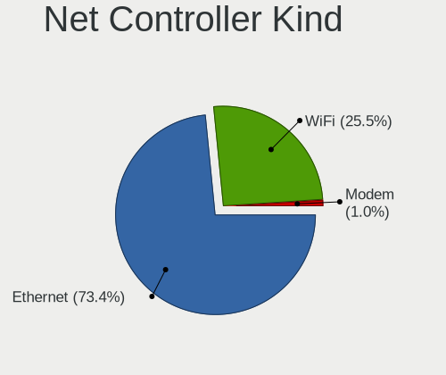

| Kind     | Desktops | Percent |
|----------|----------|---------|
| Ethernet | 111      | 73.03%  |
| WiFi     | 39       | 25.66%  |
| Modem    | 2        | 1.32%   |

Used Controller
---------------

Currently used network controller

| Kind     | Desktops | Percent |
|----------|----------|---------|
| Ethernet | 90       | 81.82%  |
| WiFi     | 20       | 18.18%  |

NICs
----

Total network controllers on board

| Total | Desktops | Percent |
|-------|----------|---------|
| 1     | 85       | 74.56%  |
| 2     | 23       | 20.18%  |
| 0     | 3        | 2.63%   |
| 3     | 2        | 1.75%   |
| 6     | 1        | 0.88%   |

IPv6
----

IPv6 vs IPv4

| Used | Desktops | Percent |
|------|----------|---------|
| No   | 94       | 82.46%  |
| Yes  | 20       | 17.54%  |

Bluetooth
---------

Bluetooth Vendor
----------------

Controller vendors

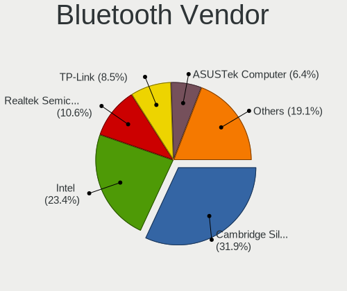

| Vendor                          | Desktops | Percent |
|---------------------------------|----------|---------|
| Cambridge Silicon Radio         | 13       | 38.24%  |
| Intel                           | 8        | 23.53%  |
| Realtek Semiconductor           | 3        | 8.82%   |
| ASUSTek Computer                | 3        | 8.82%   |
| TP-Link                         | 2        | 5.88%   |
| Edimax Technology               | 2        | 5.88%   |
| Qualcomm Atheros Communications | 1        | 2.94%   |
| Integrated System Solution      | 1        | 2.94%   |
| Foxconn / Hon Hai               | 1        | 2.94%   |

Bluetooth Model
---------------

Controller models

| Model                                                 | Desktops | Percent |
|-------------------------------------------------------|----------|---------|
| Cambridge Silicon Radio Bluetooth Dongle (HCI mode)   | 13       | 38.24%  |
| TP-Link UB500 Adapter                                 | 2        | 5.88%   |
| Intel AX200 Bluetooth                                 | 2        | 5.88%   |
| Edimax Bluetooth Adapter                              | 2        | 5.88%   |
| ASUS ASUS USB-BT500                                   | 2        | 5.88%   |
| Realtek RTL8821A Bluetooth                            | 1        | 2.94%   |
| Realtek  Bluetooth 4.2 Adapter                        | 1        | 2.94%   |
| Realtek Bluetooth Radio                               | 1        | 2.94%   |
| Qualcomm Atheros AR9462 Bluetooth                     | 1        | 2.94%   |
| Intel Wireless-AC 3168 Bluetooth                      | 1        | 2.94%   |
| Intel Centrino Bluetooth Wireless Transceiver         | 1        | 2.94%   |
| Intel Bluetooth wireless interface                    | 1        | 2.94%   |
| Intel Bluetooth Device                                | 1        | 2.94%   |
| Intel Bluetooth 9460/9560 Jefferson Peak (JfP)        | 1        | 2.94%   |
| Intel AX210 Bluetooth                                 | 1        | 2.94%   |
| Integrated System Solution KY-BT100 Bluetooth Adapter | 1        | 2.94%   |
| Foxconn / Hon Hai Wireless_Device                     | 1        | 2.94%   |
| ASUS Bluetooth Radio                                  | 1        | 2.94%   |

Sound
-----

Sound Vendor
------------

Sound card vendors

| Vendor                  | Desktops | Percent |
|-------------------------|----------|---------|
| Intel                   | 72       | 34.78%  |
| Nvidia                  | 56       | 27.05%  |
| AMD                     | 50       | 24.15%  |
| C-Media Electronics     | 7        | 3.38%   |
| Kingston Technology     | 5        | 2.42%   |
| SteelSeries ApS         | 2        | 0.97%   |
| Razer USA               | 2        | 0.97%   |
| Logitech                | 2        | 0.97%   |
| Focusrite-Novation      | 2        | 0.97%   |
| TerraTec Electronic     | 1        | 0.48%   |
| Syntek                  | 1        | 0.48%   |
| Samson Technologies     | 1        | 0.48%   |
| M-Audio                 | 1        | 0.48%   |
| JMTek                   | 1        | 0.48%   |
| Generalplus Technology  | 1        | 0.48%   |
| Creative Labs           | 1        | 0.48%   |
| BEHRINGER International | 1        | 0.48%   |
| ASUSTek Computer        | 1        | 0.48%   |

Sound Model
-----------

Sound card models

| Model                                                                      | Desktops | Percent |
|----------------------------------------------------------------------------|----------|---------|
| AMD Starship/Matisse HD Audio Controller                                   | 15       | 6.61%   |
| Intel 8 Series/C220 Series Chipset High Definition Audio Controller        | 12       | 5.29%   |
| AMD Ellesmere HDMI Audio [Radeon RX 470/480 / 570/580/590]                 | 12       | 5.29%   |
| Intel 7 Series/C216 Chipset Family High Definition Audio Controller        | 8        | 3.52%   |
| Intel Cannon Lake PCH cAVS                                                 | 7        | 3.08%   |
| Intel 6 Series/C200 Series Chipset Family High Definition Audio Controller | 7        | 3.08%   |
| Intel 200 Series PCH HD Audio                                              | 7        | 3.08%   |
| Nvidia TU106 High Definition Audio Controller                              | 6        | 2.64%   |
| Intel Xeon E3-1200 v3/4th Gen Core Processor HD Audio Controller           | 6        | 2.64%   |
| AMD SBx00 Azalia (Intel HDA)                                               | 6        | 2.64%   |
| Nvidia TU116 High Definition Audio Controller                              | 5        | 2.2%    |
| Nvidia GP104 High Definition Audio Controller                              | 5        | 2.2%    |
| Intel NM10/ICH7 Family High Definition Audio Controller                    | 5        | 2.2%    |
| AMD Family 17h/19h HD Audio Controller                                     | 5        | 2.2%    |
| Kingston Technology HyperX 7.1 Audio                                       | 4        | 1.76%   |
| Intel 5 Series/3400 Series Chipset High Definition Audio                   | 4        | 1.76%   |
| Nvidia GP108 High Definition Audio Controller                              | 3        | 1.32%   |
| Nvidia GP107GL High Definition Audio Controller                            | 3        | 1.32%   |
| Nvidia GP106 High Definition Audio Controller                              | 3        | 1.32%   |
| Nvidia GP102 HDMI Audio Controller                                         | 3        | 1.32%   |
| Nvidia GK208 HDMI/DP Audio Controller                                      | 3        | 1.32%   |
| Nvidia GA104 High Definition Audio Controller                              | 3        | 1.32%   |
| Intel 100 Series/C230 Series Chipset Family HD Audio Controller            | 3        | 1.32%   |
| C-Media Electronics Blue Snowball                                          | 3        | 1.32%   |
| AMD Renoir Radeon High Definition Audio Controller                         | 3        | 1.32%   |
| AMD Family 17h (Models 00h-0fh) HD Audio Controller                        | 3        | 1.32%   |
| Nvidia TU104 HD Audio Controller                                           | 2        | 0.88%   |
| Nvidia GM206 High Definition Audio Controller                              | 2        | 0.88%   |
| Nvidia GF119 HDMI Audio Controller                                         | 2        | 0.88%   |
| Nvidia CK804 AC'97 Audio Controller                                        | 2        | 0.88%   |
| Intel Comet Lake PCH-V cAVS                                                | 2        | 0.88%   |
| Intel Alder Lake-S HD Audio Controller                                     | 2        | 0.88%   |
| Intel 9 Series Chipset Family HD Audio Controller                          | 2        | 0.88%   |
| Intel 82801JI (ICH10 Family) HD Audio Controller                           | 2        | 0.88%   |
| Intel 82801JD/DO (ICH10 Family) HD Audio Controller                        | 2        | 0.88%   |
| C-Media Electronics USB Audio Device                                       | 2        | 0.88%   |
| AMD Tonga HDMI Audio [Radeon R9 285/380]                                   | 2        | 0.88%   |
| AMD Redwood HDMI Audio [Radeon HD 5000 Series]                             | 2        | 0.88%   |
| AMD Raven/Raven2/Fenghuang HDMI/DP Audio Controller                        | 2        | 0.88%   |
| AMD Navi 21/23 HDMI/DP Audio Controller                                    | 2        | 0.88%   |

Memory
------

Memory Vendor
-------------

Memory module vendors

| Vendor              | Desktops | Percent |
|---------------------|----------|---------|
| G.Skill             | 16       | 18.6%   |
| Kingston            | 15       | 17.44%  |
| Unknown             | 14       | 16.28%  |
| Crucial             | 8        | 9.3%    |
| Samsung Electronics | 7        | 8.14%   |
| SK hynix            | 6        | 6.98%   |
| Corsair             | 5        | 5.81%   |
| Patriot             | 2        | 2.33%   |
| Apacer              | 2        | 2.33%   |
| Wilk                | 1        | 1.16%   |
| Team                | 1        | 1.16%   |
| Silicon Power       | 1        | 1.16%   |
| Ramaxel Technology  | 1        | 1.16%   |
| Micron Technology   | 1        | 1.16%   |
| GOODRAM             | 1        | 1.16%   |
| Elpida              | 1        | 1.16%   |
| AMD                 | 1        | 1.16%   |
| Aeneon              | 1        | 1.16%   |
| A-DATA Technology   | 1        | 1.16%   |
| Unknown             | 1        | 1.16%   |

Memory Model
------------

Memory module models

| Model                                                     | Desktops | Percent |
|-----------------------------------------------------------|----------|---------|
| Unknown RAM Module 512MB DIMM SDRAM                       | 2        | 2.04%   |
| Unknown RAM Module 2048MB DIMM SDRAM                      | 2        | 2.04%   |
| Samsung RAM M378B5173DB0-CK0 4GB DIMM DDR3 1600MT/s       | 2        | 2.04%   |
| Crucial RAM BLS8G4D240FSB.16FBR2 8GB DIMM DDR4 2400MT/s   | 2        | 2.04%   |
| Wilk RAM IRX3200D464L16SA/8G 8GB DIMM DDR4 3200MT/s       | 1        | 1.02%   |
| Unknown RAM Module 8GB DIMM DDR3 1600MT/s                 | 1        | 1.02%   |
| Unknown RAM Module 8192MB DIMM DDR3 1600MT/s              | 1        | 1.02%   |
| Unknown RAM Module 512MB DIMM                             | 1        | 1.02%   |
| Unknown RAM Module 4096MB DIMM 667MT/s                    | 1        | 1.02%   |
| Unknown RAM Module 4096MB DIMM 1333MT/s                   | 1        | 1.02%   |
| Unknown RAM Module 2GB DIMM DDR2 800MT/s                  | 1        | 1.02%   |
| Unknown RAM Module 2GB DIMM 1333MT/s                      | 1        | 1.02%   |
| Unknown RAM Module 256MB DIMM                             | 1        | 1.02%   |
| Unknown RAM Module 2048MB DIMM DDR2 800MT/s               | 1        | 1.02%   |
| Unknown RAM Module 1GB DIMM SDRAM                         | 1        | 1.02%   |
| Unknown RAM Module 1024MB DIMM DDR2 667MT/s               | 1        | 1.02%   |
| Unknown RAM Module 1024MB DIMM                            | 1        | 1.02%   |
| Team RAM TEAMGROUP-UD4-3600 8GB DIMM DDR4 3733MT/s        | 1        | 1.02%   |
| SK hynix RAM Module 8192MB DIMM DDR3 1333MT/s             | 1        | 1.02%   |
| SK hynix RAM Module 2048MB DIMM DDR3 1333MT/s             | 1        | 1.02%   |
| SK hynix RAM HMT351U7BFR8C-H9 4GB DIMM DDR3 1333MT/s      | 1        | 1.02%   |
| SK hynix RAM HMT351U6CFR8C-PB 4GB DIMM DDR3 1800MT/s      | 1        | 1.02%   |
| SK hynix RAM HMT351U6CFR8C-H9 4GB DIMM DDR3 1333MT/s      | 1        | 1.02%   |
| SK hynix RAM HMT325U6CFR8C-PB 2GB DIMM DDR3 1600MT/s      | 1        | 1.02%   |
| SK hynix RAM HMT125U6TFR8C-G7 2GB DIMM DDR3 1067MT/s      | 1        | 1.02%   |
| Silicon Power RAM SP008GBLTU160N02 8GB DIMM DDR3 1600MT/s | 1        | 1.02%   |
| Silicon Power RAM DCLT8GN128S 8192MB DIMM DDR3 1600MT/s   | 1        | 1.02%   |
| Samsung RAM M471B5273EB0-CK0 4GB SODIMM DDR3 4199MT/s     | 1        | 1.02%   |
| Samsung RAM M471B5173QH0-YK0 4096MB SODIMM DDR3 1600MT/s  | 1        | 1.02%   |
| Samsung RAM M378B5773DH0-CH9 2GB DIMM DDR3 1333MT/s       | 1        | 1.02%   |
| Samsung RAM M378B5273DH0-CH9 4GB DIMM DDR3 2133MT/s       | 1        | 1.02%   |
| Samsung RAM M378B5273CH0-CH9 4GB DIMM DDR3 1867MT/s       | 1        | 1.02%   |
| Samsung RAM M378B1G73EB0-YK0 8GB DIMM DDR3 1600MT/s       | 1        | 1.02%   |
| Samsung RAM M378A1K43CB2-CTD 8GB DIMM DDR4 3266MT/s       | 1        | 1.02%   |
| Ramaxel RAM RMR1870EC58E9F133 4GB DIMM DDR3 1333MT/s      | 1        | 1.02%   |
| Patriot RAM PSD48G240082 8GB DIMM DDR4 2400MT/s           | 1        | 1.02%   |
| Patriot RAM 3200 C16 Series 8192MB DIMM DDR4 3266MT/s     | 1        | 1.02%   |
| Micron RAM 8ATF2G64AZ-3G2E1 16GB DIMM DDR4 3200MT/s       | 1        | 1.02%   |
| Kingston RAM KHX3600C17D4/8GX 8GB DIMM DDR4 3600MT/s      | 1        | 1.02%   |
| Kingston RAM KHX3200C16D4/8GX 8GB DIMM DDR4 3600MT/s      | 1        | 1.02%   |

Memory Kind
-----------

Memory module kinds

| Kind    | Desktops | Percent |
|---------|----------|---------|
| DDR4    | 37       | 50%     |
| DDR3    | 21       | 28.38%  |
| SDRAM   | 6        | 8.11%   |
| Unknown | 5        | 6.76%   |
| DDR2    | 3        | 4.05%   |
| DDR5    | 1        | 1.35%   |
| DDR     | 1        | 1.35%   |

Memory Form Factor
------------------

Physical design of the memory module

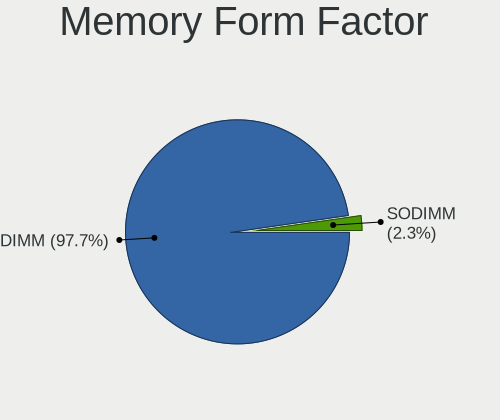

| Name   | Desktops | Percent |
|--------|----------|---------|
| DIMM   | 71       | 97.26%  |
| SODIMM | 2        | 2.74%   |

Memory Size
-----------

Memory module size

| Size  | Desktops | Percent |
|-------|----------|---------|
| 8192  | 31       | 38.75%  |
| 4096  | 14       | 17.5%   |
| 16384 | 12       | 15%     |
| 2048  | 11       | 13.75%  |
| 1024  | 4        | 5%      |
| 512   | 4        | 5%      |
| 32768 | 3        | 3.75%   |
| 256   | 1        | 1.25%   |

Memory Speed
------------

Memory module speed

| Speed   | Desktops | Percent |
|---------|----------|---------|
| 1600    | 15       | 18.07%  |
| 3200    | 10       | 12.05%  |
| 1333    | 8        | 9.64%   |
| 3600    | 7        | 8.43%   |
| Unknown | 6        | 7.23%   |
| 2400    | 5        | 6.02%   |
| 2667    | 4        | 4.82%   |
| 3666    | 3        | 3.61%   |
| 2133    | 3        | 3.61%   |
| 3266    | 2        | 2.41%   |
| 800     | 2        | 2.41%   |
| 667     | 2        | 2.41%   |
| 6000    | 1        | 1.2%    |
| 4199    | 1        | 1.2%    |
| 4133    | 1        | 1.2%    |
| 3800    | 1        | 1.2%    |
| 3733    | 1        | 1.2%    |
| 3334    | 1        | 1.2%    |
| 3000    | 1        | 1.2%    |
| 2933    | 1        | 1.2%    |
| 2733    | 1        | 1.2%    |
| 2666    | 1        | 1.2%    |
| 2134    | 1        | 1.2%    |
| 1867    | 1        | 1.2%    |
| 1866    | 1        | 1.2%    |
| 1800    | 1        | 1.2%    |
| 1067    | 1        | 1.2%    |
| 533     | 1        | 1.2%    |

Printers & scanners
-------------------

Printer Vendor
--------------

Printer device vendors

| Vendor              | Desktops | Percent |
|---------------------|----------|---------|
| Seiko Epson         | 1        | 20%     |
| Samsung Electronics | 1        | 20%     |
| Konica Minolta      | 1        | 20%     |
| Hewlett-Packard     | 1        | 20%     |
| Brother Industries  | 1        | 20%     |

Printer Model
-------------

Printer device models

| Model                                        | Desktops | Percent |
|----------------------------------------------|----------|---------|
| Seiko Epson Thermal Receipt Printer [TM-T20] | 1        | 20%     |
| Samsung SCX-3400 Series                      | 1        | 20%     |
| Konica Minolta Printer                       | 1        | 20%     |
| HP Smart Tank 750 series                     | 1        | 20%     |
| Brother HL-4140CN series                     | 1        | 20%     |

Scanner Vendor
--------------

Scanner device vendors

| Vendor      | Desktops | Percent |
|-------------|----------|---------|
| Seiko Epson | 1        | 100%    |

Scanner Model
-------------

Scanner device models

| Model                      | Desktops | Percent |
|----------------------------|----------|---------|
| Seiko Epson Perfection 660 | 1        | 100%    |

Camera
------

Camera Vendor
-------------

Camera device vendors

| Vendor                        | Desktops | Percent |
|-------------------------------|----------|---------|
| Logitech                      | 8        | 42.11%  |
| Arkmicro Technologies         | 2        | 10.53%  |
| Apple                         | 2        | 10.53%  |
| Z-Star Microelectronics       | 1        | 5.26%   |
| Sunplus Innovation Technology | 1        | 5.26%   |
| Samsung Electronics           | 1        | 5.26%   |
| Microsoft                     | 1        | 5.26%   |
| Microdia                      | 1        | 5.26%   |
| Lenovo                        | 1        | 5.26%   |
| Creative Technology           | 1        | 5.26%   |

Camera Model
------------

Camera device models

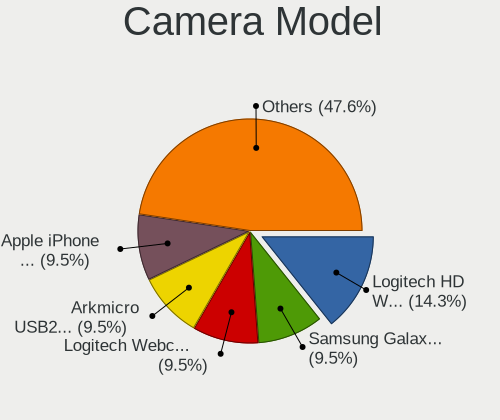

| Model                                   | Desktops | Percent |
|-----------------------------------------|----------|---------|
| Logitech HD Webcam C525                 | 3        | 15.79%  |
| Logitech Webcam C930e                   | 2        | 10.53%  |
| Arkmicro USB2.0 PC CAMERA               | 2        | 10.53%  |
| Apple iPhone 5/5C/5S/6/SE/7/8/X         | 2        | 10.53%  |
| Z-Star Vimicro USB Camera (Altair)      | 1        | 5.26%   |
| Sunplus Aukey-PC-LM1E Camera            | 1        | 5.26%   |
| Samsung Galaxy series, misc. (MTP mode) | 1        | 5.26%   |
| Microsoft LifeCam HD-3000               | 1        | 5.26%   |
| Microdia Webcam Vitade AF               | 1        | 5.26%   |
| Logitech Webcam C270                    | 1        | 5.26%   |
| Logitech HD Pro Webcam C920             | 1        | 5.26%   |
| Logitech B525 HD Webcam                 | 1        | 5.26%   |
| Lenovo 500 RGB Camera                   | 1        | 5.26%   |
| Creative Live! Cam Chat HD [VF0700]     | 1        | 5.26%   |

Security
--------

Fingerprint Vendor
------------------

Fingerprint sensor vendors

Zero info for selected period =(

Fingerprint Model
-----------------

Fingerprint sensor models

Zero info for selected period =(

Chipcard Vendor
---------------

Chipcard module vendors

| Vendor                | Desktops | Percent |
|-----------------------|----------|---------|
| OmniKey               | 12       | 54.55%  |
| Gemalto (was Gemplus) | 4        | 18.18%  |
| Alcor Micro           | 4        | 18.18%  |
| SCM Microsystems      | 1        | 4.55%   |
| Clay Logic            | 1        | 4.55%   |

Chipcard Model
--------------

Chipcard module models

| Model                                                  | Desktops | Percent |
|--------------------------------------------------------|----------|---------|
| OmniKey CardMan 1021                                   | 12       | 54.55%  |
| Gemalto (was Gemplus) GemPC Twin SmartCard Reader      | 4        | 18.18%  |
| Alcor Micro Watchdata W 1981                           | 4        | 18.18%  |
| SCM Microsystems SCR331-LC1 / SCR3310 SmartCard Reader | 1        | 4.55%   |
| Clay Logic Nitrokey Start                              | 1        | 4.55%   |

Unsupported
-----------

Unsupported Devices
-------------------

Total unsupported devices on board

| Total | Desktops | Percent |
|-------|----------|---------|
| 0     | 92       | 77.31%  |
| 1     | 25       | 21.01%  |
| 2     | 2        | 1.68%   |

Unsupported Device Types
------------------------

Types of unsupported devices

| Type                     | Desktops | Percent |
|--------------------------|----------|---------|
| Graphics card            | 13       | 44.83%  |
| Chipcard                 | 10       | 34.48%  |
| Net/wireless             | 2        | 6.9%    |
| Sound                    | 1        | 3.45%   |
| Net/ethernet             | 1        | 3.45%   |
| Multimedia controller    | 1        | 3.45%   |
| Communication controller | 1        | 3.45%   |

