Linux in Estonia - Tested Hardware & Statistics (Desktops)
----------------------------------------------------------

A project to collect tested hardware configurations for Linux in Estonia.

Anyone can contribute to this report by the [hw-probe](https://github.com/linuxhw/hw-probe) tool:

    sudo -E hw-probe -all -upload

Please contribute! Especially if your hardware is rare.

Contents
--------

* [ Test Cases ](#test-cases)

* [ System ](#system)
  - [ OS                       ](#os)
  - [ OS Family                ](#os-family)
  - [ Kernel                   ](#kernel)
  - [ Kernel Family            ](#kernel-family)
  - [ Kernel Major Ver.        ](#kernel-major-ver)
  - [ Arch                     ](#arch)
  - [ DE                       ](#de)
  - [ Display Server           ](#display-server)
  - [ Display Manager          ](#display-manager)
  - [ OS Lang                  ](#os-lang)
  - [ Boot Mode                ](#boot-mode)
  - [ Filesystem               ](#filesystem)
  - [ Part. scheme             ](#part-scheme)
  - [ Dual Boot with Linux/BSD ](#dual-boot-with-linuxbsd)
  - [ Dual Boot (Win)          ](#dual-boot-win)

* [ Board ](#board)
  - [ Vendor                   ](#vendor)
  - [ Model                    ](#model)
  - [ Model Family             ](#model-family)
  - [ MFG Year                 ](#mfg-year)
  - [ Form Factor              ](#form-factor)
  - [ Secure Boot              ](#secure-boot)
  - [ Coreboot                 ](#coreboot)
  - [ RAM Size                 ](#ram-size)
  - [ RAM Used                 ](#ram-used)
  - [ Total Drives             ](#total-drives)
  - [ Has CD-ROM               ](#has-cd-rom)
  - [ Has Ethernet             ](#has-ethernet)
  - [ Has WiFi                 ](#has-wifi)
  - [ Has Bluetooth            ](#has-bluetooth)

* [ Location ](#location)
  - [ Country                  ](#country)
  - [ City                     ](#city)

* [ Drives ](#drives)
  - [ Drive Vendor             ](#drive-vendor)
  - [ Drive Model              ](#drive-model)
  - [ HDD Vendor               ](#hdd-vendor)
  - [ SSD Vendor               ](#ssd-vendor)
  - [ Drive Kind               ](#drive-kind)
  - [ Drive Connector          ](#drive-connector)
  - [ Drive Size               ](#drive-size)
  - [ Space Total              ](#space-total)
  - [ Space Used               ](#space-used)
  - [ Malfunc. Drives          ](#malfunc-drives)
  - [ Malfunc. Drive Vendor    ](#malfunc-drive-vendor)
  - [ Malfunc. HDD Vendor      ](#malfunc-hdd-vendor)
  - [ Malfunc. Drive Kind      ](#malfunc-drive-kind)
  - [ Failed Drives            ](#failed-drives)
  - [ Failed Drive Vendor      ](#failed-drive-vendor)
  - [ Drive Status             ](#drive-status)

* [ Storage controller ](#storage-controller)
  - [ Storage Vendor           ](#storage-vendor)
  - [ Storage Model            ](#storage-model)
  - [ Storage Kind             ](#storage-kind)

* [ Processor ](#processor)
  - [ CPU Vendor               ](#cpu-vendor)
  - [ CPU Model                ](#cpu-model)
  - [ CPU Model Family         ](#cpu-model-family)
  - [ CPU Cores                ](#cpu-cores)
  - [ CPU Sockets              ](#cpu-sockets)
  - [ CPU Threads              ](#cpu-threads)
  - [ CPU Op-Modes             ](#cpu-op-modes)
  - [ CPU Microcode            ](#cpu-microcode)
  - [ CPU Microarch            ](#cpu-microarch)

* [ Graphics ](#graphics)
  - [ GPU Vendor               ](#gpu-vendor)
  - [ GPU Model                ](#gpu-model)
  - [ GPU Combo                ](#gpu-combo)
  - [ GPU Driver               ](#gpu-driver)
  - [ GPU Memory               ](#gpu-memory)

* [ Monitor ](#monitor)
  - [ Monitor Vendor           ](#monitor-vendor)
  - [ Monitor Model            ](#monitor-model)
  - [ Monitor Resolution       ](#monitor-resolution)
  - [ Monitor Diagonal         ](#monitor-diagonal)
  - [ Monitor Width            ](#monitor-width)
  - [ Aspect Ratio             ](#aspect-ratio)
  - [ Monitor Area             ](#monitor-area)
  - [ Pixel Density            ](#pixel-density)
  - [ Multiple Monitors        ](#multiple-monitors)

* [ Network ](#network)
  - [ Net Controller Vendor    ](#net-controller-vendor)
  - [ Net Controller Model     ](#net-controller-model)
  - [ Wireless Vendor          ](#wireless-vendor)
  - [ Wireless Model           ](#wireless-model)
  - [ Ethernet Vendor          ](#ethernet-vendor)
  - [ Ethernet Model           ](#ethernet-model)
  - [ Net Controller Kind      ](#net-controller-kind)
  - [ Used Controller          ](#used-controller)
  - [ NICs                     ](#nics)
  - [ IPv6                     ](#ipv6)

* [ Bluetooth ](#bluetooth)
  - [ Bluetooth Vendor         ](#bluetooth-vendor)
  - [ Bluetooth Model          ](#bluetooth-model)

* [ Sound ](#sound)
  - [ Sound Vendor             ](#sound-vendor)
  - [ Sound Model              ](#sound-model)

* [ Memory ](#memory)
  - [ Memory Vendor            ](#memory-vendor)
  - [ Memory Model             ](#memory-model)
  - [ Memory Kind              ](#memory-kind)
  - [ Memory Form Factor       ](#memory-form-factor)
  - [ Memory Size              ](#memory-size)
  - [ Memory Speed             ](#memory-speed)

* [ Printers & scanners ](#printers--scanners)
  - [ Printer Vendor           ](#printer-vendor)
  - [ Printer Model            ](#printer-model)
  - [ Scanner Vendor           ](#scanner-vendor)
  - [ Scanner Model            ](#scanner-model)

* [ Camera ](#camera)
  - [ Camera Vendor            ](#camera-vendor)
  - [ Camera Model             ](#camera-model)

* [ Security ](#security)
  - [ Fingerprint Vendor       ](#fingerprint-vendor)
  - [ Fingerprint Model        ](#fingerprint-model)
  - [ Chipcard Vendor          ](#chipcard-vendor)
  - [ Chipcard Model           ](#chipcard-model)

* [ Unsupported ](#unsupported)
  - [ Unsupported Devices      ](#unsupported-devices)
  - [ Unsupported Device Types ](#unsupported-device-types)

Test Cases
----------

Total: 131

| Vendor   | Model                       | Probe                                                      | Date         |
|----------|-----------------------------|------------------------------------------------------------|--------------|
| ASUSTek  | H97M-PLUS                   | [ccf4457b51](https://linux-hardware.org/?probe=ccf4457b51) | Mar 28, 2022 |
| HP       | 18E9                        | [5a223b8722](https://linux-hardware.org/?probe=5a223b8722) | Mar 23, 2022 |
| Lenovo   | 31900058 STD                | [d34e3c79a0](https://linux-hardware.org/?probe=d34e3c79a0) | Mar 01, 2022 |
| ECS      | G41T-M7                     | [c4aca5bc12](https://linux-hardware.org/?probe=c4aca5bc12) | Feb 20, 2022 |
| MSI      | B150M PRO-VD                | [b46943492e](https://linux-hardware.org/?probe=b46943492e) | Feb 15, 2022 |
| HP       | 304Ah                       | [078b605c39](https://linux-hardware.org/?probe=078b605c39) | Feb 09, 2022 |
| MSI      | Z390-A PRO                  | [c9b246d9a8](https://linux-hardware.org/?probe=c9b246d9a8) | Jan 12, 2022 |
| MSI      | Z390-A PRO                  | [49234f883d](https://linux-hardware.org/?probe=49234f883d) | Jan 12, 2022 |
| Huanan   | X79 V2.47                   | [a27e7cdbef](https://linux-hardware.org/?probe=a27e7cdbef) | Jan 09, 2022 |
| Dell     | 0KH290                      | [e8c0e16dfb](https://linux-hardware.org/?probe=e8c0e16dfb) | Dec 28, 2021 |
| ASUSTek  | TUF GAMING B560M-PLUS       | [5c0550c1e8](https://linux-hardware.org/?probe=5c0550c1e8) | Dec 09, 2021 |
| ASUSTek  | ProArt X570-CREATOR WIFI    | [db552307a3](https://linux-hardware.org/?probe=db552307a3) | Dec 07, 2021 |
| Gigabyte | X570 UD                     | [79c117738b](https://linux-hardware.org/?probe=79c117738b) | Dec 01, 2021 |
| Gigabyte | GA-790XTA-UD4               | [6eb5a4107e](https://linux-hardware.org/?probe=6eb5a4107e) | Nov 10, 2021 |
| Intel    | D33217GKE G69901-205        | [a922d5f3fc](https://linux-hardware.org/?probe=a922d5f3fc) | Nov 10, 2021 |
| Intel    | D33217GKE G69901-205        | [dd1ddaf74f](https://linux-hardware.org/?probe=dd1ddaf74f) | Nov 09, 2021 |
| MSI      | MAG Z390 TOMAHAWK           | [201bc8d044](https://linux-hardware.org/?probe=201bc8d044) | Oct 17, 2021 |
| Huanan   | X79 V2.47                   | [326b3f5892](https://linux-hardware.org/?probe=326b3f5892) | Oct 07, 2021 |
| Huanan   | X79 V2.47                   | [c2c6287186](https://linux-hardware.org/?probe=c2c6287186) | Oct 07, 2021 |
| Lenovo   | 318E SDK0J40697 WIN 3305... | [9cd559605c](https://linux-hardware.org/?probe=9cd559605c) | Sep 27, 2021 |
| Lenovo   | 318E SDK0J40697 WIN 3305... | [68f4ff7431](https://linux-hardware.org/?probe=68f4ff7431) | Sep 27, 2021 |
| Dell     | 0NW6H5 A00                  | [bf81c78371](https://linux-hardware.org/?probe=bf81c78371) | Aug 26, 2021 |
| Gigabyte | Z87X-D3H-CF                 | [b40ad47903](https://linux-hardware.org/?probe=b40ad47903) | Aug 25, 2021 |
| Dell     | 0NW6H5 A00                  | [559742f4d7](https://linux-hardware.org/?probe=559742f4d7) | Aug 19, 2021 |
| Dell     | 0NW6H5 A00                  | [d28cc83aed](https://linux-hardware.org/?probe=d28cc83aed) | Aug 17, 2021 |
| Dell     | 0NW6H5 A00                  | [be5db43316](https://linux-hardware.org/?probe=be5db43316) | Aug 17, 2021 |
| Gigabyte | F2A68HM-S1                  | [286d06cd5e](https://linux-hardware.org/?probe=286d06cd5e) | Aug 15, 2021 |
| Gigabyte | F2A68HM-S1                  | [63b5468d43](https://linux-hardware.org/?probe=63b5468d43) | Aug 15, 2021 |
| Gigabyte | B250M-D2V-CF                | [b2db3ea0a9](https://linux-hardware.org/?probe=b2db3ea0a9) | Aug 10, 2021 |
| Gigabyte | B250M-D2V-CF                | [c086b1441c](https://linux-hardware.org/?probe=c086b1441c) | Aug 09, 2021 |
| ASUSTek  | ROG STRIX B550-F GAMING     | [2a9fe5f63c](https://linux-hardware.org/?probe=2a9fe5f63c) | Jul 31, 2021 |
| ASUSTek  | ROG STRIX B550-F GAMING     | [1c5dccfd22](https://linux-hardware.org/?probe=1c5dccfd22) | Jul 31, 2021 |
| ASUSTek  | M3N78                       | [810e386d8b](https://linux-hardware.org/?probe=810e386d8b) | Jul 26, 2021 |
| Gigabyte | Q87M-D2H                    | [4f26f93184](https://linux-hardware.org/?probe=4f26f93184) | Jul 26, 2021 |
| Gigabyte | X570 AORUS PRO              | [932c4de6ce](https://linux-hardware.org/?probe=932c4de6ce) | Jul 18, 2021 |
| ASUSTek  | N3050I-C                    | [e9cd0640f7](https://linux-hardware.org/?probe=e9cd0640f7) | Jun 30, 2021 |
| MSI      | MAG B550 TOMAHAWK           | [7a01d3d232](https://linux-hardware.org/?probe=7a01d3d232) | Jun 28, 2021 |
| ASUSTek  | N3050I-C                    | [c42e493962](https://linux-hardware.org/?probe=c42e493962) | Jun 26, 2021 |
| ASUSTek  | N3050I-C                    | [9834731c15](https://linux-hardware.org/?probe=9834731c15) | Jun 26, 2021 |
| MSI      | B250M PRO-VD                | [20ff770033](https://linux-hardware.org/?probe=20ff770033) | Apr 07, 2021 |
| ASUSTek  | P5LD2                       | [72b40a39d4](https://linux-hardware.org/?probe=72b40a39d4) | Mar 25, 2021 |
| MSI      | B450 TOMAHAWK MAX           | [f555918663](https://linux-hardware.org/?probe=f555918663) | Mar 24, 2021 |
| OEM      | Intel H81                   | [385b6ee448](https://linux-hardware.org/?probe=385b6ee448) | Mar 19, 2021 |
| MSI      | MPG X570 GAMING PLUS        | [9b991380f9](https://linux-hardware.org/?probe=9b991380f9) | Mar 17, 2021 |
| MSI      | B450 TOMAHAWK MAX           | [273fba9fd2](https://linux-hardware.org/?probe=273fba9fd2) | Mar 14, 2021 |
| MSI      | B450 TOMAHAWK MAX           | [75a661f9f8](https://linux-hardware.org/?probe=75a661f9f8) | Mar 14, 2021 |
| Gigabyte | Z370 AORUS Gaming 5-CF      | [ff698cacf3](https://linux-hardware.org/?probe=ff698cacf3) | Feb 27, 2021 |
| Gigabyte | Z370 AORUS Gaming 5-CF      | [116202ee88](https://linux-hardware.org/?probe=116202ee88) | Feb 27, 2021 |
| MSI      | MS-7267                     | [b987c1ad14](https://linux-hardware.org/?probe=b987c1ad14) | Feb 15, 2021 |
| ASUSTek  | PRIME B350-PLUS             | [e1dc5a8ea7](https://linux-hardware.org/?probe=e1dc5a8ea7) | Feb 14, 2021 |
| ASRock   | B450M Steel Legend          | [d3004980ee](https://linux-hardware.org/?probe=d3004980ee) | Feb 09, 2021 |
| MSI      | Z77A-G41                    | [171be87aa0](https://linux-hardware.org/?probe=171be87aa0) | Dec 27, 2020 |
| MSI      | H81I                        | [772ce7ff24](https://linux-hardware.org/?probe=772ce7ff24) | Dec 03, 2020 |
| MSI      | Boston                      | [9843e15faa](https://linux-hardware.org/?probe=9843e15faa) | Dec 01, 2020 |
| Gigabyte | F2A68HM-S1                  | [1280ebbedf](https://linux-hardware.org/?probe=1280ebbedf) | Nov 17, 2020 |
| ASUSTek  | P8H61-M LX3 R2.0            | [f61cacc391](https://linux-hardware.org/?probe=f61cacc391) | Oct 05, 2020 |
| MSI      | X470 GAMING PRO             | [6b818c1352](https://linux-hardware.org/?probe=6b818c1352) | Sep 28, 2020 |
| ASUSTek  | PRIME X370-PRO              | [3255a17583](https://linux-hardware.org/?probe=3255a17583) | Sep 28, 2020 |
| MSI      | Z170-A PRO                  | [bcf22d328e](https://linux-hardware.org/?probe=bcf22d328e) | Sep 28, 2020 |
| Intel    | DX79TO AAG28805-400         | [d4cdc0726f](https://linux-hardware.org/?probe=d4cdc0726f) | Sep 26, 2020 |
| MSI      | MPG X570 GAMING PLUS        | [118729faeb](https://linux-hardware.org/?probe=118729faeb) | Sep 23, 2020 |
| ASUSTek  | PRIME B550M-K               | [0dd7682249](https://linux-hardware.org/?probe=0dd7682249) | Sep 08, 2020 |
| ASRock   | P45DE3                      | [3fce267079](https://linux-hardware.org/?probe=3fce267079) | Aug 11, 2020 |
| Lenovo   | 0x36A017AA SDK0J40700 WI... | [5b48876c88](https://linux-hardware.org/?probe=5b48876c88) | Aug 11, 2020 |
| Lenovo   | 0x36A017AA SDK0J40700 WI... | [420e531d0c](https://linux-hardware.org/?probe=420e531d0c) | Aug 11, 2020 |
| Gigabyte | X570 I AORUS PRO WIFI       | [fd8d68081e](https://linux-hardware.org/?probe=fd8d68081e) | Aug 08, 2020 |
| Gigabyte | X570 I AORUS PRO WIFI       | [30d102a39e](https://linux-hardware.org/?probe=30d102a39e) | Aug 07, 2020 |
| Gigabyte | X570 AORUS PRO              | [f6f1267e91](https://linux-hardware.org/?probe=f6f1267e91) | Jul 23, 2020 |
| ASRock   | B250M Pro4                  | [3ad9bafdc1](https://linux-hardware.org/?probe=3ad9bafdc1) | Jul 19, 2020 |
| MSI      | MPG X570 GAMING PLUS        | [43684f5ded](https://linux-hardware.org/?probe=43684f5ded) | Jul 15, 2020 |
| ASUSTek  | P5LD2                       | [caa5d2a038](https://linux-hardware.org/?probe=caa5d2a038) | Jul 13, 2020 |
| Gigabyte | H310M S2H x.x               | [751ba49889](https://linux-hardware.org/?probe=751ba49889) | Jul 09, 2020 |
| ASRock   | Z170 Pro4S                  | [71665893c0](https://linux-hardware.org/?probe=71665893c0) | Jul 08, 2020 |
| ASRock   | Z170 Pro4S                  | [2d7a70bd54](https://linux-hardware.org/?probe=2d7a70bd54) | Jul 06, 2020 |
| MSI      | Boston                      | [1cd116a5e8](https://linux-hardware.org/?probe=1cd116a5e8) | Jul 06, 2020 |
| Gigabyte | H310M S2H x.x               | [3149f0037a](https://linux-hardware.org/?probe=3149f0037a) | Jul 03, 2020 |
| MSI      | Boston                      | [2a57f16098](https://linux-hardware.org/?probe=2a57f16098) | Jun 28, 2020 |
| Gigabyte | H310M S2H x.x               | [9bd5a64d0d](https://linux-hardware.org/?probe=9bd5a64d0d) | Jun 25, 2020 |
| MSI      | Boston                      | [d7be35188b](https://linux-hardware.org/?probe=d7be35188b) | Jun 09, 2020 |
| ASUSTek  | WS X299 SAGE                | [bfc9505d4b](https://linux-hardware.org/?probe=bfc9505d4b) | Jun 05, 2020 |
| MSI      | Boston                      | [a89b77dae6](https://linux-hardware.org/?probe=a89b77dae6) | Jun 04, 2020 |
| MSI      | Boston                      | [0b880b68f8](https://linux-hardware.org/?probe=0b880b68f8) | Jun 04, 2020 |
| MSI      | Boston                      | [a9c79d50f4](https://linux-hardware.org/?probe=a9c79d50f4) | Jun 02, 2020 |
| MSI      | Boston                      | [48a3bf1932](https://linux-hardware.org/?probe=48a3bf1932) | Jun 02, 2020 |
| ASUSTek  | Z97-A                       | [32fc505cab](https://linux-hardware.org/?probe=32fc505cab) | May 17, 2020 |
| MSI      | Z170A GAMING M3             | [369ce228c3](https://linux-hardware.org/?probe=369ce228c3) | May 16, 2020 |
| MSI      | B360-A PRO                  | [c42cb75770](https://linux-hardware.org/?probe=c42cb75770) | Apr 24, 2020 |
| ASUSTek  | PRIME X570-PRO              | [61c4420d0e](https://linux-hardware.org/?probe=61c4420d0e) | Mar 22, 2020 |
| Gigabyte | Z77X-D3H                    | [76af4a7e0b](https://linux-hardware.org/?probe=76af4a7e0b) | Mar 21, 2020 |
| ASRock   | P45DE3                      | [fffef664cd](https://linux-hardware.org/?probe=fffef664cd) | Mar 18, 2020 |
| MSI      | B75A-G43                    | [9683ec9bd4](https://linux-hardware.org/?probe=9683ec9bd4) | Mar 16, 2020 |
| ASUSTek  | PRIME X570-PRO              | [95eb08349e](https://linux-hardware.org/?probe=95eb08349e) | Mar 15, 2020 |
| ASUSTek  | PRIME X570-PRO              | [e30b449cc4](https://linux-hardware.org/?probe=e30b449cc4) | Mar 08, 2020 |
| ASUSTek  | Z97-A                       | [8bc7b7979a](https://linux-hardware.org/?probe=8bc7b7979a) | Mar 01, 2020 |
| MSI      | 990FXA-GD65                 | [adc15c7147](https://linux-hardware.org/?probe=adc15c7147) | Feb 24, 2020 |
| ASRock   | B250M Pro4                  | [3c0169141c](https://linux-hardware.org/?probe=3c0169141c) | Feb 22, 2020 |
| Gigabyte | B450 AORUS ELITE            | [b17f2abd3e](https://linux-hardware.org/?probe=b17f2abd3e) | Feb 20, 2020 |
| Gigabyte | H81M-S1                     | [754bdf88c1](https://linux-hardware.org/?probe=754bdf88c1) | Jan 26, 2020 |
| ASUSTek  | ROG STRIX Z390-F GAMING     | [1eb5f177d1](https://linux-hardware.org/?probe=1eb5f177d1) | Jan 13, 2020 |
| ASRock   | B250M Pro4                  | [1bb0c8f064](https://linux-hardware.org/?probe=1bb0c8f064) | Dec 21, 2019 |
| Dell     | 0D28YY A01                  | [be51211fe3](https://linux-hardware.org/?probe=be51211fe3) | Dec 09, 2019 |
| Gigabyte | H81M-S1                     | [57524ab581](https://linux-hardware.org/?probe=57524ab581) | Dec 03, 2019 |
| ASUSTek  | VM60                        | [4842363a0b](https://linux-hardware.org/?probe=4842363a0b) | Nov 14, 2019 |
| ASRock   | B250M Pro4                  | [8beb57338d](https://linux-hardware.org/?probe=8beb57338d) | Oct 02, 2019 |
| ASUSTek  | A8N32-SLI-Deluxe            | [abc398724a](https://linux-hardware.org/?probe=abc398724a) | Sep 16, 2019 |
| ASUSTek  | A8N32-SLI-Deluxe            | [f6acac9fc8](https://linux-hardware.org/?probe=f6acac9fc8) | Sep 15, 2019 |
| ASUSTek  | A8N32-SLI-Deluxe            | [7439e6aee6](https://linux-hardware.org/?probe=7439e6aee6) | Sep 15, 2019 |
| ASUSTek  | A8N32-SLI-Deluxe            | [682375c055](https://linux-hardware.org/?probe=682375c055) | Sep 15, 2019 |
| ASUSTek  | A8N32-SLI-Deluxe            | [d2b5c32d2f](https://linux-hardware.org/?probe=d2b5c32d2f) | Sep 15, 2019 |
| HP       | 1495                        | [3d9e77ae8a](https://linux-hardware.org/?probe=3d9e77ae8a) | Jul 23, 2019 |
| Lenovo   | MAHOBAY 0B98401 PRO         | [46e1a9fc55](https://linux-hardware.org/?probe=46e1a9fc55) | Jul 04, 2019 |
| ASRock   | B250M Pro4                  | [3a8d19c8fc](https://linux-hardware.org/?probe=3a8d19c8fc) | Jun 22, 2019 |
| Gigabyte | 970-GAMING                  | [aa1385d100](https://linux-hardware.org/?probe=aa1385d100) | Jun 03, 2019 |
| ASRock   | B250M Pro4                  | [d0c371c7e3](https://linux-hardware.org/?probe=d0c371c7e3) | Jun 01, 2019 |
| Intel    | DQ35JO AAD82085-807         | [7f57ad053d](https://linux-hardware.org/?probe=7f57ad053d) | May 20, 2019 |
| Dell     | 0KP561                      | [bba0fe2672](https://linux-hardware.org/?probe=bba0fe2672) | Apr 05, 2019 |
| Dell     | 0KP561                      | [f3085d1ae9](https://linux-hardware.org/?probe=f3085d1ae9) | Apr 04, 2019 |
| ASRock   | H370M-ITX/ac                | [ba39531b87](https://linux-hardware.org/?probe=ba39531b87) | Mar 31, 2019 |
| HP       | 18E7                        | [19df4fb560](https://linux-hardware.org/?probe=19df4fb560) | Feb 22, 2019 |
| ABIT     | KN9 Series                  | [10015b723b](https://linux-hardware.org/?probe=10015b723b) | Feb 04, 2019 |
| ASRock   | B250M Pro4                  | [b702949950](https://linux-hardware.org/?probe=b702949950) | Dec 19, 2018 |
| ASRock   | B250M Pro4                  | [bbfb2c7501](https://linux-hardware.org/?probe=bbfb2c7501) | Nov 24, 2018 |
| ASRock   | B250M Pro4                  | [495f4f7e73](https://linux-hardware.org/?probe=495f4f7e73) | Nov 24, 2018 |
| Gigabyte | AX370M-Gaming 3-CF          | [158fb83dcc](https://linux-hardware.org/?probe=158fb83dcc) | Nov 13, 2018 |
| ASRock   | B250M Pro4                  | [a00ad66604](https://linux-hardware.org/?probe=a00ad66604) | Oct 24, 2018 |
| ASRock   | B250M Pro4                  | [5f7ba92287](https://linux-hardware.org/?probe=5f7ba92287) | Oct 24, 2018 |
| ASRock   | B250M Pro4                  | [9c47ffacd5](https://linux-hardware.org/?probe=9c47ffacd5) | Oct 24, 2018 |
| ECS      | H55H-3.8L                   | [7e782321c8](https://linux-hardware.org/?probe=7e782321c8) | Mar 31, 2018 |
| ASUSTek  | M2N-MX SE                   | [78791d4918](https://linux-hardware.org/?probe=78791d4918) | Sep 13, 2017 |
| ASUSTek  | P8H67                       | [e36d00c6f9](https://linux-hardware.org/?probe=e36d00c6f9) | Jul 21, 2017 |
| ECS      | nVidia-nForce               | [db8fd734f9](https://linux-hardware.org/?probe=db8fd734f9) | May 16, 2017 |

System
------

OS
--

Installed operating systems

| Name              | Desktops | Percent |
|-------------------|----------|---------|
| Ubuntu 20.04      | 9        | 11.11%  |
| Ubuntu 18.04      | 6        | 7.41%   |
| ROSA R11          | 6        | 7.41%   |
| ROSA R8.1         | 4        | 4.94%   |
| Arch Rolling      | 4        | 4.94%   |
| Ubuntu 21.10      | 3        | 3.7%    |
| Manjaro           | 3        | 3.7%    |
| Kubuntu 20.04     | 3        | 3.7%    |
| Gentoo 2.6        | 3        | 3.7%    |
| Fedora 34         | 3        | 3.7%    |
| Fedora 31         | 3        | 3.7%    |
| Pop!_OS 21.04     | 2        | 2.47%   |
| OpenMandriva 4.3  | 2        | 2.47%   |
| OpenMandriva 4.2  | 2        | 2.47%   |
| KDE neon 20.04    | 2        | 2.47%   |
| Debian Testing    | 2        | 2.47%   |
| Arch              | 2        | 2.47%   |
| Xubuntu 18.04     | 1        | 1.23%   |
| Ubuntu MATE 20.04 | 1        | 1.23%   |
| Ubuntu 21.04      | 1        | 1.23%   |
| Ubuntu 19.10      | 1        | 1.23%   |
| Ubuntu 19.04      | 1        | 1.23%   |
| Ubuntu 16.04      | 1        | 1.23%   |
| ROSA R9           | 1        | 1.23%   |
| ROSA R10          | 1        | 1.23%   |
| ROSA 12           | 1        | 1.23%   |
| Pop!_OS 21.10     | 1        | 1.23%   |
| Manjaro 21.1.0    | 1        | 1.23%   |
| Manjaro 19.0.0    | 1        | 1.23%   |
| Manjaro 19.0      | 1        | 1.23%   |
| LMDE 4            | 1        | 1.23%   |
| Linux Mint 20.1   | 1        | 1.23%   |
| Gentoo 2.7        | 1        | 1.23%   |
| Fedora 35         | 1        | 1.23%   |
| Elementary 6      | 1        | 1.23%   |
| Debian Unstable   | 1        | 1.23%   |
| Debian 9          | 1        | 1.23%   |
| Clear Linux 33040 | 1        | 1.23%   |
| Clear Linux 32480 | 1        | 1.23%   |

OS Family
---------

OS without a version

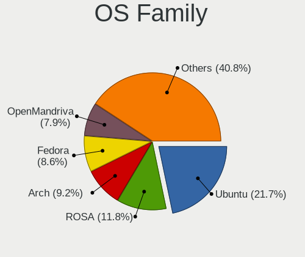

| Name         | Desktops | Percent |
|--------------|----------|---------|
| Ubuntu       | 22       | 27.85%  |
| ROSA         | 13       | 16.46%  |
| Fedora       | 7        | 8.86%   |
| Manjaro      | 6        | 7.59%   |
| Arch         | 6        | 7.59%   |
| OpenMandriva | 4        | 5.06%   |
| Gentoo       | 4        | 5.06%   |
| Debian       | 4        | 5.06%   |
| Kubuntu      | 3        | 3.8%    |
| Pop!_OS      | 2        | 2.53%   |
| KDE neon     | 2        | 2.53%   |
| Xubuntu      | 1        | 1.27%   |
| Ubuntu MATE  | 1        | 1.27%   |
| LMDE         | 1        | 1.27%   |
| Linux Mint   | 1        | 1.27%   |
| Elementary   | 1        | 1.27%   |
| Clear Linux  | 1        | 1.27%   |

Kernel
------

Version of the Linux kernel

| Version                            | Desktops | Percent |
|------------------------------------|----------|---------|
| 5.5.2-1-MANJARO                    | 2        | 2.2%    |
| 5.4.0-53-generic                   | 2        | 2.2%    |
| 5.4.0-42-generic                   | 2        | 2.2%    |
| 5.4.0-40-generic                   | 2        | 2.2%    |
| 5.4.0-26-generic                   | 2        | 2.2%    |
| 5.16.7-desktop-1omv4003            | 2        | 2.2%    |
| 5.11.0-25-generic                  | 2        | 2.2%    |
| 5.10.14-desktop-1omv4002           | 2        | 2.2%    |
| 4.15.0-desktop-45.1rosa-x86_64     | 2        | 2.2%    |
| 5.8.10-zen1-1-zen                  | 1        | 1.1%    |
| 5.8.10-arch1-1                     | 1        | 1.1%    |
| 5.8.0-63-generic                   | 1        | 1.1%    |
| 5.8.0-1-tkg-pds                    | 1        | 1.1%    |
| 5.7.0-2-amd64                      | 1        | 1.1%    |
| 5.6.11-gentoo                      | 1        | 1.1%    |
| 5.6.10-947.native                  | 1        | 1.1%    |
| 5.5.9-200.fc31.x86_64              | 1        | 1.1%    |
| 5.4.8-200.fc31.x86_64              | 1        | 1.1%    |
| 5.4.48-gentoo                      | 1        | 1.1%    |
| 5.4.38-gentoo-x86_64               | 1        | 1.1%    |
| 5.4.17-901.native                  | 1        | 1.1%    |
| 5.4.13-201.fc31.x86_64             | 1        | 1.1%    |
| 5.4.0-91-generic                   | 1        | 1.1%    |
| 5.4.0-77-generic                   | 1        | 1.1%    |
| 5.4.0-65-generic                   | 1        | 1.1%    |
| 5.4.0-58-generic                   | 1        | 1.1%    |
| 5.4.0-54-generic                   | 1        | 1.1%    |
| 5.4.0-48-generic                   | 1        | 1.1%    |
| 5.4.0-45-generic                   | 1        | 1.1%    |
| 5.4.0-39-generic                   | 1        | 1.1%    |
| 5.4.0-33-generic                   | 1        | 1.1%    |
| 5.3.13-300.fc31.x86_64             | 1        | 1.1%    |
| 5.3.0-46-generic                   | 1        | 1.1%    |
| 5.3.0-40-generic                   | 1        | 1.1%    |
| 5.16.0-8.2-liquorix-amd64          | 1        | 1.1%    |
| 5.15.5-76051505-generic            | 1        | 1.1%    |
| 5.15.2-2-MANJARO                   | 1        | 1.1%    |
| 5.15.19-1-MANJARO                  | 1        | 1.1%    |
| 5.14.16-301.fc35.x86_64            | 1        | 1.1%    |
| 5.14.12-arch1-1                    | 1        | 1.1%    |
| 5.13.4-200.fc34.x86_64             | 1        | 1.1%    |
| 5.13.19-200.fc34.x86_64            | 1        | 1.1%    |
| 5.13.12-200.fc34.x86_64            | 1        | 1.1%    |
| 5.13.0-7614-generic                | 1        | 1.1%    |
| 5.13.0-37-generic                  | 1        | 1.1%    |
| 5.13.0-30-generic                  | 1        | 1.1%    |
| 5.13.0-21-generic                  | 1        | 1.1%    |
| 5.13.0-20-generic                  | 1        | 1.1%    |
| 5.11.2-1-MANJARO                   | 1        | 1.1%    |
| 5.11.11-arch1-1                    | 1        | 1.1%    |
| 5.11.0-7620-generic                | 1        | 1.1%    |
| 5.11.0-41-generic                  | 1        | 1.1%    |
| 5.11.0-22-generic                  | 1        | 1.1%    |
| 5.10.71-generic-1rosa2021.1-x86_64 | 1        | 1.1%    |
| 5.10.53-1-MANJARO                  | 1        | 1.1%    |
| 5.10.13-xanmod1                    | 1        | 1.1%    |
| 5.10.0-3-amd64                     | 1        | 1.1%    |
| 5.1.5-arch1-2-ARCH                 | 1        | 1.1%    |
| 5.0.0-trunk-amd64                  | 1        | 1.1%    |
| 5.0.0-20-generic                   | 1        | 1.1%    |

Kernel Family
-------------

Linux kernel without a distro release

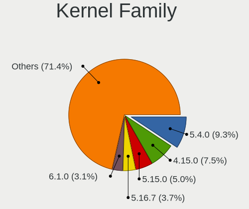

| Version | Desktops | Percent |
|---------|----------|---------|
| 5.4.0   | 14       | 16.67%  |
| 4.15.0  | 11       | 13.1%   |
| 5.13.0  | 5        | 5.95%   |
| 5.11.0  | 5        | 5.95%   |
| 5.8.10  | 2        | 2.38%   |
| 5.8.0   | 2        | 2.38%   |
| 5.5.2   | 2        | 2.38%   |
| 5.3.0   | 2        | 2.38%   |
| 5.16.7  | 2        | 2.38%   |
| 5.10.14 | 2        | 2.38%   |
| 5.0.0   | 2        | 2.38%   |
| 4.9.9   | 2        | 2.38%   |
| 5.7.0   | 1        | 1.19%   |
| 5.6.11  | 1        | 1.19%   |
| 5.6.10  | 1        | 1.19%   |
| 5.5.9   | 1        | 1.19%   |
| 5.4.8   | 1        | 1.19%   |
| 5.4.48  | 1        | 1.19%   |
| 5.4.38  | 1        | 1.19%   |
| 5.4.17  | 1        | 1.19%   |
| 5.4.13  | 1        | 1.19%   |
| 5.3.13  | 1        | 1.19%   |
| 5.16.0  | 1        | 1.19%   |
| 5.15.5  | 1        | 1.19%   |
| 5.15.2  | 1        | 1.19%   |
| 5.15.19 | 1        | 1.19%   |
| 5.14.16 | 1        | 1.19%   |
| 5.14.12 | 1        | 1.19%   |
| 5.13.4  | 1        | 1.19%   |
| 5.13.19 | 1        | 1.19%   |
| 5.13.12 | 1        | 1.19%   |
| 5.11.2  | 1        | 1.19%   |
| 5.11.11 | 1        | 1.19%   |
| 5.10.71 | 1        | 1.19%   |
| 5.10.53 | 1        | 1.19%   |
| 5.10.13 | 1        | 1.19%   |
| 5.10.0  | 1        | 1.19%   |
| 5.1.5   | 1        | 1.19%   |
| 4.9.41  | 1        | 1.19%   |
| 4.9.20  | 1        | 1.19%   |
| 4.9.124 | 1        | 1.19%   |
| 4.9.0   | 1        | 1.19%   |
| 4.19.97 | 1        | 1.19%   |
| 4.19.0  | 1        | 1.19%   |
| 4.1.38  | 1        | 1.19%   |

Kernel Major Ver.
-----------------

Linux kernel major version

| Version | Desktops | Percent |
|---------|----------|---------|
| 5.4     | 19       | 22.62%  |
| 4.15    | 11       | 13.1%   |
| 5.13    | 8        | 9.52%   |
| 5.11    | 7        | 8.33%   |
| 5.10    | 6        | 7.14%   |
| 4.9     | 6        | 7.14%   |
| 5.8     | 4        | 4.76%   |
| 5.5     | 3        | 3.57%   |
| 5.3     | 3        | 3.57%   |
| 5.16    | 3        | 3.57%   |
| 5.15    | 3        | 3.57%   |
| 5.6     | 2        | 2.38%   |
| 5.14    | 2        | 2.38%   |
| 5.0     | 2        | 2.38%   |
| 4.19    | 2        | 2.38%   |
| 5.7     | 1        | 1.19%   |
| 5.1     | 1        | 1.19%   |
| 4.1     | 1        | 1.19%   |

Arch
----

OS architecture (x86_64, i586, etc.)

| Name   | Desktops | Percent |
|--------|----------|---------|
| x86_64 | 73       | 93.59%  |
| i686   | 5        | 6.41%   |

DE
--

Desktop Environment

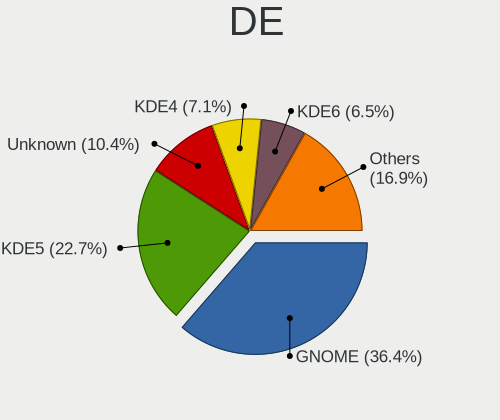

| Name       | Desktops | Percent |
|------------|----------|---------|
| GNOME      | 26       | 32.5%   |
| KDE5       | 16       | 20%     |
| Unknown    | 14       | 17.5%   |
| KDE4       | 10       | 12.5%   |
| XFCE       | 5        | 6.25%   |
| MATE       | 3        | 3.75%   |
| X-Cinnamon | 2        | 2.5%    |
| sway       | 1        | 1.25%   |
| Pantheon   | 1        | 1.25%   |
| KDE        | 1        | 1.25%   |
| i3         | 1        | 1.25%   |

Display Server
--------------

X11 or Wayland

| Name    | Desktops | Percent |
|---------|----------|---------|
| X11     | 61       | 77.22%  |
| Wayland | 12       | 15.19%  |
| Unknown | 5        | 6.33%   |
| Tty     | 1        | 1.27%   |

Display Manager
---------------

SDDM, LightDM, etc.

| Name    | Desktops | Percent |
|---------|----------|---------|
| Unknown | 36       | 46.15%  |
| SDDM    | 14       | 17.95%  |
| KDM     | 10       | 12.82%  |
| GDM     | 9        | 11.54%  |
| GDM3    | 5        | 6.41%   |
| TDM     | 3        | 3.85%   |
| LightDM | 1        | 1.28%   |

OS Lang
-------

Language

| Lang    | Desktops | Percent |
|---------|----------|---------|
| en_US   | 29       | 36.25%  |
| Unknown | 24       | 30%     |
| et_EE   | 13       | 16.25%  |
| ru_RU   | 6        | 7.5%    |
| en_GB   | 5        | 6.25%   |
| pl_PL   | 1        | 1.25%   |
| fr_FR   | 1        | 1.25%   |
| de_DE   | 1        | 1.25%   |

Boot Mode
---------

EFI or BIOS

| Mode | Desktops | Percent |
|------|----------|---------|
| BIOS | 48       | 60%     |
| EFI  | 32       | 40%     |

Filesystem
----------

Type of filesystem

| Type    | Desktops | Percent |
|---------|----------|---------|
| Ext4    | 61       | 77.22%  |
| Btrfs   | 7        | 8.86%   |
| Unknown | 5        | 6.33%   |
| Overlay | 4        | 5.06%   |
| Xfs     | 1        | 1.27%   |
| Ext3    | 1        | 1.27%   |

Part. scheme
------------

Scheme of partitioning

| Type    | Desktops | Percent |
|---------|----------|---------|
| Unknown | 35       | 44.87%  |
| GPT     | 25       | 32.05%  |
| MBR     | 18       | 23.08%  |

Dual Boot with Linux/BSD
------------------------

Hosting more than one Linux/BSD

| Dual boot | Desktops | Percent |
|-----------|----------|---------|
| No        | 60       | 75.95%  |
| Yes       | 19       | 24.05%  |

Dual Boot (Win)
---------------

Hosting Linux and Windows

| Dual boot | Desktops | Percent |
|-----------|----------|---------|
| No        | 53       | 67.09%  |
| Yes       | 26       | 32.91%  |

Board
-----

Vendor
------

Motherboard manufacturer

| Name                | Desktops | Percent |
|---------------------|----------|---------|
| ASUSTek Computer    | 19       | 24.36%  |
| MSI                 | 17       | 21.79%  |
| Gigabyte Technology | 16       | 20.51%  |
| ASRock              | 5        | 6.41%   |
| Lenovo              | 4        | 5.13%   |
| Hewlett-Packard     | 4        | 5.13%   |
| Dell                | 4        | 5.13%   |
| Intel               | 3        | 3.85%   |
| ECS                 | 3        | 3.85%   |
| OEM                 | 1        | 1.28%   |
| Huanan              | 1        | 1.28%   |
| ABIT                | 1        | 1.28%   |

Model
-----

Motherboard model

| Name                                     | Desktops | Percent |
|------------------------------------------|----------|---------|
| ASUS All Series                          | 3        | 3.85%   |
| MSI MS-7758                              | 2        | 2.56%   |
| Gigabyte X570 AORUS PRO                  | 2        | 2.56%   |
| OEM Intel H81                            | 1        | 1.28%   |
| MSI MS-7C91                              | 1        | 1.28%   |
| MSI MS-7C37                              | 1        | 1.28%   |
| MSI MS-7C02                              | 1        | 1.28%   |
| MSI MS-7B98                              | 1        | 1.28%   |
| MSI MS-7B79                              | 1        | 1.28%   |
| MSI MS-7B22                              | 1        | 1.28%   |
| MSI MS-7B18                              | 1        | 1.28%   |
| MSI MS-7A74                              | 1        | 1.28%   |
| MSI MS-7996                              | 1        | 1.28%   |
| MSI MS-7978                              | 1        | 1.28%   |
| MSI MS-7971                              | 1        | 1.28%   |
| MSI MS-7851                              | 1        | 1.28%   |
| MSI MS-7640                              | 1        | 1.28%   |
| MSI MS-7267                              | 1        | 1.28%   |
| MSI FJ418AA-UUW a6522.SC                 | 1        | 1.28%   |
| Lenovo ThinkCentre M75s Gen 2 11JB002GPB | 1        | 1.28%   |
| Lenovo ThinkCentre M72z 3543C8G          | 1        | 1.28%   |
| Lenovo H50-55 90BF005SMW                 | 1        | 1.28%   |
| Lenovo Erazer X310 90AV000CMT            | 1        | 1.28%   |
| Intel DX79TO AAG28805-400                | 1        | 1.28%   |
| Intel DQ35JO AAD82085-807                | 1        | 1.28%   |
| Intel D33217GKE G69901-205               | 1        | 1.28%   |
| Huanan X79 V2.47                         | 1        | 1.28%   |
| HP ProDesk 600 G1 SFF                    | 1        | 1.28%   |
| HP ProDesk 400 G1 SFF                    | 1        | 1.28%   |
| HP Compaq 8200 Elite SFF PC              | 1        | 1.28%   |
| HP Compaq 8100 Elite SFF PC              | 1        | 1.28%   |
| Gigabyte Z87X-D3H                        | 1        | 1.28%   |
| Gigabyte Z77X-D3H                        | 1        | 1.28%   |
| Gigabyte Z370 AORUS Gaming 5             | 1        | 1.28%   |
| Gigabyte X570 UD                         | 1        | 1.28%   |
| Gigabyte X570 I AORUS PRO WIFI           | 1        | 1.28%   |
| Gigabyte Q87M-D2H                        | 1        | 1.28%   |
| Gigabyte H81M-S1                         | 1        | 1.28%   |
| Gigabyte H310M S2H 2.0                   | 1        | 1.28%   |
| Gigabyte GA-790XTA-UD4                   | 1        | 1.28%   |
| Gigabyte F2A68HM-S1                      | 1        | 1.28%   |
| Gigabyte B450 AORUS ELITE                | 1        | 1.28%   |
| Gigabyte B250M-D2V                       | 1        | 1.28%   |
| Gigabyte AX370M-Gaming 3                 | 1        | 1.28%   |
| Gigabyte 970-GAMING                      | 1        | 1.28%   |
| ECS nVidia-nForce                        | 1        | 1.28%   |
| ECS H55H-3.8L                            | 1        | 1.28%   |
| ECS G41T-M7                              | 1        | 1.28%   |
| Dell OptiPlex GX620                      | 1        | 1.28%   |
| Dell OptiPlex 790                        | 1        | 1.28%   |
| Dell OptiPlex 7050                       | 1        | 1.28%   |
| Dell OptiPlex 330                        | 1        | 1.28%   |
| ASUS WS X299 SAGE                        | 1        | 1.28%   |
| ASUS VM60                                | 1        | 1.28%   |
| ASUS TUF GAMING B560M-PLUS               | 1        | 1.28%   |
| ASUS ROG STRIX Z390-F GAMING             | 1        | 1.28%   |
| ASUS ROG STRIX B550-F GAMING             | 1        | 1.28%   |
| ASUS ProArt X570-CREATOR WIFI            | 1        | 1.28%   |
| ASUS PRIME X570-PRO                      | 1        | 1.28%   |
| ASUS PRIME X370-PRO                      | 1        | 1.28%   |

Model Family
------------

Motherboard model prefix

| Name                   | Desktops | Percent |
|------------------------|----------|---------|
| Gigabyte X570          | 4        | 5.13%   |
| Dell OptiPlex          | 4        | 5.13%   |
| ASUS PRIME             | 4        | 5.13%   |
| ASUS All               | 3        | 3.85%   |
| MSI MS-7758            | 2        | 2.56%   |
| Lenovo ThinkCentre     | 2        | 2.56%   |
| HP ProDesk             | 2        | 2.56%   |
| HP Compaq              | 2        | 2.56%   |
| ASUS ROG               | 2        | 2.56%   |
| OEM Intel              | 1        | 1.28%   |
| MSI MS-7C91            | 1        | 1.28%   |
| MSI MS-7C37            | 1        | 1.28%   |
| MSI MS-7C02            | 1        | 1.28%   |
| MSI MS-7B98            | 1        | 1.28%   |
| MSI MS-7B79            | 1        | 1.28%   |
| MSI MS-7B22            | 1        | 1.28%   |
| MSI MS-7B18            | 1        | 1.28%   |
| MSI MS-7A74            | 1        | 1.28%   |
| MSI MS-7996            | 1        | 1.28%   |
| MSI MS-7978            | 1        | 1.28%   |
| MSI MS-7971            | 1        | 1.28%   |
| MSI MS-7851            | 1        | 1.28%   |
| MSI MS-7640            | 1        | 1.28%   |
| MSI MS-7267            | 1        | 1.28%   |
| MSI FJ418AA-UUW        | 1        | 1.28%   |
| Lenovo H50-55          | 1        | 1.28%   |
| Lenovo Erazer          | 1        | 1.28%   |
| Intel DX79TO           | 1        | 1.28%   |
| Intel DQ35JO           | 1        | 1.28%   |
| Intel D33217GKE        | 1        | 1.28%   |
| Huanan X79             | 1        | 1.28%   |
| Gigabyte Z87X-D3H      | 1        | 1.28%   |
| Gigabyte Z77X-D3H      | 1        | 1.28%   |
| Gigabyte Z370          | 1        | 1.28%   |
| Gigabyte Q87M-D2H      | 1        | 1.28%   |
| Gigabyte H81M-S1       | 1        | 1.28%   |
| Gigabyte H310M         | 1        | 1.28%   |
| Gigabyte GA-790XTA-UD4 | 1        | 1.28%   |
| Gigabyte F2A68HM-S1    | 1        | 1.28%   |
| Gigabyte B450          | 1        | 1.28%   |
| Gigabyte B250M-D2V     | 1        | 1.28%   |
| Gigabyte AX370M-Gaming | 1        | 1.28%   |
| Gigabyte 970-GAMING    | 1        | 1.28%   |
| ECS nVidia-nForce      | 1        | 1.28%   |
| ECS H55H-3.8L          | 1        | 1.28%   |
| ECS G41T-M7            | 1        | 1.28%   |
| ASUS WS                | 1        | 1.28%   |
| ASUS VM60              | 1        | 1.28%   |
| ASUS TUF               | 1        | 1.28%   |
| ASUS ProArt            | 1        | 1.28%   |
| ASUS P8H67             | 1        | 1.28%   |
| ASUS P8H61-M           | 1        | 1.28%   |
| ASUS P5LD2             | 1        | 1.28%   |
| ASUS M3N78             | 1        | 1.28%   |
| ASUS M2N-MX            | 1        | 1.28%   |
| ASUS A8N32-SLI-Deluxe  | 1        | 1.28%   |
| ASRock Z170            | 1        | 1.28%   |
| ASRock P45DE3          | 1        | 1.28%   |
| ASRock H370M-ITX       | 1        | 1.28%   |
| ASRock B450M           | 1        | 1.28%   |

MFG Year
--------

Motherboard manufacture year

| Year | Desktops | Percent |
|------|----------|---------|
| 2018 | 12       | 15.38%  |
| 2019 | 8        | 10.26%  |
| 2016 | 6        | 7.69%   |
| 2015 | 6        | 7.69%   |
| 2012 | 6        | 7.69%   |
| 2017 | 5        | 6.41%   |
| 2014 | 5        | 6.41%   |
| 2013 | 5        | 6.41%   |
| 2009 | 4        | 5.13%   |
| 2021 | 3        | 3.85%   |
| 2020 | 3        | 3.85%   |
| 2011 | 3        | 3.85%   |
| 2010 | 3        | 3.85%   |
| 2006 | 3        | 3.85%   |
| 2007 | 2        | 2.56%   |
| 2005 | 2        | 2.56%   |
| 2008 | 1        | 1.28%   |
| 2004 | 1        | 1.28%   |

Form Factor
-----------

Physical design of the computer

| Name    | Desktops | Percent |
|---------|----------|---------|
| Desktop | 78       | 100%    |

Secure Boot
-----------

Enabled or disabled

| State    | Desktops | Percent |
|----------|----------|---------|
| Disabled | 77       | 97.47%  |
| Enabled  | 2        | 2.53%   |

Coreboot
--------

Have coreboot on board

| Used | Desktops | Percent |
|------|----------|---------|
| No   | 78       | 100%    |

RAM Size
--------

Total RAM memory

| Size in GB  | Desktops | Percent |
|-------------|----------|---------|
| 16.01-24.0  | 21       | 26.58%  |
| 32.01-64.0  | 18       | 22.78%  |
| 3.01-4.0    | 10       | 12.66%  |
| 8.01-16.0   | 10       | 12.66%  |
| 4.01-8.0    | 8        | 10.13%  |
| 64.01-256.0 | 3        | 3.8%    |
| 1.01-2.0    | 3        | 3.8%    |
| 24.01-32.0  | 2        | 2.53%   |
| 2.01-3.0    | 2        | 2.53%   |
| 0.51-1.0    | 2        | 2.53%   |

RAM Used
--------

Used RAM memory

| Used GB    | Desktops | Percent |
|------------|----------|---------|
| 1.01-2.0   | 20       | 23.53%  |
| 2.01-3.0   | 18       | 21.18%  |
| 4.01-8.0   | 15       | 17.65%  |
| 0.51-1.0   | 12       | 14.12%  |
| 3.01-4.0   | 7        | 8.24%   |
| 8.01-16.0  | 6        | 7.06%   |
| 0.01-0.5   | 3        | 3.53%   |
| 24.01-32.0 | 2        | 2.35%   |
| 16.01-24.0 | 2        | 2.35%   |

Total Drives
------------

Number of drives on board

| Drives | Desktops | Percent |
|--------|----------|---------|
| 1      | 29       | 35.8%   |
| 2      | 22       | 27.16%  |
| 3      | 14       | 17.28%  |
| 6      | 7        | 8.64%   |
| 4      | 5        | 6.17%   |
| 5      | 2        | 2.47%   |
| 7      | 1        | 1.23%   |
| 0      | 1        | 1.23%   |

Has CD-ROM
----------

Has CD-ROM on board

| Presented | Desktops | Percent |
|-----------|----------|---------|
| No        | 41       | 52.56%  |
| Yes       | 37       | 47.44%  |

Has Ethernet
------------

Has Ethernet on board

| Presented | Desktops | Percent |
|-----------|----------|---------|
| Yes       | 77       | 98.72%  |
| No        | 1        | 1.28%   |

Has WiFi
--------

Has WiFi module

| Presented | Desktops | Percent |
|-----------|----------|---------|
| No        | 49       | 62.82%  |
| Yes       | 29       | 37.18%  |

Has Bluetooth
-------------

Has Bluetooth module

| Presented | Desktops | Percent |
|-----------|----------|---------|
| No        | 61       | 76.25%  |
| Yes       | 19       | 23.75%  |

Location
--------

Country
-------

Geographic location (country)

| Country | Desktops | Percent |
|---------|----------|---------|
| Estonia | 78       | 100%    |

City
----

Geographic location (city)

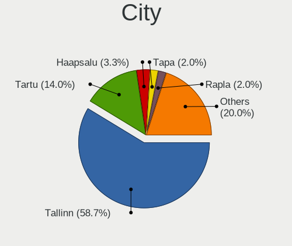

| City                   | Desktops | Percent |
|------------------------|----------|---------|
| Tallinn                | 43       | 53.75%  |
| Tartu                  | 8        | 10%     |
| Rapla                  | 3        | 3.75%   |
| Haapsalu               | 3        | 3.75%   |
| Saue                   | 2        | 2.5%    |
| Pärnu               | 2        | 2.5%    |
| Paldiski               | 2        | 2.5%    |
| Narva                  | 2        | 2.5%    |
| Vaskjala               | 1        | 1.25%   |
| Tapa                   | 1        | 1.25%   |
| Rakvere                | 1        | 1.25%   |
| PГµlva               | 1        | 1.25%   |
| PГµltsamaa           | 1        | 1.25%   |
| Märjamaa            | 1        | 1.25%   |
| Maardu                 | 1        | 1.25%   |
| KГµrvekГјla        | 1        | 1.25%   |
| Kärdla              | 1        | 1.25%   |
| Kuressaare             | 1        | 1.25%   |
| Kohtla-Järve        | 1        | 1.25%   |
| JГµhvi               | 1        | 1.25%   |
| Jõelähtme Parish | 1        | 1.25%   |
| Jaerva vald            | 1        | 1.25%   |
| Haabneeme              | 1        | 1.25%   |

Drives
------

Drive Vendor
------------

Hard drive vendors

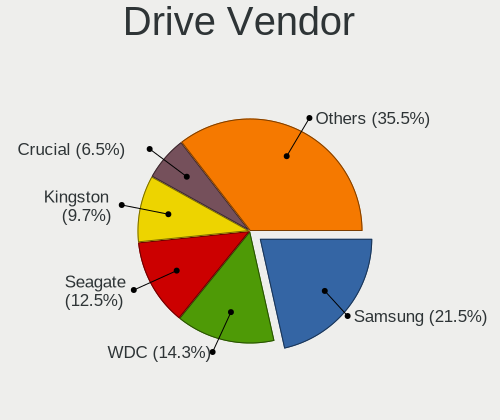

| Vendor              | Desktops | Drives | Percent |
|---------------------|----------|--------|---------|
| Samsung Electronics | 31       | 48     | 21.23%  |
| WDC                 | 26       | 45     | 17.81%  |
| Seagate             | 16       | 22     | 10.96%  |
| Kingston            | 16       | 27     | 10.96%  |
| Crucial             | 9        | 21     | 6.16%   |
| Hitachi             | 8        | 10     | 5.48%   |
| Toshiba             | 6        | 6      | 4.11%   |
| SanDisk             | 5        | 5      | 3.42%   |
| HGST                | 4        | 7      | 2.74%   |
| A-DATA Technology   | 4        | 11     | 2.74%   |
| Unknown             | 2        | 2      | 1.37%   |
| MAXTOR              | 2        | 2      | 1.37%   |
| Intel               | 2        | 3      | 1.37%   |
| Gigabyte Technology | 2        | 2      | 1.37%   |
| Corsair             | 2        | 2      | 1.37%   |
| China               | 2        | 2      | 1.37%   |
| XPG                 | 1        | 1      | 0.68%   |
| Team                | 1        | 2      | 0.68%   |
| Silicon Motion      | 1        | 2      | 0.68%   |
| PLEXTOR             | 1        | 1      | 0.68%   |
| KingSpec            | 1        | 2      | 0.68%   |
| Integral            | 1        | 1      | 0.68%   |
| Inateck             | 1        | 1      | 0.68%   |
| Apple               | 1        | 1      | 0.68%   |
| Apacer              | 1        | 1      | 0.68%   |

Drive Model
-----------

Hard drive models

| Model                                | Desktops | Percent |
|--------------------------------------|----------|---------|
| Samsung SSD 850 EVO 250GB            | 6        | 3.39%   |
| Samsung NVMe SSD Drive 1TB           | 4        | 2.26%   |
| Samsung HD103SJ 1TB                  | 3        | 1.69%   |
| WDC WD10EADS-00M2B0 1TB              | 2        | 1.13%   |
| Unknown ArtisanTribute-512GB         | 2        | 1.13%   |
| Toshiba HDWD130 3TB                  | 2        | 1.13%   |
| Seagate ST500LT012-9WS142 500GB      | 2        | 1.13%   |
| Seagate ST500DM002-1BD142 500GB      | 2        | 1.13%   |
| Seagate ST2000DM008-2FR102 2TB       | 2        | 1.13%   |
| Seagate ST1000DM010-2EP102 1TB       | 2        | 1.13%   |
| Seagate ST1000DM003-1SB102 1TB       | 2        | 1.13%   |
| Samsung SSD 960 PRO 512GB            | 2        | 1.13%   |
| Samsung SSD 850 PRO 256GB            | 2        | 1.13%   |
| Samsung SSD 840 PRO Series 128GB     | 2        | 1.13%   |
| Samsung SP0802N 80GB                 | 2        | 1.13%   |
| Samsung MZ7TY128HDHP-000L1 128GB SSD | 2        | 1.13%   |
| Kingston SA400S37240G 240GB SSD      | 2        | 1.13%   |
| Kingston SA400S37120G 120GB SSD      | 2        | 1.13%   |
| HGST HTS541010A9E680 1TB             | 2        | 1.13%   |
| Crucial CT500MX500SSD1 500GB         | 2        | 1.13%   |
| Crucial CT2000MX500SSD1 2TB          | 2        | 1.13%   |
| Crucial CT128MX100SSD1 128GB         | 2        | 1.13%   |
| A-DATA SU800 128GB SSD               | 2        | 1.13%   |
| XPG GAMMIX S11 480GB                 | 1        | 0.56%   |
| WDC WDS200T2B0B-00YS70 2TB SSD       | 1        | 0.56%   |
| WDC WDS120G2G0A-00JH30 120GB SSD     | 1        | 0.56%   |
| WDC WDS120G1G0A-00SS50 120GB SSD     | 1        | 0.56%   |
| WDC WDS100T2B0C-00PXH0 1TB           | 1        | 0.56%   |
| WDC WDS100T2B0A 1TB SSD              | 1        | 0.56%   |
| WDC WD80EFAX-68KNBN0 8TB             | 1        | 0.56%   |
| WDC WD800BB-00FRA0 80GB              | 1        | 0.56%   |
| WDC WD7500BPKT-80PK4T0 752GB         | 1        | 0.56%   |
| WDC WD60EFRX-68MYMN1 6TB             | 1        | 0.56%   |
| WDC WD6002FRYZ-01WD5B1 6TB           | 1        | 0.56%   |
| WDC WD5002AALX-00J37A0 500GB         | 1        | 0.56%   |
| WDC WD5000BPVT-00HXZT1 500GB         | 1        | 0.56%   |
| WDC WD5000AAKX-60U6AA0 500GB         | 1        | 0.56%   |
| WDC WD5000AAKX-08ERMA0 500GB         | 1        | 0.56%   |
| WDC WD5000AAKX-00ERMA0 500GB         | 1        | 0.56%   |
| WDC WD5000AAKX-001CA0 500GB          | 1        | 0.56%   |
| WDC WD5000AAKS-00WWPA0 500GB         | 1        | 0.56%   |
| WDC WD5000AADS-00S9B0 500GB          | 1        | 0.56%   |
| WDC WD40EZRZ-75GXCB0 4TB             | 1        | 0.56%   |
| WDC WD40EFRX-68N32N0 4TB             | 1        | 0.56%   |
| WDC WD30EFRX-68N32N0 3TB             | 1        | 0.56%   |
| WDC WD30EFRX-68EUZN0 3TB             | 1        | 0.56%   |
| WDC WD30EFRX-68AX9N0 3TB             | 1        | 0.56%   |
| WDC WD2500BEVT-35ZCT0 250GB          | 1        | 0.56%   |
| WDC WD20EZRZ-00Z5HB0 2TB             | 1        | 0.56%   |
| WDC WD20EZRX-00DC0B0 2TB             | 1        | 0.56%   |
| WDC WD20EFRX-68AX9N0 2TB             | 1        | 0.56%   |
| WDC WD20EARX-00PASB0 2TB             | 1        | 0.56%   |
| WDC WD1600AAJB-00J3A0 160GB          | 1        | 0.56%   |
| WDC WD10EZRZ-00HTKB0 1TB             | 1        | 0.56%   |
| WDC WD10EAVS-00D7B1 1TB              | 1        | 0.56%   |
| WDC WD1003FZEX-00MK2A0 1TB           | 1        | 0.56%   |
| WDC PC SN530 SDBPNPZ-256G-1006 256GB | 1        | 0.56%   |
| Toshiba MQ01ABF050 500GB             | 1        | 0.56%   |
| Toshiba MK5061GSYN 500GB             | 1        | 0.56%   |
| Toshiba HDWD120 2TB                  | 1        | 0.56%   |

HDD Vendor
----------

Hard disk drive vendors

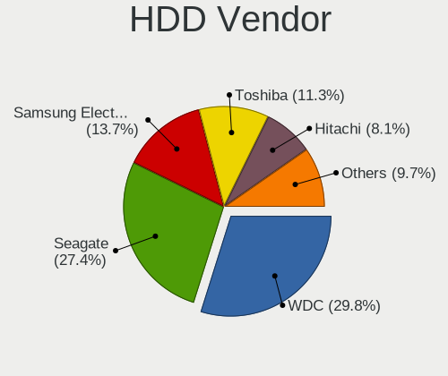

| Vendor              | Desktops | Drives | Percent |
|---------------------|----------|--------|---------|
| WDC                 | 24       | 37     | 33.8%   |
| Seagate             | 16       | 22     | 22.54%  |
| Samsung Electronics | 10       | 13     | 14.08%  |
| Hitachi             | 8        | 10     | 11.27%  |
| Toshiba             | 6        | 6      | 8.45%   |
| HGST                | 4        | 7      | 5.63%   |
| MAXTOR              | 2        | 2      | 2.82%   |
| Apple               | 1        | 1      | 1.41%   |

SSD Vendor
----------

Solid state drive vendors

| Vendor              | Desktops | Drives | Percent |
|---------------------|----------|--------|---------|
| Samsung Electronics | 17       | 22     | 27.87%  |
| Kingston            | 12       | 20     | 19.67%  |
| Crucial             | 9        | 21     | 14.75%  |
| SanDisk             | 5        | 5      | 8.2%    |
| WDC                 | 4        | 6      | 6.56%   |
| A-DATA Technology   | 3        | 10     | 4.92%   |
| Corsair             | 2        | 2      | 3.28%   |
| China               | 2        | 2      | 3.28%   |
| Team                | 1        | 2      | 1.64%   |
| PLEXTOR             | 1        | 1      | 1.64%   |
| KingSpec            | 1        | 2      | 1.64%   |
| Intel               | 1        | 1      | 1.64%   |
| Integral            | 1        | 1      | 1.64%   |
| Gigabyte Technology | 1        | 1      | 1.64%   |
| Apacer              | 1        | 1      | 1.64%   |

Drive Kind
----------

HDD or SSD

| Kind    | Desktops | Drives | Percent |
|---------|----------|--------|---------|
| HDD     | 53       | 98     | 43.44%  |
| SSD     | 45       | 97     | 36.89%  |
| NVMe    | 21       | 29     | 17.21%  |
| Unknown | 3        | 3      | 2.46%   |

Drive Connector
---------------

SATA, SAS, NVMe, etc.

| Type | Desktops | Drives | Percent |
|------|----------|--------|---------|
| SATA | 74       | 194    | 74.75%  |
| NVMe | 21       | 29     | 21.21%  |
| SAS  | 4        | 4      | 4.04%   |

Drive Size
----------

Size of hard drive

| Size in TB | Desktops | Drives | Percent |
|------------|----------|--------|---------|
| 0.01-0.5   | 62       | 121    | 55.86%  |
| 0.51-1.0   | 26       | 39     | 23.42%  |
| 1.01-2.0   | 11       | 16     | 9.91%   |
| 2.01-3.0   | 5        | 12     | 4.5%    |
| 4.01-10.0  | 4        | 4      | 3.6%    |
| 3.01-4.0   | 2        | 2      | 1.8%    |
| 10.01-20.0 | 1        | 1      | 0.9%    |

Space Total
-----------

Amount of disk space available on the file system

| Size in GB     | Desktops | Percent |
|----------------|----------|---------|
| 251-500        | 18       | 21.95%  |
| 101-250        | 18       | 21.95%  |
| 1001-2000      | 13       | 15.85%  |
| 1-20           | 9        | 10.98%  |
| More than 3000 | 8        | 9.76%   |
| 501-1000       | 7        | 8.54%   |
| 51-100         | 4        | 4.88%   |
| 2001-3000      | 2        | 2.44%   |
| Unknown        | 2        | 2.44%   |
| 21-50          | 1        | 1.22%   |

Space Used
----------

Amount of used disk space

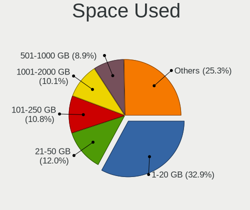

| Used GB        | Desktops | Percent |
|----------------|----------|---------|
| 1-20           | 32       | 38.55%  |
| 21-50          | 12       | 14.46%  |
| 101-250        | 11       | 13.25%  |
| 501-1000       | 9        | 10.84%  |
| More than 3000 | 6        | 7.23%   |
| 251-500        | 4        | 4.82%   |
| 51-100         | 4        | 4.82%   |
| 1001-2000      | 3        | 3.61%   |
| Unknown        | 2        | 2.41%   |

Malfunc. Drives
---------------

Drive models with a malfunction

| Model                                        | Desktops | Drives | Percent |
|----------------------------------------------|----------|--------|---------|
| Crucial CT128MX100SSD1 128GB                 | 2        | 3      | 10%     |
| WDC WD60EFRX-68MYMN1 6TB                     | 1        | 1      | 5%      |
| WDC WD5002AALX-00J37A0 500GB                 | 1        | 1      | 5%      |
| WDC WD5000BPVT-00HXZT1 500GB                 | 1        | 1      | 5%      |
| WDC WD5000AAKX-00ERMA0 500GB                 | 1        | 1      | 5%      |
| WDC WD20EZRX-00DC0B0 2TB                     | 1        | 2      | 5%      |
| WDC WD20EARX-00PASB0 2TB                     | 1        | 1      | 5%      |
| WDC WD10EAVS-00D7B1 1TB                      | 1        | 1      | 5%      |
| WDC WD10EADS-00M2B0 1TB                      | 1        | 1      | 5%      |
| Seagate ST500DM002-1BD142 500GB              | 1        | 1      | 5%      |
| Seagate ST340016A 40GB                       | 1        | 2      | 5%      |
| Samsung Electronics SSD 840 PRO Series 128GB | 1        | 1      | 5%      |
| Samsung Electronics SP0802N 80GB             | 1        | 1      | 5%      |
| Samsung Electronics HD642JJ 640GB            | 1        | 1      | 5%      |
| Samsung Electronics HD501LJ 500GB            | 1        | 1      | 5%      |
| Samsung Electronics HD103SJ 1TB              | 1        | 1      | 5%      |
| MAXTOR STM3250310AS 250GB                    | 1        | 1      | 5%      |
| Hitachi HDS721680PLA380 80GB                 | 1        | 1      | 5%      |
| Hitachi HDS721010DLE630 1TB                  | 1        | 1      | 5%      |

Malfunc. Drive Vendor
---------------------

Vendors of faulty drives

| Vendor              | Desktops | Drives | Percent |
|---------------------|----------|--------|---------|
| WDC                 | 7        | 9      | 38.89%  |
| Samsung Electronics | 4        | 5      | 22.22%  |
| Seagate             | 2        | 3      | 11.11%  |
| Hitachi             | 2        | 2      | 11.11%  |
| Crucial             | 2        | 3      | 11.11%  |
| MAXTOR              | 1        | 1      | 5.56%   |

Malfunc. HDD Vendor
-------------------

Vendors of faulty HDD drives

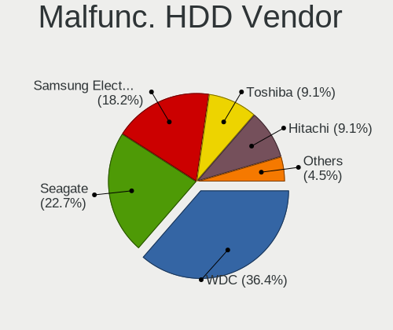

| Vendor              | Desktops | Drives | Percent |
|---------------------|----------|--------|---------|
| WDC                 | 7        | 9      | 46.67%  |
| Samsung Electronics | 3        | 4      | 20%     |
| Seagate             | 2        | 3      | 13.33%  |
| Hitachi             | 2        | 2      | 13.33%  |
| MAXTOR              | 1        | 1      | 6.67%   |

Malfunc. Drive Kind
-------------------

Kinds of faulty drives

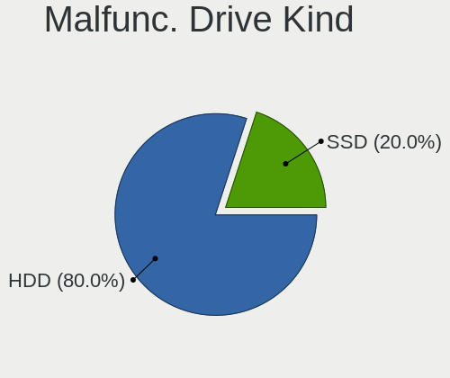

| Kind | Desktops | Drives | Percent |
|------|----------|--------|---------|
| HDD  | 14       | 19     | 82.35%  |
| SSD  | 3        | 4      | 17.65%  |

Failed Drives
-------------

Failed drive models

Zero info for selected period =(

Failed Drive Vendor
-------------------

Failed drive vendors

Zero info for selected period =(

Drive Status
------------

Number of failed and malfunc. drives

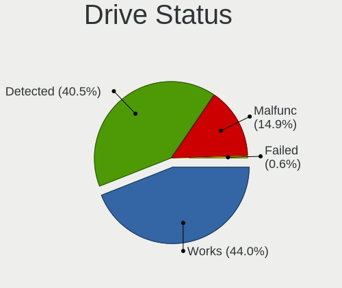

| Status   | Desktops | Drives | Percent |
|----------|----------|--------|---------|
| Works    | 40       | 93     | 43.48%  |
| Detected | 35       | 111    | 38.04%  |
| Malfunc  | 17       | 23     | 18.48%  |

Storage controller
------------------

Storage Vendor
--------------

Storage controller vendors

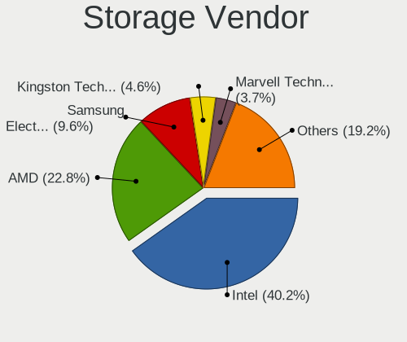

| Vendor                      | Desktops | Percent |
|-----------------------------|----------|---------|
| Intel                       | 50       | 45.05%  |
| AMD                         | 23       | 20.72%  |
| Samsung Electronics         | 10       | 9.01%   |
| Nvidia                      | 5        | 4.5%    |
| Kingston Technology Company | 5        | 4.5%    |
| Marvell Technology Group    | 4        | 3.6%    |
| VIA Technologies            | 2        | 1.8%    |
| Silicon Motion              | 2        | 1.8%    |
| Sandisk                     | 2        | 1.8%    |
| JMicron Technology          | 2        | 1.8%    |
| ASMedia Technology          | 2        | 1.8%    |
| Silicon Image               | 1        | 0.9%    |
| Phison Electronics          | 1        | 0.9%    |
| ADATA Technology            | 1        | 0.9%    |
| Adaptec                     | 1        | 0.9%    |

Storage Model
-------------

Storage controller models

| Model                                                                                   | Desktops | Percent |
|-----------------------------------------------------------------------------------------|----------|---------|
| AMD FCH SATA Controller [AHCI mode]                                                     | 16       | 11.76%  |
| Intel 8 Series/C220 Series Chipset Family 6-port SATA Controller 1 [AHCI mode]          | 7        | 5.15%   |
| Intel 200 Series PCH SATA controller [AHCI mode]                                        | 7        | 5.15%   |
| Samsung NVMe SSD Controller SM981/PM981/PM983                                           | 6        | 4.41%   |
| Intel NM10/ICH7 Family SATA Controller [IDE mode]                                       | 5        | 3.68%   |
| Intel 82801G (ICH7 Family) IDE Controller                                               | 5        | 3.68%   |
| Samsung NVMe SSD Controller SM961/PM961/SM963                                           | 4        | 2.94%   |
| Intel Q170/Q150/B150/H170/H110/Z170/CM236 Chipset SATA Controller [AHCI Mode]           | 4        | 2.94%   |
| Intel Cannon Lake PCH SATA AHCI Controller                                              | 4        | 2.94%   |
| Intel 6 Series/C200 Series Chipset Family 6 port Desktop SATA AHCI Controller           | 4        | 2.94%   |
| AMD 500 Series Chipset SATA Controller                                                  | 4        | 2.94%   |
| AMD 400 Series Chipset SATA Controller                                                  | 4        | 2.94%   |
| Kingston Company A2000 NVMe SSD                                                         | 3        | 2.21%   |
| Intel 7 Series/C210 Series Chipset Family 6-port SATA Controller [AHCI mode]            | 3        | 2.21%   |
| VIA VT6415 PATA IDE Host Controller                                                     | 2        | 1.47%   |
| Sandisk WD Blue SN550 NVMe SSD                                                          | 2        | 1.47%   |
| Nvidia CK804 Serial ATA Controller                                                      | 2        | 1.47%   |
| Nvidia CK804 IDE                                                                        | 2        | 1.47%   |
| Kingston Company U-SNS8154P3 NVMe SSD                                                   | 2        | 1.47%   |
| JMicron JMB363 SATA/IDE Controller                                                      | 2        | 1.47%   |
| Intel 9 Series Chipset Family SATA Controller [AHCI Mode]                               | 2        | 1.47%   |
| Intel 7 Series Chipset Family 6-port SATA Controller [AHCI mode]                        | 2        | 1.47%   |
| Intel 6 Series/C200 Series Chipset Family Desktop SATA Controller (IDE mode, ports 4-5) | 2        | 1.47%   |
| Intel 6 Series/C200 Series Chipset Family Desktop SATA Controller (IDE mode, ports 0-3) | 2        | 1.47%   |
| Intel 5 Series/3400 Series Chipset 6 port SATA AHCI Controller                          | 2        | 1.47%   |
| ASMedia ASM1062 Serial ATA Controller                                                   | 2        | 1.47%   |
| AMD X370 Series Chipset SATA Controller                                                 | 2        | 1.47%   |
| AMD SB7x0/SB8x0/SB9x0 SATA Controller [AHCI mode]                                       | 2        | 1.47%   |
| Silicon Motion SM2263EN/SM2263XT SSD Controller                                         | 1        | 0.74%   |
| Silicon Motion SM2262/SM2262EN SSD Controller                                           | 1        | 0.74%   |
| Silicon Image SiI 3132 Serial ATA Raid II Controller                                    | 1        | 0.74%   |
| Samsung NVMe SSD Controller PM9A1/PM9A3/980PRO                                          | 1        | 0.74%   |
| Samsung NVMe SSD Controller 980                                                         | 1        | 0.74%   |
| Phison E16 PCIe4 NVMe Controller                                                        | 1        | 0.74%   |
| Nvidia nForce2 IDE                                                                      | 1        | 0.74%   |
| Nvidia MCP78S [GeForce 8200] IDE                                                        | 1        | 0.74%   |
| Nvidia MCP78S [GeForce 8200] AHCI Controller                                            | 1        | 0.74%   |
| Nvidia MCP61 SATA Controller                                                            | 1        | 0.74%   |
| Nvidia MCP61 IDE                                                                        | 1        | 0.74%   |
| Marvell Group 88SE9215 PCIe 2.0 x1 4-port SATA 6 Gb/s Controller                        | 1        | 0.74%   |
| Marvell Group 88SE91A3 SATA-600 Controller                                              | 1        | 0.74%   |
| Marvell Group 88SE9172 SATA 6Gb/s Controller                                            | 1        | 0.74%   |
| Marvell Group 88SE6101/6102 single-port PATA133 interface                               | 1        | 0.74%   |
| Intel SSD Pro 7600p/760p/E 6100p Series                                                 | 1        | 0.74%   |
| Intel SATA Controller [RAID mode]                                                       | 1        | 0.74%   |
| Intel NM10/ICH7 Family SATA Controller [AHCI mode]                                      | 1        | 0.74%   |
| Intel C600/X79 series chipset 6-Port SATA AHCI Controller                               | 1        | 0.74%   |
| Intel Atom/Celeron/Pentium Processor x5-E8000/J3xxx/N3xxx Series SATA Controller        | 1        | 0.74%   |
| Intel 82801JI (ICH10 Family) 4 port SATA IDE Controller #1                              | 1        | 0.74%   |
| Intel 82801JI (ICH10 Family) 2 port SATA IDE Controller #2                              | 1        | 0.74%   |
| Intel 82801IR/IO/IH (ICH9R/DO/DH) 4 port SATA Controller [IDE mode]                     | 1        | 0.74%   |
| Intel 82801I (ICH9 Family) 2 port SATA Controller [IDE mode]                            | 1        | 0.74%   |
| Intel 8 Series/C220 Series Chipset Family 2-port SATA Controller 2 [IDE mode]           | 1        | 0.74%   |
| Intel 500 Series Chipset Family SATA AHCI Controller                                    | 1        | 0.74%   |
| AMD SB7x0/SB8x0/SB9x0 SATA Controller [IDE mode]                                        | 1        | 0.74%   |
| AMD SB7x0/SB8x0/SB9x0 IDE Controller                                                    | 1        | 0.74%   |
| AMD FCH SATA Controller [IDE mode]                                                      | 1        | 0.74%   |
| AMD 300 Series Chipset SATA Controller                                                  | 1        | 0.74%   |
| ADATA XPG SX8200 Pro PCIe Gen3x4 M.2 2280 Solid State Drive                             | 1        | 0.74%   |
| Adaptec AIC-7861                                                                        | 1        | 0.74%   |

Storage Kind
------------

Kind of storage controller (IDE, SATA, NVMe, SAS, ...)

| Kind | Desktops | Percent |
|------|----------|---------|
| SATA | 63       | 60%     |
| NVMe | 21       | 20%     |
| IDE  | 18       | 17.14%  |
| RAID | 2        | 1.9%    |
| SCSI | 1        | 0.95%   |

Processor
---------

CPU Vendor
----------

Processor vendors

| Vendor | Desktops | Percent |
|--------|----------|---------|
| Intel  | 50       | 64.1%   |
| AMD    | 28       | 35.9%   |

CPU Model
---------

Processor models

| Model                                       | Desktops | Percent |
|---------------------------------------------|----------|---------|
| AMD Ryzen 7 3700X 8-Core Processor          | 3        | 3.85%   |
| Intel Core i7-7700 CPU @ 3.60GHz            | 2        | 2.56%   |
| Intel Core i5-9600K CPU @ 3.70GHz           | 2        | 2.56%   |
| Intel Core i5-2500 CPU @ 3.30GHz            | 2        | 2.56%   |
| Intel Core i3-4130 CPU @ 3.40GHz            | 2        | 2.56%   |
| Intel Core i3-3217U CPU @ 1.80GHz           | 2        | 2.56%   |
| Intel Core 2 Duo CPU E8400 @ 3.00GHz        | 2        | 2.56%   |
| AMD Ryzen 9 3900X 12-Core Processor         | 2        | 2.56%   |
| AMD Ryzen 7 PRO 4750G with Radeon Graphics  | 2        | 2.56%   |
| AMD Ryzen 5 3600 6-Core Processor           | 2        | 2.56%   |
| AMD Athlon 64 X2 Dual Core Processor 3800+  | 2        | 2.56%   |
| Intel Xeon CPU E5-2689 0 @ 2.60GHz          | 1        | 1.28%   |
| Intel Xeon CPU E3-1245 v3 @ 3.40GHz         | 1        | 1.28%   |
| Intel Xeon CPU E3-1241 v3 @ 3.50GHz         | 1        | 1.28%   |
| Intel Pentium Gold G5400 CPU @ 3.70GHz      | 1        | 1.28%   |
| Intel Pentium D CPU 2.80GHz                 | 1        | 1.28%   |
| Intel Pentium CPU G850 @ 2.90GHz            | 1        | 1.28%   |
| Intel Pentium CPU G4560T @ 2.90GHz          | 1        | 1.28%   |
| Intel Pentium CPU G2120 @ 3.10GHz           | 1        | 1.28%   |
| Intel Pentium CPU G2030 @ 3.00GHz           | 1        | 1.28%   |
| Intel Pentium 4 CPU 3.00GHz                 | 1        | 1.28%   |
| Intel Core i9-9900K CPU @ 3.60GHz           | 1        | 1.28%   |
| Intel Core i9-7940X CPU @ 3.10GHz           | 1        | 1.28%   |
| Intel Core i7-8700K CPU @ 3.70GHz           | 1        | 1.28%   |
| Intel Core i7-6700K CPU @ 4.00GHz           | 1        | 1.28%   |
| Intel Core i7-3820 CPU @ 3.60GHz            | 1        | 1.28%   |
| Intel Core i5-9500 CPU @ 3.00GHz            | 1        | 1.28%   |
| Intel Core i5-7600K CPU @ 3.80GHz           | 1        | 1.28%   |
| Intel Core i5-7500 CPU @ 3.40GHz            | 1        | 1.28%   |
| Intel Core i5-6500 CPU @ 3.20GHz            | 1        | 1.28%   |
| Intel Core i5-6400 CPU @ 2.70GHz            | 1        | 1.28%   |
| Intel Core i5-4690K CPU @ 3.50GHz           | 1        | 1.28%   |
| Intel Core i5-4690 CPU @ 3.50GHz            | 1        | 1.28%   |
| Intel Core i5-4590 CPU @ 3.30GHz            | 1        | 1.28%   |
| Intel Core i5-4460 CPU @ 3.20GHz            | 1        | 1.28%   |
| Intel Core i5-4440 CPU @ 3.10GHz            | 1        | 1.28%   |
| Intel Core i5-3350P CPU @ 3.10GHz           | 1        | 1.28%   |
| Intel Core i5-2400 CPU @ 3.10GHz            | 1        | 1.28%   |
| Intel Core i3-8350K CPU @ 4.00GHz           | 1        | 1.28%   |
| Intel Core i3-3220 CPU @ 3.30GHz            | 1        | 1.28%   |
| Intel Core i3 CPU 550 @ 3.20GHz             | 1        | 1.28%   |
| Intel Core i3 CPU 530 @ 2.93GHz             | 1        | 1.28%   |
| Intel Core 2 Duo CPU E6550 @ 2.33GHz        | 1        | 1.28%   |
| Intel Core 2 Duo CPU E4500 @ 2.20GHz        | 1        | 1.28%   |
| Intel Celeron CPU N3050 @ 1.60GHz           | 1        | 1.28%   |
| Intel Celeron CPU G1840 @ 2.80GHz           | 1        | 1.28%   |
| Intel Celeron CPU E3400 @ 2.60GHz           | 1        | 1.28%   |
| Intel Celeron CPU 420 @ 1.60GHz             | 1        | 1.28%   |
| Intel 11th Gen Core i7-11700 @ 2.50GHz      | 1        | 1.28%   |
| AMD Ryzen 9 5900X 12-Core Processor         | 1        | 1.28%   |
| AMD Ryzen 9 3950X 16-Core Processor         | 1        | 1.28%   |
| AMD Ryzen 7 5700G with Radeon Graphics      | 1        | 1.28%   |
| AMD Ryzen 7 3800X 8-Core Processor          | 1        | 1.28%   |
| AMD Ryzen 7 1700X Eight-Core Processor      | 1        | 1.28%   |
| AMD Ryzen 7 1700 Eight-Core Processor       | 1        | 1.28%   |
| AMD Ryzen 5 5600X 6-Core Processor          | 1        | 1.28%   |
| AMD Ryzen 5 3600X 6-Core Processor          | 1        | 1.28%   |
| AMD Ryzen 5 2400G with Radeon Vega Graphics | 1        | 1.28%   |
| AMD Phenom II X6 1055T Processor            | 1        | 1.28%   |
| AMD Phenom II X4 910 Processor              | 1        | 1.28%   |

CPU Model Family
----------------

Processor model prefix

| Model              | Desktops | Percent |
|--------------------|----------|---------|
| Intel Core i5      | 16       | 20.51%  |
| Intel Core i3      | 8        | 10.26%  |
| AMD Ryzen 7        | 7        | 8.97%   |
| Intel Core i7      | 5        | 6.41%   |
| AMD Ryzen 5        | 5        | 6.41%   |
| Intel Pentium      | 4        | 5.13%   |
| Intel Core 2 Duo   | 4        | 5.13%   |
| Intel Celeron      | 4        | 5.13%   |
| AMD Ryzen 9        | 4        | 5.13%   |
| Intel Xeon         | 3        | 3.85%   |
| AMD Athlon 64 X2   | 3        | 3.85%   |
| Intel Core i9      | 2        | 2.56%   |
| AMD Ryzen 7 PRO    | 2        | 2.56%   |
| AMD FX             | 2        | 2.56%   |
| AMD A10            | 2        | 2.56%   |
| Other              | 1        | 1.28%   |
| Intel Pentium Gold | 1        | 1.28%   |
| Intel Pentium D    | 1        | 1.28%   |
| Intel Pentium 4    | 1        | 1.28%   |
| AMD Phenom II X6   | 1        | 1.28%   |
| AMD Phenom II X4   | 1        | 1.28%   |
| AMD Athlon XP      | 1        | 1.28%   |

CPU Cores
---------

Number of processor cores

| Number  | Desktops | Percent |
|---------|----------|---------|
| 2       | 25       | 32.05%  |
| 4       | 22       | 28.21%  |
| 8       | 12       | 15.38%  |
| 6       | 9        | 11.54%  |
| 12      | 3        | 3.85%   |
| 1       | 3        | 3.85%   |
| 16      | 1        | 1.28%   |
| 14      | 1        | 1.28%   |
| 3       | 1        | 1.28%   |
| Unknown | 1        | 1.28%   |

CPU Sockets
-----------

Number of sockets

| Number | Desktops | Percent |
|--------|----------|---------|
| 1      | 78       | 100%    |

CPU Threads
-----------

Threads per core (Hyper-Threading)

| Number  | Desktops | Percent |
|---------|----------|---------|
| 2       | 42       | 53.85%  |
| 1       | 35       | 44.87%  |
| Unknown | 1        | 1.28%   |

CPU Op-Modes
------------

CPU Operation Modes (32-bit, 64-bit)

| Op mode        | Desktops | Percent |
|----------------|----------|---------|
| 32-bit, 64-bit | 76       | 97.44%  |
| 32-bit         | 1        | 1.28%   |
| Unknown        | 1        | 1.28%   |

CPU Microcode
-------------

Microcode number

| Number     | Desktops | Percent |
|------------|----------|---------|
| Unknown    | 20       | 24.69%  |
| 0x306c3    | 7        | 8.64%   |
| 0x306a9    | 6        | 7.41%   |
| 0x906e9    | 4        | 4.94%   |
| 0x206a7    | 4        | 4.94%   |
| 0x08701021 | 4        | 4.94%   |
| 0x08701013 | 4        | 4.94%   |
| 0x906ea    | 3        | 3.7%    |
| 0x506e3    | 2        | 2.47%   |
| 0x08001138 | 2        | 2.47%   |
| 0x06003106 | 2        | 2.47%   |
| 0x06000852 | 2        | 2.47%   |
| 0xf64      | 1        | 1.23%   |
| 0xf4a      | 1        | 1.23%   |
| 0xa0671    | 1        | 1.23%   |
| 0x906ed    | 1        | 1.23%   |
| 0x906eb    | 1        | 1.23%   |
| 0x6fd      | 1        | 1.23%   |
| 0x6fb      | 1        | 1.23%   |
| 0x50654    | 1        | 1.23%   |
| 0x406c3    | 1        | 1.23%   |
| 0x206d7    | 1        | 1.23%   |
| 0x20655    | 1        | 1.23%   |
| 0x20652    | 1        | 1.23%   |
| 0x1067a    | 1        | 1.23%   |
| 0x10676    | 1        | 1.23%   |
| 0x10661    | 1        | 1.23%   |
| 0x0a201016 | 1        | 1.23%   |
| 0x0a201009 | 1        | 1.23%   |
| 0x08600106 | 1        | 1.23%   |
| 0x08600103 | 1        | 1.23%   |
| 0x0810100b | 1        | 1.23%   |
| 0x010000db | 1        | 1.23%   |

CPU Microarch
-------------

Microarchitecture

| Name        | Desktops | Percent |
|-------------|----------|---------|
| Zen 2       | 12       | 15.38%  |
| KabyLake    | 12       | 15.38%  |
| Haswell     | 10       | 12.82%  |
| SandyBridge | 6        | 7.69%   |
| IvyBridge   | 6        | 7.69%   |
| Skylake     | 4        | 5.13%   |
| Zen 3       | 3        | 3.85%   |
| Zen         | 3        | 3.85%   |
| Penryn      | 3        | 3.85%   |
| K8 Hammer   | 3        | 3.85%   |
| Core        | 3        | 3.85%   |
| Westmere    | 2        | 2.56%   |
| Steamroller | 2        | 2.56%   |
| Piledriver  | 2        | 2.56%   |
| NetBurst    | 2        | 2.56%   |
| K10         | 2        | 2.56%   |
| Silvermont  | 1        | 1.28%   |
| K6          | 1        | 1.28%   |
| Icelake     | 1        | 1.28%   |

Graphics
--------

GPU Vendor
----------

Vendors of graphics cards

| Vendor | Desktops | Percent |
|--------|----------|---------|
| Nvidia | 39       | 43.82%  |
| Intel  | 27       | 30.34%  |
| AMD    | 23       | 25.84%  |

GPU Model
---------

Graphics card models

| Model                                                                                    | Desktops | Percent |
|------------------------------------------------------------------------------------------|----------|---------|
| AMD Ellesmere [Radeon RX 470/480/570/570X/580/580X/590]                                  | 7        | 7.69%   |
| Intel Xeon E3-1200 v3/4th Gen Core Processor Integrated Graphics Controller              | 4        | 4.4%    |
| Intel CoffeeLake-S GT2 [UHD Graphics 630]                                                | 4        | 4.4%    |
| Nvidia GP108 [GeForce GT 1030]                                                           | 3        | 3.3%    |
| Nvidia GP102 [GeForce GTX 1080 Ti]                                                       | 3        | 3.3%    |
| Nvidia TU106 [GeForce RTX 2070]                                                          | 2        | 2.2%    |
| Nvidia TU104 [GeForce RTX 2070 SUPER]                                                    | 2        | 2.2%    |
| Nvidia GP107 [GeForce GTX 1050 Ti]                                                       | 2        | 2.2%    |
| Nvidia GP106 [GeForce GTX 1060 6GB]                                                      | 2        | 2.2%    |
| Nvidia GP104 [GeForce GTX 1070]                                                          | 2        | 2.2%    |
| Nvidia GP104 [GeForce GTX 1070 Ti]                                                       | 2        | 2.2%    |
| Intel Xeon E3-1200 v2/3rd Gen Core processor Graphics Controller                         | 2        | 2.2%    |
| Intel HD Graphics 630                                                                    | 2        | 2.2%    |
| Intel Core Processor Integrated Graphics Controller                                      | 2        | 2.2%    |
| Intel 82945G/GZ Integrated Graphics Controller                                           | 2        | 2.2%    |
| Intel 4th Generation Core Processor Family Integrated Graphics Controller                | 2        | 2.2%    |
| Intel 3rd Gen Core processor Graphics Controller                                         | 2        | 2.2%    |
| AMD Tonga PRO [Radeon R9 285/380]                                                        | 2        | 2.2%    |
| AMD RV610 [Radeon HD 2400 PRO]                                                           | 2        | 2.2%    |
| AMD Renoir                                                                               | 2        | 2.2%    |
| Nvidia TU116 [GeForce GTX 1660]                                                          | 1        | 1.1%    |
| Nvidia TU116 [GeForce GTX 1650 SUPER]                                                    | 1        | 1.1%    |
| Nvidia TU106 [GeForce RTX 2070 Rev. A]                                                   | 1        | 1.1%    |
| Nvidia TU106 [GeForce RTX 2060 SUPER]                                                    | 1        | 1.1%    |
| Nvidia TU106 [GeForce RTX 2060 Rev. A]                                                   | 1        | 1.1%    |
| Nvidia TU102 [GeForce RTX 2080 Ti Rev. A]                                                | 1        | 1.1%    |
| Nvidia NV43GL [Quadro FX 540]                                                            | 1        | 1.1%    |
| Nvidia NV43 [GeForce 6600 GT]                                                            | 1        | 1.1%    |
| Nvidia NV34 [GeForce FX 5200]                                                            | 1        | 1.1%    |
| Nvidia GT218 [GeForce 210]                                                               | 1        | 1.1%    |
| Nvidia GP106 [GeForce GTX 1060 3GB]                                                      | 1        | 1.1%    |
| Nvidia GM206 [GeForce GTX 960]                                                           | 1        | 1.1%    |
| Nvidia GM206 [GeForce GTX 750 v2]                                                        | 1        | 1.1%    |
| Nvidia GM204 [GeForce GTX 970]                                                           | 1        | 1.1%    |
| Nvidia GM107 [GeForce GTX 750 Ti]                                                        | 1        | 1.1%    |
| Nvidia GK208B [GeForce GT 710]                                                           | 1        | 1.1%    |
| Nvidia GF119 [GeForce GT 610]                                                            | 1        | 1.1%    |
| Nvidia GF108 [GeForce GT 730]                                                            | 1        | 1.1%    |
| Nvidia GA102 [GeForce RTX 3080 Lite Hash Rate]                                           | 1        | 1.1%    |
| Nvidia G86 [GeForce 8500 GT]                                                             | 1        | 1.1%    |
| Nvidia G84 [GeForce 8600 GT]                                                             | 1        | 1.1%    |
| Nvidia C61 [GeForce 6150SE nForce 430]                                                   | 1        | 1.1%    |
| Intel Xeon E3-1200 v3 Processor Integrated Graphics Controller                           | 1        | 1.1%    |
| Intel HD Graphics 610                                                                    | 1        | 1.1%    |
| Intel CoffeeLake-S GT1 [UHD Graphics 610]                                                | 1        | 1.1%    |
| Intel Atom/Celeron/Pentium Processor x5-E8000/J3xxx/N3xxx Integrated Graphics Controller | 1        | 1.1%    |
| Intel 82Q35 Express Integrated Graphics Controller                                       | 1        | 1.1%    |
| Intel 4 Series Chipset Integrated Graphics Controller                                    | 1        | 1.1%    |
| Intel 2nd Generation Core Processor Family Integrated Graphics Controller                | 1        | 1.1%    |
| AMD Turks XT [Radeon HD 6670/7670]                                                       | 1        | 1.1%    |
| AMD RV370 [Radeon X300/X550/X1050 Series] (Secondary)                                    | 1        | 1.1%    |
| AMD RV370 [Radeon X300/X550/X1050 Series]                                                | 1        | 1.1%    |
| AMD Redwood XT [Radeon HD 5670/5690/5730]                                                | 1        | 1.1%    |
| AMD Raven Ridge [Radeon Vega Series / Radeon Vega Mobile Series]                         | 1        | 1.1%    |
| AMD Navi 10 [Radeon RX 5600 OEM/5600 XT / 5700/5700 XT]                                  | 1        | 1.1%    |
| AMD Juniper XT [Radeon HD 6770]                                                          | 1        | 1.1%    |
| AMD Cezanne                                                                              | 1        | 1.1%    |
| AMD Cape Verde PRO [Radeon HD 7750/8740 / R7 250E]                                       | 1        | 1.1%    |
| AMD Bonaire XTX [Radeon R7 260X/360]                                                     | 1        | 1.1%    |
| AMD Baffin [Radeon RX 460/560D / Pro 450/455/460/555/555X/560/560X]                      | 1        | 1.1%    |

GPU Combo
---------

Combinations of graphics cards

| Name           | Desktops | Percent |
|----------------|----------|---------|
| 1 x Nvidia     | 34       | 43.04%  |
| 1 x AMD        | 20       | 25.32%  |
| 1 x Intel      | 18       | 22.78%  |
| Intel + Nvidia | 4        | 5.06%   |
| Intel + AMD    | 2        | 2.53%   |
| 2 x AMD        | 1        | 1.27%   |

GPU Driver
----------

Free vs proprietary

| Driver      | Desktops | Percent |
|-------------|----------|---------|
| Free        | 49       | 61.25%  |
| Proprietary | 26       | 32.5%   |
| Unknown     | 5        | 6.25%   |

GPU Memory
----------

Total video memory

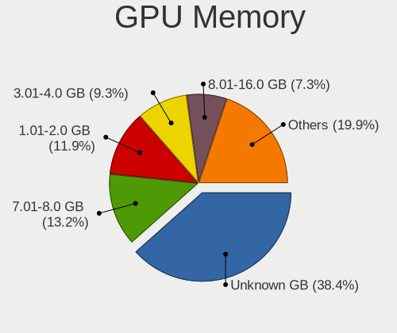

| Size in GB | Desktops | Percent |
|------------|----------|---------|
| Unknown    | 24       | 29.27%  |
| 7.01-8.0   | 13       | 15.85%  |
| 1.01-2.0   | 12       | 14.63%  |
| 0.01-0.5   | 10       | 12.2%   |
| 3.01-4.0   | 8        | 9.76%   |
| 8.01-16.0  | 5        | 6.1%    |
| 0.51-1.0   | 5        | 6.1%    |
| 5.01-6.0   | 3        | 3.66%   |
| 4.01-5.0   | 1        | 1.22%   |
| 2.01-3.0   | 1        | 1.22%   |

Monitor
-------

Monitor Vendor
--------------

Monitor vendors

| Vendor               | Desktops | Percent |
|----------------------|----------|---------|
| Dell                 | 17       | 20%     |
| Samsung Electronics  | 16       | 18.82%  |
| Goldstar             | 13       | 15.29%  |
| Hewlett-Packard      | 6        | 7.06%   |
| AOC                  | 6        | 7.06%   |
| Philips              | 5        | 5.88%   |
| ViewSonic            | 3        | 3.53%   |
| Hitachi              | 3        | 3.53%   |
| BenQ                 | 3        | 3.53%   |
| Unknown              | 2        | 2.35%   |
| RoverScan            | 2        | 2.35%   |
| Tech Concepts        | 1        | 1.18%   |
| LG Electronics       | 1        | 1.18%   |
| Lenovo               | 1        | 1.18%   |
| Fujitsu Siemens      | 1        | 1.18%   |
| Eizo                 | 1        | 1.18%   |
| Belinea              | 1        | 1.18%   |
| Ancor Communications | 1        | 1.18%   |
| Acer                 | 1        | 1.18%   |
| Unknown              | 1        | 1.18%   |

Monitor Model
-------------

Monitor models

| Model                                                                  | Desktops | Percent |
|------------------------------------------------------------------------|----------|---------|
| Samsung Electronics S32D850 SAM0BCB 2560x1440 708x398mm 32.0-inch      | 2        | 2.08%   |
| Hitachi HISENSE HEC0030 3840x2160 1872x1053mm 84.6-inch                | 2        | 2.08%   |
| Hewlett-Packard ZR24w HWP2869 1920x1200 518x324mm 24.1-inch            | 2        | 2.08%   |
| Goldstar ULTRAGEAR GSM5B80 2560x1440 597x336mm 27.0-inch               | 2        | 2.08%   |
| Goldstar MP59G GSM5B34 1920x1080 480x270mm 21.7-inch                   | 2        | 2.08%   |
| Dell U2312HM DEL4073 1920x1080 510x290mm 23.1-inch                     | 2        | 2.08%   |
| Dell P2314H DEL4098 1920x1080 509x286mm 23.0-inch                      | 2        | 2.08%   |
| AOC Q3279WG5B AOC3279 2560x1440 725x428mm 33.1-inch                    | 2        | 2.08%   |
| ViewSonic VG2428wm VSCA426 1920x1080 520x290mm 23.4-inch               | 1        | 1.04%   |
| ViewSonic VG170m VSCBF0C 1280x1024 338x270mm 17.0-inch                 | 1        | 1.04%   |
| ViewSonic VE902m VSC491B 1280x1024 376x301mm 19.0-inch                 | 1        | 1.04%   |
| Unknown LCD Monitor SAMSUNG 1920x1080                                  | 1        | 1.04%   |
| Unknown LCD Monitor GBT G34WQC 3440x1440                               | 1        | 1.04%   |
| Tech Concepts LCD Monitor MT5531 1920x1080                             | 1        | 1.04%   |
| Samsung Electronics U28H75x SAM0E00 3840x2160 610x350mm 27.7-inch      | 1        | 1.04%   |
| Samsung Electronics U28H75x SAM0DFF 3840x2160 608x345mm 27.5-inch      | 1        | 1.04%   |
| Samsung Electronics TV SAM0289 1920x540                                | 1        | 1.04%   |
| Samsung Electronics SyncMaster SAM0587 1920x1200 518x324mm 24.1-inch   | 1        | 1.04%   |
| Samsung Electronics SyncMaster SAM027C 1680x1050 433x271mm 20.1-inch   | 1        | 1.04%   |
| Samsung Electronics SyncMaster SAM01F9 1280x1024 376x301mm 19.0-inch   | 1        | 1.04%   |
| Samsung Electronics SyncMaster SAM0193 1280x1024 376x301mm 19.0-inch   | 1        | 1.04%   |
| Samsung Electronics SyncMaster SAM011F 1280x1024 380x300mm 19.1-inch   | 1        | 1.04%   |
| Samsung Electronics SyncMaster SAM011E 1280x1024 338x270mm 17.0-inch   | 1        | 1.04%   |
| Samsung Electronics S24C650 SAM0B18 1920x1200 518x324mm 24.1-inch      | 1        | 1.04%   |
| Samsung Electronics LS27R75 SAM102E 2560x1440 600x340mm 27.2-inch      | 1        | 1.04%   |
| Samsung Electronics LCD Monitor SAM0D4F 1920x1080 1210x680mm 54.6-inch | 1        | 1.04%   |
| Samsung Electronics LCD Monitor SAM0B60 1920x1080 887x500mm 40.1-inch  | 1        | 1.04%   |
| Samsung Electronics C27F390 SAM0D33 1920x1080 598x336mm 27.0-inch      | 1        | 1.04%   |
| Samsung Electronics C27F390 SAM0D32 1920x1080 600x340mm 27.2-inch      | 1        | 1.04%   |
| RoverScan Optima 170 DVM6787 1280x1024 340x270mm 17.1-inch             | 1        | 1.04%   |
| RoverScan Futura 172 DVM7777 1280x1024 338x270mm 17.0-inch             | 1        | 1.04%   |
| Philips PHL BDM4350 PHL08FA 3840x2160 953x543mm 43.2-inch              | 1        | 1.04%   |
| Philips PHL 288E2 PHLC231 3840x2160 621x341mm 27.9-inch                | 1        | 1.04%   |
| Philips PHL 275E1 PHLC20C 2560x1440 597x336mm 27.0-inch                | 1        | 1.04%   |
| Philips PHL 193V5 PHLC0CD 1366x768 410x230mm 18.5-inch                 | 1        | 1.04%   |
| Philips 226VL PHLC081 1920x1080 480x268mm 21.6-inch                    | 1        | 1.04%   |
| LG Electronics LCD Monitor LG IPS FULLHD 1920x1080                     | 1        | 1.04%   |
| Lenovo H61 LEN520B 1600x900 410x230mm 18.5-inch                        | 1        | 1.04%   |
| Hitachi HISENSE HEC002F 3840x2160 1872x1053mm 84.6-inch                | 1        | 1.04%   |
| Hewlett-Packard LCD Monitor E241i 1920x1200                            | 1        | 1.04%   |
| Hewlett-Packard LCD Monitor 23bw 1920x1080                             | 1        | 1.04%   |
| Hewlett-Packard LA1905 HWP2844 1440x900 408x255mm 18.9-inch            | 1        | 1.04%   |
| Hewlett-Packard E241i HWP3123 1920x1200 518x324mm 24.1-inch            | 1        | 1.04%   |
| Hewlett-Packard 27es HWP3325 1920x1080 598x336mm 27.0-inch             | 1        | 1.04%   |
| Goldstar W2453 GSM56F4 1920x1080 530x300mm 24.0-inch                   | 1        | 1.04%   |
| Goldstar W2243 GSM56FE 1920x1080 480x270mm 21.7-inch                   | 1        | 1.04%   |
| Goldstar ULTRAGEAR GSM5B7F 2560x1440 597x336mm 27.0-inch               | 1        | 1.04%   |
| Goldstar Ultra HD GSM5B09 3840x2160 600x340mm 27.2-inch                | 1        | 1.04%   |
| Goldstar LG ULTRAWIDE GSM76F6 3440x1440 800x340mm 34.2-inch            | 1        | 1.04%   |
| Goldstar L1730P GSM439D 1280x1024 338x270mm 17.0-inch                  | 1        | 1.04%   |
| Goldstar L1715S GSM436F 1280x1024 338x270mm 17.0-inch                  | 1        | 1.04%   |
| Goldstar L1515S GSM3B7C 1024x768 300x230mm 14.9-inch                   | 1        | 1.04%   |
| Goldstar HDR 4K GSM7707 3840x2160 600x340mm 27.2-inch                  | 1        | 1.04%   |
| Goldstar FULL HD GSM5B55 1920x1080 480x270mm 21.7-inch                 | 1        | 1.04%   |
| Goldstar 34GK950F GSM7727 3440x1440 800x335mm 34.1-inch                | 1        | 1.04%   |
| Goldstar 27GL650F GSM5B71 1920x1080 597x336mm 27.0-inch                | 1        | 1.04%   |
| Fujitsu Siemens P24-8 WE Neo FUS08A4 1920x1200 520x320mm 24.0-inch     | 1        | 1.04%   |
| Eizo EV2455 ENC2533 1920x1200 519x324mm 24.1-inch                      | 1        | 1.04%   |
| Dell U3415W DELA0A6 3440x1440 798x335mm 34.1-inch                      | 1        | 1.04%   |
| Dell U3219Q DELA124 3840x2160 697x392mm 31.5-inch                      | 1        | 1.04%   |

Monitor Resolution
------------------

Monitor screen resolution

| Resolution         | Desktops | Percent |
|--------------------|----------|---------|
| 1920x1080 (FHD)    | 27       | 33.33%  |
| 1280x1024 (SXGA)   | 13       | 16.05%  |
| 2560x1440 (QHD)    | 11       | 13.58%  |
| 3840x2160 (4K)     | 10       | 12.35%  |
| 1920x1200 (WUXGA)  | 10       | 12.35%  |
| 3440x1440          | 4        | 4.94%   |
| 1440x900 (WXGA+)   | 2        | 2.47%   |
| 1920x540           | 1        | 1.23%   |
| 1680x1050 (WSXGA+) | 1        | 1.23%   |
| 1600x900 (HD+)     | 1        | 1.23%   |
| 1366x768 (WXGA)    | 1        | 1.23%   |

Monitor Diagonal
----------------

Diagonal size in inches

| Inches  | Desktops | Percent |
|---------|----------|---------|
| 27      | 15       | 17.24%  |
| 24      | 11       | 12.64%  |
| 23      | 9        | 10.34%  |
| 17      | 8        | 9.2%    |
| Unknown | 8        | 9.2%    |
| 21      | 7        | 8.05%   |
| 19      | 5        | 5.75%   |
| 84      | 3        | 3.45%   |
| 31      | 3        | 3.45%   |
| 25      | 3        | 3.45%   |
| 18      | 3        | 3.45%   |
| 54      | 2        | 2.3%    |
| 34      | 2        | 2.3%    |
| 33      | 2        | 2.3%    |
| 32      | 2        | 2.3%    |
| 43      | 1        | 1.15%   |
| 40      | 1        | 1.15%   |
| 20      | 1        | 1.15%   |
| 15      | 1        | 1.15%   |

Monitor Width
-------------

Physical width

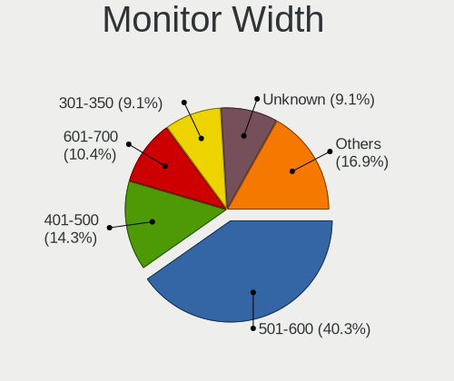

| Width in mm | Desktops | Percent |
|-------------|----------|---------|
| 501-600     | 30       | 36.59%  |
| 401-500     | 12       | 14.63%  |
| 301-350     | 9        | 10.98%  |
| Unknown     | 8        | 9.76%   |
| 701-800     | 6        | 7.32%   |
| 601-700     | 6        | 7.32%   |
| 351-400     | 4        | 4.88%   |
| 1501-2000   | 3        | 3.66%   |
| 1001-1500   | 2        | 2.44%   |
| 801-900     | 1        | 1.22%   |
| 901-1000    | 1        | 1.22%   |

Aspect Ratio
------------

Proportional relationship between the width and the height

| Ratio   | Desktops | Percent |
|---------|----------|---------|
| 16/9    | 42       | 52.5%   |
| 16/10   | 15       | 18.75%  |
| 5/4     | 12       | 15%     |
| Unknown | 7        | 8.75%   |
| 21/9    | 2        | 2.5%    |
| 4/3     | 1        | 1.25%   |
| 32/9    | 1        | 1.25%   |

Monitor Area
------------

Area in inch²

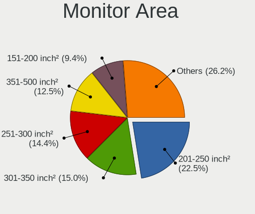

| Area in inch² | Desktops | Percent |
|----------------|----------|---------|
| 201-250        | 16       | 18.39%  |
| 301-350        | 15       | 17.24%  |
| 251-300        | 13       | 14.94%  |
| 141-150        | 10       | 11.49%  |
| 351-500        | 9        | 10.34%  |
| 151-200        | 8        | 9.2%    |
| Unknown        | 8        | 9.2%    |
| More than 1000 | 5        | 5.75%   |
| 501-1000       | 2        | 2.3%    |
| 101-110        | 1        | 1.15%   |

Pixel Density
-------------

Pixels per inch

| Density | Desktops | Percent |
|---------|----------|---------|
| 51-100  | 51       | 62.96%  |
| 101-120 | 15       | 18.52%  |
| Unknown | 8        | 9.88%   |
| 121-160 | 4        | 4.94%   |
| 1-50    | 2        | 2.47%   |
| 161-240 | 1        | 1.23%   |

Multiple Monitors
-----------------

Total monitors connected

| Total | Desktops | Percent |
|-------|----------|---------|
| 1     | 61       | 76.25%  |
| 2     | 12       | 15%     |
| 0     | 4        | 5%      |
| 3     | 2        | 2.5%    |
| 4     | 1        | 1.25%   |

Network
-------

Net Controller Vendor
---------------------

Controller vendors

| Vendor                          | Desktops | Percent |
|---------------------------------|----------|---------|
| Realtek Semiconductor           | 40       | 37.74%  |
| Intel                           | 34       | 32.08%  |
| Nvidia                          | 5        | 4.72%   |
| TP-Link                         | 4        | 3.77%   |
| Qualcomm Atheros                | 4        | 3.77%   |
| Ralink Technology               | 3        | 2.83%   |
| Ralink                          | 3        | 2.83%   |
| Microsoft                       | 2        | 1.89%   |
| Marvell Technology Group        | 2        | 1.89%   |
| D-Link System                   | 2        | 1.89%   |
| Samsung Electronics             | 1        | 0.94%   |
| Qualcomm Atheros Communications | 1        | 0.94%   |
| MediaTek                        | 1        | 0.94%   |
| D-Link                          | 1        | 0.94%   |
| Broadcom Limited                | 1        | 0.94%   |
| Broadcom                        | 1        | 0.94%   |
| Aquantia                        | 1        | 0.94%   |

Net Controller Model
--------------------

Controller models

| Model                                                                         | Desktops | Percent |
|-------------------------------------------------------------------------------|----------|---------|
| Realtek RTL8111/8168/8411 PCI Express Gigabit Ethernet Controller             | 34       | 28.1%   |
| Intel I211 Gigabit Network Connection                                         | 7        | 5.79%   |
| Intel Ethernet Connection (7) I219-V                                          | 5        | 4.13%   |
| Realtek RTL8188EUS 802.11n Wireless Network Adapter                           | 3        | 2.48%   |
| Intel Ethernet Connection (2) I219-V                                          | 3        | 2.48%   |
| Intel 82579LM Gigabit Network Connection (Lewisville)                         | 3        | 2.48%   |
| TP-Link Archer T4U v2 [Realtek RTL8812AU]                                     | 2        | 1.65%   |
| Realtek RTL8821AE 802.11ac PCIe Wireless Network Adapter                      | 2        | 1.65%   |
| Realtek RTL8153 Gigabit Ethernet Adapter                                      | 2        | 1.65%   |
| Realtek RTL810xE PCI Express Fast Ethernet controller                         | 2        | 1.65%   |
| Ralink MT7601U Wireless Adapter                                               | 2        | 1.65%   |
| Ralink RT2500 Wireless 802.11bg                                               | 2        | 1.65%   |
| Nvidia CK804 Ethernet Controller                                              | 2        | 1.65%   |
| Intel Wi-Fi 6 AX200                                                           | 2        | 1.65%   |
| Intel Ethernet Connection I217-LM                                             | 2        | 1.65%   |
| Intel Ethernet Connection (2) I218-V                                          | 2        | 1.65%   |
| TP-Link TL-WN821N Version 5 RTL8192EU                                         | 1        | 0.83%   |
| TP-Link Archer T4U ver.3                                                      | 1        | 0.83%   |
| TP-Link 802.11ac WLAN Adapter                                                 | 1        | 0.83%   |
| Samsung GT-I9070 (network tethering, USB debugging enabled)                   | 1        | 0.83%   |
| Realtek RTL8812AE 802.11ac PCIe Wireless Network Adapter                      | 1        | 0.83%   |
| Realtek RTL8192CU 802.11n WLAN Adapter                                        | 1        | 0.83%   |
| Realtek RTL8125 2.5GbE Controller                                             | 1        | 0.83%   |
| Ralink RT5370 Wireless Adapter                                                | 1        | 0.83%   |
| Ralink RT3090 Wireless 802.11n 1T/1R PCIe                                     | 1        | 0.83%   |
| Qualcomm Atheros Killer E2400 Gigabit Ethernet Controller                     | 1        | 0.83%   |
| Qualcomm Atheros AR9271 802.11n                                               | 1        | 0.83%   |
| Qualcomm Atheros AR9485 Wireless Network Adapter                              | 1        | 0.83%   |
| Qualcomm Atheros AR9287 Wireless Network Adapter (PCI-Express)                | 1        | 0.83%   |
| Qualcomm Atheros AR8151 v2.0 Gigabit Ethernet                                 | 1        | 0.83%   |
| Nvidia nForce2 Ethernet Controller                                            | 1        | 0.83%   |
| Nvidia MCP77 Ethernet                                                         | 1        | 0.83%   |
| Nvidia MCP61 Ethernet                                                         | 1        | 0.83%   |
| Microsoft Xbox 360 Wireless Adapter                                           | 1        | 0.83%   |
| Microsoft Wireless XBox Controller Dongle                                     | 1        | 0.83%   |
| MediaTek NOA N2                                                               | 1        | 0.83%   |
| Marvell Group 88E8053 PCI-E Gigabit Ethernet Controller                       | 1        | 0.83%   |
| Marvell Group 88E8052 PCI-E ASF Gigabit Ethernet Controller                   | 1        | 0.83%   |
| Intel Wireless 3165                                                           | 1        | 0.83%   |
| Intel Wi-Fi 6 AX210/AX211/AX411 160MHz                                        | 1        | 0.83%   |
| Intel I350 Gigabit Network Connection                                         | 1        | 0.83%   |
| Intel I210 Gigabit Network Connection                                         | 1        | 0.83%   |
| Intel Ethernet Controller I225-V                                              | 1        | 0.83%   |
| Intel Ethernet Connection I217-V                                              | 1        | 0.83%   |
| Intel Ethernet Connection (5) I219-LM                                         | 1        | 0.83%   |
| Intel Ethernet Connection (2) I219-LM                                         | 1        | 0.83%   |
| Intel Dual Band Wireless-AC 3168NGW [Stone Peak]                              | 1        | 0.83%   |
| Intel Centrino Wireless-N 2230                                                | 1        | 0.83%   |
| Intel Centrino Advanced-N 6230 [Rainbow Peak]                                 | 1        | 0.83%   |
| Intel 82599ES 10-Gigabit SFI/SFP+ Network Connection                          | 1        | 0.83%   |
| Intel 82579V Gigabit Network Connection                                       | 1        | 0.83%   |
| Intel 82578DM Gigabit Network Connection                                      | 1        | 0.83%   |
| Intel 82574L Gigabit Network Connection                                       | 1        | 0.83%   |
| Intel 82571EB/82571GB Gigabit Ethernet Controller D0/D1 (copper applications) | 1        | 0.83%   |
| Intel 82566DM-2 Gigabit Network Connection                                    | 1        | 0.83%   |
| Intel 82541PI Gigabit Ethernet Controller                                     | 1        | 0.83%   |
| D-Link System DWA-125 Wireless N 150 Adapter(rev.A1) [Ralink RT3070]          | 1        | 0.83%   |
| D-Link System DGE-528T Gigabit Ethernet Adapter                               | 1        | 0.83%   |
| D-Link DWA-171                                                                | 1        | 0.83%   |
| Broadcom NetXtreme BCM5751 Gigabit Ethernet PCI Express                       | 1        | 0.83%   |

Wireless Vendor
---------------

Wireless vendors

| Vendor                          | Desktops | Percent |
|---------------------------------|----------|---------|
| Intel                           | 7        | 23.33%  |
| Realtek Semiconductor           | 6        | 20%     |
| TP-Link                         | 4        | 13.33%  |
| Ralink Technology               | 3        | 10%     |
| Ralink                          | 3        | 10%     |
| Qualcomm Atheros                | 2        | 6.67%   |
| Microsoft                       | 2        | 6.67%   |
| Qualcomm Atheros Communications | 1        | 3.33%   |
| D-Link System                   | 1        | 3.33%   |
| D-Link                          | 1        | 3.33%   |

Wireless Model
--------------

Wireless models

| Model                                                                | Desktops | Percent |
|----------------------------------------------------------------------|----------|---------|
| Realtek RTL8188EUS 802.11n Wireless Network Adapter                  | 3        | 9.38%   |
| TP-Link Archer T4U v2 [Realtek RTL8812AU]                            | 2        | 6.25%   |
| Realtek RTL8821AE 802.11ac PCIe Wireless Network Adapter             | 2        | 6.25%   |
| Ralink MT7601U Wireless Adapter                                      | 2        | 6.25%   |
| Ralink RT2500 Wireless 802.11bg                                      | 2        | 6.25%   |
| Intel Wi-Fi 6 AX200                                                  | 2        | 6.25%   |
| TP-Link TL-WN821N Version 5 RTL8192EU                                | 1        | 3.13%   |
| TP-Link Archer T4U ver.3                                             | 1        | 3.13%   |
| TP-Link 802.11ac WLAN Adapter                                        | 1        | 3.13%   |
| Realtek RTL8812AE 802.11ac PCIe Wireless Network Adapter             | 1        | 3.13%   |
| Realtek RTL8192CU 802.11n WLAN Adapter                               | 1        | 3.13%   |
| Ralink RT5370 Wireless Adapter                                       | 1        | 3.13%   |
| Ralink RT3090 Wireless 802.11n 1T/1R PCIe                            | 1        | 3.13%   |
| Qualcomm Atheros AR9271 802.11n                                      | 1        | 3.13%   |
| Qualcomm Atheros AR9485 Wireless Network Adapter                     | 1        | 3.13%   |
| Qualcomm Atheros AR9287 Wireless Network Adapter (PCI-Express)       | 1        | 3.13%   |
| Microsoft Xbox 360 Wireless Adapter                                  | 1        | 3.13%   |
| Microsoft Wireless XBox Controller Dongle                            | 1        | 3.13%   |
| Intel Wireless 3165                                                  | 1        | 3.13%   |
| Intel Wi-Fi 6 AX210/AX211/AX411 160MHz                               | 1        | 3.13%   |
| Intel Dual Band Wireless-AC 3168NGW [Stone Peak]                     | 1        | 3.13%   |
| Intel Centrino Wireless-N 2230                                       | 1        | 3.13%   |
| Intel Centrino Advanced-N 6230 [Rainbow Peak]                        | 1        | 3.13%   |
| D-Link System DWA-125 Wireless N 150 Adapter(rev.A1) [Ralink RT3070] | 1        | 3.13%   |
| D-Link DWA-171                                                       | 1        | 3.13%   |

Ethernet Vendor
---------------

Ethernet vendors

| Vendor                   | Desktops | Percent |
|--------------------------|----------|---------|
| Realtek Semiconductor    | 37       | 44.58%  |
| Intel                    | 31       | 37.35%  |
| Nvidia                   | 5        | 6.02%   |
| Qualcomm Atheros         | 2        | 2.41%   |
| Marvell Technology Group | 2        | 2.41%   |
| Samsung Electronics      | 1        | 1.2%    |
| MediaTek                 | 1        | 1.2%    |
| D-Link System            | 1        | 1.2%    |
| Broadcom Limited         | 1        | 1.2%    |
| Broadcom                 | 1        | 1.2%    |
| Aquantia                 | 1        | 1.2%    |

Ethernet Model
--------------

Ethernet models

| Model                                                                         | Desktops | Percent |
|-------------------------------------------------------------------------------|----------|---------|
| Realtek RTL8111/8168/8411 PCI Express Gigabit Ethernet Controller             | 34       | 38.2%   |
| Intel I211 Gigabit Network Connection                                         | 7        | 7.87%   |
| Intel Ethernet Connection (7) I219-V                                          | 5        | 5.62%   |
| Intel Ethernet Connection (2) I219-V                                          | 3        | 3.37%   |
| Intel 82579LM Gigabit Network Connection (Lewisville)                         | 3        | 3.37%   |
| Realtek RTL8153 Gigabit Ethernet Adapter                                      | 2        | 2.25%   |
| Realtek RTL810xE PCI Express Fast Ethernet controller                         | 2        | 2.25%   |
| Nvidia CK804 Ethernet Controller                                              | 2        | 2.25%   |
| Intel Ethernet Connection I217-LM                                             | 2        | 2.25%   |
| Intel Ethernet Connection (2) I218-V                                          | 2        | 2.25%   |
| Samsung GT-I9070 (network tethering, USB debugging enabled)                   | 1        | 1.12%   |
| Realtek RTL8125 2.5GbE Controller                                             | 1        | 1.12%   |
| Qualcomm Atheros Killer E2400 Gigabit Ethernet Controller                     | 1        | 1.12%   |
| Qualcomm Atheros AR8151 v2.0 Gigabit Ethernet                                 | 1        | 1.12%   |
| Nvidia nForce2 Ethernet Controller                                            | 1        | 1.12%   |
| Nvidia MCP77 Ethernet                                                         | 1        | 1.12%   |
| Nvidia MCP61 Ethernet                                                         | 1        | 1.12%   |
| MediaTek NOA N2                                                               | 1        | 1.12%   |
| Marvell Group 88E8053 PCI-E Gigabit Ethernet Controller                       | 1        | 1.12%   |
| Marvell Group 88E8052 PCI-E ASF Gigabit Ethernet Controller                   | 1        | 1.12%   |
| Intel I350 Gigabit Network Connection                                         | 1        | 1.12%   |
| Intel I210 Gigabit Network Connection                                         | 1        | 1.12%   |
| Intel Ethernet Controller I225-V                                              | 1        | 1.12%   |
| Intel Ethernet Connection I217-V                                              | 1        | 1.12%   |
| Intel Ethernet Connection (5) I219-LM                                         | 1        | 1.12%   |
| Intel Ethernet Connection (2) I219-LM                                         | 1        | 1.12%   |
| Intel 82599ES 10-Gigabit SFI/SFP+ Network Connection                          | 1        | 1.12%   |
| Intel 82579V Gigabit Network Connection                                       | 1        | 1.12%   |
| Intel 82578DM Gigabit Network Connection                                      | 1        | 1.12%   |
| Intel 82574L Gigabit Network Connection                                       | 1        | 1.12%   |
| Intel 82571EB/82571GB Gigabit Ethernet Controller D0/D1 (copper applications) | 1        | 1.12%   |
| Intel 82566DM-2 Gigabit Network Connection                                    | 1        | 1.12%   |
| Intel 82541PI Gigabit Ethernet Controller                                     | 1        | 1.12%   |
| D-Link System DGE-528T Gigabit Ethernet Adapter                               | 1        | 1.12%   |
| Broadcom NetXtreme BCM5751 Gigabit Ethernet PCI Express                       | 1        | 1.12%   |
| Broadcom Limited NetLink BCM5787 Gigabit Ethernet PCI Express                 | 1        | 1.12%   |
| Aquantia AQC113CS NBase-T/IEEE 802.3bz Ethernet Controller [AQtion]           | 1        | 1.12%   |

Net Controller Kind
-------------------

Ethernet, WiFi or modem

| Kind     | Desktops | Percent |
|----------|----------|---------|
| Ethernet | 77       | 72.64%  |
| WiFi     | 29       | 27.36%  |

Used Controller
---------------

Currently used network controller

| Kind     | Desktops | Percent |
|----------|----------|---------|
| Ethernet | 65       | 74.71%  |
| WiFi     | 22       | 25.29%  |

NICs
----

Total network controllers on board

| Total | Desktops | Percent |
|-------|----------|---------|
| 1     | 57       | 73.08%  |
| 2     | 17       | 21.79%  |
| 3     | 2        | 2.56%   |
| 6     | 1        | 1.28%   |
| 0     | 1        | 1.28%   |

IPv6
----

IPv6 vs IPv4

| Used | Desktops | Percent |
|------|----------|---------|
| No   | 69       | 88.46%  |
| Yes  | 9        | 11.54%  |

Bluetooth
---------

Bluetooth Vendor
----------------

Controller vendors

| Vendor                     | Desktops | Percent |
|----------------------------|----------|---------|
| Cambridge Silicon Radio    | 9        | 47.37%  |
| Intel                      | 6        | 31.58%  |
| Realtek Semiconductor      | 2        | 10.53%  |
| Integrated System Solution | 1        | 5.26%   |
| ASUSTek Computer           | 1        | 5.26%   |

Bluetooth Model
---------------

Controller models

| Model                                                 | Desktops | Percent |
|-------------------------------------------------------|----------|---------|
| Cambridge Silicon Radio Bluetooth Dongle (HCI mode)   | 9        | 47.37%  |
| Intel AX200 Bluetooth                                 | 2        | 10.53%  |
| Realtek RTL8821A Bluetooth                            | 1        | 5.26%   |
| Realtek Bluetooth Radio                               | 1        | 5.26%   |
| Intel Wireless-AC 3168 Bluetooth                      | 1        | 5.26%   |
| Intel Centrino Bluetooth Wireless Transceiver         | 1        | 5.26%   |
| Intel Bluetooth wireless interface                    | 1        | 5.26%   |
| Intel AX210 Bluetooth                                 | 1        | 5.26%   |
| Integrated System Solution KY-BT100 Bluetooth Adapter | 1        | 5.26%   |
| ASUS Bluetooth Radio                                  | 1        | 5.26%   |

Sound
-----

Sound Vendor
------------

Sound card vendors

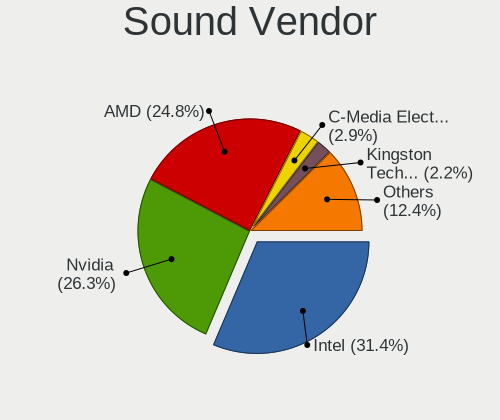

| Vendor                  | Desktops | Percent |
|-------------------------|----------|---------|
| Intel                   | 48       | 34.78%  |
| Nvidia                  | 39       | 28.26%  |
| AMD                     | 33       | 23.91%  |
| C-Media Electronics     | 6        | 4.35%   |
| SteelSeries ApS         | 2        | 1.45%   |
| Focusrite-Novation      | 2        | 1.45%   |
| Syntek                  | 1        | 0.72%   |
| Samson Technologies     | 1        | 0.72%   |
| Razer USA               | 1        | 0.72%   |
| M-Audio                 | 1        | 0.72%   |
| Logitech                | 1        | 0.72%   |
| Kingston Technology     | 1        | 0.72%   |
| Creative Labs           | 1        | 0.72%   |
| BEHRINGER International | 1        | 0.72%   |

Sound Model
-----------

Sound card models

| Model                                                                                             | Desktops | Percent |
|---------------------------------------------------------------------------------------------------|----------|---------|
| AMD Starship/Matisse HD Audio Controller                                                          | 10       | 6.49%   |
| Intel 8 Series/C220 Series Chipset High Definition Audio Controller                               | 7        | 4.55%   |
| Intel 200 Series PCH HD Audio                                                                     | 7        | 4.55%   |
| AMD Ellesmere HDMI Audio [Radeon RX 470/480 / 570/580/590]                                        | 7        | 4.55%   |
| Intel Xeon E3-1200 v3/4th Gen Core Processor HD Audio Controller                                  | 6        | 3.9%    |
| Intel 6 Series/C200 Series Chipset Family High Definition Audio Controller                        | 6        | 3.9%    |
| Nvidia TU106 High Definition Audio Controller                                                     | 5        | 3.25%   |
| Intel NM10/ICH7 Family High Definition Audio Controller                                           | 5        | 3.25%   |
| Intel Cannon Lake PCH cAVS                                                                        | 5        | 3.25%   |
| Intel 7 Series/C216 Chipset Family High Definition Audio Controller                               | 5        | 3.25%   |
| Nvidia GP104 High Definition Audio Controller                                                     | 4        | 2.6%    |
| AMD Family 17h/19h HD Audio Controller                                                            | 4        | 2.6%    |
| Nvidia GP108 High Definition Audio Controller                                                     | 3        | 1.95%   |
| Nvidia GP106 High Definition Audio Controller                                                     | 3        | 1.95%   |
| Nvidia GP102 HDMI Audio Controller                                                                | 3        | 1.95%   |
| Intel 100 Series/C230 Series Chipset Family HD Audio Controller                                   | 3        | 1.95%   |
| C-Media Electronics Blue Snowball                                                                 | 3        | 1.95%   |
| AMD SBx00 Azalia (Intel HDA)                                                                      | 3        | 1.95%   |
| AMD Renoir Radeon High Definition Audio Controller                                                | 3        | 1.95%   |
| Nvidia TU116 High Definition Audio Controller                                                     | 2        | 1.3%    |
| Nvidia TU104 HD Audio Controller                                                                  | 2        | 1.3%    |
| Nvidia GP107GL High Definition Audio Controller                                                   | 2        | 1.3%    |
| Nvidia GM206 High Definition Audio Controller                                                     | 2        | 1.3%    |
| Nvidia CK804 AC'97 Audio Controller                                                               | 2        | 1.3%    |
| Intel 9 Series Chipset Family HD Audio Controller                                                 | 2        | 1.3%    |
| Intel 5 Series/3400 Series Chipset High Definition Audio                                          | 2        | 1.3%    |
| AMD Tonga HDMI Audio [Radeon R9 285/380]                                                          | 2        | 1.3%    |
| AMD FCH Azalia Controller                                                                         | 2        | 1.3%    |
| AMD Family 17h (Models 00h-0fh) HD Audio Controller                                               | 2        | 1.3%    |
| Syntek STK1160 Video Capture Device                                                               | 1        | 0.65%   |
| SteelSeries ApS SteelSeries Arctis 5                                                              | 1        | 0.65%   |
| SteelSeries ApS Arctis Pro Wireless                                                               | 1        | 0.65%   |
| Samson Technologies GoMic compact condenser microphone                                            | 1        | 0.65%   |
| Razer USA Razer Kraken USB                                                                        | 1        | 0.65%   |
| Nvidia TU102 High Definition Audio Controller                                                     | 1        | 0.65%   |
| Nvidia nForce2 AC97 Audio Controler (MCP)                                                         | 1        | 0.65%   |
| Nvidia MCP72XE/MCP72P/MCP78U/MCP78S High Definition Audio                                         | 1        | 0.65%   |
| Nvidia MCP61 High Definition Audio                                                                | 1        | 0.65%   |
| Nvidia High Definition Audio Controller                                                           | 1        | 0.65%   |
| Nvidia GM204 High Definition Audio Controller                                                     | 1        | 0.65%   |
| Nvidia GM107 High Definition Audio Controller [GeForce 940MX]                                     | 1        | 0.65%   |
| Nvidia GK208 HDMI/DP Audio Controller                                                             | 1        | 0.65%   |
| Nvidia GF119 HDMI Audio Controller                                                                | 1        | 0.65%   |
| Nvidia GF108 High Definition Audio Controller                                                     | 1        | 0.65%   |
| Nvidia GA102 High Definition Audio Controller                                                     | 1        | 0.65%   |
| M-Audio Axiom A.I.R. Mini32                                                                       | 1        | 0.65%   |
| Logitech Zone Wired                                                                               | 1        | 0.65%   |
| Kingston Technology HyperX 7.1 Audio                                                              | 1        | 0.65%   |
| Intel Tiger Lake-H HD Audio Controller                                                            | 1        | 0.65%   |
| Intel C600/X79 series chipset High Definition Audio Controller                                    | 1        | 0.65%   |
| Intel Atom/Celeron/Pentium Processor x5-E8000/J3xxx/N3xxx Series High Definition Audio Controller | 1        | 0.65%   |
| Intel 82801JI (ICH10 Family) HD Audio Controller                                                  | 1        | 0.65%   |
| Intel 82801I (ICH9 Family) HD Audio Controller                                                    | 1        | 0.65%   |
| Intel 82801G (ICH7 Family) AC'97 Audio Controller                                                 | 1        | 0.65%   |
| Focusrite-Novation iTrack Solo                                                                    | 1        | 0.65%   |
| Focusrite-Novation Focusrite Scarlett 2i2                                                         | 1        | 0.65%   |
| Creative Labs CA0108/CA10300 [Sound Blaster Audigy Series]                                        | 1        | 0.65%   |
| C-Media Electronics Redragon Gaming Headset                                                       | 1        | 0.65%   |
| C-Media Electronics CMI8788 [Oxygen HD Audio]                                                     | 1        | 0.65%   |
| C-Media Electronics Audio Adapter                                                                 | 1        | 0.65%   |

Memory
------

Memory Vendor
-------------

Memory module vendors

| Vendor              | Desktops | Percent |
|---------------------|----------|---------|
| G.Skill             | 12       | 21.05%  |
| Unknown             | 9        | 15.79%  |
| Kingston            | 9        | 15.79%  |
| Crucial             | 6        | 10.53%  |
| Samsung Electronics | 4        | 7.02%   |
| Corsair             | 4        | 7.02%   |
| SK Hynix            | 3        | 5.26%   |
| Apacer              | 2        | 3.51%   |
| Silicon Power       | 1        | 1.75%   |
| Ramaxel Technology  | 1        | 1.75%   |
| Patriot             | 1        | 1.75%   |
| Micron Technology   | 1        | 1.75%   |
| Elpida              | 1        | 1.75%   |
| Aeneon              | 1        | 1.75%   |
| A-DATA Technology   | 1        | 1.75%   |
| Unknown             | 1        | 1.75%   |

Memory Model
------------

Memory module models

| Model                                                     | Desktops | Percent |
|-----------------------------------------------------------|----------|---------|
| Unknown RAM Module 512MB DIMM SDRAM                       | 2        | 3.08%   |
| Unknown RAM Module 2048MB DIMM SDRAM                      | 2        | 3.08%   |
| Unknown RAM Module 8192MB DIMM DDR3 1600MT/s              | 1        | 1.54%   |
| Unknown RAM Module 512MB DIMM                             | 1        | 1.54%   |
| Unknown RAM Module 256MB DIMM                             | 1        | 1.54%   |
| Unknown RAM Module 2048MB DIMM DDR2 800MT/s               | 1        | 1.54%   |
| Unknown RAM Module 1GB DIMM SDRAM                         | 1        | 1.54%   |
| Unknown RAM Module 1024MB DIMM DDR2 667MT/s               | 1        | 1.54%   |
| Unknown RAM Module 1024MB DIMM                            | 1        | 1.54%   |
| SK Hynix RAM Module 8192MB DIMM DDR3 1333MT/s             | 1        | 1.54%   |
| SK Hynix RAM Module 2048MB DIMM DDR3 1333MT/s             | 1        | 1.54%   |
| SK Hynix RAM HMT351U6CFR8C-PB 4GB DIMM DDR3 1800MT/s      | 1        | 1.54%   |
| SK Hynix RAM HMT351U6CFR8C-H9 4GB DIMM DDR3 1333MT/s      | 1        | 1.54%   |
| Silicon Power RAM SP008GBLTU160N02 8GB DIMM DDR3 1600MT/s | 1        | 1.54%   |
| Silicon Power RAM DCLT8GN128S 8GB DIMM DDR3 1600MT/s      | 1        | 1.54%   |
| Samsung RAM M471B5273EB0-CK0 4GB SODIMM DDR3 4199MT/s     | 1        | 1.54%   |
| Samsung RAM M471B5173QH0-YK0 4GB SODIMM DDR3 1600MT/s     | 1        | 1.54%   |
| Samsung RAM M378B5773DH0-CH9 2GB DIMM DDR3 1333MT/s       | 1        | 1.54%   |
| Samsung RAM M378B5273DH0-CH9 4GB DIMM DDR3 2133MT/s       | 1        | 1.54%   |
| Samsung RAM M378B5273CH0-CH9 4096MB DIMM DDR3 1867MT/s    | 1        | 1.54%   |
| Samsung RAM M378B1G73EB0-YK0 8GB DIMM DDR3 1600MT/s       | 1        | 1.54%   |
| Ramaxel RAM RMR1870EC58E9F133 4GB DIMM DDR3 1333MT/s      | 1        | 1.54%   |
| Patriot RAM PSD48G240082 8GB DIMM DDR4 2400MT/s           | 1        | 1.54%   |
| Micron RAM 8ATF2G64AZ-3G2E1 16GB DIMM DDR4 3200MT/s       | 1        | 1.54%   |
| Kingston RAM KHX3600C17D4/8GX 8GB DIMM DDR4 3600MT/s      | 1        | 1.54%   |
| Kingston RAM KHX2933C15D4/8GX 8GB DIMM DDR4 2933MT/s      | 1        | 1.54%   |
| Kingston RAM KHX2666C15D4/8G 8GB DIMM DDR4 2667MT/s       | 1        | 1.54%   |
| Kingston RAM KHX2400C15/16G 16384MB DIMM DDR4 3334MT/s    | 1        | 1.54%   |
| Kingston RAM KHX2133C14D4/8G 8GB DIMM DDR4 2667MT/s       | 1        | 1.54%   |
| Kingston RAM KHX2133C14/8G 8192MB DIMM DDR4 2400MT/s      | 1        | 1.54%   |
| Kingston RAM KHX1866C10D3/8G 8GB DIMM DDR3 1867MT/s       | 1        | 1.54%   |
| Kingston RAM KHX1600C9D3/8GX 8192MB DIMM DDR3 1600MT/s    | 1        | 1.54%   |
| Kingston RAM 99U5471-020.A00LF 4GB DIMM DDR3 1600MT/s     | 1        | 1.54%   |
| Kingston RAM 9905701-017.A00G 16384MB DIMM DDR4 2666MT/s  | 1        | 1.54%   |
| Kingston RAM 9905428-193.A00LF 8GB SODIMM DDR3 1600MT/s   | 1        | 1.54%   |
| G.Skill RAM F4-3600C19-16GVRB 16GB DIMM DDR4 3600MT/s     | 1        | 1.54%   |
| G.Skill RAM F4-3600C18-8GTZRX 8192MB DIMM DDR4 3600MT/s   | 1        | 1.54%   |
| G.Skill RAM F4-3600C18-16GTZN 16GB DIMM DDR4 3666MT/s     | 1        | 1.54%   |
| G.Skill RAM F4-3600C17-16GTZR 16384MB DIMM DDR4 3666MT/s  | 1        | 1.54%   |
| G.Skill RAM F4-3600C17-16GTZKW 16GB DIMM DDR4 3600MT/s    | 1        | 1.54%   |
| G.Skill RAM F4-3600C15-8GTZ 8192MB DIMM DDR4 3800MT/s     | 1        | 1.54%   |
| G.Skill RAM F4-3200C16-8GIS 8GB DIMM DDR4 3200MT/s        | 1        | 1.54%   |
| G.Skill RAM F4-3200C16-16GTZSK 16GB DIMM DDR4 3200MT/s    | 1        | 1.54%   |
| G.Skill RAM F4-3200C14-8GVK 8GB DIMM DDR4 3200MT/s        | 1        | 1.54%   |
| G.Skill RAM F4-3200C14-16GFX 16GB DIMM DDR4 3200MT/s      | 1        | 1.54%   |
| G.Skill RAM F3-12800CL9-4GBRL 4096MB DIMM DDR3 1600MT/s   | 1        | 1.54%   |
| G.Skill RAM F3-10666CL9-4GBNT 4GB DIMM DDR3 1400MT/s      | 1        | 1.54%   |
| Elpida RAM EBJ20UF8BCF0-DJ-F 2048MB DIMM DDR3 1333MT/s    | 1        | 1.54%   |
| Crucial RAM CT51264BA160BJ.C8F 4GB DIMM DDR3 1600MT/s     | 1        | 1.54%   |
| Crucial RAM CT4G4DFS824A.C8FBD2 4GB DIMM DDR4 2733MT/s    | 1        | 1.54%   |
| Crucial RAM CT25664BA160BJ.M4F 2GB DIMM DDR3 1600MT/s     | 1        | 1.54%   |
| Crucial RAM CT16G4DFRA32A.C8FE 16384MB DIMM DDR4 3200MT/s | 1        | 1.54%   |
| Crucial RAM BLS8G4D26BFSB.16FD2 8GB DIMM DDR4 2666MT/s    | 1        | 1.54%   |
| Crucial RAM BLS8G4D240FSB.16FBR2 8GB DIMM DDR4 2400MT/s   | 1        | 1.54%   |
| Corsair RAM Module 16384MB DIMM DDR4 2133MT/s             | 1        | 1.54%   |
| Corsair RAM CMU16GX4M2C3200C16 8GB DIMM DDR4 3200MT/s     | 1        | 1.54%   |
| Corsair RAM CMK32GX4M1D3000C16 32GB DIMM DDR4 3000MT/s    | 1        | 1.54%   |
| Corsair RAM CMK16GX4M2D3600C18 8GB DIMM DDR4 3600MT/s     | 1        | 1.54%   |
| Apacer RAM Module 2048MB DIMM DDR3 1333MT/s               | 1        | 1.54%   |
| Apacer RAM 78.A1GC6.9K1 2048MB DIMM DDR3 1333MT/s         | 1        | 1.54%   |

Memory Kind
-----------

Memory module kinds

| Kind    | Desktops | Percent |
|---------|----------|---------|
| DDR4    | 26       | 50.98%  |
| DDR3    | 14       | 27.45%  |
| SDRAM   | 6        | 11.76%  |
| DDR2    | 2        | 3.92%   |
| Unknown | 2        | 3.92%   |
| DDR     | 1        | 1.96%   |

Memory Form Factor
------------------

Physical design of the memory module

| Name   | Desktops | Percent |
|--------|----------|---------|
| DIMM   | 48       | 96%     |
| SODIMM | 2        | 4%      |

Memory Size
-----------

Memory module size

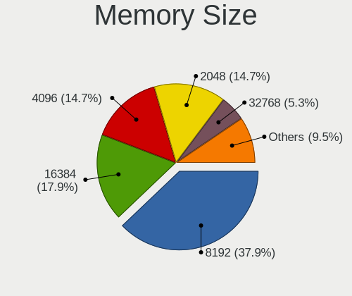

| Size  | Desktops | Percent |
|-------|----------|---------|
| 8192  | 20       | 36.36%  |
| 16384 | 10       | 18.18%  |
| 4096  | 8        | 14.55%  |
| 2048  | 7        | 12.73%  |
| 1024  | 4        | 7.27%   |
| 512   | 4        | 7.27%   |
| 32768 | 1        | 1.82%   |
| 256   | 1        | 1.82%   |

Memory Speed
------------

Memory module speed

| Speed   | Desktops | Percent |
|---------|----------|---------|
| 1600    | 10       | 17.54%  |
| 3200    | 6        | 10.53%  |
| Unknown | 6        | 10.53%  |
| 3600    | 5        | 8.77%   |
| 1333    | 5        | 8.77%   |
| 2400    | 4        | 7.02%   |
| 2133    | 3        | 5.26%   |
| 3666    | 2        | 3.51%   |
| 2667    | 2        | 3.51%   |
| 2666    | 2        | 3.51%   |
| 4199    | 1        | 1.75%   |
| 3800    | 1        | 1.75%   |
| 3334    | 1        | 1.75%   |
| 3000    | 1        | 1.75%   |
| 2933    | 1        | 1.75%   |
| 2733    | 1        | 1.75%   |
| 1867    | 1        | 1.75%   |
| 1800    | 1        | 1.75%   |
| 1400    | 1        | 1.75%   |
| 800     | 1        | 1.75%   |
| 667     | 1        | 1.75%   |
| 533     | 1        | 1.75%   |

Printers & scanners
-------------------

Printer Vendor
--------------

Printer device vendors

| Vendor              | Desktops | Percent |
|---------------------|----------|---------|
| Seiko Epson         | 1        | 25%     |
| Samsung Electronics | 1        | 25%     |
| Konica Minolta      | 1        | 25%     |
| Brother Industries  | 1        | 25%     |

Printer Model
-------------

Printer device models

| Model                    | Desktops | Percent |
|--------------------------|----------|---------|
| Seiko Epson TM-T20       | 1        | 25%     |
| Samsung SCX-3400 Series  | 1        | 25%     |
| Konica Minolta Printer   | 1        | 25%     |
| Brother HL-4140CN series | 1        | 25%     |

Scanner Vendor
--------------

Scanner device vendors

| Vendor      | Desktops | Percent |
|-------------|----------|---------|
| Seiko Epson | 1        | 100%    |

Scanner Model
-------------

Scanner device models

| Model                      | Desktops | Percent |
|----------------------------|----------|---------|
| Seiko Epson Perfection 660 | 1        | 100%    |

Camera
------

Camera Vendor
-------------

Camera device vendors

| Vendor                        | Desktops | Percent |
|-------------------------------|----------|---------|
| Logitech                      | 7        | 46.67%  |
| Arkmicro Technologies         | 2        | 13.33%  |
| Z-Star Microelectronics       | 1        | 6.67%   |
| Sunplus Innovation Technology | 1        | 6.67%   |
| Samsung Electronics           | 1        | 6.67%   |
| Microsoft                     | 1        | 6.67%   |
| Creative Technology           | 1        | 6.67%   |
| Apple                         | 1        | 6.67%   |

Camera Model
------------

Camera device models

| Model                               | Desktops | Percent |
|-------------------------------------|----------|---------|
| Logitech Webcam C930e               | 2        | 13.33%  |
| Logitech HD Webcam C525             | 2        | 13.33%  |
| Arkmicro USB2.0 PC CAMERA           | 2        | 13.33%  |
| Z-Star Vimicro USB Camera (Altair)  | 1        | 6.67%   |
| Sunplus Aukey-PC-LM1E Camera        | 1        | 6.67%   |
| Samsung Galaxy A5 (MTP)             | 1        | 6.67%   |
| Microsoft LifeCam HD-3000           | 1        | 6.67%   |
| Logitech Webcam C270                | 1        | 6.67%   |
| Logitech HD Pro Webcam C920         | 1        | 6.67%   |
| Logitech B525 HD Webcam             | 1        | 6.67%   |
| Creative Live! Cam Chat HD [VF0700] | 1        | 6.67%   |
| Apple iPhone 5/5C/5S/6/SE           | 1        | 6.67%   |

Security
--------

Fingerprint Vendor
------------------

Fingerprint sensor vendors

Zero info for selected period =(

Fingerprint Model
-----------------

Fingerprint sensor models

Zero info for selected period =(

Chipcard Vendor
---------------

Chipcard module vendors

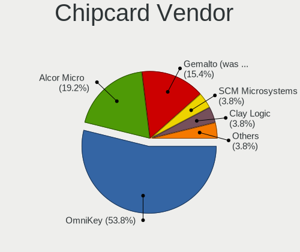

| Vendor                | Desktops | Percent |
|-----------------------|----------|---------|
| OmniKey               | 9        | 64.29%  |
| Alcor Micro           | 3        | 21.43%  |
| Gemalto (was Gemplus) | 2        | 14.29%  |

Chipcard Model
--------------

Chipcard module models

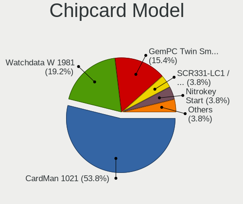

| Model                                             | Desktops | Percent |
|---------------------------------------------------|----------|---------|
| OmniKey CardMan 1021                              | 9        | 64.29%  |
| Alcor Micro Watchdata W 1981                      | 3        | 21.43%  |
| Gemalto (was Gemplus) GemPC Twin SmartCard Reader | 2        | 14.29%  |

Unsupported
-----------

Unsupported Devices
-------------------

Total unsupported devices on board

| Total | Desktops | Percent |
|-------|----------|---------|
| 0     | 61       | 74.39%  |
| 1     | 19       | 23.17%  |
| 2     | 2        | 2.44%   |

Unsupported Device Types
------------------------

Types of unsupported devices

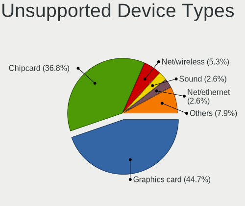

| Type                     | Desktops | Percent |
|--------------------------|----------|---------|
| Chipcard                 | 9        | 39.13%  |
| Graphics card            | 8        | 34.78%  |
| Net/wireless             | 2        | 8.7%    |
| Sound                    | 1        | 4.35%   |
| Net/ethernet             | 1        | 4.35%   |
| Multimedia controller    | 1        | 4.35%   |
| Communication controller | 1        | 4.35%   |

