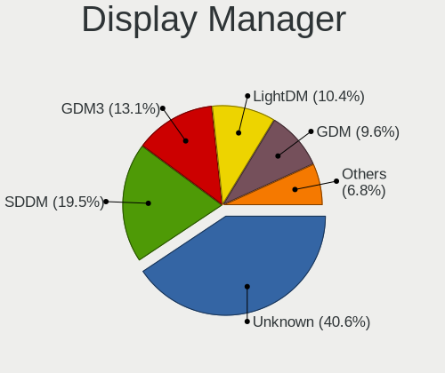
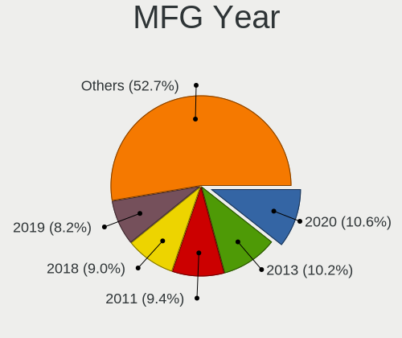
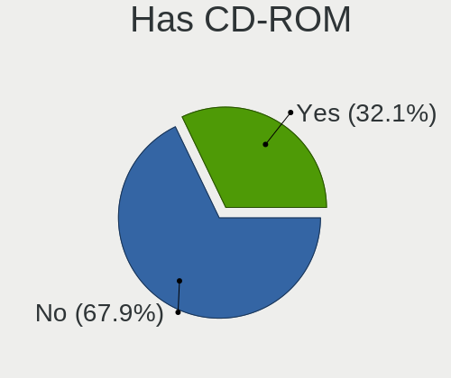
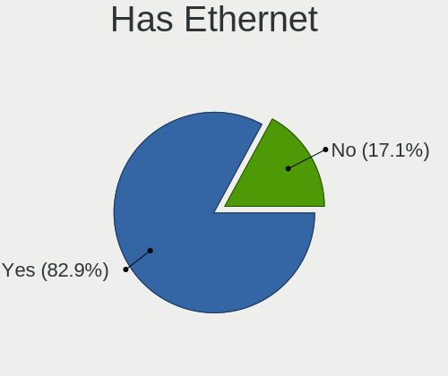
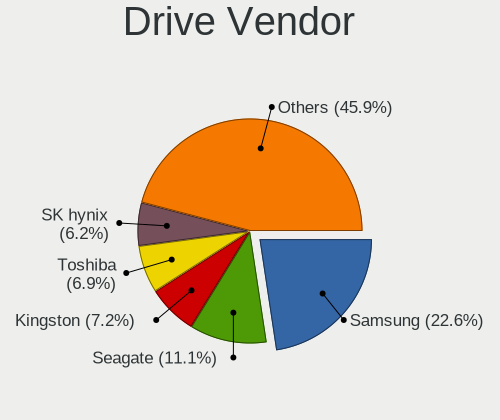
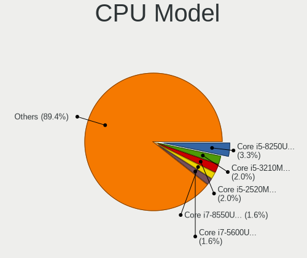
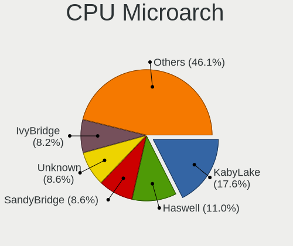
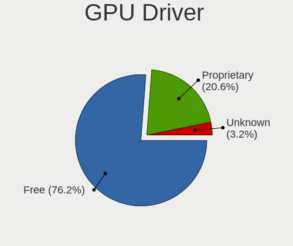
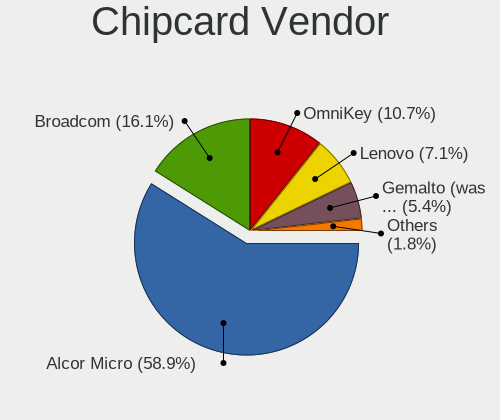
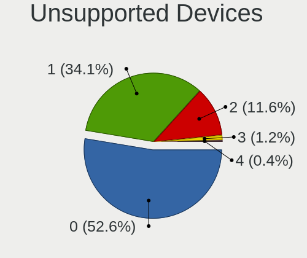

Linux in Estonia - Tested Hardware & Statistics (Notebooks)
-----------------------------------------------------------

A project to collect tested hardware configurations for Linux in Estonia.

Anyone can contribute to this report by the [hw-probe](https://github.com/linuxhw/hw-probe) tool:

    sudo -E hw-probe -all -upload

Please contribute! Especially if your hardware is rare.

Contents
--------

* [ Test Cases ](#test-cases)

* [ System ](#system)
  - [ OS                       ](#os)
  - [ OS Family                ](#os-family)
  - [ Kernel                   ](#kernel)
  - [ Kernel Family            ](#kernel-family)
  - [ Kernel Major Ver.        ](#kernel-major-ver)
  - [ Arch                     ](#arch)
  - [ DE                       ](#de)
  - [ Display Server           ](#display-server)
  - [ Display Manager          ](#display-manager)
  - [ OS Lang                  ](#os-lang)
  - [ Boot Mode                ](#boot-mode)
  - [ Filesystem               ](#filesystem)
  - [ Part. scheme             ](#part-scheme)
  - [ Dual Boot with Linux/BSD ](#dual-boot-with-linuxbsd)
  - [ Dual Boot (Win)          ](#dual-boot-win)

* [ Board ](#board)
  - [ Vendor                   ](#vendor)
  - [ Model                    ](#model)
  - [ Model Family             ](#model-family)
  - [ MFG Year                 ](#mfg-year)
  - [ Form Factor              ](#form-factor)
  - [ Secure Boot              ](#secure-boot)
  - [ Coreboot                 ](#coreboot)
  - [ RAM Size                 ](#ram-size)
  - [ RAM Used                 ](#ram-used)
  - [ Total Drives             ](#total-drives)
  - [ Has CD-ROM               ](#has-cd-rom)
  - [ Has Ethernet             ](#has-ethernet)
  - [ Has WiFi                 ](#has-wifi)
  - [ Has Bluetooth            ](#has-bluetooth)

* [ Location ](#location)
  - [ Country                  ](#country)
  - [ City                     ](#city)

* [ Drives ](#drives)
  - [ Drive Vendor             ](#drive-vendor)
  - [ Drive Model              ](#drive-model)
  - [ HDD Vendor               ](#hdd-vendor)
  - [ SSD Vendor               ](#ssd-vendor)
  - [ Drive Kind               ](#drive-kind)
  - [ Drive Connector          ](#drive-connector)
  - [ Drive Size               ](#drive-size)
  - [ Space Total              ](#space-total)
  - [ Space Used               ](#space-used)
  - [ Malfunc. Drives          ](#malfunc-drives)
  - [ Malfunc. Drive Vendor    ](#malfunc-drive-vendor)
  - [ Malfunc. HDD Vendor      ](#malfunc-hdd-vendor)
  - [ Malfunc. Drive Kind      ](#malfunc-drive-kind)
  - [ Failed Drives            ](#failed-drives)
  - [ Failed Drive Vendor      ](#failed-drive-vendor)
  - [ Drive Status             ](#drive-status)

* [ Storage controller ](#storage-controller)
  - [ Storage Vendor           ](#storage-vendor)
  - [ Storage Model            ](#storage-model)
  - [ Storage Kind             ](#storage-kind)

* [ Processor ](#processor)
  - [ CPU Vendor               ](#cpu-vendor)
  - [ CPU Model                ](#cpu-model)
  - [ CPU Model Family         ](#cpu-model-family)
  - [ CPU Cores                ](#cpu-cores)
  - [ CPU Sockets              ](#cpu-sockets)
  - [ CPU Threads              ](#cpu-threads)
  - [ CPU Op-Modes             ](#cpu-op-modes)
  - [ CPU Microcode            ](#cpu-microcode)
  - [ CPU Microarch            ](#cpu-microarch)

* [ Graphics ](#graphics)
  - [ GPU Vendor               ](#gpu-vendor)
  - [ GPU Model                ](#gpu-model)
  - [ GPU Combo                ](#gpu-combo)
  - [ GPU Driver               ](#gpu-driver)
  - [ GPU Memory               ](#gpu-memory)

* [ Monitor ](#monitor)
  - [ Monitor Vendor           ](#monitor-vendor)
  - [ Monitor Model            ](#monitor-model)
  - [ Monitor Resolution       ](#monitor-resolution)
  - [ Monitor Diagonal         ](#monitor-diagonal)
  - [ Monitor Width            ](#monitor-width)
  - [ Aspect Ratio             ](#aspect-ratio)
  - [ Monitor Area             ](#monitor-area)
  - [ Pixel Density            ](#pixel-density)
  - [ Multiple Monitors        ](#multiple-monitors)

* [ Network ](#network)
  - [ Net Controller Vendor    ](#net-controller-vendor)
  - [ Net Controller Model     ](#net-controller-model)
  - [ Wireless Vendor          ](#wireless-vendor)
  - [ Wireless Model           ](#wireless-model)
  - [ Ethernet Vendor          ](#ethernet-vendor)
  - [ Ethernet Model           ](#ethernet-model)
  - [ Net Controller Kind      ](#net-controller-kind)
  - [ Used Controller          ](#used-controller)
  - [ NICs                     ](#nics)
  - [ IPv6                     ](#ipv6)

* [ Bluetooth ](#bluetooth)
  - [ Bluetooth Vendor         ](#bluetooth-vendor)
  - [ Bluetooth Model          ](#bluetooth-model)

* [ Sound ](#sound)
  - [ Sound Vendor             ](#sound-vendor)
  - [ Sound Model              ](#sound-model)

* [ Memory ](#memory)
  - [ Memory Vendor            ](#memory-vendor)
  - [ Memory Model             ](#memory-model)
  - [ Memory Kind              ](#memory-kind)
  - [ Memory Form Factor       ](#memory-form-factor)
  - [ Memory Size              ](#memory-size)
  - [ Memory Speed             ](#memory-speed)

* [ Printers & scanners ](#printers--scanners)
  - [ Printer Vendor           ](#printer-vendor)
  - [ Printer Model            ](#printer-model)
  - [ Scanner Vendor           ](#scanner-vendor)
  - [ Scanner Model            ](#scanner-model)

* [ Camera ](#camera)
  - [ Camera Vendor            ](#camera-vendor)
  - [ Camera Model             ](#camera-model)

* [ Security ](#security)
  - [ Fingerprint Vendor       ](#fingerprint-vendor)
  - [ Fingerprint Model        ](#fingerprint-model)
  - [ Chipcard Vendor          ](#chipcard-vendor)
  - [ Chipcard Model           ](#chipcard-model)

* [ Unsupported ](#unsupported)
  - [ Unsupported Devices      ](#unsupported-devices)
  - [ Unsupported Device Types ](#unsupported-device-types)

Test Cases
----------

Total: 191

| Vendor        | Model                       | Probe                                                      | Date         |
|---------------|-----------------------------|------------------------------------------------------------|--------------|
| Dell          | Latitude 7390               | [268add52b3](https://linux-hardware.org/?probe=268add52b3) | Sep 19, 2022 |
| Chuwi         | HeroBook Pro                | [9a7d178f1b](https://linux-hardware.org/?probe=9a7d178f1b) | Sep 15, 2022 |
| ASUSTek       | 1225C                       | [91f049c977](https://linux-hardware.org/?probe=91f049c977) | Sep 09, 2022 |
| Fujitsu       | LIFEBOOK S760               | [d805aa67b2](https://linux-hardware.org/?probe=d805aa67b2) | Sep 09, 2022 |
| Apple         | MacBookPro11,1              | [5097845796](https://linux-hardware.org/?probe=5097845796) | Aug 24, 2022 |
| Apple         | MacBookPro11,1              | [4d6f6d6a23](https://linux-hardware.org/?probe=4d6f6d6a23) | Aug 15, 2022 |
| Valve         | Jupiter                     | [ced35212a7](https://linux-hardware.org/?probe=ced35212a7) | Aug 07, 2022 |
| Lenovo        | Legion 5 Pro 16ACH6H 82J... | [e71169659f](https://linux-hardware.org/?probe=e71169659f) | Jul 22, 2022 |
| ASUSTek       | E502NA                      | [d65dd8fc52](https://linux-hardware.org/?probe=d65dd8fc52) | Jun 09, 2022 |
| ASUSTek       | E502NA                      | [d3d64dcb5b](https://linux-hardware.org/?probe=d3d64dcb5b) | Jun 09, 2022 |
| HP            | Presario CQ57               | [9f87592293](https://linux-hardware.org/?probe=9f87592293) | Jun 02, 2022 |
| Dell          | Latitude 5520               | [320ed1c4fc](https://linux-hardware.org/?probe=320ed1c4fc) | May 17, 2022 |
| Dell          | Latitude 5520               | [18823f33fb](https://linux-hardware.org/?probe=18823f33fb) | May 17, 2022 |
| ASUSTek       | VivoBook_ASUSLaptop X509... | [5107890ffd](https://linux-hardware.org/?probe=5107890ffd) | May 15, 2022 |
| HP            | EliteBook 8470p             | [0773b6244e](https://linux-hardware.org/?probe=0773b6244e) | May 11, 2022 |
| Lenovo        | ThinkPad T490s 20NX000AM... | [f07b38c5f9](https://linux-hardware.org/?probe=f07b38c5f9) | May 10, 2022 |
| Apple         | MacBookPro8,1               | [92637583b8](https://linux-hardware.org/?probe=92637583b8) | May 10, 2022 |
| mPTech        | ARC 11.6 128GB HD           | [aafa7cb1cb](https://linux-hardware.org/?probe=aafa7cb1cb) | May 07, 2022 |
| Dell          | Precision 7540              | [8b1b7dd8da](https://linux-hardware.org/?probe=8b1b7dd8da) | Apr 30, 2022 |
| Lenovo        | ThinkPad T520 4243RT9       | [a10fb9fe10](https://linux-hardware.org/?probe=a10fb9fe10) | Apr 23, 2022 |
| HP            | EliteBook 840 G2            | [b963507390](https://linux-hardware.org/?probe=b963507390) | Apr 19, 2022 |
| HP            | EliteBook 840 G2            | [fff8ad361e](https://linux-hardware.org/?probe=fff8ad361e) | Apr 19, 2022 |
| Lenovo        | ThinkPad T520 4243RT9       | [d948d987b4](https://linux-hardware.org/?probe=d948d987b4) | Apr 18, 2022 |
| Framework     | Laptop                      | [d4a02dfec9](https://linux-hardware.org/?probe=d4a02dfec9) | Apr 14, 2022 |
| Lenovo        | IdeaPad 320S-13IKB 81AK     | [8444b44333](https://linux-hardware.org/?probe=8444b44333) | Apr 04, 2022 |
| Lenovo        | ThinkPad X260 20F5S84400    | [69e1c25b4c](https://linux-hardware.org/?probe=69e1c25b4c) | Apr 03, 2022 |
| Dell          | Latitude 5520               | [a8e30b61c6](https://linux-hardware.org/?probe=a8e30b61c6) | Mar 21, 2022 |
| Dell          | Latitude 5520               | [02b408b5f6](https://linux-hardware.org/?probe=02b408b5f6) | Mar 21, 2022 |
| Lenovo        | ThinkPad P14s Gen 1 20S4... | [ee3693d6a7](https://linux-hardware.org/?probe=ee3693d6a7) | Mar 09, 2022 |
| HP            | ENVY Laptop 13-ah0xxx       | [7fb04e6c7d](https://linux-hardware.org/?probe=7fb04e6c7d) | Mar 03, 2022 |
| HP            | ENVY Laptop 13-ah0xxx       | [0f27bdf5a8](https://linux-hardware.org/?probe=0f27bdf5a8) | Mar 02, 2022 |
| Lenovo        | ThinkPad X220 429136G       | [324d66c0fc](https://linux-hardware.org/?probe=324d66c0fc) | Feb 23, 2022 |
| HP            | EliteBook Folio 1040 G2     | [5f3cd9e8d5](https://linux-hardware.org/?probe=5f3cd9e8d5) | Feb 16, 2022 |
| Dell          | XPS 15 7590                 | [96f97ed2d6](https://linux-hardware.org/?probe=96f97ed2d6) | Jan 23, 2022 |
| HP            | EliteBook 8460p             | [ca26ae6ff8](https://linux-hardware.org/?probe=ca26ae6ff8) | Dec 22, 2021 |
| ASUSTek       | K52Jc                       | [f6789bc7ac](https://linux-hardware.org/?probe=f6789bc7ac) | Dec 18, 2021 |
| HP            | EliteBook 820 G1            | [dbbe56da66](https://linux-hardware.org/?probe=dbbe56da66) | Dec 01, 2021 |
| Lenovo        | IdeaPad 100-15IBD 80QQ      | [dc981a1604](https://linux-hardware.org/?probe=dc981a1604) | Nov 27, 2021 |
| ASUSTek       | VivoBook_ASUSLaptop X705... | [362a840c47](https://linux-hardware.org/?probe=362a840c47) | Nov 20, 2021 |
| Alienware     | 17                          | [d3460bdfd1](https://linux-hardware.org/?probe=d3460bdfd1) | Nov 20, 2021 |
| Dell          | Precision 5550              | [f7853ec2b6](https://linux-hardware.org/?probe=f7853ec2b6) | Nov 18, 2021 |
| Getac         | B300G4                      | [78b2fab1e0](https://linux-hardware.org/?probe=78b2fab1e0) | Oct 17, 2021 |
| HP            | Pavilion dv7                | [6c14033e55](https://linux-hardware.org/?probe=6c14033e55) | Oct 16, 2021 |
| HP            | Pavilion dv7                | [f93789f29a](https://linux-hardware.org/?probe=f93789f29a) | Oct 16, 2021 |
| Acer          | Extensa 5620                | [5cae4fe0fa](https://linux-hardware.org/?probe=5cae4fe0fa) | Oct 11, 2021 |
| Lenovo        | ThinkPad E14 20RA0036MX     | [b2183edddf](https://linux-hardware.org/?probe=b2183edddf) | Sep 24, 2021 |
| Alienware     | 17                          | [c97b201719](https://linux-hardware.org/?probe=c97b201719) | Sep 17, 2021 |
| ASUSTek       | VivoBook 15_ASUS Laptop ... | [4f393c5347](https://linux-hardware.org/?probe=4f393c5347) | Sep 13, 2021 |
| Lenovo        | ThinkPad E14 Gen 2 20T60... | [1240138d48](https://linux-hardware.org/?probe=1240138d48) | Sep 11, 2021 |
| ASUSTek       | UX530UX                     | [c713dcf9e2](https://linux-hardware.org/?probe=c713dcf9e2) | Sep 08, 2021 |
| ASUSTek       | X510UA                      | [0a8045cc4f](https://linux-hardware.org/?probe=0a8045cc4f) | Sep 05, 2021 |
| ASUSTek       | X550ZA                      | [210ca88228](https://linux-hardware.org/?probe=210ca88228) | Aug 30, 2021 |
| Lenovo        | ThinkPad X201 3680CG7       | [9565bae9c3](https://linux-hardware.org/?probe=9565bae9c3) | Aug 30, 2021 |
| HP            | Pavilion Gaming Laptop 1... | [75619baa6e](https://linux-hardware.org/?probe=75619baa6e) | Aug 29, 2021 |
| ASUSTek       | X550ZA                      | [0a21d3b326](https://linux-hardware.org/?probe=0a21d3b326) | Aug 27, 2021 |
| Lenovo        | ThinkPad T510 4384GFG       | [e5d8500e1c](https://linux-hardware.org/?probe=e5d8500e1c) | Aug 21, 2021 |
| Lenovo        | ThinkPad T510 4384GFG       | [67b971a2dd](https://linux-hardware.org/?probe=67b971a2dd) | Aug 21, 2021 |
| Lenovo        | ThinkPad W541 20EF001TMS    | [bc2879c7e5](https://linux-hardware.org/?probe=bc2879c7e5) | Aug 19, 2021 |
| Lenovo        | ThinkPad 20AY001DMH         | [d3f7b62a42](https://linux-hardware.org/?probe=d3f7b62a42) | Aug 19, 2021 |
| Dell          | XPS 15 9500                 | [f21459caa1](https://linux-hardware.org/?probe=f21459caa1) | Aug 19, 2021 |
| Lenovo        | ThinkPad T440 20B60061MD    | [5f9d1cd1a6](https://linux-hardware.org/?probe=5f9d1cd1a6) | Aug 18, 2021 |
| HP            | EliteBook 8460p             | [0ce69e02fa](https://linux-hardware.org/?probe=0ce69e02fa) | Aug 17, 2021 |
| Lenovo        | ThinkPad T440 20B60061MD    | [fcd91a58e2](https://linux-hardware.org/?probe=fcd91a58e2) | Aug 13, 2021 |
| HP            | Pavilion dv7                | [a56935a751](https://linux-hardware.org/?probe=a56935a751) | Aug 09, 2021 |
| MSI           | GP62M 7RDX                  | [f02c96473f](https://linux-hardware.org/?probe=f02c96473f) | Jul 30, 2021 |
| Dell          | Inspiron 15-3567            | [19a4054ab4](https://linux-hardware.org/?probe=19a4054ab4) | Jul 28, 2021 |
| Dell          | Inspiron 15-3567            | [bc64d314a1](https://linux-hardware.org/?probe=bc64d314a1) | Jul 28, 2021 |
| Lenovo        | ThinkPad T440 20B60061MD    | [7207e6aa0f](https://linux-hardware.org/?probe=7207e6aa0f) | Jul 08, 2021 |
| Dell          | XPS 15 9500                 | [a47fb764b4](https://linux-hardware.org/?probe=a47fb764b4) | Jul 01, 2021 |
| Lenovo        | IdeaPadFlex 10 20324        | [d96aea9f90](https://linux-hardware.org/?probe=d96aea9f90) | Jun 26, 2021 |
| Lenovo        | ThinkPad T14 Gen 1 20UDC... | [cb4242a344](https://linux-hardware.org/?probe=cb4242a344) | Jun 15, 2021 |
| HP            | EliteBook 8460p             | [7bf0e678ea](https://linux-hardware.org/?probe=7bf0e678ea) | Jun 13, 2021 |
| Lenovo        | ThinkPad T450s 20BWS1RG0... | [79d386a567](https://linux-hardware.org/?probe=79d386a567) | Jun 08, 2021 |
| Dell          | Latitude 5511               | [933fb253d4](https://linux-hardware.org/?probe=933fb253d4) | Jun 07, 2021 |
| Dell          | Latitude 5511               | [7b5e6276c0](https://linux-hardware.org/?probe=7b5e6276c0) | Jun 07, 2021 |
| HP            | EliteBook 8460p             | [6a7fe6469a](https://linux-hardware.org/?probe=6a7fe6469a) | Jun 06, 2021 |
| Timi          | RedmiBook 14 II             | [8700a7eaed](https://linux-hardware.org/?probe=8700a7eaed) | May 31, 2021 |
| Dell          | XPS 15 9500                 | [1ba665b0b3](https://linux-hardware.org/?probe=1ba665b0b3) | May 24, 2021 |
| HP            | OMEN Laptop 15-en0xxx       | [3ae2f83c9f](https://linux-hardware.org/?probe=3ae2f83c9f) | May 23, 2021 |
| Dell          | G5 5587                     | [39be80ad79](https://linux-hardware.org/?probe=39be80ad79) | May 19, 2021 |
| Dell          | Precision 5530              | [aa0aa77e62](https://linux-hardware.org/?probe=aa0aa77e62) | May 16, 2021 |
| HP            | EliteBook 8460p             | [6f3d7a9d3f](https://linux-hardware.org/?probe=6f3d7a9d3f) | May 15, 2021 |
| Dell          | Vostro V131                 | [43fe3f190f](https://linux-hardware.org/?probe=43fe3f190f) | May 14, 2021 |
| HP            | EliteBook 8460p             | [426f99f758](https://linux-hardware.org/?probe=426f99f758) | May 14, 2021 |
| Lenovo        | Y50-70 20378                | [fe95dd9355](https://linux-hardware.org/?probe=fe95dd9355) | May 11, 2021 |
| Dell          | System Inspiron N7110       | [f5f418c337](https://linux-hardware.org/?probe=f5f418c337) | May 02, 2021 |
| Dell          | XPS 15 9500                 | [1bbe4079c5](https://linux-hardware.org/?probe=1bbe4079c5) | Apr 27, 2021 |
| HP            | Compaq nx6120 (PV170PA#U... | [5f105dda68](https://linux-hardware.org/?probe=5f105dda68) | Apr 21, 2021 |
| HP            | Pavilion Gaming Laptop 1... | [f84cf26650](https://linux-hardware.org/?probe=f84cf26650) | Apr 10, 2021 |
| Dell          | Inspiron N5110              | [a677fe0972](https://linux-hardware.org/?probe=a677fe0972) | Apr 08, 2021 |
| Dell          | Latitude E5430 non-vPro     | [ed6b3b5754](https://linux-hardware.org/?probe=ed6b3b5754) | Apr 04, 2021 |
| Dell          | Latitude E5430 non-vPro     | [218092e59f](https://linux-hardware.org/?probe=218092e59f) | Apr 03, 2021 |
| Lenovo        | Y50-70 20378                | [18ec5d54a4](https://linux-hardware.org/?probe=18ec5d54a4) | Apr 02, 2021 |
| Dell          | XPS 15 7590                 | [6e6dc77b21](https://linux-hardware.org/?probe=6e6dc77b21) | Mar 29, 2021 |
| Samsung       | R410                        | [331d909654](https://linux-hardware.org/?probe=331d909654) | Mar 27, 2021 |
| Samsung       | R410                        | [5aa6fee818](https://linux-hardware.org/?probe=5aa6fee818) | Mar 25, 2021 |
| Samsung       | R410                        | [d3f94bcc8c](https://linux-hardware.org/?probe=d3f94bcc8c) | Mar 24, 2021 |
| ASUSTek       | ZenBook UX325EA_UX325EA     | [fb33c2e9b9](https://linux-hardware.org/?probe=fb33c2e9b9) | Mar 17, 2021 |
| Notebook      | W35xSS_370SS                | [0e98472f08](https://linux-hardware.org/?probe=0e98472f08) | Mar 02, 2021 |
| Lenovo        | ThinkPad T61 766112G        | [04ec7d5efd](https://linux-hardware.org/?probe=04ec7d5efd) | Feb 25, 2021 |
| Acer          | Aspire V5-572P              | [61834c786c](https://linux-hardware.org/?probe=61834c786c) | Feb 24, 2021 |
| HP            | EliteBook 850 G2            | [4c935ce981](https://linux-hardware.org/?probe=4c935ce981) | Feb 18, 2021 |
| HP            | EliteBook 850 G2            | [69090d5f4c](https://linux-hardware.org/?probe=69090d5f4c) | Feb 17, 2021 |
| Dell          | XPS 15 9500                 | [8652b51903](https://linux-hardware.org/?probe=8652b51903) | Jan 20, 2021 |
| Dell          | XPS 15 9500                 | [77be7c1164](https://linux-hardware.org/?probe=77be7c1164) | Jan 18, 2021 |
| HP            | EliteBook 840 G5            | [59aaeda6a9](https://linux-hardware.org/?probe=59aaeda6a9) | Dec 28, 2020 |
| Fujitsu       | LIFEBOOK E744               | [81daeffb49](https://linux-hardware.org/?probe=81daeffb49) | Dec 28, 2020 |
| Timi          | RedmiBook 16                | [34bc3ceb48](https://linux-hardware.org/?probe=34bc3ceb48) | Dec 24, 2020 |
| MSI           | GT70 2OC/2OD                | [e52bbc40aa](https://linux-hardware.org/?probe=e52bbc40aa) | Dec 19, 2020 |
| Lenovo        | ThinkPad T61 64665DG        | [95355fcff6](https://linux-hardware.org/?probe=95355fcff6) | Dec 17, 2020 |
| Lenovo        | ThinkPad T61 64665DG        | [3ee030e6ac](https://linux-hardware.org/?probe=3ee030e6ac) | Dec 17, 2020 |
| Lenovo        | ThinkPad T61 765912G        | [9651814a46](https://linux-hardware.org/?probe=9651814a46) | Dec 08, 2020 |
| Lenovo        | Y50-70 20378                | [07c05e281b](https://linux-hardware.org/?probe=07c05e281b) | Nov 29, 2020 |
| HP            | ENVY Laptop 13-ah0xxx       | [4defcea6f8](https://linux-hardware.org/?probe=4defcea6f8) | Nov 24, 2020 |
| Notebook      | W35xSS_370SS                | [ed0e6634d4](https://linux-hardware.org/?probe=ed0e6634d4) | Sep 29, 2020 |
| HP            | EliteBook 745 G5            | [e9d2889a6d](https://linux-hardware.org/?probe=e9d2889a6d) | Sep 28, 2020 |
| Dell          | Latitude 7490               | [cfd6c8dcc4](https://linux-hardware.org/?probe=cfd6c8dcc4) | Sep 28, 2020 |
| TUXEDO        | Book BA1510                 | [d89436074e](https://linux-hardware.org/?probe=d89436074e) | Sep 23, 2020 |
| Lenovo        | ThinkPad E495 20NE001GMX    | [3399940dd9](https://linux-hardware.org/?probe=3399940dd9) | Sep 17, 2020 |
| Samsung       | 300E5EV/300E4EV/270E5EV/... | [5bd6ca5aba](https://linux-hardware.org/?probe=5bd6ca5aba) | Sep 15, 2020 |
| Samsung       | 300E5EV/300E4EV/270E5EV/... | [83263681eb](https://linux-hardware.org/?probe=83263681eb) | Sep 15, 2020 |
| Notebook      | W35xSS_370SS                | [5b35813fca](https://linux-hardware.org/?probe=5b35813fca) | Sep 10, 2020 |
| HP            | ZBook 17                    | [605dfd3279](https://linux-hardware.org/?probe=605dfd3279) | Sep 08, 2020 |
| HP            | ZBook 17                    | [09e5bd8eb6](https://linux-hardware.org/?probe=09e5bd8eb6) | Sep 08, 2020 |
| ASUSTek       | X542UQR                     | [7782f01f3c](https://linux-hardware.org/?probe=7782f01f3c) | Sep 04, 2020 |
| ASUSTek       | E502MA                      | [1eb9e7db73](https://linux-hardware.org/?probe=1eb9e7db73) | Sep 01, 2020 |
| ASUSTek       | X501U                       | [006dc7a8d6](https://linux-hardware.org/?probe=006dc7a8d6) | Aug 15, 2020 |
| Lenovo        | ThinkPad X220 4291R30       | [bdf2c40591](https://linux-hardware.org/?probe=bdf2c40591) | Aug 06, 2020 |
| Lenovo        | ThinkPad T490 20N2000NMX    | [8f21de6e06](https://linux-hardware.org/?probe=8f21de6e06) | Aug 05, 2020 |
| Acer          | Extensa 5620                | [dba48971a3](https://linux-hardware.org/?probe=dba48971a3) | Jul 24, 2020 |
| Lenovo        | ThinkPad T480s 20L7001VU... | [03bcc8865c](https://linux-hardware.org/?probe=03bcc8865c) | Jul 23, 2020 |
| HP            | Presario CQ56               | [f668bc59f5](https://linux-hardware.org/?probe=f668bc59f5) | Jun 23, 2020 |
| HP            | Presario CQ56               | [b8db4c3694](https://linux-hardware.org/?probe=b8db4c3694) | Jun 23, 2020 |
| Dell          | XPS 15 9560                 | [867ca870fd](https://linux-hardware.org/?probe=867ca870fd) | Jun 14, 2020 |
| Samsung       | 535U3C                      | [e7bc13b354](https://linux-hardware.org/?probe=e7bc13b354) | May 30, 2020 |
| Lenovo        | ThinkPad P43s 20RH0021MX    | [26c8949a0a](https://linux-hardware.org/?probe=26c8949a0a) | May 29, 2020 |
| Lenovo        | ThinkPad T540p 20BFS4510... | [6c5bf8bfbe](https://linux-hardware.org/?probe=6c5bf8bfbe) | May 05, 2020 |
| HP            | EliteBook 840 G2            | [e1602a8c0e](https://linux-hardware.org/?probe=e1602a8c0e) | May 04, 2020 |
| Lenovo        | Y720-15IKB 80VR             | [a1a1ce6e00](https://linux-hardware.org/?probe=a1a1ce6e00) | May 02, 2020 |
| Lenovo        | Y720-15IKB 80VR             | [e3321de949](https://linux-hardware.org/?probe=e3321de949) | May 02, 2020 |
| Samsung       | 900X3C/900X3D/900X4C/900... | [35b95432ac](https://linux-hardware.org/?probe=35b95432ac) | Apr 30, 2020 |
| Dell          | XPS 15 9560                 | [eea0fa4941](https://linux-hardware.org/?probe=eea0fa4941) | Apr 25, 2020 |
| ASUSTek       | ZenBook UX534FTC_UX534FT    | [91770bcd78](https://linux-hardware.org/?probe=91770bcd78) | Apr 22, 2020 |
| MSI           | GS75 Stealth 8SE            | [1c50333136](https://linux-hardware.org/?probe=1c50333136) | Apr 07, 2020 |
| HP            | EliteBook 2560p             | [cdca82a043](https://linux-hardware.org/?probe=cdca82a043) | Apr 05, 2020 |
| Samsung       | 275E4E/275E5E               | [6b624f1079](https://linux-hardware.org/?probe=6b624f1079) | Mar 12, 2020 |
| Lenovo        | ThinkPad A285 20MXS0BG00    | [4dabcb8d3f](https://linux-hardware.org/?probe=4dabcb8d3f) | Mar 11, 2020 |
| Lenovo        | ThinkPad P50 20EN0006MS     | [c71def9148](https://linux-hardware.org/?probe=c71def9148) | Feb 18, 2020 |
| HP            | EliteBook 8470p             | [ed5efcdf48](https://linux-hardware.org/?probe=ed5efcdf48) | Feb 03, 2020 |
| Dell          | Precision 5510              | [68c56e0ab4](https://linux-hardware.org/?probe=68c56e0ab4) | Dec 02, 2019 |
| HP            | Pavilion Gaming Notebook    | [c4917de06e](https://linux-hardware.org/?probe=c4917de06e) | Oct 17, 2019 |
| HP            | Pavilion Gaming Notebook    | [9f867b307a](https://linux-hardware.org/?probe=9f867b307a) | Oct 12, 2019 |
| HP            | Pavilion Gaming Notebook    | [f3f1a208c1](https://linux-hardware.org/?probe=f3f1a208c1) | Sep 26, 2019 |
| HP            | Pavilion Gaming Notebook    | [0639ef182a](https://linux-hardware.org/?probe=0639ef182a) | Sep 20, 2019 |
| HP            | Pavilion Gaming Notebook    | [3b99dff2c2](https://linux-hardware.org/?probe=3b99dff2c2) | Sep 19, 2019 |
| Dell          | Inspiron 5748               | [75647e5457](https://linux-hardware.org/?probe=75647e5457) | Sep 03, 2019 |
| Acer          | Aspire V3-771               | [335c3fea78](https://linux-hardware.org/?probe=335c3fea78) | Aug 10, 2019 |
| Quanta        | TWH                         | [b6c3554305](https://linux-hardware.org/?probe=b6c3554305) | Aug 05, 2019 |
| Quanta        | TWH                         | [243be58298](https://linux-hardware.org/?probe=243be58298) | Aug 05, 2019 |
| HP            | OMEN by Laptop              | [4a247c1234](https://linux-hardware.org/?probe=4a247c1234) | Aug 03, 2019 |
| Lenovo        | V110-15ISK 80TL             | [15bfdc0f25](https://linux-hardware.org/?probe=15bfdc0f25) | Aug 03, 2019 |
| HP            | OMEN by Laptop              | [cd37f24ff8](https://linux-hardware.org/?probe=cd37f24ff8) | Aug 01, 2019 |
| Dell          | Inspiron 5558               | [f26b9a5e36](https://linux-hardware.org/?probe=f26b9a5e36) | Jun 29, 2019 |
| ASUSTek       | N56VZ                       | [02928f6b1e](https://linux-hardware.org/?probe=02928f6b1e) | Jun 25, 2019 |
| Lenovo        | IdeaPad U330p 20267         | [1edb7b5f96](https://linux-hardware.org/?probe=1edb7b5f96) | May 25, 2019 |
| HP            | Pavilion dv4000 (EK980EA... | [837230178b](https://linux-hardware.org/?probe=837230178b) | May 23, 2019 |
| Lenovo        | G50-70 20351                | [84c3544bb2](https://linux-hardware.org/?probe=84c3544bb2) | May 20, 2019 |
| Samsung       | 275E4E/275E5E               | [60cb87eeb6](https://linux-hardware.org/?probe=60cb87eeb6) | May 11, 2019 |
| Lenovo        | ThinkPad T61 76641FG        | [cfcb3e3b82](https://linux-hardware.org/?probe=cfcb3e3b82) | May 02, 2019 |
| Lenovo        | ThinkPad T61 76641FG        | [c577dfbf17](https://linux-hardware.org/?probe=c577dfbf17) | May 02, 2019 |
| Samsung       | 770Z5E/780Z5E               | [e07529a7fc](https://linux-hardware.org/?probe=e07529a7fc) | Apr 14, 2019 |
| Fujitsu Si... | AMILO La1703                | [4530891733](https://linux-hardware.org/?probe=4530891733) | Apr 01, 2019 |
| Dell          | Inspiron 3543               | [e411551975](https://linux-hardware.org/?probe=e411551975) | Mar 21, 2019 |
| Dell          | Inspiron 3543               | [f85fec55bb](https://linux-hardware.org/?probe=f85fec55bb) | Mar 19, 2019 |
| Samsung       | 900X3C/900X3D/900X3E/900... | [bee48cd1c5](https://linux-hardware.org/?probe=bee48cd1c5) | Mar 09, 2019 |
| Lenovo        | ThinkPad T580 20L90026MX    | [14afd9ea12](https://linux-hardware.org/?probe=14afd9ea12) | Feb 27, 2019 |
| HP            | ProBook 470 G1              | [268414d1b5](https://linux-hardware.org/?probe=268414d1b5) | Feb 07, 2019 |
| Lenovo        | ThinkPad T480 20L5000BMX    | [5357d8ad3a](https://linux-hardware.org/?probe=5357d8ad3a) | Dec 04, 2018 |
| Lenovo        | Y520-15IKBN 80WK            | [a075fc73d3](https://linux-hardware.org/?probe=a075fc73d3) | Oct 09, 2018 |
| ASUSTek       | X55A                        | [403b1aa1d7](https://linux-hardware.org/?probe=403b1aa1d7) | May 08, 2018 |
| ASUSTek       | K40IJ                       | [24366329c2](https://linux-hardware.org/?probe=24366329c2) | May 07, 2018 |
| Dell          | Inspiron N5110              | [d7b2f7f719](https://linux-hardware.org/?probe=d7b2f7f719) | Oct 05, 2017 |
| Acer          | Aspire 6530G                | [2f88dba791](https://linux-hardware.org/?probe=2f88dba791) | Aug 13, 2017 |
| HP            | Compaq nx7400 (RH387EA#A... | [116c8bc9de](https://linux-hardware.org/?probe=116c8bc9de) | Jun 03, 2017 |
| Toshiba       | Satellite L855              | [de2e163003](https://linux-hardware.org/?probe=de2e163003) | May 17, 2017 |
| HP            | Pavilion dv5                | [3191678465](https://linux-hardware.org/?probe=3191678465) | May 04, 2017 |
| HP            | Pavilion dv5                | [1f21f421ed](https://linux-hardware.org/?probe=1f21f421ed) | May 02, 2017 |
| Quanta        | TWH                         | [4807bd6702](https://linux-hardware.org/?probe=4807bd6702) | Apr 28, 2017 |
| Quanta        | TWH                         | [0105619fb7](https://linux-hardware.org/?probe=0105619fb7) | Apr 27, 2017 |
| Acer          | Aspire 5541                 | [efa45ad21c](https://linux-hardware.org/?probe=efa45ad21c) | Nov 14, 2016 |
| Acer          | Aspire 5541                 | [b61eb7bcb0](https://linux-hardware.org/?probe=b61eb7bcb0) | Nov 13, 2016 |

System
------

OS
--

Installed operating systems

| Name               | Notebooks | Percent |
|--------------------|-----------|---------|
| Ubuntu 20.04       | 19        | 13.19%  |
| Ubuntu 18.04       | 14        | 9.72%   |
| Arch               | 7         | 4.86%   |
| Ubuntu 19.04       | 6         | 4.17%   |
| Linux Mint 20.1    | 5         | 3.47%   |
| ArcoLinux Rolling  | 5         | 3.47%   |
| Fedora 34          | 4         | 2.78%   |
| Ubuntu 22.04       | 3         | 2.08%   |
| ROSA R9            | 3         | 2.08%   |
| ROSA R8.1          | 3         | 2.08%   |
| ROSA R11           | 3         | 2.08%   |
| Pop!_OS 20.04      | 3         | 2.08%   |
| OpenMandriva 4.2   | 3         | 2.08%   |
| Kubuntu 20.04      | 3         | 2.08%   |
| Xubuntu 20.04      | 2         | 1.39%   |
| Ubuntu 20.10       | 2         | 1.39%   |
| Ubuntu 19.10       | 2         | 1.39%   |
| ROSA 12.2          | 2         | 1.39%   |
| Reborn OS          | 2         | 1.39%   |
| Manjaro 20.1       | 2         | 1.39%   |
| Manjaro            | 2         | 1.39%   |
| Linux Mint 20.2    | 2         | 1.39%   |
| Linux Mint 19.3    | 2         | 1.39%   |
| Linux Mint 18.3    | 2         | 1.39%   |
| Kubuntu 22.04      | 2         | 1.39%   |
| KDE neon 20.04     | 2         | 1.39%   |
| Fedora 36          | 2         | 1.39%   |
| Elementary 6.1     | 2         | 1.39%   |
| Debian 11          | 2         | 1.39%   |
| Arch Rolling       | 2         | 1.39%   |
| Zorin 16           | 1         | 0.69%   |
| Zorin 15           | 1         | 0.69%   |
| Xubuntu 18.04      | 1         | 0.69%   |
| Ubuntu Unity 16.04 | 1         | 0.69%   |
| Ubuntu MATE 22.04  | 1         | 0.69%   |
| Ubuntu MATE 20.04  | 1         | 0.69%   |
| Ubuntu 21.04       | 1         | 0.69%   |
| SteamOS 3.3        | 1         | 0.69%   |
| ROSA R8            | 1         | 0.69%   |
| ROSA R10           | 1         | 0.69%   |

OS Family
---------

OS without a version

| Name         | Notebooks | Percent |
|--------------|-----------|---------|
| Ubuntu       | 47        | 33.1%   |
| ROSA         | 13        | 9.15%   |
| Linux Mint   | 13        | 9.15%   |
| Arch         | 9         | 6.34%   |
| Fedora       | 8         | 5.63%   |
| Manjaro      | 7         | 4.93%   |
| Pop!_OS      | 5         | 3.52%   |
| Kubuntu      | 5         | 3.52%   |
| ArcoLinux    | 5         | 3.52%   |
| OpenMandriva | 4         | 2.82%   |
| Xubuntu      | 3         | 2.11%   |
| Endless      | 3         | 2.11%   |
| Elementary   | 3         | 2.11%   |
| Debian       | 3         | 2.11%   |
| Zorin        | 2         | 1.41%   |
| Ubuntu MATE  | 2         | 1.41%   |
| Reborn OS    | 2         | 1.41%   |
| KDE neon     | 2         | 1.41%   |
| Clear Linux  | 2         | 1.41%   |
| Ubuntu Unity | 1         | 0.7%    |
| SteamOS      | 1         | 0.7%    |
| Lubuntu      | 1         | 0.7%    |
| LMDE         | 1         | 0.7%    |

Kernel
------

Version of the Linux kernel

| Version                            | Notebooks | Percent |
|------------------------------------|-----------|---------|
| 5.4.0-42-generic                   | 6         | 3.87%   |
| 5.4.0-47-generic                   | 3         | 1.94%   |
| 5.4.0-28-generic                   | 3         | 1.94%   |
| 5.10.14-desktop-1omv4002           | 3         | 1.94%   |
| 4.9.20-nrj-desktop-1rosa-x86_64    | 3         | 1.94%   |
| 5.8.0-53-generic                   | 2         | 1.29%   |
| 5.4.0-88-generic                   | 2         | 1.29%   |
| 5.4.0-65-generic                   | 2         | 1.29%   |
| 5.15.2-arch1-1                     | 2         | 1.29%   |
| 5.13.0-39-generic                  | 2         | 1.29%   |
| 5.11.0-27-generic                  | 2         | 1.29%   |
| 5.10.74-generic-2rosa2021.1-x86_64 | 2         | 1.29%   |
| 5.0.0-23-generic                   | 2         | 1.29%   |
| 4.18.0-15-generic                  | 2         | 1.29%   |
| 4.15.0-45-generic                  | 2         | 1.29%   |
| 5.9.16-1-MANJARO                   | 1         | 0.65%   |
| 5.9.13-200.fc33.x86_64             | 1         | 0.65%   |
| 5.9.10-zen1-1-zen                  | 1         | 0.65%   |
| 5.9.0-050900rc5-lowlatency         | 1         | 0.65%   |
| 5.8.6-1-MANJARO                    | 1         | 0.65%   |
| 5.8.0-7630-generic                 | 1         | 0.65%   |
| 5.8.0-63-generic                   | 1         | 0.65%   |
| 5.8.0-59-generic                   | 1         | 0.65%   |
| 5.8.0-54-generic                   | 1         | 0.65%   |
| 5.8.0-50-generic                   | 1         | 0.65%   |
| 5.8.0-45-generic                   | 1         | 0.65%   |
| 5.8.0-44-generic                   | 1         | 0.65%   |
| 5.8.0-38-generic                   | 1         | 0.65%   |
| 5.8.0-29-generic                   | 1         | 0.65%   |
| 5.8.0-14-generic                   | 1         | 0.65%   |
| 5.6.13-100.fc30.x86_64             | 1         | 0.65%   |
| 5.5.6-1-MANJARO                    | 1         | 0.65%   |
| 5.4.64-1-MANJARO                   | 1         | 0.65%   |
| 5.4.0-7642-generic                 | 1         | 0.65%   |
| 5.4.0-7634-generic                 | 1         | 0.65%   |
| 5.4.0-72-generic                   | 1         | 0.65%   |
| 5.4.0-70-generic                   | 1         | 0.65%   |
| 5.4.0-66-generic                   | 1         | 0.65%   |
| 5.4.0-58-generic                   | 1         | 0.65%   |
| 5.4.0-56-generic                   | 1         | 0.65%   |

Kernel Family
-------------

Linux kernel without a distro release

| Version | Notebooks | Percent |
|---------|-----------|---------|
| 5.4.0   | 31        | 20.81%  |
| 4.15.0  | 13        | 8.72%   |
| 5.8.0   | 9         | 6.04%   |
| 5.11.0  | 7         | 4.7%    |
| 5.0.0   | 7         | 4.7%    |
| 5.15.0  | 6         | 4.03%   |
| 5.13.0  | 6         | 4.03%   |
| 4.18.0  | 5         | 3.36%   |
| 4.9.20  | 4         | 2.68%   |
| 5.3.0   | 3         | 2.01%   |
| 5.10.14 | 3         | 2.01%   |
| 5.17.1  | 2         | 1.34%   |
| 5.15.2  | 2         | 1.34%   |
| 5.13.13 | 2         | 1.34%   |
| 5.13.12 | 2         | 1.34%   |
| 5.11.12 | 2         | 1.34%   |
| 5.10.74 | 2         | 1.34%   |
| 5.9.16  | 1         | 0.67%   |
| 5.9.13  | 1         | 0.67%   |
| 5.9.10  | 1         | 0.67%   |
| 5.9.0   | 1         | 0.67%   |
| 5.8.6   | 1         | 0.67%   |
| 5.6.13  | 1         | 0.67%   |
| 5.5.6   | 1         | 0.67%   |
| 5.4.64  | 1         | 0.67%   |
| 5.19.8  | 1         | 0.67%   |
| 5.17.6  | 1         | 0.67%   |
| 5.17.4  | 1         | 0.67%   |
| 5.16.9  | 1         | 0.67%   |
| 5.16.7  | 1         | 0.67%   |
| 5.16.5  | 1         | 0.67%   |
| 5.16.15 | 1         | 0.67%   |
| 5.15.5  | 1         | 0.67%   |
| 5.15.15 | 1         | 0.67%   |
| 5.14.21 | 1         | 0.67%   |
| 5.14.2  | 1         | 0.67%   |
| 5.13.9  | 1         | 0.67%   |
| 5.13.8  | 1         | 0.67%   |
| 5.13.7  | 1         | 0.67%   |
| 5.13.10 | 1         | 0.67%   |

Kernel Major Ver.
-----------------

Linux kernel major version

| Version | Notebooks | Percent |
|---------|-----------|---------|
| 5.4     | 32        | 21.48%  |
| 5.13    | 14        | 9.4%    |
| 4.15    | 13        | 8.72%   |
| 5.10    | 11        | 7.38%   |
| 5.8     | 10        | 6.71%   |
| 5.15    | 10        | 6.71%   |
| 5.11    | 10        | 6.71%   |
| 5.0     | 8         | 5.37%   |
| 4.9     | 7         | 4.7%    |
| 4.18    | 5         | 3.36%   |
| 5.9     | 4         | 2.68%   |
| 5.17    | 4         | 2.68%   |
| 5.16    | 4         | 2.68%   |
| 5.3     | 3         | 2.01%   |
| 5.12    | 3         | 2.01%   |
| 5.14    | 2         | 1.34%   |
| 4.19    | 2         | 1.34%   |
| 5.6     | 1         | 0.67%   |
| 5.5     | 1         | 0.67%   |
| 5.19    | 1         | 0.67%   |
| 4.4     | 1         | 0.67%   |
| 4.10    | 1         | 0.67%   |
| 4.1     | 1         | 0.67%   |
| 3.16    | 1         | 0.67%   |

Arch
----

OS architecture (x86_64, i586, etc.)

| Name   | Notebooks | Percent |
|--------|-----------|---------|
| x86_64 | 134       | 96.4%   |
| i686   | 5         | 3.6%    |

DE
--

Desktop Environment

| Name       | Notebooks | Percent |
|------------|-----------|---------|
| GNOME      | 47        | 33.57%  |
| Unknown    | 25        | 17.86%  |
| KDE5       | 17        | 12.14%  |
| XFCE       | 11        | 7.86%   |
| X-Cinnamon | 8         | 5.71%   |
| KDE4       | 8         | 5.71%   |
| MATE       | 6         | 4.29%   |
| Pantheon   | 3         | 2.14%   |
| KDE        | 3         | 2.14%   |
| Unity      | 2         | 1.43%   |
| LXQt       | 2         | 1.43%   |
| i3         | 2         | 1.43%   |
| awesome    | 2         | 1.43%   |
| openbox    | 1         | 0.71%   |
| LXDE       | 1         | 0.71%   |
| Cinnamon   | 1         | 0.71%   |
| Budgie     | 1         | 0.71%   |

Display Server
--------------

X11 or Wayland

| Name    | Notebooks | Percent |
|---------|-----------|---------|
| X11     | 111       | 79.86%  |
| Wayland | 17        | 12.23%  |
| Unknown | 10        | 7.19%   |
| Tty     | 1         | 0.72%   |

Display Manager
---------------

SDDM, LightDM, etc.

| Name    | Notebooks | Percent |
|---------|-----------|---------|
| Unknown | 76        | 54.29%  |
| SDDM    | 20        | 14.29%  |
| GDM     | 17        | 12.14%  |
| TDM     | 9         | 6.43%   |
| KDM     | 8         | 5.71%   |
| LightDM | 5         | 3.57%   |
| GDM3    | 5         | 3.57%   |

OS Lang
-------

Language

| Lang            | Notebooks | Percent |
|-----------------|-----------|---------|
| en_US           | 65        | 46.1%   |
| Unknown         | 32        | 22.7%   |
| et_EE           | 22        | 15.6%   |
| ru_RU           | 11        | 7.8%    |
| en_GB           | 3         | 2.13%   |
| de_DE           | 2         | 1.42%   |
| uk_UA           | 1         | 0.71%   |
| ru_UA           | 1         | 0.71%   |
| fr_FR           | 1         | 0.71%   |
| en_US.iso885915 | 1         | 0.71%   |
| en_DK           | 1         | 0.71%   |
| C               | 1         | 0.71%   |

Boot Mode
---------

EFI or BIOS

| Mode | Notebooks | Percent |
|------|-----------|---------|
| BIOS | 75        | 52.45%  |
| EFI  | 68        | 47.55%  |

Filesystem
----------

Type of filesystem

| Type    | Notebooks | Percent |
|---------|-----------|---------|
| Ext4    | 105       | 75.54%  |
| Btrfs   | 14        | 10.07%  |
| Unknown | 12        | 8.63%   |
| Overlay | 4         | 2.88%   |
| Xfs     | 2         | 1.44%   |
| Zfs     | 1         | 0.72%   |
| Ext3    | 1         | 0.72%   |

Part. scheme
------------

Scheme of partitioning

| Type    | Notebooks | Percent |
|---------|-----------|---------|
| Unknown | 83        | 59.71%  |
| GPT     | 38        | 27.34%  |
| MBR     | 18        | 12.95%  |

Dual Boot with Linux/BSD
------------------------

Hosting more than one Linux/BSD

| Dual boot | Notebooks | Percent |
|-----------|-----------|---------|
| No        | 129       | 92.14%  |
| Yes       | 11        | 7.86%   |

Dual Boot (Win)
---------------

Hosting Linux and Windows

| Dual boot | Notebooks | Percent |
|-----------|-----------|---------|
| No        | 105       | 73.94%  |
| Yes       | 37        | 26.06%  |

Board
-----

Vendor
------

Motherboard manufacturer

| Name                | Notebooks | Percent |
|---------------------|-----------|---------|
| Lenovo              | 39        | 28.06%  |
| Hewlett-Packard     | 29        | 20.86%  |
| Dell                | 21        | 15.11%  |
| ASUSTek Computer    | 17        | 12.23%  |
| Samsung Electronics | 7         | 5.04%   |
| Acer                | 5         | 3.6%    |
| MSI                 | 3         | 2.16%   |
| Timi                | 2         | 1.44%   |
| Quanta              | 2         | 1.44%   |
| Fujitsu             | 2         | 1.44%   |
| Apple               | 2         | 1.44%   |
| Valve               | 1         | 0.72%   |
| TUXEDO              | 1         | 0.72%   |
| Toshiba             | 1         | 0.72%   |
| Notebook            | 1         | 0.72%   |
| mPTech              | 1         | 0.72%   |
| Getac               | 1         | 0.72%   |
| Fujitsu Siemens     | 1         | 0.72%   |
| Framework           | 1         | 0.72%   |
| Chuwi               | 1         | 0.72%   |
| Alienware           | 1         | 0.72%   |

Model
-----

Motherboard model

| Name                                                  | Notebooks | Percent |
|-------------------------------------------------------|-----------|---------|
| Quanta TWH                                            | 2         | 1.44%   |
| Lenovo Y50-70 20378                                   | 2         | 1.44%   |
| HP Pavilion Gaming Laptop 15-ec1xxx                   | 2         | 1.44%   |
| HP Pavilion dv7                                       | 2         | 1.44%   |
| HP ENVY Laptop 13-ah0xxx                              | 2         | 1.44%   |
| HP EliteBook 8470p                                    | 2         | 1.44%   |
| HP EliteBook 8460p                                    | 2         | 1.44%   |
| HP EliteBook 840 G2                                   | 2         | 1.44%   |
| Dell Inspiron N5110                                   | 2         | 1.44%   |
| Valve Jupiter                                         | 1         | 0.72%   |
| TUXEDO Book BA1510                                    | 1         | 0.72%   |
| Toshiba Satellite L855                                | 1         | 0.72%   |
| Timi RedmiBook 16                                     | 1         | 0.72%   |
| Timi RedmiBook 14 II                                  | 1         | 0.72%   |
| Samsung R410                                          | 1         | 0.72%   |
| Samsung 900X3C/900X3D/900X4C/900X4D                   | 1         | 0.72%   |
| Samsung 900X3C/900X3D/900X3E/900X4C/900X4D            | 1         | 0.72%   |
| Samsung 770Z5E/780Z5E                                 | 1         | 0.72%   |
| Samsung 535U3C                                        | 1         | 0.72%   |
| Samsung 300E5EV/300E4EV/270E5EV/270E4EV/2470EV/2470EE | 1         | 0.72%   |
| Samsung 275E4E/275E5E                                 | 1         | 0.72%   |
| Notebook W35xSS_370SS                                 | 1         | 0.72%   |
| MSI GT70 2OC/2OD                                      | 1         | 0.72%   |
| MSI GS75 Stealth 8SE                                  | 1         | 0.72%   |
| MSI GP62M 7RDX                                        | 1         | 0.72%   |
| mPTech ARC 11.6 128GB HD                              | 1         | 0.72%   |
| Lenovo Y720-15IKB 80VR                                | 1         | 0.72%   |
| Lenovo Y520-15IKBN 80WK                               | 1         | 0.72%   |
| Lenovo V110-15ISK 80TL                                | 1         | 0.72%   |
| Lenovo ThinkPad X260 20F5S84400                       | 1         | 0.72%   |
| Lenovo ThinkPad X220 4291R30                          | 1         | 0.72%   |
| Lenovo ThinkPad X220 429136G                          | 1         | 0.72%   |
| Lenovo ThinkPad X201 3680CG7                          | 1         | 0.72%   |
| Lenovo ThinkPad W541 20EF001TMS                       | 1         | 0.72%   |
| Lenovo ThinkPad T61 76641FG                           | 1         | 0.72%   |
| Lenovo ThinkPad T61 766112G                           | 1         | 0.72%   |
| Lenovo ThinkPad T61 765912G                           | 1         | 0.72%   |
| Lenovo ThinkPad T61 64665DG                           | 1         | 0.72%   |
| Lenovo ThinkPad T580 20L90026MX                       | 1         | 0.72%   |
| Lenovo ThinkPad T540p 20BFS45100                      | 1         | 0.72%   |

Model Family
------------

Motherboard model prefix

| Name               | Notebooks | Percent |
|--------------------|-----------|---------|
| Lenovo ThinkPad    | 28        | 20.14%  |
| HP EliteBook       | 12        | 8.63%   |
| HP Pavilion        | 7         | 5.04%   |
| Dell Inspiron      | 6         | 4.32%   |
| Dell Latitude      | 5         | 3.6%    |
| Dell Precision     | 4         | 2.88%   |
| Acer Aspire        | 4         | 2.88%   |
| Lenovo IdeaPad     | 3         | 2.16%   |
| Dell XPS           | 3         | 2.16%   |
| ASUS VivoBook      | 3         | 2.16%   |
| Timi RedmiBook     | 2         | 1.44%   |
| Samsung 900X3C     | 2         | 1.44%   |
| Quanta TWH         | 2         | 1.44%   |
| Lenovo Y50-70      | 2         | 1.44%   |
| HP Presario        | 2         | 1.44%   |
| HP OMEN            | 2         | 1.44%   |
| HP ENVY            | 2         | 1.44%   |
| HP Compaq          | 2         | 1.44%   |
| Fujitsu LIFEBOOK   | 2         | 1.44%   |
| ASUS ZenBook       | 2         | 1.44%   |
| Valve Jupiter      | 1         | 0.72%   |
| TUXEDO Book        | 1         | 0.72%   |
| Toshiba Satellite  | 1         | 0.72%   |
| Samsung R410       | 1         | 0.72%   |
| Samsung 770Z5E     | 1         | 0.72%   |
| Samsung 535U3C     | 1         | 0.72%   |
| Samsung 300E5EV    | 1         | 0.72%   |
| Samsung 275E4E     | 1         | 0.72%   |
| Notebook W35xSS    | 1         | 0.72%   |
| MSI GT70           | 1         | 0.72%   |
| MSI GS75           | 1         | 0.72%   |
| MSI GP62M          | 1         | 0.72%   |
| mPTech ARC         | 1         | 0.72%   |
| Lenovo Y720-15IKB  | 1         | 0.72%   |
| Lenovo Y520-15IKBN | 1         | 0.72%   |
| Lenovo V110-15ISK  | 1         | 0.72%   |
| Lenovo Legion      | 1         | 0.72%   |
| Lenovo IdeaPadFlex | 1         | 0.72%   |
| Lenovo G50-70      | 1         | 0.72%   |
| HP ZBook           | 1         | 0.72%   |

MFG Year
--------

Motherboard manufacture year

| Year | Notebooks | Percent |
|------|-----------|---------|
| 2011 | 16        | 11.51%  |
| 2020 | 14        | 10.07%  |
| 2018 | 14        | 10.07%  |
| 2019 | 13        | 9.35%   |
| 2013 | 13        | 9.35%   |
| 2014 | 12        | 8.63%   |
| 2015 | 10        | 7.19%   |
| 2017 | 9         | 6.47%   |
| 2012 | 9         | 6.47%   |
| 2008 | 6         | 4.32%   |
| 2007 | 6         | 4.32%   |
| 2010 | 5         | 3.6%    |
| 2016 | 4         | 2.88%   |
| 2021 | 3         | 2.16%   |
| 2009 | 3         | 2.16%   |
| 2022 | 1         | 0.72%   |
| 2006 | 1         | 0.72%   |

Form Factor
-----------

Physical design of the computer

| Name     | Notebooks | Percent |
|----------|-----------|---------|
| Notebook | 139       | 100%    |

Secure Boot
-----------

Enabled or disabled

| State    | Notebooks | Percent |
|----------|-----------|---------|
| Disabled | 126       | 90%     |
| Enabled  | 14        | 10%     |

Coreboot
--------

Have coreboot on board

| Used | Notebooks | Percent |
|------|-----------|---------|
| No   | 139       | 100%    |

RAM Size
--------

Total RAM memory

| Size in GB  | Notebooks | Percent |
|-------------|-----------|---------|
| 8.01-16.0   | 34        | 24.11%  |
| 4.01-8.0    | 33        | 23.4%   |
| 3.01-4.0    | 26        | 18.44%  |
| 16.01-24.0  | 23        | 16.31%  |
| 32.01-64.0  | 7         | 4.96%   |
| 24.01-32.0  | 6         | 4.26%   |
| 2.01-3.0    | 6         | 4.26%   |
| 1.01-2.0    | 5         | 3.55%   |
| 64.01-256.0 | 1         | 0.71%   |

RAM Used
--------

Used RAM memory

| Used GB    | Notebooks | Percent |
|------------|-----------|---------|
| 1.01-2.0   | 57        | 38.51%  |
| 2.01-3.0   | 35        | 23.65%  |
| 4.01-8.0   | 23        | 15.54%  |
| 3.01-4.0   | 14        | 9.46%   |
| 8.01-16.0  | 9         | 6.08%   |
| 0.51-1.0   | 9         | 6.08%   |
| 24.01-32.0 | 1         | 0.68%   |

Total Drives
------------

Number of drives on board

| Drives | Notebooks | Percent |
|--------|-----------|---------|
| 1      | 109       | 76.76%  |
| 2      | 29        | 20.42%  |
| 3      | 2         | 1.41%   |
| 5      | 1         | 0.7%    |
| 4      | 1         | 0.7%    |

Has CD-ROM
----------

Has CD-ROM on board

| Presented | Notebooks | Percent |
|-----------|-----------|---------|
| No        | 87        | 61.7%   |
| Yes       | 54        | 38.3%   |

Has Ethernet
------------

Has Ethernet on board

| Presented | Notebooks | Percent |
|-----------|-----------|---------|
| Yes       | 120       | 85.71%  |
| No        | 20        | 14.29%  |

Has WiFi
--------

Has WiFi module

| Presented | Notebooks | Percent |
|-----------|-----------|---------|
| Yes       | 139       | 100%    |

Has Bluetooth
-------------

Has Bluetooth module

| Presented | Notebooks | Percent |
|-----------|-----------|---------|
| Yes       | 108       | 77.14%  |
| No        | 32        | 22.86%  |

Location
--------

Country
-------

Geographic location (country)

| Country | Notebooks | Percent |
|---------|-----------|---------|
| Estonia | 139       | 100%    |

City
----

Geographic location (city)

| City              | Notebooks | Percent |
|-------------------|-----------|---------|
| Tallinn           | 91        | 65%     |
| Tartu             | 12        | 8.57%   |
| Prnu            | 5         | 3.57%   |
| Rapla             | 4         | 2.86%   |
| Narva             | 4         | 2.86%   |
| Rakvere           | 3         | 2.14%   |
| Vinni             | 2         | 1.43%   |
| Otepaeae          | 2         | 1.43%   |
| Maardu            | 2         | 1.43%   |
| Keila             | 2         | 1.43%   |
| Viljandi          | 1         | 0.71%   |
| Vatla             | 1         | 0.71%   |
| Tabasalu          | 1         | 0.71%   |
| Sauga             | 1         | 0.71%   |
| Saku              | 1         | 0.71%   |
| Rae Parish        | 1         | 0.71%   |
| Plva            | 1         | 0.71%   |
| Pohja-Sakala vald | 1         | 0.71%   |
| Laagri            | 1         | 0.71%   |
| Krdla           | 1         | 0.71%   |
| Kaeina            | 1         | 0.71%   |
| Jhvi            | 1         | 0.71%   |
| Jgeva           | 1         | 0.71%   |

Drives
------

Drive Vendor
------------

Hard drive vendors

| Vendor              | Notebooks | Drives | Percent |
|---------------------|-----------|--------|---------|
| Samsung Electronics | 35        | 41     | 20.71%  |
| Seagate             | 25        | 28     | 14.79%  |
| Toshiba             | 13        | 13     | 7.69%   |
| SK hynix            | 13        | 17     | 7.69%   |
| WDC                 | 11        | 13     | 6.51%   |
| Kingston            | 10        | 11     | 5.92%   |
| Intel               | 7         | 8      | 4.14%   |
| SanDisk             | 6         | 8      | 3.55%   |
| HGST                | 6         | 7      | 3.55%   |
| Unknown             | 5         | 5      | 2.96%   |
| Hitachi             | 5         | 5      | 2.96%   |
| Micron Technology   | 3         | 3      | 1.78%   |
| Crucial             | 3         | 3      | 1.78%   |
| A-DATA Technology   | 3         | 3      | 1.78%   |
| Transcend           | 2         | 4      | 1.18%   |
| Lenovo              | 2         | 2      | 1.18%   |
| KingSpec            | 2         | 2      | 1.18%   |
| Gigabyte Technology | 2         | 3      | 1.18%   |
| Fujitsu             | 2         | 2      | 1.18%   |
| China               | 2         | 2      | 1.18%   |
| Apacer              | 2         | 2      | 1.18%   |
| Phison              | 1         | 1      | 0.59%   |
| Patriot             | 1         | 1      | 0.59%   |
| LITEONIT            | 1         | 1      | 0.59%   |
| Lexar               | 1         | 1      | 0.59%   |
| KIOXIA              | 1         | 2      | 0.59%   |
| Intenso             | 1         | 1      | 0.59%   |
| HUAWEI              | 1         | 1      | 0.59%   |
| ASMT109x            | 1         | 2      | 0.59%   |
| Apple               | 1         | 1      | 0.59%   |
| Unknown             | 1         | 1      | 0.59%   |

Drive Model
-----------

Hard drive models

| Model                                 | Notebooks | Percent |
|---------------------------------------|-----------|---------|
| HGST HTS721010A9E630 1TB              | 3         | 1.73%   |
| Unknown MMC Card  16GB                | 2         | 1.16%   |
| Toshiba NVMe SSD Drive 512GB          | 2         | 1.16%   |
| SK hynix NVMe SSD Drive 512GB         | 2         | 1.16%   |
| SK hynix NVMe SSD Drive 256GB         | 2         | 1.16%   |
| Seagate ST500LT012-1DG142 500GB       | 2         | 1.16%   |
| Seagate ST500LM021-1KJ152 500GB       | 2         | 1.16%   |
| Seagate ST1000LM024 HN-M101MBB 1TB    | 2         | 1.16%   |
| SanDisk SD8SBAT256G1122 256GB SSD     | 2         | 1.16%   |
| Samsung SSD 970 EVO Plus 1TB          | 2         | 1.16%   |
| Samsung SSD 850 EVO M.2 500GB         | 2         | 1.16%   |
| Samsung SSD 850 EVO 500GB             | 2         | 1.16%   |
| Samsung NVMe SSD Drive 512GB          | 2         | 1.16%   |
| Samsung NVMe SSD Drive 1TB            | 2         | 1.16%   |
| Samsung NVMe SSD Drive 1024GB         | 2         | 1.16%   |
| Samsung MZVLB512HBJQ-000L7 512GB      | 2         | 1.16%   |
| Samsung MZ7LN256HCHP-000L7 256GB SSD  | 2         | 1.16%   |
| Micron 1100_MTFDDAV512TBN 512GB SSD   | 2         | 1.16%   |
| Kingston SV300S37A120G 120GB SSD      | 2         | 1.16%   |
| Kingston SA400S37960G 960GB SSD       | 2         | 1.16%   |
| Intel SSDPEKKF256G8L 256GB            | 2         | 1.16%   |
| WDC WDS500G2B0B 500GB SSD             | 1         | 0.58%   |
| WDC WDS500G1X0E-00AFY0 500GB          | 1         | 0.58%   |
| WDC WDS250G1B0A-00H9H0 250GB SSD      | 1         | 0.58%   |
| WDC WDS240G2G0A-00JH30 240GB SSD      | 1         | 0.58%   |
| WDC WD5000LPVX-22V0TT0 500GB          | 1         | 0.58%   |
| WDC WD5000LPCX-24VHAT0 500GB          | 1         | 0.58%   |
| WDC WD2500BEVT-80A23T0 250GB          | 1         | 0.58%   |
| WDC WD1200BEVS-08RST2 120GB           | 1         | 0.58%   |
| WDC PC SN730 SDBQNTY-512G-1001 512GB  | 1         | 0.58%   |
| WDC PC SN730 NVMe 512GB               | 1         | 0.58%   |
| WDC PC SN530 SDBPMPZ-256G-1001 256GB  | 1         | 0.58%   |
| Unknown MMC128  128GB                 | 1         | 0.58%   |
| Unknown MMC Card  7GB                 | 1         | 0.58%   |
| Unknown MMC Card  128GB               | 1         | 0.58%   |
| Transcend TS1TSSD230S 1TB             | 1         | 0.58%   |
| Transcend TS120GMTS420S 120GB SSD     | 1         | 0.58%   |
| Toshiba XG6 NVMe SSD Controller 512GB | 1         | 0.58%   |
| Toshiba TR200 480GB SSD               | 1         | 0.58%   |
| Toshiba THNSNK128GVN8 128GB SSD       | 1         | 0.58%   |

HDD Vendor
----------

Hard disk drive vendors

| Vendor  | Notebooks | Drives | Percent |
|---------|-----------|--------|---------|
| Seagate | 24        | 27     | 51.06%  |
| Toshiba | 6         | 6      | 12.77%  |
| HGST    | 6         | 7      | 12.77%  |
| Hitachi | 5         | 5      | 10.64%  |
| WDC     | 4         | 5      | 8.51%   |
| Fujitsu | 2         | 2      | 4.26%   |

SSD Vendor
----------

Solid state drive vendors

| Vendor              | Notebooks | Drives | Percent |
|---------------------|-----------|--------|---------|
| Samsung Electronics | 21        | 24     | 30.43%  |
| Kingston            | 9         | 10     | 13.04%  |
| SanDisk             | 5         | 7      | 7.25%   |
| SK hynix            | 4         | 4      | 5.8%    |
| WDC                 | 3         | 4      | 4.35%   |
| Micron Technology   | 3         | 3      | 4.35%   |
| Crucial             | 3         | 3      | 4.35%   |
| A-DATA Technology   | 3         | 3      | 4.35%   |
| Transcend           | 2         | 4      | 2.9%    |
| Toshiba             | 2         | 2      | 2.9%    |
| KingSpec            | 2         | 2      | 2.9%    |
| Intel               | 2         | 3      | 2.9%    |
| China               | 2         | 2      | 2.9%    |
| Apacer              | 2         | 2      | 2.9%    |
| Patriot             | 1         | 1      | 1.45%   |
| LITEONIT            | 1         | 1      | 1.45%   |
| Lexar               | 1         | 1      | 1.45%   |
| Intenso             | 1         | 1      | 1.45%   |
| Gigabyte Technology | 1         | 2      | 1.45%   |
| Apple               | 1         | 1      | 1.45%   |

Drive Kind
----------

HDD or SSD

| Kind    | Notebooks | Drives | Percent |
|---------|-----------|--------|---------|
| SSD     | 60        | 80     | 38.22%  |
| HDD     | 47        | 52     | 29.94%  |
| NVMe    | 41        | 52     | 26.11%  |
| MMC     | 6         | 6      | 3.82%   |
| Unknown | 3         | 4      | 1.91%   |

Drive Connector
---------------

SATA, SAS, NVMe, etc.

| Type | Notebooks | Drives | Percent |
|------|-----------|--------|---------|
| SATA | 99        | 129    | 64.71%  |
| NVMe | 41        | 52     | 26.8%   |
| SAS  | 7         | 7      | 4.58%   |
| MMC  | 6         | 6      | 3.92%   |

Drive Size
----------

Size of hard drive

| Size in TB | Notebooks | Drives | Percent |
|------------|-----------|--------|---------|
| 0.01-0.5   | 79        | 96     | 71.17%  |
| 0.51-1.0   | 28        | 32     | 25.23%  |
| 1.01-2.0   | 3         | 3      | 2.7%    |
| 3.01-4.0   | 1         | 1      | 0.9%    |

Space Total
-----------

Amount of disk space available on the file system

| Size in GB     | Notebooks | Percent |
|----------------|-----------|---------|
| 101-250        | 51        | 35.42%  |
| 251-500        | 32        | 22.22%  |
| 501-1000       | 19        | 13.19%  |
| 1-20           | 12        | 8.33%   |
| 51-100         | 10        | 6.94%   |
| 1001-2000      | 7         | 4.86%   |
| 21-50          | 5         | 3.47%   |
| Unknown        | 4         | 2.78%   |
| More than 3000 | 3         | 2.08%   |
| 2001-3000      | 1         | 0.69%   |

Space Used
----------

Amount of used disk space

| Used GB        | Notebooks | Percent |
|----------------|-----------|---------|
| 1-20           | 63        | 42.86%  |
| 21-50          | 23        | 15.65%  |
| 101-250        | 20        | 13.61%  |
| 51-100         | 19        | 12.93%  |
| 251-500        | 11        | 7.48%   |
| 501-1000       | 4         | 2.72%   |
| Unknown        | 4         | 2.72%   |
| More than 3000 | 2         | 1.36%   |
| 1001-2000      | 1         | 0.68%   |

Malfunc. Drives
---------------

Drive models with a malfunction

| Model                                               | Notebooks | Drives | Percent |
|-----------------------------------------------------|-----------|--------|---------|
| WDC WD2500BEVT-80A23T0 250GB                        | 1         | 1      | 9.09%   |
| Seagate ST98823AS 80GB                              | 1         | 1      | 9.09%   |
| Seagate ST9250315AS 250GB                           | 1         | 1      | 9.09%   |
| Seagate ST9160412AS 160GB                           | 1         | 1      | 9.09%   |
| Seagate ST750LX003-1AC154 752GB                     | 1         | 1      | 9.09%   |
| Seagate ST320LT012-9WS14C 320GB                     | 1         | 1      | 9.09%   |
| Seagate ST1000LM035-1RK172 1TB                      | 1         | 1      | 9.09%   |
| Micron Technology MTFDDAK128MAY-1AH1ZABHA 128GB SSD | 1         | 1      | 9.09%   |
| Hitachi HTS547550A9E384 500GB                       | 1         | 1      | 9.09%   |
| Fujitsu MHT2040AH PL 40GB                           | 1         | 1      | 9.09%   |
| Crucial CT480M500SSD3 480GB                         | 1         | 1      | 9.09%   |

Malfunc. Drive Vendor
---------------------

Vendors of faulty drives

| Vendor            | Notebooks | Drives | Percent |
|-------------------|-----------|--------|---------|
| Seagate           | 6         | 6      | 54.55%  |
| WDC               | 1         | 1      | 9.09%   |
| Micron Technology | 1         | 1      | 9.09%   |
| Hitachi           | 1         | 1      | 9.09%   |
| Fujitsu           | 1         | 1      | 9.09%   |
| Crucial           | 1         | 1      | 9.09%   |

Malfunc. HDD Vendor
-------------------

Vendors of faulty HDD drives

| Vendor  | Notebooks | Drives | Percent |
|---------|-----------|--------|---------|
| Seagate | 6         | 6      | 66.67%  |
| WDC     | 1         | 1      | 11.11%  |
| Hitachi | 1         | 1      | 11.11%  |
| Fujitsu | 1         | 1      | 11.11%  |

Malfunc. Drive Kind
-------------------

Kinds of faulty drives

| Kind | Notebooks | Drives | Percent |
|------|-----------|--------|---------|
| HDD  | 9         | 9      | 81.82%  |
| SSD  | 2         | 2      | 18.18%  |

Failed Drives
-------------

Failed drive models

Zero info for selected period =(

Failed Drive Vendor
-------------------

Failed drive vendors

Zero info for selected period =(

Drive Status
------------

Number of failed and malfunc. drives

| Status   | Notebooks | Drives | Percent |
|----------|-----------|--------|---------|
| Detected | 87        | 130    | 60.84%  |
| Works    | 45        | 53     | 31.47%  |
| Malfunc  | 11        | 11     | 7.69%   |

Storage controller
------------------

Storage Vendor
--------------

Storage controller vendors

| Vendor                       | Notebooks | Percent |
|------------------------------|-----------|---------|
| Intel                        | 106       | 63.86%  |
| AMD                          | 18        | 10.84%  |
| Samsung Electronics          | 15        | 9.04%   |
| SK hynix                     | 9         | 5.42%   |
| SanDisk                      | 5         | 3.01%   |
| Toshiba America Info Systems | 4         | 2.41%   |
| Phison Electronics           | 2         | 1.2%    |
| Lenovo                       | 2         | 1.2%    |
| KIOXIA                       | 2         | 1.2%    |
| VIA Technologies             | 1         | 0.6%    |
| Marvell Technology Group     | 1         | 0.6%    |
| Kingston Technology Company  | 1         | 0.6%    |

Storage Model
-------------

Storage controller models

| Model                                                                            | Notebooks | Percent |
|----------------------------------------------------------------------------------|-----------|---------|
| AMD FCH SATA Controller [AHCI mode]                                              | 14        | 7.73%   |
| Intel 6 Series/C200 Series Chipset Family 6 port Mobile SATA AHCI Controller     | 13        | 7.18%   |
| Samsung NVMe SSD Controller SM981/PM981/PM983                                    | 12        | 6.63%   |
| Intel 7 Series Chipset Family 6-port SATA Controller [AHCI mode]                 | 12        | 6.63%   |
| Intel 8 Series/C220 Series Chipset Family 6-port SATA Controller 1 [AHCI mode]   | 10        | 5.52%   |
| Intel Sunrise Point-LP SATA Controller [AHCI mode]                               | 9         | 4.97%   |
| Intel Wildcat Point-LP SATA Controller [AHCI Mode]                               | 7         | 3.87%   |
| Intel 8 Series SATA Controller 1 [AHCI mode]                                     | 7         | 3.87%   |
| Intel HM170/QM170 Chipset SATA Controller [AHCI Mode]                            | 6         | 3.31%   |
| Intel Cannon Lake Mobile PCH SATA AHCI Controller                                | 5         | 2.76%   |
| Intel 82801HM/HEM (ICH8M/ICH8M-E) IDE Controller                                 | 5         | 2.76%   |
| Intel 82801IBM/IEM (ICH9M/ICH9M-E) 4 port SATA Controller [AHCI mode]            | 4         | 2.21%   |
| Intel 82801HM/HEM (ICH8M/ICH8M-E) SATA Controller [AHCI mode]                    | 4         | 2.21%   |
| Intel 82801 Mobile SATA Controller [RAID mode]                                   | 4         | 2.21%   |
| SK hynix PC401 NVMe Solid State Drive 256GB                                      | 3         | 1.66%   |
| SanDisk WD Black SN750 / PC SN730 NVMe SSD                                       | 3         | 1.66%   |
| Intel Celeron/Pentium Silver Processor SATA Controller                           | 3         | 1.66%   |
| Intel 5 Series/3400 Series Chipset 6 port SATA AHCI Controller                   | 3         | 1.66%   |
| Toshiba America Info Systems XG6 NVMe SSD Controller                             | 2         | 1.1%    |
| SK hynix Non-Volatile memory controller                                          | 2         | 1.1%    |
| SK hynix Gold P31 SSD                                                            | 2         | 1.1%    |
| SK hynix BC501 NVMe Solid State Drive                                            | 2         | 1.1%    |
| Samsung NVMe SSD Controller SM961/PM961/SM963                                    | 2         | 1.1%    |
| Lenovo Non-Volatile memory controller                                            | 2         | 1.1%    |
| KIOXIA NVMe SSD Controller BG4                                                   | 2         | 1.1%    |
| Intel Volume Management Device NVMe RAID Controller                              | 2         | 1.1%    |
| Intel SSD Pro 7600p/760p/E 6100p Series                                          | 2         | 1.1%    |
| Intel SSD 660P Series                                                            | 2         | 1.1%    |
| Intel Q170/Q150/B150/H170/H110/Z170/CM236 Chipset SATA Controller [AHCI Mode]    | 2         | 1.1%    |
| Intel Atom Processor E3800 Series SATA AHCI Controller                           | 2         | 1.1%    |
| Intel 82801FB/FBM/FR/FW/FRW (ICH6 Family) IDE Controller                         | 2         | 1.1%    |
| AMD SB7x0/SB8x0/SB9x0 SATA Controller [IDE mode]                                 | 2         | 1.1%    |
| VIA VT82C586A/B/VT82C686/A/B/VT823x/A/C PIPC Bus Master IDE                      | 1         | 0.55%   |
| VIA VT8237A SATA 2-Port Controller                                               | 1         | 0.55%   |
| Toshiba America Info Systems Toshiba America Info Non-Volatile memory controller | 1         | 0.55%   |
| Toshiba America Info Systems NVMe Controller                                     | 1         | 0.55%   |
| SanDisk WD PC SN810 / Black SN850 NVMe SSD                                       | 1         | 0.55%   |
| SanDisk Non-Volatile memory controller                                           | 1         | 0.55%   |
| Samsung NVMe SSD Controller 980                                                  | 1         | 0.55%   |
| Phison E16 PCIe4 NVMe Controller                                                 | 1         | 0.55%   |

Storage Kind
------------

Kind of storage controller (IDE, SATA, NVMe, SAS, ...)

| Kind | Notebooks | Percent |
|------|-----------|---------|
| SATA | 113       | 64.94%  |
| NVMe | 42        | 24.14%  |
| IDE  | 13        | 7.47%   |
| RAID | 6         | 3.45%   |

Processor
---------

CPU Vendor
----------

Processor vendors

| Vendor | Notebooks | Percent |
|--------|-----------|---------|
| Intel  | 117       | 84.17%  |
| AMD    | 22        | 15.83%  |

CPU Model
---------

Processor models

| Model                                         | Notebooks | Percent |
|-----------------------------------------------|-----------|---------|
| Intel Core i5-8250U CPU @ 1.60GHz             | 6         | 4.32%   |
| Intel Core i5-2520M CPU @ 2.50GHz             | 4         | 2.88%   |
| Intel Core i7-8565U CPU @ 1.80GHz             | 3         | 2.16%   |
| Intel Core i7-8550U CPU @ 1.80GHz             | 3         | 2.16%   |
| Intel Core i7-7700HQ CPU @ 2.80GHz            | 3         | 2.16%   |
| Intel 11th Gen Core i7-1165G7 @ 2.80GHz       | 3         | 2.16%   |
| Intel Core i7-6820HQ CPU @ 2.70GHz            | 2         | 1.44%   |
| Intel Core i7-5600U CPU @ 2.60GHz             | 2         | 1.44%   |
| Intel Core i7-4800MQ CPU @ 2.70GHz            | 2         | 1.44%   |
| Intel Core i7-4500U CPU @ 1.80GHz             | 2         | 1.44%   |
| Intel Core i7-2620M CPU @ 2.70GHz             | 2         | 1.44%   |
| Intel Core i7-10750H CPU @ 2.60GHz            | 2         | 1.44%   |
| Intel Core i7-10510U CPU @ 1.80GHz            | 2         | 1.44%   |
| Intel Core i5-7300HQ CPU @ 2.50GHz            | 2         | 1.44%   |
| Intel Core i5-5200U CPU @ 2.20GHz             | 2         | 1.44%   |
| Intel Core i5-3320M CPU @ 2.60GHz             | 2         | 1.44%   |
| Intel Core i3-6006U CPU @ 2.00GHz             | 2         | 1.44%   |
| Intel Core i3-2350M CPU @ 2.30GHz             | 2         | 1.44%   |
| Intel Core 2 Duo CPU T7300 @ 2.00GHz          | 2         | 1.44%   |
| AMD Ryzen 7 4700U with Radeon Graphics        | 2         | 1.44%   |
| AMD Ryzen 5 4600H with Radeon Graphics        | 2         | 1.44%   |
| AMD Ryzen 5 3500U with Radeon Vega Mobile Gfx | 2         | 1.44%   |
| Intel Pentium M processor 2.13GHz             | 1         | 0.72%   |
| Intel Pentium M processor 1.50GHz             | 1         | 0.72%   |
| Intel Pentium Dual CPU T2390 @ 1.86GHz        | 1         | 0.72%   |
| Intel Pentium CPU B940 @ 2.00GHz              | 1         | 0.72%   |
| Intel Pentium CPU 2127U @ 1.90GHz             | 1         | 0.72%   |
| Intel Pentium 3805U @ 1.90GHz                 | 1         | 0.72%   |
| Intel Core i9-8950HK CPU @ 2.90GHz            | 1         | 0.72%   |
| Intel Core i7-9850H CPU @ 2.60GHz             | 1         | 0.72%   |
| Intel Core i7-9750H CPU @ 2.60GHz             | 1         | 0.72%   |
| Intel Core i7-8750H CPU @ 2.20GHz             | 1         | 0.72%   |
| Intel Core i7-8650U CPU @ 1.90GHz             | 1         | 0.72%   |
| Intel Core i7-7500U CPU @ 2.70GHz             | 1         | 0.72%   |
| Intel Core i7-6700HQ CPU @ 2.60GHz            | 1         | 0.72%   |
| Intel Core i7-4910MQ CPU @ 2.90GHz            | 1         | 0.72%   |
| Intel Core i7-4710MQ CPU @ 2.50GHz            | 1         | 0.72%   |
| Intel Core i7-4710HQ CPU @ 2.50GHz            | 1         | 0.72%   |
| Intel Core i7-4700MQ CPU @ 2.40GHz            | 1         | 0.72%   |
| Intel Core i7-4510U CPU @ 2.00GHz             | 1         | 0.72%   |

CPU Model Family
----------------

Processor model prefix

| Model                          | Notebooks | Percent |
|--------------------------------|-----------|---------|
| Intel Core i7                  | 42        | 30.22%  |
| Intel Core i5                  | 40        | 28.78%  |
| Intel Core i3                  | 7         | 5.04%   |
| Intel Core 2 Duo               | 7         | 5.04%   |
| Intel Celeron                  | 7         | 5.04%   |
| AMD Ryzen 5                    | 6         | 4.32%   |
| Other                          | 4         | 2.88%   |
| Intel Pentium                  | 3         | 2.16%   |
| AMD Ryzen 7                    | 3         | 2.16%   |
| Intel Pentium M                | 2         | 1.44%   |
| Intel Celeron Dual-Core        | 2         | 1.44%   |
| AMD Ryzen 7 PRO                | 2         | 1.44%   |
| Intel Pentium Dual             | 1         | 0.72%   |
| Intel Core i9                  | 1         | 0.72%   |
| Intel Core 2                   | 1         | 0.72%   |
| Intel Atom                     | 1         | 0.72%   |
| AMD Turion X2 Dual-Core Mobile | 1         | 0.72%   |
| AMD Ryzen 3 PRO                | 1         | 0.72%   |
| AMD E2                         | 1         | 0.72%   |
| AMD E                          | 1         | 0.72%   |
| AMD C-60                       | 1         | 0.72%   |
| AMD Athlon II Dual-Core        | 1         | 0.72%   |
| AMD Athlon 64 X2               | 1         | 0.72%   |
| AMD A8                         | 1         | 0.72%   |
| AMD A6                         | 1         | 0.72%   |
| AMD A4                         | 1         | 0.72%   |

CPU Cores
---------

Number of processor cores

| Number  | Notebooks | Percent |
|---------|-----------|---------|
| 2       | 73        | 52.52%  |
| 4       | 45        | 32.37%  |
| 6       | 11        | 7.91%   |
| 8       | 4         | 2.88%   |
| 1       | 4         | 2.88%   |
| Unknown | 2         | 1.44%   |

CPU Sockets
-----------

Number of sockets

| Number | Notebooks | Percent |
|--------|-----------|---------|
| 1      | 139       | 100%    |

CPU Threads
-----------

Threads per core (Hyper-Threading)

| Number  | Notebooks | Percent |
|---------|-----------|---------|
| 2       | 102       | 72.86%  |
| 1       | 36        | 25.71%  |
| Unknown | 2         | 1.43%   |

CPU Op-Modes
------------

CPU Operation Modes (32-bit, 64-bit)

| Op mode        | Notebooks | Percent |
|----------------|-----------|---------|
| 32-bit, 64-bit | 136       | 97.84%  |
| 32-bit         | 2         | 1.44%   |
| Unknown        | 1         | 0.72%   |

CPU Microcode
-------------

Microcode number

| Number     | Notebooks | Percent |
|------------|-----------|---------|
| Unknown    | 26        | 18.18%  |
| 0x306a9    | 12        | 8.39%   |
| 0x206a7    | 12        | 8.39%   |
| 0x306c3    | 9         | 6.29%   |
| 0x806ea    | 7         | 4.9%    |
| 0x40651    | 6         | 4.2%    |
| 0x306d4    | 6         | 4.2%    |
| 0x906e9    | 5         | 3.5%    |
| 0x08600106 | 5         | 3.5%    |
| 0x806ec    | 4         | 2.8%    |
| 0x6fb      | 4         | 2.8%    |
| 0xa0652    | 3         | 2.1%    |
| 0x906ea    | 3         | 2.1%    |
| 0x806c1    | 3         | 2.1%    |
| 0x6fd      | 3         | 2.1%    |
| 0x506e3    | 3         | 2.1%    |
| 0x406e3    | 3         | 2.1%    |
| 0x1067a    | 3         | 2.1%    |
| 0x05000119 | 3         | 2.1%    |
| 0x806e9    | 2         | 1.4%    |
| 0x706a1    | 2         | 1.4%    |
| 0x6d8      | 2         | 1.4%    |
| 0x30678    | 2         | 1.4%    |
| 0x20655    | 2         | 1.4%    |
| 0x08108102 | 2         | 1.4%    |
| 0x906ed    | 1         | 0.7%    |
| 0x806eb    | 1         | 0.7%    |
| 0x706a8    | 1         | 0.7%    |
| 0x6f6      | 1         | 0.7%    |
| 0x30661    | 1         | 0.7%    |
| 0x0a50000c | 1         | 0.7%    |
| 0x08600103 | 1         | 0.7%    |
| 0x0810100b | 1         | 0.7%    |
| 0x06001119 | 1         | 0.7%    |
| 0x02000032 | 1         | 0.7%    |
| 0x01000098 | 1         | 0.7%    |

CPU Microarch
-------------

Microarchitecture

| Name            | Notebooks | Percent |
|-----------------|-----------|---------|
| KabyLake        | 29        | 20.86%  |
| Haswell         | 18        | 12.95%  |
| SandyBridge     | 14        | 10.07%  |
| IvyBridge       | 13        | 9.35%   |
| Core            | 8         | 5.76%   |
| Zen 2           | 7         | 5.04%   |
| Broadwell       | 7         | 5.04%   |
| Skylake         | 6         | 4.32%   |
| Westmere        | 4         | 2.88%   |
| TigerLake       | 3         | 2.16%   |
| Penryn          | 3         | 2.16%   |
| Goldmont plus   | 3         | 2.16%   |
| CometLake       | 3         | 2.16%   |
| Bobcat          | 3         | 2.16%   |
| Zen+            | 2         | 1.44%   |
| Zen             | 2         | 1.44%   |
| Silvermont      | 2         | 1.44%   |
| P6              | 2         | 1.44%   |
| Zen 3           | 1         | 0.72%   |
| Steamroller     | 1         | 0.72%   |
| Piledriver      | 1         | 0.72%   |
| K8 Hammer       | 1         | 0.72%   |
| K8 & K10 hybrid | 1         | 0.72%   |
| K10             | 1         | 0.72%   |
| Goldmont        | 1         | 0.72%   |
| Excavator       | 1         | 0.72%   |
| Bonnell         | 1         | 0.72%   |
| Unknown         | 1         | 0.72%   |

Graphics
--------

GPU Vendor
----------

Vendors of graphics cards

| Vendor           | Notebooks | Percent |
|------------------|-----------|---------|
| Intel            | 109       | 57.07%  |
| Nvidia           | 53        | 27.75%  |
| AMD              | 28        | 14.66%  |
| VIA Technologies | 1         | 0.52%   |

GPU Model
---------

Graphics card models

| Model                                                                         | Notebooks | Percent |
|-------------------------------------------------------------------------------|-----------|---------|
| Intel 2nd Generation Core Processor Family Integrated Graphics Controller     | 13        | 6.63%   |
| Intel 3rd Gen Core processor Graphics Controller                              | 12        | 6.12%   |
| Intel UHD Graphics 620                                                        | 10        | 5.1%    |
| Intel Haswell-ULT Integrated Graphics Controller                              | 8         | 4.08%   |
| Intel 4th Gen Core Processor Integrated Graphics Controller                   | 8         | 4.08%   |
| AMD Renoir                                                                    | 7         | 3.57%   |
| Nvidia GP108M [GeForce MX150]                                                 | 5         | 2.55%   |
| Nvidia GP107M [GeForce GTX 1050 Mobile]                                       | 5         | 2.55%   |
| Intel HD Graphics 630                                                         | 5         | 2.55%   |
| Intel HD Graphics 5500                                                        | 5         | 2.55%   |
| Intel CoffeeLake-H GT2 [UHD Graphics 630]                                     | 5         | 2.55%   |
| Intel WhiskeyLake-U GT2 [UHD Graphics 620]                                    | 4         | 2.04%   |
| Intel Mobile GM965/GL960 Integrated Graphics Controller (secondary)           | 4         | 2.04%   |
| Intel Mobile GM965/GL960 Integrated Graphics Controller (primary)             | 4         | 2.04%   |
| Intel Core Processor Integrated Graphics Controller                           | 4         | 2.04%   |
| Intel TigerLake-LP GT2 [Iris Xe Graphics]                                     | 3         | 1.53%   |
| Intel HD Graphics 530                                                         | 3         | 1.53%   |
| Intel GeminiLake [UHD Graphics 600]                                           | 3         | 1.53%   |
| Intel CometLake-U GT2 [UHD Graphics]                                          | 3         | 1.53%   |
| Intel CometLake-H GT2 [UHD Graphics]                                          | 3         | 1.53%   |
| AMD Sun XT [Radeon HD 8670A/8670M/8690M / R5 M330 / M430 / Radeon 520 Mobile] | 3         | 1.53%   |
| Nvidia TU117M [GeForce GTX 1650 Ti Mobile]                                    | 2         | 1.02%   |
| Nvidia TU117M [GeForce GTX 1650 Mobile / Max-Q]                               | 2         | 1.02%   |
| Nvidia TU117GLM [Quadro T1000 Mobile]                                         | 2         | 1.02%   |
| Nvidia TU106M [GeForce RTX 2060 Mobile]                                       | 2         | 1.02%   |
| Nvidia GP108GLM [Quadro P520]                                                 | 2         | 1.02%   |
| Nvidia GM107M [GeForce GTX 950M]                                              | 2         | 1.02%   |
| Nvidia GM107M [GeForce GTX 860M]                                              | 2         | 1.02%   |
| Nvidia GF108M [GeForce GT 525M]                                               | 2         | 1.02%   |
| Intel Skylake GT2 [HD Graphics 520]                                           | 2         | 1.02%   |
| Intel Mobile 915GM/GMS/910GML Express Graphics Controller                     | 2         | 1.02%   |
| Intel Mobile 4 Series Chipset Integrated Graphics Controller                  | 2         | 1.02%   |
| Intel HD Graphics 620                                                         | 2         | 1.02%   |
| Intel Atom Processor Z36xxx/Z37xxx Series Graphics & Display                  | 2         | 1.02%   |
| AMD Raven Ridge [Radeon Vega Series / Radeon Vega Mobile Series]              | 2         | 1.02%   |
| AMD Picasso/Raven 2 [Radeon Vega Series / Radeon Vega Mobile Series]          | 2         | 1.02%   |
| VIA Technologies K8M890CE/K8N890CE [Chrome 9]                                 | 1         | 0.51%   |
| Nvidia GT218M [NVS 3100M]                                                     | 1         | 0.51%   |
| Nvidia GP108M [GeForce MX250]                                                 | 1         | 0.51%   |
| Nvidia GP107M [GeForce MX150]                                                 | 1         | 0.51%   |

GPU Combo
---------

Combinations of graphics cards

| Name           | Notebooks | Percent |
|----------------|-----------|---------|
| 1 x Intel      | 60        | 43.17%  |
| Intel + Nvidia | 44        | 31.65%  |
| 1 x AMD        | 20        | 14.39%  |
| 1 x Nvidia     | 6         | 4.32%   |
| Intel + AMD    | 5         | 3.6%    |
| AMD + Nvidia   | 3         | 2.16%   |
| 1 x VIA        | 1         | 0.72%   |

GPU Driver
----------

Free vs proprietary

| Driver      | Notebooks | Percent |
|-------------|-----------|---------|
| Free        | 107       | 75.35%  |
| Proprietary | 33        | 23.24%  |
| Unknown     | 2         | 1.41%   |

GPU Memory
----------

Total video memory

| Size in GB | Notebooks | Percent |
|------------|-----------|---------|
| Unknown    | 70        | 50%     |
| 1.01-2.0   | 33        | 23.57%  |
| 0.01-0.5   | 16        | 11.43%  |
| 3.01-4.0   | 11        | 7.86%   |
| 0.51-1.0   | 6         | 4.29%   |
| 5.01-6.0   | 3         | 2.14%   |
| 2.01-3.0   | 1         | 0.71%   |

Monitor
-------

Monitor Vendor
--------------

Monitor vendors

| Vendor                  | Notebooks | Percent |
|-------------------------|-----------|---------|
| AU Optronics            | 28        | 16.97%  |
| Chimei Innolux          | 27        | 16.36%  |
| LG Display              | 17        | 10.3%   |
| BOE                     | 17        | 10.3%   |
| Dell                    | 15        | 9.09%   |
| Samsung Electronics     | 12        | 7.27%   |
| Chi Mei Optoelectronics | 10        | 6.06%   |
| Sharp                   | 6         | 3.64%   |
| Lenovo                  | 5         | 3.03%   |
| Sony                    | 3         | 1.82%   |
| LG Philips              | 3         | 1.82%   |
| PANDA                   | 2         | 1.21%   |
| Hewlett-Packard         | 2         | 1.21%   |
| Goldstar                | 2         | 1.21%   |
| Apple                   | 2         | 1.21%   |
| ViewSonic               | 1         | 0.61%   |
| Toshiba                 | 1         | 0.61%   |
| Seiko/Epson             | 1         | 0.61%   |
| Philips                 | 1         | 0.61%   |
| Lenovo Group Limited    | 1         | 0.61%   |
| KDB                     | 1         | 0.61%   |
| InfoVision              | 1         | 0.61%   |
| CSO                     | 1         | 0.61%   |
| CPT                     | 1         | 0.61%   |
| ASUSTek Computer        | 1         | 0.61%   |
| AOC                     | 1         | 0.61%   |
| ANX                     | 1         | 0.61%   |
| Ancor Communications    | 1         | 0.61%   |
| Acer                    | 1         | 0.61%   |

Monitor Model
-------------

Monitor models

| Model                                                                     | Notebooks | Percent |
|---------------------------------------------------------------------------|-----------|---------|
| AU Optronics LCD Monitor AUO573D 1920x1080 309x174mm 14.0-inch            | 3         | 1.75%   |
| AU Optronics LCD Monitor AUO22EC 1366x768 344x193mm 15.5-inch             | 3         | 1.75%   |
| Sony TV SNYDB01 1920x1080 1600x900mm 72.3-inch                            | 2         | 1.17%   |
| Sharp LCD Monitor SHP14D1 1920x1200 336x210mm 15.6-inch                   | 2         | 1.17%   |
| Samsung Electronics LCD Monitor SEC3046 1366x768 344x193mm 15.5-inch      | 2         | 1.17%   |
| LG Display LCD Monitor LGD0685 1920x1080 309x174mm 14.0-inch              | 2         | 1.17%   |
| Lenovo LCD Monitor LEN40B1 1600x900 345x194mm 15.6-inch                   | 2         | 1.17%   |
| Dell U2412M DELA07A 1920x1200 518x324mm 24.1-inch                         | 2         | 1.17%   |
| Chimei Innolux LCD Monitor CMN15E8 1920x1080 344x193mm 15.5-inch          | 2         | 1.17%   |
| Chimei Innolux LCD Monitor CMN15CA 1366x768 344x193mm 15.5-inch           | 2         | 1.17%   |
| Chimei Innolux LCD Monitor CMN15C6 1366x768 344x193mm 15.5-inch           | 2         | 1.17%   |
| Chimei Innolux LCD Monitor CMN14D4 1920x1080 309x173mm 13.9-inch          | 2         | 1.17%   |
| Chimei Innolux LCD Monitor CMN1239 1920x1080 276x155mm 12.5-inch          | 2         | 1.17%   |
| Chi Mei Optoelectronics LCD Monitor CMO1720 1920x1080 382x215mm 17.3-inch | 2         | 1.17%   |
| Chi Mei Optoelectronics LCD Monitor CMO15A3 1366x768 344x193mm 15.5-inch  | 2         | 1.17%   |
| Chi Mei Optoelectronics LCD Monitor CMO1467 1366x768 309x174mm 14.0-inch  | 2         | 1.17%   |
| BOE LCD Monitor BOE07DB 1920x1080 309x174mm 14.0-inch                     | 2         | 1.17%   |
| BOE LCD Monitor BOE077A 1920x1080 294x165mm 13.3-inch                     | 2         | 1.17%   |
| AU Optronics LCD Monitor AUO36ED 1920x1080 344x193mm 15.5-inch            | 2         | 1.17%   |
| AU Optronics LCD Monitor AUO303E 1600x900 309x174mm 14.0-inch             | 2         | 1.17%   |
| AU Optronics LCD Monitor AUO21ED 1920x1080 344x193mm 15.5-inch            | 2         | 1.17%   |
| AU Optronics LCD Monitor AUO206C 1366x768 277x156mm 12.5-inch             | 2         | 1.17%   |
| AU Optronics LCD Monitor AUO133D 1920x1080 309x173mm 13.9-inch            | 2         | 1.17%   |
| AU Optronics LCD Monitor AUO106C 1366x768 277x156mm 12.5-inch             | 2         | 1.17%   |
| ViewSonic VP2030 SERIES VSC131C 1600x1200 408x306mm 20.1-inch             | 1         | 0.58%   |
| Toshiba ScreenXpert TSB8888 1080x2160                                     | 1         | 0.58%   |
| Sony TV SNY7001 1920x1080                                                 | 1         | 0.58%   |
| Sharp LQ133M1JW40 SHP10CD 1920x1080 294x165mm 13.3-inch                   | 1         | 0.58%   |
| Sharp LCD Monitor SHP149A 1920x1080 344x194mm 15.5-inch                   | 1         | 0.58%   |
| Sharp LCD Monitor SHP1476 3840x2160 346x194mm 15.6-inch                   | 1         | 0.58%   |
| Sharp LCD Monitor SHP143E 3840x2160 346x194mm 15.6-inch                   | 1         | 0.58%   |
| Seiko/Epson LCD Monitor 1920x1080                                         | 1         | 0.58%   |
| Samsung Electronics SyncMaster SAM05CB 1920x1080 530x300mm 24.0-inch      | 1         | 0.58%   |
| Samsung Electronics SyncMaster SAM0370 1680x1050 459x296mm 21.5-inch      | 1         | 0.58%   |
| Samsung Electronics SyncMaster SAM030E 1680x1050 474x296mm 22.0-inch      | 1         | 0.58%   |
| Samsung Electronics SyncMaster SAM0254 1680x1050 474x296mm 22.0-inch      | 1         | 0.58%   |
| Samsung Electronics LCD Monitor SEC5441 1366x768 353x198mm 15.9-inch      | 1         | 0.58%   |
| Samsung Electronics LCD Monitor SEC4D45 1280x800 331x207mm 15.4-inch      | 1         | 0.58%   |
| Samsung Electronics LCD Monitor SEC4542 1366x768 309x174mm 14.0-inch      | 1         | 0.58%   |
| Samsung Electronics LCD Monitor SEC3345 1280x800 331x207mm 15.4-inch      | 1         | 0.58%   |

Monitor Resolution
------------------

Monitor screen resolution

| Resolution         | Notebooks | Percent |
|--------------------|-----------|---------|
| 1920x1080 (FHD)    | 66        | 42.04%  |
| 1366x768 (WXGA)    | 39        | 24.84%  |
| 1600x900 (HD+)     | 11        | 7.01%   |
| 1280x800 (WXGA)    | 9         | 5.73%   |
| 3840x2160 (4K)     | 7         | 4.46%   |
| 1920x1200 (WUXGA)  | 5         | 3.18%   |
| 2560x1440 (QHD)    | 4         | 2.55%   |
| 1680x1050 (WSXGA+) | 4         | 2.55%   |
| 2560x1600          | 3         | 1.91%   |
| 1280x1024 (SXGA)   | 3         | 1.91%   |
| 800x1280           | 1         | 0.64%   |
| 3440x1440          | 1         | 0.64%   |
| 2560x1080          | 1         | 0.64%   |
| 2256x1504          | 1         | 0.64%   |
| 1600x1200          | 1         | 0.64%   |
| 1440x900 (WXGA+)   | 1         | 0.64%   |

Monitor Diagonal
----------------

Diagonal size in inches

| Inches  | Notebooks | Percent |
|---------|-----------|---------|
| 15      | 68        | 40.72%  |
| 14      | 22        | 13.17%  |
| 13      | 19        | 11.38%  |
| 17      | 11        | 6.59%   |
| 24      | 8         | 4.79%   |
| 12      | 7         | 4.19%   |
| 27      | 5         | 2.99%   |
| 23      | 4         | 2.4%    |
| 72      | 3         | 1.8%    |
| 22      | 3         | 1.8%    |
| Unknown | 3         | 1.8%    |
| 34      | 2         | 1.2%    |
| 16      | 2         | 1.2%    |
| 65      | 1         | 0.6%    |
| 40      | 1         | 0.6%    |
| 31      | 1         | 0.6%    |
| 29      | 1         | 0.6%    |
| 26      | 1         | 0.6%    |
| 21      | 1         | 0.6%    |
| 20      | 1         | 0.6%    |
| 19      | 1         | 0.6%    |
| 11      | 1         | 0.6%    |
| 10      | 1         | 0.6%    |

Monitor Width
-------------

Physical width

| Width in mm | Notebooks | Percent |
|-------------|-----------|---------|
| 301-350     | 96        | 58.18%  |
| 201-300     | 21        | 12.73%  |
| 501-600     | 16        | 9.7%    |
| 351-400     | 13        | 7.88%   |
| 401-500     | 5         | 3.03%   |
| 601-700     | 4         | 2.42%   |
| 1501-2000   | 3         | 1.82%   |
| Unknown     | 3         | 1.82%   |
| 701-800     | 2         | 1.21%   |
| 801-900     | 1         | 0.61%   |
| 1001-1500   | 1         | 0.61%   |

Aspect Ratio
------------

Proportional relationship between the width and the height

| Ratio   | Notebooks | Percent |
|---------|-----------|---------|
| 16/9    | 116       | 78.38%  |
| 16/10   | 21        | 14.19%  |
| 5/4     | 2         | 1.35%   |
| 4/3     | 2         | 1.35%   |
| 3/2     | 2         | 1.35%   |
| 21/9    | 2         | 1.35%   |
| Unknown | 2         | 1.35%   |
| 0.62    | 1         | 0.68%   |

Monitor Area
------------

Area in inch

| Area in inch | Notebooks | Percent |
|----------------|-----------|---------|
| 101-110        | 68        | 40.96%  |
| 81-90          | 31        | 18.67%  |
| 201-250        | 12        | 7.23%   |
| 71-80          | 10        | 6.02%   |
| 121-130        | 9         | 5.42%   |
| 61-70          | 7         | 4.22%   |
| 301-350        | 6         | 3.61%   |
| More than 1000 | 4         | 2.41%   |
| 351-500        | 4         | 2.41%   |
| 251-300        | 3         | 1.81%   |
| Unknown        | 3         | 1.81%   |
| 151-200        | 2         | 1.2%    |
| 111-120        | 2         | 1.2%    |
| 51-60          | 1         | 0.6%    |
| 41-50          | 1         | 0.6%    |
| 141-150        | 1         | 0.6%    |
| 131-140        | 1         | 0.6%    |
| 501-1000       | 1         | 0.6%    |

Pixel Density
-------------

Pixels per inch

| Density       | Notebooks | Percent |
|---------------|-----------|---------|
| 121-160       | 67        | 41.1%   |
| 101-120       | 43        | 26.38%  |
| 51-100        | 29        | 17.79%  |
| 161-240       | 13        | 7.98%   |
| More than 240 | 4         | 2.45%   |
| 1-50          | 4         | 2.45%   |
| Unknown       | 3         | 1.84%   |

Multiple Monitors
-----------------

Total monitors connected

| Total | Notebooks | Percent |
|-------|-----------|---------|
| 1     | 109       | 76.76%  |
| 2     | 26        | 18.31%  |
| 3     | 6         | 4.23%   |
| 0     | 1         | 0.7%    |

Network
-------

Net Controller Vendor
---------------------

Controller vendors

| Vendor                            | Notebooks | Percent |
|-----------------------------------|-----------|---------|
| Intel                             | 84        | 38.01%  |
| Realtek Semiconductor             | 63        | 28.51%  |
| Qualcomm Atheros                  | 33        | 14.93%  |
| Broadcom                          | 11        | 4.98%   |
| Ralink                            | 4         | 1.81%   |
| TP-Link                           | 3         | 1.36%   |
| FIBOCOM                           | 3         | 1.36%   |
| Sierra Wireless                   | 2         | 0.9%    |
| Lenovo                            | 2         | 0.9%    |
| Huawei Technologies               | 2         | 0.9%    |
| Hewlett-Packard                   | 2         | 0.9%    |
| Ericsson Business Mobile Networks | 2         | 0.9%    |
| Broadcom Limited                  | 2         | 0.9%    |
| VIA Technologies                  | 1         | 0.45%   |
| Van Ooijen Technische Informatica | 1         | 0.45%   |
| MediaTek                          | 1         | 0.45%   |
| Marvell Technology Group          | 1         | 0.45%   |
| JMicron Technology                | 1         | 0.45%   |
| DisplayLink                       | 1         | 0.45%   |
| ASUSTek Computer                  | 1         | 0.45%   |
| ASIX Electronics                  | 1         | 0.45%   |

Net Controller Model
--------------------

Controller models

| Model                                                                   | Notebooks | Percent |
|-------------------------------------------------------------------------|-----------|---------|
| Realtek RTL8111/8168/8411 PCI Express Gigabit Ethernet Controller       | 32        | 11.43%  |
| Realtek RTL810xE PCI Express Fast Ethernet controller                   | 17        | 6.07%   |
| Intel Centrino Advanced-N 6205 [Taylor Peak]                            | 11        | 3.93%   |
| Intel Wireless 8265 / 8275                                              | 9         | 3.21%   |
| Intel 82579LM Gigabit Network Connection (Lewisville)                   | 9         | 3.21%   |
| Intel Wireless 7265                                                     | 7         | 2.5%    |
| Realtek RTL8822CE 802.11ac PCIe Wireless Network Adapter                | 6         | 2.14%   |
| Qualcomm Atheros QCA9565 / AR9565 Wireless Network Adapter              | 6         | 2.14%   |
| Intel Wireless 7260                                                     | 6         | 2.14%   |
| Intel Wi-Fi 6 AX200                                                     | 6         | 2.14%   |
| Realtek RTL8153 Gigabit Ethernet Adapter                                | 5         | 1.79%   |
| Qualcomm Atheros AR9462 Wireless Network Adapter                        | 5         | 1.79%   |
| Qualcomm Atheros AR9285 Wireless Network Adapter (PCI-Express)          | 5         | 1.79%   |
| Intel Ethernet Connection (3) I218-LM                                   | 5         | 1.79%   |
| Qualcomm Atheros AR9485 Wireless Network Adapter                        | 4         | 1.43%   |
| Intel Wireless 8260                                                     | 4         | 1.43%   |
| Intel Ethernet Connection (4) I219-V                                    | 4         | 1.43%   |
| Intel Cannon Point-LP CNVi [Wireless-AC]                                | 4         | 1.43%   |
| Intel 82566MM Gigabit Network Connection                                | 4         | 1.43%   |
| Realtek RTL8723BE PCIe Wireless Network Adapter                         | 3         | 1.07%   |
| Ralink RT5390 Wireless 802.11n 1T/1R PCIe                               | 3         | 1.07%   |
| Qualcomm Atheros QCA9377 802.11ac Wireless Network Adapter              | 3         | 1.07%   |
| Qualcomm Atheros AR8161 Gigabit Ethernet                                | 3         | 1.07%   |
| Qualcomm Atheros AR8151 v2.0 Gigabit Ethernet                           | 3         | 1.07%   |
| Intel Wireless 3160                                                     | 3         | 1.07%   |
| Intel PRO/Wireless 4965 AG or AGN [Kedron] Network Connection           | 3         | 1.07%   |
| Intel Ethernet Connection I217-LM                                       | 3         | 1.07%   |
| Intel Ethernet Connection (6) I219-V                                    | 3         | 1.07%   |
| Intel Dual Band Wireless-AC 3165 Plus Bluetooth                         | 3         | 1.07%   |
| Intel Comet Lake PCH-LP CNVi WiFi                                       | 3         | 1.07%   |
| Intel Comet Lake PCH CNVi WiFi                                          | 3         | 1.07%   |
| Intel Centrino Advanced-N 6235                                          | 3         | 1.07%   |
| Intel 82577LM Gigabit Network Connection                                | 3         | 1.07%   |
| FIBOCOM L830-EB                                                         | 3         | 1.07%   |
| Realtek RTL8822BE 802.11a/b/g/n/ac WiFi adapter                         | 2         | 0.71%   |
| Realtek RTL8188CE 802.11b/g/n WiFi Adapter                              | 2         | 0.71%   |
| Qualcomm Atheros Killer E2400 Gigabit Ethernet Controller               | 2         | 0.71%   |
| Qualcomm Atheros Killer E220x Gigabit Ethernet Controller               | 2         | 0.71%   |
| Qualcomm Atheros AR8121/AR8113/AR8114 Gigabit or Fast Ethernet          | 2         | 0.71%   |
| Qualcomm Atheros AR242x / AR542x Wireless Network Adapter (PCI-Express) | 2         | 0.71%   |

Wireless Vendor
---------------

Wireless vendors

| Vendor                | Notebooks | Percent |
|-----------------------|-----------|---------|
| Intel                 | 83        | 56.46%  |
| Qualcomm Atheros      | 25        | 17.01%  |
| Realtek Semiconductor | 16        | 10.88%  |
| Broadcom              | 8         | 5.44%   |
| Ralink                | 4         | 2.72%   |
| FIBOCOM               | 3         | 2.04%   |
| TP-Link               | 2         | 1.36%   |
| Sierra Wireless       | 2         | 1.36%   |
| Broadcom Limited      | 2         | 1.36%   |
| MediaTek              | 1         | 0.68%   |
| Hewlett-Packard       | 1         | 0.68%   |

Wireless Model
--------------

Wireless models

| Model                                                                   | Notebooks | Percent |
|-------------------------------------------------------------------------|-----------|---------|
| Intel Centrino Advanced-N 6205 [Taylor Peak]                            | 11        | 7.48%   |
| Intel Wireless 8265 / 8275                                              | 9         | 6.12%   |
| Intel Wireless 7265                                                     | 7         | 4.76%   |
| Realtek RTL8822CE 802.11ac PCIe Wireless Network Adapter                | 6         | 4.08%   |
| Qualcomm Atheros QCA9565 / AR9565 Wireless Network Adapter              | 6         | 4.08%   |
| Intel Wireless 7260                                                     | 6         | 4.08%   |
| Intel Wi-Fi 6 AX200                                                     | 6         | 4.08%   |
| Qualcomm Atheros AR9462 Wireless Network Adapter                        | 5         | 3.4%    |
| Qualcomm Atheros AR9285 Wireless Network Adapter (PCI-Express)          | 5         | 3.4%    |
| Qualcomm Atheros AR9485 Wireless Network Adapter                        | 4         | 2.72%   |
| Intel Wireless 8260                                                     | 4         | 2.72%   |
| Intel Cannon Point-LP CNVi [Wireless-AC]                                | 4         | 2.72%   |
| Realtek RTL8723BE PCIe Wireless Network Adapter                         | 3         | 2.04%   |
| Ralink RT5390 Wireless 802.11n 1T/1R PCIe                               | 3         | 2.04%   |
| Qualcomm Atheros QCA9377 802.11ac Wireless Network Adapter              | 3         | 2.04%   |
| Intel Wireless 3160                                                     | 3         | 2.04%   |
| Intel PRO/Wireless 4965 AG or AGN [Kedron] Network Connection           | 3         | 2.04%   |
| Intel Dual Band Wireless-AC 3165 Plus Bluetooth                         | 3         | 2.04%   |
| Intel Comet Lake PCH-LP CNVi WiFi                                       | 3         | 2.04%   |
| Intel Comet Lake PCH CNVi WiFi                                          | 3         | 2.04%   |
| Intel Centrino Advanced-N 6235                                          | 3         | 2.04%   |
| FIBOCOM L830-EB                                                         | 3         | 2.04%   |
| Realtek RTL8822BE 802.11a/b/g/n/ac WiFi adapter                         | 2         | 1.36%   |
| Realtek RTL8188CE 802.11b/g/n WiFi Adapter                              | 2         | 1.36%   |
| Qualcomm Atheros AR242x / AR542x Wireless Network Adapter (PCI-Express) | 2         | 1.36%   |
| Intel Wi-Fi 6 AX201                                                     | 2         | 1.36%   |
| Intel PRO/Wireless 3945ABG [Golan] Network Connection                   | 2         | 1.36%   |
| Intel Dual Band Wireless-AC 3168NGW [Stone Peak]                        | 2         | 1.36%   |
| Intel Centrino Wireless-N 1030 [Rainbow Peak]                           | 2         | 1.36%   |
| Intel Centrino Advanced-N 6200                                          | 2         | 1.36%   |
| Intel Cannon Lake PCH CNVi WiFi                                         | 2         | 1.36%   |
| Broadcom BCM43142 802.11b/g/n                                           | 2         | 1.36%   |
| TP-Link TL-WN821N v5/v6 [RTL8192EU]                                     | 1         | 0.68%   |
| TP-Link TL-WN722N v2/v3 [Realtek RTL8188EUS]                            | 1         | 0.68%   |
| Sierra Wireless EM7345 4G LTE                                           | 1         | 0.68%   |
| Sierra Wireless EM7305 Modem                                            | 1         | 0.68%   |
| Realtek RTL8723BU 802.11b/g/n WLAN Adapter                              | 1         | 0.68%   |
| Realtek RTL8187B Wireless 802.11g 54Mbps Network Adapter                | 1         | 0.68%   |
| Realtek 802.11n WLAN Adapter                                            | 1         | 0.68%   |
| Ralink RT3290 Wireless 802.11n 1T/1R PCIe                               | 1         | 0.68%   |

Ethernet Vendor
---------------

Ethernet vendors

| Vendor                   | Notebooks | Percent |
|--------------------------|-----------|---------|
| Realtek Semiconductor    | 55        | 44%     |
| Intel                    | 42        | 33.6%   |
| Qualcomm Atheros         | 14        | 11.2%   |
| Broadcom                 | 5         | 4%      |
| Lenovo                   | 2         | 1.6%    |
| VIA Technologies         | 1         | 0.8%    |
| TP-Link                  | 1         | 0.8%    |
| Marvell Technology Group | 1         | 0.8%    |
| JMicron Technology       | 1         | 0.8%    |
| DisplayLink              | 1         | 0.8%    |
| ASUSTek Computer         | 1         | 0.8%    |
| ASIX Electronics         | 1         | 0.8%    |

Ethernet Model
--------------

Ethernet models

| Model                                                             | Notebooks | Percent |
|-------------------------------------------------------------------|-----------|---------|
| Realtek RTL8111/8168/8411 PCI Express Gigabit Ethernet Controller | 32        | 25.6%   |
| Realtek RTL810xE PCI Express Fast Ethernet controller             | 17        | 13.6%   |
| Intel 82579LM Gigabit Network Connection (Lewisville)             | 9         | 7.2%    |
| Realtek RTL8153 Gigabit Ethernet Adapter                          | 5         | 4%      |
| Intel Ethernet Connection (3) I218-LM                             | 5         | 4%      |
| Intel Ethernet Connection (4) I219-V                              | 4         | 3.2%    |
| Intel 82566MM Gigabit Network Connection                          | 4         | 3.2%    |
| Qualcomm Atheros AR8161 Gigabit Ethernet                          | 3         | 2.4%    |
| Qualcomm Atheros AR8151 v2.0 Gigabit Ethernet                     | 3         | 2.4%    |
| Intel Ethernet Connection I217-LM                                 | 3         | 2.4%    |
| Intel Ethernet Connection (6) I219-V                              | 3         | 2.4%    |
| Intel 82577LM Gigabit Network Connection                          | 3         | 2.4%    |
| Qualcomm Atheros Killer E2400 Gigabit Ethernet Controller         | 2         | 1.6%    |
| Qualcomm Atheros Killer E220x Gigabit Ethernet Controller         | 2         | 1.6%    |
| Qualcomm Atheros AR8121/AR8113/AR8114 Gigabit or Fast Ethernet    | 2         | 1.6%    |
| Lenovo ThinkPad TBT3 LAN                                          | 2         | 1.6%    |
| Intel Ethernet Connection (4) I219-LM                             | 2         | 1.6%    |
| VIA VT6102/VT6103 [Rhine-II]                                      | 1         | 0.8%    |
| TP-Link UE300 10/100/1000 LAN (ethernet mode) [Realtek RTL8153]   | 1         | 0.8%    |
| Realtek RTL-8100/8101L/8139 PCI Fast Ethernet Adapter             | 1         | 0.8%    |
| Qualcomm Atheros Killer E2500 Gigabit Ethernet Controller         | 1         | 0.8%    |
| Qualcomm Atheros AR8132 Fast Ethernet                             | 1         | 0.8%    |
| Marvell Group 88E8055 PCI-E Gigabit Ethernet Controller           | 1         | 0.8%    |
| JMicron JMC250 PCI Express Gigabit Ethernet Controller            | 1         | 0.8%    |
| Intel Ethernet Connection I219-LM                                 | 1         | 0.8%    |
| Intel Ethernet Connection I218-V                                  | 1         | 0.8%    |
| Intel Ethernet Connection I218-LM                                 | 1         | 0.8%    |
| Intel Ethernet Connection I217-V                                  | 1         | 0.8%    |
| Intel Ethernet Connection (7) I219-LM                             | 1         | 0.8%    |
| Intel Ethernet Connection (2) I219-LM                             | 1         | 0.8%    |
| Intel Ethernet Connection (13) I219-V                             | 1         | 0.8%    |
| Intel Ethernet Connection (11) I219-LM                            | 1         | 0.8%    |
| Intel Ethernet Connection (10) I219-V                             | 1         | 0.8%    |
| DisplayLink Dell Universal Dock D6000                             | 1         | 0.8%    |
| Broadcom NetXtreme BCM57765 Gigabit Ethernet PCIe                 | 1         | 0.8%    |
| Broadcom NetXtreme BCM5761 Gigabit Ethernet PCIe                  | 1         | 0.8%    |
| Broadcom NetXtreme BCM5705M_2 Gigabit Ethernet                    | 1         | 0.8%    |
| Broadcom NetLink BCM5787M Gigabit Ethernet PCI Express            | 1         | 0.8%    |
| Broadcom BCM4401-B0 100Base-TX                                    | 1         | 0.8%    |
| ASUS Android                                                      | 1         | 0.8%    |

Net Controller Kind
-------------------

Ethernet, WiFi or modem

| Kind     | Notebooks | Percent |
|----------|-----------|---------|
| WiFi     | 139       | 52.06%  |
| Ethernet | 120       | 44.94%  |
| Modem    | 8         | 3%      |

Used Controller
---------------

Currently used network controller

| Kind     | Notebooks | Percent |
|----------|-----------|---------|
| WiFi     | 113       | 77.4%   |
| Ethernet | 33        | 22.6%   |

NICs
----

Total network controllers on board

| Total | Notebooks | Percent |
|-------|-----------|---------|
| 2     | 112       | 80.58%  |
| 1     | 24        | 17.27%  |
| 0     | 2         | 1.44%   |
| 3     | 1         | 0.72%   |

IPv6
----

IPv6 vs IPv4

| Used | Notebooks | Percent |
|------|-----------|---------|
| No   | 128       | 90.78%  |
| Yes  | 13        | 9.22%   |

Bluetooth
---------

Bluetooth Vendor
----------------

Controller vendors

| Vendor                          | Notebooks | Percent |
|---------------------------------|-----------|---------|
| Intel                           | 55        | 50.93%  |
| Broadcom                        | 11        | 10.19%  |
| Qualcomm Atheros Communications | 10        | 9.26%   |
| IMC Networks                    | 8         | 7.41%   |
| Realtek Semiconductor           | 7         | 6.48%   |
| Hewlett-Packard                 | 4         | 3.7%    |
| Cambridge Silicon Radio         | 3         | 2.78%   |
| Realtek                         | 2         | 1.85%   |
| Apple                           | 2         | 1.85%   |
| Toshiba                         | 1         | 0.93%   |
| Ralink                          | 1         | 0.93%   |
| Lite-On Technology              | 1         | 0.93%   |
| Foxconn / Hon Hai               | 1         | 0.93%   |
| Dell                            | 1         | 0.93%   |
| Askey Computer                  | 1         | 0.93%   |

Bluetooth Model
---------------

Controller models

| Model                                               | Notebooks | Percent |
|-----------------------------------------------------|-----------|---------|
| Intel Bluetooth wireless interface                  | 30        | 27.78%  |
| Intel AX201 Bluetooth                               | 7         | 6.48%   |
| Qualcomm Atheros AR3012 Bluetooth 4.0               | 6         | 5.56%   |
| Intel Bluetooth 9460/9560 Jefferson Peak (JfP)      | 5         | 4.63%   |
| Intel AX200 Bluetooth                               | 5         | 4.63%   |
| IMC Networks Bluetooth Device                       | 5         | 4.63%   |
| Realtek Bluetooth Radio                             | 4         | 3.7%    |
| HP Broadcom 2070 Bluetooth Combo                    | 3         | 2.78%   |
| Cambridge Silicon Radio Bluetooth Dongle (HCI mode) | 3         | 2.78%   |
| Broadcom BCM2045B (BDC-2) [Bluetooth Controller]    | 3         | 2.78%   |
| Realtek RTL8723B Bluetooth                          | 2         | 1.85%   |
| Realtek Bluetooth Radio                             | 2         | 1.85%   |
| Qualcomm Atheros AR3011 Bluetooth                   | 2         | 1.85%   |
| Intel Wireless-AC 3168 Bluetooth                    | 2         | 1.85%   |
| Intel Centrino Bluetooth Wireless Transceiver       | 2         | 1.85%   |
| Intel Centrino Advanced-N 6230 Bluetooth adapter    | 2         | 1.85%   |
| Broadcom BCM43142 Bluetooth 4.0                     | 2         | 1.85%   |
| Broadcom BCM2045B (BDC-2.1)                         | 2         | 1.85%   |
| Broadcom BCM2045 Bluetooth                          | 2         | 1.85%   |
| Apple Bluetooth Host Controller                     | 2         | 1.85%   |
| Toshiba Bluetooth USB Host Controller               | 1         | 0.93%   |
| Realtek  Bluetooth 4.2 Adapter                      | 1         | 0.93%   |
| Ralink RT3290 Bluetooth                             | 1         | 0.93%   |
| Qualcomm Atheros  Bluetooth Device                  | 1         | 0.93%   |
| Qualcomm Atheros AR3012 Bluetooth                   | 1         | 0.93%   |
| Lite-On Bluetooth Device                            | 1         | 0.93%   |
| Intel Wireless-AC 9260 Bluetooth Adapter            | 1         | 0.93%   |
| Intel AX210 Bluetooth                               | 1         | 0.93%   |
| IMC Networks BCM20702A0                             | 1         | 0.93%   |
| IMC Networks Atheros AR3012 Bluetooth 4.0 Adapter   | 1         | 0.93%   |
| IMC Networks 802.11ac WLAN Adapter                  | 1         | 0.93%   |
| HP Bluetooth 2.0 Interface [Broadcom BCM2045]       | 1         | 0.93%   |
| Foxconn / Hon Hai Wireless_Device                   | 1         | 0.93%   |
| Dell BCM20702A0 Bluetooth Module                    | 1         | 0.93%   |
| Broadcom HP Portable SoftSailing                    | 1         | 0.93%   |
| Broadcom BCM2070 Bluetooth 2.1 + EDR                | 1         | 0.93%   |
| Askey Bluetooth Device                              | 1         | 0.93%   |

Sound
-----

Sound Vendor
------------

Sound card vendors

| Vendor                | Notebooks | Percent |
|-----------------------|-----------|---------|
| Intel                 | 116       | 68.64%  |
| AMD                   | 24        | 14.2%   |
| Nvidia                | 16        | 9.47%   |
| Lenovo                | 3         | 1.78%   |
| Realtek Semiconductor | 2         | 1.18%   |
| VIA Technologies      | 1         | 0.59%   |
| Texas Instruments     | 1         | 0.59%   |
| Roland                | 1         | 0.59%   |
| Micronas              | 1         | 0.59%   |
| Mark of the Unicorn   | 1         | 0.59%   |
| Logitech              | 1         | 0.59%   |
| JMTek                 | 1         | 0.59%   |
| C-Media Electronics   | 1         | 0.59%   |

Sound Model
-----------

Sound card models

| Model                                                                      | Notebooks | Percent |
|----------------------------------------------------------------------------|-----------|---------|
| Intel Sunrise Point-LP HD Audio                                            | 15        | 7.28%   |
| Intel 6 Series/C200 Series Chipset Family High Definition Audio Controller | 14        | 6.8%    |
| Intel 7 Series/C216 Chipset Family High Definition Audio Controller        | 13        | 6.31%   |
| AMD Family 17h/19h HD Audio Controller                                     | 12        | 5.83%   |
| Intel 8 Series/C220 Series Chipset High Definition Audio Controller        | 10        | 4.85%   |
| Intel Haswell-ULT HD Audio Controller                                      | 8         | 3.88%   |
| Intel 8 Series HD Audio Controller                                         | 8         | 3.88%   |
| Intel Xeon E3-1200 v3/4th Gen Core Processor HD Audio Controller           | 7         | 3.4%    |
| Intel Wildcat Point-LP High Definition Audio Controller                    | 7         | 3.4%    |
| Intel Broadwell-U Audio Controller                                         | 7         | 3.4%    |
| Intel CM238 HD Audio Controller                                            | 5         | 2.43%   |
| Intel Cannon Lake PCH cAVS                                                 | 5         | 2.43%   |
| Intel 82801H (ICH8 Family) HD Audio Controller                             | 5         | 2.43%   |
| Intel Cannon Point-LP High Definition Audio Controller                     | 4         | 1.94%   |
| Intel 82801I (ICH9 Family) HD Audio Controller                             | 4         | 1.94%   |
| Intel 5 Series/3400 Series Chipset High Definition Audio                   | 4         | 1.94%   |
| AMD SBx00 Azalia (Intel HDA)                                               | 4         | 1.94%   |
| AMD Renoir Radeon High Definition Audio Controller                         | 4         | 1.94%   |
| AMD Raven/Raven2/Fenghuang HDMI/DP Audio Controller                        | 4         | 1.94%   |
| AMD FCH Azalia Controller                                                  | 4         | 1.94%   |
| Intel Tiger Lake-LP Smart Sound Technology Audio Controller                | 3         | 1.46%   |
| Intel Comet Lake PCH-LP cAVS                                               | 3         | 1.46%   |
| Intel Comet Lake PCH cAVS                                                  | 3         | 1.46%   |
| Intel Celeron/Pentium Silver Processor High Definition Audio               | 3         | 1.46%   |
| Intel 100 Series/C230 Series Chipset Family HD Audio Controller            | 3         | 1.46%   |
| Realtek Semiconductor USB Audio                                            | 2         | 0.97%   |
| Nvidia TU107 GeForce GTX 1650 High Definition Audio Controller             | 2         | 0.97%   |
| Nvidia TU106 High Definition Audio Controller                              | 2         | 0.97%   |
| Nvidia GP107GL High Definition Audio Controller                            | 2         | 0.97%   |
| Nvidia GK104 HDMI Audio Controller                                         | 2         | 0.97%   |
| Nvidia GF108 High Definition Audio Controller                              | 2         | 0.97%   |
| Lenovo ThinkPad Thunderbolt 3 Dock Audio                                   | 2         | 0.97%   |
| Intel NM10/ICH7 Family High Definition Audio Controller                    | 2         | 0.97%   |
| Intel Atom Processor Z36xxx/Z37xxx Series High Definition Audio Controller | 2         | 0.97%   |
| Intel 82801FB/FBM/FR/FW/FRW (ICH6 Family) AC'97 Audio Controller           | 2         | 0.97%   |
| AMD Wrestler HDMI Audio                                                    | 2         | 0.97%   |
| VIA Technologies VX900/VT8xxx High Definition Audio Controller             | 1         | 0.49%   |
| Texas Instruments Sabaj A4 AMP                                             | 1         | 0.49%   |
| Roland DUO-CAPTURE                                                         | 1         | 0.49%   |
| Nvidia stereo controller                                                   | 1         | 0.49%   |

Memory
------

Memory Vendor
-------------

Memory module vendors

| Vendor              | Notebooks | Percent |
|---------------------|-----------|---------|
| Samsung Electronics | 27        | 31.03%  |
| SK hynix            | 19        | 21.84%  |
| Micron Technology   | 14        | 16.09%  |
| Kingston            | 8         | 9.2%    |
| Crucial             | 5         | 5.75%   |
| Ramaxel Technology  | 3         | 3.45%   |
| Unknown (ABCD)      | 2         | 2.3%    |
| Unknown             | 2         | 2.3%    |
| A-DATA Technology   | 2         | 2.3%    |
| Unifosa             | 1         | 1.15%   |
| Nanya Technology    | 1         | 1.15%   |
| G.Skill             | 1         | 1.15%   |
| Elpida              | 1         | 1.15%   |
| ASint Technology    | 1         | 1.15%   |

Memory Model
------------

Memory module models

| Model                                                                        | Notebooks | Percent |
|------------------------------------------------------------------------------|-----------|---------|
| Samsung RAM M471B5173QH0-YK0 4GB SODIMM DDR3 1600MT/s                        | 3         | 3.19%   |
| Unknown (ABCD) RAM 123456789012345678 1GB SODIMM LPDDR4 2400MT/s             | 2         | 2.13%   |
| Samsung RAM M471B5673FH0-CF8 2048MB SODIMM DDR3 1067MT/s                     | 2         | 2.13%   |
| Samsung RAM M471B5273CH0-CH9 4GB SODIMM DDR3 1334MT/s                        | 2         | 2.13%   |
| Samsung RAM M471B1G73QH0-YK0 8192MB SODIMM DDR3 1600MT/s                     | 2         | 2.13%   |
| Samsung RAM M471A2K43DB1-CWE 16GB SODIMM DDR4 3200MT/s                       | 2         | 2.13%   |
| Samsung RAM M471A1K43BB1-CTD 8GB SODIMM DDR4 2667MT/s                        | 2         | 2.13%   |
| Samsung RAM M471A1G44AB0-CTD 8GB SODIMM DDR4 2667MT/s                        | 2         | 2.13%   |
| Unknown RAM Module 512MB SODIMM DDR2                                         | 1         | 1.06%   |
| Unknown RAM Module 2048MB SODIMM DDR2 667MT/s                                | 1         | 1.06%   |
| Unknown RAM Module 2048MB SODIMM DDR2                                        | 1         | 1.06%   |
| Unifosa RAM GU332G0AJEPR8H2L 2048MB SODIMM DDR2 667MT/s                      | 1         | 1.06%   |
| SK hynix RAM Module 8192MB SODIMM DDR4 2667MT/s                              | 1         | 1.06%   |
| SK hynix RAM HYMP512S64CP8-Y5 1GB SODIMM DDR2 667MT/s                        | 1         | 1.06%   |
| SK hynix RAM HYMP125S64CP8-S6 2GB SODIMM DDR2 800MT/s                        | 1         | 1.06%   |
| SK hynix RAM HMT451S6BFR8A-PB 4096MB SODIMM DDR3 1600MT/s                    | 1         | 1.06%   |
| SK hynix RAM HMT451S6AFR8A-PB 4096MB SODIMM DDR3 1600MT/s                    | 1         | 1.06%   |
| SK hynix RAM HMT41GS6BFR8A-PB 8GB SODIMM DDR3 1600MT/s                       | 1         | 1.06%   |
| SK hynix RAM HMT351S6EFR8C-PB 4GB SODIMM DDR3 1600MT/s                       | 1         | 1.06%   |
| SK hynix RAM HMT351S6CFR8C-PB 4GB SODIMM DDR3 1600MT/s                       | 1         | 1.06%   |
| SK hynix RAM HMT351S6CFR8C-H9 4GB SODIMM DDR3 1334MT/s                       | 1         | 1.06%   |
| SK hynix RAM HMT351S6CFR8C-H9 4096MB SODIMM DDR3 1333MT/s                    | 1         | 1.06%   |
| SK hynix RAM HMT351S6BFR8C-H9 4GB SODIMM DDR3 1334MT/s                       | 1         | 1.06%   |
| SK hynix RAM HMT351S6BFR8C-H9 4GB SODIMM DDR3 1333MT/s                       | 1         | 1.06%   |
| SK hynix RAM HMA82GS6MFR8N-TF 16GB SODIMM DDR4 2133MT/s                      | 1         | 1.06%   |
| SK hynix RAM HMA82GS6AFR8N-UH 16GB SODIMM DDR4 2667MT/s                      | 1         | 1.06%   |
| SK hynix RAM HMA81GS6JJR8N-VK 8GB SODIMM DDR4 2667MT/s                       | 1         | 1.06%   |
| SK hynix RAM HMA81GS6DJR8N-XN 8GB SODIMM DDR4 3200MT/s                       | 1         | 1.06%   |
| SK hynix RAM HMA81GS6CJR8N-VK 8192MB SODIMM DDR4 2667MT/s                    | 1         | 1.06%   |
| SK hynix RAM HMA81GS6AFR8N-UH 8192MB SODIMM DDR4 2667MT/s                    | 1         | 1.06%   |
| SK hynix RAM 5A5A5A5A5A5A5A5A5A5A5A5A5A5A5A5A5A5A 4096MB SODIMM DDR2 800MT/s | 1         | 1.06%   |
| SK hynix RAM 262626262626262626262626262626262626 4096MB SODIMM DDR2 800MT/s | 1         | 1.06%   |
| Samsung RAM Module 16384MB SODIMM DDR4 2400MT/s                              | 1         | 1.06%   |
| Samsung RAM M471B5773CHS-CH9 2GB SODIMM DDR3 4199MT/s                        | 1         | 1.06%   |
| Samsung RAM M471B5273DH0-CK0 4096MB SODIMM DDR3 1600MT/s                     | 1         | 1.06%   |
| Samsung RAM M471B5173EB0-YK0 4GB SODIMM DDR3 1600MT/s                        | 1         | 1.06%   |
| Samsung RAM M471B1G73EB0-YK0 8GB SODIMM DDR3 1600MT/s                        | 1         | 1.06%   |
| Samsung RAM M471B1G73BH0-YK0 8GB SODIMM DDR3 1600MT/s                        | 1         | 1.06%   |
| Samsung RAM M471A5244CB0-CTD 4GB SODIMM DDR4 3266MT/s                        | 1         | 1.06%   |
| Samsung RAM M471A5244CB0-CRC 4GB SODIMM DDR4 2667MT/s                        | 1         | 1.06%   |

Memory Kind
-----------

Memory module kinds

| Kind   | Notebooks | Percent |
|--------|-----------|---------|
| DDR4   | 31        | 44.29%  |
| DDR3   | 28        | 40%     |
| DDR2   | 5         | 7.14%   |
| LPDDR4 | 3         | 4.29%   |
| SDRAM  | 1         | 1.43%   |
| LPDDR3 | 1         | 1.43%   |
| DDR    | 1         | 1.43%   |

Memory Form Factor
------------------

Physical design of the memory module

| Name         | Notebooks | Percent |
|--------------|-----------|---------|
| SODIMM       | 67        | 97.1%   |
| Row Of Chips | 2         | 2.9%    |

Memory Size
-----------

Memory module size

| Size  | Notebooks | Percent |
|-------|-----------|---------|
| 4096  | 28        | 36.36%  |
| 8192  | 27        | 35.06%  |
| 16384 | 9         | 11.69%  |
| 2048  | 7         | 9.09%   |
| 1024  | 3         | 3.9%    |
| 32768 | 2         | 2.6%    |
| 512   | 1         | 1.3%    |

Memory Speed
------------

Memory module speed

| Speed   | Notebooks | Percent |
|---------|-----------|---------|
| 2667    | 20        | 25.32%  |
| 1600    | 18        | 22.78%  |
| 3200    | 9         | 11.39%  |
| 1334    | 6         | 7.59%   |
| 1333    | 6         | 7.59%   |
| 2400    | 5         | 6.33%   |
| 2133    | 3         | 3.8%    |
| 1067    | 3         | 3.8%    |
| 667     | 2         | 2.53%   |
| 4267    | 1         | 1.27%   |
| 4199    | 1         | 1.27%   |
| 3266    | 1         | 1.27%   |
| 975     | 1         | 1.27%   |
| 800     | 1         | 1.27%   |
| 400     | 1         | 1.27%   |
| Unknown | 1         | 1.27%   |

Printers & scanners
-------------------

Printer Vendor
--------------

Printer device vendors

| Vendor                          | Notebooks | Percent |
|---------------------------------|-----------|---------|
| cab Produkttechnik GmbH & Co KG | 1         | 100%    |

Printer Model
-------------

Printer device models

| Model                                    | Notebooks | Percent |
|------------------------------------------|-----------|---------|
| cab Produkttechnik GmbH & Co KG EOS2/300 | 1         | 100%    |

Scanner Vendor
--------------

Scanner device vendors

Zero info for selected period =(

Scanner Model
-------------

Scanner device models

Zero info for selected period =(

Camera
------

Camera Vendor
-------------

Camera device vendors

| Vendor                                 | Notebooks | Percent |
|----------------------------------------|-----------|---------|
| Chicony Electronics                    | 29        | 24.58%  |
| Microdia                               | 14        | 11.86%  |
| Realtek Semiconductor                  | 12        | 10.17%  |
| IMC Networks                           | 11        | 9.32%   |
| Acer                                   | 11        | 9.32%   |
| Sunplus Innovation Technology          | 10        | 8.47%   |
| Silicon Motion                         | 5         | 4.24%   |
| Lite-On Technology                     | 5         | 4.24%   |
| Cheng Uei Precision Industry (Foxlink) | 5         | 4.24%   |
| Suyin                                  | 4         | 3.39%   |
| Syntek                                 | 2         | 1.69%   |
| Quanta                                 | 2         | 1.69%   |
| Luxvisions Innotech Limited            | 2         | 1.69%   |
| Logitech                               | 2         | 1.69%   |
| Lenovo                                 | 1         | 0.85%   |
| Importek                               | 1         | 0.85%   |
| Huddly                                 | 1         | 0.85%   |
| Apple                                  | 1         | 0.85%   |

Camera Model
------------

Camera device models

| Model                                                   | Notebooks | Percent |
|---------------------------------------------------------|-----------|---------|
| Microdia Integrated_Webcam_HD                           | 9         | 7.5%    |
| Realtek USB Camera                                      | 4         | 3.33%   |
| Lite-On Integrated Camera                               | 4         | 3.33%   |
| Chicony Integrated Camera                               | 4         | 3.33%   |
| IMC Networks USB2.0 VGA UVC WebCam                      | 3         | 2.5%    |
| Chicony Lenovo Integrated Camera (0.3MP)                | 3         | 2.5%    |
| Chicony Integrated HP HD Webcam                         | 3         | 2.5%    |
| Acer Integrated Camera                                  | 3         | 2.5%    |
| Sunplus Integrated_Webcam_HD                            | 2         | 1.67%   |
| Sunplus ASUS USB2.0 Webcam                              | 2         | 1.67%   |
| Silicon Motion Webcam SC-13HDL11624N [Namuga Co., Ltd.] | 2         | 1.67%   |
| Realtek Lenovo EasyCamera                               | 2         | 1.67%   |
| Realtek Integrated_Webcam_HD                            | 2         | 1.67%   |
| Microdia Laptop_Integrated_Webcam_HD                    | 2         | 1.67%   |
| Luxvisions Innotech Limited HP TrueVision HD Camera     | 2         | 1.67%   |
| IMC Networks Integrated Camera                          | 2         | 1.67%   |
| Chicony USB2.0 VGA UVC WebCam                           | 2         | 1.67%   |
| Chicony ThinkPad T490 Webcam                            | 2         | 1.67%   |
| Chicony Integrated Camera (1280x720@30)                 | 2         | 1.67%   |
| Chicony HP Wide Vision HD Camera                        | 2         | 1.67%   |
| Chicony HP HD Webcam                                    | 2         | 1.67%   |
| Chicony FJ Camera                                       | 2         | 1.67%   |
| Syntek USB2.0 UVC PC Camera                             | 1         | 0.83%   |
| Syntek Lenovo EasyCamera                                | 1         | 0.83%   |
| Suyin USB Webcam                                        | 1         | 0.83%   |
| Suyin Integrated_Webcam_HD                              | 1         | 0.83%   |
| Suyin HD WebCam                                         | 1         | 0.83%   |
| Suyin Acer/HP Integrated Webcam [CN0314]                | 1         | 0.83%   |
| Sunplus Laptop_Integrated_Webcam_HD                     | 1         | 0.83%   |
| Sunplus Integrated Webcam                               | 1         | 0.83%   |
| Sunplus HP Wide Vision HD                               | 1         | 0.83%   |
| Sunplus HP Universal Camera                             | 1         | 0.83%   |
| Sunplus HD WebCam                                       | 1         | 0.83%   |
| Sunplus Dell HD Webcam                                  | 1         | 0.83%   |
| Silicon Motion WebCam SC-13HDL11431N                    | 1         | 0.83%   |
| Silicon Motion WebCam SC-10HDP12631N                    | 1         | 0.83%   |
| Silicon Motion WebCam SC-10HDD12636N                    | 1         | 0.83%   |
| Realtek USB2.0 HD UVC WebCam                            | 1         | 0.83%   |
| Realtek Lenovo EasyCamrea                               | 1         | 0.83%   |
| Realtek Integrated Camera                               | 1         | 0.83%   |

Security
--------

Fingerprint Vendor
------------------

Fingerprint sensor vendors

| Vendor                     | Notebooks | Percent |
|----------------------------|-----------|---------|
| Validity Sensors           | 15        | 44.12%  |
| Synaptics                  | 7         | 20.59%  |
| Upek                       | 4         | 11.76%  |
| STMicroelectronics         | 4         | 11.76%  |
| Shenzhen Goodix Technology | 2         | 5.88%   |
| Elan Microelectronics      | 1         | 2.94%   |
| AuthenTec                  | 1         | 2.94%   |

Fingerprint Model
-----------------

Fingerprint sensor models

| Model                                                  | Notebooks | Percent |
|--------------------------------------------------------|-----------|---------|
| Validity Sensors VFS495 Fingerprint Reader             | 5         | 14.71%  |
| Upek Biometric Touchchip/Touchstrip Fingerprint Sensor | 4         | 11.76%  |
| Synaptics Prometheus MIS Touch Fingerprint Reader      | 4         | 11.76%  |
| STMicroelectronics Fingerprint Reader                  | 4         | 11.76%  |
| Validity Sensors VFS471 Fingerprint Reader             | 3         | 8.82%   |
| Synaptics Metallica MIS Touch Fingerprint Reader       | 3         | 8.82%   |
| Validity Sensors VFS5011 Fingerprint Reader            | 2         | 5.88%   |
| Validity Sensors VFS 5011 fingerprint sensor           | 2         | 5.88%   |
| Shenzhen Goodix FingerPrint                            | 2         | 5.88%   |
| Validity Sensors VFS7500 Touch Fingerprint Sensor      | 1         | 2.94%   |
| Validity Sensors VFS101 Fingerprint Reader             | 1         | 2.94%   |
| Validity Sensors Fingerprint scanner                   | 1         | 2.94%   |
| Elan ELAN:Fingerprint                                  | 1         | 2.94%   |
| AuthenTec AES2550 Fingerprint Sensor                   | 1         | 2.94%   |

Chipcard Vendor
---------------

Chipcard module vendors

| Vendor                | Notebooks | Percent |
|-----------------------|-----------|---------|
| Alcor Micro           | 14        | 50%     |
| OmniKey               | 6         | 21.43%  |
| Lenovo                | 3         | 10.71%  |
| Broadcom              | 3         | 10.71%  |
| O2 Micro              | 1         | 3.57%   |
| Gemalto (was Gemplus) | 1         | 3.57%   |

Chipcard Model
--------------

Chipcard module models

| Model                                                  | Notebooks | Percent |
|--------------------------------------------------------|-----------|---------|
| Alcor Micro AU9540 Smartcard Reader                    | 14        | 50%     |
| OmniKey CardMan 4321                                   | 3         | 10.71%  |
| OmniKey CardMan 1021                                   | 3         | 10.71%  |
| Lenovo Integrated Smart Card Reader                    | 3         | 10.71%  |
| Broadcom 58200                                         | 3         | 10.71%  |
| O2 Micro OZ776 CCID Smartcard Reader                   | 1         | 3.57%   |
| Gemalto (was Gemplus) Compact Smart Card Reader Writer | 1         | 3.57%   |

Unsupported
-----------

Unsupported Devices
-------------------

Total unsupported devices on board

| Total | Notebooks | Percent |
|-------|-----------|---------|
| 0     | 80        | 56.74%  |
| 1     | 44        | 31.21%  |
| 2     | 17        | 12.06%  |

Unsupported Device Types
------------------------

Types of unsupported devices

| Type                     | Notebooks | Percent |
|--------------------------|-----------|---------|
| Fingerprint reader       | 34        | 44.16%  |
| Graphics card            | 16        | 20.78%  |
| Chipcard                 | 15        | 19.48%  |
| Net/wireless             | 4         | 5.19%   |
| Camera                   | 2         | 2.6%    |
| Net/ethernet             | 1         | 1.3%    |
| Multimedia controller    | 1         | 1.3%    |
| Modem                    | 1         | 1.3%    |
| Communication controller | 1         | 1.3%    |
| Card reader              | 1         | 1.3%    |
| Bluetooth                | 1         | 1.3%    |

