Linux in Estonia - Tested Hardware & Statistics (Notebooks)
-----------------------------------------------------------

A project to collect tested hardware configurations for Linux in Estonia.

Anyone can contribute to this report by the [hw-probe](https://github.com/linuxhw/hw-probe) tool:

    sudo -E hw-probe -all -upload

Please contribute! Especially if your hardware is rare.

Contents
--------

* [ Test Cases ](#test-cases)

* [ System ](#system)
  - [ OS                       ](#os)
  - [ OS Family                ](#os-family)
  - [ Kernel                   ](#kernel)
  - [ Kernel Family            ](#kernel-family)
  - [ Kernel Major Ver.        ](#kernel-major-ver)
  - [ Arch                     ](#arch)
  - [ DE                       ](#de)
  - [ Display Server           ](#display-server)
  - [ Display Manager          ](#display-manager)
  - [ OS Lang                  ](#os-lang)
  - [ Boot Mode                ](#boot-mode)
  - [ Filesystem               ](#filesystem)
  - [ Part. scheme             ](#part-scheme)
  - [ Dual Boot with Linux/BSD ](#dual-boot-with-linuxbsd)
  - [ Dual Boot (Win)          ](#dual-boot-win)

* [ Board ](#board)
  - [ Vendor                   ](#vendor)
  - [ Model                    ](#model)
  - [ Model Family             ](#model-family)
  - [ MFG Year                 ](#mfg-year)
  - [ Form Factor              ](#form-factor)
  - [ Secure Boot              ](#secure-boot)
  - [ Coreboot                 ](#coreboot)
  - [ RAM Size                 ](#ram-size)
  - [ RAM Used                 ](#ram-used)
  - [ Total Drives             ](#total-drives)
  - [ Has CD-ROM               ](#has-cd-rom)
  - [ Has Ethernet             ](#has-ethernet)
  - [ Has WiFi                 ](#has-wifi)
  - [ Has Bluetooth            ](#has-bluetooth)

* [ Location ](#location)
  - [ Country                  ](#country)
  - [ City                     ](#city)

* [ Drives ](#drives)
  - [ Drive Vendor             ](#drive-vendor)
  - [ Drive Model              ](#drive-model)
  - [ HDD Vendor               ](#hdd-vendor)
  - [ SSD Vendor               ](#ssd-vendor)
  - [ Drive Kind               ](#drive-kind)
  - [ Drive Connector          ](#drive-connector)
  - [ Drive Size               ](#drive-size)
  - [ Space Total              ](#space-total)
  - [ Space Used               ](#space-used)
  - [ Malfunc. Drives          ](#malfunc-drives)
  - [ Malfunc. Drive Vendor    ](#malfunc-drive-vendor)
  - [ Malfunc. HDD Vendor      ](#malfunc-hdd-vendor)
  - [ Malfunc. Drive Kind      ](#malfunc-drive-kind)
  - [ Failed Drives            ](#failed-drives)
  - [ Failed Drive Vendor      ](#failed-drive-vendor)
  - [ Drive Status             ](#drive-status)

* [ Storage controller ](#storage-controller)
  - [ Storage Vendor           ](#storage-vendor)
  - [ Storage Model            ](#storage-model)
  - [ Storage Kind             ](#storage-kind)

* [ Processor ](#processor)
  - [ CPU Vendor               ](#cpu-vendor)
  - [ CPU Model                ](#cpu-model)
  - [ CPU Model Family         ](#cpu-model-family)
  - [ CPU Cores                ](#cpu-cores)
  - [ CPU Sockets              ](#cpu-sockets)
  - [ CPU Threads              ](#cpu-threads)
  - [ CPU Op-Modes             ](#cpu-op-modes)
  - [ CPU Microcode            ](#cpu-microcode)
  - [ CPU Microarch            ](#cpu-microarch)

* [ Graphics ](#graphics)
  - [ GPU Vendor               ](#gpu-vendor)
  - [ GPU Model                ](#gpu-model)
  - [ GPU Combo                ](#gpu-combo)
  - [ GPU Driver               ](#gpu-driver)
  - [ GPU Memory               ](#gpu-memory)

* [ Monitor ](#monitor)
  - [ Monitor Vendor           ](#monitor-vendor)
  - [ Monitor Model            ](#monitor-model)
  - [ Monitor Resolution       ](#monitor-resolution)
  - [ Monitor Diagonal         ](#monitor-diagonal)
  - [ Monitor Width            ](#monitor-width)
  - [ Aspect Ratio             ](#aspect-ratio)
  - [ Monitor Area             ](#monitor-area)
  - [ Pixel Density            ](#pixel-density)
  - [ Multiple Monitors        ](#multiple-monitors)

* [ Network ](#network)
  - [ Net Controller Vendor    ](#net-controller-vendor)
  - [ Net Controller Model     ](#net-controller-model)
  - [ Wireless Vendor          ](#wireless-vendor)
  - [ Wireless Model           ](#wireless-model)
  - [ Ethernet Vendor          ](#ethernet-vendor)
  - [ Ethernet Model           ](#ethernet-model)
  - [ Net Controller Kind      ](#net-controller-kind)
  - [ Used Controller          ](#used-controller)
  - [ NICs                     ](#nics)
  - [ IPv6                     ](#ipv6)

* [ Bluetooth ](#bluetooth)
  - [ Bluetooth Vendor         ](#bluetooth-vendor)
  - [ Bluetooth Model          ](#bluetooth-model)

* [ Sound ](#sound)
  - [ Sound Vendor             ](#sound-vendor)
  - [ Sound Model              ](#sound-model)

* [ Memory ](#memory)
  - [ Memory Vendor            ](#memory-vendor)
  - [ Memory Model             ](#memory-model)
  - [ Memory Kind              ](#memory-kind)
  - [ Memory Form Factor       ](#memory-form-factor)
  - [ Memory Size              ](#memory-size)
  - [ Memory Speed             ](#memory-speed)

* [ Printers & scanners ](#printers--scanners)
  - [ Printer Vendor           ](#printer-vendor)
  - [ Printer Model            ](#printer-model)
  - [ Scanner Vendor           ](#scanner-vendor)
  - [ Scanner Model            ](#scanner-model)

* [ Camera ](#camera)
  - [ Camera Vendor            ](#camera-vendor)
  - [ Camera Model             ](#camera-model)

* [ Security ](#security)
  - [ Fingerprint Vendor       ](#fingerprint-vendor)
  - [ Fingerprint Model        ](#fingerprint-model)
  - [ Chipcard Vendor          ](#chipcard-vendor)
  - [ Chipcard Model           ](#chipcard-model)

* [ Unsupported ](#unsupported)
  - [ Unsupported Devices      ](#unsupported-devices)
  - [ Unsupported Device Types ](#unsupported-device-types)

Test Cases
----------

Total: 280

| Vendor        | Model                       | Probe                                                      | Date         |
|---------------|-----------------------------|------------------------------------------------------------|--------------|
| Lenovo        | ThinkPad X240 20AMA0W706    | [ed0902f81c](https://linux-hardware.org/?probe=ed0902f81c) | May 08, 2024 |
| HP            | Laptop 14-ck0xxx            | [2dee9df53a](https://linux-hardware.org/?probe=2dee9df53a) | May 02, 2024 |
| Dell          | Latitude 3300               | [639fb8097f](https://linux-hardware.org/?probe=639fb8097f) | May 02, 2024 |
| ASUSTek       | TUF Gaming FX505DU_FX505... | [eefd534cd5](https://linux-hardware.org/?probe=eefd534cd5) | May 01, 2024 |
| Acer          | Extensa 5620                | [4150199b68](https://linux-hardware.org/?probe=4150199b68) | Apr 29, 2024 |
| Lenovo        | LOQ 15APH8 82XT             | [fad4840965](https://linux-hardware.org/?probe=fad4840965) | Apr 26, 2024 |
| Lenovo        | ThinkPad P43s 20RH0021MX    | [01d705d92b](https://linux-hardware.org/?probe=01d705d92b) | Apr 25, 2024 |
| Apple         | MacBookPro5,3               | [4661f5b412](https://linux-hardware.org/?probe=4661f5b412) | Apr 08, 2024 |
| Lenovo        | ThinkPad T490s 20NX006HM... | [52e2e29f44](https://linux-hardware.org/?probe=52e2e29f44) | Mar 22, 2024 |
| Dell          | Inspiron 5558               | [2202cb6328](https://linux-hardware.org/?probe=2202cb6328) | Mar 21, 2024 |
| HP            | 650                         | [d58bfc527e](https://linux-hardware.org/?probe=d58bfc527e) | Mar 17, 2024 |
| Lenovo        | ThinkPad P50 20EN0007MS     | [8c9bcaf098](https://linux-hardware.org/?probe=8c9bcaf098) | Mar 14, 2024 |
| HP            | EliteBook 840 G5            | [16dee4c095](https://linux-hardware.org/?probe=16dee4c095) | Mar 13, 2024 |
| Dell          | Latitude 5420 Rugged        | [f9c7c915c9](https://linux-hardware.org/?probe=f9c7c915c9) | Mar 08, 2024 |
| Lenovo        | ThinkPad T470 20HDS01L00    | [d3de9797e5](https://linux-hardware.org/?probe=d3de9797e5) | Mar 07, 2024 |
| Lenovo        | ThinkPad T470 20HDS01L00    | [48c9ed444c](https://linux-hardware.org/?probe=48c9ed444c) | Mar 06, 2024 |
| Lenovo        | ThinkPad T480s 20L8002UM... | [a8c23be08a](https://linux-hardware.org/?probe=a8c23be08a) | Mar 05, 2024 |
| Lenovo        | ThinkPad P14s Gen 2a 21A... | [c2b5dc013f](https://linux-hardware.org/?probe=c2b5dc013f) | Mar 03, 2024 |
| Lenovo        | IdeaPad 5 Pro 16ACH6 82L... | [7c8e1659f2](https://linux-hardware.org/?probe=7c8e1659f2) | Feb 24, 2024 |
| Samsung       | 350V5C/351V5C/3540VC/344... | [b1c2e786ed](https://linux-hardware.org/?probe=b1c2e786ed) | Feb 17, 2024 |
| Samsung       | 350V5C/351V5C/3540VC/344... | [0ea90e3ee0](https://linux-hardware.org/?probe=0ea90e3ee0) | Feb 17, 2024 |
| ASUSTek       | ZenBook UX325EA_UX325EA     | [50746a2234](https://linux-hardware.org/?probe=50746a2234) | Feb 09, 2024 |
| Lenovo        | Yoga Pro 7 14APH8 82Y8      | [07deb1efe3](https://linux-hardware.org/?probe=07deb1efe3) | Feb 04, 2024 |
| Valve         | Jupiter                     | [ff59f7877a](https://linux-hardware.org/?probe=ff59f7877a) | Feb 02, 2024 |
| Dell          | Latitude 7490               | [d2085f3674](https://linux-hardware.org/?probe=d2085f3674) | Jan 24, 2024 |
| Dell          | Inspiron N5010              | [ab07a9741b](https://linux-hardware.org/?probe=ab07a9741b) | Jan 13, 2024 |
| MSI           | Pulse GL66 11UDK            | [fdb748bed5](https://linux-hardware.org/?probe=fdb748bed5) | Jan 13, 2024 |
| Dell          | Inspiron N5010              | [8991ffeadc](https://linux-hardware.org/?probe=8991ffeadc) | Jan 04, 2024 |
| Acer          | Nitro AN517-55              | [f3e3de235b](https://linux-hardware.org/?probe=f3e3de235b) | Dec 23, 2023 |
| HP            | ProBook 6570b               | [7dbd0f9be1](https://linux-hardware.org/?probe=7dbd0f9be1) | Dec 21, 2023 |
| HP            | ProBook 6570b               | [7a4a6018b6](https://linux-hardware.org/?probe=7a4a6018b6) | Dec 21, 2023 |
| TUXEDO        | Polaris AMD Gen5            | [84a93dbb91](https://linux-hardware.org/?probe=84a93dbb91) | Dec 19, 2023 |
| ASUSTek       | Zenbook UM3402YAR_UM3402... | [646c403e2f](https://linux-hardware.org/?probe=646c403e2f) | Dec 16, 2023 |
| ASUSTek       | Zenbook UM3402YAR_UM3402... | [7fc71d8954](https://linux-hardware.org/?probe=7fc71d8954) | Dec 16, 2023 |
| Apple         | MacBookAir6,2               | [62734db5de](https://linux-hardware.org/?probe=62734db5de) | Dec 10, 2023 |
| HP            | ProBook 4530s               | [5743a3e441](https://linux-hardware.org/?probe=5743a3e441) | Nov 28, 2023 |
| Dell          | Precision M4600             | [864f0c5cfe](https://linux-hardware.org/?probe=864f0c5cfe) | Nov 22, 2023 |
| Dell          | Precision M4600             | [af124219eb](https://linux-hardware.org/?probe=af124219eb) | Nov 18, 2023 |
| Acer          | Predator PH317-53           | [84650e7d6f](https://linux-hardware.org/?probe=84650e7d6f) | Nov 15, 2023 |
| Lenovo        | ThinkPad T14 Gen 4 21HDC... | [0d9316dbcf](https://linux-hardware.org/?probe=0d9316dbcf) | Oct 31, 2023 |
| HP            | 250 G5 Notebook PC          | [bc710e10c6](https://linux-hardware.org/?probe=bc710e10c6) | Oct 27, 2023 |
| Lenovo        | ThinkPad T440p 20AWS49Q0... | [65fa77246e](https://linux-hardware.org/?probe=65fa77246e) | Sep 21, 2023 |
| Dell          | Latitude E5550              | [9044f3b345](https://linux-hardware.org/?probe=9044f3b345) | Sep 12, 2023 |
| HP            | 250 G5 Notebook PC          | [773143cf61](https://linux-hardware.org/?probe=773143cf61) | Sep 01, 2023 |
| Lenovo        | ThinkPad T16 Gen 1 21BV0... | [3d7ba31c2a](https://linux-hardware.org/?probe=3d7ba31c2a) | Aug 24, 2023 |
| Lenovo        | ThinkPad P50 20EQS4XN00     | [a517cc57b8](https://linux-hardware.org/?probe=a517cc57b8) | Aug 23, 2023 |
| Lenovo        | ThinkPad T490 20N3S79M38    | [cb5346a558](https://linux-hardware.org/?probe=cb5346a558) | Aug 17, 2023 |
| Lenovo        | ThinkPad T490 20N3S79M38    | [4bfb2c68ca](https://linux-hardware.org/?probe=4bfb2c68ca) | Aug 17, 2023 |
| Lenovo        | IdeaPad C340-14API 81N6     | [482b97d3de](https://linux-hardware.org/?probe=482b97d3de) | Aug 02, 2023 |
| Dell          | Vostro 3700                 | [96e4579b7b](https://linux-hardware.org/?probe=96e4579b7b) | Aug 01, 2023 |
| Intel         | powered classmate PC        | [ccbb0cb45a](https://linux-hardware.org/?probe=ccbb0cb45a) | Jul 24, 2023 |
| Lenovo        | Legion 5 15ARH05H 82B1      | [00bda81c25](https://linux-hardware.org/?probe=00bda81c25) | Jul 19, 2023 |
| HP            | ProBook 640 G1              | [8c2fd03132](https://linux-hardware.org/?probe=8c2fd03132) | Jul 06, 2023 |
| Lenovo        | ThinkPad T14s Gen 1 20UH... | [a38171543f](https://linux-hardware.org/?probe=a38171543f) | May 24, 2023 |
| Lenovo        | ThinkPad L480 20LTSAK70R    | [551d238ad3](https://linux-hardware.org/?probe=551d238ad3) | May 16, 2023 |
| Notebook      | N150SD/N155SD               | [55f219bc3f](https://linux-hardware.org/?probe=55f219bc3f) | May 11, 2023 |
| ASUSTek       | N550JK                      | [a799667521](https://linux-hardware.org/?probe=a799667521) | May 04, 2023 |
| Lenovo        | ThinkPad E15 Gen 3 20YG0... | [fdaef83d1e](https://linux-hardware.org/?probe=fdaef83d1e) | Apr 23, 2023 |
| MSI           | GF63 Thin 10SCXR            | [33e5d369a7](https://linux-hardware.org/?probe=33e5d369a7) | Apr 04, 2023 |
| Apple         | MacBookPro5,1               | [b06257fd9c](https://linux-hardware.org/?probe=b06257fd9c) | Mar 28, 2023 |
| Apple         | MacBookPro5,1               | [3a0d77d195](https://linux-hardware.org/?probe=3a0d77d195) | Mar 28, 2023 |
| Gigabyte      | G5 KD                       | [32afc6a4cf](https://linux-hardware.org/?probe=32afc6a4cf) | Mar 23, 2023 |
| Apple         | MacBookPro9,2               | [4efbf8be88](https://linux-hardware.org/?probe=4efbf8be88) | Mar 23, 2023 |
| GPD           | G1619-04                    | [c69bb703ae](https://linux-hardware.org/?probe=c69bb703ae) | Mar 21, 2023 |
| ASUSTek       | VivoBook_ASUSLaptop M560... | [c87313bdd4](https://linux-hardware.org/?probe=c87313bdd4) | Mar 20, 2023 |
| Lenovo        | ThinkPad T540p 20BFS3BR0... | [6218acf76f](https://linux-hardware.org/?probe=6218acf76f) | Mar 12, 2023 |
| Packard Be... | EasyNote TK87               | [82ce911f26](https://linux-hardware.org/?probe=82ce911f26) | Jan 25, 2023 |
| Lenovo        | ThinkPad E14 Gen 2 20T60... | [2141789e3a](https://linux-hardware.org/?probe=2141789e3a) | Jan 14, 2023 |
| Packard Be... | EasyNote TK87               | [f1c4c8b89e](https://linux-hardware.org/?probe=f1c4c8b89e) | Jan 13, 2023 |
| Lenovo        | ThinkPad L15 Gen 1 20U70... | [ff12fe840d](https://linux-hardware.org/?probe=ff12fe840d) | Jan 12, 2023 |
| HP            | EliteBook 840 G2            | [4a85ebbc33](https://linux-hardware.org/?probe=4a85ebbc33) | Dec 26, 2022 |
| Lenovo        | ThinkPad X13 Gen 1 20UF0... | [d8b614d1ca](https://linux-hardware.org/?probe=d8b614d1ca) | Dec 12, 2022 |
| Lenovo        | ThinkPad X1 Carbon Gen 9... | [1f904e68af](https://linux-hardware.org/?probe=1f904e68af) | Nov 29, 2022 |
| HP            | EliteBook 8460p             | [6f3bf3fe46](https://linux-hardware.org/?probe=6f3bf3fe46) | Nov 28, 2022 |
| ASUSTek       | N53Jf                       | [e4dc6e5cd9](https://linux-hardware.org/?probe=e4dc6e5cd9) | Nov 27, 2022 |
| Lenovo        | ThinkPad X240 20AMA0W706    | [b792955af6](https://linux-hardware.org/?probe=b792955af6) | Nov 27, 2022 |
| Lenovo        | ThinkPad X240 20AMA0W706    | [033e206fab](https://linux-hardware.org/?probe=033e206fab) | Nov 25, 2022 |
| Valve         | Jupiter                     | [0e77de9dba](https://linux-hardware.org/?probe=0e77de9dba) | Nov 20, 2022 |
| Acer          | Swift SF114-34              | [96d82e20c4](https://linux-hardware.org/?probe=96d82e20c4) | Nov 19, 2022 |
| Acer          | Swift SF114-34              | [f5fd517d69](https://linux-hardware.org/?probe=f5fd517d69) | Nov 19, 2022 |
| Lenovo        | Legion 7 16ARHA7 82UH       | [b8dae15ebf](https://linux-hardware.org/?probe=b8dae15ebf) | Nov 09, 2022 |
| Alienware     | 17                          | [91358a0bec](https://linux-hardware.org/?probe=91358a0bec) | Nov 09, 2022 |
| Fujitsu       | LIFEBOOK A512               | [c479fc2cea](https://linux-hardware.org/?probe=c479fc2cea) | Nov 06, 2022 |
| HP            | Unknown                     | [aa28b92716](https://linux-hardware.org/?probe=aa28b92716) | Nov 06, 2022 |
| Lenovo        | ThinkPad T440p 20AW000GU... | [b4ff1758e9](https://linux-hardware.org/?probe=b4ff1758e9) | Nov 02, 2022 |
| Lenovo        | ThinkPad L14 Gen 2 20X2S... | [36d7199821](https://linux-hardware.org/?probe=36d7199821) | Nov 01, 2022 |
| MSI           | GL72 6QD                    | [2f7c223f5a](https://linux-hardware.org/?probe=2f7c223f5a) | Oct 29, 2022 |
| HUAWEI        | BOM-WXX9                    | [5548027da3](https://linux-hardware.org/?probe=5548027da3) | Oct 27, 2022 |
| HP            | OMEN Laptop 15-en0xxx       | [dad786ca06](https://linux-hardware.org/?probe=dad786ca06) | Oct 15, 2022 |
| Dell          | Latitude 7390               | [268add52b3](https://linux-hardware.org/?probe=268add52b3) | Sep 19, 2022 |
| Chuwi         | HeroBook Pro                | [9a7d178f1b](https://linux-hardware.org/?probe=9a7d178f1b) | Sep 15, 2022 |
| ASUSTek       | 1225C                       | [91f049c977](https://linux-hardware.org/?probe=91f049c977) | Sep 09, 2022 |
| Fujitsu       | LIFEBOOK S760               | [d805aa67b2](https://linux-hardware.org/?probe=d805aa67b2) | Sep 09, 2022 |
| Apple         | MacBookPro11,1              | [5097845796](https://linux-hardware.org/?probe=5097845796) | Aug 24, 2022 |
| Apple         | MacBookPro11,1              | [4d6f6d6a23](https://linux-hardware.org/?probe=4d6f6d6a23) | Aug 15, 2022 |
| Valve         | Jupiter                     | [ced35212a7](https://linux-hardware.org/?probe=ced35212a7) | Aug 07, 2022 |
| Lenovo        | Legion 5 Pro 16ACH6H 82J... | [e71169659f](https://linux-hardware.org/?probe=e71169659f) | Jul 22, 2022 |
| ASUSTek       | E502NA                      | [d65dd8fc52](https://linux-hardware.org/?probe=d65dd8fc52) | Jun 09, 2022 |
| ASUSTek       | E502NA                      | [d3d64dcb5b](https://linux-hardware.org/?probe=d3d64dcb5b) | Jun 09, 2022 |
| HP            | Presario CQ57               | [9f87592293](https://linux-hardware.org/?probe=9f87592293) | Jun 02, 2022 |
| Dell          | Latitude 5520               | [320ed1c4fc](https://linux-hardware.org/?probe=320ed1c4fc) | May 17, 2022 |
| Dell          | Latitude 5520               | [18823f33fb](https://linux-hardware.org/?probe=18823f33fb) | May 17, 2022 |
| ASUSTek       | VivoBook_ASUSLaptop X509... | [5107890ffd](https://linux-hardware.org/?probe=5107890ffd) | May 15, 2022 |
| HP            | EliteBook 8470p             | [0773b6244e](https://linux-hardware.org/?probe=0773b6244e) | May 11, 2022 |
| Lenovo        | ThinkPad T490s 20NX000AM... | [f07b38c5f9](https://linux-hardware.org/?probe=f07b38c5f9) | May 10, 2022 |
| Apple         | MacBookPro8,1               | [92637583b8](https://linux-hardware.org/?probe=92637583b8) | May 10, 2022 |
| mPTech        | ARC 11.6 128GB HD           | [aafa7cb1cb](https://linux-hardware.org/?probe=aafa7cb1cb) | May 07, 2022 |
| Dell          | Precision 7540              | [8b1b7dd8da](https://linux-hardware.org/?probe=8b1b7dd8da) | Apr 30, 2022 |
| Lenovo        | ThinkPad T520 4243RT9       | [a10fb9fe10](https://linux-hardware.org/?probe=a10fb9fe10) | Apr 23, 2022 |
| HP            | EliteBook 840 G2            | [b963507390](https://linux-hardware.org/?probe=b963507390) | Apr 19, 2022 |
| HP            | EliteBook 840 G2            | [fff8ad361e](https://linux-hardware.org/?probe=fff8ad361e) | Apr 19, 2022 |
| Lenovo        | ThinkPad T520 4243RT9       | [d948d987b4](https://linux-hardware.org/?probe=d948d987b4) | Apr 18, 2022 |
| Framework     | Laptop                      | [d4a02dfec9](https://linux-hardware.org/?probe=d4a02dfec9) | Apr 14, 2022 |
| Lenovo        | IdeaPad 320S-13IKB 81AK     | [8444b44333](https://linux-hardware.org/?probe=8444b44333) | Apr 04, 2022 |
| Lenovo        | ThinkPad X260 20F5S84400    | [69e1c25b4c](https://linux-hardware.org/?probe=69e1c25b4c) | Apr 03, 2022 |
| Dell          | Latitude 5520               | [a8e30b61c6](https://linux-hardware.org/?probe=a8e30b61c6) | Mar 21, 2022 |
| Dell          | Latitude 5520               | [02b408b5f6](https://linux-hardware.org/?probe=02b408b5f6) | Mar 21, 2022 |
| Lenovo        | ThinkPad P14s Gen 1 20S4... | [ee3693d6a7](https://linux-hardware.org/?probe=ee3693d6a7) | Mar 09, 2022 |
| HP            | ENVY Laptop 13-ah0xxx       | [7fb04e6c7d](https://linux-hardware.org/?probe=7fb04e6c7d) | Mar 03, 2022 |
| HP            | ENVY Laptop 13-ah0xxx       | [0f27bdf5a8](https://linux-hardware.org/?probe=0f27bdf5a8) | Mar 02, 2022 |
| Lenovo        | ThinkPad X220 429136G       | [324d66c0fc](https://linux-hardware.org/?probe=324d66c0fc) | Feb 23, 2022 |
| HP            | EliteBook Folio 1040 G2     | [5f3cd9e8d5](https://linux-hardware.org/?probe=5f3cd9e8d5) | Feb 16, 2022 |
| Dell          | XPS 15 7590                 | [96f97ed2d6](https://linux-hardware.org/?probe=96f97ed2d6) | Jan 23, 2022 |
| HP            | EliteBook 8460p             | [ca26ae6ff8](https://linux-hardware.org/?probe=ca26ae6ff8) | Dec 22, 2021 |
| ASUSTek       | K52Jc                       | [f6789bc7ac](https://linux-hardware.org/?probe=f6789bc7ac) | Dec 18, 2021 |
| HP            | EliteBook 820 G1            | [dbbe56da66](https://linux-hardware.org/?probe=dbbe56da66) | Dec 01, 2021 |
| Lenovo        | IdeaPad 100-15IBD 80QQ      | [dc981a1604](https://linux-hardware.org/?probe=dc981a1604) | Nov 27, 2021 |
| ASUSTek       | VivoBook_ASUSLaptop X705... | [362a840c47](https://linux-hardware.org/?probe=362a840c47) | Nov 20, 2021 |
| Alienware     | 17                          | [d3460bdfd1](https://linux-hardware.org/?probe=d3460bdfd1) | Nov 20, 2021 |
| Dell          | Precision 5550              | [f7853ec2b6](https://linux-hardware.org/?probe=f7853ec2b6) | Nov 18, 2021 |
| Getac         | B300G4                      | [78b2fab1e0](https://linux-hardware.org/?probe=78b2fab1e0) | Oct 17, 2021 |
| HP            | Pavilion dv7                | [6c14033e55](https://linux-hardware.org/?probe=6c14033e55) | Oct 16, 2021 |
| HP            | Pavilion dv7                | [f93789f29a](https://linux-hardware.org/?probe=f93789f29a) | Oct 16, 2021 |
| Acer          | Extensa 5620                | [5cae4fe0fa](https://linux-hardware.org/?probe=5cae4fe0fa) | Oct 11, 2021 |
| Lenovo        | ThinkPad E14 20RA0036MX     | [b2183edddf](https://linux-hardware.org/?probe=b2183edddf) | Sep 24, 2021 |
| Alienware     | 17                          | [c97b201719](https://linux-hardware.org/?probe=c97b201719) | Sep 17, 2021 |
| ASUSTek       | VivoBook 15_ASUS Laptop ... | [4f393c5347](https://linux-hardware.org/?probe=4f393c5347) | Sep 13, 2021 |
| Lenovo        | ThinkPad E14 Gen 2 20T60... | [1240138d48](https://linux-hardware.org/?probe=1240138d48) | Sep 11, 2021 |
| ASUSTek       | UX530UX                     | [c713dcf9e2](https://linux-hardware.org/?probe=c713dcf9e2) | Sep 08, 2021 |
| ASUSTek       | X510UA                      | [0a8045cc4f](https://linux-hardware.org/?probe=0a8045cc4f) | Sep 05, 2021 |
| ASUSTek       | X550ZA                      | [210ca88228](https://linux-hardware.org/?probe=210ca88228) | Aug 30, 2021 |
| Lenovo        | ThinkPad X201 3680CG7       | [9565bae9c3](https://linux-hardware.org/?probe=9565bae9c3) | Aug 30, 2021 |
| HP            | Pavilion Gaming Laptop 1... | [75619baa6e](https://linux-hardware.org/?probe=75619baa6e) | Aug 29, 2021 |
| ASUSTek       | X550ZA                      | [0a21d3b326](https://linux-hardware.org/?probe=0a21d3b326) | Aug 27, 2021 |
| Lenovo        | ThinkPad T510 4384GFG       | [e5d8500e1c](https://linux-hardware.org/?probe=e5d8500e1c) | Aug 21, 2021 |
| Lenovo        | ThinkPad T510 4384GFG       | [67b971a2dd](https://linux-hardware.org/?probe=67b971a2dd) | Aug 21, 2021 |
| Lenovo        | ThinkPad W541 20EF001TMS    | [bc2879c7e5](https://linux-hardware.org/?probe=bc2879c7e5) | Aug 19, 2021 |
| Lenovo        | ThinkPad 20AY001DMH         | [d3f7b62a42](https://linux-hardware.org/?probe=d3f7b62a42) | Aug 19, 2021 |
| Dell          | XPS 15 9500                 | [f21459caa1](https://linux-hardware.org/?probe=f21459caa1) | Aug 19, 2021 |
| Lenovo        | ThinkPad T440 20B60061MD    | [5f9d1cd1a6](https://linux-hardware.org/?probe=5f9d1cd1a6) | Aug 18, 2021 |
| HP            | EliteBook 8460p             | [0ce69e02fa](https://linux-hardware.org/?probe=0ce69e02fa) | Aug 17, 2021 |
| Lenovo        | ThinkPad T440 20B60061MD    | [fcd91a58e2](https://linux-hardware.org/?probe=fcd91a58e2) | Aug 13, 2021 |
| HP            | Pavilion dv7                | [a56935a751](https://linux-hardware.org/?probe=a56935a751) | Aug 09, 2021 |
| MSI           | GP62M 7RDX                  | [f02c96473f](https://linux-hardware.org/?probe=f02c96473f) | Jul 30, 2021 |
| Dell          | Inspiron 15-3567            | [19a4054ab4](https://linux-hardware.org/?probe=19a4054ab4) | Jul 28, 2021 |
| Dell          | Inspiron 15-3567            | [bc64d314a1](https://linux-hardware.org/?probe=bc64d314a1) | Jul 28, 2021 |
| Lenovo        | ThinkPad T440 20B60061MD    | [7207e6aa0f](https://linux-hardware.org/?probe=7207e6aa0f) | Jul 08, 2021 |
| Dell          | XPS 15 9500                 | [a47fb764b4](https://linux-hardware.org/?probe=a47fb764b4) | Jul 01, 2021 |
| Lenovo        | IdeaPadFlex 10 20324        | [d96aea9f90](https://linux-hardware.org/?probe=d96aea9f90) | Jun 26, 2021 |
| Lenovo        | ThinkPad T14 Gen 1 20UDC... | [cb4242a344](https://linux-hardware.org/?probe=cb4242a344) | Jun 15, 2021 |
| HP            | EliteBook 8460p             | [7bf0e678ea](https://linux-hardware.org/?probe=7bf0e678ea) | Jun 13, 2021 |
| Lenovo        | ThinkPad T450s 20BWS1RG0... | [79d386a567](https://linux-hardware.org/?probe=79d386a567) | Jun 08, 2021 |
| Dell          | Latitude 5511               | [933fb253d4](https://linux-hardware.org/?probe=933fb253d4) | Jun 07, 2021 |
| Dell          | Latitude 5511               | [7b5e6276c0](https://linux-hardware.org/?probe=7b5e6276c0) | Jun 07, 2021 |
| HP            | EliteBook 8460p             | [6a7fe6469a](https://linux-hardware.org/?probe=6a7fe6469a) | Jun 06, 2021 |
| Timi          | RedmiBook 14 II             | [8700a7eaed](https://linux-hardware.org/?probe=8700a7eaed) | May 31, 2021 |
| Dell          | XPS 15 9500                 | [1ba665b0b3](https://linux-hardware.org/?probe=1ba665b0b3) | May 24, 2021 |
| HP            | OMEN Laptop 15-en0xxx       | [3ae2f83c9f](https://linux-hardware.org/?probe=3ae2f83c9f) | May 23, 2021 |
| Dell          | G5 5587                     | [39be80ad79](https://linux-hardware.org/?probe=39be80ad79) | May 19, 2021 |
| Dell          | Precision 5530              | [aa0aa77e62](https://linux-hardware.org/?probe=aa0aa77e62) | May 16, 2021 |
| HP            | EliteBook 8460p             | [6f3d7a9d3f](https://linux-hardware.org/?probe=6f3d7a9d3f) | May 15, 2021 |
| Dell          | Vostro V131                 | [43fe3f190f](https://linux-hardware.org/?probe=43fe3f190f) | May 14, 2021 |
| HP            | EliteBook 8460p             | [426f99f758](https://linux-hardware.org/?probe=426f99f758) | May 14, 2021 |
| Lenovo        | Y50-70 20378                | [fe95dd9355](https://linux-hardware.org/?probe=fe95dd9355) | May 11, 2021 |
| Dell          | System Inspiron N7110       | [f5f418c337](https://linux-hardware.org/?probe=f5f418c337) | May 02, 2021 |
| Dell          | XPS 15 9500                 | [1bbe4079c5](https://linux-hardware.org/?probe=1bbe4079c5) | Apr 27, 2021 |
| HP            | Compaq nx6120 (PV170PA#U... | [5f105dda68](https://linux-hardware.org/?probe=5f105dda68) | Apr 21, 2021 |
| HP            | Pavilion Gaming Laptop 1... | [f84cf26650](https://linux-hardware.org/?probe=f84cf26650) | Apr 10, 2021 |
| Dell          | Inspiron N5110              | [a677fe0972](https://linux-hardware.org/?probe=a677fe0972) | Apr 08, 2021 |
| Dell          | Latitude E5430 non-vPro     | [ed6b3b5754](https://linux-hardware.org/?probe=ed6b3b5754) | Apr 04, 2021 |
| Dell          | Latitude E5430 non-vPro     | [218092e59f](https://linux-hardware.org/?probe=218092e59f) | Apr 03, 2021 |
| Lenovo        | Y50-70 20378                | [18ec5d54a4](https://linux-hardware.org/?probe=18ec5d54a4) | Apr 02, 2021 |
| Dell          | XPS 15 7590                 | [6e6dc77b21](https://linux-hardware.org/?probe=6e6dc77b21) | Mar 29, 2021 |
| Samsung       | R410                        | [331d909654](https://linux-hardware.org/?probe=331d909654) | Mar 27, 2021 |
| Samsung       | R410                        | [5aa6fee818](https://linux-hardware.org/?probe=5aa6fee818) | Mar 25, 2021 |
| Samsung       | R410                        | [d3f94bcc8c](https://linux-hardware.org/?probe=d3f94bcc8c) | Mar 24, 2021 |
| ASUSTek       | ZenBook UX325EA_UX325EA     | [fb33c2e9b9](https://linux-hardware.org/?probe=fb33c2e9b9) | Mar 17, 2021 |
| Notebook      | W35xSS_370SS                | [0e98472f08](https://linux-hardware.org/?probe=0e98472f08) | Mar 02, 2021 |
| Lenovo        | ThinkPad T61 766112G        | [04ec7d5efd](https://linux-hardware.org/?probe=04ec7d5efd) | Feb 25, 2021 |
| Acer          | Aspire V5-572P              | [61834c786c](https://linux-hardware.org/?probe=61834c786c) | Feb 24, 2021 |
| HP            | EliteBook 850 G2            | [4c935ce981](https://linux-hardware.org/?probe=4c935ce981) | Feb 18, 2021 |
| HP            | EliteBook 850 G2            | [69090d5f4c](https://linux-hardware.org/?probe=69090d5f4c) | Feb 17, 2021 |
| Dell          | XPS 15 9500                 | [8652b51903](https://linux-hardware.org/?probe=8652b51903) | Jan 20, 2021 |
| Dell          | XPS 15 9500                 | [77be7c1164](https://linux-hardware.org/?probe=77be7c1164) | Jan 18, 2021 |
| HP            | EliteBook 840 G5            | [59aaeda6a9](https://linux-hardware.org/?probe=59aaeda6a9) | Dec 28, 2020 |
| Fujitsu       | LIFEBOOK E744               | [81daeffb49](https://linux-hardware.org/?probe=81daeffb49) | Dec 28, 2020 |
| Timi          | RedmiBook 16                | [34bc3ceb48](https://linux-hardware.org/?probe=34bc3ceb48) | Dec 24, 2020 |
| MSI           | GT70 2OC/2OD                | [e52bbc40aa](https://linux-hardware.org/?probe=e52bbc40aa) | Dec 19, 2020 |
| Lenovo        | ThinkPad T61 64665DG        | [95355fcff6](https://linux-hardware.org/?probe=95355fcff6) | Dec 17, 2020 |
| Lenovo        | ThinkPad T61 64665DG        | [3ee030e6ac](https://linux-hardware.org/?probe=3ee030e6ac) | Dec 17, 2020 |
| Lenovo        | ThinkPad T61 765912G        | [9651814a46](https://linux-hardware.org/?probe=9651814a46) | Dec 08, 2020 |
| Lenovo        | Y50-70 20378                | [07c05e281b](https://linux-hardware.org/?probe=07c05e281b) | Nov 29, 2020 |
| HP            | ENVY Laptop 13-ah0xxx       | [4defcea6f8](https://linux-hardware.org/?probe=4defcea6f8) | Nov 24, 2020 |
| Notebook      | W35xSS_370SS                | [ed0e6634d4](https://linux-hardware.org/?probe=ed0e6634d4) | Sep 29, 2020 |
| HP            | EliteBook 745 G5            | [e9d2889a6d](https://linux-hardware.org/?probe=e9d2889a6d) | Sep 28, 2020 |
| Dell          | Latitude 7490               | [cfd6c8dcc4](https://linux-hardware.org/?probe=cfd6c8dcc4) | Sep 28, 2020 |
| TUXEDO        | Book BA1510                 | [d89436074e](https://linux-hardware.org/?probe=d89436074e) | Sep 23, 2020 |
| Lenovo        | ThinkPad E495 20NE001GMX    | [3399940dd9](https://linux-hardware.org/?probe=3399940dd9) | Sep 17, 2020 |
| Samsung       | 300E5EV/300E4EV/270E5EV/... | [5bd6ca5aba](https://linux-hardware.org/?probe=5bd6ca5aba) | Sep 15, 2020 |
| Samsung       | 300E5EV/300E4EV/270E5EV/... | [83263681eb](https://linux-hardware.org/?probe=83263681eb) | Sep 15, 2020 |
| Notebook      | W35xSS_370SS                | [5b35813fca](https://linux-hardware.org/?probe=5b35813fca) | Sep 10, 2020 |
| HP            | ZBook 17                    | [605dfd3279](https://linux-hardware.org/?probe=605dfd3279) | Sep 08, 2020 |
| HP            | ZBook 17                    | [09e5bd8eb6](https://linux-hardware.org/?probe=09e5bd8eb6) | Sep 08, 2020 |
| ASUSTek       | X542UQR                     | [7782f01f3c](https://linux-hardware.org/?probe=7782f01f3c) | Sep 04, 2020 |
| ASUSTek       | E502MA                      | [1eb9e7db73](https://linux-hardware.org/?probe=1eb9e7db73) | Sep 01, 2020 |
| ASUSTek       | X501U                       | [006dc7a8d6](https://linux-hardware.org/?probe=006dc7a8d6) | Aug 15, 2020 |
| Lenovo        | ThinkPad X220 4291R30       | [bdf2c40591](https://linux-hardware.org/?probe=bdf2c40591) | Aug 06, 2020 |
| Lenovo        | ThinkPad T490 20N2000NMX    | [8f21de6e06](https://linux-hardware.org/?probe=8f21de6e06) | Aug 05, 2020 |
| Acer          | Extensa 5620                | [dba48971a3](https://linux-hardware.org/?probe=dba48971a3) | Jul 24, 2020 |
| Lenovo        | ThinkPad T480s 20L7001VU... | [03bcc8865c](https://linux-hardware.org/?probe=03bcc8865c) | Jul 23, 2020 |
| HP            | Presario CQ56               | [f668bc59f5](https://linux-hardware.org/?probe=f668bc59f5) | Jun 23, 2020 |
| HP            | Presario CQ56               | [b8db4c3694](https://linux-hardware.org/?probe=b8db4c3694) | Jun 23, 2020 |
| Dell          | XPS 15 9560                 | [867ca870fd](https://linux-hardware.org/?probe=867ca870fd) | Jun 14, 2020 |
| Samsung       | 535U3C                      | [e7bc13b354](https://linux-hardware.org/?probe=e7bc13b354) | May 30, 2020 |
| Lenovo        | ThinkPad P43s 20RH0021MX    | [26c8949a0a](https://linux-hardware.org/?probe=26c8949a0a) | May 29, 2020 |
| Lenovo        | ThinkPad T540p 20BFS4510... | [6c5bf8bfbe](https://linux-hardware.org/?probe=6c5bf8bfbe) | May 05, 2020 |
| HP            | EliteBook 840 G2            | [e1602a8c0e](https://linux-hardware.org/?probe=e1602a8c0e) | May 04, 2020 |
| Lenovo        | Y720-15IKB 80VR             | [a1a1ce6e00](https://linux-hardware.org/?probe=a1a1ce6e00) | May 02, 2020 |
| Lenovo        | Y720-15IKB 80VR             | [e3321de949](https://linux-hardware.org/?probe=e3321de949) | May 02, 2020 |
| Samsung       | 900X3C/900X3D/900X4C/900... | [35b95432ac](https://linux-hardware.org/?probe=35b95432ac) | Apr 30, 2020 |
| Dell          | XPS 15 9560                 | [eea0fa4941](https://linux-hardware.org/?probe=eea0fa4941) | Apr 25, 2020 |
| ASUSTek       | ZenBook UX534FTC_UX534FT    | [91770bcd78](https://linux-hardware.org/?probe=91770bcd78) | Apr 22, 2020 |
| MSI           | GS75 Stealth 8SE            | [1c50333136](https://linux-hardware.org/?probe=1c50333136) | Apr 07, 2020 |
| HP            | EliteBook 2560p             | [cdca82a043](https://linux-hardware.org/?probe=cdca82a043) | Apr 05, 2020 |
| Samsung       | 275E4E/275E5E               | [6b624f1079](https://linux-hardware.org/?probe=6b624f1079) | Mar 12, 2020 |
| Lenovo        | ThinkPad A285 20MXS0BG00    | [4dabcb8d3f](https://linux-hardware.org/?probe=4dabcb8d3f) | Mar 11, 2020 |
| Lenovo        | ThinkPad P50 20EN0006MS     | [c71def9148](https://linux-hardware.org/?probe=c71def9148) | Feb 18, 2020 |
| HP            | EliteBook 8470p             | [ed5efcdf48](https://linux-hardware.org/?probe=ed5efcdf48) | Feb 03, 2020 |
| Dell          | Precision 5510              | [68c56e0ab4](https://linux-hardware.org/?probe=68c56e0ab4) | Dec 02, 2019 |
| HP            | Pavilion Gaming Notebook    | [c4917de06e](https://linux-hardware.org/?probe=c4917de06e) | Oct 17, 2019 |
| HP            | Pavilion Gaming Notebook    | [9f867b307a](https://linux-hardware.org/?probe=9f867b307a) | Oct 12, 2019 |
| HP            | Pavilion Gaming Notebook    | [f3f1a208c1](https://linux-hardware.org/?probe=f3f1a208c1) | Sep 26, 2019 |
| HP            | Pavilion Gaming Notebook    | [0639ef182a](https://linux-hardware.org/?probe=0639ef182a) | Sep 20, 2019 |
| HP            | Pavilion Gaming Notebook    | [3b99dff2c2](https://linux-hardware.org/?probe=3b99dff2c2) | Sep 19, 2019 |
| Dell          | Inspiron 5748               | [75647e5457](https://linux-hardware.org/?probe=75647e5457) | Sep 03, 2019 |
| Acer          | Aspire V3-771               | [335c3fea78](https://linux-hardware.org/?probe=335c3fea78) | Aug 10, 2019 |
| Quanta        | TWH                         | [b6c3554305](https://linux-hardware.org/?probe=b6c3554305) | Aug 05, 2019 |
| Quanta        | TWH                         | [243be58298](https://linux-hardware.org/?probe=243be58298) | Aug 05, 2019 |
| HP            | OMEN by Laptop              | [4a247c1234](https://linux-hardware.org/?probe=4a247c1234) | Aug 03, 2019 |
| Lenovo        | V110-15ISK 80TL             | [15bfdc0f25](https://linux-hardware.org/?probe=15bfdc0f25) | Aug 03, 2019 |
| HP            | OMEN by Laptop              | [cd37f24ff8](https://linux-hardware.org/?probe=cd37f24ff8) | Aug 01, 2019 |
| Dell          | Inspiron 5558               | [f26b9a5e36](https://linux-hardware.org/?probe=f26b9a5e36) | Jun 29, 2019 |
| ASUSTek       | N56VZ                       | [02928f6b1e](https://linux-hardware.org/?probe=02928f6b1e) | Jun 25, 2019 |
| Lenovo        | IdeaPad U330p 20267         | [1edb7b5f96](https://linux-hardware.org/?probe=1edb7b5f96) | May 25, 2019 |
| HP            | Pavilion dv4000 (EK980EA... | [837230178b](https://linux-hardware.org/?probe=837230178b) | May 23, 2019 |
| Lenovo        | G50-70 20351                | [84c3544bb2](https://linux-hardware.org/?probe=84c3544bb2) | May 20, 2019 |
| Samsung       | 275E4E/275E5E               | [60cb87eeb6](https://linux-hardware.org/?probe=60cb87eeb6) | May 11, 2019 |
| Lenovo        | ThinkPad T61 76641FG        | [cfcb3e3b82](https://linux-hardware.org/?probe=cfcb3e3b82) | May 02, 2019 |
| Lenovo        | ThinkPad T61 76641FG        | [c577dfbf17](https://linux-hardware.org/?probe=c577dfbf17) | May 02, 2019 |
| Samsung       | 770Z5E/780Z5E               | [e07529a7fc](https://linux-hardware.org/?probe=e07529a7fc) | Apr 14, 2019 |
| Fujitsu Si... | AMILO La1703                | [4530891733](https://linux-hardware.org/?probe=4530891733) | Apr 01, 2019 |
| Dell          | Inspiron 3543               | [e411551975](https://linux-hardware.org/?probe=e411551975) | Mar 21, 2019 |
| Dell          | Inspiron 3543               | [f85fec55bb](https://linux-hardware.org/?probe=f85fec55bb) | Mar 19, 2019 |
| Samsung       | 900X3C/900X3D/900X3E/900... | [bee48cd1c5](https://linux-hardware.org/?probe=bee48cd1c5) | Mar 09, 2019 |
| Lenovo        | ThinkPad T580 20L90026MX    | [14afd9ea12](https://linux-hardware.org/?probe=14afd9ea12) | Feb 27, 2019 |
| HP            | ProBook 470 G1              | [268414d1b5](https://linux-hardware.org/?probe=268414d1b5) | Feb 07, 2019 |
| Lenovo        | ThinkPad T480 20L5000BMX    | [5357d8ad3a](https://linux-hardware.org/?probe=5357d8ad3a) | Dec 04, 2018 |
| Lenovo        | Y520-15IKBN 80WK            | [a075fc73d3](https://linux-hardware.org/?probe=a075fc73d3) | Oct 09, 2018 |
| ASUSTek       | X55A                        | [403b1aa1d7](https://linux-hardware.org/?probe=403b1aa1d7) | May 08, 2018 |
| ASUSTek       | K40IJ                       | [24366329c2](https://linux-hardware.org/?probe=24366329c2) | May 07, 2018 |
| Dell          | Inspiron N5110              | [d7b2f7f719](https://linux-hardware.org/?probe=d7b2f7f719) | Oct 05, 2017 |
| Acer          | Aspire 6530G                | [2f88dba791](https://linux-hardware.org/?probe=2f88dba791) | Aug 13, 2017 |
| HP            | Compaq nx7400 (RH387EA#A... | [116c8bc9de](https://linux-hardware.org/?probe=116c8bc9de) | Jun 03, 2017 |
| Toshiba       | Satellite L855              | [de2e163003](https://linux-hardware.org/?probe=de2e163003) | May 17, 2017 |
| HP            | Pavilion dv5                | [3191678465](https://linux-hardware.org/?probe=3191678465) | May 04, 2017 |
| HP            | Pavilion dv5                | [1f21f421ed](https://linux-hardware.org/?probe=1f21f421ed) | May 02, 2017 |
| Quanta        | TWH                         | [4807bd6702](https://linux-hardware.org/?probe=4807bd6702) | Apr 28, 2017 |
| Quanta        | TWH                         | [0105619fb7](https://linux-hardware.org/?probe=0105619fb7) | Apr 27, 2017 |
| Acer          | Aspire 5541                 | [efa45ad21c](https://linux-hardware.org/?probe=efa45ad21c) | Nov 14, 2016 |
| Acer          | Aspire 5541                 | [b61eb7bcb0](https://linux-hardware.org/?probe=b61eb7bcb0) | Nov 13, 2016 |

System
------

OS
--

Installed operating systems

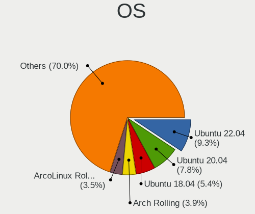

| Name              | Notebooks | Percent |
|-------------------|-----------|---------|
| Ubuntu 22.04      | 22        | 10.14%  |
| Ubuntu 20.04      | 19        | 8.76%   |
| Ubuntu 18.04      | 14        | 6.45%   |
| Arch Rolling      | 8         | 3.69%   |
| ArcoLinux Rolling | 7         | 3.23%   |
| Arch              | 7         | 3.23%   |
| Ubuntu 19.04      | 6         | 2.76%   |
| Linux Mint 20.1   | 5         | 2.3%    |
| Kubuntu 22.04     | 4         | 1.84%   |
| Fedora 34         | 4         | 1.84%   |
| Ubuntu MATE 22.04 | 3         | 1.38%   |
| ROSA R9           | 3         | 1.38%   |
| ROSA R8.1         | 3         | 1.38%   |
| ROSA R11          | 3         | 1.38%   |
| Pop!_OS 20.04     | 3         | 1.38%   |
| OpenMandriva 4.3  | 3         | 1.38%   |
| OpenMandriva 4.2  | 3         | 1.38%   |
| Linux Mint 21.2   | 3         | 1.38%   |
| Kubuntu 20.04     | 3         | 1.38%   |
| Fedora 36         | 3         | 1.38%   |
| Debian 11         | 3         | 1.38%   |
| Zorin 16          | 2         | 0.92%   |
| Xubuntu 20.04     | 2         | 0.92%   |
| Ubuntu 20.10      | 2         | 0.92%   |
| Ubuntu 19.10      | 2         | 0.92%   |
| ROSA 12.2         | 2         | 0.92%   |
| Reborn OS         | 2         | 0.92%   |
| Pop!_OS 22.04     | 2         | 0.92%   |
| Manjaro 20.1      | 2         | 0.92%   |
| Manjaro           | 2         | 0.92%   |
| Linux Mint 20.3   | 2         | 0.92%   |
| Linux Mint 20.2   | 2         | 0.92%   |
| Linux Mint 19.3   | 2         | 0.92%   |
| Linux Mint 18.3   | 2         | 0.92%   |
| KDE neon 20.04    | 2         | 0.92%   |
| Kali 2023.1       | 2         | 0.92%   |
| Elementary 6.1    | 2         | 0.92%   |
| Debian 12         | 2         | 0.92%   |
| Zorin 17          | 1         | 0.46%   |
| Zorin 15          | 1         | 0.46%   |

OS Family
---------

OS without a version

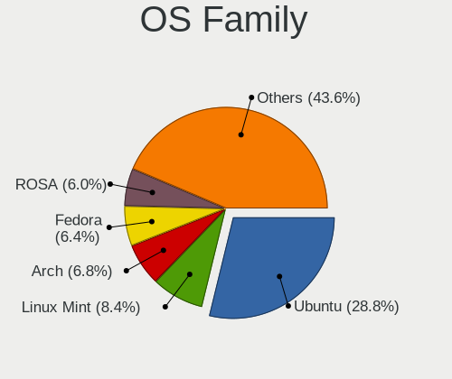

| Name         | Notebooks | Percent |
|--------------|-----------|---------|
| Ubuntu       | 66        | 31.13%  |
| Linux Mint   | 18        | 8.49%   |
| ROSA         | 15        | 7.08%   |
| Arch         | 15        | 7.08%   |
| Fedora       | 12        | 5.66%   |
| Manjaro      | 8         | 3.77%   |
| Pop!_OS      | 7         | 3.3%    |
| OpenMandriva | 7         | 3.3%    |
| Debian       | 7         | 3.3%    |
| ArcoLinux    | 7         | 3.3%    |
| Kubuntu      | 6         | 2.83%   |
| Zorin        | 4         | 1.89%   |
| Xubuntu      | 4         | 1.89%   |
| Ubuntu MATE  | 4         | 1.89%   |
| Endless      | 4         | 1.89%   |
| SteamOS      | 3         | 1.42%   |
| KDE neon     | 3         | 1.42%   |
| Kali         | 3         | 1.42%   |
| Elementary   | 3         | 1.42%   |
| Reborn OS    | 2         | 0.94%   |
| Clear Linux  | 2         | 0.94%   |
| Xero         | 1         | 0.47%   |
| Ubuntu Unity | 1         | 0.47%   |
| TUXEDO OS    | 1         | 0.47%   |
| Parrot       | 1         | 0.47%   |
| Nobara       | 1         | 0.47%   |
| NixOS        | 1         | 0.47%   |
| MX           | 1         | 0.47%   |
| Lubuntu      | 1         | 0.47%   |
| LMDE         | 1         | 0.47%   |
| EndeavourOS  | 1         | 0.47%   |
| ChimeraOS    | 1         | 0.47%   |
| ALT Linux    | 1         | 0.47%   |

Kernel
------

Version of the Linux kernel

| Version                            | Notebooks | Percent |
|------------------------------------|-----------|---------|
| 5.4.0-42-generic                   | 6         | 2.58%   |
| 6.2.0-26-generic                   | 4         | 1.72%   |
| 5.15.0-52-generic                  | 4         | 1.72%   |
| 5.4.0-47-generic                   | 3         | 1.29%   |
| 5.4.0-28-generic                   | 3         | 1.29%   |
| 5.16.7-desktop-1omv4003            | 3         | 1.29%   |
| 5.15.0-53-generic                  | 3         | 1.29%   |
| 5.10.14-desktop-1omv4002           | 3         | 1.29%   |
| 4.9.20-nrj-desktop-1rosa-x86_64    | 3         | 1.29%   |
| 6.2.0-39-generic                   | 2         | 0.86%   |
| 6.1.0-kali7-amd64                  | 2         | 0.86%   |
| 5.8.0-53-generic                   | 2         | 0.86%   |
| 5.4.0-88-generic                   | 2         | 0.86%   |
| 5.4.0-65-generic                   | 2         | 0.86%   |
| 5.15.2-arch1-1                     | 2         | 0.86%   |
| 5.15.0-56-generic                  | 2         | 0.86%   |
| 5.13.10-arch1-1                    | 2         | 0.86%   |
| 5.13.0-39-generic                  | 2         | 0.86%   |
| 5.11.0-27-generic                  | 2         | 0.86%   |
| 5.10.74-generic-2rosa2021.1-x86_64 | 2         | 0.86%   |
| 5.0.0-23-generic                   | 2         | 0.86%   |
| 4.18.0-15-generic                  | 2         | 0.86%   |
| 4.15.0-45-generic                  | 2         | 0.86%   |
| 6.8.8-arch1-1                      | 1         | 0.43%   |
| 6.8.7-200.fc39.x86_64              | 1         | 0.43%   |
| 6.8.0-31-generic                   | 1         | 0.43%   |
| 6.7.9-zen1-1-zen                   | 1         | 0.43%   |
| 6.7.6-arch1-1                      | 1         | 0.43%   |
| 6.6.7-arch1-1                      | 1         | 0.43%   |
| 6.6.30-1-lts                       | 1         | 0.43%   |
| 6.6.18                             | 1         | 0.43%   |
| 6.6.13-amd64                       | 1         | 0.43%   |
| 6.6.10-chos1-chimeraos-2           | 1         | 0.43%   |
| 6.6.10-76060610-generic            | 1         | 0.43%   |
| 6.5.7-200.fc38.x86_64              | 1         | 0.43%   |
| 6.5.6-zen2-1-zen                   | 1         | 0.43%   |
| 6.5.0-kali3-amd64                  | 1         | 0.43%   |
| 6.5.0-9-generic                    | 1         | 0.43%   |
| 6.5.0-28-generic                   | 1         | 0.43%   |
| 6.5.0-26-generic                   | 1         | 0.43%   |

Kernel Family
-------------

Linux kernel without a distro release

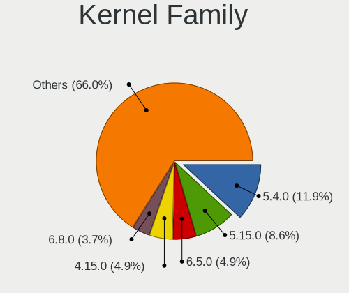

| Version | Notebooks | Percent |
|---------|-----------|---------|
| 5.4.0   | 32        | 14.1%   |
| 5.15.0  | 20        | 8.81%   |
| 4.15.0  | 13        | 5.73%   |
| 6.5.0   | 9         | 3.96%   |
| 5.8.0   | 9         | 3.96%   |
| 6.2.0   | 8         | 3.52%   |
| 5.11.0  | 8         | 3.52%   |
| 5.13.0  | 7         | 3.08%   |
| 5.0.0   | 7         | 3.08%   |
| 4.18.0  | 5         | 2.2%    |
| 6.1.0   | 4         | 1.76%   |
| 4.9.20  | 4         | 1.76%   |
| 5.3.0   | 3         | 1.32%   |
| 5.19.0  | 3         | 1.32%   |
| 5.16.7  | 3         | 1.32%   |
| 5.10.14 | 3         | 1.32%   |
| 5.10.0  | 3         | 1.32%   |
| 6.6.10  | 2         | 0.88%   |
| 6.0.9   | 2         | 0.88%   |
| 5.17.1  | 2         | 0.88%   |
| 5.15.2  | 2         | 0.88%   |
| 5.13.13 | 2         | 0.88%   |
| 5.13.12 | 2         | 0.88%   |
| 5.13.10 | 2         | 0.88%   |
| 5.11.12 | 2         | 0.88%   |
| 5.10.74 | 2         | 0.88%   |
| 6.8.8   | 1         | 0.44%   |
| 6.8.7   | 1         | 0.44%   |
| 6.8.0   | 1         | 0.44%   |
| 6.7.9   | 1         | 0.44%   |
| 6.7.6   | 1         | 0.44%   |
| 6.6.7   | 1         | 0.44%   |
| 6.6.30  | 1         | 0.44%   |
| 6.6.18  | 1         | 0.44%   |
| 6.6.13  | 1         | 0.44%   |
| 6.5.7   | 1         | 0.44%   |
| 6.5.6   | 1         | 0.44%   |
| 6.4.12  | 1         | 0.44%   |
| 6.3.12  | 1         | 0.44%   |
| 6.3.1   | 1         | 0.44%   |

Kernel Major Ver.
-----------------

Linux kernel major version

| Version | Notebooks | Percent |
|---------|-----------|---------|
| 5.4     | 33        | 14.54%  |
| 5.15    | 25        | 11.01%  |
| 5.13    | 16        | 7.05%   |
| 5.10    | 13        | 5.73%   |
| 4.15    | 13        | 5.73%   |
| 6.5     | 11        | 4.85%   |
| 6.1     | 11        | 4.85%   |
| 5.11    | 11        | 4.85%   |
| 6.2     | 10        | 4.41%   |
| 5.8     | 10        | 4.41%   |
| 5.0     | 8         | 3.52%   |
| 4.9     | 7         | 3.08%   |
| 6.6     | 6         | 2.64%   |
| 5.16    | 6         | 2.64%   |
| 6.0     | 5         | 2.2%    |
| 4.18    | 5         | 2.2%    |
| 5.9     | 4         | 1.76%   |
| 5.19    | 4         | 1.76%   |
| 5.17    | 4         | 1.76%   |
| 6.8     | 3         | 1.32%   |
| 5.3     | 3         | 1.32%   |
| 5.14    | 3         | 1.32%   |
| 5.12    | 3         | 1.32%   |
| 6.7     | 2         | 0.88%   |
| 6.3     | 2         | 0.88%   |
| 4.19    | 2         | 0.88%   |
| 6.4     | 1         | 0.44%   |
| 5.6     | 1         | 0.44%   |
| 5.5     | 1         | 0.44%   |
| 4.4     | 1         | 0.44%   |
| 4.10    | 1         | 0.44%   |
| 4.1     | 1         | 0.44%   |
| 3.16    | 1         | 0.44%   |

Arch
----

OS architecture (x86_64, i586, etc.)

| Name   | Notebooks | Percent |
|--------|-----------|---------|
| x86_64 | 204       | 97.61%  |
| i686   | 5         | 2.39%   |

DE
--

Desktop Environment

| Name       | Notebooks | Percent |
|------------|-----------|---------|
| GNOME      | 80        | 37.56%  |
| KDE5       | 35        | 16.43%  |
| Unknown    | 27        | 12.68%  |
| XFCE       | 17        | 7.98%   |
| X-Cinnamon | 13        | 6.1%    |
| MATE       | 9         | 4.23%   |
| KDE4       | 8         | 3.76%   |
| Pantheon   | 3         | 1.41%   |
| KDE        | 3         | 1.41%   |
| i3         | 3         | 1.41%   |
| Unity      | 2         | 0.94%   |
| LXQt       | 2         | 0.94%   |
| LXDE       | 2         | 0.94%   |
| KDE6       | 2         | 0.94%   |
| Budgie     | 2         | 0.94%   |
| awesome    | 2         | 0.94%   |
| Yoyo       | 1         | 0.47%   |
| openbox    | 1         | 0.47%   |
| Cinnamon   | 1         | 0.47%   |

Display Server
--------------

X11 or Wayland

| Name    | Notebooks | Percent |
|---------|-----------|---------|
| X11     | 155       | 73.81%  |
| Wayland | 44        | 20.95%  |
| Unknown | 10        | 4.76%   |
| Tty     | 1         | 0.48%   |

Display Manager
---------------

SDDM, LightDM, etc.

| Name    | Notebooks | Percent |
|---------|-----------|---------|
| Unknown | 93        | 43.66%  |
| SDDM    | 37        | 17.37%  |
| GDM3    | 28        | 13.15%  |
| GDM     | 21        | 9.86%   |
| LightDM | 17        | 7.98%   |
| TDM     | 9         | 4.23%   |
| KDM     | 8         | 3.76%   |

OS Lang
-------

Language

| Lang            | Notebooks | Percent |
|-----------------|-----------|---------|
| en_US           | 105       | 49.53%  |
| et_EE           | 33        | 15.57%  |
| Unknown         | 33        | 15.57%  |
| ru_RU           | 20        | 9.43%   |
| en_GB           | 9         | 4.25%   |
| de_DE           | 3         | 1.42%   |
| C               | 2         | 0.94%   |
| uk_UA           | 1         | 0.47%   |
| ru_UA           | 1         | 0.47%   |
| fr_FR           | 1         | 0.47%   |
| es_MX           | 1         | 0.47%   |
| en_US.utf-8     | 1         | 0.47%   |
| en_US.iso885915 | 1         | 0.47%   |
| en_DK           | 1         | 0.47%   |

Boot Mode
---------

EFI or BIOS

| Mode | Notebooks | Percent |
|------|-----------|---------|
| EFI  | 109       | 50.7%   |
| BIOS | 106       | 49.3%   |

Filesystem
----------

Type of filesystem

| Type    | Notebooks | Percent |
|---------|-----------|---------|
| Ext4    | 148       | 70.14%  |
| Btrfs   | 28        | 13.27%  |
| Unknown | 12        | 5.69%   |
| Tmpfs   | 8         | 3.79%   |
| Overlay | 8         | 3.79%   |
| Xfs     | 3         | 1.42%   |
| Zfs     | 2         | 0.95%   |
| Ext3    | 2         | 0.95%   |

Part. scheme
------------

Scheme of partitioning

| Type    | Notebooks | Percent |
|---------|-----------|---------|
| Unknown | 98        | 46.01%  |
| GPT     | 93        | 43.66%  |
| MBR     | 22        | 10.33%  |

Dual Boot with Linux/BSD
------------------------

Hosting more than one Linux/BSD

| Dual boot | Notebooks | Percent |
|-----------|-----------|---------|
| No        | 193       | 91.47%  |
| Yes       | 18        | 8.53%   |

Dual Boot (Win)
---------------

Hosting Linux and Windows

| Dual boot | Notebooks | Percent |
|-----------|-----------|---------|
| No        | 149       | 69.95%  |
| Yes       | 64        | 30.05%  |

Board
-----

Vendor
------

Motherboard manufacturer

| Name                | Notebooks | Percent |
|---------------------|-----------|---------|
| Lenovo              | 65        | 31.1%   |
| Hewlett-Packard     | 37        | 17.7%   |
| Dell                | 29        | 13.88%  |
| ASUSTek Computer    | 23        | 11%     |
| Samsung Electronics | 8         | 3.83%   |
| Acer                | 8         | 3.83%   |
| MSI                 | 6         | 2.87%   |
| Apple               | 6         | 2.87%   |
| Valve               | 3         | 1.44%   |
| Fujitsu             | 3         | 1.44%   |
| TUXEDO              | 2         | 0.96%   |
| Timi                | 2         | 0.96%   |
| Quanta              | 2         | 0.96%   |
| Notebook            | 2         | 0.96%   |
| Alienware           | 2         | 0.96%   |
| Toshiba             | 1         | 0.48%   |
| Packard Bell        | 1         | 0.48%   |
| mPTech              | 1         | 0.48%   |
| Intel               | 1         | 0.48%   |
| HUAWEI              | 1         | 0.48%   |
| GPD                 | 1         | 0.48%   |
| Gigabyte Technology | 1         | 0.48%   |
| Getac               | 1         | 0.48%   |
| Fujitsu Siemens     | 1         | 0.48%   |
| Framework           | 1         | 0.48%   |
| Chuwi               | 1         | 0.48%   |

Model
-----

Motherboard model

| Name                                                  | Notebooks | Percent |
|-------------------------------------------------------|-----------|---------|
| Valve Jupiter                                         | 3         | 1.44%   |
| Quanta TWH                                            | 2         | 0.96%   |
| Lenovo Y50-70 20378                                   | 2         | 0.96%   |
| HP Pavilion Gaming Laptop 15-ec1xxx                   | 2         | 0.96%   |
| HP Pavilion dv7                                       | 2         | 0.96%   |
| HP ENVY Laptop 13-ah0xxx                              | 2         | 0.96%   |
| HP EliteBook 8470p                                    | 2         | 0.96%   |
| HP EliteBook 8460p                                    | 2         | 0.96%   |
| HP EliteBook 840 G5                                   | 2         | 0.96%   |
| HP EliteBook 840 G2                                   | 2         | 0.96%   |
| Dell Latitude 7490                                    | 2         | 0.96%   |
| Dell Inspiron N5110                                   | 2         | 0.96%   |
| Dell Inspiron 5558                                    | 2         | 0.96%   |
| ASUS ZenBook UX325EA_UX325EA                          | 2         | 0.96%   |
| Alienware 17                                          | 2         | 0.96%   |
| TUXEDO Polaris AMD Gen5                               | 1         | 0.48%   |
| TUXEDO Book BA1510                                    | 1         | 0.48%   |
| Toshiba Satellite L855                                | 1         | 0.48%   |
| Timi RedmiBook 16                                     | 1         | 0.48%   |
| Timi RedmiBook 14 II                                  | 1         | 0.48%   |
| Samsung R410                                          | 1         | 0.48%   |
| Samsung 900X3C/900X3D/900X4C/900X4D                   | 1         | 0.48%   |
| Samsung 900X3C/900X3D/900X3E/900X4C/900X4D            | 1         | 0.48%   |
| Samsung 770Z5E/780Z5E                                 | 1         | 0.48%   |
| Samsung 535U3C                                        | 1         | 0.48%   |
| Samsung 350V5C/351V5C/3540VC/3440VC                   | 1         | 0.48%   |
| Samsung 300E5EV/300E4EV/270E5EV/270E4EV/2470EV/2470EE | 1         | 0.48%   |
| Samsung 275E4E/275E5E                                 | 1         | 0.48%   |
| Packard Bell EasyNote TK87                            | 1         | 0.48%   |
| Notebook W35xSS_370SS                                 | 1         | 0.48%   |
| Notebook N150SD/N155SD                                | 1         | 0.48%   |
| MSI Pulse GL66 11UDK                                  | 1         | 0.48%   |
| MSI GT70 2OC/2OD                                      | 1         | 0.48%   |
| MSI GS75 Stealth 8SE                                  | 1         | 0.48%   |
| MSI GP62M 7RDX                                        | 1         | 0.48%   |
| MSI GL72 6QD                                          | 1         | 0.48%   |
| MSI GF63 Thin 10SCXR                                  | 1         | 0.48%   |
| mPTech ARC 11.6 128GB HD                              | 1         | 0.48%   |
| Lenovo Yoga Pro 7 14APH8 82Y8                         | 1         | 0.48%   |
| Lenovo Y720-15IKB 80VR                                | 1         | 0.48%   |

Model Family
------------

Motherboard model prefix

| Name                  | Notebooks | Percent |
|-----------------------|-----------|---------|
| Lenovo ThinkPad       | 48        | 22.97%  |
| HP EliteBook          | 13        | 6.22%   |
| Dell Latitude         | 9         | 4.31%   |
| Dell Inspiron         | 8         | 3.83%   |
| HP Pavilion           | 7         | 3.35%   |
| Lenovo IdeaPad        | 5         | 2.39%   |
| Dell Precision        | 5         | 2.39%   |
| HP ProBook            | 4         | 1.91%   |
| ASUS Zenbook          | 4         | 1.91%   |
| ASUS VivoBook         | 4         | 1.91%   |
| Acer Aspire           | 4         | 1.91%   |
| Valve Jupiter         | 3         | 1.44%   |
| Lenovo Legion         | 3         | 1.44%   |
| Fujitsu LIFEBOOK      | 3         | 1.44%   |
| Dell XPS              | 3         | 1.44%   |
| Timi RedmiBook        | 2         | 0.96%   |
| Samsung 900X3C        | 2         | 0.96%   |
| Quanta TWH            | 2         | 0.96%   |
| Lenovo Y50-70         | 2         | 0.96%   |
| HP Presario           | 2         | 0.96%   |
| HP OMEN               | 2         | 0.96%   |
| HP ENVY               | 2         | 0.96%   |
| HP Compaq             | 2         | 0.96%   |
| Dell Vostro           | 2         | 0.96%   |
| Apple MacBookPro5     | 2         | 0.96%   |
| Alienware 17          | 2         | 0.96%   |
| TUXEDO Polaris        | 1         | 0.48%   |
| TUXEDO Book           | 1         | 0.48%   |
| Toshiba Satellite     | 1         | 0.48%   |
| Samsung R410          | 1         | 0.48%   |
| Samsung 770Z5E        | 1         | 0.48%   |
| Samsung 535U3C        | 1         | 0.48%   |
| Samsung 350V5C        | 1         | 0.48%   |
| Samsung 300E5EV       | 1         | 0.48%   |
| Samsung 275E4E        | 1         | 0.48%   |
| Packard Bell EasyNote | 1         | 0.48%   |
| Notebook W35xSS       | 1         | 0.48%   |
| Notebook N150SD       | 1         | 0.48%   |
| MSI Pulse             | 1         | 0.48%   |
| MSI GT70              | 1         | 0.48%   |

MFG Year
--------

Motherboard manufacture year

| Year | Notebooks | Percent |
|------|-----------|---------|
| 2013 | 23        | 11%     |
| 2020 | 22        | 10.53%  |
| 2019 | 20        | 9.57%   |
| 2018 | 19        | 9.09%   |
| 2011 | 19        | 9.09%   |
| 2015 | 14        | 6.7%    |
| 2014 | 13        | 6.22%   |
| 2012 | 13        | 6.22%   |
| 2017 | 10        | 4.78%   |
| 2022 | 9         | 4.31%   |
| 2021 | 9         | 4.31%   |
| 2010 | 9         | 4.31%   |
| 2008 | 7         | 3.35%   |
| 2007 | 7         | 3.35%   |
| 2016 | 6         | 2.87%   |
| 2023 | 5         | 2.39%   |
| 2009 | 3         | 1.44%   |
| 2006 | 1         | 0.48%   |

Form Factor
-----------

Physical design of the computer

| Name     | Notebooks | Percent |
|----------|-----------|---------|
| Notebook | 209       | 100%    |

Secure Boot
-----------

Enabled or disabled

| State    | Notebooks | Percent |
|----------|-----------|---------|
| Disabled | 194       | 91.94%  |
| Enabled  | 17        | 8.06%   |

Coreboot
--------

Have coreboot on board

| Used | Notebooks | Percent |
|------|-----------|---------|
| No   | 209       | 100%    |

RAM Size
--------

Total RAM memory

| Size in GB  | Notebooks | Percent |
|-------------|-----------|---------|
| 8.01-16.0   | 51        | 24.06%  |
| 4.01-8.0    | 46        | 21.7%   |
| 16.01-24.0  | 42        | 19.81%  |
| 3.01-4.0    | 35        | 16.51%  |
| 32.01-64.0  | 12        | 5.66%   |
| 24.01-32.0  | 10        | 4.72%   |
| 2.01-3.0    | 8         | 3.77%   |
| 1.01-2.0    | 6         | 2.83%   |
| 64.01-256.0 | 2         | 0.94%   |

RAM Used
--------

Used RAM memory

| Used GB    | Notebooks | Percent |
|------------|-----------|---------|
| 1.01-2.0   | 68        | 30.63%  |
| 2.01-3.0   | 56        | 25.23%  |
| 4.01-8.0   | 46        | 20.72%  |
| 3.01-4.0   | 27        | 12.16%  |
| 8.01-16.0  | 12        | 5.41%   |
| 0.51-1.0   | 10        | 4.5%    |
| 16.01-24.0 | 2         | 0.9%    |
| 24.01-32.0 | 1         | 0.45%   |

Total Drives
------------

Number of drives on board

| Drives | Notebooks | Percent |
|--------|-----------|---------|
| 1      | 164       | 77%     |
| 2      | 41        | 19.25%  |
| 3      | 6         | 2.82%   |
| 5      | 1         | 0.47%   |
| 4      | 1         | 0.47%   |

Has CD-ROM
----------

Has CD-ROM on board

| Presented | Notebooks | Percent |
|-----------|-----------|---------|
| No        | 139       | 65.57%  |
| Yes       | 73        | 34.43%  |

Has Ethernet
------------

Has Ethernet on board

| Presented | Notebooks | Percent |
|-----------|-----------|---------|
| Yes       | 178       | 84.76%  |
| No        | 32        | 15.24%  |

Has WiFi
--------

Has WiFi module

| Presented | Notebooks | Percent |
|-----------|-----------|---------|
| Yes       | 208       | 99.52%  |
| No        | 1         | 0.48%   |

Has Bluetooth
-------------

Has Bluetooth module

| Presented | Notebooks | Percent |
|-----------|-----------|---------|
| Yes       | 167       | 79.52%  |
| No        | 43        | 20.48%  |

Location
--------

Country
-------

Geographic location (country)

| Country | Notebooks | Percent |
|---------|-----------|---------|
| Estonia | 209       | 100%    |

City
----

Geographic location (city)

| City              | Notebooks | Percent |
|-------------------|-----------|---------|
| Tallinn           | 139       | 65.26%  |
| Tartu             | 20        | 9.39%   |
| Prnu            | 8         | 3.76%   |
| Narva             | 6         | 2.82%   |
| Rapla             | 5         | 2.35%   |
| Rakvere           | 4         | 1.88%   |
| Vinni             | 2         | 0.94%   |
| Saku              | 2         | 0.94%   |
| Otepaeae          | 2         | 0.94%   |
| Maardu            | 2         | 0.94%   |
| Keila             | 2         | 0.94%   |
| Vru             | 1         | 0.47%   |
| Viljandi          | 1         | 0.47%   |
| Viimsi            | 1         | 0.47%   |
| Vatla             | 1         | 0.47%   |
| Valga             | 1         | 0.47%   |
| Tabasalu          | 1         | 0.47%   |
| Sillame         | 1         | 0.47%   |
| Sauga             | 1         | 0.47%   |
| Rae Parish        | 1         | 0.47%   |
| Plva            | 1         | 0.47%   |
| Pohja-Sakala vald | 1         | 0.47%   |
| Palamuse          | 1         | 0.47%   |
| Muraste           | 1         | 0.47%   |
| Laagri            | 1         | 0.47%   |
| Kose              | 1         | 0.47%   |
| Krdla           | 1         | 0.47%   |
| Kaeina            | 1         | 0.47%   |
| Jri             | 1         | 0.47%   |
| Jhvi            | 1         | 0.47%   |
| Jgeva           | 1         | 0.47%   |
| AEaesmaee         | 1         | 0.47%   |

Drives
------

Drive Vendor
------------

Hard drive vendors

| Vendor                      | Notebooks | Drives | Percent |
|-----------------------------|-----------|--------|---------|
| Samsung Electronics         | 58        | 67     | 22.48%  |
| Seagate                     | 32        | 35     | 12.4%   |
| Toshiba                     | 18        | 18     | 6.98%   |
| Kingston                    | 18        | 19     | 6.98%   |
| WDC                         | 15        | 18     | 5.81%   |
| SK hynix                    | 14        | 18     | 5.43%   |
| SanDisk                     | 11        | 14     | 4.26%   |
| Intel                       | 10        | 11     | 3.88%   |
| Unknown                     | 8         | 8      | 3.1%    |
| HGST                        | 7         | 8      | 2.71%   |
| Patriot                     | 5         | 6      | 1.94%   |
| Micron Technology           | 5         | 5      | 1.94%   |
| Hitachi                     | 5         | 5      | 1.94%   |
| Crucial                     | 4         | 4      | 1.55%   |
| Lenovo                      | 3         | 3      | 1.16%   |
| KIOXIA                      | 3         | 4      | 1.16%   |
| China                       | 3         | 3      | 1.16%   |
| Apacer                      | 3         | 3      | 1.16%   |
| A-DATA Technology           | 3         | 3      | 1.16%   |
| Transcend                   | 2         | 5      | 0.78%   |
| SPCC                        | 2         | 3      | 0.78%   |
| Phison Electronics          | 2         | 2      | 0.78%   |
| LITEONIT                    | 2         | 2      | 0.78%   |
| Kingston Technology Company | 2         | 2      | 0.78%   |
| KingSpec                    | 2         | 3      | 0.78%   |
| Gigabyte Technology         | 2         | 3      | 0.78%   |
| Fujitsu                     | 2         | 2      | 0.78%   |
| Apple                       | 2         | 2      | 0.78%   |
| Unknown                     | 2         | 2      | 0.78%   |
| XPG                         | 1         | 1      | 0.39%   |
| Union Memory (Shenzhen)     | 1         | 1      | 0.39%   |
| UMIS                        | 1         | 1      | 0.39%   |
| Team                        | 1         | 1      | 0.39%   |
| PNY                         | 1         | 1      | 0.39%   |
| Phison                      | 1         | 1      | 0.39%   |
| Netac                       | 1         | 1      | 0.39%   |
| Lexar                       | 1         | 1      | 0.39%   |
| Intenso                     | 1         | 1      | 0.39%   |
| HUAWEI                      | 1         | 1      | 0.39%   |
| External                    | 1         | 1      | 0.39%   |

Drive Model
-----------

Hard drive models

| Model                                              | Notebooks | Percent |
|----------------------------------------------------|-----------|---------|
| Samsung NVMe SSD Controller SM981/PM981/PM983 1TB  | 4         | 1.5%    |
| Seagate ST500LM021-1KJ152 500GB                    | 3         | 1.13%   |
| Samsung SSD 850 EVO 500GB                          | 3         | 1.13%   |
| Kingston SA400S37960G 960GB SSD                    | 3         | 1.13%   |
| Kingston SA400S37240G 240GB SSD                    | 3         | 1.13%   |
| HGST HTS721010A9E630 1TB                           | 3         | 1.13%   |
| WDC PC SN730 SDBQNTY-512G-1001 512GB               | 2         | 0.75%   |
| WDC PC SN530 SDBPMPZ-256G-1001 256GB               | 2         | 0.75%   |
| Unknown MMC Card  512GB                            | 2         | 0.75%   |
| Unknown MMC Card  16GB                             | 2         | 0.75%   |
| Toshiba NVMe SSD Drive 512GB                       | 2         | 0.75%   |
| Toshiba MQ01ABD100 1TB                             | 2         | 0.75%   |
| SK hynix PC601 NVMe 512GB                          | 2         | 0.75%   |
| SK hynix NVMe SSD Drive 512GB                      | 2         | 0.75%   |
| SK hynix NVMe SSD Drive 256GB                      | 2         | 0.75%   |
| Seagate ST500LT012-1DG142 500GB                    | 2         | 0.75%   |
| Seagate ST1000LM024 HN-M101MBB 1TB                 | 2         | 0.75%   |
| Seagate BUP Portable 500GB                         | 2         | 0.75%   |
| SanDisk SD8SBAT256G1122 256GB SSD                  | 2         | 0.75%   |
| SanDisk NVMe SSD Drive 512GB                       | 2         | 0.75%   |
| Samsung SSD 970 EVO Plus 500GB                     | 2         | 0.75%   |
| Samsung SSD 970 EVO Plus 1TB                       | 2         | 0.75%   |
| Samsung SSD 860 EVO 250GB                          | 2         | 0.75%   |
| Samsung SSD 850 EVO M.2 500GB                      | 2         | 0.75%   |
| Samsung NVMe SSD Drive 512GB                       | 2         | 0.75%   |
| Samsung NVMe SSD Drive 1TB                         | 2         | 0.75%   |
| Samsung NVMe SSD Drive 1024GB                      | 2         | 0.75%   |
| Samsung NVMe SSD Controller PM9A1/PM9A3/980PRO 1TB | 2         | 0.75%   |
| Samsung MZVLQ256HAJD-000H1 256GB                   | 2         | 0.75%   |
| Samsung MZVLB512HBJQ-000L7 512GB                   | 2         | 0.75%   |
| Samsung MZ7LN256HCHP-000L7 256GB SSD               | 2         | 0.75%   |
| Patriot Burst 240GB SSD                            | 2         | 0.75%   |
| Micron 1100_MTFDDAV512TBN 512GB SSD                | 2         | 0.75%   |
| Kingston Company OM3PDP3 NVMe SSD 512GB            | 2         | 0.75%   |
| Kingston SV300S37A120G 120GB SSD                   | 2         | 0.75%   |
| Intel SSDPEKNW512G8 512GB                          | 2         | 0.75%   |
| Intel SSDPEKKF256G8L 256GB                         | 2         | 0.75%   |
| HGST HTS541010A9E680 1TB                           | 2         | 0.75%   |
| Unknown                                            | 2         | 0.75%   |
| XPG SX950U 240GB                                   | 1         | 0.38%   |

HDD Vendor
----------

Hard disk drive vendors

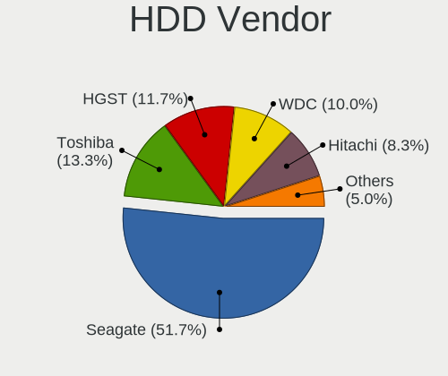

| Vendor  | Notebooks | Drives | Percent |
|---------|-----------|--------|---------|
| Seagate | 30        | 33     | 52.63%  |
| Toshiba | 8         | 8      | 14.04%  |
| HGST    | 7         | 8      | 12.28%  |
| WDC     | 5         | 6      | 8.77%   |
| Hitachi | 5         | 5      | 8.77%   |
| Fujitsu | 2         | 2      | 3.51%   |

SSD Vendor
----------

Solid state drive vendors

| Vendor              | Notebooks | Drives | Percent |
|---------------------|-----------|--------|---------|
| Samsung Electronics | 32        | 37     | 32%     |
| Kingston            | 15        | 16     | 15%     |
| SanDisk             | 5         | 7      | 5%      |
| SK hynix            | 4         | 4      | 4%      |
| Patriot             | 4         | 5      | 4%      |
| Micron Technology   | 4         | 4      | 4%      |
| WDC                 | 3         | 5      | 3%      |
| Crucial             | 3         | 3      | 3%      |
| China               | 3         | 3      | 3%      |
| Apacer              | 3         | 3      | 3%      |
| A-DATA Technology   | 3         | 3      | 3%      |
| Transcend           | 2         | 5      | 2%      |
| Toshiba             | 2         | 2      | 2%      |
| LITEONIT            | 2         | 2      | 2%      |
| KingSpec            | 2         | 3      | 2%      |
| Intel               | 2         | 3      | 2%      |
| Apple               | 2         | 2      | 2%      |
| XPG                 | 1         | 1      | 1%      |
| Team                | 1         | 1      | 1%      |
| SPCC                | 1         | 2      | 1%      |
| Netac               | 1         | 1      | 1%      |
| Lexar               | 1         | 1      | 1%      |
| Intenso             | 1         | 1      | 1%      |
| Gigabyte Technology | 1         | 2      | 1%      |
| External            | 1         | 1      | 1%      |
| Unknown             | 1         | 1      | 1%      |

Drive Kind
----------

HDD or SSD

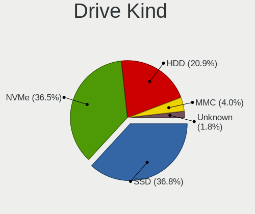

| Kind    | Notebooks | Drives | Percent |
|---------|-----------|--------|---------|
| SSD     | 89        | 118    | 37.87%  |
| NVMe    | 78        | 98     | 33.19%  |
| HDD     | 55        | 62     | 23.4%   |
| MMC     | 9         | 9      | 3.83%   |
| Unknown | 4         | 5      | 1.7%    |

Drive Connector
---------------

SATA, SAS, NVMe, etc.

| Type | Notebooks | Drives | Percent |
|------|-----------|--------|---------|
| SATA | 133       | 176    | 57.83%  |
| NVMe | 78        | 97     | 33.91%  |
| SAS  | 10        | 10     | 4.35%   |
| MMC  | 9         | 9      | 3.91%   |

Drive Size
----------

Size of hard drive

| Size in TB | Notebooks | Drives | Percent |
|------------|-----------|--------|---------|
| 0.01-0.5   | 104       | 130    | 70.27%  |
| 0.51-1.0   | 39        | 45     | 26.35%  |
| 1.01-2.0   | 4         | 4      | 2.7%    |
| 3.01-4.0   | 1         | 1      | 0.68%   |

Space Total
-----------

Amount of disk space available on the file system

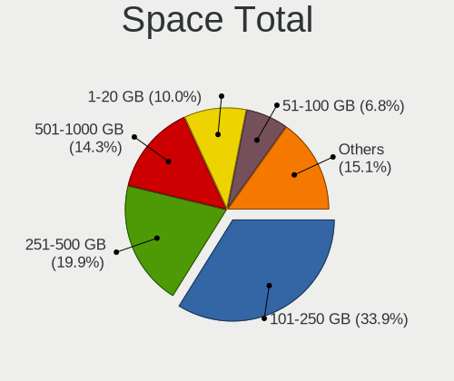

| Size in GB     | Notebooks | Percent |
|----------------|-----------|---------|
| 101-250        | 76        | 35.35%  |
| 251-500        | 45        | 20.93%  |
| 501-1000       | 31        | 14.42%  |
| 1-20           | 17        | 7.91%   |
| 51-100         | 15        | 6.98%   |
| 1001-2000      | 9         | 4.19%   |
| More than 3000 | 8         | 3.72%   |
| Unknown        | 8         | 3.72%   |
| 21-50          | 5         | 2.33%   |
| 2001-3000      | 1         | 0.47%   |

Space Used
----------

Amount of used disk space

| Used GB        | Notebooks | Percent |
|----------------|-----------|---------|
| 1-20           | 84        | 37.5%   |
| 21-50          | 38        | 16.96%  |
| 101-250        | 35        | 15.63%  |
| 51-100         | 27        | 12.05%  |
| 251-500        | 18        | 8.04%   |
| 501-1000       | 9         | 4.02%   |
| Unknown        | 8         | 3.57%   |
| More than 3000 | 3         | 1.34%   |
| 2001-3000      | 1         | 0.45%   |
| 1001-2000      | 1         | 0.45%   |

Malfunc. Drives
---------------

Drive models with a malfunction

| Model                                               | Notebooks | Drives | Percent |
|-----------------------------------------------------|-----------|--------|---------|
| WDC WD2500BEVT-80A23T0 250GB                        | 1         | 1      | 5.88%   |
| Seagate ST98823AS 80GB                              | 1         | 1      | 5.88%   |
| Seagate ST9320325AS 320GB                           | 1         | 1      | 5.88%   |
| Seagate ST9250315AS 250GB                           | 1         | 1      | 5.88%   |
| Seagate ST9160412AS 160GB                           | 1         | 1      | 5.88%   |
| Seagate ST750LX003-1AC154 752GB                     | 1         | 1      | 5.88%   |
| Seagate ST320LT012-9WS14C 320GB                     | 1         | 1      | 5.88%   |
| Seagate ST1000LM035-1RK172 1TB                      | 1         | 1      | 5.88%   |
| Netac SSD 720GB                                     | 1         | 1      | 5.88%   |
| Micron Technology MTFDDAK256TDL-1AW15ABHA 256GB SSD | 1         | 1      | 5.88%   |
| Micron Technology MTFDDAK128MAY-1AH1ZABHA 128GB SSD | 1         | 1      | 5.88%   |
| Kingston SA400S37960G 960GB SSD                     | 1         | 1      | 5.88%   |
| Kingston RBU-SNS8152S3256GG2 256GB SSD              | 1         | 1      | 5.88%   |
| Hitachi HTS547550A9E384 500GB                       | 1         | 1      | 5.88%   |
| HGST HTS541010A9E680 1TB                            | 1         | 1      | 5.88%   |
| Fujitsu MHT2040AH PL 40GB                           | 1         | 1      | 5.88%   |
| Crucial CT480M500SSD3 480GB                         | 1         | 1      | 5.88%   |

Malfunc. Drive Vendor
---------------------

Vendors of faulty drives

| Vendor            | Notebooks | Drives | Percent |
|-------------------|-----------|--------|---------|
| Seagate           | 7         | 7      | 41.18%  |
| Micron Technology | 2         | 2      | 11.76%  |
| Kingston          | 2         | 2      | 11.76%  |
| WDC               | 1         | 1      | 5.88%   |
| Netac             | 1         | 1      | 5.88%   |
| Hitachi           | 1         | 1      | 5.88%   |
| HGST              | 1         | 1      | 5.88%   |
| Fujitsu           | 1         | 1      | 5.88%   |
| Crucial           | 1         | 1      | 5.88%   |

Malfunc. HDD Vendor
-------------------

Vendors of faulty HDD drives

| Vendor  | Notebooks | Drives | Percent |
|---------|-----------|--------|---------|
| Seagate | 7         | 7      | 63.64%  |
| WDC     | 1         | 1      | 9.09%   |
| Hitachi | 1         | 1      | 9.09%   |
| HGST    | 1         | 1      | 9.09%   |
| Fujitsu | 1         | 1      | 9.09%   |

Malfunc. Drive Kind
-------------------

Kinds of faulty drives

| Kind | Notebooks | Drives | Percent |
|------|-----------|--------|---------|
| HDD  | 11        | 11     | 64.71%  |
| SSD  | 6         | 6      | 35.29%  |

Failed Drives
-------------

Failed drive models

Zero info for selected period =(

Failed Drive Vendor
-------------------

Failed drive vendors

Zero info for selected period =(

Drive Status
------------

Number of failed and malfunc. drives

| Status   | Notebooks | Drives | Percent |
|----------|-----------|--------|---------|
| Detected | 118       | 175    | 54.13%  |
| Works    | 84        | 100    | 38.53%  |
| Malfunc  | 16        | 17     | 7.34%   |

Storage controller
------------------

Storage Vendor
--------------

Storage controller vendors

| Vendor                       | Notebooks | Percent |
|------------------------------|-----------|---------|
| Intel                        | 142       | 57.72%  |
| Samsung Electronics          | 27        | 10.98%  |
| AMD                          | 22        | 8.94%   |
| SanDisk                      | 12        | 4.88%   |
| SK hynix                     | 10        | 4.07%   |
| Toshiba America Info Systems | 7         | 2.85%   |
| Phison Electronics           | 4         | 1.63%   |
| KIOXIA                       | 4         | 1.63%   |
| Kingston Technology Company  | 4         | 1.63%   |
| Lenovo                       | 3         | 1.22%   |
| Nvidia                       | 2         | 0.81%   |
| Marvell Technology Group     | 2         | 0.81%   |
| VIA Technologies             | 1         | 0.41%   |
| Union Memory (Shenzhen)      | 1         | 0.41%   |
| Realtek Semiconductor        | 1         | 0.41%   |
| Micron/Crucial Technology    | 1         | 0.41%   |
| Micron Technology            | 1         | 0.41%   |
| Hosin Global Electronics     | 1         | 0.41%   |
| ADATA Technology             | 1         | 0.41%   |

Storage Model
-------------

Storage controller models

| Model                                                                          | Notebooks | Percent |
|--------------------------------------------------------------------------------|-----------|---------|
| AMD FCH SATA Controller [AHCI mode]                                            | 18        | 6.82%   |
| Samsung NVMe SSD Controller SM981/PM981/PM983                                  | 17        | 6.44%   |
| Intel 7 Series Chipset Family 6-port SATA Controller [AHCI mode]               | 17        | 6.44%   |
| Intel 8 Series/C220 Series Chipset Family 6-port SATA Controller 1 [AHCI mode] | 16        | 6.06%   |
| Intel 6 Series/C200 Series Chipset Family 6 port Mobile SATA AHCI Controller   | 14        | 5.3%    |
| Intel Wildcat Point-LP SATA Controller [AHCI Mode]                             | 10        | 3.79%   |
| Intel Sunrise Point-LP SATA Controller [AHCI mode]                             | 9         | 3.41%   |
| Intel 8 Series SATA Controller 1 [AHCI mode]                                   | 8         | 3.03%   |
| Intel HM170/QM170 Chipset SATA Controller [AHCI Mode]                          | 7         | 2.65%   |
| Intel 82801 Mobile SATA Controller [RAID mode]                                 | 7         | 2.65%   |
| Intel 82801HM/HEM (ICH8M/ICH8M-E) IDE Controller                               | 6         | 2.27%   |
| SanDisk Extreme Pro / WD Black SN750 / PC SN730 / Red SN700 NVMe SSD           | 5         | 1.89%   |
| Intel Cannon Lake Mobile PCH SATA AHCI Controller                              | 5         | 1.89%   |
| Intel 82801HM/HEM (ICH8M/ICH8M-E) SATA Controller [AHCI mode]                  | 5         | 1.89%   |
| Intel 5 Series/3400 Series Chipset 6 port SATA AHCI Controller                 | 5         | 1.89%   |
| Samsung NVMe SSD Controller 980 (DRAM-less)                                    | 4         | 1.52%   |
| KIOXIA NVMe SSD Controller BG4 (DRAM-less)                                     | 4         | 1.52%   |
| Intel Volume Management Device NVMe RAID Controller                            | 4         | 1.52%   |
| Intel SSD 660P Series                                                          | 4         | 1.52%   |
| Intel Q170/Q150/B150/H170/H110/Z170/CM236 Chipset SATA Controller [AHCI Mode]  | 4         | 1.52%   |
| Intel Celeron/Pentium Silver Processor SATA Controller                         | 4         | 1.52%   |
| Intel 82801IBM/IEM (ICH9M/ICH9M-E) 4 port SATA Controller [AHCI mode]          | 4         | 1.52%   |
| Toshiba America Info Systems XG6 NVMe SSD Controller                           | 3         | 1.14%   |
| SK hynix PC401 NVMe Solid State Drive 256GB                                    | 3         | 1.14%   |
| Samsung NVMe SSD Controller SM961/PM961/SM963                                  | 3         | 1.14%   |
| Samsung NVMe SSD Controller PM9A1/PM9A3/980PRO                                 | 3         | 1.14%   |
| Kingston Company OM3PDP3 NVMe SSD                                              | 3         | 1.14%   |
| Intel 5 Series/3400 Series Chipset 4 port SATA AHCI Controller                 | 3         | 1.14%   |
| Toshiba America Info Systems BG3 x2 NVMe SSD Controller (DRAM-less)            | 2         | 0.76%   |
| SK hynix PC601 NVMe Solid State Drive                                          | 2         | 0.76%   |
| SK hynix Gold P31/BC711/PC711 NVMe Solid State Drive                           | 2         | 0.76%   |
| SK hynix BC501 NVMe Solid State Drive                                          | 2         | 0.76%   |
| SanDisk WD PC SN810 / Black SN850 NVMe SSD                                     | 2         | 0.76%   |
| SanDisk PC SN530 NVMe SSD (DRAM-less)                                          | 2         | 0.76%   |
| Phison E16 PCIe4 NVMe Controller                                               | 2         | 0.76%   |
| Nvidia MCP79 AHCI Controller                                                   | 2         | 0.76%   |
| Marvell Group 88SS9183 PCIe SSD Controller                                     | 2         | 0.76%   |
| Intel Tiger Lake SATA AHCI Controller                                          | 2         | 0.76%   |
| Intel SSD DC P4101/Pro 7600p/760p/E 6100p Series                               | 2         | 0.76%   |
| Intel NM10/ICH7 Family SATA Controller [AHCI mode]                             | 2         | 0.76%   |

Storage Kind
------------

Kind of storage controller (IDE, SATA, NVMe, SAS, ...)

| Kind | Notebooks | Percent |
|------|-----------|---------|
| SATA | 150       | 59.06%  |
| NVMe | 79        | 31.1%   |
| IDE  | 14        | 5.51%   |
| RAID | 11        | 4.33%   |

Processor
---------

CPU Vendor
----------

Processor vendors

| Vendor | Notebooks | Percent |
|--------|-----------|---------|
| Intel  | 168       | 80.38%  |
| AMD    | 41        | 19.62%  |

CPU Model
---------

Processor models

| Model                                      | Notebooks | Percent |
|--------------------------------------------|-----------|---------|
| Intel Core i5-8250U CPU @ 1.60GHz          | 8         | 3.83%   |
| Intel Core i7-8550U CPU @ 1.80GHz          | 4         | 1.91%   |
| Intel Core i5-2520M CPU @ 2.50GHz          | 4         | 1.91%   |
| Intel 11th Gen Core i7-1165G7 @ 2.80GHz    | 4         | 1.91%   |
| Intel Core i7-8565U CPU @ 1.80GHz          | 3         | 1.44%   |
| Intel Core i7-7700HQ CPU @ 2.80GHz         | 3         | 1.44%   |
| Intel Core i7-6820HQ CPU @ 2.70GHz         | 3         | 1.44%   |
| Intel Core i7-5600U CPU @ 2.60GHz          | 3         | 1.44%   |
| Intel Core i7-4710MQ CPU @ 2.50GHz         | 3         | 1.44%   |
| Intel Core i7-10750H CPU @ 2.60GHz         | 3         | 1.44%   |
| Intel Core i5-3210M CPU @ 2.50GHz          | 3         | 1.44%   |
| Intel Core i5 CPU M 460 @ 2.53GHz          | 3         | 1.44%   |
| AMD Custom APU 0405                        | 3         | 1.44%   |
| Intel Core i7-9750H CPU @ 2.60GHz          | 2         | 0.96%   |
| Intel Core i7-8650U CPU @ 1.90GHz          | 2         | 0.96%   |
| Intel Core i7-7500U CPU @ 2.70GHz          | 2         | 0.96%   |
| Intel Core i7-6700HQ CPU @ 2.60GHz         | 2         | 0.96%   |
| Intel Core i7-4800MQ CPU @ 2.70GHz         | 2         | 0.96%   |
| Intel Core i7-4710HQ CPU @ 2.50GHz         | 2         | 0.96%   |
| Intel Core i7-4700MQ CPU @ 2.40GHz         | 2         | 0.96%   |
| Intel Core i7-4500U CPU @ 1.80GHz          | 2         | 0.96%   |
| Intel Core i7-2620M CPU @ 2.70GHz          | 2         | 0.96%   |
| Intel Core i7-10510U CPU @ 1.80GHz         | 2         | 0.96%   |
| Intel Core i5-8265U CPU @ 1.60GHz          | 2         | 0.96%   |
| Intel Core i5-7300HQ CPU @ 2.50GHz         | 2         | 0.96%   |
| Intel Core i5-5200U CPU @ 2.20GHz          | 2         | 0.96%   |
| Intel Core i5-4200U CPU @ 1.60GHz          | 2         | 0.96%   |
| Intel Core i5-3320M CPU @ 2.60GHz          | 2         | 0.96%   |
| Intel Core i5-3230M CPU @ 2.60GHz          | 2         | 0.96%   |
| Intel Core i3-6006U CPU @ 2.00GHz          | 2         | 0.96%   |
| Intel Core i3-2350M CPU @ 2.30GHz          | 2         | 0.96%   |
| Intel Core i3 CPU M 370 @ 2.40GHz          | 2         | 0.96%   |
| Intel Core 2 Duo CPU T7300 @ 2.00GHz       | 2         | 0.96%   |
| Intel Celeron CPU 1000M @ 1.80GHz          | 2         | 0.96%   |
| Intel 11th Gen Core i5-1135G7 @ 2.40GHz    | 2         | 0.96%   |
| AMD Ryzen 7 PRO 4750U with Radeon Graphics | 2         | 0.96%   |
| AMD Ryzen 7 7840HS w/ Radeon 780M Graphics | 2         | 0.96%   |
| AMD Ryzen 7 5800H with Radeon Graphics     | 2         | 0.96%   |
| AMD Ryzen 7 4800H with Radeon Graphics     | 2         | 0.96%   |
| AMD Ryzen 7 4700U with Radeon Graphics     | 2         | 0.96%   |

CPU Model Family
----------------

Processor model prefix

| Model                          | Notebooks | Percent |
|--------------------------------|-----------|---------|
| Intel Core i7                  | 56        | 26.79%  |
| Intel Core i5                  | 56        | 26.79%  |
| Other                          | 14        | 6.7%    |
| AMD Ryzen 7                    | 13        | 6.22%   |
| Intel Core i3                  | 11        | 5.26%   |
| Intel Celeron                  | 10        | 4.78%   |
| Intel Core 2 Duo               | 9         | 4.31%   |
| AMD Ryzen 5                    | 9         | 4.31%   |
| AMD Ryzen 7 PRO                | 4         | 1.91%   |
| Intel Pentium                  | 3         | 1.44%   |
| Intel Pentium M                | 2         | 0.96%   |
| Intel Celeron Dual-Core        | 2         | 0.96%   |
| Intel Atom                     | 2         | 0.96%   |
| Intel Xeon                     | 1         | 0.48%   |
| Intel Pentium Silver           | 1         | 0.48%   |
| Intel Pentium Dual             | 1         | 0.48%   |
| Intel Core i9                  | 1         | 0.48%   |
| Intel Core 2                   | 1         | 0.48%   |
| Intel Celeron M                | 1         | 0.48%   |
| AMD Turion X2 Dual-Core Mobile | 1         | 0.48%   |
| AMD Ryzen 5 PRO                | 1         | 0.48%   |
| AMD Ryzen 3 PRO                | 1         | 0.48%   |
| AMD Ryzen 3                    | 1         | 0.48%   |
| AMD E2                         | 1         | 0.48%   |
| AMD E                          | 1         | 0.48%   |
| AMD C-60                       | 1         | 0.48%   |
| AMD Athlon II Dual-Core        | 1         | 0.48%   |
| AMD Athlon 64 X2               | 1         | 0.48%   |
| AMD A8                         | 1         | 0.48%   |
| AMD A6                         | 1         | 0.48%   |
| AMD A4                         | 1         | 0.48%   |

CPU Cores
---------

Number of processor cores

| Number  | Notebooks | Percent |
|---------|-----------|---------|
| 2       | 97        | 46.41%  |
| 4       | 66        | 31.58%  |
| 6       | 18        | 8.61%   |
| 8       | 16        | 7.66%   |
| 1       | 7         | 3.35%   |
| Unknown | 2         | 0.96%   |
| 14      | 1         | 0.48%   |
| 12      | 1         | 0.48%   |
| 10      | 1         | 0.48%   |

CPU Sockets
-----------

Number of sockets

| Number | Notebooks | Percent |
|--------|-----------|---------|
| 1      | 209       | 100%    |

CPU Threads
-----------

Threads per core (Hyper-Threading)

| Number  | Notebooks | Percent |
|---------|-----------|---------|
| 2       | 163       | 77.62%  |
| 1       | 45        | 21.43%  |
| Unknown | 2         | 0.95%   |

CPU Op-Modes
------------

CPU Operation Modes (32-bit, 64-bit)

| Op mode        | Notebooks | Percent |
|----------------|-----------|---------|
| 32-bit, 64-bit | 206       | 98.56%  |
| 32-bit         | 2         | 0.96%   |
| Unknown        | 1         | 0.48%   |

CPU Microcode
-------------

Microcode number

| Number     | Notebooks | Percent |
|------------|-----------|---------|
| Unknown    | 65        | 30.23%  |
| 0x206a7    | 14        | 6.51%   |
| 0x306a9    | 13        | 6.05%   |
| 0x306c3    | 12        | 5.58%   |
| 0x806ea    | 9         | 4.19%   |
| 0x40651    | 8         | 3.72%   |
| 0x08600106 | 7         | 3.26%   |
| 0x306d4    | 6         | 2.79%   |
| 0x906e9    | 5         | 2.33%   |
| 0x806ec    | 5         | 2.33%   |
| 0x20655    | 5         | 2.33%   |
| 0x1067a    | 5         | 2.33%   |
| 0xa0652    | 4         | 1.86%   |
| 0x806c1    | 4         | 1.86%   |
| 0x6fb      | 4         | 1.86%   |
| 0x506e3    | 4         | 1.86%   |
| 0x906ea    | 3         | 1.4%    |
| 0x806e9    | 3         | 1.4%    |
| 0x6fd      | 3         | 1.4%    |
| 0x406e3    | 3         | 1.4%    |
| 0x08108102 | 3         | 1.4%    |
| 0x05000119 | 3         | 1.4%    |
| 0x706a1    | 2         | 0.93%   |
| 0x6d8      | 2         | 0.93%   |
| 0x30678    | 2         | 0.93%   |
| 0x0a50000d | 2         | 0.93%   |
| 0x0a50000c | 2         | 0.93%   |
| 0x906ed    | 1         | 0.47%   |
| 0x806eb    | 1         | 0.47%   |
| 0x806d1    | 1         | 0.47%   |
| 0x706a8    | 1         | 0.47%   |
| 0x6fa      | 1         | 0.47%   |
| 0x6f6      | 1         | 0.47%   |
| 0x30661    | 1         | 0.47%   |
| 0x106ca    | 1         | 0.47%   |
| 0x0a704103 | 1         | 0.47%   |
| 0x0a404102 | 1         | 0.47%   |
| 0x08608103 | 1         | 0.47%   |
| 0x08600104 | 1         | 0.47%   |
| 0x08600103 | 1         | 0.47%   |

CPU Microarch
-------------

Microarchitecture

| Name             | Notebooks | Percent |
|------------------|-----------|---------|
| KabyLake         | 39        | 18.66%  |
| Haswell          | 27        | 12.92%  |
| SandyBridge      | 17        | 8.13%   |
| IvyBridge        | 17        | 8.13%   |
| Unknown          | 13        | 6.22%   |
| Zen 2            | 11        | 5.26%   |
| Broadwell        | 10        | 4.78%   |
| Skylake          | 9         | 4.31%   |
| Core             | 9         | 4.31%   |
| Westmere         | 8         | 3.83%   |
| TigerLake        | 6         | 2.87%   |
| Zen 3            | 5         | 2.39%   |
| Penryn           | 5         | 2.39%   |
| Zen+             | 4         | 1.91%   |
| Goldmont plus    | 4         | 1.91%   |
| CometLake        | 4         | 1.91%   |
| Bobcat           | 3         | 1.44%   |
| Zen              | 2         | 0.96%   |
| Silvermont       | 2         | 0.96%   |
| P6               | 2         | 0.96%   |
| Bonnell          | 2         | 0.96%   |
| Alderlake Hybrid | 2         | 0.96%   |
| Steamroller      | 1         | 0.48%   |
| Piledriver       | 1         | 0.48%   |
| K8 Hammer        | 1         | 0.48%   |
| K8 & K10 hybrid  | 1         | 0.48%   |
| K10              | 1         | 0.48%   |
| Icelake          | 1         | 0.48%   |
| Goldmont         | 1         | 0.48%   |
| Excavator        | 1         | 0.48%   |

Graphics
--------

GPU Vendor
----------

Vendors of graphics cards

| Vendor           | Notebooks | Percent |
|------------------|-----------|---------|
| Intel            | 156       | 54.93%  |
| Nvidia           | 79        | 27.82%  |
| AMD              | 48        | 16.9%   |
| VIA Technologies | 1         | 0.35%   |

GPU Model
---------

Graphics card models

| Model                                                                         | Notebooks | Percent |
|-------------------------------------------------------------------------------|-----------|---------|
| Intel 3rd Gen Core processor Graphics Controller                              | 16        | 5.46%   |
| Intel UHD Graphics 620                                                        | 15        | 5.12%   |
| Intel 2nd Generation Core Processor Family Integrated Graphics Controller     | 15        | 5.12%   |
| Intel 4th Gen Core Processor Integrated Graphics Controller                   | 14        | 4.78%   |
| Intel Haswell-ULT Integrated Graphics Controller                              | 10        | 3.41%   |
| AMD Renoir [Radeon RX Vega 6 (Ryzen 4000/5000 Mobile Series)]                 | 10        | 3.41%   |
| Intel HD Graphics 5500                                                        | 8         | 2.73%   |
| Intel Core Processor Integrated Graphics Controller                           | 8         | 2.73%   |
| Intel WhiskeyLake-U GT2 [UHD Graphics 620]                                    | 6         | 2.05%   |
| Intel TigerLake-LP GT2 [Iris Xe Graphics]                                     | 6         | 2.05%   |
| Intel CoffeeLake-H GT2 [UHD Graphics 630]                                     | 6         | 2.05%   |
| Nvidia GP108M [GeForce MX150]                                                 | 5         | 1.71%   |
| Nvidia GP107M [GeForce GTX 1050 Mobile]                                       | 5         | 1.71%   |
| Intel Mobile GM965/GL960 Integrated Graphics Controller (secondary)           | 5         | 1.71%   |
| Intel Mobile GM965/GL960 Integrated Graphics Controller (primary)             | 5         | 1.71%   |
| Intel HD Graphics 630                                                         | 5         | 1.71%   |
| Intel HD Graphics 530                                                         | 5         | 1.71%   |
| Nvidia TU106M [GeForce RTX 2060 Mobile]                                       | 4         | 1.37%   |
| Intel HD Graphics 620                                                         | 4         | 1.37%   |
| Intel GeminiLake [UHD Graphics 600]                                           | 4         | 1.37%   |
| Intel CometLake-H GT2 [UHD Graphics]                                          | 4         | 1.37%   |
| AMD Picasso/Raven 2 [Radeon Vega Series / Radeon Vega Mobile Series]          | 4         | 1.37%   |
| Nvidia TU117M [GeForce GTX 1650 Mobile / Max-Q]                               | 3         | 1.02%   |
| Nvidia GM107M [GeForce GTX 950M]                                              | 3         | 1.02%   |
| Nvidia GM107GLM [Quadro M2000M]                                               | 3         | 1.02%   |
| Nvidia GK208M [GeForce GT 730M]                                               | 3         | 1.02%   |
| Nvidia GA106M [GeForce RTX 3060 Mobile / Max-Q]                               | 3         | 1.02%   |
| Intel CometLake-U GT2 [UHD Graphics]                                          | 3         | 1.02%   |
| AMD VanGogh [AMD Custom GPU 0405]                                             | 3         | 1.02%   |
| AMD Sun XT [Radeon HD 8670A/8670M/8690M / R5 M330 / M430 / Radeon 520 Mobile] | 3         | 1.02%   |
| AMD Phoenix1                                                                  | 3         | 1.02%   |
| AMD Cezanne [Radeon Vega Series / Radeon Vega Mobile Series]                  | 3         | 1.02%   |
| Nvidia TU117M [GeForce GTX 1650 Ti Mobile]                                    | 2         | 0.68%   |
| Nvidia TU117GLM [Quadro T1000 Mobile]                                         | 2         | 0.68%   |
| Nvidia GP108GLM [Quadro P520]                                                 | 2         | 0.68%   |
| Nvidia GM107M [GeForce GTX 960M]                                              | 2         | 0.68%   |
| Nvidia GM107M [GeForce GTX 860M]                                              | 2         | 0.68%   |
| Nvidia GK208BM [GeForce 920M]                                                 | 2         | 0.68%   |
| Nvidia GF108M [GeForce GT 525M]                                               | 2         | 0.68%   |
| Nvidia G96CM [GeForce 9600M GT]                                               | 2         | 0.68%   |

GPU Combo
---------

Combinations of graphics cards

| Name           | Notebooks | Percent |
|----------------|-----------|---------|
| 1 x Intel      | 88        | 42.11%  |
| Intel + Nvidia | 62        | 29.67%  |
| 1 x AMD        | 34        | 16.27%  |
| 1 x Nvidia     | 8         | 3.83%   |
| AMD + Nvidia   | 7         | 3.35%   |
| Intel + AMD    | 6         | 2.87%   |
| 2 x Nvidia     | 2         | 0.96%   |
| 2 x AMD        | 1         | 0.48%   |
| 1 x VIA        | 1         | 0.48%   |

GPU Driver
----------

Free vs proprietary

| Driver      | Notebooks | Percent |
|-------------|-----------|---------|
| Free        | 158       | 74.53%  |
| Proprietary | 49        | 23.11%  |
| Unknown     | 5         | 2.36%   |

GPU Memory
----------

Total video memory

| Size in GB | Notebooks | Percent |
|------------|-----------|---------|
| Unknown    | 120       | 56.87%  |
| 1.01-2.0   | 35        | 16.59%  |
| 0.01-0.5   | 23        | 10.9%   |
| 3.01-4.0   | 14        | 6.64%   |
| 0.51-1.0   | 12        | 5.69%   |
| 5.01-6.0   | 4         | 1.9%    |
| 7.01-8.0   | 1         | 0.47%   |
| 2.01-3.0   | 1         | 0.47%   |
| 8.01-16.0  | 1         | 0.47%   |

Monitor
-------

Monitor Vendor
--------------

Monitor vendors

| Vendor                  | Notebooks | Percent |
|-------------------------|-----------|---------|
| AU Optronics            | 41        | 16.02%  |
| Chimei Innolux          | 37        | 14.45%  |
| LG Display              | 29        | 11.33%  |
| BOE                     | 28        | 10.94%  |
| Samsung Electronics     | 25        | 9.77%   |
| Dell                    | 23        | 8.98%   |
| Chi Mei Optoelectronics | 11        | 4.3%    |
| Sharp                   | 8         | 3.13%   |
| Lenovo                  | 6         | 2.34%   |
| Goldstar                | 6         | 2.34%   |
| Apple                   | 6         | 2.34%   |
| Hewlett-Packard         | 5         | 1.95%   |
| PANDA                   | 4         | 1.56%   |
| Sony                    | 3         | 1.17%   |
| LG Philips              | 3         | 1.17%   |
| CSO                     | 2         | 0.78%   |
| CPT                     | 2         | 0.78%   |
| AOC                     | 2         | 0.78%   |
| ViewSonic               | 1         | 0.39%   |
| Vestel Elektronik       | 1         | 0.39%   |
| Valve                   | 1         | 0.39%   |
| Toshiba                 | 1         | 0.39%   |
| Sun                     | 1         | 0.39%   |
| Seiko/Epson             | 1         | 0.39%   |
| Philips                 | 1         | 0.39%   |
| Panasonic               | 1         | 0.39%   |
| Lenovo Group Limited    | 1         | 0.39%   |
| KDB                     | 1         | 0.39%   |
| JDI                     | 1         | 0.39%   |
| InfoVision              | 1         | 0.39%   |
| ASUSTek Computer        | 1         | 0.39%   |
| Analogix                | 1         | 0.39%   |
| Acer                    | 1         | 0.39%   |

Monitor Model
-------------

Monitor models

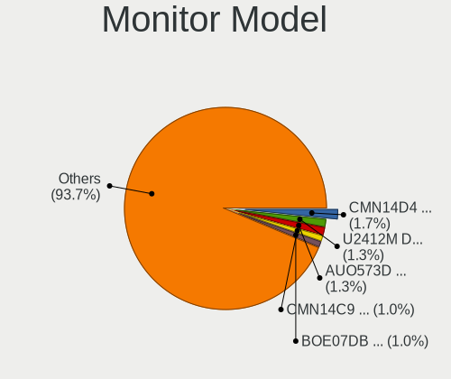

| Model                                                                     | Notebooks | Percent |
|---------------------------------------------------------------------------|-----------|---------|
| Chimei Innolux LCD Monitor CMN14D4 1920x1080 309x173mm 13.9-inch          | 5         | 1.9%    |
| Dell U2412M DELA07A 1920x1200 518x324mm 24.1-inch                         | 4         | 1.52%   |
| AU Optronics LCD Monitor AUO573D 1920x1080 309x174mm 14.0-inch            | 4         | 1.52%   |
| BOE LCD Monitor BOE07DB 1920x1080 309x174mm 14.0-inch                     | 3         | 1.14%   |
| AU Optronics LCD Monitor AUO22EC 1366x768 344x193mm 15.5-inch             | 3         | 1.14%   |
| Sony TV SNYDB01 1920x1080                                                 | 2         | 0.76%   |
| Sharp LCD Monitor SHP14D1 1920x1200 336x210mm 15.6-inch                   | 2         | 0.76%   |
| Sharp LCD Monitor SHP143B 3840x2160 346x194mm 15.6-inch                   | 2         | 0.76%   |
| Samsung Electronics LCD Monitor SEC3046 1366x768 344x193mm 15.5-inch      | 2         | 0.76%   |
| LG Display LCD Monitor LGD0685 1920x1080 309x174mm 14.0-inch              | 2         | 0.76%   |
| Lenovo LCD Monitor LEN40B1 1600x900 345x194mm 15.6-inch                   | 2         | 0.76%   |
| Goldstar LG ULTRAGEAR GSM5B80 2560x1440 600x340mm 27.2-inch               | 2         | 0.76%   |
| Dell P3421W DELA1A8 3440x1440 800x335mm 34.1-inch                         | 2         | 0.76%   |
| Chimei Innolux LCD Monitor CMN175C 1920x1080 381x214mm 17.2-inch          | 2         | 0.76%   |
| Chimei Innolux LCD Monitor CMN15E8 1920x1080 344x193mm 15.5-inch          | 2         | 0.76%   |
| Chimei Innolux LCD Monitor CMN15CA 1366x768 344x193mm 15.5-inch           | 2         | 0.76%   |
| Chimei Innolux LCD Monitor CMN15C6 1366x768 344x193mm 15.5-inch           | 2         | 0.76%   |
| Chimei Innolux LCD Monitor CMN14C9 1920x1080 309x173mm 13.9-inch          | 2         | 0.76%   |
| Chimei Innolux LCD Monitor CMN1239 1920x1080 276x155mm 12.5-inch          | 2         | 0.76%   |
| Chi Mei Optoelectronics LCD Monitor CMO1720 1920x1080 382x215mm 17.3-inch | 2         | 0.76%   |
| Chi Mei Optoelectronics LCD Monitor CMO15A3 1366x768 344x193mm 15.5-inch  | 2         | 0.76%   |
| Chi Mei Optoelectronics LCD Monitor CMO1592 1366x768 344x193mm 15.5-inch  | 2         | 0.76%   |
| Chi Mei Optoelectronics LCD Monitor CMO1467 1366x768 309x174mm 14.0-inch  | 2         | 0.76%   |
| BOE LCD Monitor BOE077A 1920x1080 294x165mm 13.3-inch                     | 2         | 0.76%   |
| AU Optronics LCD Monitor AUO36ED 1920x1080 344x193mm 15.5-inch            | 2         | 0.76%   |
| AU Optronics LCD Monitor AUO303E 1600x900 309x174mm 14.0-inch             | 2         | 0.76%   |
| AU Optronics LCD Monitor AUO21ED 1920x1080 344x193mm 15.5-inch            | 2         | 0.76%   |
| AU Optronics LCD Monitor AUO206C 1366x768 277x156mm 12.5-inch             | 2         | 0.76%   |
| AU Optronics LCD Monitor AUO133D 1920x1080 309x173mm 13.9-inch            | 2         | 0.76%   |
| AU Optronics LCD Monitor AUO106C 1366x768 277x156mm 12.5-inch             | 2         | 0.76%   |
| ViewSonic VP2030 SERIES VSC131C 1600x1200 408x306mm 20.1-inch             | 1         | 0.38%   |
| Vestel Elektronik 22W_LCD_TV VES3700 1920x540                             | 1         | 0.38%   |
| Valve ANX7530 U VLV3001 800x1280 100x150mm 7.1-inch                       | 1         | 0.38%   |
| Toshiba ScreenXpert TSB8888 1080x2160                                     | 1         | 0.38%   |
| Sun X7200A SUN0596 1600x1200 408x306mm 20.1-inch                          | 1         | 0.38%   |
| Sony TV SNY7001 1920x1080                                                 | 1         | 0.38%   |
| Sharp LQ133M1JW40 SHP10CD 1920x1080 294x165mm 13.3-inch                   | 1         | 0.38%   |
| Sharp LCD Monitor SHP149A 1920x1080 344x194mm 15.5-inch                   | 1         | 0.38%   |
| Sharp LCD Monitor SHP1476 3840x2160 346x194mm 15.6-inch                   | 1         | 0.38%   |
| Sharp LCD Monitor SHP143E 3840x2160 346x194mm 15.6-inch                   | 1         | 0.38%   |

Monitor Resolution
------------------

Monitor screen resolution

| Resolution         | Notebooks | Percent |
|--------------------|-----------|---------|
| 1920x1080 (FHD)    | 102       | 42.32%  |
| 1366x768 (WXGA)    | 50        | 20.75%  |
| 1600x900 (HD+)     | 16        | 6.64%   |
| 3840x2160 (4K)     | 15        | 6.22%   |
| 1920x1200 (WUXGA)  | 11        | 4.56%   |
| 1280x800 (WXGA)    | 11        | 4.56%   |
| 2560x1600          | 8         | 3.32%   |
| 2560x1440 (QHD)    | 5         | 2.07%   |
| 1680x1050 (WSXGA+) | 5         | 2.07%   |
| 3440x1440          | 4         | 1.66%   |
| 1440x900 (WXGA+)   | 4         | 1.66%   |
| 800x1280           | 2         | 0.83%   |
| 1600x1200          | 2         | 0.83%   |
| 1280x1024 (SXGA)   | 2         | 0.83%   |
| 3840x2400          | 1         | 0.41%   |
| 2880x1800          | 1         | 0.41%   |
| 2560x1080          | 1         | 0.41%   |
| 2256x1504          | 1         | 0.41%   |

Monitor Diagonal
----------------

Diagonal size in inches

| Inches  | Notebooks | Percent |
|---------|-----------|---------|
| 15      | 95        | 36.68%  |
| 14      | 36        | 13.9%   |
| 13      | 32        | 12.36%  |
| 24      | 18        | 6.95%   |
| 17      | 17        | 6.56%   |
| 12      | 8         | 3.09%   |
| 27      | 7         | 2.7%    |
| 34      | 5         | 1.93%   |
| 16      | 5         | 1.93%   |
| Unknown | 4         | 1.54%   |
| 72      | 3         | 1.16%   |
| 23      | 3         | 1.16%   |
| 22      | 3         | 1.16%   |
| 84      | 2         | 0.77%   |
| 40      | 2         | 0.77%   |
| 31      | 2         | 0.77%   |
| 21      | 2         | 0.77%   |
| 20      | 2         | 0.77%   |
| 86      | 1         | 0.39%   |
| 65      | 1         | 0.39%   |
| 54      | 1         | 0.39%   |
| 43      | 1         | 0.39%   |
| 38      | 1         | 0.39%   |
| 29      | 1         | 0.39%   |
| 19      | 1         | 0.39%   |
| 18      | 1         | 0.39%   |
| 11      | 1         | 0.39%   |
| 10      | 1         | 0.39%   |
| 9       | 1         | 0.39%   |
| 7       | 1         | 0.39%   |
| 3       | 1         | 0.39%   |

Monitor Width
-------------

Physical width

| Width in mm | Notebooks | Percent |
|-------------|-----------|---------|
| 301-350     | 148       | 57.59%  |
| 201-300     | 28        | 10.89%  |
| 501-600     | 27        | 10.51%  |
| 351-400     | 19        | 7.39%   |
| 401-500     | 8         | 3.11%   |
| 701-800     | 5         | 1.95%   |
| 1501-2000   | 5         | 1.95%   |
| 601-700     | 4         | 1.56%   |
| Unknown     | 4         | 1.56%   |
| 801-900     | 3         | 1.17%   |
| 1001-1500   | 3         | 1.17%   |
| 1-100       | 2         | 0.78%   |
| 901-1000    | 1         | 0.39%   |

Aspect Ratio
------------

Proportional relationship between the width and the height

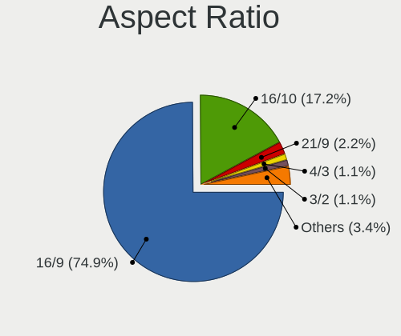

| Ratio   | Notebooks | Percent |
|---------|-----------|---------|
| 16/9    | 173       | 75.55%  |
| 16/10   | 38        | 16.59%  |
| 21/9    | 5         | 2.18%   |
| 3/2     | 3         | 1.31%   |
| Unknown | 3         | 1.31%   |
| 5/4     | 2         | 0.87%   |
| 4/3     | 2         | 0.87%   |
| 6/5     | 1         | 0.44%   |
| 0.67    | 1         | 0.44%   |
| 0.56    | 1         | 0.44%   |

Monitor Area
------------

Area in inch

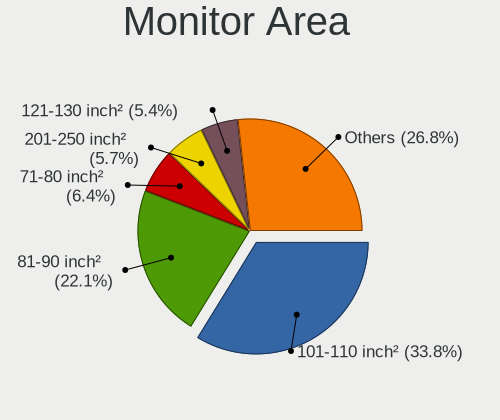

| Area in inch | Notebooks | Percent |
|----------------|-----------|---------|
| 101-110        | 92        | 35.66%  |
| 81-90          | 53        | 20.54%  |
| 201-250        | 16        | 6.2%    |
| 121-130        | 15        | 5.81%   |
| 71-80          | 14        | 5.43%   |
| 251-300        | 9         | 3.49%   |
| More than 1000 | 8         | 3.1%    |
| 61-70          | 8         | 3.1%    |
| 351-500        | 8         | 3.1%    |
| 111-120        | 8         | 3.1%    |
| 301-350        | 7         | 2.71%   |
| 501-1000       | 4         | 1.55%   |
| Unknown        | 4         | 1.55%   |
| 151-200        | 3         | 1.16%   |
| 41-50          | 2         | 0.78%   |
| 1-40           | 2         | 0.78%   |
| 141-150        | 2         | 0.78%   |
| 51-60          | 1         | 0.39%   |
| 131-140        | 1         | 0.39%   |
| 91-100         | 1         | 0.39%   |

Pixel Density
-------------

Pixels per inch

| Density       | Notebooks | Percent |
|---------------|-----------|---------|
| 121-160       | 104       | 40.78%  |
| 101-120       | 61        | 23.92%  |
| 51-100        | 47        | 18.43%  |
| 161-240       | 23        | 9.02%   |
| More than 240 | 10        | 3.92%   |
| 1-50          | 6         | 2.35%   |
| Unknown       | 4         | 1.57%   |

Multiple Monitors
-----------------

Total monitors connected

| Total | Notebooks | Percent |
|-------|-----------|---------|
| 1     | 156       | 72.9%   |
| 2     | 48        | 22.43%  |
| 3     | 8         | 3.74%   |
| 0     | 2         | 0.93%   |

Network
-------

Net Controller Vendor
---------------------

Controller vendors

| Vendor                            | Notebooks | Percent |
|-----------------------------------|-----------|---------|
| Intel                             | 123       | 36.61%  |
| Realtek Semiconductor             | 95        | 28.27%  |
| Qualcomm Atheros                  | 43        | 12.8%   |
| Broadcom                          | 20        | 5.95%   |
| MediaTek                          | 9         | 2.68%   |
| Ralink                            | 5         | 1.49%   |
| Sierra Wireless                   | 4         | 1.19%   |
| Lenovo                            | 4         | 1.19%   |
| FIBOCOM                           | 4         | 1.19%   |
| Ericsson Business Mobile Networks | 4         | 1.19%   |
| Broadcom Limited                  | 4         | 1.19%   |
| ASIX Electronics                  | 4         | 1.19%   |
| TP-Link                           | 3         | 0.89%   |
| Nvidia                            | 2         | 0.6%    |
| JMicron Technology                | 2         | 0.6%    |
| Huawei Technologies               | 2         | 0.6%    |
| Hewlett-Packard                   | 2         | 0.6%    |
| VIA Technologies                  | 1         | 0.3%    |
| Van Ooijen Technische Informatica | 1         | 0.3%    |
| OPPO Electronics                  | 1         | 0.3%    |
| Marvell Technology Group          | 1         | 0.3%    |
| DisplayLink                       | 1         | 0.3%    |
| ASUSTek Computer                  | 1         | 0.3%    |

Net Controller Model
--------------------

Controller models

| Model                                                                  | Notebooks | Percent |
|------------------------------------------------------------------------|-----------|---------|
| Realtek RTL8111/8168/8211/8411 PCI Express Gigabit Ethernet Controller | 53        | 12.65%  |
| Realtek RTL810xE PCI Express Fast Ethernet controller                  | 19        | 4.53%   |
| Intel Wireless 8265 / 8275                                             | 14        | 3.34%   |
| Intel Wireless 7260                                                    | 11        | 2.63%   |
| Intel Centrino Advanced-N 6205 [Taylor Peak]                           | 11        | 2.63%   |
| Realtek RTL8822CE 802.11ac PCIe Wireless Network Adapter               | 10        | 2.39%   |
| Intel Wi-Fi 6 AX200                                                    | 10        | 2.39%   |
| Intel 82579LM Gigabit Network Connection (Lewisville)                  | 10        | 2.39%   |
| Intel Wireless 7265                                                    | 9         | 2.15%   |
| Intel Ethernet Connection (4) I219-V                                   | 8         | 1.91%   |
| Realtek RTL8153 Gigabit Ethernet Adapter                               | 7         | 1.67%   |
| Qualcomm Atheros AR9285 Wireless Network Adapter (PCI-Express)         | 7         | 1.67%   |
| Qualcomm Atheros QCA9565 / AR9565 Wireless Network Adapter             | 6         | 1.43%   |
| Intel Wireless 8260                                                    | 6         | 1.43%   |
| Intel Ethernet Connection I217-LM                                      | 6         | 1.43%   |
| Intel Ethernet Connection (3) I218-LM                                  | 6         | 1.43%   |
| Intel Cannon Point-LP CNVi [Wireless-AC]                               | 6         | 1.43%   |
| Qualcomm Atheros AR9485 Wireless Network Adapter                       | 5         | 1.19%   |
| Qualcomm Atheros AR9462 Wireless Network Adapter                       | 5         | 1.19%   |
| MediaTek MT7921 802.11ax PCI Express Wireless Network Adapter          | 5         | 1.19%   |
| Qualcomm Atheros QCA9377 802.11ac Wireless Network Adapter             | 4         | 0.95%   |
| Intel Wireless 3160                                                    | 4         | 0.95%   |
| Intel Wi-Fi 6 AX201                                                    | 4         | 0.95%   |
| Intel Ethernet Connection (6) I219-V                                   | 4         | 0.95%   |
| Intel Ethernet Connection (4) I219-LM                                  | 4         | 0.95%   |
| Intel Comet Lake PCH CNVi WiFi                                         | 4         | 0.95%   |
| Intel 82566MM Gigabit Network Connection                               | 4         | 0.95%   |
| FIBOCOM L830-EB-00                                                     | 4         | 0.95%   |
| Broadcom BCM4313 802.11bgn Wireless Network Adapter                    | 4         | 0.95%   |
| Realtek RTL8852AE 802.11ax PCIe Wireless Network Adapter               | 3         | 0.72%   |
| Realtek RTL8723BE PCIe Wireless Network Adapter                        | 3         | 0.72%   |
| Ralink RT5390 Wireless 802.11n 1T/1R PCIe                              | 3         | 0.72%   |
| Qualcomm Atheros Killer E220x Gigabit Ethernet Controller              | 3         | 0.72%   |
| Qualcomm Atheros AR8161 Gigabit Ethernet                               | 3         | 0.72%   |
| Qualcomm Atheros AR8151 v2.0 Gigabit Ethernet                          | 3         | 0.72%   |
| MediaTek MT7922 802.11ax PCI Express Wireless Network Adapter          | 3         | 0.72%   |
| Intel Wireless 3165                                                    | 3         | 0.72%   |
| Intel PRO/Wireless 4965 AG or AGN [Kedron] Network Connection          | 3         | 0.72%   |
| Intel Ethernet Connection (2) I219-LM                                  | 3         | 0.72%   |
| Intel Dual Band Wireless-AC 3165 Plus Bluetooth                        | 3         | 0.72%   |

Wireless Vendor
---------------

Wireless vendors

| Vendor                | Notebooks | Percent |
|-----------------------|-----------|---------|
| Intel                 | 117       | 53.18%  |
| Qualcomm Atheros      | 32        | 14.55%  |
| Realtek Semiconductor | 26        | 11.82%  |
| Broadcom              | 17        | 7.73%   |
| MediaTek              | 9         | 4.09%   |
| Ralink                | 5         | 2.27%   |
| Sierra Wireless       | 4         | 1.82%   |
| FIBOCOM               | 4         | 1.82%   |
| Broadcom Limited      | 3         | 1.36%   |
| TP-Link               | 2         | 0.91%   |
| Hewlett-Packard       | 1         | 0.45%   |

Wireless Model
--------------

Wireless models

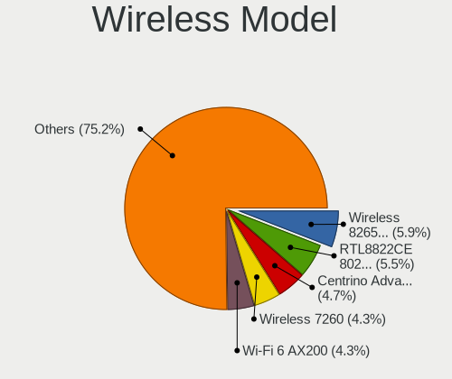

| Model                                                                   | Notebooks | Percent |
|-------------------------------------------------------------------------|-----------|---------|
| Intel Wireless 8265 / 8275                                              | 14        | 6.36%   |
| Intel Wireless 7260                                                     | 11        | 5%      |
| Intel Centrino Advanced-N 6205 [Taylor Peak]                            | 11        | 5%      |
| Realtek RTL8822CE 802.11ac PCIe Wireless Network Adapter                | 10        | 4.55%   |
| Intel Wi-Fi 6 AX200                                                     | 10        | 4.55%   |
| Intel Wireless 7265                                                     | 9         | 4.09%   |
| Qualcomm Atheros AR9285 Wireless Network Adapter (PCI-Express)          | 7         | 3.18%   |
| Qualcomm Atheros QCA9565 / AR9565 Wireless Network Adapter              | 6         | 2.73%   |
| Intel Wireless 8260                                                     | 6         | 2.73%   |
| Intel Cannon Point-LP CNVi [Wireless-AC]                                | 6         | 2.73%   |
| Qualcomm Atheros AR9485 Wireless Network Adapter                        | 5         | 2.27%   |
| Qualcomm Atheros AR9462 Wireless Network Adapter                        | 5         | 2.27%   |
| MediaTek MT7921 802.11ax PCI Express Wireless Network Adapter           | 5         | 2.27%   |
| Qualcomm Atheros QCA9377 802.11ac Wireless Network Adapter              | 4         | 1.82%   |
| Intel Wireless 3160                                                     | 4         | 1.82%   |
| Intel Wi-Fi 6 AX201                                                     | 4         | 1.82%   |
| Intel Comet Lake PCH CNVi WiFi                                          | 4         | 1.82%   |
| FIBOCOM L830-EB-00                                                      | 4         | 1.82%   |
| Broadcom BCM4313 802.11bgn Wireless Network Adapter                     | 4         | 1.82%   |
| Realtek RTL8852AE 802.11ax PCIe Wireless Network Adapter                | 3         | 1.36%   |
| Realtek RTL8723BE PCIe Wireless Network Adapter                         | 3         | 1.36%   |
| Ralink RT5390 Wireless 802.11n 1T/1R PCIe                               | 3         | 1.36%   |
| MediaTek MT7922 802.11ax PCI Express Wireless Network Adapter           | 3         | 1.36%   |
| Intel Wireless 3165                                                     | 3         | 1.36%   |
| Intel PRO/Wireless 4965 AG or AGN [Kedron] Network Connection           | 3         | 1.36%   |
| Intel Dual Band Wireless-AC 3165 Plus Bluetooth                         | 3         | 1.36%   |
| Intel Comet Lake PCH-LP CNVi WiFi                                       | 3         | 1.36%   |
| Intel Centrino Advanced-N 6235                                          | 3         | 1.36%   |
| Sierra Wireless Sierra Wireless EM7345 4G LTE                           | 2         | 0.91%   |
| Realtek RTL8822BE 802.11a/b/g/n/ac WiFi adapter                         | 2         | 0.91%   |
| Realtek RTL8188CE 802.11b/g/n WiFi Adapter                              | 2         | 0.91%   |
| Qualcomm Atheros QCA6174 802.11ac Wireless Network Adapter              | 2         | 0.91%   |
| Qualcomm Atheros AR242x / AR542x Wireless Network Adapter (PCI-Express) | 2         | 0.91%   |
| Intel Wi-Fi 6E(802.11ax) AX210/AX1675* 2x2 [Typhoon Peak]               | 2         | 0.91%   |
| Intel Tiger Lake PCH CNVi WiFi                                          | 2         | 0.91%   |
| Intel PRO/Wireless 3945ABG [Golan] Network Connection                   | 2         | 0.91%   |
| Intel Dual Band Wireless-AC 3168NGW [Stone Peak]                        | 2         | 0.91%   |
| Intel Centrino Wireless-N 1030 [Rainbow Peak]                           | 2         | 0.91%   |
| Intel Centrino Advanced-N 6200                                          | 2         | 0.91%   |
| Intel Cannon Lake PCH CNVi WiFi                                         | 2         | 0.91%   |

Ethernet Vendor
---------------

Ethernet vendors

| Vendor                   | Notebooks | Percent |
|--------------------------|-----------|---------|
| Realtek Semiconductor    | 82        | 43.62%  |
| Intel                    | 64        | 34.04%  |
| Qualcomm Atheros         | 18        | 9.57%   |
| Broadcom                 | 6         | 3.19%   |
| ASIX Electronics         | 4         | 2.13%   |
| Lenovo                   | 3         | 1.6%    |
| Nvidia                   | 2         | 1.06%   |
| JMicron Technology       | 2         | 1.06%   |
| VIA Technologies         | 1         | 0.53%   |
| TP-Link                  | 1         | 0.53%   |
| OPPO Electronics         | 1         | 0.53%   |
| Marvell Technology Group | 1         | 0.53%   |
| DisplayLink              | 1         | 0.53%   |
| Broadcom Limited         | 1         | 0.53%   |
| ASUSTek Computer         | 1         | 0.53%   |

Ethernet Model
--------------

Ethernet models

| Model                                                                  | Notebooks | Percent |
|------------------------------------------------------------------------|-----------|---------|
| Realtek RTL8111/8168/8211/8411 PCI Express Gigabit Ethernet Controller | 53        | 28.19%  |
| Realtek RTL810xE PCI Express Fast Ethernet controller                  | 19        | 10.11%  |
| Intel 82579LM Gigabit Network Connection (Lewisville)                  | 10        | 5.32%   |
| Intel Ethernet Connection (4) I219-V                                   | 8         | 4.26%   |
| Realtek RTL8153 Gigabit Ethernet Adapter                               | 7         | 3.72%   |
| Intel Ethernet Connection I217-LM                                      | 6         | 3.19%   |
| Intel Ethernet Connection (3) I218-LM                                  | 6         | 3.19%   |
| Intel Ethernet Connection (6) I219-V                                   | 4         | 2.13%   |
| Intel Ethernet Connection (4) I219-LM                                  | 4         | 2.13%   |
| Intel 82566MM Gigabit Network Connection                               | 4         | 2.13%   |
| Qualcomm Atheros Killer E220x Gigabit Ethernet Controller              | 3         | 1.6%    |
| Qualcomm Atheros AR8161 Gigabit Ethernet                               | 3         | 1.6%    |
| Qualcomm Atheros AR8151 v2.0 Gigabit Ethernet                          | 3         | 1.6%    |
| Intel Ethernet Connection (2) I219-LM                                  | 3         | 1.6%    |
| Intel 82577LM Gigabit Network Connection                               | 3         | 1.6%    |
| ASIX AX88179 Gigabit Ethernet                                          | 3         | 1.6%    |
| Qualcomm Atheros Killer E2500 Gigabit Ethernet Controller              | 2         | 1.06%   |
| Qualcomm Atheros Killer E2400 Gigabit Ethernet Controller              | 2         | 1.06%   |
| Qualcomm Atheros AR8121/AR8113/AR8114 Gigabit or Fast Ethernet         | 2         | 1.06%   |
| Nvidia MCP79 Ethernet                                                  | 2         | 1.06%   |
| Lenovo ThinkPad TBT3 LAN                                               | 2         | 1.06%   |
| Intel Ethernet Connection I218-LM                                      | 2         | 1.06%   |
| Intel Ethernet Connection I217-V                                       | 2         | 1.06%   |
| Broadcom NetXtreme BCM57765 Gigabit Ethernet PCIe                      | 2         | 1.06%   |
| VIA VT6102/VT6103 [Rhine-II]                                           | 1         | 0.53%   |
| TP-Link UE300 10/100/1000 LAN (ethernet mode) [Realtek RTL8153]        | 1         | 0.53%   |
| Realtek RTL8125 2.5GbE Controller                                      | 1         | 0.53%   |
| Realtek RTL-8100/8101L/8139 PCI Fast Ethernet Adapter                  | 1         | 0.53%   |
| Realtek Killer E2600 GbE Controller                                    | 1         | 0.53%   |
| Qualcomm Atheros QCA8171 Gigabit Ethernet                              | 1         | 0.53%   |
| Qualcomm Atheros AR8132 Fast Ethernet                                  | 1         | 0.53%   |
| Qualcomm Atheros AR8131 Gigabit Ethernet                               | 1         | 0.53%   |
| OPPO SM8350-MTP _SN:9338D66C                                           | 1         | 0.53%   |
| Marvell Group 88E8055 PCI-E Gigabit Ethernet Controller                | 1         | 0.53%   |
| Lenovo USB-C Dock Ethernet                                             | 1         | 0.53%   |
| JMicron JMC260 PCI Express Fast Ethernet Controller                    | 1         | 0.53%   |
| JMicron JMC250 PCI Express Gigabit Ethernet Controller                 | 1         | 0.53%   |
| Intel Ethernet Connection I219-LM                                      | 1         | 0.53%   |
| Intel Ethernet Connection I218-V                                       | 1         | 0.53%   |
| Intel Ethernet Connection (7) I219-LM                                  | 1         | 0.53%   |

Net Controller Kind
-------------------

Ethernet, WiFi or modem

| Kind     | Notebooks | Percent |
|----------|-----------|---------|
| WiFi     | 208       | 52.39%  |
| Ethernet | 178       | 44.84%  |
| Modem    | 11        | 2.77%   |

Used Controller
---------------

Currently used network controller

| Kind     | Notebooks | Percent |
|----------|-----------|---------|
| WiFi     | 168       | 75.34%  |
| Ethernet | 55        | 24.66%  |

NICs
----

Total network controllers on board

| Total | Notebooks | Percent |
|-------|-----------|---------|
| 2     | 166       | 79.43%  |
| 1     | 39        | 18.66%  |
| 3     | 2         | 0.96%   |
| 0     | 2         | 0.96%   |

IPv6
----

IPv6 vs IPv4

| Used | Notebooks | Percent |
|------|-----------|---------|
| No   | 182       | 84.65%  |
| Yes  | 33        | 15.35%  |

Bluetooth
---------

Bluetooth Vendor
----------------

Controller vendors

| Vendor                          | Notebooks | Percent |
|---------------------------------|-----------|---------|
| Intel                           | 86        | 51.19%  |
| Qualcomm Atheros Communications | 14        | 8.33%   |
| Broadcom                        | 13        | 7.74%   |
| IMC Networks                    | 12        | 7.14%   |
| Realtek Semiconductor           | 11        | 6.55%   |
| Foxconn / Hon Hai               | 6         | 3.57%   |
| Apple                           | 6         | 3.57%   |
| Cambridge Silicon Radio         | 5         | 2.98%   |
| Realtek                         | 4         | 2.38%   |
| Hewlett-Packard                 | 4         | 2.38%   |
| Dell                            | 2         | 1.19%   |
| Toshiba                         | 1         | 0.6%    |
| Ralink                          | 1         | 0.6%    |
| MediaTek                        | 1         | 0.6%    |
| Lite-On Technology              | 1         | 0.6%    |
| Askey Computer                  | 1         | 0.6%    |

Bluetooth Model
---------------

Controller models

| Model                                               | Notebooks | Percent |
|-----------------------------------------------------|-----------|---------|
| Intel Bluetooth wireless interface                  | 27        | 16.07%  |
| Intel Bluetooth Device                              | 17        | 10.12%  |
| Intel AX201 Bluetooth                               | 14        | 8.33%   |
| Intel AX200 Bluetooth                               | 8         | 4.76%   |
| Qualcomm Atheros AR3012 Bluetooth 4.0               | 7         | 4.17%   |
| Intel Bluetooth 9460/9560 Jefferson Peak (JfP)      | 7         | 4.17%   |
| Realtek Bluetooth Radio                             | 5         | 2.98%   |
| IMC Networks Bluetooth Device                       | 5         | 2.98%   |
| Cambridge Silicon Radio Bluetooth Dongle (HCI mode) | 5         | 2.98%   |
| Realtek Bluetooth Radio                             | 4         | 2.38%   |
| IMC Networks Bluetooth Radio                        | 4         | 2.38%   |
| Foxconn / Hon Hai MediaTek Bluetooth Adapter        | 4         | 2.38%   |
| Apple Bluetooth Host Controller                     | 4         | 2.38%   |
| Realtek 802.11ac WLAN Adapter                       | 3         | 1.79%   |
| Qualcomm Atheros  Bluetooth Device                  | 3         | 1.79%   |
| Qualcomm Atheros AR3011 Bluetooth                   | 3         | 1.79%   |
| Intel Centrino Bluetooth Wireless Transceiver       | 3         | 1.79%   |
| Intel AX210 Bluetooth                               | 3         | 1.79%   |
| HP Broadcom 2070 Bluetooth Combo                    | 3         | 1.79%   |
| Broadcom BCM2045B (BDC-2) [Bluetooth Controller]    | 3         | 1.79%   |
| Realtek RTL8723B Bluetooth                          | 2         | 1.19%   |
| Intel Wireless-AC 3168 Bluetooth                    | 2         | 1.19%   |
| Intel Centrino Advanced-N 6230 Bluetooth adapter    | 2         | 1.19%   |
| Intel AX211 Bluetooth                               | 2         | 1.19%   |
| Foxconn / Hon Hai Wireless_Device                   | 2         | 1.19%   |
| Broadcom HP Portable SoftSailing                    | 2         | 1.19%   |
| Broadcom BCM43142 Bluetooth 4.0                     | 2         | 1.19%   |
| Broadcom BCM2045B (BDC-2.1)                         | 2         | 1.19%   |
| Broadcom BCM2045 Bluetooth                          | 2         | 1.19%   |
| Apple Bluetooth USB Host Controller                 | 2         | 1.19%   |
| Toshiba Bluetooth USB Host Controller               | 1         | 0.6%    |
| Realtek  Bluetooth 4.2 Adapter                      | 1         | 0.6%    |
| Ralink RT3290 Bluetooth                             | 1         | 0.6%    |
| Qualcomm Atheros AR3012 Bluetooth                   | 1         | 0.6%    |
| MediaTek Wireless_Device                            | 1         | 0.6%    |
| Lite-On Bluetooth Device                            | 1         | 0.6%    |
| Intel Wireless-AC 9260 Bluetooth Adapter            | 1         | 0.6%    |
| IMC Networks Wireless_Device                        | 1         | 0.6%    |
| IMC Networks BCM20702A0                             | 1         | 0.6%    |
| IMC Networks Atheros AR3012 Bluetooth 4.0 Adapter   | 1         | 0.6%    |

Sound
-----

Sound Vendor
------------

Sound card vendors

| Vendor                | Notebooks | Percent |
|-----------------------|-----------|---------|
| Intel                 | 165       | 63.71%  |
| AMD                   | 44        | 16.99%  |
| Nvidia                | 31        | 11.97%  |
| Lenovo                | 5         | 1.93%   |
| Realtek Semiconductor | 2         | 0.77%   |
| Logitech              | 2         | 0.77%   |
| VIA Technologies      | 1         | 0.39%   |
| Texas Instruments     | 1         | 0.39%   |
| TerraTec Electronic   | 1         | 0.39%   |
| Sony                  | 1         | 0.39%   |
| Roland                | 1         | 0.39%   |
| Micronas              | 1         | 0.39%   |
| Mark of the Unicorn   | 1         | 0.39%   |
| JMTek                 | 1         | 0.39%   |
| GN Netcom             | 1         | 0.39%   |
| C-Media Electronics   | 1         | 0.39%   |

Sound Model
-----------

Sound card models

| Model                                                                      | Notebooks | Percent |
|----------------------------------------------------------------------------|-----------|---------|
| AMD Family 17h/19h HD Audio Controller                                     | 28        | 8.75%   |
| Intel Sunrise Point-LP HD Audio                                            | 22        | 6.88%   |
| Intel 7 Series/C216 Chipset Family High Definition Audio Controller        | 18        | 5.63%   |
| Intel 8 Series/C220 Series Chipset High Definition Audio Controller        | 17        | 5.31%   |
| Intel 6 Series/C200 Series Chipset Family High Definition Audio Controller | 16        | 5%      |
| Intel Xeon E3-1200 v3/4th Gen Core Processor HD Audio Controller           | 13        | 4.06%   |
| AMD Renoir Radeon High Definition Audio Controller                         | 13        | 4.06%   |
| Intel Wildcat Point-LP High Definition Audio Controller                    | 10        | 3.13%   |
| Intel Haswell-ULT HD Audio Controller                                      | 10        | 3.13%   |
| Intel Broadwell-U Audio Controller                                         | 10        | 3.13%   |
| Intel 8 Series HD Audio Controller                                         | 10        | 3.13%   |
| Intel 5 Series/3400 Series Chipset High Definition Audio                   | 8         | 2.5%    |
| Intel Tiger Lake-LP Smart Sound Technology Audio Controller                | 6         | 1.88%   |
| Intel Cannon Point-LP High Definition Audio Controller                     | 6         | 1.88%   |
| Intel Cannon Lake PCH cAVS                                                 | 6         | 1.88%   |
| Intel 82801H (ICH8 Family) HD Audio Controller                             | 6         | 1.88%   |
| Intel 100 Series/C230 Series Chipset Family HD Audio Controller            | 6         | 1.88%   |
| AMD Rembrandt Radeon High Definition Audio Controller                      | 6         | 1.88%   |
| Intel CM238 HD Audio Controller                                            | 5         | 1.56%   |
| AMD Raven/Raven2/Fenghuang HDMI/DP Audio Controller                        | 5         | 1.56%   |
| Nvidia TU106 High Definition Audio Controller                              | 4         | 1.25%   |
| Intel Comet Lake PCH cAVS                                                  | 4         | 1.25%   |
| Intel Celeron/Pentium Silver Processor High Definition Audio               | 4         | 1.25%   |
| Intel 82801I (ICH9 Family) HD Audio Controller                             | 4         | 1.25%   |
| AMD SBx00 Azalia (Intel HDA)                                               | 4         | 1.25%   |
| AMD FCH Azalia Controller                                                  | 4         | 1.25%   |
| Nvidia GF108 High Definition Audio Controller                              | 3         | 0.94%   |
| Nvidia GA106 High Definition Audio Controller                              | 3         | 0.94%   |
| Intel NM10/ICH7 Family High Definition Audio Controller                    | 3         | 0.94%   |
| Intel Comet Lake PCH-LP cAVS                                               | 3         | 0.94%   |
| Realtek Semiconductor USB Audio                                            | 2         | 0.63%   |
| Nvidia TU107 GeForce GTX 1650 High Definition Audio Controller             | 2         | 0.63%   |
| Nvidia MCP79 High Definition Audio                                         | 2         | 0.63%   |
| Nvidia GP107GL High Definition Audio Controller                            | 2         | 0.63%   |
| Nvidia GM107 High Definition Audio Controller [GeForce 940MX]              | 2         | 0.63%   |
| Nvidia GK104 HDMI Audio Controller                                         | 2         | 0.63%   |
| Nvidia Audio device                                                        | 2         | 0.63%   |
| Lenovo ThinkPad Thunderbolt 3 Dock Audio                                   | 2         | 0.63%   |
| Intel Tiger Lake-H HD Audio Controller                                     | 2         | 0.63%   |
| Intel Atom Processor Z36xxx/Z37xxx Series High Definition Audio Controller | 2         | 0.63%   |

Memory
------

Memory Vendor
-------------

Memory module vendors

| Vendor              | Notebooks | Percent |
|---------------------|-----------|---------|
| Samsung Electronics | 51        | 34.69%  |
| SK hynix            | 35        | 23.81%  |
| Micron Technology   | 21        | 14.29%  |
| Kingston            | 13        | 8.84%   |
| Crucial             | 6         | 4.08%   |
| Unknown             | 4         | 2.72%   |
| Ramaxel Technology  | 3         | 2.04%   |
| Nanya Technology    | 3         | 2.04%   |
| Unknown (ABCD)      | 2         | 1.36%   |
| G.Skill             | 2         | 1.36%   |
| ASint Technology    | 2         | 1.36%   |
| A-DATA Technology   | 2         | 1.36%   |
| Unifosa             | 1         | 0.68%   |
| Qimonda             | 1         | 0.68%   |
| Elpida              | 1         | 0.68%   |

Memory Model
------------

Memory module models

| Model                                                            | Notebooks | Percent |
|------------------------------------------------------------------|-----------|---------|
| Samsung RAM M471B5173QH0-YK0 4GB SODIMM DDR3 1600MT/s            | 5         | 3.16%   |
| Samsung RAM M471B1G73QH0-YK0 8GB SODIMM DDR3 1600MT/s            | 4         | 2.53%   |
| Samsung RAM M471A1K43BB1-CTD 8GB SODIMM DDR4 2667MT/s            | 4         | 2.53%   |
| SK hynix RAM HMT351S6CFR8C-PB 4GB SODIMM DDR3 1600MT/s           | 3         | 1.9%    |
| Unknown (ABCD) RAM 123456789012345678 2GB SODIMM LPDDR4 2400MT/s | 2         | 1.27%   |
| SK hynix RAM HMT451S6BFR8A-PB 4GB SODIMM DDR3 1600MT/s           | 2         | 1.27%   |
| SK hynix RAM HMT41GS6BFR8A-PB 8GB SODIMM DDR3 1600MT/s           | 2         | 1.27%   |
| SK hynix RAM HMA82GS6AFR8N-UH 16GB SODIMM DDR4 2667MT/s          | 2         | 1.27%   |
| SK hynix RAM HMA81GS6JJR8N-VK 8GB SODIMM DDR4 2667MT/s           | 2         | 1.27%   |
| SK hynix RAM HMA81GS6AFR8N-UH 8GB SODIMM DDR4 2667MT/s           | 2         | 1.27%   |
| Samsung RAM M471B5673FH0-CF8 2GB SODIMM DDR3 1067MT/s            | 2         | 1.27%   |
| Samsung RAM M471B5273DH0-CK0 4096MB SODIMM DDR3 1600MT/s         | 2         | 1.27%   |
| Samsung RAM M471B5273CH0-CH9 4GB SODIMM DDR3 1334MT/s            | 2         | 1.27%   |
| Samsung RAM M471B1G73EB0-YK0 8GB SODIMM DDR3 1600MT/s            | 2         | 1.27%   |
| Samsung RAM M471B1G73BH0-YK0 8GB SODIMM DDR3 1600MT/s            | 2         | 1.27%   |
| Samsung RAM M471A5244CB0-CTD 4GB SODIMM DDR4 3266MT/s            | 2         | 1.27%   |
| Samsung RAM M471A2K43DB1-CWE 16GB SODIMM DDR4 3200MT/s           | 2         | 1.27%   |
| Samsung RAM M471A2G44AM0-CWE 16GB SODIMM DDR4 3200MT/s           | 2         | 1.27%   |
| Samsung RAM M471A1K43DB1-CWE 8GB SODIMM DDR4 3200MT/s            | 2         | 1.27%   |
| Samsung RAM M471A1K43CB1-CTD 8GB SODIMM DDR4 2667MT/s            | 2         | 1.27%   |
| Samsung RAM M471A1K43CB1-CRC 8GB SODIMM DDR4 2667MT/s            | 2         | 1.27%   |
| Samsung RAM M471A1K43BB1-CRC 8192MB SODIMM DDR4 2667MT/s         | 2         | 1.27%   |
| Samsung RAM M471A1G44AB0-CTD 8GB SODIMM DDR4 2667MT/s            | 2         | 1.27%   |
| Nanya RAM NT4GC64B8HB0NS-CG 4GB SODIMM DDR3 1334MT/s             | 2         | 1.27%   |
| Kingston RAM 9905744-035.A00G 16GB SODIMM DDR4 3200MT/s          | 2         | 1.27%   |
| Crucial RAM CT102464BF160B.C16 8GB SODIMM DDR3 1600MT/s          | 2         | 1.27%   |
| Unknown RAM Module 512MB SODIMM DDR2                             | 1         | 0.63%   |
| Unknown RAM Module 4GB SODIMM DDR3 1333MT/s                      | 1         | 0.63%   |
| Unknown RAM Module 2GB SODIMM DDR2 667MT/s                       | 1         | 0.63%   |
| Unknown RAM Module 2048MB SODIMM DDR2 667MT/s                    | 1         | 0.63%   |
| Unknown RAM Module 2048MB SODIMM DDR2                            | 1         | 0.63%   |
| Unifosa RAM GU332G0AJEPR8H2L.. 2GB SODIMM DDR2 667MT/s           | 1         | 0.63%   |
| SK hynix RAM Module 8192MB SODIMM DDR4 2667MT/s                  | 1         | 0.63%   |
| SK hynix RAM Module 4GB SODIMM DDR3 1067MT/s                     | 1         | 0.63%   |
| SK hynix RAM Module 2GB SODIMM DDR3 1600MT/s                     | 1         | 0.63%   |
| SK hynix RAM Module 2GB SODIMM DDR3 1067MT/s                     | 1         | 0.63%   |
| SK hynix RAM HYMP512S64CP8-Y5 1GB SODIMM DDR 667MT/s             | 1         | 0.63%   |
| SK hynix RAM HYMP125S64CP8-S6 2GB SODIMM DDR2 975MT/s            | 1         | 0.63%   |
| SK hynix RAM HMT451S6AFR8A-PB 4GB SODIMM DDR3 1600MT/s           | 1         | 0.63%   |
| SK hynix RAM HMT351S6EFR8C-PB 4096MB SODIMM DDR3 1600MT/s        | 1         | 0.63%   |

Memory Kind
-----------

Memory module kinds

| Kind   | Notebooks | Percent |
|--------|-----------|---------|
| DDR4   | 51        | 43.59%  |
| DDR3   | 45        | 38.46%  |
| DDR2   | 7         | 5.98%   |
| LPDDR4 | 6         | 5.13%   |
| DDR5   | 3         | 2.56%   |
| LPDDR5 | 2         | 1.71%   |
| SDRAM  | 1         | 0.85%   |
| LPDDR3 | 1         | 0.85%   |
| DDR    | 1         | 0.85%   |

Memory Form Factor
------------------

Physical design of the memory module

| Name         | Notebooks | Percent |
|--------------|-----------|---------|
| SODIMM       | 110       | 94.83%  |
| Row Of Chips | 5         | 4.31%   |
| DIMM         | 1         | 0.86%   |

Memory Size
-----------

Memory module size

| Size  | Notebooks | Percent |
|-------|-----------|---------|
| 8192  | 51        | 38.64%  |
| 4096  | 37        | 28.03%  |
| 16384 | 22        | 16.67%  |
| 2048  | 14        | 10.61%  |
| 1024  | 5         | 3.79%   |
| 32768 | 2         | 1.52%   |
| 512   | 1         | 0.76%   |

Memory Speed
------------

Memory module speed

| Speed   | Notebooks | Percent |
|---------|-----------|---------|
| 2667    | 31        | 23.31%  |
| 1600    | 30        | 22.56%  |
| 3200    | 17        | 12.78%  |
| 1333    | 11        | 8.27%   |
| 2400    | 8         | 6.02%   |
| 1334    | 8         | 6.02%   |
| 2133    | 4         | 3.01%   |
| 1067    | 4         | 3.01%   |
| 667     | 4         | 3.01%   |
| 5600    | 3         | 2.26%   |
| 4267    | 3         | 2.26%   |
| 6400    | 2         | 1.5%    |
| 3266    | 2         | 1.5%    |
| 4266    | 1         | 0.75%   |
| 4199    | 1         | 0.75%   |
| 975     | 1         | 0.75%   |
| 800     | 1         | 0.75%   |
| 400     | 1         | 0.75%   |
| Unknown | 1         | 0.75%   |

Printers & scanners
-------------------

Printer Vendor
--------------

Printer device vendors

| Vendor                          | Notebooks | Percent |
|---------------------------------|-----------|---------|
| Samsung Electronics             | 1         | 25%     |
| QinHeng Electronics             | 1         | 25%     |
| cab Produkttechnik GmbH & Co KG | 1         | 25%     |
| Brother Industries              | 1         | 25%     |

Printer Model
-------------

Printer device models

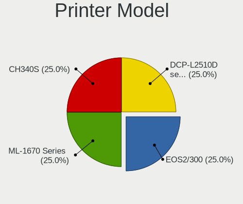

| Model                                    | Notebooks | Percent |
|------------------------------------------|-----------|---------|
| Samsung ML-1670 Series                   | 1         | 25%     |
| QinHeng CH340S                           | 1         | 25%     |
| cab Produkttechnik GmbH & Co KG EOS2/300 | 1         | 25%     |
| Brother DCP-L2510D series                | 1         | 25%     |

Scanner Vendor
--------------

Scanner device vendors

| Vendor      | Notebooks | Percent |
|-------------|-----------|---------|
| Seiko Epson | 1         | 100%    |

Scanner Model
-------------

Scanner device models

| Model                                               | Notebooks | Percent |
|-----------------------------------------------------|-----------|---------|
| Seiko Epson GT-F520/GT-F570 [Perfection 3590 PHOTO] | 1         | 100%    |

Camera
------

Camera Vendor
-------------

Camera device vendors

| Vendor                                 | Notebooks | Percent |
|----------------------------------------|-----------|---------|
| Chicony Electronics                    | 47        | 25.68%  |
| Microdia                               | 18        | 9.84%   |
| IMC Networks                           | 18        | 9.84%   |
| Sunplus Innovation Technology          | 14        | 7.65%   |
| Realtek Semiconductor                  | 14        | 7.65%   |
| Bison Electronics                      | 11        | 6.01%   |
| Lite-On Technology                     | 8         | 4.37%   |
| Silicon Motion                         | 6         | 3.28%   |
| Luxvisions Innotech Limited            | 6         | 3.28%   |
| Cheng Uei Precision Industry (Foxlink) | 6         | 3.28%   |
| Acer                                   | 6         | 3.28%   |
| Suyin                                  | 5         | 2.73%   |
| Syntek                                 | 4         | 2.19%   |
| Quanta                                 | 4         | 2.19%   |
| Apple                                  | 4         | 2.19%   |
| Logitech                               | 3         | 1.64%   |
| Sonix Technology                       | 2         | 1.09%   |
| Xiaomi                                 | 1         | 0.55%   |
| Tripath Technology                     | 1         | 0.55%   |
| LG Electronics                         | 1         | 0.55%   |
| Lenovo                                 | 1         | 0.55%   |
| Importek                               | 1         | 0.55%   |
| Huddly                                 | 1         | 0.55%   |
| Alcor Micro                            | 1         | 0.55%   |

Camera Model
------------

Camera device models

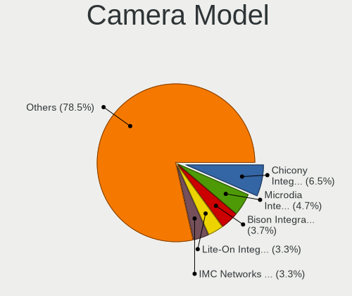

| Model                                                   | Notebooks | Percent |
|---------------------------------------------------------|-----------|---------|
| Chicony Integrated Camera                               | 12        | 6.49%   |
| Microdia Integrated_Webcam_HD                           | 10        | 5.41%   |
| Lite-On Integrated Camera                               | 6         | 3.24%   |
| IMC Networks Integrated Camera                          | 5         | 2.7%    |
| Bison Integrated Camera                                 | 5         | 2.7%    |
| Realtek USB Camera                                      | 4         | 2.16%   |
| Sunplus Integrated_Webcam_HD                            | 3         | 1.62%   |
| IMC Networks USB2.0 VGA UVC WebCam                      | 3         | 1.62%   |
| IMC Networks USB2.0 HD UVC WebCam                       | 3         | 1.62%   |
| Chicony ThinkPad T490 Webcam                            | 3         | 1.62%   |
| Chicony Lenovo Integrated Camera (0.3MP)                | 3         | 1.62%   |
| Chicony Integrated HP HD Webcam                         | 3         | 1.62%   |
| Chicony HP HD Webcam                                    | 3         | 1.62%   |
| Chicony FJ Camera                                       | 3         | 1.62%   |
| Syntek Integrated Camera                                | 2         | 1.08%   |
| Sunplus Asus Webcam                                     | 2         | 1.08%   |
| Sonix USB2.0 FHD UVC WebCam                             | 2         | 1.08%   |
| Silicon Motion Webcam SC-13HDL11624N [Namuga Co., Ltd.] | 2         | 1.08%   |
| Realtek USB2.0 HD UVC WebCam                            | 2         | 1.08%   |
| Realtek Lenovo EasyCamera                               | 2         | 1.08%   |
| Realtek Integrated_Webcam_HD                            | 2         | 1.08%   |
| Quanta HP HD Camera                                     | 2         | 1.08%   |
| Microdia Laptop_Integrated_Webcam_HD                    | 2         | 1.08%   |
| Luxvisions Innotech Limited Integrated RGB Camera       | 2         | 1.08%   |
| Luxvisions Innotech Limited Integrated Camera           | 2         | 1.08%   |
| Luxvisions Innotech Limited HP TrueVision HD Camera     | 2         | 1.08%   |
| Chicony USB2.0 VGA UVC WebCam                           | 2         | 1.08%   |
| Chicony Integrated Camera (1280x720@30)                 | 2         | 1.08%   |
| Chicony HP Wide Vision HD Camera                        | 2         | 1.08%   |
| Chicony HD Webcam                                       | 2         | 1.08%   |
| Chicony HD User Facing                                  | 2         | 1.08%   |
| Bison SunplusIT Integrated Camera                       | 2         | 1.08%   |
| Apple FaceTime HD Camera                                | 2         | 1.08%   |
| Apple Built-in iSight                                   | 2         | 1.08%   |
| Acer Integrated Camera                                  | 2         | 1.08%   |
| Xiaomi Mi 9T                                            | 1         | 0.54%   |
| Tripath USB Camera                                      | 1         | 0.54%   |
| Syntek USB2.0 UVC PC Camera                             | 1         | 0.54%   |
| Syntek Lenovo EasyCamera                                | 1         | 0.54%   |
| Suyin USB Webcam                                        | 1         | 0.54%   |

Security
--------

Fingerprint Vendor
------------------

Fingerprint sensor vendors

| Vendor                             | Notebooks | Percent |
|------------------------------------|-----------|---------|
| Validity Sensors                   | 23        | 43.4%   |
| Synaptics                          | 14        | 26.42%  |
| Upek                               | 4         | 7.55%   |
| STMicroelectronics                 | 4         | 7.55%   |
| Shenzhen Goodix Technology         | 4         | 7.55%   |
| Realtek USB2.0 Finger Print Bridge | 1         | 1.89%   |
| LighTuning Technology              | 1         | 1.89%   |
| Elan Microelectronics              | 1         | 1.89%   |
| AuthenTec                          | 1         | 1.89%   |

Fingerprint Model
-----------------

Fingerprint sensor models

| Model                                                           | Notebooks | Percent |
|-----------------------------------------------------------------|-----------|---------|
| Synaptics Prometheus MIS Touch Fingerprint Reader               | 8         | 15.09%  |
| Validity Sensors VFS495 Fingerprint Reader                      | 6         | 11.32%  |
| Validity Sensors VFS 5011 fingerprint sensor                    | 5         | 9.43%   |
| Synaptics Metallica MIS Touch Fingerprint Reader                | 5         | 9.43%   |
| Upek Biometric Touchchip/Touchstrip Fingerprint Sensor          | 4         | 7.55%   |
| STMicroelectronics Fingerprint Reader                           | 4         | 7.55%   |
| Validity Sensors VFS7500 Touch Fingerprint Sensor               | 3         | 5.66%   |
| Validity Sensors VFS471 Fingerprint Reader                      | 3         | 5.66%   |
| Validity Sensors VFS5011 Fingerprint Reader                     | 2         | 3.77%   |
| Shenzhen Goodix  FingerPrint Device                             | 2         | 3.77%   |
| Shenzhen Goodix FingerPrint                                     | 2         | 3.77%   |
| Validity Sensors VFS491                                         | 1         | 1.89%   |
| Validity Sensors VFS300 Fingerprint Reader                      | 1         | 1.89%   |
| Validity Sensors VFS101 Fingerprint Reader                      | 1         | 1.89%   |
| Validity Sensors Fingerprint scanner                            | 1         | 1.89%   |
| Synaptics WBDI                                                  | 1         | 1.89%   |
| Realtek USB2.0 Finger Print Bridge FocalTech Fingerprint Device | 1         | 1.89%   |
| LighTuning ES603 Swipe Fingerprint Sensor                       | 1         | 1.89%   |
| Elan ELAN:Fingerprint                                           | 1         | 1.89%   |
| AuthenTec AES2550 Fingerprint Sensor                            | 1         | 1.89%   |

Chipcard Vendor
---------------

Chipcard module vendors

| Vendor                | Notebooks | Percent |
|-----------------------|-----------|---------|
| Alcor Micro           | 29        | 60.42%  |
| OmniKey               | 6         | 12.5%   |
| Broadcom              | 6         | 12.5%   |
| Lenovo                | 3         | 6.25%   |
| Gemalto (was Gemplus) | 3         | 6.25%   |
| O2 Micro              | 1         | 2.08%   |

Chipcard Model
--------------

Chipcard module models

| Model                                                                        | Notebooks | Percent |
|------------------------------------------------------------------------------|-----------|---------|
| Alcor Micro AU9540 Smartcard Reader                                          | 29        | 60.42%  |
| OmniKey CardMan 4321                                                         | 3         | 6.25%   |
| OmniKey CardMan 1021                                                         | 3         | 6.25%   |
| Lenovo Integrated Smart Card Reader                                          | 3         | 6.25%   |
| Broadcom 58200                                                               | 3         | 6.25%   |
| Gemalto (was Gemplus) GemPC Twin SmartCard Reader                            | 2         | 4.17%   |
| Broadcom BCM5880 Secure Applications Processor with fingerprint swipe sensor | 2         | 4.17%   |
| O2 Micro OZ776 CCID Smartcard Reader                                         | 1         | 2.08%   |
| Gemalto (was Gemplus) Compact Smart Card Reader Writer                       | 1         | 2.08%   |
| Broadcom 5880                                                                | 1         | 2.08%   |

Unsupported
-----------

Unsupported Devices
-------------------

Total unsupported devices on board

| Total | Notebooks | Percent |
|-------|-----------|---------|
| 0     | 114       | 53.77%  |
| 1     | 69        | 32.55%  |
| 2     | 25        | 11.79%  |
| 3     | 3         | 1.42%   |
| 4     | 1         | 0.47%   |

Unsupported Device Types
------------------------

Types of unsupported devices

| Type                     | Notebooks | Percent |
|--------------------------|-----------|---------|
| Fingerprint reader       | 53        | 41.73%  |
| Graphics card            | 28        | 22.05%  |
| Chipcard                 | 26        | 20.47%  |
| Camera                   | 5         | 3.94%   |
| Net/wireless             | 4         | 3.15%   |
| Multimedia controller    | 4         | 3.15%   |
| Card reader              | 2         | 1.57%   |
| Storage                  | 1         | 0.79%   |
| Net/ethernet             | 1         | 0.79%   |
| Modem                    | 1         | 0.79%   |
| Communication controller | 1         | 0.79%   |
| Bluetooth                | 1         | 0.79%   |

