Linux in Finland - Tested Hardware & Statistics
-----------------------------------------------

A project to collect tested hardware configurations for Linux in Finland.

Anyone can contribute to this report by the [hw-probe](https://github.com/linuxhw/hw-probe) tool:

    sudo -E hw-probe -all -upload

Please contribute! Especially if your hardware is rare.

This is a report for all computer types. See also reports for [desktops](/Location/Finland/Desktop/README.md) and [notebooks](/Location/Finland/Notebook/README.md).

Contents
--------

* [ Test Cases ](#test-cases)

* [ System ](#system)
  - [ OS                       ](#os)
  - [ OS Family                ](#os-family)
  - [ Kernel                   ](#kernel)
  - [ Kernel Family            ](#kernel-family)
  - [ Kernel Major Ver.        ](#kernel-major-ver)
  - [ Arch                     ](#arch)
  - [ DE                       ](#de)
  - [ Display Server           ](#display-server)
  - [ Display Manager          ](#display-manager)
  - [ OS Lang                  ](#os-lang)
  - [ Boot Mode                ](#boot-mode)
  - [ Filesystem               ](#filesystem)
  - [ Part. scheme             ](#part-scheme)
  - [ Dual Boot with Linux/BSD ](#dual-boot-with-linuxbsd)
  - [ Dual Boot (Win)          ](#dual-boot-win)

* [ Board ](#board)
  - [ Vendor                   ](#vendor)
  - [ Model                    ](#model)
  - [ Model Family             ](#model-family)
  - [ MFG Year                 ](#mfg-year)
  - [ Form Factor              ](#form-factor)
  - [ Secure Boot              ](#secure-boot)
  - [ Coreboot                 ](#coreboot)
  - [ RAM Size                 ](#ram-size)
  - [ RAM Used                 ](#ram-used)
  - [ Total Drives             ](#total-drives)
  - [ Has CD-ROM               ](#has-cd-rom)
  - [ Has Ethernet             ](#has-ethernet)
  - [ Has WiFi                 ](#has-wifi)
  - [ Has Bluetooth            ](#has-bluetooth)

* [ Location ](#location)
  - [ Country                  ](#country)
  - [ City                     ](#city)

* [ Drives ](#drives)
  - [ Drive Vendor             ](#drive-vendor)
  - [ Drive Model              ](#drive-model)
  - [ HDD Vendor               ](#hdd-vendor)
  - [ SSD Vendor               ](#ssd-vendor)
  - [ Drive Kind               ](#drive-kind)
  - [ Drive Connector          ](#drive-connector)
  - [ Drive Size               ](#drive-size)
  - [ Space Total              ](#space-total)
  - [ Space Used               ](#space-used)
  - [ Malfunc. Drives          ](#malfunc-drives)
  - [ Malfunc. Drive Vendor    ](#malfunc-drive-vendor)
  - [ Malfunc. HDD Vendor      ](#malfunc-hdd-vendor)
  - [ Malfunc. Drive Kind      ](#malfunc-drive-kind)
  - [ Failed Drives            ](#failed-drives)
  - [ Failed Drive Vendor      ](#failed-drive-vendor)
  - [ Drive Status             ](#drive-status)

* [ Storage controller ](#storage-controller)
  - [ Storage Vendor           ](#storage-vendor)
  - [ Storage Model            ](#storage-model)
  - [ Storage Kind             ](#storage-kind)

* [ Processor ](#processor)
  - [ CPU Vendor               ](#cpu-vendor)
  - [ CPU Model                ](#cpu-model)
  - [ CPU Model Family         ](#cpu-model-family)
  - [ CPU Cores                ](#cpu-cores)
  - [ CPU Sockets              ](#cpu-sockets)
  - [ CPU Threads              ](#cpu-threads)
  - [ CPU Op-Modes             ](#cpu-op-modes)
  - [ CPU Microcode            ](#cpu-microcode)
  - [ CPU Microarch            ](#cpu-microarch)

* [ Graphics ](#graphics)
  - [ GPU Vendor               ](#gpu-vendor)
  - [ GPU Model                ](#gpu-model)
  - [ GPU Combo                ](#gpu-combo)
  - [ GPU Driver               ](#gpu-driver)
  - [ GPU Memory               ](#gpu-memory)

* [ Monitor ](#monitor)
  - [ Monitor Vendor           ](#monitor-vendor)
  - [ Monitor Model            ](#monitor-model)
  - [ Monitor Resolution       ](#monitor-resolution)
  - [ Monitor Diagonal         ](#monitor-diagonal)
  - [ Monitor Width            ](#monitor-width)
  - [ Aspect Ratio             ](#aspect-ratio)
  - [ Monitor Area             ](#monitor-area)
  - [ Pixel Density            ](#pixel-density)
  - [ Multiple Monitors        ](#multiple-monitors)

* [ Network ](#network)
  - [ Net Controller Vendor    ](#net-controller-vendor)
  - [ Net Controller Model     ](#net-controller-model)
  - [ Wireless Vendor          ](#wireless-vendor)
  - [ Wireless Model           ](#wireless-model)
  - [ Ethernet Vendor          ](#ethernet-vendor)
  - [ Ethernet Model           ](#ethernet-model)
  - [ Net Controller Kind      ](#net-controller-kind)
  - [ Used Controller          ](#used-controller)
  - [ NICs                     ](#nics)
  - [ IPv6                     ](#ipv6)

* [ Bluetooth ](#bluetooth)
  - [ Bluetooth Vendor         ](#bluetooth-vendor)
  - [ Bluetooth Model          ](#bluetooth-model)

* [ Sound ](#sound)
  - [ Sound Vendor             ](#sound-vendor)
  - [ Sound Model              ](#sound-model)

* [ Memory ](#memory)
  - [ Memory Vendor            ](#memory-vendor)
  - [ Memory Model             ](#memory-model)
  - [ Memory Kind              ](#memory-kind)
  - [ Memory Form Factor       ](#memory-form-factor)
  - [ Memory Size              ](#memory-size)
  - [ Memory Speed             ](#memory-speed)

* [ Printers & scanners ](#printers--scanners)
  - [ Printer Vendor           ](#printer-vendor)
  - [ Printer Model            ](#printer-model)
  - [ Scanner Vendor           ](#scanner-vendor)
  - [ Scanner Model            ](#scanner-model)

* [ Camera ](#camera)
  - [ Camera Vendor            ](#camera-vendor)
  - [ Camera Model             ](#camera-model)

* [ Security ](#security)
  - [ Fingerprint Vendor       ](#fingerprint-vendor)
  - [ Fingerprint Model        ](#fingerprint-model)
  - [ Chipcard Vendor          ](#chipcard-vendor)
  - [ Chipcard Model           ](#chipcard-model)

* [ Unsupported ](#unsupported)
  - [ Unsupported Devices      ](#unsupported-devices)
  - [ Unsupported Device Types ](#unsupported-device-types)

Test Cases
----------

Total: 3970

| Vendor        | Model                       | Form-Factor | Probe                                                      | Date         |
|---------------|-----------------------------|-------------|------------------------------------------------------------|--------------|
| Dell          | 02C2CP A08                  | Server      | [1e87f711d7](https://linux-hardware.org/?probe=1e87f711d7) | Jan 03, 2026 |
| Dell          | 02C2CP A04                  | Server      | [711e824c4b](https://linux-hardware.org/?probe=711e824c4b) | Jan 02, 2026 |
| HP            | EliteBook 840 G1            | Notebook    | [a6ba51d1c1](https://linux-hardware.org/?probe=a6ba51d1c1) | Jan 02, 2026 |
| HP            | ProLiant DL380 Gen9         | Server      | [0c289e7d88](https://linux-hardware.org/?probe=0c289e7d88) | Jan 02, 2026 |
| Dell          | 0H21J3 A04                  | Server      | [edcc0fdfb6](https://linux-hardware.org/?probe=edcc0fdfb6) | Jan 02, 2026 |
| HP            | ProLiant DL380 Gen9         | Server      | [bb39946164](https://linux-hardware.org/?probe=bb39946164) | Jan 01, 2026 |
| Dell          | 0H21J3 A12                  | Server      | [6c7fd43e45](https://linux-hardware.org/?probe=6c7fd43e45) | Jan 01, 2026 |
| Dell          | 02C2CP A06                  | Server      | [b5d5fb656b](https://linux-hardware.org/?probe=b5d5fb656b) | Jan 01, 2026 |
| Lenovo        | IdeaPadFlex 5 14ABR8 82X... | Convertible | [af101cc75d](https://linux-hardware.org/?probe=af101cc75d) | Jan 01, 2026 |
| Dell          | 0CNCJW A05                  | Server      | [9ba89b7612](https://linux-hardware.org/?probe=9ba89b7612) | Jan 01, 2026 |
| Lenovo        | IdeaPadFlex 5 14ABR8 82X... | Convertible | [710ab21382](https://linux-hardware.org/?probe=710ab21382) | Dec 31, 2025 |
| ForeScout ... | 04N3DF A09                  | Server      | [e53bd2c01a](https://linux-hardware.org/?probe=e53bd2c01a) | Dec 31, 2025 |
| Dell          | 02C2CP A06                  | Server      | [da04a56960](https://linux-hardware.org/?probe=da04a56960) | Dec 31, 2025 |
| Dell          | 0CNCJW A08                  | Server      | [0afaaa01e3](https://linux-hardware.org/?probe=0afaaa01e3) | Dec 31, 2025 |
| HP            | ProLiant DL380 Gen9         | Server      | [1cfe5b59b6](https://linux-hardware.org/?probe=1cfe5b59b6) | Dec 31, 2025 |
| HP            | ProBook 6560b               | Notebook    | [0d3b42f98a](https://linux-hardware.org/?probe=0d3b42f98a) | Dec 31, 2025 |
| ASUSTek       | ROG STRIX B450-F GAMING     | Desktop     | [5b6e0eb0a8](https://linux-hardware.org/?probe=5b6e0eb0a8) | Dec 31, 2025 |
| HP            | ProLiant DL380 Gen9         | Server      | [0603e46e73](https://linux-hardware.org/?probe=0603e46e73) | Dec 30, 2025 |
| HP            | ProLiant DL360 Gen9         | Server      | [4120d6db10](https://linux-hardware.org/?probe=4120d6db10) | Dec 30, 2025 |
| ASRock        | B550 PG Velocita            | Desktop     | [17aea94cf1](https://linux-hardware.org/?probe=17aea94cf1) | Dec 30, 2025 |
| Dell          | 0WRPXK A00                  | Server      | [441aab416d](https://linux-hardware.org/?probe=441aab416d) | Dec 30, 2025 |
| HP            | Unknown                     | Notebook    | [f4a87edcbf](https://linux-hardware.org/?probe=f4a87edcbf) | Dec 29, 2025 |
| HP            | EliteBook 840 G3            | Notebook    | [344a67bcc1](https://linux-hardware.org/?probe=344a67bcc1) | Dec 29, 2025 |
| HP            | 894A 10                     | Desktop     | [1f9b1d98c8](https://linux-hardware.org/?probe=1f9b1d98c8) | Dec 29, 2025 |
| HP            | ProLiant DL380 Gen9         | Server      | [fbce165bbd](https://linux-hardware.org/?probe=fbce165bbd) | Dec 29, 2025 |
| Dell          | 072T6D A01                  | Server      | [6e9f46993b](https://linux-hardware.org/?probe=6e9f46993b) | Dec 29, 2025 |
| Dell          | 02C2CP A02                  | Server      | [060678465b](https://linux-hardware.org/?probe=060678465b) | Dec 29, 2025 |
| MSI           | MAG X570 TOMAHAWK WIFI      | Desktop     | [1c7694ea7a](https://linux-hardware.org/?probe=1c7694ea7a) | Dec 28, 2025 |
| Dell          | 02C2CP A08                  | Server      | [6a93e4efaa](https://linux-hardware.org/?probe=6a93e4efaa) | Dec 28, 2025 |
| Lenovo        | IdeaPadFlex 5 14ABR8 82X... | Convertible | [36b43584f2](https://linux-hardware.org/?probe=36b43584f2) | Dec 28, 2025 |
| HP            | 82C0                        | Mini pc     | [2504c68b2d](https://linux-hardware.org/?probe=2504c68b2d) | Dec 28, 2025 |
| Lenovo        | ThinkPad P15 Gen 1 20SUS... | Notebook    | [6f531a7a97](https://linux-hardware.org/?probe=6f531a7a97) | Dec 28, 2025 |
| Dell          | 02C2CP A04                  | Server      | [8d1374913f](https://linux-hardware.org/?probe=8d1374913f) | Dec 27, 2025 |
| HP            | ProLiant DL380 Gen9         | Server      | [aadfa94437](https://linux-hardware.org/?probe=aadfa94437) | Dec 27, 2025 |
| Dell          | 0H21J3 A04                  | Server      | [ce6c3a5718](https://linux-hardware.org/?probe=ce6c3a5718) | Dec 27, 2025 |
| HP            | EliteBook 8560w             | Notebook    | [5c8e9eb059](https://linux-hardware.org/?probe=5c8e9eb059) | Dec 27, 2025 |
| Star Labs     | StarBook                    | Notebook    | [57c1ab9df3](https://linux-hardware.org/?probe=57c1ab9df3) | Dec 26, 2025 |
| Gigabyte      | X870E AORUS PRO             | Desktop     | [aa02177e5c](https://linux-hardware.org/?probe=aa02177e5c) | Dec 26, 2025 |
| HP            | ProLiant DL380 Gen9         | Server      | [274d6a964f](https://linux-hardware.org/?probe=274d6a964f) | Dec 26, 2025 |
| Dell          | 0H21J3 A12                  | Server      | [9ea213090a](https://linux-hardware.org/?probe=9ea213090a) | Dec 26, 2025 |
| Dell          | 02C2CP A06                  | Server      | [178eee07ed](https://linux-hardware.org/?probe=178eee07ed) | Dec 26, 2025 |
| Dell          | 0CNCJW A05                  | Server      | [92ef81f8fb](https://linux-hardware.org/?probe=92ef81f8fb) | Dec 26, 2025 |
| ASRock        | 890GX Pro3                  | Desktop     | [2b5a65ec48](https://linux-hardware.org/?probe=2b5a65ec48) | Dec 25, 2025 |
| ForeScout ... | 04N3DF A09                  | Server      | [dcab445060](https://linux-hardware.org/?probe=dcab445060) | Dec 25, 2025 |
| Gigabyte      | F2A88XM-D3H                 | Desktop     | [a17ea4e799](https://linux-hardware.org/?probe=a17ea4e799) | Dec 25, 2025 |
| ASUSTek       | ROG STRIX X570-E GAMING     | Desktop     | [e53bb732f4](https://linux-hardware.org/?probe=e53bb732f4) | Dec 24, 2025 |
| HP            | ProBook 440 G6              | Notebook    | [4e2ad0a4b4](https://linux-hardware.org/?probe=4e2ad0a4b4) | Dec 23, 2025 |
| HP            | ProBook 440 G6              | Notebook    | [3729f2821d](https://linux-hardware.org/?probe=3729f2821d) | Dec 23, 2025 |
| Intel         | NUC7i3BNB J22859-309        | Mini pc     | [9be719a604](https://linux-hardware.org/?probe=9be719a604) | Dec 23, 2025 |
| Gigabyte      | B450 AORUS M                | Desktop     | [27e07195be](https://linux-hardware.org/?probe=27e07195be) | Dec 22, 2025 |
| Gigabyte      | B450 AORUS M                | Desktop     | [298787e6a8](https://linux-hardware.org/?probe=298787e6a8) | Dec 22, 2025 |
| ASUSTek       | P5K                         | Desktop     | [197411931d](https://linux-hardware.org/?probe=197411931d) | Dec 21, 2025 |
| ASUSTek       | TUF Gaming B550-PLUS        | Desktop     | [ac916f4d38](https://linux-hardware.org/?probe=ac916f4d38) | Dec 21, 2025 |
| ASUSTek       | K56CM                       | Notebook    | [f25271eb41](https://linux-hardware.org/?probe=f25271eb41) | Dec 21, 2025 |
| ASUSTek       | VivoBook_ASUSLaptop M140... | Notebook    | [9b38785cb5](https://linux-hardware.org/?probe=9b38785cb5) | Dec 21, 2025 |
| HP            | ZBook 15 G6                 | Notebook    | [979eae7568](https://linux-hardware.org/?probe=979eae7568) | Dec 20, 2025 |
| HP            | ProBook 640 G1              | Notebook    | [8edf2e0ab9](https://linux-hardware.org/?probe=8edf2e0ab9) | Dec 19, 2025 |
| HP            | ProBook 640 G1              | Notebook    | [abc654dfbc](https://linux-hardware.org/?probe=abc654dfbc) | Dec 19, 2025 |
| Gigabyte      | B550 AORUS ELITE            | Desktop     | [989e7dfa89](https://linux-hardware.org/?probe=989e7dfa89) | Dec 19, 2025 |
| ASUSTek       | ROG Maximus XI HERO         | Desktop     | [ca20837c88](https://linux-hardware.org/?probe=ca20837c88) | Dec 18, 2025 |
| ASRock        | B450 Pro4                   | Desktop     | [b696230f9b](https://linux-hardware.org/?probe=b696230f9b) | Dec 18, 2025 |
| HP            | EliteBook 1040 14 inch G... | Notebook    | [ba11b3220e](https://linux-hardware.org/?probe=ba11b3220e) | Dec 18, 2025 |
| HP            | EliteBook 830 G6            | Notebook    | [08674a5055](https://linux-hardware.org/?probe=08674a5055) | Dec 17, 2025 |
| Valve         | Galileo                     | Notebook    | [b11bbe1d77](https://linux-hardware.org/?probe=b11bbe1d77) | Dec 14, 2025 |
| ASRock        | B660M-HDV                   | Desktop     | [623b0bb173](https://linux-hardware.org/?probe=623b0bb173) | Dec 14, 2025 |
| ASUSTek       | ASUS TUF Gaming A16 FA60... | Notebook    | [130971c856](https://linux-hardware.org/?probe=130971c856) | Dec 14, 2025 |
| Dell          | Latitude 7275               | Tablet      | [1f9ba37153](https://linux-hardware.org/?probe=1f9ba37153) | Dec 13, 2025 |
| Microsoft     | Surface Laptop 5            | Tablet      | [43f275d708](https://linux-hardware.org/?probe=43f275d708) | Dec 12, 2025 |
| ASUSTek       | K56CM                       | Notebook    | [e1460005f2](https://linux-hardware.org/?probe=e1460005f2) | Dec 12, 2025 |
| HP            | ProLiant DL360 Gen9         | Server      | [1a3de708ec](https://linux-hardware.org/?probe=1a3de708ec) | Dec 12, 2025 |
| Lenovo        | ThinkPad Yoga 11e 3rd Ge... | Convertible | [871bc433a3](https://linux-hardware.org/?probe=871bc433a3) | Dec 12, 2025 |
| Dell          | 08NPPY A00                  | Desktop     | [d4f4435059](https://linux-hardware.org/?probe=d4f4435059) | Dec 11, 2025 |
| ASRock        | P55 Pro                     | Desktop     | [78115959ff](https://linux-hardware.org/?probe=78115959ff) | Dec 11, 2025 |
| Lenovo        | 3787 SDK0T76463 WIN 3422... | Desktop     | [82d5dbccff](https://linux-hardware.org/?probe=82d5dbccff) | Dec 10, 2025 |
| Dell          | 02C2CP A08                  | Server      | [234d8fcfca](https://linux-hardware.org/?probe=234d8fcfca) | Dec 10, 2025 |
| Lenovo        | ThinkPad T420 4178BAG       | Notebook    | [e16316c3e2](https://linux-hardware.org/?probe=e16316c3e2) | Dec 10, 2025 |
| Dell          | Latitude 7275               | Tablet      | [890610309b](https://linux-hardware.org/?probe=890610309b) | Dec 10, 2025 |
| Lenovo        | IdeaPad 510S-13IKB 80V0     | Notebook    | [3ca6296e5e](https://linux-hardware.org/?probe=3ca6296e5e) | Dec 08, 2025 |
| Fujitsu       | D3401-A1 S26361-D3401-A1    | Desktop     | [0c4c30af7d](https://linux-hardware.org/?probe=0c4c30af7d) | Dec 08, 2025 |
| HP            | Laptop 15-db1xxx            | Notebook    | [f78dc63b73](https://linux-hardware.org/?probe=f78dc63b73) | Dec 08, 2025 |
| ASUSTek       | TUF Gaming X670E-PLUS       | Desktop     | [ad0dc8cbaa](https://linux-hardware.org/?probe=ad0dc8cbaa) | Dec 07, 2025 |
| ASUSTek       | Z170 PRO GAMING             | Desktop     | [19e3f0c5c0](https://linux-hardware.org/?probe=19e3f0c5c0) | Dec 07, 2025 |
| Lenovo        | MIIX 310-10ICR 80SG         | Tablet      | [0cfa2d946a](https://linux-hardware.org/?probe=0cfa2d946a) | Dec 07, 2025 |
| ASRock        | H310CM-DVS                  | Desktop     | [47dda4aa8c](https://linux-hardware.org/?probe=47dda4aa8c) | Dec 07, 2025 |
| Gigabyte      | B550 GAMING X V2            | Desktop     | [4bed2fa02a](https://linux-hardware.org/?probe=4bed2fa02a) | Dec 07, 2025 |
| ASUSTek       | TUF Gaming X670E-PLUS WI... | Desktop     | [c2561aed5c](https://linux-hardware.org/?probe=c2561aed5c) | Dec 07, 2025 |
| HUAWEI        | MACH-WX9                    | Notebook    | [943f79be84](https://linux-hardware.org/?probe=943f79be84) | Dec 07, 2025 |
| MSI           | MAG X670E TOMAHAWK WIFI     | Desktop     | [07aa6174df](https://linux-hardware.org/?probe=07aa6174df) | Dec 07, 2025 |
| Apple         | MacBookAir6,2               | Notebook    | [67eca1c1ca](https://linux-hardware.org/?probe=67eca1c1ca) | Dec 06, 2025 |
| Lenovo        | ThinkPad T470p 20J6CTO1W... | Notebook    | [2d46208836](https://linux-hardware.org/?probe=2d46208836) | Dec 06, 2025 |
| Lenovo        | ThinkPad T470p 20J6CTO1W... | Notebook    | [20fa4a9e34](https://linux-hardware.org/?probe=20fa4a9e34) | Dec 06, 2025 |
| HP            | 1589                        | Desktop     | [95c12ab32a](https://linux-hardware.org/?probe=95c12ab32a) | Dec 06, 2025 |
| ASUSTek       | PRIME X570-P                | Desktop     | [a591df307c](https://linux-hardware.org/?probe=a591df307c) | Dec 06, 2025 |
| ASUSTek       | TUF Gaming B650M-PLUS WI... | Desktop     | [7c88e1eb42](https://linux-hardware.org/?probe=7c88e1eb42) | Dec 06, 2025 |
| ASUSTek       | ProArt Z690-CREATOR WIFI    | Desktop     | [6a39b03ef7](https://linux-hardware.org/?probe=6a39b03ef7) | Dec 06, 2025 |
| Lenovo        | IdeaPad 510S-13IKB 80V0     | Notebook    | [7beec0c40e](https://linux-hardware.org/?probe=7beec0c40e) | Dec 05, 2025 |
| HP            | ProLiant DL380 Gen9         | Server      | [c843d4b37c](https://linux-hardware.org/?probe=c843d4b37c) | Dec 05, 2025 |
| Dell          | 072T6D A01                  | Server      | [d23277e62c](https://linux-hardware.org/?probe=d23277e62c) | Dec 05, 2025 |
| Dell          | 02C2CP A02                  | Server      | [7e8957c156](https://linux-hardware.org/?probe=7e8957c156) | Dec 05, 2025 |
| ASRock        | B550M-ITX/ac                | Desktop     | [6e5f46c545](https://linux-hardware.org/?probe=6e5f46c545) | Dec 04, 2025 |
| WeiBu         | WNFP7R110 V1.0              | Desktop     | [6aab87260a](https://linux-hardware.org/?probe=6aab87260a) | Dec 04, 2025 |
| Star Labs     | StarLite                    | Tablet      | [5cd612e6a3](https://linux-hardware.org/?probe=5cd612e6a3) | Dec 03, 2025 |
| Framework     | Laptop 13 (AMD Ryzen AI ... | Notebook    | [9dd54ed569](https://linux-hardware.org/?probe=9dd54ed569) | Dec 03, 2025 |
| Gigabyte      | X670E AORUS XTREME          | Desktop     | [0c77a696ce](https://linux-hardware.org/?probe=0c77a696ce) | Dec 03, 2025 |
| GPD           | G1688-08                    | Notebook    | [41a7fbb7bb](https://linux-hardware.org/?probe=41a7fbb7bb) | Dec 03, 2025 |
| Gigabyte      | X670E AORUS XTREME          | Desktop     | [6c1b86081b](https://linux-hardware.org/?probe=6c1b86081b) | Dec 03, 2025 |
| Dell          | 02C2CP A04                  | Server      | [f7ae1375f6](https://linux-hardware.org/?probe=f7ae1375f6) | Dec 03, 2025 |
| HP            | ProLiant DL380 Gen9         | Server      | [f946a85e2a](https://linux-hardware.org/?probe=f946a85e2a) | Dec 03, 2025 |
| Dell          | 0H21J3 A04                  | Server      | [61539b1f3a](https://linux-hardware.org/?probe=61539b1f3a) | Dec 03, 2025 |
| TUXEDO        | InfinityBook Pro AMD Gen... | Notebook    | [31e3032011](https://linux-hardware.org/?probe=31e3032011) | Dec 03, 2025 |
| HP            | ProLiant DL380 Gen9         | Server      | [7357a41501](https://linux-hardware.org/?probe=7357a41501) | Dec 02, 2025 |
| Dell          | 0H21J3 A12                  | Server      | [bdd0b2e9a6](https://linux-hardware.org/?probe=bdd0b2e9a6) | Dec 02, 2025 |
| Dell          | 02C2CP A06                  | Server      | [03129b64a7](https://linux-hardware.org/?probe=03129b64a7) | Dec 02, 2025 |
| Dell          | 0CNCJW A05                  | Server      | [2fa1a811e9](https://linux-hardware.org/?probe=2fa1a811e9) | Dec 02, 2025 |
| Lenovo        | ThinkPad T400 2768V82       | Notebook    | [fbd89eaa1e](https://linux-hardware.org/?probe=fbd89eaa1e) | Dec 01, 2025 |
| ASRock        | H310M-ITX/ac                | Desktop     | [affc757538](https://linux-hardware.org/?probe=affc757538) | Dec 01, 2025 |
| ForeScout ... | 04N3DF A09                  | Server      | [fe3c4980fa](https://linux-hardware.org/?probe=fe3c4980fa) | Dec 01, 2025 |
| Dell          | 02C2CP A06                  | Server      | [edced6be21](https://linux-hardware.org/?probe=edced6be21) | Dec 01, 2025 |
| Dell          | 0CNCJW A08                  | Server      | [344d1c46f2](https://linux-hardware.org/?probe=344d1c46f2) | Dec 01, 2025 |
| HP            | ProLiant DL380 Gen9         | Server      | [dc5e3760a1](https://linux-hardware.org/?probe=dc5e3760a1) | Dec 01, 2025 |
| HP            | ProLiant DL380 Gen9         | Server      | [77c3a8f853](https://linux-hardware.org/?probe=77c3a8f853) | Nov 30, 2025 |
| ASUSTek       | Z97-A                       | Desktop     | [998a4e4b37](https://linux-hardware.org/?probe=998a4e4b37) | Nov 30, 2025 |
| ASUSTek       | Z97-A                       | Desktop     | [28127b0575](https://linux-hardware.org/?probe=28127b0575) | Nov 30, 2025 |
| Lenovo        | ThinkPad P15s Gen 1 20T4... | Notebook    | [4c63bc264e](https://linux-hardware.org/?probe=4c63bc264e) | Nov 30, 2025 |
| Acer          | Aspire A715-71G             | Notebook    | [7108c49e19](https://linux-hardware.org/?probe=7108c49e19) | Nov 30, 2025 |
| Dell          | 0WRPXK A00                  | Server      | [14a82fedd3](https://linux-hardware.org/?probe=14a82fedd3) | Nov 30, 2025 |
| Lenovo        | IdeaPad Slim 3 15AMN8 82... | Notebook    | [ae5d321fb2](https://linux-hardware.org/?probe=ae5d321fb2) | Nov 30, 2025 |
| ASUSTek       | P8Z77-V LX                  | Desktop     | [193badfb1f](https://linux-hardware.org/?probe=193badfb1f) | Nov 29, 2025 |
| HP            | ProLiant DL380 Gen9         | Server      | [19d1c338df](https://linux-hardware.org/?probe=19d1c338df) | Nov 29, 2025 |
| Dell          | 02C2CP A08                  | Server      | [8f69afee3b](https://linux-hardware.org/?probe=8f69afee3b) | Nov 29, 2025 |
| HP            | Laptop 14-ck2xxx            | Notebook    | [62525d79fc](https://linux-hardware.org/?probe=62525d79fc) | Nov 29, 2025 |
| Dell          | 072T6D A01                  | Server      | [dfc3fa81b1](https://linux-hardware.org/?probe=dfc3fa81b1) | Nov 29, 2025 |
| Dell          | 02C2CP A02                  | Server      | [e5a76716d5](https://linux-hardware.org/?probe=e5a76716d5) | Nov 29, 2025 |
| ASRock        | AMD BC-250                  | Desktop     | [d39a9a917b](https://linux-hardware.org/?probe=d39a9a917b) | Nov 29, 2025 |
| ASUSTek       | PRIME B550-PLUS             | Desktop     | [5a41125ab4](https://linux-hardware.org/?probe=5a41125ab4) | Nov 28, 2025 |
| ASUSTek       | Z170-P                      | Desktop     | [61492af0eb](https://linux-hardware.org/?probe=61492af0eb) | Nov 28, 2025 |
| ASUSTek       | TUF Gaming X570-PLUS        | Desktop     | [f683be6a39](https://linux-hardware.org/?probe=f683be6a39) | Nov 28, 2025 |
| Dell          | 02C2CP A04                  | Server      | [d5aada540b](https://linux-hardware.org/?probe=d5aada540b) | Nov 27, 2025 |
| HP            | ProLiant DL380 Gen9         | Server      | [f27ef9df92](https://linux-hardware.org/?probe=f27ef9df92) | Nov 27, 2025 |
| Dell          | 0H21J3 A04                  | Server      | [aa8221b2ee](https://linux-hardware.org/?probe=aa8221b2ee) | Nov 27, 2025 |
| Lenovo        | ThinkPad E14 Gen 6 21M4S... | Notebook    | [c3fb869636](https://linux-hardware.org/?probe=c3fb869636) | Nov 26, 2025 |
| Dell          | Latitude 5420               | Notebook    | [0ff1f78564](https://linux-hardware.org/?probe=0ff1f78564) | Nov 26, 2025 |
| HP            | ProLiant DL380 Gen9         | Server      | [14cdffed53](https://linux-hardware.org/?probe=14cdffed53) | Nov 26, 2025 |
| Dell          | 0H21J3 A12                  | Server      | [61a912eb1d](https://linux-hardware.org/?probe=61a912eb1d) | Nov 26, 2025 |
| Dell          | 02C2CP A06                  | Server      | [4cbfc86291](https://linux-hardware.org/?probe=4cbfc86291) | Nov 26, 2025 |
| Dell          | 0CNCJW A05                  | Server      | [cd34035f83](https://linux-hardware.org/?probe=cd34035f83) | Nov 26, 2025 |
| ForeScout ... | 04N3DF A09                  | Server      | [6ff30c399b](https://linux-hardware.org/?probe=6ff30c399b) | Nov 25, 2025 |
| Dell          | 02C2CP A06                  | Server      | [45e68d1ed9](https://linux-hardware.org/?probe=45e68d1ed9) | Nov 25, 2025 |
| Dell          | 0CNCJW A08                  | Server      | [80b3b1e513](https://linux-hardware.org/?probe=80b3b1e513) | Nov 25, 2025 |
| HP            | ProLiant DL380 Gen9         | Server      | [a439193ef7](https://linux-hardware.org/?probe=a439193ef7) | Nov 25, 2025 |
| ASUSTek       | ROG STRIX B550-I GAMING     | Desktop     | [973f7aa805](https://linux-hardware.org/?probe=973f7aa805) | Nov 24, 2025 |
| HP            | ProLiant DL380 Gen9         | Server      | [4d5c0c8d23](https://linux-hardware.org/?probe=4d5c0c8d23) | Nov 24, 2025 |
| Lenovo        | ThinkPad X1 Carbon Gen 9... | Notebook    | [8f65c6df29](https://linux-hardware.org/?probe=8f65c6df29) | Nov 24, 2025 |
| Apple         | Mac-DB15BD556843C820 iMa... | All in one  | [363fc61f4b](https://linux-hardware.org/?probe=363fc61f4b) | Nov 24, 2025 |
| Dell          | 0WRPXK A00                  | Server      | [90c5dc3b8f](https://linux-hardware.org/?probe=90c5dc3b8f) | Nov 24, 2025 |
| ASUSTek       | ROG STRIX B850-I GAMING ... | Desktop     | [38f04e753f](https://linux-hardware.org/?probe=38f04e753f) | Nov 23, 2025 |
| Lenovo        | IdeaPadFlex 5 14ARE05 81... | Convertible | [cb3b8acd98](https://linux-hardware.org/?probe=cb3b8acd98) | Nov 23, 2025 |
| Lenovo        | ThinkPad X1 Yoga 3rd 20L... | Convertible | [4f52fd6bab](https://linux-hardware.org/?probe=4f52fd6bab) | Nov 23, 2025 |
| Acer          | Nitro AN515-44              | Notebook    | [1358e88423](https://linux-hardware.org/?probe=1358e88423) | Nov 22, 2025 |
| OrangePi      | Zero2 W                     | Soc         | [5e8ef52768](https://linux-hardware.org/?probe=5e8ef52768) | Nov 22, 2025 |
| Lenovo        | IdeaPad 530S-15IKB 81EV     | Notebook    | [0a8738940f](https://linux-hardware.org/?probe=0a8738940f) | Nov 21, 2025 |
| HP            | EliteBook 840 G6            | Notebook    | [8038b87ccf](https://linux-hardware.org/?probe=8038b87ccf) | Nov 21, 2025 |
| Dell          | 0CNCJW A05                  | Server      | [fee0716789](https://linux-hardware.org/?probe=fee0716789) | Nov 21, 2025 |
| Medion        | B350A4-EM                   | Desktop     | [b895cb1496](https://linux-hardware.org/?probe=b895cb1496) | Nov 20, 2025 |
| Acer          | Swift SF314-43              | Notebook    | [ee3bbe3587](https://linux-hardware.org/?probe=ee3bbe3587) | Nov 20, 2025 |
| ASUSTek       | Z170-P                      | Desktop     | [28b665ca6e](https://linux-hardware.org/?probe=28b665ca6e) | Nov 18, 2025 |
| Dell          | 0GY6Y8 A03                  | Desktop     | [614d3bd893](https://linux-hardware.org/?probe=614d3bd893) | Nov 17, 2025 |
| Lenovo        | ThinkPad T460s 20F90057M... | Notebook    | [73e9c133a3](https://linux-hardware.org/?probe=73e9c133a3) | Nov 16, 2025 |
| Fujitsu       | D3513-A1 S26361-D3513-A1    | Desktop     | [ac0874ecc6](https://linux-hardware.org/?probe=ac0874ecc6) | Nov 15, 2025 |
| Lenovo        | ThinkPad L470 20J5S0F100    | Notebook    | [ffd12ad4ba](https://linux-hardware.org/?probe=ffd12ad4ba) | Nov 15, 2025 |
| Lenovo        | ThinkPad T540p 20BE00B5M... | Notebook    | [7d52b29594](https://linux-hardware.org/?probe=7d52b29594) | Nov 15, 2025 |
| ASUSTek       | TUF Gaming X570-PLUS        | Desktop     | [5ea643be39](https://linux-hardware.org/?probe=5ea643be39) | Nov 15, 2025 |
| ASUSTek       | TUF Gaming B550-PLUS WIF... | Desktop     | [32a20300cd](https://linux-hardware.org/?probe=32a20300cd) | Nov 12, 2025 |
| ASRock        | H310CM-DVS                  | Desktop     | [c6fec8dd26](https://linux-hardware.org/?probe=c6fec8dd26) | Nov 11, 2025 |
| HP            | ZBook 15 G5                 | Notebook    | [141406aab5](https://linux-hardware.org/?probe=141406aab5) | Nov 11, 2025 |
| Dell          | 02C2CP A08                  | Server      | [81f35f8450](https://linux-hardware.org/?probe=81f35f8450) | Nov 11, 2025 |
| Dell          | 02C2CP A04                  | Server      | [c1a8982467](https://linux-hardware.org/?probe=c1a8982467) | Nov 09, 2025 |
| Fujitsu       | D3224-A1 S26361-D3224-A1    | Desktop     | [b38fae90fd](https://linux-hardware.org/?probe=b38fae90fd) | Nov 09, 2025 |
| ASUSTek       | TUF Gaming X570-PLUS        | Desktop     | [34303cffa4](https://linux-hardware.org/?probe=34303cffa4) | Nov 09, 2025 |
| HP            | ProLiant DL380 Gen9         | Server      | [60c88d80c9](https://linux-hardware.org/?probe=60c88d80c9) | Nov 09, 2025 |
| ASRock        | H310M-ITX/ac                | Desktop     | [6abadeb0b5](https://linux-hardware.org/?probe=6abadeb0b5) | Nov 09, 2025 |
| Dell          | 0H21J3 A04                  | Server      | [72a6118eda](https://linux-hardware.org/?probe=72a6118eda) | Nov 09, 2025 |
| Dell          | 0CNCJW A05                  | Server      | [de8e54f835](https://linux-hardware.org/?probe=de8e54f835) | Nov 09, 2025 |
| HP            | ProLiant DL380 Gen9         | Server      | [5f36b3dc3d](https://linux-hardware.org/?probe=5f36b3dc3d) | Nov 08, 2025 |
| Dell          | 02C2CP A06                  | Server      | [1f70224322](https://linux-hardware.org/?probe=1f70224322) | Nov 08, 2025 |
| Dell          | 0H21J3 A12                  | Server      | [3fd9b3e60f](https://linux-hardware.org/?probe=3fd9b3e60f) | Nov 08, 2025 |
| Dell          | 0CNCJW A05                  | Server      | [6855c592ba](https://linux-hardware.org/?probe=6855c592ba) | Nov 08, 2025 |
| Acer          | Aspire V5-123               | Notebook    | [378060607e](https://linux-hardware.org/?probe=378060607e) | Nov 08, 2025 |
| ForeScout ... | 04N3DF A09                  | Server      | [ed1770e5c6](https://linux-hardware.org/?probe=ed1770e5c6) | Nov 07, 2025 |
| Dell          | 02C2CP A06                  | Server      | [eefd269e27](https://linux-hardware.org/?probe=eefd269e27) | Nov 07, 2025 |
| ASUSTek       | ROG STRIX X299-E GAMING     | Desktop     | [6bdcd5bfa2](https://linux-hardware.org/?probe=6bdcd5bfa2) | Nov 07, 2025 |
| Dell          | 0CNCJW A08                  | Server      | [5af62c3ea9](https://linux-hardware.org/?probe=5af62c3ea9) | Nov 07, 2025 |
| HP            | ProLiant DL380 Gen9         | Server      | [626fbcac9f](https://linux-hardware.org/?probe=626fbcac9f) | Nov 07, 2025 |
| HP            | ProLiant DL380 Gen9         | Server      | [7818536cce](https://linux-hardware.org/?probe=7818536cce) | Nov 06, 2025 |
| MSI           | MPG X570 GAMING PLUS        | Desktop     | [2b96224b5a](https://linux-hardware.org/?probe=2b96224b5a) | Nov 06, 2025 |
| Lenovo        | ThinkPad L420 78544VG       | Notebook    | [96e7d0e09e](https://linux-hardware.org/?probe=96e7d0e09e) | Nov 06, 2025 |
| Dell          | 0WRPXK A00                  | Server      | [5058973fe2](https://linux-hardware.org/?probe=5058973fe2) | Nov 06, 2025 |
| HP            | ProLiant DL380 Gen9         | Server      | [4cbb9e8a46](https://linux-hardware.org/?probe=4cbb9e8a46) | Nov 05, 2025 |
| Dell          | 072T6D A01                  | Server      | [5baeeb929c](https://linux-hardware.org/?probe=5baeeb929c) | Nov 05, 2025 |
| Dell          | 02C2CP A02                  | Server      | [5f835938ce](https://linux-hardware.org/?probe=5f835938ce) | Nov 05, 2025 |
| Gigabyte      | B650M K                     | Desktop     | [9df48789d9](https://linux-hardware.org/?probe=9df48789d9) | Nov 04, 2025 |
| Dell          | 02C2CP A04                  | Server      | [f034c63818](https://linux-hardware.org/?probe=f034c63818) | Nov 03, 2025 |
| HP            | ProLiant DL380 Gen9         | Server      | [2e6c921ce0](https://linux-hardware.org/?probe=2e6c921ce0) | Nov 03, 2025 |
| Dell          | 0H21J3 A04                  | Server      | [f612a8dda0](https://linux-hardware.org/?probe=f612a8dda0) | Nov 03, 2025 |
| Dell          | 0CNCJW A05                  | Server      | [23942d7732](https://linux-hardware.org/?probe=23942d7732) | Nov 03, 2025 |
| AOpen         | aE350x-HD R1.03 55DE5100... | Desktop     | [13c250c955](https://linux-hardware.org/?probe=13c250c955) | Nov 03, 2025 |
| HP            | ProLiant DL380 Gen9         | Server      | [e075feb9d2](https://linux-hardware.org/?probe=e075feb9d2) | Nov 02, 2025 |
| Dell          | 02C2CP A06                  | Server      | [219a59a1e0](https://linux-hardware.org/?probe=219a59a1e0) | Nov 02, 2025 |
| Dell          | 0H21J3 A12                  | Server      | [47ed200280](https://linux-hardware.org/?probe=47ed200280) | Nov 02, 2025 |
| Dell          | 0CNCJW A05                  | Server      | [e6f6448add](https://linux-hardware.org/?probe=e6f6448add) | Nov 02, 2025 |
| ForeScout ... | 04N3DF A09                  | Server      | [6da0f15363](https://linux-hardware.org/?probe=6da0f15363) | Nov 01, 2025 |
| Dell          | 02C2CP A06                  | Server      | [6348106513](https://linux-hardware.org/?probe=6348106513) | Nov 01, 2025 |
| Dell          | 0CNCJW A08                  | Server      | [30bf81ca42](https://linux-hardware.org/?probe=30bf81ca42) | Nov 01, 2025 |
| HP            | ProLiant DL380 Gen9         | Server      | [b3adf4d29c](https://linux-hardware.org/?probe=b3adf4d29c) | Nov 01, 2025 |
| HP            | 655                         | Notebook    | [9de27f38b0](https://linux-hardware.org/?probe=9de27f38b0) | Nov 01, 2025 |
| HP            | ProLiant DL380 Gen9         | Server      | [a762ec53a8](https://linux-hardware.org/?probe=a762ec53a8) | Oct 31, 2025 |
| Dell          | 02C2CP A08                  | Server      | [108cf04d17](https://linux-hardware.org/?probe=108cf04d17) | Oct 31, 2025 |
| Dell          | 0WRPXK A00                  | Server      | [fae3857705](https://linux-hardware.org/?probe=fae3857705) | Oct 31, 2025 |
| Lenovo        | ThinkPad T450 20BV001VMS    | Notebook    | [c5193988f7](https://linux-hardware.org/?probe=c5193988f7) | Oct 30, 2025 |
| ASUSTek       | TUF Gaming X570-PLUS        | Desktop     | [a891db2e4f](https://linux-hardware.org/?probe=a891db2e4f) | Oct 30, 2025 |
| Apple         | MacBookPro8,1               | Notebook    | [035d4857f0](https://linux-hardware.org/?probe=035d4857f0) | Oct 30, 2025 |
| Lenovo        | MIIX 310-10ICR 80SG         | Tablet      | [cc5d77b717](https://linux-hardware.org/?probe=cc5d77b717) | Oct 30, 2025 |
| ASUSTek       | SABERTOOTH 990FX R2.0       | Desktop     | [c3669360d9](https://linux-hardware.org/?probe=c3669360d9) | Oct 30, 2025 |
| HP            | ProLiant DL380 Gen9         | Server      | [10689bfbe3](https://linux-hardware.org/?probe=10689bfbe3) | Oct 30, 2025 |
| Acer          | Extensa 215-55              | Notebook    | [9dc778fb18](https://linux-hardware.org/?probe=9dc778fb18) | Oct 30, 2025 |
| Lenovo        | Yoga 6 13ABR8 83B2          | Convertible | [878c25d419](https://linux-hardware.org/?probe=878c25d419) | Oct 30, 2025 |
| Dell          | 072T6D A01                  | Server      | [89105e6833](https://linux-hardware.org/?probe=89105e6833) | Oct 30, 2025 |
| Dell          | 02C2CP A02                  | Server      | [1feb0fec5a](https://linux-hardware.org/?probe=1feb0fec5a) | Oct 30, 2025 |
| ASUSTek       | PRIME B350M-A               | Desktop     | [e7457c30f3](https://linux-hardware.org/?probe=e7457c30f3) | Oct 28, 2025 |
| HP            | ProBook 430 G1              | Notebook    | [0685b26d04](https://linux-hardware.org/?probe=0685b26d04) | Oct 28, 2025 |
| Gigabyte      | B250M-DS3H-CF               | Desktop     | [0f568dfe0e](https://linux-hardware.org/?probe=0f568dfe0e) | Oct 27, 2025 |
| HP            | Pavilion 15                 | Notebook    | [3aa52fbb53](https://linux-hardware.org/?probe=3aa52fbb53) | Oct 26, 2025 |
| HP            | Laptop 14-cf3xxx            | Notebook    | [14eca1142c](https://linux-hardware.org/?probe=14eca1142c) | Oct 26, 2025 |
| ASUSTek       | K73TK                       | Notebook    | [ddafc13491](https://linux-hardware.org/?probe=ddafc13491) | Oct 25, 2025 |
| Acer          | Aspire XC-105               | Desktop     | [093deb4076](https://linux-hardware.org/?probe=093deb4076) | Oct 25, 2025 |
| ASUSTek       | K55VD                       | Notebook    | [f306b75d4d](https://linux-hardware.org/?probe=f306b75d4d) | Oct 22, 2025 |
| Acer          | Aspire XC-105               | Desktop     | [d415993859](https://linux-hardware.org/?probe=d415993859) | Oct 22, 2025 |
| HP            | Pavilion 17                 | Notebook    | [ff44d5613d](https://linux-hardware.org/?probe=ff44d5613d) | Oct 22, 2025 |
| ASUSTek       | TUF Gaming X570-PLUS        | Desktop     | [a1c52c484b](https://linux-hardware.org/?probe=a1c52c484b) | Oct 21, 2025 |
| HP            | Pavilion x360 Convertibl... | Convertible | [9a3afd4af0](https://linux-hardware.org/?probe=9a3afd4af0) | Oct 21, 2025 |
| Lenovo        | ThinkPad T560 20FH0039MS    | Notebook    | [23e9b86c1f](https://linux-hardware.org/?probe=23e9b86c1f) | Oct 21, 2025 |
| Lenovo        | Legion Pro 7 16IAX10H 83... | Notebook    | [785fd2e9ba](https://linux-hardware.org/?probe=785fd2e9ba) | Oct 21, 2025 |
| Lenovo        | ThinkPad A475 20KMS0AD0N    | Notebook    | [4372b65236](https://linux-hardware.org/?probe=4372b65236) | Oct 20, 2025 |
| HP            | ProLiant DL380 Gen9         | Server      | [e8c5dc6c38](https://linux-hardware.org/?probe=e8c5dc6c38) | Oct 19, 2025 |
| Lenovo        | ThinkPad T495s 20QKS0SD1... | Notebook    | [595ea30395](https://linux-hardware.org/?probe=595ea30395) | Oct 19, 2025 |
| ASUSTek       | X540LA                      | Notebook    | [65c2556816](https://linux-hardware.org/?probe=65c2556816) | Oct 19, 2025 |
| Dell          | 02C2CP A08                  | Server      | [4cb170ff54](https://linux-hardware.org/?probe=4cb170ff54) | Oct 19, 2025 |
| ASUSTek       | X540LA                      | Notebook    | [68e673d7d0](https://linux-hardware.org/?probe=68e673d7d0) | Oct 19, 2025 |
| ASUSTek       | TUF Gaming B450-PLUS II     | Desktop     | [40b9847f74](https://linux-hardware.org/?probe=40b9847f74) | Oct 18, 2025 |
| MSI           | Bravo 17 C7VF               | Notebook    | [2553c2e6cd](https://linux-hardware.org/?probe=2553c2e6cd) | Oct 18, 2025 |
| HONOR         | BRN-FXXC                    | Notebook    | [bdfa926e0b](https://linux-hardware.org/?probe=bdfa926e0b) | Oct 18, 2025 |
| HP            | ProBook 430 G2              | Notebook    | [c2b5b1b5df](https://linux-hardware.org/?probe=c2b5b1b5df) | Oct 18, 2025 |
| Dell          | 072T6D A01                  | Server      | [328519178a](https://linux-hardware.org/?probe=328519178a) | Oct 18, 2025 |
| Dell          | 02C2CP A02                  | Server      | [f1abd78fe0](https://linux-hardware.org/?probe=f1abd78fe0) | Oct 18, 2025 |
| Dell          | 02C2CP A04                  | Server      | [99a2f6ba91](https://linux-hardware.org/?probe=99a2f6ba91) | Oct 16, 2025 |
| Dell          | Latitude 5500               | Notebook    | [1b8982e78b](https://linux-hardware.org/?probe=1b8982e78b) | Oct 16, 2025 |
| HP            | ProLiant DL380 Gen9         | Server      | [4f524b6c6a](https://linux-hardware.org/?probe=4f524b6c6a) | Oct 16, 2025 |
| Dell          | 0H21J3 A04                  | Server      | [c3f01cb3ba](https://linux-hardware.org/?probe=c3f01cb3ba) | Oct 16, 2025 |
| Dell          | 0CNCJW A05                  | Server      | [3bcb79c6e3](https://linux-hardware.org/?probe=3bcb79c6e3) | Oct 16, 2025 |
| ASUSTek       | K56CM                       | Notebook    | [6bc6ac76bc](https://linux-hardware.org/?probe=6bc6ac76bc) | Oct 15, 2025 |
| HUAWEI        | MACH-WX9                    | Notebook    | [2cc248e31f](https://linux-hardware.org/?probe=2cc248e31f) | Oct 15, 2025 |
| Gigabyte      | B650 GAMING X AX V2         | Desktop     | [40b80577be](https://linux-hardware.org/?probe=40b80577be) | Oct 15, 2025 |
| HP            | ProLiant DL380 Gen9         | Server      | [0d3884e5b7](https://linux-hardware.org/?probe=0d3884e5b7) | Oct 15, 2025 |
| Dell          | 02C2CP A06                  | Server      | [5c4b8cfb5a](https://linux-hardware.org/?probe=5c4b8cfb5a) | Oct 15, 2025 |
| Dell          | 0H21J3 A12                  | Server      | [7ae72fa4d9](https://linux-hardware.org/?probe=7ae72fa4d9) | Oct 15, 2025 |
| Fujitsu       | LIFEBOOK E743               | Notebook    | [3698922ee4](https://linux-hardware.org/?probe=3698922ee4) | Oct 15, 2025 |
| HP            | 212B                        | Desktop     | [086f2248ef](https://linux-hardware.org/?probe=086f2248ef) | Oct 15, 2025 |
| Dell          | 0CNCJW A05                  | Server      | [c1ca9d8e28](https://linux-hardware.org/?probe=c1ca9d8e28) | Oct 15, 2025 |
| ForeScout ... | 04N3DF A09                  | Server      | [a045dc66c6](https://linux-hardware.org/?probe=a045dc66c6) | Oct 14, 2025 |
| Dell          | 02C2CP A06                  | Server      | [16c60893e5](https://linux-hardware.org/?probe=16c60893e5) | Oct 14, 2025 |
| Dell          | 0CNCJW A08                  | Server      | [cd5cd1157c](https://linux-hardware.org/?probe=cd5cd1157c) | Oct 14, 2025 |
| HP            | ProLiant DL380 Gen9         | Server      | [b6a98a210d](https://linux-hardware.org/?probe=b6a98a210d) | Oct 14, 2025 |
| HP            | EliteBook 840 G5            | Notebook    | [08cc86638e](https://linux-hardware.org/?probe=08cc86638e) | Oct 13, 2025 |
| Intel         | NUC6CAYB J26842-404         | Mini pc     | [07b40346a5](https://linux-hardware.org/?probe=07b40346a5) | Oct 13, 2025 |
| Dell          | 0M863N A00                  | Desktop     | [54c9e8311b](https://linux-hardware.org/?probe=54c9e8311b) | Oct 13, 2025 |
| Dell          | 0WRPXK A00                  | Server      | [87649fe009](https://linux-hardware.org/?probe=87649fe009) | Oct 13, 2025 |
| HP            | ProLiant DL380 Gen9         | Server      | [3c1cb3216f](https://linux-hardware.org/?probe=3c1cb3216f) | Oct 12, 2025 |
| Lenovo        | IdeaPad 3 15IAU7 82RK       | Notebook    | [805a1e1ac6](https://linux-hardware.org/?probe=805a1e1ac6) | Oct 12, 2025 |
| Dell          | 072T6D A01                  | Server      | [27256d3833](https://linux-hardware.org/?probe=27256d3833) | Oct 12, 2025 |
| Dell          | 02C2CP A02                  | Server      | [91449bffce](https://linux-hardware.org/?probe=91449bffce) | Oct 12, 2025 |
| Apple         | Mac-77EB7D7DAF985301 iMa... | All in one  | [5ecc1c2ccb](https://linux-hardware.org/?probe=5ecc1c2ccb) | Oct 11, 2025 |
| ASUSTek       | CM6330_CM6630_CM6730_CM6... | Desktop     | [a133fb9a16](https://linux-hardware.org/?probe=a133fb9a16) | Oct 11, 2025 |
| ASRock        | 870 Extreme3                | Desktop     | [1aca8dfee5](https://linux-hardware.org/?probe=1aca8dfee5) | Oct 11, 2025 |
| Gigabyte      | B650M D3HP                  | Desktop     | [343e800af2](https://linux-hardware.org/?probe=343e800af2) | Oct 10, 2025 |
| Unknown       | Unknown                     | Desktop     | [cfd15205f1](https://linux-hardware.org/?probe=cfd15205f1) | Oct 10, 2025 |
| Lenovo        | IdeaPad 1 14IJL7 82LV       | Notebook    | [1d546eb3ad](https://linux-hardware.org/?probe=1d546eb3ad) | Oct 10, 2025 |
| Dell          | 02C2CP A04                  | Server      | [026e5ea47a](https://linux-hardware.org/?probe=026e5ea47a) | Oct 10, 2025 |
| HP            | ProLiant DL380 Gen9         | Server      | [2473d66375](https://linux-hardware.org/?probe=2473d66375) | Oct 10, 2025 |
| Dell          | 0H21J3 A04                  | Server      | [96f9446b51](https://linux-hardware.org/?probe=96f9446b51) | Oct 10, 2025 |
| Dell          | 0CNCJW A05                  | Server      | [4278c17662](https://linux-hardware.org/?probe=4278c17662) | Oct 10, 2025 |
| Dell          | 0599V5 A12                  | Server      | [cbbc917e3e](https://linux-hardware.org/?probe=cbbc917e3e) | Oct 10, 2025 |
| HP            | ProLiant DL380 Gen9         | Server      | [b176715476](https://linux-hardware.org/?probe=b176715476) | Oct 09, 2025 |
| Dell          | 02C2CP A06                  | Server      | [b3f1029756](https://linux-hardware.org/?probe=b3f1029756) | Oct 09, 2025 |
| Dell          | 0H21J3 A12                  | Server      | [9f68b3bf11](https://linux-hardware.org/?probe=9f68b3bf11) | Oct 09, 2025 |
| Dell          | Latitude 7450               | Notebook    | [7b8f028721](https://linux-hardware.org/?probe=7b8f028721) | Oct 09, 2025 |
| Dell          | 0CNCJW A05                  | Server      | [e723471d27](https://linux-hardware.org/?probe=e723471d27) | Oct 09, 2025 |
| Lenovo        | ThinkPad Edge E530c 3366... | Notebook    | [384ac4ede4](https://linux-hardware.org/?probe=384ac4ede4) | Oct 09, 2025 |
| Lenovo        | 376A SDK0T76461 WIN 3422... | Desktop     | [d226504061](https://linux-hardware.org/?probe=d226504061) | Oct 08, 2025 |
| ForeScout ... | 04N3DF A09                  | Server      | [b355e9275a](https://linux-hardware.org/?probe=b355e9275a) | Oct 08, 2025 |
| Dell          | 02C2CP A06                  | Server      | [2d75a33641](https://linux-hardware.org/?probe=2d75a33641) | Oct 08, 2025 |
| Dell          | 0CNCJW A08                  | Server      | [cede6c6766](https://linux-hardware.org/?probe=cede6c6766) | Oct 08, 2025 |
| HP            | ProLiant DL380 Gen9         | Server      | [824514b48f](https://linux-hardware.org/?probe=824514b48f) | Oct 08, 2025 |
| Intel         | NUC11TNBi5 M11904-403       | Mini pc     | [7281ee055c](https://linux-hardware.org/?probe=7281ee055c) | Oct 07, 2025 |
| Intel         | NUC11TNBi5 M11904-403       | Mini pc     | [bf13ef95c6](https://linux-hardware.org/?probe=bf13ef95c6) | Oct 07, 2025 |
| Dell          | 0WRPXK A00                  | Server      | [04f48c679a](https://linux-hardware.org/?probe=04f48c679a) | Oct 07, 2025 |
| Gigabyte      | B860I AORUS PRO ICE         | Desktop     | [81ec858586](https://linux-hardware.org/?probe=81ec858586) | Oct 06, 2025 |
| HP            | ProLiant DL380 Gen9         | Server      | [6f906be60d](https://linux-hardware.org/?probe=6f906be60d) | Oct 06, 2025 |
| HP            | ProLiant DL380 Gen9         | Server      | [4824815de8](https://linux-hardware.org/?probe=4824815de8) | Oct 06, 2025 |
| HP            | Compaq 615                  | Notebook    | [542d71ef77](https://linux-hardware.org/?probe=542d71ef77) | Oct 05, 2025 |
| Dell          | 072T6D A05                  | Server      | [77069065e4](https://linux-hardware.org/?probe=77069065e4) | Oct 05, 2025 |
| Dell          | 02C2CP A08                  | Server      | [8f3124d97a](https://linux-hardware.org/?probe=8f3124d97a) | Oct 05, 2025 |
| HP            | Pavilion Laptop 15-eg0xx... | Notebook    | [e953ad6eb8](https://linux-hardware.org/?probe=e953ad6eb8) | Oct 05, 2025 |
| ASUSTek       | PRIME B350M-E               | Desktop     | [475f04b8ce](https://linux-hardware.org/?probe=475f04b8ce) | Oct 04, 2025 |
| ASUSTek       | PRIME B350-PLUS             | Desktop     | [7c7f94d8bd](https://linux-hardware.org/?probe=7c7f94d8bd) | Oct 04, 2025 |
| ASRock        | A300M-STX                   | Desktop     | [289e4bd0fa](https://linux-hardware.org/?probe=289e4bd0fa) | Oct 03, 2025 |
| ASUSTek       | PRIME Z390M-PLUS            | Desktop     | [ddf2351241](https://linux-hardware.org/?probe=ddf2351241) | Oct 03, 2025 |
| Lenovo        | ThinkPad T14 Gen 1 20UES... | Notebook    | [a71b98cfe3](https://linux-hardware.org/?probe=a71b98cfe3) | Oct 02, 2025 |
| Dell          | Latitude E5430 non-vPro     | Notebook    | [38a2b85b33](https://linux-hardware.org/?probe=38a2b85b33) | Oct 01, 2025 |
| Acer          | Swift SF113-31              | Notebook    | [c58c5af5ba](https://linux-hardware.org/?probe=c58c5af5ba) | Oct 01, 2025 |
| ASUSTek       | ROG Strix G18 G814FP_G81... | Notebook    | [9b34c5b621](https://linux-hardware.org/?probe=9b34c5b621) | Oct 01, 2025 |
| Dell          | 0WRPXK A00                  | Server      | [bdd20bfdc5](https://linux-hardware.org/?probe=bdd20bfdc5) | Oct 01, 2025 |
| Acer          | Swift SF113-31              | Notebook    | [05055551d2](https://linux-hardware.org/?probe=05055551d2) | Sep 30, 2025 |
| HP            | ProLiant DL380 Gen9         | Server      | [16380d0fbf](https://linux-hardware.org/?probe=16380d0fbf) | Sep 30, 2025 |
| HP            | Pavilion dv6                | Notebook    | [e312d9cc60](https://linux-hardware.org/?probe=e312d9cc60) | Sep 30, 2025 |
| HP            | 1632                        | Desktop     | [a7200209d9](https://linux-hardware.org/?probe=a7200209d9) | Sep 30, 2025 |
| Dell          | 072T6D A01                  | Server      | [aa15307a27](https://linux-hardware.org/?probe=aa15307a27) | Sep 30, 2025 |
| Dell          | 02C2CP A02                  | Server      | [e25bd388d9](https://linux-hardware.org/?probe=e25bd388d9) | Sep 30, 2025 |
| Acer          | Aspire E1-572               | Notebook    | [e2ab445e9f](https://linux-hardware.org/?probe=e2ab445e9f) | Sep 29, 2025 |
| Dell          | 072T6D A05                  | Server      | [db89ff27a8](https://linux-hardware.org/?probe=db89ff27a8) | Sep 29, 2025 |
| Dell          | 02C2CP A08                  | Server      | [fb830667c1](https://linux-hardware.org/?probe=fb830667c1) | Sep 29, 2025 |
| HP            | ProLiant DL380 Gen9         | Server      | [dfe6a904aa](https://linux-hardware.org/?probe=dfe6a904aa) | Sep 29, 2025 |
| ASUSTek       | Zenbook UM3402YAR_UM3402... | Notebook    | [b95a5bf11b](https://linux-hardware.org/?probe=b95a5bf11b) | Sep 29, 2025 |
| HP            | ProLiant DL380 Gen9         | Server      | [603010a297](https://linux-hardware.org/?probe=603010a297) | Sep 29, 2025 |
| Dell          | 0599V5 A12                  | Server      | [a4482093bb](https://linux-hardware.org/?probe=a4482093bb) | Sep 29, 2025 |
| ASUSTek       | G750JX                      | Notebook    | [d348f4f7ac](https://linux-hardware.org/?probe=d348f4f7ac) | Sep 28, 2025 |
| Dell          | 02C2CP A04                  | Server      | [4e7bc58bd4](https://linux-hardware.org/?probe=4e7bc58bd4) | Sep 28, 2025 |
| ASUSTek       | Z170-P                      | Desktop     | [62c3c63d0a](https://linux-hardware.org/?probe=62c3c63d0a) | Sep 28, 2025 |
| HP            | ProLiant DL380 Gen9         | Server      | [5d5d6c9c9e](https://linux-hardware.org/?probe=5d5d6c9c9e) | Sep 28, 2025 |
| ASUSTek       | PRIME X870-P WIFI           | Desktop     | [d7008b6198](https://linux-hardware.org/?probe=d7008b6198) | Sep 28, 2025 |
| Dell          | 0H21J3 A04                  | Server      | [6ec402c8b8](https://linux-hardware.org/?probe=6ec402c8b8) | Sep 28, 2025 |
| Dell          | 0CNCJW A05                  | Server      | [72485cf9e9](https://linux-hardware.org/?probe=72485cf9e9) | Sep 28, 2025 |
| Dell          | 0599V5 A12                  | Server      | [6df8e61a84](https://linux-hardware.org/?probe=6df8e61a84) | Sep 28, 2025 |
| HUAWEI        | VGHH-XX                     | Notebook    | [246d62a2a4](https://linux-hardware.org/?probe=246d62a2a4) | Sep 27, 2025 |
| HUAWEI        | VGHH-XX                     | Notebook    | [5daf9b4e7e](https://linux-hardware.org/?probe=5daf9b4e7e) | Sep 27, 2025 |
| HP            | ProLiant DL380 Gen9         | Server      | [0d862388e2](https://linux-hardware.org/?probe=0d862388e2) | Sep 27, 2025 |
| Dell          | 02C2CP A06                  | Server      | [4b4dbf3e60](https://linux-hardware.org/?probe=4b4dbf3e60) | Sep 27, 2025 |
| Dell          | 0H21J3 A12                  | Server      | [027f4d47b8](https://linux-hardware.org/?probe=027f4d47b8) | Sep 27, 2025 |
| HP            | ProLiant DL380 Gen9         | Server      | [9d0434f5c8](https://linux-hardware.org/?probe=9d0434f5c8) | Sep 27, 2025 |
| Dell          | 0CNCJW A05                  | Server      | [4bd29f2aa6](https://linux-hardware.org/?probe=4bd29f2aa6) | Sep 27, 2025 |
| ASUSTek       | TUF Gaming B550-PLUS        | Desktop     | [29bf0f7a62](https://linux-hardware.org/?probe=29bf0f7a62) | Sep 26, 2025 |
| ASRock        | B450 Gaming-ITX/ac          | Desktop     | [f886131483](https://linux-hardware.org/?probe=f886131483) | Sep 26, 2025 |
| Gigabyte      | X570 I AORUS PRO WIFI       | Desktop     | [126a51ddd3](https://linux-hardware.org/?probe=126a51ddd3) | Sep 26, 2025 |
| HP            | ZBook 15 G3                 | Notebook    | [3f04c59f77](https://linux-hardware.org/?probe=3f04c59f77) | Sep 26, 2025 |
| ForeScout ... | 04N3DF A09                  | Server      | [136ed90b30](https://linux-hardware.org/?probe=136ed90b30) | Sep 26, 2025 |
| Dell          | 02C2CP A06                  | Server      | [7ce55732cd](https://linux-hardware.org/?probe=7ce55732cd) | Sep 26, 2025 |
| Dell          | 0CNCJW A08                  | Server      | [9af018b709](https://linux-hardware.org/?probe=9af018b709) | Sep 26, 2025 |
| HP            | ProLiant DL380 Gen9         | Server      | [e032e8004e](https://linux-hardware.org/?probe=e032e8004e) | Sep 26, 2025 |
| Lenovo        | Yoga Pro 7 14IAH10 83KF     | Notebook    | [f94fced166](https://linux-hardware.org/?probe=f94fced166) | Sep 25, 2025 |
| Dell          | 0WRPXK A00                  | Server      | [0da93a0311](https://linux-hardware.org/?probe=0da93a0311) | Sep 25, 2025 |
| MSI           | MPG Z490 GAMING CARBON W... | Desktop     | [6974b8e3a8](https://linux-hardware.org/?probe=6974b8e3a8) | Sep 24, 2025 |
| Lenovo        | ThinkPad T480 20L60034MX    | Notebook    | [2e93c7b5c6](https://linux-hardware.org/?probe=2e93c7b5c6) | Sep 24, 2025 |
| Dell          | 02C2CP A04                  | Server      | [08512a9690](https://linux-hardware.org/?probe=08512a9690) | Sep 24, 2025 |
| HP            | ProLiant DL380 Gen9         | Server      | [d570632219](https://linux-hardware.org/?probe=d570632219) | Sep 24, 2025 |
| Lenovo        | ThinkPad T470 20HD002JMS    | Notebook    | [9684f311b8](https://linux-hardware.org/?probe=9684f311b8) | Sep 24, 2025 |
| ASUSTek       | Maximus VI HERO             | Desktop     | [b2bf33c4b1](https://linux-hardware.org/?probe=b2bf33c4b1) | Sep 24, 2025 |
| Dell          | 02C2CP A02                  | Server      | [2447606322](https://linux-hardware.org/?probe=2447606322) | Sep 24, 2025 |
| MSI           | Z170A MPOWER GAMING TITA... | Desktop     | [925c8b0cfb](https://linux-hardware.org/?probe=925c8b0cfb) | Sep 23, 2025 |
| Lenovo        | IdeaPad 320-17AST 80XW      | Notebook    | [3bf21b9ce5](https://linux-hardware.org/?probe=3bf21b9ce5) | Sep 23, 2025 |
| ASRock        | B650E PG Riptide WiFi       | Desktop     | [d53f9bcab4](https://linux-hardware.org/?probe=d53f9bcab4) | Sep 23, 2025 |
| Dell          | 072T6D A05                  | Server      | [045a5594c4](https://linux-hardware.org/?probe=045a5594c4) | Sep 23, 2025 |
| ASRock        | Z790 Taichi Lite            | Desktop     | [df7a9d704d](https://linux-hardware.org/?probe=df7a9d704d) | Sep 23, 2025 |
| Dell          | 02C2CP A04                  | Server      | [9b08b397ec](https://linux-hardware.org/?probe=9b08b397ec) | Sep 22, 2025 |
| HP            | ProLiant DL380 Gen9         | Server      | [4dee71786b](https://linux-hardware.org/?probe=4dee71786b) | Sep 22, 2025 |
| MSI           | Z170A MPOWER GAMING TITA... | Desktop     | [f056301f7d](https://linux-hardware.org/?probe=f056301f7d) | Sep 22, 2025 |
| Gigabyte      | B450M DS3H-CF               | Desktop     | [8f5f4b451a](https://linux-hardware.org/?probe=8f5f4b451a) | Sep 22, 2025 |
| Dell          | 0H21J3 A04                  | Server      | [8665d2c1d6](https://linux-hardware.org/?probe=8665d2c1d6) | Sep 22, 2025 |
| Dell          | 0CNCJW A05                  | Server      | [aee27d4c1a](https://linux-hardware.org/?probe=aee27d4c1a) | Sep 22, 2025 |
| Dell          | 0599V5 A12                  | Server      | [aecdd6bb44](https://linux-hardware.org/?probe=aecdd6bb44) | Sep 22, 2025 |
| HP            | ProLiant DL380 Gen9         | Server      | [677a0aa966](https://linux-hardware.org/?probe=677a0aa966) | Sep 21, 2025 |
| Dell          | 02C2CP A06                  | Server      | [37a5d3545e](https://linux-hardware.org/?probe=37a5d3545e) | Sep 21, 2025 |
| Dell          | 0H21J3 A12                  | Server      | [5a901210ff](https://linux-hardware.org/?probe=5a901210ff) | Sep 21, 2025 |
| HP            | ProLiant DL380 Gen9         | Server      | [8b4a5e2d5f](https://linux-hardware.org/?probe=8b4a5e2d5f) | Sep 21, 2025 |
| Dell          | 02C2CP A08                  | Server      | [f7696f9e95](https://linux-hardware.org/?probe=f7696f9e95) | Sep 21, 2025 |
| Dell          | 0CNCJW A05                  | Server      | [337df38024](https://linux-hardware.org/?probe=337df38024) | Sep 21, 2025 |
| ASUSTek       | ROG STRIX B450-F GAMING ... | Desktop     | [c562cea69d](https://linux-hardware.org/?probe=c562cea69d) | Sep 21, 2025 |
| HP            | EliteBook 840 G5            | Notebook    | [87b58bd12b](https://linux-hardware.org/?probe=87b58bd12b) | Sep 21, 2025 |
| ASUSTek       | K56CM                       | Notebook    | [e6e20eb7cf](https://linux-hardware.org/?probe=e6e20eb7cf) | Sep 19, 2025 |
| MSI           | 970A-G43                    | Desktop     | [8cec00b215](https://linux-hardware.org/?probe=8cec00b215) | Sep 19, 2025 |
| ASUSTek       | ROG STRIX Z390-H GAMING     | Desktop     | [cf9c3a7d44](https://linux-hardware.org/?probe=cf9c3a7d44) | Sep 19, 2025 |
| Dell          | 0599V5 A12                  | Server      | [660f9f8b1f](https://linux-hardware.org/?probe=660f9f8b1f) | Sep 19, 2025 |
| Unknown       | Nothing Phone (1)           | Soc         | [522608e23a](https://linux-hardware.org/?probe=522608e23a) | Sep 19, 2025 |
| Dell          | 072T6D A01                  | Server      | [d98f7ff650](https://linux-hardware.org/?probe=d98f7ff650) | Sep 18, 2025 |
| ASUSTek       | M4A785T-M                   | Desktop     | [199aba1533](https://linux-hardware.org/?probe=199aba1533) | Sep 17, 2025 |
| HP            | ZBook 15 G3                 | Notebook    | [3bfb1bdbde](https://linux-hardware.org/?probe=3bfb1bdbde) | Sep 17, 2025 |
| Lenovo        | ThinkPad T14 Gen 1 20S1S... | Notebook    | [22cab427b9](https://linux-hardware.org/?probe=22cab427b9) | Sep 16, 2025 |
| ASUSTek       | PRIME B360M-C               | Desktop     | [701ad62cc1](https://linux-hardware.org/?probe=701ad62cc1) | Sep 16, 2025 |
| ASUSTek       | PRIME H270M-PLUS            | Desktop     | [3aa3a0d74d](https://linux-hardware.org/?probe=3aa3a0d74d) | Sep 15, 2025 |
| HP            | EliteBook 8440p             | Notebook    | [e077efb01d](https://linux-hardware.org/?probe=e077efb01d) | Sep 15, 2025 |
| Apple         | Mac-DB15BD556843C820 iMa... | All in one  | [4750600f79](https://linux-hardware.org/?probe=4750600f79) | Sep 15, 2025 |
| HP            | ProLiant DL380 Gen9         | Server      | [52db597f37](https://linux-hardware.org/?probe=52db597f37) | Sep 15, 2025 |
| Dell          | Latitude E7450              | Notebook    | [02dcfe48af](https://linux-hardware.org/?probe=02dcfe48af) | Sep 14, 2025 |
| HP            | ProLiant DL380p Gen8        | Server      | [f6b19b3260](https://linux-hardware.org/?probe=f6b19b3260) | Sep 14, 2025 |
| Lenovo        | ThinkPad T14 Gen 1 20UES... | Notebook    | [da6d21cb24](https://linux-hardware.org/?probe=da6d21cb24) | Sep 13, 2025 |
| Lenovo        | ThinkPad P15 Gen 1 20SUS... | Notebook    | [7afdcacab6](https://linux-hardware.org/?probe=7afdcacab6) | Sep 13, 2025 |
| Lenovo        | ThinkPad P15 Gen 1 20SUS... | Notebook    | [83bb09d978](https://linux-hardware.org/?probe=83bb09d978) | Sep 13, 2025 |
| Dell          | 02C2CP A01                  | Server      | [74964ec335](https://linux-hardware.org/?probe=74964ec335) | Sep 12, 2025 |
| HP            | ProLiant DL380 Gen9         | Server      | [1e7b73eeae](https://linux-hardware.org/?probe=1e7b73eeae) | Sep 12, 2025 |
| HP            | EliteBook x360 1030 G2      | Convertible | [243db74986](https://linux-hardware.org/?probe=243db74986) | Sep 12, 2025 |
| HP            | ZBook 15                    | Notebook    | [8885cf5eab](https://linux-hardware.org/?probe=8885cf5eab) | Sep 12, 2025 |
| Dell          | 072T6D A01                  | Server      | [dbf84e9e60](https://linux-hardware.org/?probe=dbf84e9e60) | Sep 12, 2025 |
| Dell          | 02C2CP A02                  | Server      | [293e33f366](https://linux-hardware.org/?probe=293e33f366) | Sep 12, 2025 |
| HP            | ProBook 6570b               | Notebook    | [0466cf5fff](https://linux-hardware.org/?probe=0466cf5fff) | Sep 12, 2025 |
| Dell          | 072T6D A05                  | Server      | [b6720d636b](https://linux-hardware.org/?probe=b6720d636b) | Sep 11, 2025 |
| Google        | Edgar                       | Notebook    | [a3ce7d8859](https://linux-hardware.org/?probe=a3ce7d8859) | Sep 10, 2025 |
| MSI           | PRO Z790-A WIFI             | Desktop     | [cef0fddeb0](https://linux-hardware.org/?probe=cef0fddeb0) | Sep 10, 2025 |
| Dell          | 02C2CP A04                  | Server      | [05c94c10fb](https://linux-hardware.org/?probe=05c94c10fb) | Sep 10, 2025 |
| ASRock        | B550 Steel Legend           | Desktop     | [64ff43de42](https://linux-hardware.org/?probe=64ff43de42) | Sep 10, 2025 |
| ASRock        | B560M-HDV                   | Desktop     | [70da52fd1e](https://linux-hardware.org/?probe=70da52fd1e) | Sep 10, 2025 |
| Dell          | 0H21J3 A04                  | Server      | [a1df36776b](https://linux-hardware.org/?probe=a1df36776b) | Sep 10, 2025 |
| Dell          | 0CNCJW A05                  | Server      | [74e3ba7ab8](https://linux-hardware.org/?probe=74e3ba7ab8) | Sep 10, 2025 |
| Dell          | 0599V5 A12                  | Server      | [f5ab7ded94](https://linux-hardware.org/?probe=f5ab7ded94) | Sep 10, 2025 |
| HP            | ProLiant DL380 Gen9         | Server      | [373b2c18f0](https://linux-hardware.org/?probe=373b2c18f0) | Sep 09, 2025 |
| Dell          | 02C2CP A06                  | Server      | [f40824b650](https://linux-hardware.org/?probe=f40824b650) | Sep 09, 2025 |
| Dell          | 0H21J3 A12                  | Server      | [a4f9019b4d](https://linux-hardware.org/?probe=a4f9019b4d) | Sep 09, 2025 |
| Dell          | 0CNCJW A05                  | Server      | [3514c318ce](https://linux-hardware.org/?probe=3514c318ce) | Sep 09, 2025 |
| MSI           | Z170A PC MATE               | Desktop     | [909011a839](https://linux-hardware.org/?probe=909011a839) | Sep 08, 2025 |
| ForeScout ... | 04N3DF A09                  | Server      | [89989f28c7](https://linux-hardware.org/?probe=89989f28c7) | Sep 08, 2025 |
| Dell          | 02C2CP A06                  | Server      | [1c6d96a738](https://linux-hardware.org/?probe=1c6d96a738) | Sep 08, 2025 |
| Gigabyte      | X570 I AORUS PRO WIFI       | Desktop     | [c94ae27b28](https://linux-hardware.org/?probe=c94ae27b28) | Sep 08, 2025 |
| Dell          | 0CNCJW A08                  | Server      | [8835d1f434](https://linux-hardware.org/?probe=8835d1f434) | Sep 08, 2025 |
| HP            | ProLiant DL380 Gen9         | Server      | [eea4f45a94](https://linux-hardware.org/?probe=eea4f45a94) | Sep 08, 2025 |
| Dell          | 02C2CP A08                  | Server      | [d63566d1d6](https://linux-hardware.org/?probe=d63566d1d6) | Sep 07, 2025 |
| ASRock        | H310CM-DVS                  | Desktop     | [0fb2b9e0d7](https://linux-hardware.org/?probe=0fb2b9e0d7) | Sep 07, 2025 |
| Dell          | 0599V5 A12                  | Server      | [936a9bf17a](https://linux-hardware.org/?probe=936a9bf17a) | Sep 07, 2025 |
| ASRock        | A300M-STX                   | Desktop     | [38ee8a78f0](https://linux-hardware.org/?probe=38ee8a78f0) | Sep 07, 2025 |
| ASRock        | A300M-STX                   | Desktop     | [01c068cb49](https://linux-hardware.org/?probe=01c068cb49) | Sep 07, 2025 |
| ASUSTek       | P8P67 PRO                   | Desktop     | [564dfe4a9f](https://linux-hardware.org/?probe=564dfe4a9f) | Sep 07, 2025 |
| Dell          | 0WRPXK A00                  | Server      | [819aabd10a](https://linux-hardware.org/?probe=819aabd10a) | Sep 07, 2025 |
| ASRock        | B550 Steel Legend           | Desktop     | [7ec2c4dacb](https://linux-hardware.org/?probe=7ec2c4dacb) | Sep 07, 2025 |
| Dell          | 02C2CP A01                  | Server      | [6c250e432d](https://linux-hardware.org/?probe=6c250e432d) | Sep 06, 2025 |
| Lenovo        | ThinkPad Edge E530c 3366... | Notebook    | [5c1a9a8f53](https://linux-hardware.org/?probe=5c1a9a8f53) | Sep 06, 2025 |
| Dell          | 02C2CP A04                  | Server      | [bc11061896](https://linux-hardware.org/?probe=bc11061896) | Sep 06, 2025 |
| Unknown       | Unknown                     | Notebook    | [2180877e6c](https://linux-hardware.org/?probe=2180877e6c) | Sep 06, 2025 |
| Lenovo        | IdeaPadFlex 5 14ABR8 82X... | Convertible | [e6512f6e3f](https://linux-hardware.org/?probe=e6512f6e3f) | Sep 06, 2025 |
| HP            | ProLiant DL380 Gen9         | Server      | [5d312ec2e5](https://linux-hardware.org/?probe=5d312ec2e5) | Sep 06, 2025 |
| Dell          | 072T6D A01                  | Server      | [f42bb4a4be](https://linux-hardware.org/?probe=f42bb4a4be) | Sep 06, 2025 |
| Dell          | 02C2CP A02                  | Server      | [7a09b32974](https://linux-hardware.org/?probe=7a09b32974) | Sep 06, 2025 |
| Lenovo        | ThinkPad Edge E530c 3366... | Notebook    | [93d48e2eb9](https://linux-hardware.org/?probe=93d48e2eb9) | Sep 05, 2025 |
| Gigabyte      | X870E AORUS ELITE WIFI7     | Desktop     | [d5232e0916](https://linux-hardware.org/?probe=d5232e0916) | Sep 05, 2025 |
| ASUSTek       | M5A97 R2.0                  | Desktop     | [4080e3c039](https://linux-hardware.org/?probe=4080e3c039) | Sep 05, 2025 |
| HP            | 8061                        | Desktop     | [a7c420956b](https://linux-hardware.org/?probe=a7c420956b) | Sep 04, 2025 |
| Raspberry ... | Raspberry Pi 5 Model B R... | Soc         | [85d0a43c1c](https://linux-hardware.org/?probe=85d0a43c1c) | Sep 04, 2025 |
| Dell          | 02C2CP A04                  | Server      | [57e6018917](https://linux-hardware.org/?probe=57e6018917) | Sep 04, 2025 |
| Dell          | 0H21J3 A04                  | Server      | [57e78f0d4e](https://linux-hardware.org/?probe=57e78f0d4e) | Sep 04, 2025 |
| Dell          | 0CNCJW A05                  | Server      | [69b5469f4c](https://linux-hardware.org/?probe=69b5469f4c) | Sep 04, 2025 |
| ASUSTek       | TUF Gaming FX505DY_FX505... | Notebook    | [b209fe4ca5](https://linux-hardware.org/?probe=b209fe4ca5) | Sep 04, 2025 |
| Dell          | 0599V5 A12                  | Server      | [bdf65243df](https://linux-hardware.org/?probe=bdf65243df) | Sep 04, 2025 |
| MSI           | MAG B850 TOMAHAWK MAX WI... | Desktop     | [2c572243f0](https://linux-hardware.org/?probe=2c572243f0) | Sep 04, 2025 |
| HP            | ProLiant DL380p Gen8        | Server      | [950cdf3ce3](https://linux-hardware.org/?probe=950cdf3ce3) | Sep 03, 2025 |
| HP            | ProLiant DL380 Gen9         | Server      | [1cf7505a59](https://linux-hardware.org/?probe=1cf7505a59) | Sep 03, 2025 |
| Dell          | 02C2CP A06                  | Server      | [67eff2d96b](https://linux-hardware.org/?probe=67eff2d96b) | Sep 03, 2025 |
| Dell          | 0H21J3 A12                  | Server      | [94e4570431](https://linux-hardware.org/?probe=94e4570431) | Sep 03, 2025 |
| HP            | ProLiant DL380 Gen9         | Server      | [ae5a097711](https://linux-hardware.org/?probe=ae5a097711) | Sep 03, 2025 |
| Dell          | 0CNCJW A05                  | Server      | [8b133e5499](https://linux-hardware.org/?probe=8b133e5499) | Sep 03, 2025 |
| Dell          | 02C2CP A06                  | Server      | [695bb45861](https://linux-hardware.org/?probe=695bb45861) | Sep 02, 2025 |
| Dell          | 0CNCJW A08                  | Server      | [c1b6c8a7c1](https://linux-hardware.org/?probe=c1b6c8a7c1) | Sep 02, 2025 |
| HP            | ProLiant DL380 Gen9         | Server      | [9441fffe4d](https://linux-hardware.org/?probe=9441fffe4d) | Sep 02, 2025 |
| Dell          | 02C2CP A08                  | Server      | [793178e659](https://linux-hardware.org/?probe=793178e659) | Sep 01, 2025 |
| Dell          | 0599V5 A12                  | Server      | [57881517de](https://linux-hardware.org/?probe=57881517de) | Sep 01, 2025 |
| Dell          | 0WRPXK A00                  | Server      | [8cbeb074df](https://linux-hardware.org/?probe=8cbeb074df) | Sep 01, 2025 |
| HP            | 83E9                        | Desktop     | [d7825269e8](https://linux-hardware.org/?probe=d7825269e8) | Sep 01, 2025 |
| Dell          | 02C2CP A01                  | Server      | [c8aa183911](https://linux-hardware.org/?probe=c8aa183911) | Aug 31, 2025 |
| Dell          | 02C2CP A04                  | Server      | [6f5709ea9f](https://linux-hardware.org/?probe=6f5709ea9f) | Aug 31, 2025 |
| Lenovo        | B590 37612MG                | Notebook    | [4b7390dd1e](https://linux-hardware.org/?probe=4b7390dd1e) | Aug 31, 2025 |
| Lenovo        | ThinkPad T420s 41742BG      | Notebook    | [14b9f871f9](https://linux-hardware.org/?probe=14b9f871f9) | Aug 28, 2025 |
| Dell          | 0CNCJW A11                  | Server      | [3c21445063](https://linux-hardware.org/?probe=3c21445063) | Aug 28, 2025 |
| Gigabyte      | B550M AORUS ELITE           | Desktop     | [aa64ec95a8](https://linux-hardware.org/?probe=aa64ec95a8) | Aug 27, 2025 |
| Dell          | Precision M6500             | Notebook    | [8590a56e86](https://linux-hardware.org/?probe=8590a56e86) | Aug 27, 2025 |
| ForeScout ... | 04N3DF A09                  | Server      | [4815268d06](https://linux-hardware.org/?probe=4815268d06) | Aug 27, 2025 |
| Lenovo        | Unknown                     | Notebook    | [6ddd3c5199](https://linux-hardware.org/?probe=6ddd3c5199) | Aug 26, 2025 |
| HP            | 1905                        | Desktop     | [3c8ca6b43f](https://linux-hardware.org/?probe=3c8ca6b43f) | Aug 26, 2025 |
| ASUSTek       | P8Z77-V LK                  | Desktop     | [894d59f6b3](https://linux-hardware.org/?probe=894d59f6b3) | Aug 25, 2025 |
| ASRock        | H61M-S                      | Desktop     | [827f420cea](https://linux-hardware.org/?probe=827f420cea) | Aug 25, 2025 |
| HP            | EliteBook x360 1030 G3      | Convertible | [2e47055bd6](https://linux-hardware.org/?probe=2e47055bd6) | Aug 24, 2025 |
| HP            | EliteBook 8560p             | Notebook    | [c178761026](https://linux-hardware.org/?probe=c178761026) | Aug 24, 2025 |
| Acer          | Aspire A114-33              | Notebook    | [6b4e699967](https://linux-hardware.org/?probe=6b4e699967) | Aug 23, 2025 |
| HP            | ProBook 650 G1              | Notebook    | [53f9cbae46](https://linux-hardware.org/?probe=53f9cbae46) | Aug 23, 2025 |
| Fujitsu       | LIFEBOOK U749               | Notebook    | [21a983919e](https://linux-hardware.org/?probe=21a983919e) | Aug 22, 2025 |
| ASRock        | B450M-HDV R4.0              | Desktop     | [54ba8f97e7](https://linux-hardware.org/?probe=54ba8f97e7) | Aug 22, 2025 |
| Lenovo        | ThinkPad X1 Carbon Gen 1... | Notebook    | [664f78ee87](https://linux-hardware.org/?probe=664f78ee87) | Aug 22, 2025 |
| HP            | 8053                        | Desktop     | [d8471cfbda](https://linux-hardware.org/?probe=d8471cfbda) | Aug 21, 2025 |
| Acer          | Aspire A315-54              | Notebook    | [7e86e8ced3](https://linux-hardware.org/?probe=7e86e8ced3) | Aug 21, 2025 |
| Pegatron      | 2AD5                        | Desktop     | [2bee93b666](https://linux-hardware.org/?probe=2bee93b666) | Aug 20, 2025 |
| Acer          | Aspire A315-59              | Notebook    | [5a885a6b48](https://linux-hardware.org/?probe=5a885a6b48) | Aug 19, 2025 |
| Valve         | Jupiter                     | Notebook    | [6010fd02c9](https://linux-hardware.org/?probe=6010fd02c9) | Aug 18, 2025 |
| Lenovo        | ThinkPad T460s 20F90043M... | Notebook    | [ac545b43f7](https://linux-hardware.org/?probe=ac545b43f7) | Aug 18, 2025 |
| ASUSTek       | PRIME B360M-C               | Desktop     | [7f3a3ab8e7](https://linux-hardware.org/?probe=7f3a3ab8e7) | Aug 17, 2025 |
| ASUSTek       | PRIME B360M-C               | Desktop     | [ed2f332328](https://linux-hardware.org/?probe=ed2f332328) | Aug 17, 2025 |
| ASRock        | X300M-STX                   | Desktop     | [840438e84c](https://linux-hardware.org/?probe=840438e84c) | Aug 16, 2025 |
| HP            | EliteBook x360 830 G7 No... | Convertible | [fbcbaa67fa](https://linux-hardware.org/?probe=fbcbaa67fa) | Aug 16, 2025 |
| Lenovo        | 3708 SDK0J40700 WIN 3258... | Desktop     | [3f884f54a0](https://linux-hardware.org/?probe=3f884f54a0) | Aug 16, 2025 |
| HP            | EliteBook x360 830 G7 No... | Convertible | [4f9ab6fda2](https://linux-hardware.org/?probe=4f9ab6fda2) | Aug 16, 2025 |
| Dell          | Latitude 5300               | Notebook    | [3af1aa43e1](https://linux-hardware.org/?probe=3af1aa43e1) | Aug 16, 2025 |
| ASUSTek       | PRIME Z370-A                | Desktop     | [e016abd494](https://linux-hardware.org/?probe=e016abd494) | Aug 12, 2025 |
| ASRockRack    | B565D4-V1L                  | Desktop     | [9e6de15350](https://linux-hardware.org/?probe=9e6de15350) | Aug 12, 2025 |
| Google        | Craask                      | Notebook    | [97182777bb](https://linux-hardware.org/?probe=97182777bb) | Aug 10, 2025 |
| Intel         | NUC6CAYB J26842-404         | Mini pc     | [a6552d4b77](https://linux-hardware.org/?probe=a6552d4b77) | Aug 10, 2025 |
| HP            | ProBook 6560b               | Notebook    | [77aa5bcb5e](https://linux-hardware.org/?probe=77aa5bcb5e) | Aug 10, 2025 |
| HP            | Pavilion Notebook           | Notebook    | [77247925f5](https://linux-hardware.org/?probe=77247925f5) | Aug 08, 2025 |
| ASUSTek       | K73SD                       | Notebook    | [8f0c5e1888](https://linux-hardware.org/?probe=8f0c5e1888) | Aug 07, 2025 |
| ASUSTek       | K73SD                       | Notebook    | [14677ba786](https://linux-hardware.org/?probe=14677ba786) | Aug 07, 2025 |
| Gigabyte      | AB350-Gaming-CF             | Desktop     | [b4a026d5ce](https://linux-hardware.org/?probe=b4a026d5ce) | Aug 04, 2025 |
| Gigabyte      | AB350-Gaming-CF             | Desktop     | [b7dde92db8](https://linux-hardware.org/?probe=b7dde92db8) | Aug 04, 2025 |
| ASUSTek       | NUC13ANB-M 60AS0040-MB2A... | Mini pc     | [adbf07ceab](https://linux-hardware.org/?probe=adbf07ceab) | Aug 04, 2025 |
| ASUSTek       | P5K-VM                      | Desktop     | [ec2df4b5eb](https://linux-hardware.org/?probe=ec2df4b5eb) | Aug 03, 2025 |
| Fujitsu       | LIFEBOOK E754               | Notebook    | [1798995e01](https://linux-hardware.org/?probe=1798995e01) | Aug 03, 2025 |
| ASUSTek       | PRIME X570-P                | Desktop     | [9b9d86ae36](https://linux-hardware.org/?probe=9b9d86ae36) | Aug 02, 2025 |
| ASUSTek       | K53BY                       | Notebook    | [3573bf734e](https://linux-hardware.org/?probe=3573bf734e) | Aug 01, 2025 |
| Dell          | Studio XPS 1640             | Notebook    | [b96d569555](https://linux-hardware.org/?probe=b96d569555) | Aug 01, 2025 |
| Toshiba       | QOSMIO X70-A                | Notebook    | [b1b4628347](https://linux-hardware.org/?probe=b1b4628347) | Jul 31, 2025 |
| ASUSTek       | NUC14MNB2 60AS00H0-MB6A0... | Mini pc     | [82b2b85cc1](https://linux-hardware.org/?probe=82b2b85cc1) | Jul 31, 2025 |
| ASUSTek       | NUC14MNB2 60AS00H0-MB6A0... | Mini pc     | [586451c24b](https://linux-hardware.org/?probe=586451c24b) | Jul 31, 2025 |
| HP            | 212B                        | Desktop     | [c8df176a20](https://linux-hardware.org/?probe=c8df176a20) | Jul 30, 2025 |
| ASUSTek       | Maximus VIII RANGER         | Desktop     | [8b8c5a8893](https://linux-hardware.org/?probe=8b8c5a8893) | Jul 30, 2025 |
| ASUSTek       | UX360CA                     | Notebook    | [7cc6e88227](https://linux-hardware.org/?probe=7cc6e88227) | Jul 29, 2025 |
| ASUSTek       | M2N68-AM Plus               | Desktop     | [87398e5ce5](https://linux-hardware.org/?probe=87398e5ce5) | Jul 29, 2025 |
| HP            | ProLiant DL380p Gen8        | Server      | [3f72dd3b25](https://linux-hardware.org/?probe=3f72dd3b25) | Jul 29, 2025 |
| ASUSTek       | H97M-E                      | Desktop     | [abfde43d99](https://linux-hardware.org/?probe=abfde43d99) | Jul 28, 2025 |
| Lenovo        | IdeaPad 1 15ALC7 82R4       | Notebook    | [3ee9f80cfb](https://linux-hardware.org/?probe=3ee9f80cfb) | Jul 24, 2025 |
| HP            | 18E4                        | Desktop     | [11ac7393cf](https://linux-hardware.org/?probe=11ac7393cf) | Jul 23, 2025 |
| Acer          | Nitro N50-640               | Desktop     | [78ef417162](https://linux-hardware.org/?probe=78ef417162) | Jul 23, 2025 |
| HP            | 8299                        | Desktop     | [656fffb170](https://linux-hardware.org/?probe=656fffb170) | Jul 23, 2025 |
| Lenovo        | IdeaPad 1 15ALC7 82R4       | Notebook    | [7c0926543d](https://linux-hardware.org/?probe=7c0926543d) | Jul 22, 2025 |
| Dell          | Precision M4800             | Notebook    | [a9b53c7ef6](https://linux-hardware.org/?probe=a9b53c7ef6) | Jul 22, 2025 |
| Gigabyte      | Z790 AERO G                 | Desktop     | [26c8abc3d9](https://linux-hardware.org/?probe=26c8abc3d9) | Jul 22, 2025 |
| HP            | Laptop 14-ck0xxx            | Notebook    | [66ba6920a3](https://linux-hardware.org/?probe=66ba6920a3) | Jul 22, 2025 |
| ASUSTek       | Vivobook Go E1404GA_E140... | Notebook    | [0ee666477b](https://linux-hardware.org/?probe=0ee666477b) | Jul 21, 2025 |
| Lenovo        | ThinkPad T470p 20J6S0170... | Notebook    | [3af6bd2e4e](https://linux-hardware.org/?probe=3af6bd2e4e) | Jul 21, 2025 |
| Apple         | MacBookPro11,1              | Notebook    | [42ab6e3bd2](https://linux-hardware.org/?probe=42ab6e3bd2) | Jul 20, 2025 |
| JGINYUE       | B450M-TI/ARGB V1.0          | Desktop     | [dd1bd3e090](https://linux-hardware.org/?probe=dd1bd3e090) | Jul 20, 2025 |
| Dell          | 02C2CP A04                  | Server      | [48df4595c9](https://linux-hardware.org/?probe=48df4595c9) | Jul 20, 2025 |
| HP            | ProLiant DL380 Gen9         | Server      | [82e16f4d4b](https://linux-hardware.org/?probe=82e16f4d4b) | Jul 20, 2025 |
| Toshiba       | Satellite L755D             | Notebook    | [79fabf0c11](https://linux-hardware.org/?probe=79fabf0c11) | Jul 20, 2025 |
| Dell          | 072T6D A01                  | Server      | [c168c51db5](https://linux-hardware.org/?probe=c168c51db5) | Jul 20, 2025 |
| Dell          | 02C2CP A02                  | Server      | [e1b123e661](https://linux-hardware.org/?probe=e1b123e661) | Jul 20, 2025 |
| Toshiba       | Satellite L755D             | Notebook    | [5e6a2f3341](https://linux-hardware.org/?probe=5e6a2f3341) | Jul 19, 2025 |
| ASUSTek       | PRIME X670-P WIFI           | Desktop     | [c182478ebb](https://linux-hardware.org/?probe=c182478ebb) | Jul 19, 2025 |
| Dell          | 02C2CP A08                  | Server      | [97b9bb92fc](https://linux-hardware.org/?probe=97b9bb92fc) | Jul 18, 2025 |
| Dell          | 02C2CP A04                  | Server      | [ba314c17c8](https://linux-hardware.org/?probe=ba314c17c8) | Jul 18, 2025 |
| ASUSTek       | M5A88-M                     | Desktop     | [4675053985](https://linux-hardware.org/?probe=4675053985) | Jul 18, 2025 |
| Acer          | Swift SF514-55T             | Notebook    | [e465b21f62](https://linux-hardware.org/?probe=e465b21f62) | Jul 18, 2025 |
| ASUSTek       | TUF Gaming X870-PLUS WIF... | Desktop     | [328b038a7b](https://linux-hardware.org/?probe=328b038a7b) | Jul 18, 2025 |
| Dell          | 0H21J3 A04                  | Server      | [46e604166d](https://linux-hardware.org/?probe=46e604166d) | Jul 18, 2025 |
| Dell          | 0CNCJW A05                  | Server      | [5a6d77bad2](https://linux-hardware.org/?probe=5a6d77bad2) | Jul 18, 2025 |
| MSI           | B850 GAMING PLUS WIFI       | Desktop     | [6d0011febe](https://linux-hardware.org/?probe=6d0011febe) | Jul 18, 2025 |
| ASUSTek       | TUF Gaming B650-PLUS WIF... | Desktop     | [f0635d70e2](https://linux-hardware.org/?probe=f0635d70e2) | Jul 17, 2025 |
| HP            | ProLiant DL380p Gen8        | Server      | [9e25b94fe7](https://linux-hardware.org/?probe=9e25b94fe7) | Jul 17, 2025 |
| Dell          | 02C2CP A01                  | Server      | [901b44b2dc](https://linux-hardware.org/?probe=901b44b2dc) | Jul 17, 2025 |
| HP            | ProLiant DL380 Gen9         | Server      | [ec9807657e](https://linux-hardware.org/?probe=ec9807657e) | Jul 17, 2025 |
| Dell          | 02C2CP A06                  | Server      | [d0a7fb60f3](https://linux-hardware.org/?probe=d0a7fb60f3) | Jul 17, 2025 |
| Dell          | 0H21J3 A12                  | Server      | [e5a4619766](https://linux-hardware.org/?probe=e5a4619766) | Jul 17, 2025 |
| HP            | ProLiant DL380 Gen9         | Server      | [ec891f6620](https://linux-hardware.org/?probe=ec891f6620) | Jul 17, 2025 |
| Dell          | 02C2CP A06                  | Server      | [1bac678531](https://linux-hardware.org/?probe=1bac678531) | Jul 17, 2025 |
| Dell          | 0CNCJW A11                  | Server      | [a343ea7c3f](https://linux-hardware.org/?probe=a343ea7c3f) | Jul 17, 2025 |
| HP            | 8433 11                     | Desktop     | [65053ee7cc](https://linux-hardware.org/?probe=65053ee7cc) | Jul 17, 2025 |
| Lenovo        | ThinkPad E15 Gen 2 20T80... | Notebook    | [4a98368fc6](https://linux-hardware.org/?probe=4a98368fc6) | Jul 17, 2025 |
| MSI           | MAG X570 TOMAHAWK WIFI      | Desktop     | [2fa9e28f10](https://linux-hardware.org/?probe=2fa9e28f10) | Jul 16, 2025 |
| Dell          | 0599V5 A12                  | Server      | [7947ba6d78](https://linux-hardware.org/?probe=7947ba6d78) | Jul 16, 2025 |
| HP            | ZBook 15 G3                 | Notebook    | [dde4914519](https://linux-hardware.org/?probe=dde4914519) | Jul 16, 2025 |
| Dell          | 02C2CP A05                  | Server      | [3f32ae773a](https://linux-hardware.org/?probe=3f32ae773a) | Jul 16, 2025 |
| ForeScout ... | 04N3DF A09                  | Server      | [8bea696b84](https://linux-hardware.org/?probe=8bea696b84) | Jul 16, 2025 |
| Dell          | 0CNCJW A08                  | Server      | [4d7b3602bd](https://linux-hardware.org/?probe=4d7b3602bd) | Jul 16, 2025 |
| HP            | ProLiant DL380 Gen9         | Server      | [3489e7e855](https://linux-hardware.org/?probe=3489e7e855) | Jul 16, 2025 |
| Dell          | 0CNCJW A05                  | Server      | [f10d4b9972](https://linux-hardware.org/?probe=f10d4b9972) | Jul 16, 2025 |
| ASUSTek       | ProArt X670E-CREATOR WIF... | Desktop     | [ae695d0e1f](https://linux-hardware.org/?probe=ae695d0e1f) | Jul 15, 2025 |
| Dell          | 0599V5 A12                  | Server      | [c2b80d295f](https://linux-hardware.org/?probe=c2b80d295f) | Jul 15, 2025 |
| Dell          | 0WRPXK A00                  | Server      | [945b3672cc](https://linux-hardware.org/?probe=945b3672cc) | Jul 15, 2025 |
| ASUSTek       | Z97-P                       | Desktop     | [8a12656634](https://linux-hardware.org/?probe=8a12656634) | Jul 14, 2025 |
| Dell          | 0CNCJW A05                  | Server      | [af48e06314](https://linux-hardware.org/?probe=af48e06314) | Jul 14, 2025 |
| ASRock        | H110M-HDS                   | Desktop     | [600e73ca82](https://linux-hardware.org/?probe=600e73ca82) | Jul 14, 2025 |
| Dell          | 02C2CP A04                  | Server      | [e4ef23495e](https://linux-hardware.org/?probe=e4ef23495e) | Jul 14, 2025 |
| HP            | ProLiant DL380 Gen9         | Server      | [3ac074e8fa](https://linux-hardware.org/?probe=3ac074e8fa) | Jul 14, 2025 |
| Dell          | 072T6D A01                  | Server      | [0c76a7d4cb](https://linux-hardware.org/?probe=0c76a7d4cb) | Jul 14, 2025 |
| Dell          | 02C2CP A02                  | Server      | [cbdbdca8f5](https://linux-hardware.org/?probe=cbdbdca8f5) | Jul 14, 2025 |
| Dell          | 02C2CP A08                  | Server      | [d783354558](https://linux-hardware.org/?probe=d783354558) | Jul 12, 2025 |
| Dell          | 02C2CP A04                  | Server      | [fec6f32ed7](https://linux-hardware.org/?probe=fec6f32ed7) | Jul 12, 2025 |
| Dell          | Latitude E5470              | Notebook    | [dd534a3308](https://linux-hardware.org/?probe=dd534a3308) | Jul 12, 2025 |
| Dell          | 0H21J3 A04                  | Server      | [1019f5b1d3](https://linux-hardware.org/?probe=1019f5b1d3) | Jul 12, 2025 |
| Dell          | 0CNCJW A05                  | Server      | [05058a2bd7](https://linux-hardware.org/?probe=05058a2bd7) | Jul 12, 2025 |
| Dell          | 0599V5 A12                  | Server      | [f918c45388](https://linux-hardware.org/?probe=f918c45388) | Jul 12, 2025 |
| Dell          | XPS 13 9370                 | Notebook    | [a56e392692](https://linux-hardware.org/?probe=a56e392692) | Jul 11, 2025 |
| HP            | ProLiant DL380p Gen8        | Server      | [1031e6df46](https://linux-hardware.org/?probe=1031e6df46) | Jul 11, 2025 |
| Dell          | 02C2CP A01                  | Server      | [6612a70c43](https://linux-hardware.org/?probe=6612a70c43) | Jul 11, 2025 |
| HP            | ProLiant DL380 Gen9         | Server      | [e812016d6b](https://linux-hardware.org/?probe=e812016d6b) | Jul 11, 2025 |
| Dell          | 02C2CP A06                  | Server      | [fdb6e70bc1](https://linux-hardware.org/?probe=fdb6e70bc1) | Jul 11, 2025 |
| Dell          | 0H21J3 A12                  | Server      | [05bc62be8d](https://linux-hardware.org/?probe=05bc62be8d) | Jul 11, 2025 |
| HP            | ProLiant DL380 Gen9         | Server      | [51cc9935f3](https://linux-hardware.org/?probe=51cc9935f3) | Jul 11, 2025 |
| Dell          | 02C2CP A06                  | Server      | [811ee54a5f](https://linux-hardware.org/?probe=811ee54a5f) | Jul 11, 2025 |
| Dell          | 0CNCJW A11                  | Server      | [dbf4b7abb1](https://linux-hardware.org/?probe=dbf4b7abb1) | Jul 11, 2025 |
| Apple         | MacBook8,1                  | Notebook    | [e02361fb60](https://linux-hardware.org/?probe=e02361fb60) | Jul 10, 2025 |
| ASUSTek       | VivoBook_ASUSLaptop M140... | Notebook    | [7507b4b642](https://linux-hardware.org/?probe=7507b4b642) | Jul 10, 2025 |
| ForeScout ... | 04N3DF A09                  | Server      | [36810fffe8](https://linux-hardware.org/?probe=36810fffe8) | Jul 10, 2025 |
| Dell          | 0CNCJW A08                  | Server      | [47053c4368](https://linux-hardware.org/?probe=47053c4368) | Jul 10, 2025 |
| HP            | ProLiant DL380 Gen9         | Server      | [e5eccfce42](https://linux-hardware.org/?probe=e5eccfce42) | Jul 10, 2025 |
| Dell          | 0CNCJW A05                  | Server      | [01033ffc3c](https://linux-hardware.org/?probe=01033ffc3c) | Jul 10, 2025 |
| Dell          | 0599V5 A12                  | Server      | [f13d4ec6c1](https://linux-hardware.org/?probe=f13d4ec6c1) | Jul 09, 2025 |
| Dell          | 0WRPXK A00                  | Server      | [12c4159326](https://linux-hardware.org/?probe=12c4159326) | Jul 09, 2025 |
| Dell          | 02C2CP A04                  | Server      | [4f93f36be4](https://linux-hardware.org/?probe=4f93f36be4) | Jul 08, 2025 |
| HP            | ProLiant DL380 Gen9         | Server      | [26012fd793](https://linux-hardware.org/?probe=26012fd793) | Jul 08, 2025 |
| MSI           | MAG B850 TOMAHAWK MAX WI... | Desktop     | [1dd035cbc5](https://linux-hardware.org/?probe=1dd035cbc5) | Jul 08, 2025 |
| Dell          | 072T6D A01                  | Server      | [a5c413e7cf](https://linux-hardware.org/?probe=a5c413e7cf) | Jul 08, 2025 |
| Dell          | 02C2CP A02                  | Server      | [bb9e896d9c](https://linux-hardware.org/?probe=bb9e896d9c) | Jul 08, 2025 |
| IBM           | 2629HWG                     | Notebook    | [2ae56292a3](https://linux-hardware.org/?probe=2ae56292a3) | Jul 07, 2025 |
| IBM           | 2629HWG                     | Notebook    | [4505d175de](https://linux-hardware.org/?probe=4505d175de) | Jul 07, 2025 |
| ASUSTek       | P8P67 PRO                   | Desktop     | [9b839d7c70](https://linux-hardware.org/?probe=9b839d7c70) | Jul 07, 2025 |
| Lenovo        | ThinkPad T460 20FMS0TY00    | Notebook    | [a1b082d8aa](https://linux-hardware.org/?probe=a1b082d8aa) | Jul 07, 2025 |
| HP            | 83F3                        | Desktop     | [31311f59e4](https://linux-hardware.org/?probe=31311f59e4) | Jul 06, 2025 |
| HP            | 8056                        | Desktop     | [3e921fd81f](https://linux-hardware.org/?probe=3e921fd81f) | Jul 06, 2025 |
| Gigabyte      | Z170-Gaming K3              | Desktop     | [921d9da432](https://linux-hardware.org/?probe=921d9da432) | Jul 06, 2025 |
| MSI           | H410M PRO                   | Desktop     | [1c0468f6e1](https://linux-hardware.org/?probe=1c0468f6e1) | Jul 06, 2025 |
| MSI           | H410M PRO                   | Desktop     | [b7cfc49afa](https://linux-hardware.org/?probe=b7cfc49afa) | Jul 06, 2025 |
| Samsung       | 755XDA                      | Notebook    | [721636bb1c](https://linux-hardware.org/?probe=721636bb1c) | Jul 05, 2025 |
| HP            | ProLiant DL380 Gen9         | Server      | [85bf443adc](https://linux-hardware.org/?probe=85bf443adc) | Jul 05, 2025 |
| Dell          | Precision M4800             | Notebook    | [8f0a0c7410](https://linux-hardware.org/?probe=8f0a0c7410) | Jul 04, 2025 |
| Dell          | Precision M4800             | Notebook    | [31168104b4](https://linux-hardware.org/?probe=31168104b4) | Jul 04, 2025 |
| Dell          | 0599V5 A12                  | Server      | [92903e4ed8](https://linux-hardware.org/?probe=92903e4ed8) | Jul 03, 2025 |
| HP            | ProLiant DL380 Gen9         | Server      | [b64fa1c56e](https://linux-hardware.org/?probe=b64fa1c56e) | Jul 03, 2025 |
| Hardkernel    | ODROID-N2Plus               | Soc         | [b0b2c2af11](https://linux-hardware.org/?probe=b0b2c2af11) | Jul 02, 2025 |
| MSI           | PRO B850-P WIFI             | Desktop     | [0cb76d05d0](https://linux-hardware.org/?probe=0cb76d05d0) | Jul 02, 2025 |
| ASUSTek       | ASUS TUF Gaming A15 FA50... | Notebook    | [87eb6d3f02](https://linux-hardware.org/?probe=87eb6d3f02) | Jul 01, 2025 |
| ASUSTek       | ASUS TUF Gaming A15 FA50... | Notebook    | [3e6fbc30d8](https://linux-hardware.org/?probe=3e6fbc30d8) | Jul 01, 2025 |
| HP            | 8299                        | Desktop     | [3f51eca89f](https://linux-hardware.org/?probe=3f51eca89f) | Jun 30, 2025 |
| HP            | 829E                        | Mini pc     | [c5d786f761](https://linux-hardware.org/?probe=c5d786f761) | Jun 30, 2025 |
| Dell          | 072T6D A05                  | Server      | [73e02d4fbe](https://linux-hardware.org/?probe=73e02d4fbe) | Jun 29, 2025 |
| MSI           | X470 GAMING PRO MAX         | Desktop     | [284e381e1c](https://linux-hardware.org/?probe=284e381e1c) | Jun 27, 2025 |
| HP            | ProLiant DL380 Gen9         | Server      | [9d319542cb](https://linux-hardware.org/?probe=9d319542cb) | Jun 26, 2025 |
| MSI           | MPG Z690 CARBON WIFI        | Desktop     | [9f2e9f1b80](https://linux-hardware.org/?probe=9f2e9f1b80) | Jun 25, 2025 |
| Lenovo        | ThinkPad L512 44444WG       | Notebook    | [5553b420fa](https://linux-hardware.org/?probe=5553b420fa) | Jun 25, 2025 |
| Gigabyte      | MMLP5AP-00                  | Notebook    | [dd2880c219](https://linux-hardware.org/?probe=dd2880c219) | Jun 25, 2025 |
| Lenovo        | ThinkPad E470 20H1CTO1WW    | Notebook    | [a07853e4bf](https://linux-hardware.org/?probe=a07853e4bf) | Jun 24, 2025 |
| Lenovo        | ThinkPad T14s Gen 2i 20W... | Notebook    | [730cf1677c](https://linux-hardware.org/?probe=730cf1677c) | Jun 24, 2025 |
| Lenovo        | ThinkPad E15 Gen 2 20T80... | Notebook    | [ee6373461d](https://linux-hardware.org/?probe=ee6373461d) | Jun 24, 2025 |
| Dell          | 0599V5 A12                  | Server      | [32721cfd2b](https://linux-hardware.org/?probe=32721cfd2b) | Jun 24, 2025 |
| Dell          | 072T6D A01                  | Server      | [32585bedbb](https://linux-hardware.org/?probe=32585bedbb) | Jun 24, 2025 |
| Dell          | 02C2CP A04                  | Server      | [46d9c851f8](https://linux-hardware.org/?probe=46d9c851f8) | Jun 23, 2025 |
| HP            | ProLiant DL380 Gen9         | Server      | [33a0bdc874](https://linux-hardware.org/?probe=33a0bdc874) | Jun 23, 2025 |
| HP            | EliteBook 850 G6            | Notebook    | [78b3349bd8](https://linux-hardware.org/?probe=78b3349bd8) | Jun 23, 2025 |
| HP            | ProLiant DL380p Gen8        | Server      | [2b6a597fa6](https://linux-hardware.org/?probe=2b6a597fa6) | Jun 23, 2025 |
| Apple         | MacBookAir6,2               | Notebook    | [d285c790b0](https://linux-hardware.org/?probe=d285c790b0) | Jun 23, 2025 |
| ASUSTek       | H97M-PLUS                   | Desktop     | [151717520c](https://linux-hardware.org/?probe=151717520c) | Jun 22, 2025 |
| ASUSTek       | P5K-VM                      | Desktop     | [ece8d1cced](https://linux-hardware.org/?probe=ece8d1cced) | Jun 21, 2025 |
| ASUSTek       | Z170 PRO GAMING             | Desktop     | [bcb2939600](https://linux-hardware.org/?probe=bcb2939600) | Jun 21, 2025 |
| Samsung       | 750XED                      | Notebook    | [702cb318cd](https://linux-hardware.org/?probe=702cb318cd) | Jun 21, 2025 |
| MSI           | GF63 Thin 11UC              | Notebook    | [1e1e3d0756](https://linux-hardware.org/?probe=1e1e3d0756) | Jun 20, 2025 |
| Samsung       | 350V5C/351V5C/3540VC/344... | Notebook    | [d01553a49f](https://linux-hardware.org/?probe=d01553a49f) | Jun 19, 2025 |
| ASUSTek       | TUF Gaming B550M-PLUS       | Desktop     | [e24697595c](https://linux-hardware.org/?probe=e24697595c) | Jun 18, 2025 |
| Biostar       | P43-A7                      | Desktop     | [bd8d37901d](https://linux-hardware.org/?probe=bd8d37901d) | Jun 18, 2025 |
| ASUSTek       | Maximus VIII HERO           | Desktop     | [1193cfd567](https://linux-hardware.org/?probe=1193cfd567) | Jun 16, 2025 |
| ASUSTek       | M5A97                       | Desktop     | [91a9c29530](https://linux-hardware.org/?probe=91a9c29530) | Jun 15, 2025 |
| HP            | 802F                        | Desktop     | [40a3a35c38](https://linux-hardware.org/?probe=40a3a35c38) | Jun 15, 2025 |
| HP            | EliteBook 820 G3            | Notebook    | [92102ccdda](https://linux-hardware.org/?probe=92102ccdda) | Jun 14, 2025 |
| Dell          | Latitude E6440              | Notebook    | [c0f3285002](https://linux-hardware.org/?probe=c0f3285002) | Jun 14, 2025 |
| HP            | ZBook 15 G3                 | Notebook    | [b2069040ab](https://linux-hardware.org/?probe=b2069040ab) | Jun 14, 2025 |
| ASUSTek       | PRIME X370-PRO              | Desktop     | [0105d6b9c0](https://linux-hardware.org/?probe=0105d6b9c0) | Jun 14, 2025 |
| Apple         | Mac-DB15BD556843C820 iMa... | All in one  | [ab386a3cbc](https://linux-hardware.org/?probe=ab386a3cbc) | Jun 13, 2025 |
| Apple         | Mac-DB15BD556843C820 iMa... | All in one  | [b313fe44d3](https://linux-hardware.org/?probe=b313fe44d3) | Jun 13, 2025 |
| Apple         | MacBook10,1                 | Notebook    | [a817fb0559](https://linux-hardware.org/?probe=a817fb0559) | Jun 13, 2025 |
| ASRock        | Z77M                        | Desktop     | [7fa290f329](https://linux-hardware.org/?probe=7fa290f329) | Jun 12, 2025 |
| Apple         | MacBook10,1                 | Notebook    | [24733e1001](https://linux-hardware.org/?probe=24733e1001) | Jun 12, 2025 |
| ASUSTek       | ROG Zephyrus G16 GU605CW... | Notebook    | [69cc618c82](https://linux-hardware.org/?probe=69cc618c82) | Jun 12, 2025 |
| Lenovo        | IdeaPad Gaming 3 15IHU6 ... | Notebook    | [50e63432de](https://linux-hardware.org/?probe=50e63432de) | Jun 12, 2025 |
| HP            | ProLiant DL380p Gen8        | Server      | [0e79e80557](https://linux-hardware.org/?probe=0e79e80557) | Jun 11, 2025 |
| Dell          | Pro 14 Plus PB14250         | Notebook    | [a0f6d1c4a5](https://linux-hardware.org/?probe=a0f6d1c4a5) | Jun 11, 2025 |
| Dell          | 0CNCJW A05                  | Server      | [d3b2e7b3be](https://linux-hardware.org/?probe=d3b2e7b3be) | Jun 11, 2025 |
| HP            | ProLiant DL380 Gen9         | Server      | [e9ca42d9b0](https://linux-hardware.org/?probe=e9ca42d9b0) | Jun 11, 2025 |
| Dell          | 02C2CP A01                  | Server      | [675393a3bc](https://linux-hardware.org/?probe=675393a3bc) | Jun 11, 2025 |
| Dell          | 0CNCJW A08                  | Server      | [5a9134de6f](https://linux-hardware.org/?probe=5a9134de6f) | Jun 11, 2025 |
| HP            | ProLiant DL380 Gen9         | Server      | [f5fb2ad408](https://linux-hardware.org/?probe=f5fb2ad408) | Jun 11, 2025 |
| Dell          | 02C2CP A06                  | Server      | [5b1bdd1061](https://linux-hardware.org/?probe=5b1bdd1061) | Jun 11, 2025 |
| Dell          | 0H21J3 A04                  | Server      | [3f1500bede](https://linux-hardware.org/?probe=3f1500bede) | Jun 11, 2025 |
| Dell          | 0H21J3 A12                  | Server      | [e6a8004a52](https://linux-hardware.org/?probe=e6a8004a52) | Jun 11, 2025 |
| Dell          | 02C2CP A02                  | Server      | [aa95ac809a](https://linux-hardware.org/?probe=aa95ac809a) | Jun 11, 2025 |
| Dell          | 0WRPXK A00                  | Server      | [3b7abaf5df](https://linux-hardware.org/?probe=3b7abaf5df) | Jun 11, 2025 |
| Dell          | 072T6D A05                  | Server      | [2d82ffc59c](https://linux-hardware.org/?probe=2d82ffc59c) | Jun 11, 2025 |
| HP            | ProLiant DL380 Gen9         | Server      | [69ffa33830](https://linux-hardware.org/?probe=69ffa33830) | Jun 11, 2025 |
| ASUSTek       | PRIME B350M-A               | Desktop     | [cb072f080b](https://linux-hardware.org/?probe=cb072f080b) | Jun 11, 2025 |
| Lenovo        | ThinkPad P16s Gen 3 21KS... | Notebook    | [5d8c6a45cd](https://linux-hardware.org/?probe=5d8c6a45cd) | Jun 10, 2025 |
| HP            | EliteBook 840 G5            | Notebook    | [a8f1d36fc4](https://linux-hardware.org/?probe=a8f1d36fc4) | Jun 10, 2025 |
| Dell          | 0CNCJW A05                  | Server      | [00e405df45](https://linux-hardware.org/?probe=00e405df45) | Jun 10, 2025 |
| HP            | EliteBook 845 G7 Noteboo... | Notebook    | [c12c790221](https://linux-hardware.org/?probe=c12c790221) | Jun 09, 2025 |
| ASUSTek       | ROG STRIX B450-F GAMING     | Desktop     | [a48ec51e44](https://linux-hardware.org/?probe=a48ec51e44) | Jun 09, 2025 |
| Lenovo        | IdeaPad 720S-14IKB 81BD     | Notebook    | [2021f38143](https://linux-hardware.org/?probe=2021f38143) | Jun 08, 2025 |
| Dell          | 02C2CP A08                  | Server      | [b805d898ee](https://linux-hardware.org/?probe=b805d898ee) | Jun 08, 2025 |
| HP            | ProLiant DL380 Gen9         | Server      | [4cd6296480](https://linux-hardware.org/?probe=4cd6296480) | Jun 07, 2025 |
| HP            | ProLiant DL380p Gen8        | Server      | [bef2837024](https://linux-hardware.org/?probe=bef2837024) | Jun 07, 2025 |
| Dell          | 02C2CP A04                  | Server      | [362d25c1a0](https://linux-hardware.org/?probe=362d25c1a0) | Jun 07, 2025 |
| Gigabyte      | B650 GAMING X AX V2         | Desktop     | [9459f2e7cd](https://linux-hardware.org/?probe=9459f2e7cd) | Jun 07, 2025 |
| HP            | ZBook Fury 17 G7 Mobile ... | Notebook    | [0f471383c9](https://linux-hardware.org/?probe=0f471383c9) | Jun 07, 2025 |
| HP            | ZBook Fury 17 G7 Mobile ... | Notebook    | [47873e8f04](https://linux-hardware.org/?probe=47873e8f04) | Jun 06, 2025 |
| Gigabyte      | X870 AORUS ELITE WIFI7      | Desktop     | [70ac1942f2](https://linux-hardware.org/?probe=70ac1942f2) | Jun 06, 2025 |
| ASUSTek       | CM6330_CM6630_CM6730_CM6... | Desktop     | [21f8341acf](https://linux-hardware.org/?probe=21f8341acf) | Jun 06, 2025 |
| ASUSTek       | PRIME B350-PLUS             | Desktop     | [9d8983e064](https://linux-hardware.org/?probe=9d8983e064) | Jun 05, 2025 |
| Acer          | Nitro AN515-42              | Notebook    | [5a04193ca3](https://linux-hardware.org/?probe=5a04193ca3) | Jun 05, 2025 |
| ForeScout ... | 04N3DF A09                  | Server      | [151375ddfc](https://linux-hardware.org/?probe=151375ddfc) | Jun 04, 2025 |
| ASUSTek       | M5A97                       | Desktop     | [b4ce36221f](https://linux-hardware.org/?probe=b4ce36221f) | Jun 03, 2025 |
| ASRock        | A300M-STX                   | Desktop     | [573ec7684d](https://linux-hardware.org/?probe=573ec7684d) | Jun 02, 2025 |
| Dell          | Vostro 3300                 | Notebook    | [e24f84ce5c](https://linux-hardware.org/?probe=e24f84ce5c) | Jun 01, 2025 |
| Acer          | Swift SF314-43              | Notebook    | [718b1cf37e](https://linux-hardware.org/?probe=718b1cf37e) | Jun 01, 2025 |
| HP            | ProLiant DL380 Gen9         | Server      | [b48d59997f](https://linux-hardware.org/?probe=b48d59997f) | Jun 01, 2025 |
| HP            | ProLiant DL380p Gen8        | Server      | [3b48e4d83f](https://linux-hardware.org/?probe=3b48e4d83f) | Jun 01, 2025 |
| Dell          | 02C2CP A04                  | Server      | [315a8169a4](https://linux-hardware.org/?probe=315a8169a4) | Jun 01, 2025 |
| HP            | Laptop 14s-fq1xxx           | Notebook    | [a142a8643d](https://linux-hardware.org/?probe=a142a8643d) | May 31, 2025 |
| ASUSTek       | P8P67 PRO                   | Desktop     | [44e2884cb5](https://linux-hardware.org/?probe=44e2884cb5) | May 30, 2025 |
| ASUSTek       | PRIME X570-P                | Desktop     | [48c6bc8902](https://linux-hardware.org/?probe=48c6bc8902) | May 30, 2025 |
| Dell          | Precision 5680              | Notebook    | [6c2a6a5b80](https://linux-hardware.org/?probe=6c2a6a5b80) | May 29, 2025 |
| ASUSTek       | PRIME X570-P                | Desktop     | [509f63b6bd](https://linux-hardware.org/?probe=509f63b6bd) | May 29, 2025 |
| ForeScout ... | 04N3DF A09                  | Server      | [1e81360476](https://linux-hardware.org/?probe=1e81360476) | May 29, 2025 |
| Lenovo        | ThinkPad L512 44444WG       | Notebook    | [892e165588](https://linux-hardware.org/?probe=892e165588) | May 28, 2025 |
| HUAWEI        | NBLK-WAX9X                  | Notebook    | [c467a052a8](https://linux-hardware.org/?probe=c467a052a8) | May 28, 2025 |
| HP            | ZBook 15 G3                 | Notebook    | [8cca1c90b3](https://linux-hardware.org/?probe=8cca1c90b3) | May 27, 2025 |
| Gigabyte      | Z790 AORUS ELITE AX         | Desktop     | [7a62620775](https://linux-hardware.org/?probe=7a62620775) | May 26, 2025 |
| ASUSTek       | PRIME B250M-A               | Desktop     | [e87bddde72](https://linux-hardware.org/?probe=e87bddde72) | May 25, 2025 |
| ASRock        | H510M-HVS                   | Notebook    | [dbe803f0b2](https://linux-hardware.org/?probe=dbe803f0b2) | May 25, 2025 |
| Apple         | Mac-942B59F58194171B iMa... | All in one  | [f9a99a2c15](https://linux-hardware.org/?probe=f9a99a2c15) | May 25, 2025 |
| Samsung       | 700G7C                      | Notebook    | [91b6adc107](https://linux-hardware.org/?probe=91b6adc107) | May 25, 2025 |
| ASUSTek       | Z87-K                       | Desktop     | [6f30355028](https://linux-hardware.org/?probe=6f30355028) | May 24, 2025 |
| ASRock        | A780LM-S                    | Desktop     | [7b34a92a2b](https://linux-hardware.org/?probe=7b34a92a2b) | May 24, 2025 |
| ASUSTek       | TS10                        | Desktop     | [1e418b2484](https://linux-hardware.org/?probe=1e418b2484) | May 23, 2025 |
| HP            | EliteBook 735 G5            | Notebook    | [4acc91683d](https://linux-hardware.org/?probe=4acc91683d) | May 23, 2025 |
| ASUSTek       | PN52                        | Mini pc     | [41930b80da](https://linux-hardware.org/?probe=41930b80da) | May 22, 2025 |
| HP            | 8053                        | Desktop     | [8bb3ea6ef8](https://linux-hardware.org/?probe=8bb3ea6ef8) | May 22, 2025 |
| Lenovo        | Yoga 3 Pro-1370 80HE        | Notebook    | [6ad3db0b5a](https://linux-hardware.org/?probe=6ad3db0b5a) | May 22, 2025 |
| MSI           | MPG B550 GAMING PLUS        | Desktop     | [b7cfb09137](https://linux-hardware.org/?probe=b7cfb09137) | May 21, 2025 |
| Lenovo        | ThinkPad E14 Gen 4 21EB0... | Notebook    | [8ab3e17677](https://linux-hardware.org/?probe=8ab3e17677) | May 20, 2025 |
| HP            | 15                          | Notebook    | [da380d64f5](https://linux-hardware.org/?probe=da380d64f5) | May 19, 2025 |
| Dell          | 072T6D A01                  | Server      | [b84747451b](https://linux-hardware.org/?probe=b84747451b) | May 19, 2025 |
| Dell          | 0CNCJW A05                  | Server      | [372412df33](https://linux-hardware.org/?probe=372412df33) | May 19, 2025 |
| HP            | ProLiant DL380 Gen9         | Server      | [5af5a4a97c](https://linux-hardware.org/?probe=5af5a4a97c) | May 19, 2025 |
| Dell          | 0CNCJW A08                  | Server      | [a68216ac66](https://linux-hardware.org/?probe=a68216ac66) | May 19, 2025 |
| Dell          | 02C2CP A01                  | Server      | [bca53e023d](https://linux-hardware.org/?probe=bca53e023d) | May 19, 2025 |
| HP            | ProLiant DL380 Gen9         | Server      | [a704bc52c3](https://linux-hardware.org/?probe=a704bc52c3) | May 19, 2025 |
| Dell          | 02C2CP A06                  | Server      | [c64c418ac5](https://linux-hardware.org/?probe=c64c418ac5) | May 19, 2025 |
| Dell          | 0WRPXK A00                  | Server      | [b0a0ae829b](https://linux-hardware.org/?probe=b0a0ae829b) | May 19, 2025 |
| HP            | ProLiant DL380 Gen9         | Server      | [1d13ba4327](https://linux-hardware.org/?probe=1d13ba4327) | May 19, 2025 |
| Dell          | 02C2CP A08                  | Server      | [6d67b4473a](https://linux-hardware.org/?probe=6d67b4473a) | May 19, 2025 |
| Dell          | 02C2CP A05                  | Server      | [8b241018c8](https://linux-hardware.org/?probe=8b241018c8) | May 19, 2025 |
| HP            | ProLiant DL380 Gen9         | Server      | [c4d8c35650](https://linux-hardware.org/?probe=c4d8c35650) | May 19, 2025 |
| Lenovo        | ThinkPad E14 Gen 3 20Y70... | Notebook    | [4e23af0df3](https://linux-hardware.org/?probe=4e23af0df3) | May 17, 2025 |
| Gigabyte      | X670E AORUS MASTER          | Desktop     | [2cfbc74b0e](https://linux-hardware.org/?probe=2cfbc74b0e) | May 17, 2025 |
| Lenovo        | ThinkPad E14 Gen 3 20Y70... | Notebook    | [d1b29967fb](https://linux-hardware.org/?probe=d1b29967fb) | May 17, 2025 |
| ASUSTek       | ROG STRIX X370-F GAMING     | Desktop     | [ccc74e07dc](https://linux-hardware.org/?probe=ccc74e07dc) | May 17, 2025 |
| Dell          | Latitude E6440              | Notebook    | [b1452cf05c](https://linux-hardware.org/?probe=b1452cf05c) | May 17, 2025 |
| ASUSTek       | CROSSHAIR VI HERO           | Desktop     | [52dfe2f421](https://linux-hardware.org/?probe=52dfe2f421) | May 17, 2025 |
| Dell          | Latitude E6220              | Notebook    | [d99e1c6942](https://linux-hardware.org/?probe=d99e1c6942) | May 17, 2025 |
| Lenovo        | ThinkPad Edge E530c 3366... | Notebook    | [b78651468a](https://linux-hardware.org/?probe=b78651468a) | May 17, 2025 |
| QS            | Q670-PLUS                   | Desktop     | [6e28c2d08d](https://linux-hardware.org/?probe=6e28c2d08d) | May 16, 2025 |
| HP            | ProLiant DL380 Gen9         | Server      | [ae7f6b4d2a](https://linux-hardware.org/?probe=ae7f6b4d2a) | May 16, 2025 |
| Dell          | 0CNCJW A08                  | Server      | [272f903436](https://linux-hardware.org/?probe=272f903436) | May 16, 2025 |
| Lenovo        | 310B SDK0J40697 WIN 3305... | Desktop     | [1899637338](https://linux-hardware.org/?probe=1899637338) | May 15, 2025 |
| Gigabyte      | B550M AORUS PRO-P           | Desktop     | [4f34356285](https://linux-hardware.org/?probe=4f34356285) | May 15, 2025 |
| HP            | ProLiant DL380 Gen9         | Server      | [0a0e247e9a](https://linux-hardware.org/?probe=0a0e247e9a) | May 15, 2025 |
| HP            | ProLiant DL380p Gen8        | Server      | [8ef86dc492](https://linux-hardware.org/?probe=8ef86dc492) | May 15, 2025 |
| ASUSTek       | ROG STRIX B550-F GAMING     | Desktop     | [463bc5a331](https://linux-hardware.org/?probe=463bc5a331) | May 14, 2025 |
| ASUSTek       | ROG STRIX B550-F GAMING     | Desktop     | [5742cb7857](https://linux-hardware.org/?probe=5742cb7857) | May 14, 2025 |
| Dell          | 0H21J3 A04                  | Server      | [716e4a60ab](https://linux-hardware.org/?probe=716e4a60ab) | May 14, 2025 |
| Lenovo        | ThinkPad P16v Gen 2 21KX... | Notebook    | [51fc600bce](https://linux-hardware.org/?probe=51fc600bce) | May 14, 2025 |
| HP            | ProBook 450 G6              | Notebook    | [3af2cf2eef](https://linux-hardware.org/?probe=3af2cf2eef) | May 14, 2025 |
| Dell          | 02C2CP A02                  | Server      | [feaacbbec0](https://linux-hardware.org/?probe=feaacbbec0) | May 14, 2025 |
| Dell          | 02C2CP A05                  | Server      | [438467a4b0](https://linux-hardware.org/?probe=438467a4b0) | May 14, 2025 |
| ForeScout ... | 04N3DF A09                  | Server      | [0b32fc3518](https://linux-hardware.org/?probe=0b32fc3518) | May 14, 2025 |
| HP            | ProLiant DL380 Gen9         | Server      | [570155fc98](https://linux-hardware.org/?probe=570155fc98) | May 14, 2025 |
| HP            | ProLiant DL380 Gen9         | Server      | [0c596ddd12](https://linux-hardware.org/?probe=0c596ddd12) | May 14, 2025 |
| HP            | ProLiant DL380p Gen8        | Server      | [34842468cc](https://linux-hardware.org/?probe=34842468cc) | May 14, 2025 |
| Dell          | 02C2CP A04                  | Server      | [d33a66a930](https://linux-hardware.org/?probe=d33a66a930) | May 14, 2025 |
| HP            | 339A                        | Desktop     | [456caccd24](https://linux-hardware.org/?probe=456caccd24) | May 13, 2025 |
| Dell          | 0599V5 A12                  | Server      | [ed34414450](https://linux-hardware.org/?probe=ed34414450) | May 13, 2025 |
| Dell          | 0H21J3 A12                  | Server      | [5687884f33](https://linux-hardware.org/?probe=5687884f33) | May 13, 2025 |
| HP            | ProLiant DL380p Gen8        | Server      | [9ba63361a7](https://linux-hardware.org/?probe=9ba63361a7) | May 13, 2025 |
| HP            | 82C0                        | Mini pc     | [2deb66a68c](https://linux-hardware.org/?probe=2deb66a68c) | May 13, 2025 |
| Dell          | 0M863N A00                  | Desktop     | [b3fbd5e82c](https://linux-hardware.org/?probe=b3fbd5e82c) | May 13, 2025 |
| Acer          | Nitro AN515-58              | Notebook    | [5a62eff676](https://linux-hardware.org/?probe=5a62eff676) | May 13, 2025 |
| Lenovo        | Z50-70 20354                | Notebook    | [86ff50934e](https://linux-hardware.org/?probe=86ff50934e) | May 12, 2025 |
| Lenovo        | Z50-70 20354                | Notebook    | [f67c1dcd42](https://linux-hardware.org/?probe=f67c1dcd42) | May 12, 2025 |
| ASUSTek       | PRIME B550-PLUS             | Desktop     | [1aab0f38ee](https://linux-hardware.org/?probe=1aab0f38ee) | May 12, 2025 |
| ASUSTek       | P8P67 PRO                   | Desktop     | [c17283a9e2](https://linux-hardware.org/?probe=c17283a9e2) | May 11, 2025 |
| ASUSTek       | TUF Gaming B550-PLUS WIF... | Desktop     | [1c8903cfa4](https://linux-hardware.org/?probe=1c8903cfa4) | May 10, 2025 |
| ASUSTek       | K5130                       | Desktop     | [161bd46c2a](https://linux-hardware.org/?probe=161bd46c2a) | May 10, 2025 |
| ASUSTek       | K5130                       | Desktop     | [61d4a464f1](https://linux-hardware.org/?probe=61d4a464f1) | May 10, 2025 |
| ASRock        | H310CM-DVS                  | Desktop     | [96e9b4b0ff](https://linux-hardware.org/?probe=96e9b4b0ff) | May 10, 2025 |
| HP            | 15                          | Notebook    | [ff59ec9de4](https://linux-hardware.org/?probe=ff59ec9de4) | May 08, 2025 |
| ASUSTek       | ASUS TUF Gaming F15 FX50... | Notebook    | [3f839070f7](https://linux-hardware.org/?probe=3f839070f7) | May 08, 2025 |
| Gigabyte      | B550M DS3H                  | Desktop     | [170585c6f5](https://linux-hardware.org/?probe=170585c6f5) | May 07, 2025 |
| Lenovo        | ThinkPad T14 Gen 5 21MDS... | Notebook    | [2296bbede0](https://linux-hardware.org/?probe=2296bbede0) | May 06, 2025 |
| Lenovo        | B590 37612MG                | Notebook    | [21d9f43513](https://linux-hardware.org/?probe=21d9f43513) | May 06, 2025 |
| Lenovo        | ThinkPad P16v Gen 2 21KX... | Notebook    | [c2e0b784c1](https://linux-hardware.org/?probe=c2e0b784c1) | May 06, 2025 |
| ASUSTek       | PRIME B250M-A               | Desktop     | [748fad7050](https://linux-hardware.org/?probe=748fad7050) | May 06, 2025 |
| HP            | ZBook 15 G3                 | Notebook    | [29aab80b15](https://linux-hardware.org/?probe=29aab80b15) | May 05, 2025 |
| Lenovo        | SHARKBAY SDK0J40697 WIN     | Desktop     | [644813bbec](https://linux-hardware.org/?probe=644813bbec) | May 05, 2025 |
| Dell          | Latitude E6440              | Notebook    | [1968a91720](https://linux-hardware.org/?probe=1968a91720) | May 04, 2025 |
| Dell          | Latitude E6440              | Notebook    | [4720bea3fd](https://linux-hardware.org/?probe=4720bea3fd) | May 03, 2025 |
| Acer          | Aspire E5-575G              | Notebook    | [47baae1a36](https://linux-hardware.org/?probe=47baae1a36) | May 03, 2025 |
| Fujitsu Si... | AMILO Li3910                | Notebook    | [93b450b75a](https://linux-hardware.org/?probe=93b450b75a) | May 03, 2025 |
| Fujitsu Si... | AMILO Li3910                | Notebook    | [72288929e4](https://linux-hardware.org/?probe=72288929e4) | May 01, 2025 |
| Lenovo        | Legion 5P 15ARH05H 82GU     | Notebook    | [22e6e93a74](https://linux-hardware.org/?probe=22e6e93a74) | May 01, 2025 |
| HP            | 212B                        | Desktop     | [4e94e9a6e3](https://linux-hardware.org/?probe=4e94e9a6e3) | Apr 30, 2025 |
| Lenovo        | Yoga Pro 7 14IAH10 83KF     | Notebook    | [1f56981d74](https://linux-hardware.org/?probe=1f56981d74) | Apr 30, 2025 |
| Fujitsu       | D3230-A1 S26361-D3230-A1    | Desktop     | [4f08cf4db5](https://linux-hardware.org/?probe=4f08cf4db5) | Apr 30, 2025 |
| Lenovo        | Yoga Pro 7 14IAH10 83KF     | Notebook    | [e47636808b](https://linux-hardware.org/?probe=e47636808b) | Apr 29, 2025 |
| Lenovo        | ThinkPad X230 2324GA7       | Notebook    | [a0888e41c4](https://linux-hardware.org/?probe=a0888e41c4) | Apr 29, 2025 |
| HP            | 1495                        | Desktop     | [1d2dd9b981](https://linux-hardware.org/?probe=1d2dd9b981) | Apr 28, 2025 |
| Dell          | Latitude E5570              | Notebook    | [53866531f2](https://linux-hardware.org/?probe=53866531f2) | Apr 28, 2025 |
| ASUSTek       | A88XM-PLUS                  | Desktop     | [cd541d0164](https://linux-hardware.org/?probe=cd541d0164) | Apr 28, 2025 |
| Acer          | Nitro AN515-58              | Notebook    | [30a7e8823e](https://linux-hardware.org/?probe=30a7e8823e) | Apr 27, 2025 |
| Lenovo        | ThinkCentre M91p 4480B2G    | Desktop     | [3616cb924f](https://linux-hardware.org/?probe=3616cb924f) | Apr 27, 2025 |
| Acer          | Aspire V5-123               | Notebook    | [af60bc6c7a](https://linux-hardware.org/?probe=af60bc6c7a) | Apr 26, 2025 |
| HP            | EliteBook 830 G6            | Notebook    | [a217cf929b](https://linux-hardware.org/?probe=a217cf929b) | Apr 26, 2025 |
| HP            | Pavilion 15                 | Notebook    | [07b8d9b7f1](https://linux-hardware.org/?probe=07b8d9b7f1) | Apr 25, 2025 |
| Dell          | Latitude E6500              | Notebook    | [5f59771a47](https://linux-hardware.org/?probe=5f59771a47) | Apr 25, 2025 |
| Intel         | DZ77GA-70K AAG39009-401     | Desktop     | [8183c59dca](https://linux-hardware.org/?probe=8183c59dca) | Apr 24, 2025 |
| ASRock        | Z87 Extreme6                | Desktop     | [80310c53e2](https://linux-hardware.org/?probe=80310c53e2) | Apr 23, 2025 |
| MSI           | MPG Z690 CARBON WIFI        | Desktop     | [b6c088a37c](https://linux-hardware.org/?probe=b6c088a37c) | Apr 22, 2025 |
| ASUSTek       | P8P67 PRO                   | Desktop     | [c2e8f98f11](https://linux-hardware.org/?probe=c2e8f98f11) | Apr 22, 2025 |
| HP            | ZBook 15 G3                 | Notebook    | [f5fcb45348](https://linux-hardware.org/?probe=f5fcb45348) | Apr 22, 2025 |
| ASUSTek       | ROG Zephyrus G14 GA402RK... | Notebook    | [3a83417d6f](https://linux-hardware.org/?probe=3a83417d6f) | Apr 22, 2025 |
| HP            | Pavilion Gaming Laptop 1... | Notebook    | [341ace7827](https://linux-hardware.org/?probe=341ace7827) | Apr 21, 2025 |
| HP            | ProLiant DL380 Gen9         | Server      | [e91d89377a](https://linux-hardware.org/?probe=e91d89377a) | Apr 21, 2025 |
| Dell          | 02C2CP A06                  | Server      | [81e5973037](https://linux-hardware.org/?probe=81e5973037) | Apr 21, 2025 |
| Dell          | 02C2CP A02                  | Server      | [532cb8fcb5](https://linux-hardware.org/?probe=532cb8fcb5) | Apr 21, 2025 |
| Dell          | 0H21J3 A04                  | Server      | [baecd8dfad](https://linux-hardware.org/?probe=baecd8dfad) | Apr 21, 2025 |
| Dell          | 0WRPXK A00                  | Server      | [70b1d3b171](https://linux-hardware.org/?probe=70b1d3b171) | Apr 21, 2025 |
| Dell          | 072T6D A05                  | Server      | [8ec37791c9](https://linux-hardware.org/?probe=8ec37791c9) | Apr 21, 2025 |
| Dell          | 0CNCJW A05                  | Server      | [23a044a7c4](https://linux-hardware.org/?probe=23a044a7c4) | Apr 21, 2025 |
| HP            | ProLiant DL380 Gen9         | Server      | [849c96ad48](https://linux-hardware.org/?probe=849c96ad48) | Apr 21, 2025 |
| Dell          | 0CNCJW A08                  | Server      | [303c810b50](https://linux-hardware.org/?probe=303c810b50) | Apr 21, 2025 |
| Dell          | 02C2CP A01                  | Server      | [35525fb89c](https://linux-hardware.org/?probe=35525fb89c) | Apr 21, 2025 |
| HP            | ProLiant DL380 Gen9         | Server      | [3d36180b4b](https://linux-hardware.org/?probe=3d36180b4b) | Apr 21, 2025 |
| Dell          | 072T6D A01                  | Server      | [3dadec2dfe](https://linux-hardware.org/?probe=3dadec2dfe) | Apr 21, 2025 |
| Dell          | 02C2CP A05                  | Server      | [83f29aa760](https://linux-hardware.org/?probe=83f29aa760) | Apr 21, 2025 |
| ForeScout ... | 04N3DF A09                  | Server      | [674e6c4489](https://linux-hardware.org/?probe=674e6c4489) | Apr 21, 2025 |
| HP            | ProLiant DL380 Gen9         | Server      | [e592cec776](https://linux-hardware.org/?probe=e592cec776) | Apr 21, 2025 |
| HP            | ProLiant DL380p Gen8        | Server      | [f6ba0873f2](https://linux-hardware.org/?probe=f6ba0873f2) | Apr 21, 2025 |
| Dell          | 02C2CP A04                  | Server      | [e92a8df9f2](https://linux-hardware.org/?probe=e92a8df9f2) | Apr 21, 2025 |
| HP            | ProLiant DL380 Gen9         | Server      | [f82d654adc](https://linux-hardware.org/?probe=f82d654adc) | Apr 21, 2025 |
| Microsoft     | Surface Book                | Tablet      | [f6123dfbf1](https://linux-hardware.org/?probe=f6123dfbf1) | Apr 21, 2025 |
| Lunnen        | LLL5DAW                     | Notebook    | [ecfdc9c651](https://linux-hardware.org/?probe=ecfdc9c651) | Apr 21, 2025 |
| ASUSTek       | X551CAP                     | Notebook    | [2565d30743](https://linux-hardware.org/?probe=2565d30743) | Apr 19, 2025 |
| Lenovo        | IdeaPad 1 15ALC7 82R4       | Notebook    | [8e4c3ac376](https://linux-hardware.org/?probe=8e4c3ac376) | Apr 18, 2025 |
| HUAWEI        | MACHC-WAX9                  | Notebook    | [82599b6043](https://linux-hardware.org/?probe=82599b6043) | Apr 18, 2025 |
| Lenovo        | ThinkPad T430 2351C45       | Notebook    | [379a8144ac](https://linux-hardware.org/?probe=379a8144ac) | Apr 18, 2025 |
| Dell          | Precision M6500             | Notebook    | [c32ec012a4](https://linux-hardware.org/?probe=c32ec012a4) | Apr 18, 2025 |
| Dell          | 0HHV7N A00                  | Desktop     | [fc66d04ebc](https://linux-hardware.org/?probe=fc66d04ebc) | Apr 17, 2025 |
| Lenovo        | B50-45 80F0                 | Notebook    | [f151fe246b](https://linux-hardware.org/?probe=f151fe246b) | Apr 17, 2025 |
| Dell          | 02C2CP A02                  | Server      | [e920b83609](https://linux-hardware.org/?probe=e920b83609) | Apr 17, 2025 |
| Intel         | NUC10i5FNB K61361-303       | Mini pc     | [794f0fe2e0](https://linux-hardware.org/?probe=794f0fe2e0) | Apr 17, 2025 |
| Lenovo        | ThinkPad X270 W10DG 20K5... | Notebook    | [fa92115932](https://linux-hardware.org/?probe=fa92115932) | Apr 16, 2025 |
| HP            | ProLiant DL380 Gen9         | Server      | [0fb6e8a7a6](https://linux-hardware.org/?probe=0fb6e8a7a6) | Apr 16, 2025 |
| ASUSTek       | K5130                       | Desktop     | [14555cb3b4](https://linux-hardware.org/?probe=14555cb3b4) | Apr 16, 2025 |
| ASUSTek       | VivoBook_ASUSLaptop X160... | Notebook    | [1349f3cae6](https://linux-hardware.org/?probe=1349f3cae6) | Apr 15, 2025 |
| HP            | 2129                        | Desktop     | [e99abfc91d](https://linux-hardware.org/?probe=e99abfc91d) | Apr 15, 2025 |
| HP            | ProLiant DL380 Gen9         | Server      | [bb08bab21f](https://linux-hardware.org/?probe=bb08bab21f) | Apr 15, 2025 |
| HP            | ProLiant DL380p Gen8        | Server      | [d5287c6064](https://linux-hardware.org/?probe=d5287c6064) | Apr 15, 2025 |
| Dell          | 02C2CP A04                  | Server      | [db09624bb8](https://linux-hardware.org/?probe=db09624bb8) | Apr 15, 2025 |
| Dell          | 02C2CP A08                  | Server      | [ea62b0ec85](https://linux-hardware.org/?probe=ea62b0ec85) | Apr 15, 2025 |
| Dell          | 02C2CP A08                  | Server      | [371edcef81](https://linux-hardware.org/?probe=371edcef81) | Apr 15, 2025 |
| Dell          | 0H21J3 A04                  | Server      | [d3cd570d70](https://linux-hardware.org/?probe=d3cd570d70) | Apr 15, 2025 |
| HP            | 83E7                        | Desktop     | [638cefc3bf](https://linux-hardware.org/?probe=638cefc3bf) | Apr 14, 2025 |
| HP            | ProLiant DL380 Gen9         | Server      | [cda258a522](https://linux-hardware.org/?probe=cda258a522) | Apr 14, 2025 |
| ASUSTek       | ROG STRIX B650E-E GAMING... | Desktop     | [cd393a47a6](https://linux-hardware.org/?probe=cd393a47a6) | Apr 14, 2025 |
| Dell          | 072T6D A05                  | Server      | [ab26ea0da7](https://linux-hardware.org/?probe=ab26ea0da7) | Apr 14, 2025 |
| Dell          | 0M863N A00                  | Desktop     | [54a044e17f](https://linux-hardware.org/?probe=54a044e17f) | Apr 14, 2025 |
| Lenovo        | ThinkPad Edge E330 33541... | Notebook    | [cb845c9233](https://linux-hardware.org/?probe=cb845c9233) | Apr 13, 2025 |
| Google        | Falco                       | Notebook    | [58a7f24cb1](https://linux-hardware.org/?probe=58a7f24cb1) | Apr 13, 2025 |
| Valve         | Galileo                     | Notebook    | [8cb20c77ca](https://linux-hardware.org/?probe=8cb20c77ca) | Apr 13, 2025 |
| Dell          | Latitude E6430              | Notebook    | [d3287ba5b8](https://linux-hardware.org/?probe=d3287ba5b8) | Apr 13, 2025 |
| ASUSTek       | K5130                       | Desktop     | [438e37e050](https://linux-hardware.org/?probe=438e37e050) | Apr 13, 2025 |
| Dell          | Latitude E6440              | Notebook    | [274b30ee9b](https://linux-hardware.org/?probe=274b30ee9b) | Apr 12, 2025 |
| Dell          | Latitude E6440              | Notebook    | [4a74b8cbf9](https://linux-hardware.org/?probe=4a74b8cbf9) | Apr 12, 2025 |
| Dell          | Latitude E5520              | Notebook    | [578c98ac9b](https://linux-hardware.org/?probe=578c98ac9b) | Apr 12, 2025 |
| Dell          | 0WRPXK A00                  | Server      | [58906fb2d6](https://linux-hardware.org/?probe=58906fb2d6) | Apr 11, 2025 |
| HP            | Laptop 15s-fq3xxx           | Notebook    | [b682d11496](https://linux-hardware.org/?probe=b682d11496) | Apr 10, 2025 |
| Dell          | 0CNCJW A05                  | Server      | [c290c02af1](https://linux-hardware.org/?probe=c290c02af1) | Apr 10, 2025 |
| ASUSTek       | Pro WS 565-ACE              | Desktop     | [ca0eafa56d](https://linux-hardware.org/?probe=ca0eafa56d) | Apr 10, 2025 |
| ASUSTek       | Pro WS 565-ACE              | Desktop     | [0a6051a339](https://linux-hardware.org/?probe=0a6051a339) | Apr 10, 2025 |
| ASRockRack    | B565D4-V1L                  | Desktop     | [e091800dc0](https://linux-hardware.org/?probe=e091800dc0) | Apr 10, 2025 |
| ASRock        | X570 Steel Legend           | Desktop     | [c5e5bd4bba](https://linux-hardware.org/?probe=c5e5bd4bba) | Apr 09, 2025 |
| HP            | EliteBook 820 G3            | Notebook    | [f980f38a0c](https://linux-hardware.org/?probe=f980f38a0c) | Apr 09, 2025 |
| Dell          | 02C2CP A01                  | Server      | [4f36d0893c](https://linux-hardware.org/?probe=4f36d0893c) | Apr 09, 2025 |
| Lenovo        | ThinkPad E595 20NF001HMX    | Notebook    | [c905832318](https://linux-hardware.org/?probe=c905832318) | Apr 09, 2025 |
| Winmate       | IAD32                       | Notebook    | [d3242d1538](https://linux-hardware.org/?probe=d3242d1538) | Apr 09, 2025 |
| Lenovo        | ThinkPad X1 Carbon Gen 1... | Notebook    | [ccfad1000b](https://linux-hardware.org/?probe=ccfad1000b) | Apr 08, 2025 |
| Gigabyte      | A520M H                     | Desktop     | [d8e50c73a3](https://linux-hardware.org/?probe=d8e50c73a3) | Apr 08, 2025 |
| Lenovo        | ThinkPad X1 Carbon Gen 1... | Notebook    | [426790a5f4](https://linux-hardware.org/?probe=426790a5f4) | Apr 08, 2025 |
| MSI           | B550-A PRO                  | Desktop     | [a403224ff4](https://linux-hardware.org/?probe=a403224ff4) | Apr 08, 2025 |
| Lenovo        | Bantry CRB 31900058 STD     | Desktop     | [4a6572207f](https://linux-hardware.org/?probe=4a6572207f) | Apr 07, 2025 |
| HP            | 2129                        | Desktop     | [6169c1f6ee](https://linux-hardware.org/?probe=6169c1f6ee) | Apr 07, 2025 |
| HP            | ProLiant DL380 Gen9         | Server      | [03b327cae1](https://linux-hardware.org/?probe=03b327cae1) | Apr 07, 2025 |
| Lenovo        | ThinkBook 15 G4 ABA 21DL    | Notebook    | [0f3fddec1f](https://linux-hardware.org/?probe=0f3fddec1f) | Apr 06, 2025 |
| Lenovo        | ThinkBook 15 G4 ABA 21DL    | Notebook    | [35be31cbb6](https://linux-hardware.org/?probe=35be31cbb6) | Apr 06, 2025 |
| ASUSTek       | P5K-VM                      | Desktop     | [973b73adad](https://linux-hardware.org/?probe=973b73adad) | Apr 05, 2025 |
| ASUSTek       | P5K-VM                      | Desktop     | [d288d02fc2](https://linux-hardware.org/?probe=d288d02fc2) | Apr 05, 2025 |
| HP            | EliteBook 840 G6            | Notebook    | [93c33ebbe4](https://linux-hardware.org/?probe=93c33ebbe4) | Apr 05, 2025 |
| ASUSTek       | M4A89GTD-PRO/USB3           | Desktop     | [f5cc051425](https://linux-hardware.org/?probe=f5cc051425) | Apr 05, 2025 |
| Lenovo        | ThinkPad L14 Gen 3 21C2S... | Notebook    | [54677dffeb](https://linux-hardware.org/?probe=54677dffeb) | Apr 04, 2025 |
| Dell          | 02C2CP A05                  | Server      | [dbe0af260a](https://linux-hardware.org/?probe=dbe0af260a) | Apr 04, 2025 |
| Dell          | 072T6D A01                  | Server      | [4b5ccd364f](https://linux-hardware.org/?probe=4b5ccd364f) | Apr 03, 2025 |
| Google        | Phaser360                   | Notebook    | [cccc2790f4](https://linux-hardware.org/?probe=cccc2790f4) | Apr 03, 2025 |
| ASUSTek       | P8H61-M LE/USB3             | Desktop     | [e438081c50](https://linux-hardware.org/?probe=e438081c50) | Apr 03, 2025 |
| Dell          | 0CNCJW A08                  | Server      | [29d229a0b4](https://linux-hardware.org/?probe=29d229a0b4) | Apr 02, 2025 |
| HP            | ProLiant DL380 Gen9         | Server      | [650ba67e6e](https://linux-hardware.org/?probe=650ba67e6e) | Apr 02, 2025 |
| HP            | ProLiant DL380 Gen9         | Server      | [87a2512b5d](https://linux-hardware.org/?probe=87a2512b5d) | Apr 01, 2025 |
| Dell          | 02C2CP A06                  | Server      | [b928a40abd](https://linux-hardware.org/?probe=b928a40abd) | Apr 01, 2025 |
| ForeScout ... | 04N3DF A09                  | Server      | [7ec5722e86](https://linux-hardware.org/?probe=7ec5722e86) | Apr 01, 2025 |
| HP            | ProLiant DL380 Gen9         | Server      | [bab6318f08](https://linux-hardware.org/?probe=bab6318f08) | Apr 01, 2025 |
| ASUSTek       | UX32VD                      | Notebook    | [e98f12672d](https://linux-hardware.org/?probe=e98f12672d) | Mar 31, 2025 |
| ASUSTek       | TUF Gaming B650-PLUS WIF... | Desktop     | [9ddc84f10d](https://linux-hardware.org/?probe=9ddc84f10d) | Mar 30, 2025 |
| Lenovo        | BRASWELL NOK                | Desktop     | [7280985187](https://linux-hardware.org/?probe=7280985187) | Mar 29, 2025 |
| ASUSTek       | ROG STRIX B550-I GAMING     | Desktop     | [49b16be749](https://linux-hardware.org/?probe=49b16be749) | Mar 29, 2025 |
| Lenovo        | ThinkPad T495s 20QKS0SD1... | Notebook    | [3d05622a4f](https://linux-hardware.org/?probe=3d05622a4f) | Mar 29, 2025 |
| Acer          | Aspire E5-575G              | Notebook    | [2759f886b3](https://linux-hardware.org/?probe=2759f886b3) | Mar 29, 2025 |
| JGINYUE       | X99-8D4G Server             | Desktop     | [1c34e0711f](https://linux-hardware.org/?probe=1c34e0711f) | Mar 29, 2025 |
| Dell          | 02C2CP A08                  | Server      | [818e9fe4a4](https://linux-hardware.org/?probe=818e9fe4a4) | Mar 28, 2025 |
| ASUSTek       | ROG CROSSHAIR X870E HERO    | Desktop     | [0441fb9994](https://linux-hardware.org/?probe=0441fb9994) | Mar 28, 2025 |
| Dell          | 0CNCJW A08                  | Server      | [b470c6f2d4](https://linux-hardware.org/?probe=b470c6f2d4) | Mar 28, 2025 |
| Lenovo        | MIIX 310-10ICR 80SG         | Tablet      | [7526d7e1bd](https://linux-hardware.org/?probe=7526d7e1bd) | Mar 27, 2025 |
| HP            | ProLiant DL380p Gen8        | Server      | [f6f31f1a41](https://linux-hardware.org/?probe=f6f31f1a41) | Mar 27, 2025 |
| HP            | ProLiant DL380 Gen9         | Server      | [24b8c73831](https://linux-hardware.org/?probe=24b8c73831) | Mar 27, 2025 |
| Dell          | Precision 5560              | Notebook    | [cab0f120be](https://linux-hardware.org/?probe=cab0f120be) | Mar 27, 2025 |
| Dell          | 02C2CP A04                  | Server      | [0041dbafdc](https://linux-hardware.org/?probe=0041dbafdc) | Mar 27, 2025 |
| Acer          | Predator PHN16-72           | Notebook    | [6648666e43](https://linux-hardware.org/?probe=6648666e43) | Mar 27, 2025 |
| ASUSTek       | TUF Gaming B850-PLUS WIF... | Desktop     | [f587e4a417](https://linux-hardware.org/?probe=f587e4a417) | Mar 27, 2025 |
| HP            | EliteBook 2170p             | Notebook    | [d89cd0d43e](https://linux-hardware.org/?probe=d89cd0d43e) | Mar 27, 2025 |
| ASUSTek       | ProArt X870E-CREATOR WIF... | Desktop     | [b8e840369a](https://linux-hardware.org/?probe=b8e840369a) | Mar 23, 2025 |
| HP            | 18E7                        | Desktop     | [9174b401ef](https://linux-hardware.org/?probe=9174b401ef) | Mar 22, 2025 |
| ASUSTek       | TUF B450-PRO GAMING         | Desktop     | [f61337ef25](https://linux-hardware.org/?probe=f61337ef25) | Mar 22, 2025 |
| ASUSTek       | ROG CROSSHAIR VIII HERO     | Desktop     | [8528582b6b](https://linux-hardware.org/?probe=8528582b6b) | Mar 22, 2025 |
| Lenovo        | BRASWELL NOK                | Desktop     | [2ccc37c2e0](https://linux-hardware.org/?probe=2ccc37c2e0) | Mar 22, 2025 |
| Dell          | Precision 7740              | Notebook    | [3f187ffcf7](https://linux-hardware.org/?probe=3f187ffcf7) | Mar 22, 2025 |
| Dell          | Latitude E6530              | Notebook    | [f8bbd3282c](https://linux-hardware.org/?probe=f8bbd3282c) | Mar 22, 2025 |
| Lenovo        | 3135 SDK0J40697 WIN 3305... | Mini pc     | [a86ee4990f](https://linux-hardware.org/?probe=a86ee4990f) | Mar 22, 2025 |
| Lenovo        | ThinkPad L512 44444WG       | Notebook    | [551909f775](https://linux-hardware.org/?probe=551909f775) | Mar 21, 2025 |
| Dell          | Latitude E6530              | Notebook    | [fac46de37a](https://linux-hardware.org/?probe=fac46de37a) | Mar 21, 2025 |
| Fujitsu       | LIFEBOOK S710               | Notebook    | [60d91dbc28](https://linux-hardware.org/?probe=60d91dbc28) | Mar 20, 2025 |
| ASUSTek       | VivoBook_ASUSLaptop X160... | Notebook    | [7e2119d752](https://linux-hardware.org/?probe=7e2119d752) | Mar 19, 2025 |
| HP            | Pavilion Laptop 15-eg0xx... | Notebook    | [6e57e5a19a](https://linux-hardware.org/?probe=6e57e5a19a) | Mar 19, 2025 |
| ASRock        | 870 Extreme3                | Desktop     | [0abf6eb745](https://linux-hardware.org/?probe=0abf6eb745) | Mar 19, 2025 |
| Lenovo        | ThinkPad L512 44444XG       | Notebook    | [c3086a05f4](https://linux-hardware.org/?probe=c3086a05f4) | Mar 18, 2025 |
| Dell          | Precision 7740              | Notebook    | [dff7ff4535](https://linux-hardware.org/?probe=dff7ff4535) | Mar 17, 2025 |
| Gigabyte      | B650M D3HP                  | Desktop     | [a15444dc8e](https://linux-hardware.org/?probe=a15444dc8e) | Mar 14, 2025 |
| HP            | EliteBook 840 G2            | Notebook    | [d3fca2b2a9](https://linux-hardware.org/?probe=d3fca2b2a9) | Mar 14, 2025 |
| ASUSTek       | PRIME X570-P                | Desktop     | [d90666affd](https://linux-hardware.org/?probe=d90666affd) | Mar 14, 2025 |
| Lenovo        | ThinkPad T490 20N3S3DR00    | Notebook    | [b5f8fc43ac](https://linux-hardware.org/?probe=b5f8fc43ac) | Mar 14, 2025 |
| Lenovo        | Yoga 7 14ITL5 82BH          | Convertible | [d26c25390f](https://linux-hardware.org/?probe=d26c25390f) | Mar 14, 2025 |
| GMKtec        | NucBox K8 Plus              | Desktop     | [1127616d06](https://linux-hardware.org/?probe=1127616d06) | Mar 13, 2025 |
| Lenovo        | ThinkPad P16s Gen 2 21HL... | Notebook    | [15d57867a8](https://linux-hardware.org/?probe=15d57867a8) | Mar 13, 2025 |
| Lenovo        | ThinkPad T480 20L60034MX    | Notebook    | [213e885bb4](https://linux-hardware.org/?probe=213e885bb4) | Mar 12, 2025 |
| Lenovo        | ThinkPad T16 Gen 2 21K7C... | Notebook    | [347aefde4b](https://linux-hardware.org/?probe=347aefde4b) | Mar 12, 2025 |
| MSI           | PRO Z890-S WIFI             | Desktop     | [c96b145394](https://linux-hardware.org/?probe=c96b145394) | Mar 12, 2025 |
| ASRock        | Z790M PG Lightning/D4       | Desktop     | [0aa291734e](https://linux-hardware.org/?probe=0aa291734e) | Mar 11, 2025 |
| ASUSTek       | ROG STRIX B650E-E GAMING... | Desktop     | [8d8846bd6a](https://linux-hardware.org/?probe=8d8846bd6a) | Mar 10, 2025 |
| Lenovo        | ThinkPad T560 20FH0039MS    | Notebook    | [77c4bb0140](https://linux-hardware.org/?probe=77c4bb0140) | Mar 10, 2025 |
| ASUSTek       | TUF Gaming B550-PLUS        | Desktop     | [2c0565626a](https://linux-hardware.org/?probe=2c0565626a) | Mar 09, 2025 |
| ASRock        | B450 Gaming-ITX/ac          | Desktop     | [5b2999ac72](https://linux-hardware.org/?probe=5b2999ac72) | Mar 09, 2025 |
| ASUSTek       | PRIME B350-PLUS             | Desktop     | [3885debd65](https://linux-hardware.org/?probe=3885debd65) | Mar 09, 2025 |
| Gigabyte      | B85M-DS3H                   | Desktop     | [e5eaef8f34](https://linux-hardware.org/?probe=e5eaef8f34) | Mar 09, 2025 |
| ASUSTek       | PRIME B350M-E               | Desktop     | [32045b783e](https://linux-hardware.org/?probe=32045b783e) | Mar 08, 2025 |
| Lenovo        | IdeaPad 3 14ALC6 82KT       | Notebook    | [d0a9db17c8](https://linux-hardware.org/?probe=d0a9db17c8) | Mar 06, 2025 |
| HP            | ProLiant DL380 Gen9         | Server      | [9f6899ce0c](https://linux-hardware.org/?probe=9f6899ce0c) | Mar 06, 2025 |
| Dell          | 0CNCJW A08                  | Server      | [c6d553bb27](https://linux-hardware.org/?probe=c6d553bb27) | Mar 06, 2025 |
| HP            | Pavilion Laptop 15-eg0xx... | Notebook    | [669fbf8731](https://linux-hardware.org/?probe=669fbf8731) | Mar 05, 2025 |
| Lenovo        | IdeaPad S145-15IWL 81S9     | Notebook    | [ad8854e1db](https://linux-hardware.org/?probe=ad8854e1db) | Mar 05, 2025 |
| HP            | ProBook 4530s               | Notebook    | [0cff1ba604](https://linux-hardware.org/?probe=0cff1ba604) | Mar 04, 2025 |
| HP            | ProBook 450 G6              | Notebook    | [62f383291a](https://linux-hardware.org/?probe=62f383291a) | Mar 04, 2025 |
| HP            | ProBook 450 G6              | Notebook    | [7f355579dd](https://linux-hardware.org/?probe=7f355579dd) | Mar 04, 2025 |
| Lenovo        | SHARKBAY 0B98401 PRO        | Desktop     | [36729d78b9](https://linux-hardware.org/?probe=36729d78b9) | Mar 04, 2025 |
| ASUSTek       | TUF Gaming B550-PLUS        | Desktop     | [fd3f73bdfc](https://linux-hardware.org/?probe=fd3f73bdfc) | Mar 04, 2025 |
| HP            | Pavilion Laptop 15-eg0xx... | Notebook    | [7e91df0026](https://linux-hardware.org/?probe=7e91df0026) | Mar 03, 2025 |
| HP            | ProBook 430 G7              | Notebook    | [6e9c105bf5](https://linux-hardware.org/?probe=6e9c105bf5) | Mar 02, 2025 |
| Fujitsu       | LIFEBOOK U772               | Notebook    | [15c4982be2](https://linux-hardware.org/?probe=15c4982be2) | Mar 02, 2025 |
| Microsoft     | Surface Book                | Tablet      | [1841d92654](https://linux-hardware.org/?probe=1841d92654) | Mar 02, 2025 |
| HP            | EliteBook 8440p             | Notebook    | [d95971172c](https://linux-hardware.org/?probe=d95971172c) | Mar 01, 2025 |
| Acer          | Switch SW512-52P            | Tablet      | [9b4f855126](https://linux-hardware.org/?probe=9b4f855126) | Mar 01, 2025 |
| HP            | Elite x2 1012 G2            | Tablet      | [2222969b4a](https://linux-hardware.org/?probe=2222969b4a) | Mar 01, 2025 |
| ASUSTek       | PRIME X570-P                | Desktop     | [5a755a4d71](https://linux-hardware.org/?probe=5a755a4d71) | Feb 27, 2025 |
| Lenovo        | ThinkPad T460 20FMS1J800    | Notebook    | [9886b3fda6](https://linux-hardware.org/?probe=9886b3fda6) | Feb 27, 2025 |
| MSI           | MAG B550 TOMAHAWK           | Desktop     | [b272020271](https://linux-hardware.org/?probe=b272020271) | Feb 27, 2025 |
| Dell          | Inspiron 1545               | Notebook    | [2175215f32](https://linux-hardware.org/?probe=2175215f32) | Feb 26, 2025 |
| Lenovo        | ThinkCentre M81 0385C14     | Desktop     | [663d787bb7](https://linux-hardware.org/?probe=663d787bb7) | Feb 26, 2025 |
| Dell          | 073MMW A00                  | Desktop     | [8d19b473d7](https://linux-hardware.org/?probe=8d19b473d7) | Feb 24, 2025 |
| HP            | 198E                        | Desktop     | [8883aae796](https://linux-hardware.org/?probe=8883aae796) | Feb 24, 2025 |
| Lenovo        | 0x36C017AA SDK0J40700 WI... | Desktop     | [a6b3f6c678](https://linux-hardware.org/?probe=a6b3f6c678) | Feb 23, 2025 |
| ASUSTek       | GL12CP                      | Desktop     | [56a181e237](https://linux-hardware.org/?probe=56a181e237) | Feb 21, 2025 |
| ASUSTek       | TUF Z390M-PRO GAMING        | Desktop     | [0aaea4c2dc](https://linux-hardware.org/?probe=0aaea4c2dc) | Feb 21, 2025 |
| Lenovo        | ThinkPad P16v Gen 2 21KX... | Notebook    | [435841db8d](https://linux-hardware.org/?probe=435841db8d) | Feb 20, 2025 |
| Lenovo        | ThinkPad P16v Gen 2 21KX... | Notebook    | [3b0829a998](https://linux-hardware.org/?probe=3b0829a998) | Feb 20, 2025 |
| ASUSTek       | ROG STRIX B450-F GAMING ... | Desktop     | [bb7254a451](https://linux-hardware.org/?probe=bb7254a451) | Feb 20, 2025 |
| Acer          | Aspire TC-603               | Desktop     | [da9a10e682](https://linux-hardware.org/?probe=da9a10e682) | Feb 18, 2025 |
| ASUSTek       | PRIME A520M-R               | Desktop     | [c5e57cc022](https://linux-hardware.org/?probe=c5e57cc022) | Feb 17, 2025 |
| ASUSTek       | ROG STRIX B550-F GAMING     | Desktop     | [04d8358c22](https://linux-hardware.org/?probe=04d8358c22) | Feb 17, 2025 |
| ASUSTek       | K73BY                       | Notebook    | [25591a1e1e](https://linux-hardware.org/?probe=25591a1e1e) | Feb 16, 2025 |
| Apple         | MacBook5,1                  | Notebook    | [18c5669619](https://linux-hardware.org/?probe=18c5669619) | Feb 16, 2025 |
| Gigabyte      | B550M DS3H                  | Desktop     | [acffd7072e](https://linux-hardware.org/?probe=acffd7072e) | Feb 15, 2025 |

...

See full list of test cases in the file [Test_Cases.md](</Location/Finland/All/Test_Cases.md>).

System
------

OS
--

Installed operating systems

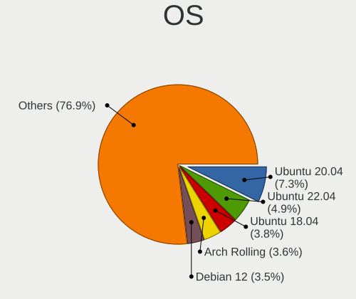

| Name                         | Computers | Percent |
|------------------------------|-----------|---------|
| Ubuntu 20.04                 | 201       | 7.31%   |
| Ubuntu 22.04                 | 135       | 4.91%   |
| Ubuntu 18.04                 | 105       | 3.82%   |
| Arch Rolling                 | 99        | 3.6%    |
| Debian 12                    | 95        | 3.46%   |
| Ubuntu 24.04                 | 92        | 3.35%   |
| Pop!_OS 22.04                | 71        | 2.58%   |
| OpenMandriva 23.01           | 63        | 2.29%   |
| Debian 11                    | 48        | 1.75%   |
| Manjaro                      | 37        | 1.35%   |
| OpenMandriva 24.12           | 36        | 1.31%   |
| OpenMandriva 4.2             | 33        | 1.2%    |
| OpenMandriva 23.03           | 28        | 1.02%   |
| EndeavourOS Rolling          | 28        | 1.02%   |
| Linux Mint 21.1              | 27        | 0.98%   |
| Arch                         | 27        | 0.98%   |
| openSUSE Tumbleweed-XXXXXXXX | 26        | 0.95%   |
| OpenMandriva 4.3             | 26        | 0.95%   |
| Linux Mint 22.2              | 26        | 0.95%   |
| Fedora 42                    | 26        | 0.95%   |
| Fedora 41                    | 25        | 0.91%   |
| Linux Mint 20                | 24        | 0.87%   |
| Ubuntu 21.04                 | 23        | 0.84%   |
| OpenMandriva 25.90           | 23        | 0.84%   |
| ArcoLinux Rolling            | 23        | 0.84%   |
| Zorin 16                     | 22        | 0.8%    |
| OpenMandriva 25.06           | 22        | 0.8%    |
| Linux Mint 20.1              | 22        | 0.8%    |
| Fedora 39                    | 22        | 0.8%    |
| Linux Mint 22.1              | 21        | 0.76%   |
| Fedora 38                    | 20        | 0.73%   |
| Ubuntu 20.10                 | 19        | 0.69%   |
| Pop!_OS 21.04                | 19        | 0.69%   |
| OpenMandriva 25.01           | 19        | 0.69%   |
| Fedora 40                    | 19        | 0.69%   |
| Fedora 36                    | 19        | 0.69%   |
| Xubuntu 20.04                | 18        | 0.66%   |
| OpenMandriva 23.08           | 18        | 0.66%   |
| Linux Mint 21.3              | 18        | 0.66%   |
| Linux Mint 21.2              | 18        | 0.66%   |

OS Family
---------

OS without a version

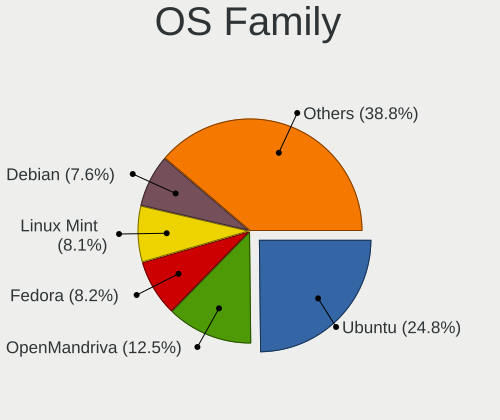

| Name          | Computers | Percent |
|---------------|-----------|---------|
| Ubuntu        | 634       | 24.82%  |
| OpenMandriva  | 319       | 12.49%  |
| Fedora        | 209       | 8.18%   |
| Linux Mint    | 208       | 8.14%   |
| Debian        | 194       | 7.6%    |
| Pop!_OS       | 125       | 4.89%   |
| Arch          | 125       | 4.89%   |
| Manjaro       | 89        | 3.48%   |
| Kubuntu       | 53        | 2.08%   |
| Zorin         | 46        | 1.8%    |
| Xubuntu       | 44        | 1.72%   |
| Gentoo        | 38        | 1.49%   |
| openSUSE      | 37        | 1.45%   |
| Lubuntu       | 32        | 1.25%   |
| ROSA          | 31        | 1.21%   |
| EndeavourOS   | 30        | 1.17%   |
| KDE neon      | 25        | 0.98%   |
| ArcoLinux     | 25        | 0.98%   |
| Bazzite       | 24        | 0.94%   |
| Ubuntu MATE   | 22        | 0.86%   |
| Elementary    | 18        | 0.7%    |
| MX            | 17        | 0.67%   |
| Kali          | 15        | 0.59%   |
| Nobara        | 13        | 0.51%   |
| LMDE          | 13        | 0.51%   |
| CentOS        | 13        | 0.51%   |
| NixOS         | 11        | 0.43%   |
| SteamOS       | 8         | 0.31%   |
| CachyOS       | 8         | 0.31%   |
| Garuda Linux  | 7         | 0.27%   |
| Raspbian      | 6         | 0.23%   |
| Devuan        | 6         | 0.23%   |
| Clear Linux   | 6         | 0.23%   |
| BlackPanther  | 6         | 0.23%   |
| Ubuntu Unity  | 5         | 0.2%    |
| RHEL          | 5         | 0.2%    |
| Peppermint    | 5         | 0.2%    |
| Parrot        | 5         | 0.2%    |
| Endless       | 5         | 0.2%    |
| Ubuntu Budgie | 4         | 0.16%   |

Kernel
------

Version of the Linux kernel

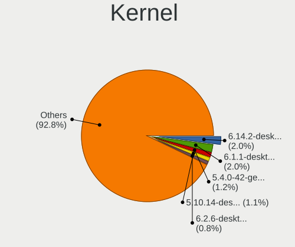

| Version                  | Computers | Percent |
|--------------------------|-----------|---------|
| 6.14.2-desktop-3omv2590  | 62        | 2.05%   |
| 6.1.1-desktop-1omv2290   | 61        | 2.01%   |
| 5.4.0-42-generic         | 37        | 1.22%   |
| 5.10.14-desktop-1omv4002 | 32        | 1.06%   |
| 6.2.6-desktop-1omv2390   | 25        | 0.82%   |
| 6.12.1-desktop-1omv2490  | 24        | 0.79%   |
| 6.12.9-desktop-1omv2490  | 22        | 0.73%   |
| 5.16.7-desktop-1omv4003  | 22        | 0.73%   |
| 6.8.12-11-pve            | 21        | 0.69%   |
| 6.8.0-51-generic         | 18        | 0.59%   |
| 5.4.0-58-generic         | 18        | 0.59%   |
| 5.4.0-48-generic         | 16        | 0.53%   |
| 5.4.0-47-generic         | 16        | 0.53%   |
| 6.4.11-desktop-1omv2390  | 15        | 0.49%   |
| 6.6.2-desktop-1omv2390   | 13        | 0.43%   |
| 6.14.0-29-generic        | 13        | 0.43%   |
| 6.9.3-76060903-generic   | 12        | 0.4%    |
| 6.8.0-49-generic         | 12        | 0.4%    |
| 6.8.0-45-generic         | 12        | 0.4%    |
| 6.8.0-31-generic         | 12        | 0.4%    |
| 6.2.0-26-generic         | 12        | 0.4%    |
| 5.4.0-52-generic         | 12        | 0.4%    |
| 5.3.0-40-generic         | 12        | 0.4%    |
| 5.15.0-91-generic        | 12        | 0.4%    |
| 5.15.0-58-generic        | 12        | 0.4%    |
| 6.5.0-26-generic         | 11        | 0.36%   |
| 5.11.0-7620-generic      | 11        | 0.36%   |
| 6.11.0-26-generic        | 10        | 0.33%   |
| 5.8.0-44-generic         | 10        | 0.33%   |
| 5.15.0-52-generic        | 10        | 0.33%   |
| 6.8.12-9-pve             | 9         | 0.3%    |
| 6.2.0-20-generic         | 9         | 0.3%    |
| 5.8.0-41-generic         | 9         | 0.3%    |
| 5.4.0-65-generic         | 9         | 0.3%    |
| 5.4.0-56-generic         | 9         | 0.3%    |
| 5.4.0-53-generic         | 9         | 0.3%    |
| 5.15.0-48-generic        | 9         | 0.3%    |
| 5.15.0-46-generic        | 9         | 0.3%    |
| 6.8.12-8-pve             | 8         | 0.26%   |
| 6.8.0-60-generic         | 8         | 0.26%   |

Kernel Family
-------------

Linux kernel without a distro release

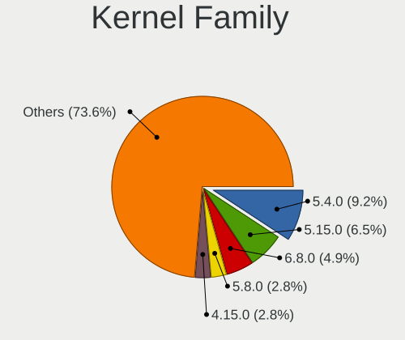

| Version | Computers | Percent |
|---------|-----------|---------|
| 5.4.0   | 264       | 9.24%   |
| 5.15.0  | 186       | 6.51%   |
| 6.8.0   | 141       | 4.94%   |
| 5.8.0   | 81        | 2.84%   |
| 4.15.0  | 81        | 2.84%   |
| 5.11.0  | 72        | 2.52%   |
| 6.14.2  | 66        | 2.31%   |
| 6.14.0  | 65        | 2.28%   |
| 6.1.1   | 63        | 2.21%   |
| 6.1.0   | 62        | 2.17%   |
| 6.2.0   | 60        | 2.1%    |
| 6.5.0   | 57        | 2%      |
| 6.11.0  | 54        | 1.89%   |
| 5.13.0  | 51        | 1.79%   |
| 5.3.0   | 49        | 1.72%   |
| 5.10.0  | 49        | 1.72%   |
| 5.19.0  | 42        | 1.47%   |
| 6.8.12  | 34        | 1.19%   |
| 5.10.14 | 33        | 1.16%   |
| 6.2.6   | 31        | 1.09%   |
| 6.12.1  | 27        | 0.95%   |
| 5.0.0   | 27        | 0.95%   |
| 4.18.0  | 24        | 0.84%   |
| 6.12.9  | 23        | 0.81%   |
| 5.16.7  | 22        | 0.77%   |
| 4.19.0  | 20        | 0.7%    |
| 6.4.11  | 16        | 0.56%   |
| 6.6.2   | 15        | 0.53%   |
| 6.9.3   | 14        | 0.49%   |
| 6.13.5  | 14        | 0.49%   |
| 6.12.10 | 14        | 0.49%   |
| 6.17.7  | 11        | 0.39%   |
| 6.12.6  | 11        | 0.39%   |
| 6.0.12  | 10        | 0.35%   |
| 5.14.0  | 10        | 0.35%   |
| 6.14.6  | 9         | 0.32%   |
| 5.17.5  | 9         | 0.32%   |
| 6.5.11  | 8         | 0.28%   |
| 6.17.9  | 8         | 0.28%   |
| 6.17.8  | 8         | 0.28%   |

Kernel Major Ver.
-----------------

Linux kernel major version

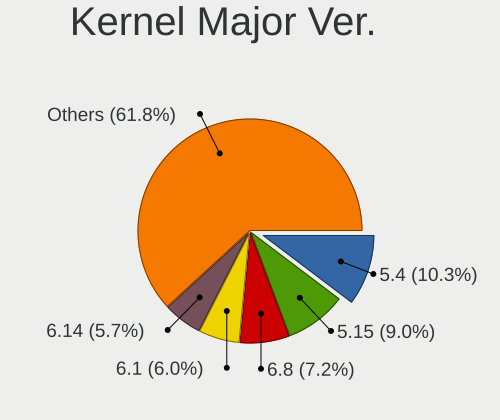

| Version | Computers | Percent |
|---------|-----------|---------|
| 5.4     | 289       | 10.31%  |
| 5.15    | 252       | 8.99%   |
| 6.8     | 202       | 7.2%    |
| 6.1     | 168       | 5.99%   |
| 6.14    | 159       | 5.67%   |
| 6.12    | 135       | 4.81%   |
| 5.10    | 121       | 4.32%   |
| 6.2     | 119       | 4.24%   |
| 5.8     | 106       | 3.78%   |
| 5.11    | 94        | 3.35%   |
| 6.5     | 92        | 3.28%   |
| 4.15    | 82        | 2.92%   |
| 6.11    | 76        | 2.71%   |
| 5.13    | 67        | 2.39%   |
| 6.6     | 63        | 2.25%   |
| 5.3     | 62        | 2.21%   |
| 5.19    | 59        | 2.1%    |
| 6.17    | 53        | 1.89%   |
| 6.0     | 48        | 1.71%   |
| 5.16    | 48        | 1.71%   |
| 6.13    | 43        | 1.53%   |
| 6.4     | 41        | 1.46%   |
| 4.18    | 32        | 1.14%   |
| 5.17    | 30        | 1.07%   |
| 6.9     | 28        | 1%      |
| 5.0     | 28        | 1%      |
| 5.14    | 26        | 0.93%   |
| 4.19    | 26        | 0.93%   |
| 6.16    | 25        | 0.89%   |
| 6.10    | 24        | 0.86%   |
| 6.3     | 22        | 0.78%   |
| 6.15    | 22        | 0.78%   |
| 5.9     | 18        | 0.64%   |
| 5.7     | 17        | 0.61%   |
| 5.18    | 17        | 0.61%   |
| 5.12    | 17        | 0.61%   |
| 6.7     | 16        | 0.57%   |
| 4.9     | 15        | 0.53%   |
| 5.6     | 14        | 0.5%    |
| 5.5     | 13        | 0.46%   |

Arch
----

OS architecture (x86_64, i586, etc.)

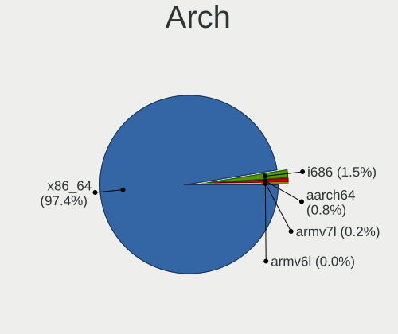

| Name    | Computers | Percent |
|---------|-----------|---------|
| x86_64  | 2400      | 97.44%  |
| i686    | 37        | 1.5%    |
| aarch64 | 20        | 0.81%   |
| armv7l  | 5         | 0.2%    |
| armv6l  | 1         | 0.04%   |

DE
--

Desktop Environment

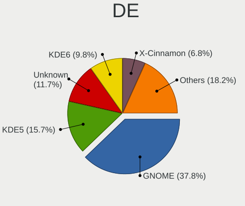

| Name             | Computers | Percent |
|------------------|-----------|---------|
| GNOME            | 973       | 37.85%  |
| KDE5             | 403       | 15.67%  |
| Unknown          | 300       | 11.67%  |
| KDE6             | 252       | 9.8%    |
| X-Cinnamon       | 174       | 6.77%   |
| XFCE             | 156       | 6.07%   |
| MATE             | 65        | 2.53%   |
| LXQt             | 40        | 1.56%   |
| KDE              | 35        | 1.36%   |
| KDE4             | 19        | 0.74%   |
| i3               | 18        | 0.7%    |
| Cinnamon         | 18        | 0.7%    |
| Pantheon         | 17        | 0.66%   |
| GNOME Flashback  | 17        | 0.66%   |
| LXDE             | 11        | 0.43%   |
| Budgie           | 11        | 0.43%   |
| Hyprland         | 10        | 0.39%   |
| lightdm-xsession | 8         | 0.31%   |
| Unity            | 5         | 0.19%   |
| COSMIC           | 5         | 0.19%   |
| sway             | 4         | 0.16%   |
| Deepin           | 4         | 0.16%   |
| Openbox          | 3         | 0.12%   |
| LeftWM           | 3         | 0.12%   |
| DWM              | 3         | 0.12%   |
| bspwm            | 3         | 0.12%   |
| xubuntu          | 1         | 0.04%   |
| xmonad           | 1         | 0.04%   |
| sway:Unity       | 1         | 0.04%   |
| Phosh:GNOME      | 1         | 0.04%   |
| onyx:GNOME       | 1         | 0.04%   |
| niri             | 1         | 0.04%   |
| LXDE-pi-wayfire  | 1         | 0.04%   |
| labwc:wlroots    | 1         | 0.04%   |
| icewm            | 1         | 0.04%   |
| GNOME Classic    | 1         | 0.04%   |
| Enlightenment    | 1         | 0.04%   |
| Endless:GNOME    | 1         | 0.04%   |
| default          | 1         | 0.04%   |
| BunsenLabs       | 1         | 0.04%   |

Display Server
--------------

X11 or Wayland

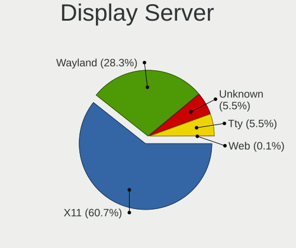

| Name    | Computers | Percent |
|---------|-----------|---------|
| X11     | 1567      | 60.67%  |
| Wayland | 731       | 28.3%   |
| Unknown | 142       | 5.5%    |
| Tty     | 141       | 5.46%   |
| Web     | 2         | 0.08%   |

Display Manager
---------------

SDDM, LightDM, etc.

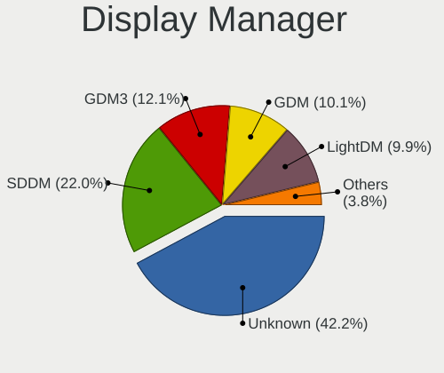

| Name                  | Computers | Percent |
|-----------------------|-----------|---------|
| Unknown               | 1085      | 42.19%  |
| SDDM                  | 565       | 21.97%  |
| GDM3                  | 312       | 12.13%  |
| GDM                   | 259       | 10.07%  |
| LightDM               | 254       | 9.88%   |
| TDM                   | 61        | 2.37%   |
| KDM                   | 14        | 0.54%   |
| XDM                   | 5         | 0.19%   |
| GREETD                | 4         | 0.16%   |
| LY-DM                 | 3         | 0.12%   |
| SLiM                  | 2         | 0.08%   |
| Ly                    | 2         | 0.08%   |
| COSMIC-GREETER        | 2         | 0.08%   |
| SLIMSKI               | 1         | 0.04%   |
| LXDM                  | 1         | 0.04%   |
| DISPLAY-MANAGER-START | 1         | 0.04%   |
| DARKDM_ON_TTY         | 1         | 0.04%   |

OS Lang
-------

Language

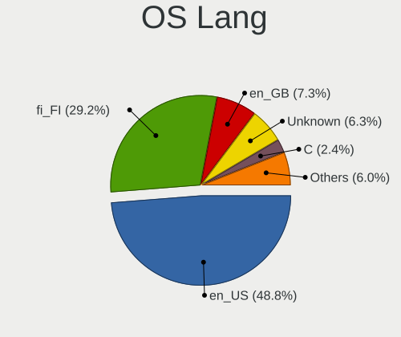

| Lang            | Computers | Percent |
|-----------------|-----------|---------|
| en_US           | 1235      | 48.76%  |
| fi_FI           | 740       | 29.21%  |
| en_GB           | 185       | 7.3%    |
| Unknown         | 159       | 6.28%   |
| C               | 62        | 2.45%   |
| ru_RU           | 39        | 1.54%   |
| sv_FI           | 13        | 0.51%   |
| en_DK           | 13        | 0.51%   |
| en_FI           | 9         | 0.36%   |
| fr_FR           | 8         | 0.32%   |
| en_IE           | 7         | 0.28%   |
| de_DE           | 7         | 0.28%   |
| C.UTF8          | 6         | 0.24%   |
| sv_SE           | 5         | 0.2%    |
| et_EE           | 5         | 0.2%    |
| POSIX           | 3         | 0.12%   |
| pl_PL           | 3         | 0.12%   |
| en_US.utf-8     | 3         | 0.12%   |
| en_CA           | 3         | 0.12%   |
| en_AG           | 3         | 0.12%   |
| zh_CN           | 2         | 0.08%   |
| UTF-8           | 2         | 0.08%   |
| it_IT           | 2         | 0.08%   |
| en_SE           | 2         | 0.08%   |
| en_IN           | 2         | 0.08%   |
| nb_NO           | 1         | 0.04%   |
| ja_JP           | 1         | 0.04%   |
| is_IS           | 1         | 0.04%   |
| ia_FR           | 1         | 0.04%   |
| hu_HU           | 1         | 0.04%   |
| fr_CA           | 1         | 0.04%   |
| fi_FI@euro.UTF- | 1         | 0.04%   |
| fi_FI.UTF8      | 1         | 0.04%   |
| es_ES           | 1         | 0.04%   |
| en_ZA           | 1         | 0.04%   |
| en_US.UTF8      | 1         | 0.04%   |
| en_NG           | 1         | 0.04%   |
| en_DE           | 1         | 0.04%   |
| en_AU           | 1         | 0.04%   |
| af_ZA           | 1         | 0.04%   |

Boot Mode
---------

EFI or BIOS

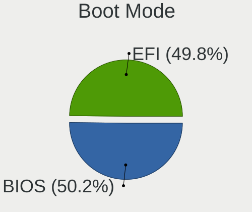

| Mode | Computers | Percent |
|------|-----------|---------|
| BIOS | 1264      | 50.2%   |
| EFI  | 1254      | 49.8%   |

Filesystem
----------

Type of filesystem

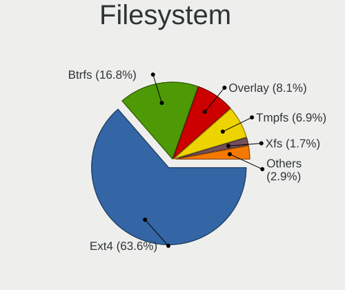

| Type      | Computers | Percent |
|-----------|-----------|---------|
| Ext4      | 1623      | 63.62%  |
| Btrfs     | 429       | 16.82%  |
| Overlay   | 206       | 8.08%   |
| Tmpfs     | 175       | 6.86%   |
| Xfs       | 43        | 1.69%   |
| Unknown   | 42        | 1.65%   |
| Zfs       | 20        | 0.78%   |
| F2fs      | 4         | 0.16%   |
| Ext3      | 4         | 0.16%   |
| Ext2      | 4         | 0.16%   |
| Overlayfs | 1         | 0.04%   |

Part. scheme
------------

Scheme of partitioning

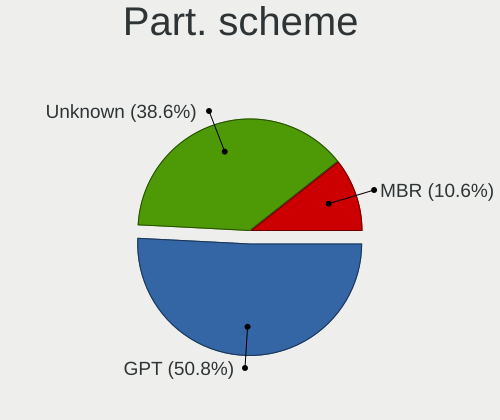

| Type    | Computers | Percent |
|---------|-----------|---------|
| GPT     | 1286      | 50.81%  |
| Unknown | 976       | 38.56%  |
| MBR     | 269       | 10.63%  |

Dual Boot with Linux/BSD
------------------------

Hosting more than one Linux/BSD

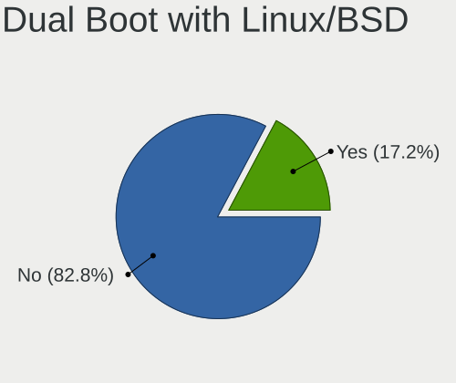

| Dual boot | Computers | Percent |
|-----------|-----------|---------|
| No        | 2079      | 82.76%  |
| Yes       | 433       | 17.24%  |

Dual Boot (Win)
---------------

Hosting Linux and Windows

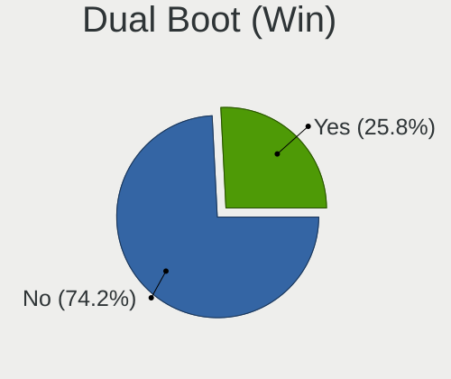

| Dual boot | Computers | Percent |
|-----------|-----------|---------|
| No        | 1857      | 74.19%  |
| Yes       | 646       | 25.81%  |

Board
-----

Vendor
------

Motherboard manufacturer

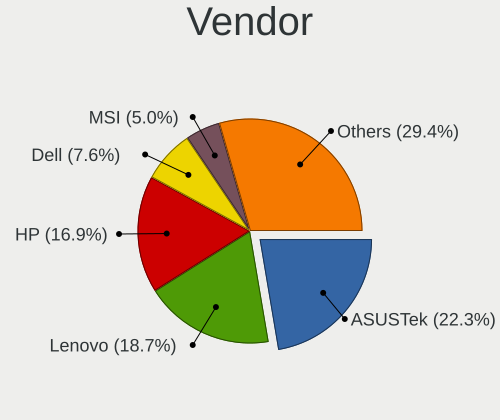

| Name                                 | Computers | Percent |
|--------------------------------------|-----------|---------|
| ASUSTek Computer                     | 550       | 22.34%  |
| Lenovo                               | 461       | 18.72%  |
| Hewlett-Packard                      | 416       | 16.9%   |
| Dell                                 | 187       | 7.6%    |
| MSI                                  | 123       | 5%      |
| Gigabyte Technology                  | 115       | 4.67%   |
| Acer                                 | 112       | 4.55%   |
| ASRock                               | 99        | 4.02%   |
| Fujitsu                              | 68        | 2.76%   |
| Apple                                | 59        | 2.4%    |
| Intel                                | 35        | 1.42%   |
| Samsung Electronics                  | 27        | 1.1%    |
| Fujitsu Siemens                      | 19        | 0.77%   |
| Raspberry Pi Foundation              | 13        | 0.53%   |
| Toshiba                              | 12        | 0.49%   |
| Unknown                              | 12        | 0.49%   |
| Pegatron                             | 11        | 0.45%   |
| HUAWEI                               | 11        | 0.45%   |
| Foxconn                              | 10        | 0.41%   |
| Valve                                | 8         | 0.32%   |
| Google                               | 8         | 0.32%   |
| Packard Bell                         | 7         | 0.28%   |
| ASRockRack                           | 6         | 0.24%   |
| Supermicro                           | 5         | 0.2%    |
| Sony                                 | 4         | 0.16%   |
| Microsoft                            | 4         | 0.16%   |
| Medion                               | 4         | 0.16%   |
| Framework                            | 4         | 0.16%   |
| AOpen                                | 4         | 0.16%   |
| AMI                                  | 4         | 0.16%   |
| TUXEDO                               | 3         | 0.12%   |
| Notebook                             | 3         | 0.12%   |
| HONOR                                | 3         | 0.12%   |
| Xunlong                              | 2         | 0.08%   |
| WeiBu                                | 2         | 0.08%   |
| Timi                                 | 2         | 0.08%   |
| Star Labs                            | 2         | 0.08%   |
| Shenzhen Meigao Electronic Equipment | 2         | 0.08%   |
| JGINYUE                              | 2         | 0.08%   |
| IBM                                  | 2         | 0.08%   |

Model
-----

Motherboard model

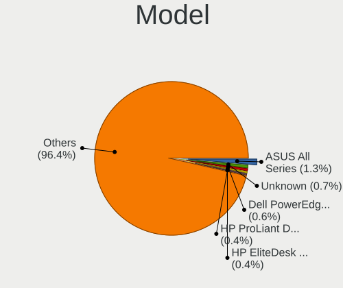

| Name                             | Computers | Percent |
|----------------------------------|-----------|---------|
| ASUS All Series                  | 33        | 1.34%   |
| Unknown                          | 18        | 0.73%   |
| Dell PowerEdge R630              | 15        | 0.61%   |
| HP ProLiant DL380 Gen9           | 11        | 0.45%   |
| HP EliteDesk 800 G1 SFF          | 11        | 0.45%   |
| ASUS TUF Gaming X570-PLUS        | 10        | 0.41%   |
| HP EliteBook 840 G3              | 9         | 0.37%   |
| ASUS ROG STRIX B550-F GAMING     | 9         | 0.37%   |
| MSI MS-7C37                      | 7         | 0.28%   |
| ASUS TUF Gaming B550-PLUS        | 7         | 0.28%   |
| ASUS Pro WS 565-ACE              | 7         | 0.28%   |
| MSI MS-7C56                      | 6         | 0.24%   |
| Lenovo MIIX 310-10ICR 80SG       | 6         | 0.24%   |
| HP Pavilion 15                   | 6         | 0.24%   |
| HP EliteBook 840 G5              | 6         | 0.24%   |
| Dell PowerEdge R730              | 6         | 0.24%   |
| ASUS ROG STRIX B550-I GAMING     | 6         | 0.24%   |
| ASUS PRIME X370-PRO              | 6         | 0.24%   |
| ASUS PRIME B350-PLUS             | 6         | 0.24%   |
| ASUS M5A97 R2.0                  | 6         | 0.24%   |
| Valve Jupiter                    | 5         | 0.2%    |
| MSI MS-7C84                      | 5         | 0.2%    |
| MSI MS-7A38                      | 5         | 0.2%    |
| HP ProDesk 600 G3 DM             | 5         | 0.2%    |
| HP Pavilion 17                   | 5         | 0.2%    |
| HP EliteBook 840 G6              | 5         | 0.2%    |
| HP EliteBook 840 G1              | 5         | 0.2%    |
| HP Compaq 8200 Elite SFF PC      | 5         | 0.2%    |
| Gigabyte X570 AORUS ELITE        | 5         | 0.2%    |
| Fujitsu LIFEBOOK A530            | 5         | 0.2%    |
| ASUS PRIME X570-P                | 5         | 0.2%    |
| ASUS PRIME X470-PRO              | 5         | 0.2%    |
| ASUS PRIME B450-PLUS             | 5         | 0.2%    |
| Lenovo Yoga Slim 7 14ARE05 82A2  | 4         | 0.16%   |
| Lenovo V145-15AST 81MT           | 4         | 0.16%   |
| Lenovo ThinkPad T420 4180PBG     | 4         | 0.16%   |
| Lenovo IdeaPadFlex 5 14ABR8 82XX | 4         | 0.16%   |
| HP ProBook 650 G1                | 4         | 0.16%   |
| HP Pavilion dv6                  | 4         | 0.16%   |
| HP EliteDesk 800 G1 USDT         | 4         | 0.16%   |

Model Family
------------

Motherboard model prefix

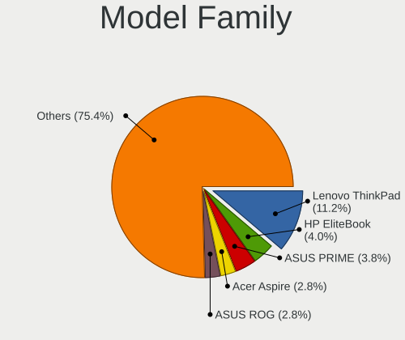

| Name                    | Computers | Percent |
|-------------------------|-----------|---------|
| Lenovo ThinkPad         | 276       | 11.21%  |
| HP EliteBook            | 98        | 3.98%   |
| ASUS PRIME              | 94        | 3.82%   |
| Acer Aspire             | 69        | 2.8%    |
| ASUS ROG                | 68        | 2.76%   |
| Dell Latitude           | 67        | 2.72%   |
| HP Pavilion             | 53        | 2.15%   |
| ASUS TUF                | 51        | 2.07%   |
| HP Compaq               | 50        | 2.03%   |
| Lenovo IdeaPad          | 43        | 1.75%   |
| Fujitsu LIFEBOOK        | 35        | 1.42%   |
| ASUS All                | 33        | 1.34%   |
| HP EliteDesk            | 30        | 1.22%   |
| Lenovo Yoga             | 29        | 1.18%   |
| HP ProBook              | 29        | 1.18%   |
| Lenovo ThinkCentre      | 27        | 1.1%    |
| Dell Precision          | 27        | 1.1%    |
| Dell PowerEdge          | 27        | 1.1%    |
| Dell OptiPlex           | 24        | 0.97%   |
| ASUS VivoBook           | 24        | 0.97%   |
| Dell XPS                | 22        | 0.89%   |
| HP ProDesk              | 21        | 0.85%   |
| HP Laptop               | 21        | 0.85%   |
| HP ProLiant             | 18        | 0.73%   |
| Fujitsu ESPRIMO         | 18        | 0.73%   |
| Unknown                 | 18        | 0.73%   |
| Lenovo Legion           | 16        | 0.65%   |
| HP ZBook                | 16        | 0.65%   |
| ASUS M5A97              | 14        | 0.57%   |
| ASUS ASUS               | 14        | 0.57%   |
| RPi Raspberry           | 13        | 0.53%   |
| Gigabyte X570           | 11        | 0.45%   |
| Dell Inspiron           | 11        | 0.45%   |
| Acer Swift              | 11        | 0.45%   |
| Acer Predator           | 11        | 0.45%   |
| Toshiba Satellite       | 9         | 0.37%   |
| Fujitsu Siemens ESPRIMO | 9         | 0.37%   |
| ASUS Zenbook            | 9         | 0.37%   |
| Lenovo IdeaCentre       | 8         | 0.32%   |
| Gigabyte B550           | 8         | 0.32%   |

MFG Year
--------

Motherboard manufacture year

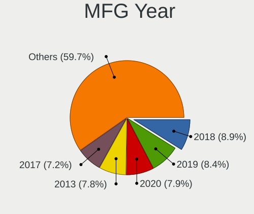

| Year    | Computers | Percent |
|---------|-----------|---------|
| 2018    | 219       | 8.9%    |
| 2019    | 208       | 8.45%   |
| 2020    | 195       | 7.92%   |
| 2013    | 192       | 7.8%    |
| 2017    | 178       | 7.23%   |
| 2012    | 174       | 7.07%   |
| 2011    | 155       | 6.3%    |
| 2015    | 137       | 5.56%   |
| 2014    | 136       | 5.52%   |
| 2016    | 130       | 5.28%   |
| 2021    | 119       | 4.83%   |
| 2022    | 107       | 4.35%   |
| 2008    | 95        | 3.86%   |
| 2009    | 92        | 3.74%   |
| 2023    | 86        | 3.49%   |
| 2010    | 79        | 3.21%   |
| 2024    | 56        | 2.27%   |
| 2007    | 44        | 1.79%   |
| 2006    | 20        | 0.81%   |
| Unknown | 20        | 0.81%   |
| 2025    | 11        | 0.45%   |
| 2005    | 6         | 0.24%   |
| 2004    | 3         | 0.12%   |

Form Factor
-----------

Physical design of the computer

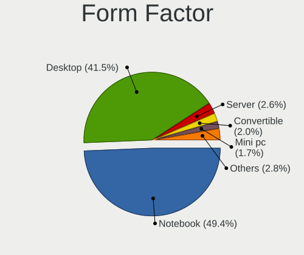

| Name           | Computers | Percent |
|----------------|-----------|---------|
| Notebook       | 1215      | 49.35%  |
| Desktop        | 1022      | 41.51%  |
| Server         | 65        | 2.64%   |
| Convertible    | 50        | 2.03%   |
| Mini pc        | 41        | 1.67%   |
| All in one     | 25        | 1.02%   |
| System on chip | 20        | 0.81%   |
| Tablet         | 20        | 0.81%   |
| Phone          | 3         | 0.12%   |
| Other          | 1         | 0.04%   |

Secure Boot
-----------

Enabled or disabled

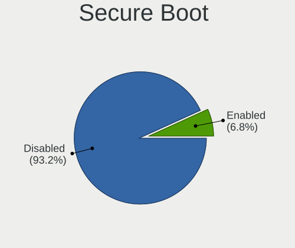

| State    | Computers | Percent |
|----------|-----------|---------|
| Disabled | 2308      | 93.21%  |
| Enabled  | 168       | 6.79%   |

Coreboot
--------

Have coreboot on board

| Used | Computers | Percent |
|------|-----------|---------|
| No   | 2448      | 99.43%  |
| Yes  | 14        | 0.57%   |

RAM Size
--------

Total RAM memory

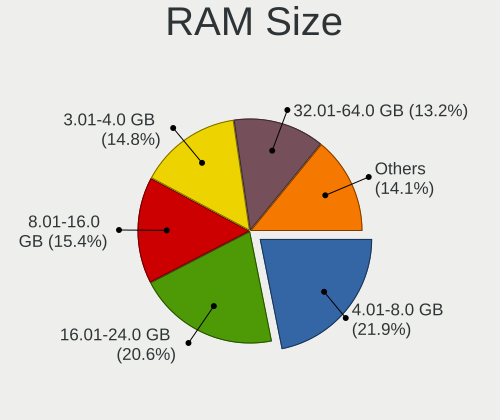

| Size in GB      | Computers | Percent |
|-----------------|-----------|---------|
| 4.01-8.0        | 548       | 21.87%  |
| 16.01-24.0      | 515       | 20.55%  |
| 8.01-16.0       | 386       | 15.4%   |
| 3.01-4.0        | 372       | 14.84%  |
| 32.01-64.0      | 332       | 13.25%  |
| 64.01-256.0     | 131       | 5.23%   |
| 24.01-32.0      | 91        | 3.63%   |
| 1.01-2.0        | 62        | 2.47%   |
| More than 256.0 | 29        | 1.16%   |
| 2.01-3.0        | 22        | 0.88%   |
| 0.51-1.0        | 14        | 0.56%   |
| 0.01-0.5        | 4         | 0.16%   |

RAM Used
--------

Used RAM memory

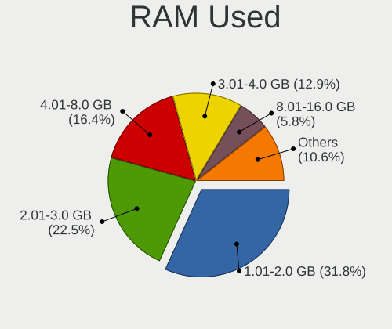

| Used GB         | Computers | Percent |
|-----------------|-----------|---------|
| 1.01-2.0        | 871       | 31.77%  |
| 2.01-3.0        | 618       | 22.54%  |
| 4.01-8.0        | 450       | 16.41%  |
| 3.01-4.0        | 353       | 12.87%  |
| 8.01-16.0       | 159       | 5.8%    |
| 0.51-1.0        | 153       | 5.58%   |
| 64.01-256.0     | 38        | 1.39%   |
| 16.01-24.0      | 37        | 1.35%   |
| 0.01-0.5        | 33        | 1.2%    |
| 32.01-64.0      | 13        | 0.47%   |
| 24.01-32.0      | 11        | 0.4%    |
| 0               | 3         | 0.11%   |
| More than 256.0 | 2         | 0.07%   |
| Unknown         | 1         | 0.04%   |

Total Drives
------------

Number of drives on board

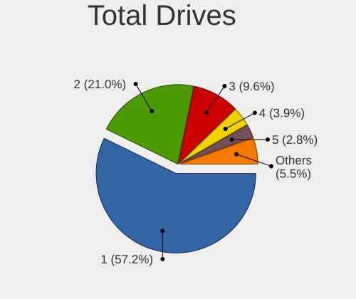

| Drives | Computers | Percent |
|--------|-----------|---------|
| 1      | 1459      | 57.24%  |
| 2      | 535       | 20.99%  |
| 3      | 244       | 9.57%   |
| 4      | 100       | 3.92%   |
| 5      | 71        | 2.79%   |
| 6      | 31        | 1.22%   |
| 0      | 31        | 1.22%   |
| 7      | 22        | 0.86%   |
| 9      | 11        | 0.43%   |
| 8      | 11        | 0.43%   |
| 10     | 8         | 0.31%   |
| 14     | 7         | 0.27%   |
| 11     | 6         | 0.24%   |
| 12     | 3         | 0.12%   |
| 13     | 2         | 0.08%   |
| 111    | 1         | 0.04%   |
| 70     | 1         | 0.04%   |
| 55     | 1         | 0.04%   |
| 41     | 1         | 0.04%   |
| 27     | 1         | 0.04%   |
| 25     | 1         | 0.04%   |
| 23     | 1         | 0.04%   |
| 16     | 1         | 0.04%   |

Has CD-ROM
----------

Has CD-ROM on board

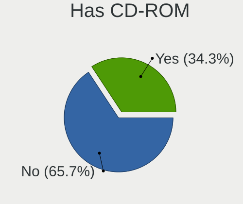

| Presented | Computers | Percent |
|-----------|-----------|---------|
| No        | 1638      | 65.73%  |
| Yes       | 854       | 34.27%  |

Has Ethernet
------------

Has Ethernet on board

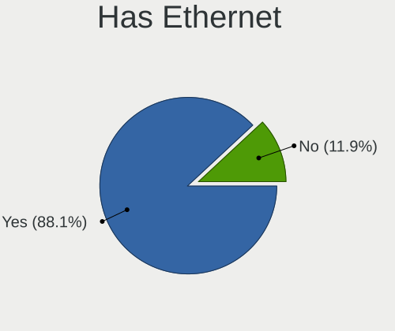

| Presented | Computers | Percent |
|-----------|-----------|---------|
| Yes       | 2175      | 88.06%  |
| No        | 295       | 11.94%  |

Has WiFi
--------

Has WiFi module

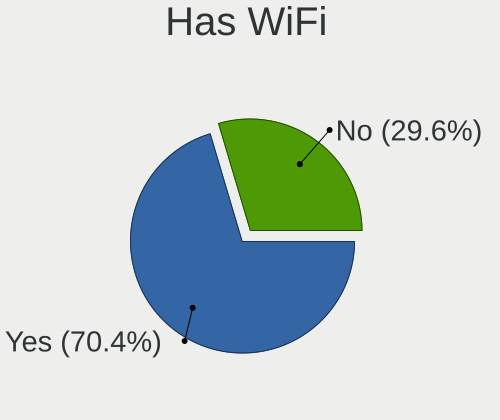

| Presented | Computers | Percent |
|-----------|-----------|---------|
| Yes       | 1746      | 70.4%   |
| No        | 734       | 29.6%   |

Has Bluetooth
-------------

Has Bluetooth module

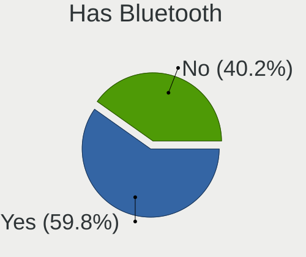

| Presented | Computers | Percent |
|-----------|-----------|---------|
| Yes       | 1491      | 59.81%  |
| No        | 1002      | 40.19%  |

Location
--------

Country
-------

Geographic location (country)

| Country | Computers | Percent |
|---------|-----------|---------|
| Finland | 2462      | 100%    |

City
----

Geographic location (city)

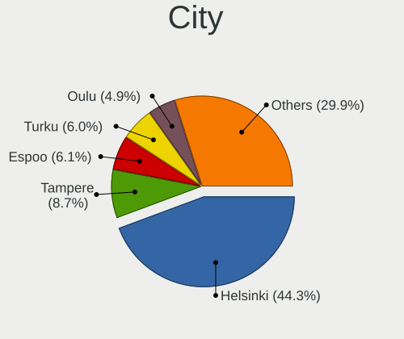

| City         | Computers | Percent |
|--------------|-----------|---------|
| Helsinki     | 1170      | 44.33%  |
| Tampere      | 230       | 8.72%   |
| Espoo        | 162       | 6.14%   |
| Turku        | 158       | 5.99%   |
| Oulu         | 130       | 4.93%   |
| Vantaa       | 84        | 3.18%   |
| Jyväskylä  | 68        | 2.58%   |
| Kuopio       | 54        | 2.05%   |
| Lahti        | 45        | 1.71%   |
| Vaasa        | 34        | 1.29%   |
| Tuusula      | 23        | 0.87%   |
| Joensuu      | 23        | 0.87%   |
| Raisio       | 18        | 0.68%   |
| Porvoo       | 18        | 0.68%   |
| Hyvinkaeae   | 17        | 0.64%   |
| Salo         | 15        | 0.57%   |
| Järvenpää | 15        | 0.57%   |
| Lappeenranta | 13        | 0.49%   |
| Seinäjoki   | 12        | 0.45%   |
| Raahe        | 12        | 0.45%   |
| Kotka        | 12        | 0.45%   |
| Kokkola      | 12        | 0.45%   |
| Pori         | 11        | 0.42%   |
| Hämeenlinna | 11        | 0.42%   |
| Rovaniemi    | 10        | 0.38%   |
| Lohja        | 10        | 0.38%   |
| Kouvola      | 10        | 0.38%   |
| Rauma        | 9         | 0.34%   |
| Riihimäki   | 8         | 0.3%    |
| Mikkeli      | 8         | 0.3%    |
| Kerava       | 8         | 0.3%    |
| Forssa       | 6         | 0.23%   |
| Nokia        | 5         | 0.19%   |
| Lieto        | 5         | 0.19%   |
| Lempäälä  | 5         | 0.19%   |
| Karis        | 5         | 0.19%   |
| Vesilahti    | 4         | 0.15%   |
| Tenala       | 4         | 0.15%   |
| Solv         | 4         | 0.15%   |
| Mäntsälä  | 4         | 0.15%   |

Drives
------

Drive Vendor
------------

Hard drive vendors

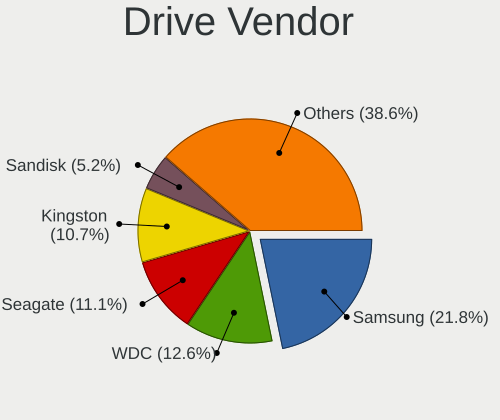

| Vendor                      | Computers | Drives | Percent |
|-----------------------------|-----------|--------|---------|
| Samsung Electronics         | 811       | 1988   | 21.78%  |
| WDC                         | 470       | 1087   | 12.62%  |
| Seagate                     | 413       | 964    | 11.09%  |
| Kingston                    | 400       | 594    | 10.74%  |
| Sandisk                     | 193       | 238    | 5.18%   |
| Toshiba                     | 161       | 385    | 4.32%   |
| Intel                       | 123       | 157    | 3.3%    |
| Unknown                     | 122       | 170    | 3.28%   |
| SK hynix                    | 106       | 175    | 2.85%   |
| Crucial                     | 97        | 242    | 2.6%    |
| Micron Technology           | 91        | 146    | 2.44%   |
| Hitachi                     | 87        | 131    | 2.34%   |
| Kingston Technology Company | 73        | 86     | 1.96%   |
| HGST                        | 55        | 1212   | 1.48%   |
| A-DATA Technology           | 45        | 53     | 1.21%   |
| KIOXIA                      | 32        | 70     | 0.86%   |
| Apple                       | 31        | 47     | 0.83%   |
| PNY                         | 29        | 33     | 0.78%   |
| Transcend                   | 25        | 31     | 0.67%   |
| OCZ                         | 25        | 34     | 0.67%   |
| Verbatim                    | 21        | 32     | 0.56%   |
| Corsair                     | 21        | 25     | 0.56%   |
| Phison Electronics          | 18        | 27     | 0.48%   |
| Fujitsu                     | 17        | 20     | 0.46%   |
| Phison                      | 15        | 16     | 0.4%    |
| ADATA Technology            | 15        | 18     | 0.4%    |
| Maxtor                      | 13        | 20     | 0.35%   |
| LITEON                      | 11        | 17     | 0.3%    |
| Hewlett-Packard             | 11        | 350    | 0.3%    |
| China                       | 11        | 13     | 0.3%    |
| Silicon Motion              | 9         | 10     | 0.24%   |
| LITEONIT                    | 9         | 15     | 0.24%   |
| Intenso                     | 9         | 12     | 0.24%   |
| Unknown                     | 9         | 10     | 0.24%   |
| Micron/Crucial Technology   | 8         | 9      | 0.21%   |
| Patriot                     | 5         | 8      | 0.13%   |
| MAXIO Technology (Hangzhou) | 5         | 5      | 0.13%   |
| HUAWEI                      | 5         | 5      | 0.13%   |
| Gigabyte Technology         | 5         | 7      | 0.13%   |
| BHT                         | 5         | 7      | 0.13%   |

Drive Model
-----------

Hard drive models

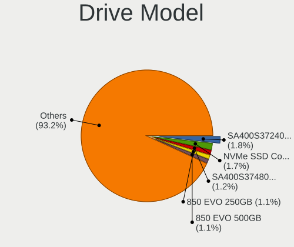

| Model                                                | Computers | Percent |
|------------------------------------------------------|-----------|---------|
| Kingston SA400S37240G 240GB SSD                      | 74        | 1.75%   |
| Samsung NVMe SSD Controller SM981/PM981/PM983 1TB    | 73        | 1.73%   |
| Kingston SA400S37480G 480GB SSD                      | 51        | 1.21%   |
| Samsung SSD 850 EVO 250GB                            | 46        | 1.09%   |
| Samsung SSD 850 EVO 500GB                            | 45        | 1.07%   |
| Samsung NVMe SSD Controller PM9A1/PM9A3/980PRO 1TB   | 41        | 0.97%   |
| Kingston SA400S37120G 120GB SSD                      | 40        | 0.95%   |
| Kingston SA400S37960G 960GB SSD                      | 27        | 0.64%   |
| Samsung SSD 980 1TB                                  | 25        | 0.59%   |
| Unknown MMC Card  32GB                               | 24        | 0.57%   |
| Samsung SSD 860 EVO 1TB                              | 24        | 0.57%   |
| Unknown MMC Card  64GB                               | 23        | 0.54%   |
| Samsung SSD 860 EVO 500GB                            | 23        | 0.54%   |
| Kingston SV300S37A240G 240GB SSD                     | 23        | 0.54%   |
| Kingston SV300S37A120G 120GB SSD                     | 22        | 0.52%   |
| Crucial CT1000MX500SSD1 1TB                          | 22        | 0.52%   |
| Samsung SSD 870 EVO 1TB                              | 21        | 0.5%    |
| WDC WDS100T2B0A-00SM50 1TB SSD                       | 20        | 0.47%   |
| Kingston Company SNV2S1000G 1TB                      | 20        | 0.47%   |
| Kingston SHFS37A120G 120GB SSD                       | 19        | 0.45%   |
| Seagate ST500DM002-1BD142 500GB                      | 18        | 0.43%   |
| Seagate Expansion 2TB                                | 18        | 0.43%   |
| Seagate ST9500325AS 500GB                            | 17        | 0.4%    |
| Seagate ST2000DM008-2FR102 2TB                       | 17        | 0.4%    |
| Samsung NVMe SSD Drive 500GB                         | 17        | 0.4%    |
| Samsung NVMe SSD Controller SM961/PM961/SM963 1024GB | 17        | 0.4%    |
| Samsung HD103SJ 1TB                                  | 17        | 0.4%    |
| WDC WDS500G2B0A-00SM50 500GB                         | 16        | 0.38%   |
| Seagate ST4000DM004-2CV104 4TB                       | 15        | 0.36%   |
| Seagate ST1000DM010-2EP102 1TB                       | 15        | 0.36%   |
| HGST HTS721010A9E630 1TB                             | 15        | 0.36%   |
| Unknown MMC Card  128GB                              | 14        | 0.33%   |
| Toshiba DT01ACA300 3TB                               | 14        | 0.33%   |
| Samsung SSD 860 EVO 250GB                            | 14        | 0.33%   |
| PNY CS900 120GB SSD                                  | 14        | 0.33%   |
| Kingston Company A2000 NVMe SSD 250GB                | 14        | 0.33%   |
| Samsung SSD 840 EVO 120GB                            | 13        | 0.31%   |
| Crucial CT500MX500SSD1 500GB                         | 13        | 0.31%   |
| Toshiba MQ01ABD100 1TB                               | 12        | 0.28%   |
| Seagate ST1000LM024 HN-M101MBB 1TB                   | 12        | 0.28%   |

HDD Vendor
----------

Hard disk drive vendors

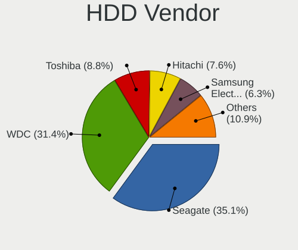

| Vendor              | Computers | Drives | Percent |
|---------------------|-----------|--------|---------|
| Seagate             | 400       | 944    | 35.06%  |
| WDC                 | 358       | 607    | 31.38%  |
| Toshiba             | 100       | 275    | 8.76%   |
| Hitachi             | 87        | 131    | 7.62%   |
| Samsung Electronics | 72        | 105    | 6.31%   |
| HGST                | 54        | 1027   | 4.73%   |
| Fujitsu             | 17        | 20     | 1.49%   |
| Maxtor              | 13        | 20     | 1.14%   |
| Unknown             | 9         | 9      | 0.79%   |
| Hewlett-Packard     | 8         | 322    | 0.7%    |
| Apple               | 5         | 5      | 0.44%   |
| JMicron Technology  | 3         | 6      | 0.26%   |
| USB3.0              | 2         | 2      | 0.18%   |
| StoreJet            | 2         | 2      | 0.18%   |
| Intenso             | 2         | 2      | 0.18%   |
| ASMedia             | 2         | 2      | 0.18%   |
| TO Exter            | 1         | 1      | 0.09%   |
| RSH-339             | 1         | 1      | 0.09%   |
| Phison              | 1         | 1      | 0.09%   |
| LaCie               | 1         | 1      | 0.09%   |
| HPE                 | 1         | 24     | 0.09%   |
| External            | 1         | 1      | 0.09%   |
| ASMT                | 1         | 1      | 0.09%   |

SSD Vendor
----------

Solid state drive vendors

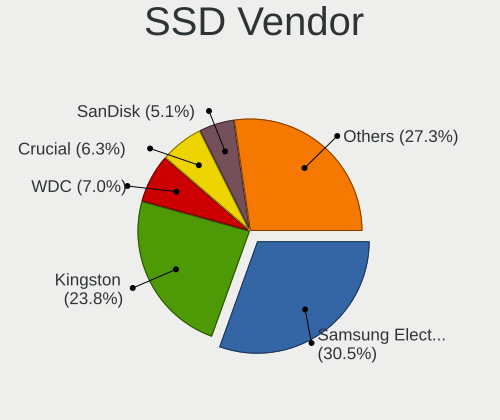

| Vendor              | Computers | Drives | Percent |
|---------------------|-----------|--------|---------|
| Samsung Electronics | 437       | 1312   | 30.5%   |
| Kingston            | 341       | 509    | 23.8%   |
| WDC                 | 101       | 435    | 7.05%   |
| Crucial             | 90        | 232    | 6.28%   |
| SanDisk             | 73        | 89     | 5.09%   |
| Intel               | 51        | 73     | 3.56%   |
| Micron Technology   | 38        | 84     | 2.65%   |
| A-DATA Technology   | 31        | 36     | 2.16%   |
| PNY                 | 27        | 31     | 1.88%   |
| OCZ                 | 25        | 34     | 1.74%   |
| Transcend           | 24        | 30     | 1.67%   |
| SK hynix            | 21        | 77     | 1.47%   |
| Verbatim            | 20        | 31     | 1.4%    |
| Toshiba             | 20        | 54     | 1.4%    |
| Apple               | 20        | 25     | 1.4%    |
| Corsair             | 12        | 14     | 0.84%   |
| LITEON              | 11        | 17     | 0.77%   |
| China               | 11        | 13     | 0.77%   |
| LITEONIT            | 9         | 15     | 0.63%   |
| Intenso             | 6         | 9      | 0.42%   |
| Patriot             | 5         | 8      | 0.35%   |
| BHT                 | 4         | 6      | 0.28%   |
| SPCC                | 3         | 3      | 0.21%   |
| Plextor             | 3         | 3      | 0.21%   |
| Netac               | 3         | 3      | 0.21%   |
| KIOXIA-EXCERIA      | 3         | 3      | 0.21%   |
| Hewlett-Packard     | 3         | 28     | 0.21%   |
| Unknown             | 3         | 4      | 0.21%   |
| Ramaxel Technology  | 2         | 2      | 0.14%   |
| OCZ-VERTEX3         | 2         | 2      | 0.14%   |
| OCZ-VERTEX          | 2         | 2      | 0.14%   |
| HGST                | 2         | 174    | 0.14%   |
| ASMT                | 2         | 2      | 0.14%   |
| XrayDisk            | 1         | 1      | 0.07%   |
| X12                 | 1         | 1      | 0.07%   |
| WODPOSIT            | 1         | 1      | 0.07%   |
| WDC WDS2            | 1         | 1      | 0.07%   |
| WALRAM              | 1         | 1      | 0.07%   |
| Vaseky              | 1         | 1      | 0.07%   |
| Unknown             | 1         | 1      | 0.07%   |

Drive Kind
----------

HDD or SSD

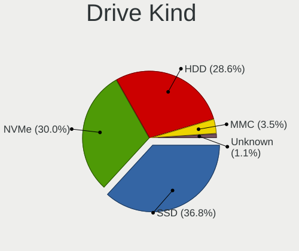

| Kind    | Computers | Drives | Percent |
|---------|-----------|--------|---------|
| SSD     | 1202      | 3421   | 36.81%  |
| NVMe    | 979       | 1475   | 29.98%  |
| HDD     | 934       | 3509   | 28.61%  |
| MMC     | 115       | 154    | 3.52%   |
| Unknown | 35        | 62     | 1.07%   |

Drive Connector
---------------

SATA, SAS, NVMe, etc.

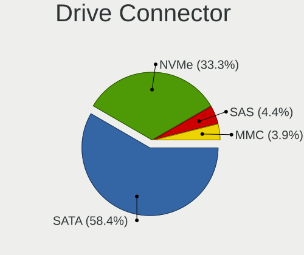

| Type | Computers | Drives | Percent |
|------|-----------|--------|---------|
| SATA | 1716      | 6721   | 58.37%  |
| NVMe | 979       | 1472   | 33.3%   |
| SAS  | 130       | 274    | 4.42%   |
| MMC  | 115       | 154    | 3.91%   |

Drive Size
----------

Size of hard drive

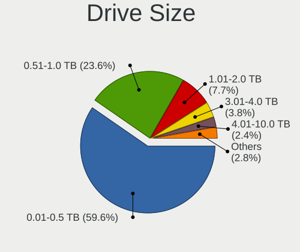

| Size in TB | Computers | Drives | Percent |
|------------|-----------|--------|---------|
| 0.01-0.5   | 1362      | 2656   | 59.63%  |
| 0.51-1.0   | 540       | 1555   | 23.64%  |
| 1.01-2.0   | 176       | 525    | 7.71%   |
| 3.01-4.0   | 87        | 816    | 3.81%   |
| 4.01-10.0  | 55        | 1251   | 2.41%   |
| 2.01-3.0   | 49        | 99     | 2.15%   |
| 10.01-20.0 | 13        | 26     | 0.57%   |
| 20.01-50.0 | 1         | 1      | 0.04%   |
| 0          | 1         | 1      | 0.04%   |

Space Total
-----------

Amount of disk space available on the file system

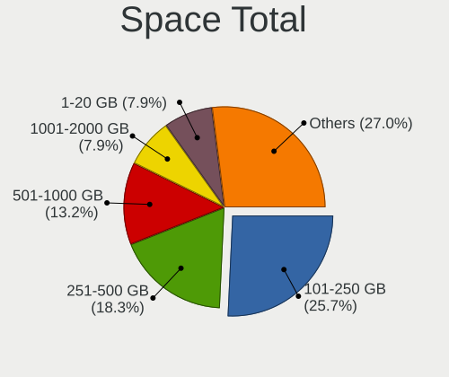

| Size in GB     | Computers | Percent |
|----------------|-----------|---------|
| 101-250        | 673       | 25.74%  |
| 251-500        | 478       | 18.28%  |
| 501-1000       | 346       | 13.23%  |
| 1001-2000      | 206       | 7.88%   |
| 1-20           | 206       | 7.88%   |
| More than 3000 | 187       | 7.15%   |
| Unknown        | 153       | 5.85%   |
| 51-100         | 152       | 5.81%   |
| 21-50          | 119       | 4.55%   |
| 2001-3000      | 95        | 3.63%   |

Space Used
----------

Amount of used disk space

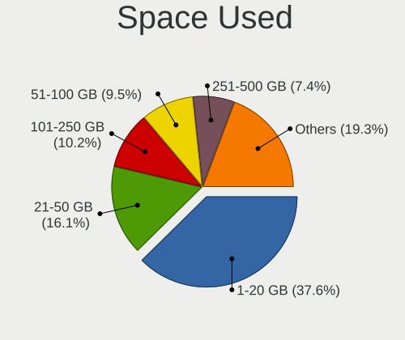

| Used GB        | Computers | Percent |
|----------------|-----------|---------|
| 1-20           | 1022      | 37.63%  |
| 21-50          | 436       | 16.05%  |
| 101-250        | 276       | 10.16%  |
| 51-100         | 257       | 9.46%   |
| 251-500        | 201       | 7.4%    |
| 501-1000       | 155       | 5.71%   |
| Unknown        | 153       | 5.63%   |
| 1001-2000      | 86        | 3.17%   |
| More than 3000 | 70        | 2.58%   |
| 2001-3000      | 50        | 1.84%   |
| 0              | 10        | 0.37%   |

Malfunc. Drives
---------------

Drive models with a malfunction

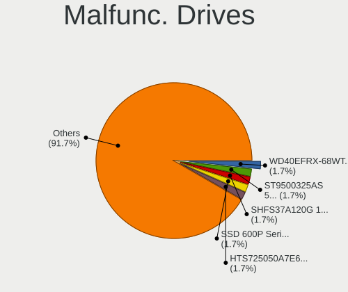

| Model                                          | Computers | Drives | Percent |
|------------------------------------------------|-----------|--------|---------|
| WDC WD40EFRX-68WT0N0 4TB                       | 4         | 6      | 1.66%   |
| Seagate ST9500325AS 500GB                      | 4         | 5      | 1.66%   |
| Kingston SHFS37A120G 120GB SSD                 | 4         | 5      | 1.66%   |
| Intel SSD 600P Series 1024GB                   | 4         | 4      | 1.66%   |
| HGST HTS725050A7E630 500GB                     | 4         | 4      | 1.66%   |
| Seagate ST500LT012-9WS142 500GB                | 3         | 4      | 1.24%   |
| Samsung Electronics MZ7LM960HMJP-00005 960GB   | 3         | 93     | 1.24%   |
| Samsung Electronics HD501LJ 500GB              | 3         | 5      | 1.24%   |
| Samsung Electronics HD103SJ 1TB                | 3         | 4      | 1.24%   |
| Micron Technology MTFDDAK512MAM-1K1 512GB SSD  | 3         | 6      | 1.24%   |
| Kingston SA400S37240G 240GB SSD                | 3         | 3      | 1.24%   |
| Intel SSDSA2M080G2GC 80GB                      | 3         | 3      | 1.24%   |
| WDC WDS120G2G0A-00JH30 120GB SSD               | 2         | 2      | 0.83%   |
| WDC WDS100T2B0A-00SM50 1TB SSD                 | 2         | 20     | 0.83%   |
| WDC WD5000AAKX-60U6AA0 500GB                   | 2         | 2      | 0.83%   |
| WDC WD3200AAKS-00L9A0 320GB                    | 2         | 2      | 0.83%   |
| WDC WD10EARS-22Y5B1 1TB                        | 2         | 3      | 0.83%   |
| WDC WD Blue SA510 2.5 250GB                    | 2         | 2      | 0.83%   |
| USB3.0 Super Speed 500GB                       | 2         | 2      | 0.83%   |
| Toshiba MQ01ABD100 1TB                         | 2         | 2      | 0.83%   |
| Toshiba DT01ACA100 1TB                         | 2         | 3      | 0.83%   |
| Seagate ST500DM002-1BD142 500GB                | 2         | 2      | 0.83%   |
| Seagate ST3500418AS 500GB                      | 2         | 3      | 0.83%   |
| Seagate ST3320620AS 320GB                      | 2         | 2      | 0.83%   |
| Seagate ST3250318AS 250GB                      | 2         | 2      | 0.83%   |
| Seagate ST2000DM006-2DM164 2TB                 | 2         | 2      | 0.83%   |
| Seagate ST1000LM024 HN-M101MBB 1TB             | 2         | 3      | 0.83%   |
| Samsung Electronics SSD 980 PRO 500GB          | 2         | 5      | 0.83%   |
| Samsung Electronics SSD 980 1TB                | 2         | 2      | 0.83%   |
| Samsung Electronics SSD 850 EVO 1TB            | 2         | 2      | 0.83%   |
| Micron Technology 1100_MTFDDAK512TBN 512GB SSD | 2         | 4      | 0.83%   |
| Maxtor 7Y250M0 256GB                           | 2         | 2      | 0.83%   |
| Kingston SA400S37120G 120GB SSD                | 2         | 2      | 0.83%   |
| Intel SSDSC2BF240A5L 240GB                     | 2         | 3      | 0.83%   |
| Intel SSDPEKKW256G7 256GB                      | 2         | 2      | 0.83%   |
| Corsair Force LS SSD 64GB                      | 2         | 2      | 0.83%   |
| WDC WDS240G2G0A-00JH30 240GB SSD               | 1         | 1      | 0.41%   |
| WDC WD7500BPVT-80HXZT1 752GB                   | 1         | 1      | 0.41%   |
| WDC WD6400AAKS-07A7B0 640GB                    | 1         | 1      | 0.41%   |
| WDC WD50EZRZ-32RWYB1 5TB                       | 1         | 1      | 0.41%   |

Malfunc. Drive Vendor
---------------------

Vendors of faulty drives

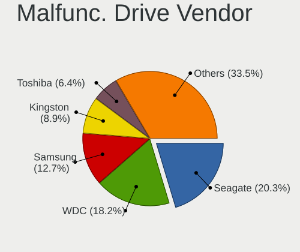

| Vendor              | Computers | Drives | Percent |
|---------------------|-----------|--------|---------|
| Seagate             | 48        | 56     | 20.34%  |
| WDC                 | 43        | 66     | 18.22%  |
| Samsung Electronics | 30        | 138    | 12.71%  |
| Kingston            | 21        | 22     | 8.9%    |
| Toshiba             | 15        | 16     | 6.36%   |
| Intel               | 15        | 16     | 6.36%   |
| Hitachi             | 11        | 19     | 4.66%   |
| HGST                | 8         | 8      | 3.39%   |
| Micron Technology   | 6         | 11     | 2.54%   |
| Corsair             | 5         | 5      | 2.12%   |
| SK hynix            | 4         | 4      | 1.69%   |
| Maxtor              | 4         | 4      | 1.69%   |
| Crucial             | 4         | 16     | 1.69%   |
| SanDisk             | 3         | 3      | 1.27%   |
| OCZ                 | 3         | 3      | 1.27%   |
| Fujitsu             | 3         | 4      | 1.27%   |
| A-DATA Technology   | 3         | 3      | 1.27%   |
| USB3.0              | 2         | 2      | 0.85%   |
| Vaseky              | 1         | 1      | 0.42%   |
| SPCC                | 1         | 1      | 0.42%   |
| Ramaxel Technology  | 1         | 1      | 0.42%   |
| PNY                 | 1         | 1      | 0.42%   |
| Patriot             | 1         | 1      | 0.42%   |
| LITEONIT            | 1         | 1      | 0.42%   |
| ATP                 | 1         | 1      | 0.42%   |
| Apple               | 1         | 1      | 0.42%   |

Malfunc. HDD Vendor
-------------------

Vendors of faulty HDD drives

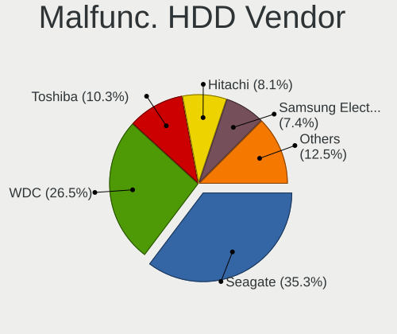

| Vendor              | Computers | Drives | Percent |
|---------------------|-----------|--------|---------|
| Seagate             | 48        | 56     | 35.29%  |
| WDC                 | 36        | 41     | 26.47%  |
| Toshiba             | 14        | 15     | 10.29%  |
| Hitachi             | 11        | 19     | 8.09%   |
| Samsung Electronics | 10        | 13     | 7.35%   |
| HGST                | 8         | 8      | 5.88%   |
| Maxtor              | 4         | 4      | 2.94%   |
| Fujitsu             | 3         | 4      | 2.21%   |
| USB3.0              | 2         | 2      | 1.47%   |

Malfunc. Drive Kind
-------------------

Kinds of faulty drives

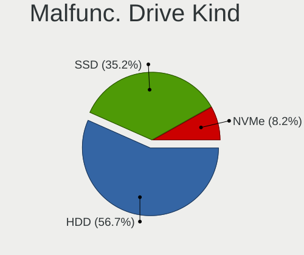

| Kind | Computers | Drives | Percent |
|------|-----------|--------|---------|
| HDD  | 132       | 162    | 56.65%  |
| SSD  | 82        | 212    | 35.19%  |
| NVMe | 19        | 30     | 8.15%   |

Failed Drives
-------------

Failed drive models

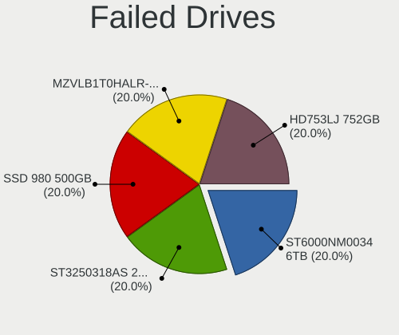

| Model                                      | Computers | Drives | Percent |
|--------------------------------------------|-----------|--------|---------|
| Seagate ST6000NM0034 6TB                   | 1         | 42     | 20%     |
| Seagate ST3250318AS 250GB                  | 1         | 1      | 20%     |
| Samsung Electronics SSD 980 500GB          | 1         | 1      | 20%     |
| Samsung Electronics MZVLB1T0HALR-00000 1TB | 1         | 2      | 20%     |
| Samsung Electronics HD753LJ 752GB          | 1         | 1      | 20%     |

Failed Drive Vendor
-------------------

Failed drive vendors

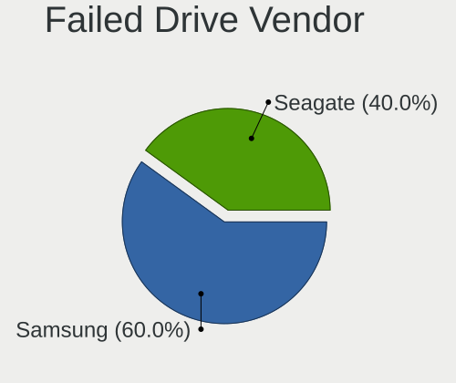

| Vendor              | Computers | Drives | Percent |
|---------------------|-----------|--------|---------|
| Samsung Electronics | 3         | 4      | 60%     |
| Seagate             | 2         | 43     | 40%     |

Drive Status
------------

Number of failed and malfunc. drives

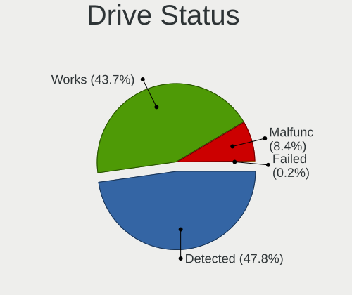

| Status   | Computers | Drives | Percent |
|----------|-----------|--------|---------|
| Detected | 1299      | 3013   | 47.79%  |
| Works    | 1187      | 5157   | 43.67%  |
| Malfunc  | 227       | 404    | 8.35%   |
| Failed   | 5         | 47     | 0.18%   |

Storage controller
------------------

Storage Vendor
--------------

Storage controller vendors

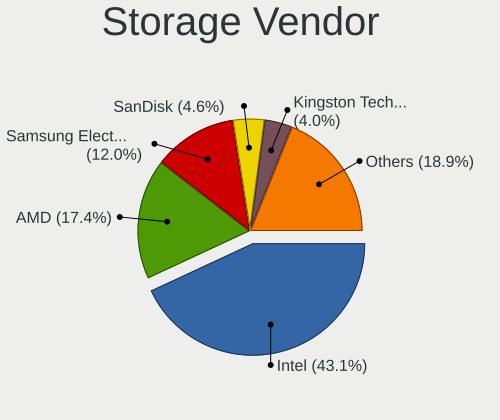

| Vendor                                  | Computers | Percent |
|-----------------------------------------|-----------|---------|
| Intel                                   | 1405      | 43.07%  |
| AMD                                     | 568       | 17.41%  |
| Samsung Electronics                     | 393       | 12.05%  |
| SanDisk                                 | 149       | 4.57%   |
| Kingston Technology Company             | 130       | 3.99%   |
| SK hynix                                | 80        | 2.45%   |
| ASMedia Technology                      | 59        | 1.81%   |
| Micron Technology                       | 53        | 1.62%   |
| Phison Electronics                      | 49        | 1.5%    |
| Toshiba America Info Systems            | 45        | 1.38%   |
| Nvidia                                  | 41        | 1.26%   |
| JMicron Technology                      | 41        | 1.26%   |
| ADATA Technology                        | 32        | 0.98%   |
| KIOXIA                                  | 31        | 0.95%   |
| Marvell Technology Group                | 26        | 0.8%    |
| LSI Logic / Symbios Logic               | 23        | 0.71%   |
| Broadcom / LSI                          | 20        | 0.61%   |
| Hewlett-Packard                         | 17        | 0.52%   |
| Micron/Crucial Technology               | 16        | 0.49%   |
| VIA Technologies                        | 11        | 0.34%   |
| Seagate Technology                      | 10        | 0.31%   |
| Union Memory (Shenzhen)                 | 9         | 0.28%   |
| Silicon Motion                          | 9         | 0.28%   |
| Apple                                   | 9         | 0.28%   |
| MAXIO Technology (Hangzhou)             | 7         | 0.21%   |
| Silicon Integrated Systems [SiS]        | 4         | 0.12%   |
| Lenovo                                  | 4         | 0.12%   |
| Realtek Semiconductor                   | 3         | 0.09%   |
| Yangtze Memory Technologies             | 2         | 0.06%   |
| Transcend                               | 2         | 0.06%   |
| Solid State Storage Technology          | 2         | 0.06%   |
| Shenzhen Longsys Electronics            | 2         | 0.06%   |
| O2 Micro                                | 2         | 0.06%   |
| Solidigm                                | 1         | 0.03%   |
| Shenzhen Unionmemory Information System | 1         | 0.03%   |
| Shenzhen Shichuangyi Electronics        | 1         | 0.03%   |
| Promise Technology                      | 1         | 0.03%   |
| OCZ Technology Group                    | 1         | 0.03%   |
| Lite-On Technology                      | 1         | 0.03%   |
| Hosin Global Electronics                | 1         | 0.03%   |

Storage Model
-------------

Storage controller models

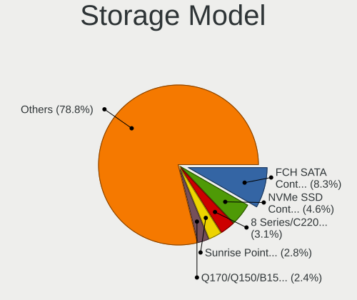

| Model                                                                          | Computers | Percent |
|--------------------------------------------------------------------------------|-----------|---------|
| AMD FCH SATA Controller [AHCI mode]                                            | 309       | 8.3%    |
| Samsung NVMe SSD Controller SM981/PM981/PM983                                  | 173       | 4.65%   |
| Intel 8 Series/C220 Series Chipset Family 6-port SATA Controller 1 [AHCI mode] | 115       | 3.09%   |
| Intel Sunrise Point-LP SATA Controller [AHCI mode]                             | 103       | 2.77%   |
| Intel Q170/Q150/B150/H170/H110/Z170/CM236 Chipset SATA Controller [AHCI Mode]  | 88        | 2.36%   |
| Intel 7 Series Chipset Family 6-port SATA Controller [AHCI mode]               | 84        | 2.26%   |
| Samsung NVMe SSD Controller PM9A1/PM9A3/980PRO                                 | 76        | 2.04%   |
| Intel 6 Series/C200 Series Chipset Family 6 port Mobile SATA AHCI Controller   | 75        | 2.01%   |
| AMD 500 Series Chipset SATA Controller                                         | 75        | 2.01%   |
| AMD 400 Series Chipset SATA Controller                                         | 73        | 1.96%   |
| Intel 200 Series PCH SATA controller [AHCI mode]                               | 67        | 1.8%    |
| Intel 8 Series SATA Controller 1 [AHCI mode]                                   | 61        | 1.64%   |
| Samsung NVMe SSD Controller 980 (DRAM-less)                                    | 58        | 1.56%   |
| Intel 6 Series/C200 Series Chipset Family 6 port Desktop SATA AHCI Controller  | 56        | 1.5%    |
| AMD SB7x0/SB8x0/SB9x0 SATA Controller [AHCI mode]                              | 56        | 1.5%    |
| AMD 600 Series Chipset SATA Controller                                         | 55        | 1.48%   |
| Samsung NVMe SSD Controller SM961/PM961/SM963                                  | 53        | 1.42%   |
| ASMedia ASM1061/ASM1062 Serial ATA Controller                                  | 52        | 1.4%    |
| Intel 82801 Mobile SATA Controller [RAID mode]                                 | 49        | 1.32%   |
| AMD SB7x0/SB8x0/SB9x0 IDE Controller                                           | 48        | 1.29%   |
| Intel 7 Series/C210 Series Chipset Family 6-port SATA Controller [AHCI mode]   | 46        | 1.24%   |
| Intel 82801IBM/IEM (ICH9M/ICH9M-E) 4 port SATA Controller [AHCI mode]          | 43        | 1.15%   |
| Intel SATA Controller [RAID mode]                                              | 39        | 1.05%   |
| Intel Volume Management Device NVMe RAID Controller                            | 38        | 1.02%   |
| Intel Cannon Lake PCH SATA AHCI Controller                                     | 38        | 1.02%   |
| Intel 5 Series/3400 Series Chipset 6 port SATA AHCI Controller                 | 38        | 1.02%   |
| Kingston Company A2000 NVMe SSD [SM2263EN]                                     | 32        | 0.86%   |
| Intel Wildcat Point-LP SATA Controller [AHCI Mode]                             | 32        | 0.86%   |
| Intel SSD 660P Series                                                          | 32        | 0.86%   |
| AMD SB7x0/SB8x0/SB9x0 SATA Controller [IDE mode]                               | 32        | 0.86%   |
| AMD 300 Series Chipset SATA Controller                                         | 32        | 0.86%   |
| SanDisk Extreme Pro / WD Black SN750 / PC SN730 / Red SN700 NVMe SSD           | 27        | 0.73%   |
| Kingston Company NV2 NVMe SSD [SM2267XT] (DRAM-less)                           | 27        | 0.73%   |
| SK hynix Gold P31/BC711/PC711 NVMe Solid State Drive                           | 26        | 0.7%    |
| SanDisk WD SN560/SN740/SN770/SN5000 NVMe SSD                                   | 26        | 0.7%    |
| Samsung NVMe SSD Controller S4LV008[Pascal]                                    | 26        | 0.7%    |
| ADATA XPG SX8200 Pro PCIe Gen3x4 M.2 2280 Solid State Drive                    | 26        | 0.7%    |
| Intel 82801G (ICH7 Family) IDE Controller                                      | 25        | 0.67%   |
| Intel 82801HM/HEM (ICH8M/ICH8M-E) IDE Controller                               | 24        | 0.64%   |
| Phison E12 NVMe Controller                                                     | 23        | 0.62%   |

Storage Kind
------------

Kind of storage controller (IDE, SATA, NVMe, SAS, ...)

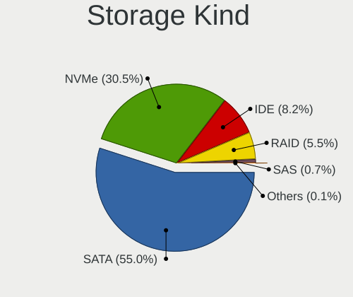

| Kind | Computers | Percent |
|------|-----------|---------|
| SATA | 1773      | 54.96%  |
| NVMe | 983       | 30.47%  |
| IDE  | 263       | 8.15%   |
| RAID | 179       | 5.55%   |
| SAS  | 24        | 0.74%   |
| SCSI | 4         | 0.12%   |

Processor
---------

CPU Vendor
----------

Processor vendors

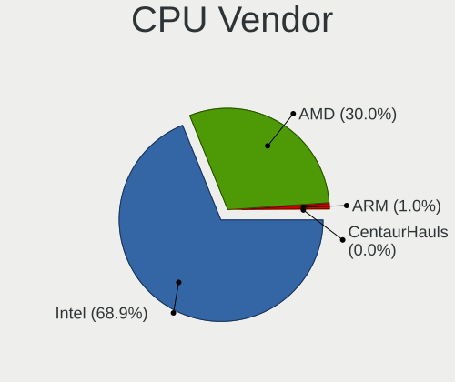

| Vendor       | Computers | Percent |
|--------------|-----------|---------|
| Intel        | 1696      | 68.89%  |
| AMD          | 739       | 30.02%  |
| ARM          | 24        | 0.97%   |
| Qualcomm     | 2         | 0.08%   |
| CentaurHauls | 1         | 0.04%   |

CPU Model
---------

Processor models

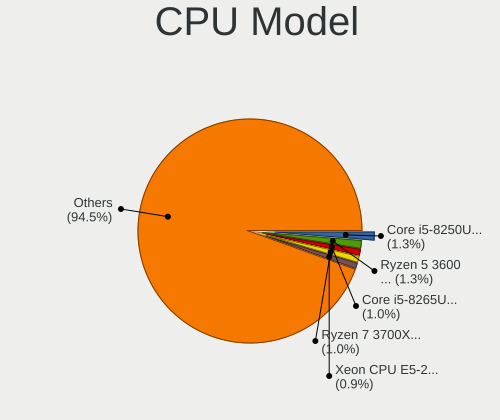

| Model                                   | Computers | Percent |
|-----------------------------------------|-----------|---------|
| Intel Core i5-8250U CPU @ 1.60GHz       | 32        | 1.29%   |
| AMD Ryzen 5 3600 6-Core Processor       | 31        | 1.25%   |
| Intel Core i5-8265U CPU @ 1.60GHz       | 25        | 1.01%   |
| AMD Ryzen 7 3700X 8-Core Processor      | 25        | 1.01%   |
| Intel Xeon CPU E5-2640 v4 @ 2.40GHz     | 23        | 0.93%   |
| Intel Core i5-2520M CPU @ 2.50GHz       | 22        | 0.89%   |
| Intel Core i5-6300U CPU @ 2.40GHz       | 21        | 0.85%   |
| Intel Core i5-7200U CPU @ 2.50GHz       | 20        | 0.81%   |
| Intel Core i5-6500 CPU @ 3.20GHz        | 20        | 0.81%   |
| Intel Core i5-6200U CPU @ 2.30GHz       | 19        | 0.77%   |
| AMD Ryzen 9 5950X 16-Core Processor     | 17        | 0.69%   |
| Intel Core i7-8565U CPU @ 1.80GHz       | 16        | 0.65%   |
| Intel Core i7-8550U CPU @ 1.80GHz       | 16        | 0.65%   |
| Intel Core i5-5200U CPU @ 2.20GHz       | 16        | 0.65%   |
| Intel 11th Gen Core i5-1135G7 @ 2.40GHz | 16        | 0.65%   |
| Intel Core i5-3320M CPU @ 2.60GHz       | 15        | 0.61%   |
| AMD Ryzen 7 5800X3D 8-Core Processor    | 15        | 0.61%   |
| AMD Ryzen 5 5600X 6-Core Processor      | 15        | 0.61%   |
| AMD Ryzen 5 2600 Six-Core Processor     | 15        | 0.61%   |
| Intel Core i5-4570 CPU @ 3.20GHz        | 14        | 0.57%   |
| Intel Core i5-6600K CPU @ 3.50GHz       | 13        | 0.53%   |
| Intel Core i5-4200U CPU @ 1.60GHz       | 13        | 0.53%   |
| Intel Core i5-2400 CPU @ 3.10GHz        | 13        | 0.53%   |
| Intel 11th Gen Core i7-1165G7 @ 2.80GHz | 13        | 0.53%   |
| ARM Processor                           | 13        | 0.53%   |
| AMD Ryzen 9 5900X 12-Core Processor     | 13        | 0.53%   |
| Intel Core i7-7700HQ CPU @ 2.80GHz      | 12        | 0.49%   |
| Intel Core i7-7500U CPU @ 2.70GHz       | 12        | 0.49%   |
| Intel Core i7-6700K CPU @ 4.00GHz       | 12        | 0.49%   |
| Intel Core i5 CPU M 520 @ 2.40GHz       | 12        | 0.49%   |
| AMD Ryzen 7 5800X 8-Core Processor      | 12        | 0.49%   |
| Intel Core i5-3470 CPU @ 3.20GHz        | 11        | 0.44%   |
| Intel Celeron CPU N2840 @ 2.16GHz       | 11        | 0.44%   |
| AMD Ryzen 9 3900X 12-Core Processor     | 11        | 0.44%   |
| Intel Core i7-7700 CPU @ 3.60GHz        | 10        | 0.4%    |
| Intel Core i7-10510U CPU @ 1.80GHz      | 10        | 0.4%    |
| Intel Core i5-10210U CPU @ 1.60GHz      | 10        | 0.4%    |
| Intel Core 2 Duo CPU E8400 @ 3.00GHz    | 10        | 0.4%    |
| Intel Atom x5-Z8350 CPU @ 1.44GHz       | 10        | 0.4%    |
| AMD Ryzen 7 5700U with Radeon Graphics  | 10        | 0.4%    |

CPU Model Family
----------------

Processor model prefix

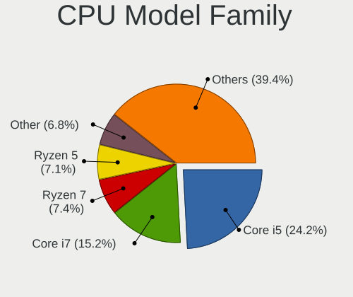

| Model                   | Computers | Percent |
|-------------------------|-----------|---------|
| Intel Core i5           | 596       | 24.16%  |
| Intel Core i7           | 374       | 15.16%  |
| AMD Ryzen 7             | 182       | 7.38%   |
| AMD Ryzen 5             | 176       | 7.13%   |
| Other                   | 167       | 6.77%   |
| Intel Core i3           | 125       | 5.07%   |
| Intel Xeon              | 101       | 4.09%   |
| Intel Celeron           | 93        | 3.77%   |
| AMD Ryzen 9             | 81        | 3.28%   |
| Intel Core 2 Duo        | 80        | 3.24%   |
| Intel Pentium           | 52        | 2.11%   |
| AMD FX                  | 32        | 1.3%    |
| Intel Atom              | 27        | 1.09%   |
| Intel Pentium Dual-Core | 23        | 0.93%   |
| AMD Ryzen 3             | 21        | 0.85%   |
| AMD Ryzen 7 PRO         | 20        | 0.81%   |
| AMD A8                  | 17        | 0.69%   |
| AMD Phenom II X4        | 15        | 0.61%   |
| Intel Core i9           | 14        | 0.57%   |
| Intel Core 2 Quad       | 14        | 0.57%   |
| AMD E1                  | 14        | 0.57%   |
| AMD Athlon II X2        | 14        | 0.57%   |
| AMD Athlon 64 X2        | 14        | 0.57%   |
| Intel Core              | 13        | 0.53%   |
| AMD Ryzen 5 PRO         | 13        | 0.53%   |
| AMD A10                 | 13        | 0.53%   |
| AMD A4                  | 11        | 0.45%   |
| Intel Core 2            | 10        | 0.41%   |
| Intel Genuine           | 9         | 0.36%   |
| AMD A6                  | 9         | 0.36%   |
| AMD E2                  | 8         | 0.32%   |
| AMD Athlon              | 7         | 0.28%   |
| ARM BCM                 | 6         | 0.24%   |
| AMD Ryzen 3 PRO         | 6         | 0.24%   |
| AMD Phenom              | 6         | 0.24%   |
| Intel Pentium Dual      | 5         | 0.2%    |
| AMD Ryzen Threadripper  | 5         | 0.2%    |
| AMD Phenom II X6        | 5         | 0.2%    |
| AMD EPYC                | 5         | 0.2%    |
| Intel Pentium 4         | 4         | 0.16%   |

CPU Cores
---------

Number of processor cores

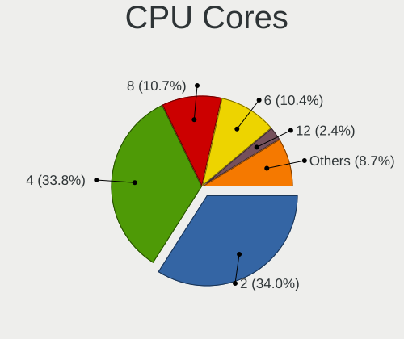

| Number  | Computers | Percent |
|---------|-----------|---------|
| 2       | 841       | 34.03%  |
| 4       | 834       | 33.75%  |
| 8       | 265       | 10.72%  |
| 6       | 256       | 10.36%  |
| 12      | 60        | 2.43%   |
| 16      | 56        | 2.27%   |
| 1       | 36        | 1.46%   |
| 20      | 26        | 1.05%   |
| 10      | 23        | 0.93%   |
| 14      | 21        | 0.85%   |
| 3       | 16        | 0.65%   |
| 24      | 14        | 0.57%   |
| Unknown | 6         | 0.24%   |
| 28      | 4         | 0.16%   |
| 48      | 3         | 0.12%   |
| 40      | 3         | 0.12%   |
| 36      | 2         | 0.08%   |
| 32      | 2         | 0.08%   |
| 80      | 1         | 0.04%   |
| 18      | 1         | 0.04%   |
| 5       | 1         | 0.04%   |

CPU Sockets
-----------

Number of sockets

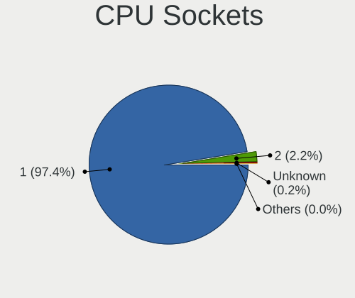

| Number  | Computers | Percent |
|---------|-----------|---------|
| 1       | 2402      | 97.44%  |
| 2       | 53        | 2.15%   |
| Unknown | 6         | 0.24%   |
| 0       | 2         | 0.08%   |
| 16      | 1         | 0.04%   |
| 4       | 1         | 0.04%   |

CPU Threads
-----------

Threads per core (Hyper-Threading)

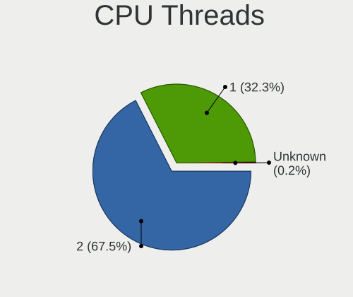

| Number  | Computers | Percent |
|---------|-----------|---------|
| 2       | 1665      | 67.49%  |
| 1       | 796       | 32.27%  |
| Unknown | 6         | 0.24%   |

CPU Op-Modes
------------

CPU Operation Modes (32-bit, 64-bit)

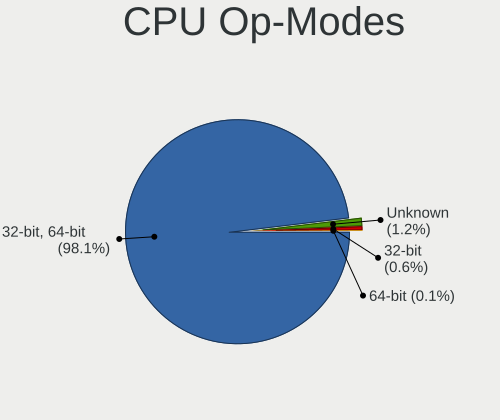

| Op mode        | Computers | Percent |
|----------------|-----------|---------|
| 32-bit, 64-bit | 2419      | 98.09%  |
| Unknown        | 30        | 1.22%   |
| 32-bit         | 15        | 0.61%   |
| 64-bit         | 2         | 0.08%   |

CPU Microcode
-------------

Microcode number

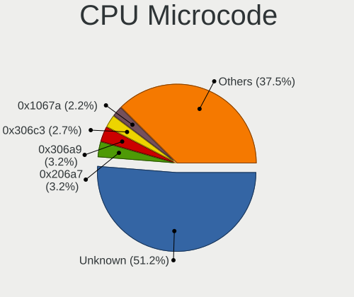

| Number     | Computers | Percent |
|------------|-----------|---------|
| Unknown    | 1313      | 51.25%  |
| 0x206a7    | 82        | 3.2%    |
| 0x306a9    | 81        | 3.16%   |
| 0x306c3    | 68        | 2.65%   |
| 0x1067a    | 57        | 2.22%   |
| 0x506e3    | 55        | 2.15%   |
| 0x806ec    | 42        | 1.64%   |
| 0x40651    | 36        | 1.41%   |
| 0x806ea    | 31        | 1.21%   |
| 0x406e3    | 31        | 1.21%   |
| 0x08701021 | 28        | 1.09%   |
| 0x906ea    | 27        | 1.05%   |
| 0x906e9    | 27        | 1.05%   |
| 0x20655    | 22        | 0.86%   |
| 0x0800820d | 20        | 0.78%   |
| 0x306d4    | 19        | 0.74%   |
| 0x30678    | 19        | 0.74%   |
| 0x10676    | 19        | 0.74%   |
| 0x806e9    | 18        | 0.7%    |
| 0x406c4    | 17        | 0.66%   |
| 0x08701013 | 17        | 0.66%   |
| 0x806c1    | 16        | 0.62%   |
| 0x20652    | 16        | 0.62%   |
| 0x0a201016 | 16        | 0.62%   |
| 0x6fd      | 14        | 0.55%   |
| 0x06000852 | 14        | 0.55%   |
| 0x010000c8 | 14        | 0.55%   |
| 0x0a50000d | 13        | 0.51%   |
| 0x08600106 | 13        | 0.51%   |
| 0x6fb      | 12        | 0.47%   |
| 0xa0652    | 11        | 0.43%   |
| 0x506c9    | 11        | 0.43%   |
| 0x06001119 | 11        | 0.43%   |
| 0x08108109 | 10        | 0.39%   |
| 0x08108102 | 10        | 0.39%   |
| 0x806eb    | 9         | 0.35%   |
| 0x706e5    | 9         | 0.35%   |
| 0x106e5    | 9         | 0.35%   |
| 0x0a50000c | 9         | 0.35%   |
| 0x0810100b | 9         | 0.35%   |

CPU Microarch
-------------

Microarchitecture

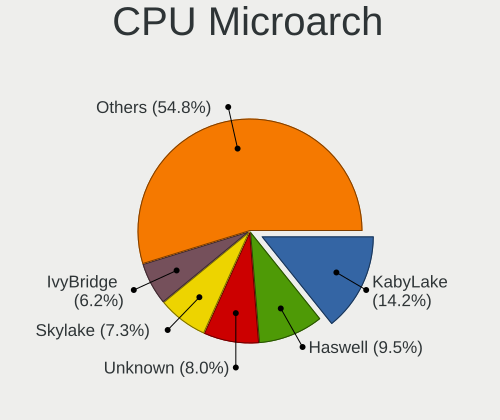

| Name              | Computers | Percent |
|-------------------|-----------|---------|
| KabyLake          | 352       | 14.25%  |
| Haswell           | 234       | 9.47%   |
| Unknown           | 198       | 8.01%   |
| Skylake           | 181       | 7.32%   |
| IvyBridge         | 153       | 6.19%   |
| SandyBridge       | 150       | 6.07%   |
| Zen 2             | 137       | 5.54%   |
| Zen 3             | 136       | 5.5%    |
| Penryn            | 101       | 4.09%   |
| Broadwell         | 81        | 3.28%   |
| Zen+              | 73        | 2.95%   |
| Silvermont        | 61        | 2.47%   |
| Zen               | 58        | 2.35%   |
| Westmere          | 58        | 2.35%   |
| K10               | 51        | 2.06%   |
| Core              | 49        | 1.98%   |
| Piledriver        | 45        | 1.82%   |
| TigerLake         | 44        | 1.78%   |
| Alderlake Hybrid  | 44        | 1.78%   |
| CometLake         | 33        | 1.34%   |
| K8 Hammer         | 28        | 1.13%   |
| Nehalem           | 22        | 0.89%   |
| IceLake           | 21        | 0.85%   |
| Puma              | 20        | 0.81%   |
| Goldmont          | 20        | 0.81%   |
| Excavator         | 16        | 0.65%   |
| Bobcat            | 14        | 0.57%   |
| Goldmont plus     | 13        | 0.53%   |
| Jaguar            | 12        | 0.49%   |
| Steamroller       | 9         | 0.36%   |
| K8 & K10 hybrid   | 9         | 0.36%   |
| P6                | 8         | 0.32%   |
| Bonnell           | 7         | 0.28%   |
| NetBurst          | 6         | 0.24%   |
| Meteorlake Hybrid | 6         | 0.24%   |
| Bulldozer         | 6         | 0.24%   |
| K10 Llano         | 4         | 0.16%   |
| Tremont           | 3         | 0.12%   |
| Gracemont         | 3         | 0.12%   |
| Lunarlake Hybrid  | 2         | 0.08%   |

Graphics
--------

GPU Vendor
----------

Vendors of graphics cards

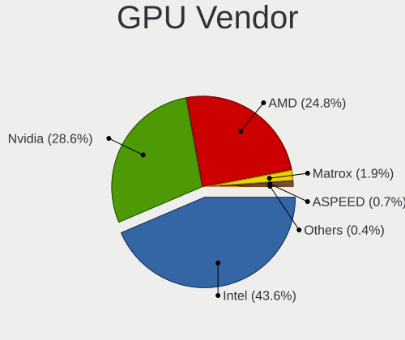

| Vendor                                       | Computers | Percent |
|----------------------------------------------|-----------|---------|
| Intel                                        | 1229      | 43.6%   |
| Nvidia                                       | 805       | 28.56%  |
| AMD                                          | 700       | 24.83%  |
| Matrox Electronics Systems                   | 54        | 1.92%   |
| ASPEED Technology                            | 21        | 0.74%   |
| Silicon Integrated Systems [SiS]             | 4         | 0.14%   |
| Silicon Motion                               | 3         | 0.11%   |
| VIA Technologies                             | 2         | 0.07%   |
| XGI Technology (eXtreme Graphics Innovation) | 1         | 0.04%   |

GPU Model
---------

Graphics card models

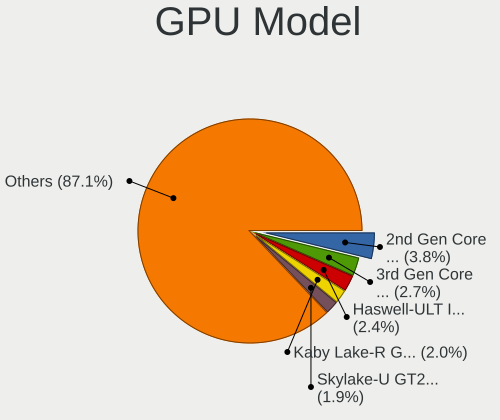

| Model                                                                                    | Computers | Percent |
|------------------------------------------------------------------------------------------|-----------|---------|
| Intel 2nd Generation Core Processor Family Integrated Graphics Controller                | 112       | 3.82%   |
| Intel 3rd Gen Core processor Graphics Controller                                         | 80        | 2.73%   |
| Intel Haswell-ULT Integrated Graphics Controller                                         | 70        | 2.39%   |
| Intel Kaby Lake-R GT2 [UHD Graphics 620]                                                 | 60        | 2.04%   |
| Intel Skylake-U GT2 [HD Graphics 520]                                                    | 57        | 1.94%   |
| Intel WhiskeyLake-U GT2 [UHD Graphics 620]                                               | 55        | 1.87%   |
| Intel Xeon E3-1200 v3/4th Gen Core Processor Integrated Graphics Controller              | 53        | 1.81%   |
| Intel Kaby Lake-U GT2 [HD Graphics 620]                                                  | 44        | 1.5%    |
| AMD Renoir [Radeon Vega Series / Radeon Vega Mobile Series]                              | 42        | 1.43%   |
| AMD Picasso/Raven 2 [Radeon Vega Series / Radeon Vega Mobile Series]                     | 42        | 1.43%   |
| AMD Ellesmere [Radeon RX 470/480/570/570X/580/580X/590]                                  | 42        | 1.43%   |
| Intel 4th Gen Core Processor Integrated Graphics Controller                              | 40        | 1.36%   |
| Intel Skylake-S GT2 [HD Graphics 530]                                                    | 39        | 1.33%   |
| Intel TigerLake-LP GT2 [Iris Xe Graphics]                                                | 38        | 1.29%   |
| Intel Atom/Celeron/Pentium Processor x5-E8000/J3xxx/N3xxx Integrated Graphics Controller | 36        | 1.23%   |
| Intel Core Processor Integrated Graphics Controller                                      | 35        | 1.19%   |
| Intel Mobile 4 Series Chipset Integrated Graphics Controller                             | 34        | 1.16%   |
| Intel Broadwell-U GT2 [HD Graphics 5500]                                                 | 32        | 1.09%   |
| AMD Cezanne [Radeon Vega Series / Radeon Vega Mobile Series]                             | 32        | 1.09%   |
| AMD Raphael                                                                              | 31        | 1.06%   |
| Nvidia GP104 [GeForce GTX 1070]                                                          | 29        | 0.99%   |
| Matrox Electronics Systems G200eR2                                                       | 29        | 0.99%   |
| Intel CometLake-U GT2 [UHD Graphics]                                                     | 29        | 0.99%   |
| Intel CoffeeLake-S GT2 [UHD Graphics 630]                                                | 26        | 0.89%   |
| Intel CoffeeLake-H GT2 [UHD Graphics 630]                                                | 25        | 0.85%   |
| Intel Atom Processor Z36xxx/Z37xxx Series Graphics & Display                             | 25        | 0.85%   |
| Nvidia GP106 [GeForce GTX 1060 6GB]                                                      | 23        | 0.78%   |
| Intel Xeon E3-1200 v2/3rd Gen Core processor Graphics Controller                         | 21        | 0.72%   |
| ASPEED Technology ASPEED Graphics Family                                                 | 21        | 0.72%   |
| AMD Raven Ridge [Radeon Vega Series / Radeon Vega Mobile Series]                         | 20        | 0.68%   |
| Nvidia TU117M [GeForce GTX 1650 Mobile / Max-Q]                                          | 19        | 0.65%   |
| AMD Navi 10 [Radeon RX 5600 OEM/5600 XT / 5700/5700 XT]                                  | 19        | 0.65%   |
| AMD Lucienne                                                                             | 19        | 0.65%   |
| Intel Kaby Lake-H GT2 [HD Graphics 630]                                                  | 18        | 0.61%   |
| AMD Navi 31 [Radeon RX 7900 XT/7900 XTX/7900 GRE/7900M]                                  | 18        | 0.61%   |
| Nvidia GP107 [GeForce GTX 1050 Ti]                                                       | 17        | 0.58%   |
| Nvidia GM206 [GeForce GTX 960]                                                           | 17        | 0.58%   |
| Intel Mobile GM965/GL960 Integrated Graphics Controller (secondary)                      | 17        | 0.58%   |
| Intel Mobile GM965/GL960 Integrated Graphics Controller (primary)                        | 17        | 0.58%   |
| Matrox Electronics Systems MGA G200EH                                                    | 16        | 0.55%   |

GPU Combo
---------

Combinations of graphics cards

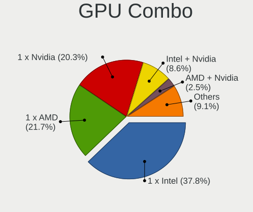

| Name               | Computers | Percent |
|--------------------|-----------|---------|
| 1 x Intel          | 941       | 37.82%  |
| 1 x AMD            | 539       | 21.66%  |
| 1 x Nvidia         | 504       | 20.26%  |
| Intel + Nvidia     | 214       | 8.6%    |
| AMD + Nvidia       | 63        | 2.53%   |
| 2 x AMD            | 60        | 2.41%   |
| 1 x Matrox         | 35        | 1.41%   |
| Intel + AMD        | 35        | 1.41%   |
| Other              | 26        | 1.05%   |
| 1 x ASPEED         | 21        | 0.84%   |
| Nvidia + Matrox    | 19        | 0.76%   |
| 2 x Nvidia         | 11        | 0.44%   |
| 2 x Intel          | 10        | 0.4%    |
| 1 x SiS            | 4         | 0.16%   |
| 1 x Silicon Motion | 3         | 0.12%   |
| 1 x VIA            | 2         | 0.08%   |
| 1 x XGI            | 1         | 0.04%   |

GPU Driver
----------

Free vs proprietary

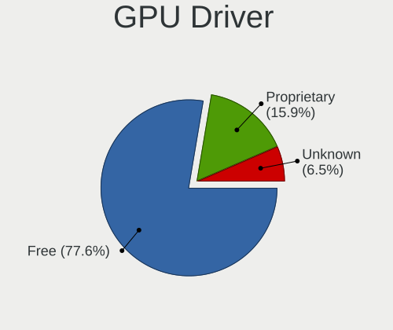

| Driver      | Computers | Percent |
|-------------|-----------|---------|
| Free        | 1949      | 77.65%  |
| Proprietary | 398       | 15.86%  |
| Unknown     | 163       | 6.49%   |

GPU Memory
----------

Total video memory

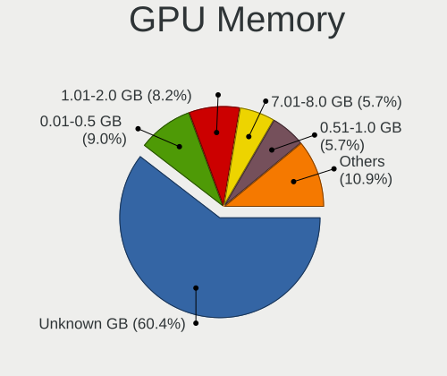

| Size in GB | Computers | Percent |
|------------|-----------|---------|
| Unknown    | 1535      | 60.43%  |
| 0.01-0.5   | 228       | 8.98%   |
| 1.01-2.0   | 209       | 8.23%   |
| 7.01-8.0   | 146       | 5.75%   |
| 0.51-1.0   | 144       | 5.67%   |
| 3.01-4.0   | 122       | 4.8%    |
| 8.01-16.0  | 65        | 2.56%   |
| 5.01-6.0   | 50        | 1.97%   |
| 2.01-3.0   | 20        | 0.79%   |
| 16.01-24.0 | 19        | 0.75%   |
| 4.01-5.0   | 2         | 0.08%   |

Monitor
-------

Monitor Vendor
--------------

Monitor vendors

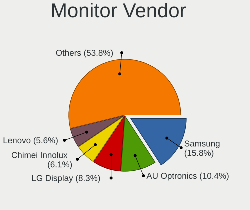

| Vendor                  | Computers | Percent |
|-------------------------|-----------|---------|
| Samsung Electronics     | 429       | 15.8%   |
| AU Optronics            | 282       | 10.38%  |
| LG Display              | 225       | 8.28%   |
| Chimei Innolux          | 165       | 6.08%   |
| Lenovo                  | 153       | 5.63%   |
| BOE                     | 133       | 4.9%    |
| BenQ                    | 132       | 4.86%   |
| Dell                    | 128       | 4.71%   |
| Hewlett-Packard         | 122       | 4.49%   |
| Acer                    | 115       | 4.23%   |
| Ancor Communications    | 97        | 3.57%   |
| Goldstar                | 80        | 2.95%   |
| ASUSTek Computer        | 60        | 2.21%   |
| Apple                   | 57        | 2.1%    |
| AOC                     | 55        | 2.03%   |
| Sony                    | 38        | 1.4%    |
| Fujitsu Siemens         | 38        | 1.4%    |
| Sharp                   | 29        | 1.07%   |
| InfoVision              | 28        | 1.03%   |
| ViewSonic               | 27        | 0.99%   |
| Philips                 | 27        | 0.99%   |
| Vestel Elektronik       | 17        | 0.63%   |
| PANDA                   | 17        | 0.63%   |
| MSI                     | 17        | 0.63%   |
| Eizo                    | 17        | 0.63%   |
| CSO                     | 17        | 0.63%   |
| Chi Mei Optoelectronics | 17        | 0.63%   |
| LG Electronics          | 12        | 0.44%   |
| Unknown                 | 10        | 0.37%   |
| Panasonic               | 10        | 0.37%   |
| LG Philips              | 10        | 0.37%   |
| Valve                   | 9         | 0.33%   |
| Toshiba                 | 6         | 0.22%   |
| Gigabyte Technology     | 6         | 0.22%   |
| Denver                  | 6         | 0.22%   |
| NEC Computers           | 5         | 0.18%   |
| HUAWEI                  | 5         | 0.18%   |
| Hitachi                 | 5         | 0.18%   |
| Iiyama                  | 4         | 0.15%   |
| IBM                     | 4         | 0.15%   |

Monitor Model
-------------

Monitor models

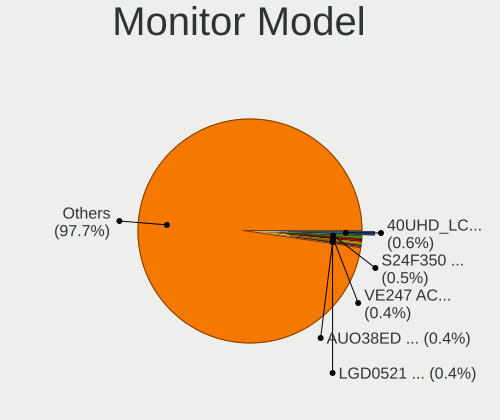

| Model                                                                 | Computers | Percent |
|-----------------------------------------------------------------------|-----------|---------|
| Vestel Elektronik 40UHD_LCD_TV VES3700 3840x2160 880x500mm 39.8-inch  | 17        | 0.61%   |
| Samsung Electronics S24F350 SAM0D20 1920x1080 521x293mm 23.5-inch     | 15        | 0.53%   |
| Ancor Communications VE247 ACI2493 1920x1080 530x300mm 24.0-inch      | 12        | 0.43%   |
| AU Optronics LCD Monitor AUO38ED 1920x1080 344x193mm 15.5-inch        | 11        | 0.39%   |
| LG Display LCD Monitor LGD0521 1920x1080 309x174mm 14.0-inch          | 10        | 0.36%   |
| BenQ ZOWIE XL LCD BNQ7F32 1920x1080 531x298mm 24.0-inch               | 10        | 0.36%   |
| AOC 27G2G4 AOC2702 1920x1080 598x336mm 27.0-inch                      | 10        | 0.36%   |
| Chimei Innolux LCD Monitor CMN14D4 1920x1080 309x173mm 13.9-inch      | 9         | 0.32%   |
| LG Display LCD Monitor LGD02DC 1366x768 344x194mm 15.5-inch           | 8         | 0.29%   |
| Chimei Innolux LCD Monitor CMN15E7 1920x1080 344x193mm 15.5-inch      | 8         | 0.29%   |
| Chimei Innolux LCD Monitor CMN1521 1920x1080 344x193mm 15.5-inch      | 8         | 0.29%   |
| BenQ XL2411Z BNQ7F31 1920x1080 531x298mm 24.0-inch                    | 8         | 0.29%   |
| AU Optronics LCD Monitor AUO243D 1920x1080 309x173mm 13.9-inch        | 8         | 0.29%   |
| AU Optronics LCD Monitor AUO22EC 1366x768 344x193mm 15.5-inch         | 8         | 0.29%   |
| Ancor Communications ASUS VS247 ACI249A 1920x1080 521x293mm 23.5-inch | 8         | 0.29%   |
| Lenovo LCD Monitor LEN4036 1440x900 303x190mm 14.1-inch               | 7         | 0.25%   |
| Chimei Innolux LCD Monitor CMN14F2 1920x1080 309x173mm 13.9-inch      | 7         | 0.25%   |
| AU Optronics LCD Monitor AUO403D 1920x1080 309x174mm 14.0-inch        | 7         | 0.25%   |
| AU Optronics LCD Monitor AUO313C 1366x768 309x173mm 13.9-inch         | 7         | 0.25%   |
| Ancor Communications ROG PG279Q ACI27EC 2560x1440 598x336mm 27.0-inch | 7         | 0.25%   |
| Samsung Electronics LCD Monitor SAM0902 1920x1080 890x500mm 40.2-inch | 6         | 0.21%   |
| PANDA LCD Monitor NCP004D 1920x1080 344x194mm 15.5-inch               | 6         | 0.21%   |
| LG Display LCD Monitor LGD046F 1920x1080 344x194mm 15.5-inch          | 6         | 0.21%   |
| Lenovo LEN P27q-10 LEN61A8 2560x1440 600x340mm 27.2-inch              | 6         | 0.21%   |
| Lenovo LEN LT2452pwC LEN1144 1920x1080 518x324mm 24.1-inch            | 6         | 0.21%   |
| Denver MO-HHS-32C LHCFFFF 1920x1080 699x393mm 31.6-inch               | 6         | 0.21%   |
| Chimei Innolux LCD Monitor CMN14C9 1920x1080 309x173mm 13.9-inch      | 6         | 0.21%   |
| BenQ G2420HDB BNQ7842 1920x1080 477x268mm 21.5-inch                   | 6         | 0.21%   |
| AU Optronics LCD Monitor AUO303E 1600x900 309x174mm 14.0-inch         | 6         | 0.21%   |
| AU Optronics LCD Monitor AUO21ED 1920x1080 344x193mm 15.5-inch        | 6         | 0.21%   |
| AU Optronics LCD Monitor AUO106C 1366x768 276x155mm 12.5-inch         | 6         | 0.21%   |
| Ancor Communications VG248 ACI24E1 1920x1080 531x299mm 24.0-inch      | 6         | 0.21%   |
| Ancor Communications VG248 ACI24A4 1920x1080 531x299mm 24.0-inch      | 6         | 0.21%   |
| Valve ANX7530 U VLV3001 800x1280 100x150mm 7.1-inch                   | 5         | 0.18%   |
| Samsung Electronics LF24T35 SAM707D 1920x1080 528x297mm 23.9-inch     | 5         | 0.18%   |
| Samsung Electronics LCD Monitor SEC544B 1600x900 382x214mm 17.2-inch  | 5         | 0.18%   |
| Samsung Electronics LCD Monitor SEC304C 1366x768 353x198mm 15.9-inch  | 5         | 0.18%   |
| LG Display LCD Monitor LGD05FA 1920x1080 310x170mm 13.9-inch          | 5         | 0.18%   |
| LG Display LCD Monitor LGD046D 1920x1080 309x174mm 14.0-inch          | 5         | 0.18%   |
| LG Display LCD Monitor LGD01DD 1600x900 382x215mm 17.3-inch           | 5         | 0.18%   |

Monitor Resolution
------------------

Monitor screen resolution

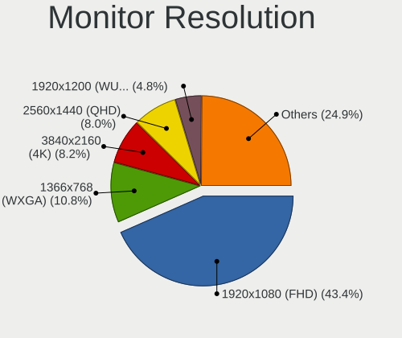

| Resolution         | Computers | Percent |
|--------------------|-----------|---------|
| 1920x1080 (FHD)    | 1132      | 43.4%   |
| 1366x768 (WXGA)    | 282       | 10.81%  |
| 3840x2160 (4K)     | 213       | 8.17%   |
| 2560x1440 (QHD)    | 208       | 7.98%   |
| 1920x1200 (WUXGA)  | 124       | 4.75%   |
| 1600x900 (HD+)     | 93        | 3.57%   |
| 1680x1050 (WSXGA+) | 88        | 3.37%   |
| 1280x1024 (SXGA)   | 64        | 2.45%   |
| 3440x1440          | 59        | 2.26%   |
| 1440x900 (WXGA+)   | 58        | 2.22%   |
| 1280x800 (WXGA)    | 41        | 1.57%   |
| Unknown            | 39        | 1.5%    |
| 2560x1600          | 29        | 1.11%   |
| 2880x1800          | 25        | 0.96%   |
| 1360x768           | 19        | 0.73%   |
| 3840x1080          | 16        | 0.61%   |
| 3840x2400          | 11        | 0.42%   |
| 800x1280           | 8         | 0.31%   |
| 1920x540           | 7         | 0.27%   |
| 2560x1080          | 6         | 0.23%   |
| 1280x720 (HD)      | 6         | 0.23%   |
| 3000x2000          | 5         | 0.19%   |
| 2160x1440          | 5         | 0.19%   |
| 1600x1200          | 5         | 0.19%   |
| 1024x600           | 5         | 0.19%   |
| 4480x1440          | 4         | 0.15%   |
| 3840x1200          | 4         | 0.15%   |
| 3200x2000          | 4         | 0.15%   |
| 3200x1800 (QHD+)   | 4         | 0.15%   |
| 2288x1287          | 4         | 0.15%   |
| 2256x1504          | 4         | 0.15%   |
| 2304x1440          | 3         | 0.12%   |
| 1400x1050          | 3         | 0.12%   |
| 5760x2160          | 2         | 0.08%   |
| 5120x1440          | 2         | 0.08%   |
| 3360x1050          | 2         | 0.08%   |
| 2736x1824          | 2         | 0.08%   |
| 1680x945           | 2         | 0.08%   |
| 1024x768 (XGA)     | 2         | 0.08%   |
| 7680x2160          | 1         | 0.04%   |

Monitor Diagonal
----------------

Diagonal size in inches

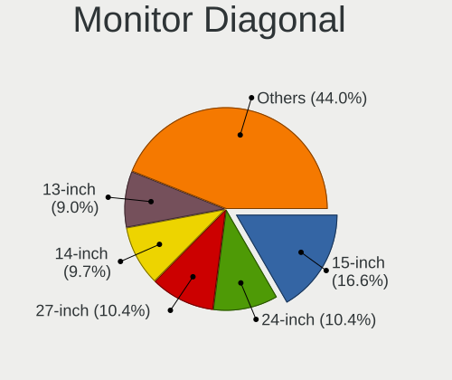

| Inches  | Computers | Percent |
|---------|-----------|---------|
| 15      | 450       | 16.65%  |
| 24      | 281       | 10.4%   |
| 27      | 280       | 10.36%  |
| 14      | 261       | 9.66%   |
| 13      | 243       | 8.99%   |
| 23      | 194       | 7.18%   |
| Unknown | 122       | 4.51%   |
| 17      | 107       | 3.96%   |
| 31      | 87        | 3.22%   |
| 21      | 79        | 2.92%   |
| 22      | 63        | 2.33%   |
| 34      | 61        | 2.26%   |
| 19      | 59        | 2.18%   |
| 12      | 58        | 2.15%   |
| 84      | 46        | 1.7%    |
| 16      | 35        | 1.29%   |
| 18      | 29        | 1.07%   |
| 11      | 28        | 1.04%   |
| 25      | 24        | 0.89%   |
| 72      | 20        | 0.74%   |
| 20      | 19        | 0.7%    |
| 32      | 18        | 0.67%   |
| 40      | 17        | 0.63%   |
| 54      | 15        | 0.55%   |
| 26      | 13        | 0.48%   |
| 28      | 10        | 0.37%   |
| 7       | 8         | 0.3%    |
| 49      | 7         | 0.26%   |
| 55      | 6         | 0.22%   |
| 48      | 6         | 0.22%   |
| 65      | 5         | 0.18%   |
| 43      | 5         | 0.18%   |
| 33      | 5         | 0.18%   |
| 10      | 5         | 0.18%   |
| 142     | 4         | 0.15%   |
| 75      | 4         | 0.15%   |
| 46      | 4         | 0.15%   |
| 29      | 4         | 0.15%   |
| 42      | 3         | 0.11%   |
| 36      | 3         | 0.11%   |

Monitor Width
-------------

Physical width

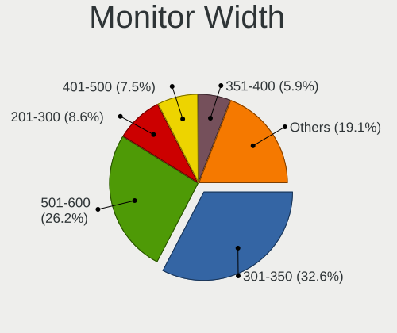

| Width in mm    | Computers | Percent |
|----------------|-----------|---------|
| 301-350        | 856       | 32.65%  |
| 501-600        | 687       | 26.2%   |
| 201-300        | 225       | 8.58%   |
| 401-500        | 196       | 7.48%   |
| 351-400        | 156       | 5.95%   |
| 601-700        | 128       | 4.88%   |
| Unknown        | 122       | 4.65%   |
| 701-800        | 86        | 3.28%   |
| 1501-2000      | 73        | 2.78%   |
| 1001-1500      | 51        | 1.95%   |
| 801-900        | 23        | 0.88%   |
| 1-100          | 8         | 0.31%   |
| 901-1000       | 7         | 0.27%   |
| More than 2000 | 4         | 0.15%   |

Aspect Ratio
------------

Proportional relationship between the width and the height

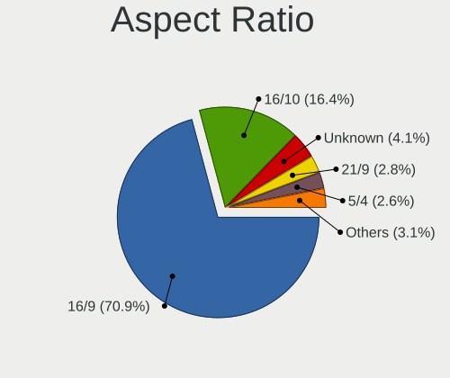

| Ratio   | Computers | Percent |
|---------|-----------|---------|
| 16/9    | 1712      | 70.86%  |
| 16/10   | 397       | 16.43%  |
| Unknown | 100       | 4.14%   |
| 21/9    | 68        | 2.81%   |
| 5/4     | 63        | 2.61%   |
| 3/2     | 28        | 1.16%   |
| 32/9    | 16        | 0.66%   |
| 4/3     | 11        | 0.46%   |
| 6/5     | 5         | 0.21%   |
| 0.67    | 5         | 0.21%   |
| 1.00    | 4         | 0.17%   |
| 0.62    | 3         | 0.12%   |
| 3.20    | 1         | 0.04%   |
| 0.89    | 1         | 0.04%   |
| 0.56    | 1         | 0.04%   |
| 0.45    | 1         | 0.04%   |

Monitor Area
------------

Area in inch²

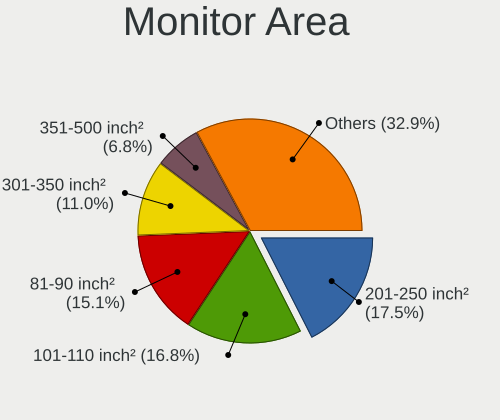

| Area in inch² | Computers | Percent |
|----------------|-----------|---------|
| 201-250        | 467       | 17.52%  |
| 101-110        | 447       | 16.77%  |
| 81-90          | 402       | 15.08%  |
| 301-350        | 292       | 10.95%  |
| 351-500        | 181       | 6.79%   |
| 251-300        | 130       | 4.88%   |
| Unknown        | 122       | 4.58%   |
| More than 1000 | 110       | 4.13%   |
| 151-200        | 106       | 3.98%   |
| 71-80          | 100       | 3.75%   |
| 121-130        | 78        | 2.93%   |
| 61-70          | 57        | 2.14%   |
| 501-1000       | 49        | 1.84%   |
| 111-120        | 38        | 1.43%   |
| 141-150        | 32        | 1.2%    |
| 51-60          | 28        | 1.05%   |
| 131-140        | 12        | 0.45%   |
| 1-40           | 8         | 0.3%    |
| 41-50          | 5         | 0.19%   |
| 91-100         | 2         | 0.08%   |

Pixel Density
-------------

Pixels per inch

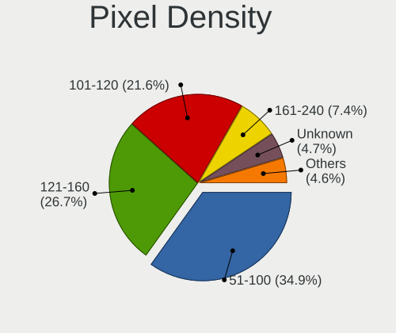

| Density       | Computers | Percent |
|---------------|-----------|---------|
| 51-100        | 897       | 34.9%   |
| 121-160       | 687       | 26.73%  |
| 101-120       | 556       | 21.63%  |
| 161-240       | 189       | 7.35%   |
| Unknown       | 122       | 4.75%   |
| 1-50          | 65        | 2.53%   |
| More than 240 | 54        | 2.1%    |

Multiple Monitors
-----------------

Total monitors connected

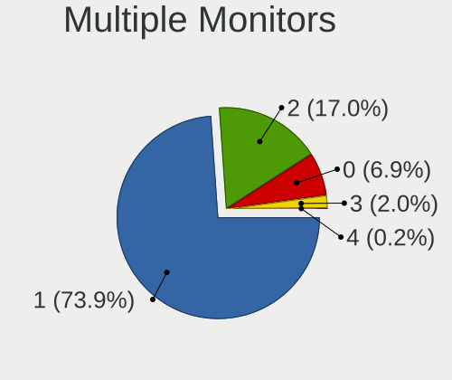

| Total | Computers | Percent |
|-------|-----------|---------|
| 1     | 1870      | 73.88%  |
| 2     | 431       | 17.03%  |
| 0     | 175       | 6.91%   |
| 3     | 51        | 2.02%   |
| 4     | 4         | 0.16%   |

Network
-------

Net Controller Vendor
---------------------

Controller vendors

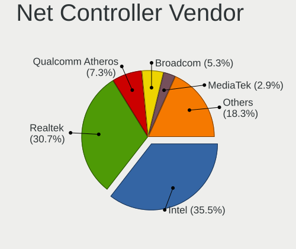

| Vendor                                 | Computers | Percent |
|----------------------------------------|-----------|---------|
| Intel                                  | 1303      | 35.51%  |
| Realtek Semiconductor                  | 1125      | 30.66%  |
| Qualcomm Atheros                       | 268       | 7.3%    |
| Broadcom                               | 195       | 5.31%   |
| MediaTek                               | 108       | 2.94%   |
| TP-Link                                | 44        | 1.2%    |
| Ralink                                 | 41        | 1.12%   |
| Broadcom Limited                       | 39        | 1.06%   |
| Marvell Technology Group               | 34        | 0.93%   |
| Nvidia                                 | 33        | 0.9%    |
| Sierra Wireless                        | 32        | 0.87%   |
| Huawei Technologies                    | 32        | 0.87%   |
| Hewlett-Packard                        | 30        | 0.82%   |
| Samsung Electronics                    | 29        | 0.79%   |
| Ericsson Business Mobile Networks      | 27        | 0.74%   |
| ASUSTek Computer                       | 26        | 0.71%   |
| Ralink Technology                      | 22        | 0.6%    |
| Dell                                   | 18        | 0.49%   |
| OPPO Electronics                       | 17        | 0.46%   |
| Qualcomm                               | 16        | 0.44%   |
| Lenovo                                 | 15        | 0.41%   |
| Microsoft                              | 13        | 0.35%   |
| ASIX Electronics                       | 12        | 0.33%   |
| Xiaomi                                 | 11        | 0.3%    |
| D-Link                                 | 11        | 0.3%    |
| Aquantia                               | 11        | 0.3%    |
| Fibocom                                | 10        | 0.27%   |
| DisplayLink                            | 9         | 0.25%   |
| ZyXEL Communications                   | 8         | 0.22%   |
| Microchip Technology                   | 8         | 0.22%   |
| Qualcomm Technologies                  | 7         | 0.19%   |
| Motorola PCS                           | 7         | 0.19%   |
| OnePlus Technology (Shenzhen)          | 6         | 0.16%   |
| Shenzhen Goodix Technology             | 5         | 0.14%   |
| D-Link System                          | 5         | 0.14%   |
| ZyDAS                                  | 4         | 0.11%   |
| Sony Ericsson Mobile Communications AB | 4         | 0.11%   |
| Silicon Integrated Systems [SiS]       | 4         | 0.11%   |
| HMD Global                             | 4         | 0.11%   |
| Apple                                  | 4         | 0.11%   |

Net Controller Model
--------------------

Controller models

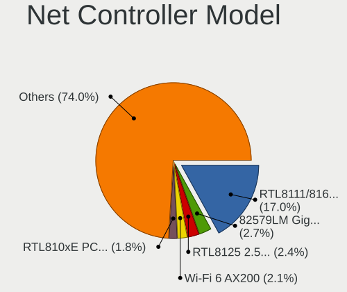

| Model                                                                  | Computers | Percent |
|------------------------------------------------------------------------|-----------|---------|
| Realtek RTL8111/8168/8211/8411 PCI Express Gigabit Ethernet Controller | 756       | 16.97%  |
| Intel 82579LM Gigabit Network Connection (Lewisville)                  | 120       | 2.69%   |
| Realtek RTL8125 2.5GbE Controller                                      | 109       | 2.45%   |
| Intel Wi-Fi 6 AX200                                                    | 93        | 2.09%   |
| Realtek RTL810xE PCI Express Fast Ethernet controller                  | 79        | 1.77%   |
| Intel Wireless 8265 / 8275                                             | 78        | 1.75%   |
| Intel I211 Gigabit Network Connection                                  | 77        | 1.73%   |
| Realtek RTL8153 Gigabit Ethernet Adapter                               | 68        | 1.53%   |
| Intel Wireless 8260                                                    | 64        | 1.44%   |
| Intel Centrino Advanced-N 6205 [Taylor Peak]                           | 57        | 1.28%   |
| Intel Wireless 7260                                                    | 54        | 1.21%   |
| Intel Ethernet Connection (2) I219-V                                   | 53        | 1.19%   |
| Intel Ethernet Connection I217-LM                                      | 52        | 1.17%   |
| Intel Wireless 7265                                                    | 50        | 1.12%   |
| Realtek RTL8821CE 802.11ac PCIe Wireless Network Adapter               | 42        | 0.94%   |
| Qualcomm Atheros AR9285 Wireless Network Adapter (PCI-Express)         | 42        | 0.94%   |
| Intel Cannon Point-LP CNVi [Wireless-AC]                               | 38        | 0.85%   |
| Qualcomm Atheros QCA9377 802.11ac Wireless Network Adapter             | 37        | 0.83%   |
| Intel Wi-Fi 6 AX201                                                    | 37        | 0.83%   |
| Intel Ethernet Controller I225-V                                       | 37        | 0.83%   |
| Intel Ethernet Connection (2) I219-LM                                  | 37        | 0.83%   |
| MediaTek MT7921 802.11ax PCIe Wireless Network Adapter [Filogic 330]   | 35        | 0.79%   |
| Realtek RTL8723BE PCIe Wireless Network Adapter                        | 33        | 0.74%   |
| MediaTek MT7922 802.11ax PCI Express Wireless Network Adapter          | 33        | 0.74%   |
| Intel Dual Band Wireless-AC 3168NGW [Stone Peak]                       | 32        | 0.72%   |
| Intel I210 Gigabit Network Connection                                  | 30        | 0.67%   |
| Qualcomm Atheros QCA6174 802.11ac Wireless Network Adapter             | 29        | 0.65%   |
| Intel Comet Lake PCH-LP CNVi WiFi                                      | 29        | 0.65%   |
| Realtek RTL8822BE 802.11a/b/g/n/ac WiFi adapter                        | 28        | 0.63%   |
| Intel Wi-Fi 5(802.11ac) Wireless-AC 9x6x [Thunder Peak]                | 28        | 0.63%   |
| Intel I350 Gigabit Network Connection                                  | 28        | 0.63%   |
| Intel Ethernet Connection I219-LM                                      | 27        | 0.61%   |
| Intel Ethernet Connection (4) I219-V                                   | 27        | 0.61%   |
| Realtek RTL8822CE 802.11ac PCIe Wireless Network Adapter               | 26        | 0.58%   |
| Intel Wi-Fi 6E(802.11ax) AX210/AX1675* 2x2 [Typhoon Peak]              | 26        | 0.58%   |
| Intel Ethernet Connection (7) I219-V                                   | 26        | 0.58%   |
| Intel Ethernet Connection (6) I219-V                                   | 25        | 0.56%   |
| Realtek RTL8188EUS 802.11n Wireless Network Adapter                    | 24        | 0.54%   |
| Intel Ethernet Connection I217-V                                       | 24        | 0.54%   |
| Intel Cannon Lake PCH CNVi WiFi                                        | 24        | 0.54%   |

Wireless Vendor
---------------

Wireless vendors

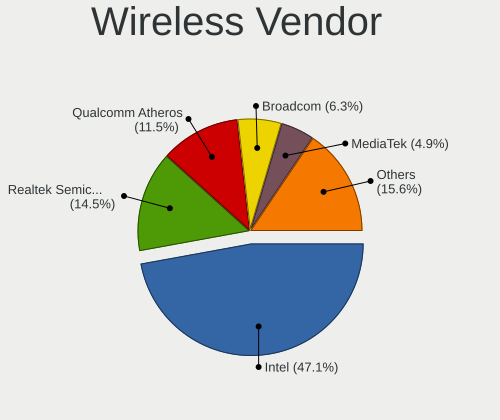

| Vendor                          | Computers | Percent |
|---------------------------------|-----------|---------|
| Intel                           | 878       | 47.13%  |
| Realtek Semiconductor           | 271       | 14.55%  |
| Qualcomm Atheros                | 215       | 11.54%  |
| Broadcom                        | 118       | 6.33%   |
| MediaTek                        | 91        | 4.88%   |
| TP-Link                         | 42        | 2.25%   |
| Ralink                          | 41        | 2.2%    |
| Sierra Wireless                 | 32        | 1.72%   |
| ASUSTek Computer                | 25        | 1.34%   |
| Broadcom Limited                | 24        | 1.29%   |
| Ralink Technology               | 22        | 1.18%   |
| Microsoft                       | 13        | 0.7%    |
| Qualcomm                        | 11        | 0.59%   |
| Fibocom                         | 10        | 0.54%   |
| Dell                            | 10        | 0.54%   |
| D-Link                          | 10        | 0.54%   |
| Hewlett-Packard                 | 9         | 0.48%   |
| ZyXEL Communications            | 8         | 0.43%   |
| ZyDAS                           | 4         | 0.21%   |
| D-Link System                   | 4         | 0.21%   |
| NetGear                         | 3         | 0.16%   |
| Marvell Technology Group        | 3         | 0.16%   |
| Gemtek                          | 3         | 0.16%   |
| BUFFALO                         | 3         | 0.16%   |
| Qualcomm Technologies           | 2         | 0.11%   |
| Qualcomm Atheros Communications | 2         | 0.11%   |
| Linksys                         | 2         | 0.11%   |
| Fujitsu Siemens Computers       | 2         | 0.11%   |
| Edimax Technology               | 2         | 0.11%   |
| LG Electronics                  | 1         | 0.05%   |
| Chu Yuen Enterprise             | 1         | 0.05%   |
| Arduino SA                      | 1         | 0.05%   |

Wireless Model
--------------

Wireless models

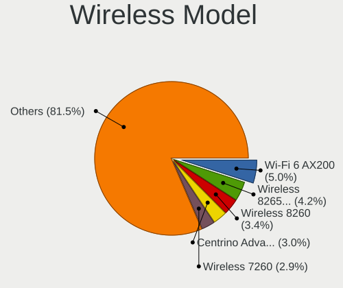

| Model                                                                | Computers | Percent |
|----------------------------------------------------------------------|-----------|---------|
| Intel Wi-Fi 6 AX200                                                  | 93        | 4.98%   |
| Intel Wireless 8265 / 8275                                           | 78        | 4.17%   |
| Intel Wireless 8260                                                  | 64        | 3.42%   |
| Intel Centrino Advanced-N 6205 [Taylor Peak]                         | 57        | 3.05%   |
| Intel Wireless 7260                                                  | 54        | 2.89%   |
| Intel Wireless 7265                                                  | 50        | 2.68%   |
| Realtek RTL8821CE 802.11ac PCIe Wireless Network Adapter             | 42        | 2.25%   |
| Qualcomm Atheros AR9285 Wireless Network Adapter (PCI-Express)       | 42        | 2.25%   |
| Intel Cannon Point-LP CNVi [Wireless-AC]                             | 38        | 2.03%   |
| Qualcomm Atheros QCA9377 802.11ac Wireless Network Adapter           | 37        | 1.98%   |
| Intel Wi-Fi 6 AX201                                                  | 37        | 1.98%   |
| MediaTek MT7921 802.11ax PCIe Wireless Network Adapter [Filogic 330] | 35        | 1.87%   |
| Realtek RTL8723BE PCIe Wireless Network Adapter                      | 33        | 1.77%   |
| Intel Dual Band Wireless-AC 3168NGW [Stone Peak]                     | 32        | 1.71%   |
| Qualcomm Atheros QCA6174 802.11ac Wireless Network Adapter           | 29        | 1.55%   |
| Intel Comet Lake PCH-LP CNVi WiFi                                    | 29        | 1.55%   |
| Realtek RTL8822BE 802.11a/b/g/n/ac WiFi adapter                      | 28        | 1.5%    |
| Intel Wi-Fi 5(802.11ac) Wireless-AC 9x6x [Thunder Peak]              | 28        | 1.5%    |
| Realtek RTL8822CE 802.11ac PCIe Wireless Network Adapter             | 26        | 1.39%   |
| MediaTek MT7922 802.11ax PCI Express Wireless Network Adapter        | 26        | 1.39%   |
| Intel Wi-Fi 6E(802.11ax) AX210/AX1675* 2x2 [Typhoon Peak]            | 26        | 1.39%   |
| Realtek RTL8188EUS 802.11n Wireless Network Adapter                  | 24        | 1.28%   |
| Intel Cannon Lake PCH CNVi WiFi                                      | 24        | 1.28%   |
| Qualcomm Atheros AR9485 Wireless Network Adapter                     | 23        | 1.23%   |
| Intel Centrino Advanced-N 6235                                       | 21        | 1.12%   |
| Qualcomm Atheros QCA9565 / AR9565 Wireless Network Adapter           | 20        | 1.07%   |
| Intel Comet Lake PCH CNVi WiFi                                       | 19        | 1.02%   |
| Intel PRO/Wireless 4965 AG or AGN [Kedron] Network Connection        | 17        | 0.91%   |
| Intel Dual Band Wireless-AC 3165 Plus Bluetooth                      | 17        | 0.91%   |
| Broadcom BCM43142 802.11b/g/n                                        | 17        | 0.91%   |
| Intel Wireless 3165                                                  | 16        | 0.86%   |
| Intel Centrino Ultimate-N 6300                                       | 16        | 0.86%   |
| Intel Centrino Advanced-N 6200                                       | 16        | 0.86%   |
| Qualcomm Atheros AR9462 Wireless Network Adapter                     | 15        | 0.8%    |
| Qualcomm Atheros AR9287 Wireless Network Adapter (PCI-Express)       | 15        | 0.8%    |
| Broadcom BCM4360 802.11ac Dual Band Wireless Network Adapter         | 15        | 0.8%    |
| Broadcom BCM43228 802.11a/b/g/n                                      | 15        | 0.8%    |
| Realtek RTL8852BE PCIe 802.11ax Wireless Network Controller          | 14        | 0.75%   |
| Realtek RTL8852AE 802.11ax PCIe Wireless Network Adapter             | 14        | 0.75%   |
| Realtek RTL8821AE 802.11ac PCIe Wireless Network Adapter             | 13        | 0.7%    |

Ethernet Vendor
---------------

Ethernet vendors

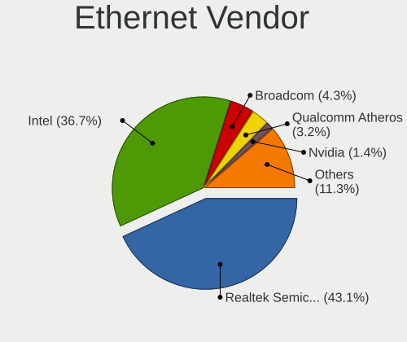

| Vendor                                 | Computers | Percent |
|----------------------------------------|-----------|---------|
| Realtek Semiconductor                  | 1040      | 43.14%  |
| Intel                                  | 885       | 36.71%  |
| Broadcom                               | 103       | 4.27%   |
| Qualcomm Atheros                       | 77        | 3.19%   |
| Nvidia                                 | 33        | 1.37%   |
| Marvell Technology Group               | 31        | 1.29%   |
| Samsung Electronics                    | 28        | 1.16%   |
| Huawei Technologies                    | 23        | 0.95%   |
| OPPO Electronics                       | 17        | 0.71%   |
| MediaTek                               | 16        | 0.66%   |
| Lenovo                                 | 15        | 0.62%   |
| Broadcom Limited                       | 15        | 0.62%   |
| ASIX Electronics                       | 12        | 0.5%    |
| Xiaomi                                 | 11        | 0.46%   |
| Aquantia                               | 11        | 0.46%   |
| DisplayLink                            | 9         | 0.37%   |
| Hewlett-Packard                        | 8         | 0.33%   |
| Motorola PCS                           | 7         | 0.29%   |
| Qualcomm Technologies                  | 5         | 0.21%   |
| Qualcomm                               | 5         | 0.21%   |
| OnePlus Technology (Shenzhen)          | 5         | 0.21%   |
| Sony Ericsson Mobile Communications AB | 4         | 0.17%   |
| Silicon Integrated Systems [SiS]       | 4         | 0.17%   |
| Microchip Technology                   | 4         | 0.17%   |
| HMD Global                             | 4         | 0.17%   |
| Apple                                  | 4         | 0.17%   |
| American Megatrends                    | 4         | 0.17%   |
| ADMtek                                 | 4         | 0.17%   |
| 3Com                                   | 4         | 0.17%   |
| TP-Link                                | 3         | 0.12%   |
| Google                                 | 3         | 0.12%   |
| VIA Technologies                       | 2         | 0.08%   |
| Mellanox Technologies                  | 2         | 0.08%   |
| Research In Motion                     | 1         | 0.04%   |
| Raspberry Pi                           | 1         | 0.04%   |
| Motorcomm Microelectronics.            | 1         | 0.04%   |
| Linksys                                | 1         | 0.04%   |
| ICS Advent                             | 1         | 0.04%   |
| IBM                                    | 1         | 0.04%   |
| Foxconn / Hon Hai                      | 1         | 0.04%   |

Ethernet Model
--------------

Ethernet models

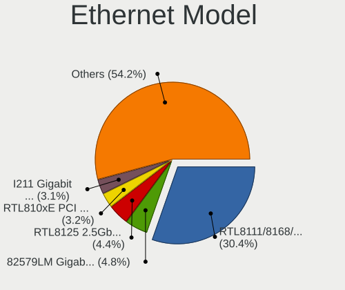

| Model                                                                  | Computers | Percent |
|------------------------------------------------------------------------|-----------|---------|
| Realtek RTL8111/8168/8211/8411 PCI Express Gigabit Ethernet Controller | 756       | 30.36%  |
| Intel 82579LM Gigabit Network Connection (Lewisville)                  | 120       | 4.82%   |
| Realtek RTL8125 2.5GbE Controller                                      | 109       | 4.38%   |
| Realtek RTL810xE PCI Express Fast Ethernet controller                  | 79        | 3.17%   |
| Intel I211 Gigabit Network Connection                                  | 77        | 3.09%   |
| Realtek RTL8153 Gigabit Ethernet Adapter                               | 68        | 2.73%   |
| Intel Ethernet Connection (2) I219-V                                   | 53        | 2.13%   |
| Intel Ethernet Connection I217-LM                                      | 52        | 2.09%   |
| Intel Ethernet Controller I225-V                                       | 37        | 1.49%   |
| Intel Ethernet Connection (2) I219-LM                                  | 37        | 1.49%   |
| Intel I210 Gigabit Network Connection                                  | 30        | 1.2%    |
| Intel I350 Gigabit Network Connection                                  | 28        | 1.12%   |
| Intel Ethernet Connection I219-LM                                      | 27        | 1.08%   |
| Intel Ethernet Connection (4) I219-V                                   | 27        | 1.08%   |
| Intel Ethernet Connection (7) I219-V                                   | 26        | 1.04%   |
| Intel Ethernet Connection (6) I219-V                                   | 25        | 1%      |
| Intel Ethernet Connection I217-V                                       | 24        | 0.96%   |
| Intel 82579V Gigabit Network Connection                                | 24        | 0.96%   |
| Intel 82577LM Gigabit Network Connection                               | 23        | 0.92%   |
| Intel Ethernet Connection (4) I219-LM                                  | 21        | 0.84%   |
| Samsung Galaxy series, misc. (tethering mode)                          | 20        | 0.8%    |
| Intel Ethernet Connection I218-LM                                      | 20        | 0.8%    |
| Intel Ethernet Connection (3) I218-LM                                  | 18        | 0.72%   |
| Broadcom NetXtreme BCM5719 Gigabit Ethernet PCIe                       | 18        | 0.72%   |
| Intel Ethernet Connection I219-V                                       | 17        | 0.68%   |
| OPPO Ace 3V                                                            | 16        | 0.64%   |
| Intel Ethernet Connection (7) I219-LM                                  | 15        | 0.6%    |
| Intel 82567LM Gigabit Network Connection                               | 15        | 0.6%    |
| Broadcom NetXtreme BCM57765 Gigabit Ethernet PCIe                      | 15        | 0.6%    |
| Nvidia MCP61 Ethernet                                                  | 14        | 0.56%   |
| Intel 82574L Gigabit Network Connection                                | 14        | 0.56%   |
| Huawei FOA-LX9                                                         | 14        | 0.56%   |
| Realtek RTL-8100/8101L/8139 PCI Fast Ethernet Adapter                  | 13        | 0.52%   |
| Intel Ethernet Connection (5) I219-LM                                  | 13        | 0.52%   |
| Intel Ethernet Connection (2) I218-V                                   | 13        | 0.52%   |
| Qualcomm Atheros QCA8171 Gigabit Ethernet                              | 12        | 0.48%   |
| Intel Ethernet Controller I226-V                                       | 12        | 0.48%   |
| Intel 82567LM-3 Gigabit Network Connection                             | 12        | 0.48%   |
| Intel 82566MM Gigabit Network Connection                               | 12        | 0.48%   |
| Intel Ethernet Connection (6) I219-LM                                  | 11        | 0.44%   |

Net Controller Kind
-------------------

Ethernet, WiFi or modem

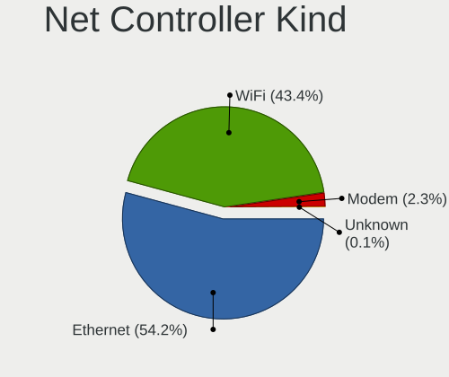

| Kind     | Computers | Percent |
|----------|-----------|---------|
| Ethernet | 2171      | 54.22%  |
| WiFi     | 1739      | 43.43%  |
| Modem    | 91        | 2.27%   |
| Unknown  | 3         | 0.07%   |

Used Controller
---------------

Currently used network controller

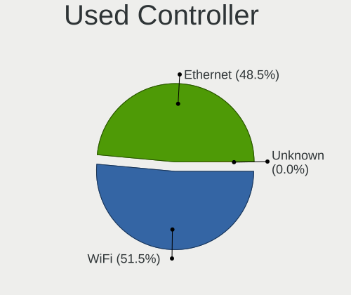

| Kind     | Computers | Percent |
|----------|-----------|---------|
| WiFi     | 1271      | 51.46%  |
| Ethernet | 1198      | 48.5%   |
| Unknown  | 1         | 0.04%   |

NICs
----

Total network controllers on board

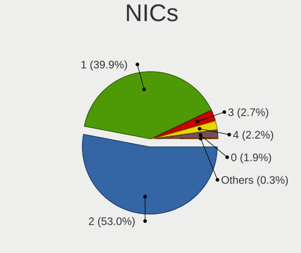

| Total | Computers | Percent |
|-------|-----------|---------|
| 2     | 1312      | 52.99%  |
| 1     | 989       | 39.94%  |
| 3     | 66        | 2.67%   |
| 4     | 54        | 2.18%   |
| 0     | 47        | 1.9%    |
| 5     | 5         | 0.2%    |
| 6     | 3         | 0.12%   |

IPv6
----

IPv6 vs IPv4

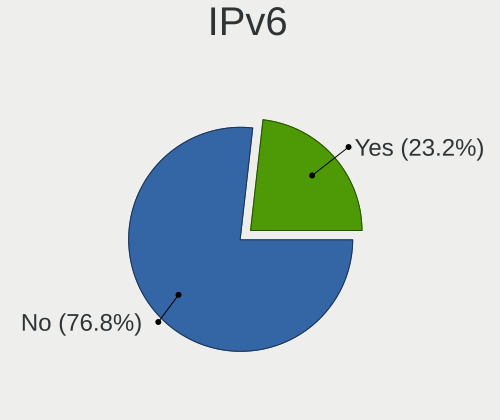

| Used | Computers | Percent |
|------|-----------|---------|
| No   | 1945      | 76.79%  |
| Yes  | 588       | 23.21%  |

Bluetooth
---------

Bluetooth Vendor
----------------

Controller vendors

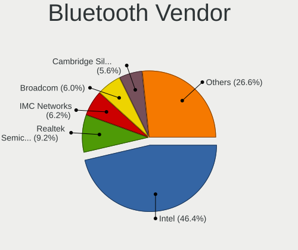

| Vendor                          | Computers | Percent |
|---------------------------------|-----------|---------|
| Intel                           | 703       | 46.37%  |
| Realtek Semiconductor           | 139       | 9.17%   |
| IMC Networks                    | 94        | 6.2%    |
| Broadcom                        | 91        | 6%      |
| Cambridge Silicon Radio         | 85        | 5.61%   |
| Foxconn / Hon Hai               | 71        | 4.68%   |
| Qualcomm Atheros Communications | 66        | 4.35%   |
| ASUSTek Computer                | 62        | 4.09%   |
| Apple                           | 54        | 3.56%   |
| Lite-On Technology              | 32        | 2.11%   |
| Hewlett-Packard                 | 25        | 1.65%   |
| MediaTek                        | 18        | 1.19%   |
| Dell                            | 17        | 1.12%   |
| Ralink                          | 13        | 0.86%   |
| Askey Computer                  | 10        | 0.66%   |
| USI                             | 6         | 0.4%    |
| Realtek                         | 5         | 0.33%   |
| Foxconn International           | 5         | 0.33%   |
| HTC (High Tech Computer)        | 4         | 0.26%   |
| Toshiba                         | 3         | 0.2%    |
| Marvell Semiconductor           | 3         | 0.2%    |
| Fujitsu                         | 2         | 0.13%   |
| Edimax Technology               | 2         | 0.13%   |
| Chicony Electronics             | 2         | 0.13%   |
| Taiyo Yuden                     | 1         | 0.07%   |
| Integrated System Solution      | 1         | 0.07%   |
| Belkin Components               | 1         | 0.07%   |
| Alps Electric                   | 1         | 0.07%   |

Bluetooth Model
---------------

Controller models

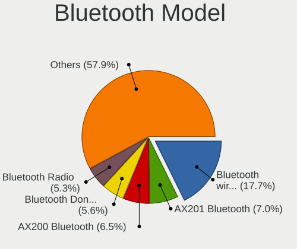

| Model                                               | Computers | Percent |
|-----------------------------------------------------|-----------|---------|
| Intel Bluetooth wireless interface                  | 269       | 17.72%  |
| Intel AX201 Bluetooth                               | 107       | 7.05%   |
| Intel AX200 Bluetooth                               | 98        | 6.46%   |
| Cambridge Silicon Radio Bluetooth Dongle (HCI mode) | 85        | 5.6%    |
| Realtek Bluetooth Radio                             | 80        | 5.27%   |
| Intel Bluetooth 9460/9560 Jefferson Peak (JfP)      | 67        | 4.41%   |
| Intel Bluetooth Device                              | 49        | 3.23%   |
| Realtek  Bluetooth 4.2 Adapter                      | 37        | 2.44%   |
| IMC Networks Wireless_Device                        | 34        | 2.24%   |
| ASUS Broadcom BCM20702A0 Bluetooth                  | 34        | 2.24%   |
| IMC Networks Bluetooth Radio                        | 33        | 2.17%   |
| Intel Wireless-AC 3168 Bluetooth                    | 29        | 1.91%   |
| Intel Centrino Bluetooth Wireless Transceiver       | 29        | 1.91%   |
| Intel Wireless-AC 9260 Bluetooth Adapter            | 25        | 1.65%   |
| Apple Bluetooth Host Controller                     | 24        | 1.58%   |
| Intel AX210 Bluetooth                               | 22        | 1.45%   |
| Foxconn / Hon Hai Wireless_Device                   | 22        | 1.45%   |
| Broadcom BCM2045B (BDC-2.1)                         | 22        | 1.45%   |
| Qualcomm Atheros  Bluetooth Device                  | 21        | 1.38%   |
| Foxconn / Hon Hai Bluetooth Device                  | 21        | 1.38%   |
| MediaTek Wireless_Device                            | 18        | 1.19%   |
| Qualcomm Atheros AR3011 Bluetooth                   | 17        | 1.12%   |
| Qualcomm Atheros QCA61x4 Bluetooth 4.0              | 16        | 1.05%   |
| HP Broadcom 2070 Bluetooth Combo                    | 15        | 0.99%   |
| IMC Networks Bluetooth Device                       | 14        | 0.92%   |
| Foxconn / Hon Hai MediaTek Bluetooth Adapter        | 14        | 0.92%   |
| Broadcom BCM20702 Bluetooth 4.0 [ThinkPad]          | 14        | 0.92%   |
| ASUS ASUS USB-BT500                                 | 14        | 0.92%   |
| Apple Bluetooth USB Host Controller                 | 14        | 0.92%   |
| Ralink RT3290 Bluetooth                             | 13        | 0.86%   |
| Lite-On Bluetooth Device                            | 12        | 0.79%   |
| Apple Built-in Bluetooth 2.0+EDR HCI                | 12        | 0.79%   |
| Realtek RTL8723B Bluetooth                          | 11        | 0.72%   |
| HP Bluetooth 2.0 Interface [Broadcom BCM2045]       | 10        | 0.66%   |
| Askey Bluetooth Device                              | 10        | 0.66%   |
| Lite-On Qualcomm Atheros QCA9377 Bluetooth          | 9         | 0.59%   |
| Broadcom HP Portable Bumble Bee                     | 9         | 0.59%   |
| Qualcomm Atheros AR3012 Bluetooth 4.0               | 8         | 0.53%   |
| IMC Networks Atheros AR3012 Bluetooth 4.0 Adapter   | 8         | 0.53%   |
| Intel Centrino Advanced-N 6230 Bluetooth adapter    | 7         | 0.46%   |

Sound
-----

Sound Vendor
------------

Sound card vendors

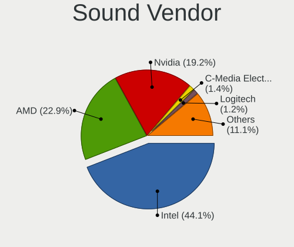

| Vendor                               | Computers | Percent |
|--------------------------------------|-----------|---------|
| Intel                                | 1559      | 44.09%  |
| AMD                                  | 811       | 22.94%  |
| Nvidia                               | 680       | 19.23%  |
| C-Media Electronics                  | 50        | 1.41%   |
| Logitech                             | 44        | 1.24%   |
| Creative Labs                        | 22        | 0.62%   |
| SteelSeries ApS                      | 21        | 0.59%   |
| ASUSTek Computer                     | 20        | 0.57%   |
| Texas Instruments                    | 19        | 0.54%   |
| Kingston Technology                  | 19        | 0.54%   |
| Focusrite-Novation                   | 19        | 0.54%   |
| GN Netcom                            | 16        | 0.45%   |
| Creative Technology                  | 15        | 0.42%   |
| Realtek Semiconductor                | 13        | 0.37%   |
| Lenovo                               | 13        | 0.37%   |
| Razer USA                            | 12        | 0.34%   |
| DSEA A/S                             | 12        | 0.34%   |
| Hewlett-Packard                      | 10        | 0.28%   |
| JBL                                  | 9         | 0.25%   |
| Corsair                              | 9         | 0.25%   |
| VIA Technologies                     | 7         | 0.2%    |
| Plantronics                          | 7         | 0.2%    |
| BEHRINGER International              | 7         | 0.2%    |
| Thesycon Systemsoftware & Consulting | 6         | 0.17%   |
| RODE Microphones                     | 6         | 0.17%   |
| Micro Star International             | 6         | 0.17%   |
| Generalplus Technology               | 6         | 0.17%   |
| Yamaha                               | 5         | 0.14%   |
| Microsoft                            | 5         | 0.14%   |
| GYROCOM C&C                          | 5         | 0.14%   |
| FiiO Electronics Technology          | 5         | 0.14%   |
| XMOS                                 | 4         | 0.11%   |
| Silicon Integrated Systems [SiS]     | 4         | 0.11%   |
| SAVITECH                             | 4         | 0.11%   |
| M-Audio                              | 4         | 0.11%   |
| Blue Microphones                     | 4         | 0.11%   |
| Turtle Beach                         | 3         | 0.08%   |
| Sony                                 | 3         | 0.08%   |
| JMTek                                | 3         | 0.08%   |
| Conexant Systems                     | 3         | 0.08%   |

Sound Model
-----------

Sound card models

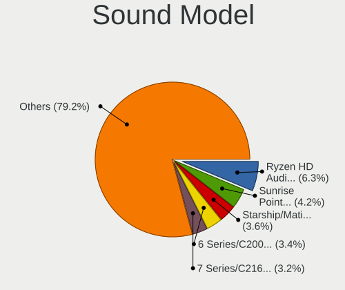

| Model                                                                      | Computers | Percent |
|----------------------------------------------------------------------------|-----------|---------|
| AMD Ryzen HD Audio Controller                                              | 269       | 6.3%    |
| Intel Sunrise Point-LP HD Audio                                            | 181       | 4.24%   |
| AMD Starship/Matisse HD Audio Controller                                   | 155       | 3.63%   |
| Intel 6 Series/C200 Series Chipset Family High Definition Audio Controller | 147       | 3.44%   |
| Intel 7 Series/C216 Chipset Family High Definition Audio Controller        | 138       | 3.23%   |
| Intel 8 Series/C220 Series Chipset High Definition Audio Controller        | 123       | 2.88%   |
| AMD Renoir/Cezanne HDMI/DP Audio Controller                                | 105       | 2.46%   |
| AMD SBx00 Azalia (Intel HDA)                                               | 92        | 2.15%   |
| Intel Xeon E3-1200 v3/4th Gen Core Processor HD Audio Controller           | 89        | 2.08%   |
| Intel 100 Series/C230 Series Chipset Family HD Audio Controller            | 87        | 2.04%   |
| AMD Radeon High Definition Audio Controller                                | 84        | 1.97%   |
| Nvidia GP104 High Definition Audio Controller                              | 71        | 1.66%   |
| AMD FCH Azalia Controller                                                  | 71        | 1.66%   |
| Intel Haswell-ULT HD Audio Controller                                      | 69        | 1.61%   |
| Intel 8 Series HD Audio Controller                                         | 69        | 1.61%   |
| Intel Cannon Lake PCH cAVS                                                 | 67        | 1.57%   |
| Intel 200 Series PCH HD Audio                                              | 67        | 1.57%   |
| Intel 5 Series/3400 Series Chipset High Definition Audio                   | 66        | 1.54%   |
| Intel 82801I (ICH9 Family) HD Audio Controller                             | 60        | 1.4%    |
| Intel Cannon Point-LP High Definition Audio Controller                     | 59        | 1.38%   |
| AMD Raven/Raven2/Fenghuang HDMI/DP Audio Controller                        | 57        | 1.33%   |
| AMD Family 17h (Models 00h-0fh) HD Audio Controller                        | 56        | 1.31%   |
| AMD Navi 21/23 HDMI/DP Audio Controller                                    | 50        | 1.17%   |
| Intel Tiger Lake-LP Smart Sound Technology Audio Controller                | 43        | 1.01%   |
| AMD Ellesmere HDMI Audio [Radeon RX 470/480 / 570/580/590]                 | 42        | 0.98%   |
| Nvidia GP107GL High Definition Audio Controller                            | 39        | 0.91%   |
| Intel Wildcat Point-LP High Definition Audio Controller                    | 38        | 0.89%   |
| Intel Broadwell-U Audio Controller                                         | 38        | 0.89%   |
| AMD Kabini HDMI/DP Audio                                                   | 38        | 0.89%   |
| Nvidia GP106 High Definition Audio Controller                              | 36        | 0.84%   |
| Nvidia TU107 GeForce GTX 1650 High Definition Audio Controller             | 35        | 0.82%   |
| Intel NM10/ICH7 Family High Definition Audio Controller                    | 35        | 0.82%   |
| Nvidia GA104 High Definition Audio Controller                              | 33        | 0.77%   |
| AMD Navi 31 HDMI/DP Audio                                                  | 33        | 0.77%   |
| Intel Comet Lake PCH-LP cAVS                                               | 32        | 0.75%   |
| Nvidia GM107 High Definition Audio Controller [GeForce 940MX]              | 30        | 0.7%    |
| Intel 82801H (ICH8 Family) HD Audio Controller                             | 29        | 0.68%   |
| Nvidia High Definition Audio Controller                                    | 27        | 0.63%   |
| Nvidia GF108 High Definition Audio Controller                              | 27        | 0.63%   |
| Nvidia GK107 HDMI Audio Controller                                         | 25        | 0.59%   |

Memory
------

Memory Vendor
-------------

Memory module vendors

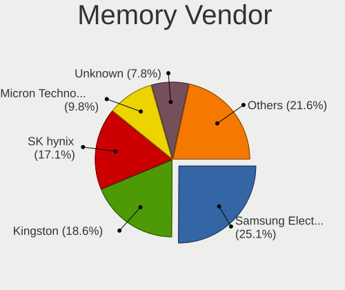

| Vendor              | Computers | Percent |
|---------------------|-----------|---------|
| Samsung Electronics | 419       | 25.1%   |
| Kingston            | 311       | 18.63%  |
| SK hynix            | 285       | 17.08%  |
| Micron Technology   | 163       | 9.77%   |
| Unknown             | 131       | 7.85%   |
| Corsair             | 83        | 4.97%   |
| G.Skill             | 75        | 4.49%   |
| Crucial             | 54        | 3.24%   |
| Elpida              | 29        | 1.74%   |
| Ramaxel Technology  | 26        | 1.56%   |
| A-DATA Technology   | 19        | 1.14%   |
| Unknown             | 15        | 0.9%    |
| Nanya Technology    | 13        | 0.78%   |
| Hewlett-Packard     | 8         | 0.48%   |
| Apacer              | 5         | 0.3%    |
| Unknown (ABCD)      | 3         | 0.18%   |
| Team                | 3         | 0.18%   |
| Qimonda             | 3         | 0.18%   |
| ChangXin Memory     | 2         | 0.12%   |
| ASint Technology    | 2         | 0.12%   |
| Wodposit            | 1         | 0.06%   |
| Wilk                | 1         | 0.06%   |
| Unknown (AB)        | 1         | 0.06%   |
| Unknown (0E97)      | 1         | 0.06%   |
| Unigen              | 1         | 0.06%   |
| Toshiba             | 1         | 0.06%   |
| TeamGroup           | 1         | 0.06%   |
| PUSKILL             | 1         | 0.06%   |
| pqi                 | 1         | 0.06%   |
| Patriot             | 1         | 0.06%   |
| Lexar Co Limited    | 1         | 0.06%   |
| Juhor               | 1         | 0.06%   |
| Hyundai lnc         | 1         | 0.06%   |
| Hitachi             | 1         | 0.06%   |
| GSkill              | 1         | 0.06%   |
| GOODRAM             | 1         | 0.06%   |
| GIGA-BYTE           | 1         | 0.06%   |
| GeIL                | 1         | 0.06%   |
| 4ea5                | 1         | 0.06%   |
| 48spaces            | 1         | 0.06%   |

Memory Model
------------

Memory module models

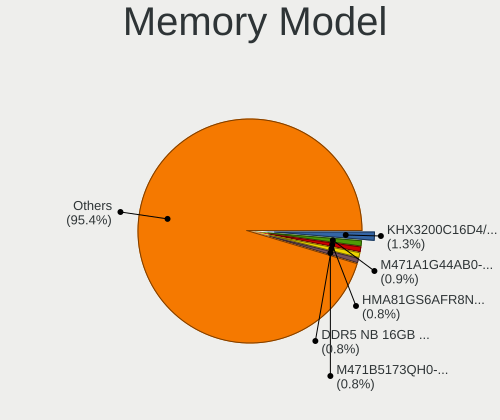

| Model                                                    | Computers | Percent |
|----------------------------------------------------------|-----------|---------|
| Kingston RAM KHX3200C16D4/8GX 8GB DIMM DDR4 3733MT/s     | 24        | 1.33%   |
| Samsung RAM M471A1G44AB0-CWE 8GiB SODIMM DDR4 3200MT/s   | 16        | 0.88%   |
| SK hynix RAM HMA81GS6AFR8N-UH 8GB SODIMM DDR4 2667MT/s   | 15        | 0.83%   |
| Unknown                                                  | 15        | 0.83%   |
| Samsung RAM M471B5173QH0-YK0 4GB SODIMM DDR3 1600MT/s    | 14        | 0.77%   |
| Samsung RAM M471B1G73DB0-YK0 8GB SODIMM DDR3 1600MT/s    | 14        | 0.77%   |
| Samsung RAM M471B1G73QH0-YK0 8GB SODIMM DDR3 1600MT/s    | 13        | 0.72%   |
| SK hynix RAM HMT41GS6BFR8A-PB 8GB SODIMM DDR3 2667MT/s   | 12        | 0.66%   |
| Samsung RAM M471B5273CH0-CH9 4GB SODIMM DDR3 1334MT/s    | 12        | 0.66%   |
| Kingston RAM KHX2666C16/8G 8GiB DIMM DDR4 3466MT/s       | 11        | 0.61%   |
| G.Skill RAM F4-3200C16-8GVKB 8GB DIMM DDR4 4000MT/s      | 11        | 0.61%   |
| Samsung RAM Module 8GB SODIMM DDR4 2133MT/s              | 10        | 0.55%   |
| Samsung RAM M471B5273DH0-CH9 4GB SODIMM DDR3 1600MT/s    | 10        | 0.55%   |
| Samsung RAM M471A1K43DB1-CWE 8GB SODIMM DDR4 3200MT/s    | 10        | 0.55%   |
| Kingston RAM KHX3200C16D4/16GX 16GB DIMM DDR4 3600MT/s   | 10        | 0.55%   |
| Kingston RAM KHX1600C9D3/4GX 4GB DIMM DDR3 1867MT/s      | 10        | 0.55%   |
| Corsair RAM CMK16GX4M2B3200C16 8GB DIMM DDR4 3600MT/s    | 10        | 0.55%   |
| SK hynix RAM HMT451S6BFR8A-PB 4GB SODIMM DDR3 1600MT/s   | 9         | 0.5%    |
| Samsung RAM M471B1G73EB0-YK0 8192MB SODIMM DDR3 1600MT/s | 9         | 0.5%    |
| Samsung RAM M471A1K43CB1-CRC 8GB SODIMM DDR4 8400MT/s    | 9         | 0.5%    |
| Kingston RAM KHX1600C10D3/8G 8GB DIMM DDR3 2133MT/s      | 9         | 0.5%    |
| Kingston RAM KF3200C16D4/8GX 8GiB DIMM DDR4 3600MT/s     | 9         | 0.5%    |
| SK hynix RAM Module 4GB SODIMM DDR3 1600MT/s             | 8         | 0.44%   |
| Samsung RAM M471A5244CB0-CTD 4GB SODIMM DDR4 3266MT/s    | 8         | 0.44%   |
| Corsair RAM CMK16GX4M2B3000C15 8GB DIMM DDR4 3600MT/s    | 8         | 0.44%   |
| SK hynix RAM HMT451S6AFR8A-PB 4GB SODIMM DDR3 1600MT/s   | 7         | 0.39%   |
| SK hynix RAM HMT351S6EFR8C-PB 4GB SODIMM DDR3 1600MT/s   | 7         | 0.39%   |
| Samsung RAM M471B5173DB0-YK0 4GB SODIMM DDR3 1600MT/s    | 7         | 0.39%   |
| Kingston RAM KHX1866C10D3/8G 8GB DIMM DDR3 1867MT/s      | 7         | 0.39%   |
| Kingston RAM KHX1600C10D3/4G 4GB DIMM DDR3 1866MT/s      | 7         | 0.39%   |
| Unknown RAM Module 2GB SODIMM DDR2 667MT/s               | 6         | 0.33%   |
| Unknown RAM Module 2GB DIMM DDR2 800MT/s                 | 6         | 0.33%   |
| SK hynix RAM Module 8GB SODIMM DDR4 2133MT/s             | 6         | 0.33%   |
| SK hynix RAM HMA81GS6DJR8N-XN 8GB SODIMM DDR4 3200MT/s   | 6         | 0.33%   |
| Samsung RAM M471B5273DH0-CK0 4GB SODIMM DDR3 2400MT/s    | 6         | 0.33%   |
| Samsung RAM M471A2G44AM0-CWE 16GB SODIMM DDR4 3200MT/s   | 6         | 0.33%   |
| Samsung RAM M471A1K43BB1-CTD 8GB SODIMM DDR4 2667MT/s    | 6         | 0.33%   |
| Samsung RAM M471A1G44BB0-CWE 8GB SODIMM DDR4 3200MT/s    | 6         | 0.33%   |
| Samsung RAM M393A4K40BB0-CPB 32GB DIMM DDR4 2133MT/s     | 6         | 0.33%   |
| Samsung RAM M391A4G43AB1-CWE 32GB DIMM DDR4 3200MT/s     | 6         | 0.33%   |

Memory Kind
-----------

Memory module kinds

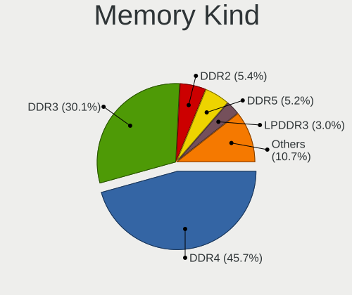

| Kind    | Computers | Percent |
|---------|-----------|---------|
| DDR4    | 681       | 45.67%  |
| DDR3    | 449       | 30.11%  |
| DDR2    | 80        | 5.37%   |
| DDR5    | 78        | 5.23%   |
| LPDDR3  | 44        | 2.95%   |
| LPDDR4  | 42        | 2.82%   |
| SDRAM   | 40        | 2.68%   |
| LPDDR5  | 27        | 1.81%   |
| Unknown | 25        | 1.68%   |
| DRAM    | 16        | 1.07%   |
| DDR     | 9         | 0.6%    |

Memory Form Factor
------------------

Physical design of the memory module

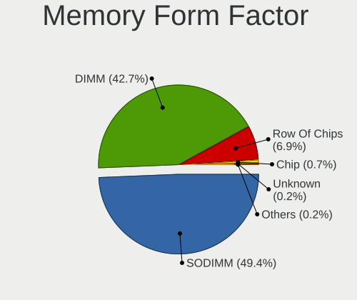

| Name         | Computers | Percent |
|--------------|-----------|---------|
| SODIMM       | 730       | 49.36%  |
| DIMM         | 631       | 42.66%  |
| Row Of Chips | 102       | 6.9%    |
| Chip         | 10        | 0.68%   |
| Unknown      | 3         | 0.2%    |
| RIMM         | 2         | 0.14%   |
| FB-DIMM      | 1         | 0.07%   |

Memory Size
-----------

Memory module size

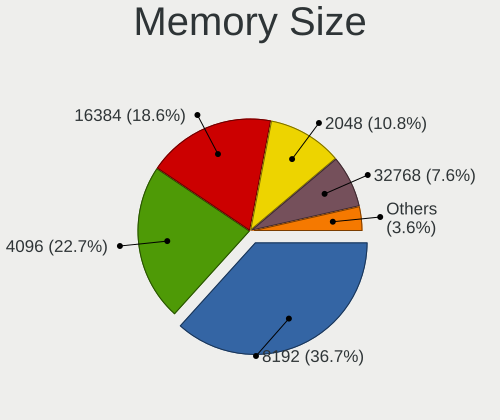

| Size  | Computers | Percent |
|-------|-----------|---------|
| 8192  | 589       | 36.7%   |
| 4096  | 365       | 22.74%  |
| 16384 | 298       | 18.57%  |
| 2048  | 174       | 10.84%  |
| 32768 | 122       | 7.6%    |
| 1024  | 47        | 2.93%   |
| 512   | 6         | 0.37%   |
| 49152 | 2         | 0.12%   |
| 256   | 2         | 0.12%   |

Memory Speed
------------

Memory module speed

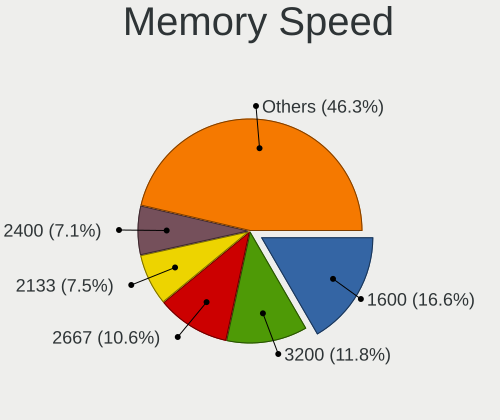

| Speed   | Computers | Percent |
|---------|-----------|---------|
| 1600    | 269       | 16.65%  |
| 3200    | 190       | 11.76%  |
| 2667    | 172       | 10.64%  |
| 2133    | 121       | 7.49%   |
| 2400    | 115       | 7.12%   |
| 1333    | 87        | 5.38%   |
| 3600    | 57        | 3.53%   |
| 667     | 47        | 2.91%   |
| 3733    | 40        | 2.48%   |
| 800     | 39        | 2.41%   |
| 1334    | 38        | 2.35%   |
| 1867    | 32        | 1.98%   |
| 4267    | 26        | 1.61%   |
| 4800    | 25        | 1.55%   |
| 3800    | 21        | 1.3%    |
| Unknown | 21        | 1.3%    |
| 6000    | 20        | 1.24%   |
| 5600    | 19        | 1.18%   |
| 1067    | 17        | 1.05%   |
| 4000    | 16        | 0.99%   |
| 3466    | 16        | 0.99%   |
| 3000    | 16        | 0.99%   |
| 8400    | 14        | 0.87%   |
| 3266    | 14        | 0.87%   |
| 1066    | 14        | 0.87%   |
| 7500    | 12        | 0.74%   |
| 1866    | 12        | 0.74%   |
| 6400    | 11        | 0.68%   |
| 6200    | 10        | 0.62%   |
| 2933    | 9         | 0.56%   |
| 2048    | 9         | 0.56%   |
| 4199    | 7         | 0.43%   |
| 2666    | 6         | 0.37%   |
| 1639    | 6         | 0.37%   |
| 5200    | 5         | 0.31%   |
| 3333    | 5         | 0.31%   |
| 2800    | 5         | 0.31%   |
| 2200    | 5         | 0.31%   |
| 1800    | 5         | 0.31%   |
| 533     | 5         | 0.31%   |

Printers & scanners
-------------------

Printer Vendor
--------------

Printer device vendors

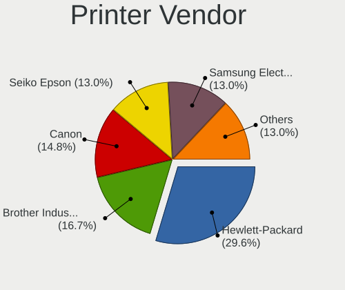

| Vendor                | Computers | Percent |
|-----------------------|-----------|---------|
| Hewlett-Packard       | 16        | 29.63%  |
| Brother Industries    | 9         | 16.67%  |
| Canon                 | 8         | 14.81%  |
| Seiko Epson           | 7         | 12.96%  |
| Samsung Electronics   | 7         | 12.96%  |
| Xerox                 | 2         | 3.7%    |
| Lexmark International | 2         | 3.7%    |
| Prolific Technology   | 1         | 1.85%   |
| Pantum                | 1         | 1.85%   |
| Dell                  | 1         | 1.85%   |

Printer Model
-------------

Printer device models

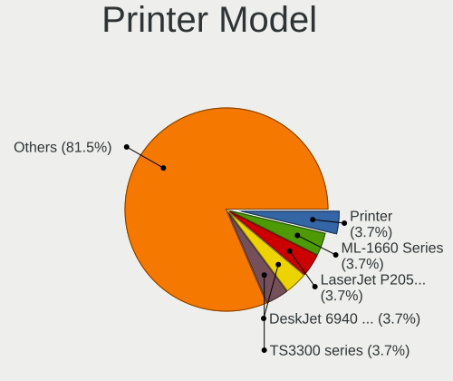

| Model                                  | Computers | Percent |
|----------------------------------------|-----------|---------|
| Seiko Epson Printer                    | 2         | 3.7%    |
| Samsung ML-1660 Series                 | 2         | 3.7%    |
| HP LaserJet P2055 series               | 2         | 3.7%    |
| HP DeskJet 6940 series                 | 2         | 3.7%    |
| Canon TS3300 series                    | 2         | 3.7%    |
| Brother HL-L2350DW series              | 2         | 3.7%    |
| Xerox WorkCentre 3325                  | 1         | 1.85%   |
| Xerox Phaser 6500DN                    | 1         | 1.85%   |
| Seiko Epson XP-510 Series              | 1         | 1.85%   |
| Seiko Epson L555 Series                | 1         | 1.85%   |
| Seiko Epson ET-2710 Series             | 1         | 1.85%   |
| Seiko Epson EPSON WF-3520 Series       | 1         | 1.85%   |
| Seiko Epson AL-MX200DNF                | 1         | 1.85%   |
| Samsung M288x Series                   | 1         | 1.85%   |
| Samsung M2020 Series                   | 1         | 1.85%   |
| Samsung CLX-3180 Series                | 1         | 1.85%   |
| Samsung CLP-325 Color Laser Printer    | 1         | 1.85%   |
| Samsung C43x Series                    | 1         | 1.85%   |
| Prolific PL2305 Parallel Port          | 1         | 1.85%   |
| Pantum P2500W series                   | 1         | 1.85%   |
| Lexmark International Printing Support | 1         | 1.85%   |
| Lexmark International 2400 series      | 1         | 1.85%   |
| HP PSC 1100 series                     | 1         | 1.85%   |
| HP OfficeJet Pro 6970                  | 1         | 1.85%   |
| HP OfficeJet 5200 series               | 1         | 1.85%   |
| HP LaserJet Professional P 1102w       | 1         | 1.85%   |
| HP LaserJet Pro M148-M149              | 1         | 1.85%   |
| HP LaserJet P2015 series               | 1         | 1.85%   |
| HP LaserJet 1200                       | 1         | 1.85%   |
| HP LaserJet 1018                       | 1         | 1.85%   |
| HP ENVY 5540 series                    | 1         | 1.85%   |
| HP DeskJet F300 series                 | 1         | 1.85%   |
| HP DeskJet 960c                        | 1         | 1.85%   |
| HP DeskJet 2130 series                 | 1         | 1.85%   |
| Dell Laser Printer 1720                | 1         | 1.85%   |
| Canon TS3100 series                    | 1         | 1.85%   |
| Canon PIXMA MG3100 Series              | 1         | 1.85%   |
| Canon PIXMA MG2500 Series              | 1         | 1.85%   |
| Canon LiDE 400                         | 1         | 1.85%   |
| Canon LiDE 300                         | 1         | 1.85%   |

Scanner Vendor
--------------

Scanner device vendors

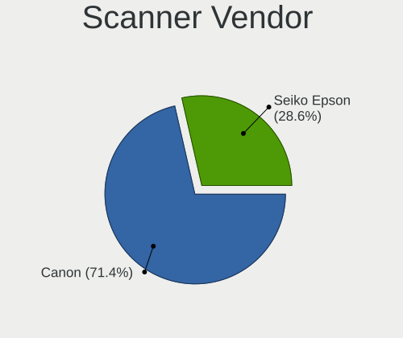

| Vendor      | Computers | Percent |
|-------------|-----------|---------|
| Canon       | 5         | 71.43%  |
| Seiko Epson | 2         | 28.57%  |

Scanner Model
-------------

Scanner device models

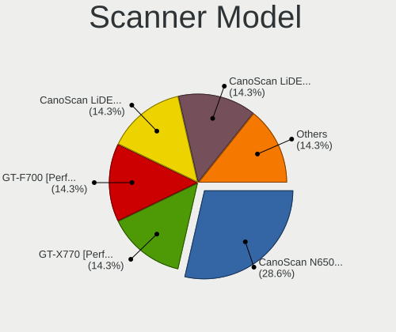

| Model                                 | Computers | Percent |
|---------------------------------------|-----------|---------|
| Canon CanoScan N650U/N656U            | 2         | 28.57%  |
| Seiko Epson GT-X770 [Perfection V500] | 1         | 14.29%  |
| Seiko Epson GT-F700 [Perfection V350] | 1         | 14.29%  |
| Canon CanoScan LiDE 200               | 1         | 14.29%  |
| Canon CanoScan LiDE 110               | 1         | 14.29%  |
| Canon CanoScan LiDE 100               | 1         | 14.29%  |

Camera
------

Camera Vendor
-------------

Camera device vendors

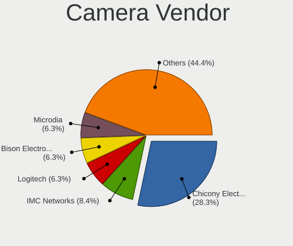

| Vendor                                 | Computers | Percent |
|----------------------------------------|-----------|---------|
| Chicony Electronics                    | 362       | 28.33%  |
| IMC Networks                           | 107       | 8.37%   |
| Logitech                               | 81        | 6.34%   |
| Bison Electronics                      | 81        | 6.34%   |
| Microdia                               | 80        | 6.26%   |
| Realtek Semiconductor                  | 74        | 5.79%   |
| Cheng Uei Precision Industry (Foxlink) | 67        | 5.24%   |
| Quanta                                 | 53        | 4.15%   |
| Sunplus Innovation Technology          | 45        | 3.52%   |
| Apple                                  | 43        | 3.36%   |
| Suyin                                  | 33        | 2.58%   |
| Syntek                                 | 31        | 2.43%   |
| Lite-On Technology                     | 30        | 2.35%   |
| Luxvisions Innotech Limited            | 27        | 2.11%   |
| Microsoft                              | 18        | 1.41%   |
| Lenovo                                 | 16        | 1.25%   |
| Sonix Technology                       | 13        | 1.02%   |
| Silicon Motion                         | 13        | 1.02%   |
| Samsung Electronics                    | 12        | 0.94%   |
| ShineTech                              | 8         | 0.63%   |
| Alcor Micro                            | 8         | 0.63%   |
| Acer                                   | 8         | 0.63%   |
| Primax Electronics                     | 7         | 0.55%   |
| Z-Star Microelectronics                | 5         | 0.39%   |
| Trust                                  | 4         | 0.31%   |
| Ricoh                                  | 4         | 0.31%   |
| ALi                                    | 4         | 0.31%   |
| Tobii Technology AB                    | 3         | 0.23%   |
| SunplusIT                              | 3         | 0.23%   |
| MacroSilicon                           | 3         | 0.23%   |
| Generalplus Technology                 | 3         | 0.23%   |
| DigiTech                               | 3         | 0.23%   |
| Razer USA                              | 2         | 0.16%   |
| Importek                               | 2         | 0.16%   |
| Hewlett-Packard                        | 2         | 0.16%   |
| Google                                 | 2         | 0.16%   |
| Framework                              | 2         | 0.16%   |
| Creative Technology                    | 2         | 0.16%   |
| Valve Software                         | 1         | 0.08%   |
| Sunplus IT                             | 1         | 0.08%   |

Camera Model
------------

Camera device models

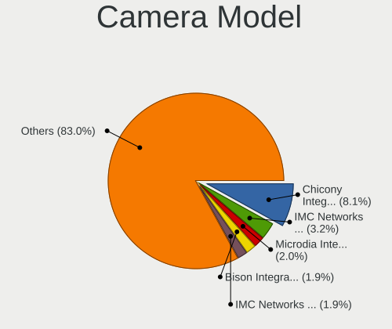

| Model                                               | Computers | Percent |
|-----------------------------------------------------|-----------|---------|
| Chicony Integrated Camera                           | 104       | 8.06%   |
| IMC Networks Integrated Camera                      | 41        | 3.18%   |
| Microdia Integrated_Webcam_HD                       | 26        | 2.01%   |
| Bison Integrated Camera                             | 25        | 1.94%   |
| IMC Networks USB2.0 HD UVC WebCam                   | 24        | 1.86%   |
| Chicony HP HD Camera                                | 21        | 1.63%   |
| Chicony FJ Camera                                   | 21        | 1.63%   |
| Logitech HD Pro Webcam C920                         | 20        | 1.55%   |
| Syntek Integrated Camera                            | 19        | 1.47%   |
| Chicony HD WebCam                                   | 18        | 1.39%   |
| Chicony HP HD Webcam                                | 17        | 1.32%   |
| Realtek Integrated_Webcam_HD                        | 15        | 1.16%   |
| Luxvisions Innotech Limited Integrated Camera       | 15        | 1.16%   |
| Cheng Uei Precision Industry (Foxlink) HP HD Camera | 15        | 1.16%   |
| Apple FaceTime HD Camera (Built-in)                 | 15        | 1.16%   |
| Logitech Webcam C270                                | 13        | 1.01%   |
| IMC Networks USB2.0 VGA UVC WebCam                  | 13        | 1.01%   |
| Bison Lenovo EasyCamera                             | 13        | 1.01%   |
| Samsung Galaxy series, misc. (MTP mode)             | 12        | 0.93%   |
| Realtek USB Camera                                  | 11        | 0.85%   |
| Chicony Integrated Camera (1280x720@30)             | 11        | 0.85%   |
| Microsoft LifeCam HD-3000                           | 10        | 0.77%   |
| Lite-On Integrated Camera                           | 10        | 0.77%   |
| Chicony USB2.0 VGA UVC WebCam                       | 10        | 0.77%   |
| Bison SunplusIT Integrated Camera                   | 10        | 0.77%   |
| Sonix USB2.0 HD UVC WebCam                          | 9         | 0.7%    |
| Quanta HP HD Camera                                 | 9         | 0.7%    |
| Lite-On HP HD Camera                                | 9         | 0.7%    |
| Chicony USB2.0 HD UVC WebCam                        | 9         | 0.7%    |
| Chicony Lenovo Integrated Camera (0.3MP)            | 9         | 0.7%    |
| Chicony HP TrueVision HD Camera                     | 9         | 0.7%    |
| Apple Built-in iSight                               | 9         | 0.7%    |
| Suyin Acer/HP Integrated Webcam [CN0314]            | 8         | 0.62%   |
| Sunplus Integrated_Webcam_HD                        | 8         | 0.62%   |
| Sunplus HD WebCam                                   | 8         | 0.62%   |
| Realtek USB2.0 HD UVC WebCam                        | 8         | 0.62%   |
| Quanta HD User Facing                               | 8         | 0.62%   |
| Logitech HD Webcam C525                             | 8         | 0.62%   |
| Chicony ThinkPad T490 Webcam                        | 8         | 0.62%   |
| Chicony EasyCamera                                  | 8         | 0.62%   |

Security
--------

Fingerprint Vendor
------------------

Fingerprint sensor vendors

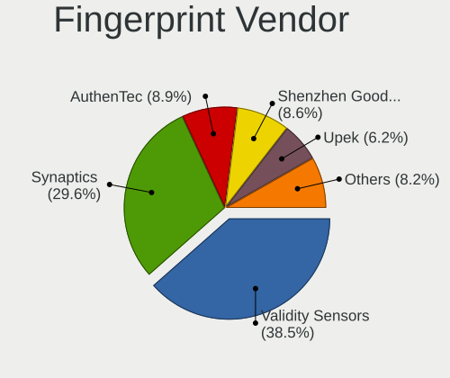

| Vendor                     | Computers | Percent |
|----------------------------|-----------|---------|
| Validity Sensors           | 117       | 38.49%  |
| Synaptics                  | 90        | 29.61%  |
| AuthenTec                  | 27        | 8.88%   |
| Shenzhen Goodix Technology | 26        | 8.55%   |
| Upek                       | 19        | 6.25%   |
| STMicroelectronics         | 9         | 2.96%   |
| LighTuning Technology      | 7         | 2.3%    |
| Elan Microelectronics      | 7         | 2.3%    |
| Microsoft                  | 1         | 0.33%   |
| Focal-systems.Corp         | 1         | 0.33%   |

Fingerprint Model
-----------------

Fingerprint sensor models

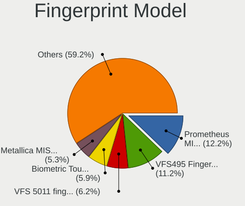

| Model                                                                      | Computers | Percent |
|----------------------------------------------------------------------------|-----------|---------|
| Synaptics Prometheus MIS Touch Fingerprint Reader                          | 37        | 12.17%  |
| Validity Sensors VFS495 Fingerprint Reader                                 | 34        | 11.18%  |
| Validity Sensors VFS 5011 fingerprint sensor                               | 19        | 6.25%   |
| Upek Biometric Touchchip/Touchstrip Fingerprint Sensor                     | 18        | 5.92%   |
| Synaptics Metallica MIS Touch Fingerprint Reader                           | 16        | 5.26%   |
| AuthenTec AES2810                                                          | 14        | 4.61%   |
| Validity Sensors Synaptics VFS7552 Touch Fingerprint Sensor with PurePrint | 11        | 3.62%   |
| Shenzhen Goodix  Fingerprint Device                                        | 11        | 3.62%   |
| Validity Sensors VFS5011 Fingerprint Reader                                | 10        | 3.29%   |
| Validity Sensors VFS471 Fingerprint Reader                                 | 10        | 3.29%   |
| Synaptics Fingerprint reader [HP G6]                                       | 10        | 3.29%   |
| Validity Sensors VFS7500 Touch Fingerprint Sensor                          | 9         | 2.96%   |
| STMicroelectronics Fingerprint Reader                                      | 9         | 2.96%   |
| Shenzhen Goodix Fingerprint Reader                                         | 9         | 2.96%   |
| Validity Sensors Synaptics WBDI                                            | 8         | 2.63%   |
| Synaptics Prometheus Fingerprint Reader                                    | 7         | 2.3%    |
| Shenzhen Goodix FingerPrint                                                | 6         | 1.97%   |
| LighTuning EgisTec Touch Fingerprint Sensor                                | 6         | 1.97%   |
| AuthenTec Fingerprint Sensor                                               | 6         | 1.97%   |
| Validity Sensors VFS491                                                    | 5         | 1.64%   |
| Synaptics UWP WBDI Device                                                  | 5         | 1.64%   |
| Elan ELAN:Fingerprint                                                      | 5         | 1.64%   |
| Validity Sensors Synaptics VFS7552 Touch Fingerprint Sensor                | 3         | 0.99%   |
| Validity Sensors Swipe Fingerprint Sensor                                  | 3         | 0.99%   |
| Synaptics WBDI                                                             | 3         | 0.99%   |
| Synaptics  WBDI                                                            | 3         | 0.99%   |
| Synaptics  FS7604 Touch Fingerprint Sensor with PurePrint                  | 3         | 0.99%   |
| Synaptics Metallica MOH Touch Fingerprint Reader                           | 3         | 0.99%   |
| AuthenTec AES2550 Fingerprint Sensor                                       | 3         | 0.99%   |
| AuthenTec AES2501 Fingerprint Sensor                                       | 3         | 0.99%   |
| Validity Sensors VFS451 Fingerprint Reader                                 | 2         | 0.66%   |
| Elan ELAN:ARM-M4                                                           | 2         | 0.66%   |
| Validity Sensors VFS301 Fingerprint Reader                                 | 1         | 0.33%   |
| Validity Sensors VFS101 Fingerprint Reader                                 | 1         | 0.33%   |
| Validity Sensors Fingerprint scanner                                       | 1         | 0.33%   |
| Upek TCS5B Fingerprint sensor                                              | 1         | 0.33%   |
| Synaptics WBDI Fingerprint Reader USB 086                                  | 1         | 0.33%   |
| Synaptics UWP WBDI                                                         | 1         | 0.33%   |
| Synaptics FS7604 Touch Fingerprint Sensor with PurePrint                   | 1         | 0.33%   |
| Microsoft Fingerprint Reader                                               | 1         | 0.33%   |

Chipcard Vendor
---------------

Chipcard module vendors

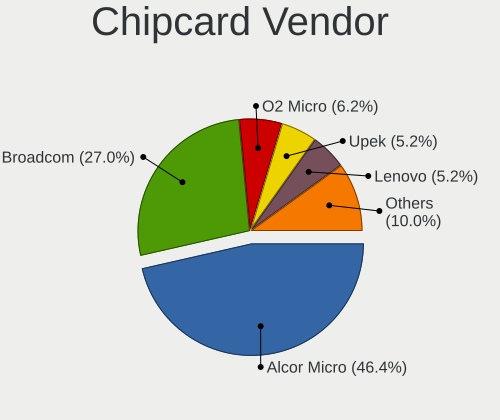

| Vendor                    | Computers | Percent |
|---------------------------|-----------|---------|
| Alcor Micro               | 98        | 46.45%  |
| Broadcom                  | 57        | 27.01%  |
| O2 Micro                  | 13        | 6.16%   |
| Upek                      | 11        | 5.21%   |
| Lenovo                    | 11        | 5.21%   |
| SCM Microsystems          | 8         | 3.79%   |
| Fujitsu Siemens Computers | 4         | 1.9%    |
| OmniKey                   | 3         | 1.42%   |
| Yubico.com                | 2         | 0.95%   |
| Advanced Card Systems     | 2         | 0.95%   |
| Chicony Electronics       | 1         | 0.47%   |
| Aktiv                     | 1         | 0.47%   |

Chipcard Model
--------------

Chipcard module models

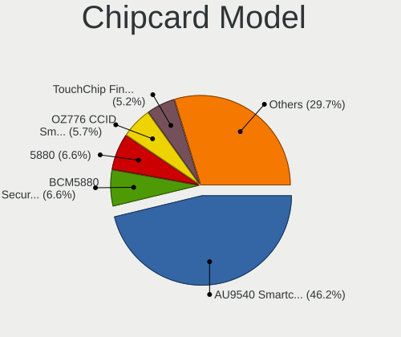

| Model                                                                        | Computers | Percent |
|------------------------------------------------------------------------------|-----------|---------|
| Alcor Micro AU9540 Smartcard Reader                                          | 98        | 46.23%  |
| Broadcom BCM5880 Secure Applications Processor with fingerprint swipe sensor | 14        | 6.6%    |
| Broadcom 5880                                                                | 14        | 6.6%    |
| O2 Micro OZ776 CCID Smartcard Reader                                         | 12        | 5.66%   |
| Upek TouchChip Fingerprint Coprocessor (WBF advanced mode)                   | 11        | 5.19%   |
| Lenovo Integrated Smart Card Reader                                          | 11        | 5.19%   |
| Broadcom BCM58200 ControlVault 3 (FingerPrint sensor + Contacted SmartCard)  | 10        | 4.72%   |
| Broadcom 58200                                                               | 10        | 4.72%   |
| Broadcom BCM5880 Secure Applications Processor                               | 9         | 4.25%   |
| Fujitsu Siemens Computers SmartCard Reader 2A                                | 4         | 1.89%   |
| SCM Microsystems SCR3340 - ExpressCard54 Smart Card Reader                   | 3         | 1.42%   |
| SCM Microsystems SCR331-LC1 / SCR3310 SmartCard Reader                       | 3         | 1.42%   |
| Yubico.com Yubikey 4/5 U2F+CCID                                              | 2         | 0.94%   |
| OmniKey CardMan 1021                                                         | 2         | 0.94%   |
| Advanced Card Systems ACR38 SmartCard Reader                                 | 2         | 0.94%   |
| SCM Microsystems SCR333 SmartCard Reader                                     | 1         | 0.47%   |
| SCM Microsystems SCR3310 CLOUD 2700 R                                        | 1         | 0.47%   |
| OmniKey CardMan 3121 (HID Technologies)                                      | 1         | 0.47%   |
| O2 Micro Oz776 SmartCard Reader                                              | 1         | 0.47%   |
| Chicony Electronics HP Skylab USB Smartcard Keyboard                         | 1         | 0.47%   |
| Broadcom BCM5880 Secure Applications Processor with fingerprint touch sensor | 1         | 0.47%   |
| Aktiv Rutoken lite                                                           | 1         | 0.47%   |

Unsupported
-----------

Unsupported Devices
-------------------

Total unsupported devices on board

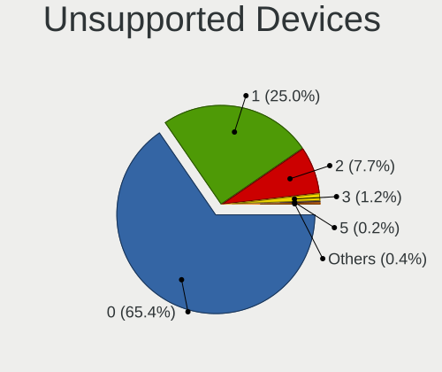

| Total | Computers | Percent |
|-------|-----------|---------|
| 0     | 1649      | 65.41%  |
| 1     | 631       | 25.03%  |
| 2     | 195       | 7.74%   |
| 3     | 31        | 1.23%   |
| 5     | 6         | 0.24%   |
| 4     | 6         | 0.24%   |
| 6     | 3         | 0.12%   |

Unsupported Device Types
------------------------

Types of unsupported devices

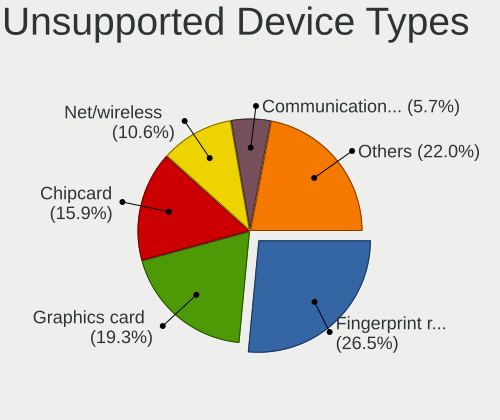

| Type                     | Computers | Percent |
|--------------------------|-----------|---------|
| Fingerprint reader       | 300       | 26.5%   |
| Graphics card            | 218       | 19.26%  |
| Chipcard                 | 180       | 15.9%   |
| Net/wireless             | 120       | 10.6%   |
| Communication controller | 65        | 5.74%   |
| Unassigned class         | 61        | 5.39%   |
| Multimedia controller    | 53        | 4.68%   |
| Bluetooth                | 28        | 2.47%   |
| Camera                   | 26        | 2.3%    |
| Sound                    | 16        | 1.41%   |
| Card reader              | 16        | 1.41%   |
| Net/ethernet             | 14        | 1.24%   |
| Storage                  | 12        | 1.06%   |
| Storage/raid             | 5         | 0.44%   |
| Network                  | 4         | 0.35%   |
| Modem                    | 4         | 0.35%   |
| Firewire controller      | 4         | 0.35%   |
| Storage/nvme             | 2         | 0.18%   |
| Storage/ide              | 2         | 0.18%   |
| Flash memory             | 1         | 0.09%   |
| Dvb card                 | 1         | 0.09%   |

