Linux in Finland - Tested Hardware & Statistics
-----------------------------------------------

A project to collect tested hardware configurations for Linux in Finland.

Anyone can contribute to this report by the [hw-probe](https://github.com/linuxhw/hw-probe) tool:

    sudo -E hw-probe -all -upload

Please contribute! Especially if your hardware is rare.

This is a report for all computer types. See also reports for [desktops](/Location/Finland/Desktop/README.md) and [notebooks](/Location/Finland/Notebook/README.md).

Contents
--------

* [ Test Cases ](#test-cases)

* [ System ](#system)
  - [ OS                       ](#os)
  - [ OS Family                ](#os-family)
  - [ Kernel                   ](#kernel)
  - [ Kernel Family            ](#kernel-family)
  - [ Kernel Major Ver.        ](#kernel-major-ver)
  - [ Arch                     ](#arch)
  - [ DE                       ](#de)
  - [ Display Server           ](#display-server)
  - [ Display Manager          ](#display-manager)
  - [ OS Lang                  ](#os-lang)
  - [ Boot Mode                ](#boot-mode)
  - [ Filesystem               ](#filesystem)
  - [ Part. scheme             ](#part-scheme)
  - [ Dual Boot with Linux/BSD ](#dual-boot-with-linuxbsd)
  - [ Dual Boot (Win)          ](#dual-boot-win)

* [ Board ](#board)
  - [ Vendor                   ](#vendor)
  - [ Model                    ](#model)
  - [ Model Family             ](#model-family)
  - [ MFG Year                 ](#mfg-year)
  - [ Form Factor              ](#form-factor)
  - [ Secure Boot              ](#secure-boot)
  - [ Coreboot                 ](#coreboot)
  - [ RAM Size                 ](#ram-size)
  - [ RAM Used                 ](#ram-used)
  - [ Total Drives             ](#total-drives)
  - [ Has CD-ROM               ](#has-cd-rom)
  - [ Has Ethernet             ](#has-ethernet)
  - [ Has WiFi                 ](#has-wifi)
  - [ Has Bluetooth            ](#has-bluetooth)

* [ Location ](#location)
  - [ Country                  ](#country)
  - [ City                     ](#city)

* [ Drives ](#drives)
  - [ Drive Vendor             ](#drive-vendor)
  - [ Drive Model              ](#drive-model)
  - [ HDD Vendor               ](#hdd-vendor)
  - [ SSD Vendor               ](#ssd-vendor)
  - [ Drive Kind               ](#drive-kind)
  - [ Drive Connector          ](#drive-connector)
  - [ Drive Size               ](#drive-size)
  - [ Space Total              ](#space-total)
  - [ Space Used               ](#space-used)
  - [ Malfunc. Drives          ](#malfunc-drives)
  - [ Malfunc. Drive Vendor    ](#malfunc-drive-vendor)
  - [ Malfunc. HDD Vendor      ](#malfunc-hdd-vendor)
  - [ Malfunc. Drive Kind      ](#malfunc-drive-kind)
  - [ Failed Drives            ](#failed-drives)
  - [ Failed Drive Vendor      ](#failed-drive-vendor)
  - [ Drive Status             ](#drive-status)

* [ Storage controller ](#storage-controller)
  - [ Storage Vendor           ](#storage-vendor)
  - [ Storage Model            ](#storage-model)
  - [ Storage Kind             ](#storage-kind)

* [ Processor ](#processor)
  - [ CPU Vendor               ](#cpu-vendor)
  - [ CPU Model                ](#cpu-model)
  - [ CPU Model Family         ](#cpu-model-family)
  - [ CPU Cores                ](#cpu-cores)
  - [ CPU Sockets              ](#cpu-sockets)
  - [ CPU Threads              ](#cpu-threads)
  - [ CPU Op-Modes             ](#cpu-op-modes)
  - [ CPU Microcode            ](#cpu-microcode)
  - [ CPU Microarch            ](#cpu-microarch)

* [ Graphics ](#graphics)
  - [ GPU Vendor               ](#gpu-vendor)
  - [ GPU Model                ](#gpu-model)
  - [ GPU Combo                ](#gpu-combo)
  - [ GPU Driver               ](#gpu-driver)
  - [ GPU Memory               ](#gpu-memory)

* [ Monitor ](#monitor)
  - [ Monitor Vendor           ](#monitor-vendor)
  - [ Monitor Model            ](#monitor-model)
  - [ Monitor Resolution       ](#monitor-resolution)
  - [ Monitor Diagonal         ](#monitor-diagonal)
  - [ Monitor Width            ](#monitor-width)
  - [ Aspect Ratio             ](#aspect-ratio)
  - [ Monitor Area             ](#monitor-area)
  - [ Pixel Density            ](#pixel-density)
  - [ Multiple Monitors        ](#multiple-monitors)

* [ Network ](#network)
  - [ Net Controller Vendor    ](#net-controller-vendor)
  - [ Net Controller Model     ](#net-controller-model)
  - [ Wireless Vendor          ](#wireless-vendor)
  - [ Wireless Model           ](#wireless-model)
  - [ Ethernet Vendor          ](#ethernet-vendor)
  - [ Ethernet Model           ](#ethernet-model)
  - [ Net Controller Kind      ](#net-controller-kind)
  - [ Used Controller          ](#used-controller)
  - [ NICs                     ](#nics)
  - [ IPv6                     ](#ipv6)

* [ Bluetooth ](#bluetooth)
  - [ Bluetooth Vendor         ](#bluetooth-vendor)
  - [ Bluetooth Model          ](#bluetooth-model)

* [ Sound ](#sound)
  - [ Sound Vendor             ](#sound-vendor)
  - [ Sound Model              ](#sound-model)

* [ Memory ](#memory)
  - [ Memory Vendor            ](#memory-vendor)
  - [ Memory Model             ](#memory-model)
  - [ Memory Kind              ](#memory-kind)
  - [ Memory Form Factor       ](#memory-form-factor)
  - [ Memory Size              ](#memory-size)
  - [ Memory Speed             ](#memory-speed)

* [ Printers & scanners ](#printers--scanners)
  - [ Printer Vendor           ](#printer-vendor)
  - [ Printer Model            ](#printer-model)
  - [ Scanner Vendor           ](#scanner-vendor)
  - [ Scanner Model            ](#scanner-model)

* [ Camera ](#camera)
  - [ Camera Vendor            ](#camera-vendor)
  - [ Camera Model             ](#camera-model)

* [ Security ](#security)
  - [ Fingerprint Vendor       ](#fingerprint-vendor)
  - [ Fingerprint Model        ](#fingerprint-model)
  - [ Chipcard Vendor          ](#chipcard-vendor)
  - [ Chipcard Model           ](#chipcard-model)

* [ Unsupported ](#unsupported)
  - [ Unsupported Devices      ](#unsupported-devices)
  - [ Unsupported Device Types ](#unsupported-device-types)

Test Cases
----------

Total: 2858

| Vendor        | Model                       | Form-Factor | Probe                                                      | Date         |
|---------------|-----------------------------|-------------|------------------------------------------------------------|--------------|
| HP            | ProBook 640 G1              | Notebook    | [d6e43bba74](https://linux-hardware.org/?probe=d6e43bba74) | Jan 06, 2025 |
| HP            | ProBook 640 G1              | Notebook    | [7b033a8375](https://linux-hardware.org/?probe=7b033a8375) | Jan 06, 2025 |
| HP            | 81C5 MVB                    | Desktop     | [af63b5ba1c](https://linux-hardware.org/?probe=af63b5ba1c) | Jan 06, 2025 |
| HP            | ProBook 450 G3              | Notebook    | [a1f8c7d33c](https://linux-hardware.org/?probe=a1f8c7d33c) | Jan 05, 2025 |
| Lenovo        | Yoga 9 14IAP7 82LU          | Convertible | [331b79e990](https://linux-hardware.org/?probe=331b79e990) | Jan 04, 2025 |
| ASUSTek       | PRIME B250M-PLUS            | Desktop     | [5e1c09c578](https://linux-hardware.org/?probe=5e1c09c578) | Jan 02, 2025 |
| Dell          | Inspiron 7520               | Notebook    | [d24db96b79](https://linux-hardware.org/?probe=d24db96b79) | Jan 01, 2025 |
| Lenovo        | IdeaPad U510 4941           | Notebook    | [78a774dc27](https://linux-hardware.org/?probe=78a774dc27) | Jan 01, 2025 |
| Lenovo        | 3098 0B98401 PRO            | Desktop     | [2f09544e8b](https://linux-hardware.org/?probe=2f09544e8b) | Dec 31, 2024 |
| Dell          | Inspiron 1011               | Notebook    | [d0c3eef6f6](https://linux-hardware.org/?probe=d0c3eef6f6) | Dec 31, 2024 |
| Dell          | Inspiron 7520               | Notebook    | [f60d84588c](https://linux-hardware.org/?probe=f60d84588c) | Dec 31, 2024 |
| Valve         | Galileo                     | Notebook    | [d942a63123](https://linux-hardware.org/?probe=d942a63123) | Dec 30, 2024 |
| ASUSTek       | Maximus V GENE              | Desktop     | [a007041cbd](https://linux-hardware.org/?probe=a007041cbd) | Dec 29, 2024 |
| Unchartevi... | 6540                        | Notebook    | [1d27092258](https://linux-hardware.org/?probe=1d27092258) | Dec 29, 2024 |
| HP            | 21D0                        | Desktop     | [33452ea42c](https://linux-hardware.org/?probe=33452ea42c) | Dec 28, 2024 |
| ASRock        | B550M Phantom Gaming 4      | Desktop     | [1a05752e8c](https://linux-hardware.org/?probe=1a05752e8c) | Dec 28, 2024 |
| ASUSTek       | X751NA                      | Notebook    | [f5f28d0769](https://linux-hardware.org/?probe=f5f28d0769) | Dec 25, 2024 |
| HP            | 1998                        | Desktop     | [8d460e04de](https://linux-hardware.org/?probe=8d460e04de) | Dec 23, 2024 |
| Lenovo        | ThinkPad T14s Gen 4 21F8... | Notebook    | [d076330974](https://linux-hardware.org/?probe=d076330974) | Dec 23, 2024 |
| ASUSTek       | VivoBook_ASUSLaptop X513... | Notebook    | [0ade3a3f94](https://linux-hardware.org/?probe=0ade3a3f94) | Dec 22, 2024 |
| ASUSTek       | PRIME B250M-PLUS            | Desktop     | [205131fe2e](https://linux-hardware.org/?probe=205131fe2e) | Dec 22, 2024 |
| HP            | ProBook 640 G1              | Notebook    | [7c92813622](https://linux-hardware.org/?probe=7c92813622) | Dec 19, 2024 |
| ASUSTek       | PRIME X670-P WIFI           | Desktop     | [66b9e10335](https://linux-hardware.org/?probe=66b9e10335) | Dec 19, 2024 |
| Lenovo        | ThinkPad T14s Gen 6 21M1... | Notebook    | [9c999b2e96](https://linux-hardware.org/?probe=9c999b2e96) | Dec 18, 2024 |
| ASUSTek       | P8H77-M LE                  | Desktop     | [3389c4a17c](https://linux-hardware.org/?probe=3389c4a17c) | Dec 18, 2024 |
| ASRock        | B550 Phantom Gaming 4       | Desktop     | [7946d22582](https://linux-hardware.org/?probe=7946d22582) | Dec 18, 2024 |
| HP            | Pavilion dv6                | Notebook    | [c6677142e4](https://linux-hardware.org/?probe=c6677142e4) | Dec 16, 2024 |
| Apple         | MacBookPro10,1              | Notebook    | [e27d08b364](https://linux-hardware.org/?probe=e27d08b364) | Dec 15, 2024 |
| Apple         | MacBookPro10,1              | Notebook    | [96ffa04014](https://linux-hardware.org/?probe=96ffa04014) | Dec 15, 2024 |
| Lenovo        | Legion 5 Pro 16ACH6H 82J... | Notebook    | [f7062395dc](https://linux-hardware.org/?probe=f7062395dc) | Dec 15, 2024 |
| HP            | 3047h                       | Desktop     | [60b8d8c582](https://linux-hardware.org/?probe=60b8d8c582) | Dec 14, 2024 |
| Dell          | 0JP3NX A01                  | Desktop     | [1332bf42b8](https://linux-hardware.org/?probe=1332bf42b8) | Dec 13, 2024 |
| Lenovo        | Legion 5 15ACH6H 82JU       | Notebook    | [ee8dddc4e4](https://linux-hardware.org/?probe=ee8dddc4e4) | Dec 12, 2024 |
| ASRock        | X570 Phantom Gaming 4       | Desktop     | [14a9842241](https://linux-hardware.org/?probe=14a9842241) | Dec 11, 2024 |
| HP            | EliteBook 745 G6            | Notebook    | [b46ff16ea8](https://linux-hardware.org/?probe=b46ff16ea8) | Dec 11, 2024 |
| HP            | Laptop 15-dw0xxx            | Notebook    | [a331c3b846](https://linux-hardware.org/?probe=a331c3b846) | Dec 10, 2024 |
| Apple         | Mac-031B6874CF7F642A iMa... | All in one  | [1e678a3582](https://linux-hardware.org/?probe=1e678a3582) | Dec 10, 2024 |
| Lenovo        | ThinkPad T14s Gen 4 21F8... | Notebook    | [c21e962ea0](https://linux-hardware.org/?probe=c21e962ea0) | Dec 10, 2024 |
| ASUSTek       | M4A89GTD-PRO/USB3           | Desktop     | [80d9b4596e](https://linux-hardware.org/?probe=80d9b4596e) | Dec 08, 2024 |
| MSI           | Katana GF76 11UE            | Notebook    | [96e708290f](https://linux-hardware.org/?probe=96e708290f) | Dec 08, 2024 |
| Lenovo        | ThinkPad T480s 20L8S4GU0... | Notebook    | [d1dafff4c9](https://linux-hardware.org/?probe=d1dafff4c9) | Dec 08, 2024 |
| Packard Be... | EasyNote TS11HR             | Notebook    | [9be4f893aa](https://linux-hardware.org/?probe=9be4f893aa) | Dec 07, 2024 |
| Intel         | D34010WYK H14771-303        | Desktop     | [b768c697c1](https://linux-hardware.org/?probe=b768c697c1) | Dec 07, 2024 |
| Lenovo        | Yoga Pro 9 16IRP8 83BY      | Notebook    | [3e24a418c3](https://linux-hardware.org/?probe=3e24a418c3) | Dec 06, 2024 |
| Lenovo        | IdeaPad 3 15ALC6 82KU       | Notebook    | [fdd1f52e06](https://linux-hardware.org/?probe=fdd1f52e06) | Dec 06, 2024 |
| ASUSTek       | H97M-PLUS                   | Desktop     | [5d38d438e4](https://linux-hardware.org/?probe=5d38d438e4) | Dec 06, 2024 |
| HP            | Pavilion Laptop 15-eg0xx... | Notebook    | [ee7e95092d](https://linux-hardware.org/?probe=ee7e95092d) | Dec 05, 2024 |
| Dell          | 0H21J3 A04                  | Server      | [888a235104](https://linux-hardware.org/?probe=888a235104) | Dec 05, 2024 |
| MSI           | B650 GAMING PLUS WIFI       | Desktop     | [38917bc287](https://linux-hardware.org/?probe=38917bc287) | Dec 04, 2024 |
| HP            | EliteBook 830 G5            | Notebook    | [4987877bbe](https://linux-hardware.org/?probe=4987877bbe) | Dec 03, 2024 |
| Intel         | DH55TC AAE70932-302         | Desktop     | [1f0e503f99](https://linux-hardware.org/?probe=1f0e503f99) | Dec 03, 2024 |
| ASUSTek       | PRIME B660-PLUS D4          | Desktop     | [303b3a510d](https://linux-hardware.org/?probe=303b3a510d) | Dec 02, 2024 |
| ASUSTek       | PRIME B660-PLUS D4          | Desktop     | [98f50b0d90](https://linux-hardware.org/?probe=98f50b0d90) | Dec 02, 2024 |
| ASUSTek       | CROSSHAIR VI HERO           | Desktop     | [4f1bc35dbd](https://linux-hardware.org/?probe=4f1bc35dbd) | Dec 02, 2024 |
| ASUSTek       | CROSSHAIR VI HERO           | Desktop     | [7ced21bca6](https://linux-hardware.org/?probe=7ced21bca6) | Dec 02, 2024 |
| Fujitsu       | D3313-B1 S26361-D3313-B1    | Desktop     | [37e2be7204](https://linux-hardware.org/?probe=37e2be7204) | Nov 29, 2024 |
| Intel         | D34010WYK H14771-303        | Desktop     | [99f0a68bcd](https://linux-hardware.org/?probe=99f0a68bcd) | Nov 28, 2024 |
| ASUSTek       | PRIME B250M-PLUS            | Desktop     | [b77f8bbc69](https://linux-hardware.org/?probe=b77f8bbc69) | Nov 28, 2024 |
| Lenovo        | ThinkPad P16 Gen 2 21FA0... | Notebook    | [a2afd1ee93](https://linux-hardware.org/?probe=a2afd1ee93) | Nov 27, 2024 |
| HP            | ProLiant DL380p Gen8        | Server      | [62172231be](https://linux-hardware.org/?probe=62172231be) | Nov 26, 2024 |
| ASUSTek       | P8Z77-V LX                  | Desktop     | [978715d9f7](https://linux-hardware.org/?probe=978715d9f7) | Nov 26, 2024 |
| Gigabyte      | X570 UD                     | Desktop     | [2ee977e0d6](https://linux-hardware.org/?probe=2ee977e0d6) | Nov 25, 2024 |
| ASUSTek       | UX32VD                      | Notebook    | [84ed5ccaa6](https://linux-hardware.org/?probe=84ed5ccaa6) | Nov 25, 2024 |
| Dell          | 0599V5 A12                  | Server      | [d59552de3e](https://linux-hardware.org/?probe=d59552de3e) | Nov 25, 2024 |
| Fujitsu       | D3239-A1 S26361-D3239-A1... | Server      | [0d4c00ea9a](https://linux-hardware.org/?probe=0d4c00ea9a) | Nov 24, 2024 |
| ASUSTek       | ROG STRIX B650E-E GAMING... | Desktop     | [d3dc594f2a](https://linux-hardware.org/?probe=d3dc594f2a) | Nov 23, 2024 |
| Lenovo        | IdeaPad L340-15IRH Gamin... | Notebook    | [79dfcb127b](https://linux-hardware.org/?probe=79dfcb127b) | Nov 22, 2024 |
| ASUSTek       | ROG STRIX Z370-I GAMING     | Desktop     | [852ffac66b](https://linux-hardware.org/?probe=852ffac66b) | Nov 21, 2024 |
| HP            | 8055                        | Desktop     | [593178f988](https://linux-hardware.org/?probe=593178f988) | Nov 21, 2024 |
| Fujitsu       | LIFEBOOK A514               | Notebook    | [0c1b1704f6](https://linux-hardware.org/?probe=0c1b1704f6) | Nov 20, 2024 |
| HP            | ProLiant DL380 Gen9         | Server      | [a7295d73dc](https://linux-hardware.org/?probe=a7295d73dc) | Nov 19, 2024 |
| Gigabyte      | B650M GAMING X AX           | Desktop     | [29c2aa9331](https://linux-hardware.org/?probe=29c2aa9331) | Nov 19, 2024 |
| Lenovo        | Yoga 500-15IBD 80N6         | Notebook    | [e157b1804e](https://linux-hardware.org/?probe=e157b1804e) | Nov 16, 2024 |
| Lenovo        | SKYBAY SDK0J40697 WIN 33... | All in one  | [9c73644cd4](https://linux-hardware.org/?probe=9c73644cd4) | Nov 15, 2024 |
| Lenovo        | SKYBAY SDK0J40697 WIN 33... | All in one  | [95003e9ada](https://linux-hardware.org/?probe=95003e9ada) | Nov 13, 2024 |
| Fujitsu       | LIFEBOOK A530               | Notebook    | [3f35643c04](https://linux-hardware.org/?probe=3f35643c04) | Nov 12, 2024 |
| Fujitsu       | Unknown                     | Notebook    | [e1f88f1f19](https://linux-hardware.org/?probe=e1f88f1f19) | Nov 12, 2024 |
| HP            | Notebook                    | Notebook    | [60dba81312](https://linux-hardware.org/?probe=60dba81312) | Nov 12, 2024 |
| Lenovo        | 36FB SDK0J40700 WIN 3258... | All in one  | [9043416985](https://linux-hardware.org/?probe=9043416985) | Nov 12, 2024 |
| ASUSTek       | ZenBook S UX391UA           | Notebook    | [8913deb8fe](https://linux-hardware.org/?probe=8913deb8fe) | Nov 12, 2024 |
| HP            | Notebook                    | Notebook    | [3d619505fc](https://linux-hardware.org/?probe=3d619505fc) | Nov 12, 2024 |
| Acer          | Swift SF14-11               | Notebook    | [97526f926d](https://linux-hardware.org/?probe=97526f926d) | Nov 11, 2024 |
| ASUSTek       | Z87-PRO                     | Desktop     | [d86d8eeada](https://linux-hardware.org/?probe=d86d8eeada) | Nov 10, 2024 |
| Fujitsu       | D3099-B1 S26361-D3099-B1... | Server      | [2d3c35e364](https://linux-hardware.org/?probe=2d3c35e364) | Nov 10, 2024 |
| Gigabyte      | Z170MX-Gaming 5             | Desktop     | [8a47e4af0e](https://linux-hardware.org/?probe=8a47e4af0e) | Nov 10, 2024 |
| Dell          | XPS 15 9530                 | Notebook    | [5667c491cd](https://linux-hardware.org/?probe=5667c491cd) | Nov 10, 2024 |
| Lenovo        | ThinkPad T560 20FHS06V00    | Notebook    | [c45dfe1fdd](https://linux-hardware.org/?probe=c45dfe1fdd) | Nov 08, 2024 |
| Acer          | Swift SF14-11               | Notebook    | [731d294cbe](https://linux-hardware.org/?probe=731d294cbe) | Nov 08, 2024 |
| MSI           | B650 GAMING PLUS WIFI       | Desktop     | [50f70bccb9](https://linux-hardware.org/?probe=50f70bccb9) | Nov 07, 2024 |
| ASUSTek       | P8P67 PRO                   | Desktop     | [a5e3cf6695](https://linux-hardware.org/?probe=a5e3cf6695) | Nov 06, 2024 |
| Samsung       | Galaxy S2 (GT-I9100)        | Notebook    | [c732892f18](https://linux-hardware.org/?probe=c732892f18) | Nov 05, 2024 |
| Lenovo        | ThinkPad X200 7459D12       | Notebook    | [a34523d690](https://linux-hardware.org/?probe=a34523d690) | Nov 05, 2024 |
| HP            | 15                          | Notebook    | [b69517827e](https://linux-hardware.org/?probe=b69517827e) | Nov 03, 2024 |
| Apple         | MacBookPro10,1              | Notebook    | [1c42e6c25f](https://linux-hardware.org/?probe=1c42e6c25f) | Nov 02, 2024 |
| ASUSTek       | P8P67 PRO                   | Desktop     | [6828e4b83f](https://linux-hardware.org/?probe=6828e4b83f) | Nov 02, 2024 |
| ASUSTek       | M4A89GTD-PRO/USB3           | Desktop     | [48509f2eb3](https://linux-hardware.org/?probe=48509f2eb3) | Nov 01, 2024 |
| Dell          | 0H21J3 A12                  | Server      | [05a062044e](https://linux-hardware.org/?probe=05a062044e) | Nov 01, 2024 |
| Lenovo        | IdeaPad Y700-14ISK 80NU     | Notebook    | [fe49c1b15d](https://linux-hardware.org/?probe=fe49c1b15d) | Nov 01, 2024 |
| Lenovo        | IdeaPad Y700-14ISK 80NU     | Notebook    | [7ea533c0eb](https://linux-hardware.org/?probe=7ea533c0eb) | Nov 01, 2024 |
| Lenovo        | ThinkPad T14s Gen 4 21F8... | Notebook    | [0672cada99](https://linux-hardware.org/?probe=0672cada99) | Oct 30, 2024 |
| ASUSTek       | PRIME B660-PLUS D4          | Desktop     | [adedc3cad6](https://linux-hardware.org/?probe=adedc3cad6) | Oct 30, 2024 |
| ASUSTek       | S551LB                      | Notebook    | [8b564e5511](https://linux-hardware.org/?probe=8b564e5511) | Oct 28, 2024 |
| Lenovo        | ThinkPad X390 20Q1S6W600    | Notebook    | [8e5f1a7f66](https://linux-hardware.org/?probe=8e5f1a7f66) | Oct 27, 2024 |
| ASUSTek       | TUF Gaming B550-PLUS WIF... | Desktop     | [bdfb8576e5](https://linux-hardware.org/?probe=bdfb8576e5) | Oct 26, 2024 |
| Lenovo        | IdeaPad 320S-14IKB 80X4     | Notebook    | [0941cfd8b8](https://linux-hardware.org/?probe=0941cfd8b8) | Oct 26, 2024 |
| Lenovo        | IdeaPad 320S-14IKB 80X4     | Notebook    | [1c4bfc91f8](https://linux-hardware.org/?probe=1c4bfc91f8) | Oct 26, 2024 |
| Lenovo        | IdeaPad 320S-14IKB 80X4     | Notebook    | [4d4b2c7929](https://linux-hardware.org/?probe=4d4b2c7929) | Oct 26, 2024 |
| ASUSTek       | GL553VE                     | Notebook    | [ac2e87e2ce](https://linux-hardware.org/?probe=ac2e87e2ce) | Oct 23, 2024 |
| Supermicro    | X8DT3                       | Server      | [ae2d4de7a3](https://linux-hardware.org/?probe=ae2d4de7a3) | Oct 23, 2024 |
| Supermicro    | X8DT3                       | Server      | [1596045519](https://linux-hardware.org/?probe=1596045519) | Oct 23, 2024 |
| Fujitsu       | LIFEBOOK AH531              | Notebook    | [7205fb0b92](https://linux-hardware.org/?probe=7205fb0b92) | Oct 23, 2024 |
| Lenovo        | G50-80 80E5                 | Notebook    | [38f6fb752d](https://linux-hardware.org/?probe=38f6fb752d) | Oct 23, 2024 |
| Fujitsu       | LIFEBOOK E559               | Notebook    | [96ff5d9648](https://linux-hardware.org/?probe=96ff5d9648) | Oct 22, 2024 |
| ASRock        | A780LM-S                    | Desktop     | [0f911c2c87](https://linux-hardware.org/?probe=0f911c2c87) | Oct 22, 2024 |
| Lenovo        | ThinkPad T14 Gen 1 20UDS... | Notebook    | [fcf2df9453](https://linux-hardware.org/?probe=fcf2df9453) | Oct 22, 2024 |
| MSI           | GS60 6QE                    | Notebook    | [7e1d315d47](https://linux-hardware.org/?probe=7e1d315d47) | Oct 22, 2024 |
| ASUSTek       | ASUS Zenbook 14 UM3406HA... | Notebook    | [c73cd8024e](https://linux-hardware.org/?probe=c73cd8024e) | Oct 21, 2024 |
| TUXEDO        | InfinityBook Pro Gen7 (M... | Notebook    | [369e3e4bdd](https://linux-hardware.org/?probe=369e3e4bdd) | Oct 21, 2024 |
| Dell          | Latitude 5430               | Notebook    | [3519e7a530](https://linux-hardware.org/?probe=3519e7a530) | Oct 21, 2024 |
| Dell          | Latitude 5430               | Notebook    | [aea23cbc32](https://linux-hardware.org/?probe=aea23cbc32) | Oct 21, 2024 |
| Fujitsu       | LIFEBOOK E559               | Notebook    | [2ec391ffdc](https://linux-hardware.org/?probe=2ec391ffdc) | Oct 20, 2024 |
| Lenovo        | 36FB SDK0J40700 WIN 3258... | All in one  | [f7fd09f519](https://linux-hardware.org/?probe=f7fd09f519) | Oct 20, 2024 |
| Gigabyte      | P2542                       | Notebook    | [10122364e5](https://linux-hardware.org/?probe=10122364e5) | Oct 17, 2024 |
| HP            | Pavilion 15                 | Notebook    | [a6276808ad](https://linux-hardware.org/?probe=a6276808ad) | Oct 17, 2024 |
| HP            | 18E5                        | Desktop     | [66d493bc52](https://linux-hardware.org/?probe=66d493bc52) | Oct 16, 2024 |
| HP            | Pavilion 11 x360 PC         | Notebook    | [161e32efcd](https://linux-hardware.org/?probe=161e32efcd) | Oct 16, 2024 |
| Unknown       | Intel X79                   | Desktop     | [f40c5cb36e](https://linux-hardware.org/?probe=f40c5cb36e) | Oct 16, 2024 |
| ASUSTek       | E403NA                      | Notebook    | [9ae450e44c](https://linux-hardware.org/?probe=9ae450e44c) | Oct 13, 2024 |
| MSI           | Z370 GAMING PLUS            | Desktop     | [ab668af995](https://linux-hardware.org/?probe=ab668af995) | Oct 12, 2024 |
| ASUSTek       | TUF Gaming B650-PLUS WIF... | Desktop     | [ce57c858cf](https://linux-hardware.org/?probe=ce57c858cf) | Oct 12, 2024 |
| ASUSTek       | Zenbook UX5401EA_UX5401E... | Notebook    | [3d7009833d](https://linux-hardware.org/?probe=3d7009833d) | Oct 11, 2024 |
| ASUSTek       | P8P67 PRO                   | Desktop     | [dd0a1a7ec9](https://linux-hardware.org/?probe=dd0a1a7ec9) | Oct 11, 2024 |
| Dell          | 072T6D A05                  | Server      | [e377f45b46](https://linux-hardware.org/?probe=e377f45b46) | Oct 09, 2024 |
| Lenovo        | ThinkPad X1 Carbon 7th 2... | Notebook    | [aa8a91dad1](https://linux-hardware.org/?probe=aa8a91dad1) | Oct 08, 2024 |
| Lenovo        | T530-28ICB                  | Desktop     | [085ab80ca3](https://linux-hardware.org/?probe=085ab80ca3) | Oct 06, 2024 |
| Apple         | MacBookAir6,1               | Notebook    | [c9cda4f625](https://linux-hardware.org/?probe=c9cda4f625) | Oct 06, 2024 |
| Lenovo        | SKYBAY SDK0J40697 WIN 33... | All in one  | [7ec5e22d2b](https://linux-hardware.org/?probe=7ec5e22d2b) | Oct 05, 2024 |
| Lenovo        | Yoga 7 14ARP8 82YM          | Convertible | [a3f6089f36](https://linux-hardware.org/?probe=a3f6089f36) | Oct 04, 2024 |
| Raspberry ... | Raspberry Pi 3 Model B R... | Soc         | [639076f755](https://linux-hardware.org/?probe=639076f755) | Oct 04, 2024 |
| ASUSTek       | TUF Gaming X670E-PLUS WI... | Desktop     | [3ea84806ba](https://linux-hardware.org/?probe=3ea84806ba) | Oct 04, 2024 |
| Apple         | MacBookPro5,5               | Notebook    | [6c0b20bdce](https://linux-hardware.org/?probe=6c0b20bdce) | Oct 03, 2024 |
| ASUSTek       | ASUS TUF Gaming F15 FX50... | Notebook    | [6f1403e89a](https://linux-hardware.org/?probe=6f1403e89a) | Oct 02, 2024 |
| HP            | EliteBook 2530p             | Notebook    | [d75b4282e9](https://linux-hardware.org/?probe=d75b4282e9) | Oct 01, 2024 |
| Apple         | Mac-65CE76090165799A iMa... | All in one  | [b9f265012b](https://linux-hardware.org/?probe=b9f265012b) | Oct 01, 2024 |
| HP            | EliteBook 2530p             | Notebook    | [52857f0cec](https://linux-hardware.org/?probe=52857f0cec) | Sep 30, 2024 |
| Gigabyte      | B450 I AORUS PRO WIFI-CF    | Desktop     | [a45b22c07c](https://linux-hardware.org/?probe=a45b22c07c) | Sep 29, 2024 |
| Lenovo        | ThinkPad A485 20MU000DMX    | Notebook    | [c79a269779](https://linux-hardware.org/?probe=c79a269779) | Sep 29, 2024 |
| Apple         | Mac-65CE76090165799A iMa... | All in one  | [a0e31d8395](https://linux-hardware.org/?probe=a0e31d8395) | Sep 29, 2024 |
| ASRock        | X600M-STX                   | Desktop     | [16b759b5be](https://linux-hardware.org/?probe=16b759b5be) | Sep 28, 2024 |
| Lenovo        | ThinkPad X230 2325TWT       | Notebook    | [617daeda56](https://linux-hardware.org/?probe=617daeda56) | Sep 28, 2024 |
| Lenovo        | ThinkPad T440s 20AQ007SM... | Notebook    | [4d2337d8a2](https://linux-hardware.org/?probe=4d2337d8a2) | Sep 28, 2024 |
| Lenovo        | IdeaPad 3 15ALC6 82KU       | Notebook    | [eb128112b1](https://linux-hardware.org/?probe=eb128112b1) | Sep 27, 2024 |
| Lenovo        | T530-28ICB                  | Desktop     | [10c4a94075](https://linux-hardware.org/?probe=10c4a94075) | Sep 27, 2024 |
| Apple         | MacBookPro8,1               | Notebook    | [93e19e497d](https://linux-hardware.org/?probe=93e19e497d) | Sep 27, 2024 |
| Dell          | Latitude 7400               | Notebook    | [a8fc62b85e](https://linux-hardware.org/?probe=a8fc62b85e) | Sep 26, 2024 |
| Lenovo        | MAHOBAY                     | Desktop     | [133a8522bd](https://linux-hardware.org/?probe=133a8522bd) | Sep 25, 2024 |
| MSI           | MAG X570 TOMAHAWK WIFI      | Desktop     | [0f84c80973](https://linux-hardware.org/?probe=0f84c80973) | Sep 23, 2024 |
| MSI           | H410M PRO                   | Desktop     | [6644a178d7](https://linux-hardware.org/?probe=6644a178d7) | Sep 22, 2024 |
| ASUSTek       | M4A89GTD-PRO/USB3           | Desktop     | [36312172e2](https://linux-hardware.org/?probe=36312172e2) | Sep 22, 2024 |
| ASUSTek       | PRIME B250M-C               | Desktop     | [cd88f26640](https://linux-hardware.org/?probe=cd88f26640) | Sep 22, 2024 |
| ASUSTek       | P8Z77-V LK                  | Desktop     | [c4ab973c4d](https://linux-hardware.org/?probe=c4ab973c4d) | Sep 20, 2024 |
| Dell          | Precision 3551              | Notebook    | [c201795f7c](https://linux-hardware.org/?probe=c201795f7c) | Sep 18, 2024 |
| Acer          | Aspire A515-51G             | Notebook    | [1c1ac8a360](https://linux-hardware.org/?probe=1c1ac8a360) | Sep 18, 2024 |
| Raspberry ... | Raspberry Pi 4 Model B R... | Soc         | [a8132a4971](https://linux-hardware.org/?probe=a8132a4971) | Sep 17, 2024 |
| ASUSTek       | M4A89GTD-PRO/USB3           | Desktop     | [b732c78fa5](https://linux-hardware.org/?probe=b732c78fa5) | Sep 16, 2024 |
| HP            | Victus by Gaming Laptop ... | Notebook    | [1b4a966af7](https://linux-hardware.org/?probe=1b4a966af7) | Sep 16, 2024 |
| Lenovo        | ThinkPad P16 Gen 2 21FA0... | Notebook    | [96c93da8c8](https://linux-hardware.org/?probe=96c93da8c8) | Sep 16, 2024 |
| Framework     | Laptop 13 (AMD Ryzen 704... | Notebook    | [28e8212852](https://linux-hardware.org/?probe=28e8212852) | Sep 16, 2024 |
| ASUSTek       | TUF Gaming B550-PLUS        | Desktop     | [b2b5f40900](https://linux-hardware.org/?probe=b2b5f40900) | Sep 13, 2024 |
| HP            | EliteBook 840 G5            | Notebook    | [94be8e0e90](https://linux-hardware.org/?probe=94be8e0e90) | Sep 12, 2024 |
| Lenovo        | B50-10 80QR                 | Notebook    | [1bada55b47](https://linux-hardware.org/?probe=1bada55b47) | Sep 12, 2024 |
| Packard Be... | EasyNote TS11HR             | Notebook    | [c1d8cfb914](https://linux-hardware.org/?probe=c1d8cfb914) | Sep 11, 2024 |
| ASUSTek       | ASUS Vivobook S 14 M5406... | Notebook    | [bb1ea1554d](https://linux-hardware.org/?probe=bb1ea1554d) | Sep 10, 2024 |
| ASUSTek       | TUF B450-PRO GAMING         | Desktop     | [57da186dc1](https://linux-hardware.org/?probe=57da186dc1) | Sep 09, 2024 |
| Lenovo        | SKYBAY SDK0J40697 WIN 33... | All in one  | [4a087f7595](https://linux-hardware.org/?probe=4a087f7595) | Sep 09, 2024 |
| Acer          | Aspire V3-572G              | Notebook    | [6de946d5a9](https://linux-hardware.org/?probe=6de946d5a9) | Sep 07, 2024 |
| Cepter        | Maximus WARDON              | Notebook    | [545c021bf3](https://linux-hardware.org/?probe=545c021bf3) | Sep 06, 2024 |
| ASRock        | A520M Pro4                  | Desktop     | [2a716a1e08](https://linux-hardware.org/?probe=2a716a1e08) | Sep 05, 2024 |
| HP            | 18E9                        | Desktop     | [3cfa598b85](https://linux-hardware.org/?probe=3cfa598b85) | Sep 03, 2024 |
| Lenovo        | ThinkPad X260 20F5S04B00    | Notebook    | [c9474f150c](https://linux-hardware.org/?probe=c9474f150c) | Sep 03, 2024 |
| Lenovo        | ThinkPad P16s Gen 2 21K9... | Notebook    | [7b534afcea](https://linux-hardware.org/?probe=7b534afcea) | Sep 02, 2024 |
| ASUSTek       | M2N-X Plus                  | Desktop     | [4a6c3d45cd](https://linux-hardware.org/?probe=4a6c3d45cd) | Sep 02, 2024 |
| HP            | 829A                        | Mini pc     | [3183148718](https://linux-hardware.org/?probe=3183148718) | Sep 02, 2024 |
| Lenovo        | Yoga 9 14ITL5 82BG          | Convertible | [5efd050abc](https://linux-hardware.org/?probe=5efd050abc) | Aug 31, 2024 |
| Toshiba       | TECRA S11                   | Notebook    | [4617ceeeec](https://linux-hardware.org/?probe=4617ceeeec) | Aug 28, 2024 |
| Intel         | DZ77RE-75K AAG39010-302     | Desktop     | [06455f7508](https://linux-hardware.org/?probe=06455f7508) | Aug 28, 2024 |
| ASUSTek       | ASUS TUF Gaming A15 FA50... | Notebook    | [0984d35721](https://linux-hardware.org/?probe=0984d35721) | Aug 28, 2024 |
| Lenovo        | ThinkPad X1 Carbon Gen 9... | Notebook    | [cb37d72216](https://linux-hardware.org/?probe=cb37d72216) | Aug 28, 2024 |
| ASUSTek       | PRIME B660-PLUS D4          | Desktop     | [1c2f7c43d7](https://linux-hardware.org/?probe=1c2f7c43d7) | Aug 27, 2024 |
| Xunlong       | Orange Pi PC                | Soc         | [3ba6fad6c6](https://linux-hardware.org/?probe=3ba6fad6c6) | Aug 25, 2024 |
| MSI           | B550M PRO-VDH WIFI          | Desktop     | [02855682a3](https://linux-hardware.org/?probe=02855682a3) | Aug 25, 2024 |
| HP            | Laptop 14-dg0xxx            | Notebook    | [ef85d2699e](https://linux-hardware.org/?probe=ef85d2699e) | Aug 19, 2024 |
| Dell          | 0JP3NX A00                  | Desktop     | [6f5ee096cc](https://linux-hardware.org/?probe=6f5ee096cc) | Aug 18, 2024 |
| ASUSTek       | ROG STRIX X370-F GAMING     | Desktop     | [3d7125f89e](https://linux-hardware.org/?probe=3d7125f89e) | Aug 17, 2024 |
| MSI           | Z390-A PRO                  | Desktop     | [061af3f20b](https://linux-hardware.org/?probe=061af3f20b) | Aug 15, 2024 |
| Samsung       | R540/R580/R780/SA41/E452... | Notebook    | [d033b522c3](https://linux-hardware.org/?probe=d033b522c3) | Aug 14, 2024 |
| ASUSTek       | ASUS TUF Gaming A15 FA50... | Notebook    | [684eeb17ab](https://linux-hardware.org/?probe=684eeb17ab) | Aug 14, 2024 |
| ASUSTek       | Z97-PRO GAMER               | Desktop     | [9f7b21e7d3](https://linux-hardware.org/?probe=9f7b21e7d3) | Aug 13, 2024 |
| Lenovo        | Legion 5 15ARH05H 82B1      | Notebook    | [248f8ee89d](https://linux-hardware.org/?probe=248f8ee89d) | Aug 13, 2024 |
| ASUSTek       | ProArt Z790-CREATOR WIFI    | Desktop     | [dab15dadab](https://linux-hardware.org/?probe=dab15dadab) | Aug 12, 2024 |
| Lenovo        | Yoga 7 14ITL5 82BH          | Convertible | [366ca2ee14](https://linux-hardware.org/?probe=366ca2ee14) | Aug 10, 2024 |
| ASUSTek       | ROG STRIX B650E-E GAMING... | Desktop     | [afc3b37f5f](https://linux-hardware.org/?probe=afc3b37f5f) | Aug 09, 2024 |
| ASUSTek       | TUF Gaming B550-PLUS WIF... | Desktop     | [15ad8d461b](https://linux-hardware.org/?probe=15ad8d461b) | Aug 07, 2024 |
| ASUSTek       | T100TA                      | Notebook    | [087ac815ec](https://linux-hardware.org/?probe=087ac815ec) | Aug 06, 2024 |
| Lenovo        | ThinkPad W510 431967G       | Notebook    | [58cb012163](https://linux-hardware.org/?probe=58cb012163) | Aug 06, 2024 |
| ASUSTek       | PRIME Z690-P D4             | Desktop     | [b86a309225](https://linux-hardware.org/?probe=b86a309225) | Aug 06, 2024 |
| Raspberry ... | Raspberry Pi 3 Model B P... | Soc         | [488c70958f](https://linux-hardware.org/?probe=488c70958f) | Aug 05, 2024 |
| Acer          | Swift SFX16-61G             | Notebook    | [2359a79645](https://linux-hardware.org/?probe=2359a79645) | Aug 03, 2024 |
| Lenovo        | ThinkPad P52 20M9001NMX     | Notebook    | [a06c67958c](https://linux-hardware.org/?probe=a06c67958c) | Aug 01, 2024 |
| Lenovo        | ThinkPad T61p 8889AU5       | Notebook    | [e06a1aad9c](https://linux-hardware.org/?probe=e06a1aad9c) | Aug 01, 2024 |
| Dell          | Latitude 7330 Rugged Ext... | Notebook    | [1c0578984c](https://linux-hardware.org/?probe=1c0578984c) | Jul 31, 2024 |
| ASUSTek       | PRIME X470-PRO              | Desktop     | [36a7aaf90d](https://linux-hardware.org/?probe=36a7aaf90d) | Jul 30, 2024 |
| Packard Be... | EasyNote TS11HR             | Notebook    | [a96ddb3094](https://linux-hardware.org/?probe=a96ddb3094) | Jul 27, 2024 |
| Lenovo        | Legion Pro 5 16IRX8 82WK    | Notebook    | [0219498bb7](https://linux-hardware.org/?probe=0219498bb7) | Jul 26, 2024 |
| Dell          | 0D02VH A01                  | Desktop     | [94658a73e5](https://linux-hardware.org/?probe=94658a73e5) | Jul 25, 2024 |
| ASRock        | B650M Pro RS WiFi           | Desktop     | [dbd13b8d3c](https://linux-hardware.org/?probe=dbd13b8d3c) | Jul 25, 2024 |
| ASUSTek       | UX490UA                     | Notebook    | [958c573822](https://linux-hardware.org/?probe=958c573822) | Jul 22, 2024 |
| Acer          | Aspire A315-41              | Notebook    | [288f9de47d](https://linux-hardware.org/?probe=288f9de47d) | Jul 21, 2024 |
| Lenovo        | SHARKBAY NOK                | Desktop     | [768145912a](https://linux-hardware.org/?probe=768145912a) | Jul 20, 2024 |
| Apple         | MacBookAir6,2               | Notebook    | [fdda23379d](https://linux-hardware.org/?probe=fdda23379d) | Jul 20, 2024 |
| Fujitsu       | LIFEBOOK U772               | Notebook    | [8ba4824fc8](https://linux-hardware.org/?probe=8ba4824fc8) | Jul 19, 2024 |
| Fujitsu       | LIFEBOOK E733               | Notebook    | [6d6b42a6fe](https://linux-hardware.org/?probe=6d6b42a6fe) | Jul 19, 2024 |
| XIAOMI        | Redmi Book Pro 14 2024      | Notebook    | [62354fe581](https://linux-hardware.org/?probe=62354fe581) | Jul 19, 2024 |
| Lenovo        | ThinkCentre A58 75227SG     | Desktop     | [e8606d105c](https://linux-hardware.org/?probe=e8606d105c) | Jul 18, 2024 |
| Apple         | MacBookPro14,1              | Notebook    | [bc496941a2](https://linux-hardware.org/?probe=bc496941a2) | Jul 17, 2024 |
| Lenovo        | ThinkPad T14s Gen 3 21BS... | Notebook    | [1b9fd5da77](https://linux-hardware.org/?probe=1b9fd5da77) | Jul 16, 2024 |
| Gigabyte      | B360HD3PLM-CF               | Desktop     | [39b4575cc9](https://linux-hardware.org/?probe=39b4575cc9) | Jul 16, 2024 |
| MSI           | MAG X570S TOMAHAWK MAX W... | Desktop     | [1f118c1d53](https://linux-hardware.org/?probe=1f118c1d53) | Jul 12, 2024 |
| Acer          | Aspire A315-41              | Notebook    | [0c819b933c](https://linux-hardware.org/?probe=0c819b933c) | Jul 11, 2024 |
| Samsung       | 960QFG                      | Convertible | [2931ba168d](https://linux-hardware.org/?probe=2931ba168d) | Jul 11, 2024 |
| HUAWEI        | NBD-WXX9                    | Notebook    | [fbe8c9cc90](https://linux-hardware.org/?probe=fbe8c9cc90) | Jul 09, 2024 |
| Lenovo        | LOQ 16APH8 82XU             | Notebook    | [fdb5740619](https://linux-hardware.org/?probe=fdb5740619) | Jul 08, 2024 |
| Lenovo        | LOQ 16APH8 82XU             | Notebook    | [344a3a1381](https://linux-hardware.org/?probe=344a3a1381) | Jul 08, 2024 |
| Toshiba       | Satellite L500              | Notebook    | [d41f6ae73f](https://linux-hardware.org/?probe=d41f6ae73f) | Jul 07, 2024 |
| Shenzhen M... | F7BSC                       | Mini pc     | [9ba16e16c9](https://linux-hardware.org/?probe=9ba16e16c9) | Jul 06, 2024 |
| ASUSTek       | TUF Gaming B650M-PLUS WI... | Desktop     | [74399b7f19](https://linux-hardware.org/?probe=74399b7f19) | Jul 06, 2024 |
| HP            | ENVY x360 Convertible 15... | Convertible | [84044d64d7](https://linux-hardware.org/?probe=84044d64d7) | Jul 05, 2024 |
| Dell          | 0D9C2N A00                  | Desktop     | [deebbb7529](https://linux-hardware.org/?probe=deebbb7529) | Jul 04, 2024 |
| Shenzhen M... | F7BSC                       | Mini pc     | [eb646fca1b](https://linux-hardware.org/?probe=eb646fca1b) | Jul 04, 2024 |
| ASUSTek       | E502SA                      | Notebook    | [2f4823de9d](https://linux-hardware.org/?probe=2f4823de9d) | Jul 03, 2024 |
| ASUSTek       | E502SA                      | Notebook    | [3ee55aa7b7](https://linux-hardware.org/?probe=3ee55aa7b7) | Jul 01, 2024 |
| Fujitsu       | D3230-A1 S26361-D3230-A1    | Desktop     | [73b5810e58](https://linux-hardware.org/?probe=73b5810e58) | Jun 30, 2024 |
| MSI           | B450 GAMING PLUS MAX        | Desktop     | [9a1a84fa90](https://linux-hardware.org/?probe=9a1a84fa90) | Jun 28, 2024 |
| ASRock        | Z370 Pro4                   | Desktop     | [8de829b9b1](https://linux-hardware.org/?probe=8de829b9b1) | Jun 27, 2024 |
| HP            | EliteBook 840 G3            | Notebook    | [aa123bef20](https://linux-hardware.org/?probe=aa123bef20) | Jun 26, 2024 |
| ASUSTek       | ROG Zephyrus G14 GA401QM... | Notebook    | [bed62e6b3c](https://linux-hardware.org/?probe=bed62e6b3c) | Jun 26, 2024 |
| ASUSTek       | PRIME B350-PLUS             | Desktop     | [a460b7f6c9](https://linux-hardware.org/?probe=a460b7f6c9) | Jun 25, 2024 |
| MSI           | MPG B550 GAMING PLUS        | Desktop     | [5bd382b3fd](https://linux-hardware.org/?probe=5bd382b3fd) | Jun 24, 2024 |
| Acer          | Aspire A315-41              | Notebook    | [ea31d636fb](https://linux-hardware.org/?probe=ea31d636fb) | Jun 21, 2024 |
| Lenovo        | 310B SDK0J40697 WIN 3305... | Desktop     | [26ed530a97](https://linux-hardware.org/?probe=26ed530a97) | Jun 21, 2024 |
| Acer          | Predator PT316-51s          | Notebook    | [c6dff2e738](https://linux-hardware.org/?probe=c6dff2e738) | Jun 20, 2024 |
| Fujitsu Si... | AMILO Li 1818               | Notebook    | [3b06204330](https://linux-hardware.org/?probe=3b06204330) | Jun 19, 2024 |
| Fujitsu Si... | AMILO Li 1818               | Notebook    | [7a2e0e42b4](https://linux-hardware.org/?probe=7a2e0e42b4) | Jun 19, 2024 |
| Lenovo        | ThinkPad E16 Gen 2 21M5C... | Notebook    | [49d80d594c](https://linux-hardware.org/?probe=49d80d594c) | Jun 17, 2024 |
| Lenovo        | Yoga 7 14ARP8 82YM          | Convertible | [1d9774f161](https://linux-hardware.org/?probe=1d9774f161) | Jun 16, 2024 |
| ASUSTek       | ROG Zephyrus G14 GA401QM... | Notebook    | [14aecfba4d](https://linux-hardware.org/?probe=14aecfba4d) | Jun 16, 2024 |
| HP            | 18E7                        | Desktop     | [9a6371efa9](https://linux-hardware.org/?probe=9a6371efa9) | Jun 15, 2024 |
| HP            | 1905                        | Desktop     | [b3750e37ef](https://linux-hardware.org/?probe=b3750e37ef) | Jun 14, 2024 |
| Apple         | MacBookPro12,1              | Notebook    | [62324bdfab](https://linux-hardware.org/?probe=62324bdfab) | Jun 12, 2024 |
| Lenovo        | ThinkPad E16 Gen 2 21M5C... | Notebook    | [0e4d5ebe28](https://linux-hardware.org/?probe=0e4d5ebe28) | Jun 11, 2024 |
| Lenovo        | ThinkPad X201 3680F7G       | Notebook    | [cd02d8af64](https://linux-hardware.org/?probe=cd02d8af64) | Jun 11, 2024 |
| HP            | EliteBook 840 G5            | Notebook    | [8d3c1d6921](https://linux-hardware.org/?probe=8d3c1d6921) | Jun 11, 2024 |
| HP            | Compaq 6735s                | Notebook    | [eddd6a81e1](https://linux-hardware.org/?probe=eddd6a81e1) | Jun 09, 2024 |
| Lenovo        | ThinkPad T480 20L6S68T2W    | Notebook    | [9c7b8ae370](https://linux-hardware.org/?probe=9c7b8ae370) | Jun 06, 2024 |
| Acer          | Aspire A315-24P             | Notebook    | [975ee64b42](https://linux-hardware.org/?probe=975ee64b42) | Jun 05, 2024 |
| Lenovo        | Yoga Pro 9 16IMH9 83DN      | Notebook    | [5e62fb480d](https://linux-hardware.org/?probe=5e62fb480d) | Jun 04, 2024 |
| ASUSTek       | M32CD_A_F_K20CD_K31CD       | Desktop     | [4deff218e9](https://linux-hardware.org/?probe=4deff218e9) | Jun 03, 2024 |
| HP            | OMEN by Laptop 15-dh1xxx    | Notebook    | [91837aebea](https://linux-hardware.org/?probe=91837aebea) | Jun 03, 2024 |
| Lenovo        | ThinkPad E15 Gen 3 20YG0... | Notebook    | [93ed456d67](https://linux-hardware.org/?probe=93ed456d67) | Jun 02, 2024 |
| Microsoft     | Surface Pro 3               | Tablet      | [5fc9c76b32](https://linux-hardware.org/?probe=5fc9c76b32) | Jun 02, 2024 |
| Lenovo        | 310B SDK0J40697 WIN 3305... | Desktop     | [da8ee5bf43](https://linux-hardware.org/?probe=da8ee5bf43) | Jun 01, 2024 |
| Apple         | MacBookPro5,5               | Notebook    | [66d630c0a5](https://linux-hardware.org/?probe=66d630c0a5) | May 29, 2024 |
| System76      | Oryx Pro                    | Notebook    | [f55f9f2e45](https://linux-hardware.org/?probe=f55f9f2e45) | May 29, 2024 |
| HP            | 250 G6 Notebook PC          | Notebook    | [26c0ea4975](https://linux-hardware.org/?probe=26c0ea4975) | May 28, 2024 |
| HP            | 250 G6 Notebook PC          | Notebook    | [531a0ed407](https://linux-hardware.org/?probe=531a0ed407) | May 28, 2024 |
| Lenovo        | ThinkPad X1 Carbon Gen 9... | Notebook    | [95c55a6647](https://linux-hardware.org/?probe=95c55a6647) | May 26, 2024 |
| Intel         | NUC10i3FNB M38070-307       | Mini pc     | [d727686e29](https://linux-hardware.org/?probe=d727686e29) | May 26, 2024 |
| Lenovo        | ThinkPad X1 Carbon 5th 2... | Notebook    | [76eede6737](https://linux-hardware.org/?probe=76eede6737) | May 26, 2024 |
| ASUSTek       | ROG STRIX X570-I GAMING     | Desktop     | [4cfa5b370b](https://linux-hardware.org/?probe=4cfa5b370b) | May 25, 2024 |
| MSI           | MAG B660M MORTAR WIFI DD... | Desktop     | [09fdc490e4](https://linux-hardware.org/?probe=09fdc490e4) | May 22, 2024 |
| Gigabyte      | B550 AORUS ELITE V2         | Desktop     | [9bc0a4d1e6](https://linux-hardware.org/?probe=9bc0a4d1e6) | May 21, 2024 |
| Fujitsu       | D3230-A1 S26361-D3230-A1    | Desktop     | [713a62b648](https://linux-hardware.org/?probe=713a62b648) | May 20, 2024 |
| HP            | Laptop 15-gw0xxx            | Notebook    | [faf7f3c294](https://linux-hardware.org/?probe=faf7f3c294) | May 20, 2024 |
| Intel         | NUC10i3FNB M38070-307       | Mini pc     | [84139fd704](https://linux-hardware.org/?probe=84139fd704) | May 20, 2024 |
| MSI           | MAG B660M MORTAR WIFI DD... | Desktop     | [c304190fdc](https://linux-hardware.org/?probe=c304190fdc) | May 19, 2024 |
| Fujitsu       | D3062-A1 S26361-D3062-A1    | Desktop     | [292b8ab07d](https://linux-hardware.org/?probe=292b8ab07d) | May 18, 2024 |
| ASUSTek       | CROSSHAIR VI HERO           | Desktop     | [c0475026a7](https://linux-hardware.org/?probe=c0475026a7) | May 18, 2024 |
| ASUSTek       | CM6330_CM6630_CM6730_CM6... | Desktop     | [0bde8e3910](https://linux-hardware.org/?probe=0bde8e3910) | May 17, 2024 |
| ASUSTek       | PRIME B760M-A D4            | Desktop     | [f27e1d0b5b](https://linux-hardware.org/?probe=f27e1d0b5b) | May 16, 2024 |
| Dell          | XPS 13 9360                 | Notebook    | [81cce5b7bc](https://linux-hardware.org/?probe=81cce5b7bc) | May 14, 2024 |
| Fujitsu       | D3062-A1 S26361-D3062-A1    | Desktop     | [2c035ec29a](https://linux-hardware.org/?probe=2c035ec29a) | May 13, 2024 |
| MSI           | Alpha 17 C7VF               | Notebook    | [dbff416a1d](https://linux-hardware.org/?probe=dbff416a1d) | May 13, 2024 |
| ASRock        | Z87M Extreme4               | Desktop     | [a30195a396](https://linux-hardware.org/?probe=a30195a396) | May 12, 2024 |
| ASUSTek       | ROG STRIX B650E-I GAMING... | Desktop     | [129d6d4ff8](https://linux-hardware.org/?probe=129d6d4ff8) | May 11, 2024 |
| ASUSTek       | P8P67 PRO                   | Desktop     | [fe9b43971b](https://linux-hardware.org/?probe=fe9b43971b) | May 09, 2024 |
| ASUSTek       | P8H67                       | Desktop     | [ebf3b0112a](https://linux-hardware.org/?probe=ebf3b0112a) | May 08, 2024 |
| ASUSTek       | P8H67                       | Desktop     | [7c9d6cd1b4](https://linux-hardware.org/?probe=7c9d6cd1b4) | May 08, 2024 |
| HP            | Stream x360 Convertible ... | Convertible | [0fd35e9fda](https://linux-hardware.org/?probe=0fd35e9fda) | May 08, 2024 |
| Lenovo        | ThinkPad Edge E530c 3366... | Notebook    | [d4d583a573](https://linux-hardware.org/?probe=d4d583a573) | May 07, 2024 |
| Lenovo        | ThinkPad L15 Gen 3 21C70... | Notebook    | [701d936a1c](https://linux-hardware.org/?probe=701d936a1c) | May 07, 2024 |
| Lenovo        | ThinkPad L15 Gen 3 21C70... | Notebook    | [6d05bc6b3d](https://linux-hardware.org/?probe=6d05bc6b3d) | May 07, 2024 |
| HP            | 8053                        | Desktop     | [06b48e5ec6](https://linux-hardware.org/?probe=06b48e5ec6) | May 06, 2024 |
| Fujitsu       | D3222-A1 S26361-D3222-A1    | Desktop     | [ec90e9cff9](https://linux-hardware.org/?probe=ec90e9cff9) | May 06, 2024 |
| Dell          | 004FN1 A01                  | Desktop     | [d0cd268922](https://linux-hardware.org/?probe=d0cd268922) | May 05, 2024 |
| Dell          | XPS 13 9310                 | Notebook    | [868dd4d0bd](https://linux-hardware.org/?probe=868dd4d0bd) | May 03, 2024 |
| Dell          | 0H21J3 A10                  | Server      | [125e045945](https://linux-hardware.org/?probe=125e045945) | May 03, 2024 |
| Dell          | 02C2CP A03                  | Server      | [533b90f443](https://linux-hardware.org/?probe=533b90f443) | May 02, 2024 |
| Gigabyte      | P2542                       | Notebook    | [1520cc00e6](https://linux-hardware.org/?probe=1520cc00e6) | May 01, 2024 |
| Acer          | Aspire E5-573               | Notebook    | [1060cb82e8](https://linux-hardware.org/?probe=1060cb82e8) | May 01, 2024 |
| Dell          | Latitude 5490               | Notebook    | [0b0c0eb973](https://linux-hardware.org/?probe=0b0c0eb973) | Apr 29, 2024 |
| ASRock        | Z87 Extreme6                | Desktop     | [738b732d00](https://linux-hardware.org/?probe=738b732d00) | Apr 29, 2024 |
| HP            | 18E9                        | Desktop     | [5b1f8d9d02](https://linux-hardware.org/?probe=5b1f8d9d02) | Apr 29, 2024 |
| Dell          | Inspiron 1011               | Notebook    | [3952627b7f](https://linux-hardware.org/?probe=3952627b7f) | Apr 29, 2024 |
| ASUSTek       | H97M-PLUS                   | Desktop     | [6ad2b206a6](https://linux-hardware.org/?probe=6ad2b206a6) | Apr 29, 2024 |
| Valve         | Jupiter                     | Notebook    | [2b383bd91e](https://linux-hardware.org/?probe=2b383bd91e) | Apr 27, 2024 |
| Dell          | 02C2CP A06                  | Server      | [f852aff4f6](https://linux-hardware.org/?probe=f852aff4f6) | Apr 27, 2024 |
| ASUSTek       | K53BY                       | Notebook    | [6f6c4b9d68](https://linux-hardware.org/?probe=6f6c4b9d68) | Apr 26, 2024 |
| HP            | ProBook 450 G0              | Notebook    | [5945f4d2d5](https://linux-hardware.org/?probe=5945f4d2d5) | Apr 26, 2024 |
| ForeScout ... | 04N3DF A09                  | Server      | [d86100a3af](https://linux-hardware.org/?probe=d86100a3af) | Apr 25, 2024 |
| Lenovo        | Yoga 7 14ARP8 82YM          | Convertible | [3920d7dc49](https://linux-hardware.org/?probe=3920d7dc49) | Apr 23, 2024 |
| ASUSTek       | PRIME B550M-A               | Desktop     | [b662ccf901](https://linux-hardware.org/?probe=b662ccf901) | Apr 22, 2024 |
| ASUSTek       | UN42                        | Desktop     | [34fbe9e5b6](https://linux-hardware.org/?probe=34fbe9e5b6) | Apr 20, 2024 |
| HP            | ProBook 450 G0              | Notebook    | [e161f58e8e](https://linux-hardware.org/?probe=e161f58e8e) | Apr 19, 2024 |
| Pegatron      | 2AB5                        | Desktop     | [36f9f1b443](https://linux-hardware.org/?probe=36f9f1b443) | Apr 18, 2024 |
| Packard Be... | EasyNote TE69KB             | Notebook    | [ae940fd7b0](https://linux-hardware.org/?probe=ae940fd7b0) | Apr 18, 2024 |
| Packard Be... | EasyNote TE69KB             | Notebook    | [4d615a62ea](https://linux-hardware.org/?probe=4d615a62ea) | Apr 18, 2024 |
| HP            | ProLiant DL380 Gen9         | Server      | [c3a2cafa4c](https://linux-hardware.org/?probe=c3a2cafa4c) | Apr 17, 2024 |
| HP            | EliteBook 840 G1            | Notebook    | [a810237e8f](https://linux-hardware.org/?probe=a810237e8f) | Apr 16, 2024 |
| ASUSTek       | UX305CA                     | Notebook    | [e25d8c8e00](https://linux-hardware.org/?probe=e25d8c8e00) | Apr 16, 2024 |
| ASUSTek       | STRIX Z270H GAMING          | Desktop     | [47f139152e](https://linux-hardware.org/?probe=47f139152e) | Apr 15, 2024 |
| ASRock        | A75M-HVS                    | Desktop     | [fc26a8b5fa](https://linux-hardware.org/?probe=fc26a8b5fa) | Apr 12, 2024 |
| MSI           | MAG X570 TOMAHAWK WIFI      | Desktop     | [625c9224c1](https://linux-hardware.org/?probe=625c9224c1) | Apr 11, 2024 |
| HP            | EliteBook 640 14 inch G9... | Notebook    | [20fe73c7f9](https://linux-hardware.org/?probe=20fe73c7f9) | Apr 11, 2024 |
| Lenovo        | MIIX 320-10ICR 80XF         | Tablet      | [66253502ac](https://linux-hardware.org/?probe=66253502ac) | Apr 11, 2024 |
| Lenovo        | ThinkPad Helix 2nd 20CG0... | Tablet      | [b9b505fe05](https://linux-hardware.org/?probe=b9b505fe05) | Apr 11, 2024 |
| Dell          | 02C2CP A03                  | Server      | [60940cc2cd](https://linux-hardware.org/?probe=60940cc2cd) | Apr 10, 2024 |
| Fujitsu       | D3222-A1 S26361-D3222-A1    | Desktop     | [e5f77d4699](https://linux-hardware.org/?probe=e5f77d4699) | Apr 10, 2024 |
| ASUSTek       | PRIME X470-PRO              | Desktop     | [35615a89f1](https://linux-hardware.org/?probe=35615a89f1) | Apr 09, 2024 |
| ASUSTek       | PRIME X470-PRO              | Desktop     | [dfc1c56c57](https://linux-hardware.org/?probe=dfc1c56c57) | Apr 09, 2024 |
| ASRockRack    | GENOAD12M3-2Q/H             | Server      | [a7c07f57e4](https://linux-hardware.org/?probe=a7c07f57e4) | Apr 09, 2024 |
| ASRockRack    | GENOAD12M3-2Q/H             | Server      | [ecd377339b](https://linux-hardware.org/?probe=ecd377339b) | Apr 09, 2024 |
| ASUSTek       | N751JK                      | Notebook    | [1d678d0a58](https://linux-hardware.org/?probe=1d678d0a58) | Apr 09, 2024 |
| AMI           | Aptio CRB                   | Mini pc     | [9ec4bf2a73](https://linux-hardware.org/?probe=9ec4bf2a73) | Apr 08, 2024 |
| HP            | ProLiant DL380 Gen9         | Server      | [28e6287aa0](https://linux-hardware.org/?probe=28e6287aa0) | Apr 07, 2024 |
| Dell          | 057MHR A00                  | Server      | [45477e743d](https://linux-hardware.org/?probe=45477e743d) | Apr 05, 2024 |
| ASUSTek       | ROG STRIX X570-E GAMING     | Desktop     | [1808d3446c](https://linux-hardware.org/?probe=1808d3446c) | Apr 04, 2024 |
| ASUSTek       | TUF Gaming FX705DT_FX705... | Notebook    | [d2ba76970a](https://linux-hardware.org/?probe=d2ba76970a) | Apr 04, 2024 |
| Lenovo        | ThinkPad X270 W10DG 20K5... | Notebook    | [16c1d7aa41](https://linux-hardware.org/?probe=16c1d7aa41) | Apr 04, 2024 |
| ASUSTek       | TUF Gaming B550-PLUS        | Desktop     | [e3541ebcf4](https://linux-hardware.org/?probe=e3541ebcf4) | Apr 03, 2024 |
| HP            | ProLiant DL380 Gen9         | Server      | [a3c26f6451](https://linux-hardware.org/?probe=a3c26f6451) | Apr 03, 2024 |
| Acer          | Aspire 3000                 | Notebook    | [1d2fad06c8](https://linux-hardware.org/?probe=1d2fad06c8) | Apr 02, 2024 |
| ASUSTek       | PRIME Z590M-PLUS            | Desktop     | [a5eabfbd55](https://linux-hardware.org/?probe=a5eabfbd55) | Apr 01, 2024 |
| Fujitsu       | LIFEBOOK E746               | Notebook    | [0eda4797d3](https://linux-hardware.org/?probe=0eda4797d3) | Apr 01, 2024 |
| HP            | EliteBook 850 G6            | Notebook    | [eb4d7e2521](https://linux-hardware.org/?probe=eb4d7e2521) | Apr 01, 2024 |
| Lenovo        | ThinkPad T440s 20AQ007SM... | Notebook    | [3cd31b8ad2](https://linux-hardware.org/?probe=3cd31b8ad2) | Mar 31, 2024 |
| HP            | EliteBook 840 G4            | Notebook    | [b4724cc6b0](https://linux-hardware.org/?probe=b4724cc6b0) | Mar 31, 2024 |
| Fujitsu       | D3532-A1 S26361-D3532-A1    | Desktop     | [ff398e116e](https://linux-hardware.org/?probe=ff398e116e) | Mar 31, 2024 |
| Acer          | Aspire XC-704               | Desktop     | [4b48c7c966](https://linux-hardware.org/?probe=4b48c7c966) | Mar 30, 2024 |
| HP            | Compaq 8510p                | Notebook    | [c57e175a01](https://linux-hardware.org/?probe=c57e175a01) | Mar 29, 2024 |
| Gigabyte      | B650 GAMING X AX            | Desktop     | [f0ad7c8cc7](https://linux-hardware.org/?probe=f0ad7c8cc7) | Mar 27, 2024 |
| Dell          | Latitude E7440              | Notebook    | [8046c24f21](https://linux-hardware.org/?probe=8046c24f21) | Mar 27, 2024 |
| Lenovo        | ThinkPad X1 Yoga 4th 20Q... | Convertible | [024fd15280](https://linux-hardware.org/?probe=024fd15280) | Mar 27, 2024 |
| HP            | Pavilion Gaming Laptop 1... | Notebook    | [e5e4d98f62](https://linux-hardware.org/?probe=e5e4d98f62) | Mar 25, 2024 |
| Lenovo        | ThinkPad T530 24297XG       | Notebook    | [4935048c5f](https://linux-hardware.org/?probe=4935048c5f) | Mar 25, 2024 |
| ASUSTek       | P6T WS PRO                  | Desktop     | [a5718fef4f](https://linux-hardware.org/?probe=a5718fef4f) | Mar 25, 2024 |
| Lenovo        | ThinkPad X1 Titanium Gen... | Convertible | [29a1e96961](https://linux-hardware.org/?probe=29a1e96961) | Mar 25, 2024 |
| Lenovo        | ThinkPad T410 253725G       | Notebook    | [33a07105de](https://linux-hardware.org/?probe=33a07105de) | Mar 24, 2024 |
| Fujitsu       | LIFEBOOK E734               | Notebook    | [1da01e0e94](https://linux-hardware.org/?probe=1da01e0e94) | Mar 24, 2024 |
| HP            | Laptop 14s-fq0xxx           | Notebook    | [5f50d8654a](https://linux-hardware.org/?probe=5f50d8654a) | Mar 23, 2024 |
| Lenovo        | ThinkPad X395 20NMS13801    | Notebook    | [bf71f2099b](https://linux-hardware.org/?probe=bf71f2099b) | Mar 21, 2024 |
| ASUSTek       | TUF Gaming B550-PLUS        | Desktop     | [c826c9c8d5](https://linux-hardware.org/?probe=c826c9c8d5) | Mar 21, 2024 |
| ASUSTek       | PRIME B550-PLUS             | Desktop     | [ed22923843](https://linux-hardware.org/?probe=ed22923843) | Mar 21, 2024 |
| ASUSTek       | PRIME B760M-A D4            | Desktop     | [870960dbb0](https://linux-hardware.org/?probe=870960dbb0) | Mar 21, 2024 |
| ASUSTek       | PRIME X570-P                | Desktop     | [15a812f734](https://linux-hardware.org/?probe=15a812f734) | Mar 20, 2024 |
| Lenovo        | ThinkPad T480s 20L8002UM... | Notebook    | [b912e786a3](https://linux-hardware.org/?probe=b912e786a3) | Mar 20, 2024 |
| HP            | Pavilion 15                 | Notebook    | [6901a5764b](https://linux-hardware.org/?probe=6901a5764b) | Mar 20, 2024 |
| HP            | 3397                        | Desktop     | [fb9a64a7c0](https://linux-hardware.org/?probe=fb9a64a7c0) | Mar 17, 2024 |
| HP            | 8643 SMVB                   | Desktop     | [30f065cd2e](https://linux-hardware.org/?probe=30f065cd2e) | Mar 17, 2024 |
| Apple         | MacBookPro14,1              | Notebook    | [621ae3ca60](https://linux-hardware.org/?probe=621ae3ca60) | Mar 16, 2024 |
| ASUSTek       | ROG STRIX B550-I GAMING     | Desktop     | [10889b5773](https://linux-hardware.org/?probe=10889b5773) | Mar 15, 2024 |
| Raspberry ... | Raspberry Pi 4 Model B R... | Soc         | [103edd2219](https://linux-hardware.org/?probe=103edd2219) | Mar 15, 2024 |
| Lenovo        | Yoga 700-11ISK 80QE         | Notebook    | [a0a622a966](https://linux-hardware.org/?probe=a0a622a966) | Mar 14, 2024 |
| eMachines     | E727                        | Notebook    | [af56e195f8](https://linux-hardware.org/?probe=af56e195f8) | Mar 13, 2024 |
| HP            | ProLiant DL360 Gen9         | Server      | [d72491ebac](https://linux-hardware.org/?probe=d72491ebac) | Mar 12, 2024 |
| ASUSTek       | UX31E                       | Notebook    | [94fc346288](https://linux-hardware.org/?probe=94fc346288) | Mar 10, 2024 |
| Google        | Panther                     | Desktop     | [f2c3361edf](https://linux-hardware.org/?probe=f2c3361edf) | Mar 10, 2024 |
| HONOR         | BOHK-WAX9X                  | Notebook    | [d7892c8c29](https://linux-hardware.org/?probe=d7892c8c29) | Mar 10, 2024 |
| Lenovo        | ThinkPad T495 20NKS1RQ01    | Notebook    | [5c00b6631a](https://linux-hardware.org/?probe=5c00b6631a) | Mar 09, 2024 |
| ASUSTek       | ROG STRIX X570-E GAMING     | Desktop     | [9793665868](https://linux-hardware.org/?probe=9793665868) | Mar 08, 2024 |
| ASUSTek       | VivoBook_ASUSLaptop X515... | Notebook    | [1dda71290f](https://linux-hardware.org/?probe=1dda71290f) | Mar 08, 2024 |
| ASUSTek       | X555LJ                      | Notebook    | [9e67d96b3f](https://linux-hardware.org/?probe=9e67d96b3f) | Mar 04, 2024 |
| Gigabyte      | X99-Gaming 5                | Desktop     | [0399ec813e](https://linux-hardware.org/?probe=0399ec813e) | Mar 01, 2024 |
| Lenovo        | ThinkBook 14-IIL 20SL       | Notebook    | [792fce7b20](https://linux-hardware.org/?probe=792fce7b20) | Feb 29, 2024 |
| Unknown       | WY133A                      | Notebook    | [ac6776d5fc](https://linux-hardware.org/?probe=ac6776d5fc) | Feb 29, 2024 |
| ASUSTek       | TUF Gaming B550-PLUS WIF... | Desktop     | [7604978d36](https://linux-hardware.org/?probe=7604978d36) | Feb 29, 2024 |
| ASRock        | B550M-ITX/ac                | Desktop     | [2934279a7d](https://linux-hardware.org/?probe=2934279a7d) | Feb 28, 2024 |
| ASUSTek       | T100HAN                     | Notebook    | [1dcbcd018e](https://linux-hardware.org/?probe=1dcbcd018e) | Feb 26, 2024 |
| Acer          | Extensa 215-55              | Notebook    | [14c23eee9c](https://linux-hardware.org/?probe=14c23eee9c) | Feb 26, 2024 |
| Fujitsu       | D3401-H1 S26361-D3401-H1    | Desktop     | [98c285762c](https://linux-hardware.org/?probe=98c285762c) | Feb 25, 2024 |
| ASRock        | X299 Taichi XE              | Desktop     | [521236e0a3](https://linux-hardware.org/?probe=521236e0a3) | Feb 25, 2024 |
| Lenovo        | ThinkPad W520 42844ZG       | Notebook    | [6731541710](https://linux-hardware.org/?probe=6731541710) | Feb 24, 2024 |
| Valve         | Galileo                     | Notebook    | [222802e961](https://linux-hardware.org/?probe=222802e961) | Feb 24, 2024 |
| Apple         | MacBookAir7,2               | Notebook    | [2afbc3922a](https://linux-hardware.org/?probe=2afbc3922a) | Feb 23, 2024 |
| Apple         | MacBookPro11,3              | Notebook    | [88448eac7a](https://linux-hardware.org/?probe=88448eac7a) | Feb 23, 2024 |
| Apple         | MacBookPro13,1              | Notebook    | [cc881016ff](https://linux-hardware.org/?probe=cc881016ff) | Feb 22, 2024 |
| HP            | ProLiant DL380 Gen9         | Server      | [2a4bc6416a](https://linux-hardware.org/?probe=2a4bc6416a) | Feb 20, 2024 |
| Apple         | MacBookPro8,1               | Notebook    | [f8d09630be](https://linux-hardware.org/?probe=f8d09630be) | Feb 20, 2024 |
| Apple         | MacBookPro8,1               | Notebook    | [5eb44e20c3](https://linux-hardware.org/?probe=5eb44e20c3) | Feb 20, 2024 |
| ASUSTek       | M5A97 R2.0                  | Desktop     | [3760a6dd8c](https://linux-hardware.org/?probe=3760a6dd8c) | Feb 19, 2024 |
| Apple         | MacBookPro13,1              | Notebook    | [6436d22d55](https://linux-hardware.org/?probe=6436d22d55) | Feb 19, 2024 |
| Dell          | 00F82W A01                  | Desktop     | [5c6a47036f](https://linux-hardware.org/?probe=5c6a47036f) | Feb 18, 2024 |
| Acer          | Extensa 215-55              | Notebook    | [36eaeb4ef3](https://linux-hardware.org/?probe=36eaeb4ef3) | Feb 16, 2024 |
| HP            | EliteBook 840 G6            | Notebook    | [b3ffbe3673](https://linux-hardware.org/?probe=b3ffbe3673) | Feb 14, 2024 |
| Acer          | Extensa 215-55              | Notebook    | [84309010d3](https://linux-hardware.org/?probe=84309010d3) | Feb 14, 2024 |
| HP            | EliteBook 850 G3            | Notebook    | [35174dcd36](https://linux-hardware.org/?probe=35174dcd36) | Feb 12, 2024 |
| Lenovo        | ThinkPad E495 20NE000JMX    | Notebook    | [efcec1dc1e](https://linux-hardware.org/?probe=efcec1dc1e) | Feb 12, 2024 |
| HP            | 2820h                       | Desktop     | [280a1959a5](https://linux-hardware.org/?probe=280a1959a5) | Feb 11, 2024 |
| ASUSTek       | VivoBook_ASUSLaptop M140... | Notebook    | [a22b67cf36](https://linux-hardware.org/?probe=a22b67cf36) | Feb 11, 2024 |
| Gigabyte      | X670E AORUS MASTER          | Desktop     | [eb23a2b87a](https://linux-hardware.org/?probe=eb23a2b87a) | Feb 11, 2024 |
| HP            | Pavilion g7                 | Notebook    | [fb9d5315c4](https://linux-hardware.org/?probe=fb9d5315c4) | Feb 11, 2024 |
| HP            | Pavilion g7                 | Notebook    | [d93edf4e50](https://linux-hardware.org/?probe=d93edf4e50) | Feb 11, 2024 |
| MSI           | B450 TOMAHAWK MAX           | Desktop     | [16c8e1d2ea](https://linux-hardware.org/?probe=16c8e1d2ea) | Feb 11, 2024 |
| Gigabyte      | H110N-CF                    | Desktop     | [c6a69fce12](https://linux-hardware.org/?probe=c6a69fce12) | Feb 10, 2024 |
| ASRock        | Z790 Taichi Lite            | Desktop     | [4e10886ed9](https://linux-hardware.org/?probe=4e10886ed9) | Feb 10, 2024 |
| ASUSTek       | PRIME Z590-P                | Desktop     | [697011e701](https://linux-hardware.org/?probe=697011e701) | Feb 09, 2024 |
| HP            | Pavilion Notebook           | Notebook    | [7da16fe9d7](https://linux-hardware.org/?probe=7da16fe9d7) | Feb 09, 2024 |
| Toshiba       | Satellite L40               | Notebook    | [b798661cd0](https://linux-hardware.org/?probe=b798661cd0) | Feb 09, 2024 |
| Dell          | Latitude 5440               | Notebook    | [f1a8f212e3](https://linux-hardware.org/?probe=f1a8f212e3) | Feb 08, 2024 |
| ASUSTek       | PRIME Z370-A                | Desktop     | [a63089827b](https://linux-hardware.org/?probe=a63089827b) | Feb 08, 2024 |
| Lenovo        | Yoga Slim 7 14ARE05 82A2    | Notebook    | [55b8176dfd](https://linux-hardware.org/?probe=55b8176dfd) | Feb 07, 2024 |
| MSI           | 870A-G54                    | Desktop     | [1fab17161f](https://linux-hardware.org/?probe=1fab17161f) | Feb 06, 2024 |
| MSI           | 870A-G54                    | Desktop     | [6b1e81b1b4](https://linux-hardware.org/?probe=6b1e81b1b4) | Feb 06, 2024 |
| ASUSTek       | ASUS TUF Gaming F15 FX50... | Notebook    | [2bdeaafbb9](https://linux-hardware.org/?probe=2bdeaafbb9) | Feb 06, 2024 |
| Lenovo        | IdeaPad 5 Pro 16ACH6 82L... | Notebook    | [a654b497ec](https://linux-hardware.org/?probe=a654b497ec) | Feb 05, 2024 |
| Lenovo        | ThinkPad X13 Gen 2a 20XJ... | Notebook    | [d9db0185ec](https://linux-hardware.org/?probe=d9db0185ec) | Feb 05, 2024 |
| ASUSTek       | H97M-E                      | Desktop     | [80a217fc53](https://linux-hardware.org/?probe=80a217fc53) | Feb 05, 2024 |
| HP            | Pavilion 15                 | Notebook    | [066b0cf774](https://linux-hardware.org/?probe=066b0cf774) | Feb 05, 2024 |
| ASUSTek       | A_F_K20CE                   | Desktop     | [7f1b60be2a](https://linux-hardware.org/?probe=7f1b60be2a) | Feb 03, 2024 |
| Acidanther... | Mac-F221DCC8                | All in one  | [973ce60ef5](https://linux-hardware.org/?probe=973ce60ef5) | Feb 03, 2024 |
| Acidanther... | Mac-F221DCC8                | All in one  | [f610379068](https://linux-hardware.org/?probe=f610379068) | Feb 03, 2024 |
| Lenovo        | 36FB SDK0J40700 WIN 3258... | All in one  | [2e506e3464](https://linux-hardware.org/?probe=2e506e3464) | Feb 01, 2024 |
| Panasonic     | CF-54-2                     | Notebook    | [7758f322a6](https://linux-hardware.org/?probe=7758f322a6) | Feb 01, 2024 |
| Intel         | Alder Lake-H PCH E1.1G      | Desktop     | [fa7a5b2aa3](https://linux-hardware.org/?probe=fa7a5b2aa3) | Jan 31, 2024 |
| ASUSTek       | ROG Zephyrus G14 GA401QC... | Notebook    | [02d7b129fc](https://linux-hardware.org/?probe=02d7b129fc) | Jan 31, 2024 |
| Gigabyte      | B150N Phoenix-WIFI-CF       | Desktop     | [a8411850db](https://linux-hardware.org/?probe=a8411850db) | Jan 30, 2024 |
| MSI           | MS-6702E                    | Desktop     | [9624bc0fe2](https://linux-hardware.org/?probe=9624bc0fe2) | Jan 30, 2024 |
| Fujitsu       | LIFEBOOK E734               | Notebook    | [7b3a60ae2d](https://linux-hardware.org/?probe=7b3a60ae2d) | Jan 30, 2024 |
| Lenovo        | ThinkPad P52 20M9001MMX     | Notebook    | [0270f75e12](https://linux-hardware.org/?probe=0270f75e12) | Jan 29, 2024 |
| ASUSTek       | ROG STRIX X470-F GAMING     | Desktop     | [4e6d22c388](https://linux-hardware.org/?probe=4e6d22c388) | Jan 28, 2024 |
| Insyde        | CherryTrail                 | Notebook    | [a0eeda1d5a](https://linux-hardware.org/?probe=a0eeda1d5a) | Jan 28, 2024 |
| ASUSTek       | TUF Z390M-PRO GAMING        | Desktop     | [85fd42ad4d](https://linux-hardware.org/?probe=85fd42ad4d) | Jan 27, 2024 |
| ASUSTek       | ASUS TUF Gaming A15 FA50... | Notebook    | [54f3192aa0](https://linux-hardware.org/?probe=54f3192aa0) | Jan 25, 2024 |
| ASUSTek       | X541UV                      | Notebook    | [7df0d2b4af](https://linux-hardware.org/?probe=7df0d2b4af) | Jan 24, 2024 |
| Lenovo        | ThinkPad T530 24297XG       | Notebook    | [9b6f11b3a9](https://linux-hardware.org/?probe=9b6f11b3a9) | Jan 24, 2024 |
| ASUSTek       | T100HAN                     | Notebook    | [66829eb63f](https://linux-hardware.org/?probe=66829eb63f) | Jan 23, 2024 |
| Lenovo        | ThinkPad T480s 20L8S0SA0... | Notebook    | [5f60d47122](https://linux-hardware.org/?probe=5f60d47122) | Jan 21, 2024 |
| Lenovo        | ThinkPad X270 W10DG 20K5... | Notebook    | [1b5e7e0d38](https://linux-hardware.org/?probe=1b5e7e0d38) | Jan 20, 2024 |
| HP            | ProBook 430 G3              | Notebook    | [ed36d7cd8f](https://linux-hardware.org/?probe=ed36d7cd8f) | Jan 20, 2024 |
| Dell          | 0TTDMJ A00                  | Desktop     | [e5d9f41477](https://linux-hardware.org/?probe=e5d9f41477) | Jan 19, 2024 |
| ASRock        | H61M                        | Desktop     | [653436b855](https://linux-hardware.org/?probe=653436b855) | Jan 18, 2024 |
| Dell          | 0MGK50 A02                  | Desktop     | [8ce2d2a81a](https://linux-hardware.org/?probe=8ce2d2a81a) | Jan 17, 2024 |
| SZMZ          | X99 DUAL Z8                 | Desktop     | [623c2e3113](https://linux-hardware.org/?probe=623c2e3113) | Jan 17, 2024 |
| ASRock        | X570 Pro4                   | Desktop     | [1cd88b68af](https://linux-hardware.org/?probe=1cd88b68af) | Jan 17, 2024 |
| ASUSTek       | M2N68-AM Plus               | Desktop     | [3a65e9553a](https://linux-hardware.org/?probe=3a65e9553a) | Jan 17, 2024 |
| ASUSTek       | M2N68-AM Plus               | Desktop     | [07dab6070f](https://linux-hardware.org/?probe=07dab6070f) | Jan 17, 2024 |
| Lenovo        | G50-30 80G0                 | Notebook    | [469e8ffc49](https://linux-hardware.org/?probe=469e8ffc49) | Jan 16, 2024 |
| Lenovo        | ThinkPad W520 42844ZG       | Notebook    | [6c360c2400](https://linux-hardware.org/?probe=6c360c2400) | Jan 15, 2024 |
| Acer          | Aspire V5-552G              | Notebook    | [88a4824eac](https://linux-hardware.org/?probe=88a4824eac) | Jan 15, 2024 |
| Acer          | Aspire V5-552G              | Notebook    | [9b2eb6e626](https://linux-hardware.org/?probe=9b2eb6e626) | Jan 15, 2024 |
| Gigabyte      | F2A85X-D3H                  | Desktop     | [908d3d7353](https://linux-hardware.org/?probe=908d3d7353) | Jan 14, 2024 |
| ASUSTek       | M5A78L-M/USB3               | Desktop     | [08074470dd](https://linux-hardware.org/?probe=08074470dd) | Jan 13, 2024 |
| HP            | ProBook 445 14 inch G10 ... | Notebook    | [cc219f9e8e](https://linux-hardware.org/?probe=cc219f9e8e) | Jan 13, 2024 |
| HP            | ProBook 445 14 inch G10 ... | Notebook    | [5d10765449](https://linux-hardware.org/?probe=5d10765449) | Jan 13, 2024 |
| Lenovo        | ThinkPad W520 42844ZG       | Notebook    | [e085204d13](https://linux-hardware.org/?probe=e085204d13) | Jan 12, 2024 |
| Lenovo        | ThinkPad T530 24297XG       | Notebook    | [3ca4357d99](https://linux-hardware.org/?probe=3ca4357d99) | Jan 12, 2024 |
| ASUSTek       | Zenbook UX6404VI_UX6404V... | Notebook    | [61e9830d84](https://linux-hardware.org/?probe=61e9830d84) | Jan 12, 2024 |
| ASUSTek       | Zenbook UX6404VI_UX6404V... | Notebook    | [c74c1758a4](https://linux-hardware.org/?probe=c74c1758a4) | Jan 12, 2024 |
| Lenovo        | ThinkPad X270 W10DG 20K5... | Notebook    | [a127ed2c69](https://linux-hardware.org/?probe=a127ed2c69) | Jan 11, 2024 |
| ASUSTek       | PRIME Z270-P                | Desktop     | [bf8ac62321](https://linux-hardware.org/?probe=bf8ac62321) | Jan 11, 2024 |
| Lenovo        | ThinkPad T480s 20L7001HM... | Notebook    | [9663b055e8](https://linux-hardware.org/?probe=9663b055e8) | Jan 10, 2024 |
| HP            | EliteBook 745 G6            | Notebook    | [e7c4951a31](https://linux-hardware.org/?probe=e7c4951a31) | Jan 10, 2024 |
| Gigabyte      | F2A85X-D3H                  | Desktop     | [dca0f1d3ab](https://linux-hardware.org/?probe=dca0f1d3ab) | Jan 07, 2024 |
| HP            | EliteBook 645 14 inch G9... | Notebook    | [f56d1e88ba](https://linux-hardware.org/?probe=f56d1e88ba) | Jan 07, 2024 |
| HP            | Pavilion 13 x360 PC         | Notebook    | [52fea1e890](https://linux-hardware.org/?probe=52fea1e890) | Jan 06, 2024 |
| Apple         | MacBookPro8,1               | Notebook    | [a620a3be8d](https://linux-hardware.org/?probe=a620a3be8d) | Jan 06, 2024 |
| Dell          | Latitude E6440              | Notebook    | [4c184aed54](https://linux-hardware.org/?probe=4c184aed54) | Jan 05, 2024 |
| Lenovo        | 3102 SDK0J40700 WIN 3258... | Desktop     | [afda94711c](https://linux-hardware.org/?probe=afda94711c) | Jan 04, 2024 |
| ASUSTek       | P8H67-M                     | Desktop     | [06843ca788](https://linux-hardware.org/?probe=06843ca788) | Jan 04, 2024 |
| Apple         | MacBookPro8,1               | Notebook    | [1593858ec2](https://linux-hardware.org/?probe=1593858ec2) | Jan 04, 2024 |
| Lenovo        | ThinkPad T480 20L5000BMX    | Notebook    | [23c30ee5a3](https://linux-hardware.org/?probe=23c30ee5a3) | Jan 03, 2024 |
| Acidanther... | Mac-F221DCC8                | All in one  | [3cd35cddda](https://linux-hardware.org/?probe=3cd35cddda) | Jan 03, 2024 |
| ASUSTek       | VivoBook E14 E402YA_R417... | Notebook    | [47112e4c46](https://linux-hardware.org/?probe=47112e4c46) | Dec 31, 2023 |
| ASUSTek       | M2A-MX                      | Desktop     | [9be60381fc](https://linux-hardware.org/?probe=9be60381fc) | Dec 31, 2023 |
| Dell          | Latitude E6440              | Notebook    | [f4ba63ff52](https://linux-hardware.org/?probe=f4ba63ff52) | Dec 30, 2023 |
| ASUSTek       | TUF Z390M-PRO GAMING        | Desktop     | [b7be314f8d](https://linux-hardware.org/?probe=b7be314f8d) | Dec 30, 2023 |
| HP            | 802E                        | Desktop     | [a519d89c9e](https://linux-hardware.org/?probe=a519d89c9e) | Dec 29, 2023 |
| Lenovo        | ThinkPad T530 24297XG       | Notebook    | [f3af16ad5d](https://linux-hardware.org/?probe=f3af16ad5d) | Dec 29, 2023 |
| ASUSTek       | M5A97 R2.0                  | Desktop     | [5ec001ca66](https://linux-hardware.org/?probe=5ec001ca66) | Dec 28, 2023 |
| Raspberry ... | Raspberry Pi 4 Model B R... | Soc         | [30e44557d6](https://linux-hardware.org/?probe=30e44557d6) | Dec 27, 2023 |
| MSI           | B150 GAMING M3              | Desktop     | [2b312f609c](https://linux-hardware.org/?probe=2b312f609c) | Dec 27, 2023 |
| Lenovo        | ThinkPad E480 20KN0065MX    | Notebook    | [14018f1aec](https://linux-hardware.org/?probe=14018f1aec) | Dec 27, 2023 |
| HP            | Laptop 15-db1xxx            | Notebook    | [692cf22259](https://linux-hardware.org/?probe=692cf22259) | Dec 25, 2023 |
| Lenovo        | ThinkPad X270 20HN005NMX    | Notebook    | [aeb2dccb91](https://linux-hardware.org/?probe=aeb2dccb91) | Dec 25, 2023 |
| Lenovo        | ThinkPad X280 20KES63G00    | Notebook    | [a5688cc794](https://linux-hardware.org/?probe=a5688cc794) | Dec 24, 2023 |
| Lenovo        | ThinkPad X1 Yoga Gen 6 2... | Convertible | [78ab91ae47](https://linux-hardware.org/?probe=78ab91ae47) | Dec 22, 2023 |
| Gigabyte      | B760M AORUS ELITE AX        | Desktop     | [7eb85caf57](https://linux-hardware.org/?probe=7eb85caf57) | Dec 21, 2023 |
| Apple         | MacBookPro8,1               | Notebook    | [24ff90d774](https://linux-hardware.org/?probe=24ff90d774) | Dec 20, 2023 |
| ASUSTek       | SABERTOOTH Z170 MARK 1      | Desktop     | [4ea2f3364d](https://linux-hardware.org/?probe=4ea2f3364d) | Dec 19, 2023 |
| MSI           | B450M PRO-VDH PLUS          | Desktop     | [df369cf5be](https://linux-hardware.org/?probe=df369cf5be) | Dec 19, 2023 |
| Acer          | Aspire E5-573               | Notebook    | [91c6527140](https://linux-hardware.org/?probe=91c6527140) | Dec 19, 2023 |
| ASUSTek       | ROG STRIX B550-F GAMING     | Desktop     | [bd0bcd2eba](https://linux-hardware.org/?probe=bd0bcd2eba) | Dec 18, 2023 |
| Raspberry ... | Raspberry Pi 4 Model B R... | Soc         | [0134ee9104](https://linux-hardware.org/?probe=0134ee9104) | Dec 17, 2023 |
| Acer          | Aspire M3920                | Desktop     | [ccca1b4884](https://linux-hardware.org/?probe=ccca1b4884) | Dec 17, 2023 |
| Fujitsu       | LIFEBOOK U728               | Notebook    | [381f2ea08d](https://linux-hardware.org/?probe=381f2ea08d) | Dec 16, 2023 |
| HP            | 81C5 MVB                    | Desktop     | [77e3f530d5](https://linux-hardware.org/?probe=77e3f530d5) | Dec 15, 2023 |
| ASUSTek       | ROG STRIX B550-F GAMING     | Desktop     | [646c709529](https://linux-hardware.org/?probe=646c709529) | Dec 15, 2023 |
| Dell          | 0TTDMJ A00                  | Desktop     | [66477630d7](https://linux-hardware.org/?probe=66477630d7) | Dec 14, 2023 |
| Unknown       | Unknown                     | Phone       | [6774b40d70](https://linux-hardware.org/?probe=6774b40d70) | Dec 13, 2023 |
| Unknown       | Unknown                     | Soc         | [abf8ea1275](https://linux-hardware.org/?probe=abf8ea1275) | Dec 13, 2023 |
| Unknown       | Unknown                     | Soc         | [4d27eccf69](https://linux-hardware.org/?probe=4d27eccf69) | Dec 13, 2023 |
| Lenovo        | ThinkPad 11e Yoga Gen 6 ... | Convertible | [95aecca331](https://linux-hardware.org/?probe=95aecca331) | Dec 13, 2023 |
| Lenovo        | ThinkPad 11e Yoga Gen 6 ... | Convertible | [7b3b853705](https://linux-hardware.org/?probe=7b3b853705) | Dec 13, 2023 |
| Lenovo        | ThinkPad 11e Yoga Gen 6 ... | Convertible | [d0cf4bc853](https://linux-hardware.org/?probe=d0cf4bc853) | Dec 13, 2023 |
| Raspberry ... | Raspberry Pi 4 Model B R... | Soc         | [75bcf5966c](https://linux-hardware.org/?probe=75bcf5966c) | Dec 12, 2023 |
| Lenovo        | B50-10 80QR                 | Notebook    | [f44fe4ce19](https://linux-hardware.org/?probe=f44fe4ce19) | Dec 11, 2023 |
| Samsung       | RF511/RF411/RF711           | Notebook    | [59846b1d85](https://linux-hardware.org/?probe=59846b1d85) | Dec 10, 2023 |
| HP            | Victus by Gaming Laptop ... | Notebook    | [949de6a6a9](https://linux-hardware.org/?probe=949de6a6a9) | Dec 10, 2023 |
| Lenovo        | 36C7 SDK0J40697 WIN 3305... | Desktop     | [af3f6d16ac](https://linux-hardware.org/?probe=af3f6d16ac) | Dec 09, 2023 |
| Lenovo        | ThinkPad X1 Carbon 4th 2... | Notebook    | [96a56fd534](https://linux-hardware.org/?probe=96a56fd534) | Dec 09, 2023 |
| Acer          | Aspire E5-573               | Notebook    | [c23042b293](https://linux-hardware.org/?probe=c23042b293) | Dec 08, 2023 |
| Lenovo        | ThinkPad X270 20HN005NMX    | Notebook    | [23d9249c5e](https://linux-hardware.org/?probe=23d9249c5e) | Dec 08, 2023 |
| ASUSTek       | PRIME X670-P WIFI           | Desktop     | [74440ebfad](https://linux-hardware.org/?probe=74440ebfad) | Dec 07, 2023 |
| Lenovo        | ThinkPad X1 Carbon 4th 2... | Notebook    | [2d483d736b](https://linux-hardware.org/?probe=2d483d736b) | Dec 06, 2023 |
| Dell          | 0YWR73 A06                  | Server      | [78e594b5ad](https://linux-hardware.org/?probe=78e594b5ad) | Dec 06, 2023 |
| Lenovo        | IdeaPad Gaming 3 15ARH05... | Notebook    | [70394fdace](https://linux-hardware.org/?probe=70394fdace) | Dec 05, 2023 |
| Lenovo        | IdeaPad Gaming 3 15IHU6 ... | Notebook    | [9e1d0f5fdc](https://linux-hardware.org/?probe=9e1d0f5fdc) | Dec 03, 2023 |
| Acer          | Aspire E5-573               | Notebook    | [c265401f64](https://linux-hardware.org/?probe=c265401f64) | Dec 03, 2023 |
| HP            | Pavilion dv7                | Notebook    | [42ddf2c00c](https://linux-hardware.org/?probe=42ddf2c00c) | Dec 03, 2023 |
| Lenovo        | ThinkPad T420 4180PBG       | Notebook    | [7922226a1c](https://linux-hardware.org/?probe=7922226a1c) | Dec 02, 2023 |
| Lenovo        | ThinkPad T420 4180PBG       | Notebook    | [cb2b5c10a7](https://linux-hardware.org/?probe=cb2b5c10a7) | Dec 02, 2023 |
| Lenovo        | Legion Pro 7 16IRX8H 82W... | Notebook    | [d923b4bdf8](https://linux-hardware.org/?probe=d923b4bdf8) | Dec 02, 2023 |
| HP            | ProLiant DL380 Gen9         | Server      | [c0f6772db1](https://linux-hardware.org/?probe=c0f6772db1) | Dec 02, 2023 |
| ASRock        | X570 Taichi                 | Desktop     | [0b316f9f1b](https://linux-hardware.org/?probe=0b316f9f1b) | Nov 28, 2023 |
| HP            | Laptop 14-dk0xxx            | Notebook    | [eae202e5f1](https://linux-hardware.org/?probe=eae202e5f1) | Nov 28, 2023 |
| HP            | Laptop 15s-eq1xxx           | Notebook    | [0769357573](https://linux-hardware.org/?probe=0769357573) | Nov 27, 2023 |
| Acer          | Swift SFE16-43              | Notebook    | [849f368635](https://linux-hardware.org/?probe=849f368635) | Nov 27, 2023 |
| Lenovo        | ThinkBook 14-IIL 20SL       | Notebook    | [956dbda516](https://linux-hardware.org/?probe=956dbda516) | Nov 26, 2023 |
| HP            | 81C5 MVB                    | Desktop     | [90d11dd2b3](https://linux-hardware.org/?probe=90d11dd2b3) | Nov 25, 2023 |
| Gigabyte      | Z490I AORUS ULTRA           | Desktop     | [e02ad6b382](https://linux-hardware.org/?probe=e02ad6b382) | Nov 24, 2023 |
| Lenovo        | ThinkPad T14 Gen 3 21AJS... | Notebook    | [5289268737](https://linux-hardware.org/?probe=5289268737) | Nov 24, 2023 |
| ASUSTek       | TUF Gaming FX705DT_FX705... | Notebook    | [bd428a8490](https://linux-hardware.org/?probe=bd428a8490) | Nov 22, 2023 |
| Raspberry ... | Raspberry Pi 4 Model B R... | Soc         | [dd61ef221a](https://linux-hardware.org/?probe=dd61ef221a) | Nov 21, 2023 |
| Fujitsu       | LIFEBOOK S710               | Notebook    | [a0453d2f05](https://linux-hardware.org/?probe=a0453d2f05) | Nov 20, 2023 |
| Dell          | 072T6D A05                  | Server      | [146f803f7a](https://linux-hardware.org/?probe=146f803f7a) | Nov 20, 2023 |
| Dell          | 072T6D A05                  | Server      | [3837a0359c](https://linux-hardware.org/?probe=3837a0359c) | Nov 20, 2023 |
| Raspberry ... | Raspberry Pi 4 Model B R... | Soc         | [e394aadce0](https://linux-hardware.org/?probe=e394aadce0) | Nov 20, 2023 |
| Gigabyte      | B85M-D3V Plus-SI            | Desktop     | [7771038ba5](https://linux-hardware.org/?probe=7771038ba5) | Nov 19, 2023 |
| Gigabyte      | B85M-D3V Plus-SI            | Desktop     | [0e5665d3c6](https://linux-hardware.org/?probe=0e5665d3c6) | Nov 18, 2023 |
| Unknown       | M17                         | Notebook    | [1708365bec](https://linux-hardware.org/?probe=1708365bec) | Nov 18, 2023 |
| Gigabyte      | X570 I AORUS PRO WIFI       | Desktop     | [1909f3fbff](https://linux-hardware.org/?probe=1909f3fbff) | Nov 15, 2023 |
| HP            | 0A64h                       | Desktop     | [db072ebaed](https://linux-hardware.org/?probe=db072ebaed) | Nov 14, 2023 |
| ASUSTek       | P8Z77-I DELUXE              | Desktop     | [3c2d452ee0](https://linux-hardware.org/?probe=3c2d452ee0) | Nov 13, 2023 |
| HP            | 2B34                        | Desktop     | [24ed29acbc](https://linux-hardware.org/?probe=24ed29acbc) | Nov 13, 2023 |
| ASUSTek       | ASUS TUF Gaming A15 FA50... | Notebook    | [d0549c695d](https://linux-hardware.org/?probe=d0549c695d) | Nov 13, 2023 |
| Raspberry ... | Raspberry Pi 4 Model B R... | Soc         | [fa552b9901](https://linux-hardware.org/?probe=fa552b9901) | Nov 13, 2023 |
| ASUSTek       | Z87-A                       | Desktop     | [08f1651d1f](https://linux-hardware.org/?probe=08f1651d1f) | Nov 12, 2023 |
| HP            | Unknown                     | Notebook    | [c22e23b2f8](https://linux-hardware.org/?probe=c22e23b2f8) | Nov 12, 2023 |
| ASUSTek       | ROG STRIX B450-F GAMING     | Desktop     | [67938dee90](https://linux-hardware.org/?probe=67938dee90) | Nov 12, 2023 |
| Gigabyte      | EP45-UD3P                   | Desktop     | [20f689bbac](https://linux-hardware.org/?probe=20f689bbac) | Nov 11, 2023 |
| ASUSTek       | PRIME X399-A                | Desktop     | [e0883e3bd0](https://linux-hardware.org/?probe=e0883e3bd0) | Nov 11, 2023 |
| Dell          | Latitude E5430 non-vPro     | Notebook    | [518492850b](https://linux-hardware.org/?probe=518492850b) | Nov 10, 2023 |
| ASUSTek       | PRIME B760M-A D4            | Desktop     | [715a6e7831](https://linux-hardware.org/?probe=715a6e7831) | Nov 10, 2023 |
| Lenovo        | ThinkPad T490 20N3S7AA00    | Notebook    | [b4fd9fd045](https://linux-hardware.org/?probe=b4fd9fd045) | Nov 10, 2023 |
| Dell          | Latitude E5430 non-vPro     | Notebook    | [39e2c7584e](https://linux-hardware.org/?probe=39e2c7584e) | Nov 08, 2023 |
| Fujitsu Si... | AMILO Li 1818               | Notebook    | [ab74cc1cc6](https://linux-hardware.org/?probe=ab74cc1cc6) | Nov 07, 2023 |
| HP            | 0A64h                       | Desktop     | [ad021b1397](https://linux-hardware.org/?probe=ad021b1397) | Nov 06, 2023 |
| Lenovo        | T530-28ICB                  | Desktop     | [ba883f99a0](https://linux-hardware.org/?probe=ba883f99a0) | Nov 06, 2023 |
| HP            | EliteBook 840 G3            | Notebook    | [1bb894cf19](https://linux-hardware.org/?probe=1bb894cf19) | Nov 04, 2023 |
| ASUSTek       | PRIME Z370-A                | Desktop     | [ae66cf41f9](https://linux-hardware.org/?probe=ae66cf41f9) | Nov 03, 2023 |
| ASUSTek       | PRIME Z370-A                | Desktop     | [92b484d86d](https://linux-hardware.org/?probe=92b484d86d) | Nov 03, 2023 |
| MSI           | GF75 Thin 9SC               | Notebook    | [2aceaf7016](https://linux-hardware.org/?probe=2aceaf7016) | Nov 03, 2023 |
| ASUSTek       | P8Z77-I DELUXE              | Desktop     | [ea285340e0](https://linux-hardware.org/?probe=ea285340e0) | Nov 01, 2023 |
| Lenovo        | ThinkPad P14s Gen 4 21K5... | Notebook    | [2bdd27dc18](https://linux-hardware.org/?probe=2bdd27dc18) | Oct 31, 2023 |
| Lenovo        | ThinkPad P14s Gen 4 21K5... | Notebook    | [cb35a8d8f6](https://linux-hardware.org/?probe=cb35a8d8f6) | Oct 31, 2023 |
| ASUSTek       | X507UA                      | Notebook    | [c52aa98c38](https://linux-hardware.org/?probe=c52aa98c38) | Oct 31, 2023 |
| Lenovo        | ThinkPad T60 1952WUV        | Notebook    | [4ecf9f7f50](https://linux-hardware.org/?probe=4ecf9f7f50) | Oct 30, 2023 |
| HP            | EliteBook 8460p             | Notebook    | [7d6972297f](https://linux-hardware.org/?probe=7d6972297f) | Oct 30, 2023 |
| Gigabyte      | H170N-WIFI-CF               | Desktop     | [af90b19d11](https://linux-hardware.org/?probe=af90b19d11) | Oct 30, 2023 |
| Lenovo        | IdeaPad Gaming 3 15ARH05... | Notebook    | [ecab2bb9fe](https://linux-hardware.org/?probe=ecab2bb9fe) | Oct 30, 2023 |
| ASUSTek       | P5B                         | Desktop     | [aa136c9e44](https://linux-hardware.org/?probe=aa136c9e44) | Oct 29, 2023 |
| Foxconn       | 2ADA                        | Desktop     | [ce19056aa6](https://linux-hardware.org/?probe=ce19056aa6) | Oct 29, 2023 |
| Lenovo        | IdeaPad Gaming 3 15ARH05... | Notebook    | [0f9adbc34d](https://linux-hardware.org/?probe=0f9adbc34d) | Oct 28, 2023 |
| Lenovo        | ThinkBook 14-IIL 20SL       | Notebook    | [a3355c6898](https://linux-hardware.org/?probe=a3355c6898) | Oct 27, 2023 |
| Fujitsu       | D3062-A1 S26361-D3062-A1    | Desktop     | [c2dc388cd3](https://linux-hardware.org/?probe=c2dc388cd3) | Oct 25, 2023 |
| HP            | ProLiant DL380 Gen9         | Server      | [48bdda33c4](https://linux-hardware.org/?probe=48bdda33c4) | Oct 25, 2023 |
| Lenovo        | G580 2189                   | Notebook    | [18dc8e53d9](https://linux-hardware.org/?probe=18dc8e53d9) | Oct 24, 2023 |
| HP            | EliteBook 820 G1            | Notebook    | [0fb2b25961](https://linux-hardware.org/?probe=0fb2b25961) | Oct 24, 2023 |
| Lenovo        | IdeaPad 3 15ALC6 82KU       | Notebook    | [8754714bce](https://linux-hardware.org/?probe=8754714bce) | Oct 23, 2023 |
| Lenovo        | 364A SDK0J40700 WIN 3258... | Desktop     | [48de72a7a6](https://linux-hardware.org/?probe=48de72a7a6) | Oct 23, 2023 |
| ASRock        | AB350 Pro4                  | Desktop     | [961b658ac5](https://linux-hardware.org/?probe=961b658ac5) | Oct 23, 2023 |
| Lenovo        | Legion Pro 5 16ARX8 82WM    | Notebook    | [f2b15bc2f1](https://linux-hardware.org/?probe=f2b15bc2f1) | Oct 23, 2023 |
| Fujitsu       | D3313-B1 S26361-D3313-B1    | Desktop     | [fb66b6579d](https://linux-hardware.org/?probe=fb66b6579d) | Oct 22, 2023 |
| Lenovo        | 364A SDK0J40700 WIN 3258... | Desktop     | [8a9d0ba0e6](https://linux-hardware.org/?probe=8a9d0ba0e6) | Oct 22, 2023 |
| HP            | Pavilion g7                 | Notebook    | [11f3136e05](https://linux-hardware.org/?probe=11f3136e05) | Oct 19, 2023 |
| Fujitsu Si... | D2828-A1 S26361-D2828-A1    | Desktop     | [c04e21ae93](https://linux-hardware.org/?probe=c04e21ae93) | Oct 19, 2023 |
| ASUSTek       | M5A97 LE R2.0               | Desktop     | [8ff07b1c79](https://linux-hardware.org/?probe=8ff07b1c79) | Oct 19, 2023 |
| ASRock        | H510M-HVS                   | Desktop     | [0766c5afbd](https://linux-hardware.org/?probe=0766c5afbd) | Oct 19, 2023 |
| Lenovo        | 364A SDK0J40700 WIN 3258... | Desktop     | [070de2c38f](https://linux-hardware.org/?probe=070de2c38f) | Oct 18, 2023 |
| ASUSTek       | Z97-PRO GAMER               | Desktop     | [d652b15856](https://linux-hardware.org/?probe=d652b15856) | Oct 17, 2023 |
| Lenovo        | ThinkPad E15 Gen 3 20YG0... | Notebook    | [0504910ad7](https://linux-hardware.org/?probe=0504910ad7) | Oct 16, 2023 |
| ASUSTek       | N551ZU                      | Notebook    | [e56a6c7957](https://linux-hardware.org/?probe=e56a6c7957) | Oct 16, 2023 |
| ASUSTek       | Z97-PRO GAMER               | Desktop     | [5a1df4c4df](https://linux-hardware.org/?probe=5a1df4c4df) | Oct 14, 2023 |
| Intel         | NUC7i3BNB J22859-312        | Mini pc     | [fce15d656e](https://linux-hardware.org/?probe=fce15d656e) | Oct 14, 2023 |
| Fujitsu Si... | D2824-A1 S26361-D2824-A1    | Desktop     | [f4e7334b7e](https://linux-hardware.org/?probe=f4e7334b7e) | Oct 14, 2023 |
| ASRock        | H97M Anniversary            | Desktop     | [7df48c5c5d](https://linux-hardware.org/?probe=7df48c5c5d) | Oct 14, 2023 |
| HP            | Pavilion Laptop 14-bf0xx    | Notebook    | [2956823009](https://linux-hardware.org/?probe=2956823009) | Oct 14, 2023 |
| HP            | ProLiant DL380 Gen9         | Server      | [9ea9761b35](https://linux-hardware.org/?probe=9ea9761b35) | Oct 13, 2023 |
| ASRock        | 990FX Extreme3              | Desktop     | [662b1d3228](https://linux-hardware.org/?probe=662b1d3228) | Oct 13, 2023 |
| Lenovo        | ThinkPad P15 Gen 2i 20YQ... | Notebook    | [d268453669](https://linux-hardware.org/?probe=d268453669) | Oct 13, 2023 |
| ASUSTek       | GR8                         | Notebook    | [5b509d021c](https://linux-hardware.org/?probe=5b509d021c) | Oct 13, 2023 |
| ASUSTek       | GR8                         | Notebook    | [e381fff6d8](https://linux-hardware.org/?probe=e381fff6d8) | Oct 13, 2023 |
| Fujitsu       | D3062-A1 S26361-D3062-A1    | Desktop     | [93499e6693](https://linux-hardware.org/?probe=93499e6693) | Oct 12, 2023 |
| Lenovo        | ThinkPad T400 27658JG       | Notebook    | [3b3b7832c9](https://linux-hardware.org/?probe=3b3b7832c9) | Oct 11, 2023 |
| Lenovo        | ThinkPad T540p 20BE0086M... | Notebook    | [afff949494](https://linux-hardware.org/?probe=afff949494) | Oct 08, 2023 |
| ASUSTek       | P5KR                        | Desktop     | [641c856c71](https://linux-hardware.org/?probe=641c856c71) | Oct 08, 2023 |
| ASUSTek       | PRIME B760M-A D4            | Desktop     | [b838717a3d](https://linux-hardware.org/?probe=b838717a3d) | Oct 07, 2023 |
| ASUSTek       | PRIME B450M-A               | Desktop     | [bf8761b854](https://linux-hardware.org/?probe=bf8761b854) | Oct 06, 2023 |
| ASUSTek       | ZenBook UX425EA_UX425EA     | Notebook    | [9dc2fd3247](https://linux-hardware.org/?probe=9dc2fd3247) | Oct 06, 2023 |
| ASUSTek       | M5A97 R2.0                  | Desktop     | [1220b29312](https://linux-hardware.org/?probe=1220b29312) | Oct 05, 2023 |
| HP            | 8433 11                     | Desktop     | [7540fc930b](https://linux-hardware.org/?probe=7540fc930b) | Oct 05, 2023 |
| Apple         | MacBookPro16,3              | Notebook    | [9ca487f2cf](https://linux-hardware.org/?probe=9ca487f2cf) | Oct 02, 2023 |
| ASUSTek       | M4A78T-E                    | Desktop     | [0d82fee8df](https://linux-hardware.org/?probe=0d82fee8df) | Oct 02, 2023 |
| HP            | 8433 11                     | Desktop     | [0fcfc69a01](https://linux-hardware.org/?probe=0fcfc69a01) | Oct 02, 2023 |
| HP            | Pavilion 11 x360 PC         | Notebook    | [b3eb082c5e](https://linux-hardware.org/?probe=b3eb082c5e) | Oct 01, 2023 |
| Shenzhen M... | F7BAA                       | Desktop     | [30268d41d2](https://linux-hardware.org/?probe=30268d41d2) | Sep 29, 2023 |
| ASUSTek       | ROG CROSSHAIR VIII HERO     | Desktop     | [85c6c01e63](https://linux-hardware.org/?probe=85c6c01e63) | Sep 26, 2023 |
| ASUSTek       | PRIME B450-PLUS             | Desktop     | [ed68f904fe](https://linux-hardware.org/?probe=ed68f904fe) | Sep 26, 2023 |
| ASUSTek       | PRIME B450-PLUS             | Desktop     | [e24beff974](https://linux-hardware.org/?probe=e24beff974) | Sep 26, 2023 |
| Lenovo        | ThinkPad P15 Gen 2i 20YQ... | Notebook    | [dc762f9ae6](https://linux-hardware.org/?probe=dc762f9ae6) | Sep 26, 2023 |
| Lenovo        | ThinkPad T14 Gen 3 21AH0... | Notebook    | [2cf86f7f12](https://linux-hardware.org/?probe=2cf86f7f12) | Sep 26, 2023 |
| ASUSTek       | M4A79T Deluxe               | Desktop     | [ac151127e1](https://linux-hardware.org/?probe=ac151127e1) | Sep 25, 2023 |
| Lenovo        | ThinkPad P14s Gen 2a 21A... | Notebook    | [9a24a19f6e](https://linux-hardware.org/?probe=9a24a19f6e) | Sep 25, 2023 |
| Acer          | Aspire 7730G                | Notebook    | [e21c91c34c](https://linux-hardware.org/?probe=e21c91c34c) | Sep 24, 2023 |
| Dell          | 0NW6H5 A00                  | Desktop     | [c3221c93ca](https://linux-hardware.org/?probe=c3221c93ca) | Sep 23, 2023 |
| HP            | 2B34                        | Desktop     | [101780dee0](https://linux-hardware.org/?probe=101780dee0) | Sep 23, 2023 |
| Lenovo        | ThinkPad X1 Carbon Gen 1... | Notebook    | [eb276947f2](https://linux-hardware.org/?probe=eb276947f2) | Sep 23, 2023 |
| ASUSTek       | TUF Gaming B650-PLUS        | Desktop     | [5783da9442](https://linux-hardware.org/?probe=5783da9442) | Sep 23, 2023 |
| HP            | EliteBook 8570p             | Notebook    | [ca346761d3](https://linux-hardware.org/?probe=ca346761d3) | Sep 23, 2023 |
| Lenovo        | ThinkPad X1 Carbon Gen 1... | Notebook    | [e75a2a8b71](https://linux-hardware.org/?probe=e75a2a8b71) | Sep 22, 2023 |
| HP            | EliteBook 840 G3            | Notebook    | [b6379ef77c](https://linux-hardware.org/?probe=b6379ef77c) | Sep 22, 2023 |
| Acer          | Aspire 5741G                | Notebook    | [b79d8aec76](https://linux-hardware.org/?probe=b79d8aec76) | Sep 21, 2023 |
| Apple         | Mac-35C5E08120C7EEAF Mac... | Mini pc     | [43f5468ce8](https://linux-hardware.org/?probe=43f5468ce8) | Sep 19, 2023 |
| ASRock        | AB350 Pro4                  | Desktop     | [f45c7732e3](https://linux-hardware.org/?probe=f45c7732e3) | Sep 19, 2023 |
| Lenovo        | ThinkPad W520 4284W1D       | Notebook    | [c634509519](https://linux-hardware.org/?probe=c634509519) | Sep 18, 2023 |
| ASUSTek       | N73SM                       | Notebook    | [d4ce8f336d](https://linux-hardware.org/?probe=d4ce8f336d) | Sep 17, 2023 |
| MSI           | MPG Z390 GAMING EDGE AC     | Desktop     | [a0ba042279](https://linux-hardware.org/?probe=a0ba042279) | Sep 17, 2023 |
| ASUSTek       | PRIME X670-P WIFI           | Desktop     | [e6db76aa66](https://linux-hardware.org/?probe=e6db76aa66) | Sep 17, 2023 |
| Toshiba       | QOSMIO X770                 | Notebook    | [84fc7ea45e](https://linux-hardware.org/?probe=84fc7ea45e) | Sep 17, 2023 |
| HP            | 18E7                        | Desktop     | [e5b07fa901](https://linux-hardware.org/?probe=e5b07fa901) | Sep 15, 2023 |
| Fujitsu       | LIFEBOOK E733               | Notebook    | [0613157456](https://linux-hardware.org/?probe=0613157456) | Sep 15, 2023 |
| HP            | Pavilion Laptop 14-bf0xx    | Notebook    | [3b71101d09](https://linux-hardware.org/?probe=3b71101d09) | Sep 14, 2023 |
| Fujitsu       | D3162-A1 S26361-D3162-A1    | Desktop     | [33b3749fc5](https://linux-hardware.org/?probe=33b3749fc5) | Sep 14, 2023 |
| ASUSTek       | VivoBook E14 E402YA_E402... | Notebook    | [ef5a6433f3](https://linux-hardware.org/?probe=ef5a6433f3) | Sep 13, 2023 |
| HP            | Pavilion dv7                | Notebook    | [e7c7395c7b](https://linux-hardware.org/?probe=e7c7395c7b) | Sep 11, 2023 |
| HP            | Pavilion Laptop 14-bf1xx    | Notebook    | [fe3ed738a1](https://linux-hardware.org/?probe=fe3ed738a1) | Sep 11, 2023 |
| Apple         | MacBookPro8,2               | Notebook    | [f23bb97453](https://linux-hardware.org/?probe=f23bb97453) | Sep 11, 2023 |
| Acer          | Aspire V5-472               | Notebook    | [198d33eff6](https://linux-hardware.org/?probe=198d33eff6) | Sep 09, 2023 |
| Raspberry ... | Raspberry Pi 4 Model B R... | Soc         | [08cdf9f2f5](https://linux-hardware.org/?probe=08cdf9f2f5) | Sep 08, 2023 |
| Lenovo        | ThinkPad P43s 20RH001UMX    | Notebook    | [0fdff74089](https://linux-hardware.org/?probe=0fdff74089) | Sep 07, 2023 |
| Lenovo        | ThinkPad T450 20BUS3L502    | Notebook    | [cb8de94658](https://linux-hardware.org/?probe=cb8de94658) | Sep 05, 2023 |
| ASUSTek       | TUF Gaming X570-PLUS        | Desktop     | [f1888930f8](https://linux-hardware.org/?probe=f1888930f8) | Sep 04, 2023 |
| Dell          | 06FW8M A00                  | Server      | [afde437d5d](https://linux-hardware.org/?probe=afde437d5d) | Sep 04, 2023 |
| Apple         | MacBookPro11,1              | Notebook    | [d8efe50ca5](https://linux-hardware.org/?probe=d8efe50ca5) | Sep 04, 2023 |
| Fujitsu       | LIFEBOOK E734               | Notebook    | [1b89968327](https://linux-hardware.org/?probe=1b89968327) | Sep 03, 2023 |
| HP            | 3397                        | Desktop     | [181c80a502](https://linux-hardware.org/?probe=181c80a502) | Sep 01, 2023 |
| ASUSTek       | PRIME B550M-A               | Desktop     | [06860111ba](https://linux-hardware.org/?probe=06860111ba) | Aug 31, 2023 |
| Lenovo        | ThinkPad T440s 20AQ007SM... | Notebook    | [0a55847393](https://linux-hardware.org/?probe=0a55847393) | Aug 30, 2023 |
| ASUSTek       | X541UAK                     | Notebook    | [c75a044974](https://linux-hardware.org/?probe=c75a044974) | Aug 30, 2023 |
| Lenovo        | Y50-70 20378                | Notebook    | [5a20b8cd20](https://linux-hardware.org/?probe=5a20b8cd20) | Aug 29, 2023 |
| ASUSTek       | ROG STRIX X570-F GAMING     | Desktop     | [5222737445](https://linux-hardware.org/?probe=5222737445) | Aug 29, 2023 |
| ASUSTek       | PRIME Z370-P II             | Desktop     | [56692679f3](https://linux-hardware.org/?probe=56692679f3) | Aug 28, 2023 |
| HP            | 630                         | Notebook    | [4a94779668](https://linux-hardware.org/?probe=4a94779668) | Aug 28, 2023 |
| ASUSTek       | Pro WS 565-ACE              | Desktop     | [ae73127da5](https://linux-hardware.org/?probe=ae73127da5) | Aug 28, 2023 |
| Lenovo        | ThinkPad L14 Gen 4 21H5C... | Notebook    | [96b559d5d6](https://linux-hardware.org/?probe=96b559d5d6) | Aug 27, 2023 |
| ASUSTek       | TP300LA                     | Notebook    | [7588e955e3](https://linux-hardware.org/?probe=7588e955e3) | Aug 27, 2023 |
| Lenovo        | Legion 5 Pro 16ARH7H 82R... | Notebook    | [9b94ab3887](https://linux-hardware.org/?probe=9b94ab3887) | Aug 27, 2023 |
| HP            | 3397                        | Desktop     | [59d80acf6f](https://linux-hardware.org/?probe=59d80acf6f) | Aug 26, 2023 |
| ASUSTek       | M5A97 R2.0                  | Desktop     | [c859974eed](https://linux-hardware.org/?probe=c859974eed) | Aug 26, 2023 |
| Fujitsu Si... | MS-7275-VB                  | Desktop     | [2b7a6dab27](https://linux-hardware.org/?probe=2b7a6dab27) | Aug 26, 2023 |
| Fujitsu Si... | MS-7275-VB                  | Desktop     | [2a67da7ab4](https://linux-hardware.org/?probe=2a67da7ab4) | Aug 25, 2023 |
| HP            | EliteBook 840 G3            | Notebook    | [d3c6faac81](https://linux-hardware.org/?probe=d3c6faac81) | Aug 25, 2023 |
| MSI           | MAG B550 TOMAHAWK           | Desktop     | [ff1bdfd1e3](https://linux-hardware.org/?probe=ff1bdfd1e3) | Aug 24, 2023 |
| ASRock        | B550M-ITX/ac                | Desktop     | [6b9175d89e](https://linux-hardware.org/?probe=6b9175d89e) | Aug 22, 2023 |
| Lenovo        | ThinkPad T480s 20L8S4GU0... | Notebook    | [1a86753f1c](https://linux-hardware.org/?probe=1a86753f1c) | Aug 20, 2023 |
| ASUSTek       | X541UAK                     | Notebook    | [048ca1ce02](https://linux-hardware.org/?probe=048ca1ce02) | Aug 20, 2023 |
| Valve         | Jupiter                     | Notebook    | [0a6ed7bae4](https://linux-hardware.org/?probe=0a6ed7bae4) | Aug 19, 2023 |
| ASUSTek       | ROG STRIX X570-F GAMING     | Desktop     | [b52dbe962f](https://linux-hardware.org/?probe=b52dbe962f) | Aug 19, 2023 |
| Apple         | MacBookAir6,2               | Notebook    | [76dda9cde6](https://linux-hardware.org/?probe=76dda9cde6) | Aug 19, 2023 |
| Gigabyte      | Z77M-D3H                    | Desktop     | [154e2db6b7](https://linux-hardware.org/?probe=154e2db6b7) | Aug 18, 2023 |
| ASUSTek       | PRIME Z270-A                | Desktop     | [c6918bacbd](https://linux-hardware.org/?probe=c6918bacbd) | Aug 18, 2023 |
| ASUSTek       | PN51-E1                     | Mini pc     | [64b9dbafae](https://linux-hardware.org/?probe=64b9dbafae) | Aug 16, 2023 |
| ASUSTek       | ROG Zephyrus G14 GA402XI... | Notebook    | [da5582d4bf](https://linux-hardware.org/?probe=da5582d4bf) | Aug 16, 2023 |
| ASUSTek       | ROG Zephyrus G14 GA402XI... | Notebook    | [63f2bc3a80](https://linux-hardware.org/?probe=63f2bc3a80) | Aug 16, 2023 |
| Lenovo        | ThinkPad X260 20F600A2MN    | Notebook    | [c853746c1f](https://linux-hardware.org/?probe=c853746c1f) | Aug 16, 2023 |
| Lenovo        | ThinkPad X260 20F600A2MN    | Notebook    | [a460ba57d2](https://linux-hardware.org/?probe=a460ba57d2) | Aug 16, 2023 |
| ASUSTek       | ROG STRIX B650E-I GAMING... | Desktop     | [24a5a21c43](https://linux-hardware.org/?probe=24a5a21c43) | Aug 15, 2023 |
| ASUSTek       | ROG STRIX B650E-I GAMING... | Desktop     | [accdc886c7](https://linux-hardware.org/?probe=accdc886c7) | Aug 15, 2023 |
| ASUSTek       | ROG STRIX B650E-I GAMING... | Desktop     | [96d94e5f6c](https://linux-hardware.org/?probe=96d94e5f6c) | Aug 15, 2023 |
| ASUSTek       | ROG STRIX B650E-I GAMING... | Desktop     | [5652688ceb](https://linux-hardware.org/?probe=5652688ceb) | Aug 15, 2023 |
| ASUSTek       | ROG STRIX B650E-I GAMING... | Desktop     | [7463d795e8](https://linux-hardware.org/?probe=7463d795e8) | Aug 15, 2023 |
| ASUSTek       | ROG STRIX B650E-I GAMING... | Desktop     | [38e95ded09](https://linux-hardware.org/?probe=38e95ded09) | Aug 15, 2023 |
| ASUSTek       | ROG STRIX B650E-I GAMING... | Desktop     | [651eae5b59](https://linux-hardware.org/?probe=651eae5b59) | Aug 15, 2023 |
| ASUSTek       | ROG STRIX B650E-I GAMING... | Desktop     | [d32a9fb8a4](https://linux-hardware.org/?probe=d32a9fb8a4) | Aug 15, 2023 |
| ASUSTek       | ROG STRIX B650E-I GAMING... | Desktop     | [5929bf1039](https://linux-hardware.org/?probe=5929bf1039) | Aug 15, 2023 |
| ASUSTek       | ROG STRIX B650E-I GAMING... | Desktop     | [ac0320b2ee](https://linux-hardware.org/?probe=ac0320b2ee) | Aug 15, 2023 |
| ASUSTek       | ROG STRIX B650E-I GAMING... | Desktop     | [5d52bf85ca](https://linux-hardware.org/?probe=5d52bf85ca) | Aug 15, 2023 |
| ASUSTek       | ROG STRIX B650E-I GAMING... | Desktop     | [f972a8359d](https://linux-hardware.org/?probe=f972a8359d) | Aug 15, 2023 |
| ASUSTek       | ROG STRIX B650E-I GAMING... | Desktop     | [ab0235d27c](https://linux-hardware.org/?probe=ab0235d27c) | Aug 15, 2023 |
| ASUSTek       | ROG STRIX B650E-I GAMING... | Desktop     | [3446b719ab](https://linux-hardware.org/?probe=3446b719ab) | Aug 15, 2023 |
| ASUSTek       | A88XM-E/USB                 | Desktop     | [e4b403ad5a](https://linux-hardware.org/?probe=e4b403ad5a) | Aug 15, 2023 |
| Lenovo        | Legion 5 Pro 16ARH7H 82R... | Notebook    | [6cbef2a38d](https://linux-hardware.org/?probe=6cbef2a38d) | Aug 13, 2023 |
| MSI           | B450 TOMAHAWK MAX           | Desktop     | [231f8f9b37](https://linux-hardware.org/?probe=231f8f9b37) | Aug 13, 2023 |
| MSI           | MEG X570 UNIFY              | Desktop     | [179381f376](https://linux-hardware.org/?probe=179381f376) | Aug 12, 2023 |
| Dell          | Latitude E6330              | Notebook    | [b3081e041e](https://linux-hardware.org/?probe=b3081e041e) | Aug 11, 2023 |
| HP            | 872E                        | Mini pc     | [0318907909](https://linux-hardware.org/?probe=0318907909) | Aug 10, 2023 |
| Fujitsu       | D3062-A1 S26361-D3062-A1    | Desktop     | [873825c261](https://linux-hardware.org/?probe=873825c261) | Aug 07, 2023 |
| ASUSTek       | VivoBook_ASUSLaptop X340... | Notebook    | [2980681052](https://linux-hardware.org/?probe=2980681052) | Aug 07, 2023 |
| Fujitsu       | D3062-A1 S26361-D3062-A1    | Desktop     | [28ee020bed](https://linux-hardware.org/?probe=28ee020bed) | Aug 06, 2023 |
| ASUSTek       | PRIME Z790-P WIFI D4        | Desktop     | [13f47a5399](https://linux-hardware.org/?probe=13f47a5399) | Aug 06, 2023 |
| Medion        | B550A4-EM                   | Desktop     | [f1bf2b93c1](https://linux-hardware.org/?probe=f1bf2b93c1) | Aug 05, 2023 |
| Lenovo        | IdeaPad Gaming 3 15IHU6 ... | Notebook    | [8b84e48f4c](https://linux-hardware.org/?probe=8b84e48f4c) | Aug 04, 2023 |
| Lenovo        | Yoga 2 13 20344             | Notebook    | [767b492aa4](https://linux-hardware.org/?probe=767b492aa4) | Aug 03, 2023 |
| Lenovo        | Yoga 2 13 20344             | Notebook    | [47ca08e0d1](https://linux-hardware.org/?probe=47ca08e0d1) | Aug 03, 2023 |
| HP            | 8653 A                      | Desktop     | [09f876ab04](https://linux-hardware.org/?probe=09f876ab04) | Aug 02, 2023 |
| HP            | Unknown                     | Notebook    | [f7ffb3c085](https://linux-hardware.org/?probe=f7ffb3c085) | Aug 01, 2023 |
| Lenovo        | ThinkPad Helix 2nd 20CG0... | Tablet      | [3775167d2f](https://linux-hardware.org/?probe=3775167d2f) | Aug 01, 2023 |
| Fujitsu Si... | AMILO Li3710                | Notebook    | [f84a39b436](https://linux-hardware.org/?probe=f84a39b436) | Jul 31, 2023 |
| HP            | 0AA8h                       | Desktop     | [76dbb0d0a3](https://linux-hardware.org/?probe=76dbb0d0a3) | Jul 31, 2023 |
| Fujitsu       | D3401-H2 S26361-D3401-H2    | Desktop     | [36c7268653](https://linux-hardware.org/?probe=36c7268653) | Jul 31, 2023 |
| ASUSTek       | H97M-PLUS                   | Desktop     | [940e14c90d](https://linux-hardware.org/?probe=940e14c90d) | Jul 31, 2023 |
| ASUSTek       | M2N68-AM Plus               | Desktop     | [c980146db6](https://linux-hardware.org/?probe=c980146db6) | Jul 29, 2023 |
| ASUSTek       | M2N68-AM Plus               | Desktop     | [a9a2ac74bc](https://linux-hardware.org/?probe=a9a2ac74bc) | Jul 29, 2023 |
| Lenovo        | V145-15AST 81MT             | Notebook    | [0ed7dfdf32](https://linux-hardware.org/?probe=0ed7dfdf32) | Jul 29, 2023 |
| Lenovo        | ThinkPad T520 4243JA1       | Notebook    | [410cebaba3](https://linux-hardware.org/?probe=410cebaba3) | Jul 28, 2023 |
| Lenovo        | MAHOBAY NO DPK              | Desktop     | [f591b4a83a](https://linux-hardware.org/?probe=f591b4a83a) | Jul 28, 2023 |
| ASRock        | WRX80 Creator R2.0          | Other       | [f37cf89f5f](https://linux-hardware.org/?probe=f37cf89f5f) | Jul 28, 2023 |
| Lenovo        | ThinkPad W500 4063WPV       | Notebook    | [d750cddcb0](https://linux-hardware.org/?probe=d750cddcb0) | Jul 26, 2023 |
| Fujitsu       | D3401-H2 S26361-D3401-H2    | Desktop     | [4f809512a6](https://linux-hardware.org/?probe=4f809512a6) | Jul 26, 2023 |
| Fujitsu       | D3401-H2 S26361-D3401-H2    | Desktop     | [99352602c2](https://linux-hardware.org/?probe=99352602c2) | Jul 24, 2023 |
| Lenovo        | IdeaPad Pro 5 16ARP8 83A... | Notebook    | [6750fae080](https://linux-hardware.org/?probe=6750fae080) | Jul 23, 2023 |
| ASUSTek       | PRIME X399-A                | Desktop     | [3dac76b45f](https://linux-hardware.org/?probe=3dac76b45f) | Jul 23, 2023 |
| ASUSTek       | VivoBook_ASUS Laptop E21... | Notebook    | [a61cd014ac](https://linux-hardware.org/?probe=a61cd014ac) | Jul 23, 2023 |
| ASUSTek       | PRIME Z270-K                | Desktop     | [97aa2f7158](https://linux-hardware.org/?probe=97aa2f7158) | Jul 22, 2023 |
| Raspberry ... | Raspberry Pi 4 Model B R... | Soc         | [d825c6b3ed](https://linux-hardware.org/?probe=d825c6b3ed) | Jul 21, 2023 |
| ASUSTek       | TUF Gaming B650-PLUS WIF... | Desktop     | [cc9f1fdcd8](https://linux-hardware.org/?probe=cc9f1fdcd8) | Jul 21, 2023 |
| ASUSTek       | TUF Gaming B650-PLUS WIF... | Desktop     | [fc0fcad674](https://linux-hardware.org/?probe=fc0fcad674) | Jul 21, 2023 |
| ASUSTek       | PRIME X370-PRO              | Desktop     | [4884c4b183](https://linux-hardware.org/?probe=4884c4b183) | Jul 18, 2023 |
| HP            | EliteBook 6930p (NG813UP... | Notebook    | [4c6736fd14](https://linux-hardware.org/?probe=4c6736fd14) | Jul 17, 2023 |
| HP            | EliteBook 6930p (NG813UP... | Notebook    | [33b2f9227b](https://linux-hardware.org/?probe=33b2f9227b) | Jul 17, 2023 |
| Lenovo        | ThinkPad X1 Carbon 2nd 2... | Notebook    | [9e037f08e1](https://linux-hardware.org/?probe=9e037f08e1) | Jul 15, 2023 |
| Lenovo        | ThinkPad X1 Carbon 2nd 2... | Notebook    | [b592c5b551](https://linux-hardware.org/?probe=b592c5b551) | Jul 15, 2023 |
| ASUSTek       | TUF Gaming B550-PLUS        | Desktop     | [81d6c4c3bd](https://linux-hardware.org/?probe=81d6c4c3bd) | Jul 15, 2023 |
| MSI           | Z87-G45 GAMING              | Desktop     | [110a53c220](https://linux-hardware.org/?probe=110a53c220) | Jul 13, 2023 |
| ASUSTek       | PRIME Z390-A                | Desktop     | [2551062f30](https://linux-hardware.org/?probe=2551062f30) | Jul 13, 2023 |
| ASUSTek       | P10S-I Series               | Desktop     | [109d52a9be](https://linux-hardware.org/?probe=109d52a9be) | Jul 13, 2023 |
| HP            | Pavilion dv7                | Notebook    | [b2e0e73adc](https://linux-hardware.org/?probe=b2e0e73adc) | Jul 13, 2023 |
| ASRock        | B85M Pro4                   | Desktop     | [8e53be597f](https://linux-hardware.org/?probe=8e53be597f) | Jul 13, 2023 |
| ASRock        | B85M Pro4                   | Desktop     | [dcb1a242c5](https://linux-hardware.org/?probe=dcb1a242c5) | Jul 13, 2023 |
| Lenovo        | IdeaPad Pro 5 16ARP8 83A... | Notebook    | [151cc29e31](https://linux-hardware.org/?probe=151cc29e31) | Jul 12, 2023 |
| ASRock        | X570 Taichi                 | Desktop     | [ea2102a05b](https://linux-hardware.org/?probe=ea2102a05b) | Jul 09, 2023 |
| ASRock        | X570 Taichi                 | Desktop     | [655b6ba155](https://linux-hardware.org/?probe=655b6ba155) | Jul 09, 2023 |
| HP            | 158B                        | Desktop     | [aad7455bc5](https://linux-hardware.org/?probe=aad7455bc5) | Jul 08, 2023 |
| Apple         | Mac-942B5BF58194151B        | All in one  | [31374aee7b](https://linux-hardware.org/?probe=31374aee7b) | Jul 08, 2023 |
| Apple         | Mac-942B5BF58194151B        | All in one  | [88c77852f0](https://linux-hardware.org/?probe=88c77852f0) | Jul 07, 2023 |
| ASUSTek       | PRIME X299-DELUXE II        | Desktop     | [d122a1cedc](https://linux-hardware.org/?probe=d122a1cedc) | Jul 07, 2023 |
| ASUSTek       | TP300LA                     | Notebook    | [7821a5e0e6](https://linux-hardware.org/?probe=7821a5e0e6) | Jul 05, 2023 |
| MSI           | B350 GAMING PLUS            | Desktop     | [8115e08748](https://linux-hardware.org/?probe=8115e08748) | Jul 05, 2023 |
| MSI           | Z170A GAMING M3             | Desktop     | [ebd5d13804](https://linux-hardware.org/?probe=ebd5d13804) | Jul 04, 2023 |
| HP            | ProBook 650 G1              | Notebook    | [8805bd2666](https://linux-hardware.org/?probe=8805bd2666) | Jul 03, 2023 |
| Lenovo        | Legion 5 Pro 16ARH7H 82R... | Notebook    | [c1a241c0a5](https://linux-hardware.org/?probe=c1a241c0a5) | Jul 03, 2023 |
| ASRock        | Z87 Extreme6                | Desktop     | [d69ea1a2cb](https://linux-hardware.org/?probe=d69ea1a2cb) | Jul 02, 2023 |
| Lenovo        | IdeaPad Pro 5 16ARP8 83A... | Notebook    | [728d4edecd](https://linux-hardware.org/?probe=728d4edecd) | Jul 01, 2023 |
| HP            | ProBook 650 G1              | Notebook    | [593959e6f3](https://linux-hardware.org/?probe=593959e6f3) | Jun 30, 2023 |
| HP            | ProBook x360 435 G8 Note... | Convertible | [a64b48a5a2](https://linux-hardware.org/?probe=a64b48a5a2) | Jun 29, 2023 |
| ASUSTek       | CM6330_CM6630_CM6730_CM6... | Desktop     | [42624c8bb1](https://linux-hardware.org/?probe=42624c8bb1) | Jun 29, 2023 |
| Lenovo        | ThinkPad T14 Gen 2i 20W1... | Notebook    | [bbd13c14eb](https://linux-hardware.org/?probe=bbd13c14eb) | Jun 29, 2023 |
| HP            | 250 G3                      | Notebook    | [90647a4b33](https://linux-hardware.org/?probe=90647a4b33) | Jun 28, 2023 |
| Apple         | MacBookPro8,2               | Notebook    | [3e5baaaa01](https://linux-hardware.org/?probe=3e5baaaa01) | Jun 27, 2023 |
| ASUSTek       | Zenbook UX5401EA_UX5401E... | Notebook    | [0defa5c92d](https://linux-hardware.org/?probe=0defa5c92d) | Jun 27, 2023 |
| Cisco         | WAVE-694-K9 A0              | Desktop     | [26b9c3adb7](https://linux-hardware.org/?probe=26b9c3adb7) | Jun 27, 2023 |
| ASUSTek       | P5Q-E                       | Desktop     | [55179e2249](https://linux-hardware.org/?probe=55179e2249) | Jun 25, 2023 |
| Acer          | Nitro AN515-55              | Notebook    | [2153f80362](https://linux-hardware.org/?probe=2153f80362) | Jun 25, 2023 |
| HP            | 872E                        | Mini pc     | [d59093e79e](https://linux-hardware.org/?probe=d59093e79e) | Jun 24, 2023 |
| Lenovo        | 00YJ434 SVT                 | Server      | [ba92d2c25b](https://linux-hardware.org/?probe=ba92d2c25b) | Jun 23, 2023 |
| Oracle        | ASM,MOTHERBOARD,1U          | Server      | [cb71d1574c](https://linux-hardware.org/?probe=cb71d1574c) | Jun 23, 2023 |
| Lenovo        | IdeaPad L340-15IRH Gamin... | Notebook    | [4429a0f659](https://linux-hardware.org/?probe=4429a0f659) | Jun 23, 2023 |
| ASUSTek       | P8P67 PRO                   | Desktop     | [7b33fc2cb8](https://linux-hardware.org/?probe=7b33fc2cb8) | Jun 23, 2023 |
| Lenovo        | B5400 80B6QB0               | Notebook    | [6885fc56aa](https://linux-hardware.org/?probe=6885fc56aa) | Jun 22, 2023 |
| Lenovo        | IdeaPad Pro 5 16ARP8 83A... | Notebook    | [017f0476b0](https://linux-hardware.org/?probe=017f0476b0) | Jun 21, 2023 |
| HP            | 1495                        | Desktop     | [9bdf95d92b](https://linux-hardware.org/?probe=9bdf95d92b) | Jun 21, 2023 |
| Lenovo        | IdeaPad Pro 5 16ARP8 83A... | Notebook    | [4af402b7c9](https://linux-hardware.org/?probe=4af402b7c9) | Jun 21, 2023 |
| ASUSTek       | PRIME B360M-C               | Desktop     | [4dca77df51](https://linux-hardware.org/?probe=4dca77df51) | Jun 21, 2023 |
| ASUSTek       | P8P67 PRO                   | Desktop     | [ba4e83abed](https://linux-hardware.org/?probe=ba4e83abed) | Jun 20, 2023 |
| TrekStor      | SurfTab wintron 7.0 ST70... | Notebook    | [b61b22c866](https://linux-hardware.org/?probe=b61b22c866) | Jun 20, 2023 |
| Toshiba       | Satellite C850-1DV          | Notebook    | [eb574aab3b](https://linux-hardware.org/?probe=eb574aab3b) | Jun 19, 2023 |
| ASUSTek       | UX530UQ                     | Notebook    | [c952ec8390](https://linux-hardware.org/?probe=c952ec8390) | Jun 13, 2023 |
| ASUSTek       | P7P55D LE                   | Desktop     | [285303d1a0](https://linux-hardware.org/?probe=285303d1a0) | Jun 13, 2023 |
| Fujitsu       | LIFEBOOK A514               | Notebook    | [45b16c1cdf](https://linux-hardware.org/?probe=45b16c1cdf) | Jun 12, 2023 |
| Fujitsu       | LIFEBOOK A514               | Notebook    | [1da963b3f4](https://linux-hardware.org/?probe=1da963b3f4) | Jun 12, 2023 |
| HP            | 3398                        | Desktop     | [7523eb041f](https://linux-hardware.org/?probe=7523eb041f) | Jun 11, 2023 |
| Lenovo        | Yoga 2 13 20344             | Notebook    | [eab5787d6a](https://linux-hardware.org/?probe=eab5787d6a) | Jun 11, 2023 |
| Gigabyte      | B650M GAMING X AX           | Desktop     | [5affc12294](https://linux-hardware.org/?probe=5affc12294) | Jun 10, 2023 |
| ASUSTek       | UX530UQ                     | Notebook    | [71d0ddd2f0](https://linux-hardware.org/?probe=71d0ddd2f0) | Jun 09, 2023 |
| ASUSTek       | ROG STRIX B550-F GAMING     | Desktop     | [0f42ca8c95](https://linux-hardware.org/?probe=0f42ca8c95) | Jun 09, 2023 |
| Gigabyte      | P2542                       | Notebook    | [12a2415432](https://linux-hardware.org/?probe=12a2415432) | Jun 08, 2023 |
| ASUSTek       | ROG STRIX B550-F GAMING     | Desktop     | [276844abe2](https://linux-hardware.org/?probe=276844abe2) | Jun 07, 2023 |
| Lenovo        | ThinkPad X250 20CMCTO1WW    | Notebook    | [281be42f34](https://linux-hardware.org/?probe=281be42f34) | Jun 07, 2023 |
| Lenovo        | ThinkPad T14 Gen 1 20S1S... | Notebook    | [f9b3588ff3](https://linux-hardware.org/?probe=f9b3588ff3) | Jun 07, 2023 |
| Lenovo        | ThinkPad T495 20NKS10K00    | Notebook    | [f205c52b8f](https://linux-hardware.org/?probe=f205c52b8f) | Jun 07, 2023 |
| Apple         | MacBookPro14,1              | Notebook    | [16aa33fdfe](https://linux-hardware.org/?probe=16aa33fdfe) | Jun 06, 2023 |
| HP            | Laptop 17-ak0xx             | Notebook    | [a0430d6f0c](https://linux-hardware.org/?probe=a0430d6f0c) | Jun 05, 2023 |
| Lenovo        | ThinkPad S1 Yoga 20CD003... | Notebook    | [9a1c9022af](https://linux-hardware.org/?probe=9a1c9022af) | Jun 05, 2023 |
| HP            | EliteBook 840 G1            | Notebook    | [4840dda2e3](https://linux-hardware.org/?probe=4840dda2e3) | Jun 04, 2023 |
| HP            | EliteBook 8440p             | Notebook    | [7f95f275b3](https://linux-hardware.org/?probe=7f95f275b3) | Jun 03, 2023 |
| Lenovo        | ThinkPad P14s Gen 2a 21A... | Notebook    | [8720e6163e](https://linux-hardware.org/?probe=8720e6163e) | Jun 01, 2023 |
| Gigabyte      | P2542                       | Notebook    | [b1064cae7a](https://linux-hardware.org/?probe=b1064cae7a) | May 30, 2023 |
| Gigabyte      | P2542                       | Notebook    | [7cded000f2](https://linux-hardware.org/?probe=7cded000f2) | May 30, 2023 |
| Toshiba       | Satellite L500              | Notebook    | [b1213efe40](https://linux-hardware.org/?probe=b1213efe40) | May 28, 2023 |
| AZW           | SER V1.0                    | Mini pc     | [88c6b12404](https://linux-hardware.org/?probe=88c6b12404) | May 27, 2023 |
| Acer          | Predator G3-605             | Desktop     | [f33c170be3](https://linux-hardware.org/?probe=f33c170be3) | May 27, 2023 |
| ASUSTek       | TUF Gaming FX505DT_FX505... | Notebook    | [cb238efd5e](https://linux-hardware.org/?probe=cb238efd5e) | May 27, 2023 |
| Foxconn       | 2ABF                        | Desktop     | [8472aba19b](https://linux-hardware.org/?probe=8472aba19b) | May 25, 2023 |
| ASRock        | 890GX Extreme3              | Desktop     | [016f2a8ada](https://linux-hardware.org/?probe=016f2a8ada) | May 24, 2023 |
| ASUSTek       | CM6330_CM6630_CM6730_CM6... | Desktop     | [a2a31dbbee](https://linux-hardware.org/?probe=a2a31dbbee) | May 24, 2023 |
| Lenovo        | ThinkPad T440s 20AQ007SM... | Notebook    | [a81e627367](https://linux-hardware.org/?probe=a81e627367) | May 23, 2023 |
| ASUSTek       | VivoBook_ASUS Laptop E21... | Notebook    | [0197aaf79a](https://linux-hardware.org/?probe=0197aaf79a) | May 23, 2023 |
| ASUSTek       | VivoBook_ASUS Laptop E21... | Notebook    | [bb39617225](https://linux-hardware.org/?probe=bb39617225) | May 23, 2023 |
| Gigabyte      | B450 AORUS ELITE            | Desktop     | [a4528c4521](https://linux-hardware.org/?probe=a4528c4521) | May 20, 2023 |
| MSI           | 2AE0                        | Desktop     | [5f47fbb9cb](https://linux-hardware.org/?probe=5f47fbb9cb) | May 19, 2023 |
| MSI           | 2AE0                        | Desktop     | [c14f84a498](https://linux-hardware.org/?probe=c14f84a498) | May 19, 2023 |
| ASRock        | X299 Taichi XE              | Desktop     | [deae8ee190](https://linux-hardware.org/?probe=deae8ee190) | May 19, 2023 |
| Lenovo        | ThinkPad E14 Gen 2 20T7S... | Notebook    | [f811501691](https://linux-hardware.org/?probe=f811501691) | May 18, 2023 |
| HP            | EliteBook 745 G4            | Notebook    | [7c6154717b](https://linux-hardware.org/?probe=7c6154717b) | May 18, 2023 |
| ASRock        | 890FX Deluxe4               | Desktop     | [c00eb20149](https://linux-hardware.org/?probe=c00eb20149) | May 18, 2023 |
| HP            | Stream Notebook PC 14       | Notebook    | [835c46e8e2](https://linux-hardware.org/?probe=835c46e8e2) | May 18, 2023 |
| Unknown       | Unknown                     | Soc         | [56541743e1](https://linux-hardware.org/?probe=56541743e1) | May 18, 2023 |
| Unknown       | Unknown                     | Soc         | [a7b33c758f](https://linux-hardware.org/?probe=a7b33c758f) | May 18, 2023 |
| ASUSTek       | K73SV                       | Notebook    | [d1d5700b2c](https://linux-hardware.org/?probe=d1d5700b2c) | May 18, 2023 |
| Lenovo        | ThinkPad T400 276522G       | Notebook    | [dc8b38dd37](https://linux-hardware.org/?probe=dc8b38dd37) | May 17, 2023 |
| ASUSTek       | G750JM                      | Notebook    | [2a93ec6ed8](https://linux-hardware.org/?probe=2a93ec6ed8) | May 17, 2023 |
| Framework     | Laptop (12th Gen Intel C... | Notebook    | [de0485927b](https://linux-hardware.org/?probe=de0485927b) | May 17, 2023 |
| Lenovo        | IdeaPad L340-15IRH Gamin... | Notebook    | [f5ef3c16c5](https://linux-hardware.org/?probe=f5ef3c16c5) | May 15, 2023 |
| Lenovo        | ThinkPad P14s Gen 2a 21A... | Notebook    | [b788039ba1](https://linux-hardware.org/?probe=b788039ba1) | May 15, 2023 |
| HP            | EliteBook 2560p             | Notebook    | [2a50b288f8](https://linux-hardware.org/?probe=2a50b288f8) | May 15, 2023 |
| Lenovo        | ThinkPad X230 23259J6       | Notebook    | [dede8cf401](https://linux-hardware.org/?probe=dede8cf401) | May 14, 2023 |
| HP            | 1495                        | Desktop     | [6332ac9d68](https://linux-hardware.org/?probe=6332ac9d68) | May 14, 2023 |
| Lenovo        | ThinkPad X230 23259J6       | Notebook    | [9fd366eba6](https://linux-hardware.org/?probe=9fd366eba6) | May 14, 2023 |
| ASRock        | X299 Taichi                 | Desktop     | [59e43db209](https://linux-hardware.org/?probe=59e43db209) | May 14, 2023 |
| Acer          | Predator G3-605             | Desktop     | [2d1485d58b](https://linux-hardware.org/?probe=2d1485d58b) | May 13, 2023 |
| Acer          | Predator G3-605             | Desktop     | [d3fc5ad399](https://linux-hardware.org/?probe=d3fc5ad399) | May 13, 2023 |
| ASUSTek       | TUF Gaming B550-PLUS        | Desktop     | [713564ccd4](https://linux-hardware.org/?probe=713564ccd4) | May 12, 2023 |
| ASUSTek       | ROG STRIX Z390-I GAMING     | Desktop     | [33f3e64e8f](https://linux-hardware.org/?probe=33f3e64e8f) | May 11, 2023 |
| HP            | Laptop 15s-eq2xxx           | Notebook    | [b81c403545](https://linux-hardware.org/?probe=b81c403545) | May 09, 2023 |
| HP            | 655                         | Notebook    | [be3dec1f65](https://linux-hardware.org/?probe=be3dec1f65) | May 08, 2023 |
| Lenovo        | ThinkPad Edge E320 12988... | Notebook    | [5d3d3fb42e](https://linux-hardware.org/?probe=5d3d3fb42e) | May 05, 2023 |
| HP            | ENVY x360 Convertible 15... | Convertible | [66d8e4a703](https://linux-hardware.org/?probe=66d8e4a703) | May 02, 2023 |
| ASRock        | X670E Pro RS                | Desktop     | [a17449f761](https://linux-hardware.org/?probe=a17449f761) | May 02, 2023 |
| HUAWEI        | NBLB-WAX9N                  | Notebook    | [3e42d222a0](https://linux-hardware.org/?probe=3e42d222a0) | May 02, 2023 |
| Dell          | Latitude 7370               | Notebook    | [c984360af7](https://linux-hardware.org/?probe=c984360af7) | May 02, 2023 |
| Dell          | Latitude 7370               | Notebook    | [295b50d5b2](https://linux-hardware.org/?probe=295b50d5b2) | May 02, 2023 |
| HP            | Pavilion dv7                | Notebook    | [68b51fde68](https://linux-hardware.org/?probe=68b51fde68) | Apr 30, 2023 |
| ASRock        | 890FX Deluxe4               | Desktop     | [327a1a2b37](https://linux-hardware.org/?probe=327a1a2b37) | Apr 29, 2023 |
| Apple         | Mac-942B5BF58194151B        | All in one  | [e4718d8b12](https://linux-hardware.org/?probe=e4718d8b12) | Apr 29, 2023 |
| ASRock        | B550M-ITX/ac                | Desktop     | [0295ab04a7](https://linux-hardware.org/?probe=0295ab04a7) | Apr 28, 2023 |
| Samsung       | 300E4A/300E5A/300E7A        | Notebook    | [1e7a947d41](https://linux-hardware.org/?probe=1e7a947d41) | Apr 28, 2023 |
| ASUSTek       | ROG STRIX Z370-I GAMING     | Desktop     | [e8886a7521](https://linux-hardware.org/?probe=e8886a7521) | Apr 28, 2023 |
| ASUSTek       | ROG Zephyrus G15 GA503QE... | Notebook    | [9a7a15dae3](https://linux-hardware.org/?probe=9a7a15dae3) | Apr 27, 2023 |
| ASUSTek       | ROG Zephyrus G15 GA503QE... | Notebook    | [754fc44526](https://linux-hardware.org/?probe=754fc44526) | Apr 27, 2023 |
| HP            | 3029h                       | Desktop     | [35be4d25c4](https://linux-hardware.org/?probe=35be4d25c4) | Apr 25, 2023 |
| ASUSTek       | ROG Zephyrus G15 GA503QE... | Notebook    | [379a1710e5](https://linux-hardware.org/?probe=379a1710e5) | Apr 25, 2023 |
| ASUSTek       | PRIME X470-PRO              | Desktop     | [962bffed9f](https://linux-hardware.org/?probe=962bffed9f) | Apr 25, 2023 |
| Dell          | Latitude 5420               | Notebook    | [8c1a7992c0](https://linux-hardware.org/?probe=8c1a7992c0) | Apr 25, 2023 |
| Lenovo        | ThinkPad A285 20MXS0NJ00    | Notebook    | [f155ad2bf4](https://linux-hardware.org/?probe=f155ad2bf4) | Apr 24, 2023 |
| Dell          | Latitude E5470              | Notebook    | [bc1dca3c78](https://linux-hardware.org/?probe=bc1dca3c78) | Apr 24, 2023 |
| MSI           | B450M MORTAR MAX            | Desktop     | [7560923404](https://linux-hardware.org/?probe=7560923404) | Apr 22, 2023 |
| ASUSTek       | M5A78L LE                   | Desktop     | [b19724085f](https://linux-hardware.org/?probe=b19724085f) | Apr 21, 2023 |
| ASRock        | B550M-ITX/ac                | Desktop     | [4fad4d4a09](https://linux-hardware.org/?probe=4fad4d4a09) | Apr 21, 2023 |
| HP            | EliteBook 830 G5            | Notebook    | [6090be709d](https://linux-hardware.org/?probe=6090be709d) | Apr 20, 2023 |
| HP            | Compaq 6510b (KE131ET#AK... | Notebook    | [f9415c65e9](https://linux-hardware.org/?probe=f9415c65e9) | Apr 20, 2023 |
| HP            | Compaq 6510b (KE131ET#AK... | Notebook    | [fc27cf4b3e](https://linux-hardware.org/?probe=fc27cf4b3e) | Apr 19, 2023 |
| ASUSTek       | UX305CA                     | Notebook    | [0ff08e0727](https://linux-hardware.org/?probe=0ff08e0727) | Apr 19, 2023 |
| HP            | EliteBook x360 1040 G5      | Convertible | [17eb54bee6](https://linux-hardware.org/?probe=17eb54bee6) | Apr 18, 2023 |
| Dell          | 0T656F A02                  | Desktop     | [0d291f14a1](https://linux-hardware.org/?probe=0d291f14a1) | Apr 18, 2023 |
| ASUSTek       | ASUS TUF Gaming A15 FA50... | Notebook    | [3ea28c33c9](https://linux-hardware.org/?probe=3ea28c33c9) | Apr 16, 2023 |
| Lenovo        | 317E SDK0J40700 WIN 3258... | Desktop     | [e8b30a69f9](https://linux-hardware.org/?probe=e8b30a69f9) | Apr 16, 2023 |
| ASRock        | H87 Pro4                    | Desktop     | [e85b3e34b0](https://linux-hardware.org/?probe=e85b3e34b0) | Apr 16, 2023 |
| ASUSTek       | VivoBook 15 ASUS Laptop ... | Notebook    | [6c711c5197](https://linux-hardware.org/?probe=6c711c5197) | Apr 15, 2023 |
| HP            | EliteBook 850 G4            | Notebook    | [984cf8fd47](https://linux-hardware.org/?probe=984cf8fd47) | Apr 14, 2023 |
| Notebook      | N7x0WU                      | Notebook    | [5d37070bf0](https://linux-hardware.org/?probe=5d37070bf0) | Apr 14, 2023 |
| ASUSTek       | ROG STRIX B550-F GAMING     | Desktop     | [87acc1eb9d](https://linux-hardware.org/?probe=87acc1eb9d) | Apr 14, 2023 |
| ASUSTek       | ASUS TUF Gaming A15 FA50... | Notebook    | [9ce743560b](https://linux-hardware.org/?probe=9ce743560b) | Apr 14, 2023 |
| ASUSTek       | ASUS TUF Gaming A15 FA50... | Notebook    | [91da873411](https://linux-hardware.org/?probe=91da873411) | Apr 14, 2023 |
| ASUSTek       | ROG STRIX B550-F GAMING     | Desktop     | [c3eb775c80](https://linux-hardware.org/?probe=c3eb775c80) | Apr 13, 2023 |
| HP            | 1791                        | Desktop     | [c87bf6d0e1](https://linux-hardware.org/?probe=c87bf6d0e1) | Apr 13, 2023 |
| ASUSTek       | ROG STRIX B550-F GAMING     | Desktop     | [654728e9fe](https://linux-hardware.org/?probe=654728e9fe) | Apr 13, 2023 |
| IceWhale T... | ZimaBoard 216 ZMB           | Desktop     | [33a7fad816](https://linux-hardware.org/?probe=33a7fad816) | Apr 13, 2023 |
| Dell          | Latitude E7440              | Notebook    | [4cfe81f687](https://linux-hardware.org/?probe=4cfe81f687) | Apr 12, 2023 |
| Foxconn       | 2ABF                        | Desktop     | [408e2e47c1](https://linux-hardware.org/?probe=408e2e47c1) | Apr 12, 2023 |
| Lenovo        | ThinkPad L580 20LW000VMX    | Notebook    | [7b2e3794c9](https://linux-hardware.org/?probe=7b2e3794c9) | Apr 11, 2023 |
| MSI           | B350 GAMING PLUS            | Desktop     | [df2f924a6e](https://linux-hardware.org/?probe=df2f924a6e) | Apr 11, 2023 |
| Google        | Lindar rev3                 | Notebook    | [e6dd3f6805](https://linux-hardware.org/?probe=e6dd3f6805) | Apr 09, 2023 |
| Acer          | Enduro EUN314-51WG          | Notebook    | [7f73117dba](https://linux-hardware.org/?probe=7f73117dba) | Apr 09, 2023 |
| ASRock        | 970 Pro3 R2.0               | Desktop     | [375bb1794b](https://linux-hardware.org/?probe=375bb1794b) | Apr 08, 2023 |
| Lenovo        | ThinkPad T470s 20HF0001M... | Notebook    | [8c6105e5be](https://linux-hardware.org/?probe=8c6105e5be) | Apr 06, 2023 |
| ASUSTek       | P5B                         | Desktop     | [a2a4936e2c](https://linux-hardware.org/?probe=a2a4936e2c) | Apr 06, 2023 |
| AMI           | Aptio CRB                   | Mini pc     | [6ea31cc2ed](https://linux-hardware.org/?probe=6ea31cc2ed) | Apr 05, 2023 |
| ASUSTek       | ROG STRIX B550-F GAMING     | Desktop     | [3569575b7c](https://linux-hardware.org/?probe=3569575b7c) | Apr 05, 2023 |
| ASUSTek       | ROG STRIX B450-F GAMING ... | Desktop     | [5881a47fd0](https://linux-hardware.org/?probe=5881a47fd0) | Apr 05, 2023 |
| HP            | 18E5                        | Desktop     | [71c68a2c6a](https://linux-hardware.org/?probe=71c68a2c6a) | Apr 05, 2023 |
| Lenovo        | ThinkPad T410 2537WB7       | Notebook    | [d68ffd9d0f](https://linux-hardware.org/?probe=d68ffd9d0f) | Apr 04, 2023 |
| MSI           | GL63 8RC                    | Notebook    | [8c90ec7da1](https://linux-hardware.org/?probe=8c90ec7da1) | Apr 03, 2023 |
| Fujitsu       | LIFEBOOK S935               | Notebook    | [cd18ce0a96](https://linux-hardware.org/?probe=cd18ce0a96) | Apr 03, 2023 |
| ASUSTek       | ROG STRIX B550-F GAMING     | Desktop     | [0662f665d7](https://linux-hardware.org/?probe=0662f665d7) | Apr 03, 2023 |
| MSI           | GS66 Stealth 11UH           | Notebook    | [43a7d8f578](https://linux-hardware.org/?probe=43a7d8f578) | Apr 03, 2023 |
| Acer          | Aspire A515-51              | Notebook    | [c9245a7032](https://linux-hardware.org/?probe=c9245a7032) | Apr 03, 2023 |
| HP            | EliteBook 840 G3            | Notebook    | [20e885eb0b](https://linux-hardware.org/?probe=20e885eb0b) | Apr 02, 2023 |
| HP            | 2AF3                        | Desktop     | [fe33aa7257](https://linux-hardware.org/?probe=fe33aa7257) | Apr 02, 2023 |
| HP            | 0A64h                       | Desktop     | [f4fd3904f0](https://linux-hardware.org/?probe=f4fd3904f0) | Mar 31, 2023 |
| Gigabyte      | B250M-DS3H-CF               | Desktop     | [a025953f4c](https://linux-hardware.org/?probe=a025953f4c) | Mar 31, 2023 |
| Motion Com... | J3600                       | Notebook    | [0980fe0a37](https://linux-hardware.org/?probe=0980fe0a37) | Mar 30, 2023 |
| HP            | 0A64h                       | Desktop     | [9f50595e87](https://linux-hardware.org/?probe=9f50595e87) | Mar 30, 2023 |
| HP            | 18E7                        | Desktop     | [6b64a1639b](https://linux-hardware.org/?probe=6b64a1639b) | Mar 30, 2023 |
| Apple         | Mac-F2268CC8                | All in one  | [cec51b833f](https://linux-hardware.org/?probe=cec51b833f) | Mar 30, 2023 |
| ASRock        | B85M Pro4                   | Desktop     | [d237bcc0a2](https://linux-hardware.org/?probe=d237bcc0a2) | Mar 30, 2023 |
| ASUSTek       | TUF Gaming X570-PLUS        | Desktop     | [a1d2ac5e6e](https://linux-hardware.org/?probe=a1d2ac5e6e) | Mar 30, 2023 |
| ASUSTek       | ASUS TUF Gaming A15 FA50... | Notebook    | [d74490158e](https://linux-hardware.org/?probe=d74490158e) | Mar 29, 2023 |
| ASUSTek       | M5A97 R2.0                  | Desktop     | [7483952d78](https://linux-hardware.org/?probe=7483952d78) | Mar 29, 2023 |
| HP            | ENVY x360 Convertible 13... | Convertible | [042e72aea5](https://linux-hardware.org/?probe=042e72aea5) | Mar 28, 2023 |
| Lenovo        | IdeaPad S145-14IWL          | Notebook    | [91f36f67a4](https://linux-hardware.org/?probe=91f36f67a4) | Mar 28, 2023 |
| Dell          | Latitude E5250              | Notebook    | [7d9e678484](https://linux-hardware.org/?probe=7d9e678484) | Mar 27, 2023 |
| ASUSTek       | P8H67                       | Desktop     | [3b9e638ecb](https://linux-hardware.org/?probe=3b9e638ecb) | Mar 26, 2023 |
| MSI           | GL63 8RC                    | Notebook    | [935b78c3da](https://linux-hardware.org/?probe=935b78c3da) | Mar 26, 2023 |
| Fujitsu       | LIFEBOOK E744               | Notebook    | [f32cce4c6f](https://linux-hardware.org/?probe=f32cce4c6f) | Mar 26, 2023 |
| Lenovo        | ThinkPad Edge E530c 3366... | Notebook    | [b4787579d2](https://linux-hardware.org/?probe=b4787579d2) | Mar 25, 2023 |
| ASUSTek       | PRIME B450M-K               | Desktop     | [95b0768bfc](https://linux-hardware.org/?probe=95b0768bfc) | Mar 25, 2023 |
| Acer          | Aspire C27-962              | All in one  | [d801e40f8c](https://linux-hardware.org/?probe=d801e40f8c) | Mar 25, 2023 |
| HP            | ProLiant DL360 Gen9         | Server      | [9ab6fd4ae0](https://linux-hardware.org/?probe=9ab6fd4ae0) | Mar 25, 2023 |
| HP            | 8433 11                     | Desktop     | [1f76e1dc62](https://linux-hardware.org/?probe=1f76e1dc62) | Mar 25, 2023 |
| HP            | 0A64h                       | Desktop     | [c53db667a1](https://linux-hardware.org/?probe=c53db667a1) | Mar 24, 2023 |
| Samsung       | 300E4A/300E5A/300E7A        | Notebook    | [d77c81e9e3](https://linux-hardware.org/?probe=d77c81e9e3) | Mar 24, 2023 |
| ASUSTek       | ROG STRIX B550-F GAMING     | Desktop     | [0c824a1f88](https://linux-hardware.org/?probe=0c824a1f88) | Mar 24, 2023 |
| Valve         | Jupiter                     | Notebook    | [f2fed76f66](https://linux-hardware.org/?probe=f2fed76f66) | Mar 23, 2023 |
| ASUSTek       | ROG STRIX B550-F GAMING     | Desktop     | [6a57dfd8fc](https://linux-hardware.org/?probe=6a57dfd8fc) | Mar 23, 2023 |
| ASUSTek       | PRIME B360M-C               | Desktop     | [8cf7b9cc76](https://linux-hardware.org/?probe=8cf7b9cc76) | Mar 23, 2023 |
| HP            | ENVY x360 Convertible 13... | Convertible | [aad036448d](https://linux-hardware.org/?probe=aad036448d) | Mar 23, 2023 |
| HP            | ENVY x360 Convertible 13... | Convertible | [7b899e790a](https://linux-hardware.org/?probe=7b899e790a) | Mar 22, 2023 |
| Dell          | Latitude E6430              | Notebook    | [7eafa653dc](https://linux-hardware.org/?probe=7eafa653dc) | Mar 20, 2023 |
| MSI           | MAG B550M BAZOOKA           | Desktop     | [3fe3c818f7](https://linux-hardware.org/?probe=3fe3c818f7) | Mar 20, 2023 |
| Intel         | DP55WB AAE64798-205         | Desktop     | [a76d46bf92](https://linux-hardware.org/?probe=a76d46bf92) | Mar 18, 2023 |
| HP            | 829E                        | Mini pc     | [b9e2d55bc9](https://linux-hardware.org/?probe=b9e2d55bc9) | Mar 18, 2023 |
| HP            | EliteBook 840 G3            | Notebook    | [8a2a9a9e75](https://linux-hardware.org/?probe=8a2a9a9e75) | Mar 18, 2023 |
| Dell          | Latitude E5470              | Notebook    | [6565aa43e3](https://linux-hardware.org/?probe=6565aa43e3) | Mar 18, 2023 |
| HP            | EliteBook 6930p             | Notebook    | [c9ba614358](https://linux-hardware.org/?probe=c9ba614358) | Mar 18, 2023 |
| Intel         | NUC8BEB J72693-306          | Mini pc     | [93fd9dded3](https://linux-hardware.org/?probe=93fd9dded3) | Mar 17, 2023 |
| Alienware     | 15 R3                       | Notebook    | [c1f4b90efb](https://linux-hardware.org/?probe=c1f4b90efb) | Mar 16, 2023 |
| HP            | EliteBook 850 G2            | Notebook    | [f2b9853f35](https://linux-hardware.org/?probe=f2b9853f35) | Mar 16, 2023 |
| HP            | 805A                        | Desktop     | [fd97efb317](https://linux-hardware.org/?probe=fd97efb317) | Mar 16, 2023 |
| HP            | 8299                        | Desktop     | [59417ae66d](https://linux-hardware.org/?probe=59417ae66d) | Mar 16, 2023 |
| HP            | EliteBook 840 G6            | Notebook    | [57f2de5da4](https://linux-hardware.org/?probe=57f2de5da4) | Mar 16, 2023 |
| HP            | EliteBook 840 G6            | Notebook    | [2a316e6d03](https://linux-hardware.org/?probe=2a316e6d03) | Mar 16, 2023 |
| HP            | EliteBook 830 G5            | Notebook    | [c6aa050dd1](https://linux-hardware.org/?probe=c6aa050dd1) | Mar 16, 2023 |
| Intel         | NUC8BEB J72693-306          | Mini pc     | [976729abe2](https://linux-hardware.org/?probe=976729abe2) | Mar 16, 2023 |
| Lenovo        | Yoga Slim 7 Pro 14ACH5 O... | Notebook    | [ae9acbc4ef](https://linux-hardware.org/?probe=ae9acbc4ef) | Mar 15, 2023 |
| Lenovo        | Annapurna CRB 0B98401 WI... | Desktop     | [c4603a155e](https://linux-hardware.org/?probe=c4603a155e) | Mar 14, 2023 |
| ASUSTek       | P5KR                        | Desktop     | [613bbd6934](https://linux-hardware.org/?probe=613bbd6934) | Mar 14, 2023 |
| HP            | EliteBook 840 G3            | Notebook    | [e111e27012](https://linux-hardware.org/?probe=e111e27012) | Mar 13, 2023 |
| Dell          | Precision M4500             | Notebook    | [b61053a0de](https://linux-hardware.org/?probe=b61053a0de) | Mar 13, 2023 |
| MSI           | MPG Z490 GAMING CARBON W... | Desktop     | [a6c5296f86](https://linux-hardware.org/?probe=a6c5296f86) | Mar 12, 2023 |
| ASUSTek       | UX430UAR                    | Notebook    | [a2b1839fd1](https://linux-hardware.org/?probe=a2b1839fd1) | Mar 11, 2023 |
| HP            | ZBook 17                    | Notebook    | [a775bc33c5](https://linux-hardware.org/?probe=a775bc33c5) | Mar 11, 2023 |
| HP            | 8433 11                     | Desktop     | [51a4dbf83e](https://linux-hardware.org/?probe=51a4dbf83e) | Mar 11, 2023 |
| Fujitsu       | D3041-A1 S26361-D3041-A1    | Desktop     | [c5950249eb](https://linux-hardware.org/?probe=c5950249eb) | Mar 11, 2023 |
| ASUSTek       | P6T WS PRO                  | Desktop     | [7d5df3a3d7](https://linux-hardware.org/?probe=7d5df3a3d7) | Mar 10, 2023 |
| MSI           | MPG B760I EDGE WIFI DDR4    | Desktop     | [ca937e17a7](https://linux-hardware.org/?probe=ca937e17a7) | Mar 10, 2023 |
| Lenovo        | G580 2189                   | Notebook    | [5e2c4e9a1c](https://linux-hardware.org/?probe=5e2c4e9a1c) | Mar 09, 2023 |
| Fujitsu       | D2912-A1 S26361-D2912-A1    | Desktop     | [fcb5d30135](https://linux-hardware.org/?probe=fcb5d30135) | Mar 09, 2023 |
| HP            | ZBook 17                    | Notebook    | [e3fb994c04](https://linux-hardware.org/?probe=e3fb994c04) | Mar 08, 2023 |
| Apple         | MacBookPro14,1              | Notebook    | [5a9c11da8a](https://linux-hardware.org/?probe=5a9c11da8a) | Mar 07, 2023 |
| HP            | Laptop 14-cm0xxx            | Notebook    | [e24f683971](https://linux-hardware.org/?probe=e24f683971) | Mar 06, 2023 |
| Inventec      | Z CLASS A02                 | Desktop     | [c45e770987](https://linux-hardware.org/?probe=c45e770987) | Mar 06, 2023 |
| Gigabyte      | B450M GAMING                | Desktop     | [168b8db115](https://linux-hardware.org/?probe=168b8db115) | Mar 06, 2023 |
| MSI           | MS-6702E                    | Desktop     | [e17662e6c0](https://linux-hardware.org/?probe=e17662e6c0) | Mar 05, 2023 |
| ASUSTek       | P8Z77-V LE PLUS             | Desktop     | [65aa79b0a3](https://linux-hardware.org/?probe=65aa79b0a3) | Mar 05, 2023 |
| ASUSTek       | P8Z77-V LE PLUS             | Desktop     | [ab7448d0bf](https://linux-hardware.org/?probe=ab7448d0bf) | Mar 05, 2023 |
| Acer          | Aspire A315-54              | Notebook    | [cadbbe841e](https://linux-hardware.org/?probe=cadbbe841e) | Mar 05, 2023 |
| Gigabyte      | A320M-S2H-CF                | Desktop     | [b531e1a7a8](https://linux-hardware.org/?probe=b531e1a7a8) | Mar 04, 2023 |
| ASUSTek       | P7P55D                      | Desktop     | [1c2701a81c](https://linux-hardware.org/?probe=1c2701a81c) | Mar 04, 2023 |
| MSI           | B350 GAMING PLUS            | Desktop     | [c3d6a142c0](https://linux-hardware.org/?probe=c3d6a142c0) | Mar 04, 2023 |
| Fujitsu       | LIFEBOOK AH530              | Notebook    | [d49f7315d3](https://linux-hardware.org/?probe=d49f7315d3) | Mar 04, 2023 |
| ASUSTek       | M5A97 R2.0                  | Desktop     | [a04a4550d5](https://linux-hardware.org/?probe=a04a4550d5) | Mar 04, 2023 |
| Lenovo        | ThinkPad X240 20AMS2EH00    | Notebook    | [11d225cddb](https://linux-hardware.org/?probe=11d225cddb) | Mar 03, 2023 |

...

See full list of test cases in the file [Test_Cases.md](</Location/Finland/All/Test_Cases.md>).

System
------

OS
--

Installed operating systems

| Name                         | Computers | Percent |
|------------------------------|-----------|---------|
| Ubuntu 20.04                 | 200       | 9.39%   |
| Ubuntu 22.04                 | 127       | 5.96%   |
| Ubuntu 18.04                 | 104       | 4.88%   |
| Arch Rolling                 | 68        | 3.19%   |
| Pop!_OS 22.04                | 62        | 2.91%   |
| OpenMandriva 23.01           | 62        | 2.91%   |
| Debian 12                    | 52        | 2.44%   |
| Debian 11                    | 46        | 2.16%   |
| Ubuntu 24.04                 | 36        | 1.69%   |
| OpenMandriva 4.2             | 33        | 1.55%   |
| OpenMandriva 23.03           | 28        | 1.31%   |
| Manjaro                      | 28        | 1.31%   |
| Arch                         | 27        | 1.27%   |
| OpenMandriva 4.3             | 26        | 1.22%   |
| Linux Mint 21.1              | 26        | 1.22%   |
| Linux Mint 20                | 24        | 1.13%   |
| Ubuntu 21.04                 | 23        | 1.08%   |
| Zorin 16                     | 22        | 1.03%   |
| Linux Mint 20.1              | 22        | 1.03%   |
| Fedora 39                    | 22        | 1.03%   |
| ArcoLinux Rolling            | 22        | 1.03%   |
| EndeavourOS Rolling          | 21        | 0.99%   |
| Fedora 38                    | 20        | 0.94%   |
| Ubuntu 20.10                 | 19        | 0.89%   |
| Pop!_OS 21.04                | 19        | 0.89%   |
| Fedora 36                    | 19        | 0.89%   |
| Xubuntu 20.04                | 18        | 0.85%   |
| openSUSE Tumbleweed-XXXXXXXX | 18        | 0.85%   |
| Linux Mint 21.2              | 18        | 0.85%   |
| Linux Mint 19.3              | 18        | 0.85%   |
| Fedora 40                    | 18        | 0.85%   |
| Ubuntu 23.04                 | 17        | 0.8%    |
| OpenMandriva 23.08           | 17        | 0.8%    |
| Fedora 33                    | 17        | 0.8%    |
| Ubuntu 21.10                 | 16        | 0.75%   |
| Pop!_OS 20.04                | 16        | 0.75%   |
| Linux Mint 20.3              | 16        | 0.75%   |
| Linux Mint 21.3              | 15        | 0.7%    |
| Gentoo 2.7                   | 15        | 0.7%    |
| Fedora 37                    | 15        | 0.7%    |

OS Family
---------

OS without a version

| Name          | Computers | Percent |
|---------------|-----------|---------|
| Ubuntu        | 559       | 28.16%  |
| OpenMandriva  | 189       | 9.52%   |
| Linux Mint    | 156       | 7.86%   |
| Fedora        | 155       | 7.81%   |
| Debian        | 131       | 6.6%    |
| Pop!_OS       | 111       | 5.59%   |
| Arch          | 94        | 4.74%   |
| Manjaro       | 73        | 3.68%   |
| Kubuntu       | 44        | 2.22%   |
| Xubuntu       | 43        | 2.17%   |
| Zorin         | 37        | 1.86%   |
| Gentoo        | 35        | 1.76%   |
| ROSA          | 30        | 1.51%   |
| openSUSE      | 28        | 1.41%   |
| Lubuntu       | 24        | 1.21%   |
| ArcoLinux     | 24        | 1.21%   |
| EndeavourOS   | 23        | 1.16%   |
| Ubuntu MATE   | 20        | 1.01%   |
| KDE neon      | 20        | 1.01%   |
| MX            | 14        | 0.71%   |
| Kali          | 14        | 0.71%   |
| Elementary    | 14        | 0.71%   |
| CentOS        | 12        | 0.6%    |
| Nobara        | 10        | 0.5%    |
| NixOS         | 8         | 0.4%    |
| SteamOS       | 6         | 0.3%    |
| Raspbian      | 6         | 0.3%    |
| LMDE          | 6         | 0.3%    |
| Clear Linux   | 6         | 0.3%    |
| BlackPanther  | 6         | 0.3%    |
| Ubuntu Unity  | 5         | 0.25%   |
| Peppermint    | 5         | 0.25%   |
| Garuda Linux  | 5         | 0.25%   |
| Devuan        | 5         | 0.25%   |
| Ubuntu Budgie | 4         | 0.2%    |
| RHEL          | 4         | 0.2%    |
| Parrot        | 4         | 0.2%    |
| Endless       | 4         | 0.2%    |
| Artix         | 4         | 0.2%    |
| Solus         | 3         | 0.15%   |

Kernel
------

Version of the Linux kernel

| Version                  | Computers | Percent |
|--------------------------|-----------|---------|
| 6.1.1-desktop-1omv2290   | 60        | 2.57%   |
| 5.4.0-42-generic         | 37        | 1.59%   |
| 5.10.14-desktop-1omv4002 | 32        | 1.37%   |
| 6.2.6-desktop-1omv2390   | 25        | 1.07%   |
| 5.16.7-desktop-1omv4003  | 22        | 0.94%   |
| 5.4.0-58-generic         | 18        | 0.77%   |
| 5.4.0-48-generic         | 16        | 0.69%   |
| 5.4.0-47-generic         | 16        | 0.69%   |
| 6.4.11-desktop-1omv2390  | 15        | 0.64%   |
| 6.2.0-26-generic         | 12        | 0.51%   |
| 5.4.0-52-generic         | 12        | 0.51%   |
| 5.3.0-40-generic         | 12        | 0.51%   |
| 5.15.0-91-generic        | 12        | 0.51%   |
| 5.15.0-58-generic        | 12        | 0.51%   |
| 6.8.0-45-generic         | 11        | 0.47%   |
| 6.8.0-31-generic         | 11        | 0.47%   |
| 6.5.0-26-generic         | 11        | 0.47%   |
| 5.11.0-7620-generic      | 11        | 0.47%   |
| 6.9.3-76060903-generic   | 10        | 0.43%   |
| 6.8.0-49-generic         | 10        | 0.43%   |
| 6.6.2-desktop-1omv2390   | 10        | 0.43%   |
| 5.8.0-44-generic         | 10        | 0.43%   |
| 5.15.0-52-generic        | 10        | 0.43%   |
| 6.2.0-20-generic         | 9         | 0.39%   |
| 5.8.0-41-generic         | 9         | 0.39%   |
| 5.4.0-65-generic         | 9         | 0.39%   |
| 5.4.0-56-generic         | 9         | 0.39%   |
| 5.4.0-53-generic         | 9         | 0.39%   |
| 5.15.0-48-generic        | 9         | 0.39%   |
| 5.15.0-46-generic        | 9         | 0.39%   |
| 6.8.0-47-generic         | 8         | 0.34%   |
| 6.5.0-14-generic         | 8         | 0.34%   |
| 6.2.0-39-generic         | 8         | 0.34%   |
| 5.4.0-45-generic         | 8         | 0.34%   |
| 5.15.0-56-generic        | 8         | 0.34%   |
| 5.15.0-43-generic        | 8         | 0.34%   |
| 5.13.0-7620-generic      | 8         | 0.34%   |
| 6.5.0-35-generic         | 7         | 0.3%    |
| 6.0.12-76060006-generic  | 7         | 0.3%    |
| 5.8.0-43-generic         | 7         | 0.3%    |

Kernel Family
-------------

Linux kernel without a distro release

| Version | Computers | Percent |
|---------|-----------|---------|
| 5.4.0   | 263       | 11.86%  |
| 5.15.0  | 180       | 8.12%   |
| 5.8.0   | 81        | 3.65%   |
| 4.15.0  | 79        | 3.56%   |
| 6.8.0   | 73        | 3.29%   |
| 5.11.0  | 72        | 3.25%   |
| 6.1.1   | 62        | 2.8%    |
| 6.2.0   | 60        | 2.71%   |
| 6.5.0   | 56        | 2.53%   |
| 5.13.0  | 51        | 2.3%    |
| 5.3.0   | 49        | 2.21%   |
| 5.10.0  | 45        | 2.03%   |
| 5.19.0  | 42        | 1.89%   |
| 6.1.0   | 41        | 1.85%   |
| 5.10.14 | 33        | 1.49%   |
| 6.2.6   | 31        | 1.4%    |
| 5.0.0   | 27        | 1.22%   |
| 4.18.0  | 23        | 1.04%   |
| 5.16.7  | 22        | 0.99%   |
| 4.19.0  | 20        | 0.9%    |
| 6.4.11  | 16        | 0.72%   |
| 6.11.0  | 15        | 0.68%   |
| 6.9.3   | 12        | 0.54%   |
| 6.6.2   | 12        | 0.54%   |
| 6.0.12  | 10        | 0.45%   |
| 5.14.0  | 10        | 0.45%   |
| 5.17.5  | 9         | 0.41%   |
| 6.5.11  | 8         | 0.36%   |
| 6.12.1  | 8         | 0.36%   |
| 5.16.13 | 8         | 0.36%   |
| 4.18.16 | 7         | 0.32%   |
| 6.8.12  | 6         | 0.27%   |
| 6.6.6   | 6         | 0.27%   |
| 6.5.4   | 6         | 0.27%   |
| 6.1.4   | 6         | 0.27%   |
| 6.0.6   | 6         | 0.27%   |
| 6.0.5   | 6         | 0.27%   |
| 6.0.0   | 6         | 0.27%   |
| 5.10.74 | 6         | 0.27%   |
| 4.9.60  | 6         | 0.27%   |

Kernel Major Ver.
-----------------

Linux kernel major version

| Version | Computers | Percent |
|---------|-----------|---------|
| 5.4     | 288       | 13.22%  |
| 5.15    | 245       | 11.25%  |
| 6.1     | 145       | 6.66%   |
| 6.2     | 119       | 5.46%   |
| 5.10    | 117       | 5.37%   |
| 6.8     | 107       | 4.91%   |
| 5.8     | 106       | 4.87%   |
| 5.11    | 94        | 4.32%   |
| 6.5     | 91        | 4.18%   |
| 4.15    | 80        | 3.67%   |
| 5.13    | 67        | 3.08%   |
| 5.3     | 62        | 2.85%   |
| 5.19    | 58        | 2.66%   |
| 6.6     | 54        | 2.48%   |
| 6.0     | 48        | 2.2%    |
| 5.16    | 48        | 2.2%    |
| 6.4     | 39        | 1.79%   |
| 6.11    | 33        | 1.52%   |
| 4.18    | 31        | 1.42%   |
| 5.17    | 30        | 1.38%   |
| 5.0     | 28        | 1.29%   |
| 5.14    | 26        | 1.19%   |
| 4.19    | 26        | 1.19%   |
| 6.9     | 25        | 1.15%   |
| 6.10    | 23        | 1.06%   |
| 6.3     | 22        | 1.01%   |
| 5.9     | 18        | 0.83%   |
| 5.7     | 17        | 0.78%   |
| 5.18    | 17        | 0.78%   |
| 5.12    | 17        | 0.78%   |
| 6.7     | 16        | 0.73%   |
| 4.9     | 15        | 0.69%   |
| 5.6     | 14        | 0.64%   |
| 6.12    | 13        | 0.6%    |
| 5.5     | 13        | 0.6%    |
| 3.10    | 6         | 0.28%   |
| 4.1     | 4         | 0.18%   |
| 5.2     | 3         | 0.14%   |
| 4.4     | 3         | 0.14%   |
| 5.1     | 2         | 0.09%   |

Arch
----

OS architecture (x86_64, i586, etc.)

| Name    | Computers | Percent |
|---------|-----------|---------|
| x86_64  | 1855      | 97.02%  |
| i686    | 35        | 1.83%   |
| aarch64 | 16        | 0.84%   |
| armv7l  | 5         | 0.26%   |
| armv6l  | 1         | 0.05%   |

DE
--

Desktop Environment

| Name             | Computers | Percent |
|------------------|-----------|---------|
| GNOME            | 823       | 41.21%  |
| KDE5             | 389       | 19.48%  |
| Unknown          | 250       | 12.52%  |
| XFCE             | 132       | 6.61%   |
| X-Cinnamon       | 122       | 6.11%   |
| MATE             | 52        | 2.6%    |
| LXQt             | 29        | 1.45%   |
| KDE6             | 29        | 1.45%   |
| KDE              | 29        | 1.45%   |
| Cinnamon         | 17        | 0.85%   |
| GNOME Flashback  | 15        | 0.75%   |
| KDE4             | 14        | 0.7%    |
| i3               | 14        | 0.7%    |
| Pantheon         | 13        | 0.65%   |
| LXDE             | 11        | 0.55%   |
| Budgie           | 10        | 0.5%    |
| lightdm-xsession | 7         | 0.35%   |
| Hyprland         | 7         | 0.35%   |
| Unity            | 5         | 0.25%   |
| sway             | 4         | 0.2%    |
| Deepin           | 4         | 0.2%    |
| Openbox          | 3         | 0.15%   |
| DWM              | 3         | 0.15%   |
| bspwm            | 3         | 0.15%   |
| LeftWM           | 2         | 0.1%    |
| xubuntu          | 1         | 0.05%   |
| xmonad           | 1         | 0.05%   |
| sway:Unity       | 1         | 0.05%   |
| Phosh:GNOME      | 1         | 0.05%   |
| onyx:GNOME       | 1         | 0.05%   |
| LXDE-pi-wayfire  | 1         | 0.05%   |
| icewm            | 1         | 0.05%   |
| GNOME Classic    | 1         | 0.05%   |
| Enlightenment    | 1         | 0.05%   |
| BunsenLabs       | 1         | 0.05%   |

Display Server
--------------

X11 or Wayland

| Name    | Computers | Percent |
|---------|-----------|---------|
| X11     | 1317      | 66.38%  |
| Wayland | 470       | 23.69%  |
| Unknown | 100       | 5.04%   |
| Tty     | 95        | 4.79%   |
| Web     | 2         | 0.1%    |

Display Manager
---------------

SDDM, LightDM, etc.

| Name          | Computers | Percent |
|---------------|-----------|---------|
| Unknown       | 862       | 42.99%  |
| SDDM          | 384       | 19.15%  |
| GDM3          | 236       | 11.77%  |
| GDM           | 229       | 11.42%  |
| LightDM       | 207       | 10.32%  |
| TDM           | 61        | 3.04%   |
| KDM           | 14        | 0.7%    |
| XDM           | 3         | 0.15%   |
| LY-DM         | 2         | 0.1%    |
| GREETD        | 2         | 0.1%    |
| SLIMSKI       | 1         | 0.05%   |
| SLiM          | 1         | 0.05%   |
| Ly            | 1         | 0.05%   |
| LXDM          | 1         | 0.05%   |
| DARKDM_ON_TTY | 1         | 0.05%   |

OS Lang
-------

Language

| Lang            | Computers | Percent |
|-----------------|-----------|---------|
| en_US           | 916       | 46.62%  |
| fi_FI           | 595       | 30.28%  |
| Unknown         | 154       | 7.84%   |
| en_GB           | 133       | 6.77%   |
| C               | 46        | 2.34%   |
| ru_RU           | 32        | 1.63%   |
| en_FI           | 9         | 0.46%   |
| sv_FI           | 7         | 0.36%   |
| fr_FR           | 7         | 0.36%   |
| en_DK           | 7         | 0.36%   |
| C.UTF8          | 6         | 0.31%   |
| en_IE           | 5         | 0.25%   |
| de_DE           | 5         | 0.25%   |
| sv_SE           | 4         | 0.2%    |
| et_EE           | 4         | 0.2%    |
| POSIX           | 3         | 0.15%   |
| pl_PL           | 3         | 0.15%   |
| en_US.UTf-8     | 3         | 0.15%   |
| en_AG           | 3         | 0.15%   |
| zh_CN           | 2         | 0.1%    |
| UTF-8           | 2         | 0.1%    |
| it_IT           | 2         | 0.1%    |
| en_SE           | 2         | 0.1%    |
| en_IN           | 2         | 0.1%    |
| en_CA           | 2         | 0.1%    |
| ja_JP           | 1         | 0.05%   |
| is_IS           | 1         | 0.05%   |
| ia_FR           | 1         | 0.05%   |
| hu_HU           | 1         | 0.05%   |
| fr_CA           | 1         | 0.05%   |
| fi_FI@euro.UTF- | 1         | 0.05%   |
| es_ES           | 1         | 0.05%   |
| en_US.UTF8      | 1         | 0.05%   |
| en_NG           | 1         | 0.05%   |
| en_AU           | 1         | 0.05%   |
| af_ZA           | 1         | 0.05%   |

Boot Mode
---------

EFI or BIOS

| Mode | Computers | Percent |
|------|-----------|---------|
| BIOS | 999       | 51.07%  |
| EFI  | 957       | 48.93%  |

Filesystem
----------

Type of filesystem

| Type    | Computers | Percent |
|---------|-----------|---------|
| Ext4    | 1336      | 67.54%  |
| Btrfs   | 268       | 13.55%  |
| Overlay | 163       | 8.24%   |
| Tmpfs   | 108       | 5.46%   |
| Unknown | 42        | 2.12%   |
| Xfs     | 34        | 1.72%   |
| Zfs     | 18        | 0.91%   |
| Ext2    | 4         | 0.2%    |
| Ext3    | 3         | 0.15%   |
| F2fs    | 2         | 0.1%    |

Part. scheme
------------

Scheme of partitioning

| Type    | Computers | Percent |
|---------|-----------|---------|
| GPT     | 931       | 47.4%   |
| Unknown | 798       | 40.63%  |
| MBR     | 235       | 11.97%  |

Dual Boot with Linux/BSD
------------------------

Hosting more than one Linux/BSD

| Dual boot | Computers | Percent |
|-----------|-----------|---------|
| No        | 1616      | 82.96%  |
| Yes       | 332       | 17.04%  |

Dual Boot (Win)
---------------

Hosting Linux and Windows

| Dual boot | Computers | Percent |
|-----------|-----------|---------|
| No        | 1425      | 73.53%  |
| Yes       | 513       | 26.47%  |

Board
-----

Vendor
------

Motherboard manufacturer

| Name                                 | Computers | Percent |
|--------------------------------------|-----------|---------|
| ASUSTek Computer                     | 436       | 22.82%  |
| Lenovo                               | 364       | 19.05%  |
| Hewlett-Packard                      | 317       | 16.59%  |
| Dell                                 | 134       | 7.01%   |
| MSI                                  | 98        | 5.13%   |
| Acer                                 | 91        | 4.76%   |
| Gigabyte Technology                  | 81        | 4.24%   |
| ASRock                               | 72        | 3.77%   |
| Fujitsu                              | 60        | 3.14%   |
| Apple                                | 45        | 2.35%   |
| Intel                                | 27        | 1.41%   |
| Samsung Electronics                  | 23        | 1.2%    |
| Fujitsu Siemens                      | 17        | 0.89%   |
| Raspberry Pi Foundation              | 12        | 0.63%   |
| Toshiba                              | 10        | 0.52%   |
| Pegatron                             | 10        | 0.52%   |
| Foxconn                              | 10        | 0.52%   |
| Unknown                              | 9         | 0.47%   |
| Packard Bell                         | 7         | 0.37%   |
| Valve                                | 6         | 0.31%   |
| HUAWEI                               | 6         | 0.31%   |
| Supermicro                           | 5         | 0.26%   |
| Sony                                 | 4         | 0.21%   |
| Google                               | 4         | 0.21%   |
| ASRockRack                           | 4         | 0.21%   |
| AMI                                  | 4         | 0.21%   |
| Medion                               | 3         | 0.16%   |
| AOpen                                | 3         | 0.16%   |
| Xunlong                              | 2         | 0.1%    |
| TUXEDO                               | 2         | 0.1%    |
| Timi                                 | 2         | 0.1%    |
| Shenzhen Meigao Electronic Equipment | 2         | 0.1%    |
| Notebook                             | 2         | 0.1%    |
| Microsoft                            | 2         | 0.1%    |
| Framework                            | 2         | 0.1%    |
| ABIT                                 | 2         | 0.1%    |
| ZOTAC                                | 1         | 0.05%   |
| ZMY                                  | 1         | 0.05%   |
| WeiBu                                | 1         | 0.05%   |
| Unchartevice                         | 1         | 0.05%   |

Model
-----

Motherboard model

| Name                               | Computers | Percent |
|------------------------------------|-----------|---------|
| ASUS All Series                    | 28        | 1.47%   |
| Unknown                            | 14        | 0.73%   |
| HP EliteDesk 800 G1 SFF            | 10        | 0.52%   |
| HP EliteBook 840 G3                | 7         | 0.37%   |
| ASUS TUF Gaming X570-PLUS          | 7         | 0.37%   |
| ASUS ROG STRIX B550-F GAMING       | 7         | 0.37%   |
| MSI MS-7C37                        | 6         | 0.31%   |
| MSI MS-7A38                        | 5         | 0.26%   |
| Fujitsu LIFEBOOK A530              | 5         | 0.26%   |
| ASUS TUF Gaming B550-PLUS          | 5         | 0.26%   |
| ASUS Pro WS 565-ACE                | 5         | 0.26%   |
| ASUS PRIME X470-PRO                | 5         | 0.26%   |
| ASUS PRIME X370-PRO                | 5         | 0.26%   |
| ASUS PRIME B350-PLUS               | 5         | 0.26%   |
| ASUS M5A97 R2.0                    | 5         | 0.26%   |
| Valve Jupiter                      | 4         | 0.21%   |
| Lenovo Yoga Slim 7 14ARE05 82A2    | 4         | 0.21%   |
| Lenovo V145-15AST 81MT             | 4         | 0.21%   |
| Lenovo ThinkPad T420 4180PBG       | 4         | 0.21%   |
| Lenovo MIIX 310-10ICR 80SG         | 4         | 0.21%   |
| HP ProLiant DL380 Gen9             | 4         | 0.21%   |
| HP ProDesk 600 G3 DM               | 4         | 0.21%   |
| HP Pavilion dv6                    | 4         | 0.21%   |
| HP Pavilion 15                     | 4         | 0.21%   |
| HP EliteBook 8460p                 | 4         | 0.21%   |
| HP EliteBook 840 G6                | 4         | 0.21%   |
| HP EliteBook 840 G1                | 4         | 0.21%   |
| HP EliteBook 2560p                 | 4         | 0.21%   |
| HP Compaq 8200 Elite SFF PC        | 4         | 0.21%   |
| Gigabyte X570 AORUS ELITE          | 4         | 0.21%   |
| Dell PowerEdge R730xd              | 4         | 0.21%   |
| ASUS TUF Gaming FX505DT_FX505DT    | 4         | 0.21%   |
| ASUS TUF B450-PLUS GAMING          | 4         | 0.21%   |
| ASUS ROG STRIX B550-I GAMING       | 4         | 0.21%   |
| ASUS PRIME B450-PLUS               | 4         | 0.21%   |
| Apple iMac12,1                     | 4         | 0.21%   |
| AMI Aptio CRB                      | 4         | 0.21%   |
| Samsung R530/R730                  | 3         | 0.16%   |
| Samsung 300E4A/300E5A/300E7A       | 3         | 0.16%   |
| RPi Raspberry Pi 4 Model B Rev 1.4 | 3         | 0.16%   |

Model Family
------------

Motherboard model prefix

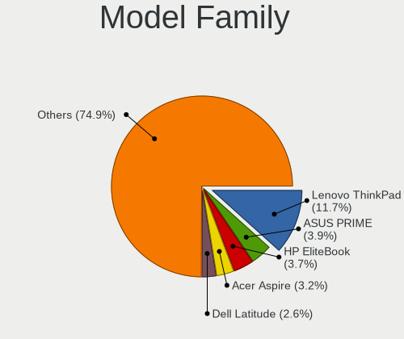

| Name                    | Computers | Percent |
|-------------------------|-----------|---------|
| Lenovo ThinkPad         | 223       | 11.67%  |
| ASUS PRIME              | 74        | 3.87%   |
| HP EliteBook            | 71        | 3.72%   |
| Acer Aspire             | 61        | 3.19%   |
| Dell Latitude           | 50        | 2.62%   |
| ASUS ROG                | 49        | 2.56%   |
| HP Compaq               | 47        | 2.46%   |
| HP Pavilion             | 44        | 2.3%    |
| ASUS TUF                | 34        | 1.78%   |
| Lenovo IdeaPad          | 33        | 1.73%   |
| Fujitsu LIFEBOOK        | 30        | 1.57%   |
| ASUS All                | 28        | 1.47%   |
| Lenovo Yoga             | 25        | 1.31%   |
| HP EliteDesk            | 21        | 1.1%    |
| Dell XPS                | 20        | 1.05%   |
| Dell OptiPlex           | 20        | 1.05%   |
| Lenovo ThinkCentre      | 19        | 0.99%   |
| HP ProBook              | 19        | 0.99%   |
| Dell Precision          | 19        | 0.99%   |
| ASUS VivoBook           | 18        | 0.94%   |
| HP ProDesk              | 16        | 0.84%   |
| HP Laptop               | 15        | 0.78%   |
| Fujitsu ESPRIMO         | 15        | 0.78%   |
| Unknown                 | 14        | 0.73%   |
| RPi Raspberry           | 12        | 0.63%   |
| Lenovo Legion           | 12        | 0.63%   |
| ASUS M5A97              | 12        | 0.63%   |
| Dell PowerEdge          | 11        | 0.58%   |
| ASUS ASUS               | 11        | 0.58%   |
| HP ZBook                | 9         | 0.47%   |
| Gigabyte X570           | 9         | 0.47%   |
| Fujitsu Siemens ESPRIMO | 9         | 0.47%   |
| Dell Inspiron           | 9         | 0.47%   |
| Toshiba Satellite       | 8         | 0.42%   |
| HP ProLiant             | 8         | 0.42%   |
| ASUS Zenbook            | 8         | 0.42%   |
| Acer Swift              | 8         | 0.42%   |
| Acer Predator           | 8         | 0.42%   |
| HP ENVY                 | 7         | 0.37%   |
| MSI MS-7C37             | 6         | 0.31%   |

MFG Year
--------

Motherboard manufacture year

| Year    | Computers | Percent |
|---------|-----------|---------|
| 2019    | 172       | 9%      |
| 2018    | 166       | 8.69%   |
| 2012    | 154       | 8.06%   |
| 2020    | 148       | 7.74%   |
| 2017    | 146       | 7.64%   |
| 2013    | 142       | 7.43%   |
| 2011    | 125       | 6.54%   |
| 2014    | 112       | 5.86%   |
| 2021    | 99        | 5.18%   |
| 2015    | 98        | 5.13%   |
| 2016    | 95        | 4.97%   |
| 2008    | 87        | 4.55%   |
| 2010    | 78        | 4.08%   |
| 2009    | 78        | 4.08%   |
| 2022    | 62        | 3.24%   |
| 2023    | 52        | 2.72%   |
| 2007    | 44        | 2.3%    |
| 2006    | 16        | 0.84%   |
| Unknown | 16        | 0.84%   |
| 2024    | 13        | 0.68%   |
| 2005    | 6         | 0.31%   |
| 2004    | 2         | 0.1%    |

Form Factor
-----------

Physical design of the computer

| Name           | Computers | Percent |
|----------------|-----------|---------|
| Notebook       | 967       | 50.6%   |
| Desktop        | 792       | 41.44%  |
| Server         | 38        | 1.99%   |
| Convertible    | 36        | 1.88%   |
| Mini pc        | 28        | 1.47%   |
| All in one     | 20        | 1.05%   |
| System on chip | 16        | 0.84%   |
| Tablet         | 10        | 0.52%   |
| Phone          | 3         | 0.16%   |
| Other          | 1         | 0.05%   |

Secure Boot
-----------

Enabled or disabled

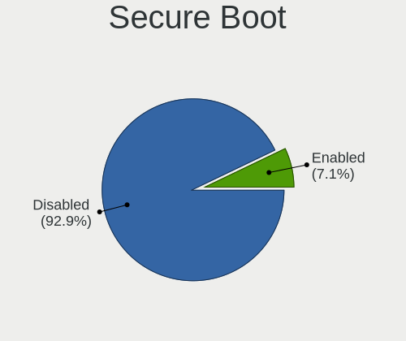

| State    | Computers | Percent |
|----------|-----------|---------|
| Disabled | 1787      | 92.88%  |
| Enabled  | 137       | 7.12%   |

Coreboot
--------

Have coreboot on board

| Used | Computers | Percent |
|------|-----------|---------|
| No   | 1904      | 99.63%  |
| Yes  | 7         | 0.37%   |

RAM Size
--------

Total RAM memory

| Size in GB      | Computers | Percent |
|-----------------|-----------|---------|
| 4.01-8.0        | 438       | 22.47%  |
| 16.01-24.0      | 401       | 20.57%  |
| 3.01-4.0        | 321       | 16.47%  |
| 8.01-16.0       | 305       | 15.65%  |
| 32.01-64.0      | 233       | 11.95%  |
| 64.01-256.0     | 87        | 4.46%   |
| 24.01-32.0      | 58        | 2.98%   |
| 1.01-2.0        | 56        | 2.87%   |
| 2.01-3.0        | 21        | 1.08%   |
| 0.51-1.0        | 14        | 0.72%   |
| More than 256.0 | 13        | 0.67%   |
| 0.01-0.5        | 2         | 0.1%    |

RAM Used
--------

Used RAM memory

| Used GB         | Computers | Percent |
|-----------------|-----------|---------|
| 1.01-2.0        | 708       | 33.48%  |
| 2.01-3.0        | 480       | 22.7%   |
| 4.01-8.0        | 338       | 15.98%  |
| 3.01-4.0        | 263       | 12.43%  |
| 0.51-1.0        | 136       | 6.43%   |
| 8.01-16.0       | 107       | 5.06%   |
| 0.01-0.5        | 31        | 1.47%   |
| 16.01-24.0      | 22        | 1.04%   |
| 64.01-256.0     | 11        | 0.52%   |
| 32.01-64.0      | 8         | 0.38%   |
| 24.01-32.0      | 8         | 0.38%   |
| 0               | 2         | 0.09%   |
| More than 256.0 | 1         | 0.05%   |

Total Drives
------------

Number of drives on board

| Drives | Computers | Percent |
|--------|-----------|---------|
| 1      | 1148      | 58.1%   |
| 2      | 410       | 20.75%  |
| 3      | 185       | 9.36%   |
| 4      | 79        | 4%      |
| 5      | 52        | 2.63%   |
| 0      | 28        | 1.42%   |
| 6      | 24        | 1.21%   |
| 7      | 15        | 0.76%   |
| 8      | 10        | 0.51%   |
| 9      | 8         | 0.4%    |
| 10     | 7         | 0.35%   |
| 11     | 3         | 0.15%   |
| 12     | 2         | 0.1%    |
| 70     | 1         | 0.05%   |
| 41     | 1         | 0.05%   |
| 25     | 1         | 0.05%   |
| 23     | 1         | 0.05%   |
| 14     | 1         | 0.05%   |

Has CD-ROM
----------

Has CD-ROM on board

| Presented | Computers | Percent |
|-----------|-----------|---------|
| No        | 1225      | 63.27%  |
| Yes       | 711       | 36.73%  |

Has Ethernet
------------

Has Ethernet on board

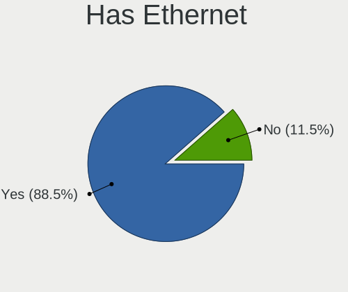

| Presented | Computers | Percent |
|-----------|-----------|---------|
| Yes       | 1696      | 88.52%  |
| No        | 220       | 11.48%  |

Has WiFi
--------

Has WiFi module

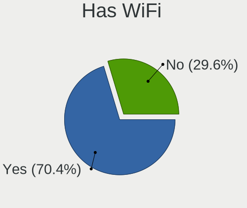

| Presented | Computers | Percent |
|-----------|-----------|---------|
| Yes       | 1353      | 70.36%  |
| No        | 570       | 29.64%  |

Has Bluetooth
-------------

Has Bluetooth module

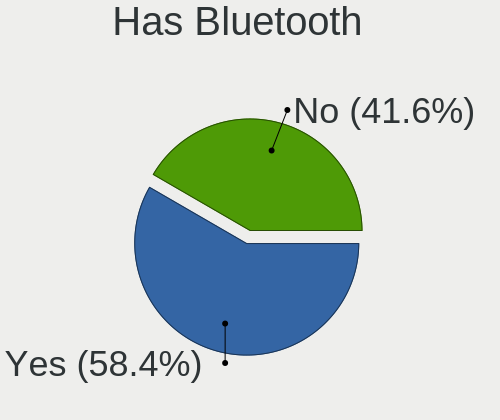

| Presented | Computers | Percent |
|-----------|-----------|---------|
| Yes       | 1128      | 58.35%  |
| No        | 805       | 41.65%  |

Location
--------

Country
-------

Geographic location (country)

| Country | Computers | Percent |
|---------|-----------|---------|
| Finland | 1911      | 100%    |

City
----

Geographic location (city)

| City         | Computers | Percent |
|--------------|-----------|---------|
| Helsinki     | 905       | 44.19%  |
| Tampere      | 177       | 8.64%   |
| Turku        | 127       | 6.2%    |
| Espoo        | 112       | 5.47%   |
| Oulu         | 98        | 4.79%   |
| Vantaa       | 66        | 3.22%   |
| Jyvskyl  | 56        | 2.73%   |
| Kuopio       | 44        | 2.15%   |
| Lahti        | 38        | 1.86%   |
| Vaasa        | 28        | 1.37%   |
| Tuusula      | 21        | 1.03%   |
| Raisio       | 17        | 0.83%   |
| Joensuu      | 16        | 0.78%   |
| Hyvinkaeae   | 16        | 0.78%   |
| Seinjoki   | 11        | 0.54%   |
| Pori         | 11        | 0.54%   |
| Salo         | 10        | 0.49%   |
| Lappeenranta | 10        | 0.49%   |
| Jrvenp | 10        | 0.49%   |
| Rovaniemi    | 9         | 0.44%   |
| Raahe        | 9         | 0.44%   |
| Lohja        | 9         | 0.44%   |
| Kouvola      | 9         | 0.44%   |
| Kotka        | 9         | 0.44%   |
| Hmeenlinna | 9         | 0.44%   |
| Riihimki   | 6         | 0.29%   |
| Kokkola      | 6         | 0.29%   |
| Kerava       | 6         | 0.29%   |
| Forssa       | 6         | 0.29%   |
| Rauma        | 5         | 0.24%   |
| Porvoo       | 5         | 0.24%   |
| Tenala       | 4         | 0.2%    |
| Solv         | 4         | 0.2%    |
| Nokia        | 4         | 0.2%    |
| Mikkeli      | 4         | 0.2%    |
| Mntsl  | 4         | 0.2%    |
| Lempl  | 4         | 0.2%    |
| Klaukkala    | 4         | 0.2%    |
| Uusikaupunki | 3         | 0.15%   |
| Rusko        | 3         | 0.15%   |

Drives
------

Drive Vendor
------------

Hard drive vendors

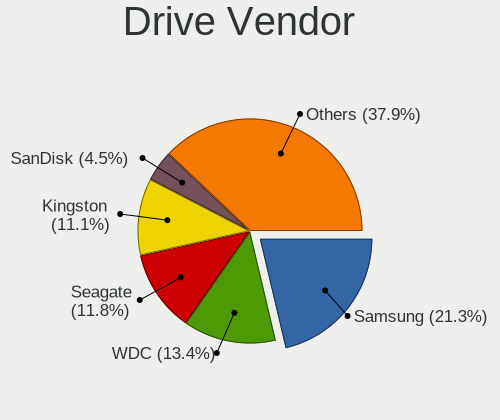

| Vendor                      | Computers | Drives | Percent |
|-----------------------------|-----------|--------|---------|
| Samsung Electronics         | 608       | 1020   | 21.31%  |
| WDC                         | 382       | 678    | 13.39%  |
| Seagate                     | 337       | 565    | 11.81%  |
| Kingston                    | 317       | 460    | 11.11%  |
| SanDisk                     | 127       | 154    | 4.45%   |
| Toshiba                     | 125       | 203    | 4.38%   |
| Intel                       | 99        | 128    | 3.47%   |
| Unknown                     | 96        | 140    | 3.36%   |
| SK hynix                    | 86        | 111    | 3.01%   |
| Hitachi                     | 82        | 117    | 2.87%   |
| Crucial                     | 71        | 88     | 2.49%   |
| Micron Technology           | 61        | 97     | 2.14%   |
| HGST                        | 43        | 320    | 1.51%   |
| A-DATA Technology           | 37        | 45     | 1.3%    |
| Kingston Technology Company | 31        | 35     | 1.09%   |
| Apple                       | 24        | 35     | 0.84%   |
| Transcend                   | 21        | 26     | 0.74%   |
| PNY                         | 21        | 25     | 0.74%   |
| KIOXIA                      | 19        | 19     | 0.67%   |
| OCZ                         | 18        | 25     | 0.63%   |
| Corsair                     | 17        | 20     | 0.6%    |
| Verbatim                    | 15        | 25     | 0.53%   |
| Fujitsu                     | 15        | 18     | 0.53%   |
| Phison                      | 13        | 14     | 0.46%   |
| Maxtor                      | 13        | 20     | 0.46%   |
| ADATA Technology            | 11        | 13     | 0.39%   |
| Phison Electronics          | 9         | 12     | 0.32%   |
| Intenso                     | 9         | 12     | 0.32%   |
| China                       | 9         | 11     | 0.32%   |
| LITEONIT                    | 8         | 14     | 0.28%   |
| LITEON                      | 8         | 14     | 0.28%   |
| Hewlett-Packard             | 8         | 13     | 0.28%   |
| Micron/Crucial Technology   | 6         | 7      | 0.21%   |
| Silicon Motion              | 5         | 6      | 0.18%   |
| BHT                         | 5         | 7      | 0.18%   |
| Unknown                     | 5         | 6      | 0.18%   |
| XPG                         | 4         | 6      | 0.14%   |
| UMIS                        | 4         | 7      | 0.14%   |
| Patriot                     | 4         | 7      | 0.14%   |
| Lenovo                      | 4         | 4      | 0.14%   |

Drive Model
-----------

Hard drive models

| Model                                                | Computers | Percent |
|------------------------------------------------------|-----------|---------|
| Kingston SA400S37240G 240GB SSD                      | 59        | 1.82%   |
| Samsung NVMe SSD Controller SM981/PM981/PM983 512GB  | 44        | 1.36%   |
| Samsung SSD 850 EVO 500GB                            | 38        | 1.17%   |
| Samsung SSD 850 EVO 250GB                            | 38        | 1.17%   |
| Kingston SA400S37480G 480GB SSD                      | 36        | 1.11%   |
| Kingston SA400S37120G 120GB SSD                      | 34        | 1.05%   |
| Samsung NVMe SSD Controller PM9A1/PM9A3/980PRO 512GB | 26        | 0.8%    |
| Samsung SSD 860 EVO 500GB                            | 21        | 0.65%   |
| Unknown MMC Card  64GB                               | 20        | 0.62%   |
| Kingston SV300S37A240G 240GB SSD                     | 20        | 0.62%   |
| Kingston SV300S37A120G 120GB SSD                     | 20        | 0.62%   |
| Samsung SSD 860 EVO 1TB                              | 18        | 0.56%   |
| Kingston SHFS37A120G 120GB SSD                       | 18        | 0.56%   |
| Seagate ST500DM002-1BD142 500GB                      | 17        | 0.52%   |
| Samsung NVMe SSD Drive 500GB                         | 17        | 0.52%   |
| Unknown MMC Card  32GB                               | 16        | 0.49%   |
| Crucial CT1000MX500SSD1 1TB                          | 16        | 0.49%   |
| Seagate ST9500325AS 500GB                            | 15        | 0.46%   |
| Samsung SSD 980 1TB                                  | 15        | 0.46%   |
| WDC WDS500G2B0A-00SM50 500GB SSD                     | 14        | 0.43%   |
| Seagate Expansion 1TB                                | 14        | 0.43%   |
| Samsung HD103SJ 1TB                                  | 14        | 0.43%   |
| Kingston SA400S37960G 960GB SSD                      | 14        | 0.43%   |
| Seagate ST1000DM010-2EP102 1TB                       | 13        | 0.4%    |
| HGST HTS721010A9E630 1TB                             | 13        | 0.4%    |
| Toshiba DT01ACA300 3TB                               | 12        | 0.37%   |
| Seagate ST2000DM008-2FR102 2TB                       | 12        | 0.37%   |
| PNY CS900 120GB SSD                                  | 12        | 0.37%   |
| WDC WDS100T2B0A-00SM50 1TB SSD                       | 11        | 0.34%   |
| Unknown MMC Card  128GB                              | 11        | 0.34%   |
| Seagate ST1000LM024 HN-M101MBB 1TB                   | 11        | 0.34%   |
| Samsung SSD 840 EVO 120GB                            | 11        | 0.34%   |
| Samsung NVMe SSD Drive 256GB                         | 11        | 0.34%   |
| WDC WD30EFRX-68EUZN0 3TB                             | 10        | 0.31%   |
| Seagate ST500LT012-1DG142 500GB                      | 10        | 0.31%   |
| Seagate ST4000DM004-2CV104 4TB                       | 10        | 0.31%   |
| Samsung NVMe SSD Drive 512GB                         | 10        | 0.31%   |
| Samsung NVMe SSD Drive 1TB                           | 10        | 0.31%   |
| Samsung NVMe SSD Controller SM961/PM961/SM963 256GB  | 10        | 0.31%   |
| Kingston Company SNV2S1000G 1TB                      | 10        | 0.31%   |

HDD Vendor
----------

Hard disk drive vendors

| Vendor              | Computers | Drives | Percent |
|---------------------|-----------|--------|---------|
| Seagate             | 326       | 547    | 34.32%  |
| WDC                 | 301       | 520    | 31.68%  |
| Toshiba             | 84        | 142    | 8.84%   |
| Hitachi             | 82        | 117    | 8.63%   |
| Samsung Electronics | 60        | 88     | 6.32%   |
| HGST                | 43        | 317    | 4.53%   |
| Fujitsu             | 15        | 18     | 1.58%   |
| Maxtor              | 13        | 20     | 1.37%   |
| Unknown             | 5         | 5      | 0.53%   |
| Hewlett-Packard     | 5         | 5      | 0.53%   |
| Apple               | 3         | 3      | 0.32%   |
| StoreJet            | 2         | 2      | 0.21%   |
| JMicron Technology  | 2         | 5      | 0.21%   |
| Intenso             | 2         | 2      | 0.21%   |
| ASMT                | 2         | 2      | 0.21%   |
| ASMedia             | 2         | 2      | 0.21%   |
| TO Exter            | 1         | 1      | 0.11%   |
| RSH-339             | 1         | 1      | 0.11%   |
| External            | 1         | 1      | 0.11%   |

SSD Vendor
----------

Solid state drive vendors

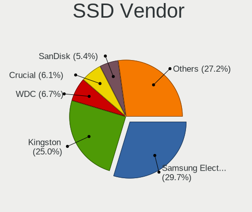

| Vendor              | Computers | Drives | Percent |
|---------------------|-----------|--------|---------|
| Samsung Electronics | 327       | 519    | 29.67%  |
| Kingston            | 275       | 398    | 24.95%  |
| WDC                 | 74        | 119    | 6.72%   |
| Crucial             | 67        | 83     | 6.08%   |
| SanDisk             | 59        | 69     | 5.35%   |
| Intel               | 39        | 58     | 3.54%   |
| Micron Technology   | 30        | 60     | 2.72%   |
| A-DATA Technology   | 24        | 29     | 2.18%   |
| Transcend           | 20        | 25     | 1.81%   |
| PNY                 | 19        | 23     | 1.72%   |
| OCZ                 | 18        | 25     | 1.63%   |
| SK hynix            | 17        | 30     | 1.54%   |
| Apple               | 17        | 21     | 1.54%   |
| Verbatim            | 15        | 25     | 1.36%   |
| Toshiba             | 15        | 23     | 1.36%   |
| China               | 9         | 11     | 0.82%   |
| LITEONIT            | 8         | 14     | 0.73%   |
| LITEON              | 8         | 14     | 0.73%   |
| Corsair             | 8         | 9      | 0.73%   |
| Intenso             | 6         | 9      | 0.54%   |
| Patriot             | 4         | 7      | 0.36%   |
| BHT                 | 4         | 6      | 0.36%   |
| SPCC                | 3         | 3      | 0.27%   |
| Hewlett-Packard     | 3         | 8      | 0.27%   |
| Unknown             | 3         | 4      | 0.27%   |
| USB3.0              | 2         | 2      | 0.18%   |
| Plextor             | 2         | 2      | 0.18%   |
| OCZ-VERTEX3         | 2         | 2      | 0.18%   |
| OCZ-VERTEX          | 2         | 2      | 0.18%   |
| Netac               | 2         | 2      | 0.18%   |
| XrayDisk            | 1         | 1      | 0.09%   |
| X12                 | 1         | 1      | 0.09%   |
| WDC WDS2            | 1         | 1      | 0.09%   |
| WALRAM              | 1         | 1      | 0.09%   |
| Vaseky              | 1         | 1      | 0.09%   |
| Unknown             | 1         | 1      | 0.09%   |
| TSA                 | 1         | 1      | 0.09%   |
| sobetter            | 1         | 1      | 0.09%   |
| Seagate             | 1         | 1      | 0.09%   |
| Ramsta              | 1         | 1      | 0.09%   |

Drive Kind
----------

HDD or SSD

| Kind    | Computers | Drives | Percent |
|---------|-----------|--------|---------|
| SSD     | 936       | 1622   | 37.17%  |
| HDD     | 775       | 1798   | 30.78%  |
| NVMe    | 687       | 1019   | 27.28%  |
| MMC     | 91        | 127    | 3.61%   |
| Unknown | 29        | 48     | 1.15%   |

Drive Connector
---------------

SATA, SAS, NVMe, etc.

| Type | Computers | Drives | Percent |
|------|-----------|--------|---------|
| SATA | 1379      | 3307   | 61.13%  |
| NVMe | 687       | 1017   | 30.45%  |
| SAS  | 99        | 163    | 4.39%   |
| MMC  | 91        | 127    | 4.03%   |

Drive Size
----------

Size of hard drive

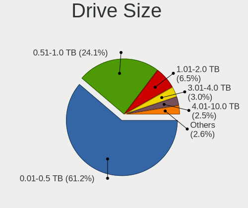

| Size in TB | Computers | Drives | Percent |
|------------|-----------|--------|---------|
| 0.01-0.5   | 1114      | 1918   | 61.24%  |
| 0.51-1.0   | 438       | 685    | 24.08%  |
| 1.01-2.0   | 118       | 215    | 6.49%   |
| 3.01-4.0   | 55        | 144    | 3.02%   |
| 4.01-10.0  | 46        | 363    | 2.53%   |
| 2.01-3.0   | 40        | 86     | 2.2%    |
| 10.01-20.0 | 8         | 9      | 0.44%   |

Space Total
-----------

Amount of disk space available on the file system

| Size in GB     | Computers | Percent |
|----------------|-----------|---------|
| 101-250        | 560       | 27.72%  |
| 251-500        | 376       | 18.61%  |
| 501-1000       | 264       | 13.07%  |
| 1-20           | 160       | 7.92%   |
| 1001-2000      | 141       | 6.98%   |
| 51-100         | 133       | 6.58%   |
| More than 3000 | 129       | 6.39%   |
| Unknown        | 102       | 5.05%   |
| 21-50          | 85        | 4.21%   |
| 2001-3000      | 70        | 3.47%   |

Space Used
----------

Amount of used disk space

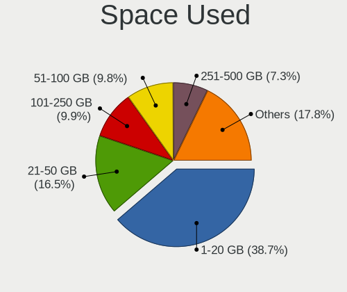

| Used GB        | Computers | Percent |
|----------------|-----------|---------|
| 1-20           | 814       | 38.73%  |
| 21-50          | 346       | 16.46%  |
| 101-250        | 209       | 9.94%   |
| 51-100         | 206       | 9.8%    |
| 251-500        | 153       | 7.28%   |
| 501-1000       | 120       | 5.71%   |
| Unknown        | 102       | 4.85%   |
| 1001-2000      | 58        | 2.76%   |
| More than 3000 | 57        | 2.71%   |
| 2001-3000      | 35        | 1.67%   |
| 0              | 2         | 0.1%    |

Malfunc. Drives
---------------

Drive models with a malfunction

| Model                                          | Computers | Drives | Percent |
|------------------------------------------------|-----------|--------|---------|
| WDC WD40EFRX-68WT0N0 4TB                       | 4         | 6      | 2.13%   |
| Seagate ST9500325AS 500GB                      | 4         | 5      | 2.13%   |
| Kingston SHFS37A120G 120GB SSD                 | 4         | 5      | 2.13%   |
| Seagate ST500LT012-9WS142 500GB                | 3         | 4      | 1.6%    |
| Samsung Electronics HD103SJ 1TB                | 3         | 4      | 1.6%    |
| Micron Technology MTFDDAK512MAM-1K1 512GB SSD  | 3         | 6      | 1.6%    |
| HGST HTS725050A7E630 500GB                     | 3         | 3      | 1.6%    |
| WDC WD5000AAKX-60U6AA0 500GB                   | 2         | 2      | 1.06%   |
| WDC WD10EARS-22Y5B1 1TB                        | 2         | 3      | 1.06%   |
| USB3.0 Super Speed 500GB SSD                   | 2         | 2      | 1.06%   |
| Toshiba DT01ACA100 1TB                         | 2         | 3      | 1.06%   |
| Seagate ST500DM002-1BD142 500GB                | 2         | 2      | 1.06%   |
| Seagate ST3500418AS 500GB                      | 2         | 2      | 1.06%   |
| Seagate ST3320620AS 320GB                      | 2         | 2      | 1.06%   |
| Seagate ST3250318AS 250GB                      | 2         | 2      | 1.06%   |
| Seagate ST1000LM024 HN-M101MBB 1TB             | 2         | 3      | 1.06%   |
| Samsung Electronics SSD 980 PRO 500GB          | 2         | 2      | 1.06%   |
| Samsung Electronics SSD 980 1TB                | 2         | 2      | 1.06%   |
| Samsung Electronics SSD 850 EVO 1TB            | 2         | 2      | 1.06%   |
| Samsung Electronics HD501LJ 500GB              | 2         | 3      | 1.06%   |
| Micron Technology 1100_MTFDDAK512TBN 512GB SSD | 2         | 4      | 1.06%   |
| Maxtor 7Y250M0 256GB                           | 2         | 2      | 1.06%   |
| Kingston SA400S37120G 120GB SSD                | 2         | 2      | 1.06%   |
| Intel SSDSC2BF240A5L 240GB                     | 2         | 3      | 1.06%   |
| Intel SSDSA2M080G2GC 80GB                      | 2         | 2      | 1.06%   |
| WDC WDS240G2G0A-00JH30 240GB SSD               | 1         | 1      | 0.53%   |
| WDC WDS120G2G0A-00JH30 120GB SSD               | 1         | 1      | 0.53%   |
| WDC WDS100T2B0A-00SM50 1TB SSD                 | 1         | 2      | 0.53%   |
| WDC WD6400AAKS-07A7B0 640GB                    | 1         | 1      | 0.53%   |
| WDC WD50EZRZ-32RWYB1 5TB                       | 1         | 1      | 0.53%   |
| WDC WD5000ABPS-01ZZB0 500GB                    | 1         | 1      | 0.53%   |
| WDC WD5000AAKX-00ERMA0 500GB                   | 1         | 1      | 0.53%   |
| WDC WD5000AAKS-75A7B0 500GB                    | 1         | 1      | 0.53%   |
| WDC WD5000AAKS-22A7B0 500GB                    | 1         | 1      | 0.53%   |
| WDC WD5000AAKS-007AA0 500GB                    | 1         | 1      | 0.53%   |
| WDC WD3200YS-01PGB0 320GB                      | 1         | 1      | 0.53%   |
| WDC WD3200BEVT-22ZCT0 320GB                    | 1         | 1      | 0.53%   |
| WDC WD3200AAKS-00L9A0 320GB                    | 1         | 1      | 0.53%   |
| WDC WD3200AAJS-60Z0A0 320GB                    | 1         | 1      | 0.53%   |
| WDC WD3200AAJS-00RYA0 320GB                    | 1         | 1      | 0.53%   |

Malfunc. Drive Vendor
---------------------

Vendors of faulty drives

| Vendor              | Computers | Drives | Percent |
|---------------------|-----------|--------|---------|
| Seagate             | 42        | 46     | 22.95%  |
| WDC                 | 34        | 39     | 18.58%  |
| Samsung Electronics | 21        | 28     | 11.48%  |
| Kingston            | 17        | 18     | 9.29%   |
| Toshiba             | 12        | 13     | 6.56%   |
| Hitachi             | 11        | 19     | 6.01%   |
| Intel               | 7         | 8      | 3.83%   |
| HGST                | 7         | 7      | 3.83%   |
| Micron Technology   | 6         | 11     | 3.28%   |
| Maxtor              | 4         | 4      | 2.19%   |
| SK hynix            | 3         | 3      | 1.64%   |
| A-DATA Technology   | 3         | 3      | 1.64%   |
| USB3.0              | 2         | 2      | 1.09%   |
| SanDisk             | 2         | 2      | 1.09%   |
| Fujitsu             | 2         | 3      | 1.09%   |
| Corsair             | 2         | 2      | 1.09%   |
| Vaseky              | 1         | 1      | 0.55%   |
| SPCC                | 1         | 1      | 0.55%   |
| PNY                 | 1         | 1      | 0.55%   |
| OCZ                 | 1         | 1      | 0.55%   |
| LITEONIT            | 1         | 1      | 0.55%   |
| Crucial             | 1         | 1      | 0.55%   |
| ATP                 | 1         | 1      | 0.55%   |
| Apple               | 1         | 1      | 0.55%   |

Malfunc. HDD Vendor
-------------------

Vendors of faulty HDD drives

| Vendor              | Computers | Drives | Percent |
|---------------------|-----------|--------|---------|
| Seagate             | 42        | 46     | 36.84%  |
| WDC                 | 30        | 34     | 26.32%  |
| Toshiba             | 11        | 12     | 9.65%   |
| Hitachi             | 11        | 19     | 9.65%   |
| Samsung Electronics | 7         | 9      | 6.14%   |
| HGST                | 7         | 7      | 6.14%   |
| Maxtor              | 4         | 4      | 3.51%   |
| Fujitsu             | 2         | 3      | 1.75%   |

Malfunc. Drive Kind
-------------------

Kinds of faulty drives

| Kind | Computers | Drives | Percent |
|------|-----------|--------|---------|
| HDD  | 112       | 134    | 61.54%  |
| SSD  | 58        | 68     | 31.87%  |
| NVMe | 12        | 14     | 6.59%   |

Failed Drives
-------------

Failed drive models

| Model                                      | Computers | Drives | Percent |
|--------------------------------------------|-----------|--------|---------|
| Seagate ST3250318AS 250GB                  | 1         | 1      | 33.33%  |
| Samsung Electronics MZVLB1T0HALR-00000 1TB | 1         | 2      | 33.33%  |
| Samsung Electronics HD753LJ 752GB          | 1         | 1      | 33.33%  |

Failed Drive Vendor
-------------------

Failed drive vendors

| Vendor              | Computers | Drives | Percent |
|---------------------|-----------|--------|---------|
| Samsung Electronics | 2         | 3      | 66.67%  |
| Seagate             | 1         | 1      | 33.33%  |

Drive Status
------------

Number of failed and malfunc. drives

| Status   | Computers | Drives | Percent |
|----------|-----------|--------|---------|
| Detected | 1016      | 2223   | 48.4%   |
| Works    | 902       | 2171   | 42.97%  |
| Malfunc  | 178       | 216    | 8.48%   |
| Failed   | 3         | 4      | 0.14%   |

Storage controller
------------------

Storage Vendor
--------------

Storage controller vendors

| Vendor                           | Computers | Percent |
|----------------------------------|-----------|---------|
| Intel                            | 1148      | 46.27%  |
| AMD                              | 424       | 17.09%  |
| Samsung Electronics              | 289       | 11.65%  |
| SanDisk                          | 90        | 3.63%   |
| Kingston Technology Company      | 75        | 3.02%   |
| SK hynix                         | 65        | 2.62%   |
| ASMedia Technology               | 47        | 1.89%   |
| Nvidia                           | 39        | 1.57%   |
| Phison Electronics               | 36        | 1.45%   |
| JMicron Technology               | 35        | 1.41%   |
| Micron Technology                | 31        | 1.25%   |
| Toshiba America Info Systems     | 30        | 1.21%   |
| ADATA Technology                 | 27        | 1.09%   |
| Marvell Technology Group         | 23        | 0.93%   |
| KIOXIA                           | 19        | 0.77%   |
| LSI Logic / Symbios Logic        | 13        | 0.52%   |
| Broadcom / LSI                   | 12        | 0.48%   |
| Micron/Crucial Technology        | 11        | 0.44%   |
| VIA Technologies                 | 10        | 0.4%    |
| Union Memory (Shenzhen)          | 7         | 0.28%   |
| Seagate Technology               | 7         | 0.28%   |
| Hewlett-Packard                  | 7         | 0.28%   |
| Silicon Motion                   | 5         | 0.2%    |
| Apple                            | 5         | 0.2%    |
| Silicon Integrated Systems [SiS] | 4         | 0.16%   |
| MAXIO Technology (Hangzhou)      | 4         | 0.16%   |
| Lenovo                           | 4         | 0.16%   |
| Realtek Semiconductor            | 3         | 0.12%   |
| Solid State Storage Technology   | 2         | 0.08%   |
| O2 Micro                         | 2         | 0.08%   |
| Yangtze Memory Technologies      | 1         | 0.04%   |
| Transcend                        | 1         | 0.04%   |
| Promise Technology               | 1         | 0.04%   |
| OCZ Technology Group             | 1         | 0.04%   |
| Lite-On Technology               | 1         | 0.04%   |
| Hosin Global Electronics         | 1         | 0.04%   |
| Adaptec                          | 1         | 0.04%   |

Storage Model
-------------

Storage controller models

| Model                                                                          | Computers | Percent |
|--------------------------------------------------------------------------------|-----------|---------|
| AMD FCH SATA Controller [AHCI mode]                                            | 252       | 8.79%   |
| Samsung NVMe SSD Controller SM981/PM981/PM983                                  | 137       | 4.78%   |
| Intel 8 Series/C220 Series Chipset Family 6-port SATA Controller 1 [AHCI mode] | 91        | 3.17%   |
| Intel Sunrise Point-LP SATA Controller [AHCI mode]                             | 86        | 3%      |
| Intel 7 Series Chipset Family 6-port SATA Controller [AHCI mode]               | 69        | 2.41%   |
| Intel Q170/Q150/B150/H170/H110/Z170/CM236 Chipset SATA Controller [AHCI Mode]  | 64        | 2.23%   |
| Intel 6 Series/C200 Series Chipset Family 6 port Mobile SATA AHCI Controller   | 62        | 2.16%   |
| AMD 400 Series Chipset SATA Controller                                         | 60        | 2.09%   |
| Samsung NVMe SSD Controller PM9A1/PM9A3/980PRO                                 | 56        | 1.95%   |
| Intel 8 Series SATA Controller 1 [AHCI mode]                                   | 52        | 1.81%   |
| Intel 200 Series PCH SATA controller [AHCI mode]                               | 51        | 1.78%   |
| AMD SB7x0/SB8x0/SB9x0 SATA Controller [AHCI mode]                              | 50        | 1.74%   |
| Intel 6 Series/C200 Series Chipset Family 6 port Desktop SATA AHCI Controller  | 49        | 1.71%   |
| AMD 500 Series Chipset SATA Controller                                         | 44        | 1.53%   |
| Samsung NVMe SSD Controller SM961/PM961/SM963                                  | 43        | 1.5%    |
| ASMedia ASM1061/ASM1062 Serial ATA Controller                                  | 43        | 1.5%    |
| AMD SB7x0/SB8x0/SB9x0 IDE Controller                                           | 43        | 1.5%    |
| Intel 7 Series/C210 Series Chipset Family 6-port SATA Controller [AHCI mode]   | 41        | 1.43%   |
| Samsung NVMe SSD Controller 980 (DRAM-less)                                    | 39        | 1.36%   |
| Intel 82801IBM/IEM (ICH9M/ICH9M-E) 4 port SATA Controller [AHCI mode]          | 38        | 1.33%   |
| Intel 82801 Mobile SATA Controller [RAID mode]                                 | 37        | 1.29%   |
| Intel 5 Series/3400 Series Chipset 6 port SATA AHCI Controller                 | 32        | 1.12%   |
| Intel SSD 660P Series                                                          | 30        | 1.05%   |
| Intel SATA Controller [RAID Mode]                                              | 30        | 1.05%   |
| Intel Volume Management Device NVMe RAID Controller                            | 28        | 0.98%   |
| Intel Cannon Lake PCH SATA AHCI Controller                                     | 27        | 0.94%   |
| AMD SB7x0/SB8x0/SB9x0 SATA Controller [IDE mode]                               | 26        | 0.91%   |
| Kingston Company A2000 NVMe SSD [SM2263EN]                                     | 25        | 0.87%   |
| Intel Wildcat Point-LP SATA Controller [AHCI Mode]                             | 25        | 0.87%   |
| Intel 82801G (ICH7 Family) IDE Controller                                      | 25        | 0.87%   |
| Intel 82801HM/HEM (ICH8M/ICH8M-E) IDE Controller                               | 23        | 0.8%    |
| AMD 300 Series Chipset SATA Controller                                         | 23        | 0.8%    |
| ADATA XPG SX8200 Pro PCIe Gen3x4 M.2 2280 Solid State Drive                    | 23        | 0.8%    |
| SK hynix Gold P31/BC711/PC711 NVMe Solid State Drive                           | 22        | 0.77%   |
| SanDisk Extreme Pro / WD Black SN750 / PC SN730 / Red SN700 NVMe SSD           | 22        | 0.77%   |
| Intel 82801HM/HEM (ICH8M/ICH8M-E) SATA Controller [AHCI mode]                  | 21        | 0.73%   |
| SK hynix BC501 NVMe Solid State Drive                                          | 20        | 0.7%    |
| AMD 600 Series Chipset SATA Controller                                         | 20        | 0.7%    |
| Phison E12 NVMe Controller                                                     | 19        | 0.66%   |
| Intel 5 Series/3400 Series Chipset 4 port SATA AHCI Controller                 | 17        | 0.59%   |

Storage Kind
------------

Kind of storage controller (IDE, SATA, NVMe, SAS, ...)

| Kind | Computers | Percent |
|------|-----------|---------|
| SATA | 1404      | 56.5%   |
| NVMe | 692       | 27.85%  |
| IDE  | 244       | 9.82%   |
| RAID | 132       | 5.31%   |
| SAS  | 9         | 0.36%   |
| SCSI | 4         | 0.16%   |

Processor
---------

CPU Vendor
----------

Processor vendors

| Vendor       | Computers | Percent |
|--------------|-----------|---------|
| Intel        | 1336      | 69.91%  |
| AMD          | 552       | 28.89%  |
| ARM          | 20        | 1.05%   |
| Qualcomm     | 2         | 0.1%    |
| CentaurHauls | 1         | 0.05%   |

CPU Model
---------

Processor models

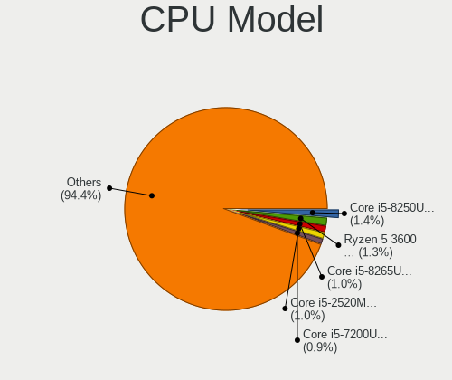

| Model                                   | Computers | Percent |
|-----------------------------------------|-----------|---------|
| Intel Core i5-8250U CPU @ 1.60GHz       | 26        | 1.36%   |
| AMD Ryzen 5 3600 6-Core Processor       | 25        | 1.3%    |
| Intel Core i5-8265U CPU @ 1.60GHz       | 20        | 1.04%   |
| Intel Core i5-2520M CPU @ 2.50GHz       | 20        | 1.04%   |
| Intel Core i5-7200U CPU @ 2.50GHz       | 17        | 0.89%   |
| Intel Core i5-6300U CPU @ 2.40GHz       | 17        | 0.89%   |
| AMD Ryzen 7 3700X 8-Core Processor      | 17        | 0.89%   |
| Intel Core i5-6200U CPU @ 2.30GHz       | 16        | 0.83%   |
| Intel Core i7-8565U CPU @ 1.80GHz       | 15        | 0.78%   |
| Intel Core i7-8550U CPU @ 1.80GHz       | 14        | 0.73%   |
| Intel Core i5-3320M CPU @ 2.60GHz       | 14        | 0.73%   |
| Intel Core i5-6500 CPU @ 3.20GHz        | 12        | 0.63%   |
| AMD Ryzen 9 5950X 16-Core Processor     | 12        | 0.63%   |
| AMD Ryzen 5 2600 Six-Core Processor     | 12        | 0.63%   |
| Intel Core i5-5200U CPU @ 2.20GHz       | 11        | 0.57%   |
| Intel Core i5-3470 CPU @ 3.20GHz        | 11        | 0.57%   |
| Intel 11th Gen Core i5-1135G7 @ 2.40GHz | 11        | 0.57%   |
| Intel Core i7-7700HQ CPU @ 2.80GHz      | 10        | 0.52%   |
| Intel Core i5-4570 CPU @ 3.20GHz        | 10        | 0.52%   |
| Intel Core i5-4200U CPU @ 1.60GHz       | 10        | 0.52%   |
| Intel Celeron CPU N2840 @ 2.16GHz       | 10        | 0.52%   |
| Intel 11th Gen Core i7-1165G7 @ 2.80GHz | 10        | 0.52%   |
| AMD Ryzen 5 5600X 6-Core Processor      | 10        | 0.52%   |
| Intel Core i7-7500U CPU @ 2.70GHz       | 9         | 0.47%   |
| Intel Core i7-4770 CPU @ 3.40GHz        | 9         | 0.47%   |
| Intel Core i7-10510U CPU @ 1.80GHz      | 9         | 0.47%   |
| Intel Core i5-2400 CPU @ 3.10GHz        | 9         | 0.47%   |
| Intel Core i5 CPU M 520 @ 2.40GHz       | 9         | 0.47%   |
| Intel Core 2 Duo CPU E8400 @ 3.00GHz    | 9         | 0.47%   |
| ARM Processor                           | 9         | 0.47%   |
| AMD Ryzen 9 5900X 12-Core Processor     | 9         | 0.47%   |
| AMD Ryzen 7 5800X3D 8-Core Processor    | 9         | 0.47%   |
| AMD Ryzen 7 1700 Eight-Core Processor   | 9         | 0.47%   |
| Intel Xeon CPU E5-2640 v4 @ 2.40GHz     | 8         | 0.42%   |
| Intel Core i7-8700K CPU @ 3.70GHz       | 8         | 0.42%   |
| Intel Core i7-8665U CPU @ 1.90GHz       | 8         | 0.42%   |
| Intel Core i7-6700K CPU @ 4.00GHz       | 8         | 0.42%   |
| Intel Core i5-6600K CPU @ 3.50GHz       | 8         | 0.42%   |
| Intel Core i5-4300U CPU @ 1.90GHz       | 8         | 0.42%   |
| Intel Core i5-3570K CPU @ 3.40GHz       | 8         | 0.42%   |

CPU Model Family
----------------

Processor model prefix

| Model                   | Computers | Percent |
|-------------------------|-----------|---------|
| Intel Core i5           | 462       | 24.14%  |
| Intel Core i7           | 311       | 16.25%  |
| AMD Ryzen 5             | 131       | 6.84%   |
| Other                   | 112       | 5.85%   |
| AMD Ryzen 7             | 112       | 5.85%   |
| Intel Core i3           | 103       | 5.38%   |
| Intel Celeron           | 77        | 4.02%   |
| Intel Core 2 Duo        | 74        | 3.87%   |
| Intel Xeon              | 65        | 3.4%    |
| AMD Ryzen 9             | 55        | 2.87%   |
| Intel Pentium           | 47        | 2.46%   |
| AMD FX                  | 27        | 1.41%   |
| Intel Atom              | 24        | 1.25%   |
| Intel Pentium Dual-Core | 21        | 1.1%    |
| AMD Ryzen 3             | 18        | 0.94%   |
| AMD Ryzen 7 PRO         | 17        | 0.89%   |
| AMD Athlon II X2        | 14        | 0.73%   |
| AMD Phenom II X4        | 13        | 0.68%   |
| Intel Core 2 Quad       | 12        | 0.63%   |
| AMD E1                  | 12        | 0.63%   |
| AMD Athlon 64 X2        | 12        | 0.63%   |
| AMD A10                 | 11        | 0.57%   |
| AMD A8                  | 10        | 0.52%   |
| AMD A4                  | 10        | 0.52%   |
| Intel Core i9           | 9         | 0.47%   |
| Intel Core 2            | 9         | 0.47%   |
| AMD Ryzen 5 PRO         | 9         | 0.47%   |
| Intel Genuine           | 8         | 0.42%   |
| AMD E2                  | 7         | 0.37%   |
| AMD Athlon              | 7         | 0.37%   |
| AMD A6                  | 7         | 0.37%   |
| ARM BCM                 | 6         | 0.31%   |
| AMD Phenom              | 6         | 0.31%   |
| Intel Pentium Dual      | 5         | 0.26%   |
| AMD Ryzen Threadripper  | 5         | 0.26%   |
| AMD Phenom II X6        | 5         | 0.26%   |
| AMD EPYC                | 5         | 0.26%   |
| Intel Pentium 4         | 4         | 0.21%   |
| AMD Ryzen 3 PRO         | 4         | 0.21%   |
| Intel Celeron Dual-Core | 3         | 0.16%   |

CPU Cores
---------

Number of processor cores

| Number  | Computers | Percent |
|---------|-----------|---------|
| 2       | 711       | 37.13%  |
| 4       | 664       | 34.67%  |
| 6       | 187       | 9.77%   |
| 8       | 175       | 9.14%   |
| 12      | 38        | 1.98%   |
| 1       | 34        | 1.78%   |
| 16      | 30        | 1.57%   |
| 3       | 16        | 0.84%   |
| 10      | 15        | 0.78%   |
| 14      | 14        | 0.73%   |
| 20      | 9         | 0.47%   |
| 24      | 7         | 0.37%   |
| Unknown | 4         | 0.21%   |
| 48      | 2         | 0.1%    |
| 40      | 2         | 0.1%    |
| 36      | 2         | 0.1%    |
| 32      | 2         | 0.1%    |
| 80      | 1         | 0.05%   |
| 18      | 1         | 0.05%   |
| 5       | 1         | 0.05%   |

CPU Sockets
-----------

Number of sockets

| Number  | Computers | Percent |
|---------|-----------|---------|
| 1       | 1883      | 98.53%  |
| 2       | 22        | 1.15%   |
| Unknown | 4         | 0.21%   |
| 4       | 1         | 0.05%   |
| 0       | 1         | 0.05%   |

CPU Threads
-----------

Threads per core (Hyper-Threading)

| Number  | Computers | Percent |
|---------|-----------|---------|
| 2       | 1261      | 65.85%  |
| 1       | 650       | 33.94%  |
| Unknown | 4         | 0.21%   |

CPU Op-Modes
------------

CPU Operation Modes (32-bit, 64-bit)

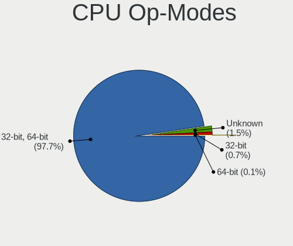

| Op mode        | Computers | Percent |
|----------------|-----------|---------|
| 32-bit, 64-bit | 1870      | 97.65%  |
| Unknown        | 29        | 1.51%   |
| 32-bit         | 14        | 0.73%   |
| 64-bit         | 2         | 0.1%    |

CPU Microcode
-------------

Microcode number

| Number     | Computers | Percent |
|------------|-----------|---------|
| Unknown    | 777       | 38.91%  |
| 0x306a9    | 81        | 4.06%   |
| 0x206a7    | 80        | 4.01%   |
| 0x306c3    | 66        | 3.3%    |
| 0x1067a    | 57        | 2.85%   |
| 0x506e3    | 53        | 2.65%   |
| 0x806ec    | 40        | 2%      |
| 0x40651    | 36        | 1.8%    |
| 0x406e3    | 31        | 1.55%   |
| 0x806ea    | 29        | 1.45%   |
| 0x08701021 | 28        | 1.4%    |
| 0x906ea    | 26        | 1.3%    |
| 0x906e9    | 26        | 1.3%    |
| 0x20655    | 21        | 1.05%   |
| 0x0800820d | 20        | 1%      |
| 0x306d4    | 19        | 0.95%   |
| 0x30678    | 19        | 0.95%   |
| 0x10676    | 19        | 0.95%   |
| 0x806e9    | 18        | 0.9%    |
| 0x406c4    | 17        | 0.85%   |
| 0x806c1    | 16        | 0.8%    |
| 0x20652    | 16        | 0.8%    |
| 0x0a201016 | 16        | 0.8%    |
| 0x08701013 | 16        | 0.8%    |
| 0x6fd      | 14        | 0.7%    |
| 0x06000852 | 14        | 0.7%    |
| 0x010000c8 | 14        | 0.7%    |
| 0x0a50000d | 13        | 0.65%   |
| 0x08600106 | 13        | 0.65%   |
| 0x6fb      | 12        | 0.6%    |
| 0xa0652    | 11        | 0.55%   |
| 0x506c9    | 10        | 0.5%    |
| 0x08108109 | 10        | 0.5%    |
| 0x06001119 | 10        | 0.5%    |
| 0x806eb    | 9         | 0.45%   |
| 0x706e5    | 9         | 0.45%   |
| 0x106e5    | 9         | 0.45%   |
| 0x0a50000c | 9         | 0.45%   |
| 0x08108102 | 9         | 0.45%   |
| 0x0810100b | 9         | 0.45%   |

CPU Microarch
-------------

Microarchitecture

| Name              | Computers | Percent |
|-------------------|-----------|---------|
| KabyLake          | 277       | 14.46%  |
| Haswell           | 186       | 9.71%   |
| Skylake           | 134       | 7%      |
| SandyBridge       | 127       | 6.63%   |
| IvyBridge         | 127       | 6.63%   |
| Unknown           | 108       | 5.64%   |
| Zen 2             | 105       | 5.48%   |
| Zen 3             | 92        | 4.8%    |
| Penryn            | 91        | 4.75%   |
| Zen+              | 59        | 3.08%   |
| Silvermont        | 53        | 2.77%   |
| Westmere          | 49        | 2.56%   |
| Zen               | 48        | 2.51%   |
| K10               | 48        | 2.51%   |
| Core              | 47        | 2.45%   |
| Broadwell         | 46        | 2.4%    |
| Piledriver        | 40        | 2.09%   |
| TigerLake         | 35        | 1.83%   |
| CometLake         | 29        | 1.51%   |
| Alderlake Hybrid  | 29        | 1.51%   |
| K8 Hammer         | 25        | 1.31%   |
| Nehalem           | 22        | 1.15%   |
| IceLake           | 18        | 0.94%   |
| Goldmont          | 16        | 0.84%   |
| Puma              | 14        | 0.73%   |
| Excavator         | 14        | 0.73%   |
| Goldmont plus     | 11        | 0.57%   |
| Bobcat            | 11        | 0.57%   |
| Jaguar            | 10        | 0.52%   |
| K8 & K10 hybrid   | 8         | 0.42%   |
| Steamroller       | 7         | 0.37%   |
| P6                | 7         | 0.37%   |
| Bonnell           | 7         | 0.37%   |
| NetBurst          | 6         | 0.31%   |
| Bulldozer         | 4         | 0.21%   |
| K10 Llano         | 3         | 0.16%   |
| Sapphire Rapids   | 1         | 0.05%   |
| Meteorlake Hybrid | 1         | 0.05%   |

Graphics
--------

GPU Vendor
----------

Vendors of graphics cards

| Vendor                                       | Computers | Percent |
|----------------------------------------------|-----------|---------|
| Intel                                        | 971       | 44.4%   |
| Nvidia                                       | 633       | 28.94%  |
| AMD                                          | 529       | 24.19%  |
| Matrox Electronics Systems                   | 28        | 1.28%   |
| ASPEED Technology                            | 17        | 0.78%   |
| Silicon Integrated Systems [SiS]             | 4         | 0.18%   |
| Silicon Motion                               | 3         | 0.14%   |
| XGI Technology (eXtreme Graphics Innovation) | 1         | 0.05%   |
| VIA Technologies                             | 1         | 0.05%   |

GPU Model
---------

Graphics card models

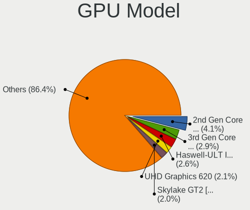

| Model                                                                                    | Computers | Percent |
|------------------------------------------------------------------------------------------|-----------|---------|
| Intel 2nd Generation Core Processor Family Integrated Graphics Controller                | 93        | 4.09%   |
| Intel 3rd Gen Core processor Graphics Controller                                         | 65        | 2.86%   |
| Intel Haswell-ULT Integrated Graphics Controller                                         | 58        | 2.55%   |
| Intel UHD Graphics 620                                                                   | 47        | 2.07%   |
| Intel Skylake GT2 [HD Graphics 520]                                                      | 46        | 2.02%   |
| Intel Xeon E3-1200 v3/4th Gen Core Processor Integrated Graphics Controller              | 45        | 1.98%   |
| Intel WhiskeyLake-U GT2 [UHD Graphics 620]                                               | 44        | 1.94%   |
| Intel HD Graphics 530                                                                    | 40        | 1.76%   |
| AMD Ellesmere [Radeon RX 470/480/570/570X/580/580X/590]                                  | 37        | 1.63%   |
| Intel HD Graphics 620                                                                    | 34        | 1.5%    |
| AMD Renoir [Radeon Vega Series / Radeon Vega Mobile Series]                              | 33        | 1.45%   |
| AMD Picasso/Raven 2 [Radeon Vega Series / Radeon Vega Mobile Series]                     | 33        | 1.45%   |
| Intel Mobile 4 Series Chipset Integrated Graphics Controller                             | 30        | 1.32%   |
| Intel TigerLake-LP GT2 [Iris Xe Graphics]                                                | 29        | 1.28%   |
| Intel Atom/Celeron/Pentium Processor x5-E8000/J3xxx/N3xxx Integrated Graphics Controller | 29        | 1.28%   |
| AMD Cezanne [Radeon Vega Series / Radeon Vega Mobile Series]                             | 29        | 1.28%   |
| Intel Core Processor Integrated Graphics Controller                                      | 28        | 1.23%   |
| Intel 4th Gen Core Processor Integrated Graphics Controller                              | 28        | 1.23%   |
| Intel HD Graphics 5500                                                                   | 25        | 1.1%    |
| Intel Atom Processor Z36xxx/Z37xxx Series Graphics & Display                             | 24        | 1.06%   |
| Intel CoffeeLake-H GT2 [UHD Graphics 630]                                                | 22        | 0.97%   |
| Nvidia GP104 [GeForce GTX 1070]                                                          | 21        | 0.92%   |
| Intel HD Graphics 630                                                                    | 21        | 0.92%   |
| Intel CometLake-U GT2 [UHD Graphics]                                                     | 21        | 0.92%   |
| Nvidia GP106 [GeForce GTX 1060 6GB]                                                      | 19        | 0.84%   |
| Intel Xeon E3-1200 v2/3rd Gen Core processor Graphics Controller                         | 19        | 0.84%   |
| Intel CoffeeLake-S GT2 [UHD Graphics 630]                                                | 19        | 0.84%   |
| Nvidia TU117M [GeForce GTX 1650 Mobile / Max-Q]                                          | 17        | 0.75%   |
| Intel Mobile GM965/GL960 Integrated Graphics Controller (secondary)                      | 17        | 0.75%   |
| Intel Mobile GM965/GL960 Integrated Graphics Controller (primary)                        | 17        | 0.75%   |
| ASPEED Technology ASPEED Graphics Family                                                 | 17        | 0.75%   |
| AMD Raphael                                                                              | 17        | 0.75%   |
| AMD Raven Ridge [Radeon Vega Series / Radeon Vega Mobile Series]                         | 16        | 0.7%    |
| Nvidia GP107 [GeForce GTX 1050 Ti]                                                       | 15        | 0.66%   |
| Nvidia GM206 [GeForce GTX 960]                                                           | 15        | 0.66%   |
| AMD Vega 10 XL/XT [Radeon RX Vega 56/64]                                                 | 15        | 0.66%   |
| AMD Navi 10 [Radeon RX 5600 OEM/5600 XT / 5700/5700 XT]                                  | 14        | 0.62%   |
| Nvidia TU117 [GeForce GTX 1650]                                                          | 13        | 0.57%   |
| Matrox Electronics Systems G200eR2                                                       | 13        | 0.57%   |
| Intel CometLake-H GT2 [UHD Graphics]                                                     | 13        | 0.57%   |

GPU Combo
---------

Combinations of graphics cards

| Name               | Computers | Percent |
|--------------------|-----------|---------|
| 1 x Intel          | 744       | 38.49%  |
| 1 x AMD            | 416       | 21.52%  |
| 1 x Nvidia         | 398       | 20.59%  |
| Intel + Nvidia     | 174       | 9%      |
| AMD + Nvidia       | 45        | 2.33%   |
| 2 x AMD            | 37        | 1.91%   |
| Intel + AMD        | 27        | 1.4%    |
| Other              | 22        | 1.14%   |
| 1 x Matrox         | 18        | 0.93%   |
| 1 x ASPEED         | 17        | 0.88%   |
| Nvidia + Matrox    | 10        | 0.52%   |
| 2 x Nvidia         | 9         | 0.47%   |
| 2 x Intel          | 7         | 0.36%   |
| 1 x SiS            | 4         | 0.21%   |
| 1 x Silicon Motion | 3         | 0.16%   |
| 1 x XGI            | 1         | 0.05%   |
| 1 x VIA            | 1         | 0.05%   |

GPU Driver
----------

Free vs proprietary

| Driver      | Computers | Percent |
|-------------|-----------|---------|
| Free        | 1474      | 75.71%  |
| Proprietary | 359       | 18.44%  |
| Unknown     | 114       | 5.86%   |

GPU Memory
----------

Total video memory

| Size in GB | Computers | Percent |
|------------|-----------|---------|
| Unknown    | 1120      | 56.85%  |
| 0.01-0.5   | 200       | 10.15%  |
| 1.01-2.0   | 182       | 9.24%   |
| 0.51-1.0   | 124       | 6.29%   |
| 7.01-8.0   | 113       | 5.74%   |
| 3.01-4.0   | 112       | 5.69%   |
| 5.01-6.0   | 46        | 2.34%   |
| 8.01-16.0  | 40        | 2.03%   |
| 2.01-3.0   | 18        | 0.91%   |
| 16.01-24.0 | 13        | 0.66%   |
| 4.01-5.0   | 2         | 0.1%    |

Monitor
-------

Monitor Vendor
--------------

Monitor vendors

| Vendor                  | Computers | Percent |
|-------------------------|-----------|---------|
| Samsung Electronics     | 332       | 15.81%  |
| AU Optronics            | 219       | 10.43%  |
| LG Display              | 180       | 8.57%   |
| Chimei Innolux          | 133       | 6.33%   |
| Lenovo                  | 104       | 4.95%   |
| Dell                    | 104       | 4.95%   |
| BOE                     | 103       | 4.9%    |
| BenQ                    | 102       | 4.86%   |
| Hewlett-Packard         | 100       | 4.76%   |
| Acer                    | 90        | 4.29%   |
| Ancor Communications    | 79        | 3.76%   |
| Goldstar                | 66        | 3.14%   |
| Apple                   | 42        | 2%      |
| ASUSTek Computer        | 37        | 1.76%   |
| AOC                     | 32        | 1.52%   |
| Sony                    | 29        | 1.38%   |
| Fujitsu Siemens         | 28        | 1.33%   |
| Sharp                   | 24        | 1.14%   |
| Philips                 | 24        | 1.14%   |
| InfoVision              | 24        | 1.14%   |
| ViewSonic               | 20        | 0.95%   |
| CSO                     | 17        | 0.81%   |
| Eizo                    | 15        | 0.71%   |
| Vestel Elektronik       | 14        | 0.67%   |
| Chi Mei Optoelectronics | 13        | 0.62%   |
| PANDA                   | 11        | 0.52%   |
| LG Philips              | 10        | 0.48%   |
| LG Electronics          | 10        | 0.48%   |
| Unknown                 | 9         | 0.43%   |
| MSI                     | 9         | 0.43%   |
| Valve                   | 7         | 0.33%   |
| Panasonic               | 7         | 0.33%   |
| Toshiba                 | 6         | 0.29%   |
| Hitachi                 | 5         | 0.24%   |
| NEC Computers           | 4         | 0.19%   |
| Iiyama                  | 4         | 0.19%   |
| IBM                     | 4         | 0.19%   |
| Gigabyte Technology     | 4         | 0.19%   |
| FUS                     | 4         | 0.19%   |
| CPT                     | 4         | 0.19%   |

Monitor Model
-------------

Monitor models

| Model                                                                 | Computers | Percent |
|-----------------------------------------------------------------------|-----------|---------|
| Vestel Elektronik 49FHD_LCD_TV VES3700 1920x1080 1280x720mm 57.8-inch | 14        | 0.65%   |
| Samsung Electronics S24F350 SAM0D20 1920x1080 521x293mm 23.5-inch     | 14        | 0.65%   |
| AU Optronics LCD Monitor AUO38ED 1920x1080 344x193mm 15.5-inch        | 10        | 0.46%   |
| AU Optronics LCD Monitor AUO22EC 1366x768 344x193mm 15.5-inch         | 8         | 0.37%   |
| LG Display LCD Monitor LGD02DC 1366x768 344x194mm 15.5-inch           | 7         | 0.32%   |
| Chimei Innolux LCD Monitor CMN1521 1920x1080 344x193mm 15.5-inch      | 7         | 0.32%   |
| Chimei Innolux LCD Monitor CMN14D4 1920x1080 309x173mm 13.9-inch      | 7         | 0.32%   |
| BenQ ZOWIE XL LCD BNQ7F31 1920x1080 531x298mm 24.0-inch               | 7         | 0.32%   |
| Ancor Communications VE247 ACI2493 1920x1080 531x299mm 24.0-inch      | 7         | 0.32%   |
| LG Display LCD Monitor LGD0521 1920x1080 309x174mm 14.0-inch          | 6         | 0.28%   |
| Lenovo LEN LT2452pwC LEN1144 1920x1080 518x324mm 24.1-inch            | 6         | 0.28%   |
| Lenovo LCD Monitor LEN4036 1440x900 303x189mm 14.1-inch               | 6         | 0.28%   |
| Chimei Innolux LCD Monitor CMN15E7 1920x1080 344x193mm 15.5-inch      | 6         | 0.28%   |
| BenQ G2420HDB BNQ7842 1920x1080 477x268mm 21.5-inch                   | 6         | 0.28%   |
| AU Optronics LCD Monitor AUO313C 1366x768 309x173mm 13.9-inch         | 6         | 0.28%   |
| Ancor Communications VG248 ACI24E1 1920x1080 531x299mm 24.0-inch      | 6         | 0.28%   |
| Ancor Communications VG248 ACI24A4 1920x1080 531x299mm 24.0-inch      | 6         | 0.28%   |
| Samsung Electronics LCD Monitor SEC304C 1366x768 309x174mm 14.0-inch  | 5         | 0.23%   |
| Lenovo LCD Monitor LEN40B2 1920x1080 344x193mm 15.5-inch              | 5         | 0.23%   |
| Lenovo LCD Monitor LEN40B1 1600x900 344x193mm 15.5-inch               | 5         | 0.23%   |
| Dell U2412M DELA07A 1920x1200 518x324mm 24.1-inch                     | 5         | 0.23%   |
| Chimei Innolux LCD Monitor CMN15F5 1920x1080 344x193mm 15.5-inch      | 5         | 0.23%   |
| Chimei Innolux LCD Monitor CMN14F2 1920x1080 309x173mm 13.9-inch      | 5         | 0.23%   |
| Chimei Innolux LCD Monitor CMN14A7 1920x1080 308x173mm 13.9-inch      | 5         | 0.23%   |
| BenQ ZOWIE XL LCD BNQ7F32 1920x1080 531x298mm 24.0-inch               | 5         | 0.23%   |
| AU Optronics LCD Monitor AUO303E 1600x900 309x174mm 14.0-inch         | 5         | 0.23%   |
| AU Optronics LCD Monitor AUO243D 1920x1080 309x173mm 13.9-inch        | 5         | 0.23%   |
| AU Optronics LCD Monitor AUO213E 1600x900 309x174mm 14.0-inch         | 5         | 0.23%   |
| Ancor Communications ROG PG279Q ACI27EC 2560x1440 598x336mm 27.0-inch | 5         | 0.23%   |
| Ancor Communications ASUS VS247 ACI249A 1920x1080 521x293mm 23.5-inch | 5         | 0.23%   |
| Valve ANX7530 U VLV3001 800x1280 100x150mm 7.1-inch                   | 4         | 0.18%   |
| Sony TV SNY0801 1360x768                                              | 4         | 0.18%   |
| Samsung Electronics SyncMaster SAM011E 1280x1024 338x270mm 17.0-inch  | 4         | 0.18%   |
| Samsung Electronics LF27T35 SAM707F 1920x1080 598x337mm 27.0-inch     | 4         | 0.18%   |
| Samsung Electronics LCD Monitor SEC544B 1600x900 382x215mm 17.3-inch  | 4         | 0.18%   |
| Samsung Electronics LCD Monitor SDC4852 1366x768 344x194mm 15.5-inch  | 4         | 0.18%   |
| Samsung Electronics LCD Monitor SAM0902 1920x1080 700x390mm 31.5-inch | 4         | 0.18%   |
| Samsung Electronics LCD Monitor SAM0669 1920x1080                     | 4         | 0.18%   |
| Samsung Electronics LCD Monitor SAM04FD 1280x720                      | 4         | 0.18%   |
| Samsung Electronics C49RG9x SAM0F9C 3840x1080 1193x336mm 48.8-inch    | 4         | 0.18%   |

Monitor Resolution
------------------

Monitor screen resolution

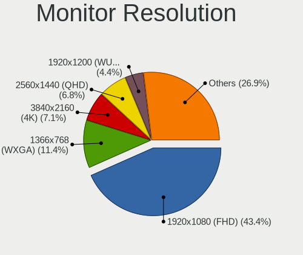

| Resolution         | Computers | Percent |
|--------------------|-----------|---------|
| 1920x1080 (FHD)    | 878       | 43.38%  |
| 1366x768 (WXGA)    | 231       | 11.41%  |
| 3840x2160 (4K)     | 143       | 7.07%   |
| 2560x1440 (QHD)    | 138       | 6.82%   |
| 1920x1200 (WUXGA)  | 89        | 4.4%    |
| 1680x1050 (WSXGA+) | 81        | 4%      |
| 1600x900 (HD+)     | 75        | 3.71%   |
| 1280x1024 (SXGA)   | 57        | 2.82%   |
| 1440x900 (WXGA+)   | 53        | 2.62%   |
| 3440x1440          | 37        | 1.83%   |
| 1280x800 (WXGA)    | 37        | 1.83%   |
| Unknown            | 33        | 1.63%   |
| 2560x1600          | 22        | 1.09%   |
| 2880x1800          | 20        | 0.99%   |
| 1360x768           | 19        | 0.94%   |
| 3840x1080          | 14        | 0.69%   |
| 3840x2400          | 10        | 0.49%   |
| 1920x540           | 7         | 0.35%   |
| 800x1280           | 6         | 0.3%    |
| 1600x1200          | 6         | 0.3%    |
| 1280x720 (HD)      | 6         | 0.3%    |
| 2560x1080          | 5         | 0.25%   |
| 1024x600           | 5         | 0.25%   |
| 4480x1440          | 4         | 0.2%    |
| 3200x2000          | 4         | 0.2%    |
| 3840x1200          | 3         | 0.15%   |
| 3200x1800 (QHD+)   | 3         | 0.15%   |
| 2288x1287          | 3         | 0.15%   |
| 1400x1050          | 3         | 0.15%   |
| 5760x2160          | 2         | 0.1%    |
| 5120x1440          | 2         | 0.1%    |
| 3360x1050          | 2         | 0.1%    |
| 2256x1504          | 2         | 0.1%    |
| 2160x1440          | 2         | 0.1%    |
| 7680x2160          | 1         | 0.05%   |
| 5760x1440          | 1         | 0.05%   |
| 5280x1080          | 1         | 0.05%   |
| 4480x1600          | 1         | 0.05%   |
| 3840x1600          | 1         | 0.05%   |
| 3520x1200          | 1         | 0.05%   |

Monitor Diagonal
----------------

Diagonal size in inches

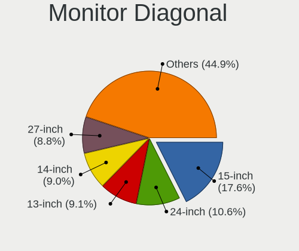

| Inches  | Computers | Percent |
|---------|-----------|---------|
| 15      | 367       | 17.57%  |
| 24      | 222       | 10.63%  |
| 13      | 191       | 9.14%   |
| 14      | 188       | 9%      |
| 27      | 184       | 8.81%   |
| 23      | 155       | 7.42%   |
| Unknown | 112       | 5.36%   |
| 17      | 88        | 4.21%   |
| 21      | 61        | 2.92%   |
| 31      | 59        | 2.82%   |
| 22      | 58        | 2.78%   |
| 19      | 56        | 2.68%   |
| 12      | 48        | 2.3%    |
| 34      | 35        | 1.68%   |
| 84      | 34        | 1.63%   |
| 16      | 25        | 1.2%    |
| 18      | 24        | 1.15%   |
| 11      | 21        | 1.01%   |
| 25      | 18        | 0.86%   |
| 32      | 17        | 0.81%   |
| 20      | 17        | 0.81%   |
| 72      | 14        | 0.67%   |
| 40      | 13        | 0.62%   |
| 28      | 9         | 0.43%   |
| 54      | 8         | 0.38%   |
| 26      | 8         | 0.38%   |
| 55      | 6         | 0.29%   |
| 7       | 6         | 0.29%   |
| 48      | 5         | 0.24%   |
| 10      | 5         | 0.24%   |
| 29      | 4         | 0.19%   |
| 142     | 3         | 0.14%   |
| 75      | 3         | 0.14%   |
| 65      | 3         | 0.14%   |
| 49      | 3         | 0.14%   |
| 36      | 3         | 0.14%   |
| 58      | 2         | 0.1%    |
| 46      | 2         | 0.1%    |
| 43      | 2         | 0.1%    |
| 39      | 2         | 0.1%    |

Monitor Width
-------------

Physical width

| Width in mm    | Computers | Percent |
|----------------|-----------|---------|
| 301-350        | 672       | 33.15%  |
| 501-600        | 511       | 25.21%  |
| 201-300        | 174       | 8.58%   |
| 401-500        | 167       | 8.24%   |
| 351-400        | 132       | 6.51%   |
| Unknown        | 112       | 5.53%   |
| 601-700        | 90        | 4.44%   |
| 701-800        | 57        | 2.81%   |
| 1501-2000      | 52        | 2.57%   |
| 1001-1500      | 32        | 1.58%   |
| 801-900        | 18        | 0.89%   |
| 1-100          | 6         | 0.3%    |
| More than 2000 | 3         | 0.15%   |
| 901-1000       | 1         | 0.05%   |

Aspect Ratio
------------

Proportional relationship between the width and the height

| Ratio   | Computers | Percent |
|---------|-----------|---------|
| 16/9    | 1306      | 69.65%  |
| 16/10   | 327       | 17.44%  |
| Unknown | 90        | 4.8%    |
| 5/4     | 57        | 3.04%   |
| 21/9    | 41        | 2.19%   |
| 3/2     | 17        | 0.91%   |
| 32/9    | 11        | 0.59%   |
| 4/3     | 9         | 0.48%   |
| 6/5     | 4         | 0.21%   |
| 0.67    | 4         | 0.21%   |
| 1.00    | 3         | 0.16%   |
| 0.62    | 2         | 0.11%   |
| 3.20    | 1         | 0.05%   |
| 0.89    | 1         | 0.05%   |
| 0.56    | 1         | 0.05%   |
| 0.45    | 1         | 0.05%   |

Monitor Area
------------

Area in inch

| Area in inch | Computers | Percent |
|----------------|-----------|---------|
| 201-250        | 372       | 18.06%  |
| 101-110        | 365       | 17.72%  |
| 81-90          | 301       | 14.61%  |
| 301-350        | 191       | 9.27%   |
| 351-500        | 123       | 5.97%   |
| Unknown        | 112       | 5.44%   |
| 251-300        | 110       | 5.34%   |
| 151-200        | 94        | 4.56%   |
| More than 1000 | 76        | 3.69%   |
| 71-80          | 75        | 3.64%   |
| 121-130        | 63        | 3.06%   |
| 61-70          | 48        | 2.33%   |
| 501-1000       | 31        | 1.5%    |
| 141-150        | 27        | 1.31%   |
| 111-120        | 27        | 1.31%   |
| 51-60          | 21        | 1.02%   |
| 131-140        | 11        | 0.53%   |
| 1-40           | 6         | 0.29%   |
| 41-50          | 5         | 0.24%   |
| 91-100         | 2         | 0.1%    |

Pixel Density
-------------

Pixels per inch

| Density       | Computers | Percent |
|---------------|-----------|---------|
| 51-100        | 705       | 35.55%  |
| 121-160       | 528       | 26.63%  |
| 101-120       | 413       | 20.83%  |
| 161-240       | 135       | 6.81%   |
| Unknown       | 112       | 5.65%   |
| 1-50          | 49        | 2.47%   |
| More than 240 | 41        | 2.07%   |

Multiple Monitors
-----------------

Total monitors connected

| Total | Computers | Percent |
|-------|-----------|---------|
| 1     | 1469      | 74.91%  |
| 2     | 326       | 16.62%  |
| 0     | 126       | 6.43%   |
| 3     | 37        | 1.89%   |
| 4     | 3         | 0.15%   |

Network
-------

Net Controller Vendor
---------------------

Controller vendors

| Vendor                                 | Computers | Percent |
|----------------------------------------|-----------|---------|
| Intel                                  | 1008      | 35.33%  |
| Realtek Semiconductor                  | 869       | 30.46%  |
| Qualcomm Atheros                       | 228       | 7.99%   |
| Broadcom                               | 145       | 5.08%   |
| MediaTek                               | 64        | 2.24%   |
| Ralink                                 | 36        | 1.26%   |
| TP-Link                                | 35        | 1.23%   |
| Nvidia                                 | 31        | 1.09%   |
| Broadcom Limited                       | 31        | 1.09%   |
| Marvell Technology Group               | 30        | 1.05%   |
| Huawei Technologies                    | 30        | 1.05%   |
| Ericsson Business Mobile Networks      | 26        | 0.91%   |
| Sierra Wireless                        | 25        | 0.88%   |
| Samsung Electronics                    | 25        | 0.88%   |
| ASUSTek Computer                       | 24        | 0.84%   |
| Hewlett-Packard                        | 23        | 0.81%   |
| Ralink Technology                      | 19        | 0.67%   |
| Lenovo                                 | 13        | 0.46%   |
| Dell                                   | 12        | 0.42%   |
| Xiaomi                                 | 10        | 0.35%   |
| Qualcomm                               | 10        | 0.35%   |
| Fibocom                                | 10        | 0.35%   |
| ASIX Electronics                       | 9         | 0.32%   |
| Microsoft                              | 8         | 0.28%   |
| Microchip Technology                   | 8         | 0.28%   |
| DisplayLink                            | 8         | 0.28%   |
| ZyXEL Communications                   | 7         | 0.25%   |
| OPPO Electronics                       | 7         | 0.25%   |
| OnePlus Technology (Shenzhen)          | 6         | 0.21%   |
| Motorola PCS                           | 6         | 0.21%   |
| D-Link                                 | 6         | 0.21%   |
| D-Link System                          | 5         | 0.18%   |
| Aquantia                               | 5         | 0.18%   |
| Sony Ericsson Mobile Communications AB | 4         | 0.14%   |
| Silicon Integrated Systems [SiS]       | 4         | 0.14%   |
| HMD Global                             | 4         | 0.14%   |
| American Megatrends                    | 4         | 0.14%   |
| ZyDAS                                  | 3         | 0.11%   |
| Qualcomm Technologies                  | 3         | 0.11%   |
| NetGear                                | 3         | 0.11%   |

Net Controller Model
--------------------

Controller models

| Model                                                                  | Computers | Percent |
|------------------------------------------------------------------------|-----------|---------|
| Realtek RTL8111/8168/8211/8411 PCI Express Gigabit Ethernet Controller | 607       | 17.51%  |
| Intel 82579LM Gigabit Network Connection (Lewisville)                  | 102       | 2.94%   |
| Intel Wi-Fi 6 AX200                                                    | 69        | 1.99%   |
| Intel I211 Gigabit Network Connection                                  | 67        | 1.93%   |
| Realtek RTL8125 2.5GbE Controller                                      | 66        | 1.9%    |
| Realtek RTL810xE PCI Express Fast Ethernet controller                  | 66        | 1.9%    |
| Intel Wireless 8265 / 8275                                             | 60        | 1.73%   |
| Intel Centrino Advanced-N 6205 [Taylor Peak]                           | 48        | 1.38%   |
| Intel Wireless 8260                                                    | 47        | 1.36%   |
| Intel Wireless 7260                                                    | 43        | 1.24%   |
| Realtek RTL8153 Gigabit Ethernet Adapter                               | 41        | 1.18%   |
| Intel Ethernet Connection (2) I219-V                                   | 40        | 1.15%   |
| Qualcomm Atheros AR9285 Wireless Network Adapter (PCI-Express)         | 38        | 1.1%    |
| Intel Ethernet Connection I217-LM                                      | 37        | 1.07%   |
| Realtek RTL8821CE 802.11ac PCIe Wireless Network Adapter               | 36        | 1.04%   |
| Intel Wireless 7265                                                    | 36        | 1.04%   |
| Qualcomm Atheros QCA9377 802.11ac Wireless Network Adapter             | 32        | 0.92%   |
| Intel Cannon Point-LP CNVi [Wireless-AC]                               | 31        | 0.89%   |
| Intel Wi-Fi 6 AX201                                                    | 29        | 0.84%   |
| Intel Ethernet Connection (2) I219-LM                                  | 28        | 0.81%   |
| Intel Dual Band Wireless-AC 3168NGW [Stone Peak]                       | 27        | 0.78%   |
| Intel Ethernet Controller I225-V                                       | 26        | 0.75%   |
| Realtek RTL8723BE PCIe Wireless Network Adapter                        | 25        | 0.72%   |
| Intel I210 Gigabit Network Connection                                  | 25        | 0.72%   |
| Qualcomm Atheros QCA6174 802.11ac Wireless Network Adapter             | 24        | 0.69%   |
| MediaTek MT7922 802.11ax PCI Express Wireless Network Adapter          | 23        | 0.66%   |
| Realtek RTL8822BE 802.11a/b/g/n/ac WiFi adapter                        | 22        | 0.63%   |
| Intel Ethernet Connection (6) I219-V                                   | 22        | 0.63%   |
| Intel Ethernet Connection (4) I219-V                                   | 22        | 0.63%   |
| Intel Ethernet Connection I219-LM                                      | 21        | 0.61%   |
| Intel Comet Lake PCH-LP CNVi WiFi                                      | 21        | 0.61%   |
| Realtek RTL8822CE 802.11ac PCIe Wireless Network Adapter               | 20        | 0.58%   |
| MediaTek MT7921 802.11ax PCI Express Wireless Network Adapter          | 20        | 0.58%   |
| Intel Wi-Fi 6E(802.11ax) AX210/AX1675* 2x2 [Typhoon Peak]              | 20        | 0.58%   |
| Intel Wi-Fi 5(802.11ac) Wireless-AC 9x6x [Thunder Peak]                | 20        | 0.58%   |
| Intel 82579V Gigabit Network Connection                                | 20        | 0.58%   |
| Realtek RTL8188EUS 802.11n Wireless Network Adapter                    | 19        | 0.55%   |
| Qualcomm Atheros AR9485 Wireless Network Adapter                       | 19        | 0.55%   |
| Intel Ethernet Connection I217-V                                       | 19        | 0.55%   |
| Intel Cannon Lake PCH CNVi WiFi                                        | 19        | 0.55%   |

Wireless Vendor
---------------

Wireless vendors

| Vendor                          | Computers | Percent |
|---------------------------------|-----------|---------|
| Intel                           | 677       | 46.85%  |
| Realtek Semiconductor           | 212       | 14.67%  |
| Qualcomm Atheros                | 184       | 12.73%  |
| Broadcom                        | 90        | 6.23%   |
| MediaTek                        | 49        | 3.39%   |
| Ralink                          | 36        | 2.49%   |
| TP-Link                         | 33        | 2.28%   |
| Sierra Wireless                 | 25        | 1.73%   |
| ASUSTek Computer                | 23        | 1.59%   |
| Ralink Technology               | 19        | 1.31%   |
| Broadcom Limited                | 17        | 1.18%   |
| Fibocom                         | 10        | 0.69%   |
| Microsoft                       | 8         | 0.55%   |
| Hewlett-Packard                 | 8         | 0.55%   |
| ZyXEL Communications            | 7         | 0.48%   |
| Qualcomm                        | 7         | 0.48%   |
| Dell                            | 6         | 0.42%   |
| D-Link                          | 5         | 0.35%   |
| D-Link System                   | 4         | 0.28%   |
| ZyDAS                           | 3         | 0.21%   |
| NetGear                         | 3         | 0.21%   |
| Gemtek                          | 3         | 0.21%   |
| BUFFALO                         | 3         | 0.21%   |
| Qualcomm Technologies           | 2         | 0.14%   |
| Qualcomm Atheros Communications | 2         | 0.14%   |
| Marvell Technology Group        | 2         | 0.14%   |
| Linksys                         | 2         | 0.14%   |
| Edimax Technology               | 2         | 0.14%   |
| LG Electronics                  | 1         | 0.07%   |
| Fujitsu Siemens Computers       | 1         | 0.07%   |
| Arduino SA                      | 1         | 0.07%   |

Wireless Model
--------------

Wireless models

| Model                                                                   | Computers | Percent |
|-------------------------------------------------------------------------|-----------|---------|
| Intel Wi-Fi 6 AX200                                                     | 69        | 4.76%   |
| Intel Wireless 8265 / 8275                                              | 60        | 4.14%   |
| Intel Centrino Advanced-N 6205 [Taylor Peak]                            | 48        | 3.31%   |
| Intel Wireless 8260                                                     | 47        | 3.24%   |
| Intel Wireless 7260                                                     | 43        | 2.97%   |
| Qualcomm Atheros AR9285 Wireless Network Adapter (PCI-Express)          | 38        | 2.62%   |
| Realtek RTL8821CE 802.11ac PCIe Wireless Network Adapter                | 36        | 2.48%   |
| Intel Wireless 7265                                                     | 36        | 2.48%   |
| Qualcomm Atheros QCA9377 802.11ac Wireless Network Adapter              | 32        | 2.21%   |
| Intel Cannon Point-LP CNVi [Wireless-AC]                                | 31        | 2.14%   |
| Intel Wi-Fi 6 AX201                                                     | 29        | 2%      |
| Intel Dual Band Wireless-AC 3168NGW [Stone Peak]                        | 27        | 1.86%   |
| Realtek RTL8723BE PCIe Wireless Network Adapter                         | 25        | 1.73%   |
| Qualcomm Atheros QCA6174 802.11ac Wireless Network Adapter              | 24        | 1.66%   |
| Realtek RTL8822BE 802.11a/b/g/n/ac WiFi adapter                         | 22        | 1.52%   |
| Intel Comet Lake PCH-LP CNVi WiFi                                       | 21        | 1.45%   |
| Realtek RTL8822CE 802.11ac PCIe Wireless Network Adapter                | 20        | 1.38%   |
| MediaTek MT7921 802.11ax PCI Express Wireless Network Adapter           | 20        | 1.38%   |
| Intel Wi-Fi 6E(802.11ax) AX210/AX1675* 2x2 [Typhoon Peak]               | 20        | 1.38%   |
| Intel Wi-Fi 5(802.11ac) Wireless-AC 9x6x [Thunder Peak]                 | 20        | 1.38%   |
| Realtek RTL8188EUS 802.11n Wireless Network Adapter                     | 19        | 1.31%   |
| Qualcomm Atheros AR9485 Wireless Network Adapter                        | 19        | 1.31%   |
| Intel Cannon Lake PCH CNVi WiFi                                         | 19        | 1.31%   |
| Qualcomm Atheros QCA9565 / AR9565 Wireless Network Adapter              | 17        | 1.17%   |
| Intel PRO/Wireless 4965 AG or AGN [Kedron] Network Connection           | 16        | 1.1%    |
| Intel Comet Lake PCH CNVi WiFi                                          | 16        | 1.1%    |
| Intel Wireless 3165                                                     | 15        | 1.04%   |
| Intel Centrino Ultimate-N 6300                                          | 15        | 1.04%   |
| Intel Centrino Advanced-N 6235                                          | 15        | 1.04%   |
| MediaTek MT7922 802.11ax PCI Express Wireless Network Adapter           | 14        | 0.97%   |
| Realtek RTL8852AE 802.11ax PCIe Wireless Network Adapter                | 13        | 0.9%    |
| Qualcomm Atheros AR9287 Wireless Network Adapter (PCI-Express)          | 13        | 0.9%    |
| Intel Dual Band Wireless-AC 3165 Plus Bluetooth                         | 13        | 0.9%    |
| Intel Centrino Advanced-N 6200                                          | 13        | 0.9%    |
| Broadcom BCM43142 802.11b/g/n                                           | 13        | 0.9%    |
| Intel Wireless 3160                                                     | 12        | 0.83%   |
| Realtek RTL8821AE 802.11ac PCIe Wireless Network Adapter                | 11        | 0.76%   |
| Ralink RT3290 Wireless 802.11n 1T/1R PCIe                               | 11        | 0.76%   |
| Qualcomm Atheros AR9462 Wireless Network Adapter                        | 11        | 0.76%   |
| Qualcomm Atheros AR242x / AR542x Wireless Network Adapter (PCI-Express) | 11        | 0.76%   |

Ethernet Vendor
---------------

Ethernet vendors

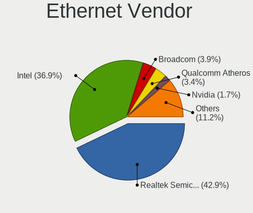

| Vendor                                 | Computers | Percent |
|----------------------------------------|-----------|---------|
| Realtek Semiconductor                  | 800       | 42.92%  |
| Intel                                  | 687       | 36.86%  |
| Broadcom                               | 73        | 3.92%   |
| Qualcomm Atheros                       | 64        | 3.43%   |
| Nvidia                                 | 31        | 1.66%   |
| Marvell Technology Group               | 28        | 1.5%    |
| Huawei Technologies                    | 23        | 1.23%   |
| Samsung Electronics                    | 16        | 0.86%   |
| MediaTek                               | 14        | 0.75%   |
| Broadcom Limited                       | 14        | 0.75%   |
| Lenovo                                 | 13        | 0.7%    |
| Xiaomi                                 | 10        | 0.54%   |
| ASIX Electronics                       | 9         | 0.48%   |
| DisplayLink                            | 8         | 0.43%   |
| OPPO Electronics                       | 7         | 0.38%   |
| Motorola PCS                           | 6         | 0.32%   |
| OnePlus Technology (Shenzhen)          | 5         | 0.27%   |
| Aquantia                               | 5         | 0.27%   |
| Sony Ericsson Mobile Communications AB | 4         | 0.21%   |
| Silicon Integrated Systems [SiS]       | 4         | 0.21%   |
| Microchip Technology                   | 4         | 0.21%   |
| HMD Global                             | 4         | 0.21%   |
| Hewlett-Packard                        | 4         | 0.21%   |
| American Megatrends                    | 4         | 0.21%   |
| TP-Link                                | 3         | 0.16%   |
| Qualcomm                               | 3         | 0.16%   |
| 3Com                                   | 3         | 0.16%   |
| Apple                                  | 2         | 0.11%   |
| VIA Technologies                       | 1         | 0.05%   |
| Research In Motion                     | 1         | 0.05%   |
| Qualcomm Technologies                  | 1         | 0.05%   |
| Mellanox Technologies                  | 1         | 0.05%   |
| Linksys                                | 1         | 0.05%   |
| ICS Advent                             | 1         | 0.05%   |
| IBM                                    | 1         | 0.05%   |
| Google                                 | 1         | 0.05%   |
| Foxconn / Hon Hai                      | 1         | 0.05%   |
| Dell                                   | 1         | 0.05%   |
| D-Link System                          | 1         | 0.05%   |
| D-Link                                 | 1         | 0.05%   |

Ethernet Model
--------------

Ethernet models

| Model                                                                  | Computers | Percent |
|------------------------------------------------------------------------|-----------|---------|
| Realtek RTL8111/8168/8211/8411 PCI Express Gigabit Ethernet Controller | 607       | 31.43%  |
| Intel 82579LM Gigabit Network Connection (Lewisville)                  | 102       | 5.28%   |
| Intel I211 Gigabit Network Connection                                  | 67        | 3.47%   |
| Realtek RTL8125 2.5GbE Controller                                      | 66        | 3.42%   |
| Realtek RTL810xE PCI Express Fast Ethernet controller                  | 66        | 3.42%   |
| Realtek RTL8153 Gigabit Ethernet Adapter                               | 41        | 2.12%   |
| Intel Ethernet Connection (2) I219-V                                   | 40        | 2.07%   |
| Intel Ethernet Connection I217-LM                                      | 37        | 1.92%   |
| Intel Ethernet Connection (2) I219-LM                                  | 28        | 1.45%   |
| Intel Ethernet Controller I225-V                                       | 26        | 1.35%   |
| Intel I210 Gigabit Network Connection                                  | 25        | 1.29%   |
| Intel Ethernet Connection (6) I219-V                                   | 22        | 1.14%   |
| Intel Ethernet Connection (4) I219-V                                   | 22        | 1.14%   |
| Intel Ethernet Connection I219-LM                                      | 21        | 1.09%   |
| Intel 82579V Gigabit Network Connection                                | 20        | 1.04%   |
| Intel Ethernet Connection I217-V                                       | 19        | 0.98%   |
| Intel 82577LM Gigabit Network Connection                               | 19        | 0.98%   |
| Intel Ethernet Connection (7) I219-V                                   | 18        | 0.93%   |
| Intel Ethernet Connection (4) I219-LM                                  | 18        | 0.93%   |
| Intel I350 Gigabit Network Connection                                  | 17        | 0.88%   |
| Intel Ethernet Connection I218-LM                                      | 17        | 0.88%   |
| Samsung Galaxy series, misc. (tethering mode)                          | 16        | 0.83%   |
| Intel Ethernet Connection I219-V                                       | 14        | 0.73%   |
| Intel Ethernet Connection (3) I218-LM                                  | 14        | 0.73%   |
| Huawei FOA-LX9                                                         | 14        | 0.73%   |
| Nvidia MCP61 Ethernet                                                  | 13        | 0.67%   |
| Intel 82567LM Gigabit Network Connection                               | 13        | 0.67%   |
| Realtek RTL-8100/8101L/8139 PCI Fast Ethernet Adapter                  | 12        | 0.62%   |
| Intel Ethernet Connection (2) I218-V                                   | 12        | 0.62%   |
| Intel 82574L Gigabit Network Connection                                | 12        | 0.62%   |
| Intel Ethernet Connection (7) I219-LM                                  | 11        | 0.57%   |
| Intel 82567LM-3 Gigabit Network Connection                             | 11        | 0.57%   |
| Intel 82566MM Gigabit Network Connection                               | 11        | 0.57%   |
| Broadcom NetXtreme BCM57765 Gigabit Ethernet PCIe                      | 11        | 0.57%   |
| Qualcomm Atheros QCA8171 Gigabit Ethernet                              | 10        | 0.52%   |
| Qualcomm Atheros Killer E2400 Gigabit Ethernet Controller              | 9         | 0.47%   |
| MediaTek MT7922 802.11ax PCI Express Wireless Network Adapter          | 9         | 0.47%   |
| Intel Ethernet Connection (5) I219-LM                                  | 8         | 0.41%   |
| Broadcom NetXtreme BCM5719 Gigabit Ethernet PCIe                       | 8         | 0.41%   |
| Qualcomm Atheros AR8161 Gigabit Ethernet                               | 7         | 0.36%   |

Net Controller Kind
-------------------

Ethernet, WiFi or modem

| Kind     | Computers | Percent |
|----------|-----------|---------|
| Ethernet | 1691      | 54.15%  |
| WiFi     | 1348      | 43.16%  |
| Modem    | 81        | 2.59%   |
| Unknown  | 3         | 0.1%    |

Used Controller
---------------

Currently used network controller

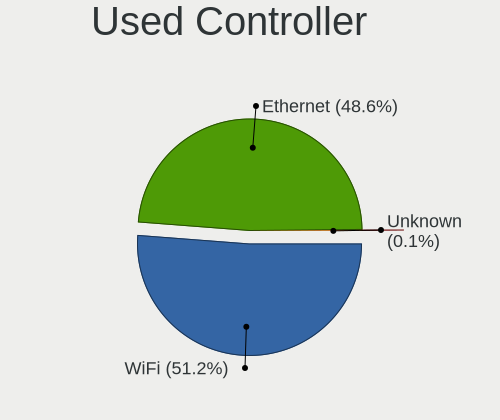

| Kind     | Computers | Percent |
|----------|-----------|---------|
| WiFi     | 988       | 51.22%  |
| Ethernet | 938       | 48.63%  |
| Modem    | 2         | 0.1%    |
| Unknown  | 1         | 0.05%   |

NICs
----

Total network controllers on board

| Total | Computers | Percent |
|-------|-----------|---------|
| 2     | 1035      | 53.85%  |
| 1     | 762       | 39.65%  |
| 3     | 49        | 2.55%   |
| 0     | 42        | 2.19%   |
| 4     | 26        | 1.35%   |
| 5     | 5         | 0.26%   |
| 6     | 3         | 0.16%   |

IPv6
----

IPv6 vs IPv4

| Used | Computers | Percent |
|------|-----------|---------|
| No   | 1538      | 78.43%  |
| Yes  | 423       | 21.57%  |

Bluetooth
---------

Bluetooth Vendor
----------------

Controller vendors

| Vendor                          | Computers | Percent |
|---------------------------------|-----------|---------|
| Intel                           | 524       | 45.64%  |
| Realtek Semiconductor           | 102       | 8.89%   |
| Broadcom                        | 78        | 6.79%   |
| Cambridge Silicon Radio         | 75        | 6.53%   |
| IMC Networks                    | 61        | 5.31%   |
| Qualcomm Atheros Communications | 59        | 5.14%   |
| ASUSTek Computer                | 49        | 4.27%   |
| Foxconn / Hon Hai               | 45        | 3.92%   |
| Apple                           | 42        | 3.66%   |
| Lite-On Technology              | 23        | 2%      |
| Hewlett-Packard                 | 18        | 1.57%   |
| Dell                            | 12        | 1.05%   |
| Ralink                          | 11        | 0.96%   |
| MediaTek                        | 10        | 0.87%   |
| Askey Computer                  | 10        | 0.87%   |
| USI                             | 4         | 0.35%   |
| HTC (High Tech Computer)        | 4         | 0.35%   |
| Foxconn International           | 4         | 0.35%   |
| Toshiba                         | 3         | 0.26%   |
| Realtek                         | 2         | 0.17%   |
| Marvell Semiconductor           | 2         | 0.17%   |
| Fujitsu                         | 2         | 0.17%   |
| Edimax Technology               | 2         | 0.17%   |
| Chicony Electronics             | 2         | 0.17%   |
| Taiyo Yuden                     | 1         | 0.09%   |
| Integrated System Solution      | 1         | 0.09%   |
| Belkin Components               | 1         | 0.09%   |
| Alps Electric                   | 1         | 0.09%   |

Bluetooth Model
---------------

Controller models

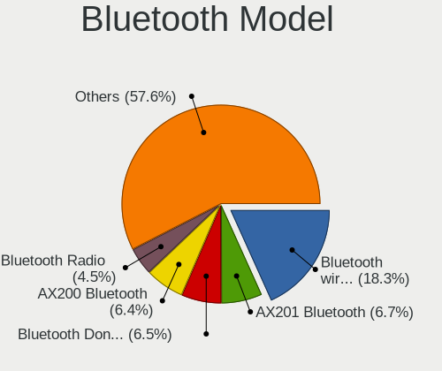

| Model                                               | Computers | Percent |
|-----------------------------------------------------|-----------|---------|
| Intel Bluetooth wireless interface                  | 210       | 18.26%  |
| Intel AX201 Bluetooth                               | 77        | 6.7%    |
| Cambridge Silicon Radio Bluetooth Dongle (HCI mode) | 75        | 6.52%   |
| Intel AX200 Bluetooth                               | 74        | 6.43%   |
| Realtek Bluetooth Radio                             | 52        | 4.52%   |
| Intel Bluetooth 9460/9560 Jefferson Peak (JfP)      | 52        | 4.52%   |
| Realtek  Bluetooth 4.2 Adapter                      | 31        | 2.7%    |
| ASUS Broadcom BCM20702A0 Bluetooth                  | 27        | 2.35%   |
| Intel Wireless-AC 3168 Bluetooth                    | 25        | 2.17%   |
| IMC Networks Bluetooth Radio                        | 25        | 2.17%   |
| Intel AX211 Bluetooth                               | 24        | 2.09%   |
| Intel Centrino Bluetooth Wireless Transceiver       | 21        | 1.83%   |
| Qualcomm Atheros  Bluetooth Device                  | 19        | 1.65%   |
| Broadcom BCM2045B (BDC-2.1)                         | 19        | 1.65%   |
| Intel Wireless-AC 9260 Bluetooth Adapter            | 18        | 1.57%   |
| IMC Networks Wireless_Device                        | 17        | 1.48%   |
| Apple Bluetooth Host Controller                     | 17        | 1.48%   |
| Intel AX210 Bluetooth                               | 16        | 1.39%   |
| Qualcomm Atheros AR3011 Bluetooth                   | 15        | 1.3%    |
| Qualcomm Atheros QCA61x4 Bluetooth 4.0              | 14        | 1.22%   |
| Foxconn / Hon Hai Wireless_Device                   | 14        | 1.22%   |
| Foxconn / Hon Hai Bluetooth Device                  | 13        | 1.13%   |
| Broadcom BCM20702 Bluetooth 4.0 [ThinkPad]          | 13        | 1.13%   |
| Ralink RT3290 Bluetooth                             | 11        | 0.96%   |
| IMC Networks Bluetooth Device                       | 11        | 0.96%   |
| Apple Built-in Bluetooth 2.0+EDR HCI                | 11        | 0.96%   |
| MediaTek Wireless_Device                            | 10        | 0.87%   |
| ASUS ASUS USB-BT500                                 | 10        | 0.87%   |
| Askey Bluetooth Device                              | 10        | 0.87%   |
| Apple Bluetooth USB Host Controller                 | 10        | 0.87%   |
| HP Broadcom 2070 Bluetooth Combo                    | 9         | 0.78%   |
| HP Bluetooth 2.0 Interface [Broadcom BCM2045]       | 9         | 0.78%   |
| Realtek RTL8723B Bluetooth                          | 8         | 0.7%    |
| Lite-On Qualcomm Atheros QCA9377 Bluetooth          | 8         | 0.7%    |
| Qualcomm Atheros AR3012 Bluetooth 4.0               | 7         | 0.61%   |
| Lite-On Bluetooth Device                            | 7         | 0.61%   |
| Intel Centrino Advanced-N 6230 Bluetooth adapter    | 7         | 0.61%   |
| Foxconn / Hon Hai MediaTek Bluetooth Adapter        | 7         | 0.61%   |
| Broadcom HP Portable Bumble Bee                     | 7         | 0.61%   |
| Broadcom BCM2045B (BDC-2.1) [Bluetooth Controller]  | 7         | 0.61%   |

Sound
-----

Sound Vendor
------------

Sound card vendors

| Vendor                               | Computers | Percent |
|--------------------------------------|-----------|---------|
| Intel                                | 1232      | 45.24%  |
| AMD                                  | 606       | 22.25%  |
| Nvidia                               | 527       | 19.35%  |
| C-Media Electronics                  | 39        | 1.43%   |
| Logitech                             | 31        | 1.14%   |
| Creative Labs                        | 18        | 0.66%   |
| Kingston Technology                  | 16        | 0.59%   |
| ASUSTek Computer                     | 16        | 0.59%   |
| Texas Instruments                    | 14        | 0.51%   |
| Focusrite-Novation                   | 12        | 0.44%   |
| Creative Technology                  | 12        | 0.44%   |
| GN Netcom                            | 11        | 0.4%    |
| SteelSeries ApS                      | 10        | 0.37%   |
| Realtek Semiconductor                | 10        | 0.37%   |
| Lenovo                               | 10        | 0.37%   |
| Razer USA                            | 8         | 0.29%   |
| Corsair                              | 8         | 0.29%   |
| DSEA A/S                             | 7         | 0.26%   |
| VIA Technologies                     | 6         | 0.22%   |
| RODE Microphones                     | 6         | 0.22%   |
| Plantronics                          | 6         | 0.22%   |
| Yamaha                               | 5         | 0.18%   |
| Microsoft                            | 5         | 0.18%   |
| Hewlett-Packard                      | 5         | 0.18%   |
| Generalplus Technology               | 5         | 0.18%   |
| BEHRINGER International              | 5         | 0.18%   |
| Thesycon Systemsoftware & Consulting | 4         | 0.15%   |
| Silicon Integrated Systems [SiS]     | 4         | 0.15%   |
| M-Audio                              | 4         | 0.15%   |
| JBL                                  | 4         | 0.15%   |
| GYROCOM C&C                          | 4         | 0.15%   |
| Blue Microphones                     | 4         | 0.15%   |
| Turtle Beach                         | 3         | 0.11%   |
| FiiO Electronics Technology          | 3         | 0.11%   |
| Cambridge Audio                      | 3         | 0.11%   |
| AudioQuest                           | 3         | 0.11%   |
| XMOS                                 | 2         | 0.07%   |
| Sony                                 | 2         | 0.07%   |
| Sennheiser Communications            | 2         | 0.07%   |
| SAVITECH                             | 2         | 0.07%   |

Sound Model
-----------

Sound card models

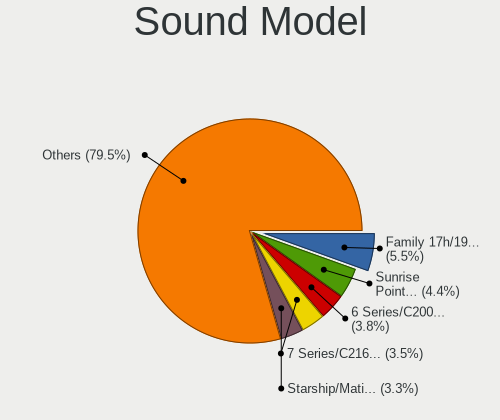

| Model                                                                      | Computers | Percent |
|----------------------------------------------------------------------------|-----------|---------|
| AMD Family 17h/19h/1ah HD Audio Controller                                 | 179       | 5.5%    |
| Intel Sunrise Point-LP HD Audio                                            | 143       | 4.39%   |
| Intel 6 Series/C200 Series Chipset Family High Definition Audio Controller | 125       | 3.84%   |
| Intel 7 Series/C216 Chipset Family High Definition Audio Controller        | 114       | 3.5%    |
| AMD Starship/Matisse HD Audio Controller                                   | 108       | 3.32%   |
| Intel 8 Series/C220 Series Chipset High Definition Audio Controller        | 94        | 2.89%   |
| AMD SBx00 Azalia (Intel HDA)                                               | 80        | 2.46%   |
| AMD Renoir Radeon High Definition Audio Controller                         | 76        | 2.33%   |
| Intel Xeon E3-1200 v3/4th Gen Core Processor HD Audio Controller           | 70        | 2.15%   |
| Intel 100 Series/C230 Series Chipset Family HD Audio Controller            | 62        | 1.9%    |
| Intel Haswell-ULT HD Audio Controller                                      | 57        | 1.75%   |
| Intel 8 Series HD Audio Controller                                         | 57        | 1.75%   |
| Intel 5 Series/3400 Series Chipset High Definition Audio                   | 57        | 1.75%   |
| AMD FCH Azalia Controller                                                  | 57        | 1.75%   |
| Intel Cannon Lake PCH cAVS                                                 | 52        | 1.6%    |
| Intel 82801I (ICH9 Family) HD Audio Controller                             | 52        | 1.6%    |
| Intel 200 Series PCH HD Audio                                              | 51        | 1.57%   |
| Nvidia GP104 High Definition Audio Controller                              | 48        | 1.47%   |
| Intel Cannon Point-LP High Definition Audio Controller                     | 48        | 1.47%   |
| AMD Family 17h (Models 00h-0fh) HD Audio Controller                        | 46        | 1.41%   |
| AMD Rembrandt Radeon High Definition Audio Controller                      | 44        | 1.35%   |
| AMD Raven/Raven2/Fenghuang HDMI/DP Audio Controller                        | 44        | 1.35%   |
| AMD Ellesmere HDMI Audio [Radeon RX 470/480 / 570/580/590]                 | 36        | 1.11%   |
| Intel NM10/ICH7 Family High Definition Audio Controller                    | 35        | 1.07%   |
| Intel Tiger Lake-LP Smart Sound Technology Audio Controller                | 34        | 1.04%   |
| Nvidia GP107GL High Definition Audio Controller                            | 32        | 0.98%   |
| Nvidia TU107 GeForce GTX 1650 High Definition Audio Controller             | 31        | 0.95%   |
| AMD Navi 21/23 HDMI/DP Audio Controller                                    | 30        | 0.92%   |
| Intel Wildcat Point-LP High Definition Audio Controller                    | 29        | 0.89%   |
| Intel Broadwell-U Audio Controller                                         | 29        | 0.89%   |
| AMD Kabini HDMI/DP Audio                                                   | 29        | 0.89%   |
| Intel 82801H (ICH8 Family) HD Audio Controller                             | 28        | 0.86%   |
| Nvidia GP106 High Definition Audio Controller                              | 26        | 0.8%    |
| Nvidia High Definition Audio Controller                                    | 25        | 0.77%   |
| Intel Comet Lake PCH-LP cAVS                                               | 24        | 0.74%   |
| Nvidia GA104 High Definition Audio Controller                              | 23        | 0.71%   |
| Nvidia GM107 High Definition Audio Controller [GeForce 940MX]              | 22        | 0.68%   |
| Nvidia GF108 High Definition Audio Controller                              | 22        | 0.68%   |
| Nvidia GK107 HDMI Audio Controller                                         | 21        | 0.64%   |
| Nvidia TU116 High Definition Audio Controller                              | 20        | 0.61%   |

Memory
------

Memory Vendor
-------------

Memory module vendors

| Vendor              | Computers | Percent |
|---------------------|-----------|---------|
| Samsung Electronics | 317       | 24.55%  |
| Kingston            | 245       | 18.98%  |
| SK hynix            | 228       | 17.66%  |
| Micron Technology   | 127       | 9.84%   |
| Unknown             | 106       | 8.21%   |
| Corsair             | 64        | 4.96%   |
| G.Skill             | 53        | 4.11%   |
| Crucial             | 42        | 3.25%   |
| Ramaxel Technology  | 23        | 1.78%   |
| Elpida              | 23        | 1.78%   |
| A-DATA Technology   | 15        | 1.16%   |
| Nanya Technology    | 11        | 0.85%   |
| Unknown             | 6         | 0.46%   |
| Hewlett-Packard     | 4         | 0.31%   |
| Unknown (ABCD)      | 3         | 0.23%   |
| Team                | 3         | 0.23%   |
| Qimonda             | 3         | 0.23%   |
| ChangXin Memory     | 2         | 0.15%   |
| ASint Technology    | 2         | 0.15%   |
| Apacer              | 2         | 0.15%   |
| Unknown (AB)        | 1         | 0.08%   |
| Unknown (0E97)      | 1         | 0.08%   |
| Unigen              | 1         | 0.08%   |
| Toshiba             | 1         | 0.08%   |
| PUSKILL             | 1         | 0.08%   |
| pqi                 | 1         | 0.08%   |
| Patriot             | 1         | 0.08%   |
| Hitachi             | 1         | 0.08%   |
| GOODRAM             | 1         | 0.08%   |
| GIGA-BYTE           | 1         | 0.08%   |
| GeIL                | 1         | 0.08%   |
| 48spaces            | 1         | 0.08%   |

Memory Model
------------

Memory module models

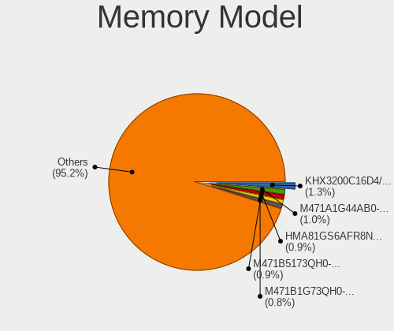

| Model                                                  | Computers | Percent |
|--------------------------------------------------------|-----------|---------|
| Kingston RAM KHX3200C16D4/8GX 8GB DIMM DDR4 3733MT/s   | 18        | 1.28%   |
| Samsung RAM M471A1G44AB0-CWE 8GB SODIMM DDR4 3200MT/s  | 14        | 1%      |
| SK hynix RAM HMA81GS6AFR8N-UH 8GB SODIMM DDR4 2667MT/s | 13        | 0.93%   |
| Samsung RAM M471B5173QH0-YK0 4GB SODIMM DDR3 1600MT/s  | 12        | 0.85%   |
| SK hynix RAM HMT41GS6BFR8A-PB 8GB SODIMM DDR3 1600MT/s | 11        | 0.78%   |
| Samsung RAM M471B1G73QH0-YK0 8GB SODIMM DDR3 1600MT/s  | 11        | 0.78%   |
| Kingston RAM KHX2666C16/8G 8GB DIMM DDR4 3466MT/s      | 11        | 0.78%   |
| Samsung RAM M471B5273DH0-CH9 4GB SODIMM DDR3 1334MT/s  | 10        | 0.71%   |
| Samsung RAM M471B5273CH0-CH9 4GB SODIMM DDR3 1334MT/s  | 10        | 0.71%   |
| Samsung RAM M471B1G73DB0-YK0 8GB SODIMM DDR3 1600MT/s  | 10        | 0.71%   |
| Samsung RAM Module 8GB SODIMM DDR4 2133MT/s            | 9         | 0.64%   |
| Kingston RAM KHX1600C10D3/8G 8GB DIMM DDR3 1600MT/s    | 9         | 0.64%   |
| SK hynix RAM Module 4GB SODIMM DDR3 1600MT/s           | 8         | 0.57%   |
| Samsung RAM M471A1K43DB1-CWE 8GB SODIMM DDR4 3200MT/s  | 8         | 0.57%   |
| Corsair RAM CMK16GX4M2B3200C16 8GB DIMM DDR4 3600MT/s  | 8         | 0.57%   |
| SK hynix RAM HMT351S6EFR8C-PB 4GB SODIMM DDR3 1600MT/s | 7         | 0.5%    |
| Samsung RAM M471A5244CB0-CTD 4GB SODIMM DDR4 3266MT/s  | 7         | 0.5%    |
| Kingston RAM KHX3200C16D4/16GX 16GB DIMM DDR4 3600MT/s | 7         | 0.5%    |
| Kingston RAM KHX1866C10D3/8G 8GB DIMM DDR3 2133MT/s    | 7         | 0.5%    |
| Kingston RAM KHX1600C9D3/4GX 4GB DIMM DDR3 1800MT/s    | 7         | 0.5%    |
| Kingston RAM KF3200C16D4/8GX 8GB DIMM DDR4 3600MT/s    | 7         | 0.5%    |
| G.Skill RAM F4-3200C16-8GVKB 8GB DIMM DDR4 4000MT/s    | 7         | 0.5%    |
| Corsair RAM CMK16GX4M2B3000C15 8GB DIMM DDR4 3600MT/s  | 7         | 0.5%    |
| Unknown RAM Module 2GB SODIMM DDR2 667MT/s             | 6         | 0.43%   |
| Samsung RAM M471B5173DB0-YK0 4GB SODIMM DDR3 1600MT/s  | 6         | 0.43%   |
| Kingston RAM KHX1600C10D3/4G 4GB DIMM DDR3 1600MT/s    | 6         | 0.43%   |
| Kingston RAM KF3600C16D4/16GX 16GB DIMM DDR4 3800MT/s  | 6         | 0.43%   |
| Unknown                                                | 6         | 0.43%   |
| Unknown RAM Module 2GB DIMM DDR2 800MT/s               | 5         | 0.36%   |
| Unknown RAM Module 1024MB SODIMM DDR2                  | 5         | 0.36%   |
| SK hynix RAM HMT451S6AFR8A-PB 4GB SODIMM DDR3 1600MT/s | 5         | 0.36%   |
| Samsung RAM M471B1G73EB0-YK0 8GB SODIMM DDR3 1600MT/s  | 5         | 0.36%   |
| Samsung RAM M471A2K43CB1-CRC 16GB SODIMM DDR4 2667MT/s | 5         | 0.36%   |
| Samsung RAM M471A2G44AM0-CWE 16GB SODIMM DDR4 3200MT/s | 5         | 0.36%   |
| Samsung RAM M471A1K43CB1-CRC 8GB SODIMM DDR4 2667MT/s  | 5         | 0.36%   |
| Samsung RAM M471A1K43BB1-CTD 8GB SODIMM DDR4 2667MT/s  | 5         | 0.36%   |
| Samsung RAM M378A1K43CB2-CTD 8GB DIMM DDR4 3266MT/s    | 5         | 0.36%   |
| Micron RAM 8ATF1G64HZ-2G6E1 8GB SODIMM DDR4 2667MT/s   | 5         | 0.36%   |
| Kingston RAM KHX2133C14D4/8G 8GB DIMM DDR4 3000MT/s    | 5         | 0.36%   |
| Unknown RAM Module 2GB SODIMM DDR2                     | 4         | 0.28%   |

Memory Kind
-----------

Memory module kinds

| Kind    | Computers | Percent |
|---------|-----------|---------|
| DDR4    | 522       | 45.16%  |
| DDR3    | 375       | 32.44%  |
| DDR2    | 76        | 6.57%   |
| DDR5    | 35        | 3.03%   |
| LPDDR4  | 33        | 2.85%   |
| LPDDR3  | 30        | 2.6%    |
| SDRAM   | 29        | 2.51%   |
| Unknown | 24        | 2.08%   |
| LPDDR5  | 15        | 1.3%    |
| DDR     | 9         | 0.78%   |
| DRAM    | 8         | 0.69%   |

Memory Form Factor
------------------

Physical design of the memory module

| Name         | Computers | Percent |
|--------------|-----------|---------|
| SODIMM       | 586       | 51.27%  |
| DIMM         | 484       | 42.34%  |
| Row Of Chips | 62        | 5.42%   |
| Chip         | 6         | 0.52%   |
| RIMM         | 2         | 0.17%   |
| Unknown      | 2         | 0.17%   |
| FB-DIMM      | 1         | 0.09%   |

Memory Size
-----------

Memory module size

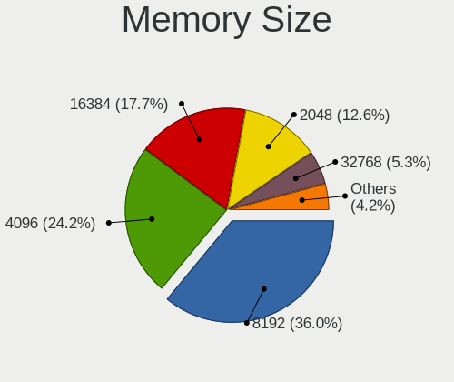

| Size  | Computers | Percent |
|-------|-----------|---------|
| 8192  | 447       | 36.02%  |
| 4096  | 300       | 24.17%  |
| 16384 | 220       | 17.73%  |
| 2048  | 156       | 12.57%  |
| 32768 | 66        | 5.32%   |
| 1024  | 45        | 3.63%   |
| 512   | 6         | 0.48%   |
| 256   | 1         | 0.08%   |

Memory Speed
------------

Memory module speed

| Speed   | Computers | Percent |
|---------|-----------|---------|
| 1600    | 219       | 17.48%  |
| 3200    | 141       | 11.25%  |
| 2667    | 133       | 10.61%  |
| 2400    | 84        | 6.7%    |
| 2133    | 82        | 6.54%   |
| 1333    | 71        | 5.67%   |
| 667     | 45        | 3.59%   |
| 3600    | 42        | 3.35%   |
| 1334    | 42        | 3.35%   |
| 800     | 36        | 2.87%   |
| 1867    | 32        | 2.55%   |
| 3733    | 27        | 2.15%   |
| 3800    | 21        | 1.68%   |
| 4800    | 18        | 1.44%   |
| Unknown | 18        | 1.44%   |
| 4267    | 17        | 1.36%   |
| 1067    | 16        | 1.28%   |
| 3466    | 15        | 1.2%    |
| 3000    | 14        | 1.12%   |
| 1066    | 13        | 1.04%   |
| 3266    | 12        | 0.96%   |
| 5600    | 11        | 0.88%   |
| 1866    | 10        | 0.8%    |
| 6000    | 9         | 0.72%   |
| 7500    | 8         | 0.64%   |
| 4000    | 8         | 0.64%   |
| 2933    | 8         | 0.64%   |
| 2048    | 8         | 0.64%   |
| 4199    | 7         | 0.56%   |
| 6400    | 6         | 0.48%   |
| 2800    | 5         | 0.4%    |
| 1800    | 5         | 0.4%    |
| 533     | 5         | 0.4%    |
| 8400    | 4         | 0.32%   |
| 4266    | 4         | 0.32%   |
| 3400    | 4         | 0.32%   |
| 3333    | 4         | 0.32%   |
| 2666    | 4         | 0.32%   |
| 2200    | 4         | 0.32%   |
| 3933    | 3         | 0.24%   |

Printers & scanners
-------------------

Printer Vendor
--------------

Printer device vendors

| Vendor                | Computers | Percent |
|-----------------------|-----------|---------|
| Hewlett-Packard       | 16        | 37.21%  |
| Seiko Epson           | 6         | 13.95%  |
| Samsung Electronics   | 5         | 11.63%  |
| Canon                 | 5         | 11.63%  |
| Brother Industries    | 5         | 11.63%  |
| Xerox                 | 2         | 4.65%   |
| Prolific Technology   | 1         | 2.33%   |
| Pantum                | 1         | 2.33%   |
| Lexmark International | 1         | 2.33%   |
| Dell                  | 1         | 2.33%   |

Printer Model
-------------

Printer device models

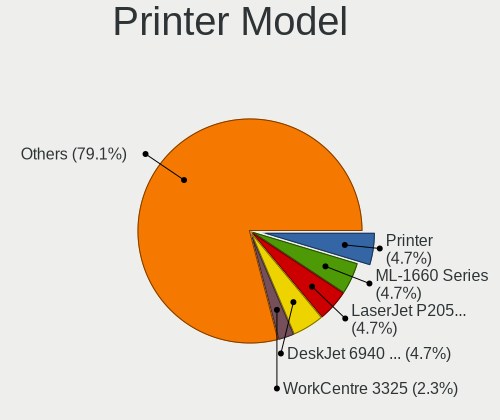

| Model                               | Computers | Percent |
|-------------------------------------|-----------|---------|
| Seiko Epson Printer                 | 2         | 4.65%   |
| Samsung ML-1660 Series              | 2         | 4.65%   |
| HP LaserJet P2055 series            | 2         | 4.65%   |
| HP DeskJet 6940 series              | 2         | 4.65%   |
| Xerox WorkCentre 3325               | 1         | 2.33%   |
| Xerox Phaser 6500N                  | 1         | 2.33%   |
| Seiko Epson XP-510 Series           | 1         | 2.33%   |
| Seiko Epson WF-3520 Series          | 1         | 2.33%   |
| Seiko Epson L555 Series             | 1         | 2.33%   |
| Seiko Epson L3150 Series            | 1         | 2.33%   |
| Samsung M2020 Series                | 1         | 2.33%   |
| Samsung CLP-325 Color Laser Printer | 1         | 2.33%   |
| Samsung C43x Series                 | 1         | 2.33%   |
| Prolific PL2305 Parallel Port       | 1         | 2.33%   |
| Pantum P2500W series                | 1         | 2.33%   |
| Lexmark International 2400 series   | 1         | 2.33%   |
| HP PSC 1100 series                  | 1         | 2.33%   |
| HP OfficeJet Pro 6970               | 1         | 2.33%   |
| HP OfficeJet 5200 series            | 1         | 2.33%   |
| HP LaserJet Professional P 1102w    | 1         | 2.33%   |
| HP LaserJet Pro M148-M149           | 1         | 2.33%   |
| HP LaserJet P2015 series            | 1         | 2.33%   |
| HP LaserJet 1200                    | 1         | 2.33%   |
| HP LaserJet 1018                    | 1         | 2.33%   |
| HP ENVY 5540 series                 | 1         | 2.33%   |
| HP DeskJet F300 series              | 1         | 2.33%   |
| HP DeskJet 960c                     | 1         | 2.33%   |
| HP DeskJet 2130 series              | 1         | 2.33%   |
| Dell Laser Printer 1720             | 1         | 2.33%   |
| Canon TS3300 series                 | 1         | 2.33%   |
| Canon TS3100 series                 | 1         | 2.33%   |
| Canon PIXMA MG3100 Series           | 1         | 2.33%   |
| Canon LBP6000                       | 1         | 2.33%   |
| Canon CanoScan LiDE 300             | 1         | 2.33%   |
| Brother MFC-7460DN                  | 1         | 2.33%   |
| Brother HL-3140CW series            | 1         | 2.33%   |
| Brother DCP-L2530DW series          | 1         | 2.33%   |
| Brother DCP-7055W                   | 1         | 2.33%   |
| Brother DCP-7055 scanner/printer    | 1         | 2.33%   |

Scanner Vendor
--------------

Scanner device vendors

| Vendor      | Computers | Percent |
|-------------|-----------|---------|
| Canon       | 5         | 83.33%  |
| Seiko Epson | 1         | 16.67%  |

Scanner Model
-------------

Scanner device models

| Model                                 | Computers | Percent |
|---------------------------------------|-----------|---------|
| Canon CanoScan N650U/N656U            | 2         | 33.33%  |
| Seiko Epson GT-X770 [Perfection V500] | 1         | 16.67%  |
| Canon CanoScan LiDE 200               | 1         | 16.67%  |
| Canon CanoScan LiDE 110               | 1         | 16.67%  |
| Canon CanoScan LiDE 100               | 1         | 16.67%  |

Camera
------

Camera Vendor
-------------

Camera device vendors

| Vendor                                 | Computers | Percent |
|----------------------------------------|-----------|---------|
| Chicony Electronics                    | 302       | 29.81%  |
| IMC Networks                           | 88        | 8.69%   |
| Logitech                               | 73        | 7.21%   |
| Microdia                               | 65        | 6.42%   |
| Bison Electronics                      | 59        | 5.82%   |
| Realtek Semiconductor                  | 56        | 5.53%   |
| Cheng Uei Precision Industry (Foxlink) | 43        | 4.24%   |
| Quanta                                 | 39        | 3.85%   |
| Sunplus Innovation Technology          | 33        | 3.26%   |
| Apple                                  | 32        | 3.16%   |
| Suyin                                  | 30        | 2.96%   |
| Syntek                                 | 26        | 2.57%   |
| Lite-On Technology                     | 23        | 2.27%   |
| Microsoft                              | 14        | 1.38%   |
| Lenovo                                 | 14        | 1.38%   |
| Acer                                   | 14        | 1.38%   |
| Luxvisions Innotech Limited            | 13        | 1.28%   |
| Silicon Motion                         | 12        | 1.18%   |
| Sonix Technology                       | 9         | 0.89%   |
| Samsung Electronics                    | 9         | 0.89%   |
| Alcor Micro                            | 7         | 0.69%   |
| Primax Electronics                     | 5         | 0.49%   |
| Z-Star Microelectronics                | 4         | 0.39%   |
| Shinetech                              | 4         | 0.39%   |
| ALi                                    | 4         | 0.39%   |
| Trust                                  | 3         | 0.3%    |
| Ricoh                                  | 3         | 0.3%    |
| Generalplus Technology                 | 3         | 0.3%    |
| Tobii Technology AB                    | 2         | 0.2%    |
| Razer USA                              | 2         | 0.2%    |
| MacroSilicon                           | 2         | 0.2%    |
| Importek                               | 2         | 0.2%    |
| Hewlett-Packard                        | 2         | 0.2%    |
| Google                                 | 2         | 0.2%    |
| DigiTech                               | 2         | 0.2%    |
| Creative Technology                    | 2         | 0.2%    |
| Valve Software                         | 1         | 0.1%    |
| SunplusIT                              | 1         | 0.1%    |
| STEREOLABS                             | 1         | 0.1%    |
| Philips (or NXP)                       | 1         | 0.1%    |

Camera Model
------------

Camera device models

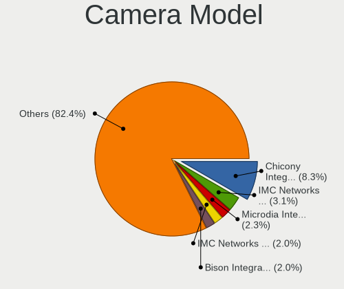

| Model                                    | Computers | Percent |
|------------------------------------------|-----------|---------|
| Chicony Integrated Camera                | 85        | 8.33%   |
| IMC Networks Integrated Camera           | 32        | 3.13%   |
| Microdia Integrated_Webcam_HD            | 23        | 2.25%   |
| IMC Networks USB2.0 HD UVC WebCam        | 20        | 1.96%   |
| Bison Integrated Camera                  | 20        | 1.96%   |
| Chicony HP HD Camera                     | 18        | 1.76%   |
| Chicony FJ Camera                        | 18        | 1.76%   |
| Logitech HD Pro Webcam C920              | 17        | 1.67%   |
| Syntek Integrated Camera                 | 16        | 1.57%   |
| Realtek Integrated_Webcam_HD             | 13        | 1.27%   |
| IMC Networks USB2.0 VGA UVC WebCam       | 13        | 1.27%   |
| Chicony HP HD Webcam                     | 13        | 1.27%   |
| Chicony HD WebCam                        | 13        | 1.27%   |
| Logitech Webcam C270                     | 12        | 1.18%   |
| Apple FaceTime HD Camera (Built-in)      | 11        | 1.08%   |
| Chicony Integrated Camera (1280x720@30)  | 10        | 0.98%   |
| Bison SunplusIT Integrated Camera        | 10        | 0.98%   |
| Samsung Galaxy series, misc. (MTP mode)  | 9         | 0.88%   |
| Chicony USB2.0 VGA UVC WebCam            | 9         | 0.88%   |
| Chicony Lenovo Integrated Camera (0.3MP) | 9         | 0.88%   |
| Microsoft LifeCam HD-3000                | 8         | 0.78%   |
| Logitech HD Webcam C525                  | 8         | 0.78%   |
| Lite-On Integrated Camera                | 8         | 0.78%   |
| Lite-On HP HD Camera                     | 8         | 0.78%   |
| Chicony EasyCamera                       | 8         | 0.78%   |
| Apple Built-in iSight                    | 8         | 0.78%   |
| Sunplus Integrated_Webcam_HD             | 7         | 0.69%   |
| Sonix USB2.0 HD UVC WebCam               | 7         | 0.69%   |
| Realtek USB Camera                       | 7         | 0.69%   |
| Chicony USB2.0 HD UVC WebCam             | 7         | 0.69%   |
| Chicony ThinkPad T490 Webcam             | 7         | 0.69%   |
| Chicony Integrated Camera [ThinkPad]     | 7         | 0.69%   |
| Bison Lenovo EasyCamera                  | 7         | 0.69%   |
| Suyin Acer/HP Integrated Webcam [CN0314] | 6         | 0.59%   |
| Sunplus HD WebCam                        | 6         | 0.59%   |
| Realtek USB2.0 HD UVC WebCam             | 6         | 0.59%   |
| Quanta USB Webcam                        | 6         | 0.59%   |
| Microdia Integrated Webcam               | 6         | 0.59%   |
| Logitech Webcam C930e                    | 6         | 0.59%   |
| Lenovo Integrated Webcam [R5U877]        | 6         | 0.59%   |

Security
--------

Fingerprint Vendor
------------------

Fingerprint sensor vendors

| Vendor                     | Computers | Percent |
|----------------------------|-----------|---------|
| Validity Sensors           | 91        | 38.08%  |
| Synaptics                  | 67        | 28.03%  |
| AuthenTec                  | 25        | 10.46%  |
| Shenzhen Goodix Technology | 19        | 7.95%   |
| Upek                       | 16        | 6.69%   |
| STMicroelectronics         | 9         | 3.77%   |
| LighTuning Technology      | 6         | 2.51%   |
| Elan Microelectronics      | 5         | 2.09%   |
| Microsoft                  | 1         | 0.42%   |

Fingerprint Model
-----------------

Fingerprint sensor models

| Model                                                                      | Computers | Percent |
|----------------------------------------------------------------------------|-----------|---------|
| Validity Sensors VFS495 Fingerprint Reader                                 | 30        | 12.55%  |
| Synaptics Prometheus MIS Touch Fingerprint Reader                          | 30        | 12.55%  |
| Upek Biometric Touchchip/Touchstrip Fingerprint Sensor                     | 16        | 6.69%   |
| Validity Sensors VFS 5011 fingerprint sensor                               | 14        | 5.86%   |
| Synaptics Metallica MIS Touch Fingerprint Reader                           | 14        | 5.86%   |
| AuthenTec AES2810                                                          | 14        | 5.86%   |
| STMicroelectronics Fingerprint Reader                                      | 9         | 3.77%   |
| Shenzhen Goodix  Fingerprint Device                                        | 9         | 3.77%   |
| Validity Sensors VFS5011 Fingerprint Reader                                | 8         | 3.35%   |
| Validity Sensors VFS471 Fingerprint Reader                                 | 8         | 3.35%   |
| Validity Sensors VFS7500 Touch Fingerprint Sensor                          | 7         | 2.93%   |
| Validity Sensors Synaptics WBDI                                            | 6         | 2.51%   |
| Validity Sensors Synaptics VFS7552 Touch Fingerprint Sensor with PurePrint | 6         | 2.51%   |
| Shenzhen Goodix FingerPrint                                                | 6         | 2.51%   |
| Synaptics Fingerprint reader [HP G6]                                       | 5         | 2.09%   |
| LighTuning EgisTec Touch Fingerprint Sensor                                | 5         | 2.09%   |
| Validity Sensors VFS491                                                    | 4         | 1.67%   |
| Synaptics Prometheus Fingerprint Reader                                    | 4         | 1.67%   |
| Shenzhen Goodix Fingerprint Reader                                         | 4         | 1.67%   |
| Elan ELAN:Fingerprint                                                      | 4         | 1.67%   |
| AuthenTec Fingerprint Sensor                                               | 4         | 1.67%   |
| Validity Sensors Swipe Fingerprint Sensor                                  | 3         | 1.26%   |
| Synaptics UWP WBDI Device                                                  | 3         | 1.26%   |
| Synaptics Metallica MOH Touch Fingerprint Reader                           | 3         | 1.26%   |
| AuthenTec AES2550 Fingerprint Sensor                                       | 3         | 1.26%   |
| AuthenTec AES2501 Fingerprint Sensor                                       | 3         | 1.26%   |
| Synaptics  WBDI                                                            | 2         | 0.84%   |
| Synaptics  FS7604 Touch Fingerprint Sensor with PurePrint                  | 2         | 0.84%   |
| Validity Sensors VFS451 Fingerprint Reader                                 | 1         | 0.42%   |
| Validity Sensors VFS301 Fingerprint Reader                                 | 1         | 0.42%   |
| Validity Sensors VFS101 Fingerprint Reader                                 | 1         | 0.42%   |
| Validity Sensors Synaptics VFS7552 Touch Fingerprint Sensor                | 1         | 0.42%   |
| Validity Sensors Fingerprint scanner                                       | 1         | 0.42%   |
| Synaptics WBDI Fingerprint Reader USB 086                                  | 1         | 0.42%   |
| Synaptics WBDI                                                             | 1         | 0.42%   |
| Synaptics UWP WBDI                                                         | 1         | 0.42%   |
| Synaptics FS7604 Touch Fingerprint Sensor with PurePrint                   | 1         | 0.42%   |
| Microsoft Fingerprint Reader                                               | 1         | 0.42%   |
| LighTuning Fingerprint Reader                                              | 1         | 0.42%   |
| Elan ELAN:ARM-M4                                                           | 1         | 0.42%   |

Chipcard Vendor
---------------

Chipcard module vendors

| Vendor                    | Computers | Percent |
|---------------------------|-----------|---------|
| Alcor Micro               | 81        | 47.93%  |
| Broadcom                  | 41        | 24.26%  |
| O2 Micro                  | 11        | 6.51%   |
| Lenovo                    | 11        | 6.51%   |
| Upek                      | 9         | 5.33%   |
| SCM Microsystems          | 6         | 3.55%   |
| Fujitsu Siemens Computers | 4         | 2.37%   |
| OmniKey                   | 3         | 1.78%   |
| Advanced Card Systems     | 2         | 1.18%   |
| Yubico.com                | 1         | 0.59%   |

Chipcard Model
--------------

Chipcard module models

| Model                                                                        | Computers | Percent |
|------------------------------------------------------------------------------|-----------|---------|
| Alcor Micro AU9540 Smartcard Reader                                          | 81        | 47.93%  |
| Broadcom 5880                                                                | 13        | 7.69%   |
| Lenovo Integrated Smart Card Reader                                          | 11        | 6.51%   |
| Broadcom BCM5880 Secure Applications Processor with fingerprint swipe sensor | 11        | 6.51%   |
| Broadcom 58200                                                               | 11        | 6.51%   |
| O2 Micro OZ776 CCID Smartcard Reader                                         | 10        | 5.92%   |
| Upek TouchChip Fingerprint Coprocessor (WBF advanced mode)                   | 9         | 5.33%   |
| Broadcom BCM5880 Secure Applications Processor                               | 5         | 2.96%   |
| Fujitsu Siemens Computers SmartCard Reader 2A                                | 4         | 2.37%   |
| SCM Microsystems SCR3340 - ExpressCard54 Smart Card Reader                   | 3         | 1.78%   |
| SCM Microsystems SCR331-LC1 / SCR3310 SmartCard Reader                       | 2         | 1.18%   |
| OmniKey CardMan 1021                                                         | 2         | 1.18%   |
| Advanced Card Systems ACR38 SmartCard Reader                                 | 2         | 1.18%   |
| Yubico.com Yubikey 4/5 U2F+CCID                                              | 1         | 0.59%   |
| SCM Microsystems SCR333 SmartCard Reader                                     | 1         | 0.59%   |
| OmniKey CardMan 3121 (HID Technologies)                                      | 1         | 0.59%   |
| O2 Micro Oz776 SmartCard Reader                                              | 1         | 0.59%   |
| Broadcom BCM5880 Secure Applications Processor with fingerprint touch sensor | 1         | 0.59%   |

Unsupported
-----------

Unsupported Devices
-------------------

Total unsupported devices on board

| Total | Computers | Percent |
|-------|-----------|---------|
| 0     | 1274      | 65.17%  |
| 1     | 494       | 25.27%  |
| 2     | 152       | 7.77%   |
| 3     | 22        | 1.13%   |
| 5     | 6         | 0.31%   |
| 4     | 4         | 0.2%    |
| 6     | 3         | 0.15%   |

Unsupported Device Types
------------------------

Types of unsupported devices

| Type                     | Computers | Percent |
|--------------------------|-----------|---------|
| Fingerprint reader       | 236       | 26.73%  |
| Graphics card            | 183       | 20.72%  |
| Chipcard                 | 144       | 16.31%  |
| Net/wireless             | 93        | 10.53%  |
| Communication controller | 42        | 4.76%   |
| Multimedia controller    | 41        | 4.64%   |
| Unassigned class         | 31        | 3.51%   |
| Bluetooth                | 24        | 2.72%   |
| Camera                   | 22        | 2.49%   |
| Card reader              | 13        | 1.47%   |
| Sound                    | 12        | 1.36%   |
| Net/ethernet             | 11        | 1.25%   |
| Storage                  | 10        | 1.13%   |
| Storage/raid             | 5         | 0.57%   |
| Modem                    | 4         | 0.45%   |
| Firewire controller      | 4         | 0.45%   |
| Storage/nvme             | 2         | 0.23%   |
| Storage/ide              | 2         | 0.23%   |
| Network                  | 2         | 0.23%   |
| Flash memory             | 1         | 0.11%   |
| Dvb card                 | 1         | 0.11%   |

