Linux in Finland - Tested Hardware & Statistics (Desktops)
----------------------------------------------------------

A project to collect tested hardware configurations for Linux in Finland.

Anyone can contribute to this report by the [hw-probe](https://github.com/linuxhw/hw-probe) tool:

    sudo -E hw-probe -all -upload

Please contribute! Especially if your hardware is rare.

Contents
--------

* [ Test Cases ](#test-cases)

* [ System ](#system)
  - [ OS                       ](#os)
  - [ OS Family                ](#os-family)
  - [ Kernel                   ](#kernel)
  - [ Kernel Family            ](#kernel-family)
  - [ Kernel Major Ver.        ](#kernel-major-ver)
  - [ Arch                     ](#arch)
  - [ DE                       ](#de)
  - [ Display Server           ](#display-server)
  - [ Display Manager          ](#display-manager)
  - [ OS Lang                  ](#os-lang)
  - [ Boot Mode                ](#boot-mode)
  - [ Filesystem               ](#filesystem)
  - [ Part. scheme             ](#part-scheme)
  - [ Dual Boot with Linux/BSD ](#dual-boot-with-linuxbsd)
  - [ Dual Boot (Win)          ](#dual-boot-win)

* [ Board ](#board)
  - [ Vendor                   ](#vendor)
  - [ Model                    ](#model)
  - [ Model Family             ](#model-family)
  - [ MFG Year                 ](#mfg-year)
  - [ Form Factor              ](#form-factor)
  - [ Secure Boot              ](#secure-boot)
  - [ Coreboot                 ](#coreboot)
  - [ RAM Size                 ](#ram-size)
  - [ RAM Used                 ](#ram-used)
  - [ Total Drives             ](#total-drives)
  - [ Has CD-ROM               ](#has-cd-rom)
  - [ Has Ethernet             ](#has-ethernet)
  - [ Has WiFi                 ](#has-wifi)
  - [ Has Bluetooth            ](#has-bluetooth)

* [ Location ](#location)
  - [ Country                  ](#country)
  - [ City                     ](#city)

* [ Drives ](#drives)
  - [ Drive Vendor             ](#drive-vendor)
  - [ Drive Model              ](#drive-model)
  - [ HDD Vendor               ](#hdd-vendor)
  - [ SSD Vendor               ](#ssd-vendor)
  - [ Drive Kind               ](#drive-kind)
  - [ Drive Connector          ](#drive-connector)
  - [ Drive Size               ](#drive-size)
  - [ Space Total              ](#space-total)
  - [ Space Used               ](#space-used)
  - [ Malfunc. Drives          ](#malfunc-drives)
  - [ Malfunc. Drive Vendor    ](#malfunc-drive-vendor)
  - [ Malfunc. HDD Vendor      ](#malfunc-hdd-vendor)
  - [ Malfunc. Drive Kind      ](#malfunc-drive-kind)
  - [ Failed Drives            ](#failed-drives)
  - [ Failed Drive Vendor      ](#failed-drive-vendor)
  - [ Drive Status             ](#drive-status)

* [ Storage controller ](#storage-controller)
  - [ Storage Vendor           ](#storage-vendor)
  - [ Storage Model            ](#storage-model)
  - [ Storage Kind             ](#storage-kind)

* [ Processor ](#processor)
  - [ CPU Vendor               ](#cpu-vendor)
  - [ CPU Model                ](#cpu-model)
  - [ CPU Model Family         ](#cpu-model-family)
  - [ CPU Cores                ](#cpu-cores)
  - [ CPU Sockets              ](#cpu-sockets)
  - [ CPU Threads              ](#cpu-threads)
  - [ CPU Op-Modes             ](#cpu-op-modes)
  - [ CPU Microcode            ](#cpu-microcode)
  - [ CPU Microarch            ](#cpu-microarch)

* [ Graphics ](#graphics)
  - [ GPU Vendor               ](#gpu-vendor)
  - [ GPU Model                ](#gpu-model)
  - [ GPU Combo                ](#gpu-combo)
  - [ GPU Driver               ](#gpu-driver)
  - [ GPU Memory               ](#gpu-memory)

* [ Monitor ](#monitor)
  - [ Monitor Vendor           ](#monitor-vendor)
  - [ Monitor Model            ](#monitor-model)
  - [ Monitor Resolution       ](#monitor-resolution)
  - [ Monitor Diagonal         ](#monitor-diagonal)
  - [ Monitor Width            ](#monitor-width)
  - [ Aspect Ratio             ](#aspect-ratio)
  - [ Monitor Area             ](#monitor-area)
  - [ Pixel Density            ](#pixel-density)
  - [ Multiple Monitors        ](#multiple-monitors)

* [ Network ](#network)
  - [ Net Controller Vendor    ](#net-controller-vendor)
  - [ Net Controller Model     ](#net-controller-model)
  - [ Wireless Vendor          ](#wireless-vendor)
  - [ Wireless Model           ](#wireless-model)
  - [ Ethernet Vendor          ](#ethernet-vendor)
  - [ Ethernet Model           ](#ethernet-model)
  - [ Net Controller Kind      ](#net-controller-kind)
  - [ Used Controller          ](#used-controller)
  - [ NICs                     ](#nics)
  - [ IPv6                     ](#ipv6)

* [ Bluetooth ](#bluetooth)
  - [ Bluetooth Vendor         ](#bluetooth-vendor)
  - [ Bluetooth Model          ](#bluetooth-model)

* [ Sound ](#sound)
  - [ Sound Vendor             ](#sound-vendor)
  - [ Sound Model              ](#sound-model)

* [ Memory ](#memory)
  - [ Memory Vendor            ](#memory-vendor)
  - [ Memory Model             ](#memory-model)
  - [ Memory Kind              ](#memory-kind)
  - [ Memory Form Factor       ](#memory-form-factor)
  - [ Memory Size              ](#memory-size)
  - [ Memory Speed             ](#memory-speed)

* [ Printers & scanners ](#printers--scanners)
  - [ Printer Vendor           ](#printer-vendor)
  - [ Printer Model            ](#printer-model)
  - [ Scanner Vendor           ](#scanner-vendor)
  - [ Scanner Model            ](#scanner-model)

* [ Camera ](#camera)
  - [ Camera Vendor            ](#camera-vendor)
  - [ Camera Model             ](#camera-model)

* [ Security ](#security)
  - [ Fingerprint Vendor       ](#fingerprint-vendor)
  - [ Fingerprint Model        ](#fingerprint-model)
  - [ Chipcard Vendor          ](#chipcard-vendor)
  - [ Chipcard Model           ](#chipcard-model)

* [ Unsupported ](#unsupported)
  - [ Unsupported Devices      ](#unsupported-devices)
  - [ Unsupported Device Types ](#unsupported-device-types)

Test Cases
----------

Total: 1498

| Vendor        | Model                       | Probe                                                      | Date         |
|---------------|-----------------------------|------------------------------------------------------------|--------------|
| ASUSTek       | ROG STRIX B450-F GAMING     | [5b6e0eb0a8](https://linux-hardware.org/?probe=5b6e0eb0a8) | Dec 31, 2025 |
| ASRock        | B550 PG Velocita            | [17aea94cf1](https://linux-hardware.org/?probe=17aea94cf1) | Dec 30, 2025 |
| HP            | 894A 10                     | [1f9b1d98c8](https://linux-hardware.org/?probe=1f9b1d98c8) | Dec 29, 2025 |
| MSI           | MAG X570 TOMAHAWK WIFI      | [1c7694ea7a](https://linux-hardware.org/?probe=1c7694ea7a) | Dec 28, 2025 |
| Gigabyte      | X870E AORUS PRO             | [aa02177e5c](https://linux-hardware.org/?probe=aa02177e5c) | Dec 26, 2025 |
| ASRock        | 890GX Pro3                  | [2b5a65ec48](https://linux-hardware.org/?probe=2b5a65ec48) | Dec 25, 2025 |
| Gigabyte      | F2A88XM-D3H                 | [a17ea4e799](https://linux-hardware.org/?probe=a17ea4e799) | Dec 25, 2025 |
| ASUSTek       | ROG STRIX X570-E GAMING     | [e53bb732f4](https://linux-hardware.org/?probe=e53bb732f4) | Dec 24, 2025 |
| Gigabyte      | B450 AORUS M                | [27e07195be](https://linux-hardware.org/?probe=27e07195be) | Dec 22, 2025 |
| Gigabyte      | B450 AORUS M                | [298787e6a8](https://linux-hardware.org/?probe=298787e6a8) | Dec 22, 2025 |
| ASUSTek       | P5K                         | [197411931d](https://linux-hardware.org/?probe=197411931d) | Dec 21, 2025 |
| ASUSTek       | TUF Gaming B550-PLUS        | [ac916f4d38](https://linux-hardware.org/?probe=ac916f4d38) | Dec 21, 2025 |
| Gigabyte      | B550 AORUS ELITE            | [989e7dfa89](https://linux-hardware.org/?probe=989e7dfa89) | Dec 19, 2025 |
| ASUSTek       | ROG Maximus XI HERO         | [ca20837c88](https://linux-hardware.org/?probe=ca20837c88) | Dec 18, 2025 |
| ASRock        | B450 Pro4                   | [b696230f9b](https://linux-hardware.org/?probe=b696230f9b) | Dec 18, 2025 |
| ASRock        | B660M-HDV                   | [623b0bb173](https://linux-hardware.org/?probe=623b0bb173) | Dec 14, 2025 |
| Dell          | 08NPPY A00                  | [d4f4435059](https://linux-hardware.org/?probe=d4f4435059) | Dec 11, 2025 |
| ASRock        | P55 Pro                     | [78115959ff](https://linux-hardware.org/?probe=78115959ff) | Dec 11, 2025 |
| Lenovo        | 3787 SDK0T76463 WIN 3422... | [82d5dbccff](https://linux-hardware.org/?probe=82d5dbccff) | Dec 10, 2025 |
| Fujitsu       | D3401-A1 S26361-D3401-A1    | [0c4c30af7d](https://linux-hardware.org/?probe=0c4c30af7d) | Dec 08, 2025 |
| ASUSTek       | TUF Gaming X670E-PLUS       | [ad0dc8cbaa](https://linux-hardware.org/?probe=ad0dc8cbaa) | Dec 07, 2025 |
| ASUSTek       | Z170 PRO GAMING             | [19e3f0c5c0](https://linux-hardware.org/?probe=19e3f0c5c0) | Dec 07, 2025 |
| ASRock        | H310CM-DVS                  | [47dda4aa8c](https://linux-hardware.org/?probe=47dda4aa8c) | Dec 07, 2025 |
| Gigabyte      | B550 GAMING X V2            | [4bed2fa02a](https://linux-hardware.org/?probe=4bed2fa02a) | Dec 07, 2025 |
| ASUSTek       | TUF Gaming X670E-PLUS WI... | [c2561aed5c](https://linux-hardware.org/?probe=c2561aed5c) | Dec 07, 2025 |
| MSI           | MAG X670E TOMAHAWK WIFI     | [07aa6174df](https://linux-hardware.org/?probe=07aa6174df) | Dec 07, 2025 |
| HP            | 1589                        | [95c12ab32a](https://linux-hardware.org/?probe=95c12ab32a) | Dec 06, 2025 |
| ASUSTek       | PRIME X570-P                | [a591df307c](https://linux-hardware.org/?probe=a591df307c) | Dec 06, 2025 |
| ASUSTek       | TUF Gaming B650M-PLUS WI... | [7c88e1eb42](https://linux-hardware.org/?probe=7c88e1eb42) | Dec 06, 2025 |
| ASUSTek       | ProArt Z690-CREATOR WIFI    | [6a39b03ef7](https://linux-hardware.org/?probe=6a39b03ef7) | Dec 06, 2025 |
| ASRock        | B550M-ITX/ac                | [6e5f46c545](https://linux-hardware.org/?probe=6e5f46c545) | Dec 04, 2025 |
| WeiBu         | WNFP7R110 V1.0              | [6aab87260a](https://linux-hardware.org/?probe=6aab87260a) | Dec 04, 2025 |
| Gigabyte      | X670E AORUS XTREME          | [0c77a696ce](https://linux-hardware.org/?probe=0c77a696ce) | Dec 03, 2025 |
| Gigabyte      | X670E AORUS XTREME          | [6c1b86081b](https://linux-hardware.org/?probe=6c1b86081b) | Dec 03, 2025 |
| ASRock        | H310M-ITX/ac                | [affc757538](https://linux-hardware.org/?probe=affc757538) | Dec 01, 2025 |
| ASUSTek       | Z97-A                       | [998a4e4b37](https://linux-hardware.org/?probe=998a4e4b37) | Nov 30, 2025 |
| ASUSTek       | Z97-A                       | [28127b0575](https://linux-hardware.org/?probe=28127b0575) | Nov 30, 2025 |
| ASUSTek       | P8Z77-V LX                  | [193badfb1f](https://linux-hardware.org/?probe=193badfb1f) | Nov 29, 2025 |
| ASRock        | AMD BC-250                  | [d39a9a917b](https://linux-hardware.org/?probe=d39a9a917b) | Nov 29, 2025 |
| ASUSTek       | PRIME B550-PLUS             | [5a41125ab4](https://linux-hardware.org/?probe=5a41125ab4) | Nov 28, 2025 |
| ASUSTek       | Z170-P                      | [61492af0eb](https://linux-hardware.org/?probe=61492af0eb) | Nov 28, 2025 |
| ASUSTek       | TUF Gaming X570-PLUS        | [f683be6a39](https://linux-hardware.org/?probe=f683be6a39) | Nov 28, 2025 |
| ASUSTek       | ROG STRIX B550-I GAMING     | [973f7aa805](https://linux-hardware.org/?probe=973f7aa805) | Nov 24, 2025 |
| ASUSTek       | ROG STRIX B850-I GAMING ... | [38f04e753f](https://linux-hardware.org/?probe=38f04e753f) | Nov 23, 2025 |
| Medion        | B350A4-EM                   | [b895cb1496](https://linux-hardware.org/?probe=b895cb1496) | Nov 20, 2025 |
| ASUSTek       | Z170-P                      | [28b665ca6e](https://linux-hardware.org/?probe=28b665ca6e) | Nov 18, 2025 |
| Dell          | 0GY6Y8 A03                  | [614d3bd893](https://linux-hardware.org/?probe=614d3bd893) | Nov 17, 2025 |
| Fujitsu       | D3513-A1 S26361-D3513-A1    | [ac0874ecc6](https://linux-hardware.org/?probe=ac0874ecc6) | Nov 15, 2025 |
| ASUSTek       | TUF Gaming X570-PLUS        | [5ea643be39](https://linux-hardware.org/?probe=5ea643be39) | Nov 15, 2025 |
| ASUSTek       | TUF Gaming B550-PLUS WIF... | [32a20300cd](https://linux-hardware.org/?probe=32a20300cd) | Nov 12, 2025 |
| ASRock        | H310CM-DVS                  | [c6fec8dd26](https://linux-hardware.org/?probe=c6fec8dd26) | Nov 11, 2025 |
| Fujitsu       | D3224-A1 S26361-D3224-A1    | [b38fae90fd](https://linux-hardware.org/?probe=b38fae90fd) | Nov 09, 2025 |
| ASUSTek       | TUF Gaming X570-PLUS        | [34303cffa4](https://linux-hardware.org/?probe=34303cffa4) | Nov 09, 2025 |
| ASRock        | H310M-ITX/ac                | [6abadeb0b5](https://linux-hardware.org/?probe=6abadeb0b5) | Nov 09, 2025 |
| ASUSTek       | ROG STRIX X299-E GAMING     | [6bdcd5bfa2](https://linux-hardware.org/?probe=6bdcd5bfa2) | Nov 07, 2025 |
| MSI           | MPG X570 GAMING PLUS        | [2b96224b5a](https://linux-hardware.org/?probe=2b96224b5a) | Nov 06, 2025 |
| Gigabyte      | B650M K                     | [9df48789d9](https://linux-hardware.org/?probe=9df48789d9) | Nov 04, 2025 |
| AOpen         | aE350x-HD R1.03 55DE5100... | [13c250c955](https://linux-hardware.org/?probe=13c250c955) | Nov 03, 2025 |
| ASUSTek       | TUF Gaming X570-PLUS        | [a891db2e4f](https://linux-hardware.org/?probe=a891db2e4f) | Oct 30, 2025 |
| ASUSTek       | SABERTOOTH 990FX R2.0       | [c3669360d9](https://linux-hardware.org/?probe=c3669360d9) | Oct 30, 2025 |
| ASUSTek       | PRIME B350M-A               | [e7457c30f3](https://linux-hardware.org/?probe=e7457c30f3) | Oct 28, 2025 |
| Gigabyte      | B250M-DS3H-CF               | [0f568dfe0e](https://linux-hardware.org/?probe=0f568dfe0e) | Oct 27, 2025 |
| Acer          | Aspire XC-105               | [093deb4076](https://linux-hardware.org/?probe=093deb4076) | Oct 25, 2025 |
| Acer          | Aspire XC-105               | [d415993859](https://linux-hardware.org/?probe=d415993859) | Oct 22, 2025 |
| ASUSTek       | TUF Gaming X570-PLUS        | [a1c52c484b](https://linux-hardware.org/?probe=a1c52c484b) | Oct 21, 2025 |
| ASUSTek       | TUF Gaming B450-PLUS II     | [40b9847f74](https://linux-hardware.org/?probe=40b9847f74) | Oct 18, 2025 |
| Gigabyte      | B650 GAMING X AX V2         | [40b80577be](https://linux-hardware.org/?probe=40b80577be) | Oct 15, 2025 |
| HP            | 212B                        | [086f2248ef](https://linux-hardware.org/?probe=086f2248ef) | Oct 15, 2025 |
| Dell          | 0M863N A00                  | [54c9e8311b](https://linux-hardware.org/?probe=54c9e8311b) | Oct 13, 2025 |
| ASUSTek       | CM6330_CM6630_CM6730_CM6... | [a133fb9a16](https://linux-hardware.org/?probe=a133fb9a16) | Oct 11, 2025 |
| ASRock        | 870 Extreme3                | [1aca8dfee5](https://linux-hardware.org/?probe=1aca8dfee5) | Oct 11, 2025 |
| Gigabyte      | B650M D3HP                  | [343e800af2](https://linux-hardware.org/?probe=343e800af2) | Oct 10, 2025 |
| Unknown       | Unknown                     | [cfd15205f1](https://linux-hardware.org/?probe=cfd15205f1) | Oct 10, 2025 |
| Lenovo        | 376A SDK0T76461 WIN 3422... | [d226504061](https://linux-hardware.org/?probe=d226504061) | Oct 08, 2025 |
| Gigabyte      | B860I AORUS PRO ICE         | [81ec858586](https://linux-hardware.org/?probe=81ec858586) | Oct 06, 2025 |
| ASUSTek       | PRIME B350M-E               | [475f04b8ce](https://linux-hardware.org/?probe=475f04b8ce) | Oct 04, 2025 |
| ASUSTek       | PRIME B350-PLUS             | [7c7f94d8bd](https://linux-hardware.org/?probe=7c7f94d8bd) | Oct 04, 2025 |
| ASRock        | A300M-STX                   | [289e4bd0fa](https://linux-hardware.org/?probe=289e4bd0fa) | Oct 03, 2025 |
| ASUSTek       | PRIME Z390M-PLUS            | [ddf2351241](https://linux-hardware.org/?probe=ddf2351241) | Oct 03, 2025 |
| HP            | 1632                        | [a7200209d9](https://linux-hardware.org/?probe=a7200209d9) | Sep 30, 2025 |
| ASUSTek       | Z170-P                      | [62c3c63d0a](https://linux-hardware.org/?probe=62c3c63d0a) | Sep 28, 2025 |
| ASUSTek       | PRIME X870-P WIFI           | [d7008b6198](https://linux-hardware.org/?probe=d7008b6198) | Sep 28, 2025 |
| ASUSTek       | TUF Gaming B550-PLUS        | [29bf0f7a62](https://linux-hardware.org/?probe=29bf0f7a62) | Sep 26, 2025 |
| ASRock        | B450 Gaming-ITX/ac          | [f886131483](https://linux-hardware.org/?probe=f886131483) | Sep 26, 2025 |
| Gigabyte      | X570 I AORUS PRO WIFI       | [126a51ddd3](https://linux-hardware.org/?probe=126a51ddd3) | Sep 26, 2025 |
| MSI           | MPG Z490 GAMING CARBON W... | [6974b8e3a8](https://linux-hardware.org/?probe=6974b8e3a8) | Sep 24, 2025 |
| ASUSTek       | Maximus VI HERO             | [b2bf33c4b1](https://linux-hardware.org/?probe=b2bf33c4b1) | Sep 24, 2025 |
| MSI           | Z170A MPOWER GAMING TITA... | [925c8b0cfb](https://linux-hardware.org/?probe=925c8b0cfb) | Sep 23, 2025 |
| ASRock        | B650E PG Riptide WiFi       | [d53f9bcab4](https://linux-hardware.org/?probe=d53f9bcab4) | Sep 23, 2025 |
| ASRock        | Z790 Taichi Lite            | [df7a9d704d](https://linux-hardware.org/?probe=df7a9d704d) | Sep 23, 2025 |
| MSI           | Z170A MPOWER GAMING TITA... | [f056301f7d](https://linux-hardware.org/?probe=f056301f7d) | Sep 22, 2025 |
| Gigabyte      | B450M DS3H-CF               | [8f5f4b451a](https://linux-hardware.org/?probe=8f5f4b451a) | Sep 22, 2025 |
| ASUSTek       | ROG STRIX B450-F GAMING ... | [c562cea69d](https://linux-hardware.org/?probe=c562cea69d) | Sep 21, 2025 |
| MSI           | 970A-G43                    | [8cec00b215](https://linux-hardware.org/?probe=8cec00b215) | Sep 19, 2025 |
| ASUSTek       | ROG STRIX Z390-H GAMING     | [cf9c3a7d44](https://linux-hardware.org/?probe=cf9c3a7d44) | Sep 19, 2025 |
| ASUSTek       | M4A785T-M                   | [199aba1533](https://linux-hardware.org/?probe=199aba1533) | Sep 17, 2025 |
| ASUSTek       | PRIME B360M-C               | [701ad62cc1](https://linux-hardware.org/?probe=701ad62cc1) | Sep 16, 2025 |
| ASUSTek       | PRIME H270M-PLUS            | [3aa3a0d74d](https://linux-hardware.org/?probe=3aa3a0d74d) | Sep 15, 2025 |
| MSI           | PRO Z790-A WIFI             | [cef0fddeb0](https://linux-hardware.org/?probe=cef0fddeb0) | Sep 10, 2025 |
| ASRock        | B550 Steel Legend           | [64ff43de42](https://linux-hardware.org/?probe=64ff43de42) | Sep 10, 2025 |
| ASRock        | B560M-HDV                   | [70da52fd1e](https://linux-hardware.org/?probe=70da52fd1e) | Sep 10, 2025 |
| MSI           | Z170A PC MATE               | [909011a839](https://linux-hardware.org/?probe=909011a839) | Sep 08, 2025 |
| Gigabyte      | X570 I AORUS PRO WIFI       | [c94ae27b28](https://linux-hardware.org/?probe=c94ae27b28) | Sep 08, 2025 |
| ASRock        | H310CM-DVS                  | [0fb2b9e0d7](https://linux-hardware.org/?probe=0fb2b9e0d7) | Sep 07, 2025 |
| ASRock        | A300M-STX                   | [38ee8a78f0](https://linux-hardware.org/?probe=38ee8a78f0) | Sep 07, 2025 |
| ASRock        | A300M-STX                   | [01c068cb49](https://linux-hardware.org/?probe=01c068cb49) | Sep 07, 2025 |
| ASUSTek       | P8P67 PRO                   | [564dfe4a9f](https://linux-hardware.org/?probe=564dfe4a9f) | Sep 07, 2025 |
| ASRock        | B550 Steel Legend           | [7ec2c4dacb](https://linux-hardware.org/?probe=7ec2c4dacb) | Sep 07, 2025 |
| Gigabyte      | X870E AORUS ELITE WIFI7     | [d5232e0916](https://linux-hardware.org/?probe=d5232e0916) | Sep 05, 2025 |
| ASUSTek       | M5A97 R2.0                  | [4080e3c039](https://linux-hardware.org/?probe=4080e3c039) | Sep 05, 2025 |
| HP            | 8061                        | [a7c420956b](https://linux-hardware.org/?probe=a7c420956b) | Sep 04, 2025 |
| MSI           | MAG B850 TOMAHAWK MAX WI... | [2c572243f0](https://linux-hardware.org/?probe=2c572243f0) | Sep 04, 2025 |
| HP            | 83E9                        | [d7825269e8](https://linux-hardware.org/?probe=d7825269e8) | Sep 01, 2025 |
| Gigabyte      | B550M AORUS ELITE           | [aa64ec95a8](https://linux-hardware.org/?probe=aa64ec95a8) | Aug 27, 2025 |
| HP            | 1905                        | [3c8ca6b43f](https://linux-hardware.org/?probe=3c8ca6b43f) | Aug 26, 2025 |
| ASUSTek       | P8Z77-V LK                  | [894d59f6b3](https://linux-hardware.org/?probe=894d59f6b3) | Aug 25, 2025 |
| ASRock        | H61M-S                      | [827f420cea](https://linux-hardware.org/?probe=827f420cea) | Aug 25, 2025 |
| ASRock        | B450M-HDV R4.0              | [54ba8f97e7](https://linux-hardware.org/?probe=54ba8f97e7) | Aug 22, 2025 |
| HP            | 8053                        | [d8471cfbda](https://linux-hardware.org/?probe=d8471cfbda) | Aug 21, 2025 |
| Pegatron      | 2AD5                        | [2bee93b666](https://linux-hardware.org/?probe=2bee93b666) | Aug 20, 2025 |
| ASUSTek       | PRIME B360M-C               | [7f3a3ab8e7](https://linux-hardware.org/?probe=7f3a3ab8e7) | Aug 17, 2025 |
| ASUSTek       | PRIME B360M-C               | [ed2f332328](https://linux-hardware.org/?probe=ed2f332328) | Aug 17, 2025 |
| ASRock        | X300M-STX                   | [840438e84c](https://linux-hardware.org/?probe=840438e84c) | Aug 16, 2025 |
| Lenovo        | 3708 SDK0J40700 WIN 3258... | [3f884f54a0](https://linux-hardware.org/?probe=3f884f54a0) | Aug 16, 2025 |
| ASUSTek       | PRIME Z370-A                | [e016abd494](https://linux-hardware.org/?probe=e016abd494) | Aug 12, 2025 |
| ASRockRack    | B565D4-V1L                  | [9e6de15350](https://linux-hardware.org/?probe=9e6de15350) | Aug 12, 2025 |
| Gigabyte      | AB350-Gaming-CF             | [b4a026d5ce](https://linux-hardware.org/?probe=b4a026d5ce) | Aug 04, 2025 |
| Gigabyte      | AB350-Gaming-CF             | [b7dde92db8](https://linux-hardware.org/?probe=b7dde92db8) | Aug 04, 2025 |
| ASUSTek       | P5K-VM                      | [ec2df4b5eb](https://linux-hardware.org/?probe=ec2df4b5eb) | Aug 03, 2025 |
| ASUSTek       | PRIME X570-P                | [9b9d86ae36](https://linux-hardware.org/?probe=9b9d86ae36) | Aug 02, 2025 |
| HP            | 212B                        | [c8df176a20](https://linux-hardware.org/?probe=c8df176a20) | Jul 30, 2025 |
| ASUSTek       | Maximus VIII RANGER         | [8b8c5a8893](https://linux-hardware.org/?probe=8b8c5a8893) | Jul 30, 2025 |
| ASUSTek       | M2N68-AM Plus               | [87398e5ce5](https://linux-hardware.org/?probe=87398e5ce5) | Jul 29, 2025 |
| ASUSTek       | H97M-E                      | [abfde43d99](https://linux-hardware.org/?probe=abfde43d99) | Jul 28, 2025 |
| HP            | 18E4                        | [11ac7393cf](https://linux-hardware.org/?probe=11ac7393cf) | Jul 23, 2025 |
| Acer          | Nitro N50-640               | [78ef417162](https://linux-hardware.org/?probe=78ef417162) | Jul 23, 2025 |
| HP            | 8299                        | [656fffb170](https://linux-hardware.org/?probe=656fffb170) | Jul 23, 2025 |
| Gigabyte      | Z790 AERO G                 | [26c8abc3d9](https://linux-hardware.org/?probe=26c8abc3d9) | Jul 22, 2025 |
| JGINYUE       | B450M-TI/ARGB V1.0          | [dd1bd3e090](https://linux-hardware.org/?probe=dd1bd3e090) | Jul 20, 2025 |
| ASUSTek       | PRIME X670-P WIFI           | [c182478ebb](https://linux-hardware.org/?probe=c182478ebb) | Jul 19, 2025 |
| ASUSTek       | M5A88-M                     | [4675053985](https://linux-hardware.org/?probe=4675053985) | Jul 18, 2025 |
| ASUSTek       | TUF Gaming X870-PLUS WIF... | [328b038a7b](https://linux-hardware.org/?probe=328b038a7b) | Jul 18, 2025 |
| MSI           | B850 GAMING PLUS WIFI       | [6d0011febe](https://linux-hardware.org/?probe=6d0011febe) | Jul 18, 2025 |
| ASUSTek       | TUF Gaming B650-PLUS WIF... | [f0635d70e2](https://linux-hardware.org/?probe=f0635d70e2) | Jul 17, 2025 |
| HP            | 8433 11                     | [65053ee7cc](https://linux-hardware.org/?probe=65053ee7cc) | Jul 17, 2025 |
| MSI           | MAG X570 TOMAHAWK WIFI      | [2fa9e28f10](https://linux-hardware.org/?probe=2fa9e28f10) | Jul 16, 2025 |
| ASUSTek       | ProArt X670E-CREATOR WIF... | [ae695d0e1f](https://linux-hardware.org/?probe=ae695d0e1f) | Jul 15, 2025 |
| ASUSTek       | Z97-P                       | [8a12656634](https://linux-hardware.org/?probe=8a12656634) | Jul 14, 2025 |
| ASRock        | H110M-HDS                   | [600e73ca82](https://linux-hardware.org/?probe=600e73ca82) | Jul 14, 2025 |
| MSI           | MAG B850 TOMAHAWK MAX WI... | [1dd035cbc5](https://linux-hardware.org/?probe=1dd035cbc5) | Jul 08, 2025 |
| ASUSTek       | P8P67 PRO                   | [9b839d7c70](https://linux-hardware.org/?probe=9b839d7c70) | Jul 07, 2025 |
| HP            | 83F3                        | [31311f59e4](https://linux-hardware.org/?probe=31311f59e4) | Jul 06, 2025 |
| HP            | 8056                        | [3e921fd81f](https://linux-hardware.org/?probe=3e921fd81f) | Jul 06, 2025 |
| Gigabyte      | Z170-Gaming K3              | [921d9da432](https://linux-hardware.org/?probe=921d9da432) | Jul 06, 2025 |
| MSI           | H410M PRO                   | [1c0468f6e1](https://linux-hardware.org/?probe=1c0468f6e1) | Jul 06, 2025 |
| MSI           | H410M PRO                   | [b7cfc49afa](https://linux-hardware.org/?probe=b7cfc49afa) | Jul 06, 2025 |
| MSI           | PRO B850-P WIFI             | [0cb76d05d0](https://linux-hardware.org/?probe=0cb76d05d0) | Jul 02, 2025 |
| HP            | 8299                        | [3f51eca89f](https://linux-hardware.org/?probe=3f51eca89f) | Jun 30, 2025 |
| MSI           | X470 GAMING PRO MAX         | [284e381e1c](https://linux-hardware.org/?probe=284e381e1c) | Jun 27, 2025 |
| MSI           | MPG Z690 CARBON WIFI        | [9f2e9f1b80](https://linux-hardware.org/?probe=9f2e9f1b80) | Jun 25, 2025 |
| ASUSTek       | H97M-PLUS                   | [151717520c](https://linux-hardware.org/?probe=151717520c) | Jun 22, 2025 |
| ASUSTek       | P5K-VM                      | [ece8d1cced](https://linux-hardware.org/?probe=ece8d1cced) | Jun 21, 2025 |
| ASUSTek       | Z170 PRO GAMING             | [bcb2939600](https://linux-hardware.org/?probe=bcb2939600) | Jun 21, 2025 |
| ASUSTek       | TUF Gaming B550M-PLUS       | [e24697595c](https://linux-hardware.org/?probe=e24697595c) | Jun 18, 2025 |
| Biostar       | P43-A7                      | [bd8d37901d](https://linux-hardware.org/?probe=bd8d37901d) | Jun 18, 2025 |
| ASUSTek       | Maximus VIII HERO           | [1193cfd567](https://linux-hardware.org/?probe=1193cfd567) | Jun 16, 2025 |
| ASUSTek       | M5A97                       | [91a9c29530](https://linux-hardware.org/?probe=91a9c29530) | Jun 15, 2025 |
| HP            | 802F                        | [40a3a35c38](https://linux-hardware.org/?probe=40a3a35c38) | Jun 15, 2025 |
| ASUSTek       | PRIME X370-PRO              | [0105d6b9c0](https://linux-hardware.org/?probe=0105d6b9c0) | Jun 14, 2025 |
| ASRock        | Z77M                        | [7fa290f329](https://linux-hardware.org/?probe=7fa290f329) | Jun 12, 2025 |
| ASUSTek       | PRIME B350M-A               | [cb072f080b](https://linux-hardware.org/?probe=cb072f080b) | Jun 11, 2025 |
| ASUSTek       | ROG STRIX B450-F GAMING     | [a48ec51e44](https://linux-hardware.org/?probe=a48ec51e44) | Jun 09, 2025 |
| Gigabyte      | B650 GAMING X AX V2         | [9459f2e7cd](https://linux-hardware.org/?probe=9459f2e7cd) | Jun 07, 2025 |
| Gigabyte      | X870 AORUS ELITE WIFI7      | [70ac1942f2](https://linux-hardware.org/?probe=70ac1942f2) | Jun 06, 2025 |
| ASUSTek       | CM6330_CM6630_CM6730_CM6... | [21f8341acf](https://linux-hardware.org/?probe=21f8341acf) | Jun 06, 2025 |
| ASUSTek       | PRIME B350-PLUS             | [9d8983e064](https://linux-hardware.org/?probe=9d8983e064) | Jun 05, 2025 |
| ASUSTek       | M5A97                       | [b4ce36221f](https://linux-hardware.org/?probe=b4ce36221f) | Jun 03, 2025 |
| ASRock        | A300M-STX                   | [573ec7684d](https://linux-hardware.org/?probe=573ec7684d) | Jun 02, 2025 |
| ASUSTek       | P8P67 PRO                   | [44e2884cb5](https://linux-hardware.org/?probe=44e2884cb5) | May 30, 2025 |
| ASUSTek       | PRIME X570-P                | [48c6bc8902](https://linux-hardware.org/?probe=48c6bc8902) | May 30, 2025 |
| ASUSTek       | PRIME X570-P                | [509f63b6bd](https://linux-hardware.org/?probe=509f63b6bd) | May 29, 2025 |
| Gigabyte      | Z790 AORUS ELITE AX         | [7a62620775](https://linux-hardware.org/?probe=7a62620775) | May 26, 2025 |
| ASUSTek       | PRIME B250M-A               | [e87bddde72](https://linux-hardware.org/?probe=e87bddde72) | May 25, 2025 |
| ASUSTek       | Z87-K                       | [6f30355028](https://linux-hardware.org/?probe=6f30355028) | May 24, 2025 |
| ASRock        | A780LM-S                    | [7b34a92a2b](https://linux-hardware.org/?probe=7b34a92a2b) | May 24, 2025 |
| ASUSTek       | TS10                        | [1e418b2484](https://linux-hardware.org/?probe=1e418b2484) | May 23, 2025 |
| HP            | 8053                        | [8bb3ea6ef8](https://linux-hardware.org/?probe=8bb3ea6ef8) | May 22, 2025 |
| MSI           | MPG B550 GAMING PLUS        | [b7cfb09137](https://linux-hardware.org/?probe=b7cfb09137) | May 21, 2025 |
| Gigabyte      | X670E AORUS MASTER          | [2cfbc74b0e](https://linux-hardware.org/?probe=2cfbc74b0e) | May 17, 2025 |
| ASUSTek       | ROG STRIX X370-F GAMING     | [ccc74e07dc](https://linux-hardware.org/?probe=ccc74e07dc) | May 17, 2025 |
| ASUSTek       | CROSSHAIR VI HERO           | [52dfe2f421](https://linux-hardware.org/?probe=52dfe2f421) | May 17, 2025 |
| QS            | Q670-PLUS                   | [6e28c2d08d](https://linux-hardware.org/?probe=6e28c2d08d) | May 16, 2025 |
| Lenovo        | 310B SDK0J40697 WIN 3305... | [1899637338](https://linux-hardware.org/?probe=1899637338) | May 15, 2025 |
| Gigabyte      | B550M AORUS PRO-P           | [4f34356285](https://linux-hardware.org/?probe=4f34356285) | May 15, 2025 |
| ASUSTek       | ROG STRIX B550-F GAMING     | [463bc5a331](https://linux-hardware.org/?probe=463bc5a331) | May 14, 2025 |
| ASUSTek       | ROG STRIX B550-F GAMING     | [5742cb7857](https://linux-hardware.org/?probe=5742cb7857) | May 14, 2025 |
| HP            | 339A                        | [456caccd24](https://linux-hardware.org/?probe=456caccd24) | May 13, 2025 |
| Dell          | 0M863N A00                  | [b3fbd5e82c](https://linux-hardware.org/?probe=b3fbd5e82c) | May 13, 2025 |
| ASUSTek       | PRIME B550-PLUS             | [1aab0f38ee](https://linux-hardware.org/?probe=1aab0f38ee) | May 12, 2025 |
| ASUSTek       | P8P67 PRO                   | [c17283a9e2](https://linux-hardware.org/?probe=c17283a9e2) | May 11, 2025 |
| ASUSTek       | TUF Gaming B550-PLUS WIF... | [1c8903cfa4](https://linux-hardware.org/?probe=1c8903cfa4) | May 10, 2025 |
| ASUSTek       | K5130                       | [161bd46c2a](https://linux-hardware.org/?probe=161bd46c2a) | May 10, 2025 |
| ASUSTek       | K5130                       | [61d4a464f1](https://linux-hardware.org/?probe=61d4a464f1) | May 10, 2025 |
| ASRock        | H310CM-DVS                  | [96e9b4b0ff](https://linux-hardware.org/?probe=96e9b4b0ff) | May 10, 2025 |
| Gigabyte      | B550M DS3H                  | [170585c6f5](https://linux-hardware.org/?probe=170585c6f5) | May 07, 2025 |
| ASUSTek       | PRIME B250M-A               | [748fad7050](https://linux-hardware.org/?probe=748fad7050) | May 06, 2025 |
| Lenovo        | SHARKBAY SDK0J40697 WIN     | [644813bbec](https://linux-hardware.org/?probe=644813bbec) | May 05, 2025 |
| HP            | 212B                        | [4e94e9a6e3](https://linux-hardware.org/?probe=4e94e9a6e3) | Apr 30, 2025 |
| Fujitsu       | D3230-A1 S26361-D3230-A1    | [4f08cf4db5](https://linux-hardware.org/?probe=4f08cf4db5) | Apr 30, 2025 |
| HP            | 1495                        | [1d2dd9b981](https://linux-hardware.org/?probe=1d2dd9b981) | Apr 28, 2025 |
| ASUSTek       | A88XM-PLUS                  | [cd541d0164](https://linux-hardware.org/?probe=cd541d0164) | Apr 28, 2025 |
| Lenovo        | ThinkCentre M91p 4480B2G    | [3616cb924f](https://linux-hardware.org/?probe=3616cb924f) | Apr 27, 2025 |
| Intel         | DZ77GA-70K AAG39009-401     | [8183c59dca](https://linux-hardware.org/?probe=8183c59dca) | Apr 24, 2025 |
| ASRock        | Z87 Extreme6                | [80310c53e2](https://linux-hardware.org/?probe=80310c53e2) | Apr 23, 2025 |
| MSI           | MPG Z690 CARBON WIFI        | [b6c088a37c](https://linux-hardware.org/?probe=b6c088a37c) | Apr 22, 2025 |
| ASUSTek       | P8P67 PRO                   | [c2e8f98f11](https://linux-hardware.org/?probe=c2e8f98f11) | Apr 22, 2025 |
| Dell          | 0HHV7N A00                  | [fc66d04ebc](https://linux-hardware.org/?probe=fc66d04ebc) | Apr 17, 2025 |
| ASUSTek       | K5130                       | [14555cb3b4](https://linux-hardware.org/?probe=14555cb3b4) | Apr 16, 2025 |
| HP            | 2129                        | [e99abfc91d](https://linux-hardware.org/?probe=e99abfc91d) | Apr 15, 2025 |
| HP            | 83E7                        | [638cefc3bf](https://linux-hardware.org/?probe=638cefc3bf) | Apr 14, 2025 |
| ASUSTek       | ROG STRIX B650E-E GAMING... | [cd393a47a6](https://linux-hardware.org/?probe=cd393a47a6) | Apr 14, 2025 |
| Dell          | 0M863N A00                  | [54a044e17f](https://linux-hardware.org/?probe=54a044e17f) | Apr 14, 2025 |
| ASUSTek       | K5130                       | [438e37e050](https://linux-hardware.org/?probe=438e37e050) | Apr 13, 2025 |
| ASUSTek       | Pro WS 565-ACE              | [ca0eafa56d](https://linux-hardware.org/?probe=ca0eafa56d) | Apr 10, 2025 |
| ASUSTek       | Pro WS 565-ACE              | [0a6051a339](https://linux-hardware.org/?probe=0a6051a339) | Apr 10, 2025 |
| ASRockRack    | B565D4-V1L                  | [e091800dc0](https://linux-hardware.org/?probe=e091800dc0) | Apr 10, 2025 |
| ASRock        | X570 Steel Legend           | [c5e5bd4bba](https://linux-hardware.org/?probe=c5e5bd4bba) | Apr 09, 2025 |
| Gigabyte      | A520M H                     | [d8e50c73a3](https://linux-hardware.org/?probe=d8e50c73a3) | Apr 08, 2025 |
| MSI           | B550-A PRO                  | [a403224ff4](https://linux-hardware.org/?probe=a403224ff4) | Apr 08, 2025 |
| Lenovo        | Bantry CRB 31900058 STD     | [4a6572207f](https://linux-hardware.org/?probe=4a6572207f) | Apr 07, 2025 |
| HP            | 2129                        | [6169c1f6ee](https://linux-hardware.org/?probe=6169c1f6ee) | Apr 07, 2025 |
| ASUSTek       | P5K-VM                      | [973b73adad](https://linux-hardware.org/?probe=973b73adad) | Apr 05, 2025 |
| ASUSTek       | P5K-VM                      | [d288d02fc2](https://linux-hardware.org/?probe=d288d02fc2) | Apr 05, 2025 |
| ASUSTek       | M4A89GTD-PRO/USB3           | [f5cc051425](https://linux-hardware.org/?probe=f5cc051425) | Apr 05, 2025 |
| ASUSTek       | P8H61-M LE/USB3             | [e438081c50](https://linux-hardware.org/?probe=e438081c50) | Apr 03, 2025 |
| ASUSTek       | TUF Gaming B650-PLUS WIF... | [9ddc84f10d](https://linux-hardware.org/?probe=9ddc84f10d) | Mar 30, 2025 |
| Lenovo        | BRASWELL NOK                | [7280985187](https://linux-hardware.org/?probe=7280985187) | Mar 29, 2025 |
| ASUSTek       | ROG STRIX B550-I GAMING     | [49b16be749](https://linux-hardware.org/?probe=49b16be749) | Mar 29, 2025 |
| JGINYUE       | X99-8D4G Server             | [1c34e0711f](https://linux-hardware.org/?probe=1c34e0711f) | Mar 29, 2025 |
| ASUSTek       | ROG CROSSHAIR X870E HERO    | [0441fb9994](https://linux-hardware.org/?probe=0441fb9994) | Mar 28, 2025 |
| ASUSTek       | TUF Gaming B850-PLUS WIF... | [f587e4a417](https://linux-hardware.org/?probe=f587e4a417) | Mar 27, 2025 |
| ASUSTek       | ProArt X870E-CREATOR WIF... | [b8e840369a](https://linux-hardware.org/?probe=b8e840369a) | Mar 23, 2025 |
| HP            | 18E7                        | [9174b401ef](https://linux-hardware.org/?probe=9174b401ef) | Mar 22, 2025 |
| ASUSTek       | TUF B450-PRO GAMING         | [f61337ef25](https://linux-hardware.org/?probe=f61337ef25) | Mar 22, 2025 |
| ASUSTek       | ROG CROSSHAIR VIII HERO     | [8528582b6b](https://linux-hardware.org/?probe=8528582b6b) | Mar 22, 2025 |
| Lenovo        | BRASWELL NOK                | [2ccc37c2e0](https://linux-hardware.org/?probe=2ccc37c2e0) | Mar 22, 2025 |
| ASRock        | 870 Extreme3                | [0abf6eb745](https://linux-hardware.org/?probe=0abf6eb745) | Mar 19, 2025 |
| Gigabyte      | B650M D3HP                  | [a15444dc8e](https://linux-hardware.org/?probe=a15444dc8e) | Mar 14, 2025 |
| ASUSTek       | PRIME X570-P                | [d90666affd](https://linux-hardware.org/?probe=d90666affd) | Mar 14, 2025 |
| GMKtec        | NucBox K8 Plus              | [1127616d06](https://linux-hardware.org/?probe=1127616d06) | Mar 13, 2025 |
| MSI           | PRO Z890-S WIFI             | [c96b145394](https://linux-hardware.org/?probe=c96b145394) | Mar 12, 2025 |
| ASRock        | Z790M PG Lightning/D4       | [0aa291734e](https://linux-hardware.org/?probe=0aa291734e) | Mar 11, 2025 |
| ASUSTek       | ROG STRIX B650E-E GAMING... | [8d8846bd6a](https://linux-hardware.org/?probe=8d8846bd6a) | Mar 10, 2025 |
| ASUSTek       | TUF Gaming B550-PLUS        | [2c0565626a](https://linux-hardware.org/?probe=2c0565626a) | Mar 09, 2025 |
| ASRock        | B450 Gaming-ITX/ac          | [5b2999ac72](https://linux-hardware.org/?probe=5b2999ac72) | Mar 09, 2025 |
| ASUSTek       | PRIME B350-PLUS             | [3885debd65](https://linux-hardware.org/?probe=3885debd65) | Mar 09, 2025 |
| Gigabyte      | B85M-DS3H                   | [e5eaef8f34](https://linux-hardware.org/?probe=e5eaef8f34) | Mar 09, 2025 |
| ASUSTek       | PRIME B350M-E               | [32045b783e](https://linux-hardware.org/?probe=32045b783e) | Mar 08, 2025 |
| Lenovo        | SHARKBAY 0B98401 PRO        | [36729d78b9](https://linux-hardware.org/?probe=36729d78b9) | Mar 04, 2025 |
| ASUSTek       | TUF Gaming B550-PLUS        | [fd3f73bdfc](https://linux-hardware.org/?probe=fd3f73bdfc) | Mar 04, 2025 |
| ASUSTek       | PRIME X570-P                | [5a755a4d71](https://linux-hardware.org/?probe=5a755a4d71) | Feb 27, 2025 |
| MSI           | MAG B550 TOMAHAWK           | [b272020271](https://linux-hardware.org/?probe=b272020271) | Feb 27, 2025 |
| Lenovo        | ThinkCentre M81 0385C14     | [663d787bb7](https://linux-hardware.org/?probe=663d787bb7) | Feb 26, 2025 |
| Dell          | 073MMW A00                  | [8d19b473d7](https://linux-hardware.org/?probe=8d19b473d7) | Feb 24, 2025 |
| HP            | 198E                        | [8883aae796](https://linux-hardware.org/?probe=8883aae796) | Feb 24, 2025 |
| Lenovo        | 0x36C017AA SDK0J40700 WI... | [a6b3f6c678](https://linux-hardware.org/?probe=a6b3f6c678) | Feb 23, 2025 |
| ASUSTek       | GL12CP                      | [56a181e237](https://linux-hardware.org/?probe=56a181e237) | Feb 21, 2025 |
| ASUSTek       | TUF Z390M-PRO GAMING        | [0aaea4c2dc](https://linux-hardware.org/?probe=0aaea4c2dc) | Feb 21, 2025 |
| ASUSTek       | ROG STRIX B450-F GAMING ... | [bb7254a451](https://linux-hardware.org/?probe=bb7254a451) | Feb 20, 2025 |
| Acer          | Aspire TC-603               | [da9a10e682](https://linux-hardware.org/?probe=da9a10e682) | Feb 18, 2025 |
| ASUSTek       | PRIME A520M-R               | [c5e57cc022](https://linux-hardware.org/?probe=c5e57cc022) | Feb 17, 2025 |
| ASUSTek       | ROG STRIX B550-F GAMING     | [04d8358c22](https://linux-hardware.org/?probe=04d8358c22) | Feb 17, 2025 |
| Gigabyte      | B550M DS3H                  | [acffd7072e](https://linux-hardware.org/?probe=acffd7072e) | Feb 15, 2025 |
| ASUSTek       | ROG STRIX X470-F GAMING     | [0e8dc3b9fd](https://linux-hardware.org/?probe=0e8dc3b9fd) | Feb 14, 2025 |
| Gigabyte      | X470 AORUS GAMING 7 WIFI... | [ad68d1f732](https://linux-hardware.org/?probe=ad68d1f732) | Feb 14, 2025 |
| Gigabyte      | X470 AORUS GAMING 7 WIFI... | [399456de7c](https://linux-hardware.org/?probe=399456de7c) | Feb 14, 2025 |
| MSI           | B450 TOMAHAWK MAX           | [fb65ef2025](https://linux-hardware.org/?probe=fb65ef2025) | Feb 12, 2025 |
| Gigabyte      | B550I AORUS PRO AX          | [ab5ab52dc6](https://linux-hardware.org/?probe=ab5ab52dc6) | Feb 11, 2025 |
| ASUSTek       | PRIME B450-PLUS             | [dd3b2a60ba](https://linux-hardware.org/?probe=dd3b2a60ba) | Feb 09, 2025 |
| ASUSTek       | ROG STRIX X299-E GAMING     | [401a60eee0](https://linux-hardware.org/?probe=401a60eee0) | Feb 08, 2025 |
| ASUSTek       | ROG STRIX X299-E GAMING     | [3f139c37a8](https://linux-hardware.org/?probe=3f139c37a8) | Feb 08, 2025 |
| ASUSTek       | PRIME B360M-C               | [d82c562bae](https://linux-hardware.org/?probe=d82c562bae) | Feb 07, 2025 |
| ASUSTek       | PRIME B360M-C               | [1cc8311f87](https://linux-hardware.org/?probe=1cc8311f87) | Feb 07, 2025 |
| ASUSTek       | TUF Z390-PLUS GAMING        | [22836fb301](https://linux-hardware.org/?probe=22836fb301) | Feb 05, 2025 |
| Gigabyte      | B550 AORUS ELITE AX V2      | [22c9dfcd8a](https://linux-hardware.org/?probe=22c9dfcd8a) | Feb 05, 2025 |
| Gigabyte      | B550 AORUS ELITE AX V2      | [50eb40066e](https://linux-hardware.org/?probe=50eb40066e) | Feb 05, 2025 |
| ASUSTek       | TUF Gaming B650-PLUS        | [ffe27efbf1](https://linux-hardware.org/?probe=ffe27efbf1) | Feb 05, 2025 |
| ASUSTek       | PRIME B660-PLUS D4          | [0a46c3ecf5](https://linux-hardware.org/?probe=0a46c3ecf5) | Feb 04, 2025 |
| MSI           | Z170A GAMING PRO CARBON     | [0509d35d9e](https://linux-hardware.org/?probe=0509d35d9e) | Feb 04, 2025 |
| MSI           | Z170A GAMING PRO CARBON     | [eb9a5cb85d](https://linux-hardware.org/?probe=eb9a5cb85d) | Feb 04, 2025 |
| ASUSTek       | ProArt B650-CREATOR         | [c94f3c87e6](https://linux-hardware.org/?probe=c94f3c87e6) | Feb 03, 2025 |
| ASUSTek       | M2R-FVM                     | [064b53c658](https://linux-hardware.org/?probe=064b53c658) | Feb 03, 2025 |
| HP            | 1998                        | [af6cce2be6](https://linux-hardware.org/?probe=af6cce2be6) | Feb 01, 2025 |
| ASRock        | B650M-HDV/M.2               | [e433b2100b](https://linux-hardware.org/?probe=e433b2100b) | Jan 31, 2025 |
| Dell          | 073MMW A00                  | [ac963e23a2](https://linux-hardware.org/?probe=ac963e23a2) | Jan 28, 2025 |
| JGINYUE       | B450M-TI/ARGB V1.0          | [362056e02f](https://linux-hardware.org/?probe=362056e02f) | Jan 28, 2025 |
| ASUSTek       | ROG STRIX X370-F GAMING     | [c3c5c2a1b7](https://linux-hardware.org/?probe=c3c5c2a1b7) | Jan 25, 2025 |
| Gigabyte      | X570 AORUS ELITE            | [1a41c02070](https://linux-hardware.org/?probe=1a41c02070) | Jan 24, 2025 |
| Gigabyte      | X570 AORUS ELITE            | [201b53aebb](https://linux-hardware.org/?probe=201b53aebb) | Jan 24, 2025 |
| HP            | 0A64h                       | [24530ec6b3](https://linux-hardware.org/?probe=24530ec6b3) | Jan 24, 2025 |
| HP            | 8055                        | [e23a1fe33c](https://linux-hardware.org/?probe=e23a1fe33c) | Jan 23, 2025 |
| HP            | 18E5                        | [ad19b3112b](https://linux-hardware.org/?probe=ad19b3112b) | Jan 23, 2025 |
| ASUSTek       | PRIME B550M-A               | [b5e8ed09ca](https://linux-hardware.org/?probe=b5e8ed09ca) | Jan 22, 2025 |
| Acer          | Aspire XC-1660 V:1.1        | [fcba20f78f](https://linux-hardware.org/?probe=fcba20f78f) | Jan 22, 2025 |
| Acer          | Nitro N50-600 V:1.1         | [647ba00e47](https://linux-hardware.org/?probe=647ba00e47) | Jan 20, 2025 |
| ASUSTek       | Maximus VIII HERO           | [9cc521068c](https://linux-hardware.org/?probe=9cc521068c) | Jan 19, 2025 |
| ASRock        | B650M-HDV/M.2               | [b48fd27658](https://linux-hardware.org/?probe=b48fd27658) | Jan 19, 2025 |
| ASRock        | X870E Taichi Lite           | [74b0bf549a](https://linux-hardware.org/?probe=74b0bf549a) | Jan 17, 2025 |
| Acer          | Predator G3-710             | [0b3f6dbe9f](https://linux-hardware.org/?probe=0b3f6dbe9f) | Jan 17, 2025 |
| MSI           | B550-A PRO                  | [3c7678e56b](https://linux-hardware.org/?probe=3c7678e56b) | Jan 16, 2025 |
| Intel         | DZ77GA-70K AAG39009-401     | [98f6d6bf38](https://linux-hardware.org/?probe=98f6d6bf38) | Jan 13, 2025 |
| Gigabyte      | Z690 GAMING X               | [91fc48890c](https://linux-hardware.org/?probe=91fc48890c) | Jan 12, 2025 |
| ASRock        | Z390 Phantom Gaming-ITX/... | [4509cf5495](https://linux-hardware.org/?probe=4509cf5495) | Jan 12, 2025 |
| Acer          | Predator G3-710             | [4c7d4ea6ac](https://linux-hardware.org/?probe=4c7d4ea6ac) | Jan 11, 2025 |
| ASUSTek       | TUF Gaming X570-PLUS        | [6cb0a62dfa](https://linux-hardware.org/?probe=6cb0a62dfa) | Jan 10, 2025 |
| ASUSTek       | TUF Gaming X570-PLUS        | [eb2af864ff](https://linux-hardware.org/?probe=eb2af864ff) | Jan 10, 2025 |
| Lenovo        | 3111 SDK0J40705 WIN 3425... | [930b2fdc51](https://linux-hardware.org/?probe=930b2fdc51) | Jan 08, 2025 |
| ASUSTek       | P8Z77-V LX                  | [5f172677a3](https://linux-hardware.org/?probe=5f172677a3) | Jan 07, 2025 |
| Dell          | 0XCR8D A02                  | [8180ddaa8a](https://linux-hardware.org/?probe=8180ddaa8a) | Jan 07, 2025 |
| ASUSTek       | PRIME X670-P WIFI           | [cb4acbd617](https://linux-hardware.org/?probe=cb4acbd617) | Jan 06, 2025 |
| HP            | 81C5 MVB                    | [af63b5ba1c](https://linux-hardware.org/?probe=af63b5ba1c) | Jan 06, 2025 |
| ASUSTek       | PRIME B250M-PLUS            | [5e1c09c578](https://linux-hardware.org/?probe=5e1c09c578) | Jan 02, 2025 |
| Lenovo        | 3098 0B98401 PRO            | [2f09544e8b](https://linux-hardware.org/?probe=2f09544e8b) | Dec 31, 2024 |
| ASUSTek       | Maximus V GENE              | [a007041cbd](https://linux-hardware.org/?probe=a007041cbd) | Dec 29, 2024 |
| HP            | 21D0                        | [33452ea42c](https://linux-hardware.org/?probe=33452ea42c) | Dec 28, 2024 |
| ASRock        | B550M Phantom Gaming 4      | [1a05752e8c](https://linux-hardware.org/?probe=1a05752e8c) | Dec 28, 2024 |
| HP            | 1998                        | [8d460e04de](https://linux-hardware.org/?probe=8d460e04de) | Dec 23, 2024 |
| ASUSTek       | PRIME B250M-PLUS            | [205131fe2e](https://linux-hardware.org/?probe=205131fe2e) | Dec 22, 2024 |
| ASUSTek       | PRIME X670-P WIFI           | [66b9e10335](https://linux-hardware.org/?probe=66b9e10335) | Dec 19, 2024 |
| ASUSTek       | P8H77-M LE                  | [3389c4a17c](https://linux-hardware.org/?probe=3389c4a17c) | Dec 18, 2024 |
| ASRock        | B550 Phantom Gaming 4       | [7946d22582](https://linux-hardware.org/?probe=7946d22582) | Dec 18, 2024 |
| HP            | 3047h                       | [60b8d8c582](https://linux-hardware.org/?probe=60b8d8c582) | Dec 14, 2024 |
| Dell          | 0JP3NX A01                  | [1332bf42b8](https://linux-hardware.org/?probe=1332bf42b8) | Dec 13, 2024 |
| ASRock        | X570 Phantom Gaming 4       | [14a9842241](https://linux-hardware.org/?probe=14a9842241) | Dec 11, 2024 |
| ASUSTek       | M4A89GTD-PRO/USB3           | [80d9b4596e](https://linux-hardware.org/?probe=80d9b4596e) | Dec 08, 2024 |
| Intel         | D34010WYK H14771-303        | [b768c697c1](https://linux-hardware.org/?probe=b768c697c1) | Dec 07, 2024 |
| ASUSTek       | H97M-PLUS                   | [5d38d438e4](https://linux-hardware.org/?probe=5d38d438e4) | Dec 06, 2024 |
| MSI           | B650 GAMING PLUS WIFI       | [38917bc287](https://linux-hardware.org/?probe=38917bc287) | Dec 04, 2024 |
| Intel         | DH55TC AAE70932-302         | [1f0e503f99](https://linux-hardware.org/?probe=1f0e503f99) | Dec 03, 2024 |
| ASUSTek       | PRIME B660-PLUS D4          | [303b3a510d](https://linux-hardware.org/?probe=303b3a510d) | Dec 02, 2024 |
| ASUSTek       | PRIME B660-PLUS D4          | [98f50b0d90](https://linux-hardware.org/?probe=98f50b0d90) | Dec 02, 2024 |
| ASUSTek       | CROSSHAIR VI HERO           | [4f1bc35dbd](https://linux-hardware.org/?probe=4f1bc35dbd) | Dec 02, 2024 |
| ASUSTek       | CROSSHAIR VI HERO           | [7ced21bca6](https://linux-hardware.org/?probe=7ced21bca6) | Dec 02, 2024 |
| Fujitsu       | D3313-B1 S26361-D3313-B1    | [37e2be7204](https://linux-hardware.org/?probe=37e2be7204) | Nov 29, 2024 |
| Intel         | D34010WYK H14771-303        | [99f0a68bcd](https://linux-hardware.org/?probe=99f0a68bcd) | Nov 28, 2024 |
| ASUSTek       | PRIME B250M-PLUS            | [b77f8bbc69](https://linux-hardware.org/?probe=b77f8bbc69) | Nov 28, 2024 |
| ASUSTek       | P8Z77-V LX                  | [978715d9f7](https://linux-hardware.org/?probe=978715d9f7) | Nov 26, 2024 |
| Gigabyte      | X570 UD                     | [2ee977e0d6](https://linux-hardware.org/?probe=2ee977e0d6) | Nov 25, 2024 |
| ASUSTek       | ROG STRIX B650E-E GAMING... | [d3dc594f2a](https://linux-hardware.org/?probe=d3dc594f2a) | Nov 23, 2024 |
| ASUSTek       | ROG STRIX Z370-I GAMING     | [852ffac66b](https://linux-hardware.org/?probe=852ffac66b) | Nov 21, 2024 |
| HP            | 8055                        | [593178f988](https://linux-hardware.org/?probe=593178f988) | Nov 21, 2024 |
| Gigabyte      | B650M GAMING X AX           | [29c2aa9331](https://linux-hardware.org/?probe=29c2aa9331) | Nov 19, 2024 |
| ASUSTek       | Z87-PRO                     | [d86d8eeada](https://linux-hardware.org/?probe=d86d8eeada) | Nov 10, 2024 |
| Gigabyte      | Z170MX-Gaming 5             | [8a47e4af0e](https://linux-hardware.org/?probe=8a47e4af0e) | Nov 10, 2024 |
| MSI           | B650 GAMING PLUS WIFI       | [50f70bccb9](https://linux-hardware.org/?probe=50f70bccb9) | Nov 07, 2024 |
| ASUSTek       | P8P67 PRO                   | [a5e3cf6695](https://linux-hardware.org/?probe=a5e3cf6695) | Nov 06, 2024 |
| ASUSTek       | P8P67 PRO                   | [6828e4b83f](https://linux-hardware.org/?probe=6828e4b83f) | Nov 02, 2024 |
| ASUSTek       | M4A89GTD-PRO/USB3           | [48509f2eb3](https://linux-hardware.org/?probe=48509f2eb3) | Nov 01, 2024 |
| ASUSTek       | PRIME B660-PLUS D4          | [adedc3cad6](https://linux-hardware.org/?probe=adedc3cad6) | Oct 30, 2024 |
| ASUSTek       | TUF Gaming B550-PLUS WIF... | [bdfb8576e5](https://linux-hardware.org/?probe=bdfb8576e5) | Oct 26, 2024 |
| ASRock        | A780LM-S                    | [0f911c2c87](https://linux-hardware.org/?probe=0f911c2c87) | Oct 22, 2024 |
| HP            | 18E5                        | [66d493bc52](https://linux-hardware.org/?probe=66d493bc52) | Oct 16, 2024 |
| Unknown       | Intel X79                   | [f40c5cb36e](https://linux-hardware.org/?probe=f40c5cb36e) | Oct 16, 2024 |
| MSI           | Z370 GAMING PLUS            | [ab668af995](https://linux-hardware.org/?probe=ab668af995) | Oct 12, 2024 |
| ASUSTek       | TUF Gaming B650-PLUS WIF... | [ce57c858cf](https://linux-hardware.org/?probe=ce57c858cf) | Oct 12, 2024 |
| ASUSTek       | P8P67 PRO                   | [dd0a1a7ec9](https://linux-hardware.org/?probe=dd0a1a7ec9) | Oct 11, 2024 |
| Lenovo        | T530-28ICB                  | [085ab80ca3](https://linux-hardware.org/?probe=085ab80ca3) | Oct 06, 2024 |
| ASUSTek       | TUF Gaming X670E-PLUS WI... | [3ea84806ba](https://linux-hardware.org/?probe=3ea84806ba) | Oct 04, 2024 |
| Gigabyte      | B450 I AORUS PRO WIFI-CF    | [a45b22c07c](https://linux-hardware.org/?probe=a45b22c07c) | Sep 29, 2024 |
| ASRock        | X600M-STX                   | [16b759b5be](https://linux-hardware.org/?probe=16b759b5be) | Sep 28, 2024 |
| Lenovo        | T530-28ICB                  | [10c4a94075](https://linux-hardware.org/?probe=10c4a94075) | Sep 27, 2024 |
| Lenovo        | MAHOBAY                     | [133a8522bd](https://linux-hardware.org/?probe=133a8522bd) | Sep 25, 2024 |
| MSI           | MAG X570 TOMAHAWK WIFI      | [0f84c80973](https://linux-hardware.org/?probe=0f84c80973) | Sep 23, 2024 |
| MSI           | H410M PRO                   | [6644a178d7](https://linux-hardware.org/?probe=6644a178d7) | Sep 22, 2024 |
| ASUSTek       | M4A89GTD-PRO/USB3           | [36312172e2](https://linux-hardware.org/?probe=36312172e2) | Sep 22, 2024 |
| ASUSTek       | PRIME B250M-C               | [cd88f26640](https://linux-hardware.org/?probe=cd88f26640) | Sep 22, 2024 |
| ASUSTek       | P8Z77-V LK                  | [c4ab973c4d](https://linux-hardware.org/?probe=c4ab973c4d) | Sep 20, 2024 |
| ASUSTek       | M4A89GTD-PRO/USB3           | [b732c78fa5](https://linux-hardware.org/?probe=b732c78fa5) | Sep 16, 2024 |
| ASUSTek       | TUF Gaming B550-PLUS        | [b2b5f40900](https://linux-hardware.org/?probe=b2b5f40900) | Sep 13, 2024 |
| ASUSTek       | TUF B450-PRO GAMING         | [57da186dc1](https://linux-hardware.org/?probe=57da186dc1) | Sep 09, 2024 |
| ASRock        | A520M Pro4                  | [2a716a1e08](https://linux-hardware.org/?probe=2a716a1e08) | Sep 05, 2024 |
| HP            | 18E9                        | [3cfa598b85](https://linux-hardware.org/?probe=3cfa598b85) | Sep 03, 2024 |
| ASUSTek       | M2N-X Plus                  | [4a6c3d45cd](https://linux-hardware.org/?probe=4a6c3d45cd) | Sep 02, 2024 |
| Intel         | DZ77RE-75K AAG39010-302     | [06455f7508](https://linux-hardware.org/?probe=06455f7508) | Aug 28, 2024 |
| ASUSTek       | PRIME B660-PLUS D4          | [1c2f7c43d7](https://linux-hardware.org/?probe=1c2f7c43d7) | Aug 27, 2024 |
| MSI           | B550M PRO-VDH WIFI          | [02855682a3](https://linux-hardware.org/?probe=02855682a3) | Aug 25, 2024 |
| Dell          | 0JP3NX A00                  | [6f5ee096cc](https://linux-hardware.org/?probe=6f5ee096cc) | Aug 18, 2024 |
| ASUSTek       | ROG STRIX X370-F GAMING     | [3d7125f89e](https://linux-hardware.org/?probe=3d7125f89e) | Aug 17, 2024 |
| MSI           | Z390-A PRO                  | [061af3f20b](https://linux-hardware.org/?probe=061af3f20b) | Aug 15, 2024 |
| ASUSTek       | Z97-PRO GAMER               | [9f7b21e7d3](https://linux-hardware.org/?probe=9f7b21e7d3) | Aug 13, 2024 |
| ASUSTek       | ProArt Z790-CREATOR WIFI    | [dab15dadab](https://linux-hardware.org/?probe=dab15dadab) | Aug 12, 2024 |
| ASUSTek       | ROG STRIX B650E-E GAMING... | [afc3b37f5f](https://linux-hardware.org/?probe=afc3b37f5f) | Aug 09, 2024 |
| ASUSTek       | TUF Gaming B550-PLUS WIF... | [15ad8d461b](https://linux-hardware.org/?probe=15ad8d461b) | Aug 07, 2024 |
| ASUSTek       | PRIME Z690-P D4             | [b86a309225](https://linux-hardware.org/?probe=b86a309225) | Aug 06, 2024 |
| ASUSTek       | PRIME X470-PRO              | [36a7aaf90d](https://linux-hardware.org/?probe=36a7aaf90d) | Jul 30, 2024 |
| Dell          | 0D02VH A01                  | [94658a73e5](https://linux-hardware.org/?probe=94658a73e5) | Jul 25, 2024 |
| ASRock        | B650M Pro RS WiFi           | [dbd13b8d3c](https://linux-hardware.org/?probe=dbd13b8d3c) | Jul 25, 2024 |
| Lenovo        | SHARKBAY NOK                | [768145912a](https://linux-hardware.org/?probe=768145912a) | Jul 20, 2024 |
| Lenovo        | ThinkCentre A58 75227SG     | [e8606d105c](https://linux-hardware.org/?probe=e8606d105c) | Jul 18, 2024 |
| Gigabyte      | B360HD3PLM-CF               | [39b4575cc9](https://linux-hardware.org/?probe=39b4575cc9) | Jul 16, 2024 |
| MSI           | MAG X570S TOMAHAWK MAX W... | [1f118c1d53](https://linux-hardware.org/?probe=1f118c1d53) | Jul 12, 2024 |
| ASUSTek       | TUF Gaming B650M-PLUS WI... | [74399b7f19](https://linux-hardware.org/?probe=74399b7f19) | Jul 06, 2024 |
| Dell          | 0D9C2N A00                  | [deebbb7529](https://linux-hardware.org/?probe=deebbb7529) | Jul 04, 2024 |
| Fujitsu       | D3230-A1 S26361-D3230-A1    | [73b5810e58](https://linux-hardware.org/?probe=73b5810e58) | Jun 30, 2024 |
| MSI           | B450 GAMING PLUS MAX        | [9a1a84fa90](https://linux-hardware.org/?probe=9a1a84fa90) | Jun 28, 2024 |
| ASRock        | Z370 Pro4                   | [8de829b9b1](https://linux-hardware.org/?probe=8de829b9b1) | Jun 27, 2024 |
| ASUSTek       | PRIME B350-PLUS             | [a460b7f6c9](https://linux-hardware.org/?probe=a460b7f6c9) | Jun 25, 2024 |
| MSI           | MPG B550 GAMING PLUS        | [5bd382b3fd](https://linux-hardware.org/?probe=5bd382b3fd) | Jun 24, 2024 |
| Lenovo        | 310B SDK0J40697 WIN 3305... | [26ed530a97](https://linux-hardware.org/?probe=26ed530a97) | Jun 21, 2024 |
| HP            | 18E7                        | [9a6371efa9](https://linux-hardware.org/?probe=9a6371efa9) | Jun 15, 2024 |
| HP            | 1905                        | [b3750e37ef](https://linux-hardware.org/?probe=b3750e37ef) | Jun 14, 2024 |
| ASUSTek       | M32CD_A_F_K20CD_K31CD       | [4deff218e9](https://linux-hardware.org/?probe=4deff218e9) | Jun 03, 2024 |
| Lenovo        | 310B SDK0J40697 WIN 3305... | [da8ee5bf43](https://linux-hardware.org/?probe=da8ee5bf43) | Jun 01, 2024 |
| ASUSTek       | ROG STRIX X570-I GAMING     | [4cfa5b370b](https://linux-hardware.org/?probe=4cfa5b370b) | May 25, 2024 |
| MSI           | MAG B660M MORTAR WIFI DD... | [09fdc490e4](https://linux-hardware.org/?probe=09fdc490e4) | May 22, 2024 |
| Gigabyte      | B550 AORUS ELITE V2         | [9bc0a4d1e6](https://linux-hardware.org/?probe=9bc0a4d1e6) | May 21, 2024 |
| Fujitsu       | D3230-A1 S26361-D3230-A1    | [713a62b648](https://linux-hardware.org/?probe=713a62b648) | May 20, 2024 |
| MSI           | MAG B660M MORTAR WIFI DD... | [c304190fdc](https://linux-hardware.org/?probe=c304190fdc) | May 19, 2024 |
| Fujitsu       | D3062-A1 S26361-D3062-A1    | [292b8ab07d](https://linux-hardware.org/?probe=292b8ab07d) | May 18, 2024 |
| ASUSTek       | CROSSHAIR VI HERO           | [c0475026a7](https://linux-hardware.org/?probe=c0475026a7) | May 18, 2024 |
| ASUSTek       | CM6330_CM6630_CM6730_CM6... | [0bde8e3910](https://linux-hardware.org/?probe=0bde8e3910) | May 17, 2024 |
| ASUSTek       | PRIME B760M-A D4            | [f27e1d0b5b](https://linux-hardware.org/?probe=f27e1d0b5b) | May 16, 2024 |
| Fujitsu       | D3062-A1 S26361-D3062-A1    | [2c035ec29a](https://linux-hardware.org/?probe=2c035ec29a) | May 13, 2024 |
| ASRock        | Z87M Extreme4               | [a30195a396](https://linux-hardware.org/?probe=a30195a396) | May 12, 2024 |
| ASUSTek       | ROG STRIX B650E-I GAMING... | [129d6d4ff8](https://linux-hardware.org/?probe=129d6d4ff8) | May 11, 2024 |
| ASUSTek       | P8P67 PRO                   | [fe9b43971b](https://linux-hardware.org/?probe=fe9b43971b) | May 09, 2024 |
| ASUSTek       | P8H67                       | [ebf3b0112a](https://linux-hardware.org/?probe=ebf3b0112a) | May 08, 2024 |
| ASUSTek       | P8H67                       | [7c9d6cd1b4](https://linux-hardware.org/?probe=7c9d6cd1b4) | May 08, 2024 |
| HP            | 8053                        | [06b48e5ec6](https://linux-hardware.org/?probe=06b48e5ec6) | May 06, 2024 |
| Fujitsu       | D3222-A1 S26361-D3222-A1    | [ec90e9cff9](https://linux-hardware.org/?probe=ec90e9cff9) | May 06, 2024 |
| Dell          | 004FN1 A01                  | [d0cd268922](https://linux-hardware.org/?probe=d0cd268922) | May 05, 2024 |
| ASRock        | Z87 Extreme6                | [738b732d00](https://linux-hardware.org/?probe=738b732d00) | Apr 29, 2024 |
| HP            | 18E9                        | [5b1f8d9d02](https://linux-hardware.org/?probe=5b1f8d9d02) | Apr 29, 2024 |
| ASUSTek       | H97M-PLUS                   | [6ad2b206a6](https://linux-hardware.org/?probe=6ad2b206a6) | Apr 29, 2024 |
| ASUSTek       | PRIME B550M-A               | [b662ccf901](https://linux-hardware.org/?probe=b662ccf901) | Apr 22, 2024 |
| ASUSTek       | UN42                        | [34fbe9e5b6](https://linux-hardware.org/?probe=34fbe9e5b6) | Apr 20, 2024 |
| Pegatron      | 2AB5                        | [36f9f1b443](https://linux-hardware.org/?probe=36f9f1b443) | Apr 18, 2024 |
| ASUSTek       | STRIX Z270H GAMING          | [47f139152e](https://linux-hardware.org/?probe=47f139152e) | Apr 15, 2024 |
| ASRock        | A75M-HVS                    | [fc26a8b5fa](https://linux-hardware.org/?probe=fc26a8b5fa) | Apr 12, 2024 |
| MSI           | MAG X570 TOMAHAWK WIFI      | [625c9224c1](https://linux-hardware.org/?probe=625c9224c1) | Apr 11, 2024 |
| Fujitsu       | D3222-A1 S26361-D3222-A1    | [e5f77d4699](https://linux-hardware.org/?probe=e5f77d4699) | Apr 10, 2024 |
| ASUSTek       | PRIME X470-PRO              | [35615a89f1](https://linux-hardware.org/?probe=35615a89f1) | Apr 09, 2024 |
| ASUSTek       | PRIME X470-PRO              | [dfc1c56c57](https://linux-hardware.org/?probe=dfc1c56c57) | Apr 09, 2024 |
| ASUSTek       | ROG STRIX X570-E GAMING     | [1808d3446c](https://linux-hardware.org/?probe=1808d3446c) | Apr 04, 2024 |
| ASUSTek       | TUF Gaming B550-PLUS        | [e3541ebcf4](https://linux-hardware.org/?probe=e3541ebcf4) | Apr 03, 2024 |
| ASUSTek       | PRIME Z590M-PLUS            | [a5eabfbd55](https://linux-hardware.org/?probe=a5eabfbd55) | Apr 01, 2024 |
| Fujitsu       | D3532-A1 S26361-D3532-A1    | [ff398e116e](https://linux-hardware.org/?probe=ff398e116e) | Mar 31, 2024 |
| Acer          | Aspire XC-704               | [4b48c7c966](https://linux-hardware.org/?probe=4b48c7c966) | Mar 30, 2024 |
| Gigabyte      | B650 GAMING X AX            | [f0ad7c8cc7](https://linux-hardware.org/?probe=f0ad7c8cc7) | Mar 27, 2024 |
| ASUSTek       | P6T WS PRO                  | [a5718fef4f](https://linux-hardware.org/?probe=a5718fef4f) | Mar 25, 2024 |
| ASUSTek       | TUF Gaming B550-PLUS        | [c826c9c8d5](https://linux-hardware.org/?probe=c826c9c8d5) | Mar 21, 2024 |
| ASUSTek       | PRIME B550-PLUS             | [ed22923843](https://linux-hardware.org/?probe=ed22923843) | Mar 21, 2024 |
| ASUSTek       | PRIME B760M-A D4            | [870960dbb0](https://linux-hardware.org/?probe=870960dbb0) | Mar 21, 2024 |
| ASUSTek       | PRIME X570-P                | [15a812f734](https://linux-hardware.org/?probe=15a812f734) | Mar 20, 2024 |
| HP            | 3397                        | [fb9a64a7c0](https://linux-hardware.org/?probe=fb9a64a7c0) | Mar 17, 2024 |
| HP            | 8643 SMVB                   | [30f065cd2e](https://linux-hardware.org/?probe=30f065cd2e) | Mar 17, 2024 |
| ASUSTek       | ROG STRIX B550-I GAMING     | [10889b5773](https://linux-hardware.org/?probe=10889b5773) | Mar 15, 2024 |
| Google        | Panther                     | [f2c3361edf](https://linux-hardware.org/?probe=f2c3361edf) | Mar 10, 2024 |
| ASUSTek       | ROG STRIX X570-E GAMING     | [9793665868](https://linux-hardware.org/?probe=9793665868) | Mar 08, 2024 |
| Gigabyte      | X99-Gaming 5                | [0399ec813e](https://linux-hardware.org/?probe=0399ec813e) | Mar 01, 2024 |
| ASUSTek       | TUF Gaming B550-PLUS WIF... | [7604978d36](https://linux-hardware.org/?probe=7604978d36) | Feb 29, 2024 |
| ASRock        | B550M-ITX/ac                | [2934279a7d](https://linux-hardware.org/?probe=2934279a7d) | Feb 28, 2024 |
| Fujitsu       | D3401-H1 S26361-D3401-H1    | [98c285762c](https://linux-hardware.org/?probe=98c285762c) | Feb 25, 2024 |
| ASRock        | X299 Taichi XE              | [521236e0a3](https://linux-hardware.org/?probe=521236e0a3) | Feb 25, 2024 |
| ASUSTek       | M5A97 R2.0                  | [3760a6dd8c](https://linux-hardware.org/?probe=3760a6dd8c) | Feb 19, 2024 |
| Dell          | 00F82W A01                  | [5c6a47036f](https://linux-hardware.org/?probe=5c6a47036f) | Feb 18, 2024 |
| HP            | 2820h                       | [280a1959a5](https://linux-hardware.org/?probe=280a1959a5) | Feb 11, 2024 |
| Gigabyte      | X670E AORUS MASTER          | [eb23a2b87a](https://linux-hardware.org/?probe=eb23a2b87a) | Feb 11, 2024 |
| MSI           | B450 TOMAHAWK MAX           | [16c8e1d2ea](https://linux-hardware.org/?probe=16c8e1d2ea) | Feb 11, 2024 |
| Gigabyte      | H110N-CF                    | [c6a69fce12](https://linux-hardware.org/?probe=c6a69fce12) | Feb 10, 2024 |
| ASRock        | Z790 Taichi Lite            | [4e10886ed9](https://linux-hardware.org/?probe=4e10886ed9) | Feb 10, 2024 |
| ASUSTek       | PRIME Z590-P                | [697011e701](https://linux-hardware.org/?probe=697011e701) | Feb 09, 2024 |
| ASUSTek       | PRIME Z370-A                | [a63089827b](https://linux-hardware.org/?probe=a63089827b) | Feb 08, 2024 |
| MSI           | 870A-G54                    | [1fab17161f](https://linux-hardware.org/?probe=1fab17161f) | Feb 06, 2024 |
| MSI           | 870A-G54                    | [6b1e81b1b4](https://linux-hardware.org/?probe=6b1e81b1b4) | Feb 06, 2024 |
| ASUSTek       | H97M-E                      | [80a217fc53](https://linux-hardware.org/?probe=80a217fc53) | Feb 05, 2024 |
| ASUSTek       | A_F_K20CE                   | [7f1b60be2a](https://linux-hardware.org/?probe=7f1b60be2a) | Feb 03, 2024 |
| Intel         | Alder Lake-H PCH E1.1G      | [fa7a5b2aa3](https://linux-hardware.org/?probe=fa7a5b2aa3) | Jan 31, 2024 |
| Gigabyte      | B150N Phoenix-WIFI-CF       | [a8411850db](https://linux-hardware.org/?probe=a8411850db) | Jan 30, 2024 |
| MSI           | MS-6702E                    | [9624bc0fe2](https://linux-hardware.org/?probe=9624bc0fe2) | Jan 30, 2024 |
| ASUSTek       | ROG STRIX X470-F GAMING     | [4e6d22c388](https://linux-hardware.org/?probe=4e6d22c388) | Jan 28, 2024 |
| ASUSTek       | TUF Z390M-PRO GAMING        | [85fd42ad4d](https://linux-hardware.org/?probe=85fd42ad4d) | Jan 27, 2024 |
| Dell          | 0TTDMJ A00                  | [e5d9f41477](https://linux-hardware.org/?probe=e5d9f41477) | Jan 19, 2024 |
| ASRock        | H61M                        | [653436b855](https://linux-hardware.org/?probe=653436b855) | Jan 18, 2024 |
| Dell          | 0MGK50 A02                  | [8ce2d2a81a](https://linux-hardware.org/?probe=8ce2d2a81a) | Jan 17, 2024 |
| SZMZ          | X99 DUAL Z8                 | [623c2e3113](https://linux-hardware.org/?probe=623c2e3113) | Jan 17, 2024 |
| ASRock        | X570 Pro4                   | [1cd88b68af](https://linux-hardware.org/?probe=1cd88b68af) | Jan 17, 2024 |
| ASUSTek       | M2N68-AM Plus               | [3a65e9553a](https://linux-hardware.org/?probe=3a65e9553a) | Jan 17, 2024 |
| ASUSTek       | M2N68-AM Plus               | [07dab6070f](https://linux-hardware.org/?probe=07dab6070f) | Jan 17, 2024 |
| Gigabyte      | F2A85X-D3H                  | [908d3d7353](https://linux-hardware.org/?probe=908d3d7353) | Jan 14, 2024 |
| ASUSTek       | M5A78L-M/USB3               | [08074470dd](https://linux-hardware.org/?probe=08074470dd) | Jan 13, 2024 |
| ASUSTek       | PRIME Z270-P                | [bf8ac62321](https://linux-hardware.org/?probe=bf8ac62321) | Jan 11, 2024 |
| Gigabyte      | F2A85X-D3H                  | [dca0f1d3ab](https://linux-hardware.org/?probe=dca0f1d3ab) | Jan 07, 2024 |
| Lenovo        | 3102 SDK0J40700 WIN 3258... | [afda94711c](https://linux-hardware.org/?probe=afda94711c) | Jan 04, 2024 |
| ASUSTek       | P8H67-M                     | [06843ca788](https://linux-hardware.org/?probe=06843ca788) | Jan 04, 2024 |
| ASUSTek       | M2A-MX                      | [9be60381fc](https://linux-hardware.org/?probe=9be60381fc) | Dec 31, 2023 |
| ASUSTek       | TUF Z390M-PRO GAMING        | [b7be314f8d](https://linux-hardware.org/?probe=b7be314f8d) | Dec 30, 2023 |
| HP            | 802E                        | [a519d89c9e](https://linux-hardware.org/?probe=a519d89c9e) | Dec 29, 2023 |
| ASUSTek       | M5A97 R2.0                  | [5ec001ca66](https://linux-hardware.org/?probe=5ec001ca66) | Dec 28, 2023 |
| MSI           | B150 GAMING M3              | [2b312f609c](https://linux-hardware.org/?probe=2b312f609c) | Dec 27, 2023 |
| Gigabyte      | B760M AORUS ELITE AX        | [7eb85caf57](https://linux-hardware.org/?probe=7eb85caf57) | Dec 21, 2023 |
| ASUSTek       | SABERTOOTH Z170 MARK 1      | [4ea2f3364d](https://linux-hardware.org/?probe=4ea2f3364d) | Dec 19, 2023 |
| MSI           | B450M PRO-VDH PLUS          | [df369cf5be](https://linux-hardware.org/?probe=df369cf5be) | Dec 19, 2023 |
| ASUSTek       | ROG STRIX B550-F GAMING     | [bd0bcd2eba](https://linux-hardware.org/?probe=bd0bcd2eba) | Dec 18, 2023 |
| Acer          | Aspire M3920                | [ccca1b4884](https://linux-hardware.org/?probe=ccca1b4884) | Dec 17, 2023 |
| HP            | 81C5 MVB                    | [77e3f530d5](https://linux-hardware.org/?probe=77e3f530d5) | Dec 15, 2023 |
| ASUSTek       | ROG STRIX B550-F GAMING     | [646c709529](https://linux-hardware.org/?probe=646c709529) | Dec 15, 2023 |
| Dell          | 0TTDMJ A00                  | [66477630d7](https://linux-hardware.org/?probe=66477630d7) | Dec 14, 2023 |
| Lenovo        | 36C7 SDK0J40697 WIN 3305... | [af3f6d16ac](https://linux-hardware.org/?probe=af3f6d16ac) | Dec 09, 2023 |
| ASUSTek       | PRIME X670-P WIFI           | [74440ebfad](https://linux-hardware.org/?probe=74440ebfad) | Dec 07, 2023 |
| ASRock        | X570 Taichi                 | [0b316f9f1b](https://linux-hardware.org/?probe=0b316f9f1b) | Nov 28, 2023 |
| HP            | 81C5 MVB                    | [90d11dd2b3](https://linux-hardware.org/?probe=90d11dd2b3) | Nov 25, 2023 |
| Gigabyte      | Z490I AORUS ULTRA           | [e02ad6b382](https://linux-hardware.org/?probe=e02ad6b382) | Nov 24, 2023 |
| Gigabyte      | B85M-D3V Plus-SI            | [7771038ba5](https://linux-hardware.org/?probe=7771038ba5) | Nov 19, 2023 |
| Gigabyte      | B85M-D3V Plus-SI            | [0e5665d3c6](https://linux-hardware.org/?probe=0e5665d3c6) | Nov 18, 2023 |
| Gigabyte      | X570 I AORUS PRO WIFI       | [1909f3fbff](https://linux-hardware.org/?probe=1909f3fbff) | Nov 15, 2023 |
| HP            | 0A64h                       | [db072ebaed](https://linux-hardware.org/?probe=db072ebaed) | Nov 14, 2023 |
| ASUSTek       | P8Z77-I DELUXE              | [3c2d452ee0](https://linux-hardware.org/?probe=3c2d452ee0) | Nov 13, 2023 |
| HP            | 2B34                        | [24ed29acbc](https://linux-hardware.org/?probe=24ed29acbc) | Nov 13, 2023 |
| ASUSTek       | Z87-A                       | [08f1651d1f](https://linux-hardware.org/?probe=08f1651d1f) | Nov 12, 2023 |
| ASUSTek       | ROG STRIX B450-F GAMING     | [67938dee90](https://linux-hardware.org/?probe=67938dee90) | Nov 12, 2023 |
| Gigabyte      | EP45-UD3P                   | [20f689bbac](https://linux-hardware.org/?probe=20f689bbac) | Nov 11, 2023 |
| ASUSTek       | PRIME X399-A                | [e0883e3bd0](https://linux-hardware.org/?probe=e0883e3bd0) | Nov 11, 2023 |
| ASUSTek       | PRIME B760M-A D4            | [715a6e7831](https://linux-hardware.org/?probe=715a6e7831) | Nov 10, 2023 |
| HP            | 0A64h                       | [ad021b1397](https://linux-hardware.org/?probe=ad021b1397) | Nov 06, 2023 |
| Lenovo        | T530-28ICB                  | [ba883f99a0](https://linux-hardware.org/?probe=ba883f99a0) | Nov 06, 2023 |
| ASUSTek       | PRIME Z370-A                | [ae66cf41f9](https://linux-hardware.org/?probe=ae66cf41f9) | Nov 03, 2023 |
| ASUSTek       | PRIME Z370-A                | [92b484d86d](https://linux-hardware.org/?probe=92b484d86d) | Nov 03, 2023 |
| ASUSTek       | P8Z77-I DELUXE              | [ea285340e0](https://linux-hardware.org/?probe=ea285340e0) | Nov 01, 2023 |
| Gigabyte      | H170N-WIFI-CF               | [af90b19d11](https://linux-hardware.org/?probe=af90b19d11) | Oct 30, 2023 |
| ASUSTek       | P5B                         | [aa136c9e44](https://linux-hardware.org/?probe=aa136c9e44) | Oct 29, 2023 |
| Foxconn       | 2ADA                        | [ce19056aa6](https://linux-hardware.org/?probe=ce19056aa6) | Oct 29, 2023 |
| Fujitsu       | D3062-A1 S26361-D3062-A1    | [c2dc388cd3](https://linux-hardware.org/?probe=c2dc388cd3) | Oct 25, 2023 |
| Lenovo        | 364A SDK0J40700 WIN 3258... | [48de72a7a6](https://linux-hardware.org/?probe=48de72a7a6) | Oct 23, 2023 |
| ASRock        | AB350 Pro4                  | [961b658ac5](https://linux-hardware.org/?probe=961b658ac5) | Oct 23, 2023 |
| Fujitsu       | D3313-B1 S26361-D3313-B1    | [fb66b6579d](https://linux-hardware.org/?probe=fb66b6579d) | Oct 22, 2023 |
| Lenovo        | 364A SDK0J40700 WIN 3258... | [8a9d0ba0e6](https://linux-hardware.org/?probe=8a9d0ba0e6) | Oct 22, 2023 |
| Fujitsu Si... | D2828-A1 S26361-D2828-A1    | [c04e21ae93](https://linux-hardware.org/?probe=c04e21ae93) | Oct 19, 2023 |
| ASUSTek       | M5A97 LE R2.0               | [8ff07b1c79](https://linux-hardware.org/?probe=8ff07b1c79) | Oct 19, 2023 |
| ASRock        | H510M-HVS                   | [0766c5afbd](https://linux-hardware.org/?probe=0766c5afbd) | Oct 19, 2023 |
| Lenovo        | 364A SDK0J40700 WIN 3258... | [070de2c38f](https://linux-hardware.org/?probe=070de2c38f) | Oct 18, 2023 |
| ASUSTek       | Z97-PRO GAMER               | [d652b15856](https://linux-hardware.org/?probe=d652b15856) | Oct 17, 2023 |
| ASUSTek       | Z97-PRO GAMER               | [5a1df4c4df](https://linux-hardware.org/?probe=5a1df4c4df) | Oct 14, 2023 |
| Fujitsu Si... | D2824-A1 S26361-D2824-A1    | [f4e7334b7e](https://linux-hardware.org/?probe=f4e7334b7e) | Oct 14, 2023 |
| ASRock        | H97M Anniversary            | [7df48c5c5d](https://linux-hardware.org/?probe=7df48c5c5d) | Oct 14, 2023 |
| ASRock        | 990FX Extreme3              | [662b1d3228](https://linux-hardware.org/?probe=662b1d3228) | Oct 13, 2023 |
| Fujitsu       | D3062-A1 S26361-D3062-A1    | [93499e6693](https://linux-hardware.org/?probe=93499e6693) | Oct 12, 2023 |
| ASUSTek       | P5KR                        | [641c856c71](https://linux-hardware.org/?probe=641c856c71) | Oct 08, 2023 |
| ASUSTek       | PRIME B760M-A D4            | [b838717a3d](https://linux-hardware.org/?probe=b838717a3d) | Oct 07, 2023 |
| ASUSTek       | PRIME B450M-A               | [bf8761b854](https://linux-hardware.org/?probe=bf8761b854) | Oct 06, 2023 |
| ASUSTek       | M5A97 R2.0                  | [1220b29312](https://linux-hardware.org/?probe=1220b29312) | Oct 05, 2023 |
| HP            | 8433 11                     | [7540fc930b](https://linux-hardware.org/?probe=7540fc930b) | Oct 05, 2023 |
| ASUSTek       | M4A78T-E                    | [0d82fee8df](https://linux-hardware.org/?probe=0d82fee8df) | Oct 02, 2023 |
| HP            | 8433 11                     | [0fcfc69a01](https://linux-hardware.org/?probe=0fcfc69a01) | Oct 02, 2023 |
| Shenzhen M... | F7BAA                       | [30268d41d2](https://linux-hardware.org/?probe=30268d41d2) | Sep 29, 2023 |
| ASUSTek       | ROG CROSSHAIR VIII HERO     | [85c6c01e63](https://linux-hardware.org/?probe=85c6c01e63) | Sep 26, 2023 |
| ASUSTek       | PRIME B450-PLUS             | [ed68f904fe](https://linux-hardware.org/?probe=ed68f904fe) | Sep 26, 2023 |
| ASUSTek       | PRIME B450-PLUS             | [e24beff974](https://linux-hardware.org/?probe=e24beff974) | Sep 26, 2023 |
| ASUSTek       | M4A79T Deluxe               | [ac151127e1](https://linux-hardware.org/?probe=ac151127e1) | Sep 25, 2023 |
| Dell          | 0NW6H5 A00                  | [c3221c93ca](https://linux-hardware.org/?probe=c3221c93ca) | Sep 23, 2023 |
| HP            | 2B34                        | [101780dee0](https://linux-hardware.org/?probe=101780dee0) | Sep 23, 2023 |
| ASUSTek       | TUF Gaming B650-PLUS        | [5783da9442](https://linux-hardware.org/?probe=5783da9442) | Sep 23, 2023 |
| ASRock        | AB350 Pro4                  | [f45c7732e3](https://linux-hardware.org/?probe=f45c7732e3) | Sep 19, 2023 |
| MSI           | MPG Z390 GAMING EDGE AC     | [a0ba042279](https://linux-hardware.org/?probe=a0ba042279) | Sep 17, 2023 |
| ASUSTek       | PRIME X670-P WIFI           | [e6db76aa66](https://linux-hardware.org/?probe=e6db76aa66) | Sep 17, 2023 |
| HP            | 18E7                        | [e5b07fa901](https://linux-hardware.org/?probe=e5b07fa901) | Sep 15, 2023 |
| Fujitsu       | D3162-A1 S26361-D3162-A1    | [33b3749fc5](https://linux-hardware.org/?probe=33b3749fc5) | Sep 14, 2023 |
| ASUSTek       | TUF Gaming X570-PLUS        | [f1888930f8](https://linux-hardware.org/?probe=f1888930f8) | Sep 04, 2023 |
| HP            | 3397                        | [181c80a502](https://linux-hardware.org/?probe=181c80a502) | Sep 01, 2023 |
| ASUSTek       | PRIME B550M-A               | [06860111ba](https://linux-hardware.org/?probe=06860111ba) | Aug 31, 2023 |
| ASUSTek       | ROG STRIX X570-F GAMING     | [5222737445](https://linux-hardware.org/?probe=5222737445) | Aug 29, 2023 |
| ASUSTek       | PRIME Z370-P II             | [56692679f3](https://linux-hardware.org/?probe=56692679f3) | Aug 28, 2023 |
| ASUSTek       | Pro WS 565-ACE              | [ae73127da5](https://linux-hardware.org/?probe=ae73127da5) | Aug 28, 2023 |
| HP            | 3397                        | [59d80acf6f](https://linux-hardware.org/?probe=59d80acf6f) | Aug 26, 2023 |
| ASUSTek       | M5A97 R2.0                  | [c859974eed](https://linux-hardware.org/?probe=c859974eed) | Aug 26, 2023 |
| Fujitsu Si... | MS-7275-VB                  | [2b7a6dab27](https://linux-hardware.org/?probe=2b7a6dab27) | Aug 26, 2023 |
| Fujitsu Si... | MS-7275-VB                  | [2a67da7ab4](https://linux-hardware.org/?probe=2a67da7ab4) | Aug 25, 2023 |
| MSI           | MAG B550 TOMAHAWK           | [ff1bdfd1e3](https://linux-hardware.org/?probe=ff1bdfd1e3) | Aug 24, 2023 |
| ASRock        | B550M-ITX/ac                | [6b9175d89e](https://linux-hardware.org/?probe=6b9175d89e) | Aug 22, 2023 |
| ASUSTek       | ROG STRIX X570-F GAMING     | [b52dbe962f](https://linux-hardware.org/?probe=b52dbe962f) | Aug 19, 2023 |
| Gigabyte      | Z77M-D3H                    | [154e2db6b7](https://linux-hardware.org/?probe=154e2db6b7) | Aug 18, 2023 |
| ASUSTek       | PRIME Z270-A                | [c6918bacbd](https://linux-hardware.org/?probe=c6918bacbd) | Aug 18, 2023 |
| ASUSTek       | ROG STRIX B650E-I GAMING... | [24a5a21c43](https://linux-hardware.org/?probe=24a5a21c43) | Aug 15, 2023 |
| ASUSTek       | ROG STRIX B650E-I GAMING... | [accdc886c7](https://linux-hardware.org/?probe=accdc886c7) | Aug 15, 2023 |
| ASUSTek       | ROG STRIX B650E-I GAMING... | [96d94e5f6c](https://linux-hardware.org/?probe=96d94e5f6c) | Aug 15, 2023 |
| ASUSTek       | ROG STRIX B650E-I GAMING... | [5652688ceb](https://linux-hardware.org/?probe=5652688ceb) | Aug 15, 2023 |
| ASUSTek       | ROG STRIX B650E-I GAMING... | [7463d795e8](https://linux-hardware.org/?probe=7463d795e8) | Aug 15, 2023 |
| ASUSTek       | ROG STRIX B650E-I GAMING... | [38e95ded09](https://linux-hardware.org/?probe=38e95ded09) | Aug 15, 2023 |
| ASUSTek       | ROG STRIX B650E-I GAMING... | [651eae5b59](https://linux-hardware.org/?probe=651eae5b59) | Aug 15, 2023 |
| ASUSTek       | ROG STRIX B650E-I GAMING... | [d32a9fb8a4](https://linux-hardware.org/?probe=d32a9fb8a4) | Aug 15, 2023 |
| ASUSTek       | ROG STRIX B650E-I GAMING... | [5929bf1039](https://linux-hardware.org/?probe=5929bf1039) | Aug 15, 2023 |
| ASUSTek       | ROG STRIX B650E-I GAMING... | [ac0320b2ee](https://linux-hardware.org/?probe=ac0320b2ee) | Aug 15, 2023 |
| ASUSTek       | ROG STRIX B650E-I GAMING... | [5d52bf85ca](https://linux-hardware.org/?probe=5d52bf85ca) | Aug 15, 2023 |
| ASUSTek       | ROG STRIX B650E-I GAMING... | [f972a8359d](https://linux-hardware.org/?probe=f972a8359d) | Aug 15, 2023 |
| ASUSTek       | ROG STRIX B650E-I GAMING... | [ab0235d27c](https://linux-hardware.org/?probe=ab0235d27c) | Aug 15, 2023 |
| ASUSTek       | ROG STRIX B650E-I GAMING... | [3446b719ab](https://linux-hardware.org/?probe=3446b719ab) | Aug 15, 2023 |
| ASUSTek       | A88XM-E/USB                 | [e4b403ad5a](https://linux-hardware.org/?probe=e4b403ad5a) | Aug 15, 2023 |
| MSI           | B450 TOMAHAWK MAX           | [231f8f9b37](https://linux-hardware.org/?probe=231f8f9b37) | Aug 13, 2023 |
| MSI           | MEG X570 UNIFY              | [179381f376](https://linux-hardware.org/?probe=179381f376) | Aug 12, 2023 |
| Fujitsu       | D3062-A1 S26361-D3062-A1    | [873825c261](https://linux-hardware.org/?probe=873825c261) | Aug 07, 2023 |
| Fujitsu       | D3062-A1 S26361-D3062-A1    | [28ee020bed](https://linux-hardware.org/?probe=28ee020bed) | Aug 06, 2023 |
| ASUSTek       | PRIME Z790-P WIFI D4        | [13f47a5399](https://linux-hardware.org/?probe=13f47a5399) | Aug 06, 2023 |
| Medion        | B550A4-EM                   | [f1bf2b93c1](https://linux-hardware.org/?probe=f1bf2b93c1) | Aug 05, 2023 |
| HP            | 8653 A                      | [09f876ab04](https://linux-hardware.org/?probe=09f876ab04) | Aug 02, 2023 |
| HP            | 0AA8h                       | [76dbb0d0a3](https://linux-hardware.org/?probe=76dbb0d0a3) | Jul 31, 2023 |
| Fujitsu       | D3401-H2 S26361-D3401-H2    | [36c7268653](https://linux-hardware.org/?probe=36c7268653) | Jul 31, 2023 |
| ASUSTek       | H97M-PLUS                   | [940e14c90d](https://linux-hardware.org/?probe=940e14c90d) | Jul 31, 2023 |
| ASUSTek       | M2N68-AM Plus               | [c980146db6](https://linux-hardware.org/?probe=c980146db6) | Jul 29, 2023 |
| ASUSTek       | M2N68-AM Plus               | [a9a2ac74bc](https://linux-hardware.org/?probe=a9a2ac74bc) | Jul 29, 2023 |
| Lenovo        | MAHOBAY NO DPK              | [f591b4a83a](https://linux-hardware.org/?probe=f591b4a83a) | Jul 28, 2023 |
| Fujitsu       | D3401-H2 S26361-D3401-H2    | [4f809512a6](https://linux-hardware.org/?probe=4f809512a6) | Jul 26, 2023 |
| Fujitsu       | D3401-H2 S26361-D3401-H2    | [99352602c2](https://linux-hardware.org/?probe=99352602c2) | Jul 24, 2023 |
| ASUSTek       | PRIME X399-A                | [3dac76b45f](https://linux-hardware.org/?probe=3dac76b45f) | Jul 23, 2023 |
| ASUSTek       | PRIME Z270-K                | [97aa2f7158](https://linux-hardware.org/?probe=97aa2f7158) | Jul 22, 2023 |
| ASUSTek       | TUF Gaming B650-PLUS WIF... | [cc9f1fdcd8](https://linux-hardware.org/?probe=cc9f1fdcd8) | Jul 21, 2023 |
| ASUSTek       | TUF Gaming B650-PLUS WIF... | [fc0fcad674](https://linux-hardware.org/?probe=fc0fcad674) | Jul 21, 2023 |
| ASUSTek       | PRIME X370-PRO              | [4884c4b183](https://linux-hardware.org/?probe=4884c4b183) | Jul 18, 2023 |
| ASUSTek       | TUF Gaming B550-PLUS        | [81d6c4c3bd](https://linux-hardware.org/?probe=81d6c4c3bd) | Jul 15, 2023 |
| MSI           | Z87-G45 GAMING              | [110a53c220](https://linux-hardware.org/?probe=110a53c220) | Jul 13, 2023 |
| ASUSTek       | PRIME Z390-A                | [2551062f30](https://linux-hardware.org/?probe=2551062f30) | Jul 13, 2023 |
| ASUSTek       | P10S-I Series               | [109d52a9be](https://linux-hardware.org/?probe=109d52a9be) | Jul 13, 2023 |
| ASRock        | B85M Pro4                   | [8e53be597f](https://linux-hardware.org/?probe=8e53be597f) | Jul 13, 2023 |
| ASRock        | B85M Pro4                   | [dcb1a242c5](https://linux-hardware.org/?probe=dcb1a242c5) | Jul 13, 2023 |
| ASRock        | X570 Taichi                 | [ea2102a05b](https://linux-hardware.org/?probe=ea2102a05b) | Jul 09, 2023 |
| ASRock        | X570 Taichi                 | [655b6ba155](https://linux-hardware.org/?probe=655b6ba155) | Jul 09, 2023 |
| HP            | 158B                        | [aad7455bc5](https://linux-hardware.org/?probe=aad7455bc5) | Jul 08, 2023 |
| ASUSTek       | PRIME X299-DELUXE II        | [d122a1cedc](https://linux-hardware.org/?probe=d122a1cedc) | Jul 07, 2023 |
| MSI           | B350 GAMING PLUS            | [8115e08748](https://linux-hardware.org/?probe=8115e08748) | Jul 05, 2023 |
| MSI           | Z170A GAMING M3             | [ebd5d13804](https://linux-hardware.org/?probe=ebd5d13804) | Jul 04, 2023 |
| ASRock        | Z87 Extreme6                | [d69ea1a2cb](https://linux-hardware.org/?probe=d69ea1a2cb) | Jul 02, 2023 |
| ASUSTek       | CM6330_CM6630_CM6730_CM6... | [42624c8bb1](https://linux-hardware.org/?probe=42624c8bb1) | Jun 29, 2023 |
| Cisco         | WAVE-694-K9 A0              | [26b9c3adb7](https://linux-hardware.org/?probe=26b9c3adb7) | Jun 27, 2023 |
| ASUSTek       | P5Q-E                       | [55179e2249](https://linux-hardware.org/?probe=55179e2249) | Jun 25, 2023 |
| ASUSTek       | P8P67 PRO                   | [7b33fc2cb8](https://linux-hardware.org/?probe=7b33fc2cb8) | Jun 23, 2023 |
| HP            | 1495                        | [9bdf95d92b](https://linux-hardware.org/?probe=9bdf95d92b) | Jun 21, 2023 |
| ASUSTek       | PRIME B360M-C               | [4dca77df51](https://linux-hardware.org/?probe=4dca77df51) | Jun 21, 2023 |
| ASUSTek       | P8P67 PRO                   | [ba4e83abed](https://linux-hardware.org/?probe=ba4e83abed) | Jun 20, 2023 |
| ASUSTek       | P7P55D LE                   | [285303d1a0](https://linux-hardware.org/?probe=285303d1a0) | Jun 13, 2023 |
| HP            | 3398                        | [7523eb041f](https://linux-hardware.org/?probe=7523eb041f) | Jun 11, 2023 |
| Gigabyte      | B650M GAMING X AX           | [5affc12294](https://linux-hardware.org/?probe=5affc12294) | Jun 10, 2023 |
| ASUSTek       | ROG STRIX B550-F GAMING     | [0f42ca8c95](https://linux-hardware.org/?probe=0f42ca8c95) | Jun 09, 2023 |
| ASUSTek       | ROG STRIX B550-F GAMING     | [276844abe2](https://linux-hardware.org/?probe=276844abe2) | Jun 07, 2023 |
| Acer          | Predator G3-605             | [f33c170be3](https://linux-hardware.org/?probe=f33c170be3) | May 27, 2023 |
| Foxconn       | 2ABF                        | [8472aba19b](https://linux-hardware.org/?probe=8472aba19b) | May 25, 2023 |
| ASRock        | 890GX Extreme3              | [016f2a8ada](https://linux-hardware.org/?probe=016f2a8ada) | May 24, 2023 |
| ASUSTek       | CM6330_CM6630_CM6730_CM6... | [a2a31dbbee](https://linux-hardware.org/?probe=a2a31dbbee) | May 24, 2023 |
| Gigabyte      | B450 AORUS ELITE            | [a4528c4521](https://linux-hardware.org/?probe=a4528c4521) | May 20, 2023 |
| MSI           | 2AE0                        | [5f47fbb9cb](https://linux-hardware.org/?probe=5f47fbb9cb) | May 19, 2023 |
| MSI           | 2AE0                        | [c14f84a498](https://linux-hardware.org/?probe=c14f84a498) | May 19, 2023 |
| ASRock        | X299 Taichi XE              | [deae8ee190](https://linux-hardware.org/?probe=deae8ee190) | May 19, 2023 |
| ASRock        | 890FX Deluxe4               | [c00eb20149](https://linux-hardware.org/?probe=c00eb20149) | May 18, 2023 |
| HP            | 1495                        | [6332ac9d68](https://linux-hardware.org/?probe=6332ac9d68) | May 14, 2023 |
| ASRock        | X299 Taichi                 | [59e43db209](https://linux-hardware.org/?probe=59e43db209) | May 14, 2023 |
| Acer          | Predator G3-605             | [2d1485d58b](https://linux-hardware.org/?probe=2d1485d58b) | May 13, 2023 |
| Acer          | Predator G3-605             | [d3fc5ad399](https://linux-hardware.org/?probe=d3fc5ad399) | May 13, 2023 |
| ASUSTek       | TUF Gaming B550-PLUS        | [713564ccd4](https://linux-hardware.org/?probe=713564ccd4) | May 12, 2023 |
| ASUSTek       | ROG STRIX Z390-I GAMING     | [33f3e64e8f](https://linux-hardware.org/?probe=33f3e64e8f) | May 11, 2023 |
| ASRock        | X670E Pro RS                | [a17449f761](https://linux-hardware.org/?probe=a17449f761) | May 02, 2023 |
| ASRock        | 890FX Deluxe4               | [327a1a2b37](https://linux-hardware.org/?probe=327a1a2b37) | Apr 29, 2023 |
| ASRock        | B550M-ITX/ac                | [0295ab04a7](https://linux-hardware.org/?probe=0295ab04a7) | Apr 28, 2023 |
| ASUSTek       | ROG STRIX Z370-I GAMING     | [e8886a7521](https://linux-hardware.org/?probe=e8886a7521) | Apr 28, 2023 |
| HP            | 3029h                       | [35be4d25c4](https://linux-hardware.org/?probe=35be4d25c4) | Apr 25, 2023 |
| ASUSTek       | PRIME X470-PRO              | [962bffed9f](https://linux-hardware.org/?probe=962bffed9f) | Apr 25, 2023 |
| MSI           | B450M MORTAR MAX            | [7560923404](https://linux-hardware.org/?probe=7560923404) | Apr 22, 2023 |
| ASUSTek       | M5A78L LE                   | [b19724085f](https://linux-hardware.org/?probe=b19724085f) | Apr 21, 2023 |
| ASRock        | B550M-ITX/ac                | [4fad4d4a09](https://linux-hardware.org/?probe=4fad4d4a09) | Apr 21, 2023 |
| Dell          | 0T656F A02                  | [0d291f14a1](https://linux-hardware.org/?probe=0d291f14a1) | Apr 18, 2023 |
| Lenovo        | 317E SDK0J40700 WIN 3258... | [e8b30a69f9](https://linux-hardware.org/?probe=e8b30a69f9) | Apr 16, 2023 |
| ASRock        | H87 Pro4                    | [e85b3e34b0](https://linux-hardware.org/?probe=e85b3e34b0) | Apr 16, 2023 |
| ASUSTek       | ROG STRIX B550-F GAMING     | [87acc1eb9d](https://linux-hardware.org/?probe=87acc1eb9d) | Apr 14, 2023 |
| ASUSTek       | ROG STRIX B550-F GAMING     | [c3eb775c80](https://linux-hardware.org/?probe=c3eb775c80) | Apr 13, 2023 |
| HP            | 1791                        | [c87bf6d0e1](https://linux-hardware.org/?probe=c87bf6d0e1) | Apr 13, 2023 |
| ASUSTek       | ROG STRIX B550-F GAMING     | [654728e9fe](https://linux-hardware.org/?probe=654728e9fe) | Apr 13, 2023 |
| IceWhale T... | ZimaBoard 216 ZMB           | [33a7fad816](https://linux-hardware.org/?probe=33a7fad816) | Apr 13, 2023 |
| Foxconn       | 2ABF                        | [408e2e47c1](https://linux-hardware.org/?probe=408e2e47c1) | Apr 12, 2023 |
| MSI           | B350 GAMING PLUS            | [df2f924a6e](https://linux-hardware.org/?probe=df2f924a6e) | Apr 11, 2023 |
| ASRock        | 970 Pro3 R2.0               | [375bb1794b](https://linux-hardware.org/?probe=375bb1794b) | Apr 08, 2023 |
| ASUSTek       | P5B                         | [a2a4936e2c](https://linux-hardware.org/?probe=a2a4936e2c) | Apr 06, 2023 |
| ASUSTek       | ROG STRIX B550-F GAMING     | [3569575b7c](https://linux-hardware.org/?probe=3569575b7c) | Apr 05, 2023 |
| ASUSTek       | ROG STRIX B450-F GAMING ... | [5881a47fd0](https://linux-hardware.org/?probe=5881a47fd0) | Apr 05, 2023 |
| HP            | 18E5                        | [71c68a2c6a](https://linux-hardware.org/?probe=71c68a2c6a) | Apr 05, 2023 |
| ASUSTek       | ROG STRIX B550-F GAMING     | [0662f665d7](https://linux-hardware.org/?probe=0662f665d7) | Apr 03, 2023 |
| HP            | 2AF3                        | [fe33aa7257](https://linux-hardware.org/?probe=fe33aa7257) | Apr 02, 2023 |
| HP            | 0A64h                       | [f4fd3904f0](https://linux-hardware.org/?probe=f4fd3904f0) | Mar 31, 2023 |
| Gigabyte      | B250M-DS3H-CF               | [a025953f4c](https://linux-hardware.org/?probe=a025953f4c) | Mar 31, 2023 |
| HP            | 0A64h                       | [9f50595e87](https://linux-hardware.org/?probe=9f50595e87) | Mar 30, 2023 |
| HP            | 18E7                        | [6b64a1639b](https://linux-hardware.org/?probe=6b64a1639b) | Mar 30, 2023 |
| ASRock        | B85M Pro4                   | [d237bcc0a2](https://linux-hardware.org/?probe=d237bcc0a2) | Mar 30, 2023 |
| ASUSTek       | TUF Gaming X570-PLUS        | [a1d2ac5e6e](https://linux-hardware.org/?probe=a1d2ac5e6e) | Mar 30, 2023 |
| ASUSTek       | M5A97 R2.0                  | [7483952d78](https://linux-hardware.org/?probe=7483952d78) | Mar 29, 2023 |
| ASUSTek       | P8H67                       | [3b9e638ecb](https://linux-hardware.org/?probe=3b9e638ecb) | Mar 26, 2023 |
| ASUSTek       | PRIME B450M-K               | [95b0768bfc](https://linux-hardware.org/?probe=95b0768bfc) | Mar 25, 2023 |
| HP            | 8433 11                     | [1f76e1dc62](https://linux-hardware.org/?probe=1f76e1dc62) | Mar 25, 2023 |
| HP            | 0A64h                       | [c53db667a1](https://linux-hardware.org/?probe=c53db667a1) | Mar 24, 2023 |
| ASUSTek       | ROG STRIX B550-F GAMING     | [0c824a1f88](https://linux-hardware.org/?probe=0c824a1f88) | Mar 24, 2023 |
| ASUSTek       | ROG STRIX B550-F GAMING     | [6a57dfd8fc](https://linux-hardware.org/?probe=6a57dfd8fc) | Mar 23, 2023 |
| ASUSTek       | PRIME B360M-C               | [8cf7b9cc76](https://linux-hardware.org/?probe=8cf7b9cc76) | Mar 23, 2023 |
| MSI           | MAG B550M BAZOOKA           | [3fe3c818f7](https://linux-hardware.org/?probe=3fe3c818f7) | Mar 20, 2023 |
| Intel         | DP55WB AAE64798-205         | [a76d46bf92](https://linux-hardware.org/?probe=a76d46bf92) | Mar 18, 2023 |
| HP            | 805A                        | [fd97efb317](https://linux-hardware.org/?probe=fd97efb317) | Mar 16, 2023 |
| HP            | 8299                        | [59417ae66d](https://linux-hardware.org/?probe=59417ae66d) | Mar 16, 2023 |
| Lenovo        | Annapurna CRB 0B98401 WI... | [c4603a155e](https://linux-hardware.org/?probe=c4603a155e) | Mar 14, 2023 |
| ASUSTek       | P5KR                        | [613bbd6934](https://linux-hardware.org/?probe=613bbd6934) | Mar 14, 2023 |
| MSI           | MPG Z490 GAMING CARBON W... | [a6c5296f86](https://linux-hardware.org/?probe=a6c5296f86) | Mar 12, 2023 |
| HP            | 8433 11                     | [51a4dbf83e](https://linux-hardware.org/?probe=51a4dbf83e) | Mar 11, 2023 |
| Fujitsu       | D3041-A1 S26361-D3041-A1    | [c5950249eb](https://linux-hardware.org/?probe=c5950249eb) | Mar 11, 2023 |
| ASUSTek       | P6T WS PRO                  | [7d5df3a3d7](https://linux-hardware.org/?probe=7d5df3a3d7) | Mar 10, 2023 |
| MSI           | MPG B760I EDGE WIFI DDR4    | [ca937e17a7](https://linux-hardware.org/?probe=ca937e17a7) | Mar 10, 2023 |
| Fujitsu       | D2912-A1 S26361-D2912-A1    | [fcb5d30135](https://linux-hardware.org/?probe=fcb5d30135) | Mar 09, 2023 |
| Inventec      | Z CLASS A02                 | [c45e770987](https://linux-hardware.org/?probe=c45e770987) | Mar 06, 2023 |
| Gigabyte      | B450M GAMING                | [168b8db115](https://linux-hardware.org/?probe=168b8db115) | Mar 06, 2023 |
| MSI           | MS-6702E                    | [e17662e6c0](https://linux-hardware.org/?probe=e17662e6c0) | Mar 05, 2023 |
| ASUSTek       | P8Z77-V LE PLUS             | [65aa79b0a3](https://linux-hardware.org/?probe=65aa79b0a3) | Mar 05, 2023 |
| ASUSTek       | P8Z77-V LE PLUS             | [ab7448d0bf](https://linux-hardware.org/?probe=ab7448d0bf) | Mar 05, 2023 |
| Gigabyte      | A320M-S2H-CF                | [b531e1a7a8](https://linux-hardware.org/?probe=b531e1a7a8) | Mar 04, 2023 |
| ASUSTek       | P7P55D                      | [1c2701a81c](https://linux-hardware.org/?probe=1c2701a81c) | Mar 04, 2023 |
| MSI           | B350 GAMING PLUS            | [c3d6a142c0](https://linux-hardware.org/?probe=c3d6a142c0) | Mar 04, 2023 |
| ASUSTek       | M5A97 R2.0                  | [a04a4550d5](https://linux-hardware.org/?probe=a04a4550d5) | Mar 04, 2023 |
| ASUSTek       | ROG STRIX B450-F GAMING     | [62c37af17b](https://linux-hardware.org/?probe=62c37af17b) | Mar 03, 2023 |
| HP            | 8053                        | [c48153fe6d](https://linux-hardware.org/?probe=c48153fe6d) | Mar 02, 2023 |
| ASUSTek       | PRIME B250-PRO              | [cd58d8a863](https://linux-hardware.org/?probe=cd58d8a863) | Feb 28, 2023 |
| HP            | 18E7                        | [a4fb4affcf](https://linux-hardware.org/?probe=a4fb4affcf) | Feb 28, 2023 |
| ASUSTek       | ROG STRIX Z390-F GAMING     | [4018e453c4](https://linux-hardware.org/?probe=4018e453c4) | Feb 28, 2023 |
| ASUSTek       | ROG STRIX Z390-F GAMING     | [48725cdc4d](https://linux-hardware.org/?probe=48725cdc4d) | Feb 28, 2023 |
| ASUSTek       | B150M-C                     | [e675a40455](https://linux-hardware.org/?probe=e675a40455) | Feb 28, 2023 |
| ASUSTek       | M5A97 R2.0                  | [a758475e11](https://linux-hardware.org/?probe=a758475e11) | Feb 26, 2023 |
| HP            | 8433 11                     | [881b062090](https://linux-hardware.org/?probe=881b062090) | Feb 24, 2023 |
| ASUSTek       | M5A97 R2.0                  | [c34909b191](https://linux-hardware.org/?probe=c34909b191) | Feb 24, 2023 |
| ASUSTek       | M5A78L-M/USB3               | [ec6ab709e5](https://linux-hardware.org/?probe=ec6ab709e5) | Feb 22, 2023 |
| ASUSTek       | P5Q-E                       | [1fd091bff9](https://linux-hardware.org/?probe=1fd091bff9) | Feb 21, 2023 |
| ASUSTek       | TUF B450-PLUS GAMING        | [50261acb6b](https://linux-hardware.org/?probe=50261acb6b) | Feb 21, 2023 |
| Gigabyte      | Z270N-WIFI-CF               | [32ed66a6f9](https://linux-hardware.org/?probe=32ed66a6f9) | Feb 20, 2023 |
| Gigabyte      | GA-MA785GMT-UD2H            | [06c110e6f1](https://linux-hardware.org/?probe=06c110e6f1) | Feb 19, 2023 |
| ASUSTek       | M5A97 EVO R2.0              | [d94b8cf0e0](https://linux-hardware.org/?probe=d94b8cf0e0) | Feb 18, 2023 |
| ASUSTek       | M5A97 R2.0                  | [8fb0aec13d](https://linux-hardware.org/?probe=8fb0aec13d) | Feb 18, 2023 |
| Gigabyte      | GA-MA785GMT-UD2H            | [c67a2ae3c5](https://linux-hardware.org/?probe=c67a2ae3c5) | Feb 18, 2023 |
| AOpen         | iBDWMt-WBOP R1.00H 55WB3... | [c524d923e6](https://linux-hardware.org/?probe=c524d923e6) | Feb 17, 2023 |
| Pegatron      | 2AD5                        | [5065063fa1](https://linux-hardware.org/?probe=5065063fa1) | Feb 16, 2023 |
| HP            | 8433 11                     | [3f4ea738b6](https://linux-hardware.org/?probe=3f4ea738b6) | Feb 15, 2023 |
| MSI           | Z370 PC PRO                 | [b5744eb259](https://linux-hardware.org/?probe=b5744eb259) | Feb 13, 2023 |
| ASRock        | B550M-ITX/ac                | [79204339d0](https://linux-hardware.org/?probe=79204339d0) | Feb 11, 2023 |
| HP            | 212B                        | [d3ac338cb9](https://linux-hardware.org/?probe=d3ac338cb9) | Feb 11, 2023 |
| ASRock        | B450 Gaming-ITX/ac          | [04929299d7](https://linux-hardware.org/?probe=04929299d7) | Feb 10, 2023 |
| HP            | 212B                        | [cc32aa2d27](https://linux-hardware.org/?probe=cc32aa2d27) | Feb 09, 2023 |
| ASUSTek       | ROG STRIX B550-F GAMING     | [3af865ffdf](https://linux-hardware.org/?probe=3af865ffdf) | Feb 07, 2023 |
| Acer          | F690GVM                     | [8110fd6f99](https://linux-hardware.org/?probe=8110fd6f99) | Feb 07, 2023 |
| Gigabyte      | Z77X-UD3H                   | [6023defc83](https://linux-hardware.org/?probe=6023defc83) | Feb 05, 2023 |
| ASUSTek       | PRIME X299-DELUXE II        | [c66fb39891](https://linux-hardware.org/?probe=c66fb39891) | Feb 04, 2023 |
| ASUSTek       | ROG STRIX Z390-F GAMING     | [cbac9c37ba](https://linux-hardware.org/?probe=cbac9c37ba) | Feb 04, 2023 |
| Gigabyte      | EP45-UD3P                   | [da7b0aca1f](https://linux-hardware.org/?probe=da7b0aca1f) | Feb 03, 2023 |
| MSI           | D2415 S26361-D2415-A21      | [3acfaaf14c](https://linux-hardware.org/?probe=3acfaaf14c) | Feb 01, 2023 |
| Intel         | D34010WYK H14771-303        | [31485ae6ec](https://linux-hardware.org/?probe=31485ae6ec) | Feb 01, 2023 |
| HP            | 805A                        | [b33510966e](https://linux-hardware.org/?probe=b33510966e) | Jan 27, 2023 |
| BESSTAR Te... | TH50                        | [da185120e5](https://linux-hardware.org/?probe=da185120e5) | Jan 25, 2023 |
| Dell          | 0KRC95 A01                  | [9580da1eb5](https://linux-hardware.org/?probe=9580da1eb5) | Jan 25, 2023 |
| ASUSTek       | PRIME H510M-A               | [287c632c93](https://linux-hardware.org/?probe=287c632c93) | Jan 21, 2023 |
| ASUSTek       | PRIME H510M-A               | [83529ed276](https://linux-hardware.org/?probe=83529ed276) | Jan 20, 2023 |
| MSI           | B550M PRO-VDH WIFI          | [3dfd98d007](https://linux-hardware.org/?probe=3dfd98d007) | Jan 17, 2023 |
| ASUSTek       | M5A97 EVO R2.0              | [a551d228f4](https://linux-hardware.org/?probe=a551d228f4) | Jan 14, 2023 |
| ASUSTek       | ROG Maximus XI HERO         | [e00028a10c](https://linux-hardware.org/?probe=e00028a10c) | Jan 14, 2023 |
| ASUSTek       | Z97-P                       | [709045636c](https://linux-hardware.org/?probe=709045636c) | Jan 13, 2023 |
| HP            | 87D6 SMVB                   | [cf2b65f039](https://linux-hardware.org/?probe=cf2b65f039) | Jan 12, 2023 |
| Lenovo        | Win8 Pro DPK TPG            | [cc5b67471e](https://linux-hardware.org/?probe=cc5b67471e) | Jan 12, 2023 |
| HP            | 3397                        | [0057e1b40e](https://linux-hardware.org/?probe=0057e1b40e) | Jan 11, 2023 |
| ASRock        | Z87 Extreme6                | [49e3d87de4](https://linux-hardware.org/?probe=49e3d87de4) | Jan 11, 2023 |
| ASUSTek       | M5A97 R2.0                  | [333595c9de](https://linux-hardware.org/?probe=333595c9de) | Jan 10, 2023 |
| ASUSTek       | TUF B450-PRO GAMING         | [19658b1d4e](https://linux-hardware.org/?probe=19658b1d4e) | Jan 10, 2023 |
| HP            | 3646h                       | [9baf70c121](https://linux-hardware.org/?probe=9baf70c121) | Jan 08, 2023 |
| Foxconn       | ETON                        | [f30a00babb](https://linux-hardware.org/?probe=f30a00babb) | Jan 08, 2023 |
| Fujitsu       | D3162-A1 S26361-D3162-A1    | [79551dad5b](https://linux-hardware.org/?probe=79551dad5b) | Jan 08, 2023 |
| ASUSTek       | TUF Gaming B550-PLUS        | [7142941d7c](https://linux-hardware.org/?probe=7142941d7c) | Jan 07, 2023 |
| Gigabyte      | EP45-UD3P                   | [fa5bdcfc4c](https://linux-hardware.org/?probe=fa5bdcfc4c) | Jan 06, 2023 |
| ASUSTek       | M5A97                       | [06ff3bed63](https://linux-hardware.org/?probe=06ff3bed63) | Jan 06, 2023 |
| Dell          | 0D881F A06                  | [21e5ad204d](https://linux-hardware.org/?probe=21e5ad204d) | Jan 04, 2023 |
| Dell          | 0D881F A06                  | [00dddfca31](https://linux-hardware.org/?probe=00dddfca31) | Jan 03, 2023 |
| Gigabyte      | EP45-UD3P                   | [d89c5688d2](https://linux-hardware.org/?probe=d89c5688d2) | Jan 03, 2023 |
| Intel         | X79-SERVER V1.1             | [322b016537](https://linux-hardware.org/?probe=322b016537) | Jan 01, 2023 |
| HP            | 339A                        | [8e0b785427](https://linux-hardware.org/?probe=8e0b785427) | Dec 29, 2022 |
| ASUSTek       | PRIME X570-P                | [33fd3ed258](https://linux-hardware.org/?probe=33fd3ed258) | Dec 29, 2022 |
| ASRock        | Z790M-ITX WiFi              | [c1c0ab5824](https://linux-hardware.org/?probe=c1c0ab5824) | Dec 28, 2022 |
| Dell          | 0HN7XN A01                  | [43a0d87199](https://linux-hardware.org/?probe=43a0d87199) | Dec 28, 2022 |
| Foxconn       | 2ADA                        | [7a7d8227ee](https://linux-hardware.org/?probe=7a7d8227ee) | Dec 25, 2022 |
| ASUSTek       | PRIME Z270-P                | [b9e4ff3fea](https://linux-hardware.org/?probe=b9e4ff3fea) | Dec 25, 2022 |
| MSI           | B550-A PRO                  | [3d63d2fe51](https://linux-hardware.org/?probe=3d63d2fe51) | Dec 22, 2022 |
| ASUSTek       | TUF Gaming B650M-PLUS       | [ef5cd85ef3](https://linux-hardware.org/?probe=ef5cd85ef3) | Dec 20, 2022 |
| Gigabyte      | X570S AERO G                | [262a879a99](https://linux-hardware.org/?probe=262a879a99) | Dec 19, 2022 |
| Gigabyte      | Z590I VISION D              | [9787630f1c](https://linux-hardware.org/?probe=9787630f1c) | Dec 12, 2022 |
| ASUSTek       | H170-PRO                    | [0a28fbd557](https://linux-hardware.org/?probe=0a28fbd557) | Dec 12, 2022 |
| ASUSTek       | PRIME B550M-K               | [fa85be7b33](https://linux-hardware.org/?probe=fa85be7b33) | Dec 12, 2022 |
| ASUSTek       | PRIME B550M-K               | [c8890a2f74](https://linux-hardware.org/?probe=c8890a2f74) | Dec 09, 2022 |
| ASRock        | Z77 Pro3                    | [a2e7958d4a](https://linux-hardware.org/?probe=a2e7958d4a) | Dec 08, 2022 |
| ASRock        | Z77 Pro3                    | [3184df2bf6](https://linux-hardware.org/?probe=3184df2bf6) | Dec 07, 2022 |
| ASUSTek       | P5Q-E                       | [fb93b5bdfa](https://linux-hardware.org/?probe=fb93b5bdfa) | Dec 06, 2022 |
| MSI           | B450-A PRO MAX              | [8de79673ea](https://linux-hardware.org/?probe=8de79673ea) | Dec 01, 2022 |
| MSI           | B350 GAMING PLUS            | [b840a0d02e](https://linux-hardware.org/?probe=b840a0d02e) | Dec 01, 2022 |
| MSI           | B450-A PRO MAX              | [e2f97abdea](https://linux-hardware.org/?probe=e2f97abdea) | Nov 30, 2022 |
| ASUSTek       | M5A97 EVO R2.0              | [a42a4d6080](https://linux-hardware.org/?probe=a42a4d6080) | Nov 29, 2022 |
| MSI           | B350 GAMING PLUS            | [1e016dcb9b](https://linux-hardware.org/?probe=1e016dcb9b) | Nov 26, 2022 |
| MSI           | MPG X570 GAMING EDGE WIF... | [2813bdf250](https://linux-hardware.org/?probe=2813bdf250) | Nov 26, 2022 |
| ASUSTek       | PRIME X370-PRO              | [5b0f04d592](https://linux-hardware.org/?probe=5b0f04d592) | Nov 25, 2022 |
| ASRock        | AB350M-HDV                  | [9484c00cb6](https://linux-hardware.org/?probe=9484c00cb6) | Nov 20, 2022 |
| ASUSTek       | ROG STRIX B550-F GAMING     | [f5fd3e9e4b](https://linux-hardware.org/?probe=f5fd3e9e4b) | Nov 16, 2022 |
| Intel         | D53427RKE G87971-406        | [e3bc504c6e](https://linux-hardware.org/?probe=e3bc504c6e) | Nov 15, 2022 |
| ASUSTek       | ROG CROSSHAIR VIII HERO     | [1472f0a14e](https://linux-hardware.org/?probe=1472f0a14e) | Nov 15, 2022 |
| Apple         | Mac-F42C88C8 Proto1         | [00db55919b](https://linux-hardware.org/?probe=00db55919b) | Nov 14, 2022 |
| HP            | 1998                        | [ddcba37929](https://linux-hardware.org/?probe=ddcba37929) | Nov 14, 2022 |
| HP            | 1998                        | [5249f1cdd7](https://linux-hardware.org/?probe=5249f1cdd7) | Nov 14, 2022 |
| Gigabyte      | A320M-H-CF                  | [2a6473f450](https://linux-hardware.org/?probe=2a6473f450) | Nov 13, 2022 |
| ASUSTek       | PRIME X370-PRO              | [c1044ebf60](https://linux-hardware.org/?probe=c1044ebf60) | Nov 13, 2022 |
| Dell          | 0HY9JP A00                  | [fed46e3161](https://linux-hardware.org/?probe=fed46e3161) | Nov 12, 2022 |
| HP            | 8054                        | [08a9a98d04](https://linux-hardware.org/?probe=08a9a98d04) | Nov 10, 2022 |
| HP            | 8054                        | [4ce3ccc26d](https://linux-hardware.org/?probe=4ce3ccc26d) | Nov 09, 2022 |
| ASUSTek       | H97M-PLUS                   | [dc9837cefc](https://linux-hardware.org/?probe=dc9837cefc) | Nov 09, 2022 |
| ASUSTek       | ROG CROSSHAIR X670E HERO    | [9746d693c3](https://linux-hardware.org/?probe=9746d693c3) | Nov 08, 2022 |
| HP            | 0B4Ch D                     | [6921f657bf](https://linux-hardware.org/?probe=6921f657bf) | Nov 07, 2022 |
| ASUSTek       | Z97-PRO GAMER               | [4b9071c932](https://linux-hardware.org/?probe=4b9071c932) | Nov 01, 2022 |
| ASUSTek       | PRIME B350-PLUS             | [43a99f49f8](https://linux-hardware.org/?probe=43a99f49f8) | Oct 31, 2022 |
| ASUSTek       | P8Z77-M PRO                 | [479fdd085d](https://linux-hardware.org/?probe=479fdd085d) | Oct 31, 2022 |
| ASUSTek       | TUF Z390M-PRO GAMING        | [dfde89926c](https://linux-hardware.org/?probe=dfde89926c) | Oct 31, 2022 |
| ASUSTek       | TUF Z390M-PRO GAMING        | [135f93d663](https://linux-hardware.org/?probe=135f93d663) | Oct 31, 2022 |
| Acer          | Predator PO3-620            | [e737f3b4bd](https://linux-hardware.org/?probe=e737f3b4bd) | Oct 29, 2022 |
| HP            | 805A                        | [dbe3ff75e8](https://linux-hardware.org/?probe=dbe3ff75e8) | Oct 24, 2022 |
| Fujitsu       | D3062-A1 S26361-D3062-A1    | [59f7d0820f](https://linux-hardware.org/?probe=59f7d0820f) | Oct 20, 2022 |
| Fujitsu       | D3062-A1 S26361-D3062-A1    | [48d48d4c8e](https://linux-hardware.org/?probe=48d48d4c8e) | Oct 19, 2022 |
| ASUSTek       | STRIX Z270H GAMING          | [dfdde1675c](https://linux-hardware.org/?probe=dfdde1675c) | Oct 17, 2022 |
| ASUSTek       | PRIME X370-PRO              | [2495f40df9](https://linux-hardware.org/?probe=2495f40df9) | Oct 16, 2022 |
| ASUSTek       | PRIME X370-PRO              | [ba8acdb280](https://linux-hardware.org/?probe=ba8acdb280) | Oct 15, 2022 |
| Fujitsu       | D3062-A1 S26361-D3062-A1    | [14891d8a26](https://linux-hardware.org/?probe=14891d8a26) | Oct 13, 2022 |
| Lenovo        | T530-28ICB                  | [b87998cf32](https://linux-hardware.org/?probe=b87998cf32) | Oct 09, 2022 |
| Lenovo        | T530-28ICB                  | [175a71260e](https://linux-hardware.org/?probe=175a71260e) | Oct 06, 2022 |
| ASUSTek       | P8P67 LE                    | [08a298f14e](https://linux-hardware.org/?probe=08a298f14e) | Oct 03, 2022 |
| ASUSTek       | P8P67 LE                    | [33cb2c0dce](https://linux-hardware.org/?probe=33cb2c0dce) | Oct 03, 2022 |
| ASUSTek       | P8P67 LE                    | [12486e4114](https://linux-hardware.org/?probe=12486e4114) | Oct 03, 2022 |
| ASUSTek       | Z170-P                      | [2f3c79dd55](https://linux-hardware.org/?probe=2f3c79dd55) | Sep 29, 2022 |
| ASUSTek       | M5A97 LE R2.0               | [372cdc3726](https://linux-hardware.org/?probe=372cdc3726) | Sep 28, 2022 |
| ASUSTek       | TUF Gaming X570-PLUS        | [0f4b7501b3](https://linux-hardware.org/?probe=0f4b7501b3) | Sep 25, 2022 |
| ASUSTek       | TUF Gaming X570-PLUS        | [ee8183722c](https://linux-hardware.org/?probe=ee8183722c) | Sep 24, 2022 |
| ASUSTek       | TUF B450-PLUS GAMING        | [d603e07087](https://linux-hardware.org/?probe=d603e07087) | Sep 24, 2022 |
| ASUSTek       | TUF B450-PLUS GAMING        | [a2ebf20cd0](https://linux-hardware.org/?probe=a2ebf20cd0) | Sep 24, 2022 |
| ASUSTek       | TUF Gaming X570-PLUS        | [ac59b4138c](https://linux-hardware.org/?probe=ac59b4138c) | Sep 23, 2022 |
| HP            | 0AA0h                       | [5757039d29](https://linux-hardware.org/?probe=5757039d29) | Sep 23, 2022 |
| ASUSTek       | PRIME Z270-P                | [d44ac0cc2a](https://linux-hardware.org/?probe=d44ac0cc2a) | Sep 19, 2022 |
| Fujitsu       | D3162-A1 S26361-D3162-A1    | [e620df9580](https://linux-hardware.org/?probe=e620df9580) | Sep 14, 2022 |
| ASUSTek       | PRIME B450-PLUS             | [4a436fb179](https://linux-hardware.org/?probe=4a436fb179) | Sep 14, 2022 |
| ASRock        | H97M Anniversary            | [1b5e2c2e0a](https://linux-hardware.org/?probe=1b5e2c2e0a) | Sep 13, 2022 |
| ASRock        | H97M Anniversary            | [649c5fb453](https://linux-hardware.org/?probe=649c5fb453) | Sep 13, 2022 |
| ASUSTek       | ROG CROSSHAIR VIII DARK ... | [6168b7089f](https://linux-hardware.org/?probe=6168b7089f) | Sep 11, 2022 |
| ASUSTek       | PRIME Z270-P                | [4a00a1ca0b](https://linux-hardware.org/?probe=4a00a1ca0b) | Sep 10, 2022 |
| Dell          | 0TTDMJ A00                  | [66aa958693](https://linux-hardware.org/?probe=66aa958693) | Sep 08, 2022 |
| ASUSTek       | M4A78T-E                    | [6c0537c32c](https://linux-hardware.org/?probe=6c0537c32c) | Sep 05, 2022 |
| MSI           | B350M PRO-VDH               | [ac68238341](https://linux-hardware.org/?probe=ac68238341) | Sep 05, 2022 |
| ASUSTek       | Pro WS 565-ACE              | [3a599be2f2](https://linux-hardware.org/?probe=3a599be2f2) | Sep 03, 2022 |
| Gigabyte      | Z590I VISION D              | [22131a6ec5](https://linux-hardware.org/?probe=22131a6ec5) | Sep 03, 2022 |
| HP            | 805A                        | [477936d851](https://linux-hardware.org/?probe=477936d851) | Aug 30, 2022 |
| ASUSTek       | ROG STRIX B550-I GAMING     | [2fd4ef02b3](https://linux-hardware.org/?probe=2fd4ef02b3) | Aug 30, 2022 |
| ASUSTek       | TUF B450-PLUS GAMING        | [4b37519faf](https://linux-hardware.org/?probe=4b37519faf) | Aug 29, 2022 |
| HP            | 339A                        | [7338bebb05](https://linux-hardware.org/?probe=7338bebb05) | Aug 28, 2022 |
| ASRock        | B450M-HDV R4.0              | [a180ab604a](https://linux-hardware.org/?probe=a180ab604a) | Aug 26, 2022 |
| ASUSTek       | H97M-PLUS                   | [6bcc6b550f](https://linux-hardware.org/?probe=6bcc6b550f) | Aug 24, 2022 |
| Acer          | Predator G3620              | [b79ed7b47b](https://linux-hardware.org/?probe=b79ed7b47b) | Aug 23, 2022 |
| ASUSTek       | TUF Gaming Z690-PLUS D4     | [1d0c242f30](https://linux-hardware.org/?probe=1d0c242f30) | Aug 23, 2022 |
| ASRock        | Z75 Pro3                    | [4fbe3d2710](https://linux-hardware.org/?probe=4fbe3d2710) | Aug 22, 2022 |
| Acer          | Predator PO5-600s V:1.0     | [6e8b922033](https://linux-hardware.org/?probe=6e8b922033) | Aug 18, 2022 |
| Foxconn       | 2ABF                        | [eaea01215e](https://linux-hardware.org/?probe=eaea01215e) | Aug 17, 2022 |
| Dell          | 0C27VV A01                  | [04f75d45cb](https://linux-hardware.org/?probe=04f75d45cb) | Aug 15, 2022 |
| ASUSTek       | PRIME B550M-A               | [bd608fb7bc](https://linux-hardware.org/?probe=bd608fb7bc) | Aug 13, 2022 |
| HP            | 805A                        | [c7671a704a](https://linux-hardware.org/?probe=c7671a704a) | Aug 11, 2022 |
| ASUSTek       | M5A97 R2.0                  | [c2acc2d803](https://linux-hardware.org/?probe=c2acc2d803) | Aug 10, 2022 |
| ASUSTek       | Pro WS 565-ACE              | [ea9b6a4757](https://linux-hardware.org/?probe=ea9b6a4757) | Aug 10, 2022 |
| ASUSTek       | Pro WS 565-ACE              | [4e9256cf7f](https://linux-hardware.org/?probe=4e9256cf7f) | Aug 10, 2022 |
| ASUSTek       | Z87-PRO                     | [89a77b442f](https://linux-hardware.org/?probe=89a77b442f) | Aug 09, 2022 |
| Gigabyte      | H55M-UD2H                   | [4d6a861120](https://linux-hardware.org/?probe=4d6a861120) | Aug 07, 2022 |
| Gigabyte      | Z77X-UD3H                   | [db843c1cae](https://linux-hardware.org/?probe=db843c1cae) | Aug 07, 2022 |
| HP            | 1497                        | [2fe6cb5b2c](https://linux-hardware.org/?probe=2fe6cb5b2c) | Aug 07, 2022 |
| HP            | 1497                        | [24959f2c80](https://linux-hardware.org/?probe=24959f2c80) | Aug 07, 2022 |
| ASUSTek       | Pro WS 565-ACE              | [d5e820b393](https://linux-hardware.org/?probe=d5e820b393) | Aug 03, 2022 |
| ASUSTek       | PRIME B450M-A               | [97dba8f5e3](https://linux-hardware.org/?probe=97dba8f5e3) | Aug 02, 2022 |
| Fujitsu       | D3162-A1 S26361-D3162-A1    | [2bc22894c8](https://linux-hardware.org/?probe=2bc22894c8) | Jul 29, 2022 |
| Gigabyte      | B85-HD3                     | [ca37936b6f](https://linux-hardware.org/?probe=ca37936b6f) | Jul 28, 2022 |
| ASRock        | X399 Taichi                 | [d2eb8a032b](https://linux-hardware.org/?probe=d2eb8a032b) | Jul 26, 2022 |
| ASUSTek       | PRIME Z270-A                | [70ddacf43f](https://linux-hardware.org/?probe=70ddacf43f) | Jul 25, 2022 |
| Fujitsu       | D3643-H1 S26361-D3643-H1    | [cda18f8739](https://linux-hardware.org/?probe=cda18f8739) | Jul 22, 2022 |
| ASUSTek       | Pro WS 565-ACE              | [b35dabeb45](https://linux-hardware.org/?probe=b35dabeb45) | Jul 20, 2022 |
| Acer          | Aspire TC-120               | [2625b243eb](https://linux-hardware.org/?probe=2625b243eb) | Jul 20, 2022 |
| Acer          | Aspire TC-120               | [25728e964b](https://linux-hardware.org/?probe=25728e964b) | Jul 20, 2022 |
| ASUSTek       | Pro WS 565-ACE              | [9558ff01e9](https://linux-hardware.org/?probe=9558ff01e9) | Jul 20, 2022 |
| Dell          | 0GM819                      | [3d18cc2632](https://linux-hardware.org/?probe=3d18cc2632) | Jul 08, 2022 |
| HP            | 3647h                       | [f59774eab5](https://linux-hardware.org/?probe=f59774eab5) | Jun 30, 2022 |
| Gigabyte      | B150-HD3P-CF                | [c62062eac9](https://linux-hardware.org/?probe=c62062eac9) | Jun 24, 2022 |
| ASUSTek       | CROSSHAIR VI HERO           | [f3d1eeadb3](https://linux-hardware.org/?probe=f3d1eeadb3) | Jun 23, 2022 |
| ASUSTek       | TUF Gaming X570-PLUS        | [36bf4dc378](https://linux-hardware.org/?probe=36bf4dc378) | Jun 13, 2022 |
| Dell          | 0RW203                      | [d53558bc85](https://linux-hardware.org/?probe=d53558bc85) | Jun 12, 2022 |
| Supermicro    | X10SBA-LA                   | [4b46c69e08](https://linux-hardware.org/?probe=4b46c69e08) | Jun 03, 2022 |
| ASUSTek       | P8H67                       | [dff99aa7e6](https://linux-hardware.org/?probe=dff99aa7e6) | May 30, 2022 |
| HP            | 1998                        | [48be2e4a99](https://linux-hardware.org/?probe=48be2e4a99) | May 30, 2022 |
| HP            | 1998                        | [d68e99102e](https://linux-hardware.org/?probe=d68e99102e) | May 29, 2022 |
| ASRock        | X99 Taichi                  | [18ec1a6a1a](https://linux-hardware.org/?probe=18ec1a6a1a) | May 25, 2022 |
| Gigabyte      | AB350M-DS3H-CF              | [ee04d8165a](https://linux-hardware.org/?probe=ee04d8165a) | May 22, 2022 |
| ASRock        | B450 Gaming K4              | [152469abdd](https://linux-hardware.org/?probe=152469abdd) | May 22, 2022 |
| Gigabyte      | B550 GAMING X V2            | [a84132c514](https://linux-hardware.org/?probe=a84132c514) | May 22, 2022 |
| MSI           | MPG X570 GAMING PLUS        | [0e42effbfb](https://linux-hardware.org/?probe=0e42effbfb) | May 17, 2022 |
| ASUSTek       | H97M-PLUS                   | [d2e3603431](https://linux-hardware.org/?probe=d2e3603431) | May 16, 2022 |
| Gigabyte      | B550I AORUS PRO AX          | [244be4f232](https://linux-hardware.org/?probe=244be4f232) | May 15, 2022 |
| Gigabyte      | B550I AORUS PRO AX          | [587c1deb4c](https://linux-hardware.org/?probe=587c1deb4c) | May 15, 2022 |
| ASUSTek       | ROG STRIX X570-F GAMING     | [3fe223176c](https://linux-hardware.org/?probe=3fe223176c) | May 13, 2022 |
| ASUSTek       | P8H67                       | [d94b81d9d3](https://linux-hardware.org/?probe=d94b81d9d3) | May 12, 2022 |
| HP            | 805F                        | [466bb8cc36](https://linux-hardware.org/?probe=466bb8cc36) | May 10, 2022 |
| ASUSTek       | P8B75-V                     | [b4ecefaba5](https://linux-hardware.org/?probe=b4ecefaba5) | May 09, 2022 |
| Acer          | RS780HVF                    | [431353b969](https://linux-hardware.org/?probe=431353b969) | May 09, 2022 |
| MSI           | Z87M GAMING                 | [7e95657ad7](https://linux-hardware.org/?probe=7e95657ad7) | May 08, 2022 |
| ASUSTek       | Z170-A                      | [abccbed349](https://linux-hardware.org/?probe=abccbed349) | May 08, 2022 |
| ASUSTek       | AM1M-A                      | [537def711a](https://linux-hardware.org/?probe=537def711a) | May 08, 2022 |
| Acer          | RS780HVF                    | [1f30630929](https://linux-hardware.org/?probe=1f30630929) | May 08, 2022 |
| ASUSTek       | PRIME X570-PRO              | [f12944a9bd](https://linux-hardware.org/?probe=f12944a9bd) | May 07, 2022 |
| Supermicro    | X8ST3                       | [3cab505f0a](https://linux-hardware.org/?probe=3cab505f0a) | May 05, 2022 |
| Acer          | H57M01                      | [180132b3e1](https://linux-hardware.org/?probe=180132b3e1) | May 03, 2022 |
| Acer          | FX58M                       | [0a6673afb9](https://linux-hardware.org/?probe=0a6673afb9) | May 03, 2022 |
| HP            | 1589                        | [79df2c00dc](https://linux-hardware.org/?probe=79df2c00dc) | May 03, 2022 |
| ASUSTek       | P5B                         | [39c9900546](https://linux-hardware.org/?probe=39c9900546) | May 01, 2022 |
| MSI           | B550-A PRO                  | [0b23621ed1](https://linux-hardware.org/?probe=0b23621ed1) | Apr 30, 2022 |
| Gigabyte      | B450M S2H                   | [2e84d98937](https://linux-hardware.org/?probe=2e84d98937) | Apr 29, 2022 |
| ASUSTek       | Pro WS X570-ACE             | [1612f46137](https://linux-hardware.org/?probe=1612f46137) | Apr 24, 2022 |
| ASUSTek       | PRIME A320M-K               | [822db71f7a](https://linux-hardware.org/?probe=822db71f7a) | Apr 21, 2022 |
| ASRock        | Z87 Extreme6                | [d7e24821ee](https://linux-hardware.org/?probe=d7e24821ee) | Apr 18, 2022 |
| Dell          | 0HY9JP A00                  | [a767ef8b4e](https://linux-hardware.org/?probe=a767ef8b4e) | Apr 16, 2022 |
| Dell          | 0HY9JP A00                  | [5ce6ef2934](https://linux-hardware.org/?probe=5ce6ef2934) | Apr 16, 2022 |
| Dell          | 0HY9JP A00                  | [fed643b7ec](https://linux-hardware.org/?probe=fed643b7ec) | Apr 16, 2022 |
| MSI           | Indio                       | [ca3a24d84d](https://linux-hardware.org/?probe=ca3a24d84d) | Apr 13, 2022 |
| MSI           | Z370 PC PRO                 | [2d4574e9fe](https://linux-hardware.org/?probe=2d4574e9fe) | Apr 10, 2022 |
| ASUSTek       | Z87-K                       | [b0ffa911b5](https://linux-hardware.org/?probe=b0ffa911b5) | Apr 10, 2022 |
| ASUSTek       | Z87-K                       | [5264d55ce2](https://linux-hardware.org/?probe=5264d55ce2) | Apr 09, 2022 |
| ASUSTek       | AM1M-A                      | [1a910e93c5](https://linux-hardware.org/?probe=1a910e93c5) | Apr 09, 2022 |
| ASUSTek       | AM1M-A                      | [2d350f40d2](https://linux-hardware.org/?probe=2d350f40d2) | Apr 09, 2022 |
| Acer          | Batman A01                  | [a102f85d9d](https://linux-hardware.org/?probe=a102f85d9d) | Apr 08, 2022 |
| Gigabyte      | H410M H V3                  | [1a1c86083e](https://linux-hardware.org/?probe=1a1c86083e) | Apr 07, 2022 |
| HP            | 18E7                        | [35dbcc5737](https://linux-hardware.org/?probe=35dbcc5737) | Apr 07, 2022 |
| ASUSTek       | B150M-K                     | [016a08bf47](https://linux-hardware.org/?probe=016a08bf47) | Apr 04, 2022 |
| Acer          | Aspire TC-120               | [a92d7ab62a](https://linux-hardware.org/?probe=a92d7ab62a) | Apr 02, 2022 |
| ASRock        | B85M-ITX                    | [1a2849588f](https://linux-hardware.org/?probe=1a2849588f) | Apr 01, 2022 |
| HP            | 3047h                       | [356fac6a3a](https://linux-hardware.org/?probe=356fac6a3a) | Apr 01, 2022 |
| HP            | 3047h                       | [d4c9852b3c](https://linux-hardware.org/?probe=d4c9852b3c) | Apr 01, 2022 |
| MSI           | 990FXA-GD65                 | [52598b41a6](https://linux-hardware.org/?probe=52598b41a6) | Mar 31, 2022 |
| ASUSTek       | PRIME Z690-P D4             | [79c9d66395](https://linux-hardware.org/?probe=79c9d66395) | Mar 26, 2022 |
| Gigabyte      | 990XA-UD3                   | [913cf55cc3](https://linux-hardware.org/?probe=913cf55cc3) | Mar 25, 2022 |
| Lenovo        | MAHOBAY Win8 Pro DPK TPG    | [7b835e9a57](https://linux-hardware.org/?probe=7b835e9a57) | Mar 23, 2022 |
| ASRock        | AB350M-HDV                  | [069ce018ad](https://linux-hardware.org/?probe=069ce018ad) | Mar 22, 2022 |
| Gigabyte      | H61M-S2PV                   | [6b32e0c788](https://linux-hardware.org/?probe=6b32e0c788) | Mar 10, 2022 |
| Acer          | FX58M                       | [7404e9534e](https://linux-hardware.org/?probe=7404e9534e) | Mar 09, 2022 |
| ASUSTek       | PRIME Z690-P D4             | [2142681934](https://linux-hardware.org/?probe=2142681934) | Mar 06, 2022 |
| ASUSTek       | PRIME Z690-P D4             | [456b0dd391](https://linux-hardware.org/?probe=456b0dd391) | Mar 06, 2022 |
| ASUSTek       | Maximus VIII IMPACT         | [2e19b36624](https://linux-hardware.org/?probe=2e19b36624) | Mar 03, 2022 |
| Acer          | Aspire XC-105               | [0dd55e5b26](https://linux-hardware.org/?probe=0dd55e5b26) | Feb 26, 2022 |
| ABIT          | IP35                        | [278dd592cc](https://linux-hardware.org/?probe=278dd592cc) | Feb 26, 2022 |
| ASUSTek       | Z170-K                      | [cfdffcf6ab](https://linux-hardware.org/?probe=cfdffcf6ab) | Feb 26, 2022 |
| MSI           | B450 GAMING PRO CARBON A... | [f12d1e47df](https://linux-hardware.org/?probe=f12d1e47df) | Feb 24, 2022 |
| ASRock        | AB350M-HDV                  | [5fe85bba2e](https://linux-hardware.org/?probe=5fe85bba2e) | Feb 22, 2022 |
| ASUSTek       | P8Z68 DELUXE                | [8b588bf90b](https://linux-hardware.org/?probe=8b588bf90b) | Feb 15, 2022 |
| ASRock        | 890FX Deluxe4               | [33a47b3c4b](https://linux-hardware.org/?probe=33a47b3c4b) | Feb 11, 2022 |
| Gigabyte      | B250M-DS3H-CF               | [040550cdaa](https://linux-hardware.org/?probe=040550cdaa) | Feb 11, 2022 |
| ASUSTek       | PRIME X299-DELUXE II        | [ba2262bba5](https://linux-hardware.org/?probe=ba2262bba5) | Feb 10, 2022 |
| Gigabyte      | B250M-DS3H-CF               | [3d76f83751](https://linux-hardware.org/?probe=3d76f83751) | Feb 10, 2022 |
| ASUSTek       | H97M-PLUS                   | [75b31509a3](https://linux-hardware.org/?probe=75b31509a3) | Feb 09, 2022 |
| ASUSTek       | H97M-PLUS                   | [88fdd17fc6](https://linux-hardware.org/?probe=88fdd17fc6) | Feb 07, 2022 |
| ASUSTek       | ROG STRIX Z370-F GAMING     | [22be2d64a2](https://linux-hardware.org/?probe=22be2d64a2) | Feb 06, 2022 |
| ASUSTek       | PRIME B450-PLUS             | [035ccaeec8](https://linux-hardware.org/?probe=035ccaeec8) | Feb 04, 2022 |
| Dell          | 051FJ8 A00                  | [da74a4ea79](https://linux-hardware.org/?probe=da74a4ea79) | Feb 01, 2022 |
| MSI           | Z170A PC MATE               | [e83deb15fd](https://linux-hardware.org/?probe=e83deb15fd) | Jan 31, 2022 |
| Fujitsu       | D2812-A2 S26361-D2812-A2    | [5f6a8cf57f](https://linux-hardware.org/?probe=5f6a8cf57f) | Jan 29, 2022 |
| Fujitsu       | D2812-A2 S26361-D2812-A2    | [9ff78b6d13](https://linux-hardware.org/?probe=9ff78b6d13) | Jan 29, 2022 |
| ASUSTek       | ROG STRIX X570-E GAMING     | [6423454dd8](https://linux-hardware.org/?probe=6423454dd8) | Jan 28, 2022 |
| ASRock        | H510M-HVS                   | [ef779f5d49](https://linux-hardware.org/?probe=ef779f5d49) | Jan 26, 2022 |
| ASRock        | AB350M-HDV                  | [cf5823e07b](https://linux-hardware.org/?probe=cf5823e07b) | Jan 26, 2022 |
| Packard Be... | IMEDIA S3840                | [eff4bf09ec](https://linux-hardware.org/?probe=eff4bf09ec) | Jan 26, 2022 |
| MSI           | MPG X570 GAMING EDGE WIF... | [88049a6cee](https://linux-hardware.org/?probe=88049a6cee) | Jan 22, 2022 |
| ASUSTek       | Maximus VIII HERO           | [8f7c57b03f](https://linux-hardware.org/?probe=8f7c57b03f) | Jan 18, 2022 |
| ASUSTek       | M5A97 LE R2.0               | [5f904131f5](https://linux-hardware.org/?probe=5f904131f5) | Jan 18, 2022 |
| ASUSTek       | ROG STRIX Z370-F GAMING     | [06c4be96aa](https://linux-hardware.org/?probe=06c4be96aa) | Jan 17, 2022 |
| HP            | 18E5                        | [a06f3d3373](https://linux-hardware.org/?probe=a06f3d3373) | Jan 16, 2022 |
| HP            | 1495                        | [ea7df45832](https://linux-hardware.org/?probe=ea7df45832) | Jan 14, 2022 |
| Fujitsu       | D3220-A1 S26361-D3220-A1    | [e82feb71d2](https://linux-hardware.org/?probe=e82feb71d2) | Jan 12, 2022 |
| Fujitsu       | D3220-A1 S26361-D3220-A1    | [0529614510](https://linux-hardware.org/?probe=0529614510) | Jan 12, 2022 |
| Lenovo        | ThinkCentre M90 5485W45     | [1da9aea182](https://linux-hardware.org/?probe=1da9aea182) | Jan 10, 2022 |
| HP            | 3646h                       | [85edd0c1bf](https://linux-hardware.org/?probe=85edd0c1bf) | Jan 08, 2022 |
| HP            | 3646h                       | [616a0acd31](https://linux-hardware.org/?probe=616a0acd31) | Jan 08, 2022 |
| ASUSTek       | M4A785TD-M EVO              | [72fa18d5dd](https://linux-hardware.org/?probe=72fa18d5dd) | Jan 08, 2022 |
| MSI           | H110M ECO                   | [c056a2eafa](https://linux-hardware.org/?probe=c056a2eafa) | Jan 07, 2022 |
| Lenovo        | ThinkCentre M90 5485W45     | [6f8a6d74e4](https://linux-hardware.org/?probe=6f8a6d74e4) | Jan 07, 2022 |
| Acer          | WMCP78M                     | [250fa57c5d](https://linux-hardware.org/?probe=250fa57c5d) | Jan 05, 2022 |
| Gigabyte      | 970A-UD3P                   | [c28c0f7f40](https://linux-hardware.org/?probe=c28c0f7f40) | Jan 04, 2022 |
| HP            | 3397                        | [188bb8c669](https://linux-hardware.org/?probe=188bb8c669) | Dec 28, 2021 |
| ASUSTek       | PRIME B350-PLUS             | [a3f574b521](https://linux-hardware.org/?probe=a3f574b521) | Dec 26, 2021 |
| ASUSTek       | ROG STRIX B550-F GAMING     | [7b2a363709](https://linux-hardware.org/?probe=7b2a363709) | Dec 21, 2021 |
| ASUSTek       | ROG STRIX B550-F GAMING     | [82a9ed12b5](https://linux-hardware.org/?probe=82a9ed12b5) | Dec 19, 2021 |
| ASUSTek       | ROG CROSSHAIR VIII DARK ... | [83e6ab3542](https://linux-hardware.org/?probe=83e6ab3542) | Dec 18, 2021 |
| ASUSTek       | A_F_K20CE                   | [4365a457d8](https://linux-hardware.org/?probe=4365a457d8) | Dec 15, 2021 |
| ASUSTek       | PRIME X570-PRO              | [a1c07a7e6a](https://linux-hardware.org/?probe=a1c07a7e6a) | Dec 15, 2021 |
| ASRock        | AB350 Pro4                  | [002a05b1c7](https://linux-hardware.org/?probe=002a05b1c7) | Dec 14, 2021 |
| ASUSTek       | Z97-C                       | [3284718afd](https://linux-hardware.org/?probe=3284718afd) | Dec 01, 2021 |
| HP            | 3646h                       | [e7069f8a3b](https://linux-hardware.org/?probe=e7069f8a3b) | Nov 29, 2021 |
| HP            | 3646h                       | [a46d638004](https://linux-hardware.org/?probe=a46d638004) | Nov 29, 2021 |
| ASUSTek       | SABERTOOTH Z87              | [71d6a80bd1](https://linux-hardware.org/?probe=71d6a80bd1) | Nov 27, 2021 |

...

See full list of test cases in the file [Test_Cases.md](</Location/Finland/Desktop/Test_Cases.md>).

System
------

OS
--

Installed operating systems

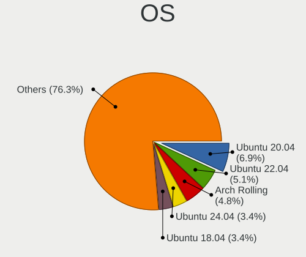

| Name                         | Desktops | Percent |
|------------------------------|----------|---------|
| Ubuntu 20.04                 | 80       | 6.88%   |
| Ubuntu 22.04                 | 59       | 5.08%   |
| Arch Rolling                 | 56       | 4.82%   |
| Ubuntu 24.04                 | 40       | 3.44%   |
| Ubuntu 18.04                 | 40       | 3.44%   |
| Pop!_OS 22.04                | 32       | 2.75%   |
| OpenMandriva 23.01           | 31       | 2.67%   |
| Debian 12                    | 24       | 2.07%   |
| OpenMandriva 4.2             | 18       | 1.55%   |
| Manjaro                      | 15       | 1.29%   |
| Debian 11                    | 15       | 1.29%   |
| Arch                         | 15       | 1.29%   |
| OpenMandriva 24.12           | 14       | 1.2%    |
| OpenMandriva 23.03           | 14       | 1.2%    |
| Linux Mint 20.1              | 14       | 1.2%    |
| Linux Mint 22.2              | 13       | 1.12%   |
| OpenMandriva 25.90           | 12       | 1.03%   |
| OpenMandriva 25.06           | 12       | 1.03%   |
| Gentoo 2.7                   | 12       | 1.03%   |
| openSUSE Tumbleweed-XXXXXXXX | 11       | 0.95%   |
| Linux Mint 21.2              | 11       | 0.95%   |
| Fedora 43                    | 11       | 0.95%   |
| Fedora 42                    | 11       | 0.95%   |
| OpenMandriva 4.3             | 10       | 0.86%   |
| Linux Mint 20                | 10       | 0.86%   |
| Fedora 41                    | 10       | 0.86%   |
| Fedora 36                    | 10       | 0.86%   |
| ArcoLinux Rolling            | 10       | 0.86%   |
| Zorin 16                     | 9        | 0.77%   |
| Ubuntu 20.10                 | 9        | 0.77%   |
| Linux Mint 21.3              | 9        | 0.77%   |
| Linux Mint 20.3              | 9        | 0.77%   |
| Xubuntu 18.04                | 8        | 0.69%   |
| Pop!_OS 21.04                | 8        | 0.69%   |
| Linux Mint 22.1              | 8        | 0.69%   |
| Fedora 40                    | 8        | 0.69%   |
| EndeavourOS Rolling          | 8        | 0.69%   |
| Debian 10                    | 8        | 0.69%   |
| Bazzite 42                   | 8        | 0.69%   |
| Xubuntu 20.04                | 7        | 0.6%    |

OS Family
---------

OS without a version

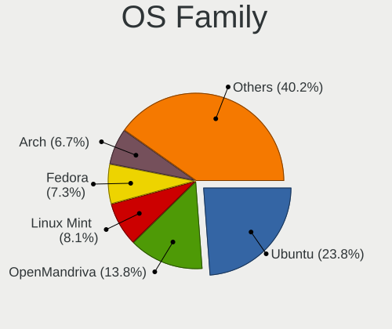

| Name         | Desktops | Percent |
|--------------|----------|---------|
| Ubuntu       | 253      | 23.82%  |
| OpenMandriva | 147      | 13.84%  |
| Linux Mint   | 86       | 8.1%    |
| Fedora       | 78       | 7.34%   |
| Arch         | 71       | 6.69%   |
| Debian       | 61       | 5.74%   |
| Pop!_OS      | 54       | 5.08%   |
| Manjaro      | 45       | 4.24%   |
| Gentoo       | 25       | 2.35%   |
| Kubuntu      | 21       | 1.98%   |
| Bazzite      | 20       | 1.88%   |
| Xubuntu      | 19       | 1.79%   |
| openSUSE     | 17       | 1.6%    |
| Lubuntu      | 15       | 1.41%   |
| Zorin        | 14       | 1.32%   |
| KDE neon     | 13       | 1.22%   |
| ROSA         | 12       | 1.13%   |
| ArcoLinux    | 11       | 1.04%   |
| Nobara       | 9        | 0.85%   |
| Ubuntu MATE  | 8        | 0.75%   |
| MX           | 8        | 0.75%   |
| EndeavourOS  | 8        | 0.75%   |
| CentOS       | 6        | 0.56%   |
| CachyOS      | 6        | 0.56%   |
| NixOS        | 5        | 0.47%   |
| Elementary   | 5        | 0.47%   |
| Garuda Linux | 4        | 0.38%   |
| Ubuntu Unity | 3        | 0.28%   |
| Peppermint   | 3        | 0.28%   |
| LMDE         | 3        | 0.28%   |
| BlackPanther | 3        | 0.28%   |
| Alpine       | 3        | 0.28%   |
| Void Linux   | 2        | 0.19%   |
| UbuntuDDE    | 2        | 0.19%   |
| Rocky Linux  | 2        | 0.19%   |
| RHEL         | 2        | 0.19%   |
| Clear Linux  | 2        | 0.19%   |
| Artix        | 2        | 0.19%   |
| TUXEDO OS    | 1        | 0.09%   |
| Solus        | 1        | 0.09%   |

Kernel
------

Version of the Linux kernel

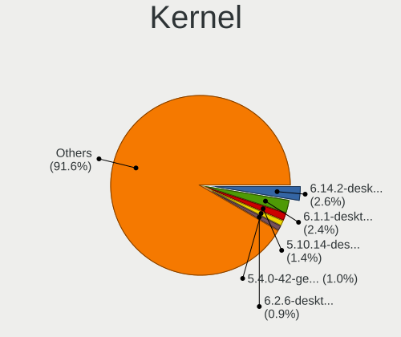

| Version                         | Desktops | Percent |
|---------------------------------|----------|---------|
| 6.14.2-desktop-3omv2590         | 33       | 2.6%    |
| 6.1.1-desktop-1omv2290          | 30       | 2.37%   |
| 5.10.14-desktop-1omv4002        | 18       | 1.42%   |
| 5.4.0-42-generic                | 13       | 1.03%   |
| 6.2.6-desktop-1omv2390          | 12       | 0.95%   |
| 6.12.1-desktop-1omv2490         | 9        | 0.71%   |
| 5.4.0-47-generic                | 9        | 0.71%   |
| 5.16.7-desktop-1omv4003         | 9        | 0.71%   |
| 6.8.0-31-generic                | 8        | 0.63%   |
| 6.8.0-51-generic                | 7        | 0.55%   |
| 6.6.2-desktop-1omv2390          | 6        | 0.47%   |
| 6.14.0-29-generic               | 6        | 0.47%   |
| 6.12.9-desktop-1omv2490         | 6        | 0.47%   |
| 5.8.0-44-generic                | 6        | 0.47%   |
| 5.4.0-65-generic                | 6        | 0.47%   |
| 5.4.0-52-generic                | 6        | 0.47%   |
| 5.4.0-48-generic                | 6        | 0.47%   |
| 5.15.0-91-generic               | 6        | 0.47%   |
| 6.8.0-52-generic                | 5        | 0.39%   |
| 6.8.0-49-generic                | 5        | 0.39%   |
| 6.8.0-45-generic                | 5        | 0.39%   |
| 6.5.0-26-generic                | 5        | 0.39%   |
| 6.4.11-desktop-1omv2390         | 5        | 0.39%   |
| 6.2.0-26-generic                | 5        | 0.39%   |
| 6.1.0-28-amd64                  | 5        | 0.39%   |
| 5.8.0-41-generic                | 5        | 0.39%   |
| 5.4.0-56-generic                | 5        | 0.39%   |
| 5.4.0-53-generic                | 5        | 0.39%   |
| 5.15.0-58-generic               | 5        | 0.39%   |
| 5.15.0-46-generic               | 5        | 0.39%   |
| 5.15.0-27-generic               | 5        | 0.39%   |
| 5.13.0-7620-generic             | 5        | 0.39%   |
| 4.9.60-nrj-desktop-1rosa-x86_64 | 5        | 0.39%   |
| 6.8.0-60-generic                | 4        | 0.32%   |
| 6.6.6-76060606-generic          | 4        | 0.32%   |
| 6.5.0-35-generic                | 4        | 0.32%   |
| 6.14.0-33-generic               | 4        | 0.32%   |
| 6.13.5-desktop-1omv2590         | 4        | 0.32%   |
| 6.12.10-76061203-generic        | 4        | 0.32%   |
| 6.11.0-21-generic               | 4        | 0.32%   |

Kernel Family
-------------

Linux kernel without a distro release

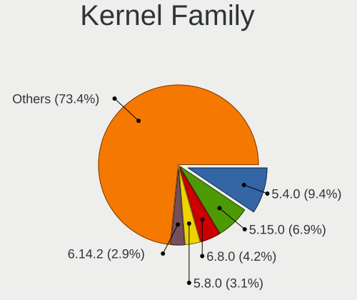

| Version | Desktops | Percent |
|---------|----------|---------|
| 5.4.0   | 114      | 9.42%   |
| 5.15.0  | 84       | 6.94%   |
| 6.8.0   | 51       | 4.21%   |
| 5.8.0   | 38       | 3.14%   |
| 6.14.2  | 35       | 2.89%   |
| 4.15.0  | 35       | 2.89%   |
| 6.1.1   | 30       | 2.48%   |
| 6.14.0  | 28       | 2.31%   |
| 6.1.0   | 25       | 2.07%   |
| 6.11.0  | 22       | 1.82%   |
| 5.13.0  | 22       | 1.82%   |
| 5.11.0  | 22       | 1.82%   |
| 6.2.0   | 21       | 1.74%   |
| 5.19.0  | 19       | 1.57%   |
| 5.10.14 | 19       | 1.57%   |
| 6.2.6   | 15       | 1.24%   |
| 6.5.0   | 14       | 1.16%   |
| 5.10.0  | 14       | 1.16%   |
| 5.3.0   | 13       | 1.07%   |
| 5.0.0   | 12       | 0.99%   |
| 6.12.1  | 10       | 0.83%   |
| 4.19.0  | 10       | 0.83%   |
| 4.18.0  | 10       | 0.83%   |
| 6.17.7  | 9        | 0.74%   |
| 6.12.10 | 9        | 0.74%   |
| 5.16.7  | 9        | 0.74%   |
| 6.6.2   | 8        | 0.66%   |
| 6.0.12  | 7        | 0.58%   |
| 6.13.9  | 6        | 0.5%    |
| 6.13.5  | 6        | 0.5%    |
| 6.12.9  | 6        | 0.5%    |
| 6.4.11  | 5        | 0.41%   |
| 6.16.4  | 5        | 0.41%   |
| 6.15.6  | 5        | 0.41%   |
| 6.14.6  | 5        | 0.41%   |
| 4.9.60  | 5        | 0.41%   |
| 6.6.7   | 4        | 0.33%   |
| 6.6.6   | 4        | 0.33%   |
| 6.17.9  | 4        | 0.33%   |
| 6.16.8  | 4        | 0.33%   |

Kernel Major Ver.
-----------------

Linux kernel major version

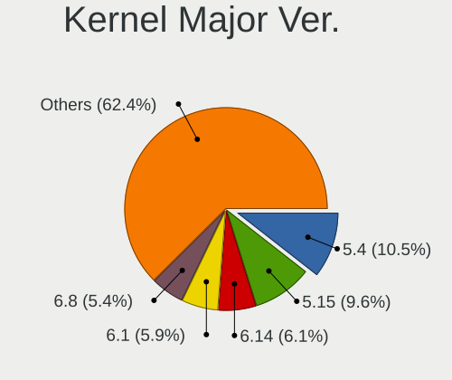

| Version | Desktops | Percent |
|---------|----------|---------|
| 5.4     | 125      | 10.55%  |
| 5.15    | 114      | 9.62%   |
| 6.14    | 72       | 6.08%   |
| 6.1     | 70       | 5.91%   |
| 6.8     | 64       | 5.4%    |
| 6.12    | 53       | 4.47%   |
| 5.8     | 50       | 4.22%   |
| 5.10    | 50       | 4.22%   |
| 6.2     | 48       | 4.05%   |
| 4.15    | 36       | 3.04%   |
| 6.6     | 35       | 2.95%   |
| 5.11    | 32       | 2.7%    |
| 6.11    | 31       | 2.62%   |
| 6.17    | 29       | 2.45%   |
| 5.13    | 29       | 2.45%   |
| 5.19    | 26       | 2.19%   |
| 6.13    | 24       | 2.03%   |
| 6.0     | 24       | 2.03%   |
| 6.5     | 23       | 1.94%   |
| 6.4     | 19       | 1.6%    |
| 5.3     | 19       | 1.6%    |
| 5.16    | 18       | 1.52%   |
| 5.17    | 16       | 1.35%   |
| 6.16    | 15       | 1.27%   |
| 4.18    | 14       | 1.18%   |
| 6.15    | 13       | 1.1%    |
| 5.0     | 13       | 1.1%    |
| 4.19    | 13       | 1.1%    |
| 5.14    | 12       | 1.01%   |
| 6.3     | 10       | 0.84%   |
| 6.10    | 10       | 0.84%   |
| 5.9     | 9        | 0.76%   |
| 5.7     | 9        | 0.76%   |
| 5.18    | 9        | 0.76%   |
| 5.12    | 8        | 0.68%   |
| 6.9     | 7        | 0.59%   |
| 6.7     | 6        | 0.51%   |
| 5.6     | 6        | 0.51%   |
| 4.9     | 6        | 0.51%   |
| 5.5     | 5        | 0.42%   |

Arch
----

OS architecture (x86_64, i586, etc.)

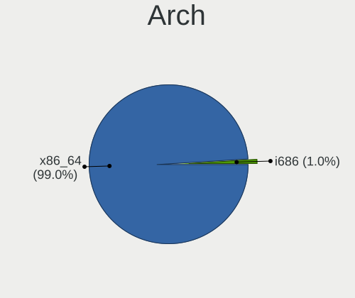

| Name   | Desktops | Percent |
|--------|----------|---------|
| x86_64 | 1013     | 99.02%  |
| i686   | 10       | 0.98%   |

DE
--

Desktop Environment

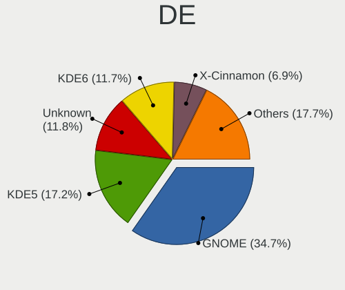

| Name             | Desktops | Percent |
|------------------|----------|---------|
| GNOME            | 372      | 34.73%  |
| KDE5             | 184      | 17.18%  |
| Unknown          | 126      | 11.76%  |
| KDE6             | 125      | 11.67%  |
| X-Cinnamon       | 74       | 6.91%   |
| XFCE             | 61       | 5.7%    |
| MATE             | 33       | 3.08%   |
| KDE              | 23       | 2.15%   |
| LXQt             | 17       | 1.59%   |
| KDE4             | 7        | 0.65%   |
| Cinnamon         | 6        | 0.56%   |
| GNOME Flashback  | 5        | 0.47%   |
| Pantheon         | 4        | 0.37%   |
| i3               | 4        | 0.37%   |
| Hyprland         | 4        | 0.37%   |
| Unity            | 3        | 0.28%   |
| LXDE             | 3        | 0.28%   |
| lightdm-xsession | 3        | 0.28%   |
| Budgie           | 3        | 0.28%   |
| sway             | 2        | 0.19%   |
| dwm              | 2        | 0.19%   |
| Deepin           | 2        | 0.19%   |
| COSMIC           | 2        | 0.19%   |
| bspwm            | 2        | 0.19%   |
| sway:Unity       | 1        | 0.09%   |
| onyx:GNOME       | 1        | 0.09%   |
| niri             | 1        | 0.09%   |
| GNOME Classic    | 1        | 0.09%   |

Display Server
--------------

X11 or Wayland

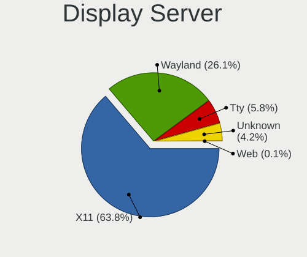

| Name    | Desktops | Percent |
|---------|----------|---------|
| X11     | 680      | 63.79%  |
| Wayland | 278      | 26.08%  |
| Tty     | 62       | 5.82%   |
| Unknown | 45       | 4.22%   |
| Web     | 1        | 0.09%   |

Display Manager
---------------

SDDM, LightDM, etc.

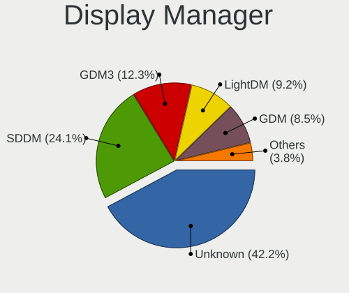

| Name                  | Desktops | Percent |
|-----------------------|----------|---------|
| Unknown               | 454      | 42.19%  |
| SDDM                  | 259      | 24.07%  |
| GDM3                  | 132      | 12.27%  |
| LightDM               | 99       | 9.2%    |
| GDM                   | 91       | 8.46%   |
| TDM                   | 27       | 2.51%   |
| KDM                   | 5        | 0.46%   |
| LY-DM                 | 3        | 0.28%   |
| SLiM                  | 2        | 0.19%   |
| GREETD                | 2        | 0.19%   |
| Ly                    | 1        | 0.09%   |
| DISPLAY-MANAGER-START | 1        | 0.09%   |

OS Lang
-------

Language

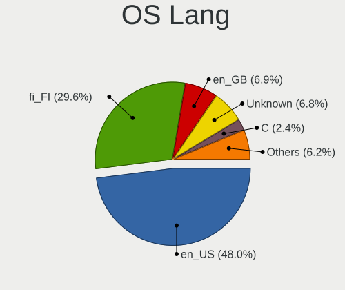

| Lang            | Desktops | Percent |
|-----------------|----------|---------|
| en_US           | 507      | 48.01%  |
| fi_FI           | 313      | 29.64%  |
| en_GB           | 73       | 6.91%   |
| Unknown         | 72       | 6.82%   |
| C               | 25       | 2.37%   |
| ru_RU           | 14       | 1.33%   |
| sv_FI           | 7        | 0.66%   |
| en_FI           | 7        | 0.66%   |
| en_DK           | 7        | 0.66%   |
| fr_FR           | 4        | 0.38%   |
| en_IE           | 4        | 0.38%   |
| sv_SE           | 3        | 0.28%   |
| C.UTF8          | 3        | 0.28%   |
| en_SE           | 2        | 0.19%   |
| POSIX           | 1        | 0.09%   |
| pl_PL           | 1        | 0.09%   |
| nb_NO           | 1        | 0.09%   |
| it_IT           | 1        | 0.09%   |
| ia_FR           | 1        | 0.09%   |
| fr_CA           | 1        | 0.09%   |
| fi_FI@euro.UTF- | 1        | 0.09%   |
| en_ZA           | 1        | 0.09%   |
| en_us.utf-8     | 1        | 0.09%   |
| en_IN           | 1        | 0.09%   |
| en_DE           | 1        | 0.09%   |
| en_CA           | 1        | 0.09%   |
| en_AU           | 1        | 0.09%   |
| de_DE           | 1        | 0.09%   |
| af_ZA           | 1        | 0.09%   |

Boot Mode
---------

EFI or BIOS

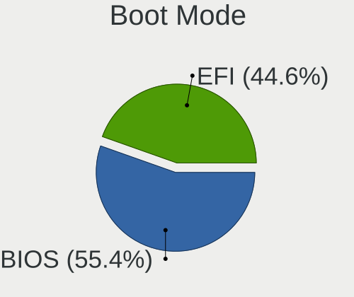

| Mode | Desktops | Percent |
|------|----------|---------|
| BIOS | 583      | 55.42%  |
| EFI  | 469      | 44.58%  |

Filesystem
----------

Type of filesystem

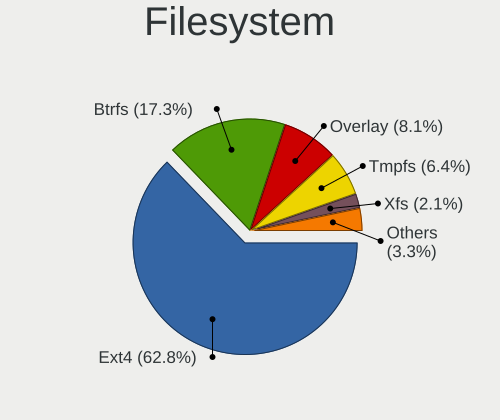

| Type    | Desktops | Percent |
|---------|----------|---------|
| Ext4    | 665      | 62.8%   |
| Btrfs   | 183      | 17.28%  |
| Overlay | 86       | 8.12%   |
| Tmpfs   | 68       | 6.42%   |
| Xfs     | 22       | 2.08%   |
| Unknown | 21       | 1.98%   |
| Zfs     | 9        | 0.85%   |
| F2fs    | 2        | 0.19%   |
| Ext3    | 2        | 0.19%   |
| Ext2    | 1        | 0.09%   |

Part. scheme
------------

Scheme of partitioning

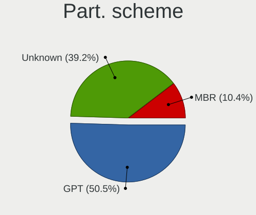

| Type    | Desktops | Percent |
|---------|----------|---------|
| GPT     | 535      | 50.47%  |
| Unknown | 415      | 39.15%  |
| MBR     | 110      | 10.38%  |

Dual Boot with Linux/BSD
------------------------

Hosting more than one Linux/BSD

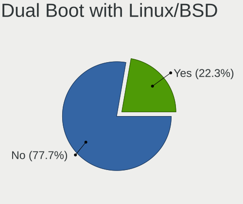

| Dual boot | Desktops | Percent |
|-----------|----------|---------|
| No        | 817      | 77.74%  |
| Yes       | 234      | 22.26%  |

Dual Boot (Win)
---------------

Hosting Linux and Windows

| Dual boot | Desktops | Percent |
|-----------|----------|---------|
| No        | 695      | 66.44%  |
| Yes       | 351      | 33.56%  |

Board
-----

Vendor
------

Motherboard manufacturer

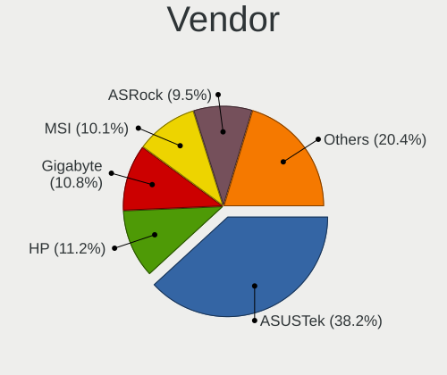

| Name                                 | Desktops | Percent |
|--------------------------------------|----------|---------|
| ASUSTek Computer                     | 390      | 38.16%  |
| Hewlett-Packard                      | 114      | 11.15%  |
| Gigabyte Technology                  | 110      | 10.76%  |
| MSI                                  | 103      | 10.08%  |
| ASRock                               | 97       | 9.49%   |
| Lenovo                               | 40       | 3.91%   |
| Dell                                 | 32       | 3.13%   |
| Acer                                 | 29       | 2.84%   |
| Fujitsu                              | 27       | 2.64%   |
| Intel                                | 16       | 1.57%   |
| Pegatron                             | 11       | 1.08%   |
| Foxconn                              | 10       | 0.98%   |
| Fujitsu Siemens                      | 4        | 0.39%   |
| ASRockRack                           | 4        | 0.39%   |
| AOpen                                | 4        | 0.39%   |
| Supermicro                           | 3        | 0.29%   |
| Packard Bell                         | 3        | 0.29%   |
| Medion                               | 3        | 0.29%   |
| Unknown                              | 3        | 0.29%   |
| WeiBu                                | 2        | 0.2%    |
| JGINYUE                              | 2        | 0.2%    |
| ABIT                                 | 2        | 0.2%    |
| SZMZ                                 | 1        | 0.1%    |
| Shuttle                              | 1        | 0.1%    |
| Shenzhen Meigao Electronic Equipment | 1        | 0.1%    |
| QS                                   | 1        | 0.1%    |
| Inventec                             | 1        | 0.1%    |
| IceWhale Technology                  | 1        | 0.1%    |
| Google                               | 1        | 0.1%    |
| GMKtec                               | 1        | 0.1%    |
| ECS                                  | 1        | 0.1%    |
| Cisco                                | 1        | 0.1%    |
| Biostar                              | 1        | 0.1%    |
| BESSTAR Tech                         | 1        | 0.1%    |
| Apple                                | 1        | 0.1%    |

Model
-----

Motherboard model

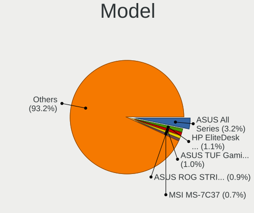

| Name                         | Desktops | Percent |
|------------------------------|----------|---------|
| ASUS All Series              | 33       | 3.23%   |
| HP EliteDesk 800 G1 SFF      | 11       | 1.08%   |
| ASUS TUF Gaming X570-PLUS    | 10       | 0.98%   |
| ASUS ROG STRIX B550-F GAMING | 9        | 0.88%   |
| MSI MS-7C37                  | 7        | 0.68%   |
| ASUS TUF Gaming B550-PLUS    | 7        | 0.68%   |
| ASUS Pro WS 565-ACE          | 7        | 0.68%   |
| MSI MS-7C56                  | 6        | 0.59%   |
| ASUS ROG STRIX B550-I GAMING | 6        | 0.59%   |
| ASUS PRIME X370-PRO          | 6        | 0.59%   |
| ASUS PRIME B350-PLUS         | 6        | 0.59%   |
| ASUS M5A97 R2.0              | 6        | 0.59%   |
| MSI MS-7C84                  | 5        | 0.49%   |
| MSI MS-7A38                  | 5        | 0.49%   |
| HP Compaq 8200 Elite SFF PC  | 5        | 0.49%   |
| Gigabyte X570 AORUS ELITE    | 5        | 0.49%   |
| ASUS PRIME X570-P            | 5        | 0.49%   |
| ASUS PRIME X470-PRO          | 5        | 0.49%   |
| ASUS PRIME B450-PLUS         | 5        | 0.49%   |
| HP EliteDesk 800 G1 USDT     | 4        | 0.39%   |
| ASUS Z170-P                  | 4        | 0.39%   |
| ASUS Z170 PRO GAMING         | 4        | 0.39%   |
| ASUS TUF B450-PLUS GAMING    | 4        | 0.39%   |
| ASUS ROG STRIX X570-E GAMING | 4        | 0.39%   |
| ASUS ROG STRIX B450-F GAMING | 4        | 0.39%   |
| ASUS PRIME X670-P WIFI       | 4        | 0.39%   |
| ASUS PRIME B550-PLUS         | 4        | 0.39%   |
| ASUS P8Z77-V LX              | 4        | 0.39%   |
| ASUS CROSSHAIR VI HERO       | 4        | 0.39%   |
| ASRock B450M-HDV R4.0        | 4        | 0.39%   |
| MSI MS-7C95                  | 3        | 0.29%   |
| MSI MS-7C91                  | 3        | 0.29%   |
| MSI MS-7C02                  | 3        | 0.29%   |
| MSI MS-7B89                  | 3        | 0.29%   |
| MSI MS-7B86                  | 3        | 0.29%   |
| MSI MS-7B49                  | 3        | 0.29%   |
| MSI MS-7B48                  | 3        | 0.29%   |
| HP Z440 Workstation          | 3        | 0.29%   |
| HP Z420 Workstation          | 3        | 0.29%   |
| HP Z240 Tower Workstation    | 3        | 0.29%   |

Model Family
------------

Motherboard model prefix

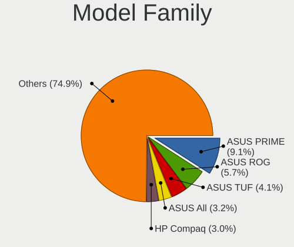

| Name               | Desktops | Percent |
|--------------------|----------|---------|
| ASUS PRIME         | 93       | 9.1%    |
| ASUS ROG           | 58       | 5.68%   |
| ASUS TUF           | 42       | 4.11%   |
| ASUS All           | 33       | 3.23%   |
| HP Compaq          | 31       | 3.03%   |
| HP EliteDesk       | 28       | 2.74%   |
| Lenovo ThinkCentre | 27       | 2.64%   |
| Dell OptiPlex      | 23       | 2.25%   |
| Fujitsu ESPRIMO    | 18       | 1.76%   |
| Acer Aspire        | 18       | 1.76%   |
| HP ProDesk         | 15       | 1.47%   |
| ASUS M5A97         | 14       | 1.37%   |
| Gigabyte X570      | 11       | 1.08%   |
| HP Pavilion        | 8        | 0.78%   |
| Gigabyte B550      | 8        | 0.78%   |
| ASUS Pro           | 8        | 0.78%   |
| MSI MS-7C37        | 7        | 0.68%   |
| ASRock X570        | 7        | 0.68%   |
| Acer Predator      | 7        | 0.68%   |
| MSI MS-7C56        | 6        | 0.59%   |
| Dell Precision     | 6        | 0.59%   |
| ASUS P8Z77-V       | 6        | 0.59%   |
| ASUS Maximus       | 6        | 0.59%   |
| MSI MS-7C84        | 5        | 0.49%   |
| MSI MS-7A38        | 5        | 0.49%   |
| Lenovo IdeaCentre  | 5        | 0.49%   |
| ASUS Z170-P        | 5        | 0.49%   |
| ASUS ProArt        | 5        | 0.49%   |
| ASRock B450M-HDV   | 5        | 0.49%   |
| HP Z240            | 4        | 0.39%   |
| Gigabyte X670E     | 4        | 0.39%   |
| Gigabyte B650M     | 4        | 0.39%   |
| Gigabyte B550M     | 4        | 0.39%   |
| Gigabyte B450      | 4        | 0.39%   |
| ASUS Z170          | 4        | 0.39%   |
| ASUS P8P67         | 4        | 0.39%   |
| ASUS P7P55D        | 4        | 0.39%   |
| ASUS P6T           | 4        | 0.39%   |
| ASUS CROSSHAIR     | 4        | 0.39%   |
| ASRock B550        | 4        | 0.39%   |

MFG Year
--------

Motherboard manufacture year

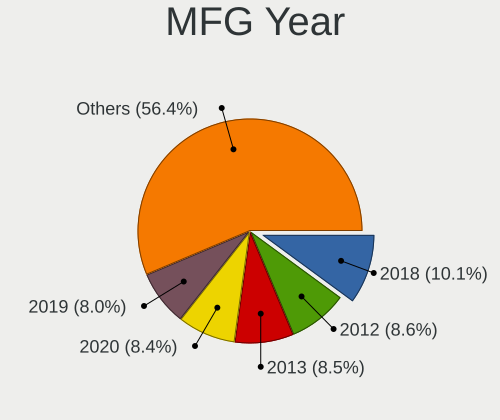

| Year | Desktops | Percent |
|------|----------|---------|
| 2018 | 103      | 10.08%  |
| 2012 | 88       | 8.61%   |
| 2013 | 87       | 8.51%   |
| 2020 | 86       | 8.41%   |
| 2019 | 82       | 8.02%   |
| 2017 | 81       | 7.93%   |
| 2015 | 64       | 6.26%   |
| 2009 | 57       | 5.58%   |
| 2011 | 51       | 4.99%   |
| 2022 | 48       | 4.7%    |
| 2014 | 47       | 4.6%    |
| 2016 | 45       | 4.4%    |
| 2021 | 34       | 3.33%   |
| 2010 | 34       | 3.33%   |
| 2008 | 31       | 3.03%   |
| 2024 | 25       | 2.45%   |
| 2023 | 25       | 2.45%   |
| 2007 | 19       | 1.86%   |
| 2006 | 9        | 0.88%   |
| 2005 | 3        | 0.29%   |
| 2004 | 2        | 0.2%    |
| 2025 | 1        | 0.1%    |

Form Factor
-----------

Physical design of the computer

| Name    | Desktops | Percent |
|---------|----------|---------|
| Desktop | 1022     | 100%    |

Secure Boot
-----------

Enabled or disabled

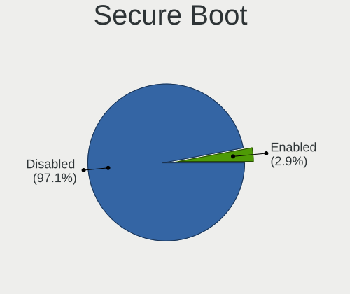

| State    | Desktops | Percent |
|----------|----------|---------|
| Disabled | 996      | 97.08%  |
| Enabled  | 30       | 2.92%   |

Coreboot
--------

Have coreboot on board

| Used | Desktops | Percent |
|------|----------|---------|
| No   | 1021     | 99.9%   |
| Yes  | 1        | 0.1%    |

RAM Size
--------

Total RAM memory

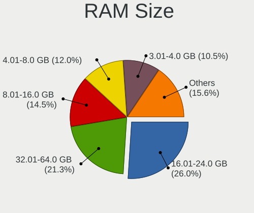

| Size in GB      | Desktops | Percent |
|-----------------|----------|---------|
| 16.01-24.0      | 272      | 26%     |
| 32.01-64.0      | 223      | 21.32%  |
| 8.01-16.0       | 152      | 14.53%  |
| 4.01-8.0        | 126      | 12.05%  |
| 3.01-4.0        | 110      | 10.52%  |
| 64.01-256.0     | 79       | 7.55%   |
| 24.01-32.0      | 57       | 5.45%   |
| 1.01-2.0        | 16       | 1.53%   |
| 2.01-3.0        | 6        | 0.57%   |
| More than 256.0 | 2        | 0.19%   |
| 0.01-0.5        | 2        | 0.19%   |
| 0.51-1.0        | 1        | 0.1%    |

RAM Used
--------

Used RAM memory

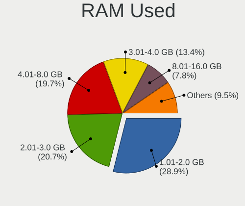

| Used GB     | Desktops | Percent |
|-------------|----------|---------|
| 1.01-2.0    | 331      | 28.91%  |
| 2.01-3.0    | 237      | 20.7%   |
| 4.01-8.0    | 226      | 19.74%  |
| 3.01-4.0    | 153      | 13.36%  |
| 8.01-16.0   | 89       | 7.77%   |
| 0.51-1.0    | 62       | 5.41%   |
| 16.01-24.0  | 19       | 1.66%   |
| 0.01-0.5    | 9        | 0.79%   |
| 32.01-64.0  | 6        | 0.52%   |
| 24.01-32.0  | 6        | 0.52%   |
| 64.01-256.0 | 4        | 0.35%   |
| 0           | 3        | 0.26%   |

Total Drives
------------

Number of drives on board

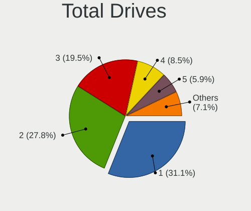

| Drives | Desktops | Percent |
|--------|----------|---------|
| 1      | 336      | 31.08%  |
| 2      | 301      | 27.84%  |
| 3      | 211      | 19.52%  |
| 4      | 92       | 8.51%   |
| 5      | 64       | 5.92%   |
| 6      | 26       | 2.41%   |
| 7      | 17       | 1.57%   |
| 0      | 11       | 1.02%   |
| 9      | 8        | 0.74%   |
| 8      | 8        | 0.74%   |
| 10     | 4        | 0.37%   |
| 23     | 1        | 0.09%   |
| 12     | 1        | 0.09%   |
| 11     | 1        | 0.09%   |

Has CD-ROM
----------

Has CD-ROM on board

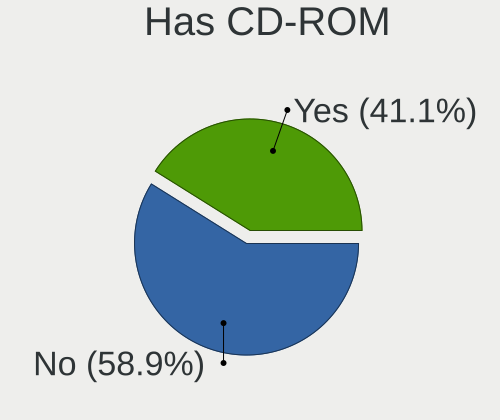

| Presented | Desktops | Percent |
|-----------|----------|---------|
| No        | 612      | 58.9%   |
| Yes       | 427      | 41.1%   |

Has Ethernet
------------

Has Ethernet on board

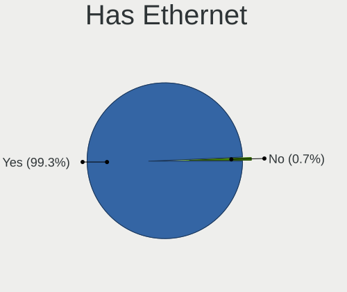

| Presented | Desktops | Percent |
|-----------|----------|---------|
| Yes       | 1015     | 99.32%  |
| No        | 7        | 0.68%   |

Has WiFi
--------

Has WiFi module

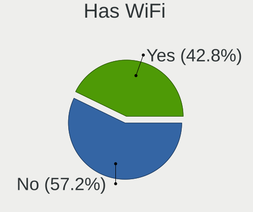

| Presented | Desktops | Percent |
|-----------|----------|---------|
| No        | 592      | 57.2%   |
| Yes       | 443      | 42.8%   |

Has Bluetooth
-------------

Has Bluetooth module

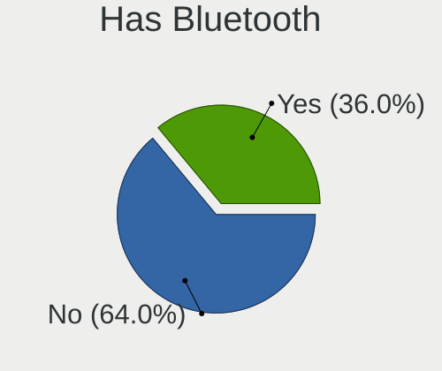

| Presented | Desktops | Percent |
|-----------|----------|---------|
| No        | 664      | 63.97%  |
| Yes       | 374      | 36.03%  |

Location
--------

Country
-------

Geographic location (country)

| Country | Desktops | Percent |
|---------|----------|---------|
| Finland | 1022     | 100%    |

City
----

Geographic location (city)

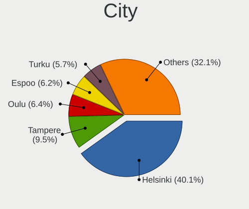

| City         | Desktops | Percent |
|--------------|----------|---------|
| Helsinki     | 443      | 40.09%  |
| Tampere      | 105      | 9.5%    |
| Oulu         | 71       | 6.43%   |
| Espoo        | 68       | 6.15%   |
| Turku        | 63       | 5.7%    |
| Vantaa       | 35       | 3.17%   |
| Jyväskylä  | 30       | 2.71%   |
| Kuopio       | 25       | 2.26%   |
| Vaasa        | 17       | 1.54%   |
| Lahti        | 16       | 1.45%   |
| Tuusula      | 12       | 1.09%   |
| Joensuu      | 12       | 1.09%   |
| Raisio       | 10       | 0.9%    |
| Hyvinkaeae   | 10       | 0.9%    |
| Salo         | 8        | 0.72%   |
| Porvoo       | 8        | 0.72%   |
| Raahe        | 7        | 0.63%   |
| Järvenpää | 7        | 0.63%   |
| Seinäjoki   | 6        | 0.54%   |
| Pori         | 6        | 0.54%   |
| Kotka        | 6        | 0.54%   |
| Kerava       | 6        | 0.54%   |
| Hämeenlinna | 6        | 0.54%   |
| Lohja        | 5        | 0.45%   |
| Lappeenranta | 5        | 0.45%   |
| Rovaniemi    | 4        | 0.36%   |
| Rauma        | 4        | 0.36%   |
| Kouvola      | 4        | 0.36%   |
| Kokkola      | 4        | 0.36%   |
| Karis        | 4        | 0.36%   |
| Uusikaupunki | 3        | 0.27%   |
| Nokia        | 3        | 0.27%   |
| Lieto        | 3        | 0.27%   |
| Lempäälä  | 3        | 0.27%   |
| Iisalmi      | 3        | 0.27%   |
| Hanko        | 3        | 0.27%   |
| Vuokatti     | 2        | 0.18%   |
| Vesilahti    | 2        | 0.18%   |
| Turenki      | 2        | 0.18%   |
| Tupos        | 2        | 0.18%   |

Drives
------

Drive Vendor
------------

Hard drive vendors

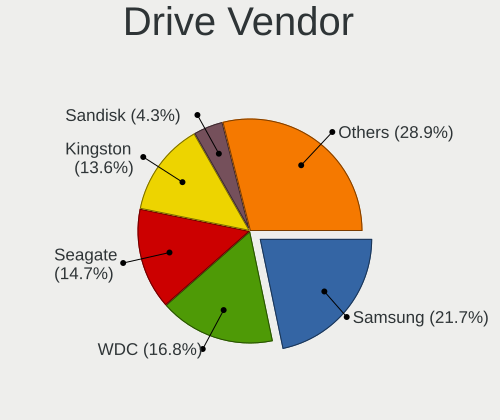

| Vendor                      | Desktops | Drives | Percent |
|-----------------------------|----------|--------|---------|
| Samsung Electronics         | 434      | 769    | 21.73%  |
| WDC                         | 335      | 618    | 16.78%  |
| Seagate                     | 293      | 536    | 14.67%  |
| Kingston                    | 271      | 430    | 13.57%  |
| Sandisk                     | 86       | 103    | 4.31%   |
| Toshiba                     | 68       | 131    | 3.41%   |
| Crucial                     | 60       | 79     | 3%      |
| Intel                       | 53       | 72     | 2.65%   |
| Kingston Technology Company | 50       | 59     | 2.5%    |
| Hitachi                     | 38       | 51     | 1.9%    |
| A-DATA Technology           | 28       | 35     | 1.4%    |
| PNY                         | 18       | 21     | 0.9%    |
| Micron Technology           | 18       | 26     | 0.9%    |
| Phison Electronics          | 15       | 22     | 0.75%   |
| HGST                        | 15       | 26     | 0.75%   |
| Verbatim                    | 14       | 24     | 0.7%    |
| Unknown                     | 14       | 26     | 0.7%    |
| OCZ                         | 14       | 19     | 0.7%    |
| Maxtor                      | 13       | 20     | 0.65%   |
| Corsair                     | 13       | 17     | 0.65%   |
| Transcend                   | 12       | 18     | 0.6%    |
| SK hynix                    | 12       | 13     | 0.6%    |
| ADATA Technology            | 12       | 14     | 0.6%    |
| Phison                      | 10       | 10     | 0.5%    |
| Micron/Crucial Technology   | 6        | 7      | 0.3%    |
| MAXIO Technology (Hangzhou) | 5        | 5      | 0.25%   |
| Intenso                     | 5        | 8      | 0.25%   |
| China                       | 5        | 5      | 0.25%   |
| Silicon Motion              | 4        | 5      | 0.2%    |
| LITEONIT                    | 4        | 4      | 0.2%    |
| KIOXIA                      | 4        | 5      | 0.2%    |
| Fujitsu                     | 4        | 4      | 0.2%    |
| XPG                         | 3        | 5      | 0.15%   |
| SPCC                        | 3        | 3      | 0.15%   |
| Seagate Technology          | 3        | 3      | 0.15%   |
| Plextor                     | 3        | 3      | 0.15%   |
| Patriot                     | 3        | 6      | 0.15%   |
| LITEON                      | 3        | 3      | 0.15%   |
| HUAWEI                      | 3        | 3      | 0.15%   |
| Gigabyte Technology         | 3        | 5      | 0.15%   |

Drive Model
-----------

Hard drive models

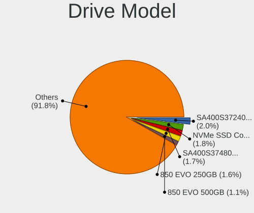

| Model                                                              | Desktops | Percent |
|--------------------------------------------------------------------|----------|---------|
| Kingston SA400S37240G 240GB SSD                                    | 47       | 1.95%   |
| Samsung NVMe SSD Controller SM981/PM981/PM983 1TB                  | 43       | 1.79%   |
| Kingston SA400S37480G 480GB SSD                                    | 41       | 1.7%    |
| Samsung SSD 850 EVO 250GB                                          | 39       | 1.62%   |
| Samsung SSD 850 EVO 500GB                                          | 27       | 1.12%   |
| Samsung NVMe SSD Controller PM9A1/PM9A3/980PRO 1TB                 | 26       | 1.08%   |
| Kingston SA400S37120G 120GB SSD                                    | 25       | 1.04%   |
| Samsung SSD 980 1TB                                                | 24       | 1%      |
| Kingston SA400S37960G 960GB SSD                                    | 21       | 0.87%   |
| Kingston SV300S37A120G 120GB SSD                                   | 18       | 0.75%   |
| Kingston SHFS37A120G 120GB SSD                                     | 18       | 0.75%   |
| Seagate ST500DM002-1BD142 500GB                                    | 17       | 0.71%   |
| Seagate ST2000DM008-2FR102 2TB                                     | 17       | 0.71%   |
| Samsung SSD 860 EVO 500GB                                          | 17       | 0.71%   |
| Samsung SSD 860 EVO 1TB                                            | 17       | 0.71%   |
| Samsung HD103SJ 1TB                                                | 17       | 0.71%   |
| Seagate ST4000DM004-2CV104 4TB                                     | 15       | 0.62%   |
| Seagate ST1000DM010-2EP102 1TB                                     | 15       | 0.62%   |
| Kingston SV300S37A240G 240GB SSD                                   | 15       | 0.62%   |
| Toshiba DT01ACA300 3TB                                             | 14       | 0.58%   |
| Samsung NVMe SSD Drive 500GB                                       | 14       | 0.58%   |
| Seagate Expansion 2TB                                              | 12       | 0.5%    |
| Kingston Company A2000 NVMe SSD 250GB                              | 12       | 0.5%    |
| Seagate ST1000DM003-1CH162 1TB                                     | 11       | 0.46%   |
| Crucial CT1000MX500SSD1 1TB                                        | 11       | 0.46%   |
| WDC WDS500G2B0A-00SM50 500GB                                       | 10       | 0.42%   |
| WDC WD30EFRX-68EUZN0 3TB                                           | 10       | 0.42%   |
| WDC WD10EZEX-08WN4A0 1TB                                           | 10       | 0.42%   |
| Samsung SSD 840 EVO 120GB                                          | 10       | 0.42%   |
| Samsung HD501LJ 500GB                                              | 10       | 0.42%   |
| Kingston Company SNV2S1000G 1TB                                    | 10       | 0.42%   |
| ADATA XPG SX8200 Pro PCIe Gen3x4 M.2 2280 Solid State Drive 1024GB | 10       | 0.42%   |
| Toshiba DT01ACA100 1TB                                             | 9        | 0.37%   |
| Seagate ST31000528AS 1TB                                           | 9        | 0.37%   |
| Seagate ST31000524AS 1TB                                           | 9        | 0.37%   |
| Samsung SSD 960 EVO 500GB                                          | 9        | 0.37%   |
| Samsung SSD 860 EVO 250GB                                          | 9        | 0.37%   |
| Samsung SSD 850 PRO 256GB                                          | 9        | 0.37%   |
| Samsung NVMe SSD Controller SM961/PM961/SM963 1024GB               | 9        | 0.37%   |
| PNY CS900 120GB SSD                                                | 9        | 0.37%   |

HDD Vendor
----------

Hard disk drive vendors

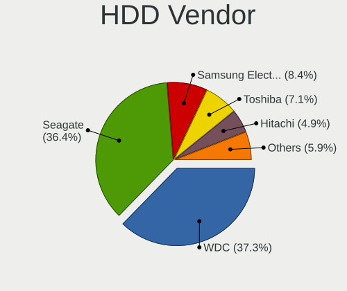

| Vendor              | Desktops | Drives | Percent |
|---------------------|----------|--------|---------|
| WDC                 | 289      | 518    | 37.29%  |
| Seagate             | 282      | 518    | 36.39%  |
| Samsung Electronics | 65       | 98     | 8.39%   |
| Toshiba             | 55       | 102    | 7.1%    |
| Hitachi             | 38       | 51     | 4.9%    |
| HGST                | 15       | 26     | 1.94%   |
| Maxtor              | 13       | 20     | 1.68%   |
| Unknown             | 6        | 6      | 0.77%   |
| Fujitsu             | 4        | 4      | 0.52%   |
| USB3.0              | 2        | 2      | 0.26%   |
| StoreJet            | 2        | 2      | 0.26%   |
| LaCie               | 1        | 1      | 0.13%   |
| JMicron Technology  | 1        | 1      | 0.13%   |
| Hewlett-Packard     | 1        | 1      | 0.13%   |
| External            | 1        | 1      | 0.13%   |

SSD Vendor
----------

Solid state drive vendors

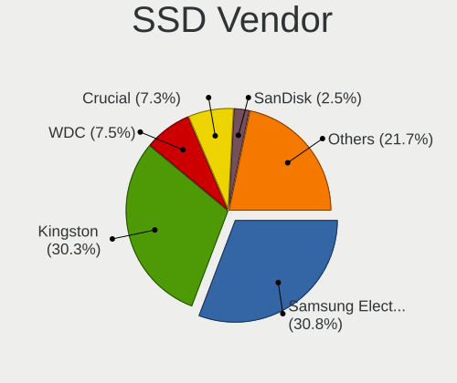

| Vendor              | Desktops | Drives | Percent |
|---------------------|----------|--------|---------|
| Samsung Electronics | 237      | 346    | 30.78%  |
| Kingston            | 233      | 370    | 30.26%  |
| WDC                 | 58       | 86     | 7.53%   |
| Crucial             | 56       | 72     | 7.27%   |
| SanDisk             | 19       | 20     | 2.47%   |
| Intel               | 18       | 32     | 2.34%   |
| A-DATA Technology   | 18       | 22     | 2.34%   |
| PNY                 | 16       | 19     | 2.08%   |
| Verbatim            | 14       | 24     | 1.82%   |
| OCZ                 | 14       | 19     | 1.82%   |
| Micron Technology   | 13       | 21     | 1.69%   |
| Transcend           | 12       | 18     | 1.56%   |
| Corsair             | 8        | 10     | 1.04%   |
| Toshiba             | 6        | 13     | 0.78%   |
| China               | 5        | 5      | 0.65%   |
| LITEONIT            | 4        | 4      | 0.52%   |
| Intenso             | 4        | 7      | 0.52%   |
| SPCC                | 3        | 3      | 0.39%   |
| Plextor             | 3        | 3      | 0.39%   |
| Patriot             | 3        | 6      | 0.39%   |
| LITEON              | 3        | 3      | 0.39%   |
| SK hynix            | 2        | 2      | 0.26%   |
| Ramaxel Technology  | 2        | 2      | 0.26%   |
| OCZ-VERTEX3         | 2        | 2      | 0.26%   |
| KIOXIA-EXCERIA      | 2        | 2      | 0.26%   |
| XrayDisk            | 1        | 1      | 0.13%   |
| X12                 | 1        | 1      | 0.13%   |
| Unknown             | 1        | 1      | 0.13%   |
| TSA                 | 1        | 1      | 0.13%   |
| sobetter            | 1        | 1      | 0.13%   |
| Seagate             | 1        | 1      | 0.13%   |
| OCZ-VERTEX          | 1        | 1      | 0.13%   |
| Netac               | 1        | 1      | 0.13%   |
| KingSpec            | 1        | 1      | 0.13%   |
| Hewlett-Packard     | 1        | 2      | 0.13%   |
| Gigabyte Technology | 1        | 2      | 0.13%   |
| Dogfish             | 1        | 1      | 0.13%   |
| DEXP                | 1        | 1      | 0.13%   |
| AEGO                | 1        | 1      | 0.13%   |
| Unknown             | 1        | 1      | 0.13%   |

Drive Kind
----------

HDD or SSD

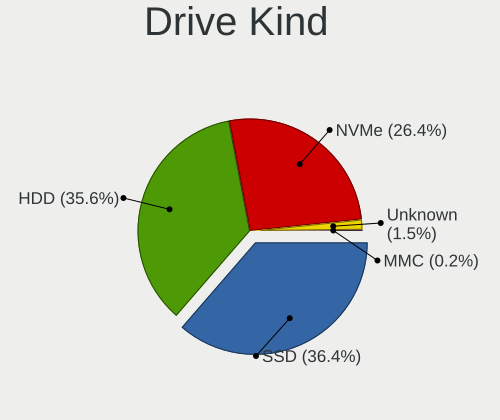

| Kind    | Desktops | Drives | Percent |
|---------|----------|--------|---------|
| SSD     | 599      | 1128   | 36.37%  |
| HDD     | 587      | 1351   | 35.64%  |
| NVMe    | 434      | 734    | 26.35%  |
| Unknown | 24       | 39     | 1.46%   |
| MMC     | 3        | 3      | 0.18%   |

Drive Connector
---------------

SATA, SAS, NVMe, etc.

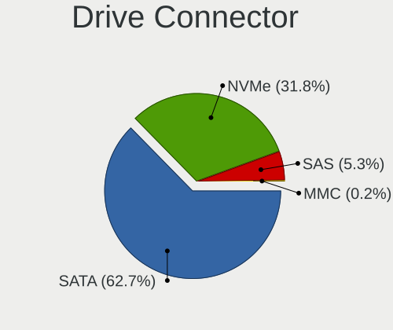

| Type | Desktops | Drives | Percent |
|------|----------|--------|---------|
| SATA | 856      | 2403   | 62.66%  |
| NVMe | 434      | 733    | 31.77%  |
| SAS  | 73       | 116    | 5.34%   |
| MMC  | 3        | 3      | 0.22%   |

Drive Size
----------

Size of hard drive

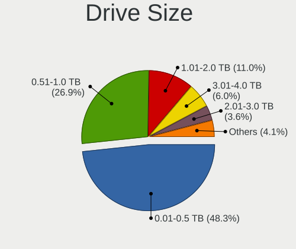

| Size in TB | Desktops | Drives | Percent |
|------------|----------|--------|---------|
| 0.01-0.5   | 650      | 1277   | 48.33%  |
| 0.51-1.0   | 362      | 565    | 26.91%  |
| 1.01-2.0   | 148      | 245    | 11%     |
| 3.01-4.0   | 81       | 181    | 6.02%   |
| 2.01-3.0   | 49       | 99     | 3.64%   |
| 4.01-10.0  | 42       | 86     | 3.12%   |
| 10.01-20.0 | 13       | 26     | 0.97%   |

Space Total
-----------

Amount of disk space available on the file system

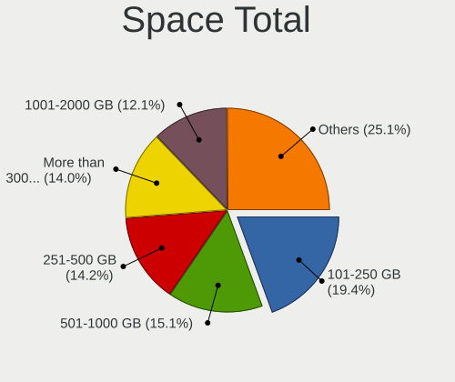

| Size in GB     | Desktops | Percent |
|----------------|----------|---------|
| 101-250        | 213      | 19.42%  |
| 501-1000       | 166      | 15.13%  |
| 251-500        | 156      | 14.22%  |
| More than 3000 | 154      | 14.04%  |
| 1001-2000      | 133      | 12.12%  |
| 1-20           | 82       | 7.47%   |
| 2001-3000      | 74       | 6.75%   |
| Unknown        | 62       | 5.65%   |
| 51-100         | 39       | 3.56%   |
| 21-50          | 18       | 1.64%   |

Space Used
----------

Amount of used disk space

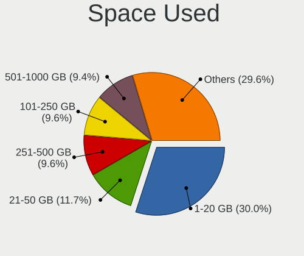

| Used GB        | Desktops | Percent |
|----------------|----------|---------|
| 1-20           | 339      | 30%     |
| 21-50          | 132      | 11.68%  |
| 251-500        | 109      | 9.65%   |
| 101-250        | 109      | 9.65%   |
| 501-1000       | 106      | 9.38%   |
| 51-100         | 94       | 8.32%   |
| 1001-2000      | 70       | 6.19%   |
| Unknown        | 62       | 5.49%   |
| More than 3000 | 61       | 5.4%    |
| 2001-3000      | 43       | 3.81%   |
| 0              | 5        | 0.44%   |

Malfunc. Drives
---------------

Drive models with a malfunction

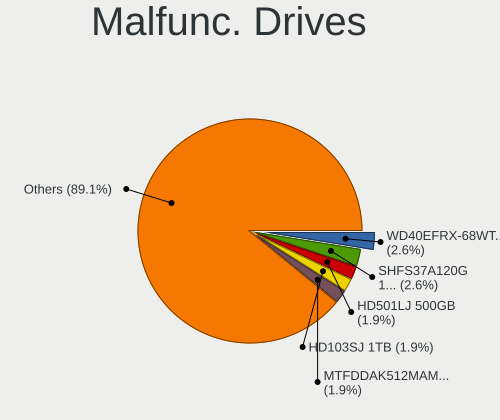

| Model                                          | Desktops | Drives | Percent |
|------------------------------------------------|----------|--------|---------|
| WDC WD40EFRX-68WT0N0 4TB                       | 4        | 6      | 2.56%   |
| Kingston SHFS37A120G 120GB SSD                 | 4        | 5      | 2.56%   |
| Samsung Electronics HD501LJ 500GB              | 3        | 5      | 1.92%   |
| Samsung Electronics HD103SJ 1TB                | 3        | 4      | 1.92%   |
| Micron Technology MTFDDAK512MAM-1K1 512GB SSD  | 3        | 6      | 1.92%   |
| WDC WDS120G2G0A-00JH30 120GB SSD               | 2        | 2      | 1.28%   |
| WDC WD5000AAKX-60U6AA0 500GB                   | 2        | 2      | 1.28%   |
| WDC WD3200AAKS-00L9A0 320GB                    | 2        | 2      | 1.28%   |
| WDC WD10EARS-22Y5B1 1TB                        | 2        | 3      | 1.28%   |
| WDC WD Blue SA510 2.5 250GB                    | 2        | 2      | 1.28%   |
| USB3.0 Super Speed 500GB                       | 2        | 2      | 1.28%   |
| Toshiba DT01ACA100 1TB                         | 2        | 3      | 1.28%   |
| Seagate ST500DM002-1BD142 500GB                | 2        | 2      | 1.28%   |
| Seagate ST3500418AS 500GB                      | 2        | 3      | 1.28%   |
| Seagate ST3320620AS 320GB                      | 2        | 2      | 1.28%   |
| Seagate ST3250318AS 250GB                      | 2        | 2      | 1.28%   |
| Seagate ST2000DM006-2DM164 2TB                 | 2        | 2      | 1.28%   |
| Seagate ST1000LM024 HN-M101MBB 1TB             | 2        | 3      | 1.28%   |
| Samsung Electronics SSD 980 1TB                | 2        | 2      | 1.28%   |
| Samsung Electronics SSD 850 EVO 1TB            | 2        | 2      | 1.28%   |
| Micron Technology 1100_MTFDDAK512TBN 512GB SSD | 2        | 4      | 1.28%   |
| Maxtor 7Y250M0 256GB                           | 2        | 2      | 1.28%   |
| Kingston SA400S37240G 240GB SSD                | 2        | 2      | 1.28%   |
| Intel SSDSA2M080G2GC 80GB                      | 2        | 2      | 1.28%   |
| Intel SSDPEKKW256G7 256GB                      | 2        | 2      | 1.28%   |
| Intel SSD 600P Series 1024GB                   | 2        | 2      | 1.28%   |
| HGST HTS725050A7E630 500GB                     | 2        | 2      | 1.28%   |
| WDC WDS240G2G0A-00JH30 240GB SSD               | 1        | 1      | 0.64%   |
| WDC WD7500BPVT-80HXZT1 752GB                   | 1        | 1      | 0.64%   |
| WDC WD6400AAKS-07A7B0 640GB                    | 1        | 1      | 0.64%   |
| WDC WD50EZRZ-32RWYB1 5TB                       | 1        | 1      | 0.64%   |
| WDC WD5000ABPS-01ZZB0 500GB                    | 1        | 1      | 0.64%   |
| WDC WD5000AAKX-00ERMA0 500GB                   | 1        | 1      | 0.64%   |
| WDC WD5000AAKS-75A7B0 500GB                    | 1        | 1      | 0.64%   |
| WDC WD5000AAKS-22A7B0 500GB                    | 1        | 1      | 0.64%   |
| WDC WD5000AAKS-007AA0 500GB                    | 1        | 2      | 0.64%   |
| WDC WD40E31X-00HY4A0 4TB                       | 1        | 1      | 0.64%   |
| WDC WD3200YS-01PGB0 320GB                      | 1        | 1      | 0.64%   |
| WDC WD3200BEVT-22ZCT0 320GB                    | 1        | 1      | 0.64%   |
| WDC WD3200AAJS-60Z0A0 320GB                    | 1        | 1      | 0.64%   |

Malfunc. Drive Vendor
---------------------

Vendors of faulty drives

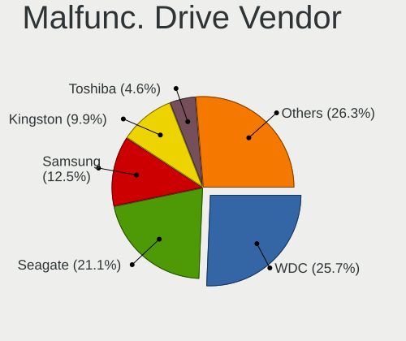

| Vendor              | Desktops | Drives | Percent |
|---------------------|----------|--------|---------|
| WDC                 | 39       | 44     | 25.66%  |
| Seagate             | 32       | 37     | 21.05%  |
| Samsung Electronics | 19       | 25     | 12.5%   |
| Kingston            | 15       | 16     | 9.87%   |
| Toshiba             | 7        | 8      | 4.61%   |
| Intel               | 7        | 7      | 4.61%   |
| Micron Technology   | 5        | 10     | 3.29%   |
| Hitachi             | 5        | 6      | 3.29%   |
| Maxtor              | 4        | 4      | 2.63%   |
| Crucial             | 3        | 4      | 1.97%   |
| Corsair             | 3        | 3      | 1.97%   |
| A-DATA Technology   | 3        | 3      | 1.97%   |
| USB3.0              | 2        | 2      | 1.32%   |
| HGST                | 2        | 2      | 1.32%   |
| SPCC                | 1        | 1      | 0.66%   |
| Ramaxel Technology  | 1        | 1      | 0.66%   |
| PNY                 | 1        | 1      | 0.66%   |
| Patriot             | 1        | 1      | 0.66%   |
| OCZ                 | 1        | 1      | 0.66%   |
| LITEONIT            | 1        | 1      | 0.66%   |

Malfunc. HDD Vendor
-------------------

Vendors of faulty HDD drives

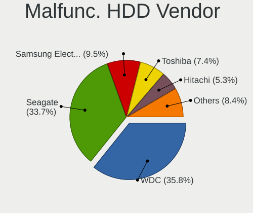

| Vendor              | Desktops | Drives | Percent |
|---------------------|----------|--------|---------|
| WDC                 | 34       | 39     | 35.79%  |
| Seagate             | 32       | 37     | 33.68%  |
| Samsung Electronics | 9        | 12     | 9.47%   |
| Toshiba             | 7        | 8      | 7.37%   |
| Hitachi             | 5        | 6      | 5.26%   |
| Maxtor              | 4        | 4      | 4.21%   |
| USB3.0              | 2        | 2      | 2.11%   |
| HGST                | 2        | 2      | 2.11%   |

Malfunc. Drive Kind
-------------------

Kinds of faulty drives

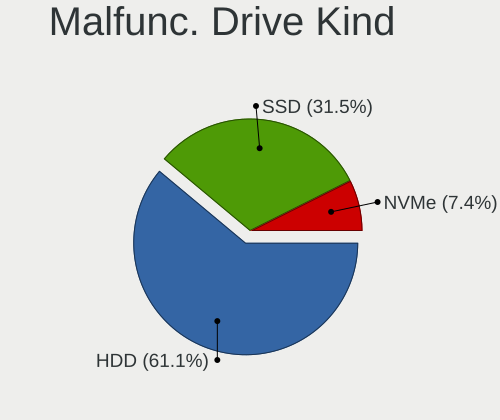

| Kind | Desktops | Drives | Percent |
|------|----------|--------|---------|
| HDD  | 91       | 110    | 61.07%  |
| SSD  | 47       | 56     | 31.54%  |
| NVMe | 11       | 11     | 7.38%   |

Failed Drives
-------------

Failed drive models

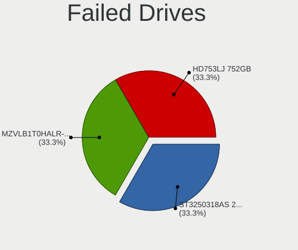

| Model                                      | Desktops | Drives | Percent |
|--------------------------------------------|----------|--------|---------|
| Seagate ST3250318AS 250GB                  | 1        | 1      | 33.33%  |
| Samsung Electronics MZVLB1T0HALR-00000 1TB | 1        | 2      | 33.33%  |
| Samsung Electronics HD753LJ 752GB          | 1        | 1      | 33.33%  |

Failed Drive Vendor
-------------------

Failed drive vendors

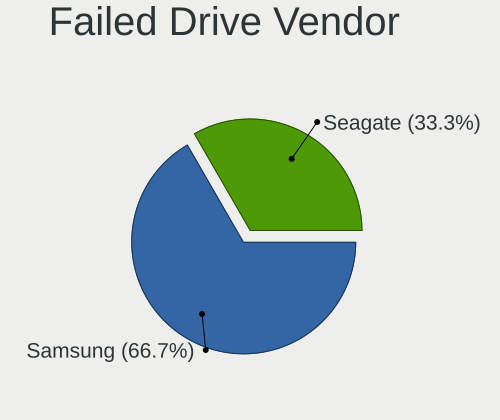

| Vendor              | Desktops | Drives | Percent |
|---------------------|----------|--------|---------|
| Samsung Electronics | 2        | 3      | 66.67%  |
| Seagate             | 1        | 1      | 33.33%  |

Drive Status
------------

Number of failed and malfunc. drives

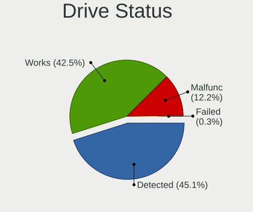

| Status   | Desktops | Drives | Percent |
|----------|----------|--------|---------|
| Detected | 532      | 1635   | 45.08%  |
| Works    | 501      | 1439   | 42.46%  |
| Malfunc  | 144      | 177    | 12.2%   |
| Failed   | 3        | 4      | 0.25%   |

Storage controller
------------------

Storage Vendor
--------------

Storage controller vendors

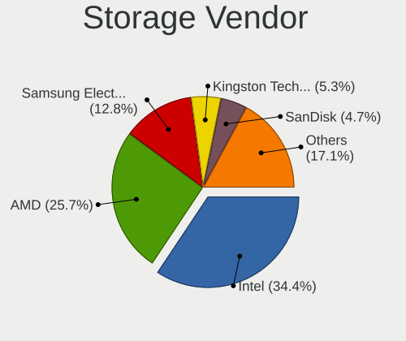

| Vendor                       | Desktops | Percent |
|------------------------------|----------|---------|
| Intel                        | 570      | 34.36%  |
| AMD                          | 427      | 25.74%  |
| Samsung Electronics          | 212      | 12.78%  |
| Kingston Technology Company  | 88       | 5.3%    |
| SanDisk                      | 78       | 4.7%    |
| ASMedia Technology           | 58       | 3.5%    |
| JMicron Technology           | 40       | 2.41%   |
| Phison Electronics           | 35       | 2.11%   |
| ADATA Technology             | 24       | 1.45%   |
| Nvidia                       | 23       | 1.39%   |
| Marvell Technology Group     | 22       | 1.33%   |
| Micron/Crucial Technology    | 11       | 0.66%   |
| VIA Technologies             | 9        | 0.54%   |
| Toshiba America Info Systems | 9        | 0.54%   |
| SK hynix                     | 9        | 0.54%   |
| Seagate Technology           | 8        | 0.48%   |
| MAXIO Technology (Hangzhou)  | 7        | 0.42%   |
| Micron Technology            | 5        | 0.3%    |
| LSI Logic / Symbios Logic    | 5        | 0.3%    |
| Silicon Motion               | 4        | 0.24%   |
| KIOXIA                       | 4        | 0.24%   |
| Broadcom / LSI               | 4        | 0.24%   |
| Realtek Semiconductor        | 3        | 0.18%   |
| Shenzhen Longsys Electronics | 1        | 0.06%   |
| Promise Technology           | 1        | 0.06%   |
| Hosin Global Electronics     | 1        | 0.06%   |
| Adaptec                      | 1        | 0.06%   |

Storage Model
-------------

Storage controller models

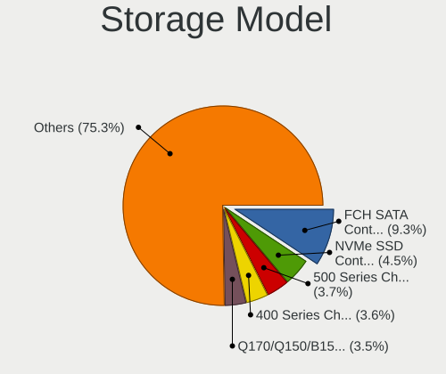

| Model                                                                          | Desktops | Percent |
|--------------------------------------------------------------------------------|----------|---------|
| AMD FCH SATA Controller [AHCI mode]                                            | 187      | 9.35%   |
| Samsung NVMe SSD Controller SM981/PM981/PM983                                  | 91       | 4.55%   |
| AMD 500 Series Chipset SATA Controller                                         | 74       | 3.7%    |
| AMD 400 Series Chipset SATA Controller                                         | 73       | 3.65%   |
| Intel Q170/Q150/B150/H170/H110/Z170/CM236 Chipset SATA Controller [AHCI Mode]  | 70       | 3.5%    |
| Intel 8 Series/C220 Series Chipset Family 6-port SATA Controller 1 [AHCI mode] | 70       | 3.5%    |
| Intel 200 Series PCH SATA controller [AHCI mode]                               | 60       | 3%      |
| AMD 600 Series Chipset SATA Controller                                         | 55       | 2.75%   |
| ASMedia ASM1061/ASM1062 Serial ATA Controller                                  | 52       | 2.6%    |
| Intel 6 Series/C200 Series Chipset Family 6 port Desktop SATA AHCI Controller  | 50       | 2.5%    |
| Samsung NVMe SSD Controller PM9A1/PM9A3/980PRO                                 | 46       | 2.3%    |
| Intel 7 Series/C210 Series Chipset Family 6-port SATA Controller [AHCI mode]   | 46       | 2.3%    |
| AMD SB7x0/SB8x0/SB9x0 IDE Controller                                           | 43       | 2.15%   |
| AMD SB7x0/SB8x0/SB9x0 SATA Controller [AHCI mode]                              | 41       | 2.05%   |
| Samsung NVMe SSD Controller SM961/PM961/SM963                                  | 36       | 1.8%    |
| Intel Cannon Lake PCH SATA AHCI Controller                                     | 36       | 1.8%    |
| AMD SB7x0/SB8x0/SB9x0 SATA Controller [IDE mode]                               | 32       | 1.6%    |
| AMD 300 Series Chipset SATA Controller                                         | 32       | 1.6%    |
| Samsung NVMe SSD Controller 980 (DRAM-less)                                    | 31       | 1.55%   |
| Intel SATA Controller [RAID mode]                                              | 31       | 1.55%   |
| Kingston Company A2000 NVMe SSD [SM2263EN]                                     | 26       | 1.3%    |
| Samsung NVMe SSD Controller S4LV008[Pascal]                                    | 22       | 1.1%    |
| ADATA XPG SX8200 Pro PCIe Gen3x4 M.2 2280 Solid State Drive                    | 20       | 1%      |
| Kingston Company KC3000/FURY Renegade NVMe SSD [E18]                           | 18       | 0.9%    |
| Intel 9 Series Chipset Family SATA Controller [AHCI Mode]                      | 18       | 0.9%    |
| Phison E12 NVMe Controller                                                     | 17       | 0.85%   |
| Kingston Company NV2 NVMe SSD [SM2267XT] (DRAM-less)                           | 17       | 0.85%   |
| JMicron JMB363 SATA/IDE Controller                                             | 17       | 0.85%   |
| Intel SSD 660P Series                                                          | 17       | 0.85%   |
| SanDisk WD SN560/SN740/SN770/SN5000 NVMe SSD                                   | 16       | 0.8%    |
| Nvidia MCP61 SATA Controller                                                   | 15       | 0.75%   |
| Intel NM10/ICH7 Family SATA Controller [IDE mode]                              | 15       | 0.75%   |
| Intel Alder Lake-S PCH SATA Controller [AHCI Mode]                             | 15       | 0.75%   |
| Intel 82801G (ICH7 Family) IDE Controller                                      | 15       | 0.75%   |
| Intel 5 Series/3400 Series Chipset 6 port SATA AHCI Controller                 | 15       | 0.75%   |
| Intel Raptor Lake SATA AHCI Controller                                         | 13       | 0.65%   |
| AMD X370 Series Chipset SATA Controller                                        | 13       | 0.65%   |
| Sandisk WD Black SN850X NVMe SSD                                               | 12       | 0.6%    |
| Nvidia MCP61 IDE                                                               | 11       | 0.55%   |
| JMicron JMB368 IDE controller                                                  | 11       | 0.55%   |

Storage Kind
------------

Kind of storage controller (IDE, SATA, NVMe, SAS, ...)

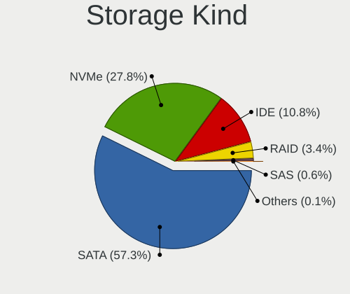

| Kind | Desktops | Percent |
|------|----------|---------|
| SATA | 904      | 57.29%  |
| NVMe | 438      | 27.76%  |
| IDE  | 171      | 10.84%  |
| RAID | 54       | 3.42%   |
| SAS  | 9        | 0.57%   |
| SCSI | 2        | 0.13%   |

Processor
---------

CPU Vendor
----------

Processor vendors

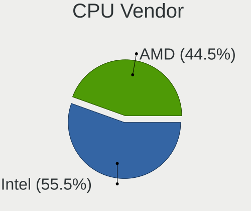

| Vendor | Desktops | Percent |
|--------|----------|---------|
| Intel  | 567      | 55.48%  |
| AMD    | 455      | 44.52%  |

CPU Model
---------

Processor models

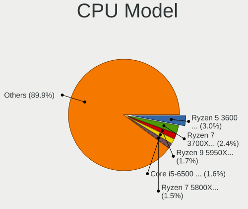

| Model                                       | Desktops | Percent |
|---------------------------------------------|----------|---------|
| AMD Ryzen 5 3600 6-Core Processor           | 31       | 3.02%   |
| AMD Ryzen 7 3700X 8-Core Processor          | 25       | 2.43%   |
| AMD Ryzen 9 5950X 16-Core Processor         | 17       | 1.65%   |
| Intel Core i5-6500 CPU @ 3.20GHz            | 16       | 1.56%   |
| AMD Ryzen 7 5800X3D 8-Core Processor        | 15       | 1.46%   |
| AMD Ryzen 5 5600X 6-Core Processor          | 15       | 1.46%   |
| AMD Ryzen 5 2600 Six-Core Processor         | 15       | 1.46%   |
| Intel Core i5-4570 CPU @ 3.20GHz            | 14       | 1.36%   |
| Intel Core i5-6600K CPU @ 3.50GHz           | 13       | 1.26%   |
| AMD Ryzen 9 5900X 12-Core Processor         | 13       | 1.26%   |
| Intel Core i7-6700K CPU @ 4.00GHz           | 12       | 1.17%   |
| Intel Core i5-2400 CPU @ 3.10GHz            | 12       | 1.17%   |
| AMD Ryzen 7 5800X 8-Core Processor          | 12       | 1.17%   |
| Intel Core i5-3470 CPU @ 3.20GHz            | 11       | 1.07%   |
| AMD Ryzen 9 3900X 12-Core Processor         | 11       | 1.07%   |
| Intel Core 2 Duo CPU E8400 @ 3.00GHz        | 10       | 0.97%   |
| AMD FX-8350 Eight-Core Processor            | 10       | 0.97%   |
| Intel Core i7-7700 CPU @ 3.60GHz            | 9        | 0.88%   |
| Intel Core i7-4770 CPU @ 3.40GHz            | 9        | 0.88%   |
| AMD Ryzen 7 1700 Eight-Core Processor       | 9        | 0.88%   |
| AMD Ryzen 5 7600X 6-Core Processor          | 9        | 0.88%   |
| Intel Core i7-9700K CPU @ 3.60GHz           | 8        | 0.78%   |
| Intel Core i7-8700K CPU @ 3.70GHz           | 8        | 0.78%   |
| Intel Core i7-8700 CPU @ 3.20GHz            | 8        | 0.78%   |
| Intel Core i7-6700 CPU @ 3.40GHz            | 8        | 0.78%   |
| Intel Core i5-8400 CPU @ 2.80GHz            | 8        | 0.78%   |
| Intel Core i5-3570K CPU @ 3.40GHz           | 8        | 0.78%   |
| Intel Core i5-2500K CPU @ 3.30GHz           | 8        | 0.78%   |
| AMD Ryzen 7 7800X3D 8-Core Processor        | 8        | 0.78%   |
| Intel Core i7-4790K CPU @ 4.00GHz           | 7        | 0.68%   |
| Intel Core i7-3770 CPU @ 3.40GHz            | 7        | 0.68%   |
| Intel Core i5-6400 CPU @ 2.70GHz            | 7        | 0.68%   |
| AMD Ryzen 7 9800X3D 8-Core Processor        | 7        | 0.68%   |
| AMD Ryzen 7 5700G with Radeon Graphics      | 7        | 0.68%   |
| AMD Ryzen 7 2700X Eight-Core Processor      | 7        | 0.68%   |
| AMD Ryzen 5 2400G with Radeon Vega Graphics | 7        | 0.68%   |
| AMD Ryzen 5 1600 Six-Core Processor         | 7        | 0.68%   |
| Intel Core i7-4790 CPU @ 3.60GHz            | 6        | 0.58%   |
| Intel Core i5-9600K CPU @ 3.70GHz           | 6        | 0.58%   |
| Intel Core i3-4130 CPU @ 3.40GHz            | 6        | 0.58%   |

CPU Model Family
----------------

Processor model prefix

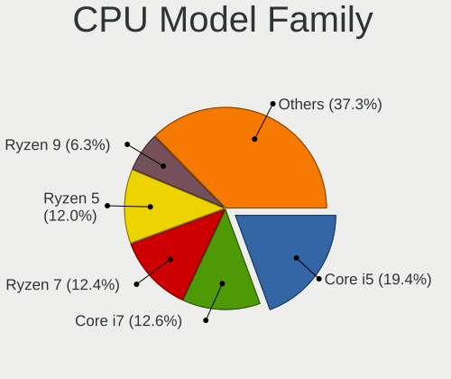

| Model                   | Desktops | Percent |
|-------------------------|----------|---------|
| Intel Core i5           | 199      | 19.4%   |
| Intel Core i7           | 129      | 12.57%  |
| AMD Ryzen 7             | 127      | 12.38%  |
| AMD Ryzen 5             | 123      | 11.99%  |
| AMD Ryzen 9             | 65       | 6.34%   |
| Intel Core i3           | 51       | 4.97%   |
| Intel Xeon              | 44       | 4.29%   |
| Other                   | 36       | 3.51%   |
| AMD FX                  | 32       | 3.12%   |
| Intel Pentium           | 23       | 2.24%   |
| Intel Celeron           | 22       | 2.14%   |
| Intel Core 2 Duo        | 20       | 1.95%   |
| AMD Phenom II X4        | 15       | 1.46%   |
| Intel Core 2 Quad       | 14       | 1.36%   |
| AMD Athlon II X2        | 14       | 1.36%   |
| AMD Athlon 64 X2        | 13       | 1.27%   |
| Intel Pentium Dual-Core | 9        | 0.88%   |
| Intel Core i9           | 8        | 0.78%   |
| AMD Ryzen 3             | 8        | 0.78%   |
| AMD Phenom              | 6        | 0.58%   |
| Intel Core 2            | 5        | 0.49%   |
| AMD Phenom II X6        | 5        | 0.49%   |
| AMD A10                 | 5        | 0.49%   |
| Intel Pentium 4         | 4        | 0.39%   |
| AMD Ryzen Threadripper  | 4        | 0.39%   |
| AMD A4                  | 4        | 0.39%   |
| Intel Atom              | 3        | 0.29%   |
| AMD Ryzen 7 PRO         | 3        | 0.29%   |
| AMD G                   | 3        | 0.29%   |
| AMD Athlon II X4        | 3        | 0.29%   |
| AMD Athlon Dual Core    | 3        | 0.29%   |
| AMD Athlon              | 3        | 0.29%   |
| Intel Core              | 2        | 0.19%   |
| AMD Sempron             | 2        | 0.19%   |
| AMD GX                  | 2        | 0.19%   |
| AMD E1                  | 2        | 0.19%   |
| AMD A8                  | 2        | 0.19%   |
| AMD A6                  | 2        | 0.19%   |
| Intel Pentium Dual      | 1        | 0.1%    |
| Intel Genuine           | 1        | 0.1%    |

CPU Cores
---------

Number of processor cores

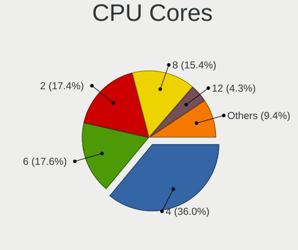

| Number | Desktops | Percent |
|--------|----------|---------|
| 4      | 369      | 36%     |
| 6      | 180      | 17.56%  |
| 2      | 178      | 17.37%  |
| 8      | 158      | 15.41%  |
| 12     | 44       | 4.29%   |
| 16     | 34       | 3.32%   |
| 1      | 18       | 1.76%   |
| 3      | 16       | 1.56%   |
| 14     | 10       | 0.98%   |
| 10     | 6        | 0.59%   |
| 24     | 4        | 0.39%   |
| 20     | 3        | 0.29%   |
| 28     | 2        | 0.2%    |
| 36     | 1        | 0.1%    |
| 32     | 1        | 0.1%    |
| 18     | 1        | 0.1%    |

CPU Sockets
-----------

Number of sockets

| Number | Desktops | Percent |
|--------|----------|---------|
| 1      | 1012     | 99.02%  |
| 2      | 8        | 0.78%   |
| 0      | 2        | 0.2%    |

CPU Threads
-----------

Threads per core (Hyper-Threading)

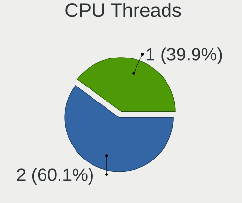

| Number | Desktops | Percent |
|--------|----------|---------|
| 2      | 616      | 60.1%   |
| 1      | 409      | 39.9%   |

CPU Op-Modes
------------

CPU Operation Modes (32-bit, 64-bit)

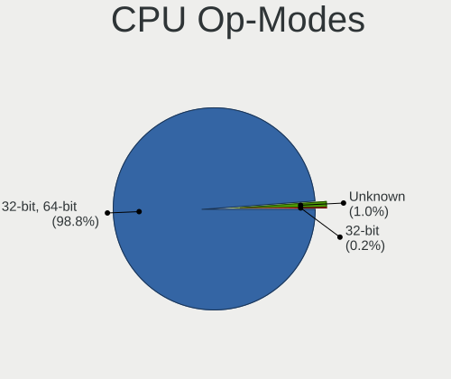

| Op mode        | Desktops | Percent |
|----------------|----------|---------|
| 32-bit, 64-bit | 1012     | 98.83%  |
| Unknown        | 10       | 0.98%   |
| 32-bit         | 2        | 0.2%    |

CPU Microcode
-------------

Microcode number

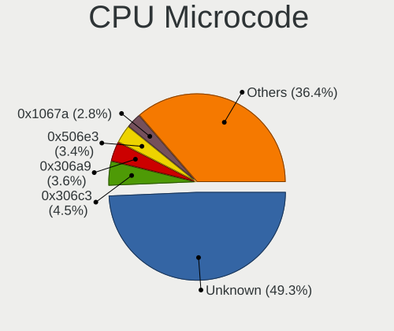

| Number     | Desktops | Percent |
|------------|----------|---------|
| Unknown    | 528      | 49.35%  |
| 0x306c3    | 48       | 4.49%   |
| 0x306a9    | 39       | 3.64%   |
| 0x506e3    | 36       | 3.36%   |
| 0x1067a    | 30       | 2.8%    |
| 0x08701021 | 28       | 2.62%   |
| 0x206a7    | 27       | 2.52%   |
| 0x0800820d | 20       | 1.87%   |
| 0x906ea    | 16       | 1.5%    |
| 0x0a201016 | 16       | 1.5%    |
| 0x08701013 | 16       | 1.5%    |
| 0x06000852 | 14       | 1.31%   |
| 0x010000c8 | 14       | 1.31%   |
| 0x906e9    | 12       | 1.12%   |
| 0x906eb    | 8        | 0.75%   |
| 0x08001137 | 8        | 0.75%   |
| 0x0a601203 | 7        | 0.65%   |
| 0x0a201009 | 7        | 0.65%   |
| 0x08701030 | 7        | 0.65%   |
| 0x08001138 | 7        | 0.65%   |
| 0x906ec    | 6        | 0.56%   |
| 0x20655    | 6        | 0.56%   |
| 0x20652    | 6        | 0.56%   |
| 0x106e5    | 6        | 0.56%   |
| 0x40651    | 5        | 0.47%   |
| 0x106a5    | 5        | 0.47%   |
| 0x0a50000d | 5        | 0.47%   |
| 0x0a20120e | 5        | 0.47%   |
| 0x010000db | 5        | 0.47%   |
| 0xf41      | 4        | 0.37%   |
| 0x6fd      | 4        | 0.37%   |
| 0x6fb      | 4        | 0.37%   |
| 0x08108109 | 4        | 0.37%   |
| 0x06001119 | 4        | 0.37%   |
| 0x010000dc | 4        | 0.37%   |
| 0xb06f2    | 3        | 0.28%   |
| 0xa0653    | 3        | 0.28%   |
| 0x906ed    | 3        | 0.28%   |
| 0x6f6      | 3        | 0.28%   |
| 0x50654    | 3        | 0.28%   |

CPU Microarch
-------------

Microarchitecture

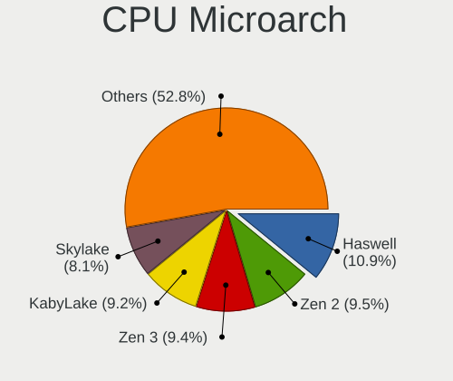

| Name             | Desktops | Percent |
|------------------|----------|---------|
| Haswell          | 112      | 10.89%  |
| Zen 2            | 98       | 9.53%   |
| Zen 3            | 97       | 9.44%   |
| KabyLake         | 95       | 9.24%   |
| Skylake          | 83       | 8.07%   |
| Unknown          | 79       | 7.68%   |
| IvyBridge        | 66       | 6.42%   |
| SandyBridge      | 50       | 4.86%   |
| K10              | 46       | 4.47%   |
| Zen              | 44       | 4.28%   |
| Zen+             | 39       | 3.79%   |
| Penryn           | 38       | 3.7%    |
| Piledriver       | 33       | 3.21%   |
| K8 Hammer        | 19       | 1.85%   |
| Nehalem          | 17       | 1.65%   |
| Core             | 17       | 1.65%   |
| Alderlake Hybrid | 16       | 1.56%   |
| Westmere         | 15       | 1.46%   |
| CometLake        | 13       | 1.26%   |
| Silvermont       | 9        | 0.88%   |
| Steamroller      | 6        | 0.58%   |
| NetBurst         | 6        | 0.58%   |
| Jaguar           | 6        | 0.58%   |
| Bulldozer        | 6        | 0.58%   |
| Broadwell        | 5        | 0.49%   |
| Bobcat           | 3        | 0.29%   |
| Goldmont plus    | 2        | 0.19%   |
| Bonnell          | 2        | 0.19%   |
| TigerLake        | 1        | 0.1%    |
| Lunarlake Hybrid | 1        | 0.1%    |
| K10 Llano        | 1        | 0.1%    |
| Icelake          | 1        | 0.1%    |
| Goldmont         | 1        | 0.1%    |
| Excavator        | 1        | 0.1%    |

Graphics
--------

GPU Vendor
----------

Vendors of graphics cards

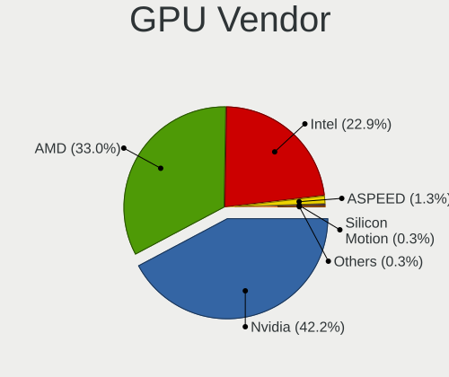

| Vendor                                       | Desktops | Percent |
|----------------------------------------------|----------|---------|
| Nvidia                                       | 473      | 42.23%  |
| AMD                                          | 370      | 33.04%  |
| Intel                                        | 256      | 22.86%  |
| ASPEED Technology                            | 15       | 1.34%   |
| Silicon Motion                               | 3        | 0.27%   |
| Matrox Electronics Systems                   | 2        | 0.18%   |
| XGI Technology (eXtreme Graphics Innovation) | 1        | 0.09%   |

GPU Model
---------

Graphics card models

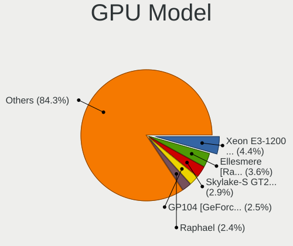

| Model                                                                                    | Desktops | Percent |
|------------------------------------------------------------------------------------------|----------|---------|
| Intel Xeon E3-1200 v3/4th Gen Core Processor Integrated Graphics Controller              | 52       | 4.41%   |
| AMD Ellesmere [Radeon RX 470/480/570/570X/580/580X/590]                                  | 42       | 3.56%   |
| Intel Skylake-S GT2 [HD Graphics 530]                                                    | 34       | 2.88%   |
| Nvidia GP104 [GeForce GTX 1070]                                                          | 29       | 2.46%   |
| AMD Raphael                                                                              | 28       | 2.37%   |
| Intel CoffeeLake-S GT2 [UHD Graphics 630]                                                | 24       | 2.04%   |
| Nvidia GP106 [GeForce GTX 1060 6GB]                                                      | 22       | 1.87%   |
| Intel 2nd Generation Core Processor Family Integrated Graphics Controller                | 22       | 1.87%   |
| Intel Xeon E3-1200 v2/3rd Gen Core processor Graphics Controller                         | 21       | 1.78%   |
| AMD Navi 10 [Radeon RX 5600 OEM/5600 XT / 5700/5700 XT]                                  | 19       | 1.61%   |
| AMD Navi 31 [Radeon RX 7900 XT/7900 XTX/7900 GRE/7900M]                                  | 18       | 1.53%   |
| Nvidia GP107 [GeForce GTX 1050 Ti]                                                       | 17       | 1.44%   |
| Nvidia GM206 [GeForce GTX 960]                                                           | 17       | 1.44%   |
| AMD Navi 22 [Radeon RX 6700/6700 XT/6750 XT / 6800M/6850M XT]                            | 16       | 1.36%   |
| Nvidia GK208B [GeForce GT 710]                                                           | 15       | 1.27%   |
| ASPEED Technology ASPEED Graphics Family                                                 | 15       | 1.27%   |
| AMD Vega 10 XL/XT [Radeon RX Vega 56/64]                                                 | 15       | 1.27%   |
| Nvidia TU117 [GeForce GTX 1650]                                                          | 14       | 1.19%   |
| AMD Navi 23 [Radeon RX 6600/6600 XT/6600M]                                               | 14       | 1.19%   |
| Nvidia GT218 [GeForce 210]                                                               | 13       | 1.1%    |
| Nvidia GP104 [GeForce GTX 1080]                                                          | 13       | 1.1%    |
| AMD Granite Ridge [Radeon Graphics]                                                      | 13       | 1.1%    |
| Nvidia GP102 [GeForce GTX 1080 Ti]                                                       | 12       | 1.02%   |
| Nvidia GM204 [GeForce GTX 970]                                                           | 12       | 1.02%   |
| Intel Kaby Lake-S GT2 [HD Graphics 630]                                                  | 12       | 1.02%   |
| Nvidia GA106 [GeForce RTX 3060 Lite Hash Rate]                                           | 11       | 0.93%   |
| Intel 4 Series Chipset Integrated Graphics Controller                                    | 11       | 0.93%   |
| AMD Navi 32 [Radeon RX 7700 XT / 7800 XT]                                                | 11       | 0.93%   |
| AMD Cezanne [Radeon Vega Series / Radeon Vega Mobile Series]                             | 11       | 0.93%   |
| Nvidia TU116 [GeForce GTX 1660 SUPER]                                                    | 10       | 0.85%   |
| Nvidia GP108 [GeForce GT 1030]                                                           | 10       | 0.85%   |
| Intel Alder Lake-S GT1 [UHD Graphics 770]                                                | 9        | 0.76%   |
| AMD Raven Ridge [Radeon Vega Series / Radeon Vega Mobile Series]                         | 9        | 0.76%   |
| AMD Navi 48 [Radeon RX 9070/9070 XT/9070 GRE]                                            | 9        | 0.76%   |
| Nvidia GP104 [GeForce GTX 1070 Ti]                                                       | 8        | 0.68%   |
| Nvidia GM107 [GeForce GTX 750 Ti]                                                        | 8        | 0.68%   |
| Nvidia GK107 [GeForce GTX 650]                                                           | 8        | 0.68%   |
| Nvidia GA102 [GeForce RTX 3090]                                                          | 8        | 0.68%   |
| Intel IvyBridge GT2 [HD Graphics 4000]                                                   | 8        | 0.68%   |
| Intel Atom/Celeron/Pentium Processor x5-E8000/J3xxx/N3xxx Integrated Graphics Controller | 8        | 0.68%   |

GPU Combo
---------

Combinations of graphics cards

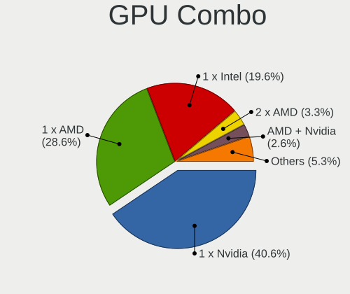

| Name               | Desktops | Percent |
|--------------------|----------|---------|
| 1 x Nvidia         | 424      | 40.57%  |
| 1 x AMD            | 299      | 28.61%  |
| 1 x Intel          | 205      | 19.62%  |
| 2 x AMD            | 35       | 3.35%   |
| AMD + Nvidia       | 27       | 2.58%   |
| Intel + Nvidia     | 16       | 1.53%   |
| 1 x ASPEED         | 15       | 1.44%   |
| 2 x Nvidia         | 9        | 0.86%   |
| Intel + AMD        | 7        | 0.67%   |
| 1 x Silicon Motion | 3        | 0.29%   |
| Other              | 1        | 0.1%    |
| 2 x Intel          | 1        | 0.1%    |
| 1 x XGI            | 1        | 0.1%    |
| Nvidia + Matrox    | 1        | 0.1%    |
| 1 x Matrox         | 1        | 0.1%    |

GPU Driver
----------

Free vs proprietary

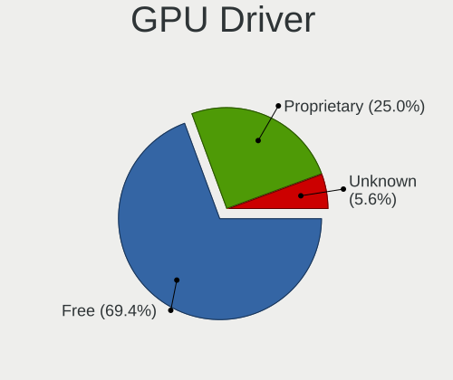

| Driver      | Desktops | Percent |
|-------------|----------|---------|
| Free        | 730      | 69.39%  |
| Proprietary | 263      | 25%     |
| Unknown     | 59       | 5.61%   |

GPU Memory
----------

Total video memory

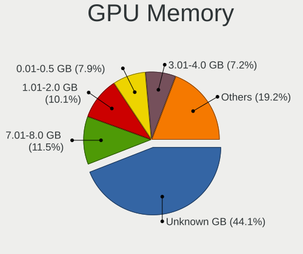

| Size in GB | Desktops | Percent |
|------------|----------|---------|
| Unknown    | 475      | 44.06%  |
| 7.01-8.0   | 124      | 11.5%   |
| 1.01-2.0   | 109      | 10.11%  |
| 0.01-0.5   | 85       | 7.88%   |
| 3.01-4.0   | 78       | 7.24%   |
| 0.51-1.0   | 73       | 6.77%   |
| 8.01-16.0  | 59       | 5.47%   |
| 5.01-6.0   | 43       | 3.99%   |
| 16.01-24.0 | 17       | 1.58%   |
| 2.01-3.0   | 14       | 1.3%    |
| 4.01-5.0   | 1        | 0.09%   |

Monitor
-------

Monitor Vendor
--------------

Monitor vendors

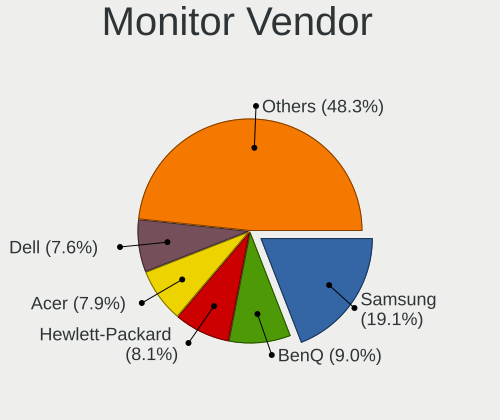

| Vendor               | Desktops | Percent |
|----------------------|----------|---------|
| Samsung Electronics  | 228      | 19.1%   |
| BenQ                 | 107      | 8.96%   |
| Hewlett-Packard      | 97       | 8.12%   |
| Acer                 | 94       | 7.87%   |
| Dell                 | 91       | 7.62%   |
| Ancor Communications | 86       | 7.2%    |
| Goldstar             | 72       | 6.03%   |
| Lenovo               | 59       | 4.94%   |
| ASUSTek Computer     | 54       | 4.52%   |
| AOC                  | 47       | 3.94%   |
| Fujitsu Siemens      | 32       | 2.68%   |
| Sony                 | 31       | 2.6%    |
| Philips              | 25       | 2.09%   |
| ViewSonic            | 19       | 1.59%   |
| MSI                  | 16       | 1.34%   |
| Eizo                 | 14       | 1.17%   |
| LG Electronics       | 11       | 0.92%   |
| Vestel Elektronik    | 9        | 0.75%   |
| Unknown              | 9        | 0.75%   |
| Panasonic            | 6        | 0.5%    |
| Gigabyte Technology  | 6        | 0.5%    |
| Denver               | 5        | 0.42%   |
| NEC Computers        | 4        | 0.34%   |
| HUAWEI               | 4        | 0.34%   |
| FUS                  | 4        | 0.34%   |
| Toshiba              | 3        | 0.25%   |
| Packard Bell         | 3        | 0.25%   |
| Onkyo                | 3        | 0.25%   |
| Iiyama               | 3        | 0.25%   |
| Unknown              | 3        | 0.25%   |
| Wacom                | 2        | 0.17%   |
| Tech Concepts        | 2        | 0.17%   |
| Lenovo Group Limited | 2        | 0.17%   |
| Huion                | 2        | 0.17%   |
| Hitachi              | 2        | 0.17%   |
| DENON                | 2        | 0.17%   |
| CMT                  | 2        | 0.17%   |
| AUS                  | 2        | 0.17%   |
| Apple                | 2        | 0.17%   |
| Xiaomi               | 1        | 0.08%   |

Monitor Model
-------------

Monitor models

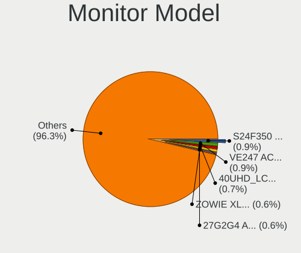

| Model                                                                 | Desktops | Percent |
|-----------------------------------------------------------------------|----------|---------|
| Samsung Electronics S24F350 SAM0D20 1920x1080 521x293mm 23.5-inch     | 11       | 0.87%   |
| Ancor Communications VE247 ACI2493 1920x1080 530x300mm 24.0-inch      | 11       | 0.87%   |
| Vestel Elektronik 40UHD_LCD_TV VES3700 3840x2160 880x500mm 39.8-inch  | 9        | 0.71%   |
| BenQ ZOWIE XL LCD BNQ7F32 1920x1080 531x298mm 24.0-inch               | 8        | 0.63%   |
| AOC 27G2G4 AOC2702 1920x1080 598x336mm 27.0-inch                      | 8        | 0.63%   |
| BenQ XL2411Z BNQ7F31 1920x1080 531x298mm 24.0-inch                    | 7        | 0.55%   |
| Ancor Communications ROG PG279Q ACI27EC 2560x1440 598x336mm 27.0-inch | 7        | 0.55%   |
| Ancor Communications ASUS VS247 ACI249A 1920x1080 521x293mm 23.5-inch | 7        | 0.55%   |
| Ancor Communications VG248 ACI24A4 1920x1080 531x299mm 24.0-inch      | 6        | 0.47%   |
| Samsung Electronics LF24T35 SAM707D 1920x1080 528x297mm 23.9-inch     | 5        | 0.39%   |
| Lenovo LEN LT2452pwC LEN1144 1920x1080 518x324mm 24.1-inch            | 5        | 0.39%   |
| Goldstar LG TV SSCR2 GSMC0C8 3840x2160                                | 5        | 0.39%   |
| Denver MO-HHS-32C LHCFFFF 1920x1080 699x393mm 31.6-inch               | 5        | 0.39%   |
| BenQ ZOWIE XL LCD BNQ7F33 1920x1080 531x298mm 24.0-inch               | 5        | 0.39%   |
| Ancor Communications VG248 ACI24E1 1920x1080 531x299mm 24.0-inch      | 5        | 0.39%   |
| Unknown LCD Monitor FFFF 2288x1287 2550x2550mm 142.0-inch             | 4        | 0.31%   |
| Sony TV SNY0801 1360x768                                              | 4        | 0.31%   |
| Samsung Electronics U32J59x SAM0F35 3840x2160 697x392mm 31.5-inch     | 4        | 0.31%   |
| Samsung Electronics T27B300 SAM0933 1920x1080 598x336mm 27.0-inch     | 4        | 0.31%   |
| Samsung Electronics SyncMaster SAM011E 1280x1024 338x270mm 17.0-inch  | 4        | 0.31%   |
| Samsung Electronics LCD Monitor SAM0669 1920x1080                     | 4        | 0.31%   |
| Samsung Electronics C49RG9x SAM0F9C 3360x1440 1193x336mm 48.8-inch    | 4        | 0.31%   |
| LG Electronics LCD Monitor LG TV                                      | 4        | 0.31%   |
| Lenovo LEN P27q-10 LEN61A8 2560x1440 600x340mm 27.2-inch              | 4        | 0.31%   |
| HUAWEI ZQE-CBA HWV6A25 3440x1440 797x334mm 34.0-inch                  | 4        | 0.31%   |
| Hewlett-Packard Z23i HWP3090 1920x1080 509x286mm 23.0-inch            | 4        | 0.31%   |
| Hewlett-Packard w2408 HWP26CF 1920x1200 518x324mm 24.1-inch           | 4        | 0.31%   |
| Hewlett-Packard LA2405 HWP284B 1920x1200 518x324mm 24.1-inch          | 4        | 0.31%   |
| Hewlett-Packard E271i HWP3107 1920x1080 600x340mm 27.2-inch           | 4        | 0.31%   |
| BenQ G2420HDB BNQ7842 1920x1080 477x268mm 21.5-inch                   | 4        | 0.31%   |
| BenQ G2411HD BNQ7825 1920x1080 531x299mm 24.0-inch                    | 4        | 0.31%   |
| BenQ G2400W BNQ780A 1920x1200 519x324mm 24.1-inch                     | 4        | 0.31%   |
| AOC 2590G4 AOC2590 1920x1080 544x303mm 24.5-inch                      | 4        | 0.31%   |
| AOC 24B1W1 AOC2401 1920x1080 527x296mm 23.8-inch                      | 4        | 0.31%   |
| Ancor Communications ASUS MG28U ACI28A7 3840x2160 621x341mm 27.9-inch | 4        | 0.31%   |
| Ancor Communications ASUS MG279 ACI27A7 2560x1440 597x336mm 27.0-inch | 4        | 0.31%   |
| Acer KG241Q S ACR074D 1920x1080 521x293mm 23.5-inch                   | 4        | 0.31%   |
| Acer K242HL ACR03E3 1920x1080 531x299mm 24.0-inch                     | 4        | 0.31%   |
| Acer G245H ACR0114 1920x1080 531x299mm 24.0-inch                      | 4        | 0.31%   |
| Samsung Electronics T24D390 SAM0B6E 1920x1080 521x293mm 23.5-inch     | 3        | 0.24%   |

Monitor Resolution
------------------

Monitor screen resolution

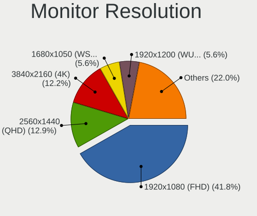

| Resolution         | Desktops | Percent |
|--------------------|----------|---------|
| 1920x1080 (FHD)    | 481      | 41.79%  |
| 2560x1440 (QHD)    | 148      | 12.86%  |
| 3840x2160 (4K)     | 140      | 12.16%  |
| 1680x1050 (WSXGA+) | 65       | 5.65%   |
| 1920x1200 (WUXGA)  | 64       | 5.56%   |
| 1280x1024 (SXGA)   | 51       | 4.43%   |
| 3440x1440          | 46       | 4%      |
| Unknown            | 35       | 3.04%   |
| 1440x900 (WXGA+)   | 20       | 1.74%   |
| 1360x768           | 17       | 1.48%   |
| 3840x1080          | 16       | 1.39%   |
| 1366x768 (WXGA)    | 7        | 0.61%   |
| 2560x1080          | 6        | 0.52%   |
| 1920x540           | 6        | 0.52%   |
| 1600x900 (HD+)     | 6        | 0.52%   |
| 1280x720 (HD)      | 5        | 0.43%   |
| 4480x1440          | 4        | 0.35%   |
| 2288x1287          | 4        | 0.35%   |
| 3840x1200          | 3        | 0.26%   |
| 1600x1200          | 3        | 0.26%   |
| 5760x2160          | 2        | 0.17%   |
| 5120x1440          | 2        | 0.17%   |
| 3360x1050          | 2        | 0.17%   |
| 2560x1600          | 2        | 0.17%   |
| 1024x768 (XGA)     | 2        | 0.17%   |
| 7680x2160          | 1        | 0.09%   |
| 5760x1440          | 1        | 0.09%   |
| 5280x1080          | 1        | 0.09%   |
| 4480x1600          | 1        | 0.09%   |
| 3840x1600          | 1        | 0.09%   |
| 3520x1200          | 1        | 0.09%   |
| 3360x1080          | 1        | 0.09%   |
| 2726x768           | 1        | 0.09%   |
| 2560x2880          | 1        | 0.09%   |
| 2160x1200          | 1        | 0.09%   |
| 1834x1031          | 1        | 0.09%   |
| 1826x1027          | 1        | 0.09%   |
| 1400x1050          | 1        | 0.09%   |
| 1360x765           | 1        | 0.09%   |

Monitor Diagonal
----------------

Diagonal size in inches

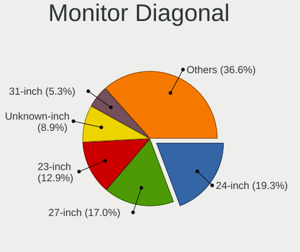

| Inches  | Desktops | Percent |
|---------|----------|---------|
| 24      | 227      | 19.27%  |
| 27      | 200      | 16.98%  |
| 23      | 152      | 12.9%   |
| Unknown | 105      | 8.91%   |
| 31      | 63       | 5.35%   |
| 22      | 57       | 4.84%   |
| 21      | 49       | 4.16%   |
| 34      | 48       | 4.07%   |
| 19      | 48       | 4.07%   |
| 84      | 30       | 2.55%   |
| 25      | 22       | 1.87%   |
| 18      | 18       | 1.53%   |
| 72      | 17       | 1.44%   |
| 20      | 15       | 1.27%   |
| 40      | 14       | 1.19%   |
| 32      | 14       | 1.19%   |
| 17      | 12       | 1.02%   |
| 54      | 10       | 0.85%   |
| 26      | 9        | 0.76%   |
| 49      | 6        | 0.51%   |
| 28      | 6        | 0.51%   |
| 65      | 5        | 0.42%   |
| 48      | 5        | 0.42%   |
| 142     | 4        | 0.34%   |
| 46      | 4        | 0.34%   |
| 33      | 4        | 0.34%   |
| 15      | 4        | 0.34%   |
| 75      | 3        | 0.25%   |
| 55      | 3        | 0.25%   |
| 43      | 3        | 0.25%   |
| 36      | 3        | 0.25%   |
| 29      | 3        | 0.25%   |
| 85      | 2        | 0.17%   |
| 42      | 2        | 0.17%   |
| 39      | 2        | 0.17%   |
| 13      | 2        | 0.17%   |
| 74      | 1        | 0.08%   |
| 52      | 1        | 0.08%   |
| 50      | 1        | 0.08%   |
| 47      | 1        | 0.08%   |

Monitor Width
-------------

Physical width

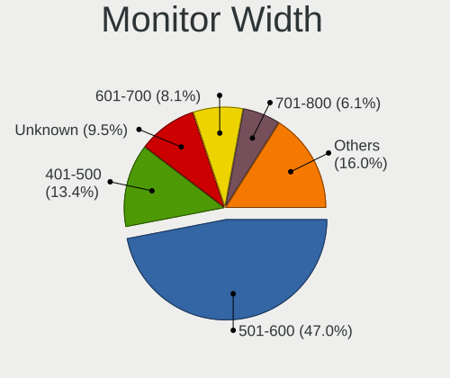

| Width in mm    | Desktops | Percent |
|----------------|----------|---------|
| 501-600        | 519      | 46.97%  |
| 401-500        | 148      | 13.39%  |
| Unknown        | 105      | 9.5%    |
| 601-700        | 89       | 8.05%   |
| 701-800        | 67       | 6.06%   |
| 1501-2000      | 53       | 4.8%    |
| 351-400        | 40       | 3.62%   |
| 1001-1500      | 36       | 3.26%   |
| 801-900        | 20       | 1.81%   |
| 301-350        | 16       | 1.45%   |
| 901-1000       | 5        | 0.45%   |
| More than 2000 | 4        | 0.36%   |
| 201-300        | 3        | 0.27%   |

Aspect Ratio
------------

Proportional relationship between the width and the height

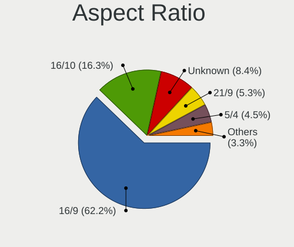

| Ratio   | Desktops | Percent |
|---------|----------|---------|
| 16/9    | 650      | 62.2%   |
| 16/10   | 170      | 16.27%  |
| Unknown | 88       | 8.42%   |
| 21/9    | 55       | 5.26%   |
| 5/4     | 47       | 4.5%    |
| 32/9    | 14       | 1.34%   |
| 4/3     | 7        | 0.67%   |
| 6/5     | 5        | 0.48%   |
| 3/2     | 4        | 0.38%   |
| 1.00    | 4        | 0.38%   |
| 0.89    | 1        | 0.1%    |

Monitor Area
------------

Area in inch²

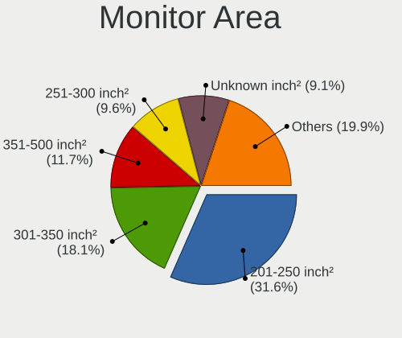

| Area in inch² | Desktops | Percent |
|----------------|----------|---------|
| 201-250        | 363      | 31.59%  |
| 301-350        | 208      | 18.1%   |
| 351-500        | 134      | 11.66%  |
| 251-300        | 110      | 9.57%   |
| Unknown        | 105      | 9.14%   |
| 151-200        | 86       | 7.48%   |
| More than 1000 | 77       | 6.7%    |
| 501-1000       | 41       | 3.57%   |
| 141-150        | 18       | 1.57%   |
| 101-110        | 5        | 0.44%   |
| 71-80          | 2        | 0.17%   |

Pixel Density
-------------

Pixels per inch

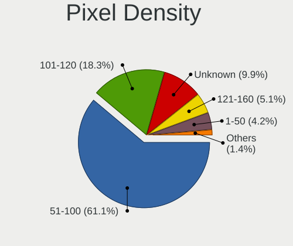

| Density | Desktops | Percent |
|---------|----------|---------|
| 51-100  | 651      | 61.13%  |
| 101-120 | 195      | 18.31%  |
| Unknown | 105      | 9.86%   |
| 121-160 | 54       | 5.07%   |
| 1-50    | 45       | 4.23%   |
| 161-240 | 15       | 1.41%   |

Multiple Monitors
-----------------

Total monitors connected

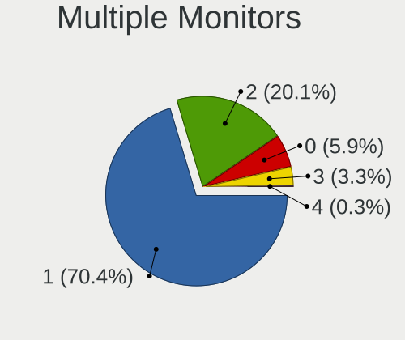

| Total | Desktops | Percent |
|-------|----------|---------|
| 1     | 741      | 70.37%  |
| 2     | 212      | 20.13%  |
| 0     | 62       | 5.89%   |
| 3     | 35       | 3.32%   |
| 4     | 3        | 0.28%   |

Network
-------

Net Controller Vendor
---------------------

Controller vendors

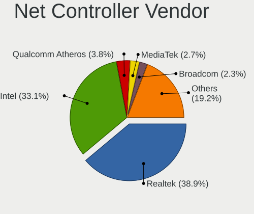

| Vendor                                 | Desktops | Percent |
|----------------------------------------|----------|---------|
| Realtek Semiconductor                  | 579      | 38.94%  |
| Intel                                  | 492      | 33.09%  |
| Qualcomm Atheros                       | 57       | 3.83%   |
| MediaTek                               | 40       | 2.69%   |
| Broadcom                               | 34       | 2.29%   |
| TP-Link                                | 28       | 1.88%   |
| Ralink                                 | 24       | 1.61%   |
| Samsung Electronics                    | 20       | 1.34%   |
| Nvidia                                 | 19       | 1.28%   |
| Ralink Technology                      | 17       | 1.14%   |
| Huawei Technologies                    | 17       | 1.14%   |
| ASUSTek Computer                       | 16       | 1.08%   |
| Microsoft                              | 12       | 0.81%   |
| Marvell Technology Group               | 11       | 0.74%   |
| Xiaomi                                 | 10       | 0.67%   |
| Aquantia                               | 9        | 0.61%   |
| Broadcom Limited                       | 7        | 0.47%   |
| OPPO Electronics                       | 6        | 0.4%    |
| D-Link                                 | 6        | 0.4%    |
| ZyXEL Communications                   | 5        | 0.34%   |
| D-Link System                          | 5        | 0.34%   |
| ZyDAS                                  | 4        | 0.27%   |
| Qualcomm Technologies                  | 4        | 0.27%   |
| Motorola PCS                           | 4        | 0.27%   |
| ASIX Electronics                       | 4        | 0.27%   |
| NetGear                                | 3        | 0.2%    |
| Microchip Technology                   | 3        | 0.2%    |
| HMD Global                             | 3        | 0.2%    |
| Gemtek                                 | 3        | 0.2%    |
| BUFFALO                                | 3        | 0.2%    |
| 3Com                                   | 3        | 0.2%    |
| Sony Ericsson Mobile Communications AB | 2        | 0.13%   |
| Raspberry Pi                           | 2        | 0.13%   |
| Qualcomm                               | 2        | 0.13%   |
| Mellanox Technologies                  | 2        | 0.13%   |
| Linksys                                | 2        | 0.13%   |
| Lenovo                                 | 2        | 0.13%   |
| Google                                 | 2        | 0.13%   |
| Edimax Technology                      | 2        | 0.13%   |
| DisplayLink                            | 2        | 0.13%   |

Net Controller Model
--------------------

Controller models

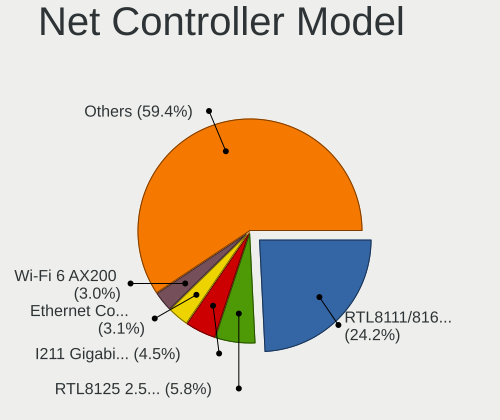

| Model                                                                  | Desktops | Percent |
|------------------------------------------------------------------------|----------|---------|
| Realtek RTL8111/8168/8211/8411 PCI Express Gigabit Ethernet Controller | 410      | 24.22%  |
| Realtek RTL8125 2.5GbE Controller                                      | 99       | 5.85%   |
| Intel I211 Gigabit Network Connection                                  | 76       | 4.49%   |
| Intel Ethernet Connection (2) I219-V                                   | 53       | 3.13%   |
| Intel Wi-Fi 6 AX200                                                    | 50       | 2.95%   |
| Intel 82579LM Gigabit Network Connection (Lewisville)                  | 41       | 2.42%   |
| Intel Ethernet Controller I225-V                                       | 37       | 2.19%   |
| Intel Ethernet Connection I217-LM                                      | 30       | 1.77%   |
| Intel Ethernet Connection (2) I219-LM                                  | 25       | 1.48%   |
| Intel Ethernet Connection (7) I219-V                                   | 24       | 1.42%   |
| Realtek RTL8188EUS 802.11n Wireless Network Adapter                    | 21       | 1.24%   |
| Intel I210 Gigabit Network Connection                                  | 21       | 1.24%   |
| Intel 82579V Gigabit Network Connection                                | 21       | 1.24%   |
| Intel Ethernet Connection I217-V                                       | 18       | 1.06%   |
| MediaTek MT7922 802.11ax PCI Express Wireless Network Adapter          | 15       | 0.89%   |
| Intel Wi-Fi 6E(802.11ax) AX210/AX1675* 2x2 [Typhoon Peak]              | 15       | 0.89%   |
| Intel Dual Band Wireless-AC 3168NGW [Stone Peak]                       | 15       | 0.89%   |
| Nvidia MCP61 Ethernet                                                  | 14       | 0.83%   |
| Samsung Galaxy series, misc. (tethering mode)                          | 13       | 0.77%   |
| Intel Ethernet Connection (2) I218-V                                   | 13       | 0.77%   |
| Intel 82574L Gigabit Network Connection                                | 13       | 0.77%   |
| Intel Wi-Fi 5(802.11ac) Wireless-AC 9x6x [Thunder Peak]                | 12       | 0.71%   |
| Intel 82567LM-3 Gigabit Network Connection                             | 12       | 0.71%   |
| Broadcom BCM4360 802.11ac Dual Band Wireless Network Adapter           | 11       | 0.65%   |
| Realtek RTL8822BE 802.11a/b/g/n/ac WiFi adapter                        | 10       | 0.59%   |
| Realtek RTL8153 Gigabit Ethernet Adapter                               | 10       | 0.59%   |
| Realtek 802.11ac NIC                                                   | 9        | 0.53%   |
| Intel Ethernet Controller I226-V                                       | 9        | 0.53%   |
| Intel Cannon Lake PCH CNVi WiFi                                        | 9        | 0.53%   |
| Realtek RTL8852BE PCIe 802.11ax Wireless Network Controller            | 8        | 0.47%   |
| Realtek RTL8821CE 802.11ac PCIe Wireless Network Adapter               | 8        | 0.47%   |
| Realtek RTL-8100/8101L/8139 PCI Fast Ethernet Adapter                  | 8        | 0.47%   |
| Intel Wireless 8260                                                    | 8        | 0.47%   |
| Huawei FOA-LX9                                                         | 8        | 0.47%   |
| Samsung GT-I9070 (network tethering, USB debugging enabled)            | 7        | 0.41%   |
| Realtek RTL8821AE 802.11ac PCIe Wireless Network Adapter               | 7        | 0.41%   |
| Realtek RTL-8185 IEEE 802.11a/b/g Wireless LAN Controller              | 7        | 0.41%   |
| Ralink RT2790 Wireless 802.11n 1T/2R PCIe                              | 7        | 0.41%   |
| MediaTek MT7921 802.11ax PCIe Wireless Network Adapter [Filogic 330]   | 7        | 0.41%   |
| Intel Wireless 7260                                                    | 7        | 0.41%   |

Wireless Vendor
---------------

Wireless vendors

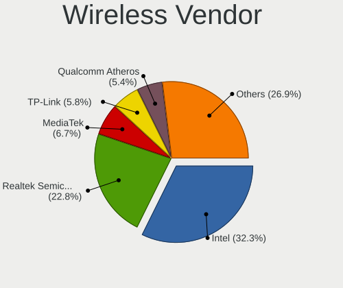

| Vendor                          | Desktops | Percent |
|---------------------------------|----------|---------|
| Intel                           | 150      | 32.33%  |
| Realtek Semiconductor           | 106      | 22.84%  |
| MediaTek                        | 31       | 6.68%   |
| TP-Link                         | 27       | 5.82%   |
| Qualcomm Atheros                | 25       | 5.39%   |
| Ralink                          | 24       | 5.17%   |
| Broadcom                        | 21       | 4.53%   |
| Ralink Technology               | 17       | 3.66%   |
| ASUSTek Computer                | 16       | 3.45%   |
| Microsoft                       | 12       | 2.59%   |
| ZyXEL Communications            | 5        | 1.08%   |
| D-Link                          | 5        | 1.08%   |
| ZyDAS                           | 4        | 0.86%   |
| D-Link System                   | 4        | 0.86%   |
| NetGear                         | 3        | 0.65%   |
| Gemtek                          | 3        | 0.65%   |
| BUFFALO                         | 3        | 0.65%   |
| Edimax Technology               | 2        | 0.43%   |
| Qualcomm Technologies           | 1        | 0.22%   |
| Qualcomm Atheros Communications | 1        | 0.22%   |
| Linksys                         | 1        | 0.22%   |
| LG Electronics                  | 1        | 0.22%   |
| Chu Yuen Enterprise             | 1        | 0.22%   |
| Broadcom Limited                | 1        | 0.22%   |

Wireless Model
--------------

Wireless models

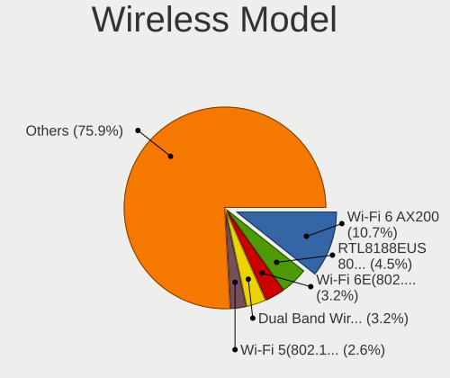

| Model                                                                | Desktops | Percent |
|----------------------------------------------------------------------|----------|---------|
| Intel Wi-Fi 6 AX200                                                  | 50       | 10.68%  |
| Realtek RTL8188EUS 802.11n Wireless Network Adapter                  | 21       | 4.49%   |
| Intel Wi-Fi 6E(802.11ax) AX210/AX1675* 2x2 [Typhoon Peak]            | 15       | 3.21%   |
| Intel Dual Band Wireless-AC 3168NGW [Stone Peak]                     | 15       | 3.21%   |
| Intel Wi-Fi 5(802.11ac) Wireless-AC 9x6x [Thunder Peak]              | 12       | 2.56%   |
| MediaTek MT7922 802.11ax PCI Express Wireless Network Adapter        | 11       | 2.35%   |
| Broadcom BCM4360 802.11ac Dual Band Wireless Network Adapter         | 11       | 2.35%   |
| Realtek RTL8822BE 802.11a/b/g/n/ac WiFi adapter                      | 10       | 2.14%   |
| Realtek 802.11ac NIC                                                 | 9        | 1.92%   |
| Intel Cannon Lake PCH CNVi WiFi                                      | 9        | 1.92%   |
| Realtek RTL8821CE 802.11ac PCIe Wireless Network Adapter             | 8        | 1.71%   |
| Intel Wireless 8260                                                  | 8        | 1.71%   |
| Realtek RTL8852BE PCIe 802.11ax Wireless Network Controller          | 7        | 1.5%    |
| Realtek RTL8821AE 802.11ac PCIe Wireless Network Adapter             | 7        | 1.5%    |
| Realtek RTL-8185 IEEE 802.11a/b/g Wireless LAN Controller            | 7        | 1.5%    |
| Ralink RT2790 Wireless 802.11n 1T/2R PCIe                            | 7        | 1.5%    |
| MediaTek MT7921 802.11ax PCIe Wireless Network Adapter [Filogic 330] | 7        | 1.5%    |
| Intel Wireless 7260                                                  | 7        | 1.5%    |
| Intel 700 Series Chipset CNVi WiFi                                   | 7        | 1.5%    |
| Realtek RTL8812AE 802.11ac PCIe Wireless Network Adapter             | 6        | 1.28%   |
| Realtek RTL8192EE PCIe Wireless Network Adapter                      | 6        | 1.28%   |
| Ralink RT2870/RT3070 Wireless Adapter                                | 6        | 1.28%   |
| Ralink RT5390 Wireless 802.11n 1T/1R PCIe                            | 6        | 1.28%   |
| Qualcomm Atheros AR9287 Wireless Network Adapter (PCI-Express)       | 6        | 1.28%   |
| MediaTek MT7921K (RZ608) Wi-Fi 6E 80MHz                              | 6        | 1.28%   |
| ASUS N10 Nano 802.11n Network Adapter [Realtek RTL8192CU]            | 6        | 1.28%   |
| TP-Link TL-WN823N v2/v3 [Realtek RTL8192EU]                          | 5        | 1.07%   |
| TP-Link TL-WN722N v2/v3 [Realtek RTL8188EUS]                         | 5        | 1.07%   |
| Ralink RT5370 Wireless Adapter                                       | 5        | 1.07%   |
| Microsoft Xbox 360 Wireless Adapter                                  | 5        | 1.07%   |
| Intel Comet Lake PCH CNVi WiFi                                       | 5        | 1.07%   |
| Broadcom BCM4352 802.11ac Dual Band Wireless Network Adapter         | 5        | 1.07%   |
| ZyDAS ZD1211B 802.11g                                                | 4        | 0.85%   |
| TP-Link Archer T3U [Realtek RTL8812BU]                               | 4        | 0.85%   |
| Realtek RTL8852CE PCIe 802.11ax Wireless Network Controller          | 4        | 0.85%   |
| Qualcomm Atheros QCA6174 802.11ac Wireless Network Adapter           | 4        | 0.85%   |
| Qualcomm Atheros AR9462 Wireless Network Adapter                     | 4        | 0.85%   |
| Microsoft Xbox Wireless Adapter for Windows                          | 4        | 0.85%   |
| TP-Link Archer T2U PLUS [RTL8821AU]                                  | 3        | 0.64%   |
| TP-Link 802.11ac WLAN Adapter                                        | 3        | 0.64%   |

Ethernet Vendor
---------------

Ethernet vendors

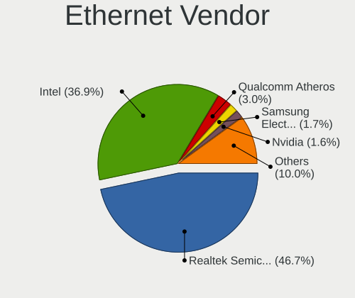

| Vendor                                 | Desktops | Percent |
|----------------------------------------|----------|---------|
| Realtek Semiconductor                  | 538      | 46.7%   |
| Intel                                  | 425      | 36.89%  |
| Qualcomm Atheros                       | 35       | 3.04%   |
| Samsung Electronics                    | 20       | 1.74%   |
| Nvidia                                 | 19       | 1.65%   |
| Huawei Technologies                    | 13       | 1.13%   |
| Broadcom                               | 13       | 1.13%   |
| Marvell Technology Group               | 11       | 0.95%   |
| Xiaomi                                 | 10       | 0.87%   |
| Aquantia                               | 9        | 0.78%   |
| MediaTek                               | 8        | 0.69%   |
| OPPO Electronics                       | 6        | 0.52%   |
| Broadcom Limited                       | 6        | 0.52%   |
| Motorola PCS                           | 4        | 0.35%   |
| ASIX Electronics                       | 4        | 0.35%   |
| Qualcomm Technologies                  | 3        | 0.26%   |
| HMD Global                             | 3        | 0.26%   |
| 3Com                                   | 3        | 0.26%   |
| Sony Ericsson Mobile Communications AB | 2        | 0.17%   |
| Qualcomm                               | 2        | 0.17%   |
| Mellanox Technologies                  | 2        | 0.17%   |
| Lenovo                                 | 2        | 0.17%   |
| Google                                 | 2        | 0.17%   |
| DisplayLink                            | 2        | 0.17%   |
| ADMtek                                 | 2        | 0.17%   |
| VIA Technologies                       | 1        | 0.09%   |
| TP-Link                                | 1        | 0.09%   |
| OnePlus Technology (Shenzhen)          | 1        | 0.09%   |
| Linksys                                | 1        | 0.09%   |
| D-Link System                          | 1        | 0.09%   |
| D-Link                                 | 1        | 0.09%   |
| American Megatrends                    | 1        | 0.09%   |
| AMD                                    | 1        | 0.09%   |

Ethernet Model
--------------

Ethernet models

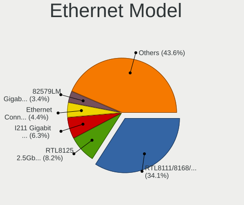

| Model                                                                  | Desktops | Percent |
|------------------------------------------------------------------------|----------|---------|
| Realtek RTL8111/8168/8211/8411 PCI Express Gigabit Ethernet Controller | 410      | 34.08%  |
| Realtek RTL8125 2.5GbE Controller                                      | 99       | 8.23%   |
| Intel I211 Gigabit Network Connection                                  | 76       | 6.32%   |
| Intel Ethernet Connection (2) I219-V                                   | 53       | 4.41%   |
| Intel 82579LM Gigabit Network Connection (Lewisville)                  | 41       | 3.41%   |
| Intel Ethernet Controller I225-V                                       | 37       | 3.08%   |
| Intel Ethernet Connection I217-LM                                      | 30       | 2.49%   |
| Intel Ethernet Connection (2) I219-LM                                  | 25       | 2.08%   |
| Intel Ethernet Connection (7) I219-V                                   | 24       | 2%      |
| Intel I210 Gigabit Network Connection                                  | 21       | 1.75%   |
| Intel 82579V Gigabit Network Connection                                | 21       | 1.75%   |
| Intel Ethernet Connection I217-V                                       | 18       | 1.5%    |
| Nvidia MCP61 Ethernet                                                  | 14       | 1.16%   |
| Samsung Galaxy series, misc. (tethering mode)                          | 13       | 1.08%   |
| Intel Ethernet Connection (2) I218-V                                   | 13       | 1.08%   |
| Intel 82574L Gigabit Network Connection                                | 13       | 1.08%   |
| Intel 82567LM-3 Gigabit Network Connection                             | 12       | 1%      |
| Realtek RTL8153 Gigabit Ethernet Adapter                               | 10       | 0.83%   |
| Intel Ethernet Controller I226-V                                       | 9        | 0.75%   |
| Realtek RTL-8100/8101L/8139 PCI Fast Ethernet Adapter                  | 8        | 0.67%   |
| Huawei FOA-LX9                                                         | 8        | 0.67%   |
| Samsung GT-I9070 (network tethering, USB debugging enabled)            | 7        | 0.58%   |
| Xiaomi Mi/Redmi series (RNDIS)                                         | 6        | 0.5%    |
| Realtek RTL8126 5GbE Controller                                        | 6        | 0.5%    |
| Realtek RTL810xE PCI Express Fast Ethernet controller                  | 6        | 0.5%    |
| Qualcomm Atheros Killer E2400 Gigabit Ethernet Controller              | 6        | 0.5%    |
| OPPO Ace 3V                                                            | 6        | 0.5%    |
| Marvell Group 88E8056 PCI-E Gigabit Ethernet Controller                | 6        | 0.5%    |
| Qualcomm Atheros Killer E220x Gigabit Ethernet Controller              | 5        | 0.42%   |
| Qualcomm Atheros AR8161 Gigabit Ethernet                               | 5        | 0.42%   |
| Intel I350 Gigabit Network Connection                                  | 5        | 0.42%   |
| Intel Ethernet Connection (7) I219-LM                                  | 5        | 0.42%   |
| Intel Ethernet Connection (2) I218-LM                                  | 5        | 0.42%   |
| Intel 82599ES 10-Gigabit SFI/SFP+ Network Connection                   | 5        | 0.42%   |
| Intel 82566DM-2 Gigabit Network Connection                             | 5        | 0.42%   |
| Huawei E353/E3131                                                      | 5        | 0.42%   |
| Xiaomi Mi/Redmi series (RNDIS + ADB)                                   | 4        | 0.33%   |
| Realtek RTL8169 PCI Gigabit Ethernet Controller                        | 4        | 0.33%   |
| Realtek Killer E3000 2.5GbE Controller                                 | 4        | 0.33%   |
| Qualcomm Atheros AR8131 Gigabit Ethernet                               | 4        | 0.33%   |

Net Controller Kind
-------------------

Ethernet, WiFi or modem

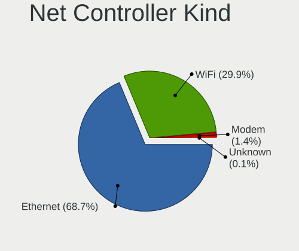

| Kind     | Desktops | Percent |
|----------|----------|---------|
| Ethernet | 1015     | 68.72%  |
| WiFi     | 441      | 29.86%  |
| Modem    | 20       | 1.35%   |
| Unknown  | 1        | 0.07%   |

Used Controller
---------------

Currently used network controller

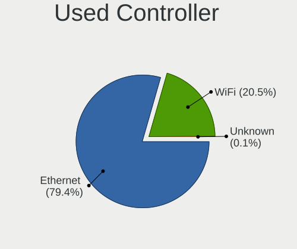

| Kind     | Desktops | Percent |
|----------|----------|---------|
| Ethernet | 819      | 79.44%  |
| WiFi     | 211      | 20.47%  |
| Unknown  | 1        | 0.1%    |

NICs
----

Total network controllers on board

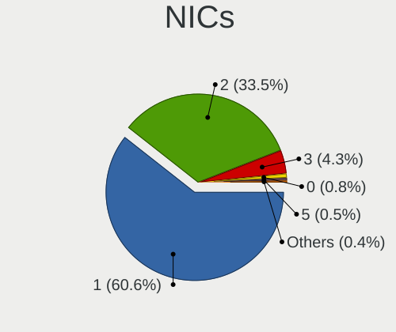

| Total | Desktops | Percent |
|-------|----------|---------|
| 1     | 625      | 60.62%  |
| 2     | 345      | 33.46%  |
| 3     | 44       | 4.27%   |
| 0     | 8        | 0.78%   |
| 5     | 5        | 0.48%   |
| 4     | 4        | 0.39%   |

IPv6
----

IPv6 vs IPv4

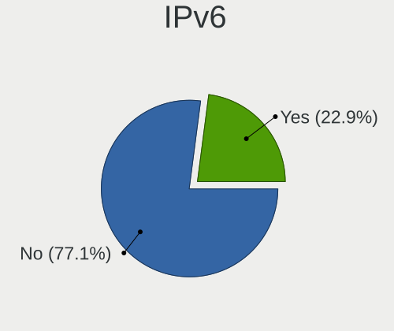

| Used | Desktops | Percent |
|------|----------|---------|
| No   | 813      | 77.06%  |
| Yes  | 242      | 22.94%  |

Bluetooth
---------

Bluetooth Vendor
----------------

Controller vendors

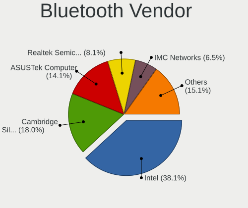

| Vendor                          | Desktops | Percent |
|---------------------------------|----------|---------|
| Intel                           | 146      | 38.12%  |
| Cambridge Silicon Radio         | 69       | 18.02%  |
| ASUSTek Computer                | 54       | 14.1%   |
| Realtek Semiconductor           | 31       | 8.09%   |
| IMC Networks                    | 25       | 6.53%   |
| Foxconn / Hon Hai               | 14       | 3.66%   |
| MediaTek                        | 13       | 3.39%   |
| Qualcomm Atheros Communications | 6        | 1.57%   |
| Broadcom                        | 6        | 1.57%   |
| Lite-On Technology              | 5        | 1.31%   |
| HTC (High Tech Computer)        | 4        | 1.04%   |
| Apple                           | 4        | 1.04%   |
| Realtek                         | 2        | 0.52%   |
| Edimax Technology               | 2        | 0.52%   |
| Integrated System Solution      | 1        | 0.26%   |
| Belkin Components               | 1        | 0.26%   |

Bluetooth Model
---------------

Controller models

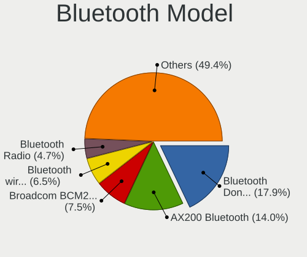

| Model                                                                | Desktops | Percent |
|----------------------------------------------------------------------|----------|---------|
| Cambridge Silicon Radio Bluetooth Dongle (HCI mode)                  | 69       | 17.92%  |
| Intel AX200 Bluetooth                                                | 54       | 14.03%  |
| ASUS Broadcom BCM20702A0 Bluetooth                                   | 29       | 7.53%   |
| Intel Bluetooth wireless interface                                   | 25       | 6.49%   |
| Realtek Bluetooth Radio                                              | 18       | 4.68%   |
| MediaTek Wireless_Device                                             | 13       | 3.38%   |
| Intel Wireless-AC 3168 Bluetooth                                     | 13       | 3.38%   |
| Intel AX210 Bluetooth                                                | 13       | 3.38%   |
| Realtek  Bluetooth 4.2 Adapter                                       | 12       | 3.12%   |
| IMC Networks Wireless_Device                                         | 12       | 3.12%   |
| IMC Networks Bluetooth Radio                                         | 12       | 3.12%   |
| ASUS ASUS USB-BT500                                                  | 12       | 3.12%   |
| Intel Wireless-AC 9260 Bluetooth Adapter                             | 10       | 2.6%    |
| Intel Bluetooth 9460/9560 Jefferson Peak (JfP)                       | 10       | 2.6%    |
| Intel Bluetooth Device                                               | 9        | 2.34%   |
| Foxconn / Hon Hai Wireless_Device                                    | 9        | 2.34%   |
| Intel AX201 Bluetooth                                                | 8        | 2.08%   |
| ASUS Bluetooth Radio                                                 | 6        | 1.56%   |
| Foxconn / Hon Hai Bluetooth Device                                   | 5        | 1.3%    |
| Intel Centrino Bluetooth Wireless Transceiver                        | 4        | 1.04%   |
| HTC (High Tech Computer) Vive Hub Bluetooth 4.1 (Broadcom BCM920703) | 4        | 1.04%   |
| Qualcomm Atheros AR3011 Bluetooth                                    | 3        | 0.78%   |
| Lite-On Bluetooth Device                                             | 3        | 0.78%   |
| ASUS Qualcomm Bluetooth 4.1                                          | 3        | 0.78%   |
| ASUS BCM20702A0                                                      | 3        | 0.78%   |
| Realtek Bluetooth Radio                                              | 2        | 0.52%   |
| Edimax Bluetooth Device                                              | 2        | 0.52%   |
| Broadcom BCM20702A0 Bluetooth 4.0                                    | 2        | 0.52%   |
| ASUS Bluetooth Adapter                                               | 2        | 0.52%   |
| Apple Bluetooth Host Controller                                      | 2        | 0.52%   |
| Realtek Bluetooth 5.3 Radio                                          | 1        | 0.26%   |
| Qualcomm Atheros  Bluetooth Device                                   | 1        | 0.26%   |
| Qualcomm Atheros QCA61x4 Bluetooth 4.0                               | 1        | 0.26%   |
| Qualcomm Atheros AR3011 Bluetooth (no firmware)                      | 1        | 0.26%   |
| Lite-On Qualcomm Atheros QCA9377 Bluetooth                           | 1        | 0.26%   |
| Lite-On Atheros AR3012 Bluetooth                                     | 1        | 0.26%   |
| Integrated System Solution Bluetooth Device                          | 1        | 0.26%   |
| IMC Networks Bluetooth Device                                        | 1        | 0.26%   |
| Broadcom BCM92046DG-CL1ROM                                           | 1        | 0.26%   |
| Broadcom BCM2046 V2.1 Dongle                                         | 1        | 0.26%   |

Sound
-----

Sound Vendor
------------

Sound card vendors

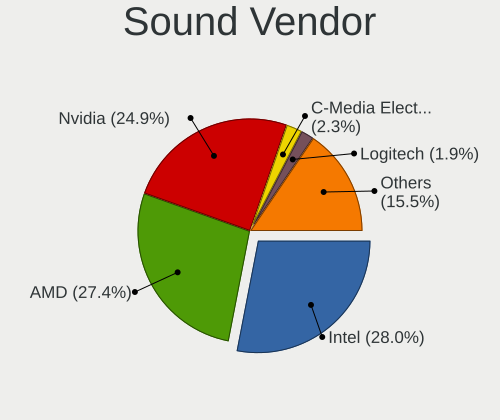

| Vendor                               | Desktops | Percent |
|--------------------------------------|----------|---------|
| Intel                                | 523      | 28.04%  |
| AMD                                  | 511      | 27.4%   |
| Nvidia                               | 464      | 24.88%  |
| C-Media Electronics                  | 43       | 2.31%   |
| Logitech                             | 35       | 1.88%   |
| Creative Labs                        | 21       | 1.13%   |
| SteelSeries ApS                      | 20       | 1.07%   |
| ASUSTek Computer                     | 18       | 0.97%   |
| Kingston Technology                  | 16       | 0.86%   |
| Texas Instruments                    | 15       | 0.8%    |
| Focusrite-Novation                   | 13       | 0.7%    |
| Creative Technology                  | 13       | 0.7%    |
| Razer USA                            | 11       | 0.59%   |
| DSEA A/S                             | 10       | 0.54%   |
| JBL                                  | 8        | 0.43%   |
| Corsair                              | 8        | 0.43%   |
| GN Netcom                            | 7        | 0.38%   |
| Thesycon Systemsoftware & Consulting | 6        | 0.32%   |
| BEHRINGER International              | 6        | 0.32%   |
| VIA Technologies                     | 5        | 0.27%   |
| Micro Star International             | 5        | 0.27%   |
| Hewlett-Packard                      | 5        | 0.27%   |
| Generalplus Technology               | 5        | 0.27%   |
| Yamaha                               | 4        | 0.21%   |
| XMOS                                 | 4        | 0.21%   |
| SAVITECH                             | 4        | 0.21%   |
| RODE Microphones                     | 4        | 0.21%   |
| M-Audio                              | 4        | 0.21%   |
| FiiO Electronics Technology          | 4        | 0.21%   |
| Blue Microphones                     | 4        | 0.21%   |
| Realtek Semiconductor                | 3        | 0.16%   |
| Plantronics                          | 3        | 0.16%   |
| Microsoft                            | 3        | 0.16%   |
| JMTek                                | 3        | 0.16%   |
| GYROCOM C&C                          | 3        | 0.16%   |
| AudioQuest                           | 3        | 0.16%   |
| Trust                                | 2        | 0.11%   |
| Sony                                 | 2        | 0.11%   |
| Samson Technologies                  | 2        | 0.11%   |
| Lenovo                               | 2        | 0.11%   |

Sound Model
-----------

Sound card models

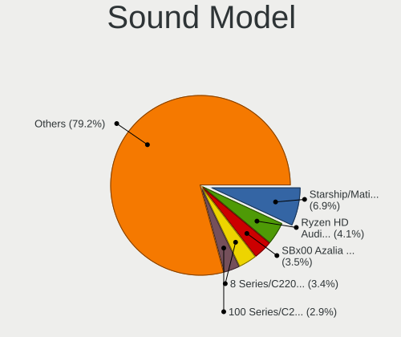

| Model                                                                      | Desktops | Percent |
|----------------------------------------------------------------------------|----------|---------|
| AMD Starship/Matisse HD Audio Controller                                   | 154      | 6.92%   |
| AMD Ryzen HD Audio Controller                                              | 92       | 4.13%   |
| AMD SBx00 Azalia (Intel HDA)                                               | 77       | 3.46%   |
| Intel 8 Series/C220 Series Chipset High Definition Audio Controller        | 75       | 3.37%   |
| Intel 100 Series/C230 Series Chipset Family HD Audio Controller            | 65       | 2.92%   |
| Intel 200 Series PCH HD Audio                                              | 60       | 2.7%    |
| Intel 6 Series/C200 Series Chipset Family High Definition Audio Controller | 56       | 2.52%   |
| AMD Family 17h (Models 00h-0fh) HD Audio Controller                        | 56       | 2.52%   |
| Nvidia GP104 High Definition Audio Controller                              | 51       | 2.29%   |
| Intel Xeon E3-1200 v3/4th Gen Core Processor HD Audio Controller           | 51       | 2.29%   |
| Intel 7 Series/C216 Chipset Family High Definition Audio Controller        | 47       | 2.11%   |
| AMD Radeon High Definition Audio Controller                                | 46       | 2.07%   |
| AMD Navi 21/23 HDMI/DP Audio Controller                                    | 45       | 2.02%   |
| AMD Ellesmere HDMI Audio [Radeon RX 470/480 / 570/580/590]                 | 42       | 1.89%   |
| Intel Cannon Lake PCH cAVS                                                 | 36       | 1.62%   |
| AMD Navi 31 HDMI/DP Audio                                                  | 33       | 1.48%   |
| Nvidia GP106 High Definition Audio Controller                              | 29       | 1.3%    |
| Nvidia GP107GL High Definition Audio Controller                            | 27       | 1.21%   |
| AMD Navi 10 HDMI Audio                                                     | 25       | 1.12%   |
| Nvidia TU116 High Definition Audio Controller                              | 24       | 1.08%   |
| Nvidia High Definition Audio Controller                                    | 22       | 0.99%   |
| Nvidia GA104 High Definition Audio Controller                              | 22       | 0.99%   |
| Intel 5 Series/3400 Series Chipset High Definition Audio                   | 22       | 0.99%   |
| AMD Renoir/Cezanne HDMI/DP Audio Controller                                | 22       | 0.99%   |
| Nvidia GM107 High Definition Audio Controller [GeForce 940MX]              | 21       | 0.94%   |
| Nvidia GM206 High Definition Audio Controller                              | 20       | 0.9%    |
| Intel 9 Series Chipset Family HD Audio Controller                          | 20       | 0.9%    |
| Nvidia GK208 HDMI/DP Audio Controller                                      | 19       | 0.85%   |
| AMD FCH Azalia Controller                                                  | 19       | 0.85%   |
| Intel NM10/ICH7 Family High Definition Audio Controller                    | 18       | 0.81%   |
| Nvidia GM204 High Definition Audio Controller                              | 17       | 0.76%   |
| Nvidia GA102 High Definition Audio Controller                              | 17       | 0.76%   |
| AMD Oland/Hainan/Cape Verde/Pitcairn HDMI Audio [Radeon HD 7000 Series]    | 17       | 0.76%   |
| Nvidia TU107 GeForce GTX 1650 High Definition Audio Controller             | 15       | 0.67%   |
| Nvidia MCP61 High Definition Audio                                         | 15       | 0.67%   |
| Nvidia GA106 High Definition Audio Controller                              | 15       | 0.67%   |
| AMD Vega 10 HDMI Audio [Radeon Vega 56/64]                                 | 15       | 0.67%   |
| AMD Raven/Raven2/Fenghuang HDMI/DP Audio Controller                        | 15       | 0.67%   |
| Nvidia TU104 HD Audio Controller                                           | 14       | 0.63%   |
| Nvidia GK107 HDMI Audio Controller                                         | 14       | 0.63%   |

Memory
------

Memory Vendor
-------------

Memory module vendors

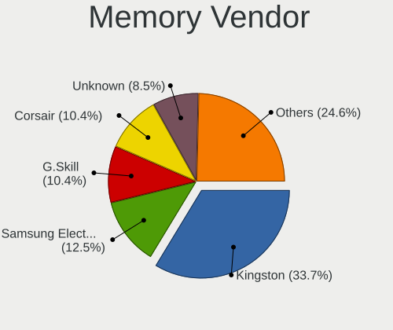

| Vendor              | Desktops | Percent |
|---------------------|----------|---------|
| Kingston            | 227      | 33.68%  |
| Samsung Electronics | 84       | 12.46%  |
| G.Skill             | 70       | 10.39%  |
| Corsair             | 70       | 10.39%  |
| Unknown             | 57       | 8.46%   |
| SK hynix            | 48       | 7.12%   |
| Crucial             | 36       | 5.34%   |
| Micron Technology   | 29       | 4.3%    |
| Ramaxel Technology  | 10       | 1.48%   |
| Unknown             | 6        | 0.89%   |
| Nanya Technology    | 5        | 0.74%   |
| Elpida              | 5        | 0.74%   |
| A-DATA Technology   | 5        | 0.74%   |
| Team                | 3        | 0.45%   |
| Apacer              | 3        | 0.45%   |
| Unknown (ABCD)      | 2        | 0.3%    |
| ASint Technology    | 2        | 0.3%    |
| Wilk                | 1        | 0.15%   |
| Unknown (AB)        | 1        | 0.15%   |
| Unigen              | 1        | 0.15%   |
| TeamGroup           | 1        | 0.15%   |
| Qimonda             | 1        | 0.15%   |
| Patriot             | 1        | 0.15%   |
| Juhor               | 1        | 0.15%   |
| Hyundai lnc         | 1        | 0.15%   |
| Hitachi             | 1        | 0.15%   |
| GOODRAM             | 1        | 0.15%   |
| GIGA-BYTE           | 1        | 0.15%   |
| GeIL                | 1        | 0.15%   |

Memory Model
------------

Memory module models

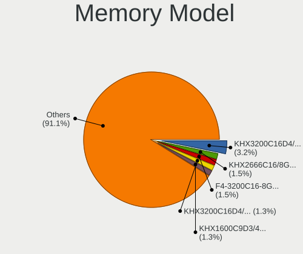

| Model                                                  | Desktops | Percent |
|--------------------------------------------------------|----------|---------|
| Kingston RAM KHX3200C16D4/8GX 8GB DIMM DDR4 3733MT/s   | 24       | 3.23%   |
| Kingston RAM KHX2666C16/8G 8GiB DIMM DDR4 3466MT/s     | 11       | 1.48%   |
| G.Skill RAM F4-3200C16-8GVKB 8GB DIMM DDR4 4000MT/s    | 11       | 1.48%   |
| Kingston RAM KHX3200C16D4/16GX 16GB DIMM DDR4 3600MT/s | 10       | 1.34%   |
| Kingston RAM KHX1600C9D3/4GX 4GB DIMM DDR3 1867MT/s    | 10       | 1.34%   |
| Corsair RAM CMK16GX4M2B3200C16 8GB DIMM DDR4 3600MT/s  | 10       | 1.34%   |
| Kingston RAM KHX1600C10D3/8G 8GB DIMM DDR3 2133MT/s    | 9        | 1.21%   |
| Kingston RAM KF3200C16D4/8GX 8GiB DIMM DDR4 3600MT/s   | 9        | 1.21%   |
| Corsair RAM CMK16GX4M2B3000C15 8GB DIMM DDR4 3600MT/s  | 8        | 1.08%   |
| Kingston RAM KHX1866C10D3/8G 8GB DIMM DDR3 1867MT/s    | 7        | 0.94%   |
| Kingston RAM KHX1600C10D3/4G 4GB DIMM DDR3 1866MT/s    | 7        | 0.94%   |
| Unknown RAM Module 2GB DIMM DDR2 800MT/s               | 6        | 0.81%   |
| Samsung RAM M391A4G43AB1-CWE 32GB DIMM DDR4 3200MT/s   | 6        | 0.81%   |
| Samsung RAM M378A1K43CB2-CTD 8GB DIMM DDR4 3266MT/s    | 6        | 0.81%   |
| Kingston RAM KF3600C16D4/16GX 16GB DIMM DDR4 3800MT/s  | 6        | 0.81%   |
| Unknown                                                | 6        | 0.81%   |
| Samsung RAM M378B5273DH0-CK0 4GB DIMM DDR3 2200MT/s    | 5        | 0.67%   |
| Micron RAM 8JTF51264AZ-1G6E1 4GB DIMM DDR3 1600MT/s    | 5        | 0.67%   |
| Kingston RAM KHX2133C14D4/8G 8GB DIMM DDR4 3000MT/s    | 5        | 0.67%   |
| Kingston RAM KF560C36-32 32GB DIMM DDR5 6200MT/s       | 5        | 0.67%   |
| Kingston RAM KF560C36-16 16GB DIMM DDR5 6000MT/s       | 5        | 0.67%   |
| G.Skill RAM F5-6000J3040G32G 32GB DIMM DDR5 6200MT/s   | 5        | 0.67%   |
| Samsung RAM Module 8GB DIMM DDR4 2133MT/s              | 4        | 0.54%   |
| Kingston RAM KHX2666C15D4/8G 8GB DIMM DDR4 3200MT/s    | 4        | 0.54%   |
| Kingston RAM KHX1600C10D3/8GX 8GB DIMM DDR3 1600MT/s   | 4        | 0.54%   |
| Kingston RAM KF3600C18D4/16GX 16GB DIMM DDR4 3733MT/s  | 4        | 0.54%   |
| Kingston RAM KF3200C16D4/32GX 32GB DIMM DDR4 3933MT/s  | 4        | 0.54%   |
| Kingston RAM KF3200C16D4/16GX 16GB DIMM DDR4 3733MT/s  | 4        | 0.54%   |
| Corsair RAM CMK32GX4M2E3200C16 16GB DIMM DDR4 3600MT/s | 4        | 0.54%   |
| Unknown RAM Module 4GB DIMM 1066MT/s                   | 3        | 0.4%    |
| Unknown RAM Module 2GB DIMM 1066MT/s                   | 3        | 0.4%    |
| Unknown RAM Module 2048MB DIMM DDR2 800MT/s            | 3        | 0.4%    |
| Unknown RAM Module 1GB DIMM DDR2 667MT/s               | 3        | 0.4%    |
| Samsung RAM M378B5673EH1-CH9 2GB DIMM DDR3 1333MT/s    | 3        | 0.4%    |
| Samsung RAM M378A4G43BB2-CWE 32GB DIMM DDR4 3200MT/s   | 3        | 0.4%    |
| Ramaxel RAM RMR1870EC58E9F1333 4GB DIMM DDR3 1333MT/s  | 3        | 0.4%    |
| Kingston RAM KHX3200C18D4/8G 8GB DIMM DDR4 3333MT/s    | 3        | 0.4%    |
| Kingston RAM KHX2133C14/8G 8GB DIMM DDR4 2666MT/s      | 3        | 0.4%    |
| Kingston RAM KHX2133C13D4/8GX 8GB DIMM DDR4 2400MT/s   | 3        | 0.4%    |
| Kingston RAM KF3600C17D4/8GX 8GB DIMM DDR4 3600MT/s    | 3        | 0.4%    |

Memory Kind
-----------

Memory module kinds

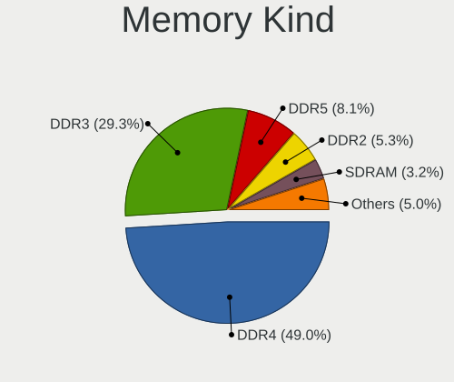

| Kind    | Desktops | Percent |
|---------|----------|---------|
| DDR4    | 303      | 49.03%  |
| DDR3    | 181      | 29.29%  |
| DDR5    | 50       | 8.09%   |
| DDR2    | 33       | 5.34%   |
| SDRAM   | 20       | 3.24%   |
| Unknown | 18       | 2.91%   |
| DDR     | 6        | 0.97%   |
| DRAM    | 4        | 0.65%   |
| LPDDR4  | 3        | 0.49%   |

Memory Form Factor
------------------

Physical design of the memory module

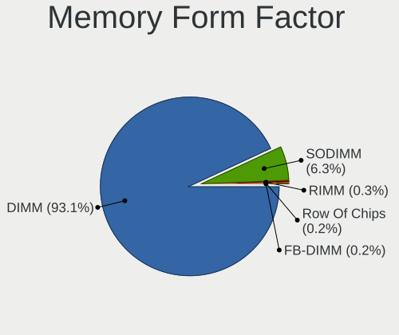

| Name         | Desktops | Percent |
|--------------|----------|---------|
| DIMM         | 564      | 93.07%  |
| SODIMM       | 38       | 6.27%   |
| RIMM         | 2        | 0.33%   |
| Row Of Chips | 1        | 0.17%   |
| FB-DIMM      | 1        | 0.17%   |

Memory Size
-----------

Memory module size

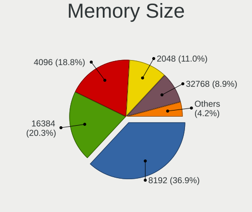

| Size  | Desktops | Percent |
|-------|----------|---------|
| 8192  | 246      | 36.94%  |
| 16384 | 135      | 20.27%  |
| 4096  | 125      | 18.77%  |
| 2048  | 73       | 10.96%  |
| 32768 | 59       | 8.86%   |
| 1024  | 21       | 3.15%   |
| 512   | 5        | 0.75%   |
| 49152 | 2        | 0.3%    |

Memory Speed
------------

Memory module speed

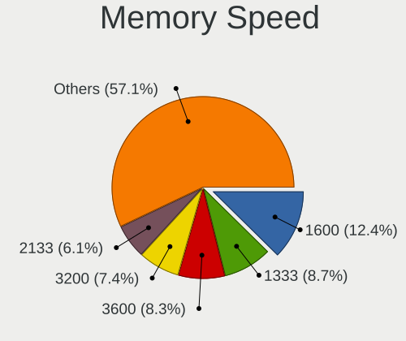

| Speed   | Desktops | Percent |
|---------|----------|---------|
| 1600    | 85       | 12.37%  |
| 1333    | 60       | 8.73%   |
| 3600    | 57       | 8.3%    |
| 3200    | 51       | 7.42%   |
| 2133    | 42       | 6.11%   |
| 2400    | 38       | 5.53%   |
| 3733    | 36       | 5.24%   |
| 2667    | 27       | 3.93%   |
| 800     | 25       | 3.64%   |
| 3800    | 21       | 3.06%   |
| 6000    | 20       | 2.91%   |
| 667     | 18       | 2.62%   |
| 4000    | 16       | 2.33%   |
| 3466    | 16       | 2.33%   |
| 3000    | 16       | 2.33%   |
| 1867    | 11       | 1.6%    |
| 1866    | 11       | 1.6%    |
| 6200    | 10       | 1.46%   |
| 1066    | 10       | 1.46%   |
| 4800    | 8        | 1.16%   |
| 3266    | 6        | 0.87%   |
| 2933    | 6        | 0.87%   |
| 5200    | 5        | 0.73%   |
| 3333    | 5        | 0.73%   |
| 2800    | 5        | 0.73%   |
| 2666    | 5        | 0.73%   |
| 2200    | 5        | 0.73%   |
| 1800    | 5        | 0.73%   |
| 1334    | 5        | 0.73%   |
| 3933    | 4        | 0.58%   |
| 3866    | 4        | 0.58%   |
| 3400    | 4        | 0.58%   |
| 5600    | 3        | 0.44%   |
| 3100    | 3        | 0.44%   |
| 1067    | 3        | 0.44%   |
| 533     | 3        | 0.44%   |
| Unknown | 3        | 0.44%   |
| 49926   | 2        | 0.29%   |
| 12800   | 2        | 0.29%   |
| 6400    | 2        | 0.29%   |

Printers & scanners
-------------------

Printer Vendor
--------------

Printer device vendors

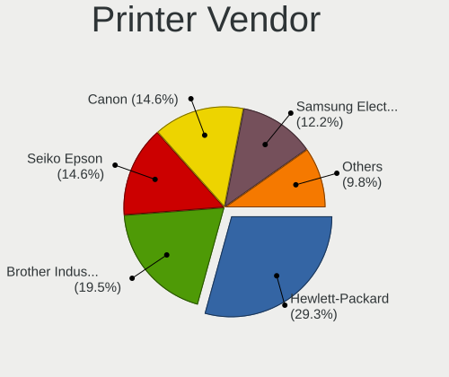

| Vendor                | Desktops | Percent |
|-----------------------|----------|---------|
| Hewlett-Packard       | 12       | 29.27%  |
| Brother Industries    | 8        | 19.51%  |
| Seiko Epson           | 6        | 14.63%  |
| Canon                 | 6        | 14.63%  |
| Samsung Electronics   | 5        | 12.2%   |
| Xerox                 | 2        | 4.88%   |
| Prolific Technology   | 1        | 2.44%   |
| Lexmark International | 1        | 2.44%   |

Printer Model
-------------

Printer device models

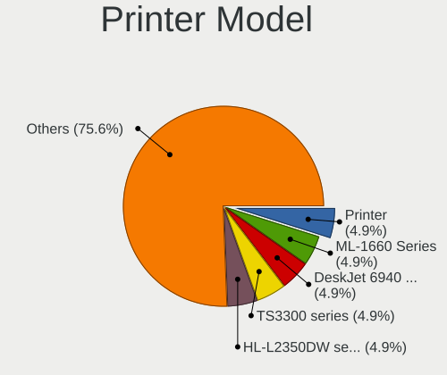

| Model                                  | Desktops | Percent |
|----------------------------------------|----------|---------|
| Seiko Epson Printer                    | 2        | 4.88%   |
| Samsung ML-1660 Series                 | 2        | 4.88%   |
| HP DeskJet 6940 series                 | 2        | 4.88%   |
| Canon TS3300 series                    | 2        | 4.88%   |
| Brother HL-L2350DW series              | 2        | 4.88%   |
| Xerox WorkCentre 3325                  | 1        | 2.44%   |
| Xerox Phaser 6500DN                    | 1        | 2.44%   |
| Seiko Epson L555 Series                | 1        | 2.44%   |
| Seiko Epson ET-2710 Series             | 1        | 2.44%   |
| Seiko Epson EPSON WF-3520 Series       | 1        | 2.44%   |
| Seiko Epson AL-MX200DNF                | 1        | 2.44%   |
| Samsung M288x Series                   | 1        | 2.44%   |
| Samsung CLX-3180 Series                | 1        | 2.44%   |
| Samsung CLP-325 Color Laser Printer    | 1        | 2.44%   |
| Prolific PL2305 Parallel Port          | 1        | 2.44%   |
| Lexmark International Printing Support | 1        | 2.44%   |
| HP PSC 1100 series                     | 1        | 2.44%   |
| HP OfficeJet 5200 series               | 1        | 2.44%   |
| HP LaserJet Professional P 1102w       | 1        | 2.44%   |
| HP LaserJet Pro M148-M149              | 1        | 2.44%   |
| HP LaserJet P2055 series               | 1        | 2.44%   |
| HP LaserJet P2015 series               | 1        | 2.44%   |
| HP LaserJet 1200                       | 1        | 2.44%   |
| HP ENVY 5540 series                    | 1        | 2.44%   |
| HP DeskJet F300 series                 | 1        | 2.44%   |
| HP DeskJet 960c                        | 1        | 2.44%   |
| Canon TS3100 series                    | 1        | 2.44%   |
| Canon PIXMA MG2500 Series              | 1        | 2.44%   |
| Canon LiDE 400                         | 1        | 2.44%   |
| Canon LiDE 300                         | 1        | 2.44%   |
| Brother MFC-L8900CDW series            | 1        | 2.44%   |
| Brother MFC-7460DN                     | 1        | 2.44%   |
| Brother HL-3140CW series               | 1        | 2.44%   |
| Brother DCP-L2530DW series             | 1        | 2.44%   |
| Brother DCP-9020CDW                    | 1        | 2.44%   |
| Brother DCP-7055W                      | 1        | 2.44%   |

Scanner Vendor
--------------

Scanner device vendors

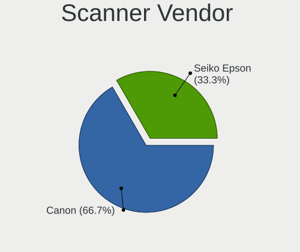

| Vendor      | Desktops | Percent |
|-------------|----------|---------|
| Canon       | 4        | 66.67%  |
| Seiko Epson | 2        | 33.33%  |

Scanner Model
-------------

Scanner device models

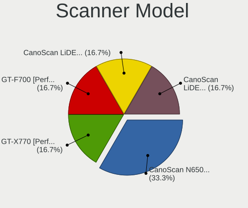

| Model                                 | Desktops | Percent |
|---------------------------------------|----------|---------|
| Canon CanoScan N650U/N656U            | 2        | 33.33%  |
| Seiko Epson GT-X770 [Perfection V500] | 1        | 16.67%  |
| Seiko Epson GT-F700 [Perfection V350] | 1        | 16.67%  |
| Canon CanoScan LiDE 200               | 1        | 16.67%  |
| Canon CanoScan LiDE 110               | 1        | 16.67%  |

Camera
------

Camera Vendor
-------------

Camera device vendors

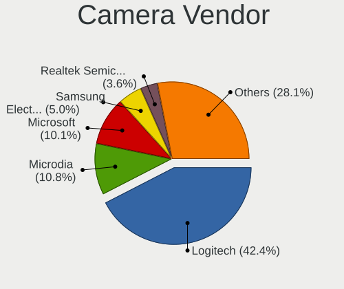

| Vendor                        | Desktops | Percent |
|-------------------------------|----------|---------|
| Logitech                      | 59       | 42.45%  |
| Microdia                      | 15       | 10.79%  |
| Microsoft                     | 14       | 10.07%  |
| Samsung Electronics           | 7        | 5.04%   |
| Realtek Semiconductor         | 5        | 3.6%    |
| Trust                         | 4        | 2.88%   |
| Sunplus Innovation Technology | 4        | 2.88%   |
| Apple                         | 4        | 2.88%   |
| Tobii Technology AB           | 3        | 2.16%   |
| Razer USA                     | 2        | 1.44%   |
| MacroSilicon                  | 2        | 1.44%   |
| Generalplus Technology        | 2        | 1.44%   |
| Creative Technology           | 2        | 1.44%   |
| Chicony Electronics           | 2        | 1.44%   |
| Valve Software                | 1        | 0.72%   |
| SunplusIT                     | 1        | 0.72%   |
| Sunplus IT                    | 1        | 0.72%   |
| Sonix Technology              | 1        | 0.72%   |
| Silicon Motion                | 1        | 0.72%   |
| Philips (or NXP)              | 1        | 0.72%   |
| OnePlus                       | 1        | 0.72%   |
| Oculus VR                     | 1        | 0.72%   |
| MediaTek                      | 1        | 0.72%   |
| Lenovo                        | 1        | 0.72%   |
| Hewlett-Packard               | 1        | 0.72%   |
| Google                        | 1        | 0.72%   |
| eYs3d Technology              | 1        | 0.72%   |
| Cubeternet                    | 1        | 0.72%   |

Camera Model
------------

Camera device models

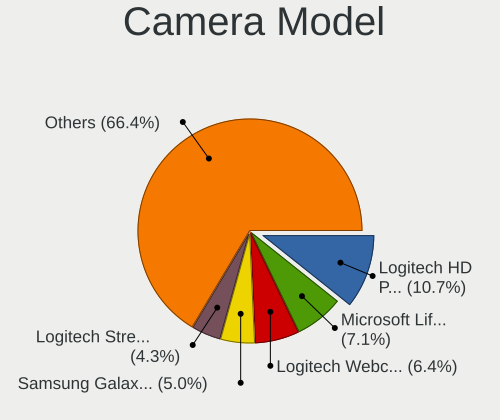

| Model                                             | Desktops | Percent |
|---------------------------------------------------|----------|---------|
| Logitech HD Pro Webcam C920                       | 15       | 10.71%  |
| Microsoft LifeCam HD-3000                         | 10       | 7.14%   |
| Logitech Webcam C270                              | 9        | 6.43%   |
| Samsung Galaxy series, misc. (MTP mode)           | 7        | 5%      |
| Logitech StreamCam                                | 6        | 4.29%   |
| Logitech HD Webcam C525                           | 6        | 4.29%   |
| Logitech HD Webcam C510                           | 6        | 4.29%   |
| Microdia Camera                                   | 5        | 3.57%   |
| Trust Full HD Webcam                              | 3        | 2.14%   |
| Tobii AB EyeChip                                  | 3        | 2.14%   |
| Realtek Thronmax Stream Go Pro Webcam             | 3        | 2.14%   |
| Logitech Webcam C930e                             | 3        | 2.14%   |
| Logitech C922 Pro Stream Webcam                   | 3        | 2.14%   |
| Apple iPhone 5/5C/5S/6/SE/7/8/X                   | 3        | 2.14%   |
| Sunplus Full HD webcam                            | 2        | 1.43%   |
| Microsoft LifeCam Studio                          | 2        | 1.43%   |
| Microdia Webcam Vitade AF                         | 2        | 1.43%   |
| Microdia USB 2.0 Camera                           | 2        | 1.43%   |
| MacroSilicon USB Video                            | 2        | 1.43%   |
| Logitech Webcam B500                              | 2        | 1.43%   |
| Logitech Logitech Webcam C925e                    | 2        | 1.43%   |
| Logitech BRIO Ultra HD Webcam                     | 2        | 1.43%   |
| Generalplus GENERAL WEBCAM                        | 2        | 1.43%   |
| Valve Software 3D Camera                          | 1        | 0.71%   |
| Trust USB Camera                                  | 1        | 0.71%   |
| SunplusIT Cam Mini                                | 1        | 0.71%   |
| Sunplus IT PC Camera                              | 1        | 0.71%   |
| Sunplus USB 2.0 Camera                            | 1        | 0.71%   |
| Sunplus Laptop_Integrated_Webcam_HD               | 1        | 0.71%   |
| Sonix FHD Webcam                                  | 1        | 0.71%   |
| Silicon Motion Endoscope camera                   | 1        | 0.71%   |
| Realtek USB Camera                                | 1        | 0.71%   |
| Realtek FULL HD 1080P Webcam                      | 1        | 0.71%   |
| Razer USA Razer Kiyo Pro                          | 1        | 0.71%   |
| Razer USA Gaming Webcam [Kiyo]                    | 1        | 0.71%   |
| Philips (or NXP) Webcam SPC530NC                  | 1        | 0.71%   |
| OnePlus GM1913                                    | 1        | 0.71%   |
| Oculus VR Quest 2                                 | 1        | 0.71%   |
| Microsoft Microsoft LifeCam HD-6000 for Notebooks | 1        | 0.71%   |
| Microsoft LifeCam HD-5000                         | 1        | 0.71%   |

Security
--------

Fingerprint Vendor
------------------

Fingerprint sensor vendors

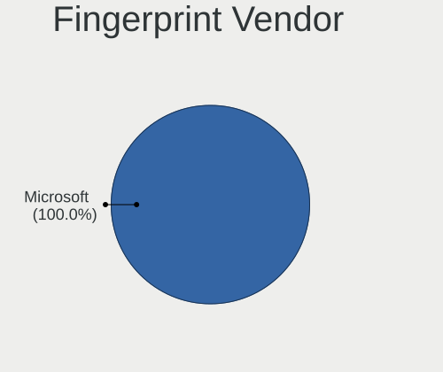

| Vendor    | Desktops | Percent |
|-----------|----------|---------|
| Microsoft | 1        | 100%    |

Fingerprint Model
-----------------

Fingerprint sensor models

| Model                        | Desktops | Percent |
|------------------------------|----------|---------|
| Microsoft Fingerprint Reader | 1        | 100%    |

Chipcard Vendor
---------------

Chipcard module vendors

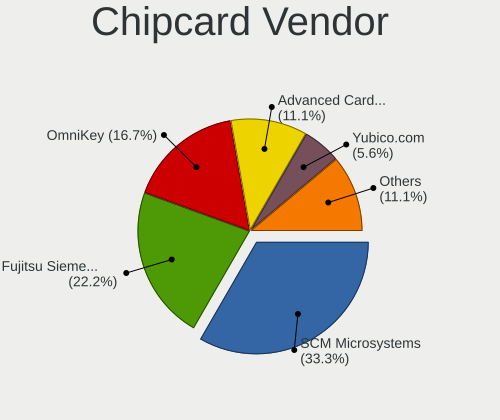

| Vendor                    | Desktops | Percent |
|---------------------------|----------|---------|
| SCM Microsystems          | 6        | 33.33%  |
| Fujitsu Siemens Computers | 4        | 22.22%  |
| OmniKey                   | 3        | 16.67%  |
| Advanced Card Systems     | 2        | 11.11%  |
| Yubico.com                | 1        | 5.56%   |
| Chicony Electronics       | 1        | 5.56%   |
| Alcor Micro               | 1        | 5.56%   |

Chipcard Model
--------------

Chipcard module models

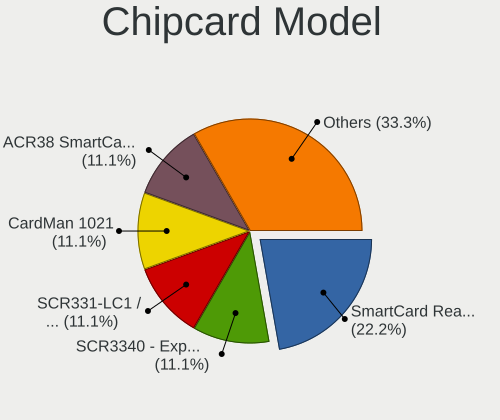

| Model                                                      | Desktops | Percent |
|------------------------------------------------------------|----------|---------|
| Fujitsu Siemens Computers SmartCard Reader 2A              | 4        | 22.22%  |
| SCM Microsystems SCR3340 - ExpressCard54 Smart Card Reader | 2        | 11.11%  |
| SCM Microsystems SCR331-LC1 / SCR3310 SmartCard Reader     | 2        | 11.11%  |
| OmniKey CardMan 1021                                       | 2        | 11.11%  |
| Advanced Card Systems ACR38 SmartCard Reader               | 2        | 11.11%  |
| Yubico.com Yubikey 4/5 U2F+CCID                            | 1        | 5.56%   |
| SCM Microsystems SCR333 SmartCard Reader                   | 1        | 5.56%   |
| SCM Microsystems SCR3310 CLOUD 2700 R                      | 1        | 5.56%   |
| OmniKey CardMan 3121 (HID Technologies)                    | 1        | 5.56%   |
| Chicony Electronics HP Skylab USB Smartcard Keyboard       | 1        | 5.56%   |
| Alcor Micro AU9540 Smartcard Reader                        | 1        | 5.56%   |

Unsupported
-----------

Unsupported Devices
-------------------

Total unsupported devices on board

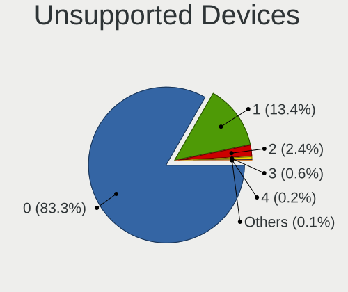

| Total | Desktops | Percent |
|-------|----------|---------|
| 0     | 869      | 83.32%  |
| 1     | 140      | 13.42%  |
| 2     | 25       | 2.4%    |
| 3     | 6        | 0.58%   |
| 4     | 2        | 0.19%   |
| 6     | 1        | 0.1%    |

Unsupported Device Types
------------------------

Types of unsupported devices

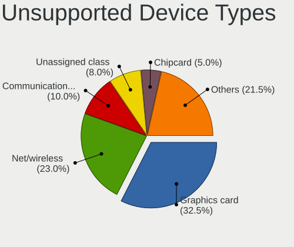

| Type                     | Desktops | Percent |
|--------------------------|----------|---------|
| Graphics card            | 65       | 32.5%   |
| Net/wireless             | 46       | 23%     |
| Communication controller | 20       | 10%     |
| Unassigned class         | 16       | 8%      |
| Chipcard                 | 10       | 5%      |
| Sound                    | 8        | 4%      |
| Multimedia controller    | 6        | 3%      |
| Camera                   | 6        | 3%      |
| Bluetooth                | 6        | 3%      |
| Net/ethernet             | 4        | 2%      |
| Storage/raid             | 3        | 1.5%    |
| Card reader              | 3        | 1.5%    |
| Storage/nvme             | 2        | 1%      |
| Storage/ide              | 2        | 1%      |
| Network                  | 2        | 1%      |
| Firewire controller      | 1        | 0.5%    |

