Linux in Finland - Tested Hardware & Statistics (Desktops)
----------------------------------------------------------

A project to collect tested hardware configurations for Linux in Finland.

Anyone can contribute to this report by the [hw-probe](https://github.com/linuxhw/hw-probe) tool:

    sudo -E hw-probe -all -upload

Please contribute! Especially if your hardware is rare.

Contents
--------

* [ Test Cases ](#test-cases)

* [ System ](#system)
  - [ OS                       ](#os)
  - [ OS Family                ](#os-family)
  - [ Kernel                   ](#kernel)
  - [ Kernel Family            ](#kernel-family)
  - [ Kernel Major Ver.        ](#kernel-major-ver)
  - [ Arch                     ](#arch)
  - [ DE                       ](#de)
  - [ Display Server           ](#display-server)
  - [ Display Manager          ](#display-manager)
  - [ OS Lang                  ](#os-lang)
  - [ Boot Mode                ](#boot-mode)
  - [ Filesystem               ](#filesystem)
  - [ Part. scheme             ](#part-scheme)
  - [ Dual Boot with Linux/BSD ](#dual-boot-with-linuxbsd)
  - [ Dual Boot (Win)          ](#dual-boot-win)

* [ Board ](#board)
  - [ Vendor                   ](#vendor)
  - [ Model                    ](#model)
  - [ Model Family             ](#model-family)
  - [ MFG Year                 ](#mfg-year)
  - [ Form Factor              ](#form-factor)
  - [ Secure Boot              ](#secure-boot)
  - [ Coreboot                 ](#coreboot)
  - [ RAM Size                 ](#ram-size)
  - [ RAM Used                 ](#ram-used)
  - [ Total Drives             ](#total-drives)
  - [ Has CD-ROM               ](#has-cd-rom)
  - [ Has Ethernet             ](#has-ethernet)
  - [ Has WiFi                 ](#has-wifi)
  - [ Has Bluetooth            ](#has-bluetooth)

* [ Location ](#location)
  - [ Country                  ](#country)
  - [ City                     ](#city)

* [ Drives ](#drives)
  - [ Drive Vendor             ](#drive-vendor)
  - [ Drive Model              ](#drive-model)
  - [ HDD Vendor               ](#hdd-vendor)
  - [ SSD Vendor               ](#ssd-vendor)
  - [ Drive Kind               ](#drive-kind)
  - [ Drive Connector          ](#drive-connector)
  - [ Drive Size               ](#drive-size)
  - [ Space Total              ](#space-total)
  - [ Space Used               ](#space-used)
  - [ Malfunc. Drives          ](#malfunc-drives)
  - [ Malfunc. Drive Vendor    ](#malfunc-drive-vendor)
  - [ Malfunc. HDD Vendor      ](#malfunc-hdd-vendor)
  - [ Malfunc. Drive Kind      ](#malfunc-drive-kind)
  - [ Failed Drives            ](#failed-drives)
  - [ Failed Drive Vendor      ](#failed-drive-vendor)
  - [ Drive Status             ](#drive-status)

* [ Storage controller ](#storage-controller)
  - [ Storage Vendor           ](#storage-vendor)
  - [ Storage Model            ](#storage-model)
  - [ Storage Kind             ](#storage-kind)

* [ Processor ](#processor)
  - [ CPU Vendor               ](#cpu-vendor)
  - [ CPU Model                ](#cpu-model)
  - [ CPU Model Family         ](#cpu-model-family)
  - [ CPU Cores                ](#cpu-cores)
  - [ CPU Sockets              ](#cpu-sockets)
  - [ CPU Threads              ](#cpu-threads)
  - [ CPU Op-Modes             ](#cpu-op-modes)
  - [ CPU Microcode            ](#cpu-microcode)
  - [ CPU Microarch            ](#cpu-microarch)

* [ Graphics ](#graphics)
  - [ GPU Vendor               ](#gpu-vendor)
  - [ GPU Model                ](#gpu-model)
  - [ GPU Combo                ](#gpu-combo)
  - [ GPU Driver               ](#gpu-driver)
  - [ GPU Memory               ](#gpu-memory)

* [ Monitor ](#monitor)
  - [ Monitor Vendor           ](#monitor-vendor)
  - [ Monitor Model            ](#monitor-model)
  - [ Monitor Resolution       ](#monitor-resolution)
  - [ Monitor Diagonal         ](#monitor-diagonal)
  - [ Monitor Width            ](#monitor-width)
  - [ Aspect Ratio             ](#aspect-ratio)
  - [ Monitor Area             ](#monitor-area)
  - [ Pixel Density            ](#pixel-density)
  - [ Multiple Monitors        ](#multiple-monitors)

* [ Network ](#network)
  - [ Net Controller Vendor    ](#net-controller-vendor)
  - [ Net Controller Model     ](#net-controller-model)
  - [ Wireless Vendor          ](#wireless-vendor)
  - [ Wireless Model           ](#wireless-model)
  - [ Ethernet Vendor          ](#ethernet-vendor)
  - [ Ethernet Model           ](#ethernet-model)
  - [ Net Controller Kind      ](#net-controller-kind)
  - [ Used Controller          ](#used-controller)
  - [ NICs                     ](#nics)
  - [ IPv6                     ](#ipv6)

* [ Bluetooth ](#bluetooth)
  - [ Bluetooth Vendor         ](#bluetooth-vendor)
  - [ Bluetooth Model          ](#bluetooth-model)

* [ Sound ](#sound)
  - [ Sound Vendor             ](#sound-vendor)
  - [ Sound Model              ](#sound-model)

* [ Memory ](#memory)
  - [ Memory Vendor            ](#memory-vendor)
  - [ Memory Model             ](#memory-model)
  - [ Memory Kind              ](#memory-kind)
  - [ Memory Form Factor       ](#memory-form-factor)
  - [ Memory Size              ](#memory-size)
  - [ Memory Speed             ](#memory-speed)

* [ Printers & scanners ](#printers--scanners)
  - [ Printer Vendor           ](#printer-vendor)
  - [ Printer Model            ](#printer-model)
  - [ Scanner Vendor           ](#scanner-vendor)
  - [ Scanner Model            ](#scanner-model)

* [ Camera ](#camera)
  - [ Camera Vendor            ](#camera-vendor)
  - [ Camera Model             ](#camera-model)

* [ Security ](#security)
  - [ Fingerprint Vendor       ](#fingerprint-vendor)
  - [ Fingerprint Model        ](#fingerprint-model)
  - [ Chipcard Vendor          ](#chipcard-vendor)
  - [ Chipcard Model           ](#chipcard-model)

* [ Unsupported ](#unsupported)
  - [ Unsupported Devices      ](#unsupported-devices)
  - [ Unsupported Device Types ](#unsupported-device-types)

Test Cases
----------

Total: 645

| Vendor        | Model                       | Probe                                                      | Date         |
|---------------|-----------------------------|------------------------------------------------------------|--------------|
| HP            | 805A                        | [477936d851](https://linux-hardware.org/?probe=477936d851) | Aug 30, 2022 |
| ASUSTek       | ROG STRIX B550-I GAMING     | [2fd4ef02b3](https://linux-hardware.org/?probe=2fd4ef02b3) | Aug 30, 2022 |
| ASUSTek       | TUF B450-PLUS GAMING        | [4b37519faf](https://linux-hardware.org/?probe=4b37519faf) | Aug 29, 2022 |
| HP            | 339A                        | [7338bebb05](https://linux-hardware.org/?probe=7338bebb05) | Aug 28, 2022 |
| ASRock        | B450M-HDV R4.0              | [a180ab604a](https://linux-hardware.org/?probe=a180ab604a) | Aug 26, 2022 |
| ASUSTek       | H97M-PLUS                   | [6bcc6b550f](https://linux-hardware.org/?probe=6bcc6b550f) | Aug 24, 2022 |
| Acer          | Predator G3620              | [b79ed7b47b](https://linux-hardware.org/?probe=b79ed7b47b) | Aug 23, 2022 |
| ASUSTek       | TUF Gaming Z690-PLUS D4     | [1d0c242f30](https://linux-hardware.org/?probe=1d0c242f30) | Aug 23, 2022 |
| ASRock        | Z75 Pro3                    | [4fbe3d2710](https://linux-hardware.org/?probe=4fbe3d2710) | Aug 22, 2022 |
| Acer          | Predator PO5-600s V:1.0     | [6e8b922033](https://linux-hardware.org/?probe=6e8b922033) | Aug 18, 2022 |
| Foxconn       | 2ABF                        | [eaea01215e](https://linux-hardware.org/?probe=eaea01215e) | Aug 17, 2022 |
| Dell          | 0C27VV A01                  | [04f75d45cb](https://linux-hardware.org/?probe=04f75d45cb) | Aug 15, 2022 |
| ASUSTek       | PRIME B550M-A               | [bd608fb7bc](https://linux-hardware.org/?probe=bd608fb7bc) | Aug 13, 2022 |
| HP            | 805A                        | [c7671a704a](https://linux-hardware.org/?probe=c7671a704a) | Aug 11, 2022 |
| ASUSTek       | M5A97 R2.0                  | [c2acc2d803](https://linux-hardware.org/?probe=c2acc2d803) | Aug 10, 2022 |
| ASUSTek       | Pro WS 565-ACE              | [ea9b6a4757](https://linux-hardware.org/?probe=ea9b6a4757) | Aug 10, 2022 |
| ASUSTek       | Pro WS 565-ACE              | [4e9256cf7f](https://linux-hardware.org/?probe=4e9256cf7f) | Aug 10, 2022 |
| ASUSTek       | Z87-PRO                     | [89a77b442f](https://linux-hardware.org/?probe=89a77b442f) | Aug 09, 2022 |
| Gigabyte      | H55M-UD2H                   | [4d6a861120](https://linux-hardware.org/?probe=4d6a861120) | Aug 07, 2022 |
| Gigabyte      | Z77X-UD3H                   | [db843c1cae](https://linux-hardware.org/?probe=db843c1cae) | Aug 07, 2022 |
| HP            | 1497                        | [2fe6cb5b2c](https://linux-hardware.org/?probe=2fe6cb5b2c) | Aug 07, 2022 |
| HP            | 1497                        | [24959f2c80](https://linux-hardware.org/?probe=24959f2c80) | Aug 07, 2022 |
| ASUSTek       | Pro WS 565-ACE              | [d5e820b393](https://linux-hardware.org/?probe=d5e820b393) | Aug 03, 2022 |
| ASUSTek       | PRIME B450M-A               | [97dba8f5e3](https://linux-hardware.org/?probe=97dba8f5e3) | Aug 02, 2022 |
| Fujitsu       | D3162-A1 S26361-D3162-A1    | [2bc22894c8](https://linux-hardware.org/?probe=2bc22894c8) | Jul 29, 2022 |
| Gigabyte      | B85-HD3                     | [ca37936b6f](https://linux-hardware.org/?probe=ca37936b6f) | Jul 28, 2022 |
| ASRock        | X399 Taichi                 | [d2eb8a032b](https://linux-hardware.org/?probe=d2eb8a032b) | Jul 26, 2022 |
| ASUSTek       | PRIME Z270-A                | [70ddacf43f](https://linux-hardware.org/?probe=70ddacf43f) | Jul 25, 2022 |
| Fujitsu       | D3643-H1 S26361-D3643-H1    | [cda18f8739](https://linux-hardware.org/?probe=cda18f8739) | Jul 22, 2022 |
| ASUSTek       | Pro WS 565-ACE              | [b35dabeb45](https://linux-hardware.org/?probe=b35dabeb45) | Jul 20, 2022 |
| Acer          | Aspire TC-120               | [2625b243eb](https://linux-hardware.org/?probe=2625b243eb) | Jul 20, 2022 |
| Acer          | Aspire TC-120               | [25728e964b](https://linux-hardware.org/?probe=25728e964b) | Jul 20, 2022 |
| ASUSTek       | Pro WS 565-ACE              | [9558ff01e9](https://linux-hardware.org/?probe=9558ff01e9) | Jul 20, 2022 |
| Dell          | 0GM819                      | [3d18cc2632](https://linux-hardware.org/?probe=3d18cc2632) | Jul 08, 2022 |
| HP            | 3647h                       | [f59774eab5](https://linux-hardware.org/?probe=f59774eab5) | Jun 30, 2022 |
| Gigabyte      | B150-HD3P-CF                | [c62062eac9](https://linux-hardware.org/?probe=c62062eac9) | Jun 24, 2022 |
| ASUSTek       | CROSSHAIR VI HERO           | [f3d1eeadb3](https://linux-hardware.org/?probe=f3d1eeadb3) | Jun 23, 2022 |
| ASUSTek       | TUF Gaming X570-PLUS        | [36bf4dc378](https://linux-hardware.org/?probe=36bf4dc378) | Jun 13, 2022 |
| Dell          | 0RW203                      | [d53558bc85](https://linux-hardware.org/?probe=d53558bc85) | Jun 12, 2022 |
| Supermicro    | X10SBA-LA                   | [4b46c69e08](https://linux-hardware.org/?probe=4b46c69e08) | Jun 03, 2022 |
| ASUSTek       | P8H67                       | [dff99aa7e6](https://linux-hardware.org/?probe=dff99aa7e6) | May 30, 2022 |
| HP            | 1998                        | [48be2e4a99](https://linux-hardware.org/?probe=48be2e4a99) | May 30, 2022 |
| HP            | 1998                        | [d68e99102e](https://linux-hardware.org/?probe=d68e99102e) | May 29, 2022 |
| ASRock        | X99 Taichi                  | [18ec1a6a1a](https://linux-hardware.org/?probe=18ec1a6a1a) | May 25, 2022 |
| Gigabyte      | AB350M-DS3H-CF              | [ee04d8165a](https://linux-hardware.org/?probe=ee04d8165a) | May 22, 2022 |
| ASRock        | B450 Gaming K4              | [152469abdd](https://linux-hardware.org/?probe=152469abdd) | May 22, 2022 |
| Gigabyte      | B550 GAMING X V2            | [a84132c514](https://linux-hardware.org/?probe=a84132c514) | May 22, 2022 |
| MSI           | MPG X570 GAMING PLUS        | [0e42effbfb](https://linux-hardware.org/?probe=0e42effbfb) | May 17, 2022 |
| ASUSTek       | H97M-PLUS                   | [d2e3603431](https://linux-hardware.org/?probe=d2e3603431) | May 16, 2022 |
| Gigabyte      | B550I AORUS PRO AX          | [244be4f232](https://linux-hardware.org/?probe=244be4f232) | May 15, 2022 |
| Gigabyte      | B550I AORUS PRO AX          | [587c1deb4c](https://linux-hardware.org/?probe=587c1deb4c) | May 15, 2022 |
| ASUSTek       | ROG STRIX X570-F GAMING     | [3fe223176c](https://linux-hardware.org/?probe=3fe223176c) | May 13, 2022 |
| ASUSTek       | P8H67                       | [d94b81d9d3](https://linux-hardware.org/?probe=d94b81d9d3) | May 12, 2022 |
| HP            | 805F                        | [466bb8cc36](https://linux-hardware.org/?probe=466bb8cc36) | May 10, 2022 |
| ASUSTek       | P8B75-V                     | [b4ecefaba5](https://linux-hardware.org/?probe=b4ecefaba5) | May 09, 2022 |
| Acer          | RS780HVF                    | [431353b969](https://linux-hardware.org/?probe=431353b969) | May 09, 2022 |
| MSI           | Z87M GAMING                 | [7e95657ad7](https://linux-hardware.org/?probe=7e95657ad7) | May 08, 2022 |
| ASUSTek       | Z170-A                      | [abccbed349](https://linux-hardware.org/?probe=abccbed349) | May 08, 2022 |
| ASUSTek       | AM1M-A                      | [537def711a](https://linux-hardware.org/?probe=537def711a) | May 08, 2022 |
| Acer          | RS780HVF                    | [1f30630929](https://linux-hardware.org/?probe=1f30630929) | May 08, 2022 |
| ASUSTek       | PRIME X570-PRO              | [f12944a9bd](https://linux-hardware.org/?probe=f12944a9bd) | May 07, 2022 |
| Supermicro    | X8ST3                       | [3cab505f0a](https://linux-hardware.org/?probe=3cab505f0a) | May 05, 2022 |
| Acer          | H57M01                      | [180132b3e1](https://linux-hardware.org/?probe=180132b3e1) | May 03, 2022 |
| Acer          | FX58M                       | [0a6673afb9](https://linux-hardware.org/?probe=0a6673afb9) | May 03, 2022 |
| HP            | 1589                        | [79df2c00dc](https://linux-hardware.org/?probe=79df2c00dc) | May 03, 2022 |
| ASUSTek       | P5B                         | [39c9900546](https://linux-hardware.org/?probe=39c9900546) | May 01, 2022 |
| MSI           | B550-A PRO                  | [0b23621ed1](https://linux-hardware.org/?probe=0b23621ed1) | Apr 30, 2022 |
| Gigabyte      | B450M S2H                   | [2e84d98937](https://linux-hardware.org/?probe=2e84d98937) | Apr 29, 2022 |
| ASUSTek       | Pro WS X570-ACE             | [1612f46137](https://linux-hardware.org/?probe=1612f46137) | Apr 24, 2022 |
| ASUSTek       | PRIME A320M-K               | [822db71f7a](https://linux-hardware.org/?probe=822db71f7a) | Apr 21, 2022 |
| ASRock        | Z87 Extreme6                | [d7e24821ee](https://linux-hardware.org/?probe=d7e24821ee) | Apr 18, 2022 |
| Dell          | 0HY9JP A00                  | [a767ef8b4e](https://linux-hardware.org/?probe=a767ef8b4e) | Apr 16, 2022 |
| Dell          | 0HY9JP A00                  | [5ce6ef2934](https://linux-hardware.org/?probe=5ce6ef2934) | Apr 16, 2022 |
| Dell          | 0HY9JP A00                  | [fed643b7ec](https://linux-hardware.org/?probe=fed643b7ec) | Apr 16, 2022 |
| MSI           | Indio                       | [ca3a24d84d](https://linux-hardware.org/?probe=ca3a24d84d) | Apr 13, 2022 |
| MSI           | Z370 PC PRO                 | [2d4574e9fe](https://linux-hardware.org/?probe=2d4574e9fe) | Apr 10, 2022 |
| ASUSTek       | Z87-K                       | [b0ffa911b5](https://linux-hardware.org/?probe=b0ffa911b5) | Apr 10, 2022 |
| ASUSTek       | Z87-K                       | [5264d55ce2](https://linux-hardware.org/?probe=5264d55ce2) | Apr 09, 2022 |
| ASUSTek       | AM1M-A                      | [1a910e93c5](https://linux-hardware.org/?probe=1a910e93c5) | Apr 09, 2022 |
| ASUSTek       | AM1M-A                      | [2d350f40d2](https://linux-hardware.org/?probe=2d350f40d2) | Apr 09, 2022 |
| Acer          | Batman A01                  | [a102f85d9d](https://linux-hardware.org/?probe=a102f85d9d) | Apr 08, 2022 |
| Gigabyte      | H410M H V3                  | [1a1c86083e](https://linux-hardware.org/?probe=1a1c86083e) | Apr 07, 2022 |
| HP            | 18E7                        | [35dbcc5737](https://linux-hardware.org/?probe=35dbcc5737) | Apr 07, 2022 |
| ASUSTek       | B150M-K                     | [016a08bf47](https://linux-hardware.org/?probe=016a08bf47) | Apr 04, 2022 |
| Acer          | Aspire TC-120               | [a92d7ab62a](https://linux-hardware.org/?probe=a92d7ab62a) | Apr 02, 2022 |
| ASRock        | B85M-ITX                    | [1a2849588f](https://linux-hardware.org/?probe=1a2849588f) | Apr 01, 2022 |
| HP            | 3047h                       | [356fac6a3a](https://linux-hardware.org/?probe=356fac6a3a) | Apr 01, 2022 |
| HP            | 3047h                       | [d4c9852b3c](https://linux-hardware.org/?probe=d4c9852b3c) | Apr 01, 2022 |
| MSI           | 990FXA-GD65                 | [52598b41a6](https://linux-hardware.org/?probe=52598b41a6) | Mar 31, 2022 |
| ASUSTek       | PRIME Z690-P D4             | [79c9d66395](https://linux-hardware.org/?probe=79c9d66395) | Mar 26, 2022 |
| Gigabyte      | 990XA-UD3                   | [913cf55cc3](https://linux-hardware.org/?probe=913cf55cc3) | Mar 25, 2022 |
| Lenovo        | MAHOBAY Win8 Pro DPK TPG    | [7b835e9a57](https://linux-hardware.org/?probe=7b835e9a57) | Mar 23, 2022 |
| ASRock        | AB350M-HDV                  | [069ce018ad](https://linux-hardware.org/?probe=069ce018ad) | Mar 22, 2022 |
| Gigabyte      | H61M-S2PV                   | [6b32e0c788](https://linux-hardware.org/?probe=6b32e0c788) | Mar 10, 2022 |
| Acer          | FX58M                       | [7404e9534e](https://linux-hardware.org/?probe=7404e9534e) | Mar 09, 2022 |
| ASUSTek       | PRIME Z690-P D4             | [2142681934](https://linux-hardware.org/?probe=2142681934) | Mar 06, 2022 |
| ASUSTek       | PRIME Z690-P D4             | [456b0dd391](https://linux-hardware.org/?probe=456b0dd391) | Mar 06, 2022 |
| ASUSTek       | Maximus VIII IMPACT         | [2e19b36624](https://linux-hardware.org/?probe=2e19b36624) | Mar 03, 2022 |
| Acer          | Aspire XC-105               | [0dd55e5b26](https://linux-hardware.org/?probe=0dd55e5b26) | Feb 26, 2022 |
| ABIT          | IP35                        | [278dd592cc](https://linux-hardware.org/?probe=278dd592cc) | Feb 26, 2022 |
| ASUSTek       | Z170-K                      | [cfdffcf6ab](https://linux-hardware.org/?probe=cfdffcf6ab) | Feb 26, 2022 |
| MSI           | B450 GAMING PRO CARBON A... | [f12d1e47df](https://linux-hardware.org/?probe=f12d1e47df) | Feb 24, 2022 |
| ASRock        | AB350M-HDV                  | [5fe85bba2e](https://linux-hardware.org/?probe=5fe85bba2e) | Feb 22, 2022 |
| ASUSTek       | P8Z68 DELUXE                | [8b588bf90b](https://linux-hardware.org/?probe=8b588bf90b) | Feb 15, 2022 |
| ASRock        | 890FX Deluxe4               | [33a47b3c4b](https://linux-hardware.org/?probe=33a47b3c4b) | Feb 11, 2022 |
| Gigabyte      | B250M-DS3H-CF               | [040550cdaa](https://linux-hardware.org/?probe=040550cdaa) | Feb 11, 2022 |
| ASUSTek       | PRIME X299-DELUXE II        | [ba2262bba5](https://linux-hardware.org/?probe=ba2262bba5) | Feb 10, 2022 |
| Gigabyte      | B250M-DS3H-CF               | [3d76f83751](https://linux-hardware.org/?probe=3d76f83751) | Feb 10, 2022 |
| ASUSTek       | H97M-PLUS                   | [75b31509a3](https://linux-hardware.org/?probe=75b31509a3) | Feb 09, 2022 |
| ASUSTek       | H97M-PLUS                   | [88fdd17fc6](https://linux-hardware.org/?probe=88fdd17fc6) | Feb 07, 2022 |
| ASUSTek       | ROG STRIX Z370-F GAMING     | [22be2d64a2](https://linux-hardware.org/?probe=22be2d64a2) | Feb 06, 2022 |
| ASUSTek       | PRIME B450-PLUS             | [035ccaeec8](https://linux-hardware.org/?probe=035ccaeec8) | Feb 04, 2022 |
| Dell          | 051FJ8 A00                  | [da74a4ea79](https://linux-hardware.org/?probe=da74a4ea79) | Feb 01, 2022 |
| MSI           | Z170A PC MATE               | [e83deb15fd](https://linux-hardware.org/?probe=e83deb15fd) | Jan 31, 2022 |
| Fujitsu       | D2812-A2 S26361-D2812-A2    | [5f6a8cf57f](https://linux-hardware.org/?probe=5f6a8cf57f) | Jan 29, 2022 |
| Fujitsu       | D2812-A2 S26361-D2812-A2    | [9ff78b6d13](https://linux-hardware.org/?probe=9ff78b6d13) | Jan 29, 2022 |
| ASUSTek       | ROG STRIX X570-E GAMING     | [6423454dd8](https://linux-hardware.org/?probe=6423454dd8) | Jan 28, 2022 |
| ASRock        | H510M-HVS                   | [ef779f5d49](https://linux-hardware.org/?probe=ef779f5d49) | Jan 26, 2022 |
| ASRock        | AB350M-HDV                  | [cf5823e07b](https://linux-hardware.org/?probe=cf5823e07b) | Jan 26, 2022 |
| Packard Be... | IMEDIA S3840                | [eff4bf09ec](https://linux-hardware.org/?probe=eff4bf09ec) | Jan 26, 2022 |
| MSI           | MPG X570 GAMING EDGE WIF... | [88049a6cee](https://linux-hardware.org/?probe=88049a6cee) | Jan 22, 2022 |
| ASUSTek       | Maximus VIII HERO           | [8f7c57b03f](https://linux-hardware.org/?probe=8f7c57b03f) | Jan 18, 2022 |
| ASUSTek       | M5A97 LE R2.0               | [5f904131f5](https://linux-hardware.org/?probe=5f904131f5) | Jan 18, 2022 |
| ASUSTek       | ROG STRIX Z370-F GAMING     | [06c4be96aa](https://linux-hardware.org/?probe=06c4be96aa) | Jan 17, 2022 |
| HP            | 18E5                        | [a06f3d3373](https://linux-hardware.org/?probe=a06f3d3373) | Jan 16, 2022 |
| HP            | 1495                        | [ea7df45832](https://linux-hardware.org/?probe=ea7df45832) | Jan 14, 2022 |
| Fujitsu       | D3220-A1 S26361-D3220-A1    | [e82feb71d2](https://linux-hardware.org/?probe=e82feb71d2) | Jan 12, 2022 |
| Fujitsu       | D3220-A1 S26361-D3220-A1    | [0529614510](https://linux-hardware.org/?probe=0529614510) | Jan 12, 2022 |
| Lenovo        | ThinkCentre M90 5485W45     | [1da9aea182](https://linux-hardware.org/?probe=1da9aea182) | Jan 10, 2022 |
| HP            | 3646h                       | [85edd0c1bf](https://linux-hardware.org/?probe=85edd0c1bf) | Jan 08, 2022 |
| HP            | 3646h                       | [616a0acd31](https://linux-hardware.org/?probe=616a0acd31) | Jan 08, 2022 |
| ASUSTek       | M4A785TD-M EVO              | [72fa18d5dd](https://linux-hardware.org/?probe=72fa18d5dd) | Jan 08, 2022 |
| MSI           | H110M ECO                   | [c056a2eafa](https://linux-hardware.org/?probe=c056a2eafa) | Jan 07, 2022 |
| Lenovo        | ThinkCentre M90 5485W45     | [6f8a6d74e4](https://linux-hardware.org/?probe=6f8a6d74e4) | Jan 07, 2022 |
| Acer          | WMCP78M                     | [250fa57c5d](https://linux-hardware.org/?probe=250fa57c5d) | Jan 05, 2022 |
| Gigabyte      | 970A-UD3P                   | [c28c0f7f40](https://linux-hardware.org/?probe=c28c0f7f40) | Jan 04, 2022 |
| HP            | 3397                        | [188bb8c669](https://linux-hardware.org/?probe=188bb8c669) | Dec 28, 2021 |
| ASUSTek       | PRIME B350-PLUS             | [a3f574b521](https://linux-hardware.org/?probe=a3f574b521) | Dec 26, 2021 |
| ASUSTek       | ROG STRIX B550-F GAMING     | [7b2a363709](https://linux-hardware.org/?probe=7b2a363709) | Dec 21, 2021 |
| ASUSTek       | ROG STRIX B550-F GAMING     | [82a9ed12b5](https://linux-hardware.org/?probe=82a9ed12b5) | Dec 19, 2021 |
| ASUSTek       | ROG CROSSHAIR VIII DARK ... | [83e6ab3542](https://linux-hardware.org/?probe=83e6ab3542) | Dec 18, 2021 |
| ASUSTek       | A_F_K20CE                   | [4365a457d8](https://linux-hardware.org/?probe=4365a457d8) | Dec 15, 2021 |
| ASUSTek       | PRIME X570-PRO              | [a1c07a7e6a](https://linux-hardware.org/?probe=a1c07a7e6a) | Dec 15, 2021 |
| ASRock        | AB350 Pro4                  | [002a05b1c7](https://linux-hardware.org/?probe=002a05b1c7) | Dec 14, 2021 |
| ASUSTek       | Z97-C                       | [3284718afd](https://linux-hardware.org/?probe=3284718afd) | Dec 01, 2021 |
| HP            | 3646h                       | [e7069f8a3b](https://linux-hardware.org/?probe=e7069f8a3b) | Nov 29, 2021 |
| HP            | 3646h                       | [a46d638004](https://linux-hardware.org/?probe=a46d638004) | Nov 29, 2021 |
| ASUSTek       | SABERTOOTH Z87              | [71d6a80bd1](https://linux-hardware.org/?probe=71d6a80bd1) | Nov 27, 2021 |
| ASUSTek       | ROG STRIX B550-F GAMING     | [6591fce926](https://linux-hardware.org/?probe=6591fce926) | Nov 27, 2021 |
| MSI           | MPG X570 GAMING EDGE WIF... | [3355d6fd50](https://linux-hardware.org/?probe=3355d6fd50) | Nov 24, 2021 |
| ASUSTek       | ROG STRIX B450-F GAMING ... | [f62619c698](https://linux-hardware.org/?probe=f62619c698) | Nov 24, 2021 |
| Acer          | WMCP78M                     | [5930f530bb](https://linux-hardware.org/?probe=5930f530bb) | Nov 24, 2021 |
| HP            | 3647h                       | [e3d0601f0b](https://linux-hardware.org/?probe=e3d0601f0b) | Nov 23, 2021 |
| Gigabyte      | Z270X-Gaming K5             | [613686da3f](https://linux-hardware.org/?probe=613686da3f) | Nov 22, 2021 |
| HP            | 8433 11                     | [e88c3d4a94](https://linux-hardware.org/?probe=e88c3d4a94) | Nov 22, 2021 |
| Gigabyte      | AB350-Gaming 3-CF           | [89c87a0f8c](https://linux-hardware.org/?probe=89c87a0f8c) | Nov 21, 2021 |
| Dell          | 0WMJ54 A01                  | [b1f845a48f](https://linux-hardware.org/?probe=b1f845a48f) | Nov 20, 2021 |
| Lenovo        | ThinkStation S20 4157FY2    | [b05be2384d](https://linux-hardware.org/?probe=b05be2384d) | Nov 20, 2021 |
| ASUSTek       | ROG STRIX B550-F GAMING     | [d0581432da](https://linux-hardware.org/?probe=d0581432da) | Nov 20, 2021 |
| MSI           | MPG B550 GAMING CARBON W... | [646919d578](https://linux-hardware.org/?probe=646919d578) | Nov 20, 2021 |
| Dell          | 00F82W A01                  | [972f96ba1d](https://linux-hardware.org/?probe=972f96ba1d) | Nov 17, 2021 |
| ASRock        | B450M-HDV                   | [d004277425](https://linux-hardware.org/?probe=d004277425) | Nov 14, 2021 |
| MSI           | X570-A PRO                  | [1d72b572ac](https://linux-hardware.org/?probe=1d72b572ac) | Nov 14, 2021 |
| HP            | 1495                        | [d66a2a8cf5](https://linux-hardware.org/?probe=d66a2a8cf5) | Nov 10, 2021 |
| Lenovo        | Kabini CRB 31900003 STD     | [4d94fd8ba6](https://linux-hardware.org/?probe=4d94fd8ba6) | Nov 10, 2021 |
| MSI           | MPG X570 GAMING EDGE WIF... | [b98565dc8e](https://linux-hardware.org/?probe=b98565dc8e) | Nov 09, 2021 |
| HP            | 1495                        | [22bbd228cb](https://linux-hardware.org/?probe=22bbd228cb) | Nov 08, 2021 |
| ASUSTek       | TUF Gaming X570-PLUS        | [8cf09365a4](https://linux-hardware.org/?probe=8cf09365a4) | Nov 06, 2021 |
| ASUSTek       | TUF Gaming X570-PLUS        | [10faa36c81](https://linux-hardware.org/?probe=10faa36c81) | Nov 06, 2021 |
| ASUSTek       | A_F_K20CE                   | [a40335233e](https://linux-hardware.org/?probe=a40335233e) | Nov 04, 2021 |
| ASRock        | Z87 Extreme6                | [32b0b7b787](https://linux-hardware.org/?probe=32b0b7b787) | Nov 04, 2021 |
| ABIT          | AI7                         | [75f77dabe1](https://linux-hardware.org/?probe=75f77dabe1) | Nov 03, 2021 |
| ASUSTek       | M2N-E                       | [dfa80f4b9f](https://linux-hardware.org/?probe=dfa80f4b9f) | Oct 31, 2021 |
| ASRock        | 970 Extreme4                | [e10152abc8](https://linux-hardware.org/?probe=e10152abc8) | Oct 25, 2021 |
| ASRock        | 970 Extreme4                | [0f6daccd63](https://linux-hardware.org/?probe=0f6daccd63) | Oct 25, 2021 |
| ASUSTek       | PRIME Z270-P                | [5b429fd560](https://linux-hardware.org/?probe=5b429fd560) | Oct 23, 2021 |
| Gigabyte      | X570 AORUS ELITE            | [477512ba5c](https://linux-hardware.org/?probe=477512ba5c) | Oct 23, 2021 |
| Gigabyte      | Z170-HD3P-CF                | [c487ba6138](https://linux-hardware.org/?probe=c487ba6138) | Oct 22, 2021 |
| HP            | 158B                        | [24399f4e69](https://linux-hardware.org/?probe=24399f4e69) | Oct 20, 2021 |
| ASUSTek       | PRIME B350-PLUS             | [8961245abb](https://linux-hardware.org/?probe=8961245abb) | Oct 15, 2021 |
| ASUSTek       | P8Z68-V                     | [e8ad89cb87](https://linux-hardware.org/?probe=e8ad89cb87) | Oct 12, 2021 |
| HP            | 21D0                        | [4cee9a5c3d](https://linux-hardware.org/?probe=4cee9a5c3d) | Oct 11, 2021 |
| ASUSTek       | TUF B450-PLUS GAMING        | [818fe93a6d](https://linux-hardware.org/?probe=818fe93a6d) | Oct 10, 2021 |
| Gigabyte      | Z170-HD3P-CF                | [319f2002de](https://linux-hardware.org/?probe=319f2002de) | Oct 09, 2021 |
| Dell          | 0YC523                      | [cf8d063deb](https://linux-hardware.org/?probe=cf8d063deb) | Oct 09, 2021 |
| MSI           | Z370-A PRO                  | [e7742aa472](https://linux-hardware.org/?probe=e7742aa472) | Oct 03, 2021 |
| Fujitsu       | D3003-A1 S26361-D3003-A1    | [0c5e4a2345](https://linux-hardware.org/?probe=0c5e4a2345) | Oct 02, 2021 |
| HP            | 0AACh                       | [37766217ae](https://linux-hardware.org/?probe=37766217ae) | Sep 30, 2021 |
| Medion        | B460H6-EM                   | [b461764429](https://linux-hardware.org/?probe=b461764429) | Sep 27, 2021 |
| MSI           | MS-7211                     | [bb7e83b8cb](https://linux-hardware.org/?probe=bb7e83b8cb) | Sep 25, 2021 |
| Lenovo        | ThinkCentre M91p 7033J54    | [7ded59f42f](https://linux-hardware.org/?probe=7ded59f42f) | Sep 21, 2021 |
| ASRock        | B450M-HDV R4.0              | [78fc85808c](https://linux-hardware.org/?probe=78fc85808c) | Sep 05, 2021 |
| ASUSTek       | M4A785TD-M EVO              | [22390a295d](https://linux-hardware.org/?probe=22390a295d) | Sep 04, 2021 |
| MSI           | MAG X570 TOMAHAWK WIFI      | [7467c9452c](https://linux-hardware.org/?probe=7467c9452c) | Sep 01, 2021 |
| Gigabyte      | H97N-WIFI                   | [bee6b88bab](https://linux-hardware.org/?probe=bee6b88bab) | Aug 27, 2021 |
| MSI           | MAG X570 TOMAHAWK WIFI      | [fa40b359a1](https://linux-hardware.org/?probe=fa40b359a1) | Aug 27, 2021 |
| Acer          | RS780HVF                    | [f051228785](https://linux-hardware.org/?probe=f051228785) | Aug 21, 2021 |
| ASUSTek       | ROG STRIX B450-F GAMING     | [33bfc09a3a](https://linux-hardware.org/?probe=33bfc09a3a) | Aug 17, 2021 |
| Acer          | RS780HVF                    | [32c3b00b51](https://linux-hardware.org/?probe=32c3b00b51) | Aug 14, 2021 |
| Acer          | RS780HVF                    | [858844ae39](https://linux-hardware.org/?probe=858844ae39) | Aug 14, 2021 |
| Acer          | Predator G3-710             | [bc8ec0cacc](https://linux-hardware.org/?probe=bc8ec0cacc) | Aug 14, 2021 |
| Gigabyte      | X570 I AORUS PRO WIFI       | [e302074e5e](https://linux-hardware.org/?probe=e302074e5e) | Aug 14, 2021 |
| ASUSTek       | PRIME X470-PRO              | [21b619d91b](https://linux-hardware.org/?probe=21b619d91b) | Aug 11, 2021 |
| Fujitsu       | D3162-A1 S26361-D3162-A1    | [c69570237c](https://linux-hardware.org/?probe=c69570237c) | Aug 10, 2021 |
| Gigabyte      | B360HD3PLM-CF               | [ab5514ae70](https://linux-hardware.org/?probe=ab5514ae70) | Aug 06, 2021 |
| ASRock        | Z87 Extreme6                | [ec6b248ebe](https://linux-hardware.org/?probe=ec6b248ebe) | Aug 03, 2021 |
| ASRock        | 939A785GMH/128M             | [fe09c8fdc1](https://linux-hardware.org/?probe=fe09c8fdc1) | Aug 03, 2021 |
| MSI           | MAG B550 TOMAHAWK           | [d6735c5f18](https://linux-hardware.org/?probe=d6735c5f18) | Aug 02, 2021 |
| MSI           | MAG B550 TOMAHAWK           | [734237b1dc](https://linux-hardware.org/?probe=734237b1dc) | Aug 02, 2021 |
| MSI           | MAG B550 TOMAHAWK           | [9ce0842819](https://linux-hardware.org/?probe=9ce0842819) | Aug 02, 2021 |
| ASUSTek       | ROG STRIX B450-I GAMING     | [0451bc276f](https://linux-hardware.org/?probe=0451bc276f) | Aug 01, 2021 |
| ASUSTek       | ROG STRIX B550-E GAMING     | [754750effc](https://linux-hardware.org/?probe=754750effc) | Jul 31, 2021 |
| ASUSTek       | ROG STRIX B550-I GAMING     | [0f19cc3c0e](https://linux-hardware.org/?probe=0f19cc3c0e) | Jul 31, 2021 |
| ASUSTek       | P5K-VM                      | [1b2a02afbe](https://linux-hardware.org/?probe=1b2a02afbe) | Jul 31, 2021 |
| HP            | 8437                        | [06f61b9a3f](https://linux-hardware.org/?probe=06f61b9a3f) | Jul 27, 2021 |
| HP            | 8437                        | [3e06775292](https://linux-hardware.org/?probe=3e06775292) | Jul 27, 2021 |
| MSI           | Z370 SLI PLUS               | [04d84e38b8](https://linux-hardware.org/?probe=04d84e38b8) | Jul 26, 2021 |
| Intel         | DP55WG AAE57269-407         | [fa1be73a3f](https://linux-hardware.org/?probe=fa1be73a3f) | Jul 25, 2021 |
| HP            | 8437                        | [0764df2f0a](https://linux-hardware.org/?probe=0764df2f0a) | Jul 24, 2021 |
| ASUSTek       | M2N68-AM Plus               | [6863bea30a](https://linux-hardware.org/?probe=6863bea30a) | Jul 23, 2021 |
| ASRock        | 939A785GMH/128M             | [f363c1063a](https://linux-hardware.org/?probe=f363c1063a) | Jul 22, 2021 |
| Gigabyte      | Z270X-Gaming K5             | [384c090a20](https://linux-hardware.org/?probe=384c090a20) | Jul 22, 2021 |
| Dell          | 0C27VV A01                  | [99b906c497](https://linux-hardware.org/?probe=99b906c497) | Jul 21, 2021 |
| Dell          | 0GH911                      | [2aa93c89cd](https://linux-hardware.org/?probe=2aa93c89cd) | Jul 21, 2021 |
| Dell          | 0VHWTR A01                  | [5116710fe0](https://linux-hardware.org/?probe=5116710fe0) | Jul 20, 2021 |
| HP            | 802F                        | [469561ff27](https://linux-hardware.org/?probe=469561ff27) | Jul 20, 2021 |
| ASUSTek       | A88XM-PLUS                  | [4f9f3cbb83](https://linux-hardware.org/?probe=4f9f3cbb83) | Jul 18, 2021 |
| ASUSTek       | NARRA2                      | [e7e7f905c7](https://linux-hardware.org/?probe=e7e7f905c7) | Jul 17, 2021 |
| ASUSTek       | NARRA2                      | [40f65831a3](https://linux-hardware.org/?probe=40f65831a3) | Jul 17, 2021 |
| MSI           | MEG X570 GODLIKE            | [517a612c58](https://linux-hardware.org/?probe=517a612c58) | Jul 10, 2021 |
| Pegatron      | 2AB6                        | [d5eb8c32fb](https://linux-hardware.org/?probe=d5eb8c32fb) | Jul 06, 2021 |
| MSI           | Z370-A PRO                  | [557af42b3d](https://linux-hardware.org/?probe=557af42b3d) | Jul 03, 2021 |
| Gigabyte      | GB-BRR7H-4800               | [2043830384](https://linux-hardware.org/?probe=2043830384) | Jun 26, 2021 |
| ASRock        | Z370 Professional Gaming... | [fa3749c0c0](https://linux-hardware.org/?probe=fa3749c0c0) | Jun 22, 2021 |
| ASUSTek       | PRIME Z370-P                | [8ec235f1f1](https://linux-hardware.org/?probe=8ec235f1f1) | Jun 13, 2021 |
| Dell          | 0GH911                      | [3d8aec55af](https://linux-hardware.org/?probe=3d8aec55af) | Jun 10, 2021 |
| Gigabyte      | X570 AORUS ELITE            | [e0db4d0875](https://linux-hardware.org/?probe=e0db4d0875) | Jun 08, 2021 |
| ASRockRack    | B450D4U-V1L                 | [49a0eec9f5](https://linux-hardware.org/?probe=49a0eec9f5) | Jun 05, 2021 |
| MSI           | MAG X570 TOMAHAWK WIFI      | [a750453ba5](https://linux-hardware.org/?probe=a750453ba5) | Jun 04, 2021 |
| Gigabyte      | B360HD3PLM-CF               | [a434845c16](https://linux-hardware.org/?probe=a434845c16) | Jun 03, 2021 |
| ASUSTek       | M4A78LT-M                   | [ef97789a6a](https://linux-hardware.org/?probe=ef97789a6a) | May 27, 2021 |
| Gigabyte      | Z68X-UD3H-B3                | [a266b8dd81](https://linux-hardware.org/?probe=a266b8dd81) | May 27, 2021 |
| MSI           | Z370 PC PRO                 | [ddfe32e6ab](https://linux-hardware.org/?probe=ddfe32e6ab) | May 25, 2021 |
| ASUSTek       | P7P55D EVO                  | [66c62dc8f8](https://linux-hardware.org/?probe=66c62dc8f8) | May 22, 2021 |
| HP            | 8433 11                     | [8670420e76](https://linux-hardware.org/?probe=8670420e76) | May 21, 2021 |
| ASRock        | X99M Extreme4               | [fba004a752](https://linux-hardware.org/?probe=fba004a752) | May 20, 2021 |
| ASUSTek       | P8H67                       | [fa879ee1d2](https://linux-hardware.org/?probe=fa879ee1d2) | May 19, 2021 |
| MSI           | X370 GAMING PRO CARBON      | [249ab0aa24](https://linux-hardware.org/?probe=249ab0aa24) | May 19, 2021 |
| ASRock        | Z77 Pro3                    | [a981f9a0c5](https://linux-hardware.org/?probe=a981f9a0c5) | May 12, 2021 |
| ASUSTek       | UN45H                       | [714a70d40a](https://linux-hardware.org/?probe=714a70d40a) | May 07, 2021 |
| ASUSTek       | A88XM-PLUS                  | [4482a1fb69](https://linux-hardware.org/?probe=4482a1fb69) | May 06, 2021 |
| ASUSTek       | UN45H                       | [efc8ac4c79](https://linux-hardware.org/?probe=efc8ac4c79) | May 06, 2021 |
| ASRock        | Z77 Pro3                    | [3ea8d93c76](https://linux-hardware.org/?probe=3ea8d93c76) | May 05, 2021 |
| HP            | 3647h                       | [bd39210291](https://linux-hardware.org/?probe=bd39210291) | May 04, 2021 |
| ASUSTek       | M2N68-AM Plus               | [9482db99b9](https://linux-hardware.org/?probe=9482db99b9) | May 03, 2021 |
| ASUSTek       | M2N68-AM Plus               | [4af6233f97](https://linux-hardware.org/?probe=4af6233f97) | May 03, 2021 |
| ASRock        | X570M Pro4                  | [ef52974aaf](https://linux-hardware.org/?probe=ef52974aaf) | May 03, 2021 |
| ASRock        | X570M Pro4                  | [1c94c5b005](https://linux-hardware.org/?probe=1c94c5b005) | May 03, 2021 |
| MSI           | 2A9C                        | [fbb37a1ceb](https://linux-hardware.org/?probe=fbb37a1ceb) | May 02, 2021 |
| MSI           | 2A9C                        | [1b4573b9c5](https://linux-hardware.org/?probe=1b4573b9c5) | May 02, 2021 |
| Dell          | 0T10XW A01                  | [4ab0e6b099](https://linux-hardware.org/?probe=4ab0e6b099) | May 01, 2021 |
| MSI           | Z370-A PRO                  | [470be454f6](https://linux-hardware.org/?probe=470be454f6) | Apr 23, 2021 |
| HP            | 1998                        | [9bb6ae0565](https://linux-hardware.org/?probe=9bb6ae0565) | Apr 18, 2021 |
| ASRock        | Z87 Extreme6                | [6ac1485bc6](https://linux-hardware.org/?probe=6ac1485bc6) | Apr 17, 2021 |
| Pegatron      | APX85-GS                    | [3a6accac1f](https://linux-hardware.org/?probe=3a6accac1f) | Apr 12, 2021 |
| ASUSTek       | P5E                         | [8689ac73b3](https://linux-hardware.org/?probe=8689ac73b3) | Apr 11, 2021 |
| Pegatron      | 2A99                        | [07a84a3b4d](https://linux-hardware.org/?probe=07a84a3b4d) | Apr 11, 2021 |
| HP            | 0A00h                       | [144a5f7819](https://linux-hardware.org/?probe=144a5f7819) | Apr 09, 2021 |
| ASUSTek       | PRIME Z390-P                | [055066b50a](https://linux-hardware.org/?probe=055066b50a) | Apr 08, 2021 |
| Pegatron      | 2A72h                       | [e1fff3ade4](https://linux-hardware.org/?probe=e1fff3ade4) | Apr 07, 2021 |
| MSI           | B450I GAMING PLUS AC        | [88b1b582b5](https://linux-hardware.org/?probe=88b1b582b5) | Apr 01, 2021 |
| Gigabyte      | B550 AORUS PRO              | [e88c887878](https://linux-hardware.org/?probe=e88c887878) | Apr 01, 2021 |
| ASUSTek       | STRIX Z270I GAMING          | [2838e1ca6c](https://linux-hardware.org/?probe=2838e1ca6c) | Mar 30, 2021 |
| ASRock        | ALiveNF6G-GLAN              | [1f409f9bf1](https://linux-hardware.org/?probe=1f409f9bf1) | Mar 28, 2021 |
| HP            | 1589                        | [8b3a28644e](https://linux-hardware.org/?probe=8b3a28644e) | Mar 28, 2021 |
| ASUSTek       | P8Z77-I DELUXE              | [25fd34ad8f](https://linux-hardware.org/?probe=25fd34ad8f) | Mar 27, 2021 |
| ASUSTek       | P8Z77-I DELUXE              | [354da6602b](https://linux-hardware.org/?probe=354da6602b) | Mar 27, 2021 |
| ASRock        | X470 Gaming-ITX/ac          | [04469024ca](https://linux-hardware.org/?probe=04469024ca) | Mar 27, 2021 |
| HP            | 8054                        | [b3bc9388b0](https://linux-hardware.org/?probe=b3bc9388b0) | Mar 27, 2021 |
| HP            | 1589                        | [7b3c9bf186](https://linux-hardware.org/?probe=7b3c9bf186) | Mar 27, 2021 |
| ASUSTek       | Z87-K                       | [c412261d89](https://linux-hardware.org/?probe=c412261d89) | Mar 26, 2021 |
| HP            | 802F                        | [ae40d5cbc9](https://linux-hardware.org/?probe=ae40d5cbc9) | Mar 24, 2021 |
| ASUSTek       | P7H55D-M EVO                | [ccb057337e](https://linux-hardware.org/?probe=ccb057337e) | Mar 23, 2021 |
| Shuttle       | FZ77                        | [ca3dfc266d](https://linux-hardware.org/?probe=ca3dfc266d) | Mar 20, 2021 |
| ASUSTek       | ROG STRIX B550-I GAMING     | [63c58340d1](https://linux-hardware.org/?probe=63c58340d1) | Mar 20, 2021 |
| Gigabyte      | M61PME-S2P                  | [72fc5ffa15](https://linux-hardware.org/?probe=72fc5ffa15) | Mar 18, 2021 |
| HP            | 1495                        | [23947d4a1e](https://linux-hardware.org/?probe=23947d4a1e) | Mar 17, 2021 |
| ASUSTek       | Acacia                      | [51a2e8c7b7](https://linux-hardware.org/?probe=51a2e8c7b7) | Mar 17, 2021 |
| Dell          | 0C27VV A01                  | [48f8273cdb](https://linux-hardware.org/?probe=48f8273cdb) | Mar 16, 2021 |
| Unknown       | Unknown                     | [e9c99960d1](https://linux-hardware.org/?probe=e9c99960d1) | Mar 16, 2021 |
| ASUSTek       | P5N32-E SLI                 | [11caeb50ac](https://linux-hardware.org/?probe=11caeb50ac) | Mar 16, 2021 |
| MSI           | B450I GAMING PLUS AC        | [3d16f2ffb4](https://linux-hardware.org/?probe=3d16f2ffb4) | Mar 16, 2021 |
| ASUSTek       | Z87-K                       | [2cbefa6c90](https://linux-hardware.org/?probe=2cbefa6c90) | Mar 15, 2021 |
| MSI           | H81M-P33                    | [9487818af0](https://linux-hardware.org/?probe=9487818af0) | Mar 13, 2021 |
| HP            | 859C                        | [6434de9da7](https://linux-hardware.org/?probe=6434de9da7) | Mar 13, 2021 |
| ASRock        | X570 Phantom Gaming X       | [feedeb2b69](https://linux-hardware.org/?probe=feedeb2b69) | Mar 12, 2021 |
| ASUSTek       | STRIX Z270I GAMING          | [e83e8ffa64](https://linux-hardware.org/?probe=e83e8ffa64) | Mar 08, 2021 |
| ASRock        | 990FX Extreme3              | [ee5505ce8e](https://linux-hardware.org/?probe=ee5505ce8e) | Mar 05, 2021 |
| ASUSTek       | P5E                         | [adac4a8f70](https://linux-hardware.org/?probe=adac4a8f70) | Mar 04, 2021 |
| Intel         | DH77KC AAG39641-401         | [1af2ede26c](https://linux-hardware.org/?probe=1af2ede26c) | Mar 03, 2021 |
| ASRock        | 990FX Extreme6              | [8b50e7792e](https://linux-hardware.org/?probe=8b50e7792e) | Mar 02, 2021 |
| Gigabyte      | Z490 VISION D               | [0ac71fbeba](https://linux-hardware.org/?probe=0ac71fbeba) | Feb 28, 2021 |
| ASRock        | P67 Extreme4                | [1f91d9a631](https://linux-hardware.org/?probe=1f91d9a631) | Feb 27, 2021 |
| ASRock        | P67 Extreme4                | [ad443f47c2](https://linux-hardware.org/?probe=ad443f47c2) | Feb 27, 2021 |
| HP            | 805A                        | [26d9d2a996](https://linux-hardware.org/?probe=26d9d2a996) | Feb 25, 2021 |
| ASRock        | A320M-HDV                   | [cd111b2c04](https://linux-hardware.org/?probe=cd111b2c04) | Feb 25, 2021 |
| Lenovo        | ThinkCentre M91p 7033J54    | [762e158923](https://linux-hardware.org/?probe=762e158923) | Feb 25, 2021 |
| ASUSTek       | H97M-PLUS                   | [bcbcbdf158](https://linux-hardware.org/?probe=bcbcbdf158) | Feb 25, 2021 |
| Lenovo        | ThinkCentre M90 5485W45     | [90fa6e7434](https://linux-hardware.org/?probe=90fa6e7434) | Feb 24, 2021 |
| Lenovo        | ThinkCentre M90 5485W45     | [601807d0e7](https://linux-hardware.org/?probe=601807d0e7) | Feb 24, 2021 |
| Gigabyte      | B550 AORUS ELITE            | [84ddb6cbec](https://linux-hardware.org/?probe=84ddb6cbec) | Feb 24, 2021 |
| Dell          | 0C27VV A01                  | [d47c258b89](https://linux-hardware.org/?probe=d47c258b89) | Feb 22, 2021 |
| Gigabyte      | G31M-ES2L                   | [ccd37902d0](https://linux-hardware.org/?probe=ccd37902d0) | Feb 22, 2021 |
| Dell          | 0YC523                      | [d805d39715](https://linux-hardware.org/?probe=d805d39715) | Feb 22, 2021 |
| ASUSTek       | P5KPL-CM                    | [c116602ad6](https://linux-hardware.org/?probe=c116602ad6) | Feb 18, 2021 |
| ASUSTek       | H97M-PLUS                   | [b1e9a3d14d](https://linux-hardware.org/?probe=b1e9a3d14d) | Feb 18, 2021 |
| ASUSTek       | Z87M-PLUS                   | [d90fd08234](https://linux-hardware.org/?probe=d90fd08234) | Feb 17, 2021 |
| ECS           | Nettle3                     | [fb2a315c43](https://linux-hardware.org/?probe=fb2a315c43) | Feb 16, 2021 |
| Lenovo        | 3140 SDK0J40700 WIN 3258... | [ce117380dd](https://linux-hardware.org/?probe=ce117380dd) | Feb 14, 2021 |
| Lenovo        | 30BC SDK0J40705 WIN 3425... | [9862174836](https://linux-hardware.org/?probe=9862174836) | Feb 13, 2021 |
| ASUSTek       | P8H77-V LE                  | [99f3171b76](https://linux-hardware.org/?probe=99f3171b76) | Feb 10, 2021 |
| ASUSTek       | P8H77-V LE                  | [e052a51f58](https://linux-hardware.org/?probe=e052a51f58) | Feb 10, 2021 |
| ASRock        | 970 Extreme4                | [dee973015c](https://linux-hardware.org/?probe=dee973015c) | Feb 09, 2021 |
| ASRock        | X570 Phantom Gaming X       | [c0ada2d30c](https://linux-hardware.org/?probe=c0ada2d30c) | Feb 08, 2021 |
| Gigabyte      | GA-970A-UD3                 | [71a56734c1](https://linux-hardware.org/?probe=71a56734c1) | Feb 07, 2021 |
| Fujitsu Si... | D2811-A1 S26361-D2811-A1    | [826729feac](https://linux-hardware.org/?probe=826729feac) | Feb 07, 2021 |
| Lenovo        | SHARKBAY SDK0E50510 WIN     | [389456d6b7](https://linux-hardware.org/?probe=389456d6b7) | Feb 06, 2021 |
| ASUSTek       | P7P55D PRO                  | [3e78bc9f2c](https://linux-hardware.org/?probe=3e78bc9f2c) | Feb 06, 2021 |
| ASUSTek       | M3A78-EM                    | [95af098c68](https://linux-hardware.org/?probe=95af098c68) | Feb 05, 2021 |
| HP            | 0A64h                       | [6b5e34333d](https://linux-hardware.org/?probe=6b5e34333d) | Feb 04, 2021 |
| ASRock        | 990FX Extreme3              | [e5ac3cd7e2](https://linux-hardware.org/?probe=e5ac3cd7e2) | Feb 04, 2021 |
| MSI           | MPG X570 GAMING EDGE WIF... | [47d61a08a0](https://linux-hardware.org/?probe=47d61a08a0) | Jan 31, 2021 |
| Lenovo        | IC 310S-08IGM               | [e546964d97](https://linux-hardware.org/?probe=e546964d97) | Jan 31, 2021 |
| Lenovo        | IC 310S-08IGM               | [80124b02cf](https://linux-hardware.org/?probe=80124b02cf) | Jan 31, 2021 |
| ASUSTek       | P5G41T-M LX PLUS            | [ef58793cd1](https://linux-hardware.org/?probe=ef58793cd1) | Jan 29, 2021 |
| ASUSTek       | P8Z77-M PRO                 | [897d7d00d7](https://linux-hardware.org/?probe=897d7d00d7) | Jan 27, 2021 |
| AOpen         | D1007 0BB4                  | [8e09b52f79](https://linux-hardware.org/?probe=8e09b52f79) | Jan 24, 2021 |
| AOpen         | D1007 0BB4                  | [73d0723981](https://linux-hardware.org/?probe=73d0723981) | Jan 21, 2021 |
| ASUSTek       | ROG STRIX Z370-F GAMING     | [d4d4c84bc5](https://linux-hardware.org/?probe=d4d4c84bc5) | Jan 19, 2021 |
| HP            | 844C                        | [f9e65434d6](https://linux-hardware.org/?probe=f9e65434d6) | Jan 16, 2021 |
| ASUSTek       | M5A97 R2.0                  | [0e5edf7f67](https://linux-hardware.org/?probe=0e5edf7f67) | Jan 14, 2021 |
| ASUSTek       | M5A97 R2.0                  | [4d2826d61b](https://linux-hardware.org/?probe=4d2826d61b) | Jan 13, 2021 |
| Dell          | 0Y958C A00                  | [6a52898067](https://linux-hardware.org/?probe=6a52898067) | Jan 12, 2021 |
| MSI           | AMETHYST-M                  | [ee8e20c6fb](https://linux-hardware.org/?probe=ee8e20c6fb) | Jan 06, 2021 |
| Dell          | 0YC523                      | [ef04db7b3d](https://linux-hardware.org/?probe=ef04db7b3d) | Jan 04, 2021 |
| MSI           | Z170A GAMING M5             | [fde14ce5dd](https://linux-hardware.org/?probe=fde14ce5dd) | Jan 04, 2021 |
| MSI           | Z170A GAMING M5             | [f120a3b7a1](https://linux-hardware.org/?probe=f120a3b7a1) | Jan 04, 2021 |
| ASUSTek       | Z87-K                       | [aa039f37b7](https://linux-hardware.org/?probe=aa039f37b7) | Dec 30, 2020 |
| Packard Be... | RS740                       | [5ce58f1cfb](https://linux-hardware.org/?probe=5ce58f1cfb) | Dec 30, 2020 |
| MSI           | B360M MORTAR                | [96a4f4f86f](https://linux-hardware.org/?probe=96a4f4f86f) | Dec 29, 2020 |
| MSI           | B360M MORTAR                | [770704b41d](https://linux-hardware.org/?probe=770704b41d) | Dec 29, 2020 |
| ASUSTek       | Z170I PRO GAMING            | [a4ad398189](https://linux-hardware.org/?probe=a4ad398189) | Dec 28, 2020 |
| ASUSTek       | Z87-PRO                     | [38bf55661f](https://linux-hardware.org/?probe=38bf55661f) | Dec 28, 2020 |
| ASUSTek       | Z87-PRO                     | [9c1f8e8a57](https://linux-hardware.org/?probe=9c1f8e8a57) | Dec 28, 2020 |
| Foxconn       | 2AA9                        | [ad51692f6a](https://linux-hardware.org/?probe=ad51692f6a) | Dec 26, 2020 |
| Intel         | D34010WYK H14771-303        | [3a3ce906e2](https://linux-hardware.org/?probe=3a3ce906e2) | Dec 25, 2020 |
| ASUSTek       | M4A785TD-M EVO              | [4b40fc00f6](https://linux-hardware.org/?probe=4b40fc00f6) | Dec 20, 2020 |
| HP            | 1850                        | [a92e22af3c](https://linux-hardware.org/?probe=a92e22af3c) | Dec 19, 2020 |
| ASRock        | G41C-GS                     | [822e9847fc](https://linux-hardware.org/?probe=822e9847fc) | Dec 19, 2020 |
| ASRockRack    | B450D4U-V1L                 | [53bda46668](https://linux-hardware.org/?probe=53bda46668) | Dec 17, 2020 |
| ASUSTek       | Z170 PRO GAMING             | [4e7ff831eb](https://linux-hardware.org/?probe=4e7ff831eb) | Dec 14, 2020 |
| MSI           | MS-7211                     | [d5848092f3](https://linux-hardware.org/?probe=d5848092f3) | Dec 14, 2020 |
| Foxconn       | 2ADA                        | [0b3c20a9d9](https://linux-hardware.org/?probe=0b3c20a9d9) | Dec 12, 2020 |
| ASUSTek       | H110M-C                     | [cde1c20a36](https://linux-hardware.org/?probe=cde1c20a36) | Dec 12, 2020 |
| Foxconn       | 2ADA                        | [1aedfd747c](https://linux-hardware.org/?probe=1aedfd747c) | Dec 12, 2020 |
| Gigabyte      | H370 HD3-CF                 | [16778aa65b](https://linux-hardware.org/?probe=16778aa65b) | Dec 11, 2020 |
| Lenovo        | SDK0E50510 WIN              | [79400c58bc](https://linux-hardware.org/?probe=79400c58bc) | Dec 11, 2020 |
| Gigabyte      | H370 HD3-CF                 | [3167aca45c](https://linux-hardware.org/?probe=3167aca45c) | Dec 10, 2020 |
| HP            | 2AF3                        | [66cb088231](https://linux-hardware.org/?probe=66cb088231) | Dec 10, 2020 |
| HP            | 2AF3                        | [839c9749a0](https://linux-hardware.org/?probe=839c9749a0) | Dec 10, 2020 |
| ASUSTek       | M4A785T-M                   | [44e7dff3d3](https://linux-hardware.org/?probe=44e7dff3d3) | Dec 10, 2020 |
| Fujitsu       | D3403-A1 S26361-D3403-A1    | [b9e091029f](https://linux-hardware.org/?probe=b9e091029f) | Dec 10, 2020 |
| ASRock        | G41C-GS                     | [84feb3d2f6](https://linux-hardware.org/?probe=84feb3d2f6) | Dec 10, 2020 |
| ASRock        | G41C-GS                     | [92ad61acb2](https://linux-hardware.org/?probe=92ad61acb2) | Dec 10, 2020 |
| ASUSTek       | TUF Gaming X570-PLUS        | [e4dc25a528](https://linux-hardware.org/?probe=e4dc25a528) | Dec 09, 2020 |
| Gigabyte      | B360M D3H-CF                | [27f9412b8a](https://linux-hardware.org/?probe=27f9412b8a) | Dec 08, 2020 |
| Acer          | Aspire XC600 v1.0           | [5a3c92338e](https://linux-hardware.org/?probe=5a3c92338e) | Dec 08, 2020 |
| ASUSTek       | PRIME B550-PLUS             | [0d011c1658](https://linux-hardware.org/?probe=0d011c1658) | Nov 30, 2020 |
| ASUSTek       | PRIME X370-PRO              | [45e6832bd6](https://linux-hardware.org/?probe=45e6832bd6) | Nov 26, 2020 |
| Acer          | Aspire TC-603               | [79605fa1a1](https://linux-hardware.org/?probe=79605fa1a1) | Nov 24, 2020 |
| ASRockRack    | B450D4U-V1L                 | [19c11c3ffd](https://linux-hardware.org/?probe=19c11c3ffd) | Nov 24, 2020 |
| ASUSTek       | TUF Gaming X570-PLUS        | [cd25862710](https://linux-hardware.org/?probe=cd25862710) | Nov 20, 2020 |
| HP            | 198E                        | [1c885683dc](https://linux-hardware.org/?probe=1c885683dc) | Nov 19, 2020 |
| ASUSTek       | P5G41T-M LE                 | [e7fe53d106](https://linux-hardware.org/?probe=e7fe53d106) | Nov 18, 2020 |
| HP            | 1998                        | [1346951067](https://linux-hardware.org/?probe=1346951067) | Nov 12, 2020 |
| HP            | 1998                        | [dece9d28a6](https://linux-hardware.org/?probe=dece9d28a6) | Nov 12, 2020 |
| HP            | 1998                        | [00c2c438c0](https://linux-hardware.org/?probe=00c2c438c0) | Nov 11, 2020 |
| HP            | 1998                        | [3772df1169](https://linux-hardware.org/?probe=3772df1169) | Nov 11, 2020 |
| HP            | 1998                        | [7c1b7a3a8f](https://linux-hardware.org/?probe=7c1b7a3a8f) | Nov 11, 2020 |
| MSI           | G41M-P28                    | [21e89d9e69](https://linux-hardware.org/?probe=21e89d9e69) | Nov 11, 2020 |
| Dell          | 0T656F A02                  | [cae149b8a1](https://linux-hardware.org/?probe=cae149b8a1) | Nov 11, 2020 |
| HP            | 1998                        | [e3874c5181](https://linux-hardware.org/?probe=e3874c5181) | Nov 11, 2020 |
| MSI           | G41M-P28                    | [afee9b144d](https://linux-hardware.org/?probe=afee9b144d) | Nov 11, 2020 |
| ASUSTek       | P8H67                       | [58e6f9543d](https://linux-hardware.org/?probe=58e6f9543d) | Nov 10, 2020 |
| ASUSTek       | P8H67                       | [4ac5a781a1](https://linux-hardware.org/?probe=4ac5a781a1) | Nov 10, 2020 |
| Gigabyte      | B550 AORUS ELITE            | [5234189221](https://linux-hardware.org/?probe=5234189221) | Nov 08, 2020 |
| HP            | 1495                        | [931bc038c8](https://linux-hardware.org/?probe=931bc038c8) | Nov 07, 2020 |
| HP            | 1495                        | [a2c50ab08e](https://linux-hardware.org/?probe=a2c50ab08e) | Nov 07, 2020 |
| MSI           | Z97M-G43                    | [58cf86104b](https://linux-hardware.org/?probe=58cf86104b) | Nov 03, 2020 |
| MSI           | B450-A PRO MAX              | [b348fef370](https://linux-hardware.org/?probe=b348fef370) | Nov 02, 2020 |
| ASUSTek       | P5KPL-CM                    | [0352b345cb](https://linux-hardware.org/?probe=0352b345cb) | Nov 02, 2020 |
| Pegatron      | NARRA3                      | [0ed9f03fcd](https://linux-hardware.org/?probe=0ed9f03fcd) | Nov 01, 2020 |
| Pegatron      | NARRA3                      | [2fbfcbd44d](https://linux-hardware.org/?probe=2fbfcbd44d) | Oct 31, 2020 |
| ASUSTek       | M5A97 EVO R2.0              | [0745eca4eb](https://linux-hardware.org/?probe=0745eca4eb) | Oct 31, 2020 |
| Foxconn       | 2ABF                        | [a4caa7de36](https://linux-hardware.org/?probe=a4caa7de36) | Oct 30, 2020 |
| ASUSTek       | M5A97 R2.0                  | [80424d0c76](https://linux-hardware.org/?probe=80424d0c76) | Oct 30, 2020 |
| ASRock        | B150M-DVS R2.0              | [fe0d972e21](https://linux-hardware.org/?probe=fe0d972e21) | Oct 29, 2020 |
| ASUSTek       | M4A785TD-M EVO              | [1bad9ab1dd](https://linux-hardware.org/?probe=1bad9ab1dd) | Oct 29, 2020 |
| ASRock        | X470 Gaming-ITX/ac          | [3f18f3f21e](https://linux-hardware.org/?probe=3f18f3f21e) | Oct 28, 2020 |
| ASUSTek       | P6T                         | [3ac523398e](https://linux-hardware.org/?probe=3ac523398e) | Oct 28, 2020 |
| ASUSTek       | H97M-PLUS                   | [0441a81235](https://linux-hardware.org/?probe=0441a81235) | Oct 27, 2020 |
| Supermicro    | X9SCI/X9SCA                 | [311e5dfe10](https://linux-hardware.org/?probe=311e5dfe10) | Oct 25, 2020 |
| Dell          | 0T656F A02                  | [92ccdd2770](https://linux-hardware.org/?probe=92ccdd2770) | Oct 24, 2020 |
| Gigabyte      | Z170-Gaming K3-CF           | [002d0884a9](https://linux-hardware.org/?probe=002d0884a9) | Oct 22, 2020 |
| ASUSTek       | ROG STRIX H370-I GAMING     | [9d3c97dea2](https://linux-hardware.org/?probe=9d3c97dea2) | Oct 21, 2020 |
| ASUSTek       | ROG STRIX H370-I GAMING     | [4609337b52](https://linux-hardware.org/?probe=4609337b52) | Oct 20, 2020 |
| ASUSTek       | PRIME Z370-P                | [aaeb2157bb](https://linux-hardware.org/?probe=aaeb2157bb) | Oct 19, 2020 |
| Gigabyte      | B550 AORUS PRO              | [2779444bba](https://linux-hardware.org/?probe=2779444bba) | Oct 19, 2020 |
| ASUSTek       | TUF Gaming X570-PLUS        | [8892c91b74](https://linux-hardware.org/?probe=8892c91b74) | Oct 19, 2020 |
| ASRock        | J3710-ITX                   | [3f1b610426](https://linux-hardware.org/?probe=3f1b610426) | Oct 18, 2020 |
| Acer          | Aspire XC-605               | [77bfaa4cf4](https://linux-hardware.org/?probe=77bfaa4cf4) | Oct 17, 2020 |
| ASRockRack    | B450D4U-V1L                 | [423121e43d](https://linux-hardware.org/?probe=423121e43d) | Oct 12, 2020 |
| Acer          | WMCP78M                     | [85191c5734](https://linux-hardware.org/?probe=85191c5734) | Oct 07, 2020 |
| ASUSTek       | PRIME Z370-P                | [db2d04c102](https://linux-hardware.org/?probe=db2d04c102) | Oct 07, 2020 |
| ASUSTek       | Maximus VI EXTREME          | [a6995dcd50](https://linux-hardware.org/?probe=a6995dcd50) | Oct 07, 2020 |
| ASUSTek       | Z170M-PLUS                  | [0de2f730e6](https://linux-hardware.org/?probe=0de2f730e6) | Oct 07, 2020 |
| ASUSTek       | M2N-SLI DELUXE              | [fba1eca372](https://linux-hardware.org/?probe=fba1eca372) | Oct 05, 2020 |
| ASUSTek       | P5E                         | [6cb501be5f](https://linux-hardware.org/?probe=6cb501be5f) | Oct 05, 2020 |
| MSI           | 990FXA-GD65                 | [fe2c088ea6](https://linux-hardware.org/?probe=fe2c088ea6) | Oct 03, 2020 |
| Lenovo        | 3098 0B98401 PRO            | [2221632b84](https://linux-hardware.org/?probe=2221632b84) | Oct 03, 2020 |
| MSI           | 990FXA-GD65                 | [e4175eb759](https://linux-hardware.org/?probe=e4175eb759) | Oct 03, 2020 |
| HP            | 3397                        | [3d20bbed7a](https://linux-hardware.org/?probe=3d20bbed7a) | Oct 03, 2020 |
| ASUSTek       | Z170 PRO GAMING             | [3c907dd84e](https://linux-hardware.org/?probe=3c907dd84e) | Oct 03, 2020 |
| ASUSTek       | H81I-PLUS                   | [3770254bcd](https://linux-hardware.org/?probe=3770254bcd) | Oct 02, 2020 |
| ASRock        | FM2A75 Pro4                 | [a57ba9c332](https://linux-hardware.org/?probe=a57ba9c332) | Sep 29, 2020 |
| ASUSTek       | P8Z68-V GEN3                | [ac4a6958b0](https://linux-hardware.org/?probe=ac4a6958b0) | Sep 29, 2020 |
| MSI           | B450M MORTAR TITANIUM       | [0bd951036d](https://linux-hardware.org/?probe=0bd951036d) | Sep 29, 2020 |
| ASUSTek       | PRIME X470-PRO              | [bfb9828008](https://linux-hardware.org/?probe=bfb9828008) | Sep 28, 2020 |
| WeiBu         | WTGLKC1R120 SD-BS-CJ41G-... | [37b2dd7af9](https://linux-hardware.org/?probe=37b2dd7af9) | Sep 28, 2020 |
| ASUSTek       | PRIME Z390M-PLUS            | [495415d7ad](https://linux-hardware.org/?probe=495415d7ad) | Sep 28, 2020 |
| ASUSTek       | PRIME Z390-A                | [63e778d2be](https://linux-hardware.org/?probe=63e778d2be) | Sep 28, 2020 |
| Gigabyte      | X570 AORUS ELITE            | [9edecf1b35](https://linux-hardware.org/?probe=9edecf1b35) | Sep 28, 2020 |
| Intel         | D946GZIS AAD66165-301       | [f8df50faeb](https://linux-hardware.org/?probe=f8df50faeb) | Sep 27, 2020 |
| MSI           | Z77A-G45                    | [28a219f7b8](https://linux-hardware.org/?probe=28a219f7b8) | Sep 23, 2020 |
| Lenovo        | Win8 Pro DPK TPG            | [333f34e356](https://linux-hardware.org/?probe=333f34e356) | Sep 20, 2020 |
| ASUSTek       | M4A78T-E                    | [6fe22c6007](https://linux-hardware.org/?probe=6fe22c6007) | Sep 20, 2020 |
| ASUSTek       | KRPA-U16 Series             | [588c3eb0ba](https://linux-hardware.org/?probe=588c3eb0ba) | Sep 18, 2020 |
| ASUSTek       | Z10PA-U8 Series             | [f60b4c96e0](https://linux-hardware.org/?probe=f60b4c96e0) | Sep 18, 2020 |
| ASUSTek       | Z10PA-U8 Series             | [bfc568f6d8](https://linux-hardware.org/?probe=bfc568f6d8) | Sep 18, 2020 |
| MSI           | B350M PRO-VDH               | [16827d150f](https://linux-hardware.org/?probe=16827d150f) | Sep 18, 2020 |
| MSI           | B350M PRO-VDH               | [10a678dfa9](https://linux-hardware.org/?probe=10a678dfa9) | Sep 18, 2020 |
| MSI           | B350M PRO-VDH               | [b1cc6e2b49](https://linux-hardware.org/?probe=b1cc6e2b49) | Sep 18, 2020 |
| Fujitsu       | D3401-H1 S26361-D3401-H1    | [1896a5c345](https://linux-hardware.org/?probe=1896a5c345) | Sep 17, 2020 |
| Gigabyte      | X470 AORUS ULTRA GAMING-... | [0cf8ee1ae8](https://linux-hardware.org/?probe=0cf8ee1ae8) | Sep 16, 2020 |
| ASRock        | B450M Pro4                  | [9df4d6c8b1](https://linux-hardware.org/?probe=9df4d6c8b1) | Sep 15, 2020 |
| ASUSTek       | Z170-A                      | [81cb15062d](https://linux-hardware.org/?probe=81cb15062d) | Sep 14, 2020 |
| ASRock        | Z87 Extreme6                | [8e26b54de5](https://linux-hardware.org/?probe=8e26b54de5) | Sep 12, 2020 |
| Gigabyte      | X570 AORUS PRO              | [086d35ff5c](https://linux-hardware.org/?probe=086d35ff5c) | Sep 12, 2020 |
| Intel         | D946GZIS AAD66165-301       | [517c09218d](https://linux-hardware.org/?probe=517c09218d) | Sep 10, 2020 |
| Foxconn       | 2ADA                        | [5a32535dcd](https://linux-hardware.org/?probe=5a32535dcd) | Sep 10, 2020 |
| ASUSTek       | X99-PRO/USB                 | [231f0afb76](https://linux-hardware.org/?probe=231f0afb76) | Sep 09, 2020 |
| MSI           | B450I GAMING PLUS AC        | [0b87386e6a](https://linux-hardware.org/?probe=0b87386e6a) | Sep 09, 2020 |
| ASRock        | B450M-HDV R4.0              | [cf465b6ceb](https://linux-hardware.org/?probe=cf465b6ceb) | Sep 05, 2020 |
| Gigabyte      | F2A88XN-WIFI                | [342b54e7a0](https://linux-hardware.org/?probe=342b54e7a0) | Sep 04, 2020 |
| MSI           | B450I GAMING PLUS AC        | [d3510ce4e2](https://linux-hardware.org/?probe=d3510ce4e2) | Sep 04, 2020 |
| ASRock        | B450M-HDV R4.0              | [34b84c17b7](https://linux-hardware.org/?probe=34b84c17b7) | Sep 04, 2020 |
| ASUSTek       | M5A99FX PRO R2.0            | [900f200c57](https://linux-hardware.org/?probe=900f200c57) | Sep 03, 2020 |
| ASUSTek       | M5A97 R2.0                  | [b511e8b52a](https://linux-hardware.org/?probe=b511e8b52a) | Aug 31, 2020 |
| Intel         | D946GZIS AAD66165-301       | [10e5c82714](https://linux-hardware.org/?probe=10e5c82714) | Aug 31, 2020 |
| MSI           | B450M MORTAR MAX            | [d24e39c945](https://linux-hardware.org/?probe=d24e39c945) | Aug 29, 2020 |
| MSI           | B450M MORTAR MAX            | [2a246d5ea8](https://linux-hardware.org/?probe=2a246d5ea8) | Aug 29, 2020 |
| ASUSTek       | CM6330_CM6630_CM6730_CM6... | [7640a283c8](https://linux-hardware.org/?probe=7640a283c8) | Aug 28, 2020 |
| HP            | 2AF3                        | [61d714ef58](https://linux-hardware.org/?probe=61d714ef58) | Aug 27, 2020 |
| Fujitsu       | D3401-H1 S26361-D3401-H1    | [7152566435](https://linux-hardware.org/?probe=7152566435) | Aug 23, 2020 |
| Gigabyte      | B550 AORUS ELITE            | [422ee2d231](https://linux-hardware.org/?probe=422ee2d231) | Aug 21, 2020 |
| ASUSTek       | ROG STRIX X570-E GAMING     | [0230526040](https://linux-hardware.org/?probe=0230526040) | Aug 20, 2020 |
| HP            | 0A64h                       | [223ff53d77](https://linux-hardware.org/?probe=223ff53d77) | Aug 18, 2020 |
| ASUSTek       | PRIME X570-PRO              | [36e63c4f0b](https://linux-hardware.org/?probe=36e63c4f0b) | Aug 18, 2020 |
| ASUSTek       | M4A78T-E                    | [8345dd66f0](https://linux-hardware.org/?probe=8345dd66f0) | Aug 17, 2020 |
| ASUSTek       | Z170M-PLUS                  | [7831468225](https://linux-hardware.org/?probe=7831468225) | Aug 14, 2020 |
| ASUSTek       | Z170M-PLUS                  | [302127e58b](https://linux-hardware.org/?probe=302127e58b) | Aug 14, 2020 |
| Gigabyte      | B550 AORUS ELITE            | [01515127a6](https://linux-hardware.org/?probe=01515127a6) | Aug 11, 2020 |
| MSI           | B450I GAMING PLUS AC        | [d6a59a4350](https://linux-hardware.org/?probe=d6a59a4350) | Aug 10, 2020 |
| ASRock        | Z87 Extreme6                | [9ab8243174](https://linux-hardware.org/?probe=9ab8243174) | Aug 07, 2020 |
| ASUSTek       | H81I-PLUS                   | [7259e07174](https://linux-hardware.org/?probe=7259e07174) | Aug 07, 2020 |
| ASUSTek       | PRIME B450-PLUS             | [ddda943f96](https://linux-hardware.org/?probe=ddda943f96) | Aug 07, 2020 |
| HP            | 198E                        | [321cdddb29](https://linux-hardware.org/?probe=321cdddb29) | Aug 05, 2020 |
| Intel         | D946GZIS AAD66165-301       | [0f40a312c4](https://linux-hardware.org/?probe=0f40a312c4) | Aug 03, 2020 |
| ASRock        | Z87 Extreme6                | [0ab11e1615](https://linux-hardware.org/?probe=0ab11e1615) | Jul 30, 2020 |
| ASUSTek       | Z170M-PLUS                  | [74d141c870](https://linux-hardware.org/?probe=74d141c870) | Jul 30, 2020 |
| ASRock        | B450M Pro4                  | [a05ebd9a3d](https://linux-hardware.org/?probe=a05ebd9a3d) | Jul 29, 2020 |
| Fujitsu       | D3401-H1 S26361-D3401-H1    | [9f29db1cee](https://linux-hardware.org/?probe=9f29db1cee) | Jul 28, 2020 |
| Gigabyte      | B550 AORUS ELITE            | [a68b2400b4](https://linux-hardware.org/?probe=a68b2400b4) | Jul 27, 2020 |
| ASUSTek       | M4A785D-M PRO               | [dcf2273c01](https://linux-hardware.org/?probe=dcf2273c01) | Jul 26, 2020 |
| ASRock        | B450M Pro4                  | [022e082270](https://linux-hardware.org/?probe=022e082270) | Jul 25, 2020 |
| ASRock        | B450M Pro4                  | [6595773d87](https://linux-hardware.org/?probe=6595773d87) | Jul 23, 2020 |
| MSI           | MS-7388                     | [95f9f16df0](https://linux-hardware.org/?probe=95f9f16df0) | Jul 23, 2020 |
| ASUSTek       | P5E                         | [bcea9f0625](https://linux-hardware.org/?probe=bcea9f0625) | Jul 14, 2020 |
| MSI           | B450M MORTAR MAX            | [8b21c297c5](https://linux-hardware.org/?probe=8b21c297c5) | Jul 03, 2020 |
| Pegatron      | 2A99                        | [a2db447eb2](https://linux-hardware.org/?probe=a2db447eb2) | Jul 01, 2020 |
| ASUSTek       | Maximus VII GENE            | [6209226e93](https://linux-hardware.org/?probe=6209226e93) | Jun 23, 2020 |
| Pegatron      | NARRA3                      | [5ba05ac282](https://linux-hardware.org/?probe=5ba05ac282) | Jun 23, 2020 |
| Pegatron      | NARRA3                      | [458687c748](https://linux-hardware.org/?probe=458687c748) | Jun 23, 2020 |
| MSI           | X570-A PRO                  | [8ea0db2339](https://linux-hardware.org/?probe=8ea0db2339) | Jun 15, 2020 |
| MSI           | MS-7211                     | [76c18a99c5](https://linux-hardware.org/?probe=76c18a99c5) | Jun 14, 2020 |
| MSI           | MS-7211                     | [3bad7f0625](https://linux-hardware.org/?probe=3bad7f0625) | Jun 14, 2020 |
| Acer          | RS780HVF                    | [83b78f2956](https://linux-hardware.org/?probe=83b78f2956) | Jun 12, 2020 |
| HP            | 1850                        | [2cc6a94d41](https://linux-hardware.org/?probe=2cc6a94d41) | Jun 11, 2020 |
| HP            | 844C                        | [9ca2de8699](https://linux-hardware.org/?probe=9ca2de8699) | Jun 04, 2020 |
| HP            | 8596                        | [8a317cad1f](https://linux-hardware.org/?probe=8a317cad1f) | Jun 04, 2020 |
| ASRock        | X399 Taichi                 | [9c9844febe](https://linux-hardware.org/?probe=9c9844febe) | Jun 03, 2020 |
| ASUSTek       | VM42                        | [0c45d392cd](https://linux-hardware.org/?probe=0c45d392cd) | Jun 01, 2020 |
| ASUSTek       | P8P67 DELUXE                | [e66cc02c0f](https://linux-hardware.org/?probe=e66cc02c0f) | May 26, 2020 |
| ASRock        | X570 Taichi                 | [0a9aa77797](https://linux-hardware.org/?probe=0a9aa77797) | May 25, 2020 |
| ASRock        | 970 Pro3 R2.0               | [6ac29193c7](https://linux-hardware.org/?probe=6ac29193c7) | May 22, 2020 |
| ASUSTek       | PRIME X570-PRO              | [dac4e0e6ee](https://linux-hardware.org/?probe=dac4e0e6ee) | May 09, 2020 |
| ASUSTek       | Z97-E                       | [64ac218015](https://linux-hardware.org/?probe=64ac218015) | May 04, 2020 |
| ASUSTek       | Z97-E                       | [110eb7afe6](https://linux-hardware.org/?probe=110eb7afe6) | May 04, 2020 |
| HP            | 2AFB                        | [ad8b92b3c2](https://linux-hardware.org/?probe=ad8b92b3c2) | Apr 29, 2020 |
| Pegatron      | 2A72h                       | [e91fa26092](https://linux-hardware.org/?probe=e91fa26092) | Apr 29, 2020 |
| Pegatron      | 2A72h                       | [ba42a81415](https://linux-hardware.org/?probe=ba42a81415) | Apr 28, 2020 |
| ASUSTek       | M5A97 EVO R2.0              | [3cef1ebb25](https://linux-hardware.org/?probe=3cef1ebb25) | Apr 23, 2020 |
| ASRock        | X570M Pro4                  | [84162d8ef3](https://linux-hardware.org/?probe=84162d8ef3) | Apr 21, 2020 |
| Gigabyte      | X570 GAMING X               | [b6ddb425af](https://linux-hardware.org/?probe=b6ddb425af) | Apr 12, 2020 |
| ASUSTek       | Z97-P                       | [1e40acf175](https://linux-hardware.org/?probe=1e40acf175) | Apr 09, 2020 |
| ASUSTek       | P8Z77-V LX                  | [893f6857b2](https://linux-hardware.org/?probe=893f6857b2) | Apr 04, 2020 |
| ASUSTek       | H87I-PLUS                   | [0f8a987ceb](https://linux-hardware.org/?probe=0f8a987ceb) | Apr 03, 2020 |
| ASUSTek       | P8Z77-V LX                  | [ec1375a9f8](https://linux-hardware.org/?probe=ec1375a9f8) | Apr 02, 2020 |
| ASUSTek       | CM1855                      | [3b029acc71](https://linux-hardware.org/?probe=3b029acc71) | Apr 02, 2020 |
| Gigabyte      | MFHM17P-00                  | [456a21854c](https://linux-hardware.org/?probe=456a21854c) | Mar 29, 2020 |
| ASUSTek       | SABERTOOTH 990FX R2.0       | [d925844b9e](https://linux-hardware.org/?probe=d925844b9e) | Mar 25, 2020 |
| ASUSTek       | Rampage IV FORMULA          | [4303c3c3a0](https://linux-hardware.org/?probe=4303c3c3a0) | Mar 24, 2020 |
| ASUSTek       | Rampage IV FORMULA          | [572afffcf7](https://linux-hardware.org/?probe=572afffcf7) | Mar 24, 2020 |
| ASUSTek       | SABERTOOTH 990FX R2.0       | [165309707f](https://linux-hardware.org/?probe=165309707f) | Mar 24, 2020 |
| ASUSTek       | PRIME B450M-A               | [e973706460](https://linux-hardware.org/?probe=e973706460) | Mar 24, 2020 |
| ASUSTek       | TUF Gaming X570-PLUS        | [cdc5018f7b](https://linux-hardware.org/?probe=cdc5018f7b) | Mar 20, 2020 |
| HP            | 0A64h                       | [e525355c31](https://linux-hardware.org/?probe=e525355c31) | Mar 15, 2020 |
| ASUSTek       | PRIME Z370-P                | [5b782ed08d](https://linux-hardware.org/?probe=5b782ed08d) | Mar 15, 2020 |
| ASUSTek       | Maximus VII GENE            | [222a13e152](https://linux-hardware.org/?probe=222a13e152) | Mar 12, 2020 |
| ASUSTek       | Maximus VII GENE            | [f4da492647](https://linux-hardware.org/?probe=f4da492647) | Mar 11, 2020 |
| Gigabyte      | B360M D3H-CF                | [ec4c81e7d9](https://linux-hardware.org/?probe=ec4c81e7d9) | Mar 06, 2020 |
| ASUSTek       | M4A88TD-M EVO               | [1276eb9896](https://linux-hardware.org/?probe=1276eb9896) | Feb 29, 2020 |
| ASUSTek       | Z170-P D3                   | [0dc81f0e45](https://linux-hardware.org/?probe=0dc81f0e45) | Feb 26, 2020 |
| ASUSTek       | G21CN                       | [45598f0644](https://linux-hardware.org/?probe=45598f0644) | Feb 24, 2020 |
| ASUSTek       | PRIME Z370-P                | [5a72aef554](https://linux-hardware.org/?probe=5a72aef554) | Feb 22, 2020 |
| ASRock        | Z97 Extreme4                | [60038b2000](https://linux-hardware.org/?probe=60038b2000) | Feb 21, 2020 |
| ASUSTek       | M5A78L LE                   | [ba36629619](https://linux-hardware.org/?probe=ba36629619) | Feb 15, 2020 |
| ASRock        | Z77 Pro3                    | [698b8aaaed](https://linux-hardware.org/?probe=698b8aaaed) | Feb 09, 2020 |
| ASUSTek       | P9X79 DELUXE                | [c37f970528](https://linux-hardware.org/?probe=c37f970528) | Feb 01, 2020 |
| Gigabyte      | Z97P-D3                     | [f151961dd1](https://linux-hardware.org/?probe=f151961dd1) | Feb 01, 2020 |
| ASUSTek       | M4A78T-E                    | [6059173c99](https://linux-hardware.org/?probe=6059173c99) | Jan 28, 2020 |
| MSI           | B450M PRO-M2                | [04b3edf01b](https://linux-hardware.org/?probe=04b3edf01b) | Jan 25, 2020 |
| ASUSTek       | PRIME X370-PRO              | [4e9e3904fb](https://linux-hardware.org/?probe=4e9e3904fb) | Jan 25, 2020 |
| ASUSTek       | PRIME B350M-A               | [efe2412a0a](https://linux-hardware.org/?probe=efe2412a0a) | Jan 25, 2020 |
| Gigabyte      | X570 AORUS ELITE            | [6eaa1a038c](https://linux-hardware.org/?probe=6eaa1a038c) | Jan 24, 2020 |
| Gigabyte      | X170-WS ECC-CF              | [c284714094](https://linux-hardware.org/?probe=c284714094) | Jan 24, 2020 |
| ASUSTek       | PRIME Z270-A                | [cda0e88379](https://linux-hardware.org/?probe=cda0e88379) | Jan 15, 2020 |
| Intel         | DP55WG AAE57269-408         | [b1606ddfdf](https://linux-hardware.org/?probe=b1606ddfdf) | Jan 14, 2020 |
| ASRock        | X399 Taichi                 | [5ab003017d](https://linux-hardware.org/?probe=5ab003017d) | Jan 09, 2020 |
| ASUSTek       | PRIME Z270-A                | [80297eeeb4](https://linux-hardware.org/?probe=80297eeeb4) | Jan 04, 2020 |
| ASUSTek       | M2A-VM HDMI                 | [ad44824354](https://linux-hardware.org/?probe=ad44824354) | Jan 02, 2020 |
| ASUSTek       | M2A-VM HDMI                 | [a853544a4d](https://linux-hardware.org/?probe=a853544a4d) | Jan 02, 2020 |
| ASUSTek       | M5A78L LE                   | [6c0bf83741](https://linux-hardware.org/?probe=6c0bf83741) | Jan 01, 2020 |
| ASRock        | G31M-GS                     | [857343b33e](https://linux-hardware.org/?probe=857343b33e) | Dec 30, 2019 |
| ASUSTek       | Z170-A                      | [562af84691](https://linux-hardware.org/?probe=562af84691) | Dec 16, 2019 |
| ASUSTek       | PRIME B350-PLUS             | [3973a7cef2](https://linux-hardware.org/?probe=3973a7cef2) | Dec 12, 2019 |
| Lenovo        | ThinkCentre M90p 3652A3G    | [3877a5d3bb](https://linux-hardware.org/?probe=3877a5d3bb) | Dec 09, 2019 |
| Fujitsu       | D3401-H2 S26361-D3401-H2    | [8e2b5b679e](https://linux-hardware.org/?probe=8e2b5b679e) | Dec 05, 2019 |
| Fujitsu       | D2812-A2 S26361-D2812-A2    | [b9ff361521](https://linux-hardware.org/?probe=b9ff361521) | Dec 03, 2019 |
| ASUSTek       | P8Z68-V                     | [1f44759168](https://linux-hardware.org/?probe=1f44759168) | Dec 02, 2019 |
| HP            | 1998                        | [ee17d70239](https://linux-hardware.org/?probe=ee17d70239) | Nov 28, 2019 |
| ASUSTek       | P8Z77-V LX                  | [8f2d04de46](https://linux-hardware.org/?probe=8f2d04de46) | Nov 28, 2019 |
| HP            | 1998                        | [78481ffcd4](https://linux-hardware.org/?probe=78481ffcd4) | Nov 17, 2019 |
| Foxconn       | A76ML-K 30                  | [cd69cd71e1](https://linux-hardware.org/?probe=cd69cd71e1) | Nov 12, 2019 |
| Gigabyte      | 970A-DS3P                   | [870d0fe48e](https://linux-hardware.org/?probe=870d0fe48e) | Oct 28, 2019 |
| ASUSTek       | H97M-E                      | [9d2304c49f](https://linux-hardware.org/?probe=9d2304c49f) | Oct 27, 2019 |
| Fujitsu       | D2990-A2 S26361-D2990-A2    | [4dc787cc15](https://linux-hardware.org/?probe=4dc787cc15) | Oct 27, 2019 |
| Gigabyte      | B450 AORUS M                | [b05e61e4d9](https://linux-hardware.org/?probe=b05e61e4d9) | Oct 25, 2019 |
| ASRock        | B450 Pro4                   | [dcfc0b3327](https://linux-hardware.org/?probe=dcfc0b3327) | Oct 23, 2019 |
| ASRock        | B450 Pro4                   | [a29a11899f](https://linux-hardware.org/?probe=a29a11899f) | Oct 23, 2019 |
| ASRock        | B450 Pro4                   | [1740915405](https://linux-hardware.org/?probe=1740915405) | Oct 23, 2019 |
| ASRock        | B450 Pro4                   | [ba98645988](https://linux-hardware.org/?probe=ba98645988) | Oct 23, 2019 |
| ASUSTek       | Z87-K                       | [a2c50a6a82](https://linux-hardware.org/?probe=a2c50a6a82) | Oct 22, 2019 |
| Gigabyte      | AB350-Gaming 3-CF           | [afd255688a](https://linux-hardware.org/?probe=afd255688a) | Oct 20, 2019 |
| Gigabyte      | AB350-Gaming 3-CF           | [b194fb82fe](https://linux-hardware.org/?probe=b194fb82fe) | Oct 20, 2019 |
| ASUSTek       | PRIME H270-PLUS             | [0656361c4f](https://linux-hardware.org/?probe=0656361c4f) | Oct 19, 2019 |
| Fujitsu       | D2812-A2 S26361-D2812-A2    | [3f141d1c9d](https://linux-hardware.org/?probe=3f141d1c9d) | Oct 05, 2019 |
| HP            | 0A64h                       | [b3aec62eb9](https://linux-hardware.org/?probe=b3aec62eb9) | Oct 01, 2019 |
| MSI           | Z370 SLI PLUS               | [d6f9a54a5e](https://linux-hardware.org/?probe=d6f9a54a5e) | Sep 04, 2019 |
| Packard Be... | MCP73T-AD                   | [897bde5f15](https://linux-hardware.org/?probe=897bde5f15) | Aug 22, 2019 |
| ASUSTek       | P8H77-I                     | [9a5e6f850c](https://linux-hardware.org/?probe=9a5e6f850c) | Aug 16, 2019 |
| MSI           | Z370 SLI PLUS               | [9d169b5017](https://linux-hardware.org/?probe=9d169b5017) | Aug 14, 2019 |
| ASUSTek       | P8H77-I                     | [3ecc7afdb6](https://linux-hardware.org/?probe=3ecc7afdb6) | Aug 03, 2019 |
| ASUSTek       | TUF B450-PLUS GAMING        | [537d11b224](https://linux-hardware.org/?probe=537d11b224) | Jul 26, 2019 |
| Gigabyte      | P35-DS3                     | [b79ee752b4](https://linux-hardware.org/?probe=b79ee752b4) | Jul 15, 2019 |
| MSI           | IONA                        | [a585eaef35](https://linux-hardware.org/?probe=a585eaef35) | Jul 13, 2019 |
| ASUSTek       | M5A97 R2.0                  | [e2e30d9fb0](https://linux-hardware.org/?probe=e2e30d9fb0) | Jul 09, 2019 |
| ASUSTek       | M5A97 R2.0                  | [a6b185ca6f](https://linux-hardware.org/?probe=a6b185ca6f) | Jul 09, 2019 |
| ASUSTek       | M5A97 R2.0                  | [4ee3c4c06c](https://linux-hardware.org/?probe=4ee3c4c06c) | Jul 09, 2019 |
| HP            | 1497                        | [5ce732df30](https://linux-hardware.org/?probe=5ce732df30) | Jun 21, 2019 |
| ASUSTek       | M4A78                       | [f95aec52e4](https://linux-hardware.org/?probe=f95aec52e4) | Jun 15, 2019 |
| ASUSTek       | PRIME H270-PLUS             | [347d0dbf57](https://linux-hardware.org/?probe=347d0dbf57) | May 29, 2019 |
| ASUSTek       | M4A87TD/USB3                | [a55280bb16](https://linux-hardware.org/?probe=a55280bb16) | May 25, 2019 |
| ASUSTek       | M5A78L LE                   | [8d3a77af71](https://linux-hardware.org/?probe=8d3a77af71) | May 24, 2019 |
| MSI           | 760GM-E51                   | [b23ed61a74](https://linux-hardware.org/?probe=b23ed61a74) | May 13, 2019 |
| Foxconn       | 2ABF                        | [80e41dc351](https://linux-hardware.org/?probe=80e41dc351) | May 10, 2019 |
| MSI           | 760GM-E51                   | [c77558abf8](https://linux-hardware.org/?probe=c77558abf8) | May 01, 2019 |
| Gigabyte      | G1.Sniper Z87               | [8ce5db772c](https://linux-hardware.org/?probe=8ce5db772c) | Apr 17, 2019 |
| Intel         | DG33TL AAD89517-700         | [90ba96cb73](https://linux-hardware.org/?probe=90ba96cb73) | Apr 16, 2019 |
| Intel         | DG33TL AAD89517-700         | [b151450467](https://linux-hardware.org/?probe=b151450467) | Apr 15, 2019 |
| ASRock        | X470 Gaming-ITX/ac          | [1c1b87dea4](https://linux-hardware.org/?probe=1c1b87dea4) | Apr 13, 2019 |
| ASUSTek       | P6T                         | [4db2f20573](https://linux-hardware.org/?probe=4db2f20573) | Apr 07, 2019 |
| ASRock        | AB350M Pro4                 | [855fdd6eac](https://linux-hardware.org/?probe=855fdd6eac) | Mar 19, 2019 |
| ASRock        | Z87 Extreme6                | [96aaa39135](https://linux-hardware.org/?probe=96aaa39135) | Mar 18, 2019 |
| HP            | 1497                        | [357589623a](https://linux-hardware.org/?probe=357589623a) | Feb 23, 2019 |
| ASUSTek       | P6T                         | [5040f012a9](https://linux-hardware.org/?probe=5040f012a9) | Feb 10, 2019 |
| ASUSTek       | P6T                         | [79dfc022fd](https://linux-hardware.org/?probe=79dfc022fd) | Feb 09, 2019 |
| ASRock        | ALiveNF6G-GLAN              | [a89f20ae20](https://linux-hardware.org/?probe=a89f20ae20) | Feb 08, 2019 |
| AOpen         | nMCP7ALPx-DE R1.04 Oct.0... | [b778a6096a](https://linux-hardware.org/?probe=b778a6096a) | Jan 30, 2019 |
| ASRock        | ALiveNF6G-GLAN              | [5ab2a6ed4a](https://linux-hardware.org/?probe=5ab2a6ed4a) | Jan 25, 2019 |
| ASUSTek       | P5LD2EB-DHS                 | [ece39839eb](https://linux-hardware.org/?probe=ece39839eb) | Jan 05, 2019 |
| Intel         | DH61DL AAG14066-202         | [8e77a793e3](https://linux-hardware.org/?probe=8e77a793e3) | Dec 19, 2018 |
| ASUSTek       | M5A78L-M/USB3               | [82325163f4](https://linux-hardware.org/?probe=82325163f4) | Dec 12, 2018 |
| ASUSTek       | M5A78L-M/USB3               | [b699ce4e30](https://linux-hardware.org/?probe=b699ce4e30) | Dec 12, 2018 |
| ASUSTek       | P7H55-M PRO                 | [79918271ca](https://linux-hardware.org/?probe=79918271ca) | Dec 12, 2018 |
| ASUSTek       | H87M-PLUS                   | [0e6e8c5fc5](https://linux-hardware.org/?probe=0e6e8c5fc5) | Dec 10, 2018 |
| ASUSTek       | H81I-PLUS                   | [81d31aab82](https://linux-hardware.org/?probe=81d31aab82) | Nov 30, 2018 |
| ASUSTek       | H81I-PLUS                   | [f1e742b9b3](https://linux-hardware.org/?probe=f1e742b9b3) | Nov 30, 2018 |
| HP            | 2B47                        | [e887d07240](https://linux-hardware.org/?probe=e887d07240) | Nov 19, 2018 |
| HP            | 2B47                        | [447f6778a8](https://linux-hardware.org/?probe=447f6778a8) | Nov 19, 2018 |
| HP            | 3048h                       | [4b5985d50d](https://linux-hardware.org/?probe=4b5985d50d) | Nov 18, 2018 |
| ASUSTek       | P7H55-M PRO                 | [4863c625bf](https://linux-hardware.org/?probe=4863c625bf) | Nov 13, 2018 |
| HP            | 1494                        | [055a009ae7](https://linux-hardware.org/?probe=055a009ae7) | Nov 04, 2018 |
| ASUSTek       | P5GD1-VM                    | [22f77f9153](https://linux-hardware.org/?probe=22f77f9153) | Oct 28, 2018 |
| ASRock        | AB350M Pro4                 | [aa933db296](https://linux-hardware.org/?probe=aa933db296) | Sep 06, 2018 |
| ASUSTek       | X99-E WS                    | [b396839f41](https://linux-hardware.org/?probe=b396839f41) | Jul 31, 2018 |
| Fujitsu       | D3401-A1 S26361-D3401-A1    | [31bf9ac5b7](https://linux-hardware.org/?probe=31bf9ac5b7) | Jun 21, 2018 |
| Gigabyte      | EP45-DS3R                   | [304f67f539](https://linux-hardware.org/?probe=304f67f539) | Jan 10, 2018 |
| HP            | ProLiant MicroServer        | [eed6dea797](https://linux-hardware.org/?probe=eed6dea797) | Dec 18, 2017 |
| HP            | 3398                        | [eefaeab3db](https://linux-hardware.org/?probe=eefaeab3db) | Dec 09, 2017 |
| Fujitsu       | D3171-A1 S26361-D3171-A1    | [5d5433f7bb](https://linux-hardware.org/?probe=5d5433f7bb) | Dec 07, 2017 |
| Fujitsu       | D3171-A1 S26361-D3171-A1    | [45a3db7122](https://linux-hardware.org/?probe=45a3db7122) | Dec 07, 2017 |
| Intel         | DH61DL AAG14066-202         | [6fc8f44aa5](https://linux-hardware.org/?probe=6fc8f44aa5) | Oct 18, 2017 |
| HP            | 3398                        | [2685073294](https://linux-hardware.org/?probe=2685073294) | Aug 28, 2017 |
| Lenovo        | ThinkCentre M57 6072WUS     | [d300880847](https://linux-hardware.org/?probe=d300880847) | Feb 09, 2017 |

System
------

OS
--

Installed operating systems

| Name                         | Desktops | Percent |
|------------------------------|----------|---------|
| Ubuntu 20.04                 | 72       | 14.63%  |
| Ubuntu 18.04                 | 40       | 8.13%   |
| Arch Rolling                 | 21       | 4.27%   |
| OpenMandriva 4.2             | 18       | 3.66%   |
| Ubuntu 22.04                 | 14       | 2.85%   |
| Arch                         | 14       | 2.85%   |
| Linux Mint 20.1              | 13       | 2.64%   |
| Gentoo 2.7                   | 12       | 2.44%   |
| Linux Mint 20                | 10       | 2.03%   |
| Ubuntu 20.10                 | 9        | 1.83%   |
| Manjaro                      | 9        | 1.83%   |
| Xubuntu 18.04                | 8        | 1.63%   |
| Pop!_OS 21.04                | 8        | 1.63%   |
| Pop!_OS 20.04                | 7        | 1.42%   |
| OpenMandriva 4.3             | 7        | 1.42%   |
| Linux Mint 20.3              | 7        | 1.42%   |
| Linux Mint 19.3              | 7        | 1.42%   |
| Debian Testing               | 7        | 1.42%   |
| Debian 11                    | 7        | 1.42%   |
| Debian 10                    | 7        | 1.42%   |
| Xubuntu 20.04                | 6        | 1.22%   |
| Ubuntu 21.10                 | 6        | 1.22%   |
| Ubuntu 21.04                 | 6        | 1.22%   |
| Ubuntu 19.10                 | 6        | 1.22%   |
| KDE neon 20.04               | 6        | 1.22%   |
| Fedora 36                    | 6        | 1.22%   |
| Fedora 32                    | 6        | 1.22%   |
| Ubuntu 19.04                 | 5        | 1.02%   |
| ROSA R10                     | 5        | 1.02%   |
| Pop!_OS 20.10                | 5        | 1.02%   |
| Kubuntu 20.04                | 5        | 1.02%   |
| Gentoo 2.6                   | 5        | 1.02%   |
| Fedora 33                    | 5        | 1.02%   |
| Fedora 31                    | 5        | 1.02%   |
| ArcoLinux Rolling            | 5        | 1.02%   |
| Ubuntu 16.04                 | 4        | 0.81%   |
| Manjaro 20.2.1               | 4        | 0.81%   |
| Lubuntu 20.04                | 4        | 0.81%   |
| Fedora 34                    | 4        | 0.81%   |
| Ubuntu MATE 20.04            | 3        | 0.61%   |
| Pop!_OS 22.04                | 3        | 0.61%   |
| Pop!_OS 21.10                | 3        | 0.61%   |
| Peppermint 10                | 3        | 0.61%   |
| openSUSE Tumbleweed-XXXXXXXX | 3        | 0.61%   |
| Manjaro 21.2.5               | 3        | 0.61%   |
| Manjaro 18.1.5               | 3        | 0.61%   |
| Lubuntu 20.10                | 3        | 0.61%   |
| CentOS 8                     | 3        | 0.61%   |
| CentOS 7                     | 3        | 0.61%   |
| BlackPanther 18.1            | 3        | 0.61%   |
| Zorin 16                     | 2        | 0.41%   |
| ROSA R9                      | 2        | 0.41%   |
| ROSA 12.2                    | 2        | 0.41%   |
| openSUSE Leap-15.2           | 2        | 0.41%   |
| OpenMandriva 4.50            | 2        | 0.41%   |
| Manjaro 20.1                 | 2        | 0.41%   |
| LMDE 4                       | 2        | 0.41%   |
| Linux Mint 20.2              | 2        | 0.41%   |
| Kubuntu 20.10                | 2        | 0.41%   |
| Kubuntu 18.04                | 2        | 0.41%   |

OS Family
---------

OS without a version

| Name         | Desktops | Percent |
|--------------|----------|---------|
| Ubuntu       | 154      | 33.12%  |
| Linux Mint   | 36       | 7.74%   |
| Arch         | 35       | 7.53%   |
| Fedora       | 28       | 6.02%   |
| OpenMandriva | 27       | 5.81%   |
| Manjaro      | 27       | 5.81%   |
| Pop!_OS      | 25       | 5.38%   |
| Debian       | 23       | 4.95%   |
| Xubuntu      | 16       | 3.44%   |
| Gentoo       | 16       | 3.44%   |
| ROSA         | 10       | 2.15%   |
| Kubuntu      | 8        | 1.72%   |
| openSUSE     | 7        | 1.51%   |
| Lubuntu      | 7        | 1.51%   |
| KDE neon     | 7        | 1.51%   |
| CentOS       | 6        | 1.29%   |
| ArcoLinux    | 6        | 1.29%   |
| Ubuntu MATE  | 5        | 1.08%   |
| Zorin        | 3        | 0.65%   |
| Peppermint   | 3        | 0.65%   |
| Elementary   | 3        | 0.65%   |
| BlackPanther | 3        | 0.65%   |
| MX           | 2        | 0.43%   |
| LMDE         | 2        | 0.43%   |
| Artix        | 2        | 0.43%   |
| UbuntuDDE    | 1        | 0.22%   |
| EndeavourOS  | 1        | 0.22%   |
| Clear Linux  | 1        | 0.22%   |
| antergos     | 1        | 0.22%   |

Kernel
------

Version of the Linux kernel

| Version                            | Desktops | Percent |
|------------------------------------|----------|---------|
| 5.10.14-desktop-1omv4002           | 18       | 3.36%   |
| 5.4.0-42-generic                   | 13       | 2.43%   |
| 5.4.0-47-generic                   | 9        | 1.68%   |
| 5.16.7-desktop-1omv4003            | 7        | 1.31%   |
| 5.8.0-44-generic                   | 6        | 1.12%   |
| 5.4.0-65-generic                   | 6        | 1.12%   |
| 5.4.0-52-generic                   | 6        | 1.12%   |
| 5.4.0-48-generic                   | 6        | 1.12%   |
| 5.8.0-41-generic                   | 5        | 0.93%   |
| 5.4.0-56-generic                   | 5        | 0.93%   |
| 5.4.0-53-generic                   | 5        | 0.93%   |
| 5.15.0-46-generic                  | 5        | 0.93%   |
| 5.15.0-27-generic                  | 5        | 0.93%   |
| 5.13.0-7620-generic                | 5        | 0.93%   |
| 4.9.60-nrj-desktop-1rosa-x86_64    | 5        | 0.93%   |
| 5.8.0-7630-generic                 | 4        | 0.75%   |
| 5.4.0-66-generic                   | 4        | 0.75%   |
| 5.4.0-58-generic                   | 4        | 0.75%   |
| 5.4.0-54-generic                   | 4        | 0.75%   |
| 5.4.0-45-generic                   | 4        | 0.75%   |
| 5.15.28-1-MANJARO                  | 4        | 0.75%   |
| 5.13.0-30-generic                  | 4        | 0.75%   |
| 4.15.0-29-generic                  | 4        | 0.75%   |
| 5.8.0-49-generic                   | 3        | 0.56%   |
| 5.8.0-43-generic                   | 3        | 0.56%   |
| 5.4.0-92-generic                   | 3        | 0.56%   |
| 5.4.0-51-generic                   | 3        | 0.56%   |
| 5.3.0-46-generic                   | 3        | 0.56%   |
| 5.3.0-40-generic                   | 3        | 0.56%   |
| 5.11.2-1-MANJARO                   | 3        | 0.56%   |
| 5.11.0-7620-generic                | 3        | 0.56%   |
| 5.11.0-40-generic                  | 3        | 0.56%   |
| 5.11.0-37-generic                  | 3        | 0.56%   |
| 5.10.74-generic-2rosa2021.1-x86_64 | 3        | 0.56%   |
| 5.0.0-23-generic                   | 3        | 0.56%   |
| 4.18.16-desktop-1bP                | 3        | 0.56%   |
| 4.15.0-38-generic                  | 3        | 0.56%   |
| 5.9.13-arch1-1                     | 2        | 0.37%   |
| 5.8.0-63-generic                   | 2        | 0.37%   |
| 5.8.0-48-generic                   | 2        | 0.37%   |
| 5.8.0-29-generic                   | 2        | 0.37%   |
| 5.8.0-23-generic                   | 2        | 0.37%   |
| 5.4.0-90-generic                   | 2        | 0.37%   |
| 5.4.0-80-generic                   | 2        | 0.37%   |
| 5.4.0-7642-generic                 | 2        | 0.37%   |
| 5.4.0-7634-generic                 | 2        | 0.37%   |
| 5.4.0-72-generic                   | 2        | 0.37%   |
| 5.4.0-70-generic                   | 2        | 0.37%   |
| 5.4.0-67-generic                   | 2        | 0.37%   |
| 5.4.0-40-generic                   | 2        | 0.37%   |
| 5.4.0-37-generic                   | 2        | 0.37%   |
| 5.4.0-33-generic                   | 2        | 0.37%   |
| 5.4.0-28-generic                   | 2        | 0.37%   |
| 5.4.0-26-generic                   | 2        | 0.37%   |
| 5.4.0-109-generic                  | 2        | 0.37%   |
| 5.19.3-arch1-1                     | 2        | 0.37%   |
| 5.17.5-76051705-generic            | 2        | 0.37%   |
| 5.15.5-76051505-generic            | 2        | 0.37%   |
| 5.15.10-arch1-1                    | 2        | 0.37%   |
| 5.15.0-43-generic                  | 2        | 0.37%   |

Kernel Family
-------------

Linux kernel without a distro release

| Version | Desktops | Percent |
|---------|----------|---------|
| 5.4.0   | 107      | 20.86%  |
| 5.8.0   | 38       | 7.41%   |
| 4.15.0  | 35       | 6.82%   |
| 5.13.0  | 22       | 4.29%   |
| 5.11.0  | 22       | 4.29%   |
| 5.15.0  | 19       | 3.7%    |
| 5.10.14 | 19       | 3.7%    |
| 5.3.0   | 13       | 2.53%   |
| 5.0.0   | 12       | 2.34%   |
| 4.19.0  | 9        | 1.75%   |
| 4.18.0  | 8        | 1.56%   |
| 5.16.7  | 7        | 1.36%   |
| 5.10.0  | 5        | 0.97%   |
| 4.9.60  | 5        | 0.97%   |
| 5.17.5  | 4        | 0.78%   |
| 5.15.28 | 4        | 0.78%   |
| 5.14.14 | 4        | 0.78%   |
| 5.11.2  | 4        | 0.78%   |
| 5.3.18  | 3        | 0.58%   |
| 5.14.0  | 3        | 0.58%   |
| 5.12.4  | 3        | 0.58%   |
| 5.10.74 | 3        | 0.58%   |
| 4.18.16 | 3        | 0.58%   |
| 3.10.0  | 3        | 0.58%   |
| 5.9.3   | 2        | 0.39%   |
| 5.9.13  | 2        | 0.39%   |
| 5.8.6   | 2        | 0.39%   |
| 5.8.12  | 2        | 0.39%   |
| 5.8.11  | 2        | 0.39%   |
| 5.6.11  | 2        | 0.39%   |
| 5.4.48  | 2        | 0.39%   |
| 5.19.3  | 2        | 0.39%   |
| 5.18.14 | 2        | 0.39%   |
| 5.17.8  | 2        | 0.39%   |
| 5.17.4  | 2        | 0.39%   |
| 5.17.3  | 2        | 0.39%   |
| 5.17.0  | 2        | 0.39%   |
| 5.16.2  | 2        | 0.39%   |
| 5.16.19 | 2        | 0.39%   |
| 5.15.5  | 2        | 0.39%   |
| 5.15.11 | 2        | 0.39%   |
| 5.15.10 | 2        | 0.39%   |
| 5.13.7  | 2        | 0.39%   |
| 5.11.14 | 2        | 0.39%   |
| 5.9.9   | 1        | 0.19%   |
| 5.9.16  | 1        | 0.19%   |
| 5.9.14  | 1        | 0.19%   |
| 5.9.1   | 1        | 0.19%   |
| 5.9.0   | 1        | 0.19%   |
| 5.8.7   | 1        | 0.19%   |
| 5.8.4   | 1        | 0.19%   |
| 5.8.18  | 1        | 0.19%   |
| 5.8.16  | 1        | 0.19%   |
| 5.8.14  | 1        | 0.19%   |
| 5.8.13  | 1        | 0.19%   |
| 5.8.10  | 1        | 0.19%   |
| 5.7.9   | 1        | 0.19%   |
| 5.7.6   | 1        | 0.19%   |
| 5.7.4   | 1        | 0.19%   |
| 5.7.19  | 1        | 0.19%   |

Kernel Major Ver.
-----------------

Linux kernel major version

| Version | Desktops | Percent |
|---------|----------|---------|
| 5.4     | 118      | 23.46%  |
| 5.8     | 50       | 9.94%   |
| 5.15    | 40       | 7.95%   |
| 5.10    | 40       | 7.95%   |
| 4.15    | 36       | 7.16%   |
| 5.11    | 32       | 6.36%   |
| 5.13    | 29       | 5.77%   |
| 5.3     | 19       | 3.78%   |
| 5.17    | 15       | 2.98%   |
| 5.16    | 14       | 2.78%   |
| 5.0     | 13       | 2.58%   |
| 4.19    | 12       | 2.39%   |
| 4.18    | 12       | 2.39%   |
| 5.9     | 9        | 1.79%   |
| 5.7     | 9        | 1.79%   |
| 5.18    | 9        | 1.79%   |
| 5.14    | 8        | 1.59%   |
| 5.12    | 8        | 1.59%   |
| 5.6     | 6        | 1.19%   |
| 4.9     | 6        | 1.19%   |
| 5.5     | 5        | 0.99%   |
| 3.10    | 3        | 0.6%    |
| 5.19    | 2        | 0.4%    |
| 4.1     | 2        | 0.4%    |
| 5.2     | 1        | 0.2%    |
| 5.1     | 1        | 0.2%    |
| 4.4     | 1        | 0.2%    |
| 4.20    | 1        | 0.2%    |
| 4.13    | 1        | 0.2%    |
| 4.12    | 1        | 0.2%    |

Arch
----

OS architecture (x86_64, i586, etc.)

| Name   | Desktops | Percent |
|--------|----------|---------|
| x86_64 | 441      | 98%     |
| i686   | 9        | 2%      |

DE
--

Desktop Environment

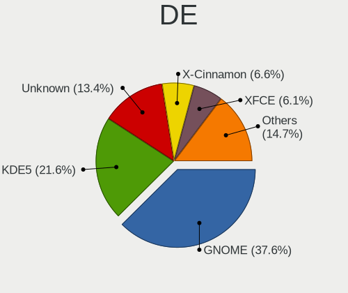

| Name             | Desktops | Percent |
|------------------|----------|---------|
| GNOME            | 169      | 35.81%  |
| KDE5             | 86       | 18.22%  |
| Unknown          | 80       | 16.95%  |
| XFCE             | 33       | 6.99%   |
| X-Cinnamon       | 28       | 5.93%   |
| MATE             | 21       | 4.45%   |
| KDE              | 17       | 3.6%    |
| LXQt             | 7        | 1.48%   |
| KDE4             | 4        | 0.85%   |
| Cinnamon         | 4        | 0.85%   |
| Unity            | 3        | 0.64%   |
| LXDE             | 3        | 0.64%   |
| lightdm-xsession | 3        | 0.64%   |
| GNOME Flashback  | 3        | 0.64%   |
| Pantheon         | 2        | 0.42%   |
| Budgie           | 2        | 0.42%   |
| bspwm            | 2        | 0.42%   |
| sway:Unity       | 1        | 0.21%   |
| i3               | 1        | 0.21%   |
| GNOME Classic    | 1        | 0.21%   |
| DWM              | 1        | 0.21%   |
| Deepin           | 1        | 0.21%   |

Display Server
--------------

X11 or Wayland

| Name    | Desktops | Percent |
|---------|----------|---------|
| X11     | 366      | 79.91%  |
| Wayland | 38       | 8.3%    |
| Tty     | 27       | 5.9%    |
| Unknown | 26       | 5.68%   |
| Web     | 1        | 0.22%   |

Display Manager
---------------

SDDM, LightDM, etc.

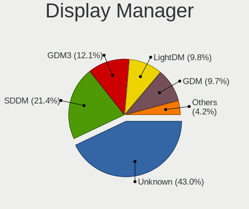

| Name    | Desktops | Percent |
|---------|----------|---------|
| Unknown | 241      | 51.06%  |
| SDDM    | 77       | 16.31%  |
| GDM     | 54       | 11.44%  |
| LightDM | 35       | 7.42%   |
| GDM3    | 33       | 6.99%   |
| TDM     | 27       | 5.72%   |
| KDM     | 5        | 1.06%   |

OS Lang
-------

Language

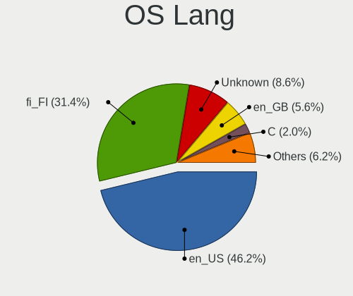

| Lang    | Desktops | Percent |
|---------|----------|---------|
| en_US   | 190      | 41.21%  |
| fi_FI   | 147      | 31.89%  |
| Unknown | 64       | 13.88%  |
| en_GB   | 20       | 4.34%   |
| C       | 9        | 1.95%   |
| ru_RU   | 6        | 1.3%    |
| en_FI   | 5        | 1.08%   |
| sv_SE   | 3        | 0.65%   |
| sv_FI   | 3        | 0.65%   |
| fr_FR   | 2        | 0.43%   |
| en_SE   | 2        | 0.43%   |
| en_DK   | 2        | 0.43%   |
| pl_PL   | 1        | 0.22%   |
| it_IT   | 1        | 0.22%   |
| ia_FR   | 1        | 0.22%   |
| fr_CA   | 1        | 0.22%   |
| en_IE   | 1        | 0.22%   |
| en_CA   | 1        | 0.22%   |
| C.UTF8  | 1        | 0.22%   |
| af_ZA   | 1        | 0.22%   |

Boot Mode
---------

EFI or BIOS

| Mode | Desktops | Percent |
|------|----------|---------|
| BIOS | 272      | 59.13%  |
| EFI  | 188      | 40.87%  |

Filesystem
----------

Type of filesystem

| Type    | Desktops | Percent |
|---------|----------|---------|
| Ext4    | 339      | 73.86%  |
| Btrfs   | 46       | 10.02%  |
| Overlay | 34       | 7.41%   |
| Unknown | 21       | 4.58%   |
| Xfs     | 11       | 2.4%    |
| Zfs     | 5        | 1.09%   |
| F2fs    | 2        | 0.44%   |
| Ext3    | 1        | 0.22%   |

Part. scheme
------------

Scheme of partitioning

| Type    | Desktops | Percent |
|---------|----------|---------|
| Unknown | 236      | 51.3%   |
| GPT     | 160      | 34.78%  |
| MBR     | 64       | 13.91%  |

Dual Boot with Linux/BSD
------------------------

Hosting more than one Linux/BSD

| Dual boot | Desktops | Percent |
|-----------|----------|---------|
| No        | 357      | 77.95%  |
| Yes       | 101      | 22.05%  |

Dual Boot (Win)
---------------

Hosting Linux and Windows

| Dual boot | Desktops | Percent |
|-----------|----------|---------|
| No        | 299      | 64.86%  |
| Yes       | 162      | 35.14%  |

Board
-----

Vendor
------

Motherboard manufacturer

| Name                | Desktops | Percent |
|---------------------|----------|---------|
| ASUSTek Computer    | 161      | 35.86%  |
| Hewlett-Packard     | 50       | 11.14%  |
| MSI                 | 48       | 10.69%  |
| Gigabyte Technology | 48       | 10.69%  |
| ASRock              | 43       | 9.58%   |
| Acer                | 17       | 3.79%   |
| Lenovo              | 15       | 3.34%   |
| Dell                | 15       | 3.34%   |
| Fujitsu             | 12       | 2.67%   |
| Pegatron            | 8        | 1.78%   |
| Intel               | 7        | 1.56%   |
| Foxconn             | 7        | 1.56%   |
| Supermicro          | 3        | 0.67%   |
| Packard Bell        | 3        | 0.67%   |
| ASRockRack          | 2        | 0.45%   |
| AOpen               | 2        | 0.45%   |
| ABIT                | 2        | 0.45%   |
| WeiBu               | 1        | 0.22%   |
| Shuttle             | 1        | 0.22%   |
| Medion              | 1        | 0.22%   |
| Fujitsu Siemens     | 1        | 0.22%   |
| ECS                 | 1        | 0.22%   |
| Unknown             | 1        | 0.22%   |

Model
-----

Motherboard model

| Name                                                      | Desktops | Percent |
|-----------------------------------------------------------|----------|---------|
| ASUS All Series                                           | 22       | 4.9%    |
| HP EliteDesk 800 G1 SFF                                   | 8        | 1.78%   |
| MSI MS-7C37                                               | 6        | 1.34%   |
| ASUS TUF Gaming X570-PLUS                                 | 5        | 1.11%   |
| Gigabyte X570 AORUS ELITE                                 | 4        | 0.89%   |
| ASUS M5A97 R2.0                                           | 4        | 0.89%   |
| MSI MS-7B89                                               | 3        | 0.67%   |
| MSI MS-7B48                                               | 3        | 0.67%   |
| MSI MS-7A38                                               | 3        | 0.67%   |
| HP Compaq 8200 Elite SFF PC                               | 3        | 0.67%   |
| Dell OptiPlex 780                                         | 3        | 0.67%   |
| ASUS ROG STRIX Z370-F GAMING                              | 3        | 0.67%   |
| ASUS ROG STRIX B550-I GAMING                              | 3        | 0.67%   |
| ASUS Pro WS 565-ACE                                       | 3        | 0.67%   |
| ASUS PRIME B350-PLUS                                      | 3        | 0.67%   |
| ASRock B450M-HDV R4.0                                     | 3        | 0.67%   |
| Acer Aspire X3300                                         | 3        | 0.67%   |
| MSI MS-7C84                                               | 2        | 0.45%   |
| MSI MS-7B49                                               | 2        | 0.45%   |
| MSI MS-7B46                                               | 2        | 0.45%   |
| MSI MS-7A40                                               | 2        | 0.45%   |
| Lenovo ThinkCentre M90 5485W45                            | 2        | 0.45%   |
| HP Z420 Workstation                                       | 2        | 0.45%   |
| HP Z240 Tower Workstation                                 | 2        | 0.45%   |
| HP Compaq 8000 Elite SFF PC                               | 2        | 0.45%   |
| HP Compaq 8000 Elite CMT PC                               | 2        | 0.45%   |
| HP Compaq 6200 Pro SFF PC                                 | 2        | 0.45%   |
| Gigabyte B550 AORUS ELITE                                 | 2        | 0.45%   |
| Gigabyte AB350-Gaming 3                                   | 2        | 0.45%   |
| Fujitsu D3401-H1                                          | 2        | 0.45%   |
| Dell OptiPlex 9010                                        | 2        | 0.45%   |
| Dell OptiPlex 3020                                        | 2        | 0.45%   |
| ASUS Z170-A                                               | 2        | 0.45%   |
| ASUS Z170 PRO GAMING                                      | 2        | 0.45%   |
| ASUS Z10PA-U8 Series                                      | 2        | 0.45%   |
| ASUS TUF B450-PLUS GAMING                                 | 2        | 0.45%   |
| ASUS ROG STRIX X570-E GAMING                              | 2        | 0.45%   |
| ASUS ROG STRIX B550-F GAMING                              | 2        | 0.45%   |
| ASUS PRIME Z370-P                                         | 2        | 0.45%   |
| ASUS PRIME Z270-A                                         | 2        | 0.45%   |
| ASUS PRIME X570-PRO                                       | 2        | 0.45%   |
| ASUS PRIME X470-PRO                                       | 2        | 0.45%   |
| ASUS PRIME X370-PRO                                       | 2        | 0.45%   |
| ASUS PRIME B450M-A                                        | 2        | 0.45%   |
| ASUS PRIME B450-PLUS                                      | 2        | 0.45%   |
| ASUS P8Z77-V LX                                           | 2        | 0.45%   |
| ASUS P8Z68-V                                              | 2        | 0.45%   |
| ASUS P8H67                                                | 2        | 0.45%   |
| ASUS P6T                                                  | 2        | 0.45%   |
| ASUS M4A78T-E                                             | 2        | 0.45%   |
| ASUS M4A785TD-M EVO                                       | 2        | 0.45%   |
| ASRockRack B450D4U-V1L                                    | 2        | 0.45%   |
| ASRock Z87 Extreme6                                       | 2        | 0.45%   |
| ASRock Z77 Pro3                                           | 2        | 0.45%   |
| ASRock X399 Taichi                                        | 2        | 0.45%   |
| ASRock B450M Pro4                                         | 2        | 0.45%   |
| ASRock 970 Extreme4                                       | 2        | 0.45%   |
| Acer Aspire M5201                                         | 2        | 0.45%   |
| WeiBu WTGLKC1R120 SD-BS-CJ41G-M-101-B 12/09/2019 18:14:02 | 1        | 0.22%   |
| Supermicro X9SCI/X9SCA                                    | 1        | 0.22%   |

Model Family
------------

Motherboard model prefix

| Name                   | Desktops | Percent |
|------------------------|----------|---------|
| ASUS PRIME             | 28       | 6.24%   |
| ASUS All               | 22       | 4.9%    |
| HP Compaq              | 19       | 4.23%   |
| ASUS ROG               | 17       | 3.79%   |
| Dell OptiPlex          | 12       | 2.67%   |
| Acer Aspire            | 12       | 2.67%   |
| Lenovo ThinkCentre     | 11       | 2.45%   |
| HP EliteDesk           | 11       | 2.45%   |
| ASUS TUF               | 8        | 1.78%   |
| Gigabyte X570          | 7        | 1.56%   |
| Fujitsu ESPRIMO        | 7        | 1.56%   |
| MSI MS-7C37            | 6        | 1.34%   |
| HP ProDesk             | 6        | 1.34%   |
| ASUS M5A97             | 6        | 1.34%   |
| Gigabyte B550          | 4        | 0.89%   |
| ASUS Pro               | 4        | 0.89%   |
| ASRock B450M-HDV       | 4        | 0.89%   |
| MSI MS-7B89            | 3        | 0.67%   |
| MSI MS-7B48            | 3        | 0.67%   |
| MSI MS-7A38            | 3        | 0.67%   |
| HP Pavilion            | 3        | 0.67%   |
| ASUS P8Z68-V           | 3        | 0.67%   |
| ASRock 970             | 3        | 0.67%   |
| Acer Predator          | 3        | 0.67%   |
| Packard Bell IMEDIA    | 2        | 0.45%   |
| MSI MS-7C84            | 2        | 0.45%   |
| MSI MS-7B49            | 2        | 0.45%   |
| MSI MS-7B46            | 2        | 0.45%   |
| MSI MS-7A40            | 2        | 0.45%   |
| Intel DP55WG           | 2        | 0.45%   |
| HP Z420                | 2        | 0.45%   |
| HP Z240                | 2        | 0.45%   |
| Gigabyte AB350-Gaming  | 2        | 0.45%   |
| Fujitsu D3401-H1       | 2        | 0.45%   |
| Dell Precision         | 2        | 0.45%   |
| ASUS Z170-A            | 2        | 0.45%   |
| ASUS Z170              | 2        | 0.45%   |
| ASUS Z10PA-U8          | 2        | 0.45%   |
| ASUS P8Z77-V           | 2        | 0.45%   |
| ASUS P8H67             | 2        | 0.45%   |
| ASUS P7P55D            | 2        | 0.45%   |
| ASUS P6T               | 2        | 0.45%   |
| ASUS P5G41T-M          | 2        | 0.45%   |
| ASUS Maximus           | 2        | 0.45%   |
| ASUS M4A78T-E          | 2        | 0.45%   |
| ASUS M4A785TD-M        | 2        | 0.45%   |
| ASRockRack B450D4U-V1L | 2        | 0.45%   |
| ASRock Z87             | 2        | 0.45%   |
| ASRock Z77             | 2        | 0.45%   |
| ASRock X570            | 2        | 0.45%   |
| ASRock X399            | 2        | 0.45%   |
| ASRock B450M           | 2        | 0.45%   |
| ASRock B450            | 2        | 0.45%   |
| ASRock 990FX           | 2        | 0.45%   |
| WeiBu WTGLKC1R120      | 1        | 0.22%   |
| Supermicro X9SCI       | 1        | 0.22%   |
| Supermicro X8ST3       | 1        | 0.22%   |
| Supermicro X10SBA-L    | 1        | 0.22%   |
| Shuttle SZ77           | 1        | 0.22%   |
| Pegatron KX664AA-UUW   | 1        | 0.22%   |

MFG Year
--------

Motherboard manufacture year

| Year | Desktops | Percent |
|------|----------|---------|
| 2013 | 47       | 10.47%  |
| 2012 | 47       | 10.47%  |
| 2018 | 41       | 9.13%   |
| 2019 | 40       | 8.91%   |
| 2017 | 40       | 8.91%   |
| 2009 | 33       | 7.35%   |
| 2011 | 31       | 6.9%    |
| 2020 | 30       | 6.68%   |
| 2015 | 23       | 5.12%   |
| 2010 | 23       | 5.12%   |
| 2014 | 22       | 4.9%    |
| 2008 | 22       | 4.9%    |
| 2016 | 17       | 3.79%   |
| 2007 | 12       | 2.67%   |
| 2021 | 9        | 2%      |
| 2006 | 6        | 1.34%   |
| 2005 | 3        | 0.67%   |
| 2004 | 2        | 0.45%   |
| 2022 | 1        | 0.22%   |

Form Factor
-----------

Physical design of the computer

| Name    | Desktops | Percent |
|---------|----------|---------|
| Desktop | 449      | 100%    |

Secure Boot
-----------

Enabled or disabled

| State    | Desktops | Percent |
|----------|----------|---------|
| Disabled | 439      | 97.34%  |
| Enabled  | 12       | 2.66%   |

Coreboot
--------

Have coreboot on board

| Used | Desktops | Percent |
|------|----------|---------|
| No   | 449      | 100%    |

RAM Size
--------

Total RAM memory

| Size in GB      | Desktops | Percent |
|-----------------|----------|---------|
| 16.01-24.0      | 128      | 28.13%  |
| 8.01-16.0       | 79       | 17.36%  |
| 3.01-4.0        | 71       | 15.6%   |
| 32.01-64.0      | 64       | 14.07%  |
| 4.01-8.0        | 59       | 12.97%  |
| 64.01-256.0     | 26       | 5.71%   |
| 24.01-32.0      | 11       | 2.42%   |
| 1.01-2.0        | 10       | 2.2%    |
| 2.01-3.0        | 5        | 1.1%    |
| More than 256.0 | 1        | 0.22%   |
| 0.51-1.0        | 1        | 0.22%   |

RAM Used
--------

Used RAM memory

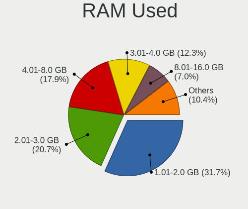

| Used GB     | Desktops | Percent |
|-------------|----------|---------|
| 1.01-2.0    | 168      | 33.8%   |
| 2.01-3.0    | 104      | 20.93%  |
| 4.01-8.0    | 72       | 14.49%  |
| 3.01-4.0    | 58       | 11.67%  |
| 0.51-1.0    | 39       | 7.85%   |
| 8.01-16.0   | 35       | 7.04%   |
| 16.01-24.0  | 6        | 1.21%   |
| 0.01-0.5    | 6        | 1.21%   |
| 32.01-64.0  | 5        | 1.01%   |
| 24.01-32.0  | 2        | 0.4%    |
| 64.01-256.0 | 1        | 0.2%    |
| 0           | 1        | 0.2%    |

Total Drives
------------

Number of drives on board

| Drives | Desktops | Percent |
|--------|----------|---------|
| 1      | 153      | 32.83%  |
| 2      | 130      | 27.9%   |
| 3      | 85       | 18.24%  |
| 4      | 35       | 7.51%   |
| 5      | 26       | 5.58%   |
| 6      | 10       | 2.15%   |
| 0      | 8        | 1.72%   |
| 7      | 6        | 1.29%   |
| 9      | 5        | 1.07%   |
| 8      | 4        | 0.86%   |
| 10     | 2        | 0.43%   |
| 23     | 1        | 0.21%   |
| 11     | 1        | 0.21%   |

Has CD-ROM
----------

Has CD-ROM on board

| Presented | Desktops | Percent |
|-----------|----------|---------|
| No        | 234      | 51.2%   |
| Yes       | 223      | 48.8%   |

Has Ethernet
------------

Has Ethernet on board

| Presented | Desktops | Percent |
|-----------|----------|---------|
| Yes       | 446      | 99.33%  |
| No        | 3        | 0.67%   |

Has WiFi
--------

Has WiFi module

| Presented | Desktops | Percent |
|-----------|----------|---------|
| No        | 278      | 61.37%  |
| Yes       | 175      | 38.63%  |

Has Bluetooth
-------------

Has Bluetooth module

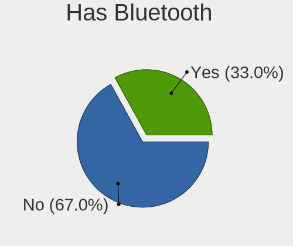

| Presented | Desktops | Percent |
|-----------|----------|---------|
| No        | 331      | 72.75%  |
| Yes       | 124      | 27.25%  |

Location
--------

Country
-------

Geographic location (country)

| Country | Desktops | Percent |
|---------|----------|---------|
| Finland | 449      | 100%    |

City
----

Geographic location (city)

| City         | Desktops | Percent |
|--------------|----------|---------|
| Helsinki     | 181      | 37.4%   |
| Tampere      | 49       | 10.12%  |
| Turku        | 34       | 7.02%   |
| Oulu         | 31       | 6.4%    |
| Espoo        | 22       | 4.55%   |
| Kuopio       | 18       | 3.72%   |
| Jyvskyl  | 14       | 2.89%   |
| Lahti        | 12       | 2.48%   |
| Vantaa       | 10       | 2.07%   |
| Vaasa        | 6        | 1.24%   |
| Tuusula      | 6        | 1.24%   |
| Raahe        | 6        | 1.24%   |
| Raisio       | 5        | 1.03%   |
| Pori         | 5        | 1.03%   |
| Joensuu      | 5        | 1.03%   |
| Hyvinkaeae   | 5        | 1.03%   |
| Salo         | 3        | 0.62%   |
| Lempl  | 3        | 0.62%   |
| Hanko        | 3        | 0.62%   |
| Tenala       | 2        | 0.41%   |
| Tarvasjoki   | 2        | 0.41%   |
| Solv         | 2        | 0.41%   |
| Seinjoki   | 2        | 0.41%   |
| Rauma        | 2        | 0.41%   |
| Porlammi     | 2        | 0.41%   |
| Nokia        | 2        | 0.41%   |
| Maenttae     | 2        | 0.41%   |
| Lieto        | 2        | 0.41%   |
| Lappeenranta | 2        | 0.41%   |
| Kouvola      | 2        | 0.41%   |
| Kotka        | 2        | 0.41%   |
| Klaukkala    | 2        | 0.41%   |
| Kangasala    | 2        | 0.41%   |
| Heinola      | 2        | 0.41%   |
| Ylaemylly    | 1        | 0.21%   |
| Vr       | 1        | 0.21%   |
| Vierem     | 1        | 0.21%   |
| Vesilahti    | 1        | 0.21%   |
| Vaajakoski   | 1        | 0.21%   |
| Uusikaupunki | 1        | 0.21%   |
| Turenki      | 1        | 0.21%   |
| Tupos        | 1        | 0.21%   |
| Teraelahti   | 1        | 0.21%   |
| Ruovesi      | 1        | 0.21%   |
| Riihimki   | 1        | 0.21%   |
| Raaseporin   | 1        | 0.21%   |
| Pieksmki | 1        | 0.21%   |
| Petjvesi | 1        | 0.21%   |
| Parkkuu      | 1        | 0.21%   |
| Paimio       | 1        | 0.21%   |
| Padasjoki    | 1        | 0.21%   |
| Nurmes       | 1        | 0.21%   |
| Nummela      | 1        | 0.21%   |
| Nedervetil   | 1        | 0.21%   |
| Mikkeli      | 1        | 0.21%   |
| Masku        | 1        | 0.21%   |
| Lohja        | 1        | 0.21%   |
| Liminka      | 1        | 0.21%   |
| Kokkola      | 1        | 0.21%   |
| Kerava       | 1        | 0.21%   |

Drives
------

Drive Vendor
------------

Hard drive vendors

| Vendor                | Desktops | Drives | Percent |
|-----------------------|----------|--------|---------|
| Samsung Electronics   | 176      | 302    | 21.36%  |
| WDC                   | 165      | 322    | 20.02%  |
| Seagate               | 127      | 220    | 15.41%  |
| Kingston              | 120      | 191    | 14.56%  |
| Toshiba               | 32       | 74     | 3.88%   |
| Crucial               | 31       | 38     | 3.76%   |
| Hitachi               | 26       | 34     | 3.16%   |
| Intel                 | 23       | 33     | 2.79%   |
| A-DATA Technology     | 13       | 19     | 1.58%   |
| SanDisk               | 12       | 14     | 1.46%   |
| Maxtor                | 12       | 19     | 1.46%   |
| Corsair               | 8        | 10     | 0.97%   |
| Phison                | 7        | 7      | 0.85%   |
| Micron Technology     | 7        | 12     | 0.85%   |
| HGST                  | 7        | 17     | 0.85%   |
| Unknown               | 6        | 13     | 0.73%   |
| OCZ                   | 6        | 8      | 0.73%   |
| Verbatim              | 5        | 6      | 0.61%   |
| PNY                   | 5        | 5      | 0.61%   |
| SK hynix              | 4        | 4      | 0.49%   |
| XPG                   | 3        | 4      | 0.36%   |
| Transcend             | 3        | 4      | 0.36%   |
| LITEONIT              | 3        | 3      | 0.36%   |
| Plextor               | 2        | 2      | 0.24%   |
| Patriot               | 2        | 5      | 0.24%   |
| OCZ-VERTEX3           | 2        | 2      | 0.24%   |
| LITEON                | 2        | 2      | 0.24%   |
| Intenso               | 2        | 2      | 0.24%   |
| HUAWEI                | 2        | 2      | 0.24%   |
| Hewlett-Packard       | 2        | 3      | 0.24%   |
| USB3.1                | 1        | 1      | 0.12%   |
| TSA                   | 1        | 1      | 0.12%   |
| SPCC                  | 1        | 1      | 0.12%   |
| sobetter              | 1        | 1      | 0.12%   |
| Realtek Semiconductor | 1        | 1      | 0.12%   |
| OCZ-VERTEX            | 1        | 1      | 0.12%   |
| KingSpec              | 1        | 1      | 0.12%   |
| Fujitsu               | 1        | 1      | 0.12%   |
| External              | 1        | 1      | 0.12%   |

Drive Model
-----------

Hard drive models

| Model                               | Desktops | Percent |
|-------------------------------------|----------|---------|
| Samsung SSD 850 EVO 250GB           | 23       | 2.32%   |
| Kingston SA400S37240G 240GB SSD     | 19       | 1.92%   |
| Samsung NVMe SSD Drive 500GB        | 14       | 1.41%   |
| Kingston SA400S37480G 480GB SSD     | 14       | 1.41%   |
| Kingston SA400S37120G 120GB SSD     | 14       | 1.41%   |
| Samsung SSD 850 EVO 500GB           | 12       | 1.21%   |
| Kingston SHFS37A120G 120GB SSD      | 12       | 1.21%   |
| Kingston SV300S37A120G 120GB SSD    | 11       | 1.11%   |
| Samsung HD103SJ 1TB                 | 10       | 1.01%   |
| Seagate ST500DM002-1BD142 500GB     | 9        | 0.91%   |
| Samsung SSD 860 EVO 500GB           | 9        | 0.91%   |
| Toshiba DT01ACA300 3TB              | 8        | 0.81%   |
| Samsung SSD 960 EVO 500GB           | 8        | 0.81%   |
| Samsung HD501LJ 500GB               | 8        | 0.81%   |
| WDC WD30EFRX-68EUZN0 3TB            | 7        | 0.71%   |
| Kingston SV300S37A240G 240GB SSD    | 7        | 0.71%   |
| WDC WD40EFRX-68WT0N0 4TB            | 6        | 0.61%   |
| Seagate ST4000DM004-2CV104 4TB      | 6        | 0.61%   |
| Seagate ST1000DM003-1CH162 1TB      | 6        | 0.61%   |
| Samsung SSD 860 EVO 1TB             | 6        | 0.61%   |
| Samsung NVMe SSD Drive 1TB          | 6        | 0.61%   |
| Crucial CT1000MX500SSD1 1TB         | 6        | 0.61%   |
| Toshiba DT01ACA100 1TB              | 5        | 0.51%   |
| Seagate ST31000528AS 1TB            | 5        | 0.51%   |
| Seagate ST31000524AS 1TB            | 5        | 0.51%   |
| Samsung SSD 970 EVO Plus 500GB      | 5        | 0.51%   |
| Samsung SSD 970 EVO 500GB           | 5        | 0.51%   |
| Samsung SSD 860 QVO 1TB             | 5        | 0.51%   |
| Samsung SSD 850 PRO 256GB           | 5        | 0.51%   |
| Samsung SSD 840 EVO 120GB           | 5        | 0.51%   |
| Kingston SH103S3120G 120GB SSD      | 5        | 0.51%   |
| WDC WDS240G2G0A-00JH30 240GB SSD    | 4        | 0.4%    |
| WDC WD10EZEX-00BN5A0 1TB            | 4        | 0.4%    |
| WDC WD10EARS-00Y5B1 1TB             | 4        | 0.4%    |
| Verbatim Vi550 S3 SSD 256GB         | 4        | 0.4%    |
| Seagate ST3160815AS 160GB           | 4        | 0.4%    |
| Seagate ST31500341AS 1TB            | 4        | 0.4%    |
| Seagate ST2000DM008-2FR102 2TB      | 4        | 0.4%    |
| Seagate ST1000DM010-2EP102 1TB      | 4        | 0.4%    |
| Samsung SSD 970 EVO Plus 1TB        | 4        | 0.4%    |
| Samsung SSD 850 EVO 120GB           | 4        | 0.4%    |
| Samsung SSD 830 Series 128GB        | 4        | 0.4%    |
| Micron 1100_MTFDDAK512TBN 512GB SSD | 4        | 0.4%    |
| Intel NVMe SSD Drive 1024GB         | 4        | 0.4%    |
| Hitachi HDS723020BLA642 2TB         | 4        | 0.4%    |
| Crucial CT500MX500SSD1 500GB        | 4        | 0.4%    |
| Crucial CT256MX100SSD1 256GB        | 4        | 0.4%    |
| WDC WDS500G2B0A-00SM50 500GB SSD    | 3        | 0.3%    |
| WDC WD5000AAKX-08U6AA0 500GB        | 3        | 0.3%    |
| WDC WD5000AAKX-00ERMA0 500GB        | 3        | 0.3%    |
| WDC WD5000AAKS-07YGA0 500GB         | 3        | 0.3%    |
| WDC WD20EFRX-68EUZN0 2TB            | 3        | 0.3%    |
| WDC WD20EARX-00PASB0 2TB            | 3        | 0.3%    |
| WDC WD20EARX-008FB0 2TB             | 3        | 0.3%    |
| WDC WD10EZEX-08WN4A0 1TB            | 3        | 0.3%    |
| WDC WD10EADS-22M2B0 1TB             | 3        | 0.3%    |
| WDC WD1002FAEX-00Z3A0 1TB           | 3        | 0.3%    |
| SK hynix NVMe SSD Drive 256GB       | 3        | 0.3%    |
| Seagate ST3320620AS 320GB           | 3        | 0.3%    |
| Seagate ST2000DM001-9YN164 2TB      | 3        | 0.3%    |

HDD Vendor
----------

Hard disk drive vendors

| Vendor              | Desktops | Drives | Percent |
|---------------------|----------|--------|---------|
| WDC                 | 149      | 281    | 39.01%  |
| Seagate             | 122      | 212    | 31.94%  |
| Samsung Electronics | 36       | 52     | 9.42%   |
| Toshiba             | 26       | 53     | 6.81%   |
| Hitachi             | 26       | 34     | 6.81%   |
| Maxtor              | 12       | 19     | 3.14%   |
| HGST                | 7        | 17     | 1.83%   |
| Unknown             | 2        | 2      | 0.52%   |
| Hewlett-Packard     | 1        | 1      | 0.26%   |
| Fujitsu             | 1        | 1      | 0.26%   |

SSD Vendor
----------

Solid state drive vendors

| Vendor              | Desktops | Drives | Percent |
|---------------------|----------|--------|---------|
| Kingston            | 106      | 170    | 32.12%  |
| Samsung Electronics | 104      | 150    | 31.52%  |
| Crucial             | 31       | 38     | 9.39%   |
| WDC                 | 19       | 31     | 5.76%   |
| Micron Technology   | 7        | 12     | 2.12%   |
| Intel               | 7        | 15     | 2.12%   |
| SanDisk             | 6        | 6      | 1.82%   |
| OCZ                 | 6        | 8      | 1.82%   |
| Verbatim            | 5        | 6      | 1.52%   |
| Corsair             | 5        | 6      | 1.52%   |
| A-DATA Technology   | 5        | 8      | 1.52%   |
| PNY                 | 4        | 4      | 1.21%   |
| Transcend           | 3        | 4      | 0.91%   |
| Toshiba             | 3        | 10     | 0.91%   |
| LITEONIT            | 3        | 3      | 0.91%   |
| Plextor             | 2        | 2      | 0.61%   |
| Patriot             | 2        | 5      | 0.61%   |
| OCZ-VERTEX3         | 2        | 2      | 0.61%   |
| LITEON              | 2        | 2      | 0.61%   |
| Intenso             | 2        | 2      | 0.61%   |
| Unknown             | 1        | 1      | 0.3%    |
| TSA                 | 1        | 1      | 0.3%    |
| SPCC                | 1        | 1      | 0.3%    |
| Seagate             | 1        | 1      | 0.3%    |
| OCZ-VERTEX          | 1        | 1      | 0.3%    |
| Hewlett-Packard     | 1        | 2      | 0.3%    |

Drive Kind
----------

HDD or SSD

| Kind    | Desktops | Drives | Percent |
|---------|----------|--------|---------|
| HDD     | 291      | 672    | 41.81%  |
| SSD     | 263      | 491    | 37.79%  |
| NVMe    | 130      | 204    | 18.68%  |
| Unknown | 11       | 18     | 1.58%   |
| MMC     | 1        | 1      | 0.14%   |

Drive Connector
---------------

SATA, SAS, NVMe, etc.

| Type | Desktops | Drives | Percent |
|------|----------|--------|---------|
| SATA | 406      | 1138   | 72.24%  |
| NVMe | 129      | 203    | 22.95%  |
| SAS  | 26       | 44     | 4.63%   |
| MMC  | 1        | 1      | 0.18%   |

Drive Size
----------

Size of hard drive

| Size in TB | Desktops | Drives | Percent |
|------------|----------|--------|---------|
| 0.01-0.5   | 323      | 647    | 52.69%  |
| 0.51-1.0   | 163      | 239    | 26.59%  |
| 1.01-2.0   | 54       | 95     | 8.81%   |
| 3.01-4.0   | 28       | 81     | 4.57%   |
| 2.01-3.0   | 27       | 58     | 4.4%    |
| 4.01-10.0  | 17       | 42     | 2.77%   |
| 10.01-20.0 | 1        | 1      | 0.16%   |

Space Total
-----------

Amount of disk space available on the file system

| Size in GB     | Desktops | Percent |
|----------------|----------|---------|
| 101-250        | 113      | 23.84%  |
| 251-500        | 72       | 15.19%  |
| 501-1000       | 59       | 12.45%  |
| More than 3000 | 58       | 12.24%  |
| 1001-2000      | 49       | 10.34%  |
| 2001-3000      | 30       | 6.33%   |
| 1-20           | 30       | 6.33%   |
| Unknown        | 28       | 5.91%   |
| 51-100         | 26       | 5.49%   |
| 21-50          | 9        | 1.9%    |

Space Used
----------

Amount of used disk space

| Used GB        | Desktops | Percent |
|----------------|----------|---------|
| 1-20           | 154      | 32.22%  |
| 21-50          | 52       | 10.88%  |
| 101-250        | 47       | 9.83%   |
| 51-100         | 46       | 9.62%   |
| 501-1000       | 42       | 8.79%   |
| 1001-2000      | 35       | 7.32%   |
| 251-500        | 33       | 6.9%    |
| Unknown        | 28       | 5.86%   |
| More than 3000 | 22       | 4.6%    |
| 2001-3000      | 19       | 3.97%   |

Malfunc. Drives
---------------

Drive models with a malfunction

| Model                                          | Desktops | Drives | Percent |
|------------------------------------------------|----------|--------|---------|
| WDC WD40EFRX-68WT0N0 4TB                       | 3        | 5      | 5%      |
| Samsung Electronics HD103SJ 1TB                | 3        | 4      | 5%      |
| Kingston SHFS37A120G 120GB SSD                 | 3        | 4      | 5%      |
| Micron Technology MTFDDAK512MAM-1K1 512GB SSD  | 2        | 2      | 3.33%   |
| Micron Technology 1100_MTFDDAK512TBN 512GB SSD | 2        | 4      | 3.33%   |
| Maxtor 7Y250M0 250GB                           | 2        | 2      | 3.33%   |
| WDC WDS240G2G0A-00JH30 240GB SSD               | 1        | 1      | 1.67%   |
| WDC WD6400AAKS-07A7B0 640GB                    | 1        | 1      | 1.67%   |
| WDC WD50EZRZ-32RWYB1 5TB                       | 1        | 1      | 1.67%   |
| WDC WD5000AAKX-00ERMA0 500GB                   | 1        | 1      | 1.67%   |
| WDC WD5000AAKS-22A7B0 500GB                    | 1        | 1      | 1.67%   |
| WDC WD3200BEVT-22ZCT0 320GB                    | 1        | 1      | 1.67%   |
| WDC WD3200AAKS-00L9A0 320GB                    | 1        | 1      | 1.67%   |
| WDC WD3200AAJS-60Z0A0 320GB                    | 1        | 1      | 1.67%   |
| WDC WD30EFRX-68EUZN0 3TB                       | 1        | 1      | 1.67%   |
| WDC WD2500AAJS-00V4A0 250GB                    | 1        | 1      | 1.67%   |
| WDC WD2002FAEX-007BA0 2TB                      | 1        | 1      | 1.67%   |
| WDC WD10EZEX-60ZF5A0 1TB                       | 1        | 1      | 1.67%   |
| WDC WD10EZEX-00WN4A0 1TB                       | 1        | 1      | 1.67%   |
| WDC WD10EADX-22TDHB0 1TB                       | 1        | 1      | 1.67%   |
| WDC WD10EADS-22M2B0 1TB                        | 1        | 1      | 1.67%   |
| Toshiba MQ04ABF100 1TB                         | 1        | 1      | 1.67%   |
| Toshiba HDWA120 2TB                            | 1        | 1      | 1.67%   |
| Toshiba DT01ACA100 1TB                         | 1        | 1      | 1.67%   |
| Seagate ST8000DM004-2CX188 8TB                 | 1        | 1      | 1.67%   |
| Seagate ST500LT012-9WS142 500GB                | 1        | 1      | 1.67%   |
| Seagate ST500LM000-1EJ162-SSHD-8GB             | 1        | 1      | 1.67%   |
| Seagate ST500DM002-1BD142 500GB                | 1        | 1      | 1.67%   |
| Seagate ST500DM002-1BC142 500GB                | 1        | 1      | 1.67%   |
| Seagate ST3500413AS 500GB                      | 1        | 1      | 1.67%   |
| Seagate ST3250410AS 250GB                      | 1        | 1      | 1.67%   |
| Seagate ST3160318AS 160GB                      | 1        | 1      | 1.67%   |
| Seagate ST31500341AS 1TB                       | 1        | 1      | 1.67%   |
| Seagate ST31000528AS 1TB                       | 1        | 1      | 1.67%   |
| Seagate ST2000DM006-2DM164 2TB                 | 1        | 1      | 1.67%   |
| Seagate ST1000LM024 HN-M101MBB 1TB             | 1        | 2      | 1.67%   |
| Seagate ST1000DM003-1CH162 1TB                 | 1        | 1      | 1.67%   |
| Samsung Electronics SSD 960 EVO 500GB          | 1        | 1      | 1.67%   |
| Samsung Electronics SSD 850 EVO 1TB            | 1        | 1      | 1.67%   |
| Samsung Electronics HD501LJ 500GB              | 1        | 1      | 1.67%   |
| Maxtor 6L200P0 208GB                           | 1        | 1      | 1.67%   |
| LITEONIT LCS-128M6S 128GB SSD                  | 1        | 1      | 1.67%   |
| Kingston SH103S3120G 120GB SSD                 | 1        | 1      | 1.67%   |
| Kingston SA400S37240G 240GB SSD                | 1        | 1      | 1.67%   |
| Kingston RBUSNS8180DS3256GH 256GB SSD          | 1        | 1      | 1.67%   |
| Intel SSDPEKKW256G7 256GB                      | 1        | 1      | 1.67%   |
| Hitachi HTS727550A9E364 500GB                  | 1        | 2      | 1.67%   |
| Hitachi HTS723225L9A360 250GB                  | 1        | 1      | 1.67%   |
| Hitachi HDP725016GLA380 160GB                  | 1        | 1      | 1.67%   |
| HGST HTS725050A7E630 500GB                     | 1        | 1      | 1.67%   |
| Corsair CSSD-F40GB2                            | 1        | 1      | 1.67%   |

Malfunc. Drive Vendor
---------------------

Vendors of faulty drives

| Vendor              | Desktops | Drives | Percent |
|---------------------|----------|--------|---------|
| WDC                 | 17       | 20     | 29.31%  |
| Seagate             | 12       | 14     | 20.69%  |
| Samsung Electronics | 6        | 7      | 10.34%  |
| Kingston            | 6        | 7      | 10.34%  |
| Micron Technology   | 4        | 6      | 6.9%    |
| Toshiba             | 3        | 3      | 5.17%   |
| Maxtor              | 3        | 3      | 5.17%   |
| Hitachi             | 3        | 4      | 5.17%   |
| LITEONIT            | 1        | 1      | 1.72%   |
| Intel               | 1        | 1      | 1.72%   |
| HGST                | 1        | 1      | 1.72%   |
| Corsair             | 1        | 1      | 1.72%   |

Malfunc. HDD Vendor
-------------------

Vendors of faulty HDD drives

| Vendor              | Desktops | Drives | Percent |
|---------------------|----------|--------|---------|
| WDC                 | 16       | 19     | 38.1%   |
| Seagate             | 12       | 14     | 28.57%  |
| Samsung Electronics | 4        | 5      | 9.52%   |
| Toshiba             | 3        | 3      | 7.14%   |
| Maxtor              | 3        | 3      | 7.14%   |
| Hitachi             | 3        | 4      | 7.14%   |
| HGST                | 1        | 1      | 2.38%   |

Malfunc. Drive Kind
-------------------

Kinds of faulty drives

| Kind | Desktops | Drives | Percent |
|------|----------|--------|---------|
| HDD  | 41       | 49     | 71.93%  |
| SSD  | 14       | 17     | 24.56%  |
| NVMe | 2        | 2      | 3.51%   |

Failed Drives
-------------

Failed drive models

| Model                     | Desktops | Drives | Percent |
|---------------------------|----------|--------|---------|
| Seagate ST3250318AS 250GB | 1        | 1      | 100%    |

Failed Drive Vendor
-------------------

Failed drive vendors

| Vendor  | Desktops | Drives | Percent |
|---------|----------|--------|---------|
| Seagate | 1        | 1      | 100%    |

Drive Status
------------

Number of failed and malfunc. drives

| Status   | Desktops | Drives | Percent |
|----------|----------|--------|---------|
| Detected | 249      | 754    | 50.51%  |
| Works    | 188      | 563    | 38.13%  |
| Malfunc  | 55       | 68     | 11.16%  |
| Failed   | 1        | 1      | 0.2%    |

Storage controller
------------------

Storage Vendor
--------------

Storage controller vendors

| Vendor                       | Desktops | Percent |
|------------------------------|----------|---------|
| Intel                        | 269      | 40.94%  |
| AMD                          | 162      | 24.66%  |
| Samsung Electronics          | 66       | 10.05%  |
| ASMedia Technology           | 31       | 4.72%   |
| JMicron Technology           | 22       | 3.35%   |
| Nvidia                       | 20       | 3.04%   |
| SanDisk                      | 16       | 2.44%   |
| Kingston Technology Company  | 15       | 2.28%   |
| Phison Electronics           | 12       | 1.83%   |
| ADATA Technology             | 11       | 1.67%   |
| Marvell Technology Group     | 10       | 1.52%   |
| VIA Technologies             | 5        | 0.76%   |
| Toshiba America Info Systems | 5        | 0.76%   |
| SK hynix                     | 3        | 0.46%   |
| Realtek Semiconductor        | 3        | 0.46%   |
| LSI Logic / Symbios Logic    | 3        | 0.46%   |
| Seagate Technology           | 2        | 0.3%    |
| Broadcom / LSI               | 1        | 0.15%   |
| Adaptec                      | 1        | 0.15%   |

Storage Model
-------------

Storage controller models

| Model                                                                                   | Desktops | Percent |
|-----------------------------------------------------------------------------------------|----------|---------|
| AMD FCH SATA Controller [AHCI mode]                                                     | 92       | 11.04%  |
| Intel 8 Series/C220 Series Chipset Family 6-port SATA Controller 1 [AHCI mode]          | 39       | 4.68%   |
| Samsung NVMe SSD Controller SM981/PM981/PM983                                           | 38       | 4.56%   |
| AMD 400 Series Chipset SATA Controller                                                  | 33       | 3.96%   |
| Intel Q170/Q150/B150/H170/H110/Z170/CM236 Chipset SATA Controller [AHCI Mode]           | 32       | 3.84%   |
| Intel 6 Series/C200 Series Chipset Family 6 port Desktop SATA AHCI Controller           | 30       | 3.6%    |
| ASMedia ASM1062 Serial ATA Controller                                                   | 30       | 3.6%    |
| AMD SB7x0/SB8x0/SB9x0 IDE Controller                                                    | 28       | 3.36%   |
| AMD SB7x0/SB8x0/SB9x0 SATA Controller [AHCI mode]                                       | 27       | 3.24%   |
| Intel 200 Series PCH SATA controller [AHCI mode]                                        | 22       | 2.64%   |
| Intel 7 Series/C210 Series Chipset Family 6-port SATA Controller [AHCI mode]            | 21       | 2.52%   |
| Samsung NVMe SSD Controller SM961/PM961/SM963                                           | 19       | 2.28%   |
| AMD SB7x0/SB8x0/SB9x0 SATA Controller [IDE mode]                                        | 18       | 2.16%   |
| AMD 500 Series Chipset SATA Controller                                                  | 17       | 2.04%   |
| Intel Cannon Lake PCH SATA AHCI Controller                                              | 14       | 1.68%   |
| AMD 300 Series Chipset SATA Controller                                                  | 13       | 1.56%   |
| Nvidia MCP61 SATA Controller                                                            | 12       | 1.44%   |
| Kingston Company A2000 NVMe SSD                                                         | 12       | 1.44%   |
| Intel 82801G (ICH7 Family) IDE Controller                                               | 11       | 1.32%   |
| JMicron JMB363 SATA/IDE Controller                                                      | 10       | 1.2%    |
| Intel SATA Controller [RAID mode]                                                       | 10       | 1.2%    |
| Intel NM10/ICH7 Family SATA Controller [IDE mode]                                       | 10       | 1.2%    |
| Intel 5 Series/3400 Series Chipset 6 port SATA AHCI Controller                          | 10       | 1.2%    |
| ADATA XPG SX8200 Pro PCIe Gen3x4 M.2 2280 Solid State Drive                             | 10       | 1.2%    |
| Samsung NVMe SSD Controller PM9A1/PM9A3/980PRO                                          | 9        | 1.08%   |
| Intel SSD 660P Series                                                                   | 9        | 1.08%   |
| Intel 9 Series Chipset Family SATA Controller [AHCI Mode]                               | 9        | 1.08%   |
| Phison E12 NVMe Controller                                                              | 8        | 0.96%   |
| Nvidia MCP61 IDE                                                                        | 8        | 0.96%   |
| JMicron JMB368 IDE controller                                                           | 8        | 0.96%   |
| Intel 4 Series Chipset PT IDER Controller                                               | 8        | 0.96%   |
| Samsung NVMe SSD Controller SM951/PM951                                                 | 6        | 0.72%   |
| JMicron JMB362 SATA Controller                                                          | 5        | 0.6%    |
| Intel C610/X99 series chipset sSATA Controller [AHCI mode]                              | 5        | 0.6%    |
| Intel C610/X99 series chipset 6-Port SATA Controller [AHCI mode]                        | 5        | 0.6%    |
| Intel 82801JD/DO (ICH10 Family) SATA AHCI Controller                                    | 5        | 0.6%    |
| Intel 6 Series/C200 Series Chipset Family Desktop SATA Controller (IDE mode, ports 4-5) | 5        | 0.6%    |
| Intel 6 Series/C200 Series Chipset Family Desktop SATA Controller (IDE mode, ports 0-3) | 5        | 0.6%    |
| AMD X370 Series Chipset SATA Controller                                                 | 5        | 0.6%    |
| VIA VT6415 PATA IDE Host Controller                                                     | 4        | 0.48%   |
| SanDisk WD PC SN810 / Black SN850 NVMe SSD                                              | 4        | 0.48%   |
| SanDisk WD Black 2018/SN750 / PC SN720 NVMe SSD                                         | 4        | 0.48%   |
| Intel C600/X79 series chipset 6-Port SATA AHCI Controller                               | 4        | 0.48%   |
| Intel 82801JI (ICH10 Family) 4 port SATA IDE Controller #1                              | 4        | 0.48%   |
| Intel 82801JI (ICH10 Family) 2 port SATA IDE Controller #2                              | 4        | 0.48%   |
| Intel 82801IR/IO/IH (ICH9R/DO/DH) 6 port SATA Controller [AHCI mode]                    | 4        | 0.48%   |
| Intel 82801I (ICH9 Family) 2 port SATA Controller [IDE mode]                            | 4        | 0.48%   |
| Intel 5 Series/3400 Series Chipset 4 port SATA IDE Controller                           | 4        | 0.48%   |
| Intel 5 Series/3400 Series Chipset 2 port SATA IDE Controller                           | 4        | 0.48%   |
| Toshiba America Info Systems XG6 NVMe SSD Controller                                    | 3        | 0.36%   |
| SK hynix BC501 NVMe Solid State Drive                                                   | 3        | 0.36%   |
| SanDisk WD Black SN750 / PC SN730 NVMe SSD                                              | 3        | 0.36%   |
| Phison E16 PCIe4 NVMe Controller                                                        | 3        | 0.36%   |
| Nvidia MCP78S [GeForce 8200] IDE                                                        | 3        | 0.36%   |
| Nvidia MCP78S [GeForce 8200] AHCI Controller                                            | 3        | 0.36%   |
| Nvidia MCP55 SATA Controller                                                            | 3        | 0.36%   |
| Nvidia MCP55 IDE                                                                        | 3        | 0.36%   |
| Marvell Group 88SE9128 PCIe SATA 6 Gb/s RAID controller with HyperDuo                   | 3        | 0.36%   |
| Kingston Company KC2000 NVMe SSD                                                        | 3        | 0.36%   |
| Intel NM10/ICH7 Family SATA Controller [AHCI mode]                                      | 3        | 0.36%   |

Storage Kind
------------

Kind of storage controller (IDE, SATA, NVMe, SAS, ...)

| Kind | Desktops | Percent |
|------|----------|---------|
| SATA | 382      | 58.95%  |
| NVMe | 132      | 20.37%  |
| IDE  | 113      | 17.44%  |
| RAID | 16       | 2.47%   |
| SAS  | 4        | 0.62%   |
| SCSI | 1        | 0.15%   |

Processor
---------

CPU Vendor
----------

Processor vendors

| Vendor | Desktops | Percent |
|--------|----------|---------|
| Intel  | 267      | 59.47%  |
| AMD    | 182      | 40.53%  |

CPU Model
---------

Processor models

| Model                                       | Desktops | Percent |
|---------------------------------------------|----------|---------|
| AMD Ryzen 7 3700X 8-Core Processor          | 11       | 2.44%   |
| AMD Ryzen 5 3600 6-Core Processor           | 11       | 2.44%   |
| Intel Core i7-4770 CPU @ 3.40GHz            | 8        | 1.77%   |
| AMD Ryzen 9 5950X 16-Core Processor         | 8        | 1.77%   |
| Intel Core i7-6700K CPU @ 4.00GHz           | 7        | 1.55%   |
| Intel Core i5-3470 CPU @ 3.20GHz            | 7        | 1.55%   |
| Intel Core 2 Duo CPU E8400 @ 3.00GHz        | 7        | 1.55%   |
| AMD Ryzen 7 1700 Eight-Core Processor       | 7        | 1.55%   |
| AMD Ryzen 5 2600 Six-Core Processor         | 7        | 1.55%   |
| Intel Core i5-6600K CPU @ 3.50GHz           | 6        | 1.33%   |
| Intel Core i5-4570 CPU @ 3.20GHz            | 6        | 1.33%   |
| Intel Core i5-2500K CPU @ 3.30GHz           | 6        | 1.33%   |
| AMD Ryzen 9 5900X 12-Core Processor         | 6        | 1.33%   |
| AMD Ryzen 5 5600X 6-Core Processor          | 6        | 1.33%   |
| AMD FX-8350 Eight-Core Processor            | 6        | 1.33%   |
| Intel Core i7-8700K CPU @ 3.70GHz           | 5        | 1.11%   |
| Intel Core i7-6700 CPU @ 3.40GHz            | 5        | 1.11%   |
| Intel Core i7-4790K CPU @ 4.00GHz           | 5        | 1.11%   |
| Intel Core i5-6500 CPU @ 3.20GHz            | 5        | 1.11%   |
| Intel Core i5-2400 CPU @ 3.10GHz            | 5        | 1.11%   |
| AMD Ryzen 7 2700X Eight-Core Processor      | 5        | 1.11%   |
| AMD Phenom II X4 965 Processor              | 5        | 1.11%   |
| Intel Core i7-3770 CPU @ 3.40GHz            | 4        | 0.89%   |
| Intel Core i7-2600K CPU @ 3.40GHz           | 4        | 0.89%   |
| Intel Core i5-9600K CPU @ 3.70GHz           | 4        | 0.89%   |
| Intel Core i5-4670K CPU @ 3.40GHz           | 4        | 0.89%   |
| Intel Core i3 CPU 530 @ 2.93GHz             | 4        | 0.89%   |
| AMD Ryzen 7 1700X Eight-Core Processor      | 4        | 0.89%   |
| AMD Ryzen 3 2200G with Radeon Vega Graphics | 4        | 0.89%   |
| AMD Athlon II X2 250 Processor              | 4        | 0.89%   |
| Intel Pentium Dual-Core CPU E6300 @ 2.80GHz | 3        | 0.67%   |
| Intel Pentium CPU G3258 @ 3.20GHz           | 3        | 0.67%   |
| Intel Core i7-4790 CPU @ 3.60GHz            | 3        | 0.67%   |
| Intel Core i7-3770K CPU @ 3.50GHz           | 3        | 0.67%   |
| Intel Core i7-2600 CPU @ 3.40GHz            | 3        | 0.67%   |
| Intel Core i5-8400 CPU @ 2.80GHz            | 3        | 0.67%   |
| Intel Core i3-8100 CPU @ 3.60GHz            | 3        | 0.67%   |
| Intel Core i3-4130 CPU @ 3.40GHz            | 3        | 0.67%   |
| Intel Core i3-3220 CPU @ 3.30GHz            | 3        | 0.67%   |
| Intel Core i3-2100 CPU @ 3.10GHz            | 3        | 0.67%   |
| AMD Ryzen 9 3900X 12-Core Processor         | 3        | 0.67%   |
| AMD Ryzen 7 5800X 8-Core Processor          | 3        | 0.67%   |
| AMD Ryzen 7 3800X 8-Core Processor          | 3        | 0.67%   |
| AMD Ryzen 7 2700 Eight-Core Processor       | 3        | 0.67%   |
| AMD Ryzen 5 3600X 6-Core Processor          | 3        | 0.67%   |
| AMD Ryzen 5 2400G with Radeon Vega Graphics | 3        | 0.67%   |
| AMD Ryzen 5 1600 Six-Core Processor         | 3        | 0.67%   |
| AMD FX-6300 Six-Core Processor              | 3        | 0.67%   |
| AMD FX-6100 Six-Core Processor              | 3        | 0.67%   |
| AMD Athlon II X2 215 Processor              | 3        | 0.67%   |
| AMD Athlon 64 X2 Dual Core Processor 5000+  | 3        | 0.67%   |
| Intel Xeon CPU E5-1650 v3 @ 3.50GHz         | 2        | 0.44%   |
| Intel Xeon CPU E3-1230 v3 @ 3.30GHz         | 2        | 0.44%   |
| Intel Pentium CPU G630 @ 2.70GHz            | 2        | 0.44%   |
| Intel Pentium CPU G3240T @ 2.70GHz          | 2        | 0.44%   |
| Intel Pentium 4 CPU 3.00GHz                 | 2        | 0.44%   |
| Intel Core i7-7700K CPU @ 4.20GHz           | 2        | 0.44%   |
| Intel Core i7-7700 CPU @ 3.60GHz            | 2        | 0.44%   |
| Intel Core i7-4770K CPU @ 3.50GHz           | 2        | 0.44%   |
| Intel Core i5-9400F CPU @ 2.90GHz           | 2        | 0.44%   |

CPU Model Family
----------------

Processor model prefix

| Model                   | Desktops | Percent |
|-------------------------|----------|---------|
| Intel Core i5           | 83       | 18.49%  |
| Intel Core i7           | 65       | 14.48%  |
| AMD Ryzen 7             | 38       | 8.46%   |
| AMD Ryzen 5             | 35       | 7.8%    |
| Intel Core i3           | 31       | 6.9%    |
| AMD Ryzen 9             | 21       | 4.68%   |
| Intel Xeon              | 19       | 4.23%   |
| AMD FX                  | 18       | 4.01%   |
| Intel Core 2 Duo        | 16       | 3.56%   |
| Intel Pentium           | 14       | 3.12%   |
| Intel Celeron           | 14       | 3.12%   |
| AMD Athlon II X2        | 12       | 2.67%   |
| AMD Phenom II X4        | 10       | 2.23%   |
| AMD Athlon 64 X2        | 8        | 1.78%   |
| Intel Core 2 Quad       | 6        | 1.34%   |
| AMD Ryzen 3             | 6        | 1.34%   |
| Intel Pentium Dual-Core | 5        | 1.11%   |
| AMD Phenom              | 5        | 1.11%   |
| Other                   | 3        | 0.67%   |
| Intel Pentium 4         | 3        | 0.67%   |
| Intel Core 2            | 3        | 0.67%   |
| AMD Ryzen 7 PRO         | 3        | 0.67%   |
| AMD Athlon II X4        | 3        | 0.67%   |
| Intel Core i9           | 2        | 0.45%   |
| Intel Atom              | 2        | 0.45%   |
| AMD Sempron             | 2        | 0.45%   |
| AMD Ryzen Threadripper  | 2        | 0.45%   |
| AMD Phenom II X6        | 2        | 0.45%   |
| AMD E1                  | 2        | 0.45%   |
| AMD Athlon              | 2        | 0.45%   |
| AMD A10                 | 2        | 0.45%   |
| Intel Pentium Dual      | 1        | 0.22%   |
| Intel Genuine           | 1        | 0.22%   |
| AMD Turion II Neo       | 1        | 0.22%   |
| AMD PRO A10             | 1        | 0.22%   |
| AMD G                   | 1        | 0.22%   |
| AMD EPYC                | 1        | 0.22%   |
| AMD Athlon II X3        | 1        | 0.22%   |
| AMD Athlon Dual Core    | 1        | 0.22%   |
| AMD Athlon 64           | 1        | 0.22%   |
| AMD A8                  | 1        | 0.22%   |
| AMD A6                  | 1        | 0.22%   |
| AMD A4                  | 1        | 0.22%   |

CPU Cores
---------

Number of processor cores

| Number | Desktops | Percent |
|--------|----------|---------|
| 4      | 183      | 40.76%  |
| 2      | 109      | 24.28%  |
| 6      | 59       | 13.14%  |
| 8      | 45       | 10.02%  |
| 12     | 16       | 3.56%   |
| 1      | 12       | 2.67%   |
| 3      | 11       | 2.45%   |
| 16     | 10       | 2.23%   |
| 10     | 3        | 0.67%   |
| 32     | 1        | 0.22%   |

CPU Sockets
-----------

Number of sockets

| Number | Desktops | Percent |
|--------|----------|---------|
| 1      | 448      | 99.78%  |
| 2      | 1        | 0.22%   |

CPU Threads
-----------

Threads per core (Hyper-Threading)

| Number | Desktops | Percent |
|--------|----------|---------|
| 2      | 244      | 54.22%  |
| 1      | 206      | 45.78%  |

CPU Op-Modes
------------

CPU Operation Modes (32-bit, 64-bit)

| Op mode        | Desktops | Percent |
|----------------|----------|---------|
| 32-bit, 64-bit | 441      | 97.78%  |
| Unknown        | 8        | 1.77%   |
| 32-bit         | 2        | 0.44%   |

CPU Microcode
-------------

Microcode number

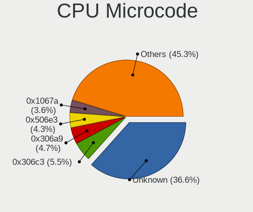

| Number     | Desktops | Percent |
|------------|----------|---------|
| Unknown    | 110      | 23.81%  |
| 0x306c3    | 39       | 8.44%   |
| 0x506e3    | 25       | 5.41%   |
| 0x206a7    | 25       | 5.41%   |
| 0x306a9    | 23       | 4.98%   |
| 0x1067a    | 19       | 4.11%   |
| 0x08701021 | 18       | 3.9%    |
| 0x0800820d | 13       | 2.81%   |
| 0x0a201016 | 12       | 2.6%    |
| 0x08701013 | 12       | 2.6%    |
| 0x06000852 | 12       | 2.6%    |
| 0x010000c8 | 12       | 2.6%    |
| 0x906ea    | 11       | 2.38%   |
| 0x906eb    | 8        | 1.73%   |
| 0x906e9    | 6        | 1.3%    |
| 0x20655    | 6        | 1.3%    |
| 0x20652    | 6        | 1.3%    |
| 0x0a201009 | 5        | 1.08%   |
| 0x08001138 | 5        | 1.08%   |
| 0x08001137 | 5        | 1.08%   |
| 0x6fd      | 4        | 0.87%   |
| 0x010000db | 4        | 0.87%   |
| 0xf41      | 3        | 0.65%   |
| 0xa0653    | 3        | 0.65%   |
| 0x906ed    | 3        | 0.65%   |
| 0x906ec    | 3        | 0.65%   |
| 0x6fb      | 3        | 0.65%   |
| 0x6f6      | 3        | 0.65%   |
| 0x206d7    | 3        | 0.65%   |
| 0x106a5    | 3        | 0.65%   |
| 0x0800820b | 3        | 0.65%   |
| 0x90672    | 2        | 0.43%   |
| 0x706a1    | 2        | 0.43%   |
| 0x406c4    | 2        | 0.43%   |
| 0x40651    | 2        | 0.43%   |
| 0x106e5    | 2        | 0.43%   |
| 0x10676    | 2        | 0.43%   |
| 0x08101016 | 2        | 0.43%   |
| 0x08101013 | 2        | 0.43%   |
| 0x0700010b | 2        | 0.43%   |
| 0x06003106 | 2        | 0.43%   |
| 0x06001119 | 2        | 0.43%   |
| 0x0600063e | 2        | 0.43%   |
| 0x010000dc | 2        | 0.43%   |
| 0x01000083 | 2        | 0.43%   |
| 0xf43      | 1        | 0.22%   |
| 0xf29      | 1        | 0.22%   |
| 0xa0655    | 1        | 0.22%   |
| 0x406f1    | 1        | 0.22%   |
| 0x406c3    | 1        | 0.22%   |
| 0x306f2    | 1        | 0.22%   |
| 0x306e4    | 1        | 0.22%   |
| 0x206c2    | 1        | 0.22%   |
| 0x106ca    | 1        | 0.22%   |
| 0x106c2    | 1        | 0.22%   |
| 0x106a4    | 1        | 0.22%   |
| 0x0a201204 | 1        | 0.22%   |
| 0x08600106 | 1        | 0.22%   |
| 0x08600103 | 1        | 0.22%   |
| 0x08108109 | 1        | 0.22%   |

CPU Microarch
-------------

Microarchitecture

| Name          | Desktops | Percent |
|---------------|----------|---------|
| Haswell       | 58       | 12.86%  |
| Zen 2         | 41       | 9.09%   |
| KabyLake      | 39       | 8.65%   |
| K10           | 34       | 7.54%   |
| SandyBridge   | 33       | 7.32%   |
| Skylake       | 32       | 7.1%    |
| IvyBridge     | 29       | 6.43%   |
| Zen           | 25       | 5.54%   |
| Zen 3         | 24       | 5.32%   |
| Penryn        | 22       | 4.88%   |
| Zen+          | 19       | 4.21%   |
| Piledriver    | 17       | 3.77%   |
| Westmere      | 13       | 2.88%   |
| Core          | 13       | 2.88%   |
| K8 Hammer     | 12       | 2.66%   |
| Nehalem       | 7        | 1.55%   |
| Silvermont    | 5        | 1.11%   |
| NetBurst      | 5        | 1.11%   |
| CometLake     | 4        | 0.89%   |
| Bulldozer     | 4        | 0.89%   |
| Steamroller   | 3        | 0.67%   |
| Jaguar        | 3        | 0.67%   |
| Unknown       | 3        | 0.67%   |
| Goldmont plus | 2        | 0.44%   |
| Bonnell       | 2        | 0.44%   |
| Broadwell     | 1        | 0.22%   |
| Bobcat        | 1        | 0.22%   |

Graphics
--------

GPU Vendor
----------

Vendors of graphics cards

| Vendor                                       | Desktops | Percent |
|----------------------------------------------|----------|---------|
| Nvidia                                       | 207      | 42.77%  |
| AMD                                          | 146      | 30.17%  |
| Intel                                        | 117      | 24.17%  |
| ASPEED Technology                            | 8        | 1.65%   |
| Silicon Motion                               | 3        | 0.62%   |
| Matrox Electronics Systems                   | 2        | 0.41%   |
| XGI Technology (eXtreme Graphics Innovation) | 1        | 0.21%   |

GPU Model
---------

Graphics card models

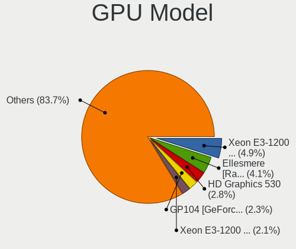

| Model                                                                                    | Desktops | Percent |
|------------------------------------------------------------------------------------------|----------|---------|
| Intel Xeon E3-1200 v3/4th Gen Core Processor Integrated Graphics Controller              | 28       | 5.61%   |
| AMD Ellesmere [Radeon RX 470/480/570/570X/580/580X/590]                                  | 26       | 5.21%   |
| Nvidia GP104 [GeForce GTX 1070]                                                          | 15       | 3.01%   |
| Intel 2nd Generation Core Processor Family Integrated Graphics Controller                | 15       | 3.01%   |
| Intel HD Graphics 530                                                                    | 11       | 2.2%    |
| Nvidia GT218 [GeForce 210]                                                               | 10       | 2%      |
| Nvidia GP107 [GeForce GTX 1050 Ti]                                                       | 10       | 2%      |
| Intel Xeon E3-1200 v2/3rd Gen Core processor Graphics Controller                         | 10       | 2%      |
| Intel CoffeeLake-S GT2 [UHD Graphics 630]                                                | 10       | 2%      |
| Nvidia GP106 [GeForce GTX 1060 6GB]                                                      | 8        | 1.6%    |
| ASPEED Technology ASPEED Graphics Family                                                 | 8        | 1.6%    |
| AMD Vega 10 XL/XT [Radeon RX Vega 56/64]                                                 | 8        | 1.6%    |
| Nvidia GP102 [GeForce GTX 1080 Ti]                                                       | 7        | 1.4%    |
| Nvidia GM206 [GeForce GTX 960]                                                           | 7        | 1.4%    |
| Nvidia GK208B [GeForce GT 710]                                                           | 7        | 1.4%    |
| Intel 4 Series Chipset Integrated Graphics Controller                                    | 7        | 1.4%    |
| AMD Navi 10 [Radeon RX 5600 OEM/5600 XT / 5700/5700 XT]                                  | 7        | 1.4%    |
| Nvidia GP104 [GeForce GTX 1080]                                                          | 6        | 1.2%    |
| Nvidia GM204 [GeForce GTX 970]                                                           | 6        | 1.2%    |
| Nvidia TU117 [GeForce GTX 1650]                                                          | 5        | 1%      |
| Nvidia GM107 [GeForce GTX 750 Ti]                                                        | 5        | 1%      |
| Nvidia GK107 [GeForce GTX 650]                                                           | 5        | 1%      |
| Nvidia GK104 [GeForce GTX 760]                                                           | 5        | 1%      |
| Intel Core Processor Integrated Graphics Controller                                      | 5        | 1%      |
| AMD RS880 [Radeon HD 4200]                                                               | 5        | 1%      |
| AMD Raven Ridge [Radeon Vega Series / Radeon Vega Mobile Series]                         | 5        | 1%      |
| AMD Navi 14 [Radeon RX 5500/5500M / Pro 5500M]                                           | 5        | 1%      |
| AMD Cedar [Radeon HD 5000/6000/7350/8350 Series]                                         | 5        | 1%      |
| Nvidia TU116 [GeForce GTX 1660 Ti]                                                       | 4        | 0.8%    |
| Nvidia TU106 [GeForce RTX 2060 Rev. A]                                                   | 4        | 0.8%    |
| Nvidia TU104 [GeForce RTX 2070 SUPER]                                                    | 4        | 0.8%    |
| Nvidia GP108 [GeForce GT 1030]                                                           | 4        | 0.8%    |
| Nvidia GK106 [GeForce GTX 660]                                                           | 4        | 0.8%    |
| Nvidia GK104 [GeForce GTX 770]                                                           | 4        | 0.8%    |
| Nvidia GF108 [GeForce GT 420]                                                            | 4        | 0.8%    |
| Intel Atom/Celeron/Pentium Processor x5-E8000/J3xxx/N3xxx Integrated Graphics Controller | 4        | 0.8%    |
| AMD RV710 [Radeon HD 4350/4550]                                                          | 4        | 0.8%    |
| AMD Pitcairn PRO [Radeon HD 7850 / R7 265 / R9 270 1024SP]                               | 4        | 0.8%    |
| Silicon Motion SM750                                                                     | 3        | 0.6%    |
| Nvidia TU116 [GeForce GTX 1660]                                                          | 3        | 0.6%    |
| Nvidia TU116 [GeForce GTX 1660 SUPER]                                                    | 3        | 0.6%    |
| Nvidia GP104 [GeForce GTX 1070 Ti]                                                       | 3        | 0.6%    |
| Nvidia GM204 [GeForce GTX 980]                                                           | 3        | 0.6%    |
| Nvidia GM107 [GeForce GTX 745]                                                           | 3        | 0.6%    |
| Nvidia GF119 [GeForce GT 610]                                                            | 3        | 0.6%    |
| Intel IvyBridge GT2 [HD Graphics 4000]                                                   | 3        | 0.6%    |
| Intel 82Q35 Express Integrated Graphics Controller                                       | 3        | 0.6%    |
| Intel 82G33/G31 Express Integrated Graphics Controller                                   | 3        | 0.6%    |
| Intel 4th Generation Core Processor Family Integrated Graphics Controller                | 3        | 0.6%    |
| AMD Tahiti PRO [Radeon HD 7950/8950 OEM / R9 280]                                        | 3        | 0.6%    |
| AMD RS780L [Radeon 3000]                                                                 | 3        | 0.6%    |
| AMD RS780 [Radeon HD 3200]                                                               | 3        | 0.6%    |
| AMD Renoir                                                                               | 3        | 0.6%    |
| AMD Curacao PRO [Radeon R7 370 / R9 270/370 OEM]                                         | 3        | 0.6%    |
| AMD Caicos XT [Radeon HD 7470/8470 / R5 235/310 OEM]                                     | 3        | 0.6%    |
| Nvidia TU104 [GeForce RTX 2080 SUPER]                                                    | 2        | 0.4%    |
| Nvidia TU104 [GeForce RTX 2080 Rev. A]                                                   | 2        | 0.4%    |
| Nvidia GT215 [GeForce GT 320]                                                            | 2        | 0.4%    |
| Nvidia GP107 [GeForce GTX 1050]                                                          | 2        | 0.4%    |
| Nvidia GP106 [GeForce GTX 1060 3GB]                                                      | 2        | 0.4%    |

GPU Combo
---------

Combinations of graphics cards

| Name               | Desktops | Percent |
|--------------------|----------|---------|
| 1 x Nvidia         | 196      | 42.7%   |
| 1 x AMD            | 130      | 28.32%  |
| 1 x Intel          | 99       | 21.57%  |
| 2 x AMD            | 8        | 1.74%   |
| 1 x ASPEED         | 8        | 1.74%   |
| AMD + Nvidia       | 5        | 1.09%   |
| 1 x Silicon Motion | 3        | 0.65%   |
| Intel + Nvidia     | 3        | 0.65%   |
| 2 x Nvidia         | 2        | 0.44%   |
| Intel + AMD        | 2        | 0.44%   |
| 1 x XGI            | 1        | 0.22%   |
| Nvidia + Matrox    | 1        | 0.22%   |
| 1 x Matrox         | 1        | 0.22%   |

GPU Driver
----------

Free vs proprietary

| Driver      | Desktops | Percent |
|-------------|----------|---------|
| Free        | 307      | 67.03%  |
| Proprietary | 129      | 28.17%  |
| Unknown     | 22       | 4.8%    |

GPU Memory
----------

Total video memory

| Size in GB | Desktops | Percent |
|------------|----------|---------|
| Unknown    | 154      | 32.91%  |
| 1.01-2.0   | 69       | 14.74%  |
| 7.01-8.0   | 58       | 12.39%  |
| 0.01-0.5   | 53       | 11.32%  |
| 3.01-4.0   | 51       | 10.9%   |
| 0.51-1.0   | 46       | 9.83%   |
| 5.01-6.0   | 19       | 4.06%   |
| 8.01-16.0  | 9        | 1.92%   |
| 2.01-3.0   | 7        | 1.5%    |
| 16.01-24.0 | 2        | 0.43%   |

Monitor
-------

Monitor Vendor
--------------

Monitor vendors

| Vendor               | Desktops | Percent |
|----------------------|----------|---------|
| Samsung Electronics  | 91       | 17.88%  |
| BenQ                 | 51       | 10.02%  |
| Dell                 | 43       | 8.45%   |
| Hewlett-Packard      | 42       | 8.25%   |
| Ancor Communications | 40       | 7.86%   |
| Goldstar             | 39       | 7.66%   |
| Acer                 | 37       | 7.27%   |
| Philips              | 18       | 3.54%   |
| Fujitsu Siemens      | 17       | 3.34%   |
| AOC                  | 16       | 3.14%   |
| Lenovo               | 15       | 2.95%   |
| Sony                 | 13       | 2.55%   |
| ASUSTek Computer     | 12       | 2.36%   |
| ViewSonic            | 10       | 1.96%   |
| Eizo                 | 9        | 1.77%   |
| Unknown              | 5        | 0.98%   |
| LG Electronics       | 5        | 0.98%   |
| Panasonic            | 4        | 0.79%   |
| Vestel Elektronik    | 3        | 0.59%   |
| Toshiba              | 3        | 0.59%   |
| Packard Bell         | 3        | 0.59%   |
| NEC Computers        | 3        | 0.59%   |
| Iiyama               | 3        | 0.59%   |
| FUS                  | 3        | 0.59%   |
| Onkyo                | 2        | 0.39%   |
| Lenovo Group Limited | 2        | 0.39%   |
| DENON                | 2        | 0.39%   |
| AUS                  | 2        | 0.39%   |
| TVT                  | 1        | 0.2%    |
| Tech Concepts        | 1        | 0.2%    |
| SFX                  | 1        | 0.2%    |
| PKB                  | 1        | 0.2%    |
| Optoma               | 1        | 0.2%    |
| NXG                  | 1        | 0.2%    |
| MSI                  | 1        | 0.2%    |
| Idek Iiyama          | 1        | 0.2%    |
| HVR                  | 1        | 0.2%    |
| HPN                  | 1        | 0.2%    |
| Hitachi              | 1        | 0.2%    |
| G-Story              | 1        | 0.2%    |
| Beko                 | 1        | 0.2%    |
| Beike                | 1        | 0.2%    |
| Arnos Instruments    | 1        | 0.2%    |
| Apple                | 1        | 0.2%    |

Monitor Model
-------------

Monitor models

| Model                                                                   | Desktops | Percent |
|-------------------------------------------------------------------------|----------|---------|
| Ancor Communications ROG PG279Q ACI27EC 2560x1440 598x336mm 27.0-inch   | 4        | 0.73%   |
| Ancor Communications ASUS VS247 ACI249A 1920x1080 521x293mm 23.5-inch   | 4        | 0.73%   |
| Vestel Elektronik 50UHD_LCD_TV VES3700 3840x2160 1872x1053mm 84.6-inch  | 3        | 0.55%   |
| Samsung Electronics T24D390 SAM0B6C 1920x1080 521x293mm 23.5-inch       | 3        | 0.55%   |
| Samsung Electronics SyncMaster SAM027F 1680x1050 474x296mm 22.0-inch    | 3        | 0.55%   |
| Samsung Electronics LCD Monitor SAM0669 1920x1080                       | 3        | 0.55%   |
| Samsung Electronics CF791 SAM0DC4 3440x1440 797x333mm 34.0-inch         | 3        | 0.55%   |
| Panasonic TV MEIA296 3840x2160 698x392mm 31.5-inch                      | 3        | 0.55%   |
| Hewlett-Packard w2408 HWP26CF 1920x1200 518x324mm 24.1-inch             | 3        | 0.55%   |
| Hewlett-Packard LA2405 HWP284B 1920x1200 518x324mm 24.1-inch            | 3        | 0.55%   |
| Goldstar TV SSCR2 GSMC0C8 3840x2160                                     | 3        | 0.55%   |
| Fujitsu Siemens L24W-2 FUS077A 1920x1200 518x324mm 24.1-inch            | 3        | 0.55%   |
| Dell U2412M DELA07B 1920x1200 518x324mm 24.1-inch                       | 3        | 0.55%   |
| Dell P2418D DELD0C1 2560x1440 526x296mm 23.8-inch                       | 3        | 0.55%   |
| BenQ ZOWIE XL LCD BNQ7F32 1920x1080 531x298mm 24.0-inch                 | 3        | 0.55%   |
| BenQ XL2411Z BNQ7F31 1920x1080 531x298mm 24.0-inch                      | 3        | 0.55%   |
| BenQ GW2450H BNQ78C1 1920x1080 531x298mm 24.0-inch                      | 3        | 0.55%   |
| BenQ G2400W BNQ780A 1920x1200 519x324mm 24.1-inch                       | 3        | 0.55%   |
| Ancor Communications ASUS MG279 ACI27A7 2560x1440 597x336mm 27.0-inch   | 3        | 0.55%   |
| ViewSonic VA912-4SERIES VSC721C 1280x1024 376x301mm 19.0-inch           | 2        | 0.37%   |
| Sony TV SNY0801 1360x768                                                | 2        | 0.37%   |
| Samsung Electronics T27B300 SAM0933 1920x1080 600x340mm 27.2-inch       | 2        | 0.37%   |
| Samsung Electronics T24D390 SAM0B6E 1920x1080 520x290mm 23.4-inch       | 2        | 0.37%   |
| Samsung Electronics T22B300 SAM092D 1920x1080 477x268mm 21.5-inch       | 2        | 0.37%   |
| Samsung Electronics SyncMaster SAM011E 1280x1024 338x270mm 17.0-inch    | 2        | 0.37%   |
| Samsung Electronics SMS27A850T SAM0887 2560x1440 518x324mm 24.1-inch    | 2        | 0.37%   |
| Samsung Electronics SMB1940 SAM06BA 1280x1024 376x301mm 19.0-inch       | 2        | 0.37%   |
| Samsung Electronics S27D590 SAM0B49 1920x1080 598x336mm 27.0-inch       | 2        | 0.37%   |
| Samsung Electronics S22D390 SAM0B63 1920x1080 477x268mm 21.5-inch       | 2        | 0.37%   |
| Samsung Electronics LCD Monitor SAM0F13 3840x2160 1872x1053mm 84.6-inch | 2        | 0.37%   |
| Philips PHL 246E9Q PHLC17C 1920x1080 527x296mm 23.8-inch                | 2        | 0.37%   |
| Packard Bell Viseo243D PKB0386 1920x1080 531x299mm 24.0-inch            | 2        | 0.37%   |
| LG Electronics LCD Monitor LG TV                                        | 2        | 0.37%   |
| Hewlett-Packard Z24n HWP3210 1920x1200 518x324mm 24.1-inch              | 2        | 0.37%   |
| Hewlett-Packard Z24i HWP309E 1920x1200 520x320mm 24.0-inch              | 2        | 0.37%   |
| Hewlett-Packard LCD Monitor E242 1920x1200                              | 2        | 0.37%   |
| Hewlett-Packard LA2205 HWP2848 1680x1050 473x296mm 22.0-inch            | 2        | 0.37%   |
| Hewlett-Packard LA1951 HWP285A 1280x1024 380x300mm 19.1-inch            | 2        | 0.37%   |
| Hewlett-Packard 23xi HWP3031 1920x1080 509x286mm 23.0-inch              | 2        | 0.37%   |
| Goldstar W2600 GSM5675 1920x1200 550x340mm 25.5-inch                    | 2        | 0.37%   |
| Goldstar TV GSM75A2 1360x768 700x392mm 31.6-inch                        | 2        | 0.37%   |
| Goldstar M2380D GSM57BC 1920x1080 598x336mm 27.0-inch                   | 2        | 0.37%   |
| Goldstar L1919S GSM4AF0 1280x1024 376x301mm 19.0-inch                   | 2        | 0.37%   |
| Goldstar E1910      GSM4BEA 1280x1024 370x300mm 18.8-inch               | 2        | 0.37%   |
| Goldstar 32LX1R-ZE GSM7568 1360x768 700x392mm 31.6-inch                 | 2        | 0.37%   |
| Fujitsu Siemens B23T-6 LED FUS07FD 1920x1080 509x286mm 23.0-inch        | 2        | 0.37%   |
| Dell UP2516D DEL40E1 2560x1440 553x311mm 25.0-inch                      | 2        | 0.37%   |
| Dell U2412M DELA07A 1920x1200 518x324mm 24.1-inch                       | 2        | 0.37%   |
| BenQ ZOWIE XL LCD BNQ7F33 1920x1080 531x298mm 24.0-inch                 | 2        | 0.37%   |
| BenQ LCD Monitor ZOWIE XL LCD                                           | 2        | 0.37%   |
| BenQ LCD Monitor GL2760                                                 | 2        | 0.37%   |
| BenQ G2420HDB BNQ7842 1920x1080 477x268mm 21.5-inch                     | 2        | 0.37%   |
| BenQ FP222W BNQ7707 1680x1050 376x301mm 19.0-inch                       | 2        | 0.37%   |
| BenQ EW3270U BNQ7950 3840x2160 698x393mm 31.5-inch                      | 2        | 0.37%   |
| ASUSTek Computer VX279 AUS27E4 1920x1080 598x336mm 27.0-inch            | 2        | 0.37%   |
| AOC 2590G4 AOC2590 1920x1080 544x303mm 24.5-inch                        | 2        | 0.37%   |
| AOC 24B1W1 AOC2401 1920x1080 527x296mm 23.8-inch                        | 2        | 0.37%   |
| Ancor Communications VH226 ACI22F2 1920x1080 477x268mm 21.5-inch        | 2        | 0.37%   |
| Ancor Communications VG248 ACI24E1 1920x1080 531x299mm 24.0-inch        | 2        | 0.37%   |
| Ancor Communications VG248 ACI24A4 1920x1080 531x299mm 24.0-inch        | 2        | 0.37%   |

Monitor Resolution
------------------

Monitor screen resolution

| Resolution         | Desktops | Percent |
|--------------------|----------|---------|
| 1920x1080 (FHD)    | 190      | 37.55%  |
| 2560x1440 (QHD)    | 49       | 9.68%   |
| 3840x2160 (4K)     | 44       | 8.7%    |
| 1680x1050 (WSXGA+) | 42       | 8.3%    |
| 1920x1200 (WUXGA)  | 40       | 7.91%   |
| 1280x1024 (SXGA)   | 35       | 6.92%   |
| Unknown            | 25       | 4.94%   |
| 1360x768           | 12       | 2.37%   |
| 3440x1440          | 11       | 2.17%   |
| 3840x1080          | 9        | 1.78%   |
| 1440x900 (WXGA+)   | 9        | 1.78%   |
| 4480x1440          | 4        | 0.79%   |
| 1920x540           | 4        | 0.79%   |
| 1280x720 (HD)      | 4        | 0.79%   |
| 2560x1080          | 3        | 0.59%   |
| 1600x900 (HD+)     | 3        | 0.59%   |
| 5760x2160          | 2        | 0.4%    |
| 5120x1440          | 2        | 0.4%    |
| 3840x1200          | 2        | 0.4%    |
| 3360x1050          | 2        | 0.4%    |
| 1600x1200          | 2        | 0.4%    |
| 1366x768 (WXGA)    | 2        | 0.4%    |
| 5760x1440          | 1        | 0.2%    |
| 5280x1080          | 1        | 0.2%    |
| 3840x1600          | 1        | 0.2%    |
| 3520x1200          | 1        | 0.2%    |
| 2160x1200          | 1        | 0.2%    |
| 1834x1031          | 1        | 0.2%    |
| 1826x1027          | 1        | 0.2%    |
| 1400x1050          | 1        | 0.2%    |
| 1360x765           | 1        | 0.2%    |
| 1024x768 (XGA)     | 1        | 0.2%    |

Monitor Diagonal
----------------

Diagonal size in inches

| Inches  | Desktops | Percent |
|---------|----------|---------|
| 24      | 97       | 19.52%  |
| Unknown | 77       | 15.49%  |
| 23      | 66       | 13.28%  |
| 27      | 63       | 12.68%  |
| 22      | 34       | 6.84%   |
| 19      | 31       | 6.24%   |
| 21      | 17       | 3.42%   |
| 31      | 14       | 2.82%   |
| 84      | 13       | 2.62%   |
| 34      | 10       | 2.01%   |
| 25      | 10       | 2.01%   |
| 32      | 9        | 1.81%   |
| 20      | 9        | 1.81%   |
| 18      | 9        | 1.81%   |
| 72      | 7        | 1.41%   |
| 17      | 7        | 1.41%   |
| 65      | 4        | 0.8%    |
| 28      | 3        | 0.6%    |
| 55      | 2        | 0.4%    |
| 54      | 2        | 0.4%    |
| 40      | 2        | 0.4%    |
| 26      | 2        | 0.4%    |
| 48      | 1        | 0.2%    |
| 47      | 1        | 0.2%    |
| 46      | 1        | 0.2%    |
| 39      | 1        | 0.2%    |
| 37      | 1        | 0.2%    |
| 36      | 1        | 0.2%    |
| 33      | 1        | 0.2%    |
| 15      | 1        | 0.2%    |
| 14      | 1        | 0.2%    |

Monitor Width
-------------

Physical width

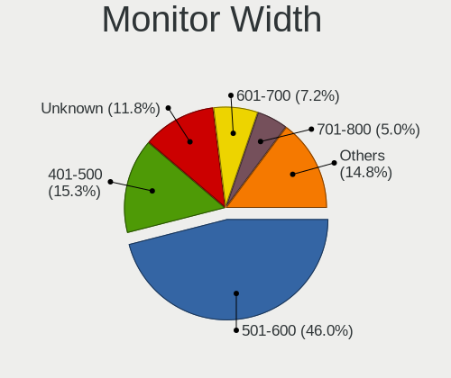

| Width in mm | Desktops | Percent |
|-------------|----------|---------|
| 501-600     | 201      | 43.23%  |
| Unknown     | 77       | 16.56%  |
| 401-500     | 70       | 15.05%  |
| 351-400     | 29       | 6.24%   |
| 601-700     | 24       | 5.16%   |
| 701-800     | 21       | 4.52%   |
| 1501-2000   | 20       | 4.3%    |
| 1001-1500   | 10       | 2.15%   |
| 301-350     | 8        | 1.72%   |
| 801-900     | 4        | 0.86%   |
| 201-300     | 1        | 0.22%   |

Aspect Ratio
------------

Proportional relationship between the width and the height

| Ratio   | Desktops | Percent |
|---------|----------|---------|
| 16/9    | 242      | 52.72%  |
| 16/10   | 93       | 20.26%  |
| Unknown | 64       | 13.94%  |
| 5/4     | 34       | 7.41%   |
| 21/9    | 13       | 2.83%   |
| 4/3     | 4        | 0.87%   |
| 32/9    | 4        | 0.87%   |
| 3/2     | 3        | 0.65%   |
| 6/5     | 2        | 0.44%   |

Monitor Area
------------

Area in inch

| Area in inch | Desktops | Percent |
|----------------|----------|---------|
| 201-250        | 155      | 32.22%  |
| Unknown        | 77       | 16.01%  |
| 301-350        | 64       | 13.31%  |
| 251-300        | 54       | 11.23%  |
| 151-200        | 49       | 10.19%  |
| 351-500        | 35       | 7.28%   |
| More than 1000 | 27       | 5.61%   |
| 141-150        | 10       | 2.08%   |
| 501-1000       | 8        | 1.66%   |
| 101-110        | 2        | 0.42%   |

Pixel Density
-------------

Pixels per inch

| Density | Desktops | Percent |
|---------|----------|---------|
| 51-100  | 280      | 61.27%  |
| Unknown | 77       | 16.85%  |
| 101-120 | 61       | 13.35%  |
| 121-160 | 19       | 4.16%   |
| 1-50    | 17       | 3.72%   |
| 161-240 | 3        | 0.66%   |

Multiple Monitors
-----------------

Total monitors connected

| Total | Desktops | Percent |
|-------|----------|---------|
| 1     | 335      | 72.83%  |
| 2     | 84       | 18.26%  |
| 0     | 28       | 6.09%   |
| 3     | 11       | 2.39%   |
| 4     | 2        | 0.43%   |

Network
-------

Net Controller Vendor
---------------------

Controller vendors

| Vendor                                 | Desktops | Percent |
|----------------------------------------|----------|---------|
| Realtek Semiconductor                  | 236      | 36.53%  |
| Intel                                  | 208      | 32.2%   |
| Qualcomm Atheros                       | 26       | 4.02%   |
| Broadcom                               | 21       | 3.25%   |
| Nvidia                                 | 16       | 2.48%   |
| Ralink                                 | 14       | 2.17%   |
| TP-Link                                | 12       | 1.86%   |
| Huawei Technologies                    | 12       | 1.86%   |
| ASUSTek Computer                       | 11       | 1.7%    |
| Ralink Technology                      | 10       | 1.55%   |
| Samsung Electronics                    | 6        | 0.93%   |
| Marvell Technology Group               | 6        | 0.93%   |
| ZyXEL Communications                   | 5        | 0.77%   |
| D-Link System                          | 5        | 0.77%   |
| Microsoft                              | 4        | 0.62%   |
| Broadcom Limited                       | 4        | 0.62%   |
| Xiaomi                                 | 3        | 0.46%   |
| Motorola PCS                           | 3        | 0.46%   |
| HMD Global                             | 3        | 0.46%   |
| Gemtek                                 | 3        | 0.46%   |
| BUFFALO                                | 3        | 0.46%   |
| ASIX Electronics                       | 3        | 0.46%   |
| 3Com                                   | 3        | 0.46%   |
| Sony Ericsson Mobile Communications AB | 2        | 0.31%   |
| Microchip Technology                   | 2        | 0.31%   |
| MediaTek                               | 2        | 0.31%   |
| Edimax Technology                      | 2        | 0.31%   |
| D-Link                                 | 2        | 0.31%   |
| Aquantia                               | 2        | 0.31%   |
| ZyDAS                                  | 1        | 0.15%   |
| VIA Technologies                       | 1        | 0.15%   |
| U-Blox                                 | 1        | 0.15%   |
| Seeed Technology                       | 1        | 0.15%   |
| Qualcomm                               | 1        | 0.15%   |
| OnePlus Technology (Shenzhen)          | 1        | 0.15%   |
| NetGear                                | 1        | 0.15%   |
| Linksys                                | 1        | 0.15%   |
| Lenovo                                 | 1        | 0.15%   |
| Google                                 | 1        | 0.15%   |
| Fairphone                              | 1        | 0.15%   |
| Dresden Elektronik                     | 1        | 0.15%   |
| Bluegiga Technologies                  | 1        | 0.15%   |
| Arduino SA                             | 1        | 0.15%   |
| American Megatrends                    | 1        | 0.15%   |
| AMD                                    | 1        | 0.15%   |
| ADMtek                                 | 1        | 0.15%   |

Net Controller Model
--------------------

Controller models

| Model                                                             | Desktops | Percent |
|-------------------------------------------------------------------|----------|---------|
| Realtek RTL8111/8168/8411 PCI Express Gigabit Ethernet Controller | 200      | 27.7%   |
| Intel I211 Gigabit Network Connection                             | 35       | 4.85%   |
| Intel Ethernet Connection (2) I219-V                              | 23       | 3.19%   |
| Intel 82579LM Gigabit Network Connection (Lewisville)             | 19       | 2.63%   |
| Intel Wi-Fi 6 AX200                                               | 18       | 2.49%   |
| Realtek RTL8125 2.5GbE Controller                                 | 14       | 1.94%   |
| Intel 82579V Gigabit Network Connection                           | 13       | 1.8%    |
| Nvidia MCP61 Ethernet                                             | 11       | 1.52%   |
| Intel I210 Gigabit Network Connection                             | 11       | 1.52%   |
| Intel Ethernet Connection I217-LM                                 | 11       | 1.52%   |
| Realtek RTL8188EUS 802.11n Wireless Network Adapter               | 10       | 1.39%   |
| Intel 82567LM-3 Gigabit Network Connection                        | 10       | 1.39%   |
| Intel Ethernet Connection I217-V                                  | 9        | 1.25%   |
| Intel Ethernet Connection (2) I219-LM                             | 9        | 1.25%   |
| Intel Ethernet Connection (2) I218-V                              | 9        | 1.25%   |
| Intel Ethernet Controller I225-V                                  | 8        | 1.11%   |
| Intel Ethernet Connection (7) I219-V                              | 7        | 0.97%   |
| Intel Dual Band Wireless-AC 3168NGW [Stone Peak]                  | 7        | 0.97%   |
| Broadcom BCM4360 802.11ac Wireless Network Adapter                | 7        | 0.97%   |
| Realtek RTL-8100/8101L/8139 PCI Fast Ethernet Adapter             | 6        | 0.83%   |
| Intel 82574L Gigabit Network Connection                           | 6        | 0.83%   |
| Ralink RT2870/RT3070 Wireless Adapter                             | 5        | 0.69%   |
| Ralink RT2790 Wireless 802.11n 1T/2R PCIe                         | 5        | 0.69%   |
| Huawei JNY-LX1                                                    | 5        | 0.69%   |
| ASUS N10 Nano 802.11n Network Adapter [Realtek RTL8192CU]         | 5        | 0.69%   |
| TP-Link TL-WN823N v2/v3 [Realtek RTL8192EU]                       | 4        | 0.55%   |
| Samsung Galaxy series, misc. (tethering mode)                     | 4        | 0.55%   |
| Realtek RTL8822BE 802.11a/b/g/n/ac WiFi adapter                   | 4        | 0.55%   |
| Realtek RTL-8185 IEEE 802.11a/b/g Wireless LAN Controller         | 4        | 0.55%   |
| Qualcomm Atheros AR8131 Gigabit Ethernet                          | 4        | 0.55%   |
| Marvell Group 88E8071 PCI-E Gigabit Ethernet Controller           | 4        | 0.55%   |
| Intel Wireless-AC 9260                                            | 4        | 0.55%   |
| Intel Wireless 7260                                               | 4        | 0.55%   |
| Intel I350 Gigabit Network Connection                             | 4        | 0.55%   |
| Huawei E353/E3131                                                 | 4        | 0.55%   |
| Xiaomi Mi/Redmi series (RNDIS + ADB)                              | 3        | 0.42%   |
| TP-Link TL-WN722N v2                                              | 3        | 0.42%   |
| Realtek RTL8821AE 802.11ac PCIe Wireless Network Adapter          | 3        | 0.42%   |
| Realtek RTL8812AE 802.11ac PCIe Wireless Network Adapter          | 3        | 0.42%   |
| Realtek RTL8192CU 802.11n WLAN Adapter                            | 3        | 0.42%   |
| Realtek RTL810xE PCI Express Fast Ethernet controller             | 3        | 0.42%   |
| Realtek 802.11ac NIC                                              | 3        | 0.42%   |
| Ralink RT5390 Wireless 802.11n 1T/1R PCIe                         | 3        | 0.42%   |
| Qualcomm Atheros QCA6174 802.11ac Wireless Network Adapter        | 3        | 0.42%   |
| Qualcomm Atheros AR8121/AR8113/AR8114 Gigabit or Fast Ethernet    | 3        | 0.42%   |
| Microsoft Xbox 360 Wireless Adapter                               | 3        | 0.42%   |
| Intel Ethernet Connection (7) I219-LM                             | 3        | 0.42%   |
| Intel Cannon Lake PCH CNVi WiFi                                   | 3        | 0.42%   |
| Intel 82578DM Gigabit Network Connection                          | 3        | 0.42%   |
| Intel 82566DM-2 Gigabit Network Connection                        | 3        | 0.42%   |
| HMD Global TA-1032                                                | 3        | 0.42%   |
| Gemtek WUBR-177G [Ralink RT2571W]                                 | 3        | 0.42%   |
| Broadcom BCM4352 802.11ac Wireless Network Adapter                | 3        | 0.42%   |
| 3Com 3c905C-TX/TX-M [Tornado]                                     | 3        | 0.42%   |
| ZyXEL ZyXEL Dual-Band Wireless AC USB Adapter                     | 2        | 0.28%   |
| Sony Ericsson Mobile AB G3311                                     | 2        | 0.28%   |
| Samsung GT-I9070 (network tethering, USB debugging enabled)       | 2        | 0.28%   |
| Realtek RTL8821CE 802.11ac PCIe Wireless Network Adapter          | 2        | 0.28%   |
| Realtek RTL8192EU 802.11b/g/n WLAN Adapter                        | 2        | 0.28%   |
| Realtek RTL8188SU 802.11n WLAN Adapter                            | 2        | 0.28%   |

Wireless Vendor
---------------

Wireless vendors

| Vendor                | Desktops | Percent |
|-----------------------|----------|---------|
| Intel                 | 48       | 25.67%  |
| Realtek Semiconductor | 42       | 22.46%  |
| Ralink                | 14       | 7.49%   |
| Broadcom              | 13       | 6.95%   |
| TP-Link               | 12       | 6.42%   |
| ASUSTek Computer      | 11       | 5.88%   |
| Ralink Technology     | 10       | 5.35%   |
| Qualcomm Atheros      | 10       | 5.35%   |
| ZyXEL Communications  | 5        | 2.67%   |
| Microsoft             | 4        | 2.14%   |
| D-Link System         | 4        | 2.14%   |
| Gemtek                | 3        | 1.6%    |
| BUFFALO               | 3        | 1.6%    |
| MediaTek              | 2        | 1.07%   |
| Edimax Technology     | 2        | 1.07%   |
| ZyDAS                 | 1        | 0.53%   |
| NetGear               | 1        | 0.53%   |
| D-Link                | 1        | 0.53%   |
| Broadcom Limited      | 1        | 0.53%   |

Wireless Model
--------------

Wireless models

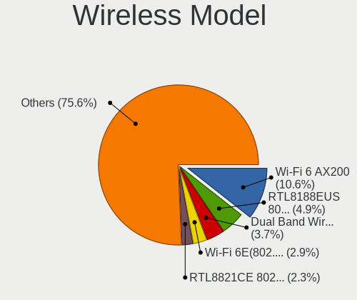

| Model                                                                      | Desktops | Percent |
|----------------------------------------------------------------------------|----------|---------|
| Intel Wi-Fi 6 AX200                                                        | 18       | 9.57%   |
| Realtek RTL8188EUS 802.11n Wireless Network Adapter                        | 10       | 5.32%   |
| Intel Dual Band Wireless-AC 3168NGW [Stone Peak]                           | 7        | 3.72%   |
| Broadcom BCM4360 802.11ac Wireless Network Adapter                         | 7        | 3.72%   |
| Ralink RT2870/RT3070 Wireless Adapter                                      | 5        | 2.66%   |
| Ralink RT2790 Wireless 802.11n 1T/2R PCIe                                  | 5        | 2.66%   |
| ASUS N10 Nano 802.11n Network Adapter [Realtek RTL8192CU]                  | 5        | 2.66%   |
| TP-Link TL-WN823N v2/v3 [Realtek RTL8192EU]                                | 4        | 2.13%   |
| Realtek RTL8822BE 802.11a/b/g/n/ac WiFi adapter                            | 4        | 2.13%   |
| Realtek RTL-8185 IEEE 802.11a/b/g Wireless LAN Controller                  | 4        | 2.13%   |
| Intel Wireless-AC 9260                                                     | 4        | 2.13%   |
| Intel Wireless 7260                                                        | 4        | 2.13%   |
| TP-Link TL-WN722N v2                                                       | 3        | 1.6%    |
| Realtek RTL8821AE 802.11ac PCIe Wireless Network Adapter                   | 3        | 1.6%    |
| Realtek RTL8812AE 802.11ac PCIe Wireless Network Adapter                   | 3        | 1.6%    |
| Realtek RTL8192CU 802.11n WLAN Adapter                                     | 3        | 1.6%    |
| Realtek 802.11ac NIC                                                       | 3        | 1.6%    |
| Ralink RT5390 Wireless 802.11n 1T/1R PCIe                                  | 3        | 1.6%    |
| Qualcomm Atheros QCA6174 802.11ac Wireless Network Adapter                 | 3        | 1.6%    |
| Microsoft Xbox 360 Wireless Adapter                                        | 3        | 1.6%    |
| Intel Cannon Lake PCH CNVi WiFi                                            | 3        | 1.6%    |
| Gemtek WUBR-177G [Ralink RT2571W]                                          | 3        | 1.6%    |
| Broadcom BCM4352 802.11ac Wireless Network Adapter                         | 3        | 1.6%    |
| ZyXEL ZyXEL Dual-Band Wireless AC USB Adapter                              | 2        | 1.06%   |
| Realtek RTL8821CE 802.11ac PCIe Wireless Network Adapter                   | 2        | 1.06%   |
| Realtek RTL8192EU 802.11b/g/n WLAN Adapter                                 | 2        | 1.06%   |
| Realtek RTL8188SU 802.11n WLAN Adapter                                     | 2        | 1.06%   |
| Realtek RTL8188EE Wireless Network Adapter                                 | 2        | 1.06%   |
| Ralink RT5370 Wireless Adapter                                             | 2        | 1.06%   |
| Ralink RT3090 Wireless 802.11n 1T/1R PCIe                                  | 2        | 1.06%   |
| Qualcomm Atheros AR9287 Wireless Network Adapter (PCI-Express)             | 2        | 1.06%   |
| Intel Wireless 3165                                                        | 2        | 1.06%   |
| Intel Centrino Advanced-N 6235                                             | 2        | 1.06%   |
| D-Link System AirPlus G DWL-G122 Wireless Adapter(rev.C1) [Ralink RT2571W] | 2        | 1.06%   |
| BUFFALO WLI-UC-GNM Wireless LAN Adapter [Ralink RT8070]                    | 2        | 1.06%   |
| Broadcom BCM4306 802.11b/g Wireless LAN Controller                         | 2        | 1.06%   |
| ASUS USB-N53 802.11abgn Network Adapter [Ralink RT3572]                    | 2        | 1.06%   |
| ASUS USB-AC56 802.11a/b/g/n/ac Wireless Adapter [Realtek RTL8812AU]        | 2        | 1.06%   |
| ZyXEL NWD6505 802.11a/b/g/n/ac Wireless Adapter [MediaTek MT7610U]         | 1        | 0.53%   |
| ZyXEL NWD2205 802.11n Wireless N Adapter [Realtek RTL8192CU]               | 1        | 0.53%   |
| ZyXEL 802.11bg                                                             | 1        | 0.53%   |
| ZyDAS ZD1211B 802.11g                                                      | 1        | 0.53%   |
| TP-Link TL-WN822N Version 4 RTL8192EU                                      | 1        | 0.53%   |
| TP-Link TL-WN821N v5/v6 [RTL8192EU]                                        | 1        | 0.53%   |
| TP-Link Archer T2U PLUS [RTL8821AU]                                        | 1        | 0.53%   |
| TP-Link AC600 wireless Realtek RTL8811AU [Archer T2U Nano]                 | 1        | 0.53%   |
| TP-Link 802.11ac WLAN Adapter                                              | 1        | 0.53%   |
| Realtek RTL88x2bu [AC1200 Techkey]                                         | 1        | 0.53%   |
| Realtek RTL8192EE PCIe Wireless Network Adapter                            | 1        | 0.53%   |
| Realtek RTL8191SU 802.11n WLAN Adapter                                     | 1        | 0.53%   |
| Realtek RTL8188CUS 802.11n WLAN Adapter                                    | 1        | 0.53%   |
| Realtek RTL8188CE 802.11b/g/n WiFi Adapter                                 | 1        | 0.53%   |
| Ralink RT2770 Wireless Adapter                                             | 1        | 0.53%   |
| Ralink RT2501/RT2573 Wireless Adapter                                      | 1        | 0.53%   |
| Ralink MT7601U Wireless Adapter                                            | 1        | 0.53%   |
| Ralink RT5390R 802.11bgn PCIe Wireless Network Adapter                     | 1        | 0.53%   |
| Ralink RT3092 Wireless 802.11n 2T/2R PCIe                                  | 1        | 0.53%   |
| Ralink RT2800 802.11n PCI                                                  | 1        | 0.53%   |
| Ralink RT2561/RT61 802.11g PCI                                             | 1        | 0.53%   |
| Qualcomm Atheros QCA9565 / AR9565 Wireless Network Adapter                 | 1        | 0.53%   |

Ethernet Vendor
---------------

Ethernet vendors

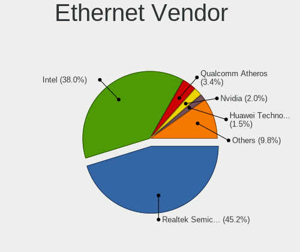

| Vendor                                 | Desktops | Percent |
|----------------------------------------|----------|---------|
| Realtek Semiconductor                  | 222      | 44.22%  |
| Intel                                  | 187      | 37.25%  |
| Qualcomm Atheros                       | 16       | 3.19%   |
| Nvidia                                 | 16       | 3.19%   |
| Huawei Technologies                    | 9        | 1.79%   |
| Broadcom                               | 8        | 1.59%   |
| Samsung Electronics                    | 6        | 1.2%    |
| Marvell Technology Group               | 6        | 1.2%    |
| Xiaomi                                 | 3        | 0.6%    |
| HMD Global                             | 3        | 0.6%    |
| Broadcom Limited                       | 3        | 0.6%    |
| ASIX Electronics                       | 3        | 0.6%    |
| 3Com                                   | 3        | 0.6%    |
| Sony Ericsson Mobile Communications AB | 2        | 0.4%    |
| Motorola PCS                           | 2        | 0.4%    |
| Aquantia                               | 2        | 0.4%    |
| VIA Technologies                       | 1        | 0.2%    |
| Qualcomm                               | 1        | 0.2%    |
| OnePlus Technology (Shenzhen)          | 1        | 0.2%    |
| Linksys                                | 1        | 0.2%    |
| Lenovo                                 | 1        | 0.2%    |
| Google                                 | 1        | 0.2%    |
| D-Link System                          | 1        | 0.2%    |
| D-Link                                 | 1        | 0.2%    |
| American Megatrends                    | 1        | 0.2%    |
| AMD                                    | 1        | 0.2%    |
| ADMtek                                 | 1        | 0.2%    |

Ethernet Model
--------------

Ethernet models

| Model                                                                         | Desktops | Percent |
|-------------------------------------------------------------------------------|----------|---------|
| Realtek RTL8111/8168/8411 PCI Express Gigabit Ethernet Controller             | 200      | 38.31%  |
| Intel I211 Gigabit Network Connection                                         | 35       | 6.7%    |
| Intel Ethernet Connection (2) I219-V                                          | 23       | 4.41%   |
| Intel 82579LM Gigabit Network Connection (Lewisville)                         | 19       | 3.64%   |
| Realtek RTL8125 2.5GbE Controller                                             | 14       | 2.68%   |
| Intel 82579V Gigabit Network Connection                                       | 13       | 2.49%   |
| Nvidia MCP61 Ethernet                                                         | 11       | 2.11%   |
| Intel I210 Gigabit Network Connection                                         | 11       | 2.11%   |
| Intel Ethernet Connection I217-LM                                             | 11       | 2.11%   |
| Intel 82567LM-3 Gigabit Network Connection                                    | 10       | 1.92%   |
| Intel Ethernet Connection I217-V                                              | 9        | 1.72%   |
| Intel Ethernet Connection (2) I219-LM                                         | 9        | 1.72%   |
| Intel Ethernet Connection (2) I218-V                                          | 9        | 1.72%   |
| Intel Ethernet Controller I225-V                                              | 8        | 1.53%   |
| Intel Ethernet Connection (7) I219-V                                          | 7        | 1.34%   |
| Realtek RTL-8100/8101L/8139 PCI Fast Ethernet Adapter                         | 6        | 1.15%   |
| Intel 82574L Gigabit Network Connection                                       | 6        | 1.15%   |
| Huawei JNY-LX1                                                                | 5        | 0.96%   |
| Samsung Galaxy series, misc. (tethering mode)                                 | 4        | 0.77%   |
| Qualcomm Atheros AR8131 Gigabit Ethernet                                      | 4        | 0.77%   |
| Marvell Group 88E8071 PCI-E Gigabit Ethernet Controller                       | 4        | 0.77%   |
| Intel I350 Gigabit Network Connection                                         | 4        | 0.77%   |
| Huawei E353/E3131                                                             | 4        | 0.77%   |
| Xiaomi Mi/Redmi series (RNDIS + ADB)                                          | 3        | 0.57%   |
| Realtek RTL810xE PCI Express Fast Ethernet controller                         | 3        | 0.57%   |
| Qualcomm Atheros AR8121/AR8113/AR8114 Gigabit or Fast Ethernet                | 3        | 0.57%   |
| Intel Ethernet Connection (7) I219-LM                                         | 3        | 0.57%   |
| Intel 82578DM Gigabit Network Connection                                      | 3        | 0.57%   |
| Intel 82566DM-2 Gigabit Network Connection                                    | 3        | 0.57%   |
| HMD Global TA-1032                                                            | 3        | 0.57%   |
| 3Com 3c905C-TX/TX-M [Tornado]                                                 | 3        | 0.57%   |
| Sony Ericsson Mobile AB G3311                                                 | 2        | 0.38%   |
| Samsung GT-I9070 (network tethering, USB debugging enabled)                   | 2        | 0.38%   |
| Qualcomm Atheros QCA8171 Gigabit Ethernet                                     | 2        | 0.38%   |
| Qualcomm Atheros Killer E2500 Gigabit Ethernet Controller                     | 2        | 0.38%   |
| Qualcomm Atheros Killer E2400 Gigabit Ethernet Controller                     | 2        | 0.38%   |
| Qualcomm Atheros Killer E220x Gigabit Ethernet Controller                     | 2        | 0.38%   |
| Nvidia MCP77 Ethernet                                                         | 2        | 0.38%   |
| Nvidia MCP55 Ethernet                                                         | 2        | 0.38%   |
| Motorola PCS Moto E (4) Plus                                                  | 2        | 0.38%   |
| Marvell Group 88E8056 PCI-E Gigabit Ethernet Controller                       | 2        | 0.38%   |
| Intel 82599ES 10-Gigabit SFI/SFP+ Network Connection                          | 2        | 0.38%   |
| Intel 82578DC Gigabit Network Connection                                      | 2        | 0.38%   |
| Intel 82571EB/82571GB Gigabit Ethernet Controller D0/D1 (copper applications) | 2        | 0.38%   |
| Intel 82541GI Gigabit Ethernet Controller                                     | 2        | 0.38%   |
| ASIX AX88179 Gigabit Ethernet                                                 | 2        | 0.38%   |
| VIA VT6105/VT6106S [Rhine-III]                                                | 1        | 0.19%   |
| Realtek RTL8169 PCI Gigabit Ethernet Controller                               | 1        | 0.19%   |
| Realtek RTL8153 Gigabit Ethernet Adapter                                      | 1        | 0.19%   |
| Realtek RTL8150 Fast Ethernet Adapter                                         | 1        | 0.19%   |
| Realtek RTL-8110SC/8169SC Gigabit Ethernet                                    | 1        | 0.19%   |
| Realtek Killer E3000 2.5GbE Controller                                        | 1        | 0.19%   |
| Realtek Killer E2600 Gigabit Ethernet Controller                              | 1        | 0.19%   |
| Qualcomm Nokia X100                                                           | 1        | 0.19%   |
| Qualcomm Atheros AR8161 Gigabit Ethernet                                      | 1        | 0.19%   |
| OnePlus (Shenzhen) OnePlus                                                    | 1        | 0.19%   |
| Nvidia MCP73 Ethernet                                                         | 1        | 0.19%   |
| Linksys USB200M 10/100 Ethernet Adapter                                       | 1        | 0.19%   |
| Lenovo ThinkPad TBT 3 Dock                                                    | 1        | 0.19%   |
| Intel PRO/100 VE Network Connection                                           | 1        | 0.19%   |

Net Controller Kind
-------------------

Ethernet, WiFi or modem

| Kind     | Desktops | Percent |
|----------|----------|---------|
| Ethernet | 446      | 70.68%  |
| WiFi     | 174      | 27.58%  |
| Modem    | 9        | 1.43%   |
| Unknown  | 2        | 0.32%   |

Used Controller
---------------

Currently used network controller

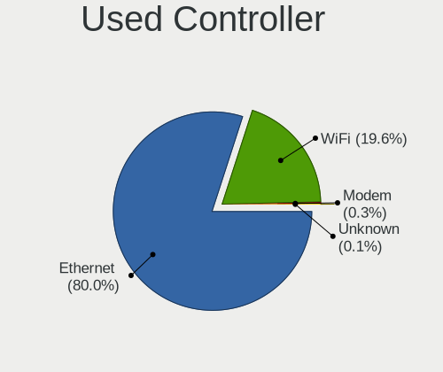

| Kind     | Desktops | Percent |
|----------|----------|---------|
| Ethernet | 361      | 80.4%   |
| WiFi     | 87       | 19.38%  |
| Unknown  | 1        | 0.22%   |

NICs
----

Total network controllers on board

| Total | Desktops | Percent |
|-------|----------|---------|
| 1     | 300      | 66.37%  |
| 2     | 123      | 27.21%  |
| 3     | 15       | 3.32%   |
| 0     | 7        | 1.55%   |
| 5     | 5        | 1.11%   |
| 4     | 2        | 0.44%   |

IPv6
----

IPv6 vs IPv4

| Used | Desktops | Percent |
|------|----------|---------|
| No   | 398      | 86.71%  |
| Yes  | 61       | 13.29%  |

Bluetooth
---------

Bluetooth Vendor
----------------

Controller vendors

| Vendor                          | Desktops | Percent |
|---------------------------------|----------|---------|
| Intel                           | 49       | 38.89%  |
| ASUSTek Computer                | 29       | 23.02%  |
| Cambridge Silicon Radio         | 28       | 22.22%  |
| Realtek Semiconductor           | 5        | 3.97%   |
| HTC (High Tech Computer)        | 3        | 2.38%   |
| Apple                           | 3        | 2.38%   |
| Qualcomm Atheros Communications | 2        | 1.59%   |
| Edimax Technology               | 2        | 1.59%   |
| MediaTek                        | 1        | 0.79%   |
| Lite-On Technology              | 1        | 0.79%   |
| IMC Networks                    | 1        | 0.79%   |
| Broadcom                        | 1        | 0.79%   |
| Belkin Components               | 1        | 0.79%   |

Bluetooth Model
---------------

Controller models

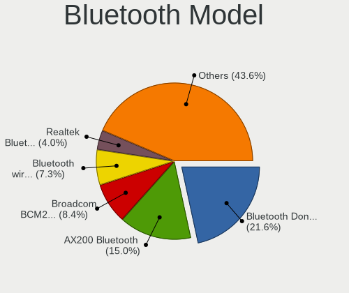

| Model                                                                | Desktops | Percent |
|----------------------------------------------------------------------|----------|---------|
| Cambridge Silicon Radio Bluetooth Dongle (HCI mode)                  | 28       | 22.22%  |
| Intel AX200 Bluetooth                                                | 21       | 16.67%  |
| ASUS Broadcom BCM20702A0 Bluetooth                                   | 16       | 12.7%   |
| Intel Bluetooth wireless interface                                   | 11       | 8.73%   |
| Intel Wireless-AC 3168 Bluetooth                                     | 6        | 4.76%   |
| Realtek  Bluetooth 4.2 Adapter                                       | 4        | 3.17%   |
| Intel Wireless-AC 9260 Bluetooth Adapter                             | 4        | 3.17%   |
| Intel Bluetooth 9460/9560 Jefferson Peak (JfP)                       | 4        | 3.17%   |
| HTC (High Tech Computer) Vive Hub Bluetooth 4.1 (Broadcom BCM920703) | 3        | 2.38%   |
| ASUS Qualcomm Bluetooth 4.1                                          | 3        | 2.38%   |
| ASUS Bluetooth Radio                                                 | 3        | 2.38%   |
| Apple Bluetooth USB Host Controller                                  | 3        | 2.38%   |
| Intel Centrino Bluetooth Wireless Transceiver                        | 2        | 1.59%   |
| Edimax Bluetooth Adapter                                             | 2        | 1.59%   |
| ASUS Bluetooth Adapter                                               | 2        | 1.59%   |
| ASUS BCM20702A0                                                      | 2        | 1.59%   |
| ASUS ASUS USB-BT500                                                  | 2        | 1.59%   |
| Realtek Bluetooth Radio                                              | 1        | 0.79%   |
| Qualcomm Atheros AR3011 Bluetooth (no firmware)                      | 1        | 0.79%   |
| Qualcomm Atheros AR3011 Bluetooth                                    | 1        | 0.79%   |
| MediaTek Wireless_Device                                             | 1        | 0.79%   |
| Lite-On Atheros AR3012 Bluetooth                                     | 1        | 0.79%   |
| Intel AX201 Bluetooth                                                | 1        | 0.79%   |
| IMC Networks Bluetooth Radio                                         | 1        | 0.79%   |
| Broadcom Bluetooth 3.0+HS USB Adapter                                | 1        | 0.79%   |
| Belkin Components Bluetooth Mini Dongle                              | 1        | 0.79%   |
| ASUS Bluetooth Device                                                | 1        | 0.79%   |

Sound
-----

Sound Vendor
------------

Sound card vendors

| Vendor                               | Desktops | Percent |
|--------------------------------------|----------|---------|
| Intel                                | 240      | 31.01%  |
| Nvidia                               | 207      | 26.74%  |
| AMD                                  | 201      | 25.97%  |
| C-Media Electronics                  | 20       | 2.58%   |
| Creative Labs                        | 11       | 1.42%   |
| Logitech                             | 10       | 1.29%   |
| ASUSTek Computer                     | 7        | 0.9%    |
| SteelSeries ApS                      | 6        | 0.78%   |
| Kingston Technology                  | 6        | 0.78%   |
| Creative Technology                  | 5        | 0.65%   |
| VIA Technologies                     | 4        | 0.52%   |
| Texas Instruments                    | 4        | 0.52%   |
| RODE Microphones                     | 4        | 0.52%   |
| Razer USA                            | 4        | 0.52%   |
| Blue Microphones                     | 4        | 0.52%   |
| Thesycon Systemsoftware & Consulting | 3        | 0.39%   |
| M-Audio                              | 3        | 0.39%   |
| Sennheiser Communications            | 2        | 0.26%   |
| GYROCOM C&C                          | 2        | 0.26%   |
| GN Netcom                            | 2        | 0.26%   |
| Focusrite-Novation                   | 2        | 0.26%   |
| Corsair                              | 2        | 0.26%   |
| AudioQuest                           | 2        | 0.26%   |
| XMOS                                 | 1        | 0.13%   |
| Trust                                | 1        | 0.13%   |
| Thomann                              | 1        | 0.13%   |
| Tenx Technology                      | 1        | 0.13%   |
| Syntek                               | 1        | 0.13%   |
| Superlux digit                       | 1        | 0.13%   |
| SM900 Microphone                     | 1        | 0.13%   |
| SAVITECH                             | 1        | 0.13%   |
| Plantronics                          | 1        | 0.13%   |
| Pioneer DJ                           | 1        | 0.13%   |
| Philips (or NXP)                     | 1        | 0.13%   |
| Lenovo                               | 1        | 0.13%   |
| HiFimeDIY Audio                      | 1        | 0.13%   |
| Harman                               | 1        | 0.13%   |
| Generalplus Technology               | 1        | 0.13%   |
| FiiO Electronics Technology          | 1        | 0.13%   |
| Ensoniq                              | 1        | 0.13%   |
| DSEA A/S                             | 1        | 0.13%   |
| DigiTech                             | 1        | 0.13%   |
| DEXP BK-20                           | 1        | 0.13%   |
| Dell                                 | 1        | 0.13%   |
| Cambridge Audio                      | 1        | 0.13%   |
| Astro Gaming                         | 1        | 0.13%   |

Sound Model
-----------

Sound card models

| Model                                                                             | Desktops | Percent |
|-----------------------------------------------------------------------------------|----------|---------|
| AMD Starship/Matisse HD Audio Controller                                          | 54       | 6.01%   |
| AMD SBx00 Azalia (Intel HDA)                                                      | 46       | 5.12%   |
| Intel 8 Series/C220 Series Chipset High Definition Audio Controller               | 38       | 4.23%   |
| Intel 6 Series/C200 Series Chipset Family High Definition Audio Controller        | 33       | 3.67%   |
| AMD Family 17h (Models 00h-0fh) HD Audio Controller                               | 30       | 3.34%   |
| Intel Xeon E3-1200 v3/4th Gen Core Processor HD Audio Controller                  | 29       | 3.23%   |
| Intel 100 Series/C230 Series Chipset Family HD Audio Controller                   | 28       | 3.11%   |
| AMD Ellesmere HDMI Audio [Radeon RX 470/480 / 570/580/590]                        | 25       | 2.78%   |
| Nvidia GP104 High Definition Audio Controller                                     | 24       | 2.67%   |
| Intel 200 Series PCH HD Audio                                                     | 21       | 2.34%   |
| Intel 7 Series/C216 Chipset Family High Definition Audio Controller               | 20       | 2.22%   |
| Intel Cannon Lake PCH cAVS                                                        | 15       | 1.67%   |
| Intel 5 Series/3400 Series Chipset High Definition Audio                          | 15       | 1.67%   |
| Nvidia High Definition Audio Controller                                           | 14       | 1.56%   |
| Nvidia GP107GL High Definition Audio Controller                                   | 14       | 1.56%   |
| Intel NM10/ICH7 Family High Definition Audio Controller                           | 13       | 1.45%   |
| Nvidia MCP61 High Definition Audio                                                | 12       | 1.33%   |
| Nvidia GK104 HDMI Audio Controller                                                | 12       | 1.33%   |
| AMD Oland/Hainan/Cape Verde/Pitcairn HDMI Audio [Radeon HD 7000 Series]           | 12       | 1.33%   |
| AMD Navi 10 HDMI Audio                                                            | 12       | 1.33%   |
| AMD Family 17h/19h HD Audio Controller                                            | 12       | 1.33%   |
| Nvidia TU116 High Definition Audio Controller                                     | 11       | 1.22%   |
| Intel 9 Series Chipset Family HD Audio Controller                                 | 11       | 1.22%   |
| Intel 82801JD/DO (ICH10 Family) HD Audio Controller                               | 11       | 1.22%   |
| Nvidia GP106 High Definition Audio Controller                                     | 10       | 1.11%   |
| Nvidia GM107 High Definition Audio Controller [GeForce 940MX]                     | 10       | 1.11%   |
| Nvidia GM204 High Definition Audio Controller                                     | 9        | 1%      |
| Nvidia TU104 HD Audio Controller                                                  | 8        | 0.89%   |
| Nvidia GM206 High Definition Audio Controller                                     | 8        | 0.89%   |
| Nvidia GK208 HDMI/DP Audio Controller                                             | 8        | 0.89%   |
| Nvidia GK107 HDMI Audio Controller                                                | 8        | 0.89%   |
| AMD Vega 10 HDMI Audio [Radeon Vega 56/64]                                        | 8        | 0.89%   |
| AMD FCH Azalia Controller                                                         | 8        | 0.89%   |
| Nvidia GP102 HDMI Audio Controller                                                | 7        | 0.78%   |
| Nvidia GK106 HDMI Audio Controller                                                | 7        | 0.78%   |
| C-Media Electronics CMI8788 [Oxygen HD Audio]                                     | 7        | 0.78%   |
| AMD RV710/730 HDMI Audio [Radeon HD 4000 series]                                  | 7        | 0.78%   |
| Nvidia TU106 High Definition Audio Controller                                     | 6        | 0.67%   |
| Nvidia GF108 High Definition Audio Controller                                     | 6        | 0.67%   |
| AMD Cedar HDMI Audio [Radeon HD 5400/6300/7300 Series]                            | 6        | 0.67%   |
| Nvidia TU107 GeForce GTX 1650 High Definition Audio Controller                    | 5        | 0.56%   |
| Nvidia GF119 HDMI Audio Controller                                                | 5        | 0.56%   |
| Intel 82801JI (ICH10 Family) HD Audio Controller                                  | 5        | 0.56%   |
| Intel 82801I (ICH9 Family) HD Audio Controller                                    | 5        | 0.56%   |
| AMD RS780 HDMI Audio [Radeon 3000/3100 / HD 3200/3300]                            | 5        | 0.56%   |
| AMD Raven/Raven2/Fenghuang HDMI/DP Audio Controller                               | 5        | 0.56%   |
| AMD Navi 21/23 HDMI/DP Audio Controller                                           | 5        | 0.56%   |
| AMD Caicos HDMI Audio [Radeon HD 6450 / 7450/8450/8490 OEM / R5 230/235/235X OEM] | 5        | 0.56%   |
| AMD Baffin HDMI/DP Audio [Radeon RX 550 640SP / RX 560/560X]                      | 5        | 0.56%   |
| Nvidia GP108 High Definition Audio Controller                                     | 4        | 0.44%   |
| Kingston Technology HyperX 7.1 Audio                                              | 4        | 0.44%   |
| Intel C610/X99 series chipset HD Audio Controller                                 | 4        | 0.44%   |
| Intel C600/X79 series chipset High Definition Audio Controller                    | 4        | 0.44%   |
| Creative Labs Sound Core3D [Sound Blaster Recon3D / Z-Series]                     | 4        | 0.44%   |
| C-Media Electronics Blue Snowball                                                 | 4        | 0.44%   |
| Blue Microphones Yeti Stereo Microphone                                           | 4        | 0.44%   |
| AMD Renoir Radeon High Definition Audio Controller                                | 4        | 0.44%   |
| VIA Technologies ICE1712 [Envy24] PCI Multi-Channel I/O Controller                | 3        | 0.33%   |
| RODE Microphones RODE NT-USB Mini                                                 | 3        | 0.33%   |
| Nvidia MCP72XE/MCP72P/MCP78U/MCP78S High Definition Audio                         | 3        | 0.33%   |

Memory
------

Memory Vendor
-------------

Memory module vendors

| Vendor              | Desktops | Percent |
|---------------------|----------|---------|
| Kingston            | 85       | 29.72%  |
| Samsung Electronics | 36       | 12.59%  |
| Corsair             | 30       | 10.49%  |
| G.Skill             | 29       | 10.14%  |
| Unknown             | 27       | 9.44%   |
| Crucial             | 23       | 8.04%   |
| SK hynix            | 21       | 7.34%   |
| Micron Technology   | 16       | 5.59%   |
| Team                | 2        | 0.7%    |
| Ramaxel Technology  | 2        | 0.7%    |
| Nanya Technology    | 2        | 0.7%    |
| Elpida              | 2        | 0.7%    |
| A-DATA Technology   | 2        | 0.7%    |
| Unknown (ABCD)      | 1        | 0.35%   |
| Qimonda             | 1        | 0.35%   |
| Patriot             | 1        | 0.35%   |
| Hitachi             | 1        | 0.35%   |
| GOODRAM             | 1        | 0.35%   |
| GIGA-BYTE           | 1        | 0.35%   |
| ASint Technology    | 1        | 0.35%   |
| Apacer              | 1        | 0.35%   |
| Unknown             | 1        | 0.35%   |

Memory Model
------------

Memory module models

| Model                                                        | Desktops | Percent |
|--------------------------------------------------------------|----------|---------|
| Kingston RAM KHX3200C16D4/8GX 8GB DIMM DDR4 3600MT/s         | 10       | 3.19%   |
| Kingston RAM KHX2666C16/8G 8GB DIMM DDR4 3466MT/s            | 7        | 2.24%   |
| Kingston RAM KHX1866C10D3/8G 8GB DIMM DDR3 1867MT/s          | 7        | 2.24%   |
| Kingston RAM KHX1600C10D3/8G 8GB DIMM DDR3 1600MT/s          | 6        | 1.92%   |
| Corsair RAM CMK16GX4M2B3000C15 8GB DIMM DDR4 3000MT/s        | 5        | 1.6%    |
| Samsung RAM M378B5273DH0-CK0 4GB DIMM DDR3 2200MT/s          | 4        | 1.28%   |
| Kingston RAM KHX1600C9D3/4GX 4GB DIMM DDR3 2400MT/s          | 4        | 1.28%   |
| Unknown RAM Module 2048MB DIMM DDR2 800MT/s                  | 3        | 0.96%   |
| Kingston RAM KHX3200C16D4/16GX 16GB DIMM DDR4 3600MT/s       | 3        | 0.96%   |
| Kingston RAM KHX1600C10D3/8GX 8192MB DIMM DDR3 1600MT/s      | 3        | 0.96%   |
| Kingston RAM KHX1600C10D3/4G 4GB DIMM DDR3 1866MT/s          | 3        | 0.96%   |
| G.Skill RAM F4-3200C16-8GVKB 8GB DIMM DDR4 3200MT/s          | 3        | 0.96%   |
| G.Skill RAM F4-3200C16-16GTZ 16384MB DIMM DDR4 2933MT/s      | 3        | 0.96%   |
| G.Skill RAM F3-12800CL9-4GBXL 4GB DIMM DDR3 1867MT/s         | 3        | 0.96%   |
| Corsair RAM CMK16GX4M2B3200C16 8GB DIMM DDR4 3600MT/s        | 3        | 0.96%   |
| Unknown RAM Module 4GB DIMM 1600MT/s                         | 2        | 0.64%   |
| Unknown RAM Module 2GB DIMM DDR2 800MT/s                     | 2        | 0.64%   |
| Unknown RAM Module 2GB DIMM 800MT/s                          | 2        | 0.64%   |
| Unknown RAM Module 2GB DIMM 1066MT/s                         | 2        | 0.64%   |
| Samsung RAM M391A4G43AB1-CWE 32GB DIMM DDR4 3200MT/s         | 2        | 0.64%   |
| Samsung RAM M378B5673EH1-CH9 2GB DIMM DDR3 1333MT/s          | 2        | 0.64%   |
| Samsung RAM M378A1K43CB2-CTD 8GB DIMM DDR4 3200MT/s          | 2        | 0.64%   |
| Micron RAM 8JTF51264AZ-1G6E1 4096MB DIMM DDR3 1600MT/s       | 2        | 0.64%   |
| Micron RAM 36ASF4G72PZ-2G3B1 32GB DIMM DDR4 2400MT/s         | 2        | 0.64%   |
| Kingston RAM KHX2133C14/8G 8GB DIMM DDR4 2400MT/s            | 2        | 0.64%   |
| Kingston RAM 99U5471-054.A00LF 8GB DIMM DDR3 1600MT/s        | 2        | 0.64%   |
| Kingston RAM 9905316-005.A04LF 1GB DIMM DDR2 667MT/s         | 2        | 0.64%   |
| G.Skill RAM F4-3600C16-8GTZNC 8GB DIMM DDR4 3800MT/s         | 2        | 0.64%   |
| G.Skill RAM F4-3200C16-8GVGB 8GB DIMM DDR4 3200MT/s          | 2        | 0.64%   |
| G.Skill RAM F4-3200C14-8GFX 8GB DIMM DDR4 3733MT/s           | 2        | 0.64%   |
| G.Skill RAM F4-3000C16-8GISB 8GB DIMM DDR4 3200MT/s          | 2        | 0.64%   |
| Crucial RAM CT16G4DFD8266.C16FD1 16GB DIMM DDR4 2667MT/s     | 2        | 0.64%   |
| Crucial RAM BLS8G4D26BFSCK.8FD 8GB DIMM DDR4 2400MT/s        | 2        | 0.64%   |
| Corsair RAM CMZ8GX3M2A1600C9 4096MB DIMM DDR3 1600MT/s       | 2        | 0.64%   |
| Corsair RAM CMK16GX4M2A2400C14 8GB DIMM DDR4 2800MT/s        | 2        | 0.64%   |
| Unknown RAM Module 8GB DIMM DDR3 1600MT/s                    | 1        | 0.32%   |
| Unknown RAM Module 8192MB DIMM DDR3 1600MT/s                 | 1        | 0.32%   |
| Unknown RAM Module 512MB DIMM SDRAM                          | 1        | 0.32%   |
| Unknown RAM Module 512MB DIMM DDR2 667MT/s                   | 1        | 0.32%   |
| Unknown RAM Module 4GB DIMM DDR2 800MT/s                     | 1        | 0.32%   |
| Unknown RAM Module 4GB DIMM 1333MT/s                         | 1        | 0.32%   |
| Unknown RAM Module 4GB DIMM 1066MT/s                         | 1        | 0.32%   |
| Unknown RAM Module 4096MB DIMM DDR 1333MT/s                  | 1        | 0.32%   |
| Unknown RAM Module 2GB SODIMM DDR3 667MT/s                   | 1        | 0.32%   |
| Unknown RAM Module 2GB DIMM SDRAM 1066MT/s                   | 1        | 0.32%   |
| Unknown RAM Module 2GB DIMM DDR 1333MT/s                     | 1        | 0.32%   |
| Unknown RAM Module 2GB DIMM 667MT/s                          | 1        | 0.32%   |
| Unknown RAM Module 2048MB DIMM SDRAM                         | 1        | 0.32%   |
| Unknown RAM Module 2048MB DIMM 800MT/s                       | 1        | 0.32%   |
| Unknown RAM Module 2048MB DIMM 667MT/s                       | 1        | 0.32%   |
| Unknown RAM Module 2048MB DIMM 1333MT/s                      | 1        | 0.32%   |
| Unknown RAM Module 1024MB DIMM SDRAM                         | 1        | 0.32%   |
| Unknown RAM Module 1024MB DIMM DDR 400MT/s                   | 1        | 0.32%   |
| Unknown RAM 3000 C16 Series 8192MB DIMM DDR4 2133MT/s        | 1        | 0.32%   |
| Unknown (ABCD) RAM 123456789012345678 1GB DIMM DDR3 2400MT/s | 1        | 0.32%   |
| Team RAM TEAMGROUP-UD4-3200 32GB DIMM DDR4 3200MT/s          | 1        | 0.32%   |
| Team RAM Elite-1333 4GB DIMM DDR3 1333MT/s                   | 1        | 0.32%   |
| SK hynix RAM Module 4GB DIMM DDR3 1600MT/s                   | 1        | 0.32%   |
| SK hynix RAM Module 4096MB DIMM DDR4 2133MT/s                | 1        | 0.32%   |
| SK hynix RAM Module 4096MB DIMM DDR3 1600MT/s                | 1        | 0.32%   |

Memory Kind
-----------

Memory module kinds

| Kind    | Desktops | Percent |
|---------|----------|---------|
| DDR4    | 124      | 47.88%  |
| DDR3    | 91       | 35.14%  |
| DDR2    | 17       | 6.56%   |
| Unknown | 13       | 5.02%   |
| SDRAM   | 9        | 3.47%   |
| DDR     | 4        | 1.54%   |
| LPDDR4  | 1        | 0.39%   |

Memory Form Factor
------------------

Physical design of the memory module

| Name   | Desktops | Percent |
|--------|----------|---------|
| DIMM   | 242      | 94.9%   |
| SODIMM | 11       | 4.31%   |
| RIMM   | 2        | 0.78%   |

Memory Size
-----------

Memory module size

| Size  | Desktops | Percent |
|-------|----------|---------|
| 8192  | 98       | 35.51%  |
| 4096  | 66       | 23.91%  |
| 2048  | 42       | 15.22%  |
| 16384 | 37       | 13.41%  |
| 32768 | 16       | 5.8%    |
| 1024  | 12       | 4.35%   |
| 512   | 5        | 1.81%   |

Memory Speed
------------

Memory module speed

| Speed   | Desktops | Percent |
|---------|----------|---------|
| 1600    | 38       | 13.48%  |
| 1333    | 35       | 12.41%  |
| 3200    | 29       | 10.28%  |
| 3600    | 24       | 8.51%   |
| 2133    | 20       | 7.09%   |
| 3466    | 15       | 5.32%   |
| 2400    | 14       | 4.96%   |
| 1867    | 12       | 4.26%   |
| 800     | 12       | 4.26%   |
| 667     | 11       | 3.9%    |
| 2667    | 9        | 3.19%   |
| 2933    | 7        | 2.48%   |
| 3800    | 5        | 1.77%   |
| 3000    | 5        | 1.77%   |
| 1066    | 5        | 1.77%   |
| 3733    | 4        | 1.42%   |
| 2200    | 4        | 1.42%   |
| 2800    | 3        | 1.06%   |
| 1866    | 3        | 1.06%   |
| 533     | 3        | 1.06%   |
| 2666    | 2        | 0.71%   |
| 1800    | 2        | 0.71%   |
| 1334    | 2        | 0.71%   |
| 1067    | 2        | 0.71%   |
| Unknown | 2        | 0.71%   |
| 49926   | 1        | 0.35%   |
| 8192    | 1        | 0.35%   |
| 4000    | 1        | 0.35%   |
| 3533    | 1        | 0.35%   |
| 3400    | 1        | 0.35%   |
| 3334    | 1        | 0.35%   |
| 3333    | 1        | 0.35%   |
| 3151    | 1        | 0.35%   |
| 2747    | 1        | 0.35%   |
| 2733    | 1        | 0.35%   |
| 2176    | 1        | 0.35%   |
| 2048    | 1        | 0.35%   |
| 1639    | 1        | 0.35%   |
| 400     | 1        | 0.35%   |

Printers & scanners
-------------------

Printer Vendor
--------------

Printer device vendors

| Vendor              | Desktops | Percent |
|---------------------|----------|---------|
| Hewlett-Packard     | 7        | 43.75%  |
| Samsung Electronics | 3        | 18.75%  |
| Seiko Epson         | 2        | 12.5%   |
| Canon               | 2        | 12.5%   |
| Xerox               | 1        | 6.25%   |
| Prolific Technology | 1        | 6.25%   |

Printer Model
-------------

Printer device models

| Model                               | Desktops | Percent |
|-------------------------------------|----------|---------|
| Samsung ML-1660 Series              | 2        | 12.5%   |
| Xerox Phaser 6500DN                 | 1        | 6.25%   |
| Seiko Epson Printer                 | 1        | 6.25%   |
| Seiko Epson L555 Series             | 1        | 6.25%   |
| Samsung CLP-325 Color Laser Printer | 1        | 6.25%   |
| Prolific PL2305 Parallel Port       | 1        | 6.25%   |
| HP PSC 1100 series                  | 1        | 6.25%   |
| HP OfficeJet 5200 series            | 1        | 6.25%   |
| HP LaserJet Professional P 1102w    | 1        | 6.25%   |
| HP LaserJet P2055 series            | 1        | 6.25%   |
| HP LaserJet P2015 series            | 1        | 6.25%   |
| HP DeskJet F300 series              | 1        | 6.25%   |
| HP DeskJet 960c                     | 1        | 6.25%   |
| Canon TS3300 series                 | 1        | 6.25%   |
| Canon TS3100 series                 | 1        | 6.25%   |

Scanner Vendor
--------------

Scanner device vendors

| Vendor      | Desktops | Percent |
|-------------|----------|---------|
| Canon       | 3        | 75%     |
| Seiko Epson | 1        | 25%     |

Scanner Model
-------------

Scanner device models

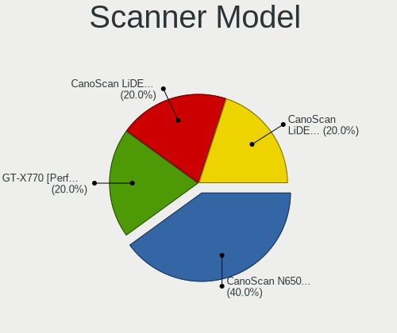

| Model                                 | Desktops | Percent |
|---------------------------------------|----------|---------|
| Canon CanoScan N650U/N656U            | 2        | 50%     |
| Seiko Epson GT-X770 [Perfection V500] | 1        | 25%     |
| Canon CanoScan LiDE 110               | 1        | 25%     |

Camera
------

Camera Vendor
-------------

Camera device vendors

| Vendor                | Desktops | Percent |
|-----------------------|----------|---------|
| Logitech              | 28       | 51.85%  |
| Microdia              | 8        | 14.81%  |
| Microsoft             | 6        | 11.11%  |
| Realtek Semiconductor | 2        | 3.7%    |
| Chicony Electronics   | 2        | 3.7%    |
| Apple                 | 2        | 3.7%    |
| Trust                 | 1        | 1.85%   |
| Samsung Electronics   | 1        | 1.85%   |
| OnePlus               | 1        | 1.85%   |
| Lenovo                | 1        | 1.85%   |
| Google                | 1        | 1.85%   |
| Creative Technology   | 1        | 1.85%   |

Camera Model
------------

Camera device models

| Model                                       | Desktops | Percent |
|---------------------------------------------|----------|---------|
| Logitech Webcam C270                        | 7        | 12.96%  |
| Logitech HD Pro Webcam C920                 | 6        | 11.11%  |
| Microsoft LifeCam HD-3000                   | 5        | 9.26%   |
| Microdia Camera                             | 3        | 5.56%   |
| Logitech StreamCam                          | 3        | 5.56%   |
| Logitech HD Webcam C510                     | 3        | 5.56%   |
| Logitech Webcam C930e                       | 2        | 3.7%    |
| Logitech Webcam B500                        | 2        | 3.7%    |
| Trust Full HD Webcam                        | 1        | 1.85%   |
| Samsung Galaxy series, misc. (MTP mode)     | 1        | 1.85%   |
| Realtek Streaming Webcam                    | 1        | 1.85%   |
| Realtek FULL HD 1080P Webcam                | 1        | 1.85%   |
| OnePlus GM1913                              | 1        | 1.85%   |
| Microsoft LifeCam Studio                    | 1        | 1.85%   |
| Microdia USB 2.0 Camera                     | 1        | 1.85%   |
| Microdia Sonix USB 2.0 Camera               | 1        | 1.85%   |
| Microdia Defender G-Lens 2577 HD720p Camera | 1        | 1.85%   |
| Microdia AUKEY PC-W1                        | 1        | 1.85%   |
| Microdia ACR010 USB Webcam                  | 1        | 1.85%   |
| Logitech Webcam C925e                       | 1        | 1.85%   |
| Logitech Webcam C210                        | 1        | 1.85%   |
| Logitech Webcam C110                        | 1        | 1.85%   |
| Logitech QuickCam Communicate MP/S5500      | 1        | 1.85%   |
| Logitech HD Webcam C525                     | 1        | 1.85%   |
| Lenovo FHD Webcam Audio                     | 1        | 1.85%   |
| Google Nexus/Pixel Device (MTP + debug)     | 1        | 1.85%   |
| Creative VF0610 Live! Cam Socialize HD      | 1        | 1.85%   |
| Chicony ViewSonic 1.3M, USB2.0 Webcam       | 1        | 1.85%   |
| Chicony ASUS USB2.0 Webcam                  | 1        | 1.85%   |
| Apple iPhone 5/5C/5S/6/SE                   | 1        | 1.85%   |
| Apple iPhone 4                              | 1        | 1.85%   |

Security
--------

Fingerprint Vendor
------------------

Fingerprint sensor vendors

| Vendor    | Desktops | Percent |
|-----------|----------|---------|
| Microsoft | 1        | 100%    |

Fingerprint Model
-----------------

Fingerprint sensor models

| Model                        | Desktops | Percent |
|------------------------------|----------|---------|
| Microsoft Fingerprint Reader | 1        | 100%    |

Chipcard Vendor
---------------

Chipcard module vendors

| Vendor                    | Desktops | Percent |
|---------------------------|----------|---------|
| SCM Microsystems          | 2        | 40%     |
| Fujitsu Siemens Computers | 2        | 40%     |
| Advanced Card Systems     | 1        | 20%     |

Chipcard Model
--------------

Chipcard module models

| Model                                                      | Desktops | Percent |
|------------------------------------------------------------|----------|---------|
| SCM Microsystems SCR3340 - ExpressCard54 Smart Card Reader | 2        | 40%     |
| Fujitsu Siemens Computers SmartCard Reader 2A              | 2        | 40%     |
| Advanced Card Systems ACR38 SmartCard Reader               | 1        | 20%     |

Unsupported
-----------

Unsupported Devices
-------------------

Total unsupported devices on board

| Total | Desktops | Percent |
|-------|----------|---------|
| 0     | 382      | 84.14%  |
| 1     | 60       | 13.22%  |
| 2     | 8        | 1.76%   |
| 4     | 2        | 0.44%   |
| 3     | 2        | 0.44%   |

Unsupported Device Types
------------------------

Types of unsupported devices

| Type                     | Desktops | Percent |
|--------------------------|----------|---------|
| Graphics card            | 26       | 32.1%   |
| Net/wireless             | 17       | 20.99%  |
| Communication controller | 9        | 11.11%  |
| Unassigned class         | 8        | 9.88%   |
| Sound                    | 4        | 4.94%   |
| Multimedia controller    | 4        | 4.94%   |
| Net/ethernet             | 2        | 2.47%   |
| Chipcard                 | 2        | 2.47%   |
| Card reader              | 2        | 2.47%   |
| Camera                   | 2        | 2.47%   |
| Storage/raid             | 1        | 1.23%   |
| Storage/nvme             | 1        | 1.23%   |
| Network                  | 1        | 1.23%   |
| Firewire controller      | 1        | 1.23%   |
| Bluetooth                | 1        | 1.23%   |

