Linux in Finland - Tested Hardware & Statistics (Notebooks)
-----------------------------------------------------------

A project to collect tested hardware configurations for Linux in Finland.

Anyone can contribute to this report by the [hw-probe](https://github.com/linuxhw/hw-probe) tool:

    sudo -E hw-probe -all -upload

Please contribute! Especially if your hardware is rare.

Contents
--------

* [ Test Cases ](#test-cases)

* [ System ](#system)
  - [ OS                       ](#os)
  - [ OS Family                ](#os-family)
  - [ Kernel                   ](#kernel)
  - [ Kernel Family            ](#kernel-family)
  - [ Kernel Major Ver.        ](#kernel-major-ver)
  - [ Arch                     ](#arch)
  - [ DE                       ](#de)
  - [ Display Server           ](#display-server)
  - [ Display Manager          ](#display-manager)
  - [ OS Lang                  ](#os-lang)
  - [ Boot Mode                ](#boot-mode)
  - [ Filesystem               ](#filesystem)
  - [ Part. scheme             ](#part-scheme)
  - [ Dual Boot with Linux/BSD ](#dual-boot-with-linuxbsd)
  - [ Dual Boot (Win)          ](#dual-boot-win)

* [ Board ](#board)
  - [ Vendor                   ](#vendor)
  - [ Model                    ](#model)
  - [ Model Family             ](#model-family)
  - [ MFG Year                 ](#mfg-year)
  - [ Form Factor              ](#form-factor)
  - [ Secure Boot              ](#secure-boot)
  - [ Coreboot                 ](#coreboot)
  - [ RAM Size                 ](#ram-size)
  - [ RAM Used                 ](#ram-used)
  - [ Total Drives             ](#total-drives)
  - [ Has CD-ROM               ](#has-cd-rom)
  - [ Has Ethernet             ](#has-ethernet)
  - [ Has WiFi                 ](#has-wifi)
  - [ Has Bluetooth            ](#has-bluetooth)

* [ Location ](#location)
  - [ Country                  ](#country)
  - [ City                     ](#city)

* [ Drives ](#drives)
  - [ Drive Vendor             ](#drive-vendor)
  - [ Drive Model              ](#drive-model)
  - [ HDD Vendor               ](#hdd-vendor)
  - [ SSD Vendor               ](#ssd-vendor)
  - [ Drive Kind               ](#drive-kind)
  - [ Drive Connector          ](#drive-connector)
  - [ Drive Size               ](#drive-size)
  - [ Space Total              ](#space-total)
  - [ Space Used               ](#space-used)
  - [ Malfunc. Drives          ](#malfunc-drives)
  - [ Malfunc. Drive Vendor    ](#malfunc-drive-vendor)
  - [ Malfunc. HDD Vendor      ](#malfunc-hdd-vendor)
  - [ Malfunc. Drive Kind      ](#malfunc-drive-kind)
  - [ Failed Drives            ](#failed-drives)
  - [ Failed Drive Vendor      ](#failed-drive-vendor)
  - [ Drive Status             ](#drive-status)

* [ Storage controller ](#storage-controller)
  - [ Storage Vendor           ](#storage-vendor)
  - [ Storage Model            ](#storage-model)
  - [ Storage Kind             ](#storage-kind)

* [ Processor ](#processor)
  - [ CPU Vendor               ](#cpu-vendor)
  - [ CPU Model                ](#cpu-model)
  - [ CPU Model Family         ](#cpu-model-family)
  - [ CPU Cores                ](#cpu-cores)
  - [ CPU Sockets              ](#cpu-sockets)
  - [ CPU Threads              ](#cpu-threads)
  - [ CPU Op-Modes             ](#cpu-op-modes)
  - [ CPU Microcode            ](#cpu-microcode)
  - [ CPU Microarch            ](#cpu-microarch)

* [ Graphics ](#graphics)
  - [ GPU Vendor               ](#gpu-vendor)
  - [ GPU Model                ](#gpu-model)
  - [ GPU Combo                ](#gpu-combo)
  - [ GPU Driver               ](#gpu-driver)
  - [ GPU Memory               ](#gpu-memory)

* [ Monitor ](#monitor)
  - [ Monitor Vendor           ](#monitor-vendor)
  - [ Monitor Model            ](#monitor-model)
  - [ Monitor Resolution       ](#monitor-resolution)
  - [ Monitor Diagonal         ](#monitor-diagonal)
  - [ Monitor Width            ](#monitor-width)
  - [ Aspect Ratio             ](#aspect-ratio)
  - [ Monitor Area             ](#monitor-area)
  - [ Pixel Density            ](#pixel-density)
  - [ Multiple Monitors        ](#multiple-monitors)

* [ Network ](#network)
  - [ Net Controller Vendor    ](#net-controller-vendor)
  - [ Net Controller Model     ](#net-controller-model)
  - [ Wireless Vendor          ](#wireless-vendor)
  - [ Wireless Model           ](#wireless-model)
  - [ Ethernet Vendor          ](#ethernet-vendor)
  - [ Ethernet Model           ](#ethernet-model)
  - [ Net Controller Kind      ](#net-controller-kind)
  - [ Used Controller          ](#used-controller)
  - [ NICs                     ](#nics)
  - [ IPv6                     ](#ipv6)

* [ Bluetooth ](#bluetooth)
  - [ Bluetooth Vendor         ](#bluetooth-vendor)
  - [ Bluetooth Model          ](#bluetooth-model)

* [ Sound ](#sound)
  - [ Sound Vendor             ](#sound-vendor)
  - [ Sound Model              ](#sound-model)

* [ Memory ](#memory)
  - [ Memory Vendor            ](#memory-vendor)
  - [ Memory Model             ](#memory-model)
  - [ Memory Kind              ](#memory-kind)
  - [ Memory Form Factor       ](#memory-form-factor)
  - [ Memory Size              ](#memory-size)
  - [ Memory Speed             ](#memory-speed)

* [ Printers & scanners ](#printers--scanners)
  - [ Printer Vendor           ](#printer-vendor)
  - [ Printer Model            ](#printer-model)
  - [ Scanner Vendor           ](#scanner-vendor)
  - [ Scanner Model            ](#scanner-model)

* [ Camera ](#camera)
  - [ Camera Vendor            ](#camera-vendor)
  - [ Camera Model             ](#camera-model)

* [ Security ](#security)
  - [ Fingerprint Vendor       ](#fingerprint-vendor)
  - [ Fingerprint Model        ](#fingerprint-model)
  - [ Chipcard Vendor          ](#chipcard-vendor)
  - [ Chipcard Model           ](#chipcard-model)

* [ Unsupported ](#unsupported)
  - [ Unsupported Devices      ](#unsupported-devices)
  - [ Unsupported Device Types ](#unsupported-device-types)

Test Cases
----------

Total: 1782

| Vendor        | Model                       | Probe                                                      | Date         |
|---------------|-----------------------------|------------------------------------------------------------|--------------|
| HP            | EliteBook 840 G1            | [a6ba51d1c1](https://linux-hardware.org/?probe=a6ba51d1c1) | Jan 02, 2026 |
| HP            | ProBook 6560b               | [0d3b42f98a](https://linux-hardware.org/?probe=0d3b42f98a) | Dec 31, 2025 |
| HP            | Unknown                     | [f4a87edcbf](https://linux-hardware.org/?probe=f4a87edcbf) | Dec 29, 2025 |
| HP            | EliteBook 840 G3            | [344a67bcc1](https://linux-hardware.org/?probe=344a67bcc1) | Dec 29, 2025 |
| Lenovo        | ThinkPad P15 Gen 1 20SUS... | [6f531a7a97](https://linux-hardware.org/?probe=6f531a7a97) | Dec 28, 2025 |
| HP            | EliteBook 8560w             | [5c8e9eb059](https://linux-hardware.org/?probe=5c8e9eb059) | Dec 27, 2025 |
| Star Labs     | StarBook                    | [57c1ab9df3](https://linux-hardware.org/?probe=57c1ab9df3) | Dec 26, 2025 |
| HP            | ProBook 440 G6              | [4e2ad0a4b4](https://linux-hardware.org/?probe=4e2ad0a4b4) | Dec 23, 2025 |
| HP            | ProBook 440 G6              | [3729f2821d](https://linux-hardware.org/?probe=3729f2821d) | Dec 23, 2025 |
| ASUSTek       | K56CM                       | [f25271eb41](https://linux-hardware.org/?probe=f25271eb41) | Dec 21, 2025 |
| ASUSTek       | VivoBook_ASUSLaptop M140... | [9b38785cb5](https://linux-hardware.org/?probe=9b38785cb5) | Dec 21, 2025 |
| HP            | ZBook 15 G6                 | [979eae7568](https://linux-hardware.org/?probe=979eae7568) | Dec 20, 2025 |
| HP            | ProBook 640 G1              | [8edf2e0ab9](https://linux-hardware.org/?probe=8edf2e0ab9) | Dec 19, 2025 |
| HP            | ProBook 640 G1              | [abc654dfbc](https://linux-hardware.org/?probe=abc654dfbc) | Dec 19, 2025 |
| HP            | EliteBook 1040 14 inch G... | [ba11b3220e](https://linux-hardware.org/?probe=ba11b3220e) | Dec 18, 2025 |
| HP            | EliteBook 830 G6            | [08674a5055](https://linux-hardware.org/?probe=08674a5055) | Dec 17, 2025 |
| Valve         | Galileo                     | [b11bbe1d77](https://linux-hardware.org/?probe=b11bbe1d77) | Dec 14, 2025 |
| ASUSTek       | ASUS TUF Gaming A16 FA60... | [130971c856](https://linux-hardware.org/?probe=130971c856) | Dec 14, 2025 |
| ASUSTek       | K56CM                       | [e1460005f2](https://linux-hardware.org/?probe=e1460005f2) | Dec 12, 2025 |
| Lenovo        | ThinkPad T420 4178BAG       | [e16316c3e2](https://linux-hardware.org/?probe=e16316c3e2) | Dec 10, 2025 |
| Lenovo        | IdeaPad 510S-13IKB 80V0     | [3ca6296e5e](https://linux-hardware.org/?probe=3ca6296e5e) | Dec 08, 2025 |
| HP            | Laptop 15-db1xxx            | [f78dc63b73](https://linux-hardware.org/?probe=f78dc63b73) | Dec 08, 2025 |
| HUAWEI        | MACH-WX9                    | [943f79be84](https://linux-hardware.org/?probe=943f79be84) | Dec 07, 2025 |
| Apple         | MacBookAir6,2               | [67eca1c1ca](https://linux-hardware.org/?probe=67eca1c1ca) | Dec 06, 2025 |
| Lenovo        | ThinkPad T470p 20J6CTO1W... | [2d46208836](https://linux-hardware.org/?probe=2d46208836) | Dec 06, 2025 |
| Lenovo        | ThinkPad T470p 20J6CTO1W... | [20fa4a9e34](https://linux-hardware.org/?probe=20fa4a9e34) | Dec 06, 2025 |
| Lenovo        | IdeaPad 510S-13IKB 80V0     | [7beec0c40e](https://linux-hardware.org/?probe=7beec0c40e) | Dec 05, 2025 |
| Framework     | Laptop 13 (AMD Ryzen AI ... | [9dd54ed569](https://linux-hardware.org/?probe=9dd54ed569) | Dec 03, 2025 |
| GPD           | G1688-08                    | [41a7fbb7bb](https://linux-hardware.org/?probe=41a7fbb7bb) | Dec 03, 2025 |
| TUXEDO        | InfinityBook Pro AMD Gen... | [31e3032011](https://linux-hardware.org/?probe=31e3032011) | Dec 03, 2025 |
| Lenovo        | ThinkPad T400 2768V82       | [fbd89eaa1e](https://linux-hardware.org/?probe=fbd89eaa1e) | Dec 01, 2025 |
| Lenovo        | ThinkPad P15s Gen 1 20T4... | [4c63bc264e](https://linux-hardware.org/?probe=4c63bc264e) | Nov 30, 2025 |
| Acer          | Aspire A715-71G             | [7108c49e19](https://linux-hardware.org/?probe=7108c49e19) | Nov 30, 2025 |
| Lenovo        | IdeaPad Slim 3 15AMN8 82... | [ae5d321fb2](https://linux-hardware.org/?probe=ae5d321fb2) | Nov 30, 2025 |
| HP            | Laptop 14-ck2xxx            | [62525d79fc](https://linux-hardware.org/?probe=62525d79fc) | Nov 29, 2025 |
| Lenovo        | ThinkPad E14 Gen 6 21M4S... | [c3fb869636](https://linux-hardware.org/?probe=c3fb869636) | Nov 26, 2025 |
| Dell          | Latitude 5420               | [0ff1f78564](https://linux-hardware.org/?probe=0ff1f78564) | Nov 26, 2025 |
| Lenovo        | ThinkPad X1 Carbon Gen 9... | [8f65c6df29](https://linux-hardware.org/?probe=8f65c6df29) | Nov 24, 2025 |
| Acer          | Nitro AN515-44              | [1358e88423](https://linux-hardware.org/?probe=1358e88423) | Nov 22, 2025 |
| Lenovo        | IdeaPad 530S-15IKB 81EV     | [0a8738940f](https://linux-hardware.org/?probe=0a8738940f) | Nov 21, 2025 |
| HP            | EliteBook 840 G6            | [8038b87ccf](https://linux-hardware.org/?probe=8038b87ccf) | Nov 21, 2025 |
| Acer          | Swift SF314-43              | [ee3bbe3587](https://linux-hardware.org/?probe=ee3bbe3587) | Nov 20, 2025 |
| Lenovo        | ThinkPad T460s 20F90057M... | [73e9c133a3](https://linux-hardware.org/?probe=73e9c133a3) | Nov 16, 2025 |
| Lenovo        | ThinkPad L470 20J5S0F100    | [ffd12ad4ba](https://linux-hardware.org/?probe=ffd12ad4ba) | Nov 15, 2025 |
| Lenovo        | ThinkPad T540p 20BE00B5M... | [7d52b29594](https://linux-hardware.org/?probe=7d52b29594) | Nov 15, 2025 |
| HP            | ZBook 15 G5                 | [141406aab5](https://linux-hardware.org/?probe=141406aab5) | Nov 11, 2025 |
| Acer          | Aspire V5-123               | [378060607e](https://linux-hardware.org/?probe=378060607e) | Nov 08, 2025 |
| Lenovo        | ThinkPad L420 78544VG       | [96e7d0e09e](https://linux-hardware.org/?probe=96e7d0e09e) | Nov 06, 2025 |
| HP            | 655                         | [9de27f38b0](https://linux-hardware.org/?probe=9de27f38b0) | Nov 01, 2025 |
| Lenovo        | ThinkPad T450 20BV001VMS    | [c5193988f7](https://linux-hardware.org/?probe=c5193988f7) | Oct 30, 2025 |
| Apple         | MacBookPro8,1               | [035d4857f0](https://linux-hardware.org/?probe=035d4857f0) | Oct 30, 2025 |
| Acer          | Extensa 215-55              | [9dc778fb18](https://linux-hardware.org/?probe=9dc778fb18) | Oct 30, 2025 |
| HP            | ProBook 430 G1              | [0685b26d04](https://linux-hardware.org/?probe=0685b26d04) | Oct 28, 2025 |
| HP            | Pavilion 15                 | [3aa52fbb53](https://linux-hardware.org/?probe=3aa52fbb53) | Oct 26, 2025 |
| HP            | Laptop 14-cf3xxx            | [14eca1142c](https://linux-hardware.org/?probe=14eca1142c) | Oct 26, 2025 |
| ASUSTek       | K73TK                       | [ddafc13491](https://linux-hardware.org/?probe=ddafc13491) | Oct 25, 2025 |
| ASUSTek       | K55VD                       | [f306b75d4d](https://linux-hardware.org/?probe=f306b75d4d) | Oct 22, 2025 |
| HP            | Pavilion 17                 | [ff44d5613d](https://linux-hardware.org/?probe=ff44d5613d) | Oct 22, 2025 |
| Lenovo        | ThinkPad T560 20FH0039MS    | [23e9b86c1f](https://linux-hardware.org/?probe=23e9b86c1f) | Oct 21, 2025 |
| Lenovo        | Legion Pro 7 16IAX10H 83... | [785fd2e9ba](https://linux-hardware.org/?probe=785fd2e9ba) | Oct 21, 2025 |
| Lenovo        | ThinkPad A475 20KMS0AD0N    | [4372b65236](https://linux-hardware.org/?probe=4372b65236) | Oct 20, 2025 |
| Lenovo        | ThinkPad T495s 20QKS0SD1... | [595ea30395](https://linux-hardware.org/?probe=595ea30395) | Oct 19, 2025 |
| ASUSTek       | X540LA                      | [65c2556816](https://linux-hardware.org/?probe=65c2556816) | Oct 19, 2025 |
| ASUSTek       | X540LA                      | [68e673d7d0](https://linux-hardware.org/?probe=68e673d7d0) | Oct 19, 2025 |
| MSI           | Bravo 17 C7VF               | [2553c2e6cd](https://linux-hardware.org/?probe=2553c2e6cd) | Oct 18, 2025 |
| HONOR         | BRN-FXXC                    | [bdfa926e0b](https://linux-hardware.org/?probe=bdfa926e0b) | Oct 18, 2025 |
| HP            | ProBook 430 G2              | [c2b5b1b5df](https://linux-hardware.org/?probe=c2b5b1b5df) | Oct 18, 2025 |
| Dell          | Latitude 5500               | [1b8982e78b](https://linux-hardware.org/?probe=1b8982e78b) | Oct 16, 2025 |
| ASUSTek       | K56CM                       | [6bc6ac76bc](https://linux-hardware.org/?probe=6bc6ac76bc) | Oct 15, 2025 |
| HUAWEI        | MACH-WX9                    | [2cc248e31f](https://linux-hardware.org/?probe=2cc248e31f) | Oct 15, 2025 |
| Fujitsu       | LIFEBOOK E743               | [3698922ee4](https://linux-hardware.org/?probe=3698922ee4) | Oct 15, 2025 |
| HP            | EliteBook 840 G5            | [08cc86638e](https://linux-hardware.org/?probe=08cc86638e) | Oct 13, 2025 |
| Lenovo        | IdeaPad 3 15IAU7 82RK       | [805a1e1ac6](https://linux-hardware.org/?probe=805a1e1ac6) | Oct 12, 2025 |
| Lenovo        | IdeaPad 1 14IJL7 82LV       | [1d546eb3ad](https://linux-hardware.org/?probe=1d546eb3ad) | Oct 10, 2025 |
| Dell          | Latitude 7450               | [7b8f028721](https://linux-hardware.org/?probe=7b8f028721) | Oct 09, 2025 |
| Lenovo        | ThinkPad Edge E530c 3366... | [384ac4ede4](https://linux-hardware.org/?probe=384ac4ede4) | Oct 09, 2025 |
| HP            | Compaq 615                  | [542d71ef77](https://linux-hardware.org/?probe=542d71ef77) | Oct 05, 2025 |
| HP            | Pavilion Laptop 15-eg0xx... | [e953ad6eb8](https://linux-hardware.org/?probe=e953ad6eb8) | Oct 05, 2025 |
| Lenovo        | ThinkPad T14 Gen 1 20UES... | [a71b98cfe3](https://linux-hardware.org/?probe=a71b98cfe3) | Oct 02, 2025 |
| Dell          | Latitude E5430 non-vPro     | [38a2b85b33](https://linux-hardware.org/?probe=38a2b85b33) | Oct 01, 2025 |
| Acer          | Swift SF113-31              | [c58c5af5ba](https://linux-hardware.org/?probe=c58c5af5ba) | Oct 01, 2025 |
| ASUSTek       | ROG Strix G18 G814FP_G81... | [9b34c5b621](https://linux-hardware.org/?probe=9b34c5b621) | Oct 01, 2025 |
| Acer          | Swift SF113-31              | [05055551d2](https://linux-hardware.org/?probe=05055551d2) | Sep 30, 2025 |
| HP            | Pavilion dv6                | [e312d9cc60](https://linux-hardware.org/?probe=e312d9cc60) | Sep 30, 2025 |
| Acer          | Aspire E1-572               | [e2ab445e9f](https://linux-hardware.org/?probe=e2ab445e9f) | Sep 29, 2025 |
| ASUSTek       | Zenbook UM3402YAR_UM3402... | [b95a5bf11b](https://linux-hardware.org/?probe=b95a5bf11b) | Sep 29, 2025 |
| ASUSTek       | G750JX                      | [d348f4f7ac](https://linux-hardware.org/?probe=d348f4f7ac) | Sep 28, 2025 |
| HUAWEI        | VGHH-XX                     | [246d62a2a4](https://linux-hardware.org/?probe=246d62a2a4) | Sep 27, 2025 |
| HUAWEI        | VGHH-XX                     | [5daf9b4e7e](https://linux-hardware.org/?probe=5daf9b4e7e) | Sep 27, 2025 |
| HP            | ZBook 15 G3                 | [3f04c59f77](https://linux-hardware.org/?probe=3f04c59f77) | Sep 26, 2025 |
| Lenovo        | Yoga Pro 7 14IAH10 83KF     | [f94fced166](https://linux-hardware.org/?probe=f94fced166) | Sep 25, 2025 |
| Lenovo        | ThinkPad T480 20L60034MX    | [2e93c7b5c6](https://linux-hardware.org/?probe=2e93c7b5c6) | Sep 24, 2025 |
| Lenovo        | ThinkPad T470 20HD002JMS    | [9684f311b8](https://linux-hardware.org/?probe=9684f311b8) | Sep 24, 2025 |
| Lenovo        | IdeaPad 320-17AST 80XW      | [3bf21b9ce5](https://linux-hardware.org/?probe=3bf21b9ce5) | Sep 23, 2025 |
| HP            | EliteBook 840 G5            | [87b58bd12b](https://linux-hardware.org/?probe=87b58bd12b) | Sep 21, 2025 |
| ASUSTek       | K56CM                       | [e6e20eb7cf](https://linux-hardware.org/?probe=e6e20eb7cf) | Sep 19, 2025 |
| HP            | ZBook 15 G3                 | [3bfb1bdbde](https://linux-hardware.org/?probe=3bfb1bdbde) | Sep 17, 2025 |
| Lenovo        | ThinkPad T14 Gen 1 20S1S... | [22cab427b9](https://linux-hardware.org/?probe=22cab427b9) | Sep 16, 2025 |
| HP            | EliteBook 8440p             | [e077efb01d](https://linux-hardware.org/?probe=e077efb01d) | Sep 15, 2025 |
| Dell          | Latitude E7450              | [02dcfe48af](https://linux-hardware.org/?probe=02dcfe48af) | Sep 14, 2025 |
| Lenovo        | ThinkPad T14 Gen 1 20UES... | [da6d21cb24](https://linux-hardware.org/?probe=da6d21cb24) | Sep 13, 2025 |
| Lenovo        | ThinkPad P15 Gen 1 20SUS... | [7afdcacab6](https://linux-hardware.org/?probe=7afdcacab6) | Sep 13, 2025 |
| Lenovo        | ThinkPad P15 Gen 1 20SUS... | [83bb09d978](https://linux-hardware.org/?probe=83bb09d978) | Sep 13, 2025 |
| HP            | ZBook 15                    | [8885cf5eab](https://linux-hardware.org/?probe=8885cf5eab) | Sep 12, 2025 |
| HP            | ProBook 6570b               | [0466cf5fff](https://linux-hardware.org/?probe=0466cf5fff) | Sep 12, 2025 |
| Google        | Edgar                       | [a3ce7d8859](https://linux-hardware.org/?probe=a3ce7d8859) | Sep 10, 2025 |
| Lenovo        | ThinkPad Edge E530c 3366... | [5c1a9a8f53](https://linux-hardware.org/?probe=5c1a9a8f53) | Sep 06, 2025 |
| Unknown       | Unknown                     | [2180877e6c](https://linux-hardware.org/?probe=2180877e6c) | Sep 06, 2025 |
| Lenovo        | ThinkPad Edge E530c 3366... | [93d48e2eb9](https://linux-hardware.org/?probe=93d48e2eb9) | Sep 05, 2025 |
| ASUSTek       | TUF Gaming FX505DY_FX505... | [b209fe4ca5](https://linux-hardware.org/?probe=b209fe4ca5) | Sep 04, 2025 |
| Lenovo        | B590 37612MG                | [4b7390dd1e](https://linux-hardware.org/?probe=4b7390dd1e) | Aug 31, 2025 |
| Lenovo        | ThinkPad T420s 41742BG      | [14b9f871f9](https://linux-hardware.org/?probe=14b9f871f9) | Aug 28, 2025 |
| Dell          | Precision M6500             | [8590a56e86](https://linux-hardware.org/?probe=8590a56e86) | Aug 27, 2025 |
| Lenovo        | Unknown                     | [6ddd3c5199](https://linux-hardware.org/?probe=6ddd3c5199) | Aug 26, 2025 |
| HP            | EliteBook 8560p             | [c178761026](https://linux-hardware.org/?probe=c178761026) | Aug 24, 2025 |
| Acer          | Aspire A114-33              | [6b4e699967](https://linux-hardware.org/?probe=6b4e699967) | Aug 23, 2025 |
| HP            | ProBook 650 G1              | [53f9cbae46](https://linux-hardware.org/?probe=53f9cbae46) | Aug 23, 2025 |
| Fujitsu       | LIFEBOOK U749               | [21a983919e](https://linux-hardware.org/?probe=21a983919e) | Aug 22, 2025 |
| Lenovo        | ThinkPad X1 Carbon Gen 1... | [664f78ee87](https://linux-hardware.org/?probe=664f78ee87) | Aug 22, 2025 |
| Acer          | Aspire A315-54              | [7e86e8ced3](https://linux-hardware.org/?probe=7e86e8ced3) | Aug 21, 2025 |
| Acer          | Aspire A315-59              | [5a885a6b48](https://linux-hardware.org/?probe=5a885a6b48) | Aug 19, 2025 |
| Valve         | Jupiter                     | [6010fd02c9](https://linux-hardware.org/?probe=6010fd02c9) | Aug 18, 2025 |
| Lenovo        | ThinkPad T460s 20F90043M... | [ac545b43f7](https://linux-hardware.org/?probe=ac545b43f7) | Aug 18, 2025 |
| Dell          | Latitude 5300               | [3af1aa43e1](https://linux-hardware.org/?probe=3af1aa43e1) | Aug 16, 2025 |
| Google        | Craask                      | [97182777bb](https://linux-hardware.org/?probe=97182777bb) | Aug 10, 2025 |
| HP            | ProBook 6560b               | [77aa5bcb5e](https://linux-hardware.org/?probe=77aa5bcb5e) | Aug 10, 2025 |
| HP            | Pavilion Notebook           | [77247925f5](https://linux-hardware.org/?probe=77247925f5) | Aug 08, 2025 |
| ASUSTek       | K73SD                       | [8f0c5e1888](https://linux-hardware.org/?probe=8f0c5e1888) | Aug 07, 2025 |
| ASUSTek       | K73SD                       | [14677ba786](https://linux-hardware.org/?probe=14677ba786) | Aug 07, 2025 |
| Fujitsu       | LIFEBOOK E754               | [1798995e01](https://linux-hardware.org/?probe=1798995e01) | Aug 03, 2025 |
| ASUSTek       | K53BY                       | [3573bf734e](https://linux-hardware.org/?probe=3573bf734e) | Aug 01, 2025 |
| Dell          | Studio XPS 1640             | [b96d569555](https://linux-hardware.org/?probe=b96d569555) | Aug 01, 2025 |
| Toshiba       | QOSMIO X70-A                | [b1b4628347](https://linux-hardware.org/?probe=b1b4628347) | Jul 31, 2025 |
| ASUSTek       | UX360CA                     | [7cc6e88227](https://linux-hardware.org/?probe=7cc6e88227) | Jul 29, 2025 |
| Lenovo        | IdeaPad 1 15ALC7 82R4       | [3ee9f80cfb](https://linux-hardware.org/?probe=3ee9f80cfb) | Jul 24, 2025 |
| Lenovo        | IdeaPad 1 15ALC7 82R4       | [7c0926543d](https://linux-hardware.org/?probe=7c0926543d) | Jul 22, 2025 |
| Dell          | Precision M4800             | [a9b53c7ef6](https://linux-hardware.org/?probe=a9b53c7ef6) | Jul 22, 2025 |
| HP            | Laptop 14-ck0xxx            | [66ba6920a3](https://linux-hardware.org/?probe=66ba6920a3) | Jul 22, 2025 |
| ASUSTek       | Vivobook Go E1404GA_E140... | [0ee666477b](https://linux-hardware.org/?probe=0ee666477b) | Jul 21, 2025 |
| Lenovo        | ThinkPad T470p 20J6S0170... | [3af6bd2e4e](https://linux-hardware.org/?probe=3af6bd2e4e) | Jul 21, 2025 |
| Apple         | MacBookPro11,1              | [42ab6e3bd2](https://linux-hardware.org/?probe=42ab6e3bd2) | Jul 20, 2025 |
| Toshiba       | Satellite L755D             | [79fabf0c11](https://linux-hardware.org/?probe=79fabf0c11) | Jul 20, 2025 |
| Toshiba       | Satellite L755D             | [5e6a2f3341](https://linux-hardware.org/?probe=5e6a2f3341) | Jul 19, 2025 |
| Acer          | Swift SF514-55T             | [e465b21f62](https://linux-hardware.org/?probe=e465b21f62) | Jul 18, 2025 |
| Lenovo        | ThinkPad E15 Gen 2 20T80... | [4a98368fc6](https://linux-hardware.org/?probe=4a98368fc6) | Jul 17, 2025 |
| HP            | ZBook 15 G3                 | [dde4914519](https://linux-hardware.org/?probe=dde4914519) | Jul 16, 2025 |
| Dell          | Latitude E5470              | [dd534a3308](https://linux-hardware.org/?probe=dd534a3308) | Jul 12, 2025 |
| Dell          | XPS 13 9370                 | [a56e392692](https://linux-hardware.org/?probe=a56e392692) | Jul 11, 2025 |
| Apple         | MacBook8,1                  | [e02361fb60](https://linux-hardware.org/?probe=e02361fb60) | Jul 10, 2025 |
| ASUSTek       | VivoBook_ASUSLaptop M140... | [7507b4b642](https://linux-hardware.org/?probe=7507b4b642) | Jul 10, 2025 |
| IBM           | 2629HWG                     | [2ae56292a3](https://linux-hardware.org/?probe=2ae56292a3) | Jul 07, 2025 |
| IBM           | 2629HWG                     | [4505d175de](https://linux-hardware.org/?probe=4505d175de) | Jul 07, 2025 |
| Lenovo        | ThinkPad T460 20FMS0TY00    | [a1b082d8aa](https://linux-hardware.org/?probe=a1b082d8aa) | Jul 07, 2025 |
| Samsung       | 755XDA                      | [721636bb1c](https://linux-hardware.org/?probe=721636bb1c) | Jul 05, 2025 |
| Dell          | Precision M4800             | [8f0a0c7410](https://linux-hardware.org/?probe=8f0a0c7410) | Jul 04, 2025 |
| Dell          | Precision M4800             | [31168104b4](https://linux-hardware.org/?probe=31168104b4) | Jul 04, 2025 |
| ASUSTek       | ASUS TUF Gaming A15 FA50... | [87eb6d3f02](https://linux-hardware.org/?probe=87eb6d3f02) | Jul 01, 2025 |
| ASUSTek       | ASUS TUF Gaming A15 FA50... | [3e6fbc30d8](https://linux-hardware.org/?probe=3e6fbc30d8) | Jul 01, 2025 |
| Lenovo        | ThinkPad L512 44444WG       | [5553b420fa](https://linux-hardware.org/?probe=5553b420fa) | Jun 25, 2025 |
| Gigabyte      | MMLP5AP-00                  | [dd2880c219](https://linux-hardware.org/?probe=dd2880c219) | Jun 25, 2025 |
| Lenovo        | ThinkPad E470 20H1CTO1WW    | [a07853e4bf](https://linux-hardware.org/?probe=a07853e4bf) | Jun 24, 2025 |
| Lenovo        | ThinkPad T14s Gen 2i 20W... | [730cf1677c](https://linux-hardware.org/?probe=730cf1677c) | Jun 24, 2025 |
| Lenovo        | ThinkPad E15 Gen 2 20T80... | [ee6373461d](https://linux-hardware.org/?probe=ee6373461d) | Jun 24, 2025 |
| HP            | EliteBook 850 G6            | [78b3349bd8](https://linux-hardware.org/?probe=78b3349bd8) | Jun 23, 2025 |
| Apple         | MacBookAir6,2               | [d285c790b0](https://linux-hardware.org/?probe=d285c790b0) | Jun 23, 2025 |
| Samsung       | 750XED                      | [702cb318cd](https://linux-hardware.org/?probe=702cb318cd) | Jun 21, 2025 |
| MSI           | GF63 Thin 11UC              | [1e1e3d0756](https://linux-hardware.org/?probe=1e1e3d0756) | Jun 20, 2025 |
| Samsung       | 350V5C/351V5C/3540VC/344... | [d01553a49f](https://linux-hardware.org/?probe=d01553a49f) | Jun 19, 2025 |
| HP            | EliteBook 820 G3            | [92102ccdda](https://linux-hardware.org/?probe=92102ccdda) | Jun 14, 2025 |
| Dell          | Latitude E6440              | [c0f3285002](https://linux-hardware.org/?probe=c0f3285002) | Jun 14, 2025 |
| HP            | ZBook 15 G3                 | [b2069040ab](https://linux-hardware.org/?probe=b2069040ab) | Jun 14, 2025 |
| Apple         | MacBook10,1                 | [a817fb0559](https://linux-hardware.org/?probe=a817fb0559) | Jun 13, 2025 |
| Apple         | MacBook10,1                 | [24733e1001](https://linux-hardware.org/?probe=24733e1001) | Jun 12, 2025 |
| ASUSTek       | ROG Zephyrus G16 GU605CW... | [69cc618c82](https://linux-hardware.org/?probe=69cc618c82) | Jun 12, 2025 |
| Lenovo        | IdeaPad Gaming 3 15IHU6 ... | [50e63432de](https://linux-hardware.org/?probe=50e63432de) | Jun 12, 2025 |
| Dell          | Pro 14 Plus PB14250         | [a0f6d1c4a5](https://linux-hardware.org/?probe=a0f6d1c4a5) | Jun 11, 2025 |
| Lenovo        | ThinkPad P16s Gen 3 21KS... | [5d8c6a45cd](https://linux-hardware.org/?probe=5d8c6a45cd) | Jun 10, 2025 |
| HP            | EliteBook 840 G5            | [a8f1d36fc4](https://linux-hardware.org/?probe=a8f1d36fc4) | Jun 10, 2025 |
| HP            | EliteBook 845 G7 Noteboo... | [c12c790221](https://linux-hardware.org/?probe=c12c790221) | Jun 09, 2025 |
| Lenovo        | IdeaPad 720S-14IKB 81BD     | [2021f38143](https://linux-hardware.org/?probe=2021f38143) | Jun 08, 2025 |
| HP            | ZBook Fury 17 G7 Mobile ... | [0f471383c9](https://linux-hardware.org/?probe=0f471383c9) | Jun 07, 2025 |
| HP            | ZBook Fury 17 G7 Mobile ... | [47873e8f04](https://linux-hardware.org/?probe=47873e8f04) | Jun 06, 2025 |
| Acer          | Nitro AN515-42              | [5a04193ca3](https://linux-hardware.org/?probe=5a04193ca3) | Jun 05, 2025 |
| Dell          | Vostro 3300                 | [e24f84ce5c](https://linux-hardware.org/?probe=e24f84ce5c) | Jun 01, 2025 |
| Acer          | Swift SF314-43              | [718b1cf37e](https://linux-hardware.org/?probe=718b1cf37e) | Jun 01, 2025 |
| HP            | Laptop 14s-fq1xxx           | [a142a8643d](https://linux-hardware.org/?probe=a142a8643d) | May 31, 2025 |
| Dell          | Precision 5680              | [6c2a6a5b80](https://linux-hardware.org/?probe=6c2a6a5b80) | May 29, 2025 |
| Lenovo        | ThinkPad L512 44444WG       | [892e165588](https://linux-hardware.org/?probe=892e165588) | May 28, 2025 |
| HUAWEI        | NBLK-WAX9X                  | [c467a052a8](https://linux-hardware.org/?probe=c467a052a8) | May 28, 2025 |
| HP            | ZBook 15 G3                 | [8cca1c90b3](https://linux-hardware.org/?probe=8cca1c90b3) | May 27, 2025 |
| ASRock        | H510M-HVS                   | [dbe803f0b2](https://linux-hardware.org/?probe=dbe803f0b2) | May 25, 2025 |
| Samsung       | 700G7C                      | [91b6adc107](https://linux-hardware.org/?probe=91b6adc107) | May 25, 2025 |
| HP            | EliteBook 735 G5            | [4acc91683d](https://linux-hardware.org/?probe=4acc91683d) | May 23, 2025 |
| Lenovo        | Yoga 3 Pro-1370 80HE        | [6ad3db0b5a](https://linux-hardware.org/?probe=6ad3db0b5a) | May 22, 2025 |
| Lenovo        | ThinkPad E14 Gen 4 21EB0... | [8ab3e17677](https://linux-hardware.org/?probe=8ab3e17677) | May 20, 2025 |
| HP            | 15                          | [da380d64f5](https://linux-hardware.org/?probe=da380d64f5) | May 19, 2025 |
| Lenovo        | ThinkPad E14 Gen 3 20Y70... | [4e23af0df3](https://linux-hardware.org/?probe=4e23af0df3) | May 17, 2025 |
| Lenovo        | ThinkPad E14 Gen 3 20Y70... | [d1b29967fb](https://linux-hardware.org/?probe=d1b29967fb) | May 17, 2025 |
| Dell          | Latitude E6440              | [b1452cf05c](https://linux-hardware.org/?probe=b1452cf05c) | May 17, 2025 |
| Dell          | Latitude E6220              | [d99e1c6942](https://linux-hardware.org/?probe=d99e1c6942) | May 17, 2025 |
| Lenovo        | ThinkPad Edge E530c 3366... | [b78651468a](https://linux-hardware.org/?probe=b78651468a) | May 17, 2025 |
| Lenovo        | ThinkPad P16v Gen 2 21KX... | [51fc600bce](https://linux-hardware.org/?probe=51fc600bce) | May 14, 2025 |
| HP            | ProBook 450 G6              | [3af2cf2eef](https://linux-hardware.org/?probe=3af2cf2eef) | May 14, 2025 |
| Acer          | Nitro AN515-58              | [5a62eff676](https://linux-hardware.org/?probe=5a62eff676) | May 13, 2025 |
| Lenovo        | Z50-70 20354                | [86ff50934e](https://linux-hardware.org/?probe=86ff50934e) | May 12, 2025 |
| Lenovo        | Z50-70 20354                | [f67c1dcd42](https://linux-hardware.org/?probe=f67c1dcd42) | May 12, 2025 |
| HP            | 15                          | [ff59ec9de4](https://linux-hardware.org/?probe=ff59ec9de4) | May 08, 2025 |
| ASUSTek       | ASUS TUF Gaming F15 FX50... | [3f839070f7](https://linux-hardware.org/?probe=3f839070f7) | May 08, 2025 |
| Lenovo        | ThinkPad T14 Gen 5 21MDS... | [2296bbede0](https://linux-hardware.org/?probe=2296bbede0) | May 06, 2025 |
| Lenovo        | B590 37612MG                | [21d9f43513](https://linux-hardware.org/?probe=21d9f43513) | May 06, 2025 |
| Lenovo        | ThinkPad P16v Gen 2 21KX... | [c2e0b784c1](https://linux-hardware.org/?probe=c2e0b784c1) | May 06, 2025 |
| HP            | ZBook 15 G3                 | [29aab80b15](https://linux-hardware.org/?probe=29aab80b15) | May 05, 2025 |
| Dell          | Latitude E6440              | [1968a91720](https://linux-hardware.org/?probe=1968a91720) | May 04, 2025 |
| Dell          | Latitude E6440              | [4720bea3fd](https://linux-hardware.org/?probe=4720bea3fd) | May 03, 2025 |
| Acer          | Aspire E5-575G              | [47baae1a36](https://linux-hardware.org/?probe=47baae1a36) | May 03, 2025 |
| Fujitsu Si... | AMILO Li3910                | [93b450b75a](https://linux-hardware.org/?probe=93b450b75a) | May 03, 2025 |
| Fujitsu Si... | AMILO Li3910                | [72288929e4](https://linux-hardware.org/?probe=72288929e4) | May 01, 2025 |
| Lenovo        | Legion 5P 15ARH05H 82GU     | [22e6e93a74](https://linux-hardware.org/?probe=22e6e93a74) | May 01, 2025 |
| Lenovo        | Yoga Pro 7 14IAH10 83KF     | [1f56981d74](https://linux-hardware.org/?probe=1f56981d74) | Apr 30, 2025 |
| Lenovo        | Yoga Pro 7 14IAH10 83KF     | [e47636808b](https://linux-hardware.org/?probe=e47636808b) | Apr 29, 2025 |
| Lenovo        | ThinkPad X230 2324GA7       | [a0888e41c4](https://linux-hardware.org/?probe=a0888e41c4) | Apr 29, 2025 |
| Dell          | Latitude E5570              | [53866531f2](https://linux-hardware.org/?probe=53866531f2) | Apr 28, 2025 |
| Acer          | Nitro AN515-58              | [30a7e8823e](https://linux-hardware.org/?probe=30a7e8823e) | Apr 27, 2025 |
| Acer          | Aspire V5-123               | [af60bc6c7a](https://linux-hardware.org/?probe=af60bc6c7a) | Apr 26, 2025 |
| HP            | EliteBook 830 G6            | [a217cf929b](https://linux-hardware.org/?probe=a217cf929b) | Apr 26, 2025 |
| HP            | Pavilion 15                 | [07b8d9b7f1](https://linux-hardware.org/?probe=07b8d9b7f1) | Apr 25, 2025 |
| Dell          | Latitude E6500              | [5f59771a47](https://linux-hardware.org/?probe=5f59771a47) | Apr 25, 2025 |
| HP            | ZBook 15 G3                 | [f5fcb45348](https://linux-hardware.org/?probe=f5fcb45348) | Apr 22, 2025 |
| ASUSTek       | ROG Zephyrus G14 GA402RK... | [3a83417d6f](https://linux-hardware.org/?probe=3a83417d6f) | Apr 22, 2025 |
| HP            | Pavilion Gaming Laptop 1... | [341ace7827](https://linux-hardware.org/?probe=341ace7827) | Apr 21, 2025 |
| Lunnen        | LLL5DAW                     | [ecfdc9c651](https://linux-hardware.org/?probe=ecfdc9c651) | Apr 21, 2025 |
| ASUSTek       | X551CAP                     | [2565d30743](https://linux-hardware.org/?probe=2565d30743) | Apr 19, 2025 |
| Lenovo        | IdeaPad 1 15ALC7 82R4       | [8e4c3ac376](https://linux-hardware.org/?probe=8e4c3ac376) | Apr 18, 2025 |
| HUAWEI        | MACHC-WAX9                  | [82599b6043](https://linux-hardware.org/?probe=82599b6043) | Apr 18, 2025 |
| Lenovo        | ThinkPad T430 2351C45       | [379a8144ac](https://linux-hardware.org/?probe=379a8144ac) | Apr 18, 2025 |
| Dell          | Precision M6500             | [c32ec012a4](https://linux-hardware.org/?probe=c32ec012a4) | Apr 18, 2025 |
| Lenovo        | B50-45 80F0                 | [f151fe246b](https://linux-hardware.org/?probe=f151fe246b) | Apr 17, 2025 |
| Lenovo        | ThinkPad X270 W10DG 20K5... | [fa92115932](https://linux-hardware.org/?probe=fa92115932) | Apr 16, 2025 |
| ASUSTek       | VivoBook_ASUSLaptop X160... | [1349f3cae6](https://linux-hardware.org/?probe=1349f3cae6) | Apr 15, 2025 |
| Lenovo        | ThinkPad Edge E330 33541... | [cb845c9233](https://linux-hardware.org/?probe=cb845c9233) | Apr 13, 2025 |
| Google        | Falco                       | [58a7f24cb1](https://linux-hardware.org/?probe=58a7f24cb1) | Apr 13, 2025 |
| Valve         | Galileo                     | [8cb20c77ca](https://linux-hardware.org/?probe=8cb20c77ca) | Apr 13, 2025 |
| Dell          | Latitude E6430              | [d3287ba5b8](https://linux-hardware.org/?probe=d3287ba5b8) | Apr 13, 2025 |
| Dell          | Latitude E6440              | [274b30ee9b](https://linux-hardware.org/?probe=274b30ee9b) | Apr 12, 2025 |
| Dell          | Latitude E6440              | [4a74b8cbf9](https://linux-hardware.org/?probe=4a74b8cbf9) | Apr 12, 2025 |
| Dell          | Latitude E5520              | [578c98ac9b](https://linux-hardware.org/?probe=578c98ac9b) | Apr 12, 2025 |
| HP            | Laptop 15s-fq3xxx           | [b682d11496](https://linux-hardware.org/?probe=b682d11496) | Apr 10, 2025 |
| HP            | EliteBook 820 G3            | [f980f38a0c](https://linux-hardware.org/?probe=f980f38a0c) | Apr 09, 2025 |
| Lenovo        | ThinkPad E595 20NF001HMX    | [c905832318](https://linux-hardware.org/?probe=c905832318) | Apr 09, 2025 |
| Winmate       | IAD32                       | [d3242d1538](https://linux-hardware.org/?probe=d3242d1538) | Apr 09, 2025 |
| Lenovo        | ThinkPad X1 Carbon Gen 1... | [ccfad1000b](https://linux-hardware.org/?probe=ccfad1000b) | Apr 08, 2025 |
| Lenovo        | ThinkPad X1 Carbon Gen 1... | [426790a5f4](https://linux-hardware.org/?probe=426790a5f4) | Apr 08, 2025 |
| Lenovo        | ThinkBook 15 G4 ABA 21DL    | [0f3fddec1f](https://linux-hardware.org/?probe=0f3fddec1f) | Apr 06, 2025 |
| Lenovo        | ThinkBook 15 G4 ABA 21DL    | [35be31cbb6](https://linux-hardware.org/?probe=35be31cbb6) | Apr 06, 2025 |
| HP            | EliteBook 840 G6            | [93c33ebbe4](https://linux-hardware.org/?probe=93c33ebbe4) | Apr 05, 2025 |
| Lenovo        | ThinkPad L14 Gen 3 21C2S... | [54677dffeb](https://linux-hardware.org/?probe=54677dffeb) | Apr 04, 2025 |
| Google        | Phaser360                   | [cccc2790f4](https://linux-hardware.org/?probe=cccc2790f4) | Apr 03, 2025 |
| ASUSTek       | UX32VD                      | [e98f12672d](https://linux-hardware.org/?probe=e98f12672d) | Mar 31, 2025 |
| Lenovo        | ThinkPad T495s 20QKS0SD1... | [3d05622a4f](https://linux-hardware.org/?probe=3d05622a4f) | Mar 29, 2025 |
| Acer          | Aspire E5-575G              | [2759f886b3](https://linux-hardware.org/?probe=2759f886b3) | Mar 29, 2025 |
| Dell          | Precision 5560              | [cab0f120be](https://linux-hardware.org/?probe=cab0f120be) | Mar 27, 2025 |
| Acer          | Predator PHN16-72           | [6648666e43](https://linux-hardware.org/?probe=6648666e43) | Mar 27, 2025 |
| HP            | EliteBook 2170p             | [d89cd0d43e](https://linux-hardware.org/?probe=d89cd0d43e) | Mar 27, 2025 |
| Dell          | Precision 7740              | [3f187ffcf7](https://linux-hardware.org/?probe=3f187ffcf7) | Mar 22, 2025 |
| Dell          | Latitude E6530              | [f8bbd3282c](https://linux-hardware.org/?probe=f8bbd3282c) | Mar 22, 2025 |
| Lenovo        | ThinkPad L512 44444WG       | [551909f775](https://linux-hardware.org/?probe=551909f775) | Mar 21, 2025 |
| Dell          | Latitude E6530              | [fac46de37a](https://linux-hardware.org/?probe=fac46de37a) | Mar 21, 2025 |
| Fujitsu       | LIFEBOOK S710               | [60d91dbc28](https://linux-hardware.org/?probe=60d91dbc28) | Mar 20, 2025 |
| ASUSTek       | VivoBook_ASUSLaptop X160... | [7e2119d752](https://linux-hardware.org/?probe=7e2119d752) | Mar 19, 2025 |
| HP            | Pavilion Laptop 15-eg0xx... | [6e57e5a19a](https://linux-hardware.org/?probe=6e57e5a19a) | Mar 19, 2025 |
| Lenovo        | ThinkPad L512 44444XG       | [c3086a05f4](https://linux-hardware.org/?probe=c3086a05f4) | Mar 18, 2025 |
| Dell          | Precision 7740              | [dff7ff4535](https://linux-hardware.org/?probe=dff7ff4535) | Mar 17, 2025 |
| HP            | EliteBook 840 G2            | [d3fca2b2a9](https://linux-hardware.org/?probe=d3fca2b2a9) | Mar 14, 2025 |
| Lenovo        | ThinkPad T490 20N3S3DR00    | [b5f8fc43ac](https://linux-hardware.org/?probe=b5f8fc43ac) | Mar 14, 2025 |
| Lenovo        | ThinkPad P16s Gen 2 21HL... | [15d57867a8](https://linux-hardware.org/?probe=15d57867a8) | Mar 13, 2025 |
| Lenovo        | ThinkPad T480 20L60034MX    | [213e885bb4](https://linux-hardware.org/?probe=213e885bb4) | Mar 12, 2025 |
| Lenovo        | ThinkPad T16 Gen 2 21K7C... | [347aefde4b](https://linux-hardware.org/?probe=347aefde4b) | Mar 12, 2025 |
| Lenovo        | ThinkPad T560 20FH0039MS    | [77c4bb0140](https://linux-hardware.org/?probe=77c4bb0140) | Mar 10, 2025 |
| Lenovo        | IdeaPad 3 14ALC6 82KT       | [d0a9db17c8](https://linux-hardware.org/?probe=d0a9db17c8) | Mar 06, 2025 |
| HP            | Pavilion Laptop 15-eg0xx... | [669fbf8731](https://linux-hardware.org/?probe=669fbf8731) | Mar 05, 2025 |
| Lenovo        | IdeaPad S145-15IWL 81S9     | [ad8854e1db](https://linux-hardware.org/?probe=ad8854e1db) | Mar 05, 2025 |
| HP            | ProBook 4530s               | [0cff1ba604](https://linux-hardware.org/?probe=0cff1ba604) | Mar 04, 2025 |
| HP            | ProBook 450 G6              | [62f383291a](https://linux-hardware.org/?probe=62f383291a) | Mar 04, 2025 |
| HP            | ProBook 450 G6              | [7f355579dd](https://linux-hardware.org/?probe=7f355579dd) | Mar 04, 2025 |
| HP            | Pavilion Laptop 15-eg0xx... | [7e91df0026](https://linux-hardware.org/?probe=7e91df0026) | Mar 03, 2025 |
| HP            | ProBook 430 G7              | [6e9c105bf5](https://linux-hardware.org/?probe=6e9c105bf5) | Mar 02, 2025 |
| Fujitsu       | LIFEBOOK U772               | [15c4982be2](https://linux-hardware.org/?probe=15c4982be2) | Mar 02, 2025 |
| HP            | EliteBook 8440p             | [d95971172c](https://linux-hardware.org/?probe=d95971172c) | Mar 01, 2025 |
| Lenovo        | ThinkPad T460 20FMS1J800    | [9886b3fda6](https://linux-hardware.org/?probe=9886b3fda6) | Feb 27, 2025 |
| Dell          | Inspiron 1545               | [2175215f32](https://linux-hardware.org/?probe=2175215f32) | Feb 26, 2025 |
| Lenovo        | ThinkPad P16v Gen 2 21KX... | [435841db8d](https://linux-hardware.org/?probe=435841db8d) | Feb 20, 2025 |
| Lenovo        | ThinkPad P16v Gen 2 21KX... | [3b0829a998](https://linux-hardware.org/?probe=3b0829a998) | Feb 20, 2025 |
| ASUSTek       | K73BY                       | [25591a1e1e](https://linux-hardware.org/?probe=25591a1e1e) | Feb 16, 2025 |
| Apple         | MacBook5,1                  | [18c5669619](https://linux-hardware.org/?probe=18c5669619) | Feb 16, 2025 |
| HP            | EliteBook 850 G2            | [dc47e3a8af](https://linux-hardware.org/?probe=dc47e3a8af) | Feb 15, 2025 |
| ASUSTek       | E403NA                      | [f700c4e312](https://linux-hardware.org/?probe=f700c4e312) | Feb 14, 2025 |
| eMachines     | G725                        | [b7ee836429](https://linux-hardware.org/?probe=b7ee836429) | Feb 11, 2025 |
| HP            | Pavilion 15                 | [473b462a8e](https://linux-hardware.org/?probe=473b462a8e) | Feb 10, 2025 |
| eMachines     | G725                        | [e54b69b49c](https://linux-hardware.org/?probe=e54b69b49c) | Feb 10, 2025 |
| HP            | EliteBook 840 G3            | [afe5de09ba](https://linux-hardware.org/?probe=afe5de09ba) | Feb 10, 2025 |
| Apple         | MacBookPro8,1               | [a01b7c06f9](https://linux-hardware.org/?probe=a01b7c06f9) | Feb 09, 2025 |
| Lenovo        | ThinkPad X270 W10DG 20K5... | [29d788d599](https://linux-hardware.org/?probe=29d788d599) | Feb 08, 2025 |
| MSI           | GP62MVR 7RF                 | [09128e4e06](https://linux-hardware.org/?probe=09128e4e06) | Feb 07, 2025 |
| Lenovo        | ThinkPad T14 Gen 1 20S00... | [9a493d45fd](https://linux-hardware.org/?probe=9a493d45fd) | Feb 06, 2025 |
| Lenovo        | ThinkPad T410 253725G       | [719236c364](https://linux-hardware.org/?probe=719236c364) | Feb 06, 2025 |
| ASUSTek       | GL553VD                     | [f608ef23cb](https://linux-hardware.org/?probe=f608ef23cb) | Feb 06, 2025 |
| Fujitsu Si... | AMILO La1703                | [35b6f20e8d](https://linux-hardware.org/?probe=35b6f20e8d) | Feb 05, 2025 |
| Fujitsu Si... | AMILO La1703                | [30d37a66f4](https://linux-hardware.org/?probe=30d37a66f4) | Feb 05, 2025 |
| Lenovo        | ThinkPad E470 20H10077RT    | [184fb43d1e](https://linux-hardware.org/?probe=184fb43d1e) | Feb 04, 2025 |
| Lenovo        | ThinkPad T14 Gen 4 21HES... | [3e57c745a9](https://linux-hardware.org/?probe=3e57c745a9) | Feb 04, 2025 |
| ASUSTek       | Vivobook Go E1404GA_E140... | [d57b852c56](https://linux-hardware.org/?probe=d57b852c56) | Feb 04, 2025 |
| ASUSTek       | Vivobook Go E1404GA_E140... | [2c39666874](https://linux-hardware.org/?probe=2c39666874) | Feb 04, 2025 |
| Dell          | Latitude 5300               | [2ae20d260b](https://linux-hardware.org/?probe=2ae20d260b) | Feb 03, 2025 |
| HP            | EliteBook Revolve 810 G2    | [6f3f58b181](https://linux-hardware.org/?probe=6f3f58b181) | Feb 02, 2025 |
| HP            | Compaq 8510w                | [0ad03b2f88](https://linux-hardware.org/?probe=0ad03b2f88) | Jan 30, 2025 |
| ASUSTek       | N73SV                       | [7e41041383](https://linux-hardware.org/?probe=7e41041383) | Jan 28, 2025 |
| Notebook      | W230SD                      | [db7c7edf27](https://linux-hardware.org/?probe=db7c7edf27) | Jan 27, 2025 |
| HP            | EliteBook 8440p             | [7074e91307](https://linux-hardware.org/?probe=7074e91307) | Jan 26, 2025 |
| Dell          | Precision M4800             | [e19f10cd43](https://linux-hardware.org/?probe=e19f10cd43) | Jan 26, 2025 |
| Apple         | MacBookPro8,1               | [24bed26e4f](https://linux-hardware.org/?probe=24bed26e4f) | Jan 26, 2025 |
| HP            | EliteBook Revolve 810 G2    | [e1788dae7d](https://linux-hardware.org/?probe=e1788dae7d) | Jan 25, 2025 |
| Lenovo        | G50-70 20351                | [0aab701d35](https://linux-hardware.org/?probe=0aab701d35) | Jan 25, 2025 |
| Lenovo        | ThinkPad X395 20NMS13801    | [ff416ce748](https://linux-hardware.org/?probe=ff416ce748) | Jan 24, 2025 |
| HP            | Pavilion Plus Laptop 14-... | [634722e8a8](https://linux-hardware.org/?probe=634722e8a8) | Jan 24, 2025 |
| Fujitsu       | AMILO Pi 3560               | [2a72dcba47](https://linux-hardware.org/?probe=2a72dcba47) | Jan 23, 2025 |
| Lenovo        | ThinkPad X201 3680F7G       | [fc7e71e4ca](https://linux-hardware.org/?probe=fc7e71e4ca) | Jan 23, 2025 |
| ASUSTek       | TUF Gaming FX505DY_FX505... | [668fb6d8f9](https://linux-hardware.org/?probe=668fb6d8f9) | Jan 23, 2025 |
| Lenovo        | ThinkPad X230 23252GG       | [4498819dd4](https://linux-hardware.org/?probe=4498819dd4) | Jan 23, 2025 |
| ASUSTek       | K56CB                       | [9bc7a2a900](https://linux-hardware.org/?probe=9bc7a2a900) | Jan 21, 2025 |
| Acer          | Aspire E5-575G              | [879f504fef](https://linux-hardware.org/?probe=879f504fef) | Jan 21, 2025 |
| Dell          | XPS 13 9360                 | [faf23fcd86](https://linux-hardware.org/?probe=faf23fcd86) | Jan 20, 2025 |
| Lenovo        | ThinkPad X200 7459D12       | [75784aa0ab](https://linux-hardware.org/?probe=75784aa0ab) | Jan 20, 2025 |
| HP            | EliteBook 850 G7 Noteboo... | [86a5a19643](https://linux-hardware.org/?probe=86a5a19643) | Jan 20, 2025 |
| HP            | EliteBook 850 G7 Noteboo... | [cb08c9120c](https://linux-hardware.org/?probe=cb08c9120c) | Jan 20, 2025 |
| HONOR         | NMH-WDX9                    | [70ff7cb4b5](https://linux-hardware.org/?probe=70ff7cb4b5) | Jan 19, 2025 |
| Fujitsu       | LIFEBOOK U772               | [ce90692026](https://linux-hardware.org/?probe=ce90692026) | Jan 19, 2025 |
| Framework     | Laptop 13 (AMD Ryzen 704... | [7d52871d46](https://linux-hardware.org/?probe=7d52871d46) | Jan 19, 2025 |
| ASUSTek       | UL30A                       | [5e4e4ce59c](https://linux-hardware.org/?probe=5e4e4ce59c) | Jan 16, 2025 |
| Apple         | MacBookPro11,3              | [0de48e88c2](https://linux-hardware.org/?probe=0de48e88c2) | Jan 15, 2025 |
| HP            | EliteBook 8440p             | [4f7bb9ccfc](https://linux-hardware.org/?probe=4f7bb9ccfc) | Jan 14, 2025 |
| Apple         | MacBookAir6,2               | [47815cfe5b](https://linux-hardware.org/?probe=47815cfe5b) | Jan 14, 2025 |
| Lenovo        | ThinkPad T440s 20AR005SM... | [744df4c801](https://linux-hardware.org/?probe=744df4c801) | Jan 14, 2025 |
| ASUSTek       | UL30A                       | [5124220d14](https://linux-hardware.org/?probe=5124220d14) | Jan 13, 2025 |
| HP            | ProBook 430 G2              | [e4df07619f](https://linux-hardware.org/?probe=e4df07619f) | Jan 12, 2025 |
| Dell          | Precision M6500             | [4b6d292458](https://linux-hardware.org/?probe=4b6d292458) | Jan 12, 2025 |
| Dell          | Precision M4800             | [dbd67adcd0](https://linux-hardware.org/?probe=dbd67adcd0) | Jan 10, 2025 |
| Dell          | Latitude 7430               | [61722fca43](https://linux-hardware.org/?probe=61722fca43) | Jan 09, 2025 |
| Dell          | Latitude E5450              | [7a072c72ea](https://linux-hardware.org/?probe=7a072c72ea) | Jan 09, 2025 |
| HP            | Pavilion 17                 | [f422f2202a](https://linux-hardware.org/?probe=f422f2202a) | Jan 06, 2025 |
| HP            | Pavilion 17                 | [105397d7da](https://linux-hardware.org/?probe=105397d7da) | Jan 06, 2025 |
| HP            | ProBook 640 G1              | [d6e43bba74](https://linux-hardware.org/?probe=d6e43bba74) | Jan 06, 2025 |
| HP            | ProBook 640 G1              | [7b033a8375](https://linux-hardware.org/?probe=7b033a8375) | Jan 06, 2025 |
| HP            | ProBook 450 G3              | [a1f8c7d33c](https://linux-hardware.org/?probe=a1f8c7d33c) | Jan 05, 2025 |
| Dell          | Inspiron 7520               | [d24db96b79](https://linux-hardware.org/?probe=d24db96b79) | Jan 01, 2025 |
| Lenovo        | IdeaPad U510 4941           | [78a774dc27](https://linux-hardware.org/?probe=78a774dc27) | Jan 01, 2025 |
| Dell          | Inspiron 1011               | [d0c3eef6f6](https://linux-hardware.org/?probe=d0c3eef6f6) | Dec 31, 2024 |
| Dell          | Inspiron 7520               | [f60d84588c](https://linux-hardware.org/?probe=f60d84588c) | Dec 31, 2024 |
| Valve         | Galileo                     | [d942a63123](https://linux-hardware.org/?probe=d942a63123) | Dec 30, 2024 |
| Unchartevi... | 6540                        | [1d27092258](https://linux-hardware.org/?probe=1d27092258) | Dec 29, 2024 |
| ASUSTek       | X751NA                      | [f5f28d0769](https://linux-hardware.org/?probe=f5f28d0769) | Dec 25, 2024 |
| Lenovo        | ThinkPad T14s Gen 4 21F8... | [d076330974](https://linux-hardware.org/?probe=d076330974) | Dec 23, 2024 |
| ASUSTek       | VivoBook_ASUSLaptop X513... | [0ade3a3f94](https://linux-hardware.org/?probe=0ade3a3f94) | Dec 22, 2024 |
| HP            | ProBook 640 G1              | [7c92813622](https://linux-hardware.org/?probe=7c92813622) | Dec 19, 2024 |
| Lenovo        | ThinkPad T14s Gen 6 21M1... | [9c999b2e96](https://linux-hardware.org/?probe=9c999b2e96) | Dec 18, 2024 |
| HP            | Pavilion dv6                | [c6677142e4](https://linux-hardware.org/?probe=c6677142e4) | Dec 16, 2024 |
| Apple         | MacBookPro10,1              | [e27d08b364](https://linux-hardware.org/?probe=e27d08b364) | Dec 15, 2024 |
| Apple         | MacBookPro10,1              | [96ffa04014](https://linux-hardware.org/?probe=96ffa04014) | Dec 15, 2024 |
| Lenovo        | Legion 5 Pro 16ACH6H 82J... | [f7062395dc](https://linux-hardware.org/?probe=f7062395dc) | Dec 15, 2024 |
| Lenovo        | Legion 5 15ACH6H 82JU       | [ee8dddc4e4](https://linux-hardware.org/?probe=ee8dddc4e4) | Dec 12, 2024 |
| HP            | EliteBook 745 G6            | [b46ff16ea8](https://linux-hardware.org/?probe=b46ff16ea8) | Dec 11, 2024 |
| HP            | Laptop 15-dw0xxx            | [a331c3b846](https://linux-hardware.org/?probe=a331c3b846) | Dec 10, 2024 |
| Lenovo        | ThinkPad T14s Gen 4 21F8... | [c21e962ea0](https://linux-hardware.org/?probe=c21e962ea0) | Dec 10, 2024 |
| MSI           | Katana GF76 11UE            | [96e708290f](https://linux-hardware.org/?probe=96e708290f) | Dec 08, 2024 |
| Lenovo        | ThinkPad T480s 20L8S4GU0... | [d1dafff4c9](https://linux-hardware.org/?probe=d1dafff4c9) | Dec 08, 2024 |
| Packard Be... | EasyNote TS11HR             | [9be4f893aa](https://linux-hardware.org/?probe=9be4f893aa) | Dec 07, 2024 |
| Lenovo        | Yoga Pro 9 16IRP8 83BY      | [3e24a418c3](https://linux-hardware.org/?probe=3e24a418c3) | Dec 06, 2024 |
| Lenovo        | IdeaPad 3 15ALC6 82KU       | [fdd1f52e06](https://linux-hardware.org/?probe=fdd1f52e06) | Dec 06, 2024 |
| HP            | Pavilion Laptop 15-eg0xx... | [ee7e95092d](https://linux-hardware.org/?probe=ee7e95092d) | Dec 05, 2024 |
| HP            | EliteBook 830 G5            | [4987877bbe](https://linux-hardware.org/?probe=4987877bbe) | Dec 03, 2024 |
| Lenovo        | ThinkPad P16 Gen 2 21FA0... | [a2afd1ee93](https://linux-hardware.org/?probe=a2afd1ee93) | Nov 27, 2024 |
| ASUSTek       | UX32VD                      | [84ed5ccaa6](https://linux-hardware.org/?probe=84ed5ccaa6) | Nov 25, 2024 |
| Lenovo        | IdeaPad L340-15IRH Gamin... | [79dfcb127b](https://linux-hardware.org/?probe=79dfcb127b) | Nov 22, 2024 |
| Fujitsu       | LIFEBOOK A514               | [0c1b1704f6](https://linux-hardware.org/?probe=0c1b1704f6) | Nov 20, 2024 |
| Lenovo        | Yoga 500-15IBD 80N6         | [e157b1804e](https://linux-hardware.org/?probe=e157b1804e) | Nov 16, 2024 |
| Fujitsu       | LIFEBOOK A530               | [3f35643c04](https://linux-hardware.org/?probe=3f35643c04) | Nov 12, 2024 |
| Fujitsu       | Unknown                     | [e1f88f1f19](https://linux-hardware.org/?probe=e1f88f1f19) | Nov 12, 2024 |
| HP            | Notebook                    | [60dba81312](https://linux-hardware.org/?probe=60dba81312) | Nov 12, 2024 |
| ASUSTek       | ZenBook S UX391UA           | [8913deb8fe](https://linux-hardware.org/?probe=8913deb8fe) | Nov 12, 2024 |
| HP            | Notebook                    | [3d619505fc](https://linux-hardware.org/?probe=3d619505fc) | Nov 12, 2024 |
| Acer          | Swift SF14-11               | [97526f926d](https://linux-hardware.org/?probe=97526f926d) | Nov 11, 2024 |
| Dell          | XPS 15 9530                 | [5667c491cd](https://linux-hardware.org/?probe=5667c491cd) | Nov 10, 2024 |
| Lenovo        | ThinkPad T560 20FHS06V00    | [c45dfe1fdd](https://linux-hardware.org/?probe=c45dfe1fdd) | Nov 08, 2024 |
| Acer          | Swift SF14-11               | [731d294cbe](https://linux-hardware.org/?probe=731d294cbe) | Nov 08, 2024 |
| Samsung       | Galaxy S2 (GT-I9100)        | [c732892f18](https://linux-hardware.org/?probe=c732892f18) | Nov 05, 2024 |
| Lenovo        | ThinkPad X200 7459D12       | [a34523d690](https://linux-hardware.org/?probe=a34523d690) | Nov 05, 2024 |
| HP            | 15                          | [b69517827e](https://linux-hardware.org/?probe=b69517827e) | Nov 03, 2024 |
| Apple         | MacBookPro10,1              | [1c42e6c25f](https://linux-hardware.org/?probe=1c42e6c25f) | Nov 02, 2024 |
| Lenovo        | IdeaPad Y700-14ISK 80NU     | [fe49c1b15d](https://linux-hardware.org/?probe=fe49c1b15d) | Nov 01, 2024 |
| Lenovo        | IdeaPad Y700-14ISK 80NU     | [7ea533c0eb](https://linux-hardware.org/?probe=7ea533c0eb) | Nov 01, 2024 |
| Lenovo        | ThinkPad T14s Gen 4 21F8... | [0672cada99](https://linux-hardware.org/?probe=0672cada99) | Oct 30, 2024 |
| ASUSTek       | S551LB                      | [8b564e5511](https://linux-hardware.org/?probe=8b564e5511) | Oct 28, 2024 |
| Lenovo        | ThinkPad X390 20Q1S6W600    | [8e5f1a7f66](https://linux-hardware.org/?probe=8e5f1a7f66) | Oct 27, 2024 |
| Lenovo        | IdeaPad 320S-14IKB 80X4     | [0941cfd8b8](https://linux-hardware.org/?probe=0941cfd8b8) | Oct 26, 2024 |
| Lenovo        | IdeaPad 320S-14IKB 80X4     | [1c4bfc91f8](https://linux-hardware.org/?probe=1c4bfc91f8) | Oct 26, 2024 |
| Lenovo        | IdeaPad 320S-14IKB 80X4     | [4d4b2c7929](https://linux-hardware.org/?probe=4d4b2c7929) | Oct 26, 2024 |
| ASUSTek       | GL553VE                     | [ac2e87e2ce](https://linux-hardware.org/?probe=ac2e87e2ce) | Oct 23, 2024 |
| Fujitsu       | LIFEBOOK AH531              | [7205fb0b92](https://linux-hardware.org/?probe=7205fb0b92) | Oct 23, 2024 |
| Lenovo        | G50-80 80E5                 | [38f6fb752d](https://linux-hardware.org/?probe=38f6fb752d) | Oct 23, 2024 |
| Fujitsu       | LIFEBOOK E559               | [96ff5d9648](https://linux-hardware.org/?probe=96ff5d9648) | Oct 22, 2024 |
| Lenovo        | ThinkPad T14 Gen 1 20UDS... | [fcf2df9453](https://linux-hardware.org/?probe=fcf2df9453) | Oct 22, 2024 |
| MSI           | GS60 6QE                    | [7e1d315d47](https://linux-hardware.org/?probe=7e1d315d47) | Oct 22, 2024 |
| ASUSTek       | ASUS Zenbook 14 UM3406HA... | [c73cd8024e](https://linux-hardware.org/?probe=c73cd8024e) | Oct 21, 2024 |
| TUXEDO        | InfinityBook Pro Gen7 (M... | [369e3e4bdd](https://linux-hardware.org/?probe=369e3e4bdd) | Oct 21, 2024 |
| Dell          | Latitude 5430               | [3519e7a530](https://linux-hardware.org/?probe=3519e7a530) | Oct 21, 2024 |
| Dell          | Latitude 5430               | [aea23cbc32](https://linux-hardware.org/?probe=aea23cbc32) | Oct 21, 2024 |
| Fujitsu       | LIFEBOOK E559               | [2ec391ffdc](https://linux-hardware.org/?probe=2ec391ffdc) | Oct 20, 2024 |
| Gigabyte      | P2542                       | [10122364e5](https://linux-hardware.org/?probe=10122364e5) | Oct 17, 2024 |
| HP            | Pavilion 15                 | [a6276808ad](https://linux-hardware.org/?probe=a6276808ad) | Oct 17, 2024 |
| HP            | Pavilion 11 x360 PC         | [161e32efcd](https://linux-hardware.org/?probe=161e32efcd) | Oct 16, 2024 |
| ASUSTek       | E403NA                      | [9ae450e44c](https://linux-hardware.org/?probe=9ae450e44c) | Oct 13, 2024 |
| ASUSTek       | Zenbook UX5401EA_UX5401E... | [3d7009833d](https://linux-hardware.org/?probe=3d7009833d) | Oct 11, 2024 |
| Lenovo        | ThinkPad X1 Carbon 7th 2... | [aa8a91dad1](https://linux-hardware.org/?probe=aa8a91dad1) | Oct 08, 2024 |
| Apple         | MacBookAir6,1               | [c9cda4f625](https://linux-hardware.org/?probe=c9cda4f625) | Oct 06, 2024 |
| Apple         | MacBookPro5,5               | [6c0b20bdce](https://linux-hardware.org/?probe=6c0b20bdce) | Oct 03, 2024 |
| ASUSTek       | ASUS TUF Gaming F15 FX50... | [6f1403e89a](https://linux-hardware.org/?probe=6f1403e89a) | Oct 02, 2024 |
| HP            | EliteBook 2530p             | [d75b4282e9](https://linux-hardware.org/?probe=d75b4282e9) | Oct 01, 2024 |
| HP            | EliteBook 2530p             | [52857f0cec](https://linux-hardware.org/?probe=52857f0cec) | Sep 30, 2024 |
| Lenovo        | ThinkPad A485 20MU000DMX    | [c79a269779](https://linux-hardware.org/?probe=c79a269779) | Sep 29, 2024 |
| Lenovo        | ThinkPad X230 2325TWT       | [617daeda56](https://linux-hardware.org/?probe=617daeda56) | Sep 28, 2024 |
| Lenovo        | ThinkPad T440s 20AQ007SM... | [4d2337d8a2](https://linux-hardware.org/?probe=4d2337d8a2) | Sep 28, 2024 |
| Lenovo        | IdeaPad 3 15ALC6 82KU       | [eb128112b1](https://linux-hardware.org/?probe=eb128112b1) | Sep 27, 2024 |
| Apple         | MacBookPro8,1               | [93e19e497d](https://linux-hardware.org/?probe=93e19e497d) | Sep 27, 2024 |
| Dell          | Latitude 7400               | [a8fc62b85e](https://linux-hardware.org/?probe=a8fc62b85e) | Sep 26, 2024 |
| Dell          | Precision 3551              | [c201795f7c](https://linux-hardware.org/?probe=c201795f7c) | Sep 18, 2024 |
| Acer          | Aspire A515-51G             | [1c1ac8a360](https://linux-hardware.org/?probe=1c1ac8a360) | Sep 18, 2024 |
| HP            | Victus by Gaming Laptop ... | [1b4a966af7](https://linux-hardware.org/?probe=1b4a966af7) | Sep 16, 2024 |
| Lenovo        | ThinkPad P16 Gen 2 21FA0... | [96c93da8c8](https://linux-hardware.org/?probe=96c93da8c8) | Sep 16, 2024 |
| Framework     | Laptop 13 (AMD Ryzen 704... | [28e8212852](https://linux-hardware.org/?probe=28e8212852) | Sep 16, 2024 |
| HP            | EliteBook 840 G5            | [94be8e0e90](https://linux-hardware.org/?probe=94be8e0e90) | Sep 12, 2024 |
| Lenovo        | B50-10 80QR                 | [1bada55b47](https://linux-hardware.org/?probe=1bada55b47) | Sep 12, 2024 |
| Packard Be... | EasyNote TS11HR             | [c1d8cfb914](https://linux-hardware.org/?probe=c1d8cfb914) | Sep 11, 2024 |
| ASUSTek       | ASUS Vivobook S 14 M5406... | [bb1ea1554d](https://linux-hardware.org/?probe=bb1ea1554d) | Sep 10, 2024 |
| Acer          | Aspire V3-572G              | [6de946d5a9](https://linux-hardware.org/?probe=6de946d5a9) | Sep 07, 2024 |
| Cepter        | Maximus WARDON              | [545c021bf3](https://linux-hardware.org/?probe=545c021bf3) | Sep 06, 2024 |
| Lenovo        | ThinkPad X260 20F5S04B00    | [c9474f150c](https://linux-hardware.org/?probe=c9474f150c) | Sep 03, 2024 |
| Lenovo        | ThinkPad P16s Gen 2 21K9... | [7b534afcea](https://linux-hardware.org/?probe=7b534afcea) | Sep 02, 2024 |
| Toshiba       | TECRA S11                   | [4617ceeeec](https://linux-hardware.org/?probe=4617ceeeec) | Aug 28, 2024 |
| ASUSTek       | ASUS TUF Gaming A15 FA50... | [0984d35721](https://linux-hardware.org/?probe=0984d35721) | Aug 28, 2024 |
| Lenovo        | ThinkPad X1 Carbon Gen 9... | [cb37d72216](https://linux-hardware.org/?probe=cb37d72216) | Aug 28, 2024 |
| HP            | Laptop 14-dg0xxx            | [ef85d2699e](https://linux-hardware.org/?probe=ef85d2699e) | Aug 19, 2024 |
| Samsung       | R540/R580/R780/SA41/E452... | [d033b522c3](https://linux-hardware.org/?probe=d033b522c3) | Aug 14, 2024 |
| ASUSTek       | ASUS TUF Gaming A15 FA50... | [684eeb17ab](https://linux-hardware.org/?probe=684eeb17ab) | Aug 14, 2024 |
| Lenovo        | Legion 5 15ARH05H 82B1      | [248f8ee89d](https://linux-hardware.org/?probe=248f8ee89d) | Aug 13, 2024 |
| ASUSTek       | T100TA                      | [087ac815ec](https://linux-hardware.org/?probe=087ac815ec) | Aug 06, 2024 |
| Lenovo        | ThinkPad W510 431967G       | [58cb012163](https://linux-hardware.org/?probe=58cb012163) | Aug 06, 2024 |
| Acer          | Swift SFX16-61G             | [2359a79645](https://linux-hardware.org/?probe=2359a79645) | Aug 03, 2024 |
| Lenovo        | ThinkPad P52 20M9001NMX     | [a06c67958c](https://linux-hardware.org/?probe=a06c67958c) | Aug 01, 2024 |
| Lenovo        | ThinkPad T61p 8889AU5       | [e06a1aad9c](https://linux-hardware.org/?probe=e06a1aad9c) | Aug 01, 2024 |
| Dell          | Latitude 7330 Rugged Ext... | [1c0578984c](https://linux-hardware.org/?probe=1c0578984c) | Jul 31, 2024 |
| Packard Be... | EasyNote TS11HR             | [a96ddb3094](https://linux-hardware.org/?probe=a96ddb3094) | Jul 27, 2024 |
| Lenovo        | Legion Pro 5 16IRX8 82WK    | [0219498bb7](https://linux-hardware.org/?probe=0219498bb7) | Jul 26, 2024 |
| ASUSTek       | UX490UA                     | [958c573822](https://linux-hardware.org/?probe=958c573822) | Jul 22, 2024 |
| Acer          | Aspire A315-41              | [288f9de47d](https://linux-hardware.org/?probe=288f9de47d) | Jul 21, 2024 |
| Apple         | MacBookAir6,2               | [fdda23379d](https://linux-hardware.org/?probe=fdda23379d) | Jul 20, 2024 |
| Fujitsu       | LIFEBOOK U772               | [8ba4824fc8](https://linux-hardware.org/?probe=8ba4824fc8) | Jul 19, 2024 |
| Fujitsu       | LIFEBOOK E733               | [6d6b42a6fe](https://linux-hardware.org/?probe=6d6b42a6fe) | Jul 19, 2024 |
| XIAOMI        | Redmi Book Pro 14 2024      | [62354fe581](https://linux-hardware.org/?probe=62354fe581) | Jul 19, 2024 |
| Apple         | MacBookPro14,1              | [bc496941a2](https://linux-hardware.org/?probe=bc496941a2) | Jul 17, 2024 |
| Lenovo        | ThinkPad T14s Gen 3 21BS... | [1b9fd5da77](https://linux-hardware.org/?probe=1b9fd5da77) | Jul 16, 2024 |
| Acer          | Aspire A315-41              | [0c819b933c](https://linux-hardware.org/?probe=0c819b933c) | Jul 11, 2024 |
| HUAWEI        | NBD-WXX9                    | [fbe8c9cc90](https://linux-hardware.org/?probe=fbe8c9cc90) | Jul 09, 2024 |
| Lenovo        | LOQ 16APH8 82XU             | [fdb5740619](https://linux-hardware.org/?probe=fdb5740619) | Jul 08, 2024 |
| Lenovo        | LOQ 16APH8 82XU             | [344a3a1381](https://linux-hardware.org/?probe=344a3a1381) | Jul 08, 2024 |
| Toshiba       | Satellite L500              | [d41f6ae73f](https://linux-hardware.org/?probe=d41f6ae73f) | Jul 07, 2024 |
| ASUSTek       | E502SA                      | [2f4823de9d](https://linux-hardware.org/?probe=2f4823de9d) | Jul 03, 2024 |
| ASUSTek       | E502SA                      | [3ee55aa7b7](https://linux-hardware.org/?probe=3ee55aa7b7) | Jul 01, 2024 |
| HP            | EliteBook 840 G3            | [aa123bef20](https://linux-hardware.org/?probe=aa123bef20) | Jun 26, 2024 |
| ASUSTek       | ROG Zephyrus G14 GA401QM... | [bed62e6b3c](https://linux-hardware.org/?probe=bed62e6b3c) | Jun 26, 2024 |
| Acer          | Aspire A315-41              | [ea31d636fb](https://linux-hardware.org/?probe=ea31d636fb) | Jun 21, 2024 |
| Acer          | Predator PT316-51s          | [c6dff2e738](https://linux-hardware.org/?probe=c6dff2e738) | Jun 20, 2024 |
| Fujitsu Si... | AMILO Li 1818               | [3b06204330](https://linux-hardware.org/?probe=3b06204330) | Jun 19, 2024 |
| Fujitsu Si... | AMILO Li 1818               | [7a2e0e42b4](https://linux-hardware.org/?probe=7a2e0e42b4) | Jun 19, 2024 |
| Lenovo        | ThinkPad E16 Gen 2 21M5C... | [49d80d594c](https://linux-hardware.org/?probe=49d80d594c) | Jun 17, 2024 |
| ASUSTek       | ROG Zephyrus G14 GA401QM... | [14aecfba4d](https://linux-hardware.org/?probe=14aecfba4d) | Jun 16, 2024 |
| Apple         | MacBookPro12,1              | [62324bdfab](https://linux-hardware.org/?probe=62324bdfab) | Jun 12, 2024 |
| Lenovo        | ThinkPad E16 Gen 2 21M5C... | [0e4d5ebe28](https://linux-hardware.org/?probe=0e4d5ebe28) | Jun 11, 2024 |
| Lenovo        | ThinkPad X201 3680F7G       | [cd02d8af64](https://linux-hardware.org/?probe=cd02d8af64) | Jun 11, 2024 |
| HP            | EliteBook 840 G5            | [8d3c1d6921](https://linux-hardware.org/?probe=8d3c1d6921) | Jun 11, 2024 |
| HP            | Compaq 6735s                | [eddd6a81e1](https://linux-hardware.org/?probe=eddd6a81e1) | Jun 09, 2024 |
| Lenovo        | ThinkPad T480 20L6S68T2W    | [9c7b8ae370](https://linux-hardware.org/?probe=9c7b8ae370) | Jun 06, 2024 |
| Acer          | Aspire A315-24P             | [975ee64b42](https://linux-hardware.org/?probe=975ee64b42) | Jun 05, 2024 |
| Lenovo        | Yoga Pro 9 16IMH9 83DN      | [5e62fb480d](https://linux-hardware.org/?probe=5e62fb480d) | Jun 04, 2024 |
| HP            | OMEN by Laptop 15-dh1xxx    | [91837aebea](https://linux-hardware.org/?probe=91837aebea) | Jun 03, 2024 |
| Lenovo        | ThinkPad E15 Gen 3 20YG0... | [93ed456d67](https://linux-hardware.org/?probe=93ed456d67) | Jun 02, 2024 |
| Apple         | MacBookPro5,5               | [66d630c0a5](https://linux-hardware.org/?probe=66d630c0a5) | May 29, 2024 |
| System76      | Oryx Pro                    | [f55f9f2e45](https://linux-hardware.org/?probe=f55f9f2e45) | May 29, 2024 |
| HP            | 250 G6 Notebook PC          | [26c0ea4975](https://linux-hardware.org/?probe=26c0ea4975) | May 28, 2024 |
| HP            | 250 G6 Notebook PC          | [531a0ed407](https://linux-hardware.org/?probe=531a0ed407) | May 28, 2024 |
| Lenovo        | ThinkPad X1 Carbon Gen 9... | [95c55a6647](https://linux-hardware.org/?probe=95c55a6647) | May 26, 2024 |
| Lenovo        | ThinkPad X1 Carbon 5th 2... | [76eede6737](https://linux-hardware.org/?probe=76eede6737) | May 26, 2024 |
| HP            | Laptop 15-gw0xxx            | [faf7f3c294](https://linux-hardware.org/?probe=faf7f3c294) | May 20, 2024 |
| Dell          | XPS 13 9360                 | [81cce5b7bc](https://linux-hardware.org/?probe=81cce5b7bc) | May 14, 2024 |
| MSI           | Alpha 17 C7VF               | [dbff416a1d](https://linux-hardware.org/?probe=dbff416a1d) | May 13, 2024 |
| Lenovo        | ThinkPad Edge E530c 3366... | [d4d583a573](https://linux-hardware.org/?probe=d4d583a573) | May 07, 2024 |
| Lenovo        | ThinkPad L15 Gen 3 21C70... | [701d936a1c](https://linux-hardware.org/?probe=701d936a1c) | May 07, 2024 |
| Lenovo        | ThinkPad L15 Gen 3 21C70... | [6d05bc6b3d](https://linux-hardware.org/?probe=6d05bc6b3d) | May 07, 2024 |
| Dell          | XPS 13 9310                 | [868dd4d0bd](https://linux-hardware.org/?probe=868dd4d0bd) | May 03, 2024 |
| Gigabyte      | P2542                       | [1520cc00e6](https://linux-hardware.org/?probe=1520cc00e6) | May 01, 2024 |
| Acer          | Aspire E5-573               | [1060cb82e8](https://linux-hardware.org/?probe=1060cb82e8) | May 01, 2024 |
| Dell          | Latitude 5490               | [0b0c0eb973](https://linux-hardware.org/?probe=0b0c0eb973) | Apr 29, 2024 |
| Dell          | Inspiron 1011               | [3952627b7f](https://linux-hardware.org/?probe=3952627b7f) | Apr 29, 2024 |
| Valve         | Jupiter                     | [2b383bd91e](https://linux-hardware.org/?probe=2b383bd91e) | Apr 27, 2024 |
| ASUSTek       | K53BY                       | [6f6c4b9d68](https://linux-hardware.org/?probe=6f6c4b9d68) | Apr 26, 2024 |
| HP            | ProBook 450 G0              | [5945f4d2d5](https://linux-hardware.org/?probe=5945f4d2d5) | Apr 26, 2024 |
| HP            | ProBook 450 G0              | [e161f58e8e](https://linux-hardware.org/?probe=e161f58e8e) | Apr 19, 2024 |
| Packard Be... | EasyNote TE69KB             | [ae940fd7b0](https://linux-hardware.org/?probe=ae940fd7b0) | Apr 18, 2024 |
| Packard Be... | EasyNote TE69KB             | [4d615a62ea](https://linux-hardware.org/?probe=4d615a62ea) | Apr 18, 2024 |
| HP            | EliteBook 840 G1            | [a810237e8f](https://linux-hardware.org/?probe=a810237e8f) | Apr 16, 2024 |
| ASUSTek       | UX305CA                     | [e25d8c8e00](https://linux-hardware.org/?probe=e25d8c8e00) | Apr 16, 2024 |
| HP            | EliteBook 640 14 inch G9... | [20fe73c7f9](https://linux-hardware.org/?probe=20fe73c7f9) | Apr 11, 2024 |
| ASUSTek       | N751JK                      | [1d678d0a58](https://linux-hardware.org/?probe=1d678d0a58) | Apr 09, 2024 |
| ASUSTek       | TUF Gaming FX705DT_FX705... | [d2ba76970a](https://linux-hardware.org/?probe=d2ba76970a) | Apr 04, 2024 |
| Lenovo        | ThinkPad X270 W10DG 20K5... | [16c1d7aa41](https://linux-hardware.org/?probe=16c1d7aa41) | Apr 04, 2024 |
| Acer          | Aspire 3000                 | [1d2fad06c8](https://linux-hardware.org/?probe=1d2fad06c8) | Apr 02, 2024 |
| Fujitsu       | LIFEBOOK E746               | [0eda4797d3](https://linux-hardware.org/?probe=0eda4797d3) | Apr 01, 2024 |
| HP            | EliteBook 850 G6            | [eb4d7e2521](https://linux-hardware.org/?probe=eb4d7e2521) | Apr 01, 2024 |
| Lenovo        | ThinkPad T440s 20AQ007SM... | [3cd31b8ad2](https://linux-hardware.org/?probe=3cd31b8ad2) | Mar 31, 2024 |
| HP            | EliteBook 840 G4            | [b4724cc6b0](https://linux-hardware.org/?probe=b4724cc6b0) | Mar 31, 2024 |
| HP            | Compaq 8510p                | [c57e175a01](https://linux-hardware.org/?probe=c57e175a01) | Mar 29, 2024 |
| Dell          | Latitude E7440              | [8046c24f21](https://linux-hardware.org/?probe=8046c24f21) | Mar 27, 2024 |
| HP            | Pavilion Gaming Laptop 1... | [e5e4d98f62](https://linux-hardware.org/?probe=e5e4d98f62) | Mar 25, 2024 |
| Lenovo        | ThinkPad T530 24297XG       | [4935048c5f](https://linux-hardware.org/?probe=4935048c5f) | Mar 25, 2024 |
| Lenovo        | ThinkPad T410 253725G       | [33a07105de](https://linux-hardware.org/?probe=33a07105de) | Mar 24, 2024 |
| Fujitsu       | LIFEBOOK E734               | [1da01e0e94](https://linux-hardware.org/?probe=1da01e0e94) | Mar 24, 2024 |
| HP            | Laptop 14s-fq0xxx           | [5f50d8654a](https://linux-hardware.org/?probe=5f50d8654a) | Mar 23, 2024 |
| Lenovo        | ThinkPad X395 20NMS13801    | [bf71f2099b](https://linux-hardware.org/?probe=bf71f2099b) | Mar 21, 2024 |
| Lenovo        | ThinkPad T480s 20L8002UM... | [b912e786a3](https://linux-hardware.org/?probe=b912e786a3) | Mar 20, 2024 |
| HP            | Pavilion 15                 | [6901a5764b](https://linux-hardware.org/?probe=6901a5764b) | Mar 20, 2024 |
| Apple         | MacBookPro14,1              | [621ae3ca60](https://linux-hardware.org/?probe=621ae3ca60) | Mar 16, 2024 |
| Lenovo        | Yoga 700-11ISK 80QE         | [a0a622a966](https://linux-hardware.org/?probe=a0a622a966) | Mar 14, 2024 |
| eMachines     | E727                        | [af56e195f8](https://linux-hardware.org/?probe=af56e195f8) | Mar 13, 2024 |
| ASUSTek       | UX31E                       | [94fc346288](https://linux-hardware.org/?probe=94fc346288) | Mar 10, 2024 |
| HONOR         | BOHK-WAX9X                  | [d7892c8c29](https://linux-hardware.org/?probe=d7892c8c29) | Mar 10, 2024 |
| Lenovo        | ThinkPad T495 20NKS1RQ01    | [5c00b6631a](https://linux-hardware.org/?probe=5c00b6631a) | Mar 09, 2024 |
| ASUSTek       | VivoBook_ASUSLaptop X515... | [1dda71290f](https://linux-hardware.org/?probe=1dda71290f) | Mar 08, 2024 |
| ASUSTek       | X555LJ                      | [9e67d96b3f](https://linux-hardware.org/?probe=9e67d96b3f) | Mar 04, 2024 |
| Lenovo        | ThinkBook 14-IIL 20SL       | [792fce7b20](https://linux-hardware.org/?probe=792fce7b20) | Feb 29, 2024 |
| Unknown       | WY133A                      | [ac6776d5fc](https://linux-hardware.org/?probe=ac6776d5fc) | Feb 29, 2024 |
| ASUSTek       | T100HAN                     | [1dcbcd018e](https://linux-hardware.org/?probe=1dcbcd018e) | Feb 26, 2024 |
| Acer          | Extensa 215-55              | [14c23eee9c](https://linux-hardware.org/?probe=14c23eee9c) | Feb 26, 2024 |
| Lenovo        | ThinkPad W520 42844ZG       | [6731541710](https://linux-hardware.org/?probe=6731541710) | Feb 24, 2024 |
| Valve         | Galileo                     | [222802e961](https://linux-hardware.org/?probe=222802e961) | Feb 24, 2024 |
| Apple         | MacBookAir7,2               | [2afbc3922a](https://linux-hardware.org/?probe=2afbc3922a) | Feb 23, 2024 |
| Apple         | MacBookPro11,3              | [88448eac7a](https://linux-hardware.org/?probe=88448eac7a) | Feb 23, 2024 |
| Apple         | MacBookPro13,1              | [cc881016ff](https://linux-hardware.org/?probe=cc881016ff) | Feb 22, 2024 |
| Apple         | MacBookPro8,1               | [f8d09630be](https://linux-hardware.org/?probe=f8d09630be) | Feb 20, 2024 |
| Apple         | MacBookPro8,1               | [5eb44e20c3](https://linux-hardware.org/?probe=5eb44e20c3) | Feb 20, 2024 |
| Apple         | MacBookPro13,1              | [6436d22d55](https://linux-hardware.org/?probe=6436d22d55) | Feb 19, 2024 |
| Acer          | Extensa 215-55              | [36eaeb4ef3](https://linux-hardware.org/?probe=36eaeb4ef3) | Feb 16, 2024 |
| HP            | EliteBook 840 G6            | [b3ffbe3673](https://linux-hardware.org/?probe=b3ffbe3673) | Feb 14, 2024 |
| Acer          | Extensa 215-55              | [84309010d3](https://linux-hardware.org/?probe=84309010d3) | Feb 14, 2024 |
| HP            | EliteBook 850 G3            | [35174dcd36](https://linux-hardware.org/?probe=35174dcd36) | Feb 12, 2024 |
| Lenovo        | ThinkPad E495 20NE000JMX    | [efcec1dc1e](https://linux-hardware.org/?probe=efcec1dc1e) | Feb 12, 2024 |
| ASUSTek       | VivoBook_ASUSLaptop M140... | [a22b67cf36](https://linux-hardware.org/?probe=a22b67cf36) | Feb 11, 2024 |
| HP            | Pavilion g7                 | [fb9d5315c4](https://linux-hardware.org/?probe=fb9d5315c4) | Feb 11, 2024 |
| HP            | Pavilion g7                 | [d93edf4e50](https://linux-hardware.org/?probe=d93edf4e50) | Feb 11, 2024 |
| HP            | Pavilion Notebook           | [7da16fe9d7](https://linux-hardware.org/?probe=7da16fe9d7) | Feb 09, 2024 |
| Toshiba       | Satellite L40               | [b798661cd0](https://linux-hardware.org/?probe=b798661cd0) | Feb 09, 2024 |
| Dell          | Latitude 5440               | [f1a8f212e3](https://linux-hardware.org/?probe=f1a8f212e3) | Feb 08, 2024 |
| Lenovo        | Yoga Slim 7 14ARE05 82A2    | [55b8176dfd](https://linux-hardware.org/?probe=55b8176dfd) | Feb 07, 2024 |
| ASUSTek       | ASUS TUF Gaming F15 FX50... | [2bdeaafbb9](https://linux-hardware.org/?probe=2bdeaafbb9) | Feb 06, 2024 |
| Lenovo        | IdeaPad 5 Pro 16ACH6 82L... | [a654b497ec](https://linux-hardware.org/?probe=a654b497ec) | Feb 05, 2024 |
| Lenovo        | ThinkPad X13 Gen 2a 20XJ... | [d9db0185ec](https://linux-hardware.org/?probe=d9db0185ec) | Feb 05, 2024 |
| HP            | Pavilion 15                 | [066b0cf774](https://linux-hardware.org/?probe=066b0cf774) | Feb 05, 2024 |
| Panasonic     | CF-54-2                     | [7758f322a6](https://linux-hardware.org/?probe=7758f322a6) | Feb 01, 2024 |
| ASUSTek       | ROG Zephyrus G14 GA401QC... | [02d7b129fc](https://linux-hardware.org/?probe=02d7b129fc) | Jan 31, 2024 |
| Fujitsu       | LIFEBOOK E734               | [7b3a60ae2d](https://linux-hardware.org/?probe=7b3a60ae2d) | Jan 30, 2024 |
| Lenovo        | ThinkPad P52 20M9001MMX     | [0270f75e12](https://linux-hardware.org/?probe=0270f75e12) | Jan 29, 2024 |
| Insyde        | CherryTrail                 | [a0eeda1d5a](https://linux-hardware.org/?probe=a0eeda1d5a) | Jan 28, 2024 |
| ASUSTek       | ASUS TUF Gaming A15 FA50... | [54f3192aa0](https://linux-hardware.org/?probe=54f3192aa0) | Jan 25, 2024 |
| ASUSTek       | X541UV                      | [7df0d2b4af](https://linux-hardware.org/?probe=7df0d2b4af) | Jan 24, 2024 |
| Lenovo        | ThinkPad T530 24297XG       | [9b6f11b3a9](https://linux-hardware.org/?probe=9b6f11b3a9) | Jan 24, 2024 |
| ASUSTek       | T100HAN                     | [66829eb63f](https://linux-hardware.org/?probe=66829eb63f) | Jan 23, 2024 |
| Lenovo        | ThinkPad T480s 20L8S0SA0... | [5f60d47122](https://linux-hardware.org/?probe=5f60d47122) | Jan 21, 2024 |
| Lenovo        | ThinkPad X270 W10DG 20K5... | [1b5e7e0d38](https://linux-hardware.org/?probe=1b5e7e0d38) | Jan 20, 2024 |
| HP            | ProBook 430 G3              | [ed36d7cd8f](https://linux-hardware.org/?probe=ed36d7cd8f) | Jan 20, 2024 |
| Lenovo        | G50-30 80G0                 | [469e8ffc49](https://linux-hardware.org/?probe=469e8ffc49) | Jan 16, 2024 |
| Lenovo        | ThinkPad W520 42844ZG       | [6c360c2400](https://linux-hardware.org/?probe=6c360c2400) | Jan 15, 2024 |
| Acer          | Aspire V5-552G              | [88a4824eac](https://linux-hardware.org/?probe=88a4824eac) | Jan 15, 2024 |
| Acer          | Aspire V5-552G              | [9b2eb6e626](https://linux-hardware.org/?probe=9b2eb6e626) | Jan 15, 2024 |
| HP            | ProBook 445 14 inch G10 ... | [cc219f9e8e](https://linux-hardware.org/?probe=cc219f9e8e) | Jan 13, 2024 |
| HP            | ProBook 445 14 inch G10 ... | [5d10765449](https://linux-hardware.org/?probe=5d10765449) | Jan 13, 2024 |
| Lenovo        | ThinkPad W520 42844ZG       | [e085204d13](https://linux-hardware.org/?probe=e085204d13) | Jan 12, 2024 |
| Lenovo        | ThinkPad T530 24297XG       | [3ca4357d99](https://linux-hardware.org/?probe=3ca4357d99) | Jan 12, 2024 |
| ASUSTek       | Zenbook UX6404VI_UX6404V... | [61e9830d84](https://linux-hardware.org/?probe=61e9830d84) | Jan 12, 2024 |
| ASUSTek       | Zenbook UX6404VI_UX6404V... | [c74c1758a4](https://linux-hardware.org/?probe=c74c1758a4) | Jan 12, 2024 |
| Lenovo        | ThinkPad X270 W10DG 20K5... | [a127ed2c69](https://linux-hardware.org/?probe=a127ed2c69) | Jan 11, 2024 |
| Lenovo        | ThinkPad T480s 20L7001HM... | [9663b055e8](https://linux-hardware.org/?probe=9663b055e8) | Jan 10, 2024 |
| HP            | EliteBook 745 G6            | [e7c4951a31](https://linux-hardware.org/?probe=e7c4951a31) | Jan 10, 2024 |
| HP            | EliteBook 645 14 inch G9... | [f56d1e88ba](https://linux-hardware.org/?probe=f56d1e88ba) | Jan 07, 2024 |
| HP            | Pavilion 13 x360 PC         | [52fea1e890](https://linux-hardware.org/?probe=52fea1e890) | Jan 06, 2024 |
| Apple         | MacBookPro8,1               | [a620a3be8d](https://linux-hardware.org/?probe=a620a3be8d) | Jan 06, 2024 |
| Dell          | Latitude E6440              | [4c184aed54](https://linux-hardware.org/?probe=4c184aed54) | Jan 05, 2024 |
| Apple         | MacBookPro8,1               | [1593858ec2](https://linux-hardware.org/?probe=1593858ec2) | Jan 04, 2024 |
| Lenovo        | ThinkPad T480 20L5000BMX    | [23c30ee5a3](https://linux-hardware.org/?probe=23c30ee5a3) | Jan 03, 2024 |
| ASUSTek       | VivoBook E14 E402YA_R417... | [47112e4c46](https://linux-hardware.org/?probe=47112e4c46) | Dec 31, 2023 |
| Dell          | Latitude E6440              | [f4ba63ff52](https://linux-hardware.org/?probe=f4ba63ff52) | Dec 30, 2023 |
| Lenovo        | ThinkPad T530 24297XG       | [f3af16ad5d](https://linux-hardware.org/?probe=f3af16ad5d) | Dec 29, 2023 |
| Lenovo        | ThinkPad E480 20KN0065MX    | [14018f1aec](https://linux-hardware.org/?probe=14018f1aec) | Dec 27, 2023 |
| HP            | Laptop 15-db1xxx            | [692cf22259](https://linux-hardware.org/?probe=692cf22259) | Dec 25, 2023 |
| Lenovo        | ThinkPad X270 20HN005NMX    | [aeb2dccb91](https://linux-hardware.org/?probe=aeb2dccb91) | Dec 25, 2023 |
| Lenovo        | ThinkPad X280 20KES63G00    | [a5688cc794](https://linux-hardware.org/?probe=a5688cc794) | Dec 24, 2023 |
| Apple         | MacBookPro8,1               | [24ff90d774](https://linux-hardware.org/?probe=24ff90d774) | Dec 20, 2023 |
| Acer          | Aspire E5-573               | [91c6527140](https://linux-hardware.org/?probe=91c6527140) | Dec 19, 2023 |
| Fujitsu       | LIFEBOOK U728               | [381f2ea08d](https://linux-hardware.org/?probe=381f2ea08d) | Dec 16, 2023 |
| Lenovo        | B50-10 80QR                 | [f44fe4ce19](https://linux-hardware.org/?probe=f44fe4ce19) | Dec 11, 2023 |
| Samsung       | RF511/RF411/RF711           | [59846b1d85](https://linux-hardware.org/?probe=59846b1d85) | Dec 10, 2023 |
| HP            | Victus by Gaming Laptop ... | [949de6a6a9](https://linux-hardware.org/?probe=949de6a6a9) | Dec 10, 2023 |
| Lenovo        | ThinkPad X1 Carbon 4th 2... | [96a56fd534](https://linux-hardware.org/?probe=96a56fd534) | Dec 09, 2023 |
| Acer          | Aspire E5-573               | [c23042b293](https://linux-hardware.org/?probe=c23042b293) | Dec 08, 2023 |
| Lenovo        | ThinkPad X270 20HN005NMX    | [23d9249c5e](https://linux-hardware.org/?probe=23d9249c5e) | Dec 08, 2023 |
| Lenovo        | ThinkPad X1 Carbon 4th 2... | [2d483d736b](https://linux-hardware.org/?probe=2d483d736b) | Dec 06, 2023 |
| Lenovo        | IdeaPad Gaming 3 15ARH05... | [70394fdace](https://linux-hardware.org/?probe=70394fdace) | Dec 05, 2023 |
| Lenovo        | IdeaPad Gaming 3 15IHU6 ... | [9e1d0f5fdc](https://linux-hardware.org/?probe=9e1d0f5fdc) | Dec 03, 2023 |
| Acer          | Aspire E5-573               | [c265401f64](https://linux-hardware.org/?probe=c265401f64) | Dec 03, 2023 |
| HP            | Pavilion dv7                | [42ddf2c00c](https://linux-hardware.org/?probe=42ddf2c00c) | Dec 03, 2023 |
| Lenovo        | ThinkPad T420 4180PBG       | [7922226a1c](https://linux-hardware.org/?probe=7922226a1c) | Dec 02, 2023 |
| Lenovo        | ThinkPad T420 4180PBG       | [cb2b5c10a7](https://linux-hardware.org/?probe=cb2b5c10a7) | Dec 02, 2023 |
| Lenovo        | Legion Pro 7 16IRX8H 82W... | [d923b4bdf8](https://linux-hardware.org/?probe=d923b4bdf8) | Dec 02, 2023 |
| HP            | Laptop 14-dk0xxx            | [eae202e5f1](https://linux-hardware.org/?probe=eae202e5f1) | Nov 28, 2023 |
| HP            | Laptop 15s-eq1xxx           | [0769357573](https://linux-hardware.org/?probe=0769357573) | Nov 27, 2023 |
| Acer          | Swift SFE16-43              | [849f368635](https://linux-hardware.org/?probe=849f368635) | Nov 27, 2023 |
| Lenovo        | ThinkBook 14-IIL 20SL       | [956dbda516](https://linux-hardware.org/?probe=956dbda516) | Nov 26, 2023 |
| Lenovo        | ThinkPad T14 Gen 3 21AJS... | [5289268737](https://linux-hardware.org/?probe=5289268737) | Nov 24, 2023 |
| ASUSTek       | TUF Gaming FX705DT_FX705... | [bd428a8490](https://linux-hardware.org/?probe=bd428a8490) | Nov 22, 2023 |
| Fujitsu       | LIFEBOOK S710               | [a0453d2f05](https://linux-hardware.org/?probe=a0453d2f05) | Nov 20, 2023 |
| Unknown       | M17                         | [1708365bec](https://linux-hardware.org/?probe=1708365bec) | Nov 18, 2023 |
| ASUSTek       | ASUS TUF Gaming A15 FA50... | [d0549c695d](https://linux-hardware.org/?probe=d0549c695d) | Nov 13, 2023 |
| HP            | Unknown                     | [c22e23b2f8](https://linux-hardware.org/?probe=c22e23b2f8) | Nov 12, 2023 |
| Dell          | Latitude E5430 non-vPro     | [518492850b](https://linux-hardware.org/?probe=518492850b) | Nov 10, 2023 |
| Lenovo        | ThinkPad T490 20N3S7AA00    | [b4fd9fd045](https://linux-hardware.org/?probe=b4fd9fd045) | Nov 10, 2023 |
| Dell          | Latitude E5430 non-vPro     | [39e2c7584e](https://linux-hardware.org/?probe=39e2c7584e) | Nov 08, 2023 |
| Fujitsu Si... | AMILO Li 1818               | [ab74cc1cc6](https://linux-hardware.org/?probe=ab74cc1cc6) | Nov 07, 2023 |
| HP            | EliteBook 840 G3            | [1bb894cf19](https://linux-hardware.org/?probe=1bb894cf19) | Nov 04, 2023 |
| MSI           | GF75 Thin 9SC               | [2aceaf7016](https://linux-hardware.org/?probe=2aceaf7016) | Nov 03, 2023 |
| Lenovo        | ThinkPad P14s Gen 4 21K5... | [2bdd27dc18](https://linux-hardware.org/?probe=2bdd27dc18) | Oct 31, 2023 |
| Lenovo        | ThinkPad P14s Gen 4 21K5... | [cb35a8d8f6](https://linux-hardware.org/?probe=cb35a8d8f6) | Oct 31, 2023 |
| ASUSTek       | X507UA                      | [c52aa98c38](https://linux-hardware.org/?probe=c52aa98c38) | Oct 31, 2023 |
| Lenovo        | ThinkPad T60 1952WUV        | [4ecf9f7f50](https://linux-hardware.org/?probe=4ecf9f7f50) | Oct 30, 2023 |
| HP            | EliteBook 8460p             | [7d6972297f](https://linux-hardware.org/?probe=7d6972297f) | Oct 30, 2023 |
| Lenovo        | IdeaPad Gaming 3 15ARH05... | [ecab2bb9fe](https://linux-hardware.org/?probe=ecab2bb9fe) | Oct 30, 2023 |
| Lenovo        | IdeaPad Gaming 3 15ARH05... | [0f9adbc34d](https://linux-hardware.org/?probe=0f9adbc34d) | Oct 28, 2023 |
| Lenovo        | ThinkBook 14-IIL 20SL       | [a3355c6898](https://linux-hardware.org/?probe=a3355c6898) | Oct 27, 2023 |
| Lenovo        | G580 2189                   | [18dc8e53d9](https://linux-hardware.org/?probe=18dc8e53d9) | Oct 24, 2023 |
| HP            | EliteBook 820 G1            | [0fb2b25961](https://linux-hardware.org/?probe=0fb2b25961) | Oct 24, 2023 |
| Lenovo        | IdeaPad 3 15ALC6 82KU       | [8754714bce](https://linux-hardware.org/?probe=8754714bce) | Oct 23, 2023 |
| Lenovo        | Legion Pro 5 16ARX8 82WM    | [f2b15bc2f1](https://linux-hardware.org/?probe=f2b15bc2f1) | Oct 23, 2023 |
| HP            | Pavilion g7                 | [11f3136e05](https://linux-hardware.org/?probe=11f3136e05) | Oct 19, 2023 |
| Lenovo        | ThinkPad E15 Gen 3 20YG0... | [0504910ad7](https://linux-hardware.org/?probe=0504910ad7) | Oct 16, 2023 |
| ASUSTek       | N551ZU                      | [e56a6c7957](https://linux-hardware.org/?probe=e56a6c7957) | Oct 16, 2023 |
| HP            | Pavilion Laptop 14-bf0xx    | [2956823009](https://linux-hardware.org/?probe=2956823009) | Oct 14, 2023 |
| Lenovo        | ThinkPad P15 Gen 2i 20YQ... | [d268453669](https://linux-hardware.org/?probe=d268453669) | Oct 13, 2023 |
| ASUSTek       | GR8                         | [5b509d021c](https://linux-hardware.org/?probe=5b509d021c) | Oct 13, 2023 |
| ASUSTek       | GR8                         | [e381fff6d8](https://linux-hardware.org/?probe=e381fff6d8) | Oct 13, 2023 |
| Lenovo        | ThinkPad T400 27658JG       | [3b3b7832c9](https://linux-hardware.org/?probe=3b3b7832c9) | Oct 11, 2023 |
| Lenovo        | ThinkPad T540p 20BE0086M... | [afff949494](https://linux-hardware.org/?probe=afff949494) | Oct 08, 2023 |
| ASUSTek       | ZenBook UX425EA_UX425EA     | [9dc2fd3247](https://linux-hardware.org/?probe=9dc2fd3247) | Oct 06, 2023 |
| Apple         | MacBookPro16,3              | [9ca487f2cf](https://linux-hardware.org/?probe=9ca487f2cf) | Oct 02, 2023 |
| HP            | Pavilion 11 x360 PC         | [b3eb082c5e](https://linux-hardware.org/?probe=b3eb082c5e) | Oct 01, 2023 |
| Lenovo        | ThinkPad P15 Gen 2i 20YQ... | [dc762f9ae6](https://linux-hardware.org/?probe=dc762f9ae6) | Sep 26, 2023 |
| Lenovo        | ThinkPad T14 Gen 3 21AH0... | [2cf86f7f12](https://linux-hardware.org/?probe=2cf86f7f12) | Sep 26, 2023 |
| Lenovo        | ThinkPad P14s Gen 2a 21A... | [9a24a19f6e](https://linux-hardware.org/?probe=9a24a19f6e) | Sep 25, 2023 |
| Acer          | Aspire 7730G                | [e21c91c34c](https://linux-hardware.org/?probe=e21c91c34c) | Sep 24, 2023 |
| Lenovo        | ThinkPad X1 Carbon Gen 1... | [eb276947f2](https://linux-hardware.org/?probe=eb276947f2) | Sep 23, 2023 |
| HP            | EliteBook 8570p             | [ca346761d3](https://linux-hardware.org/?probe=ca346761d3) | Sep 23, 2023 |
| Lenovo        | ThinkPad X1 Carbon Gen 1... | [e75a2a8b71](https://linux-hardware.org/?probe=e75a2a8b71) | Sep 22, 2023 |
| HP            | EliteBook 840 G3            | [b6379ef77c](https://linux-hardware.org/?probe=b6379ef77c) | Sep 22, 2023 |
| Acer          | Aspire 5741G                | [b79d8aec76](https://linux-hardware.org/?probe=b79d8aec76) | Sep 21, 2023 |
| Lenovo        | ThinkPad W520 4284W1D       | [c634509519](https://linux-hardware.org/?probe=c634509519) | Sep 18, 2023 |
| ASUSTek       | N73SM                       | [d4ce8f336d](https://linux-hardware.org/?probe=d4ce8f336d) | Sep 17, 2023 |
| Toshiba       | QOSMIO X770                 | [84fc7ea45e](https://linux-hardware.org/?probe=84fc7ea45e) | Sep 17, 2023 |
| Fujitsu       | LIFEBOOK E733               | [0613157456](https://linux-hardware.org/?probe=0613157456) | Sep 15, 2023 |
| HP            | Pavilion Laptop 14-bf0xx    | [3b71101d09](https://linux-hardware.org/?probe=3b71101d09) | Sep 14, 2023 |
| ASUSTek       | VivoBook E14 E402YA_E402... | [ef5a6433f3](https://linux-hardware.org/?probe=ef5a6433f3) | Sep 13, 2023 |
| HP            | Pavilion dv7                | [e7c7395c7b](https://linux-hardware.org/?probe=e7c7395c7b) | Sep 11, 2023 |
| HP            | Pavilion Laptop 14-bf1xx    | [fe3ed738a1](https://linux-hardware.org/?probe=fe3ed738a1) | Sep 11, 2023 |
| Apple         | MacBookPro8,2               | [f23bb97453](https://linux-hardware.org/?probe=f23bb97453) | Sep 11, 2023 |
| Acer          | Aspire V5-472               | [198d33eff6](https://linux-hardware.org/?probe=198d33eff6) | Sep 09, 2023 |
| Lenovo        | ThinkPad P43s 20RH001UMX    | [0fdff74089](https://linux-hardware.org/?probe=0fdff74089) | Sep 07, 2023 |
| Lenovo        | ThinkPad T450 20BUS3L502    | [cb8de94658](https://linux-hardware.org/?probe=cb8de94658) | Sep 05, 2023 |
| Apple         | MacBookPro11,1              | [d8efe50ca5](https://linux-hardware.org/?probe=d8efe50ca5) | Sep 04, 2023 |
| Fujitsu       | LIFEBOOK E734               | [1b89968327](https://linux-hardware.org/?probe=1b89968327) | Sep 03, 2023 |
| Lenovo        | ThinkPad T440s 20AQ007SM... | [0a55847393](https://linux-hardware.org/?probe=0a55847393) | Aug 30, 2023 |
| ASUSTek       | X541UAK                     | [c75a044974](https://linux-hardware.org/?probe=c75a044974) | Aug 30, 2023 |
| Lenovo        | Y50-70 20378                | [5a20b8cd20](https://linux-hardware.org/?probe=5a20b8cd20) | Aug 29, 2023 |
| HP            | 630                         | [4a94779668](https://linux-hardware.org/?probe=4a94779668) | Aug 28, 2023 |
| Lenovo        | ThinkPad L14 Gen 4 21H5C... | [96b559d5d6](https://linux-hardware.org/?probe=96b559d5d6) | Aug 27, 2023 |
| ASUSTek       | TP300LA                     | [7588e955e3](https://linux-hardware.org/?probe=7588e955e3) | Aug 27, 2023 |
| Lenovo        | Legion 5 Pro 16ARH7H 82R... | [9b94ab3887](https://linux-hardware.org/?probe=9b94ab3887) | Aug 27, 2023 |
| HP            | EliteBook 840 G3            | [d3c6faac81](https://linux-hardware.org/?probe=d3c6faac81) | Aug 25, 2023 |
| Lenovo        | ThinkPad T480s 20L8S4GU0... | [1a86753f1c](https://linux-hardware.org/?probe=1a86753f1c) | Aug 20, 2023 |
| ASUSTek       | X541UAK                     | [048ca1ce02](https://linux-hardware.org/?probe=048ca1ce02) | Aug 20, 2023 |
| Valve         | Jupiter                     | [0a6ed7bae4](https://linux-hardware.org/?probe=0a6ed7bae4) | Aug 19, 2023 |
| Apple         | MacBookAir6,2               | [76dda9cde6](https://linux-hardware.org/?probe=76dda9cde6) | Aug 19, 2023 |
| ASUSTek       | ROG Zephyrus G14 GA402XI... | [da5582d4bf](https://linux-hardware.org/?probe=da5582d4bf) | Aug 16, 2023 |
| ASUSTek       | ROG Zephyrus G14 GA402XI... | [63f2bc3a80](https://linux-hardware.org/?probe=63f2bc3a80) | Aug 16, 2023 |
| Lenovo        | ThinkPad X260 20F600A2MN    | [c853746c1f](https://linux-hardware.org/?probe=c853746c1f) | Aug 16, 2023 |
| Lenovo        | ThinkPad X260 20F600A2MN    | [a460ba57d2](https://linux-hardware.org/?probe=a460ba57d2) | Aug 16, 2023 |
| Lenovo        | Legion 5 Pro 16ARH7H 82R... | [6cbef2a38d](https://linux-hardware.org/?probe=6cbef2a38d) | Aug 13, 2023 |
| Dell          | Latitude E6330              | [b3081e041e](https://linux-hardware.org/?probe=b3081e041e) | Aug 11, 2023 |
| ASUSTek       | VivoBook_ASUSLaptop X340... | [2980681052](https://linux-hardware.org/?probe=2980681052) | Aug 07, 2023 |
| Lenovo        | IdeaPad Gaming 3 15IHU6 ... | [8b84e48f4c](https://linux-hardware.org/?probe=8b84e48f4c) | Aug 04, 2023 |
| Lenovo        | Yoga 2 13 20344             | [767b492aa4](https://linux-hardware.org/?probe=767b492aa4) | Aug 03, 2023 |
| Lenovo        | Yoga 2 13 20344             | [47ca08e0d1](https://linux-hardware.org/?probe=47ca08e0d1) | Aug 03, 2023 |
| HP            | Unknown                     | [f7ffb3c085](https://linux-hardware.org/?probe=f7ffb3c085) | Aug 01, 2023 |
| Fujitsu Si... | AMILO Li3710                | [f84a39b436](https://linux-hardware.org/?probe=f84a39b436) | Jul 31, 2023 |
| Lenovo        | V145-15AST 81MT             | [0ed7dfdf32](https://linux-hardware.org/?probe=0ed7dfdf32) | Jul 29, 2023 |
| Lenovo        | ThinkPad T520 4243JA1       | [410cebaba3](https://linux-hardware.org/?probe=410cebaba3) | Jul 28, 2023 |
| Lenovo        | ThinkPad W500 4063WPV       | [d750cddcb0](https://linux-hardware.org/?probe=d750cddcb0) | Jul 26, 2023 |
| Lenovo        | IdeaPad Pro 5 16ARP8 83A... | [6750fae080](https://linux-hardware.org/?probe=6750fae080) | Jul 23, 2023 |
| ASUSTek       | VivoBook_ASUS Laptop E21... | [a61cd014ac](https://linux-hardware.org/?probe=a61cd014ac) | Jul 23, 2023 |
| HP            | EliteBook 6930p (NG813UP... | [4c6736fd14](https://linux-hardware.org/?probe=4c6736fd14) | Jul 17, 2023 |
| HP            | EliteBook 6930p (NG813UP... | [33b2f9227b](https://linux-hardware.org/?probe=33b2f9227b) | Jul 17, 2023 |
| Lenovo        | ThinkPad X1 Carbon 2nd 2... | [9e037f08e1](https://linux-hardware.org/?probe=9e037f08e1) | Jul 15, 2023 |
| Lenovo        | ThinkPad X1 Carbon 2nd 2... | [b592c5b551](https://linux-hardware.org/?probe=b592c5b551) | Jul 15, 2023 |
| HP            | Pavilion dv7                | [b2e0e73adc](https://linux-hardware.org/?probe=b2e0e73adc) | Jul 13, 2023 |
| Lenovo        | IdeaPad Pro 5 16ARP8 83A... | [151cc29e31](https://linux-hardware.org/?probe=151cc29e31) | Jul 12, 2023 |
| ASUSTek       | TP300LA                     | [7821a5e0e6](https://linux-hardware.org/?probe=7821a5e0e6) | Jul 05, 2023 |
| HP            | ProBook 650 G1              | [8805bd2666](https://linux-hardware.org/?probe=8805bd2666) | Jul 03, 2023 |
| Lenovo        | Legion 5 Pro 16ARH7H 82R... | [c1a241c0a5](https://linux-hardware.org/?probe=c1a241c0a5) | Jul 03, 2023 |
| Lenovo        | IdeaPad Pro 5 16ARP8 83A... | [728d4edecd](https://linux-hardware.org/?probe=728d4edecd) | Jul 01, 2023 |
| HP            | ProBook 650 G1              | [593959e6f3](https://linux-hardware.org/?probe=593959e6f3) | Jun 30, 2023 |
| Lenovo        | ThinkPad T14 Gen 2i 20W1... | [bbd13c14eb](https://linux-hardware.org/?probe=bbd13c14eb) | Jun 29, 2023 |
| HP            | 250 G3                      | [90647a4b33](https://linux-hardware.org/?probe=90647a4b33) | Jun 28, 2023 |
| Apple         | MacBookPro8,2               | [3e5baaaa01](https://linux-hardware.org/?probe=3e5baaaa01) | Jun 27, 2023 |
| ASUSTek       | Zenbook UX5401EA_UX5401E... | [0defa5c92d](https://linux-hardware.org/?probe=0defa5c92d) | Jun 27, 2023 |
| Acer          | Nitro AN515-55              | [2153f80362](https://linux-hardware.org/?probe=2153f80362) | Jun 25, 2023 |
| Lenovo        | IdeaPad L340-15IRH Gamin... | [4429a0f659](https://linux-hardware.org/?probe=4429a0f659) | Jun 23, 2023 |
| Lenovo        | B5400 80B6QB0               | [6885fc56aa](https://linux-hardware.org/?probe=6885fc56aa) | Jun 22, 2023 |
| Lenovo        | IdeaPad Pro 5 16ARP8 83A... | [017f0476b0](https://linux-hardware.org/?probe=017f0476b0) | Jun 21, 2023 |
| Lenovo        | IdeaPad Pro 5 16ARP8 83A... | [4af402b7c9](https://linux-hardware.org/?probe=4af402b7c9) | Jun 21, 2023 |
| TrekStor      | SurfTab wintron 7.0 ST70... | [b61b22c866](https://linux-hardware.org/?probe=b61b22c866) | Jun 20, 2023 |
| Toshiba       | Satellite C850-1DV          | [eb574aab3b](https://linux-hardware.org/?probe=eb574aab3b) | Jun 19, 2023 |
| ASUSTek       | UX530UQ                     | [c952ec8390](https://linux-hardware.org/?probe=c952ec8390) | Jun 13, 2023 |
| Fujitsu       | LIFEBOOK A514               | [45b16c1cdf](https://linux-hardware.org/?probe=45b16c1cdf) | Jun 12, 2023 |
| Fujitsu       | LIFEBOOK A514               | [1da963b3f4](https://linux-hardware.org/?probe=1da963b3f4) | Jun 12, 2023 |
| Lenovo        | Yoga 2 13 20344             | [eab5787d6a](https://linux-hardware.org/?probe=eab5787d6a) | Jun 11, 2023 |
| ASUSTek       | UX530UQ                     | [71d0ddd2f0](https://linux-hardware.org/?probe=71d0ddd2f0) | Jun 09, 2023 |
| Gigabyte      | P2542                       | [12a2415432](https://linux-hardware.org/?probe=12a2415432) | Jun 08, 2023 |
| Lenovo        | ThinkPad X250 20CMCTO1WW    | [281be42f34](https://linux-hardware.org/?probe=281be42f34) | Jun 07, 2023 |
| Lenovo        | ThinkPad T14 Gen 1 20S1S... | [f9b3588ff3](https://linux-hardware.org/?probe=f9b3588ff3) | Jun 07, 2023 |
| Lenovo        | ThinkPad T495 20NKS10K00    | [f205c52b8f](https://linux-hardware.org/?probe=f205c52b8f) | Jun 07, 2023 |
| Apple         | MacBookPro14,1              | [16aa33fdfe](https://linux-hardware.org/?probe=16aa33fdfe) | Jun 06, 2023 |
| HP            | Laptop 17-ak0xx             | [a0430d6f0c](https://linux-hardware.org/?probe=a0430d6f0c) | Jun 05, 2023 |
| Lenovo        | ThinkPad S1 Yoga 20CD003... | [9a1c9022af](https://linux-hardware.org/?probe=9a1c9022af) | Jun 05, 2023 |
| HP            | EliteBook 840 G1            | [4840dda2e3](https://linux-hardware.org/?probe=4840dda2e3) | Jun 04, 2023 |
| HP            | EliteBook 8440p             | [7f95f275b3](https://linux-hardware.org/?probe=7f95f275b3) | Jun 03, 2023 |
| Lenovo        | ThinkPad P14s Gen 2a 21A... | [8720e6163e](https://linux-hardware.org/?probe=8720e6163e) | Jun 01, 2023 |
| Gigabyte      | P2542                       | [b1064cae7a](https://linux-hardware.org/?probe=b1064cae7a) | May 30, 2023 |
| Gigabyte      | P2542                       | [7cded000f2](https://linux-hardware.org/?probe=7cded000f2) | May 30, 2023 |
| Toshiba       | Satellite L500              | [b1213efe40](https://linux-hardware.org/?probe=b1213efe40) | May 28, 2023 |
| ASUSTek       | TUF Gaming FX505DT_FX505... | [cb238efd5e](https://linux-hardware.org/?probe=cb238efd5e) | May 27, 2023 |
| Lenovo        | ThinkPad T440s 20AQ007SM... | [a81e627367](https://linux-hardware.org/?probe=a81e627367) | May 23, 2023 |
| ASUSTek       | VivoBook_ASUS Laptop E21... | [0197aaf79a](https://linux-hardware.org/?probe=0197aaf79a) | May 23, 2023 |
| ASUSTek       | VivoBook_ASUS Laptop E21... | [bb39617225](https://linux-hardware.org/?probe=bb39617225) | May 23, 2023 |
| Lenovo        | ThinkPad E14 Gen 2 20T7S... | [f811501691](https://linux-hardware.org/?probe=f811501691) | May 18, 2023 |
| HP            | EliteBook 745 G4            | [7c6154717b](https://linux-hardware.org/?probe=7c6154717b) | May 18, 2023 |
| HP            | Stream Notebook PC 14       | [835c46e8e2](https://linux-hardware.org/?probe=835c46e8e2) | May 18, 2023 |
| ASUSTek       | K73SV                       | [d1d5700b2c](https://linux-hardware.org/?probe=d1d5700b2c) | May 18, 2023 |
| Lenovo        | ThinkPad T400 276522G       | [dc8b38dd37](https://linux-hardware.org/?probe=dc8b38dd37) | May 17, 2023 |
| ASUSTek       | G750JM                      | [2a93ec6ed8](https://linux-hardware.org/?probe=2a93ec6ed8) | May 17, 2023 |
| Framework     | Laptop (12th Gen Intel C... | [de0485927b](https://linux-hardware.org/?probe=de0485927b) | May 17, 2023 |
| Lenovo        | IdeaPad L340-15IRH Gamin... | [f5ef3c16c5](https://linux-hardware.org/?probe=f5ef3c16c5) | May 15, 2023 |
| Lenovo        | ThinkPad P14s Gen 2a 21A... | [b788039ba1](https://linux-hardware.org/?probe=b788039ba1) | May 15, 2023 |
| HP            | EliteBook 2560p             | [2a50b288f8](https://linux-hardware.org/?probe=2a50b288f8) | May 15, 2023 |
| Lenovo        | ThinkPad X230 23253A2       | [dede8cf401](https://linux-hardware.org/?probe=dede8cf401) | May 14, 2023 |
| Lenovo        | ThinkPad X230 23253A2       | [9fd366eba6](https://linux-hardware.org/?probe=9fd366eba6) | May 14, 2023 |
| HP            | Laptop 15s-eq2xxx           | [b81c403545](https://linux-hardware.org/?probe=b81c403545) | May 09, 2023 |
| HP            | 655                         | [be3dec1f65](https://linux-hardware.org/?probe=be3dec1f65) | May 08, 2023 |
| Lenovo        | ThinkPad Edge E320 12988... | [5d3d3fb42e](https://linux-hardware.org/?probe=5d3d3fb42e) | May 05, 2023 |
| HUAWEI        | NBLB-WAX9N                  | [3e42d222a0](https://linux-hardware.org/?probe=3e42d222a0) | May 02, 2023 |
| Dell          | Latitude 7370               | [c984360af7](https://linux-hardware.org/?probe=c984360af7) | May 02, 2023 |
| Dell          | Latitude 7370               | [295b50d5b2](https://linux-hardware.org/?probe=295b50d5b2) | May 02, 2023 |
| HP            | Pavilion dv7                | [68b51fde68](https://linux-hardware.org/?probe=68b51fde68) | Apr 30, 2023 |
| Samsung       | 300E4A/300E5A/300E7A        | [1e7a947d41](https://linux-hardware.org/?probe=1e7a947d41) | Apr 28, 2023 |
| ASUSTek       | ROG Zephyrus G15 GA503QE... | [9a7a15dae3](https://linux-hardware.org/?probe=9a7a15dae3) | Apr 27, 2023 |
| ASUSTek       | ROG Zephyrus G15 GA503QE... | [754fc44526](https://linux-hardware.org/?probe=754fc44526) | Apr 27, 2023 |
| ASUSTek       | ROG Zephyrus G15 GA503QE... | [379a1710e5](https://linux-hardware.org/?probe=379a1710e5) | Apr 25, 2023 |
| Dell          | Latitude 5420               | [8c1a7992c0](https://linux-hardware.org/?probe=8c1a7992c0) | Apr 25, 2023 |
| Lenovo        | ThinkPad A285 20MXS0NJ00    | [f155ad2bf4](https://linux-hardware.org/?probe=f155ad2bf4) | Apr 24, 2023 |
| Dell          | Latitude E5470              | [bc1dca3c78](https://linux-hardware.org/?probe=bc1dca3c78) | Apr 24, 2023 |
| HP            | EliteBook 830 G5            | [6090be709d](https://linux-hardware.org/?probe=6090be709d) | Apr 20, 2023 |
| HP            | Compaq 6510b (KE131ET#AK... | [f9415c65e9](https://linux-hardware.org/?probe=f9415c65e9) | Apr 20, 2023 |
| HP            | Compaq 6510b (KE131ET#AK... | [fc27cf4b3e](https://linux-hardware.org/?probe=fc27cf4b3e) | Apr 19, 2023 |
| ASUSTek       | UX305CA                     | [0ff08e0727](https://linux-hardware.org/?probe=0ff08e0727) | Apr 19, 2023 |
| ASUSTek       | ASUS TUF Gaming A15 FA50... | [3ea28c33c9](https://linux-hardware.org/?probe=3ea28c33c9) | Apr 16, 2023 |
| ASUSTek       | VivoBook 15 ASUS Laptop ... | [6c711c5197](https://linux-hardware.org/?probe=6c711c5197) | Apr 15, 2023 |
| HP            | EliteBook 850 G4            | [984cf8fd47](https://linux-hardware.org/?probe=984cf8fd47) | Apr 14, 2023 |
| Notebook      | N7x0WU                      | [5d37070bf0](https://linux-hardware.org/?probe=5d37070bf0) | Apr 14, 2023 |
| ASUSTek       | ASUS TUF Gaming A15 FA50... | [9ce743560b](https://linux-hardware.org/?probe=9ce743560b) | Apr 14, 2023 |
| ASUSTek       | ASUS TUF Gaming A15 FA50... | [91da873411](https://linux-hardware.org/?probe=91da873411) | Apr 14, 2023 |
| Dell          | Latitude E7440              | [4cfe81f687](https://linux-hardware.org/?probe=4cfe81f687) | Apr 12, 2023 |
| Lenovo        | ThinkPad L580 20LW000VMX    | [7b2e3794c9](https://linux-hardware.org/?probe=7b2e3794c9) | Apr 11, 2023 |
| Google        | Lindar rev3                 | [e6dd3f6805](https://linux-hardware.org/?probe=e6dd3f6805) | Apr 09, 2023 |
| Acer          | Enduro EUN314-51WG          | [7f73117dba](https://linux-hardware.org/?probe=7f73117dba) | Apr 09, 2023 |
| Lenovo        | ThinkPad T470s 20HF0001M... | [8c6105e5be](https://linux-hardware.org/?probe=8c6105e5be) | Apr 06, 2023 |
| Lenovo        | ThinkPad T410 2537WB7       | [d68ffd9d0f](https://linux-hardware.org/?probe=d68ffd9d0f) | Apr 04, 2023 |
| MSI           | GL63 8RC                    | [8c90ec7da1](https://linux-hardware.org/?probe=8c90ec7da1) | Apr 03, 2023 |
| Fujitsu       | LIFEBOOK S935               | [cd18ce0a96](https://linux-hardware.org/?probe=cd18ce0a96) | Apr 03, 2023 |
| MSI           | GS66 Stealth 11UH           | [43a7d8f578](https://linux-hardware.org/?probe=43a7d8f578) | Apr 03, 2023 |
| Acer          | Aspire A515-51              | [c9245a7032](https://linux-hardware.org/?probe=c9245a7032) | Apr 03, 2023 |
| HP            | EliteBook 840 G3            | [20e885eb0b](https://linux-hardware.org/?probe=20e885eb0b) | Apr 02, 2023 |
| Motion Com... | J3600                       | [0980fe0a37](https://linux-hardware.org/?probe=0980fe0a37) | Mar 30, 2023 |
| ASUSTek       | ASUS TUF Gaming A15 FA50... | [d74490158e](https://linux-hardware.org/?probe=d74490158e) | Mar 29, 2023 |
| Lenovo        | IdeaPad S145-14IWL          | [91f36f67a4](https://linux-hardware.org/?probe=91f36f67a4) | Mar 28, 2023 |
| Dell          | Latitude E5250              | [7d9e678484](https://linux-hardware.org/?probe=7d9e678484) | Mar 27, 2023 |
| MSI           | GL63 8RC                    | [935b78c3da](https://linux-hardware.org/?probe=935b78c3da) | Mar 26, 2023 |
| Fujitsu       | LIFEBOOK E744               | [f32cce4c6f](https://linux-hardware.org/?probe=f32cce4c6f) | Mar 26, 2023 |
| Lenovo        | ThinkPad Edge E530c 3366... | [b4787579d2](https://linux-hardware.org/?probe=b4787579d2) | Mar 25, 2023 |
| Samsung       | 300E4A/300E5A/300E7A        | [d77c81e9e3](https://linux-hardware.org/?probe=d77c81e9e3) | Mar 24, 2023 |
| Valve         | Jupiter                     | [f2fed76f66](https://linux-hardware.org/?probe=f2fed76f66) | Mar 23, 2023 |
| Dell          | Latitude E6430              | [7eafa653dc](https://linux-hardware.org/?probe=7eafa653dc) | Mar 20, 2023 |
| HP            | EliteBook 840 G3            | [8a2a9a9e75](https://linux-hardware.org/?probe=8a2a9a9e75) | Mar 18, 2023 |
| Dell          | Latitude E5470              | [6565aa43e3](https://linux-hardware.org/?probe=6565aa43e3) | Mar 18, 2023 |
| HP            | EliteBook 6930p             | [c9ba614358](https://linux-hardware.org/?probe=c9ba614358) | Mar 18, 2023 |
| Alienware     | 15 R3                       | [c1f4b90efb](https://linux-hardware.org/?probe=c1f4b90efb) | Mar 16, 2023 |
| HP            | EliteBook 850 G2            | [f2b9853f35](https://linux-hardware.org/?probe=f2b9853f35) | Mar 16, 2023 |
| HP            | EliteBook 840 G6            | [57f2de5da4](https://linux-hardware.org/?probe=57f2de5da4) | Mar 16, 2023 |
| HP            | EliteBook 840 G6            | [2a316e6d03](https://linux-hardware.org/?probe=2a316e6d03) | Mar 16, 2023 |
| HP            | EliteBook 830 G5            | [c6aa050dd1](https://linux-hardware.org/?probe=c6aa050dd1) | Mar 16, 2023 |
| Lenovo        | Yoga Slim 7 Pro 14ACH5 O... | [ae9acbc4ef](https://linux-hardware.org/?probe=ae9acbc4ef) | Mar 15, 2023 |
| HP            | EliteBook 840 G3            | [e111e27012](https://linux-hardware.org/?probe=e111e27012) | Mar 13, 2023 |
| Dell          | Precision M4500             | [b61053a0de](https://linux-hardware.org/?probe=b61053a0de) | Mar 13, 2023 |
| ASUSTek       | UX430UAR                    | [a2b1839fd1](https://linux-hardware.org/?probe=a2b1839fd1) | Mar 11, 2023 |
| HP            | ZBook 17                    | [a775bc33c5](https://linux-hardware.org/?probe=a775bc33c5) | Mar 11, 2023 |
| Lenovo        | G580 2189                   | [5e2c4e9a1c](https://linux-hardware.org/?probe=5e2c4e9a1c) | Mar 09, 2023 |
| HP            | ZBook 17                    | [e3fb994c04](https://linux-hardware.org/?probe=e3fb994c04) | Mar 08, 2023 |
| Apple         | MacBookPro14,1              | [5a9c11da8a](https://linux-hardware.org/?probe=5a9c11da8a) | Mar 07, 2023 |
| HP            | Laptop 14-cm0xxx            | [e24f683971](https://linux-hardware.org/?probe=e24f683971) | Mar 06, 2023 |
| Acer          | Aspire A315-54              | [cadbbe841e](https://linux-hardware.org/?probe=cadbbe841e) | Mar 05, 2023 |
| Fujitsu       | LIFEBOOK AH530              | [d49f7315d3](https://linux-hardware.org/?probe=d49f7315d3) | Mar 04, 2023 |
| Lenovo        | ThinkPad X240 20AMS2EH00    | [11d225cddb](https://linux-hardware.org/?probe=11d225cddb) | Mar 03, 2023 |
| HP            | Compaq Presario CQ60        | [5ad0c4c383](https://linux-hardware.org/?probe=5ad0c4c383) | Mar 03, 2023 |
| Lenovo        | ThinkPad X260 20F5S1MN00    | [db0d3b74bd](https://linux-hardware.org/?probe=db0d3b74bd) | Feb 27, 2023 |
| HP            | ProBook 470 G1              | [8044704386](https://linux-hardware.org/?probe=8044704386) | Feb 26, 2023 |
| Lenovo        | ThinkPad L412 0585A38       | [da6493ef82](https://linux-hardware.org/?probe=da6493ef82) | Feb 25, 2023 |
| Alienware     | 15 R3                       | [72543030d5](https://linux-hardware.org/?probe=72543030d5) | Feb 25, 2023 |
| Acer          | Aspire A315-54              | [ff08a846b0](https://linux-hardware.org/?probe=ff08a846b0) | Feb 25, 2023 |
| HP            | ProBook 4530s               | [305f79455e](https://linux-hardware.org/?probe=305f79455e) | Feb 24, 2023 |
| Fujitsu       | LIFEBOOK A530               | [9035e056b4](https://linux-hardware.org/?probe=9035e056b4) | Feb 24, 2023 |
| HP            | Compaq CQ58                 | [cfff7e8c96](https://linux-hardware.org/?probe=cfff7e8c96) | Feb 24, 2023 |
| Dell          | Latitude D620               | [fba80b099d](https://linux-hardware.org/?probe=fba80b099d) | Feb 24, 2023 |
| ASUSTek       | X550LB                      | [736bb83bb8](https://linux-hardware.org/?probe=736bb83bb8) | Feb 23, 2023 |
| Dell          | Latitude E5470              | [12a8a55fca](https://linux-hardware.org/?probe=12a8a55fca) | Feb 23, 2023 |
| Apple         | MacBookPro8,2               | [fd4b8d6419](https://linux-hardware.org/?probe=fd4b8d6419) | Feb 22, 2023 |
| Fujitsu       | LIFEBOOK E753               | [8fa3315cca](https://linux-hardware.org/?probe=8fa3315cca) | Feb 22, 2023 |
| Acer          | Aspire A315-54              | [7cf8754a48](https://linux-hardware.org/?probe=7cf8754a48) | Feb 22, 2023 |
| Lenovo        | ThinkPad L14 Gen 3 21C2S... | [6772403b62](https://linux-hardware.org/?probe=6772403b62) | Feb 20, 2023 |
| Acer          | Aspire 6530G                | [c1d73e8ceb](https://linux-hardware.org/?probe=c1d73e8ceb) | Feb 20, 2023 |
| HP            | EliteBook 830 G5            | [0cb773d407](https://linux-hardware.org/?probe=0cb773d407) | Feb 20, 2023 |
| HP            | Stream Laptop 14-ax0XX      | [47e6250a37](https://linux-hardware.org/?probe=47e6250a37) | Feb 19, 2023 |
| Chuwi         | GemiBook Pro                | [7af4d238e8](https://linux-hardware.org/?probe=7af4d238e8) | Feb 18, 2023 |
| ASUSTek       | K54C                        | [ea944628df](https://linux-hardware.org/?probe=ea944628df) | Feb 17, 2023 |
| Valve         | Jupiter                     | [9f63fbafbe](https://linux-hardware.org/?probe=9f63fbafbe) | Feb 16, 2023 |
| Acer          | Predator G9-793             | [8c11736bf0](https://linux-hardware.org/?probe=8c11736bf0) | Feb 11, 2023 |
| Fujitsu       | LIFEBOOK U748               | [2a189f2497](https://linux-hardware.org/?probe=2a189f2497) | Feb 11, 2023 |
| ASUSTek       | ASUS TUF Gaming A15 FA50... | [8d2e488f38](https://linux-hardware.org/?probe=8d2e488f38) | Feb 09, 2023 |
| Dell          | Latitude E7440              | [ac0e96d86c](https://linux-hardware.org/?probe=ac0e96d86c) | Feb 08, 2023 |
| HP            | ZBook 15 G4                 | [f2a6af1f7e](https://linux-hardware.org/?probe=f2a6af1f7e) | Feb 06, 2023 |
| Lenovo        | ThinkBook 14-IIL 20SL       | [d9401dac6d](https://linux-hardware.org/?probe=d9401dac6d) | Feb 05, 2023 |
| Fujitsu       | LIFEBOOK E736               | [a8fea59f32](https://linux-hardware.org/?probe=a8fea59f32) | Feb 04, 2023 |
| Fujitsu       | LIFEBOOK E736               | [67c2139481](https://linux-hardware.org/?probe=67c2139481) | Feb 04, 2023 |
| ASUSTek       | X550JK                      | [c42e4eb249](https://linux-hardware.org/?probe=c42e4eb249) | Feb 03, 2023 |
| HP            | EliteBook 840 G1            | [b6f1c93413](https://linux-hardware.org/?probe=b6f1c93413) | Feb 02, 2023 |
| HP            | ZBook 15 G4                 | [e523dbd162](https://linux-hardware.org/?probe=e523dbd162) | Feb 02, 2023 |
| Lenovo        | ThinkPad E495 20NE001GMX    | [29660bbd04](https://linux-hardware.org/?probe=29660bbd04) | Feb 02, 2023 |
| ASUSTek       | TUF Gaming FX504GE_FX80G... | [3fc59532b8](https://linux-hardware.org/?probe=3fc59532b8) | Feb 01, 2023 |
| Dell          | Precision 5560              | [c994bfa3a7](https://linux-hardware.org/?probe=c994bfa3a7) | Jan 30, 2023 |
| HP            | ZBook 15 G4                 | [3e957e185d](https://linux-hardware.org/?probe=3e957e185d) | Jan 28, 2023 |
| HP            | ZBook 15 G4                 | [849d901314](https://linux-hardware.org/?probe=849d901314) | Jan 28, 2023 |
| Lenovo        | IdeaPad 3 15ALC6 82KU       | [a4ded61661](https://linux-hardware.org/?probe=a4ded61661) | Jan 27, 2023 |
| Lenovo        | ThinkPad R500 2718WA3       | [2bb86279a8](https://linux-hardware.org/?probe=2bb86279a8) | Jan 27, 2023 |
| Lenovo        | ThinkPad T440p 20AN0079M... | [0065b33518](https://linux-hardware.org/?probe=0065b33518) | Jan 26, 2023 |
| Dell          | Inspiron 7577               | [4dded574d3](https://linux-hardware.org/?probe=4dded574d3) | Jan 25, 2023 |
| Fujitsu Si... | AMILO Notebook Xa 3530      | [e8384494a3](https://linux-hardware.org/?probe=e8384494a3) | Jan 25, 2023 |
| Lenovo        | ThinkPad T430s 2356GRG      | [cd81d567a2](https://linux-hardware.org/?probe=cd81d567a2) | Jan 24, 2023 |
| HP            | EliteBook 840 G1            | [08d8bb84c4](https://linux-hardware.org/?probe=08d8bb84c4) | Jan 24, 2023 |
| Packard Be... | EasyNote TE69KB             | [8363dc95c3](https://linux-hardware.org/?probe=8363dc95c3) | Jan 22, 2023 |
| HP            | Pavilion 17                 | [0ba46e91d2](https://linux-hardware.org/?probe=0ba46e91d2) | Jan 22, 2023 |
| ASUSTek       | GL753VE                     | [10796ad8f6](https://linux-hardware.org/?probe=10796ad8f6) | Jan 21, 2023 |
| Acer          | Predator G9-591             | [0544a1b07c](https://linux-hardware.org/?probe=0544a1b07c) | Jan 21, 2023 |
| Lenovo        | ThinkPad E470 20H1004SMX    | [0d8528f0d2](https://linux-hardware.org/?probe=0d8528f0d2) | Jan 19, 2023 |
| Valve         | Jupiter                     | [bd55cae677](https://linux-hardware.org/?probe=bd55cae677) | Jan 17, 2023 |
| Lenovo        | ThinkPad T490s 20NX001KM... | [e24691c830](https://linux-hardware.org/?probe=e24691c830) | Jan 15, 2023 |
| Dell          | Precision M4700             | [64bd9a7627](https://linux-hardware.org/?probe=64bd9a7627) | Jan 14, 2023 |
| ASUSTek       | N53SM                       | [fdf56c0639](https://linux-hardware.org/?probe=fdf56c0639) | Jan 13, 2023 |
| Acer          | Aspire 7730G                | [ba1e942da3](https://linux-hardware.org/?probe=ba1e942da3) | Jan 12, 2023 |
| TUXEDO        | Unknown                     | [ae60044fa6](https://linux-hardware.org/?probe=ae60044fa6) | Jan 12, 2023 |
| Lenovo        | IdeaPad 305-15IBD 80NJ      | [7a2cdcb0ab](https://linux-hardware.org/?probe=7a2cdcb0ab) | Jan 12, 2023 |
| ASUSTek       | X550LN                      | [791cd47247](https://linux-hardware.org/?probe=791cd47247) | Jan 12, 2023 |
| HP            | Unknown                     | [604bea5ac6](https://linux-hardware.org/?probe=604bea5ac6) | Jan 11, 2023 |
| Acer          | Predator G9-591             | [aa9794813e](https://linux-hardware.org/?probe=aa9794813e) | Jan 11, 2023 |
| Apple         | MacBookAir5,1               | [ce911686b3](https://linux-hardware.org/?probe=ce911686b3) | Jan 10, 2023 |
| HP            | 255 G4                      | [1893637142](https://linux-hardware.org/?probe=1893637142) | Jan 10, 2023 |
| ASUSTek       | ASUS TUF Gaming A15 FA50... | [6e756926b8](https://linux-hardware.org/?probe=6e756926b8) | Jan 09, 2023 |
| Dell          | XPS 13 7390                 | [7a89ea18a0](https://linux-hardware.org/?probe=7a89ea18a0) | Jan 06, 2023 |
| ASUSTek       | X501A1                      | [f88e88d88d](https://linux-hardware.org/?probe=f88e88d88d) | Jan 04, 2023 |
| Lenovo        | ThinkPad E15 Gen 3 20YG0... | [0df48a29e1](https://linux-hardware.org/?probe=0df48a29e1) | Jan 03, 2023 |
| Lenovo        | ThinkPad T14s Gen 2i 20W... | [729d97d43a](https://linux-hardware.org/?probe=729d97d43a) | Jan 02, 2023 |
| Lenovo        | ThinkPad T14s Gen 2i 20W... | [4b951f8c2a](https://linux-hardware.org/?probe=4b951f8c2a) | Jan 02, 2023 |
| Acer          | Aspire 5732Z                | [86b79bce9e](https://linux-hardware.org/?probe=86b79bce9e) | Jan 01, 2023 |
| Lenovo        | ThinkPad T14 Gen 1 20S00... | [347dc56d43](https://linux-hardware.org/?probe=347dc56d43) | Dec 30, 2022 |
| Lenovo        | ThinkPad X230 2324KP1       | [628adc89bf](https://linux-hardware.org/?probe=628adc89bf) | Dec 24, 2022 |
| ASUSTek       | ROG Zephyrus G14 GA401QM... | [ad4be7f0fa](https://linux-hardware.org/?probe=ad4be7f0fa) | Dec 22, 2022 |
| ASUSTek       | ROG Zephyrus G14 GA401QM... | [a70ba97a7a](https://linux-hardware.org/?probe=a70ba97a7a) | Dec 22, 2022 |
| Lenovo        | ThinkPad T14 Gen 1 20UD0... | [3cfcfad4ba](https://linux-hardware.org/?probe=3cfcfad4ba) | Dec 22, 2022 |
| Lenovo        | ThinkPad P73 20QR0028GE     | [9e860431a0](https://linux-hardware.org/?probe=9e860431a0) | Dec 20, 2022 |
| Lenovo        | ThinkPad P73 20QR0028GE     | [8e689417f3](https://linux-hardware.org/?probe=8e689417f3) | Dec 16, 2022 |
| Lenovo        | ThinkPad T480s 20L8S4GU0... | [bed7f6d44e](https://linux-hardware.org/?probe=bed7f6d44e) | Dec 14, 2022 |
| Lenovo        | ThinkPad T14 Gen 1 20UD0... | [66b2e8e737](https://linux-hardware.org/?probe=66b2e8e737) | Dec 14, 2022 |
| Acer          | Predator G9-591             | [838b0e0f8c](https://linux-hardware.org/?probe=838b0e0f8c) | Dec 13, 2022 |
| Acer          | Aspire A315-43              | [6d77f1e173](https://linux-hardware.org/?probe=6d77f1e173) | Dec 13, 2022 |
| Lenovo        | ThinkPad Edge E530c 3366... | [2dffa88142](https://linux-hardware.org/?probe=2dffa88142) | Dec 09, 2022 |
| Acer          | Predator G9-591             | [6e8fe2e030](https://linux-hardware.org/?probe=6e8fe2e030) | Dec 06, 2022 |
| Dell          | Latitude E6440              | [425331326b](https://linux-hardware.org/?probe=425331326b) | Dec 06, 2022 |
| Valve         | Jupiter                     | [19f5d58b52](https://linux-hardware.org/?probe=19f5d58b52) | Dec 06, 2022 |
| ASUSTek       | VivoBook_ASUS Laptop E40... | [504a0286fb](https://linux-hardware.org/?probe=504a0286fb) | Dec 05, 2022 |
| ASUSTek       | VivoBook_ASUS Laptop E40... | [4a2e796be8](https://linux-hardware.org/?probe=4a2e796be8) | Dec 04, 2022 |
| Lenovo        | Yoga Slim 7 14ARE05 82A2    | [89e97c7099](https://linux-hardware.org/?probe=89e97c7099) | Nov 29, 2022 |
| HP            | 250 G6 Notebook PC          | [95b1694080](https://linux-hardware.org/?probe=95b1694080) | Nov 28, 2022 |
| HP            | Pavilion Laptop 14-ce3xx... | [ccc431ef2e](https://linux-hardware.org/?probe=ccc431ef2e) | Nov 28, 2022 |
| Lenovo        | ThinkPad T490 20N3000KMH    | [028c06fcdc](https://linux-hardware.org/?probe=028c06fcdc) | Nov 27, 2022 |
| ASUSTek       | E402SA                      | [05983f8566](https://linux-hardware.org/?probe=05983f8566) | Nov 26, 2022 |
| ASUSTek       | ASUS TUF Gaming A15 FA50... | [ab6ce548bc](https://linux-hardware.org/?probe=ab6ce548bc) | Nov 26, 2022 |
| Dell          | Latitude 5410               | [1eeb98c3b0](https://linux-hardware.org/?probe=1eeb98c3b0) | Nov 25, 2022 |
| Acer          | Aspire A315-54              | [b7269b7617](https://linux-hardware.org/?probe=b7269b7617) | Nov 24, 2022 |
| Dell          | Latitude 5410               | [a9b8b4208d](https://linux-hardware.org/?probe=a9b8b4208d) | Nov 24, 2022 |
| Acer          | TravelMate 5730             | [0200afcfb3](https://linux-hardware.org/?probe=0200afcfb3) | Nov 24, 2022 |
| Acer          | TravelMate 5730             | [077cd77583](https://linux-hardware.org/?probe=077cd77583) | Nov 24, 2022 |
| Samsung       | RF511/RF411/RF711           | [db9c9330b7](https://linux-hardware.org/?probe=db9c9330b7) | Nov 23, 2022 |
| ASUSTek       | PRIME Z690-P                | [436bd74a38](https://linux-hardware.org/?probe=436bd74a38) | Nov 22, 2022 |
| HP            | EliteBook 850 G2            | [dd13c1df3f](https://linux-hardware.org/?probe=dd13c1df3f) | Nov 19, 2022 |
| Lenovo        | ThinkPad E15 Gen 2 20TD0... | [6a4c697203](https://linux-hardware.org/?probe=6a4c697203) | Nov 15, 2022 |
| HP            | Compaq 6830s                | [074c3a8b43](https://linux-hardware.org/?probe=074c3a8b43) | Nov 14, 2022 |
| HP            | Notebook                    | [b0d1cd283f](https://linux-hardware.org/?probe=b0d1cd283f) | Nov 14, 2022 |
| HP            | Notebook                    | [95ecccf4c7](https://linux-hardware.org/?probe=95ecccf4c7) | Nov 14, 2022 |
| Lenovo        | G50-30 80G0                 | [978fdef2f8](https://linux-hardware.org/?probe=978fdef2f8) | Nov 13, 2022 |
| HP            | 250 G6 Notebook PC          | [0d8609e1ed](https://linux-hardware.org/?probe=0d8609e1ed) | Nov 13, 2022 |
| Acer          | TravelMate 5730             | [cee6d10d17](https://linux-hardware.org/?probe=cee6d10d17) | Nov 13, 2022 |
| Lenovo        | ThinkPad T420 4238LY7       | [c5cf611a37](https://linux-hardware.org/?probe=c5cf611a37) | Nov 07, 2022 |
| MSI           | GP66 Leopard 11UG           | [0dab96ade2](https://linux-hardware.org/?probe=0dab96ade2) | Nov 06, 2022 |
| Acer          | Aspire 5520                 | [6e6b76588b](https://linux-hardware.org/?probe=6e6b76588b) | Nov 06, 2022 |
| Lenovo        | IdeaPad 5 Pro 16ACH6 82L... | [9af713ef6e](https://linux-hardware.org/?probe=9af713ef6e) | Nov 04, 2022 |
| Lenovo        | IdeaPad 5 Pro 16ACH6 82L... | [dae32fcba7](https://linux-hardware.org/?probe=dae32fcba7) | Nov 04, 2022 |
| Acer          | Predator G9-591             | [ca65bba88a](https://linux-hardware.org/?probe=ca65bba88a) | Nov 03, 2022 |
| Lenovo        | ThinkPad Edge E530c 3366... | [4968129a1a](https://linux-hardware.org/?probe=4968129a1a) | Nov 02, 2022 |
| Lenovo        | ThinkPad Edge E530c 3366... | [9864cd6db6](https://linux-hardware.org/?probe=9864cd6db6) | Nov 01, 2022 |
| Dell          | Latitude E6330              | [51ded2feb1](https://linux-hardware.org/?probe=51ded2feb1) | Oct 31, 2022 |
| Packard Be... | EasyNote TE69KB             | [b83d2dd685](https://linux-hardware.org/?probe=b83d2dd685) | Oct 30, 2022 |
| Lenovo        | Yoga Slim 7 Pro 14ACH5 8... | [bd9909fff8](https://linux-hardware.org/?probe=bd9909fff8) | Oct 30, 2022 |
| ASUSTek       | VivoBook_ASUS Laptop E40... | [cbdfd56f05](https://linux-hardware.org/?probe=cbdfd56f05) | Oct 30, 2022 |
| ASUSTek       | VivoBook_ASUS Laptop E40... | [031a5998a5](https://linux-hardware.org/?probe=031a5998a5) | Oct 30, 2022 |
| HP            | ZBook 15                    | [b2d2352668](https://linux-hardware.org/?probe=b2d2352668) | Oct 25, 2022 |
| Lenovo        | ThinkPad T470 20HES21434    | [39ff1846e3](https://linux-hardware.org/?probe=39ff1846e3) | Oct 23, 2022 |
| Apple         | MacBookPro10,1              | [9380dfc8b7](https://linux-hardware.org/?probe=9380dfc8b7) | Oct 23, 2022 |
| Lenovo        | ThinkPad T14 Gen 2i 20W1... | [f81a40a71c](https://linux-hardware.org/?probe=f81a40a71c) | Oct 20, 2022 |
| Acer          | Aspire A315-33              | [1358385d49](https://linux-hardware.org/?probe=1358385d49) | Oct 20, 2022 |
| Lenovo        | ThinkPad T440s 20AQ007SM... | [682dcf0b87](https://linux-hardware.org/?probe=682dcf0b87) | Oct 12, 2022 |
| Alienware     | 15 R3                       | [bfdbf12cbb](https://linux-hardware.org/?probe=bfdbf12cbb) | Oct 11, 2022 |
| HP            | ZBook Studio 15.6 inch G... | [60b02deb7f](https://linux-hardware.org/?probe=60b02deb7f) | Oct 11, 2022 |
| Apple         | MacBookAir7,2               | [703ab6caa2](https://linux-hardware.org/?probe=703ab6caa2) | Oct 10, 2022 |
| Acer          | Aspire A315-33              | [8606cbf7cc](https://linux-hardware.org/?probe=8606cbf7cc) | Oct 10, 2022 |
| Apple         | MacBookAir7,2               | [29f7444a6e](https://linux-hardware.org/?probe=29f7444a6e) | Oct 10, 2022 |
| HUAWEI        | BOD-WXX9                    | [49fff6123f](https://linux-hardware.org/?probe=49fff6123f) | Oct 10, 2022 |
| Acer          | Aspire 5742G                | [0272592d8e](https://linux-hardware.org/?probe=0272592d8e) | Oct 08, 2022 |
| Acer          | Aspire 5520                 | [05e6a5cb26](https://linux-hardware.org/?probe=05e6a5cb26) | Oct 06, 2022 |
| Lenovo        | IdeaPad 3 15ALC6 82KU       | [bc1f7e7d02](https://linux-hardware.org/?probe=bc1f7e7d02) | Oct 06, 2022 |
| Google        | Banon                       | [269a819905](https://linux-hardware.org/?probe=269a819905) | Oct 03, 2022 |
| Alienware     | 15 R3                       | [28e4e84fb1](https://linux-hardware.org/?probe=28e4e84fb1) | Oct 02, 2022 |
| Dell          | Latitude 5480               | [ec9593f051](https://linux-hardware.org/?probe=ec9593f051) | Oct 01, 2022 |
| ASUSTek       | GL753VE                     | [456ff5f9a7](https://linux-hardware.org/?probe=456ff5f9a7) | Sep 29, 2022 |
| Lenovo        | ThinkPad P15v Gen 1 20TQ... | [a64f339e70](https://linux-hardware.org/?probe=a64f339e70) | Sep 28, 2022 |
| HP            | EliteBook Revolve 810 G3    | [03ac8c5daa](https://linux-hardware.org/?probe=03ac8c5daa) | Sep 26, 2022 |
| HP            | EliteBook 840 G3            | [2e5553125e](https://linux-hardware.org/?probe=2e5553125e) | Sep 21, 2022 |
| Dell          | Latitude E6420              | [e46ce42e90](https://linux-hardware.org/?probe=e46ce42e90) | Sep 20, 2022 |
| Acer          | Aspire E1-570G              | [2293724ae2](https://linux-hardware.org/?probe=2293724ae2) | Sep 19, 2022 |
| HP            | EliteBook 850 G6            | [8b24c3dd3b](https://linux-hardware.org/?probe=8b24c3dd3b) | Sep 19, 2022 |
| Acer          | Aspire E1-570G              | [09db514840](https://linux-hardware.org/?probe=09db514840) | Sep 19, 2022 |
| Valve         | Jupiter                     | [b2a1aea8e2](https://linux-hardware.org/?probe=b2a1aea8e2) | Sep 17, 2022 |
| HP            | EliteBook 8470p             | [337ccff161](https://linux-hardware.org/?probe=337ccff161) | Sep 15, 2022 |
| ASUSTek       | ROG Zephyrus G14 GA402RK... | [fcf2ccb1d2](https://linux-hardware.org/?probe=fcf2ccb1d2) | Sep 12, 2022 |
| Dell          | Inspiron 3543               | [bb1af3736f](https://linux-hardware.org/?probe=bb1af3736f) | Sep 10, 2022 |
| Dell          | Inspiron 3543               | [40ad505314](https://linux-hardware.org/?probe=40ad505314) | Sep 10, 2022 |
| Dell          | Latitude E6220              | [af87786838](https://linux-hardware.org/?probe=af87786838) | Sep 05, 2022 |
| Fujitsu       | LIFEBOOK AH531              | [a783dcd3ca](https://linux-hardware.org/?probe=a783dcd3ca) | Sep 05, 2022 |
| HP            | ProBook 4730s               | [5d0a59d50b](https://linux-hardware.org/?probe=5d0a59d50b) | Sep 05, 2022 |
| Lenovo        | IdeaPad 120S-14IAP 81A5     | [059bb72ff2](https://linux-hardware.org/?probe=059bb72ff2) | Sep 03, 2022 |
| Lenovo        | ThinkPad T61 7661CV7        | [bc62619f59](https://linux-hardware.org/?probe=bc62619f59) | Aug 28, 2022 |
| Dell          | XPS 15 9500                 | [b3a7cd094e](https://linux-hardware.org/?probe=b3a7cd094e) | Aug 24, 2022 |
| HP            | Compaq 6735s                | [4e52bb6ecb](https://linux-hardware.org/?probe=4e52bb6ecb) | Aug 23, 2022 |
| HP            | EliteBook 820 G1            | [1231c2fabe](https://linux-hardware.org/?probe=1231c2fabe) | Aug 23, 2022 |

...

See full list of test cases in the file [Test_Cases.md](</Location/Finland/Notebook/Test_Cases.md>).

System
------

OS
--

Installed operating systems

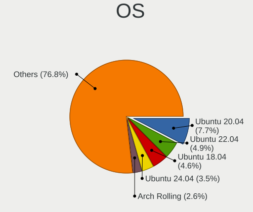

| Name                         | Notebooks | Percent |
|------------------------------|-----------|---------|
| Ubuntu 20.04                 | 103       | 7.69%   |
| Ubuntu 22.04                 | 65        | 4.85%   |
| Ubuntu 18.04                 | 61        | 4.55%   |
| Ubuntu 24.04                 | 47        | 3.51%   |
| Arch Rolling                 | 35        | 2.61%   |
| Pop!_OS 22.04                | 34        | 2.54%   |
| OpenMandriva 23.01           | 29        | 2.16%   |
| Debian 11                    | 27        | 2.01%   |
| Debian 12                    | 23        | 1.72%   |
| Linux Mint 21.1              | 20        | 1.49%   |
| EndeavourOS Rolling          | 18        | 1.34%   |
| OpenMandriva 24.12           | 17        | 1.27%   |
| Manjaro                      | 17        | 1.27%   |
| Ubuntu 21.04                 | 16        | 1.19%   |
| OpenMandriva 4.3             | 16        | 1.19%   |
| Fedora 42                    | 15        | 1.12%   |
| OpenMandriva 4.2             | 14        | 1.04%   |
| Fedora 39                    | 14        | 1.04%   |
| Zorin 17                     | 13        | 0.97%   |
| openSUSE Tumbleweed-XXXXXXXX | 13        | 0.97%   |
| OpenMandriva 23.03           | 13        | 0.97%   |
| Linux Mint 20                | 13        | 0.97%   |
| ArcoLinux Rolling            | 13        | 0.97%   |
| OpenMandriva 25.01           | 12        | 0.9%    |
| Linux Mint 22.1              | 12        | 0.9%    |
| Fedora 41                    | 12        | 0.9%    |
| Fedora 38                    | 12        | 0.9%    |
| Arch                         | 12        | 0.9%    |
| OpenMandriva 23.08           | 11        | 0.82%   |
| Linux Mint 22.2              | 11        | 0.82%   |
| Linux Mint 20.2              | 11        | 0.82%   |
| Linux Mint 19.3              | 11        | 0.82%   |
| Fedora 33                    | 11        | 0.82%   |
| Zorin 16                     | 10        | 0.75%   |
| Xubuntu 20.04                | 10        | 0.75%   |
| OpenMandriva 6.0             | 10        | 0.75%   |
| OpenMandriva 25.90           | 10        | 0.75%   |
| Fedora 40                    | 10        | 0.75%   |
| Fedora 34                    | 10        | 0.75%   |
| Ubuntu 21.10                 | 9         | 0.67%   |

OS Family
---------

OS without a version

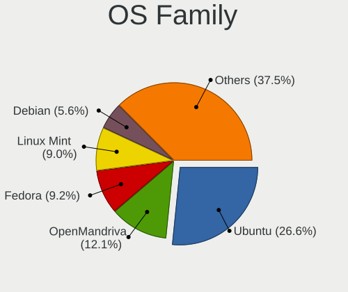

| Name             | Notebooks | Percent |
|------------------|-----------|---------|
| Ubuntu           | 333       | 26.6%   |
| OpenMandriva     | 152       | 12.14%  |
| Fedora           | 115       | 9.19%   |
| Linux Mint       | 113       | 9.03%   |
| Debian           | 70        | 5.59%   |
| Pop!_OS          | 62        | 4.95%   |
| Arch             | 46        | 3.67%   |
| Manjaro          | 37        | 2.96%   |
| Zorin            | 27        | 2.16%   |
| Kubuntu          | 27        | 2.16%   |
| Xubuntu          | 24        | 1.92%   |
| EndeavourOS      | 20        | 1.6%    |
| openSUSE         | 18        | 1.44%   |
| ROSA             | 16        | 1.28%   |
| Lubuntu          | 15        | 1.2%    |
| Kali             | 14        | 1.12%   |
| Ubuntu MATE      | 13        | 1.04%   |
| ArcoLinux        | 13        | 1.04%   |
| KDE neon         | 11        | 0.88%   |
| Elementary       | 11        | 0.88%   |
| Gentoo           | 10        | 0.8%    |
| LMDE             | 9         | 0.72%   |
| SteamOS          | 8         | 0.64%   |
| MX               | 6         | 0.48%   |
| Parrot           | 5         | 0.4%    |
| NixOS            | 5         | 0.4%    |
| Endless          | 5         | 0.4%    |
| Ubuntu Budgie    | 4         | 0.32%   |
| Devuan           | 4         | 0.32%   |
| CentOS           | 4         | 0.32%   |
| Solus            | 3         | 0.24%   |
| Nobara           | 3         | 0.24%   |
| Garuda Linux     | 3         | 0.24%   |
| Bluefin          | 3         | 0.24%   |
| BlackPanther     | 3         | 0.24%   |
| Ubuntu Unity     | 2         | 0.16%   |
| TUXEDO OS        | 2         | 0.16%   |
| RHEL             | 2         | 0.16%   |
| Peppermint       | 2         | 0.16%   |
| org.kde.Platform | 2         | 0.16%   |

Kernel
------

Version of the Linux kernel

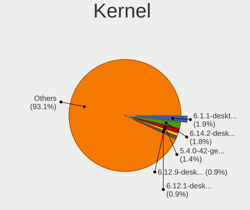

| Version                  | Notebooks | Percent |
|--------------------------|-----------|---------|
| 6.1.1-desktop-1omv2290   | 28        | 1.91%   |
| 6.14.2-desktop-3omv2590  | 27        | 1.84%   |
| 5.4.0-42-generic         | 20        | 1.36%   |
| 6.12.9-desktop-1omv2490  | 13        | 0.89%   |
| 6.12.1-desktop-1omv2490  | 13        | 0.89%   |
| 5.4.0-58-generic         | 13        | 0.89%   |
| 5.16.7-desktop-1omv4003  | 13        | 0.89%   |
| 5.10.14-desktop-1omv4002 | 13        | 0.89%   |
| 6.2.6-desktop-1omv2390   | 12        | 0.82%   |
| 6.8.0-51-generic         | 11        | 0.75%   |
| 5.4.0-48-generic         | 10        | 0.68%   |
| 6.9.3-76060903-generic   | 9         | 0.61%   |
| 6.4.11-desktop-1omv2390  | 9         | 0.61%   |
| 5.3.0-40-generic         | 8         | 0.55%   |
| 6.8.0-40-generic         | 7         | 0.48%   |
| 6.6.2-desktop-1omv2390   | 7         | 0.48%   |
| 6.14.0-29-generic        | 7         | 0.48%   |
| 5.4.0-47-generic         | 7         | 0.48%   |
| 5.15.0-58-generic        | 7         | 0.48%   |
| 5.11.0-7620-generic      | 7         | 0.48%   |
| 6.8.0-49-generic         | 6         | 0.41%   |
| 6.8.0-47-generic         | 6         | 0.41%   |
| 6.5.0-14-generic         | 6         | 0.41%   |
| 6.2.0-39-generic         | 6         | 0.41%   |
| 6.2.0-26-generic         | 6         | 0.41%   |
| 6.2.0-20-generic         | 6         | 0.41%   |
| 5.4.0-52-generic         | 6         | 0.41%   |
| 5.3.0-42-generic         | 6         | 0.41%   |
| 5.15.0-91-generic        | 6         | 0.41%   |
| 5.15.0-71-generic        | 6         | 0.41%   |
| 5.15.0-52-generic        | 6         | 0.41%   |
| 5.11.0-41-generic        | 6         | 0.41%   |
| 6.8.0-45-generic         | 5         | 0.34%   |
| 6.5.0-26-generic         | 5         | 0.34%   |
| 6.5.0-15-generic         | 5         | 0.34%   |
| 6.2.0-32-generic         | 5         | 0.34%   |
| 6.11.0-26-generic        | 5         | 0.34%   |
| 5.15.0-67-generic        | 5         | 0.34%   |
| 5.15.0-48-generic        | 5         | 0.34%   |
| 5.13.0-22-generic        | 5         | 0.34%   |

Kernel Family
-------------

Linux kernel without a distro release

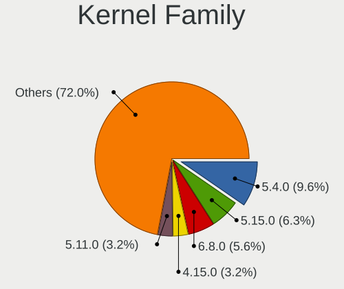

| Version | Notebooks | Percent |
|---------|-----------|---------|
| 5.4.0   | 133       | 9.6%    |
| 5.15.0  | 88        | 6.35%   |
| 6.8.0   | 78        | 5.63%   |
| 4.15.0  | 45        | 3.25%   |
| 5.11.0  | 44        | 3.17%   |
| 6.5.0   | 39        | 2.81%   |
| 5.8.0   | 39        | 2.81%   |
| 5.3.0   | 35        | 2.53%   |
| 6.2.0   | 34        | 2.45%   |
| 5.10.0  | 32        | 2.31%   |
| 6.14.0  | 31        | 2.24%   |
| 6.1.1   | 29        | 2.09%   |
| 6.14.2  | 28        | 2.02%   |
| 6.11.0  | 28        | 2.02%   |
| 6.1.0   | 28        | 2.02%   |
| 5.13.0  | 24        | 1.73%   |
| 5.19.0  | 21        | 1.52%   |
| 6.2.6   | 15        | 1.08%   |
| 6.12.1  | 15        | 1.08%   |
| 5.0.0   | 15        | 1.08%   |
| 6.12.9  | 14        | 1.01%   |
| 5.16.7  | 13        | 0.94%   |
| 5.10.14 | 13        | 0.94%   |
| 6.9.3   | 11        | 0.79%   |
| 6.4.11  | 10        | 0.72%   |
| 4.18.0  | 10        | 0.72%   |
| 4.19.0  | 8         | 0.58%   |
| 6.6.2   | 7         | 0.51%   |
| 6.13.5  | 7         | 0.51%   |
| 5.14.0  | 6         | 0.43%   |
| 6.12.10 | 5         | 0.36%   |
| 6.0.0   | 5         | 0.36%   |
| 5.16.13 | 5         | 0.36%   |
| 6.8.5   | 4         | 0.29%   |
| 6.5.6   | 4         | 0.29%   |
| 6.17.9  | 4         | 0.29%   |
| 6.17.8  | 4         | 0.29%   |
| 6.14.9  | 4         | 0.29%   |
| 6.14.6  | 4         | 0.29%   |
| 6.14.3  | 4         | 0.29%   |

Kernel Major Ver.
-----------------

Linux kernel major version

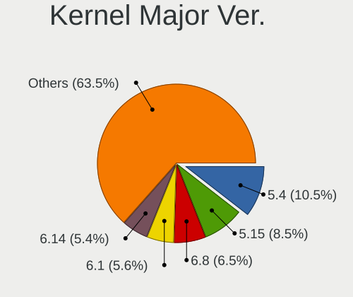

| Version | Notebooks | Percent |
|---------|-----------|---------|
| 5.4     | 143       | 10.49%  |
| 5.15    | 116       | 8.51%   |
| 6.8     | 89        | 6.53%   |
| 6.1     | 76        | 5.58%   |
| 6.14    | 74        | 5.43%   |
| 6.12    | 68        | 4.99%   |
| 5.10    | 66        | 4.84%   |
| 6.5     | 58        | 4.26%   |
| 6.2     | 58        | 4.26%   |
| 5.11    | 54        | 3.96%   |
| 5.8     | 51        | 3.74%   |
| 4.15    | 45        | 3.3%    |
| 5.3     | 40        | 2.93%   |
| 6.11    | 39        | 2.86%   |
| 5.13    | 33        | 2.42%   |
| 5.19    | 30        | 2.2%    |
| 5.16    | 29        | 2.13%   |
| 6.6     | 24        | 1.76%   |
| 6.4     | 20        | 1.47%   |
| 6.0     | 20        | 1.47%   |
| 6.17    | 19        | 1.39%   |
| 6.13    | 17        | 1.25%   |
| 6.9     | 16        | 1.17%   |
| 5.0     | 15        | 1.1%    |
| 5.14    | 14        | 1.03%   |
| 4.18    | 14        | 1.03%   |
| 6.10    | 13        | 0.95%   |
| 5.17    | 11        | 0.81%   |
| 6.7     | 10        | 0.73%   |
| 4.19    | 10        | 0.73%   |
| 6.3     | 9         | 0.66%   |
| 6.16    | 9         | 0.66%   |
| 5.12    | 9         | 0.66%   |
| 6.15    | 8         | 0.59%   |
| 5.9     | 8         | 0.59%   |
| 5.7     | 7         | 0.51%   |
| 5.5     | 7         | 0.51%   |
| 4.9     | 7         | 0.51%   |
| 5.18    | 6         | 0.44%   |
| 5.6     | 5         | 0.37%   |

Arch
----

OS architecture (x86_64, i586, etc.)

| Name    | Notebooks | Percent |
|---------|-----------|---------|
| x86_64  | 1186      | 97.61%  |
| i686    | 27        | 2.22%   |
| armv7l  | 1         | 0.08%   |
| aarch64 | 1         | 0.08%   |

DE
--

Desktop Environment

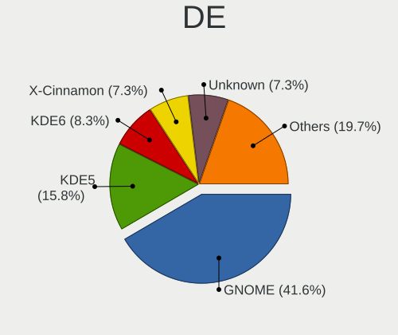

| Name             | Notebooks | Percent |
|------------------|-----------|---------|
| GNOME            | 525       | 41.6%   |
| KDE5             | 200       | 15.85%  |
| KDE6             | 105       | 8.32%   |
| X-Cinnamon       | 92        | 7.29%   |
| Unknown          | 92        | 7.29%   |
| XFCE             | 88        | 6.97%   |
| MATE             | 30        | 2.38%   |
| LXQt             | 20        | 1.58%   |
| i3               | 13        | 1.03%   |
| KDE4             | 12        | 0.95%   |
| Pantheon         | 11        | 0.87%   |
| GNOME Flashback  | 10        | 0.79%   |
| Cinnamon         | 10        | 0.79%   |
| KDE              | 9         | 0.71%   |
| Budgie           | 7         | 0.55%   |
| LXDE             | 6         | 0.48%   |
| lightdm-xsession | 5         | 0.4%    |
| Hyprland         | 5         | 0.4%    |
| LeftWM           | 3         | 0.24%   |
| COSMIC           | 3         | 0.24%   |
| Unity            | 2         | 0.16%   |
| sway             | 2         | 0.16%   |
| openbox          | 2         | 0.16%   |
| xubuntu          | 1         | 0.08%   |
| xmonad           | 1         | 0.08%   |
| icewm            | 1         | 0.08%   |
| Enlightenment    | 1         | 0.08%   |
| Endless:GNOME    | 1         | 0.08%   |
| DWM              | 1         | 0.08%   |
| default          | 1         | 0.08%   |
| Deepin           | 1         | 0.08%   |
| BunsenLabs       | 1         | 0.08%   |
| bspwm            | 1         | 0.08%   |

Display Server
--------------

X11 or Wayland

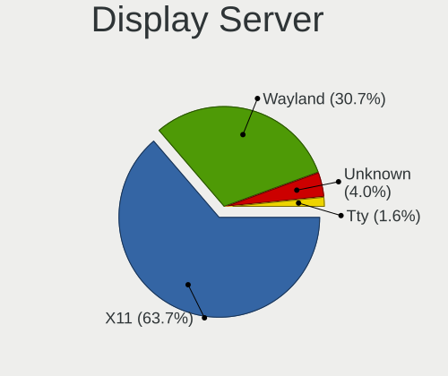

| Name    | Notebooks | Percent |
|---------|-----------|---------|
| X11     | 801       | 63.72%  |
| Wayland | 386       | 30.71%  |
| Unknown | 50        | 3.98%   |
| Tty     | 20        | 1.59%   |

Display Manager
---------------

SDDM, LightDM, etc.

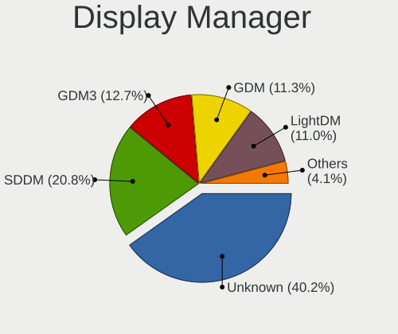

| Name           | Notebooks | Percent |
|----------------|-----------|---------|
| Unknown        | 506       | 40.16%  |
| SDDM           | 262       | 20.79%  |
| GDM3           | 160       | 12.7%   |
| GDM            | 142       | 11.27%  |
| LightDM        | 138       | 10.95%  |
| TDM            | 33        | 2.62%   |
| KDM            | 9         | 0.71%   |
| XDM            | 2         | 0.16%   |
| GREETD         | 2         | 0.16%   |
| COSMIC-GREETER | 2         | 0.16%   |
| SLIMSKI        | 1         | 0.08%   |
| Ly             | 1         | 0.08%   |
| LXDM           | 1         | 0.08%   |
| DARKDM_ON_TTY  | 1         | 0.08%   |

OS Lang
-------

Language

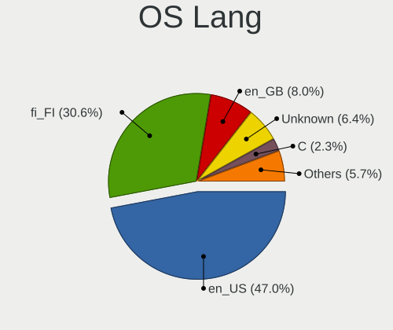

| Lang        | Notebooks | Percent |
|-------------|-----------|---------|
| en_US       | 584       | 47.02%  |
| fi_FI       | 380       | 30.6%   |
| en_GB       | 99        | 7.97%   |
| Unknown     | 79        | 6.36%   |
| C           | 29        | 2.33%   |
| ru_RU       | 22        | 1.77%   |
| en_DK       | 6         | 0.48%   |
| sv_FI       | 5         | 0.4%    |
| de_DE       | 5         | 0.4%    |
| fr_FR       | 4         | 0.32%   |
| et_EE       | 4         | 0.32%   |
| en_IE       | 3         | 0.24%   |
| en_AG       | 3         | 0.24%   |
| zh_CN       | 2         | 0.16%   |
| UTF-8       | 2         | 0.16%   |
| POSIX       | 2         | 0.16%   |
| pl_PL       | 2         | 0.16%   |
| en_FI       | 2         | 0.16%   |
| ja_JP       | 1         | 0.08%   |
| it_IT       | 1         | 0.08%   |
| is_IS       | 1         | 0.08%   |
| hu_HU       | 1         | 0.08%   |
| fi_FI.UTF8  | 1         | 0.08%   |
| en_US.utf-8 | 1         | 0.08%   |
| en_NG       | 1         | 0.08%   |
| en_CA       | 1         | 0.08%   |
| C.UTF8      | 1         | 0.08%   |

Boot Mode
---------

EFI or BIOS

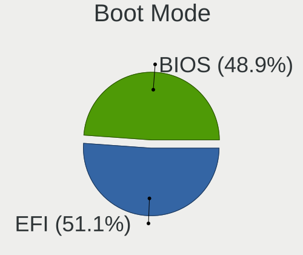

| Mode | Notebooks | Percent |
|------|-----------|---------|
| EFI  | 632       | 51.13%  |
| BIOS | 604       | 48.87%  |

Filesystem
----------

Type of filesystem

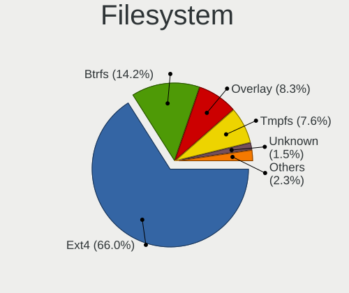

| Type      | Notebooks | Percent |
|-----------|-----------|---------|
| Ext4      | 831       | 66%     |
| Btrfs     | 179       | 14.22%  |
| Overlay   | 105       | 8.34%   |
| Tmpfs     | 96        | 7.63%   |
| Unknown   | 19        | 1.51%   |
| Xfs       | 14        | 1.11%   |
| Zfs       | 8         | 0.64%   |
| Ext2      | 3         | 0.24%   |
| F2fs      | 2         | 0.16%   |
| Overlayfs | 1         | 0.08%   |
| Ext3      | 1         | 0.08%   |

Part. scheme
------------

Scheme of partitioning

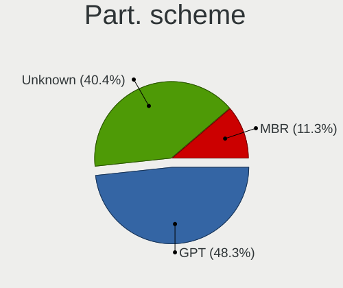

| Type    | Notebooks | Percent |
|---------|-----------|---------|
| GPT     | 600       | 48.31%  |
| Unknown | 502       | 40.42%  |
| MBR     | 140       | 11.27%  |

Dual Boot with Linux/BSD
------------------------

Hosting more than one Linux/BSD

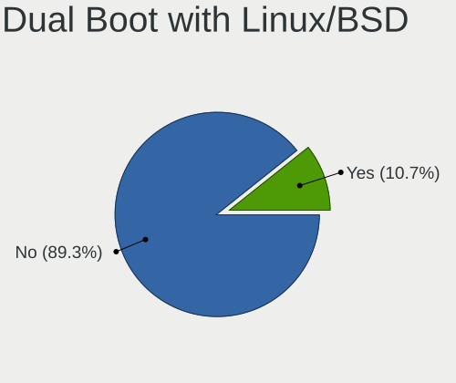

| Dual boot | Notebooks | Percent |
|-----------|-----------|---------|
| No        | 1101      | 89.29%  |
| Yes       | 132       | 10.71%  |

Dual Boot (Win)
---------------

Hosting Linux and Windows

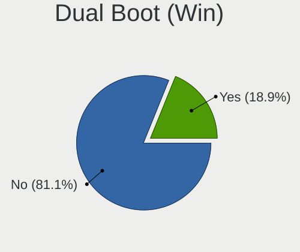

| Dual boot | Notebooks | Percent |
|-----------|-----------|---------|
| No        | 993       | 81.13%  |
| Yes       | 231       | 18.87%  |

Board
-----

Vendor
------

Motherboard manufacturer

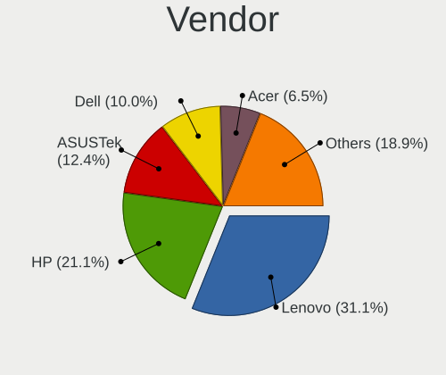

| Name                | Notebooks | Percent |
|---------------------|-----------|---------|
| Lenovo              | 378       | 31.11%  |
| Hewlett-Packard     | 256       | 21.07%  |
| ASUSTek Computer    | 151       | 12.43%  |
| Dell                | 121       | 9.96%   |
| Acer                | 79        | 6.5%    |
| Apple               | 42        | 3.46%   |
| Fujitsu             | 37        | 3.05%   |
| Samsung Electronics | 26        | 2.14%   |
| MSI                 | 19        | 1.56%   |
| Fujitsu Siemens     | 15        | 1.23%   |
| Toshiba             | 12        | 0.99%   |
| HUAWEI              | 11        | 0.91%   |
| Valve               | 8         | 0.66%   |
| Google              | 7         | 0.58%   |
| Sony                | 4         | 0.33%   |
| Packard Bell        | 4         | 0.33%   |
| Framework           | 4         | 0.33%   |
| Unknown             | 4         | 0.33%   |
| TUXEDO              | 3         | 0.25%   |
| Notebook            | 3         | 0.25%   |
| HONOR               | 3         | 0.25%   |
| Timi                | 2         | 0.16%   |
| IBM                 | 2         | 0.16%   |
| Gigabyte Technology | 2         | 0.16%   |
| eMachines           | 2         | 0.16%   |
| Winmate             | 1         | 0.08%   |
| Unchartevice        | 1         | 0.08%   |
| TrekStor            | 1         | 0.08%   |
| System76            | 1         | 0.08%   |
| Star Labs           | 1         | 0.08%   |
| Seco                | 1         | 0.08%   |
| Schenker            | 1         | 0.08%   |
| powerinternational  | 1         | 0.08%   |
| Panasonic           | 1         | 0.08%   |
| Motion Computing    | 1         | 0.08%   |
| Lunnen              | 1         | 0.08%   |
| Intel               | 1         | 0.08%   |
| Insyde              | 1         | 0.08%   |
| GPD                 | 1         | 0.08%   |
| Dixonsxp            | 1         | 0.08%   |

Model
-----

Motherboard model

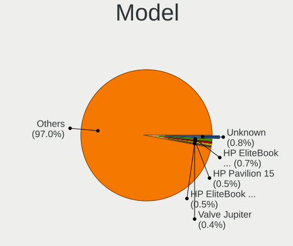

| Name                                   | Notebooks | Percent |
|----------------------------------------|-----------|---------|
| Unknown                                | 10        | 0.82%   |
| HP EliteBook 840 G3                    | 9         | 0.74%   |
| HP Pavilion 15                         | 6         | 0.49%   |
| HP EliteBook 840 G5                    | 6         | 0.49%   |
| Valve Jupiter                          | 5         | 0.41%   |
| HP Pavilion 17                         | 5         | 0.41%   |
| HP EliteBook 840 G6                    | 5         | 0.41%   |
| HP EliteBook 840 G1                    | 5         | 0.41%   |
| Fujitsu LIFEBOOK A530                  | 5         | 0.41%   |
| Lenovo Yoga Slim 7 14ARE05 82A2        | 4         | 0.33%   |
| Lenovo V145-15AST 81MT                 | 4         | 0.33%   |
| Lenovo ThinkPad T420 4180PBG           | 4         | 0.33%   |
| HP ProBook 650 G1                      | 4         | 0.33%   |
| HP Pavilion dv6                        | 4         | 0.33%   |
| HP EliteBook 8460p                     | 4         | 0.33%   |
| HP EliteBook 8440p                     | 4         | 0.33%   |
| HP EliteBook 2560p                     | 4         | 0.33%   |
| Dell XPS 13 9360                       | 4         | 0.33%   |
| Dell Latitude E6430                    | 4         | 0.33%   |
| ASUS TUF Gaming FX505DT_FX505DT        | 4         | 0.33%   |
| Apple MacBookPro8,1                    | 4         | 0.33%   |
| Apple MacBookAir6,2                    | 4         | 0.33%   |
| Valve Galileo                          | 3         | 0.25%   |
| Samsung R530/R730                      | 3         | 0.25%   |
| Samsung 300E4A/300E5A/300E7A           | 3         | 0.25%   |
| Lenovo ThinkPad T480 20L5000BMX        | 3         | 0.25%   |
| Lenovo ThinkPad T410 253725G           | 3         | 0.25%   |
| Lenovo ThinkPad P14s Gen 2a 21A00004MX | 3         | 0.25%   |
| Lenovo Legion 5 Pro 16ACH6H 82JQ       | 3         | 0.25%   |
| Lenovo IdeaPad L340-15IRH Gaming 81LK  | 3         | 0.25%   |
| Lenovo IdeaPad Gaming 3 15ARH05 82EY   | 3         | 0.25%   |
| Lenovo G50-30 80G0                     | 3         | 0.25%   |
| HUAWEI MACH-WX9                        | 3         | 0.25%   |
| HP ZBook 15 G4                         | 3         | 0.25%   |
| HP ZBook 15 G3                         | 3         | 0.25%   |
| HP ProBook 430 G1                      | 3         | 0.25%   |
| HP Notebook                            | 3         | 0.25%   |
| HP EliteBook 850 G6                    | 3         | 0.25%   |
| HP EliteBook 840 G7 Notebook PC        | 3         | 0.25%   |
| HP EliteBook 840 G2                    | 3         | 0.25%   |

Model Family
------------

Motherboard model prefix

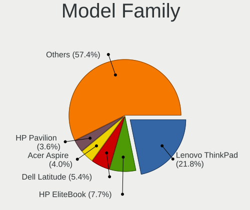

| Name                    | Notebooks | Percent |
|-------------------------|-----------|---------|
| Lenovo ThinkPad         | 265       | 21.81%  |
| HP EliteBook            | 94        | 7.74%   |
| Dell Latitude           | 66        | 5.43%   |
| Acer Aspire             | 49        | 4.03%   |
| HP Pavilion             | 44        | 3.62%   |
| Lenovo IdeaPad          | 43        | 3.54%   |
| Fujitsu LIFEBOOK        | 35        | 2.88%   |
| HP ProBook              | 28        | 2.3%    |
| ASUS VivoBook           | 22        | 1.81%   |
| HP Laptop               | 21        | 1.73%   |
| Dell XPS                | 20        | 1.65%   |
| HP Compaq               | 19        | 1.56%   |
| Dell Precision          | 19        | 1.56%   |
| Lenovo Yoga             | 16        | 1.32%   |
| HP ZBook                | 16        | 1.32%   |
| Lenovo Legion           | 14        | 1.15%   |
| ASUS ASUS               | 14        | 1.15%   |
| Acer Swift              | 11        | 0.91%   |
| ASUS ROG                | 10        | 0.82%   |
| Unknown                 | 10        | 0.82%   |
| Toshiba Satellite       | 9         | 0.74%   |
| Dell Inspiron           | 9         | 0.74%   |
| ASUS ZenBook            | 9         | 0.74%   |
| ASUS TUF                | 9         | 0.74%   |
| Fujitsu Siemens AMILO   | 8         | 0.66%   |
| Apple MacBookPro8       | 7         | 0.58%   |
| Fujitsu Siemens ESPRIMO | 6         | 0.49%   |
| Acer Nitro              | 6         | 0.49%   |
| Valve Jupiter           | 5         | 0.41%   |
| HP 250                  | 5         | 0.41%   |
| Apple MacBookAir6       | 5         | 0.41%   |
| Samsung 300E4A          | 4         | 0.33%   |
| Packard Bell EasyNote   | 4         | 0.33%   |
| Lenovo V145-15AST       | 4         | 0.33%   |
| HP 255                  | 4         | 0.33%   |
| Framework Laptop        | 4         | 0.33%   |
| Dell Vostro             | 4         | 0.33%   |
| Apple MacBookPro5       | 4         | 0.33%   |
| Apple MacBookPro11      | 4         | 0.33%   |
| Acer Predator           | 4         | 0.33%   |

MFG Year
--------

Motherboard manufacture year

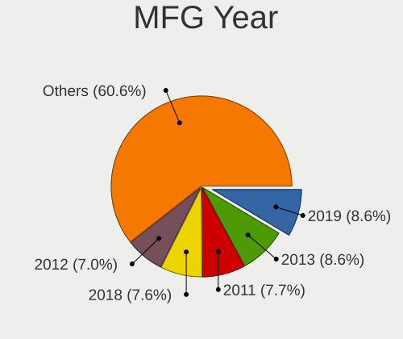

| Year    | Notebooks | Percent |
|---------|-----------|---------|
| 2019    | 104       | 8.56%   |
| 2013    | 104       | 8.56%   |
| 2011    | 94        | 7.74%   |
| 2018    | 92        | 7.57%   |
| 2012    | 85        | 7%      |
| 2020    | 81        | 6.67%   |
| 2017    | 76        | 6.26%   |
| 2016    | 72        | 5.93%   |
| 2014    | 72        | 5.93%   |
| 2021    | 71        | 5.84%   |
| 2008    | 64        | 5.27%   |
| 2015    | 61        | 5.02%   |
| 2023    | 48        | 3.95%   |
| 2022    | 44        | 3.62%   |
| 2010    | 42        | 3.46%   |
| 2009    | 33        | 2.72%   |
| 2007    | 25        | 2.06%   |
| 2024    | 21        | 1.73%   |
| 2006    | 11        | 0.91%   |
| 2025    | 10        | 0.82%   |
| 2005    | 3         | 0.25%   |
| 2004    | 1         | 0.08%   |
| Unknown | 1         | 0.08%   |

Form Factor
-----------

Physical design of the computer

| Name     | Notebooks | Percent |
|----------|-----------|---------|
| Notebook | 1215      | 100%    |

Secure Boot
-----------

Enabled or disabled

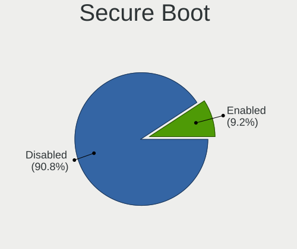

| State    | Notebooks | Percent |
|----------|-----------|---------|
| Disabled | 1112      | 90.78%  |
| Enabled  | 113       | 9.22%   |

Coreboot
--------

Have coreboot on board

| Used | Notebooks | Percent |
|------|-----------|---------|
| No   | 1203      | 99.01%  |
| Yes  | 12        | 0.99%   |

RAM Size
--------

Total RAM memory

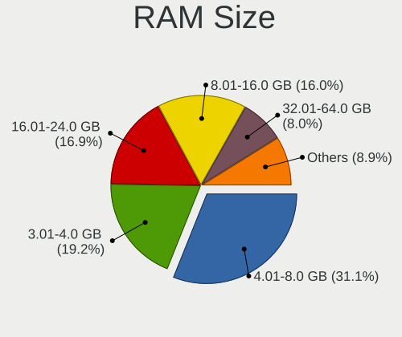

| Size in GB  | Notebooks | Percent |
|-------------|-----------|---------|
| 4.01-8.0    | 382       | 31.06%  |
| 3.01-4.0    | 236       | 19.19%  |
| 16.01-24.0  | 208       | 16.91%  |
| 8.01-16.0   | 197       | 16.02%  |
| 32.01-64.0  | 98        | 7.97%   |
| 1.01-2.0    | 35        | 2.85%   |
| 24.01-32.0  | 28        | 2.28%   |
| 64.01-256.0 | 20        | 1.63%   |
| 2.01-3.0    | 16        | 1.3%    |
| 0.51-1.0    | 9         | 0.73%   |
| 0.01-0.5    | 1         | 0.08%   |

RAM Used
--------

Used RAM memory

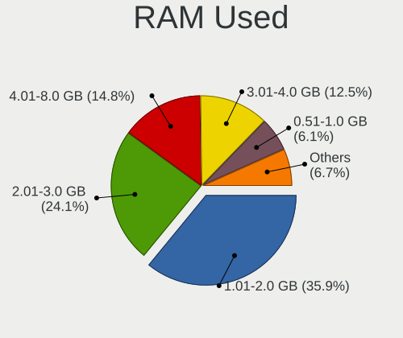

| Used GB    | Notebooks | Percent |
|------------|-----------|---------|
| 1.01-2.0   | 479       | 35.93%  |
| 2.01-3.0   | 321       | 24.08%  |
| 4.01-8.0   | 197       | 14.78%  |
| 3.01-4.0   | 166       | 12.45%  |
| 0.51-1.0   | 81        | 6.08%   |
| 8.01-16.0  | 62        | 4.65%   |
| 16.01-24.0 | 12        | 0.9%    |
| 0.01-0.5   | 12        | 0.9%    |
| 32.01-64.0 | 1         | 0.08%   |
| 24.01-32.0 | 1         | 0.08%   |
| Unknown    | 1         | 0.08%   |

Total Drives
------------

Number of drives on board

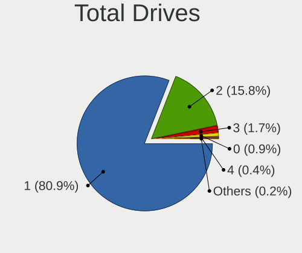

| Drives | Notebooks | Percent |
|--------|-----------|---------|
| 1      | 996       | 80.91%  |
| 2      | 195       | 15.84%  |
| 3      | 21        | 1.71%   |
| 0      | 11        | 0.89%   |
| 4      | 5         | 0.41%   |
| 7      | 1         | 0.08%   |
| 6      | 1         | 0.08%   |
| 5      | 1         | 0.08%   |

Has CD-ROM
----------

Has CD-ROM on board

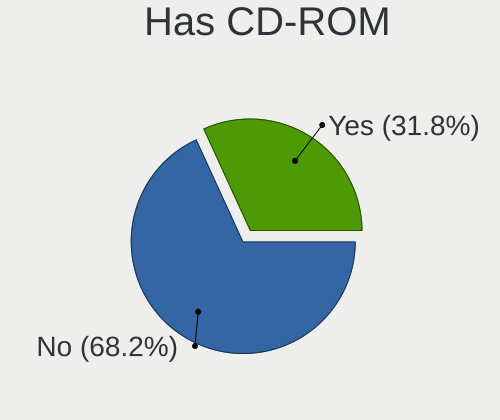

| Presented | Notebooks | Percent |
|-----------|-----------|---------|
| No        | 833       | 68.17%  |
| Yes       | 389       | 31.83%  |

Has Ethernet
------------

Has Ethernet on board

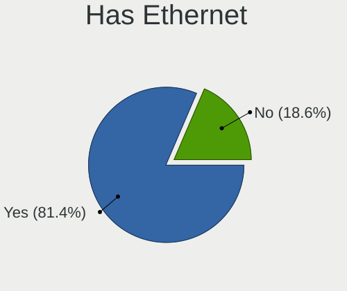

| Presented | Notebooks | Percent |
|-----------|-----------|---------|
| Yes       | 996       | 81.44%  |
| No        | 227       | 18.56%  |

Has WiFi
--------

Has WiFi module

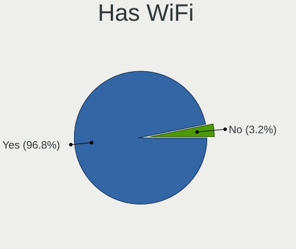

| Presented | Notebooks | Percent |
|-----------|-----------|---------|
| Yes       | 1179      | 96.8%   |
| No        | 39        | 3.2%    |

Has Bluetooth
-------------

Has Bluetooth module

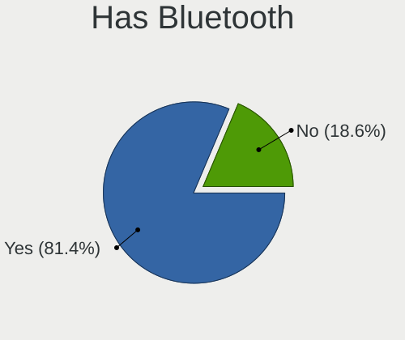

| Presented | Notebooks | Percent |
|-----------|-----------|---------|
| Yes       | 1000      | 81.37%  |
| No        | 229       | 18.63%  |

Location
--------

Country
-------

Geographic location (country)

| Country | Notebooks | Percent |
|---------|-----------|---------|
| Finland | 1215      | 100%    |

City
----

Geographic location (city)

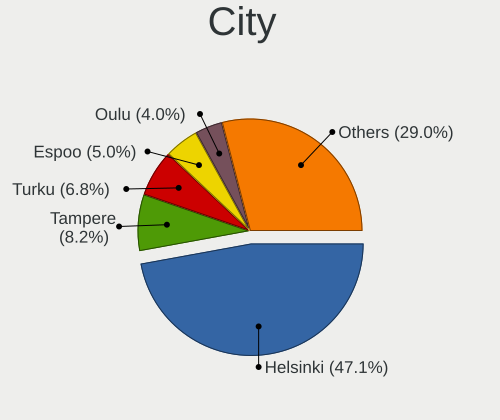

| City         | Notebooks | Percent |
|--------------|-----------|---------|
| Helsinki     | 607       | 47.13%  |
| Tampere      | 105       | 8.15%   |
| Turku        | 87        | 6.75%   |
| Espoo        | 64        | 4.97%   |
| Oulu         | 51        | 3.96%   |
| Vantaa       | 39        | 3.03%   |
| Jyväskylä  | 34        | 2.64%   |
| Kuopio       | 28        | 2.17%   |
| Lahti        | 26        | 2.02%   |
| Vaasa        | 13        | 1.01%   |
| Joensuu      | 10        | 0.78%   |
| Porvoo       | 9         | 0.7%    |
| Raisio       | 8         | 0.62%   |
| Kokkola      | 8         | 0.62%   |
| Salo         | 7         | 0.54%   |
| Hyvinkaeae   | 7         | 0.54%   |
| Seinäjoki   | 6         | 0.47%   |
| Rovaniemi    | 6         | 0.47%   |
| Kotka        | 6         | 0.47%   |
| Järvenpää | 6         | 0.47%   |
| Tuusula      | 5         | 0.39%   |
| Riihimäki   | 5         | 0.39%   |
| Rauma        | 5         | 0.39%   |
| Raahe        | 5         | 0.39%   |
| Pori         | 5         | 0.39%   |
| Kouvola      | 5         | 0.39%   |
| Mikkeli      | 4         | 0.31%   |
| Lohja        | 4         | 0.31%   |
| Lappeenranta | 4         | 0.31%   |
| Hämeenlinna | 4         | 0.31%   |
| Forssa       | 4         | 0.31%   |
| Valkeakoski  | 3         | 0.23%   |
| Rusko        | 3         | 0.23%   |
| Pirkkala     | 3         | 0.23%   |
| Mäntsälä  | 3         | 0.23%   |
| Kirkkonummi  | 3         | 0.23%   |
| Halikko      | 3         | 0.23%   |
| Ylöjärvi   | 2         | 0.16%   |
| Vesilahti    | 2         | 0.16%   |
| Urjala       | 2         | 0.16%   |

Drives
------

Drive Vendor
------------

Hard drive vendors

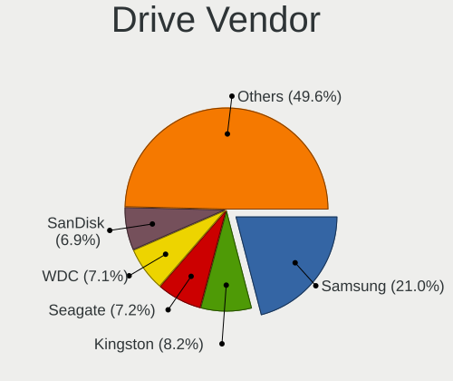

| Vendor                      | Notebooks | Drives | Percent |
|-----------------------------|-----------|--------|---------|
| Samsung Electronics         | 298       | 400    | 20.97%  |
| Kingston                    | 116       | 145    | 8.16%   |
| Seagate                     | 103       | 123    | 7.25%   |
| WDC                         | 101       | 132    | 7.11%   |
| SanDisk                     | 98        | 122    | 6.9%    |
| Toshiba                     | 85        | 100    | 5.98%   |
| SK hynix                    | 85        | 108    | 5.98%   |
| Unknown                     | 71        | 92     | 5%      |
| Micron Technology           | 64        | 78     | 4.5%    |
| Intel                       | 60        | 73     | 4.22%   |
| Hitachi                     | 45        | 62     | 3.17%   |
| HGST                        | 33        | 50     | 2.32%   |
| Apple                       | 26        | 38     | 1.83%   |
| Crucial                     | 24        | 26     | 1.69%   |
| KIOXIA                      | 22        | 27     | 1.55%   |
| Kingston Technology Company | 17        | 21     | 1.2%    |
| A-DATA Technology           | 15        | 16     | 1.06%   |
| Fujitsu                     | 13        | 16     | 0.91%   |
| Transcend                   | 12        | 12     | 0.84%   |
| OCZ                         | 11        | 15     | 0.77%   |
| Corsair                     | 8         | 8      | 0.56%   |
| PNY                         | 7         | 7      | 0.49%   |
| LITEON                      | 7         | 11     | 0.49%   |
| Verbatim                    | 6         | 7      | 0.42%   |
| LITEONIT                    | 5         | 11     | 0.35%   |
| BHT                         | 5         | 7      | 0.35%   |
| Unknown                     | 5         | 5      | 0.35%   |
| Union Memory (Shenzhen)     | 4         | 6      | 0.28%   |
| Silicon Motion              | 4         | 4      | 0.28%   |
| Phison                      | 4         | 4      | 0.28%   |
| Lenovo                      | 4         | 4      | 0.28%   |
| Intenso                     | 4         | 4      | 0.28%   |
| China                       | 4         | 6      | 0.28%   |
| UMIS                        | 3         | 6      | 0.21%   |
| ASMT                        | 3         | 3      | 0.21%   |
| Union Memory                | 2         | 2      | 0.14%   |
| Phison Electronics          | 2         | 4      | 0.14%   |
| Patriot                     | 2         | 2      | 0.14%   |
| O2 Micro                    | 2         | 2      | 0.14%   |
| Netac                       | 2         | 2      | 0.14%   |

Drive Model
-----------

Hard drive models

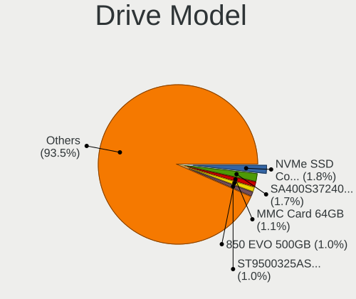

| Model                                                | Notebooks | Percent |
|------------------------------------------------------|-----------|---------|
| Samsung NVMe SSD Controller SM981/PM981/PM983 1TB    | 26        | 1.77%   |
| Kingston SA400S37240G 240GB SSD                      | 25        | 1.71%   |
| Unknown MMC Card  64GB                               | 16        | 1.09%   |
| Samsung SSD 850 EVO 500GB                            | 15        | 1.02%   |
| Seagate ST9500325AS 500GB                            | 14        | 0.95%   |
| Samsung NVMe SSD Controller PM9A1/PM9A3/980PRO 1TB   | 14        | 0.95%   |
| Kingston SA400S37120G 120GB SSD                      | 13        | 0.89%   |
| Unknown MMC Card  32GB                               | 11        | 0.75%   |
| HGST HTS721010A9E630 1TB                             | 10        | 0.68%   |
| Unknown MMC Card  128GB                              | 9         | 0.61%   |
| Seagate ST500LT012-1DG142 500GB                      | 9         | 0.61%   |
| Kingston SA400S37480G 480GB SSD                      | 9         | 0.61%   |
| Samsung NVMe SSD Drive 512GB                         | 8         | 0.55%   |
| Samsung NVMe SSD Controller SM961/PM961/SM963 1024GB | 8         | 0.55%   |
| Toshiba MQ01ABD100 1TB                               | 7         | 0.48%   |
| SanDisk SD8SN8U-256G-1006 256GB SSD                  | 7         | 0.48%   |
| SanDisk NVMe SSD Drive 512GB                         | 7         | 0.48%   |
| Samsung SSD 850 EVO 250GB                            | 7         | 0.48%   |
| Samsung NVMe SSD Drive 256GB                         | 7         | 0.48%   |
| Samsung MZYLF128HCHP-000L2 128GB SSD                 | 7         | 0.48%   |
| Kingston SV300S37A240G 240GB SSD                     | 7         | 0.48%   |
| SK hynix NVMe SSD Drive 512GB                        | 6         | 0.41%   |
| Seagate ST1000LM024 HN-M101MBB 1TB                   | 6         | 0.41%   |
| Sandisk WD Black SN750 / PC SN730 NVMe SSD 500GB     | 6         | 0.41%   |
| Samsung MZ7LN256HAJQ-000L2 256GB SSD                 | 6         | 0.41%   |
| Micron 2400_MTFDKBA512QFM 512GB                      | 6         | 0.41%   |
| Micron 2210_MTFDHBA512QFD 512GB                      | 6         | 0.41%   |
| Kingston Company SNV2S1000G 1TB                      | 6         | 0.41%   |
| Kingston SA400S37960G 960GB SSD                      | 6         | 0.41%   |
| Intel SSDSC2BW180A3L 180GB                           | 6         | 0.41%   |
| HGST HTS725050A7E630 500GB                           | 6         | 0.41%   |
| WDC WD5000LPVX-22V0TT0 500GB                         | 5         | 0.34%   |
| Unknown MMC Card  16GB                               | 5         | 0.34%   |
| Toshiba XG6 NVMe SSD Controller 1024GB               | 5         | 0.34%   |
| SK hynix BC511 512GB                                 | 5         | 0.34%   |
| Seagate ST500LT012-9WS142 500GB                      | 5         | 0.34%   |
| Seagate ST1000LM035-1RK172 1TB                       | 5         | 0.34%   |
| Samsung SSD 860 EVO 250GB                            | 5         | 0.34%   |
| Samsung MZVLQ512HBLU-00B00 512GB                     | 5         | 0.34%   |
| Samsung MZVLB512HAJQ-000L7 512GB                     | 5         | 0.34%   |

HDD Vendor
----------

Hard disk drive vendors

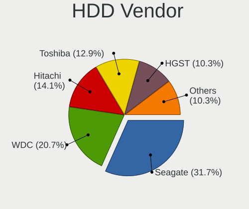

| Vendor              | Notebooks | Drives | Percent |
|---------------------|-----------|--------|---------|
| Seagate             | 101       | 121    | 31.66%  |
| WDC                 | 66        | 86     | 20.69%  |
| Hitachi             | 45        | 62     | 14.11%  |
| Toshiba             | 41        | 49     | 12.85%  |
| HGST                | 33        | 50     | 10.34%  |
| Fujitsu             | 13        | 16     | 4.08%   |
| Samsung Electronics | 7         | 7      | 2.19%   |
| Unknown             | 3         | 3      | 0.94%   |
| JMicron Technology  | 2         | 5      | 0.63%   |
| Intenso             | 2         | 2      | 0.63%   |
| ASMedia             | 2         | 2      | 0.63%   |
| RSH-339             | 1         | 1      | 0.31%   |
| Phison              | 1         | 1      | 0.31%   |
| ASMT                | 1         | 1      | 0.31%   |
| Apple               | 1         | 1      | 0.31%   |

SSD Vendor
----------

Solid state drive vendors

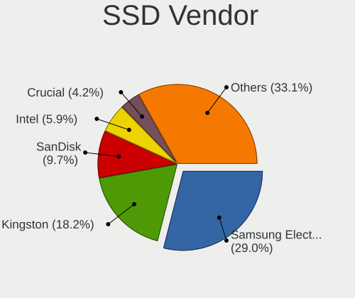

| Vendor              | Notebooks | Drives | Percent |
|---------------------|-----------|--------|---------|
| Samsung Electronics | 153       | 220    | 28.98%  |
| Kingston            | 96        | 121    | 18.18%  |
| SanDisk             | 51        | 65     | 9.66%   |
| Intel               | 31        | 39     | 5.87%   |
| Crucial             | 22        | 24     | 4.17%   |
| Micron Technology   | 21        | 26     | 3.98%   |
| Apple               | 18        | 23     | 3.41%   |
| WDC                 | 17        | 22     | 3.22%   |
| SK hynix            | 16        | 27     | 3.03%   |
| Transcend           | 12        | 12     | 2.27%   |
| Toshiba             | 12        | 13     | 2.27%   |
| OCZ                 | 11        | 15     | 2.08%   |
| A-DATA Technology   | 11        | 12     | 2.08%   |
| PNY                 | 7         | 7      | 1.33%   |
| LITEON              | 7         | 11     | 1.33%   |
| Verbatim            | 5         | 6      | 0.95%   |
| LITEONIT            | 5         | 11     | 0.95%   |
| Corsair             | 4         | 4      | 0.76%   |
| China               | 4         | 6      | 0.76%   |
| BHT                 | 4         | 6      | 0.76%   |
| Patriot             | 2         | 2      | 0.38%   |
| Netac               | 2         | 2      | 0.38%   |
| Intenso             | 2         | 2      | 0.38%   |
| ASMT                | 2         | 2      | 0.38%   |
| WODPOSIT            | 1         | 1      | 0.19%   |
| WALRAM              | 1         | 1      | 0.19%   |
| Vaseky              | 1         | 1      | 0.19%   |
| Ramsta              | 1         | 1      | 0.19%   |
| OCZ-VERTEX          | 1         | 1      | 0.19%   |
| Kolink              | 1         | 1      | 0.19%   |
| HYPER               | 1         | 2      | 0.19%   |
| Hewlett-Packard     | 1         | 1      | 0.19%   |
| GOODRAM             | 1         | 1      | 0.19%   |
| CT500MX5            | 1         | 1      | 0.19%   |
| CF400               | 1         | 1      | 0.19%   |
| ATP                 | 1         | 1      | 0.19%   |
| Unknown             | 1         | 1      | 0.19%   |

Drive Kind
----------

HDD or SSD

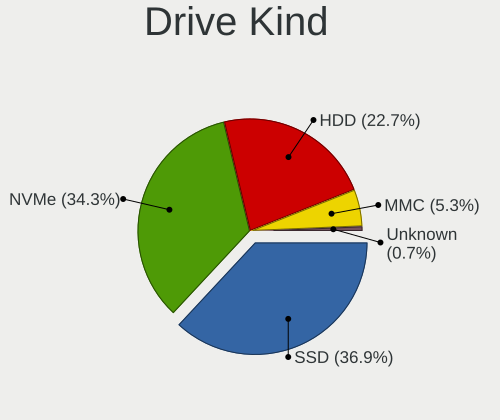

| Kind    | Notebooks | Drives | Percent |
|---------|-----------|--------|---------|
| SSD     | 499       | 692    | 36.94%  |
| NVMe    | 464       | 602    | 34.34%  |
| HDD     | 307       | 407    | 22.72%  |
| MMC     | 72        | 95     | 5.33%   |
| Unknown | 9         | 10     | 0.67%   |

Drive Connector
---------------

SATA, SAS, NVMe, etc.

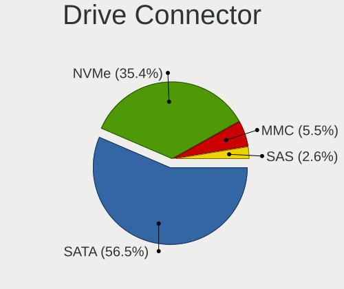

| Type | Notebooks | Drives | Percent |
|------|-----------|--------|---------|
| SATA | 739       | 1062   | 56.46%  |
| NVMe | 464       | 602    | 35.45%  |
| MMC  | 72        | 95     | 5.5%    |
| SAS  | 34        | 47     | 2.6%    |

Drive Size
----------

Size of hard drive

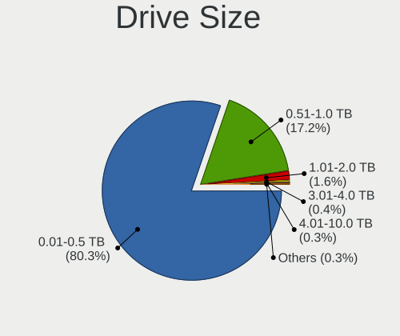

| Size in TB | Notebooks | Drives | Percent |
|------------|-----------|--------|---------|
| 0.01-0.5   | 638       | 887    | 80.25%  |
| 0.51-1.0   | 137       | 188    | 17.23%  |
| 1.01-2.0   | 13        | 14     | 1.64%   |
| 3.01-4.0   | 3         | 5      | 0.38%   |
| 4.01-10.0  | 2         | 3      | 0.25%   |
| 20.01-50.0 | 1         | 1      | 0.13%   |
| 0          | 1         | 1      | 0.13%   |

Space Total
-----------

Amount of disk space available on the file system

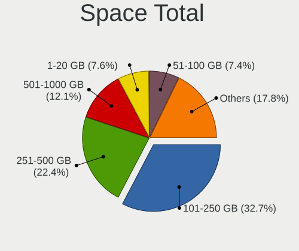

| Size in GB     | Notebooks | Percent |
|----------------|-----------|---------|
| 101-250        | 417       | 32.68%  |
| 251-500        | 286       | 22.41%  |
| 501-1000       | 155       | 12.15%  |
| 1-20           | 97        | 7.6%    |
| 51-100         | 94        | 7.37%   |
| Unknown        | 74        | 5.8%    |
| 1001-2000      | 62        | 4.86%   |
| 21-50          | 52        | 4.08%   |
| More than 3000 | 25        | 1.96%   |
| 2001-3000      | 14        | 1.1%    |

Space Used
----------

Amount of used disk space

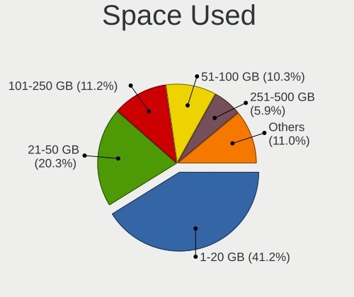

| Used GB        | Notebooks | Percent |
|----------------|-----------|---------|
| 1-20           | 549       | 41.15%  |
| 21-50          | 271       | 20.31%  |
| 101-250        | 150       | 11.24%  |
| 51-100         | 138       | 10.34%  |
| 251-500        | 79        | 5.92%   |
| Unknown        | 74        | 5.55%   |
| 501-1000       | 43        | 3.22%   |
| 1001-2000      | 13        | 0.97%   |
| 2001-3000      | 7         | 0.52%   |
| More than 3000 | 6         | 0.45%   |
| 0              | 4         | 0.3%    |

Malfunc. Drives
---------------

Drive models with a malfunction

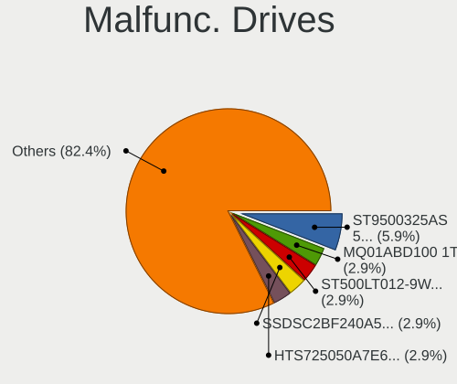

| Model                                            | Notebooks | Drives | Percent |
|--------------------------------------------------|-----------|--------|---------|
| Seagate ST9500325AS 500GB                        | 4         | 5      | 5.88%   |
| Toshiba MQ01ABD100 1TB                           | 2         | 2      | 2.94%   |
| Seagate ST500LT012-9WS142 500GB                  | 2         | 3      | 2.94%   |
| Intel SSDSC2BF240A5L 240GB                       | 2         | 3      | 2.94%   |
| HGST HTS725050A7E630 500GB                       | 2         | 2      | 2.94%   |
| Corsair Force LS SSD 64GB                        | 2         | 2      | 2.94%   |
| WDC WD1600BJKT-75F4T0 160GB                      | 1         | 1      | 1.47%   |
| WDC WD10JUCT-63CYNY0 1TB                         | 1         | 1      | 1.47%   |
| Vaseky V800/60G 64GB                             | 1         | 1      | 1.47%   |
| Toshiba MQ01ABF050 500GB                         | 1         | 1      | 1.47%   |
| Toshiba MK8052GSX 80GB                           | 1         | 1      | 1.47%   |
| Toshiba MK7575GSX 752GB                          | 1         | 1      | 1.47%   |
| Toshiba MK1652GSX 160GB                          | 1         | 1      | 1.47%   |
| Toshiba KSG60ZMV256G M.2 2280 256GB SSD          | 1         | 1      | 1.47%   |
| SK hynix PC401 NVMe 512GB                        | 1         | 1      | 1.47%   |
| SK hynix HFS256G39TND-N210A 256GB SSD            | 1         | 1      | 1.47%   |
| SK hynix BC711 HFM512GD3JX013N 512GB             | 1         | 1      | 1.47%   |
| SK hynix BC711 HFM256GD3JX013N 256GB             | 1         | 1      | 1.47%   |
| Seagate ST9500420AS 500GB                        | 1         | 1      | 1.47%   |
| Seagate ST9320423AS 320GB                        | 1         | 1      | 1.47%   |
| Seagate ST9320325AS 320GB                        | 1         | 1      | 1.47%   |
| Seagate ST9250827AS 250GB                        | 1         | 1      | 1.47%   |
| Seagate ST9250320AS 250GB                        | 1         | 1      | 1.47%   |
| Seagate ST9250315AS 250GB                        | 1         | 2      | 1.47%   |
| Seagate ST9160412AS 160GB                        | 1         | 1      | 1.47%   |
| Seagate ST500LM000-1EJ162-SSHD 500GB             | 1         | 1      | 1.47%   |
| Seagate ST2000LM015-2E8174 2TB                   | 1         | 1      | 1.47%   |
| SanDisk SSD i100 32GB                            | 1         | 1      | 1.47%   |
| SanDisk SSD i100 24GB                            | 1         | 1      | 1.47%   |
| SanDisk SD9TN8W-256G-1006 256GB SSD              | 1         | 1      | 1.47%   |
| Samsung Electronics SSD 870 QVO 1TB              | 1         | 1      | 1.47%   |
| Samsung Electronics MZNLN256HAJQ-000H1 256GB SSD | 1         | 1      | 1.47%   |
| Samsung Electronics MZMTD512HAGL-000L1 512GB SSD | 1         | 1      | 1.47%   |
| Samsung Electronics MZ7TE128HMGR-000H1 128GB SSD | 1         | 1      | 1.47%   |
| Samsung Electronics HM060HI 64GB                 | 1         | 1      | 1.47%   |
| OCZ TRION100 120GB SSD                           | 1         | 1      | 1.47%   |
| OCZ AGILITY3 120GB SSD                           | 1         | 1      | 1.47%   |
| Kingston SVP200S3120G 120GB SSD                  | 1         | 1      | 1.47%   |
| Kingston SA400S37240G 240GB SSD                  | 1         | 1      | 1.47%   |
| Kingston SA400S37120G 120GB SSD                  | 1         | 1      | 1.47%   |

Malfunc. Drive Vendor
---------------------

Vendors of faulty drives

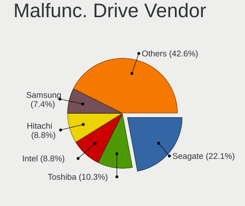

| Vendor              | Notebooks | Drives | Percent |
|---------------------|-----------|--------|---------|
| Seagate             | 15        | 18     | 22.06%  |
| Toshiba             | 7         | 7      | 10.29%  |
| Intel               | 6         | 7      | 8.82%   |
| Hitachi             | 6         | 13     | 8.82%   |
| Samsung Electronics | 5         | 5      | 7.35%   |
| Kingston            | 5         | 5      | 7.35%   |
| HGST                | 5         | 5      | 7.35%   |
| SK hynix            | 4         | 4      | 5.88%   |
| SanDisk             | 3         | 3      | 4.41%   |
| Fujitsu             | 3         | 4      | 4.41%   |
| WDC                 | 2         | 2      | 2.94%   |
| OCZ                 | 2         | 2      | 2.94%   |
| Corsair             | 2         | 2      | 2.94%   |
| Vaseky              | 1         | 1      | 1.47%   |
| ATP                 | 1         | 1      | 1.47%   |
| Apple               | 1         | 1      | 1.47%   |

Malfunc. HDD Vendor
-------------------

Vendors of faulty HDD drives

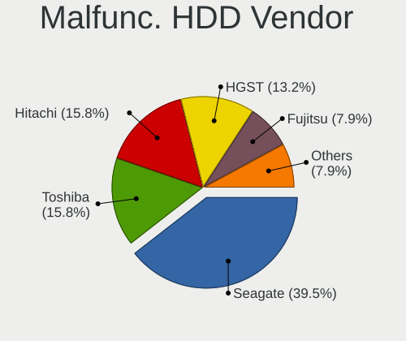

| Vendor              | Notebooks | Drives | Percent |
|---------------------|-----------|--------|---------|
| Seagate             | 15        | 18     | 39.47%  |
| Toshiba             | 6         | 6      | 15.79%  |
| Hitachi             | 6         | 13     | 15.79%  |
| HGST                | 5         | 5      | 13.16%  |
| Fujitsu             | 3         | 4      | 7.89%   |
| WDC                 | 2         | 2      | 5.26%   |
| Samsung Electronics | 1         | 1      | 2.63%   |

Malfunc. Drive Kind
-------------------

Kinds of faulty drives

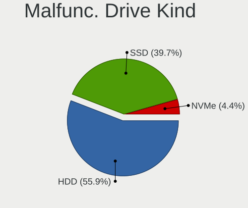

| Kind | Notebooks | Drives | Percent |
|------|-----------|--------|---------|
| HDD  | 38        | 49     | 55.88%  |
| SSD  | 27        | 28     | 39.71%  |
| NVMe | 3         | 3      | 4.41%   |

Failed Drives
-------------

Failed drive models

| Model                             | Notebooks | Drives | Percent |
|-----------------------------------|-----------|--------|---------|
| Samsung Electronics SSD 980 500GB | 1         | 1      | 100%    |

Failed Drive Vendor
-------------------

Failed drive vendors

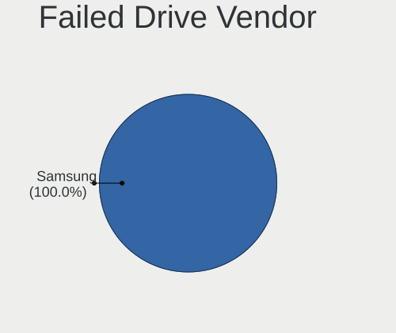

| Vendor              | Notebooks | Drives | Percent |
|---------------------|-----------|--------|---------|
| Samsung Electronics | 1         | 1      | 100%    |

Drive Status
------------

Number of failed and malfunc. drives

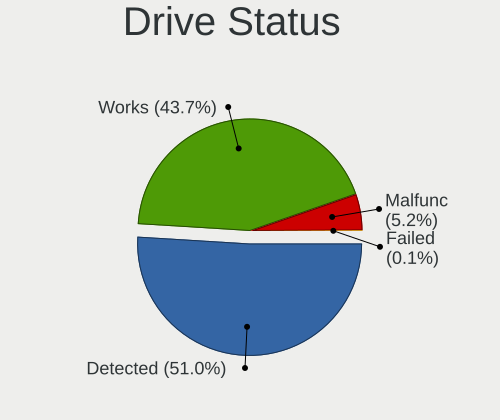

| Status   | Notebooks | Drives | Percent |
|----------|-----------|--------|---------|
| Detected | 652       | 1015   | 50.98%  |
| Works    | 559       | 710    | 43.71%  |
| Malfunc  | 67        | 80     | 5.24%   |
| Failed   | 1         | 1      | 0.08%   |

Storage controller
------------------

Storage Vendor
--------------

Storage controller vendors

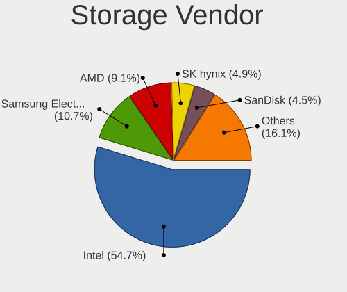

| Vendor                                  | Notebooks | Percent |
|-----------------------------------------|-----------|---------|
| Intel                                   | 744       | 54.71%  |
| Samsung Electronics                     | 146       | 10.74%  |
| AMD                                     | 124       | 9.12%   |
| SK hynix                                | 66        | 4.85%   |
| SanDisk                                 | 61        | 4.49%   |
| Micron Technology                       | 43        | 3.16%   |
| Kingston Technology Company             | 35        | 2.57%   |
| Toshiba America Info Systems            | 34        | 2.5%    |
| KIOXIA                                  | 22        | 1.62%   |
| Nvidia                                  | 15        | 1.1%    |
| Phison Electronics                      | 12        | 0.88%   |
| Union Memory (Shenzhen)                 | 7         | 0.51%   |
| Apple                                   | 7         | 0.51%   |
| ADATA Technology                        | 7         | 0.51%   |
| Silicon Motion                          | 4         | 0.29%   |
| Silicon Integrated Systems [SiS]        | 4         | 0.29%   |
| Micron/Crucial Technology               | 4         | 0.29%   |
| Lenovo                                  | 4         | 0.29%   |
| Marvell Technology Group                | 3         | 0.22%   |
| Yangtze Memory Technologies             | 2         | 0.15%   |
| VIA Technologies                        | 2         | 0.15%   |
| Solid State Storage Technology          | 2         | 0.15%   |
| Seagate Technology                      | 2         | 0.15%   |
| O2 Micro                                | 2         | 0.15%   |
| Transcend                               | 1         | 0.07%   |
| Solidigm                                | 1         | 0.07%   |
| Shenzhen Unionmemory Information System | 1         | 0.07%   |
| Shenzhen Shichuangyi Electronics        | 1         | 0.07%   |
| Shenzhen Longsys Electronics            | 1         | 0.07%   |
| OCZ Technology Group                    | 1         | 0.07%   |
| Lite-On Technology                      | 1         | 0.07%   |
| JMicron Technology                      | 1         | 0.07%   |

Storage Model
-------------

Storage controller models

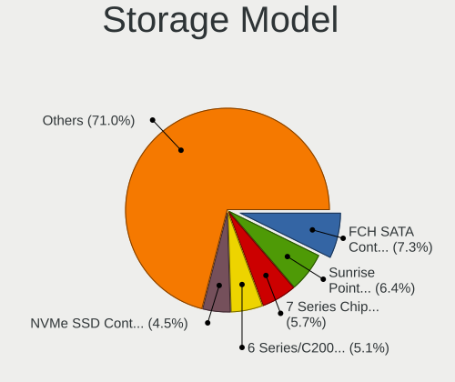

| Model                                                                            | Notebooks | Percent |
|----------------------------------------------------------------------------------|-----------|---------|
| AMD FCH SATA Controller [AHCI mode]                                              | 107       | 7.3%    |
| Intel Sunrise Point-LP SATA Controller [AHCI mode]                               | 94        | 6.41%   |
| Intel 7 Series Chipset Family 6-port SATA Controller [AHCI mode]                 | 83        | 5.66%   |
| Intel 6 Series/C200 Series Chipset Family 6 port Mobile SATA AHCI Controller     | 75        | 5.12%   |
| Samsung NVMe SSD Controller SM981/PM981/PM983                                    | 66        | 4.5%    |
| Intel 8 Series SATA Controller 1 [AHCI mode]                                     | 52        | 3.55%   |
| Intel 82801 Mobile SATA Controller [RAID mode]                                   | 45        | 3.07%   |
| Intel 82801IBM/IEM (ICH9M/ICH9M-E) 4 port SATA Controller [AHCI mode]            | 43        | 2.93%   |
| Intel 8 Series/C220 Series Chipset Family 6-port SATA Controller 1 [AHCI mode]   | 39        | 2.66%   |
| Intel Wildcat Point-LP SATA Controller [AHCI Mode]                               | 30        | 2.05%   |
| Samsung NVMe SSD Controller 980 (DRAM-less)                                      | 25        | 1.71%   |
| Intel Volume Management Device NVMe RAID Controller                              | 24        | 1.64%   |
| Intel 82801HM/HEM (ICH8M/ICH8M-E) IDE Controller                                 | 24        | 1.64%   |
| SK hynix Gold P31/BC711/PC711 NVMe Solid State Drive                             | 23        | 1.57%   |
| Intel 82801HM/HEM (ICH8M/ICH8M-E) SATA Controller [AHCI mode]                    | 22        | 1.5%    |
| Intel 5 Series/3400 Series Chipset 6 port SATA AHCI Controller                   | 22        | 1.5%    |
| Samsung NVMe SSD Controller PM9A1/PM9A3/980PRO                                   | 20        | 1.36%   |
| Intel Cannon Lake Mobile PCH SATA AHCI Controller                                | 19        | 1.3%    |
| Intel 5 Series/3400 Series Chipset 4 port SATA AHCI Controller                   | 19        | 1.3%    |
| Intel HM170/QM170 Chipset SATA Controller [AHCI Mode]                            | 18        | 1.23%   |
| Samsung NVMe SSD Controller SM961/PM961/SM963                                    | 17        | 1.16%   |
| SanDisk Extreme Pro / WD Black SN750 / PC SN730 / Red SN700 NVMe SSD             | 15        | 1.02%   |
| Intel Cannon Point-LP SATA Controller [AHCI Mode]                                | 15        | 1.02%   |
| AMD SB7x0/SB8x0/SB9x0 SATA Controller [AHCI mode]                                | 15        | 1.02%   |
| SK hynix BC501 NVMe Solid State Drive                                            | 13        | 0.89%   |
| Intel SSD 660P Series                                                            | 12        | 0.82%   |
| Intel Q170/Q150/B150/H170/H110/Z170/CM236 Chipset SATA Controller [AHCI Mode]    | 12        | 0.82%   |
| Intel Celeron N3350/Pentium N4200/Atom E3900 Series SATA AHCI Controller         | 12        | 0.82%   |
| Intel Atom Processor E3800 Series SATA AHCI Controller                           | 12        | 0.82%   |
| Micron 2400 NVMe SSD (DRAM-less)                                                 | 11        | 0.75%   |
| KIOXIA NVMe SSD Controller BG4 (DRAM-less)                                       | 11        | 0.75%   |
| Intel Atom/Celeron/Pentium Processor x5-E8000/J3xxx/N3xxx Series SATA Controller | 11        | 0.75%   |
| Toshiba America Info Systems XG6 NVMe SSD Controller                             | 10        | 0.68%   |
| SK hynix BC511 NVMe SSD                                                          | 10        | 0.68%   |
| Intel 82801GBM/GHM (ICH7-M Family) SATA Controller [AHCI mode]                   | 10        | 0.68%   |
| Intel 82801G (ICH7 Family) IDE Controller                                        | 10        | 0.68%   |
| Toshiba America Info Systems XG5 NVMe SSD Controller                             | 9         | 0.61%   |
| SK hynix Platinum P41/PC801 NVMe Solid State Drive                               | 9         | 0.61%   |
| Intel Mobile PM965/GM965 PT IDER Controller                                      | 9         | 0.61%   |
| SanDisk WD SN560/SN740/SN770/SN5000 NVMe SSD                                     | 8         | 0.55%   |

Storage Kind
------------

Kind of storage controller (IDE, SATA, NVMe, SAS, ...)

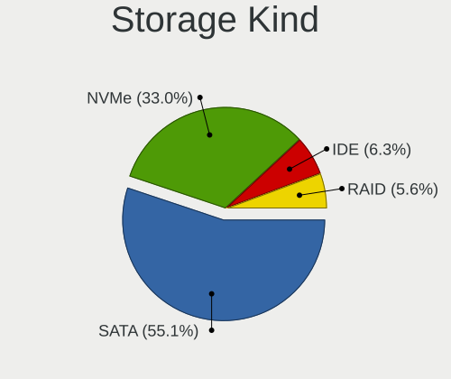

| Kind | Notebooks | Percent |
|------|-----------|---------|
| SATA | 774       | 55.13%  |
| NVMe | 463       | 32.98%  |
| IDE  | 88        | 6.27%   |
| RAID | 79        | 5.63%   |

Processor
---------

CPU Vendor
----------

Processor vendors

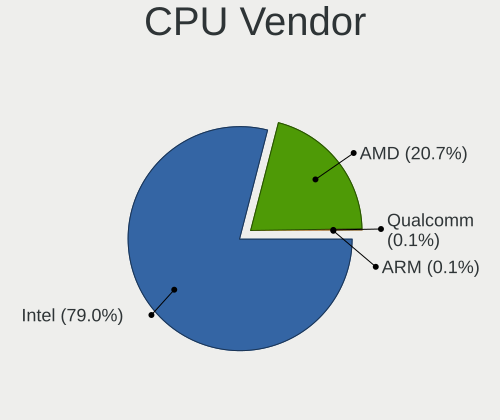

| Vendor       | Notebooks | Percent |
|--------------|-----------|---------|
| Intel        | 960       | 79.01%  |
| AMD          | 252       | 20.74%  |
| Qualcomm     | 1         | 0.08%   |
| CentaurHauls | 1         | 0.08%   |
| ARM          | 1         | 0.08%   |

CPU Model
---------

Processor models

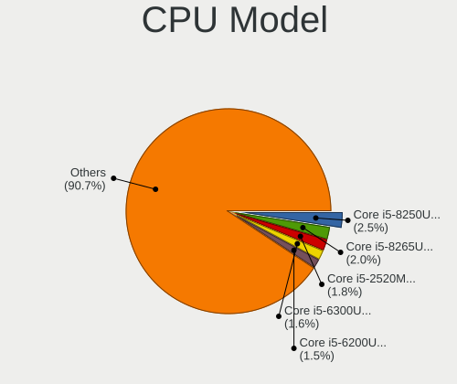

| Model                                         | Notebooks | Percent |
|-----------------------------------------------|-----------|---------|
| Intel Core i5-8250U CPU @ 1.60GHz             | 30        | 2.47%   |
| Intel Core i5-8265U CPU @ 1.60GHz             | 24        | 1.97%   |
| Intel Core i5-2520M CPU @ 2.50GHz             | 22        | 1.81%   |
| Intel Core i5-6300U CPU @ 2.40GHz             | 19        | 1.56%   |
| Intel Core i5-6200U CPU @ 2.30GHz             | 18        | 1.48%   |
| Intel Core i5-7200U CPU @ 2.50GHz             | 17        | 1.4%    |
| Intel Core i7-8550U CPU @ 1.80GHz             | 16        | 1.32%   |
| Intel Core i7-8565U CPU @ 1.80GHz             | 15        | 1.23%   |
| Intel Core i5-5200U CPU @ 2.20GHz             | 15        | 1.23%   |
| Intel Core i5-3320M CPU @ 2.60GHz             | 15        | 1.23%   |
| Intel 11th Gen Core i5-1135G7 @ 2.40GHz       | 13        | 1.07%   |
| Intel Core i5-4200U CPU @ 1.60GHz             | 12        | 0.99%   |
| Intel Core i7-7700HQ CPU @ 2.80GHz            | 11        | 0.9%    |
| Intel Core i7-7500U CPU @ 2.70GHz             | 11        | 0.9%    |
| Intel Core i5 CPU M 520 @ 2.40GHz             | 11        | 0.9%    |
| Intel 11th Gen Core i7-1165G7 @ 2.80GHz       | 10        | 0.82%   |
| AMD Ryzen 7 5700U with Radeon Graphics        | 9         | 0.74%   |
| Intel Core i7-6700HQ CPU @ 2.60GHz            | 8         | 0.66%   |
| Intel Core i7-6600U CPU @ 2.60GHz             | 8         | 0.66%   |
| Intel Core i5-4300U CPU @ 1.90GHz             | 8         | 0.66%   |
| Intel Core i5-3230M CPU @ 2.60GHz             | 8         | 0.66%   |
| Intel Core i5-3210M CPU @ 2.50GHz             | 8         | 0.66%   |
| Intel Core i5-2410M CPU @ 2.30GHz             | 8         | 0.66%   |
| Intel Core i5-10210U CPU @ 1.60GHz            | 8         | 0.66%   |
| Intel Celeron CPU N2840 @ 2.16GHz             | 8         | 0.66%   |
| AMD A8-6410 APU with AMD Radeon R5 Graphics   | 8         | 0.66%   |
| Intel Core i7-8665U CPU @ 1.90GHz             | 7         | 0.58%   |
| Intel Core i7-4800MQ CPU @ 2.70GHz            | 7         | 0.58%   |
| Intel Core i7-10750H CPU @ 2.60GHz            | 7         | 0.58%   |
| Intel Core i7-10510U CPU @ 1.80GHz            | 7         | 0.58%   |
| Intel Core i5-8300H CPU @ 2.30GHz             | 7         | 0.58%   |
| Intel Core i5-4210U CPU @ 1.70GHz             | 7         | 0.58%   |
| Intel Core 2 Duo CPU P8400 @ 2.26GHz          | 7         | 0.58%   |
| Intel Celeron CPU N3060 @ 1.60GHz             | 7         | 0.58%   |
| AMD Ryzen 5 3500U with Radeon Vega Mobile Gfx | 7         | 0.58%   |
| Intel Pentium Dual-Core CPU T4400 @ 2.20GHz   | 6         | 0.49%   |
| Intel Core i7-8850H CPU @ 2.60GHz             | 6         | 0.49%   |
| Intel Core i7-4710HQ CPU @ 2.50GHz            | 6         | 0.49%   |
| Intel Core i5-7300HQ CPU @ 2.50GHz            | 6         | 0.49%   |
| Intel Core i5-3317U CPU @ 1.70GHz             | 6         | 0.49%   |

CPU Model Family
----------------

Processor model prefix

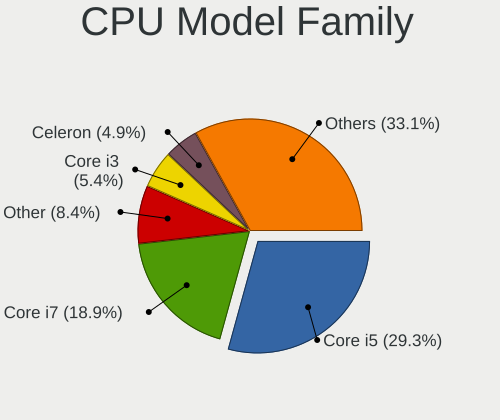

| Model                          | Notebooks | Percent |
|--------------------------------|-----------|---------|
| Intel Core i5                  | 356       | 29.28%  |
| Intel Core i7                  | 230       | 18.91%  |
| Other                          | 102       | 8.39%   |
| Intel Core i3                  | 66        | 5.43%   |
| Intel Celeron                  | 60        | 4.93%   |
| Intel Core 2 Duo               | 57        | 4.69%   |
| AMD Ryzen 5                    | 44        | 3.62%   |
| AMD Ryzen 7                    | 43        | 3.54%   |
| Intel Pentium                  | 26        | 2.14%   |
| AMD Ryzen 7 PRO                | 17        | 1.4%    |
| AMD A8                         | 15        | 1.23%   |
| Intel Pentium Dual-Core        | 14        | 1.15%   |
| Intel Atom                     | 14        | 1.15%   |
| AMD Ryzen 9                    | 14        | 1.15%   |
| AMD Ryzen 5 PRO                | 12        | 0.99%   |
| AMD Ryzen 3                    | 12        | 0.99%   |
| Intel Core                     | 11        | 0.9%    |
| AMD E1                         | 11        | 0.9%    |
| Intel Genuine                  | 8         | 0.66%   |
| AMD E2                         | 8         | 0.66%   |
| AMD A10                        | 8         | 0.66%   |
| AMD A6                         | 7         | 0.58%   |
| AMD A4                         | 7         | 0.58%   |
| Intel Core i9                  | 6         | 0.49%   |
| Intel Core 2                   | 5         | 0.41%   |
| Intel Pentium Dual             | 4         | 0.33%   |
| AMD Turion 64 X2 Mobile        | 4         | 0.33%   |
| AMD Ryzen 3 PRO                | 4         | 0.33%   |
| AMD Athlon                     | 4         | 0.33%   |
| Intel Core m3                  | 3         | 0.25%   |
| Intel Celeron Dual-Core        | 3         | 0.25%   |
| AMD Turion X2 Dual-Core Mobile | 3         | 0.25%   |
| AMD E                          | 3         | 0.25%   |
| AMD Athlon II Dual-Core        | 3         | 0.25%   |
| Intel Pentium Silver           | 2         | 0.16%   |
| Intel Core m7                  | 2         | 0.16%   |
| Intel Core m5                  | 2         | 0.16%   |
| Intel Core M                   | 2         | 0.16%   |
| Intel Core Duo                 | 2         | 0.16%   |
| Intel Celeron M                | 2         | 0.16%   |

CPU Cores
---------

Number of processor cores

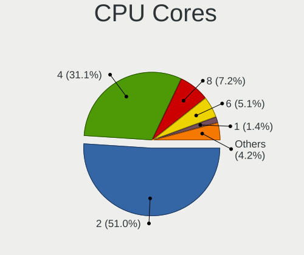

| Number | Notebooks | Percent |
|--------|-----------|---------|
| 2      | 621       | 51.03%  |
| 4      | 378       | 31.06%  |
| 8      | 88        | 7.23%   |
| 6      | 62        | 5.09%   |
| 1      | 17        | 1.4%    |
| 10     | 14        | 1.15%   |
| 16     | 11        | 0.9%    |
| 14     | 11        | 0.9%    |
| 12     | 9         | 0.74%   |
| 24     | 5         | 0.41%   |
| 5      | 1         | 0.08%   |

CPU Sockets
-----------

Number of sockets

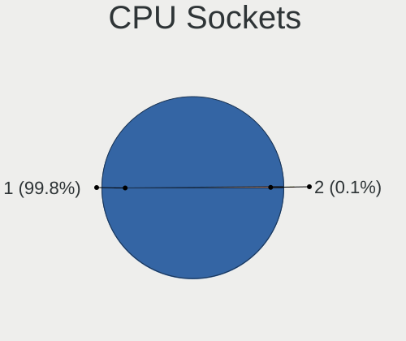

| Number | Notebooks | Percent |
|--------|-----------|---------|
| 1      | 1214      | 99.84%  |
| 16     | 1         | 0.08%   |
| 2      | 1         | 0.08%   |

CPU Threads
-----------

Threads per core (Hyper-Threading)

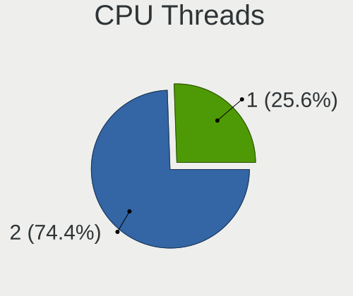

| Number | Notebooks | Percent |
|--------|-----------|---------|
| 2      | 906       | 74.45%  |
| 1      | 311       | 25.55%  |

CPU Op-Modes
------------

CPU Operation Modes (32-bit, 64-bit)

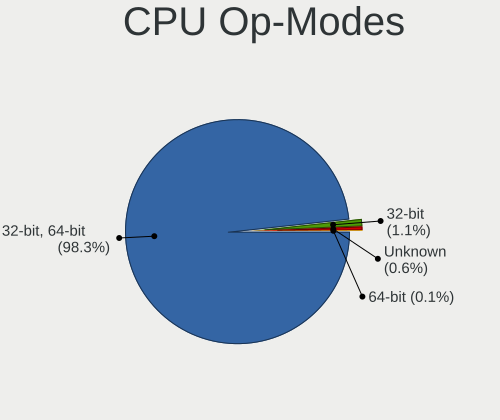

| Op mode        | Notebooks | Percent |
|----------------|-----------|---------|
| 32-bit, 64-bit | 1195      | 98.27%  |
| 32-bit         | 13        | 1.07%   |
| Unknown        | 7         | 0.58%   |
| 64-bit         | 1         | 0.08%   |

CPU Microcode
-------------

Microcode number

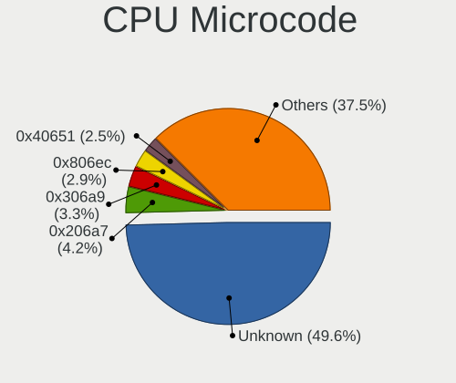

| Number     | Notebooks | Percent |
|------------|-----------|---------|
| Unknown    | 624       | 49.6%   |
| 0x206a7    | 53        | 4.21%   |
| 0x306a9    | 42        | 3.34%   |
| 0x806ec    | 36        | 2.86%   |
| 0x40651    | 31        | 2.46%   |
| 0x406e3    | 30        | 2.38%   |
| 0x806ea    | 27        | 2.15%   |
| 0x1067a    | 26        | 2.07%   |
| 0x806e9    | 17        | 1.35%   |
| 0x306d4    | 17        | 1.35%   |
| 0x306c3    | 17        | 1.35%   |
| 0x30678    | 17        | 1.35%   |
| 0x10676    | 16        | 1.27%   |
| 0x906e9    | 15        | 1.19%   |
| 0x20655    | 15        | 1.19%   |
| 0x806c1    | 13        | 1.03%   |
| 0x506e3    | 12        | 0.95%   |
| 0xa0652    | 11        | 0.87%   |
| 0x6fd      | 10        | 0.79%   |
| 0x20652    | 10        | 0.79%   |
| 0x08600106 | 10        | 0.79%   |
| 0x906ea    | 9         | 0.72%   |
| 0x406c4    | 9         | 0.72%   |
| 0x806eb    | 8         | 0.64%   |
| 0x706e5    | 8         | 0.64%   |
| 0x6fb      | 8         | 0.64%   |
| 0x506c9    | 8         | 0.64%   |
| 0x08108102 | 8         | 0.64%   |
| 0x06001119 | 7         | 0.56%   |
| 0x0a50000d | 6         | 0.48%   |
| 0x0a50000c | 6         | 0.48%   |
| 0x08108109 | 6         | 0.48%   |
| 0x0810100b | 6         | 0.48%   |
| 0x06006705 | 6         | 0.48%   |
| 0x05000119 | 6         | 0.48%   |
| 0x806d1    | 5         | 0.4%    |
| 0x406c3    | 5         | 0.4%    |
| 0x0a50000b | 5         | 0.4%    |
| 0x08608103 | 5         | 0.4%    |
| 0x02000032 | 5         | 0.4%    |

CPU Microarch
-------------

Microarchitecture

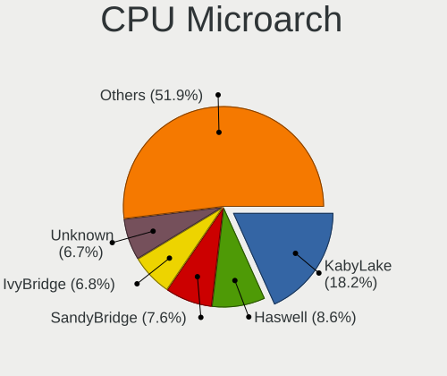

| Name               | Notebooks | Percent |
|--------------------|-----------|---------|
| KabyLake           | 222       | 18.24%  |
| Haswell            | 105       | 8.63%   |
| SandyBridge        | 93        | 7.64%   |
| IvyBridge          | 83        | 6.82%   |
| Unknown            | 82        | 6.74%   |
| Skylake            | 79        | 6.49%   |
| Penryn             | 60        | 4.93%   |
| Westmere           | 40        | 3.29%   |
| Silvermont         | 38        | 3.12%   |
| Broadwell          | 37        | 3.04%   |
| TigerLake          | 35        | 2.88%   |
| Zen+               | 33        | 2.71%   |
| Zen 2              | 32        | 2.63%   |
| Core               | 32        | 2.63%   |
| Zen 3              | 31        | 2.55%   |
| Alderlake Hybrid   | 25        | 2.05%   |
| Puma               | 20        | 1.64%   |
| IceLake            | 19        | 1.56%   |
| CometLake          | 18        | 1.48%   |
| Excavator          | 14        | 1.15%   |
| Piledriver         | 12        | 0.99%   |
| Goldmont           | 12        | 0.99%   |
| Goldmont plus      | 11        | 0.9%    |
| Bobcat             | 11        | 0.9%    |
| Zen                | 10        | 0.82%   |
| K8 Hammer          | 9         | 0.74%   |
| K8 & K10 hybrid    | 9         | 0.74%   |
| P6                 | 8         | 0.66%   |
| Meteorlake Hybrid  | 6         | 0.49%   |
| K10                | 5         | 0.41%   |
| Jaguar             | 5         | 0.41%   |
| Bonnell            | 5         | 0.41%   |
| Tremont            | 3         | 0.25%   |
| Steamroller        | 3         | 0.25%   |
| Nehalem            | 3         | 0.25%   |
| K10 Llano          | 3         | 0.25%   |
| ArrowLake-H Hybrid | 2         | 0.16%   |
| Lunarlake Hybrid   | 1         | 0.08%   |
| Gracemont          | 1         | 0.08%   |

Graphics
--------

GPU Vendor
----------

Vendors of graphics cards

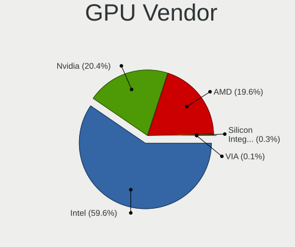

| Vendor                           | Notebooks | Percent |
|----------------------------------|-----------|---------|
| Intel                            | 875       | 59.56%  |
| Nvidia                           | 300       | 20.42%  |
| AMD                              | 288       | 19.61%  |
| Silicon Integrated Systems [SiS] | 4         | 0.27%   |
| VIA Technologies                 | 2         | 0.14%   |

GPU Model
---------

Graphics card models

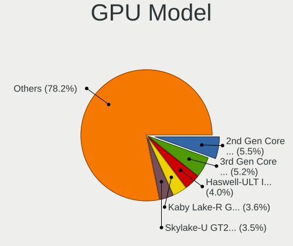

| Model                                                                                    | Notebooks | Percent |
|------------------------------------------------------------------------------------------|-----------|---------|
| Intel 2nd Generation Core Processor Family Integrated Graphics Controller                | 84        | 5.51%   |
| Intel 3rd Gen Core processor Graphics Controller                                         | 79        | 5.18%   |
| Intel Haswell-ULT Integrated Graphics Controller                                         | 61        | 4%      |
| Intel Kaby Lake-R GT2 [UHD Graphics 620]                                                 | 55        | 3.61%   |
| Intel Skylake-U GT2 [HD Graphics 520]                                                    | 53        | 3.48%   |
| Intel WhiskeyLake-U GT2 [UHD Graphics 620]                                               | 50        | 3.28%   |
| Intel 4th Gen Core Processor Integrated Graphics Controller                              | 39        | 2.56%   |
| Intel Kaby Lake-U GT2 [HD Graphics 620]                                                  | 35        | 2.3%    |
| AMD Picasso/Raven 2 [Radeon Vega Series / Radeon Vega Mobile Series]                     | 35        | 2.3%    |
| Intel Mobile 4 Series Chipset Integrated Graphics Controller                             | 34        | 2.23%   |
| Intel Broadwell-U GT2 [HD Graphics 5500]                                                 | 32        | 2.1%    |
| Intel TigerLake-LP GT2 [Iris Xe Graphics]                                                | 30        | 1.97%   |
| Intel Core Processor Integrated Graphics Controller                                      | 30        | 1.97%   |
| AMD Renoir [Radeon Vega Series / Radeon Vega Mobile Series]                              | 30        | 1.97%   |
| Intel CoffeeLake-H GT2 [UHD Graphics 630]                                                | 25        | 1.64%   |
| Intel CometLake-U GT2 [UHD Graphics]                                                     | 22        | 1.44%   |
| Intel Atom Processor Z36xxx/Z37xxx Series Graphics & Display                             | 20        | 1.31%   |
| Nvidia TU117M [GeForce GTX 1650 Mobile / Max-Q]                                          | 19        | 1.25%   |
| Intel Kaby Lake-H GT2 [HD Graphics 630]                                                  | 18        | 1.18%   |
| Intel Atom/Celeron/Pentium Processor x5-E8000/J3xxx/N3xxx Integrated Graphics Controller | 18        | 1.18%   |
| AMD Cezanne [Radeon Vega Series / Radeon Vega Mobile Series]                             | 18        | 1.18%   |
| Intel Mobile GM965/GL960 Integrated Graphics Controller (secondary)                      | 17        | 1.12%   |
| Intel Mobile GM965/GL960 Integrated Graphics Controller (primary)                        | 17        | 1.12%   |
| Intel CometLake-H GT2 [UHD Graphics]                                                     | 15        | 0.98%   |
| AMD Lucienne                                                                             | 15        | 0.98%   |
| Intel Skylake-H GT2 [HD Graphics 530]                                                    | 13        | 0.85%   |
| Intel TigerLake-H GT1 [UHD Graphics]                                                     | 12        | 0.79%   |
| AMD Phoenix1                                                                             | 12        | 0.79%   |
| Nvidia GP107M [GeForce GTX 1050 Mobile]                                                  | 11        | 0.72%   |
| Intel Mobile 945GM/GMS/GME, 943/940GML Express Integrated Graphics Controller            | 11        | 0.72%   |
| Nvidia GP108M [GeForce MX150]                                                            | 10        | 0.66%   |
| Nvidia GA106M [GeForce RTX 3060 Mobile / Max-Q]                                          | 10        | 0.66%   |
| Intel Raptor Lake-P [Iris Xe Graphics]                                                   | 10        | 0.66%   |
| Intel Mobile 945GM/GMS, 943/940GML Express Integrated Graphics Controller                | 10        | 0.66%   |
| Intel GeminiLake [UHD Graphics 600]                                                      | 10        | 0.66%   |
| AMD Barcelo                                                                              | 10        | 0.66%   |
| Nvidia GP107M [GeForce GTX 1050 Ti Mobile]                                               | 9         | 0.59%   |
| Nvidia AD107M [GeForce RTX 4060 Max-Q / Mobile]                                          | 9         | 0.59%   |
| AMD Stoney [Radeon R2/R3/R4/R5 Graphics]                                                 | 9         | 0.59%   |
| AMD Rembrandt [Radeon 680M]                                                              | 9         | 0.59%   |

GPU Combo
---------

Combinations of graphics cards

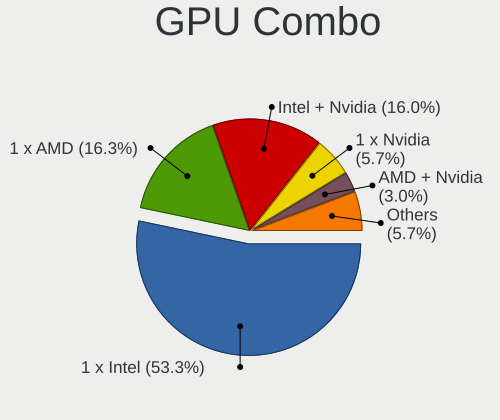

| Name           | Notebooks | Percent |
|----------------|-----------|---------|
| 1 x Intel      | 649       | 53.28%  |
| 1 x AMD        | 199       | 16.34%  |
| Intel + Nvidia | 195       | 16.01%  |
| 1 x Nvidia     | 69        | 5.67%   |
| AMD + Nvidia   | 36        | 2.96%   |
| Intel + AMD    | 27        | 2.22%   |
| 2 x AMD        | 25        | 2.05%   |
| 2 x Intel      | 8         | 0.66%   |
| 1 x SiS        | 4         | 0.33%   |
| Other          | 2         | 0.16%   |
| 2 x Nvidia     | 2         | 0.16%   |
| 1 x VIA        | 2         | 0.16%   |

GPU Driver
----------

Free vs proprietary

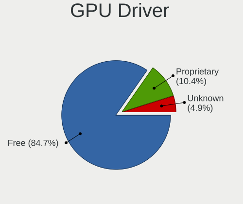

| Driver      | Notebooks | Percent |
|-------------|-----------|---------|
| Free        | 1041      | 84.7%   |
| Proprietary | 128       | 10.41%  |
| Unknown     | 60        | 4.88%   |

GPU Memory
----------

Total video memory

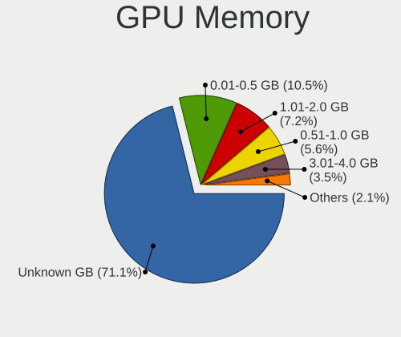

| Size in GB | Notebooks | Percent |
|------------|-----------|---------|
| Unknown    | 875       | 71.14%  |
| 0.01-0.5   | 129       | 10.49%  |
| 1.01-2.0   | 88        | 7.15%   |
| 0.51-1.0   | 69        | 5.61%   |
| 3.01-4.0   | 43        | 3.5%    |
| 7.01-8.0   | 11        | 0.89%   |
| 5.01-6.0   | 6         | 0.49%   |
| 2.01-3.0   | 4         | 0.33%   |
| 8.01-16.0  | 3         | 0.24%   |
| 16.01-24.0 | 2         | 0.16%   |

Monitor
-------

Monitor Vendor
--------------

Monitor vendors

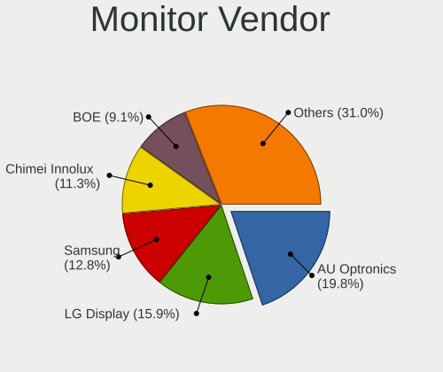

| Vendor                  | Notebooks | Percent |
|-------------------------|-----------|---------|
| AU Optronics            | 272       | 19.84%  |
| LG Display              | 218       | 15.9%   |
| Samsung Electronics     | 176       | 12.84%  |
| Chimei Innolux          | 155       | 11.31%  |
| BOE                     | 125       | 9.12%   |
| Lenovo                  | 79        | 5.76%   |
| Apple                   | 43        | 3.14%   |
| Dell                    | 29        | 2.12%   |
| Sharp                   | 26        | 1.9%    |
| Hewlett-Packard         | 22        | 1.6%    |
| InfoVision              | 21        | 1.53%   |
| PANDA                   | 17        | 1.24%   |
| CSO                     | 17        | 1.24%   |
| Chi Mei Optoelectronics | 17        | 1.24%   |
| BenQ                    | 17        | 1.24%   |
| Acer                    | 16        | 1.17%   |
| Ancor Communications    | 11        | 0.8%    |
| LG Philips              | 10        | 0.73%   |
| Vestel Elektronik       | 8         | 0.58%   |
| Valve                   | 8         | 0.58%   |
| Goldstar                | 6         | 0.44%   |
| Sony                    | 5         | 0.36%   |
| Fujitsu Siemens         | 5         | 0.36%   |
| IBM                     | 4         | 0.29%   |
| CPT                     | 4         | 0.29%   |
| ASUSTek Computer        | 4         | 0.29%   |
| AOC                     | 4         | 0.29%   |
| ViewSonic               | 3         | 0.22%   |
| Toshiba                 | 3         | 0.22%   |
| Panasonic               | 3         | 0.22%   |
| LGD                     | 3         | 0.22%   |
| JDI                     | 3         | 0.22%   |
| TMX                     | 2         | 0.15%   |
| Quanta Display          | 2         | 0.15%   |
| Pixio                   | 2         | 0.15%   |
| Philips                 | 2         | 0.15%   |
| Mi                      | 2         | 0.15%   |
| Eizo                    | 2         | 0.15%   |
| CSW                     | 2         | 0.15%   |
| YTH                     | 1         | 0.07%   |

Monitor Model
-------------

Monitor models

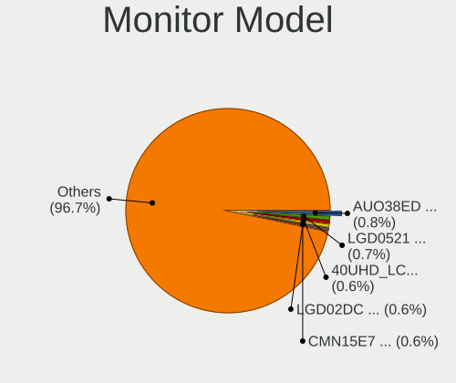

| Model                                                                | Notebooks | Percent |
|----------------------------------------------------------------------|-----------|---------|
| AU Optronics LCD Monitor AUO38ED 1920x1080 344x193mm 15.5-inch       | 11        | 0.8%    |
| LG Display LCD Monitor LGD0521 1920x1080 309x174mm 14.0-inch         | 10        | 0.72%   |
| Vestel Elektronik 40UHD_LCD_TV VES3700 3840x2160 880x500mm 39.8-inch | 8         | 0.58%   |
| LG Display LCD Monitor LGD02DC 1366x768 344x194mm 15.5-inch          | 8         | 0.58%   |
| Chimei Innolux LCD Monitor CMN15E7 1920x1080 344x193mm 15.5-inch     | 8         | 0.58%   |
| Chimei Innolux LCD Monitor CMN1521 1920x1080 344x193mm 15.5-inch     | 8         | 0.58%   |
| AU Optronics LCD Monitor AUO243D 1920x1080 309x173mm 13.9-inch       | 8         | 0.58%   |
| AU Optronics LCD Monitor AUO22EC 1366x768 344x193mm 15.5-inch        | 8         | 0.58%   |
| Lenovo LCD Monitor LEN4036 1440x900 303x190mm 14.1-inch              | 7         | 0.51%   |
| Chimei Innolux LCD Monitor CMN14F2 1920x1080 309x173mm 13.9-inch     | 7         | 0.51%   |
| AU Optronics LCD Monitor AUO313C 1366x768 309x173mm 13.9-inch        | 7         | 0.51%   |
| PANDA LCD Monitor NCP004D 1920x1080 344x194mm 15.5-inch              | 6         | 0.43%   |
| LG Display LCD Monitor LGD046F 1920x1080 344x194mm 15.5-inch         | 6         | 0.43%   |
| Chimei Innolux LCD Monitor CMN14D4 1920x1080 309x173mm 13.9-inch     | 6         | 0.43%   |
| Chimei Innolux LCD Monitor CMN14C9 1920x1080 309x173mm 13.9-inch     | 6         | 0.43%   |
| AU Optronics LCD Monitor AUO403D 1920x1080 309x174mm 14.0-inch       | 6         | 0.43%   |
| AU Optronics LCD Monitor AUO303E 1600x900 309x174mm 14.0-inch        | 6         | 0.43%   |
| AU Optronics LCD Monitor AUO21ED 1920x1080 344x193mm 15.5-inch       | 6         | 0.43%   |
| AU Optronics LCD Monitor AUO106C 1366x768 276x155mm 12.5-inch        | 6         | 0.43%   |
| Valve ANX7530 U VLV3001 800x1280 100x150mm 7.1-inch                  | 5         | 0.36%   |
| Samsung Electronics LCD Monitor SEC544B 1600x900 382x214mm 17.2-inch | 5         | 0.36%   |
| Samsung Electronics LCD Monitor SEC304C 1366x768 353x198mm 15.9-inch | 5         | 0.36%   |
| LG Display LCD Monitor LGD05FA 1920x1080 310x170mm 13.9-inch         | 5         | 0.36%   |
| LG Display LCD Monitor LGD046D 1920x1080 309x174mm 14.0-inch         | 5         | 0.36%   |
| LG Display LCD Monitor LGD01DD 1600x900 382x215mm 17.3-inch          | 5         | 0.36%   |
| Lenovo LCD Monitor LEN40B2 1920x1080 344x193mm 15.5-inch             | 5         | 0.36%   |
| Lenovo LCD Monitor LEN40B1 1600x900 345x194mm 15.6-inch              | 5         | 0.36%   |
| Chimei Innolux LCD Monitor CMN15F5 1920x1080 344x193mm 15.5-inch     | 5         | 0.36%   |
| Chimei Innolux LCD Monitor CMN14C0 1920x1080 308x173mm 13.9-inch     | 5         | 0.36%   |
| Chimei Innolux LCD Monitor CMN14A7 1920x1080 308x173mm 13.9-inch     | 5         | 0.36%   |
| BOE LCD Monitor BOE07DB 1920x1080 309x174mm 14.0-inch                | 5         | 0.36%   |
| AU Optronics LCD Monitor AUO35ED 1920x1080 344x193mm 15.5-inch       | 5         | 0.36%   |
| AU Optronics LCD Monitor AUO213E 1600x900 309x174mm 14.0-inch        | 5         | 0.36%   |
| Samsung Electronics S24F350 SAM0D20 1920x1080 521x293mm 23.5-inch    | 4         | 0.29%   |
| Samsung Electronics LCD Monitor SEC5441 1280x800 331x207mm 15.4-inch | 4         | 0.29%   |
| Samsung Electronics LCD Monitor SDC4852 1366x768 344x194mm 15.5-inch | 4         | 0.29%   |
| LG Display LCD Monitor LGD040A 1920x1080 310x170mm 13.9-inch         | 4         | 0.29%   |
| LG Display LCD Monitor LGD03ED 1366x768 277x156mm 12.5-inch          | 4         | 0.29%   |
| LG Display LCD Monitor LGD02E3 1366x768 344x194mm 15.5-inch          | 4         | 0.29%   |
| LG Display LCD Monitor LGD02D8 1366x768 277x156mm 12.5-inch          | 4         | 0.29%   |

Monitor Resolution
------------------

Monitor screen resolution

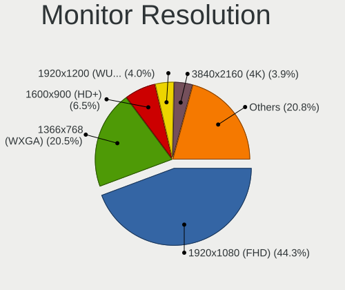

| Resolution         | Notebooks | Percent |
|--------------------|-----------|---------|
| 1920x1080 (FHD)    | 582       | 44.33%  |
| 1366x768 (WXGA)    | 269       | 20.49%  |
| 1600x900 (HD+)     | 86        | 6.55%   |
| 1920x1200 (WUXGA)  | 52        | 3.96%   |
| 3840x2160 (4K)     | 51        | 3.88%   |
| 2560x1440 (QHD)    | 50        | 3.81%   |
| 1280x800 (WXGA)    | 41        | 3.12%   |
| 1440x900 (WXGA+)   | 37        | 2.82%   |
| 2560x1600          | 27        | 2.06%   |
| 2880x1800          | 21        | 1.6%    |
| 1680x1050 (WSXGA+) | 19        | 1.45%   |
| 3440x1440          | 12        | 0.91%   |
| 3840x2400          | 10        | 0.76%   |
| 800x1280           | 8         | 0.61%   |
| 1280x1024 (SXGA)   | 6         | 0.46%   |
| 1024x600           | 5         | 0.38%   |
| 3200x2000          | 4         | 0.3%    |
| 3200x1800 (QHD+)   | 4         | 0.3%    |
| 3000x2000          | 4         | 0.3%    |
| Unknown            | 4         | 0.3%    |
| 2304x1440          | 3         | 0.23%   |
| 2256x1504          | 3         | 0.23%   |
| 1680x945           | 2         | 0.15%   |
| 1600x1200          | 2         | 0.15%   |
| 1400x1050          | 2         | 0.15%   |
| 1360x768           | 2         | 0.15%   |
| 3840x1200          | 1         | 0.08%   |
| 3456x2160          | 1         | 0.08%   |
| 2880x1920          | 1         | 0.08%   |
| 2160x1440          | 1         | 0.08%   |
| 1920x540           | 1         | 0.08%   |
| 1920x1280          | 1         | 0.08%   |
| 1280x720 (HD)      | 1         | 0.08%   |

Monitor Diagonal
----------------

Diagonal size in inches

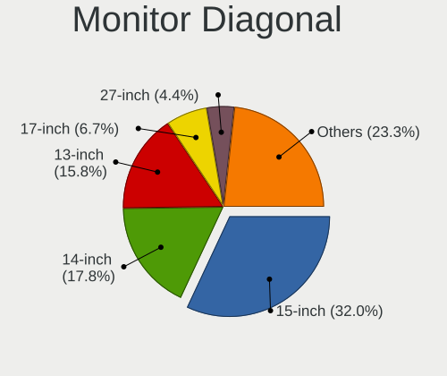

| Inches  | Notebooks | Percent |
|---------|-----------|---------|
| 15      | 440       | 31.98%  |
| 14      | 245       | 17.81%  |
| 13      | 218       | 15.84%  |
| 17      | 92        | 6.69%   |
| 27      | 61        | 4.43%   |
| 12      | 51        | 3.71%   |
| 24      | 43        | 3.13%   |
| 23      | 34        | 2.47%   |
| 16      | 32        | 2.33%   |
| 11      | 21        | 1.53%   |
| 31      | 18        | 1.31%   |
| 21      | 17        | 1.24%   |
| Unknown | 15        | 1.09%   |
| 34      | 12        | 0.87%   |
| 84      | 11        | 0.8%    |
| 18      | 11        | 0.8%    |
| 7       | 8         | 0.58%   |
| 10      | 5         | 0.36%   |
| 54      | 4         | 0.29%   |
| 32      | 4         | 0.29%   |
| 28      | 4         | 0.29%   |
| 22      | 4         | 0.29%   |
| 19      | 4         | 0.29%   |
| 72      | 3         | 0.22%   |
| 40      | 3         | 0.22%   |
| 58      | 2         | 0.15%   |
| 55      | 2         | 0.15%   |
| 43      | 2         | 0.15%   |
| 25      | 2         | 0.15%   |
| 20      | 2         | 0.15%   |
| 86      | 1         | 0.07%   |
| 57      | 1         | 0.07%   |
| 49      | 1         | 0.07%   |
| 48      | 1         | 0.07%   |
| 29      | 1         | 0.07%   |
| 26      | 1         | 0.07%   |

Monitor Width
-------------

Physical width

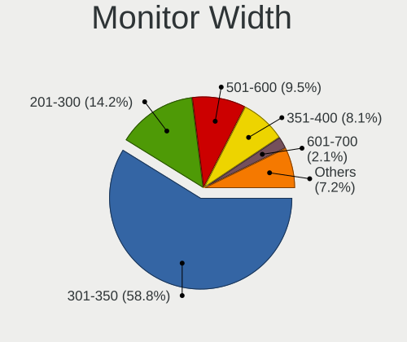

| Width in mm | Notebooks | Percent |
|-------------|-----------|---------|
| 301-350     | 804       | 58.81%  |
| 201-300     | 194       | 14.19%  |
| 501-600     | 130       | 9.51%   |
| 351-400     | 111       | 8.12%   |
| 601-700     | 29        | 2.12%   |
| 401-500     | 29        | 2.12%   |
| 701-800     | 16        | 1.17%   |
| Unknown     | 15        | 1.1%    |
| 1501-2000   | 14        | 1.02%   |
| 1001-1500   | 13        | 0.95%   |
| 1-100       | 8         | 0.59%   |
| 801-900     | 3         | 0.22%   |
| 901-1000    | 1         | 0.07%   |

Aspect Ratio
------------

Proportional relationship between the width and the height

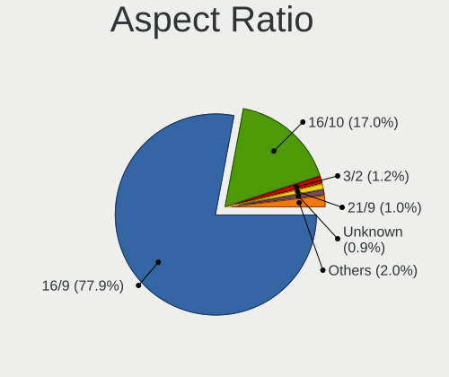

| Ratio   | Notebooks | Percent |
|---------|-----------|---------|
| 16/9    | 958       | 77.95%  |
| 16/10   | 209       | 17.01%  |
| 3/2     | 15        | 1.22%   |
| 21/9    | 12        | 0.98%   |
| Unknown | 11        | 0.9%    |
| 5/4     | 8         | 0.65%   |
| 0.67    | 5         | 0.41%   |
| 4/3     | 4         | 0.33%   |
| 0.62    | 3         | 0.24%   |
| 32/9    | 2         | 0.16%   |
| 3.20    | 1         | 0.08%   |
| 0.56    | 1         | 0.08%   |

Monitor Area
------------

Area in inch²

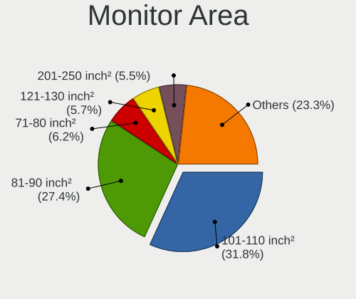

| Area in inch² | Notebooks | Percent |
|----------------|-----------|---------|
| 101-110        | 436       | 31.82%  |
| 81-90          | 376       | 27.45%  |
| 71-80          | 85        | 6.2%    |
| 121-130        | 78        | 5.69%   |
| 201-250        | 76        | 5.55%   |
| 301-350        | 62        | 4.53%   |
| 61-70          | 51        | 3.72%   |
| 351-500        | 39        | 2.85%   |
| 111-120        | 35        | 2.55%   |
| More than 1000 | 24        | 1.75%   |
| 51-60          | 21        | 1.53%   |
| 251-300        | 17        | 1.24%   |
| Unknown        | 15        | 1.09%   |
| 131-140        | 12        | 0.88%   |
| 141-150        | 11        | 0.8%    |
| 151-200        | 10        | 0.73%   |
| 1-40           | 8         | 0.58%   |
| 501-1000       | 7         | 0.51%   |
| 41-50          | 5         | 0.36%   |
| 91-100         | 2         | 0.15%   |

Pixel Density
-------------

Pixels per inch

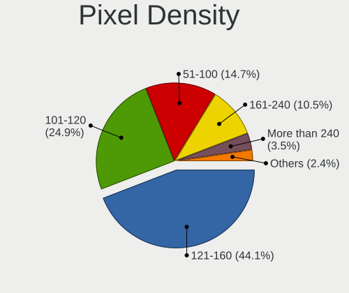

| Density       | Notebooks | Percent |
|---------------|-----------|---------|
| 121-160       | 599       | 44.14%  |
| 101-120       | 338       | 24.91%  |
| 51-100        | 199       | 14.66%  |
| 161-240       | 142       | 10.46%  |
| More than 240 | 47        | 3.46%   |
| 1-50          | 17        | 1.25%   |
| Unknown       | 15        | 1.11%   |

Multiple Monitors
-----------------

Total monitors connected

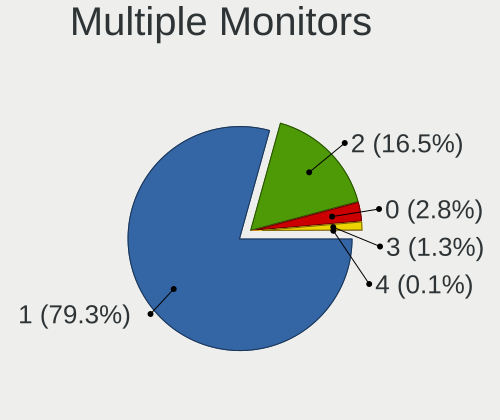

| Total | Notebooks | Percent |
|-------|-----------|---------|
| 1     | 989       | 79.31%  |
| 2     | 206       | 16.52%  |
| 0     | 35        | 2.81%   |
| 3     | 16        | 1.28%   |
| 4     | 1         | 0.08%   |

Network
-------

Net Controller Vendor
---------------------

Controller vendors

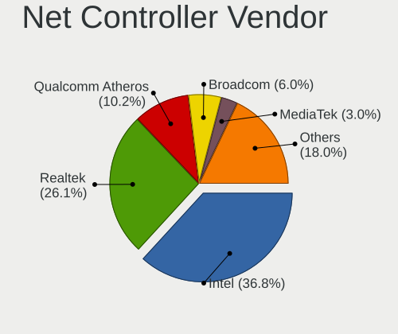

| Vendor                                 | Notebooks | Percent |
|----------------------------------------|-----------|---------|
| Intel                                  | 701       | 36.8%   |
| Realtek Semiconductor                  | 497       | 26.09%  |
| Qualcomm Atheros                       | 194       | 10.18%  |
| Broadcom                               | 114       | 5.98%   |
| MediaTek                               | 57        | 2.99%   |
| Sierra Wireless                        | 31        | 1.63%   |
| Hewlett-Packard                        | 30        | 1.57%   |
| Ericsson Business Mobile Networks      | 27        | 1.42%   |
| Broadcom Limited                       | 27        | 1.42%   |
| Marvell Technology Group               | 20        | 1.05%   |
| Ralink                                 | 17        | 0.89%   |
| Dell                                   | 16        | 0.84%   |
| TP-Link                                | 14        | 0.73%   |
| Qualcomm                               | 14        | 0.73%   |
| Huawei Technologies                    | 14        | 0.73%   |
| Lenovo                                 | 12        | 0.63%   |
| Nvidia                                 | 11        | 0.58%   |
| OPPO Electronics                       | 10        | 0.52%   |
| Fibocom                                | 10        | 0.52%   |
| ASIX Electronics                       | 8         | 0.42%   |
| Samsung Electronics                    | 7         | 0.37%   |
| DisplayLink                            | 7         | 0.37%   |
| ASUSTek Computer                       | 7         | 0.37%   |
| Shenzhen Goodix Technology             | 5         | 0.26%   |
| Ralink Technology                      | 5         | 0.26%   |
| OnePlus Technology (Shenzhen)          | 5         | 0.26%   |
| Silicon Integrated Systems [SiS]       | 4         | 0.21%   |
| ZyXEL Communications                   | 3         | 0.16%   |
| Qualcomm Technologies                  | 3         | 0.16%   |
| Motorola PCS                           | 3         | 0.16%   |
| D-Link                                 | 3         | 0.16%   |
| Texas Instruments                      | 2         | 0.1%    |
| Fujitsu Siemens Computers              | 2         | 0.1%    |
| ADMtek                                 | 2         | 0.1%    |
| Xiaomi                                 | 1         | 0.05%   |
| VIA Technologies                       | 1         | 0.05%   |
| Van Ooijen Technische Informatica      | 1         | 0.05%   |
| U-Blox                                 | 1         | 0.05%   |
| Sony Ericsson Mobile Communications AB | 1         | 0.05%   |
| SEGGER                                 | 1         | 0.05%   |

Net Controller Model
--------------------

Controller models

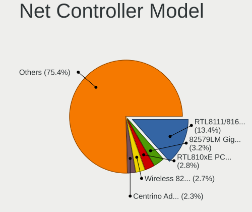

| Model                                                                  | Notebooks | Percent |
|------------------------------------------------------------------------|-----------|---------|
| Realtek RTL8111/8168/8211/8411 PCI Express Gigabit Ethernet Controller | 328       | 13.44%  |
| Intel 82579LM Gigabit Network Connection (Lewisville)                  | 79        | 3.24%   |
| Realtek RTL810xE PCI Express Fast Ethernet controller                  | 69        | 2.83%   |
| Intel Wireless 8265 / 8275                                             | 67        | 2.75%   |
| Intel Centrino Advanced-N 6205 [Taylor Peak]                           | 57        | 2.34%   |
| Intel Wireless 8260                                                    | 54        | 2.21%   |
| Realtek RTL8153 Gigabit Ethernet Adapter                               | 47        | 1.93%   |
| Intel Wireless 7260                                                    | 46        | 1.89%   |
| Intel Wireless 7265                                                    | 43        | 1.76%   |
| Intel Wi-Fi 6 AX200                                                    | 42        | 1.72%   |
| Qualcomm Atheros AR9285 Wireless Network Adapter (PCI-Express)         | 41        | 1.68%   |
| Realtek RTL8821CE 802.11ac PCIe Wireless Network Adapter               | 33        | 1.35%   |
| Qualcomm Atheros QCA9377 802.11ac Wireless Network Adapter             | 32        | 1.31%   |
| Realtek RTL8723BE PCIe Wireless Network Adapter                        | 31        | 1.27%   |
| Intel Cannon Point-LP CNVi [Wireless-AC]                               | 30        | 1.23%   |
| Intel Wi-Fi 6 AX201                                                    | 29        | 1.19%   |
| Intel Ethernet Connection I219-LM                                      | 25        | 1.02%   |
| Intel Ethernet Connection (4) I219-V                                   | 25        | 1.02%   |
| Qualcomm Atheros QCA6174 802.11ac Wireless Network Adapter             | 22        | 0.9%    |
| Intel 82577LM Gigabit Network Connection                               | 22        | 0.9%    |
| Qualcomm Atheros AR9485 Wireless Network Adapter                       | 21        | 0.86%   |
| MediaTek MT7921 802.11ax PCIe Wireless Network Adapter [Filogic 330]   | 21        | 0.86%   |
| Intel Ethernet Connection I218-LM                                      | 20        | 0.82%   |
| Intel Ethernet Connection I217-LM                                      | 20        | 0.82%   |
| Intel Ethernet Connection (6) I219-V                                   | 20        | 0.82%   |
| Intel Ethernet Connection (4) I219-LM                                  | 20        | 0.82%   |
| Intel Comet Lake PCH-LP CNVi WiFi                                      | 20        | 0.82%   |
| Realtek RTL8822CE 802.11ac PCIe Wireless Network Adapter               | 19        | 0.78%   |
| Intel Centrino Advanced-N 6235                                         | 19        | 0.78%   |
| Qualcomm Atheros QCA9565 / AR9565 Wireless Network Adapter             | 18        | 0.74%   |
| Intel PRO/Wireless 4965 AG or AGN [Kedron] Network Connection          | 17        | 0.7%    |
| Intel Ethernet Connection I219-V                                       | 17        | 0.7%    |
| Intel Ethernet Connection (3) I218-LM                                  | 17        | 0.7%    |
| Realtek RTL8822BE 802.11a/b/g/n/ac WiFi adapter                        | 16        | 0.66%   |
| Intel Centrino Ultimate-N 6300                                         | 16        | 0.66%   |
| Intel Alder Lake-P PCH CNVi WiFi                                       | 16        | 0.66%   |
| MediaTek MT7922 802.11ax PCI Express Wireless Network Adapter          | 15        | 0.61%   |
| Intel Wi-Fi 5(802.11ac) Wireless-AC 9x6x [Thunder Peak]                | 15        | 0.61%   |
| Intel Centrino Advanced-N 6200                                         | 15        | 0.61%   |
| Intel 82567LM Gigabit Network Connection                               | 15        | 0.61%   |

Wireless Vendor
---------------

Wireless vendors

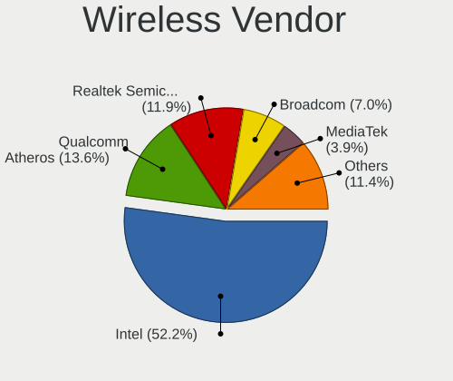

| Vendor                          | Notebooks | Percent |
|---------------------------------|-----------|---------|
| Intel                           | 664       | 52.16%  |
| Qualcomm Atheros                | 173       | 13.59%  |
| Realtek Semiconductor           | 152       | 11.94%  |
| Broadcom                        | 89        | 6.99%   |
| MediaTek                        | 50        | 3.93%   |
| Sierra Wireless                 | 31        | 2.44%   |
| Broadcom Limited                | 21        | 1.65%   |
| Ralink                          | 17        | 1.34%   |
| TP-Link                         | 13        | 1.02%   |
| Qualcomm                        | 11        | 0.86%   |
| Fibocom                         | 10        | 0.79%   |
| Hewlett-Packard                 | 9         | 0.71%   |
| Dell                            | 9         | 0.71%   |
| ASUSTek Computer                | 6         | 0.47%   |
| Ralink Technology               | 5         | 0.39%   |
| ZyXEL Communications            | 3         | 0.24%   |
| D-Link                          | 3         | 0.24%   |
| Fujitsu Siemens Computers       | 2         | 0.16%   |
| Qualcomm Technologies           | 1         | 0.08%   |
| Qualcomm Atheros Communications | 1         | 0.08%   |
| Microsoft                       | 1         | 0.08%   |
| Linksys                         | 1         | 0.08%   |
| Arduino SA                      | 1         | 0.08%   |

Wireless Model
--------------

Wireless models

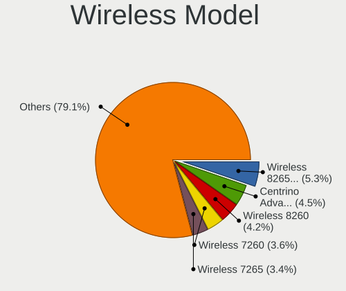

| Model                                                                   | Notebooks | Percent |
|-------------------------------------------------------------------------|-----------|---------|
| Intel Wireless 8265 / 8275                                              | 67        | 5.25%   |
| Intel Centrino Advanced-N 6205 [Taylor Peak]                            | 57        | 4.47%   |
| Intel Wireless 8260                                                     | 54        | 4.24%   |
| Intel Wireless 7260                                                     | 46        | 3.61%   |
| Intel Wireless 7265                                                     | 43        | 3.37%   |
| Intel Wi-Fi 6 AX200                                                     | 42        | 3.29%   |
| Qualcomm Atheros AR9285 Wireless Network Adapter (PCI-Express)          | 41        | 3.22%   |
| Realtek RTL8821CE 802.11ac PCIe Wireless Network Adapter                | 33        | 2.59%   |
| Qualcomm Atheros QCA9377 802.11ac Wireless Network Adapter              | 32        | 2.51%   |
| Realtek RTL8723BE PCIe Wireless Network Adapter                         | 31        | 2.43%   |
| Intel Cannon Point-LP CNVi [Wireless-AC]                                | 30        | 2.35%   |
| Intel Wi-Fi 6 AX201                                                     | 29        | 2.27%   |
| Qualcomm Atheros QCA6174 802.11ac Wireless Network Adapter              | 22        | 1.73%   |
| Qualcomm Atheros AR9485 Wireless Network Adapter                        | 21        | 1.65%   |
| MediaTek MT7921 802.11ax PCIe Wireless Network Adapter [Filogic 330]    | 21        | 1.65%   |
| Intel Comet Lake PCH-LP CNVi WiFi                                       | 20        | 1.57%   |
| Realtek RTL8822CE 802.11ac PCIe Wireless Network Adapter                | 19        | 1.49%   |
| Intel Centrino Advanced-N 6235                                          | 19        | 1.49%   |
| Qualcomm Atheros QCA9565 / AR9565 Wireless Network Adapter              | 18        | 1.41%   |
| Intel PRO/Wireless 4965 AG or AGN [Kedron] Network Connection           | 17        | 1.33%   |
| Realtek RTL8822BE 802.11a/b/g/n/ac WiFi adapter                         | 16        | 1.25%   |
| Intel Centrino Ultimate-N 6300                                          | 16        | 1.25%   |
| Intel Wi-Fi 5(802.11ac) Wireless-AC 9x6x [Thunder Peak]                 | 15        | 1.18%   |
| Intel Centrino Advanced-N 6200                                          | 15        | 1.18%   |
| Intel Comet Lake PCH CNVi WiFi                                          | 14        | 1.1%    |
| Intel Cannon Lake PCH CNVi WiFi                                         | 14        | 1.1%    |
| Ralink RT3290 Wireless 802.11n 1T/1R PCIe                               | 13        | 1.02%   |
| Broadcom BCM43228 802.11a/b/g/n                                         | 13        | 1.02%   |
| Broadcom BCM43142 802.11b/g/n                                           | 13        | 1.02%   |
| Broadcom BCM4313 802.11bgn Wireless Network Adapter                     | 13        | 1.02%   |
| Realtek RTL8852AE 802.11ax PCIe Wireless Network Adapter                | 12        | 0.94%   |
| Qualcomm Atheros AR242x / AR542x Wireless Network Adapter (PCI-Express) | 12        | 0.94%   |
| MediaTek MT7922 802.11ax PCI Express Wireless Network Adapter           | 12        | 0.94%   |
| Intel Wireless 3165                                                     | 12        | 0.94%   |
| Qualcomm Atheros AR9462 Wireless Network Adapter                        | 11        | 0.86%   |
| Intel Wireless 3160                                                     | 11        | 0.86%   |
| Intel Raptor Lake PCH CNVi WiFi                                         | 11        | 0.86%   |
| Intel PRO/Wireless 3945ABG [Golan] Network Connection                   | 11        | 0.86%   |
| Intel Dual Band Wireless-AC 3165 Plus Bluetooth                         | 11        | 0.86%   |
| Qualcomm QCNFA765 Wireless Network Adapter                              | 10        | 0.78%   |

Ethernet Vendor
---------------

Ethernet vendors

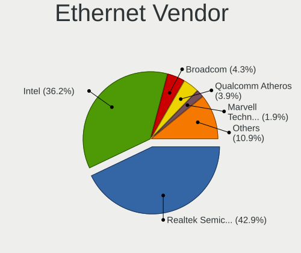

| Vendor                                 | Notebooks | Percent |
|----------------------------------------|-----------|---------|
| Realtek Semiconductor                  | 464       | 42.92%  |
| Intel                                  | 391       | 36.17%  |
| Broadcom                               | 46        | 4.26%   |
| Qualcomm Atheros                       | 42        | 3.89%   |
| Marvell Technology Group               | 20        | 1.85%   |
| Lenovo                                 | 12        | 1.11%   |
| Nvidia                                 | 11        | 1.02%   |
| OPPO Electronics                       | 10        | 0.93%   |
| Huawei Technologies                    | 10        | 0.93%   |
| Hewlett-Packard                        | 8         | 0.74%   |
| ASIX Electronics                       | 8         | 0.74%   |
| MediaTek                               | 7         | 0.65%   |
| DisplayLink                            | 7         | 0.65%   |
| Samsung Electronics                    | 6         | 0.56%   |
| Broadcom Limited                       | 6         | 0.56%   |
| Silicon Integrated Systems [SiS]       | 4         | 0.37%   |
| OnePlus Technology (Shenzhen)          | 4         | 0.37%   |
| Qualcomm                               | 3         | 0.28%   |
| Motorola PCS                           | 3         | 0.28%   |
| TP-Link                                | 2         | 0.19%   |
| Qualcomm Technologies                  | 2         | 0.19%   |
| ADMtek                                 | 2         | 0.19%   |
| Xiaomi                                 | 1         | 0.09%   |
| VIA Technologies                       | 1         | 0.09%   |
| Sony Ericsson Mobile Communications AB | 1         | 0.09%   |
| Research In Motion                     | 1         | 0.09%   |
| Motorcomm Microelectronics.            | 1         | 0.09%   |
| ICS Advent                             | 1         | 0.09%   |
| HMD Global                             | 1         | 0.09%   |
| Google                                 | 1         | 0.09%   |
| Foxconn / Hon Hai                      | 1         | 0.09%   |
| Attansic Technology                    | 1         | 0.09%   |
| ASUSTek Computer                       | 1         | 0.09%   |
| Apple                                  | 1         | 0.09%   |
| 3Com                                   | 1         | 0.09%   |

Ethernet Model
--------------

Ethernet models

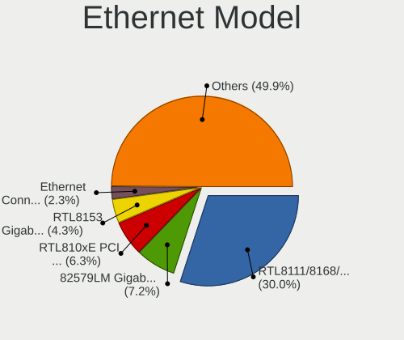

| Model                                                                  | Notebooks | Percent |
|------------------------------------------------------------------------|-----------|---------|
| Realtek RTL8111/8168/8211/8411 PCI Express Gigabit Ethernet Controller | 328       | 30.01%  |
| Intel 82579LM Gigabit Network Connection (Lewisville)                  | 79        | 7.23%   |
| Realtek RTL810xE PCI Express Fast Ethernet controller                  | 69        | 6.31%   |
| Realtek RTL8153 Gigabit Ethernet Adapter                               | 47        | 4.3%    |
| Intel Ethernet Connection I219-LM                                      | 25        | 2.29%   |
| Intel Ethernet Connection (4) I219-V                                   | 25        | 2.29%   |
| Intel 82577LM Gigabit Network Connection                               | 22        | 2.01%   |
| Intel Ethernet Connection I218-LM                                      | 20        | 1.83%   |
| Intel Ethernet Connection I217-LM                                      | 20        | 1.83%   |
| Intel Ethernet Connection (6) I219-V                                   | 20        | 1.83%   |
| Intel Ethernet Connection (4) I219-LM                                  | 20        | 1.83%   |
| Intel Ethernet Connection I219-V                                       | 17        | 1.56%   |
| Intel Ethernet Connection (3) I218-LM                                  | 17        | 1.56%   |
| Intel 82567LM Gigabit Network Connection                               | 15        | 1.37%   |
| Intel 82566MM Gigabit Network Connection                               | 12        | 1.1%    |
| Intel Ethernet Connection (2) I219-LM                                  | 11        | 1.01%   |
| Qualcomm Atheros QCA8171 Gigabit Ethernet                              | 10        | 0.91%   |
| Intel Ethernet Connection (6) I219-LM                                  | 10        | 0.91%   |
| OPPO Ace 3V                                                            | 9         | 0.82%   |
| Intel Ethernet Connection (7) I219-LM                                  | 9         | 0.82%   |
| Broadcom NetXtreme BCM57765 Gigabit Ethernet PCIe                      | 9         | 0.82%   |
| HP HP lt4120 Snapdragon X5 LTE                                         | 8         | 0.73%   |
| Qualcomm Atheros AR8151 v2.0 Gigabit Ethernet                          | 7         | 0.64%   |
| Marvell Group 88E8040 PCI-E Fast Ethernet Controller                   | 7         | 0.64%   |
| Intel Alder Lake-P PCH CNVi WiFi                                       | 7         | 0.64%   |
| ASIX AX88179 Gigabit Ethernet                                          | 7         | 0.64%   |
| Intel Ethernet Connection I217-V                                       | 6         | 0.55%   |
| Intel Ethernet Connection (10) I219-LM                                 | 6         | 0.55%   |
| Huawei FOA-LX9                                                         | 6         | 0.55%   |
| Samsung Galaxy series, misc. (tethering mode)                          | 5         | 0.46%   |
| Realtek RTL8125 2.5GbE Controller                                      | 5         | 0.46%   |
| Realtek RTL-8100/8101L/8139 PCI Fast Ethernet Adapter                  | 5         | 0.46%   |
| Realtek Killer E2600 GbE Controller                                    | 5         | 0.46%   |
| Qualcomm Atheros AR8132 Fast Ethernet                                  | 5         | 0.46%   |
| Nvidia MCP79 Ethernet                                                  | 5         | 0.46%   |
| Marvell Group 88E8055 PCI-E Gigabit Ethernet Controller                | 5         | 0.46%   |
| Intel 82573L Gigabit Ethernet Controller                               | 5         | 0.46%   |
| Broadcom NetXtreme BCM57762 Gigabit Ethernet PCIe                      | 5         | 0.46%   |
| Broadcom NetLink BCM5787M Gigabit Ethernet PCI Express                 | 5         | 0.46%   |
| Broadcom NetLink BCM57785 Gigabit Ethernet PCIe                        | 5         | 0.46%   |

Net Controller Kind
-------------------

Ethernet, WiFi or modem

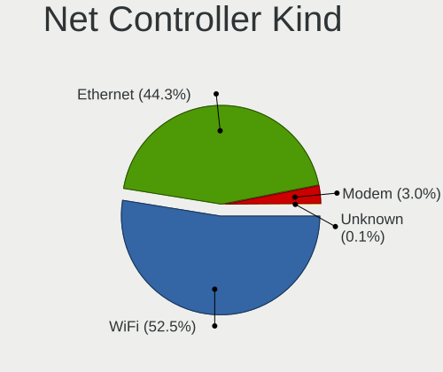

| Kind     | Notebooks | Percent |
|----------|-----------|---------|
| WiFi     | 1177      | 52.54%  |
| Ethernet | 993       | 44.33%  |
| Modem    | 68        | 3.04%   |
| Unknown  | 2         | 0.09%   |

Used Controller
---------------

Currently used network controller

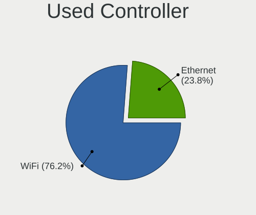

| Kind     | Notebooks | Percent |
|----------|-----------|---------|
| WiFi     | 967       | 76.2%   |
| Ethernet | 302       | 23.8%   |

NICs
----

Total network controllers on board

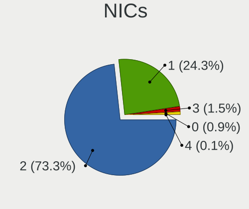

| Total | Notebooks | Percent |
|-------|-----------|---------|
| 2     | 894       | 73.28%  |
| 1     | 296       | 24.26%  |
| 3     | 18        | 1.48%   |
| 0     | 11        | 0.9%    |
| 4     | 1         | 0.08%   |

IPv6
----

IPv6 vs IPv4

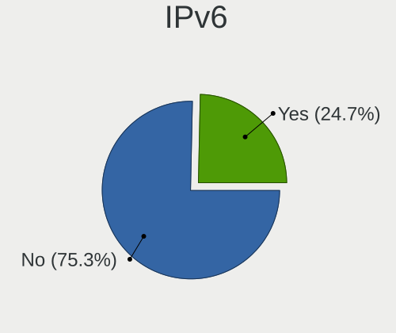

| Used | Notebooks | Percent |
|------|-----------|---------|
| No   | 941       | 75.34%  |
| Yes  | 308       | 24.66%  |

Bluetooth
---------

Bluetooth Vendor
----------------

Controller vendors

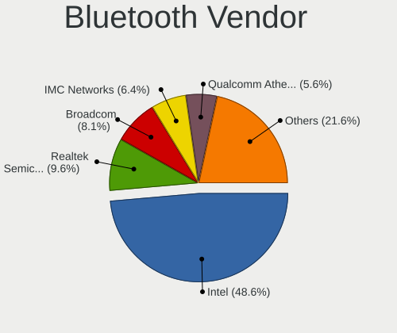

| Vendor                          | Notebooks | Percent |
|---------------------------------|-----------|---------|
| Intel                           | 492       | 48.62%  |
| Realtek Semiconductor           | 97        | 9.58%   |
| Broadcom                        | 82        | 8.1%    |
| IMC Networks                    | 65        | 6.42%   |
| Qualcomm Atheros Communications | 57        | 5.63%   |
| Foxconn / Hon Hai               | 49        | 4.84%   |
| Apple                           | 33        | 3.26%   |
| Lite-On Technology              | 26        | 2.57%   |
| Hewlett-Packard                 | 25        | 2.47%   |
| Dell                            | 17        | 1.68%   |
| Cambridge Silicon Radio         | 14        | 1.38%   |
| Ralink                          | 13        | 1.28%   |
| Askey Computer                  | 10        | 0.99%   |
| USI                             | 6         | 0.59%   |
| MediaTek                        | 5         | 0.49%   |
| Foxconn International           | 5         | 0.49%   |
| ASUSTek Computer                | 4         | 0.4%    |
| Toshiba                         | 3         | 0.3%    |
| Realtek                         | 3         | 0.3%    |
| Fujitsu                         | 2         | 0.2%    |
| Chicony Electronics             | 2         | 0.2%    |
| Taiyo Yuden                     | 1         | 0.1%    |
| Alps Electric                   | 1         | 0.1%    |

Bluetooth Model
---------------

Controller models

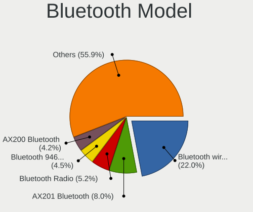

| Model                                               | Notebooks | Percent |
|-----------------------------------------------------|-----------|---------|
| Intel Bluetooth wireless interface                  | 223       | 22.04%  |
| Intel AX201 Bluetooth                               | 81        | 8%      |
| Realtek Bluetooth Radio                             | 53        | 5.24%   |
| Intel Bluetooth 9460/9560 Jefferson Peak (JfP)      | 46        | 4.55%   |
| Intel AX200 Bluetooth                               | 43        | 4.25%   |
| Intel Bluetooth Device                              | 35        | 3.46%   |
| Intel Centrino Bluetooth Wireless Transceiver       | 25        | 2.47%   |
| Realtek  Bluetooth 4.2 Adapter                      | 23        | 2.27%   |
| Broadcom BCM2045B (BDC-2.1)                         | 22        | 2.17%   |
| IMC Networks Bluetooth Radio                        | 21        | 2.08%   |
| Qualcomm Atheros  Bluetooth Device                  | 20        | 1.98%   |
| IMC Networks Wireless_Device                        | 20        | 1.98%   |
| Apple Bluetooth Host Controller                     | 18        | 1.78%   |
| Foxconn / Hon Hai Bluetooth Device                  | 16        | 1.58%   |
| HP Broadcom 2070 Bluetooth Combo                    | 15        | 1.48%   |
| Qualcomm Atheros AR3011 Bluetooth                   | 14        | 1.38%   |
| Intel Wireless-AC 9260 Bluetooth Adapter            | 14        | 1.38%   |
| Cambridge Silicon Radio Bluetooth Dongle (HCI mode) | 14        | 1.38%   |
| Broadcom BCM20702 Bluetooth 4.0 [ThinkPad]          | 14        | 1.38%   |
| Ralink RT3290 Bluetooth                             | 13        | 1.28%   |
| Qualcomm Atheros QCA61x4 Bluetooth 4.0              | 12        | 1.19%   |
| Realtek RTL8723B Bluetooth                          | 11        | 1.09%   |
| IMC Networks Bluetooth Device                       | 11        | 1.09%   |
| Intel Wireless-AC 3168 Bluetooth                    | 10        | 0.99%   |
| HP Bluetooth 2.0 Interface [Broadcom BCM2045]       | 10        | 0.99%   |
| Foxconn / Hon Hai Wireless_Device                   | 10        | 0.99%   |
| Askey Bluetooth Device                              | 10        | 0.99%   |
| Apple Bluetooth USB Host Controller                 | 10        | 0.99%   |
| Lite-On Bluetooth Device                            | 9         | 0.89%   |
| Foxconn / Hon Hai MediaTek Bluetooth Adapter        | 9         | 0.89%   |
| Broadcom HP Portable Bumble Bee                     | 9         | 0.89%   |
| Qualcomm Atheros AR3012 Bluetooth 4.0               | 8         | 0.79%   |
| IMC Networks Atheros AR3012 Bluetooth 4.0 Adapter   | 8         | 0.79%   |
| Lite-On Qualcomm Atheros QCA9377 Bluetooth          | 7         | 0.69%   |
| Intel Centrino Advanced-N 6230 Bluetooth adapter    | 7         | 0.69%   |
| Intel AX210 Bluetooth                               | 7         | 0.69%   |
| Dell BCM20702A0 Bluetooth Module                    | 7         | 0.69%   |
| Broadcom BCM2045B (BDC-2.1) [Bluetooth Controller]  | 7         | 0.69%   |
| USI Bluetooth Device                                | 6         | 0.59%   |
| Broadcom HP Portable SoftSailing                    | 6         | 0.59%   |

Sound
-----

Sound Vendor
------------

Sound card vendors

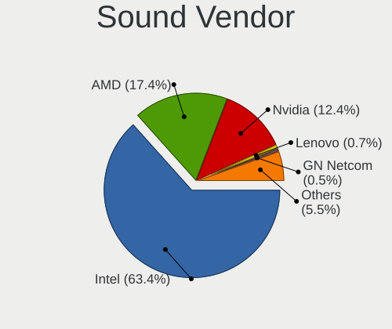

| Vendor                           | Notebooks | Percent |
|----------------------------------|-----------|---------|
| Intel                            | 938       | 63.38%  |
| AMD                              | 258       | 17.43%  |
| Nvidia                           | 184       | 12.43%  |
| Lenovo                           | 11        | 0.74%   |
| GN Netcom                        | 8         | 0.54%   |
| Realtek Semiconductor            | 7         | 0.47%   |
| Logitech                         | 7         | 0.47%   |
| Hewlett-Packard                  | 5         | 0.34%   |
| C-Media Electronics              | 5         | 0.34%   |
| Silicon Integrated Systems [SiS] | 4         | 0.27%   |
| Plantronics                      | 3         | 0.2%    |
| Kingston Technology              | 3         | 0.2%    |
| Focusrite-Novation               | 3         | 0.2%    |
| Conexant Systems                 | 3         | 0.2%    |
| VIA Technologies                 | 2         | 0.14%   |
| Turtle Beach                     | 2         | 0.14%   |
| Texas Instruments                | 2         | 0.14%   |
| RODE Microphones                 | 2         | 0.14%   |
| Microsoft                        | 2         | 0.14%   |
| DSEA A/S                         | 2         | 0.14%   |
| Creative Technology              | 2         | 0.14%   |
| ASUSTek Computer                 | 2         | 0.14%   |
| Apple                            | 2         | 0.14%   |
| ZOOM                             | 1         | 0.07%   |
| Yamaha                           | 1         | 0.07%   |
| SteelSeries ApS                  | 1         | 0.07%   |
| Sony                             | 1         | 0.07%   |
| ROCCAT                           | 1         | 0.07%   |
| Razer USA                        | 1         | 0.07%   |
| OnePlus Technology (Shenzhen)    | 1         | 0.07%   |
| Numark                           | 1         | 0.07%   |
| No brand                         | 1         | 0.07%   |
| Native Instruments               | 1         | 0.07%   |
| Micro Star International         | 1         | 0.07%   |
| JBL                              | 1         | 0.07%   |
| Huawei Technologies              | 1         | 0.07%   |
| GYROCOM C&C                      | 1         | 0.07%   |
| Generalplus Technology           | 1         | 0.07%   |
| FiiO Electronics Technology      | 1         | 0.07%   |
| DigiTech                         | 1         | 0.07%   |

Sound Model
-----------

Sound card models

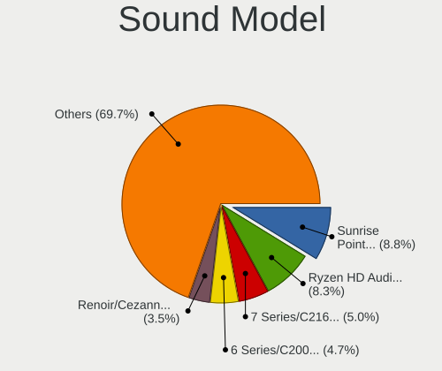

| Model                                                                                             | Notebooks | Percent |
|---------------------------------------------------------------------------------------------------|-----------|---------|
| Intel Sunrise Point-LP HD Audio                                                                   | 160       | 8.78%   |
| AMD Ryzen HD Audio Controller                                                                     | 152       | 8.34%   |
| Intel 7 Series/C216 Chipset Family High Definition Audio Controller                               | 91        | 4.99%   |
| Intel 6 Series/C200 Series Chipset Family High Definition Audio Controller                        | 85        | 4.67%   |
| AMD Renoir/Cezanne HDMI/DP Audio Controller                                                       | 64        | 3.51%   |
| Intel Haswell-ULT HD Audio Controller                                                             | 60        | 3.29%   |
| Intel 8 Series HD Audio Controller                                                                | 60        | 3.29%   |
| AMD FCH Azalia Controller                                                                         | 51        | 2.8%    |
| Intel Cannon Point-LP High Definition Audio Controller                                            | 50        | 2.74%   |
| Intel 82801I (ICH9 Family) HD Audio Controller                                                    | 49        | 2.69%   |
| Intel 8 Series/C220 Series Chipset High Definition Audio Controller                               | 44        | 2.41%   |
| Intel 5 Series/3400 Series Chipset High Definition Audio                                          | 43        | 2.36%   |
| AMD Raven/Raven2/Fenghuang HDMI/DP Audio Controller                                               | 39        | 2.14%   |
| Intel Wildcat Point-LP High Definition Audio Controller                                           | 37        | 2.03%   |
| Intel Broadwell-U Audio Controller                                                                | 37        | 2.03%   |
| Intel Xeon E3-1200 v3/4th Gen Core Processor HD Audio Controller                                  | 36        | 1.98%   |
| AMD Radeon High Definition Audio Controller                                                       | 35        | 1.92%   |
| Intel Tiger Lake-LP Smart Sound Technology Audio Controller                                       | 34        | 1.87%   |
| AMD Kabini HDMI/DP Audio                                                                          | 30        | 1.65%   |
| Intel Cannon Lake PCH cAVS                                                                        | 29        | 1.59%   |
| Intel 82801H (ICH8 Family) HD Audio Controller                                                    | 27        | 1.48%   |
| Intel Comet Lake PCH-LP cAVS                                                                      | 23        | 1.26%   |
| Intel CM238 HD Audio Controller                                                                   | 22        | 1.21%   |
| Intel Alder Lake PCH-P High Definition Audio Controller                                           | 21        | 1.15%   |
| Nvidia TU107 GeForce GTX 1650 High Definition Audio Controller                                    | 20        | 1.1%    |
| Intel NM10/ICH7 Family High Definition Audio Controller                                           | 17        | 0.93%   |
| Intel 100 Series/C230 Series Chipset Family HD Audio Controller                                   | 17        | 0.93%   |
| Nvidia GF108 High Definition Audio Controller                                                     | 16        | 0.88%   |
| Intel Comet Lake PCH cAVS                                                                         | 16        | 0.88%   |
| Intel Atom/Celeron/Pentium Processor x5-E8000/J3xxx/N3xxx Series High Definition Audio Controller | 16        | 0.88%   |
| AMD SBx00 Azalia (Intel HDA)                                                                      | 15        | 0.82%   |
| AMD Family 15h (Models 60h-6fh) Audio Controller                                                  | 14        | 0.77%   |
| Intel Atom Processor Z36xxx/Z37xxx Series High Definition Audio Controller                        | 13        | 0.71%   |
| Intel Tiger Lake-H HD Audio Controller                                                            | 12        | 0.66%   |
| Intel Celeron N3350/Pentium N4200/Atom E3900 Series Audio Cluster                                 | 12        | 0.66%   |
| AMD Trinity HDMI Audio Controller                                                                 | 12        | 0.66%   |
| Nvidia GP107GL High Definition Audio Controller                                                   | 11        | 0.6%    |
| Nvidia AD107 High Definition Audio Controller                                                     | 11        | 0.6%    |
| Intel Celeron/Pentium Silver Processor High Definition Audio                                      | 11        | 0.6%    |
| Nvidia GA104 High Definition Audio Controller                                                     | 10        | 0.55%   |

Memory
------

Memory Vendor
-------------

Memory module vendors

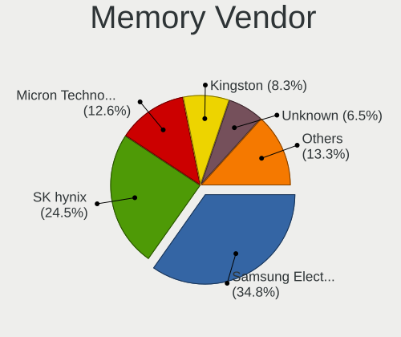

| Vendor              | Notebooks | Percent |
|---------------------|-----------|---------|
| Samsung Electronics | 288       | 34.78%  |
| SK hynix            | 203       | 24.52%  |
| Micron Technology   | 104       | 12.56%  |
| Kingston            | 69        | 8.33%   |
| Unknown             | 54        | 6.52%   |
| Elpida              | 24        | 2.9%    |
| Ramaxel Technology  | 15        | 1.81%   |
| Crucial             | 14        | 1.69%   |
| A-DATA Technology   | 13        | 1.57%   |
| Corsair             | 10        | 1.21%   |
| Nanya Technology    | 8         | 0.97%   |
| Unknown             | 7         | 0.85%   |
| G.Skill             | 3         | 0.36%   |
| Qimonda             | 2         | 0.24%   |
| ChangXin Memory     | 2         | 0.24%   |
| Apacer              | 2         | 0.24%   |
| Wodposit            | 1         | 0.12%   |
| Unknown (ABCD)      | 1         | 0.12%   |
| Unknown (0E97)      | 1         | 0.12%   |
| Toshiba             | 1         | 0.12%   |
| PUSKILL             | 1         | 0.12%   |
| pqi                 | 1         | 0.12%   |
| Lexar Co Limited    | 1         | 0.12%   |
| GSkill              | 1         | 0.12%   |
| 4ea5                | 1         | 0.12%   |
| 48spaces            | 1         | 0.12%   |

Memory Model
------------

Memory module models

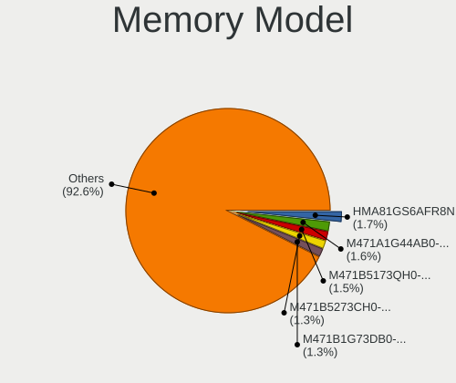

| Model                                                       | Notebooks | Percent |
|-------------------------------------------------------------|-----------|---------|
| SK hynix RAM HMA81GS6AFR8N-UH 8GB SODIMM DDR4 2667MT/s      | 15        | 1.69%   |
| Samsung RAM M471A1G44AB0-CWE 8GiB SODIMM DDR4 3200MT/s      | 14        | 1.57%   |
| Samsung RAM M471B5173QH0-YK0 4GB SODIMM DDR3 1600MT/s       | 13        | 1.46%   |
| Samsung RAM M471B5273CH0-CH9 4GB SODIMM DDR3 1334MT/s       | 12        | 1.35%   |
| Samsung RAM M471B1G73DB0-YK0 8GB SODIMM DDR3 1600MT/s       | 12        | 1.35%   |
| SK hynix RAM HMT41GS6BFR8A-PB 8GB SODIMM DDR3 2667MT/s      | 11        | 1.24%   |
| Samsung RAM M471B1G73QH0-YK0 8GB SODIMM DDR3 1600MT/s       | 11        | 1.24%   |
| Samsung RAM M471B5273DH0-CH9 4GB SODIMM DDR3 1600MT/s       | 10        | 1.12%   |
| Samsung RAM M471A1K43DB1-CWE 8GB SODIMM DDR4 3200MT/s       | 9         | 1.01%   |
| SK hynix RAM HMT451S6BFR8A-PB 4GB SODIMM DDR3 1600MT/s      | 8         | 0.9%    |
| Samsung RAM M471B1G73EB0-YK0 8192MB SODIMM DDR3 1600MT/s    | 8         | 0.9%    |
| Samsung RAM M471A1K43CB1-CRC 8GB SODIMM DDR4 8400MT/s       | 8         | 0.9%    |
| SK hynix RAM Module 4GB SODIMM DDR3 1600MT/s                | 7         | 0.79%   |
| Samsung RAM Module 8GB SODIMM DDR4 2133MT/s                 | 7         | 0.79%   |
| Samsung RAM M471A5244CB0-CTD 4GB SODIMM DDR4 3266MT/s       | 7         | 0.79%   |
| Unknown                                                     | 7         | 0.79%   |
| Unknown RAM Module 2GB SODIMM DDR2 667MT/s                  | 6         | 0.67%   |
| SK hynix RAM HMT351S6EFR8C-PB 4GB SODIMM DDR3 1600MT/s      | 6         | 0.67%   |
| Samsung RAM M471B5273DH0-CK0 4GB SODIMM DDR3 2400MT/s       | 6         | 0.67%   |
| Samsung RAM M471A2G44AM0-CWE 16GB SODIMM DDR4 3200MT/s      | 6         | 0.67%   |
| Samsung RAM M471A1K43BB1-CTD 8GB SODIMM DDR4 2667MT/s       | 6         | 0.67%   |
| Samsung RAM M471A1G44BB0-CWE 8GB SODIMM DDR4 3200MT/s       | 6         | 0.67%   |
| Unknown RAM Module 1024MB SODIMM DDR2                       | 5         | 0.56%   |
| SK hynix RAM Module 8GB SODIMM DDR4 2133MT/s                | 5         | 0.56%   |
| SK hynix RAM HMT451S6AFR8A-PB 4GB SODIMM DDR3 1600MT/s      | 5         | 0.56%   |
| SK hynix RAM HMT41GS6AFR8A-PB 8GiB SODIMM DDR3 2667MT/s     | 5         | 0.56%   |
| SK hynix RAM HMT351S6BFR8C-H9 4GB SODIMM DDR3 1333MT/s      | 5         | 0.56%   |
| SK hynix RAM HMA81GS6DJR8N-XN 8GB SODIMM DDR4 3200MT/s      | 5         | 0.56%   |
| Samsung RAM M471B5673FH0-CH9 2048MB SODIMM DDR3 1600MT/s    | 5         | 0.56%   |
| Samsung RAM M471B5173DB0-YK0 4GB SODIMM DDR3 1600MT/s       | 5         | 0.56%   |
| Samsung RAM M471A2K43CB1-CRC 16GB SODIMM DDR4 2667MT/s      | 5         | 0.56%   |
| Micron RAM MT62F2G32D4DS-026 WT 8GiB SODIMM LPDDR5 7500MT/s | 5         | 0.56%   |
| Micron RAM 8ATF1G64HZ-2G6E1 8GB SODIMM DDR4 2667MT/s        | 5         | 0.56%   |
| Micron RAM 4ATF1G64HZ-3G2E1 8GB SODIMM DDR4 3200MT/s        | 5         | 0.56%   |
| Unknown RAM Module 2GB SODIMM DDR2                          | 4         | 0.45%   |
| SK hynix RAM Module 16GB SODIMM DDR4 2667MT/s               | 4         | 0.45%   |
| SK hynix RAM HMT41GS6AFR8A-PB 8GB SODIMM DDR3 1600MT/s      | 4         | 0.45%   |
| SK hynix RAM HMT351S6CFR8C-H9 4GB SODIMM DDR3 1333MT/s      | 4         | 0.45%   |
| SK hynix RAM HMAA2GS6CJR8N-XN 16GB SODIMM DDR4 3200MT/s     | 4         | 0.45%   |
| SK hynix RAM HMA82GS6CJR8N-VK 16GB SODIMM DDR4 2667MT/s     | 4         | 0.45%   |

Memory Kind
-----------

Memory module kinds

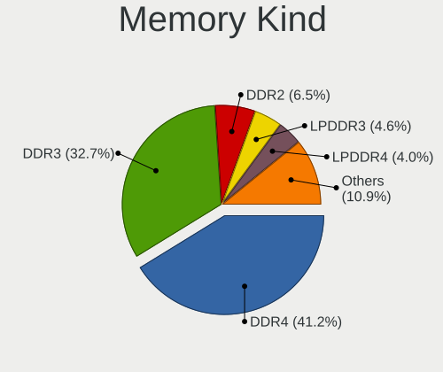

| Kind    | Notebooks | Percent |
|---------|-----------|---------|
| DDR4    | 296       | 41.23%  |
| DDR3    | 235       | 32.73%  |
| DDR2    | 47        | 6.55%   |
| LPDDR3  | 33        | 4.6%    |
| LPDDR4  | 29        | 4.04%   |
| DDR5    | 25        | 3.48%   |
| LPDDR5  | 22        | 3.06%   |
| SDRAM   | 20        | 2.79%   |
| Unknown | 5         | 0.7%    |
| DRAM    | 3         | 0.42%   |
| DDR     | 3         | 0.42%   |

Memory Form Factor
------------------

Physical design of the memory module

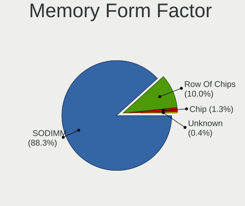

| Name         | Notebooks | Percent |
|--------------|-----------|---------|
| SODIMM       | 634       | 88.3%   |
| Row Of Chips | 72        | 10.03%  |
| Chip         | 9         | 1.25%   |
| Unknown      | 3         | 0.42%   |

Memory Size
-----------

Memory module size

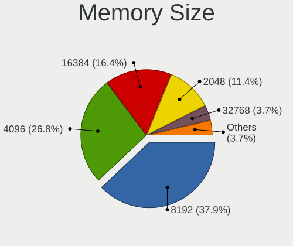

| Size  | Notebooks | Percent |
|-------|-----------|---------|
| 8192  | 296       | 37.95%  |
| 4096  | 209       | 26.79%  |
| 16384 | 128       | 16.41%  |
| 2048  | 89        | 11.41%  |
| 32768 | 29        | 3.72%   |
| 1024  | 26        | 3.33%   |
| 256   | 2         | 0.26%   |
| 512   | 1         | 0.13%   |

Memory Speed
------------

Memory module speed

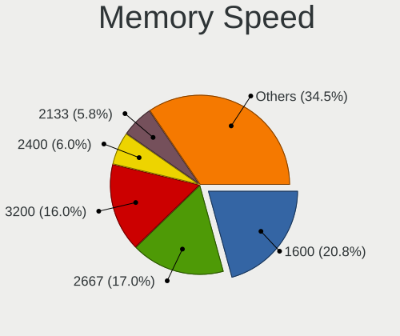

| Speed   | Notebooks | Percent |
|---------|-----------|---------|
| 1600    | 160       | 20.75%  |
| 2667    | 131       | 16.99%  |
| 3200    | 123       | 15.95%  |
| 2400    | 46        | 5.97%   |
| 2133    | 45        | 5.84%   |
| 1334    | 33        | 4.28%   |
| 667     | 29        | 3.76%   |
| 1333    | 22        | 2.85%   |
| Unknown | 18        | 2.33%   |
| 5600    | 16        | 2.08%   |
| 4267    | 15        | 1.95%   |
| 1867    | 15        | 1.95%   |
| 1067    | 13        | 1.69%   |
| 8400    | 12        | 1.56%   |
| 4800    | 12        | 1.56%   |
| 800     | 12        | 1.56%   |
| 7500    | 11        | 1.43%   |
| 2048    | 8         | 1.04%   |
| 4199    | 7         | 0.91%   |
| 3266    | 7         | 0.91%   |
| 6400    | 5         | 0.65%   |
| 4266    | 4         | 0.52%   |
| 3733    | 4         | 0.52%   |
| 1639    | 4         | 0.52%   |
| 1066    | 4         | 0.52%   |
| 975     | 4         | 0.52%   |
| 8533    | 3         | 0.39%   |
| 7467    | 3         | 0.39%   |
| 2933    | 2         | 0.26%   |
| 533     | 2         | 0.26%   |
| 333     | 1         | 0.13%   |

Printers & scanners
-------------------

Printer Vendor
--------------

Printer device vendors

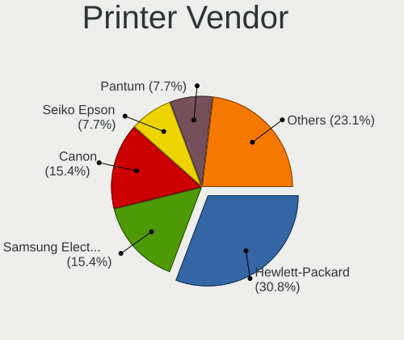

| Vendor                | Notebooks | Percent |
|-----------------------|-----------|---------|
| Hewlett-Packard       | 4         | 30.77%  |
| Samsung Electronics   | 2         | 15.38%  |
| Canon                 | 2         | 15.38%  |
| Seiko Epson           | 1         | 7.69%   |
| Pantum                | 1         | 7.69%   |
| Lexmark International | 1         | 7.69%   |
| Dell                  | 1         | 7.69%   |
| Brother Industries    | 1         | 7.69%   |

Printer Model
-------------

Printer device models

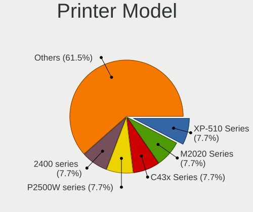

| Model                             | Notebooks | Percent |
|-----------------------------------|-----------|---------|
| Seiko Epson XP-510 Series         | 1         | 7.69%   |
| Samsung M2020 Series              | 1         | 7.69%   |
| Samsung C43x Series               | 1         | 7.69%   |
| Pantum P2500W series              | 1         | 7.69%   |
| Lexmark International 2400 series | 1         | 7.69%   |
| HP OfficeJet Pro 6970             | 1         | 7.69%   |
| HP LaserJet P2055 series          | 1         | 7.69%   |
| HP LaserJet 1018                  | 1         | 7.69%   |
| HP DeskJet 2130 series            | 1         | 7.69%   |
| Dell Laser Printer 1720           | 1         | 7.69%   |
| Canon PIXMA MG3100 Series         | 1         | 7.69%   |
| Canon LBP6000                     | 1         | 7.69%   |
| Brother DCP-7055 scanner/printer  | 1         | 7.69%   |

Scanner Vendor
--------------

Scanner device vendors

Zero info for selected period =(

Scanner Model
-------------

Scanner device models

Zero info for selected period =(

Camera
------

Camera Vendor
-------------

Camera device vendors

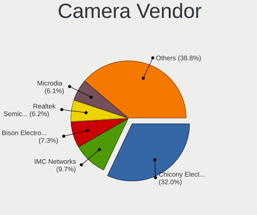

| Vendor                                 | Notebooks | Percent |
|----------------------------------------|-----------|---------|
| Chicony Electronics                    | 338       | 32.04%  |
| IMC Networks                           | 102       | 9.67%   |
| Bison Electronics                      | 77        | 7.3%    |
| Realtek Semiconductor                  | 65        | 6.16%   |
| Microdia                               | 64        | 6.07%   |
| Cheng Uei Precision Industry (Foxlink) | 64        | 6.07%   |
| Quanta                                 | 50        | 4.74%   |
| Sunplus Innovation Technology          | 40        | 3.79%   |
| Suyin                                  | 32        | 3.03%   |
| Lite-On Technology                     | 29        | 2.75%   |
| Syntek                                 | 24        | 2.27%   |
| Apple                                  | 24        | 2.27%   |
| Luxvisions Innotech Limited            | 21        | 1.99%   |
| Logitech                               | 20        | 1.9%    |
| Lenovo                                 | 15        | 1.42%   |
| Sonix Technology                       | 12        | 1.14%   |
| Silicon Motion                         | 12        | 1.14%   |
| ShineTech                              | 8         | 0.76%   |
| Acer                                   | 8         | 0.76%   |
| Primax Electronics                     | 7         | 0.66%   |
| Alcor Micro                            | 7         | 0.66%   |
| Z-Star Microelectronics                | 5         | 0.47%   |
| Samsung Electronics                    | 5         | 0.47%   |
| Ricoh                                  | 4         | 0.38%   |
| ALi                                    | 4         | 0.38%   |
| DigiTech                               | 3         | 0.28%   |
| Microsoft                              | 2         | 0.19%   |
| Importek                               | 2         | 0.19%   |
| Framework                              | 2         | 0.19%   |
| SunplusIT                              | 1         | 0.09%   |
| STEREOLABS                             | 1         | 0.09%   |
| ShineOptics                            | 1         | 0.09%   |
| Shine-optics                           | 1         | 0.09%   |
| OPPO Electronics                       | 1         | 0.09%   |
| Omnivision                             | 1         | 0.09%   |
| LG Electronics                         | 1         | 0.09%   |
| kingcome                               | 1         | 0.09%   |
| Anker PowerConf C200                   | 1         | 0.09%   |

Camera Model
------------

Camera device models

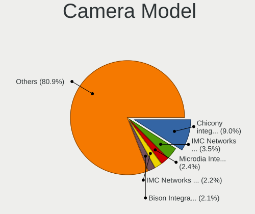

| Model                                               | Notebooks | Percent |
|-----------------------------------------------------|-----------|---------|
| Chicony integrated camera                           | 96        | 9.03%   |
| IMC Networks Integrated Camera                      | 37        | 3.48%   |
| Microdia Integrated_Webcam_HD                       | 25        | 2.35%   |
| IMC Networks USB2.0 HD UVC WebCam                   | 23        | 2.16%   |
| Bison Integrated Camera                             | 22        | 2.07%   |
| Chicony HP HD Camera                                | 21        | 1.98%   |
| Chicony FJ Camera                                   | 21        | 1.98%   |
| Chicony HD WebCam                                   | 18        | 1.69%   |
| Chicony HP HD Webcam                                | 17        | 1.6%    |
| Realtek Integrated_Webcam_HD                        | 15        | 1.41%   |
| IMC Networks USB2.0 VGA UVC WebCam                  | 13        | 1.22%   |
| Cheng Uei Precision Industry (Foxlink) HP HD Camera | 13        | 1.22%   |
| Bison Lenovo EasyCamera                             | 13        | 1.22%   |
| Syntek Integrated Camera                            | 12        | 1.13%   |
| Luxvisions Innotech Limited Integrated Camera       | 11        | 1.03%   |
| Chicony Integrated Camera (1280x720@30)             | 10        | 0.94%   |
| Bison SunplusIT Integrated Camera                   | 10        | 0.94%   |
| Sonix USB2.0 HD UVC WebCam                          | 9         | 0.85%   |
| Lite-On Integrated Camera                           | 9         | 0.85%   |
| Lite-On HP HD Camera                                | 9         | 0.85%   |
| Chicony USB2.0 VGA UVC WebCam                       | 9         | 0.85%   |
| Chicony USB2.0 HD UVC WebCam                        | 9         | 0.85%   |
| Chicony Lenovo Integrated Camera (0.3MP)            | 9         | 0.85%   |
| Suyin Acer/HP Integrated Webcam [CN0314]            | 8         | 0.75%   |
| Sunplus Integrated_Webcam_HD                        | 8         | 0.75%   |
| Sunplus HD WebCam                                   | 8         | 0.75%   |
| Realtek USB2.0 HD UVC WebCam                        | 8         | 0.75%   |
| Realtek USB Camera                                  | 8         | 0.75%   |
| Quanta HP HD Camera                                 | 8         | 0.75%   |
| Quanta HD User Facing                               | 8         | 0.75%   |
| Chicony ThinkPad T490 Webcam                        | 8         | 0.75%   |
| Chicony HP TrueVision HD Camera                     | 8         | 0.75%   |
| Cheng Uei Precision Industry (Foxlink) HP Webcam    | 8         | 0.75%   |
| Apple FaceTime HD Camera                            | 8         | 0.75%   |
| Primax HP HD Webcam [Fixed]                         | 7         | 0.66%   |
| Microdia Integrated Webcam                          | 7         | 0.66%   |
| Lite-On HP HD Webcam                                | 7         | 0.66%   |
| Lenovo Integrated Webcam [R5U877]                   | 7         | 0.66%   |
| Chicony Integrated HP HD Webcam                     | 7         | 0.66%   |
| Chicony Integrated Camera [ThinkPad]                | 7         | 0.66%   |

Security
--------

Fingerprint Vendor
------------------

Fingerprint sensor vendors

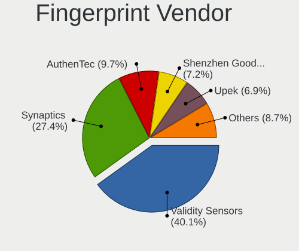

| Vendor                     | Notebooks | Percent |
|----------------------------|-----------|---------|
| Validity Sensors           | 111       | 40.07%  |
| Synaptics                  | 76        | 27.44%  |
| AuthenTec                  | 27        | 9.75%   |
| Shenzhen Goodix Technology | 20        | 7.22%   |
| Upek                       | 19        | 6.86%   |
| STMicroelectronics         | 9         | 3.25%   |
| LighTuning Technology      | 7         | 2.53%   |
| Elan Microelectronics      | 7         | 2.53%   |
| Focal-systems.Corp         | 1         | 0.36%   |

Fingerprint Model
-----------------

Fingerprint sensor models

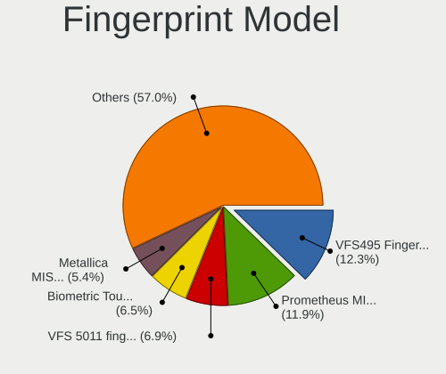

| Model                                                                      | Notebooks | Percent |
|----------------------------------------------------------------------------|-----------|---------|
| Validity Sensors VFS495 Fingerprint Reader                                 | 34        | 12.27%  |
| Synaptics Prometheus MIS Touch Fingerprint Reader                          | 33        | 11.91%  |
| Validity Sensors VFS 5011 fingerprint sensor                               | 19        | 6.86%   |
| Upek Biometric Touchchip/Touchstrip Fingerprint Sensor                     | 18        | 6.5%    |
| Synaptics Metallica MIS Touch Fingerprint Reader                           | 15        | 5.42%   |
| AuthenTec AES2810                                                          | 14        | 5.05%   |
| Shenzhen Goodix  Fingerprint Device                                        | 11        | 3.97%   |
| Validity Sensors VFS5011 Fingerprint Reader                                | 10        | 3.61%   |
| Validity Sensors VFS471 Fingerprint Reader                                 | 10        | 3.61%   |
| Validity Sensors Synaptics VFS7552 Touch Fingerprint Sensor with PurePrint | 9         | 3.25%   |
| Synaptics Fingerprint reader [HP G6]                                       | 9         | 3.25%   |
| STMicroelectronics Fingerprint Reader                                      | 9         | 3.25%   |
| Validity Sensors VFS7500 Touch Fingerprint Sensor                          | 8         | 2.89%   |
| Validity Sensors Synaptics WBDI                                            | 7         | 2.53%   |
| Synaptics Prometheus Fingerprint Reader                                    | 6         | 2.17%   |
| Shenzhen Goodix FingerPrint                                                | 6         | 2.17%   |
| LighTuning EgisTec Touch Fingerprint Sensor                                | 6         | 2.17%   |
| AuthenTec Fingerprint Sensor                                               | 6         | 2.17%   |
| Validity Sensors VFS491                                                    | 5         | 1.81%   |
| Synaptics UWP WBDI Device                                                  | 5         | 1.81%   |
| Elan ELAN:Fingerprint                                                      | 5         | 1.81%   |
| Validity Sensors Swipe Fingerprint Sensor                                  | 3         | 1.08%   |
| Synaptics  FS7604 Touch Fingerprint Sensor with PurePrint                  | 3         | 1.08%   |
| Synaptics Metallica MOH Touch Fingerprint Reader                           | 3         | 1.08%   |
| Shenzhen Goodix Fingerprint Reader                                         | 3         | 1.08%   |
| AuthenTec AES2550 Fingerprint Sensor                                       | 3         | 1.08%   |
| AuthenTec AES2501 Fingerprint Sensor                                       | 3         | 1.08%   |
| Validity Sensors VFS451 Fingerprint Reader                                 | 2         | 0.72%   |
| Elan ELAN:ARM-M4                                                           | 2         | 0.72%   |
| Validity Sensors VFS301 Fingerprint Reader                                 | 1         | 0.36%   |
| Validity Sensors VFS101 Fingerprint Reader                                 | 1         | 0.36%   |
| Validity Sensors Synaptics VFS7552 Touch Fingerprint Sensor                | 1         | 0.36%   |
| Validity Sensors Fingerprint scanner                                       | 1         | 0.36%   |
| Upek TCS5B Fingerprint sensor                                              | 1         | 0.36%   |
| Synaptics WBDI Fingerprint Reader USB 086                                  | 1         | 0.36%   |
| Synaptics  WBDI                                                            | 1         | 0.36%   |
| LighTuning Fingerprint Reader                                              | 1         | 0.36%   |
| Focal-systems.Corp FT9201Fingerprint.                                      | 1         | 0.36%   |
| AuthenTec AES1600                                                          | 1         | 0.36%   |

Chipcard Vendor
---------------

Chipcard module vendors

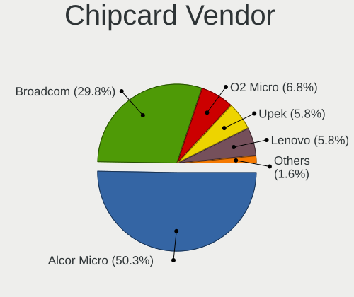

| Vendor           | Notebooks | Percent |
|------------------|-----------|---------|
| Alcor Micro      | 96        | 50.26%  |
| Broadcom         | 57        | 29.84%  |
| O2 Micro         | 13        | 6.81%   |
| Upek             | 11        | 5.76%   |
| Lenovo           | 11        | 5.76%   |
| SCM Microsystems | 2         | 1.05%   |
| Yubico.com       | 1         | 0.52%   |

Chipcard Model
--------------

Chipcard module models

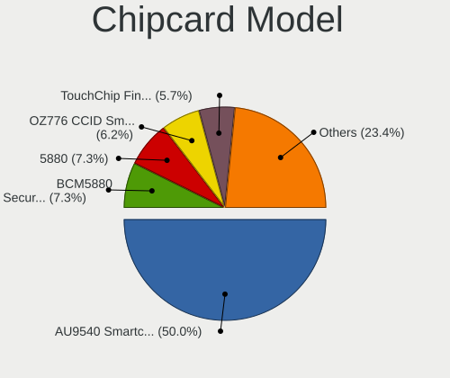

| Model                                                                        | Notebooks | Percent |
|------------------------------------------------------------------------------|-----------|---------|
| Alcor Micro AU9540 Smartcard Reader                                          | 96        | 50%     |
| Broadcom BCM5880 Secure Applications Processor with fingerprint swipe sensor | 14        | 7.29%   |
| Broadcom 5880                                                                | 14        | 7.29%   |
| O2 Micro OZ776 CCID Smartcard Reader                                         | 12        | 6.25%   |
| Upek TouchChip Fingerprint Coprocessor (WBF advanced mode)                   | 11        | 5.73%   |
| Lenovo Integrated Smart Card Reader                                          | 11        | 5.73%   |
| Broadcom BCM58200 ControlVault 3 (FingerPrint sensor + Contacted SmartCard)  | 10        | 5.21%   |
| Broadcom 58200                                                               | 10        | 5.21%   |
| Broadcom BCM5880 Secure Applications Processor                               | 9         | 4.69%   |
| Yubico.com Yubikey 4/5 U2F+CCID                                              | 1         | 0.52%   |
| SCM Microsystems SCR3340 - ExpressCard54 Smart Card Reader                   | 1         | 0.52%   |
| SCM Microsystems SCR331-LC1 / SCR3310 SmartCard Reader                       | 1         | 0.52%   |
| O2 Micro Oz776 SmartCard Reader                                              | 1         | 0.52%   |
| Broadcom BCM5880 Secure Applications Processor with fingerprint touch sensor | 1         | 0.52%   |

Unsupported
-----------

Unsupported Devices
-------------------

Total unsupported devices on board

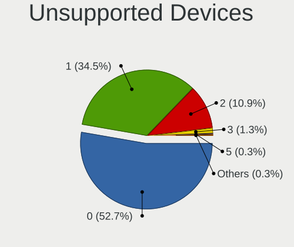

| Total | Notebooks | Percent |
|-------|-----------|---------|
| 0     | 656       | 52.73%  |
| 1     | 429       | 34.49%  |
| 2     | 135       | 10.85%  |
| 3     | 16        | 1.29%   |
| 5     | 4         | 0.32%   |
| 4     | 3         | 0.24%   |
| 6     | 1         | 0.08%   |

Unsupported Device Types
------------------------

Types of unsupported devices

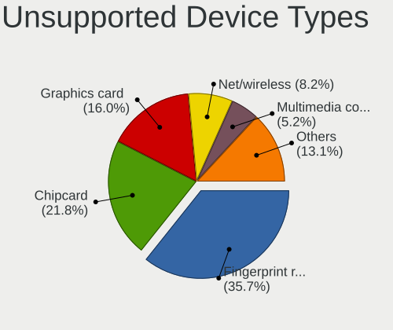

| Type                     | Notebooks | Percent |
|--------------------------|-----------|---------|
| Fingerprint reader       | 275       | 35.71%  |
| Chipcard                 | 168       | 21.82%  |
| Graphics card            | 123       | 15.97%  |
| Net/wireless             | 63        | 8.18%   |
| Multimedia controller    | 40        | 5.19%   |
| Bluetooth                | 21        | 2.73%   |
| Camera                   | 19        | 2.47%   |
| Storage                  | 12        | 1.56%   |
| Card reader              | 12        | 1.56%   |
| Communication controller | 10        | 1.3%    |
| Net/ethernet             | 9         | 1.17%   |
| Sound                    | 7         | 0.91%   |
| Modem                    | 4         | 0.52%   |
| Network                  | 2         | 0.26%   |
| Firewire controller      | 2         | 0.26%   |
| Storage/raid             | 1         | 0.13%   |
| Flash memory             | 1         | 0.13%   |
| Dvb card                 | 1         | 0.13%   |

