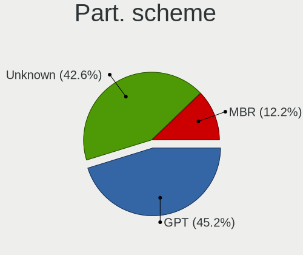
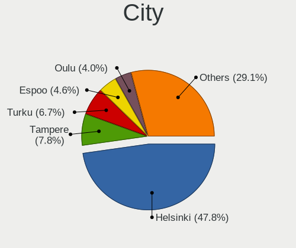
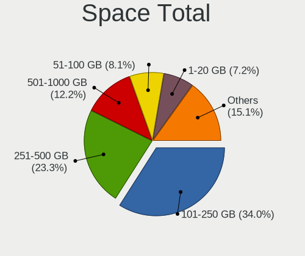
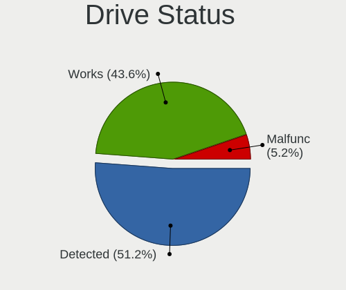
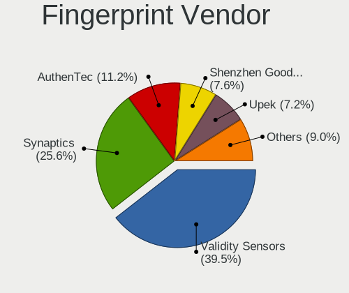

Linux in Finland - Tested Hardware & Statistics (Notebooks)
-----------------------------------------------------------

A project to collect tested hardware configurations for Linux in Finland.

Anyone can contribute to this report by the [hw-probe](https://github.com/linuxhw/hw-probe) tool:

    sudo -E hw-probe -all -upload

Please contribute! Especially if your hardware is rare.

Contents
--------

* [ Test Cases ](#test-cases)

* [ System ](#system)
  - [ OS                       ](#os)
  - [ OS Family                ](#os-family)
  - [ Kernel                   ](#kernel)
  - [ Kernel Family            ](#kernel-family)
  - [ Kernel Major Ver.        ](#kernel-major-ver)
  - [ Arch                     ](#arch)
  - [ DE                       ](#de)
  - [ Display Server           ](#display-server)
  - [ Display Manager          ](#display-manager)
  - [ OS Lang                  ](#os-lang)
  - [ Boot Mode                ](#boot-mode)
  - [ Filesystem               ](#filesystem)
  - [ Part. scheme             ](#part-scheme)
  - [ Dual Boot with Linux/BSD ](#dual-boot-with-linuxbsd)
  - [ Dual Boot (Win)          ](#dual-boot-win)

* [ Board ](#board)
  - [ Vendor                   ](#vendor)
  - [ Model                    ](#model)
  - [ Model Family             ](#model-family)
  - [ MFG Year                 ](#mfg-year)
  - [ Form Factor              ](#form-factor)
  - [ Secure Boot              ](#secure-boot)
  - [ Coreboot                 ](#coreboot)
  - [ RAM Size                 ](#ram-size)
  - [ RAM Used                 ](#ram-used)
  - [ Total Drives             ](#total-drives)
  - [ Has CD-ROM               ](#has-cd-rom)
  - [ Has Ethernet             ](#has-ethernet)
  - [ Has WiFi                 ](#has-wifi)
  - [ Has Bluetooth            ](#has-bluetooth)

* [ Location ](#location)
  - [ Country                  ](#country)
  - [ City                     ](#city)

* [ Drives ](#drives)
  - [ Drive Vendor             ](#drive-vendor)
  - [ Drive Model              ](#drive-model)
  - [ HDD Vendor               ](#hdd-vendor)
  - [ SSD Vendor               ](#ssd-vendor)
  - [ Drive Kind               ](#drive-kind)
  - [ Drive Connector          ](#drive-connector)
  - [ Drive Size               ](#drive-size)
  - [ Space Total              ](#space-total)
  - [ Space Used               ](#space-used)
  - [ Malfunc. Drives          ](#malfunc-drives)
  - [ Malfunc. Drive Vendor    ](#malfunc-drive-vendor)
  - [ Malfunc. HDD Vendor      ](#malfunc-hdd-vendor)
  - [ Malfunc. Drive Kind      ](#malfunc-drive-kind)
  - [ Failed Drives            ](#failed-drives)
  - [ Failed Drive Vendor      ](#failed-drive-vendor)
  - [ Drive Status             ](#drive-status)

* [ Storage controller ](#storage-controller)
  - [ Storage Vendor           ](#storage-vendor)
  - [ Storage Model            ](#storage-model)
  - [ Storage Kind             ](#storage-kind)

* [ Processor ](#processor)
  - [ CPU Vendor               ](#cpu-vendor)
  - [ CPU Model                ](#cpu-model)
  - [ CPU Model Family         ](#cpu-model-family)
  - [ CPU Cores                ](#cpu-cores)
  - [ CPU Sockets              ](#cpu-sockets)
  - [ CPU Threads              ](#cpu-threads)
  - [ CPU Op-Modes             ](#cpu-op-modes)
  - [ CPU Microcode            ](#cpu-microcode)
  - [ CPU Microarch            ](#cpu-microarch)

* [ Graphics ](#graphics)
  - [ GPU Vendor               ](#gpu-vendor)
  - [ GPU Model                ](#gpu-model)
  - [ GPU Combo                ](#gpu-combo)
  - [ GPU Driver               ](#gpu-driver)
  - [ GPU Memory               ](#gpu-memory)

* [ Monitor ](#monitor)
  - [ Monitor Vendor           ](#monitor-vendor)
  - [ Monitor Model            ](#monitor-model)
  - [ Monitor Resolution       ](#monitor-resolution)
  - [ Monitor Diagonal         ](#monitor-diagonal)
  - [ Monitor Width            ](#monitor-width)
  - [ Aspect Ratio             ](#aspect-ratio)
  - [ Monitor Area             ](#monitor-area)
  - [ Pixel Density            ](#pixel-density)
  - [ Multiple Monitors        ](#multiple-monitors)

* [ Network ](#network)
  - [ Net Controller Vendor    ](#net-controller-vendor)
  - [ Net Controller Model     ](#net-controller-model)
  - [ Wireless Vendor          ](#wireless-vendor)
  - [ Wireless Model           ](#wireless-model)
  - [ Ethernet Vendor          ](#ethernet-vendor)
  - [ Ethernet Model           ](#ethernet-model)
  - [ Net Controller Kind      ](#net-controller-kind)
  - [ Used Controller          ](#used-controller)
  - [ NICs                     ](#nics)
  - [ IPv6                     ](#ipv6)

* [ Bluetooth ](#bluetooth)
  - [ Bluetooth Vendor         ](#bluetooth-vendor)
  - [ Bluetooth Model          ](#bluetooth-model)

* [ Sound ](#sound)
  - [ Sound Vendor             ](#sound-vendor)
  - [ Sound Model              ](#sound-model)

* [ Memory ](#memory)
  - [ Memory Vendor            ](#memory-vendor)
  - [ Memory Model             ](#memory-model)
  - [ Memory Kind              ](#memory-kind)
  - [ Memory Form Factor       ](#memory-form-factor)
  - [ Memory Size              ](#memory-size)
  - [ Memory Speed             ](#memory-speed)

* [ Printers & scanners ](#printers--scanners)
  - [ Printer Vendor           ](#printer-vendor)
  - [ Printer Model            ](#printer-model)
  - [ Scanner Vendor           ](#scanner-vendor)
  - [ Scanner Model            ](#scanner-model)

* [ Camera ](#camera)
  - [ Camera Vendor            ](#camera-vendor)
  - [ Camera Model             ](#camera-model)

* [ Security ](#security)
  - [ Fingerprint Vendor       ](#fingerprint-vendor)
  - [ Fingerprint Model        ](#fingerprint-model)
  - [ Chipcard Vendor          ](#chipcard-vendor)
  - [ Chipcard Model           ](#chipcard-model)

* [ Unsupported ](#unsupported)
  - [ Unsupported Devices      ](#unsupported-devices)
  - [ Unsupported Device Types ](#unsupported-device-types)

Test Cases
----------

Total: 906

| Vendor        | Model                       | Probe                                                      | Date         |
|---------------|-----------------------------|------------------------------------------------------------|--------------|
| ASUSTek       | TUF Gaming FX504GE_FX80G... | [3fc59532b8](https://linux-hardware.org/?probe=3fc59532b8) | Feb 01, 2023 |
| Dell          | Precision 5560              | [c994bfa3a7](https://linux-hardware.org/?probe=c994bfa3a7) | Jan 30, 2023 |
| HP            | ZBook 15 G4                 | [3e957e185d](https://linux-hardware.org/?probe=3e957e185d) | Jan 28, 2023 |
| HP            | ZBook 15 G4                 | [849d901314](https://linux-hardware.org/?probe=849d901314) | Jan 28, 2023 |
| Lenovo        | IdeaPad 3 15ALC6 82KU       | [a4ded61661](https://linux-hardware.org/?probe=a4ded61661) | Jan 27, 2023 |
| Lenovo        | ThinkPad R500 2718WA3       | [2bb86279a8](https://linux-hardware.org/?probe=2bb86279a8) | Jan 27, 2023 |
| Lenovo        | ThinkPad T440p 20AN0079M... | [0065b33518](https://linux-hardware.org/?probe=0065b33518) | Jan 26, 2023 |
| Dell          | Inspiron 7577               | [4dded574d3](https://linux-hardware.org/?probe=4dded574d3) | Jan 25, 2023 |
| Fujitsu Si... | AMILO Notebook Xa 3530      | [e8384494a3](https://linux-hardware.org/?probe=e8384494a3) | Jan 25, 2023 |
| Lenovo        | ThinkPad T430s 2356GRG      | [cd81d567a2](https://linux-hardware.org/?probe=cd81d567a2) | Jan 24, 2023 |
| HP            | EliteBook 840 G1            | [08d8bb84c4](https://linux-hardware.org/?probe=08d8bb84c4) | Jan 24, 2023 |
| Packard Be... | EasyNote TE69KB             | [8363dc95c3](https://linux-hardware.org/?probe=8363dc95c3) | Jan 22, 2023 |
| HP            | Pavilion 17                 | [0ba46e91d2](https://linux-hardware.org/?probe=0ba46e91d2) | Jan 22, 2023 |
| ASUSTek       | GL753VE                     | [10796ad8f6](https://linux-hardware.org/?probe=10796ad8f6) | Jan 21, 2023 |
| Acer          | Predator G9-591             | [0544a1b07c](https://linux-hardware.org/?probe=0544a1b07c) | Jan 21, 2023 |
| Lenovo        | ThinkPad E470 20H1004SMX    | [0d8528f0d2](https://linux-hardware.org/?probe=0d8528f0d2) | Jan 19, 2023 |
| Valve         | Jupiter                     | [bd55cae677](https://linux-hardware.org/?probe=bd55cae677) | Jan 17, 2023 |
| Lenovo        | ThinkPad T490s 20NX001KM... | [e24691c830](https://linux-hardware.org/?probe=e24691c830) | Jan 15, 2023 |
| Dell          | Precision M4700             | [64bd9a7627](https://linux-hardware.org/?probe=64bd9a7627) | Jan 14, 2023 |
| ASUSTek       | N53SM                       | [fdf56c0639](https://linux-hardware.org/?probe=fdf56c0639) | Jan 13, 2023 |
| Acer          | Aspire 7730G                | [ba1e942da3](https://linux-hardware.org/?probe=ba1e942da3) | Jan 12, 2023 |
| TUXEDO        | Unknown                     | [ae60044fa6](https://linux-hardware.org/?probe=ae60044fa6) | Jan 12, 2023 |
| Lenovo        | IdeaPad 305-15IBD 80NJ      | [7a2cdcb0ab](https://linux-hardware.org/?probe=7a2cdcb0ab) | Jan 12, 2023 |
| ASUSTek       | X550LN                      | [791cd47247](https://linux-hardware.org/?probe=791cd47247) | Jan 12, 2023 |
| HP            | Unknown                     | [604bea5ac6](https://linux-hardware.org/?probe=604bea5ac6) | Jan 11, 2023 |
| Acer          | Predator G9-591             | [aa9794813e](https://linux-hardware.org/?probe=aa9794813e) | Jan 11, 2023 |
| Apple         | MacBookAir5,1               | [ce911686b3](https://linux-hardware.org/?probe=ce911686b3) | Jan 10, 2023 |
| HP            | 255 G4                      | [1893637142](https://linux-hardware.org/?probe=1893637142) | Jan 10, 2023 |
| ASUSTek       | ASUS TUF Gaming A15 FA50... | [6e756926b8](https://linux-hardware.org/?probe=6e756926b8) | Jan 09, 2023 |
| Dell          | XPS 13 7390                 | [7a89ea18a0](https://linux-hardware.org/?probe=7a89ea18a0) | Jan 06, 2023 |
| ASUSTek       | X501A1                      | [f88e88d88d](https://linux-hardware.org/?probe=f88e88d88d) | Jan 04, 2023 |
| Lenovo        | ThinkPad E15 Gen 3 20YG0... | [0df48a29e1](https://linux-hardware.org/?probe=0df48a29e1) | Jan 03, 2023 |
| Lenovo        | ThinkPad T14s Gen 2i 20W... | [729d97d43a](https://linux-hardware.org/?probe=729d97d43a) | Jan 02, 2023 |
| Lenovo        | ThinkPad T14s Gen 2i 20W... | [4b951f8c2a](https://linux-hardware.org/?probe=4b951f8c2a) | Jan 02, 2023 |
| Acer          | Aspire 5732Z                | [86b79bce9e](https://linux-hardware.org/?probe=86b79bce9e) | Jan 01, 2023 |
| Lenovo        | ThinkPad T14 Gen 1 20S00... | [347dc56d43](https://linux-hardware.org/?probe=347dc56d43) | Dec 30, 2022 |
| Lenovo        | ThinkPad X230 2324KP1       | [628adc89bf](https://linux-hardware.org/?probe=628adc89bf) | Dec 24, 2022 |
| ASUSTek       | ROG Zephyrus G14 GA401QM... | [ad4be7f0fa](https://linux-hardware.org/?probe=ad4be7f0fa) | Dec 22, 2022 |
| ASUSTek       | ROG Zephyrus G14 GA401QM... | [a70ba97a7a](https://linux-hardware.org/?probe=a70ba97a7a) | Dec 22, 2022 |
| Lenovo        | ThinkPad T14 Gen 1 20UD0... | [3cfcfad4ba](https://linux-hardware.org/?probe=3cfcfad4ba) | Dec 22, 2022 |
| Lenovo        | ThinkPad P73 20QR0028GE     | [9e860431a0](https://linux-hardware.org/?probe=9e860431a0) | Dec 20, 2022 |
| Lenovo        | ThinkPad P73 20QR0028GE     | [8e689417f3](https://linux-hardware.org/?probe=8e689417f3) | Dec 16, 2022 |
| Lenovo        | ThinkPad T480s 20L8S4GU0... | [bed7f6d44e](https://linux-hardware.org/?probe=bed7f6d44e) | Dec 14, 2022 |
| Lenovo        | ThinkPad T14 Gen 1 20UD0... | [66b2e8e737](https://linux-hardware.org/?probe=66b2e8e737) | Dec 14, 2022 |
| Acer          | Predator G9-591             | [838b0e0f8c](https://linux-hardware.org/?probe=838b0e0f8c) | Dec 13, 2022 |
| Acer          | Aspire A315-43              | [6d77f1e173](https://linux-hardware.org/?probe=6d77f1e173) | Dec 13, 2022 |
| Lenovo        | ThinkPad Edge E530c 3366... | [2dffa88142](https://linux-hardware.org/?probe=2dffa88142) | Dec 09, 2022 |
| Acer          | Predator G9-591             | [6e8fe2e030](https://linux-hardware.org/?probe=6e8fe2e030) | Dec 06, 2022 |
| Dell          | Latitude E6440              | [425331326b](https://linux-hardware.org/?probe=425331326b) | Dec 06, 2022 |
| Valve         | Jupiter                     | [19f5d58b52](https://linux-hardware.org/?probe=19f5d58b52) | Dec 06, 2022 |
| ASUSTek       | VivoBook_ASUS Laptop E40... | [504a0286fb](https://linux-hardware.org/?probe=504a0286fb) | Dec 05, 2022 |
| ASUSTek       | VivoBook_ASUS Laptop E40... | [4a2e796be8](https://linux-hardware.org/?probe=4a2e796be8) | Dec 04, 2022 |
| Lenovo        | Yoga Slim 7 14ARE05 82A2    | [89e97c7099](https://linux-hardware.org/?probe=89e97c7099) | Nov 29, 2022 |
| HP            | 250 G6 Notebook PC          | [95b1694080](https://linux-hardware.org/?probe=95b1694080) | Nov 28, 2022 |
| HP            | Pavilion Laptop 14-ce3xx... | [ccc431ef2e](https://linux-hardware.org/?probe=ccc431ef2e) | Nov 28, 2022 |
| Lenovo        | ThinkPad T490 20N3000KMH    | [028c06fcdc](https://linux-hardware.org/?probe=028c06fcdc) | Nov 27, 2022 |
| ASUSTek       | E402SA                      | [05983f8566](https://linux-hardware.org/?probe=05983f8566) | Nov 26, 2022 |
| ASUSTek       | ASUS TUF Gaming A15 FA50... | [ab6ce548bc](https://linux-hardware.org/?probe=ab6ce548bc) | Nov 26, 2022 |
| Dell          | Latitude 5410               | [1eeb98c3b0](https://linux-hardware.org/?probe=1eeb98c3b0) | Nov 25, 2022 |
| Acer          | Aspire A315-54              | [b7269b7617](https://linux-hardware.org/?probe=b7269b7617) | Nov 24, 2022 |
| Dell          | Latitude 5410               | [a9b8b4208d](https://linux-hardware.org/?probe=a9b8b4208d) | Nov 24, 2022 |
| Acer          | TravelMate 5730             | [0200afcfb3](https://linux-hardware.org/?probe=0200afcfb3) | Nov 24, 2022 |
| Acer          | TravelMate 5730             | [077cd77583](https://linux-hardware.org/?probe=077cd77583) | Nov 24, 2022 |
| Samsung       | RF511/RF411/RF711           | [db9c9330b7](https://linux-hardware.org/?probe=db9c9330b7) | Nov 23, 2022 |
| ASUSTek       | PRIME Z690-P                | [436bd74a38](https://linux-hardware.org/?probe=436bd74a38) | Nov 22, 2022 |
| HP            | EliteBook 850 G2            | [dd13c1df3f](https://linux-hardware.org/?probe=dd13c1df3f) | Nov 19, 2022 |
| Lenovo        | ThinkPad E15 Gen 2 20TD0... | [6a4c697203](https://linux-hardware.org/?probe=6a4c697203) | Nov 15, 2022 |
| HP            | Compaq 6830s                | [074c3a8b43](https://linux-hardware.org/?probe=074c3a8b43) | Nov 14, 2022 |
| HP            | Notebook                    | [b0d1cd283f](https://linux-hardware.org/?probe=b0d1cd283f) | Nov 14, 2022 |
| HP            | Notebook                    | [95ecccf4c7](https://linux-hardware.org/?probe=95ecccf4c7) | Nov 14, 2022 |
| Lenovo        | G50-30 80G0                 | [978fdef2f8](https://linux-hardware.org/?probe=978fdef2f8) | Nov 13, 2022 |
| HP            | 250 G6 Notebook PC          | [0d8609e1ed](https://linux-hardware.org/?probe=0d8609e1ed) | Nov 13, 2022 |
| Acer          | TravelMate 5730             | [cee6d10d17](https://linux-hardware.org/?probe=cee6d10d17) | Nov 13, 2022 |
| Lenovo        | ThinkPad T420 4238LY7       | [c5cf611a37](https://linux-hardware.org/?probe=c5cf611a37) | Nov 07, 2022 |
| MSI           | GP66 Leopard 11UG           | [0dab96ade2](https://linux-hardware.org/?probe=0dab96ade2) | Nov 06, 2022 |
| Acer          | Aspire 5520                 | [6e6b76588b](https://linux-hardware.org/?probe=6e6b76588b) | Nov 06, 2022 |
| Lenovo        | IdeaPad 5 Pro 16ACH6 82L... | [9af713ef6e](https://linux-hardware.org/?probe=9af713ef6e) | Nov 04, 2022 |
| Lenovo        | IdeaPad 5 Pro 16ACH6 82L... | [dae32fcba7](https://linux-hardware.org/?probe=dae32fcba7) | Nov 04, 2022 |
| Acer          | Predator G9-591             | [ca65bba88a](https://linux-hardware.org/?probe=ca65bba88a) | Nov 03, 2022 |
| Lenovo        | ThinkPad Edge E530c 3366... | [4968129a1a](https://linux-hardware.org/?probe=4968129a1a) | Nov 02, 2022 |
| Lenovo        | ThinkPad Edge E530c 3366... | [9864cd6db6](https://linux-hardware.org/?probe=9864cd6db6) | Nov 01, 2022 |
| Dell          | Latitude E6330              | [51ded2feb1](https://linux-hardware.org/?probe=51ded2feb1) | Oct 31, 2022 |
| Packard Be... | EasyNote TE69KB             | [b83d2dd685](https://linux-hardware.org/?probe=b83d2dd685) | Oct 30, 2022 |
| Lenovo        | Yoga Slim 7 Pro 14ACH5 8... | [bd9909fff8](https://linux-hardware.org/?probe=bd9909fff8) | Oct 30, 2022 |
| ASUSTek       | VivoBook_ASUS Laptop E40... | [cbdfd56f05](https://linux-hardware.org/?probe=cbdfd56f05) | Oct 30, 2022 |
| ASUSTek       | VivoBook_ASUS Laptop E40... | [031a5998a5](https://linux-hardware.org/?probe=031a5998a5) | Oct 30, 2022 |
| HP            | ZBook 15                    | [b2d2352668](https://linux-hardware.org/?probe=b2d2352668) | Oct 25, 2022 |
| Lenovo        | ThinkPad T470 20HES21434    | [39ff1846e3](https://linux-hardware.org/?probe=39ff1846e3) | Oct 23, 2022 |
| Apple         | MacBookPro10,1              | [9380dfc8b7](https://linux-hardware.org/?probe=9380dfc8b7) | Oct 23, 2022 |
| Lenovo        | ThinkPad T14 Gen 2i 20W1... | [f81a40a71c](https://linux-hardware.org/?probe=f81a40a71c) | Oct 20, 2022 |
| Acer          | Aspire A315-33              | [1358385d49](https://linux-hardware.org/?probe=1358385d49) | Oct 20, 2022 |
| Lenovo        | ThinkPad T440s 20AQ007SM... | [682dcf0b87](https://linux-hardware.org/?probe=682dcf0b87) | Oct 12, 2022 |
| Alienware     | 15 R3                       | [bfdbf12cbb](https://linux-hardware.org/?probe=bfdbf12cbb) | Oct 11, 2022 |
| HP            | ZBook Studio 15.6 inch G... | [60b02deb7f](https://linux-hardware.org/?probe=60b02deb7f) | Oct 11, 2022 |
| Apple         | MacBookAir7,2               | [703ab6caa2](https://linux-hardware.org/?probe=703ab6caa2) | Oct 10, 2022 |
| Acer          | Aspire A315-33              | [8606cbf7cc](https://linux-hardware.org/?probe=8606cbf7cc) | Oct 10, 2022 |
| Apple         | MacBookAir7,2               | [29f7444a6e](https://linux-hardware.org/?probe=29f7444a6e) | Oct 10, 2022 |
| HUAWEI        | BOD-WXX9                    | [49fff6123f](https://linux-hardware.org/?probe=49fff6123f) | Oct 10, 2022 |
| Acer          | Aspire 5742G                | [0272592d8e](https://linux-hardware.org/?probe=0272592d8e) | Oct 08, 2022 |
| Acer          | Aspire 5520                 | [05e6a5cb26](https://linux-hardware.org/?probe=05e6a5cb26) | Oct 06, 2022 |
| Lenovo        | IdeaPad 3 15ALC6 82KU       | [bc1f7e7d02](https://linux-hardware.org/?probe=bc1f7e7d02) | Oct 06, 2022 |
| Google        | Banon                       | [269a819905](https://linux-hardware.org/?probe=269a819905) | Oct 03, 2022 |
| Alienware     | 15 R3                       | [28e4e84fb1](https://linux-hardware.org/?probe=28e4e84fb1) | Oct 02, 2022 |
| Dell          | Latitude 5480               | [ec9593f051](https://linux-hardware.org/?probe=ec9593f051) | Oct 01, 2022 |
| ASUSTek       | GL753VE                     | [456ff5f9a7](https://linux-hardware.org/?probe=456ff5f9a7) | Sep 29, 2022 |
| Lenovo        | ThinkPad P15v Gen 1 20TQ... | [a64f339e70](https://linux-hardware.org/?probe=a64f339e70) | Sep 28, 2022 |
| HP            | EliteBook Revolve 810 G3    | [03ac8c5daa](https://linux-hardware.org/?probe=03ac8c5daa) | Sep 26, 2022 |
| HP            | EliteBook 840 G3            | [2e5553125e](https://linux-hardware.org/?probe=2e5553125e) | Sep 21, 2022 |
| Dell          | Latitude E6420              | [e46ce42e90](https://linux-hardware.org/?probe=e46ce42e90) | Sep 20, 2022 |
| Acer          | Aspire E1-570G              | [2293724ae2](https://linux-hardware.org/?probe=2293724ae2) | Sep 19, 2022 |
| HP            | EliteBook 850 G6            | [8b24c3dd3b](https://linux-hardware.org/?probe=8b24c3dd3b) | Sep 19, 2022 |
| Acer          | Aspire E1-570G              | [09db514840](https://linux-hardware.org/?probe=09db514840) | Sep 19, 2022 |
| Valve         | Jupiter                     | [b2a1aea8e2](https://linux-hardware.org/?probe=b2a1aea8e2) | Sep 17, 2022 |
| HP            | EliteBook 8470p             | [337ccff161](https://linux-hardware.org/?probe=337ccff161) | Sep 15, 2022 |
| ASUSTek       | ROG Zephyrus G14 GA402RK... | [fcf2ccb1d2](https://linux-hardware.org/?probe=fcf2ccb1d2) | Sep 12, 2022 |
| Dell          | Inspiron 3543               | [bb1af3736f](https://linux-hardware.org/?probe=bb1af3736f) | Sep 10, 2022 |
| Dell          | Inspiron 3543               | [40ad505314](https://linux-hardware.org/?probe=40ad505314) | Sep 10, 2022 |
| Dell          | Latitude E6220              | [af87786838](https://linux-hardware.org/?probe=af87786838) | Sep 05, 2022 |
| Fujitsu       | LIFEBOOK AH531              | [a783dcd3ca](https://linux-hardware.org/?probe=a783dcd3ca) | Sep 05, 2022 |
| HP            | ProBook 4730s               | [5d0a59d50b](https://linux-hardware.org/?probe=5d0a59d50b) | Sep 05, 2022 |
| Lenovo        | IdeaPad 120S-14IAP 81A5     | [059bb72ff2](https://linux-hardware.org/?probe=059bb72ff2) | Sep 03, 2022 |
| Lenovo        | ThinkPad T61 7661CV7        | [bc62619f59](https://linux-hardware.org/?probe=bc62619f59) | Aug 28, 2022 |
| Dell          | XPS 15 9500                 | [b3a7cd094e](https://linux-hardware.org/?probe=b3a7cd094e) | Aug 24, 2022 |
| HP            | Compaq 6735s                | [4e52bb6ecb](https://linux-hardware.org/?probe=4e52bb6ecb) | Aug 23, 2022 |
| HP            | EliteBook 820 G1            | [1231c2fabe](https://linux-hardware.org/?probe=1231c2fabe) | Aug 23, 2022 |
| Acer          | Enduro EUN314-51WG          | [aa9ea3d520](https://linux-hardware.org/?probe=aa9ea3d520) | Aug 22, 2022 |
| Lenovo        | Yoga Slim 7 Pro 14ACH5 8... | [788397e7ae](https://linux-hardware.org/?probe=788397e7ae) | Aug 22, 2022 |
| Alienware     | 15 R3                       | [109d7cb528](https://linux-hardware.org/?probe=109d7cb528) | Aug 21, 2022 |
| Lenovo        | ThinkPad X13 Gen 1 20UFS... | [8834646a81](https://linux-hardware.org/?probe=8834646a81) | Aug 19, 2022 |
| Packard Be... | EasyNote TS11HR             | [9d82dca288](https://linux-hardware.org/?probe=9d82dca288) | Aug 17, 2022 |
| Packard Be... | EasyNote TE11BZ             | [2a8e801b4e](https://linux-hardware.org/?probe=2a8e801b4e) | Aug 16, 2022 |
| Packard Be... | EasyNote TE69KB             | [e80596ea44](https://linux-hardware.org/?probe=e80596ea44) | Aug 15, 2022 |
| ASUSTek       | X501A1                      | [d021969767](https://linux-hardware.org/?probe=d021969767) | Aug 15, 2022 |
| Acer          | Aspire VN7-571G             | [0d6dfdd6e0](https://linux-hardware.org/?probe=0d6dfdd6e0) | Aug 14, 2022 |
| HP            | Pavilion 15                 | [a5ef05aaff](https://linux-hardware.org/?probe=a5ef05aaff) | Aug 13, 2022 |
| Lenovo        | ThinkPad L470 20J4002FMX    | [d949d71a19](https://linux-hardware.org/?probe=d949d71a19) | Aug 12, 2022 |
| HP            | EliteBook 8460p             | [fe464db60d](https://linux-hardware.org/?probe=fe464db60d) | Aug 10, 2022 |
| HP            | EliteBook 840 G1            | [2539e9f908](https://linux-hardware.org/?probe=2539e9f908) | Aug 08, 2022 |
| Packard Be... | EasyNote LS11HR             | [0f1a9e4af2](https://linux-hardware.org/?probe=0f1a9e4af2) | Aug 06, 2022 |
| Lenovo        | IdeaPad 3 14ITL6 82H7       | [fa0a089121](https://linux-hardware.org/?probe=fa0a089121) | Aug 05, 2022 |
| Lenovo        | IdeaPad 120S-14IAP 81A5     | [a284074100](https://linux-hardware.org/?probe=a284074100) | Aug 05, 2022 |
| Lenovo        | IdeaPad 120S-14IAP 81A5     | [eeff2bac06](https://linux-hardware.org/?probe=eeff2bac06) | Aug 05, 2022 |
| HP            | Laptop 14-dg0xxx            | [365fe3e266](https://linux-hardware.org/?probe=365fe3e266) | Aug 03, 2022 |
| HP            | ProBook 650 G1              | [da1731c1d2](https://linux-hardware.org/?probe=da1731c1d2) | Aug 03, 2022 |
| Packard Be... | EasyNote TE69KB             | [968a5f757f](https://linux-hardware.org/?probe=968a5f757f) | Aug 02, 2022 |
| HP            | EliteBook 840 G1            | [09cd376e43](https://linux-hardware.org/?probe=09cd376e43) | Aug 02, 2022 |
| HP            | Compaq 2510p                | [b61ccedd14](https://linux-hardware.org/?probe=b61ccedd14) | Jul 31, 2022 |
| Fujitsu       | LIFEBOOK AH532/G21          | [99fd83f85d](https://linux-hardware.org/?probe=99fd83f85d) | Jul 28, 2022 |
| Fujitsu       | LIFEBOOK AH532/G21          | [e64903db3d](https://linux-hardware.org/?probe=e64903db3d) | Jul 28, 2022 |
| HP            | Laptop 14-dg0xxx            | [fa46d23eda](https://linux-hardware.org/?probe=fa46d23eda) | Jul 27, 2022 |
| HP            | ProBook 450 G3              | [c35f07bb03](https://linux-hardware.org/?probe=c35f07bb03) | Jul 21, 2022 |
| HP            | ProBook 450 G3              | [a1cab26fa9](https://linux-hardware.org/?probe=a1cab26fa9) | Jul 21, 2022 |
| HP            | G62                         | [bc85466c3f](https://linux-hardware.org/?probe=bc85466c3f) | Jul 19, 2022 |
| HP            | ProBook 450 G3              | [96c65556bb](https://linux-hardware.org/?probe=96c65556bb) | Jul 18, 2022 |
| HP            | ProBook 650 G1              | [e540c6e30d](https://linux-hardware.org/?probe=e540c6e30d) | Jul 18, 2022 |
| Acer          | Aspire 5520                 | [a471c15853](https://linux-hardware.org/?probe=a471c15853) | Jul 17, 2022 |
| Lenovo        | Legion Y530-15ICH 81FV      | [27f79db974](https://linux-hardware.org/?probe=27f79db974) | Jul 13, 2022 |
| MSI           | GF63 Thin 10SC              | [f4f2c80cdd](https://linux-hardware.org/?probe=f4f2c80cdd) | Jul 09, 2022 |
| HP            | EliteBook 840 G1            | [57517e2dc2](https://linux-hardware.org/?probe=57517e2dc2) | Jul 09, 2022 |
| Dell          | Precision 7560              | [3a5fc098c4](https://linux-hardware.org/?probe=3a5fc098c4) | Jul 08, 2022 |
| ASUSTek       | GL753VE                     | [df383e16e9](https://linux-hardware.org/?probe=df383e16e9) | Jul 07, 2022 |
| HUAWEI        | VLT-WX0                     | [9467db0d89](https://linux-hardware.org/?probe=9467db0d89) | Jul 06, 2022 |
| Acer          | Aspire R3-131T              | [f525b5f3b0](https://linux-hardware.org/?probe=f525b5f3b0) | Jul 04, 2022 |
| HP            | EliteBook 840 G1            | [9705c40e85](https://linux-hardware.org/?probe=9705c40e85) | Jul 03, 2022 |
| Lenovo        | ThinkPad T480s 20L7004NM... | [716bd7e41f](https://linux-hardware.org/?probe=716bd7e41f) | Jul 02, 2022 |
| ASUSTek       | ROG Strix G713RW_G713RW     | [6904140540](https://linux-hardware.org/?probe=6904140540) | Jul 02, 2022 |
| ASUSTek       | ROG Strix G713RW_G713RW     | [abebd5c659](https://linux-hardware.org/?probe=abebd5c659) | Jun 30, 2022 |
| Dell          | XPS 13 9300                 | [8ecea7fce7](https://linux-hardware.org/?probe=8ecea7fce7) | Jun 28, 2022 |
| Lenovo        | ThinkPad T480 20L60034MX    | [179d10e315](https://linux-hardware.org/?probe=179d10e315) | Jun 21, 2022 |
| Dell          | Latitude E7440              | [41acc5e2ba](https://linux-hardware.org/?probe=41acc5e2ba) | Jun 17, 2022 |
| ASUSTek       | G752VSK                     | [16e086c77f](https://linux-hardware.org/?probe=16e086c77f) | Jun 16, 2022 |
| Lenovo        | ThinkPad T440s 20AQ007SM... | [d4bfcc2d6d](https://linux-hardware.org/?probe=d4bfcc2d6d) | Jun 12, 2022 |
| Dell          | Latitude E7440              | [d2861687ff](https://linux-hardware.org/?probe=d2861687ff) | Jun 12, 2022 |
| HP            | EliteBook 840 G6            | [f2351bb361](https://linux-hardware.org/?probe=f2351bb361) | Jun 11, 2022 |
| HP            | G62                         | [de2464c378](https://linux-hardware.org/?probe=de2464c378) | Jun 08, 2022 |
| ASUSTek       | GL753VE                     | [a96aa73dd6](https://linux-hardware.org/?probe=a96aa73dd6) | Jun 01, 2022 |
| ASUSTek       | VivoBook_ASUSLaptop X510... | [4b11a98b62](https://linux-hardware.org/?probe=4b11a98b62) | May 31, 2022 |
| Lenovo        | ThinkPad T440s 20AQ007SM... | [6e41ef26bf](https://linux-hardware.org/?probe=6e41ef26bf) | May 29, 2022 |
| HP            | Pavilion dv6000 (GP639EA... | [3a472b96d3](https://linux-hardware.org/?probe=3a472b96d3) | May 27, 2022 |
| HP            | Pavilion dv6000 (GP639EA... | [7f3e3aada0](https://linux-hardware.org/?probe=7f3e3aada0) | May 27, 2022 |
| HP            | 255 G8 Notebook PC          | [9430147fab](https://linux-hardware.org/?probe=9430147fab) | May 27, 2022 |
| Dell          | Latitude 3520               | [6c5618416d](https://linux-hardware.org/?probe=6c5618416d) | May 26, 2022 |
| Lenovo        | ThinkPad L490 20Q50021MX    | [018e2a8bff](https://linux-hardware.org/?probe=018e2a8bff) | May 26, 2022 |
| Lenovo        | ThinkPad L490 20Q50021MX    | [6d4ab67cb8](https://linux-hardware.org/?probe=6d4ab67cb8) | May 26, 2022 |
| ASUSTek       | VivoBook_ASUSLaptop X510... | [7a1059d5cc](https://linux-hardware.org/?probe=7a1059d5cc) | May 25, 2022 |
| MSI           | GF75 Thin 9SC               | [49b7f895e9](https://linux-hardware.org/?probe=49b7f895e9) | May 24, 2022 |
| Lenovo        | V14-IIL 82C4                | [1ca9184b98](https://linux-hardware.org/?probe=1ca9184b98) | May 22, 2022 |
| Fujitsu Si... | AMILO Li 2727               | [d52e9e2938](https://linux-hardware.org/?probe=d52e9e2938) | May 17, 2022 |
| HP            | EliteBook 820 G1            | [f06eee580b](https://linux-hardware.org/?probe=f06eee580b) | May 16, 2022 |
| Dell          | Latitude E6330              | [0065ab0681](https://linux-hardware.org/?probe=0065ab0681) | May 12, 2022 |
| Dell          | Latitude 7490               | [0069680215](https://linux-hardware.org/?probe=0069680215) | May 10, 2022 |
| Acer          | Aspire E1-571               | [65d7984ad4](https://linux-hardware.org/?probe=65d7984ad4) | May 09, 2022 |
| HP            | EliteBook 840 G2            | [df57c0ad60](https://linux-hardware.org/?probe=df57c0ad60) | May 09, 2022 |
| Lenovo        | G50-80 80E5                 | [8ecadc1bad](https://linux-hardware.org/?probe=8ecadc1bad) | May 05, 2022 |
| Lenovo        | Yoga 2 13 20344             | [83ca73d4cd](https://linux-hardware.org/?probe=83ca73d4cd) | May 03, 2022 |
| Lenovo        | Yoga 2 13 20344             | [fcca76f1e5](https://linux-hardware.org/?probe=fcca76f1e5) | May 01, 2022 |
| Lenovo        | Yoga Slim 7 14ARE05 82A2    | [a90e6b2be7](https://linux-hardware.org/?probe=a90e6b2be7) | Apr 30, 2022 |
| Dell          | Latitude E6330              | [c78066bc19](https://linux-hardware.org/?probe=c78066bc19) | Apr 29, 2022 |
| Lenovo        | ThinkPad T430u 335337G      | [31bc958302](https://linux-hardware.org/?probe=31bc958302) | Apr 26, 2022 |
| Lenovo        | ThinkPad T430u 335337G      | [8446691cb3](https://linux-hardware.org/?probe=8446691cb3) | Apr 26, 2022 |
| Lenovo        | IdeaPad L340-15IRH Gamin... | [2717caa7f5](https://linux-hardware.org/?probe=2717caa7f5) | Apr 25, 2022 |
| Lenovo        | ThinkPad X230 2324GA7       | [a5138b511d](https://linux-hardware.org/?probe=a5138b511d) | Apr 25, 2022 |
| HP            | Laptop 15-bw0xx             | [e83ffcb04f](https://linux-hardware.org/?probe=e83ffcb04f) | Apr 24, 2022 |
| HP            | Laptop 15-bw0xx             | [25e6181500](https://linux-hardware.org/?probe=25e6181500) | Apr 24, 2022 |
| MSI           | Stealth GS77 12UGS          | [cd1bc2095f](https://linux-hardware.org/?probe=cd1bc2095f) | Apr 22, 2022 |
| MSI           | Stealth GS77 12UGS          | [33afc70a54](https://linux-hardware.org/?probe=33afc70a54) | Apr 22, 2022 |
| Acer          | Aspire 7530G                | [710b429d94](https://linux-hardware.org/?probe=710b429d94) | Apr 21, 2022 |
| Fujitsu Si... | ESPRIMO Mobile V6535        | [5a93c8e68c](https://linux-hardware.org/?probe=5a93c8e68c) | Apr 14, 2022 |
| Lenovo        | ThinkPad T480 20L6S93F00    | [b8c57e6b8a](https://linux-hardware.org/?probe=b8c57e6b8a) | Apr 14, 2022 |
| HP            | Notebook                    | [24faf4835d](https://linux-hardware.org/?probe=24faf4835d) | Apr 10, 2022 |
| MSI           | GV62 8RD                    | [2e43728adb](https://linux-hardware.org/?probe=2e43728adb) | Apr 06, 2022 |
| Lenovo        | ThinkPad P14s Gen 2a 21A... | [07efb6a561](https://linux-hardware.org/?probe=07efb6a561) | Apr 01, 2022 |
| Dell          | Latitude 5480               | [2d431aae25](https://linux-hardware.org/?probe=2d431aae25) | Mar 29, 2022 |
| Lenovo        | ThinkPad X230 2325BN8       | [3ad2d0f3ee](https://linux-hardware.org/?probe=3ad2d0f3ee) | Mar 25, 2022 |
| Lenovo        | ThinkPad W540 20BHS04T0P    | [d5b5eeffc8](https://linux-hardware.org/?probe=d5b5eeffc8) | Mar 25, 2022 |
| Fujitsu Si... | ESPRIMO Mobile U9210        | [bf87e829d7](https://linux-hardware.org/?probe=bf87e829d7) | Mar 14, 2022 |
| ASUSTek       | ASUS TUF Dash F15 FX516P... | [78ae0419a3](https://linux-hardware.org/?probe=78ae0419a3) | Mar 14, 2022 |
| Lenovo        | V145-15AST 81MT             | [ba2686174e](https://linux-hardware.org/?probe=ba2686174e) | Mar 13, 2022 |
| Acer          | AO725                       | [70febdd28f](https://linux-hardware.org/?probe=70febdd28f) | Mar 10, 2022 |
| Lenovo        | ThinkPad X260 20F5S1MN00    | [0f20b300ec](https://linux-hardware.org/?probe=0f20b300ec) | Mar 09, 2022 |
| Lenovo        | IdeaPad 310-15IKB 80TV      | [e6a6f71bb5](https://linux-hardware.org/?probe=e6a6f71bb5) | Mar 09, 2022 |
| HP            | G62                         | [67bc301ee6](https://linux-hardware.org/?probe=67bc301ee6) | Mar 09, 2022 |
| ASUSTek       | ASUS TUF Dash F15 FX516P... | [f351d9839b](https://linux-hardware.org/?probe=f351d9839b) | Mar 09, 2022 |
| ASUSTek       | G751JT                      | [32556e3c15](https://linux-hardware.org/?probe=32556e3c15) | Mar 09, 2022 |
| Lenovo        | ThinkPad 13 20GJ0048MS      | [6590a539cf](https://linux-hardware.org/?probe=6590a539cf) | Mar 02, 2022 |
| Fujitsu       | AMILO Pi 3560               | [ea68b8ed21](https://linux-hardware.org/?probe=ea68b8ed21) | Mar 01, 2022 |
| Lenovo        | ThinkPad X1 Carbon 5th 2... | [0278765ef8](https://linux-hardware.org/?probe=0278765ef8) | Feb 28, 2022 |
| Apple         | MacBook4,1                  | [c08be74242](https://linux-hardware.org/?probe=c08be74242) | Feb 27, 2022 |
| Lenovo        | Yoga Slim 7 14ARE05 82A2    | [02ac351573](https://linux-hardware.org/?probe=02ac351573) | Feb 25, 2022 |
| Lenovo        | ThinkPad P14s Gen 2a 21A... | [fa5d4846df](https://linux-hardware.org/?probe=fa5d4846df) | Feb 23, 2022 |
| HP            | G62                         | [337afde8c1](https://linux-hardware.org/?probe=337afde8c1) | Feb 21, 2022 |
| HP            | G62                         | [a175af3dd6](https://linux-hardware.org/?probe=a175af3dd6) | Feb 21, 2022 |
| powerinter... | Cepter N510-03              | [cd6804144d](https://linux-hardware.org/?probe=cd6804144d) | Feb 18, 2022 |
| Lenovo        | ThinkPad T440p 20AWS0U50... | [a114b7030f](https://linux-hardware.org/?probe=a114b7030f) | Feb 17, 2022 |
| Lenovo        | ThinkPad E14 20RA001LMX     | [19edff5659](https://linux-hardware.org/?probe=19edff5659) | Feb 17, 2022 |
| HP            | Compaq 6910p (GB951EA#AK... | [b136dd5def](https://linux-hardware.org/?probe=b136dd5def) | Feb 15, 2022 |
| Acer          | Aspire ES1-512              | [deb108070d](https://linux-hardware.org/?probe=deb108070d) | Feb 15, 2022 |
| ASUSTek       | T200TAC                     | [87db259935](https://linux-hardware.org/?probe=87db259935) | Feb 15, 2022 |
| Lenovo        | ThinkPad X230 23252SG       | [a5179b9681](https://linux-hardware.org/?probe=a5179b9681) | Feb 15, 2022 |
| HP            | 250 G5 Notebook PC          | [7cdffcccb7](https://linux-hardware.org/?probe=7cdffcccb7) | Feb 13, 2022 |
| Fujitsu       | LIFEBOOK E780               | [0ba38c6605](https://linux-hardware.org/?probe=0ba38c6605) | Feb 13, 2022 |
| Dell          | Latitude E5420              | [f016e9f3ad](https://linux-hardware.org/?probe=f016e9f3ad) | Feb 12, 2022 |
| Dell          | Latitude E5420              | [8843a735a0](https://linux-hardware.org/?probe=8843a735a0) | Feb 12, 2022 |
| Lenovo        | G50-80 80E5                 | [61e1bce7ae](https://linux-hardware.org/?probe=61e1bce7ae) | Feb 12, 2022 |
| HP            | Pavilion Laptop 15-eg0xx... | [766e937263](https://linux-hardware.org/?probe=766e937263) | Feb 10, 2022 |
| Lenovo        | ThinkPad E590 20NB0012MX    | [92a33a8f31](https://linux-hardware.org/?probe=92a33a8f31) | Feb 10, 2022 |
| Lenovo        | G50-80 80E5                 | [72b880911a](https://linux-hardware.org/?probe=72b880911a) | Feb 08, 2022 |
| ASUSTek       | ZenBook UX325EA_UX325EA     | [e0765c9f5a](https://linux-hardware.org/?probe=e0765c9f5a) | Feb 06, 2022 |
| ASUSTek       | TUF Gaming FX505DT_FX505... | [6160f71e77](https://linux-hardware.org/?probe=6160f71e77) | Feb 05, 2022 |
| ASUSTek       | UX303UB                     | [cba6a6b5a6](https://linux-hardware.org/?probe=cba6a6b5a6) | Feb 02, 2022 |
| Lenovo        | ThinkPad X390 20Q00057MX    | [326cb714f0](https://linux-hardware.org/?probe=326cb714f0) | Jan 27, 2022 |
| HP            | Compaq Presario CQ70        | [a31ae712c0](https://linux-hardware.org/?probe=a31ae712c0) | Jan 26, 2022 |
| HP            | Compaq Presario CQ70        | [82a45a6067](https://linux-hardware.org/?probe=82a45a6067) | Jan 26, 2022 |
| HP            | Compaq 6830s                | [f82216de53](https://linux-hardware.org/?probe=f82216de53) | Jan 26, 2022 |
| HP            | Compaq 6830s                | [fe7ef8a290](https://linux-hardware.org/?probe=fe7ef8a290) | Jan 26, 2022 |
| Lenovo        | ThinkPad Edge E530c 3366... | [7078a1a373](https://linux-hardware.org/?probe=7078a1a373) | Jan 25, 2022 |
| Lenovo        | ThinkPad T430 2351AK9       | [19f50b09d5](https://linux-hardware.org/?probe=19f50b09d5) | Jan 21, 2022 |
| ASUSTek       | S551LN                      | [f6beec1048](https://linux-hardware.org/?probe=f6beec1048) | Jan 18, 2022 |
| HP            | EliteBook 820 G1            | [39b90ab9c3](https://linux-hardware.org/?probe=39b90ab9c3) | Jan 17, 2022 |
| Lenovo        | ThinkPad W520 42844MG       | [cf460c52bb](https://linux-hardware.org/?probe=cf460c52bb) | Jan 16, 2022 |
| Dell          | XPS 17 9710                 | [3417abe371](https://linux-hardware.org/?probe=3417abe371) | Jan 16, 2022 |
| ASUSTek       | TUF Gaming FX505DT_FX505... | [caa528d6e0](https://linux-hardware.org/?probe=caa528d6e0) | Jan 15, 2022 |
| Dell          | XPS 17 9710                 | [3d2a67265f](https://linux-hardware.org/?probe=3d2a67265f) | Jan 15, 2022 |
| ASUSTek       | UL30A                       | [c2406eee73](https://linux-hardware.org/?probe=c2406eee73) | Jan 13, 2022 |
| HP            | Laptop 14-dk0xxx            | [4bbc688f9d](https://linux-hardware.org/?probe=4bbc688f9d) | Jan 13, 2022 |
| Toshiba       | Satellite P870              | [e046040d73](https://linux-hardware.org/?probe=e046040d73) | Jan 11, 2022 |
| HP            | Notebook                    | [0667124a5f](https://linux-hardware.org/?probe=0667124a5f) | Jan 10, 2022 |
| Sony          | VGN-FZ21Z                   | [6291085e58](https://linux-hardware.org/?probe=6291085e58) | Jan 09, 2022 |
| ASUSTek       | X553MA                      | [cdf5230fdb](https://linux-hardware.org/?probe=cdf5230fdb) | Jan 09, 2022 |
| Sony          | VGN-FZ21Z                   | [c4ac286105](https://linux-hardware.org/?probe=c4ac286105) | Jan 08, 2022 |
| HP            | ProBook 450 G3              | [1644301279](https://linux-hardware.org/?probe=1644301279) | Jan 07, 2022 |
| ASUSTek       | UL30A                       | [b2682cb5fe](https://linux-hardware.org/?probe=b2682cb5fe) | Jan 06, 2022 |
| Lenovo        | ThinkPad T490 20N3S2NJ00    | [e9170a81fe](https://linux-hardware.org/?probe=e9170a81fe) | Jan 05, 2022 |
| Lenovo        | ThinkPad E14 20RA001BMX     | [b34ccf2c06](https://linux-hardware.org/?probe=b34ccf2c06) | Jan 05, 2022 |
| ASUSTek       | ASUS TUF Gaming F17 FX70... | [5dd20e2872](https://linux-hardware.org/?probe=5dd20e2872) | Jan 03, 2022 |
| Lenovo        | ThinkPad X61 7674CT0        | [25a59e69c1](https://linux-hardware.org/?probe=25a59e69c1) | Dec 25, 2021 |
| Lenovo        | ThinkPad X61 7674CT0        | [a5b0d0a06a](https://linux-hardware.org/?probe=a5b0d0a06a) | Dec 25, 2021 |
| Acer          | Swift SF314-52              | [67fb871b2f](https://linux-hardware.org/?probe=67fb871b2f) | Dec 24, 2021 |
| MSI           | GE72 6QC                    | [8f778b6205](https://linux-hardware.org/?probe=8f778b6205) | Dec 23, 2021 |
| HP            | EliteBook 2570p             | [462b93b05b](https://linux-hardware.org/?probe=462b93b05b) | Dec 20, 2021 |
| MSI           | GE72 6QC                    | [1d77c47b4c](https://linux-hardware.org/?probe=1d77c47b4c) | Dec 18, 2021 |
| ASUSTek       | E200HA                      | [bcd4913896](https://linux-hardware.org/?probe=bcd4913896) | Dec 17, 2021 |
| Dell          | Latitude 5490               | [a9261b4529](https://linux-hardware.org/?probe=a9261b4529) | Dec 16, 2021 |
| Lenovo        | ThinkBook 15 G3 ACL 21A4    | [81873c2912](https://linux-hardware.org/?probe=81873c2912) | Dec 14, 2021 |
| Dell          | Precision 7510              | [59a0d1a314](https://linux-hardware.org/?probe=59a0d1a314) | Dec 13, 2021 |
| Schenker      | XMG_APEX15_XAP15E20         | [fcd36c9b82](https://linux-hardware.org/?probe=fcd36c9b82) | Dec 13, 2021 |
| HP            | Pavilion 15                 | [9b61f8e080](https://linux-hardware.org/?probe=9b61f8e080) | Dec 12, 2021 |
| Lenovo        | IdeaPad 120S-14IAP 81A5     | [8280287583](https://linux-hardware.org/?probe=8280287583) | Dec 12, 2021 |
| Lenovo        | IdeaPad 120S-14IAP 81A5     | [6f114c2528](https://linux-hardware.org/?probe=6f114c2528) | Dec 12, 2021 |
| Samsung       | 750XDA                      | [30d61197a1](https://linux-hardware.org/?probe=30d61197a1) | Dec 09, 2021 |
| HP            | 340 G5                      | [8ed2eec9b4](https://linux-hardware.org/?probe=8ed2eec9b4) | Dec 07, 2021 |
| Dell          | Latitude E6400              | [b8e56749b8](https://linux-hardware.org/?probe=b8e56749b8) | Dec 03, 2021 |
| Lenovo        | ThinkPad W540 20BH002NMS    | [52d66e95f4](https://linux-hardware.org/?probe=52d66e95f4) | Dec 01, 2021 |
| ASUSTek       | T100TA                      | [493153bf7c](https://linux-hardware.org/?probe=493153bf7c) | Nov 30, 2021 |
| ASUSTek       | T100TA                      | [b98f644a91](https://linux-hardware.org/?probe=b98f644a91) | Nov 30, 2021 |
| HP            | EliteBook 840 G7 Noteboo... | [9ae82b251b](https://linux-hardware.org/?probe=9ae82b251b) | Nov 26, 2021 |
| Apple         | MacBookAir6,2               | [c5ba70d401](https://linux-hardware.org/?probe=c5ba70d401) | Nov 24, 2021 |
| HP            | Laptop 15-bw0xx             | [9b0bfd9c19](https://linux-hardware.org/?probe=9b0bfd9c19) | Nov 24, 2021 |
| Lenovo        | B50-70 80EU                 | [9476bb5e05](https://linux-hardware.org/?probe=9476bb5e05) | Nov 24, 2021 |
| HP            | EliteBook 835 G7 Noteboo... | [cdf3297bef](https://linux-hardware.org/?probe=cdf3297bef) | Nov 21, 2021 |
| Google        | Relm                        | [92e569bf1e](https://linux-hardware.org/?probe=92e569bf1e) | Nov 21, 2021 |
| Dell          | Inspiron 1545               | [11710ca51d](https://linux-hardware.org/?probe=11710ca51d) | Nov 21, 2021 |
| Acer          | Aspire A715-42G             | [3ea389d8ff](https://linux-hardware.org/?probe=3ea389d8ff) | Nov 21, 2021 |
| Dell          | Latitude E6420              | [2e2b68b190](https://linux-hardware.org/?probe=2e2b68b190) | Nov 20, 2021 |
| HP            | Pavilion 17                 | [a633bbd978](https://linux-hardware.org/?probe=a633bbd978) | Nov 20, 2021 |
| Acer          | Aspire A715-42G             | [19f48288ec](https://linux-hardware.org/?probe=19f48288ec) | Nov 20, 2021 |
| Lenovo        | ThinkPad T530 24341G0       | [0dcfa8bdc7](https://linux-hardware.org/?probe=0dcfa8bdc7) | Nov 17, 2021 |
| Dell          | Latitude 7420               | [52bd94ce90](https://linux-hardware.org/?probe=52bd94ce90) | Nov 17, 2021 |
| HP            | EliteBook 8560w             | [5bed28d52e](https://linux-hardware.org/?probe=5bed28d52e) | Nov 15, 2021 |
| HP            | ProBook 430 G1              | [da8846a5fd](https://linux-hardware.org/?probe=da8846a5fd) | Nov 14, 2021 |
| Lenovo        | ThinkPad T460s 20F90042M... | [76ba8c7144](https://linux-hardware.org/?probe=76ba8c7144) | Nov 13, 2021 |
| ASUSTek       | N53SN                       | [438a1236fb](https://linux-hardware.org/?probe=438a1236fb) | Nov 11, 2021 |
| ASUSTek       | VivoBook E14 E402YA_R417... | [7a1824b26a](https://linux-hardware.org/?probe=7a1824b26a) | Nov 11, 2021 |
| Acer          | Nitro AN515-55              | [d4f75f503d](https://linux-hardware.org/?probe=d4f75f503d) | Nov 10, 2021 |
| ASUSTek       | G751JT                      | [d2d03753ee](https://linux-hardware.org/?probe=d2d03753ee) | Nov 09, 2021 |
| Lenovo        | ThinkPad X1 Carbon 4th 2... | [536b4200f8](https://linux-hardware.org/?probe=536b4200f8) | Nov 07, 2021 |
| Lenovo        | IdeaPad 320-15IKB 80XL      | [33a5ffbf9a](https://linux-hardware.org/?probe=33a5ffbf9a) | Nov 07, 2021 |
| Dell          | XPS 15 9510                 | [ae1af68eae](https://linux-hardware.org/?probe=ae1af68eae) | Nov 03, 2021 |
| Samsung       | R530/R730                   | [a62fb59972](https://linux-hardware.org/?probe=a62fb59972) | Nov 03, 2021 |
| ASUSTek       | G751JT                      | [b4c3816a33](https://linux-hardware.org/?probe=b4c3816a33) | Oct 30, 2021 |
| Packard Be... | EasyNote TS11HR             | [1217a94f61](https://linux-hardware.org/?probe=1217a94f61) | Oct 26, 2021 |
| ASUSTek       | 1001PX                      | [e74dc83f0a](https://linux-hardware.org/?probe=e74dc83f0a) | Oct 24, 2021 |
| Lenovo        | ThinkPad T480 20L5000BMX    | [91fc910cf6](https://linux-hardware.org/?probe=91fc910cf6) | Oct 23, 2021 |
| Lenovo        | ThinkPad T480 20L5000BMX    | [21b13fb067](https://linux-hardware.org/?probe=21b13fb067) | Oct 21, 2021 |
| HP            | Compaq 6735s                | [25c73d7c4d](https://linux-hardware.org/?probe=25c73d7c4d) | Oct 20, 2021 |
| Lenovo        | Yoga Slim 7 14ARE05 82A2    | [594815bb9d](https://linux-hardware.org/?probe=594815bb9d) | Oct 17, 2021 |
| Lenovo        | IdeaPad 1 14ADA05 82GW      | [d89008ef64](https://linux-hardware.org/?probe=d89008ef64) | Oct 16, 2021 |
| Acer          | Aspire 7530G                | [09694e2816](https://linux-hardware.org/?probe=09694e2816) | Oct 15, 2021 |
| HP            | ProBook 655 G1              | [5a67ea75fe](https://linux-hardware.org/?probe=5a67ea75fe) | Oct 14, 2021 |
| ASUSTek       | G751JT                      | [072dab3e8c](https://linux-hardware.org/?probe=072dab3e8c) | Oct 14, 2021 |
| Timi          | RedmiBook 13 R              | [18263076ea](https://linux-hardware.org/?probe=18263076ea) | Oct 14, 2021 |
| Lenovo        | ThinkPad T60p 200793G       | [cf747bee4e](https://linux-hardware.org/?probe=cf747bee4e) | Oct 13, 2021 |
| Lenovo        | Yoga 2 13 20344             | [7fbd3218a8](https://linux-hardware.org/?probe=7fbd3218a8) | Oct 11, 2021 |
| Dixonsxp      | Unknown                     | [a9d87f6d4e](https://linux-hardware.org/?probe=a9d87f6d4e) | Oct 08, 2021 |
| Lenovo        | ThinkPad T490 20N2000KGE    | [cb7f37874e](https://linux-hardware.org/?probe=cb7f37874e) | Oct 07, 2021 |
| Dixonsxp      | Unknown                     | [2fe4152b53](https://linux-hardware.org/?probe=2fe4152b53) | Oct 07, 2021 |
| Acer          | Swift SF314-54              | [26501031e8](https://linux-hardware.org/?probe=26501031e8) | Oct 07, 2021 |
| Lenovo        | G50-80 80E5                 | [31df81c76d](https://linux-hardware.org/?probe=31df81c76d) | Sep 30, 2021 |
| ASUSTek       | G751JT                      | [ba4f1bda7d](https://linux-hardware.org/?probe=ba4f1bda7d) | Sep 30, 2021 |
| Acer          | Aspire 5738                 | [171fc1cb46](https://linux-hardware.org/?probe=171fc1cb46) | Sep 27, 2021 |
| Acer          | Aspire 5738                 | [f9373d8ba5](https://linux-hardware.org/?probe=f9373d8ba5) | Sep 27, 2021 |
| Toshiba       | Satellite C50-B             | [0914aeed54](https://linux-hardware.org/?probe=0914aeed54) | Sep 25, 2021 |
| Acer          | Aspire 5750G                | [89783ad217](https://linux-hardware.org/?probe=89783ad217) | Sep 24, 2021 |
| Acer          | Aspire 5750G                | [867138c338](https://linux-hardware.org/?probe=867138c338) | Sep 22, 2021 |
| Lenovo        | ThinkPad X230 204016Z1ZS    | [eb1d7abffc](https://linux-hardware.org/?probe=eb1d7abffc) | Sep 21, 2021 |
| HP            | EliteBook 2570p             | [a4488fd2fe](https://linux-hardware.org/?probe=a4488fd2fe) | Sep 19, 2021 |
| HP            | EliteBook 8540p             | [f9509414bc](https://linux-hardware.org/?probe=f9509414bc) | Sep 18, 2021 |
| Lenovo        | IdeaPad 3 14ADA05 81W0      | [6b7410fa5c](https://linux-hardware.org/?probe=6b7410fa5c) | Sep 16, 2021 |
| Lenovo        | B50-10 80QR                 | [506a3682b9](https://linux-hardware.org/?probe=506a3682b9) | Sep 15, 2021 |
| Lenovo        | G50-80 80E5                 | [badf707f13](https://linux-hardware.org/?probe=badf707f13) | Sep 14, 2021 |
| Lenovo        | IdeaPad 3 14ADA05 81W0      | [e606ccc75f](https://linux-hardware.org/?probe=e606ccc75f) | Sep 14, 2021 |
| Lenovo        | Legion 5 15ACH6H 82JU       | [c8e465fcb0](https://linux-hardware.org/?probe=c8e465fcb0) | Sep 14, 2021 |
| Unknown       | Unknown                     | [6670bba1d8](https://linux-hardware.org/?probe=6670bba1d8) | Sep 13, 2021 |
| Unknown       | Unknown                     | [94e64b5b30](https://linux-hardware.org/?probe=94e64b5b30) | Sep 13, 2021 |
| HP            | Pavilion Aero Laptop 13-... | [0a2430ae78](https://linux-hardware.org/?probe=0a2430ae78) | Sep 10, 2021 |
| Dell          | Latitude 7420               | [225b6a0d52](https://linux-hardware.org/?probe=225b6a0d52) | Sep 09, 2021 |
| Lenovo        | ThinkPad T470 20JNS3M500    | [1dcfa059c1](https://linux-hardware.org/?probe=1dcfa059c1) | Sep 07, 2021 |
| Lenovo        | ThinkPad T470 20JNS3M500    | [d05cb87743](https://linux-hardware.org/?probe=d05cb87743) | Sep 07, 2021 |
| Lenovo        | ThinkPad P50 20EN0006MS     | [55f595b53f](https://linux-hardware.org/?probe=55f595b53f) | Sep 07, 2021 |
| Lenovo        | ThinkPad P50 20EN0006MS     | [812085deb0](https://linux-hardware.org/?probe=812085deb0) | Sep 07, 2021 |
| Lenovo        | Legion 5 Pro 16ACH6H 82J... | [00e399c8d4](https://linux-hardware.org/?probe=00e399c8d4) | Sep 07, 2021 |
| Dell          | Latitude E6430              | [e02c871576](https://linux-hardware.org/?probe=e02c871576) | Sep 06, 2021 |
| Dell          | Latitude E6430              | [5d2627b08e](https://linux-hardware.org/?probe=5d2627b08e) | Sep 06, 2021 |
| Fujitsu       | LIFEBOOK U9310              | [48113d6636](https://linux-hardware.org/?probe=48113d6636) | Sep 02, 2021 |
| Lenovo        | B50-10 80QR                 | [08ad3775b8](https://linux-hardware.org/?probe=08ad3775b8) | Aug 31, 2021 |
| Lenovo        | ThinkPad T420 4180WDN       | [8e46956f05](https://linux-hardware.org/?probe=8e46956f05) | Aug 31, 2021 |
| Acer          | Nitro AN517-52              | [d534aba928](https://linux-hardware.org/?probe=d534aba928) | Aug 31, 2021 |
| Lenovo        | ThinkPad T420 4180WDN       | [8512904445](https://linux-hardware.org/?probe=8512904445) | Aug 29, 2021 |
| HP            | EliteBook 2560p             | [93e2baa57a](https://linux-hardware.org/?probe=93e2baa57a) | Aug 29, 2021 |
| ASUSTek       | VivoBook_ASUS Laptop E21... | [f15a7392b9](https://linux-hardware.org/?probe=f15a7392b9) | Aug 27, 2021 |
| ASUSTek       | ROG Strix G533QR_G533QR     | [cf76a62cf4](https://linux-hardware.org/?probe=cf76a62cf4) | Aug 26, 2021 |
| Fujitsu Si... | AMILO Li3910                | [4198aeb0a0](https://linux-hardware.org/?probe=4198aeb0a0) | Aug 26, 2021 |
| Dell          | Latitude 5480               | [3374e57369](https://linux-hardware.org/?probe=3374e57369) | Aug 25, 2021 |
| Acer          | Aspire SW5-012              | [fe8aa54fcd](https://linux-hardware.org/?probe=fe8aa54fcd) | Aug 25, 2021 |
| HP            | Compaq 8710w (GC124EA#AK... | [d7475c57ca](https://linux-hardware.org/?probe=d7475c57ca) | Aug 24, 2021 |
| HP            | ProBook 6360b               | [f8a9a512b2](https://linux-hardware.org/?probe=f8a9a512b2) | Aug 24, 2021 |
| HP            | ProBook 6360b               | [beb76e16b5](https://linux-hardware.org/?probe=beb76e16b5) | Aug 24, 2021 |
| Dell          | Vostro 5568                 | [bf921c6ff6](https://linux-hardware.org/?probe=bf921c6ff6) | Aug 23, 2021 |
| Dell          | Latitude 7490               | [b4759deb9a](https://linux-hardware.org/?probe=b4759deb9a) | Aug 21, 2021 |
| HP            | EliteBook 8560p             | [97a8f28916](https://linux-hardware.org/?probe=97a8f28916) | Aug 21, 2021 |
| HP            | 255 G1                      | [4998946adc](https://linux-hardware.org/?probe=4998946adc) | Aug 18, 2021 |
| Lenovo        | IdeaPad S145-14API 81UV     | [78377f3635](https://linux-hardware.org/?probe=78377f3635) | Aug 17, 2021 |
| Lenovo        | IdeaPad S145-14API 81UV     | [e91d03b0c4](https://linux-hardware.org/?probe=e91d03b0c4) | Aug 17, 2021 |
| Dell          | Latitude E6430              | [afe966ff62](https://linux-hardware.org/?probe=afe966ff62) | Aug 17, 2021 |
| Dell          | Latitude E6500              | [a707e64d52](https://linux-hardware.org/?probe=a707e64d52) | Aug 15, 2021 |
| Lenovo        | ThinkPad X1 Carbon 4th 2... | [8bf626f6b3](https://linux-hardware.org/?probe=8bf626f6b3) | Aug 15, 2021 |
| Dell          | XPS 15 7590                 | [b656e3aec4](https://linux-hardware.org/?probe=b656e3aec4) | Aug 14, 2021 |
| Lenovo        | ThinkPad X1 Carbon 7th 2... | [11f9ccb3ad](https://linux-hardware.org/?probe=11f9ccb3ad) | Aug 13, 2021 |
| Lenovo        | ThinkPad T440s 20AR0011M... | [df7a1d9358](https://linux-hardware.org/?probe=df7a1d9358) | Aug 12, 2021 |
| HP            | EliteBook 840 G7 Noteboo... | [8d464633db](https://linux-hardware.org/?probe=8d464633db) | Aug 08, 2021 |
| HP            | EliteBook 840 G7 Noteboo... | [bd3d1ed844](https://linux-hardware.org/?probe=bd3d1ed844) | Aug 08, 2021 |
| Lenovo        | ThinkPad X270 20HMS70400    | [6b647baf7c](https://linux-hardware.org/?probe=6b647baf7c) | Aug 07, 2021 |
| Lenovo        | ThinkPad T410 253725G       | [779374b300](https://linux-hardware.org/?probe=779374b300) | Aug 05, 2021 |
| Lenovo        | ThinkPad T410 253725G       | [47fca1c82c](https://linux-hardware.org/?probe=47fca1c82c) | Aug 05, 2021 |
| ASUSTek       | 1001PX                      | [a5d694843c](https://linux-hardware.org/?probe=a5d694843c) | Aug 05, 2021 |
| Lenovo        | ThinkPad T410 2518A3G       | [0297e70b90](https://linux-hardware.org/?probe=0297e70b90) | Aug 04, 2021 |
| Lenovo        | ThinkPad T440p 20AN007FM... | [ba75506849](https://linux-hardware.org/?probe=ba75506849) | Aug 02, 2021 |
| Apple         | MacBookPro9,2               | [abb1e8ea82](https://linux-hardware.org/?probe=abb1e8ea82) | Jul 31, 2021 |
| Lenovo        | Legion 5 Pro 16ACH6H 82J... | [e134bae415](https://linux-hardware.org/?probe=e134bae415) | Jul 29, 2021 |
| HP            | Pavilion 11 x360 PC         | [6e097e987f](https://linux-hardware.org/?probe=6e097e987f) | Jul 29, 2021 |
| Fujitsu       | LIFEBOOK A530               | [643094a68a](https://linux-hardware.org/?probe=643094a68a) | Jul 26, 2021 |
| Acer          | AO725                       | [4e27f519f7](https://linux-hardware.org/?probe=4e27f519f7) | Jul 25, 2021 |
| Sony          | VPCEH3D0E                   | [2d04f2e0e8](https://linux-hardware.org/?probe=2d04f2e0e8) | Jul 25, 2021 |
| Lenovo        | ThinkPad T420 4236WC3       | [2dbdc931e7](https://linux-hardware.org/?probe=2dbdc931e7) | Jul 25, 2021 |
| ASUSTek       | G751JT                      | [2c81844355](https://linux-hardware.org/?probe=2c81844355) | Jul 23, 2021 |
| Lenovo        | ThinkPad P1 Gen 2 20QTS0... | [550f9db7cd](https://linux-hardware.org/?probe=550f9db7cd) | Jul 22, 2021 |
| Lenovo        | Legion 5 Pro 16ACH6H 82J... | [83c21e1a99](https://linux-hardware.org/?probe=83c21e1a99) | Jul 21, 2021 |
| MSI           | GS60 2PC Ghost              | [cf537038dd](https://linux-hardware.org/?probe=cf537038dd) | Jul 17, 2021 |
| Dell          | Latitude E7470              | [8c32d73d55](https://linux-hardware.org/?probe=8c32d73d55) | Jul 16, 2021 |
| Dell          | Latitude E7470              | [22583cadb6](https://linux-hardware.org/?probe=22583cadb6) | Jul 14, 2021 |
| ASUSTek       | G751JT                      | [532e266dcb](https://linux-hardware.org/?probe=532e266dcb) | Jul 13, 2021 |
| Acer          | Swift SF515-51T             | [f5ec156890](https://linux-hardware.org/?probe=f5ec156890) | Jul 12, 2021 |
| Samsung       | R530/R730                   | [103edb36d2](https://linux-hardware.org/?probe=103edb36d2) | Jul 11, 2021 |
| ASUSTek       | VivoBook 15_ASUS Laptop ... | [d52de582e8](https://linux-hardware.org/?probe=d52de582e8) | Jul 10, 2021 |
| HP            | ZBook 17 G5                 | [9f1b7a37f2](https://linux-hardware.org/?probe=9f1b7a37f2) | Jul 07, 2021 |
| Dell          | G7 7700                     | [6fc41408bf](https://linux-hardware.org/?probe=6fc41408bf) | Jul 07, 2021 |
| Lenovo        | IdeaPad S340-14IIL 81VV     | [def9f42f6c](https://linux-hardware.org/?probe=def9f42f6c) | Jul 02, 2021 |
| Apple         | MacBook4,1                  | [17dcc66fd5](https://linux-hardware.org/?probe=17dcc66fd5) | Jul 02, 2021 |
| Samsung       | 300E4C/300E5C/300E7C        | [cbb60edb8c](https://linux-hardware.org/?probe=cbb60edb8c) | Jul 02, 2021 |
| Samsung       | 300E4C/300E5C/300E7C        | [26a655c4b4](https://linux-hardware.org/?probe=26a655c4b4) | Jul 02, 2021 |
| Dell          | Precision 5540              | [a685a9c5bb](https://linux-hardware.org/?probe=a685a9c5bb) | Jun 30, 2021 |
| Lenovo        | ThinkPad T490 20N3S2NJ00    | [e2743844ad](https://linux-hardware.org/?probe=e2743844ad) | Jun 29, 2021 |
| ASUSTek       | TUF Gaming FX505DT_FX505... | [39f8c7f885](https://linux-hardware.org/?probe=39f8c7f885) | Jun 26, 2021 |
| ASUSTek       | VivoBook E14 E402YA_R417... | [110b313bc0](https://linux-hardware.org/?probe=110b313bc0) | Jun 25, 2021 |
| Lenovo        | ThinkPad X220 42912XG       | [52199864f7](https://linux-hardware.org/?probe=52199864f7) | Jun 24, 2021 |
| HP            | EliteBook 845 G7 Noteboo... | [e966d318da](https://linux-hardware.org/?probe=e966d318da) | Jun 23, 2021 |
| HP            | EliteBook 845 G7 Noteboo... | [7767a1cde7](https://linux-hardware.org/?probe=7767a1cde7) | Jun 23, 2021 |
| Dell          | Precision 5550              | [646d84cc95](https://linux-hardware.org/?probe=646d84cc95) | Jun 23, 2021 |
| IBM           | ThinkPad T43 2668F7G        | [93c8e53b04](https://linux-hardware.org/?probe=93c8e53b04) | Jun 15, 2021 |
| Timi          | RedmiBook 13 R              | [ce648ba480](https://linux-hardware.org/?probe=ce648ba480) | Jun 12, 2021 |
| HP            | Compaq 8510p                | [c371bbdff4](https://linux-hardware.org/?probe=c371bbdff4) | Jun 09, 2021 |
| Dell          | XPS 13 7390                 | [54b62ad499](https://linux-hardware.org/?probe=54b62ad499) | Jun 08, 2021 |
| ASUSTek       | K53U                        | [3acb45024a](https://linux-hardware.org/?probe=3acb45024a) | Jun 08, 2021 |
| Lenovo        | IdeaPad L340-17IWL 81M0     | [3764e87d16](https://linux-hardware.org/?probe=3764e87d16) | Jun 07, 2021 |
| Dell          | Latitude E7470              | [6be76778ae](https://linux-hardware.org/?probe=6be76778ae) | Jun 03, 2021 |
| ASUSTek       | VivoBook 12_ASUS Laptop ... | [b24bfd08ee](https://linux-hardware.org/?probe=b24bfd08ee) | Jun 02, 2021 |
| Lenovo        | V145-15AST 81MT             | [30e8995988](https://linux-hardware.org/?probe=30e8995988) | May 27, 2021 |
| HP            | Compaq 8510p                | [7e17cf2706](https://linux-hardware.org/?probe=7e17cf2706) | May 26, 2021 |
| Samsung       | 355V4C/356V4C/3445VC/354... | [541b3e9cba](https://linux-hardware.org/?probe=541b3e9cba) | May 25, 2021 |
| Acer          | Aspire 8950G                | [d65fb86955](https://linux-hardware.org/?probe=d65fb86955) | May 22, 2021 |
| Lenovo        | ThinkPad X230 23253Z5       | [0af5f89b23](https://linux-hardware.org/?probe=0af5f89b23) | May 22, 2021 |
| Lenovo        | ThinkPad X230 23253Z5       | [1b1a173884](https://linux-hardware.org/?probe=1b1a173884) | May 22, 2021 |
| HP            | 350 G1                      | [949ae1ce88](https://linux-hardware.org/?probe=949ae1ce88) | May 20, 2021 |
| Toshiba       | Satellite C660              | [60eb674c8f](https://linux-hardware.org/?probe=60eb674c8f) | May 19, 2021 |
| Lenovo        | ThinkPad T60p 200793G       | [09351c4654](https://linux-hardware.org/?probe=09351c4654) | May 18, 2021 |
| Lenovo        | Yoga 2 13 20344             | [d75aff5a0a](https://linux-hardware.org/?probe=d75aff5a0a) | May 16, 2021 |
| Apple         | MacBookAir3,2               | [8b2100d9ad](https://linux-hardware.org/?probe=8b2100d9ad) | May 14, 2021 |
| HP            | EliteBook 2170p             | [6e4a5f9c76](https://linux-hardware.org/?probe=6e4a5f9c76) | May 13, 2021 |
| HP            | Pavilion g6                 | [ab2366fd14](https://linux-hardware.org/?probe=ab2366fd14) | May 11, 2021 |
| Dell          | Latitude 7400               | [a32714d409](https://linux-hardware.org/?probe=a32714d409) | May 05, 2021 |
| Dell          | Latitude 7400               | [eb8ca2d9d2](https://linux-hardware.org/?probe=eb8ca2d9d2) | May 05, 2021 |
| Dell          | Latitude E7270              | [6708f53385](https://linux-hardware.org/?probe=6708f53385) | May 04, 2021 |
| ASUSTek       | G751JT                      | [93eb4a6a39](https://linux-hardware.org/?probe=93eb4a6a39) | Apr 24, 2021 |
| Lenovo        | IdeaPad S145-15IWL 81MV     | [c586a3a771](https://linux-hardware.org/?probe=c586a3a771) | Apr 20, 2021 |
| Lenovo        | IdeaPad 310-15IKB 80TV      | [7e5ffea0b6](https://linux-hardware.org/?probe=7e5ffea0b6) | Apr 20, 2021 |
| Lenovo        | B70-80 80MR                 | [edef8dfd8b](https://linux-hardware.org/?probe=edef8dfd8b) | Apr 19, 2021 |
| Lenovo        | Legion 7 15IMH05 81YT       | [d01dac7a8f](https://linux-hardware.org/?probe=d01dac7a8f) | Apr 16, 2021 |
| Lenovo        | B50-45 80F0                 | [0558c9e99e](https://linux-hardware.org/?probe=0558c9e99e) | Apr 16, 2021 |
| ASUSTek       | G751JT                      | [7ca0cd3696](https://linux-hardware.org/?probe=7ca0cd3696) | Apr 15, 2021 |
| HP            | Compaq CQ58                 | [3274addf89](https://linux-hardware.org/?probe=3274addf89) | Apr 14, 2021 |
| ASUSTek       | VivoBook_ASUSLaptop X512... | [9776a806ac](https://linux-hardware.org/?probe=9776a806ac) | Apr 14, 2021 |
| Lenovo        | Yoga Slim 7 14ARE05 82A2    | [8a8adf8790](https://linux-hardware.org/?probe=8a8adf8790) | Apr 12, 2021 |
| Lenovo        | ThinkPad X1 Carbon Gen 9... | [12fb9fd662](https://linux-hardware.org/?probe=12fb9fd662) | Apr 12, 2021 |
| MSI           | GL62M 7REX                  | [8ee2678b38](https://linux-hardware.org/?probe=8ee2678b38) | Apr 10, 2021 |
| ASUSTek       | X75VD                       | [258fbf86ed](https://linux-hardware.org/?probe=258fbf86ed) | Apr 09, 2021 |
| ASUSTek       | G751JT                      | [4f88289a8c](https://linux-hardware.org/?probe=4f88289a8c) | Apr 08, 2021 |
| Lenovo        | ThinkPad T14s Gen 1 20UH... | [c480530d42](https://linux-hardware.org/?probe=c480530d42) | Apr 07, 2021 |
| Lenovo        | IdeaPad 100S-14IBR 80R9     | [ecae2e7ad8](https://linux-hardware.org/?probe=ecae2e7ad8) | Apr 06, 2021 |
| Samsung       | R530/R730                   | [0085bebd03](https://linux-hardware.org/?probe=0085bebd03) | Apr 05, 2021 |
| Lenovo        | B50-70 80EU                 | [6534232c53](https://linux-hardware.org/?probe=6534232c53) | Apr 04, 2021 |
| HP            | EliteBook 755 G2            | [12cd60c247](https://linux-hardware.org/?probe=12cd60c247) | Mar 31, 2021 |
| Fujitsu Si... | LIFEBOOK S7110              | [d8f1bccb78](https://linux-hardware.org/?probe=d8f1bccb78) | Mar 29, 2021 |
| Lenovo        | ThinkPad T430 2349UWT       | [d6edf7c2df](https://linux-hardware.org/?probe=d6edf7c2df) | Mar 28, 2021 |
| Fujitsu Si... | LIFEBOOK S7110              | [54845ca16f](https://linux-hardware.org/?probe=54845ca16f) | Mar 27, 2021 |
| Fujitsu Si... | LIFEBOOK S7110              | [1f11381bfb](https://linux-hardware.org/?probe=1f11381bfb) | Mar 27, 2021 |
| HP            | ZBook 15 G4                 | [4d3778017f](https://linux-hardware.org/?probe=4d3778017f) | Mar 25, 2021 |
| Samsung       | SF311/SF411/SF511           | [fb1261d331](https://linux-hardware.org/?probe=fb1261d331) | Mar 25, 2021 |
| Acer          | Aspire SW5-012              | [91409f3c71](https://linux-hardware.org/?probe=91409f3c71) | Mar 23, 2021 |
| Lenovo        | B50-45 80F0                 | [9af2b46c0a](https://linux-hardware.org/?probe=9af2b46c0a) | Mar 18, 2021 |
| ASUSTek       | ZenBook UX325JA_UX325JA     | [50b82af935](https://linux-hardware.org/?probe=50b82af935) | Mar 18, 2021 |
| Lenovo        | ThinkPad E15 Gen 2 20T80... | [3c98763834](https://linux-hardware.org/?probe=3c98763834) | Mar 17, 2021 |
| ASUSTek       | X541NA                      | [db3ab2a133](https://linux-hardware.org/?probe=db3ab2a133) | Mar 15, 2021 |
| Lenovo        | IdeaPad S145-15IWL 81MV     | [ad7470fc89](https://linux-hardware.org/?probe=ad7470fc89) | Mar 15, 2021 |
| Acer          | Aspire SW5-012              | [2417d2d1b5](https://linux-hardware.org/?probe=2417d2d1b5) | Mar 14, 2021 |
| Lenovo        | ThinkPad Edge E540 20C60... | [c6866f0d34](https://linux-hardware.org/?probe=c6866f0d34) | Mar 10, 2021 |
| Lenovo        | IdeaPad S130-14IGM 81J2     | [112bdb4e2a](https://linux-hardware.org/?probe=112bdb4e2a) | Mar 09, 2021 |
| Lenovo        | ThinkPad T450 20BV001YMS    | [57449243ca](https://linux-hardware.org/?probe=57449243ca) | Mar 07, 2021 |
| Dell          | Inspiron 1564               | [c4548cb133](https://linux-hardware.org/?probe=c4548cb133) | Mar 04, 2021 |
| ASUSTek       | X551CAP                     | [857a1c6e52](https://linux-hardware.org/?probe=857a1c6e52) | Mar 04, 2021 |
| ASUSTek       | X551CAP                     | [3e423c7d87](https://linux-hardware.org/?probe=3e423c7d87) | Mar 03, 2021 |
| ASUSTek       | UX32A                       | [7debc0a27d](https://linux-hardware.org/?probe=7debc0a27d) | Mar 02, 2021 |
| Lenovo        | ThinkPad E580 20KS001RMX    | [5bcb97d47f](https://linux-hardware.org/?probe=5bcb97d47f) | Feb 28, 2021 |
| ASUSTek       | X551CAP                     | [987d795cb7](https://linux-hardware.org/?probe=987d795cb7) | Feb 27, 2021 |
| ASUSTek       | K54C                        | [467c86ad9a](https://linux-hardware.org/?probe=467c86ad9a) | Feb 26, 2021 |
| Dell          | Latitude E7470              | [93cf5a0e8b](https://linux-hardware.org/?probe=93cf5a0e8b) | Feb 26, 2021 |
| Acer          | Aspire A315-42              | [9a68092d87](https://linux-hardware.org/?probe=9a68092d87) | Feb 25, 2021 |
| ASUSTek       | K70IO                       | [49623c33e1](https://linux-hardware.org/?probe=49623c33e1) | Feb 25, 2021 |
| Lenovo        | IdeaPad S145-15IWL 81MV     | [5af628a455](https://linux-hardware.org/?probe=5af628a455) | Feb 25, 2021 |
| Lenovo        | ThinkPad T410 2518A3G       | [8a3e6146db](https://linux-hardware.org/?probe=8a3e6146db) | Feb 23, 2021 |
| Acer          | Swift SF315-52              | [50065d2efb](https://linux-hardware.org/?probe=50065d2efb) | Feb 20, 2021 |
| HP            | Presario CQ56               | [54f5681a51](https://linux-hardware.org/?probe=54f5681a51) | Feb 20, 2021 |
| HP            | EliteBook 745 G3            | [544e6bde0b](https://linux-hardware.org/?probe=544e6bde0b) | Feb 17, 2021 |
| Lenovo        | ThinkPad L490 20Q50020MX    | [24fb34852c](https://linux-hardware.org/?probe=24fb34852c) | Feb 16, 2021 |
| Lenovo        | ThinkPad T60p 200793G       | [d91ab98cb0](https://linux-hardware.org/?probe=d91ab98cb0) | Feb 16, 2021 |
| Dell          | Vostro 5568                 | [33e13fb990](https://linux-hardware.org/?probe=33e13fb990) | Feb 14, 2021 |
| HP            | EliteBook 2560p             | [573a6ae3c7](https://linux-hardware.org/?probe=573a6ae3c7) | Feb 14, 2021 |
| HP            | EliteBook 6930p             | [2941ebcde6](https://linux-hardware.org/?probe=2941ebcde6) | Feb 13, 2021 |
| Fujitsu       | LIFEBOOK E744               | [21e0385b49](https://linux-hardware.org/?probe=21e0385b49) | Feb 13, 2021 |
| Samsung       | 355V4C/356V4C/3445VC/354... | [d87dd2f698](https://linux-hardware.org/?probe=d87dd2f698) | Feb 12, 2021 |
| Dell          | Latitude E5470              | [562dbbdcdd](https://linux-hardware.org/?probe=562dbbdcdd) | Feb 07, 2021 |
| Acer          | TravelMate 5744             | [78690829c5](https://linux-hardware.org/?probe=78690829c5) | Feb 06, 2021 |
| Unknown       | Unknown                     | [8370d569ed](https://linux-hardware.org/?probe=8370d569ed) | Feb 06, 2021 |
| Dell          | Precision 3520              | [1e72fdbddc](https://linux-hardware.org/?probe=1e72fdbddc) | Feb 05, 2021 |
| Dell          | Precision 3520              | [fb3da7ea03](https://linux-hardware.org/?probe=fb3da7ea03) | Feb 04, 2021 |
| Samsung       | R530/R730                   | [9b9a4ce82c](https://linux-hardware.org/?probe=9b9a4ce82c) | Jan 31, 2021 |
| ASUSTek       | K73TA                       | [2b15e899ed](https://linux-hardware.org/?probe=2b15e899ed) | Jan 30, 2021 |
| Samsung       | 300E4A/300E5A/300E7A/343... | [20789a4459](https://linux-hardware.org/?probe=20789a4459) | Jan 30, 2021 |
| Samsung       | 300E4A/300E5A/300E7A/343... | [c0c66476fe](https://linux-hardware.org/?probe=c0c66476fe) | Jan 30, 2021 |
| ASUSTek       | K73TA                       | [0e4b16a1c5](https://linux-hardware.org/?probe=0e4b16a1c5) | Jan 30, 2021 |
| Lenovo        | ThinkBook 14-IIL 20SL       | [3d1daadbf9](https://linux-hardware.org/?probe=3d1daadbf9) | Jan 28, 2021 |
| HP            | ProBook 430 G1              | [bc43832b9f](https://linux-hardware.org/?probe=bc43832b9f) | Jan 27, 2021 |
| Lenovo        | ThinkPad T60p 200793G       | [2d3b61aa15](https://linux-hardware.org/?probe=2d3b61aa15) | Jan 26, 2021 |
| ASUSTek       | X541NA                      | [07c16b45cb](https://linux-hardware.org/?probe=07c16b45cb) | Jan 26, 2021 |
| Lenovo        | ThinkPad T430 2349W2P       | [58c2f66dd6](https://linux-hardware.org/?probe=58c2f66dd6) | Jan 26, 2021 |
| ASUSTek       | X541NA                      | [13d63adbcf](https://linux-hardware.org/?probe=13d63adbcf) | Jan 26, 2021 |
| Acer          | Aspire SW5-012              | [0903507e18](https://linux-hardware.org/?probe=0903507e18) | Jan 25, 2021 |
| Acer          | Extensa 5220                | [5d121bc112](https://linux-hardware.org/?probe=5d121bc112) | Jan 25, 2021 |
| Dell          | Vostro 5568                 | [aaedd808e4](https://linux-hardware.org/?probe=aaedd808e4) | Jan 25, 2021 |
| Acer          | Nitro AN515-54              | [e6dcbd8319](https://linux-hardware.org/?probe=e6dcbd8319) | Jan 24, 2021 |
| Acer          | Nitro AN515-54              | [7718bb2939](https://linux-hardware.org/?probe=7718bb2939) | Jan 24, 2021 |
| Acer          | Extensa 5220                | [138ec8e43b](https://linux-hardware.org/?probe=138ec8e43b) | Jan 24, 2021 |
| HUAWEI        | NBLK-WAX9X                  | [c50f23fd8b](https://linux-hardware.org/?probe=c50f23fd8b) | Jan 23, 2021 |
| ASUSTek       | X75VD                       | [6a6277a771](https://linux-hardware.org/?probe=6a6277a771) | Jan 22, 2021 |
| Dell          | Latitude 7400               | [0ecb2cacfe](https://linux-hardware.org/?probe=0ecb2cacfe) | Jan 22, 2021 |
| Dell          | XPS 13 9380                 | [40e24ed53c](https://linux-hardware.org/?probe=40e24ed53c) | Jan 21, 2021 |
| Lenovo        | G40-45 80E1                 | [40dbe0488c](https://linux-hardware.org/?probe=40dbe0488c) | Jan 21, 2021 |
| Lenovo        | ThinkPad L490 20Q50020MX    | [d442be2460](https://linux-hardware.org/?probe=d442be2460) | Jan 19, 2021 |
| Lenovo        | ThinkPad L15 Gen 1 20U70... | [3d3987411f](https://linux-hardware.org/?probe=3d3987411f) | Jan 18, 2021 |
| HP            | Compaq 6735b                | [84a4616a8d](https://linux-hardware.org/?probe=84a4616a8d) | Jan 18, 2021 |
| HP            | EliteBook 1040 G4           | [b7ba6238f6](https://linux-hardware.org/?probe=b7ba6238f6) | Jan 17, 2021 |
| Fujitsu       | LIFEBOOK A530               | [5d2f2486eb](https://linux-hardware.org/?probe=5d2f2486eb) | Jan 17, 2021 |
| Lenovo        | ThinkPad T420 4236WUL       | [7fcf14c600](https://linux-hardware.org/?probe=7fcf14c600) | Jan 16, 2021 |
| Dell          | Latitude 5480               | [de414e3763](https://linux-hardware.org/?probe=de414e3763) | Jan 16, 2021 |
| Dell          | Vostro 5581                 | [b706435c71](https://linux-hardware.org/?probe=b706435c71) | Jan 15, 2021 |
| HP            | Compaq Presario CQ71        | [47744c734e](https://linux-hardware.org/?probe=47744c734e) | Jan 13, 2021 |
| Fujitsu Si... | ESPRIMO Mobile D9500        | [9703bdf4f6](https://linux-hardware.org/?probe=9703bdf4f6) | Jan 12, 2021 |
| ASUSTek       | G751JT                      | [4b8c49c0dd](https://linux-hardware.org/?probe=4b8c49c0dd) | Jan 10, 2021 |
| ASUSTek       | E502SA                      | [f234ba69b3](https://linux-hardware.org/?probe=f234ba69b3) | Jan 09, 2021 |
| Dell          | Latitude 5410               | [dcbd8fa748](https://linux-hardware.org/?probe=dcbd8fa748) | Jan 09, 2021 |
| ASUSTek       | X75VD                       | [9dafe213ae](https://linux-hardware.org/?probe=9dafe213ae) | Jan 08, 2021 |
| Dell          | XPS 13 9380                 | [750bd00cb1](https://linux-hardware.org/?probe=750bd00cb1) | Jan 05, 2021 |
| ASUSTek       | G751JT                      | [ed6d998571](https://linux-hardware.org/?probe=ed6d998571) | Jan 04, 2021 |
| Dell          | XPS 15 9500                 | [48b31af6f7](https://linux-hardware.org/?probe=48b31af6f7) | Jan 04, 2021 |
| Lenovo        | Y520-15IKBN 80WK            | [f254fc1794](https://linux-hardware.org/?probe=f254fc1794) | Dec 31, 2020 |
| Lenovo        | ThinkPad W510 431924G       | [e5b63a5115](https://linux-hardware.org/?probe=e5b63a5115) | Dec 29, 2020 |
| HP            | EliteBook 8460p             | [7308662eff](https://linux-hardware.org/?probe=7308662eff) | Dec 28, 2020 |
| Dell          | Latitude 7390               | [0ef9ffc535](https://linux-hardware.org/?probe=0ef9ffc535) | Dec 27, 2020 |
| Dell          | Latitude E6540              | [f5a9ac4cec](https://linux-hardware.org/?probe=f5a9ac4cec) | Dec 27, 2020 |
| Apple         | MacBookAir5,2               | [7db2c6e8e1](https://linux-hardware.org/?probe=7db2c6e8e1) | Dec 27, 2020 |
| Apple         | MacBook10,1                 | [ab77e34c6e](https://linux-hardware.org/?probe=ab77e34c6e) | Dec 26, 2020 |
| Lenovo        | ThinkPad S3-S440 20AY007... | [92e373f93e](https://linux-hardware.org/?probe=92e373f93e) | Dec 25, 2020 |
| HP            | Pavilion Laptop 14-ce3xx... | [d3a90166ed](https://linux-hardware.org/?probe=d3a90166ed) | Dec 23, 2020 |
| Dell          | Latitude E6500              | [2745d38e45](https://linux-hardware.org/?probe=2745d38e45) | Dec 22, 2020 |
| Lenovo        | G505s 20255                 | [88c214adee](https://linux-hardware.org/?probe=88c214adee) | Dec 22, 2020 |
| HP            | EliteBook 8760w             | [36d7439921](https://linux-hardware.org/?probe=36d7439921) | Dec 20, 2020 |
| Lenovo        | IdeaPad 310-15IKB 80TV      | [21eff471d2](https://linux-hardware.org/?probe=21eff471d2) | Dec 19, 2020 |
| Lenovo        | IdeaPad 310-15IKB 80TV      | [864204221a](https://linux-hardware.org/?probe=864204221a) | Dec 18, 2020 |
| HP            | Pavilion Laptop 15-cs0xx... | [48b96a1eb2](https://linux-hardware.org/?probe=48b96a1eb2) | Dec 18, 2020 |
| ASUSTek       | G751JT                      | [dc87c4f0ee](https://linux-hardware.org/?probe=dc87c4f0ee) | Dec 14, 2020 |
| Lenovo        | ThinkPad X301 4057W3A       | [ca140372c9](https://linux-hardware.org/?probe=ca140372c9) | Dec 13, 2020 |
| Lenovo        | ThinkPad T470 W10DG 20JN... | [7aea4d859f](https://linux-hardware.org/?probe=7aea4d859f) | Dec 12, 2020 |
| Apple         | MacBookAir3,2               | [da600a761d](https://linux-hardware.org/?probe=da600a761d) | Dec 10, 2020 |
| Lenovo        | ThinkPad T480 20L5000BMX    | [37b50cd4d6](https://linux-hardware.org/?probe=37b50cd4d6) | Dec 09, 2020 |
| HP            | Pavilion dv2000 (RN081EA... | [efffe561da](https://linux-hardware.org/?probe=efffe561da) | Dec 07, 2020 |
| Lenovo        | ThinkPad T470 W10DG 20JN... | [0347053bb5](https://linux-hardware.org/?probe=0347053bb5) | Dec 06, 2020 |
| Unknown       | Unknown                     | [32c7f47910](https://linux-hardware.org/?probe=32c7f47910) | Dec 06, 2020 |
| ASUSTek       | E502SA                      | [8b9e3a522e](https://linux-hardware.org/?probe=8b9e3a522e) | Dec 05, 2020 |
| ASUSTek       | E502SA                      | [19ad2b41f0](https://linux-hardware.org/?probe=19ad2b41f0) | Dec 02, 2020 |
| ASUSTek       | E502SA                      | [5fcb11c8cc](https://linux-hardware.org/?probe=5fcb11c8cc) | Dec 02, 2020 |
| ASUSTek       | E502SA                      | [17a41f14d5](https://linux-hardware.org/?probe=17a41f14d5) | Dec 02, 2020 |
| Lenovo        | ThinkPad L15 Gen 1 20U70... | [c60a02a67d](https://linux-hardware.org/?probe=c60a02a67d) | Dec 01, 2020 |
| Lenovo        | ThinkPad L15 Gen 1 20U70... | [48c0620183](https://linux-hardware.org/?probe=48c0620183) | Dec 01, 2020 |
| Unknown       | Unknown                     | [d3ce335695](https://linux-hardware.org/?probe=d3ce335695) | Dec 01, 2020 |
| Dell          | Vostro 5568                 | [fdfdbf71f3](https://linux-hardware.org/?probe=fdfdbf71f3) | Nov 29, 2020 |
| HP            | 350 G2                      | [c36419b264](https://linux-hardware.org/?probe=c36419b264) | Nov 28, 2020 |
| HP            | 350 G2                      | [e075d2aae9](https://linux-hardware.org/?probe=e075d2aae9) | Nov 28, 2020 |
| Acer          | Aspire A315-42              | [cc791659ec](https://linux-hardware.org/?probe=cc791659ec) | Nov 25, 2020 |
| Dell          | XPS 15 9500                 | [97c1978e12](https://linux-hardware.org/?probe=97c1978e12) | Nov 24, 2020 |
| Dell          | XPS 15 9500                 | [3b0c917efa](https://linux-hardware.org/?probe=3b0c917efa) | Nov 24, 2020 |
| Acer          | Aspire A315-42              | [63ba982c79](https://linux-hardware.org/?probe=63ba982c79) | Nov 23, 2020 |
| Acer          | NG-VX5-591G-52AT            | [304a828df3](https://linux-hardware.org/?probe=304a828df3) | Nov 20, 2020 |
| Fujitsu       | LIFEBOOK A530               | [fcfb9d1f17](https://linux-hardware.org/?probe=fcfb9d1f17) | Nov 19, 2020 |
| Lenovo        | ThinkPad X250 20CM004VMS    | [c4b4e94df8](https://linux-hardware.org/?probe=c4b4e94df8) | Nov 18, 2020 |
| Lenovo        | ThinkPad X250 20CM004VMS    | [7b4d4bf272](https://linux-hardware.org/?probe=7b4d4bf272) | Nov 18, 2020 |
| Lenovo        | Yoga 2 13 20344             | [5d53e48607](https://linux-hardware.org/?probe=5d53e48607) | Nov 15, 2020 |
| Lenovo        | Yoga 2 13 20344             | [a3a3bd1c26](https://linux-hardware.org/?probe=a3a3bd1c26) | Nov 14, 2020 |
| Lenovo        | ThinkPad L490 20Q50020MX    | [4d72b1a3cc](https://linux-hardware.org/?probe=4d72b1a3cc) | Nov 13, 2020 |
| Lenovo        | G50-45 80E3                 | [1fe2eda7db](https://linux-hardware.org/?probe=1fe2eda7db) | Nov 11, 2020 |
| Lenovo        | ThinkPad L450 20DSS0VJ00    | [680974d12f](https://linux-hardware.org/?probe=680974d12f) | Nov 09, 2020 |
| ASUSTek       | E402NA                      | [22f631fe63](https://linux-hardware.org/?probe=22f631fe63) | Nov 08, 2020 |
| ASUSTek       | E402NA                      | [8f7f5ad515](https://linux-hardware.org/?probe=8f7f5ad515) | Nov 08, 2020 |
| Notebook      | P64_HJ,HK1                  | [9881503776](https://linux-hardware.org/?probe=9881503776) | Nov 07, 2020 |
| Lenovo        | ThinkPad X301 4057AL1       | [b52207277d](https://linux-hardware.org/?probe=b52207277d) | Nov 04, 2020 |
| Lenovo        | B50-30 80ES                 | [fd647f5ce9](https://linux-hardware.org/?probe=fd647f5ce9) | Nov 04, 2020 |
| Lenovo        | ThinkPad X60 1707YF8        | [bcdd451de1](https://linux-hardware.org/?probe=bcdd451de1) | Oct 31, 2020 |
| Lenovo        | ThinkPad T460s 20F9005CM... | [5e5eff0a90](https://linux-hardware.org/?probe=5e5eff0a90) | Oct 31, 2020 |
| Fujitsu       | LIFEBOOK A530               | [cd6162b529](https://linux-hardware.org/?probe=cd6162b529) | Oct 29, 2020 |
| Fujitsu       | LIFEBOOK A530               | [16ed8e04d9](https://linux-hardware.org/?probe=16ed8e04d9) | Oct 27, 2020 |
| HP            | Pavilion dv2000 (RN081EA... | [f5ad331463](https://linux-hardware.org/?probe=f5ad331463) | Oct 27, 2020 |
| Acer          | Aspire 5741G                | [cbea8a1179](https://linux-hardware.org/?probe=cbea8a1179) | Oct 26, 2020 |
| ASUSTek       | G751JT                      | [b3f953e40a](https://linux-hardware.org/?probe=b3f953e40a) | Oct 26, 2020 |
| Toshiba       | Satellite P50t-B-113        | [6c087ce8ea](https://linux-hardware.org/?probe=6c087ce8ea) | Oct 24, 2020 |
| Apple         | MacBookPro8,2               | [0d6f83e3ac](https://linux-hardware.org/?probe=0d6f83e3ac) | Oct 24, 2020 |
| Dell          | Latitude E6400              | [7716757d6d](https://linux-hardware.org/?probe=7716757d6d) | Oct 24, 2020 |
| Apple         | MacBookPro5,1               | [501b6aa7d4](https://linux-hardware.org/?probe=501b6aa7d4) | Oct 24, 2020 |
| Apple         | MacBookPro5,1               | [2b2e87b194](https://linux-hardware.org/?probe=2b2e87b194) | Oct 24, 2020 |
| Lenovo        | ThinkPad S5-S540 20B3005... | [cbdcb52cbd](https://linux-hardware.org/?probe=cbdcb52cbd) | Oct 23, 2020 |
| Lenovo        | ThinkPad Edge E540 20C60... | [6b9c08674b](https://linux-hardware.org/?probe=6b9c08674b) | Oct 23, 2020 |
| HP            | Notebook                    | [2609b2ee57](https://linux-hardware.org/?probe=2609b2ee57) | Oct 22, 2020 |
| HP            | Notebook                    | [a2dc7c3048](https://linux-hardware.org/?probe=a2dc7c3048) | Oct 22, 2020 |
| Lenovo        | ThinkPad E560 20EV0013MS    | [6a0824824b](https://linux-hardware.org/?probe=6a0824824b) | Oct 20, 2020 |
| ASUSTek       | G751JT                      | [5dcc1e72b6](https://linux-hardware.org/?probe=5dcc1e72b6) | Oct 20, 2020 |
| Lenovo        | ThinkPad W510 431967G       | [8471a7bc92](https://linux-hardware.org/?probe=8471a7bc92) | Oct 20, 2020 |
| ASUSTek       | X705UDR                     | [f2924b4bc4](https://linux-hardware.org/?probe=f2924b4bc4) | Oct 19, 2020 |
| Lenovo        | ThinkPad T420 4236WUL       | [fa50e94e7f](https://linux-hardware.org/?probe=fa50e94e7f) | Oct 18, 2020 |
| MSI           | GE66 Raider 10SF            | [ecadf6d10a](https://linux-hardware.org/?probe=ecadf6d10a) | Oct 15, 2020 |
| Lenovo        | ThinkPad X260 20F6CTO1WW    | [c7d58d3075](https://linux-hardware.org/?probe=c7d58d3075) | Oct 14, 2020 |
| Samsung       | 400B4B/400B5B/200B4B/200... | [64e01927a8](https://linux-hardware.org/?probe=64e01927a8) | Oct 14, 2020 |
| Lenovo        | ThinkPad X230 2325W5W       | [5f45e28ad9](https://linux-hardware.org/?probe=5f45e28ad9) | Oct 14, 2020 |
| MSI           | GE66 Raider 10SF            | [b48275b5f0](https://linux-hardware.org/?probe=b48275b5f0) | Oct 14, 2020 |
| Samsung       | 400B4B/400B5B/200B4B/200... | [b47be1c534](https://linux-hardware.org/?probe=b47be1c534) | Oct 13, 2020 |
| HP            | Pavilion dv6500             | [a998d2147e](https://linux-hardware.org/?probe=a998d2147e) | Oct 12, 2020 |
| HP            | Pavilion dv6500             | [a85c07cc92](https://linux-hardware.org/?probe=a85c07cc92) | Oct 12, 2020 |
| Samsung       | 300E4A/300E5A/300E7A        | [15c757dc32](https://linux-hardware.org/?probe=15c757dc32) | Oct 12, 2020 |
| Samsung       | 300E4A/300E5A/300E7A        | [e45eae4fd8](https://linux-hardware.org/?probe=e45eae4fd8) | Oct 12, 2020 |
| Fujitsu Si... | ESPRIMO Mobile D9500        | [0ed6d6d071](https://linux-hardware.org/?probe=0ed6d6d071) | Oct 11, 2020 |
| ASUSTek       | VivoBook E14 E402YA_R417... | [0cc918a3bd](https://linux-hardware.org/?probe=0cc918a3bd) | Oct 10, 2020 |
| Apple         | MacBookPro5,1               | [cf84111702](https://linux-hardware.org/?probe=cf84111702) | Oct 10, 2020 |
| ASUSTek       | T100TA                      | [676b5ea89a](https://linux-hardware.org/?probe=676b5ea89a) | Oct 10, 2020 |
| Lenovo        | ThinkPad T480 20L5000BMX    | [364ee04c6f](https://linux-hardware.org/?probe=364ee04c6f) | Oct 09, 2020 |
| Lenovo        | ThinkPad P52 20M9002HMX     | [a09d23c8fa](https://linux-hardware.org/?probe=a09d23c8fa) | Oct 08, 2020 |
| Apple         | MacBookPro5,1               | [6e37cbe673](https://linux-hardware.org/?probe=6e37cbe673) | Oct 04, 2020 |
| Acer          | Aspire 5741G                | [ea7f83191d](https://linux-hardware.org/?probe=ea7f83191d) | Oct 04, 2020 |
| ASUSTek       | GL553VW                     | [5738100990](https://linux-hardware.org/?probe=5738100990) | Oct 03, 2020 |
| Acer          | Aspire 5920G                | [c1f67cd374](https://linux-hardware.org/?probe=c1f67cd374) | Oct 03, 2020 |
| Lenovo        | ThinkPad T420 4236WUL       | [88fb1e9546](https://linux-hardware.org/?probe=88fb1e9546) | Oct 03, 2020 |
| Lenovo        | ThinkPad X230 2325W5W       | [e2a36190d7](https://linux-hardware.org/?probe=e2a36190d7) | Oct 02, 2020 |
| HP            | Pavilion dv6                | [d3e271df9f](https://linux-hardware.org/?probe=d3e271df9f) | Oct 02, 2020 |
| Lenovo        | ThinkPad X230 2325W5W       | [9e3c0ac9b5](https://linux-hardware.org/?probe=9e3c0ac9b5) | Oct 02, 2020 |
| HP            | Pavilion dv6                | [49a54805ee](https://linux-hardware.org/?probe=49a54805ee) | Oct 01, 2020 |
| Lenovo        | ThinkPad P1 20MDS0LX00      | [5cde334882](https://linux-hardware.org/?probe=5cde334882) | Sep 30, 2020 |
| Dell          | XPS 13 9300                 | [4672bd6cf5](https://linux-hardware.org/?probe=4672bd6cf5) | Sep 29, 2020 |
| Lenovo        | ThinkPad X60s 1703Y1F       | [556ce7876f](https://linux-hardware.org/?probe=556ce7876f) | Sep 28, 2020 |
| HP            | Elite Dragonfly             | [96b14d43d8](https://linux-hardware.org/?probe=96b14d43d8) | Sep 28, 2020 |
| Lenovo        | ThinkPad T420 4236WUL       | [d734549ad6](https://linux-hardware.org/?probe=d734549ad6) | Sep 27, 2020 |
| ASUSTek       | G751JT                      | [c5e466e43d](https://linux-hardware.org/?probe=c5e466e43d) | Sep 27, 2020 |
| Lenovo        | ThinkPad T500 20828WG       | [ab464ab430](https://linux-hardware.org/?probe=ab464ab430) | Sep 27, 2020 |
| ASUSTek       | GL502VSK                    | [f9028267d2](https://linux-hardware.org/?probe=f9028267d2) | Sep 26, 2020 |
| Lenovo        | ThinkPad A285 20MXS0S000    | [33e9a9ffc6](https://linux-hardware.org/?probe=33e9a9ffc6) | Sep 23, 2020 |
| Lenovo        | ThinkPad P50 20EN0006MS     | [646b48e909](https://linux-hardware.org/?probe=646b48e909) | Sep 23, 2020 |
| Lenovo        | ThinkPad L490 20Q50020MX    | [d804a8a10d](https://linux-hardware.org/?probe=d804a8a10d) | Sep 23, 2020 |
| Acer          | Aspire V5-531               | [2b84d73699](https://linux-hardware.org/?probe=2b84d73699) | Sep 21, 2020 |
| Lenovo        | ThinkPad T480 20L5000BMX    | [80161d700f](https://linux-hardware.org/?probe=80161d700f) | Sep 21, 2020 |
| Toshiba       | Satellite C660              | [a5f308c899](https://linux-hardware.org/?probe=a5f308c899) | Sep 21, 2020 |
| HP            | ProBook 4730s               | [4363da5d51](https://linux-hardware.org/?probe=4363da5d51) | Sep 19, 2020 |
| Acer          | Aspire V5-531               | [2dcefee7f7](https://linux-hardware.org/?probe=2dcefee7f7) | Sep 18, 2020 |
| Samsung       | R610                        | [db61c853a2](https://linux-hardware.org/?probe=db61c853a2) | Sep 17, 2020 |
| HP            | Pavilion dv6                | [8efc3f4d67](https://linux-hardware.org/?probe=8efc3f4d67) | Sep 17, 2020 |
| HP            | EliteBook 840 G7 Noteboo... | [1abd7894e1](https://linux-hardware.org/?probe=1abd7894e1) | Sep 16, 2020 |
| Lenovo        | ThinkPad T60 20085TG        | [31cd0f06c2](https://linux-hardware.org/?probe=31cd0f06c2) | Sep 16, 2020 |
| HP            | Compaq 8710w (GC124EA#AK... | [dc5006e254](https://linux-hardware.org/?probe=dc5006e254) | Sep 15, 2020 |
| ASUSTek       | G751JT                      | [a3ae63d29b](https://linux-hardware.org/?probe=a3ae63d29b) | Sep 15, 2020 |
| HP            | ZBook 15 G2                 | [adb3d38645](https://linux-hardware.org/?probe=adb3d38645) | Sep 13, 2020 |
| HP            | Pavilion dv6                | [62de1ab5a4](https://linux-hardware.org/?probe=62de1ab5a4) | Sep 12, 2020 |
| Lenovo        | ThinkPad T420 4180PBG       | [66e104dd81](https://linux-hardware.org/?probe=66e104dd81) | Sep 11, 2020 |
| HP            | 250 G5 Notebook PC          | [e5fc7b736b](https://linux-hardware.org/?probe=e5fc7b736b) | Sep 10, 2020 |
| HP            | ZBook 15 G2                 | [6438af227d](https://linux-hardware.org/?probe=6438af227d) | Sep 09, 2020 |
| HP            | Elite Dragonfly             | [54ea905f11](https://linux-hardware.org/?probe=54ea905f11) | Sep 08, 2020 |
| HP            | Elite Dragonfly             | [2489f5215c](https://linux-hardware.org/?probe=2489f5215c) | Sep 08, 2020 |
| Lenovo        | ThinkPad T420 4180PBG       | [817add6537](https://linux-hardware.org/?probe=817add6537) | Sep 08, 2020 |
| HP            | Pavilion 17                 | [9cedfb1b3b](https://linux-hardware.org/?probe=9cedfb1b3b) | Sep 07, 2020 |
| Lenovo        | ThinkPad T450s 20BX000UM... | [357d9a4c6f](https://linux-hardware.org/?probe=357d9a4c6f) | Sep 05, 2020 |
| HP            | Pavilion dv7                | [e5ff49e4cd](https://linux-hardware.org/?probe=e5ff49e4cd) | Sep 05, 2020 |
| HP            | Pavilion dv7                | [c22e1eac2b](https://linux-hardware.org/?probe=c22e1eac2b) | Sep 05, 2020 |
| Lenovo        | V330-14ARR 81B1             | [1357806005](https://linux-hardware.org/?probe=1357806005) | Sep 05, 2020 |
| Lenovo        | V330-14ARR 81B1             | [f181207b61](https://linux-hardware.org/?probe=f181207b61) | Sep 05, 2020 |
| Lenovo        | ThinkPad X1 Carbon Gen 8... | [bee8512dc1](https://linux-hardware.org/?probe=bee8512dc1) | Sep 04, 2020 |
| ASUSTek       | TP500LA                     | [394d439ddd](https://linux-hardware.org/?probe=394d439ddd) | Sep 03, 2020 |
| HP            | ZBook 15 G2                 | [af5f0cfb18](https://linux-hardware.org/?probe=af5f0cfb18) | Sep 03, 2020 |
| Lenovo        | ThinkPad T420 4180PBG       | [e208d6ec85](https://linux-hardware.org/?probe=e208d6ec85) | Sep 03, 2020 |
| Lenovo        | ThinkPad T420 4180PBG       | [3c29962537](https://linux-hardware.org/?probe=3c29962537) | Sep 03, 2020 |
| Lenovo        | ThinkPad P1 20MDS0LX00      | [aec5429d00](https://linux-hardware.org/?probe=aec5429d00) | Sep 02, 2020 |
| Lenovo        | ThinkPad P1 20MDS0LX00      | [30c8e7fd20](https://linux-hardware.org/?probe=30c8e7fd20) | Sep 02, 2020 |
| Dell          | Vostro 5481                 | [28fe85ae8c](https://linux-hardware.org/?probe=28fe85ae8c) | Sep 01, 2020 |
| HP            | EliteBook 8770w             | [764d2f801d](https://linux-hardware.org/?probe=764d2f801d) | Aug 28, 2020 |
| ASUSTek       | E502MA                      | [634acf19b0](https://linux-hardware.org/?probe=634acf19b0) | Aug 23, 2020 |
| ASUSTek       | E403NA                      | [4cdd86950e](https://linux-hardware.org/?probe=4cdd86950e) | Aug 23, 2020 |
| Lenovo        | IdeaPad 320-15IKB 80XL      | [7286ec156e](https://linux-hardware.org/?probe=7286ec156e) | Aug 21, 2020 |
| Lenovo        | ThinkPad E14 20RA001BMX     | [8a145a9898](https://linux-hardware.org/?probe=8a145a9898) | Aug 21, 2020 |
| Lenovo        | ThinkPad E14 20RA001BMX     | [7d802db559](https://linux-hardware.org/?probe=7d802db559) | Aug 20, 2020 |
| Lenovo        | ThinkPad T520 42404BG       | [05b2da899a](https://linux-hardware.org/?probe=05b2da899a) | Aug 18, 2020 |
| Lenovo        | ThinkPad X1 Carbon Gen 8... | [746aeb7c50](https://linux-hardware.org/?probe=746aeb7c50) | Aug 18, 2020 |
| HP            | ProBook 470 G2              | [29253da938](https://linux-hardware.org/?probe=29253da938) | Aug 17, 2020 |
| MSI           | Prestige 15 A10SC           | [4cea086204](https://linux-hardware.org/?probe=4cea086204) | Aug 16, 2020 |
| Lenovo        | E31-80 80MX                 | [9291a2c955](https://linux-hardware.org/?probe=9291a2c955) | Aug 15, 2020 |
| HP            | EliteBook 840 G1            | [998c9d10e0](https://linux-hardware.org/?probe=998c9d10e0) | Aug 13, 2020 |
| ASUSTek       | X502CA                      | [86fa60846a](https://linux-hardware.org/?probe=86fa60846a) | Aug 12, 2020 |
| ASUSTek       | G750JM                      | [45fa35695c](https://linux-hardware.org/?probe=45fa35695c) | Aug 11, 2020 |
| HP            | Elite x2 1012 G1 Tablet     | [9ba83a1b16](https://linux-hardware.org/?probe=9ba83a1b16) | Aug 07, 2020 |
| Lenovo        | ThinkPad R500 2718WA3       | [dcc1d057ac](https://linux-hardware.org/?probe=dcc1d057ac) | Aug 02, 2020 |
| HP            | EliteBook 820 G1            | [4a211ec736](https://linux-hardware.org/?probe=4a211ec736) | Jul 29, 2020 |
| HP            | EliteBook 8760w             | [4f8a67ed01](https://linux-hardware.org/?probe=4f8a67ed01) | Jul 28, 2020 |
| Lenovo        | ThinkPad L460 20FUCTO1WW    | [813cd0abea](https://linux-hardware.org/?probe=813cd0abea) | Jul 27, 2020 |
| Dell          | Latitude E5500              | [8a63e44923](https://linux-hardware.org/?probe=8a63e44923) | Jul 24, 2020 |
| Acer          | Aspire 5742G                | [07df10e271](https://linux-hardware.org/?probe=07df10e271) | Jul 23, 2020 |
| Acer          | Aspire 5742G                | [b0ee65c9cc](https://linux-hardware.org/?probe=b0ee65c9cc) | Jul 23, 2020 |
| HP            | Pavilion dv9000 (RE380EA... | [285061cabd](https://linux-hardware.org/?probe=285061cabd) | Jul 22, 2020 |
| Acer          | Aspire E5-575G              | [68b2d657db](https://linux-hardware.org/?probe=68b2d657db) | Jul 20, 2020 |
| Acer          | Aspire E5-575G              | [f1d6156a56](https://linux-hardware.org/?probe=f1d6156a56) | Jul 20, 2020 |
| HP            | ZBook 15 G2                 | [33fcb49009](https://linux-hardware.org/?probe=33fcb49009) | Jul 14, 2020 |
| Bluechip C... | BUSINESSline                | [bc0c1e3029](https://linux-hardware.org/?probe=bc0c1e3029) | Jul 11, 2020 |
| Acer          | Aspire SW5-012              | [49c7eb0013](https://linux-hardware.org/?probe=49c7eb0013) | Jul 11, 2020 |
| Lenovo        | ThinkPad T520 42404BG       | [620cbb9090](https://linux-hardware.org/?probe=620cbb9090) | Jul 10, 2020 |
| Lenovo        | IdeaPad 320-15IKB 80XL      | [e6480fdb93](https://linux-hardware.org/?probe=e6480fdb93) | Jul 04, 2020 |
| Acer          | Lugano M                    | [4e9a4d0db9](https://linux-hardware.org/?probe=4e9a4d0db9) | Jul 02, 2020 |
| Lenovo        | ThinkPad Edge E540 20C60... | [41da4c05ab](https://linux-hardware.org/?probe=41da4c05ab) | Jul 01, 2020 |
| HP            | Pavilion 17                 | [a50758bdb0](https://linux-hardware.org/?probe=a50758bdb0) | Jun 30, 2020 |
| HP            | Pavilion dv6                | [98d6c0c7b6](https://linux-hardware.org/?probe=98d6c0c7b6) | Jun 27, 2020 |
| Acer          | Aspire 5741G                | [7c52d3e788](https://linux-hardware.org/?probe=7c52d3e788) | Jun 25, 2020 |
| Lenovo        | ThinkPad X1 Carbon 4th 2... | [c0414a0bb6](https://linux-hardware.org/?probe=c0414a0bb6) | Jun 25, 2020 |
| Lenovo        | ThinkPad X1 Carbon 4th 2... | [87a34bae25](https://linux-hardware.org/?probe=87a34bae25) | Jun 24, 2020 |
| Lenovo        | ThinkPad X1 Carbon 4th 2... | [b77a82eb8e](https://linux-hardware.org/?probe=b77a82eb8e) | Jun 24, 2020 |
| Dell          | Latitude XT3                | [0e67c0cd7f](https://linux-hardware.org/?probe=0e67c0cd7f) | Jun 21, 2020 |
| Dell          | Latitude E6430              | [65b260fe65](https://linux-hardware.org/?probe=65b260fe65) | Jun 16, 2020 |
| Lenovo        | ThinkPad X1 Extreme 2nd ... | [2a90d0749c](https://linux-hardware.org/?probe=2a90d0749c) | Jun 15, 2020 |
| Lenovo        | ThinkPad X1 Extreme 2nd ... | [94a74cb8d6](https://linux-hardware.org/?probe=94a74cb8d6) | Jun 11, 2020 |
| Acer          | Aspire E5-575G              | [80eaa52f0f](https://linux-hardware.org/?probe=80eaa52f0f) | Jun 10, 2020 |
| HP            | Compaq 6530b (GB975ET#AK... | [37e2e884f4](https://linux-hardware.org/?probe=37e2e884f4) | Jun 08, 2020 |
| HP            | Compaq 6530b (GB975ET#AK... | [3d6468c782](https://linux-hardware.org/?probe=3d6468c782) | Jun 08, 2020 |
| Lenovo        | ThinkPad E550 20DF009AMS    | [03a348554c](https://linux-hardware.org/?probe=03a348554c) | Jun 07, 2020 |
| HP            | OMEN by Laptop 15-dc1xxx    | [e31efeb24c](https://linux-hardware.org/?probe=e31efeb24c) | May 31, 2020 |
| ASUSTek       | TUF Gaming FA706II_FX706... | [00373c3ee0](https://linux-hardware.org/?probe=00373c3ee0) | May 30, 2020 |
| MSI           | GT83VR 7RF                  | [9d4dd03e4e](https://linux-hardware.org/?probe=9d4dd03e4e) | May 26, 2020 |
| HP            | EliteBook 850 G6            | [6c29c691f1](https://linux-hardware.org/?probe=6c29c691f1) | May 26, 2020 |
| Lenovo        | ThinkPad T450s 20BX000TM... | [99f86330e0](https://linux-hardware.org/?probe=99f86330e0) | May 20, 2020 |
| Lenovo        | ThinkPad X220 4293AF4       | [480c0cac17](https://linux-hardware.org/?probe=480c0cac17) | May 17, 2020 |
| HP            | ZBook 15 G2                 | [5299e08a50](https://linux-hardware.org/?probe=5299e08a50) | May 12, 2020 |
| HP            | ZBook 15 G2                 | [d856bd0613](https://linux-hardware.org/?probe=d856bd0613) | May 12, 2020 |
| Dell          | Latitude E6430              | [68c550913d](https://linux-hardware.org/?probe=68c550913d) | May 12, 2020 |
| HP            | Pavilion dv6                | [e83075226f](https://linux-hardware.org/?probe=e83075226f) | May 11, 2020 |
| Lenovo        | ThinkPad T490s 20NX001JM... | [72528667c4](https://linux-hardware.org/?probe=72528667c4) | May 06, 2020 |
| Lenovo        | G700 20251                  | [9b87ea272b](https://linux-hardware.org/?probe=9b87ea272b) | Apr 26, 2020 |
| HP            | ZBook 15u G6                | [05dc51a56c](https://linux-hardware.org/?probe=05dc51a56c) | Apr 24, 2020 |
| HP            | G72                         | [60ba9ba587](https://linux-hardware.org/?probe=60ba9ba587) | Apr 24, 2020 |
| Lenovo        | ThinkPad X240 20AL007SMS    | [4dea5ea55e](https://linux-hardware.org/?probe=4dea5ea55e) | Apr 23, 2020 |
| Dell          | Inspiron N5110              | [b58744cc7c](https://linux-hardware.org/?probe=b58744cc7c) | Apr 20, 2020 |
| Lenovo        | IdeaPad 100S-14IBR 80R9     | [45f9fd21d8](https://linux-hardware.org/?probe=45f9fd21d8) | Apr 18, 2020 |
| HP            | ProBook 650 G1              | [1c77d3a8d3](https://linux-hardware.org/?probe=1c77d3a8d3) | Apr 17, 2020 |
| Lenovo        | E31-80 80MX                 | [eb8a266d8d](https://linux-hardware.org/?probe=eb8a266d8d) | Apr 17, 2020 |
| ASUSTek       | X541UAK                     | [3b4ea27678](https://linux-hardware.org/?probe=3b4ea27678) | Apr 13, 2020 |
| ASUSTek       | E403SA                      | [631c7a5ca7](https://linux-hardware.org/?probe=631c7a5ca7) | Apr 13, 2020 |
| HP            | 255 G1                      | [9aba5d659b](https://linux-hardware.org/?probe=9aba5d659b) | Apr 08, 2020 |
| Acer          | Aspire E5-575G              | [8c63995e6a](https://linux-hardware.org/?probe=8c63995e6a) | Apr 07, 2020 |
| Lenovo        | ThinkPad T410s 2924W3X      | [1da6f919e9](https://linux-hardware.org/?probe=1da6f919e9) | Apr 06, 2020 |
| Acer          | Aspire E5-575G              | [f5a17b6798](https://linux-hardware.org/?probe=f5a17b6798) | Apr 06, 2020 |
| IBM           | ThinkPad T43 2668F7G        | [5db408d966](https://linux-hardware.org/?probe=5db408d966) | Apr 02, 2020 |
| IBM           | ThinkPad T43 2668F7G        | [533e6c9fdc](https://linux-hardware.org/?probe=533e6c9fdc) | Apr 02, 2020 |
| HP            | 255 G3                      | [4a56cb73dc](https://linux-hardware.org/?probe=4a56cb73dc) | Apr 02, 2020 |
| Dell          | Precision M4700             | [dd482a877b](https://linux-hardware.org/?probe=dd482a877b) | Apr 02, 2020 |
| Acer          | Aspire E5-575G              | [caf10e8019](https://linux-hardware.org/?probe=caf10e8019) | Apr 02, 2020 |
| Lenovo        | G70-70 80HW                 | [ccda14206b](https://linux-hardware.org/?probe=ccda14206b) | Apr 01, 2020 |
| HP            | EliteBook 840 G5            | [f28361a95d](https://linux-hardware.org/?probe=f28361a95d) | Mar 31, 2020 |
| Lenovo        | G70-70 80HW                 | [67facdce48](https://linux-hardware.org/?probe=67facdce48) | Mar 30, 2020 |
| HP            | Pavilion Gaming Laptop 1... | [6072c5667e](https://linux-hardware.org/?probe=6072c5667e) | Mar 30, 2020 |
| HP            | 2133 (FU345EA)              | [2458279933](https://linux-hardware.org/?probe=2458279933) | Mar 29, 2020 |
| ASUSTek       | K70ID                       | [a75e7d2948](https://linux-hardware.org/?probe=a75e7d2948) | Mar 27, 2020 |
| Dell          | XPS 13 9360                 | [3e514aac2e](https://linux-hardware.org/?probe=3e514aac2e) | Mar 27, 2020 |
| HP            | EliteBook 840 G2            | [82579034fe](https://linux-hardware.org/?probe=82579034fe) | Mar 27, 2020 |
| ASUSTek       | G750JM                      | [37ae8536bf](https://linux-hardware.org/?probe=37ae8536bf) | Mar 26, 2020 |
| ASUSTek       | G750JM                      | [6218f94cee](https://linux-hardware.org/?probe=6218f94cee) | Mar 26, 2020 |
| Acer          | Aspire E5-575G              | [dc10b9f32a](https://linux-hardware.org/?probe=dc10b9f32a) | Mar 25, 2020 |
| Samsung       | RF511/RF411/RF711           | [34dfe2501f](https://linux-hardware.org/?probe=34dfe2501f) | Mar 24, 2020 |
| Acer          | Aspire E5-575G              | [f04b0abbf7](https://linux-hardware.org/?probe=f04b0abbf7) | Mar 24, 2020 |
| HUAWEI        | MACH-WX9                    | [1e24f00260](https://linux-hardware.org/?probe=1e24f00260) | Mar 22, 2020 |
| HP            | Laptop 17-ca1xxx            | [75bc4a9f4b](https://linux-hardware.org/?probe=75bc4a9f4b) | Mar 14, 2020 |
| Apple         | MacBookPro5,5               | [ecb8270fa3](https://linux-hardware.org/?probe=ecb8270fa3) | Mar 12, 2020 |
| Apple         | MacBookPro5,5               | [1ef7ef0d05](https://linux-hardware.org/?probe=1ef7ef0d05) | Mar 12, 2020 |
| Dell          | XPS 15 9550                 | [860c0a37d7](https://linux-hardware.org/?probe=860c0a37d7) | Mar 11, 2020 |
| Acer          | Aspire 6920                 | [74408dee8d](https://linux-hardware.org/?probe=74408dee8d) | Mar 10, 2020 |
| Fujitsu       | LIFEBOOK E751               | [c8f36212b2](https://linux-hardware.org/?probe=c8f36212b2) | Mar 06, 2020 |
| Lenovo        | ThinkPad E570 20H5CTO1WW    | [311ee470cb](https://linux-hardware.org/?probe=311ee470cb) | Mar 06, 2020 |
| Dell          | XPS 13 9360                 | [05d4c3ea67](https://linux-hardware.org/?probe=05d4c3ea67) | Mar 06, 2020 |
| HP            | 255 G3                      | [fc1f0f705a](https://linux-hardware.org/?probe=fc1f0f705a) | Mar 05, 2020 |
| HP            | 255 G3                      | [a9a974d797](https://linux-hardware.org/?probe=a9a974d797) | Mar 05, 2020 |
| Samsung       | X120/X170/X171              | [58616f66ea](https://linux-hardware.org/?probe=58616f66ea) | Feb 27, 2020 |
| Samsung       | X120/X170/X171              | [58df38ec38](https://linux-hardware.org/?probe=58df38ec38) | Feb 27, 2020 |
| Lenovo        | ThinkPad R500 2718WA3       | [b831059516](https://linux-hardware.org/?probe=b831059516) | Feb 27, 2020 |
| Apple         | MacBookPro9,2               | [739943f0ba](https://linux-hardware.org/?probe=739943f0ba) | Feb 26, 2020 |
| HP            | G7000                       | [e6672524b9](https://linux-hardware.org/?probe=e6672524b9) | Feb 22, 2020 |
| Lenovo        | Y520-15IKBN 80WK            | [f1ed2fda91](https://linux-hardware.org/?probe=f1ed2fda91) | Feb 22, 2020 |
| HP            | Pavilion g6                 | [4dcefb52d1](https://linux-hardware.org/?probe=4dcefb52d1) | Feb 18, 2020 |
| Dell          | Latitude 5400               | [1d3fda8388](https://linux-hardware.org/?probe=1d3fda8388) | Feb 12, 2020 |
| Dell          | Latitude E7440              | [7ef094eacd](https://linux-hardware.org/?probe=7ef094eacd) | Feb 03, 2020 |
| Lenovo        | Z50-75 80EC                 | [84815d99c6](https://linux-hardware.org/?probe=84815d99c6) | Jan 31, 2020 |
| Lenovo        | IdeaPad S340-15API 81NC     | [6b182f66d9](https://linux-hardware.org/?probe=6b182f66d9) | Jan 31, 2020 |
| Lenovo        | IdeaPad S340-15API 81NC     | [a98ac0b7a3](https://linux-hardware.org/?probe=a98ac0b7a3) | Jan 30, 2020 |
| Samsung       | RF511/RF411/RF711           | [0f84eb46c3](https://linux-hardware.org/?probe=0f84eb46c3) | Jan 29, 2020 |
| Dell          | Latitude 3540               | [b6cd260122](https://linux-hardware.org/?probe=b6cd260122) | Jan 29, 2020 |
| Dell          | Latitude 3540               | [77b755c276](https://linux-hardware.org/?probe=77b755c276) | Jan 29, 2020 |
| Lenovo        | ThinkPad W520 42844ZG       | [9bf7631448](https://linux-hardware.org/?probe=9bf7631448) | Jan 28, 2020 |
| ASUSTek       | G771JW                      | [948626f9b1](https://linux-hardware.org/?probe=948626f9b1) | Jan 25, 2020 |
| Lenovo        | ThinkPad T440s 20ARS0J60... | [1f90408b82](https://linux-hardware.org/?probe=1f90408b82) | Jan 25, 2020 |
| Lenovo        | ThinkPad T500 2055WAB       | [c80f292866](https://linux-hardware.org/?probe=c80f292866) | Jan 24, 2020 |
| Dell          | Inspiron 5570               | [a0affc8996](https://linux-hardware.org/?probe=a0affc8996) | Jan 22, 2020 |
| HP            | EliteBook 820 G3            | [86ccd9865d](https://linux-hardware.org/?probe=86ccd9865d) | Jan 22, 2020 |
| HP            | EliteBook 820 G3            | [c4424c6f03](https://linux-hardware.org/?probe=c4424c6f03) | Jan 22, 2020 |
| ASUSTek       | ZenBook UX334FL_UX334FL     | [e390412733](https://linux-hardware.org/?probe=e390412733) | Jan 22, 2020 |
| Lenovo        | G50-30 80G0                 | [d9fcc1a1fc](https://linux-hardware.org/?probe=d9fcc1a1fc) | Jan 11, 2020 |
| Lenovo        | ThinkPad T450s 20BWS3F00... | [cf32529cfe](https://linux-hardware.org/?probe=cf32529cfe) | Jan 09, 2020 |
| Lenovo        | ThinkPad 20QJ001GMX         | [e720c77930](https://linux-hardware.org/?probe=e720c77930) | Jan 09, 2020 |
| Fujitsu       | LIFEBOOK S710               | [b3b0d2e40e](https://linux-hardware.org/?probe=b3b0d2e40e) | Dec 30, 2019 |
| Lenovo        | V145-15AST 81MT             | [1a77c2b73f](https://linux-hardware.org/?probe=1a77c2b73f) | Dec 29, 2019 |
| Samsung       | 530U3BI/530U4BI/530U4BH     | [c778f5266d](https://linux-hardware.org/?probe=c778f5266d) | Nov 29, 2019 |
| HP            | ProBook 450 G3              | [a0aca3e800](https://linux-hardware.org/?probe=a0aca3e800) | Nov 29, 2019 |
| HP            | ProBook 450 G3              | [e33e17c851](https://linux-hardware.org/?probe=e33e17c851) | Nov 27, 2019 |
| Dell          | Precision M4700             | [7b41570d1d](https://linux-hardware.org/?probe=7b41570d1d) | Nov 22, 2019 |
| HP            | ProBook 450 G3              | [e7e10c99e5](https://linux-hardware.org/?probe=e7e10c99e5) | Nov 19, 2019 |
| HP            | ProBook 450 G3              | [8dde582a74](https://linux-hardware.org/?probe=8dde582a74) | Nov 18, 2019 |
| Fujitsu Si... | ESPRIMO Mobile D9500        | [1b4018bbd0](https://linux-hardware.org/?probe=1b4018bbd0) | Nov 12, 2019 |
| Lenovo        | ThinkPad T61p 64575KU       | [28ea2cfcfb](https://linux-hardware.org/?probe=28ea2cfcfb) | Nov 09, 2019 |
| Lenovo        | ThinkPad T61p 64575KU       | [d309e30410](https://linux-hardware.org/?probe=d309e30410) | Nov 09, 2019 |
| Fujitsu       | LIFEBOOK U938               | [fcd4b162a4](https://linux-hardware.org/?probe=fcd4b162a4) | Nov 04, 2019 |
| Lenovo        | ThinkPad X240 20AL007SMS    | [e55c270c05](https://linux-hardware.org/?probe=e55c270c05) | Oct 27, 2019 |
| Timi          | TM1701                      | [b1b825395c](https://linux-hardware.org/?probe=b1b825395c) | Oct 26, 2019 |
| Lenovo        | ThinkPad P70 20ERCTO1WW     | [0ceeb50e5e](https://linux-hardware.org/?probe=0ceeb50e5e) | Oct 21, 2019 |
| Acer          | Swift SF315-52              | [c5950fe2b2](https://linux-hardware.org/?probe=c5950fe2b2) | Oct 20, 2019 |
| Lenovo        | ThinkPad T430s 2356GBG      | [d0861c1d33](https://linux-hardware.org/?probe=d0861c1d33) | Oct 17, 2019 |
| Dell          | XPS 13 9380                 | [9b98ab5761](https://linux-hardware.org/?probe=9b98ab5761) | Oct 01, 2019 |
| Lenovo        | ThinkPad X201 3680WAT       | [84b52bfd0a](https://linux-hardware.org/?probe=84b52bfd0a) | Sep 27, 2019 |
| HP            | Pavilion dv5000 (RE304EA... | [0e1b0b48b1](https://linux-hardware.org/?probe=0e1b0b48b1) | Sep 18, 2019 |
| Lenovo        | ThinkPad X201 3680WAT       | [99e139ffb7](https://linux-hardware.org/?probe=99e139ffb7) | Sep 14, 2019 |
| ASUSTek       | R11CX                       | [26755d5c7f](https://linux-hardware.org/?probe=26755d5c7f) | Sep 11, 2019 |
| ASUSTek       | R11CX                       | [0f1b2ab4e5](https://linux-hardware.org/?probe=0f1b2ab4e5) | Sep 11, 2019 |
| Acer          | Aspire V5-531               | [b7397bb906](https://linux-hardware.org/?probe=b7397bb906) | Sep 04, 2019 |
| Acer          | Aspire V5-531               | [c358492fe9](https://linux-hardware.org/?probe=c358492fe9) | Sep 04, 2019 |
| Acer          | Aspire V5-531               | [8da0ad144c](https://linux-hardware.org/?probe=8da0ad144c) | Sep 04, 2019 |
| HP            | Laptop 14-cm0xxx            | [c4e7e10b98](https://linux-hardware.org/?probe=c4e7e10b98) | Sep 02, 2019 |
| ASUSTek       | TUF Gaming FX504GD_FX80G... | [bbe763a2f6](https://linux-hardware.org/?probe=bbe763a2f6) | Jul 30, 2019 |
| HP            | EliteBook Folio 9470m       | [4d5087b262](https://linux-hardware.org/?probe=4d5087b262) | Jul 06, 2019 |
| ASUSTek       | TUF Gaming FX504GD_FX80G... | [c1edfcfa1c](https://linux-hardware.org/?probe=c1edfcfa1c) | Jul 04, 2019 |
| ASUSTek       | TUF Gaming FX504GD_FX80G... | [d6587e26ef](https://linux-hardware.org/?probe=d6587e26ef) | Jul 04, 2019 |
| Intel         | MPAD-MSAE Customer Refer... | [4ffe571137](https://linux-hardware.org/?probe=4ffe571137) | Jul 01, 2019 |
| Intel         | MPAD-MSAE Customer Refer... | [4d75d266a8](https://linux-hardware.org/?probe=4d75d266a8) | Jun 27, 2019 |
| Lenovo        | G480 20156                  | [a82fad253c](https://linux-hardware.org/?probe=a82fad253c) | Jun 26, 2019 |
| Dell          | Latitude 7490               | [2e9a3bab26](https://linux-hardware.org/?probe=2e9a3bab26) | Jun 26, 2019 |
| Lenovo        | ThinkPad T61 7661VWJ        | [8b7af37281](https://linux-hardware.org/?probe=8b7af37281) | Jun 21, 2019 |
| Lenovo        | ThinkPad T61 7661VWJ        | [f26014bd09](https://linux-hardware.org/?probe=f26014bd09) | Jun 21, 2019 |
| Lenovo        | ThinkPad W530 244759G       | [c087621d89](https://linux-hardware.org/?probe=c087621d89) | Jun 06, 2019 |
| HP            | EliteBook 850 G5            | [240b48eaa4](https://linux-hardware.org/?probe=240b48eaa4) | Jun 01, 2019 |
| Samsung       | 530U3BI/530U4BI/530U4BH     | [8efa5879d9](https://linux-hardware.org/?probe=8efa5879d9) | Jun 01, 2019 |
| Samsung       | 530U3BI/530U4BI/530U4BH     | [a394c4861e](https://linux-hardware.org/?probe=a394c4861e) | May 12, 2019 |
| Samsung       | 530U3BI/530U4BI/530U4BH     | [72daf5bb2f](https://linux-hardware.org/?probe=72daf5bb2f) | May 12, 2019 |
| Fujitsu       | LIFEBOOK E780               | [3065c56994](https://linux-hardware.org/?probe=3065c56994) | May 08, 2019 |
| Acer          | Aspire V5-122P              | [26c2caf634](https://linux-hardware.org/?probe=26c2caf634) | May 03, 2019 |
| Lenovo        | Yoga 2 Pro 20266            | [41a0e2a118](https://linux-hardware.org/?probe=41a0e2a118) | Apr 29, 2019 |
| ASUSTek       | E402NA                      | [b4a8d0e098](https://linux-hardware.org/?probe=b4a8d0e098) | Apr 26, 2019 |
| ASUSTek       | E402NA                      | [f4fbc00320](https://linux-hardware.org/?probe=f4fbc00320) | Apr 25, 2019 |
| ASUSTek       | E402NA                      | [83cd83a710](https://linux-hardware.org/?probe=83cd83a710) | Apr 25, 2019 |
| Dell          | Precision M4600             | [9b9a3a238d](https://linux-hardware.org/?probe=9b9a3a238d) | Apr 14, 2019 |
| Acer          | Aspire V5-531               | [bca94341a4](https://linux-hardware.org/?probe=bca94341a4) | Mar 16, 2019 |
| Lenovo        | ThinkPad T430 2349N5G       | [e8ef93b83a](https://linux-hardware.org/?probe=e8ef93b83a) | Mar 09, 2019 |
| Acer          | Aspire V3-571               | [6df0a8894c](https://linux-hardware.org/?probe=6df0a8894c) | Feb 20, 2019 |
| HP            | Pavilion Laptop 15-cw0xx... | [8b517ca2e8](https://linux-hardware.org/?probe=8b517ca2e8) | Feb 14, 2019 |
| Apple         | MacBook3,1                  | [0770a78a4c](https://linux-hardware.org/?probe=0770a78a4c) | Feb 06, 2019 |
| Lenovo        | ThinkPad T400 6475W2W       | [888ced2d7f](https://linux-hardware.org/?probe=888ced2d7f) | Jan 19, 2019 |
| ASUSTek       | UX32A                       | [c21c33634a](https://linux-hardware.org/?probe=c21c33634a) | Jan 17, 2019 |
| Lenovo        | ThinkPad T440 20B7S0CH0R    | [beb89cd93e](https://linux-hardware.org/?probe=beb89cd93e) | Dec 28, 2018 |
| ASUSTek       | X705UDR                     | [b2f78ec700](https://linux-hardware.org/?probe=b2f78ec700) | Dec 09, 2018 |
| Lenovo        | ThinkPad T560 20FHCTO1WW    | [ce36a69992](https://linux-hardware.org/?probe=ce36a69992) | Dec 08, 2018 |
| HP            | Pavilion Laptop 15-cd0xx    | [35e3d7eec6](https://linux-hardware.org/?probe=35e3d7eec6) | Dec 04, 2018 |
| Lenovo        | ThinkPad T560 20FHCTO1WW    | [6ae2992c3c](https://linux-hardware.org/?probe=6ae2992c3c) | Dec 01, 2018 |
| Lenovo        | ThinkPad T560 20FHCTO1WW    | [3f4c1e2d20](https://linux-hardware.org/?probe=3f4c1e2d20) | Dec 01, 2018 |
| HP            | Compaq nx7300 (RU463ET#A... | [b22462b111](https://linux-hardware.org/?probe=b22462b111) | Nov 30, 2018 |
| Lenovo        | ThinkPad X220 4291VKE       | [d336773a80](https://linux-hardware.org/?probe=d336773a80) | Nov 27, 2018 |
| Lenovo        | ThinkPad X220 4291VKE       | [55b3107b16](https://linux-hardware.org/?probe=55b3107b16) | Nov 27, 2018 |
| Acer          | Aspire 5750G                | [b2048b608c](https://linux-hardware.org/?probe=b2048b608c) | Nov 24, 2018 |
| Acer          | Aspire 5750G                | [8a8e4823b7](https://linux-hardware.org/?probe=8a8e4823b7) | Nov 24, 2018 |
| Acer          | Aspire 5750G                | [c2ccafc934](https://linux-hardware.org/?probe=c2ccafc934) | Nov 24, 2018 |
| Samsung       | RF712                       | [7984717e58](https://linux-hardware.org/?probe=7984717e58) | Nov 13, 2018 |
| Samsung       | RF712                       | [ae13618f58](https://linux-hardware.org/?probe=ae13618f58) | Nov 13, 2018 |
| Sony          | SVS1313R9EB                 | [f05fdf7d0f](https://linux-hardware.org/?probe=f05fdf7d0f) | Nov 09, 2018 |
| Sony          | SVS1313R9EB                 | [cc21510205](https://linux-hardware.org/?probe=cc21510205) | Nov 09, 2018 |
| Lenovo        | ThinkPad T420 4180PBG       | [e9ff7d1722](https://linux-hardware.org/?probe=e9ff7d1722) | Nov 05, 2018 |
| HP            | EliteBook 8460p             | [79c41a36c7](https://linux-hardware.org/?probe=79c41a36c7) | Nov 01, 2018 |
| Lenovo        | B71-80 80RJ                 | [ef9f5a1c9b](https://linux-hardware.org/?probe=ef9f5a1c9b) | Oct 25, 2018 |
| Dell          | Precision 7520              | [efa61a5893](https://linux-hardware.org/?probe=efa61a5893) | Oct 22, 2018 |
| Acer          | AOD255E                     | [ae27c4311f](https://linux-hardware.org/?probe=ae27c4311f) | Oct 01, 2018 |
| Fujitsu Si... | ESPRIMO Mobile V5535        | [a527c8d1d5](https://linux-hardware.org/?probe=a527c8d1d5) | Jun 26, 2018 |
| Seco          | UDOO x86                    | [5278a91530](https://linux-hardware.org/?probe=5278a91530) | Jun 21, 2018 |
| Sony          | VPCEH3P1E                   | [6320ab14c5](https://linux-hardware.org/?probe=6320ab14c5) | May 27, 2018 |
| Lenovo        | Yoga 2 Pro 20266            | [a5891a7fe7](https://linux-hardware.org/?probe=a5891a7fe7) | Dec 28, 2017 |
| HP            | EliteBook 2560p             | [a25f24dde8](https://linux-hardware.org/?probe=a25f24dde8) | Nov 27, 2017 |
| Samsung       | N150P/N210P/N220P           | [2b3f698711](https://linux-hardware.org/?probe=2b3f698711) | Sep 20, 2017 |
| Lenovo        | Z50-75 80EC                 | [0f2e040400](https://linux-hardware.org/?probe=0f2e040400) | Sep 11, 2017 |
| Samsung       | R610                        | [60e00734b3](https://linux-hardware.org/?probe=60e00734b3) | Jul 11, 2017 |
| Samsung       | R610                        | [641adc42c2](https://linux-hardware.org/?probe=641adc42c2) | Feb 12, 2017 |

...

See full list of test cases in the file [Test_Cases.md](</Location/Finland/Notebook/Test_Cases.md>).

System
------

OS
--

Installed operating systems

| Name                         | Notebooks | Percent |
|------------------------------|-----------|---------|
| Ubuntu 20.04                 | 95        | 14.39%  |
| Ubuntu 18.04                 | 60        | 9.09%   |
| Ubuntu 22.04                 | 25        | 3.79%   |
| Ubuntu 21.04                 | 16        | 2.42%   |
| OpenMandriva 4.2             | 14        | 2.12%   |
| OpenMandriva 4.3             | 13        | 1.97%   |
| Linux Mint 20                | 13        | 1.97%   |
| Debian 11                    | 13        | 1.97%   |
| Arch                         | 12        | 1.82%   |
| Manjaro                      | 11        | 1.67%   |
| Linux Mint 20.2              | 11        | 1.67%   |
| Fedora 33                    | 11        | 1.67%   |
| Xubuntu 20.04                | 10        | 1.52%   |
| Pop!_OS 22.04                | 10        | 1.52%   |
| Pop!_OS 21.04                | 10        | 1.52%   |
| Linux Mint 19.3              | 10        | 1.52%   |
| Fedora 34                    | 10        | 1.52%   |
| EndeavourOS Rolling          | 10        | 1.52%   |
| Ubuntu 21.10                 | 9         | 1.36%   |
| OpenMandriva 23.01           | 9         | 1.36%   |
| Ubuntu 20.10                 | 8         | 1.21%   |
| openSUSE Tumbleweed-XXXXXXXX | 8         | 1.21%   |
| Linux Mint 20.1              | 8         | 1.21%   |
| Fedora 32                    | 8         | 1.21%   |
| Arch Rolling                 | 8         | 1.21%   |
| Ubuntu 19.10                 | 7         | 1.06%   |
| Pop!_OS 21.10                | 7         | 1.06%   |
| Pop!_OS 20.04                | 7         | 1.06%   |
| Fedora 36                    | 7         | 1.06%   |
| Fedora 31                    | 7         | 1.06%   |
| ArcoLinux Rolling            | 7         | 1.06%   |
| Zorin 16                     | 6         | 0.91%   |
| Fedora 35                    | 6         | 0.91%   |
| Debian 10                    | 6         | 0.91%   |
| ROSA R11                     | 5         | 0.76%   |
| Fedora 37                    | 5         | 0.76%   |
| Xubuntu 19.10                | 4         | 0.61%   |
| Ubuntu Budgie 20.04          | 4         | 0.61%   |
| Ubuntu 22.10                 | 4         | 0.61%   |
| Ubuntu 19.04                 | 4         | 0.61%   |

OS Family
---------

OS without a version

| Name             | Notebooks | Percent |
|------------------|-----------|---------|
| Ubuntu           | 222       | 35.46%  |
| Linux Mint       | 52        | 8.31%   |
| Fedora           | 49        | 7.83%   |
| OpenMandriva     | 38        | 6.07%   |
| Pop!_OS          | 36        | 5.75%   |
| Manjaro          | 25        | 3.99%   |
| Debian           | 23        | 3.67%   |
| Xubuntu          | 22        | 3.51%   |
| Arch             | 20        | 3.19%   |
| ROSA             | 15        | 2.4%    |
| EndeavourOS      | 12        | 1.92%   |
| Zorin            | 9         | 1.44%   |
| openSUSE         | 9         | 1.44%   |
| Ubuntu MATE      | 7         | 1.12%   |
| Kubuntu          | 7         | 1.12%   |
| Kali             | 7         | 1.12%   |
| ArcoLinux        | 7         | 1.12%   |
| Gentoo           | 6         | 0.96%   |
| Ubuntu Budgie    | 4         | 0.64%   |
| Lubuntu          | 4         | 0.64%   |
| KDE neon         | 4         | 0.64%   |
| Endless          | 4         | 0.64%   |
| Parrot           | 3         | 0.48%   |
| MX               | 3         | 0.48%   |
| Garuda Linux     | 3         | 0.48%   |
| Elementary       | 3         | 0.48%   |
| CentOS           | 3         | 0.48%   |
| BlackPanther     | 3         | 0.48%   |
| Ubuntu Unity     | 2         | 0.32%   |
| Peppermint       | 2         | 0.32%   |
| org.kde.Platform | 2         | 0.32%   |
| Devuan           | 2         | 0.32%   |
| Clear Linux      | 2         | 0.32%   |
| Ubuntu Studio    | 1         | 0.16%   |
| SteamOS          | 1         | 0.16%   |
| Solus            | 1         | 0.16%   |
| Slackware        | 1         | 0.16%   |
| RHEL             | 1         | 0.16%   |
| Redcore          | 1         | 0.16%   |
| Reborn OS        | 1         | 0.16%   |

Kernel
------

Version of the Linux kernel

| Version                  | Notebooks | Percent |
|--------------------------|-----------|---------|
| 5.4.0-42-generic         | 20        | 2.76%   |
| 5.4.0-58-generic         | 13        | 1.8%    |
| 5.16.7-desktop-1omv4003  | 13        | 1.8%    |
| 5.10.14-desktop-1omv4002 | 13        | 1.8%    |
| 5.4.0-48-generic         | 10        | 1.38%   |
| 6.1.1-desktop-1omv2290   | 9         | 1.24%   |
| 5.3.0-40-generic         | 8         | 1.1%    |
| 5.11.0-7620-generic      | 8         | 1.1%    |
| 5.4.0-47-generic         | 7         | 0.97%   |
| 5.4.0-52-generic         | 6         | 0.83%   |
| 5.3.0-42-generic         | 6         | 0.83%   |
| 5.15.0-52-generic        | 6         | 0.83%   |
| 5.11.0-41-generic        | 6         | 0.83%   |
| 5.15.0-48-generic        | 5         | 0.69%   |
| 5.13.0-22-generic        | 5         | 0.69%   |
| 5.8.0-50-generic         | 4         | 0.55%   |
| 5.8.0-44-generic         | 4         | 0.55%   |
| 5.8.0-41-generic         | 4         | 0.55%   |
| 5.4.0-92-generic         | 4         | 0.55%   |
| 5.4.0-81-generic         | 4         | 0.55%   |
| 5.4.0-7634-generic       | 4         | 0.55%   |
| 5.4.0-56-generic         | 4         | 0.55%   |
| 5.4.0-45-generic         | 4         | 0.55%   |
| 5.4.0-122-generic        | 4         | 0.55%   |
| 5.3.0-46-generic         | 4         | 0.55%   |
| 5.3.0-26-generic         | 4         | 0.55%   |
| 5.15.15-76051515-generic | 4         | 0.55%   |
| 5.15.0-58-generic        | 4         | 0.55%   |
| 5.15.0-46-generic        | 4         | 0.55%   |
| 5.15.0-43-generic        | 4         | 0.55%   |
| 5.11.0-34-generic        | 4         | 0.55%   |
| 5.11.0-27-generic        | 4         | 0.55%   |
| 5.11.0-25-generic        | 4         | 0.55%   |
| 5.10.0-8-amd64           | 4         | 0.55%   |
| 4.18.0-15-generic        | 4         | 0.55%   |
| 4.15.0-39-generic        | 4         | 0.55%   |
| 5.8.0-59-generic         | 3         | 0.41%   |
| 5.8.0-48-generic         | 3         | 0.41%   |
| 5.8.0-43-generic         | 3         | 0.41%   |
| 5.8.0-40-generic         | 3         | 0.41%   |

Kernel Family
-------------

Linux kernel without a distro release

| Version | Notebooks | Percent |
|---------|-----------|---------|
| 5.4.0   | 128       | 18.66%  |
| 5.11.0  | 45        | 6.56%   |
| 5.15.0  | 43        | 6.27%   |
| 4.15.0  | 42        | 6.12%   |
| 5.8.0   | 39        | 5.69%   |
| 5.3.0   | 35        | 5.1%    |
| 5.13.0  | 21        | 3.06%   |
| 5.10.0  | 18        | 2.62%   |
| 5.0.0   | 14        | 2.04%   |
| 5.16.7  | 13        | 1.9%    |
| 5.10.14 | 13        | 1.9%    |
| 6.1.1   | 10        | 1.46%   |
| 4.18.0  | 10        | 1.46%   |
| 5.19.0  | 8         | 1.17%   |
| 4.19.0  | 8         | 1.17%   |
| 6.0.8   | 4         | 0.58%   |
| 6.0.0   | 4         | 0.58%   |
| 5.17.5  | 4         | 0.58%   |
| 5.15.15 | 4         | 0.58%   |
| 5.14.0  | 4         | 0.58%   |
| 4.18.16 | 4         | 0.58%   |
| 6.1.7   | 3         | 0.44%   |
| 5.9.11  | 3         | 0.44%   |
| 5.9.0   | 3         | 0.44%   |
| 5.19.16 | 3         | 0.44%   |
| 5.16.0  | 3         | 0.44%   |
| 5.15.41 | 3         | 0.44%   |
| 5.13.9  | 3         | 0.44%   |
| 5.10.74 | 3         | 0.44%   |
| 6.1.8   | 2         | 0.29%   |
| 6.0.6   | 2         | 0.29%   |
| 6.0.5   | 2         | 0.29%   |
| 5.9.16  | 2         | 0.29%   |
| 5.8.16  | 2         | 0.29%   |
| 5.8.14  | 2         | 0.29%   |
| 5.8.11  | 2         | 0.29%   |
| 5.6.19  | 2         | 0.29%   |
| 5.6.0   | 2         | 0.29%   |
| 5.5.17  | 2         | 0.29%   |
| 5.5.10  | 2         | 0.29%   |

Kernel Major Ver.
-----------------

Linux kernel major version

| Version | Notebooks | Percent |
|---------|-----------|---------|
| 5.4     | 138       | 20.51%  |
| 5.15    | 69        | 10.25%  |
| 5.11    | 55        | 8.17%   |
| 5.8     | 51        | 7.58%   |
| 5.10    | 51        | 7.58%   |
| 4.15    | 42        | 6.24%   |
| 5.3     | 40        | 5.94%   |
| 5.13    | 30        | 4.46%   |
| 5.16    | 26        | 3.86%   |
| 5.19    | 17        | 2.53%   |
| 6.1     | 16        | 2.38%   |
| 6.0     | 16        | 2.38%   |
| 5.0     | 14        | 2.08%   |
| 4.18    | 14        | 2.08%   |
| 5.17    | 11        | 1.63%   |
| 5.14    | 11        | 1.63%   |
| 4.19    | 10        | 1.49%   |
| 5.12    | 9         | 1.34%   |
| 5.9     | 8         | 1.19%   |
| 5.7     | 7         | 1.04%   |
| 5.5     | 7         | 1.04%   |
| 4.9     | 7         | 1.04%   |
| 5.18    | 6         | 0.89%   |
| 5.6     | 5         | 0.74%   |
| 5.2     | 2         | 0.3%    |
| 4.4     | 2         | 0.3%    |
| 4.1     | 2         | 0.3%    |
| 3.10    | 2         | 0.3%    |
| 5.1     | 1         | 0.15%   |
| 4.17    | 1         | 0.15%   |
| 4.14    | 1         | 0.15%   |
| 4.13    | 1         | 0.15%   |
| 4.10    | 1         | 0.15%   |

Arch
----

OS architecture (x86_64, i586, etc.)

| Name   | Notebooks | Percent |
|--------|-----------|---------|
| x86_64 | 588       | 96.55%  |
| i686   | 21        | 3.45%   |

DE
--

Desktop Environment

| Name             | Notebooks | Percent |
|------------------|-----------|---------|
| GNOME            | 291       | 46.12%  |
| KDE5             | 104       | 16.48%  |
| Unknown          | 70        | 11.09%  |
| XFCE             | 59        | 9.35%   |
| X-Cinnamon       | 30        | 4.75%   |
| MATE             | 15        | 2.38%   |
| KDE4             | 9         | 1.43%   |
| Cinnamon         | 8         | 1.27%   |
| i3               | 7         | 1.11%   |
| KDE              | 5         | 0.79%   |
| Budgie           | 5         | 0.79%   |
| LXQt             | 4         | 0.63%   |
| LXDE             | 4         | 0.63%   |
| GNOME Flashback  | 4         | 0.63%   |
| Pantheon         | 3         | 0.48%   |
| lightdm-xsession | 3         | 0.48%   |
| Unity            | 2         | 0.32%   |
| LeftWM           | 2         | 0.32%   |
| xubuntu          | 1         | 0.16%   |
| xmonad           | 1         | 0.16%   |
| sway             | 1         | 0.16%   |
| DWM              | 1         | 0.16%   |
| Deepin           | 1         | 0.16%   |
| bspwm            | 1         | 0.16%   |

Display Server
--------------

X11 or Wayland

| Name    | Notebooks | Percent |
|---------|-----------|---------|
| X11     | 473       | 75.8%   |
| Wayland | 104       | 16.67%  |
| Unknown | 38        | 6.09%   |
| Tty     | 9         | 1.44%   |

Display Manager
---------------

SDDM, LightDM, etc.

| Name    | Notebooks | Percent |
|---------|-----------|---------|
| Unknown | 301       | 47.63%  |
| GDM     | 95        | 15.03%  |
| SDDM    | 90        | 14.24%  |
| LightDM | 57        | 9.02%   |
| GDM3    | 44        | 6.96%   |
| TDM     | 33        | 5.22%   |
| KDM     | 9         | 1.42%   |
| XDM     | 1         | 0.16%   |
| Ly      | 1         | 0.16%   |
| LXDM    | 1         | 0.16%   |

OS Lang
-------

Language

| Lang        | Notebooks | Percent |
|-------------|-----------|---------|
| en_US       | 262       | 42.26%  |
| fi_FI       | 200       | 32.26%  |
| Unknown     | 69        | 11.13%  |
| en_GB       | 42        | 6.77%   |
| ru_RU       | 15        | 2.42%   |
| C           | 9         | 1.45%   |
| sv_FI       | 2         | 0.32%   |
| pl_PL       | 2         | 0.32%   |
| et_EE       | 2         | 0.32%   |
| en_FI       | 2         | 0.32%   |
| en_AG       | 2         | 0.32%   |
| zh_CN       | 1         | 0.16%   |
| UTF-8       | 1         | 0.16%   |
| ja_JP       | 1         | 0.16%   |
| it_IT       | 1         | 0.16%   |
| is_IS       | 1         | 0.16%   |
| hu_HU       | 1         | 0.16%   |
| fr_FR       | 1         | 0.16%   |
| en_US.utf-8 | 1         | 0.16%   |
| en_NG       | 1         | 0.16%   |
| en_IE       | 1         | 0.16%   |
| en_DK       | 1         | 0.16%   |
| de_DE       | 1         | 0.16%   |
| C.UTF8      | 1         | 0.16%   |

Boot Mode
---------

EFI or BIOS

| Mode | Notebooks | Percent |
|------|-----------|---------|
| EFI  | 317       | 51.21%  |
| BIOS | 302       | 48.79%  |

Filesystem
----------

Type of filesystem

| Type    | Notebooks | Percent |
|---------|-----------|---------|
| Ext4    | 468       | 75.61%  |
| Btrfs   | 64        | 10.34%  |
| Overlay | 50        | 8.08%   |
| Unknown | 19        | 3.07%   |
| Zfs     | 7         | 1.13%   |
| Xfs     | 7         | 1.13%   |
| Ext2    | 3         | 0.48%   |
| Ext3    | 1         | 0.16%   |

Part. scheme
------------

Scheme of partitioning

| Type    | Notebooks | Percent |
|---------|-----------|---------|
| Unknown | 312       | 50.24%  |
| GPT     | 227       | 36.55%  |
| MBR     | 82        | 13.2%   |

Dual Boot with Linux/BSD
------------------------

Hosting more than one Linux/BSD

| Dual boot | Notebooks | Percent |
|-----------|-----------|---------|
| No        | 562       | 90.94%  |
| Yes       | 56        | 9.06%   |

Dual Boot (Win)
---------------

Hosting Linux and Windows

| Dual boot | Notebooks | Percent |
|-----------|-----------|---------|
| No        | 484       | 79.08%  |
| Yes       | 128       | 20.92%  |

Board
-----

Vendor
------

Motherboard manufacturer

| Name                | Notebooks | Percent |
|---------------------|-----------|---------|
| Lenovo              | 194       | 31.86%  |
| Hewlett-Packard     | 124       | 20.36%  |
| Dell                | 72        | 11.82%  |
| ASUSTek Computer    | 69        | 11.33%  |
| Acer                | 50        | 8.21%   |
| Samsung Electronics | 18        | 2.96%   |
| Apple               | 15        | 2.46%   |
| Fujitsu             | 13        | 2.13%   |
| MSI                 | 11        | 1.81%   |
| Fujitsu Siemens     | 10        | 1.64%   |
| Toshiba             | 5         | 0.82%   |
| Sony                | 4         | 0.66%   |
| Packard Bell        | 4         | 0.66%   |
| HUAWEI              | 4         | 0.66%   |
| Timi                | 2         | 0.33%   |
| Google              | 2         | 0.33%   |
| Unknown             | 2         | 0.33%   |
| Valve               | 1         | 0.16%   |
| TUXEDO              | 1         | 0.16%   |
| Seco                | 1         | 0.16%   |
| powerinternational  | 1         | 0.16%   |
| Notebook            | 1         | 0.16%   |
| Intel               | 1         | 0.16%   |
| IBM                 | 1         | 0.16%   |
| Dixonsxp            | 1         | 0.16%   |
| Bluechip Computer   | 1         | 0.16%   |
| Alienware           | 1         | 0.16%   |

Model
-----

Motherboard model

| Name                                 | Notebooks | Percent |
|--------------------------------------|-----------|---------|
| Unknown                              | 5         | 0.82%   |
| Samsung R530/R730                    | 3         | 0.49%   |
| Lenovo Yoga Slim 7 14ARE05 82A2      | 3         | 0.49%   |
| Lenovo V145-15AST 81MT               | 3         | 0.49%   |
| Lenovo ThinkPad T420 4180PBG         | 3         | 0.49%   |
| HP Pavilion dv6                      | 3         | 0.49%   |
| HP Pavilion 17                       | 3         | 0.49%   |
| HP EliteBook 8460p                   | 3         | 0.49%   |
| HP EliteBook 840 G7 Notebook PC      | 3         | 0.49%   |
| HP EliteBook 820 G1                  | 3         | 0.49%   |
| HP EliteBook 2560p                   | 3         | 0.49%   |
| Fujitsu Siemens ESPRIMO Mobile D9500 | 3         | 0.49%   |
| Fujitsu LIFEBOOK A530                | 3         | 0.49%   |
| Dell XPS 13 9380                     | 3         | 0.49%   |
| Dell Precision M4700                 | 3         | 0.49%   |
| Dell Latitude 7490                   | 3         | 0.49%   |
| ASUS TUF Gaming FX505DT_FX505DT      | 3         | 0.49%   |
| ASUS E402NA                          | 3         | 0.49%   |
| Toshiba Satellite C660               | 2         | 0.33%   |
| Samsung R610                         | 2         | 0.33%   |
| Samsung 355V4C/356V4C/3445VC/3545VC  | 2         | 0.33%   |
| Lenovo Yoga 2 Pro 20266              | 2         | 0.33%   |
| Lenovo Y520-15IKBN 80WK              | 2         | 0.33%   |
| Lenovo ThinkPad X230 23253Z5         | 2         | 0.33%   |
| Lenovo ThinkPad T490 20N3S2NJ00      | 2         | 0.33%   |
| Lenovo ThinkPad T480 20L5000BMX      | 2         | 0.33%   |
| Lenovo ThinkPad T410 253725G         | 2         | 0.33%   |
| Lenovo ThinkPad R500 2718WA3         | 2         | 0.33%   |
| Lenovo ThinkPad P50 20EN0006MS       | 2         | 0.33%   |
| Lenovo ThinkPad E14 20RA001BMX       | 2         | 0.33%   |
| Lenovo Legion 5 Pro 16ACH6H 82JQ     | 2         | 0.33%   |
| Lenovo IdeaPad 320-15IKB 80XL        | 2         | 0.33%   |
| Lenovo IdeaPad 310-15IKB 80TV        | 2         | 0.33%   |
| Lenovo IdeaPad 120S-14IAP 81A5       | 2         | 0.33%   |
| Lenovo IdeaPad 100S-14IBR 80R9       | 2         | 0.33%   |
| Lenovo G50-30 80G0                   | 2         | 0.33%   |
| HP ZBook 15 G4                       | 2         | 0.33%   |
| HP ProBook 650 G1                    | 2         | 0.33%   |
| HP ProBook 4730s                     | 2         | 0.33%   |
| HP ProBook 450 G3                    | 2         | 0.33%   |

Model Family
------------

Motherboard model prefix

| Name                    | Notebooks | Percent |
|-------------------------|-----------|---------|
| Lenovo ThinkPad         | 135       | 22.17%  |
| HP EliteBook            | 41        | 6.73%   |
| Dell Latitude           | 36        | 5.91%   |
| Acer Aspire             | 33        | 5.42%   |
| HP Pavilion             | 25        | 4.11%   |
| Lenovo IdeaPad          | 21        | 3.45%   |
| Dell XPS                | 15        | 2.46%   |
| HP Compaq               | 13        | 2.13%   |
| Fujitsu LIFEBOOK        | 12        | 1.97%   |
| HP ProBook              | 11        | 1.81%   |
| Dell Precision          | 11        | 1.81%   |
| ASUS VivoBook           | 8         | 1.31%   |
| Lenovo Yoga             | 7         | 1.15%   |
| HP ZBook                | 7         | 1.15%   |
| HP Laptop               | 6         | 0.99%   |
| Fujitsu Siemens ESPRIMO | 6         | 0.99%   |
| Dell Inspiron           | 6         | 0.99%   |
| ASUS TUF                | 6         | 0.99%   |
| Toshiba Satellite       | 5         | 0.82%   |
| Lenovo Legion           | 5         | 0.82%   |
| Acer Swift              | 5         | 0.82%   |
| Unknown                 | 5         | 0.82%   |
| Packard Bell EasyNote   | 4         | 0.66%   |
| HP 255                  | 4         | 0.66%   |
| Samsung R530            | 3         | 0.49%   |
| Lenovo V145-15AST       | 3         | 0.49%   |
| HP 250                  | 3         | 0.49%   |
| Fujitsu Siemens AMILO   | 3         | 0.49%   |
| Dell Vostro             | 3         | 0.49%   |
| ASUS ZenBook            | 3         | 0.49%   |
| ASUS ROG                | 3         | 0.49%   |
| ASUS E402NA             | 3         | 0.49%   |
| ASUS ASUS               | 3         | 0.49%   |
| Acer Nitro              | 3         | 0.49%   |
| Samsung R610            | 2         | 0.33%   |
| Samsung 355V4C          | 2         | 0.33%   |
| Samsung 300E4A          | 2         | 0.33%   |
| Lenovo Y520-15IKBN      | 2         | 0.33%   |
| Lenovo ThinkBook        | 2         | 0.33%   |
| Lenovo G50-30           | 2         | 0.33%   |

MFG Year
--------

Motherboard manufacture year

| Year | Notebooks | Percent |
|------|-----------|---------|
| 2019 | 64        | 10.51%  |
| 2012 | 57        | 9.36%   |
| 2011 | 57        | 9.36%   |
| 2018 | 48        | 7.88%   |
| 2013 | 45        | 7.39%   |
| 2020 | 44        | 7.22%   |
| 2017 | 40        | 6.57%   |
| 2015 | 40        | 6.57%   |
| 2014 | 38        | 6.24%   |
| 2008 | 38        | 6.24%   |
| 2016 | 30        | 4.93%   |
| 2021 | 28        | 4.6%    |
| 2010 | 25        | 4.11%   |
| 2007 | 20        | 3.28%   |
| 2009 | 19        | 3.12%   |
| 2022 | 8         | 1.31%   |
| 2006 | 6         | 0.99%   |
| 2005 | 2         | 0.33%   |

Form Factor
-----------

Physical design of the computer

| Name     | Notebooks | Percent |
|----------|-----------|---------|
| Notebook | 609       | 100%    |

Secure Boot
-----------

Enabled or disabled

| State    | Notebooks | Percent |
|----------|-----------|---------|
| Disabled | 545       | 89.05%  |
| Enabled  | 67        | 10.95%  |

Coreboot
--------

Have coreboot on board

| Used | Notebooks | Percent |
|------|-----------|---------|
| No   | 607       | 99.67%  |
| Yes  | 2         | 0.33%   |

RAM Size
--------

Total RAM memory

| Size in GB  | Notebooks | Percent |
|-------------|-----------|---------|
| 4.01-8.0    | 179       | 29.11%  |
| 3.01-4.0    | 154       | 25.04%  |
| 16.01-24.0  | 100       | 16.26%  |
| 8.01-16.0   | 84        | 13.66%  |
| 32.01-64.0  | 43        | 6.99%   |
| 1.01-2.0    | 27        | 4.39%   |
| 2.01-3.0    | 13        | 2.11%   |
| 64.01-256.0 | 6         | 0.98%   |
| 24.01-32.0  | 5         | 0.81%   |
| 0.51-1.0    | 4         | 0.65%   |

RAM Used
--------

Used RAM memory

| Used GB    | Notebooks | Percent |
|------------|-----------|---------|
| 1.01-2.0   | 258       | 38.68%  |
| 2.01-3.0   | 161       | 24.14%  |
| 4.01-8.0   | 80        | 11.99%  |
| 3.01-4.0   | 76        | 11.39%  |
| 0.51-1.0   | 60        | 9%      |
| 8.01-16.0  | 20        | 3%      |
| 0.01-0.5   | 7         | 1.05%   |
| 16.01-24.0 | 4         | 0.6%    |
| 24.01-32.0 | 1         | 0.15%   |

Total Drives
------------

Number of drives on board

| Drives | Notebooks | Percent |
|--------|-----------|---------|
| 1      | 498       | 80.98%  |
| 2      | 94        | 15.28%  |
| 3      | 11        | 1.79%   |
| 0      | 7         | 1.14%   |
| 4      | 3         | 0.49%   |
| 7      | 1         | 0.16%   |
| 6      | 1         | 0.16%   |

Has CD-ROM
----------

Has CD-ROM on board

| Presented | Notebooks | Percent |
|-----------|-----------|---------|
| No        | 380       | 62.09%  |
| Yes       | 232       | 37.91%  |

Has Ethernet
------------

Has Ethernet on board

| Presented | Notebooks | Percent |
|-----------|-----------|---------|
| Yes       | 516       | 84.31%  |
| No        | 96        | 15.69%  |

Has WiFi
--------

Has WiFi module

| Presented | Notebooks | Percent |
|-----------|-----------|---------|
| Yes       | 599       | 98.04%  |
| No        | 12        | 1.96%   |

Has Bluetooth
-------------

Has Bluetooth module

| Presented | Notebooks | Percent |
|-----------|-----------|---------|
| Yes       | 476       | 77.52%  |
| No        | 138       | 22.48%  |

Location
--------

Country
-------

Geographic location (country)

| Country | Notebooks | Percent |
|---------|-----------|---------|
| Finland | 609       | 100%    |

City
----

Geographic location (city)

| City         | Notebooks | Percent |
|--------------|-----------|---------|
| Helsinki     | 296       | 45.96%  |
| Turku        | 54        | 8.39%   |
| Tampere      | 53        | 8.23%   |
| Espoo        | 31        | 4.81%   |
| Oulu         | 23        | 3.57%   |
| Vantaa       | 17        | 2.64%   |
| Kuopio       | 16        | 2.48%   |
| Lahti        | 14        | 2.17%   |
| Jyvskyl  | 11        | 1.71%   |
| Vaasa        | 7         | 1.09%   |
| Raisio       | 7         | 1.09%   |
| Joensuu      | 5         | 0.78%   |
| Hyvinkaeae   | 5         | 0.78%   |
| Tuusula      | 4         | 0.62%   |
| Lappeenranta | 4         | 0.62%   |
| Jrvenp | 4         | 0.62%   |
| Forssa       | 4         | 0.62%   |
| Rusko        | 3         | 0.47%   |
| Raahe        | 3         | 0.47%   |
| Pori         | 3         | 0.47%   |
| Mntsl  | 3         | 0.47%   |
| Lohja        | 3         | 0.47%   |
| Kotka        | 3         | 0.47%   |
| Kokkola      | 3         | 0.47%   |
| Urjala       | 2         | 0.31%   |
| Tenala       | 2         | 0.31%   |
| Solv         | 2         | 0.31%   |
| Seinjoki   | 2         | 0.31%   |
| Rovaniemi    | 2         | 0.31%   |
| Pirkkala     | 2         | 0.31%   |
| Kouvola      | 2         | 0.31%   |
| Klaukkala    | 2         | 0.31%   |
| Hmeenlinna | 2         | 0.31%   |
| Halikko      | 2         | 0.31%   |
| Yljrvi   | 1         | 0.16%   |
| Varkaus      | 1         | 0.16%   |
| Valkeakoski  | 1         | 0.16%   |
| Sastamala    | 1         | 0.16%   |
| Salo         | 1         | 0.16%   |
| Ruutana      | 1         | 0.16%   |

Drives
------

Drive Vendor
------------

Hard drive vendors

| Vendor                         | Notebooks | Drives | Percent |
|--------------------------------|-----------|--------|---------|
| Samsung Electronics            | 137       | 185    | 19.32%  |
| Seagate                        | 65        | 74     | 9.17%   |
| Kingston                       | 59        | 67     | 8.32%   |
| WDC                            | 57        | 76     | 8.04%   |
| Toshiba                        | 51        | 58     | 7.19%   |
| SK hynix                       | 43        | 57     | 6.06%   |
| Intel                          | 38        | 44     | 5.36%   |
| Unknown                        | 37        | 51     | 5.22%   |
| SanDisk                        | 36        | 44     | 5.08%   |
| Hitachi                        | 33        | 47     | 4.65%   |
| Micron Technology              | 20        | 24     | 2.82%   |
| HGST                           | 19        | 31     | 2.68%   |
| Crucial                        | 12        | 12     | 1.69%   |
| Fujitsu                        | 9         | 12     | 1.27%   |
| Apple                          | 9         | 11     | 1.27%   |
| Transcend                      | 8         | 8      | 1.13%   |
| KIOXIA                         | 8         | 8      | 1.13%   |
| A-DATA Technology              | 7         | 8      | 0.99%   |
| PNY                            | 5         | 5      | 0.71%   |
| OCZ                            | 5         | 8      | 0.71%   |
| Corsair                        | 5         | 5      | 0.71%   |
| LITEON                         | 4         | 7      | 0.56%   |
| LITEONIT                       | 3         | 5      | 0.42%   |
| Intenso                        | 3         | 3      | 0.42%   |
| China                          | 3         | 3      | 0.42%   |
| ASMT                           | 3         | 3      | 0.42%   |
| UMIS                           | 2         | 3      | 0.28%   |
| Patriot                        | 2         | 2      | 0.28%   |
| Lenovo                         | 2         | 2      | 0.28%   |
| JMicron Technology             | 2         | 5      | 0.28%   |
| BHT                            | 2         | 4      | 0.28%   |
| YMTC                           | 1         | 1      | 0.14%   |
| XPG                            | 1         | 1      | 0.14%   |
| Vaseky                         | 1         | 1      | 0.14%   |
| Union Memory (Shenzhen)        | 1         | 3      | 0.14%   |
| Solid State Storage Technology | 1         | 1      | 0.14%   |
| Solid State Storage            | 1         | 1      | 0.14%   |
| Silicon Motion                 | 1         | 1      | 0.14%   |
| RSH-339                        | 1         | 1      | 0.14%   |
| Ramsta                         | 1         | 1      | 0.14%   |

Drive Model
-----------

Hard drive models

| Model                                               | Notebooks | Percent |
|-----------------------------------------------------|-----------|---------|
| Seagate ST9500325AS 500GB                           | 11        | 1.5%    |
| Kingston SA400S37240G 240GB SSD                     | 11        | 1.5%    |
| Unknown MMC Card  64GB                              | 10        | 1.36%   |
| Samsung SSD 850 EVO 500GB                           | 8         | 1.09%   |
| Samsung NVMe SSD Drive 512GB                        | 8         | 1.09%   |
| Seagate ST500LT012-1DG142 500GB                     | 7         | 0.95%   |
| Samsung SM963 2.5" NVMe PCIe SSD 256GB              | 7         | 0.95%   |
| Kingston SA400S37120G 120GB SSD                     | 7         | 0.95%   |
| HGST HTS721010A9E630 1TB                            | 7         | 0.95%   |
| Unknown MMC Card  32GB                              | 6         | 0.82%   |
| SK hynix NVMe SSD Drive 512GB                       | 6         | 0.82%   |
| Toshiba MQ01ABD100 1TB                              | 5         | 0.68%   |
| Seagate ST1000LM035-1RK172 1TB                      | 5         | 0.68%   |
| SanDisk NVMe SSD Drive 512GB                        | 5         | 0.68%   |
| Samsung NVMe SSD Controller SM981/PM981/PM983 500GB | 5         | 0.68%   |
| Samsung MZYLF128HCHP-000L2 128GB SSD                | 5         | 0.68%   |
| Samsung MZ7LN256HAJQ-000L2 256GB SSD                | 5         | 0.68%   |
| Intel SSDSC2BW180A3L 180GB                          | 5         | 0.68%   |
| Toshiba THNSNF128GCSS 128GB SSD                     | 4         | 0.55%   |
| Toshiba NVMe SSD Drive 256GB                        | 4         | 0.55%   |
| SK hynix NVMe SSD Drive 256GB                       | 4         | 0.55%   |
| Seagate ST1000LM024 HN-M101MBB 1TB                  | 4         | 0.55%   |
| SanDisk DF4064  64GB                                | 4         | 0.55%   |
| Samsung SSD 850 EVO 250GB                           | 4         | 0.55%   |
| PNY CS900 120GB SSD                                 | 4         | 0.55%   |
| Kingston SV300S37A240G 240GB SSD                    | 4         | 0.55%   |
| Kingston SV300S37A120G 120GB SSD                    | 4         | 0.55%   |
| Intel SSDPEKNW010T8 1TB                             | 4         | 0.55%   |
| HGST HTS725050A7E630 500GB                          | 4         | 0.55%   |
| WDC WDS120G2G0A-00JH30 120GB SSD                    | 3         | 0.41%   |
| WDC WD5000LPVX-22V0TT0 500GB                        | 3         | 0.41%   |
| WDC PC SN730 NVMe 1024GB                            | 3         | 0.41%   |
| Toshiba MQ04ABF100 1TB                              | 3         | 0.41%   |
| Toshiba MQ01ABD075 752GB                            | 3         | 0.41%   |
| Toshiba MQ01ABD050 500GB                            | 3         | 0.41%   |
| Samsung SSD 860 EVO 500GB                           | 3         | 0.41%   |
| Samsung MZVLB512HAJQ-000L7 512GB                    | 3         | 0.41%   |
| Samsung MZVLB512HAJQ-000H1 512GB                    | 3         | 0.41%   |
| Samsung MZVLB1T0HBLR-000L7 1TB                      | 3         | 0.41%   |
| Samsung HM250HI 250GB                               | 3         | 0.41%   |

HDD Vendor
----------

Hard disk drive vendors

| Vendor              | Notebooks | Drives | Percent |
|---------------------|-----------|--------|---------|
| Seagate             | 63        | 72     | 31.82%  |
| WDC                 | 33        | 44     | 16.67%  |
| Hitachi             | 33        | 47     | 16.67%  |
| Toshiba             | 28        | 32     | 14.14%  |
| HGST                | 19        | 31     | 9.6%    |
| Fujitsu             | 9         | 12     | 4.55%   |
| Samsung Electronics | 5         | 5      | 2.53%   |
| Intenso             | 2         | 2      | 1.01%   |
| ASMT                | 2         | 2      | 1.01%   |
| Unknown             | 1         | 1      | 0.51%   |
| RSH-339             | 1         | 1      | 0.51%   |
| JMicron Technology  | 1         | 3      | 0.51%   |
| Apple               | 1         | 1      | 0.51%   |

SSD Vendor
----------

Solid state drive vendors

| Vendor              | Notebooks | Drives | Percent |
|---------------------|-----------|--------|---------|
| Samsung Electronics | 81        | 119    | 29.03%  |
| Kingston            | 51        | 59     | 18.28%  |
| Intel               | 21        | 25     | 7.53%   |
| SanDisk             | 20        | 26     | 7.17%   |
| WDC                 | 13        | 17     | 4.66%   |
| Micron Technology   | 11        | 13     | 3.94%   |
| Crucial             | 11        | 11     | 3.94%   |
| Transcend           | 8         | 8      | 2.87%   |
| SK hynix            | 8         | 16     | 2.87%   |
| Toshiba             | 7         | 8      | 2.51%   |
| Apple               | 7         | 8      | 2.51%   |
| PNY                 | 5         | 5      | 1.79%   |
| OCZ                 | 5         | 8      | 1.79%   |
| A-DATA Technology   | 5         | 6      | 1.79%   |
| LITEON              | 4         | 7      | 1.43%   |
| LITEONIT            | 3         | 5      | 1.08%   |
| China               | 3         | 3      | 1.08%   |
| Patriot             | 2         | 2      | 0.72%   |
| Corsair             | 2         | 2      | 0.72%   |
| BHT                 | 2         | 4      | 0.72%   |
| Vaseky              | 1         | 1      | 0.36%   |
| Ramsta              | 1         | 1      | 0.36%   |
| OCZ-VERTEX          | 1         | 1      | 0.36%   |
| JMicron Technology  | 1         | 1      | 0.36%   |
| Intenso             | 1         | 1      | 0.36%   |
| Hewlett-Packard     | 1         | 1      | 0.36%   |
| GOODRAM             | 1         | 1      | 0.36%   |
| ATP                 | 1         | 1      | 0.36%   |
| ASMT                | 1         | 1      | 0.36%   |
| Unknown             | 1         | 1      | 0.36%   |

Drive Kind
----------

HDD or SSD

| Kind    | Notebooks | Drives | Percent |
|---------|-----------|--------|---------|
| SSD     | 264       | 362    | 38.88%  |
| HDD     | 191       | 253    | 28.13%  |
| NVMe    | 180       | 220    | 26.51%  |
| MMC     | 41        | 57     | 6.04%   |
| Unknown | 3         | 4      | 0.44%   |

Drive Connector
---------------

SATA, SAS, NVMe, etc.

| Type | Notebooks | Drives | Percent |
|------|-----------|--------|---------|
| SATA | 421       | 597    | 64.18%  |
| NVMe | 180       | 220    | 27.44%  |
| MMC  | 41        | 57     | 6.25%   |
| SAS  | 14        | 22     | 2.13%   |

Drive Size
----------

Size of hard drive

| Size in TB | Notebooks | Drives | Percent |
|------------|-----------|--------|---------|
| 0.01-0.5   | 361       | 499    | 80.4%   |
| 0.51-1.0   | 82        | 108    | 18.26%  |
| 1.01-2.0   | 2         | 3      | 0.45%   |
| 4.01-10.0  | 2         | 2      | 0.45%   |
| 3.01-4.0   | 1         | 2      | 0.22%   |
| 10.01-20.0 | 1         | 1      | 0.22%   |

Space Total
-----------

Amount of disk space available on the file system

| Size in GB     | Notebooks | Percent |
|----------------|-----------|---------|
| 101-250        | 215       | 34.07%  |
| 251-500        | 146       | 23.14%  |
| 501-1000       | 75        | 11.89%  |
| 51-100         | 59        | 9.35%   |
| 1-20           | 47        | 7.45%   |
| 21-50          | 30        | 4.75%   |
| 1001-2000      | 23        | 3.65%   |
| Unknown        | 23        | 3.65%   |
| More than 3000 | 9         | 1.43%   |
| 2001-3000      | 4         | 0.63%   |

Space Used
----------

Amount of used disk space

| Used GB        | Notebooks | Percent |
|----------------|-----------|---------|
| 1-20           | 285       | 43.05%  |
| 21-50          | 143       | 21.6%   |
| 51-100         | 72        | 10.88%  |
| 101-250        | 71        | 10.73%  |
| 251-500        | 35        | 5.29%   |
| Unknown        | 23        | 3.47%   |
| 501-1000       | 21        | 3.17%   |
| More than 3000 | 4         | 0.6%    |
| 2001-3000      | 4         | 0.6%    |
| 1001-2000      | 4         | 0.6%    |

Malfunc. Drives
---------------

Drive models with a malfunction

| Model                                            | Notebooks | Drives | Percent |
|--------------------------------------------------|-----------|--------|---------|
| Seagate ST9500325AS 500GB                        | 4         | 5      | 9.52%   |
| WDC WD1600BJKT-75F4T0 160GB                      | 1         | 1      | 2.38%   |
| WDC WD10JUCT-63CYNY0 1TB                         | 1         | 1      | 2.38%   |
| Vaseky V800/60G 64GB                             | 1         | 1      | 2.38%   |
| Toshiba MQ01ABD100 1TB                           | 1         | 1      | 2.38%   |
| Toshiba MK8052GSX 80GB                           | 1         | 1      | 2.38%   |
| Toshiba MK7575GSX 752GB                          | 1         | 1      | 2.38%   |
| Toshiba MK1652GSX 160GB                          | 1         | 1      | 2.38%   |
| Toshiba KSG60ZMV256G M.2 2280 256GB SSD          | 1         | 1      | 2.38%   |
| SK hynix PC401 NVMe 512GB                        | 1         | 1      | 2.38%   |
| SK hynix BC711 HFM256GD3JX013N 256GB             | 1         | 1      | 2.38%   |
| Seagate ST9500420AS 500GB                        | 1         | 1      | 2.38%   |
| Seagate ST9320423AS 320GB                        | 1         | 1      | 2.38%   |
| Seagate ST500LT012-9WS142 500GB                  | 1         | 1      | 2.38%   |
| Seagate ST2000LM015-2E8174 2TB                   | 1         | 1      | 2.38%   |
| SanDisk SD9TN8W-256G-1006 256GB SSD              | 1         | 1      | 2.38%   |
| Samsung Electronics MZNLN256HAJQ-000H1 256GB SSD | 1         | 1      | 2.38%   |
| Samsung Electronics MZMTD512HAGL-000L1 512GB SSD | 1         | 1      | 2.38%   |
| OCZ TRION100 120GB SSD                           | 1         | 1      | 2.38%   |
| Kingston SA400S37120G 120GB SSD                  | 1         | 1      | 2.38%   |
| Kingston RBUSC180DS37128GH 128GB SSD             | 1         | 1      | 2.38%   |
| Kingston RBU-SNS8100S3128GD 128GB SSD            | 1         | 1      | 2.38%   |
| Intel SSDSC2BW240H6 240GB                        | 1         | 1      | 2.38%   |
| Intel SSDSC2BW180A3L 180GB                       | 1         | 1      | 2.38%   |
| Intel SSDSA2M080G2GC 80GB                        | 1         | 1      | 2.38%   |
| Hitachi HTS721010G9SA00 100GB                    | 1         | 4      | 2.38%   |
| Hitachi HTS547550A9E384 500GB                    | 1         | 1      | 2.38%   |
| Hitachi HTS545050B9A300 500GB                    | 1         | 4      | 2.38%   |
| Hitachi HTS543232L9A300 320GB                    | 1         | 2      | 2.38%   |
| Hitachi HTS543216L9SA02 160GB                    | 1         | 1      | 2.38%   |
| Hitachi HTS541680J9SA00 80GB                     | 1         | 1      | 2.38%   |
| HGST HTS725050A7E630 500GB                       | 1         | 1      | 2.38%   |
| HGST HTS545050A7E680 500GB                       | 1         | 1      | 2.38%   |
| HGST HTS541075A9E680 752GB                       | 1         | 1      | 2.38%   |
| HGST HTS541010A9E680 1TB                         | 1         | 1      | 2.38%   |
| Fujitsu MHZ2250BH G2 250GB                       | 1         | 2      | 2.38%   |
| Fujitsu MHZ2160BH G2 160GB                       | 1         | 1      | 2.38%   |
| ATP Velocity SI Lite 32GB SSD                    | 1         | 1      | 2.38%   |
| Apple SSD SM512E 500GB                           | 1         | 1      | 2.38%   |

Malfunc. Drive Vendor
---------------------

Vendors of faulty drives

| Vendor              | Notebooks | Drives | Percent |
|---------------------|-----------|--------|---------|
| Seagate             | 8         | 9      | 19.05%  |
| Hitachi             | 6         | 13     | 14.29%  |
| Toshiba             | 5         | 5      | 11.9%   |
| HGST                | 4         | 4      | 9.52%   |
| Kingston            | 3         | 3      | 7.14%   |
| Intel               | 3         | 3      | 7.14%   |
| WDC                 | 2         | 2      | 4.76%   |
| SK hynix            | 2         | 2      | 4.76%   |
| Samsung Electronics | 2         | 2      | 4.76%   |
| Fujitsu             | 2         | 3      | 4.76%   |
| Vaseky              | 1         | 1      | 2.38%   |
| SanDisk             | 1         | 1      | 2.38%   |
| OCZ                 | 1         | 1      | 2.38%   |
| ATP                 | 1         | 1      | 2.38%   |
| Apple               | 1         | 1      | 2.38%   |

Malfunc. HDD Vendor
-------------------

Vendors of faulty HDD drives

| Vendor  | Notebooks | Drives | Percent |
|---------|-----------|--------|---------|
| Seagate | 8         | 9      | 30.77%  |
| Hitachi | 6         | 13     | 23.08%  |
| Toshiba | 4         | 4      | 15.38%  |
| HGST    | 4         | 4      | 15.38%  |
| WDC     | 2         | 2      | 7.69%   |
| Fujitsu | 2         | 3      | 7.69%   |

Malfunc. Drive Kind
-------------------

Kinds of faulty drives

| Kind | Notebooks | Drives | Percent |
|------|-----------|--------|---------|
| HDD  | 26        | 35     | 61.9%   |
| SSD  | 14        | 14     | 33.33%  |
| NVMe | 2         | 2      | 4.76%   |

Failed Drives
-------------

Failed drive models

Zero info for selected period =(

Failed Drive Vendor
-------------------

Failed drive vendors

Zero info for selected period =(

Drive Status
------------

Number of failed and malfunc. drives

| Status   | Notebooks | Drives | Percent |
|----------|-----------|--------|---------|
| Detected | 344       | 517    | 53.33%  |
| Works    | 259       | 328    | 40.16%  |
| Malfunc  | 42        | 51     | 6.51%   |

Storage controller
------------------

Storage Vendor
--------------

Storage controller vendors

| Vendor                           | Notebooks | Percent |
|----------------------------------|-----------|---------|
| Intel                            | 420       | 62.5%   |
| AMD                              | 63        | 9.38%   |
| Samsung Electronics              | 53        | 7.89%   |
| SK hynix                         | 34        | 5.06%   |
| SanDisk                          | 22        | 3.27%   |
| Toshiba America Info Systems     | 16        | 2.38%   |
| Nvidia                           | 11        | 1.64%   |
| Micron Technology                | 9         | 1.34%   |
| KIOXIA                           | 8         | 1.19%   |
| Kingston Technology Company      | 8         | 1.19%   |
| Phison Electronics               | 5         | 0.74%   |
| Union Memory (Shenzhen)          | 3         | 0.45%   |
| Silicon Integrated Systems [SiS] | 3         | 0.45%   |
| ADATA Technology                 | 3         | 0.45%   |
| Solid State Storage Technology   | 2         | 0.3%    |
| Seagate Technology               | 2         | 0.3%    |
| Lenovo                           | 2         | 0.3%    |
| Yangtze Memory Technologies      | 1         | 0.15%   |
| VIA Technologies                 | 1         | 0.15%   |
| Silicon Motion                   | 1         | 0.15%   |
| Micron/Crucial Technology        | 1         | 0.15%   |
| Marvell Technology Group         | 1         | 0.15%   |
| Lite-On Technology               | 1         | 0.15%   |
| JMicron Technology               | 1         | 0.15%   |
| Apple                            | 1         | 0.15%   |

Storage Model
-------------

Storage controller models

| Model                                                                            | Notebooks | Percent |
|----------------------------------------------------------------------------------|-----------|---------|
| AMD FCH SATA Controller [AHCI mode]                                              | 54        | 7.3%    |
| Intel 7 Series Chipset Family 6-port SATA Controller [AHCI mode]                 | 51        | 6.89%   |
| Intel 6 Series/C200 Series Chipset Family 6 port Mobile SATA AHCI Controller     | 46        | 6.22%   |
| Intel Sunrise Point-LP SATA Controller [AHCI mode]                               | 41        | 5.54%   |
| Samsung NVMe SSD Controller SM981/PM981/PM983                                    | 36        | 4.86%   |
| Intel 82801IBM/IEM (ICH9M/ICH9M-E) 4 port SATA Controller [AHCI mode]            | 28        | 3.78%   |
| Intel 8 Series SATA Controller 1 [AHCI mode]                                     | 28        | 3.78%   |
| Intel 82801 Mobile SATA Controller [RAID mode]                                   | 24        | 3.24%   |
| Intel 82801HM/HEM (ICH8M/ICH8M-E) IDE Controller                                 | 20        | 2.7%    |
| Intel 82801HM/HEM (ICH8M/ICH8M-E) SATA Controller [AHCI mode]                    | 18        | 2.43%   |
| Intel 8 Series/C220 Series Chipset Family 6-port SATA Controller 1 [AHCI mode]   | 17        | 2.3%    |
| Intel Wildcat Point-LP SATA Controller [AHCI Mode]                               | 16        | 2.16%   |
| SK hynix Gold P31/PC711 NVMe Solid State Drive                                   | 12        | 1.62%   |
| Intel HM170/QM170 Chipset SATA Controller [AHCI Mode]                            | 11        | 1.49%   |
| Intel 5 Series/3400 Series Chipset 6 port SATA AHCI Controller                   | 11        | 1.49%   |
| Intel 5 Series/3400 Series Chipset 4 port SATA AHCI Controller                   | 11        | 1.49%   |
| Intel Cannon Lake Mobile PCH SATA AHCI Controller                                | 10        | 1.35%   |
| Intel Atom/Celeron/Pentium Processor x5-E8000/J3xxx/N3xxx Series SATA Controller | 10        | 1.35%   |
| SK hynix BC501 NVMe Solid State Drive                                            | 9         | 1.22%   |
| Micron Non-Volatile memory controller                                            | 9         | 1.22%   |
| Intel Volume Management Device NVMe RAID Controller                              | 9         | 1.22%   |
| Intel Atom Processor E3800 Series SATA AHCI Controller                           | 9         | 1.22%   |
| SanDisk WD Black SN750 / PC SN730 NVMe SSD                                       | 8         | 1.08%   |
| Samsung NVMe SSD Controller 980                                                  | 8         | 1.08%   |
| KIOXIA NVMe SSD Controller BG4                                                   | 8         | 1.08%   |
| Intel SSD 660P Series                                                            | 8         | 1.08%   |
| Intel Q170/Q150/B150/H170/H110/Z170/CM236 Chipset SATA Controller [AHCI Mode]    | 8         | 1.08%   |
| Intel Mobile PM965/GM965 PT IDER Controller                                      | 8         | 1.08%   |
| Intel Cannon Point-LP SATA Controller [AHCI Mode]                                | 8         | 1.08%   |
| AMD SB7x0/SB8x0/SB9x0 SATA Controller [AHCI mode]                                | 8         | 1.08%   |
| Intel Celeron N3350/Pentium N4200/Atom E3900 Series SATA AHCI Controller         | 7         | 0.95%   |
| Intel 82801GBM/GHM (ICH7-M Family) SATA Controller [AHCI mode]                   | 7         | 0.95%   |
| Intel 82801G (ICH7 Family) IDE Controller                                        | 7         | 0.95%   |
| SK hynix Non-Volatile memory controller                                          | 6         | 0.81%   |
| Intel Comet Lake SATA AHCI Controller                                            | 6         | 0.81%   |
| Toshiba America Info Systems XG5 NVMe SSD Controller                             | 5         | 0.68%   |
| SanDisk WD Black 2018/SN750 / PC SN720 NVMe SSD                                  | 5         | 0.68%   |
| Samsung NVMe SSD Controller SM961/PM961/SM963                                    | 5         | 0.68%   |
| Intel Mobile 4 Series Chipset PT IDER Controller                                 | 5         | 0.68%   |
| Toshiba America Info Systems XG6 NVMe SSD Controller                             | 4         | 0.54%   |

Storage Kind
------------

Kind of storage controller (IDE, SATA, NVMe, SAS, ...)

| Kind | Notebooks | Percent |
|------|-----------|---------|
| SATA | 431       | 60.79%  |
| NVMe | 180       | 25.39%  |
| IDE  | 62        | 8.74%   |
| RAID | 36        | 5.08%   |

Processor
---------

CPU Vendor
----------

Processor vendors

| Vendor       | Notebooks | Percent |
|--------------|-----------|---------|
| Intel        | 510       | 83.74%  |
| AMD          | 98        | 16.09%  |
| CentaurHauls | 1         | 0.16%   |

CPU Model
---------

Processor models

| Model                                       | Notebooks | Percent |
|---------------------------------------------|-----------|---------|
| Intel Core i5-2520M CPU @ 2.50GHz           | 16        | 2.63%   |
| Intel Core i5-8265U CPU @ 1.60GHz           | 15        | 2.46%   |
| Intel Core i7-8565U CPU @ 1.80GHz           | 13        | 2.13%   |
| Intel Core i5-8250U CPU @ 1.60GHz           | 12        | 1.97%   |
| Intel Core i5-6200U CPU @ 2.30GHz           | 12        | 1.97%   |
| Intel Core i5-3320M CPU @ 2.60GHz           | 12        | 1.97%   |
| Intel Core i5-7200U CPU @ 2.50GHz           | 9         | 1.48%   |
| Intel Core i5-5200U CPU @ 2.20GHz           | 8         | 1.31%   |
| Intel Core i7-8550U CPU @ 1.80GHz           | 7         | 1.15%   |
| Intel Core i7-7700HQ CPU @ 2.80GHz          | 7         | 1.15%   |
| Intel Core i5-4210U CPU @ 1.70GHz           | 7         | 1.15%   |
| Intel Core i7-10510U CPU @ 1.80GHz          | 6         | 0.99%   |
| Intel Core i5-4200U CPU @ 1.60GHz           | 6         | 0.99%   |
| Intel Celeron CPU N3060 @ 1.60GHz           | 6         | 0.99%   |
| Intel 11th Gen Core i5-1135G7 @ 2.40GHz     | 6         | 0.99%   |
| Intel Pentium Dual-Core CPU T4400 @ 2.20GHz | 5         | 0.82%   |
| Intel Core i7-4800MQ CPU @ 2.70GHz          | 5         | 0.82%   |
| Intel Core i7-10750H CPU @ 2.60GHz          | 5         | 0.82%   |
| Intel Core i5-8300H CPU @ 2.30GHz           | 5         | 0.82%   |
| Intel Core i5-6300U CPU @ 2.40GHz           | 5         | 0.82%   |
| Intel Core i5-3230M CPU @ 2.60GHz           | 5         | 0.82%   |
| Intel Core i5-2410M CPU @ 2.30GHz           | 5         | 0.82%   |
| Intel Core i5-10210U CPU @ 1.60GHz          | 5         | 0.82%   |
| Intel Core 2 Duo CPU T7300 @ 2.00GHz        | 5         | 0.82%   |
| Intel Celeron CPU N2840 @ 2.16GHz           | 5         | 0.82%   |
| Intel Core i7-6820HQ CPU @ 2.70GHz          | 4         | 0.66%   |
| Intel Core i7-6700HQ CPU @ 2.60GHz          | 4         | 0.66%   |
| Intel Core i5-7300HQ CPU @ 2.50GHz          | 4         | 0.66%   |
| Intel Core i5-3210M CPU @ 2.50GHz           | 4         | 0.66%   |
| Intel Core i5-2540M CPU @ 2.60GHz           | 4         | 0.66%   |
| Intel Core i5 CPU M 520 @ 2.40GHz           | 4         | 0.66%   |
| Intel Core i3-2310M CPU @ 2.10GHz           | 4         | 0.66%   |
| Intel Core i3 CPU M 350 @ 2.27GHz           | 4         | 0.66%   |
| Intel Core 2 Duo CPU T8300 @ 2.40GHz        | 4         | 0.66%   |
| Intel Core 2 Duo CPU T7500 @ 2.20GHz        | 4         | 0.66%   |
| Intel Core 2 Duo CPU P8700 @ 2.53GHz        | 4         | 0.66%   |
| Intel Core 2 Duo CPU P8400 @ 2.26GHz        | 4         | 0.66%   |
| Intel Celeron CPU N3350 @ 1.10GHz           | 4         | 0.66%   |
| Intel 11th Gen Core i7-11800H @ 2.30GHz     | 4         | 0.66%   |
| Intel 11th Gen Core i7-1165G7 @ 2.80GHz     | 4         | 0.66%   |

CPU Model Family
----------------

Processor model prefix

| Model                                | Notebooks | Percent |
|--------------------------------------|-----------|---------|
| Intel Core i5                        | 185       | 30.38%  |
| Intel Core i7                        | 130       | 21.35%  |
| Intel Core 2 Duo                     | 42        | 6.9%    |
| Intel Celeron                        | 40        | 6.57%   |
| Intel Core i3                        | 31        | 5.09%   |
| Other                                | 25        | 4.11%   |
| Intel Pentium                        | 17        | 2.79%   |
| AMD Ryzen 5                          | 15        | 2.46%   |
| AMD Ryzen 7                          | 12        | 1.97%   |
| Intel Pentium Dual-Core              | 10        | 1.64%   |
| Intel Atom                           | 10        | 1.64%   |
| AMD E1                               | 8         | 1.31%   |
| Intel Genuine                        | 6         | 0.99%   |
| AMD Ryzen 3                          | 6         | 0.99%   |
| AMD A8                               | 6         | 0.99%   |
| AMD A10                              | 6         | 0.99%   |
| AMD Ryzen 7 PRO                      | 5         | 0.82%   |
| AMD A4                               | 5         | 0.82%   |
| Intel Pentium Dual                   | 3         | 0.49%   |
| Intel Core i9                        | 3         | 0.49%   |
| Intel Core 2                         | 3         | 0.49%   |
| AMD Turion 64 X2 Mobile              | 3         | 0.49%   |
| AMD E2                               | 3         | 0.49%   |
| Intel Core Duo                       | 2         | 0.33%   |
| AMD Turion X2 Dual-Core Mobile       | 2         | 0.33%   |
| AMD Turion                           | 2         | 0.33%   |
| AMD Ryzen 9                          | 2         | 0.33%   |
| AMD Ryzen 5 PRO                      | 2         | 0.33%   |
| AMD Ryzen 3 PRO                      | 2         | 0.33%   |
| AMD Athlon II Dual-Core              | 2         | 0.33%   |
| AMD A6                               | 2         | 0.33%   |
| AMD A12                              | 2         | 0.33%   |
| Intel Xeon                           | 1         | 0.16%   |
| Intel Pentium Silver                 | 1         | 0.16%   |
| Intel Pentium M                      | 1         | 0.16%   |
| Intel Core m5                        | 1         | 0.16%   |
| Intel Celeron M                      | 1         | 0.16%   |
| Intel Celeron Dual-Core              | 1         | 0.16%   |
| CentaurHauls VIA C7                  | 1         | 0.16%   |
| AMD Turion X2 Ultra Dual-Core Mobile | 1         | 0.16%   |

CPU Cores
---------

Number of processor cores

| Number | Notebooks | Percent |
|--------|-----------|---------|
| 2      | 351       | 57.54%  |
| 4      | 196       | 32.13%  |
| 8      | 25        | 4.1%    |
| 6      | 24        | 3.93%   |
| 1      | 11        | 1.8%    |
| 16     | 1         | 0.16%   |
| 14     | 1         | 0.16%   |
| 5      | 1         | 0.16%   |

CPU Sockets
-----------

Number of sockets

| Number | Notebooks | Percent |
|--------|-----------|---------|
| 1      | 609       | 100%    |

CPU Threads
-----------

Threads per core (Hyper-Threading)

| Number | Notebooks | Percent |
|--------|-----------|---------|
| 2      | 421       | 69.02%  |
| 1      | 189       | 30.98%  |

CPU Op-Modes
------------

CPU Operation Modes (32-bit, 64-bit)

| Op mode        | Notebooks | Percent |
|----------------|-----------|---------|
| 32-bit, 64-bit | 596       | 97.7%   |
| 32-bit         | 9         | 1.48%   |
| Unknown        | 5         | 0.82%   |

CPU Microcode
-------------

Microcode number

| Number     | Notebooks | Percent |
|------------|-----------|---------|
| Unknown    | 128       | 20.45%  |
| 0x206a7    | 45        | 7.19%   |
| 0x306a9    | 39        | 6.23%   |
| 0x806ec    | 31        | 4.95%   |
| 0x40651    | 23        | 3.67%   |
| 0x1067a    | 23        | 3.67%   |
| 0x406e3    | 22        | 3.51%   |
| 0x806ea    | 21        | 3.35%   |
| 0x306d4    | 16        | 2.56%   |
| 0x806e9    | 14        | 2.24%   |
| 0x30678    | 14        | 2.24%   |
| 0x10676    | 14        | 2.24%   |
| 0x906e9    | 13        | 2.08%   |
| 0x306c3    | 13        | 2.08%   |
| 0x806c1    | 11        | 1.76%   |
| 0xa0652    | 9         | 1.44%   |
| 0x6fd      | 9         | 1.44%   |
| 0x506e3    | 9         | 1.44%   |
| 0x20655    | 9         | 1.44%   |
| 0x906ea    | 8         | 1.28%   |
| 0x6fb      | 8         | 1.28%   |
| 0x406c4    | 8         | 1.28%   |
| 0x20652    | 8         | 1.28%   |
| 0x806eb    | 7         | 1.12%   |
| 0x706e5    | 7         | 1.12%   |
| 0x506c9    | 7         | 1.12%   |
| 0x08600106 | 7         | 1.12%   |
| 0x08108102 | 6         | 0.96%   |
| 0x06001119 | 6         | 0.96%   |
| 0x806d1    | 5         | 0.8%    |
| 0x05000119 | 5         | 0.8%    |
| 0x706a1    | 4         | 0.64%   |
| 0x406c3    | 4         | 0.64%   |
| 0x0a50000b | 4         | 0.64%   |
| 0x06006705 | 4         | 0.64%   |
| 0x906ed    | 3         | 0.48%   |
| 0x6fa      | 3         | 0.48%   |
| 0x6e8      | 3         | 0.48%   |
| 0x106ca    | 3         | 0.48%   |
| 0x08608103 | 3         | 0.48%   |

CPU Microarch
-------------

Microarchitecture

| Name             | Notebooks | Percent |
|------------------|-----------|---------|
| KabyLake         | 119       | 19.54%  |
| SandyBridge      | 59        | 9.69%   |
| IvyBridge        | 48        | 7.88%   |
| Haswell          | 48        | 7.88%   |
| Penryn           | 39        | 6.4%    |
| Skylake          | 36        | 5.91%   |
| Silvermont       | 29        | 4.76%   |
| Core             | 27        | 4.43%   |
| Westmere         | 20        | 3.28%   |
| Broadwell        | 18        | 2.96%   |
| TigerLake        | 14        | 2.3%    |
| Zen+             | 13        | 2.13%   |
| Zen 2            | 13        | 2.13%   |
| IceLake          | 13        | 2.13%   |
| Unknown          | 12        | 1.97%   |
| CometLake        | 11        | 1.81%   |
| Excavator        | 9         | 1.48%   |
| Zen 3            | 8         | 1.31%   |
| Puma             | 8         | 1.31%   |
| Piledriver       | 8         | 1.31%   |
| K8 Hammer        | 7         | 1.15%   |
| Goldmont         | 7         | 1.15%   |
| P6               | 6         | 0.99%   |
| Goldmont plus    | 6         | 0.99%   |
| Bobcat           | 6         | 0.99%   |
| K8 & K10 hybrid  | 5         | 0.82%   |
| Zen              | 4         | 0.66%   |
| Bonnell          | 4         | 0.66%   |
| K10              | 3         | 0.49%   |
| Jaguar           | 3         | 0.49%   |
| Steamroller      | 2         | 0.33%   |
| Nehalem          | 2         | 0.33%   |
| K10 Llano        | 1         | 0.16%   |
| Alderlake Hybrid | 1         | 0.16%   |

Graphics
--------

GPU Vendor
----------

Vendors of graphics cards

| Vendor                           | Notebooks | Percent |
|----------------------------------|-----------|---------|
| Intel                            | 458       | 62.06%  |
| Nvidia                           | 153       | 20.73%  |
| AMD                              | 123       | 16.67%  |
| Silicon Integrated Systems [SiS] | 3         | 0.41%   |
| VIA Technologies                 | 1         | 0.14%   |

GPU Model
---------

Graphics card models

| Model                                                                                    | Notebooks | Percent |
|------------------------------------------------------------------------------------------|-----------|---------|
| Intel 2nd Generation Core Processor Family Integrated Graphics Controller                | 52        | 6.73%   |
| Intel 3rd Gen Core processor Graphics Controller                                         | 45        | 5.82%   |
| Intel WhiskeyLake-U GT2 [UHD Graphics 620]                                               | 31        | 4.01%   |
| Intel Haswell-ULT Integrated Graphics Controller                                         | 30        | 3.88%   |
| Intel UHD Graphics 620                                                                   | 24        | 3.1%    |
| Intel Skylake GT2 [HD Graphics 520]                                                      | 23        | 2.98%   |
| Intel Mobile 4 Series Chipset Integrated Graphics Controller                             | 23        | 2.98%   |
| Intel HD Graphics 5500                                                                   | 17        | 2.2%    |
| Intel 4th Gen Core Processor Integrated Graphics Controller                              | 17        | 2.2%    |
| Intel HD Graphics 620                                                                    | 16        | 2.07%   |
| Intel Mobile GM965/GL960 Integrated Graphics Controller (secondary)                      | 15        | 1.94%   |
| Intel Mobile GM965/GL960 Integrated Graphics Controller (primary)                        | 15        | 1.94%   |
| Intel Core Processor Integrated Graphics Controller                                      | 15        | 1.94%   |
| Intel CoffeeLake-H GT2 [UHD Graphics 630]                                                | 15        | 1.94%   |
| Intel Atom Processor Z36xxx/Z37xxx Series Graphics & Display                             | 15        | 1.94%   |
| Intel CometLake-U GT2 [UHD Graphics]                                                     | 14        | 1.81%   |
| Intel Atom/Celeron/Pentium Processor x5-E8000/J3xxx/N3xxx Integrated Graphics Controller | 14        | 1.81%   |
| AMD Picasso/Raven 2 [Radeon Vega Series / Radeon Vega Mobile Series]                     | 14        | 1.81%   |
| AMD Renoir                                                                               | 13        | 1.68%   |
| Intel TigerLake-LP GT2 [Iris Xe Graphics]                                                | 12        | 1.55%   |
| Intel HD Graphics 630                                                                    | 11        | 1.42%   |
| Nvidia TU117M [GeForce GTX 1650 Mobile / Max-Q]                                          | 10        | 1.29%   |
| Intel HD Graphics 530                                                                    | 10        | 1.29%   |
| Intel CometLake-H GT2 [UHD Graphics]                                                     | 10        | 1.29%   |
| Nvidia GP107M [GeForce GTX 1050 Ti Mobile]                                               | 8         | 1.03%   |
| Intel TigerLake-H GT1 [UHD Graphics]                                                     | 7         | 0.91%   |
| Nvidia GP107M [GeForce GTX 1050 Mobile]                                                  | 6         | 0.78%   |
| Nvidia GA106M [GeForce RTX 3060 Mobile / Max-Q]                                          | 6         | 0.78%   |
| Intel Mobile 945GM/GMS/GME, 943/940GML Express Integrated Graphics Controller            | 6         | 0.78%   |
| Intel Mobile 945GM/GMS, 943/940GML Express Integrated Graphics Controller                | 6         | 0.78%   |
| Intel Iris Plus Graphics G1 (Ice Lake)                                                   | 6         | 0.78%   |
| AMD Stoney [Radeon R2/R3/R4/R5 Graphics]                                                 | 6         | 0.78%   |
| AMD Cezanne [Radeon Vega Series / Radeon Vega Mobile Series]                             | 6         | 0.78%   |
| Nvidia GP108M [GeForce MX150]                                                            | 5         | 0.65%   |
| Intel HD Graphics 500                                                                    | 5         | 0.65%   |
| Intel GeminiLake [UHD Graphics 600]                                                      | 5         | 0.65%   |
| AMD Topaz XT [Radeon R7 M260/M265 / M340/M360 / M440/M445 / 530/535 / 620/625 Mobile]    | 5         | 0.65%   |
| AMD Mullins [Radeon R2 Graphics]                                                         | 5         | 0.65%   |
| AMD Lucienne                                                                             | 5         | 0.65%   |
| Nvidia TU117M [GeForce GTX 1650 Ti Mobile]                                               | 4         | 0.52%   |

GPU Combo
---------

Combinations of graphics cards

| Name           | Notebooks | Percent |
|----------------|-----------|---------|
| 1 x Intel      | 337       | 55.34%  |
| Intel + Nvidia | 101       | 16.58%  |
| 1 x AMD        | 83        | 13.63%  |
| 1 x Nvidia     | 40        | 6.57%   |
| Intel + AMD    | 18        | 2.96%   |
| 2 x AMD        | 12        | 1.97%   |
| AMD + Nvidia   | 10        | 1.64%   |
| 1 x SiS        | 3         | 0.49%   |
| 2 x Nvidia     | 2         | 0.33%   |
| 2 x Intel      | 2         | 0.33%   |
| 1 x VIA        | 1         | 0.16%   |

GPU Driver
----------

Free vs proprietary

| Driver      | Notebooks | Percent |
|-------------|-----------|---------|
| Free        | 514       | 83.58%  |
| Proprietary | 81        | 13.17%  |
| Unknown     | 20        | 3.25%   |

GPU Memory
----------

Total video memory

| Size in GB | Notebooks | Percent |
|------------|-----------|---------|
| Unknown    | 410       | 66.56%  |
| 0.01-0.5   | 75        | 12.18%  |
| 1.01-2.0   | 57        | 9.25%   |
| 0.51-1.0   | 38        | 6.17%   |
| 3.01-4.0   | 27        | 4.38%   |
| 7.01-8.0   | 4         | 0.65%   |
| 5.01-6.0   | 2         | 0.32%   |
| 2.01-3.0   | 2         | 0.32%   |
| 16.01-24.0 | 1         | 0.16%   |

Monitor
-------

Monitor Vendor
--------------

Monitor vendors

| Vendor                  | Notebooks | Percent |
|-------------------------|-----------|---------|
| AU Optronics            | 143       | 20.94%  |
| LG Display              | 118       | 17.28%  |
| Samsung Electronics     | 89        | 13.03%  |
| Chimei Innolux          | 71        | 10.4%   |
| BOE                     | 55        | 8.05%   |
| Lenovo                  | 31        | 4.54%   |
| Sharp                   | 17        | 2.49%   |
| Dell                    | 16        | 2.34%   |
| Apple                   | 16        | 2.34%   |
| Hewlett-Packard         | 14        | 2.05%   |
| InfoVision              | 11        | 1.61%   |
| Chi Mei Optoelectronics | 10        | 1.46%   |
| Acer                    | 10        | 1.46%   |
| LG Philips              | 9         | 1.32%   |
| BenQ                    | 8         | 1.17%   |
| CSO                     | 7         | 1.02%   |
| Ancor Communications    | 6         | 0.88%   |
| PANDA                   | 5         | 0.73%   |
| Vestel Elektronik       | 4         | 0.59%   |
| IBM                     | 4         | 0.59%   |
| Goldstar                | 4         | 0.59%   |
| CPT                     | 4         | 0.59%   |
| ViewSonic               | 3         | 0.44%   |
| Toshiba                 | 3         | 0.44%   |
| Sony                    | 3         | 0.44%   |
| ASUSTek Computer        | 3         | 0.44%   |
| TMX                     | 2         | 0.29%   |
| LGD                     | 2         | 0.29%   |
| Fujitsu Siemens         | 2         | 0.29%   |
| YTH                     | 1         | 0.15%   |
| Valve                   | 1         | 0.15%   |
| STA                     | 1         | 0.15%   |
| Quanta Display          | 1         | 0.15%   |
| Philips                 | 1         | 0.15%   |
| Panasonic               | 1         | 0.15%   |
| Marantz                 | 1         | 0.15%   |
| LG Electronics          | 1         | 0.15%   |
| Lenovo Group Limited    | 1         | 0.15%   |
| JDI                     | 1         | 0.15%   |
| CTO                     | 1         | 0.15%   |

Monitor Model
-------------

Monitor models

| Model                                                                 | Notebooks | Percent |
|-----------------------------------------------------------------------|-----------|---------|
| LG Display LCD Monitor LGD02DC 1366x768 344x194mm 15.5-inch           | 7         | 1.02%   |
| AU Optronics LCD Monitor AUO22EC 1366x768 344x193mm 15.5-inch         | 7         | 1.02%   |
| AU Optronics LCD Monitor AUO38ED 1920x1080 344x193mm 15.5-inch        | 6         | 0.87%   |
| AU Optronics LCD Monitor AUO61ED 1920x1080 344x194mm 15.5-inch        | 5         | 0.73%   |
| AU Optronics LCD Monitor AUO213E 1600x900 309x174mm 14.0-inch         | 5         | 0.73%   |
| Vestel Elektronik 50FHD_LCD_TV VES3700 1920x1080 1280x720mm 57.8-inch | 4         | 0.58%   |
| Samsung Electronics U32R59x SAM0F94 3840x2160 697x392mm 31.5-inch     | 4         | 0.58%   |
| Samsung Electronics LCD Monitor SEC304C 1366x768 350x200mm 15.9-inch  | 4         | 0.58%   |
| LG Display LCD Monitor LGD040A 1920x1080 309x175mm 14.0-inch          | 4         | 0.58%   |
| LG Display LCD Monitor LGD02D8 1366x768 277x156mm 12.5-inch           | 4         | 0.58%   |
| LG Display LCD Monitor LGD01DD 1600x900 382x215mm 17.3-inch           | 4         | 0.58%   |
| Lenovo LCD Monitor LEN4036 1440x900 303x189mm 14.1-inch               | 4         | 0.58%   |
| IBM LCD Monitor IBM2887 1680x1050 331x207mm 15.4-inch                 | 4         | 0.58%   |
| Chimei Innolux LCD Monitor CMN14F2 1920x1080 309x173mm 13.9-inch      | 4         | 0.58%   |
| Chimei Innolux LCD Monitor CMN14C9 1920x1080 309x173mm 13.9-inch      | 4         | 0.58%   |
| Chimei Innolux LCD Monitor CMN14A7 1920x1080 308x173mm 13.9-inch      | 4         | 0.58%   |
| AU Optronics LCD Monitor AUO313C 1366x768 309x173mm 13.9-inch         | 4         | 0.58%   |
| AU Optronics LCD Monitor AUO106C 1366x768 276x155mm 12.5-inch         | 4         | 0.58%   |
| Sharp LCD Monitor SHP14D0 3840x2400 336x210mm 15.6-inch               | 3         | 0.44%   |
| Samsung Electronics LCD Monitor SDC4852 3840x2160 340x190mm 15.3-inch | 3         | 0.44%   |
| LG Display LCD Monitor LGD05FA 1920x1080 309x174mm 14.0-inch          | 3         | 0.44%   |
| LG Display LCD Monitor LGD0521 1920x1080 309x174mm 14.0-inch          | 3         | 0.44%   |
| LG Display LCD Monitor LGD04E8 1920x1080 382x215mm 17.3-inch          | 3         | 0.44%   |
| Lenovo LCD Monitor LEN40BA 1920x1080 344x194mm 15.5-inch              | 3         | 0.44%   |
| Lenovo LCD Monitor LEN40B2 1920x1080 344x193mm 15.5-inch              | 3         | 0.44%   |
| Lenovo LCD Monitor LEN40B1 1600x900 344x193mm 15.5-inch               | 3         | 0.44%   |
| Lenovo LCD Monitor LEN4000 1024x768 246x185mm 12.1-inch               | 3         | 0.44%   |
| CPT LCD Monitor CPT1464 1440x900 331x207mm 15.4-inch                  | 3         | 0.44%   |
| Chimei Innolux LCD Monitor CMN15F5 1920x1080 344x193mm 15.5-inch      | 3         | 0.44%   |
| Chimei Innolux LCD Monitor CMN15D5 1920x1080 344x193mm 15.5-inch      | 3         | 0.44%   |
| Chimei Innolux LCD Monitor CMN15C4 1920x1080 344x193mm 15.5-inch      | 3         | 0.44%   |
| Chimei Innolux LCD Monitor CMN15BF 1366x768 344x194mm 15.5-inch       | 3         | 0.44%   |
| Chimei Innolux LCD Monitor CMN1521 1920x1080 344x193mm 15.5-inch      | 3         | 0.44%   |
| AU Optronics LCD Monitor AUO683D 1920x1080 309x174mm 14.0-inch        | 3         | 0.44%   |
| AU Optronics LCD Monitor AUO45EC 1366x768 344x193mm 15.5-inch         | 3         | 0.44%   |
| AU Optronics LCD Monitor AUO36ED 1920x1080 344x193mm 15.5-inch        | 3         | 0.44%   |
| AU Optronics LCD Monitor AUO325C 1366x768 256x144mm 11.6-inch         | 3         | 0.44%   |
| AU Optronics LCD Monitor AUO313E 1600x900 309x174mm 14.0-inch         | 3         | 0.44%   |
| AU Optronics LCD Monitor AUO303E 1600x900 309x174mm 14.0-inch         | 3         | 0.44%   |
| AU Optronics LCD Monitor AUO243D 1920x1080 309x173mm 13.9-inch        | 3         | 0.44%   |

Monitor Resolution
------------------

Monitor screen resolution

| Resolution         | Notebooks | Percent |
|--------------------|-----------|---------|
| 1920x1080 (FHD)    | 278       | 42.9%   |
| 1366x768 (WXGA)    | 154       | 23.77%  |
| 1600x900 (HD+)     | 51        | 7.87%   |
| 1280x800 (WXGA)    | 29        | 4.48%   |
| 3840x2160 (4K)     | 24        | 3.7%    |
| 1440x900 (WXGA+)   | 23        | 3.55%   |
| 2560x1440 (QHD)    | 20        | 3.09%   |
| 1920x1200 (WUXGA)  | 20        | 3.09%   |
| 1680x1050 (WSXGA+) | 12        | 1.85%   |
| 3840x2400          | 5         | 0.77%   |
| 2560x1600          | 5         | 0.77%   |
| 1280x1024 (SXGA)   | 5         | 0.77%   |
| 3440x1440          | 4         | 0.62%   |
| 1024x600           | 4         | 0.62%   |
| 3200x1800 (QHD+)   | 3         | 0.46%   |
| 2880x1800          | 2         | 0.31%   |
| 1600x1200          | 2         | 0.31%   |
| 800x1280           | 1         | 0.15%   |
| 3000x2000          | 1         | 0.15%   |
| 2304x1440          | 1         | 0.15%   |
| 1920x1280          | 1         | 0.15%   |
| 1680x945           | 1         | 0.15%   |
| 1400x1050          | 1         | 0.15%   |
| 1360x768           | 1         | 0.15%   |

Monitor Diagonal
----------------

Diagonal size in inches

| Inches  | Notebooks | Percent |
|---------|-----------|---------|
| 15      | 247       | 36.11%  |
| 14      | 104       | 15.2%   |
| 13      | 103       | 15.06%  |
| 17      | 55        | 8.04%   |
| 12      | 31        | 4.53%   |
| 27      | 23        | 3.36%   |
| 23      | 21        | 3.07%   |
| 24      | 19        | 2.78%   |
| 11      | 14        | 2.05%   |
| 31      | 12        | 1.75%   |
| Unknown | 9         | 1.32%   |
| 84      | 5         | 0.73%   |
| 21      | 5         | 0.73%   |
| 18      | 5         | 0.73%   |
| 34      | 4         | 0.58%   |
| 10      | 4         | 0.58%   |
| 16      | 3         | 0.44%   |
| 72      | 2         | 0.29%   |
| 54      | 2         | 0.29%   |
| 40      | 2         | 0.29%   |
| 26      | 2         | 0.29%   |
| 22      | 2         | 0.29%   |
| 20      | 2         | 0.29%   |
| 58      | 1         | 0.15%   |
| 55      | 1         | 0.15%   |
| 48      | 1         | 0.15%   |
| 32      | 1         | 0.15%   |
| 29      | 1         | 0.15%   |
| 28      | 1         | 0.15%   |
| 19      | 1         | 0.15%   |
| 7       | 1         | 0.15%   |

Monitor Width
-------------

Physical width

| Width in mm | Notebooks | Percent |
|-------------|-----------|---------|
| 301-350     | 399       | 58.59%  |
| 201-300     | 98        | 14.39%  |
| 351-400     | 65        | 9.54%   |
| 501-600     | 61        | 8.96%   |
| 601-700     | 17        | 2.5%    |
| 401-500     | 12        | 1.76%   |
| Unknown     | 9         | 1.32%   |
| 1501-2000   | 7         | 1.03%   |
| 701-800     | 5         | 0.73%   |
| 1001-1500   | 5         | 0.73%   |
| 801-900     | 2         | 0.29%   |
| 1-100       | 1         | 0.15%   |

Aspect Ratio
------------

Proportional relationship between the width and the height

| Ratio   | Notebooks | Percent |
|---------|-----------|---------|
| 16/9    | 488       | 80.4%   |
| 16/10   | 94        | 15.49%  |
| Unknown | 6         | 0.99%   |
| 5/4     | 5         | 0.82%   |
| 4/3     | 4         | 0.66%   |
| 3/2     | 4         | 0.66%   |
| 21/9    | 4         | 0.66%   |
| 0.67    | 1         | 0.16%   |
| 0.62    | 1         | 0.16%   |

Monitor Area
------------

Area in inch

| Area in inch | Notebooks | Percent |
|----------------|-----------|---------|
| 101-110        | 245       | 35.98%  |
| 81-90          | 168       | 24.67%  |
| 121-130        | 43        | 6.31%   |
| 71-80          | 39        | 5.73%   |
| 201-250        | 33        | 4.85%   |
| 61-70          | 31        | 4.55%   |
| 301-350        | 25        | 3.67%   |
| 351-500        | 19        | 2.79%   |
| 51-60          | 14        | 2.06%   |
| More than 1000 | 12        | 1.76%   |
| 251-300        | 10        | 1.47%   |
| 131-140        | 9         | 1.32%   |
| Unknown        | 9         | 1.32%   |
| 141-150        | 7         | 1.03%   |
| 151-200        | 5         | 0.73%   |
| 111-120        | 5         | 0.73%   |
| 41-50          | 4         | 0.59%   |
| 501-1000       | 2         | 0.29%   |
| 1-40           | 1         | 0.15%   |

Pixel Density
-------------

Pixels per inch

| Density       | Notebooks | Percent |
|---------------|-----------|---------|
| 121-160       | 312       | 46.36%  |
| 101-120       | 181       | 26.89%  |
| 51-100        | 107       | 15.9%   |
| 161-240       | 37        | 5.5%    |
| More than 240 | 18        | 2.67%   |
| 1-50          | 9         | 1.34%   |
| Unknown       | 9         | 1.34%   |

Multiple Monitors
-----------------

Total monitors connected

| Total | Notebooks | Percent |
|-------|-----------|---------|
| 1     | 494       | 79.55%  |
| 2     | 95        | 15.3%   |
| 0     | 22        | 3.54%   |
| 3     | 10        | 1.61%   |

Network
-------

Net Controller Vendor
---------------------

Controller vendors

| Vendor                            | Notebooks | Percent |
|-----------------------------------|-----------|---------|
| Intel                             | 365       | 37.82%  |
| Realtek Semiconductor             | 239       | 24.77%  |
| Qualcomm Atheros                  | 127       | 13.16%  |
| Broadcom                          | 63        | 6.53%   |
| Ericsson Business Mobile Networks | 19        | 1.97%   |
| Hewlett-Packard                   | 17        | 1.76%   |
| Marvell Technology Group          | 16        | 1.66%   |
| MediaTek                          | 13        | 1.35%   |
| Huawei Technologies               | 12        | 1.24%   |
| Broadcom Limited                  | 12        | 1.24%   |
| Dell                              | 9         | 0.93%   |
| Ralink                            | 7         | 0.73%   |
| Nvidia                            | 7         | 0.73%   |
| TP-Link                           | 5         | 0.52%   |
| Sierra Wireless                   | 5         | 0.52%   |
| Samsung Electronics               | 5         | 0.52%   |
| OnePlus Technology (Shenzhen)     | 5         | 0.52%   |
| Lenovo                            | 5         | 0.52%   |
| Fibocom                           | 5         | 0.52%   |
| Silicon Integrated Systems [SiS]  | 3         | 0.31%   |
| ZyXEL Communications              | 2         | 0.21%   |
| Ralink Technology                 | 2         | 0.21%   |
| DisplayLink                       | 2         | 0.21%   |
| ASUSTek Computer                  | 2         | 0.21%   |
| ASIX Electronics                  | 2         | 0.21%   |
| Van Ooijen Technische Informatica | 1         | 0.1%    |
| Texas Instruments                 | 1         | 0.1%    |
| SEGGER                            | 1         | 0.1%    |
| Qualcomm Atheros Communications   | 1         | 0.1%    |
| Qualcomm                          | 1         | 0.1%    |
| Primax Electronics                | 1         | 0.1%    |
| Motorola PCS                      | 1         | 0.1%    |
| Microsoft                         | 1         | 0.1%    |
| Microchip Technology              | 1         | 0.1%    |
| Linksys                           | 1         | 0.1%    |
| ICS Advent                        | 1         | 0.1%    |
| HMD Global                        | 1         | 0.1%    |
| Foxconn / Hon Hai                 | 1         | 0.1%    |
| dog hunter                        | 1         | 0.1%    |
| Comneon                           | 1         | 0.1%    |

Net Controller Model
--------------------

Controller models

| Model                                                                   | Notebooks | Percent |
|-------------------------------------------------------------------------|-----------|---------|
| Realtek RTL8111/8168/8411 PCI Express Gigabit Ethernet Controller       | 163       | 13.2%   |
| Intel 82579LM Gigabit Network Connection (Lewisville)                   | 54        | 4.37%   |
| Realtek RTL810xE PCI Express Fast Ethernet controller                   | 41        | 3.32%   |
| Intel Centrino Advanced-N 6205 [Taylor Peak]                            | 40        | 3.24%   |
| Intel Wireless 8265 / 8275                                              | 30        | 2.43%   |
| Qualcomm Atheros AR9285 Wireless Network Adapter (PCI-Express)          | 28        | 2.27%   |
| Intel Wireless 7260                                                     | 25        | 2.02%   |
| Intel Wireless 7265                                                     | 24        | 1.94%   |
| Intel Wireless 8260                                                     | 23        | 1.86%   |
| Intel Wi-Fi 6 AX200                                                     | 23        | 1.86%   |
| Qualcomm Atheros QCA9377 802.11ac Wireless Network Adapter              | 21        | 1.7%    |
| Intel Cannon Point-LP CNVi [Wireless-AC]                                | 17        | 1.38%   |
| Realtek RTL8153 Gigabit Ethernet Adapter                                | 16        | 1.3%    |
| Realtek RTL8723BE PCIe Wireless Network Adapter                         | 15        | 1.21%   |
| Intel PRO/Wireless 4965 AG or AGN [Kedron] Network Connection           | 15        | 1.21%   |
| Qualcomm Atheros QCA6174 802.11ac Wireless Network Adapter              | 14        | 1.13%   |
| Intel Ethernet Connection (6) I219-V                                    | 14        | 1.13%   |
| Qualcomm Atheros QCA9565 / AR9565 Wireless Network Adapter              | 13        | 1.05%   |
| Qualcomm Atheros AR9485 Wireless Network Adapter                        | 13        | 1.05%   |
| Intel Wi-Fi 6 AX201                                                     | 13        | 1.05%   |
| Realtek RTL8821CE 802.11ac PCIe Wireless Network Adapter                | 12        | 0.97%   |
| Intel Ethernet Connection (4) I219-LM                                   | 12        | 0.97%   |
| Intel Comet Lake PCH-LP CNVi WiFi                                       | 12        | 0.97%   |
| Intel Centrino Ultimate-N 6300                                          | 12        | 0.97%   |
| Intel Ethernet Connection I219-V                                        | 11        | 0.89%   |
| Intel Ethernet Connection I218-LM                                       | 11        | 0.89%   |
| Intel 82577LM Gigabit Network Connection                                | 11        | 0.89%   |
| Intel Ethernet Connection I217-LM                                       | 10        | 0.81%   |
| Intel Comet Lake PCH CNVi WiFi                                          | 10        | 0.81%   |
| Intel 82566MM Gigabit Network Connection                                | 10        | 0.81%   |
| Qualcomm Atheros AR9287 Wireless Network Adapter (PCI-Express)          | 9         | 0.73%   |
| Qualcomm Atheros AR242x / AR542x Wireless Network Adapter (PCI-Express) | 9         | 0.73%   |
| Intel Ethernet Connection (3) I218-LM                                   | 9         | 0.73%   |
| Intel Centrino Advanced-N 6235                                          | 9         | 0.73%   |
| Intel Cannon Lake PCH CNVi WiFi                                         | 9         | 0.73%   |
| Intel Wireless 3165                                                     | 8         | 0.65%   |
| Intel Wireless 3160                                                     | 8         | 0.65%   |
| Intel PRO/Wireless 3945ABG [Golan] Network Connection                   | 8         | 0.65%   |
| Intel 82567LM Gigabit Network Connection                                | 8         | 0.65%   |
| Broadcom BCM4313 802.11bgn Wireless Network Adapter                     | 8         | 0.65%   |

Wireless Vendor
---------------

Wireless vendors

| Vendor                            | Notebooks | Percent |
|-----------------------------------|-----------|---------|
| Intel                             | 350       | 54.6%   |
| Qualcomm Atheros                  | 115       | 17.94%  |
| Realtek Semiconductor             | 63        | 9.83%   |
| Broadcom                          | 47        | 7.33%   |
| MediaTek                          | 10        | 1.56%   |
| Broadcom Limited                  | 8         | 1.25%   |
| Ralink                            | 7         | 1.09%   |
| Hewlett-Packard                   | 6         | 0.94%   |
| Ericsson Business Mobile Networks | 6         | 0.94%   |
| TP-Link                           | 5         | 0.78%   |
| Sierra Wireless                   | 5         | 0.78%   |
| Fibocom                           | 5         | 0.78%   |
| Dell                              | 5         | 0.78%   |
| ZyXEL Communications              | 2         | 0.31%   |
| Ralink Technology                 | 2         | 0.31%   |
| ASUSTek Computer                  | 2         | 0.31%   |
| Qualcomm Atheros Communications   | 1         | 0.16%   |
| Microsoft                         | 1         | 0.16%   |
| Linksys                           | 1         | 0.16%   |

Wireless Model
--------------

Wireless models

| Model                                                                   | Notebooks | Percent |
|-------------------------------------------------------------------------|-----------|---------|
| Intel Centrino Advanced-N 6205 [Taylor Peak]                            | 40        | 6.23%   |
| Intel Wireless 8265 / 8275                                              | 30        | 4.67%   |
| Qualcomm Atheros AR9285 Wireless Network Adapter (PCI-Express)          | 28        | 4.36%   |
| Intel Wireless 7260                                                     | 25        | 3.89%   |
| Intel Wireless 7265                                                     | 24        | 3.74%   |
| Intel Wireless 8260                                                     | 23        | 3.58%   |
| Intel Wi-Fi 6 AX200                                                     | 23        | 3.58%   |
| Qualcomm Atheros QCA9377 802.11ac Wireless Network Adapter              | 21        | 3.27%   |
| Intel Cannon Point-LP CNVi [Wireless-AC]                                | 17        | 2.65%   |
| Realtek RTL8723BE PCIe Wireless Network Adapter                         | 15        | 2.34%   |
| Intel PRO/Wireless 4965 AG or AGN [Kedron] Network Connection           | 15        | 2.34%   |
| Qualcomm Atheros QCA6174 802.11ac Wireless Network Adapter              | 14        | 2.18%   |
| Qualcomm Atheros QCA9565 / AR9565 Wireless Network Adapter              | 13        | 2.02%   |
| Qualcomm Atheros AR9485 Wireless Network Adapter                        | 13        | 2.02%   |
| Intel Wi-Fi 6 AX201                                                     | 13        | 2.02%   |
| Realtek RTL8821CE 802.11ac PCIe Wireless Network Adapter                | 12        | 1.87%   |
| Intel Comet Lake PCH-LP CNVi WiFi                                       | 12        | 1.87%   |
| Intel Centrino Ultimate-N 6300                                          | 12        | 1.87%   |
| Intel Comet Lake PCH CNVi WiFi                                          | 10        | 1.56%   |
| Qualcomm Atheros AR9287 Wireless Network Adapter (PCI-Express)          | 9         | 1.4%    |
| Qualcomm Atheros AR242x / AR542x Wireless Network Adapter (PCI-Express) | 9         | 1.4%    |
| Intel Centrino Advanced-N 6235                                          | 9         | 1.4%    |
| Intel Cannon Lake PCH CNVi WiFi                                         | 9         | 1.4%    |
| Intel Wireless 3165                                                     | 8         | 1.25%   |
| Intel Wireless 3160                                                     | 8         | 1.25%   |
| Intel PRO/Wireless 3945ABG [Golan] Network Connection                   | 8         | 1.25%   |
| Broadcom BCM4313 802.11bgn Wireless Network Adapter                     | 8         | 1.25%   |
| Realtek RTL8822CE 802.11ac PCIe Wireless Network Adapter                | 7         | 1.09%   |
| Realtek RTL8822BE 802.11a/b/g/n/ac WiFi adapter                         | 7         | 1.09%   |
| Intel Centrino Advanced-N 6200                                          | 7         | 1.09%   |
| Broadcom BCM43228 802.11a/b/g/n                                         | 7         | 1.09%   |
| Broadcom BCM43142 802.11b/g/n                                           | 7         | 1.09%   |
| Intel Wireless-AC 9260                                                  | 6         | 0.93%   |
| Intel WiFi Link 5100                                                    | 6         | 0.93%   |
| Intel Ice Lake-LP PCH CNVi WiFi                                         | 6         | 0.93%   |
| HP lt4112 Gobi 4G Module Network Device                                 | 6         | 0.93%   |
| Ericsson Business Mobile Networks N5321 gw                              | 6         | 0.93%   |
| MediaTek MT7921 802.11ax PCI Express Wireless Network Adapter           | 5         | 0.78%   |
| Intel PRO/Wireless 5100 AGN [Shiloh] Network Connection                 | 5         | 0.78%   |
| Intel Dual Band Wireless-AC 3165 Plus Bluetooth                         | 5         | 0.78%   |

Ethernet Vendor
---------------

Ethernet vendors

| Vendor                           | Notebooks | Percent |
|----------------------------------|-----------|---------|
| Realtek Semiconductor            | 230       | 41.82%  |
| Intel                            | 201       | 36.55%  |
| Broadcom                         | 27        | 4.91%   |
| Qualcomm Atheros                 | 24        | 4.36%   |
| Marvell Technology Group         | 16        | 2.91%   |
| Huawei Technologies              | 9         | 1.64%   |
| Nvidia                           | 7         | 1.27%   |
| Samsung Electronics              | 5         | 0.91%   |
| Lenovo                           | 5         | 0.91%   |
| OnePlus Technology (Shenzhen)    | 4         | 0.73%   |
| Broadcom Limited                 | 4         | 0.73%   |
| Silicon Integrated Systems [SiS] | 3         | 0.55%   |
| MediaTek                         | 3         | 0.55%   |
| Hewlett-Packard                  | 2         | 0.36%   |
| DisplayLink                      | 2         | 0.36%   |
| ASIX Electronics                 | 2         | 0.36%   |
| TP-Link                          | 1         | 0.18%   |
| Qualcomm                         | 1         | 0.18%   |
| ICS Advent                       | 1         | 0.18%   |
| HMD Global                       | 1         | 0.18%   |
| Foxconn / Hon Hai                | 1         | 0.18%   |
| Attansic Technology              | 1         | 0.18%   |

Ethernet Model
--------------

Ethernet models

| Model                                                             | Notebooks | Percent |
|-------------------------------------------------------------------|-----------|---------|
| Realtek RTL8111/8168/8411 PCI Express Gigabit Ethernet Controller | 163       | 29.53%  |
| Intel 82579LM Gigabit Network Connection (Lewisville)             | 54        | 9.78%   |
| Realtek RTL810xE PCI Express Fast Ethernet controller             | 41        | 7.43%   |
| Realtek RTL8153 Gigabit Ethernet Adapter                          | 16        | 2.9%    |
| Intel Ethernet Connection (6) I219-V                              | 14        | 2.54%   |
| Intel Ethernet Connection (4) I219-LM                             | 12        | 2.17%   |
| Intel Ethernet Connection I219-V                                  | 11        | 1.99%   |
| Intel Ethernet Connection I218-LM                                 | 11        | 1.99%   |
| Intel 82577LM Gigabit Network Connection                          | 11        | 1.99%   |
| Intel Ethernet Connection I217-LM                                 | 10        | 1.81%   |
| Intel 82566MM Gigabit Network Connection                          | 10        | 1.81%   |
| Intel Ethernet Connection (3) I218-LM                             | 9         | 1.63%   |
| Intel 82567LM Gigabit Network Connection                          | 8         | 1.45%   |
| Intel Ethernet Connection (4) I219-V                              | 7         | 1.27%   |
| Intel Ethernet Connection (2) I219-LM                             | 7         | 1.27%   |
| Qualcomm Atheros QCA8171 Gigabit Ethernet                         | 5         | 0.91%   |
| Marvell Group 88E8055 PCI-E Gigabit Ethernet Controller           | 5         | 0.91%   |
| Marvell Group 88E8040 PCI-E Fast Ethernet Controller              | 5         | 0.91%   |
| Intel Ethernet Connection I219-LM                                 | 5         | 0.91%   |
| Huawei ELS-NX9                                                    | 5         | 0.91%   |
| Broadcom NetLink BCM5787M Gigabit Ethernet PCI Express            | 5         | 0.91%   |
| Broadcom NetLink BCM57785 Gigabit Ethernet PCIe                   | 5         | 0.91%   |
| OnePlus (Shenzhen) OnePlus                                        | 4         | 0.72%   |
| Intel Ethernet Connection (7) I219-LM                             | 4         | 0.72%   |
| Intel 82573L Gigabit Ethernet Controller                          | 4         | 0.72%   |
| Broadcom NetLink BCM57780 Gigabit Ethernet PCIe                   | 4         | 0.72%   |
| Samsung Galaxy series, misc. (tethering mode)                     | 3         | 0.54%   |
| Realtek RTL8125 2.5GbE Controller                                 | 3         | 0.54%   |
| Qualcomm Atheros AR8161 Gigabit Ethernet                          | 3         | 0.54%   |
| Qualcomm Atheros AR8151 v2.0 Gigabit Ethernet                     | 3         | 0.54%   |
| Qualcomm Atheros AR8132 Fast Ethernet                             | 3         | 0.54%   |
| MediaTek File-CD Gadget                                           | 3         | 0.54%   |
| Marvell Group 88E8058 PCI-E Gigabit Ethernet Controller           | 3         | 0.54%   |
| Intel Ethernet Connection (10) I219-V                             | 3         | 0.54%   |
| Broadcom NetXtreme BCM57765 Gigabit Ethernet PCIe                 | 3         | 0.54%   |
| Broadcom NetXtreme BCM5764M Gigabit Ethernet PCIe                 | 3         | 0.54%   |
| Silicon Integrated Systems [SiS] 191 Gigabit Ethernet Adapter     | 2         | 0.36%   |
| Realtek RTL-8100/8101L/8139 PCI Fast Ethernet Adapter             | 2         | 0.36%   |
| Realtek Killer E2600 Gigabit Ethernet Controller                  | 2         | 0.36%   |
| Qualcomm Atheros QCA8172 Fast Ethernet                            | 2         | 0.36%   |

Net Controller Kind
-------------------

Ethernet, WiFi or modem

| Kind     | Notebooks | Percent |
|----------|-----------|---------|
| WiFi     | 599       | 51.95%  |
| Ethernet | 515       | 44.67%  |
| Modem    | 37        | 3.21%   |
| Unknown  | 2         | 0.17%   |

Used Controller
---------------

Currently used network controller

| Kind     | Notebooks | Percent |
|----------|-----------|---------|
| WiFi     | 478       | 75.75%  |
| Ethernet | 153       | 24.25%  |

NICs
----

Total network controllers on board

| Total | Notebooks | Percent |
|-------|-----------|---------|
| 2     | 483       | 78.92%  |
| 1     | 120       | 19.61%  |
| 0     | 5         | 0.82%   |
| 3     | 4         | 0.65%   |

IPv6
----

IPv6 vs IPv4

| Used | Notebooks | Percent |
|------|-----------|---------|
| No   | 509       | 81.31%  |
| Yes  | 117       | 18.69%  |

Bluetooth
---------

Bluetooth Vendor
----------------

Controller vendors

| Vendor                          | Notebooks | Percent |
|---------------------------------|-----------|---------|
| Intel                           | 226       | 47.08%  |
| Broadcom                        | 54        | 11.25%  |
| Realtek Semiconductor           | 40        | 8.33%   |
| Qualcomm Atheros Communications | 37        | 7.71%   |
| IMC Networks                    | 21        | 4.38%   |
| Foxconn / Hon Hai               | 20        | 4.17%   |
| Lite-On Technology              | 15        | 3.13%   |
| Hewlett-Packard                 | 14        | 2.92%   |
| Apple                           | 14        | 2.92%   |
| Dell                            | 9         | 1.88%   |
| Cambridge Silicon Radio         | 9         | 1.88%   |
| Askey Computer                  | 6         | 1.25%   |
| Ralink                          | 4         | 0.83%   |
| Foxconn International           | 4         | 0.83%   |
| ASUSTek Computer                | 2         | 0.42%   |
| Toshiba                         | 1         | 0.21%   |
| Taiyo Yuden                     | 1         | 0.21%   |
| Realtek                         | 1         | 0.21%   |
| Chicony Electronics             | 1         | 0.21%   |
| Alps Electric                   | 1         | 0.21%   |

Bluetooth Model
---------------

Controller models

| Model                                               | Notebooks | Percent |
|-----------------------------------------------------|-----------|---------|
| Intel Bluetooth wireless interface                  | 109       | 22.71%  |
| Intel Bluetooth Device                              | 44        | 9.17%   |
| Intel Bluetooth 9460/9560 Jefferson Peak (JfP)      | 26        | 5.42%   |
| Realtek Bluetooth Radio                             | 23        | 4.79%   |
| Intel AX200 Bluetooth                               | 23        | 4.79%   |
| Qualcomm Atheros  Bluetooth Device                  | 15        | 3.13%   |
| Broadcom BCM20702 Bluetooth 4.0 [ThinkPad]          | 12        | 2.5%    |
| Broadcom BCM2045B (BDC-2.1)                         | 12        | 2.5%    |
| Lite-On Bluetooth Device                            | 10        | 2.08%   |
| Intel Centrino Bluetooth Wireless Transceiver       | 10        | 2.08%   |
| Cambridge Silicon Radio Bluetooth Dongle (HCI mode) | 9         | 1.88%   |
| Realtek  Bluetooth 4.2 Adapter                      | 8         | 1.67%   |
| Qualcomm Atheros AR3011 Bluetooth                   | 8         | 1.67%   |
| Qualcomm Atheros QCA61x4 Bluetooth 4.0              | 7         | 1.46%   |
| IMC Networks Bluetooth Radio                        | 7         | 1.46%   |
| IMC Networks Bluetooth Device                       | 7         | 1.46%   |
| HP Broadcom 2070 Bluetooth Combo                    | 7         | 1.46%   |
| HP Bluetooth 2.0 Interface [Broadcom BCM2045]       | 7         | 1.46%   |
| Foxconn / Hon Hai Bluetooth Device                  | 7         | 1.46%   |
| Broadcom HP Portable Bumble Bee                     | 6         | 1.25%   |
| Askey Bluetooth Device                              | 6         | 1.25%   |
| Realtek RTL8723B Bluetooth                          | 5         | 1.04%   |
| Qualcomm Atheros AR3012 Bluetooth 4.0               | 5         | 1.04%   |
| Intel Wireless-AC 9260 Bluetooth Adapter            | 5         | 1.04%   |
| Foxconn / Hon Hai Wireless_Device                   | 5         | 1.04%   |
| Apple Bluetooth USB Host Controller                 | 5         | 1.04%   |
| Ralink RT3290 Bluetooth                             | 4         | 0.83%   |
| Intel Wireless-AC 3168 Bluetooth                    | 4         | 0.83%   |
| IMC Networks Atheros AR3012 Bluetooth 4.0 Adapter   | 4         | 0.83%   |
| Foxconn International BCM43142A0 Bluetooth module   | 4         | 0.83%   |
| Broadcom HP Portable SoftSailing                    | 4         | 0.83%   |
| Broadcom BCM2045B (BDC-2.1) [Bluetooth Controller]  | 4         | 0.83%   |
| Broadcom BCM2045B (BDC-2) [Bluetooth Controller]    | 4         | 0.83%   |
| Broadcom BCM2045 Bluetooth                          | 4         | 0.83%   |
| Apple Bluetooth Host Controller                     | 4         | 0.83%   |
| Realtek RTL8821A Bluetooth                          | 3         | 0.63%   |
| Lite-On Atheros AR3012 Bluetooth                    | 3         | 0.63%   |
| Intel AX210 Bluetooth                               | 3         | 0.63%   |
| Foxconn / Hon Hai Acer Bluetooth module             | 3         | 0.63%   |
| Dell DW375 Bluetooth Module                         | 3         | 0.63%   |

Sound
-----

Sound Vendor
------------

Sound card vendors

| Vendor                           | Notebooks | Percent |
|----------------------------------|-----------|---------|
| Intel                            | 496       | 67.39%  |
| AMD                              | 102       | 13.86%  |
| Nvidia                           | 85        | 11.55%  |
| Realtek Semiconductor            | 5         | 0.68%   |
| GN Netcom                        | 5         | 0.68%   |
| Lenovo                           | 4         | 0.54%   |
| Silicon Integrated Systems [SiS] | 3         | 0.41%   |
| Logitech                         | 3         | 0.41%   |
| Turtle Beach                     | 2         | 0.27%   |
| Plantronics                      | 2         | 0.27%   |
| Microsoft                        | 2         | 0.27%   |
| Hewlett-Packard                  | 2         | 0.27%   |
| Focusrite-Novation               | 2         | 0.27%   |
| C-Media Electronics              | 2         | 0.27%   |
| ZOOM                             | 1         | 0.14%   |
| Yamaha                           | 1         | 0.14%   |
| VIA Technologies                 | 1         | 0.14%   |
| Texas Instruments                | 1         | 0.14%   |
| Sony                             | 1         | 0.14%   |
| Sennheiser Communications        | 1         | 0.14%   |
| RODE Microphones                 | 1         | 0.14%   |
| ROCCAT                           | 1         | 0.14%   |
| OnePlus Technology (Shenzhen)    | 1         | 0.14%   |
| Numark                           | 1         | 0.14%   |
| No brand                         | 1         | 0.14%   |
| Native Instruments               | 1         | 0.14%   |
| Micro Star International         | 1         | 0.14%   |
| Huawei Technologies              | 1         | 0.14%   |
| GYROCOM C&C                      | 1         | 0.14%   |
| DigiTech                         | 1         | 0.14%   |
| Creative Technology              | 1         | 0.14%   |
| Corsair                          | 1         | 0.14%   |
| Cambridge Audio                  | 1         | 0.14%   |
| ASUSTek Computer                 | 1         | 0.14%   |
| Antlion Audio                    | 1         | 0.14%   |

Sound Model
-----------

Sound card models

| Model                                                                                             | Notebooks | Percent |
|---------------------------------------------------------------------------------------------------|-----------|---------|
| Intel Sunrise Point-LP HD Audio                                                                   | 68        | 7.73%   |
| Intel 6 Series/C200 Series Chipset Family High Definition Audio Controller                        | 54        | 6.14%   |
| Intel 7 Series/C216 Chipset Family High Definition Audio Controller                               | 53        | 6.02%   |
| AMD Family 17h/19h HD Audio Controller                                                            | 45        | 5.11%   |
| Intel 82801I (ICH9 Family) HD Audio Controller                                                    | 33        | 3.75%   |
| Intel Cannon Point-LP High Definition Audio Controller                                            | 30        | 3.41%   |
| Intel 8 Series HD Audio Controller                                                                | 30        | 3.41%   |
| Intel Haswell-ULT HD Audio Controller                                                             | 29        | 3.3%    |
| AMD FCH Azalia Controller                                                                         | 27        | 3.07%   |
| Intel 82801H (ICH8 Family) HD Audio Controller                                                    | 23        | 2.61%   |
| AMD Renoir Radeon High Definition Audio Controller                                                | 23        | 2.61%   |
| Intel 5 Series/3400 Series Chipset High Definition Audio                                          | 22        | 2.5%    |
| Intel Wildcat Point-LP High Definition Audio Controller                                           | 18        | 2.05%   |
| Intel Broadwell-U Audio Controller                                                                | 18        | 2.05%   |
| Intel 8 Series/C220 Series Chipset High Definition Audio Controller                               | 18        | 2.05%   |
| Intel Cannon Lake PCH cAVS                                                                        | 17        | 1.93%   |
| Intel Xeon E3-1200 v3/4th Gen Core Processor HD Audio Controller                                  | 15        | 1.7%    |
| Intel Comet Lake PCH-LP cAVS                                                                      | 15        | 1.7%    |
| Intel CM238 HD Audio Controller                                                                   | 15        | 1.7%    |
| Intel Tiger Lake-LP Smart Sound Technology Audio Controller                                       | 14        | 1.59%   |
| AMD Raven/Raven2/Fenghuang HDMI/DP Audio Controller                                               | 14        | 1.59%   |
| AMD Kabini HDMI/DP Audio                                                                          | 14        | 1.59%   |
| Intel Atom/Celeron/Pentium Processor x5-E8000/J3xxx/N3xxx Series High Definition Audio Controller | 13        | 1.48%   |
| Intel NM10/ICH7 Family High Definition Audio Controller                                           | 12        | 1.36%   |
| Intel Comet Lake PCH cAVS                                                                         | 10        | 1.14%   |
| Intel Atom Processor Z36xxx/Z37xxx Series High Definition Audio Controller                        | 10        | 1.14%   |
| Intel 100 Series/C230 Series Chipset Family HD Audio Controller                                   | 10        | 1.14%   |
| Nvidia GF108 High Definition Audio Controller                                                     | 9         | 1.02%   |
| AMD Family 15h (Models 60h-6fh) Audio Controller                                                  | 9         | 1.02%   |
| Nvidia TU107 GeForce GTX 1650 High Definition Audio Controller                                    | 8         | 0.91%   |
| Intel Ice Lake-LP Smart Sound Technology Audio Controller                                         | 8         | 0.91%   |
| AMD Trinity HDMI Audio Controller                                                                 | 8         | 0.91%   |
| AMD SBx00 Azalia (Intel HDA)                                                                      | 8         | 0.91%   |
| Nvidia GT216 HDMI Audio Controller                                                                | 7         | 0.8%    |
| Nvidia GP107GL High Definition Audio Controller                                                   | 7         | 0.8%    |
| Intel Tiger Lake-H HD Audio Controller                                                            | 7         | 0.8%    |
| Intel Celeron N3350/Pentium N4200/Atom E3900 Series Audio Cluster                                 | 7         | 0.8%    |
| Intel Celeron/Pentium Silver Processor High Definition Audio                                      | 6         | 0.68%   |
| AMD Wrestler HDMI Audio                                                                           | 6         | 0.68%   |
| AMD High Definition Audio Controller                                                              | 6         | 0.68%   |

Memory
------

Memory Vendor
-------------

Memory module vendors

| Vendor              | Notebooks | Percent |
|---------------------|-----------|---------|
| Samsung Electronics | 143       | 34.46%  |
| SK hynix            | 105       | 25.3%   |
| Micron Technology   | 47        | 11.33%  |
| Unknown             | 37        | 8.92%   |
| Kingston            | 34        | 8.19%   |
| Elpida              | 10        | 2.41%   |
| A-DATA Technology   | 9         | 2.17%   |
| Ramaxel Technology  | 8         | 1.93%   |
| Crucial             | 5         | 1.2%    |
| Corsair             | 5         | 1.2%    |
| Nanya Technology    | 4         | 0.96%   |
| Qimonda             | 2         | 0.48%   |
| G.Skill             | 2         | 0.48%   |
| PUSKILL             | 1         | 0.24%   |
| pqi                 | 1         | 0.24%   |
| ChangXin Memory     | 1         | 0.24%   |
| 48spaces            | 1         | 0.24%   |

Memory Model
------------

Memory module models

| Model                                                     | Notebooks | Percent |
|-----------------------------------------------------------|-----------|---------|
| SK hynix RAM HMA81GS6AFR8N-UH 8192MB SODIMM DDR4 2667MT/s | 9         | 2.01%   |
| Samsung RAM M471B5273DH0-CH9 4GB SODIMM DDR3 1334MT/s     | 9         | 2.01%   |
| Samsung RAM M471B5173QH0-YK0 4GB SODIMM DDR3 1600MT/s     | 9         | 2.01%   |
| SK hynix RAM HMT41GS6BFR8A-PB 8GB SODIMM DDR3 1600MT/s    | 8         | 1.79%   |
| Samsung RAM M471B5273CH0-CH9 4GB SODIMM DDR3 1334MT/s     | 8         | 1.79%   |
| Samsung RAM M471B1G73DB0-YK0 8GB SODIMM DDR3 1600MT/s     | 7         | 1.56%   |
| Samsung RAM M471A1G44AB0-CWE 8GB SODIMM DDR4 3200MT/s     | 6         | 1.34%   |
| SK hynix RAM HMT351S6EFR8C-PB 4GB SODIMM DDR3 1600MT/s    | 5         | 1.12%   |
| Samsung RAM M471B1G73QH0-YK0 8GB SODIMM DDR3 1867MT/s     | 5         | 1.12%   |
| Samsung RAM M471A1K43BB1-CTD 8GB SODIMM DDR4 2667MT/s     | 5         | 1.12%   |
| Unknown RAM Module 2GB SODIMM DDR2 667MT/s                | 4         | 0.89%   |
| Unknown RAM Module 1024MB SODIMM DDR2                     | 4         | 0.89%   |
| SK hynix RAM Module 4GB SODIMM DDR3 1600MT/s              | 4         | 0.89%   |
| SK hynix RAM HMT451S6BFR8A-PB 4GB SODIMM DDR3 1600MT/s    | 4         | 0.89%   |
| SK hynix RAM HMT41GS6AFR8A-PB 8GB SODIMM DDR3 1600MT/s    | 4         | 0.89%   |
| SK hynix RAM HMA81GS6JJR8N-VK 8GB SODIMM DDR4 2667MT/s    | 4         | 0.89%   |
| Samsung RAM M471B5273DH0-CK0 4GB SODIMM DDR3 1600MT/s     | 4         | 0.89%   |
| Samsung RAM M471B5173DB0-YK0 4GB SODIMM DDR3 1600MT/s     | 4         | 0.89%   |
| Samsung RAM M471B1G73EB0-YK0 8GB SODIMM DDR3 1600MT/s     | 4         | 0.89%   |
| Samsung RAM M471A5244CB0-CTD 4GB SODIMM DDR4 3266MT/s     | 4         | 0.89%   |
| Samsung RAM M471A1K43DB1-CWE 8GB SODIMM DDR4 3200MT/s     | 4         | 0.89%   |
| Samsung RAM M471A1K43CB1-CRC 8GB SODIMM DDR4 2667MT/s     | 4         | 0.89%   |
| Unknown RAM Module 2048MB SODIMM DDR2                     | 3         | 0.67%   |
| SK hynix RAM Module 8GB Row Of Chips LPDDR3 2133MT/s      | 3         | 0.67%   |
| SK hynix RAM HMT451S6AFR8A-PB 4GB SODIMM DDR3 1600MT/s    | 3         | 0.67%   |
| SK hynix RAM HMT351S6BFR8C-H9 4GB SODIMM DDR3 1333MT/s    | 3         | 0.67%   |
| SK hynix RAM HMA82GS6JJR8N-VK 16GB SODIMM DDR4 2667MT/s   | 3         | 0.67%   |
| SK hynix RAM HMA81GS6DJR8N-XN 8GB SODIMM DDR4 3200MT/s    | 3         | 0.67%   |
| Samsung RAM M471B5773CHS-CH9 2GB SODIMM DDR3 4199MT/s     | 3         | 0.67%   |
| Samsung RAM M471B5173EB0-YK0 4GB SODIMM DDR3 1600MT/s     | 3         | 0.67%   |
| Samsung RAM M471A2K43CB1-CRC 16GB SODIMM DDR4 2667MT/s    | 3         | 0.67%   |
| Samsung RAM M471A1G43DB0-CPB 8GB SODIMM DDR4 2400MT/s     | 3         | 0.67%   |
| Micron RAM 8ATF1G64HZ-2G6E1 8GB SODIMM DDR4 2667MT/s      | 3         | 0.67%   |
| Kingston RAM 9905295-045.A01LF 2GB SODIMM DDR2 667MT/s    | 3         | 0.67%   |
| Unknown RAM Module 4096MB SODIMM                          | 2         | 0.45%   |
| Unknown RAM Module 2GB SODIMM DDR3 1333MT/s               | 2         | 0.45%   |
| Unknown RAM Module 2GB SODIMM DDR2 800MT/s                | 2         | 0.45%   |
| Unknown RAM Module 2GB SODIMM DDR2                        | 2         | 0.45%   |
| SK hynix RAM Module 16384MB SODIMM DDR4 2667MT/s          | 2         | 0.45%   |
| SK hynix RAM HYMP125S64CP8-Y5 2GB SODIMM DDR2 667MT/s     | 2         | 0.45%   |

Memory Kind
-----------

Memory module kinds

| Kind    | Notebooks | Percent |
|---------|-----------|---------|
| DDR4    | 140       | 38.67%  |
| DDR3    | 137       | 37.85%  |
| DDR2    | 37        | 10.22%  |
| LPDDR3  | 15        | 4.14%   |
| SDRAM   | 13        | 3.59%   |
| LPDDR4  | 13        | 3.59%   |
| Unknown | 3         | 0.83%   |
| DDR     | 2         | 0.55%   |
| DRAM    | 1         | 0.28%   |
| DDR5    | 1         | 0.28%   |

Memory Form Factor
------------------

Physical design of the memory module

| Name         | Notebooks | Percent |
|--------------|-----------|---------|
| SODIMM       | 326       | 90.81%  |
| Row Of Chips | 29        | 8.08%   |
| Chip         | 3         | 0.84%   |
| Unknown      | 1         | 0.28%   |

Memory Size
-----------

Memory module size

| Size  | Notebooks | Percent |
|-------|-----------|---------|
| 8192  | 129       | 33.08%  |
| 4096  | 124       | 31.79%  |
| 2048  | 62        | 15.9%   |
| 16384 | 47        | 12.05%  |
| 1024  | 19        | 4.87%   |
| 32768 | 9         | 2.31%   |

Memory Speed
------------

Memory module speed

| Speed   | Notebooks | Percent |
|---------|-----------|---------|
| 1600    | 96        | 24.87%  |
| 2667    | 66        | 17.1%   |
| 3200    | 46        | 11.92%  |
| 1334    | 27        | 6.99%   |
| 2400    | 25        | 6.48%   |
| 667     | 24        | 6.22%   |
| 2133    | 20        | 5.18%   |
| 1333    | 13        | 3.37%   |
| Unknown | 12        | 3.11%   |
| 4267    | 7         | 1.81%   |
| 4199    | 7         | 1.81%   |
| 1067    | 7         | 1.81%   |
| 800     | 7         | 1.81%   |
| 1867    | 6         | 1.55%   |
| 2048    | 5         | 1.3%    |
| 3266    | 4         | 1.04%   |
| 975     | 3         | 0.78%   |
| 4266    | 2         | 0.52%   |
| 533     | 2         | 0.52%   |
| 8400    | 1         | 0.26%   |
| 4800    | 1         | 0.26%   |
| 3733    | 1         | 0.26%   |
| 2933    | 1         | 0.26%   |
| 1639    | 1         | 0.26%   |
| 1066    | 1         | 0.26%   |
| 333     | 1         | 0.26%   |

Printers & scanners
-------------------

Printer Vendor
--------------

Printer device vendors

| Vendor                | Notebooks | Percent |
|-----------------------|-----------|---------|
| Samsung Electronics   | 2         | 18.18%  |
| Hewlett-Packard       | 2         | 18.18%  |
| Canon                 | 2         | 18.18%  |
| Seiko Epson           | 1         | 9.09%   |
| Pantum                | 1         | 9.09%   |
| Lexmark International | 1         | 9.09%   |
| Dell                  | 1         | 9.09%   |
| Brother Industries    | 1         | 9.09%   |

Printer Model
-------------

Printer device models

| Model                             | Notebooks | Percent |
|-----------------------------------|-----------|---------|
| Seiko Epson XP-510 Series         | 1         | 9.09%   |
| Samsung M2020 Series              | 1         | 9.09%   |
| Samsung C43x Series               | 1         | 9.09%   |
| Pantum P2500W series              | 1         | 9.09%   |
| Lexmark International 2400 series | 1         | 9.09%   |
| HP OfficeJet Pro 69               | 1         | 9.09%   |
| HP DeskJet 2130 series            | 1         | 9.09%   |
| Dell Laser Printer 1720           | 1         | 9.09%   |
| Canon PIXMA MG3100 Series         | 1         | 9.09%   |
| Canon LBP6000                     | 1         | 9.09%   |
| Brother DCP-7055 scanner/printer  | 1         | 9.09%   |

Scanner Vendor
--------------

Scanner device vendors

Zero info for selected period =(

Scanner Model
-------------

Scanner device models

Zero info for selected period =(

Camera
------

Camera Vendor
-------------

Camera device vendors

| Vendor                                 | Notebooks | Percent |
|----------------------------------------|-----------|---------|
| Chicony Electronics                    | 175       | 32.96%  |
| IMC Networks                           | 52        | 9.79%   |
| Acer                                   | 41        | 7.72%   |
| Microdia                               | 40        | 7.53%   |
| Realtek Semiconductor                  | 39        | 7.34%   |
| Sunplus Innovation Technology          | 24        | 4.52%   |
| Quanta                                 | 23        | 4.33%   |
| Suyin                                  | 21        | 3.95%   |
| Cheng Uei Precision Industry (Foxlink) | 20        | 3.77%   |
| Apple                                  | 13        | 2.45%   |
| Logitech                               | 12        | 2.26%   |
| Lite-On Technology                     | 12        | 2.26%   |
| Syntek                                 | 10        | 1.88%   |
| Silicon Motion                         | 9         | 1.69%   |
| Lenovo                                 | 8         | 1.51%   |
| Z-Star Microelectronics                | 4         | 0.75%   |
| Primax Electronics                     | 4         | 0.75%   |
| Samsung Electronics                    | 3         | 0.56%   |
| Ricoh                                  | 3         | 0.56%   |
| ALi                                    | 3         | 0.56%   |
| Alcor Micro                            | 3         | 0.56%   |
| Sonix Technology                       | 2         | 0.38%   |
| Luxvisions Innotech Limited            | 2         | 0.38%   |
| Importek                               | 2         | 0.38%   |
| DigiTech                               | 2         | 0.38%   |
| STEREOLABS                             | 1         | 0.19%   |
| Omnivision                             | 1         | 0.19%   |
| Microsoft                              | 1         | 0.19%   |
| LG Electronics                         | 1         | 0.19%   |

Camera Model
------------

Camera device models

| Model                                    | Notebooks | Percent |
|------------------------------------------|-----------|---------|
| Chicony Integrated Camera                | 45        | 8.44%   |
| Microdia Integrated_Webcam_HD            | 20        | 3.75%   |
| Acer Integrated Camera                   | 16        | 3%      |
| IMC Networks Integrated Camera           | 15        | 2.81%   |
| IMC Networks USB2.0 HD UVC WebCam        | 12        | 2.25%   |
| Realtek Integrated_Webcam_HD             | 10        | 1.88%   |
| Chicony HP HD Camera                     | 10        | 1.88%   |
| Chicony HP HD Webcam                     | 9         | 1.69%   |
| Chicony HD WebCam                        | 9         | 1.69%   |
| Chicony FJ Camera                        | 7         | 1.31%   |
| Acer Lenovo EasyCamera                   | 7         | 1.31%   |
| Realtek USB Camera                       | 6         | 1.13%   |
| IMC Networks USB2.0 VGA UVC WebCam       | 6         | 1.13%   |
| Chicony USB2.0 HD UVC WebCam             | 6         | 1.13%   |
| Chicony Lenovo Integrated Camera (0.3MP) | 6         | 1.13%   |
| Chicony Integrated Camera (1280x720@30)  | 6         | 1.13%   |
| Syntek Integrated Camera                 | 5         | 0.94%   |
| Suyin Acer/HP Integrated Webcam [CN0314] | 5         | 0.94%   |
| Sunplus HD WebCam                        | 5         | 0.94%   |
| Realtek Lenovo EasyCamera                | 5         | 0.94%   |
| Quanta HP Webcam                         | 5         | 0.94%   |
| Chicony Integrated HP HD Webcam          | 5         | 0.94%   |
| Chicony Integrated Camera [ThinkPad]     | 5         | 0.94%   |
| Chicony EasyCamera                       | 5         | 0.94%   |
| Sunplus Integrated_Webcam_HD             | 4         | 0.75%   |
| Realtek Integrated Webcam HD             | 4         | 0.75%   |
| Quanta HD User Facing                    | 4         | 0.75%   |
| Primax HP HD Webcam [Fixed]              | 4         | 0.75%   |
| Microdia Lenovo EasyCamera               | 4         | 0.75%   |
| Microdia Integrated Webcam               | 4         | 0.75%   |
| Lite-On Integrated Camera                | 4         | 0.75%   |
| Lite-On HP HD Camera                     | 4         | 0.75%   |
| Lenovo UVC Camera                        | 4         | 0.75%   |
| Lenovo Integrated Webcam [R5U877]        | 4         | 0.75%   |
| Chicony VGA WebCam                       | 4         | 0.75%   |
| Chicony ThinkPad T490 Webcam             | 4         | 0.75%   |
| Chicony Lenovo EasyCamera                | 4         | 0.75%   |
| Chicony HP Webcam                        | 4         | 0.75%   |
| Chicony HP TrueVision HD Camera          | 4         | 0.75%   |
| Chicony HP HD Webcam [Fixed]             | 4         | 0.75%   |

Security
--------

Fingerprint Vendor
------------------

Fingerprint sensor vendors

| Vendor                     | Notebooks | Percent |
|----------------------------|-----------|---------|
| Validity Sensors           | 59        | 41.55%  |
| Synaptics                  | 28        | 19.72%  |
| AuthenTec                  | 14        | 9.86%   |
| Shenzhen Goodix Technology | 13        | 9.15%   |
| Upek                       | 11        | 7.75%   |
| STMicroelectronics         | 9         | 6.34%   |
| LighTuning Technology      | 6         | 4.23%   |
| Elan Microelectronics      | 2         | 1.41%   |

Fingerprint Model
-----------------

Fingerprint sensor models

| Model                                                                      | Notebooks | Percent |
|----------------------------------------------------------------------------|-----------|---------|
| Validity Sensors VFS495 Fingerprint Reader                                 | 16        | 11.27%  |
| Synaptics Prometheus MIS Touch Fingerprint Reader                          | 15        | 10.56%  |
| Upek Biometric Touchchip/Touchstrip Fingerprint Sensor                     | 11        | 7.75%   |
| Validity Sensors VFS 5011 fingerprint sensor                               | 10        | 7.04%   |
| STMicroelectronics Fingerprint Reader                                      | 9         | 6.34%   |
| Validity Sensors VFS5011 Fingerprint Reader                                | 8         | 5.63%   |
| AuthenTec AES2810                                                          | 8         | 5.63%   |
| Validity Sensors VFS471 Fingerprint Reader                                 | 7         | 4.93%   |
| Shenzhen Goodix  FingerPrint Device                                        | 7         | 4.93%   |
| Validity Sensors VFS7500 Touch Fingerprint Sensor                          | 6         | 4.23%   |
| Synaptics Metallica MIS Touch Fingerprint Reader                           | 5         | 3.52%   |
| Shenzhen Goodix FingerPrint                                                | 5         | 3.52%   |
| LighTuning EgisTec Touch Fingerprint Sensor                                | 5         | 3.52%   |
| Validity Sensors VFS491                                                    | 3         | 2.11%   |
| Validity Sensors Synaptics WBDI                                            | 2         | 1.41%   |
| Validity Sensors Synaptics VFS7552 Touch Fingerprint Sensor with PurePrint | 2         | 1.41%   |
| Synaptics  VFS7552 Touch Fingerprint Sensor with PurePrint                 | 2         | 1.41%   |
| Synaptics  FS7604 Touch Fingerprint Sensor with PurePrint                  | 2         | 1.41%   |
| Synaptics Metallica MOH Touch Fingerprint Reader                           | 2         | 1.41%   |
| AuthenTec Fingerprint Sensor                                               | 2         | 1.41%   |
| AuthenTec AES2501 Fingerprint Sensor                                       | 2         | 1.41%   |
| Unknown                                                                    | 2         | 1.41%   |
| Validity Sensors VFS451 Fingerprint Reader                                 | 1         | 0.7%    |
| Validity Sensors VFS301 Fingerprint Reader                                 | 1         | 0.7%    |
| Validity Sensors VFS101 Fingerprint Reader                                 | 1         | 0.7%    |
| Validity Sensors Synaptics VFS7552 Touch Fingerprint Sensor                | 1         | 0.7%    |
| Validity Sensors Swipe Fingerprint Sensor                                  | 1         | 0.7%    |
| Shenzhen Goodix Fingerprint Reader                                         | 1         | 0.7%    |
| LighTuning Fingerprint Reader                                              | 1         | 0.7%    |
| Elan ELAN:Fingerprint                                                      | 1         | 0.7%    |
| Elan ELAN:ARM-M4                                                           | 1         | 0.7%    |
| AuthenTec AES2550 Fingerprint Sensor                                       | 1         | 0.7%    |
| AuthenTec AES1600                                                          | 1         | 0.7%    |

Chipcard Vendor
---------------

Chipcard module vendors

| Vendor           | Notebooks | Percent |
|------------------|-----------|---------|
| Alcor Micro      | 46        | 48.42%  |
| Broadcom         | 29        | 30.53%  |
| Lenovo           | 9         | 9.47%   |
| Upek             | 7         | 7.37%   |
| O2 Micro         | 3         | 3.16%   |
| SCM Microsystems | 1         | 1.05%   |

Chipcard Model
--------------

Chipcard module models

| Model                                                                        | Notebooks | Percent |
|------------------------------------------------------------------------------|-----------|---------|
| Alcor Micro AU9540 Smartcard Reader                                          | 46        | 48.42%  |
| Lenovo Integrated Smart Card Reader                                          | 9         | 9.47%   |
| Broadcom BCM5880 Secure Applications Processor with fingerprint swipe sensor | 9         | 9.47%   |
| Broadcom 5880                                                                | 9         | 9.47%   |
| Upek TouchChip Fingerprint Coprocessor (WBF advanced mode)                   | 7         | 7.37%   |
| Broadcom 58200                                                               | 6         | 6.32%   |
| Broadcom BCM5880 Secure Applications Processor                               | 4         | 4.21%   |
| O2 Micro OZ776 CCID Smartcard Reader                                         | 3         | 3.16%   |
| SCM Microsystems SCR3340 - ExpressCard54 Smart Card Reader                   | 1         | 1.05%   |
| Broadcom BCM5880 Secure Applications Processor with fingerprint touch sensor | 1         | 1.05%   |

Unsupported
-----------

Unsupported Devices
-------------------

Total unsupported devices on board

| Total | Notebooks | Percent |
|-------|-----------|---------|
| 0     | 342       | 55.07%  |
| 1     | 200       | 32.21%  |
| 2     | 63        | 10.14%  |
| 3     | 10        | 1.61%   |
| 5     | 4         | 0.64%   |
| 6     | 1         | 0.16%   |
| 4     | 1         | 0.16%   |

Unsupported Device Types
------------------------

Types of unsupported devices

| Type                     | Notebooks | Percent |
|--------------------------|-----------|---------|
| Fingerprint reader       | 142       | 37.37%  |
| Chipcard                 | 88        | 23.16%  |
| Graphics card            | 54        | 14.21%  |
| Net/wireless             | 31        | 8.16%   |
| Multimedia controller    | 11        | 2.89%   |
| Camera                   | 11        | 2.89%   |
| Storage                  | 9         | 2.37%   |
| Bluetooth                | 9         | 2.37%   |
| Net/ethernet             | 6         | 1.58%   |
| Communication controller | 6         | 1.58%   |
| Card reader              | 4         | 1.05%   |
| Modem                    | 3         | 0.79%   |
| Sound                    | 2         | 0.53%   |
| Storage/raid             | 1         | 0.26%   |
| Flash memory             | 1         | 0.26%   |
| Firewire controller      | 1         | 0.26%   |
| Dvb card                 | 1         | 0.26%   |

