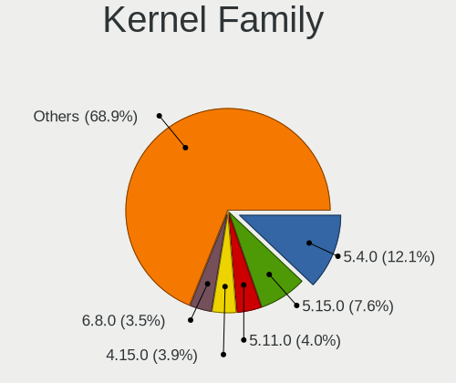
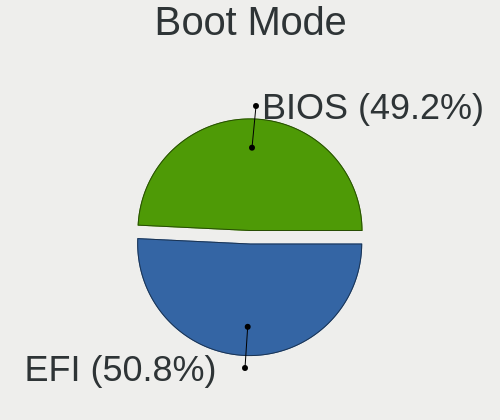
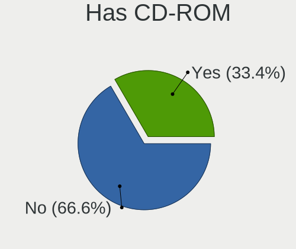
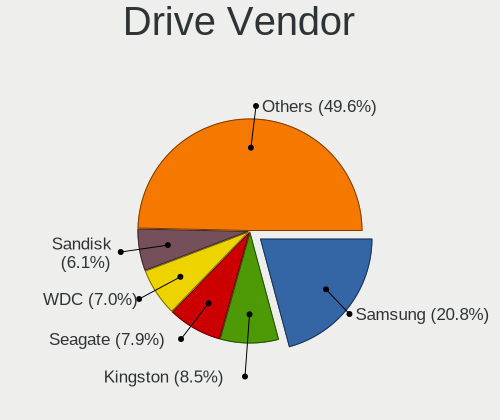
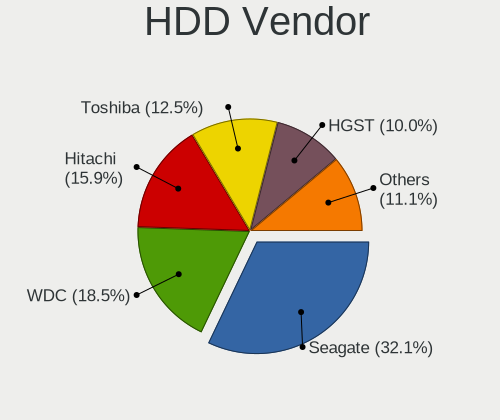
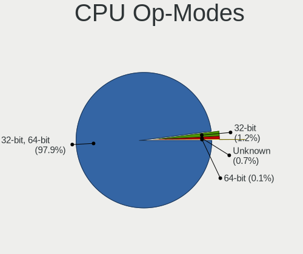
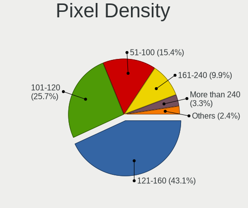
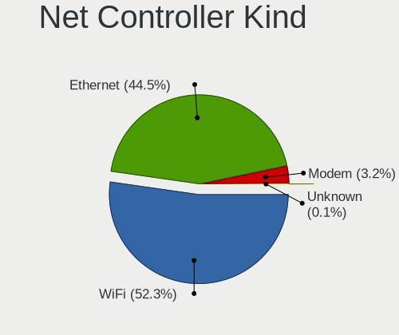
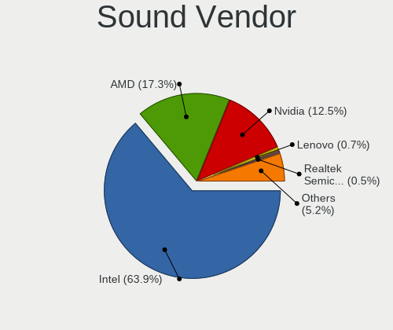

Linux in Finland - Tested Hardware & Statistics (Notebooks)
-----------------------------------------------------------

A project to collect tested hardware configurations for Linux in Finland.

Anyone can contribute to this report by the [hw-probe](https://github.com/linuxhw/hw-probe) tool:

    sudo -E hw-probe -all -upload

Please contribute! Especially if your hardware is rare.

Contents
--------

* [ Test Cases ](#test-cases)

* [ System ](#system)
  - [ OS                       ](#os)
  - [ OS Family                ](#os-family)
  - [ Kernel                   ](#kernel)
  - [ Kernel Family            ](#kernel-family)
  - [ Kernel Major Ver.        ](#kernel-major-ver)
  - [ Arch                     ](#arch)
  - [ DE                       ](#de)
  - [ Display Server           ](#display-server)
  - [ Display Manager          ](#display-manager)
  - [ OS Lang                  ](#os-lang)
  - [ Boot Mode                ](#boot-mode)
  - [ Filesystem               ](#filesystem)
  - [ Part. scheme             ](#part-scheme)
  - [ Dual Boot with Linux/BSD ](#dual-boot-with-linuxbsd)
  - [ Dual Boot (Win)          ](#dual-boot-win)

* [ Board ](#board)
  - [ Vendor                   ](#vendor)
  - [ Model                    ](#model)
  - [ Model Family             ](#model-family)
  - [ MFG Year                 ](#mfg-year)
  - [ Form Factor              ](#form-factor)
  - [ Secure Boot              ](#secure-boot)
  - [ Coreboot                 ](#coreboot)
  - [ RAM Size                 ](#ram-size)
  - [ RAM Used                 ](#ram-used)
  - [ Total Drives             ](#total-drives)
  - [ Has CD-ROM               ](#has-cd-rom)
  - [ Has Ethernet             ](#has-ethernet)
  - [ Has WiFi                 ](#has-wifi)
  - [ Has Bluetooth            ](#has-bluetooth)

* [ Location ](#location)
  - [ Country                  ](#country)
  - [ City                     ](#city)

* [ Drives ](#drives)
  - [ Drive Vendor             ](#drive-vendor)
  - [ Drive Model              ](#drive-model)
  - [ HDD Vendor               ](#hdd-vendor)
  - [ SSD Vendor               ](#ssd-vendor)
  - [ Drive Kind               ](#drive-kind)
  - [ Drive Connector          ](#drive-connector)
  - [ Drive Size               ](#drive-size)
  - [ Space Total              ](#space-total)
  - [ Space Used               ](#space-used)
  - [ Malfunc. Drives          ](#malfunc-drives)
  - [ Malfunc. Drive Vendor    ](#malfunc-drive-vendor)
  - [ Malfunc. HDD Vendor      ](#malfunc-hdd-vendor)
  - [ Malfunc. Drive Kind      ](#malfunc-drive-kind)
  - [ Failed Drives            ](#failed-drives)
  - [ Failed Drive Vendor      ](#failed-drive-vendor)
  - [ Drive Status             ](#drive-status)

* [ Storage controller ](#storage-controller)
  - [ Storage Vendor           ](#storage-vendor)
  - [ Storage Model            ](#storage-model)
  - [ Storage Kind             ](#storage-kind)

* [ Processor ](#processor)
  - [ CPU Vendor               ](#cpu-vendor)
  - [ CPU Model                ](#cpu-model)
  - [ CPU Model Family         ](#cpu-model-family)
  - [ CPU Cores                ](#cpu-cores)
  - [ CPU Sockets              ](#cpu-sockets)
  - [ CPU Threads              ](#cpu-threads)
  - [ CPU Op-Modes             ](#cpu-op-modes)
  - [ CPU Microcode            ](#cpu-microcode)
  - [ CPU Microarch            ](#cpu-microarch)

* [ Graphics ](#graphics)
  - [ GPU Vendor               ](#gpu-vendor)
  - [ GPU Model                ](#gpu-model)
  - [ GPU Combo                ](#gpu-combo)
  - [ GPU Driver               ](#gpu-driver)
  - [ GPU Memory               ](#gpu-memory)

* [ Monitor ](#monitor)
  - [ Monitor Vendor           ](#monitor-vendor)
  - [ Monitor Model            ](#monitor-model)
  - [ Monitor Resolution       ](#monitor-resolution)
  - [ Monitor Diagonal         ](#monitor-diagonal)
  - [ Monitor Width            ](#monitor-width)
  - [ Aspect Ratio             ](#aspect-ratio)
  - [ Monitor Area             ](#monitor-area)
  - [ Pixel Density            ](#pixel-density)
  - [ Multiple Monitors        ](#multiple-monitors)

* [ Network ](#network)
  - [ Net Controller Vendor    ](#net-controller-vendor)
  - [ Net Controller Model     ](#net-controller-model)
  - [ Wireless Vendor          ](#wireless-vendor)
  - [ Wireless Model           ](#wireless-model)
  - [ Ethernet Vendor          ](#ethernet-vendor)
  - [ Ethernet Model           ](#ethernet-model)
  - [ Net Controller Kind      ](#net-controller-kind)
  - [ Used Controller          ](#used-controller)
  - [ NICs                     ](#nics)
  - [ IPv6                     ](#ipv6)

* [ Bluetooth ](#bluetooth)
  - [ Bluetooth Vendor         ](#bluetooth-vendor)
  - [ Bluetooth Model          ](#bluetooth-model)

* [ Sound ](#sound)
  - [ Sound Vendor             ](#sound-vendor)
  - [ Sound Model              ](#sound-model)

* [ Memory ](#memory)
  - [ Memory Vendor            ](#memory-vendor)
  - [ Memory Model             ](#memory-model)
  - [ Memory Kind              ](#memory-kind)
  - [ Memory Form Factor       ](#memory-form-factor)
  - [ Memory Size              ](#memory-size)
  - [ Memory Speed             ](#memory-speed)

* [ Printers & scanners ](#printers--scanners)
  - [ Printer Vendor           ](#printer-vendor)
  - [ Printer Model            ](#printer-model)
  - [ Scanner Vendor           ](#scanner-vendor)
  - [ Scanner Model            ](#scanner-model)

* [ Camera ](#camera)
  - [ Camera Vendor            ](#camera-vendor)
  - [ Camera Model             ](#camera-model)

* [ Security ](#security)
  - [ Fingerprint Vendor       ](#fingerprint-vendor)
  - [ Fingerprint Model        ](#fingerprint-model)
  - [ Chipcard Vendor          ](#chipcard-vendor)
  - [ Chipcard Model           ](#chipcard-model)

* [ Unsupported ](#unsupported)
  - [ Unsupported Devices      ](#unsupported-devices)
  - [ Unsupported Device Types ](#unsupported-device-types)

Test Cases
----------

Total: 731

| Vendor        | Model                       | Probe                                                      | Date         |
|---------------|-----------------------------|------------------------------------------------------------|--------------|
| ASUSTek       | GL753VE                     | [a96aa73dd6](https://linux-hardware.org/?probe=a96aa73dd6) | Jun 01, 2022 |
| ASUSTek       | VivoBook_ASUSLaptop X510... | [4b11a98b62](https://linux-hardware.org/?probe=4b11a98b62) | May 31, 2022 |
| Lenovo        | ThinkPad T440s 20AQ007SM... | [6e41ef26bf](https://linux-hardware.org/?probe=6e41ef26bf) | May 29, 2022 |
| HP            | Pavilion dv6000 (GP639EA... | [3a472b96d3](https://linux-hardware.org/?probe=3a472b96d3) | May 27, 2022 |
| HP            | Pavilion dv6000 (GP639EA... | [7f3e3aada0](https://linux-hardware.org/?probe=7f3e3aada0) | May 27, 2022 |
| HP            | 255 G8 Notebook PC          | [9430147fab](https://linux-hardware.org/?probe=9430147fab) | May 27, 2022 |
| Dell          | Latitude 3520               | [6c5618416d](https://linux-hardware.org/?probe=6c5618416d) | May 26, 2022 |
| Lenovo        | ThinkPad L490 20Q50021MX    | [018e2a8bff](https://linux-hardware.org/?probe=018e2a8bff) | May 26, 2022 |
| Lenovo        | ThinkPad L490 20Q50021MX    | [6d4ab67cb8](https://linux-hardware.org/?probe=6d4ab67cb8) | May 26, 2022 |
| ASUSTek       | VivoBook_ASUSLaptop X510... | [7a1059d5cc](https://linux-hardware.org/?probe=7a1059d5cc) | May 25, 2022 |
| MSI           | GF75 Thin 9SC               | [49b7f895e9](https://linux-hardware.org/?probe=49b7f895e9) | May 24, 2022 |
| Lenovo        | V14-IIL 82C4                | [1ca9184b98](https://linux-hardware.org/?probe=1ca9184b98) | May 22, 2022 |
| Fujitsu Si... | AMILO Li 2727               | [d52e9e2938](https://linux-hardware.org/?probe=d52e9e2938) | May 17, 2022 |
| HP            | EliteBook 820 G1            | [f06eee580b](https://linux-hardware.org/?probe=f06eee580b) | May 16, 2022 |
| Dell          | Latitude E6330              | [0065ab0681](https://linux-hardware.org/?probe=0065ab0681) | May 12, 2022 |
| Dell          | Latitude 7490               | [0069680215](https://linux-hardware.org/?probe=0069680215) | May 10, 2022 |
| Acer          | Aspire E1-571               | [65d7984ad4](https://linux-hardware.org/?probe=65d7984ad4) | May 09, 2022 |
| HP            | EliteBook 840 G2            | [df57c0ad60](https://linux-hardware.org/?probe=df57c0ad60) | May 09, 2022 |
| Lenovo        | G50-80 80E5                 | [8ecadc1bad](https://linux-hardware.org/?probe=8ecadc1bad) | May 05, 2022 |
| Lenovo        | Yoga 2 13 20344             | [83ca73d4cd](https://linux-hardware.org/?probe=83ca73d4cd) | May 03, 2022 |
| Lenovo        | Yoga 2 13 20344             | [fcca76f1e5](https://linux-hardware.org/?probe=fcca76f1e5) | May 01, 2022 |
| Lenovo        | Yoga Slim 7 14ARE05 82A2    | [a90e6b2be7](https://linux-hardware.org/?probe=a90e6b2be7) | Apr 30, 2022 |
| Dell          | Latitude E6330              | [c78066bc19](https://linux-hardware.org/?probe=c78066bc19) | Apr 29, 2022 |
| Lenovo        | ThinkPad T430u 335337G      | [31bc958302](https://linux-hardware.org/?probe=31bc958302) | Apr 26, 2022 |
| Lenovo        | ThinkPad T430u 335337G      | [8446691cb3](https://linux-hardware.org/?probe=8446691cb3) | Apr 26, 2022 |
| Lenovo        | IdeaPad L340-15IRH Gamin... | [2717caa7f5](https://linux-hardware.org/?probe=2717caa7f5) | Apr 25, 2022 |
| Lenovo        | ThinkPad X230 2324GA7       | [a5138b511d](https://linux-hardware.org/?probe=a5138b511d) | Apr 25, 2022 |
| HP            | Laptop 15-bw0xx             | [e83ffcb04f](https://linux-hardware.org/?probe=e83ffcb04f) | Apr 24, 2022 |
| HP            | Laptop 15-bw0xx             | [25e6181500](https://linux-hardware.org/?probe=25e6181500) | Apr 24, 2022 |
| MSI           | Stealth GS77 12UGS          | [cd1bc2095f](https://linux-hardware.org/?probe=cd1bc2095f) | Apr 22, 2022 |
| MSI           | Stealth GS77 12UGS          | [33afc70a54](https://linux-hardware.org/?probe=33afc70a54) | Apr 22, 2022 |
| Acer          | Aspire 7530G                | [710b429d94](https://linux-hardware.org/?probe=710b429d94) | Apr 21, 2022 |
| Fujitsu Si... | ESPRIMO Mobile V6535        | [5a93c8e68c](https://linux-hardware.org/?probe=5a93c8e68c) | Apr 14, 2022 |
| Lenovo        | ThinkPad T480 20L6S93F00    | [b8c57e6b8a](https://linux-hardware.org/?probe=b8c57e6b8a) | Apr 14, 2022 |
| HP            | Notebook                    | [24faf4835d](https://linux-hardware.org/?probe=24faf4835d) | Apr 10, 2022 |
| MSI           | GV62 8RD                    | [2e43728adb](https://linux-hardware.org/?probe=2e43728adb) | Apr 06, 2022 |
| Lenovo        | ThinkPad P14s Gen 2a 21A... | [07efb6a561](https://linux-hardware.org/?probe=07efb6a561) | Apr 01, 2022 |
| Dell          | Latitude 5480               | [2d431aae25](https://linux-hardware.org/?probe=2d431aae25) | Mar 29, 2022 |
| Lenovo        | ThinkPad X230 2325BN8       | [3ad2d0f3ee](https://linux-hardware.org/?probe=3ad2d0f3ee) | Mar 25, 2022 |
| Lenovo        | ThinkPad W540 20BHS04T0P    | [d5b5eeffc8](https://linux-hardware.org/?probe=d5b5eeffc8) | Mar 25, 2022 |
| Fujitsu Si... | ESPRIMO Mobile U9210        | [bf87e829d7](https://linux-hardware.org/?probe=bf87e829d7) | Mar 14, 2022 |
| ASUSTek       | ASUS TUF Dash F15 FX516P... | [78ae0419a3](https://linux-hardware.org/?probe=78ae0419a3) | Mar 14, 2022 |
| Lenovo        | V145-15AST 81MT             | [ba2686174e](https://linux-hardware.org/?probe=ba2686174e) | Mar 13, 2022 |
| Acer          | AO725                       | [70febdd28f](https://linux-hardware.org/?probe=70febdd28f) | Mar 10, 2022 |
| Lenovo        | ThinkPad X260 20F5S1MN00    | [0f20b300ec](https://linux-hardware.org/?probe=0f20b300ec) | Mar 09, 2022 |
| Lenovo        | IdeaPad 310-15IKB 80TV      | [e6a6f71bb5](https://linux-hardware.org/?probe=e6a6f71bb5) | Mar 09, 2022 |
| HP            | G62                         | [67bc301ee6](https://linux-hardware.org/?probe=67bc301ee6) | Mar 09, 2022 |
| ASUSTek       | ASUS TUF Dash F15 FX516P... | [f351d9839b](https://linux-hardware.org/?probe=f351d9839b) | Mar 09, 2022 |
| ASUSTek       | G751JT                      | [32556e3c15](https://linux-hardware.org/?probe=32556e3c15) | Mar 09, 2022 |
| Lenovo        | ThinkPad 13 20GJ0048MS      | [6590a539cf](https://linux-hardware.org/?probe=6590a539cf) | Mar 02, 2022 |
| Fujitsu       | AMILO Pi 3560               | [ea68b8ed21](https://linux-hardware.org/?probe=ea68b8ed21) | Mar 01, 2022 |
| Lenovo        | ThinkPad X1 Carbon 5th 2... | [0278765ef8](https://linux-hardware.org/?probe=0278765ef8) | Feb 28, 2022 |
| Apple         | MacBook4,1                  | [c08be74242](https://linux-hardware.org/?probe=c08be74242) | Feb 27, 2022 |
| Lenovo        | Yoga Slim 7 14ARE05 82A2    | [02ac351573](https://linux-hardware.org/?probe=02ac351573) | Feb 25, 2022 |
| Lenovo        | ThinkPad P14s Gen 2a 21A... | [fa5d4846df](https://linux-hardware.org/?probe=fa5d4846df) | Feb 23, 2022 |
| HP            | G62                         | [337afde8c1](https://linux-hardware.org/?probe=337afde8c1) | Feb 21, 2022 |
| HP            | G62                         | [a175af3dd6](https://linux-hardware.org/?probe=a175af3dd6) | Feb 21, 2022 |
| powerinter... | Cepter N510-03              | [cd6804144d](https://linux-hardware.org/?probe=cd6804144d) | Feb 18, 2022 |
| Lenovo        | ThinkPad T440p 20AWS0U50... | [a114b7030f](https://linux-hardware.org/?probe=a114b7030f) | Feb 17, 2022 |
| Lenovo        | ThinkPad E14 20RA001LMX     | [19edff5659](https://linux-hardware.org/?probe=19edff5659) | Feb 17, 2022 |
| HP            | Compaq 6910p (GB951EA#AK... | [b136dd5def](https://linux-hardware.org/?probe=b136dd5def) | Feb 15, 2022 |
| Acer          | Aspire ES1-512              | [deb108070d](https://linux-hardware.org/?probe=deb108070d) | Feb 15, 2022 |
| ASUSTek       | T200TAC                     | [87db259935](https://linux-hardware.org/?probe=87db259935) | Feb 15, 2022 |
| Lenovo        | ThinkPad X230 23252SG       | [a5179b9681](https://linux-hardware.org/?probe=a5179b9681) | Feb 15, 2022 |
| HP            | 250 G5 Notebook PC          | [7cdffcccb7](https://linux-hardware.org/?probe=7cdffcccb7) | Feb 13, 2022 |
| Fujitsu       | LIFEBOOK E780               | [0ba38c6605](https://linux-hardware.org/?probe=0ba38c6605) | Feb 13, 2022 |
| Dell          | Latitude E5420              | [f016e9f3ad](https://linux-hardware.org/?probe=f016e9f3ad) | Feb 12, 2022 |
| Dell          | Latitude E5420              | [8843a735a0](https://linux-hardware.org/?probe=8843a735a0) | Feb 12, 2022 |
| Lenovo        | G50-80 80E5                 | [61e1bce7ae](https://linux-hardware.org/?probe=61e1bce7ae) | Feb 12, 2022 |
| HP            | Pavilion Laptop 15-eg0xx... | [766e937263](https://linux-hardware.org/?probe=766e937263) | Feb 10, 2022 |
| Lenovo        | ThinkPad E590 20NB0012MX    | [92a33a8f31](https://linux-hardware.org/?probe=92a33a8f31) | Feb 10, 2022 |
| Lenovo        | G50-80 80E5                 | [72b880911a](https://linux-hardware.org/?probe=72b880911a) | Feb 08, 2022 |
| ASUSTek       | ZenBook UX325EA_UX325EA     | [e0765c9f5a](https://linux-hardware.org/?probe=e0765c9f5a) | Feb 06, 2022 |
| ASUSTek       | TUF Gaming FX505DT_FX505... | [6160f71e77](https://linux-hardware.org/?probe=6160f71e77) | Feb 05, 2022 |
| ASUSTek       | UX303UB                     | [cba6a6b5a6](https://linux-hardware.org/?probe=cba6a6b5a6) | Feb 02, 2022 |
| Lenovo        | ThinkPad X390 20Q00057MX    | [326cb714f0](https://linux-hardware.org/?probe=326cb714f0) | Jan 27, 2022 |
| HP            | Compaq Presario CQ70        | [a31ae712c0](https://linux-hardware.org/?probe=a31ae712c0) | Jan 26, 2022 |
| HP            | Compaq Presario CQ70        | [82a45a6067](https://linux-hardware.org/?probe=82a45a6067) | Jan 26, 2022 |
| HP            | Compaq 6830s                | [f82216de53](https://linux-hardware.org/?probe=f82216de53) | Jan 26, 2022 |
| HP            | Compaq 6830s                | [fe7ef8a290](https://linux-hardware.org/?probe=fe7ef8a290) | Jan 26, 2022 |
| Lenovo        | ThinkPad Edge E530c 3366... | [7078a1a373](https://linux-hardware.org/?probe=7078a1a373) | Jan 25, 2022 |
| Lenovo        | ThinkPad T430 2351AK9       | [19f50b09d5](https://linux-hardware.org/?probe=19f50b09d5) | Jan 21, 2022 |
| ASUSTek       | S551LN                      | [f6beec1048](https://linux-hardware.org/?probe=f6beec1048) | Jan 18, 2022 |
| HP            | EliteBook 820 G1            | [39b90ab9c3](https://linux-hardware.org/?probe=39b90ab9c3) | Jan 17, 2022 |
| Lenovo        | ThinkPad W520 42844MG       | [cf460c52bb](https://linux-hardware.org/?probe=cf460c52bb) | Jan 16, 2022 |
| Dell          | XPS 17 9710                 | [3417abe371](https://linux-hardware.org/?probe=3417abe371) | Jan 16, 2022 |
| ASUSTek       | TUF Gaming FX505DT_FX505... | [caa528d6e0](https://linux-hardware.org/?probe=caa528d6e0) | Jan 15, 2022 |
| Dell          | XPS 17 9710                 | [3d2a67265f](https://linux-hardware.org/?probe=3d2a67265f) | Jan 15, 2022 |
| ASUSTek       | UL30A                       | [c2406eee73](https://linux-hardware.org/?probe=c2406eee73) | Jan 13, 2022 |
| HP            | Laptop 14-dk0xxx            | [4bbc688f9d](https://linux-hardware.org/?probe=4bbc688f9d) | Jan 13, 2022 |
| Toshiba       | Satellite P870              | [e046040d73](https://linux-hardware.org/?probe=e046040d73) | Jan 11, 2022 |
| HP            | Notebook                    | [0667124a5f](https://linux-hardware.org/?probe=0667124a5f) | Jan 10, 2022 |
| Sony          | VGN-FZ21Z                   | [6291085e58](https://linux-hardware.org/?probe=6291085e58) | Jan 09, 2022 |
| ASUSTek       | X553MA                      | [cdf5230fdb](https://linux-hardware.org/?probe=cdf5230fdb) | Jan 09, 2022 |
| Sony          | VGN-FZ21Z                   | [c4ac286105](https://linux-hardware.org/?probe=c4ac286105) | Jan 08, 2022 |
| HP            | ProBook 450 G3              | [1644301279](https://linux-hardware.org/?probe=1644301279) | Jan 07, 2022 |
| ASUSTek       | UL30A                       | [b2682cb5fe](https://linux-hardware.org/?probe=b2682cb5fe) | Jan 06, 2022 |
| Lenovo        | ThinkPad T490 20N3S2NJ00    | [e9170a81fe](https://linux-hardware.org/?probe=e9170a81fe) | Jan 05, 2022 |
| Lenovo        | ThinkPad E14 20RA001BMX     | [b34ccf2c06](https://linux-hardware.org/?probe=b34ccf2c06) | Jan 05, 2022 |
| ASUSTek       | ASUS TUF Gaming F17 FX70... | [5dd20e2872](https://linux-hardware.org/?probe=5dd20e2872) | Jan 03, 2022 |
| Lenovo        | ThinkPad X61 7674CT0        | [25a59e69c1](https://linux-hardware.org/?probe=25a59e69c1) | Dec 25, 2021 |
| Lenovo        | ThinkPad X61 7674CT0        | [a5b0d0a06a](https://linux-hardware.org/?probe=a5b0d0a06a) | Dec 25, 2021 |
| Acer          | Swift SF314-52              | [67fb871b2f](https://linux-hardware.org/?probe=67fb871b2f) | Dec 24, 2021 |
| MSI           | GE72 6QC                    | [8f778b6205](https://linux-hardware.org/?probe=8f778b6205) | Dec 23, 2021 |
| HP            | EliteBook 2570p             | [462b93b05b](https://linux-hardware.org/?probe=462b93b05b) | Dec 20, 2021 |
| MSI           | GE72 6QC                    | [1d77c47b4c](https://linux-hardware.org/?probe=1d77c47b4c) | Dec 18, 2021 |
| ASUSTek       | E200HA                      | [bcd4913896](https://linux-hardware.org/?probe=bcd4913896) | Dec 17, 2021 |
| Dell          | Latitude 5490               | [a9261b4529](https://linux-hardware.org/?probe=a9261b4529) | Dec 16, 2021 |
| Lenovo        | ThinkBook 15 G3 ACL 21A4    | [81873c2912](https://linux-hardware.org/?probe=81873c2912) | Dec 14, 2021 |
| Dell          | Precision 7510              | [59a0d1a314](https://linux-hardware.org/?probe=59a0d1a314) | Dec 13, 2021 |
| Schenker      | XMG_APEX15_XAP15E20         | [fcd36c9b82](https://linux-hardware.org/?probe=fcd36c9b82) | Dec 13, 2021 |
| HP            | Pavilion 15                 | [9b61f8e080](https://linux-hardware.org/?probe=9b61f8e080) | Dec 12, 2021 |
| Lenovo        | IdeaPad 120S-14IAP 81A5     | [8280287583](https://linux-hardware.org/?probe=8280287583) | Dec 12, 2021 |
| Lenovo        | IdeaPad 120S-14IAP 81A5     | [6f114c2528](https://linux-hardware.org/?probe=6f114c2528) | Dec 12, 2021 |
| Samsung       | 750XDA                      | [30d61197a1](https://linux-hardware.org/?probe=30d61197a1) | Dec 09, 2021 |
| HP            | 340 G5                      | [8ed2eec9b4](https://linux-hardware.org/?probe=8ed2eec9b4) | Dec 07, 2021 |
| Dell          | Latitude E6400              | [b8e56749b8](https://linux-hardware.org/?probe=b8e56749b8) | Dec 03, 2021 |
| Lenovo        | ThinkPad W540 20BH002NMS    | [52d66e95f4](https://linux-hardware.org/?probe=52d66e95f4) | Dec 01, 2021 |
| ASUSTek       | T100TA                      | [493153bf7c](https://linux-hardware.org/?probe=493153bf7c) | Nov 30, 2021 |
| ASUSTek       | T100TA                      | [b98f644a91](https://linux-hardware.org/?probe=b98f644a91) | Nov 30, 2021 |
| HP            | EliteBook 840 G7 Noteboo... | [9ae82b251b](https://linux-hardware.org/?probe=9ae82b251b) | Nov 26, 2021 |
| Apple         | MacBookAir6,2               | [c5ba70d401](https://linux-hardware.org/?probe=c5ba70d401) | Nov 24, 2021 |
| HP            | Laptop 15-bw0xx             | [9b0bfd9c19](https://linux-hardware.org/?probe=9b0bfd9c19) | Nov 24, 2021 |
| Lenovo        | B50-70 80EU                 | [9476bb5e05](https://linux-hardware.org/?probe=9476bb5e05) | Nov 24, 2021 |
| HP            | EliteBook 835 G7 Noteboo... | [cdf3297bef](https://linux-hardware.org/?probe=cdf3297bef) | Nov 21, 2021 |
| Google        | Relm                        | [92e569bf1e](https://linux-hardware.org/?probe=92e569bf1e) | Nov 21, 2021 |
| Dell          | Inspiron 1545               | [11710ca51d](https://linux-hardware.org/?probe=11710ca51d) | Nov 21, 2021 |
| Acer          | Aspire A715-42G             | [3ea389d8ff](https://linux-hardware.org/?probe=3ea389d8ff) | Nov 21, 2021 |
| Dell          | Latitude E6420              | [2e2b68b190](https://linux-hardware.org/?probe=2e2b68b190) | Nov 20, 2021 |
| HP            | Pavilion 17                 | [a633bbd978](https://linux-hardware.org/?probe=a633bbd978) | Nov 20, 2021 |
| Acer          | Aspire A715-42G             | [19f48288ec](https://linux-hardware.org/?probe=19f48288ec) | Nov 20, 2021 |
| Lenovo        | ThinkPad T530 24341G0       | [0dcfa8bdc7](https://linux-hardware.org/?probe=0dcfa8bdc7) | Nov 17, 2021 |
| Dell          | Latitude 7420               | [52bd94ce90](https://linux-hardware.org/?probe=52bd94ce90) | Nov 17, 2021 |
| HP            | EliteBook 8560w             | [5bed28d52e](https://linux-hardware.org/?probe=5bed28d52e) | Nov 15, 2021 |
| HP            | ProBook 430 G1              | [da8846a5fd](https://linux-hardware.org/?probe=da8846a5fd) | Nov 14, 2021 |
| Lenovo        | ThinkPad T460s 20F90042M... | [76ba8c7144](https://linux-hardware.org/?probe=76ba8c7144) | Nov 13, 2021 |
| ASUSTek       | N53SN                       | [438a1236fb](https://linux-hardware.org/?probe=438a1236fb) | Nov 11, 2021 |
| ASUSTek       | VivoBook E14 E402YA_R417... | [7a1824b26a](https://linux-hardware.org/?probe=7a1824b26a) | Nov 11, 2021 |
| Acer          | Nitro AN515-55              | [d4f75f503d](https://linux-hardware.org/?probe=d4f75f503d) | Nov 10, 2021 |
| ASUSTek       | G751JT                      | [d2d03753ee](https://linux-hardware.org/?probe=d2d03753ee) | Nov 09, 2021 |
| Lenovo        | ThinkPad X1 Carbon 4th 2... | [536b4200f8](https://linux-hardware.org/?probe=536b4200f8) | Nov 07, 2021 |
| Lenovo        | IdeaPad 320-15IKB 80XL      | [33a5ffbf9a](https://linux-hardware.org/?probe=33a5ffbf9a) | Nov 07, 2021 |
| Dell          | XPS 15 9510                 | [ae1af68eae](https://linux-hardware.org/?probe=ae1af68eae) | Nov 03, 2021 |
| Samsung       | R530/R730                   | [a62fb59972](https://linux-hardware.org/?probe=a62fb59972) | Nov 03, 2021 |
| ASUSTek       | G751JT                      | [b4c3816a33](https://linux-hardware.org/?probe=b4c3816a33) | Oct 30, 2021 |
| Packard Be... | EasyNote TS11HR             | [1217a94f61](https://linux-hardware.org/?probe=1217a94f61) | Oct 26, 2021 |
| ASUSTek       | 1001PX                      | [e74dc83f0a](https://linux-hardware.org/?probe=e74dc83f0a) | Oct 24, 2021 |
| Lenovo        | ThinkPad T480 20L5000BMX    | [91fc910cf6](https://linux-hardware.org/?probe=91fc910cf6) | Oct 23, 2021 |
| Lenovo        | ThinkPad T480 20L5000BMX    | [21b13fb067](https://linux-hardware.org/?probe=21b13fb067) | Oct 21, 2021 |
| HP            | Compaq 6735s                | [25c73d7c4d](https://linux-hardware.org/?probe=25c73d7c4d) | Oct 20, 2021 |
| Lenovo        | Yoga Slim 7 14ARE05 82A2    | [594815bb9d](https://linux-hardware.org/?probe=594815bb9d) | Oct 17, 2021 |
| Lenovo        | IdeaPad 1 14ADA05 82GW      | [d89008ef64](https://linux-hardware.org/?probe=d89008ef64) | Oct 16, 2021 |
| Acer          | Aspire 7530G                | [09694e2816](https://linux-hardware.org/?probe=09694e2816) | Oct 15, 2021 |
| HP            | ProBook 655 G1              | [5a67ea75fe](https://linux-hardware.org/?probe=5a67ea75fe) | Oct 14, 2021 |
| ASUSTek       | G751JT                      | [072dab3e8c](https://linux-hardware.org/?probe=072dab3e8c) | Oct 14, 2021 |
| Timi          | RedmiBook 13 R              | [18263076ea](https://linux-hardware.org/?probe=18263076ea) | Oct 14, 2021 |
| Lenovo        | ThinkPad T60p 200793G       | [cf747bee4e](https://linux-hardware.org/?probe=cf747bee4e) | Oct 13, 2021 |
| Lenovo        | Yoga 2 13 20344             | [7fbd3218a8](https://linux-hardware.org/?probe=7fbd3218a8) | Oct 11, 2021 |
| Dixonsxp      | Unknown                     | [a9d87f6d4e](https://linux-hardware.org/?probe=a9d87f6d4e) | Oct 08, 2021 |
| Lenovo        | ThinkPad T490 20N2000KGE    | [cb7f37874e](https://linux-hardware.org/?probe=cb7f37874e) | Oct 07, 2021 |
| Dixonsxp      | Unknown                     | [2fe4152b53](https://linux-hardware.org/?probe=2fe4152b53) | Oct 07, 2021 |
| Acer          | Swift SF314-54              | [26501031e8](https://linux-hardware.org/?probe=26501031e8) | Oct 07, 2021 |
| Lenovo        | G50-80 80E5                 | [31df81c76d](https://linux-hardware.org/?probe=31df81c76d) | Sep 30, 2021 |
| ASUSTek       | G751JT                      | [ba4f1bda7d](https://linux-hardware.org/?probe=ba4f1bda7d) | Sep 30, 2021 |
| Acer          | Aspire 5738                 | [171fc1cb46](https://linux-hardware.org/?probe=171fc1cb46) | Sep 27, 2021 |
| Acer          | Aspire 5738                 | [f9373d8ba5](https://linux-hardware.org/?probe=f9373d8ba5) | Sep 27, 2021 |
| Toshiba       | Satellite C50-B             | [0914aeed54](https://linux-hardware.org/?probe=0914aeed54) | Sep 25, 2021 |
| Acer          | Aspire 5750G                | [89783ad217](https://linux-hardware.org/?probe=89783ad217) | Sep 24, 2021 |
| Acer          | Aspire 5750G                | [867138c338](https://linux-hardware.org/?probe=867138c338) | Sep 22, 2021 |
| Lenovo        | ThinkPad X230 204016Z1ZS    | [eb1d7abffc](https://linux-hardware.org/?probe=eb1d7abffc) | Sep 21, 2021 |
| HP            | EliteBook 2570p             | [a4488fd2fe](https://linux-hardware.org/?probe=a4488fd2fe) | Sep 19, 2021 |
| HP            | EliteBook 8540p             | [f9509414bc](https://linux-hardware.org/?probe=f9509414bc) | Sep 18, 2021 |
| Lenovo        | IdeaPad 3 14ADA05 81W0      | [6b7410fa5c](https://linux-hardware.org/?probe=6b7410fa5c) | Sep 16, 2021 |
| Lenovo        | B50-10 80QR                 | [506a3682b9](https://linux-hardware.org/?probe=506a3682b9) | Sep 15, 2021 |
| Lenovo        | G50-80 80E5                 | [badf707f13](https://linux-hardware.org/?probe=badf707f13) | Sep 14, 2021 |
| Lenovo        | IdeaPad 3 14ADA05 81W0      | [e606ccc75f](https://linux-hardware.org/?probe=e606ccc75f) | Sep 14, 2021 |
| Lenovo        | Legion 5 15ACH6H 82JU       | [c8e465fcb0](https://linux-hardware.org/?probe=c8e465fcb0) | Sep 14, 2021 |
| Unknown       | Unknown                     | [6670bba1d8](https://linux-hardware.org/?probe=6670bba1d8) | Sep 13, 2021 |
| Unknown       | Unknown                     | [94e64b5b30](https://linux-hardware.org/?probe=94e64b5b30) | Sep 13, 2021 |
| HP            | Pavilion Aero Laptop 13-... | [0a2430ae78](https://linux-hardware.org/?probe=0a2430ae78) | Sep 10, 2021 |
| Dell          | Latitude 7420               | [225b6a0d52](https://linux-hardware.org/?probe=225b6a0d52) | Sep 09, 2021 |
| Lenovo        | ThinkPad T470 20JNS3M500    | [1dcfa059c1](https://linux-hardware.org/?probe=1dcfa059c1) | Sep 07, 2021 |
| Lenovo        | ThinkPad T470 20JNS3M500    | [d05cb87743](https://linux-hardware.org/?probe=d05cb87743) | Sep 07, 2021 |
| Lenovo        | ThinkPad P50 20EN0006MS     | [55f595b53f](https://linux-hardware.org/?probe=55f595b53f) | Sep 07, 2021 |
| Lenovo        | ThinkPad P50 20EN0006MS     | [812085deb0](https://linux-hardware.org/?probe=812085deb0) | Sep 07, 2021 |
| Lenovo        | Legion 5 Pro 16ACH6H 82J... | [00e399c8d4](https://linux-hardware.org/?probe=00e399c8d4) | Sep 07, 2021 |
| Dell          | Latitude E6430              | [e02c871576](https://linux-hardware.org/?probe=e02c871576) | Sep 06, 2021 |
| Dell          | Latitude E6430              | [5d2627b08e](https://linux-hardware.org/?probe=5d2627b08e) | Sep 06, 2021 |
| Fujitsu       | LIFEBOOK U9310              | [48113d6636](https://linux-hardware.org/?probe=48113d6636) | Sep 02, 2021 |
| Lenovo        | B50-10 80QR                 | [08ad3775b8](https://linux-hardware.org/?probe=08ad3775b8) | Aug 31, 2021 |
| Lenovo        | ThinkPad T420 4180WDN       | [8e46956f05](https://linux-hardware.org/?probe=8e46956f05) | Aug 31, 2021 |
| Acer          | Nitro AN517-52              | [d534aba928](https://linux-hardware.org/?probe=d534aba928) | Aug 31, 2021 |
| Lenovo        | ThinkPad T420 4180WDN       | [8512904445](https://linux-hardware.org/?probe=8512904445) | Aug 29, 2021 |
| HP            | EliteBook 2560p             | [93e2baa57a](https://linux-hardware.org/?probe=93e2baa57a) | Aug 29, 2021 |
| ASUSTek       | VivoBook_ASUS Laptop E21... | [f15a7392b9](https://linux-hardware.org/?probe=f15a7392b9) | Aug 27, 2021 |
| ASUSTek       | ROG Strix G533QR_G533QR     | [cf76a62cf4](https://linux-hardware.org/?probe=cf76a62cf4) | Aug 26, 2021 |
| Fujitsu Si... | AMILO Li3910                | [4198aeb0a0](https://linux-hardware.org/?probe=4198aeb0a0) | Aug 26, 2021 |
| Dell          | Latitude 5480               | [3374e57369](https://linux-hardware.org/?probe=3374e57369) | Aug 25, 2021 |
| Acer          | Aspire SW5-012              | [fe8aa54fcd](https://linux-hardware.org/?probe=fe8aa54fcd) | Aug 25, 2021 |
| HP            | Compaq 8710w (GC124EA#AK... | [d7475c57ca](https://linux-hardware.org/?probe=d7475c57ca) | Aug 24, 2021 |
| HP            | ProBook 6360b               | [f8a9a512b2](https://linux-hardware.org/?probe=f8a9a512b2) | Aug 24, 2021 |
| HP            | ProBook 6360b               | [beb76e16b5](https://linux-hardware.org/?probe=beb76e16b5) | Aug 24, 2021 |
| Dell          | Vostro 5568                 | [bf921c6ff6](https://linux-hardware.org/?probe=bf921c6ff6) | Aug 23, 2021 |
| Dell          | Latitude 7490               | [b4759deb9a](https://linux-hardware.org/?probe=b4759deb9a) | Aug 21, 2021 |
| HP            | EliteBook 8560p             | [97a8f28916](https://linux-hardware.org/?probe=97a8f28916) | Aug 21, 2021 |
| HP            | 255 G1                      | [4998946adc](https://linux-hardware.org/?probe=4998946adc) | Aug 18, 2021 |
| Lenovo        | IdeaPad S145-14API 81UV     | [78377f3635](https://linux-hardware.org/?probe=78377f3635) | Aug 17, 2021 |
| Lenovo        | IdeaPad S145-14API 81UV     | [e91d03b0c4](https://linux-hardware.org/?probe=e91d03b0c4) | Aug 17, 2021 |
| Dell          | Latitude E6430              | [afe966ff62](https://linux-hardware.org/?probe=afe966ff62) | Aug 17, 2021 |
| Dell          | Latitude E6500              | [a707e64d52](https://linux-hardware.org/?probe=a707e64d52) | Aug 15, 2021 |
| Lenovo        | ThinkPad X1 Carbon 4th 2... | [8bf626f6b3](https://linux-hardware.org/?probe=8bf626f6b3) | Aug 15, 2021 |
| Dell          | XPS 15 7590                 | [b656e3aec4](https://linux-hardware.org/?probe=b656e3aec4) | Aug 14, 2021 |
| Lenovo        | ThinkPad X1 Carbon 7th 2... | [11f9ccb3ad](https://linux-hardware.org/?probe=11f9ccb3ad) | Aug 13, 2021 |
| Lenovo        | ThinkPad T440s 20AR0011M... | [df7a1d9358](https://linux-hardware.org/?probe=df7a1d9358) | Aug 12, 2021 |
| HP            | EliteBook 840 G7 Noteboo... | [8d464633db](https://linux-hardware.org/?probe=8d464633db) | Aug 08, 2021 |
| HP            | EliteBook 840 G7 Noteboo... | [bd3d1ed844](https://linux-hardware.org/?probe=bd3d1ed844) | Aug 08, 2021 |
| Lenovo        | ThinkPad X270 20HMS70400    | [6b647baf7c](https://linux-hardware.org/?probe=6b647baf7c) | Aug 07, 2021 |
| Lenovo        | ThinkPad T410 253725G       | [779374b300](https://linux-hardware.org/?probe=779374b300) | Aug 05, 2021 |
| Lenovo        | ThinkPad T410 253725G       | [47fca1c82c](https://linux-hardware.org/?probe=47fca1c82c) | Aug 05, 2021 |
| ASUSTek       | 1001PX                      | [a5d694843c](https://linux-hardware.org/?probe=a5d694843c) | Aug 05, 2021 |
| Lenovo        | ThinkPad T410 2518A3G       | [0297e70b90](https://linux-hardware.org/?probe=0297e70b90) | Aug 04, 2021 |
| Lenovo        | ThinkPad T440p 20AN007FM... | [ba75506849](https://linux-hardware.org/?probe=ba75506849) | Aug 02, 2021 |
| Apple         | MacBookPro9,2               | [abb1e8ea82](https://linux-hardware.org/?probe=abb1e8ea82) | Jul 31, 2021 |
| Lenovo        | Legion 5 Pro 16ACH6H 82J... | [e134bae415](https://linux-hardware.org/?probe=e134bae415) | Jul 29, 2021 |
| HP            | Pavilion 11 x360 PC         | [6e097e987f](https://linux-hardware.org/?probe=6e097e987f) | Jul 29, 2021 |
| Fujitsu       | LIFEBOOK A530               | [643094a68a](https://linux-hardware.org/?probe=643094a68a) | Jul 26, 2021 |
| Acer          | AO725                       | [4e27f519f7](https://linux-hardware.org/?probe=4e27f519f7) | Jul 25, 2021 |
| Sony          | VPCEH3D0E                   | [2d04f2e0e8](https://linux-hardware.org/?probe=2d04f2e0e8) | Jul 25, 2021 |
| Lenovo        | ThinkPad T420 4236WC3       | [2dbdc931e7](https://linux-hardware.org/?probe=2dbdc931e7) | Jul 25, 2021 |
| ASUSTek       | G751JT                      | [2c81844355](https://linux-hardware.org/?probe=2c81844355) | Jul 23, 2021 |
| Lenovo        | ThinkPad P1 Gen 2 20QTS0... | [550f9db7cd](https://linux-hardware.org/?probe=550f9db7cd) | Jul 22, 2021 |
| Lenovo        | Legion 5 Pro 16ACH6H 82J... | [83c21e1a99](https://linux-hardware.org/?probe=83c21e1a99) | Jul 21, 2021 |
| MSI           | GS60 2PC Ghost              | [cf537038dd](https://linux-hardware.org/?probe=cf537038dd) | Jul 17, 2021 |
| Dell          | Latitude E7470              | [8c32d73d55](https://linux-hardware.org/?probe=8c32d73d55) | Jul 16, 2021 |
| Dell          | Latitude E7470              | [22583cadb6](https://linux-hardware.org/?probe=22583cadb6) | Jul 14, 2021 |
| ASUSTek       | G751JT                      | [532e266dcb](https://linux-hardware.org/?probe=532e266dcb) | Jul 13, 2021 |
| Acer          | Swift SF515-51T             | [f5ec156890](https://linux-hardware.org/?probe=f5ec156890) | Jul 12, 2021 |
| Samsung       | R530/R730                   | [103edb36d2](https://linux-hardware.org/?probe=103edb36d2) | Jul 11, 2021 |
| ASUSTek       | VivoBook 15_ASUS Laptop ... | [d52de582e8](https://linux-hardware.org/?probe=d52de582e8) | Jul 10, 2021 |
| HP            | ZBook 17 G5                 | [9f1b7a37f2](https://linux-hardware.org/?probe=9f1b7a37f2) | Jul 07, 2021 |
| Dell          | G7 7700                     | [6fc41408bf](https://linux-hardware.org/?probe=6fc41408bf) | Jul 07, 2021 |
| Lenovo        | IdeaPad S340-14IIL 81VV     | [def9f42f6c](https://linux-hardware.org/?probe=def9f42f6c) | Jul 02, 2021 |
| Apple         | MacBook4,1                  | [17dcc66fd5](https://linux-hardware.org/?probe=17dcc66fd5) | Jul 02, 2021 |
| Samsung       | 300E4C/300E5C/300E7C        | [cbb60edb8c](https://linux-hardware.org/?probe=cbb60edb8c) | Jul 02, 2021 |
| Samsung       | 300E4C/300E5C/300E7C        | [26a655c4b4](https://linux-hardware.org/?probe=26a655c4b4) | Jul 02, 2021 |
| Dell          | Precision 5540              | [a685a9c5bb](https://linux-hardware.org/?probe=a685a9c5bb) | Jun 30, 2021 |
| Lenovo        | ThinkPad T490 20N3S2NJ00    | [e2743844ad](https://linux-hardware.org/?probe=e2743844ad) | Jun 29, 2021 |
| ASUSTek       | TUF Gaming FX505DT_FX505... | [39f8c7f885](https://linux-hardware.org/?probe=39f8c7f885) | Jun 26, 2021 |
| ASUSTek       | VivoBook E14 E402YA_R417... | [110b313bc0](https://linux-hardware.org/?probe=110b313bc0) | Jun 25, 2021 |
| Lenovo        | ThinkPad X220 42912XG       | [52199864f7](https://linux-hardware.org/?probe=52199864f7) | Jun 24, 2021 |
| HP            | EliteBook 845 G7 Noteboo... | [e966d318da](https://linux-hardware.org/?probe=e966d318da) | Jun 23, 2021 |
| HP            | EliteBook 845 G7 Noteboo... | [7767a1cde7](https://linux-hardware.org/?probe=7767a1cde7) | Jun 23, 2021 |
| Dell          | Precision 5550              | [646d84cc95](https://linux-hardware.org/?probe=646d84cc95) | Jun 23, 2021 |
| IBM           | ThinkPad T43 2668F7G        | [93c8e53b04](https://linux-hardware.org/?probe=93c8e53b04) | Jun 15, 2021 |
| Timi          | RedmiBook 13 R              | [ce648ba480](https://linux-hardware.org/?probe=ce648ba480) | Jun 12, 2021 |
| HP            | Compaq 8510p                | [c371bbdff4](https://linux-hardware.org/?probe=c371bbdff4) | Jun 09, 2021 |
| Dell          | XPS 13 7390                 | [54b62ad499](https://linux-hardware.org/?probe=54b62ad499) | Jun 08, 2021 |
| ASUSTek       | K53U                        | [3acb45024a](https://linux-hardware.org/?probe=3acb45024a) | Jun 08, 2021 |
| Lenovo        | IdeaPad L340-17IWL 81M0     | [3764e87d16](https://linux-hardware.org/?probe=3764e87d16) | Jun 07, 2021 |
| Dell          | Latitude E7470              | [6be76778ae](https://linux-hardware.org/?probe=6be76778ae) | Jun 03, 2021 |
| ASUSTek       | VivoBook 12_ASUS Laptop ... | [b24bfd08ee](https://linux-hardware.org/?probe=b24bfd08ee) | Jun 02, 2021 |
| Lenovo        | V145-15AST 81MT             | [30e8995988](https://linux-hardware.org/?probe=30e8995988) | May 27, 2021 |
| HP            | Compaq 8510p                | [7e17cf2706](https://linux-hardware.org/?probe=7e17cf2706) | May 26, 2021 |
| Samsung       | 355V4C/356V4C/3445VC/354... | [541b3e9cba](https://linux-hardware.org/?probe=541b3e9cba) | May 25, 2021 |
| Acer          | Aspire 8950G                | [d65fb86955](https://linux-hardware.org/?probe=d65fb86955) | May 22, 2021 |
| Lenovo        | ThinkPad X230 23253Z5       | [0af5f89b23](https://linux-hardware.org/?probe=0af5f89b23) | May 22, 2021 |
| Lenovo        | ThinkPad X230 23253Z5       | [1b1a173884](https://linux-hardware.org/?probe=1b1a173884) | May 22, 2021 |
| HP            | 350 G1                      | [949ae1ce88](https://linux-hardware.org/?probe=949ae1ce88) | May 20, 2021 |
| Toshiba       | Satellite C660              | [60eb674c8f](https://linux-hardware.org/?probe=60eb674c8f) | May 19, 2021 |
| Lenovo        | ThinkPad T60p 200793G       | [09351c4654](https://linux-hardware.org/?probe=09351c4654) | May 18, 2021 |
| Lenovo        | Yoga 2 13 20344             | [d75aff5a0a](https://linux-hardware.org/?probe=d75aff5a0a) | May 16, 2021 |
| Apple         | MacBookAir3,2               | [8b2100d9ad](https://linux-hardware.org/?probe=8b2100d9ad) | May 14, 2021 |
| HP            | EliteBook 2170p             | [6e4a5f9c76](https://linux-hardware.org/?probe=6e4a5f9c76) | May 13, 2021 |
| HP            | Pavilion g6                 | [ab2366fd14](https://linux-hardware.org/?probe=ab2366fd14) | May 11, 2021 |
| Dell          | Latitude 7400               | [a32714d409](https://linux-hardware.org/?probe=a32714d409) | May 05, 2021 |
| Dell          | Latitude 7400               | [eb8ca2d9d2](https://linux-hardware.org/?probe=eb8ca2d9d2) | May 05, 2021 |
| Dell          | Latitude E7270              | [6708f53385](https://linux-hardware.org/?probe=6708f53385) | May 04, 2021 |
| ASUSTek       | G751JT                      | [93eb4a6a39](https://linux-hardware.org/?probe=93eb4a6a39) | Apr 24, 2021 |
| Lenovo        | IdeaPad S145-15IWL 81MV     | [c586a3a771](https://linux-hardware.org/?probe=c586a3a771) | Apr 20, 2021 |
| Lenovo        | IdeaPad 310-15IKB 80TV      | [7e5ffea0b6](https://linux-hardware.org/?probe=7e5ffea0b6) | Apr 20, 2021 |
| Lenovo        | B70-80 80MR                 | [edef8dfd8b](https://linux-hardware.org/?probe=edef8dfd8b) | Apr 19, 2021 |
| Lenovo        | Legion 7 15IMH05 81YT       | [d01dac7a8f](https://linux-hardware.org/?probe=d01dac7a8f) | Apr 16, 2021 |
| Lenovo        | B50-45 80F0                 | [0558c9e99e](https://linux-hardware.org/?probe=0558c9e99e) | Apr 16, 2021 |
| ASUSTek       | G751JT                      | [7ca0cd3696](https://linux-hardware.org/?probe=7ca0cd3696) | Apr 15, 2021 |
| HP            | Compaq CQ58                 | [3274addf89](https://linux-hardware.org/?probe=3274addf89) | Apr 14, 2021 |
| ASUSTek       | VivoBook_ASUSLaptop X512... | [9776a806ac](https://linux-hardware.org/?probe=9776a806ac) | Apr 14, 2021 |
| Lenovo        | Yoga Slim 7 14ARE05 82A2    | [8a8adf8790](https://linux-hardware.org/?probe=8a8adf8790) | Apr 12, 2021 |
| Lenovo        | ThinkPad X1 Carbon Gen 9... | [12fb9fd662](https://linux-hardware.org/?probe=12fb9fd662) | Apr 12, 2021 |
| MSI           | GL62M 7REX                  | [8ee2678b38](https://linux-hardware.org/?probe=8ee2678b38) | Apr 10, 2021 |
| ASUSTek       | X75VD                       | [258fbf86ed](https://linux-hardware.org/?probe=258fbf86ed) | Apr 09, 2021 |
| ASUSTek       | G751JT                      | [4f88289a8c](https://linux-hardware.org/?probe=4f88289a8c) | Apr 08, 2021 |
| Lenovo        | ThinkPad T14s Gen 1 20UH... | [c480530d42](https://linux-hardware.org/?probe=c480530d42) | Apr 07, 2021 |
| Lenovo        | IdeaPad 100S-14IBR 80R9     | [ecae2e7ad8](https://linux-hardware.org/?probe=ecae2e7ad8) | Apr 06, 2021 |
| Samsung       | R530/R730                   | [0085bebd03](https://linux-hardware.org/?probe=0085bebd03) | Apr 05, 2021 |
| Lenovo        | B50-70 80EU                 | [6534232c53](https://linux-hardware.org/?probe=6534232c53) | Apr 04, 2021 |
| HP            | EliteBook 755 G2            | [12cd60c247](https://linux-hardware.org/?probe=12cd60c247) | Mar 31, 2021 |
| Fujitsu Si... | LIFEBOOK S7110              | [d8f1bccb78](https://linux-hardware.org/?probe=d8f1bccb78) | Mar 29, 2021 |
| Lenovo        | ThinkPad T430 2349UWT       | [d6edf7c2df](https://linux-hardware.org/?probe=d6edf7c2df) | Mar 28, 2021 |
| Fujitsu Si... | LIFEBOOK S7110              | [54845ca16f](https://linux-hardware.org/?probe=54845ca16f) | Mar 27, 2021 |
| Fujitsu Si... | LIFEBOOK S7110              | [1f11381bfb](https://linux-hardware.org/?probe=1f11381bfb) | Mar 27, 2021 |
| HP            | ZBook 15 G4                 | [4d3778017f](https://linux-hardware.org/?probe=4d3778017f) | Mar 25, 2021 |
| Samsung       | SF311/SF411/SF511           | [fb1261d331](https://linux-hardware.org/?probe=fb1261d331) | Mar 25, 2021 |
| Acer          | Aspire SW5-012              | [91409f3c71](https://linux-hardware.org/?probe=91409f3c71) | Mar 23, 2021 |
| Lenovo        | B50-45 80F0                 | [9af2b46c0a](https://linux-hardware.org/?probe=9af2b46c0a) | Mar 18, 2021 |
| ASUSTek       | ZenBook UX325JA_UX325JA     | [50b82af935](https://linux-hardware.org/?probe=50b82af935) | Mar 18, 2021 |
| Lenovo        | ThinkPad E15 Gen 2 20T80... | [3c98763834](https://linux-hardware.org/?probe=3c98763834) | Mar 17, 2021 |
| ASUSTek       | X541NA                      | [db3ab2a133](https://linux-hardware.org/?probe=db3ab2a133) | Mar 15, 2021 |
| Lenovo        | IdeaPad S145-15IWL 81MV     | [ad7470fc89](https://linux-hardware.org/?probe=ad7470fc89) | Mar 15, 2021 |
| Acer          | Aspire SW5-012              | [2417d2d1b5](https://linux-hardware.org/?probe=2417d2d1b5) | Mar 14, 2021 |
| Lenovo        | ThinkPad Edge E540 20C60... | [c6866f0d34](https://linux-hardware.org/?probe=c6866f0d34) | Mar 10, 2021 |
| Lenovo        | IdeaPad S130-14IGM 81J2     | [112bdb4e2a](https://linux-hardware.org/?probe=112bdb4e2a) | Mar 09, 2021 |
| Lenovo        | ThinkPad T450 20BV001YMS    | [57449243ca](https://linux-hardware.org/?probe=57449243ca) | Mar 07, 2021 |
| Dell          | Inspiron 1564               | [c4548cb133](https://linux-hardware.org/?probe=c4548cb133) | Mar 04, 2021 |
| ASUSTek       | X551CAP                     | [857a1c6e52](https://linux-hardware.org/?probe=857a1c6e52) | Mar 04, 2021 |
| ASUSTek       | X551CAP                     | [3e423c7d87](https://linux-hardware.org/?probe=3e423c7d87) | Mar 03, 2021 |
| ASUSTek       | UX32A                       | [7debc0a27d](https://linux-hardware.org/?probe=7debc0a27d) | Mar 02, 2021 |
| Lenovo        | ThinkPad E580 20KS001RMX    | [5bcb97d47f](https://linux-hardware.org/?probe=5bcb97d47f) | Feb 28, 2021 |
| ASUSTek       | X551CAP                     | [987d795cb7](https://linux-hardware.org/?probe=987d795cb7) | Feb 27, 2021 |
| ASUSTek       | K54C                        | [467c86ad9a](https://linux-hardware.org/?probe=467c86ad9a) | Feb 26, 2021 |
| Dell          | Latitude E7470              | [93cf5a0e8b](https://linux-hardware.org/?probe=93cf5a0e8b) | Feb 26, 2021 |
| Acer          | Aspire A315-42              | [9a68092d87](https://linux-hardware.org/?probe=9a68092d87) | Feb 25, 2021 |
| ASUSTek       | K70IO                       | [49623c33e1](https://linux-hardware.org/?probe=49623c33e1) | Feb 25, 2021 |
| Lenovo        | IdeaPad S145-15IWL 81MV     | [5af628a455](https://linux-hardware.org/?probe=5af628a455) | Feb 25, 2021 |
| Lenovo        | ThinkPad T410 2518A3G       | [8a3e6146db](https://linux-hardware.org/?probe=8a3e6146db) | Feb 23, 2021 |
| Acer          | Swift SF315-52              | [50065d2efb](https://linux-hardware.org/?probe=50065d2efb) | Feb 20, 2021 |
| HP            | Presario CQ56               | [54f5681a51](https://linux-hardware.org/?probe=54f5681a51) | Feb 20, 2021 |
| HP            | EliteBook 745 G3            | [544e6bde0b](https://linux-hardware.org/?probe=544e6bde0b) | Feb 17, 2021 |
| Lenovo        | ThinkPad L490 20Q50020MX    | [24fb34852c](https://linux-hardware.org/?probe=24fb34852c) | Feb 16, 2021 |
| Lenovo        | ThinkPad T60p 200793G       | [d91ab98cb0](https://linux-hardware.org/?probe=d91ab98cb0) | Feb 16, 2021 |
| Dell          | Vostro 5568                 | [33e13fb990](https://linux-hardware.org/?probe=33e13fb990) | Feb 14, 2021 |
| HP            | EliteBook 2560p             | [573a6ae3c7](https://linux-hardware.org/?probe=573a6ae3c7) | Feb 14, 2021 |
| HP            | EliteBook 6930p             | [2941ebcde6](https://linux-hardware.org/?probe=2941ebcde6) | Feb 13, 2021 |
| Fujitsu       | LIFEBOOK E744               | [21e0385b49](https://linux-hardware.org/?probe=21e0385b49) | Feb 13, 2021 |
| Samsung       | 355V4C/356V4C/3445VC/354... | [d87dd2f698](https://linux-hardware.org/?probe=d87dd2f698) | Feb 12, 2021 |
| Dell          | Latitude E5470              | [562dbbdcdd](https://linux-hardware.org/?probe=562dbbdcdd) | Feb 07, 2021 |
| Acer          | TravelMate 5744             | [78690829c5](https://linux-hardware.org/?probe=78690829c5) | Feb 06, 2021 |
| Unknown       | Unknown                     | [8370d569ed](https://linux-hardware.org/?probe=8370d569ed) | Feb 06, 2021 |
| Dell          | Precision 3520              | [1e72fdbddc](https://linux-hardware.org/?probe=1e72fdbddc) | Feb 05, 2021 |
| Dell          | Precision 3520              | [fb3da7ea03](https://linux-hardware.org/?probe=fb3da7ea03) | Feb 04, 2021 |
| Samsung       | R530/R730                   | [9b9a4ce82c](https://linux-hardware.org/?probe=9b9a4ce82c) | Jan 31, 2021 |
| ASUSTek       | K73TA                       | [2b15e899ed](https://linux-hardware.org/?probe=2b15e899ed) | Jan 30, 2021 |
| Samsung       | 300E4A/300E5A/300E7A/343... | [20789a4459](https://linux-hardware.org/?probe=20789a4459) | Jan 30, 2021 |
| Samsung       | 300E4A/300E5A/300E7A/343... | [c0c66476fe](https://linux-hardware.org/?probe=c0c66476fe) | Jan 30, 2021 |
| ASUSTek       | K73TA                       | [0e4b16a1c5](https://linux-hardware.org/?probe=0e4b16a1c5) | Jan 30, 2021 |
| Lenovo        | ThinkBook 14-IIL 20SL       | [3d1daadbf9](https://linux-hardware.org/?probe=3d1daadbf9) | Jan 28, 2021 |
| HP            | ProBook 430 G1              | [bc43832b9f](https://linux-hardware.org/?probe=bc43832b9f) | Jan 27, 2021 |
| Lenovo        | ThinkPad T60p 200793G       | [2d3b61aa15](https://linux-hardware.org/?probe=2d3b61aa15) | Jan 26, 2021 |
| ASUSTek       | X541NA                      | [07c16b45cb](https://linux-hardware.org/?probe=07c16b45cb) | Jan 26, 2021 |
| Lenovo        | ThinkPad T430 2349W2P       | [58c2f66dd6](https://linux-hardware.org/?probe=58c2f66dd6) | Jan 26, 2021 |
| ASUSTek       | X541NA                      | [13d63adbcf](https://linux-hardware.org/?probe=13d63adbcf) | Jan 26, 2021 |
| Acer          | Aspire SW5-012              | [0903507e18](https://linux-hardware.org/?probe=0903507e18) | Jan 25, 2021 |
| Acer          | Extensa 5220                | [5d121bc112](https://linux-hardware.org/?probe=5d121bc112) | Jan 25, 2021 |
| Dell          | Vostro 5568                 | [aaedd808e4](https://linux-hardware.org/?probe=aaedd808e4) | Jan 25, 2021 |
| Acer          | Nitro AN515-54              | [e6dcbd8319](https://linux-hardware.org/?probe=e6dcbd8319) | Jan 24, 2021 |
| Acer          | Nitro AN515-54              | [7718bb2939](https://linux-hardware.org/?probe=7718bb2939) | Jan 24, 2021 |
| Acer          | Extensa 5220                | [138ec8e43b](https://linux-hardware.org/?probe=138ec8e43b) | Jan 24, 2021 |
| HUAWEI        | NBLK-WAX9X                  | [c50f23fd8b](https://linux-hardware.org/?probe=c50f23fd8b) | Jan 23, 2021 |
| ASUSTek       | X75VD                       | [6a6277a771](https://linux-hardware.org/?probe=6a6277a771) | Jan 22, 2021 |
| Dell          | Latitude 7400               | [0ecb2cacfe](https://linux-hardware.org/?probe=0ecb2cacfe) | Jan 22, 2021 |
| Dell          | XPS 13 9380                 | [40e24ed53c](https://linux-hardware.org/?probe=40e24ed53c) | Jan 21, 2021 |
| Lenovo        | G40-45 80E1                 | [40dbe0488c](https://linux-hardware.org/?probe=40dbe0488c) | Jan 21, 2021 |
| Lenovo        | ThinkPad L490 20Q50020MX    | [d442be2460](https://linux-hardware.org/?probe=d442be2460) | Jan 19, 2021 |
| Lenovo        | ThinkPad L15 Gen 1 20U70... | [3d3987411f](https://linux-hardware.org/?probe=3d3987411f) | Jan 18, 2021 |
| HP            | Compaq 6735b                | [84a4616a8d](https://linux-hardware.org/?probe=84a4616a8d) | Jan 18, 2021 |
| HP            | EliteBook 1040 G4           | [b7ba6238f6](https://linux-hardware.org/?probe=b7ba6238f6) | Jan 17, 2021 |
| Fujitsu       | LIFEBOOK A530               | [5d2f2486eb](https://linux-hardware.org/?probe=5d2f2486eb) | Jan 17, 2021 |
| Lenovo        | ThinkPad T420 4236WUL       | [7fcf14c600](https://linux-hardware.org/?probe=7fcf14c600) | Jan 16, 2021 |
| Dell          | Latitude 5480               | [de414e3763](https://linux-hardware.org/?probe=de414e3763) | Jan 16, 2021 |
| Dell          | Vostro 5581                 | [b706435c71](https://linux-hardware.org/?probe=b706435c71) | Jan 15, 2021 |
| HP            | Compaq Presario CQ71        | [47744c734e](https://linux-hardware.org/?probe=47744c734e) | Jan 13, 2021 |
| Fujitsu Si... | ESPRIMO Mobile D9500        | [9703bdf4f6](https://linux-hardware.org/?probe=9703bdf4f6) | Jan 12, 2021 |
| ASUSTek       | G751JT                      | [4b8c49c0dd](https://linux-hardware.org/?probe=4b8c49c0dd) | Jan 10, 2021 |
| ASUSTek       | E502SA                      | [f234ba69b3](https://linux-hardware.org/?probe=f234ba69b3) | Jan 09, 2021 |
| Dell          | Latitude 5410               | [dcbd8fa748](https://linux-hardware.org/?probe=dcbd8fa748) | Jan 09, 2021 |
| ASUSTek       | X75VD                       | [9dafe213ae](https://linux-hardware.org/?probe=9dafe213ae) | Jan 08, 2021 |
| Dell          | XPS 13 9380                 | [750bd00cb1](https://linux-hardware.org/?probe=750bd00cb1) | Jan 05, 2021 |
| ASUSTek       | G751JT                      | [ed6d998571](https://linux-hardware.org/?probe=ed6d998571) | Jan 04, 2021 |
| Dell          | XPS 15 9500                 | [48b31af6f7](https://linux-hardware.org/?probe=48b31af6f7) | Jan 04, 2021 |
| Lenovo        | Y520-15IKBN 80WK            | [f254fc1794](https://linux-hardware.org/?probe=f254fc1794) | Dec 31, 2020 |
| Lenovo        | ThinkPad W510 431924G       | [e5b63a5115](https://linux-hardware.org/?probe=e5b63a5115) | Dec 29, 2020 |
| HP            | EliteBook 8460p             | [7308662eff](https://linux-hardware.org/?probe=7308662eff) | Dec 28, 2020 |
| Dell          | Latitude 7390               | [0ef9ffc535](https://linux-hardware.org/?probe=0ef9ffc535) | Dec 27, 2020 |
| Dell          | Latitude E6540              | [f5a9ac4cec](https://linux-hardware.org/?probe=f5a9ac4cec) | Dec 27, 2020 |
| Apple         | MacBookAir5,2               | [7db2c6e8e1](https://linux-hardware.org/?probe=7db2c6e8e1) | Dec 27, 2020 |
| Apple         | MacBook10,1                 | [ab77e34c6e](https://linux-hardware.org/?probe=ab77e34c6e) | Dec 26, 2020 |
| Lenovo        | ThinkPad S3-S440 20AY007... | [92e373f93e](https://linux-hardware.org/?probe=92e373f93e) | Dec 25, 2020 |
| HP            | Pavilion Laptop 14-ce3xx... | [d3a90166ed](https://linux-hardware.org/?probe=d3a90166ed) | Dec 23, 2020 |
| Dell          | Latitude E6500              | [2745d38e45](https://linux-hardware.org/?probe=2745d38e45) | Dec 22, 2020 |
| Lenovo        | G505s 20255                 | [88c214adee](https://linux-hardware.org/?probe=88c214adee) | Dec 22, 2020 |
| HP            | EliteBook 8760w             | [36d7439921](https://linux-hardware.org/?probe=36d7439921) | Dec 20, 2020 |
| Lenovo        | IdeaPad 310-15IKB 80TV      | [21eff471d2](https://linux-hardware.org/?probe=21eff471d2) | Dec 19, 2020 |
| Lenovo        | IdeaPad 310-15IKB 80TV      | [864204221a](https://linux-hardware.org/?probe=864204221a) | Dec 18, 2020 |
| HP            | Pavilion Laptop 15-cs0xx... | [48b96a1eb2](https://linux-hardware.org/?probe=48b96a1eb2) | Dec 18, 2020 |
| ASUSTek       | G751JT                      | [dc87c4f0ee](https://linux-hardware.org/?probe=dc87c4f0ee) | Dec 14, 2020 |
| Lenovo        | ThinkPad X301 4057W3A       | [ca140372c9](https://linux-hardware.org/?probe=ca140372c9) | Dec 13, 2020 |
| Lenovo        | ThinkPad T470 W10DG 20JN... | [7aea4d859f](https://linux-hardware.org/?probe=7aea4d859f) | Dec 12, 2020 |
| Apple         | MacBookAir3,2               | [da600a761d](https://linux-hardware.org/?probe=da600a761d) | Dec 10, 2020 |
| Lenovo        | ThinkPad T480 20L5000BMX    | [37b50cd4d6](https://linux-hardware.org/?probe=37b50cd4d6) | Dec 09, 2020 |
| HP            | Pavilion dv2000 (RN081EA... | [efffe561da](https://linux-hardware.org/?probe=efffe561da) | Dec 07, 2020 |
| Lenovo        | ThinkPad T470 W10DG 20JN... | [0347053bb5](https://linux-hardware.org/?probe=0347053bb5) | Dec 06, 2020 |
| Unknown       | Unknown                     | [32c7f47910](https://linux-hardware.org/?probe=32c7f47910) | Dec 06, 2020 |
| ASUSTek       | E502SA                      | [8b9e3a522e](https://linux-hardware.org/?probe=8b9e3a522e) | Dec 05, 2020 |
| ASUSTek       | E502SA                      | [19ad2b41f0](https://linux-hardware.org/?probe=19ad2b41f0) | Dec 02, 2020 |
| ASUSTek       | E502SA                      | [5fcb11c8cc](https://linux-hardware.org/?probe=5fcb11c8cc) | Dec 02, 2020 |
| ASUSTek       | E502SA                      | [17a41f14d5](https://linux-hardware.org/?probe=17a41f14d5) | Dec 02, 2020 |
| Lenovo        | ThinkPad L15 Gen 1 20U70... | [c60a02a67d](https://linux-hardware.org/?probe=c60a02a67d) | Dec 01, 2020 |
| Lenovo        | ThinkPad L15 Gen 1 20U70... | [48c0620183](https://linux-hardware.org/?probe=48c0620183) | Dec 01, 2020 |
| Unknown       | Unknown                     | [d3ce335695](https://linux-hardware.org/?probe=d3ce335695) | Dec 01, 2020 |
| Dell          | Vostro 5568                 | [fdfdbf71f3](https://linux-hardware.org/?probe=fdfdbf71f3) | Nov 29, 2020 |
| HP            | 350 G2                      | [c36419b264](https://linux-hardware.org/?probe=c36419b264) | Nov 28, 2020 |
| HP            | 350 G2                      | [e075d2aae9](https://linux-hardware.org/?probe=e075d2aae9) | Nov 28, 2020 |
| Acer          | Aspire A315-42              | [cc791659ec](https://linux-hardware.org/?probe=cc791659ec) | Nov 25, 2020 |
| Dell          | XPS 15 9500                 | [97c1978e12](https://linux-hardware.org/?probe=97c1978e12) | Nov 24, 2020 |
| Dell          | XPS 15 9500                 | [3b0c917efa](https://linux-hardware.org/?probe=3b0c917efa) | Nov 24, 2020 |
| Acer          | Aspire A315-42              | [63ba982c79](https://linux-hardware.org/?probe=63ba982c79) | Nov 23, 2020 |
| Acer          | NG-VX5-591G-52AT            | [304a828df3](https://linux-hardware.org/?probe=304a828df3) | Nov 20, 2020 |
| Fujitsu       | LIFEBOOK A530               | [fcfb9d1f17](https://linux-hardware.org/?probe=fcfb9d1f17) | Nov 19, 2020 |
| Lenovo        | ThinkPad X250 20CM004VMS    | [c4b4e94df8](https://linux-hardware.org/?probe=c4b4e94df8) | Nov 18, 2020 |
| Lenovo        | ThinkPad X250 20CM004VMS    | [7b4d4bf272](https://linux-hardware.org/?probe=7b4d4bf272) | Nov 18, 2020 |
| Lenovo        | Yoga 2 13 20344             | [5d53e48607](https://linux-hardware.org/?probe=5d53e48607) | Nov 15, 2020 |
| Lenovo        | Yoga 2 13 20344             | [a3a3bd1c26](https://linux-hardware.org/?probe=a3a3bd1c26) | Nov 14, 2020 |
| Lenovo        | ThinkPad L490 20Q50020MX    | [4d72b1a3cc](https://linux-hardware.org/?probe=4d72b1a3cc) | Nov 13, 2020 |
| Lenovo        | G50-45 80E3                 | [1fe2eda7db](https://linux-hardware.org/?probe=1fe2eda7db) | Nov 11, 2020 |
| Lenovo        | ThinkPad L450 20DSS0VJ00    | [680974d12f](https://linux-hardware.org/?probe=680974d12f) | Nov 09, 2020 |
| ASUSTek       | E402NA                      | [22f631fe63](https://linux-hardware.org/?probe=22f631fe63) | Nov 08, 2020 |
| ASUSTek       | E402NA                      | [8f7f5ad515](https://linux-hardware.org/?probe=8f7f5ad515) | Nov 08, 2020 |
| Notebook      | P64_HJ,HK1                  | [9881503776](https://linux-hardware.org/?probe=9881503776) | Nov 07, 2020 |
| Lenovo        | ThinkPad X301 4057AL1       | [b52207277d](https://linux-hardware.org/?probe=b52207277d) | Nov 04, 2020 |
| Lenovo        | B50-30 80ES                 | [fd647f5ce9](https://linux-hardware.org/?probe=fd647f5ce9) | Nov 04, 2020 |
| Lenovo        | ThinkPad X60 1707YF8        | [bcdd451de1](https://linux-hardware.org/?probe=bcdd451de1) | Oct 31, 2020 |
| Lenovo        | ThinkPad T460s 20F9005CM... | [5e5eff0a90](https://linux-hardware.org/?probe=5e5eff0a90) | Oct 31, 2020 |
| Fujitsu       | LIFEBOOK A530               | [cd6162b529](https://linux-hardware.org/?probe=cd6162b529) | Oct 29, 2020 |
| Fujitsu       | LIFEBOOK A530               | [16ed8e04d9](https://linux-hardware.org/?probe=16ed8e04d9) | Oct 27, 2020 |
| HP            | Pavilion dv2000 (RN081EA... | [f5ad331463](https://linux-hardware.org/?probe=f5ad331463) | Oct 27, 2020 |
| Acer          | Aspire 5741G                | [cbea8a1179](https://linux-hardware.org/?probe=cbea8a1179) | Oct 26, 2020 |
| ASUSTek       | G751JT                      | [b3f953e40a](https://linux-hardware.org/?probe=b3f953e40a) | Oct 26, 2020 |
| Toshiba       | Satellite P50t-B-113        | [6c087ce8ea](https://linux-hardware.org/?probe=6c087ce8ea) | Oct 24, 2020 |
| Apple         | MacBookPro8,2               | [0d6f83e3ac](https://linux-hardware.org/?probe=0d6f83e3ac) | Oct 24, 2020 |
| Dell          | Latitude E6400              | [7716757d6d](https://linux-hardware.org/?probe=7716757d6d) | Oct 24, 2020 |
| Apple         | MacBookPro5,1               | [501b6aa7d4](https://linux-hardware.org/?probe=501b6aa7d4) | Oct 24, 2020 |
| Apple         | MacBookPro5,1               | [2b2e87b194](https://linux-hardware.org/?probe=2b2e87b194) | Oct 24, 2020 |
| Lenovo        | ThinkPad S5-S540 20B3005... | [cbdcb52cbd](https://linux-hardware.org/?probe=cbdcb52cbd) | Oct 23, 2020 |
| Lenovo        | ThinkPad Edge E540 20C60... | [6b9c08674b](https://linux-hardware.org/?probe=6b9c08674b) | Oct 23, 2020 |
| HP            | Notebook                    | [2609b2ee57](https://linux-hardware.org/?probe=2609b2ee57) | Oct 22, 2020 |
| HP            | Notebook                    | [a2dc7c3048](https://linux-hardware.org/?probe=a2dc7c3048) | Oct 22, 2020 |
| Lenovo        | ThinkPad E560 20EV0013MS    | [6a0824824b](https://linux-hardware.org/?probe=6a0824824b) | Oct 20, 2020 |
| ASUSTek       | G751JT                      | [5dcc1e72b6](https://linux-hardware.org/?probe=5dcc1e72b6) | Oct 20, 2020 |
| Lenovo        | ThinkPad W510 431967G       | [8471a7bc92](https://linux-hardware.org/?probe=8471a7bc92) | Oct 20, 2020 |
| ASUSTek       | X705UDR                     | [f2924b4bc4](https://linux-hardware.org/?probe=f2924b4bc4) | Oct 19, 2020 |
| Lenovo        | ThinkPad T420 4236WUL       | [fa50e94e7f](https://linux-hardware.org/?probe=fa50e94e7f) | Oct 18, 2020 |
| MSI           | GE66 Raider 10SF            | [ecadf6d10a](https://linux-hardware.org/?probe=ecadf6d10a) | Oct 15, 2020 |
| Lenovo        | ThinkPad X260 20F6CTO1WW    | [c7d58d3075](https://linux-hardware.org/?probe=c7d58d3075) | Oct 14, 2020 |
| Samsung       | 400B4B/400B5B/200B4B/200... | [64e01927a8](https://linux-hardware.org/?probe=64e01927a8) | Oct 14, 2020 |
| Lenovo        | ThinkPad X230 2325W5W       | [5f45e28ad9](https://linux-hardware.org/?probe=5f45e28ad9) | Oct 14, 2020 |
| MSI           | GE66 Raider 10SF            | [b48275b5f0](https://linux-hardware.org/?probe=b48275b5f0) | Oct 14, 2020 |
| Samsung       | 400B4B/400B5B/200B4B/200... | [b47be1c534](https://linux-hardware.org/?probe=b47be1c534) | Oct 13, 2020 |
| HP            | Pavilion dv6500             | [a998d2147e](https://linux-hardware.org/?probe=a998d2147e) | Oct 12, 2020 |
| HP            | Pavilion dv6500             | [a85c07cc92](https://linux-hardware.org/?probe=a85c07cc92) | Oct 12, 2020 |
| Samsung       | 300E4A/300E5A/300E7A        | [15c757dc32](https://linux-hardware.org/?probe=15c757dc32) | Oct 12, 2020 |
| Samsung       | 300E4A/300E5A/300E7A        | [e45eae4fd8](https://linux-hardware.org/?probe=e45eae4fd8) | Oct 12, 2020 |
| Fujitsu Si... | ESPRIMO Mobile D9500        | [0ed6d6d071](https://linux-hardware.org/?probe=0ed6d6d071) | Oct 11, 2020 |
| ASUSTek       | VivoBook E14 E402YA_R417... | [0cc918a3bd](https://linux-hardware.org/?probe=0cc918a3bd) | Oct 10, 2020 |
| Apple         | MacBookPro5,1               | [cf84111702](https://linux-hardware.org/?probe=cf84111702) | Oct 10, 2020 |
| ASUSTek       | T100TA                      | [676b5ea89a](https://linux-hardware.org/?probe=676b5ea89a) | Oct 10, 2020 |
| Lenovo        | ThinkPad T480 20L5000BMX    | [364ee04c6f](https://linux-hardware.org/?probe=364ee04c6f) | Oct 09, 2020 |
| Lenovo        | ThinkPad P52 20M9002HMX     | [a09d23c8fa](https://linux-hardware.org/?probe=a09d23c8fa) | Oct 08, 2020 |
| Apple         | MacBookPro5,1               | [6e37cbe673](https://linux-hardware.org/?probe=6e37cbe673) | Oct 04, 2020 |
| Acer          | Aspire 5741G                | [ea7f83191d](https://linux-hardware.org/?probe=ea7f83191d) | Oct 04, 2020 |
| ASUSTek       | GL553VW                     | [5738100990](https://linux-hardware.org/?probe=5738100990) | Oct 03, 2020 |
| Acer          | Aspire 5920G                | [c1f67cd374](https://linux-hardware.org/?probe=c1f67cd374) | Oct 03, 2020 |
| Lenovo        | ThinkPad T420 4236WUL       | [88fb1e9546](https://linux-hardware.org/?probe=88fb1e9546) | Oct 03, 2020 |
| Lenovo        | ThinkPad X230 2325W5W       | [e2a36190d7](https://linux-hardware.org/?probe=e2a36190d7) | Oct 02, 2020 |
| HP            | Pavilion dv6                | [d3e271df9f](https://linux-hardware.org/?probe=d3e271df9f) | Oct 02, 2020 |
| Lenovo        | ThinkPad X230 2325W5W       | [9e3c0ac9b5](https://linux-hardware.org/?probe=9e3c0ac9b5) | Oct 02, 2020 |
| HP            | Pavilion dv6                | [49a54805ee](https://linux-hardware.org/?probe=49a54805ee) | Oct 01, 2020 |
| Lenovo        | ThinkPad P1 20MDS0LX00      | [5cde334882](https://linux-hardware.org/?probe=5cde334882) | Sep 30, 2020 |
| Dell          | XPS 13 9300                 | [4672bd6cf5](https://linux-hardware.org/?probe=4672bd6cf5) | Sep 29, 2020 |
| Lenovo        | ThinkPad X60s 1703Y1F       | [556ce7876f](https://linux-hardware.org/?probe=556ce7876f) | Sep 28, 2020 |
| HP            | Elite Dragonfly             | [96b14d43d8](https://linux-hardware.org/?probe=96b14d43d8) | Sep 28, 2020 |
| Lenovo        | ThinkPad T420 4236WUL       | [d734549ad6](https://linux-hardware.org/?probe=d734549ad6) | Sep 27, 2020 |
| ASUSTek       | G751JT                      | [c5e466e43d](https://linux-hardware.org/?probe=c5e466e43d) | Sep 27, 2020 |
| Lenovo        | ThinkPad T500 20828WG       | [ab464ab430](https://linux-hardware.org/?probe=ab464ab430) | Sep 27, 2020 |
| ASUSTek       | GL502VSK                    | [f9028267d2](https://linux-hardware.org/?probe=f9028267d2) | Sep 26, 2020 |
| Lenovo        | ThinkPad A285 20MXS0S000    | [33e9a9ffc6](https://linux-hardware.org/?probe=33e9a9ffc6) | Sep 23, 2020 |
| Lenovo        | ThinkPad P50 20EN0006MS     | [646b48e909](https://linux-hardware.org/?probe=646b48e909) | Sep 23, 2020 |
| Lenovo        | ThinkPad L490 20Q50020MX    | [d804a8a10d](https://linux-hardware.org/?probe=d804a8a10d) | Sep 23, 2020 |
| Acer          | Aspire V5-531               | [2b84d73699](https://linux-hardware.org/?probe=2b84d73699) | Sep 21, 2020 |
| Lenovo        | ThinkPad T480 20L5000BMX    | [80161d700f](https://linux-hardware.org/?probe=80161d700f) | Sep 21, 2020 |
| Toshiba       | Satellite C660              | [a5f308c899](https://linux-hardware.org/?probe=a5f308c899) | Sep 21, 2020 |
| HP            | ProBook 4730s               | [4363da5d51](https://linux-hardware.org/?probe=4363da5d51) | Sep 19, 2020 |
| Acer          | Aspire V5-531               | [2dcefee7f7](https://linux-hardware.org/?probe=2dcefee7f7) | Sep 18, 2020 |
| Samsung       | R610                        | [db61c853a2](https://linux-hardware.org/?probe=db61c853a2) | Sep 17, 2020 |
| HP            | Pavilion dv6                | [8efc3f4d67](https://linux-hardware.org/?probe=8efc3f4d67) | Sep 17, 2020 |
| HP            | EliteBook 840 G7 Noteboo... | [1abd7894e1](https://linux-hardware.org/?probe=1abd7894e1) | Sep 16, 2020 |
| Lenovo        | ThinkPad T60 20085TG        | [31cd0f06c2](https://linux-hardware.org/?probe=31cd0f06c2) | Sep 16, 2020 |
| HP            | Compaq 8710w (GC124EA#AK... | [dc5006e254](https://linux-hardware.org/?probe=dc5006e254) | Sep 15, 2020 |
| ASUSTek       | G751JT                      | [a3ae63d29b](https://linux-hardware.org/?probe=a3ae63d29b) | Sep 15, 2020 |
| HP            | ZBook 15 G2                 | [adb3d38645](https://linux-hardware.org/?probe=adb3d38645) | Sep 13, 2020 |
| HP            | Pavilion dv6                | [62de1ab5a4](https://linux-hardware.org/?probe=62de1ab5a4) | Sep 12, 2020 |
| Lenovo        | ThinkPad T420 4180PBG       | [66e104dd81](https://linux-hardware.org/?probe=66e104dd81) | Sep 11, 2020 |
| HP            | 250 G5 Notebook PC          | [e5fc7b736b](https://linux-hardware.org/?probe=e5fc7b736b) | Sep 10, 2020 |
| HP            | ZBook 15 G2                 | [6438af227d](https://linux-hardware.org/?probe=6438af227d) | Sep 09, 2020 |
| HP            | Elite Dragonfly             | [54ea905f11](https://linux-hardware.org/?probe=54ea905f11) | Sep 08, 2020 |
| HP            | Elite Dragonfly             | [2489f5215c](https://linux-hardware.org/?probe=2489f5215c) | Sep 08, 2020 |
| Lenovo        | ThinkPad T420 4180PBG       | [817add6537](https://linux-hardware.org/?probe=817add6537) | Sep 08, 2020 |
| HP            | Pavilion 17                 | [9cedfb1b3b](https://linux-hardware.org/?probe=9cedfb1b3b) | Sep 07, 2020 |
| Lenovo        | ThinkPad T450s 20BX000UM... | [357d9a4c6f](https://linux-hardware.org/?probe=357d9a4c6f) | Sep 05, 2020 |
| HP            | Pavilion dv7                | [e5ff49e4cd](https://linux-hardware.org/?probe=e5ff49e4cd) | Sep 05, 2020 |
| HP            | Pavilion dv7                | [c22e1eac2b](https://linux-hardware.org/?probe=c22e1eac2b) | Sep 05, 2020 |
| Lenovo        | V330-14ARR 81B1             | [1357806005](https://linux-hardware.org/?probe=1357806005) | Sep 05, 2020 |
| Lenovo        | V330-14ARR 81B1             | [f181207b61](https://linux-hardware.org/?probe=f181207b61) | Sep 05, 2020 |
| Lenovo        | ThinkPad X1 Carbon Gen 8... | [bee8512dc1](https://linux-hardware.org/?probe=bee8512dc1) | Sep 04, 2020 |
| ASUSTek       | TP500LA                     | [394d439ddd](https://linux-hardware.org/?probe=394d439ddd) | Sep 03, 2020 |
| HP            | ZBook 15 G2                 | [af5f0cfb18](https://linux-hardware.org/?probe=af5f0cfb18) | Sep 03, 2020 |
| Lenovo        | ThinkPad T420 4180PBG       | [e208d6ec85](https://linux-hardware.org/?probe=e208d6ec85) | Sep 03, 2020 |
| Lenovo        | ThinkPad T420 4180PBG       | [3c29962537](https://linux-hardware.org/?probe=3c29962537) | Sep 03, 2020 |
| Lenovo        | ThinkPad P1 20MDS0LX00      | [aec5429d00](https://linux-hardware.org/?probe=aec5429d00) | Sep 02, 2020 |
| Lenovo        | ThinkPad P1 20MDS0LX00      | [30c8e7fd20](https://linux-hardware.org/?probe=30c8e7fd20) | Sep 02, 2020 |
| Dell          | Vostro 5481                 | [28fe85ae8c](https://linux-hardware.org/?probe=28fe85ae8c) | Sep 01, 2020 |
| HP            | EliteBook 8770w             | [764d2f801d](https://linux-hardware.org/?probe=764d2f801d) | Aug 28, 2020 |
| ASUSTek       | E502MA                      | [634acf19b0](https://linux-hardware.org/?probe=634acf19b0) | Aug 23, 2020 |
| ASUSTek       | E403NA                      | [4cdd86950e](https://linux-hardware.org/?probe=4cdd86950e) | Aug 23, 2020 |
| Lenovo        | IdeaPad 320-15IKB 80XL      | [7286ec156e](https://linux-hardware.org/?probe=7286ec156e) | Aug 21, 2020 |
| Lenovo        | ThinkPad E14 20RA001BMX     | [8a145a9898](https://linux-hardware.org/?probe=8a145a9898) | Aug 21, 2020 |
| Lenovo        | ThinkPad E14 20RA001BMX     | [7d802db559](https://linux-hardware.org/?probe=7d802db559) | Aug 20, 2020 |
| Lenovo        | ThinkPad T520 42404BG       | [05b2da899a](https://linux-hardware.org/?probe=05b2da899a) | Aug 18, 2020 |
| Lenovo        | ThinkPad X1 Carbon Gen 8... | [746aeb7c50](https://linux-hardware.org/?probe=746aeb7c50) | Aug 18, 2020 |
| HP            | ProBook 470 G2              | [29253da938](https://linux-hardware.org/?probe=29253da938) | Aug 17, 2020 |
| MSI           | Prestige 15 A10SC           | [4cea086204](https://linux-hardware.org/?probe=4cea086204) | Aug 16, 2020 |
| Lenovo        | E31-80 80MX                 | [9291a2c955](https://linux-hardware.org/?probe=9291a2c955) | Aug 15, 2020 |
| HP            | EliteBook 840 G1            | [998c9d10e0](https://linux-hardware.org/?probe=998c9d10e0) | Aug 13, 2020 |
| ASUSTek       | X502CA                      | [86fa60846a](https://linux-hardware.org/?probe=86fa60846a) | Aug 12, 2020 |
| ASUSTek       | G750JM                      | [45fa35695c](https://linux-hardware.org/?probe=45fa35695c) | Aug 11, 2020 |
| HP            | Elite x2 1012 G1 Tablet     | [9ba83a1b16](https://linux-hardware.org/?probe=9ba83a1b16) | Aug 07, 2020 |
| Lenovo        | ThinkPad R500 2718WA3       | [dcc1d057ac](https://linux-hardware.org/?probe=dcc1d057ac) | Aug 02, 2020 |
| HP            | EliteBook 820 G1            | [4a211ec736](https://linux-hardware.org/?probe=4a211ec736) | Jul 29, 2020 |
| HP            | EliteBook 8760w             | [4f8a67ed01](https://linux-hardware.org/?probe=4f8a67ed01) | Jul 28, 2020 |
| Lenovo        | ThinkPad L460 20FUCTO1WW    | [813cd0abea](https://linux-hardware.org/?probe=813cd0abea) | Jul 27, 2020 |
| Dell          | Latitude E5500              | [8a63e44923](https://linux-hardware.org/?probe=8a63e44923) | Jul 24, 2020 |
| Acer          | Aspire 5742G                | [07df10e271](https://linux-hardware.org/?probe=07df10e271) | Jul 23, 2020 |
| Acer          | Aspire 5742G                | [b0ee65c9cc](https://linux-hardware.org/?probe=b0ee65c9cc) | Jul 23, 2020 |
| HP            | Pavilion dv9000 (RE380EA... | [285061cabd](https://linux-hardware.org/?probe=285061cabd) | Jul 22, 2020 |
| Acer          | Aspire E5-575G              | [68b2d657db](https://linux-hardware.org/?probe=68b2d657db) | Jul 20, 2020 |
| Acer          | Aspire E5-575G              | [f1d6156a56](https://linux-hardware.org/?probe=f1d6156a56) | Jul 20, 2020 |
| HP            | ZBook 15 G2                 | [33fcb49009](https://linux-hardware.org/?probe=33fcb49009) | Jul 14, 2020 |
| Bluechip C... | BUSINESSline                | [bc0c1e3029](https://linux-hardware.org/?probe=bc0c1e3029) | Jul 11, 2020 |
| Acer          | Aspire SW5-012              | [49c7eb0013](https://linux-hardware.org/?probe=49c7eb0013) | Jul 11, 2020 |
| Lenovo        | ThinkPad T520 42404BG       | [620cbb9090](https://linux-hardware.org/?probe=620cbb9090) | Jul 10, 2020 |
| Lenovo        | IdeaPad 320-15IKB 80XL      | [e6480fdb93](https://linux-hardware.org/?probe=e6480fdb93) | Jul 04, 2020 |
| Acer          | Lugano M                    | [4e9a4d0db9](https://linux-hardware.org/?probe=4e9a4d0db9) | Jul 02, 2020 |
| Lenovo        | ThinkPad Edge E540 20C60... | [41da4c05ab](https://linux-hardware.org/?probe=41da4c05ab) | Jul 01, 2020 |
| HP            | Pavilion 17                 | [a50758bdb0](https://linux-hardware.org/?probe=a50758bdb0) | Jun 30, 2020 |
| HP            | Pavilion dv6                | [98d6c0c7b6](https://linux-hardware.org/?probe=98d6c0c7b6) | Jun 27, 2020 |
| Acer          | Aspire 5741G                | [7c52d3e788](https://linux-hardware.org/?probe=7c52d3e788) | Jun 25, 2020 |
| Lenovo        | ThinkPad X1 Carbon 4th 2... | [c0414a0bb6](https://linux-hardware.org/?probe=c0414a0bb6) | Jun 25, 2020 |
| Lenovo        | ThinkPad X1 Carbon 4th 2... | [87a34bae25](https://linux-hardware.org/?probe=87a34bae25) | Jun 24, 2020 |
| Lenovo        | ThinkPad X1 Carbon 4th 2... | [b77a82eb8e](https://linux-hardware.org/?probe=b77a82eb8e) | Jun 24, 2020 |
| Dell          | Latitude XT3                | [0e67c0cd7f](https://linux-hardware.org/?probe=0e67c0cd7f) | Jun 21, 2020 |
| Dell          | Latitude E6430              | [65b260fe65](https://linux-hardware.org/?probe=65b260fe65) | Jun 16, 2020 |
| Lenovo        | ThinkPad X1 Extreme 2nd ... | [2a90d0749c](https://linux-hardware.org/?probe=2a90d0749c) | Jun 15, 2020 |
| Lenovo        | ThinkPad X1 Extreme 2nd ... | [94a74cb8d6](https://linux-hardware.org/?probe=94a74cb8d6) | Jun 11, 2020 |
| Acer          | Aspire E5-575G              | [80eaa52f0f](https://linux-hardware.org/?probe=80eaa52f0f) | Jun 10, 2020 |
| HP            | Compaq 6530b (GB975ET#AK... | [37e2e884f4](https://linux-hardware.org/?probe=37e2e884f4) | Jun 08, 2020 |
| HP            | Compaq 6530b (GB975ET#AK... | [3d6468c782](https://linux-hardware.org/?probe=3d6468c782) | Jun 08, 2020 |
| Lenovo        | ThinkPad E550 20DF009AMS    | [03a348554c](https://linux-hardware.org/?probe=03a348554c) | Jun 07, 2020 |
| HP            | OMEN by Laptop 15-dc1xxx    | [e31efeb24c](https://linux-hardware.org/?probe=e31efeb24c) | May 31, 2020 |
| ASUSTek       | TUF Gaming FA706II_FX706... | [00373c3ee0](https://linux-hardware.org/?probe=00373c3ee0) | May 30, 2020 |
| MSI           | GT83VR 7RF                  | [9d4dd03e4e](https://linux-hardware.org/?probe=9d4dd03e4e) | May 26, 2020 |
| HP            | EliteBook 850 G6            | [6c29c691f1](https://linux-hardware.org/?probe=6c29c691f1) | May 26, 2020 |
| Lenovo        | ThinkPad T450s 20BX000TM... | [99f86330e0](https://linux-hardware.org/?probe=99f86330e0) | May 20, 2020 |
| Lenovo        | ThinkPad X220 4293AF4       | [480c0cac17](https://linux-hardware.org/?probe=480c0cac17) | May 17, 2020 |
| HP            | ZBook 15 G2                 | [5299e08a50](https://linux-hardware.org/?probe=5299e08a50) | May 12, 2020 |
| HP            | ZBook 15 G2                 | [d856bd0613](https://linux-hardware.org/?probe=d856bd0613) | May 12, 2020 |
| Dell          | Latitude E6430              | [68c550913d](https://linux-hardware.org/?probe=68c550913d) | May 12, 2020 |
| HP            | Pavilion dv6                | [e83075226f](https://linux-hardware.org/?probe=e83075226f) | May 11, 2020 |
| Lenovo        | ThinkPad T490s 20NX001JM... | [72528667c4](https://linux-hardware.org/?probe=72528667c4) | May 06, 2020 |
| Lenovo        | G700 20251                  | [9b87ea272b](https://linux-hardware.org/?probe=9b87ea272b) | Apr 26, 2020 |
| HP            | ZBook 15u G6                | [05dc51a56c](https://linux-hardware.org/?probe=05dc51a56c) | Apr 24, 2020 |
| HP            | G72                         | [60ba9ba587](https://linux-hardware.org/?probe=60ba9ba587) | Apr 24, 2020 |
| Lenovo        | ThinkPad X240 20AL007SMS    | [4dea5ea55e](https://linux-hardware.org/?probe=4dea5ea55e) | Apr 23, 2020 |
| Dell          | Inspiron N5110              | [b58744cc7c](https://linux-hardware.org/?probe=b58744cc7c) | Apr 20, 2020 |
| Lenovo        | IdeaPad 100S-14IBR 80R9     | [45f9fd21d8](https://linux-hardware.org/?probe=45f9fd21d8) | Apr 18, 2020 |
| HP            | ProBook 650 G1              | [1c77d3a8d3](https://linux-hardware.org/?probe=1c77d3a8d3) | Apr 17, 2020 |
| Lenovo        | E31-80 80MX                 | [eb8a266d8d](https://linux-hardware.org/?probe=eb8a266d8d) | Apr 17, 2020 |
| ASUSTek       | X541UAK                     | [3b4ea27678](https://linux-hardware.org/?probe=3b4ea27678) | Apr 13, 2020 |
| ASUSTek       | E403SA                      | [631c7a5ca7](https://linux-hardware.org/?probe=631c7a5ca7) | Apr 13, 2020 |
| HP            | 255 G1                      | [9aba5d659b](https://linux-hardware.org/?probe=9aba5d659b) | Apr 08, 2020 |
| Acer          | Aspire E5-575G              | [8c63995e6a](https://linux-hardware.org/?probe=8c63995e6a) | Apr 07, 2020 |
| Lenovo        | ThinkPad T410s 2924W3X      | [1da6f919e9](https://linux-hardware.org/?probe=1da6f919e9) | Apr 06, 2020 |
| Acer          | Aspire E5-575G              | [f5a17b6798](https://linux-hardware.org/?probe=f5a17b6798) | Apr 06, 2020 |
| IBM           | ThinkPad T43 2668F7G        | [5db408d966](https://linux-hardware.org/?probe=5db408d966) | Apr 02, 2020 |
| IBM           | ThinkPad T43 2668F7G        | [533e6c9fdc](https://linux-hardware.org/?probe=533e6c9fdc) | Apr 02, 2020 |
| HP            | 255 G3                      | [4a56cb73dc](https://linux-hardware.org/?probe=4a56cb73dc) | Apr 02, 2020 |
| Dell          | Precision M4700             | [dd482a877b](https://linux-hardware.org/?probe=dd482a877b) | Apr 02, 2020 |
| Acer          | Aspire E5-575G              | [caf10e8019](https://linux-hardware.org/?probe=caf10e8019) | Apr 02, 2020 |
| Lenovo        | G70-70 80HW                 | [ccda14206b](https://linux-hardware.org/?probe=ccda14206b) | Apr 01, 2020 |
| HP            | EliteBook 840 G5            | [f28361a95d](https://linux-hardware.org/?probe=f28361a95d) | Mar 31, 2020 |
| Lenovo        | G70-70 80HW                 | [67facdce48](https://linux-hardware.org/?probe=67facdce48) | Mar 30, 2020 |
| HP            | Pavilion Gaming Laptop 1... | [6072c5667e](https://linux-hardware.org/?probe=6072c5667e) | Mar 30, 2020 |
| HP            | 2133 (FU345EA)              | [2458279933](https://linux-hardware.org/?probe=2458279933) | Mar 29, 2020 |
| ASUSTek       | K70ID                       | [a75e7d2948](https://linux-hardware.org/?probe=a75e7d2948) | Mar 27, 2020 |
| Dell          | XPS 13 9360                 | [3e514aac2e](https://linux-hardware.org/?probe=3e514aac2e) | Mar 27, 2020 |
| HP            | EliteBook 840 G2            | [82579034fe](https://linux-hardware.org/?probe=82579034fe) | Mar 27, 2020 |
| ASUSTek       | G750JM                      | [37ae8536bf](https://linux-hardware.org/?probe=37ae8536bf) | Mar 26, 2020 |
| ASUSTek       | G750JM                      | [6218f94cee](https://linux-hardware.org/?probe=6218f94cee) | Mar 26, 2020 |
| Acer          | Aspire E5-575G              | [dc10b9f32a](https://linux-hardware.org/?probe=dc10b9f32a) | Mar 25, 2020 |
| Samsung       | RF511/RF411/RF711           | [34dfe2501f](https://linux-hardware.org/?probe=34dfe2501f) | Mar 24, 2020 |
| Acer          | Aspire E5-575G              | [f04b0abbf7](https://linux-hardware.org/?probe=f04b0abbf7) | Mar 24, 2020 |
| HUAWEI        | MACH-WX9                    | [1e24f00260](https://linux-hardware.org/?probe=1e24f00260) | Mar 22, 2020 |
| HP            | Laptop 17-ca1xxx            | [75bc4a9f4b](https://linux-hardware.org/?probe=75bc4a9f4b) | Mar 14, 2020 |
| Apple         | MacBookPro5,5               | [ecb8270fa3](https://linux-hardware.org/?probe=ecb8270fa3) | Mar 12, 2020 |
| Apple         | MacBookPro5,5               | [1ef7ef0d05](https://linux-hardware.org/?probe=1ef7ef0d05) | Mar 12, 2020 |
| Dell          | XPS 15 9550                 | [860c0a37d7](https://linux-hardware.org/?probe=860c0a37d7) | Mar 11, 2020 |
| Acer          | Aspire 6920                 | [74408dee8d](https://linux-hardware.org/?probe=74408dee8d) | Mar 10, 2020 |
| Fujitsu       | LIFEBOOK E751               | [c8f36212b2](https://linux-hardware.org/?probe=c8f36212b2) | Mar 06, 2020 |
| Lenovo        | ThinkPad E570 20H5CTO1WW    | [311ee470cb](https://linux-hardware.org/?probe=311ee470cb) | Mar 06, 2020 |
| Dell          | XPS 13 9360                 | [05d4c3ea67](https://linux-hardware.org/?probe=05d4c3ea67) | Mar 06, 2020 |
| HP            | 255 G3                      | [fc1f0f705a](https://linux-hardware.org/?probe=fc1f0f705a) | Mar 05, 2020 |
| HP            | 255 G3                      | [a9a974d797](https://linux-hardware.org/?probe=a9a974d797) | Mar 05, 2020 |
| Samsung       | X120/X170/X171              | [58616f66ea](https://linux-hardware.org/?probe=58616f66ea) | Feb 27, 2020 |
| Samsung       | X120/X170/X171              | [58df38ec38](https://linux-hardware.org/?probe=58df38ec38) | Feb 27, 2020 |
| Lenovo        | ThinkPad R500 2718WA3       | [b831059516](https://linux-hardware.org/?probe=b831059516) | Feb 27, 2020 |
| Apple         | MacBookPro9,2               | [739943f0ba](https://linux-hardware.org/?probe=739943f0ba) | Feb 26, 2020 |
| HP            | G7000                       | [e6672524b9](https://linux-hardware.org/?probe=e6672524b9) | Feb 22, 2020 |
| Lenovo        | Y520-15IKBN 80WK            | [f1ed2fda91](https://linux-hardware.org/?probe=f1ed2fda91) | Feb 22, 2020 |
| HP            | Pavilion g6                 | [4dcefb52d1](https://linux-hardware.org/?probe=4dcefb52d1) | Feb 18, 2020 |
| Dell          | Latitude 5400               | [1d3fda8388](https://linux-hardware.org/?probe=1d3fda8388) | Feb 12, 2020 |
| Dell          | Latitude E7440              | [7ef094eacd](https://linux-hardware.org/?probe=7ef094eacd) | Feb 03, 2020 |
| Lenovo        | Z50-75 80EC                 | [84815d99c6](https://linux-hardware.org/?probe=84815d99c6) | Jan 31, 2020 |
| Lenovo        | IdeaPad S340-15API 81NC     | [6b182f66d9](https://linux-hardware.org/?probe=6b182f66d9) | Jan 31, 2020 |
| Lenovo        | IdeaPad S340-15API 81NC     | [a98ac0b7a3](https://linux-hardware.org/?probe=a98ac0b7a3) | Jan 30, 2020 |
| Samsung       | RF511/RF411/RF711           | [0f84eb46c3](https://linux-hardware.org/?probe=0f84eb46c3) | Jan 29, 2020 |
| Dell          | Latitude 3540               | [b6cd260122](https://linux-hardware.org/?probe=b6cd260122) | Jan 29, 2020 |
| Dell          | Latitude 3540               | [77b755c276](https://linux-hardware.org/?probe=77b755c276) | Jan 29, 2020 |
| Lenovo        | ThinkPad W520 42844ZG       | [9bf7631448](https://linux-hardware.org/?probe=9bf7631448) | Jan 28, 2020 |
| ASUSTek       | G771JW                      | [948626f9b1](https://linux-hardware.org/?probe=948626f9b1) | Jan 25, 2020 |
| Lenovo        | ThinkPad T440s 20ARS0J60... | [1f90408b82](https://linux-hardware.org/?probe=1f90408b82) | Jan 25, 2020 |
| Lenovo        | ThinkPad T500 2055WAB       | [c80f292866](https://linux-hardware.org/?probe=c80f292866) | Jan 24, 2020 |
| Dell          | Inspiron 5570               | [a0affc8996](https://linux-hardware.org/?probe=a0affc8996) | Jan 22, 2020 |
| HP            | EliteBook 820 G3            | [86ccd9865d](https://linux-hardware.org/?probe=86ccd9865d) | Jan 22, 2020 |
| HP            | EliteBook 820 G3            | [c4424c6f03](https://linux-hardware.org/?probe=c4424c6f03) | Jan 22, 2020 |
| ASUSTek       | ZenBook UX334FL_UX334FL     | [e390412733](https://linux-hardware.org/?probe=e390412733) | Jan 22, 2020 |
| Lenovo        | G50-30 80G0                 | [d9fcc1a1fc](https://linux-hardware.org/?probe=d9fcc1a1fc) | Jan 11, 2020 |
| Lenovo        | ThinkPad T450s 20BWS3F00... | [cf32529cfe](https://linux-hardware.org/?probe=cf32529cfe) | Jan 09, 2020 |
| Lenovo        | ThinkPad 20QJ001GMX         | [e720c77930](https://linux-hardware.org/?probe=e720c77930) | Jan 09, 2020 |
| Fujitsu       | LIFEBOOK S710               | [b3b0d2e40e](https://linux-hardware.org/?probe=b3b0d2e40e) | Dec 30, 2019 |
| Lenovo        | V145-15AST 81MT             | [1a77c2b73f](https://linux-hardware.org/?probe=1a77c2b73f) | Dec 29, 2019 |
| Samsung       | 530U3BI/530U4BI/530U4BH     | [c778f5266d](https://linux-hardware.org/?probe=c778f5266d) | Nov 29, 2019 |
| HP            | ProBook 450 G3              | [a0aca3e800](https://linux-hardware.org/?probe=a0aca3e800) | Nov 29, 2019 |
| HP            | ProBook 450 G3              | [e33e17c851](https://linux-hardware.org/?probe=e33e17c851) | Nov 27, 2019 |
| Dell          | Precision M4700             | [7b41570d1d](https://linux-hardware.org/?probe=7b41570d1d) | Nov 22, 2019 |
| HP            | ProBook 450 G3              | [e7e10c99e5](https://linux-hardware.org/?probe=e7e10c99e5) | Nov 19, 2019 |
| HP            | ProBook 450 G3              | [8dde582a74](https://linux-hardware.org/?probe=8dde582a74) | Nov 18, 2019 |
| Fujitsu Si... | ESPRIMO Mobile D9500        | [1b4018bbd0](https://linux-hardware.org/?probe=1b4018bbd0) | Nov 12, 2019 |
| Lenovo        | ThinkPad T61p 64575KU       | [28ea2cfcfb](https://linux-hardware.org/?probe=28ea2cfcfb) | Nov 09, 2019 |
| Lenovo        | ThinkPad T61p 64575KU       | [d309e30410](https://linux-hardware.org/?probe=d309e30410) | Nov 09, 2019 |
| Fujitsu       | LIFEBOOK U938               | [fcd4b162a4](https://linux-hardware.org/?probe=fcd4b162a4) | Nov 04, 2019 |
| Lenovo        | ThinkPad X240 20AL007SMS    | [e55c270c05](https://linux-hardware.org/?probe=e55c270c05) | Oct 27, 2019 |
| Timi          | TM1701                      | [b1b825395c](https://linux-hardware.org/?probe=b1b825395c) | Oct 26, 2019 |
| Lenovo        | ThinkPad P70 20ERCTO1WW     | [0ceeb50e5e](https://linux-hardware.org/?probe=0ceeb50e5e) | Oct 21, 2019 |
| Acer          | Swift SF315-52              | [c5950fe2b2](https://linux-hardware.org/?probe=c5950fe2b2) | Oct 20, 2019 |
| Lenovo        | ThinkPad T430s 2356GBG      | [d0861c1d33](https://linux-hardware.org/?probe=d0861c1d33) | Oct 17, 2019 |
| Dell          | XPS 13 9380                 | [9b98ab5761](https://linux-hardware.org/?probe=9b98ab5761) | Oct 01, 2019 |
| Lenovo        | ThinkPad X201 3680WAT       | [84b52bfd0a](https://linux-hardware.org/?probe=84b52bfd0a) | Sep 27, 2019 |
| HP            | Pavilion dv5000 (RE304EA... | [0e1b0b48b1](https://linux-hardware.org/?probe=0e1b0b48b1) | Sep 18, 2019 |
| Lenovo        | ThinkPad X201 3680WAT       | [99e139ffb7](https://linux-hardware.org/?probe=99e139ffb7) | Sep 14, 2019 |
| ASUSTek       | R11CX                       | [26755d5c7f](https://linux-hardware.org/?probe=26755d5c7f) | Sep 11, 2019 |
| ASUSTek       | R11CX                       | [0f1b2ab4e5](https://linux-hardware.org/?probe=0f1b2ab4e5) | Sep 11, 2019 |
| Acer          | Aspire V5-531               | [b7397bb906](https://linux-hardware.org/?probe=b7397bb906) | Sep 04, 2019 |
| Acer          | Aspire V5-531               | [c358492fe9](https://linux-hardware.org/?probe=c358492fe9) | Sep 04, 2019 |
| Acer          | Aspire V5-531               | [8da0ad144c](https://linux-hardware.org/?probe=8da0ad144c) | Sep 04, 2019 |
| HP            | Laptop 14-cm0xxx            | [c4e7e10b98](https://linux-hardware.org/?probe=c4e7e10b98) | Sep 02, 2019 |
| ASUSTek       | TUF Gaming FX504GD_FX80G... | [bbe763a2f6](https://linux-hardware.org/?probe=bbe763a2f6) | Jul 30, 2019 |
| HP            | EliteBook Folio 9470m       | [4d5087b262](https://linux-hardware.org/?probe=4d5087b262) | Jul 06, 2019 |
| ASUSTek       | TUF Gaming FX504GD_FX80G... | [c1edfcfa1c](https://linux-hardware.org/?probe=c1edfcfa1c) | Jul 04, 2019 |
| ASUSTek       | TUF Gaming FX504GD_FX80G... | [d6587e26ef](https://linux-hardware.org/?probe=d6587e26ef) | Jul 04, 2019 |
| Intel         | MPAD-MSAE Customer Refer... | [4ffe571137](https://linux-hardware.org/?probe=4ffe571137) | Jul 01, 2019 |
| Intel         | MPAD-MSAE Customer Refer... | [4d75d266a8](https://linux-hardware.org/?probe=4d75d266a8) | Jun 27, 2019 |
| Lenovo        | G480 20156                  | [a82fad253c](https://linux-hardware.org/?probe=a82fad253c) | Jun 26, 2019 |
| Dell          | Latitude 7490               | [2e9a3bab26](https://linux-hardware.org/?probe=2e9a3bab26) | Jun 26, 2019 |
| Lenovo        | ThinkPad T61 7661VWJ        | [8b7af37281](https://linux-hardware.org/?probe=8b7af37281) | Jun 21, 2019 |
| Lenovo        | ThinkPad T61 7661VWJ        | [f26014bd09](https://linux-hardware.org/?probe=f26014bd09) | Jun 21, 2019 |
| Lenovo        | ThinkPad W530 244759G       | [c087621d89](https://linux-hardware.org/?probe=c087621d89) | Jun 06, 2019 |
| HP            | EliteBook 850 G5            | [240b48eaa4](https://linux-hardware.org/?probe=240b48eaa4) | Jun 01, 2019 |
| Samsung       | 530U3BI/530U4BI/530U4BH     | [8efa5879d9](https://linux-hardware.org/?probe=8efa5879d9) | Jun 01, 2019 |
| Samsung       | 530U3BI/530U4BI/530U4BH     | [a394c4861e](https://linux-hardware.org/?probe=a394c4861e) | May 12, 2019 |
| Samsung       | 530U3BI/530U4BI/530U4BH     | [72daf5bb2f](https://linux-hardware.org/?probe=72daf5bb2f) | May 12, 2019 |
| Fujitsu       | LIFEBOOK E780               | [3065c56994](https://linux-hardware.org/?probe=3065c56994) | May 08, 2019 |
| Acer          | Aspire V5-122P              | [26c2caf634](https://linux-hardware.org/?probe=26c2caf634) | May 03, 2019 |
| Lenovo        | Yoga 2 Pro 20266            | [41a0e2a118](https://linux-hardware.org/?probe=41a0e2a118) | Apr 29, 2019 |
| ASUSTek       | E402NA                      | [b4a8d0e098](https://linux-hardware.org/?probe=b4a8d0e098) | Apr 26, 2019 |
| ASUSTek       | E402NA                      | [f4fbc00320](https://linux-hardware.org/?probe=f4fbc00320) | Apr 25, 2019 |
| ASUSTek       | E402NA                      | [83cd83a710](https://linux-hardware.org/?probe=83cd83a710) | Apr 25, 2019 |
| Dell          | Precision M4600             | [9b9a3a238d](https://linux-hardware.org/?probe=9b9a3a238d) | Apr 14, 2019 |
| Acer          | Aspire V5-531               | [bca94341a4](https://linux-hardware.org/?probe=bca94341a4) | Mar 16, 2019 |
| Lenovo        | ThinkPad T430 2349N5G       | [e8ef93b83a](https://linux-hardware.org/?probe=e8ef93b83a) | Mar 09, 2019 |
| Acer          | Aspire V3-571               | [6df0a8894c](https://linux-hardware.org/?probe=6df0a8894c) | Feb 20, 2019 |
| HP            | Pavilion Laptop 15-cw0xx... | [8b517ca2e8](https://linux-hardware.org/?probe=8b517ca2e8) | Feb 14, 2019 |
| Apple         | MacBook3,1                  | [0770a78a4c](https://linux-hardware.org/?probe=0770a78a4c) | Feb 06, 2019 |
| Lenovo        | ThinkPad T400 6475W2W       | [888ced2d7f](https://linux-hardware.org/?probe=888ced2d7f) | Jan 19, 2019 |
| ASUSTek       | UX32A                       | [c21c33634a](https://linux-hardware.org/?probe=c21c33634a) | Jan 17, 2019 |
| Lenovo        | ThinkPad T440 20B7S0CH0R    | [beb89cd93e](https://linux-hardware.org/?probe=beb89cd93e) | Dec 28, 2018 |
| ASUSTek       | X705UDR                     | [b2f78ec700](https://linux-hardware.org/?probe=b2f78ec700) | Dec 09, 2018 |
| Lenovo        | ThinkPad T560 20FHCTO1WW    | [ce36a69992](https://linux-hardware.org/?probe=ce36a69992) | Dec 08, 2018 |
| HP            | Pavilion Laptop 15-cd0xx    | [35e3d7eec6](https://linux-hardware.org/?probe=35e3d7eec6) | Dec 04, 2018 |
| Lenovo        | ThinkPad T560 20FHCTO1WW    | [6ae2992c3c](https://linux-hardware.org/?probe=6ae2992c3c) | Dec 01, 2018 |
| Lenovo        | ThinkPad T560 20FHCTO1WW    | [3f4c1e2d20](https://linux-hardware.org/?probe=3f4c1e2d20) | Dec 01, 2018 |
| HP            | Compaq nx7300 (RU463ET#A... | [b22462b111](https://linux-hardware.org/?probe=b22462b111) | Nov 30, 2018 |
| Lenovo        | ThinkPad X220 4291VKE       | [d336773a80](https://linux-hardware.org/?probe=d336773a80) | Nov 27, 2018 |
| Lenovo        | ThinkPad X220 4291VKE       | [55b3107b16](https://linux-hardware.org/?probe=55b3107b16) | Nov 27, 2018 |
| Acer          | Aspire 5750G                | [b2048b608c](https://linux-hardware.org/?probe=b2048b608c) | Nov 24, 2018 |
| Acer          | Aspire 5750G                | [8a8e4823b7](https://linux-hardware.org/?probe=8a8e4823b7) | Nov 24, 2018 |
| Acer          | Aspire 5750G                | [c2ccafc934](https://linux-hardware.org/?probe=c2ccafc934) | Nov 24, 2018 |
| Samsung       | RF712                       | [7984717e58](https://linux-hardware.org/?probe=7984717e58) | Nov 13, 2018 |
| Samsung       | RF712                       | [ae13618f58](https://linux-hardware.org/?probe=ae13618f58) | Nov 13, 2018 |
| Sony          | SVS1313R9EB                 | [f05fdf7d0f](https://linux-hardware.org/?probe=f05fdf7d0f) | Nov 09, 2018 |
| Sony          | SVS1313R9EB                 | [cc21510205](https://linux-hardware.org/?probe=cc21510205) | Nov 09, 2018 |
| Lenovo        | ThinkPad T420 4180PBG       | [e9ff7d1722](https://linux-hardware.org/?probe=e9ff7d1722) | Nov 05, 2018 |
| HP            | EliteBook 8460p             | [79c41a36c7](https://linux-hardware.org/?probe=79c41a36c7) | Nov 01, 2018 |
| Lenovo        | B71-80 80RJ                 | [ef9f5a1c9b](https://linux-hardware.org/?probe=ef9f5a1c9b) | Oct 25, 2018 |
| Dell          | Precision 7520              | [efa61a5893](https://linux-hardware.org/?probe=efa61a5893) | Oct 22, 2018 |
| Acer          | AOD255E                     | [ae27c4311f](https://linux-hardware.org/?probe=ae27c4311f) | Oct 01, 2018 |
| Fujitsu Si... | ESPRIMO Mobile V5535        | [a527c8d1d5](https://linux-hardware.org/?probe=a527c8d1d5) | Jun 26, 2018 |
| SECO          | UDOO x86                    | [5278a91530](https://linux-hardware.org/?probe=5278a91530) | Jun 21, 2018 |
| Sony          | VPCEH3P1E                   | [6320ab14c5](https://linux-hardware.org/?probe=6320ab14c5) | May 27, 2018 |
| Lenovo        | Yoga 2 Pro 20266            | [a5891a7fe7](https://linux-hardware.org/?probe=a5891a7fe7) | Dec 28, 2017 |
| HP            | EliteBook 2560p             | [a25f24dde8](https://linux-hardware.org/?probe=a25f24dde8) | Nov 27, 2017 |
| Samsung       | N150P/N210P/N220P           | [2b3f698711](https://linux-hardware.org/?probe=2b3f698711) | Sep 20, 2017 |
| Lenovo        | Z50-75 80EC                 | [0f2e040400](https://linux-hardware.org/?probe=0f2e040400) | Sep 11, 2017 |
| Samsung       | R610                        | [60e00734b3](https://linux-hardware.org/?probe=60e00734b3) | Jul 11, 2017 |
| Samsung       | R610                        | [641adc42c2](https://linux-hardware.org/?probe=641adc42c2) | Feb 12, 2017 |

System
------

OS
--

Installed operating systems

| Name                         | Notebooks | Percent |
|------------------------------|-----------|---------|
| Ubuntu 20.04                 | 94        | 17.5%   |
| Ubuntu 18.04                 | 59        | 10.99%  |
| Ubuntu 21.04                 | 16        | 2.98%   |
| OpenMandriva 4.2             | 13        | 2.42%   |
| Linux Mint 20                | 12        | 2.23%   |
| Linux Mint 20.2              | 11        | 2.05%   |
| Fedora 33                    | 11        | 2.05%   |
| Arch                         | 11        | 2.05%   |
| Xubuntu 20.04                | 10        | 1.86%   |
| Pop!_OS 21.04                | 10        | 1.86%   |
| Linux Mint 19.3              | 10        | 1.86%   |
| Fedora 34                    | 10        | 1.86%   |
| Ubuntu 21.10                 | 9         | 1.68%   |
| Debian 11                    | 9         | 1.68%   |
| Ubuntu 22.04                 | 8         | 1.49%   |
| Ubuntu 20.10                 | 8         | 1.49%   |
| Linux Mint 20.1              | 8         | 1.49%   |
| Fedora 32                    | 8         | 1.49%   |
| Ubuntu 19.10                 | 7         | 1.3%    |
| Pop!_OS 21.10                | 7         | 1.3%    |
| Pop!_OS 20.04                | 7         | 1.3%    |
| Manjaro                      | 7         | 1.3%    |
| Fedora 31                    | 7         | 1.3%    |
| ArcoLinux Rolling            | 7         | 1.3%    |
| OpenMandriva 4.3             | 6         | 1.12%   |
| Fedora 35                    | 6         | 1.12%   |
| Debian 10                    | 6         | 1.12%   |
| ROSA R11                     | 5         | 0.93%   |
| openSUSE Tumbleweed-XXXXXXXX | 5         | 0.93%   |
| EndeavourOS Rolling          | 5         | 0.93%   |
| Arch Rolling                 | 5         | 0.93%   |
| Xubuntu 19.10                | 4         | 0.74%   |
| Ubuntu Budgie 20.04          | 4         | 0.74%   |
| Ubuntu 19.04                 | 4         | 0.74%   |
| Ubuntu 16.04                 | 4         | 0.74%   |
| Kubuntu 20.10                | 4         | 0.74%   |
| Zorin 16                     | 3         | 0.56%   |
| Zorin 15                     | 3         | 0.56%   |
| Xubuntu 18.04                | 3         | 0.56%   |
| Ubuntu MATE 20.04            | 3         | 0.56%   |
| Ubuntu 18.10                 | 3         | 0.56%   |
| ROSA R8.1                    | 3         | 0.56%   |
| Pop!_OS 20.10                | 3         | 0.56%   |
| Gentoo 2.7                   | 3         | 0.56%   |
| Gentoo 2.6                   | 3         | 0.56%   |
| Debian Testing               | 3         | 0.56%   |
| BlackPanther 18.1            | 3         | 0.56%   |
| Xubuntu 21.10                | 2         | 0.37%   |
| Xubuntu 19.04                | 2         | 0.37%   |
| ROSA R9                      | 2         | 0.37%   |
| ROSA R10                     | 2         | 0.37%   |
| OpenMandriva 4.50            | 2         | 0.37%   |
| Manjaro 21.0.7               | 2         | 0.37%   |
| Manjaro 21.0.6               | 2         | 0.37%   |
| Manjaro 20.1.2               | 2         | 0.37%   |
| Manjaro 18.1.5               | 2         | 0.37%   |
| Lubuntu 20.04                | 2         | 0.37%   |
| Linux Mint 20.3              | 2         | 0.37%   |
| Linux Mint 18.3              | 2         | 0.37%   |
| Kubuntu 21.04                | 2         | 0.37%   |

OS Family
---------

OS without a version

| Name          | Notebooks | Percent |
|---------------|-----------|---------|
| Ubuntu        | 205       | 40.12%  |
| Linux Mint    | 43        | 8.41%   |
| Fedora        | 38        | 7.44%   |
| Pop!_OS       | 27        | 5.28%   |
| Xubuntu       | 21        | 4.11%   |
| OpenMandriva  | 21        | 4.11%   |
| Manjaro       | 20        | 3.91%   |
| Debian        | 19        | 3.72%   |
| Arch          | 16        | 3.13%   |
| ROSA          | 14        | 2.74%   |
| Kubuntu       | 7         | 1.37%   |
| ArcoLinux     | 7         | 1.37%   |
| Zorin         | 6         | 1.17%   |
| openSUSE      | 6         | 1.17%   |
| Gentoo        | 6         | 1.17%   |
| EndeavourOS   | 6         | 1.17%   |
| Ubuntu MATE   | 5         | 0.98%   |
| Ubuntu Budgie | 4         | 0.78%   |
| Kali          | 4         | 0.78%   |
| Endless       | 4         | 0.78%   |
| MX            | 3         | 0.59%   |
| Lubuntu       | 3         | 0.59%   |
| Garuda Linux  | 3         | 0.59%   |
| Elementary    | 3         | 0.59%   |
| BlackPanther  | 3         | 0.59%   |
| Devuan        | 2         | 0.39%   |
| Ubuntu Studio | 1         | 0.2%    |
| Solus         | 1         | 0.2%    |
| Slackware     | 1         | 0.2%    |
| Redcore       | 1         | 0.2%    |
| Reborn OS     | 1         | 0.2%    |
| Peppermint    | 1         | 0.2%    |
| Parrot        | 1         | 0.2%    |
| LinuxFX       | 1         | 0.2%    |
| KDE neon      | 1         | 0.2%    |
| GNOME OS      | 1         | 0.2%    |
| Feren OS      | 1         | 0.2%    |
| Clear Linux   | 1         | 0.2%    |
| CentOS        | 1         | 0.2%    |
| Archcraft     | 1         | 0.2%    |
| antergos      | 1         | 0.2%    |

Kernel
------

Version of the Linux kernel

| Version                  | Notebooks | Percent |
|--------------------------|-----------|---------|
| 5.4.0-42-generic         | 20        | 3.43%   |
| 5.4.0-58-generic         | 13        | 2.23%   |
| 5.10.14-desktop-1omv4002 | 12        | 2.06%   |
| 5.4.0-48-generic         | 10        | 1.72%   |
| 5.3.0-40-generic         | 8         | 1.37%   |
| 5.11.0-7620-generic      | 8         | 1.37%   |
| 5.4.0-47-generic         | 7         | 1.2%    |
| 5.4.0-52-generic         | 6         | 1.03%   |
| 5.3.0-42-generic         | 6         | 1.03%   |
| 5.16.7-desktop-1omv4003  | 6         | 1.03%   |
| 5.11.0-41-generic        | 6         | 1.03%   |
| 5.13.0-22-generic        | 5         | 0.86%   |
| 5.8.0-50-generic         | 4         | 0.69%   |
| 5.8.0-44-generic         | 4         | 0.69%   |
| 5.8.0-41-generic         | 4         | 0.69%   |
| 5.4.0-92-generic         | 4         | 0.69%   |
| 5.4.0-81-generic         | 4         | 0.69%   |
| 5.4.0-7634-generic       | 4         | 0.69%   |
| 5.4.0-56-generic         | 4         | 0.69%   |
| 5.4.0-45-generic         | 4         | 0.69%   |
| 5.3.0-46-generic         | 4         | 0.69%   |
| 5.3.0-26-generic         | 4         | 0.69%   |
| 5.15.15-76051515-generic | 4         | 0.69%   |
| 5.11.0-34-generic        | 4         | 0.69%   |
| 5.11.0-27-generic        | 4         | 0.69%   |
| 5.11.0-25-generic        | 4         | 0.69%   |
| 5.10.0-8-amd64           | 4         | 0.69%   |
| 4.18.0-15-generic        | 4         | 0.69%   |
| 4.15.0-39-generic        | 4         | 0.69%   |
| 5.8.0-59-generic         | 3         | 0.51%   |
| 5.8.0-48-generic         | 3         | 0.51%   |
| 5.8.0-43-generic         | 3         | 0.51%   |
| 5.8.0-40-generic         | 3         | 0.51%   |
| 5.8.0-25-generic         | 3         | 0.51%   |
| 5.4.0-7642-generic       | 3         | 0.51%   |
| 5.4.0-73-generic         | 3         | 0.51%   |
| 5.4.0-66-generic         | 3         | 0.51%   |
| 5.4.0-65-generic         | 3         | 0.51%   |
| 5.4.0-54-generic         | 3         | 0.51%   |
| 5.4.0-53-generic         | 3         | 0.51%   |
| 5.4.0-51-generic         | 3         | 0.51%   |
| 5.4.0-40-generic         | 3         | 0.51%   |
| 5.3.0-45-generic         | 3         | 0.51%   |
| 5.15.0-25-generic        | 3         | 0.51%   |
| 5.11.0-44-generic        | 3         | 0.51%   |
| 5.10.0-13-amd64          | 3         | 0.51%   |
| 5.0.0-32-generic         | 3         | 0.51%   |
| 4.18.16-desktop-1bP      | 3         | 0.51%   |
| 4.15.0-43-generic        | 3         | 0.51%   |
| 5.9.16-200.fc33.x86_64   | 2         | 0.34%   |
| 5.8.11-1-MANJARO         | 2         | 0.34%   |
| 5.8.0-7630-generic       | 2         | 0.34%   |
| 5.8.0-53-generic         | 2         | 0.34%   |
| 5.8.0-36-generic         | 2         | 0.34%   |
| 5.6.19-300.fc32.x86_64   | 2         | 0.34%   |
| 5.5.17-200.fc31.x86_64   | 2         | 0.34%   |
| 5.5.10-200.fc31.x86_64   | 2         | 0.34%   |
| 5.4.0-90-generic         | 2         | 0.34%   |
| 5.4.0-89-generic         | 2         | 0.34%   |
| 5.4.0-86-generic         | 2         | 0.34%   |

Kernel Family
-------------

Linux kernel without a distro release

| Version | Notebooks | Percent |
|---------|-----------|---------|
| 5.4.0   | 123       | 22.08%  |
| 5.11.0  | 45        | 8.08%   |
| 4.15.0  | 42        | 7.54%   |
| 5.8.0   | 39        | 7%      |
| 5.3.0   | 35        | 6.28%   |
| 5.13.0  | 19        | 3.41%   |
| 5.0.0   | 14        | 2.51%   |
| 5.10.0  | 13        | 2.33%   |
| 5.10.14 | 12        | 2.15%   |
| 5.15.0  | 10        | 1.8%    |
| 4.18.0  | 9         | 1.62%   |
| 4.19.0  | 8         | 1.44%   |
| 5.16.7  | 6         | 1.08%   |
| 5.15.15 | 4         | 0.72%   |
| 4.18.16 | 4         | 0.72%   |
| 5.9.11  | 3         | 0.54%   |
| 5.9.0   | 3         | 0.54%   |
| 5.15.41 | 3         | 0.54%   |
| 5.14.0  | 3         | 0.54%   |
| 5.13.9  | 3         | 0.54%   |
| 5.9.16  | 2         | 0.36%   |
| 5.8.16  | 2         | 0.36%   |
| 5.8.14  | 2         | 0.36%   |
| 5.8.11  | 2         | 0.36%   |
| 5.6.19  | 2         | 0.36%   |
| 5.6.0   | 2         | 0.36%   |
| 5.5.17  | 2         | 0.36%   |
| 5.5.10  | 2         | 0.36%   |
| 5.16.4  | 2         | 0.36%   |
| 5.16.14 | 2         | 0.36%   |
| 5.16.13 | 2         | 0.36%   |
| 5.16.1  | 2         | 0.36%   |
| 5.16.0  | 2         | 0.36%   |
| 5.15.23 | 2         | 0.36%   |
| 5.15.12 | 2         | 0.36%   |
| 5.14.7  | 2         | 0.36%   |
| 5.14.18 | 2         | 0.36%   |
| 5.14.16 | 2         | 0.36%   |
| 5.13.13 | 2         | 0.36%   |
| 5.12.4  | 2         | 0.36%   |
| 5.11.14 | 2         | 0.36%   |
| 5.11.12 | 2         | 0.36%   |
| 5.10.74 | 2         | 0.36%   |
| 5.10.19 | 2         | 0.36%   |
| 4.9.95  | 2         | 0.36%   |
| 4.9.9   | 2         | 0.36%   |
| 4.4.0   | 2         | 0.36%   |
| 5.9.9   | 1         | 0.18%   |
| 5.9.8   | 1         | 0.18%   |
| 5.9.10  | 1         | 0.18%   |
| 5.8.7   | 1         | 0.18%   |
| 5.8.6   | 1         | 0.18%   |
| 5.8.5   | 1         | 0.18%   |
| 5.8.4   | 1         | 0.18%   |
| 5.8.3   | 1         | 0.18%   |
| 5.8.15  | 1         | 0.18%   |
| 5.8.13  | 1         | 0.18%   |
| 5.7.7   | 1         | 0.18%   |
| 5.7.5   | 1         | 0.18%   |
| 5.7.15  | 1         | 0.18%   |

Kernel Major Ver.
-----------------

Linux kernel major version

| Version | Notebooks | Percent |
|---------|-----------|---------|
| 5.4     | 133       | 24.31%  |
| 5.11    | 55        | 10.05%  |
| 5.8     | 51        | 9.32%   |
| 5.10    | 43        | 7.86%   |
| 4.15    | 42        | 7.68%   |
| 5.3     | 40        | 7.31%   |
| 5.15    | 29        | 5.3%    |
| 5.13    | 28        | 5.12%   |
| 5.16    | 18        | 3.29%   |
| 5.0     | 14        | 2.56%   |
| 4.18    | 13        | 2.38%   |
| 5.14    | 10        | 1.83%   |
| 4.19    | 10        | 1.83%   |
| 5.12    | 9         | 1.65%   |
| 5.9     | 8         | 1.46%   |
| 5.7     | 7         | 1.28%   |
| 5.5     | 7         | 1.28%   |
| 4.9     | 7         | 1.28%   |
| 5.17    | 6         | 1.1%    |
| 5.6     | 5         | 0.91%   |
| 5.2     | 2         | 0.37%   |
| 4.4     | 2         | 0.37%   |
| 4.1     | 2         | 0.37%   |
| 5.1     | 1         | 0.18%   |
| 4.17    | 1         | 0.18%   |
| 4.14    | 1         | 0.18%   |
| 4.13    | 1         | 0.18%   |
| 4.10    | 1         | 0.18%   |
| 3.10    | 1         | 0.18%   |

Arch
----

OS architecture (x86_64, i586, etc.)

| Name   | Notebooks | Percent |
|--------|-----------|---------|
| x86_64 | 478       | 95.98%  |
| i686   | 20        | 4.02%   |

DE
--

Desktop Environment

| Name             | Notebooks | Percent |
|------------------|-----------|---------|
| GNOME            | 237       | 46.02%  |
| KDE5             | 68        | 13.2%   |
| Unknown          | 67        | 13.01%  |
| XFCE             | 52        | 10.1%   |
| X-Cinnamon       | 23        | 4.47%   |
| MATE             | 11        | 2.14%   |
| KDE4             | 9         | 1.75%   |
| i3               | 7         | 1.36%   |
| Cinnamon         | 7         | 1.36%   |
| KDE              | 5         | 0.97%   |
| LXDE             | 4         | 0.78%   |
| Budgie           | 4         | 0.78%   |
| Pantheon         | 3         | 0.58%   |
| LXQt             | 3         | 0.58%   |
| lightdm-xsession | 3         | 0.58%   |
| GNOME Flashback  | 3         | 0.58%   |
| Unity            | 2         | 0.39%   |
| LeftWM           | 2         | 0.39%   |
| xubuntu          | 1         | 0.19%   |
| xmonad           | 1         | 0.19%   |
| dwm              | 1         | 0.19%   |
| Deepin           | 1         | 0.19%   |
| bspwm            | 1         | 0.19%   |

Display Server
--------------

X11 or Wayland

| Name    | Notebooks | Percent |
|---------|-----------|---------|
| X11     | 398       | 78.04%  |
| Wayland | 68        | 13.33%  |
| Unknown | 38        | 7.45%   |
| Tty     | 6         | 1.18%   |

Display Manager
---------------

SDDM, LightDM, etc.

| Name    | Notebooks | Percent |
|---------|-----------|---------|
| Unknown | 267       | 51.95%  |
| GDM     | 77        | 14.98%  |
| SDDM    | 63        | 12.26%  |
| LightDM | 39        | 7.59%   |
| TDM     | 33        | 6.42%   |
| GDM3    | 23        | 4.47%   |
| KDM     | 9         | 1.75%   |
| XDM     | 1         | 0.19%   |
| Ly      | 1         | 0.19%   |
| LXDM    | 1         | 0.19%   |

OS Lang
-------

Language

| Lang    | Notebooks | Percent |
|---------|-----------|---------|
| en_US   | 203       | 40.04%  |
| fi_FI   | 169       | 33.33%  |
| Unknown | 69        | 13.61%  |
| en_GB   | 33        | 6.51%   |
| C       | 9         | 1.78%   |
| ru_RU   | 6         | 1.18%   |
| sv_FI   | 2         | 0.39%   |
| pl_PL   | 2         | 0.39%   |
| et_EE   | 2         | 0.39%   |
| zh_CN   | 1         | 0.2%    |
| it_IT   | 1         | 0.2%    |
| is_IS   | 1         | 0.2%    |
| hu_HU   | 1         | 0.2%    |
| fr_FR   | 1         | 0.2%    |
| en_NG   | 1         | 0.2%    |
| en_IE   | 1         | 0.2%    |
| en_FI   | 1         | 0.2%    |
| en_DK   | 1         | 0.2%    |
| en_AG   | 1         | 0.2%    |
| de_DE   | 1         | 0.2%    |
| C.UTF8  | 1         | 0.2%    |

Boot Mode
---------

EFI or BIOS

| Mode | Notebooks | Percent |
|------|-----------|---------|
| BIOS | 254       | 50.3%   |
| EFI  | 251       | 49.7%   |

Filesystem
----------

Type of filesystem

| Type    | Notebooks | Percent |
|---------|-----------|---------|
| Ext4    | 399       | 78.7%   |
| Btrfs   | 42        | 8.28%   |
| Overlay | 35        | 6.9%    |
| Unknown | 19        | 3.75%   |
| Zfs     | 6         | 1.18%   |
| Ext2    | 3         | 0.59%   |
| Xfs     | 2         | 0.39%   |
| Ext3    | 1         | 0.2%    |

Part. scheme
------------

Scheme of partitioning

| Type    | Notebooks | Percent |
|---------|-----------|---------|
| Unknown | 274       | 54.26%  |
| GPT     | 163       | 32.28%  |
| MBR     | 68        | 13.47%  |

Dual Boot with Linux/BSD
------------------------

Hosting more than one Linux/BSD

| Dual boot | Notebooks | Percent |
|-----------|-----------|---------|
| No        | 461       | 91.29%  |
| Yes       | 44        | 8.71%   |

Dual Boot (Win)
---------------

Hosting Linux and Windows

| Dual boot | Notebooks | Percent |
|-----------|-----------|---------|
| No        | 397       | 79.24%  |
| Yes       | 104       | 20.76%  |

Board
-----

Vendor
------

Motherboard manufacturer

| Name                | Notebooks | Percent |
|---------------------|-----------|---------|
| Lenovo              | 162       | 32.53%  |
| Hewlett-Packard     | 102       | 20.48%  |
| Dell                | 60        | 12.05%  |
| ASUSTek Computer    | 54        | 10.84%  |
| Acer                | 37        | 7.43%   |
| Samsung Electronics | 18        | 3.61%   |
| Apple               | 12        | 2.41%   |
| Fujitsu             | 11        | 2.21%   |
| MSI                 | 9         | 1.81%   |
| Fujitsu Siemens     | 9         | 1.81%   |
| Toshiba             | 5         | 1%      |
| Sony                | 4         | 0.8%    |
| Timi                | 2         | 0.4%    |
| HUAWEI              | 2         | 0.4%    |
| Unknown             | 2         | 0.4%    |
| SECO                | 1         | 0.2%    |
| powerinternational  | 1         | 0.2%    |
| Packard Bell        | 1         | 0.2%    |
| Notebook            | 1         | 0.2%    |
| Intel               | 1         | 0.2%    |
| IBM                 | 1         | 0.2%    |
| Google              | 1         | 0.2%    |
| Dixonsxp            | 1         | 0.2%    |
| Bluechip Computer   | 1         | 0.2%    |

Model
-----

Motherboard model

| Name                                 | Notebooks | Percent |
|--------------------------------------|-----------|---------|
| Samsung R530/R730                    | 3         | 0.6%    |
| Lenovo V145-15AST 81MT               | 3         | 0.6%    |
| Lenovo ThinkPad T420 4180PBG         | 3         | 0.6%    |
| HP Pavilion dv6                      | 3         | 0.6%    |
| HP EliteBook 840 G7 Notebook PC      | 3         | 0.6%    |
| HP EliteBook 820 G1                  | 3         | 0.6%    |
| HP EliteBook 2560p                   | 3         | 0.6%    |
| Fujitsu Siemens ESPRIMO Mobile D9500 | 3         | 0.6%    |
| Fujitsu LIFEBOOK A530                | 3         | 0.6%    |
| Dell XPS 13 9380                     | 3         | 0.6%    |
| Dell Latitude 7490                   | 3         | 0.6%    |
| ASUS TUF Gaming FX505DT_FX505DT      | 3         | 0.6%    |
| ASUS E402NA                          | 3         | 0.6%    |
| Unknown                              | 3         | 0.6%    |
| Toshiba Satellite C660               | 2         | 0.4%    |
| Samsung R610                         | 2         | 0.4%    |
| Samsung 355V4C/356V4C/3445VC/3545VC  | 2         | 0.4%    |
| Lenovo Yoga Slim 7 14ARE05 82A2      | 2         | 0.4%    |
| Lenovo Yoga 2 Pro 20266              | 2         | 0.4%    |
| Lenovo Y520-15IKBN 80WK              | 2         | 0.4%    |
| Lenovo ThinkPad X230 23253Z5         | 2         | 0.4%    |
| Lenovo ThinkPad T490 20N3S2NJ00      | 2         | 0.4%    |
| Lenovo ThinkPad T480 20L5000BMX      | 2         | 0.4%    |
| Lenovo ThinkPad T410 253725G         | 2         | 0.4%    |
| Lenovo ThinkPad P50 20EN0006MS       | 2         | 0.4%    |
| Lenovo ThinkPad E14 20RA001BMX       | 2         | 0.4%    |
| Lenovo Legion 5 Pro 16ACH6H 82JQ     | 2         | 0.4%    |
| Lenovo IdeaPad 320-15IKB 80XL        | 2         | 0.4%    |
| Lenovo IdeaPad 310-15IKB 80TV        | 2         | 0.4%    |
| Lenovo IdeaPad 100S-14IBR 80R9       | 2         | 0.4%    |
| HP ProBook 450 G3                    | 2         | 0.4%    |
| HP ProBook 430 G1                    | 2         | 0.4%    |
| HP Pavilion g6                       | 2         | 0.4%    |
| HP Pavilion 17                       | 2         | 0.4%    |
| HP Laptop 15-bw0xx                   | 2         | 0.4%    |
| HP EliteBook 8460p                   | 2         | 0.4%    |
| HP EliteBook 840 G2                  | 2         | 0.4%    |
| HP EliteBook 2570p                   | 2         | 0.4%    |
| HP Compaq 8510p                      | 2         | 0.4%    |
| HP 250 G5 Notebook PC                | 2         | 0.4%    |
| Fujitsu LIFEBOOK E780                | 2         | 0.4%    |
| Dell XPS 13 9360                     | 2         | 0.4%    |
| Dell Precision M4700                 | 2         | 0.4%    |
| Dell Latitude E7470                  | 2         | 0.4%    |
| Dell Latitude E6500                  | 2         | 0.4%    |
| Dell Latitude E6430                  | 2         | 0.4%    |
| Dell Latitude E6400                  | 2         | 0.4%    |
| Dell Latitude 7420                   | 2         | 0.4%    |
| Dell Latitude 7400                   | 2         | 0.4%    |
| Dell Latitude 5480                   | 2         | 0.4%    |
| ASUS UX32A                           | 2         | 0.4%    |
| ASUS T100TA                          | 2         | 0.4%    |
| Apple MacBookPro9,2                  | 2         | 0.4%    |
| Apple MacBook4,1                     | 2         | 0.4%    |
| Acer Swift SF315-52                  | 2         | 0.4%    |
| Acer Aspire V5-531                   | 2         | 0.4%    |
| Acer Aspire SW5-012                  | 2         | 0.4%    |
| Acer Aspire A315-42                  | 2         | 0.4%    |
| Acer Aspire 5750G                    | 2         | 0.4%    |
| Acer Aspire 5741G                    | 2         | 0.4%    |

Model Family
------------

Motherboard model prefix

| Name                    | Notebooks | Percent |
|-------------------------|-----------|---------|
| Lenovo ThinkPad         | 112       | 22.49%  |
| HP EliteBook            | 33        | 6.63%   |
| Dell Latitude           | 32        | 6.43%   |
| Acer Aspire             | 23        | 4.62%   |
| HP Pavilion             | 22        | 4.42%   |
| Lenovo IdeaPad          | 16        | 3.21%   |
| HP Compaq               | 12        | 2.41%   |
| Dell XPS                | 12        | 2.41%   |
| Fujitsu LIFEBOOK        | 10        | 2.01%   |
| HP ProBook              | 9         | 1.81%   |
| Dell Precision          | 8         | 1.61%   |
| Fujitsu Siemens ESPRIMO | 6         | 1.2%    |
| ASUS VivoBook           | 6         | 1.2%    |
| Toshiba Satellite       | 5         | 1%      |
| Lenovo Yoga             | 5         | 1%      |
| HP Laptop               | 5         | 1%      |
| ASUS TUF                | 5         | 1%      |
| Acer Swift              | 5         | 1%      |
| Lenovo Legion           | 4         | 0.8%    |
| HP ZBook                | 4         | 0.8%    |
| Dell Inspiron           | 4         | 0.8%    |
| Samsung R530            | 3         | 0.6%    |
| Lenovo V145-15AST       | 3         | 0.6%    |
| HP 255                  | 3         | 0.6%    |
| Dell Vostro             | 3         | 0.6%    |
| ASUS ZenBook            | 3         | 0.6%    |
| ASUS E402NA             | 3         | 0.6%    |
| Acer Nitro              | 3         | 0.6%    |
| Unknown                 | 3         | 0.6%    |
| Samsung R610            | 2         | 0.4%    |
| Samsung 355V4C          | 2         | 0.4%    |
| Samsung 300E4A          | 2         | 0.4%    |
| Lenovo Y520-15IKBN      | 2         | 0.4%    |
| Lenovo ThinkBook        | 2         | 0.4%    |
| HP Elite                | 2         | 0.4%    |
| HP 350                  | 2         | 0.4%    |
| HP 250                  | 2         | 0.4%    |
| Fujitsu Siemens AMILO   | 2         | 0.4%    |
| ASUS UX32A              | 2         | 0.4%    |
| ASUS T100TA             | 2         | 0.4%    |
| ASUS ASUS               | 2         | 0.4%    |
| Apple MacBookPro9       | 2         | 0.4%    |
| Apple MacBookPro5       | 2         | 0.4%    |
| Apple MacBook4          | 2         | 0.4%    |
| Acer AO725              | 2         | 0.4%    |
| Timi TM1701             | 1         | 0.2%    |
| Timi RedmiBook          | 1         | 0.2%    |
| Sony VPCEH3P1E          | 1         | 0.2%    |
| Sony VPCEH3D0E          | 1         | 0.2%    |
| Sony VGN-FZ21Z          | 1         | 0.2%    |
| Sony SVS1313R9EB        | 1         | 0.2%    |
| SECO UDOO               | 1         | 0.2%    |
| Samsung X120            | 1         | 0.2%    |
| Samsung SF311           | 1         | 0.2%    |
| Samsung RF712           | 1         | 0.2%    |
| Samsung RF511           | 1         | 0.2%    |
| Samsung N150P           | 1         | 0.2%    |
| Samsung 750XDA          | 1         | 0.2%    |
| Samsung 530U3BI         | 1         | 0.2%    |
| Samsung 400B4B          | 1         | 0.2%    |

MFG Year
--------

Motherboard manufacture year

| Year | Notebooks | Percent |
|------|-----------|---------|
| 2019 | 53        | 10.64%  |
| 2012 | 47        | 9.44%   |
| 2011 | 47        | 9.44%   |
| 2018 | 42        | 8.43%   |
| 2014 | 38        | 7.63%   |
| 2008 | 34        | 6.83%   |
| 2020 | 33        | 6.63%   |
| 2013 | 33        | 6.63%   |
| 2017 | 31        | 6.22%   |
| 2015 | 31        | 6.22%   |
| 2016 | 27        | 5.42%   |
| 2010 | 27        | 5.42%   |
| 2007 | 17        | 3.41%   |
| 2009 | 15        | 3.01%   |
| 2021 | 14        | 2.81%   |
| 2006 | 6         | 1.2%    |
| 2005 | 2         | 0.4%    |
| 2022 | 1         | 0.2%    |

Form Factor
-----------

Physical design of the computer

| Name     | Notebooks | Percent |
|----------|-----------|---------|
| Notebook | 498       | 100%    |

Secure Boot
-----------

Enabled or disabled

| State    | Notebooks | Percent |
|----------|-----------|---------|
| Disabled | 444       | 88.98%  |
| Enabled  | 55        | 11.02%  |

Coreboot
--------

Have coreboot on board

| Used | Notebooks | Percent |
|------|-----------|---------|
| No   | 497       | 99.8%   |
| Yes  | 1         | 0.2%    |

RAM Size
--------

Total RAM memory

| Size in GB  | Notebooks | Percent |
|-------------|-----------|---------|
| 4.01-8.0    | 151       | 30.14%  |
| 3.01-4.0    | 126       | 25.15%  |
| 16.01-24.0  | 78        | 15.57%  |
| 8.01-16.0   | 68        | 13.57%  |
| 32.01-64.0  | 28        | 5.59%   |
| 1.01-2.0    | 26        | 5.19%   |
| 2.01-3.0    | 12        | 2.4%    |
| 64.01-256.0 | 5         | 1%      |
| 0.51-1.0    | 4         | 0.8%    |
| 24.01-32.0  | 3         | 0.6%    |

RAM Used
--------

Used RAM memory

| Used GB    | Notebooks | Percent |
|------------|-----------|---------|
| 1.01-2.0   | 212       | 39.33%  |
| 2.01-3.0   | 128       | 23.75%  |
| 3.01-4.0   | 60        | 11.13%  |
| 4.01-8.0   | 56        | 10.39%  |
| 0.51-1.0   | 56        | 10.39%  |
| 8.01-16.0  | 16        | 2.97%   |
| 0.01-0.5   | 7         | 1.3%    |
| 16.01-24.0 | 4         | 0.74%   |

Total Drives
------------

Number of drives on board

| Drives | Notebooks | Percent |
|--------|-----------|---------|
| 1      | 403       | 80.28%  |
| 2      | 80        | 15.94%  |
| 3      | 8         | 1.59%   |
| 0      | 6         | 1.2%    |
| 4      | 3         | 0.6%    |
| 7      | 1         | 0.2%    |
| 6      | 1         | 0.2%    |

Has CD-ROM
----------

Has CD-ROM on board

| Presented | Notebooks | Percent |
|-----------|-----------|---------|
| No        | 298       | 59.84%  |
| Yes       | 200       | 40.16%  |

Has Ethernet
------------

Has Ethernet on board

| Presented | Notebooks | Percent |
|-----------|-----------|---------|
| Yes       | 426       | 85.03%  |
| No        | 75        | 14.97%  |

Has WiFi
--------

Has WiFi module

| Presented | Notebooks | Percent |
|-----------|-----------|---------|
| Yes       | 489       | 98%     |
| No        | 10        | 2%      |

Has Bluetooth
-------------

Has Bluetooth module

| Presented | Notebooks | Percent |
|-----------|-----------|---------|
| Yes       | 385       | 76.69%  |
| No        | 117       | 23.31%  |

Location
--------

Country
-------

Geographic location (country)

| Country | Notebooks | Percent |
|---------|-----------|---------|
| Finland | 498       | 100%    |

City
----

Geographic location (city)

| City         | Notebooks | Percent |
|--------------|-----------|---------|
| Helsinki     | 236       | 44.87%  |
| Turku        | 45        | 8.56%   |
| Tampere      | 41        | 7.79%   |
| Espoo        | 24        | 4.56%   |
| Oulu         | 21        | 3.99%   |
| Kuopio       | 15        | 2.85%   |
| Vantaa       | 13        | 2.47%   |
| Lahti        | 13        | 2.47%   |
| Jyvskyl  | 10        | 1.9%    |
| Vaasa        | 7         | 1.33%   |
| Raisio       | 7         | 1.33%   |
| Tuusula      | 4         | 0.76%   |
| Lappeenranta | 4         | 0.76%   |
| Joensuu      | 4         | 0.76%   |
| Jrvenp | 4         | 0.76%   |
| Hyvinkaeae   | 4         | 0.76%   |
| Rusko        | 3         | 0.57%   |
| Raahe        | 3         | 0.57%   |
| Pori         | 3         | 0.57%   |
| Mntsl  | 3         | 0.57%   |
| Urjala       | 2         | 0.38%   |
| Tenala       | 2         | 0.38%   |
| Solv         | 2         | 0.38%   |
| Seinjoki   | 2         | 0.38%   |
| Rovaniemi    | 2         | 0.38%   |
| Pirkkala     | 2         | 0.38%   |
| Kotka        | 2         | 0.38%   |
| Kokkola      | 2         | 0.38%   |
| Klaukkala    | 2         | 0.38%   |
| Hmeenlinna | 2         | 0.38%   |
| Forssa       | 2         | 0.38%   |
| Yljrvi   | 1         | 0.19%   |
| Sastamala    | 1         | 0.19%   |
| Salo         | 1         | 0.19%   |
| Ruutana      | 1         | 0.19%   |
| Riihimki   | 1         | 0.19%   |
| Rauma        | 1         | 0.19%   |
| Porvoo       | 1         | 0.19%   |
| Porlammi     | 1         | 0.19%   |
| Piikki     | 1         | 0.19%   |
| Piehinki     | 1         | 0.19%   |
| Oulunsalo    | 1         | 0.19%   |
| Nrpes      | 1         | 0.19%   |
| Mikkeli      | 1         | 0.19%   |
| Lohja        | 1         | 0.19%   |
| Lehtimaeki   | 1         | 0.19%   |
| Lappajaervi  | 1         | 0.19%   |
| Kyroeskoski  | 1         | 0.19%   |
| Kuusamo      | 1         | 0.19%   |
| Kouvola      | 1         | 0.19%   |
| Koskela      | 1         | 0.19%   |
| Kerava       | 1         | 0.19%   |
| Kempele      | 1         | 0.19%   |
| Kauhajoki    | 1         | 0.19%   |
| Karstula     | 1         | 0.19%   |
| Klvi     | 1         | 0.19%   |
| Kalajoki     | 1         | 0.19%   |
| Kajaani      | 1         | 0.19%   |
| Julkujaervi  | 1         | 0.19%   |
| Joutsa       | 1         | 0.19%   |

Drives
------

Drive Vendor
------------

Hard drive vendors

| Vendor                         | Notebooks | Drives | Percent |
|--------------------------------|-----------|--------|---------|
| Samsung Electronics            | 110       | 146    | 18.84%  |
| Seagate                        | 57        | 66     | 9.76%   |
| Kingston                       | 47        | 53     | 8.05%   |
| WDC                            | 46        | 55     | 7.88%   |
| Toshiba                        | 46        | 50     | 7.88%   |
| SK Hynix                       | 35        | 45     | 5.99%   |
| Intel                          | 34        | 40     | 5.82%   |
| Unknown                        | 32        | 40     | 5.48%   |
| Hitachi                        | 32        | 46     | 5.48%   |
| SanDisk                        | 29        | 34     | 4.97%   |
| HGST                           | 14        | 24     | 2.4%    |
| Micron Technology              | 12        | 14     | 2.05%   |
| Fujitsu                        | 9         | 11     | 1.54%   |
| Crucial                        | 8         | 8      | 1.37%   |
| Transcend                      | 7         | 7      | 1.2%    |
| A-DATA Technology              | 7         | 8      | 1.2%    |
| KIOXIA                         | 6         | 6      | 1.03%   |
| Apple                          | 6         | 8      | 1.03%   |
| PNY                            | 5         | 5      | 0.86%   |
| OCZ                            | 5         | 8      | 0.86%   |
| Corsair                        | 5         | 5      | 0.86%   |
| LITEONIT                       | 2         | 3      | 0.34%   |
| LITEON                         | 2         | 3      | 0.34%   |
| Lenovo                         | 2         | 2      | 0.34%   |
| JMicron                        | 2         | 5      | 0.34%   |
| Intenso                        | 2         | 2      | 0.34%   |
| China                          | 2         | 2      | 0.34%   |
| BHT                            | 2         | 4      | 0.34%   |
| ASMT                           | 2         | 2      | 0.34%   |
| Vaseky                         | 1         | 1      | 0.17%   |
| Union Memory (Shenzhen)        | 1         | 3      | 0.17%   |
| UMIS                           | 1         | 1      | 0.17%   |
| Solid State Storage Technology | 1         | 1      | 0.17%   |
| Solid State Storage            | 1         | 1      | 0.17%   |
| RSH-339                        | 1         | 1      | 0.17%   |
| Ramsta                         | 1         | 1      | 0.17%   |
| Phison                         | 1         | 1      | 0.17%   |
| Patriot                        | 1         | 1      | 0.17%   |
| Lite-On                        | 1         | 1      | 0.17%   |
| KimMiDi                        | 1         | 2      | 0.17%   |
| HUAWEI                         | 1         | 1      | 0.17%   |
| Hewlett-Packard                | 1         | 1      | 0.17%   |
| GOODRAM                        | 1         | 1      | 0.17%   |
| ATP                            | 1         | 1      | 0.17%   |
| Unknown                        | 1         | 1      | 0.17%   |

Drive Model
-----------

Hard drive models

| Model                                | Notebooks | Percent |
|--------------------------------------|-----------|---------|
| Unknown MMC Card  64GB               | 9         | 1.5%    |
| Seagate ST9500325AS 500GB            | 9         | 1.5%    |
| Samsung NVMe SSD Drive 512GB         | 8         | 1.33%   |
| Samsung NVMe SSD Drive 256GB         | 7         | 1.16%   |
| Kingston SA400S37240G 240GB SSD      | 7         | 1.16%   |
| SK Hynix NVMe SSD Drive 512GB        | 6         | 1%      |
| Seagate ST500LT012-1DG142 500GB      | 6         | 1%      |
| Samsung SSD 850 EVO 500GB            | 6         | 1%      |
| Kingston SA400S37120G 120GB SSD      | 6         | 1%      |
| Unknown MMC Card  32GB               | 5         | 0.83%   |
| Toshiba MQ01ABD100 1TB               | 5         | 0.83%   |
| Samsung MZ7LN256HAJQ-000L2 256GB SSD | 5         | 0.83%   |
| Intel SSDSC2BW180A3L 180GB           | 5         | 0.83%   |
| HGST HTS721010A9E630 1TB             | 5         | 0.83%   |
| Toshiba THNSNF128GCSS 128GB SSD      | 4         | 0.67%   |
| Toshiba KBG30ZMS128G 128GB NVMe SSD  | 4         | 0.67%   |
| SK Hynix NVMe SSD Drive 256GB        | 4         | 0.67%   |
| Seagate ST1000LM035-1RK172 1TB       | 4         | 0.67%   |
| Sandisk NVMe SSD Drive 512GB         | 4         | 0.67%   |
| Samsung MZYLF128HCHP-000L2 128GB SSD | 4         | 0.67%   |
| PNY CS900 120GB SSD                  | 4         | 0.67%   |
| Kingston SV300S37A240G 240GB SSD     | 4         | 0.67%   |
| Intel SSDPEKNW010T8 1TB              | 4         | 0.67%   |
| Toshiba MQ04ABF100 1TB               | 3         | 0.5%    |
| Toshiba MQ01ABD075 752GB             | 3         | 0.5%    |
| Seagate ST1000LM024 HN-M101MBB 1TB   | 3         | 0.5%    |
| SanDisk DF4064  64GB                 | 3         | 0.5%    |
| Samsung SSD 860 EVO 500GB            | 3         | 0.5%    |
| Samsung SSD 850 EVO 250GB            | 3         | 0.5%    |
| Samsung MZVLB512HAJQ-000H1 512GB     | 3         | 0.5%    |
| Samsung HM250HI 250GB                | 3         | 0.5%    |
| Micron 1100_MTFDDAV256TBN 256GB SSD  | 3         | 0.5%    |
| KIOXIA KBG40ZNV256G 256GB            | 3         | 0.5%    |
| Kingston SV300S37A120G 120GB SSD     | 3         | 0.5%    |
| Hitachi HTS723232A7A364 320GB        | 3         | 0.5%    |
| Hitachi HTS547550A9E384 500GB        | 3         | 0.5%    |
| Hitachi HTS541680J9SA00 80GB         | 3         | 0.5%    |
| HGST HTS725050A7E630 500GB           | 3         | 0.5%    |
| WDC WDS500G2B0A-00SM50 500GB SSD     | 2         | 0.33%   |
| WDC WDS250G2B0A-00SM50 250GB SSD     | 2         | 0.33%   |
| WDC WDS120G2G0A-00JH30 120GB SSD     | 2         | 0.33%   |
| WDC WDS100T2B0A-00SM50 1TB SSD       | 2         | 0.33%   |
| WDC WD2500BEVT-22ZCT0 250GB          | 2         | 0.33%   |
| WDC PC SN730 NVMe 1024GB             | 2         | 0.33%   |
| Unknown NVMe SSD Drive 256GB         | 2         | 0.33%   |
| Toshiba NVMe SSD Drive 512GB         | 2         | 0.33%   |
| Toshiba MQ01ABD050 500GB             | 2         | 0.33%   |
| Toshiba MK1252GSX 120GB              | 2         | 0.33%   |
| SK Hynix PC601 NVMe 512GB            | 2         | 0.33%   |
| SK Hynix NVMe SSD Drive 128GB        | 2         | 0.33%   |
| SK Hynix NVMe SSD Drive 1024GB       | 2         | 0.33%   |
| SK Hynix HFM512GDHTNG-8710B 512GB    | 2         | 0.33%   |
| Seagate ST9320423AS 320GB            | 2         | 0.33%   |
| Seagate ST9100821AS 100GB            | 2         | 0.33%   |
| Seagate ST500LM021-1KJ152 500GB      | 2         | 0.33%   |
| Seagate ST500LM000-1EJ162-SSHD 500GB | 2         | 0.33%   |
| Seagate ST320LT020-9YG142 320GB      | 2         | 0.33%   |
| Seagate ST1000LM048-2E7172 1TB       | 2         | 0.33%   |
| Seagate ST1000LM014-1EJ164 1TB       | 2         | 0.33%   |
| Seagate BUP Slim BK 1TB              | 2         | 0.33%   |

HDD Vendor
----------

Hard disk drive vendors

| Vendor              | Notebooks | Drives | Percent |
|---------------------|-----------|--------|---------|
| Seagate             | 55        | 64     | 31.61%  |
| Hitachi             | 32        | 46     | 18.39%  |
| WDC                 | 28        | 34     | 16.09%  |
| Toshiba             | 24        | 26     | 13.79%  |
| HGST                | 14        | 24     | 8.05%   |
| Fujitsu             | 9         | 11     | 5.17%   |
| Samsung Electronics | 5         | 5      | 2.87%   |
| Intenso             | 2         | 2      | 1.15%   |
| Unknown             | 1         | 1      | 0.57%   |
| RSH-339             | 1         | 1      | 0.57%   |
| JMicron             | 1         | 3      | 0.57%   |
| ASMT                | 1         | 1      | 0.57%   |
| Apple               | 1         | 1      | 0.57%   |

SSD Vendor
----------

Solid state drive vendors

| Vendor              | Notebooks | Drives | Percent |
|---------------------|-----------|--------|---------|
| Samsung Electronics | 67        | 94     | 29.13%  |
| Kingston            | 40        | 46     | 17.39%  |
| Intel               | 20        | 24     | 8.7%    |
| SanDisk             | 18        | 23     | 7.83%   |
| WDC                 | 10        | 12     | 4.35%   |
| Micron Technology   | 9         | 11     | 3.91%   |
| Transcend           | 7         | 7      | 3.04%   |
| Toshiba             | 7         | 7      | 3.04%   |
| SK Hynix            | 7         | 13     | 3.04%   |
| Crucial             | 7         | 7      | 3.04%   |
| PNY                 | 5         | 5      | 2.17%   |
| OCZ                 | 5         | 8      | 2.17%   |
| A-DATA Technology   | 5         | 6      | 2.17%   |
| Apple               | 4         | 5      | 1.74%   |
| LITEONIT            | 2         | 3      | 0.87%   |
| LITEON              | 2         | 3      | 0.87%   |
| Corsair             | 2         | 2      | 0.87%   |
| China               | 2         | 2      | 0.87%   |
| BHT                 | 2         | 4      | 0.87%   |
| Vaseky              | 1         | 1      | 0.43%   |
| Ramsta              | 1         | 1      | 0.43%   |
| Patriot             | 1         | 1      | 0.43%   |
| JMicron             | 1         | 1      | 0.43%   |
| Hewlett-Packard     | 1         | 1      | 0.43%   |
| GOODRAM             | 1         | 1      | 0.43%   |
| ATP                 | 1         | 1      | 0.43%   |
| ASMT                | 1         | 1      | 0.43%   |
| Unknown             | 1         | 1      | 0.43%   |

Drive Kind
----------

HDD or SSD

| Kind    | Notebooks | Drives | Percent |
|---------|-----------|--------|---------|
| SSD     | 218       | 291    | 39.07%  |
| HDD     | 168       | 219    | 30.11%  |
| NVMe    | 134       | 163    | 24.01%  |
| MMC     | 35        | 44     | 6.27%   |
| Unknown | 3         | 4      | 0.54%   |

Drive Connector
---------------

SATA, SAS, NVMe, etc.

| Type | Notebooks | Drives | Percent |
|------|-----------|--------|---------|
| SATA | 356       | 493    | 66.17%  |
| NVMe | 134       | 163    | 24.91%  |
| MMC  | 35        | 44     | 6.51%   |
| SAS  | 13        | 21     | 2.42%   |

Drive Size
----------

Size of hard drive

| Size in TB | Notebooks | Drives | Percent |
|------------|-----------|--------|---------|
| 0.01-0.5   | 306       | 407    | 79.48%  |
| 0.51-1.0   | 70        | 91     | 18.18%  |
| 1.01-2.0   | 3         | 3      | 0.78%   |
| 3.01-4.0   | 2         | 3      | 0.52%   |
| 2.01-3.0   | 2         | 2      | 0.52%   |
| 10.01-20.0 | 1         | 1      | 0.26%   |
| 4.01-10.0  | 1         | 3      | 0.26%   |

Space Total
-----------

Amount of disk space available on the file system

| Size in GB     | Notebooks | Percent |
|----------------|-----------|---------|
| 101-250        | 186       | 36.12%  |
| 251-500        | 118       | 22.91%  |
| 501-1000       | 60        | 11.65%  |
| 51-100         | 51        | 9.9%    |
| 1-20           | 33        | 6.41%   |
| 21-50          | 23        | 4.47%   |
| 1001-2000      | 17        | 3.3%    |
| Unknown        | 17        | 3.3%    |
| More than 3000 | 8         | 1.55%   |
| 2001-3000      | 2         | 0.39%   |

Space Used
----------

Amount of used disk space

| Used GB        | Notebooks | Percent |
|----------------|-----------|---------|
| 1-20           | 231       | 43.1%   |
| 21-50          | 117       | 21.83%  |
| 51-100         | 61        | 11.38%  |
| 101-250        | 55        | 10.26%  |
| 251-500        | 29        | 5.41%   |
| 501-1000       | 17        | 3.17%   |
| Unknown        | 17        | 3.17%   |
| More than 3000 | 4         | 0.75%   |
| 2001-3000      | 3         | 0.56%   |
| 1001-2000      | 2         | 0.37%   |

Malfunc. Drives
---------------

Drive models with a malfunction

| Model                                            | Notebooks | Drives | Percent |
|--------------------------------------------------|-----------|--------|---------|
| Seagate ST9500325AS 500GB                        | 3         | 4      | 9.09%   |
| WDC WD1600BJKT-75F4T0 160GB                      | 1         | 1      | 3.03%   |
| WDC WD10JUCT-63CYNY0 1TB                         | 1         | 1      | 3.03%   |
| Vaseky V800/60G 64GB SSD                         | 1         | 1      | 3.03%   |
| Toshiba MQ01ABD100 1TB                           | 1         | 1      | 3.03%   |
| Toshiba MK8052GSX 80GB                           | 1         | 1      | 3.03%   |
| Toshiba MK7575GSX 752GB                          | 1         | 1      | 3.03%   |
| Toshiba MK1652GSX 160GB                          | 1         | 1      | 3.03%   |
| Toshiba KSG60ZMV256G M.2 2280 256GB SSD          | 1         | 1      | 3.03%   |
| SK Hynix PC401 NVMe 512GB                        | 1         | 1      | 3.03%   |
| SK Hynix BC711 HFM256GD3JX013N 256GB             | 1         | 1      | 3.03%   |
| Seagate ST9320423AS 320GB                        | 1         | 1      | 3.03%   |
| Seagate ST2000LM015-2E8174 2TB                   | 1         | 1      | 3.03%   |
| Samsung Electronics MZNLN256HAJQ-000H1 256GB SSD | 1         | 1      | 3.03%   |
| Samsung Electronics MZMTD512HAGL-000L1 512GB SSD | 1         | 1      | 3.03%   |
| OCZ TRION100 120GB SSD                           | 1         | 1      | 3.03%   |
| Intel SSDSC2BW240H6 240GB                        | 1         | 1      | 3.03%   |
| Intel SSDSC2BW180A3L 180GB                       | 1         | 1      | 3.03%   |
| Intel SSDSA2M080G2GC 80GB                        | 1         | 1      | 3.03%   |
| Hitachi HTS721010G9SA00 100GB                    | 1         | 4      | 3.03%   |
| Hitachi HTS547550A9E384 500GB                    | 1         | 1      | 3.03%   |
| Hitachi HTS545050B9A300 500GB                    | 1         | 4      | 3.03%   |
| Hitachi HTS543232L9A300 320GB                    | 1         | 2      | 3.03%   |
| Hitachi HTS543216L9SA02 160GB                    | 1         | 1      | 3.03%   |
| Hitachi HTS541680J9SA00 80GB                     | 1         | 1      | 3.03%   |
| HGST HTS725050A7E630 500GB                       | 1         | 1      | 3.03%   |
| HGST HTS545050A7E680 500GB                       | 1         | 1      | 3.03%   |
| HGST HTS541075A9E680 752GB                       | 1         | 1      | 3.03%   |
| Fujitsu MHZ2250BH G2 250GB                       | 1         | 1      | 3.03%   |
| Fujitsu MHZ2160BH G2 160GB                       | 1         | 1      | 3.03%   |
| ATP Velocity SI Lite 32GB SSD                    | 1         | 1      | 3.03%   |

Malfunc. Drive Vendor
---------------------

Vendors of faulty drives

| Vendor              | Notebooks | Drives | Percent |
|---------------------|-----------|--------|---------|
| Hitachi             | 6         | 13     | 18.18%  |
| Toshiba             | 5         | 5      | 15.15%  |
| Seagate             | 5         | 6      | 15.15%  |
| Intel               | 3         | 3      | 9.09%   |
| HGST                | 3         | 3      | 9.09%   |
| WDC                 | 2         | 2      | 6.06%   |
| SK Hynix            | 2         | 2      | 6.06%   |
| Samsung Electronics | 2         | 2      | 6.06%   |
| Fujitsu             | 2         | 2      | 6.06%   |
| Vaseky              | 1         | 1      | 3.03%   |
| OCZ                 | 1         | 1      | 3.03%   |
| ATP                 | 1         | 1      | 3.03%   |

Malfunc. HDD Vendor
-------------------

Vendors of faulty HDD drives

| Vendor  | Notebooks | Drives | Percent |
|---------|-----------|--------|---------|
| Hitachi | 6         | 13     | 27.27%  |
| Seagate | 5         | 6      | 22.73%  |
| Toshiba | 4         | 4      | 18.18%  |
| HGST    | 3         | 3      | 13.64%  |
| WDC     | 2         | 2      | 9.09%   |
| Fujitsu | 2         | 2      | 9.09%   |

Malfunc. Drive Kind
-------------------

Kinds of faulty drives

| Kind | Notebooks | Drives | Percent |
|------|-----------|--------|---------|
| HDD  | 22        | 30     | 66.67%  |
| SSD  | 9         | 9      | 27.27%  |
| NVMe | 2         | 2      | 6.06%   |

Failed Drives
-------------

Failed drive models

Zero info for selected period =(

Failed Drive Vendor
-------------------

Failed drive vendors

Zero info for selected period =(

Drive Status
------------

Number of failed and malfunc. drives

| Status   | Notebooks | Drives | Percent |
|----------|-----------|--------|---------|
| Detected | 299       | 431    | 56.42%  |
| Works    | 198       | 249    | 37.36%  |
| Malfunc  | 33        | 41     | 6.23%   |

Storage controller
------------------

Storage Vendor
--------------

Storage controller vendors

| Vendor                           | Notebooks | Percent |
|----------------------------------|-----------|---------|
| Intel                            | 352       | 64.47%  |
| AMD                              | 52        | 9.52%   |
| Samsung Electronics              | 38        | 6.96%   |
| SK Hynix                         | 27        | 4.95%   |
| Toshiba America Info Systems     | 14        | 2.56%   |
| Sandisk                          | 13        | 2.38%   |
| Nvidia                           | 10        | 1.83%   |
| KIOXIA                           | 7         | 1.28%   |
| Kingston Technology Company      | 7         | 1.28%   |
| Phison Electronics               | 4         | 0.73%   |
| Silicon Integrated Systems [SiS] | 3         | 0.55%   |
| Micron Technology                | 3         | 0.55%   |
| Union Memory (Shenzhen)          | 2         | 0.37%   |
| Solid State Storage Technology   | 2         | 0.37%   |
| Seagate Technology               | 2         | 0.37%   |
| Lenovo                           | 2         | 0.37%   |
| ADATA Technology                 | 2         | 0.37%   |
| VIA Technologies                 | 1         | 0.18%   |
| Micron/Crucial Technology        | 1         | 0.18%   |
| Marvell Technology Group         | 1         | 0.18%   |
| Lite-On Technology               | 1         | 0.18%   |
| JMicron Technology               | 1         | 0.18%   |
| Apple                            | 1         | 0.18%   |

Storage Model
-------------

Storage controller models

| Model                                                                            | Notebooks | Percent |
|----------------------------------------------------------------------------------|-----------|---------|
| AMD FCH SATA Controller [AHCI mode]                                              | 44        | 7.3%    |
| Intel 7 Series Chipset Family 6-port SATA Controller [AHCI mode]                 | 41        | 6.8%    |
| Intel 6 Series/C200 Series Chipset Family 6 port Mobile SATA AHCI Controller     | 41        | 6.8%    |
| Intel Sunrise Point-LP SATA Controller [AHCI mode]                               | 38        | 6.3%    |
| Samsung NVMe SSD Controller SM981/PM981/PM983                                    | 25        | 4.15%   |
| Intel 8 Series SATA Controller 1 [AHCI mode]                                     | 25        | 4.15%   |
| Intel 82801IBM/IEM (ICH9M/ICH9M-E) 4 port SATA Controller [AHCI mode]            | 24        | 3.98%   |
| Intel 82801HM/HEM (ICH8M/ICH8M-E) IDE Controller                                 | 18        | 2.99%   |
| Intel 82801 Mobile SATA Controller [RAID mode]                                   | 18        | 2.99%   |
| Intel 82801HM/HEM (ICH8M/ICH8M-E) SATA Controller [AHCI mode]                    | 17        | 2.82%   |
| Intel 8 Series/C220 Series Chipset Family 6-port SATA Controller 1 [AHCI mode]   | 14        | 2.32%   |
| Intel Wildcat Point-LP SATA Controller [AHCI Mode]                               | 12        | 1.99%   |
| Intel 5 Series/3400 Series Chipset 6 port SATA AHCI Controller                   | 11        | 1.82%   |
| Intel 5 Series/3400 Series Chipset 4 port SATA AHCI Controller                   | 10        | 1.66%   |
| SK Hynix BC501 NVMe Solid State Drive                                            | 9         | 1.49%   |
| Intel HM170/QM170 Chipset SATA Controller [AHCI Mode]                            | 9         | 1.49%   |
| Intel Cannon Lake Mobile PCH SATA AHCI Controller                                | 8         | 1.33%   |
| Intel Atom Processor E3800 Series SATA AHCI Controller                           | 8         | 1.33%   |
| SK Hynix Gold P31 SSD                                                            | 7         | 1.16%   |
| KIOXIA Non-Volatile memory controller                                            | 7         | 1.16%   |
| Intel SSD 660P Series                                                            | 7         | 1.16%   |
| Intel 82801GBM/GHM (ICH7-M Family) SATA Controller [AHCI mode]                   | 7         | 1.16%   |
| Intel 82801G (ICH7 Family) IDE Controller                                        | 7         | 1.16%   |
| AMD SB7x0/SB8x0/SB9x0 SATA Controller [AHCI mode]                                | 7         | 1.16%   |
| Samsung NVMe SSD Controller 980                                                  | 6         | 1%      |
| Intel Q170/Q150/B150/H170/H110/Z170/CM236 Chipset SATA Controller [AHCI Mode]    | 6         | 1%      |
| Intel Mobile PM965/GM965 PT IDER Controller                                      | 6         | 1%      |
| Intel Celeron N3350/Pentium N4200/Atom E3900 Series SATA AHCI Controller         | 6         | 1%      |
| Intel Cannon Point-LP SATA Controller [AHCI Mode]                                | 6         | 1%      |
| Intel Atom/Celeron/Pentium Processor x5-E8000/J3xxx/N3xxx Series SATA Controller | 6         | 1%      |
| SK Hynix Non-Volatile memory controller                                          | 5         | 0.83%   |
| Intel Volume Management Device NVMe RAID Controller                              | 5         | 0.83%   |
| Intel Mobile 4 Series Chipset PT IDER Controller                                 | 5         | 0.83%   |
| Toshiba America Info Systems Toshiba America Info Non-Volatile memory controller | 4         | 0.66%   |
| Sandisk WD Black SN750 / PC SN730 NVMe SSD                                       | 4         | 0.66%   |
| Sandisk WD Black 2018/SN750 / PC SN720 NVMe SSD                                  | 4         | 0.66%   |
| Samsung NVMe SSD Controller SM961/PM961/SM963                                    | 4         | 0.66%   |
| Nvidia MCP79 AHCI Controller                                                     | 4         | 0.66%   |
| Intel Comet Lake SATA AHCI Controller                                            | 4         | 0.66%   |
| Toshiba America Info Systems XG6 NVMe SSD Controller                             | 3         | 0.5%    |
| Toshiba America Info Systems XG4 NVMe SSD Controller                             | 3         | 0.5%    |
| Toshiba America Info Systems BG3 NVMe SSD Controller                             | 3         | 0.5%    |
| SK Hynix PC401 NVMe Solid State Drive 256GB                                      | 3         | 0.5%    |
| SK Hynix BC511                                                                   | 3         | 0.5%    |
| Silicon Integrated Systems [SiS] 5513 IDE Controller                             | 3         | 0.5%    |
| Phison E12 NVMe Controller                                                       | 3         | 0.5%    |
| Micron Non-Volatile memory controller                                            | 3         | 0.5%    |
| Kingston Company U-SNS8154P3 NVMe SSD                                            | 3         | 0.5%    |
| Intel SATA Controller [RAID mode]                                                | 3         | 0.5%    |
| Intel Non-Volatile memory controller                                             | 3         | 0.5%    |
| Intel NM10/ICH7 Family SATA Controller [AHCI mode]                               | 3         | 0.5%    |
| Intel Ice Lake-LP SATA Controller [AHCI mode]                                    | 3         | 0.5%    |
| Intel 82801IBM/IEM (ICH9M/ICH9M-E) 2 port SATA Controller [IDE mode]             | 3         | 0.5%    |
| Intel 82801HM/HEM (ICH8M/ICH8M-E) SATA Controller [IDE mode]                     | 3         | 0.5%    |
| Intel 5 Series/3400 Series Chipset PT IDER Controller                            | 3         | 0.5%    |
| Intel 400 Series Chipset Family SATA AHCI Controller                             | 3         | 0.5%    |
| Solid State Storage Non-Volatile memory controller                               | 2         | 0.33%   |
| Silicon Integrated Systems [SiS] SATA Controller / IDE mode                      | 2         | 0.33%   |
| Seagate FireCuda 510 SSD                                                         | 2         | 0.33%   |
| Sandisk WD Blue SN550 NVMe SSD                                                   | 2         | 0.33%   |

Storage Kind
------------

Kind of storage controller (IDE, SATA, NVMe, SAS, ...)

| Kind | Notebooks | Percent |
|------|-----------|---------|
| SATA | 364       | 62.87%  |
| NVMe | 134       | 23.14%  |
| IDE  | 56        | 9.67%   |
| RAID | 25        | 4.32%   |

Processor
---------

CPU Vendor
----------

Processor vendors

| Vendor       | Notebooks | Percent |
|--------------|-----------|---------|
| Intel        | 420       | 84.34%  |
| AMD          | 77        | 15.46%  |
| CentaurHauls | 1         | 0.2%    |

CPU Model
---------

Processor models

| Model                                         | Notebooks | Percent |
|-----------------------------------------------|-----------|---------|
| Intel Core i5-2520M CPU @ 2.50GHz             | 14        | 2.81%   |
| Intel Core i7-8565U CPU @ 1.80GHz             | 12        | 2.41%   |
| Intel Core i5-8265U CPU @ 1.60GHz             | 11        | 2.21%   |
| Intel Core i5-8250U CPU @ 1.60GHz             | 11        | 2.21%   |
| Intel Core i5-6200U CPU @ 2.30GHz             | 11        | 2.21%   |
| Intel Core i5-3320M CPU @ 2.60GHz             | 10        | 2.01%   |
| Intel Core i5-7200U CPU @ 2.50GHz             | 7         | 1.41%   |
| Intel Core i7-8550U CPU @ 1.80GHz             | 5         | 1%      |
| Intel Core i7-10510U CPU @ 1.80GHz            | 5         | 1%      |
| Intel Core i5-6300U CPU @ 2.40GHz             | 5         | 1%      |
| Intel Core i5-5200U CPU @ 2.20GHz             | 5         | 1%      |
| Intel Core i5-4210U CPU @ 1.70GHz             | 5         | 1%      |
| Intel Core i5-4200U CPU @ 1.60GHz             | 5         | 1%      |
| Intel Core i5-2410M CPU @ 2.30GHz             | 5         | 1%      |
| Intel Core 2 Duo CPU T7300 @ 2.00GHz          | 5         | 1%      |
| Intel Celeron CPU N2840 @ 2.16GHz             | 5         | 1%      |
| Intel Pentium Dual-Core CPU T4400 @ 2.20GHz   | 4         | 0.8%    |
| Intel Core i7-6820HQ CPU @ 2.70GHz            | 4         | 0.8%    |
| Intel Core i7-4800MQ CPU @ 2.70GHz            | 4         | 0.8%    |
| Intel Core i5-7300HQ CPU @ 2.50GHz            | 4         | 0.8%    |
| Intel Core i5-3230M CPU @ 2.60GHz             | 4         | 0.8%    |
| Intel Core i5-3210M CPU @ 2.50GHz             | 4         | 0.8%    |
| Intel Core i5-2540M CPU @ 2.60GHz             | 4         | 0.8%    |
| Intel Core i5 CPU M 520 @ 2.40GHz             | 4         | 0.8%    |
| Intel Core i3 CPU M 350 @ 2.27GHz             | 4         | 0.8%    |
| Intel Core 2 Duo CPU T8300 @ 2.40GHz          | 4         | 0.8%    |
| Intel Core 2 Duo CPU P8700 @ 2.53GHz          | 4         | 0.8%    |
| Intel Celeron CPU N3060 @ 1.60GHz             | 4         | 0.8%    |
| AMD E1-6010 APU with AMD Radeon R2 Graphics   | 4         | 0.8%    |
| AMD A8-4500M APU with Radeon HD Graphics      | 4         | 0.8%    |
| AMD A4-9125 RADEON R3, 4 COMPUTE CORES 2C+2G  | 4         | 0.8%    |
| Intel Core i7-8850H CPU @ 2.60GHz             | 3         | 0.6%    |
| Intel Core i7-8665U CPU @ 1.90GHz             | 3         | 0.6%    |
| Intel Core i7-7700HQ CPU @ 2.80GHz            | 3         | 0.6%    |
| Intel Core i7-7500U CPU @ 2.70GHz             | 3         | 0.6%    |
| Intel Core i7-4702MQ CPU @ 2.20GHz            | 3         | 0.6%    |
| Intel Core i7-4600U CPU @ 2.10GHz             | 3         | 0.6%    |
| Intel Core i7-4500U CPU @ 1.80GHz             | 3         | 0.6%    |
| Intel Core i7-2760QM CPU @ 2.40GHz            | 3         | 0.6%    |
| Intel Core i7-10750H CPU @ 2.60GHz            | 3         | 0.6%    |
| Intel Core i5-8300H CPU @ 2.30GHz             | 3         | 0.6%    |
| Intel Core i5-5300U CPU @ 2.30GHz             | 3         | 0.6%    |
| Intel Core i5-4300U CPU @ 1.90GHz             | 3         | 0.6%    |
| Intel Core i5-1035G1 CPU @ 1.00GHz            | 3         | 0.6%    |
| Intel Core i5-10210U CPU @ 1.60GHz            | 3         | 0.6%    |
| Intel Core i5 CPU M 540 @ 2.53GHz             | 3         | 0.6%    |
| Intel Core i3-4005U CPU @ 1.70GHz             | 3         | 0.6%    |
| Intel Core i3-2310M CPU @ 2.10GHz             | 3         | 0.6%    |
| Intel Core 2 Duo CPU T9400 @ 2.53GHz          | 3         | 0.6%    |
| Intel Core 2 Duo CPU T7700 @ 2.40GHz          | 3         | 0.6%    |
| Intel Core 2 Duo CPU T7500 @ 2.20GHz          | 3         | 0.6%    |
| Intel Core 2 Duo CPU P8600 @ 2.40GHz          | 3         | 0.6%    |
| Intel Core 2 CPU T5600 @ 1.83GHz              | 3         | 0.6%    |
| Intel Celeron CPU N3350 @ 1.10GHz             | 3         | 0.6%    |
| Intel 11th Gen Core i5-1135G7 @ 2.40GHz       | 3         | 0.6%    |
| AMD Ryzen 5 3550H with Radeon Vega Mobile Gfx | 3         | 0.6%    |
| AMD Ryzen 5 3500U with Radeon Vega Mobile Gfx | 3         | 0.6%    |
| AMD Ryzen 3 3200U with Radeon Vega Mobile Gfx | 3         | 0.6%    |
| Intel Pentium Dual-Core CPU T4500 @ 2.30GHz   | 2         | 0.4%    |
| Intel Pentium Dual-Core CPU T4300 @ 2.10GHz   | 2         | 0.4%    |

CPU Model Family
----------------

Processor model prefix

| Model                                | Notebooks | Percent |
|--------------------------------------|-----------|---------|
| Intel Core i5                        | 154       | 30.92%  |
| Intel Core i7                        | 107       | 21.49%  |
| Intel Core 2 Duo                     | 36        | 7.23%   |
| Intel Celeron                        | 29        | 5.82%   |
| Intel Core i3                        | 26        | 5.22%   |
| Intel Pentium                        | 15        | 3.01%   |
| Other                                | 14        | 2.81%   |
| AMD Ryzen 5                          | 12        | 2.41%   |
| Intel Atom                           | 10        | 2.01%   |
| Intel Pentium Dual-Core              | 9         | 1.81%   |
| AMD Ryzen 7                          | 9         | 1.81%   |
| Intel Genuine                        | 6         | 1.2%    |
| AMD A8                               | 6         | 1.2%    |
| AMD E1                               | 5         | 1%      |
| AMD A4                               | 5         | 1%      |
| AMD Ryzen 7 PRO                      | 4         | 0.8%    |
| AMD Ryzen 3                          | 4         | 0.8%    |
| AMD A10                              | 4         | 0.8%    |
| Intel Pentium Dual                   | 3         | 0.6%    |
| Intel Core i9                        | 3         | 0.6%    |
| Intel Core 2                         | 3         | 0.6%    |
| Intel Core Duo                       | 2         | 0.4%    |
| AMD Turion X2 Dual-Core Mobile       | 2         | 0.4%    |
| AMD Turion 64 X2 Mobile              | 2         | 0.4%    |
| AMD Turion                           | 2         | 0.4%    |
| AMD Ryzen 3 PRO                      | 2         | 0.4%    |
| AMD E2                               | 2         | 0.4%    |
| AMD Athlon II Dual-Core              | 2         | 0.4%    |
| AMD A6                               | 2         | 0.4%    |
| AMD A12                              | 2         | 0.4%    |
| Intel Xeon                           | 1         | 0.2%    |
| Intel Pentium M                      | 1         | 0.2%    |
| Intel Core m5                        | 1         | 0.2%    |
| Intel Celeron M                      | 1         | 0.2%    |
| Intel Celeron Dual-Core              | 1         | 0.2%    |
| CentaurHauls VIA C7                  | 1         | 0.2%    |
| AMD Turion II Ultra Dual-Core Mobile | 1         | 0.2%    |
| AMD Turion 64 X2                     | 1         | 0.2%    |
| AMD Turion 64 Mobile                 | 1         | 0.2%    |
| AMD Ryzen 5 PRO                      | 1         | 0.2%    |
| AMD Mobile Sempron                   | 1         | 0.2%    |
| AMD E                                | 1         | 0.2%    |
| AMD C-70                             | 1         | 0.2%    |
| AMD C-60                             | 1         | 0.2%    |
| AMD Athlon 64 X2                     | 1         | 0.2%    |
| AMD Athlon                           | 1         | 0.2%    |

CPU Cores
---------

Number of processor cores

| Number | Notebooks | Percent |
|--------|-----------|---------|
| 2      | 298       | 59.72%  |
| 4      | 157       | 31.46%  |
| 6      | 16        | 3.21%   |
| 8      | 15        | 3.01%   |
| 1      | 11        | 2.2%    |
| 14     | 1         | 0.2%    |
| 5      | 1         | 0.2%    |

CPU Sockets
-----------

Number of sockets

| Number | Notebooks | Percent |
|--------|-----------|---------|
| 1      | 498       | 100%    |

CPU Threads
-----------

Threads per core (Hyper-Threading)

| Number | Notebooks | Percent |
|--------|-----------|---------|
| 2      | 340       | 68.14%  |
| 1      | 159       | 31.86%  |

CPU Op-Modes
------------

CPU Operation Modes (32-bit, 64-bit)

| Op mode        | Notebooks | Percent |
|----------------|-----------|---------|
| 32-bit, 64-bit | 485       | 97.19%  |
| 32-bit         | 9         | 1.8%    |
| Unknown        | 5         | 1%      |

CPU Microcode
-------------

Microcode number

| Number     | Notebooks | Percent |
|------------|-----------|---------|
| Unknown    | 95        | 18.66%  |
| 0x206a7    | 39        | 7.66%   |
| 0x306a9    | 34        | 6.68%   |
| 0x806ec    | 25        | 4.91%   |
| 0x1067a    | 22        | 4.32%   |
| 0x406e3    | 21        | 4.13%   |
| 0x40651    | 21        | 4.13%   |
| 0x806ea    | 18        | 3.54%   |
| 0x30678    | 13        | 2.55%   |
| 0x10676    | 12        | 2.36%   |
| 0x806e9    | 11        | 2.16%   |
| 0x306d4    | 11        | 2.16%   |
| 0x306c3    | 10        | 1.96%   |
| 0x906e9    | 9         | 1.77%   |
| 0x20655    | 9         | 1.77%   |
| 0x906ea    | 8         | 1.57%   |
| 0x20652    | 8         | 1.57%   |
| 0x6fd      | 7         | 1.38%   |
| 0x6fb      | 7         | 1.38%   |
| 0x506e3    | 7         | 1.38%   |
| 0xa0652    | 6         | 1.18%   |
| 0x506c9    | 6         | 1.18%   |
| 0x08108102 | 6         | 1.18%   |
| 0x806eb    | 5         | 0.98%   |
| 0x806c1    | 5         | 0.98%   |
| 0x706e5    | 5         | 0.98%   |
| 0x406c4    | 5         | 0.98%   |
| 0x08600106 | 5         | 0.98%   |
| 0x06006705 | 4         | 0.79%   |
| 0x06001119 | 4         | 0.79%   |
| 0x05000119 | 4         | 0.79%   |
| 0x906ed    | 3         | 0.59%   |
| 0x806d1    | 3         | 0.59%   |
| 0x6fa      | 3         | 0.59%   |
| 0x6e8      | 3         | 0.59%   |
| 0x406c3    | 3         | 0.59%   |
| 0x106ca    | 3         | 0.59%   |
| 0x0a50000b | 3         | 0.59%   |
| 0x08600103 | 3         | 0.59%   |
| 0x0810100b | 3         | 0.59%   |
| 0x07030104 | 3         | 0.59%   |
| 0x706a1    | 2         | 0.39%   |
| 0x6ec      | 2         | 0.39%   |
| 0x106e5    | 2         | 0.39%   |
| 0x10661    | 2         | 0.39%   |
| 0x08108109 | 2         | 0.39%   |
| 0x07030106 | 2         | 0.39%   |
| 0x06006704 | 2         | 0.39%   |
| 0x0600611a | 2         | 0.39%   |
| 0x06001116 | 2         | 0.39%   |
| 0x02000032 | 2         | 0.39%   |
| 0xa0660    | 1         | 0.2%    |
| 0x906a3    | 1         | 0.2%    |
| 0x706a8    | 1         | 0.2%    |
| 0x6f6      | 1         | 0.2%    |
| 0x6f2      | 1         | 0.2%    |
| 0x6d8      | 1         | 0.2%    |
| 0x30673    | 1         | 0.2%    |
| 0x30661    | 1         | 0.2%    |
| 0x0a50000c | 1         | 0.2%    |

CPU Microarch
-------------

Microarchitecture

| Name             | Notebooks | Percent |
|------------------|-----------|---------|
| KabyLake         | 96        | 19.28%  |
| SandyBridge      | 50        | 10.04%  |
| Haswell          | 41        | 8.23%   |
| IvyBridge        | 39        | 7.83%   |
| Penryn           | 35        | 7.03%   |
| Skylake          | 33        | 6.63%   |
| Core             | 24        | 4.82%   |
| Silvermont       | 23        | 4.62%   |
| Westmere         | 19        | 3.82%   |
| Zen+             | 13        | 2.61%   |
| Broadwell        | 13        | 2.61%   |
| Zen 2            | 9         | 1.81%   |
| IceLake          | 9         | 1.81%   |
| Excavator        | 9         | 1.81%   |
| TigerLake        | 8         | 1.61%   |
| CometLake        | 8         | 1.61%   |
| Puma             | 7         | 1.41%   |
| Piledriver       | 6         | 1.2%    |
| P6               | 6         | 1.2%    |
| K8 Hammer        | 6         | 1.2%    |
| Goldmont         | 6         | 1.2%    |
| Zen 3            | 5         | 1%      |
| Bobcat           | 5         | 1%      |
| Zen              | 4         | 0.8%    |
| K8 & K10 hybrid  | 4         | 0.8%    |
| Bonnell          | 4         | 0.8%    |
| K10              | 3         | 0.6%    |
| Goldmont plus    | 3         | 0.6%    |
| Unknown          | 3         | 0.6%    |
| Steamroller      | 2         | 0.4%    |
| Nehalem          | 2         | 0.4%    |
| K10 Llano        | 1         | 0.2%    |
| Jaguar           | 1         | 0.2%    |
| Alderlake Hybrid | 1         | 0.2%    |

Graphics
--------

GPU Vendor
----------

Vendors of graphics cards

| Vendor                           | Notebooks | Percent |
|----------------------------------|-----------|---------|
| Intel                            | 373       | 62.58%  |
| Nvidia                           | 120       | 20.13%  |
| AMD                              | 99        | 16.61%  |
| Silicon Integrated Systems [SiS] | 3         | 0.5%    |
| VIA Technologies                 | 1         | 0.17%   |

GPU Model
---------

Graphics card models

| Model                                                                                    | Notebooks | Percent |
|------------------------------------------------------------------------------------------|-----------|---------|
| Intel 2nd Generation Core Processor Family Integrated Graphics Controller                | 43        | 6.89%   |
| Intel 3rd Gen Core processor Graphics Controller                                         | 37        | 5.93%   |
| Intel Haswell-ULT Integrated Graphics Controller                                         | 27        | 4.33%   |
| Intel WhiskeyLake-U GT2 [UHD Graphics 620]                                               | 26        | 4.17%   |
| Intel Skylake GT2 [HD Graphics 520]                                                      | 22        | 3.53%   |
| Intel Mobile 4 Series Chipset Integrated Graphics Controller                             | 21        | 3.37%   |
| Intel UHD Graphics 620                                                                   | 20        | 3.21%   |
| Intel Core Processor Integrated Graphics Controller                                      | 14        | 2.24%   |
| Intel Atom Processor Z36xxx/Z37xxx Series Graphics & Display                             | 14        | 2.24%   |
| AMD Picasso/Raven 2 [Radeon Vega Series / Radeon Vega Mobile Series]                     | 14        | 2.24%   |
| Intel HD Graphics 620                                                                    | 13        | 2.08%   |
| Intel HD Graphics 5500                                                                   | 13        | 2.08%   |
| Intel 4th Gen Core Processor Integrated Graphics Controller                              | 13        | 2.08%   |
| Intel Mobile GM965/GL960 Integrated Graphics Controller (secondary)                      | 12        | 1.92%   |
| Intel Mobile GM965/GL960 Integrated Graphics Controller (primary)                        | 12        | 1.92%   |
| Intel CoffeeLake-H GT2 [UHD Graphics 630]                                                | 12        | 1.92%   |
| Intel CometLake-U GT2 [UHD Graphics]                                                     | 10        | 1.6%    |
| Nvidia TU117M [GeForce GTX 1650 Mobile / Max-Q]                                          | 9         | 1.44%   |
| Intel Atom/Celeron/Pentium Processor x5-E8000/J3xxx/N3xxx Integrated Graphics Controller | 9         | 1.44%   |
| AMD Renoir                                                                               | 9         | 1.44%   |
| Intel HD Graphics 630                                                                    | 8         | 1.28%   |
| Intel HD Graphics 530                                                                    | 8         | 1.28%   |
| Intel TigerLake-LP GT2 [Iris Xe Graphics]                                                | 7         | 1.12%   |
| Intel CometLake-H GT2 [UHD Graphics]                                                     | 7         | 1.12%   |
| Nvidia GP107M [GeForce GTX 1050 Mobile]                                                  | 6         | 0.96%   |
| Intel Mobile 945GM/GMS/GME, 943/940GML Express Integrated Graphics Controller            | 6         | 0.96%   |
| Intel Mobile 945GM/GMS, 943/940GML Express Integrated Graphics Controller                | 6         | 0.96%   |
| AMD Stoney [Radeon R2/R3/R4/R5 Graphics]                                                 | 6         | 0.96%   |
| Nvidia GA106M [GeForce RTX 3060 Mobile / Max-Q]                                          | 5         | 0.8%    |
| Intel Iris Plus Graphics G1 (Ice Lake)                                                   | 5         | 0.8%    |
| AMD Mullins [Radeon R2 Graphics]                                                         | 5         | 0.8%    |
| Nvidia GP108M [GeForce MX150]                                                            | 4         | 0.64%   |
| Nvidia GP107M [GeForce GTX 1050 Ti Mobile]                                               | 4         | 0.64%   |
| Nvidia GM107M [GeForce GTX 960M]                                                         | 4         | 0.64%   |
| Intel HD Graphics 500                                                                    | 4         | 0.64%   |
| AMD Trinity [Radeon HD 7640G]                                                            | 4         | 0.64%   |
| AMD Topaz XT [Radeon R7 M260/M265 / M340/M360 / M440/M445 / 530/535 / 620/625 Mobile]    | 4         | 0.64%   |
| AMD Thames [Radeon HD 7500M/7600M Series]                                                | 4         | 0.64%   |
| Nvidia TU117M [GeForce GTX 1650 Ti Mobile]                                               | 3         | 0.48%   |
| Nvidia GT216M [GeForce GT 320M]                                                          | 3         | 0.48%   |
| Nvidia GM107GLM [Quadro M2000M]                                                          | 3         | 0.48%   |
| Nvidia GF108M [GeForce GT 540M]                                                          | 3         | 0.48%   |
| Nvidia GF106GLM [Quadro 2000M]                                                           | 3         | 0.48%   |
| Nvidia G98M [Quadro NVS 160M]                                                            | 3         | 0.48%   |
| Intel TigerLake-H GT1 [UHD Graphics]                                                     | 3         | 0.48%   |
| Intel GeminiLake [UHD Graphics 600]                                                      | 3         | 0.48%   |
| Intel Atom Processor D4xx/D5xx/N4xx/N5xx Integrated Graphics Controller                  | 3         | 0.48%   |
| AMD Whistler [Radeon HD 6630M/6650M/6750M/7670M/7690M]                                   | 3         | 0.48%   |
| AMD Wani [Radeon R5/R6/R7 Graphics]                                                      | 3         | 0.48%   |
| AMD RV730/M96 [Mobility Radeon HD 4650/5165]                                             | 3         | 0.48%   |
| AMD Raven Ridge [Radeon Vega Series / Radeon Vega Mobile Series]                         | 3         | 0.48%   |
| AMD Cezanne                                                                              | 3         | 0.48%   |
| Silicon Integrated Systems [SiS] 771/671 PCIE VGA Display Adapter                        | 2         | 0.32%   |
| Nvidia TU117GLM [Quadro T2000 Mobile / Max-Q]                                            | 2         | 0.32%   |
| Nvidia TU106M [GeForce RTX 2070 Mobile / Max-Q Refresh]                                  | 2         | 0.32%   |
| Nvidia GT216GLM [Quadro FX 880M]                                                         | 2         | 0.32%   |
| Nvidia GM108M [GeForce 940MX]                                                            | 2         | 0.32%   |
| Nvidia GM108M [GeForce 920MX]                                                            | 2         | 0.32%   |
| Nvidia GM108M [GeForce 840M]                                                             | 2         | 0.32%   |
| Nvidia GK107GLM [Quadro K1100M]                                                          | 2         | 0.32%   |

GPU Combo
---------

Combinations of graphics cards

| Name           | Notebooks | Percent |
|----------------|-----------|---------|
| 1 x Intel      | 280       | 56.22%  |
| Intel + Nvidia | 77        | 15.46%  |
| 1 x AMD        | 70        | 14.06%  |
| 1 x Nvidia     | 35        | 7.03%   |
| Intel + AMD    | 15        | 3.01%   |
| 2 x AMD        | 8         | 1.61%   |
| AMD + Nvidia   | 6         | 1.2%    |
| 1 x SiS        | 3         | 0.6%    |
| 2 x Nvidia     | 2         | 0.4%    |
| 2 x Intel      | 1         | 0.2%    |
| 1 x VIA        | 1         | 0.2%    |

GPU Driver
----------

Free vs proprietary

| Driver      | Notebooks | Percent |
|-------------|-----------|---------|
| Free        | 419       | 83.13%  |
| Proprietary | 68        | 13.49%  |
| Unknown     | 17        | 3.37%   |

GPU Memory
----------

Total video memory

| Size in GB | Notebooks | Percent |
|------------|-----------|---------|
| Unknown    | 323       | 64.47%  |
| 0.01-0.5   | 66        | 13.17%  |
| 1.01-2.0   | 50        | 9.98%   |
| 0.51-1.0   | 32        | 6.39%   |
| 3.01-4.0   | 22        | 4.39%   |
| 7.01-8.0   | 4         | 0.8%    |
| 5.01-6.0   | 2         | 0.4%    |
| 2.01-3.0   | 2         | 0.4%    |

Monitor
-------

Monitor Vendor
--------------

Monitor vendors

| Vendor                  | Notebooks | Percent |
|-------------------------|-----------|---------|
| AU Optronics            | 117       | 21.01%  |
| LG Display              | 97        | 17.41%  |
| Samsung Electronics     | 71        | 12.75%  |
| Chimei Innolux          | 55        | 9.87%   |
| BOE                     | 44        | 7.9%    |
| Lenovo                  | 29        | 5.21%   |
| Dell                    | 16        | 2.87%   |
| Sharp                   | 13        | 2.33%   |
| Apple                   | 13        | 2.33%   |
| Hewlett-Packard         | 11        | 1.97%   |
| InfoVision              | 10        | 1.8%    |
| Acer                    | 10        | 1.8%    |
| Chi Mei Optoelectronics | 9         | 1.62%   |
| LG Philips              | 8         | 1.44%   |
| BenQ                    | 7         | 1.26%   |
| Ancor Communications    | 5         | 0.9%    |
| CSO                     | 4         | 0.72%   |
| CPT                     | 4         | 0.72%   |
| Vestel Elektronik       | 3         | 0.54%   |
| Sony                    | 3         | 0.54%   |
| PANDA                   | 3         | 0.54%   |
| IBM                     | 3         | 0.54%   |
| Goldstar                | 3         | 0.54%   |
| ASUSTek Computer        | 3         | 0.54%   |
| ViewSonic               | 2         | 0.36%   |
| Toshiba                 | 2         | 0.36%   |
| LGD                     | 2         | 0.36%   |
| Fujitsu Siemens         | 2         | 0.36%   |
| YTH                     | 1         | 0.18%   |
| Quanta Display          | 1         | 0.18%   |
| Philips                 | 1         | 0.18%   |
| Panasonic               | 1         | 0.18%   |
| Marantz                 | 1         | 0.18%   |
| Lenovo Group Limited    | 1         | 0.18%   |
| JDI                     | 1         | 0.18%   |
| Arnos Instruments       | 1         | 0.18%   |

Monitor Model
-------------

Monitor models

| Model                                                                 | Notebooks | Percent |
|-----------------------------------------------------------------------|-----------|---------|
| AU Optronics LCD Monitor AUO22EC 1366x768 344x193mm 15.5-inch         | 7         | 1.24%   |
| LG Display LCD Monitor LGD02DC 1366x768 344x194mm 15.5-inch           | 6         | 1.07%   |
| AU Optronics LCD Monitor AUO38ED 1920x1080 344x193mm 15.5-inch        | 6         | 1.07%   |
| AU Optronics LCD Monitor AUO213E 1600x900 309x174mm 14.0-inch         | 5         | 0.89%   |
| Samsung Electronics LCD Monitor SEC304C 1366x768 350x200mm 15.9-inch  | 4         | 0.71%   |
| LG Display LCD Monitor LGD01DD 1600x900 382x215mm 17.3-inch           | 4         | 0.71%   |
| Lenovo LCD Monitor LEN4036 1440x900 304x190mm 14.1-inch               | 4         | 0.71%   |
| Chimei Innolux LCD Monitor CMN14A7 1920x1080 308x173mm 13.9-inch      | 4         | 0.71%   |
| AU Optronics LCD Monitor AUO313C 1366x768 309x173mm 13.9-inch         | 4         | 0.71%   |
| Vestel Elektronik 22W_LCD_TV VES3700 1920x540                         | 3         | 0.53%   |
| Samsung Electronics U32R59x SAM0F94 3840x2160 697x392mm 31.5-inch     | 3         | 0.53%   |
| LG Display LCD Monitor LGD05FA 1920x1080 309x174mm 14.0-inch          | 3         | 0.53%   |
| LG Display LCD Monitor LGD040A 1920x1080 309x175mm 14.0-inch          | 3         | 0.53%   |
| LG Display LCD Monitor LGD02D8 1366x768 277x156mm 12.5-inch           | 3         | 0.53%   |
| Lenovo LCD Monitor LEN40B2 1920x1080 344x193mm 15.5-inch              | 3         | 0.53%   |
| Lenovo LCD Monitor LEN40B1 1600x900 344x194mm 15.5-inch               | 3         | 0.53%   |
| Lenovo LCD Monitor LEN4000 1024x768 246x184mm 12.1-inch               | 3         | 0.53%   |
| IBM LCD Monitor IBM2887 1680x1050 331x207mm 15.4-inch                 | 3         | 0.53%   |
| CPT LCD Monitor CPT1464 1440x900 331x207mm 15.4-inch                  | 3         | 0.53%   |
| Chimei Innolux LCD Monitor CMN15F5 1920x1080 344x193mm 15.5-inch      | 3         | 0.53%   |
| Chimei Innolux LCD Monitor CMN15D5 1920x1080 344x193mm 15.5-inch      | 3         | 0.53%   |
| Chimei Innolux LCD Monitor CMN14F2 1920x1080 309x173mm 13.9-inch      | 3         | 0.53%   |
| AU Optronics LCD Monitor AUO61ED 1920x1080 344x194mm 15.5-inch        | 3         | 0.53%   |
| AU Optronics LCD Monitor AUO325C 1366x768 256x144mm 11.6-inch         | 3         | 0.53%   |
| AU Optronics LCD Monitor AUO313E 1600x900 309x174mm 14.0-inch         | 3         | 0.53%   |
| AU Optronics LCD Monitor AUO303E 1600x900 309x174mm 14.0-inch         | 3         | 0.53%   |
| AU Optronics LCD Monitor AUO243D 1920x1080 309x173mm 13.9-inch        | 3         | 0.53%   |
| AU Optronics LCD Monitor AUO226D 1920x1080 276x155mm 12.5-inch        | 3         | 0.53%   |
| AU Optronics LCD Monitor AUO21ED 1920x1080 344x194mm 15.5-inch        | 3         | 0.53%   |
| AU Optronics LCD Monitor AUO21EC 1366x768 344x193mm 15.5-inch         | 3         | 0.53%   |
| AU Optronics LCD Monitor AUO206C 1366x768 277x156mm 12.5-inch         | 3         | 0.53%   |
| AU Optronics LCD Monitor AUO106C 1366x768 276x155mm 12.5-inch         | 3         | 0.53%   |
| Apple LCD Monitor APP9C5F 1280x800 286x179mm 13.3-inch                | 3         | 0.53%   |
| Sharp LCD Monitor SHP14D0 3840x2400 336x210mm 15.6-inch               | 2         | 0.36%   |
| Sharp LCD Monitor SHP14AD 3840x2160 294x165mm 13.3-inch               | 2         | 0.36%   |
| Samsung Electronics S24F350 SAM0D20 1920x1080 521x293mm 23.5-inch     | 2         | 0.36%   |
| Samsung Electronics LCD Monitor SEC5541 1366x768 344x193mm 15.5-inch  | 2         | 0.36%   |
| Samsung Electronics LCD Monitor SEC4C42 1280x800 303x190mm 14.1-inch  | 2         | 0.36%   |
| Samsung Electronics LCD Monitor SEC4545 1280x800 331x207mm 15.4-inch  | 2         | 0.36%   |
| Samsung Electronics LCD Monitor SEC4149 1366x768 292x174mm 13.4-inch  | 2         | 0.36%   |
| Samsung Electronics LCD Monitor SEC3953 1366x768 256x144mm 11.6-inch  | 2         | 0.36%   |
| Samsung Electronics LCD Monitor SEC3047 1366x768 277x156mm 12.5-inch  | 2         | 0.36%   |
| Samsung Electronics LCD Monitor SDC4852 1366x768 344x194mm 15.5-inch  | 2         | 0.36%   |
| Samsung Electronics LCD Monitor SDC424A 3200x1800 293x165mm 13.2-inch | 2         | 0.36%   |
| Samsung Electronics LCD Monitor SDC3654 1600x900 382x215mm 17.3-inch  | 2         | 0.36%   |
| LGD LCD Monitor 1920x1080                                             | 2         | 0.36%   |
| LG Display LP156WH2-TLQ1 LGD021B 1366x768 344x194mm 15.5-inch         | 2         | 0.36%   |
| LG Display LP156WH2-TLBA LGD026C 1366x768 344x194mm 15.5-inch         | 2         | 0.36%   |
| LG Display LCD Monitor LGD0557 1920x1080 309x174mm 14.0-inch          | 2         | 0.36%   |
| LG Display LCD Monitor LGD0521 1920x1080 309x174mm 14.0-inch          | 2         | 0.36%   |
| LG Display LCD Monitor LGD04E8 1920x1080 382x215mm 17.3-inch          | 2         | 0.36%   |
| LG Display LCD Monitor LGD04A7 1920x1080 344x194mm 15.5-inch          | 2         | 0.36%   |
| LG Display LCD Monitor LGD0490 1920x1080 309x174mm 14.0-inch          | 2         | 0.36%   |
| LG Display LCD Monitor LGD046D 1920x1080 309x174mm 14.0-inch          | 2         | 0.36%   |
| LG Display LCD Monitor LGD046C 1920x1080 382x215mm 17.3-inch          | 2         | 0.36%   |
| LG Display LCD Monitor LGD0404 1366x768 277x156mm 12.5-inch           | 2         | 0.36%   |
| LG Display LCD Monitor LGD03ED 1366x768 277x156mm 12.5-inch           | 2         | 0.36%   |
| LG Display LCD Monitor LGD032C 1920x1080 344x194mm 15.5-inch          | 2         | 0.36%   |
| LG Display LCD Monitor LGD030A 1366x768 345x194mm 15.6-inch           | 2         | 0.36%   |
| LG Display LCD Monitor LGD02DF 1600x900 310x174mm 14.0-inch           | 2         | 0.36%   |

Monitor Resolution
------------------

Monitor screen resolution

| Resolution         | Notebooks | Percent |
|--------------------|-----------|---------|
| 1920x1080 (FHD)    | 224       | 42.26%  |
| 1366x768 (WXGA)    | 125       | 23.58%  |
| 1600x900 (HD+)     | 44        | 8.3%    |
| 1280x800 (WXGA)    | 27        | 5.09%   |
| 1920x1200 (WUXGA)  | 19        | 3.58%   |
| 1440x900 (WXGA+)   | 19        | 3.58%   |
| 3840x2160 (4K)     | 17        | 3.21%   |
| 2560x1440 (QHD)    | 17        | 3.21%   |
| 1680x1050 (WSXGA+) | 10        | 1.89%   |
| 3440x1440          | 4         | 0.75%   |
| 1280x1024 (SXGA)   | 4         | 0.75%   |
| 1024x600           | 4         | 0.75%   |
| 3840x2400          | 3         | 0.57%   |
| 3200x1800 (QHD+)   | 3         | 0.57%   |
| 2560x1600          | 3         | 0.57%   |
| 3000x2000          | 1         | 0.19%   |
| 2304x1440          | 1         | 0.19%   |
| 1920x1280          | 1         | 0.19%   |
| 1680x945           | 1         | 0.19%   |
| 1600x1200          | 1         | 0.19%   |
| 1400x1050          | 1         | 0.19%   |
| 1360x768           | 1         | 0.19%   |

Monitor Diagonal
----------------

Diagonal size in inches

| Inches  | Notebooks | Percent |
|---------|-----------|---------|
| 15      | 200       | 35.84%  |
| 13      | 85        | 15.23%  |
| 14      | 81        | 14.52%  |
| 17      | 43        | 7.71%   |
| 12      | 28        | 5.02%   |
| 27      | 21        | 3.76%   |
| 24      | 18        | 3.23%   |
| 23      | 18        | 3.23%   |
| 11      | 11        | 1.97%   |
| 31      | 9         | 1.61%   |
| Unknown | 6         | 1.08%   |
| 18      | 5         | 0.9%    |
| 84      | 4         | 0.72%   |
| 34      | 4         | 0.72%   |
| 10      | 4         | 0.72%   |
| 40      | 3         | 0.54%   |
| 21      | 3         | 0.54%   |
| 54      | 2         | 0.36%   |
| 26      | 2         | 0.36%   |
| 22      | 2         | 0.36%   |
| 20      | 2         | 0.36%   |
| 16      | 2         | 0.36%   |
| 72      | 1         | 0.18%   |
| 55      | 1         | 0.18%   |
| 29      | 1         | 0.18%   |
| 28      | 1         | 0.18%   |
| 19      | 1         | 0.18%   |

Monitor Width
-------------

Physical width

| Width in mm | Notebooks | Percent |
|-------------|-----------|---------|
| 301-350     | 313       | 56.4%   |
| 201-300     | 89        | 16.04%  |
| 501-600     | 55        | 9.91%   |
| 351-400     | 53        | 9.55%   |
| 601-700     | 14        | 2.52%   |
| 401-500     | 10        | 1.8%    |
| Unknown     | 6         | 1.08%   |
| 1501-2000   | 5         | 0.9%    |
| 701-800     | 4         | 0.72%   |
| 801-900     | 3         | 0.54%   |
| 1001-1500   | 3         | 0.54%   |

Aspect Ratio
------------

Proportional relationship between the width and the height

| Ratio   | Notebooks | Percent |
|---------|-----------|---------|
| 16/9    | 397       | 80.2%   |
| 16/10   | 78        | 15.76%  |
| Unknown | 5         | 1.01%   |
| 5/4     | 4         | 0.81%   |
| 3/2     | 4         | 0.81%   |
| 21/9    | 4         | 0.81%   |
| 4/3     | 3         | 0.61%   |

Monitor Area
------------

Area in inch

| Area in inch | Notebooks | Percent |
|----------------|-----------|---------|
| 101-110        | 199       | 35.86%  |
| 81-90          | 129       | 23.24%  |
| 71-80          | 37        | 6.67%   |
| 121-130        | 35        | 6.31%   |
| 61-70          | 28        | 5.05%   |
| 201-250        | 28        | 5.05%   |
| 301-350        | 23        | 4.14%   |
| 351-500        | 15        | 2.7%    |
| 51-60          | 11        | 1.98%   |
| 251-300        | 10        | 1.8%    |
| More than 1000 | 8         | 1.44%   |
| 141-150        | 6         | 1.08%   |
| 131-140        | 6         | 1.08%   |
| Unknown        | 6         | 1.08%   |
| 41-50          | 4         | 0.72%   |
| 151-200        | 4         | 0.72%   |
| 111-120        | 3         | 0.54%   |
| 501-1000       | 3         | 0.54%   |

Pixel Density
-------------

Pixels per inch

| Density       | Notebooks | Percent |
|---------------|-----------|---------|
| 121-160       | 246       | 44.89%  |
| 101-120       | 152       | 27.74%  |
| 51-100        | 93        | 16.97%  |
| 161-240       | 31        | 5.66%   |
| More than 240 | 13        | 2.37%   |
| 1-50          | 7         | 1.28%   |
| Unknown       | 6         | 1.09%   |

Multiple Monitors
-----------------

Total monitors connected

| Total | Notebooks | Percent |
|-------|-----------|---------|
| 1     | 399       | 78.54%  |
| 2     | 81        | 15.94%  |
| 0     | 19        | 3.74%   |
| 3     | 9         | 1.77%   |

Network
-------

Net Controller Vendor
---------------------

Controller vendors

| Vendor                            | Notebooks | Percent |
|-----------------------------------|-----------|---------|
| Intel                             | 296       | 37.37%  |
| Realtek Semiconductor             | 196       | 24.75%  |
| Qualcomm Atheros                  | 106       | 13.38%  |
| Broadcom                          | 52        | 6.57%   |
| Ericsson Business Mobile Networks | 18        | 2.27%   |
| Marvell Technology Group          | 16        | 2.02%   |
| Hewlett-Packard                   | 13        | 1.64%   |
| Huawei Technologies               | 9         | 1.14%   |
| Broadcom Limited                  | 9         | 1.14%   |
| MediaTek                          | 8         | 1.01%   |
| Dell                              | 7         | 0.88%   |
| Ralink                            | 6         | 0.76%   |
| Nvidia                            | 6         | 0.76%   |
| TP-Link                           | 5         | 0.63%   |
| Sierra Wireless                   | 5         | 0.63%   |
| Lenovo                            | 4         | 0.51%   |
| Fibocom                           | 4         | 0.51%   |
| Silicon Integrated Systems [SiS]  | 3         | 0.38%   |
| Samsung Electronics               | 3         | 0.38%   |
| OnePlus Technology (Shenzhen)     | 3         | 0.38%   |
| ZyXEL Communications              | 2         | 0.25%   |
| Ralink Technology                 | 2         | 0.25%   |
| DisplayLink                       | 2         | 0.25%   |
| Van Ooijen Technische Informatica | 1         | 0.13%   |
| Texas Instruments                 | 1         | 0.13%   |
| SEGGER                            | 1         | 0.13%   |
| Qualcomm Atheros Communications   | 1         | 0.13%   |
| Qualcomm                          | 1         | 0.13%   |
| Primax Electronics                | 1         | 0.13%   |
| Motorola PCS                      | 1         | 0.13%   |
| Microsoft                         | 1         | 0.13%   |
| Microchip Technology              | 1         | 0.13%   |
| Linksys                           | 1         | 0.13%   |
| ICS Advent                        | 1         | 0.13%   |
| Foxconn / Hon Hai                 | 1         | 0.13%   |
| dog hunter                        | 1         | 0.13%   |
| Comneon                           | 1         | 0.13%   |
| Attansic Technology               | 1         | 0.13%   |
| ASUSTek Computer                  | 1         | 0.13%   |
| ASIX Electronics                  | 1         | 0.13%   |

Net Controller Model
--------------------

Controller models

| Model                                                                   | Notebooks | Percent |
|-------------------------------------------------------------------------|-----------|---------|
| Realtek RTL8111/8168/8411 PCI Express Gigabit Ethernet Controller       | 132       | 12.99%  |
| Intel 82579LM Gigabit Network Connection (Lewisville)                   | 47        | 4.63%   |
| Realtek RTL810xE PCI Express Fast Ethernet controller                   | 35        | 3.44%   |
| Intel Centrino Advanced-N 6205 [Taylor Peak]                            | 34        | 3.35%   |
| Qualcomm Atheros AR9285 Wireless Network Adapter (PCI-Express)          | 27        | 2.66%   |
| Intel Wireless 7260                                                     | 24        | 2.36%   |
| Intel Wireless 8265 / 8275                                              | 22        | 2.17%   |
| Intel Wireless 8260                                                     | 21        | 2.07%   |
| Intel Wireless 7265                                                     | 20        | 1.97%   |
| Intel Wi-Fi 6 AX200                                                     | 17        | 1.67%   |
| Qualcomm Atheros QCA9377 802.11ac Wireless Network Adapter              | 16        | 1.57%   |
| Realtek RTL8153 Gigabit Ethernet Adapter                                | 14        | 1.38%   |
| Intel Cannon Point-LP CNVi [Wireless-AC]                                | 14        | 1.38%   |
| Realtek RTL8723BE PCIe Wireless Network Adapter                         | 13        | 1.28%   |
| Intel PRO/Wireless 4965 AG or AGN [Kedron] Network Connection           | 13        | 1.28%   |
| Realtek RTL8821CE 802.11ac PCIe Wireless Network Adapter                | 11        | 1.08%   |
| Qualcomm Atheros QCA6174 802.11ac Wireless Network Adapter              | 11        | 1.08%   |
| Intel Centrino Ultimate-N 6300                                          | 11        | 1.08%   |
| Intel 82577LM Gigabit Network Connection                                | 11        | 1.08%   |
| Qualcomm Atheros QCA9565 / AR9565 Wireless Network Adapter              | 10        | 0.98%   |
| Qualcomm Atheros AR9485 Wireless Network Adapter                        | 10        | 0.98%   |
| Intel Ethernet Connection I219-V                                        | 10        | 0.98%   |
| Intel Ethernet Connection I218-LM                                       | 10        | 0.98%   |
| Intel Ethernet Connection (6) I219-V                                    | 10        | 0.98%   |
| Intel Ethernet Connection (4) I219-LM                                   | 10        | 0.98%   |
| Intel Comet Lake PCH-LP CNVi WiFi                                       | 10        | 0.98%   |
| Qualcomm Atheros AR9287 Wireless Network Adapter (PCI-Express)          | 8         | 0.79%   |
| Qualcomm Atheros AR242x / AR542x Wireless Network Adapter (PCI-Express) | 8         | 0.79%   |
| Intel Wi-Fi 6 AX201                                                     | 8         | 0.79%   |
| Intel Cannon Lake PCH CNVi WiFi                                         | 8         | 0.79%   |
| Intel 82567LM Gigabit Network Connection                                | 8         | 0.79%   |
| Intel 82566MM Gigabit Network Connection                                | 8         | 0.79%   |
| Broadcom BCM4313 802.11bgn Wireless Network Adapter                     | 8         | 0.79%   |
| Intel Wireless 3160                                                     | 7         | 0.69%   |
| Intel PRO/Wireless 3945ABG [Golan] Network Connection                   | 7         | 0.69%   |
| Intel Ethernet Connection I217-LM                                       | 7         | 0.69%   |
| Intel Ethernet Connection (3) I218-LM                                   | 7         | 0.69%   |
| Intel Comet Lake PCH CNVi WiFi                                          | 7         | 0.69%   |
| Intel Centrino Advanced-N 6235                                          | 7         | 0.69%   |
| Intel Centrino Advanced-N 6200                                          | 7         | 0.69%   |
| Ericsson Business Mobile Networks H5321 gw Mobile Broadband Module      | 7         | 0.69%   |
| Realtek RTL8822BE 802.11a/b/g/n/ac WiFi adapter                         | 6         | 0.59%   |
| Intel Wireless 3165                                                     | 6         | 0.59%   |
| Intel Ethernet Connection (2) I219-LM                                   | 6         | 0.59%   |
| Realtek RTL8822CE 802.11ac PCIe Wireless Network Adapter                | 5         | 0.49%   |
| Marvell Group 88E8055 PCI-E Gigabit Ethernet Controller                 | 5         | 0.49%   |
| Marvell Group 88E8040 PCI-E Fast Ethernet Controller                    | 5         | 0.49%   |
| Intel Wireless-AC 9260                                                  | 5         | 0.49%   |
| Intel Ethernet Connection I219-LM                                       | 5         | 0.49%   |
| Ericsson Business Mobile Networks N5321 gw                              | 5         | 0.49%   |
| Broadcom NetLink BCM57785 Gigabit Ethernet PCIe                         | 5         | 0.49%   |
| Broadcom BCM43228 802.11a/b/g/n                                         | 5         | 0.49%   |
| Broadcom BCM43142 802.11b/g/n                                           | 5         | 0.49%   |
| Realtek RTL8821AE 802.11ac PCIe Wireless Network Adapter                | 4         | 0.39%   |
| Realtek RTL8723DE Wireless Network Adapter                              | 4         | 0.39%   |
| Qualcomm Atheros QCA8171 Gigabit Ethernet                               | 4         | 0.39%   |
| Intel WiFi Link 5100                                                    | 4         | 0.39%   |
| Intel PRO/Wireless 5100 AGN [Shiloh] Network Connection                 | 4         | 0.39%   |
| Intel Ice Lake-LP PCH CNVi WiFi                                         | 4         | 0.39%   |
| Intel Ethernet Connection (7) I219-LM                                   | 4         | 0.39%   |

Wireless Vendor
---------------

Wireless vendors

| Vendor                          | Notebooks | Percent |
|---------------------------------|-----------|---------|
| Intel                           | 284       | 54.72%  |
| Qualcomm Atheros                | 94        | 18.11%  |
| Realtek Semiconductor           | 54        | 10.4%   |
| Broadcom                        | 40        | 7.71%   |
| Ralink                          | 6         | 1.16%   |
| Broadcom Limited                | 6         | 1.16%   |
| TP-Link                         | 5         | 0.96%   |
| Sierra Wireless                 | 5         | 0.96%   |
| MEDIATEK                        | 5         | 0.96%   |
| Hewlett-Packard                 | 4         | 0.77%   |
| Fibocom                         | 4         | 0.77%   |
| Dell                            | 4         | 0.77%   |
| ZyXEL Communications            | 2         | 0.39%   |
| Ralink Technology               | 2         | 0.39%   |
| Qualcomm Atheros Communications | 1         | 0.19%   |
| Microsoft                       | 1         | 0.19%   |
| Linksys                         | 1         | 0.19%   |
| ASUSTek Computer                | 1         | 0.19%   |

Wireless Model
--------------

Wireless models

| Model                                                                   | Notebooks | Percent |
|-------------------------------------------------------------------------|-----------|---------|
| Intel Centrino Advanced-N 6205 [Taylor Peak]                            | 34        | 6.54%   |
| Qualcomm Atheros AR9285 Wireless Network Adapter (PCI-Express)          | 27        | 5.19%   |
| Intel Wireless 7260                                                     | 24        | 4.62%   |
| Intel Wireless 8265 / 8275                                              | 22        | 4.23%   |
| Intel Wireless 8260                                                     | 21        | 4.04%   |
| Intel Wireless 7265                                                     | 20        | 3.85%   |
| Intel Wi-Fi 6 AX200                                                     | 17        | 3.27%   |
| Qualcomm Atheros QCA9377 802.11ac Wireless Network Adapter              | 16        | 3.08%   |
| Intel Cannon Point-LP CNVi [Wireless-AC]                                | 14        | 2.69%   |
| Realtek RTL8723BE PCIe Wireless Network Adapter                         | 13        | 2.5%    |
| Intel PRO/Wireless 4965 AG or AGN [Kedron] Network Connection           | 13        | 2.5%    |
| Realtek RTL8821CE 802.11ac PCIe Wireless Network Adapter                | 11        | 2.12%   |
| Qualcomm Atheros QCA6174 802.11ac Wireless Network Adapter              | 11        | 2.12%   |
| Intel Centrino Ultimate-N 6300                                          | 11        | 2.12%   |
| Qualcomm Atheros QCA9565 / AR9565 Wireless Network Adapter              | 10        | 1.92%   |
| Qualcomm Atheros AR9485 Wireless Network Adapter                        | 10        | 1.92%   |
| Intel Comet Lake PCH-LP CNVi WiFi                                       | 10        | 1.92%   |
| Qualcomm Atheros AR9287 Wireless Network Adapter (PCI-Express)          | 8         | 1.54%   |
| Qualcomm Atheros AR242x / AR542x Wireless Network Adapter (PCI-Express) | 8         | 1.54%   |
| Intel Wi-Fi 6 AX201                                                     | 8         | 1.54%   |
| Intel Cannon Lake PCH CNVi WiFi                                         | 8         | 1.54%   |
| Broadcom BCM4313 802.11bgn Wireless Network Adapter                     | 8         | 1.54%   |
| Intel Wireless 3160                                                     | 7         | 1.35%   |
| Intel PRO/Wireless 3945ABG [Golan] Network Connection                   | 7         | 1.35%   |
| Intel Comet Lake PCH CNVi WiFi                                          | 7         | 1.35%   |
| Intel Centrino Advanced-N 6235                                          | 7         | 1.35%   |
| Intel Centrino Advanced-N 6200                                          | 7         | 1.35%   |
| Realtek RTL8822BE 802.11a/b/g/n/ac WiFi adapter                         | 6         | 1.15%   |
| Intel Wireless 3165                                                     | 6         | 1.15%   |
| Realtek RTL8822CE 802.11ac PCIe Wireless Network Adapter                | 5         | 0.96%   |
| Intel Wireless-AC 9260                                                  | 5         | 0.96%   |
| Broadcom BCM43228 802.11a/b/g/n                                         | 5         | 0.96%   |
| Broadcom BCM43142 802.11b/g/n                                           | 5         | 0.96%   |
| Realtek RTL8821AE 802.11ac PCIe Wireless Network Adapter                | 4         | 0.77%   |
| Realtek RTL8723DE Wireless Network Adapter                              | 4         | 0.77%   |
| Intel WiFi Link 5100                                                    | 4         | 0.77%   |
| Intel PRO/Wireless 5100 AGN [Shiloh] Network Connection                 | 4         | 0.77%   |
| Intel Ice Lake-LP PCH CNVi WiFi                                         | 4         | 0.77%   |
| Intel Dual Band Wireless-AC 3165 Plus Bluetooth                         | 4         | 0.77%   |
| HP lt4112 Gobi 4G Module Network Device                                 | 4         | 0.77%   |
| Fibocom L830-EB-00 LTE WWAN Modem                                       | 4         | 0.77%   |
| Broadcom BCM4322 802.11a/b/g/n Wireless LAN Controller                  | 4         | 0.77%   |
| Realtek RTL8852AE 802.11ax PCIe Wireless Network Adapter                | 3         | 0.58%   |
| Ralink RT3290 Wireless 802.11n 1T/1R PCIe                               | 3         | 0.58%   |
| Intel Ultimate N WiFi Link 5300                                         | 3         | 0.58%   |
| Intel Dual Band Wireless-AC 3168NGW [Stone Peak]                        | 3         | 0.58%   |
| Intel Centrino Wireless-N 2230                                          | 3         | 0.58%   |
| Intel Centrino Wireless-N 1000 [Condor Peak]                            | 3         | 0.58%   |
| Broadcom BCM4331 802.11a/b/g/n                                          | 3         | 0.58%   |
| Broadcom BCM43224 802.11a/b/g/n                                         | 3         | 0.58%   |
| Broadcom BCM4321 802.11a/b/g/n                                          | 3         | 0.58%   |
| Broadcom BCM4311 802.11a/b/g                                            | 3         | 0.58%   |
| TP-Link 802.11ac WLAN Adapter                                           | 2         | 0.38%   |
| Sierra Wireless EM7345 4G LTE                                           | 2         | 0.38%   |
| Realtek RTL8187B Wireless 802.11g 54Mbps Network Adapter                | 2         | 0.38%   |
| Ralink RT5370 Wireless Adapter                                          | 2         | 0.38%   |
| Ralink RT5390 Wireless 802.11n 1T/1R PCIe                               | 2         | 0.38%   |
| Qualcomm Atheros AR9462 Wireless Network Adapter                        | 2         | 0.38%   |
| MEDIATEK MT7921 802.11ax PCI Express Wireless Network Adapter           | 2         | 0.38%   |
| MEDIATEK MT7630e 802.11bgn Wireless Network Adapter                     | 2         | 0.38%   |

Ethernet Vendor
---------------

Ethernet vendors

| Vendor                           | Notebooks | Percent |
|----------------------------------|-----------|---------|
| Realtek Semiconductor            | 188       | 41.69%  |
| Intel                            | 167       | 37.03%  |
| Broadcom                         | 22        | 4.88%   |
| Qualcomm Atheros                 | 18        | 3.99%   |
| Marvell Technology Group         | 16        | 3.55%   |
| Huawei Technologies              | 7         | 1.55%   |
| Nvidia                           | 6         | 1.33%   |
| Lenovo                           | 4         | 0.89%   |
| Silicon Integrated Systems [SiS] | 3         | 0.67%   |
| MediaTek                         | 3         | 0.67%   |
| Broadcom Limited                 | 3         | 0.67%   |
| Samsung Electronics              | 2         | 0.44%   |
| OnePlus Technology (Shenzhen)    | 2         | 0.44%   |
| Hewlett-Packard                  | 2         | 0.44%   |
| DisplayLink                      | 2         | 0.44%   |
| TP-Link                          | 1         | 0.22%   |
| Qualcomm                         | 1         | 0.22%   |
| ICS Advent                       | 1         | 0.22%   |
| Foxconn / Hon Hai                | 1         | 0.22%   |
| Attansic Technology              | 1         | 0.22%   |
| ASIX Electronics                 | 1         | 0.22%   |

Ethernet Model
--------------

Ethernet models

| Model                                                             | Notebooks | Percent |
|-------------------------------------------------------------------|-----------|---------|
| Realtek RTL8111/8168/8411 PCI Express Gigabit Ethernet Controller | 132       | 29.14%  |
| Intel 82579LM Gigabit Network Connection (Lewisville)             | 47        | 10.38%  |
| Realtek RTL810xE PCI Express Fast Ethernet controller             | 35        | 7.73%   |
| Realtek RTL8153 Gigabit Ethernet Adapter                          | 14        | 3.09%   |
| Intel 82577LM Gigabit Network Connection                          | 11        | 2.43%   |
| Intel Ethernet Connection I219-V                                  | 10        | 2.21%   |
| Intel Ethernet Connection I218-LM                                 | 10        | 2.21%   |
| Intel Ethernet Connection (6) I219-V                              | 10        | 2.21%   |
| Intel Ethernet Connection (4) I219-LM                             | 10        | 2.21%   |
| Intel 82567LM Gigabit Network Connection                          | 8         | 1.77%   |
| Intel 82566MM Gigabit Network Connection                          | 8         | 1.77%   |
| Intel Ethernet Connection I217-LM                                 | 7         | 1.55%   |
| Intel Ethernet Connection (3) I218-LM                             | 7         | 1.55%   |
| Intel Ethernet Connection (2) I219-LM                             | 6         | 1.32%   |
| Marvell Group 88E8055 PCI-E Gigabit Ethernet Controller           | 5         | 1.1%    |
| Marvell Group 88E8040 PCI-E Fast Ethernet Controller              | 5         | 1.1%    |
| Intel Ethernet Connection I219-LM                                 | 5         | 1.1%    |
| Broadcom NetLink BCM57785 Gigabit Ethernet PCIe                   | 5         | 1.1%    |
| Qualcomm Atheros QCA8171 Gigabit Ethernet                         | 4         | 0.88%   |
| Intel Ethernet Connection (7) I219-LM                             | 4         | 0.88%   |
| Intel Ethernet Connection (4) I219-V                              | 4         | 0.88%   |
| Intel 82573L Gigabit Ethernet Controller                          | 4         | 0.88%   |
| Huawei MAR-LX1A                                                   | 4         | 0.88%   |
| Broadcom NetLink BCM5787M Gigabit Ethernet PCI Express            | 4         | 0.88%   |
| Qualcomm Atheros AR8161 Gigabit Ethernet                          | 3         | 0.66%   |
| MediaTek Vodafone Smart N10                                       | 3         | 0.66%   |
| Marvell Group 88E8058 PCI-E Gigabit Ethernet Controller           | 3         | 0.66%   |
| Broadcom NetXtreme BCM57765 Gigabit Ethernet PCIe                 | 3         | 0.66%   |
| Broadcom NetLink BCM57780 Gigabit Ethernet PCIe                   | 3         | 0.66%   |
| Silicon Integrated Systems [SiS] 191 Gigabit Ethernet Adapter     | 2         | 0.44%   |
| Realtek RTL-8100/8101L/8139 PCI Fast Ethernet Adapter             | 2         | 0.44%   |
| Realtek Killer E2600 Gigabit Ethernet Controller                  | 2         | 0.44%   |
| Qualcomm Atheros QCA8172 Fast Ethernet                            | 2         | 0.44%   |
| Qualcomm Atheros AR8132 Fast Ethernet                             | 2         | 0.44%   |
| Qualcomm Atheros AR8121/AR8113/AR8114 Gigabit or Fast Ethernet    | 2         | 0.44%   |
| OnePlus (Shenzhen) OnePlus                                        | 2         | 0.44%   |
| Nvidia MCP79 Ethernet                                             | 2         | 0.44%   |
| Nvidia MCP51 Ethernet Controller                                  | 2         | 0.44%   |
| Lenovo ThinkPad Lan                                               | 2         | 0.44%   |
| Intel PRO/100 VE Network Connection                               | 2         | 0.44%   |
| Intel Ethernet Connection (5) I219-LM                             | 2         | 0.44%   |
| Intel Ethernet Connection (3) I218-V                              | 2         | 0.44%   |
| Intel Ethernet Connection (10) I219-V                             | 2         | 0.44%   |
| Intel 82567LF Gigabit Network Connection                          | 2         | 0.44%   |
| Huawei E353/E3131                                                 | 2         | 0.44%   |
| HP lt4120 Snapdragon X5 LTE                                       | 2         | 0.44%   |
| DisplayLink Dell Universal Dock D6000                             | 2         | 0.44%   |
| TP-Link USB 10/100 LAN                                            | 1         | 0.22%   |
| Silicon Integrated Systems [SiS] SiS900 PCI Fast Ethernet         | 1         | 0.22%   |
| Samsung GT-I9070 (network tethering, USB debugging enabled)       | 1         | 0.22%   |
| Samsung Galaxy series, misc. (tethering mode)                     | 1         | 0.22%   |
| Realtek RTL8152 Fast Ethernet Adapter                             | 1         | 0.22%   |
| Realtek Realtek Ethernet controller                               | 1         | 0.22%   |
| Realtek Killer E3000 2.5GbE Controller                            | 1         | 0.22%   |
| Realtek Killer E2500 Gigabit Ethernet Controller                  | 1         | 0.22%   |
| Qualcomm M2012K11AG                                               | 1         | 0.22%   |
| Qualcomm Atheros Killer E2500 Gigabit Ethernet Controller         | 1         | 0.22%   |
| Qualcomm Atheros Killer E220x Gigabit Ethernet Controller         | 1         | 0.22%   |
| Qualcomm Atheros AR8162 Fast Ethernet                             | 1         | 0.22%   |
| Qualcomm Atheros AR8152 v1.1 Fast Ethernet                        | 1         | 0.22%   |

Net Controller Kind
-------------------

Ethernet, WiFi or modem

| Kind     | Notebooks | Percent |
|----------|-----------|---------|
| WiFi     | 489       | 51.2%   |
| Ethernet | 425       | 44.5%   |
| Modem    | 39        | 4.08%   |
| Unknown  | 2         | 0.21%   |

Used Controller
---------------

Currently used network controller

| Kind     | Notebooks | Percent |
|----------|-----------|---------|
| WiFi     | 393       | 75.72%  |
| Ethernet | 126       | 24.28%  |

NICs
----

Total network controllers on board

| Total | Notebooks | Percent |
|-------|-----------|---------|
| 2     | 398       | 79.6%   |
| 1     | 94        | 18.8%   |
| 0     | 5         | 1%      |
| 3     | 3         | 0.6%    |

IPv6
----

IPv6 vs IPv4

| Used | Notebooks | Percent |
|------|-----------|---------|
| No   | 432       | 84.38%  |
| Yes  | 80        | 15.63%  |

Bluetooth
---------

Bluetooth Vendor
----------------

Controller vendors

| Vendor                          | Notebooks | Percent |
|---------------------------------|-----------|---------|
| Intel                           | 179       | 46.25%  |
| Broadcom                        | 48        | 12.4%   |
| Realtek Semiconductor           | 34        | 8.79%   |
| Qualcomm Atheros Communications | 30        | 7.75%   |
| IMC Networks                    | 15        | 3.88%   |
| Foxconn / Hon Hai               | 15        | 3.88%   |
| Hewlett-Packard                 | 11        | 2.84%   |
| Apple                           | 11        | 2.84%   |
| Lite-On Technology              | 8         | 2.07%   |
| Dell                            | 8         | 2.07%   |
| Cambridge Silicon Radio         | 8         | 2.07%   |
| Askey Computer                  | 6         | 1.55%   |
| Foxconn International           | 4         | 1.03%   |
| Ralink                          | 3         | 0.78%   |
| ASUSTek Computer                | 2         | 0.52%   |
| Toshiba                         | 1         | 0.26%   |
| Taiyo Yuden                     | 1         | 0.26%   |
| Realtek                         | 1         | 0.26%   |
| Chicony Electronics             | 1         | 0.26%   |
| Alps Electric                   | 1         | 0.26%   |

Bluetooth Model
---------------

Controller models

| Model                                               | Notebooks | Percent |
|-----------------------------------------------------|-----------|---------|
| Intel Bluetooth wireless interface                  | 93        | 24.03%  |
| Intel AX201 Bluetooth                               | 29        | 7.49%   |
| Intel Bluetooth 9460/9560 Jefferson Peak (JfP)      | 22        | 5.68%   |
| Realtek Bluetooth Radio                             | 21        | 5.43%   |
| Intel AX200 Bluetooth                               | 17        | 4.39%   |
| Qualcomm Atheros  Bluetooth Device                  | 15        | 3.88%   |
| Broadcom BCM2045B (BDC-2.1)                         | 12        | 3.1%    |
| Broadcom BCM20702 Bluetooth 4.0 [ThinkPad]          | 10        | 2.58%   |
| Intel Centrino Bluetooth Wireless Transceiver       | 8         | 2.07%   |
| Cambridge Silicon Radio Bluetooth Dongle (HCI mode) | 8         | 2.07%   |
| Realtek  Bluetooth 4.2 Adapter                      | 7         | 1.81%   |
| Qualcomm Atheros AR3011 Bluetooth                   | 7         | 1.81%   |
| Foxconn / Hon Hai Bluetooth Device                  | 7         | 1.81%   |
| HP Broadcom 2070 Bluetooth Combo                    | 6         | 1.55%   |
| Askey Bluetooth Device                              | 6         | 1.55%   |
| Realtek RTL8723B Bluetooth                          | 5         | 1.29%   |
| Lite-On Bluetooth Device                            | 5         | 1.29%   |
| IMC Networks Bluetooth Radio                        | 5         | 1.29%   |
| IMC Networks Bluetooth Device                       | 5         | 1.29%   |
| HP Bluetooth 2.0 Interface [Broadcom BCM2045]       | 5         | 1.29%   |
| Qualcomm Atheros QCA61x4 Bluetooth 4.0              | 4         | 1.03%   |
| Intel Wireless-AC 9260 Bluetooth Adapter            | 4         | 1.03%   |
| Foxconn International BCM43142A0 Bluetooth module   | 4         | 1.03%   |
| Broadcom HP Portable Bumble Bee                     | 4         | 1.03%   |
| Broadcom BCM2045B (BDC-2.1) [Bluetooth Controller]  | 4         | 1.03%   |
| Broadcom BCM2045B (BDC-2) [Bluetooth Controller]    | 4         | 1.03%   |
| Broadcom BCM2045 Bluetooth                          | 4         | 1.03%   |
| Apple Bluetooth USB Host Controller                 | 4         | 1.03%   |
| Ralink RT3290 Bluetooth                             | 3         | 0.78%   |
| Qualcomm Atheros AR3012 Bluetooth 4.0               | 3         | 0.78%   |
| Lite-On Qualcomm Atheros QCA9377 Bluetooth          | 3         | 0.78%   |
| Intel Wireless-AC 3168 Bluetooth                    | 3         | 0.78%   |
| Dell BCM20702A0 Bluetooth Module                    | 3         | 0.78%   |
| Broadcom HP Portable SoftSailing                    | 3         | 0.78%   |
| Apple Bluetooth Host Controller                     | 3         | 0.78%   |
| Apple Bluetooth HCI                                 | 3         | 0.78%   |
| Intel Centrino Advanced-N 6230 Bluetooth adapter    | 2         | 0.52%   |
| IMC Networks Atheros AR3012 Bluetooth 4.0 Adapter   | 2         | 0.52%   |
| Foxconn / Hon Hai BT                                | 2         | 0.52%   |
| Foxconn / Hon Hai BCM20702A0                        | 2         | 0.52%   |
| Foxconn / Hon Hai Acer Bluetooth module             | 2         | 0.52%   |
| Dell Wireless 370 Bluetooth Mini-card               | 2         | 0.52%   |
| Dell DW375 Bluetooth Module                         | 2         | 0.52%   |
| Broadcom BCM2070 Bluetooth Device                   | 2         | 0.52%   |
| Toshiba Bluetooth Device                            | 1         | 0.26%   |
| Taiyo Yuden Bluetooth Device (V2.0+EDR)             | 1         | 0.26%   |
| Realtek 802.11ac WLAN Adapter                       | 1         | 0.26%   |
| Realtek Bluetooth Radio                             | 1         | 0.26%   |
| Qualcomm Atheros Bluetooth                          | 1         | 0.26%   |
| Intel Bluetooth Device                              | 1         | 0.26%   |
| IMC Networks Wireless_Device                        | 1         | 0.26%   |
| IMC Networks Bluetooth                              | 1         | 0.26%   |
| IMC Networks BCM20702A0                             | 1         | 0.26%   |
| Foxconn / Hon Hai Wireless_Device                   | 1         | 0.26%   |
| Foxconn / Hon Hai Bluetooth USB Host Controller     | 1         | 0.26%   |
| Dell Wireless 365 Bluetooth                         | 1         | 0.26%   |
| Chicony Bluetooth Radio                             | 1         | 0.26%   |
| Broadcom IBM Integrated Bluetooth IV                | 1         | 0.26%   |
| Broadcom Bluetooth 3.0+HS USB Adapter               | 1         | 0.26%   |
| Broadcom Bluetooth 2.1 Device                       | 1         | 0.26%   |

Sound
-----

Sound Vendor
------------

Sound card vendors

| Vendor                           | Notebooks | Percent |
|----------------------------------|-----------|---------|
| Intel                            | 406       | 67.67%  |
| AMD                              | 81        | 13.5%   |
| Nvidia                           | 68        | 11.33%  |
| Realtek Semiconductor            | 5         | 0.83%   |
| GN Netcom                        | 4         | 0.67%   |
| Silicon Integrated Systems [SiS] | 3         | 0.5%    |
| Plantronics                      | 2         | 0.33%   |
| Microsoft                        | 2         | 0.33%   |
| Logitech                         | 2         | 0.33%   |
| Lenovo                           | 2         | 0.33%   |
| Hewlett-Packard                  | 2         | 0.33%   |
| Focusrite-Novation               | 2         | 0.33%   |
| C-Media Electronics              | 2         | 0.33%   |
| ZOOM                             | 1         | 0.17%   |
| Yamaha                           | 1         | 0.17%   |
| VIA Technologies                 | 1         | 0.17%   |
| Turtle Beach                     | 1         | 0.17%   |
| Texas Instruments                | 1         | 0.17%   |
| RODE Microphones                 | 1         | 0.17%   |
| OnePlus Technology (Shenzhen)    | 1         | 0.17%   |
| Numark                           | 1         | 0.17%   |
| No brand                         | 1         | 0.17%   |
| Native Instruments               | 1         | 0.17%   |
| Micro Star International         | 1         | 0.17%   |
| Huawei Technologies              | 1         | 0.17%   |
| GYROCOM C&C                      | 1         | 0.17%   |
| DigiTech                         | 1         | 0.17%   |
| Creative Technology              | 1         | 0.17%   |
| Corsair                          | 1         | 0.17%   |
| Cambridge Audio                  | 1         | 0.17%   |
| ASUSTek Computer                 | 1         | 0.17%   |
| Antlion Audio                    | 1         | 0.17%   |

Sound Model
-----------

Sound card models

| Model                                                                                             | Notebooks | Percent |
|---------------------------------------------------------------------------------------------------|-----------|---------|
| Intel Sunrise Point-LP HD Audio                                                                   | 60        | 8.4%    |
| Intel 6 Series/C200 Series Chipset Family High Definition Audio Controller                        | 46        | 6.44%   |
| Intel 7 Series/C216 Chipset Family High Definition Audio Controller                               | 43        | 6.02%   |
| AMD Family 17h/19h HD Audio Controller                                                            | 33        | 4.62%   |
| Intel 82801I (ICH9 Family) HD Audio Controller                                                    | 29        | 4.06%   |
| Intel 8 Series HD Audio Controller                                                                | 27        | 3.78%   |
| Intel Haswell-ULT HD Audio Controller                                                             | 26        | 3.64%   |
| Intel Cannon Point-LP High Definition Audio Controller                                            | 25        | 3.5%    |
| Intel 5 Series/3400 Series Chipset High Definition Audio                                          | 21        | 2.94%   |
| AMD FCH Azalia Controller                                                                         | 21        | 2.94%   |
| Intel 82801H (ICH8 Family) HD Audio Controller                                                    | 20        | 2.8%    |
| Intel Cannon Lake PCH cAVS                                                                        | 14        | 1.96%   |
| Intel 8 Series/C220 Series Chipset High Definition Audio Controller                               | 14        | 1.96%   |
| AMD Raven/Raven2/Fenghuang HDMI/DP Audio Controller                                               | 14        | 1.96%   |
| Intel Wildcat Point-LP High Definition Audio Controller                                           | 13        | 1.82%   |
| Intel Broadwell-U Audio Controller                                                                | 13        | 1.82%   |
| AMD Renoir Radeon High Definition Audio Controller                                                | 13        | 1.82%   |
| Intel Xeon E3-1200 v3/4th Gen Core Processor HD Audio Controller                                  | 12        | 1.68%   |
| Intel NM10/ICH7 Family High Definition Audio Controller                                           | 12        | 1.68%   |
| Intel Comet Lake PCH-LP cAVS                                                                      | 11        | 1.54%   |
| Intel CM238 HD Audio Controller                                                                   | 11        | 1.54%   |
| AMD Kabini HDMI/DP Audio                                                                          | 11        | 1.54%   |
| Intel Atom Processor Z36xxx/Z37xxx Series High Definition Audio Controller                        | 9         | 1.26%   |
| AMD Family 15h (Models 60h-6fh) Audio Controller                                                  | 9         | 1.26%   |
| Nvidia TU107 GeForce GTX 1650 High Definition Audio Controller                                    | 8         | 1.12%   |
| Intel Tiger Lake-LP Smart Sound Technology Audio Controller                                       | 8         | 1.12%   |
| Intel Atom/Celeron/Pentium Processor x5-E8000/J3xxx/N3xxx Series High Definition Audio Controller | 8         | 1.12%   |
| Intel 100 Series/C230 Series Chipset Family HD Audio Controller                                   | 8         | 1.12%   |
| Nvidia GT216 HDMI Audio Controller                                                                | 7         | 0.98%   |
| Intel Comet Lake PCH cAVS                                                                         | 7         | 0.98%   |
| AMD SBx00 Azalia (Intel HDA)                                                                      | 7         | 0.98%   |
| Nvidia GF108 High Definition Audio Controller                                                     | 6         | 0.84%   |
| Intel Ice Lake-LP Smart Sound Technology Audio Controller                                         | 6         | 0.84%   |
| Intel Celeron N3350/Pentium N4200/Atom E3900 Series Audio Cluster                                 | 6         | 0.84%   |
| AMD Trinity HDMI Audio Controller                                                                 | 6         | 0.84%   |
| AMD High Definition Audio Controller                                                              | 6         | 0.84%   |
| Realtek Semiconductor USB Audio                                                                   | 5         | 0.7%    |
| Nvidia GP107GL High Definition Audio Controller                                                   | 5         | 0.7%    |
| Nvidia GM107 High Definition Audio Controller [GeForce 940MX]                                     | 5         | 0.7%    |
| Nvidia Audio device                                                                               | 5         | 0.7%    |
| AMD Wrestler HDMI Audio                                                                           | 5         | 0.7%    |
| AMD RV710/730 HDMI Audio [Radeon HD 4000 series]                                                  | 5         | 0.7%    |
| Nvidia TU106 High Definition Audio Controller                                                     | 4         | 0.56%   |
| Nvidia MCP79 High Definition Audio                                                                | 4         | 0.56%   |
| Nvidia GP104 High Definition Audio Controller                                                     | 3         | 0.42%   |
| Nvidia GK107 HDMI Audio Controller                                                                | 3         | 0.42%   |
| Nvidia GF106 High Definition Audio Controller                                                     | 3         | 0.42%   |
| Intel Tiger Lake-H HD Audio Controller                                                            | 3         | 0.42%   |
| Intel Celeron/Pentium Silver Processor High Definition Audio                                      | 3         | 0.42%   |
| AMD Turks HDMI Audio [Radeon HD 6500/6600 / 6700M Series]                                         | 3         | 0.42%   |
| Silicon Integrated Systems [SiS] Azalia Audio Controller                                          | 2         | 0.28%   |
| Plantronics BT600                                                                                 | 2         | 0.28%   |
| Nvidia MCP51 High Definition Audio                                                                | 2         | 0.28%   |
| Nvidia GM204 High Definition Audio Controller                                                     | 2         | 0.28%   |
| Nvidia GF119 HDMI Audio Controller                                                                | 2         | 0.28%   |
| Nvidia GA104 High Definition Audio Controller                                                     | 2         | 0.28%   |
| Microsoft LifeChat LX-3000 Headset                                                                | 2         | 0.28%   |
| Hewlett-Packard USB Audio                                                                         | 2         | 0.28%   |
| GN Netcom Jabra EVOLVE Link MS                                                                    | 2         | 0.28%   |
| C-Media Electronics CM108 Audio Controller                                                        | 2         | 0.28%   |

Memory
------

Memory Vendor
-------------

Memory module vendors

| Vendor              | Notebooks | Percent |
|---------------------|-----------|---------|
| Samsung Electronics | 113       | 33.93%  |
| SK Hynix            | 80        | 24.02%  |
| Micron Technology   | 35        | 10.51%  |
| Unknown             | 32        | 9.61%   |
| Kingston            | 30        | 9.01%   |
| Elpida              | 10        | 3%      |
| Ramaxel Technology  | 8         | 2.4%    |
| A-DATA Technology   | 8         | 2.4%    |
| Nanya Technology    | 4         | 1.2%    |
| Corsair             | 4         | 1.2%    |
| Crucial             | 3         | 0.9%    |
| G.Skill             | 2         | 0.6%    |
| Qimonda             | 1         | 0.3%    |
| PUSKILL             | 1         | 0.3%    |
| pqi                 | 1         | 0.3%    |
| 48spaces            | 1         | 0.3%    |

Memory Model
------------

Memory module models

| Model                                                        | Notebooks | Percent |
|--------------------------------------------------------------|-----------|---------|
| Samsung RAM M471B5273CH0-CH9 4GB SODIMM DDR3 1334MT/s        | 8         | 2.23%   |
| SK Hynix RAM HMA81GS6AFR8N-UH 8GB SODIMM DDR4 2667MT/s       | 7         | 1.95%   |
| Samsung RAM M471B5173QH0-YK0 4GB SODIMM DDR3 1600MT/s        | 7         | 1.95%   |
| SK Hynix RAM HMT41GS6BFR8A-PB 8GB SODIMM DDR3 1600MT/s       | 6         | 1.67%   |
| Samsung RAM M471B5273DH0-CH9 4GB SODIMM DDR3 1334MT/s        | 6         | 1.67%   |
| SK Hynix RAM HMT451S6BFR8A-PB 4GB SODIMM DDR3 1600MT/s       | 5         | 1.39%   |
| SK Hynix RAM HMT351S6EFR8C-PB 4GB SODIMM DDR3 1600MT/s       | 5         | 1.39%   |
| Samsung RAM M471B1G73QH0-YK0 8192MB SODIMM DDR3 1600MT/s     | 5         | 1.39%   |
| Samsung RAM M471B1G73DB0-YK0 8192MB SODIMM DDR3 1600MT/s     | 5         | 1.39%   |
| Samsung RAM M471A1G44AB0-CWE 8GB SODIMM DDR4 3200MT/s        | 5         | 1.39%   |
| Unknown RAM Module 1024MB SODIMM DDR2                        | 4         | 1.11%   |
| Samsung RAM M471A1K43BB1-CTD 8GB SODIMM DDR4 2667MT/s        | 4         | 1.11%   |
| Unknown RAM Module 2048MB SODIMM DDR2                        | 3         | 0.84%   |
| SK Hynix RAM Module 8GB Row Of Chips LPDDR3 2133MT/s         | 3         | 0.84%   |
| SK Hynix RAM HMA82GS6JJR8N-VK 16GB SODIMM DDR4 2667MT/s      | 3         | 0.84%   |
| SK Hynix RAM HMA81GS6DJR8N-XN 8GB SODIMM DDR4 3200MT/s       | 3         | 0.84%   |
| Samsung RAM M471B5773CHS-CH9 2GB SODIMM DDR3 4199MT/s        | 3         | 0.84%   |
| Samsung RAM M471B5273DH0-CK0 4096MB SODIMM DDR3 1600MT/s     | 3         | 0.84%   |
| Samsung RAM M471B5173EB0-YK0 4GB SODIMM DDR3 1600MT/s        | 3         | 0.84%   |
| Samsung RAM M471B1G73EB0-YK0 8192MB SODIMM DDR3 1600MT/s     | 3         | 0.84%   |
| Samsung RAM M471A5244CB0-CTD 4GB SODIMM DDR4 3266MT/s        | 3         | 0.84%   |
| Samsung RAM M471A1K43DB1-CWE 8GB SODIMM DDR4 3200MT/s        | 3         | 0.84%   |
| Samsung RAM M471A1G43DB0-CPB 8GB SODIMM DDR4 2400MT/s        | 3         | 0.84%   |
| Micron RAM 8ATF1G64HZ-2G6E1 8GB SODIMM DDR4 2667MT/s         | 3         | 0.84%   |
| Unknown RAM Module 4096MB SODIMM                             | 2         | 0.56%   |
| Unknown RAM Module 2GB SODIMM DDR3 1333MT/s                  | 2         | 0.56%   |
| Unknown RAM Module 2GB SODIMM DDR2 800MT/s                   | 2         | 0.56%   |
| Unknown RAM Module 2GB SODIMM DDR2 667MT/s                   | 2         | 0.56%   |
| SK Hynix RAM Module 16384MB SODIMM DDR4 2667MT/s             | 2         | 0.56%   |
| SK Hynix RAM HMT41GS6AFR8A-PB 8GB SODIMM DDR3 1600MT/s       | 2         | 0.56%   |
| SK Hynix RAM HMT351S6CFR8C-PB 4GB SODIMM DDR3 1600MT/s       | 2         | 0.56%   |
| SK Hynix RAM HMT351S6BFR8C-H9 4GB SODIMM DDR3 1333MT/s       | 2         | 0.56%   |
| SK Hynix RAM HMA82GS6CJR8N-VK 16GB SODIMM DDR4 2667MT/s      | 2         | 0.56%   |
| SK Hynix RAM HMA82GS6AFR8N-UH 16384MB SODIMM DDR4 2667MT/s   | 2         | 0.56%   |
| SK Hynix RAM HMA81GS6JJR8N-VK 8GB SODIMM DDR4 2667MT/s       | 2         | 0.56%   |
| SK Hynix RAM HMA81GS6JJR8N-VK 8192MB SODIMM DDR4 2667MT/s    | 2         | 0.56%   |
| Samsung RAM Module 8192MB SODIMM DDR4 2133MT/s               | 2         | 0.56%   |
| Samsung RAM Module 16384MB SODIMM DDR4 2667MT/s              | 2         | 0.56%   |
| Samsung RAM M471B5773DH0-CH9 2GB SODIMM DDR3 1600MT/s        | 2         | 0.56%   |
| Samsung RAM M471B5673FH0-CH9 2GB SODIMM DDR3 1334MT/s        | 2         | 0.56%   |
| Samsung RAM M471B5673FH0-CF8 2048MB SODIMM DDR3 1067MT/s     | 2         | 0.56%   |
| Samsung RAM M471A5244CB0-CRC 4GB SODIMM DDR4 2667MT/s        | 2         | 0.56%   |
| Samsung RAM M471A5244BB0-CPB 4GB SODIMM DDR4 2400MT/s        | 2         | 0.56%   |
| Samsung RAM M471A4G43MB1-CTD 32GB SODIMM DDR4 2667MT/s       | 2         | 0.56%   |
| Samsung RAM M471A4G43AB1-CWE 32GB SODIMM DDR4 3200MT/s       | 2         | 0.56%   |
| Samsung RAM M471A1K43DB1-CTD 8GB SODIMM DDR4 2667MT/s        | 2         | 0.56%   |
| Samsung RAM M471A1K43CB1-CTD 8GB SODIMM DDR4 2667MT/s        | 2         | 0.56%   |
| Samsung RAM M471A1K43CB1-CRC 8GB SODIMM DDR4 2667MT/s        | 2         | 0.56%   |
| Samsung RAM K4EBE304EC-EGCG 8GB Row Of Chips LPDDR3 2133MT/s | 2         | 0.56%   |
| Ramaxel RAM RMT3020EC58E9F1333 4096MB SODIMM DDR3 4199MT/s   | 2         | 0.56%   |
| Ramaxel RAM RMSA3300ME78HBF-2666 16GB SODIMM DDR4 2667MT/s   | 2         | 0.56%   |
| Nanya RAM NT4GC64B8HB0NS-CG 4GB SODIMM DDR3 1334MT/s         | 2         | 0.56%   |
| Micron RAM Module 4GB SODIMM DDR3 1600MT/s                   | 2         | 0.56%   |
| Micron RAM 4ATF51264HZ-2G6E1 4GB SODIMM DDR4 2667MT/s        | 2         | 0.56%   |
| Micron RAM 16KTF51264HZ-1G6M1 4GB SODIMM DDR3 1600MT/s       | 2         | 0.56%   |
| Kingston RAM 9905469-143.A00LF 4GB SODIMM DDR3 1600MT/s      | 2         | 0.56%   |
| Kingston RAM 9905295-045.A01LF 2GB SODIMM DDR2 667MT/s       | 2         | 0.56%   |
| Elpida RAM EBJ41UF8BCS0-DJ-F 4GB SODIMM DDR3 1334MT/s        | 2         | 0.56%   |
| Elpida RAM EBE21UE8ACUA-8G-E 2GB SODIMM DDR2 975MT/s         | 2         | 0.56%   |
| Unknown RAM Module 8192MB Row Of Chips LPDDR4 4267MT/s       | 1         | 0.28%   |

Memory Kind
-----------

Memory module kinds

| Kind    | Notebooks | Percent |
|---------|-----------|---------|
| DDR3    | 113       | 39.1%   |
| DDR4    | 107       | 37.02%  |
| DDR2    | 31        | 10.73%  |
| LPDDR3  | 14        | 4.84%   |
| SDRAM   | 11        | 3.81%   |
| LPDDR4  | 7         | 2.42%   |
| Unknown | 3         | 1.04%   |
| DDR     | 2         | 0.69%   |
| DRAM    | 1         | 0.35%   |

Memory Form Factor
------------------

Physical design of the memory module

| Name         | Notebooks | Percent |
|--------------|-----------|---------|
| SODIMM       | 263       | 91.64%  |
| Row Of Chips | 20        | 6.97%   |
| Chip         | 3         | 1.05%   |
| Unknown      | 1         | 0.35%   |

Memory Size
-----------

Memory module size

| Size  | Notebooks | Percent |
|-------|-----------|---------|
| 8192  | 102       | 32.38%  |
| 4096  | 99        | 31.43%  |
| 2048  | 56        | 17.78%  |
| 16384 | 33        | 10.48%  |
| 1024  | 17        | 5.4%    |
| 32768 | 8         | 2.54%   |

Memory Speed
------------

Memory module speed

| Speed   | Notebooks | Percent |
|---------|-----------|---------|
| 1600    | 75        | 24.19%  |
| 2667    | 57        | 18.39%  |
| 3200    | 27        | 8.71%   |
| 2400    | 23        | 7.42%   |
| 1334    | 23        | 7.42%   |
| 667     | 19        | 6.13%   |
| 2133    | 15        | 4.84%   |
| 1333    | 12        | 3.87%   |
| Unknown | 11        | 3.55%   |
| 4199    | 7         | 2.26%   |
| 1867    | 6         | 1.94%   |
| 1067    | 6         | 1.94%   |
| 800     | 6         | 1.94%   |
| 4267    | 5         | 1.61%   |
| 3266    | 3         | 0.97%   |
| 2048    | 3         | 0.97%   |
| 975     | 3         | 0.97%   |
| 1066    | 2         | 0.65%   |
| 533     | 2         | 0.65%   |
| 4800    | 1         | 0.32%   |
| 4266    | 1         | 0.32%   |
| 2933    | 1         | 0.32%   |
| 1639    | 1         | 0.32%   |
| 333     | 1         | 0.32%   |

Printers & scanners
-------------------

Printer Vendor
--------------

Printer device vendors

| Vendor              | Notebooks | Percent |
|---------------------|-----------|---------|
| Samsung Electronics | 2         | 22.22%  |
| Canon               | 2         | 22.22%  |
| Seiko Epson         | 1         | 11.11%  |
| Pantum              | 1         | 11.11%  |
| Hewlett-Packard     | 1         | 11.11%  |
| Dell                | 1         | 11.11%  |
| Brother Industries  | 1         | 11.11%  |

Printer Model
-------------

Printer device models

| Model                            | Notebooks | Percent |
|----------------------------------|-----------|---------|
| Seiko Epson XP-510 Series        | 1         | 11.11%  |
| Samsung M2020 Series             | 1         | 11.11%  |
| Samsung C43x Series              | 1         | 11.11%  |
| Pantum P2500W series             | 1         | 11.11%  |
| HP DeskJet 2130 series           | 1         | 11.11%  |
| Dell Laser Printer 1720          | 1         | 11.11%  |
| Canon PIXMA MG3100 Series        | 1         | 11.11%  |
| Canon LBP6000                    | 1         | 11.11%  |
| Brother DCP-7055 scanner/printer | 1         | 11.11%  |

Scanner Vendor
--------------

Scanner device vendors

Zero info for selected period =(

Scanner Model
-------------

Scanner device models

Zero info for selected period =(

Camera
------

Camera Vendor
-------------

Camera device vendors

| Vendor                                 | Notebooks | Percent |
|----------------------------------------|-----------|---------|
| Chicony Electronics                    | 145       | 33.64%  |
| Acer                                   | 36        | 8.35%   |
| IMC Networks                           | 35        | 8.12%   |
| Microdia                               | 31        | 7.19%   |
| Realtek Semiconductor                  | 29        | 6.73%   |
| Quanta                                 | 20        | 4.64%   |
| Suyin                                  | 18        | 4.18%   |
| Sunplus Innovation Technology          | 18        | 4.18%   |
| Cheng Uei Precision Industry (Foxlink) | 16        | 3.71%   |
| Apple                                  | 10        | 2.32%   |
| Syntek                                 | 9         | 2.09%   |
| Silicon Motion                         | 9         | 2.09%   |
| Logitech                               | 9         | 2.09%   |
| Lite-On Technology                     | 9         | 2.09%   |
| Lenovo                                 | 8         | 1.86%   |
| Z-Star Microelectronics                | 4         | 0.93%   |
| Samsung Electronics                    | 3         | 0.7%    |
| Ricoh                                  | 3         | 0.7%    |
| Primax Electronics                     | 3         | 0.7%    |
| Alcor Micro                            | 3         | 0.7%    |
| Luxvisions Innotech Limited            | 2         | 0.46%   |
| Importek                               | 2         | 0.46%   |
| DigiTech                               | 2         | 0.46%   |
| ALi                                    | 2         | 0.46%   |
| Technologies                           | 1         | 0.23%   |
| Sonix Technology                       | 1         | 0.23%   |
| Omnivision                             | 1         | 0.23%   |
| Microsoft                              | 1         | 0.23%   |
| LG Electronics                         | 1         | 0.23%   |

Camera Model
------------

Camera device models

| Model                                                                    | Notebooks | Percent |
|--------------------------------------------------------------------------|-----------|---------|
| Chicony Integrated Camera                                                | 38        | 8.78%   |
| Microdia Integrated_Webcam_HD                                            | 16        | 3.7%    |
| Acer Integrated Camera                                                   | 13        | 3%      |
| Realtek Integrated_Webcam_HD                                             | 9         | 2.08%   |
| IMC Networks USB2.0 HD UVC WebCam                                        | 9         | 2.08%   |
| Chicony HP HD Camera                                                     | 9         | 2.08%   |
| Chicony HP HD Webcam                                                     | 7         | 1.62%   |
| Acer Lenovo EasyCamera                                                   | 7         | 1.62%   |
| IMC Networks USB2.0 VGA UVC WebCam                                       | 6         | 1.39%   |
| IMC Networks Integrated Camera                                           | 6         | 1.39%   |
| Chicony USB2.0 HD UVC WebCam                                             | 6         | 1.39%   |
| Chicony Lenovo Integrated Camera (0.3MP)                                 | 6         | 1.39%   |
| Chicony HD WebCam                                                        | 6         | 1.39%   |
| Chicony FJ Camera                                                        | 6         | 1.39%   |
| Realtek Lenovo EasyCamera                                                | 5         | 1.15%   |
| Quanta HP Webcam                                                         | 5         | 1.15%   |
| Chicony Integrated Camera [ThinkPad]                                     | 5         | 1.15%   |
| Syntek Integrated Camera                                                 | 4         | 0.92%   |
| Sunplus Integrated_Webcam_HD                                             | 4         | 0.92%   |
| Microdia Integrated Webcam                                               | 4         | 0.92%   |
| Lite-On Integrated Camera                                                | 4         | 0.92%   |
| Lenovo UVC Camera                                                        | 4         | 0.92%   |
| Lenovo Integrated Webcam [R5U877]                                        | 4         | 0.92%   |
| Chicony Lenovo EasyCamera                                                | 4         | 0.92%   |
| Chicony Integrated HP HD Webcam                                          | 4         | 0.92%   |
| Chicony HP HD Webcam [Fixed]                                             | 4         | 0.92%   |
| Chicony EasyCamera                                                       | 4         | 0.92%   |
| Suyin Acer/HP Integrated Webcam [CN0314]                                 | 3         | 0.69%   |
| Suyin 1.3M WebCam (notebook emachines E730, Acer sub-brand)              | 3         | 0.69%   |
| Sunplus HD WebCam                                                        | 3         | 0.69%   |
| Samsung Galaxy A5 (MTP)                                                  | 3         | 0.69%   |
| Realtek USB Camera                                                       | 3         | 0.69%   |
| Realtek Integrated Webcam HD                                             | 3         | 0.69%   |
| Quanta USB Webcam                                                        | 3         | 0.69%   |
| Quanta HP Wide Vision HD Camera                                          | 3         | 0.69%   |
| Primax HP HD Webcam [Fixed]                                              | 3         | 0.69%   |
| IMC Networks EasyCamera                                                  | 3         | 0.69%   |
| Chicony USB2.0 VGA UVC WebCam                                            | 3         | 0.69%   |
| Chicony ThinkPad T490 Webcam                                             | 3         | 0.69%   |
| Chicony thinkpad t430s camera                                            | 3         | 0.69%   |
| Chicony HP TrueVision HD Camera                                          | 3         | 0.69%   |
| Cheng Uei Precision Industry (Foxlink) HP HD Camera                      | 3         | 0.69%   |
| Cheng Uei Precision Industry (Foxlink) HP EliteBook integrated HD Webcam | 3         | 0.69%   |
| Apple FaceTime HD Camera                                                 | 3         | 0.69%   |
| Acer ThinkPad P50 Integrated Camera                                      | 3         | 0.69%   |
| Acer SunplusIT Integrated Camera                                         | 3         | 0.69%   |
| Z-Star Webcam                                                            | 2         | 0.46%   |
| Z-Star Vega USB 2.0 Camera                                               | 2         | 0.46%   |
| Syntek EasyCamera                                                        | 2         | 0.46%   |
| Suyin HP Truevision HD                                                   | 2         | 0.46%   |
| Suyin Acer CrystalEye Webcam                                             | 2         | 0.46%   |
| Sunplus HD User Facing                                                   | 2         | 0.46%   |
| Silicon Motion WebCam SCB-1100N                                          | 2         | 0.46%   |
| Silicon Motion WebCam SC-13HDL11939N                                     | 2         | 0.46%   |
| Realtek USB2.0 VGA UVC WebCam                                            | 2         | 0.46%   |
| Realtek HD WebCam                                                        | 2         | 0.46%   |
| Quanta HP TrueVision HD Camera                                           | 2         | 0.46%   |
| Quanta HP HD Camera                                                      | 2         | 0.46%   |
| Quanta HD User Facing                                                    | 2         | 0.46%   |
| Microdia Sonix USB 2.0 Camera                                            | 2         | 0.46%   |

Security
--------

Fingerprint Vendor
------------------

Fingerprint sensor vendors

| Vendor                     | Notebooks | Percent |
|----------------------------|-----------|---------|
| Validity Sensors           | 50        | 43.48%  |
| Synaptics                  | 17        | 14.78%  |
| AuthenTec                  | 12        | 10.43%  |
| Upek                       | 10        | 8.7%    |
| STMicroelectronics         | 9         | 7.83%   |
| Shenzhen Goodix Technology | 9         | 7.83%   |
| LighTuning Technology      | 6         | 5.22%   |
| Elan Microelectronics      | 2         | 1.74%   |

Fingerprint Model
-----------------

Fingerprint sensor models

| Model                                                                      | Notebooks | Percent |
|----------------------------------------------------------------------------|-----------|---------|
| Validity Sensors VFS495 Fingerprint Reader                                 | 11        | 9.57%   |
| Upek Biometric Touchchip/Touchstrip Fingerprint Sensor                     | 10        | 8.7%    |
| Validity Sensors VFS 5011 fingerprint sensor                               | 9         | 7.83%   |
| Synaptics Prometheus MIS Touch Fingerprint Reader                          | 9         | 7.83%   |
| STMicroelectronics Fingerprint Reader                                      | 9         | 7.83%   |
| Validity Sensors VFS5011 Fingerprint Reader                                | 8         | 6.96%   |
| AuthenTec AES2810                                                          | 7         | 6.09%   |
| Validity Sensors VFS7500 Touch Fingerprint Sensor                          | 6         | 5.22%   |
| Validity Sensors VFS471 Fingerprint Reader                                 | 5         | 4.35%   |
| Shenzhen Goodix  FingerPrint Device                                        | 5         | 4.35%   |
| LighTuning EgisTec Touch Fingerprint Sensor                                | 5         | 4.35%   |
| Validity Sensors VFS491                                                    | 3         | 2.61%   |
| Shenzhen Goodix FingerPrint                                                | 3         | 2.61%   |
| Validity Sensors Synaptics VFS7552 Touch Fingerprint Sensor with PurePrint | 2         | 1.74%   |
| Synaptics  FS7604 Touch Fingerprint Sensor with PurePrint                  | 2         | 1.74%   |
| Synaptics Metallica MOH Touch Fingerprint Reader                           | 2         | 1.74%   |
| Synaptics Metallica MIS Touch Fingerprint Reader                           | 2         | 1.74%   |
| AuthenTec Fingerprint Sensor                                               | 2         | 1.74%   |
| AuthenTec AES2501 Fingerprint Sensor                                       | 2         | 1.74%   |
| Validity Sensors VFS451 Fingerprint Reader                                 | 1         | 0.87%   |
| Validity Sensors VFS301 Fingerprint Reader                                 | 1         | 0.87%   |
| Validity Sensors VFS101 Fingerprint Reader                                 | 1         | 0.87%   |
| Validity Sensors Synaptics WBDI                                            | 1         | 0.87%   |
| Validity Sensors Synaptics VFS7552 Touch Fingerprint Sensor                | 1         | 0.87%   |
| Validity Sensors Swipe Fingerprint Sensor                                  | 1         | 0.87%   |
| Synaptics  VFS7552 Touch Fingerprint Sensor with PurePrint                 | 1         | 0.87%   |
| Shenzhen Goodix Fingerprint Reader                                         | 1         | 0.87%   |
| LighTuning Fingerprint Reader                                              | 1         | 0.87%   |
| Elan ELAN:Fingerprint                                                      | 1         | 0.87%   |
| Elan ELAN:ARM-M4                                                           | 1         | 0.87%   |
| AuthenTec AES2550 Fingerprint Sensor                                       | 1         | 0.87%   |
| Unknown                                                                    | 1         | 0.87%   |

Chipcard Vendor
---------------

Chipcard module vendors

| Vendor           | Notebooks | Percent |
|------------------|-----------|---------|
| Alcor Micro      | 33        | 44.59%  |
| Broadcom         | 24        | 32.43%  |
| Lenovo           | 8         | 10.81%  |
| Upek             | 5         | 6.76%   |
| O2 Micro         | 3         | 4.05%   |
| SCM Microsystems | 1         | 1.35%   |

Chipcard Model
--------------

Chipcard module models

| Model                                                                        | Notebooks | Percent |
|------------------------------------------------------------------------------|-----------|---------|
| Alcor Micro AU9540 Smartcard Reader                                          | 33        | 44.59%  |
| Broadcom 5880                                                                | 9         | 12.16%  |
| Lenovo Integrated Smart Card Reader                                          | 8         | 10.81%  |
| Broadcom BCM5880 Secure Applications Processor with fingerprint swipe sensor | 8         | 10.81%  |
| Upek TouchChip Fingerprint Coprocessor (WBF advanced mode)                   | 5         | 6.76%   |
| Broadcom 58200                                                               | 4         | 5.41%   |
| O2 Micro OZ776 CCID Smartcard Reader                                         | 3         | 4.05%   |
| Broadcom BCM5880 Secure Applications Processor                               | 2         | 2.7%    |
| SCM Microsystems SCR3340 - ExpressCard54 Smart Card Reader                   | 1         | 1.35%   |
| Broadcom BCM5880 Secure Applications Processor with fingerprint touch sensor | 1         | 1.35%   |

Unsupported
-----------

Unsupported Devices
-------------------

Total unsupported devices on board

| Total | Notebooks | Percent |
|-------|-----------|---------|
| 0     | 283       | 55.82%  |
| 1     | 168       | 33.14%  |
| 2     | 43        | 8.48%   |
| 3     | 8         | 1.58%   |
| 5     | 4         | 0.79%   |
| 4     | 1         | 0.2%    |

Unsupported Device Types
------------------------

Types of unsupported devices

| Type                     | Notebooks | Percent |
|--------------------------|-----------|---------|
| Fingerprint reader       | 115       | 38.59%  |
| Chipcard                 | 70        | 23.49%  |
| Graphics card            | 36        | 12.08%  |
| Net/wireless             | 25        | 8.39%   |
| Multimedia controller    | 8         | 2.68%   |
| Camera                   | 8         | 2.68%   |
| Bluetooth                | 8         | 2.68%   |
| Storage                  | 6         | 2.01%   |
| Net/ethernet             | 5         | 1.68%   |
| Communication controller | 4         | 1.34%   |
| Card reader              | 4         | 1.34%   |
| Modem                    | 3         | 1.01%   |
| Sound                    | 2         | 0.67%   |
| Storage/raid             | 1         | 0.34%   |
| Flash memory             | 1         | 0.34%   |
| Firewire controller      | 1         | 0.34%   |
| Dvb card                 | 1         | 0.34%   |

