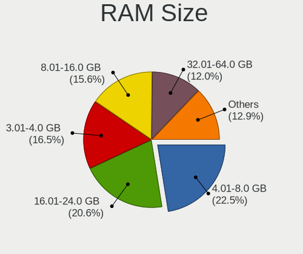
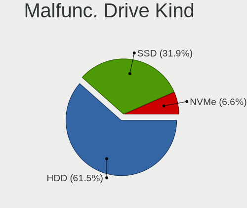
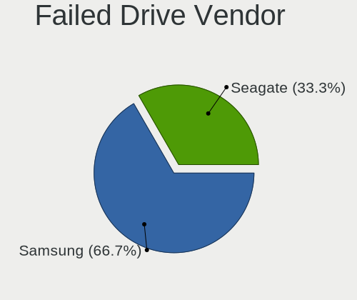
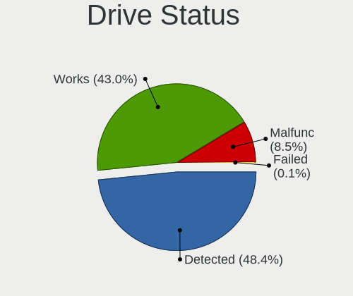
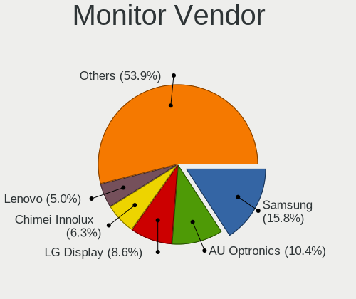
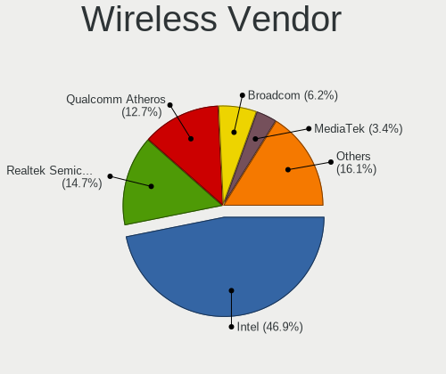
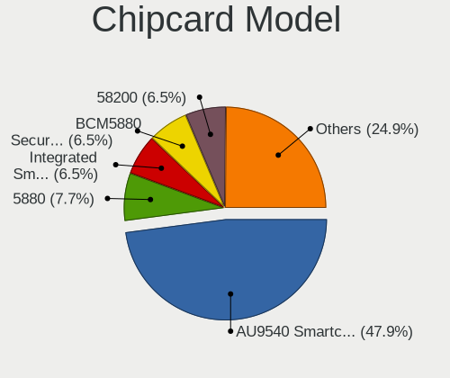

Linux in Finland - Tested Hardware & Statistics
-----------------------------------------------

A project to collect tested hardware configurations for Linux in Finland.

Anyone can contribute to this report by the [hw-probe](https://github.com/linuxhw/hw-probe) tool:

    sudo -E hw-probe -all -upload

Please contribute! Especially if your hardware is rare.

This is a report for all computer types. See also reports for [desktops](/Location/Finland/Desktop/README.md) and [notebooks](/Location/Finland/Notebook/README.md).

Contents
--------

* [ Test Cases ](#test-cases)

* [ System ](#system)
  - [ OS                       ](#os)
  - [ OS Family                ](#os-family)
  - [ Kernel                   ](#kernel)
  - [ Kernel Family            ](#kernel-family)
  - [ Kernel Major Ver.        ](#kernel-major-ver)
  - [ Arch                     ](#arch)
  - [ DE                       ](#de)
  - [ Display Server           ](#display-server)
  - [ Display Manager          ](#display-manager)
  - [ OS Lang                  ](#os-lang)
  - [ Boot Mode                ](#boot-mode)
  - [ Filesystem               ](#filesystem)
  - [ Part. scheme             ](#part-scheme)
  - [ Dual Boot with Linux/BSD ](#dual-boot-with-linuxbsd)
  - [ Dual Boot (Win)          ](#dual-boot-win)

* [ Board ](#board)
  - [ Vendor                   ](#vendor)
  - [ Model                    ](#model)
  - [ Model Family             ](#model-family)
  - [ MFG Year                 ](#mfg-year)
  - [ Form Factor              ](#form-factor)
  - [ Secure Boot              ](#secure-boot)
  - [ Coreboot                 ](#coreboot)
  - [ RAM Size                 ](#ram-size)
  - [ RAM Used                 ](#ram-used)
  - [ Total Drives             ](#total-drives)
  - [ Has CD-ROM               ](#has-cd-rom)
  - [ Has Ethernet             ](#has-ethernet)
  - [ Has WiFi                 ](#has-wifi)
  - [ Has Bluetooth            ](#has-bluetooth)

* [ Location ](#location)
  - [ Country                  ](#country)
  - [ City                     ](#city)

* [ Drives ](#drives)
  - [ Drive Vendor             ](#drive-vendor)
  - [ Drive Model              ](#drive-model)
  - [ HDD Vendor               ](#hdd-vendor)
  - [ SSD Vendor               ](#ssd-vendor)
  - [ Drive Kind               ](#drive-kind)
  - [ Drive Connector          ](#drive-connector)
  - [ Drive Size               ](#drive-size)
  - [ Space Total              ](#space-total)
  - [ Space Used               ](#space-used)
  - [ Malfunc. Drives          ](#malfunc-drives)
  - [ Malfunc. Drive Vendor    ](#malfunc-drive-vendor)
  - [ Malfunc. HDD Vendor      ](#malfunc-hdd-vendor)
  - [ Malfunc. Drive Kind      ](#malfunc-drive-kind)
  - [ Failed Drives            ](#failed-drives)
  - [ Failed Drive Vendor      ](#failed-drive-vendor)
  - [ Drive Status             ](#drive-status)

* [ Storage controller ](#storage-controller)
  - [ Storage Vendor           ](#storage-vendor)
  - [ Storage Model            ](#storage-model)
  - [ Storage Kind             ](#storage-kind)

* [ Processor ](#processor)
  - [ CPU Vendor               ](#cpu-vendor)
  - [ CPU Model                ](#cpu-model)
  - [ CPU Model Family         ](#cpu-model-family)
  - [ CPU Cores                ](#cpu-cores)
  - [ CPU Sockets              ](#cpu-sockets)
  - [ CPU Threads              ](#cpu-threads)
  - [ CPU Op-Modes             ](#cpu-op-modes)
  - [ CPU Microcode            ](#cpu-microcode)
  - [ CPU Microarch            ](#cpu-microarch)

* [ Graphics ](#graphics)
  - [ GPU Vendor               ](#gpu-vendor)
  - [ GPU Model                ](#gpu-model)
  - [ GPU Combo                ](#gpu-combo)
  - [ GPU Driver               ](#gpu-driver)
  - [ GPU Memory               ](#gpu-memory)

* [ Monitor ](#monitor)
  - [ Monitor Vendor           ](#monitor-vendor)
  - [ Monitor Model            ](#monitor-model)
  - [ Monitor Resolution       ](#monitor-resolution)
  - [ Monitor Diagonal         ](#monitor-diagonal)
  - [ Monitor Width            ](#monitor-width)
  - [ Aspect Ratio             ](#aspect-ratio)
  - [ Monitor Area             ](#monitor-area)
  - [ Pixel Density            ](#pixel-density)
  - [ Multiple Monitors        ](#multiple-monitors)

* [ Network ](#network)
  - [ Net Controller Vendor    ](#net-controller-vendor)
  - [ Net Controller Model     ](#net-controller-model)
  - [ Wireless Vendor          ](#wireless-vendor)
  - [ Wireless Model           ](#wireless-model)
  - [ Ethernet Vendor          ](#ethernet-vendor)
  - [ Ethernet Model           ](#ethernet-model)
  - [ Net Controller Kind      ](#net-controller-kind)
  - [ Used Controller          ](#used-controller)
  - [ NICs                     ](#nics)
  - [ IPv6                     ](#ipv6)

* [ Bluetooth ](#bluetooth)
  - [ Bluetooth Vendor         ](#bluetooth-vendor)
  - [ Bluetooth Model          ](#bluetooth-model)

* [ Sound ](#sound)
  - [ Sound Vendor             ](#sound-vendor)
  - [ Sound Model              ](#sound-model)

* [ Memory ](#memory)
  - [ Memory Vendor            ](#memory-vendor)
  - [ Memory Model             ](#memory-model)
  - [ Memory Kind              ](#memory-kind)
  - [ Memory Form Factor       ](#memory-form-factor)
  - [ Memory Size              ](#memory-size)
  - [ Memory Speed             ](#memory-speed)

* [ Printers & scanners ](#printers--scanners)
  - [ Printer Vendor           ](#printer-vendor)
  - [ Printer Model            ](#printer-model)
  - [ Scanner Vendor           ](#scanner-vendor)
  - [ Scanner Model            ](#scanner-model)

* [ Camera ](#camera)
  - [ Camera Vendor            ](#camera-vendor)
  - [ Camera Model             ](#camera-model)

* [ Security ](#security)
  - [ Fingerprint Vendor       ](#fingerprint-vendor)
  - [ Fingerprint Model        ](#fingerprint-model)
  - [ Chipcard Vendor          ](#chipcard-vendor)
  - [ Chipcard Model           ](#chipcard-model)

* [ Unsupported ](#unsupported)
  - [ Unsupported Devices      ](#unsupported-devices)
  - [ Unsupported Device Types ](#unsupported-device-types)

Test Cases
----------

Total: 1475

| Vendor        | Model                       | Form-Factor | Probe                                                      | Date         |
|---------------|-----------------------------|-------------|------------------------------------------------------------|--------------|
| Lenovo        | G50-80 80E5                 | Notebook    | [8ecadc1bad](https://linux-hardware.org/?probe=8ecadc1bad) | May 05, 2022 |
| Supermicro    | X8ST3                       | Desktop     | [3cab505f0a](https://linux-hardware.org/?probe=3cab505f0a) | May 05, 2022 |
| Acer          | H57M01                      | Desktop     | [180132b3e1](https://linux-hardware.org/?probe=180132b3e1) | May 03, 2022 |
| Acer          | FX58M                       | Desktop     | [0a6673afb9](https://linux-hardware.org/?probe=0a6673afb9) | May 03, 2022 |
| Lenovo        | Yoga 2 13 20344             | Notebook    | [83ca73d4cd](https://linux-hardware.org/?probe=83ca73d4cd) | May 03, 2022 |
| HP            | 1589                        | Desktop     | [79df2c00dc](https://linux-hardware.org/?probe=79df2c00dc) | May 03, 2022 |
| Lenovo        | Yoga 2 13 20344             | Notebook    | [fcca76f1e5](https://linux-hardware.org/?probe=fcca76f1e5) | May 01, 2022 |
| ASUSTek       | P5B                         | Desktop     | [39c9900546](https://linux-hardware.org/?probe=39c9900546) | May 01, 2022 |
| Lenovo        | Yoga Slim 7 14ARE05 82A2    | Notebook    | [a90e6b2be7](https://linux-hardware.org/?probe=a90e6b2be7) | Apr 30, 2022 |
| MSI           | B550-A PRO                  | Desktop     | [0b23621ed1](https://linux-hardware.org/?probe=0b23621ed1) | Apr 30, 2022 |
| Dell          | Latitude E6330              | Notebook    | [c78066bc19](https://linux-hardware.org/?probe=c78066bc19) | Apr 29, 2022 |
| Gigabyte      | B450M S2H                   | Desktop     | [2e84d98937](https://linux-hardware.org/?probe=2e84d98937) | Apr 29, 2022 |
| Lenovo        | ThinkPad T430u 335337G      | Notebook    | [31bc958302](https://linux-hardware.org/?probe=31bc958302) | Apr 26, 2022 |
| Lenovo        | ThinkPad T430u 335337G      | Notebook    | [8446691cb3](https://linux-hardware.org/?probe=8446691cb3) | Apr 26, 2022 |
| Lenovo        | IdeaPad L340-15IRH Gamin... | Notebook    | [2717caa7f5](https://linux-hardware.org/?probe=2717caa7f5) | Apr 25, 2022 |
| Lenovo        | ThinkPad X230 2324GA7       | Notebook    | [a5138b511d](https://linux-hardware.org/?probe=a5138b511d) | Apr 25, 2022 |
| Intel         | NUC8BEB J72688-305          | Mini pc     | [f656f0d16f](https://linux-hardware.org/?probe=f656f0d16f) | Apr 24, 2022 |
| ASUSTek       | Pro WS X570-ACE             | Desktop     | [1612f46137](https://linux-hardware.org/?probe=1612f46137) | Apr 24, 2022 |
| HP            | Laptop 15-bw0xx             | Notebook    | [e83ffcb04f](https://linux-hardware.org/?probe=e83ffcb04f) | Apr 24, 2022 |
| HP            | Laptop 15-bw0xx             | Notebook    | [25e6181500](https://linux-hardware.org/?probe=25e6181500) | Apr 24, 2022 |
| ASUSTek       | AM1M-A                      | Desktop     | [11bded9e5f](https://linux-hardware.org/?probe=11bded9e5f) | Apr 23, 2022 |
| MSI           | Stealth GS77 12UGS          | Notebook    | [cd1bc2095f](https://linux-hardware.org/?probe=cd1bc2095f) | Apr 22, 2022 |
| MSI           | Stealth GS77 12UGS          | Notebook    | [33afc70a54](https://linux-hardware.org/?probe=33afc70a54) | Apr 22, 2022 |
| Acer          | Aspire 7530G                | Notebook    | [710b429d94](https://linux-hardware.org/?probe=710b429d94) | Apr 21, 2022 |
| ASUSTek       | PRIME A320M-K               | Desktop     | [822db71f7a](https://linux-hardware.org/?probe=822db71f7a) | Apr 21, 2022 |
| ASRock        | Z87 Extreme6                | Desktop     | [d7e24821ee](https://linux-hardware.org/?probe=d7e24821ee) | Apr 18, 2022 |
| Dell          | 0HY9JP A00                  | Desktop     | [a767ef8b4e](https://linux-hardware.org/?probe=a767ef8b4e) | Apr 16, 2022 |
| Dell          | 0HY9JP A00                  | Desktop     | [5ce6ef2934](https://linux-hardware.org/?probe=5ce6ef2934) | Apr 16, 2022 |
| Dell          | 0HY9JP A00                  | Desktop     | [fed643b7ec](https://linux-hardware.org/?probe=fed643b7ec) | Apr 16, 2022 |
| Fujitsu Si... | ESPRIMO Mobile V6535        | Notebook    | [5a93c8e68c](https://linux-hardware.org/?probe=5a93c8e68c) | Apr 14, 2022 |
| Lenovo        | ThinkPad T480 20L6S93F00    | Notebook    | [b8c57e6b8a](https://linux-hardware.org/?probe=b8c57e6b8a) | Apr 14, 2022 |
| MSI           | Indio                       | Desktop     | [ca3a24d84d](https://linux-hardware.org/?probe=ca3a24d84d) | Apr 13, 2022 |
| HP            | Notebook                    | Notebook    | [24faf4835d](https://linux-hardware.org/?probe=24faf4835d) | Apr 10, 2022 |
| MSI           | Z370 PC PRO                 | Desktop     | [2d4574e9fe](https://linux-hardware.org/?probe=2d4574e9fe) | Apr 10, 2022 |
| ASUSTek       | Z87-K                       | Desktop     | [b0ffa911b5](https://linux-hardware.org/?probe=b0ffa911b5) | Apr 10, 2022 |
| ASUSTek       | Z87-K                       | Desktop     | [5264d55ce2](https://linux-hardware.org/?probe=5264d55ce2) | Apr 09, 2022 |
| ASUSTek       | AM1M-A                      | Desktop     | [1a910e93c5](https://linux-hardware.org/?probe=1a910e93c5) | Apr 09, 2022 |
| ASUSTek       | AM1M-A                      | Desktop     | [2d350f40d2](https://linux-hardware.org/?probe=2d350f40d2) | Apr 09, 2022 |
| Acer          | Batman A01                  | Desktop     | [a102f85d9d](https://linux-hardware.org/?probe=a102f85d9d) | Apr 08, 2022 |
| Gigabyte      | H410M H V3                  | Desktop     | [1a1c86083e](https://linux-hardware.org/?probe=1a1c86083e) | Apr 07, 2022 |
| HP            | 18E7                        | Desktop     | [35dbcc5737](https://linux-hardware.org/?probe=35dbcc5737) | Apr 07, 2022 |
| MSI           | GV62 8RD                    | Notebook    | [2e43728adb](https://linux-hardware.org/?probe=2e43728adb) | Apr 06, 2022 |
| ASUSTek       | B150M-K                     | Desktop     | [016a08bf47](https://linux-hardware.org/?probe=016a08bf47) | Apr 04, 2022 |
| Acer          | Aspire TC-120               | Desktop     | [a92d7ab62a](https://linux-hardware.org/?probe=a92d7ab62a) | Apr 02, 2022 |
| ASRock        | B85M-ITX                    | Desktop     | [1a2849588f](https://linux-hardware.org/?probe=1a2849588f) | Apr 01, 2022 |
| HP            | 3047h                       | Desktop     | [356fac6a3a](https://linux-hardware.org/?probe=356fac6a3a) | Apr 01, 2022 |
| HP            | 3047h                       | Desktop     | [d4c9852b3c](https://linux-hardware.org/?probe=d4c9852b3c) | Apr 01, 2022 |
| Lenovo        | ThinkPad P14s Gen 2a 21A... | Notebook    | [07efb6a561](https://linux-hardware.org/?probe=07efb6a561) | Apr 01, 2022 |
| MSI           | 990FXA-GD65                 | Desktop     | [52598b41a6](https://linux-hardware.org/?probe=52598b41a6) | Mar 31, 2022 |
| Dell          | Latitude 5480               | Notebook    | [2d431aae25](https://linux-hardware.org/?probe=2d431aae25) | Mar 29, 2022 |
| ASUSTek       | PRIME Z690-P D4             | Desktop     | [79c9d66395](https://linux-hardware.org/?probe=79c9d66395) | Mar 26, 2022 |
| Gigabyte      | 990XA-UD3                   | Desktop     | [913cf55cc3](https://linux-hardware.org/?probe=913cf55cc3) | Mar 25, 2022 |
| Lenovo        | ThinkPad X230 2325BN8       | Notebook    | [3ad2d0f3ee](https://linux-hardware.org/?probe=3ad2d0f3ee) | Mar 25, 2022 |
| Lenovo        | ThinkPad W540 20BHS04T0P    | Notebook    | [d5b5eeffc8](https://linux-hardware.org/?probe=d5b5eeffc8) | Mar 25, 2022 |
| Lenovo        | MAHOBAY Win8 Pro DPK TPG    | Desktop     | [7b835e9a57](https://linux-hardware.org/?probe=7b835e9a57) | Mar 23, 2022 |
| ASRock        | AB350M-HDV                  | Desktop     | [069ce018ad](https://linux-hardware.org/?probe=069ce018ad) | Mar 22, 2022 |
| Fujitsu Si... | ESPRIMO Mobile U9210        | Notebook    | [bf87e829d7](https://linux-hardware.org/?probe=bf87e829d7) | Mar 14, 2022 |
| ASUSTek       | ASUS TUF Dash F15 FX516P... | Notebook    | [78ae0419a3](https://linux-hardware.org/?probe=78ae0419a3) | Mar 14, 2022 |
| Lenovo        | V145-15AST 81MT             | Notebook    | [ba2686174e](https://linux-hardware.org/?probe=ba2686174e) | Mar 13, 2022 |
| Gigabyte      | H61M-S2PV                   | Desktop     | [6b32e0c788](https://linux-hardware.org/?probe=6b32e0c788) | Mar 10, 2022 |
| Acer          | AO725                       | Notebook    | [70febdd28f](https://linux-hardware.org/?probe=70febdd28f) | Mar 10, 2022 |
| Lenovo        | ThinkPad X260 20F5S1MN00    | Notebook    | [0f20b300ec](https://linux-hardware.org/?probe=0f20b300ec) | Mar 09, 2022 |
| Lenovo        | IdeaPad 310-15IKB 80TV      | Notebook    | [e6a6f71bb5](https://linux-hardware.org/?probe=e6a6f71bb5) | Mar 09, 2022 |
| HP            | G62                         | Notebook    | [67bc301ee6](https://linux-hardware.org/?probe=67bc301ee6) | Mar 09, 2022 |
| ASUSTek       | ASUS TUF Dash F15 FX516P... | Notebook    | [f351d9839b](https://linux-hardware.org/?probe=f351d9839b) | Mar 09, 2022 |
| Acer          | FX58M                       | Desktop     | [7404e9534e](https://linux-hardware.org/?probe=7404e9534e) | Mar 09, 2022 |
| ASUSTek       | G751JT                      | Notebook    | [32556e3c15](https://linux-hardware.org/?probe=32556e3c15) | Mar 09, 2022 |
| ASUSTek       | PRIME Z690-P D4             | Desktop     | [fb860cb8cc](https://linux-hardware.org/?probe=fb860cb8cc) | Mar 08, 2022 |
| ASUSTek       | PRIME Z690-P D4             | Desktop     | [d427799541](https://linux-hardware.org/?probe=d427799541) | Mar 08, 2022 |
| ASUSTek       | PRIME Z690-P D4             | Desktop     | [2d1db73ec8](https://linux-hardware.org/?probe=2d1db73ec8) | Mar 07, 2022 |
| ASUSTek       | PRIME Z690-P D4             | Desktop     | [2142681934](https://linux-hardware.org/?probe=2142681934) | Mar 06, 2022 |
| ASUSTek       | PRIME Z690-P D4             | Desktop     | [456b0dd391](https://linux-hardware.org/?probe=456b0dd391) | Mar 06, 2022 |
| ASUSTek       | Maximus VIII IMPACT         | Desktop     | [2e19b36624](https://linux-hardware.org/?probe=2e19b36624) | Mar 03, 2022 |
| Lenovo        | ThinkPad 13 20GJ0048MS      | Notebook    | [6590a539cf](https://linux-hardware.org/?probe=6590a539cf) | Mar 02, 2022 |
| Fujitsu       | AMILO Pi 3560               | Notebook    | [ea68b8ed21](https://linux-hardware.org/?probe=ea68b8ed21) | Mar 01, 2022 |
| Lenovo        | ThinkPad X1 Carbon 5th 2... | Notebook    | [0278765ef8](https://linux-hardware.org/?probe=0278765ef8) | Feb 28, 2022 |
| Apple         | MacBook4,1                  | Notebook    | [c08be74242](https://linux-hardware.org/?probe=c08be74242) | Feb 27, 2022 |
| Acer          | Aspire XC-105               | Desktop     | [0dd55e5b26](https://linux-hardware.org/?probe=0dd55e5b26) | Feb 26, 2022 |
| ABIT          | IP35                        | Desktop     | [278dd592cc](https://linux-hardware.org/?probe=278dd592cc) | Feb 26, 2022 |
| ASUSTek       | Z170-K                      | Desktop     | [cfdffcf6ab](https://linux-hardware.org/?probe=cfdffcf6ab) | Feb 26, 2022 |
| Lenovo        | Yoga Slim 7 14ARE05 82A2    | Notebook    | [02ac351573](https://linux-hardware.org/?probe=02ac351573) | Feb 25, 2022 |
| MSI           | B450 GAMING PRO CARBON A... | Desktop     | [f12d1e47df](https://linux-hardware.org/?probe=f12d1e47df) | Feb 24, 2022 |
| Lenovo        | ThinkPad P14s Gen 2a 21A... | Notebook    | [fa5d4846df](https://linux-hardware.org/?probe=fa5d4846df) | Feb 23, 2022 |
| ASRock        | AB350M-HDV                  | Desktop     | [5fe85bba2e](https://linux-hardware.org/?probe=5fe85bba2e) | Feb 22, 2022 |
| HP            | G62                         | Notebook    | [337afde8c1](https://linux-hardware.org/?probe=337afde8c1) | Feb 21, 2022 |
| HP            | G62                         | Notebook    | [a175af3dd6](https://linux-hardware.org/?probe=a175af3dd6) | Feb 21, 2022 |
| Raspberry ... | Raspberry Pi                | Soc         | [811ec775f8](https://linux-hardware.org/?probe=811ec775f8) | Feb 19, 2022 |
| powerinter... | Cepter N510-03              | Notebook    | [cd6804144d](https://linux-hardware.org/?probe=cd6804144d) | Feb 18, 2022 |
| Lenovo        | ThinkPad T440p 20AWS0U50... | Notebook    | [a114b7030f](https://linux-hardware.org/?probe=a114b7030f) | Feb 17, 2022 |
| Lenovo        | ThinkPad E14 20RA001LMX     | Notebook    | [19edff5659](https://linux-hardware.org/?probe=19edff5659) | Feb 17, 2022 |
| HP            | Compaq 6910p (GB951EA#AK... | Notebook    | [b136dd5def](https://linux-hardware.org/?probe=b136dd5def) | Feb 15, 2022 |
| Acer          | Aspire ES1-512              | Notebook    | [deb108070d](https://linux-hardware.org/?probe=deb108070d) | Feb 15, 2022 |
| ASUSTek       | T200TAC                     | Notebook    | [87db259935](https://linux-hardware.org/?probe=87db259935) | Feb 15, 2022 |
| ASUSTek       | P8Z68 DELUXE                | Desktop     | [8b588bf90b](https://linux-hardware.org/?probe=8b588bf90b) | Feb 15, 2022 |
| Lenovo        | ThinkPad X230 23252SG       | Notebook    | [a5179b9681](https://linux-hardware.org/?probe=a5179b9681) | Feb 15, 2022 |
| HP            | 250 G5 Notebook PC          | Notebook    | [7cdffcccb7](https://linux-hardware.org/?probe=7cdffcccb7) | Feb 13, 2022 |
| Fujitsu       | LIFEBOOK E780               | Notebook    | [0ba38c6605](https://linux-hardware.org/?probe=0ba38c6605) | Feb 13, 2022 |
| Dell          | Latitude E5420              | Notebook    | [f016e9f3ad](https://linux-hardware.org/?probe=f016e9f3ad) | Feb 12, 2022 |
| Dell          | Latitude E5420              | Notebook    | [8843a735a0](https://linux-hardware.org/?probe=8843a735a0) | Feb 12, 2022 |
| Lenovo        | G50-80 80E5                 | Notebook    | [61e1bce7ae](https://linux-hardware.org/?probe=61e1bce7ae) | Feb 12, 2022 |
| ASRock        | 890FX Deluxe4               | Desktop     | [33a47b3c4b](https://linux-hardware.org/?probe=33a47b3c4b) | Feb 11, 2022 |
| Gigabyte      | B250M-DS3H-CF               | Desktop     | [040550cdaa](https://linux-hardware.org/?probe=040550cdaa) | Feb 11, 2022 |
| HP            | Pavilion Laptop 15-eg0xx... | Notebook    | [766e937263](https://linux-hardware.org/?probe=766e937263) | Feb 10, 2022 |
| ASUSTek       | PRIME X299-DELUXE II        | Desktop     | [ba2262bba5](https://linux-hardware.org/?probe=ba2262bba5) | Feb 10, 2022 |
| Lenovo        | ThinkPad E590 20NB0012MX    | Notebook    | [92a33a8f31](https://linux-hardware.org/?probe=92a33a8f31) | Feb 10, 2022 |
| Gigabyte      | B250M-DS3H-CF               | Desktop     | [3d76f83751](https://linux-hardware.org/?probe=3d76f83751) | Feb 10, 2022 |
| ASUSTek       | H97M-PLUS                   | Desktop     | [75b31509a3](https://linux-hardware.org/?probe=75b31509a3) | Feb 09, 2022 |
| Lenovo        | G50-80 80E5                 | Notebook    | [72b880911a](https://linux-hardware.org/?probe=72b880911a) | Feb 08, 2022 |
| ASUSTek       | H97M-PLUS                   | Desktop     | [88fdd17fc6](https://linux-hardware.org/?probe=88fdd17fc6) | Feb 07, 2022 |
| ASUSTek       | ROG STRIX Z370-F GAMING     | Desktop     | [22be2d64a2](https://linux-hardware.org/?probe=22be2d64a2) | Feb 06, 2022 |
| ASUSTek       | ZenBook UX325EA_UX325EA     | Notebook    | [e0765c9f5a](https://linux-hardware.org/?probe=e0765c9f5a) | Feb 06, 2022 |
| ASUSTek       | TUF Gaming FX505DT_FX505... | Notebook    | [6160f71e77](https://linux-hardware.org/?probe=6160f71e77) | Feb 05, 2022 |
| ASUSTek       | PRIME B450-PLUS             | Desktop     | [035ccaeec8](https://linux-hardware.org/?probe=035ccaeec8) | Feb 04, 2022 |
| ASUSTek       | UX303UB                     | Notebook    | [cba6a6b5a6](https://linux-hardware.org/?probe=cba6a6b5a6) | Feb 02, 2022 |
| Dell          | 051FJ8 A00                  | Desktop     | [da74a4ea79](https://linux-hardware.org/?probe=da74a4ea79) | Feb 01, 2022 |
| MSI           | Z170A PC MATE               | Desktop     | [e83deb15fd](https://linux-hardware.org/?probe=e83deb15fd) | Jan 31, 2022 |
| Fujitsu       | D2812-A2 S26361-D2812-A2    | Desktop     | [5f6a8cf57f](https://linux-hardware.org/?probe=5f6a8cf57f) | Jan 29, 2022 |
| Fujitsu       | D2812-A2 S26361-D2812-A2    | Desktop     | [9ff78b6d13](https://linux-hardware.org/?probe=9ff78b6d13) | Jan 29, 2022 |
| Lenovo        | ThinkPad X390 Yoga 20NQS... | Convertible | [f76e2b6c0f](https://linux-hardware.org/?probe=f76e2b6c0f) | Jan 28, 2022 |
| ASUSTek       | ROG STRIX X570-E GAMING     | Desktop     | [6423454dd8](https://linux-hardware.org/?probe=6423454dd8) | Jan 28, 2022 |
| Lenovo        | ThinkPad X390 20Q00057MX    | Notebook    | [326cb714f0](https://linux-hardware.org/?probe=326cb714f0) | Jan 27, 2022 |
| HP            | Compaq Presario CQ70        | Notebook    | [a31ae712c0](https://linux-hardware.org/?probe=a31ae712c0) | Jan 26, 2022 |
| HP            | Compaq Presario CQ70        | Notebook    | [82a45a6067](https://linux-hardware.org/?probe=82a45a6067) | Jan 26, 2022 |
| HP            | Compaq 6830s                | Notebook    | [f82216de53](https://linux-hardware.org/?probe=f82216de53) | Jan 26, 2022 |
| HP            | Compaq 6830s                | Notebook    | [fe7ef8a290](https://linux-hardware.org/?probe=fe7ef8a290) | Jan 26, 2022 |
| ASRock        | H510M-HVS                   | Desktop     | [ef779f5d49](https://linux-hardware.org/?probe=ef779f5d49) | Jan 26, 2022 |
| ASRock        | AB350M-HDV                  | Desktop     | [cf5823e07b](https://linux-hardware.org/?probe=cf5823e07b) | Jan 26, 2022 |
| Packard Be... | IMEDIA S3840                | Desktop     | [eff4bf09ec](https://linux-hardware.org/?probe=eff4bf09ec) | Jan 26, 2022 |
| ASUSTek       | G751JT                      | Notebook    | [ffadc47152](https://linux-hardware.org/?probe=ffadc47152) | Jan 25, 2022 |
| ASUSTek       | G751JT                      | Notebook    | [fabdb73d12](https://linux-hardware.org/?probe=fabdb73d12) | Jan 25, 2022 |
| Lenovo        | ThinkPad Edge E530c 3366... | Notebook    | [7078a1a373](https://linux-hardware.org/?probe=7078a1a373) | Jan 25, 2022 |
| ASUSTek       | T101HA                      | Tablet      | [63d4ce1086](https://linux-hardware.org/?probe=63d4ce1086) | Jan 23, 2022 |
| ASUSTek       | T101HA                      | Tablet      | [b9d8fc0e46](https://linux-hardware.org/?probe=b9d8fc0e46) | Jan 23, 2022 |
| MSI           | MPG X570 GAMING EDGE WIF... | Desktop     | [88049a6cee](https://linux-hardware.org/?probe=88049a6cee) | Jan 22, 2022 |
| ASUSTek       | H97M-PLUS                   | Desktop     | [6612c0119c](https://linux-hardware.org/?probe=6612c0119c) | Jan 22, 2022 |
| Lenovo        | ThinkPad T430 2351AK9       | Notebook    | [19f50b09d5](https://linux-hardware.org/?probe=19f50b09d5) | Jan 21, 2022 |
| ASUSTek       | Maximus VIII HERO           | Desktop     | [8f7c57b03f](https://linux-hardware.org/?probe=8f7c57b03f) | Jan 18, 2022 |
| ASUSTek       | M5A97 LE R2.0               | Desktop     | [5f904131f5](https://linux-hardware.org/?probe=5f904131f5) | Jan 18, 2022 |
| ASUSTek       | S551LN                      | Notebook    | [f6beec1048](https://linux-hardware.org/?probe=f6beec1048) | Jan 18, 2022 |
| ASUSTek       | ROG STRIX Z370-F GAMING     | Desktop     | [06c4be96aa](https://linux-hardware.org/?probe=06c4be96aa) | Jan 17, 2022 |
| HP            | EliteBook 820 G1            | Notebook    | [39b90ab9c3](https://linux-hardware.org/?probe=39b90ab9c3) | Jan 17, 2022 |
| Lenovo        | ThinkPad W520 42844MG       | Notebook    | [cf460c52bb](https://linux-hardware.org/?probe=cf460c52bb) | Jan 16, 2022 |
| HP            | 18E5                        | Desktop     | [a06f3d3373](https://linux-hardware.org/?probe=a06f3d3373) | Jan 16, 2022 |
| Dell          | XPS 17 9710                 | Notebook    | [3417abe371](https://linux-hardware.org/?probe=3417abe371) | Jan 16, 2022 |
| ASUSTek       | TUF Gaming FX505DT_FX505... | Notebook    | [caa528d6e0](https://linux-hardware.org/?probe=caa528d6e0) | Jan 15, 2022 |
| Dell          | XPS 17 9710                 | Notebook    | [3d2a67265f](https://linux-hardware.org/?probe=3d2a67265f) | Jan 15, 2022 |
| HP            | 1495                        | Desktop     | [ea7df45832](https://linux-hardware.org/?probe=ea7df45832) | Jan 14, 2022 |
| ASUSTek       | UL30A                       | Notebook    | [c2406eee73](https://linux-hardware.org/?probe=c2406eee73) | Jan 13, 2022 |
| HP            | Laptop 14-dk0xxx            | Notebook    | [4bbc688f9d](https://linux-hardware.org/?probe=4bbc688f9d) | Jan 13, 2022 |
| Fujitsu       | D3220-A1 S26361-D3220-A1    | Desktop     | [e82feb71d2](https://linux-hardware.org/?probe=e82feb71d2) | Jan 12, 2022 |
| Fujitsu       | D3220-A1 S26361-D3220-A1    | Desktop     | [0529614510](https://linux-hardware.org/?probe=0529614510) | Jan 12, 2022 |
| Toshiba       | Satellite P870              | Notebook    | [e046040d73](https://linux-hardware.org/?probe=e046040d73) | Jan 11, 2022 |
| HP            | Notebook                    | Notebook    | [0667124a5f](https://linux-hardware.org/?probe=0667124a5f) | Jan 10, 2022 |
| Lenovo        | ThinkCentre M90 5485W45     | Desktop     | [1da9aea182](https://linux-hardware.org/?probe=1da9aea182) | Jan 10, 2022 |
| Sony          | VGN-FZ21Z                   | Notebook    | [6291085e58](https://linux-hardware.org/?probe=6291085e58) | Jan 09, 2022 |
| ASUSTek       | X553MA                      | Notebook    | [cdf5230fdb](https://linux-hardware.org/?probe=cdf5230fdb) | Jan 09, 2022 |
| HP            | 3646h                       | Desktop     | [85edd0c1bf](https://linux-hardware.org/?probe=85edd0c1bf) | Jan 08, 2022 |
| HP            | 3646h                       | Desktop     | [616a0acd31](https://linux-hardware.org/?probe=616a0acd31) | Jan 08, 2022 |
| Sony          | VGN-FZ21Z                   | Notebook    | [c4ac286105](https://linux-hardware.org/?probe=c4ac286105) | Jan 08, 2022 |
| ASUSTek       | M4A785TD-M EVO              | Desktop     | [72fa18d5dd](https://linux-hardware.org/?probe=72fa18d5dd) | Jan 08, 2022 |
| MSI           | H110M ECO                   | Desktop     | [c056a2eafa](https://linux-hardware.org/?probe=c056a2eafa) | Jan 07, 2022 |
| HP            | ProBook 450 G3              | Notebook    | [1644301279](https://linux-hardware.org/?probe=1644301279) | Jan 07, 2022 |
| Lenovo        | ThinkCentre M90 5485W45     | Desktop     | [6f8a6d74e4](https://linux-hardware.org/?probe=6f8a6d74e4) | Jan 07, 2022 |
| ASUSTek       | UL30A                       | Notebook    | [b2682cb5fe](https://linux-hardware.org/?probe=b2682cb5fe) | Jan 06, 2022 |
| Lenovo        | ThinkPad T490 20N3S2NJ00    | Notebook    | [e9170a81fe](https://linux-hardware.org/?probe=e9170a81fe) | Jan 05, 2022 |
| Acer          | WMCP78M                     | Desktop     | [250fa57c5d](https://linux-hardware.org/?probe=250fa57c5d) | Jan 05, 2022 |
| Lenovo        | ThinkPad E14 20RA001BMX     | Notebook    | [b34ccf2c06](https://linux-hardware.org/?probe=b34ccf2c06) | Jan 05, 2022 |
| Gigabyte      | 970A-UD3P                   | Desktop     | [c28c0f7f40](https://linux-hardware.org/?probe=c28c0f7f40) | Jan 04, 2022 |
| Dell          | XPS 13 9310 2-in-1          | Convertible | [0731f1a6d9](https://linux-hardware.org/?probe=0731f1a6d9) | Jan 04, 2022 |
| ASUSTek       | ASUS TUF Gaming F17 FX70... | Notebook    | [5dd20e2872](https://linux-hardware.org/?probe=5dd20e2872) | Jan 03, 2022 |
| AMI           | Aptio CRB                   | Mini pc     | [4ed85a0f7a](https://linux-hardware.org/?probe=4ed85a0f7a) | Dec 30, 2021 |
| HP            | 3397                        | Desktop     | [188bb8c669](https://linux-hardware.org/?probe=188bb8c669) | Dec 28, 2021 |
| HP            | 3397                        | Desktop     | [a01b48ab2d](https://linux-hardware.org/?probe=a01b48ab2d) | Dec 26, 2021 |
| ASUSTek       | PRIME B350-PLUS             | Desktop     | [a3f574b521](https://linux-hardware.org/?probe=a3f574b521) | Dec 26, 2021 |
| Lenovo        | ThinkPad X61 7674CT0        | Notebook    | [25a59e69c1](https://linux-hardware.org/?probe=25a59e69c1) | Dec 25, 2021 |
| Lenovo        | ThinkPad X61 7674CT0        | Notebook    | [a5b0d0a06a](https://linux-hardware.org/?probe=a5b0d0a06a) | Dec 25, 2021 |
| Acer          | Swift SF314-52              | Notebook    | [67fb871b2f](https://linux-hardware.org/?probe=67fb871b2f) | Dec 24, 2021 |
| MSI           | GE72 6QC                    | Notebook    | [8f778b6205](https://linux-hardware.org/?probe=8f778b6205) | Dec 23, 2021 |
| ASUSTek       | ROG STRIX B550-F GAMING     | Desktop     | [7b2a363709](https://linux-hardware.org/?probe=7b2a363709) | Dec 21, 2021 |
| HP            | EliteBook 2570p             | Notebook    | [462b93b05b](https://linux-hardware.org/?probe=462b93b05b) | Dec 20, 2021 |
| Apple         | Mac-F2238AC8                | All in one  | [4384deed19](https://linux-hardware.org/?probe=4384deed19) | Dec 20, 2021 |
| ASUSTek       | ROG STRIX B550-F GAMING     | Desktop     | [82a9ed12b5](https://linux-hardware.org/?probe=82a9ed12b5) | Dec 19, 2021 |
| ASUSTek       | ROG CROSSHAIR VIII DARK ... | Desktop     | [83e6ab3542](https://linux-hardware.org/?probe=83e6ab3542) | Dec 18, 2021 |
| MSI           | GE72 6QC                    | Notebook    | [1d77c47b4c](https://linux-hardware.org/?probe=1d77c47b4c) | Dec 18, 2021 |
| ASUSTek       | E200HA                      | Notebook    | [bcd4913896](https://linux-hardware.org/?probe=bcd4913896) | Dec 17, 2021 |
| Lenovo        | ThinkPad X390 Yoga 20NQS... | Convertible | [b36ce4f828](https://linux-hardware.org/?probe=b36ce4f828) | Dec 17, 2021 |
| Dell          | Latitude 5490               | Notebook    | [a9261b4529](https://linux-hardware.org/?probe=a9261b4529) | Dec 16, 2021 |
| ASUSTek       | A_F_K20CE                   | Desktop     | [4365a457d8](https://linux-hardware.org/?probe=4365a457d8) | Dec 15, 2021 |
| ASUSTek       | PRIME X570-PRO              | Desktop     | [a1c07a7e6a](https://linux-hardware.org/?probe=a1c07a7e6a) | Dec 15, 2021 |
| Lenovo        | ThinkPad X390 Yoga 20NQS... | Convertible | [0ca333f8b0](https://linux-hardware.org/?probe=0ca333f8b0) | Dec 15, 2021 |
| ASRock        | AB350 Pro4                  | Desktop     | [002a05b1c7](https://linux-hardware.org/?probe=002a05b1c7) | Dec 14, 2021 |
| Lenovo        | ThinkBook 15 G3 ACL 21A4    | Notebook    | [81873c2912](https://linux-hardware.org/?probe=81873c2912) | Dec 14, 2021 |
| Dell          | Precision 7510              | Notebook    | [59a0d1a314](https://linux-hardware.org/?probe=59a0d1a314) | Dec 13, 2021 |
| Schenker      | XMG_APEX15_XAP15E20         | Notebook    | [fcd36c9b82](https://linux-hardware.org/?probe=fcd36c9b82) | Dec 13, 2021 |
| ASUSTek       | H97M-PLUS                   | Desktop     | [db95299694](https://linux-hardware.org/?probe=db95299694) | Dec 13, 2021 |
| HP            | Pavilion 15                 | Notebook    | [9b61f8e080](https://linux-hardware.org/?probe=9b61f8e080) | Dec 12, 2021 |
| Lenovo        | IdeaPad 120S-14IAP 81A5     | Notebook    | [8280287583](https://linux-hardware.org/?probe=8280287583) | Dec 12, 2021 |
| Lenovo        | IdeaPad 120S-14IAP 81A5     | Notebook    | [6f114c2528](https://linux-hardware.org/?probe=6f114c2528) | Dec 12, 2021 |
| Samsung       | 750XDA                      | Notebook    | [30d61197a1](https://linux-hardware.org/?probe=30d61197a1) | Dec 09, 2021 |
| HP            | 340 G5                      | Notebook    | [8ed2eec9b4](https://linux-hardware.org/?probe=8ed2eec9b4) | Dec 07, 2021 |
| ASUSTek       | ROG STRIX B550-F GAMING     | Desktop     | [f01927ee79](https://linux-hardware.org/?probe=f01927ee79) | Dec 06, 2021 |
| Dell          | Latitude E6400              | Notebook    | [b8e56749b8](https://linux-hardware.org/?probe=b8e56749b8) | Dec 03, 2021 |
| Lenovo        | ThinkPad W540 20BH002NMS    | Notebook    | [52d66e95f4](https://linux-hardware.org/?probe=52d66e95f4) | Dec 01, 2021 |
| Lenovo        | Yoga 7 14ITL5 82BH          | Convertible | [bc8359d097](https://linux-hardware.org/?probe=bc8359d097) | Dec 01, 2021 |
| ASUSTek       | Z97-C                       | Desktop     | [3284718afd](https://linux-hardware.org/?probe=3284718afd) | Dec 01, 2021 |
| ASUSTek       | T100TA                      | Notebook    | [493153bf7c](https://linux-hardware.org/?probe=493153bf7c) | Nov 30, 2021 |
| ASUSTek       | T100TA                      | Notebook    | [b98f644a91](https://linux-hardware.org/?probe=b98f644a91) | Nov 30, 2021 |
| HP            | 3646h                       | Desktop     | [e7069f8a3b](https://linux-hardware.org/?probe=e7069f8a3b) | Nov 29, 2021 |
| HP            | 3646h                       | Desktop     | [a46d638004](https://linux-hardware.org/?probe=a46d638004) | Nov 29, 2021 |
| ASUSTek       | SABERTOOTH Z87              | Desktop     | [71d6a80bd1](https://linux-hardware.org/?probe=71d6a80bd1) | Nov 27, 2021 |
| ASUSTek       | ROG STRIX B550-F GAMING     | Desktop     | [6591fce926](https://linux-hardware.org/?probe=6591fce926) | Nov 27, 2021 |
| HP            | EliteBook 840 G7 Noteboo... | Notebook    | [9ae82b251b](https://linux-hardware.org/?probe=9ae82b251b) | Nov 26, 2021 |
| Intel         | NUC8BEB J72688-305          | Mini pc     | [65d49ae483](https://linux-hardware.org/?probe=65d49ae483) | Nov 26, 2021 |
| Apple         | MacBookAir6,2               | Notebook    | [c5ba70d401](https://linux-hardware.org/?probe=c5ba70d401) | Nov 24, 2021 |
| MSI           | MPG X570 GAMING EDGE WIF... | Desktop     | [3355d6fd50](https://linux-hardware.org/?probe=3355d6fd50) | Nov 24, 2021 |
| HP            | Laptop 15-bw0xx             | Notebook    | [9b0bfd9c19](https://linux-hardware.org/?probe=9b0bfd9c19) | Nov 24, 2021 |
| ASUSTek       | ROG STRIX B450-F GAMING ... | Desktop     | [f62619c698](https://linux-hardware.org/?probe=f62619c698) | Nov 24, 2021 |
| Acer          | WMCP78M                     | Desktop     | [5930f530bb](https://linux-hardware.org/?probe=5930f530bb) | Nov 24, 2021 |
| Lenovo        | B50-70 80EU                 | Notebook    | [9476bb5e05](https://linux-hardware.org/?probe=9476bb5e05) | Nov 24, 2021 |
| HP            | 3647h                       | Desktop     | [e3d0601f0b](https://linux-hardware.org/?probe=e3d0601f0b) | Nov 23, 2021 |
| Gigabyte      | Z270X-Gaming K5             | Desktop     | [613686da3f](https://linux-hardware.org/?probe=613686da3f) | Nov 22, 2021 |
| HP            | 8433 11                     | Desktop     | [e88c3d4a94](https://linux-hardware.org/?probe=e88c3d4a94) | Nov 22, 2021 |
| HP            | EliteBook 835 G7 Noteboo... | Notebook    | [cdf3297bef](https://linux-hardware.org/?probe=cdf3297bef) | Nov 21, 2021 |
| Gigabyte      | AB350-Gaming 3-CF           | Desktop     | [89c87a0f8c](https://linux-hardware.org/?probe=89c87a0f8c) | Nov 21, 2021 |
| Google        | Relm                        | Notebook    | [92e569bf1e](https://linux-hardware.org/?probe=92e569bf1e) | Nov 21, 2021 |
| Dell          | Inspiron 1545               | Notebook    | [11710ca51d](https://linux-hardware.org/?probe=11710ca51d) | Nov 21, 2021 |
| Acer          | Aspire A715-42G             | Notebook    | [3ea389d8ff](https://linux-hardware.org/?probe=3ea389d8ff) | Nov 21, 2021 |
| Dell          | 0WMJ54 A01                  | Desktop     | [b1f845a48f](https://linux-hardware.org/?probe=b1f845a48f) | Nov 20, 2021 |
| Lenovo        | ThinkStation S20 4157FY2    | Desktop     | [b05be2384d](https://linux-hardware.org/?probe=b05be2384d) | Nov 20, 2021 |
| Dell          | Latitude E6420              | Notebook    | [2e2b68b190](https://linux-hardware.org/?probe=2e2b68b190) | Nov 20, 2021 |
| HP            | Pavilion 17                 | Notebook    | [a633bbd978](https://linux-hardware.org/?probe=a633bbd978) | Nov 20, 2021 |
| Acer          | Aspire A715-42G             | Notebook    | [19f48288ec](https://linux-hardware.org/?probe=19f48288ec) | Nov 20, 2021 |
| ASUSTek       | ROG STRIX B550-F GAMING     | Desktop     | [d0581432da](https://linux-hardware.org/?probe=d0581432da) | Nov 20, 2021 |
| MSI           | MPG B550 GAMING CARBON W... | Desktop     | [646919d578](https://linux-hardware.org/?probe=646919d578) | Nov 20, 2021 |
| Dell          | 00F82W A01                  | Desktop     | [972f96ba1d](https://linux-hardware.org/?probe=972f96ba1d) | Nov 17, 2021 |
| Lenovo        | ThinkPad T530 24341G0       | Notebook    | [0dcfa8bdc7](https://linux-hardware.org/?probe=0dcfa8bdc7) | Nov 17, 2021 |
| Dell          | Latitude 7420               | Notebook    | [52bd94ce90](https://linux-hardware.org/?probe=52bd94ce90) | Nov 17, 2021 |
| HP            | EliteBook 8560w             | Notebook    | [5bed28d52e](https://linux-hardware.org/?probe=5bed28d52e) | Nov 15, 2021 |
| HP            | ProBook 430 G1              | Notebook    | [da8846a5fd](https://linux-hardware.org/?probe=da8846a5fd) | Nov 14, 2021 |
| ASRock        | B450M-HDV                   | Desktop     | [d004277425](https://linux-hardware.org/?probe=d004277425) | Nov 14, 2021 |
| MSI           | X570-A PRO                  | Desktop     | [1d72b572ac](https://linux-hardware.org/?probe=1d72b572ac) | Nov 14, 2021 |
| Lenovo        | ThinkPad T460s 20F90042M... | Notebook    | [76ba8c7144](https://linux-hardware.org/?probe=76ba8c7144) | Nov 13, 2021 |
| ASUSTek       | N53SN                       | Notebook    | [438a1236fb](https://linux-hardware.org/?probe=438a1236fb) | Nov 11, 2021 |
| ASUSTek       | VivoBook E14 E402YA_R417... | Notebook    | [7a1824b26a](https://linux-hardware.org/?probe=7a1824b26a) | Nov 11, 2021 |
| Acer          | Nitro AN515-55              | Notebook    | [d4f75f503d](https://linux-hardware.org/?probe=d4f75f503d) | Nov 10, 2021 |
| HP            | 1495                        | Desktop     | [d66a2a8cf5](https://linux-hardware.org/?probe=d66a2a8cf5) | Nov 10, 2021 |
| Lenovo        | Kabini CRB 31900003 STD     | Desktop     | [4d94fd8ba6](https://linux-hardware.org/?probe=4d94fd8ba6) | Nov 10, 2021 |
| ASUSTek       | G751JT                      | Notebook    | [d2d03753ee](https://linux-hardware.org/?probe=d2d03753ee) | Nov 09, 2021 |
| MSI           | MPG X570 GAMING EDGE WIF... | Desktop     | [b98565dc8e](https://linux-hardware.org/?probe=b98565dc8e) | Nov 09, 2021 |
| AMI           | Aptio CRB                   | Mini pc     | [224597688f](https://linux-hardware.org/?probe=224597688f) | Nov 09, 2021 |
| AMI           | Aptio CRB                   | Mini pc     | [0aeea3a3c9](https://linux-hardware.org/?probe=0aeea3a3c9) | Nov 09, 2021 |
| HP            | 1495                        | Desktop     | [22bbd228cb](https://linux-hardware.org/?probe=22bbd228cb) | Nov 08, 2021 |
| ASUSTek       | H97M-PLUS                   | Desktop     | [7ce32a26bb](https://linux-hardware.org/?probe=7ce32a26bb) | Nov 08, 2021 |
| Lenovo        | ThinkPad X1 Carbon 4th 2... | Notebook    | [536b4200f8](https://linux-hardware.org/?probe=536b4200f8) | Nov 07, 2021 |
| Lenovo        | IdeaPad 320-15IKB 80XL      | Notebook    | [33a5ffbf9a](https://linux-hardware.org/?probe=33a5ffbf9a) | Nov 07, 2021 |
| Lenovo        | ThinkPad X1 Carbon 4th 2... | Notebook    | [bb4165d9ed](https://linux-hardware.org/?probe=bb4165d9ed) | Nov 06, 2021 |
| Microsoft     | Surface Pro 4               | Tablet      | [748d879ed2](https://linux-hardware.org/?probe=748d879ed2) | Nov 06, 2021 |
| ASUSTek       | TUF GAMING X570-PLUS        | Desktop     | [8cf09365a4](https://linux-hardware.org/?probe=8cf09365a4) | Nov 06, 2021 |
| ASUSTek       | TUF GAMING X570-PLUS        | Desktop     | [10faa36c81](https://linux-hardware.org/?probe=10faa36c81) | Nov 06, 2021 |
| ASUSTek       | A_F_K20CE                   | Desktop     | [a40335233e](https://linux-hardware.org/?probe=a40335233e) | Nov 04, 2021 |
| ASRock        | Z87 Extreme6                | Desktop     | [32b0b7b787](https://linux-hardware.org/?probe=32b0b7b787) | Nov 04, 2021 |
| ABIT          | AI7                         | Desktop     | [75f77dabe1](https://linux-hardware.org/?probe=75f77dabe1) | Nov 03, 2021 |
| Dell          | XPS 15 9510                 | Notebook    | [ae1af68eae](https://linux-hardware.org/?probe=ae1af68eae) | Nov 03, 2021 |
| Samsung       | R530/R730                   | Notebook    | [a62fb59972](https://linux-hardware.org/?probe=a62fb59972) | Nov 03, 2021 |
| Intel         | S1200RP G62251-405          | Server      | [798cf3cc96](https://linux-hardware.org/?probe=798cf3cc96) | Nov 02, 2021 |
| ASUSTek       | M2N-E                       | Desktop     | [dfa80f4b9f](https://linux-hardware.org/?probe=dfa80f4b9f) | Oct 31, 2021 |
| ASUSTek       | G751JT                      | Notebook    | [b4c3816a33](https://linux-hardware.org/?probe=b4c3816a33) | Oct 30, 2021 |
| Packard Be... | EasyNote TS11HR             | Notebook    | [1217a94f61](https://linux-hardware.org/?probe=1217a94f61) | Oct 26, 2021 |
| ASRock        | 970 Extreme4                | Desktop     | [e10152abc8](https://linux-hardware.org/?probe=e10152abc8) | Oct 25, 2021 |
| ASRock        | 970 Extreme4                | Desktop     | [0f6daccd63](https://linux-hardware.org/?probe=0f6daccd63) | Oct 25, 2021 |
| ASUSTek       | 1001PX                      | Notebook    | [e74dc83f0a](https://linux-hardware.org/?probe=e74dc83f0a) | Oct 24, 2021 |
| ASUSTek       | PRIME Z270-P                | Desktop     | [5b429fd560](https://linux-hardware.org/?probe=5b429fd560) | Oct 23, 2021 |
| Gigabyte      | X570 AORUS ELITE            | Desktop     | [477512ba5c](https://linux-hardware.org/?probe=477512ba5c) | Oct 23, 2021 |
| Lenovo        | ThinkPad T480 20L5000BMX    | Notebook    | [91fc910cf6](https://linux-hardware.org/?probe=91fc910cf6) | Oct 23, 2021 |
| Gigabyte      | Z170-HD3P-CF                | Desktop     | [c487ba6138](https://linux-hardware.org/?probe=c487ba6138) | Oct 22, 2021 |
| Lenovo        | ThinkPad T480 20L5000BMX    | Notebook    | [21b13fb067](https://linux-hardware.org/?probe=21b13fb067) | Oct 21, 2021 |
| HP            | Compaq 6735s                | Notebook    | [25c73d7c4d](https://linux-hardware.org/?probe=25c73d7c4d) | Oct 20, 2021 |
| HP            | 158B                        | Desktop     | [24399f4e69](https://linux-hardware.org/?probe=24399f4e69) | Oct 20, 2021 |
| Lenovo        | Yoga Slim 7 14ARE05 82A2    | Notebook    | [594815bb9d](https://linux-hardware.org/?probe=594815bb9d) | Oct 17, 2021 |
| Lenovo        | IdeaPad 1 14ADA05 82GW      | Notebook    | [d89008ef64](https://linux-hardware.org/?probe=d89008ef64) | Oct 16, 2021 |
| ASUSTek       | PRIME B350-PLUS             | Desktop     | [8961245abb](https://linux-hardware.org/?probe=8961245abb) | Oct 15, 2021 |
| Acer          | Aspire 7530G                | Notebook    | [09694e2816](https://linux-hardware.org/?probe=09694e2816) | Oct 15, 2021 |
| HP            | ProBook 655 G1              | Notebook    | [5a67ea75fe](https://linux-hardware.org/?probe=5a67ea75fe) | Oct 14, 2021 |
| ASUSTek       | G751JT                      | Notebook    | [072dab3e8c](https://linux-hardware.org/?probe=072dab3e8c) | Oct 14, 2021 |
| Timi          | RedmiBook 13 R              | Notebook    | [18263076ea](https://linux-hardware.org/?probe=18263076ea) | Oct 14, 2021 |
| Lenovo        | ThinkPad T60p 200793G       | Notebook    | [cf747bee4e](https://linux-hardware.org/?probe=cf747bee4e) | Oct 13, 2021 |
| ASUSTek       | P8Z68-V                     | Desktop     | [e8ad89cb87](https://linux-hardware.org/?probe=e8ad89cb87) | Oct 12, 2021 |
| HP            | 21D0                        | Desktop     | [4cee9a5c3d](https://linux-hardware.org/?probe=4cee9a5c3d) | Oct 11, 2021 |
| Gigabyte      | Z170-HD3P-CF                | Desktop     | [3abbd37233](https://linux-hardware.org/?probe=3abbd37233) | Oct 11, 2021 |
| Lenovo        | Yoga 2 13 20344             | Notebook    | [7fbd3218a8](https://linux-hardware.org/?probe=7fbd3218a8) | Oct 11, 2021 |
| ASUSTek       | TUF B450-PLUS GAMING        | Desktop     | [818fe93a6d](https://linux-hardware.org/?probe=818fe93a6d) | Oct 10, 2021 |
| Gigabyte      | Z170-HD3P-CF                | Desktop     | [319f2002de](https://linux-hardware.org/?probe=319f2002de) | Oct 09, 2021 |
| Dell          | 0YC523                      | Desktop     | [cf8d063deb](https://linux-hardware.org/?probe=cf8d063deb) | Oct 09, 2021 |
| Dixonsxp      | Unknown                     | Notebook    | [a9d87f6d4e](https://linux-hardware.org/?probe=a9d87f6d4e) | Oct 08, 2021 |
| Lenovo        | ThinkPad T490 20N2000KGE    | Notebook    | [cb7f37874e](https://linux-hardware.org/?probe=cb7f37874e) | Oct 07, 2021 |
| Dixonsxp      | Unknown                     | Notebook    | [2fe4152b53](https://linux-hardware.org/?probe=2fe4152b53) | Oct 07, 2021 |
| Acer          | Swift SF314-54              | Notebook    | [26501031e8](https://linux-hardware.org/?probe=26501031e8) | Oct 07, 2021 |
| Fujitsu       | D3031 S26361-D3031-A100-... | Server      | [28eb3733ca](https://linux-hardware.org/?probe=28eb3733ca) | Oct 06, 2021 |
| Fujitsu       | D3031 S26361-D3031-A100-... | Server      | [8028a9757c](https://linux-hardware.org/?probe=8028a9757c) | Oct 06, 2021 |
| MSI           | Z370-A PRO                  | Desktop     | [e7742aa472](https://linux-hardware.org/?probe=e7742aa472) | Oct 03, 2021 |
| Fujitsu       | D3003-A1 S26361-D3003-A1    | Desktop     | [0c5e4a2345](https://linux-hardware.org/?probe=0c5e4a2345) | Oct 02, 2021 |
| Lenovo        | G50-80 80E5                 | Notebook    | [31df81c76d](https://linux-hardware.org/?probe=31df81c76d) | Sep 30, 2021 |
| HP            | 0AACh                       | Desktop     | [37766217ae](https://linux-hardware.org/?probe=37766217ae) | Sep 30, 2021 |
| ASUSTek       | G751JT                      | Notebook    | [ba4f1bda7d](https://linux-hardware.org/?probe=ba4f1bda7d) | Sep 30, 2021 |
| Apple         | Mac-942B5BF58194151B        | All in one  | [8fa77435f7](https://linux-hardware.org/?probe=8fa77435f7) | Sep 29, 2021 |
| Medion        | B460H6-EM                   | Desktop     | [b461764429](https://linux-hardware.org/?probe=b461764429) | Sep 27, 2021 |
| Acer          | Aspire 5738                 | Notebook    | [171fc1cb46](https://linux-hardware.org/?probe=171fc1cb46) | Sep 27, 2021 |
| Acer          | Aspire 5738                 | Notebook    | [f9373d8ba5](https://linux-hardware.org/?probe=f9373d8ba5) | Sep 27, 2021 |
| MSI           | MS-7211                     | Desktop     | [bb7e83b8cb](https://linux-hardware.org/?probe=bb7e83b8cb) | Sep 25, 2021 |
| Toshiba       | Satellite C50-B             | Notebook    | [0914aeed54](https://linux-hardware.org/?probe=0914aeed54) | Sep 25, 2021 |
| Acer          | Aspire 5750G                | Notebook    | [89783ad217](https://linux-hardware.org/?probe=89783ad217) | Sep 24, 2021 |
| Acer          | Aspire 5750G                | Notebook    | [867138c338](https://linux-hardware.org/?probe=867138c338) | Sep 22, 2021 |
| Lenovo        | ThinkPad X230 204016Z1ZS    | Notebook    | [eb1d7abffc](https://linux-hardware.org/?probe=eb1d7abffc) | Sep 21, 2021 |
| Lenovo        | ThinkCentre M91p 7033J54    | Desktop     | [7ded59f42f](https://linux-hardware.org/?probe=7ded59f42f) | Sep 21, 2021 |
| HP            | EliteBook 2570p             | Notebook    | [a4488fd2fe](https://linux-hardware.org/?probe=a4488fd2fe) | Sep 19, 2021 |
| HP            | EliteBook 8540p             | Notebook    | [f9509414bc](https://linux-hardware.org/?probe=f9509414bc) | Sep 18, 2021 |
| Lenovo        | IdeaPad 3 14ADA05 81W0      | Notebook    | [6b7410fa5c](https://linux-hardware.org/?probe=6b7410fa5c) | Sep 16, 2021 |
| Lenovo        | B50-10 80QR                 | Notebook    | [506a3682b9](https://linux-hardware.org/?probe=506a3682b9) | Sep 15, 2021 |
| Lenovo        | G50-80 80E5                 | Notebook    | [c9abf46ddd](https://linux-hardware.org/?probe=c9abf46ddd) | Sep 14, 2021 |
| Lenovo        | G50-80 80E5                 | Notebook    | [badf707f13](https://linux-hardware.org/?probe=badf707f13) | Sep 14, 2021 |
| Lenovo        | IdeaPad 3 14ADA05 81W0      | Notebook    | [e606ccc75f](https://linux-hardware.org/?probe=e606ccc75f) | Sep 14, 2021 |
| Lenovo        | Legion 5 15ACH6H 82JU       | Notebook    | [c8e465fcb0](https://linux-hardware.org/?probe=c8e465fcb0) | Sep 14, 2021 |
| Unknown       | Unknown                     | Notebook    | [6670bba1d8](https://linux-hardware.org/?probe=6670bba1d8) | Sep 13, 2021 |
| Unknown       | Unknown                     | Notebook    | [94e64b5b30](https://linux-hardware.org/?probe=94e64b5b30) | Sep 13, 2021 |
| HP            | Pavilion Aero Laptop 13-... | Notebook    | [0a2430ae78](https://linux-hardware.org/?probe=0a2430ae78) | Sep 10, 2021 |
| Lenovo        | MIIX 310-10ICR 80SG         | Tablet      | [7fdf917680](https://linux-hardware.org/?probe=7fdf917680) | Sep 09, 2021 |
| Dell          | Latitude 7420               | Notebook    | [225b6a0d52](https://linux-hardware.org/?probe=225b6a0d52) | Sep 09, 2021 |
| Lenovo        | ThinkPad T470 20JNS3M500    | Notebook    | [1dcfa059c1](https://linux-hardware.org/?probe=1dcfa059c1) | Sep 07, 2021 |
| Lenovo        | ThinkPad T470 20JNS3M500    | Notebook    | [d05cb87743](https://linux-hardware.org/?probe=d05cb87743) | Sep 07, 2021 |
| Lenovo        | ThinkPad P50 20EN0006MS     | Notebook    | [55f595b53f](https://linux-hardware.org/?probe=55f595b53f) | Sep 07, 2021 |
| Lenovo        | ThinkPad P50 20EN0006MS     | Notebook    | [812085deb0](https://linux-hardware.org/?probe=812085deb0) | Sep 07, 2021 |
| Lenovo        | Legion 5 Pro 16ACH6H 82J... | Notebook    | [00e399c8d4](https://linux-hardware.org/?probe=00e399c8d4) | Sep 07, 2021 |
| Dell          | Latitude E6430              | Notebook    | [e02c871576](https://linux-hardware.org/?probe=e02c871576) | Sep 06, 2021 |
| Dell          | Latitude E6430              | Notebook    | [5d2627b08e](https://linux-hardware.org/?probe=5d2627b08e) | Sep 06, 2021 |
| ASRock        | B450M-HDV R4.0              | Desktop     | [78fc85808c](https://linux-hardware.org/?probe=78fc85808c) | Sep 05, 2021 |
| ASUSTek       | M4A785TD-M EVO              | Desktop     | [22390a295d](https://linux-hardware.org/?probe=22390a295d) | Sep 04, 2021 |
| FUJITSU CL... | LIFEBOOK U9310              | Notebook    | [48113d6636](https://linux-hardware.org/?probe=48113d6636) | Sep 02, 2021 |
| MSI           | MAG X570 TOMAHAWK WIFI      | Desktop     | [7467c9452c](https://linux-hardware.org/?probe=7467c9452c) | Sep 01, 2021 |
| Lenovo        | B50-10 80QR                 | Notebook    | [08ad3775b8](https://linux-hardware.org/?probe=08ad3775b8) | Aug 31, 2021 |
| Lenovo        | ThinkPad T420 4180WDN       | Notebook    | [8e46956f05](https://linux-hardware.org/?probe=8e46956f05) | Aug 31, 2021 |
| Acer          | Nitro AN517-52              | Notebook    | [d534aba928](https://linux-hardware.org/?probe=d534aba928) | Aug 31, 2021 |
| Lenovo        | ThinkPad T420 4180WDN       | Notebook    | [8512904445](https://linux-hardware.org/?probe=8512904445) | Aug 29, 2021 |
| HP            | EliteBook 2560p             | Notebook    | [93e2baa57a](https://linux-hardware.org/?probe=93e2baa57a) | Aug 29, 2021 |
| Apple         | Mac-35C5E08120C7EEAF Mac... | Mini pc     | [b8aadba448](https://linux-hardware.org/?probe=b8aadba448) | Aug 28, 2021 |
| Apple         | Mac-35C5E08120C7EEAF Mac... | Mini pc     | [adfa074262](https://linux-hardware.org/?probe=adfa074262) | Aug 28, 2021 |
| ASUSTek       | VivoBook_ASUS Laptop E21... | Notebook    | [f15a7392b9](https://linux-hardware.org/?probe=f15a7392b9) | Aug 27, 2021 |
| Gigabyte      | H97N-WIFI                   | Desktop     | [bee6b88bab](https://linux-hardware.org/?probe=bee6b88bab) | Aug 27, 2021 |
| MSI           | MAG X570 TOMAHAWK WIFI      | Desktop     | [fa40b359a1](https://linux-hardware.org/?probe=fa40b359a1) | Aug 27, 2021 |
| ASUSTek       | ROG Strix G533QR_G533QR     | Notebook    | [cf76a62cf4](https://linux-hardware.org/?probe=cf76a62cf4) | Aug 26, 2021 |
| Fujitsu Si... | AMILO Li3910                | Notebook    | [4198aeb0a0](https://linux-hardware.org/?probe=4198aeb0a0) | Aug 26, 2021 |
| Lenovo        | ThinkCentre M91p 7033J54    | Desktop     | [75b1f37344](https://linux-hardware.org/?probe=75b1f37344) | Aug 25, 2021 |
| Dell          | Latitude 5480               | Notebook    | [3374e57369](https://linux-hardware.org/?probe=3374e57369) | Aug 25, 2021 |
| Acer          | Aspire SW5-012              | Notebook    | [fe8aa54fcd](https://linux-hardware.org/?probe=fe8aa54fcd) | Aug 25, 2021 |
| HP            | Compaq 8710w (GC124EA#AK... | Notebook    | [d7475c57ca](https://linux-hardware.org/?probe=d7475c57ca) | Aug 24, 2021 |
| HP            | ProBook 6360b               | Notebook    | [f8a9a512b2](https://linux-hardware.org/?probe=f8a9a512b2) | Aug 24, 2021 |
| HP            | ProBook 6360b               | Notebook    | [beb76e16b5](https://linux-hardware.org/?probe=beb76e16b5) | Aug 24, 2021 |
| Dell          | Vostro 5568                 | Notebook    | [bf921c6ff6](https://linux-hardware.org/?probe=bf921c6ff6) | Aug 23, 2021 |
| Dell          | Latitude 7490               | Notebook    | [b4759deb9a](https://linux-hardware.org/?probe=b4759deb9a) | Aug 21, 2021 |
| Acer          | RS780HVF                    | Desktop     | [f051228785](https://linux-hardware.org/?probe=f051228785) | Aug 21, 2021 |
| HP            | EliteBook 8560p             | Notebook    | [97a8f28916](https://linux-hardware.org/?probe=97a8f28916) | Aug 21, 2021 |
| Dell          | 0YC523                      | Desktop     | [fa03e21532](https://linux-hardware.org/?probe=fa03e21532) | Aug 18, 2021 |
| HP            | 255 G1                      | Notebook    | [4998946adc](https://linux-hardware.org/?probe=4998946adc) | Aug 18, 2021 |
| ASUSTek       | ROG STRIX B450-F GAMING     | Desktop     | [33bfc09a3a](https://linux-hardware.org/?probe=33bfc09a3a) | Aug 17, 2021 |
| Lenovo        | IdeaPad S145-14API 81UV     | Notebook    | [78377f3635](https://linux-hardware.org/?probe=78377f3635) | Aug 17, 2021 |
| Lenovo        | IdeaPad S145-14API 81UV     | Notebook    | [e91d03b0c4](https://linux-hardware.org/?probe=e91d03b0c4) | Aug 17, 2021 |
| Dell          | Latitude E6430              | Notebook    | [afe966ff62](https://linux-hardware.org/?probe=afe966ff62) | Aug 17, 2021 |
| Dell          | Latitude E6500              | Notebook    | [a707e64d52](https://linux-hardware.org/?probe=a707e64d52) | Aug 15, 2021 |
| Lenovo        | ThinkPad X1 Carbon 4th 2... | Notebook    | [8bf626f6b3](https://linux-hardware.org/?probe=8bf626f6b3) | Aug 15, 2021 |
| Acer          | RS780HVF                    | Desktop     | [32c3b00b51](https://linux-hardware.org/?probe=32c3b00b51) | Aug 14, 2021 |
| Acer          | RS780HVF                    | Desktop     | [858844ae39](https://linux-hardware.org/?probe=858844ae39) | Aug 14, 2021 |
| Acer          | Predator G3-710             | Desktop     | [bc8ec0cacc](https://linux-hardware.org/?probe=bc8ec0cacc) | Aug 14, 2021 |
| Dell          | XPS 15 7590                 | Notebook    | [b656e3aec4](https://linux-hardware.org/?probe=b656e3aec4) | Aug 14, 2021 |
| Gigabyte      | X570 I AORUS PRO WIFI       | Desktop     | [e302074e5e](https://linux-hardware.org/?probe=e302074e5e) | Aug 14, 2021 |
| Lenovo        | ThinkPad X1 Carbon 7th 2... | Notebook    | [11f9ccb3ad](https://linux-hardware.org/?probe=11f9ccb3ad) | Aug 13, 2021 |
| Lenovo        | ThinkPad T440s 20AR0011M... | Notebook    | [df7a1d9358](https://linux-hardware.org/?probe=df7a1d9358) | Aug 12, 2021 |
| ASUSTek       | PRIME X470-PRO              | Desktop     | [21b619d91b](https://linux-hardware.org/?probe=21b619d91b) | Aug 11, 2021 |
| Fujitsu       | D3162-A1 S26361-D3162-A1    | Desktop     | [c69570237c](https://linux-hardware.org/?probe=c69570237c) | Aug 10, 2021 |
| Apple         | Mac-F2268CC8                | All in one  | [33a532dde2](https://linux-hardware.org/?probe=33a532dde2) | Aug 09, 2021 |
| HP            | EliteBook 840 G7 Noteboo... | Notebook    | [8d464633db](https://linux-hardware.org/?probe=8d464633db) | Aug 08, 2021 |
| HP            | EliteBook 840 G7 Noteboo... | Notebook    | [bd3d1ed844](https://linux-hardware.org/?probe=bd3d1ed844) | Aug 08, 2021 |
| Lenovo        | ThinkPad X270 20HMS70400    | Notebook    | [6b647baf7c](https://linux-hardware.org/?probe=6b647baf7c) | Aug 07, 2021 |
| Gigabyte      | B360HD3PLM-CF               | Desktop     | [ab5514ae70](https://linux-hardware.org/?probe=ab5514ae70) | Aug 06, 2021 |
| Lenovo        | ThinkPad T410 253725G       | Notebook    | [779374b300](https://linux-hardware.org/?probe=779374b300) | Aug 05, 2021 |
| Lenovo        | ThinkPad T410 253725G       | Notebook    | [47fca1c82c](https://linux-hardware.org/?probe=47fca1c82c) | Aug 05, 2021 |
| ASUSTek       | 1001PX                      | Notebook    | [a5d694843c](https://linux-hardware.org/?probe=a5d694843c) | Aug 05, 2021 |
| Lenovo        | ThinkPad T410 2518A3G       | Notebook    | [0297e70b90](https://linux-hardware.org/?probe=0297e70b90) | Aug 04, 2021 |
| ASRock        | Z87 Extreme6                | Desktop     | [ec6b248ebe](https://linux-hardware.org/?probe=ec6b248ebe) | Aug 03, 2021 |
| ASRock        | 939A785GMH/128M             | Desktop     | [fe09c8fdc1](https://linux-hardware.org/?probe=fe09c8fdc1) | Aug 03, 2021 |
| Lenovo        | ThinkPad T440p 20AN007FM... | Notebook    | [ba75506849](https://linux-hardware.org/?probe=ba75506849) | Aug 02, 2021 |
| MSI           | MAG B550 TOMAHAWK           | Desktop     | [d6735c5f18](https://linux-hardware.org/?probe=d6735c5f18) | Aug 02, 2021 |
| MSI           | MAG B550 TOMAHAWK           | Desktop     | [734237b1dc](https://linux-hardware.org/?probe=734237b1dc) | Aug 02, 2021 |
| MSI           | MAG B550 TOMAHAWK           | Desktop     | [9ce0842819](https://linux-hardware.org/?probe=9ce0842819) | Aug 02, 2021 |
| ASUSTek       | ROG STRIX B450-I GAMING     | Desktop     | [0451bc276f](https://linux-hardware.org/?probe=0451bc276f) | Aug 01, 2021 |
| ASUSTek       | ROG STRIX B550-E GAMING     | Desktop     | [754750effc](https://linux-hardware.org/?probe=754750effc) | Jul 31, 2021 |
| ASUSTek       | ROG STRIX B550-I GAMING     | Desktop     | [0f19cc3c0e](https://linux-hardware.org/?probe=0f19cc3c0e) | Jul 31, 2021 |
| ASUSTek       | P5K-VM                      | Desktop     | [1b2a02afbe](https://linux-hardware.org/?probe=1b2a02afbe) | Jul 31, 2021 |
| Apple         | MacBookPro9,2               | Notebook    | [abb1e8ea82](https://linux-hardware.org/?probe=abb1e8ea82) | Jul 31, 2021 |
| Lenovo        | Legion 5 Pro 16ACH6H 82J... | Notebook    | [e134bae415](https://linux-hardware.org/?probe=e134bae415) | Jul 29, 2021 |
| HP            | Pavilion 11 x360 PC         | Notebook    | [6e097e987f](https://linux-hardware.org/?probe=6e097e987f) | Jul 29, 2021 |
| HP            | 8437                        | Desktop     | [06f61b9a3f](https://linux-hardware.org/?probe=06f61b9a3f) | Jul 27, 2021 |
| HP            | 8437                        | Desktop     | [3e06775292](https://linux-hardware.org/?probe=3e06775292) | Jul 27, 2021 |
| MSI           | Z370 SLI PLUS               | Desktop     | [04d84e38b8](https://linux-hardware.org/?probe=04d84e38b8) | Jul 26, 2021 |
| Fujitsu       | LIFEBOOK A530               | Notebook    | [643094a68a](https://linux-hardware.org/?probe=643094a68a) | Jul 26, 2021 |
| Lenovo        | ThinkPad T410 2518A3G       | Notebook    | [61f916079e](https://linux-hardware.org/?probe=61f916079e) | Jul 25, 2021 |
| Acer          | AO725                       | Notebook    | [4e27f519f7](https://linux-hardware.org/?probe=4e27f519f7) | Jul 25, 2021 |
| Intel         | DP55WG AAE57269-407         | Desktop     | [fa1be73a3f](https://linux-hardware.org/?probe=fa1be73a3f) | Jul 25, 2021 |
| Sony          | VPCEH3D0E                   | Notebook    | [2d04f2e0e8](https://linux-hardware.org/?probe=2d04f2e0e8) | Jul 25, 2021 |
| Lenovo        | ThinkPad T420 4236WC3       | Notebook    | [2dbdc931e7](https://linux-hardware.org/?probe=2dbdc931e7) | Jul 25, 2021 |
| HP            | 8437                        | Desktop     | [0764df2f0a](https://linux-hardware.org/?probe=0764df2f0a) | Jul 24, 2021 |
| ASUSTek       | G751JT                      | Notebook    | [2c81844355](https://linux-hardware.org/?probe=2c81844355) | Jul 23, 2021 |
| ASUSTek       | M2N68-AM Plus               | Desktop     | [6863bea30a](https://linux-hardware.org/?probe=6863bea30a) | Jul 23, 2021 |
| ASRock        | 939A785GMH/128M             | Desktop     | [f363c1063a](https://linux-hardware.org/?probe=f363c1063a) | Jul 22, 2021 |
| Gigabyte      | Z270X-Gaming K5             | Desktop     | [384c090a20](https://linux-hardware.org/?probe=384c090a20) | Jul 22, 2021 |
| Lenovo        | ThinkPad P1 Gen 2 20QTS0... | Notebook    | [550f9db7cd](https://linux-hardware.org/?probe=550f9db7cd) | Jul 22, 2021 |
| Dell          | 0C27VV A01                  | Desktop     | [99b906c497](https://linux-hardware.org/?probe=99b906c497) | Jul 21, 2021 |
| Dell          | 0GH911                      | Desktop     | [2aa93c89cd](https://linux-hardware.org/?probe=2aa93c89cd) | Jul 21, 2021 |
| Lenovo        | Legion 5 Pro 16ACH6H 82J... | Notebook    | [83c21e1a99](https://linux-hardware.org/?probe=83c21e1a99) | Jul 21, 2021 |
| Dell          | 0VHWTR A01                  | Desktop     | [5116710fe0](https://linux-hardware.org/?probe=5116710fe0) | Jul 20, 2021 |
| HP            | 802F                        | Desktop     | [469561ff27](https://linux-hardware.org/?probe=469561ff27) | Jul 20, 2021 |
| ASUSTek       | A88XM-PLUS                  | Desktop     | [4f9f3cbb83](https://linux-hardware.org/?probe=4f9f3cbb83) | Jul 18, 2021 |
| ASUSTek       | NARRA2                      | Desktop     | [e7e7f905c7](https://linux-hardware.org/?probe=e7e7f905c7) | Jul 17, 2021 |
| ASUSTek       | NARRA2                      | Desktop     | [40f65831a3](https://linux-hardware.org/?probe=40f65831a3) | Jul 17, 2021 |
| MSI           | GS60 2PC Ghost              | Notebook    | [cf537038dd](https://linux-hardware.org/?probe=cf537038dd) | Jul 17, 2021 |
| Dell          | Latitude E7470              | Notebook    | [8c32d73d55](https://linux-hardware.org/?probe=8c32d73d55) | Jul 16, 2021 |
| Dell          | Latitude E7470              | Notebook    | [22583cadb6](https://linux-hardware.org/?probe=22583cadb6) | Jul 14, 2021 |
| ASUSTek       | G751JT                      | Notebook    | [532e266dcb](https://linux-hardware.org/?probe=532e266dcb) | Jul 13, 2021 |
| Acer          | Swift SF515-51T             | Notebook    | [f5ec156890](https://linux-hardware.org/?probe=f5ec156890) | Jul 12, 2021 |
| Samsung       | R530/R730                   | Notebook    | [103edb36d2](https://linux-hardware.org/?probe=103edb36d2) | Jul 11, 2021 |
| ASUSTek       | VivoBook 15_ASUS Laptop ... | Notebook    | [d52de582e8](https://linux-hardware.org/?probe=d52de582e8) | Jul 10, 2021 |
| MSI           | MEG X570 GODLIKE            | Desktop     | [517a612c58](https://linux-hardware.org/?probe=517a612c58) | Jul 10, 2021 |
| HP            | ZBook 17 G5                 | Notebook    | [9f1b7a37f2](https://linux-hardware.org/?probe=9f1b7a37f2) | Jul 07, 2021 |
| Dell          | G7 7700                     | Notebook    | [6fc41408bf](https://linux-hardware.org/?probe=6fc41408bf) | Jul 07, 2021 |
| Pegatron      | 2AB6                        | Desktop     | [d5eb8c32fb](https://linux-hardware.org/?probe=d5eb8c32fb) | Jul 06, 2021 |
| MSI           | Z370-A PRO                  | Desktop     | [557af42b3d](https://linux-hardware.org/?probe=557af42b3d) | Jul 03, 2021 |
| Lenovo        | IdeaPad S340-14IIL 81VV     | Notebook    | [def9f42f6c](https://linux-hardware.org/?probe=def9f42f6c) | Jul 02, 2021 |
| Apple         | MacBook4,1                  | Notebook    | [17dcc66fd5](https://linux-hardware.org/?probe=17dcc66fd5) | Jul 02, 2021 |
| Samsung       | 300E4C/300E5C/300E7C        | Notebook    | [cbb60edb8c](https://linux-hardware.org/?probe=cbb60edb8c) | Jul 02, 2021 |
| Samsung       | 300E4C/300E5C/300E7C        | Notebook    | [26a655c4b4](https://linux-hardware.org/?probe=26a655c4b4) | Jul 02, 2021 |
| Dell          | Precision 5540              | Notebook    | [a685a9c5bb](https://linux-hardware.org/?probe=a685a9c5bb) | Jun 30, 2021 |
| Lenovo        | ThinkPad T490 20N3S2NJ00    | Notebook    | [e2743844ad](https://linux-hardware.org/?probe=e2743844ad) | Jun 29, 2021 |
| Gigabyte      | GB-BRR7H-4800               | Desktop     | [2043830384](https://linux-hardware.org/?probe=2043830384) | Jun 26, 2021 |
| ASUSTek       | TUF Gaming FX505DT_FX505... | Notebook    | [39f8c7f885](https://linux-hardware.org/?probe=39f8c7f885) | Jun 26, 2021 |
| ASUSTek       | VivoBook E14 E402YA_R417... | Notebook    | [110b313bc0](https://linux-hardware.org/?probe=110b313bc0) | Jun 25, 2021 |
| Lenovo        | ThinkPad X220 42912XG       | Notebook    | [52199864f7](https://linux-hardware.org/?probe=52199864f7) | Jun 24, 2021 |
| HP            | EliteBook 845 G7 Noteboo... | Notebook    | [e966d318da](https://linux-hardware.org/?probe=e966d318da) | Jun 23, 2021 |
| HP            | EliteBook 845 G7 Noteboo... | Notebook    | [7767a1cde7](https://linux-hardware.org/?probe=7767a1cde7) | Jun 23, 2021 |
| Dell          | Precision 5550              | Notebook    | [646d84cc95](https://linux-hardware.org/?probe=646d84cc95) | Jun 23, 2021 |
| ASRock        | Z370 Professional Gaming... | Desktop     | [fa3749c0c0](https://linux-hardware.org/?probe=fa3749c0c0) | Jun 22, 2021 |
| IBM           | ThinkPad T43 2668F7G        | Notebook    | [93c8e53b04](https://linux-hardware.org/?probe=93c8e53b04) | Jun 15, 2021 |
| ASUSTek       | PRIME Z370-P                | Desktop     | [8ec235f1f1](https://linux-hardware.org/?probe=8ec235f1f1) | Jun 13, 2021 |
| Timi          | RedmiBook 13 R              | Notebook    | [ce648ba480](https://linux-hardware.org/?probe=ce648ba480) | Jun 12, 2021 |
| Dell          | 0GH911                      | Desktop     | [3d8aec55af](https://linux-hardware.org/?probe=3d8aec55af) | Jun 10, 2021 |
| HP            | Compaq 8510p                | Notebook    | [c371bbdff4](https://linux-hardware.org/?probe=c371bbdff4) | Jun 09, 2021 |
| Dell          | XPS 13 7390                 | Notebook    | [54b62ad499](https://linux-hardware.org/?probe=54b62ad499) | Jun 08, 2021 |
| ASUSTek       | K53U                        | Notebook    | [3acb45024a](https://linux-hardware.org/?probe=3acb45024a) | Jun 08, 2021 |
| Gigabyte      | X570 AORUS ELITE            | Desktop     | [e0db4d0875](https://linux-hardware.org/?probe=e0db4d0875) | Jun 08, 2021 |
| Lenovo        | IdeaPad L340-17IWL 81M0     | Notebook    | [3764e87d16](https://linux-hardware.org/?probe=3764e87d16) | Jun 07, 2021 |
| ZOTAC         | ZBOX EN970                  | Mini pc     | [493278d567](https://linux-hardware.org/?probe=493278d567) | Jun 05, 2021 |
| ASRockRack    | B450D4U-V1L                 | Desktop     | [49a0eec9f5](https://linux-hardware.org/?probe=49a0eec9f5) | Jun 05, 2021 |
| MSI           | MAG X570 TOMAHAWK WIFI      | Desktop     | [a750453ba5](https://linux-hardware.org/?probe=a750453ba5) | Jun 04, 2021 |
| Lenovo        | Yoga C640-13IML 81UE        | Convertible | [421fa035ee](https://linux-hardware.org/?probe=421fa035ee) | Jun 03, 2021 |
| Dell          | Latitude E7470              | Notebook    | [6be76778ae](https://linux-hardware.org/?probe=6be76778ae) | Jun 03, 2021 |
| Gigabyte      | B360HD3PLM-CF               | Desktop     | [a434845c16](https://linux-hardware.org/?probe=a434845c16) | Jun 03, 2021 |
| ASUSTek       | VivoBook 12_ASUS Laptop ... | Notebook    | [b24bfd08ee](https://linux-hardware.org/?probe=b24bfd08ee) | Jun 02, 2021 |
| ASUSTek       | VivoBook_ASUSLaptop TP41... | Convertible | [baad40baaa](https://linux-hardware.org/?probe=baad40baaa) | Jun 01, 2021 |
| ASUSTek       | M4A78LT-M                   | Desktop     | [ef97789a6a](https://linux-hardware.org/?probe=ef97789a6a) | May 27, 2021 |
| Gigabyte      | Z68X-UD3H-B3                | Desktop     | [a266b8dd81](https://linux-hardware.org/?probe=a266b8dd81) | May 27, 2021 |
| Lenovo        | V145-15AST 81MT             | Notebook    | [30e8995988](https://linux-hardware.org/?probe=30e8995988) | May 27, 2021 |
| HP            | Compaq 8510p                | Notebook    | [7e17cf2706](https://linux-hardware.org/?probe=7e17cf2706) | May 26, 2021 |
| Samsung       | 355V4C/356V4C/3445VC/354... | Notebook    | [541b3e9cba](https://linux-hardware.org/?probe=541b3e9cba) | May 25, 2021 |
| MSI           | Z370 PC PRO                 | Desktop     | [ddfe32e6ab](https://linux-hardware.org/?probe=ddfe32e6ab) | May 25, 2021 |
| Acer          | Aspire 8950G                | Notebook    | [d65fb86955](https://linux-hardware.org/?probe=d65fb86955) | May 22, 2021 |
| ASUSTek       | P7P55D EVO                  | Desktop     | [66c62dc8f8](https://linux-hardware.org/?probe=66c62dc8f8) | May 22, 2021 |
| Lenovo        | ThinkPad X230 23253Z5       | Notebook    | [0af5f89b23](https://linux-hardware.org/?probe=0af5f89b23) | May 22, 2021 |
| Lenovo        | ThinkPad X230 23253Z5       | Notebook    | [1b1a173884](https://linux-hardware.org/?probe=1b1a173884) | May 22, 2021 |
| HP            | 8433 11                     | Desktop     | [8670420e76](https://linux-hardware.org/?probe=8670420e76) | May 21, 2021 |
| HP            | 350 G1                      | Notebook    | [949ae1ce88](https://linux-hardware.org/?probe=949ae1ce88) | May 20, 2021 |
| ASRock        | X99M Extreme4               | Desktop     | [fba004a752](https://linux-hardware.org/?probe=fba004a752) | May 20, 2021 |
| Toshiba       | Satellite C660              | Notebook    | [60eb674c8f](https://linux-hardware.org/?probe=60eb674c8f) | May 19, 2021 |
| ASUSTek       | P8H67                       | Desktop     | [fa879ee1d2](https://linux-hardware.org/?probe=fa879ee1d2) | May 19, 2021 |
| MSI           | X370 GAMING PRO CARBON      | Desktop     | [249ab0aa24](https://linux-hardware.org/?probe=249ab0aa24) | May 19, 2021 |
| Lenovo        | ThinkPad T60p 200793G       | Notebook    | [09351c4654](https://linux-hardware.org/?probe=09351c4654) | May 18, 2021 |
| Lenovo        | Yoga 2 13 20344             | Notebook    | [d75aff5a0a](https://linux-hardware.org/?probe=d75aff5a0a) | May 16, 2021 |
| Apple         | MacBookAir3,2               | Notebook    | [8b2100d9ad](https://linux-hardware.org/?probe=8b2100d9ad) | May 14, 2021 |
| HP            | EliteBook 2170p             | Notebook    | [6e4a5f9c76](https://linux-hardware.org/?probe=6e4a5f9c76) | May 13, 2021 |
| ZOTAC         | ZBOX EN970                  | Mini pc     | [d125abf69e](https://linux-hardware.org/?probe=d125abf69e) | May 12, 2021 |
| ASRock        | Z77 Pro3                    | Desktop     | [a981f9a0c5](https://linux-hardware.org/?probe=a981f9a0c5) | May 12, 2021 |
| HP            | Pavilion g6                 | Notebook    | [ab2366fd14](https://linux-hardware.org/?probe=ab2366fd14) | May 11, 2021 |
| Intel         | NUC7i7DNB J83500-205        | Mini pc     | [1fdc0880c5](https://linux-hardware.org/?probe=1fdc0880c5) | May 09, 2021 |
| ASUSTek       | M2N68-AM Plus               | Desktop     | [7761ccf4be](https://linux-hardware.org/?probe=7761ccf4be) | May 07, 2021 |
| ASUSTek       | UN45H                       | Desktop     | [714a70d40a](https://linux-hardware.org/?probe=714a70d40a) | May 07, 2021 |
| ASUSTek       | A88XM-PLUS                  | Desktop     | [4482a1fb69](https://linux-hardware.org/?probe=4482a1fb69) | May 06, 2021 |
| ASUSTek       | UN45H                       | Desktop     | [efc8ac4c79](https://linux-hardware.org/?probe=efc8ac4c79) | May 06, 2021 |
| ASRock        | Z77 Pro3                    | Desktop     | [3ea8d93c76](https://linux-hardware.org/?probe=3ea8d93c76) | May 05, 2021 |
| Dell          | Latitude 7400               | Notebook    | [a32714d409](https://linux-hardware.org/?probe=a32714d409) | May 05, 2021 |
| Dell          | Latitude 7400               | Notebook    | [eb8ca2d9d2](https://linux-hardware.org/?probe=eb8ca2d9d2) | May 05, 2021 |
| Lenovo        | ThinkPad T410 2518A3G       | Notebook    | [7b829de320](https://linux-hardware.org/?probe=7b829de320) | May 04, 2021 |
| Dell          | Latitude E7270              | Notebook    | [6708f53385](https://linux-hardware.org/?probe=6708f53385) | May 04, 2021 |
| HP            | 3647h                       | Desktop     | [bd39210291](https://linux-hardware.org/?probe=bd39210291) | May 04, 2021 |
| ASUSTek       | M2N68-AM Plus               | Desktop     | [9482db99b9](https://linux-hardware.org/?probe=9482db99b9) | May 03, 2021 |
| ASUSTek       | M2N68-AM Plus               | Desktop     | [4af6233f97](https://linux-hardware.org/?probe=4af6233f97) | May 03, 2021 |
| ASRock        | X570M Pro4                  | Desktop     | [ef52974aaf](https://linux-hardware.org/?probe=ef52974aaf) | May 03, 2021 |
| ASRock        | X570M Pro4                  | Desktop     | [1c94c5b005](https://linux-hardware.org/?probe=1c94c5b005) | May 03, 2021 |
| Intel         | NUC7i7DNB J83500-205        | Mini pc     | [9eb409c988](https://linux-hardware.org/?probe=9eb409c988) | May 02, 2021 |
| MSI           | 2A9C                        | Desktop     | [fbb37a1ceb](https://linux-hardware.org/?probe=fbb37a1ceb) | May 02, 2021 |
| MSI           | 2A9C                        | Desktop     | [1b4573b9c5](https://linux-hardware.org/?probe=1b4573b9c5) | May 02, 2021 |
| Dell          | 0T10XW A01                  | Desktop     | [4ab0e6b099](https://linux-hardware.org/?probe=4ab0e6b099) | May 01, 2021 |
| Supermicro    | A2SDi-4C-HLN4F              | Server      | [40e07b4dad](https://linux-hardware.org/?probe=40e07b4dad) | Apr 26, 2021 |
| Apple         | MacBookAir3,2               | Notebook    | [a4e35aeaa0](https://linux-hardware.org/?probe=a4e35aeaa0) | Apr 25, 2021 |
| ASUSTek       | G751JT                      | Notebook    | [93eb4a6a39](https://linux-hardware.org/?probe=93eb4a6a39) | Apr 24, 2021 |
| MSI           | Z370-A PRO                  | Desktop     | [470be454f6](https://linux-hardware.org/?probe=470be454f6) | Apr 23, 2021 |
| Lenovo        | IdeaPad S145-15IWL 81MV     | Notebook    | [c586a3a771](https://linux-hardware.org/?probe=c586a3a771) | Apr 20, 2021 |
| Lenovo        | IdeaPad 310-15IKB 80TV      | Notebook    | [7e5ffea0b6](https://linux-hardware.org/?probe=7e5ffea0b6) | Apr 20, 2021 |
| Lenovo        | B70-80 80MR                 | Notebook    | [edef8dfd8b](https://linux-hardware.org/?probe=edef8dfd8b) | Apr 19, 2021 |
| Dell          | Latitude E6430              | Notebook    | [ff6710bb4c](https://linux-hardware.org/?probe=ff6710bb4c) | Apr 19, 2021 |
| HP            | 1998                        | Desktop     | [9bb6ae0565](https://linux-hardware.org/?probe=9bb6ae0565) | Apr 18, 2021 |
| ZOTAC         | ZBOX EN970                  | Mini pc     | [6a0c5e5bda](https://linux-hardware.org/?probe=6a0c5e5bda) | Apr 18, 2021 |
| ASRock        | Z87 Extreme6                | Desktop     | [6ac1485bc6](https://linux-hardware.org/?probe=6ac1485bc6) | Apr 17, 2021 |
| Lenovo        | Legion 7 15IMH05 81YT       | Notebook    | [d01dac7a8f](https://linux-hardware.org/?probe=d01dac7a8f) | Apr 16, 2021 |
| Lenovo        | B50-45 80F0                 | Notebook    | [0558c9e99e](https://linux-hardware.org/?probe=0558c9e99e) | Apr 16, 2021 |
| ASUSTek       | G751JT                      | Notebook    | [7ca0cd3696](https://linux-hardware.org/?probe=7ca0cd3696) | Apr 15, 2021 |
| HP            | Compaq CQ58                 | Notebook    | [3274addf89](https://linux-hardware.org/?probe=3274addf89) | Apr 14, 2021 |
| ASUSTek       | VivoBook_ASUSLaptop X512... | Notebook    | [9776a806ac](https://linux-hardware.org/?probe=9776a806ac) | Apr 14, 2021 |
| ASUSTek       | VivoBook_ASUSLaptop TP41... | Convertible | [597f1536e2](https://linux-hardware.org/?probe=597f1536e2) | Apr 13, 2021 |
| Lenovo        | Yoga Slim 7 14ARE05 82A2    | Notebook    | [8a8adf8790](https://linux-hardware.org/?probe=8a8adf8790) | Apr 12, 2021 |
| Pegatron      | APX85-GS                    | Desktop     | [3a6accac1f](https://linux-hardware.org/?probe=3a6accac1f) | Apr 12, 2021 |
| Lenovo        | ThinkPad X1 Carbon Gen 9... | Notebook    | [12fb9fd662](https://linux-hardware.org/?probe=12fb9fd662) | Apr 12, 2021 |
| ASUSTek       | P5E                         | Desktop     | [8689ac73b3](https://linux-hardware.org/?probe=8689ac73b3) | Apr 11, 2021 |
| Pegatron      | 2A99                        | Desktop     | [07a84a3b4d](https://linux-hardware.org/?probe=07a84a3b4d) | Apr 11, 2021 |
| MSI           | GL62M 7REX                  | Notebook    | [8ee2678b38](https://linux-hardware.org/?probe=8ee2678b38) | Apr 10, 2021 |
| ASUSTek       | X75VD                       | Notebook    | [258fbf86ed](https://linux-hardware.org/?probe=258fbf86ed) | Apr 09, 2021 |
| HP            | 0A00h                       | Desktop     | [144a5f7819](https://linux-hardware.org/?probe=144a5f7819) | Apr 09, 2021 |
| ASUSTek       | G751JT                      | Notebook    | [4f88289a8c](https://linux-hardware.org/?probe=4f88289a8c) | Apr 08, 2021 |
| ASUSTek       | PRIME Z390-P                | Desktop     | [055066b50a](https://linux-hardware.org/?probe=055066b50a) | Apr 08, 2021 |
| Pegatron      | 2A72h                       | Desktop     | [e1fff3ade4](https://linux-hardware.org/?probe=e1fff3ade4) | Apr 07, 2021 |
| Lenovo        | ThinkPad T14s Gen 1 20UH... | Notebook    | [c480530d42](https://linux-hardware.org/?probe=c480530d42) | Apr 07, 2021 |
| Lenovo        | IdeaPad 100S-14IBR 80R9     | Notebook    | [ecae2e7ad8](https://linux-hardware.org/?probe=ecae2e7ad8) | Apr 06, 2021 |
| Samsung       | R530/R730                   | Notebook    | [0085bebd03](https://linux-hardware.org/?probe=0085bebd03) | Apr 05, 2021 |
| Lenovo        | B50-70 80EU                 | Notebook    | [6534232c53](https://linux-hardware.org/?probe=6534232c53) | Apr 04, 2021 |
| MSI           | B450I GAMING PLUS AC        | Desktop     | [88b1b582b5](https://linux-hardware.org/?probe=88b1b582b5) | Apr 01, 2021 |
| Gigabyte      | B550 AORUS PRO              | Desktop     | [e88c887878](https://linux-hardware.org/?probe=e88c887878) | Apr 01, 2021 |
| HP            | EliteBook 755 G2            | Notebook    | [12cd60c247](https://linux-hardware.org/?probe=12cd60c247) | Mar 31, 2021 |
| Lenovo        | MIIX 310-10ICR 80SG         | Tablet      | [4ac35c901a](https://linux-hardware.org/?probe=4ac35c901a) | Mar 30, 2021 |
| ASUSTek       | STRIX Z270I GAMING          | Desktop     | [2838e1ca6c](https://linux-hardware.org/?probe=2838e1ca6c) | Mar 30, 2021 |
| Fujitsu Si... | LIFEBOOK S7110              | Notebook    | [d8f1bccb78](https://linux-hardware.org/?probe=d8f1bccb78) | Mar 29, 2021 |
| Fujitsu Si... | LIFEBOOK S7110              | Notebook    | [7e580a1db0](https://linux-hardware.org/?probe=7e580a1db0) | Mar 28, 2021 |
| ASRock        | ALiveNF6G-GLAN              | Desktop     | [1f409f9bf1](https://linux-hardware.org/?probe=1f409f9bf1) | Mar 28, 2021 |
| Fujitsu Si... | LIFEBOOK S7110              | Notebook    | [ef039acb54](https://linux-hardware.org/?probe=ef039acb54) | Mar 28, 2021 |
| Lenovo        | ThinkPad T430 2349UWT       | Notebook    | [d6edf7c2df](https://linux-hardware.org/?probe=d6edf7c2df) | Mar 28, 2021 |
| HP            | 1589                        | Desktop     | [8b3a28644e](https://linux-hardware.org/?probe=8b3a28644e) | Mar 28, 2021 |
| ASUSTek       | P8Z77-I DELUXE              | Desktop     | [25fd34ad8f](https://linux-hardware.org/?probe=25fd34ad8f) | Mar 27, 2021 |
| Fujitsu Si... | LIFEBOOK S7110              | Notebook    | [54845ca16f](https://linux-hardware.org/?probe=54845ca16f) | Mar 27, 2021 |
| ASUSTek       | P8Z77-I DELUXE              | Desktop     | [354da6602b](https://linux-hardware.org/?probe=354da6602b) | Mar 27, 2021 |
| ASRock        | X470 Gaming-ITX/ac          | Desktop     | [04469024ca](https://linux-hardware.org/?probe=04469024ca) | Mar 27, 2021 |
| HP            | 8054                        | Desktop     | [b3bc9388b0](https://linux-hardware.org/?probe=b3bc9388b0) | Mar 27, 2021 |
| HP            | 1589                        | Desktop     | [7b3c9bf186](https://linux-hardware.org/?probe=7b3c9bf186) | Mar 27, 2021 |
| Fujitsu Si... | LIFEBOOK S7110              | Notebook    | [1f11381bfb](https://linux-hardware.org/?probe=1f11381bfb) | Mar 27, 2021 |
| ASUSTek       | Z87-K                       | Desktop     | [c412261d89](https://linux-hardware.org/?probe=c412261d89) | Mar 26, 2021 |
| ASUSTek       | Z87-K                       | Desktop     | [e0498d51e5](https://linux-hardware.org/?probe=e0498d51e5) | Mar 26, 2021 |
| HP            | ZBook 15 G4                 | Notebook    | [4d3778017f](https://linux-hardware.org/?probe=4d3778017f) | Mar 25, 2021 |
| Samsung       | SF311/SF411/SF511           | Notebook    | [fb1261d331](https://linux-hardware.org/?probe=fb1261d331) | Mar 25, 2021 |
| HP            | 802F                        | Desktop     | [ae40d5cbc9](https://linux-hardware.org/?probe=ae40d5cbc9) | Mar 24, 2021 |
| ASUSTek       | P7H55D-M EVO                | Desktop     | [ccb057337e](https://linux-hardware.org/?probe=ccb057337e) | Mar 23, 2021 |
| Acer          | Aspire SW5-012              | Notebook    | [91409f3c71](https://linux-hardware.org/?probe=91409f3c71) | Mar 23, 2021 |
| Lenovo        | ThinkPad T410 2518A3G       | Notebook    | [5c862a2784](https://linux-hardware.org/?probe=5c862a2784) | Mar 21, 2021 |
| Lenovo        | ThinkPad T410 2518A3G       | Notebook    | [10b3ef6355](https://linux-hardware.org/?probe=10b3ef6355) | Mar 21, 2021 |
| Shuttle       | FZ77                        | Desktop     | [ca3dfc266d](https://linux-hardware.org/?probe=ca3dfc266d) | Mar 20, 2021 |
| ASUSTek       | ROG STRIX B550-I GAMING     | Desktop     | [63c58340d1](https://linux-hardware.org/?probe=63c58340d1) | Mar 20, 2021 |
| HP            | ENVY x360 Convertible 15... | Convertible | [0debcb68ae](https://linux-hardware.org/?probe=0debcb68ae) | Mar 18, 2021 |
| Lenovo        | B50-45 80F0                 | Notebook    | [9af2b46c0a](https://linux-hardware.org/?probe=9af2b46c0a) | Mar 18, 2021 |
| ASUSTek       | ZenBook UX325JA_UX325JA     | Notebook    | [50b82af935](https://linux-hardware.org/?probe=50b82af935) | Mar 18, 2021 |
| ASUSTek       | Z87-K                       | Desktop     | [21590416fb](https://linux-hardware.org/?probe=21590416fb) | Mar 18, 2021 |
| Gigabyte      | M61PME-S2P                  | Desktop     | [72fc5ffa15](https://linux-hardware.org/?probe=72fc5ffa15) | Mar 18, 2021 |
| Lenovo        | ThinkPad E15 Gen 2 20T80... | Notebook    | [3c98763834](https://linux-hardware.org/?probe=3c98763834) | Mar 17, 2021 |
| HP            | 1495                        | Desktop     | [23947d4a1e](https://linux-hardware.org/?probe=23947d4a1e) | Mar 17, 2021 |
| ASUSTek       | Acacia                      | Desktop     | [51a2e8c7b7](https://linux-hardware.org/?probe=51a2e8c7b7) | Mar 17, 2021 |
| Dell          | 0C27VV A01                  | Desktop     | [48f8273cdb](https://linux-hardware.org/?probe=48f8273cdb) | Mar 16, 2021 |
| Unknown       | Unknown                     | Desktop     | [e9c99960d1](https://linux-hardware.org/?probe=e9c99960d1) | Mar 16, 2021 |
| ASUSTek       | P5N32-E SLI                 | Desktop     | [11caeb50ac](https://linux-hardware.org/?probe=11caeb50ac) | Mar 16, 2021 |
| MSI           | B450I GAMING PLUS AC        | Desktop     | [3d16f2ffb4](https://linux-hardware.org/?probe=3d16f2ffb4) | Mar 16, 2021 |
| Acer          | Aspire C24-865              | All in one  | [6dc98b8074](https://linux-hardware.org/?probe=6dc98b8074) | Mar 16, 2021 |
| ASUSTek       | Z87-K                       | Desktop     | [2cbefa6c90](https://linux-hardware.org/?probe=2cbefa6c90) | Mar 15, 2021 |
| ASUSTek       | X541NA                      | Notebook    | [db3ab2a133](https://linux-hardware.org/?probe=db3ab2a133) | Mar 15, 2021 |
| HP            | 8267 A01                    | Mini pc     | [3aa09cf72a](https://linux-hardware.org/?probe=3aa09cf72a) | Mar 15, 2021 |
| Lenovo        | IdeaPad S145-15IWL 81MV     | Notebook    | [ad7470fc89](https://linux-hardware.org/?probe=ad7470fc89) | Mar 15, 2021 |
| Acer          | Aspire SW5-012              | Notebook    | [2417d2d1b5](https://linux-hardware.org/?probe=2417d2d1b5) | Mar 14, 2021 |
| MSI           | H81M-P33                    | Desktop     | [9487818af0](https://linux-hardware.org/?probe=9487818af0) | Mar 13, 2021 |
| HP            | 859C                        | Desktop     | [6434de9da7](https://linux-hardware.org/?probe=6434de9da7) | Mar 13, 2021 |
| ASRock        | X570 Phantom Gaming X       | Desktop     | [feedeb2b69](https://linux-hardware.org/?probe=feedeb2b69) | Mar 12, 2021 |
| ASRock        | X570 Phantom Gaming X       | Desktop     | [ff8380f0bf](https://linux-hardware.org/?probe=ff8380f0bf) | Mar 12, 2021 |
| Lenovo        | ThinkPad Edge E540 20C60... | Notebook    | [c6866f0d34](https://linux-hardware.org/?probe=c6866f0d34) | Mar 10, 2021 |
| Lenovo        | IdeaPad S130-14IGM 81J2     | Notebook    | [112bdb4e2a](https://linux-hardware.org/?probe=112bdb4e2a) | Mar 09, 2021 |
| ASUSTek       | STRIX Z270I GAMING          | Desktop     | [e83e8ffa64](https://linux-hardware.org/?probe=e83e8ffa64) | Mar 08, 2021 |
| Lenovo        | ThinkPad T450 20BV001YMS    | Notebook    | [57449243ca](https://linux-hardware.org/?probe=57449243ca) | Mar 07, 2021 |
| Dell          | Latitude 5480               | Notebook    | [7a2661b54b](https://linux-hardware.org/?probe=7a2661b54b) | Mar 07, 2021 |
| Gigabyte      | MZ31-AR0-00 01010101        | Server      | [6d486a7ee9](https://linux-hardware.org/?probe=6d486a7ee9) | Mar 05, 2021 |
| ASRock        | 990FX Extreme3              | Desktop     | [ee5505ce8e](https://linux-hardware.org/?probe=ee5505ce8e) | Mar 05, 2021 |
| Dell          | Inspiron 1564               | Notebook    | [c4548cb133](https://linux-hardware.org/?probe=c4548cb133) | Mar 04, 2021 |
| ASUSTek       | P5E                         | Desktop     | [adac4a8f70](https://linux-hardware.org/?probe=adac4a8f70) | Mar 04, 2021 |
| ASUSTek       | X551CAP                     | Notebook    | [857a1c6e52](https://linux-hardware.org/?probe=857a1c6e52) | Mar 04, 2021 |
| Intel         | DH77KC AAG39641-401         | Desktop     | [1af2ede26c](https://linux-hardware.org/?probe=1af2ede26c) | Mar 03, 2021 |
| ASUSTek       | X551CAP                     | Notebook    | [3e423c7d87](https://linux-hardware.org/?probe=3e423c7d87) | Mar 03, 2021 |
| ASUSTek       | UX32A                       | Notebook    | [7debc0a27d](https://linux-hardware.org/?probe=7debc0a27d) | Mar 02, 2021 |
| ASRock        | 990FX Extreme6              | Desktop     | [8b50e7792e](https://linux-hardware.org/?probe=8b50e7792e) | Mar 02, 2021 |
| Gigabyte      | Z490 VISION D               | Desktop     | [0ac71fbeba](https://linux-hardware.org/?probe=0ac71fbeba) | Feb 28, 2021 |
| Lenovo        | ThinkPad E580 20KS001RMX    | Notebook    | [5bcb97d47f](https://linux-hardware.org/?probe=5bcb97d47f) | Feb 28, 2021 |
| ASRock        | P67 Extreme4                | Desktop     | [1f91d9a631](https://linux-hardware.org/?probe=1f91d9a631) | Feb 27, 2021 |
| ASRock        | P67 Extreme4                | Desktop     | [ad443f47c2](https://linux-hardware.org/?probe=ad443f47c2) | Feb 27, 2021 |
| ASUSTek       | X551CAP                     | Notebook    | [3102072000](https://linux-hardware.org/?probe=3102072000) | Feb 27, 2021 |
| ASUSTek       | X551CAP                     | Notebook    | [987d795cb7](https://linux-hardware.org/?probe=987d795cb7) | Feb 27, 2021 |
| ASUSTek       | K54C                        | Notebook    | [467c86ad9a](https://linux-hardware.org/?probe=467c86ad9a) | Feb 26, 2021 |
| Dell          | Latitude E7470              | Notebook    | [93cf5a0e8b](https://linux-hardware.org/?probe=93cf5a0e8b) | Feb 26, 2021 |
| Acer          | Aspire A315-42              | Notebook    | [9a68092d87](https://linux-hardware.org/?probe=9a68092d87) | Feb 25, 2021 |
| ASUSTek       | K70IO                       | Notebook    | [49623c33e1](https://linux-hardware.org/?probe=49623c33e1) | Feb 25, 2021 |
| HP            | 805A                        | Desktop     | [26d9d2a996](https://linux-hardware.org/?probe=26d9d2a996) | Feb 25, 2021 |
| ASRock        | A320M-HDV                   | Desktop     | [cd111b2c04](https://linux-hardware.org/?probe=cd111b2c04) | Feb 25, 2021 |
| Lenovo        | ThinkCentre M91p 7033J54    | Desktop     | [762e158923](https://linux-hardware.org/?probe=762e158923) | Feb 25, 2021 |
| ASUSTek       | H97M-PLUS                   | Desktop     | [bcbcbdf158](https://linux-hardware.org/?probe=bcbcbdf158) | Feb 25, 2021 |
| Lenovo        | IdeaPad S145-15IWL 81MV     | Notebook    | [5af628a455](https://linux-hardware.org/?probe=5af628a455) | Feb 25, 2021 |
| Lenovo        | ThinkCentre M90 5485W45     | Desktop     | [90fa6e7434](https://linux-hardware.org/?probe=90fa6e7434) | Feb 24, 2021 |
| Lenovo        | ThinkCentre M90 5485W45     | Desktop     | [601807d0e7](https://linux-hardware.org/?probe=601807d0e7) | Feb 24, 2021 |
| Gigabyte      | B550 AORUS ELITE            | Desktop     | [84ddb6cbec](https://linux-hardware.org/?probe=84ddb6cbec) | Feb 24, 2021 |
| Acer          | Aspire SW5-012              | Notebook    | [ae2b1c2a6d](https://linux-hardware.org/?probe=ae2b1c2a6d) | Feb 23, 2021 |
| Lenovo        | ThinkPad T410 2518A3G       | Notebook    | [8a3e6146db](https://linux-hardware.org/?probe=8a3e6146db) | Feb 23, 2021 |
| Dell          | 0C27VV A01                  | Desktop     | [d47c258b89](https://linux-hardware.org/?probe=d47c258b89) | Feb 22, 2021 |
| Gigabyte      | G31M-ES2L                   | Desktop     | [ccd37902d0](https://linux-hardware.org/?probe=ccd37902d0) | Feb 22, 2021 |
| Dell          | 0YC523                      | Desktop     | [d805d39715](https://linux-hardware.org/?probe=d805d39715) | Feb 22, 2021 |
| Acer          | Swift SF315-52              | Notebook    | [50065d2efb](https://linux-hardware.org/?probe=50065d2efb) | Feb 20, 2021 |
| HP            | Presario CQ56               | Notebook    | [54f5681a51](https://linux-hardware.org/?probe=54f5681a51) | Feb 20, 2021 |
| ASUSTek       | P5KPL-CM                    | Desktop     | [c116602ad6](https://linux-hardware.org/?probe=c116602ad6) | Feb 18, 2021 |
| ASUSTek       | H97M-PLUS                   | Desktop     | [b1e9a3d14d](https://linux-hardware.org/?probe=b1e9a3d14d) | Feb 18, 2021 |
| ASUSTek       | Z87M-PLUS                   | Desktop     | [d90fd08234](https://linux-hardware.org/?probe=d90fd08234) | Feb 17, 2021 |
| HP            | EliteBook 745 G3            | Notebook    | [544e6bde0b](https://linux-hardware.org/?probe=544e6bde0b) | Feb 17, 2021 |
| ECS           | Nettle3                     | Desktop     | [fb2a315c43](https://linux-hardware.org/?probe=fb2a315c43) | Feb 16, 2021 |
| Lenovo        | ThinkPad L490 20Q50020MX    | Notebook    | [24fb34852c](https://linux-hardware.org/?probe=24fb34852c) | Feb 16, 2021 |
| Lenovo        | ThinkPad T60p 200793G       | Notebook    | [d91ab98cb0](https://linux-hardware.org/?probe=d91ab98cb0) | Feb 16, 2021 |
| Dell          | 060K5C A04                  | Server      | [33fde2b5fb](https://linux-hardware.org/?probe=33fde2b5fb) | Feb 15, 2021 |
| Dell          | Vostro 5568                 | Notebook    | [33e13fb990](https://linux-hardware.org/?probe=33e13fb990) | Feb 14, 2021 |
| Dell          | Vostro 5568                 | Notebook    | [c8faec0599](https://linux-hardware.org/?probe=c8faec0599) | Feb 14, 2021 |
| Lenovo        | 3140 SDK0J40700 WIN 3258... | Desktop     | [ce117380dd](https://linux-hardware.org/?probe=ce117380dd) | Feb 14, 2021 |
| HP            | EliteBook 2560p             | Notebook    | [573a6ae3c7](https://linux-hardware.org/?probe=573a6ae3c7) | Feb 14, 2021 |
| HP            | EliteBook 6930p             | Notebook    | [2941ebcde6](https://linux-hardware.org/?probe=2941ebcde6) | Feb 13, 2021 |
| Fujitsu       | LIFEBOOK E744               | Notebook    | [21e0385b49](https://linux-hardware.org/?probe=21e0385b49) | Feb 13, 2021 |
| Lenovo        | 30BC SDK0J40705 WIN 3425... | Desktop     | [9862174836](https://linux-hardware.org/?probe=9862174836) | Feb 13, 2021 |
| Samsung       | 355V4C/356V4C/3445VC/354... | Notebook    | [d87dd2f698](https://linux-hardware.org/?probe=d87dd2f698) | Feb 12, 2021 |
| ASUSTek       | P8H77-V LE                  | Desktop     | [99f3171b76](https://linux-hardware.org/?probe=99f3171b76) | Feb 10, 2021 |
| ASUSTek       | P8H77-V LE                  | Desktop     | [e052a51f58](https://linux-hardware.org/?probe=e052a51f58) | Feb 10, 2021 |
| ASRock        | 970 Extreme4                | Desktop     | [dee973015c](https://linux-hardware.org/?probe=dee973015c) | Feb 09, 2021 |
| ASRock        | X570 Phantom Gaming X       | Desktop     | [c0ada2d30c](https://linux-hardware.org/?probe=c0ada2d30c) | Feb 08, 2021 |
| Gigabyte      | GA-970A-UD3                 | Desktop     | [71a56734c1](https://linux-hardware.org/?probe=71a56734c1) | Feb 07, 2021 |
| Dell          | Latitude E5470              | Notebook    | [562dbbdcdd](https://linux-hardware.org/?probe=562dbbdcdd) | Feb 07, 2021 |
| Fujitsu Si... | D2811-A1 S26361-D2811-A1    | Desktop     | [826729feac](https://linux-hardware.org/?probe=826729feac) | Feb 07, 2021 |
| Lenovo        | SHARKBAY SDK0E50510 WIN     | Desktop     | [389456d6b7](https://linux-hardware.org/?probe=389456d6b7) | Feb 06, 2021 |
| Acer          | TravelMate 5744             | Notebook    | [78690829c5](https://linux-hardware.org/?probe=78690829c5) | Feb 06, 2021 |
| Unknown       | Unknown                     | Notebook    | [8370d569ed](https://linux-hardware.org/?probe=8370d569ed) | Feb 06, 2021 |
| ASUSTek       | P7P55D PRO                  | Desktop     | [3e78bc9f2c](https://linux-hardware.org/?probe=3e78bc9f2c) | Feb 06, 2021 |
| Dell          | Precision 3520              | Notebook    | [1e72fdbddc](https://linux-hardware.org/?probe=1e72fdbddc) | Feb 05, 2021 |
| ASUSTek       | M3A78-EM                    | Desktop     | [95af098c68](https://linux-hardware.org/?probe=95af098c68) | Feb 05, 2021 |
| HP            | 0A64h                       | Desktop     | [6b5e34333d](https://linux-hardware.org/?probe=6b5e34333d) | Feb 04, 2021 |
| ASRock        | 990FX Extreme3              | Desktop     | [e5ac3cd7e2](https://linux-hardware.org/?probe=e5ac3cd7e2) | Feb 04, 2021 |
| Dell          | Precision 3520              | Notebook    | [fb3da7ea03](https://linux-hardware.org/?probe=fb3da7ea03) | Feb 04, 2021 |
| MSI           | MPG X570 GAMING EDGE WIF... | Desktop     | [47d61a08a0](https://linux-hardware.org/?probe=47d61a08a0) | Jan 31, 2021 |
| Lenovo        | IC 310S-08IGM               | Desktop     | [e546964d97](https://linux-hardware.org/?probe=e546964d97) | Jan 31, 2021 |
| Lenovo        | IC 310S-08IGM               | Desktop     | [80124b02cf](https://linux-hardware.org/?probe=80124b02cf) | Jan 31, 2021 |
| Samsung       | R530/R730                   | Notebook    | [9b9a4ce82c](https://linux-hardware.org/?probe=9b9a4ce82c) | Jan 31, 2021 |
| ASUSTek       | K73TA                       | Notebook    | [2b15e899ed](https://linux-hardware.org/?probe=2b15e899ed) | Jan 30, 2021 |
| Samsung       | 300E4A/300E5A/300E7A/343... | Notebook    | [20789a4459](https://linux-hardware.org/?probe=20789a4459) | Jan 30, 2021 |
| Samsung       | 300E4A/300E5A/300E7A/343... | Notebook    | [c0c66476fe](https://linux-hardware.org/?probe=c0c66476fe) | Jan 30, 2021 |
| ASUSTek       | K73TA                       | Notebook    | [0e4b16a1c5](https://linux-hardware.org/?probe=0e4b16a1c5) | Jan 30, 2021 |
| ASUSTek       | P5G41T-M LX PLUS            | Desktop     | [ef58793cd1](https://linux-hardware.org/?probe=ef58793cd1) | Jan 29, 2021 |
| Lenovo        | ThinkBook 14-IIL 20SL       | Notebook    | [3d1daadbf9](https://linux-hardware.org/?probe=3d1daadbf9) | Jan 28, 2021 |
| ASUSTek       | P8Z77-M PRO                 | Desktop     | [897d7d00d7](https://linux-hardware.org/?probe=897d7d00d7) | Jan 27, 2021 |
| HP            | Stream x360 Convertible ... | Convertible | [591c655546](https://linux-hardware.org/?probe=591c655546) | Jan 27, 2021 |
| HP            | Stream x360 Convertible ... | Convertible | [10f4ad2179](https://linux-hardware.org/?probe=10f4ad2179) | Jan 27, 2021 |
| HP            | ProBook 430 G1              | Notebook    | [bc43832b9f](https://linux-hardware.org/?probe=bc43832b9f) | Jan 27, 2021 |
| Lenovo        | ThinkPad T60p 200793G       | Notebook    | [2d3b61aa15](https://linux-hardware.org/?probe=2d3b61aa15) | Jan 26, 2021 |
| ASUSTek       | X541NA                      | Notebook    | [07c16b45cb](https://linux-hardware.org/?probe=07c16b45cb) | Jan 26, 2021 |
| Lenovo        | ThinkPad T430 2349W2P       | Notebook    | [58c2f66dd6](https://linux-hardware.org/?probe=58c2f66dd6) | Jan 26, 2021 |
| ASUSTek       | X541NA                      | Notebook    | [13d63adbcf](https://linux-hardware.org/?probe=13d63adbcf) | Jan 26, 2021 |
| Acer          | Aspire SW5-012              | Notebook    | [0903507e18](https://linux-hardware.org/?probe=0903507e18) | Jan 25, 2021 |
| Acer          | Extensa 5220                | Notebook    | [5d121bc112](https://linux-hardware.org/?probe=5d121bc112) | Jan 25, 2021 |
| Dell          | Vostro 5568                 | Notebook    | [aaedd808e4](https://linux-hardware.org/?probe=aaedd808e4) | Jan 25, 2021 |
| Acer          | Nitro AN515-54              | Notebook    | [e6dcbd8319](https://linux-hardware.org/?probe=e6dcbd8319) | Jan 24, 2021 |
| Acer          | Nitro AN515-54              | Notebook    | [7718bb2939](https://linux-hardware.org/?probe=7718bb2939) | Jan 24, 2021 |
| Acer          | Extensa 5220                | Notebook    | [138ec8e43b](https://linux-hardware.org/?probe=138ec8e43b) | Jan 24, 2021 |
| AOpen         | D1007 0BB4                  | Desktop     | [8e09b52f79](https://linux-hardware.org/?probe=8e09b52f79) | Jan 24, 2021 |
| HUAWEI        | NBLK-WAX9X                  | Notebook    | [c50f23fd8b](https://linux-hardware.org/?probe=c50f23fd8b) | Jan 23, 2021 |
| ASUSTek       | X75VD                       | Notebook    | [6a6277a771](https://linux-hardware.org/?probe=6a6277a771) | Jan 22, 2021 |
| Dell          | Latitude 7400               | Notebook    | [0ecb2cacfe](https://linux-hardware.org/?probe=0ecb2cacfe) | Jan 22, 2021 |
| Dell          | XPS 13 9380                 | Notebook    | [40e24ed53c](https://linux-hardware.org/?probe=40e24ed53c) | Jan 21, 2021 |
| AOpen         | D1007 0BB4                  | Desktop     | [73d0723981](https://linux-hardware.org/?probe=73d0723981) | Jan 21, 2021 |
| Lenovo        | G40-45 80E1                 | Notebook    | [40dbe0488c](https://linux-hardware.org/?probe=40dbe0488c) | Jan 21, 2021 |
| ASUSTek       | ROG STRIX Z370-F GAMING     | Desktop     | [d4d4c84bc5](https://linux-hardware.org/?probe=d4d4c84bc5) | Jan 19, 2021 |
| Lenovo        | ThinkPad L490 20Q50020MX    | Notebook    | [d442be2460](https://linux-hardware.org/?probe=d442be2460) | Jan 19, 2021 |
| Lenovo        | ThinkPad L15 Gen 1 20U70... | Notebook    | [3d3987411f](https://linux-hardware.org/?probe=3d3987411f) | Jan 18, 2021 |
| HP            | Compaq 6735b                | Notebook    | [84a4616a8d](https://linux-hardware.org/?probe=84a4616a8d) | Jan 18, 2021 |
| HP            | EliteBook 1040 G4           | Notebook    | [b7ba6238f6](https://linux-hardware.org/?probe=b7ba6238f6) | Jan 17, 2021 |
| Fujitsu       | LIFEBOOK A530               | Notebook    | [5d2f2486eb](https://linux-hardware.org/?probe=5d2f2486eb) | Jan 17, 2021 |
| Lenovo        | ThinkPad T420 4236WUL       | Notebook    | [7fcf14c600](https://linux-hardware.org/?probe=7fcf14c600) | Jan 16, 2021 |
| HP            | 844C                        | Desktop     | [f9e65434d6](https://linux-hardware.org/?probe=f9e65434d6) | Jan 16, 2021 |
| Dell          | Latitude 5480               | Notebook    | [de414e3763](https://linux-hardware.org/?probe=de414e3763) | Jan 16, 2021 |
| HP            | 0A64h                       | Desktop     | [aeea9e421a](https://linux-hardware.org/?probe=aeea9e421a) | Jan 15, 2021 |
| Dell          | Vostro 5581                 | Notebook    | [b706435c71](https://linux-hardware.org/?probe=b706435c71) | Jan 15, 2021 |
| ASUSTek       | M5A97 R2.0                  | Desktop     | [0e5edf7f67](https://linux-hardware.org/?probe=0e5edf7f67) | Jan 14, 2021 |
| ASUSTek       | M5A97 R2.0                  | Desktop     | [26fa7f0151](https://linux-hardware.org/?probe=26fa7f0151) | Jan 14, 2021 |
| ASUSTek       | M5A97 R2.0                  | Desktop     | [4d2826d61b](https://linux-hardware.org/?probe=4d2826d61b) | Jan 13, 2021 |
| HP            | Compaq Presario CQ71        | Notebook    | [47744c734e](https://linux-hardware.org/?probe=47744c734e) | Jan 13, 2021 |
| Dell          | 0Y958C A00                  | Desktop     | [6a52898067](https://linux-hardware.org/?probe=6a52898067) | Jan 12, 2021 |
| Fujitsu Si... | ESPRIMO Mobile D9500        | Notebook    | [9703bdf4f6](https://linux-hardware.org/?probe=9703bdf4f6) | Jan 12, 2021 |
| ASUSTek       | G751JT                      | Notebook    | [4b8c49c0dd](https://linux-hardware.org/?probe=4b8c49c0dd) | Jan 10, 2021 |
| ASUSTek       | E502SA                      | Notebook    | [f234ba69b3](https://linux-hardware.org/?probe=f234ba69b3) | Jan 09, 2021 |
| Dell          | Latitude 5410               | Notebook    | [dcbd8fa748](https://linux-hardware.org/?probe=dcbd8fa748) | Jan 09, 2021 |
| ASUSTek       | X75VD                       | Notebook    | [9dafe213ae](https://linux-hardware.org/?probe=9dafe213ae) | Jan 08, 2021 |
| MSI           | AMETHYST-M                  | Desktop     | [ee8e20c6fb](https://linux-hardware.org/?probe=ee8e20c6fb) | Jan 06, 2021 |
| Lenovo        | MIIX 310-10ICR 80SG         | Tablet      | [b36e938e43](https://linux-hardware.org/?probe=b36e938e43) | Jan 05, 2021 |
| Dell          | XPS 13 9380                 | Notebook    | [750bd00cb1](https://linux-hardware.org/?probe=750bd00cb1) | Jan 05, 2021 |
| ASUSTek       | G751JT                      | Notebook    | [ed6d998571](https://linux-hardware.org/?probe=ed6d998571) | Jan 04, 2021 |
| Dell          | XPS 15 9500                 | Notebook    | [48b31af6f7](https://linux-hardware.org/?probe=48b31af6f7) | Jan 04, 2021 |
| Dell          | 0YC523                      | Desktop     | [ef04db7b3d](https://linux-hardware.org/?probe=ef04db7b3d) | Jan 04, 2021 |
| MSI           | Z170A GAMING M5             | Desktop     | [fde14ce5dd](https://linux-hardware.org/?probe=fde14ce5dd) | Jan 04, 2021 |
| MSI           | Z170A GAMING M5             | Desktop     | [f120a3b7a1](https://linux-hardware.org/?probe=f120a3b7a1) | Jan 04, 2021 |
| Lenovo        | Y520-15IKBN 80WK            | Notebook    | [f254fc1794](https://linux-hardware.org/?probe=f254fc1794) | Dec 31, 2020 |
| ASUSTek       | Z87-K                       | Desktop     | [aa039f37b7](https://linux-hardware.org/?probe=aa039f37b7) | Dec 30, 2020 |
| Packard Be... | RS740                       | Desktop     | [5ce58f1cfb](https://linux-hardware.org/?probe=5ce58f1cfb) | Dec 30, 2020 |
| Lenovo        | Yoga 720-12IKB 81B5         | Convertible | [f6f6ae0026](https://linux-hardware.org/?probe=f6f6ae0026) | Dec 29, 2020 |
| Lenovo        | ThinkPad W510 431924G       | Notebook    | [e5b63a5115](https://linux-hardware.org/?probe=e5b63a5115) | Dec 29, 2020 |
| MSI           | B360M MORTAR                | Desktop     | [96a4f4f86f](https://linux-hardware.org/?probe=96a4f4f86f) | Dec 29, 2020 |
| MSI           | B360M MORTAR                | Desktop     | [770704b41d](https://linux-hardware.org/?probe=770704b41d) | Dec 29, 2020 |
| ASUSTek       | Z170I PRO GAMING            | Desktop     | [a4ad398189](https://linux-hardware.org/?probe=a4ad398189) | Dec 28, 2020 |
| ASUSTek       | Z87-PRO                     | Desktop     | [38bf55661f](https://linux-hardware.org/?probe=38bf55661f) | Dec 28, 2020 |
| ASUSTek       | Z87-PRO                     | Desktop     | [9c1f8e8a57](https://linux-hardware.org/?probe=9c1f8e8a57) | Dec 28, 2020 |
| HP            | EliteBook 8460p             | Notebook    | [7308662eff](https://linux-hardware.org/?probe=7308662eff) | Dec 28, 2020 |
| Dell          | Latitude 7390               | Notebook    | [0ef9ffc535](https://linux-hardware.org/?probe=0ef9ffc535) | Dec 27, 2020 |
| Dell          | Latitude E6540              | Notebook    | [f5a9ac4cec](https://linux-hardware.org/?probe=f5a9ac4cec) | Dec 27, 2020 |
| Apple         | MacBookAir5,2               | Notebook    | [7db2c6e8e1](https://linux-hardware.org/?probe=7db2c6e8e1) | Dec 27, 2020 |
| Foxconn       | 2AA9                        | Desktop     | [ad51692f6a](https://linux-hardware.org/?probe=ad51692f6a) | Dec 26, 2020 |
| Apple         | MacBook10,1                 | Notebook    | [ab77e34c6e](https://linux-hardware.org/?probe=ab77e34c6e) | Dec 26, 2020 |
| Lenovo        | ThinkPad S3-S440 20AY007... | Notebook    | [92e373f93e](https://linux-hardware.org/?probe=92e373f93e) | Dec 25, 2020 |
| Intel         | D34010WYK H14771-303        | Desktop     | [3a3ce906e2](https://linux-hardware.org/?probe=3a3ce906e2) | Dec 25, 2020 |
| HP            | Pavilion Laptop 14-ce3xx... | Notebook    | [d3a90166ed](https://linux-hardware.org/?probe=d3a90166ed) | Dec 23, 2020 |
| Dell          | Latitude E6500              | Notebook    | [2745d38e45](https://linux-hardware.org/?probe=2745d38e45) | Dec 22, 2020 |
| Lenovo        | G505s 20255                 | Notebook    | [88c214adee](https://linux-hardware.org/?probe=88c214adee) | Dec 22, 2020 |
| HP            | EliteBook 8760w             | Notebook    | [36d7439921](https://linux-hardware.org/?probe=36d7439921) | Dec 20, 2020 |
| ASUSTek       | M4A785TD-M EVO              | Desktop     | [4b40fc00f6](https://linux-hardware.org/?probe=4b40fc00f6) | Dec 20, 2020 |
| HP            | 1850                        | Desktop     | [a92e22af3c](https://linux-hardware.org/?probe=a92e22af3c) | Dec 19, 2020 |
| ASRock        | G41C-GS                     | Desktop     | [822e9847fc](https://linux-hardware.org/?probe=822e9847fc) | Dec 19, 2020 |
| Lenovo        | IdeaPad 310-15IKB 80TV      | Notebook    | [21eff471d2](https://linux-hardware.org/?probe=21eff471d2) | Dec 19, 2020 |
| Lenovo        | IdeaPad 310-15IKB 80TV      | Notebook    | [864204221a](https://linux-hardware.org/?probe=864204221a) | Dec 18, 2020 |
| ZOTAC         | ZBOX EN970                  | Mini pc     | [2eb3ffc86c](https://linux-hardware.org/?probe=2eb3ffc86c) | Dec 18, 2020 |
| HP            | Pavilion Laptop 15-cs0xx... | Notebook    | [48b96a1eb2](https://linux-hardware.org/?probe=48b96a1eb2) | Dec 18, 2020 |
| ZOTAC         | ZBOX EN970                  | Mini pc     | [5a169ac50d](https://linux-hardware.org/?probe=5a169ac50d) | Dec 18, 2020 |
| ASRockRack    | B450D4U-V1L                 | Desktop     | [53bda46668](https://linux-hardware.org/?probe=53bda46668) | Dec 17, 2020 |
| ASUSTek       | Z170 PRO GAMING             | Desktop     | [4e7ff831eb](https://linux-hardware.org/?probe=4e7ff831eb) | Dec 14, 2020 |
| MSI           | MS-7211                     | Desktop     | [d5848092f3](https://linux-hardware.org/?probe=d5848092f3) | Dec 14, 2020 |
| ASUSTek       | G751JT                      | Notebook    | [dc87c4f0ee](https://linux-hardware.org/?probe=dc87c4f0ee) | Dec 14, 2020 |
| Lenovo        | ThinkPad X301 4057W3A       | Notebook    | [ca140372c9](https://linux-hardware.org/?probe=ca140372c9) | Dec 13, 2020 |
| Lenovo        | ThinkPad T470 W10DG 20JN... | Notebook    | [7aea4d859f](https://linux-hardware.org/?probe=7aea4d859f) | Dec 12, 2020 |
| Foxconn       | 2ADA                        | Desktop     | [0b3c20a9d9](https://linux-hardware.org/?probe=0b3c20a9d9) | Dec 12, 2020 |
| ASUSTek       | H110M-C                     | Desktop     | [cde1c20a36](https://linux-hardware.org/?probe=cde1c20a36) | Dec 12, 2020 |
| Foxconn       | 2ADA                        | Desktop     | [1aedfd747c](https://linux-hardware.org/?probe=1aedfd747c) | Dec 12, 2020 |
| Gigabyte      | H370 HD3-CF                 | Desktop     | [16778aa65b](https://linux-hardware.org/?probe=16778aa65b) | Dec 11, 2020 |
| Lenovo        | SDK0E50510 WIN              | Desktop     | [79400c58bc](https://linux-hardware.org/?probe=79400c58bc) | Dec 11, 2020 |
| Gigabyte      | H370 HD3-CF                 | Desktop     | [e7db6bb374](https://linux-hardware.org/?probe=e7db6bb374) | Dec 10, 2020 |
| Gigabyte      | H370 HD3-CF                 | Desktop     | [3167aca45c](https://linux-hardware.org/?probe=3167aca45c) | Dec 10, 2020 |
| Apple         | MacBookAir3,2               | Notebook    | [da600a761d](https://linux-hardware.org/?probe=da600a761d) | Dec 10, 2020 |
| HP            | 2AF3                        | Desktop     | [66cb088231](https://linux-hardware.org/?probe=66cb088231) | Dec 10, 2020 |
| HP            | 2AF3                        | Desktop     | [839c9749a0](https://linux-hardware.org/?probe=839c9749a0) | Dec 10, 2020 |
| ASUSTek       | M4A785T-M                   | Desktop     | [44e7dff3d3](https://linux-hardware.org/?probe=44e7dff3d3) | Dec 10, 2020 |
| Fujitsu       | D3403-A1 S26361-D3403-A1    | Desktop     | [b9e091029f](https://linux-hardware.org/?probe=b9e091029f) | Dec 10, 2020 |
| ASRock        | G41C-GS                     | Desktop     | [84feb3d2f6](https://linux-hardware.org/?probe=84feb3d2f6) | Dec 10, 2020 |
| ASRock        | G41C-GS                     | Desktop     | [92ad61acb2](https://linux-hardware.org/?probe=92ad61acb2) | Dec 10, 2020 |
| Lenovo        | ThinkPad T480 20L5000BMX    | Notebook    | [37b50cd4d6](https://linux-hardware.org/?probe=37b50cd4d6) | Dec 09, 2020 |
| ASUSTek       | TUF GAMING X570-PLUS        | Desktop     | [e4dc25a528](https://linux-hardware.org/?probe=e4dc25a528) | Dec 09, 2020 |
| Gigabyte      | B360M D3H-CF                | Desktop     | [27f9412b8a](https://linux-hardware.org/?probe=27f9412b8a) | Dec 08, 2020 |
| Acer          | Aspire XC600 v1.0           | Desktop     | [5a3c92338e](https://linux-hardware.org/?probe=5a3c92338e) | Dec 08, 2020 |
| HP            | Pavilion dv2000 (RN081EA... | Notebook    | [efffe561da](https://linux-hardware.org/?probe=efffe561da) | Dec 07, 2020 |
| Lenovo        | ThinkPad T470 W10DG 20JN... | Notebook    | [0347053bb5](https://linux-hardware.org/?probe=0347053bb5) | Dec 06, 2020 |
| Unknown       | Unknown                     | Notebook    | [32c7f47910](https://linux-hardware.org/?probe=32c7f47910) | Dec 06, 2020 |
| ASUSTek       | E502SA                      | Notebook    | [8b9e3a522e](https://linux-hardware.org/?probe=8b9e3a522e) | Dec 05, 2020 |
| ASUSTek       | E502SA                      | Notebook    | [19ad2b41f0](https://linux-hardware.org/?probe=19ad2b41f0) | Dec 02, 2020 |
| ASUSTek       | E502SA                      | Notebook    | [5fcb11c8cc](https://linux-hardware.org/?probe=5fcb11c8cc) | Dec 02, 2020 |
| ASUSTek       | E502SA                      | Notebook    | [17a41f14d5](https://linux-hardware.org/?probe=17a41f14d5) | Dec 02, 2020 |
| Lenovo        | ThinkPad L15 Gen 1 20U70... | Notebook    | [c60a02a67d](https://linux-hardware.org/?probe=c60a02a67d) | Dec 01, 2020 |
| Lenovo        | ThinkPad L15 Gen 1 20U70... | Notebook    | [48c0620183](https://linux-hardware.org/?probe=48c0620183) | Dec 01, 2020 |
| Unknown       | Unknown                     | Notebook    | [d3ce335695](https://linux-hardware.org/?probe=d3ce335695) | Dec 01, 2020 |
| ASUSTek       | PRIME B550-PLUS             | Desktop     | [0d011c1658](https://linux-hardware.org/?probe=0d011c1658) | Nov 30, 2020 |
| Dell          | Vostro 5568                 | Notebook    | [fdfdbf71f3](https://linux-hardware.org/?probe=fdfdbf71f3) | Nov 29, 2020 |
| Lenovo        | Yoga 2 13 20344             | Notebook    | [d1c3991da4](https://linux-hardware.org/?probe=d1c3991da4) | Nov 29, 2020 |
| Lenovo        | Yoga 2 13 20344             | Notebook    | [43b95135e2](https://linux-hardware.org/?probe=43b95135e2) | Nov 29, 2020 |
| HP            | 350 G2                      | Notebook    | [c36419b264](https://linux-hardware.org/?probe=c36419b264) | Nov 28, 2020 |
| HP            | 350 G2                      | Notebook    | [e075d2aae9](https://linux-hardware.org/?probe=e075d2aae9) | Nov 28, 2020 |
| ASUSTek       | PRIME X370-PRO              | Desktop     | [45e6832bd6](https://linux-hardware.org/?probe=45e6832bd6) | Nov 26, 2020 |
| Acer          | Aspire A315-42              | Notebook    | [cc791659ec](https://linux-hardware.org/?probe=cc791659ec) | Nov 25, 2020 |
| Acer          | Aspire TC-603               | Desktop     | [79605fa1a1](https://linux-hardware.org/?probe=79605fa1a1) | Nov 24, 2020 |
| Dell          | XPS 15 9500                 | Notebook    | [97c1978e12](https://linux-hardware.org/?probe=97c1978e12) | Nov 24, 2020 |
| Dell          | XPS 15 9500                 | Notebook    | [3b0c917efa](https://linux-hardware.org/?probe=3b0c917efa) | Nov 24, 2020 |
| ASRockRack    | B450D4U-V1L                 | Desktop     | [19c11c3ffd](https://linux-hardware.org/?probe=19c11c3ffd) | Nov 24, 2020 |
| Acer          | Aspire A315-42              | Notebook    | [63ba982c79](https://linux-hardware.org/?probe=63ba982c79) | Nov 23, 2020 |
| Intel         | NUC8BEB J72692-306          | Mini pc     | [f4e6fa8cea](https://linux-hardware.org/?probe=f4e6fa8cea) | Nov 22, 2020 |
| Lenovo        | ThinkPad X1 Yoga 1st 20F... | Convertible | [a26299780d](https://linux-hardware.org/?probe=a26299780d) | Nov 22, 2020 |
| Lenovo        | 371C SDK0J40700 WIN 3258... | All in one  | [b2ea83f411](https://linux-hardware.org/?probe=b2ea83f411) | Nov 21, 2020 |
| Acer          | NG-VX5-591G-52AT            | Notebook    | [304a828df3](https://linux-hardware.org/?probe=304a828df3) | Nov 20, 2020 |
| ASUSTek       | TUF GAMING X570-PLUS        | Desktop     | [cd25862710](https://linux-hardware.org/?probe=cd25862710) | Nov 20, 2020 |
| Fujitsu       | LIFEBOOK A530               | Notebook    | [fcfb9d1f17](https://linux-hardware.org/?probe=fcfb9d1f17) | Nov 19, 2020 |
| HP            | 198E                        | Desktop     | [1c885683dc](https://linux-hardware.org/?probe=1c885683dc) | Nov 19, 2020 |
| ASUSTek       | VivoBook E14 E402YA_R417... | Notebook    | [001c3e3392](https://linux-hardware.org/?probe=001c3e3392) | Nov 19, 2020 |
| Lenovo        | ThinkPad X250 20CM004VMS    | Notebook    | [c4b4e94df8](https://linux-hardware.org/?probe=c4b4e94df8) | Nov 18, 2020 |
| Lenovo        | ThinkPad X250 20CM004VMS    | Notebook    | [7b4d4bf272](https://linux-hardware.org/?probe=7b4d4bf272) | Nov 18, 2020 |
| ASUSTek       | P5G41T-M LE                 | Desktop     | [e7fe53d106](https://linux-hardware.org/?probe=e7fe53d106) | Nov 18, 2020 |
| Raspberry ... | Raspberry Pi 4 Model B R... | Soc         | [2e4848ae3d](https://linux-hardware.org/?probe=2e4848ae3d) | Nov 15, 2020 |
| ASUSTek       | VivoBook E14 E402YA_R417... | Notebook    | [eed0496ad2](https://linux-hardware.org/?probe=eed0496ad2) | Nov 15, 2020 |
| Lenovo        | Yoga 2 13 20344             | Notebook    | [5d53e48607](https://linux-hardware.org/?probe=5d53e48607) | Nov 15, 2020 |
| Raspberry ... | Raspberry Pi 4 Model B R... | Soc         | [d4b56e4038](https://linux-hardware.org/?probe=d4b56e4038) | Nov 14, 2020 |
| Raspberry ... | Raspberry Pi 4 Model B R... | Soc         | [16a35d0af3](https://linux-hardware.org/?probe=16a35d0af3) | Nov 14, 2020 |
| Lenovo        | Yoga 2 13 20344             | Notebook    | [a3a3bd1c26](https://linux-hardware.org/?probe=a3a3bd1c26) | Nov 14, 2020 |
| Lenovo        | ThinkPad L490 20Q50020MX    | Notebook    | [4d72b1a3cc](https://linux-hardware.org/?probe=4d72b1a3cc) | Nov 13, 2020 |
| HP            | 1998                        | Desktop     | [1346951067](https://linux-hardware.org/?probe=1346951067) | Nov 12, 2020 |
| HP            | 1998                        | Desktop     | [dece9d28a6](https://linux-hardware.org/?probe=dece9d28a6) | Nov 12, 2020 |
| HP            | 1998                        | Desktop     | [00c2c438c0](https://linux-hardware.org/?probe=00c2c438c0) | Nov 11, 2020 |
| HP            | 1998                        | Desktop     | [3772df1169](https://linux-hardware.org/?probe=3772df1169) | Nov 11, 2020 |
| HP            | 1998                        | Desktop     | [7c1b7a3a8f](https://linux-hardware.org/?probe=7c1b7a3a8f) | Nov 11, 2020 |
| MSI           | G41M-P28                    | Desktop     | [21e89d9e69](https://linux-hardware.org/?probe=21e89d9e69) | Nov 11, 2020 |
| Lenovo        | G50-45 80E3                 | Notebook    | [1fe2eda7db](https://linux-hardware.org/?probe=1fe2eda7db) | Nov 11, 2020 |
| Dell          | 0T656F A02                  | Desktop     | [cae149b8a1](https://linux-hardware.org/?probe=cae149b8a1) | Nov 11, 2020 |
| HP            | 1998                        | Desktop     | [e3874c5181](https://linux-hardware.org/?probe=e3874c5181) | Nov 11, 2020 |
| MSI           | G41M-P28                    | Desktop     | [afee9b144d](https://linux-hardware.org/?probe=afee9b144d) | Nov 11, 2020 |
| ASUSTek       | P8H67                       | Desktop     | [58e6f9543d](https://linux-hardware.org/?probe=58e6f9543d) | Nov 10, 2020 |
| ASUSTek       | P8H67                       | Desktop     | [4ac5a781a1](https://linux-hardware.org/?probe=4ac5a781a1) | Nov 10, 2020 |
| Lenovo        | ThinkPad L450 20DSS0VJ00    | Notebook    | [680974d12f](https://linux-hardware.org/?probe=680974d12f) | Nov 09, 2020 |
| Gigabyte      | B550 AORUS ELITE            | Desktop     | [5234189221](https://linux-hardware.org/?probe=5234189221) | Nov 08, 2020 |
| ASUSTek       | E402NA                      | Notebook    | [22f631fe63](https://linux-hardware.org/?probe=22f631fe63) | Nov 08, 2020 |
| ASUSTek       | E402NA                      | Notebook    | [8f7f5ad515](https://linux-hardware.org/?probe=8f7f5ad515) | Nov 08, 2020 |
| HP            | 1495                        | Desktop     | [931bc038c8](https://linux-hardware.org/?probe=931bc038c8) | Nov 07, 2020 |
| Notebook      | P64_HJ,HK1                  | Notebook    | [9881503776](https://linux-hardware.org/?probe=9881503776) | Nov 07, 2020 |
| HP            | 1495                        | Desktop     | [a2c50ab08e](https://linux-hardware.org/?probe=a2c50ab08e) | Nov 07, 2020 |
| Lenovo        | ThinkPad X301 4057AL1       | Notebook    | [b52207277d](https://linux-hardware.org/?probe=b52207277d) | Nov 04, 2020 |
| Lenovo        | B50-30 80ES                 | Notebook    | [fd647f5ce9](https://linux-hardware.org/?probe=fd647f5ce9) | Nov 04, 2020 |
| MSI           | Z97M-G43                    | Desktop     | [58cf86104b](https://linux-hardware.org/?probe=58cf86104b) | Nov 03, 2020 |
| MSI           | B450-A PRO MAX              | Desktop     | [b348fef370](https://linux-hardware.org/?probe=b348fef370) | Nov 02, 2020 |
| ASUSTek       | P5KPL-CM                    | Desktop     | [0352b345cb](https://linux-hardware.org/?probe=0352b345cb) | Nov 02, 2020 |
| Pegatron      | NARRA3                      | Desktop     | [0ed9f03fcd](https://linux-hardware.org/?probe=0ed9f03fcd) | Nov 01, 2020 |
| Pegatron      | NARRA3                      | Desktop     | [2fbfcbd44d](https://linux-hardware.org/?probe=2fbfcbd44d) | Oct 31, 2020 |
| ASUSTek       | M5A97 EVO R2.0              | Desktop     | [0745eca4eb](https://linux-hardware.org/?probe=0745eca4eb) | Oct 31, 2020 |
| Lenovo        | ThinkPad X60 1707YF8        | Notebook    | [bcdd451de1](https://linux-hardware.org/?probe=bcdd451de1) | Oct 31, 2020 |
| Lenovo        | ThinkPad T460s 20F9005CM... | Notebook    | [5e5eff0a90](https://linux-hardware.org/?probe=5e5eff0a90) | Oct 31, 2020 |
| Foxconn       | 2ABF                        | Desktop     | [a4caa7de36](https://linux-hardware.org/?probe=a4caa7de36) | Oct 30, 2020 |
| ASUSTek       | M5A97 R2.0                  | Desktop     | [80424d0c76](https://linux-hardware.org/?probe=80424d0c76) | Oct 30, 2020 |
| ASRock        | B150M-DVS R2.0              | Desktop     | [fe0d972e21](https://linux-hardware.org/?probe=fe0d972e21) | Oct 29, 2020 |
| Fujitsu       | LIFEBOOK A530               | Notebook    | [cd6162b529](https://linux-hardware.org/?probe=cd6162b529) | Oct 29, 2020 |
| Fujitsu       | LIFEBOOK A530               | Notebook    | [f252f9015d](https://linux-hardware.org/?probe=f252f9015d) | Oct 29, 2020 |
| ASUSTek       | M4A785TD-M EVO              | Desktop     | [1bad9ab1dd](https://linux-hardware.org/?probe=1bad9ab1dd) | Oct 29, 2020 |
| ASRock        | X470 Gaming-ITX/ac          | Desktop     | [3f18f3f21e](https://linux-hardware.org/?probe=3f18f3f21e) | Oct 28, 2020 |
| ASUSTek       | P6T                         | Desktop     | [3ac523398e](https://linux-hardware.org/?probe=3ac523398e) | Oct 28, 2020 |
| Fujitsu       | LIFEBOOK A530               | Notebook    | [16ed8e04d9](https://linux-hardware.org/?probe=16ed8e04d9) | Oct 27, 2020 |
| HP            | Pavilion dv2000 (RN081EA... | Notebook    | [f5ad331463](https://linux-hardware.org/?probe=f5ad331463) | Oct 27, 2020 |
| ASUSTek       | H97M-PLUS                   | Desktop     | [0441a81235](https://linux-hardware.org/?probe=0441a81235) | Oct 27, 2020 |
| Acer          | Aspire 5741G                | Notebook    | [cbea8a1179](https://linux-hardware.org/?probe=cbea8a1179) | Oct 26, 2020 |
| ASUSTek       | G751JT                      | Notebook    | [b3f953e40a](https://linux-hardware.org/?probe=b3f953e40a) | Oct 26, 2020 |
| Supermicro    | X9SCI/X9SCA                 | Desktop     | [311e5dfe10](https://linux-hardware.org/?probe=311e5dfe10) | Oct 25, 2020 |
| Toshiba       | Satellite P50t-B-113        | Notebook    | [6c087ce8ea](https://linux-hardware.org/?probe=6c087ce8ea) | Oct 24, 2020 |
| Apple         | MacBookPro8,2               | Notebook    | [0d6f83e3ac](https://linux-hardware.org/?probe=0d6f83e3ac) | Oct 24, 2020 |
| Dell          | Latitude E6400              | Notebook    | [7716757d6d](https://linux-hardware.org/?probe=7716757d6d) | Oct 24, 2020 |
| Apple         | Mac-942B5BF58194151B        | All in one  | [ed5f3247e0](https://linux-hardware.org/?probe=ed5f3247e0) | Oct 24, 2020 |
| Dell          | 0T656F A02                  | Desktop     | [92ccdd2770](https://linux-hardware.org/?probe=92ccdd2770) | Oct 24, 2020 |
| Apple         | MacBookPro5,1               | Notebook    | [501b6aa7d4](https://linux-hardware.org/?probe=501b6aa7d4) | Oct 24, 2020 |
| Apple         | MacBookPro5,1               | Notebook    | [2b2e87b194](https://linux-hardware.org/?probe=2b2e87b194) | Oct 24, 2020 |
| Lenovo        | ThinkPad S5-S540 20B3005... | Notebook    | [cbdcb52cbd](https://linux-hardware.org/?probe=cbdcb52cbd) | Oct 23, 2020 |
| ASUSTek       | VivoBook E14 E402YA_R417... | Notebook    | [36b9fa9161](https://linux-hardware.org/?probe=36b9fa9161) | Oct 23, 2020 |
| Lenovo        | ThinkPad Edge E540 20C60... | Notebook    | [6b9c08674b](https://linux-hardware.org/?probe=6b9c08674b) | Oct 23, 2020 |
| Lenovo        | ThinkPad Edge E540 20C60... | Notebook    | [abb461522e](https://linux-hardware.org/?probe=abb461522e) | Oct 23, 2020 |
| HP            | Notebook                    | Notebook    | [2609b2ee57](https://linux-hardware.org/?probe=2609b2ee57) | Oct 22, 2020 |
| HP            | Notebook                    | Notebook    | [a2dc7c3048](https://linux-hardware.org/?probe=a2dc7c3048) | Oct 22, 2020 |
| Gigabyte      | Z170-Gaming K3-CF           | Desktop     | [002d0884a9](https://linux-hardware.org/?probe=002d0884a9) | Oct 22, 2020 |
| ASUSTek       | ROG STRIX H370-I GAMING     | Desktop     | [9d3c97dea2](https://linux-hardware.org/?probe=9d3c97dea2) | Oct 21, 2020 |
| Lenovo        | ThinkPad E560 20EV0013MS    | Notebook    | [6a0824824b](https://linux-hardware.org/?probe=6a0824824b) | Oct 20, 2020 |
| ASUSTek       | G751JT                      | Notebook    | [5dcc1e72b6](https://linux-hardware.org/?probe=5dcc1e72b6) | Oct 20, 2020 |
| Lenovo        | ThinkPad W510 431967G       | Notebook    | [8471a7bc92](https://linux-hardware.org/?probe=8471a7bc92) | Oct 20, 2020 |
| ASUSTek       | ROG STRIX H370-I GAMING     | Desktop     | [4609337b52](https://linux-hardware.org/?probe=4609337b52) | Oct 20, 2020 |
| ASUSTek       | PRIME Z370-P                | Desktop     | [aaeb2157bb](https://linux-hardware.org/?probe=aaeb2157bb) | Oct 19, 2020 |
| Gigabyte      | B550 AORUS PRO              | Desktop     | [2779444bba](https://linux-hardware.org/?probe=2779444bba) | Oct 19, 2020 |
| ASUSTek       | TUF GAMING X570-PLUS        | Desktop     | [8892c91b74](https://linux-hardware.org/?probe=8892c91b74) | Oct 19, 2020 |
| ASUSTek       | X705UDR                     | Notebook    | [f2924b4bc4](https://linux-hardware.org/?probe=f2924b4bc4) | Oct 19, 2020 |
| Lenovo        | ThinkPad T420 4236WUL       | Notebook    | [fa50e94e7f](https://linux-hardware.org/?probe=fa50e94e7f) | Oct 18, 2020 |
| ASRock        | J3710-ITX                   | Desktop     | [3f1b610426](https://linux-hardware.org/?probe=3f1b610426) | Oct 18, 2020 |
| Acer          | Aspire XC-605               | Desktop     | [77bfaa4cf4](https://linux-hardware.org/?probe=77bfaa4cf4) | Oct 17, 2020 |
| MSI           | GE66 Raider 10SF            | Notebook    | [ecadf6d10a](https://linux-hardware.org/?probe=ecadf6d10a) | Oct 15, 2020 |
| Acer          | Aspire 5741G                | Notebook    | [6c6b58c8db](https://linux-hardware.org/?probe=6c6b58c8db) | Oct 14, 2020 |
| Lenovo        | ThinkPad X260 20F6CTO1WW    | Notebook    | [c7d58d3075](https://linux-hardware.org/?probe=c7d58d3075) | Oct 14, 2020 |
| Samsung       | 400B4B/400B5B/200B4B/200... | Notebook    | [64e01927a8](https://linux-hardware.org/?probe=64e01927a8) | Oct 14, 2020 |
| Lenovo        | ThinkPad X230 2325W5W       | Notebook    | [5f45e28ad9](https://linux-hardware.org/?probe=5f45e28ad9) | Oct 14, 2020 |
| MSI           | GE66 Raider 10SF            | Notebook    | [b48275b5f0](https://linux-hardware.org/?probe=b48275b5f0) | Oct 14, 2020 |
| Samsung       | 400B4B/400B5B/200B4B/200... | Notebook    | [b47be1c534](https://linux-hardware.org/?probe=b47be1c534) | Oct 13, 2020 |
| HP            | Pavilion dv6500             | Notebook    | [a998d2147e](https://linux-hardware.org/?probe=a998d2147e) | Oct 12, 2020 |
| HP            | Pavilion dv6500             | Notebook    | [a85c07cc92](https://linux-hardware.org/?probe=a85c07cc92) | Oct 12, 2020 |
| ASRockRack    | B450D4U-V1L                 | Desktop     | [423121e43d](https://linux-hardware.org/?probe=423121e43d) | Oct 12, 2020 |
| Samsung       | 300E4A/300E5A/300E7A        | Notebook    | [15c757dc32](https://linux-hardware.org/?probe=15c757dc32) | Oct 12, 2020 |
| Samsung       | 300E4A/300E5A/300E7A        | Notebook    | [e45eae4fd8](https://linux-hardware.org/?probe=e45eae4fd8) | Oct 12, 2020 |
| Fujitsu Si... | ESPRIMO Mobile D9500        | Notebook    | [0ed6d6d071](https://linux-hardware.org/?probe=0ed6d6d071) | Oct 11, 2020 |
| ASUSTek       | VivoBook E14 E402YA_R417... | Notebook    | [0cc918a3bd](https://linux-hardware.org/?probe=0cc918a3bd) | Oct 10, 2020 |
| Apple         | MacBookPro5,1               | Notebook    | [cf84111702](https://linux-hardware.org/?probe=cf84111702) | Oct 10, 2020 |
| ASUSTek       | T100TA                      | Notebook    | [676b5ea89a](https://linux-hardware.org/?probe=676b5ea89a) | Oct 10, 2020 |
| Lenovo        | ThinkPad T480 20L5000BMX    | Notebook    | [364ee04c6f](https://linux-hardware.org/?probe=364ee04c6f) | Oct 09, 2020 |
| Lenovo        | ThinkPad P52 20M9002HMX     | Notebook    | [a09d23c8fa](https://linux-hardware.org/?probe=a09d23c8fa) | Oct 08, 2020 |
| Acer          | WMCP78M                     | Desktop     | [85191c5734](https://linux-hardware.org/?probe=85191c5734) | Oct 07, 2020 |
| ASUSTek       | PRIME Z370-P                | Desktop     | [db2d04c102](https://linux-hardware.org/?probe=db2d04c102) | Oct 07, 2020 |
| ASUSTek       | Maximus VI EXTREME          | Desktop     | [a6995dcd50](https://linux-hardware.org/?probe=a6995dcd50) | Oct 07, 2020 |
| ASUSTek       | Z170M-PLUS                  | Desktop     | [0de2f730e6](https://linux-hardware.org/?probe=0de2f730e6) | Oct 07, 2020 |
| ASUSTek       | M2N-SLI DELUXE              | Desktop     | [fba1eca372](https://linux-hardware.org/?probe=fba1eca372) | Oct 05, 2020 |
| ASUSTek       | P5E                         | Desktop     | [6cb501be5f](https://linux-hardware.org/?probe=6cb501be5f) | Oct 05, 2020 |
| Apple         | MacBookPro5,1               | Notebook    | [6e37cbe673](https://linux-hardware.org/?probe=6e37cbe673) | Oct 04, 2020 |
| Acer          | Aspire 5741G                | Notebook    | [408c025209](https://linux-hardware.org/?probe=408c025209) | Oct 04, 2020 |
| Acer          | Aspire 5741G                | Notebook    | [ea7f83191d](https://linux-hardware.org/?probe=ea7f83191d) | Oct 04, 2020 |
| MSI           | 990FXA-GD65                 | Desktop     | [fe2c088ea6](https://linux-hardware.org/?probe=fe2c088ea6) | Oct 03, 2020 |
| Lenovo        | 3098 0B98401 PRO            | Desktop     | [2221632b84](https://linux-hardware.org/?probe=2221632b84) | Oct 03, 2020 |
| ASUSTek       | GL553VW                     | Notebook    | [5738100990](https://linux-hardware.org/?probe=5738100990) | Oct 03, 2020 |
| Acer          | Aspire 5920G                | Notebook    | [c1f67cd374](https://linux-hardware.org/?probe=c1f67cd374) | Oct 03, 2020 |
| MSI           | 990FXA-GD65                 | Desktop     | [e4175eb759](https://linux-hardware.org/?probe=e4175eb759) | Oct 03, 2020 |
| Lenovo        | ThinkPad T420 4236WUL       | Notebook    | [88fb1e9546](https://linux-hardware.org/?probe=88fb1e9546) | Oct 03, 2020 |
| HP            | 3397                        | Desktop     | [3d20bbed7a](https://linux-hardware.org/?probe=3d20bbed7a) | Oct 03, 2020 |
| ASUSTek       | Z170 PRO GAMING             | Desktop     | [3c907dd84e](https://linux-hardware.org/?probe=3c907dd84e) | Oct 03, 2020 |
| Lenovo        | ThinkPad X230 2325W5W       | Notebook    | [e2a36190d7](https://linux-hardware.org/?probe=e2a36190d7) | Oct 02, 2020 |
| HP            | Pavilion dv6                | Notebook    | [d3e271df9f](https://linux-hardware.org/?probe=d3e271df9f) | Oct 02, 2020 |
| Lenovo        | ThinkPad X230 2325W5W       | Notebook    | [9e3c0ac9b5](https://linux-hardware.org/?probe=9e3c0ac9b5) | Oct 02, 2020 |
| ASUSTek       | H81I-PLUS                   | Desktop     | [3770254bcd](https://linux-hardware.org/?probe=3770254bcd) | Oct 02, 2020 |
| HP            | Pavilion dv6                | Notebook    | [49a54805ee](https://linux-hardware.org/?probe=49a54805ee) | Oct 01, 2020 |
| HP            | 198E                        | Desktop     | [ade306f269](https://linux-hardware.org/?probe=ade306f269) | Sep 30, 2020 |
| Lenovo        | ThinkPad P1 20MDS0LX00      | Notebook    | [5cde334882](https://linux-hardware.org/?probe=5cde334882) | Sep 30, 2020 |
| ASRock        | FM2A75 Pro4                 | Desktop     | [a57ba9c332](https://linux-hardware.org/?probe=a57ba9c332) | Sep 29, 2020 |
| ASUSTek       | P8Z68-V GEN3                | Desktop     | [ac4a6958b0](https://linux-hardware.org/?probe=ac4a6958b0) | Sep 29, 2020 |
| Dell          | XPS 13 9300                 | Notebook    | [4672bd6cf5](https://linux-hardware.org/?probe=4672bd6cf5) | Sep 29, 2020 |
| MSI           | B450M MORTAR TITANIUM       | Desktop     | [0bd951036d](https://linux-hardware.org/?probe=0bd951036d) | Sep 29, 2020 |
| Lenovo        | ThinkPad X60s 1703Y1F       | Notebook    | [556ce7876f](https://linux-hardware.org/?probe=556ce7876f) | Sep 28, 2020 |
| ASUSTek       | PRIME X470-PRO              | Desktop     | [bfb9828008](https://linux-hardware.org/?probe=bfb9828008) | Sep 28, 2020 |
| MSI           | MS-B090                     | All in one  | [8e135de620](https://linux-hardware.org/?probe=8e135de620) | Sep 28, 2020 |
| WeiBu         | WTGLKC1R120 SD-BS-CJ41G-... | Desktop     | [37b2dd7af9](https://linux-hardware.org/?probe=37b2dd7af9) | Sep 28, 2020 |
| ASUSTek       | PRIME Z390M-PLUS            | Desktop     | [495415d7ad](https://linux-hardware.org/?probe=495415d7ad) | Sep 28, 2020 |
| ASUSTek       | PRIME Z390-A                | Desktop     | [63e778d2be](https://linux-hardware.org/?probe=63e778d2be) | Sep 28, 2020 |
| Gigabyte      | X570 AORUS ELITE            | Desktop     | [9edecf1b35](https://linux-hardware.org/?probe=9edecf1b35) | Sep 28, 2020 |
| HP            | Elite Dragonfly             | Notebook    | [96b14d43d8](https://linux-hardware.org/?probe=96b14d43d8) | Sep 28, 2020 |
| Lenovo        | ThinkPad T420 4236WUL       | Notebook    | [d734549ad6](https://linux-hardware.org/?probe=d734549ad6) | Sep 27, 2020 |
| Intel         | D946GZIS AAD66165-301       | Desktop     | [f8df50faeb](https://linux-hardware.org/?probe=f8df50faeb) | Sep 27, 2020 |
| ASUSTek       | G751JT                      | Notebook    | [c5e466e43d](https://linux-hardware.org/?probe=c5e466e43d) | Sep 27, 2020 |
| Lenovo        | ThinkPad T500 20828WG       | Notebook    | [ab464ab430](https://linux-hardware.org/?probe=ab464ab430) | Sep 27, 2020 |
| ASUSTek       | GL502VSK                    | Notebook    | [f9028267d2](https://linux-hardware.org/?probe=f9028267d2) | Sep 26, 2020 |
| ASUSTek       | G751JT                      | Notebook    | [08ccd18fd6](https://linux-hardware.org/?probe=08ccd18fd6) | Sep 24, 2020 |
| Lenovo        | ThinkPad A285 20MXS0S000    | Notebook    | [33e9a9ffc6](https://linux-hardware.org/?probe=33e9a9ffc6) | Sep 23, 2020 |
| Lenovo        | ThinkPad P50 20EN0006MS     | Notebook    | [646b48e909](https://linux-hardware.org/?probe=646b48e909) | Sep 23, 2020 |
| MSI           | Z77A-G45                    | Desktop     | [28a219f7b8](https://linux-hardware.org/?probe=28a219f7b8) | Sep 23, 2020 |
| Lenovo        | ThinkPad L490 20Q50020MX    | Notebook    | [d804a8a10d](https://linux-hardware.org/?probe=d804a8a10d) | Sep 23, 2020 |
| Acer          | Aspire V5-531               | Notebook    | [2b84d73699](https://linux-hardware.org/?probe=2b84d73699) | Sep 21, 2020 |
| Lenovo        | ThinkPad T480 20L5000BMX    | Notebook    | [80161d700f](https://linux-hardware.org/?probe=80161d700f) | Sep 21, 2020 |
| Toshiba       | Satellite C660              | Notebook    | [a5f308c899](https://linux-hardware.org/?probe=a5f308c899) | Sep 21, 2020 |
| Lenovo        | Win8 Pro DPK TPG            | Desktop     | [333f34e356](https://linux-hardware.org/?probe=333f34e356) | Sep 20, 2020 |
| ASUSTek       | M4A78T-E                    | Desktop     | [6fe22c6007](https://linux-hardware.org/?probe=6fe22c6007) | Sep 20, 2020 |
| HP            | ProBook 4730s               | Notebook    | [4363da5d51](https://linux-hardware.org/?probe=4363da5d51) | Sep 19, 2020 |
| Acer          | Aspire V5-531               | Notebook    | [2dcefee7f7](https://linux-hardware.org/?probe=2dcefee7f7) | Sep 18, 2020 |
| Gigabyte      | MZ31-AR0-00 01010101        | Server      | [9f071203a2](https://linux-hardware.org/?probe=9f071203a2) | Sep 18, 2020 |
| ASUSTek       | KRPA-U16 Series             | Desktop     | [588c3eb0ba](https://linux-hardware.org/?probe=588c3eb0ba) | Sep 18, 2020 |
| Gigabyte      | MZ31-AR0-00 01010101        | Server      | [9ae3d51820](https://linux-hardware.org/?probe=9ae3d51820) | Sep 18, 2020 |
| ASUSTek       | Z10PA-U8 Series             | Desktop     | [f60b4c96e0](https://linux-hardware.org/?probe=f60b4c96e0) | Sep 18, 2020 |
| ASUSTek       | Z10PA-U8 Series             | Desktop     | [bfc568f6d8](https://linux-hardware.org/?probe=bfc568f6d8) | Sep 18, 2020 |
| MSI           | B350M PRO-VDH               | Desktop     | [16827d150f](https://linux-hardware.org/?probe=16827d150f) | Sep 18, 2020 |
| MSI           | B350M PRO-VDH               | Desktop     | [10a678dfa9](https://linux-hardware.org/?probe=10a678dfa9) | Sep 18, 2020 |
| MSI           | B350M PRO-VDH               | Desktop     | [b1cc6e2b49](https://linux-hardware.org/?probe=b1cc6e2b49) | Sep 18, 2020 |
| Intel         | D946GZIS AAD66165-301       | Desktop     | [c1291d7d8c](https://linux-hardware.org/?probe=c1291d7d8c) | Sep 17, 2020 |
| Samsung       | R610                        | Notebook    | [db61c853a2](https://linux-hardware.org/?probe=db61c853a2) | Sep 17, 2020 |
| HP            | Pavilion dv6                | Notebook    | [8efc3f4d67](https://linux-hardware.org/?probe=8efc3f4d67) | Sep 17, 2020 |
| Fujitsu       | D3401-H1 S26361-D3401-H1    | Desktop     | [1896a5c345](https://linux-hardware.org/?probe=1896a5c345) | Sep 17, 2020 |
| Lenovo        | ThinkPad Edge E540 20C60... | Notebook    | [faba08d924](https://linux-hardware.org/?probe=faba08d924) | Sep 16, 2020 |
| HP            | EliteBook 840 G7 Noteboo... | Notebook    | [1abd7894e1](https://linux-hardware.org/?probe=1abd7894e1) | Sep 16, 2020 |
| Lenovo        | ThinkPad T60 20085TG        | Notebook    | [31cd0f06c2](https://linux-hardware.org/?probe=31cd0f06c2) | Sep 16, 2020 |
| Gigabyte      | X470 AORUS ULTRA GAMING-... | Desktop     | [0cf8ee1ae8](https://linux-hardware.org/?probe=0cf8ee1ae8) | Sep 16, 2020 |
| ASRock        | B450M Pro4                  | Desktop     | [9df4d6c8b1](https://linux-hardware.org/?probe=9df4d6c8b1) | Sep 15, 2020 |
| HP            | Compaq 8710w (GC124EA#AK... | Notebook    | [dc5006e254](https://linux-hardware.org/?probe=dc5006e254) | Sep 15, 2020 |
| ASUSTek       | G751JT                      | Notebook    | [a3ae63d29b](https://linux-hardware.org/?probe=a3ae63d29b) | Sep 15, 2020 |
| ASUSTek       | Z170-A                      | Desktop     | [81cb15062d](https://linux-hardware.org/?probe=81cb15062d) | Sep 14, 2020 |
| HP            | ZBook 15 G2                 | Notebook    | [adb3d38645](https://linux-hardware.org/?probe=adb3d38645) | Sep 13, 2020 |
| HP            | Pavilion dv6                | Notebook    | [62de1ab5a4](https://linux-hardware.org/?probe=62de1ab5a4) | Sep 12, 2020 |
| ASRock        | Z87 Extreme6                | Desktop     | [8e26b54de5](https://linux-hardware.org/?probe=8e26b54de5) | Sep 12, 2020 |
| Gigabyte      | X570 AORUS PRO              | Desktop     | [086d35ff5c](https://linux-hardware.org/?probe=086d35ff5c) | Sep 12, 2020 |
| HP            | Elite Dragonfly             | Notebook    | [35f12e1334](https://linux-hardware.org/?probe=35f12e1334) | Sep 11, 2020 |
| Lenovo        | ThinkPad T420 4180PBG       | Notebook    | [66e104dd81](https://linux-hardware.org/?probe=66e104dd81) | Sep 11, 2020 |
| HP            | 250 G5 Notebook PC          | Notebook    | [e5fc7b736b](https://linux-hardware.org/?probe=e5fc7b736b) | Sep 10, 2020 |
| Intel         | D946GZIS AAD66165-301       | Desktop     | [517c09218d](https://linux-hardware.org/?probe=517c09218d) | Sep 10, 2020 |
| Foxconn       | 2ADA                        | Desktop     | [5a32535dcd](https://linux-hardware.org/?probe=5a32535dcd) | Sep 10, 2020 |
| ASUSTek       | X99-PRO/USB                 | Desktop     | [231f0afb76](https://linux-hardware.org/?probe=231f0afb76) | Sep 09, 2020 |
| HP            | ZBook 15 G2                 | Notebook    | [6438af227d](https://linux-hardware.org/?probe=6438af227d) | Sep 09, 2020 |
| MSI           | B450I GAMING PLUS AC        | Desktop     | [0b87386e6a](https://linux-hardware.org/?probe=0b87386e6a) | Sep 09, 2020 |
| HP            | Elite Dragonfly             | Notebook    | [54ea905f11](https://linux-hardware.org/?probe=54ea905f11) | Sep 08, 2020 |
| HP            | Elite Dragonfly             | Notebook    | [2489f5215c](https://linux-hardware.org/?probe=2489f5215c) | Sep 08, 2020 |
| Lenovo        | ThinkPad T420 4180PBG       | Notebook    | [817add6537](https://linux-hardware.org/?probe=817add6537) | Sep 08, 2020 |
| HP            | Pavilion 17                 | Notebook    | [9cedfb1b3b](https://linux-hardware.org/?probe=9cedfb1b3b) | Sep 07, 2020 |
| HP            | ZBook 15 G2                 | Notebook    | [373c4f98ec](https://linux-hardware.org/?probe=373c4f98ec) | Sep 06, 2020 |
| ASRock        | Z87 Extreme6                | Desktop     | [74ed0fe9dc](https://linux-hardware.org/?probe=74ed0fe9dc) | Sep 05, 2020 |
| Lenovo        | ThinkPad T450s 20BX000UM... | Notebook    | [357d9a4c6f](https://linux-hardware.org/?probe=357d9a4c6f) | Sep 05, 2020 |
| ASRock        | B450M-HDV R4.0              | Desktop     | [cf465b6ceb](https://linux-hardware.org/?probe=cf465b6ceb) | Sep 05, 2020 |
| HP            | Pavilion dv7                | Notebook    | [e5ff49e4cd](https://linux-hardware.org/?probe=e5ff49e4cd) | Sep 05, 2020 |
| HP            | Pavilion dv7                | Notebook    | [c22e1eac2b](https://linux-hardware.org/?probe=c22e1eac2b) | Sep 05, 2020 |
| Lenovo        | V330-14ARR 81B1             | Notebook    | [1357806005](https://linux-hardware.org/?probe=1357806005) | Sep 05, 2020 |
| Lenovo        | V330-14ARR 81B1             | Notebook    | [f181207b61](https://linux-hardware.org/?probe=f181207b61) | Sep 05, 2020 |
| Gigabyte      | F2A88XN-WIFI                | Desktop     | [342b54e7a0](https://linux-hardware.org/?probe=342b54e7a0) | Sep 04, 2020 |
| MSI           | B450I GAMING PLUS AC        | Desktop     | [d3510ce4e2](https://linux-hardware.org/?probe=d3510ce4e2) | Sep 04, 2020 |
| Lenovo        | ThinkPad X1 Carbon Gen 8... | Notebook    | [bee8512dc1](https://linux-hardware.org/?probe=bee8512dc1) | Sep 04, 2020 |
| ASRock        | B450M-HDV R4.0              | Desktop     | [34b84c17b7](https://linux-hardware.org/?probe=34b84c17b7) | Sep 04, 2020 |
| ASUSTek       | M5A99FX PRO R2.0            | Desktop     | [900f200c57](https://linux-hardware.org/?probe=900f200c57) | Sep 03, 2020 |
| ASUSTek       | TP500LA                     | Notebook    | [394d439ddd](https://linux-hardware.org/?probe=394d439ddd) | Sep 03, 2020 |
| HP            | ZBook 15 G2                 | Notebook    | [af5f0cfb18](https://linux-hardware.org/?probe=af5f0cfb18) | Sep 03, 2020 |
| Lenovo        | ThinkPad T420 4180PBG       | Notebook    | [e208d6ec85](https://linux-hardware.org/?probe=e208d6ec85) | Sep 03, 2020 |
| Lenovo        | ThinkPad T420 4180PBG       | Notebook    | [3c29962537](https://linux-hardware.org/?probe=3c29962537) | Sep 03, 2020 |
| Lenovo        | ThinkPad P1 20MDS0LX00      | Notebook    | [aec5429d00](https://linux-hardware.org/?probe=aec5429d00) | Sep 02, 2020 |
| Lenovo        | ThinkPad P1 20MDS0LX00      | Notebook    | [30c8e7fd20](https://linux-hardware.org/?probe=30c8e7fd20) | Sep 02, 2020 |
| Dell          | Vostro 5481                 | Notebook    | [28fe85ae8c](https://linux-hardware.org/?probe=28fe85ae8c) | Sep 01, 2020 |
| ASUSTek       | M5A97 R2.0                  | Desktop     | [b511e8b52a](https://linux-hardware.org/?probe=b511e8b52a) | Aug 31, 2020 |
| Intel         | D946GZIS AAD66165-301       | Desktop     | [10e5c82714](https://linux-hardware.org/?probe=10e5c82714) | Aug 31, 2020 |
| MSI           | B450M MORTAR MAX            | Desktop     | [d24e39c945](https://linux-hardware.org/?probe=d24e39c945) | Aug 29, 2020 |
| MSI           | B450M MORTAR MAX            | Desktop     | [2a246d5ea8](https://linux-hardware.org/?probe=2a246d5ea8) | Aug 29, 2020 |
| ASUSTek       | CM6330_CM6630_CM6730_CM6... | Desktop     | [7640a283c8](https://linux-hardware.org/?probe=7640a283c8) | Aug 28, 2020 |
| HP            | EliteBook 8770w             | Notebook    | [764d2f801d](https://linux-hardware.org/?probe=764d2f801d) | Aug 28, 2020 |
| HP            | 2AF3                        | Desktop     | [61d714ef58](https://linux-hardware.org/?probe=61d714ef58) | Aug 27, 2020 |
| HP            | Pavilion 17                 | Notebook    | [862124209b](https://linux-hardware.org/?probe=862124209b) | Aug 24, 2020 |
| ASUSTek       | E502MA                      | Notebook    | [634acf19b0](https://linux-hardware.org/?probe=634acf19b0) | Aug 23, 2020 |
| ASUSTek       | E403NA                      | Notebook    | [4cdd86950e](https://linux-hardware.org/?probe=4cdd86950e) | Aug 23, 2020 |
| Fujitsu       | D3401-H1 S26361-D3401-H1    | Desktop     | [7152566435](https://linux-hardware.org/?probe=7152566435) | Aug 23, 2020 |
| Lenovo        | IdeaPad 320-15IKB 80XL      | Notebook    | [7286ec156e](https://linux-hardware.org/?probe=7286ec156e) | Aug 21, 2020 |
| Gigabyte      | B550 AORUS ELITE            | Desktop     | [422ee2d231](https://linux-hardware.org/?probe=422ee2d231) | Aug 21, 2020 |
| Lenovo        | ThinkPad E14 20RA001BMX     | Notebook    | [8a145a9898](https://linux-hardware.org/?probe=8a145a9898) | Aug 21, 2020 |
| Lenovo        | ThinkPad E14 20RA001BMX     | Notebook    | [7d802db559](https://linux-hardware.org/?probe=7d802db559) | Aug 20, 2020 |
| ASUSTek       | ROG STRIX X570-E GAMING     | Desktop     | [0230526040](https://linux-hardware.org/?probe=0230526040) | Aug 20, 2020 |
| HP            | 0A64h                       | Desktop     | [223ff53d77](https://linux-hardware.org/?probe=223ff53d77) | Aug 18, 2020 |
| HP            | 0A64h                       | Desktop     | [3c10b7fac1](https://linux-hardware.org/?probe=3c10b7fac1) | Aug 18, 2020 |
| Lenovo        | ThinkPad T520 42404BG       | Notebook    | [05b2da899a](https://linux-hardware.org/?probe=05b2da899a) | Aug 18, 2020 |
| ASUSTek       | PRIME X570-PRO              | Desktop     | [36e63c4f0b](https://linux-hardware.org/?probe=36e63c4f0b) | Aug 18, 2020 |
| Lenovo        | ThinkPad X1 Carbon Gen 8... | Notebook    | [746aeb7c50](https://linux-hardware.org/?probe=746aeb7c50) | Aug 18, 2020 |
| ASUSTek       | M4A78T-E                    | Desktop     | [8345dd66f0](https://linux-hardware.org/?probe=8345dd66f0) | Aug 17, 2020 |
| HP            | ProBook 470 G2              | Notebook    | [29253da938](https://linux-hardware.org/?probe=29253da938) | Aug 17, 2020 |
| MSI           | MS-7211                     | Desktop     | [98822d361e](https://linux-hardware.org/?probe=98822d361e) | Aug 17, 2020 |
| MSI           | MS-7211                     | Desktop     | [a07f95af54](https://linux-hardware.org/?probe=a07f95af54) | Aug 17, 2020 |
| MSI           | Prestige 15 A10SC           | Notebook    | [4cea086204](https://linux-hardware.org/?probe=4cea086204) | Aug 16, 2020 |
| IBM           | ThinkPad T43 2668F7G        | Notebook    | [dab32ced08](https://linux-hardware.org/?probe=dab32ced08) | Aug 15, 2020 |
| Lenovo        | E31-80 80MX                 | Notebook    | [9291a2c955](https://linux-hardware.org/?probe=9291a2c955) | Aug 15, 2020 |
| ASUSTek       | Z170M-PLUS                  | Desktop     | [7831468225](https://linux-hardware.org/?probe=7831468225) | Aug 14, 2020 |
| ASUSTek       | T101HA                      | Tablet      | [8b84e5b951](https://linux-hardware.org/?probe=8b84e5b951) | Aug 14, 2020 |
| ASUSTek       | Z170M-PLUS                  | Desktop     | [302127e58b](https://linux-hardware.org/?probe=302127e58b) | Aug 14, 2020 |
| ASUSTek       | Z170M-PLUS                  | Desktop     | [e3893ab025](https://linux-hardware.org/?probe=e3893ab025) | Aug 14, 2020 |
| HP            | EliteBook 840 G1            | Notebook    | [998c9d10e0](https://linux-hardware.org/?probe=998c9d10e0) | Aug 13, 2020 |
| ASUSTek       | X502CA                      | Notebook    | [86fa60846a](https://linux-hardware.org/?probe=86fa60846a) | Aug 12, 2020 |
| ASUSTek       | G750JM                      | Notebook    | [45fa35695c](https://linux-hardware.org/?probe=45fa35695c) | Aug 11, 2020 |
| Gigabyte      | B550 AORUS ELITE            | Desktop     | [01515127a6](https://linux-hardware.org/?probe=01515127a6) | Aug 11, 2020 |
| Apple         | Mac-942B5BF58194151B        | All in one  | [92e76957f9](https://linux-hardware.org/?probe=92e76957f9) | Aug 10, 2020 |
| MSI           | B450I GAMING PLUS AC        | Desktop     | [d6a59a4350](https://linux-hardware.org/?probe=d6a59a4350) | Aug 10, 2020 |
| Lenovo        | Yoga 720-12IKB 81B5         | Convertible | [61518f1e84](https://linux-hardware.org/?probe=61518f1e84) | Aug 09, 2020 |
| Lenovo        | Yoga 720-12IKB 81B5         | Convertible | [09e63aa959](https://linux-hardware.org/?probe=09e63aa959) | Aug 09, 2020 |
| ASRock        | Z87 Extreme6                | Desktop     | [9ab8243174](https://linux-hardware.org/?probe=9ab8243174) | Aug 07, 2020 |
| HP            | Elite x2 1012 G1 Tablet     | Notebook    | [9ba83a1b16](https://linux-hardware.org/?probe=9ba83a1b16) | Aug 07, 2020 |
| ASUSTek       | H81I-PLUS                   | Desktop     | [7259e07174](https://linux-hardware.org/?probe=7259e07174) | Aug 07, 2020 |
| ASUSTek       | PRIME B450-PLUS             | Desktop     | [ddda943f96](https://linux-hardware.org/?probe=ddda943f96) | Aug 07, 2020 |
| HP            | 198E                        | Desktop     | [321cdddb29](https://linux-hardware.org/?probe=321cdddb29) | Aug 05, 2020 |
| Intel         | D946GZIS AAD66165-301       | Desktop     | [0f40a312c4](https://linux-hardware.org/?probe=0f40a312c4) | Aug 03, 2020 |
| Lenovo        | ThinkPad R500 2718WA3       | Notebook    | [dcc1d057ac](https://linux-hardware.org/?probe=dcc1d057ac) | Aug 02, 2020 |
| ASRock        | Z87 Extreme6                | Desktop     | [0ab11e1615](https://linux-hardware.org/?probe=0ab11e1615) | Jul 30, 2020 |
| ASUSTek       | Z170M-PLUS                  | Desktop     | [99f073a921](https://linux-hardware.org/?probe=99f073a921) | Jul 30, 2020 |
| ASUSTek       | Z170M-PLUS                  | Desktop     | [74d141c870](https://linux-hardware.org/?probe=74d141c870) | Jul 30, 2020 |
| ASRock        | B450M Pro4                  | Desktop     | [a05ebd9a3d](https://linux-hardware.org/?probe=a05ebd9a3d) | Jul 29, 2020 |
| Fujitsu       | D3401-H1 S26361-D3401-H1    | Desktop     | [3729332530](https://linux-hardware.org/?probe=3729332530) | Jul 29, 2020 |
| HP            | EliteBook 820 G1            | Notebook    | [4a211ec736](https://linux-hardware.org/?probe=4a211ec736) | Jul 29, 2020 |
| Fujitsu       | D3401-H1 S26361-D3401-H1    | Desktop     | [9f29db1cee](https://linux-hardware.org/?probe=9f29db1cee) | Jul 28, 2020 |
| HP            | EliteBook 8760w             | Notebook    | [4f8a67ed01](https://linux-hardware.org/?probe=4f8a67ed01) | Jul 28, 2020 |
| Lenovo        | ThinkPad L460 20FUCTO1WW    | Notebook    | [813cd0abea](https://linux-hardware.org/?probe=813cd0abea) | Jul 27, 2020 |
| Gigabyte      | B550 AORUS ELITE            | Desktop     | [a68b2400b4](https://linux-hardware.org/?probe=a68b2400b4) | Jul 27, 2020 |
| ASUSTek       | M4A785D-M PRO               | Desktop     | [dcf2273c01](https://linux-hardware.org/?probe=dcf2273c01) | Jul 26, 2020 |
| ASRock        | B450M Pro4                  | Desktop     | [022e082270](https://linux-hardware.org/?probe=022e082270) | Jul 25, 2020 |
| Dell          | Latitude E5500              | Notebook    | [8a63e44923](https://linux-hardware.org/?probe=8a63e44923) | Jul 24, 2020 |
| Acer          | Aspire 5742G                | Notebook    | [07df10e271](https://linux-hardware.org/?probe=07df10e271) | Jul 23, 2020 |
| ASRock        | B450M Pro4                  | Desktop     | [6595773d87](https://linux-hardware.org/?probe=6595773d87) | Jul 23, 2020 |
| Acer          | Aspire 5742G                | Notebook    | [b0ee65c9cc](https://linux-hardware.org/?probe=b0ee65c9cc) | Jul 23, 2020 |
| MSI           | MS-7388                     | Desktop     | [95f9f16df0](https://linux-hardware.org/?probe=95f9f16df0) | Jul 23, 2020 |
| HP            | Pavilion dv9000 (RE380EA... | Notebook    | [285061cabd](https://linux-hardware.org/?probe=285061cabd) | Jul 22, 2020 |
| Acer          | Aspire E5-575G              | Notebook    | [68b2d657db](https://linux-hardware.org/?probe=68b2d657db) | Jul 20, 2020 |
| Acer          | Aspire E5-575G              | Notebook    | [f1d6156a56](https://linux-hardware.org/?probe=f1d6156a56) | Jul 20, 2020 |
| ASUSTek       | P5E                         | Desktop     | [bcea9f0625](https://linux-hardware.org/?probe=bcea9f0625) | Jul 14, 2020 |
| HP            | ZBook 15 G2                 | Notebook    | [33fcb49009](https://linux-hardware.org/?probe=33fcb49009) | Jul 14, 2020 |
| Bluechip C... | BUSINESSline                | Notebook    | [bc0c1e3029](https://linux-hardware.org/?probe=bc0c1e3029) | Jul 11, 2020 |
| Acer          | Aspire SW5-012              | Notebook    | [49c7eb0013](https://linux-hardware.org/?probe=49c7eb0013) | Jul 11, 2020 |
| Lenovo        | ThinkPad T520 42404BG       | Notebook    | [620cbb9090](https://linux-hardware.org/?probe=620cbb9090) | Jul 10, 2020 |
| Lenovo        | ThinkPad X1 Yoga Gen 5 2... | Convertible | [3426c91797](https://linux-hardware.org/?probe=3426c91797) | Jul 05, 2020 |
| Lenovo        | IdeaPad 320-15IKB 80XL      | Notebook    | [e6480fdb93](https://linux-hardware.org/?probe=e6480fdb93) | Jul 04, 2020 |
| MSI           | B450M MORTAR MAX            | Desktop     | [8b21c297c5](https://linux-hardware.org/?probe=8b21c297c5) | Jul 03, 2020 |
| Acer          | Aspire 3000                 | Notebook    | [4e9a4d0db9](https://linux-hardware.org/?probe=4e9a4d0db9) | Jul 02, 2020 |
| Pegatron      | 2A99                        | Desktop     | [a2db447eb2](https://linux-hardware.org/?probe=a2db447eb2) | Jul 01, 2020 |
| Lenovo        | ThinkPad Edge E540 20C60... | Notebook    | [41da4c05ab](https://linux-hardware.org/?probe=41da4c05ab) | Jul 01, 2020 |
| HP            | Pavilion 17                 | Notebook    | [a50758bdb0](https://linux-hardware.org/?probe=a50758bdb0) | Jun 30, 2020 |
| HP            | Pavilion dv6                | Notebook    | [98d6c0c7b6](https://linux-hardware.org/?probe=98d6c0c7b6) | Jun 27, 2020 |
| Acer          | Aspire 5741G                | Notebook    | [7c52d3e788](https://linux-hardware.org/?probe=7c52d3e788) | Jun 25, 2020 |
| Lenovo        | ThinkPad X1 Carbon 4th 2... | Notebook    | [c0414a0bb6](https://linux-hardware.org/?probe=c0414a0bb6) | Jun 25, 2020 |
| Lenovo        | ThinkPad X1 Carbon 4th 2... | Notebook    | [87a34bae25](https://linux-hardware.org/?probe=87a34bae25) | Jun 24, 2020 |
| Lenovo        | ThinkPad X1 Carbon 4th 2... | Notebook    | [b77a82eb8e](https://linux-hardware.org/?probe=b77a82eb8e) | Jun 24, 2020 |
| ASUSTek       | Maximus VII GENE            | Desktop     | [6209226e93](https://linux-hardware.org/?probe=6209226e93) | Jun 23, 2020 |
| Pegatron      | NARRA3                      | Desktop     | [5ba05ac282](https://linux-hardware.org/?probe=5ba05ac282) | Jun 23, 2020 |
| Pegatron      | NARRA3                      | Desktop     | [458687c748](https://linux-hardware.org/?probe=458687c748) | Jun 23, 2020 |
| Apple         | Mac-F2238AC8                | All in one  | [4f731da202](https://linux-hardware.org/?probe=4f731da202) | Jun 23, 2020 |
| Dell          | Latitude XT3                | Notebook    | [0e67c0cd7f](https://linux-hardware.org/?probe=0e67c0cd7f) | Jun 21, 2020 |
| Apple         | Mac-F2238AC8                | All in one  | [6db32be766](https://linux-hardware.org/?probe=6db32be766) | Jun 18, 2020 |
| Apple         | Mac-F2238AC8                | All in one  | [c006490a04](https://linux-hardware.org/?probe=c006490a04) | Jun 17, 2020 |
| Dell          | Latitude E6430              | Notebook    | [65b260fe65](https://linux-hardware.org/?probe=65b260fe65) | Jun 16, 2020 |
| Lenovo        | ThinkPad X1 Extreme 2nd ... | Notebook    | [2a90d0749c](https://linux-hardware.org/?probe=2a90d0749c) | Jun 15, 2020 |
| MSI           | X570-A PRO                  | Desktop     | [8ea0db2339](https://linux-hardware.org/?probe=8ea0db2339) | Jun 15, 2020 |
| MSI           | MS-7211                     | Desktop     | [76c18a99c5](https://linux-hardware.org/?probe=76c18a99c5) | Jun 14, 2020 |
| MSI           | MS-7211                     | Desktop     | [3bad7f0625](https://linux-hardware.org/?probe=3bad7f0625) | Jun 14, 2020 |
| Acer          | RS780HVF                    | Desktop     | [83b78f2956](https://linux-hardware.org/?probe=83b78f2956) | Jun 12, 2020 |
| HP            | 1850                        | Desktop     | [2cc6a94d41](https://linux-hardware.org/?probe=2cc6a94d41) | Jun 11, 2020 |
| Lenovo        | ThinkPad X1 Extreme 2nd ... | Notebook    | [94a74cb8d6](https://linux-hardware.org/?probe=94a74cb8d6) | Jun 11, 2020 |
| Acer          | Aspire E5-575G              | Notebook    | [80eaa52f0f](https://linux-hardware.org/?probe=80eaa52f0f) | Jun 10, 2020 |
| Dell          | 0WPG9H A01                  | All in one  | [68b61e7f50](https://linux-hardware.org/?probe=68b61e7f50) | Jun 10, 2020 |
| HP            | Compaq 6530b (GB975ET#AK... | Notebook    | [37e2e884f4](https://linux-hardware.org/?probe=37e2e884f4) | Jun 08, 2020 |
| HP            | Compaq 6530b (GB975ET#AK... | Notebook    | [3d6468c782](https://linux-hardware.org/?probe=3d6468c782) | Jun 08, 2020 |
| Lenovo        | ThinkPad E550 20DF009AMS    | Notebook    | [03a348554c](https://linux-hardware.org/?probe=03a348554c) | Jun 07, 2020 |
| Apple         | Mac-F2238AC8                | All in one  | [706e3366a8](https://linux-hardware.org/?probe=706e3366a8) | Jun 06, 2020 |
| Apple         | Mac-F2238AC8                | All in one  | [cbf8dca3ef](https://linux-hardware.org/?probe=cbf8dca3ef) | Jun 06, 2020 |
| HP            | 844C                        | Desktop     | [9ca2de8699](https://linux-hardware.org/?probe=9ca2de8699) | Jun 04, 2020 |
| HP            | 8596                        | Desktop     | [8a317cad1f](https://linux-hardware.org/?probe=8a317cad1f) | Jun 04, 2020 |
| ASRock        | X399 Taichi                 | Desktop     | [9c9844febe](https://linux-hardware.org/?probe=9c9844febe) | Jun 03, 2020 |
| ASUSTek       | VM42                        | Desktop     | [0c45d392cd](https://linux-hardware.org/?probe=0c45d392cd) | Jun 01, 2020 |
| HP            | OMEN by HP Laptop 15-dc1... | Notebook    | [e31efeb24c](https://linux-hardware.org/?probe=e31efeb24c) | May 31, 2020 |
| ASUSTek       | TUF Gaming FA706II_FX706... | Notebook    | [00373c3ee0](https://linux-hardware.org/?probe=00373c3ee0) | May 30, 2020 |
| ASUSTek       | P8P67 DELUXE                | Desktop     | [e66cc02c0f](https://linux-hardware.org/?probe=e66cc02c0f) | May 26, 2020 |
| MSI           | GT83VR 7RF                  | Notebook    | [9d4dd03e4e](https://linux-hardware.org/?probe=9d4dd03e4e) | May 26, 2020 |
| HP            | EliteBook 850 G6            | Notebook    | [6c29c691f1](https://linux-hardware.org/?probe=6c29c691f1) | May 26, 2020 |
| ASRock        | X570 Taichi                 | Desktop     | [0a9aa77797](https://linux-hardware.org/?probe=0a9aa77797) | May 25, 2020 |
| Apple         | Mac-942B5BF58194151B        | All in one  | [ad39c164dd](https://linux-hardware.org/?probe=ad39c164dd) | May 24, 2020 |
| Apple         | Mac-942B5BF58194151B        | All in one  | [884a9eb467](https://linux-hardware.org/?probe=884a9eb467) | May 24, 2020 |
| ASRock        | 970 Pro3 R2.0               | Desktop     | [6ac29193c7](https://linux-hardware.org/?probe=6ac29193c7) | May 22, 2020 |
| Dell          | Latitude E6430              | Notebook    | [99c515cfc5](https://linux-hardware.org/?probe=99c515cfc5) | May 21, 2020 |
| Lenovo        | ThinkPad T450s 20BX000TM... | Notebook    | [99f86330e0](https://linux-hardware.org/?probe=99f86330e0) | May 20, 2020 |
| ASUSTek       | PRIME X570-PRO              | Desktop     | [773a511553](https://linux-hardware.org/?probe=773a511553) | May 20, 2020 |
| Lenovo        | Yoga C740-14IML 81TC        | Convertible | [5246632b14](https://linux-hardware.org/?probe=5246632b14) | May 18, 2020 |
| Lenovo        | ThinkPad X220 4293AF4       | Notebook    | [480c0cac17](https://linux-hardware.org/?probe=480c0cac17) | May 17, 2020 |
| HP            | ENVY x360 Convertible 15... | Convertible | [f4a5527d41](https://linux-hardware.org/?probe=f4a5527d41) | May 17, 2020 |
| HP            | ZBook 15 G2                 | Notebook    | [e3fd079c26](https://linux-hardware.org/?probe=e3fd079c26) | May 15, 2020 |
| HP            | ZBook 15 G2                 | Notebook    | [c4d8120802](https://linux-hardware.org/?probe=c4d8120802) | May 13, 2020 |
| HP            | ZBook 15 G2                 | Notebook    | [5299e08a50](https://linux-hardware.org/?probe=5299e08a50) | May 12, 2020 |
| HP            | ZBook 15 G2                 | Notebook    | [d856bd0613](https://linux-hardware.org/?probe=d856bd0613) | May 12, 2020 |
| Dell          | Latitude E6430              | Notebook    | [68c550913d](https://linux-hardware.org/?probe=68c550913d) | May 12, 2020 |
| HP            | Pavilion dv6                | Notebook    | [e83075226f](https://linux-hardware.org/?probe=e83075226f) | May 11, 2020 |
| ASUSTek       | PRIME X570-PRO              | Desktop     | [dac4e0e6ee](https://linux-hardware.org/?probe=dac4e0e6ee) | May 09, 2020 |
| Lenovo        | ThinkPad T490s 20NX001JM... | Notebook    | [72528667c4](https://linux-hardware.org/?probe=72528667c4) | May 06, 2020 |
| ASUSTek       | Z97-E                       | Desktop     | [64ac218015](https://linux-hardware.org/?probe=64ac218015) | May 04, 2020 |
| ASUSTek       | Z97-E                       | Desktop     | [110eb7afe6](https://linux-hardware.org/?probe=110eb7afe6) | May 04, 2020 |
| HP            | 2AFB                        | Desktop     | [ad8b92b3c2](https://linux-hardware.org/?probe=ad8b92b3c2) | Apr 29, 2020 |
| Pegatron      | 2A72h                       | Desktop     | [e91fa26092](https://linux-hardware.org/?probe=e91fa26092) | Apr 29, 2020 |
| Pegatron      | 2A72h                       | Desktop     | [ba42a81415](https://linux-hardware.org/?probe=ba42a81415) | Apr 28, 2020 |
| Lenovo        | G700 20251                  | Notebook    | [9b87ea272b](https://linux-hardware.org/?probe=9b87ea272b) | Apr 26, 2020 |
| HP            | ZBook 15u G6                | Notebook    | [05dc51a56c](https://linux-hardware.org/?probe=05dc51a56c) | Apr 24, 2020 |
| HP            | G72                         | Notebook    | [60ba9ba587](https://linux-hardware.org/?probe=60ba9ba587) | Apr 24, 2020 |
| Lenovo        | ThinkPad X240 20AL007SMS    | Notebook    | [4dea5ea55e](https://linux-hardware.org/?probe=4dea5ea55e) | Apr 23, 2020 |
| ASUSTek       | M5A97 EVO R2.0              | Desktop     | [3cef1ebb25](https://linux-hardware.org/?probe=3cef1ebb25) | Apr 23, 2020 |
| ASRock        | X570M Pro4                  | Desktop     | [84162d8ef3](https://linux-hardware.org/?probe=84162d8ef3) | Apr 21, 2020 |
| Dell          | Inspiron N5110              | Notebook    | [b58744cc7c](https://linux-hardware.org/?probe=b58744cc7c) | Apr 20, 2020 |
| Lenovo        | IdeaPad 100S-14IBR 80R9     | Notebook    | [45f9fd21d8](https://linux-hardware.org/?probe=45f9fd21d8) | Apr 18, 2020 |
| Intel         | NUC8BEB J72688-305          | Mini pc     | [829d027583](https://linux-hardware.org/?probe=829d027583) | Apr 18, 2020 |
| Intel         | NUC8BEB J72688-305          | Mini pc     | [ba12a16e3b](https://linux-hardware.org/?probe=ba12a16e3b) | Apr 18, 2020 |
| Intel         | NUC8BEB J72688-305          | Mini pc     | [a479e48b51](https://linux-hardware.org/?probe=a479e48b51) | Apr 18, 2020 |
| HP            | ProBook 650 G1              | Notebook    | [1c77d3a8d3](https://linux-hardware.org/?probe=1c77d3a8d3) | Apr 17, 2020 |
| Lenovo        | E31-80 80MX                 | Notebook    | [eb8a266d8d](https://linux-hardware.org/?probe=eb8a266d8d) | Apr 17, 2020 |
| ASUSTek       | X541UAK                     | Notebook    | [3b4ea27678](https://linux-hardware.org/?probe=3b4ea27678) | Apr 13, 2020 |
| ASUSTek       | E403SA                      | Notebook    | [631c7a5ca7](https://linux-hardware.org/?probe=631c7a5ca7) | Apr 13, 2020 |
| Gigabyte      | X570 GAMING X               | Desktop     | [b6ddb425af](https://linux-hardware.org/?probe=b6ddb425af) | Apr 12, 2020 |
| Intel         | NUC8BEB J72688-305          | Mini pc     | [94771dce64](https://linux-hardware.org/?probe=94771dce64) | Apr 10, 2020 |
| ASUSTek       | Z97-P                       | Desktop     | [1e40acf175](https://linux-hardware.org/?probe=1e40acf175) | Apr 09, 2020 |
| HP            | 255 G1                      | Notebook    | [9aba5d659b](https://linux-hardware.org/?probe=9aba5d659b) | Apr 08, 2020 |
| Acer          | Aspire E5-575G              | Notebook    | [8c63995e6a](https://linux-hardware.org/?probe=8c63995e6a) | Apr 07, 2020 |
| Lenovo        | ThinkPad T410s 2924W3X      | Notebook    | [1da6f919e9](https://linux-hardware.org/?probe=1da6f919e9) | Apr 06, 2020 |
| Acer          | Aspire E5-575G              | Notebook    | [f5a17b6798](https://linux-hardware.org/?probe=f5a17b6798) | Apr 06, 2020 |
| ASUSTek       | P8Z77-V LX                  | Desktop     | [893f6857b2](https://linux-hardware.org/?probe=893f6857b2) | Apr 04, 2020 |
| ASUSTek       | H87I-PLUS                   | Desktop     | [0f8a987ceb](https://linux-hardware.org/?probe=0f8a987ceb) | Apr 03, 2020 |
| IBM           | ThinkPad T43 2668F7G        | Notebook    | [5db408d966](https://linux-hardware.org/?probe=5db408d966) | Apr 02, 2020 |
| IBM           | ThinkPad T43 2668F7G        | Notebook    | [533e6c9fdc](https://linux-hardware.org/?probe=533e6c9fdc) | Apr 02, 2020 |
| ASUSTek       | P8Z77-V LX                  | Desktop     | [84c9f3b9cb](https://linux-hardware.org/?probe=84c9f3b9cb) | Apr 02, 2020 |
| ASUSTek       | P8Z77-V LX                  | Desktop     | [ec1375a9f8](https://linux-hardware.org/?probe=ec1375a9f8) | Apr 02, 2020 |
| HP            | 255 G3                      | Notebook    | [4a56cb73dc](https://linux-hardware.org/?probe=4a56cb73dc) | Apr 02, 2020 |
| Dell          | Precision M4700             | Notebook    | [dd482a877b](https://linux-hardware.org/?probe=dd482a877b) | Apr 02, 2020 |
| ASUSTek       | CM1855                      | Desktop     | [3b029acc71](https://linux-hardware.org/?probe=3b029acc71) | Apr 02, 2020 |
| Acer          | Aspire E5-575G              | Notebook    | [caf10e8019](https://linux-hardware.org/?probe=caf10e8019) | Apr 02, 2020 |
| Lenovo        | G70-70 80HW                 | Notebook    | [ccda14206b](https://linux-hardware.org/?probe=ccda14206b) | Apr 01, 2020 |
| HP            | EliteBook 840 G5            | Notebook    | [f28361a95d](https://linux-hardware.org/?probe=f28361a95d) | Mar 31, 2020 |
| Lenovo        | G70-70 80HW                 | Notebook    | [67facdce48](https://linux-hardware.org/?probe=67facdce48) | Mar 30, 2020 |
| HP            | Pavilion Gaming Laptop 1... | Notebook    | [6072c5667e](https://linux-hardware.org/?probe=6072c5667e) | Mar 30, 2020 |
| Gigabyte      | MFHM17P-00                  | Desktop     | [456a21854c](https://linux-hardware.org/?probe=456a21854c) | Mar 29, 2020 |
| HP            | 2133 (FU345EA)              | Notebook    | [2458279933](https://linux-hardware.org/?probe=2458279933) | Mar 29, 2020 |
| ASUSTek       | K70ID                       | Notebook    | [a75e7d2948](https://linux-hardware.org/?probe=a75e7d2948) | Mar 27, 2020 |
| Dell          | XPS 13 9360                 | Notebook    | [3e514aac2e](https://linux-hardware.org/?probe=3e514aac2e) | Mar 27, 2020 |
| HP            | EliteBook 840 G2            | Notebook    | [82579034fe](https://linux-hardware.org/?probe=82579034fe) | Mar 27, 2020 |
| ASUSTek       | G750JM                      | Notebook    | [37ae8536bf](https://linux-hardware.org/?probe=37ae8536bf) | Mar 26, 2020 |
| ASUSTek       | G750JM                      | Notebook    | [6218f94cee](https://linux-hardware.org/?probe=6218f94cee) | Mar 26, 2020 |
| ASUSTek       | SABERTOOTH 990FX R2.0       | Desktop     | [d925844b9e](https://linux-hardware.org/?probe=d925844b9e) | Mar 25, 2020 |
| Acer          | Aspire E5-575G              | Notebook    | [dc10b9f32a](https://linux-hardware.org/?probe=dc10b9f32a) | Mar 25, 2020 |
| Intel         | NUC6CAYB J23203-404         | Mini pc     | [1fd7bb6bcc](https://linux-hardware.org/?probe=1fd7bb6bcc) | Mar 24, 2020 |
| Intel         | NUC6CAYB J23203-404         | Mini pc     | [7449a84a25](https://linux-hardware.org/?probe=7449a84a25) | Mar 24, 2020 |
| ASUSTek       | Rampage IV FORMULA          | Desktop     | [4303c3c3a0](https://linux-hardware.org/?probe=4303c3c3a0) | Mar 24, 2020 |
| ASUSTek       | Rampage IV FORMULA          | Desktop     | [572afffcf7](https://linux-hardware.org/?probe=572afffcf7) | Mar 24, 2020 |
| ASUSTek       | SABERTOOTH 990FX R2.0       | Desktop     | [165309707f](https://linux-hardware.org/?probe=165309707f) | Mar 24, 2020 |
| ASUSTek       | PRIME B450M-A               | Desktop     | [e973706460](https://linux-hardware.org/?probe=e973706460) | Mar 24, 2020 |
| Samsung       | RF511/RF411/RF711           | Notebook    | [34dfe2501f](https://linux-hardware.org/?probe=34dfe2501f) | Mar 24, 2020 |
| Acer          | Aspire E5-575G              | Notebook    | [f04b0abbf7](https://linux-hardware.org/?probe=f04b0abbf7) | Mar 24, 2020 |
| HUAWEI        | MACH-WX9                    | Notebook    | [1e24f00260](https://linux-hardware.org/?probe=1e24f00260) | Mar 22, 2020 |
| ASUSTek       | TUF GAMING X570-PLUS        | Desktop     | [cdc5018f7b](https://linux-hardware.org/?probe=cdc5018f7b) | Mar 20, 2020 |
| Lenovo        | Yoga C740-14IML 81TC        | Convertible | [735dc4f753](https://linux-hardware.org/?probe=735dc4f753) | Mar 19, 2020 |
| HP            | 0A64h                       | Desktop     | [e525355c31](https://linux-hardware.org/?probe=e525355c31) | Mar 15, 2020 |
| ASUSTek       | PRIME Z370-P                | Desktop     | [5b782ed08d](https://linux-hardware.org/?probe=5b782ed08d) | Mar 15, 2020 |
| HP            | Laptop 17-ca1xxx            | Notebook    | [75bc4a9f4b](https://linux-hardware.org/?probe=75bc4a9f4b) | Mar 14, 2020 |
| Apple         | MacBookPro5,5               | Notebook    | [ecb8270fa3](https://linux-hardware.org/?probe=ecb8270fa3) | Mar 12, 2020 |
| ASUSTek       | Maximus VII GENE            | Desktop     | [222a13e152](https://linux-hardware.org/?probe=222a13e152) | Mar 12, 2020 |
| Apple         | MacBookPro5,5               | Notebook    | [1ef7ef0d05](https://linux-hardware.org/?probe=1ef7ef0d05) | Mar 12, 2020 |
| ASUSTek       | Maximus VII GENE            | Desktop     | [f4da492647](https://linux-hardware.org/?probe=f4da492647) | Mar 11, 2020 |
| Dell          | XPS 15 9550                 | Notebook    | [860c0a37d7](https://linux-hardware.org/?probe=860c0a37d7) | Mar 11, 2020 |
| Acer          | Aspire 6920                 | Notebook    | [74408dee8d](https://linux-hardware.org/?probe=74408dee8d) | Mar 10, 2020 |
| Intel         | S1200RP G62251-406          | Server      | [bacfc6e800](https://linux-hardware.org/?probe=bacfc6e800) | Mar 09, 2020 |
| Fujitsu       | LIFEBOOK E751               | Notebook    | [c8f36212b2](https://linux-hardware.org/?probe=c8f36212b2) | Mar 06, 2020 |
| Gigabyte      | B360M D3H-CF                | Desktop     | [ec4c81e7d9](https://linux-hardware.org/?probe=ec4c81e7d9) | Mar 06, 2020 |
| Lenovo        | ThinkPad E570 20H5CTO1WW    | Notebook    | [311ee470cb](https://linux-hardware.org/?probe=311ee470cb) | Mar 06, 2020 |
| Dell          | XPS 13 9360                 | Notebook    | [05d4c3ea67](https://linux-hardware.org/?probe=05d4c3ea67) | Mar 06, 2020 |
| HP            | 255 G3                      | Notebook    | [fc1f0f705a](https://linux-hardware.org/?probe=fc1f0f705a) | Mar 05, 2020 |
| HP            | 255 G3                      | Notebook    | [a9a974d797](https://linux-hardware.org/?probe=a9a974d797) | Mar 05, 2020 |
| ASUSTek       | M4A88TD-M EVO               | Desktop     | [1276eb9896](https://linux-hardware.org/?probe=1276eb9896) | Feb 29, 2020 |
| Samsung       | X120/X170/X171              | Notebook    | [58616f66ea](https://linux-hardware.org/?probe=58616f66ea) | Feb 27, 2020 |
| Samsung       | X120/X170/X171              | Notebook    | [58df38ec38](https://linux-hardware.org/?probe=58df38ec38) | Feb 27, 2020 |
| Lenovo        | ThinkPad R500 2718WA3       | Notebook    | [b831059516](https://linux-hardware.org/?probe=b831059516) | Feb 27, 2020 |
| Apple         | MacBookPro9,2               | Notebook    | [739943f0ba](https://linux-hardware.org/?probe=739943f0ba) | Feb 26, 2020 |
| ASUSTek       | Z170-P D3                   | Desktop     | [0dc81f0e45](https://linux-hardware.org/?probe=0dc81f0e45) | Feb 26, 2020 |
| ASUSTek       | G21CN                       | Desktop     | [45598f0644](https://linux-hardware.org/?probe=45598f0644) | Feb 24, 2020 |
| HP            | G7000                       | Notebook    | [e6672524b9](https://linux-hardware.org/?probe=e6672524b9) | Feb 22, 2020 |
| Lenovo        | Y520-15IKBN 80WK            | Notebook    | [f1ed2fda91](https://linux-hardware.org/?probe=f1ed2fda91) | Feb 22, 2020 |
| ASUSTek       | PRIME Z370-P                | Desktop     | [5a72aef554](https://linux-hardware.org/?probe=5a72aef554) | Feb 22, 2020 |
| ASRock        | Z97 Extreme4                | Desktop     | [60038b2000](https://linux-hardware.org/?probe=60038b2000) | Feb 21, 2020 |
| Lenovo        | Yoga C740-14IML 81TC        | Convertible | [690baa755e](https://linux-hardware.org/?probe=690baa755e) | Feb 21, 2020 |
| Lenovo        | Yoga C740-14IML 81TC        | Convertible | [8b7f434c80](https://linux-hardware.org/?probe=8b7f434c80) | Feb 21, 2020 |
| HP            | Pavilion g6                 | Notebook    | [4dcefb52d1](https://linux-hardware.org/?probe=4dcefb52d1) | Feb 18, 2020 |
| ASUSTek       | M5A78L LE                   | Desktop     | [ba36629619](https://linux-hardware.org/?probe=ba36629619) | Feb 15, 2020 |
| Dell          | Latitude 5400               | Notebook    | [1d3fda8388](https://linux-hardware.org/?probe=1d3fda8388) | Feb 12, 2020 |
| ASRock        | Z77 Pro3                    | Desktop     | [698b8aaaed](https://linux-hardware.org/?probe=698b8aaaed) | Feb 09, 2020 |
| Dell          | Latitude E7440              | Notebook    | [7ef094eacd](https://linux-hardware.org/?probe=7ef094eacd) | Feb 03, 2020 |
| ASUSTek       | P9X79 DELUXE                | Desktop     | [c37f970528](https://linux-hardware.org/?probe=c37f970528) | Feb 01, 2020 |
| Gigabyte      | Z97P-D3                     | Desktop     | [f151961dd1](https://linux-hardware.org/?probe=f151961dd1) | Feb 01, 2020 |
| Lenovo        | Z50-75 80EC                 | Notebook    | [84815d99c6](https://linux-hardware.org/?probe=84815d99c6) | Jan 31, 2020 |
| Lenovo        | IdeaPad S340-15API 81NC     | Notebook    | [6b182f66d9](https://linux-hardware.org/?probe=6b182f66d9) | Jan 31, 2020 |
| Lenovo        | IdeaPad S340-15API 81NC     | Notebook    | [c2a8ae76ef](https://linux-hardware.org/?probe=c2a8ae76ef) | Jan 31, 2020 |
| Samsung       | RF511/RF411/RF711           | Notebook    | [ba05adf9ed](https://linux-hardware.org/?probe=ba05adf9ed) | Jan 30, 2020 |
| Lenovo        | IdeaPad S340-15API 81NC     | Notebook    | [68ed544aec](https://linux-hardware.org/?probe=68ed544aec) | Jan 30, 2020 |
| Lenovo        | IdeaPad S340-15API 81NC     | Notebook    | [a98ac0b7a3](https://linux-hardware.org/?probe=a98ac0b7a3) | Jan 30, 2020 |
| Samsung       | RF511/RF411/RF711           | Notebook    | [fecc841bf2](https://linux-hardware.org/?probe=fecc841bf2) | Jan 29, 2020 |
| Samsung       | RF511/RF411/RF711           | Notebook    | [0f84eb46c3](https://linux-hardware.org/?probe=0f84eb46c3) | Jan 29, 2020 |
| Dell          | Latitude 3540               | Notebook    | [b6cd260122](https://linux-hardware.org/?probe=b6cd260122) | Jan 29, 2020 |
| Dell          | Latitude 3540               | Notebook    | [77b755c276](https://linux-hardware.org/?probe=77b755c276) | Jan 29, 2020 |
| ASUSTek       | M4A78T-E                    | Desktop     | [6059173c99](https://linux-hardware.org/?probe=6059173c99) | Jan 28, 2020 |
| Lenovo        | ThinkPad W520 42844ZG       | Notebook    | [9bf7631448](https://linux-hardware.org/?probe=9bf7631448) | Jan 28, 2020 |
| ASUSTek       | G771JW                      | Notebook    | [948626f9b1](https://linux-hardware.org/?probe=948626f9b1) | Jan 25, 2020 |
| MSI           | B450M PRO-M2                | Desktop     | [04b3edf01b](https://linux-hardware.org/?probe=04b3edf01b) | Jan 25, 2020 |
| ASUSTek       | PRIME X370-PRO              | Desktop     | [4e9e3904fb](https://linux-hardware.org/?probe=4e9e3904fb) | Jan 25, 2020 |
| ASUSTek       | PRIME B350M-A               | Desktop     | [efe2412a0a](https://linux-hardware.org/?probe=efe2412a0a) | Jan 25, 2020 |
| Lenovo        | ThinkPad T440s 20ARS0J60... | Notebook    | [1f90408b82](https://linux-hardware.org/?probe=1f90408b82) | Jan 25, 2020 |
| Lenovo        | ThinkPad T500 2055WAB       | Notebook    | [c80f292866](https://linux-hardware.org/?probe=c80f292866) | Jan 24, 2020 |
| Gigabyte      | X570 AORUS ELITE            | Desktop     | [6eaa1a038c](https://linux-hardware.org/?probe=6eaa1a038c) | Jan 24, 2020 |
| Gigabyte      | X170-WS ECC-CF              | Desktop     | [c284714094](https://linux-hardware.org/?probe=c284714094) | Jan 24, 2020 |
| Dell          | Inspiron 5570               | Notebook    | [a0affc8996](https://linux-hardware.org/?probe=a0affc8996) | Jan 22, 2020 |
| HP            | EliteBook 820 G3            | Notebook    | [86ccd9865d](https://linux-hardware.org/?probe=86ccd9865d) | Jan 22, 2020 |
| HP            | EliteBook 820 G3            | Notebook    | [c4424c6f03](https://linux-hardware.org/?probe=c4424c6f03) | Jan 22, 2020 |
| ASUSTek       | ZenBook UX334FL_UX334FL     | Notebook    | [e390412733](https://linux-hardware.org/?probe=e390412733) | Jan 22, 2020 |
| ASUSTek       | PRIME Z270-A                | Desktop     | [cda0e88379](https://linux-hardware.org/?probe=cda0e88379) | Jan 15, 2020 |
| Intel         | DP55WG AAE57269-408         | Desktop     | [b1606ddfdf](https://linux-hardware.org/?probe=b1606ddfdf) | Jan 14, 2020 |
| Lenovo        | G50-30 80G0                 | Notebook    | [d9fcc1a1fc](https://linux-hardware.org/?probe=d9fcc1a1fc) | Jan 11, 2020 |
| ASRock        | X399 Taichi                 | Desktop     | [5ab003017d](https://linux-hardware.org/?probe=5ab003017d) | Jan 09, 2020 |
| Lenovo        | ThinkPad T450s 20BWS3F00... | Notebook    | [cf32529cfe](https://linux-hardware.org/?probe=cf32529cfe) | Jan 09, 2020 |
| Lenovo        | ThinkPad 20QJ001GMX         | Notebook    | [e720c77930](https://linux-hardware.org/?probe=e720c77930) | Jan 09, 2020 |
| ASUSTek       | PRIME Z270-A                | Desktop     | [80297eeeb4](https://linux-hardware.org/?probe=80297eeeb4) | Jan 04, 2020 |
| ASUSTek       | M2A-VM HDMI                 | Desktop     | [ad44824354](https://linux-hardware.org/?probe=ad44824354) | Jan 02, 2020 |
| ASUSTek       | M2A-VM HDMI                 | Desktop     | [07fc63e1d5](https://linux-hardware.org/?probe=07fc63e1d5) | Jan 02, 2020 |
| ASUSTek       | M2A-VM HDMI                 | Desktop     | [a853544a4d](https://linux-hardware.org/?probe=a853544a4d) | Jan 02, 2020 |
| ASUSTek       | M5A78L LE                   | Desktop     | [6c0bf83741](https://linux-hardware.org/?probe=6c0bf83741) | Jan 01, 2020 |
| ASRock        | G31M-GS                     | Desktop     | [857343b33e](https://linux-hardware.org/?probe=857343b33e) | Dec 30, 2019 |
| Fujitsu       | LIFEBOOK S710               | Notebook    | [b3b0d2e40e](https://linux-hardware.org/?probe=b3b0d2e40e) | Dec 30, 2019 |
| Lenovo        | V145-15AST 81MT             | Notebook    | [1a77c2b73f](https://linux-hardware.org/?probe=1a77c2b73f) | Dec 29, 2019 |
| ASUSTek       | Z170-A                      | Desktop     | [562af84691](https://linux-hardware.org/?probe=562af84691) | Dec 16, 2019 |
| ASUSTek       | PRIME B350-PLUS             | Desktop     | [3973a7cef2](https://linux-hardware.org/?probe=3973a7cef2) | Dec 12, 2019 |
| Lenovo        | Board                       | Desktop     | [3877a5d3bb](https://linux-hardware.org/?probe=3877a5d3bb) | Dec 09, 2019 |
| Fujitsu       | D3401-H2 S26361-D3401-H2    | Desktop     | [8e2b5b679e](https://linux-hardware.org/?probe=8e2b5b679e) | Dec 05, 2019 |
| Fujitsu       | D2812-A2 S26361-D2812-A2    | Desktop     | [b9ff361521](https://linux-hardware.org/?probe=b9ff361521) | Dec 03, 2019 |
| ASUSTek       | P8Z68-V                     | Desktop     | [1f44759168](https://linux-hardware.org/?probe=1f44759168) | Dec 02, 2019 |
| Samsung       | 530U3BI/530U4BI/530U4BH     | Notebook    | [c778f5266d](https://linux-hardware.org/?probe=c778f5266d) | Nov 29, 2019 |
| HP            | ProBook 450 G3              | Notebook    | [a0aca3e800](https://linux-hardware.org/?probe=a0aca3e800) | Nov 29, 2019 |
| HP            | 1998                        | Desktop     | [ee17d70239](https://linux-hardware.org/?probe=ee17d70239) | Nov 28, 2019 |
| ASUSTek       | P8Z77-V LX                  | Desktop     | [8f2d04de46](https://linux-hardware.org/?probe=8f2d04de46) | Nov 28, 2019 |
| HP            | ProBook 450 G3              | Notebook    | [e33e17c851](https://linux-hardware.org/?probe=e33e17c851) | Nov 27, 2019 |
| Dell          | Precision M4700             | Notebook    | [7b41570d1d](https://linux-hardware.org/?probe=7b41570d1d) | Nov 22, 2019 |
| HP            | ProBook 450 G3              | Notebook    | [e7e10c99e5](https://linux-hardware.org/?probe=e7e10c99e5) | Nov 19, 2019 |
| HP            | ProBook 450 G3              | Notebook    | [46ac442bc0](https://linux-hardware.org/?probe=46ac442bc0) | Nov 19, 2019 |
| HP            | ProBook 450 G3              | Notebook    | [97bba5ccd4](https://linux-hardware.org/?probe=97bba5ccd4) | Nov 19, 2019 |
| HP            | ProBook 450 G3              | Notebook    | [2e0b339553](https://linux-hardware.org/?probe=2e0b339553) | Nov 18, 2019 |
| HP            | ProBook 450 G3              | Notebook    | [548e9112d9](https://linux-hardware.org/?probe=548e9112d9) | Nov 18, 2019 |
| HP            | ProBook 450 G3              | Notebook    | [8dde582a74](https://linux-hardware.org/?probe=8dde582a74) | Nov 18, 2019 |
| HP            | 1998                        | Desktop     | [78481ffcd4](https://linux-hardware.org/?probe=78481ffcd4) | Nov 17, 2019 |
| Foxconn       | A76ML-K 30                  | Desktop     | [cd69cd71e1](https://linux-hardware.org/?probe=cd69cd71e1) | Nov 12, 2019 |
| Fujitsu Si... | ESPRIMO Mobile D9500        | Notebook    | [1b4018bbd0](https://linux-hardware.org/?probe=1b4018bbd0) | Nov 12, 2019 |
| Lenovo        | ThinkPad T61p 64575KU       | Notebook    | [28ea2cfcfb](https://linux-hardware.org/?probe=28ea2cfcfb) | Nov 09, 2019 |
| Lenovo        | ThinkPad T61p 64575KU       | Notebook    | [d309e30410](https://linux-hardware.org/?probe=d309e30410) | Nov 09, 2019 |
| HP            | 0A64h                       | Desktop     | [525db395e5](https://linux-hardware.org/?probe=525db395e5) | Nov 08, 2019 |
| Lenovo        | ThinkPad X1 Yoga 1st 20F... | Convertible | [7c4d12968c](https://linux-hardware.org/?probe=7c4d12968c) | Nov 07, 2019 |
| Lenovo        | ThinkPad X1 Yoga 1st 20F... | Convertible | [b612d89d47](https://linux-hardware.org/?probe=b612d89d47) | Nov 05, 2019 |
| Lenovo        | ThinkPad X1 Yoga 1st 20F... | Convertible | [20882efef0](https://linux-hardware.org/?probe=20882efef0) | Nov 05, 2019 |
| Fujitsu       | LIFEBOOK U938               | Notebook    | [fcd4b162a4](https://linux-hardware.org/?probe=fcd4b162a4) | Nov 04, 2019 |
| Samsung       | 530U3BI/530U4BI/530U4BH     | Notebook    | [7586a5023b](https://linux-hardware.org/?probe=7586a5023b) | Oct 30, 2019 |
| Gigabyte      | 970A-DS3P                   | Desktop     | [870d0fe48e](https://linux-hardware.org/?probe=870d0fe48e) | Oct 28, 2019 |
| Lenovo        | ThinkPad X240 20AL007SMS    | Notebook    | [e55c270c05](https://linux-hardware.org/?probe=e55c270c05) | Oct 27, 2019 |
| Samsung       | 530U3BI/530U4BI/530U4BH     | Notebook    | [3010377cbb](https://linux-hardware.org/?probe=3010377cbb) | Oct 27, 2019 |
| ASUSTek       | H97M-E                      | Desktop     | [9d2304c49f](https://linux-hardware.org/?probe=9d2304c49f) | Oct 27, 2019 |
| Fujitsu       | D2990-A2 S26361-D2990-A2    | Desktop     | [4dc787cc15](https://linux-hardware.org/?probe=4dc787cc15) | Oct 27, 2019 |
| Timi          | TM1701                      | Notebook    | [b1b825395c](https://linux-hardware.org/?probe=b1b825395c) | Oct 26, 2019 |
| Gigabyte      | B450 AORUS M                | Desktop     | [b05e61e4d9](https://linux-hardware.org/?probe=b05e61e4d9) | Oct 25, 2019 |
| ASRock        | B450 Pro4                   | Desktop     | [dcfc0b3327](https://linux-hardware.org/?probe=dcfc0b3327) | Oct 23, 2019 |
| ASRock        | B450 Pro4                   | Desktop     | [a29a11899f](https://linux-hardware.org/?probe=a29a11899f) | Oct 23, 2019 |
| ASRock        | B450 Pro4                   | Desktop     | [1740915405](https://linux-hardware.org/?probe=1740915405) | Oct 23, 2019 |
| ASRock        | B450 Pro4                   | Desktop     | [ba98645988](https://linux-hardware.org/?probe=ba98645988) | Oct 23, 2019 |
| ASUSTek       | Z87-K                       | Desktop     | [a2c50a6a82](https://linux-hardware.org/?probe=a2c50a6a82) | Oct 22, 2019 |
| Lenovo        | ThinkPad P70 20ERCTO1WW     | Notebook    | [0ceeb50e5e](https://linux-hardware.org/?probe=0ceeb50e5e) | Oct 21, 2019 |
| Gigabyte      | AB350-Gaming 3-CF           | Desktop     | [afd255688a](https://linux-hardware.org/?probe=afd255688a) | Oct 20, 2019 |
| Gigabyte      | AB350-Gaming 3-CF           | Desktop     | [b194fb82fe](https://linux-hardware.org/?probe=b194fb82fe) | Oct 20, 2019 |
| Acer          | Swift SF315-52              | Notebook    | [c5950fe2b2](https://linux-hardware.org/?probe=c5950fe2b2) | Oct 20, 2019 |
| ASUSTek       | PRIME H270-PLUS             | Desktop     | [0656361c4f](https://linux-hardware.org/?probe=0656361c4f) | Oct 19, 2019 |
| Samsung       | 530U3BI/530U4BI/530U4BH     | Notebook    | [edcc7361a7](https://linux-hardware.org/?probe=edcc7361a7) | Oct 18, 2019 |
| Lenovo        | ThinkPad T430s 2356GBG      | Notebook    | [d0861c1d33](https://linux-hardware.org/?probe=d0861c1d33) | Oct 17, 2019 |
| Fujitsu       | D2812-A2 S26361-D2812-A2    | Desktop     | [3f141d1c9d](https://linux-hardware.org/?probe=3f141d1c9d) | Oct 05, 2019 |
| HP            | 0A64h                       | Desktop     | [b3aec62eb9](https://linux-hardware.org/?probe=b3aec62eb9) | Oct 01, 2019 |
| Dell          | XPS 13 9380                 | Notebook    | [9b98ab5761](https://linux-hardware.org/?probe=9b98ab5761) | Oct 01, 2019 |
| Lenovo        | ThinkPad X201 3680WAT       | Notebook    | [84b52bfd0a](https://linux-hardware.org/?probe=84b52bfd0a) | Sep 27, 2019 |
| Lenovo        | ThinkPad X201 3680WAT       | Notebook    | [11dc482f25](https://linux-hardware.org/?probe=11dc482f25) | Sep 27, 2019 |
| HP            | Pavilion dv5000 (RE304EA... | Notebook    | [0e1b0b48b1](https://linux-hardware.org/?probe=0e1b0b48b1) | Sep 18, 2019 |
| Lenovo        | ThinkPad X201 3680WAT       | Notebook    | [56f3efcedb](https://linux-hardware.org/?probe=56f3efcedb) | Sep 14, 2019 |
| Lenovo        | ThinkPad X201 3680WAT       | Notebook    | [471651e524](https://linux-hardware.org/?probe=471651e524) | Sep 14, 2019 |
| Lenovo        | ThinkPad X201 3680WAT       | Notebook    | [99e139ffb7](https://linux-hardware.org/?probe=99e139ffb7) | Sep 14, 2019 |
| ASUSTek       | R11CX                       | Notebook    | [26755d5c7f](https://linux-hardware.org/?probe=26755d5c7f) | Sep 11, 2019 |
| ASUSTek       | R11CX                       | Notebook    | [0f1b2ab4e5](https://linux-hardware.org/?probe=0f1b2ab4e5) | Sep 11, 2019 |
| Acer          | Aspire V5-531               | Notebook    | [b7397bb906](https://linux-hardware.org/?probe=b7397bb906) | Sep 04, 2019 |
| Acer          | Aspire V5-531               | Notebook    | [c358492fe9](https://linux-hardware.org/?probe=c358492fe9) | Sep 04, 2019 |
| Acer          | Aspire V5-531               | Notebook    | [8da0ad144c](https://linux-hardware.org/?probe=8da0ad144c) | Sep 04, 2019 |
| MSI           | Z370 SLI PLUS               | Desktop     | [d6f9a54a5e](https://linux-hardware.org/?probe=d6f9a54a5e) | Sep 04, 2019 |
| MSI           | Z370 SLI PLUS               | Desktop     | [794bbe7b5e](https://linux-hardware.org/?probe=794bbe7b5e) | Sep 03, 2019 |
| HP            | Laptop 14-cm0xxx            | Notebook    | [c4e7e10b98](https://linux-hardware.org/?probe=c4e7e10b98) | Sep 02, 2019 |
| Packard Be... | MCP73T-AD                   | Desktop     | [897bde5f15](https://linux-hardware.org/?probe=897bde5f15) | Aug 22, 2019 |
| ASUSTek       | P8H77-I                     | Desktop     | [9a5e6f850c](https://linux-hardware.org/?probe=9a5e6f850c) | Aug 16, 2019 |
| MSI           | Z370 SLI PLUS               | Desktop     | [9d169b5017](https://linux-hardware.org/?probe=9d169b5017) | Aug 14, 2019 |
| ASUSTek       | P8H77-I                     | Desktop     | [3ecc7afdb6](https://linux-hardware.org/?probe=3ecc7afdb6) | Aug 03, 2019 |
| ASUSTek       | TUF GAMING FX504GD_FX80G... | Notebook    | [bbe763a2f6](https://linux-hardware.org/?probe=bbe763a2f6) | Jul 30, 2019 |
| ASUSTek       | TUF B450-PLUS GAMING        | Desktop     | [537d11b224](https://linux-hardware.org/?probe=537d11b224) | Jul 26, 2019 |
| Gigabyte      | P35-DS3                     | Desktop     | [b79ee752b4](https://linux-hardware.org/?probe=b79ee752b4) | Jul 15, 2019 |
| MSI           | IONA                        | Desktop     | [a585eaef35](https://linux-hardware.org/?probe=a585eaef35) | Jul 13, 2019 |
| Apple         | Mac-942B59F58194171B iMa... | All in one  | [e5a38b8f80](https://linux-hardware.org/?probe=e5a38b8f80) | Jul 12, 2019 |
| Apple         | Mac-942B59F58194171B iMa... | All in one  | [9b815bccc4](https://linux-hardware.org/?probe=9b815bccc4) | Jul 12, 2019 |
| ASUSTek       | M5A97 R2.0                  | Desktop     | [e2e30d9fb0](https://linux-hardware.org/?probe=e2e30d9fb0) | Jul 09, 2019 |
| ASUSTek       | M5A97 R2.0                  | Desktop     | [a6b185ca6f](https://linux-hardware.org/?probe=a6b185ca6f) | Jul 09, 2019 |
| ASUSTek       | M5A97 R2.0                  | Desktop     | [4ee3c4c06c](https://linux-hardware.org/?probe=4ee3c4c06c) | Jul 09, 2019 |
| HP            | EliteBook Folio 9470m       | Notebook    | [4d5087b262](https://linux-hardware.org/?probe=4d5087b262) | Jul 06, 2019 |
| HP            | 2B0A                        | All in one  | [499ea7dfbb](https://linux-hardware.org/?probe=499ea7dfbb) | Jul 06, 2019 |
| HP            | 2B0A                        | All in one  | [c215749cab](https://linux-hardware.org/?probe=c215749cab) | Jul 05, 2019 |
| HP            | 2B0A                        | All in one  | [5b1b46557d](https://linux-hardware.org/?probe=5b1b46557d) | Jul 05, 2019 |
| ASUSTek       | TUF GAMING FX504GD_FX80G... | Notebook    | [c1edfcfa1c](https://linux-hardware.org/?probe=c1edfcfa1c) | Jul 04, 2019 |
| ASUSTek       | TUF GAMING FX504GD_FX80G... | Notebook    | [d6587e26ef](https://linux-hardware.org/?probe=d6587e26ef) | Jul 04, 2019 |
| Lenovo        | Yoga 910-13IKB 80VF         | Convertible | [941df897aa](https://linux-hardware.org/?probe=941df897aa) | Jul 04, 2019 |
| Toshiba       | EQUIUM A100                 | Notebook    | [4ffe571137](https://linux-hardware.org/?probe=4ffe571137) | Jul 01, 2019 |
| Toshiba       | EQUIUM A100                 | Notebook    | [535d36f55d](https://linux-hardware.org/?probe=535d36f55d) | Jun 28, 2019 |
| Toshiba       | EQUIUM A100                 | Notebook    | [4d75d266a8](https://linux-hardware.org/?probe=4d75d266a8) | Jun 27, 2019 |
| Lenovo        | G480 20156                  | Notebook    | [a82fad253c](https://linux-hardware.org/?probe=a82fad253c) | Jun 26, 2019 |
| Dell          | Latitude 7490               | Notebook    | [2e9a3bab26](https://linux-hardware.org/?probe=2e9a3bab26) | Jun 26, 2019 |
| Dell          | Latitude 7490               | Notebook    | [62d462ed40](https://linux-hardware.org/?probe=62d462ed40) | Jun 26, 2019 |
| Dell          | Latitude 7490               | Notebook    | [942f04d629](https://linux-hardware.org/?probe=942f04d629) | Jun 26, 2019 |
| HP            | 1497                        | Desktop     | [5ce732df30](https://linux-hardware.org/?probe=5ce732df30) | Jun 21, 2019 |
| Lenovo        | ThinkPad T61 7661VWJ        | Notebook    | [8b7af37281](https://linux-hardware.org/?probe=8b7af37281) | Jun 21, 2019 |
| Lenovo        | ThinkPad T61 7661VWJ        | Notebook    | [f26014bd09](https://linux-hardware.org/?probe=f26014bd09) | Jun 21, 2019 |
| ASUSTek       | M4A78                       | Desktop     | [f95aec52e4](https://linux-hardware.org/?probe=f95aec52e4) | Jun 15, 2019 |
| Lenovo        | ThinkPad W530 244759G       | Notebook    | [c087621d89](https://linux-hardware.org/?probe=c087621d89) | Jun 06, 2019 |
| HP            | EliteBook 850 G5            | Notebook    | [240b48eaa4](https://linux-hardware.org/?probe=240b48eaa4) | Jun 01, 2019 |
| Samsung       | 530U3BI/530U4BI/530U4BH     | Notebook    | [8efa5879d9](https://linux-hardware.org/?probe=8efa5879d9) | Jun 01, 2019 |
| ASUSTek       | PRIME H270-PLUS             | Desktop     | [347d0dbf57](https://linux-hardware.org/?probe=347d0dbf57) | May 29, 2019 |
| ASUSTek       | M4A87TD/USB3                | Desktop     | [a55280bb16](https://linux-hardware.org/?probe=a55280bb16) | May 25, 2019 |
| ASUSTek       | M5A78L LE                   | Desktop     | [8d3a77af71](https://linux-hardware.org/?probe=8d3a77af71) | May 24, 2019 |
| Samsung       | 530U3BI/530U4BI/530U4BH     | Notebook    | [ca86944413](https://linux-hardware.org/?probe=ca86944413) | May 18, 2019 |
| MSI           | 760GM-E51                   | Desktop     | [b23ed61a74](https://linux-hardware.org/?probe=b23ed61a74) | May 13, 2019 |
| Samsung       | 530U3BI/530U4BI/530U4BH     | Notebook    | [a394c4861e](https://linux-hardware.org/?probe=a394c4861e) | May 12, 2019 |
| Samsung       | 530U3BI/530U4BI/530U4BH     | Notebook    | [b0a4ae3873](https://linux-hardware.org/?probe=b0a4ae3873) | May 12, 2019 |
| Samsung       | 530U3BI/530U4BI/530U4BH     | Notebook    | [72daf5bb2f](https://linux-hardware.org/?probe=72daf5bb2f) | May 12, 2019 |
| Foxconn       | 2ABF                        | Desktop     | [80e41dc351](https://linux-hardware.org/?probe=80e41dc351) | May 10, 2019 |
| Fujitsu       | LIFEBOOK E780               | Notebook    | [3065c56994](https://linux-hardware.org/?probe=3065c56994) | May 08, 2019 |
| MSI           | 760GM-E51                   | Desktop     | [aedb8aef7d](https://linux-hardware.org/?probe=aedb8aef7d) | May 04, 2019 |
| Acer          | Aspire V5-122P              | Notebook    | [26c2caf634](https://linux-hardware.org/?probe=26c2caf634) | May 03, 2019 |
| MSI           | 760GM-E51                   | Desktop     | [c77558abf8](https://linux-hardware.org/?probe=c77558abf8) | May 01, 2019 |
| Lenovo        | Yoga 2 Pro 20266            | Notebook    | [41a0e2a118](https://linux-hardware.org/?probe=41a0e2a118) | Apr 29, 2019 |
| ASUSTek       | E402NA                      | Notebook    | [b4a8d0e098](https://linux-hardware.org/?probe=b4a8d0e098) | Apr 26, 2019 |
| ASUSTek       | E402NA                      | Notebook    | [f4fbc00320](https://linux-hardware.org/?probe=f4fbc00320) | Apr 25, 2019 |
| ASUSTek       | E402NA                      | Notebook    | [83cd83a710](https://linux-hardware.org/?probe=83cd83a710) | Apr 25, 2019 |
| Gigabyte      | G1.Sniper Z87               | Desktop     | [8ce5db772c](https://linux-hardware.org/?probe=8ce5db772c) | Apr 17, 2019 |
| Intel         | DG33TL AAD89517-700         | Desktop     | [90ba96cb73](https://linux-hardware.org/?probe=90ba96cb73) | Apr 16, 2019 |
| Intel         | DG33TL AAD89517-700         | Desktop     | [b151450467](https://linux-hardware.org/?probe=b151450467) | Apr 15, 2019 |
| Dell          | Precision M4600             | Notebook    | [9b9a3a238d](https://linux-hardware.org/?probe=9b9a3a238d) | Apr 14, 2019 |
| ASRock        | X470 Gaming-ITX/ac          | Desktop     | [1c1b87dea4](https://linux-hardware.org/?probe=1c1b87dea4) | Apr 13, 2019 |
| ASUSTek       | P6T                         | Desktop     | [4db2f20573](https://linux-hardware.org/?probe=4db2f20573) | Apr 07, 2019 |
| ASRock        | AB350M Pro4                 | Desktop     | [855fdd6eac](https://linux-hardware.org/?probe=855fdd6eac) | Mar 19, 2019 |
| ASRock        | Z87 Extreme6                | Desktop     | [96aaa39135](https://linux-hardware.org/?probe=96aaa39135) | Mar 18, 2019 |
| Acer          | Aspire V5-531               | Notebook    | [bca94341a4](https://linux-hardware.org/?probe=bca94341a4) | Mar 16, 2019 |
| Lenovo        | ThinkPad T430 2349N5G       | Notebook    | [e8ef93b83a](https://linux-hardware.org/?probe=e8ef93b83a) | Mar 09, 2019 |
| HP            | 1497                        | Desktop     | [357589623a](https://linux-hardware.org/?probe=357589623a) | Feb 23, 2019 |
| Acer          | Aspire V3-571               | Notebook    | [6df0a8894c](https://linux-hardware.org/?probe=6df0a8894c) | Feb 20, 2019 |
| HP            | Pavilion Laptop 15-cw0xx... | Notebook    | [8b517ca2e8](https://linux-hardware.org/?probe=8b517ca2e8) | Feb 14, 2019 |
| ASUSTek       | P6T                         | Desktop     | [5040f012a9](https://linux-hardware.org/?probe=5040f012a9) | Feb 10, 2019 |
| ASUSTek       | P6T                         | Desktop     | [f77372c26d](https://linux-hardware.org/?probe=f77372c26d) | Feb 09, 2019 |
| ASUSTek       | P6T                         | Desktop     | [79dfc022fd](https://linux-hardware.org/?probe=79dfc022fd) | Feb 09, 2019 |
| ASRock        | ALiveNF6G-GLAN              | Desktop     | [a89f20ae20](https://linux-hardware.org/?probe=a89f20ae20) | Feb 08, 2019 |
| Apple         | MacBook3,1                  | Notebook    | [0770a78a4c](https://linux-hardware.org/?probe=0770a78a4c) | Feb 06, 2019 |
| AOpen         | nMCP7ALPx-DE R1.04 Oct.0... | Desktop     | [b778a6096a](https://linux-hardware.org/?probe=b778a6096a) | Jan 30, 2019 |
| ASRock        | ALiveNF6G-GLAN              | Desktop     | [5ab2a6ed4a](https://linux-hardware.org/?probe=5ab2a6ed4a) | Jan 25, 2019 |
| Lenovo        | ThinkPad T400 6475W2W       | Notebook    | [888ced2d7f](https://linux-hardware.org/?probe=888ced2d7f) | Jan 19, 2019 |
| ASUSTek       | UX32A                       | Notebook    | [c21c33634a](https://linux-hardware.org/?probe=c21c33634a) | Jan 17, 2019 |
| ASUSTek       | P5LD2EB-DHS                 | Desktop     | [ece39839eb](https://linux-hardware.org/?probe=ece39839eb) | Jan 05, 2019 |
| Lenovo        | ThinkPad T440 20B7S0CH0R    | Notebook    | [beb89cd93e](https://linux-hardware.org/?probe=beb89cd93e) | Dec 28, 2018 |
| Intel         | DH61DL AAG14066-202         | Desktop     | [8e77a793e3](https://linux-hardware.org/?probe=8e77a793e3) | Dec 19, 2018 |
| ASUSTek       | M5A78L-M/USB3               | Desktop     | [82325163f4](https://linux-hardware.org/?probe=82325163f4) | Dec 12, 2018 |
| ASUSTek       | M5A78L-M/USB3               | Desktop     | [567c36eec1](https://linux-hardware.org/?probe=567c36eec1) | Dec 12, 2018 |
| ASUSTek       | M5A78L-M/USB3               | Desktop     | [b699ce4e30](https://linux-hardware.org/?probe=b699ce4e30) | Dec 12, 2018 |
| ASUSTek       | P7H55-M PRO                 | Desktop     | [79918271ca](https://linux-hardware.org/?probe=79918271ca) | Dec 12, 2018 |
| ASUSTek       | H87M-PLUS                   | Desktop     | [0e6e8c5fc5](https://linux-hardware.org/?probe=0e6e8c5fc5) | Dec 10, 2018 |
| ASUSTek       | X705UDR                     | Notebook    | [b2f78ec700](https://linux-hardware.org/?probe=b2f78ec700) | Dec 09, 2018 |
| Lenovo        | ThinkPad T560 20FHCTO1WW    | Notebook    | [ce36a69992](https://linux-hardware.org/?probe=ce36a69992) | Dec 08, 2018 |
| HP            | Pavilion Laptop 15-cd0xx    | Notebook    | [35e3d7eec6](https://linux-hardware.org/?probe=35e3d7eec6) | Dec 04, 2018 |
| Lenovo        | ThinkPad T560 20FHCTO1WW    | Notebook    | [6ae2992c3c](https://linux-hardware.org/?probe=6ae2992c3c) | Dec 01, 2018 |
| Lenovo        | ThinkPad T560 20FHCTO1WW    | Notebook    | [3f4c1e2d20](https://linux-hardware.org/?probe=3f4c1e2d20) | Dec 01, 2018 |
| HP            | Compaq nx7300 (RU463ET#A... | Notebook    | [b22462b111](https://linux-hardware.org/?probe=b22462b111) | Nov 30, 2018 |
| ASUSTek       | H81I-PLUS                   | Desktop     | [81d31aab82](https://linux-hardware.org/?probe=81d31aab82) | Nov 30, 2018 |
| ASUSTek       | H81I-PLUS                   | Desktop     | [f1e742b9b3](https://linux-hardware.org/?probe=f1e742b9b3) | Nov 30, 2018 |
| Lenovo        | ThinkPad X220 4291VKE       | Notebook    | [d336773a80](https://linux-hardware.org/?probe=d336773a80) | Nov 27, 2018 |
| Lenovo        | ThinkPad X220 4291VKE       | Notebook    | [55b3107b16](https://linux-hardware.org/?probe=55b3107b16) | Nov 27, 2018 |
| Acer          | Aspire 5750G                | Notebook    | [b2048b608c](https://linux-hardware.org/?probe=b2048b608c) | Nov 24, 2018 |
| Acer          | Aspire 5750G                | Notebook    | [8a8e4823b7](https://linux-hardware.org/?probe=8a8e4823b7) | Nov 24, 2018 |
| Acer          | Aspire 5750G                | Notebook    | [c2ccafc934](https://linux-hardware.org/?probe=c2ccafc934) | Nov 24, 2018 |
| HP            | 2B47                        | Desktop     | [e887d07240](https://linux-hardware.org/?probe=e887d07240) | Nov 19, 2018 |
| HP            | 2B47                        | Desktop     | [447f6778a8](https://linux-hardware.org/?probe=447f6778a8) | Nov 19, 2018 |
| HP            | 3048h                       | Desktop     | [4b5985d50d](https://linux-hardware.org/?probe=4b5985d50d) | Nov 18, 2018 |
| ASUSTek       | P7H55-M PRO                 | Desktop     | [4863c625bf](https://linux-hardware.org/?probe=4863c625bf) | Nov 13, 2018 |
| Samsung       | RF712                       | Notebook    | [7984717e58](https://linux-hardware.org/?probe=7984717e58) | Nov 13, 2018 |
| Samsung       | RF712                       | Notebook    | [2ee2d5dbef](https://linux-hardware.org/?probe=2ee2d5dbef) | Nov 13, 2018 |
| Samsung       | RF712                       | Notebook    | [ae13618f58](https://linux-hardware.org/?probe=ae13618f58) | Nov 13, 2018 |
| Sony          | SVS1313R9EB                 | Notebook    | [f05fdf7d0f](https://linux-hardware.org/?probe=f05fdf7d0f) | Nov 09, 2018 |
| Sony          | SVS1313R9EB                 | Notebook    | [cc21510205](https://linux-hardware.org/?probe=cc21510205) | Nov 09, 2018 |
| Lenovo        | ThinkPad T420 4180PBG       | Notebook    | [e9ff7d1722](https://linux-hardware.org/?probe=e9ff7d1722) | Nov 05, 2018 |
| HP            | 1494                        | Desktop     | [055a009ae7](https://linux-hardware.org/?probe=055a009ae7) | Nov 04, 2018 |
| HP            | EliteBook 8460p             | Notebook    | [79c41a36c7](https://linux-hardware.org/?probe=79c41a36c7) | Nov 01, 2018 |
| ASUSTek       | P5GD1-VM                    | Desktop     | [22f77f9153](https://linux-hardware.org/?probe=22f77f9153) | Oct 28, 2018 |
| Lenovo        | B71-80 80RJ                 | Notebook    | [ef9f5a1c9b](https://linux-hardware.org/?probe=ef9f5a1c9b) | Oct 25, 2018 |
| Dell          | Precision 7520              | Notebook    | [efa61a5893](https://linux-hardware.org/?probe=efa61a5893) | Oct 22, 2018 |
| Acer          | AOD255E                     | Notebook    | [ae27c4311f](https://linux-hardware.org/?probe=ae27c4311f) | Oct 01, 2018 |
| ASRock        | AB350M Pro4                 | Desktop     | [aa933db296](https://linux-hardware.org/?probe=aa933db296) | Sep 06, 2018 |
| ASUSTek       | X99-E WS                    | Desktop     | [b396839f41](https://linux-hardware.org/?probe=b396839f41) | Jul 31, 2018 |
| Fujitsu Si... | ESPRIMO Mobile V5535        | Notebook    | [a527c8d1d5](https://linux-hardware.org/?probe=a527c8d1d5) | Jun 26, 2018 |
| SECO          | UDOO x86                    | Notebook    | [5278a91530](https://linux-hardware.org/?probe=5278a91530) | Jun 21, 2018 |
| Fujitsu       | D3401-A1 S26361-D3401-A1    | Desktop     | [31bf9ac5b7](https://linux-hardware.org/?probe=31bf9ac5b7) | Jun 21, 2018 |
| Sony          | VPCEH3P1E                   | Notebook    | [6320ab14c5](https://linux-hardware.org/?probe=6320ab14c5) | May 27, 2018 |
| Gigabyte      | EP45-DS3R                   | Desktop     | [304f67f539](https://linux-hardware.org/?probe=304f67f539) | Jan 10, 2018 |
| Lenovo        | Yoga 2 Pro 20266            | Notebook    | [a5891a7fe7](https://linux-hardware.org/?probe=a5891a7fe7) | Dec 28, 2017 |
| HP            | ProLiant MicroServer        | Desktop     | [eed6dea797](https://linux-hardware.org/?probe=eed6dea797) | Dec 18, 2017 |
| HP            | 3398                        | Desktop     | [eefaeab3db](https://linux-hardware.org/?probe=eefaeab3db) | Dec 09, 2017 |
| Fujitsu       | D3171-A1 S26361-D3171-A1    | Desktop     | [5d5433f7bb](https://linux-hardware.org/?probe=5d5433f7bb) | Dec 07, 2017 |
| Fujitsu       | D3171-A1 S26361-D3171-A1    | Desktop     | [45a3db7122](https://linux-hardware.org/?probe=45a3db7122) | Dec 07, 2017 |
| HP            | EliteBook 2560p             | Notebook    | [a25f24dde8](https://linux-hardware.org/?probe=a25f24dde8) | Nov 27, 2017 |
| Intel         | DH61DL AAG14066-202         | Desktop     | [6fc8f44aa5](https://linux-hardware.org/?probe=6fc8f44aa5) | Oct 18, 2017 |
| Samsung       | N150P/N210P/N220P           | Notebook    | [2b3f698711](https://linux-hardware.org/?probe=2b3f698711) | Sep 20, 2017 |
| Lenovo        | Z50-75 80EC                 | Notebook    | [0f2e040400](https://linux-hardware.org/?probe=0f2e040400) | Sep 11, 2017 |
| HP            | 3398                        | Desktop     | [2685073294](https://linux-hardware.org/?probe=2685073294) | Aug 28, 2017 |
| Samsung       | R610                        | Notebook    | [60e00734b3](https://linux-hardware.org/?probe=60e00734b3) | Jul 11, 2017 |
| Samsung       | R610                        | Notebook    | [641adc42c2](https://linux-hardware.org/?probe=641adc42c2) | Feb 12, 2017 |
| Lenovo        | Board                       | Desktop     | [d300880847](https://linux-hardware.org/?probe=d300880847) | Feb 09, 2017 |

System
------

OS
--

Installed operating systems

| Name                | Computers | Percent |
|---------------------|-----------|---------|
| Ubuntu 20.04        | 177       | 17.37%  |
| Ubuntu 18.04        | 104       | 10.21%  |
| OpenMandriva 4.2    | 31        | 3.04%   |
| Arch Rolling        | 24        | 2.36%   |
| Arch                | 24        | 2.36%   |
| Ubuntu 21.04        | 22        | 2.16%   |
| Linux Mint 20       | 22        | 2.16%   |
| Linux Mint 20.1     | 21        | 2.06%   |
| Ubuntu 20.10        | 20        | 1.96%   |
| Pop!_OS 21.04       | 20        | 1.96%   |
| Xubuntu 20.04       | 17        | 1.67%   |
| Linux Mint 19.3     | 17        | 1.67%   |
| Fedora 33           | 17        | 1.67%   |
| Ubuntu 21.10        | 16        | 1.57%   |
| Pop!_OS 20.04       | 15        | 1.47%   |
| Manjaro             | 15        | 1.47%   |
| Gentoo 2.7          | 15        | 1.47%   |
| Fedora 32           | 15        | 1.47%   |
| Debian 10           | 15        | 1.47%   |
| Linux Mint 20.2     | 14        | 1.37%   |
| Fedora 34           | 14        | 1.37%   |
| Fedora 31           | 14        | 1.37%   |
| Ubuntu 19.10        | 13        | 1.28%   |
| Xubuntu 18.04       | 11        | 1.08%   |
| Pop!_OS 21.10       | 11        | 1.08%   |
| Debian 11           | 11        | 1.08%   |
| OpenMandriva 4.3    | 10        | 0.98%   |
| ArcoLinux Rolling   | 10        | 0.98%   |
| Ubuntu 19.04        | 9         | 0.88%   |
| Gentoo 2.6          | 9         | 0.88%   |
| Ubuntu 22.04        | 8         | 0.79%   |
| Ubuntu 16.04        | 8         | 0.79%   |
| Pop!_OS 20.10       | 8         | 0.79%   |
| Kubuntu 20.04       | 8         | 0.79%   |
| ROSA R10            | 7         | 0.69%   |
| Kubuntu 20.10       | 7         | 0.69%   |
| Fedora 35           | 7         | 0.69%   |
| Debian Testing      | 7         | 0.69%   |
| Ubuntu MATE 20.04   | 6         | 0.59%   |
| ROSA R11            | 6         | 0.59%   |
| Lubuntu 20.04       | 6         | 0.59%   |
| Linux Mint 20.3     | 6         | 0.59%   |
| KDE neon 20.04      | 6         | 0.59%   |
| EndeavourOS Rolling | 6         | 0.59%   |
| BlackPanther 18.1   | 6         | 0.59%   |
| Zorin 16            | 5         | 0.49%   |
| Manjaro 20.2.1      | 5         | 0.49%   |
| Manjaro 18.1.5      | 5         | 0.49%   |
| Zorin 15            | 4         | 0.39%   |
| Xubuntu 19.10       | 4         | 0.39%   |
| Ubuntu Budgie 20.04 | 4         | 0.39%   |
| Ubuntu 18.10        | 4         | 0.39%   |
| ROSA R9             | 4         | 0.39%   |
| ROSA R8.1           | 4         | 0.39%   |
| Peppermint 10       | 4         | 0.39%   |
| OpenMandriva 4.50   | 4         | 0.39%   |
| Manjaro 21.2.5      | 4         | 0.39%   |
| Elementary 6        | 4         | 0.39%   |
| CentOS 8            | 4         | 0.39%   |
| CentOS 7            | 4         | 0.39%   |

OS Family
---------

OS without a version

| Name          | Computers | Percent |
|---------------|-----------|---------|
| Ubuntu        | 366       | 37.89%  |
| Linux Mint    | 77        | 7.97%   |
| Fedora        | 64        | 6.63%   |
| Pop!_OS       | 52        | 5.38%   |
| Arch          | 48        | 4.97%   |
| Manjaro       | 47        | 4.87%   |
| OpenMandriva  | 45        | 4.66%   |
| Xubuntu       | 38        | 3.93%   |
| Debian        | 36        | 3.73%   |
| ROSA          | 24        | 2.48%   |
| Gentoo        | 23        | 2.38%   |
| Kubuntu       | 18        | 1.86%   |
| ArcoLinux     | 12        | 1.24%   |
| openSUSE      | 11        | 1.14%   |
| Lubuntu       | 10        | 1.04%   |
| Zorin         | 9         | 0.93%   |
| Ubuntu MATE   | 9         | 0.93%   |
| CentOS        | 8         | 0.83%   |
| KDE neon      | 7         | 0.72%   |
| EndeavourOS   | 7         | 0.72%   |
| MX            | 6         | 0.62%   |
| Elementary    | 6         | 0.62%   |
| BlackPanther  | 6         | 0.62%   |
| Ubuntu Budgie | 4         | 0.41%   |
| Peppermint    | 4         | 0.41%   |
| Kali          | 4         | 0.41%   |
| Endless       | 4         | 0.41%   |
| Clear Linux   | 4         | 0.41%   |
| Garuda Linux  | 3         | 0.31%   |
| LMDE          | 2         | 0.21%   |
| Devuan        | 2         | 0.21%   |
| antergos      | 2         | 0.21%   |
| Solus         | 1         | 0.1%    |
| Slackware     | 1         | 0.1%    |
| Redcore       | 1         | 0.1%    |
| Reborn OS     | 1         | 0.1%    |
| Parrot        | 1         | 0.1%    |
| LinuxFX       | 1         | 0.1%    |
| GNOME OS      | 1         | 0.1%    |
| Archcraft     | 1         | 0.1%    |

Kernel
------

Version of the Linux kernel

| Version                            | Computers | Percent |
|------------------------------------|-----------|---------|
| 5.4.0-42-generic                   | 38        | 3.36%   |
| 5.10.14-desktop-1omv4002           | 30        | 2.65%   |
| 5.4.0-58-generic                   | 19        | 1.68%   |
| 5.4.0-47-generic                   | 17        | 1.5%    |
| 5.4.0-48-generic                   | 16        | 1.41%   |
| 5.4.0-52-generic                   | 13        | 1.15%   |
| 5.3.0-40-generic                   | 12        | 1.06%   |
| 5.11.0-7620-generic                | 12        | 1.06%   |
| 5.8.0-44-generic                   | 10        | 0.88%   |
| 5.16.7-desktop-1omv4003            | 10        | 0.88%   |
| 5.8.0-41-generic                   | 9         | 0.8%    |
| 5.4.0-65-generic                   | 9         | 0.8%    |
| 5.4.0-56-generic                   | 9         | 0.8%    |
| 5.4.0-53-generic                   | 9         | 0.8%    |
| 5.4.0-66-generic                   | 8         | 0.71%   |
| 5.4.0-45-generic                   | 8         | 0.71%   |
| 5.13.0-7620-generic                | 8         | 0.71%   |
| 5.8.0-43-generic                   | 7         | 0.62%   |
| 5.4.0-92-generic                   | 7         | 0.62%   |
| 5.4.0-54-generic                   | 7         | 0.62%   |
| 5.3.0-46-generic                   | 7         | 0.62%   |
| 5.3.0-42-generic                   | 7         | 0.62%   |
| 5.11.0-27-generic                  | 7         | 0.62%   |
| 5.11.0-25-generic                  | 7         | 0.62%   |
| 5.8.0-7630-generic                 | 6         | 0.53%   |
| 5.4.0-81-generic                   | 6         | 0.53%   |
| 5.4.0-7634-generic                 | 6         | 0.53%   |
| 5.4.0-51-generic                   | 6         | 0.53%   |
| 5.13.0-22-generic                  | 6         | 0.53%   |
| 5.11.0-41-generic                  | 6         | 0.53%   |
| 5.11.0-34-generic                  | 6         | 0.53%   |
| 5.10.0-8-amd64                     | 6         | 0.53%   |
| 4.9.60-nrj-desktop-1rosa-x86_64    | 6         | 0.53%   |
| 4.18.16-desktop-1bP                | 6         | 0.53%   |
| 5.8.0-50-generic                   | 5         | 0.44%   |
| 5.8.0-48-generic                   | 5         | 0.44%   |
| 5.4.0-90-generic                   | 5         | 0.44%   |
| 5.4.0-7642-generic                 | 5         | 0.44%   |
| 5.4.0-73-generic                   | 5         | 0.44%   |
| 5.4.0-40-generic                   | 5         | 0.44%   |
| 5.4.0-37-generic                   | 5         | 0.44%   |
| 5.15.15-76051515-generic           | 5         | 0.44%   |
| 5.15.0-25-generic                  | 5         | 0.44%   |
| 5.13.0-30-generic                  | 5         | 0.44%   |
| 5.11.0-40-generic                  | 5         | 0.44%   |
| 5.10.74-generic-2rosa2021.1-x86_64 | 5         | 0.44%   |
| 5.0.0-32-generic                   | 5         | 0.44%   |
| 4.18.0-15-generic                  | 5         | 0.44%   |
| 4.15.0-43-generic                  | 5         | 0.44%   |
| 4.15.0-39-generic                  | 5         | 0.44%   |
| 4.15.0-38-generic                  | 5         | 0.44%   |
| 4.15.0-29-generic                  | 5         | 0.44%   |
| 5.8.0-40-generic                   | 4         | 0.35%   |
| 5.8.0-29-generic                   | 4         | 0.35%   |
| 5.4.0-80-generic                   | 4         | 0.35%   |
| 5.4.0-70-generic                   | 4         | 0.35%   |
| 5.4.0-33-generic                   | 4         | 0.35%   |
| 5.4.0-26-generic                   | 4         | 0.35%   |
| 5.3.0-45-generic                   | 4         | 0.35%   |
| 5.3.0-26-generic                   | 4         | 0.35%   |

Kernel Family
-------------

Linux kernel without a distro release

| Version | Computers | Percent |
|---------|-----------|---------|
| 5.4.0   | 241       | 22.63%  |
| 5.8.0   | 81        | 7.61%   |
| 4.15.0  | 78        | 7.32%   |
| 5.11.0  | 72        | 6.76%   |
| 5.3.0   | 49        | 4.6%    |
| 5.13.0  | 42        | 3.94%   |
| 5.10.14 | 31        | 2.91%   |
| 5.0.0   | 26        | 2.44%   |
| 4.19.0  | 19        | 1.78%   |
| 4.18.0  | 19        | 1.78%   |
| 5.10.0  | 16        | 1.5%    |
| 5.15.0  | 12        | 1.13%   |
| 5.16.7  | 10        | 0.94%   |
| 4.18.16 | 7         | 0.66%   |
| 5.15.15 | 6         | 0.56%   |
| 5.14.0  | 6         | 0.56%   |
| 4.9.60  | 6         | 0.56%   |
| 5.14.14 | 5         | 0.47%   |
| 5.12.4  | 5         | 0.47%   |
| 5.11.14 | 5         | 0.47%   |
| 5.10.74 | 5         | 0.47%   |
| 5.9.0   | 4         | 0.38%   |
| 5.8.11  | 4         | 0.38%   |
| 5.6.0   | 4         | 0.38%   |
| 5.3.18  | 4         | 0.38%   |
| 5.15.28 | 4         | 0.38%   |
| 5.13.9  | 4         | 0.38%   |
| 5.11.2  | 4         | 0.38%   |
| 3.10.0  | 4         | 0.38%   |
| 5.9.16  | 3         | 0.28%   |
| 5.9.11  | 3         | 0.28%   |
| 5.8.6   | 3         | 0.28%   |
| 5.8.4   | 3         | 0.28%   |
| 5.8.16  | 3         | 0.28%   |
| 5.8.14  | 3         | 0.28%   |
| 5.6.19  | 3         | 0.28%   |
| 5.5.10  | 3         | 0.28%   |
| 5.3.7   | 3         | 0.28%   |
| 5.16.2  | 3         | 0.28%   |
| 5.16.1  | 3         | 0.28%   |
| 5.15.5  | 3         | 0.28%   |
| 5.15.12 | 3         | 0.28%   |
| 5.15.11 | 3         | 0.28%   |
| 5.14.16 | 3         | 0.28%   |
| 5.13.13 | 3         | 0.28%   |
| 5.11.7  | 3         | 0.28%   |
| 4.4.0   | 3         | 0.28%   |
| 5.9.9   | 2         | 0.19%   |
| 5.9.8   | 2         | 0.19%   |
| 5.9.3   | 2         | 0.19%   |
| 5.9.13  | 2         | 0.19%   |
| 5.8.7   | 2         | 0.19%   |
| 5.8.13  | 2         | 0.19%   |
| 5.8.12  | 2         | 0.19%   |
| 5.7.15  | 2         | 0.19%   |
| 5.7.14  | 2         | 0.19%   |
| 5.7.12  | 2         | 0.19%   |
| 5.7.10  | 2         | 0.19%   |
| 5.7.0   | 2         | 0.19%   |
| 5.6.11  | 2         | 0.19%   |

Kernel Major Ver.
-----------------

Linux kernel major version

| Version | Computers | Percent |
|---------|-----------|---------|
| 5.4     | 265       | 25.51%  |
| 5.8     | 106       | 10.2%   |
| 5.11    | 94        | 9.05%   |
| 5.10    | 82        | 7.89%   |
| 4.15    | 79        | 7.6%    |
| 5.3     | 62        | 5.97%   |
| 5.13    | 58        | 5.58%   |
| 5.15    | 46        | 4.43%   |
| 5.16    | 28        | 2.69%   |
| 5.0     | 27        | 2.6%    |
| 4.18    | 27        | 2.6%    |
| 4.19    | 24        | 2.31%   |
| 5.14    | 19        | 1.83%   |
| 5.9     | 18        | 1.73%   |
| 5.7     | 17        | 1.64%   |
| 5.12    | 17        | 1.64%   |
| 5.6     | 14        | 1.35%   |
| 5.5     | 13        | 1.25%   |
| 4.9     | 13        | 1.25%   |
| 5.17    | 7         | 0.67%   |
| 4.1     | 4         | 0.38%   |
| 3.10    | 4         | 0.38%   |
| 5.2     | 3         | 0.29%   |
| 4.4     | 3         | 0.29%   |
| 5.1     | 2         | 0.19%   |
| 4.13    | 2         | 0.19%   |
| 4.20    | 1         | 0.1%    |
| 4.17    | 1         | 0.1%    |
| 4.14    | 1         | 0.1%    |
| 4.12    | 1         | 0.1%    |
| 4.10    | 1         | 0.1%    |

Arch
----

OS architecture (x86_64, i586, etc.)

| Name    | Computers | Percent |
|---------|-----------|---------|
| x86_64  | 909       | 96.6%   |
| i686    | 29        | 3.08%   |
| aarch64 | 3         | 0.32%   |

DE
--

Desktop Environment

| Name             | Computers | Percent |
|------------------|-----------|---------|
| GNOME            | 405       | 41.33%  |
| Unknown          | 154       | 15.71%  |
| KDE5             | 145       | 14.8%   |
| XFCE             | 85        | 8.67%   |
| X-Cinnamon       | 49        | 5%      |
| MATE             | 28        | 2.86%   |
| KDE              | 23        | 2.35%   |
| KDE4             | 13        | 1.33%   |
| Cinnamon         | 12        | 1.22%   |
| LXQt             | 10        | 1.02%   |
| i3               | 8         | 0.82%   |
| LXDE             | 7         | 0.71%   |
| GNOME Flashback  | 7         | 0.71%   |
| Budgie           | 7         | 0.71%   |
| Unity            | 5         | 0.51%   |
| Pantheon         | 5         | 0.51%   |
| lightdm-xsession | 5         | 0.51%   |
| Deepin           | 3         | 0.31%   |
| bspwm            | 3         | 0.31%   |
| DWM              | 2         | 0.2%    |
| xubuntu          | 1         | 0.1%    |
| xmonad           | 1         | 0.1%    |
| sway:Unity       | 1         | 0.1%    |
| GNOME Classic    | 1         | 0.1%    |

Display Server
--------------

X11 or Wayland

| Name    | Computers | Percent |
|---------|-----------|---------|
| X11     | 760       | 79.25%  |
| Wayland | 97        | 10.11%  |
| Unknown | 71        | 7.4%    |
| Tty     | 30        | 3.13%   |
| Web     | 1         | 0.1%    |

Display Manager
---------------

SDDM, LightDM, etc.

| Name    | Computers | Percent |
|---------|-----------|---------|
| Unknown | 525       | 53.63%  |
| SDDM    | 136       | 13.89%  |
| GDM     | 136       | 13.89%  |
| LightDM | 66        | 6.74%   |
| TDM     | 61        | 6.23%   |
| GDM3    | 38        | 3.88%   |
| KDM     | 14        | 1.43%   |
| XDM     | 1         | 0.1%    |
| Ly      | 1         | 0.1%    |
| LXDM    | 1         | 0.1%    |

OS Lang
-------

Language

| Lang    | Computers | Percent |
|---------|-----------|---------|
| en_US   | 394       | 40.96%  |
| fi_FI   | 309       | 32.12%  |
| Unknown | 137       | 14.24%  |
| en_GB   | 53        | 5.51%   |
| C       | 20        | 2.08%   |
| ru_RU   | 10        | 1.04%   |
| sv_FI   | 5         | 0.52%   |
| en_FI   | 4         | 0.42%   |
| sv_SE   | 3         | 0.31%   |
| fr_FR   | 3         | 0.31%   |
| en_DK   | 3         | 0.31%   |
| it_IT   | 2         | 0.21%   |
| et_EE   | 2         | 0.21%   |
| en_SE   | 2         | 0.21%   |
| en_IE   | 2         | 0.21%   |
| de_DE   | 2         | 0.21%   |
| C.UTF8  | 2         | 0.21%   |
| zh_CN   | 1         | 0.1%    |
| pl_PL   | 1         | 0.1%    |
| is_IS   | 1         | 0.1%    |
| ia_FR   | 1         | 0.1%    |
| hu_HU   | 1         | 0.1%    |
| en_NG   | 1         | 0.1%    |
| en_CA   | 1         | 0.1%    |
| en_AG   | 1         | 0.1%    |
| af_ZA   | 1         | 0.1%    |

Boot Mode
---------

EFI or BIOS

| Mode | Computers | Percent |
|------|-----------|---------|
| BIOS | 515       | 53.76%  |
| EFI  | 443       | 46.24%  |

Filesystem
----------

Type of filesystem

| Type    | Computers | Percent |
|---------|-----------|---------|
| Ext4    | 741       | 77.19%  |
| Btrfs   | 79        | 8.23%   |
| Overlay | 67        | 6.98%   |
| Unknown | 40        | 4.17%   |
| Xfs     | 15        | 1.56%   |
| Zfs     | 9         | 0.94%   |
| F2fs    | 3         | 0.31%   |
| Ext3    | 3         | 0.31%   |
| Ext2    | 3         | 0.31%   |

Part. scheme
------------

Scheme of partitioning

| Type    | Computers | Percent |
|---------|-----------|---------|
| Unknown | 515       | 53.76%  |
| GPT     | 311       | 32.46%  |
| MBR     | 132       | 13.78%  |

Dual Boot with Linux/BSD
------------------------

Hosting more than one Linux/BSD

| Dual boot | Computers | Percent |
|-----------|-----------|---------|
| No        | 825       | 86.12%  |
| Yes       | 133       | 13.88%  |

Dual Boot (Win)
---------------

Hosting Linux and Windows

| Dual boot | Computers | Percent |
|-----------|-----------|---------|
| No        | 692       | 72.46%  |
| Yes       | 263       | 27.54%  |

Board
-----

Vendor
------

Motherboard manufacturer

| Name                             | Computers | Percent |
|----------------------------------|-----------|---------|
| ASUSTek Computer                 | 202       | 21.49%  |
| Lenovo                           | 187       | 19.89%  |
| Hewlett-Packard                  | 148       | 15.74%  |
| Dell                             | 73        | 7.77%   |
| MSI                              | 55        | 5.85%   |
| Acer                             | 51        | 5.43%   |
| Gigabyte Technology              | 43        | 4.57%   |
| ASRock                           | 38        | 4.04%   |
| Fujitsu                          | 22        | 2.34%   |
| Samsung Electronics              | 18        | 1.91%   |
| Apple                            | 18        | 1.91%   |
| Intel                            | 13        | 1.38%   |
| Fujitsu Siemens                  | 9         | 0.96%   |
| Pegatron                         | 8         | 0.85%   |
| Toshiba                          | 6         | 0.64%   |
| Foxconn                          | 6         | 0.64%   |
| Sony                             | 4         | 0.43%   |
| Packard Bell                     | 4         | 0.43%   |
| Supermicro                       | 3         | 0.32%   |
| Raspberry Pi Foundation          | 3         | 0.32%   |
| Unknown                          | 3         | 0.32%   |
| Timi                             | 2         | 0.21%   |
| HUAWEI                           | 2         | 0.21%   |
| ASRockRack                       | 2         | 0.21%   |
| AOpen                            | 2         | 0.21%   |
| AMI                              | 2         | 0.21%   |
| ABIT                             | 2         | 0.21%   |
| ZOTAC                            | 1         | 0.11%   |
| WeiBu                            | 1         | 0.11%   |
| Shuttle                          | 1         | 0.11%   |
| SECO                             | 1         | 0.11%   |
| powerinternational               | 1         | 0.11%   |
| Notebook                         | 1         | 0.11%   |
| Microsoft                        | 1         | 0.11%   |
| Medion                           | 1         | 0.11%   |
| IBM                              | 1         | 0.11%   |
| Google                           | 1         | 0.11%   |
| FUJITSU CLIENT COMPUTING LIMITED | 1         | 0.11%   |
| ECS                              | 1         | 0.11%   |
| Dixonsxp                         | 1         | 0.11%   |
| Bluechip Computer                | 1         | 0.11%   |

Model
-----

Motherboard model

| Name                                 | Computers | Percent |
|--------------------------------------|-----------|---------|
| ASUS All Series                      | 21        | 2.23%   |
| HP EliteDesk 800 G1 SFF              | 7         | 0.74%   |
| MSI MS-7C37                          | 5         | 0.53%   |
| ASUS TUF GAMING X570-PLUS            | 5         | 0.53%   |
| Gigabyte X570 AORUS ELITE            | 4         | 0.43%   |
| Unknown                              | 4         | 0.43%   |
| Samsung R530/R730                    | 3         | 0.32%   |
| MSI MS-7B89                          | 3         | 0.32%   |
| MSI MS-7B48                          | 3         | 0.32%   |
| MSI MS-7A38                          | 3         | 0.32%   |
| Lenovo V145-15AST 81MT               | 3         | 0.32%   |
| Lenovo ThinkPad T420 4180PBG         | 3         | 0.32%   |
| Lenovo MIIX 310-10ICR 80SG           | 3         | 0.32%   |
| HP Pavilion dv6                      | 3         | 0.32%   |
| HP EliteBook 840 G7 Notebook PC      | 3         | 0.32%   |
| HP EliteBook 2560p                   | 3         | 0.32%   |
| HP Compaq 8200 Elite SFF PC          | 3         | 0.32%   |
| Fujitsu Siemens ESPRIMO Mobile D9500 | 3         | 0.32%   |
| Fujitsu LIFEBOOK A530                | 3         | 0.32%   |
| Dell XPS 13 9380                     | 3         | 0.32%   |
| ASUS TUF Gaming FX505DT_FX505DT      | 3         | 0.32%   |
| ASUS ROG STRIX Z370-F GAMING         | 3         | 0.32%   |
| ASUS PRIME B350-PLUS                 | 3         | 0.32%   |
| ASUS M5A97 R2.0                      | 3         | 0.32%   |
| ASUS E402NA                          | 3         | 0.32%   |
| Acer Aspire X3300                    | 3         | 0.32%   |
| Toshiba Satellite C660               | 2         | 0.21%   |
| Samsung R610                         | 2         | 0.21%   |
| Samsung 355V4C/356V4C/3445VC/3545VC  | 2         | 0.21%   |
| MSI MS-7C84                          | 2         | 0.21%   |
| MSI MS-7B49                          | 2         | 0.21%   |
| MSI MS-7B46                          | 2         | 0.21%   |
| MSI MS-7A40                          | 2         | 0.21%   |
| Lenovo Yoga Slim 7 14ARE05 82A2      | 2         | 0.21%   |
| Lenovo Yoga C740-14IML 81TC          | 2         | 0.21%   |
| Lenovo Yoga 2 Pro 20266              | 2         | 0.21%   |
| Lenovo Y520-15IKBN 80WK              | 2         | 0.21%   |
| Lenovo ThinkPad X230 23253Z5         | 2         | 0.21%   |
| Lenovo ThinkPad T490 20N3S2NJ00      | 2         | 0.21%   |
| Lenovo ThinkPad T480 20L5000BMX      | 2         | 0.21%   |
| Lenovo ThinkPad T410 253725G         | 2         | 0.21%   |
| Lenovo ThinkPad P50 20EN0006MS       | 2         | 0.21%   |
| Lenovo ThinkPad E14 20RA001BMX       | 2         | 0.21%   |
| Lenovo ThinkCentre M90 5485W45       | 2         | 0.21%   |
| Lenovo Legion 5 Pro 16ACH6H 82JQ     | 2         | 0.21%   |
| Lenovo IdeaPad 320-15IKB 80XL        | 2         | 0.21%   |
| Lenovo IdeaPad 310-15IKB 80TV        | 2         | 0.21%   |
| Lenovo IdeaPad 100S-14IBR 80R9       | 2         | 0.21%   |
| Intel S1200RP                        | 2         | 0.21%   |
| HP Z420 Workstation                  | 2         | 0.21%   |
| HP Z240 Tower Workstation            | 2         | 0.21%   |
| HP ProBook 450 G3                    | 2         | 0.21%   |
| HP ProBook 430 G1                    | 2         | 0.21%   |
| HP Pavilion g6                       | 2         | 0.21%   |
| HP Pavilion 17                       | 2         | 0.21%   |
| HP Laptop 15-bw0xx                   | 2         | 0.21%   |
| HP EliteBook 8460p                   | 2         | 0.21%   |
| HP EliteBook 820 G1                  | 2         | 0.21%   |
| HP EliteBook 2570p                   | 2         | 0.21%   |
| HP Compaq 8510p                      | 2         | 0.21%   |

Model Family
------------

Motherboard model prefix

| Name                    | Computers | Percent |
|-------------------------|-----------|---------|
| Lenovo ThinkPad         | 113       | 12.02%  |
| Acer Aspire             | 34        | 3.62%   |
| HP EliteBook            | 31        | 3.3%    |
| Dell Latitude           | 30        | 3.19%   |
| HP Compaq               | 28        | 2.98%   |
| ASUS PRIME              | 25        | 2.66%   |
| HP Pavilion             | 24        | 2.55%   |
| ASUS All                | 21        | 2.23%   |
| Lenovo IdeaPad          | 16        | 1.7%    |
| ASUS ROG                | 15        | 1.6%    |
| Dell XPS                | 13        | 1.38%   |
| ASUS TUF                | 12        | 1.28%   |
| Lenovo Yoga             | 11        | 1.17%   |
| Lenovo ThinkCentre      | 11        | 1.17%   |
| Dell OptiPlex           | 11        | 1.17%   |
| HP EliteDesk            | 10        | 1.06%   |
| Dell Precision          | 10        | 1.06%   |
| HP ProBook              | 9         | 0.96%   |
| Fujitsu LIFEBOOK        | 9         | 0.96%   |
| Gigabyte X570           | 7         | 0.74%   |
| Fujitsu Siemens ESPRIMO | 7         | 0.74%   |
| Fujitsu ESPRIMO         | 7         | 0.74%   |
| ASUS VivoBook           | 6         | 0.64%   |
| Toshiba Satellite       | 5         | 0.53%   |
| MSI MS-7C37             | 5         | 0.53%   |
| HP ProDesk              | 5         | 0.53%   |
| HP Laptop               | 5         | 0.53%   |
| ASUS M5A97              | 5         | 0.53%   |
| Acer Swift              | 5         | 0.53%   |
| Lenovo Legion           | 4         | 0.43%   |
| HP ZBook                | 4         | 0.43%   |
| Dell Inspiron           | 4         | 0.43%   |
| Unknown                 | 4         | 0.43%   |
| Samsung R530            | 3         | 0.32%   |
| RPi Raspberry           | 3         | 0.32%   |
| MSI MS-7B89             | 3         | 0.32%   |
| MSI MS-7B48             | 3         | 0.32%   |
| MSI MS-7A38             | 3         | 0.32%   |
| Lenovo V145-15AST       | 3         | 0.32%   |
| Lenovo MIIX             | 3         | 0.32%   |
| Gigabyte B550           | 3         | 0.32%   |
| Dell Vostro             | 3         | 0.32%   |
| ASUS ZenBook            | 3         | 0.32%   |
| ASUS P8Z68-V            | 3         | 0.32%   |
| ASUS E402NA             | 3         | 0.32%   |
| ASRock B450M-HDV        | 3         | 0.32%   |
| ASRock 970              | 3         | 0.32%   |
| Apple iMac12            | 3         | 0.32%   |
| Acer Nitro              | 3         | 0.32%   |
| Samsung R610            | 2         | 0.21%   |
| Samsung 355V4C          | 2         | 0.21%   |
| Samsung 300E4A          | 2         | 0.21%   |
| Packard Bell imedia     | 2         | 0.21%   |
| MSI MS-7C84             | 2         | 0.21%   |
| MSI MS-7B49             | 2         | 0.21%   |
| MSI MS-7B46             | 2         | 0.21%   |
| MSI MS-7A40             | 2         | 0.21%   |
| Lenovo Y520-15IKBN      | 2         | 0.21%   |
| Lenovo ThinkBook        | 2         | 0.21%   |
| Lenovo IdeaCentre       | 2         | 0.21%   |

MFG Year
--------

Motherboard manufacture year

| Year    | Computers | Percent |
|---------|-----------|---------|
| 2019    | 94        | 10%     |
| 2012    | 87        | 9.26%   |
| 2018    | 83        | 8.83%   |
| 2011    | 81        | 8.62%   |
| 2017    | 77        | 8.19%   |
| 2013    | 76        | 8.09%   |
| 2020    | 65        | 6.91%   |
| 2014    | 63        | 6.7%    |
| 2008    | 55        | 5.85%   |
| 2015    | 52        | 5.53%   |
| 2016    | 48        | 5.11%   |
| 2010    | 47        | 5%      |
| 2009    | 46        | 4.89%   |
| 2007    | 26        | 2.77%   |
| 2021    | 18        | 1.91%   |
| 2006    | 12        | 1.28%   |
| 2005    | 5         | 0.53%   |
| 2004    | 2         | 0.21%   |
| Unknown | 2         | 0.21%   |
| 2022    | 1         | 0.11%   |

Form Factor
-----------

Physical design of the computer

| Name           | Computers | Percent |
|----------------|-----------|---------|
| Notebook       | 484       | 51.49%  |
| Desktop        | 407       | 43.3%   |
| Convertible    | 14        | 1.49%   |
| All in one     | 10        | 1.06%   |
| Mini pc        | 9         | 0.96%   |
| Server         | 7         | 0.74%   |
| Tablet         | 6         | 0.64%   |
| System on chip | 3         | 0.32%   |

Secure Boot
-----------

Enabled or disabled

| State    | Computers | Percent |
|----------|-----------|---------|
| Disabled | 870       | 92.16%  |
| Enabled  | 74        | 7.84%   |

Coreboot
--------

Have coreboot on board

| Used | Computers | Percent |
|------|-----------|---------|
| No   | 939       | 99.89%  |
| Yes  | 1         | 0.11%   |

RAM Size
--------

Total RAM memory

| Size in GB      | Computers | Percent |
|-----------------|-----------|---------|
| 4.01-8.0        | 206       | 21.73%  |
| 3.01-4.0        | 204       | 21.52%  |
| 16.01-24.0      | 200       | 21.1%   |
| 8.01-16.0       | 149       | 15.72%  |
| 32.01-64.0      | 89        | 9.39%   |
| 1.01-2.0        | 37        | 3.9%    |
| 64.01-256.0     | 28        | 2.95%   |
| 2.01-3.0        | 17        | 1.79%   |
| 24.01-32.0      | 10        | 1.05%   |
| 0.51-1.0        | 5         | 0.53%   |
| More than 256.0 | 3         | 0.32%   |

RAM Used
--------

Used RAM memory

| Used GB     | Computers | Percent |
|-------------|-----------|---------|
| 1.01-2.0    | 382       | 36.77%  |
| 2.01-3.0    | 227       | 21.85%  |
| 4.01-8.0    | 128       | 12.32%  |
| 3.01-4.0    | 124       | 11.93%  |
| 0.51-1.0    | 92        | 8.85%   |
| 8.01-16.0   | 50        | 4.81%   |
| 0.01-0.5    | 17        | 1.64%   |
| 16.01-24.0  | 9         | 0.87%   |
| 32.01-64.0  | 5         | 0.48%   |
| 24.01-32.0  | 2         | 0.19%   |
| 64.01-256.0 | 2         | 0.19%   |
| 0           | 1         | 0.1%    |

Total Drives
------------

Number of drives on board

| Drives | Computers | Percent |
|--------|-----------|---------|
| 1      | 568       | 59.11%  |
| 2      | 201       | 20.92%  |
| 3      | 81        | 8.43%   |
| 4      | 39        | 4.06%   |
| 5      | 27        | 2.81%   |
| 0      | 14        | 1.46%   |
| 6      | 11        | 1.14%   |
| 7      | 7         | 0.73%   |
| 9      | 5         | 0.52%   |
| 8      | 4         | 0.42%   |
| 10     | 2         | 0.21%   |
| 23     | 1         | 0.1%    |
| 11     | 1         | 0.1%    |

Has CD-ROM
----------

Has CD-ROM on board

| Presented | Computers | Percent |
|-----------|-----------|---------|
| No        | 544       | 57.38%  |
| Yes       | 404       | 42.62%  |

Has Ethernet
------------

Has Ethernet on board

| Presented | Computers | Percent |
|-----------|-----------|---------|
| Yes       | 852       | 90.35%  |
| No        | 91        | 9.65%   |

Has WiFi
--------

Has WiFi module

| Presented | Computers | Percent |
|-----------|-----------|---------|
| Yes       | 665       | 70.44%  |
| No        | 279       | 29.56%  |

Has Bluetooth
-------------

Has Bluetooth module

| Presented | Computers | Percent |
|-----------|-----------|---------|
| Yes       | 518       | 54.7%   |
| No        | 429       | 45.3%   |

Location
--------

Country
-------

Geographic location (country)

| Country | Computers | Percent |
|---------|-----------|---------|
| Finland | 940       | 100%    |

City
----

Geographic location (city)

| City               | Computers | Percent |
|--------------------|-----------|---------|
| Helsinki           | 388       | 38.45%  |
| Tampere            | 83        | 8.23%   |
| Turku              | 67        | 6.64%   |
| Oulu               | 49        | 4.86%   |
| Vantaa             | 48        | 4.76%   |
| Espoo              | 47        | 4.66%   |
| Lahti              | 19        | 1.88%   |
| Kuopio             | 17        | 1.68%   |
| Tuusula            | 16        | 1.59%   |
| Vaasa              | 14        | 1.39%   |
| Jyvskyl    | 13        | 1.29%   |
| Pori               | 12        | 1.19%   |
| Hyvinkaeae         | 11        | 1.09%   |
| Raisio             | 8         | 0.79%   |
| Lappeenranta       | 8         | 0.79%   |
| Kerava             | 8         | 0.79%   |
| Joensuu            | 8         | 0.79%   |
| Raahe              | 7         | 0.69%   |
| Jyvskyl    | 7         | 0.69%   |
| Riihimki       | 6         | 0.59%   |
| Kouvola            | 6         | 0.59%   |
| Salo               | 5         | 0.5%    |
| Lohja              | 5         | 0.5%    |
| Jrvenp | 5         | 0.5%    |
| Yljrvi     | 4         | 0.4%    |
| Tervakoski         | 4         | 0.4%    |
| Solv               | 4         | 0.4%    |
| Kotka              | 4         | 0.4%    |
| Karis              | 4         | 0.4%    |
| Heinola            | 4         | 0.4%    |
| Seinjoki       | 3         | 0.3%    |
| Savonlinna         | 3         | 0.3%    |
| Sastamala          | 3         | 0.3%    |
| Rauma              | 3         | 0.3%    |
| Nokia              | 3         | 0.3%    |
| Naantali           | 3         | 0.3%    |
| Mikkeli            | 3         | 0.3%    |
| Hmeenlinna     | 3         | 0.3%    |
| Vaajakoski         | 2         | 0.2%    |
| Urjala             | 2         | 0.2%    |
| Rovaniemi          | 2         | 0.2%    |
| Porvoo             | 2         | 0.2%    |
| Pirkkala           | 2         | 0.2%    |
| Nurmijrvi      | 2         | 0.2%    |
| Myllykoski         | 2         | 0.2%    |
| Loppi              | 2         | 0.2%    |
| Lieto              | 2         | 0.2%    |
| Lempl  | 2         | 0.2%    |
| Kokkola            | 2         | 0.2%    |
| Klaukkala          | 2         | 0.2%    |
| Kangasala          | 2         | 0.2%    |
| Kajaani            | 2         | 0.2%    |
| Kaarina            | 2         | 0.2%    |
| Jyvskyl        | 2         | 0.2%    |
| Hmeenlinna     | 2         | 0.2%    |
| Ekens          | 2         | 0.2%    |
| nekoski   | 1         | 0.1%    |
| Virrat             | 1         | 0.1%    |
| Vimpeli            | 1         | 0.1%    |
| Vesilahti          | 1         | 0.1%    |

Drives
------

Drive Vendor
------------

Hard drive vendors

| Vendor                         | Computers | Drives | Percent |
|--------------------------------|-----------|--------|---------|
| Samsung Electronics            | 275       | 434    | 19.93%  |
| WDC                            | 207       | 369    | 15%     |
| Seagate                        | 185       | 299    | 13.41%  |
| Kingston                       | 160       | 232    | 11.59%  |
| Toshiba                        | 73        | 116    | 5.29%   |
| Intel                          | 58        | 73     | 4.2%    |
| Hitachi                        | 54        | 79     | 3.91%   |
| Unknown                        | 50        | 72     | 3.62%   |
| SanDisk                        | 40        | 48     | 2.9%    |
| SK Hynix                       | 39        | 51     | 2.83%   |
| Crucial                        | 37        | 44     | 2.68%   |
| Micron Technology              | 21        | 48     | 1.52%   |
| HGST                           | 20        | 41     | 1.45%   |
| A-DATA Technology              | 18        | 24     | 1.3%    |
| MAXTOR                         | 11        | 20     | 0.8%    |
| Corsair                        | 11        | 13     | 0.8%    |
| Transcend                      | 10        | 11     | 0.72%   |
| OCZ                            | 10        | 15     | 0.72%   |
| PNY                            | 9         | 9      | 0.65%   |
| Fujitsu                        | 9         | 12     | 0.65%   |
| Phison                         | 8         | 9      | 0.58%   |
| KIOXIA                         | 8         | 8      | 0.58%   |
| Apple                          | 7         | 10     | 0.51%   |
| Verbatim                       | 5         | 6      | 0.36%   |
| LITEON                         | 4         | 5      | 0.29%   |
| Intenso                        | 4         | 4      | 0.29%   |
| XPG                            | 3         | 4      | 0.22%   |
| Patriot                        | 3         | 6      | 0.22%   |
| LITEONIT                       | 3         | 3      | 0.22%   |
| Hewlett-Packard                | 3         | 4      | 0.22%   |
| OCZ-VERTEX3                    | 2         | 2      | 0.14%   |
| Lenovo                         | 2         | 2      | 0.14%   |
| JMicron                        | 2         | 5      | 0.14%   |
| HUAWEI                         | 2         | 2      | 0.14%   |
| China                          | 2         | 2      | 0.14%   |
| BHT                            | 2         | 5      | 0.14%   |
| ASMT                           | 2         | 2      | 0.14%   |
| Vaseky                         | 1         | 1      | 0.07%   |
| USB3.1                         | 1         | 1      | 0.07%   |
| Union Memory (Shenzhen)        | 1         | 3      | 0.07%   |
| UMIS                           | 1         | 1      | 0.07%   |
| TSA                            | 1         | 1      | 0.07%   |
| TO Exter                       | 1         | 1      | 0.07%   |
| Solid State Storage Technology | 1         | 1      | 0.07%   |
| Solid State Storage            | 1         | 1      | 0.07%   |
| RSH-339                        | 1         | 1      | 0.07%   |
| Realtek Semiconductor          | 1         | 1      | 0.07%   |
| Ramsta                         | 1         | 1      | 0.07%   |
| PLEXTOR                        | 1         | 1      | 0.07%   |
| OCZ-VERTEX                     | 1         | 1      | 0.07%   |
| Lite-On                        | 1         | 1      | 0.07%   |
| KingSpec                       | 1         | 1      | 0.07%   |
| KimMiDi                        | 1         | 2      | 0.07%   |
| FORESEE                        | 1         | 1      | 0.07%   |
| External                       | 1         | 1      | 0.07%   |
| CT240BX5                       | 1         | 1      | 0.07%   |
| ATP                            | 1         | 1      | 0.07%   |
| Unknown                        | 1         | 1      | 0.07%   |

Drive Model
-----------

Hard drive models

| Model                                | Computers | Percent |
|--------------------------------------|-----------|---------|
| Samsung SSD 850 EVO 250GB            | 23        | 1.48%   |
| Kingston SA400S37240G 240GB SSD      | 23        | 1.48%   |
| Kingston SA400S37120G 120GB SSD      | 18        | 1.16%   |
| Samsung NVMe SSD Drive 500GB         | 15        | 0.96%   |
| Kingston SA400S37480G 480GB SSD      | 15        | 0.96%   |
| Unknown MMC Card  64GB               | 13        | 0.83%   |
| Samsung SSD 850 EVO 500GB            | 13        | 0.83%   |
| Kingston SV300S37A240G 240GB SSD     | 12        | 0.77%   |
| Kingston SV300S37A120G 120GB SSD     | 12        | 0.77%   |
| Kingston SHFS37A120G 120GB SSD       | 12        | 0.77%   |
| Seagate ST9500325AS 500GB            | 11        | 0.71%   |
| Samsung SSD 860 EVO 500GB            | 11        | 0.71%   |
| Samsung NVMe SSD Drive 256GB         | 11        | 0.71%   |
| Seagate ST500DM002-1BD142 500GB      | 10        | 0.64%   |
| Samsung NVMe SSD Drive 512GB         | 10        | 0.64%   |
| Unknown MMC Card  32GB               | 9         | 0.58%   |
| Toshiba DT01ACA300 3TB               | 8         | 0.51%   |
| Samsung SSD 960 EVO 500GB            | 8         | 0.51%   |
| Samsung SSD 860 EVO 1TB              | 8         | 0.51%   |
| Samsung NVMe SSD Drive 1TB           | 8         | 0.51%   |
| Crucial CT1000MX500SSD1 1TB          | 8         | 0.51%   |
| Samsung SSD 840 EVO 120GB            | 7         | 0.45%   |
| Samsung HD501LJ 500GB                | 7         | 0.45%   |
| Samsung HD103SJ 1TB                  | 7         | 0.45%   |
| HGST HTS721010A9E630 1TB             | 7         | 0.45%   |
| WDC WDS500G2B0A-00SM50 500GB SSD     | 6         | 0.39%   |
| WDC WD40EFRX-68WT0N0 4TB             | 6         | 0.39%   |
| WDC WD30EFRX-68EUZN0 3TB             | 6         | 0.39%   |
| SK Hynix NVMe SSD Drive 512GB        | 6         | 0.39%   |
| SK Hynix NVMe SSD Drive 256GB        | 6         | 0.39%   |
| Seagate ST500LT012-1DG142 500GB      | 6         | 0.39%   |
| Seagate ST4000DM004-2CV104 4TB       | 6         | 0.39%   |
| Seagate ST1000LM024 HN-M101MBB 1TB   | 6         | 0.39%   |
| Seagate ST1000DM003-1CH162 1TB       | 6         | 0.39%   |
| Intel SSDSC2BW180A3L 180GB           | 6         | 0.39%   |
| Intel SSDPEKNW010T8 1TB              | 6         | 0.39%   |
| Intel SSDPEKKW256G7 256GB            | 6         | 0.39%   |
| Toshiba NVMe SSD Drive 256GB         | 5         | 0.32%   |
| Toshiba MQ01ABD100 1TB               | 5         | 0.32%   |
| Seagate Expansion+ 2TB               | 5         | 0.32%   |
| Sandisk NVMe SSD Drive 512GB         | 5         | 0.32%   |
| Samsung SSD 970 EVO Plus 500GB       | 5         | 0.32%   |
| Samsung SSD 860 QVO 1TB              | 5         | 0.32%   |
| Samsung SSD 850 PRO 256GB            | 5         | 0.32%   |
| Samsung SSD 830 Series 128GB         | 5         | 0.32%   |
| Samsung MZ7LN256HAJQ-000L2 256GB SSD | 5         | 0.32%   |
| PNY CS900 120GB SSD                  | 5         | 0.32%   |
| Kingston SH103S3120G 120GB SSD       | 5         | 0.32%   |
| Intel NVMe SSD Drive 1024GB          | 5         | 0.32%   |
| Crucial CT256MX100SSD1 256GB         | 5         | 0.32%   |
| WDC WDS100T2B0A-00SM50 1TB SSD       | 4         | 0.26%   |
| WDC WD2500BEVT-22ZCT0 250GB          | 4         | 0.26%   |
| WDC WD10EZEX-00BN5A0 1TB             | 4         | 0.26%   |
| WDC WD10EARS-00Y5B1 1TB              | 4         | 0.26%   |
| Verbatim Vi550 S3 SSD 128GB          | 4         | 0.26%   |
| Toshiba THNSNF128GCSS 128GB SSD      | 4         | 0.26%   |
| Toshiba MQ04ABF100 1TB               | 4         | 0.26%   |
| Toshiba DT01ACA100 1TB               | 4         | 0.26%   |
| Seagate ST3160815AS 160GB            | 4         | 0.26%   |
| Seagate ST31500341AS 1TB             | 4         | 0.26%   |

HDD Vendor
----------

Hard disk drive vendors

| Vendor              | Computers | Drives | Percent |
|---------------------|-----------|--------|---------|
| Seagate             | 180       | 291    | 33.52%  |
| WDC                 | 169       | 304    | 31.47%  |
| Hitachi             | 54        | 79     | 10.06%  |
| Toshiba             | 46        | 73     | 8.57%   |
| Samsung Electronics | 37        | 51     | 6.89%   |
| HGST                | 20        | 41     | 3.72%   |
| MAXTOR              | 11        | 20     | 2.05%   |
| Fujitsu             | 9         | 12     | 1.68%   |
| Unknown             | 3         | 3      | 0.56%   |
| Intenso             | 2         | 2      | 0.37%   |
| Apple               | 2         | 2      | 0.37%   |
| RSH-339             | 1         | 1      | 0.19%   |
| JMicron             | 1         | 3      | 0.19%   |
| Hewlett-Packard     | 1         | 1      | 0.19%   |
| ASMT                | 1         | 1      | 0.19%   |

SSD Vendor
----------

Solid state drive vendors

| Vendor              | Computers | Drives | Percent |
|---------------------|-----------|--------|---------|
| Samsung Electronics | 161       | 234    | 29.49%  |
| Kingston            | 143       | 209    | 26.19%  |
| Crucial             | 36        | 43     | 6.59%   |
| WDC                 | 31        | 44     | 5.68%   |
| Intel               | 27        | 40     | 4.95%   |
| SanDisk             | 23        | 30     | 4.21%   |
| Micron Technology   | 18        | 45     | 3.3%    |
| Transcend           | 10        | 11     | 1.83%   |
| Toshiba             | 10        | 17     | 1.83%   |
| OCZ                 | 10        | 15     | 1.83%   |
| A-DATA Technology   | 10        | 14     | 1.83%   |
| SK Hynix            | 9         | 17     | 1.65%   |
| PNY                 | 8         | 8      | 1.47%   |
| Corsair             | 6         | 7      | 1.1%    |
| Verbatim            | 5         | 6      | 0.92%   |
| LITEON              | 4         | 5      | 0.73%   |
| Apple               | 4         | 6      | 0.73%   |
| Patriot             | 3         | 6      | 0.55%   |
| LITEONIT            | 3         | 3      | 0.55%   |
| OCZ-VERTEX3         | 2         | 2      | 0.37%   |
| Intenso             | 2         | 2      | 0.37%   |
| Hewlett-Packard     | 2         | 3      | 0.37%   |
| China               | 2         | 2      | 0.37%   |
| BHT                 | 2         | 5      | 0.37%   |
| Vaseky              | 1         | 1      | 0.18%   |
| Unknown             | 1         | 1      | 0.18%   |
| TSA                 | 1         | 1      | 0.18%   |
| TO Exter            | 1         | 1      | 0.18%   |
| Seagate             | 1         | 1      | 0.18%   |
| Ramsta              | 1         | 1      | 0.18%   |
| PLEXTOR             | 1         | 1      | 0.18%   |
| OCZ-VERTEX          | 1         | 1      | 0.18%   |
| JMicron             | 1         | 1      | 0.18%   |
| FORESEE             | 1         | 1      | 0.18%   |
| External            | 1         | 1      | 0.18%   |
| CT240BX5            | 1         | 1      | 0.18%   |
| ATP                 | 1         | 1      | 0.18%   |
| ASMT                | 1         | 1      | 0.18%   |
| Unknown             | 1         | 1      | 0.18%   |

Drive Kind
----------

HDD or SSD

| Kind    | Computers | Drives | Percent |
|---------|-----------|--------|---------|
| SSD     | 469       | 789    | 38.07%  |
| HDD     | 447       | 884    | 36.28%  |
| NVMe    | 257       | 356    | 20.86%  |
| MMC     | 48        | 65     | 3.9%    |
| Unknown | 11        | 19     | 0.89%   |

Drive Connector
---------------

SATA, SAS, NVMe, etc.

| Type | Computers | Drives | Percent |
|------|-----------|--------|---------|
| SATA | 748       | 1626   | 68.56%  |
| NVMe | 257       | 356    | 23.56%  |
| MMC  | 48        | 65     | 4.4%    |
| SAS  | 38        | 66     | 3.48%   |

Drive Size
----------

Size of hard drive

| Size in TB | Computers | Drives | Percent |
|------------|-----------|--------|---------|
| 0.01-0.5   | 617       | 1043   | 63.48%  |
| 0.51-1.0   | 219       | 313    | 22.53%  |
| 1.01-2.0   | 61        | 129    | 6.28%   |
| 3.01-4.0   | 28        | 79     | 2.88%   |
| 2.01-3.0   | 27        | 59     | 2.78%   |
| 4.01-10.0  | 19        | 49     | 1.95%   |
| 10.01-20.0 | 1         | 1      | 0.1%    |

Space Total
-----------

Amount of disk space available on the file system

| Size in GB     | Computers | Percent |
|----------------|-----------|---------|
| 101-250        | 299       | 30.51%  |
| 251-500        | 192       | 19.59%  |
| 501-1000       | 112       | 11.43%  |
| 51-100         | 77        | 7.86%   |
| More than 3000 | 62        | 6.33%   |
| 1001-2000      | 61        | 6.22%   |
| 1-20           | 59        | 6.02%   |
| Unknown        | 48        | 4.9%    |
| 21-50          | 37        | 3.78%   |
| 2001-3000      | 33        | 3.37%   |

Space Used
----------

Amount of used disk space

| Used GB        | Computers | Percent |
|----------------|-----------|---------|
| 1-20           | 389       | 38.63%  |
| 21-50          | 169       | 16.78%  |
| 101-250        | 105       | 10.43%  |
| 51-100         | 104       | 10.33%  |
| 251-500        | 55        | 5.46%   |
| 501-1000       | 54        | 5.36%   |
| Unknown        | 48        | 4.77%   |
| 1001-2000      | 36        | 3.57%   |
| More than 3000 | 26        | 2.58%   |
| 2001-3000      | 21        | 2.09%   |

Malfunc. Drives
---------------

Drive models with a malfunction

| Model                                            | Computers | Drives | Percent |
|--------------------------------------------------|-----------|--------|---------|
| WDC WD40EFRX-68WT0N0 4TB                         | 3         | 5      | 3.37%   |
| Seagate ST9500325AS 500GB                        | 3         | 4      | 3.37%   |
| Kingston SHFS37A120G 120GB SSD                   | 3         | 4      | 3.37%   |
| Samsung Electronics HD103SJ 1TB                  | 2         | 3      | 2.25%   |
| Micron Technology MTFDDAK512MAM-1K1 512GB SSD    | 2         | 2      | 2.25%   |
| Micron Technology 1100_MTFDDAK512TBN 512GB SSD   | 2         | 4      | 2.25%   |
| HGST HTS725050A7E630 500GB                       | 2         | 2      | 2.25%   |
| WDC WD6400AAKS-07A7B0 640GB                      | 1         | 1      | 1.12%   |
| WDC WD50EZRZ-32RWYB1 5TB                         | 1         | 1      | 1.12%   |
| WDC WD5000AAKX-00ERMA0 500GB                     | 1         | 1      | 1.12%   |
| WDC WD5000AAKS-22A7B0 500GB                      | 1         | 1      | 1.12%   |
| WDC WD3200BEVT-22ZCT0 320GB                      | 1         | 1      | 1.12%   |
| WDC WD3200AAKS-00L9A0 320GB                      | 1         | 1      | 1.12%   |
| WDC WD3200AAJS-60Z0A0 320GB                      | 1         | 1      | 1.12%   |
| WDC WD30EFRX-68EUZN0 3TB                         | 1         | 1      | 1.12%   |
| WDC WD2500AAJS-00V4A0 250GB                      | 1         | 1      | 1.12%   |
| WDC WD2002FAEX-007BA0 2TB                        | 1         | 1      | 1.12%   |
| WDC WD1600BJKT-75F4T0 160GB                      | 1         | 1      | 1.12%   |
| WDC WD10JUCT-63CYNY0 1TB                         | 1         | 1      | 1.12%   |
| WDC WD10EZEX-60ZF5A0 1TB                         | 1         | 1      | 1.12%   |
| WDC WD10EZEX-00WN4A0 1TB                         | 1         | 1      | 1.12%   |
| WDC WD10EADX-22TDHB0 1TB                         | 1         | 1      | 1.12%   |
| WDC WD10EADS-22M2B0 1TB                          | 1         | 1      | 1.12%   |
| Vaseky V800/60G 64GB SSD                         | 1         | 1      | 1.12%   |
| Toshiba MQ04ABF100 1TB                           | 1         | 1      | 1.12%   |
| Toshiba MQ01ABD100 1TB                           | 1         | 1      | 1.12%   |
| Toshiba MK8052GSX 80GB                           | 1         | 1      | 1.12%   |
| Toshiba MK7575GSX 752GB                          | 1         | 1      | 1.12%   |
| Toshiba MK1652GSX 160GB                          | 1         | 1      | 1.12%   |
| Toshiba KSG60ZMV256G M.2 2280 256GB SSD          | 1         | 1      | 1.12%   |
| Toshiba DT01ABA200 2TB                           | 1         | 1      | 1.12%   |
| SK Hynix PC401 NVMe 512GB                        | 1         | 1      | 1.12%   |
| Seagate ST9500620NS 500GB                        | 1         | 1      | 1.12%   |
| Seagate ST9320423AS 320GB                        | 1         | 1      | 1.12%   |
| Seagate ST8000DM004-2CX188 8TB                   | 1         | 1      | 1.12%   |
| Seagate ST500LT012-9WS142 500GB                  | 1         | 1      | 1.12%   |
| Seagate ST500LM000-1EJ162-SSHD-8GB               | 1         | 1      | 1.12%   |
| Seagate ST500DM002-1BD142 500GB                  | 1         | 1      | 1.12%   |
| Seagate ST500DM002-1BC142 500GB                  | 1         | 1      | 1.12%   |
| Seagate ST3500413AS 500GB                        | 1         | 1      | 1.12%   |
| Seagate ST3250410AS 250GB                        | 1         | 1      | 1.12%   |
| Seagate ST3160318AS 160GB                        | 1         | 1      | 1.12%   |
| Seagate ST31500341AS 1TB                         | 1         | 1      | 1.12%   |
| Seagate ST31000528AS 1TB                         | 1         | 1      | 1.12%   |
| Seagate ST2000LM015-2E8174 2TB                   | 1         | 1      | 1.12%   |
| Seagate ST2000DM006-2DM164 2TB                   | 1         | 1      | 1.12%   |
| Seagate ST1000LM024 HN-M101MBB 1TB               | 1         | 2      | 1.12%   |
| Seagate ST1000DM003-1CH162 1TB                   | 1         | 1      | 1.12%   |
| Samsung Electronics SSD 960 EVO 500GB            | 1         | 1      | 1.12%   |
| Samsung Electronics SSD 850 EVO 1TB              | 1         | 1      | 1.12%   |
| Samsung Electronics MZNLN256HAJQ-000H1 256GB SSD | 1         | 1      | 1.12%   |
| Samsung Electronics MZMTD512HAGL-000L1 512GB SSD | 1         | 1      | 1.12%   |
| Samsung Electronics HD501LJ 500GB                | 1         | 1      | 1.12%   |
| OCZ TRION100 120GB SSD                           | 1         | 1      | 1.12%   |
| Micron Technology 5100_MTFDDAK1T9TBY 2TB SSD     | 1         | 1      | 1.12%   |
| MAXTOR 7Y250M0 256GB                             | 1         | 1      | 1.12%   |
| MAXTOR 6L200P0 208GB                             | 1         | 1      | 1.12%   |
| Kingston SH103S3120G 120GB SSD                   | 1         | 1      | 1.12%   |
| Kingston SA400S37240G 240GB SSD                  | 1         | 1      | 1.12%   |
| Kingston RBUSNS8180DS3256GH 256GB SSD            | 1         | 1      | 1.12%   |

Malfunc. Drive Vendor
---------------------

Vendors of faulty drives

| Vendor              | Computers | Drives | Percent |
|---------------------|-----------|--------|---------|
| WDC                 | 18        | 21     | 20.69%  |
| Seagate             | 18        | 21     | 20.69%  |
| Hitachi             | 9         | 17     | 10.34%  |
| Toshiba             | 7         | 7      | 8.05%   |
| Samsung Electronics | 7         | 8      | 8.05%   |
| Kingston            | 6         | 7      | 6.9%    |
| Micron Technology   | 5         | 7      | 5.75%   |
| Intel               | 4         | 4      | 4.6%    |
| HGST                | 4         | 4      | 4.6%    |
| MAXTOR              | 2         | 2      | 2.3%    |
| Fujitsu             | 2         | 2      | 2.3%    |
| Vaseky              | 1         | 1      | 1.15%   |
| SK Hynix            | 1         | 1      | 1.15%   |
| OCZ                 | 1         | 1      | 1.15%   |
| Corsair             | 1         | 1      | 1.15%   |
| ATP                 | 1         | 1      | 1.15%   |

Malfunc. HDD Vendor
-------------------

Vendors of faulty HDD drives

| Vendor              | Computers | Drives | Percent |
|---------------------|-----------|--------|---------|
| WDC                 | 18        | 21     | 29.03%  |
| Seagate             | 18        | 21     | 29.03%  |
| Hitachi             | 9         | 17     | 14.52%  |
| Toshiba             | 6         | 6      | 9.68%   |
| HGST                | 4         | 4      | 6.45%   |
| Samsung Electronics | 3         | 4      | 4.84%   |
| MAXTOR              | 2         | 2      | 3.23%   |
| Fujitsu             | 2         | 2      | 3.23%   |

Malfunc. Drive Kind
-------------------

Kinds of faulty drives

| Kind | Computers | Drives | Percent |
|------|-----------|--------|---------|
| HDD  | 61        | 77     | 70.93%  |
| SSD  | 22        | 25     | 25.58%  |
| NVMe | 3         | 3      | 3.49%   |

Failed Drives
-------------

Failed drive models

| Model                     | Computers | Drives | Percent |
|---------------------------|-----------|--------|---------|
| Seagate ST3250318AS 250GB | 1         | 1      | 100%    |

Failed Drive Vendor
-------------------

Failed drive vendors

| Vendor  | Computers | Drives | Percent |
|---------|-----------|--------|---------|
| Seagate | 1         | 1      | 100%    |

Drive Status
------------

Number of failed and malfunc. drives

| Status   | Computers | Drives | Percent |
|----------|-----------|--------|---------|
| Detected | 555       | 1199   | 54.63%  |
| Works    | 376       | 808    | 37.01%  |
| Malfunc  | 84        | 105    | 8.27%   |
| Failed   | 1         | 1      | 0.1%    |

Storage controller
------------------

Storage Vendor
--------------

Storage controller vendors

| Vendor                           | Computers | Percent |
|----------------------------------|-----------|---------|
| Intel                            | 615       | 52.39%  |
| AMD                              | 201       | 17.12%  |
| Samsung Electronics              | 108       | 9.2%    |
| Nvidia                           | 30        | 2.56%   |
| Sandisk                          | 29        | 2.47%   |
| ASMedia Technology               | 29        | 2.47%   |
| SK Hynix                         | 28        | 2.39%   |
| JMicron Technology               | 22        | 1.87%   |
| Kingston Technology Company      | 18        | 1.53%   |
| Toshiba America Info Systems     | 17        | 1.45%   |
| Phison Electronics               | 15        | 1.28%   |
| ADATA Technology                 | 12        | 1.02%   |
| Marvell Technology Group         | 10        | 0.85%   |
| KIOXIA                           | 9         | 0.77%   |
| VIA Technologies                 | 5         | 0.43%   |
| Silicon Integrated Systems [SiS] | 3         | 0.26%   |
| Seagate Technology               | 3         | 0.26%   |
| Micron Technology                | 3         | 0.26%   |
| Broadcom / LSI                   | 3         | 0.26%   |
| Union Memory (Shenzhen)          | 2         | 0.17%   |
| Solid State Storage Technology   | 2         | 0.17%   |
| Realtek Semiconductor            | 2         | 0.17%   |
| LSI Logic / Symbios Logic        | 2         | 0.17%   |
| Lenovo                           | 2         | 0.17%   |
| Micron/Crucial Technology        | 1         | 0.09%   |
| Lite-On Technology               | 1         | 0.09%   |
| Apple                            | 1         | 0.09%   |
| Adaptec                          | 1         | 0.09%   |

Storage Model
-------------

Storage controller models

| Model                                                                            | Computers | Percent |
|----------------------------------------------------------------------------------|-----------|---------|
| AMD FCH SATA Controller [AHCI mode]                                              | 133       | 9.53%   |
| Samsung NVMe SSD Controller SM981/PM981/PM983                                    | 66        | 4.73%   |
| Intel 8 Series/C220 Series Chipset Family 6-port SATA Controller 1 [AHCI mode]   | 52        | 3.73%   |
| Intel Sunrise Point-LP SATA Controller [AHCI mode]                               | 41        | 2.94%   |
| Intel 6 Series/C200 Series Chipset Family 6 port Mobile SATA AHCI Controller     | 41        | 2.94%   |
| Intel 7 Series Chipset Family 6-port SATA Controller [AHCI mode]                 | 40        | 2.87%   |
| Intel Q170/Q150/B150/H170/H110/Z170/CM236 Chipset SATA Controller [AHCI Mode]    | 37        | 2.65%   |
| AMD SB7x0/SB8x0/SB9x0 SATA Controller [AHCI mode]                                | 33        | 2.37%   |
| Intel 6 Series/C200 Series Chipset Family 6 port Desktop SATA AHCI Controller    | 31        | 2.22%   |
| AMD 400 Series Chipset SATA Controller                                           | 30        | 2.15%   |
| AMD SB7x0/SB8x0/SB9x0 IDE Controller                                             | 29        | 2.08%   |
| ASMedia ASM1062 Serial ATA Controller                                            | 27        | 1.94%   |
| Intel 8 Series SATA Controller 1 [AHCI mode]                                     | 26        | 1.86%   |
| Intel 82801IBM/IEM (ICH9M/ICH9M-E) 4 port SATA Controller [AHCI mode]            | 24        | 1.72%   |
| Samsung NVMe SSD Controller SM961/PM961/SM963                                    | 23        | 1.65%   |
| Intel 5 Series/3400 Series Chipset 6 port SATA AHCI Controller                   | 21        | 1.51%   |
| Intel 200 Series PCH SATA controller [AHCI mode]                                 | 21        | 1.51%   |
| Intel 82801 Mobile SATA Controller [RAID mode]                                   | 19        | 1.36%   |
| Intel 82801G (ICH7 Family) IDE Controller                                        | 18        | 1.29%   |
| Intel SSD 660P Series                                                            | 17        | 1.22%   |
| Intel 82801HM/HEM (ICH8M/ICH8M-E) IDE Controller                                 | 17        | 1.22%   |
| AMD SB7x0/SB8x0/SB9x0 SATA Controller [IDE mode]                                 | 17        | 1.22%   |
| Intel 82801HM/HEM (ICH8M/ICH8M-E) SATA Controller [AHCI mode]                    | 16        | 1.15%   |
| Intel 7 Series/C210 Series Chipset Family 6-port SATA Controller [AHCI mode]     | 16        | 1.15%   |
| Intel Wildcat Point-LP SATA Controller [AHCI Mode]                               | 13        | 0.93%   |
| Intel SATA Controller [RAID mode]                                                | 13        | 0.93%   |
| AMD 300 Series Chipset SATA Controller                                           | 13        | 0.93%   |
| SK Hynix BC501 NVMe Solid State Drive                                            | 12        | 0.86%   |
| Nvidia MCP61 SATA Controller                                                     | 12        | 0.86%   |
| Kingston Company A2000 NVMe SSD                                                  | 12        | 0.86%   |
| Intel Cannon Lake PCH SATA AHCI Controller                                       | 12        | 0.86%   |
| Samsung NVMe SSD Controller SM951/PM951                                          | 11        | 0.79%   |
| Intel NM10/ICH7 Family SATA Controller [IDE mode]                                | 11        | 0.79%   |
| ADATA XPG SX8200 Pro PCIe Gen3x4 M.2 2280 Solid State Drive                      | 11        | 0.79%   |
| Phison E12 NVMe Controller                                                       | 10        | 0.72%   |
| JMicron JMB363 SATA/IDE Controller                                               | 10        | 0.72%   |
| Intel 5 Series/3400 Series Chipset 4 port SATA AHCI Controller                   | 10        | 0.72%   |
| AMD 500 Series Chipset SATA Controller                                           | 10        | 0.72%   |
| Sandisk WD Black SN750 / PC SN730 NVMe SSD                                       | 9         | 0.65%   |
| KIOXIA Non-Volatile memory controller                                            | 9         | 0.65%   |
| Intel HM170/QM170 Chipset SATA Controller [AHCI Mode]                            | 9         | 0.65%   |
| Intel Atom/Celeron/Pentium Processor x5-E8000/J3xxx/N3xxx Series SATA Controller | 9         | 0.65%   |
| Intel Atom Processor E3800 Series SATA AHCI Controller                           | 9         | 0.65%   |
| Intel 9 Series Chipset Family SATA Controller [AHCI Mode]                        | 9         | 0.65%   |
| Samsung NVMe SSD Controller PM9A1/PM9A3/980PRO                                   | 8         | 0.57%   |
| Nvidia MCP61 IDE                                                                 | 8         | 0.57%   |
| Intel Celeron N3350/Pentium N4200/Atom E3900 Series SATA AHCI Controller         | 8         | 0.57%   |
| Intel Cannon Point-LP SATA Controller [AHCI Mode]                                | 8         | 0.57%   |
| Sandisk WD Black 2018/SN750 / PC SN720 NVMe SSD                                  | 7         | 0.5%    |
| JMicron JMB368 IDE controller                                                    | 7         | 0.5%    |
| Intel Volume Management Device NVMe RAID Controller                              | 7         | 0.5%    |
| Intel Comet Lake SATA AHCI Controller                                            | 7         | 0.5%    |
| Intel Cannon Lake Mobile PCH SATA AHCI Controller                                | 7         | 0.5%    |
| Intel 82801GBM/GHM (ICH7-M Family) SATA Controller [AHCI mode]                   | 7         | 0.5%    |
| Intel 4 Series Chipset PT IDER Controller                                        | 7         | 0.5%    |
| SK Hynix Gold P31 SSD                                                            | 6         | 0.43%   |
| Samsung NVMe SSD Controller 980                                                  | 6         | 0.43%   |
| Intel NM10/ICH7 Family SATA Controller [AHCI mode]                               | 6         | 0.43%   |
| Intel Mobile PM965/GM965 PT IDER Controller                                      | 6         | 0.43%   |
| Toshiba America Info Systems Toshiba America Info Non-Volatile memory controller | 5         | 0.36%   |

Storage Kind
------------

Kind of storage controller (IDE, SATA, NVMe, SAS, ...)

| Kind | Computers | Percent |
|------|-----------|---------|
| SATA | 726       | 60.5%   |
| NVMe | 261       | 21.75%  |
| IDE  | 163       | 13.58%  |
| RAID | 45        | 3.75%   |
| SAS  | 4         | 0.33%   |
| SCSI | 1         | 0.08%   |

Processor
---------

CPU Vendor
----------

Processor vendors

| Vendor       | Computers | Percent |
|--------------|-----------|---------|
| Intel        | 691       | 73.51%  |
| AMD          | 245       | 26.06%  |
| ARM          | 3         | 0.32%   |
| CentaurHauls | 1         | 0.11%   |

CPU Model
---------

Processor models

| Model                                       | Computers | Percent |
|---------------------------------------------|-----------|---------|
| Intel Core i5-2520M CPU @ 2.50GHz           | 14        | 1.49%   |
| Intel Core i5-8265U CPU @ 1.60GHz           | 12        | 1.27%   |
| Intel Core i5-8250U CPU @ 1.60GHz           | 12        | 1.27%   |
| Intel Core i7-8565U CPU @ 1.80GHz           | 11        | 1.17%   |
| Intel Core i5-6200U CPU @ 2.30GHz           | 11        | 1.17%   |
| AMD Ryzen 7 3700X 8-Core Processor          | 11        | 1.17%   |
| Intel Core i5-3320M CPU @ 2.60GHz           | 10        | 1.06%   |
| AMD Ryzen 5 3600 6-Core Processor           | 10        | 1.06%   |
| Intel Core i7-4770 CPU @ 3.40GHz            | 8         | 0.85%   |
| Intel Core i5-7200U CPU @ 2.50GHz           | 8         | 0.85%   |
| Intel Core i7-6700K CPU @ 4.00GHz           | 7         | 0.74%   |
| Intel Core i7-10510U CPU @ 1.80GHz          | 7         | 0.74%   |
| Intel Core 2 Duo CPU E8400 @ 3.00GHz        | 7         | 0.74%   |
| Intel Core i5-6600K CPU @ 3.50GHz           | 6         | 0.64%   |
| Intel Core i5-6300U CPU @ 2.40GHz           | 6         | 0.64%   |
| Intel Core i5-2400 CPU @ 3.10GHz            | 6         | 0.64%   |
| Intel Celeron CPU N2840 @ 2.16GHz           | 6         | 0.64%   |
| AMD Ryzen 9 5900X 12-Core Processor         | 6         | 0.64%   |
| AMD Ryzen 7 1700 Eight-Core Processor       | 6         | 0.64%   |
| Intel Core i7-8700K CPU @ 3.70GHz           | 5         | 0.53%   |
| Intel Core i7-8550U CPU @ 1.80GHz           | 5         | 0.53%   |
| Intel Core i7-4790K CPU @ 4.00GHz           | 5         | 0.53%   |
| Intel Core i5-5200U CPU @ 2.20GHz           | 5         | 0.53%   |
| Intel Core i5-4570 CPU @ 3.20GHz            | 5         | 0.53%   |
| Intel Core i5-4210U CPU @ 1.70GHz           | 5         | 0.53%   |
| Intel Core i5-4200U CPU @ 1.60GHz           | 5         | 0.53%   |
| Intel Core i5-3470 CPU @ 3.20GHz            | 5         | 0.53%   |
| Intel Core i5-2410M CPU @ 2.30GHz           | 5         | 0.53%   |
| Intel Core i5 CPU M 520 @ 2.40GHz           | 5         | 0.53%   |
| Intel Core 2 Duo CPU T7300 @ 2.00GHz        | 5         | 0.53%   |
| Intel Atom x5-Z8350 CPU @ 1.44GHz           | 5         | 0.53%   |
| AMD Ryzen 7 2700X Eight-Core Processor      | 5         | 0.53%   |
| AMD Ryzen 5 2600 Six-Core Processor         | 5         | 0.53%   |
| AMD Phenom II X4 965 Processor              | 5         | 0.53%   |
| AMD FX-8350 Eight-Core Processor            | 5         | 0.53%   |
| Intel Pentium Dual-Core CPU T4400 @ 2.20GHz | 4         | 0.42%   |
| Intel Core i7-7500U CPU @ 2.70GHz           | 4         | 0.42%   |
| Intel Core i7-6820HQ CPU @ 2.70GHz          | 4         | 0.42%   |
| Intel Core i7-6700 CPU @ 3.40GHz            | 4         | 0.42%   |
| Intel Core i7-4800MQ CPU @ 2.70GHz          | 4         | 0.42%   |
| Intel Core i5-9600K CPU @ 3.70GHz           | 4         | 0.42%   |
| Intel Core i5-7300HQ CPU @ 2.50GHz          | 4         | 0.42%   |
| Intel Core i5-6500 CPU @ 3.20GHz            | 4         | 0.42%   |
| Intel Core i5-4670K CPU @ 3.40GHz           | 4         | 0.42%   |
| Intel Core i5-3210M CPU @ 2.50GHz           | 4         | 0.42%   |
| Intel Core i5-2540M CPU @ 2.60GHz           | 4         | 0.42%   |
| Intel Core i5-2500K CPU @ 3.30GHz           | 4         | 0.42%   |
| Intel Core i5-10210U CPU @ 1.60GHz          | 4         | 0.42%   |
| Intel Core i3 CPU M 350 @ 2.27GHz           | 4         | 0.42%   |
| Intel Core i3 CPU 530 @ 2.93GHz             | 4         | 0.42%   |
| Intel Core 2 Duo CPU T8300 @ 2.40GHz        | 4         | 0.42%   |
| Intel Core 2 Duo CPU P8700 @ 2.53GHz        | 4         | 0.42%   |
| Intel Celeron CPU N3060 @ 1.60GHz           | 4         | 0.42%   |
| Intel 11th Gen Core i7-1165G7 @ 2.80GHz     | 4         | 0.42%   |
| AMD Ryzen 9 5950X 16-Core Processor         | 4         | 0.42%   |
| AMD Ryzen 7 1700X Eight-Core Processor      | 4         | 0.42%   |
| AMD Ryzen 5 5600X 6-Core Processor          | 4         | 0.42%   |
| AMD Ryzen 3 2200G with Radeon Vega Graphics | 4         | 0.42%   |
| AMD E1-6010 APU with AMD Radeon R2 Graphics | 4         | 0.42%   |
| AMD Athlon II X2 250 Processor              | 4         | 0.42%   |

CPU Model Family
----------------

Processor model prefix

| Model                                | Computers | Percent |
|--------------------------------------|-----------|---------|
| Intel Core i5                        | 238       | 25.32%  |
| Intel Core i7                        | 168       | 17.87%  |
| Intel Core i3                        | 56        | 5.96%   |
| Intel Core 2 Duo                     | 52        | 5.53%   |
| AMD Ryzen 7                          | 47        | 5%      |
| Intel Celeron                        | 46        | 4.89%   |
| AMD Ryzen 5                          | 41        | 4.36%   |
| Intel Pentium                        | 29        | 3.09%   |
| Intel Xeon                           | 22        | 2.34%   |
| Other                                | 20        | 2.13%   |
| Intel Atom                           | 18        | 1.91%   |
| AMD FX                               | 17        | 1.81%   |
| AMD Ryzen 9                          | 15        | 1.6%    |
| Intel Pentium Dual-Core              | 13        | 1.38%   |
| AMD Athlon II X2                     | 12        | 1.28%   |
| AMD Ryzen 3                          | 10        | 1.06%   |
| AMD Phenom II X4                     | 10        | 1.06%   |
| AMD Athlon 64 X2                     | 9         | 0.96%   |
| AMD E1                               | 8         | 0.85%   |
| AMD Ryzen 7 PRO                      | 7         | 0.74%   |
| AMD A8                               | 7         | 0.74%   |
| Intel Core 2                         | 6         | 0.64%   |
| AMD A4                               | 6         | 0.64%   |
| AMD A10                              | 6         | 0.64%   |
| Intel Genuine                        | 5         | 0.53%   |
| Intel Core i9                        | 5         | 0.53%   |
| Intel Core 2 Quad                    | 5         | 0.53%   |
| Intel Pentium Dual                   | 4         | 0.43%   |
| AMD Phenom                           | 4         | 0.43%   |
| Intel Pentium 4                      | 3         | 0.32%   |
| AMD EPYC                             | 3         | 0.32%   |
| AMD Athlon II X4                     | 3         | 0.32%   |
| AMD A6                               | 3         | 0.32%   |
| Intel Core Duo                       | 2         | 0.21%   |
| AMD Turion X2 Dual-Core Mobile       | 2         | 0.21%   |
| AMD Turion                           | 2         | 0.21%   |
| AMD Sempron                          | 2         | 0.21%   |
| AMD Ryzen 3 PRO                      | 2         | 0.21%   |
| AMD Phenom II X6                     | 2         | 0.21%   |
| AMD E2                               | 2         | 0.21%   |
| AMD Athlon II Dual-Core              | 2         | 0.21%   |
| AMD Athlon                           | 2         | 0.21%   |
| Intel Xeon Gold                      | 1         | 0.11%   |
| Intel Pentium M                      | 1         | 0.11%   |
| Intel Core m5                        | 1         | 0.11%   |
| Intel Celeron M                      | 1         | 0.11%   |
| Intel Celeron Dual-Core              | 1         | 0.11%   |
| CentaurHauls VIA C7                  | 1         | 0.11%   |
| AMD Turion II Ultra Dual-Core Mobile | 1         | 0.11%   |
| AMD Turion II Neo                    | 1         | 0.11%   |
| AMD Turion 64 X2 Mobile              | 1         | 0.11%   |
| AMD Turion 64 X2                     | 1         | 0.11%   |
| AMD Turion 64 Mobile                 | 1         | 0.11%   |
| AMD Ryzen Threadripper               | 1         | 0.11%   |
| AMD Ryzen 5 PRO                      | 1         | 0.11%   |
| AMD PRO A10                          | 1         | 0.11%   |
| AMD Mobile Sempron                   | 1         | 0.11%   |
| AMD G                                | 1         | 0.11%   |
| AMD Embedded                         | 1         | 0.11%   |
| AMD E                                | 1         | 0.11%   |

CPU Cores
---------

Number of processor cores

| Number | Computers | Percent |
|--------|-----------|---------|
| 2      | 408       | 43.36%  |
| 4      | 345       | 36.66%  |
| 6      | 71        | 7.55%   |
| 8      | 59        | 6.27%   |
| 1      | 23        | 2.44%   |
| 12     | 12        | 1.28%   |
| 3      | 10        | 1.06%   |
| 16     | 6         | 0.64%   |
| 24     | 2         | 0.21%   |
| 10     | 2         | 0.21%   |
| 32     | 1         | 0.11%   |
| 14     | 1         | 0.11%   |
| 5      | 1         | 0.11%   |

CPU Sockets
-----------

Number of sockets

| Number | Computers | Percent |
|--------|-----------|---------|
| 1      | 939       | 99.89%  |
| 2      | 1         | 0.11%   |

CPU Threads
-----------

Threads per core (Hyper-Threading)

| Number | Computers | Percent |
|--------|-----------|---------|
| 2      | 572       | 60.72%  |
| 1      | 370       | 39.28%  |

CPU Op-Modes
------------

CPU Operation Modes (32-bit, 64-bit)

| Op mode        | Computers | Percent |
|----------------|-----------|---------|
| 32-bit, 64-bit | 917       | 97.14%  |
| Unknown        | 16        | 1.69%   |
| 32-bit         | 11        | 1.17%   |

CPU Microcode
-------------

Microcode number

| Number     | Computers | Percent |
|------------|-----------|---------|
| Unknown    | 204       | 21.18%  |
| 0x206a7    | 62        | 6.44%   |
| 0x306a9    | 53        | 5.5%    |
| 0x306c3    | 49        | 5.09%   |
| 0x1067a    | 38        | 3.95%   |
| 0x506e3    | 31        | 3.22%   |
| 0x806ec    | 29        | 3.01%   |
| 0x406e3    | 22        | 2.28%   |
| 0x40651    | 22        | 2.28%   |
| 0x806ea    | 20        | 2.08%   |
| 0x906ea    | 19        | 1.97%   |
| 0x08701021 | 17        | 1.77%   |
| 0x30678    | 15        | 1.56%   |
| 0x20655    | 15        | 1.56%   |
| 0x20652    | 14        | 1.45%   |
| 0x10676    | 14        | 1.45%   |
| 0x906e9    | 13        | 1.35%   |
| 0x806e9    | 12        | 1.25%   |
| 0x406c4    | 12        | 1.25%   |
| 0x08701013 | 12        | 1.25%   |
| 0x0800820d | 12        | 1.25%   |
| 0x010000c8 | 12        | 1.25%   |
| 0x306d4    | 11        | 1.14%   |
| 0x06000852 | 11        | 1.14%   |
| 0x6fb      | 10        | 1.04%   |
| 0x6fd      | 9         | 0.93%   |
| 0x906eb    | 7         | 0.73%   |
| 0x506c9    | 7         | 0.73%   |
| 0xa0652    | 6         | 0.62%   |
| 0x806eb    | 6         | 0.62%   |
| 0x806c1    | 6         | 0.62%   |
| 0x0a201016 | 6         | 0.62%   |
| 0x08600106 | 6         | 0.62%   |
| 0x08108102 | 6         | 0.62%   |
| 0x06001119 | 6         | 0.62%   |
| 0x906ed    | 5         | 0.52%   |
| 0x706e5    | 5         | 0.52%   |
| 0x0a201009 | 5         | 0.52%   |
| 0x08600103 | 5         | 0.52%   |
| 0x0810100b | 5         | 0.52%   |
| 0x06006705 | 5         | 0.52%   |
| 0x05000119 | 5         | 0.52%   |
| 0x706a1    | 4         | 0.42%   |
| 0x6f6      | 4         | 0.42%   |
| 0x406c3    | 4         | 0.42%   |
| 0x106e5    | 4         | 0.42%   |
| 0x106ca    | 4         | 0.42%   |
| 0x106a5    | 4         | 0.42%   |
| 0x08001138 | 4         | 0.42%   |
| 0x08001137 | 4         | 0.42%   |
| 0x010000db | 4         | 0.42%   |
| 0xf41      | 3         | 0.31%   |
| 0xa0653    | 3         | 0.31%   |
| 0x906ec    | 3         | 0.31%   |
| 0x806d1    | 3         | 0.31%   |
| 0x6fa      | 3         | 0.31%   |
| 0x6e8      | 3         | 0.31%   |
| 0x206d7    | 3         | 0.31%   |
| 0x0a50000b | 3         | 0.31%   |
| 0x0800820b | 3         | 0.31%   |

CPU Microarch
-------------

Microarchitecture

| Name             | Computers | Percent |
|------------------|-----------|---------|
| KabyLake         | 139       | 14.76%  |
| Haswell          | 97        | 10.3%   |
| SandyBridge      | 82        | 8.7%    |
| Skylake          | 67        | 7.11%   |
| IvyBridge        | 63        | 6.69%   |
| Penryn           | 55        | 5.84%   |
| Zen 2            | 49        | 5.2%    |
| K10              | 36        | 3.82%   |
| Core             | 35        | 3.72%   |
| Silvermont       | 34        | 3.61%   |
| Westmere         | 32        | 3.4%    |
| Zen+             | 29        | 3.08%   |
| Zen              | 29        | 3.08%   |
| Zen 3            | 22        | 2.34%   |
| Piledriver       | 22        | 2.34%   |
| K8 Hammer        | 17        | 1.8%    |
| Broadwell        | 14        | 1.49%   |
| CometLake        | 13        | 1.38%   |
| Nehalem          | 10        | 1.06%   |
| TigerLake        | 9         | 0.96%   |
| Goldmont         | 9         | 0.96%   |
| Excavator        | 9         | 0.96%   |
| IceLake          | 8         | 0.85%   |
| Unknown          | 8         | 0.85%   |
| Puma             | 7         | 0.74%   |
| P6               | 6         | 0.64%   |
| Bonnell          | 6         | 0.64%   |
| Bobcat           | 6         | 0.64%   |
| Steamroller      | 5         | 0.53%   |
| NetBurst         | 5         | 0.53%   |
| Goldmont plus    | 5         | 0.53%   |
| K8 & K10 hybrid  | 4         | 0.42%   |
| Jaguar           | 4         | 0.42%   |
| Bulldozer        | 4         | 0.42%   |
| K10 Llano        | 1         | 0.11%   |
| Alderlake Hybrid | 1         | 0.11%   |

Graphics
--------

GPU Vendor
----------

Vendors of graphics cards

| Vendor                                       | Computers | Percent |
|----------------------------------------------|-----------|---------|
| Intel                                        | 501       | 46.95%  |
| Nvidia                                       | 310       | 29.05%  |
| AMD                                          | 236       | 22.12%  |
| ASPEED Technology                            | 8         | 0.75%   |
| Matrox Electronics Systems                   | 4         | 0.37%   |
| Silicon Motion                               | 3         | 0.28%   |
| Silicon Integrated Systems [SiS]             | 3         | 0.28%   |
| XGI Technology (eXtreme Graphics Innovation) | 1         | 0.09%   |
| VIA Technologies                             | 1         | 0.09%   |

GPU Model
---------

Graphics card models

| Model                                                                                    | Computers | Percent |
|------------------------------------------------------------------------------------------|-----------|---------|
| Intel 2nd Generation Core Processor Family Integrated Graphics Controller                | 60        | 5.42%   |
| Intel 3rd Gen Core processor Graphics Controller                                         | 36        | 3.25%   |
| Intel Haswell-ULT Integrated Graphics Controller                                         | 28        | 2.53%   |
| Intel Xeon E3-1200 v3/4th Gen Core Processor Integrated Graphics Controller              | 27        | 2.44%   |
| Intel WhiskeyLake-U GT2 [UHD Graphics 620]                                               | 27        | 2.44%   |
| Intel Skylake GT2 [HD Graphics 520]                                                      | 24        | 2.17%   |
| AMD Ellesmere [Radeon RX 470/480/570/570X/580/580X/590]                                  | 24        | 2.17%   |
| Intel UHD Graphics 620                                                                   | 21        | 1.9%    |
| Intel Mobile 4 Series Chipset Integrated Graphics Controller                             | 21        | 1.9%    |
| Intel Core Processor Integrated Graphics Controller                                      | 19        | 1.72%   |
| Intel HD Graphics 530                                                                    | 18        | 1.63%   |
| Intel Atom/Celeron/Pentium Processor x5-E8000/J3xxx/N3xxx Integrated Graphics Controller | 18        | 1.63%   |
| Intel Atom Processor Z36xxx/Z37xxx Series Graphics & Display                             | 16        | 1.45%   |
| Intel HD Graphics 620                                                                    | 15        | 1.36%   |
| AMD Renoir                                                                               | 14        | 1.26%   |
| Intel CometLake-U GT2 [UHD Graphics]                                                     | 13        | 1.17%   |
| Intel 4th Gen Core Processor Integrated Graphics Controller                              | 13        | 1.17%   |
| AMD Picasso/Raven 2 [Radeon Vega Series / Radeon Vega Mobile Series]                     | 13        | 1.17%   |
| Nvidia GP104 [GeForce GTX 1070]                                                          | 12        | 1.08%   |
| Intel HD Graphics 5500                                                                   | 12        | 1.08%   |
| Intel Mobile GM965/GL960 Integrated Graphics Controller (secondary)                      | 11        | 0.99%   |
| Intel Mobile GM965/GL960 Integrated Graphics Controller (primary)                        | 11        | 0.99%   |
| Intel CoffeeLake-H GT2 [UHD Graphics 630]                                                | 11        | 0.99%   |
| Nvidia GP107 [GeForce GTX 1050 Ti]                                                       | 10        | 0.9%    |
| Intel Xeon E3-1200 v2/3rd Gen Core processor Graphics Controller                         | 10        | 0.9%    |
| Nvidia GT218 [GeForce 210]                                                               | 9         | 0.81%   |
| Nvidia GP106 [GeForce GTX 1060 6GB]                                                      | 9         | 0.81%   |
| Intel CoffeeLake-S GT2 [UHD Graphics 630]                                                | 9         | 0.81%   |
| Nvidia TU117M [GeForce GTX 1650 Mobile / Max-Q]                                          | 8         | 0.72%   |
| Intel TigerLake-LP GT2 [Iris Xe Graphics]                                                | 8         | 0.72%   |
| Intel HD Graphics 630                                                                    | 8         | 0.72%   |
| ASPEED Technology ASPEED Graphics Family                                                 | 8         | 0.72%   |
| AMD Vega 10 XL/XT [Radeon RX Vega 56/64]                                                 | 8         | 0.72%   |
| AMD Raven Ridge [Radeon Vega Series / Radeon Vega Mobile Series]                         | 8         | 0.72%   |
| Nvidia GP102 [GeForce GTX 1080 Ti]                                                       | 7         | 0.63%   |
| Nvidia GM206 [GeForce GTX 960]                                                           | 7         | 0.63%   |
| Intel Mobile 945GM/GMS/GME, 943/940GML Express Integrated Graphics Controller            | 7         | 0.63%   |
| Intel CometLake-H GT2 [UHD Graphics]                                                     | 7         | 0.63%   |
| Intel 4 Series Chipset Integrated Graphics Controller                                    | 7         | 0.63%   |
| AMD Stoney [Radeon R2/R3/R4/R5 Graphics]                                                 | 7         | 0.63%   |
| AMD Navi 10 [Radeon RX 5600 OEM/5600 XT / 5700/5700 XT]                                  | 7         | 0.63%   |
| Nvidia GP107M [GeForce GTX 1050 Mobile]                                                  | 6         | 0.54%   |
| Nvidia GP104 [GeForce GTX 1080]                                                          | 6         | 0.54%   |
| Nvidia GK208B [GeForce GT 710]                                                           | 6         | 0.54%   |
| Intel Mobile 945GM/GMS, 943/940GML Express Integrated Graphics Controller                | 6         | 0.54%   |
| Intel HD Graphics 500                                                                    | 6         | 0.54%   |
| Nvidia GM204 [GeForce GTX 970]                                                           | 5         | 0.45%   |
| Nvidia GM107 [GeForce GTX 750 Ti]                                                        | 5         | 0.45%   |
| Nvidia GK104 [GeForce GTX 760]                                                           | 5         | 0.45%   |
| Nvidia GA106M [GeForce RTX 3060 Mobile / Max-Q]                                          | 5         | 0.45%   |
| Intel GeminiLake [UHD Graphics 600]                                                      | 5         | 0.45%   |
| AMD Whistler [Radeon HD 6630M/6650M/6750M/7670M/7690M]                                   | 5         | 0.45%   |
| AMD RS880 [Radeon HD 4200]                                                               | 5         | 0.45%   |
| AMD Mullins [Radeon R2 Graphics]                                                         | 5         | 0.45%   |
| AMD Cedar [Radeon HD 5000/6000/7350/8350 Series]                                         | 5         | 0.45%   |
| Nvidia TU117 [GeForce GTX 1650]                                                          | 4         | 0.36%   |
| Nvidia TU116 [GeForce GTX 1660 Ti]                                                       | 4         | 0.36%   |
| Nvidia TU106 [GeForce RTX 2060 Rev. A]                                                   | 4         | 0.36%   |
| Nvidia GP108M [GeForce MX150]                                                            | 4         | 0.36%   |
| Nvidia GM107M [GeForce GTX 960M]                                                         | 4         | 0.36%   |

GPU Combo
---------

Combinations of graphics cards

| Name               | Computers | Percent |
|--------------------|-----------|---------|
| 1 x Intel          | 392       | 41.39%  |
| 1 x Nvidia         | 216       | 22.81%  |
| 1 x AMD            | 193       | 20.38%  |
| Intel + Nvidia     | 78        | 8.24%   |
| Intel + AMD        | 16        | 1.69%   |
| 2 x AMD            | 14        | 1.48%   |
| AMD + Nvidia       | 11        | 1.16%   |
| 1 x ASPEED         | 8         | 0.84%   |
| 2 x Nvidia         | 4         | 0.42%   |
| Other              | 3         | 0.32%   |
| 1 x SiS            | 3         | 0.32%   |
| 1 x Silicon Motion | 3         | 0.32%   |
| 1 x Matrox         | 3         | 0.32%   |
| 1 x XGI            | 1         | 0.11%   |
| 1 x VIA            | 1         | 0.11%   |
| Nvidia + Matrox    | 1         | 0.11%   |

GPU Driver
----------

Free vs proprietary

| Driver      | Computers | Percent |
|-------------|-----------|---------|
| Free        | 724       | 75.97%  |
| Proprietary | 183       | 19.2%   |
| Unknown     | 46        | 4.83%   |

GPU Memory
----------

Total video memory

| Size in GB | Computers | Percent |
|------------|-----------|---------|
| Unknown    | 490       | 51.04%  |
| 0.01-0.5   | 121       | 12.6%   |
| 1.01-2.0   | 110       | 11.46%  |
| 0.51-1.0   | 77        | 8.02%   |
| 3.01-4.0   | 66        | 6.88%   |
| 7.01-8.0   | 57        | 5.94%   |
| 5.01-6.0   | 22        | 2.29%   |
| 2.01-3.0   | 8         | 0.83%   |
| 8.01-16.0  | 7         | 0.73%   |
| 16.01-24.0 | 2         | 0.21%   |

Monitor
-------

Monitor Vendor
--------------

Monitor vendors

| Vendor                  | Computers | Percent |
|-------------------------|-----------|---------|
| Samsung Electronics     | 156       | 14.96%  |
| AU Optronics            | 118       | 11.31%  |
| LG Display              | 95        | 9.11%   |
| Dell                    | 59        | 5.66%   |
| BenQ                    | 57        | 5.47%   |
| Chimei Innolux          | 56        | 5.37%   |
| Hewlett-Packard         | 50        | 4.79%   |
| Lenovo                  | 46        | 4.41%   |
| BOE                     | 45        | 4.31%   |
| Acer                    | 41        | 3.93%   |
| Goldstar                | 40        | 3.84%   |
| Ancor Communications    | 40        | 3.84%   |
| Fujitsu Siemens         | 20        | 1.92%   |
| Philips                 | 17        | 1.63%   |
| Apple                   | 17        | 1.63%   |
| AOC                     | 16        | 1.53%   |
| Sony                    | 15        | 1.44%   |
| Sharp                   | 14        | 1.34%   |
| ASUSTek Computer        | 13        | 1.25%   |
| ViewSonic               | 12        | 1.15%   |
| InfoVision              | 12        | 1.15%   |
| Chi Mei Optoelectronics | 9         | 0.86%   |
| Eizo                    | 8         | 0.77%   |
| LG Philips              | 7         | 0.67%   |
| Vestel Elektronik       | 6         | 0.58%   |
| Unknown                 | 6         | 0.58%   |
| Toshiba                 | 5         | 0.48%   |
| Panasonic               | 4         | 0.38%   |
| LG Electronics          | 4         | 0.38%   |
| CSO                     | 4         | 0.38%   |
| CPT                     | 4         | 0.38%   |
| PANDA                   | 3         | 0.29%   |
| Packard Bell            | 3         | 0.29%   |
| NEC Computers           | 3         | 0.29%   |
| Lenovo Group Limited    | 3         | 0.29%   |
| Iiyama                  | 3         | 0.29%   |
| IBM                     | 3         | 0.29%   |
| FUS                     | 3         | 0.29%   |
| LGD                     | 2         | 0.19%   |
| DENON                   | 2         | 0.19%   |
| AUS                     | 2         | 0.19%   |
| Arnos Instruments       | 2         | 0.19%   |
| YTH                     | 1         | 0.1%    |
| TVT                     | 1         | 0.1%    |
| Tech Concepts           | 1         | 0.1%    |
| SFX                     | 1         | 0.1%    |
| Quanta Display          | 1         | 0.1%    |
| PKB                     | 1         | 0.1%    |
| Optoma                  | 1         | 0.1%    |
| Onkyo                   | 1         | 0.1%    |
| NXG                     | 1         | 0.1%    |
| NEX                     | 1         | 0.1%    |
| Marantz                 | 1         | 0.1%    |
| JDI                     | 1         | 0.1%    |
| Idek Iiyama             | 1         | 0.1%    |
| HVR                     | 1         | 0.1%    |
| HPN                     | 1         | 0.1%    |
| Hitachi                 | 1         | 0.1%    |
| Beko                    | 1         | 0.1%    |
| Beike                   | 1         | 0.1%    |

Monitor Model
-------------

Monitor models

| Model                                                                 | Computers | Percent |
|-----------------------------------------------------------------------|-----------|---------|
| AU Optronics LCD Monitor AUO22EC 1366x768 344x193mm 15.5-inch         | 7         | 0.65%   |
| Vestel Elektronik 32FHD_LCD_TV VES3700 1920x1080 700x390mm 31.5-inch  | 6         | 0.55%   |
| AU Optronics LCD Monitor AUO38ED 1920x1080 344x193mm 15.5-inch        | 6         | 0.55%   |
| LG Display LCD Monitor LGD02DC 1366x768 344x194mm 15.5-inch           | 5         | 0.46%   |
| AU Optronics LCD Monitor AUO213E 1600x900 309x174mm 14.0-inch         | 5         | 0.46%   |
| Samsung Electronics LCD Monitor SEC304C 1366x768 353x198mm 15.9-inch  | 4         | 0.37%   |
| LG Display LCD Monitor LGD01DD 1600x900 382x215mm 17.3-inch           | 4         | 0.37%   |
| Lenovo LCD Monitor LEN4036 1440x900 303x190mm 14.1-inch               | 4         | 0.37%   |
| Dell U2412M DELA07B 1920x1200 518x324mm 24.1-inch                     | 4         | 0.37%   |
| Dell U2412M DELA07A 1920x1200 518x324mm 24.1-inch                     | 4         | 0.37%   |
| Chimei Innolux LCD Monitor CMN14A7 1920x1080 308x173mm 13.9-inch      | 4         | 0.37%   |
| AU Optronics LCD Monitor AUO313C 1366x768 309x173mm 13.9-inch         | 4         | 0.37%   |
| Ancor Communications ROG PG279Q ACI27EC 2560x1440 598x336mm 27.0-inch | 4         | 0.37%   |
| Ancor Communications ASUS VS247 ACI249A 1920x1080 521x293mm 23.5-inch | 4         | 0.37%   |
| Samsung Electronics U32R59x SAM0F94 3840x2160 700x390mm 31.5-inch     | 3         | 0.28%   |
| Samsung Electronics T24D390 SAM0B6C 1920x1080 521x293mm 23.5-inch     | 3         | 0.28%   |
| Samsung Electronics SyncMaster SAM027F 1680x1050 474x296mm 22.0-inch  | 3         | 0.28%   |
| Samsung Electronics S24F350 SAM0D20 1920x1080 520x290mm 23.4-inch     | 3         | 0.28%   |
| Samsung Electronics CF791 SAM0DC4 3440x1440 797x333mm 34.0-inch       | 3         | 0.28%   |
| Panasonic TV MEIA296 1280x1024 698x392mm 31.5-inch                    | 3         | 0.28%   |
| LG Display LCD Monitor LGD05FA 1920x1080 309x174mm 14.0-inch          | 3         | 0.28%   |
| LG Display LCD Monitor LGD02D8 1366x768 277x156mm 12.5-inch           | 3         | 0.28%   |
| Lenovo LEN L27q-10 LEN65CE 2560x1440 597x336mm 27.0-inch              | 3         | 0.28%   |
| Lenovo LCD Monitor LEN40B2 1920x1080 344x193mm 15.5-inch              | 3         | 0.28%   |
| Lenovo LCD Monitor LEN40B1 1600x900 345x194mm 15.6-inch               | 3         | 0.28%   |
| Lenovo LCD Monitor LEN4000 1024x768 246x185mm 12.1-inch               | 3         | 0.28%   |
| IBM LCD Monitor IBM2887 1680x1050 331x207mm 15.4-inch                 | 3         | 0.28%   |
| Hewlett-Packard w2408 HWP26CF 1920x1200 518x324mm 24.1-inch           | 3         | 0.28%   |
| Hewlett-Packard LA2405 HWP284B 1920x1200 518x324mm 24.1-inch          | 3         | 0.28%   |
| Goldstar TV SSCR2 GSMC0C8 3840x2160                                   | 3         | 0.28%   |
| Goldstar E1910      GSM4BEA 1280x1024 370x300mm 18.8-inch             | 3         | 0.28%   |
| Fujitsu Siemens L24W-2 FUS077A 1920x1200 520x320mm 24.0-inch          | 3         | 0.28%   |
| Dell P2418D DELD0C1 2560x1440 526x296mm 23.8-inch                     | 3         | 0.28%   |
| CPT LCD Monitor CPT1464 1440x900 331x207mm 15.4-inch                  | 3         | 0.28%   |
| Chimei Innolux LCD Monitor CMN15D5 1920x1080 344x193mm 15.5-inch      | 3         | 0.28%   |
| Chimei Innolux LCD Monitor CMN14F2 1920x1080 309x173mm 13.9-inch      | 3         | 0.28%   |
| BenQ XL2411Z BNQ7F32 1920x1080 531x298mm 24.0-inch                    | 3         | 0.28%   |
| BenQ XL2411Z BNQ7F31 1920x1080 531x298mm 24.0-inch                    | 3         | 0.28%   |
| BenQ GW2450H BNQ78C1 1920x1080 530x300mm 24.0-inch                    | 3         | 0.28%   |
| BenQ G2400W BNQ780A 1920x1200 519x324mm 24.1-inch                     | 3         | 0.28%   |
| BenQ EW3270U BNQ7950 3840x2160 698x393mm 31.5-inch                    | 3         | 0.28%   |
| AU Optronics LCD Monitor AUO61ED 1920x1080 344x194mm 15.5-inch        | 3         | 0.28%   |
| AU Optronics LCD Monitor AUO325C 1366x768 256x144mm 11.6-inch         | 3         | 0.28%   |
| AU Optronics LCD Monitor AUO313E 1600x900 309x174mm 14.0-inch         | 3         | 0.28%   |
| AU Optronics LCD Monitor AUO303E 1600x900 309x174mm 14.0-inch         | 3         | 0.28%   |
| AU Optronics LCD Monitor AUO243D 1920x1080 309x173mm 13.9-inch        | 3         | 0.28%   |
| AU Optronics LCD Monitor AUO226D 1920x1080 276x155mm 12.5-inch        | 3         | 0.28%   |
| AU Optronics LCD Monitor AUO21ED 1920x1080 344x193mm 15.5-inch        | 3         | 0.28%   |
| AU Optronics LCD Monitor AUO21EC 1366x768 344x194mm 15.5-inch         | 3         | 0.28%   |
| AU Optronics LCD Monitor AUO206C 1366x768 277x156mm 12.5-inch         | 3         | 0.28%   |
| AU Optronics LCD Monitor AUO106C 1366x768 277x156mm 12.5-inch         | 3         | 0.28%   |
| Apple LCD Monitor APP9C5F 1280x800 286x179mm 13.3-inch                | 3         | 0.28%   |
| Ancor Communications VG248 ACI24E1 1920x1080 531x299mm 24.0-inch      | 3         | 0.28%   |
| Ancor Communications ASUS MG279 ACI27A7 2560x1440 597x336mm 27.0-inch | 3         | 0.28%   |
| Acer X34A ACR0450 3440x1440 798x335mm 34.1-inch                       | 3         | 0.28%   |
| ViewSonic VA912-4SERIES VSC721C 1280x1024 376x301mm 19.0-inch         | 2         | 0.18%   |
| Unknown LCD Monitor SAMSUNG 1920x1080                                 | 2         | 0.18%   |
| Sony TV SNY0801 1360x768                                              | 2         | 0.18%   |
| Sharp LCD Monitor SHP14D0 3840x2400 336x210mm 15.6-inch               | 2         | 0.18%   |
| Sharp LCD Monitor SHP14AD 3840x2160 294x165mm 13.3-inch               | 2         | 0.18%   |

Monitor Resolution
------------------

Monitor screen resolution

| Resolution         | Computers | Percent |
|--------------------|-----------|---------|
| 1920x1080 (FHD)    | 404       | 39.92%  |
| 1366x768 (WXGA)    | 125       | 12.35%  |
| 3840x2160 (4K)     | 62        | 6.13%   |
| 2560x1440 (QHD)    | 61        | 6.03%   |
| 1920x1200 (WUXGA)  | 57        | 5.63%   |
| 1680x1050 (WSXGA+) | 51        | 5.04%   |
| 1600x900 (HD+)     | 47        | 4.64%   |
| 1280x1024 (SXGA)   | 40        | 3.95%   |
| 1440x900 (WXGA+)   | 28        | 2.77%   |
| 1280x800 (WXGA)    | 25        | 2.47%   |
| Unknown            | 25        | 2.47%   |
| 3440x1440          | 14        | 1.38%   |
| 1360x768           | 11        | 1.09%   |
| 3840x1080          | 9         | 0.89%   |
| 4480x1440          | 4         | 0.4%    |
| 3840x2400          | 4         | 0.4%    |
| 1024x600           | 4         | 0.4%    |
| 3200x1800 (QHD+)   | 3         | 0.3%    |
| 2560x1600          | 3         | 0.3%    |
| 2560x1080          | 3         | 0.3%    |
| 1920x540           | 3         | 0.3%    |
| 1600x1200          | 3         | 0.3%    |
| 1280x720 (HD)      | 3         | 0.3%    |
| 5760x2160          | 2         | 0.2%    |
| 5120x1440          | 2         | 0.2%    |
| 3840x1200          | 2         | 0.2%    |
| 3360x1050          | 2         | 0.2%    |
| 1400x1050          | 2         | 0.2%    |
| 5760x1440          | 1         | 0.1%    |
| 5280x1080          | 1         | 0.1%    |
| 3520x1200          | 1         | 0.1%    |
| 3000x2000          | 1         | 0.1%    |
| 2736x1824          | 1         | 0.1%    |
| 2304x1440          | 1         | 0.1%    |
| 2160x1200          | 1         | 0.1%    |
| 1920x1280          | 1         | 0.1%    |
| 1834x1031          | 1         | 0.1%    |
| 1826x1027          | 1         | 0.1%    |
| 1680x945           | 1         | 0.1%    |
| 1360x765           | 1         | 0.1%    |
| 1024x768 (XGA)     | 1         | 0.1%    |

Monitor Diagonal
----------------

Diagonal size in inches

| Inches  | Computers | Percent |
|---------|-----------|---------|
| 15      | 198       | 19.19%  |
| 24      | 107       | 10.37%  |
| 13      | 89        | 8.62%   |
| 23      | 85        | 8.24%   |
| 14      | 83        | 8.04%   |
| Unknown | 78        | 7.56%   |
| 27      | 76        | 7.36%   |
| 17      | 48        | 4.65%   |
| 22      | 36        | 3.49%   |
| 19      | 34        | 3.29%   |
| 12      | 29        | 2.81%   |
| 21      | 23        | 2.23%   |
| 31      | 20        | 1.94%   |
| 84      | 18        | 1.74%   |
| 34      | 13        | 1.26%   |
| 18      | 13        | 1.26%   |
| 11      | 12        | 1.16%   |
| 20      | 11        | 1.07%   |
| 25      | 9         | 0.87%   |
| 72      | 7         | 0.68%   |
| 32      | 7         | 0.68%   |
| 40      | 5         | 0.48%   |
| 54      | 4         | 0.39%   |
| 28      | 4         | 0.39%   |
| 26      | 4         | 0.39%   |
| 10      | 4         | 0.39%   |
| 65      | 3         | 0.29%   |
| 55      | 2         | 0.19%   |
| 46      | 2         | 0.19%   |
| 16      | 2         | 0.19%   |
| 48      | 1         | 0.1%    |
| 47      | 1         | 0.1%    |
| 39      | 1         | 0.1%    |
| 36      | 1         | 0.1%    |
| 33      | 1         | 0.1%    |
| 29      | 1         | 0.1%    |

Monitor Width
-------------

Physical width

| Width in mm | Computers | Percent |
|-------------|-----------|---------|
| 301-350     | 320       | 32.06%  |
| 501-600     | 239       | 23.95%  |
| 201-300     | 95        | 9.52%   |
| 401-500     | 83        | 8.32%   |
| 351-400     | 81        | 8.12%   |
| Unknown     | 78        | 7.82%   |
| 601-700     | 36        | 3.61%   |
| 1501-2000   | 25        | 2.51%   |
| 701-800     | 22        | 2.2%    |
| 1001-1500   | 13        | 1.3%    |
| 801-900     | 6         | 0.6%    |

Aspect Ratio
------------

Proportional relationship between the width and the height

| Ratio   | Computers | Percent |
|---------|-----------|---------|
| 16/9    | 627       | 67.2%   |
| 16/10   | 166       | 17.79%  |
| Unknown | 65        | 6.97%   |
| 5/4     | 39        | 4.18%   |
| 21/9    | 15        | 1.61%   |
| 3/2     | 8         | 0.86%   |
| 4/3     | 7         | 0.75%   |
| 32/9    | 4         | 0.43%   |
| 6/5     | 2         | 0.21%   |

Monitor Area
------------

Area in inch

| Area in inch | Computers | Percent |
|----------------|-----------|---------|
| 101-110        | 198       | 19.51%  |
| 201-250        | 181       | 17.83%  |
| 81-90          | 131       | 12.91%  |
| 301-350        | 79        | 7.78%   |
| Unknown        | 78        | 7.68%   |
| 251-300        | 60        | 5.91%   |
| 151-200        | 57        | 5.62%   |
| 351-500        | 44        | 4.33%   |
| 71-80          | 40        | 3.94%   |
| More than 1000 | 34        | 3.35%   |
| 121-130        | 33        | 3.25%   |
| 61-70          | 29        | 2.86%   |
| 141-150        | 15        | 1.48%   |
| 51-60          | 12        | 1.18%   |
| 501-1000       | 11        | 1.08%   |
| 131-140        | 6         | 0.59%   |
| 41-50          | 4         | 0.39%   |
| 111-120        | 3         | 0.3%    |

Pixel Density
-------------

Pixels per inch

| Density       | Computers | Percent |
|---------------|-----------|---------|
| 51-100        | 360       | 36.59%  |
| 121-160       | 262       | 26.63%  |
| 101-120       | 209       | 21.24%  |
| Unknown       | 78        | 7.93%   |
| 161-240       | 37        | 3.76%   |
| 1-50          | 21        | 2.13%   |
| More than 240 | 17        | 1.73%   |

Multiple Monitors
-----------------

Total monitors connected

| Total | Computers | Percent |
|-------|-----------|---------|
| 1     | 726       | 75.47%  |
| 2     | 164       | 17.05%  |
| 0     | 52        | 5.41%   |
| 3     | 18        | 1.87%   |
| 4     | 2         | 0.21%   |

Network
-------

Net Controller Vendor
---------------------

Controller vendors

| Vendor                                 | Computers | Percent |
|----------------------------------------|-----------|---------|
| Intel                                  | 501       | 35.33%  |
| Realtek Semiconductor                  | 417       | 29.41%  |
| Qualcomm Atheros                       | 139       | 9.8%    |
| Broadcom                               | 78        | 5.5%    |
| Nvidia                                 | 22        | 1.55%   |
| Marvell Technology Group               | 22        | 1.55%   |
| Ralink                                 | 19        | 1.34%   |
| Huawei Technologies                    | 19        | 1.34%   |
| Ericsson Business Mobile Networks      | 18        | 1.27%   |
| TP-Link                                | 14        | 0.99%   |
| Broadcom Limited                       | 14        | 0.99%   |
| Ralink Technology                      | 12        | 0.85%   |
| Hewlett-Packard                        | 12        | 0.85%   |
| ASUSTek Computer                       | 12        | 0.85%   |
| MediaTek                               | 10        | 0.71%   |
| Samsung Electronics                    | 9         | 0.63%   |
| Dell                                   | 7         | 0.49%   |
| ZyXEL Communications                   | 6         | 0.42%   |
| Sierra Wireless                        | 4         | 0.28%   |
| Motorola PCS                           | 4         | 0.28%   |
| Microsoft                              | 4         | 0.28%   |
| Lenovo                                 | 4         | 0.28%   |
| Fibocom                                | 4         | 0.28%   |
| D-Link System                          | 4         | 0.28%   |
| Silicon Integrated Systems [SiS]       | 3         | 0.21%   |
| OnePlus Technology (Shenzhen)          | 3         | 0.21%   |
| Microchip Technology                   | 3         | 0.21%   |
| HMD Global                             | 3         | 0.21%   |
| Gemtek                                 | 3         | 0.21%   |
| BUFFALO                                | 3         | 0.21%   |
| ASIX Electronics                       | 3         | 0.21%   |
| 3Com                                   | 3         | 0.21%   |
| Xiaomi                                 | 2         | 0.14%   |
| Qualcomm                               | 2         | 0.14%   |
| Linksys                                | 2         | 0.14%   |
| Edimax Technology                      | 2         | 0.14%   |
| DisplayLink                            | 2         | 0.14%   |
| D-Link                                 | 2         | 0.14%   |
| Aquantia                               | 2         | 0.14%   |
| ZyDAS                                  | 1         | 0.07%   |
| VIA Technologies                       | 1         | 0.07%   |
| Van Ooijen Technische Informatica      | 1         | 0.07%   |
| U-Blox                                 | 1         | 0.07%   |
| Texas Instruments                      | 1         | 0.07%   |
| Standard Microsystems                  | 1         | 0.07%   |
| Sony Ericsson Mobile Communications AB | 1         | 0.07%   |
| SEGGER                                 | 1         | 0.07%   |
| Seeed Technology                       | 1         | 0.07%   |
| Qualcomm Atheros Communications        | 1         | 0.07%   |
| Primax Electronics                     | 1         | 0.07%   |
| OnePlus                                | 1         | 0.07%   |
| NetGear                                | 1         | 0.07%   |
| ICS Advent                             | 1         | 0.07%   |
| Google                                 | 1         | 0.07%   |
| Foxconn / Hon Hai                      | 1         | 0.07%   |
| Fairphone                              | 1         | 0.07%   |
| dog hunter                             | 1         | 0.07%   |
| Comneon                                | 1         | 0.07%   |
| Bluegiga Technologies                  | 1         | 0.07%   |
| Attansic Technology                    | 1         | 0.07%   |

Net Controller Model
--------------------

Controller models

| Model                                                                   | Computers | Percent |
|-------------------------------------------------------------------------|-----------|---------|
| Realtek RTL8111/8168/8411 PCI Express Gigabit Ethernet Controller       | 321       | 18.76%  |
| Intel 82579LM Gigabit Network Connection (Lewisville)                   | 64        | 3.74%   |
| Realtek RTL810xE PCI Express Fast Ethernet controller                   | 38        | 2.22%   |
| Intel Centrino Advanced-N 6205 [Taylor Peak]                            | 34        | 1.99%   |
| Intel I211 Gigabit Network Connection                                   | 32        | 1.87%   |
| Intel Wi-Fi 6 AX200                                                     | 31        | 1.81%   |
| Qualcomm Atheros AR9285 Wireless Network Adapter (PCI-Express)          | 28        | 1.64%   |
| Intel Wireless 7260                                                     | 26        | 1.52%   |
| Intel Wireless 8265 / 8275                                              | 24        | 1.4%    |
| Intel Wireless 8260                                                     | 23        | 1.34%   |
| Intel Ethernet Connection (2) I219-V                                    | 21        | 1.23%   |
| Intel Wireless 7265                                                     | 19        | 1.11%   |
| Qualcomm Atheros QCA9377 802.11ac Wireless Network Adapter              | 18        | 1.05%   |
| Intel Ethernet Connection I217-LM                                       | 18        | 1.05%   |
| Intel Cannon Point-LP CNVi [Wireless-AC]                                | 18        | 1.05%   |
| Qualcomm Atheros QCA6174 802.11ac Wireless Network Adapter              | 17        | 0.99%   |
| Realtek RTL8153 Gigabit Ethernet Adapter                                | 16        | 0.94%   |
| Intel Ethernet Connection (2) I219-LM                                   | 15        | 0.88%   |
| Intel Comet Lake PCH-LP CNVi WiFi                                       | 14        | 0.82%   |
| Realtek RTL8723BE PCIe Wireless Network Adapter                         | 13        | 0.76%   |
| Realtek RTL8125 2.5GbE Controller                                       | 13        | 0.76%   |
| Intel PRO/Wireless 4965 AG or AGN [Kedron] Network Connection           | 13        | 0.76%   |
| Intel 82579V Gigabit Network Connection                                 | 13        | 0.76%   |
| Realtek RTL8821CE 802.11ac PCIe Wireless Network Adapter                | 12        | 0.7%    |
| Intel I210 Gigabit Network Connection                                   | 12        | 0.7%    |
| Intel Ethernet Connection (6) I219-V                                    | 12        | 0.7%    |
| Intel Dual Band Wireless-AC 3168NGW [Stone Peak]                        | 12        | 0.7%    |
| Intel 82577LM Gigabit Network Connection                                | 12        | 0.7%    |
| Qualcomm Atheros QCA9565 / AR9565 Wireless Network Adapter              | 11        | 0.64%   |
| Qualcomm Atheros AR9485 Wireless Network Adapter                        | 11        | 0.64%   |
| Nvidia MCP61 Ethernet                                                   | 11        | 0.64%   |
| Intel Centrino Ultimate-N 6300                                          | 11        | 0.64%   |
| Realtek RTL8822BE 802.11a/b/g/n/ac WiFi adapter                         | 10        | 0.58%   |
| Qualcomm Atheros AR9287 Wireless Network Adapter (PCI-Express)          | 10        | 0.58%   |
| Intel Ethernet Connection I219-V                                        | 10        | 0.58%   |
| Intel Ethernet Connection I217-V                                        | 10        | 0.58%   |
| Realtek RTL8188EUS 802.11n Wireless Network Adapter                     | 9         | 0.53%   |
| Intel Wireless 3165                                                     | 9         | 0.53%   |
| Intel Wi-Fi 6 AX201                                                     | 9         | 0.53%   |
| Intel Ethernet Connection (4) I219-LM                                   | 9         | 0.53%   |
| Intel Centrino Advanced-N 6235                                          | 9         | 0.53%   |
| Intel Cannon Lake PCH CNVi WiFi                                         | 9         | 0.53%   |
| Huawei JNY-LX1                                                          | 9         | 0.53%   |
| Realtek RTL-8100/8101L/8139 PCI Fast Ethernet Adapter                   | 8         | 0.47%   |
| Intel Wireless-AC 9260                                                  | 8         | 0.47%   |
| Intel Wireless 3160                                                     | 8         | 0.47%   |
| Intel Ethernet Connection I218-LM                                       | 8         | 0.47%   |
| Intel Ethernet Connection (7) I219-V                                    | 8         | 0.47%   |
| Intel Ethernet Connection (2) I218-V                                    | 8         | 0.47%   |
| Intel Comet Lake PCH CNVi WiFi                                          | 8         | 0.47%   |
| Intel Centrino Advanced-N 6200                                          | 8         | 0.47%   |
| Intel 82567LM-3 Gigabit Network Connection                              | 8         | 0.47%   |
| Intel 82567LM Gigabit Network Connection                                | 8         | 0.47%   |
| Intel 82566MM Gigabit Network Connection                                | 8         | 0.47%   |
| Realtek RTL8821AE 802.11ac PCIe Wireless Network Adapter                | 7         | 0.41%   |
| Qualcomm Atheros AR242x / AR542x Wireless Network Adapter (PCI-Express) | 7         | 0.41%   |
| Intel PRO/Wireless 3945ABG [Golan] Network Connection                   | 7         | 0.41%   |
| Intel Ethernet Connection I219-LM                                       | 7         | 0.41%   |
| Ericsson Business Mobile Networks H5321 gw Mobile Broadband Module      | 7         | 0.41%   |
| Broadcom BCM4360 802.11ac Wireless Network Adapter                      | 7         | 0.41%   |

Wireless Vendor
---------------

Wireless vendors

| Vendor                          | Computers | Percent |
|---------------------------------|-----------|---------|
| Intel                           | 335       | 47.65%  |
| Qualcomm Atheros                | 114       | 16.22%  |
| Realtek Semiconductor           | 89        | 12.66%  |
| Broadcom                        | 52        | 7.4%    |
| Ralink                          | 19        | 2.7%    |
| TP-Link                         | 14        | 1.99%   |
| Ralink Technology               | 12        | 1.71%   |
| ASUSTek Computer                | 12        | 1.71%   |
| Broadcom Limited                | 8         | 1.14%   |
| ZyXEL Communications            | 6         | 0.85%   |
| MEDIATEK                        | 6         | 0.85%   |
| Microsoft                       | 4         | 0.57%   |
| Fibocom                         | 4         | 0.57%   |
| Dell                            | 4         | 0.57%   |
| D-Link System                   | 4         | 0.57%   |
| Sierra Wireless                 | 3         | 0.43%   |
| Hewlett-Packard                 | 3         | 0.43%   |
| Gemtek                          | 3         | 0.43%   |
| BUFFALO                         | 3         | 0.43%   |
| Edimax Technology               | 2         | 0.28%   |
| ZyDAS                           | 1         | 0.14%   |
| Qualcomm Atheros Communications | 1         | 0.14%   |
| NetGear                         | 1         | 0.14%   |
| Marvell Technology Group        | 1         | 0.14%   |
| Linksys                         | 1         | 0.14%   |
| D-Link                          | 1         | 0.14%   |

Wireless Model
--------------

Wireless models

| Model                                                                   | Computers | Percent |
|-------------------------------------------------------------------------|-----------|---------|
| Intel Centrino Advanced-N 6205 [Taylor Peak]                            | 34        | 4.82%   |
| Intel Wi-Fi 6 AX200                                                     | 31        | 4.4%    |
| Qualcomm Atheros AR9285 Wireless Network Adapter (PCI-Express)          | 28        | 3.97%   |
| Intel Wireless 7260                                                     | 26        | 3.69%   |
| Intel Wireless 8265 / 8275                                              | 24        | 3.4%    |
| Intel Wireless 8260                                                     | 23        | 3.26%   |
| Intel Wireless 7265                                                     | 19        | 2.7%    |
| Qualcomm Atheros QCA9377 802.11ac Wireless Network Adapter              | 18        | 2.55%   |
| Intel Cannon Point-LP CNVi [Wireless-AC]                                | 18        | 2.55%   |
| Qualcomm Atheros QCA6174 802.11ac Wireless Network Adapter              | 17        | 2.41%   |
| Intel Comet Lake PCH-LP CNVi WiFi                                       | 14        | 1.99%   |
| Realtek RTL8723BE PCIe Wireless Network Adapter                         | 13        | 1.84%   |
| Intel PRO/Wireless 4965 AG or AGN [Kedron] Network Connection           | 13        | 1.84%   |
| Realtek RTL8821CE 802.11ac PCIe Wireless Network Adapter                | 12        | 1.7%    |
| Intel Dual Band Wireless-AC 3168NGW [Stone Peak]                        | 12        | 1.7%    |
| Qualcomm Atheros QCA9565 / AR9565 Wireless Network Adapter              | 11        | 1.56%   |
| Qualcomm Atheros AR9485 Wireless Network Adapter                        | 11        | 1.56%   |
| Intel Centrino Ultimate-N 6300                                          | 11        | 1.56%   |
| Realtek RTL8822BE 802.11a/b/g/n/ac WiFi adapter                         | 10        | 1.42%   |
| Qualcomm Atheros AR9287 Wireless Network Adapter (PCI-Express)          | 10        | 1.42%   |
| Realtek RTL8188EUS 802.11n Wireless Network Adapter                     | 9         | 1.28%   |
| Intel Wireless 3165                                                     | 9         | 1.28%   |
| Intel Wi-Fi 6 AX201                                                     | 9         | 1.28%   |
| Intel Centrino Advanced-N 6235                                          | 9         | 1.28%   |
| Intel Cannon Lake PCH CNVi WiFi                                         | 9         | 1.28%   |
| Intel Wireless-AC 9260                                                  | 8         | 1.13%   |
| Intel Wireless 3160                                                     | 8         | 1.13%   |
| Intel Comet Lake PCH CNVi WiFi                                          | 8         | 1.13%   |
| Intel Centrino Advanced-N 6200                                          | 8         | 1.13%   |
| Realtek RTL8821AE 802.11ac PCIe Wireless Network Adapter                | 7         | 0.99%   |
| Qualcomm Atheros AR242x / AR542x Wireless Network Adapter (PCI-Express) | 7         | 0.99%   |
| Intel PRO/Wireless 3945ABG [Golan] Network Connection                   | 7         | 0.99%   |
| Broadcom BCM4360 802.11ac Wireless Network Adapter                      | 7         | 0.99%   |
| Broadcom BCM4313 802.11bgn Wireless Network Adapter                     | 7         | 0.99%   |
| Broadcom BCM43228 802.11a/b/g/n                                         | 6         | 0.85%   |
| Broadcom BCM43142 802.11b/g/n                                           | 6         | 0.85%   |
| Realtek RTL8822CE 802.11ac PCIe Wireless Network Adapter                | 5         | 0.71%   |
| Ralink RT2870/RT3070 Wireless Adapter                                   | 5         | 0.71%   |
| Ralink RT2790 Wireless 802.11n 1T/2R PCIe                               | 5         | 0.71%   |
| Intel Dual Band Wireless-AC 3165 Plus Bluetooth                         | 5         | 0.71%   |
| TP-Link 802.11ac WLAN Adapter                                           | 4         | 0.57%   |
| Realtek RTL8723DE Wireless Network Adapter                              | 4         | 0.57%   |
| Ralink RT5370 Wireless Adapter                                          | 4         | 0.57%   |
| Ralink RT5390 Wireless 802.11n 1T/1R PCIe                               | 4         | 0.57%   |
| Intel WiFi Link 5100                                                    | 4         | 0.57%   |
| Intel PRO/Wireless 5100 AGN [Shiloh] Network Connection                 | 4         | 0.57%   |
| Intel Ice Lake-LP PCH CNVi WiFi                                         | 4         | 0.57%   |
| Fibocom L830-EB-00 LTE WWAN Modem                                       | 4         | 0.57%   |
| Broadcom BCM4352 802.11ac Wireless Network Adapter                      | 4         | 0.57%   |
| Broadcom BCM4322 802.11a/b/g/n Wireless LAN Controller                  | 4         | 0.57%   |
| ASUS N10 Nano 802.11n Network Adapter [Realtek RTL8192CU]               | 4         | 0.57%   |
| ZyXEL ZyXEL Dual-Band Wireless AC USB Adapter                           | 3         | 0.43%   |
| TP-Link TL-WN823N v2/v3 [Realtek RTL8192EU]                             | 3         | 0.43%   |
| Realtek RTL8852AE 802.11ax PCIe Wireless Network Adapter                | 3         | 0.43%   |
| Realtek RTL8192CU 802.11n WLAN Adapter                                  | 3         | 0.43%   |
| Realtek RTL-8185 IEEE 802.11a/b/g Wireless LAN Controller               | 3         | 0.43%   |
| Ralink RT3290 Wireless 802.11n 1T/1R PCIe                               | 3         | 0.43%   |
| Qualcomm Atheros AR9462 Wireless Network Adapter                        | 3         | 0.43%   |
| Qualcomm Atheros AR93xx Wireless Network Adapter                        | 3         | 0.43%   |
| Microsoft Xbox 360 Wireless Adapter                                     | 3         | 0.43%   |

Ethernet Vendor
---------------

Ethernet vendors

| Vendor                                 | Computers | Percent |
|----------------------------------------|-----------|---------|
| Realtek Semiconductor                  | 399       | 42.81%  |
| Intel                                  | 345       | 37.02%  |
| Broadcom                               | 35        | 3.76%   |
| Qualcomm Atheros                       | 31        | 3.33%   |
| Nvidia                                 | 22        | 2.36%   |
| Marvell Technology Group               | 21        | 2.25%   |
| Huawei Technologies                    | 16        | 1.72%   |
| Samsung Electronics                    | 8         | 0.86%   |
| Broadcom Limited                       | 6         | 0.64%   |
| MediaTek                               | 4         | 0.43%   |
| Lenovo                                 | 4         | 0.43%   |
| Silicon Integrated Systems [SiS]       | 3         | 0.32%   |
| OnePlus Technology (Shenzhen)          | 3         | 0.32%   |
| HMD Global                             | 3         | 0.32%   |
| ASIX Electronics                       | 3         | 0.32%   |
| 3Com                                   | 3         | 0.32%   |
| Xiaomi                                 | 2         | 0.21%   |
| Qualcomm                               | 2         | 0.21%   |
| Motorola PCS                           | 2         | 0.21%   |
| Hewlett-Packard                        | 2         | 0.21%   |
| DisplayLink                            | 2         | 0.21%   |
| Aquantia                               | 2         | 0.21%   |
| VIA Technologies                       | 1         | 0.11%   |
| TP-Link                                | 1         | 0.11%   |
| Standard Microsystems                  | 1         | 0.11%   |
| Sony Ericsson Mobile Communications AB | 1         | 0.11%   |
| Sierra Wireless                        | 1         | 0.11%   |
| Linksys                                | 1         | 0.11%   |
| ICS Advent                             | 1         | 0.11%   |
| Google                                 | 1         | 0.11%   |
| Foxconn / Hon Hai                      | 1         | 0.11%   |
| D-Link                                 | 1         | 0.11%   |
| Attansic Technology                    | 1         | 0.11%   |
| American Megatrends                    | 1         | 0.11%   |
| AMD                                    | 1         | 0.11%   |
| ADMtek                                 | 1         | 0.11%   |

Ethernet Model
--------------

Ethernet models

| Model                                                             | Computers | Percent |
|-------------------------------------------------------------------|-----------|---------|
| Realtek RTL8111/8168/8411 PCI Express Gigabit Ethernet Controller | 321       | 33.65%  |
| Intel 82579LM Gigabit Network Connection (Lewisville)             | 64        | 6.71%   |
| Realtek RTL810xE PCI Express Fast Ethernet controller             | 38        | 3.98%   |
| Intel I211 Gigabit Network Connection                             | 32        | 3.35%   |
| Intel Ethernet Connection (2) I219-V                              | 21        | 2.2%    |
| Intel Ethernet Connection I217-LM                                 | 18        | 1.89%   |
| Realtek RTL8153 Gigabit Ethernet Adapter                          | 16        | 1.68%   |
| Intel Ethernet Connection (2) I219-LM                             | 15        | 1.57%   |
| Realtek RTL8125 2.5GbE Controller                                 | 13        | 1.36%   |
| Intel 82579V Gigabit Network Connection                           | 13        | 1.36%   |
| Intel I210 Gigabit Network Connection                             | 12        | 1.26%   |
| Intel Ethernet Connection (6) I219-V                              | 12        | 1.26%   |
| Intel 82577LM Gigabit Network Connection                          | 12        | 1.26%   |
| Nvidia MCP61 Ethernet                                             | 11        | 1.15%   |
| Intel Ethernet Connection I219-V                                  | 10        | 1.05%   |
| Intel Ethernet Connection I217-V                                  | 10        | 1.05%   |
| Intel Ethernet Connection (4) I219-LM                             | 9         | 0.94%   |
| Huawei JNY-LX1                                                    | 9         | 0.94%   |
| Realtek RTL-8100/8101L/8139 PCI Fast Ethernet Adapter             | 8         | 0.84%   |
| Intel Ethernet Connection I218-LM                                 | 8         | 0.84%   |
| Intel Ethernet Connection (7) I219-V                              | 8         | 0.84%   |
| Intel Ethernet Connection (2) I218-V                              | 8         | 0.84%   |
| Intel 82567LM-3 Gigabit Network Connection                        | 8         | 0.84%   |
| Intel 82567LM Gigabit Network Connection                          | 8         | 0.84%   |
| Intel 82566MM Gigabit Network Connection                          | 8         | 0.84%   |
| Intel Ethernet Connection I219-LM                                 | 7         | 0.73%   |
| Samsung Galaxy series, misc. (tethering mode)                     | 6         | 0.63%   |
| Qualcomm Atheros QCA8171 Gigabit Ethernet                         | 6         | 0.63%   |
| Intel I350 Gigabit Network Connection                             | 6         | 0.63%   |
| Intel Ethernet Controller I225-V                                  | 6         | 0.63%   |
| Intel Ethernet Connection (7) I219-LM                             | 6         | 0.63%   |
| Intel Ethernet Connection (3) I218-LM                             | 6         | 0.63%   |
| Intel 82574L Gigabit Network Connection                           | 6         | 0.63%   |
| Huawei E353/E3131                                                 | 6         | 0.63%   |
| Broadcom NetXtreme BCM57765 Gigabit Ethernet PCIe                 | 6         | 0.63%   |
| Qualcomm Atheros AR8121/AR8113/AR8114 Gigabit or Fast Ethernet    | 5         | 0.52%   |
| Marvell Group 88E8055 PCI-E Gigabit Ethernet Controller           | 5         | 0.52%   |
| Marvell Group 88E8040 PCI-E Fast Ethernet Controller              | 5         | 0.52%   |
| Qualcomm Atheros AR8131 Gigabit Ethernet                          | 4         | 0.42%   |
| MediaTek NOA N2                                                   | 4         | 0.42%   |
| Intel Ethernet Connection (4) I219-V                              | 4         | 0.42%   |
| Intel 82573L Gigabit Ethernet Controller                          | 4         | 0.42%   |
| Broadcom NetLink BCM5787M Gigabit Ethernet PCI Express            | 4         | 0.42%   |
| Broadcom NetLink BCM57785 Gigabit Ethernet PCIe                   | 4         | 0.42%   |
| Realtek Killer E2600 Gigabit Ethernet Controller                  | 3         | 0.31%   |
| Qualcomm Atheros AR8161 Gigabit Ethernet                          | 3         | 0.31%   |
| OnePlus (Shenzhen) AC2001                                         | 3         | 0.31%   |
| Nvidia MCP79 Ethernet                                             | 3         | 0.31%   |
| Marvell Group 88E8071 PCI-E Gigabit Ethernet Controller           | 3         | 0.31%   |
| Marvell Group 88E8058 PCI-E Gigabit Ethernet Controller           | 3         | 0.31%   |
| Intel PRO/100 VE Network Connection                               | 3         | 0.31%   |
| Intel Ethernet Connection (10) I219-V                             | 3         | 0.31%   |
| Intel 82578DM Gigabit Network Connection                          | 3         | 0.31%   |
| HMD Global Android                                                | 3         | 0.31%   |
| Broadcom NetLink BCM57780 Gigabit Ethernet PCIe                   | 3         | 0.31%   |
| 3Com 3c905C-TX/TX-M [Tornado]                                     | 3         | 0.31%   |
| Xiaomi Mi/Redmi series (RNDIS + ADB)                              | 2         | 0.21%   |
| Silicon Integrated Systems [SiS] 191 Gigabit Ethernet Adapter     | 2         | 0.21%   |
| Samsung GT-I9070 (network tethering, USB debugging enabled)       | 2         | 0.21%   |
| Realtek Killer E3000 2.5GbE Controller                            | 2         | 0.21%   |

Net Controller Kind
-------------------

Ethernet, WiFi or modem

| Kind     | Computers | Percent |
|----------|-----------|---------|
| Ethernet | 851       | 54.41%  |
| WiFi     | 664       | 42.46%  |
| Modem    | 45        | 2.88%   |
| Unknown  | 4         | 0.26%   |

Used Controller
---------------

Currently used network controller

| Kind     | Computers | Percent |
|----------|-----------|---------|
| Ethernet | 593       | 52.39%  |
| WiFi     | 533       | 47.08%  |
| Modem    | 5         | 0.44%   |
| Unknown  | 1         | 0.09%   |

NICs
----

Total network controllers on board

| Total | Computers | Percent |
|-------|-----------|---------|
| 2     | 521       | 55.19%  |
| 1     | 380       | 40.25%  |
| 3     | 17        | 1.8%    |
| 0     | 16        | 1.69%   |
| 5     | 5         | 0.53%   |
| 4     | 5         | 0.53%   |

IPv6
----

IPv6 vs IPv4

| Used | Computers | Percent |
|------|-----------|---------|
| No   | 829       | 86.09%  |
| Yes  | 134       | 13.91%  |

Bluetooth
---------

Bluetooth Vendor
----------------

Controller vendors

| Vendor                          | Computers | Percent |
|---------------------------------|-----------|---------|
| Intel                           | 232       | 44.27%  |
| Broadcom                        | 50        | 9.54%   |
| Realtek Semiconductor           | 39        | 7.44%   |
| Qualcomm Atheros Communications | 35        | 6.68%   |
| Cambridge Silicon Radio         | 33        | 6.3%    |
| ASUSTek Computer                | 31        | 5.92%   |
| Apple                           | 20        | 3.82%   |
| IMC Networks                    | 17        | 3.24%   |
| Foxconn / Hon Hai               | 15        | 2.86%   |
| Hewlett-Packard                 | 11        | 2.1%    |
| Lite-On Technology              | 9         | 1.72%   |
| Dell                            | 8         | 1.53%   |
| Askey Computer                  | 6         | 1.15%   |
| Foxconn International           | 4         | 0.76%   |
| Ralink                          | 3         | 0.57%   |
| HTC (High Tech Computer)        | 3         | 0.57%   |
| Toshiba                         | 1         | 0.19%   |
| Taiyo Yuden                     | 1         | 0.19%   |
| Realtek                         | 1         | 0.19%   |
| Marvell Semiconductor           | 1         | 0.19%   |
| Edimax Technology               | 1         | 0.19%   |
| Chicony Electronics             | 1         | 0.19%   |
| Belkin Components               | 1         | 0.19%   |
| Alps Electric                   | 1         | 0.19%   |

Bluetooth Model
---------------

Controller models

| Model                                                                | Computers | Percent |
|----------------------------------------------------------------------|-----------|---------|
| Intel Bluetooth wireless interface                                   | 103       | 19.66%  |
| Intel AX201 Bluetooth                                                | 34        | 6.49%   |
| Intel AX200 Bluetooth                                                | 34        | 6.49%   |
| Cambridge Silicon Radio Bluetooth Dongle (HCI mode)                  | 33        | 6.3%    |
| Intel Bluetooth 9460/9560 Jefferson Peak (JfP)                       | 29        | 5.53%   |
| Realtek Bluetooth Radio                                              | 20        | 3.82%   |
| ASUS Broadcom BCM20702A0 Bluetooth                                   | 18        | 3.44%   |
| Qualcomm Atheros  Bluetooth Device                                   | 14        | 2.67%   |
| Intel Wireless-AC 3168 Bluetooth                                     | 12        | 2.29%   |
| Broadcom BCM2045B (BDC-2.1)                                          | 12        | 2.29%   |
| Intel Centrino Bluetooth Wireless Transceiver                        | 10        | 1.91%   |
| Broadcom BCM20702 Bluetooth 4.0 [ThinkPad]                           | 10        | 1.91%   |
| Realtek  Bluetooth 4.2 Adapter                                       | 8         | 1.53%   |
| Qualcomm Atheros AR3011 Bluetooth                                    | 8         | 1.53%   |
| Qualcomm Atheros QCA61x4 Bluetooth 4.0                               | 7         | 1.34%   |
| Intel Wireless-AC 9260 Bluetooth Adapter                             | 7         | 1.34%   |
| IMC Networks Bluetooth Device                                        | 7         | 1.34%   |
| Foxconn / Hon Hai Bluetooth Device                                   | 7         | 1.34%   |
| Apple Bluetooth USB Host Controller                                  | 7         | 1.34%   |
| HP Broadcom 2070 Bluetooth Combo                                     | 6         | 1.15%   |
| Askey Bluetooth Device                                               | 6         | 1.15%   |
| Apple Built-in Bluetooth 2.0+EDR HCI                                 | 6         | 1.15%   |
| Realtek RTL8723B Bluetooth                                           | 5         | 0.95%   |
| Lite-On Bluetooth Device                                             | 5         | 0.95%   |
| IMC Networks Bluetooth Radio                                         | 5         | 0.95%   |
| HP Bluetooth 2.0 Interface [Broadcom BCM2045]                        | 5         | 0.95%   |
| Foxconn International BCM43142A0 Bluetooth module                    | 4         | 0.76%   |
| Broadcom HP Portable Bumble Bee                                      | 4         | 0.76%   |
| Broadcom BCM2045B (BDC-2.1) [Bluetooth Controller]                   | 4         | 0.76%   |
| Broadcom BCM2045B (BDC-2) [Bluetooth Controller]                     | 4         | 0.76%   |
| Broadcom BCM2045 Bluetooth                                           | 4         | 0.76%   |
| Apple Bluetooth Host Controller                                      | 4         | 0.76%   |
| Realtek RTL8821A Bluetooth                                           | 3         | 0.57%   |
| Realtek 802.11n WLAN Adapter                                         | 3         | 0.57%   |
| Ralink RT3290 Bluetooth                                              | 3         | 0.57%   |
| Qualcomm Atheros AR3012 Bluetooth 4.0                                | 3         | 0.57%   |
| Lite-On Qualcomm Atheros QCA9377 Bluetooth                           | 3         | 0.57%   |
| Intel Bluetooth Device                                               | 3         | 0.57%   |
| HTC (High Tech Computer) Vive Hub Bluetooth 4.1 (Broadcom BCM920703) | 3         | 0.57%   |
| Dell BCM20702A0 Bluetooth Module                                     | 3         | 0.57%   |
| Broadcom HP Portable SoftSailing                                     | 3         | 0.57%   |
| ASUS Qualcomm Bluetooth 4.1                                          | 3         | 0.57%   |
| ASUS Bluetooth Radio                                                 | 3         | 0.57%   |
| Apple Bluetooth HCI                                                  | 3         | 0.57%   |
| IMC Networks Atheros AR3012 Bluetooth 4.0 Adapter                    | 2         | 0.38%   |
| Foxconn / Hon Hai BT                                                 | 2         | 0.38%   |
| Foxconn / Hon Hai BCM20702A0                                         | 2         | 0.38%   |
| Foxconn / Hon Hai Acer Bluetooth module                              | 2         | 0.38%   |
| Dell Wireless 370 Bluetooth Mini-card                                | 2         | 0.38%   |
| Dell DW375 Bluetooth Module                                          | 2         | 0.38%   |
| Broadcom BCM92046DG-CL1ROM                                           | 2         | 0.38%   |
| Broadcom BCM43142A0 Bluetooth Device                                 | 2         | 0.38%   |
| Broadcom BCM2070 Bluetooth Device                                    | 2         | 0.38%   |
| ASUS Bluetooth Adapter                                               | 2         | 0.38%   |
| ASUS BCM20702A0                                                      | 2         | 0.38%   |
| Toshiba Bluetooth Device                                             | 1         | 0.19%   |
| Taiyo Yuden Bluetooth Device (V2.0+EDR)                              | 1         | 0.19%   |
| Realtek Bluetooth Radio                                              | 1         | 0.19%   |
| Qualcomm Atheros Bluetooth USB Host Controller                       | 1         | 0.19%   |
| Qualcomm Atheros AR9462 Bluetooth                                    | 1         | 0.19%   |

Sound
-----

Sound Vendor
------------

Sound card vendors

| Vendor                               | Computers | Percent |
|--------------------------------------|-----------|---------|
| Intel                                | 643       | 48.31%  |
| AMD                                  | 268       | 20.14%  |
| Nvidia                               | 260       | 19.53%  |
| C-Media Electronics                  | 21        | 1.58%   |
| Creative Labs                        | 11        | 0.83%   |
| Logitech                             | 9         | 0.68%   |
| ASUSTek Computer                     | 8         | 0.6%    |
| GN Netcom                            | 6         | 0.45%   |
| VIA Technologies                     | 5         | 0.38%   |
| Texas Instruments                    | 5         | 0.38%   |
| SteelSeries ApS                      | 5         | 0.38%   |
| Realtek Semiconductor                | 5         | 0.38%   |
| Kingston Technology                  | 5         | 0.38%   |
| Creative Technology                  | 5         | 0.38%   |
| RODE Microphones                     | 4         | 0.3%    |
| Razer USA                            | 4         | 0.3%    |
| Plantronics                          | 4         | 0.3%    |
| Focusrite-Novation                   | 4         | 0.3%    |
| Blue Microphones                     | 4         | 0.3%    |
| Silicon Integrated Systems [SiS]     | 3         | 0.23%   |
| Sennheiser Communications            | 3         | 0.23%   |
| M-Audio                              | 3         | 0.23%   |
| GYROCOM C&C                          | 3         | 0.23%   |
| Corsair                              | 3         | 0.23%   |
| Thesycon Systemsoftware & Consulting | 2         | 0.15%   |
| Microsoft                            | 2         | 0.15%   |
| Lenovo                               | 2         | 0.15%   |
| Hewlett-Packard                      | 2         | 0.15%   |
| DigiTech                             | 2         | 0.15%   |
| Cambridge Audio                      | 2         | 0.15%   |
| ZOOM                                 | 1         | 0.08%   |
| Yamaha                               | 1         | 0.08%   |
| XMOS                                 | 1         | 0.08%   |
| Turtle Beach                         | 1         | 0.08%   |
| Trust                                | 1         | 0.08%   |
| Thomann                              | 1         | 0.08%   |
| Tenx Technology                      | 1         | 0.08%   |
| Syntek                               | 1         | 0.08%   |
| Superlux digit                       | 1         | 0.08%   |
| SM900 Microphone                     | 1         | 0.08%   |
| Pioneer DJ                           | 1         | 0.08%   |
| Philips (or NXP)                     | 1         | 0.08%   |
| OnePlus Technology (Shenzhen)        | 1         | 0.08%   |
| Numark                               | 1         | 0.08%   |
| No brand                             | 1         | 0.08%   |
| Native Instruments                   | 1         | 0.08%   |
| Micro Star International             | 1         | 0.08%   |
| Huawei Technologies                  | 1         | 0.08%   |
| HiFimeDIY Audio                      | 1         | 0.08%   |
| Harman                               | 1         | 0.08%   |
| Generalplus Technology               | 1         | 0.08%   |
| FiiO Electronics Technology          | 1         | 0.08%   |
| Ensoniq                              | 1         | 0.08%   |
| DEXP BK-20                           | 1         | 0.08%   |
| Dell                                 | 1         | 0.08%   |
| AudioQuest                           | 1         | 0.08%   |
| Astro Gaming                         | 1         | 0.08%   |
| Antlion Audio                        | 1         | 0.08%   |

Sound Model
-----------

Sound card models

| Model                                                                                             | Computers | Percent |
|---------------------------------------------------------------------------------------------------|-----------|---------|
| Intel 6 Series/C200 Series Chipset Family High Definition Audio Controller                        | 79        | 5.07%   |
| Intel Sunrise Point-LP HD Audio                                                                   | 65        | 4.17%   |
| Intel 7 Series/C216 Chipset Family High Definition Audio Controller                               | 58        | 3.72%   |
| AMD SBx00 Azalia (Intel HDA)                                                                      | 51        | 3.27%   |
| Intel 8 Series/C220 Series Chipset High Definition Audio Controller                               | 50        | 3.21%   |
| AMD Starship/Matisse HD Audio Controller                                                          | 48        | 3.08%   |
| AMD Family 17h/19h HD Audio Controller                                                            | 45        | 2.89%   |
| Intel Xeon E3-1200 v3/4th Gen Core Processor HD Audio Controller                                  | 39        | 2.5%    |
| Intel 5 Series/3400 Series Chipset High Definition Audio                                          | 36        | 2.31%   |
| Intel 100 Series/C230 Series Chipset Family HD Audio Controller                                   | 35        | 2.25%   |
| Intel 82801I (ICH9 Family) HD Audio Controller                                                    | 34        | 2.18%   |
| AMD FCH Azalia Controller                                                                         | 29        | 1.86%   |
| Intel Cannon Point-LP High Definition Audio Controller                                            | 28        | 1.8%    |
| Intel 8 Series HD Audio Controller                                                                | 28        | 1.8%    |
| Intel Haswell-ULT HD Audio Controller                                                             | 27        | 1.73%   |
| AMD Family 17h (Models 00h-0fh) HD Audio Controller                                               | 27        | 1.73%   |
| Intel Cannon Lake PCH cAVS                                                                        | 26        | 1.67%   |
| Intel NM10/ICH7 Family High Definition Audio Controller                                           | 25        | 1.6%    |
| Nvidia GP104 High Definition Audio Controller                                                     | 24        | 1.54%   |
| AMD Ellesmere HDMI Audio [Radeon RX 470/480 / 570/580/590]                                        | 23        | 1.48%   |
| Intel 82801H (ICH8 Family) HD Audio Controller                                                    | 20        | 1.28%   |
| Intel 200 Series PCH HD Audio                                                                     | 20        | 1.28%   |
| Nvidia GP107GL High Definition Audio Controller                                                   | 19        | 1.22%   |
| AMD Renoir Radeon High Definition Audio Controller                                                | 18        | 1.15%   |
| AMD Raven/Raven2/Fenghuang HDMI/DP Audio Controller                                               | 18        | 1.15%   |
| Nvidia High Definition Audio Controller                                                           | 15        | 0.96%   |
| Intel Comet Lake PCH-LP cAVS                                                                      | 15        | 0.96%   |
| Nvidia GM107 High Definition Audio Controller [GeForce 940MX]                                     | 14        | 0.9%    |
| Intel Wildcat Point-LP High Definition Audio Controller                                           | 13        | 0.83%   |
| AMD Kabini HDMI/DP Audio                                                                          | 13        | 0.83%   |
| Nvidia TU107 GeForce GTX 1650 High Definition Audio Controller                                    | 12        | 0.77%   |
| Nvidia MCP61 High Definition Audio                                                                | 12        | 0.77%   |
| Nvidia GK104 HDMI Audio Controller                                                                | 12        | 0.77%   |
| Intel Broadwell-U Audio Controller                                                                | 12        | 0.77%   |
| AMD RV710/730 HDMI Audio [Radeon HD 4000 series]                                                  | 12        | 0.77%   |
| AMD Oland/Hainan/Cape Verde/Pitcairn HDMI Audio [Radeon HD 7000 Series]                           | 12        | 0.77%   |
| Nvidia GP106 High Definition Audio Controller                                                     | 11        | 0.71%   |
| Nvidia GF108 High Definition Audio Controller                                                     | 11        | 0.71%   |
| Intel CM238 HD Audio Controller                                                                   | 11        | 0.71%   |
| Intel Atom/Celeron/Pentium Processor x5-E8000/J3xxx/N3xxx Series High Definition Audio Controller | 11        | 0.71%   |
| Intel Atom Processor Z36xxx/Z37xxx Series High Definition Audio Controller                        | 11        | 0.71%   |
| Intel 9 Series Chipset Family HD Audio Controller                                                 | 11        | 0.71%   |
| AMD Navi 10 HDMI Audio                                                                            | 11        | 0.71%   |
| Nvidia TU116 High Definition Audio Controller                                                     | 10        | 0.64%   |
| Nvidia TU106 High Definition Audio Controller                                                     | 10        | 0.64%   |
| Nvidia GM204 High Definition Audio Controller                                                     | 10        | 0.64%   |
| Nvidia GK107 HDMI Audio Controller                                                                | 10        | 0.64%   |
| Nvidia GT216 HDMI Audio Controller                                                                | 9         | 0.58%   |
| Intel Tiger Lake-LP Smart Sound Technology Audio Controller                                       | 9         | 0.58%   |
| Intel 82801JD/DO (ICH10 Family) HD Audio Controller                                               | 9         | 0.58%   |
| AMD Family 15h (Models 60h-6fh) Audio Controller                                                  | 9         | 0.58%   |
| Nvidia GK106 HDMI Audio Controller                                                                | 8         | 0.51%   |
| Intel Comet Lake PCH cAVS                                                                         | 8         | 0.51%   |
| Intel Celeron N3350/Pentium N4200/Atom E3900 Series Audio Cluster                                 | 8         | 0.51%   |
| AMD Vega 10 HDMI Audio [Radeon Vega 56/64]                                                        | 8         | 0.51%   |
| AMD Cedar HDMI Audio [Radeon HD 5400/6300/7300 Series]                                            | 8         | 0.51%   |
| Nvidia TU104 HD Audio Controller                                                                  | 7         | 0.45%   |
| Nvidia GP102 HDMI Audio Controller                                                                | 7         | 0.45%   |
| Nvidia GM206 High Definition Audio Controller                                                     | 7         | 0.45%   |
| Nvidia GF119 HDMI Audio Controller                                                                | 7         | 0.45%   |

Memory
------

Memory Vendor
-------------

Memory module vendors

| Vendor              | Computers | Percent |
|---------------------|-----------|---------|
| Samsung Electronics | 147       | 24.18%  |
| Kingston            | 114       | 18.75%  |
| SK Hynix            | 95        | 15.63%  |
| Unknown             | 62        | 10.2%   |
| Micron Technology   | 52        | 8.55%   |
| Corsair             | 32        | 5.26%   |
| G.Skill             | 28        | 4.61%   |
| Crucial             | 26        | 4.28%   |
| Elpida              | 12        | 1.97%   |
| A-DATA Technology   | 11        | 1.81%   |
| Ramaxel Technology  | 9         | 1.48%   |
| Nanya Technology    | 6         | 0.99%   |
| Qimonda             | 2         | 0.33%   |
| Unknown (ABCD)      | 1         | 0.16%   |
| Team                | 1         | 0.16%   |
| PUSKILL             | 1         | 0.16%   |
| pqi                 | 1         | 0.16%   |
| Patriot             | 1         | 0.16%   |
| Hitachi             | 1         | 0.16%   |
| GOODRAM             | 1         | 0.16%   |
| GIGA-BYTE           | 1         | 0.16%   |
| ASint Technology    | 1         | 0.16%   |
| Apacer              | 1         | 0.16%   |
| 48spaces            | 1         | 0.16%   |
| Unknown             | 1         | 0.16%   |

Memory Model
------------

Memory module models

| Model                                                      | Computers | Percent |
|------------------------------------------------------------|-----------|---------|
| Samsung RAM M471B5273CH0-CH9 4096MB SODIMM DDR3 1334MT/s   | 8         | 1.21%   |
| Samsung RAM M471B5173QH0-YK0 4GB SODIMM DDR3 1600MT/s      | 7         | 1.06%   |
| Kingston RAM KHX3200C16D4/8GX 8GB DIMM DDR4 3533MT/s       | 7         | 1.06%   |
| Kingston RAM KHX1866C10D3/8G 8GB DIMM DDR3 1867MT/s        | 7         | 1.06%   |
| SK Hynix RAM HMT41GS6BFR8A-PB 8GB SODIMM DDR3 1600MT/s     | 6         | 0.91%   |
| SK Hynix RAM HMT351S6EFR8C-PB 4096MB SODIMM DDR3 1600MT/s  | 6         | 0.91%   |
| SK Hynix RAM HMA81GS6AFR8N-UH 8GB SODIMM DDR4 2667MT/s     | 6         | 0.91%   |
| Samsung RAM M471B5273DH0-CH9 4GB SODIMM DDR3 1334MT/s      | 6         | 0.91%   |
| Samsung RAM M471B1G73DB0-YK0 8GB SODIMM DDR3 1600MT/s      | 6         | 0.91%   |
| Kingston RAM KHX2666C16/8G 8GB DIMM DDR4 3466MT/s          | 6         | 0.91%   |
| Kingston RAM KHX1600C10D3/8G 8GB DIMM DDR3 1600MT/s        | 6         | 0.91%   |
| Samsung RAM M471B1G73QH0-YK0 8GB SODIMM DDR3 1600MT/s      | 5         | 0.76%   |
| Samsung RAM M471A1G44AB0-CWE 8GB SODIMM DDR4 3200MT/s      | 5         | 0.76%   |
| Unknown RAM Module 1024MB SODIMM DDR2                      | 4         | 0.6%    |
| SK Hynix RAM HMT451S6BFR8A-PB 4GB SODIMM DDR3 1600MT/s     | 4         | 0.6%    |
| Samsung RAM M471A5244CB0-CTD 4GB SODIMM DDR4 3266MT/s      | 4         | 0.6%    |
| Samsung RAM M471A1K43DB1-CWE 8GB SODIMM DDR4 3200MT/s      | 4         | 0.6%    |
| Samsung RAM M471A1K43BB1-CTD 8192MB SODIMM DDR4 2667MT/s   | 4         | 0.6%    |
| Kingston RAM KHX1600C9D3/4GX 4GB DIMM DDR3 2400MT/s        | 4         | 0.6%    |
| Unknown RAM Module 4096MB SODIMM DDR3 1600MT/s             | 3         | 0.45%   |
| Unknown RAM Module 2048MB SODIMM DDR2                      | 3         | 0.45%   |
| Unknown RAM Module 2048MB DIMM DDR2 800MT/s                | 3         | 0.45%   |
| SK Hynix RAM Module 8GB Row Of Chips LPDDR3 2133MT/s       | 3         | 0.45%   |
| SK Hynix RAM HMT351S6BFR8C-H9 4096MB SODIMM DDR3 1333MT/s  | 3         | 0.45%   |
| SK Hynix RAM HMA82GS6JJR8N-VK 16GB SODIMM DDR4 2667MT/s    | 3         | 0.45%   |
| SK Hynix RAM HMA81GS6JJR8N-VK 8GB SODIMM DDR4 2667MT/s     | 3         | 0.45%   |
| SK Hynix RAM HMA81GS6DJR8N-XN 8GB SODIMM DDR4 3200MT/s     | 3         | 0.45%   |
| Samsung RAM Module 2GB SODIMM DDR3 1333MT/s                | 3         | 0.45%   |
| Samsung RAM M471B5773CHS-CH9 2GB SODIMM DDR3 4199MT/s      | 3         | 0.45%   |
| Samsung RAM M471B5273DH0-CK0 4GB SODIMM DDR3 1600MT/s      | 3         | 0.45%   |
| Samsung RAM M471B5173EB0-YK0 4GB SODIMM DDR3 1600MT/s      | 3         | 0.45%   |
| Samsung RAM M471B1G73EB0-YK0 8192MB SODIMM DDR3 1600MT/s   | 3         | 0.45%   |
| Samsung RAM M471A1G43DB0-CPB 8GB SODIMM DDR4 2400MT/s      | 3         | 0.45%   |
| Samsung RAM M378B5273DH0-CK0 4GB DIMM DDR3 2200MT/s        | 3         | 0.45%   |
| Micron RAM 8ATF1G64HZ-2G6E1 8192MB SODIMM DDR4 2667MT/s    | 3         | 0.45%   |
| Micron RAM 16KTF51264HZ-1G6M1 4096MB SODIMM DDR3 1600MT/s  | 3         | 0.45%   |
| Kingston RAM KHX3200C16D4/16GX 16384MB DIMM DDR4 3600MT/s  | 3         | 0.45%   |
| Kingston RAM KHX1600C10D3/8GX 8GB DIMM DDR3 1600MT/s       | 3         | 0.45%   |
| Kingston RAM KHX1600C10D3/4G 4096MB DIMM DDR3 1866MT/s     | 3         | 0.45%   |
| G.Skill RAM F4-3200C16-16GTZ 16384MB DIMM DDR4 2933MT/s    | 3         | 0.45%   |
| Elpida RAM EBJ41UF8BCS0-DJ-F 4096MB SODIMM DDR3 1334MT/s   | 3         | 0.45%   |
| Corsair RAM CMK16GX4M2B3200C16 8GB DIMM DDR4 3600MT/s      | 3         | 0.45%   |
| Corsair RAM CMK16GX4M2B3000C15 8GB DIMM DDR4 3000MT/s      | 3         | 0.45%   |
| Unknown RAM Module 4GB DIMM 1600MT/s                       | 2         | 0.3%    |
| Unknown RAM Module 4096MB SODIMM                           | 2         | 0.3%    |
| Unknown RAM Module 2GB SODIMM DDR3 1333MT/s                | 2         | 0.3%    |
| Unknown RAM Module 2GB SODIMM DDR2 800MT/s                 | 2         | 0.3%    |
| Unknown RAM Module 2GB SODIMM DDR2 667MT/s                 | 2         | 0.3%    |
| Unknown RAM Module 2GB DIMM DDR2 800MT/s                   | 2         | 0.3%    |
| Unknown RAM Module 2GB DIMM 800MT/s                        | 2         | 0.3%    |
| Unknown RAM Module 2048MB SODIMM DDR3 1600MT/s             | 2         | 0.3%    |
| SK Hynix RAM Module 16384MB SODIMM DDR4 2667MT/s           | 2         | 0.3%    |
| SK Hynix RAM HMT425S6CFR6A-PB 2GB SODIMM DDR3 1600MT/s     | 2         | 0.3%    |
| SK Hynix RAM HMT41GS6AFR8A-PB 8GB SODIMM DDR3 1600MT/s     | 2         | 0.3%    |
| SK Hynix RAM HMT351S6CFR8C-PB 4GB SODIMM DDR3 1600MT/s     | 2         | 0.3%    |
| SK Hynix RAM HMA851S6CJR6N-VK 4GB SODIMM DDR4 2667MT/s     | 2         | 0.3%    |
| SK Hynix RAM HMA82GS6CJR8N-VK 16GB SODIMM DDR4 2667MT/s    | 2         | 0.3%    |
| SK Hynix RAM HMA82GS6AFR8N-UH 16384MB SODIMM DDR4 2667MT/s | 2         | 0.3%    |
| SK Hynix RAM HMA41GS6AFR8N-TF 8GB SODIMM DDR4 2667MT/s     | 2         | 0.3%    |
| Samsung RAM Module 8192MB SODIMM DDR4 2133MT/s             | 2         | 0.3%    |

Memory Kind
-----------

Memory module kinds

| Kind    | Computers | Percent |
|---------|-----------|---------|
| DDR4    | 222       | 41.19%  |
| DDR3    | 205       | 38.03%  |
| DDR2    | 46        | 8.53%   |
| SDRAM   | 20        | 3.71%   |
| LPDDR3  | 15        | 2.78%   |
| Unknown | 15        | 2.78%   |
| LPDDR4  | 9         | 1.67%   |
| DDR     | 6         | 1.11%   |
| DRAM    | 1         | 0.19%   |

Memory Form Factor
------------------

Physical design of the memory module

| Name         | Computers | Percent |
|--------------|-----------|---------|
| SODIMM       | 283       | 53%     |
| DIMM         | 223       | 41.76%  |
| Row Of Chips | 22        | 4.12%   |
| Chip         | 4         | 0.75%   |
| RIMM         | 1         | 0.19%   |
| Unknown      | 1         | 0.19%   |

Memory Size
-----------

Memory module size

| Size  | Computers | Percent |
|-------|-----------|---------|
| 8192  | 197       | 33.73%  |
| 4096  | 163       | 27.91%  |
| 2048  | 101       | 17.29%  |
| 16384 | 68        | 11.64%  |
| 1024  | 28        | 4.79%   |
| 32768 | 22        | 3.77%   |
| 512   | 5         | 0.86%   |

Memory Speed
------------

Memory module speed

| Speed   | Computers | Percent |
|---------|-----------|---------|
| 1600    | 118       | 20.24%  |
| 2667    | 71        | 12.18%  |
| 3200    | 50        | 8.58%   |
| 1333    | 46        | 7.89%   |
| 2400    | 38        | 6.52%   |
| 2133    | 32        | 5.49%   |
| 667     | 30        | 5.15%   |
| 1334    | 25        | 4.29%   |
| 800     | 18        | 3.09%   |
| 1867    | 17        | 2.92%   |
| 3600    | 13        | 2.23%   |
| Unknown | 13        | 2.23%   |
| 3466    | 12        | 2.06%   |
| 3533    | 8         | 1.37%   |
| 1067    | 8         | 1.37%   |
| 4199    | 7         | 1.2%    |
| 2933    | 7         | 1.2%    |
| 4267    | 6         | 1.03%   |
| 1066    | 6         | 1.03%   |
| 3800    | 5         | 0.86%   |
| 3000    | 5         | 0.86%   |
| 3733    | 4         | 0.69%   |
| 3266    | 4         | 0.69%   |
| 2048    | 4         | 0.69%   |
| 533     | 4         | 0.69%   |
| 2800    | 3         | 0.51%   |
| 2200    | 3         | 0.51%   |
| 1866    | 3         | 0.51%   |
| 975     | 3         | 0.51%   |
| 2666    | 2         | 0.34%   |
| 1800    | 2         | 0.34%   |
| 1639    | 2         | 0.34%   |
| 49926   | 1         | 0.17%   |
| 8192    | 1         | 0.17%   |
| 4800    | 1         | 0.17%   |
| 4266    | 1         | 0.17%   |
| 4000    | 1         | 0.17%   |
| 3400    | 1         | 0.17%   |
| 3334    | 1         | 0.17%   |
| 3333    | 1         | 0.17%   |
| 3151    | 1         | 0.17%   |
| 2747    | 1         | 0.17%   |
| 2733    | 1         | 0.17%   |
| 2176    | 1         | 0.17%   |
| 400     | 1         | 0.17%   |
| 333     | 1         | 0.17%   |

Printers & scanners
-------------------

Printer Vendor
--------------

Printer device vendors

| Vendor              | Computers | Percent |
|---------------------|-----------|---------|
| Hewlett-Packard     | 7         | 29.17%  |
| Samsung Electronics | 5         | 20.83%  |
| Canon               | 4         | 16.67%  |
| Seiko Epson         | 3         | 12.5%   |
| Xerox               | 1         | 4.17%   |
| Prolific Technology | 1         | 4.17%   |
| Pantum              | 1         | 4.17%   |
| Dell                | 1         | 4.17%   |
| Brother Industries  | 1         | 4.17%   |

Printer Model
-------------

Printer device models

| Model                               | Computers | Percent |
|-------------------------------------|-----------|---------|
| Samsung ML-1660 Series              | 2         | 8.33%   |
| Xerox Phaser 6500DN                 | 1         | 4.17%   |
| Seiko Epson XP-510 Series           | 1         | 4.17%   |
| Seiko Epson Printer                 | 1         | 4.17%   |
| Seiko Epson L555 Series             | 1         | 4.17%   |
| Samsung M2020 Series                | 1         | 4.17%   |
| Samsung CLP-325 Color Laser Printer | 1         | 4.17%   |
| Samsung C43x Series                 | 1         | 4.17%   |
| Prolific PL2305 Parallel Port       | 1         | 4.17%   |
| Pantum P2500W series                | 1         | 4.17%   |
| HP PSC 1100 series                  | 1         | 4.17%   |
| HP LaserJet Professional P 1102w    | 1         | 4.17%   |
| HP LaserJet P2055 series            | 1         | 4.17%   |
| HP LaserJet P2015 series            | 1         | 4.17%   |
| HP DeskJet F300 series              | 1         | 4.17%   |
| HP DeskJet 960c                     | 1         | 4.17%   |
| HP DeskJet 2130 series              | 1         | 4.17%   |
| Dell Laser Printer 1720             | 1         | 4.17%   |
| Canon TS3300 series                 | 1         | 4.17%   |
| Canon TS3100 series                 | 1         | 4.17%   |
| Canon PIXMA MG3100 Series           | 1         | 4.17%   |
| Canon LBP6000                       | 1         | 4.17%   |
| Brother DCP-7055 scanner/printer    | 1         | 4.17%   |

Scanner Vendor
--------------

Scanner device vendors

| Vendor      | Computers | Percent |
|-------------|-----------|---------|
| Canon       | 4         | 80%     |
| Seiko Epson | 1         | 20%     |

Scanner Model
-------------

Scanner device models

| Model                                 | Computers | Percent |
|---------------------------------------|-----------|---------|
| Canon CanoScan N650U/N656U            | 2         | 40%     |
| Seiko Epson GT-X770 [Perfection V500] | 1         | 20%     |
| Canon CanoScan LiDE 110               | 1         | 20%     |
| Canon CanoScan LiDE 100               | 1         | 20%     |

Camera
------

Camera Vendor
-------------

Camera device vendors

| Vendor                                 | Computers | Percent |
|----------------------------------------|-----------|---------|
| Chicony Electronics                    | 153       | 31.22%  |
| Microdia                               | 38        | 7.76%   |
| Acer                                   | 37        | 7.55%   |
| IMC Networks                           | 35        | 7.14%   |
| Logitech                               | 34        | 6.94%   |
| Realtek Semiconductor                  | 29        | 5.92%   |
| Quanta                                 | 20        | 4.08%   |
| Suyin                                  | 17        | 3.47%   |
| Sunplus Innovation Technology          | 17        | 3.47%   |
| Apple                                  | 17        | 3.47%   |
| Cheng Uei Precision Industry (Foxlink) | 16        | 3.27%   |
| Syntek                                 | 10        | 2.04%   |
| Silicon Motion                         | 9         | 1.84%   |
| Lite-On Technology                     | 9         | 1.84%   |
| Lenovo                                 | 9         | 1.84%   |
| Microsoft                              | 7         | 1.43%   |
| Z-Star Microelectronics                | 4         | 0.82%   |
| Samsung Electronics                    | 4         | 0.82%   |
| Ricoh                                  | 3         | 0.61%   |
| Primax Electronics                     | 3         | 0.61%   |
| Alcor Micro                            | 3         | 0.61%   |
| Importek                               | 2         | 0.41%   |
| DigiTech                               | 2         | 0.41%   |
| ALi                                    | 2         | 0.41%   |
| Technologies                           | 1         | 0.2%    |
| Sonix Technology                       | 1         | 0.2%    |
| OnePlus                                | 1         | 0.2%    |
| Omnivision                             | 1         | 0.2%    |
| MacroSilicon                           | 1         | 0.2%    |
| LG Electronics                         | 1         | 0.2%    |
| Hewlett-Packard                        | 1         | 0.2%    |
| Google                                 | 1         | 0.2%    |
| DJJHFA1BIF5CB0                         | 1         | 0.2%    |
| Creative Technology                    | 1         | 0.2%    |

Camera Model
------------

Camera device models

| Model                                                                    | Computers | Percent |
|--------------------------------------------------------------------------|-----------|---------|
| Chicony Integrated Camera                                                | 41        | 8.33%   |
| Microdia Integrated_Webcam_HD                                            | 14        | 2.85%   |
| Acer Integrated Camera                                                   | 13        | 2.64%   |
| Realtek Integrated_Webcam_HD                                             | 9         | 1.83%   |
| IMC Networks Integrated Camera                                           | 9         | 1.83%   |
| Chicony HP HD Camera                                                     | 9         | 1.83%   |
| Logitech Webcam C270                                                     | 8         | 1.63%   |
| IMC Networks USB2.0 HD UVC WebCam                                        | 8         | 1.63%   |
| Acer Lenovo EasyCamera                                                   | 7         | 1.42%   |
| Sunplus Integrated_Webcam_HD                                             | 6         | 1.22%   |
| Logitech HD Pro Webcam C920                                              | 6         | 1.22%   |
| IMC Networks USB2.0 VGA UVC WebCam                                       | 6         | 1.22%   |
| Chicony USB2.0 HD UVC WebCam                                             | 6         | 1.22%   |
| Chicony Lenovo Integrated Camera (0.3MP)                                 | 6         | 1.22%   |
| Chicony HP HD Webcam                                                     | 6         | 1.22%   |
| Chicony HD WebCam                                                        | 6         | 1.22%   |
| Chicony FJ Camera                                                        | 6         | 1.22%   |
| Syntek Integrated Camera                                                 | 5         | 1.02%   |
| Realtek Lenovo EasyCamera                                                | 5         | 1.02%   |
| Quanta HP Webcam                                                         | 5         | 1.02%   |
| Microsoft LifeCam HD-3000                                                | 5         | 1.02%   |
| Chicony Integrated Camera [ThinkPad]                                     | 5         | 1.02%   |
| Chicony EasyCamera                                                       | 5         | 1.02%   |
| Samsung Galaxy A5 (MTP)                                                  | 4         | 0.81%   |
| Microdia Integrated Webcam                                               | 4         | 0.81%   |
| Logitech Webcam C930e                                                    | 4         | 0.81%   |
| Lite-On Integrated Camera                                                | 4         | 0.81%   |
| Lenovo UVC Camera                                                        | 4         | 0.81%   |
| Lenovo Integrated Webcam [R5U877]                                        | 4         | 0.81%   |
| Chicony USB2.0 VGA UVC WebCam                                            | 4         | 0.81%   |
| Chicony Lenovo EasyCamera                                                | 4         | 0.81%   |
| Chicony Integrated HP HD Webcam                                          | 4         | 0.81%   |
| Chicony HP HD Webcam [Fixed]                                             | 4         | 0.81%   |
| Apple FaceTime HD Camera (Built-in)                                      | 4         | 0.81%   |
| Apple Built-in iSight                                                    | 4         | 0.81%   |
| Suyin Acer/HP Integrated Webcam [CN0314]                                 | 3         | 0.61%   |
| Suyin 1.3M WebCam (notebook emachines E730, Acer sub-brand)              | 3         | 0.61%   |
| Realtek USB Camera                                                       | 3         | 0.61%   |
| Quanta USB Webcam                                                        | 3         | 0.61%   |
| Quanta HP Wide Vision HD Camera                                          | 3         | 0.61%   |
| Primax HP HD Webcam [Fixed]                                              | 3         | 0.61%   |
| Microdia Sonix USB 2.0 Camera                                            | 3         | 0.61%   |
| Microdia Camera                                                          | 3         | 0.61%   |
| Logitech StreamCam                                                       | 3         | 0.61%   |
| Logitech HD Webcam C510                                                  | 3         | 0.61%   |
| IMC Networks EasyCamera                                                  | 3         | 0.61%   |
| Chicony ThinkPad T490 Webcam                                             | 3         | 0.61%   |
| Chicony thinkpad t430s camera                                            | 3         | 0.61%   |
| Chicony HP Wide Vision HD Camera                                         | 3         | 0.61%   |
| Chicony HP TrueVision HD Camera                                          | 3         | 0.61%   |
| Cheng Uei Precision Industry (Foxlink) HP HD Camera                      | 3         | 0.61%   |
| Cheng Uei Precision Industry (Foxlink) HP EliteBook integrated HD Webcam | 3         | 0.61%   |
| Apple iPhone 5/5C/5S/6/SE                                                | 3         | 0.61%   |
| Apple FaceTime HD Camera                                                 | 3         | 0.61%   |
| Acer ThinkPad P50 Integrated Camera                                      | 3         | 0.61%   |
| Acer SunplusIT Integrated Camera                                         | 3         | 0.61%   |
| Z-Star Webcam                                                            | 2         | 0.41%   |
| Z-Star Vega USB 2.0 Camera                                               | 2         | 0.41%   |
| Syntek EasyCamera                                                        | 2         | 0.41%   |
| Suyin HP Truevision HD                                                   | 2         | 0.41%   |

Security
--------

Fingerprint Vendor
------------------

Fingerprint sensor vendors

| Vendor                     | Computers | Percent |
|----------------------------|-----------|---------|
| Validity Sensors           | 50        | 40.98%  |
| Synaptics                  | 21        | 17.21%  |
| AuthenTec                  | 12        | 9.84%   |
| Shenzhen Goodix Technology | 11        | 9.02%   |
| Upek                       | 10        | 8.2%    |
| STMicroelectronics         | 9         | 7.38%   |
| LighTuning Technology      | 6         | 4.92%   |
| Elan Microelectronics      | 2         | 1.64%   |
| Microsoft                  | 1         | 0.82%   |

Fingerprint Model
-----------------

Fingerprint sensor models

| Model                                                                      | Computers | Percent |
|----------------------------------------------------------------------------|-----------|---------|
| Synaptics Prometheus MIS Touch Fingerprint Reader                          | 11        | 9.02%   |
| Validity Sensors VFS495 Fingerprint Reader                                 | 10        | 8.2%    |
| Upek Biometric Touchchip/Touchstrip Fingerprint Sensor                     | 10        | 8.2%    |
| STMicroelectronics Fingerprint Reader                                      | 9         | 7.38%   |
| Validity Sensors VFS5011 Fingerprint Reader                                | 8         | 6.56%   |
| Validity Sensors VFS 5011 fingerprint sensor                               | 8         | 6.56%   |
| Validity Sensors VFS7500 Touch Fingerprint Sensor                          | 7         | 5.74%   |
| AuthenTec AES2810                                                          | 7         | 5.74%   |
| Validity Sensors VFS471 Fingerprint Reader                                 | 5         | 4.1%    |
| Shenzhen Goodix  FingerPrint Device                                        | 5         | 4.1%    |
| LighTuning EgisTec Touch Fingerprint Sensor                                | 5         | 4.1%    |
| Validity Sensors VFS491                                                    | 3         | 2.46%   |
| Shenzhen Goodix Fingerprint Reader                                         | 3         | 2.46%   |
| Shenzhen Goodix FingerPrint                                                | 3         | 2.46%   |
| Validity Sensors Synaptics WBDI                                            | 2         | 1.64%   |
| Validity Sensors Synaptics VFS7552 Touch Fingerprint Sensor with PurePrint | 2         | 1.64%   |
| Synaptics  FS7604 Touch Fingerprint Sensor with PurePrint                  | 2         | 1.64%   |
| Synaptics Metallica MOH Touch Fingerprint Reader                           | 2         | 1.64%   |
| Synaptics Metallica MIS Touch Fingerprint Reader                           | 2         | 1.64%   |
| AuthenTec Fingerprint Sensor                                               | 2         | 1.64%   |
| AuthenTec AES2501 Fingerprint Sensor                                       | 2         | 1.64%   |
| Unknown                                                                    | 2         | 1.64%   |
| Validity Sensors VFS451 Fingerprint Reader                                 | 1         | 0.82%   |
| Validity Sensors VFS301 Fingerprint Reader                                 | 1         | 0.82%   |
| Validity Sensors VFS101 Fingerprint Reader                                 | 1         | 0.82%   |
| Validity Sensors Synaptics VFS7552 Touch Fingerprint Sensor                | 1         | 0.82%   |
| Validity Sensors Swipe Fingerprint Sensor                                  | 1         | 0.82%   |
| Synaptics  WBDI                                                            | 1         | 0.82%   |
| Synaptics  VFS7552 Touch Fingerprint Sensor with PurePrint                 | 1         | 0.82%   |
| Microsoft Fingerprint Reader                                               | 1         | 0.82%   |
| LighTuning Fingerprint Reader                                              | 1         | 0.82%   |
| Elan ELAN:Fingerprint                                                      | 1         | 0.82%   |
| Elan ELAN:ARM-M4                                                           | 1         | 0.82%   |
| AuthenTec AES2550 Fingerprint Sensor                                       | 1         | 0.82%   |

Chipcard Vendor
---------------

Chipcard module vendors

| Vendor                    | Computers | Percent |
|---------------------------|-----------|---------|
| Alcor Micro               | 30        | 39.47%  |
| Broadcom                  | 24        | 31.58%  |
| Lenovo                    | 8         | 10.53%  |
| Upek                      | 5         | 6.58%   |
| SCM Microsystems          | 3         | 3.95%   |
| O2 Micro                  | 3         | 3.95%   |
| Fujitsu Siemens Computers | 2         | 2.63%   |
| Advanced Card Systems     | 1         | 1.32%   |

Chipcard Model
--------------

Chipcard module models

| Model                                                                        | Computers | Percent |
|------------------------------------------------------------------------------|-----------|---------|
| Alcor Micro AU9540 Smartcard Reader                                          | 30        | 39.47%  |
| Broadcom 5880                                                                | 9         | 11.84%  |
| Lenovo Integrated Smart Card Reader                                          | 8         | 10.53%  |
| Broadcom BCM5880 Secure Applications Processor with fingerprint swipe sensor | 8         | 10.53%  |
| Upek TouchChip Fingerprint Coprocessor (WBF advanced mode)                   | 5         | 6.58%   |
| Broadcom 58200                                                               | 4         | 5.26%   |
| SCM Microsystems SCR3340 - ExpressCard54 Smart Card Reader                   | 3         | 3.95%   |
| O2 Micro OZ776 CCID Smartcard Reader                                         | 3         | 3.95%   |
| Fujitsu Siemens Computers SmartCard Reader 2A                                | 2         | 2.63%   |
| Broadcom BCM5880 Secure Applications Processor                               | 2         | 2.63%   |
| Broadcom BCM5880 Secure Applications Processor with fingerprint touch sensor | 1         | 1.32%   |
| Advanced Card Systems ACR38 SmartCard Reader                                 | 1         | 1.32%   |

Unsupported
-----------

Unsupported Devices
-------------------

Total unsupported devices on board

| Total | Computers | Percent |
|-------|-----------|---------|
| 0     | 652       | 68.06%  |
| 1     | 235       | 24.53%  |
| 2     | 53        | 5.53%   |
| 3     | 11        | 1.15%   |
| 5     | 3         | 0.31%   |
| 4     | 3         | 0.31%   |
| 6     | 1         | 0.1%    |

Unsupported Device Types
------------------------

Types of unsupported devices

| Type                     | Computers | Percent |
|--------------------------|-----------|---------|
| Fingerprint reader       | 121       | 31.19%  |
| Chipcard                 | 69        | 17.78%  |
| Graphics card            | 64        | 16.49%  |
| Net/wireless             | 41        | 10.57%  |
| Multimedia controller    | 15        | 3.87%   |
| Communication controller | 15        | 3.87%   |
| Camera                   | 10        | 2.58%   |
| Bluetooth                | 10        | 2.58%   |
| Unassigned class         | 8         | 2.06%   |
| Storage                  | 6         | 1.55%   |
| Sound                    | 6         | 1.55%   |
| Net/ethernet             | 6         | 1.55%   |
| Card reader              | 5         | 1.29%   |
| Modem                    | 3         | 0.77%   |
| Firewire controller      | 3         | 0.77%   |
| Storage/raid             | 2         | 0.52%   |
| Storage/nvme             | 1         | 0.26%   |
| Network                  | 1         | 0.26%   |
| Flash memory             | 1         | 0.26%   |
| Dvb card                 | 1         | 0.26%   |

