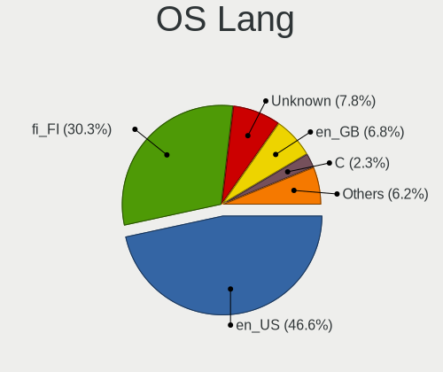
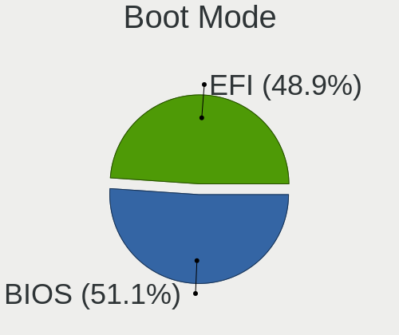
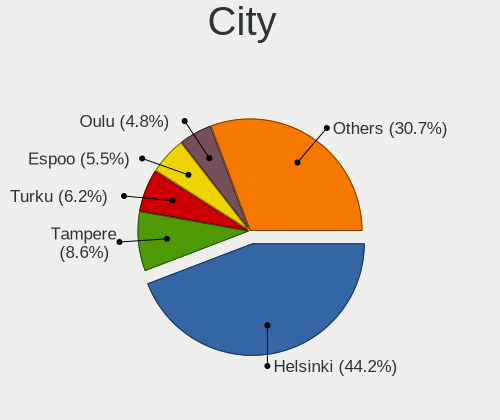
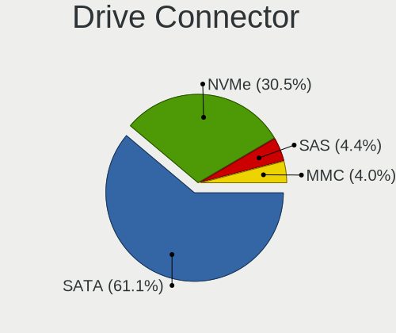
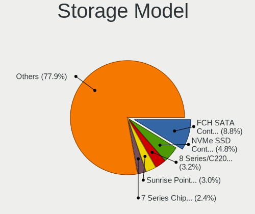
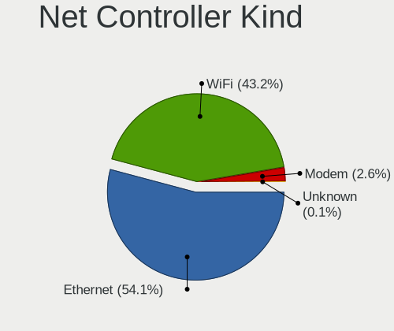
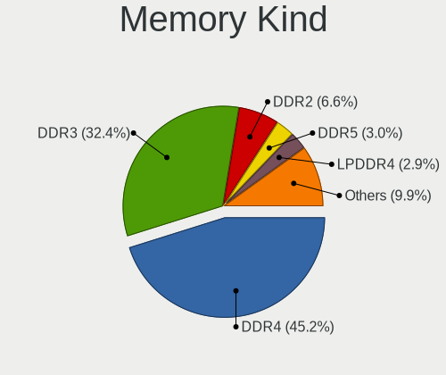
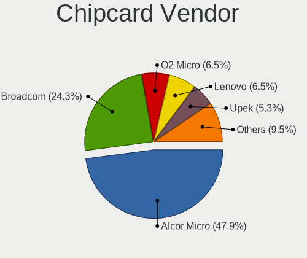

Linux in Finland - Tested Hardware & Statistics
-----------------------------------------------

A project to collect tested hardware configurations for Linux in Finland.

Anyone can contribute to this report by the [hw-probe](https://github.com/linuxhw/hw-probe) tool:

    sudo -E hw-probe -all -upload

Please contribute! Especially if your hardware is rare.

This is a report for all computer types. See also reports for [desktops](/Location/Finland/Desktop/README.md) and [notebooks](/Location/Finland/Notebook/README.md).

Contents
--------

* [ Test Cases ](#test-cases)

* [ System ](#system)
  - [ OS                       ](#os)
  - [ OS Family                ](#os-family)
  - [ Kernel                   ](#kernel)
  - [ Kernel Family            ](#kernel-family)
  - [ Kernel Major Ver.        ](#kernel-major-ver)
  - [ Arch                     ](#arch)
  - [ DE                       ](#de)
  - [ Display Server           ](#display-server)
  - [ Display Manager          ](#display-manager)
  - [ OS Lang                  ](#os-lang)
  - [ Boot Mode                ](#boot-mode)
  - [ Filesystem               ](#filesystem)
  - [ Part. scheme             ](#part-scheme)
  - [ Dual Boot with Linux/BSD ](#dual-boot-with-linuxbsd)
  - [ Dual Boot (Win)          ](#dual-boot-win)

* [ Board ](#board)
  - [ Vendor                   ](#vendor)
  - [ Model                    ](#model)
  - [ Model Family             ](#model-family)
  - [ MFG Year                 ](#mfg-year)
  - [ Form Factor              ](#form-factor)
  - [ Secure Boot              ](#secure-boot)
  - [ Coreboot                 ](#coreboot)
  - [ RAM Size                 ](#ram-size)
  - [ RAM Used                 ](#ram-used)
  - [ Total Drives             ](#total-drives)
  - [ Has CD-ROM               ](#has-cd-rom)
  - [ Has Ethernet             ](#has-ethernet)
  - [ Has WiFi                 ](#has-wifi)
  - [ Has Bluetooth            ](#has-bluetooth)

* [ Location ](#location)
  - [ Country                  ](#country)
  - [ City                     ](#city)

* [ Drives ](#drives)
  - [ Drive Vendor             ](#drive-vendor)
  - [ Drive Model              ](#drive-model)
  - [ HDD Vendor               ](#hdd-vendor)
  - [ SSD Vendor               ](#ssd-vendor)
  - [ Drive Kind               ](#drive-kind)
  - [ Drive Connector          ](#drive-connector)
  - [ Drive Size               ](#drive-size)
  - [ Space Total              ](#space-total)
  - [ Space Used               ](#space-used)
  - [ Malfunc. Drives          ](#malfunc-drives)
  - [ Malfunc. Drive Vendor    ](#malfunc-drive-vendor)
  - [ Malfunc. HDD Vendor      ](#malfunc-hdd-vendor)
  - [ Malfunc. Drive Kind      ](#malfunc-drive-kind)
  - [ Failed Drives            ](#failed-drives)
  - [ Failed Drive Vendor      ](#failed-drive-vendor)
  - [ Drive Status             ](#drive-status)

* [ Storage controller ](#storage-controller)
  - [ Storage Vendor           ](#storage-vendor)
  - [ Storage Model            ](#storage-model)
  - [ Storage Kind             ](#storage-kind)

* [ Processor ](#processor)
  - [ CPU Vendor               ](#cpu-vendor)
  - [ CPU Model                ](#cpu-model)
  - [ CPU Model Family         ](#cpu-model-family)
  - [ CPU Cores                ](#cpu-cores)
  - [ CPU Sockets              ](#cpu-sockets)
  - [ CPU Threads              ](#cpu-threads)
  - [ CPU Op-Modes             ](#cpu-op-modes)
  - [ CPU Microcode            ](#cpu-microcode)
  - [ CPU Microarch            ](#cpu-microarch)

* [ Graphics ](#graphics)
  - [ GPU Vendor               ](#gpu-vendor)
  - [ GPU Model                ](#gpu-model)
  - [ GPU Combo                ](#gpu-combo)
  - [ GPU Driver               ](#gpu-driver)
  - [ GPU Memory               ](#gpu-memory)

* [ Monitor ](#monitor)
  - [ Monitor Vendor           ](#monitor-vendor)
  - [ Monitor Model            ](#monitor-model)
  - [ Monitor Resolution       ](#monitor-resolution)
  - [ Monitor Diagonal         ](#monitor-diagonal)
  - [ Monitor Width            ](#monitor-width)
  - [ Aspect Ratio             ](#aspect-ratio)
  - [ Monitor Area             ](#monitor-area)
  - [ Pixel Density            ](#pixel-density)
  - [ Multiple Monitors        ](#multiple-monitors)

* [ Network ](#network)
  - [ Net Controller Vendor    ](#net-controller-vendor)
  - [ Net Controller Model     ](#net-controller-model)
  - [ Wireless Vendor          ](#wireless-vendor)
  - [ Wireless Model           ](#wireless-model)
  - [ Ethernet Vendor          ](#ethernet-vendor)
  - [ Ethernet Model           ](#ethernet-model)
  - [ Net Controller Kind      ](#net-controller-kind)
  - [ Used Controller          ](#used-controller)
  - [ NICs                     ](#nics)
  - [ IPv6                     ](#ipv6)

* [ Bluetooth ](#bluetooth)
  - [ Bluetooth Vendor         ](#bluetooth-vendor)
  - [ Bluetooth Model          ](#bluetooth-model)

* [ Sound ](#sound)
  - [ Sound Vendor             ](#sound-vendor)
  - [ Sound Model              ](#sound-model)

* [ Memory ](#memory)
  - [ Memory Vendor            ](#memory-vendor)
  - [ Memory Model             ](#memory-model)
  - [ Memory Kind              ](#memory-kind)
  - [ Memory Form Factor       ](#memory-form-factor)
  - [ Memory Size              ](#memory-size)
  - [ Memory Speed             ](#memory-speed)

* [ Printers & scanners ](#printers--scanners)
  - [ Printer Vendor           ](#printer-vendor)
  - [ Printer Model            ](#printer-model)
  - [ Scanner Vendor           ](#scanner-vendor)
  - [ Scanner Model            ](#scanner-model)

* [ Camera ](#camera)
  - [ Camera Vendor            ](#camera-vendor)
  - [ Camera Model             ](#camera-model)

* [ Security ](#security)
  - [ Fingerprint Vendor       ](#fingerprint-vendor)
  - [ Fingerprint Model        ](#fingerprint-model)
  - [ Chipcard Vendor          ](#chipcard-vendor)
  - [ Chipcard Model           ](#chipcard-model)

* [ Unsupported ](#unsupported)
  - [ Unsupported Devices      ](#unsupported-devices)
  - [ Unsupported Device Types ](#unsupported-device-types)

Test Cases
----------

Total: 2418

| Vendor        | Model                       | Form-Factor | Probe                                                      | Date         |
|---------------|-----------------------------|-------------|------------------------------------------------------------|--------------|
| Lenovo        | 36FB SDK0J40700 WIN 3258... | All in one  | [2e506e3464](https://linux-hardware.org/?probe=2e506e3464) | Feb 01, 2024 |
| Panasonic     | CF-54-2                     | Notebook    | [7758f322a6](https://linux-hardware.org/?probe=7758f322a6) | Feb 01, 2024 |
| Intel         | Alder Lake-H PCH E1.1G      | Desktop     | [fa7a5b2aa3](https://linux-hardware.org/?probe=fa7a5b2aa3) | Jan 31, 2024 |
| ASUSTek       | ROG Zephyrus G14 GA401QC... | Notebook    | [02d7b129fc](https://linux-hardware.org/?probe=02d7b129fc) | Jan 31, 2024 |
| Gigabyte      | B150N Phoenix-WIFI-CF       | Desktop     | [a8411850db](https://linux-hardware.org/?probe=a8411850db) | Jan 30, 2024 |
| MSI           | MS-6702E                    | Desktop     | [9624bc0fe2](https://linux-hardware.org/?probe=9624bc0fe2) | Jan 30, 2024 |
| Fujitsu       | LIFEBOOK E734               | Notebook    | [7b3a60ae2d](https://linux-hardware.org/?probe=7b3a60ae2d) | Jan 30, 2024 |
| Lenovo        | ThinkPad P52 20M9001MMX     | Notebook    | [0270f75e12](https://linux-hardware.org/?probe=0270f75e12) | Jan 29, 2024 |
| ASUSTek       | ROG STRIX X470-F GAMING     | Desktop     | [4e6d22c388](https://linux-hardware.org/?probe=4e6d22c388) | Jan 28, 2024 |
| HP            | Laptop 14s-fq0xxx           | Notebook    | [a0eeda1d5a](https://linux-hardware.org/?probe=a0eeda1d5a) | Jan 28, 2024 |
| ASUSTek       | TUF Z390M-PRO GAMING        | Desktop     | [85fd42ad4d](https://linux-hardware.org/?probe=85fd42ad4d) | Jan 27, 2024 |
| ASUSTek       | ASUS TUF Gaming A15 FA50... | Notebook    | [54f3192aa0](https://linux-hardware.org/?probe=54f3192aa0) | Jan 25, 2024 |
| ASUSTek       | X541UV                      | Notebook    | [7df0d2b4af](https://linux-hardware.org/?probe=7df0d2b4af) | Jan 24, 2024 |
| Lenovo        | ThinkPad T530 24297XG       | Notebook    | [9b6f11b3a9](https://linux-hardware.org/?probe=9b6f11b3a9) | Jan 24, 2024 |
| ASUSTek       | T100HAN                     | Notebook    | [66829eb63f](https://linux-hardware.org/?probe=66829eb63f) | Jan 23, 2024 |
| Lenovo        | ThinkPad T480s 20L8S0SA0... | Notebook    | [5f60d47122](https://linux-hardware.org/?probe=5f60d47122) | Jan 21, 2024 |
| Lenovo        | ThinkPad X270 W10DG 20K5... | Notebook    | [1b5e7e0d38](https://linux-hardware.org/?probe=1b5e7e0d38) | Jan 20, 2024 |
| HP            | ProBook 430 G3              | Notebook    | [ed36d7cd8f](https://linux-hardware.org/?probe=ed36d7cd8f) | Jan 20, 2024 |
| Dell          | 0TTDMJ A00                  | Desktop     | [e5d9f41477](https://linux-hardware.org/?probe=e5d9f41477) | Jan 19, 2024 |
| ASRock        | H61M                        | Desktop     | [653436b855](https://linux-hardware.org/?probe=653436b855) | Jan 18, 2024 |
| Dell          | 0MGK50 A02                  | Desktop     | [8ce2d2a81a](https://linux-hardware.org/?probe=8ce2d2a81a) | Jan 17, 2024 |
| SZMZ          | X99 DUAL Z8                 | Desktop     | [623c2e3113](https://linux-hardware.org/?probe=623c2e3113) | Jan 17, 2024 |
| ASRock        | X570 Pro4                   | Desktop     | [1cd88b68af](https://linux-hardware.org/?probe=1cd88b68af) | Jan 17, 2024 |
| ASUSTek       | M2N68-AM Plus               | Desktop     | [3a65e9553a](https://linux-hardware.org/?probe=3a65e9553a) | Jan 17, 2024 |
| ASUSTek       | M2N68-AM Plus               | Desktop     | [07dab6070f](https://linux-hardware.org/?probe=07dab6070f) | Jan 17, 2024 |
| Lenovo        | G50-30 80G0                 | Notebook    | [469e8ffc49](https://linux-hardware.org/?probe=469e8ffc49) | Jan 16, 2024 |
| Lenovo        | ThinkPad W520 42844ZG       | Notebook    | [6c360c2400](https://linux-hardware.org/?probe=6c360c2400) | Jan 15, 2024 |
| Acer          | Aspire V5-552G              | Notebook    | [88a4824eac](https://linux-hardware.org/?probe=88a4824eac) | Jan 15, 2024 |
| Acer          | Aspire V5-552G              | Notebook    | [9b2eb6e626](https://linux-hardware.org/?probe=9b2eb6e626) | Jan 15, 2024 |
| Gigabyte      | F2A85X-D3H                  | Desktop     | [908d3d7353](https://linux-hardware.org/?probe=908d3d7353) | Jan 14, 2024 |
| ASUSTek       | M5A78L-M/USB3               | Desktop     | [08074470dd](https://linux-hardware.org/?probe=08074470dd) | Jan 13, 2024 |
| HP            | ProBook 445 14 inch G10 ... | Notebook    | [cc219f9e8e](https://linux-hardware.org/?probe=cc219f9e8e) | Jan 13, 2024 |
| HP            | ProBook 445 14 inch G10 ... | Notebook    | [5d10765449](https://linux-hardware.org/?probe=5d10765449) | Jan 13, 2024 |
| Lenovo        | ThinkPad W520 42844ZG       | Notebook    | [e085204d13](https://linux-hardware.org/?probe=e085204d13) | Jan 12, 2024 |
| Lenovo        | ThinkPad T530 24297XG       | Notebook    | [3ca4357d99](https://linux-hardware.org/?probe=3ca4357d99) | Jan 12, 2024 |
| ASUSTek       | Zenbook UX6404VI_UX6404V... | Notebook    | [61e9830d84](https://linux-hardware.org/?probe=61e9830d84) | Jan 12, 2024 |
| ASUSTek       | Zenbook UX6404VI_UX6404V... | Notebook    | [c74c1758a4](https://linux-hardware.org/?probe=c74c1758a4) | Jan 12, 2024 |
| Lenovo        | ThinkPad X270 W10DG 20K5... | Notebook    | [a127ed2c69](https://linux-hardware.org/?probe=a127ed2c69) | Jan 11, 2024 |
| ASUSTek       | PRIME Z270-P                | Desktop     | [bf8ac62321](https://linux-hardware.org/?probe=bf8ac62321) | Jan 11, 2024 |
| Lenovo        | ThinkPad T480s 20L7001HM... | Notebook    | [9663b055e8](https://linux-hardware.org/?probe=9663b055e8) | Jan 10, 2024 |
| HP            | EliteBook 745 G6            | Notebook    | [e7c4951a31](https://linux-hardware.org/?probe=e7c4951a31) | Jan 10, 2024 |
| Gigabyte      | F2A85X-D3H                  | Desktop     | [dca0f1d3ab](https://linux-hardware.org/?probe=dca0f1d3ab) | Jan 07, 2024 |
| HP            | EliteBook 645 14 inch G9... | Notebook    | [f56d1e88ba](https://linux-hardware.org/?probe=f56d1e88ba) | Jan 07, 2024 |
| HP            | Pavilion 13 x360 PC         | Notebook    | [52fea1e890](https://linux-hardware.org/?probe=52fea1e890) | Jan 06, 2024 |
| Apple         | MacBookPro8,1               | Notebook    | [a620a3be8d](https://linux-hardware.org/?probe=a620a3be8d) | Jan 06, 2024 |
| Dell          | Latitude E6440              | Notebook    | [4c184aed54](https://linux-hardware.org/?probe=4c184aed54) | Jan 05, 2024 |
| Lenovo        | 3102 SDK0J40700 WIN 3258... | Desktop     | [afda94711c](https://linux-hardware.org/?probe=afda94711c) | Jan 04, 2024 |
| ASUSTek       | P8H67-M                     | Desktop     | [06843ca788](https://linux-hardware.org/?probe=06843ca788) | Jan 04, 2024 |
| Apple         | MacBookPro8,1               | Notebook    | [1593858ec2](https://linux-hardware.org/?probe=1593858ec2) | Jan 04, 2024 |
| Lenovo        | ThinkPad T480 20L5000BMX    | Notebook    | [23c30ee5a3](https://linux-hardware.org/?probe=23c30ee5a3) | Jan 03, 2024 |
| Acidanther... | Mac-F221DCC8                | All in one  | [3cd35cddda](https://linux-hardware.org/?probe=3cd35cddda) | Jan 03, 2024 |
| ASUSTek       | VivoBook E14 E402YA_R417... | Notebook    | [47112e4c46](https://linux-hardware.org/?probe=47112e4c46) | Dec 31, 2023 |
| ASUSTek       | M2A-MX                      | Desktop     | [9be60381fc](https://linux-hardware.org/?probe=9be60381fc) | Dec 31, 2023 |
| Dell          | Latitude E6440              | Notebook    | [f4ba63ff52](https://linux-hardware.org/?probe=f4ba63ff52) | Dec 30, 2023 |
| ASUSTek       | TUF Z390M-PRO GAMING        | Desktop     | [b7be314f8d](https://linux-hardware.org/?probe=b7be314f8d) | Dec 30, 2023 |
| HP            | 802E                        | Desktop     | [a519d89c9e](https://linux-hardware.org/?probe=a519d89c9e) | Dec 29, 2023 |
| Lenovo        | ThinkPad T530 24297XG       | Notebook    | [f3af16ad5d](https://linux-hardware.org/?probe=f3af16ad5d) | Dec 29, 2023 |
| ASUSTek       | M5A97 R2.0                  | Desktop     | [5ec001ca66](https://linux-hardware.org/?probe=5ec001ca66) | Dec 28, 2023 |
| Raspberry ... | Raspberry Pi 4 Model B R... | Soc         | [30e44557d6](https://linux-hardware.org/?probe=30e44557d6) | Dec 27, 2023 |
| MSI           | B150 GAMING M3              | Desktop     | [2b312f609c](https://linux-hardware.org/?probe=2b312f609c) | Dec 27, 2023 |
| Lenovo        | ThinkPad E480 20KN0065MX    | Notebook    | [14018f1aec](https://linux-hardware.org/?probe=14018f1aec) | Dec 27, 2023 |
| HP            | Laptop 15-db1xxx            | Notebook    | [692cf22259](https://linux-hardware.org/?probe=692cf22259) | Dec 25, 2023 |
| Lenovo        | ThinkPad X270 20HN005NMX    | Notebook    | [aeb2dccb91](https://linux-hardware.org/?probe=aeb2dccb91) | Dec 25, 2023 |
| Lenovo        | ThinkPad X280 20KES63G00    | Notebook    | [a5688cc794](https://linux-hardware.org/?probe=a5688cc794) | Dec 24, 2023 |
| Lenovo        | ThinkPad X1 Yoga Gen 6 2... | Convertible | [78ab91ae47](https://linux-hardware.org/?probe=78ab91ae47) | Dec 22, 2023 |
| Gigabyte      | B760M AORUS ELITE AX        | Desktop     | [7eb85caf57](https://linux-hardware.org/?probe=7eb85caf57) | Dec 21, 2023 |
| Apple         | MacBookPro8,1               | Notebook    | [24ff90d774](https://linux-hardware.org/?probe=24ff90d774) | Dec 20, 2023 |
| ASUSTek       | SABERTOOTH Z170 MARK 1      | Desktop     | [4ea2f3364d](https://linux-hardware.org/?probe=4ea2f3364d) | Dec 19, 2023 |
| MSI           | B450M PRO-VDH PLUS          | Desktop     | [df369cf5be](https://linux-hardware.org/?probe=df369cf5be) | Dec 19, 2023 |
| Acer          | Aspire E5-573               | Notebook    | [91c6527140](https://linux-hardware.org/?probe=91c6527140) | Dec 19, 2023 |
| ASUSTek       | ROG STRIX B550-F GAMING     | Desktop     | [bd0bcd2eba](https://linux-hardware.org/?probe=bd0bcd2eba) | Dec 18, 2023 |
| Raspberry ... | Raspberry Pi 4 Model B R... | Soc         | [0134ee9104](https://linux-hardware.org/?probe=0134ee9104) | Dec 17, 2023 |
| Acer          | Aspire M3920                | Desktop     | [ccca1b4884](https://linux-hardware.org/?probe=ccca1b4884) | Dec 17, 2023 |
| Fujitsu       | LIFEBOOK U728               | Notebook    | [381f2ea08d](https://linux-hardware.org/?probe=381f2ea08d) | Dec 16, 2023 |
| HP            | 81C5 MVB                    | Desktop     | [77e3f530d5](https://linux-hardware.org/?probe=77e3f530d5) | Dec 15, 2023 |
| ASUSTek       | ROG STRIX B550-F GAMING     | Desktop     | [646c709529](https://linux-hardware.org/?probe=646c709529) | Dec 15, 2023 |
| Dell          | 0TTDMJ A00                  | Desktop     | [66477630d7](https://linux-hardware.org/?probe=66477630d7) | Dec 14, 2023 |
| Unknown       | Unknown                     | Phone       | [6774b40d70](https://linux-hardware.org/?probe=6774b40d70) | Dec 13, 2023 |
| Unknown       | Unknown                     | Soc         | [abf8ea1275](https://linux-hardware.org/?probe=abf8ea1275) | Dec 13, 2023 |
| Unknown       | Unknown                     | Soc         | [4d27eccf69](https://linux-hardware.org/?probe=4d27eccf69) | Dec 13, 2023 |
| Lenovo        | ThinkPad 11e Yoga Gen 6 ... | Convertible | [95aecca331](https://linux-hardware.org/?probe=95aecca331) | Dec 13, 2023 |
| Lenovo        | ThinkPad 11e Yoga Gen 6 ... | Convertible | [7b3b853705](https://linux-hardware.org/?probe=7b3b853705) | Dec 13, 2023 |
| Lenovo        | ThinkPad 11e Yoga Gen 6 ... | Convertible | [d0cf4bc853](https://linux-hardware.org/?probe=d0cf4bc853) | Dec 13, 2023 |
| Raspberry ... | Raspberry Pi 4 Model B R... | Soc         | [75bcf5966c](https://linux-hardware.org/?probe=75bcf5966c) | Dec 12, 2023 |
| Lenovo        | B50-10 80QR                 | Notebook    | [f44fe4ce19](https://linux-hardware.org/?probe=f44fe4ce19) | Dec 11, 2023 |
| Samsung       | RF511/RF411/RF711           | Notebook    | [59846b1d85](https://linux-hardware.org/?probe=59846b1d85) | Dec 10, 2023 |
| HP            | Victus by Gaming Laptop ... | Notebook    | [949de6a6a9](https://linux-hardware.org/?probe=949de6a6a9) | Dec 10, 2023 |
| Lenovo        | 36C7 SDK0J40697 WIN 3305... | Desktop     | [af3f6d16ac](https://linux-hardware.org/?probe=af3f6d16ac) | Dec 09, 2023 |
| Lenovo        | ThinkPad X1 Carbon 4th 2... | Notebook    | [96a56fd534](https://linux-hardware.org/?probe=96a56fd534) | Dec 09, 2023 |
| Acer          | Aspire E5-573               | Notebook    | [c23042b293](https://linux-hardware.org/?probe=c23042b293) | Dec 08, 2023 |
| Lenovo        | ThinkPad X270 20HN005NMX    | Notebook    | [23d9249c5e](https://linux-hardware.org/?probe=23d9249c5e) | Dec 08, 2023 |
| ASUSTek       | PRIME X670-P WIFI           | Desktop     | [74440ebfad](https://linux-hardware.org/?probe=74440ebfad) | Dec 07, 2023 |
| Lenovo        | ThinkPad X1 Carbon 4th 2... | Notebook    | [2d483d736b](https://linux-hardware.org/?probe=2d483d736b) | Dec 06, 2023 |
| Dell          | 0YWR73 A06                  | Server      | [78e594b5ad](https://linux-hardware.org/?probe=78e594b5ad) | Dec 06, 2023 |
| Lenovo        | IdeaPad Gaming 3 15ARH05... | Notebook    | [70394fdace](https://linux-hardware.org/?probe=70394fdace) | Dec 05, 2023 |
| Lenovo        | IdeaPad Gaming 3 15IHU6 ... | Notebook    | [9e1d0f5fdc](https://linux-hardware.org/?probe=9e1d0f5fdc) | Dec 03, 2023 |
| Acer          | Aspire E5-573               | Notebook    | [c265401f64](https://linux-hardware.org/?probe=c265401f64) | Dec 03, 2023 |
| HP            | Pavilion dv7                | Notebook    | [42ddf2c00c](https://linux-hardware.org/?probe=42ddf2c00c) | Dec 03, 2023 |
| Lenovo        | ThinkPad T420 4180PBG       | Notebook    | [7922226a1c](https://linux-hardware.org/?probe=7922226a1c) | Dec 02, 2023 |
| Lenovo        | ThinkPad T420 4180PBG       | Notebook    | [cb2b5c10a7](https://linux-hardware.org/?probe=cb2b5c10a7) | Dec 02, 2023 |
| Lenovo        | Legion Pro 7 16IRX8H 82W... | Notebook    | [d923b4bdf8](https://linux-hardware.org/?probe=d923b4bdf8) | Dec 02, 2023 |
| HP            | ProLiant DL380 Gen9         | Server      | [c0f6772db1](https://linux-hardware.org/?probe=c0f6772db1) | Dec 02, 2023 |
| ASRock        | X570 Taichi                 | Desktop     | [0b316f9f1b](https://linux-hardware.org/?probe=0b316f9f1b) | Nov 28, 2023 |
| HP            | Laptop 14-dk0xxx            | Notebook    | [eae202e5f1](https://linux-hardware.org/?probe=eae202e5f1) | Nov 28, 2023 |
| HP            | Laptop 15s-eq1xxx           | Notebook    | [0769357573](https://linux-hardware.org/?probe=0769357573) | Nov 27, 2023 |
| Acer          | Swift SFE16-43              | Notebook    | [849f368635](https://linux-hardware.org/?probe=849f368635) | Nov 27, 2023 |
| Lenovo        | ThinkBook 14-IIL 20SL       | Notebook    | [956dbda516](https://linux-hardware.org/?probe=956dbda516) | Nov 26, 2023 |
| HP            | 81C5 MVB                    | Desktop     | [90d11dd2b3](https://linux-hardware.org/?probe=90d11dd2b3) | Nov 25, 2023 |
| Gigabyte      | Z490I AORUS ULTRA           | Desktop     | [e02ad6b382](https://linux-hardware.org/?probe=e02ad6b382) | Nov 24, 2023 |
| Lenovo        | ThinkPad T14 Gen 3 21AJS... | Notebook    | [5289268737](https://linux-hardware.org/?probe=5289268737) | Nov 24, 2023 |
| ASUSTek       | TUF Gaming FX705DT_FX705... | Notebook    | [bd428a8490](https://linux-hardware.org/?probe=bd428a8490) | Nov 22, 2023 |
| Raspberry ... | Raspberry Pi 4 Model B R... | Soc         | [dd61ef221a](https://linux-hardware.org/?probe=dd61ef221a) | Nov 21, 2023 |
| Fujitsu       | LIFEBOOK S710               | Notebook    | [a0453d2f05](https://linux-hardware.org/?probe=a0453d2f05) | Nov 20, 2023 |
| Dell          | 072T6D A05                  | Server      | [146f803f7a](https://linux-hardware.org/?probe=146f803f7a) | Nov 20, 2023 |
| Dell          | 072T6D A05                  | Server      | [3837a0359c](https://linux-hardware.org/?probe=3837a0359c) | Nov 20, 2023 |
| Raspberry ... | Raspberry Pi 4 Model B R... | Soc         | [e394aadce0](https://linux-hardware.org/?probe=e394aadce0) | Nov 20, 2023 |
| Gigabyte      | B85M-D3V Plus-SI            | Desktop     | [7771038ba5](https://linux-hardware.org/?probe=7771038ba5) | Nov 19, 2023 |
| Gigabyte      | B85M-D3V Plus-SI            | Desktop     | [0e5665d3c6](https://linux-hardware.org/?probe=0e5665d3c6) | Nov 18, 2023 |
| Unknown       | M17                         | Notebook    | [1708365bec](https://linux-hardware.org/?probe=1708365bec) | Nov 18, 2023 |
| Gigabyte      | X570 I AORUS PRO WIFI       | Desktop     | [1909f3fbff](https://linux-hardware.org/?probe=1909f3fbff) | Nov 15, 2023 |
| HP            | 0A64h                       | Desktop     | [db072ebaed](https://linux-hardware.org/?probe=db072ebaed) | Nov 14, 2023 |
| ASUSTek       | P8Z77-I DELUXE              | Desktop     | [3c2d452ee0](https://linux-hardware.org/?probe=3c2d452ee0) | Nov 13, 2023 |
| HP            | 2B34                        | Desktop     | [24ed29acbc](https://linux-hardware.org/?probe=24ed29acbc) | Nov 13, 2023 |
| ASUSTek       | ASUS TUF Gaming A15 FA50... | Notebook    | [d0549c695d](https://linux-hardware.org/?probe=d0549c695d) | Nov 13, 2023 |
| Raspberry ... | Raspberry Pi 4 Model B R... | Soc         | [fa552b9901](https://linux-hardware.org/?probe=fa552b9901) | Nov 13, 2023 |
| ASUSTek       | Z87-A                       | Desktop     | [08f1651d1f](https://linux-hardware.org/?probe=08f1651d1f) | Nov 12, 2023 |
| HP            | Unknown                     | Notebook    | [c22e23b2f8](https://linux-hardware.org/?probe=c22e23b2f8) | Nov 12, 2023 |
| ASUSTek       | ROG STRIX B450-F GAMING     | Desktop     | [67938dee90](https://linux-hardware.org/?probe=67938dee90) | Nov 12, 2023 |
| Gigabyte      | EP45-UD3P                   | Desktop     | [20f689bbac](https://linux-hardware.org/?probe=20f689bbac) | Nov 11, 2023 |
| ASUSTek       | PRIME X399-A                | Desktop     | [e0883e3bd0](https://linux-hardware.org/?probe=e0883e3bd0) | Nov 11, 2023 |
| Dell          | Latitude E5430 non-vPro     | Notebook    | [518492850b](https://linux-hardware.org/?probe=518492850b) | Nov 10, 2023 |
| ASUSTek       | PRIME B760M-A D4            | Desktop     | [715a6e7831](https://linux-hardware.org/?probe=715a6e7831) | Nov 10, 2023 |
| Lenovo        | ThinkPad T490 20N3S7AA00    | Notebook    | [b4fd9fd045](https://linux-hardware.org/?probe=b4fd9fd045) | Nov 10, 2023 |
| Dell          | Latitude E5430 non-vPro     | Notebook    | [39e2c7584e](https://linux-hardware.org/?probe=39e2c7584e) | Nov 08, 2023 |
| Fujitsu Si... | AMILO Li 1818               | Notebook    | [ab74cc1cc6](https://linux-hardware.org/?probe=ab74cc1cc6) | Nov 07, 2023 |
| HP            | 0A64h                       | Desktop     | [ad021b1397](https://linux-hardware.org/?probe=ad021b1397) | Nov 06, 2023 |
| Lenovo        | T530-28ICB                  | Desktop     | [ba883f99a0](https://linux-hardware.org/?probe=ba883f99a0) | Nov 06, 2023 |
| HP            | EliteBook 840 G3            | Notebook    | [1bb894cf19](https://linux-hardware.org/?probe=1bb894cf19) | Nov 04, 2023 |
| ASUSTek       | PRIME Z370-A                | Desktop     | [ae66cf41f9](https://linux-hardware.org/?probe=ae66cf41f9) | Nov 03, 2023 |
| ASUSTek       | PRIME Z370-A                | Desktop     | [92b484d86d](https://linux-hardware.org/?probe=92b484d86d) | Nov 03, 2023 |
| MSI           | GF75 Thin 9SC               | Notebook    | [2aceaf7016](https://linux-hardware.org/?probe=2aceaf7016) | Nov 03, 2023 |
| ASUSTek       | P8Z77-I DELUXE              | Desktop     | [ea285340e0](https://linux-hardware.org/?probe=ea285340e0) | Nov 01, 2023 |
| Lenovo        | ThinkPad P14s Gen 4 21K5... | Notebook    | [2bdd27dc18](https://linux-hardware.org/?probe=2bdd27dc18) | Oct 31, 2023 |
| Lenovo        | ThinkPad P14s Gen 4 21K5... | Notebook    | [cb35a8d8f6](https://linux-hardware.org/?probe=cb35a8d8f6) | Oct 31, 2023 |
| ASUSTek       | X507UA                      | Notebook    | [c52aa98c38](https://linux-hardware.org/?probe=c52aa98c38) | Oct 31, 2023 |
| Lenovo        | ThinkPad T60 1952WUV        | Notebook    | [4ecf9f7f50](https://linux-hardware.org/?probe=4ecf9f7f50) | Oct 30, 2023 |
| HP            | EliteBook 8460p             | Notebook    | [7d6972297f](https://linux-hardware.org/?probe=7d6972297f) | Oct 30, 2023 |
| Gigabyte      | H170N-WIFI-CF               | Desktop     | [af90b19d11](https://linux-hardware.org/?probe=af90b19d11) | Oct 30, 2023 |
| Lenovo        | IdeaPad Gaming 3 15ARH05... | Notebook    | [ecab2bb9fe](https://linux-hardware.org/?probe=ecab2bb9fe) | Oct 30, 2023 |
| ASUSTek       | P5B                         | Desktop     | [aa136c9e44](https://linux-hardware.org/?probe=aa136c9e44) | Oct 29, 2023 |
| Foxconn       | 2ADA                        | Desktop     | [ce19056aa6](https://linux-hardware.org/?probe=ce19056aa6) | Oct 29, 2023 |
| Lenovo        | IdeaPad Gaming 3 15ARH05... | Notebook    | [0f9adbc34d](https://linux-hardware.org/?probe=0f9adbc34d) | Oct 28, 2023 |
| Lenovo        | ThinkBook 14-IIL 20SL       | Notebook    | [a3355c6898](https://linux-hardware.org/?probe=a3355c6898) | Oct 27, 2023 |
| Fujitsu       | D3062-A1 S26361-D3062-A1    | Desktop     | [c2dc388cd3](https://linux-hardware.org/?probe=c2dc388cd3) | Oct 25, 2023 |
| HP            | ProLiant DL380 Gen9         | Server      | [48bdda33c4](https://linux-hardware.org/?probe=48bdda33c4) | Oct 25, 2023 |
| Lenovo        | G580 2189                   | Notebook    | [18dc8e53d9](https://linux-hardware.org/?probe=18dc8e53d9) | Oct 24, 2023 |
| HP            | EliteBook 820 G1            | Notebook    | [0fb2b25961](https://linux-hardware.org/?probe=0fb2b25961) | Oct 24, 2023 |
| Lenovo        | IdeaPad 3 15ALC6 82KU       | Notebook    | [8754714bce](https://linux-hardware.org/?probe=8754714bce) | Oct 23, 2023 |
| Lenovo        | 364A SDK0J40700 WIN 3258... | Desktop     | [48de72a7a6](https://linux-hardware.org/?probe=48de72a7a6) | Oct 23, 2023 |
| ASRock        | AB350 Pro4                  | Desktop     | [961b658ac5](https://linux-hardware.org/?probe=961b658ac5) | Oct 23, 2023 |
| Lenovo        | Legion Pro 5 16ARX8 82WM    | Notebook    | [f2b15bc2f1](https://linux-hardware.org/?probe=f2b15bc2f1) | Oct 23, 2023 |
| Fujitsu       | D3313-B1 S26361-D3313-B1    | Desktop     | [fb66b6579d](https://linux-hardware.org/?probe=fb66b6579d) | Oct 22, 2023 |
| Lenovo        | 364A SDK0J40700 WIN 3258... | Desktop     | [8a9d0ba0e6](https://linux-hardware.org/?probe=8a9d0ba0e6) | Oct 22, 2023 |
| HP            | Pavilion g7                 | Notebook    | [11f3136e05](https://linux-hardware.org/?probe=11f3136e05) | Oct 19, 2023 |
| Fujitsu Si... | D2828-A1 S26361-D2828-A1    | Desktop     | [c04e21ae93](https://linux-hardware.org/?probe=c04e21ae93) | Oct 19, 2023 |
| ASUSTek       | M5A97 LE R2.0               | Desktop     | [8ff07b1c79](https://linux-hardware.org/?probe=8ff07b1c79) | Oct 19, 2023 |
| ASRock        | H510M-HVS                   | Desktop     | [0766c5afbd](https://linux-hardware.org/?probe=0766c5afbd) | Oct 19, 2023 |
| Lenovo        | 364A SDK0J40700 WIN 3258... | Desktop     | [070de2c38f](https://linux-hardware.org/?probe=070de2c38f) | Oct 18, 2023 |
| ASUSTek       | Z97-PRO GAMER               | Desktop     | [d652b15856](https://linux-hardware.org/?probe=d652b15856) | Oct 17, 2023 |
| Lenovo        | ThinkPad E15 Gen 3 20YG0... | Notebook    | [0504910ad7](https://linux-hardware.org/?probe=0504910ad7) | Oct 16, 2023 |
| ASUSTek       | N551ZU                      | Notebook    | [e56a6c7957](https://linux-hardware.org/?probe=e56a6c7957) | Oct 16, 2023 |
| ASUSTek       | Z97-PRO GAMER               | Desktop     | [5a1df4c4df](https://linux-hardware.org/?probe=5a1df4c4df) | Oct 14, 2023 |
| Intel         | NUC7i3BNB J22859-312        | Mini pc     | [fce15d656e](https://linux-hardware.org/?probe=fce15d656e) | Oct 14, 2023 |
| Fujitsu Si... | D2824-A1 S26361-D2824-A1    | Desktop     | [f4e7334b7e](https://linux-hardware.org/?probe=f4e7334b7e) | Oct 14, 2023 |
| ASRock        | H97M Anniversary            | Desktop     | [7df48c5c5d](https://linux-hardware.org/?probe=7df48c5c5d) | Oct 14, 2023 |
| HP            | Pavilion Laptop 14-bf0xx    | Notebook    | [2956823009](https://linux-hardware.org/?probe=2956823009) | Oct 14, 2023 |
| HP            | ProLiant DL380 Gen9         | Server      | [9ea9761b35](https://linux-hardware.org/?probe=9ea9761b35) | Oct 13, 2023 |
| ASRock        | 990FX Extreme3              | Desktop     | [662b1d3228](https://linux-hardware.org/?probe=662b1d3228) | Oct 13, 2023 |
| Lenovo        | ThinkPad P15 Gen 2i 20YQ... | Notebook    | [d268453669](https://linux-hardware.org/?probe=d268453669) | Oct 13, 2023 |
| ASUSTek       | GR8                         | Notebook    | [5b509d021c](https://linux-hardware.org/?probe=5b509d021c) | Oct 13, 2023 |
| ASUSTek       | GR8                         | Notebook    | [e381fff6d8](https://linux-hardware.org/?probe=e381fff6d8) | Oct 13, 2023 |
| Fujitsu       | D3062-A1 S26361-D3062-A1    | Desktop     | [93499e6693](https://linux-hardware.org/?probe=93499e6693) | Oct 12, 2023 |
| Lenovo        | ThinkPad T400 27658JG       | Notebook    | [3b3b7832c9](https://linux-hardware.org/?probe=3b3b7832c9) | Oct 11, 2023 |
| Lenovo        | ThinkPad T540p 20BE0086M... | Notebook    | [afff949494](https://linux-hardware.org/?probe=afff949494) | Oct 08, 2023 |
| ASUSTek       | P5KR                        | Desktop     | [641c856c71](https://linux-hardware.org/?probe=641c856c71) | Oct 08, 2023 |
| ASUSTek       | PRIME B760M-A D4            | Desktop     | [b838717a3d](https://linux-hardware.org/?probe=b838717a3d) | Oct 07, 2023 |
| ASUSTek       | PRIME B450M-A               | Desktop     | [bf8761b854](https://linux-hardware.org/?probe=bf8761b854) | Oct 06, 2023 |
| ASUSTek       | ZenBook UX425EA_UX425EA     | Notebook    | [9dc2fd3247](https://linux-hardware.org/?probe=9dc2fd3247) | Oct 06, 2023 |
| ASUSTek       | M5A97 R2.0                  | Desktop     | [1220b29312](https://linux-hardware.org/?probe=1220b29312) | Oct 05, 2023 |
| HP            | 8433 11                     | Desktop     | [7540fc930b](https://linux-hardware.org/?probe=7540fc930b) | Oct 05, 2023 |
| Apple         | MacBookPro16,3              | Notebook    | [9ca487f2cf](https://linux-hardware.org/?probe=9ca487f2cf) | Oct 02, 2023 |
| ASUSTek       | M4A78T-E                    | Desktop     | [0d82fee8df](https://linux-hardware.org/?probe=0d82fee8df) | Oct 02, 2023 |
| HP            | 8433 11                     | Desktop     | [0fcfc69a01](https://linux-hardware.org/?probe=0fcfc69a01) | Oct 02, 2023 |
| HP            | Pavilion 11 x360 PC         | Notebook    | [b3eb082c5e](https://linux-hardware.org/?probe=b3eb082c5e) | Oct 01, 2023 |
| Shenzhen M... | F7BAA                       | Desktop     | [30268d41d2](https://linux-hardware.org/?probe=30268d41d2) | Sep 29, 2023 |
| ASUSTek       | ROG CROSSHAIR VIII HERO     | Desktop     | [85c6c01e63](https://linux-hardware.org/?probe=85c6c01e63) | Sep 26, 2023 |
| ASUSTek       | PRIME B450-PLUS             | Desktop     | [ed68f904fe](https://linux-hardware.org/?probe=ed68f904fe) | Sep 26, 2023 |
| ASUSTek       | PRIME B450-PLUS             | Desktop     | [e24beff974](https://linux-hardware.org/?probe=e24beff974) | Sep 26, 2023 |
| Lenovo        | ThinkPad P15 Gen 2i 20YQ... | Notebook    | [dc762f9ae6](https://linux-hardware.org/?probe=dc762f9ae6) | Sep 26, 2023 |
| Lenovo        | ThinkPad T14 Gen 3 21AH0... | Notebook    | [2cf86f7f12](https://linux-hardware.org/?probe=2cf86f7f12) | Sep 26, 2023 |
| ASUSTek       | M4A79T Deluxe               | Desktop     | [ac151127e1](https://linux-hardware.org/?probe=ac151127e1) | Sep 25, 2023 |
| Lenovo        | ThinkPad P14s Gen 2a 21A... | Notebook    | [9a24a19f6e](https://linux-hardware.org/?probe=9a24a19f6e) | Sep 25, 2023 |
| Acer          | Aspire 7730G                | Notebook    | [e21c91c34c](https://linux-hardware.org/?probe=e21c91c34c) | Sep 24, 2023 |
| Dell          | 0NW6H5 A00                  | Desktop     | [c3221c93ca](https://linux-hardware.org/?probe=c3221c93ca) | Sep 23, 2023 |
| HP            | 2B34                        | Desktop     | [101780dee0](https://linux-hardware.org/?probe=101780dee0) | Sep 23, 2023 |
| Lenovo        | ThinkPad X1 Carbon Gen 1... | Notebook    | [eb276947f2](https://linux-hardware.org/?probe=eb276947f2) | Sep 23, 2023 |
| ASUSTek       | TUF Gaming B650-PLUS        | Desktop     | [5783da9442](https://linux-hardware.org/?probe=5783da9442) | Sep 23, 2023 |
| HP            | EliteBook 8570p             | Notebook    | [ca346761d3](https://linux-hardware.org/?probe=ca346761d3) | Sep 23, 2023 |
| Lenovo        | ThinkPad X1 Carbon Gen 1... | Notebook    | [e75a2a8b71](https://linux-hardware.org/?probe=e75a2a8b71) | Sep 22, 2023 |
| HP            | EliteBook 840 G3            | Notebook    | [b6379ef77c](https://linux-hardware.org/?probe=b6379ef77c) | Sep 22, 2023 |
| Acer          | Aspire 5741G                | Notebook    | [b79d8aec76](https://linux-hardware.org/?probe=b79d8aec76) | Sep 21, 2023 |
| Apple         | Mac-35C5E08120C7EEAF Mac... | Mini pc     | [43f5468ce8](https://linux-hardware.org/?probe=43f5468ce8) | Sep 19, 2023 |
| ASRock        | AB350 Pro4                  | Desktop     | [f45c7732e3](https://linux-hardware.org/?probe=f45c7732e3) | Sep 19, 2023 |
| Lenovo        | ThinkPad W520 4284W1D       | Notebook    | [c634509519](https://linux-hardware.org/?probe=c634509519) | Sep 18, 2023 |
| ASUSTek       | N73SM                       | Notebook    | [d4ce8f336d](https://linux-hardware.org/?probe=d4ce8f336d) | Sep 17, 2023 |
| MSI           | MPG Z390 GAMING EDGE AC     | Desktop     | [a0ba042279](https://linux-hardware.org/?probe=a0ba042279) | Sep 17, 2023 |
| ASUSTek       | PRIME X670-P WIFI           | Desktop     | [e6db76aa66](https://linux-hardware.org/?probe=e6db76aa66) | Sep 17, 2023 |
| Toshiba       | QOSMIO X770                 | Notebook    | [84fc7ea45e](https://linux-hardware.org/?probe=84fc7ea45e) | Sep 17, 2023 |
| HP            | 18E7                        | Desktop     | [e5b07fa901](https://linux-hardware.org/?probe=e5b07fa901) | Sep 15, 2023 |
| Fujitsu       | LIFEBOOK E733               | Notebook    | [0613157456](https://linux-hardware.org/?probe=0613157456) | Sep 15, 2023 |
| HP            | Pavilion Laptop 14-bf0xx    | Notebook    | [3b71101d09](https://linux-hardware.org/?probe=3b71101d09) | Sep 14, 2023 |
| Fujitsu       | D3162-A1 S26361-D3162-A1    | Desktop     | [33b3749fc5](https://linux-hardware.org/?probe=33b3749fc5) | Sep 14, 2023 |
| ASUSTek       | VivoBook E14 E402YA_E402... | Notebook    | [ef5a6433f3](https://linux-hardware.org/?probe=ef5a6433f3) | Sep 13, 2023 |
| HP            | Pavilion dv7                | Notebook    | [e7c7395c7b](https://linux-hardware.org/?probe=e7c7395c7b) | Sep 11, 2023 |
| HP            | Pavilion Laptop 14-bf1xx    | Notebook    | [fe3ed738a1](https://linux-hardware.org/?probe=fe3ed738a1) | Sep 11, 2023 |
| Apple         | MacBookPro8,2               | Notebook    | [f23bb97453](https://linux-hardware.org/?probe=f23bb97453) | Sep 11, 2023 |
| Acer          | Aspire V5-472               | Notebook    | [198d33eff6](https://linux-hardware.org/?probe=198d33eff6) | Sep 09, 2023 |
| Raspberry ... | Raspberry Pi 4 Model B R... | Soc         | [08cdf9f2f5](https://linux-hardware.org/?probe=08cdf9f2f5) | Sep 08, 2023 |
| Lenovo        | ThinkPad P43s 20RH001UMX    | Notebook    | [0fdff74089](https://linux-hardware.org/?probe=0fdff74089) | Sep 07, 2023 |
| Lenovo        | ThinkPad T450 20BUS3L502    | Notebook    | [cb8de94658](https://linux-hardware.org/?probe=cb8de94658) | Sep 05, 2023 |
| ASUSTek       | TUF Gaming X570-PLUS        | Desktop     | [f1888930f8](https://linux-hardware.org/?probe=f1888930f8) | Sep 04, 2023 |
| Dell          | 06FW8M A00                  | Server      | [afde437d5d](https://linux-hardware.org/?probe=afde437d5d) | Sep 04, 2023 |
| Apple         | MacBookPro11,1              | Notebook    | [d8efe50ca5](https://linux-hardware.org/?probe=d8efe50ca5) | Sep 04, 2023 |
| Fujitsu       | LIFEBOOK E734               | Notebook    | [1b89968327](https://linux-hardware.org/?probe=1b89968327) | Sep 03, 2023 |
| HP            | 3397                        | Desktop     | [181c80a502](https://linux-hardware.org/?probe=181c80a502) | Sep 01, 2023 |
| ASUSTek       | PRIME B550M-A               | Desktop     | [06860111ba](https://linux-hardware.org/?probe=06860111ba) | Aug 31, 2023 |
| Lenovo        | ThinkPad T440s 20AQ007SM... | Notebook    | [0a55847393](https://linux-hardware.org/?probe=0a55847393) | Aug 30, 2023 |
| ASUSTek       | X541UAK                     | Notebook    | [c75a044974](https://linux-hardware.org/?probe=c75a044974) | Aug 30, 2023 |
| Lenovo        | Y50-70 20378                | Notebook    | [5a20b8cd20](https://linux-hardware.org/?probe=5a20b8cd20) | Aug 29, 2023 |
| ASUSTek       | ROG STRIX X570-F GAMING     | Desktop     | [5222737445](https://linux-hardware.org/?probe=5222737445) | Aug 29, 2023 |
| ASUSTek       | PRIME Z370-P II             | Desktop     | [56692679f3](https://linux-hardware.org/?probe=56692679f3) | Aug 28, 2023 |
| HP            | 630                         | Notebook    | [4a94779668](https://linux-hardware.org/?probe=4a94779668) | Aug 28, 2023 |
| ASUSTek       | Pro WS 565-ACE              | Desktop     | [ae73127da5](https://linux-hardware.org/?probe=ae73127da5) | Aug 28, 2023 |
| Lenovo        | ThinkPad L14 Gen 4 21H5C... | Notebook    | [96b559d5d6](https://linux-hardware.org/?probe=96b559d5d6) | Aug 27, 2023 |
| ASUSTek       | TP300LA                     | Notebook    | [7588e955e3](https://linux-hardware.org/?probe=7588e955e3) | Aug 27, 2023 |
| Lenovo        | Legion 5 Pro 16ARH7H 82R... | Notebook    | [9b94ab3887](https://linux-hardware.org/?probe=9b94ab3887) | Aug 27, 2023 |
| HP            | 3397                        | Desktop     | [59d80acf6f](https://linux-hardware.org/?probe=59d80acf6f) | Aug 26, 2023 |
| ASUSTek       | M5A97 R2.0                  | Desktop     | [c859974eed](https://linux-hardware.org/?probe=c859974eed) | Aug 26, 2023 |
| Fujitsu Si... | MS-7275-VB                  | Desktop     | [2b7a6dab27](https://linux-hardware.org/?probe=2b7a6dab27) | Aug 26, 2023 |
| Fujitsu Si... | MS-7275-VB                  | Desktop     | [2a67da7ab4](https://linux-hardware.org/?probe=2a67da7ab4) | Aug 25, 2023 |
| HP            | EliteBook 840 G3            | Notebook    | [d3c6faac81](https://linux-hardware.org/?probe=d3c6faac81) | Aug 25, 2023 |
| MSI           | MAG B550 TOMAHAWK           | Desktop     | [ff1bdfd1e3](https://linux-hardware.org/?probe=ff1bdfd1e3) | Aug 24, 2023 |
| ASRock        | B550M-ITX/ac                | Desktop     | [6b9175d89e](https://linux-hardware.org/?probe=6b9175d89e) | Aug 22, 2023 |
| Lenovo        | ThinkPad T480s 20L8S4GU0... | Notebook    | [1a86753f1c](https://linux-hardware.org/?probe=1a86753f1c) | Aug 20, 2023 |
| ASUSTek       | X541UAK                     | Notebook    | [048ca1ce02](https://linux-hardware.org/?probe=048ca1ce02) | Aug 20, 2023 |
| Valve         | Jupiter                     | Notebook    | [0a6ed7bae4](https://linux-hardware.org/?probe=0a6ed7bae4) | Aug 19, 2023 |
| ASUSTek       | ROG STRIX X570-F GAMING     | Desktop     | [b52dbe962f](https://linux-hardware.org/?probe=b52dbe962f) | Aug 19, 2023 |
| Apple         | MacBookAir6,2               | Notebook    | [76dda9cde6](https://linux-hardware.org/?probe=76dda9cde6) | Aug 19, 2023 |
| Gigabyte      | Z77M-D3H                    | Desktop     | [154e2db6b7](https://linux-hardware.org/?probe=154e2db6b7) | Aug 18, 2023 |
| ASUSTek       | PRIME Z270-A                | Desktop     | [c6918bacbd](https://linux-hardware.org/?probe=c6918bacbd) | Aug 18, 2023 |
| ASUSTek       | PN51-E1                     | Mini pc     | [64b9dbafae](https://linux-hardware.org/?probe=64b9dbafae) | Aug 16, 2023 |
| ASUSTek       | ROG Zephyrus G14 GA402XI... | Notebook    | [da5582d4bf](https://linux-hardware.org/?probe=da5582d4bf) | Aug 16, 2023 |
| ASUSTek       | ROG Zephyrus G14 GA402XI... | Notebook    | [63f2bc3a80](https://linux-hardware.org/?probe=63f2bc3a80) | Aug 16, 2023 |
| Lenovo        | ThinkPad X260 20F600A2MN    | Notebook    | [c853746c1f](https://linux-hardware.org/?probe=c853746c1f) | Aug 16, 2023 |
| Lenovo        | ThinkPad X260 20F600A2MN    | Notebook    | [a460ba57d2](https://linux-hardware.org/?probe=a460ba57d2) | Aug 16, 2023 |
| ASUSTek       | ROG STRIX B650E-I GAMING... | Desktop     | [24a5a21c43](https://linux-hardware.org/?probe=24a5a21c43) | Aug 15, 2023 |
| ASUSTek       | ROG STRIX B650E-I GAMING... | Desktop     | [accdc886c7](https://linux-hardware.org/?probe=accdc886c7) | Aug 15, 2023 |
| ASUSTek       | ROG STRIX B650E-I GAMING... | Desktop     | [96d94e5f6c](https://linux-hardware.org/?probe=96d94e5f6c) | Aug 15, 2023 |
| ASUSTek       | ROG STRIX B650E-I GAMING... | Desktop     | [5652688ceb](https://linux-hardware.org/?probe=5652688ceb) | Aug 15, 2023 |
| ASUSTek       | ROG STRIX B650E-I GAMING... | Desktop     | [7463d795e8](https://linux-hardware.org/?probe=7463d795e8) | Aug 15, 2023 |
| ASUSTek       | ROG STRIX B650E-I GAMING... | Desktop     | [38e95ded09](https://linux-hardware.org/?probe=38e95ded09) | Aug 15, 2023 |
| ASUSTek       | ROG STRIX B650E-I GAMING... | Desktop     | [651eae5b59](https://linux-hardware.org/?probe=651eae5b59) | Aug 15, 2023 |
| ASUSTek       | ROG STRIX B650E-I GAMING... | Desktop     | [d32a9fb8a4](https://linux-hardware.org/?probe=d32a9fb8a4) | Aug 15, 2023 |
| ASUSTek       | ROG STRIX B650E-I GAMING... | Desktop     | [5929bf1039](https://linux-hardware.org/?probe=5929bf1039) | Aug 15, 2023 |
| ASUSTek       | ROG STRIX B650E-I GAMING... | Desktop     | [ac0320b2ee](https://linux-hardware.org/?probe=ac0320b2ee) | Aug 15, 2023 |
| ASUSTek       | ROG STRIX B650E-I GAMING... | Desktop     | [5d52bf85ca](https://linux-hardware.org/?probe=5d52bf85ca) | Aug 15, 2023 |
| ASUSTek       | ROG STRIX B650E-I GAMING... | Desktop     | [f972a8359d](https://linux-hardware.org/?probe=f972a8359d) | Aug 15, 2023 |
| ASUSTek       | ROG STRIX B650E-I GAMING... | Desktop     | [ab0235d27c](https://linux-hardware.org/?probe=ab0235d27c) | Aug 15, 2023 |
| ASUSTek       | ROG STRIX B650E-I GAMING... | Desktop     | [3446b719ab](https://linux-hardware.org/?probe=3446b719ab) | Aug 15, 2023 |
| ASUSTek       | A88XM-E/USB                 | Desktop     | [e4b403ad5a](https://linux-hardware.org/?probe=e4b403ad5a) | Aug 15, 2023 |
| Lenovo        | Legion 5 Pro 16ARH7H 82R... | Notebook    | [6cbef2a38d](https://linux-hardware.org/?probe=6cbef2a38d) | Aug 13, 2023 |
| MSI           | B450 TOMAHAWK MAX           | Desktop     | [231f8f9b37](https://linux-hardware.org/?probe=231f8f9b37) | Aug 13, 2023 |
| MSI           | MEG X570 UNIFY              | Desktop     | [179381f376](https://linux-hardware.org/?probe=179381f376) | Aug 12, 2023 |
| Dell          | Latitude E6330              | Notebook    | [b3081e041e](https://linux-hardware.org/?probe=b3081e041e) | Aug 11, 2023 |
| HP            | 872E                        | Mini pc     | [0318907909](https://linux-hardware.org/?probe=0318907909) | Aug 10, 2023 |
| Fujitsu       | D3062-A1 S26361-D3062-A1    | Desktop     | [873825c261](https://linux-hardware.org/?probe=873825c261) | Aug 07, 2023 |
| ASUSTek       | VivoBook_ASUSLaptop X340... | Notebook    | [2980681052](https://linux-hardware.org/?probe=2980681052) | Aug 07, 2023 |
| Fujitsu       | D3062-A1 S26361-D3062-A1    | Desktop     | [28ee020bed](https://linux-hardware.org/?probe=28ee020bed) | Aug 06, 2023 |
| ASUSTek       | PRIME Z790-P WIFI D4        | Desktop     | [13f47a5399](https://linux-hardware.org/?probe=13f47a5399) | Aug 06, 2023 |
| Medion        | B550A4-EM                   | Desktop     | [f1bf2b93c1](https://linux-hardware.org/?probe=f1bf2b93c1) | Aug 05, 2023 |
| Lenovo        | IdeaPad Gaming 3 15IHU6 ... | Notebook    | [8b84e48f4c](https://linux-hardware.org/?probe=8b84e48f4c) | Aug 04, 2023 |
| Lenovo        | Yoga 2 13 20344             | Notebook    | [767b492aa4](https://linux-hardware.org/?probe=767b492aa4) | Aug 03, 2023 |
| Lenovo        | Yoga 2 13 20344             | Notebook    | [47ca08e0d1](https://linux-hardware.org/?probe=47ca08e0d1) | Aug 03, 2023 |
| HP            | 8653 A                      | Desktop     | [09f876ab04](https://linux-hardware.org/?probe=09f876ab04) | Aug 02, 2023 |
| HP            | Unknown                     | Notebook    | [f7ffb3c085](https://linux-hardware.org/?probe=f7ffb3c085) | Aug 01, 2023 |
| Lenovo        | ThinkPad Helix 2nd 20CG0... | Tablet      | [3775167d2f](https://linux-hardware.org/?probe=3775167d2f) | Aug 01, 2023 |
| Fujitsu Si... | AMILO Li3710                | Notebook    | [f84a39b436](https://linux-hardware.org/?probe=f84a39b436) | Jul 31, 2023 |
| HP            | 0AA8h                       | Desktop     | [76dbb0d0a3](https://linux-hardware.org/?probe=76dbb0d0a3) | Jul 31, 2023 |
| Fujitsu       | D3401-H2 S26361-D3401-H2    | Desktop     | [36c7268653](https://linux-hardware.org/?probe=36c7268653) | Jul 31, 2023 |
| ASUSTek       | H97M-PLUS                   | Desktop     | [940e14c90d](https://linux-hardware.org/?probe=940e14c90d) | Jul 31, 2023 |
| ASUSTek       | M2N68-AM Plus               | Desktop     | [c980146db6](https://linux-hardware.org/?probe=c980146db6) | Jul 29, 2023 |
| ASUSTek       | M2N68-AM Plus               | Desktop     | [a9a2ac74bc](https://linux-hardware.org/?probe=a9a2ac74bc) | Jul 29, 2023 |
| Lenovo        | V145-15AST 81MT             | Notebook    | [0ed7dfdf32](https://linux-hardware.org/?probe=0ed7dfdf32) | Jul 29, 2023 |
| Lenovo        | ThinkPad T520 4243JA1       | Notebook    | [410cebaba3](https://linux-hardware.org/?probe=410cebaba3) | Jul 28, 2023 |
| Lenovo        | MAHOBAY NO DPK              | Desktop     | [f591b4a83a](https://linux-hardware.org/?probe=f591b4a83a) | Jul 28, 2023 |
| ASRock        | WRX80 Creator R2.0          | Other       | [f37cf89f5f](https://linux-hardware.org/?probe=f37cf89f5f) | Jul 28, 2023 |
| Lenovo        | ThinkPad W500 4063WPV       | Notebook    | [d750cddcb0](https://linux-hardware.org/?probe=d750cddcb0) | Jul 26, 2023 |
| Fujitsu       | D3401-H2 S26361-D3401-H2    | Desktop     | [4f809512a6](https://linux-hardware.org/?probe=4f809512a6) | Jul 26, 2023 |
| Fujitsu       | D3401-H2 S26361-D3401-H2    | Desktop     | [99352602c2](https://linux-hardware.org/?probe=99352602c2) | Jul 24, 2023 |
| Lenovo        | IdeaPad Pro 5 16ARP8 83A... | Notebook    | [6750fae080](https://linux-hardware.org/?probe=6750fae080) | Jul 23, 2023 |
| ASUSTek       | PRIME X399-A                | Desktop     | [3dac76b45f](https://linux-hardware.org/?probe=3dac76b45f) | Jul 23, 2023 |
| ASUSTek       | VivoBook_ASUS Laptop E21... | Notebook    | [a61cd014ac](https://linux-hardware.org/?probe=a61cd014ac) | Jul 23, 2023 |
| ASUSTek       | PRIME Z270-K                | Desktop     | [97aa2f7158](https://linux-hardware.org/?probe=97aa2f7158) | Jul 22, 2023 |
| Raspberry ... | Raspberry Pi 4 Model B R... | Soc         | [d825c6b3ed](https://linux-hardware.org/?probe=d825c6b3ed) | Jul 21, 2023 |
| ASUSTek       | TUF Gaming B650-PLUS WIF... | Desktop     | [cc9f1fdcd8](https://linux-hardware.org/?probe=cc9f1fdcd8) | Jul 21, 2023 |
| ASUSTek       | TUF Gaming B650-PLUS WIF... | Desktop     | [fc0fcad674](https://linux-hardware.org/?probe=fc0fcad674) | Jul 21, 2023 |
| ASUSTek       | PRIME X370-PRO              | Desktop     | [4884c4b183](https://linux-hardware.org/?probe=4884c4b183) | Jul 18, 2023 |
| HP            | EliteBook 6930p (NG813UP... | Notebook    | [4c6736fd14](https://linux-hardware.org/?probe=4c6736fd14) | Jul 17, 2023 |
| HP            | EliteBook 6930p (NG813UP... | Notebook    | [33b2f9227b](https://linux-hardware.org/?probe=33b2f9227b) | Jul 17, 2023 |
| Lenovo        | ThinkPad X1 Carbon 2nd 2... | Notebook    | [9e037f08e1](https://linux-hardware.org/?probe=9e037f08e1) | Jul 15, 2023 |
| Lenovo        | ThinkPad X1 Carbon 2nd 2... | Notebook    | [b592c5b551](https://linux-hardware.org/?probe=b592c5b551) | Jul 15, 2023 |
| ASUSTek       | TUF Gaming B550-PLUS        | Desktop     | [81d6c4c3bd](https://linux-hardware.org/?probe=81d6c4c3bd) | Jul 15, 2023 |
| MSI           | Z87-G45 GAMING              | Desktop     | [110a53c220](https://linux-hardware.org/?probe=110a53c220) | Jul 13, 2023 |
| ASUSTek       | PRIME Z390-A                | Desktop     | [2551062f30](https://linux-hardware.org/?probe=2551062f30) | Jul 13, 2023 |
| ASUSTek       | P10S-I Series               | Desktop     | [109d52a9be](https://linux-hardware.org/?probe=109d52a9be) | Jul 13, 2023 |
| HP            | Pavilion dv7                | Notebook    | [b2e0e73adc](https://linux-hardware.org/?probe=b2e0e73adc) | Jul 13, 2023 |
| ASRock        | B85M Pro4                   | Desktop     | [8e53be597f](https://linux-hardware.org/?probe=8e53be597f) | Jul 13, 2023 |
| ASRock        | B85M Pro4                   | Desktop     | [dcb1a242c5](https://linux-hardware.org/?probe=dcb1a242c5) | Jul 13, 2023 |
| Lenovo        | IdeaPad Pro 5 16ARP8 83A... | Notebook    | [151cc29e31](https://linux-hardware.org/?probe=151cc29e31) | Jul 12, 2023 |
| ASRock        | X570 Taichi                 | Desktop     | [ea2102a05b](https://linux-hardware.org/?probe=ea2102a05b) | Jul 09, 2023 |
| ASRock        | X570 Taichi                 | Desktop     | [655b6ba155](https://linux-hardware.org/?probe=655b6ba155) | Jul 09, 2023 |
| HP            | 158B                        | Desktop     | [aad7455bc5](https://linux-hardware.org/?probe=aad7455bc5) | Jul 08, 2023 |
| Apple         | Mac-942B5BF58194151B        | All in one  | [31374aee7b](https://linux-hardware.org/?probe=31374aee7b) | Jul 08, 2023 |
| Apple         | Mac-942B5BF58194151B        | All in one  | [88c77852f0](https://linux-hardware.org/?probe=88c77852f0) | Jul 07, 2023 |
| ASUSTek       | PRIME X299-DELUXE II        | Desktop     | [d122a1cedc](https://linux-hardware.org/?probe=d122a1cedc) | Jul 07, 2023 |
| ASUSTek       | TP300LA                     | Notebook    | [7821a5e0e6](https://linux-hardware.org/?probe=7821a5e0e6) | Jul 05, 2023 |
| MSI           | B350 GAMING PLUS            | Desktop     | [8115e08748](https://linux-hardware.org/?probe=8115e08748) | Jul 05, 2023 |
| MSI           | Z170A GAMING M3             | Desktop     | [ebd5d13804](https://linux-hardware.org/?probe=ebd5d13804) | Jul 04, 2023 |
| HP            | ProBook 650 G1              | Notebook    | [8805bd2666](https://linux-hardware.org/?probe=8805bd2666) | Jul 03, 2023 |
| Lenovo        | Legion 5 Pro 16ARH7H 82R... | Notebook    | [c1a241c0a5](https://linux-hardware.org/?probe=c1a241c0a5) | Jul 03, 2023 |
| ASRock        | Z87 Extreme6                | Desktop     | [d69ea1a2cb](https://linux-hardware.org/?probe=d69ea1a2cb) | Jul 02, 2023 |
| Lenovo        | IdeaPad Pro 5 16ARP8 83A... | Notebook    | [728d4edecd](https://linux-hardware.org/?probe=728d4edecd) | Jul 01, 2023 |
| HP            | ProBook 650 G1              | Notebook    | [593959e6f3](https://linux-hardware.org/?probe=593959e6f3) | Jun 30, 2023 |
| HP            | ProBook x360 435 G8 Note... | Convertible | [a64b48a5a2](https://linux-hardware.org/?probe=a64b48a5a2) | Jun 29, 2023 |
| ASUSTek       | CM6330_CM6630_CM6730_CM6... | Desktop     | [42624c8bb1](https://linux-hardware.org/?probe=42624c8bb1) | Jun 29, 2023 |
| Lenovo        | ThinkPad T14 Gen 2i 20W1... | Notebook    | [bbd13c14eb](https://linux-hardware.org/?probe=bbd13c14eb) | Jun 29, 2023 |
| HP            | 250 G3                      | Notebook    | [90647a4b33](https://linux-hardware.org/?probe=90647a4b33) | Jun 28, 2023 |
| Apple         | MacBookPro8,2               | Notebook    | [3e5baaaa01](https://linux-hardware.org/?probe=3e5baaaa01) | Jun 27, 2023 |
| ASUSTek       | Zenbook UX5401EA_UX5401E... | Notebook    | [0defa5c92d](https://linux-hardware.org/?probe=0defa5c92d) | Jun 27, 2023 |
| Cisco         | WAVE-694-K9 A0              | Desktop     | [26b9c3adb7](https://linux-hardware.org/?probe=26b9c3adb7) | Jun 27, 2023 |
| ASUSTek       | P5Q-E                       | Desktop     | [55179e2249](https://linux-hardware.org/?probe=55179e2249) | Jun 25, 2023 |
| Acer          | Nitro AN515-55              | Notebook    | [2153f80362](https://linux-hardware.org/?probe=2153f80362) | Jun 25, 2023 |
| HP            | 872E                        | Mini pc     | [d59093e79e](https://linux-hardware.org/?probe=d59093e79e) | Jun 24, 2023 |
| Lenovo        | 00YJ434 SVT                 | Server      | [ba92d2c25b](https://linux-hardware.org/?probe=ba92d2c25b) | Jun 23, 2023 |
| Oracle        | ASM,MOTHERBOARD,1U          | Server      | [cb71d1574c](https://linux-hardware.org/?probe=cb71d1574c) | Jun 23, 2023 |
| Lenovo        | IdeaPad L340-15IRH Gamin... | Notebook    | [4429a0f659](https://linux-hardware.org/?probe=4429a0f659) | Jun 23, 2023 |
| ASUSTek       | P8P67 PRO                   | Desktop     | [7b33fc2cb8](https://linux-hardware.org/?probe=7b33fc2cb8) | Jun 23, 2023 |
| Lenovo        | B5400 80B6QB0               | Notebook    | [6885fc56aa](https://linux-hardware.org/?probe=6885fc56aa) | Jun 22, 2023 |
| Lenovo        | IdeaPad Pro 5 16ARP8 83A... | Notebook    | [017f0476b0](https://linux-hardware.org/?probe=017f0476b0) | Jun 21, 2023 |
| HP            | 1495                        | Desktop     | [9bdf95d92b](https://linux-hardware.org/?probe=9bdf95d92b) | Jun 21, 2023 |
| Lenovo        | IdeaPad Pro 5 16ARP8 83A... | Notebook    | [4af402b7c9](https://linux-hardware.org/?probe=4af402b7c9) | Jun 21, 2023 |
| ASUSTek       | PRIME B360M-C               | Desktop     | [4dca77df51](https://linux-hardware.org/?probe=4dca77df51) | Jun 21, 2023 |
| ASUSTek       | P8P67 PRO                   | Desktop     | [ba4e83abed](https://linux-hardware.org/?probe=ba4e83abed) | Jun 20, 2023 |
| TrekStor      | SurfTab wintron 7.0 ST70... | Notebook    | [b61b22c866](https://linux-hardware.org/?probe=b61b22c866) | Jun 20, 2023 |
| Toshiba       | Satellite C850-1DV          | Notebook    | [eb574aab3b](https://linux-hardware.org/?probe=eb574aab3b) | Jun 19, 2023 |
| ASUSTek       | UX530UQ                     | Notebook    | [c952ec8390](https://linux-hardware.org/?probe=c952ec8390) | Jun 13, 2023 |
| ASUSTek       | P7P55D LE                   | Desktop     | [285303d1a0](https://linux-hardware.org/?probe=285303d1a0) | Jun 13, 2023 |
| Fujitsu       | LIFEBOOK A514               | Notebook    | [45b16c1cdf](https://linux-hardware.org/?probe=45b16c1cdf) | Jun 12, 2023 |
| Fujitsu       | LIFEBOOK A514               | Notebook    | [1da963b3f4](https://linux-hardware.org/?probe=1da963b3f4) | Jun 12, 2023 |
| HP            | 3398                        | Desktop     | [7523eb041f](https://linux-hardware.org/?probe=7523eb041f) | Jun 11, 2023 |
| Lenovo        | Yoga 2 13 20344             | Notebook    | [eab5787d6a](https://linux-hardware.org/?probe=eab5787d6a) | Jun 11, 2023 |
| Gigabyte      | B650M GAMING X AX           | Desktop     | [5affc12294](https://linux-hardware.org/?probe=5affc12294) | Jun 10, 2023 |
| ASUSTek       | UX530UQ                     | Notebook    | [71d0ddd2f0](https://linux-hardware.org/?probe=71d0ddd2f0) | Jun 09, 2023 |
| ASUSTek       | ROG STRIX B550-F GAMING     | Desktop     | [0f42ca8c95](https://linux-hardware.org/?probe=0f42ca8c95) | Jun 09, 2023 |
| Gigabyte      | P2542                       | Notebook    | [12a2415432](https://linux-hardware.org/?probe=12a2415432) | Jun 08, 2023 |
| ASUSTek       | ROG STRIX B550-F GAMING     | Desktop     | [276844abe2](https://linux-hardware.org/?probe=276844abe2) | Jun 07, 2023 |
| Lenovo        | ThinkPad X250 20CMCTO1WW    | Notebook    | [281be42f34](https://linux-hardware.org/?probe=281be42f34) | Jun 07, 2023 |
| Lenovo        | ThinkPad T14 Gen 1 20S1S... | Notebook    | [f9b3588ff3](https://linux-hardware.org/?probe=f9b3588ff3) | Jun 07, 2023 |
| Lenovo        | ThinkPad T495 20NKS10K00    | Notebook    | [f205c52b8f](https://linux-hardware.org/?probe=f205c52b8f) | Jun 07, 2023 |
| Apple         | MacBookPro14,1              | Notebook    | [16aa33fdfe](https://linux-hardware.org/?probe=16aa33fdfe) | Jun 06, 2023 |
| HP            | Laptop 17-ak0xx             | Notebook    | [a0430d6f0c](https://linux-hardware.org/?probe=a0430d6f0c) | Jun 05, 2023 |
| Lenovo        | ThinkPad S1 Yoga 20CD003... | Notebook    | [9a1c9022af](https://linux-hardware.org/?probe=9a1c9022af) | Jun 05, 2023 |
| HP            | EliteBook 840 G1            | Notebook    | [4840dda2e3](https://linux-hardware.org/?probe=4840dda2e3) | Jun 04, 2023 |
| HP            | EliteBook 8440p             | Notebook    | [7f95f275b3](https://linux-hardware.org/?probe=7f95f275b3) | Jun 03, 2023 |
| Lenovo        | ThinkPad P14s Gen 2a 21A... | Notebook    | [8720e6163e](https://linux-hardware.org/?probe=8720e6163e) | Jun 01, 2023 |
| Gigabyte      | P2542                       | Notebook    | [b1064cae7a](https://linux-hardware.org/?probe=b1064cae7a) | May 30, 2023 |
| Gigabyte      | P2542                       | Notebook    | [7cded000f2](https://linux-hardware.org/?probe=7cded000f2) | May 30, 2023 |
| Toshiba       | Satellite L500              | Notebook    | [b1213efe40](https://linux-hardware.org/?probe=b1213efe40) | May 28, 2023 |
| AZW           | SER V1.0                    | Mini pc     | [88c6b12404](https://linux-hardware.org/?probe=88c6b12404) | May 27, 2023 |
| Acer          | Predator G3-605             | Desktop     | [f33c170be3](https://linux-hardware.org/?probe=f33c170be3) | May 27, 2023 |
| ASUSTek       | TUF Gaming FX505DT_FX505... | Notebook    | [cb238efd5e](https://linux-hardware.org/?probe=cb238efd5e) | May 27, 2023 |
| Foxconn       | 2ABF                        | Desktop     | [8472aba19b](https://linux-hardware.org/?probe=8472aba19b) | May 25, 2023 |
| ASRock        | 890GX Extreme3              | Desktop     | [016f2a8ada](https://linux-hardware.org/?probe=016f2a8ada) | May 24, 2023 |
| ASUSTek       | CM6330_CM6630_CM6730_CM6... | Desktop     | [a2a31dbbee](https://linux-hardware.org/?probe=a2a31dbbee) | May 24, 2023 |
| Lenovo        | ThinkPad T440s 20AQ007SM... | Notebook    | [a81e627367](https://linux-hardware.org/?probe=a81e627367) | May 23, 2023 |
| ASUSTek       | VivoBook_ASUS Laptop E21... | Notebook    | [0197aaf79a](https://linux-hardware.org/?probe=0197aaf79a) | May 23, 2023 |
| ASUSTek       | VivoBook_ASUS Laptop E21... | Notebook    | [bb39617225](https://linux-hardware.org/?probe=bb39617225) | May 23, 2023 |
| Gigabyte      | B450 AORUS ELITE            | Desktop     | [a4528c4521](https://linux-hardware.org/?probe=a4528c4521) | May 20, 2023 |
| MSI           | 2AE0                        | Desktop     | [5f47fbb9cb](https://linux-hardware.org/?probe=5f47fbb9cb) | May 19, 2023 |
| MSI           | 2AE0                        | Desktop     | [c14f84a498](https://linux-hardware.org/?probe=c14f84a498) | May 19, 2023 |
| ASRock        | X299 Taichi XE              | Desktop     | [deae8ee190](https://linux-hardware.org/?probe=deae8ee190) | May 19, 2023 |
| Lenovo        | ThinkPad E14 Gen 2 20T7S... | Notebook    | [f811501691](https://linux-hardware.org/?probe=f811501691) | May 18, 2023 |
| HP            | EliteBook 745 G4            | Notebook    | [7c6154717b](https://linux-hardware.org/?probe=7c6154717b) | May 18, 2023 |
| ASRock        | 890FX Deluxe4               | Desktop     | [c00eb20149](https://linux-hardware.org/?probe=c00eb20149) | May 18, 2023 |
| HP            | Stream Notebook PC 14       | Notebook    | [835c46e8e2](https://linux-hardware.org/?probe=835c46e8e2) | May 18, 2023 |
| Unknown       | Unknown                     | Soc         | [56541743e1](https://linux-hardware.org/?probe=56541743e1) | May 18, 2023 |
| Unknown       | Unknown                     | Soc         | [a7b33c758f](https://linux-hardware.org/?probe=a7b33c758f) | May 18, 2023 |
| ASUSTek       | K73SV                       | Notebook    | [d1d5700b2c](https://linux-hardware.org/?probe=d1d5700b2c) | May 18, 2023 |
| Lenovo        | ThinkPad T400 276522G       | Notebook    | [dc8b38dd37](https://linux-hardware.org/?probe=dc8b38dd37) | May 17, 2023 |
| ASUSTek       | G750JM                      | Notebook    | [2a93ec6ed8](https://linux-hardware.org/?probe=2a93ec6ed8) | May 17, 2023 |
| Framework     | Laptop (12th Gen Intel C... | Notebook    | [de0485927b](https://linux-hardware.org/?probe=de0485927b) | May 17, 2023 |
| Lenovo        | IdeaPad L340-15IRH Gamin... | Notebook    | [f5ef3c16c5](https://linux-hardware.org/?probe=f5ef3c16c5) | May 15, 2023 |
| Lenovo        | ThinkPad P14s Gen 2a 21A... | Notebook    | [b788039ba1](https://linux-hardware.org/?probe=b788039ba1) | May 15, 2023 |
| HP            | EliteBook 2560p             | Notebook    | [2a50b288f8](https://linux-hardware.org/?probe=2a50b288f8) | May 15, 2023 |
| Lenovo        | ThinkPad X230 23205XG       | Notebook    | [dede8cf401](https://linux-hardware.org/?probe=dede8cf401) | May 14, 2023 |
| HP            | 1495                        | Desktop     | [6332ac9d68](https://linux-hardware.org/?probe=6332ac9d68) | May 14, 2023 |
| Lenovo        | ThinkPad X230 23205XG       | Notebook    | [9fd366eba6](https://linux-hardware.org/?probe=9fd366eba6) | May 14, 2023 |
| ASRock        | X299 Taichi                 | Desktop     | [59e43db209](https://linux-hardware.org/?probe=59e43db209) | May 14, 2023 |
| Acer          | Predator G3-605             | Desktop     | [2d1485d58b](https://linux-hardware.org/?probe=2d1485d58b) | May 13, 2023 |
| Acer          | Predator G3-605             | Desktop     | [d3fc5ad399](https://linux-hardware.org/?probe=d3fc5ad399) | May 13, 2023 |
| ASUSTek       | TUF Gaming B550-PLUS        | Desktop     | [713564ccd4](https://linux-hardware.org/?probe=713564ccd4) | May 12, 2023 |
| ASUSTek       | ROG STRIX Z390-I GAMING     | Desktop     | [33f3e64e8f](https://linux-hardware.org/?probe=33f3e64e8f) | May 11, 2023 |
| HP            | Laptop 15s-eq2xxx           | Notebook    | [b81c403545](https://linux-hardware.org/?probe=b81c403545) | May 09, 2023 |
| HP            | 655                         | Notebook    | [be3dec1f65](https://linux-hardware.org/?probe=be3dec1f65) | May 08, 2023 |
| Lenovo        | ThinkPad Edge E320 12988... | Notebook    | [5d3d3fb42e](https://linux-hardware.org/?probe=5d3d3fb42e) | May 05, 2023 |
| HP            | ENVY x360 Convertible 15... | Convertible | [66d8e4a703](https://linux-hardware.org/?probe=66d8e4a703) | May 02, 2023 |
| ASRock        | X670E Pro RS                | Desktop     | [a17449f761](https://linux-hardware.org/?probe=a17449f761) | May 02, 2023 |
| HUAWEI        | NBLB-WAX9N                  | Notebook    | [3e42d222a0](https://linux-hardware.org/?probe=3e42d222a0) | May 02, 2023 |
| Dell          | Latitude 7370               | Notebook    | [c984360af7](https://linux-hardware.org/?probe=c984360af7) | May 02, 2023 |
| Dell          | Latitude 7370               | Notebook    | [295b50d5b2](https://linux-hardware.org/?probe=295b50d5b2) | May 02, 2023 |
| HP            | Pavilion dv7                | Notebook    | [68b51fde68](https://linux-hardware.org/?probe=68b51fde68) | Apr 30, 2023 |
| ASRock        | 890FX Deluxe4               | Desktop     | [327a1a2b37](https://linux-hardware.org/?probe=327a1a2b37) | Apr 29, 2023 |
| Apple         | Mac-942B5BF58194151B        | All in one  | [e4718d8b12](https://linux-hardware.org/?probe=e4718d8b12) | Apr 29, 2023 |
| ASRock        | B550M-ITX/ac                | Desktop     | [0295ab04a7](https://linux-hardware.org/?probe=0295ab04a7) | Apr 28, 2023 |
| Samsung       | 300E4A/300E5A/300E7A        | Notebook    | [1e7a947d41](https://linux-hardware.org/?probe=1e7a947d41) | Apr 28, 2023 |
| ASUSTek       | ROG STRIX Z370-I GAMING     | Desktop     | [e8886a7521](https://linux-hardware.org/?probe=e8886a7521) | Apr 28, 2023 |
| ASUSTek       | ROG Zephyrus G15 GA503QE... | Notebook    | [9a7a15dae3](https://linux-hardware.org/?probe=9a7a15dae3) | Apr 27, 2023 |
| ASUSTek       | ROG Zephyrus G15 GA503QE... | Notebook    | [754fc44526](https://linux-hardware.org/?probe=754fc44526) | Apr 27, 2023 |
| HP            | 3029h                       | Desktop     | [35be4d25c4](https://linux-hardware.org/?probe=35be4d25c4) | Apr 25, 2023 |
| ASUSTek       | ROG Zephyrus G15 GA503QE... | Notebook    | [379a1710e5](https://linux-hardware.org/?probe=379a1710e5) | Apr 25, 2023 |
| ASUSTek       | PRIME X470-PRO              | Desktop     | [962bffed9f](https://linux-hardware.org/?probe=962bffed9f) | Apr 25, 2023 |
| Dell          | Latitude 5420               | Notebook    | [8c1a7992c0](https://linux-hardware.org/?probe=8c1a7992c0) | Apr 25, 2023 |
| Lenovo        | ThinkPad A285 20MXS0NJ00    | Notebook    | [f155ad2bf4](https://linux-hardware.org/?probe=f155ad2bf4) | Apr 24, 2023 |
| Dell          | Latitude E5470              | Notebook    | [bc1dca3c78](https://linux-hardware.org/?probe=bc1dca3c78) | Apr 24, 2023 |
| MSI           | B450M MORTAR MAX            | Desktop     | [7560923404](https://linux-hardware.org/?probe=7560923404) | Apr 22, 2023 |
| ASUSTek       | M5A78L LE                   | Desktop     | [b19724085f](https://linux-hardware.org/?probe=b19724085f) | Apr 21, 2023 |
| ASRock        | B550M-ITX/ac                | Desktop     | [4fad4d4a09](https://linux-hardware.org/?probe=4fad4d4a09) | Apr 21, 2023 |
| HP            | EliteBook 830 G5            | Notebook    | [6090be709d](https://linux-hardware.org/?probe=6090be709d) | Apr 20, 2023 |
| HP            | Compaq 6510b (KE131ET#AK... | Notebook    | [f9415c65e9](https://linux-hardware.org/?probe=f9415c65e9) | Apr 20, 2023 |
| HP            | Compaq 6510b (KE131ET#AK... | Notebook    | [fc27cf4b3e](https://linux-hardware.org/?probe=fc27cf4b3e) | Apr 19, 2023 |
| ASUSTek       | UX305CA                     | Notebook    | [0ff08e0727](https://linux-hardware.org/?probe=0ff08e0727) | Apr 19, 2023 |
| HP            | EliteBook x360 1040 G5      | Convertible | [17eb54bee6](https://linux-hardware.org/?probe=17eb54bee6) | Apr 18, 2023 |
| Dell          | 0T656F A02                  | Desktop     | [0d291f14a1](https://linux-hardware.org/?probe=0d291f14a1) | Apr 18, 2023 |
| ASUSTek       | ASUS TUF Gaming A15 FA50... | Notebook    | [3ea28c33c9](https://linux-hardware.org/?probe=3ea28c33c9) | Apr 16, 2023 |
| Lenovo        | 317E SDK0J40700 WIN 3258... | Desktop     | [e8b30a69f9](https://linux-hardware.org/?probe=e8b30a69f9) | Apr 16, 2023 |
| ASRock        | H87 Pro4                    | Desktop     | [e85b3e34b0](https://linux-hardware.org/?probe=e85b3e34b0) | Apr 16, 2023 |
| ASUSTek       | VivoBook 15 ASUS Laptop ... | Notebook    | [6c711c5197](https://linux-hardware.org/?probe=6c711c5197) | Apr 15, 2023 |
| HP            | EliteBook 850 G4            | Notebook    | [984cf8fd47](https://linux-hardware.org/?probe=984cf8fd47) | Apr 14, 2023 |
| Notebook      | N7x0WU                      | Notebook    | [5d37070bf0](https://linux-hardware.org/?probe=5d37070bf0) | Apr 14, 2023 |
| ASUSTek       | ROG STRIX B550-F GAMING     | Desktop     | [87acc1eb9d](https://linux-hardware.org/?probe=87acc1eb9d) | Apr 14, 2023 |
| ASUSTek       | ASUS TUF Gaming A15 FA50... | Notebook    | [9ce743560b](https://linux-hardware.org/?probe=9ce743560b) | Apr 14, 2023 |
| ASUSTek       | ASUS TUF Gaming A15 FA50... | Notebook    | [91da873411](https://linux-hardware.org/?probe=91da873411) | Apr 14, 2023 |
| ASUSTek       | ROG STRIX B550-F GAMING     | Desktop     | [c3eb775c80](https://linux-hardware.org/?probe=c3eb775c80) | Apr 13, 2023 |
| HP            | 1791                        | Desktop     | [c87bf6d0e1](https://linux-hardware.org/?probe=c87bf6d0e1) | Apr 13, 2023 |
| ASUSTek       | ROG STRIX B550-F GAMING     | Desktop     | [654728e9fe](https://linux-hardware.org/?probe=654728e9fe) | Apr 13, 2023 |
| IceWhale T... | ZimaBoard 216 ZMB           | Desktop     | [33a7fad816](https://linux-hardware.org/?probe=33a7fad816) | Apr 13, 2023 |
| Dell          | Latitude E7440              | Notebook    | [4cfe81f687](https://linux-hardware.org/?probe=4cfe81f687) | Apr 12, 2023 |
| Foxconn       | 2ABF                        | Desktop     | [408e2e47c1](https://linux-hardware.org/?probe=408e2e47c1) | Apr 12, 2023 |
| Lenovo        | ThinkPad L580 20LW000VMX    | Notebook    | [7b2e3794c9](https://linux-hardware.org/?probe=7b2e3794c9) | Apr 11, 2023 |
| MSI           | B350 GAMING PLUS            | Desktop     | [df2f924a6e](https://linux-hardware.org/?probe=df2f924a6e) | Apr 11, 2023 |
| Google        | Lindar rev3                 | Notebook    | [e6dd3f6805](https://linux-hardware.org/?probe=e6dd3f6805) | Apr 09, 2023 |
| Acer          | Enduro EUN314-51WG          | Notebook    | [7f73117dba](https://linux-hardware.org/?probe=7f73117dba) | Apr 09, 2023 |
| ASRock        | 970 Pro3 R2.0               | Desktop     | [375bb1794b](https://linux-hardware.org/?probe=375bb1794b) | Apr 08, 2023 |
| Lenovo        | ThinkPad T470s 20HF0001M... | Notebook    | [8c6105e5be](https://linux-hardware.org/?probe=8c6105e5be) | Apr 06, 2023 |
| ASUSTek       | P5B                         | Desktop     | [a2a4936e2c](https://linux-hardware.org/?probe=a2a4936e2c) | Apr 06, 2023 |
| AMI           | Aptio CRB                   | Mini pc     | [6ea31cc2ed](https://linux-hardware.org/?probe=6ea31cc2ed) | Apr 05, 2023 |
| ASUSTek       | ROG STRIX B550-F GAMING     | Desktop     | [3569575b7c](https://linux-hardware.org/?probe=3569575b7c) | Apr 05, 2023 |
| ASUSTek       | ROG STRIX B450-F GAMING ... | Desktop     | [5881a47fd0](https://linux-hardware.org/?probe=5881a47fd0) | Apr 05, 2023 |
| HP            | 18E5                        | Desktop     | [71c68a2c6a](https://linux-hardware.org/?probe=71c68a2c6a) | Apr 05, 2023 |
| Lenovo        | ThinkPad T410 2537WB7       | Notebook    | [d68ffd9d0f](https://linux-hardware.org/?probe=d68ffd9d0f) | Apr 04, 2023 |
| MSI           | GL63 8RC                    | Notebook    | [8c90ec7da1](https://linux-hardware.org/?probe=8c90ec7da1) | Apr 03, 2023 |
| Fujitsu       | LIFEBOOK S935               | Notebook    | [cd18ce0a96](https://linux-hardware.org/?probe=cd18ce0a96) | Apr 03, 2023 |
| ASUSTek       | ROG STRIX B550-F GAMING     | Desktop     | [0662f665d7](https://linux-hardware.org/?probe=0662f665d7) | Apr 03, 2023 |
| MSI           | GS66 Stealth 11UH           | Notebook    | [43a7d8f578](https://linux-hardware.org/?probe=43a7d8f578) | Apr 03, 2023 |
| Acer          | Aspire A515-51              | Notebook    | [c9245a7032](https://linux-hardware.org/?probe=c9245a7032) | Apr 03, 2023 |
| HP            | EliteBook 840 G3            | Notebook    | [20e885eb0b](https://linux-hardware.org/?probe=20e885eb0b) | Apr 02, 2023 |
| HP            | 2AF3                        | Desktop     | [fe33aa7257](https://linux-hardware.org/?probe=fe33aa7257) | Apr 02, 2023 |
| HP            | 0A64h                       | Desktop     | [f4fd3904f0](https://linux-hardware.org/?probe=f4fd3904f0) | Mar 31, 2023 |
| Gigabyte      | B250M-DS3H-CF               | Desktop     | [a025953f4c](https://linux-hardware.org/?probe=a025953f4c) | Mar 31, 2023 |
| Motion Com... | J3600                       | Notebook    | [0980fe0a37](https://linux-hardware.org/?probe=0980fe0a37) | Mar 30, 2023 |
| HP            | 0A64h                       | Desktop     | [9f50595e87](https://linux-hardware.org/?probe=9f50595e87) | Mar 30, 2023 |
| HP            | 18E7                        | Desktop     | [6b64a1639b](https://linux-hardware.org/?probe=6b64a1639b) | Mar 30, 2023 |
| Apple         | Mac-F2268CC8                | All in one  | [cec51b833f](https://linux-hardware.org/?probe=cec51b833f) | Mar 30, 2023 |
| ASRock        | B85M Pro4                   | Desktop     | [d237bcc0a2](https://linux-hardware.org/?probe=d237bcc0a2) | Mar 30, 2023 |
| ASUSTek       | TUF Gaming X570-PLUS        | Desktop     | [a1d2ac5e6e](https://linux-hardware.org/?probe=a1d2ac5e6e) | Mar 30, 2023 |
| ASUSTek       | ASUS TUF Gaming A15 FA50... | Notebook    | [d74490158e](https://linux-hardware.org/?probe=d74490158e) | Mar 29, 2023 |
| ASUSTek       | M5A97 R2.0                  | Desktop     | [7483952d78](https://linux-hardware.org/?probe=7483952d78) | Mar 29, 2023 |
| HP            | ENVY x360 Convertible 13... | Convertible | [042e72aea5](https://linux-hardware.org/?probe=042e72aea5) | Mar 28, 2023 |
| Lenovo        | IdeaPad S145-14IWL          | Notebook    | [91f36f67a4](https://linux-hardware.org/?probe=91f36f67a4) | Mar 28, 2023 |
| Dell          | Latitude E5250              | Notebook    | [7d9e678484](https://linux-hardware.org/?probe=7d9e678484) | Mar 27, 2023 |
| ASUSTek       | P8H67                       | Desktop     | [3b9e638ecb](https://linux-hardware.org/?probe=3b9e638ecb) | Mar 26, 2023 |
| MSI           | GL63 8RC                    | Notebook    | [935b78c3da](https://linux-hardware.org/?probe=935b78c3da) | Mar 26, 2023 |
| Fujitsu       | LIFEBOOK E744               | Notebook    | [f32cce4c6f](https://linux-hardware.org/?probe=f32cce4c6f) | Mar 26, 2023 |
| Lenovo        | ThinkPad Edge E530c 3366... | Notebook    | [b4787579d2](https://linux-hardware.org/?probe=b4787579d2) | Mar 25, 2023 |
| ASUSTek       | PRIME B450M-K               | Desktop     | [95b0768bfc](https://linux-hardware.org/?probe=95b0768bfc) | Mar 25, 2023 |
| Acer          | Aspire C27-962              | All in one  | [d801e40f8c](https://linux-hardware.org/?probe=d801e40f8c) | Mar 25, 2023 |
| HP            | ProLiant DL360 Gen9         | Server      | [9ab6fd4ae0](https://linux-hardware.org/?probe=9ab6fd4ae0) | Mar 25, 2023 |
| HP            | 8433 11                     | Desktop     | [1f76e1dc62](https://linux-hardware.org/?probe=1f76e1dc62) | Mar 25, 2023 |
| HP            | 0A64h                       | Desktop     | [c53db667a1](https://linux-hardware.org/?probe=c53db667a1) | Mar 24, 2023 |
| Samsung       | 300E4A/300E5A/300E7A        | Notebook    | [d77c81e9e3](https://linux-hardware.org/?probe=d77c81e9e3) | Mar 24, 2023 |
| ASUSTek       | ROG STRIX B550-F GAMING     | Desktop     | [0c824a1f88](https://linux-hardware.org/?probe=0c824a1f88) | Mar 24, 2023 |
| Valve         | Jupiter                     | Notebook    | [f2fed76f66](https://linux-hardware.org/?probe=f2fed76f66) | Mar 23, 2023 |
| ASUSTek       | ROG STRIX B550-F GAMING     | Desktop     | [6a57dfd8fc](https://linux-hardware.org/?probe=6a57dfd8fc) | Mar 23, 2023 |
| ASUSTek       | PRIME B360M-C               | Desktop     | [8cf7b9cc76](https://linux-hardware.org/?probe=8cf7b9cc76) | Mar 23, 2023 |
| HP            | ENVY x360 Convertible 13... | Convertible | [aad036448d](https://linux-hardware.org/?probe=aad036448d) | Mar 23, 2023 |
| HP            | ENVY x360 Convertible 13... | Convertible | [7b899e790a](https://linux-hardware.org/?probe=7b899e790a) | Mar 22, 2023 |
| Dell          | Latitude E6430              | Notebook    | [7eafa653dc](https://linux-hardware.org/?probe=7eafa653dc) | Mar 20, 2023 |
| MSI           | MAG B550M BAZOOKA           | Desktop     | [3fe3c818f7](https://linux-hardware.org/?probe=3fe3c818f7) | Mar 20, 2023 |
| Intel         | DP55WB AAE64798-205         | Desktop     | [a76d46bf92](https://linux-hardware.org/?probe=a76d46bf92) | Mar 18, 2023 |
| HP            | 829E                        | Mini pc     | [b9e2d55bc9](https://linux-hardware.org/?probe=b9e2d55bc9) | Mar 18, 2023 |
| HP            | EliteBook 840 G3            | Notebook    | [8a2a9a9e75](https://linux-hardware.org/?probe=8a2a9a9e75) | Mar 18, 2023 |
| Dell          | Latitude E5470              | Notebook    | [6565aa43e3](https://linux-hardware.org/?probe=6565aa43e3) | Mar 18, 2023 |
| HP            | EliteBook 6930p             | Notebook    | [c9ba614358](https://linux-hardware.org/?probe=c9ba614358) | Mar 18, 2023 |
| Intel         | NUC8BEB J72693-306          | Mini pc     | [93fd9dded3](https://linux-hardware.org/?probe=93fd9dded3) | Mar 17, 2023 |
| Alienware     | 15 R3                       | Notebook    | [c1f4b90efb](https://linux-hardware.org/?probe=c1f4b90efb) | Mar 16, 2023 |
| HP            | EliteBook 850 G2            | Notebook    | [f2b9853f35](https://linux-hardware.org/?probe=f2b9853f35) | Mar 16, 2023 |
| HP            | 805A                        | Desktop     | [fd97efb317](https://linux-hardware.org/?probe=fd97efb317) | Mar 16, 2023 |
| HP            | 8299                        | Desktop     | [59417ae66d](https://linux-hardware.org/?probe=59417ae66d) | Mar 16, 2023 |
| HP            | EliteBook 840 G6            | Notebook    | [57f2de5da4](https://linux-hardware.org/?probe=57f2de5da4) | Mar 16, 2023 |
| HP            | EliteBook 840 G6            | Notebook    | [2a316e6d03](https://linux-hardware.org/?probe=2a316e6d03) | Mar 16, 2023 |
| HP            | EliteBook 830 G5            | Notebook    | [c6aa050dd1](https://linux-hardware.org/?probe=c6aa050dd1) | Mar 16, 2023 |
| Intel         | NUC8BEB J72693-306          | Mini pc     | [976729abe2](https://linux-hardware.org/?probe=976729abe2) | Mar 16, 2023 |
| Lenovo        | Yoga Slim 7 Pro 14ACH5 O... | Notebook    | [ae9acbc4ef](https://linux-hardware.org/?probe=ae9acbc4ef) | Mar 15, 2023 |
| Lenovo        | Annapurna CRB 0B98401 WI... | Desktop     | [c4603a155e](https://linux-hardware.org/?probe=c4603a155e) | Mar 14, 2023 |
| ASUSTek       | P5KR                        | Desktop     | [613bbd6934](https://linux-hardware.org/?probe=613bbd6934) | Mar 14, 2023 |
| HP            | EliteBook 840 G3            | Notebook    | [e111e27012](https://linux-hardware.org/?probe=e111e27012) | Mar 13, 2023 |
| Dell          | Precision M4500             | Notebook    | [b61053a0de](https://linux-hardware.org/?probe=b61053a0de) | Mar 13, 2023 |
| MSI           | MPG Z490 GAMING CARBON W... | Desktop     | [a6c5296f86](https://linux-hardware.org/?probe=a6c5296f86) | Mar 12, 2023 |
| ASUSTek       | UX430UAR                    | Notebook    | [a2b1839fd1](https://linux-hardware.org/?probe=a2b1839fd1) | Mar 11, 2023 |
| HP            | ZBook 17                    | Notebook    | [a775bc33c5](https://linux-hardware.org/?probe=a775bc33c5) | Mar 11, 2023 |
| HP            | 8433 11                     | Desktop     | [51a4dbf83e](https://linux-hardware.org/?probe=51a4dbf83e) | Mar 11, 2023 |
| Fujitsu       | D3041-A1 S26361-D3041-A1    | Desktop     | [c5950249eb](https://linux-hardware.org/?probe=c5950249eb) | Mar 11, 2023 |
| ASUSTek       | P6T WS PRO                  | Desktop     | [7d5df3a3d7](https://linux-hardware.org/?probe=7d5df3a3d7) | Mar 10, 2023 |
| MSI           | MPG B760I EDGE WIFI DDR4    | Desktop     | [ca937e17a7](https://linux-hardware.org/?probe=ca937e17a7) | Mar 10, 2023 |
| Lenovo        | G580 2189                   | Notebook    | [5e2c4e9a1c](https://linux-hardware.org/?probe=5e2c4e9a1c) | Mar 09, 2023 |
| Fujitsu       | D2912-A1 S26361-D2912-A1    | Desktop     | [fcb5d30135](https://linux-hardware.org/?probe=fcb5d30135) | Mar 09, 2023 |
| HP            | ZBook 17                    | Notebook    | [e3fb994c04](https://linux-hardware.org/?probe=e3fb994c04) | Mar 08, 2023 |
| Apple         | MacBookPro14,1              | Notebook    | [5a9c11da8a](https://linux-hardware.org/?probe=5a9c11da8a) | Mar 07, 2023 |
| HP            | Laptop 14-cm0xxx            | Notebook    | [e24f683971](https://linux-hardware.org/?probe=e24f683971) | Mar 06, 2023 |
| Inventec      | Z CLASS A02                 | Desktop     | [c45e770987](https://linux-hardware.org/?probe=c45e770987) | Mar 06, 2023 |
| Gigabyte      | B450M GAMING                | Desktop     | [168b8db115](https://linux-hardware.org/?probe=168b8db115) | Mar 06, 2023 |
| MSI           | MS-6702E                    | Desktop     | [e17662e6c0](https://linux-hardware.org/?probe=e17662e6c0) | Mar 05, 2023 |
| ASUSTek       | P8Z77-V LE PLUS             | Desktop     | [65aa79b0a3](https://linux-hardware.org/?probe=65aa79b0a3) | Mar 05, 2023 |
| ASUSTek       | P8Z77-V LE PLUS             | Desktop     | [ab7448d0bf](https://linux-hardware.org/?probe=ab7448d0bf) | Mar 05, 2023 |
| Acer          | Aspire A315-54              | Notebook    | [cadbbe841e](https://linux-hardware.org/?probe=cadbbe841e) | Mar 05, 2023 |
| Gigabyte      | A320M-S2H-CF                | Desktop     | [b531e1a7a8](https://linux-hardware.org/?probe=b531e1a7a8) | Mar 04, 2023 |
| ASUSTek       | P7P55D                      | Desktop     | [1c2701a81c](https://linux-hardware.org/?probe=1c2701a81c) | Mar 04, 2023 |
| MSI           | B350 GAMING PLUS            | Desktop     | [c3d6a142c0](https://linux-hardware.org/?probe=c3d6a142c0) | Mar 04, 2023 |
| Fujitsu       | LIFEBOOK AH530              | Notebook    | [d49f7315d3](https://linux-hardware.org/?probe=d49f7315d3) | Mar 04, 2023 |
| ASUSTek       | M5A97 R2.0                  | Desktop     | [a04a4550d5](https://linux-hardware.org/?probe=a04a4550d5) | Mar 04, 2023 |
| Lenovo        | ThinkPad X240 20AMS2EH00    | Notebook    | [11d225cddb](https://linux-hardware.org/?probe=11d225cddb) | Mar 03, 2023 |
| HP            | Compaq Presario CQ60        | Notebook    | [5ad0c4c383](https://linux-hardware.org/?probe=5ad0c4c383) | Mar 03, 2023 |
| ASUSTek       | ROG STRIX B450-F GAMING     | Desktop     | [62c37af17b](https://linux-hardware.org/?probe=62c37af17b) | Mar 03, 2023 |
| HP            | 8053                        | Desktop     | [c48153fe6d](https://linux-hardware.org/?probe=c48153fe6d) | Mar 02, 2023 |
| ASUSTek       | PRIME B250-PRO              | Desktop     | [cd58d8a863](https://linux-hardware.org/?probe=cd58d8a863) | Feb 28, 2023 |
| HP            | 18E7                        | Desktop     | [a4fb4affcf](https://linux-hardware.org/?probe=a4fb4affcf) | Feb 28, 2023 |
| ASUSTek       | ROG STRIX Z390-F GAMING     | Desktop     | [4018e453c4](https://linux-hardware.org/?probe=4018e453c4) | Feb 28, 2023 |
| ASUSTek       | ROG STRIX Z390-F GAMING     | Desktop     | [48725cdc4d](https://linux-hardware.org/?probe=48725cdc4d) | Feb 28, 2023 |
| ASUSTek       | B150M-C                     | Desktop     | [e675a40455](https://linux-hardware.org/?probe=e675a40455) | Feb 28, 2023 |
| Lenovo        | ThinkPad X260 20F5S1MN00    | Notebook    | [db0d3b74bd](https://linux-hardware.org/?probe=db0d3b74bd) | Feb 27, 2023 |
| ASUSTek       | M5A97 R2.0                  | Desktop     | [a758475e11](https://linux-hardware.org/?probe=a758475e11) | Feb 26, 2023 |
| HP            | ProBook 470 G1              | Notebook    | [8044704386](https://linux-hardware.org/?probe=8044704386) | Feb 26, 2023 |
| Lenovo        | ThinkPad L412 0585A38       | Notebook    | [da6493ef82](https://linux-hardware.org/?probe=da6493ef82) | Feb 25, 2023 |
| Alienware     | 15 R3                       | Notebook    | [72543030d5](https://linux-hardware.org/?probe=72543030d5) | Feb 25, 2023 |
| Acer          | Aspire A315-54              | Notebook    | [ff08a846b0](https://linux-hardware.org/?probe=ff08a846b0) | Feb 25, 2023 |
| HP            | 8433 11                     | Desktop     | [881b062090](https://linux-hardware.org/?probe=881b062090) | Feb 24, 2023 |
| HP            | ProBook 4530s               | Notebook    | [305f79455e](https://linux-hardware.org/?probe=305f79455e) | Feb 24, 2023 |
| Fujitsu       | LIFEBOOK A530               | Notebook    | [9035e056b4](https://linux-hardware.org/?probe=9035e056b4) | Feb 24, 2023 |
| HP            | Compaq CQ58                 | Notebook    | [cfff7e8c96](https://linux-hardware.org/?probe=cfff7e8c96) | Feb 24, 2023 |
| Dell          | Latitude D620               | Notebook    | [fba80b099d](https://linux-hardware.org/?probe=fba80b099d) | Feb 24, 2023 |
| ASUSTek       | M5A97 R2.0                  | Desktop     | [c34909b191](https://linux-hardware.org/?probe=c34909b191) | Feb 24, 2023 |
| ASUSTek       | X550LB                      | Notebook    | [736bb83bb8](https://linux-hardware.org/?probe=736bb83bb8) | Feb 23, 2023 |
| Dell          | Latitude E5470              | Notebook    | [12a8a55fca](https://linux-hardware.org/?probe=12a8a55fca) | Feb 23, 2023 |
| Apple         | MacBookPro8,2               | Notebook    | [fd4b8d6419](https://linux-hardware.org/?probe=fd4b8d6419) | Feb 22, 2023 |
| Fujitsu       | LIFEBOOK E753               | Notebook    | [8fa3315cca](https://linux-hardware.org/?probe=8fa3315cca) | Feb 22, 2023 |
| ASUSTek       | M5A78L-M/USB3               | Desktop     | [ec6ab709e5](https://linux-hardware.org/?probe=ec6ab709e5) | Feb 22, 2023 |
| Acer          | Aspire A315-54              | Notebook    | [7cf8754a48](https://linux-hardware.org/?probe=7cf8754a48) | Feb 22, 2023 |
| ASUSTek       | P5Q-E                       | Desktop     | [1fd091bff9](https://linux-hardware.org/?probe=1fd091bff9) | Feb 21, 2023 |
| ASUSTek       | TUF B450-PLUS GAMING        | Desktop     | [50261acb6b](https://linux-hardware.org/?probe=50261acb6b) | Feb 21, 2023 |
| Lenovo        | ThinkPad L14 Gen 3 21C2S... | Notebook    | [6772403b62](https://linux-hardware.org/?probe=6772403b62) | Feb 20, 2023 |
| Gigabyte      | Z270N-WIFI-CF               | Desktop     | [32ed66a6f9](https://linux-hardware.org/?probe=32ed66a6f9) | Feb 20, 2023 |
| Acer          | Aspire 6530G                | Notebook    | [c1d73e8ceb](https://linux-hardware.org/?probe=c1d73e8ceb) | Feb 20, 2023 |
| HP            | EliteBook 830 G5            | Notebook    | [0cb773d407](https://linux-hardware.org/?probe=0cb773d407) | Feb 20, 2023 |
| Gigabyte      | GA-MA785GMT-UD2H            | Desktop     | [06c110e6f1](https://linux-hardware.org/?probe=06c110e6f1) | Feb 19, 2023 |
| HP            | Stream Laptop 14-ax0XX      | Notebook    | [47e6250a37](https://linux-hardware.org/?probe=47e6250a37) | Feb 19, 2023 |
| ASUSTek       | M5A97 EVO R2.0              | Desktop     | [d94b8cf0e0](https://linux-hardware.org/?probe=d94b8cf0e0) | Feb 18, 2023 |
| ASUSTek       | M5A97 R2.0                  | Desktop     | [8fb0aec13d](https://linux-hardware.org/?probe=8fb0aec13d) | Feb 18, 2023 |
| Gigabyte      | GA-MA785GMT-UD2H            | Desktop     | [c67a2ae3c5](https://linux-hardware.org/?probe=c67a2ae3c5) | Feb 18, 2023 |
| Chuwi         | GemiBook Pro                | Notebook    | [7af4d238e8](https://linux-hardware.org/?probe=7af4d238e8) | Feb 18, 2023 |
| AOpen         | iBDWMt-WBOP R1.00H 55WB3... | Desktop     | [c524d923e6](https://linux-hardware.org/?probe=c524d923e6) | Feb 17, 2023 |
| ASUSTek       | K54C                        | Notebook    | [ea944628df](https://linux-hardware.org/?probe=ea944628df) | Feb 17, 2023 |
| Valve         | Jupiter                     | Notebook    | [9f63fbafbe](https://linux-hardware.org/?probe=9f63fbafbe) | Feb 16, 2023 |
| Pegatron      | 2AD5                        | Desktop     | [5065063fa1](https://linux-hardware.org/?probe=5065063fa1) | Feb 16, 2023 |
| HP            | 8433 11                     | Desktop     | [3f4ea738b6](https://linux-hardware.org/?probe=3f4ea738b6) | Feb 15, 2023 |
| MSI           | Z370 PC PRO                 | Desktop     | [b5744eb259](https://linux-hardware.org/?probe=b5744eb259) | Feb 13, 2023 |
| Acer          | Predator G9-793             | Notebook    | [8c11736bf0](https://linux-hardware.org/?probe=8c11736bf0) | Feb 11, 2023 |
| Fujitsu       | LIFEBOOK U748               | Notebook    | [2a189f2497](https://linux-hardware.org/?probe=2a189f2497) | Feb 11, 2023 |
| ASRock        | B550M-ITX/ac                | Desktop     | [79204339d0](https://linux-hardware.org/?probe=79204339d0) | Feb 11, 2023 |
| HP            | 212B                        | Desktop     | [d3ac338cb9](https://linux-hardware.org/?probe=d3ac338cb9) | Feb 11, 2023 |
| ASRock        | B450 Gaming-ITX/ac          | Desktop     | [04929299d7](https://linux-hardware.org/?probe=04929299d7) | Feb 10, 2023 |
| HP            | 212B                        | Desktop     | [cc32aa2d27](https://linux-hardware.org/?probe=cc32aa2d27) | Feb 09, 2023 |
| ASUSTek       | ASUS TUF Gaming A15 FA50... | Notebook    | [8d2e488f38](https://linux-hardware.org/?probe=8d2e488f38) | Feb 09, 2023 |
| Dell          | Latitude E7440              | Notebook    | [ac0e96d86c](https://linux-hardware.org/?probe=ac0e96d86c) | Feb 08, 2023 |
| ASUSTek       | ROG STRIX B550-F GAMING     | Desktop     | [3af865ffdf](https://linux-hardware.org/?probe=3af865ffdf) | Feb 07, 2023 |
| Acer          | F690GVM                     | Desktop     | [8110fd6f99](https://linux-hardware.org/?probe=8110fd6f99) | Feb 07, 2023 |
| HP            | ZBook 15 G4                 | Notebook    | [f2a6af1f7e](https://linux-hardware.org/?probe=f2a6af1f7e) | Feb 06, 2023 |
| Lenovo        | ThinkBook 14-IIL 20SL       | Notebook    | [d9401dac6d](https://linux-hardware.org/?probe=d9401dac6d) | Feb 05, 2023 |
| Gigabyte      | Z77X-UD3H                   | Desktop     | [6023defc83](https://linux-hardware.org/?probe=6023defc83) | Feb 05, 2023 |
| Intel         | S5500HCV E40912-458         | Server      | [1445c60562](https://linux-hardware.org/?probe=1445c60562) | Feb 05, 2023 |
| Intel         | S5500HCV E40912-458         | Server      | [95ff55d958](https://linux-hardware.org/?probe=95ff55d958) | Feb 05, 2023 |
| Fujitsu       | LIFEBOOK E736               | Notebook    | [a8fea59f32](https://linux-hardware.org/?probe=a8fea59f32) | Feb 04, 2023 |
| ASUSTek       | PRIME X299-DELUXE II        | Desktop     | [c66fb39891](https://linux-hardware.org/?probe=c66fb39891) | Feb 04, 2023 |
| Fujitsu       | LIFEBOOK E736               | Notebook    | [67c2139481](https://linux-hardware.org/?probe=67c2139481) | Feb 04, 2023 |
| ASUSTek       | ROG STRIX Z390-F GAMING     | Desktop     | [cbac9c37ba](https://linux-hardware.org/?probe=cbac9c37ba) | Feb 04, 2023 |
| ASUSTek       | X550JK                      | Notebook    | [c42e4eb249](https://linux-hardware.org/?probe=c42e4eb249) | Feb 03, 2023 |
| Gigabyte      | EP45-UD3P                   | Desktop     | [da7b0aca1f](https://linux-hardware.org/?probe=da7b0aca1f) | Feb 03, 2023 |
| HP            | EliteBook 840 G1            | Notebook    | [b6f1c93413](https://linux-hardware.org/?probe=b6f1c93413) | Feb 02, 2023 |
| HP            | ZBook 15 G4                 | Notebook    | [e523dbd162](https://linux-hardware.org/?probe=e523dbd162) | Feb 02, 2023 |
| HP            | 872E                        | Mini pc     | [c73d160043](https://linux-hardware.org/?probe=c73d160043) | Feb 02, 2023 |
| Lenovo        | ThinkPad E495 20NE001GMX    | Notebook    | [29660bbd04](https://linux-hardware.org/?probe=29660bbd04) | Feb 02, 2023 |
| MSI           | D2415 S26361-D2415-A21      | Desktop     | [3acfaaf14c](https://linux-hardware.org/?probe=3acfaaf14c) | Feb 01, 2023 |
| Intel         | D34010WYK H14771-303        | Desktop     | [31485ae6ec](https://linux-hardware.org/?probe=31485ae6ec) | Feb 01, 2023 |
| ASUSTek       | TUF Gaming FX504GE_FX80G... | Notebook    | [3fc59532b8](https://linux-hardware.org/?probe=3fc59532b8) | Feb 01, 2023 |
| Dell          | Precision 5560              | Notebook    | [c994bfa3a7](https://linux-hardware.org/?probe=c994bfa3a7) | Jan 30, 2023 |
| HP            | ZBook 15 G4                 | Notebook    | [3e957e185d](https://linux-hardware.org/?probe=3e957e185d) | Jan 28, 2023 |
| HP            | ZBook 15 G4                 | Notebook    | [849d901314](https://linux-hardware.org/?probe=849d901314) | Jan 28, 2023 |
| Lenovo        | IdeaPad 3 15ALC6 82KU       | Notebook    | [a4ded61661](https://linux-hardware.org/?probe=a4ded61661) | Jan 27, 2023 |
| HP            | 805A                        | Desktop     | [b33510966e](https://linux-hardware.org/?probe=b33510966e) | Jan 27, 2023 |
| Lenovo        | ThinkPad R500 2718WA3       | Notebook    | [2bb86279a8](https://linux-hardware.org/?probe=2bb86279a8) | Jan 27, 2023 |
| Lenovo        | ThinkPad T440p 20AN0079M... | Notebook    | [0065b33518](https://linux-hardware.org/?probe=0065b33518) | Jan 26, 2023 |
| Dell          | Inspiron 7577               | Notebook    | [4dded574d3](https://linux-hardware.org/?probe=4dded574d3) | Jan 25, 2023 |
| BESSTAR Te... | TH50                        | Desktop     | [da185120e5](https://linux-hardware.org/?probe=da185120e5) | Jan 25, 2023 |
| Dell          | 0KRC95 A01                  | Desktop     | [9580da1eb5](https://linux-hardware.org/?probe=9580da1eb5) | Jan 25, 2023 |
| Fujitsu Si... | AMILO Notebook Xa 3530      | Notebook    | [e8384494a3](https://linux-hardware.org/?probe=e8384494a3) | Jan 25, 2023 |
| Lenovo        | ThinkPad T430s 2356GRG      | Notebook    | [cd81d567a2](https://linux-hardware.org/?probe=cd81d567a2) | Jan 24, 2023 |
| HP            | EliteBook 840 G1            | Notebook    | [08d8bb84c4](https://linux-hardware.org/?probe=08d8bb84c4) | Jan 24, 2023 |
| Packard Be... | EasyNote TE69KB             | Notebook    | [8363dc95c3](https://linux-hardware.org/?probe=8363dc95c3) | Jan 22, 2023 |
| HP            | Pavilion 17                 | Notebook    | [0ba46e91d2](https://linux-hardware.org/?probe=0ba46e91d2) | Jan 22, 2023 |
| ASUSTek       | GL753VE                     | Notebook    | [10796ad8f6](https://linux-hardware.org/?probe=10796ad8f6) | Jan 21, 2023 |
| Acer          | Predator G9-591             | Notebook    | [0544a1b07c](https://linux-hardware.org/?probe=0544a1b07c) | Jan 21, 2023 |
| ASUSTek       | PRIME H510M-A               | Desktop     | [287c632c93](https://linux-hardware.org/?probe=287c632c93) | Jan 21, 2023 |
| ASUSTek       | PRIME H510M-A               | Desktop     | [83529ed276](https://linux-hardware.org/?probe=83529ed276) | Jan 20, 2023 |
| Lenovo        | ThinkPad E470 20H1004SMX    | Notebook    | [0d8528f0d2](https://linux-hardware.org/?probe=0d8528f0d2) | Jan 19, 2023 |
| MSI           | B550M PRO-VDH WIFI          | Desktop     | [3dfd98d007](https://linux-hardware.org/?probe=3dfd98d007) | Jan 17, 2023 |
| Valve         | Jupiter                     | Notebook    | [bd55cae677](https://linux-hardware.org/?probe=bd55cae677) | Jan 17, 2023 |
| Lenovo        | ThinkPad T490s 20NX001KM... | Notebook    | [e24691c830](https://linux-hardware.org/?probe=e24691c830) | Jan 15, 2023 |
| ASUSTek       | M5A97 EVO R2.0              | Desktop     | [a551d228f4](https://linux-hardware.org/?probe=a551d228f4) | Jan 14, 2023 |
| Dell          | Precision M4700             | Notebook    | [64bd9a7627](https://linux-hardware.org/?probe=64bd9a7627) | Jan 14, 2023 |
| ASUSTek       | ROG Maximus XI HERO         | Desktop     | [e00028a10c](https://linux-hardware.org/?probe=e00028a10c) | Jan 14, 2023 |
| ASUSTek       | Z97-P                       | Desktop     | [709045636c](https://linux-hardware.org/?probe=709045636c) | Jan 13, 2023 |
| ASUSTek       | N53SM                       | Notebook    | [fdf56c0639](https://linux-hardware.org/?probe=fdf56c0639) | Jan 13, 2023 |
| Acer          | Aspire 7730G                | Notebook    | [ba1e942da3](https://linux-hardware.org/?probe=ba1e942da3) | Jan 12, 2023 |
| TUXEDO        | Unknown                     | Notebook    | [ae60044fa6](https://linux-hardware.org/?probe=ae60044fa6) | Jan 12, 2023 |
| HP            | 87D6 SMVB                   | Desktop     | [cf2b65f039](https://linux-hardware.org/?probe=cf2b65f039) | Jan 12, 2023 |
| Lenovo        | Win8 Pro DPK TPG            | Desktop     | [cc5b67471e](https://linux-hardware.org/?probe=cc5b67471e) | Jan 12, 2023 |
| Lenovo        | IdeaPad 305-15IBD 80NJ      | Notebook    | [7a2cdcb0ab](https://linux-hardware.org/?probe=7a2cdcb0ab) | Jan 12, 2023 |
| ASUSTek       | X550LN                      | Notebook    | [791cd47247](https://linux-hardware.org/?probe=791cd47247) | Jan 12, 2023 |
| HP            | 3397                        | Desktop     | [0057e1b40e](https://linux-hardware.org/?probe=0057e1b40e) | Jan 11, 2023 |
| HP            | Unknown                     | Notebook    | [604bea5ac6](https://linux-hardware.org/?probe=604bea5ac6) | Jan 11, 2023 |
| Acer          | Predator G9-591             | Notebook    | [aa9794813e](https://linux-hardware.org/?probe=aa9794813e) | Jan 11, 2023 |
| ASRock        | Z87 Extreme6                | Desktop     | [49e3d87de4](https://linux-hardware.org/?probe=49e3d87de4) | Jan 11, 2023 |
| ASUSTek       | M5A97 R2.0                  | Desktop     | [333595c9de](https://linux-hardware.org/?probe=333595c9de) | Jan 10, 2023 |
| Apple         | MacBookAir5,1               | Notebook    | [ce911686b3](https://linux-hardware.org/?probe=ce911686b3) | Jan 10, 2023 |
| HP            | 255 G4                      | Notebook    | [1893637142](https://linux-hardware.org/?probe=1893637142) | Jan 10, 2023 |
| ASUSTek       | TUF B450-PRO GAMING         | Desktop     | [19658b1d4e](https://linux-hardware.org/?probe=19658b1d4e) | Jan 10, 2023 |
| Lenovo        | MIIX 310-10ICR 80SG         | Tablet      | [8f9cd3c097](https://linux-hardware.org/?probe=8f9cd3c097) | Jan 09, 2023 |
| ASUSTek       | ASUS TUF Gaming A15 FA50... | Notebook    | [6e756926b8](https://linux-hardware.org/?probe=6e756926b8) | Jan 09, 2023 |
| HP            | 3646h                       | Desktop     | [9baf70c121](https://linux-hardware.org/?probe=9baf70c121) | Jan 08, 2023 |
| Foxconn       | ETON                        | Desktop     | [f30a00babb](https://linux-hardware.org/?probe=f30a00babb) | Jan 08, 2023 |
| Fujitsu       | D3162-A1 S26361-D3162-A1    | Desktop     | [79551dad5b](https://linux-hardware.org/?probe=79551dad5b) | Jan 08, 2023 |
| ASUSTek       | TUF Gaming B550-PLUS        | Desktop     | [7142941d7c](https://linux-hardware.org/?probe=7142941d7c) | Jan 07, 2023 |
| Gigabyte      | EP45-UD3P                   | Desktop     | [fa5bdcfc4c](https://linux-hardware.org/?probe=fa5bdcfc4c) | Jan 06, 2023 |
| Dell          | XPS 13 7390                 | Notebook    | [7a89ea18a0](https://linux-hardware.org/?probe=7a89ea18a0) | Jan 06, 2023 |
| ASUSTek       | M5A97                       | Desktop     | [06ff3bed63](https://linux-hardware.org/?probe=06ff3bed63) | Jan 06, 2023 |
| Lenovo        | ThinkPad X13 Yoga Gen 1 ... | Convertible | [1396e4d561](https://linux-hardware.org/?probe=1396e4d561) | Jan 05, 2023 |
| ASUSTek       | X501A1                      | Notebook    | [f88e88d88d](https://linux-hardware.org/?probe=f88e88d88d) | Jan 04, 2023 |
| Dell          | 0D881F A06                  | Desktop     | [21e5ad204d](https://linux-hardware.org/?probe=21e5ad204d) | Jan 04, 2023 |
| Dell          | 0D881F A06                  | Desktop     | [00dddfca31](https://linux-hardware.org/?probe=00dddfca31) | Jan 03, 2023 |
| Lenovo        | ThinkPad E15 Gen 3 20YG0... | Notebook    | [0df48a29e1](https://linux-hardware.org/?probe=0df48a29e1) | Jan 03, 2023 |
| Gigabyte      | EP45-UD3P                   | Desktop     | [d89c5688d2](https://linux-hardware.org/?probe=d89c5688d2) | Jan 03, 2023 |
| Lenovo        | ThinkPad T14s Gen 2i 20W... | Notebook    | [729d97d43a](https://linux-hardware.org/?probe=729d97d43a) | Jan 02, 2023 |
| Lenovo        | ThinkPad T14s Gen 2i 20W... | Notebook    | [4b951f8c2a](https://linux-hardware.org/?probe=4b951f8c2a) | Jan 02, 2023 |
| Acer          | Aspire 5732Z                | Notebook    | [86b79bce9e](https://linux-hardware.org/?probe=86b79bce9e) | Jan 01, 2023 |
| Intel         | X79-SERVER V1.1             | Desktop     | [322b016537](https://linux-hardware.org/?probe=322b016537) | Jan 01, 2023 |
| Lenovo        | ThinkPad T14 Gen 1 20S00... | Notebook    | [347dc56d43](https://linux-hardware.org/?probe=347dc56d43) | Dec 30, 2022 |
| HP            | 339A                        | Desktop     | [8e0b785427](https://linux-hardware.org/?probe=8e0b785427) | Dec 29, 2022 |
| ASUSTek       | PRIME X570-P                | Desktop     | [33fd3ed258](https://linux-hardware.org/?probe=33fd3ed258) | Dec 29, 2022 |
| ASRock        | Z790M-ITX WiFi              | Desktop     | [c1c0ab5824](https://linux-hardware.org/?probe=c1c0ab5824) | Dec 28, 2022 |
| Dell          | 0HN7XN A01                  | Desktop     | [43a0d87199](https://linux-hardware.org/?probe=43a0d87199) | Dec 28, 2022 |
| MouseCompu... | BC-MB1485UD11A-191          | Convertible | [b24a434561](https://linux-hardware.org/?probe=b24a434561) | Dec 27, 2022 |
| Lenovo        | MIIX 310-10ICR 80SG         | Tablet      | [bef58a2317](https://linux-hardware.org/?probe=bef58a2317) | Dec 26, 2022 |
| Foxconn       | 2ADA                        | Desktop     | [7a7d8227ee](https://linux-hardware.org/?probe=7a7d8227ee) | Dec 25, 2022 |
| ASUSTek       | PRIME Z270-P                | Desktop     | [b9e4ff3fea](https://linux-hardware.org/?probe=b9e4ff3fea) | Dec 25, 2022 |
| Lenovo        | ThinkPad X230 2324KP1       | Notebook    | [628adc89bf](https://linux-hardware.org/?probe=628adc89bf) | Dec 24, 2022 |
| ASUSTek       | ROG Zephyrus G14 GA401QM... | Notebook    | [ad4be7f0fa](https://linux-hardware.org/?probe=ad4be7f0fa) | Dec 22, 2022 |
| ASUSTek       | ROG Zephyrus G14 GA401QM... | Notebook    | [a70ba97a7a](https://linux-hardware.org/?probe=a70ba97a7a) | Dec 22, 2022 |
| MSI           | B550-A PRO                  | Desktop     | [3d63d2fe51](https://linux-hardware.org/?probe=3d63d2fe51) | Dec 22, 2022 |
| Lenovo        | ThinkPad T14 Gen 1 20UD0... | Notebook    | [3cfcfad4ba](https://linux-hardware.org/?probe=3cfcfad4ba) | Dec 22, 2022 |
| Raspberry ... | Raspberry Pi 4 Model B R... | Soc         | [7714ba77eb](https://linux-hardware.org/?probe=7714ba77eb) | Dec 21, 2022 |
| ASUSTek       | TUF Gaming B650M-PLUS       | Desktop     | [ef5cd85ef3](https://linux-hardware.org/?probe=ef5cd85ef3) | Dec 20, 2022 |
| Lenovo        | ThinkPad P73 20QR0028GE     | Notebook    | [9e860431a0](https://linux-hardware.org/?probe=9e860431a0) | Dec 20, 2022 |
| Raspberry ... | Raspberry Pi 4 Model B R... | Soc         | [8c140bbafc](https://linux-hardware.org/?probe=8c140bbafc) | Dec 20, 2022 |
| Raspberry ... | Raspberry Pi 4 Model B R... | Soc         | [5981154034](https://linux-hardware.org/?probe=5981154034) | Dec 20, 2022 |
| Raspberry ... | Raspberry Pi 4 Model B R... | Soc         | [0361b1083f](https://linux-hardware.org/?probe=0361b1083f) | Dec 20, 2022 |
| Gigabyte      | X570S AERO G                | Desktop     | [262a879a99](https://linux-hardware.org/?probe=262a879a99) | Dec 19, 2022 |
| Lenovo        | ThinkPad P73 20QR0028GE     | Notebook    | [8e689417f3](https://linux-hardware.org/?probe=8e689417f3) | Dec 16, 2022 |
| HP            | 829E                        | Mini pc     | [dccdfac601](https://linux-hardware.org/?probe=dccdfac601) | Dec 15, 2022 |
| HP            | 829E                        | Mini pc     | [10b9e184e1](https://linux-hardware.org/?probe=10b9e184e1) | Dec 15, 2022 |
| Lenovo        | ThinkPad T480s 20L8S4GU0... | Notebook    | [bed7f6d44e](https://linux-hardware.org/?probe=bed7f6d44e) | Dec 14, 2022 |
| Lenovo        | ThinkPad Helix 2nd 20CG0... | Tablet      | [e32ae95f08](https://linux-hardware.org/?probe=e32ae95f08) | Dec 14, 2022 |
| Lenovo        | ThinkPad T14 Gen 1 20UD0... | Notebook    | [66b2e8e737](https://linux-hardware.org/?probe=66b2e8e737) | Dec 14, 2022 |
| Acer          | Predator G9-591             | Notebook    | [838b0e0f8c](https://linux-hardware.org/?probe=838b0e0f8c) | Dec 13, 2022 |
| Acer          | Aspire A315-43              | Notebook    | [6d77f1e173](https://linux-hardware.org/?probe=6d77f1e173) | Dec 13, 2022 |
| Gigabyte      | Z590I VISION D              | Desktop     | [9787630f1c](https://linux-hardware.org/?probe=9787630f1c) | Dec 12, 2022 |
| ASUSTek       | H170-PRO                    | Desktop     | [0a28fbd557](https://linux-hardware.org/?probe=0a28fbd557) | Dec 12, 2022 |
| ASUSTek       | PRIME B550M-K               | Desktop     | [fa85be7b33](https://linux-hardware.org/?probe=fa85be7b33) | Dec 12, 2022 |
| Xunlong       | Orange Pi PC                | Soc         | [ab1dd22124](https://linux-hardware.org/?probe=ab1dd22124) | Dec 10, 2022 |
| Lenovo        | ThinkPad Edge E530c 3366... | Notebook    | [2dffa88142](https://linux-hardware.org/?probe=2dffa88142) | Dec 09, 2022 |
| ASUSTek       | PRIME B550M-K               | Desktop     | [c8890a2f74](https://linux-hardware.org/?probe=c8890a2f74) | Dec 09, 2022 |
| Lenovo        | ThinkPad X390 Yoga 20NQS... | Convertible | [f1ac9526c5](https://linux-hardware.org/?probe=f1ac9526c5) | Dec 08, 2022 |
| ASRock        | Z77 Pro3                    | Desktop     | [a2e7958d4a](https://linux-hardware.org/?probe=a2e7958d4a) | Dec 08, 2022 |
| ASRock        | Z77 Pro3                    | Desktop     | [3184df2bf6](https://linux-hardware.org/?probe=3184df2bf6) | Dec 07, 2022 |
| ASUSTek       | P5Q-E                       | Desktop     | [fb93b5bdfa](https://linux-hardware.org/?probe=fb93b5bdfa) | Dec 06, 2022 |
| Acer          | Predator G9-591             | Notebook    | [6e8fe2e030](https://linux-hardware.org/?probe=6e8fe2e030) | Dec 06, 2022 |
| Dell          | Latitude E6440              | Notebook    | [425331326b](https://linux-hardware.org/?probe=425331326b) | Dec 06, 2022 |
| Valve         | Jupiter                     | Notebook    | [19f5d58b52](https://linux-hardware.org/?probe=19f5d58b52) | Dec 06, 2022 |
| ASUSTek       | VivoBook_ASUS Laptop E40... | Notebook    | [504a0286fb](https://linux-hardware.org/?probe=504a0286fb) | Dec 05, 2022 |
| ASUSTek       | VivoBook_ASUS Laptop E40... | Notebook    | [4a2e796be8](https://linux-hardware.org/?probe=4a2e796be8) | Dec 04, 2022 |
| MSI           | B450-A PRO MAX              | Desktop     | [8de79673ea](https://linux-hardware.org/?probe=8de79673ea) | Dec 01, 2022 |
| MSI           | B350 GAMING PLUS            | Desktop     | [b840a0d02e](https://linux-hardware.org/?probe=b840a0d02e) | Dec 01, 2022 |
| MSI           | B450-A PRO MAX              | Desktop     | [e2f97abdea](https://linux-hardware.org/?probe=e2f97abdea) | Nov 30, 2022 |
| ASUSTek       | M5A97 EVO R2.0              | Desktop     | [a42a4d6080](https://linux-hardware.org/?probe=a42a4d6080) | Nov 29, 2022 |
| Lenovo        | Yoga Slim 7 14ARE05 82A2    | Notebook    | [89e97c7099](https://linux-hardware.org/?probe=89e97c7099) | Nov 29, 2022 |
| HP            | 250 G6 Notebook PC          | Notebook    | [95b1694080](https://linux-hardware.org/?probe=95b1694080) | Nov 28, 2022 |
| Lenovo        | ThinkPad X390 Yoga 20NQS... | Convertible | [ae85dba67e](https://linux-hardware.org/?probe=ae85dba67e) | Nov 28, 2022 |
| ASUSTek       | PN52                        | Mini pc     | [1e84d5c704](https://linux-hardware.org/?probe=1e84d5c704) | Nov 28, 2022 |
| HP            | Pavilion Laptop 14-ce3xx... | Notebook    | [ccc431ef2e](https://linux-hardware.org/?probe=ccc431ef2e) | Nov 28, 2022 |
| HP            | 872E                        | Mini pc     | [9d8a2595d7](https://linux-hardware.org/?probe=9d8a2595d7) | Nov 27, 2022 |
| Lenovo        | ThinkPad T490 20N3000KMH    | Notebook    | [028c06fcdc](https://linux-hardware.org/?probe=028c06fcdc) | Nov 27, 2022 |
| ASUSTek       | E402SA                      | Notebook    | [05983f8566](https://linux-hardware.org/?probe=05983f8566) | Nov 26, 2022 |
| MSI           | B350 GAMING PLUS            | Desktop     | [1e016dcb9b](https://linux-hardware.org/?probe=1e016dcb9b) | Nov 26, 2022 |
| MSI           | MPG X570 GAMING EDGE WIF... | Desktop     | [2813bdf250](https://linux-hardware.org/?probe=2813bdf250) | Nov 26, 2022 |
| HP            | 872E                        | Mini pc     | [c7ff015966](https://linux-hardware.org/?probe=c7ff015966) | Nov 26, 2022 |
| ASUSTek       | ASUS TUF Gaming A15 FA50... | Notebook    | [ab6ce548bc](https://linux-hardware.org/?probe=ab6ce548bc) | Nov 26, 2022 |
| ASUSTek       | PRIME X370-PRO              | Desktop     | [5b0f04d592](https://linux-hardware.org/?probe=5b0f04d592) | Nov 25, 2022 |
| Dell          | Latitude 5410               | Notebook    | [1eeb98c3b0](https://linux-hardware.org/?probe=1eeb98c3b0) | Nov 25, 2022 |
| Acer          | Aspire A315-54              | Notebook    | [b7269b7617](https://linux-hardware.org/?probe=b7269b7617) | Nov 24, 2022 |
| Dell          | Latitude 5410               | Notebook    | [a9b8b4208d](https://linux-hardware.org/?probe=a9b8b4208d) | Nov 24, 2022 |
| Acer          | TravelMate 5730             | Notebook    | [0200afcfb3](https://linux-hardware.org/?probe=0200afcfb3) | Nov 24, 2022 |
| Acer          | TravelMate 5730             | Notebook    | [077cd77583](https://linux-hardware.org/?probe=077cd77583) | Nov 24, 2022 |
| Samsung       | RF511/RF411/RF711           | Notebook    | [db9c9330b7](https://linux-hardware.org/?probe=db9c9330b7) | Nov 23, 2022 |
| ASUSTek       | PRIME Z690-P                | Notebook    | [436bd74a38](https://linux-hardware.org/?probe=436bd74a38) | Nov 22, 2022 |
| ASUSTek       | VivoBook_ASUSLaptop TP42... | Convertible | [07d9dc965a](https://linux-hardware.org/?probe=07d9dc965a) | Nov 20, 2022 |
| ASRock        | AB350M-HDV                  | Desktop     | [9484c00cb6](https://linux-hardware.org/?probe=9484c00cb6) | Nov 20, 2022 |
| HP            | EliteBook 850 G2            | Notebook    | [dd13c1df3f](https://linux-hardware.org/?probe=dd13c1df3f) | Nov 19, 2022 |
| ASUSTek       | ROG STRIX B550-F GAMING     | Desktop     | [f5fd3e9e4b](https://linux-hardware.org/?probe=f5fd3e9e4b) | Nov 16, 2022 |
| Intel         | D53427RKE G87971-406        | Desktop     | [e3bc504c6e](https://linux-hardware.org/?probe=e3bc504c6e) | Nov 15, 2022 |
| ASUSTek       | ROG CROSSHAIR VIII HERO     | Desktop     | [1472f0a14e](https://linux-hardware.org/?probe=1472f0a14e) | Nov 15, 2022 |
| Lenovo        | ThinkPad E15 Gen 2 20TD0... | Notebook    | [6a4c697203](https://linux-hardware.org/?probe=6a4c697203) | Nov 15, 2022 |
| HP            | Compaq 6830s                | Notebook    | [074c3a8b43](https://linux-hardware.org/?probe=074c3a8b43) | Nov 14, 2022 |
| HP            | Notebook                    | Notebook    | [b0d1cd283f](https://linux-hardware.org/?probe=b0d1cd283f) | Nov 14, 2022 |
| HP            | Notebook                    | Notebook    | [95ecccf4c7](https://linux-hardware.org/?probe=95ecccf4c7) | Nov 14, 2022 |
| Apple         | Mac-F42C88C8 Proto1         | Desktop     | [00db55919b](https://linux-hardware.org/?probe=00db55919b) | Nov 14, 2022 |
| HP            | 1998                        | Desktop     | [ddcba37929](https://linux-hardware.org/?probe=ddcba37929) | Nov 14, 2022 |
| HP            | 1998                        | Desktop     | [5249f1cdd7](https://linux-hardware.org/?probe=5249f1cdd7) | Nov 14, 2022 |
| Gigabyte      | A320M-H-CF                  | Desktop     | [2a6473f450](https://linux-hardware.org/?probe=2a6473f450) | Nov 13, 2022 |
| Raspberry ... | Raspberry Pi 4 Model B R... | Soc         | [a0d94329a6](https://linux-hardware.org/?probe=a0d94329a6) | Nov 13, 2022 |
| Lenovo        | G50-30 80G0                 | Notebook    | [978fdef2f8](https://linux-hardware.org/?probe=978fdef2f8) | Nov 13, 2022 |
| ASUSTek       | PRIME X370-PRO              | Desktop     | [c1044ebf60](https://linux-hardware.org/?probe=c1044ebf60) | Nov 13, 2022 |
| HP            | 250 G6 Notebook PC          | Notebook    | [0d8609e1ed](https://linux-hardware.org/?probe=0d8609e1ed) | Nov 13, 2022 |
| Acer          | TravelMate 5730             | Notebook    | [cee6d10d17](https://linux-hardware.org/?probe=cee6d10d17) | Nov 13, 2022 |
| Raspberry ... | Raspberry Pi 4 Model B R... | Soc         | [9f0e94860c](https://linux-hardware.org/?probe=9f0e94860c) | Nov 12, 2022 |
| Dell          | 0HY9JP A00                  | Desktop     | [fed46e3161](https://linux-hardware.org/?probe=fed46e3161) | Nov 12, 2022 |
| Raspberry ... | Raspberry Pi 4 Model B R... | Soc         | [81f59ba6f5](https://linux-hardware.org/?probe=81f59ba6f5) | Nov 11, 2022 |
| HP            | 8054                        | Desktop     | [08a9a98d04](https://linux-hardware.org/?probe=08a9a98d04) | Nov 10, 2022 |
| Raspberry ... | Raspberry Pi 4 Model B R... | Soc         | [3fe8b5fef3](https://linux-hardware.org/?probe=3fe8b5fef3) | Nov 10, 2022 |
| HP            | 8054                        | Desktop     | [4ce3ccc26d](https://linux-hardware.org/?probe=4ce3ccc26d) | Nov 09, 2022 |
| ASUSTek       | H97M-PLUS                   | Desktop     | [dc9837cefc](https://linux-hardware.org/?probe=dc9837cefc) | Nov 09, 2022 |
| ASUSTek       | ROG CROSSHAIR X670E HERO    | Desktop     | [9746d693c3](https://linux-hardware.org/?probe=9746d693c3) | Nov 08, 2022 |
| HP            | 0B4Ch D                     | Desktop     | [6921f657bf](https://linux-hardware.org/?probe=6921f657bf) | Nov 07, 2022 |
| Lenovo        | ThinkPad T420 4238LY7       | Notebook    | [c5cf611a37](https://linux-hardware.org/?probe=c5cf611a37) | Nov 07, 2022 |
| MSI           | GP66 Leopard 11UG           | Notebook    | [0dab96ade2](https://linux-hardware.org/?probe=0dab96ade2) | Nov 06, 2022 |
| Acer          | Aspire 5520                 | Notebook    | [6e6b76588b](https://linux-hardware.org/?probe=6e6b76588b) | Nov 06, 2022 |
| Raspberry ... | Raspberry Pi 4 Model B R... | Soc         | [012705552d](https://linux-hardware.org/?probe=012705552d) | Nov 04, 2022 |
| Lenovo        | IdeaPad 5 Pro 16ACH6 82L... | Notebook    | [9af713ef6e](https://linux-hardware.org/?probe=9af713ef6e) | Nov 04, 2022 |
| Lenovo        | IdeaPad 5 Pro 16ACH6 82L... | Notebook    | [dae32fcba7](https://linux-hardware.org/?probe=dae32fcba7) | Nov 04, 2022 |
| Acer          | Predator G9-591             | Notebook    | [ca65bba88a](https://linux-hardware.org/?probe=ca65bba88a) | Nov 03, 2022 |
| Lenovo        | ThinkPad Edge E530c 3366... | Notebook    | [4968129a1a](https://linux-hardware.org/?probe=4968129a1a) | Nov 02, 2022 |
| ASUSTek       | Z97-PRO GAMER               | Desktop     | [4b9071c932](https://linux-hardware.org/?probe=4b9071c932) | Nov 01, 2022 |
| Lenovo        | ThinkPad Edge E530c 3366... | Notebook    | [9864cd6db6](https://linux-hardware.org/?probe=9864cd6db6) | Nov 01, 2022 |
| Dell          | Latitude E6330              | Notebook    | [51ded2feb1](https://linux-hardware.org/?probe=51ded2feb1) | Oct 31, 2022 |
| ASUSTek       | PRIME B350-PLUS             | Desktop     | [43a99f49f8](https://linux-hardware.org/?probe=43a99f49f8) | Oct 31, 2022 |
| ASUSTek       | P8Z77-M PRO                 | Desktop     | [479fdd085d](https://linux-hardware.org/?probe=479fdd085d) | Oct 31, 2022 |
| ASUSTek       | TUF Z390M-PRO GAMING        | Desktop     | [dfde89926c](https://linux-hardware.org/?probe=dfde89926c) | Oct 31, 2022 |
| ASUSTek       | TUF Z390M-PRO GAMING        | Desktop     | [135f93d663](https://linux-hardware.org/?probe=135f93d663) | Oct 31, 2022 |
| Packard Be... | EasyNote TE69KB             | Notebook    | [b83d2dd685](https://linux-hardware.org/?probe=b83d2dd685) | Oct 30, 2022 |
| Lenovo        | Yoga Slim 7 Pro 14ACH5 8... | Notebook    | [bd9909fff8](https://linux-hardware.org/?probe=bd9909fff8) | Oct 30, 2022 |
| ASUSTek       | VivoBook_ASUS Laptop E40... | Notebook    | [cbdfd56f05](https://linux-hardware.org/?probe=cbdfd56f05) | Oct 30, 2022 |
| ASUSTek       | VivoBook_ASUS Laptop E40... | Notebook    | [031a5998a5](https://linux-hardware.org/?probe=031a5998a5) | Oct 30, 2022 |
| Acer          | Predator PO3-620            | Desktop     | [e737f3b4bd](https://linux-hardware.org/?probe=e737f3b4bd) | Oct 29, 2022 |
| Raspberry ... | Raspberry Pi 4 Model B R... | Soc         | [34061efe0c](https://linux-hardware.org/?probe=34061efe0c) | Oct 25, 2022 |
| HP            | ZBook 15                    | Notebook    | [b2d2352668](https://linux-hardware.org/?probe=b2d2352668) | Oct 25, 2022 |
| HP            | 805A                        | Desktop     | [dbe3ff75e8](https://linux-hardware.org/?probe=dbe3ff75e8) | Oct 24, 2022 |
| Lenovo        | ThinkPad T470 20HES21434    | Notebook    | [39ff1846e3](https://linux-hardware.org/?probe=39ff1846e3) | Oct 23, 2022 |
| Fujitsu       | D2759 S26361-D2759-A13 W... | Server      | [c4c0b53877](https://linux-hardware.org/?probe=c4c0b53877) | Oct 23, 2022 |
| Apple         | MacBookPro10,1              | Notebook    | [9380dfc8b7](https://linux-hardware.org/?probe=9380dfc8b7) | Oct 23, 2022 |
| Fujitsu       | D3062-A1 S26361-D3062-A1    | Desktop     | [59f7d0820f](https://linux-hardware.org/?probe=59f7d0820f) | Oct 20, 2022 |
| Lenovo        | ThinkPad T14 Gen 2i 20W1... | Notebook    | [f81a40a71c](https://linux-hardware.org/?probe=f81a40a71c) | Oct 20, 2022 |
| Acer          | Aspire A315-33              | Notebook    | [1358385d49](https://linux-hardware.org/?probe=1358385d49) | Oct 20, 2022 |
| Fujitsu       | D3062-A1 S26361-D3062-A1    | Desktop     | [48d48d4c8e](https://linux-hardware.org/?probe=48d48d4c8e) | Oct 19, 2022 |
| Raspberry ... | Raspberry Pi 4 Model B R... | Soc         | [7207f549c7](https://linux-hardware.org/?probe=7207f549c7) | Oct 18, 2022 |
| ASUSTek       | STRIX Z270H GAMING          | Desktop     | [dfdde1675c](https://linux-hardware.org/?probe=dfdde1675c) | Oct 17, 2022 |
| ASUSTek       | PRIME X370-PRO              | Desktop     | [2495f40df9](https://linux-hardware.org/?probe=2495f40df9) | Oct 16, 2022 |
| ASUSTek       | PRIME X370-PRO              | Desktop     | [ba8acdb280](https://linux-hardware.org/?probe=ba8acdb280) | Oct 15, 2022 |
| Raspberry ... | Raspberry Pi 4 Model B R... | Soc         | [d18c649cb6](https://linux-hardware.org/?probe=d18c649cb6) | Oct 15, 2022 |
| Fujitsu       | D3062-A1 S26361-D3062-A1    | Desktop     | [14891d8a26](https://linux-hardware.org/?probe=14891d8a26) | Oct 13, 2022 |
| Lenovo        | ThinkPad T440s 20AQ007SM... | Notebook    | [682dcf0b87](https://linux-hardware.org/?probe=682dcf0b87) | Oct 12, 2022 |
| Raspberry ... | Raspberry Pi 4 Model B R... | Soc         | [f9dc4fff88](https://linux-hardware.org/?probe=f9dc4fff88) | Oct 12, 2022 |
| Alienware     | 15 R3                       | Notebook    | [bfdbf12cbb](https://linux-hardware.org/?probe=bfdbf12cbb) | Oct 11, 2022 |
| HP            | ZBook Studio 15.6 inch G... | Notebook    | [60b02deb7f](https://linux-hardware.org/?probe=60b02deb7f) | Oct 11, 2022 |
| Apple         | MacBookAir7,2               | Notebook    | [703ab6caa2](https://linux-hardware.org/?probe=703ab6caa2) | Oct 10, 2022 |
| Acer          | Aspire A315-33              | Notebook    | [8606cbf7cc](https://linux-hardware.org/?probe=8606cbf7cc) | Oct 10, 2022 |
| Apple         | MacBookAir7,2               | Notebook    | [29f7444a6e](https://linux-hardware.org/?probe=29f7444a6e) | Oct 10, 2022 |
| HUAWEI        | BOD-WXX9                    | Notebook    | [49fff6123f](https://linux-hardware.org/?probe=49fff6123f) | Oct 10, 2022 |
| Lenovo        | T530-28ICB                  | Desktop     | [b87998cf32](https://linux-hardware.org/?probe=b87998cf32) | Oct 09, 2022 |
| Acer          | Aspire 5742G                | Notebook    | [0272592d8e](https://linux-hardware.org/?probe=0272592d8e) | Oct 08, 2022 |
| Acer          | Aspire 5520                 | Notebook    | [05e6a5cb26](https://linux-hardware.org/?probe=05e6a5cb26) | Oct 06, 2022 |
| Raspberry ... | Raspberry Pi 4 Model B R... | Soc         | [d2f6a610d9](https://linux-hardware.org/?probe=d2f6a610d9) | Oct 06, 2022 |
| Lenovo        | IdeaPad 3 15ALC6 82KU       | Notebook    | [bc1f7e7d02](https://linux-hardware.org/?probe=bc1f7e7d02) | Oct 06, 2022 |
| Lenovo        | T530-28ICB                  | Desktop     | [175a71260e](https://linux-hardware.org/?probe=175a71260e) | Oct 06, 2022 |
| Google        | Banon                       | Notebook    | [269a819905](https://linux-hardware.org/?probe=269a819905) | Oct 03, 2022 |
| ASUSTek       | P8P67 LE                    | Desktop     | [08a298f14e](https://linux-hardware.org/?probe=08a298f14e) | Oct 03, 2022 |
| ASUSTek       | P8P67 LE                    | Desktop     | [33cb2c0dce](https://linux-hardware.org/?probe=33cb2c0dce) | Oct 03, 2022 |
| ASUSTek       | P8P67 LE                    | Desktop     | [12486e4114](https://linux-hardware.org/?probe=12486e4114) | Oct 03, 2022 |
| Alienware     | 15 R3                       | Notebook    | [28e4e84fb1](https://linux-hardware.org/?probe=28e4e84fb1) | Oct 02, 2022 |
| Raspberry ... | Raspberry Pi 4 Model B R... | Soc         | [0c25e7e0a0](https://linux-hardware.org/?probe=0c25e7e0a0) | Oct 02, 2022 |
| Dell          | Latitude 5480               | Notebook    | [ec9593f051](https://linux-hardware.org/?probe=ec9593f051) | Oct 01, 2022 |
| ASUSTek       | Z170-P                      | Desktop     | [2f3c79dd55](https://linux-hardware.org/?probe=2f3c79dd55) | Sep 29, 2022 |
| ASUSTek       | GL753VE                     | Notebook    | [456ff5f9a7](https://linux-hardware.org/?probe=456ff5f9a7) | Sep 29, 2022 |
| ASUSTek       | M5A97 LE R2.0               | Desktop     | [372cdc3726](https://linux-hardware.org/?probe=372cdc3726) | Sep 28, 2022 |
| Lenovo        | ThinkPad P15v Gen 1 20TQ... | Notebook    | [a64f339e70](https://linux-hardware.org/?probe=a64f339e70) | Sep 28, 2022 |
| HP            | EliteBook Revolve 810 G3    | Notebook    | [03ac8c5daa](https://linux-hardware.org/?probe=03ac8c5daa) | Sep 26, 2022 |
| ASUSTek       | TUF Gaming X570-PLUS        | Desktop     | [0f4b7501b3](https://linux-hardware.org/?probe=0f4b7501b3) | Sep 25, 2022 |
| ASUSTek       | TUF Gaming X570-PLUS        | Desktop     | [ee8183722c](https://linux-hardware.org/?probe=ee8183722c) | Sep 24, 2022 |
| ASUSTek       | TUF B450-PLUS GAMING        | Desktop     | [d603e07087](https://linux-hardware.org/?probe=d603e07087) | Sep 24, 2022 |
| ASUSTek       | TUF B450-PLUS GAMING        | Desktop     | [a2ebf20cd0](https://linux-hardware.org/?probe=a2ebf20cd0) | Sep 24, 2022 |
| ASUSTek       | TUF Gaming X570-PLUS        | Desktop     | [ac59b4138c](https://linux-hardware.org/?probe=ac59b4138c) | Sep 23, 2022 |
| HP            | 0AA0h                       | Desktop     | [5757039d29](https://linux-hardware.org/?probe=5757039d29) | Sep 23, 2022 |
| HP            | EliteBook 840 G3            | Notebook    | [2e5553125e](https://linux-hardware.org/?probe=2e5553125e) | Sep 21, 2022 |
| Dell          | Latitude E6420              | Notebook    | [e46ce42e90](https://linux-hardware.org/?probe=e46ce42e90) | Sep 20, 2022 |
| Acer          | Aspire E1-570G              | Notebook    | [2293724ae2](https://linux-hardware.org/?probe=2293724ae2) | Sep 19, 2022 |
| ASUSTek       | PRIME Z270-P                | Desktop     | [d44ac0cc2a](https://linux-hardware.org/?probe=d44ac0cc2a) | Sep 19, 2022 |
| HP            | EliteBook 850 G6            | Notebook    | [8b24c3dd3b](https://linux-hardware.org/?probe=8b24c3dd3b) | Sep 19, 2022 |
| Acer          | Aspire E1-570G              | Notebook    | [09db514840](https://linux-hardware.org/?probe=09db514840) | Sep 19, 2022 |
| Valve         | Jupiter                     | Notebook    | [b2a1aea8e2](https://linux-hardware.org/?probe=b2a1aea8e2) | Sep 17, 2022 |
| ZMY           | D1500 Ver.A                 | Server      | [a99d672930](https://linux-hardware.org/?probe=a99d672930) | Sep 15, 2022 |
| HP            | EliteBook 8470p             | Notebook    | [337ccff161](https://linux-hardware.org/?probe=337ccff161) | Sep 15, 2022 |
| Fujitsu       | D3162-A1 S26361-D3162-A1    | Desktop     | [e620df9580](https://linux-hardware.org/?probe=e620df9580) | Sep 14, 2022 |
| ASUSTek       | PRIME B450-PLUS             | Desktop     | [4a436fb179](https://linux-hardware.org/?probe=4a436fb179) | Sep 14, 2022 |
| ASRock        | H97M Anniversary            | Desktop     | [1b5e2c2e0a](https://linux-hardware.org/?probe=1b5e2c2e0a) | Sep 13, 2022 |
| ASRock        | H97M Anniversary            | Desktop     | [649c5fb453](https://linux-hardware.org/?probe=649c5fb453) | Sep 13, 2022 |
| Apple         | Mac-942B5BF58194151B        | All in one  | [3f56f510f8](https://linux-hardware.org/?probe=3f56f510f8) | Sep 12, 2022 |
| Apple         | Mac-942B5BF58194151B        | All in one  | [940507a1ec](https://linux-hardware.org/?probe=940507a1ec) | Sep 12, 2022 |
| ASUSTek       | ROG Zephyrus G14 GA402RK... | Notebook    | [fcf2ccb1d2](https://linux-hardware.org/?probe=fcf2ccb1d2) | Sep 12, 2022 |
| ASUSTek       | ROG CROSSHAIR VIII DARK ... | Desktop     | [6168b7089f](https://linux-hardware.org/?probe=6168b7089f) | Sep 11, 2022 |
| ASUSTek       | PRIME Z270-P                | Desktop     | [4a00a1ca0b](https://linux-hardware.org/?probe=4a00a1ca0b) | Sep 10, 2022 |
| Dell          | Inspiron 3543               | Notebook    | [bb1af3736f](https://linux-hardware.org/?probe=bb1af3736f) | Sep 10, 2022 |
| Dell          | Inspiron 3543               | Notebook    | [40ad505314](https://linux-hardware.org/?probe=40ad505314) | Sep 10, 2022 |
| Dell          | 0TTDMJ A00                  | Desktop     | [66aa958693](https://linux-hardware.org/?probe=66aa958693) | Sep 08, 2022 |
| Dell          | Latitude E6220              | Notebook    | [af87786838](https://linux-hardware.org/?probe=af87786838) | Sep 05, 2022 |
| ASUSTek       | M4A78T-E                    | Desktop     | [6c0537c32c](https://linux-hardware.org/?probe=6c0537c32c) | Sep 05, 2022 |
| MSI           | B350M PRO-VDH               | Desktop     | [ac68238341](https://linux-hardware.org/?probe=ac68238341) | Sep 05, 2022 |
| Fujitsu       | LIFEBOOK AH531              | Notebook    | [a783dcd3ca](https://linux-hardware.org/?probe=a783dcd3ca) | Sep 05, 2022 |
| HP            | ProBook 4730s               | Notebook    | [5d0a59d50b](https://linux-hardware.org/?probe=5d0a59d50b) | Sep 05, 2022 |
| ASUSTek       | Pro WS 565-ACE              | Desktop     | [3a599be2f2](https://linux-hardware.org/?probe=3a599be2f2) | Sep 03, 2022 |
| Lenovo        | IdeaPad 120S-14IAP 81A5     | Notebook    | [059bb72ff2](https://linux-hardware.org/?probe=059bb72ff2) | Sep 03, 2022 |
| Gigabyte      | Z590I VISION D              | Desktop     | [22131a6ec5](https://linux-hardware.org/?probe=22131a6ec5) | Sep 03, 2022 |
| HP            | 805A                        | Desktop     | [477936d851](https://linux-hardware.org/?probe=477936d851) | Aug 30, 2022 |
| ASUSTek       | ROG STRIX B550-I GAMING     | Desktop     | [2fd4ef02b3](https://linux-hardware.org/?probe=2fd4ef02b3) | Aug 30, 2022 |
| ASUSTek       | TUF B450-PLUS GAMING        | Desktop     | [4b37519faf](https://linux-hardware.org/?probe=4b37519faf) | Aug 29, 2022 |
| HP            | 339A                        | Desktop     | [7338bebb05](https://linux-hardware.org/?probe=7338bebb05) | Aug 28, 2022 |
| Lenovo        | ThinkPad T61 7661CV7        | Notebook    | [bc62619f59](https://linux-hardware.org/?probe=bc62619f59) | Aug 28, 2022 |
| ASRock        | B450M-HDV R4.0              | Desktop     | [a180ab604a](https://linux-hardware.org/?probe=a180ab604a) | Aug 26, 2022 |
| ASUSTek       | H97M-PLUS                   | Desktop     | [6bcc6b550f](https://linux-hardware.org/?probe=6bcc6b550f) | Aug 24, 2022 |
| Dell          | XPS 15 9500                 | Notebook    | [b3a7cd094e](https://linux-hardware.org/?probe=b3a7cd094e) | Aug 24, 2022 |
| Acer          | Predator G3620              | Desktop     | [b79ed7b47b](https://linux-hardware.org/?probe=b79ed7b47b) | Aug 23, 2022 |
| HP            | Compaq 6735s                | Notebook    | [4e52bb6ecb](https://linux-hardware.org/?probe=4e52bb6ecb) | Aug 23, 2022 |
| ASUSTek       | TUF Gaming Z690-PLUS D4     | Desktop     | [1d0c242f30](https://linux-hardware.org/?probe=1d0c242f30) | Aug 23, 2022 |
| HP            | EliteBook 820 G1            | Notebook    | [1231c2fabe](https://linux-hardware.org/?probe=1231c2fabe) | Aug 23, 2022 |
| Acer          | Enduro EUN314-51WG          | Notebook    | [aa9ea3d520](https://linux-hardware.org/?probe=aa9ea3d520) | Aug 22, 2022 |
| ASRock        | Z75 Pro3                    | Desktop     | [4fbe3d2710](https://linux-hardware.org/?probe=4fbe3d2710) | Aug 22, 2022 |
| Lenovo        | Yoga Slim 7 Pro 14ACH5 8... | Notebook    | [788397e7ae](https://linux-hardware.org/?probe=788397e7ae) | Aug 22, 2022 |
| Alienware     | 15 R3                       | Notebook    | [109d7cb528](https://linux-hardware.org/?probe=109d7cb528) | Aug 21, 2022 |
| Raspberry ... | Raspberry Pi Model B Plu... | Soc         | [7deff7707e](https://linux-hardware.org/?probe=7deff7707e) | Aug 21, 2022 |
| Lenovo        | ThinkPad X13 Gen 1 20UFS... | Notebook    | [8834646a81](https://linux-hardware.org/?probe=8834646a81) | Aug 19, 2022 |
| Acer          | Predator PO5-600s V:1.0     | Desktop     | [6e8b922033](https://linux-hardware.org/?probe=6e8b922033) | Aug 18, 2022 |
| Foxconn       | 2ABF                        | Desktop     | [eaea01215e](https://linux-hardware.org/?probe=eaea01215e) | Aug 17, 2022 |
| Packard Be... | EasyNote TS11HR             | Notebook    | [9d82dca288](https://linux-hardware.org/?probe=9d82dca288) | Aug 17, 2022 |
| Packard Be... | EasyNote TE11BZ             | Notebook    | [2a8e801b4e](https://linux-hardware.org/?probe=2a8e801b4e) | Aug 16, 2022 |
| Packard Be... | EasyNote TE69KB             | Notebook    | [e80596ea44](https://linux-hardware.org/?probe=e80596ea44) | Aug 15, 2022 |
| ASUSTek       | X501A1                      | Notebook    | [d021969767](https://linux-hardware.org/?probe=d021969767) | Aug 15, 2022 |
| Dell          | 0C27VV A01                  | Desktop     | [04f75d45cb](https://linux-hardware.org/?probe=04f75d45cb) | Aug 15, 2022 |
| Acer          | Aspire VN7-571G             | Notebook    | [0d6dfdd6e0](https://linux-hardware.org/?probe=0d6dfdd6e0) | Aug 14, 2022 |
| HP            | Pavilion 15                 | Notebook    | [a5ef05aaff](https://linux-hardware.org/?probe=a5ef05aaff) | Aug 13, 2022 |
| ASUSTek       | PRIME B550M-A               | Desktop     | [bd608fb7bc](https://linux-hardware.org/?probe=bd608fb7bc) | Aug 13, 2022 |
| Lenovo        | ThinkPad L470 20J4002FMX    | Notebook    | [d949d71a19](https://linux-hardware.org/?probe=d949d71a19) | Aug 12, 2022 |
| HP            | 805A                        | Desktop     | [c7671a704a](https://linux-hardware.org/?probe=c7671a704a) | Aug 11, 2022 |
| HP            | EliteBook 8460p             | Notebook    | [fe464db60d](https://linux-hardware.org/?probe=fe464db60d) | Aug 10, 2022 |
| ASUSTek       | M5A97 R2.0                  | Desktop     | [c2acc2d803](https://linux-hardware.org/?probe=c2acc2d803) | Aug 10, 2022 |
| ASUSTek       | Pro WS 565-ACE              | Desktop     | [ea9b6a4757](https://linux-hardware.org/?probe=ea9b6a4757) | Aug 10, 2022 |
| ASUSTek       | Pro WS 565-ACE              | Desktop     | [4e9256cf7f](https://linux-hardware.org/?probe=4e9256cf7f) | Aug 10, 2022 |
| ASUSTek       | Z87-PRO                     | Desktop     | [89a77b442f](https://linux-hardware.org/?probe=89a77b442f) | Aug 09, 2022 |
| HP            | EliteBook 840 G1            | Notebook    | [2539e9f908](https://linux-hardware.org/?probe=2539e9f908) | Aug 08, 2022 |
| Gigabyte      | H55M-UD2H                   | Desktop     | [4d6a861120](https://linux-hardware.org/?probe=4d6a861120) | Aug 07, 2022 |
| Gigabyte      | Z77X-UD3H                   | Desktop     | [db843c1cae](https://linux-hardware.org/?probe=db843c1cae) | Aug 07, 2022 |
| HP            | 1497                        | Desktop     | [2fe6cb5b2c](https://linux-hardware.org/?probe=2fe6cb5b2c) | Aug 07, 2022 |
| HP            | 1497                        | Desktop     | [24959f2c80](https://linux-hardware.org/?probe=24959f2c80) | Aug 07, 2022 |
| Packard Be... | EasyNote LS11HR             | Notebook    | [0f1a9e4af2](https://linux-hardware.org/?probe=0f1a9e4af2) | Aug 06, 2022 |
| Lenovo        | IdeaPad 3 14ITL6 82H7       | Notebook    | [fa0a089121](https://linux-hardware.org/?probe=fa0a089121) | Aug 05, 2022 |
| Lenovo        | IdeaPad 120S-14IAP 81A5     | Notebook    | [a284074100](https://linux-hardware.org/?probe=a284074100) | Aug 05, 2022 |
| Lenovo        | IdeaPad 120S-14IAP 81A5     | Notebook    | [eeff2bac06](https://linux-hardware.org/?probe=eeff2bac06) | Aug 05, 2022 |
| Pine Micro... | Pine64 PinePhonePro         | Phone       | [f14436327b](https://linux-hardware.org/?probe=f14436327b) | Aug 04, 2022 |
| HP            | Laptop 14-dg0xxx            | Notebook    | [365fe3e266](https://linux-hardware.org/?probe=365fe3e266) | Aug 03, 2022 |
| HP            | ProBook 650 G1              | Notebook    | [da1731c1d2](https://linux-hardware.org/?probe=da1731c1d2) | Aug 03, 2022 |
| ASUSTek       | Pro WS 565-ACE              | Desktop     | [d5e820b393](https://linux-hardware.org/?probe=d5e820b393) | Aug 03, 2022 |
| Pine Micro... | Pine64 PinePhonePro         | Phone       | [2cea7378e8](https://linux-hardware.org/?probe=2cea7378e8) | Aug 03, 2022 |
| ASUSTek       | PRIME B450M-A               | Desktop     | [97dba8f5e3](https://linux-hardware.org/?probe=97dba8f5e3) | Aug 02, 2022 |
| Packard Be... | EasyNote TE69KB             | Notebook    | [968a5f757f](https://linux-hardware.org/?probe=968a5f757f) | Aug 02, 2022 |
| HP            | EliteBook 840 G1            | Notebook    | [09cd376e43](https://linux-hardware.org/?probe=09cd376e43) | Aug 02, 2022 |
| HP            | Compaq 2510p                | Notebook    | [b61ccedd14](https://linux-hardware.org/?probe=b61ccedd14) | Jul 31, 2022 |
| Lenovo        | Yoga 530-14IKB 81EK         | Convertible | [8693dca4f6](https://linux-hardware.org/?probe=8693dca4f6) | Jul 30, 2022 |
| Apple         | Mac-F2238AC8                | All in one  | [dca4c898f8](https://linux-hardware.org/?probe=dca4c898f8) | Jul 29, 2022 |
| Fujitsu       | D3162-A1 S26361-D3162-A1    | Desktop     | [2bc22894c8](https://linux-hardware.org/?probe=2bc22894c8) | Jul 29, 2022 |
| Gigabyte      | B85-HD3                     | Desktop     | [ca37936b6f](https://linux-hardware.org/?probe=ca37936b6f) | Jul 28, 2022 |
| Fujitsu       | LIFEBOOK AH532/G21          | Notebook    | [99fd83f85d](https://linux-hardware.org/?probe=99fd83f85d) | Jul 28, 2022 |
| Fujitsu       | LIFEBOOK AH532/G21          | Notebook    | [e64903db3d](https://linux-hardware.org/?probe=e64903db3d) | Jul 28, 2022 |
| HP            | Laptop 14-dg0xxx            | Notebook    | [fa46d23eda](https://linux-hardware.org/?probe=fa46d23eda) | Jul 27, 2022 |
| ASRock        | X399 Taichi                 | Desktop     | [d2eb8a032b](https://linux-hardware.org/?probe=d2eb8a032b) | Jul 26, 2022 |
| ASUSTek       | PRIME Z270-A                | Desktop     | [70ddacf43f](https://linux-hardware.org/?probe=70ddacf43f) | Jul 25, 2022 |
| HP            | ENVY x360 Convertible 15... | Convertible | [1578510bc0](https://linux-hardware.org/?probe=1578510bc0) | Jul 25, 2022 |
| Fujitsu       | D3643-H1 S26361-D3643-H1    | Desktop     | [cda18f8739](https://linux-hardware.org/?probe=cda18f8739) | Jul 22, 2022 |
| HP            | ProBook 450 G3              | Notebook    | [c35f07bb03](https://linux-hardware.org/?probe=c35f07bb03) | Jul 21, 2022 |
| HP            | ProBook 450 G3              | Notebook    | [a1cab26fa9](https://linux-hardware.org/?probe=a1cab26fa9) | Jul 21, 2022 |
| ASUSTek       | Pro WS 565-ACE              | Desktop     | [b35dabeb45](https://linux-hardware.org/?probe=b35dabeb45) | Jul 20, 2022 |
| Acer          | Aspire TC-120               | Desktop     | [2625b243eb](https://linux-hardware.org/?probe=2625b243eb) | Jul 20, 2022 |
| Acer          | Aspire TC-120               | Desktop     | [25728e964b](https://linux-hardware.org/?probe=25728e964b) | Jul 20, 2022 |
| ASUSTek       | Pro WS 565-ACE              | Desktop     | [9558ff01e9](https://linux-hardware.org/?probe=9558ff01e9) | Jul 20, 2022 |
| Gigabyte      | MP32-AR1-00 01010101        | Server      | [e93d3eae0d](https://linux-hardware.org/?probe=e93d3eae0d) | Jul 20, 2022 |
| HP            | G62                         | Notebook    | [bc85466c3f](https://linux-hardware.org/?probe=bc85466c3f) | Jul 19, 2022 |
| HP            | ProBook 450 G3              | Notebook    | [96c65556bb](https://linux-hardware.org/?probe=96c65556bb) | Jul 18, 2022 |
| HP            | ProBook 650 G1              | Notebook    | [e540c6e30d](https://linux-hardware.org/?probe=e540c6e30d) | Jul 18, 2022 |
| Acer          | Aspire 5520                 | Notebook    | [a471c15853](https://linux-hardware.org/?probe=a471c15853) | Jul 17, 2022 |
| Intel         | NUC10i7FNB M38062-307       | Mini pc     | [34ff1068ca](https://linux-hardware.org/?probe=34ff1068ca) | Jul 14, 2022 |
| Lenovo        | Legion Y530-15ICH 81FV      | Notebook    | [27f79db974](https://linux-hardware.org/?probe=27f79db974) | Jul 13, 2022 |
| MSI           | GF63 Thin 10SC              | Notebook    | [f4f2c80cdd](https://linux-hardware.org/?probe=f4f2c80cdd) | Jul 09, 2022 |
| HP            | EliteBook 840 G1            | Notebook    | [57517e2dc2](https://linux-hardware.org/?probe=57517e2dc2) | Jul 09, 2022 |
| Dell          | Precision 7560              | Notebook    | [3a5fc098c4](https://linux-hardware.org/?probe=3a5fc098c4) | Jul 08, 2022 |
| Dell          | 0GM819                      | Desktop     | [3d18cc2632](https://linux-hardware.org/?probe=3d18cc2632) | Jul 08, 2022 |
| ASUSTek       | GL753VE                     | Notebook    | [df383e16e9](https://linux-hardware.org/?probe=df383e16e9) | Jul 07, 2022 |
| ASUSTek       | PN51-S1                     | Mini pc     | [a93792aef3](https://linux-hardware.org/?probe=a93792aef3) | Jul 07, 2022 |
| HUAWEI        | VLT-WX0                     | Notebook    | [9467db0d89](https://linux-hardware.org/?probe=9467db0d89) | Jul 06, 2022 |
| Acer          | Aspire R3-131T              | Notebook    | [f525b5f3b0](https://linux-hardware.org/?probe=f525b5f3b0) | Jul 04, 2022 |
| HP            | EliteBook 840 G1            | Notebook    | [9705c40e85](https://linux-hardware.org/?probe=9705c40e85) | Jul 03, 2022 |
| Lenovo        | ThinkPad T480s 20L7004NM... | Notebook    | [716bd7e41f](https://linux-hardware.org/?probe=716bd7e41f) | Jul 02, 2022 |
| ASUSTek       | ROG Strix G713RW_G713RW     | Notebook    | [6904140540](https://linux-hardware.org/?probe=6904140540) | Jul 02, 2022 |
| HP            | 829E                        | Mini pc     | [91fee1441e](https://linux-hardware.org/?probe=91fee1441e) | Jul 01, 2022 |
| HP            | 3647h                       | Desktop     | [f59774eab5](https://linux-hardware.org/?probe=f59774eab5) | Jun 30, 2022 |
| ASUSTek       | ROG Strix G713RW_G713RW     | Notebook    | [abebd5c659](https://linux-hardware.org/?probe=abebd5c659) | Jun 30, 2022 |
| Dell          | XPS 13 9300                 | Notebook    | [8ecea7fce7](https://linux-hardware.org/?probe=8ecea7fce7) | Jun 28, 2022 |
| Gigabyte      | B150-HD3P-CF                | Desktop     | [c62062eac9](https://linux-hardware.org/?probe=c62062eac9) | Jun 24, 2022 |
| ASUSTek       | CROSSHAIR VI HERO           | Desktop     | [f3d1eeadb3](https://linux-hardware.org/?probe=f3d1eeadb3) | Jun 23, 2022 |
| Medion        | AXA                         | All in one  | [0cbda6d693](https://linux-hardware.org/?probe=0cbda6d693) | Jun 23, 2022 |
| Lenovo        | ThinkPad X390 Yoga 20NQS... | Convertible | [f0d321b741](https://linux-hardware.org/?probe=f0d321b741) | Jun 22, 2022 |
| Lenovo        | ThinkPad T480 20L60034MX    | Notebook    | [179d10e315](https://linux-hardware.org/?probe=179d10e315) | Jun 21, 2022 |
| Raspberry ... | Raspberry Pi                | Soc         | [a69564b477](https://linux-hardware.org/?probe=a69564b477) | Jun 17, 2022 |
| Dell          | Latitude E7440              | Notebook    | [41acc5e2ba](https://linux-hardware.org/?probe=41acc5e2ba) | Jun 17, 2022 |
| Lenovo        | ThinkPad X390 Yoga 20NQS... | Convertible | [139ffc0039](https://linux-hardware.org/?probe=139ffc0039) | Jun 16, 2022 |
| ASUSTek       | G752VSK                     | Notebook    | [16e086c77f](https://linux-hardware.org/?probe=16e086c77f) | Jun 16, 2022 |
| Lenovo        | ThinkPad X390 Yoga 20NQS... | Convertible | [f339cce523](https://linux-hardware.org/?probe=f339cce523) | Jun 16, 2022 |
| ASUSTek       | TUF Gaming X570-PLUS        | Desktop     | [36bf4dc378](https://linux-hardware.org/?probe=36bf4dc378) | Jun 13, 2022 |
| Lenovo        | ThinkPad T440s 20AQ007SM... | Notebook    | [d4bfcc2d6d](https://linux-hardware.org/?probe=d4bfcc2d6d) | Jun 12, 2022 |
| Dell          | 0RW203                      | Desktop     | [d53558bc85](https://linux-hardware.org/?probe=d53558bc85) | Jun 12, 2022 |
| Dell          | Latitude E7440              | Notebook    | [d2861687ff](https://linux-hardware.org/?probe=d2861687ff) | Jun 12, 2022 |
| HP            | EliteBook 840 G6            | Notebook    | [f2351bb361](https://linux-hardware.org/?probe=f2351bb361) | Jun 11, 2022 |
| HP            | G62                         | Notebook    | [de2464c378](https://linux-hardware.org/?probe=de2464c378) | Jun 08, 2022 |
| HP            | Elite Dragonfly Max Note... | Convertible | [3b16bdeb2c](https://linux-hardware.org/?probe=3b16bdeb2c) | Jun 06, 2022 |
| Supermicro    | X10SBA-LA                   | Desktop     | [4b46c69e08](https://linux-hardware.org/?probe=4b46c69e08) | Jun 03, 2022 |
| ASUSTek       | GL753VE                     | Notebook    | [a96aa73dd6](https://linux-hardware.org/?probe=a96aa73dd6) | Jun 01, 2022 |
| ASUSTek       | VivoBook_ASUSLaptop X510... | Notebook    | [4b11a98b62](https://linux-hardware.org/?probe=4b11a98b62) | May 31, 2022 |
| ASUSTek       | P8H67                       | Desktop     | [dff99aa7e6](https://linux-hardware.org/?probe=dff99aa7e6) | May 30, 2022 |
| HP            | 1998                        | Desktop     | [48be2e4a99](https://linux-hardware.org/?probe=48be2e4a99) | May 30, 2022 |

...

See full list of test cases in the file [Test_Cases.md](</Location/Finland/All/Test_Cases.md>).

System
------

OS
--

Installed operating systems

| Name                         | Computers | Percent |
|------------------------------|-----------|---------|
| Ubuntu 20.04                 | 195       | 10.97%  |
| Ubuntu 22.04                 | 104       | 5.85%   |
| Ubuntu 18.04                 | 104       | 5.85%   |
| OpenMandriva 23.01           | 62        | 3.49%   |
| Arch Rolling                 | 51        | 2.87%   |
| Pop!_OS 22.04                | 44        | 2.48%   |
| Debian 11                    | 44        | 2.48%   |
| OpenMandriva 4.2             | 33        | 1.86%   |
| Manjaro                      | 27        | 1.52%   |
| Arch                         | 27        | 1.52%   |
| OpenMandriva 4.3             | 26        | 1.46%   |
| OpenMandriva 23.03           | 26        | 1.46%   |
| Linux Mint 21.1              | 26        | 1.46%   |
| Linux Mint 20                | 24        | 1.35%   |
| Ubuntu 21.04                 | 23        | 1.29%   |
| Zorin 16                     | 22        | 1.24%   |
| Linux Mint 20.1              | 22        | 1.24%   |
| Debian 12                    | 21        | 1.18%   |
| ArcoLinux Rolling            | 21        | 1.18%   |
| Pop!_OS 21.04                | 20        | 1.13%   |
| EndeavourOS Rolling          | 20        | 1.13%   |
| Ubuntu 20.10                 | 19        | 1.07%   |
| Fedora 36                    | 19        | 1.07%   |
| Xubuntu 20.04                | 18        | 1.01%   |
| Linux Mint 19.3              | 18        | 1.01%   |
| Fedora 38                    | 18        | 1.01%   |
| Ubuntu 23.04                 | 17        | 0.96%   |
| Linux Mint 21.2              | 17        | 0.96%   |
| Fedora 33                    | 17        | 0.96%   |
| Ubuntu 21.10                 | 16        | 0.9%    |
| Pop!_OS 20.04                | 16        | 0.9%    |
| openSUSE Tumbleweed-XXXXXXXX | 16        | 0.9%    |
| Linux Mint 20.3              | 16        | 0.9%    |
| Gentoo 2.7                   | 15        | 0.84%   |
| Fedora 32                    | 15        | 0.84%   |
| Debian 10                    | 15        | 0.84%   |
| Linux Mint 20.2              | 14        | 0.79%   |
| Fedora 37                    | 14        | 0.79%   |
| Fedora 34                    | 14        | 0.79%   |
| Fedora 31                    | 14        | 0.79%   |

OS Family
---------

OS without a version

| Name          | Computers | Percent |
|---------------|-----------|---------|
| Ubuntu        | 496       | 29.77%  |
| OpenMandriva  | 164       | 9.84%   |
| Linux Mint    | 139       | 8.34%   |
| Fedora        | 116       | 6.96%   |
| Pop!_OS       | 95        | 5.7%    |
| Debian        | 94        | 5.64%   |
| Arch          | 78        | 4.68%   |
| Manjaro       | 65        | 3.9%    |
| Xubuntu       | 41        | 2.46%   |
| Kubuntu       | 31        | 1.86%   |
| Gentoo        | 31        | 1.86%   |
| Zorin         | 28        | 1.68%   |
| ROSA          | 28        | 1.68%   |
| openSUSE      | 25        | 1.5%    |
| ArcoLinux     | 23        | 1.38%   |
| EndeavourOS   | 22        | 1.32%   |
| Lubuntu       | 18        | 1.08%   |
| Ubuntu MATE   | 15        | 0.9%    |
| KDE neon      | 15        | 0.9%    |
| CentOS        | 11        | 0.66%   |
| MX            | 10        | 0.6%    |
| Elementary    | 10        | 0.6%    |
| Kali          | 9         | 0.54%   |
| Nobara        | 6         | 0.36%   |
| Clear Linux   | 6         | 0.36%   |
| BlackPanther  | 6         | 0.36%   |
| Ubuntu Unity  | 5         | 0.3%    |
| Peppermint    | 5         | 0.3%    |
| Ubuntu Budgie | 4         | 0.24%   |
| RHEL          | 4         | 0.24%   |
| Raspbian      | 4         | 0.24%   |
| LMDE          | 4         | 0.24%   |
| Garuda Linux  | 4         | 0.24%   |
| Endless       | 4         | 0.24%   |
| SteamOS       | 3         | 0.18%   |
| Parrot        | 3         | 0.18%   |
| Oracle Linux  | 3         | 0.18%   |
| Devuan        | 3         | 0.18%   |
| Artix         | 3         | 0.18%   |
| Void Linux    | 2         | 0.12%   |

Kernel
------

Version of the Linux kernel

| Version                  | Computers | Percent |
|--------------------------|-----------|---------|
| 6.1.1-desktop-1omv2290   | 60        | 3.09%   |
| 5.4.0-42-generic         | 37        | 1.9%    |
| 5.10.14-desktop-1omv4002 | 32        | 1.65%   |
| 6.2.6-desktop-1omv2390   | 24        | 1.23%   |
| 5.16.7-desktop-1omv4003  | 22        | 1.13%   |
| 5.4.0-58-generic         | 18        | 0.93%   |
| 5.4.0-48-generic         | 16        | 0.82%   |
| 5.4.0-47-generic         | 16        | 0.82%   |
| 6.2.0-26-generic         | 12        | 0.62%   |
| 5.4.0-52-generic         | 12        | 0.62%   |
| 5.3.0-40-generic         | 12        | 0.62%   |
| 5.15.0-58-generic        | 12        | 0.62%   |
| 5.11.0-7620-generic      | 12        | 0.62%   |
| 5.8.0-44-generic         | 10        | 0.51%   |
| 5.15.0-91-generic        | 10        | 0.51%   |
| 5.15.0-52-generic        | 10        | 0.51%   |
| 5.8.0-41-generic         | 9         | 0.46%   |
| 5.4.0-65-generic         | 9         | 0.46%   |
| 5.4.0-56-generic         | 9         | 0.46%   |
| 5.4.0-53-generic         | 9         | 0.46%   |
| 5.15.0-48-generic        | 9         | 0.46%   |
| 5.15.0-46-generic        | 9         | 0.46%   |
| 6.5.0-14-generic         | 8         | 0.41%   |
| 6.2.0-20-generic         | 8         | 0.41%   |
| 5.4.0-45-generic         | 8         | 0.41%   |
| 5.13.0-7620-generic      | 8         | 0.41%   |
| 6.2.0-39-generic         | 7         | 0.36%   |
| 6.0.12-76060006-generic  | 7         | 0.36%   |
| 5.8.0-43-generic         | 7         | 0.36%   |
| 5.4.0-92-generic         | 7         | 0.36%   |
| 5.4.0-66-generic         | 7         | 0.36%   |
| 5.4.0-54-generic         | 7         | 0.36%   |
| 5.3.0-46-generic         | 7         | 0.36%   |
| 5.3.0-42-generic         | 7         | 0.36%   |
| 5.19.0-76051900-generic  | 7         | 0.36%   |
| 5.19.0-43-generic        | 7         | 0.36%   |
| 5.19.0-32-generic        | 7         | 0.36%   |
| 5.15.0-60-generic        | 7         | 0.36%   |
| 5.15.0-56-generic        | 7         | 0.36%   |
| 5.15.0-43-generic        | 7         | 0.36%   |

Kernel Family
-------------

Linux kernel without a distro release

| Version | Computers | Percent |
|---------|-----------|---------|
| 5.4.0   | 259       | 14.05%  |
| 5.15.0  | 161       | 8.73%   |
| 5.8.0   | 81        | 4.39%   |
| 4.15.0  | 78        | 4.23%   |
| 5.11.0  | 73        | 3.96%   |
| 6.1.1   | 62        | 3.36%   |
| 6.2.0   | 58        | 3.15%   |
| 5.13.0  | 51        | 2.77%   |
| 5.3.0   | 49        | 2.66%   |
| 5.10.0  | 44        | 2.39%   |
| 5.19.0  | 43        | 2.33%   |
| 5.10.14 | 33        | 1.79%   |
| 6.2.6   | 30        | 1.63%   |
| 5.0.0   | 27        | 1.46%   |
| 4.18.0  | 23        | 1.25%   |
| 5.16.7  | 22        | 1.19%   |
| 6.5.0   | 20        | 1.08%   |
| 4.19.0  | 20        | 1.08%   |
| 6.1.0   | 17        | 0.92%   |
| 6.0.12  | 10        | 0.54%   |
| 5.17.5  | 9         | 0.49%   |
| 5.14.0  | 9         | 0.49%   |
| 6.6.2   | 7         | 0.38%   |
| 6.4.11  | 7         | 0.38%   |
| 5.16.13 | 7         | 0.38%   |
| 4.18.16 | 7         | 0.38%   |
| 6.6.6   | 6         | 0.33%   |
| 6.5.4   | 6         | 0.33%   |
| 6.2.9   | 6         | 0.33%   |
| 6.1.4   | 6         | 0.33%   |
| 6.0.5   | 6         | 0.33%   |
| 6.0.0   | 6         | 0.33%   |
| 5.10.74 | 6         | 0.33%   |
| 4.9.60  | 6         | 0.33%   |
| 3.10.0  | 6         | 0.33%   |
| 6.6.7   | 5         | 0.27%   |
| 6.5.5   | 5         | 0.27%   |
| 6.3.5   | 5         | 0.27%   |
| 6.3.1   | 5         | 0.27%   |
| 6.0.6   | 5         | 0.27%   |

Kernel Major Ver.
-----------------

Linux kernel major version

| Version | Computers | Percent |
|---------|-----------|---------|
| 5.4     | 284       | 15.66%  |
| 5.15    | 223       | 12.3%   |
| 6.2     | 117       | 6.45%   |
| 6.1     | 115       | 6.34%   |
| 5.10    | 115       | 6.34%   |
| 5.8     | 106       | 5.85%   |
| 5.11    | 95        | 5.24%   |
| 4.15    | 79        | 4.36%   |
| 5.13    | 67        | 3.7%    |
| 5.3     | 62        | 3.42%   |
| 5.19    | 59        | 3.25%   |
| 5.16    | 48        | 2.65%   |
| 6.5     | 47        | 2.59%   |
| 6.0     | 45        | 2.48%   |
| 4.18    | 31        | 1.71%   |
| 5.17    | 30        | 1.65%   |
| 5.0     | 28        | 1.54%   |
| 6.6     | 26        | 1.43%   |
| 6.4     | 26        | 1.43%   |
| 4.19    | 26        | 1.43%   |
| 5.14    | 24        | 1.32%   |
| 6.3     | 22        | 1.21%   |
| 5.9     | 18        | 0.99%   |
| 5.7     | 17        | 0.94%   |
| 5.18    | 17        | 0.94%   |
| 5.12    | 17        | 0.94%   |
| 4.9     | 15        | 0.83%   |
| 5.6     | 14        | 0.77%   |
| 5.5     | 13        | 0.72%   |
| 3.10    | 6         | 0.33%   |
| 4.1     | 4         | 0.22%   |
| 5.2     | 3         | 0.17%   |
| 4.4     | 3         | 0.17%   |
| 5.1     | 2         | 0.11%   |
| 4.13    | 2         | 0.11%   |
| 6.7     | 1         | 0.06%   |
| 4.20    | 1         | 0.06%   |
| 4.17    | 1         | 0.06%   |
| 4.14    | 1         | 0.06%   |
| 4.12    | 1         | 0.06%   |

Arch
----

OS architecture (x86_64, i586, etc.)

| Name    | Computers | Percent |
|---------|-----------|---------|
| x86_64  | 1559      | 97.01%  |
| i686    | 31        | 1.93%   |
| aarch64 | 15        | 0.93%   |
| armv7l  | 1         | 0.06%   |
| armv6l  | 1         | 0.06%   |

DE
--

Desktop Environment

| Name             | Computers | Percent |
|------------------|-----------|---------|
| GNOME            | 692       | 41.34%  |
| KDE5             | 348       | 20.79%  |
| Unknown          | 203       | 12.13%  |
| XFCE             | 119       | 7.11%   |
| X-Cinnamon       | 100       | 5.97%   |
| MATE             | 46        | 2.75%   |
| KDE              | 24        | 1.43%   |
| LXQt             | 20        | 1.19%   |
| Cinnamon         | 16        | 0.96%   |
| KDE4             | 13        | 0.78%   |
| GNOME Flashback  | 13        | 0.78%   |
| i3               | 12        | 0.72%   |
| Pantheon         | 9         | 0.54%   |
| LXDE             | 9         | 0.54%   |
| lightdm-xsession | 8         | 0.48%   |
| Budgie           | 8         | 0.48%   |
| Unity            | 5         | 0.3%    |
| Hyprland         | 4         | 0.24%   |
| Deepin           | 4         | 0.24%   |
| sway             | 3         | 0.18%   |
| DWM              | 3         | 0.18%   |
| bspwm            | 3         | 0.18%   |
| Openbox          | 2         | 0.12%   |
| LeftWM           | 2         | 0.12%   |
| xubuntu          | 1         | 0.06%   |
| xmonad           | 1         | 0.06%   |
| sway:Unity       | 1         | 0.06%   |
| onyx:GNOME       | 1         | 0.06%   |
| LXDE-pi-wayfire  | 1         | 0.06%   |
| GNOME Classic    | 1         | 0.06%   |
| Enlightenment    | 1         | 0.06%   |
| BunsenLabs       | 1         | 0.06%   |

Display Server
--------------

X11 or Wayland

| Name    | Computers | Percent |
|---------|-----------|---------|
| X11     | 1178      | 70.96%  |
| Wayland | 325       | 19.58%  |
| Unknown | 88        | 5.3%    |
| Tty     | 67        | 4.04%   |
| Web     | 2         | 0.12%   |

Display Manager
---------------

SDDM, LightDM, etc.

| Name          | Computers | Percent |
|---------------|-----------|---------|
| Unknown       | 736       | 43.76%  |
| SDDM          | 321       | 19.08%  |
| GDM           | 210       | 12.49%  |
| GDM3          | 174       | 10.34%  |
| LightDM       | 160       | 9.51%   |
| TDM           | 61        | 3.63%   |
| KDM           | 14        | 0.83%   |
| XDM           | 2         | 0.12%   |
| SLiM          | 1         | 0.06%   |
| Ly            | 1         | 0.06%   |
| LXDM          | 1         | 0.06%   |
| DARKDM_ON_TTY | 1         | 0.06%   |

OS Lang
-------

Language

| Lang            | Computers | Percent |
|-----------------|-----------|---------|
| en_US           | 745       | 45.23%  |
| fi_FI           | 511       | 31.03%  |
| Unknown         | 146       | 8.86%   |
| en_GB           | 108       | 6.56%   |
| C               | 35        | 2.13%   |
| ru_RU           | 27        | 1.64%   |
| en_FI           | 9         | 0.55%   |
| sv_FI           | 6         | 0.36%   |
| fr_FR           | 6         | 0.36%   |
| en_DK           | 6         | 0.36%   |
| C.UTF8          | 5         | 0.3%    |
| sv_SE           | 4         | 0.24%   |
| et_EE           | 4         | 0.24%   |
| POSIX           | 3         | 0.18%   |
| pl_PL           | 3         | 0.18%   |
| en_US.UTf-8     | 3         | 0.18%   |
| en_IE           | 3         | 0.18%   |
| en_AG           | 3         | 0.18%   |
| it_IT           | 2         | 0.12%   |
| en_SE           | 2         | 0.12%   |
| en_CA           | 2         | 0.12%   |
| de_DE           | 2         | 0.12%   |
| zh_CN           | 1         | 0.06%   |
| UTF-8           | 1         | 0.06%   |
| ja_JP           | 1         | 0.06%   |
| is_IS           | 1         | 0.06%   |
| ia_FR           | 1         | 0.06%   |
| hu_HU           | 1         | 0.06%   |
| fr_CA           | 1         | 0.06%   |
| fi_FI@euro.UTF- | 1         | 0.06%   |
| es_ES           | 1         | 0.06%   |
| en_US.UTF8      | 1         | 0.06%   |
| en_NG           | 1         | 0.06%   |
| af_ZA           | 1         | 0.06%   |

Boot Mode
---------

EFI or BIOS

| Mode | Computers | Percent |
|------|-----------|---------|
| BIOS | 832       | 50.61%  |
| EFI  | 812       | 49.39%  |

Filesystem
----------

Type of filesystem

| Type    | Computers | Percent |
|---------|-----------|---------|
| Ext4    | 1169      | 70.51%  |
| Btrfs   | 191       | 11.52%  |
| Overlay | 145       | 8.75%   |
| Tmpfs   | 56        | 3.38%   |
| Unknown | 42        | 2.53%   |
| Xfs     | 30        | 1.81%   |
| Zfs     | 16        | 0.97%   |
| Ext2    | 4         | 0.24%   |
| Ext3    | 3         | 0.18%   |
| F2fs    | 2         | 0.12%   |

Part. scheme
------------

Scheme of partitioning

| Type    | Computers | Percent |
|---------|-----------|---------|
| GPT     | 735       | 44.52%  |
| Unknown | 703       | 42.58%  |
| MBR     | 213       | 12.9%   |

Dual Boot with Linux/BSD
------------------------

Hosting more than one Linux/BSD

| Dual boot | Computers | Percent |
|-----------|-----------|---------|
| No        | 1361      | 83.24%  |
| Yes       | 274       | 16.76%  |

Dual Boot (Win)
---------------

Hosting Linux and Windows

| Dual boot | Computers | Percent |
|-----------|-----------|---------|
| No        | 1192      | 73.17%  |
| Yes       | 437       | 26.83%  |

Board
-----

Vendor
------

Motherboard manufacturer

| Name                                 | Computers | Percent |
|--------------------------------------|-----------|---------|
| ASUSTek Computer                     | 365       | 22.73%  |
| Lenovo                               | 306       | 19.05%  |
| Hewlett-Packard                      | 272       | 16.94%  |
| Dell                                 | 110       | 6.85%   |
| MSI                                  | 82        | 5.11%   |
| Acer                                 | 81        | 5.04%   |
| Gigabyte Technology                  | 71        | 4.42%   |
| ASRock                               | 61        | 3.8%    |
| Fujitsu                              | 47        | 2.93%   |
| Apple                                | 34        | 2.12%   |
| Intel                                | 24        | 1.49%   |
| Samsung Electronics                  | 20        | 1.25%   |
| Fujitsu Siemens                      | 16        | 1%      |
| Raspberry Pi Foundation              | 10        | 0.62%   |
| Foxconn                              | 10        | 0.62%   |
| Pegatron                             | 9         | 0.56%   |
| Toshiba                              | 8         | 0.5%    |
| Packard Bell                         | 7         | 0.44%   |
| Unknown                              | 7         | 0.44%   |
| HUAWEI                               | 5         | 0.31%   |
| Supermicro                           | 4         | 0.25%   |
| Sony                                 | 4         | 0.25%   |
| Valve                                | 3         | 0.19%   |
| Medion                               | 3         | 0.19%   |
| Google                               | 3         | 0.19%   |
| AOpen                                | 3         | 0.19%   |
| AMI                                  | 3         | 0.19%   |
| Timi                                 | 2         | 0.12%   |
| Notebook                             | 2         | 0.12%   |
| ASRockRack                           | 2         | 0.12%   |
| ABIT                                 | 2         | 0.12%   |
| ZOTAC                                | 1         | 0.06%   |
| ZMY                                  | 1         | 0.06%   |
| Xunlong                              | 1         | 0.06%   |
| WeiBu                                | 1         | 0.06%   |
| TUXEDO                               | 1         | 0.06%   |
| TrekStor                             | 1         | 0.06%   |
| SZMZ                                 | 1         | 0.06%   |
| Shuttle                              | 1         | 0.06%   |
| Shenzhen Meigao Electronic Equipment | 1         | 0.06%   |

Model
-----

Motherboard model

| Name                                   | Computers | Percent |
|----------------------------------------|-----------|---------|
| ASUS All Series                        | 26        | 1.62%   |
| Unknown                                | 11        | 0.68%   |
| HP EliteDesk 800 G1 SFF                | 9         | 0.56%   |
| ASUS TUF Gaming X570-PLUS              | 7         | 0.44%   |
| ASUS ROG STRIX B550-F GAMING           | 7         | 0.44%   |
| MSI MS-7C37                            | 6         | 0.37%   |
| HP EliteBook 840 G3                    | 6         | 0.37%   |
| MSI MS-7A38                            | 5         | 0.31%   |
| ASUS Pro WS 565-ACE                    | 5         | 0.31%   |
| ASUS PRIME X370-PRO                    | 5         | 0.31%   |
| ASUS M5A97 R2.0                        | 5         | 0.31%   |
| Lenovo V145-15AST 81MT                 | 4         | 0.25%   |
| Lenovo ThinkPad T420 4180PBG           | 4         | 0.25%   |
| Lenovo MIIX 310-10ICR 80SG             | 4         | 0.25%   |
| HP ProDesk 600 G3 DM                   | 4         | 0.25%   |
| HP EliteBook 8460p                     | 4         | 0.25%   |
| HP EliteBook 2560p                     | 4         | 0.25%   |
| HP Compaq 8200 Elite SFF PC            | 4         | 0.25%   |
| Gigabyte X570 AORUS ELITE              | 4         | 0.25%   |
| Fujitsu LIFEBOOK A530                  | 4         | 0.25%   |
| ASUS TUF Gaming FX505DT_FX505DT        | 4         | 0.25%   |
| ASUS TUF B450-PLUS GAMING              | 4         | 0.25%   |
| ASUS PRIME B450-PLUS                   | 4         | 0.25%   |
| ASUS PRIME B350-PLUS                   | 4         | 0.25%   |
| Apple iMac12,1                         | 4         | 0.25%   |
| Valve Jupiter                          | 3         | 0.19%   |
| Samsung R530/R730                      | 3         | 0.19%   |
| Samsung 300E4A/300E5A/300E7A           | 3         | 0.19%   |
| RPi Raspberry Pi 4 Model B Rev 1.4     | 3         | 0.19%   |
| RPi Raspberry Pi 4 Model B Rev 1.1     | 3         | 0.19%   |
| MSI MS-7B89                            | 3         | 0.19%   |
| MSI MS-7B49                            | 3         | 0.19%   |
| MSI MS-7B48                            | 3         | 0.19%   |
| Lenovo Yoga Slim 7 14ARE05 82A2        | 3         | 0.19%   |
| Lenovo ThinkPad T480 20L5000BMX        | 3         | 0.19%   |
| Lenovo ThinkPad P14s Gen 2a 21A00004MX | 3         | 0.19%   |
| Lenovo IdeaPad Gaming 3 15ARH05 82EY   | 3         | 0.19%   |
| Lenovo G50-30 80G0                     | 3         | 0.19%   |
| HP ZBook 15 G4                         | 3         | 0.19%   |
| HP ProLiant DL380 Gen9                 | 3         | 0.19%   |

Model Family
------------

Motherboard model prefix

| Name                    | Computers | Percent |
|-------------------------|-----------|---------|
| Lenovo ThinkPad         | 191       | 11.89%  |
| HP EliteBook            | 60        | 3.74%   |
| ASUS PRIME              | 57        | 3.55%   |
| Acer Aspire             | 55        | 3.42%   |
| Dell Latitude           | 46        | 2.86%   |
| HP Compaq               | 43        | 2.68%   |
| ASUS ROG                | 42        | 2.62%   |
| HP Pavilion             | 37        | 2.3%    |
| Lenovo IdeaPad          | 28        | 1.74%   |
| ASUS TUF                | 28        | 1.74%   |
| ASUS All                | 26        | 1.62%   |
| Fujitsu LIFEBOOK        | 24        | 1.49%   |
| Dell OptiPlex           | 18        | 1.12%   |
| HP ProBook              | 17        | 1.06%   |
| Lenovo Yoga             | 16        | 1%      |
| HP EliteDesk            | 16        | 1%      |
| Dell XPS                | 16        | 1%      |
| Dell Precision          | 16        | 1%      |
| Lenovo ThinkCentre      | 15        | 0.93%   |
| ASUS VivoBook           | 14        | 0.87%   |
| HP ProDesk              | 13        | 0.81%   |
| HP Laptop               | 13        | 0.81%   |
| Fujitsu ESPRIMO         | 12        | 0.75%   |
| ASUS M5A97              | 12        | 0.75%   |
| Unknown                 | 11        | 0.68%   |
| RPi Raspberry           | 10        | 0.62%   |
| HP ZBook                | 9         | 0.56%   |
| Fujitsu Siemens ESPRIMO | 9         | 0.56%   |
| Lenovo Legion           | 8         | 0.5%    |
| Gigabyte X570           | 8         | 0.5%    |
| Toshiba Satellite       | 7         | 0.44%   |
| Acer Predator           | 7         | 0.44%   |
| MSI MS-7C37             | 6         | 0.37%   |
| HP ENVY                 | 6         | 0.37%   |
| Dell Inspiron           | 6         | 0.37%   |
| ASUS Zenbook            | 6         | 0.37%   |
| ASUS Pro                | 6         | 0.37%   |
| ASUS ASUS               | 6         | 0.37%   |
| Acer Swift              | 6         | 0.37%   |
| MSI MS-7A38             | 5         | 0.31%   |

MFG Year
--------

Motherboard manufacture year

| Year    | Computers | Percent |
|---------|-----------|---------|
| 2019    | 150       | 9.34%   |
| 2018    | 143       | 8.9%    |
| 2012    | 140       | 8.72%   |
| 2017    | 129       | 8.03%   |
| 2020    | 125       | 7.78%   |
| 2013    | 120       | 7.47%   |
| 2011    | 120       | 7.47%   |
| 2014    | 100       | 6.23%   |
| 2015    | 83        | 5.17%   |
| 2008    | 81        | 5.04%   |
| 2016    | 79        | 4.92%   |
| 2009    | 70        | 4.36%   |
| 2010    | 67        | 4.17%   |
| 2021    | 66        | 4.11%   |
| 2022    | 40        | 2.49%   |
| 2007    | 39        | 2.43%   |
| 2023    | 17        | 1.06%   |
| 2006    | 16        | 1%      |
| Unknown | 14        | 0.87%   |
| 2005    | 5         | 0.31%   |
| 2004    | 2         | 0.12%   |

Form Factor
-----------

Physical design of the computer

| Name           | Computers | Percent |
|----------------|-----------|---------|
| Notebook       | 813       | 50.62%  |
| Desktop        | 680       | 42.34%  |
| Convertible    | 27        | 1.68%   |
| Mini pc        | 24        | 1.49%   |
| Server         | 20        | 1.25%   |
| All in one     | 17        | 1.06%   |
| System on chip | 13        | 0.81%   |
| Tablet         | 8         | 0.5%    |
| Phone          | 3         | 0.19%   |
| Other          | 1         | 0.06%   |

Secure Boot
-----------

Enabled or disabled

| State    | Computers | Percent |
|----------|-----------|---------|
| Disabled | 1500      | 92.82%  |
| Enabled  | 116       | 7.18%   |

Coreboot
--------

Have coreboot on board

| Used | Computers | Percent |
|------|-----------|---------|
| No   | 1602      | 99.75%  |
| Yes  | 4         | 0.25%   |

RAM Size
--------

Total RAM memory

| Size in GB      | Computers | Percent |
|-----------------|-----------|---------|
| 4.01-8.0        | 373       | 22.81%  |
| 16.01-24.0      | 344       | 21.04%  |
| 3.01-4.0        | 295       | 18.04%  |
| 8.01-16.0       | 255       | 15.6%   |
| 32.01-64.0      | 187       | 11.44%  |
| 64.01-256.0     | 58        | 3.55%   |
| 1.01-2.0        | 51        | 3.12%   |
| 24.01-32.0      | 36        | 2.2%    |
| 2.01-3.0        | 20        | 1.22%   |
| 0.51-1.0        | 8         | 0.49%   |
| More than 256.0 | 6         | 0.37%   |
| 0.01-0.5        | 2         | 0.12%   |

RAM Used
--------

Used RAM memory

| Used GB     | Computers | Percent |
|-------------|-----------|---------|
| 1.01-2.0    | 632       | 35.55%  |
| 2.01-3.0    | 410       | 23.06%  |
| 4.01-8.0    | 253       | 14.23%  |
| 3.01-4.0    | 211       | 11.87%  |
| 0.51-1.0    | 127       | 7.14%   |
| 8.01-16.0   | 86        | 4.84%   |
| 0.01-0.5    | 24        | 1.35%   |
| 16.01-24.0  | 16        | 0.9%    |
| 24.01-32.0  | 8         | 0.45%   |
| 32.01-64.0  | 6         | 0.34%   |
| 64.01-256.0 | 3         | 0.17%   |
| 0           | 2         | 0.11%   |

Total Drives
------------

Number of drives on board

| Drives | Computers | Percent |
|--------|-----------|---------|
| 1      | 973       | 58.72%  |
| 2      | 337       | 20.34%  |
| 3      | 153       | 9.23%   |
| 4      | 67        | 4.04%   |
| 5      | 44        | 2.66%   |
| 0      | 26        | 1.57%   |
| 6      | 21        | 1.27%   |
| 7      | 12        | 0.72%   |
| 9      | 8         | 0.48%   |
| 8      | 7         | 0.42%   |
| 10     | 4         | 0.24%   |
| 70     | 1         | 0.06%   |
| 25     | 1         | 0.06%   |
| 23     | 1         | 0.06%   |
| 14     | 1         | 0.06%   |
| 11     | 1         | 0.06%   |

Has CD-ROM
----------

Has CD-ROM on board

| Presented | Computers | Percent |
|-----------|-----------|---------|
| No        | 985       | 60.65%  |
| Yes       | 639       | 39.35%  |

Has Ethernet
------------

Has Ethernet on board

| Presented | Computers | Percent |
|-----------|-----------|---------|
| Yes       | 1438      | 89.32%  |
| No        | 172       | 10.68%  |

Has WiFi
--------

Has WiFi module

| Presented | Computers | Percent |
|-----------|-----------|---------|
| Yes       | 1146      | 70.92%  |
| No        | 470       | 29.08%  |

Has Bluetooth
-------------

Has Bluetooth module

| Presented | Computers | Percent |
|-----------|-----------|---------|
| Yes       | 932       | 57.35%  |
| No        | 693       | 42.65%  |

Location
--------

Country
-------

Geographic location (country)

| Country | Computers | Percent |
|---------|-----------|---------|
| Finland | 1606      | 100%    |

City
----

Geographic location (city)

| City         | Computers | Percent |
|--------------|-----------|---------|
| Helsinki     | 744       | 43.16%  |
| Tampere      | 151       | 8.76%   |
| Turku        | 117       | 6.79%   |
| Espoo        | 93        | 5.39%   |
| Oulu         | 82        | 4.76%   |
| Vantaa       | 56        | 3.25%   |
| Jyvskyl  | 45        | 2.61%   |
| Kuopio       | 39        | 2.26%   |
| Lahti        | 34        | 1.97%   |
| Vaasa        | 22        | 1.28%   |
| Tuusula      | 18        | 1.04%   |
| Raisio       | 17        | 0.99%   |
| Joensuu      | 16        | 0.93%   |
| Hyvinkaeae   | 14        | 0.81%   |
| Lappeenranta | 10        | 0.58%   |
| Raahe        | 9         | 0.52%   |
| Pori         | 9         | 0.52%   |
| Seinjoki   | 8         | 0.46%   |
| Kotka        | 8         | 0.46%   |
| Jrvenp | 8         | 0.46%   |
| Hmeenlinna | 8         | 0.46%   |
| Salo         | 7         | 0.41%   |
| Lohja        | 7         | 0.41%   |
| Kouvola      | 7         | 0.41%   |
| Kokkola      | 6         | 0.35%   |
| Rovaniemi    | 5         | 0.29%   |
| Kerava       | 5         | 0.29%   |
| Forssa       | 5         | 0.29%   |
| Tenala       | 4         | 0.23%   |
| Solv         | 4         | 0.23%   |
| Riihimki   | 4         | 0.23%   |
| Rauma        | 4         | 0.23%   |
| Porvoo       | 4         | 0.23%   |
| Klaukkala    | 4         | 0.23%   |
| Uusikaupunki | 3         | 0.17%   |
| Rusko        | 3         | 0.17%   |
| Porlammi     | 3         | 0.17%   |
| Nokia        | 3         | 0.17%   |
| Mikkeli      | 3         | 0.17%   |
| Mntsl  | 3         | 0.17%   |

Drives
------

Drive Vendor
------------

Hard drive vendors

| Vendor                      | Computers | Drives | Percent |
|-----------------------------|-----------|--------|---------|
| Samsung Electronics         | 504       | 812    | 21.09%  |
| WDC                         | 327       | 573    | 13.68%  |
| Seagate                     | 297       | 480    | 12.43%  |
| Kingston                    | 273       | 384    | 11.42%  |
| Toshiba                     | 116       | 181    | 4.85%   |
| Sandisk                     | 89        | 108    | 3.72%   |
| Intel                       | 89        | 116    | 3.72%   |
| Unknown                     | 79        | 119    | 3.31%   |
| Hitachi                     | 76        | 104    | 3.18%   |
| SK hynix                    | 73        | 92     | 3.05%   |
| Crucial                     | 59        | 71     | 2.47%   |
| Micron Technology           | 44        | 79     | 1.84%   |
| HGST                        | 34        | 151    | 1.42%   |
| A-DATA Technology           | 33        | 41     | 1.38%   |
| Transcend                   | 19        | 22     | 0.79%   |
| PNY                         | 18        | 20     | 0.75%   |
| Apple                       | 17        | 22     | 0.71%   |
| Corsair                     | 16        | 18     | 0.67%   |
| OCZ                         | 15        | 21     | 0.63%   |
| KIOXIA                      | 14        | 14     | 0.59%   |
| Verbatim                    | 13        | 22     | 0.54%   |
| Phison                      | 13        | 14     | 0.54%   |
| Maxtor                      | 13        | 20     | 0.54%   |
| Fujitsu                     | 13        | 16     | 0.54%   |
| Kingston Technology Company | 12        | 15     | 0.5%    |
| LITEONIT                    | 8         | 12     | 0.33%   |
| LITEON                      | 8         | 13     | 0.33%   |
| Intenso                     | 8         | 11     | 0.33%   |
| China                       | 6         | 7      | 0.25%   |
| Phison Electronics          | 5         | 6      | 0.21%   |
| BHT                         | 5         | 7      | 0.21%   |
| Unknown                     | 5         | 6      | 0.21%   |
| XPG                         | 4         | 6      | 0.17%   |
| Patriot                     | 4         | 7      | 0.17%   |
| Lenovo                      | 4         | 4      | 0.17%   |
| ADATA Technology            | 4         | 5      | 0.17%   |
| UMIS                        | 3         | 5      | 0.13%   |
| SPCC                        | 3         | 3      | 0.13%   |
| Micron/Crucial Technology   | 3         | 4      | 0.13%   |
| Lexar                       | 3         | 4      | 0.13%   |

Drive Model
-----------

Hard drive models

| Model                                              | Computers | Percent |
|----------------------------------------------------|-----------|---------|
| Kingston SA400S37240G 240GB SSD                    | 49        | 1.8%    |
| Samsung SSD 850 EVO 250GB                          | 35        | 1.29%   |
| Kingston SA400S37120G 120GB SSD                    | 32        | 1.18%   |
| Samsung SSD 850 EVO 500GB                          | 31        | 1.14%   |
| Samsung NVMe SSD Controller SM981/PM981/PM983 1TB  | 31        | 1.14%   |
| Kingston SA400S37480G 480GB SSD                    | 30        | 1.1%    |
| Samsung SSD 860 EVO 500GB                          | 18        | 0.66%   |
| Kingston SV300S37A120G 120GB SSD                   | 18        | 0.66%   |
| Unknown MMC Card  64GB                             | 17        | 0.63%   |
| Samsung NVMe SSD Drive 500GB                       | 17        | 0.63%   |
| Kingston SV300S37A240G 240GB SSD                   | 17        | 0.63%   |
| Seagate ST500DM002-1BD142 500GB                    | 15        | 0.55%   |
| Unknown MMC Card  32GB                             | 14        | 0.52%   |
| Seagate ST9500325AS 500GB                          | 14        | 0.52%   |
| Samsung SSD 860 EVO 1TB                            | 14        | 0.52%   |
| Samsung NVMe SSD Controller PM9A1/PM9A3/980PRO 2TB | 14        | 0.52%   |
| Kingston SHFS37A120G 120GB SSD                     | 14        | 0.52%   |
| Crucial CT1000MX500SSD1 1TB                        | 13        | 0.48%   |
| WDC WDS500G2B0A-00SM50 500GB SSD                   | 12        | 0.44%   |
| Toshiba DT01ACA300 3TB                             | 12        | 0.44%   |
| Seagate ST1000DM010-2EP102 1TB                     | 12        | 0.44%   |
| Samsung HD103SJ 1TB                                | 12        | 0.44%   |
| HGST HTS721010A9E630 1TB                           | 12        | 0.44%   |
| Seagate ST2000DM008-2FR102 2TB                     | 11        | 0.41%   |
| Samsung PM963 2.5" NVMe PCIe SSD 256GB             | 11        | 0.41%   |
| PNY CS900 120GB SSD                                | 11        | 0.41%   |
| Kingston SA400S37960G 960GB SSD                    | 11        | 0.41%   |
| WDC WD30EFRX-68EUZN0 3TB                           | 10        | 0.37%   |
| Seagate ST4000DM004-2CV104 4TB                     | 10        | 0.37%   |
| Seagate ST1000LM024 HN-M101MBB 1TB                 | 10        | 0.37%   |
| Samsung SSD 840 EVO 120GB                          | 10        | 0.37%   |
| Samsung NVMe SSD Drive 512GB                       | 10        | 0.37%   |
| Samsung NVMe SSD Drive 1TB                         | 10        | 0.37%   |
| Toshiba MQ01ABD100 1TB                             | 9         | 0.33%   |
| Seagate Expansion 1TB                              | 9         | 0.33%   |
| WDC WDS100T2B0A-00SM50 1TB SSD                     | 8         | 0.29%   |
| WDC WD40EFRX-68WT0N0 4TB                           | 8         | 0.29%   |
| WDC WD10EZEX-08WN4A0 1TB                           | 8         | 0.29%   |
| Seagate ST500LT012-1DG142 500GB                    | 8         | 0.29%   |
| Seagate ST1000DM003-1CH162 1TB                     | 8         | 0.29%   |

HDD Vendor
----------

Hard disk drive vendors

| Vendor              | Computers | Drives | Percent |
|---------------------|-----------|--------|---------|
| Seagate             | 287       | 465    | 34.37%  |
| WDC                 | 265       | 464    | 31.74%  |
| Toshiba             | 76        | 122    | 9.1%    |
| Hitachi             | 76        | 104    | 9.1%    |
| Samsung Electronics | 55        | 81     | 6.59%   |
| HGST                | 34        | 150    | 4.07%   |
| Maxtor              | 13        | 20     | 1.56%   |
| Fujitsu             | 13        | 16     | 1.56%   |
| Unknown             | 3         | 3      | 0.36%   |
| Apple               | 3         | 3      | 0.36%   |
| JMicron Technology  | 2         | 5      | 0.24%   |
| Intenso             | 2         | 2      | 0.24%   |
| TO Exter            | 1         | 1      | 0.12%   |
| StoreJet            | 1         | 1      | 0.12%   |
| RSH-339             | 1         | 1      | 0.12%   |
| Hewlett-Packard     | 1         | 1      | 0.12%   |
| External            | 1         | 1      | 0.12%   |
| ASMT                | 1         | 1      | 0.12%   |

SSD Vendor
----------

Solid state drive vendors

| Vendor              | Computers | Drives | Percent |
|---------------------|-----------|--------|---------|
| Samsung Electronics | 284       | 423    | 30.05%  |
| Kingston            | 241       | 337    | 25.5%   |
| WDC                 | 55        | 76     | 5.82%   |
| Crucial             | 55        | 66     | 5.82%   |
| SanDisk             | 43        | 51     | 4.55%   |
| Intel               | 37        | 56     | 3.92%   |
| Micron Technology   | 27        | 56     | 2.86%   |
| A-DATA Technology   | 21        | 26     | 2.22%   |
| Transcend           | 18        | 21     | 1.9%    |
| PNY                 | 16        | 18     | 1.69%   |
| SK hynix            | 15        | 24     | 1.59%   |
| OCZ                 | 15        | 21     | 1.59%   |
| Toshiba             | 14        | 22     | 1.48%   |
| Verbatim            | 13        | 22     | 1.38%   |
| Apple               | 11        | 12     | 1.16%   |
| LITEONIT            | 8         | 12     | 0.85%   |
| LITEON              | 8         | 13     | 0.85%   |
| Corsair             | 8         | 9      | 0.85%   |
| China               | 6         | 7      | 0.63%   |
| Intenso             | 5         | 8      | 0.53%   |
| Patriot             | 4         | 7      | 0.42%   |
| BHT                 | 4         | 6      | 0.42%   |
| SPCC                | 3         | 3      | 0.32%   |
| Unknown             | 3         | 4      | 0.32%   |
| USB3.0              | 2         | 2      | 0.21%   |
| Plextor             | 2         | 2      | 0.21%   |
| OCZ-VERTEX3         | 2         | 2      | 0.21%   |
| OCZ-VERTEX          | 2         | 2      | 0.21%   |
| Netac               | 2         | 2      | 0.21%   |
| Hewlett-Packard     | 2         | 3      | 0.21%   |
| ASMT                | 2         | 2      | 0.21%   |
| ASMedia             | 2         | 2      | 0.21%   |
| WDC WDS2            | 1         | 1      | 0.11%   |
| WALRAM              | 1         | 1      | 0.11%   |
| Vaseky              | 1         | 1      | 0.11%   |
| Unknown             | 1         | 1      | 0.11%   |
| TSA                 | 1         | 1      | 0.11%   |
| sobetter            | 1         | 1      | 0.11%   |
| Seagate             | 1         | 1      | 0.11%   |
| Ramsta              | 1         | 1      | 0.11%   |

Drive Kind
----------

HDD or SSD

| Kind    | Computers | Drives | Percent |
|---------|-----------|--------|---------|
| SSD     | 808       | 1332   | 38.17%  |
| HDD     | 677       | 1441   | 31.98%  |
| NVMe    | 529       | 764    | 24.99%  |
| MMC     | 77        | 108    | 3.64%   |
| Unknown | 26        | 42     | 1.23%   |

Drive Connector
---------------

SATA, SAS, NVMe, etc.

| Type | Computers | Drives | Percent |
|------|-----------|--------|---------|
| SATA | 1205      | 2691   | 63.86%  |
| NVMe | 529       | 763    | 28.03%  |
| MMC  | 77        | 108    | 4.08%   |
| SAS  | 76        | 125    | 4.03%   |

Drive Size
----------

Size of hard drive

| Size in TB | Computers | Drives | Percent |
|------------|-----------|--------|---------|
| 0.01-0.5   | 975       | 1619   | 61.01%  |
| 0.51-1.0   | 383       | 568    | 23.97%  |
| 1.01-2.0   | 105       | 192    | 6.57%   |
| 3.01-4.0   | 48        | 117    | 3%      |
| 4.01-10.0  | 43        | 188    | 2.69%   |
| 2.01-3.0   | 39        | 83     | 2.44%   |
| 10.01-20.0 | 5         | 6      | 0.31%   |

Space Total
-----------

Amount of disk space available on the file system

| Size in GB     | Computers | Percent |
|----------------|-----------|---------|
| 101-250        | 486       | 28.74%  |
| 251-500        | 309       | 18.27%  |
| 501-1000       | 219       | 12.95%  |
| 1-20           | 141       | 8.34%   |
| More than 3000 | 112       | 6.62%   |
| 51-100         | 110       | 6.51%   |
| 1001-2000      | 108       | 6.39%   |
| Unknown        | 85        | 5.03%   |
| 21-50          | 62        | 3.67%   |
| 2001-3000      | 59        | 3.49%   |

Space Used
----------

Amount of used disk space

| Used GB        | Computers | Percent |
|----------------|-----------|---------|
| 1-20           | 686       | 39.04%  |
| 21-50          | 283       | 16.11%  |
| 51-100         | 182       | 10.36%  |
| 101-250        | 175       | 9.96%   |
| 251-500        | 120       | 6.83%   |
| 501-1000       | 97        | 5.52%   |
| Unknown        | 85        | 4.84%   |
| 1001-2000      | 51        | 2.9%    |
| More than 3000 | 46        | 2.62%   |
| 2001-3000      | 31        | 1.76%   |
| 0              | 1         | 0.06%   |

Malfunc. Drives
---------------

Drive models with a malfunction

| Model                                          | Computers | Drives | Percent |
|------------------------------------------------|-----------|--------|---------|
| WDC WD40EFRX-68WT0N0 4TB                       | 4         | 6      | 2.42%   |
| Seagate ST9500325AS 500GB                      | 4         | 5      | 2.42%   |
| Seagate ST500LT012-9WS142 500GB                | 3         | 3      | 1.82%   |
| Samsung Electronics HD103SJ 1TB                | 3         | 4      | 1.82%   |
| Micron Technology MTFDDAK512MAM-1K1 512GB SSD  | 3         | 5      | 1.82%   |
| Kingston SHFS37A120G 120GB SSD                 | 3         | 4      | 1.82%   |
| WDC WD10EARS-22Y5B1 1TB                        | 2         | 3      | 1.21%   |
| USB3.0 Super Speed 500GB SSD                   | 2         | 2      | 1.21%   |
| Toshiba DT01ACA100 1TB                         | 2         | 3      | 1.21%   |
| Seagate ST3250318AS 250GB                      | 2         | 2      | 1.21%   |
| Seagate ST1000LM024 HN-M101MBB 1TB             | 2         | 3      | 1.21%   |
| Samsung Electronics SSD 980 PRO 500GB          | 2         | 2      | 1.21%   |
| Samsung Electronics SSD 980 1TB                | 2         | 2      | 1.21%   |
| Samsung Electronics SSD 850 EVO 1TB            | 2         | 2      | 1.21%   |
| Micron Technology 1100_MTFDDAK512TBN 512GB SSD | 2         | 4      | 1.21%   |
| Maxtor 7Y250M0 256GB                           | 2         | 2      | 1.21%   |
| Kingston SA400S37120G 120GB SSD                | 2         | 2      | 1.21%   |
| Intel SSDSC2BF240A5L 240GB                     | 2         | 3      | 1.21%   |
| Intel SSDSA2M080G2GC 80GB                      | 2         | 2      | 1.21%   |
| HGST HTS725050A7E630 500GB                     | 2         | 2      | 1.21%   |
| WDC WDS240G2G0A-00JH30 240GB SSD               | 1         | 1      | 0.61%   |
| WDC WDS120G2G0A-00JH30 120GB SSD               | 1         | 1      | 0.61%   |
| WDC WDS100T2B0A-00SM50 1TB SSD                 | 1         | 2      | 0.61%   |
| WDC WD6400AAKS-07A7B0 640GB                    | 1         | 1      | 0.61%   |
| WDC WD50EZRZ-32RWYB1 5TB                       | 1         | 1      | 0.61%   |
| WDC WD5000ABPS-01ZZB0 500GB                    | 1         | 1      | 0.61%   |
| WDC WD5000AAKX-60U6AA0 500GB                   | 1         | 1      | 0.61%   |
| WDC WD5000AAKX-00ERMA0 500GB                   | 1         | 1      | 0.61%   |
| WDC WD5000AAKS-22A7B0 500GB                    | 1         | 1      | 0.61%   |
| WDC WD3200YS-01PGB0 320GB                      | 1         | 1      | 0.61%   |
| WDC WD3200BEVT-22ZCT0 320GB                    | 1         | 1      | 0.61%   |
| WDC WD3200AAKS-00L9A0 320GB                    | 1         | 1      | 0.61%   |
| WDC WD3200AAJS-60Z0A0 320GB                    | 1         | 1      | 0.61%   |
| WDC WD3200AAJS-00RYA0 320GB                    | 1         | 1      | 0.61%   |
| WDC WD30EFRX-68EUZN0 3TB                       | 1         | 1      | 0.61%   |
| WDC WD2500AAJS-00V4A0 250GB                    | 1         | 1      | 0.61%   |
| WDC WD20EARS-00MVWB0 2TB                       | 1         | 1      | 0.61%   |
| WDC WD2002FAEX-007BA0 2TB                      | 1         | 1      | 0.61%   |
| WDC WD1600BJKT-75F4T0 160GB                    | 1         | 1      | 0.61%   |
| WDC WD10JUCT-63CYNY0 1TB                       | 1         | 1      | 0.61%   |

Malfunc. Drive Vendor
---------------------

Vendors of faulty drives

| Vendor              | Computers | Drives | Percent |
|---------------------|-----------|--------|---------|
| Seagate             | 36        | 39     | 22.22%  |
| WDC                 | 30        | 35     | 18.52%  |
| Samsung Electronics | 19        | 21     | 11.73%  |
| Kingston            | 14        | 15     | 8.64%   |
| Toshiba             | 11        | 12     | 6.79%   |
| Hitachi             | 11        | 19     | 6.79%   |
| Intel               | 7         | 8      | 4.32%   |
| Micron Technology   | 6         | 10     | 3.7%    |
| HGST                | 6         | 6      | 3.7%    |
| Maxtor              | 4         | 4      | 2.47%   |
| SK hynix            | 3         | 3      | 1.85%   |
| USB3.0              | 2         | 2      | 1.23%   |
| Fujitsu             | 2         | 3      | 1.23%   |
| Corsair             | 2         | 2      | 1.23%   |
| Vaseky              | 1         | 1      | 0.62%   |
| SPCC                | 1         | 1      | 0.62%   |
| SanDisk             | 1         | 1      | 0.62%   |
| PNY                 | 1         | 1      | 0.62%   |
| OCZ                 | 1         | 1      | 0.62%   |
| LITEONIT            | 1         | 1      | 0.62%   |
| ATP                 | 1         | 1      | 0.62%   |
| Apple               | 1         | 1      | 0.62%   |
| A-DATA Technology   | 1         | 1      | 0.62%   |

Malfunc. HDD Vendor
-------------------

Vendors of faulty HDD drives

| Vendor              | Computers | Drives | Percent |
|---------------------|-----------|--------|---------|
| Seagate             | 36        | 39     | 35.29%  |
| WDC                 | 27        | 31     | 26.47%  |
| Hitachi             | 11        | 19     | 10.78%  |
| Toshiba             | 10        | 11     | 9.8%    |
| Samsung Electronics | 6         | 7      | 5.88%   |
| HGST                | 6         | 6      | 5.88%   |
| Maxtor              | 4         | 4      | 3.92%   |
| Fujitsu             | 2         | 3      | 1.96%   |

Malfunc. Drive Kind
-------------------

Kinds of faulty drives

| Kind | Computers | Drives | Percent |
|------|-----------|--------|---------|
| HDD  | 100       | 120    | 62.11%  |
| SSD  | 50        | 57     | 31.06%  |
| NVMe | 11        | 11     | 6.83%   |

Failed Drives
-------------

Failed drive models

| Model                             | Computers | Drives | Percent |
|-----------------------------------|-----------|--------|---------|
| Seagate ST3250318AS 250GB         | 1         | 1      | 50%     |
| Samsung Electronics HD753LJ 752GB | 1         | 1      | 50%     |

Failed Drive Vendor
-------------------

Failed drive vendors

| Vendor              | Computers | Drives | Percent |
|---------------------|-----------|--------|---------|
| Seagate             | 1         | 1      | 50%     |
| Samsung Electronics | 1         | 1      | 50%     |

Drive Status
------------

Number of failed and malfunc. drives

| Status   | Computers | Drives | Percent |
|----------|-----------|--------|---------|
| Detected | 846       | 1870   | 48.21%  |
| Works    | 749       | 1627   | 42.68%  |
| Malfunc  | 158       | 188    | 9%      |
| Failed   | 2         | 2      | 0.11%   |

Storage controller
------------------

Storage Vendor
--------------

Storage controller vendors

| Vendor                           | Computers | Percent |
|----------------------------------|-----------|---------|
| Intel                            | 994       | 48.46%  |
| AMD                              | 361       | 17.6%   |
| Samsung Electronics              | 221       | 10.78%  |
| SanDisk                          | 64        | 3.12%   |
| SK hynix                         | 56        | 2.73%   |
| Kingston Technology Company      | 45        | 2.19%   |
| ASMedia Technology               | 41        | 2%      |
| Nvidia                           | 36        | 1.76%   |
| JMicron Technology               | 31        | 1.51%   |
| Phison Electronics               | 30        | 1.46%   |
| Toshiba America Info Systems     | 28        | 1.37%   |
| Marvell Technology Group         | 20        | 0.98%   |
| ADATA Technology                 | 20        | 0.98%   |
| Micron Technology                | 17        | 0.83%   |
| KIOXIA                           | 14        | 0.68%   |
| VIA Technologies                 | 9         | 0.44%   |
| Micron/Crucial Technology        | 8         | 0.39%   |
| Broadcom / LSI                   | 8         | 0.39%   |
| LSI Logic / Symbios Logic        | 7         | 0.34%   |
| Seagate Technology               | 6         | 0.29%   |
| Union Memory (Shenzhen)          | 4         | 0.2%    |
| Lenovo                           | 4         | 0.2%    |
| Hewlett-Packard                  | 4         | 0.2%    |
| Apple                            | 4         | 0.2%    |
| Silicon Integrated Systems [SiS] | 3         | 0.15%   |
| Realtek Semiconductor            | 3         | 0.15%   |
| Solid State Storage Technology   | 2         | 0.1%    |
| Silicon Motion                   | 2         | 0.1%    |
| MAXIO Technology (Hangzhou)      | 2         | 0.1%    |
| Yangtze Memory Technologies      | 1         | 0.05%   |
| Transcend                        | 1         | 0.05%   |
| Promise Technology               | 1         | 0.05%   |
| O2 Micro                         | 1         | 0.05%   |
| Lite-On Technology               | 1         | 0.05%   |
| Hosin Global Electronics         | 1         | 0.05%   |
| Adaptec                          | 1         | 0.05%   |

Storage Model
-------------

Storage controller models

| Model                                                                          | Computers | Percent |
|--------------------------------------------------------------------------------|-----------|---------|
| AMD FCH SATA Controller [AHCI mode]                                            | 224       | 9.36%   |
| Samsung NVMe SSD Controller SM981/PM981/PM983                                  | 115       | 4.81%   |
| Intel 8 Series/C220 Series Chipset Family 6-port SATA Controller 1 [AHCI mode] | 79        | 3.3%    |
| Intel Sunrise Point-LP SATA Controller [AHCI mode]                             | 71        | 2.97%   |
| Intel 7 Series Chipset Family 6-port SATA Controller [AHCI mode]               | 63        | 2.63%   |
| Intel 6 Series/C200 Series Chipset Family 6 port Mobile SATA AHCI Controller   | 60        | 2.51%   |
| Intel Q170/Q150/B150/H170/H110/Z170/CM236 Chipset SATA Controller [AHCI Mode]  | 58        | 2.42%   |
| AMD 400 Series Chipset SATA Controller                                         | 53        | 2.22%   |
| Intel 8 Series SATA Controller 1 [AHCI mode]                                   | 45        | 1.88%   |
| Intel 6 Series/C200 Series Chipset Family 6 port Desktop SATA AHCI Controller  | 45        | 1.88%   |
| AMD SB7x0/SB8x0/SB9x0 SATA Controller [AHCI mode]                              | 45        | 1.88%   |
| Intel 200 Series PCH SATA controller [AHCI mode]                               | 41        | 1.71%   |
| AMD SB7x0/SB8x0/SB9x0 IDE Controller                                           | 39        | 1.63%   |
| ASMedia ASM1061/ASM1062 Serial ATA Controller                                  | 38        | 1.59%   |
| Samsung NVMe SSD Controller SM961/PM961/SM963                                  | 37        | 1.55%   |
| Samsung NVMe SSD Controller PM9A1/PM9A3/980PRO                                 | 37        | 1.55%   |
| Intel 82801IBM/IEM (ICH9M/ICH9M-E) 4 port SATA Controller [AHCI mode]          | 35        | 1.46%   |
| Intel 7 Series/C210 Series Chipset Family 6-port SATA Controller [AHCI mode]   | 34        | 1.42%   |
| Intel 82801 Mobile SATA Controller [RAID mode]                                 | 33        | 1.38%   |
| AMD 500 Series Chipset SATA Controller                                         | 33        | 1.38%   |
| Intel 5 Series/3400 Series Chipset 6 port SATA AHCI Controller                 | 29        | 1.21%   |
| Intel SSD 660P Series                                                          | 27        | 1.13%   |
| Intel SATA Controller [RAID mode]                                              | 26        | 1.09%   |
| AMD SB7x0/SB8x0/SB9x0 SATA Controller [IDE mode]                               | 25        | 1.05%   |
| Samsung NVMe SSD Controller 980 (DRAM-less)                                    | 24        | 1%      |
| Intel Cannon Lake PCH SATA AHCI Controller                                     | 23        | 0.96%   |
| Intel 82801G (ICH7 Family) IDE Controller                                      | 23        | 0.96%   |
| AMD 300 Series Chipset SATA Controller                                         | 22        | 0.92%   |
| Kingston Company A2000 NVMe SSD SM2263EN                                       | 21        | 0.88%   |
| Intel Wildcat Point-LP SATA Controller [AHCI Mode]                             | 21        | 0.88%   |
| Intel 82801HM/HEM (ICH8M/ICH8M-E) IDE Controller                               | 21        | 0.88%   |
| SK hynix BC501 NVMe Solid State Drive                                          | 20        | 0.84%   |
| SK hynix Gold P31/BC711/PC711 NVMe Solid State Drive                           | 19        | 0.79%   |
| Intel 82801HM/HEM (ICH8M/ICH8M-E) SATA Controller [AHCI mode]                  | 19        | 0.79%   |
| SanDisk Extreme Pro / WD Black SN750 / PC SN730 / Red SN700 NVMe SSD           | 18        | 0.75%   |
| Intel Volume Management Device NVMe RAID Controller                            | 18        | 0.75%   |
| ADATA XPG SX8200 Pro PCIe Gen3x4 M.2 2280 Solid State Drive                    | 17        | 0.71%   |
| Phison E12 NVMe Controller                                                     | 16        | 0.67%   |
| JMicron JMB363 SATA/IDE Controller                                             | 15        | 0.63%   |
| Intel NM10/ICH7 Family SATA Controller [IDE mode]                              | 15        | 0.63%   |

Storage Kind
------------

Kind of storage controller (IDE, SATA, NVMe, SAS, ...)

| Kind | Computers | Percent |
|------|-----------|---------|
| SATA | 1204      | 58.19%  |
| NVMe | 534       | 25.81%  |
| IDE  | 224       | 10.83%  |
| RAID | 92        | 4.45%   |
| SAS  | 11        | 0.53%   |
| SCSI | 4         | 0.19%   |

Processor
---------

CPU Vendor
----------

Processor vendors

| Vendor       | Computers | Percent |
|--------------|-----------|---------|
| Intel        | 1135      | 70.67%  |
| AMD          | 453       | 28.21%  |
| ARM          | 16        | 1%      |
| QUALCOMM     | 1         | 0.06%   |
| CentaurHauls | 1         | 0.06%   |

CPU Model
---------

Processor models

| Model                                   | Computers | Percent |
|-----------------------------------------|-----------|---------|
| Intel Core i5-8250U CPU @ 1.60GHz       | 22        | 1.37%   |
| AMD Ryzen 5 3600 6-Core Processor       | 21        | 1.3%    |
| Intel Core i5-2520M CPU @ 2.50GHz       | 20        | 1.24%   |
| Intel Core i5-8265U CPU @ 1.60GHz       | 17        | 1.06%   |
| AMD Ryzen 7 3700X 8-Core Processor      | 16        | 0.99%   |
| Intel Core i5-6300U CPU @ 2.40GHz       | 15        | 0.93%   |
| Intel Core i7-8565U CPU @ 1.80GHz       | 14        | 0.87%   |
| Intel Core i5-7200U CPU @ 2.50GHz       | 14        | 0.87%   |
| Intel Core i5-6200U CPU @ 2.30GHz       | 14        | 0.87%   |
| Intel Core i5-3320M CPU @ 2.60GHz       | 13        | 0.81%   |
| Intel Core i7-8550U CPU @ 1.80GHz       | 12        | 0.75%   |
| AMD Ryzen 5 2600 Six-Core Processor     | 12        | 0.75%   |
| Intel Core i5-3470 CPU @ 3.20GHz        | 11        | 0.68%   |
| AMD Ryzen 9 5950X 16-Core Processor     | 10        | 0.62%   |
| Intel Core i7-7700HQ CPU @ 2.80GHz      | 9         | 0.56%   |
| Intel Core i7-4770 CPU @ 3.40GHz        | 9         | 0.56%   |
| Intel Core i7-10510U CPU @ 1.80GHz      | 9         | 0.56%   |
| Intel Core i5-5200U CPU @ 2.20GHz       | 9         | 0.56%   |
| Intel Core i5-4200U CPU @ 1.60GHz       | 9         | 0.56%   |
| Intel Core i5-2400 CPU @ 3.10GHz        | 9         | 0.56%   |
| Intel Core i5 CPU M 520 @ 2.40GHz       | 9         | 0.56%   |
| Intel Core 2 Duo CPU E8400 @ 3.00GHz    | 9         | 0.56%   |
| Intel Celeron CPU N2840 @ 2.16GHz       | 9         | 0.56%   |
| Intel 11th Gen Core i5-1135G7 @ 2.40GHz | 9         | 0.56%   |
| ARM Processor                           | 9         | 0.56%   |
| AMD Ryzen 7 1700 Eight-Core Processor   | 9         | 0.56%   |
| AMD Ryzen 5 5600X 6-Core Processor      | 9         | 0.56%   |
| Intel Core i7-6700K CPU @ 4.00GHz       | 8         | 0.5%    |
| Intel Core i5-6500 CPU @ 3.20GHz        | 8         | 0.5%    |
| Intel Core i5-4570 CPU @ 3.20GHz        | 8         | 0.5%    |
| Intel Core i5-3230M CPU @ 2.60GHz       | 8         | 0.5%    |
| Intel 11th Gen Core i7-1165G7 @ 2.80GHz | 8         | 0.5%    |
| AMD Ryzen 9 5900X 12-Core Processor     | 8         | 0.5%    |
| AMD FX-8350 Eight-Core Processor        | 8         | 0.5%    |
| Intel Core i7-8700K CPU @ 3.70GHz       | 7         | 0.43%   |
| Intel Core i7-8665U CPU @ 1.90GHz       | 7         | 0.43%   |
| Intel Core i7-6700 CPU @ 3.40GHz        | 7         | 0.43%   |
| Intel Core i5-6600K CPU @ 3.50GHz       | 7         | 0.43%   |
| Intel Core i5-4210U CPU @ 1.70GHz       | 7         | 0.43%   |
| Intel Core i5-10210U CPU @ 1.60GHz      | 7         | 0.43%   |

CPU Model Family
----------------

Processor model prefix

| Model                          | Computers | Percent |
|--------------------------------|-----------|---------|
| Intel Core i5                  | 397       | 24.69%  |
| Intel Core i7                  | 277       | 17.23%  |
| AMD Ryzen 5                    | 109       | 6.78%   |
| Intel Core i3                  | 90        | 5.6%    |
| AMD Ryzen 7                    | 83        | 5.16%   |
| Other                          | 69        | 4.29%   |
| Intel Core 2 Duo               | 69        | 4.29%   |
| Intel Celeron                  | 69        | 4.29%   |
| Intel Xeon                     | 46        | 2.86%   |
| AMD Ryzen 9                    | 41        | 2.55%   |
| Intel Pentium                  | 39        | 2.43%   |
| AMD FX                         | 27        | 1.68%   |
| Intel Atom                     | 21        | 1.31%   |
| Intel Pentium Dual-Core        | 19        | 1.18%   |
| AMD Ryzen 3                    | 15        | 0.93%   |
| AMD Ryzen 7 PRO                | 13        | 0.81%   |
| AMD Athlon II X2               | 13        | 0.81%   |
| AMD Phenom II X4               | 12        | 0.75%   |
| AMD E1                         | 12        | 0.75%   |
| AMD Athlon 64 X2               | 12        | 0.75%   |
| Intel Core 2 Quad              | 11        | 0.68%   |
| AMD A10                        | 10        | 0.62%   |
| AMD A8                         | 9         | 0.56%   |
| AMD A4                         | 9         | 0.56%   |
| Intel Genuine                  | 8         | 0.5%    |
| Intel Core i9                  | 8         | 0.5%    |
| Intel Core 2                   | 8         | 0.5%    |
| AMD E2                         | 6         | 0.37%   |
| AMD Athlon                     | 6         | 0.37%   |
| AMD A6                         | 6         | 0.37%   |
| AMD Ryzen Threadripper         | 5         | 0.31%   |
| AMD Ryzen 5 PRO                | 5         | 0.31%   |
| AMD Phenom                     | 5         | 0.31%   |
| Intel Pentium Dual             | 4         | 0.25%   |
| Intel Pentium 4                | 4         | 0.25%   |
| ARM BCM                        | 4         | 0.25%   |
| AMD Phenom II X6               | 4         | 0.25%   |
| Intel Celeron Dual-Core        | 3         | 0.19%   |
| AMD Turion X2 Dual-Core Mobile | 3         | 0.19%   |
| AMD Turion 64 X2 Mobile        | 3         | 0.19%   |

CPU Cores
---------

Number of processor cores

| Number  | Computers | Percent |
|---------|-----------|---------|
| 2       | 629       | 39.12%  |
| 4       | 577       | 35.88%  |
| 6       | 145       | 9.02%   |
| 8       | 134       | 8.33%   |
| 1       | 31        | 1.93%   |
| 12      | 27        | 1.68%   |
| 16      | 19        | 1.18%   |
| 3       | 14        | 0.87%   |
| 10      | 8         | 0.5%    |
| 14      | 7         | 0.44%   |
| Unknown | 4         | 0.25%   |
| 24      | 3         | 0.19%   |
| 20      | 3         | 0.19%   |
| 36      | 2         | 0.12%   |
| 32      | 2         | 0.12%   |
| 80      | 1         | 0.06%   |
| 18      | 1         | 0.06%   |
| 5       | 1         | 0.06%   |

CPU Sockets
-----------

Number of sockets

| Number  | Computers | Percent |
|---------|-----------|---------|
| 1       | 1589      | 98.94%  |
| 2       | 11        | 0.68%   |
| Unknown | 4         | 0.25%   |
| 4       | 1         | 0.06%   |
| 0       | 1         | 0.06%   |

CPU Threads
-----------

Threads per core (Hyper-Threading)

| Number  | Computers | Percent |
|---------|-----------|---------|
| 2       | 1038      | 64.51%  |
| 1       | 567       | 35.24%  |
| Unknown | 4         | 0.25%   |

CPU Op-Modes
------------

CPU Operation Modes (32-bit, 64-bit)

| Op mode        | Computers | Percent |
|----------------|-----------|---------|
| 32-bit, 64-bit | 1573      | 97.7%   |
| Unknown        | 24        | 1.49%   |
| 32-bit         | 12        | 0.75%   |
| 64-bit         | 1         | 0.06%   |

CPU Microcode
-------------

Microcode number

| Number     | Computers | Percent |
|------------|-----------|---------|
| Unknown    | 504       | 30.22%  |
| 0x306a9    | 81        | 4.86%   |
| 0x206a7    | 80        | 4.8%    |
| 0x306c3    | 63        | 3.78%   |
| 0x1067a    | 54        | 3.24%   |
| 0x506e3    | 49        | 2.94%   |
| 0x806ec    | 38        | 2.28%   |
| 0x40651    | 35        | 2.1%    |
| 0x406e3    | 31        | 1.86%   |
| 0x806ea    | 29        | 1.74%   |
| 0x906e9    | 26        | 1.56%   |
| 0x08701021 | 26        | 1.56%   |
| 0x906ea    | 24        | 1.44%   |
| 0x20655    | 20        | 1.2%    |
| 0x0800820d | 20        | 1.2%    |
| 0x306d4    | 19        | 1.14%   |
| 0x30678    | 18        | 1.08%   |
| 0x10676    | 18        | 1.08%   |
| 0x806e9    | 17        | 1.02%   |
| 0x406c4    | 17        | 1.02%   |
| 0x806c1    | 16        | 0.96%   |
| 0x20652    | 16        | 0.96%   |
| 0x0a201016 | 15        | 0.9%    |
| 0x08701013 | 15        | 0.9%    |
| 0x06000852 | 14        | 0.84%   |
| 0x010000c8 | 14        | 0.84%   |
| 0x6fd      | 13        | 0.78%   |
| 0x6fb      | 12        | 0.72%   |
| 0x08600106 | 12        | 0.72%   |
| 0x0a50000d | 11        | 0.66%   |
| 0x506c9    | 10        | 0.6%    |
| 0x08108102 | 10        | 0.6%    |
| 0x06001119 | 10        | 0.6%    |
| 0xa0652    | 9         | 0.54%   |
| 0x806eb    | 9         | 0.54%   |
| 0x106e5    | 9         | 0.54%   |
| 0x08108109 | 9         | 0.54%   |
| 0x906eb    | 8         | 0.48%   |
| 0x706e5    | 8         | 0.48%   |
| 0x0a601203 | 8         | 0.48%   |

CPU Microarch
-------------

Microarchitecture

| Name             | Computers | Percent |
|------------------|-----------|---------|
| KabyLake         | 239       | 14.85%  |
| Haswell          | 159       | 9.88%   |
| SandyBridge      | 122       | 7.58%   |
| Skylake          | 111       | 6.9%    |
| IvyBridge        | 110       | 6.84%   |
| Zen 2            | 89        | 5.53%   |
| Penryn           | 83        | 5.16%   |
| Zen 3            | 66        | 4.1%    |
| Unknown          | 63        | 3.92%   |
| Zen+             | 53        | 3.29%   |
| Silvermont       | 48        | 2.98%   |
| Core             | 45        | 2.8%    |
| Zen              | 44        | 2.73%   |
| Westmere         | 44        | 2.73%   |
| K10              | 43        | 2.67%   |
| Piledriver       | 39        | 2.42%   |
| Broadwell        | 30        | 1.86%   |
| TigerLake        | 25        | 1.55%   |
| K8 Hammer        | 23        | 1.43%   |
| CometLake        | 22        | 1.37%   |
| Nehalem          | 19        | 1.18%   |
| Icelake          | 16        | 0.99%   |
| Excavator        | 14        | 0.87%   |
| Puma             | 12        | 0.75%   |
| Goldmont         | 12        | 0.75%   |
| Alderlake Hybrid | 11        | 0.68%   |
| Goldmont plus    | 10        | 0.62%   |
| Bobcat           | 10        | 0.62%   |
| Jaguar           | 8         | 0.5%    |
| Steamroller      | 7         | 0.44%   |
| P6               | 7         | 0.44%   |
| K8 & K10 hybrid  | 7         | 0.44%   |
| NetBurst         | 6         | 0.37%   |
| Bonnell          | 6         | 0.37%   |
| Bulldozer        | 4         | 0.25%   |
| K10 Llano        | 2         | 0.12%   |

Graphics
--------

GPU Vendor
----------

Vendors of graphics cards

| Vendor                                       | Computers | Percent |
|----------------------------------------------|-----------|---------|
| Intel                                        | 829       | 45.28%  |
| Nvidia                                       | 530       | 28.95%  |
| AMD                                          | 435       | 23.76%  |
| ASPEED Technology                            | 15        | 0.82%   |
| Matrox Electronics Systems                   | 14        | 0.76%   |
| Silicon Motion                               | 3         | 0.16%   |
| Silicon Integrated Systems [SiS]             | 3         | 0.16%   |
| XGI Technology (eXtreme Graphics Innovation) | 1         | 0.05%   |
| VIA Technologies                             | 1         | 0.05%   |

GPU Model
---------

Graphics card models

| Model                                                                                    | Computers | Percent |
|------------------------------------------------------------------------------------------|-----------|---------|
| Intel 2nd Generation Core Processor Family Integrated Graphics Controller                | 91        | 4.79%   |
| Intel 3rd Gen Core processor Graphics Controller                                         | 58        | 3.05%   |
| Intel Haswell-ULT Integrated Graphics Controller                                         | 50        | 2.63%   |
| Intel UHD Graphics 620                                                                   | 40        | 2.11%   |
| Intel Skylake GT2 [HD Graphics 520]                                                      | 40        | 2.11%   |
| Intel WhiskeyLake-U GT2 [UHD Graphics 620]                                               | 39        | 2.05%   |
| Intel Xeon E3-1200 v3/4th Gen Core Processor Integrated Graphics Controller              | 37        | 1.95%   |
| AMD Ellesmere [Radeon RX 470/480/570/570X/580/580X/590]                                  | 36        | 1.89%   |
| Intel HD Graphics 530                                                                    | 33        | 1.74%   |
| AMD Renoir [Radeon RX Vega 6 (Ryzen 4000/5000 Mobile Series)]                            | 29        | 1.53%   |
| Intel Mobile 4 Series Chipset Integrated Graphics Controller                             | 27        | 1.42%   |
| Intel HD Graphics 620                                                                    | 26        | 1.37%   |
| Intel Core Processor Integrated Graphics Controller                                      | 26        | 1.37%   |
| Intel Atom/Celeron/Pentium Processor x5-E8000/J3xxx/N3xxx Integrated Graphics Controller | 26        | 1.37%   |
| Intel 4th Gen Core Processor Integrated Graphics Controller                              | 26        | 1.37%   |
| AMD Picasso/Raven 2 [Radeon Vega Series / Radeon Vega Mobile Series]                     | 26        | 1.37%   |
| Intel TigerLake-LP GT2 [Iris Xe Graphics]                                                | 22        | 1.16%   |
| Intel Atom Processor Z36xxx/Z37xxx Series Graphics & Display                             | 22        | 1.16%   |
| Nvidia GP104 [GeForce GTX 1070]                                                          | 21        | 1.11%   |
| Intel HD Graphics 5500                                                                   | 21        | 1.11%   |
| AMD Cezanne [Radeon Vega Series / Radeon Vega Mobile Series]                             | 21        | 1.11%   |
| Intel CometLake-U GT2 [UHD Graphics]                                                     | 20        | 1.05%   |
| Intel Xeon E3-1200 v2/3rd Gen Core processor Graphics Controller                         | 18        | 0.95%   |
| Intel HD Graphics 630                                                                    | 18        | 0.95%   |
| Intel CoffeeLake-H GT2 [UHD Graphics 630]                                                | 18        | 0.95%   |
| Intel Mobile GM965/GL960 Integrated Graphics Controller (secondary)                      | 16        | 0.84%   |
| Intel Mobile GM965/GL960 Integrated Graphics Controller (primary)                        | 16        | 0.84%   |
| Nvidia GP106 [GeForce GTX 1060 6GB]                                                      | 15        | 0.79%   |
| Intel CoffeeLake-S GT2 [UHD Graphics 630]                                                | 15        | 0.79%   |
| ASPEED Technology ASPEED Graphics Family                                                 | 15        | 0.79%   |
| Nvidia TU117M [GeForce GTX 1650 Mobile / Max-Q]                                          | 14        | 0.74%   |
| AMD Raven Ridge [Radeon Vega Series / Radeon Vega Mobile Series]                         | 14        | 0.74%   |
| Nvidia GP107 [GeForce GTX 1050 Ti]                                                       | 13        | 0.68%   |
| Nvidia GM206 [GeForce GTX 960]                                                           | 13        | 0.68%   |
| AMD Navi 10 [Radeon RX 5600 OEM/5600 XT / 5700/5700 XT]                                  | 13        | 0.68%   |
| AMD Vega 10 XL/XT [Radeon RX Vega 56/64]                                                 | 12        | 0.63%   |
| Nvidia TU117 [GeForce GTX 1650]                                                          | 11        | 0.58%   |
| Nvidia GT218 [GeForce 210]                                                               | 11        | 0.58%   |
| AMD Lucienne                                                                             | 11        | 0.58%   |
| Nvidia GK208B [GeForce GT 710]                                                           | 10        | 0.53%   |

GPU Combo
---------

Combinations of graphics cards

| Name               | Computers | Percent |
|--------------------|-----------|---------|
| 1 x Intel          | 639       | 39.4%   |
| 1 x Nvidia         | 345       | 21.27%  |
| 1 x AMD            | 345       | 21.27%  |
| Intel + Nvidia     | 139       | 8.57%   |
| AMD + Nvidia       | 34        | 2.1%    |
| 2 x AMD            | 28        | 1.73%   |
| Intel + AMD        | 25        | 1.54%   |
| Other              | 17        | 1.05%   |
| 1 x ASPEED         | 15        | 0.92%   |
| 1 x Matrox         | 11        | 0.68%   |
| 2 x Nvidia         | 8         | 0.49%   |
| 2 x Intel          | 5         | 0.31%   |
| 1 x SiS            | 3         | 0.18%   |
| 1 x Silicon Motion | 3         | 0.18%   |
| Nvidia + Matrox    | 3         | 0.18%   |
| 1 x XGI            | 1         | 0.06%   |
| 1 x VIA            | 1         | 0.06%   |

GPU Driver
----------

Free vs proprietary

| Driver      | Computers | Percent |
|-------------|-----------|---------|
| Free        | 1243      | 75.98%  |
| Proprietary | 305       | 18.64%  |
| Unknown     | 88        | 5.38%   |

GPU Memory
----------

Total video memory

| Size in GB | Computers | Percent |
|------------|-----------|---------|
| Unknown    | 909       | 54.89%  |
| 0.01-0.5   | 186       | 11.23%  |
| 1.01-2.0   | 168       | 10.14%  |
| 0.51-1.0   | 111       | 6.7%    |
| 3.01-4.0   | 104       | 6.28%   |
| 7.01-8.0   | 97        | 5.86%   |
| 5.01-6.0   | 37        | 2.23%   |
| 8.01-16.0  | 23        | 1.39%   |
| 2.01-3.0   | 14        | 0.85%   |
| 16.01-24.0 | 7         | 0.42%   |

Monitor
-------

Monitor Vendor
--------------

Monitor vendors

| Vendor                  | Computers | Percent |
|-------------------------|-----------|---------|
| Samsung Electronics     | 283       | 16.03%  |
| AU Optronics            | 186       | 10.54%  |
| LG Display              | 158       | 8.95%   |
| Chimei Innolux          | 115       | 6.52%   |
| Dell                    | 84        | 4.76%   |
| BenQ                    | 84        | 4.76%   |
| Hewlett-Packard         | 83        | 4.7%    |
| Lenovo                  | 80        | 4.53%   |
| BOE                     | 79        | 4.48%   |
| Acer                    | 78        | 4.42%   |
| Ancor Communications    | 71        | 4.02%   |
| Goldstar                | 57        | 3.23%   |
| Apple                   | 31        | 1.76%   |
| ASUSTek Computer        | 30        | 1.7%    |
| Sony                    | 28        | 1.59%   |
| Fujitsu Siemens         | 26        | 1.47%   |
| AOC                     | 26        | 1.47%   |
| Philips                 | 23        | 1.3%    |
| Sharp                   | 21        | 1.19%   |
| ViewSonic               | 19        | 1.08%   |
| InfoVision              | 19        | 1.08%   |
| Eizo                    | 14        | 0.79%   |
| Vestel Elektronik       | 10        | 0.57%   |
| CSO                     | 10        | 0.57%   |
| Chi Mei Optoelectronics | 10        | 0.57%   |
| LG Philips              | 9         | 0.51%   |
| LG Electronics          | 8         | 0.45%   |
| Unknown                 | 7         | 0.4%    |
| PANDA                   | 7         | 0.4%    |
| Panasonic               | 7         | 0.4%    |
| Toshiba                 | 6         | 0.34%   |
| MSI                     | 5         | 0.28%   |
| Valve                   | 4         | 0.23%   |
| Iiyama                  | 4         | 0.23%   |
| IBM                     | 4         | 0.23%   |
| FUS                     | 4         | 0.23%   |
| CPT                     | 4         | 0.23%   |
| Packard Bell            | 3         | 0.17%   |
| Onkyo                   | 3         | 0.17%   |
| NEC Computers           | 3         | 0.17%   |

Monitor Model
-------------

Monitor models

| Model                                                                 | Computers | Percent |
|-----------------------------------------------------------------------|-----------|---------|
| Vestel Elektronik 32FHD_LCD_TV VES3700 1920x1080 700x400mm 31.7-inch  | 10        | 0.55%   |
| Samsung Electronics S24F350 SAM0D20 1920x1080 521x293mm 23.5-inch     | 9         | 0.49%   |
| AU Optronics LCD Monitor AUO38ED 1920x1080 344x193mm 15.5-inch        | 8         | 0.44%   |
| AU Optronics LCD Monitor AUO22EC 1366x768 344x193mm 15.5-inch         | 8         | 0.44%   |
| LG Display LCD Monitor LGD02DC 1366x768 344x194mm 15.5-inch           | 7         | 0.38%   |
| Lenovo LCD Monitor LEN4036 1440x900 303x190mm 14.1-inch               | 6         | 0.33%   |
| Chimei Innolux LCD Monitor CMN1521 1920x1080 344x193mm 15.5-inch      | 6         | 0.33%   |
| AU Optronics LCD Monitor AUO313C 1366x768 309x173mm 13.9-inch         | 6         | 0.33%   |
| Ancor Communications VG248 ACI24E1 1920x1080 531x299mm 24.0-inch      | 6         | 0.33%   |
| Ancor Communications VE247 ACI2493 1920x1080 531x299mm 24.0-inch      | 6         | 0.33%   |
| Samsung Electronics LCD Monitor SEC304C 1366x768 309x174mm 14.0-inch  | 5         | 0.27%   |
| Lenovo LCD Monitor LEN40B1 1600x900 344x193mm 15.5-inch               | 5         | 0.27%   |
| Dell U2412M DELA07A 1920x1200 518x324mm 24.1-inch                     | 5         | 0.27%   |
| Chimei Innolux LCD Monitor CMN15E7 1920x1080 344x193mm 15.5-inch      | 5         | 0.27%   |
| Chimei Innolux LCD Monitor CMN14F2 1920x1080 309x173mm 13.9-inch      | 5         | 0.27%   |
| Chimei Innolux LCD Monitor CMN14D4 1920x1080 309x173mm 13.9-inch      | 5         | 0.27%   |
| Chimei Innolux LCD Monitor CMN14A7 1920x1080 308x173mm 13.9-inch      | 5         | 0.27%   |
| BenQ ZOWIE XL LCD BNQ7F31 1920x1080 531x298mm 24.0-inch               | 5         | 0.27%   |
| AU Optronics LCD Monitor AUO303E 1600x900 309x174mm 14.0-inch         | 5         | 0.27%   |
| AU Optronics LCD Monitor AUO213E 1600x900 309x174mm 14.0-inch         | 5         | 0.27%   |
| Ancor Communications ROG PG279Q ACI27EC 2560x1440 598x336mm 27.0-inch | 5         | 0.27%   |
| Ancor Communications ASUS VS247 ACI249A 1920x1080 521x293mm 23.5-inch | 5         | 0.27%   |
| Samsung Electronics LCD Monitor SEC544B 1600x900 382x214mm 17.2-inch  | 4         | 0.22%   |
| Samsung Electronics LCD Monitor SDC4852 1366x768 344x194mm 15.5-inch  | 4         | 0.22%   |
| Samsung Electronics LCD Monitor SAM04FD 1280x720                      | 4         | 0.22%   |
| LG Display LCD Monitor LGD05FA 1920x1080 309x174mm 14.0-inch          | 4         | 0.22%   |
| LG Display LCD Monitor LGD0521 1920x1080 309x174mm 14.0-inch          | 4         | 0.22%   |
| LG Display LCD Monitor LGD040A 1920x1080 309x175mm 14.0-inch          | 4         | 0.22%   |
| LG Display LCD Monitor LGD03ED 1366x768 277x156mm 12.5-inch           | 4         | 0.22%   |
| LG Display LCD Monitor LGD02D8 1366x768 277x156mm 12.5-inch           | 4         | 0.22%   |
| LG Display LCD Monitor LGD01DD 1600x900 382x215mm 17.3-inch           | 4         | 0.22%   |
| Lenovo LCD Monitor LEN40B2 1920x1080 344x193mm 15.5-inch              | 4         | 0.22%   |
| IBM LCD Monitor IBM2887 1680x1050 331x207mm 15.4-inch                 | 4         | 0.22%   |
| Hewlett-Packard Z23i HWP3090 1920x1080 509x286mm 23.0-inch            | 4         | 0.22%   |
| Hewlett-Packard w2408 HWP26CF 1920x1200 518x324mm 24.1-inch           | 4         | 0.22%   |
| Hewlett-Packard LA2405 HWP284B 1920x1200 518x324mm 24.1-inch          | 4         | 0.22%   |
| Chimei Innolux LCD Monitor CMN15F5 1920x1080 344x193mm 15.5-inch      | 4         | 0.22%   |
| Chimei Innolux LCD Monitor CMN14C9 1920x1080 309x173mm 13.9-inch      | 4         | 0.22%   |
| Chimei Innolux LCD Monitor CMN14C0 1920x1080 308x173mm 13.9-inch      | 4         | 0.22%   |
| BenQ ZOWIE XL LCD BNQ7F32 1920x1080 531x298mm 24.0-inch               | 4         | 0.22%   |

Monitor Resolution
------------------

Monitor screen resolution

| Resolution         | Computers | Percent |
|--------------------|-----------|---------|
| 1920x1080 (FHD)    | 724       | 42.46%  |
| 1366x768 (WXGA)    | 210       | 12.32%  |
| 3840x2160 (4K)     | 118       | 6.92%   |
| 2560x1440 (QHD)    | 111       | 6.51%   |
| 1920x1200 (WUXGA)  | 75        | 4.4%    |
| 1600x900 (HD+)     | 73        | 4.28%   |
| 1680x1050 (WSXGA+) | 72        | 4.22%   |
| 1280x1024 (SXGA)   | 52        | 3.05%   |
| 1440x900 (WXGA+)   | 48        | 2.82%   |
| 3440x1440          | 32        | 1.88%   |
| Unknown            | 32        | 1.88%   |
| 1280x800 (WXGA)    | 30        | 1.76%   |
| 1360x768           | 18        | 1.06%   |
| 2560x1600          | 14        | 0.82%   |
| 3840x1080          | 12        | 0.7%    |
| 2880x1800          | 8         | 0.47%   |
| 1920x540           | 7         | 0.41%   |
| 3840x2400          | 6         | 0.35%   |
| 1600x1200          | 6         | 0.35%   |
| 1280x720 (HD)      | 6         | 0.35%   |
| 4480x1440          | 4         | 0.23%   |
| 1024x600           | 4         | 0.23%   |
| 800x1280           | 3         | 0.18%   |
| 3840x1200          | 3         | 0.18%   |
| 3200x1800 (QHD+)   | 3         | 0.18%   |
| 2560x1080          | 3         | 0.18%   |
| 5760x2160          | 2         | 0.12%   |
| 5120x1440          | 2         | 0.12%   |
| 3360x1050          | 2         | 0.12%   |
| 1400x1050          | 2         | 0.12%   |
| 7680x2160          | 1         | 0.06%   |
| 5760x1440          | 1         | 0.06%   |
| 5280x1080          | 1         | 0.06%   |
| 4480x1600          | 1         | 0.06%   |
| 3840x1600          | 1         | 0.06%   |
| 3520x1200          | 1         | 0.06%   |
| 3360x1080          | 1         | 0.06%   |
| 3200x2000          | 1         | 0.06%   |
| 3000x2000          | 1         | 0.06%   |
| 2800x1752          | 1         | 0.06%   |

Monitor Diagonal
----------------

Diagonal size in inches

| Inches  | Computers | Percent |
|---------|-----------|---------|
| 15      | 312       | 17.85%  |
| 24      | 181       | 10.35%  |
| 13      | 161       | 9.21%   |
| 14      | 158       | 9.04%   |
| 27      | 148       | 8.47%   |
| 23      | 130       | 7.44%   |
| Unknown | 107       | 6.12%   |
| 17      | 82        | 4.69%   |
| 22      | 50        | 2.86%   |
| 19      | 49        | 2.8%    |
| 21      | 48        | 2.75%   |
| 12      | 43        | 2.46%   |
| 31      | 41        | 2.35%   |
| 34      | 29        | 1.66%   |
| 84      | 27        | 1.54%   |
| 18      | 22        | 1.26%   |
| 11      | 18        | 1.03%   |
| 20      | 16        | 0.92%   |
| 32      | 14        | 0.8%    |
| 25      | 13        | 0.74%   |
| 72      | 12        | 0.69%   |
| 40      | 12        | 0.69%   |
| 16      | 9         | 0.51%   |
| 55      | 7         | 0.4%    |
| 28      | 7         | 0.4%    |
| 26      | 6         | 0.34%   |
| 54      | 5         | 0.29%   |
| 29      | 4         | 0.23%   |
| 10      | 4         | 0.23%   |
| 65      | 3         | 0.17%   |
| 49      | 3         | 0.17%   |
| 48      | 3         | 0.17%   |
| 36      | 3         | 0.17%   |
| 7       | 3         | 0.17%   |
| 75      | 2         | 0.11%   |
| 46      | 2         | 0.11%   |
| 43      | 2         | 0.11%   |
| 39      | 2         | 0.11%   |
| 33      | 2         | 0.11%   |
| 142     | 1         | 0.06%   |

Monitor Width
-------------

Physical width

| Width in mm    | Computers | Percent |
|----------------|-----------|---------|
| 301-350        | 560       | 32.94%  |
| 501-600        | 418       | 24.59%  |
| 201-300        | 145       | 8.53%   |
| 401-500        | 141       | 8.29%   |
| 351-400        | 122       | 7.18%   |
| Unknown        | 107       | 6.29%   |
| 601-700        | 69        | 4.06%   |
| 701-800        | 49        | 2.88%   |
| 1501-2000      | 42        | 2.47%   |
| 1001-1500      | 26        | 1.53%   |
| 801-900        | 16        | 0.94%   |
| 1-100          | 3         | 0.18%   |
| More than 2000 | 1         | 0.06%   |
| 901-1000       | 1         | 0.06%   |

Aspect Ratio
------------

Proportional relationship between the width and the height

| Ratio   | Computers | Percent |
|---------|-----------|---------|
| 16/9    | 1103      | 70.03%  |
| 16/10   | 261       | 16.57%  |
| Unknown | 87        | 5.52%   |
| 5/4     | 52        | 3.3%    |
| 21/9    | 33        | 2.1%    |
| 3/2     | 11        | 0.7%    |
| 32/9    | 9         | 0.57%   |
| 4/3     | 8         | 0.51%   |
| 6/5     | 3         | 0.19%   |
| 0.67    | 3         | 0.19%   |
| 3.20    | 1         | 0.06%   |
| 1.00    | 1         | 0.06%   |
| 0.89    | 1         | 0.06%   |
| 0.56    | 1         | 0.06%   |
| 0.45    | 1         | 0.06%   |

Monitor Area
------------

Area in inch

| Area in inch | Computers | Percent |
|----------------|-----------|---------|
| 101-110        | 310       | 17.97%  |
| 201-250        | 307       | 17.8%   |
| 81-90          | 254       | 14.72%  |
| 301-350        | 156       | 9.04%   |
| Unknown        | 107       | 6.2%    |
| 351-500        | 94        | 5.45%   |
| 251-300        | 87        | 5.04%   |
| 151-200        | 84        | 4.87%   |
| 71-80          | 63        | 3.65%   |
| More than 1000 | 61        | 3.54%   |
| 121-130        | 59        | 3.42%   |
| 61-70          | 43        | 2.49%   |
| 501-1000       | 28        | 1.62%   |
| 141-150        | 25        | 1.45%   |
| 51-60          | 18        | 1.04%   |
| 111-120        | 11        | 0.64%   |
| 131-140        | 10        | 0.58%   |
| 41-50          | 4         | 0.23%   |
| 1-40           | 3         | 0.17%   |
| 91-100         | 1         | 0.06%   |

Pixel Density
-------------

Pixels per inch

| Density       | Computers | Percent |
|---------------|-----------|---------|
| 51-100        | 593       | 35.55%  |
| 121-160       | 446       | 26.74%  |
| 101-120       | 357       | 21.4%   |
| Unknown       | 107       | 6.41%   |
| 161-240       | 93        | 5.58%   |
| 1-50          | 42        | 2.52%   |
| More than 240 | 30        | 1.8%    |

Multiple Monitors
-----------------

Total monitors connected

| Total | Computers | Percent |
|-------|-----------|---------|
| 1     | 1248      | 75.82%  |
| 2     | 269       | 16.34%  |
| 0     | 97        | 5.89%   |
| 3     | 29        | 1.76%   |
| 4     | 3         | 0.18%   |

Network
-------

Net Controller Vendor
---------------------

Controller vendors

| Vendor                                 | Computers | Percent |
|----------------------------------------|-----------|---------|
| Intel                                  | 856       | 35.79%  |
| Realtek Semiconductor                  | 724       | 30.27%  |
| Qualcomm Atheros                       | 208       | 8.7%    |
| Broadcom                               | 122       | 5.1%    |
| MediaTek                               | 38        | 1.59%   |
| Ralink                                 | 31        | 1.3%    |
| Nvidia                                 | 28        | 1.17%   |
| Huawei Technologies                    | 27        | 1.13%   |
| TP-Link                                | 26        | 1.09%   |
| Marvell Technology Group               | 26        | 1.09%   |
| Ericsson Business Mobile Networks      | 26        | 1.09%   |
| Broadcom Limited                       | 26        | 1.09%   |
| ASUSTek Computer                       | 22        | 0.92%   |
| Hewlett-Packard                        | 20        | 0.84%   |
| Sierra Wireless                        | 18        | 0.75%   |
| Samsung Electronics                    | 18        | 0.75%   |
| Ralink Technology                      | 16        | 0.67%   |
| Dell                                   | 12        | 0.5%    |
| Lenovo                                 | 10        | 0.42%   |
| Xiaomi                                 | 9         | 0.38%   |
| Microsoft                              | 8         | 0.33%   |
| Fibocom                                | 8         | 0.33%   |
| ZyXEL Communications                   | 7         | 0.29%   |
| OnePlus Technology (Shenzhen)          | 6         | 0.25%   |
| ASIX Electronics                       | 6         | 0.25%   |
| Motorola PCS                           | 5         | 0.21%   |
| Microchip Technology                   | 5         | 0.21%   |
| D-Link System                          | 5         | 0.21%   |
| Sony Ericsson Mobile Communications AB | 4         | 0.17%   |
| Qualcomm                               | 4         | 0.17%   |
| HMD Global                             | 4         | 0.17%   |
| DisplayLink                            | 4         | 0.17%   |
| Aquantia                               | 4         | 0.17%   |
| Silicon Integrated Systems [SiS]       | 3         | 0.13%   |
| OPPO Electronics                       | 3         | 0.13%   |
| NetGear                                | 3         | 0.13%   |
| Linksys                                | 3         | 0.13%   |
| Gemtek                                 | 3         | 0.13%   |
| D-Link                                 | 3         | 0.13%   |
| BUFFALO                                | 3         | 0.13%   |

Net Controller Model
--------------------

Controller models

| Model                                                                  | Computers | Percent |
|------------------------------------------------------------------------|-----------|---------|
| Realtek RTL8111/8168/8211/8411 PCI Express Gigabit Ethernet Controller | 525       | 17.98%  |
| Intel 82579LM Gigabit Network Connection (Lewisville)                  | 99        | 3.39%   |
| Realtek RTL810xE PCI Express Fast Ethernet controller                  | 58        | 1.99%   |
| Intel I211 Gigabit Network Connection                                  | 58        | 1.99%   |
| Intel Wi-Fi 6 AX200                                                    | 55        | 1.88%   |
| Intel Wireless 8265 / 8275                                             | 48        | 1.64%   |
| Intel Centrino Advanced-N 6205 [Taylor Peak]                           | 47        | 1.61%   |
| Intel Wireless 8260                                                    | 42        | 1.44%   |
| Intel Wireless 7260                                                    | 42        | 1.44%   |
| Realtek RTL8125 2.5GbE Controller                                      | 40        | 1.37%   |
| Qualcomm Atheros AR9285 Wireless Network Adapter (PCI-Express)         | 35        | 1.2%    |
| Intel Ethernet Connection (2) I219-V                                   | 35        | 1.2%    |
| Intel Wireless 7265                                                    | 33        | 1.13%   |
| Realtek RTL8153 Gigabit Ethernet Adapter                               | 32        | 1.1%    |
| Intel Ethernet Connection I217-LM                                      | 29        | 0.99%   |
| Realtek RTL8821CE 802.11ac PCIe Wireless Network Adapter               | 28        | 0.96%   |
| Qualcomm Atheros QCA9377 802.11ac Wireless Network Adapter             | 28        | 0.96%   |
| Intel Cannon Point-LP CNVi [Wireless-AC]                               | 27        | 0.92%   |
| Intel Dual Band Wireless-AC 3168NGW [Stone Peak]                       | 25        | 0.86%   |
| Intel Wi-Fi 6 AX201                                                    | 23        | 0.79%   |
| Realtek RTL8723BE PCIe Wireless Network Adapter                        | 22        | 0.75%   |
| Qualcomm Atheros QCA6174 802.11ac Wireless Network Adapter             | 22        | 0.75%   |
| Intel Ethernet Connection (2) I219-LM                                  | 22        | 0.75%   |
| Intel I210 Gigabit Network Connection                                  | 21        | 0.72%   |
| Intel Ethernet Controller I225-V                                       | 20        | 0.68%   |
| Intel Comet Lake PCH-LP CNVi WiFi                                      | 20        | 0.68%   |
| Realtek RTL8822BE 802.11a/b/g/n/ac WiFi adapter                        | 19        | 0.65%   |
| Intel Ethernet Connection (6) I219-V                                   | 19        | 0.65%   |
| Intel Ethernet Connection I219-LM                                      | 18        | 0.62%   |
| Realtek RTL8822CE 802.11ac PCIe Wireless Network Adapter               | 17        | 0.58%   |
| Qualcomm Atheros AR9485 Wireless Network Adapter                       | 17        | 0.58%   |
| Intel Ethernet Connection I217-V                                       | 17        | 0.58%   |
| Intel Ethernet Connection (7) I219-V                                   | 17        | 0.58%   |
| Intel Cannon Lake PCH CNVi WiFi                                        | 17        | 0.58%   |
| Intel 82579V Gigabit Network Connection                                | 17        | 0.58%   |
| Intel Wi-Fi 5(802.11ac) Wireless-AC 9x6x [Thunder Peak]                | 16        | 0.55%   |
| Intel Ethernet Connection I218-LM                                      | 16        | 0.55%   |
| Intel Ethernet Connection (4) I219-V                                   | 16        | 0.55%   |
| Intel 82577LM Gigabit Network Connection                               | 16        | 0.55%   |
| Realtek RTL8188EUS 802.11n Wireless Network Adapter                    | 15        | 0.51%   |

Wireless Vendor
---------------

Wireless vendors

| Vendor                            | Computers | Percent |
|-----------------------------------|-----------|---------|
| Intel                             | 582       | 47.43%  |
| Realtek Semiconductor             | 177       | 14.43%  |
| Qualcomm Atheros                  | 166       | 13.53%  |
| Broadcom                          | 76        | 6.19%   |
| MediaTek                          | 34        | 2.77%   |
| Ralink                            | 31        | 2.53%   |
| TP-Link                           | 24        | 1.96%   |
| ASUSTek Computer                  | 22        | 1.79%   |
| Sierra Wireless                   | 18        | 1.47%   |
| Ralink Technology                 | 16        | 1.3%    |
| Broadcom Limited                  | 13        | 1.06%   |
| Microsoft                         | 8         | 0.65%   |
| Fibocom                           | 8         | 0.65%   |
| ZyXEL Communications              | 7         | 0.57%   |
| Ericsson Business Mobile Networks | 7         | 0.57%   |
| Hewlett-Packard                   | 6         | 0.49%   |
| Dell                              | 6         | 0.49%   |
| D-Link System                     | 4         | 0.33%   |
| NetGear                           | 3         | 0.24%   |
| Gemtek                            | 3         | 0.24%   |
| BUFFALO                           | 3         | 0.24%   |
| ZyDAS                             | 2         | 0.16%   |
| Qualcomm Atheros Communications   | 2         | 0.16%   |
| Linksys                           | 2         | 0.16%   |
| Edimax Technology                 | 2         | 0.16%   |
| D-Link                            | 2         | 0.16%   |
| Qualcomm                          | 1         | 0.08%   |
| Marvell Technology Group          | 1         | 0.08%   |
| LG Electronics                    | 1         | 0.08%   |

Wireless Model
--------------

Wireless models

| Model                                                                   | Computers | Percent |
|-------------------------------------------------------------------------|-----------|---------|
| Intel Wi-Fi 6 AX200                                                     | 55        | 4.47%   |
| Intel Wireless 8265 / 8275                                              | 48        | 3.9%    |
| Intel Centrino Advanced-N 6205 [Taylor Peak]                            | 47        | 3.82%   |
| Intel Wireless 8260                                                     | 42        | 3.41%   |
| Intel Wireless 7260                                                     | 42        | 3.41%   |
| Qualcomm Atheros AR9285 Wireless Network Adapter (PCI-Express)          | 35        | 2.84%   |
| Intel Wireless 7265                                                     | 33        | 2.68%   |
| Realtek RTL8821CE 802.11ac PCIe Wireless Network Adapter                | 28        | 2.27%   |
| Qualcomm Atheros QCA9377 802.11ac Wireless Network Adapter              | 28        | 2.27%   |
| Intel Cannon Point-LP CNVi [Wireless-AC]                                | 27        | 2.19%   |
| Intel Dual Band Wireless-AC 3168NGW [Stone Peak]                        | 25        | 2.03%   |
| Intel Wi-Fi 6 AX201                                                     | 23        | 1.87%   |
| Realtek RTL8723BE PCIe Wireless Network Adapter                         | 22        | 1.79%   |
| Qualcomm Atheros QCA6174 802.11ac Wireless Network Adapter              | 22        | 1.79%   |
| Intel Comet Lake PCH-LP CNVi WiFi                                       | 20        | 1.62%   |
| Realtek RTL8822BE 802.11a/b/g/n/ac WiFi adapter                         | 19        | 1.54%   |
| Realtek RTL8822CE 802.11ac PCIe Wireless Network Adapter                | 17        | 1.38%   |
| Qualcomm Atheros AR9485 Wireless Network Adapter                        | 17        | 1.38%   |
| Intel Cannon Lake PCH CNVi WiFi                                         | 17        | 1.38%   |
| Intel Wi-Fi 5(802.11ac) Wireless-AC 9x6x [Thunder Peak]                 | 16        | 1.3%    |
| Realtek RTL8188EUS 802.11n Wireless Network Adapter                     | 15        | 1.22%   |
| Qualcomm Atheros QCA9565 / AR9565 Wireless Network Adapter              | 15        | 1.22%   |
| Intel PRO/Wireless 4965 AG or AGN [Kedron] Network Connection           | 15        | 1.22%   |
| MediaTek MT7921 802.11ax PCI Express Wireless Network Adapter           | 14        | 1.14%   |
| Intel Wi-Fi 6E(802.11ax) AX210/AX1675* 2x2 [Typhoon Peak]               | 14        | 1.14%   |
| Intel Comet Lake PCH CNVi WiFi                                          | 14        | 1.14%   |
| Intel Centrino Advanced-N 6235                                          | 14        | 1.14%   |
| Qualcomm Atheros AR9287 Wireless Network Adapter (PCI-Express)          | 13        | 1.06%   |
| Intel Wireless 3165                                                     | 13        | 1.06%   |
| Intel Centrino Ultimate-N 6300                                          | 13        | 1.06%   |
| Intel Centrino Advanced-N 6200                                          | 12        | 0.97%   |
| Qualcomm Atheros AR242x / AR542x Wireless Network Adapter (PCI-Express) | 11        | 0.89%   |
| Intel Wireless 3160                                                     | 11        | 0.89%   |
| Intel PRO/Wireless 3945ABG [Golan] Network Connection                   | 11        | 0.89%   |
| Intel Dual Band Wireless-AC 3165 Plus Bluetooth                         | 10        | 0.81%   |
| Broadcom BCM43228 802.11a/b/g/n                                         | 10        | 0.81%   |
| Broadcom BCM43142 802.11b/g/n                                           | 10        | 0.81%   |
| Broadcom BCM4313 802.11bgn Wireless Network Adapter                     | 10        | 0.81%   |
| Realtek RTL8821AE 802.11ac PCIe Wireless Network Adapter                | 9         | 0.73%   |
| Ralink RT3290 Wireless 802.11n 1T/1R PCIe                               | 9         | 0.73%   |

Ethernet Vendor
---------------

Ethernet vendors

| Vendor                                 | Computers | Percent |
|----------------------------------------|-----------|---------|
| Realtek Semiconductor                  | 670       | 42.57%  |
| Intel                                  | 590       | 37.48%  |
| Broadcom                               | 61        | 3.88%   |
| Qualcomm Atheros                       | 60        | 3.81%   |
| Nvidia                                 | 28        | 1.78%   |
| Marvell Technology Group               | 25        | 1.59%   |
| Huawei Technologies                    | 20        | 1.27%   |
| Samsung Electronics                    | 18        | 1.14%   |
| Broadcom Limited                       | 13        | 0.83%   |
| Lenovo                                 | 10        | 0.64%   |
| Xiaomi                                 | 9         | 0.57%   |
| ASIX Electronics                       | 6         | 0.38%   |
| OnePlus Technology (Shenzhen)          | 5         | 0.32%   |
| Sony Ericsson Mobile Communications AB | 4         | 0.25%   |
| MediaTek                               | 4         | 0.25%   |
| HMD Global                             | 4         | 0.25%   |
| DisplayLink                            | 4         | 0.25%   |
| Aquantia                               | 4         | 0.25%   |
| TP-Link                                | 3         | 0.19%   |
| Silicon Integrated Systems [SiS]       | 3         | 0.19%   |
| Qualcomm                               | 3         | 0.19%   |
| OPPO Electronics                       | 3         | 0.19%   |
| Motorola PCS                           | 3         | 0.19%   |
| Hewlett-Packard                        | 3         | 0.19%   |
| 3Com                                   | 3         | 0.19%   |
| American Megatrends                    | 2         | 0.13%   |
| VIA Technologies                       | 1         | 0.06%   |
| Standard Microsystems                  | 1         | 0.06%   |
| Research In Motion                     | 1         | 0.06%   |
| Microchip Technology                   | 1         | 0.06%   |
| Linksys                                | 1         | 0.06%   |
| ICS Advent                             | 1         | 0.06%   |
| IBM                                    | 1         | 0.06%   |
| Google                                 | 1         | 0.06%   |
| Foxconn / Hon Hai                      | 1         | 0.06%   |
| Dell                                   | 1         | 0.06%   |
| D-Link System                          | 1         | 0.06%   |
| D-Link                                 | 1         | 0.06%   |
| Attansic Technology                    | 1         | 0.06%   |
| Apple                                  | 1         | 0.06%   |

Ethernet Model
--------------

Ethernet models

| Model                                                                  | Computers | Percent |
|------------------------------------------------------------------------|-----------|---------|
| Realtek RTL8111/8168/8211/8411 PCI Express Gigabit Ethernet Controller | 525       | 32.39%  |
| Intel 82579LM Gigabit Network Connection (Lewisville)                  | 99        | 6.11%   |
| Realtek RTL810xE PCI Express Fast Ethernet controller                  | 58        | 3.58%   |
| Intel I211 Gigabit Network Connection                                  | 58        | 3.58%   |
| Realtek RTL8125 2.5GbE Controller                                      | 40        | 2.47%   |
| Intel Ethernet Connection (2) I219-V                                   | 35        | 2.16%   |
| Realtek RTL8153 Gigabit Ethernet Adapter                               | 32        | 1.97%   |
| Intel Ethernet Connection I217-LM                                      | 29        | 1.79%   |
| Intel Ethernet Connection (2) I219-LM                                  | 22        | 1.36%   |
| Intel I210 Gigabit Network Connection                                  | 21        | 1.3%    |
| Intel Ethernet Controller I225-V                                       | 20        | 1.23%   |
| Intel Ethernet Connection (6) I219-V                                   | 19        | 1.17%   |
| Intel Ethernet Connection I219-LM                                      | 18        | 1.11%   |
| Intel Ethernet Connection I217-V                                       | 17        | 1.05%   |
| Intel Ethernet Connection (7) I219-V                                   | 17        | 1.05%   |
| Intel 82579V Gigabit Network Connection                                | 17        | 1.05%   |
| Intel Ethernet Connection I218-LM                                      | 16        | 0.99%   |
| Intel Ethernet Connection (4) I219-V                                   | 16        | 0.99%   |
| Intel 82577LM Gigabit Network Connection                               | 16        | 0.99%   |
| Intel Ethernet Connection (4) I219-LM                                  | 15        | 0.93%   |
| Intel Ethernet Connection (3) I218-LM                                  | 14        | 0.86%   |
| Samsung Galaxy series, misc. (tethering mode)                          | 12        | 0.74%   |
| Nvidia MCP61 Ethernet                                                  | 12        | 0.74%   |
| Intel Ethernet Connection I219-V                                       | 12        | 0.74%   |
| Huawei STG-LX1                                                         | 12        | 0.74%   |
| Intel Ethernet Connection (2) I218-V                                   | 11        | 0.68%   |
| Intel 82567LM-3 Gigabit Network Connection                             | 11        | 0.68%   |
| Intel 82567LM Gigabit Network Connection                               | 11        | 0.68%   |
| Broadcom NetXtreme BCM57765 Gigabit Ethernet PCIe                      | 11        | 0.68%   |
| Realtek RTL-8100/8101L/8139 PCI Fast Ethernet Adapter                  | 10        | 0.62%   |
| Qualcomm Atheros QCA8171 Gigabit Ethernet                              | 10        | 0.62%   |
| Intel 82574L Gigabit Network Connection                                | 10        | 0.62%   |
| Intel 82566MM Gigabit Network Connection                               | 10        | 0.62%   |
| Intel I350 Gigabit Network Connection                                  | 9         | 0.56%   |
| Qualcomm Atheros Killer E2400 Gigabit Ethernet Controller              | 8         | 0.49%   |
| Intel Ethernet Connection (7) I219-LM                                  | 8         | 0.49%   |
| Qualcomm Atheros AR8161 Gigabit Ethernet                               | 7         | 0.43%   |
| Qualcomm Atheros AR8151 v2.0 Gigabit Ethernet                          | 7         | 0.43%   |
| Qualcomm Atheros AR8121/AR8113/AR8114 Gigabit or Fast Ethernet         | 7         | 0.43%   |
| Intel Ethernet Connection (5) I219-LM                                  | 7         | 0.43%   |

Net Controller Kind
-------------------

Ethernet, WiFi or modem

| Kind     | Computers | Percent |
|----------|-----------|---------|
| Ethernet | 1437      | 54.33%  |
| WiFi     | 1143      | 43.21%  |
| Modem    | 60        | 2.27%   |
| Unknown  | 5         | 0.19%   |

Used Controller
---------------

Currently used network controller

| Kind     | Computers | Percent |
|----------|-----------|---------|
| WiFi     | 828       | 51.21%  |
| Ethernet | 788       | 48.73%  |
| Unknown  | 1         | 0.06%   |

NICs
----

Total network controllers on board

| Total | Computers | Percent |
|-------|-----------|---------|
| 2     | 888       | 54.98%  |
| 1     | 629       | 38.95%  |
| 3     | 42        | 2.6%    |
| 0     | 36        | 2.23%   |
| 4     | 12        | 0.74%   |
| 5     | 5         | 0.31%   |
| 6     | 3         | 0.19%   |

IPv6
----

IPv6 vs IPv4

| Used | Computers | Percent |
|------|-----------|---------|
| No   | 1313      | 79.58%  |
| Yes  | 337       | 20.42%  |

Bluetooth
---------

Bluetooth Vendor
----------------

Controller vendors

| Vendor                          | Computers | Percent |
|---------------------------------|-----------|---------|
| Intel                           | 433       | 45.58%  |
| Realtek Semiconductor           | 79        | 8.32%   |
| Broadcom                        | 72        | 7.58%   |
| Cambridge Silicon Radio         | 68        | 7.16%   |
| Qualcomm Atheros Communications | 54        | 5.68%   |
| IMC Networks                    | 45        | 4.74%   |
| ASUSTek Computer                | 43        | 4.53%   |
| Apple                           | 33        | 3.47%   |
| Foxconn / Hon Hai               | 32        | 3.37%   |
| Lite-On Technology              | 18        | 1.89%   |
| Hewlett-Packard                 | 17        | 1.79%   |
| Dell                            | 12        | 1.26%   |
| Ralink                          | 9         | 0.95%   |
| Askey Computer                  | 9         | 0.95%   |
| MediaTek                        | 5         | 0.53%   |
| HTC (High Tech Computer)        | 4         | 0.42%   |
| Foxconn International           | 4         | 0.42%   |
| Toshiba                         | 2         | 0.21%   |
| Edimax Technology               | 2         | 0.21%   |
| Chicony Electronics             | 2         | 0.21%   |
| USI                             | 1         | 0.11%   |
| Taiyo Yuden                     | 1         | 0.11%   |
| Realtek                         | 1         | 0.11%   |
| Marvell Semiconductor           | 1         | 0.11%   |
| Fujitsu                         | 1         | 0.11%   |
| Belkin Components               | 1         | 0.11%   |
| Alps Electric                   | 1         | 0.11%   |

Bluetooth Model
---------------

Controller models

| Model                                               | Computers | Percent |
|-----------------------------------------------------|-----------|---------|
| Intel Bluetooth wireless interface                  | 183       | 19.22%  |
| Cambridge Silicon Radio Bluetooth Dongle (HCI mode) | 68        | 7.14%   |
| Intel AX201 Bluetooth                               | 64        | 6.72%   |
| Intel AX200 Bluetooth                               | 60        | 6.3%    |
| Intel Bluetooth 9460/9560 Jefferson Peak (JfP)      | 47        | 4.94%   |
| Realtek Bluetooth Radio                             | 45        | 4.73%   |
| Realtek  Bluetooth 4.2 Adapter                      | 24        | 2.52%   |
| ASUS Broadcom BCM20702A0 Bluetooth                  | 24        | 2.52%   |
| Intel Wireless-AC 3168 Bluetooth                    | 23        | 2.42%   |
| IMC Networks Bluetooth Radio                        | 20        | 2.1%    |
| Qualcomm Atheros  Bluetooth Device                  | 18        | 1.89%   |
| Intel Centrino Bluetooth Wireless Transceiver       | 18        | 1.89%   |
| Broadcom BCM2045B (BDC-2.1)                         | 17        | 1.79%   |
| Qualcomm Atheros AR3011 Bluetooth                   | 14        | 1.47%   |
| Intel Wireless-AC 9260 Bluetooth Adapter            | 14        | 1.47%   |
| Intel Bluetooth Device                              | 14        | 1.47%   |
| Foxconn / Hon Hai Wireless_Device                   | 13        | 1.37%   |
| Broadcom BCM20702 Bluetooth 4.0 [ThinkPad]          | 13        | 1.37%   |
| Qualcomm Atheros QCA61x4 Bluetooth 4.0              | 12        | 1.26%   |
| Apple Built-in Bluetooth 2.0+EDR HCI                | 11        | 1.16%   |
| Apple Bluetooth Host Controller                     | 11        | 1.16%   |
| Intel AX210 Bluetooth                               | 10        | 1.05%   |
| IMC Networks Bluetooth Device                       | 10        | 1.05%   |
| Foxconn / Hon Hai Bluetooth Device                  | 10        | 1.05%   |
| Ralink RT3290 Bluetooth                             | 9         | 0.95%   |
| HP Broadcom 2070 Bluetooth Combo                    | 9         | 0.95%   |
| Askey Bluetooth Device                              | 9         | 0.95%   |
| Realtek RTL8723B Bluetooth                          | 8         | 0.84%   |
| IMC Networks Wireless_Device                        | 8         | 0.84%   |
| HP Bluetooth 2.0 Interface [Broadcom BCM2045]       | 8         | 0.84%   |
| ASUS ASUS USB-BT500                                 | 8         | 0.84%   |
| Broadcom HP Portable Bumble Bee                     | 7         | 0.74%   |
| Apple Bluetooth USB Host Controller                 | 7         | 0.74%   |
| Qualcomm Atheros AR3012 Bluetooth 4.0               | 6         | 0.63%   |
| Lite-On Qualcomm Atheros QCA9377 Bluetooth          | 6         | 0.63%   |
| Broadcom BCM2045B (BDC-2.1) [Bluetooth Controller]  | 6         | 0.63%   |
| MediaTek Wireless_Device                            | 5         | 0.53%   |
| Lite-On Bluetooth Device                            | 5         | 0.53%   |
| Dell BCM20702A0 Bluetooth Module                    | 5         | 0.53%   |
| Broadcom HP Portable SoftSailing                    | 5         | 0.53%   |

Sound
-----

Sound Vendor
------------

Sound card vendors

| Vendor                               | Computers | Percent |
|--------------------------------------|-----------|---------|
| Intel                                | 1058      | 46.26%  |
| AMD                                  | 496       | 21.69%  |
| Nvidia                               | 439       | 19.2%   |
| C-Media Electronics                  | 32        | 1.4%    |
| Logitech                             | 24        | 1.05%   |
| Creative Labs                        | 16        | 0.7%    |
| Kingston Technology                  | 14        | 0.61%   |
| ASUSTek Computer                     | 13        | 0.57%   |
| Focusrite-Novation                   | 11        | 0.48%   |
| Texas Instruments                    | 10        | 0.44%   |
| Realtek Semiconductor                | 10        | 0.44%   |
| GN Netcom                            | 10        | 0.44%   |
| Creative Technology                  | 10        | 0.44%   |
| SteelSeries ApS                      | 8         | 0.35%   |
| Lenovo                               | 8         | 0.35%   |
| Razer USA                            | 7         | 0.31%   |
| Corsair                              | 7         | 0.31%   |
| VIA Technologies                     | 6         | 0.26%   |
| RODE Microphones                     | 6         | 0.26%   |
| Plantronics                          | 6         | 0.26%   |
| Microsoft                            | 4         | 0.17%   |
| M-Audio                              | 4         | 0.17%   |
| Hewlett-Packard                      | 4         | 0.17%   |
| GYROCOM C&C                          | 4         | 0.17%   |
| Generalplus Technology               | 4         | 0.17%   |
| DSEA A/S                             | 4         | 0.17%   |
| Blue Microphones                     | 4         | 0.17%   |
| Turtle Beach                         | 3         | 0.13%   |
| Thesycon Systemsoftware & Consulting | 3         | 0.13%   |
| Silicon Integrated Systems [SiS]     | 3         | 0.13%   |
| Cambridge Audio                      | 3         | 0.13%   |
| BEHRINGER International              | 3         | 0.13%   |
| AudioQuest                           | 3         | 0.13%   |
| Yamaha                               | 2         | 0.09%   |
| Sony                                 | 2         | 0.09%   |
| SAVITECH                             | 2         | 0.09%   |
| Native Instruments                   | 2         | 0.09%   |
| JBL                                  | 2         | 0.09%   |
| FiiO Electronics Technology          | 2         | 0.09%   |
| DigiTech                             | 2         | 0.09%   |

Sound Model
-----------

Sound card models

| Model                                                                      | Computers | Percent |
|----------------------------------------------------------------------------|-----------|---------|
| AMD Family 17h/19h HD Audio Controller                                     | 126       | 4.63%   |
| Intel 6 Series/C200 Series Chipset Family High Definition Audio Controller | 119       | 4.37%   |
| Intel Sunrise Point-LP HD Audio                                            | 117       | 4.3%    |
| Intel 7 Series/C216 Chipset Family High Definition Audio Controller        | 100       | 3.68%   |
| AMD Starship/Matisse HD Audio Controller                                   | 88        | 3.23%   |
| Intel 8 Series/C220 Series Chipset High Definition Audio Controller        | 80        | 2.94%   |
| AMD SBx00 Azalia (Intel HDA)                                               | 73        | 2.68%   |
| AMD Renoir Radeon High Definition Audio Controller                         | 61        | 2.24%   |
| Intel Xeon E3-1200 v3/4th Gen Core Processor HD Audio Controller           | 60        | 2.21%   |
| Intel 100 Series/C230 Series Chipset Family HD Audio Controller            | 54        | 1.98%   |
| Intel 5 Series/3400 Series Chipset High Definition Audio                   | 51        | 1.87%   |
| AMD FCH Azalia Controller                                                  | 51        | 1.87%   |
| Intel 8 Series HD Audio Controller                                         | 50        | 1.84%   |
| Intel Haswell-ULT HD Audio Controller                                      | 49        | 1.8%    |
| Intel 82801I (ICH9 Family) HD Audio Controller                             | 48        | 1.76%   |
| Intel Cannon Lake PCH cAVS                                                 | 45        | 1.65%   |
| AMD Family 17h (Models 00h-0fh) HD Audio Controller                        | 44        | 1.62%   |
| Intel Cannon Point-LP High Definition Audio Controller                     | 43        | 1.58%   |
| Nvidia GP104 High Definition Audio Controller                              | 41        | 1.51%   |
| Intel 200 Series PCH HD Audio                                              | 40        | 1.47%   |
| AMD Raven/Raven2/Fenghuang HDMI/DP Audio Controller                        | 35        | 1.29%   |
| AMD Ellesmere HDMI Audio [Radeon RX 470/480 / 570/580/590]                 | 35        | 1.29%   |
| Intel NM10/ICH7 Family High Definition Audio Controller                    | 32        | 1.18%   |
| Nvidia GP107GL High Definition Audio Controller                            | 28        | 1.03%   |
| Intel 82801H (ICH8 Family) HD Audio Controller                             | 26        | 0.96%   |
| Nvidia TU107 GeForce GTX 1650 High Definition Audio Controller             | 25        | 0.92%   |
| Intel Tiger Lake-LP Smart Sound Technology Audio Controller                | 25        | 0.92%   |
| AMD Navi 21/23 HDMI/DP Audio Controller                                    | 25        | 0.92%   |
| AMD Kabini HDMI/DP Audio                                                   | 25        | 0.92%   |
| Intel Wildcat Point-LP High Definition Audio Controller                    | 23        | 0.85%   |
| Intel Comet Lake PCH-LP cAVS                                               | 23        | 0.85%   |
| Intel Broadwell-U Audio Controller                                         | 23        | 0.85%   |
| Nvidia GM107 High Definition Audio Controller [GeForce 940MX]              | 22        | 0.81%   |
| Nvidia High Definition Audio Controller                                    | 21        | 0.77%   |
| Nvidia GF108 High Definition Audio Controller                              | 20        | 0.74%   |
| Nvidia GP106 High Definition Audio Controller                              | 19        | 0.7%    |
| Nvidia GK107 HDMI Audio Controller                                         | 18        | 0.66%   |
| AMD Rembrandt Radeon High Definition Audio Controller                      | 18        | 0.66%   |
| AMD Navi 10 HDMI Audio                                                     | 18        | 0.66%   |
| Nvidia TU116 High Definition Audio Controller                              | 17        | 0.62%   |

Memory
------

Memory Vendor
-------------

Memory module vendors

| Vendor              | Computers | Percent |
|---------------------|-----------|---------|
| Samsung Electronics | 272       | 24.79%  |
| Kingston            | 213       | 19.42%  |
| SK hynix            | 189       | 17.23%  |
| Micron Technology   | 100       | 9.12%   |
| Unknown             | 96        | 8.75%   |
| Corsair             | 52        | 4.74%   |
| G.Skill             | 45        | 4.1%    |
| Crucial             | 39        | 3.56%   |
| Ramaxel Technology  | 19        | 1.73%   |
| Elpida              | 19        | 1.73%   |
| A-DATA Technology   | 14        | 1.28%   |
| Nanya Technology    | 11        | 1%      |
| Unknown (ABCD)      | 3         | 0.27%   |
| Team                | 3         | 0.27%   |
| Qimonda             | 3         | 0.27%   |
| Hewlett-Packard     | 2         | 0.18%   |
| ASint Technology    | 2         | 0.18%   |
| Apacer              | 2         | 0.18%   |
| Unknown (AB)        | 1         | 0.09%   |
| Unknown (0E97)      | 1         | 0.09%   |
| Unigen              | 1         | 0.09%   |
| Toshiba             | 1         | 0.09%   |
| PUSKILL             | 1         | 0.09%   |
| pqi                 | 1         | 0.09%   |
| Patriot             | 1         | 0.09%   |
| Hitachi             | 1         | 0.09%   |
| GOODRAM             | 1         | 0.09%   |
| GIGA-BYTE           | 1         | 0.09%   |
| ChangXin Memory     | 1         | 0.09%   |
| 48spaces            | 1         | 0.09%   |
| Unknown             | 1         | 0.09%   |

Memory Model
------------

Memory module models

| Model                                                    | Computers | Percent |
|----------------------------------------------------------|-----------|---------|
| Kingston RAM KHX3200C16D4/8GX 8GB DIMM DDR4 3733MT/s     | 17        | 1.42%   |
| SK hynix RAM HMA81GS6AFR8N-UH 8GB SODIMM DDR4 2667MT/s   | 13        | 1.08%   |
| Samsung RAM M471A1G44AB0-CWE 8GB SODIMM DDR4 3200MT/s    | 13        | 1.08%   |
| SK hynix RAM HMT41GS6BFR8A-PB 8GB SODIMM DDR3 1600MT/s   | 11        | 0.92%   |
| Samsung RAM M471B5173QH0-YK0 4096MB SODIMM DDR3 1600MT/s | 11        | 0.92%   |
| Kingston RAM KHX2666C16/8G 8GB DIMM DDR4 3466MT/s        | 11        | 0.92%   |
| Samsung RAM M471B5273DH0-CH9 4GB SODIMM DDR3 1334MT/s    | 10        | 0.83%   |
| Samsung RAM M471B1G73DB0-YK0 8GB SODIMM DDR3 1600MT/s    | 10        | 0.83%   |
| Samsung RAM M471B5273CH0-CH9 4GB SODIMM DDR3 1334MT/s    | 9         | 0.75%   |
| Samsung RAM M471B1G73QH0-YK0 8GB SODIMM DDR3 1600MT/s    | 9         | 0.75%   |
| Samsung RAM Module 8GB SODIMM DDR4 2133MT/s              | 8         | 0.67%   |
| Kingston RAM KHX1600C10D3/8G 8GB DIMM DDR3 1648MT/s      | 8         | 0.67%   |
| SK hynix RAM Module 4GB SODIMM DDR3 1600MT/s             | 7         | 0.58%   |
| SK hynix RAM HMT451S6BFR8A-PB 4GB SODIMM DDR3 1600MT/s   | 7         | 0.58%   |
| SK hynix RAM HMT351S6EFR8C-PB 4GB SODIMM DDR3 1600MT/s   | 7         | 0.58%   |
| Samsung RAM M471A5244CB0-CTD 4096MB SODIMM DDR4 3266MT/s | 7         | 0.58%   |
| Kingston RAM KHX1866C10D3/8G 8GB DIMM DDR3 2133MT/s      | 7         | 0.58%   |
| SK hynix RAM HMT41GS6AFR8A-PB 8GB SODIMM DDR3 1600MT/s   | 6         | 0.5%    |
| Samsung RAM M471B5173DB0-YK0 4GB SODIMM DDR3 1600MT/s    | 6         | 0.5%    |
| Kingston RAM KHX1600C9D3/4GX 4GB DIMM DDR3 1600MT/s      | 6         | 0.5%    |
| Kingston RAM KHX1600C10D3/4G 4096MB DIMM DDR3 1600MT/s   | 6         | 0.5%    |
| G.Skill RAM F4-3200C16-8GVKB 8GB DIMM DDR4 3866MT/s      | 6         | 0.5%    |
| Corsair RAM CMK16GX4M2B3000C15 8GB DIMM DDR4 3533MT/s    | 6         | 0.5%    |
| Unknown RAM Module 2GB SODIMM DDR2 667MT/s               | 5         | 0.42%   |
| Unknown RAM Module 1024MB SODIMM DDR2                    | 5         | 0.42%   |
| Samsung RAM M471A2K43CB1-CRC 16GB SODIMM DDR4 2667MT/s   | 5         | 0.42%   |
| Samsung RAM M471A1K43DB1-CWE 8GB SODIMM DDR4 3200MT/s    | 5         | 0.42%   |
| Samsung RAM M471A1K43CB1-CRC 8GB SODIMM DDR4 2667MT/s    | 5         | 0.42%   |
| Samsung RAM M471A1K43BB1-CTD 8GB SODIMM DDR4 2667MT/s    | 5         | 0.42%   |
| Micron RAM 8ATF1G64HZ-2G6E1 8GB SODIMM DDR4 2667MT/s     | 5         | 0.42%   |
| Kingston RAM KHX3200C16D4/16GX 16GB DIMM DDR4 3600MT/s   | 5         | 0.42%   |
| Corsair RAM CMK16GX4M2B3200C16 8GB DIMM DDR4 3600MT/s    | 5         | 0.42%   |
| Unknown RAM Module 2GB DIMM DDR2 800MT/s                 | 4         | 0.33%   |
| SK hynix RAM Module 8GB SODIMM DDR4 2133MT/s             | 4         | 0.33%   |
| SK hynix RAM HMA81GS6JJR8N-VK 8GB SODIMM DDR4 2667MT/s   | 4         | 0.33%   |
| SK hynix RAM HMA81GS6DJR8N-XN 8GB SODIMM DDR4 3200MT/s   | 4         | 0.33%   |
| Samsung RAM M471B5273DH0-CK0 4GB SODIMM DDR3 1600MT/s    | 4         | 0.33%   |
| Samsung RAM M471B1G73EB0-YK0 8GB SODIMM DDR3 1600MT/s    | 4         | 0.33%   |
| Samsung RAM M471A5244CB0-CWE 4GB SODIMM DDR4 3200MT/s    | 4         | 0.33%   |
| Samsung RAM M471A2G44AM0-CWE 16GB SODIMM DDR4 3200MT/s   | 4         | 0.33%   |

Memory Kind
-----------

Memory module kinds

| Kind    | Computers | Percent |
|---------|-----------|---------|
| DDR4    | 444       | 45.45%  |
| DDR3    | 338       | 34.6%   |
| DDR2    | 71        | 7.27%   |
| SDRAM   | 25        | 2.56%   |
| LPDDR4  | 25        | 2.56%   |
| LPDDR3  | 24        | 2.46%   |
| Unknown | 19        | 1.94%   |
| DDR5    | 15        | 1.54%   |
| DDR     | 8         | 0.82%   |
| DRAM    | 5         | 0.51%   |
| LPDDR5  | 3         | 0.31%   |

Memory Form Factor
------------------

Physical design of the memory module

| Name         | Computers | Percent |
|--------------|-----------|---------|
| SODIMM       | 503       | 52.02%  |
| DIMM         | 409       | 42.3%   |
| Row Of Chips | 44        | 4.55%   |
| Chip         | 6         | 0.62%   |
| RIMM         | 2         | 0.21%   |
| Unknown      | 2         | 0.21%   |
| FB-DIMM      | 1         | 0.1%    |

Memory Size
-----------

Memory module size

| Size  | Computers | Percent |
|-------|-----------|---------|
| 8192  | 386       | 36.87%  |
| 4096  | 269       | 25.69%  |
| 16384 | 155       | 14.8%   |
| 2048  | 142       | 13.56%  |
| 32768 | 48        | 4.58%   |
| 1024  | 42        | 4.01%   |
| 512   | 5         | 0.48%   |

Memory Speed
------------

Memory module speed

| Speed   | Computers | Percent |
|---------|-----------|---------|
| 1600    | 197       | 18.55%  |
| 2667    | 121       | 11.39%  |
| 3200    | 119       | 11.21%  |
| 2133    | 71        | 6.69%   |
| 1333    | 70        | 6.59%   |
| 2400    | 66        | 6.21%   |
| 667     | 44        | 4.14%   |
| 1334    | 40        | 3.77%   |
| 800     | 32        | 3.01%   |
| 3600    | 29        | 2.73%   |
| 3733    | 27        | 2.54%   |
| 1867    | 25        | 2.35%   |
| Unknown | 16        | 1.51%   |
| 1067    | 15        | 1.41%   |
| 3466    | 14        | 1.32%   |
| 3800    | 13        | 1.22%   |
| 4267    | 12        | 1.13%   |
| 3266    | 11        | 1.04%   |
| 1066    | 11        | 1.04%   |
| 4800    | 9         | 0.85%   |
| 2933    | 8         | 0.75%   |
| 1866    | 8         | 0.75%   |
| 4199    | 7         | 0.66%   |
| 3533    | 7         | 0.66%   |
| 3000    | 7         | 0.66%   |
| 3866    | 6         | 0.56%   |
| 2048    | 6         | 0.56%   |
| 5600    | 5         | 0.47%   |
| 1800    | 5         | 0.47%   |
| 533     | 5         | 0.47%   |
| 3400    | 4         | 0.38%   |
| 2800    | 4         | 0.38%   |
| 2666    | 4         | 0.38%   |
| 2200    | 4         | 0.38%   |
| 6400    | 3         | 0.28%   |
| 3333    | 3         | 0.28%   |
| 975     | 3         | 0.28%   |
| 49926   | 2         | 0.19%   |
| 8400    | 2         | 0.19%   |
| 4266    | 2         | 0.19%   |

Printers & scanners
-------------------

Printer Vendor
--------------

Printer device vendors

| Vendor                | Computers | Percent |
|-----------------------|-----------|---------|
| Hewlett-Packard       | 14        | 36.84%  |
| Seiko Epson           | 5         | 13.16%  |
| Samsung Electronics   | 5         | 13.16%  |
| Canon                 | 4         | 10.53%  |
| Brother Industries    | 4         | 10.53%  |
| Xerox                 | 2         | 5.26%   |
| Prolific Technology   | 1         | 2.63%   |
| Pantum                | 1         | 2.63%   |
| Lexmark International | 1         | 2.63%   |
| Dell                  | 1         | 2.63%   |

Printer Model
-------------

Printer device models

| Model                               | Computers | Percent |
|-------------------------------------|-----------|---------|
| Samsung ML-1660 Series              | 2         | 5.26%   |
| HP DeskJet 6940 series              | 2         | 5.26%   |
| Xerox WorkCentre 3325               | 1         | 2.63%   |
| Xerox Phaser 6500N                  | 1         | 2.63%   |
| Seiko Epson XP-510 Series           | 1         | 2.63%   |
| Seiko Epson WF-3520 Series          | 1         | 2.63%   |
| Seiko Epson Printer                 | 1         | 2.63%   |
| Seiko Epson L555 Series             | 1         | 2.63%   |
| Seiko Epson L3150 Series            | 1         | 2.63%   |
| Samsung M2020 Series                | 1         | 2.63%   |
| Samsung CLP-325 Color Laser Printer | 1         | 2.63%   |
| Samsung C43x Series                 | 1         | 2.63%   |
| Prolific PL2305 Parallel Port       | 1         | 2.63%   |
| Pantum P2500W series                | 1         | 2.63%   |
| Lexmark International 2400 series   | 1         | 2.63%   |
| HP PSC 1100 series                  | 1         | 2.63%   |
| HP OfficeJet Pro 69                 | 1         | 2.63%   |
| HP OfficeJet 5200 series            | 1         | 2.63%   |
| HP LaserJet Professional P 1102w    | 1         | 2.63%   |
| HP LaserJet Pro M148-M149           | 1         | 2.63%   |
| HP LaserJet P2055 series            | 1         | 2.63%   |
| HP LaserJet P2015 series            | 1         | 2.63%   |
| HP LaserJet 1200                    | 1         | 2.63%   |
| HP LaserJet 1018                    | 1         | 2.63%   |
| HP DeskJet F300 series              | 1         | 2.63%   |
| HP DeskJet 960c                     | 1         | 2.63%   |
| HP DeskJet 2130 series              | 1         | 2.63%   |
| Dell Laser Printer 1720             | 1         | 2.63%   |
| Canon TS3300 series                 | 1         | 2.63%   |
| Canon TS3100 series                 | 1         | 2.63%   |
| Canon PIXMA MG3100 Series           | 1         | 2.63%   |
| Canon LBP6000                       | 1         | 2.63%   |
| Brother MFC-7460DN                  | 1         | 2.63%   |
| Brother DCP-L2530DW series          | 1         | 2.63%   |
| Brother DCP-7055W                   | 1         | 2.63%   |
| Brother DCP-7055 scanner/printer    | 1         | 2.63%   |

Scanner Vendor
--------------

Scanner device vendors

| Vendor      | Computers | Percent |
|-------------|-----------|---------|
| Canon       | 5         | 83.33%  |
| Seiko Epson | 1         | 16.67%  |

Scanner Model
-------------

Scanner device models

| Model                                 | Computers | Percent |
|---------------------------------------|-----------|---------|
| Canon CanoScan N650U/N656U            | 2         | 33.33%  |
| Seiko Epson GT-X770 [Perfection V500] | 1         | 16.67%  |
| Canon CanoScan LiDE 200               | 1         | 16.67%  |
| Canon CanoScan LiDE 110               | 1         | 16.67%  |
| Canon CanoScan LiDE 100               | 1         | 16.67%  |

Camera
------

Camera Vendor
-------------

Camera device vendors

| Vendor                                 | Computers | Percent |
|----------------------------------------|-----------|---------|
| Chicony Electronics                    | 256       | 30.12%  |
| IMC Networks                           | 78        | 9.18%   |
| Logitech                               | 60        | 7.06%   |
| Microdia                               | 56        | 6.59%   |
| Realtek Semiconductor                  | 50        | 5.88%   |
| Bison Electronics                      | 40        | 4.71%   |
| Cheng Uei Precision Industry (Foxlink) | 34        | 4%      |
| Quanta                                 | 31        | 3.65%   |
| Sunplus Innovation Technology          | 30        | 3.53%   |
| Suyin                                  | 27        | 3.18%   |
| Apple                                  | 26        | 3.06%   |
| Syntek                                 | 20        | 2.35%   |
| Lite-On Technology                     | 20        | 2.35%   |
| Acer                                   | 19        | 2.24%   |
| Microsoft                              | 13        | 1.53%   |
| Silicon Motion                         | 12        | 1.41%   |
| Lenovo                                 | 12        | 1.41%   |
| Samsung Electronics                    | 8         | 0.94%   |
| Sonix Technology                       | 6         | 0.71%   |
| Primax Electronics                     | 5         | 0.59%   |
| Alcor Micro                            | 5         | 0.59%   |
| Z-Star Microelectronics                | 4         | 0.47%   |
| Luxvisions Innotech Limited            | 4         | 0.47%   |
| Trust                                  | 3         | 0.35%   |
| Ricoh                                  | 3         | 0.35%   |
| ALi                                    | 3         | 0.35%   |
| MacroSilicon                           | 2         | 0.24%   |
| Importek                               | 2         | 0.24%   |
| Google                                 | 2         | 0.24%   |
| DigiTech                               | 2         | 0.24%   |
| Creative Technology                    | 2         | 0.24%   |
| 8SSC21D67422V1SR3AV5KW1                | 2         | 0.24%   |
| Valve Software                         | 1         | 0.12%   |
| Tobii Technology AB                    | 1         | 0.12%   |
| SunplusIT                              | 1         | 0.12%   |
| STEREOLABS                             | 1         | 0.12%   |
| Shinetech                              | 1         | 0.12%   |
| Razer USA                              | 1         | 0.12%   |
| OPPO Electronics                       | 1         | 0.12%   |
| OnePlus                                | 1         | 0.12%   |

Camera Model
------------

Camera device models

| Model                                               | Computers | Percent |
|-----------------------------------------------------|-----------|---------|
| Chicony Integrated Camera                           | 68        | 7.94%   |
| IMC Networks Integrated Camera                      | 25        | 2.92%   |
| Microdia Integrated_Webcam_HD                       | 21        | 2.45%   |
| IMC Networks USB2.0 HD UVC WebCam                   | 18        | 2.1%    |
| Realtek Integrated_Webcam_HD                        | 15        | 1.75%   |
| Chicony HP HD Camera                                | 15        | 1.75%   |
| Chicony FJ Camera                                   | 15        | 1.75%   |
| Bison Integrated Camera                             | 14        | 1.64%   |
| Syntek Integrated Camera                            | 13        | 1.52%   |
| Chicony HD WebCam                                   | 13        | 1.52%   |
| IMC Networks USB2.0 VGA UVC WebCam                  | 12        | 1.4%    |
| Chicony HP HD Webcam                                | 12        | 1.4%    |
| Logitech Webcam C270                                | 11        | 1.29%   |
| Logitech HD Pro Webcam C920                         | 10        | 1.17%   |
| Chicony Lenovo Integrated Camera (0.3MP)            | 9         | 1.05%   |
| Chicony Integrated Camera (1280x720@30)             | 9         | 1.05%   |
| Bison Lenovo EasyCamera                             | 9         | 1.05%   |
| Samsung Galaxy series, misc. (MTP mode)             | 8         | 0.93%   |
| Microsoft LifeCam HD-3000                           | 8         | 0.93%   |
| Lite-On Integrated Camera                           | 8         | 0.93%   |
| Apple FaceTime HD Camera (Built-in)                 | 8         | 0.93%   |
| Logitech HD Webcam C525                             | 7         | 0.82%   |
| Lite-On HP HD Camera                                | 7         | 0.82%   |
| Chicony Integrated Camera [ThinkPad]                | 7         | 0.82%   |
| Acer SunplusIT Integrated Camera                    | 7         | 0.82%   |
| Suyin Acer/HP Integrated Webcam [CN0314]            | 6         | 0.7%    |
| Sunplus Integrated_Webcam_HD                        | 6         | 0.7%    |
| Sunplus HD WebCam                                   | 6         | 0.7%    |
| Realtek USB Camera                                  | 6         | 0.7%    |
| Quanta USB Webcam                                   | 6         | 0.7%    |
| Microdia Integrated Webcam                          | 6         | 0.7%    |
| Chicony USB2.0 VGA UVC WebCam                       | 6         | 0.7%    |
| Chicony USB2.0 HD UVC WebCam                        | 6         | 0.7%    |
| Chicony ThinkPad T490 Webcam                        | 6         | 0.7%    |
| Chicony Lenovo EasyCamera                           | 6         | 0.7%    |
| Chicony Integrated HP HD Webcam                     | 6         | 0.7%    |
| Chicony HP Truevision HD camera                     | 6         | 0.7%    |
| Chicony EasyCamera                                  | 6         | 0.7%    |
| Cheng Uei Precision Industry (Foxlink) HP HD Camera | 6         | 0.7%    |
| Apple Built-in iSight                               | 6         | 0.7%    |

Security
--------

Fingerprint Vendor
------------------

Fingerprint sensor vendors

| Vendor                     | Computers | Percent |
|----------------------------|-----------|---------|
| Validity Sensors           | 82        | 39.81%  |
| Synaptics                  | 52        | 25.24%  |
| AuthenTec                  | 22        | 10.68%  |
| Upek                       | 15        | 7.28%   |
| Shenzhen Goodix Technology | 15        | 7.28%   |
| STMicroelectronics         | 9         | 4.37%   |
| LighTuning Technology      | 6         | 2.91%   |
| Elan Microelectronics      | 4         | 1.94%   |
| Microsoft                  | 1         | 0.49%   |

Fingerprint Model
-----------------

Fingerprint sensor models

| Model                                                                      | Computers | Percent |
|----------------------------------------------------------------------------|-----------|---------|
| Validity Sensors VFS495 Fingerprint Reader                                 | 27        | 13.11%  |
| Synaptics Prometheus MIS Touch Fingerprint Reader                          | 25        | 12.14%  |
| Upek Biometric Touchchip/Touchstrip Fingerprint Sensor                     | 15        | 7.28%   |
| Validity Sensors VFS 5011 fingerprint sensor                               | 13        | 6.31%   |
| AuthenTec AES2810                                                          | 12        | 5.83%   |
| Synaptics Metallica MIS Touch Fingerprint Reader                           | 10        | 4.85%   |
| STMicroelectronics Fingerprint Reader                                      | 9         | 4.37%   |
| Validity Sensors VFS5011 Fingerprint Reader                                | 8         | 3.88%   |
| Validity Sensors VFS471 Fingerprint Reader                                 | 8         | 3.88%   |
| Validity Sensors VFS7500 Touch Fingerprint Sensor                          | 7         | 3.4%    |
| Shenzhen Goodix  FingerPrint Device                                        | 7         | 3.4%    |
| Validity Sensors Synaptics WBDI                                            | 5         | 2.43%   |
| Shenzhen Goodix FingerPrint                                                | 5         | 2.43%   |
| LighTuning EgisTec Touch Fingerprint Sensor                                | 5         | 2.43%   |
| Validity Sensors VFS491                                                    | 4         | 1.94%   |
| Synaptics Fingerprint reader [HP G6]                                       | 4         | 1.94%   |
| Validity Sensors Synaptics VFS7552 Touch Fingerprint Sensor with PurePrint | 3         | 1.46%   |
| Synaptics Metallica MOH Touch Fingerprint Reader                           | 3         | 1.46%   |
| Shenzhen Goodix Fingerprint Reader                                         | 3         | 1.46%   |
| Elan ELAN:Fingerprint                                                      | 3         | 1.46%   |
| AuthenTec Fingerprint Sensor                                               | 3         | 1.46%   |
| AuthenTec AES2550 Fingerprint Sensor                                       | 3         | 1.46%   |
| AuthenTec AES2501 Fingerprint Sensor                                       | 3         | 1.46%   |
| Validity Sensors Swipe Fingerprint Sensor                                  | 2         | 0.97%   |
| Synaptics UWP WBDI Device                                                  | 2         | 0.97%   |
| Synaptics  WBDI                                                            | 2         | 0.97%   |
| Synaptics  FS7604 Touch Fingerprint Sensor with PurePrint                  | 2         | 0.97%   |
| Validity Sensors VFS451 Fingerprint Reader                                 | 1         | 0.49%   |
| Validity Sensors VFS301 Fingerprint Reader                                 | 1         | 0.49%   |
| Validity Sensors VFS101 Fingerprint Reader                                 | 1         | 0.49%   |
| Validity Sensors Synaptics VFS7552 Touch Fingerprint Sensor                | 1         | 0.49%   |
| Validity Sensors Fingerprint scanner                                       | 1         | 0.49%   |
| Synaptics WBDI Fingerprint Reader USB 086                                  | 1         | 0.49%   |
| Synaptics WBDI                                                             | 1         | 0.49%   |
| Synaptics UWP WBDI                                                         | 1         | 0.49%   |
| Synaptics FS7604 Touch Fingerprint Sensor with PurePrint                   | 1         | 0.49%   |
| Microsoft Fingerprint Reader                                               | 1         | 0.49%   |
| LighTuning Fingerprint Reader                                              | 1         | 0.49%   |
| Elan ELAN:ARM-M4                                                           | 1         | 0.49%   |
| AuthenTec AES1600                                                          | 1         | 0.49%   |

Chipcard Vendor
---------------

Chipcard module vendors

| Vendor                    | Computers | Percent |
|---------------------------|-----------|---------|
| Alcor Micro               | 69        | 46.94%  |
| Broadcom                  | 36        | 24.49%  |
| Lenovo                    | 11        | 7.48%   |
| O2 Micro                  | 10        | 6.8%    |
| Upek                      | 8         | 5.44%   |
| SCM Microsystems          | 6         | 4.08%   |
| Fujitsu Siemens Computers | 3         | 2.04%   |
| OmniKey                   | 2         | 1.36%   |
| Advanced Card Systems     | 2         | 1.36%   |

Chipcard Model
--------------

Chipcard module models

| Model                                                                        | Computers | Percent |
|------------------------------------------------------------------------------|-----------|---------|
| Alcor Micro AU9540 Smartcard Reader                                          | 69        | 46.94%  |
| Broadcom 5880                                                                | 12        | 8.16%   |
| Lenovo Integrated Smart Card Reader                                          | 11        | 7.48%   |
| Broadcom BCM5880 Secure Applications Processor with fingerprint swipe sensor | 11        | 7.48%   |
| O2 Micro OZ776 CCID Smartcard Reader                                         | 9         | 6.12%   |
| Upek TouchChip Fingerprint Coprocessor (WBF advanced mode)                   | 8         | 5.44%   |
| Broadcom 58200                                                               | 7         | 4.76%   |
| Broadcom BCM5880 Secure Applications Processor                               | 5         | 3.4%    |
| SCM Microsystems SCR3340 - ExpressCard54 Smart Card Reader                   | 3         | 2.04%   |
| Fujitsu Siemens Computers SmartCard Reader 2A                                | 3         | 2.04%   |
| SCM Microsystems SCR331-LC1 / SCR3310 SmartCard Reader                       | 2         | 1.36%   |
| OmniKey CardMan 1021                                                         | 2         | 1.36%   |
| Advanced Card Systems ACR38 SmartCard Reader                                 | 2         | 1.36%   |
| SCM Microsystems SCR333 SmartCard Reader                                     | 1         | 0.68%   |
| O2 Micro Oz776 SmartCard Reader                                              | 1         | 0.68%   |
| Broadcom BCM5880 Secure Applications Processor with fingerprint touch sensor | 1         | 0.68%   |

Unsupported
-----------

Unsupported Devices
-------------------

Total unsupported devices on board

| Total | Computers | Percent |
|-------|-----------|---------|
| 0     | 1088      | 66.34%  |
| 1     | 403       | 24.57%  |
| 2     | 120       | 7.32%   |
| 3     | 18        | 1.1%    |
| 5     | 4         | 0.24%   |
| 4     | 4         | 0.24%   |
| 6     | 3         | 0.18%   |

Unsupported Device Types
------------------------

Types of unsupported devices

| Type                     | Computers | Percent |
|--------------------------|-----------|---------|
| Fingerprint reader       | 205       | 28.59%  |
| Graphics card            | 132       | 18.41%  |
| Chipcard                 | 127       | 17.71%  |
| Net/wireless             | 78        | 10.88%  |
| Multimedia controller    | 29        | 4.04%   |
| Communication controller | 28        | 3.91%   |
| Bluetooth                | 21        | 2.93%   |
| Unassigned class         | 19        | 2.65%   |
| Camera                   | 19        | 2.65%   |
| Sound                    | 12        | 1.67%   |
| Storage                  | 10        | 1.39%   |
| Net/ethernet             | 9         | 1.26%   |
| Card reader              | 9         | 1.26%   |
| Storage/raid             | 5         | 0.7%    |
| Modem                    | 3         | 0.42%   |
| Firewire controller      | 3         | 0.42%   |
| Storage/nvme             | 2         | 0.28%   |
| Storage/ide              | 2         | 0.28%   |
| Network                  | 2         | 0.28%   |
| Flash memory             | 1         | 0.14%   |
| Dvb card                 | 1         | 0.14%   |

