Linux in France - Tested Hardware & Statistics
----------------------------------------------

A project to collect tested hardware configurations for Linux in France.

Anyone can contribute to this report by the [hw-probe](https://github.com/linuxhw/hw-probe) tool:

    sudo -E hw-probe -all -upload

Please contribute! Especially if your hardware is rare.

This is a report for all computer types. See also reports for [desktops](/Location/France/Desktop/README.md) and [notebooks](/Location/France/Notebook/README.md).

Contents
--------

* [ Test Cases ](#test-cases)

* [ System ](#system)
  - [ OS                       ](#os)
  - [ OS Family                ](#os-family)
  - [ Kernel                   ](#kernel)
  - [ Kernel Family            ](#kernel-family)
  - [ Kernel Major Ver.        ](#kernel-major-ver)
  - [ Arch                     ](#arch)
  - [ DE                       ](#de)
  - [ Display Server           ](#display-server)
  - [ Display Manager          ](#display-manager)
  - [ OS Lang                  ](#os-lang)
  - [ Boot Mode                ](#boot-mode)
  - [ Filesystem               ](#filesystem)
  - [ Part. scheme             ](#part-scheme)
  - [ Dual Boot with Linux/BSD ](#dual-boot-with-linuxbsd)
  - [ Dual Boot (Win)          ](#dual-boot-win)

* [ Board ](#board)
  - [ Vendor                   ](#vendor)
  - [ Model                    ](#model)
  - [ Model Family             ](#model-family)
  - [ MFG Year                 ](#mfg-year)
  - [ Form Factor              ](#form-factor)
  - [ Secure Boot              ](#secure-boot)
  - [ Coreboot                 ](#coreboot)
  - [ RAM Size                 ](#ram-size)
  - [ RAM Used                 ](#ram-used)
  - [ Total Drives             ](#total-drives)
  - [ Has CD-ROM               ](#has-cd-rom)
  - [ Has Ethernet             ](#has-ethernet)
  - [ Has WiFi                 ](#has-wifi)
  - [ Has Bluetooth            ](#has-bluetooth)

* [ Location ](#location)
  - [ Country                  ](#country)
  - [ City                     ](#city)

* [ Drives ](#drives)
  - [ Drive Vendor             ](#drive-vendor)
  - [ Drive Model              ](#drive-model)
  - [ HDD Vendor               ](#hdd-vendor)
  - [ SSD Vendor               ](#ssd-vendor)
  - [ Drive Kind               ](#drive-kind)
  - [ Drive Connector          ](#drive-connector)
  - [ Drive Size               ](#drive-size)
  - [ Space Total              ](#space-total)
  - [ Space Used               ](#space-used)
  - [ Malfunc. Drives          ](#malfunc-drives)
  - [ Malfunc. Drive Vendor    ](#malfunc-drive-vendor)
  - [ Malfunc. HDD Vendor      ](#malfunc-hdd-vendor)
  - [ Malfunc. Drive Kind      ](#malfunc-drive-kind)
  - [ Failed Drives            ](#failed-drives)
  - [ Failed Drive Vendor      ](#failed-drive-vendor)
  - [ Drive Status             ](#drive-status)

* [ Storage controller ](#storage-controller)
  - [ Storage Vendor           ](#storage-vendor)
  - [ Storage Model            ](#storage-model)
  - [ Storage Kind             ](#storage-kind)

* [ Processor ](#processor)
  - [ CPU Vendor               ](#cpu-vendor)
  - [ CPU Model                ](#cpu-model)
  - [ CPU Model Family         ](#cpu-model-family)
  - [ CPU Cores                ](#cpu-cores)
  - [ CPU Sockets              ](#cpu-sockets)
  - [ CPU Threads              ](#cpu-threads)
  - [ CPU Op-Modes             ](#cpu-op-modes)
  - [ CPU Microcode            ](#cpu-microcode)
  - [ CPU Microarch            ](#cpu-microarch)

* [ Graphics ](#graphics)
  - [ GPU Vendor               ](#gpu-vendor)
  - [ GPU Model                ](#gpu-model)
  - [ GPU Combo                ](#gpu-combo)
  - [ GPU Driver               ](#gpu-driver)
  - [ GPU Memory               ](#gpu-memory)

* [ Monitor ](#monitor)
  - [ Monitor Vendor           ](#monitor-vendor)
  - [ Monitor Model            ](#monitor-model)
  - [ Monitor Resolution       ](#monitor-resolution)
  - [ Monitor Diagonal         ](#monitor-diagonal)
  - [ Monitor Width            ](#monitor-width)
  - [ Aspect Ratio             ](#aspect-ratio)
  - [ Monitor Area             ](#monitor-area)
  - [ Pixel Density            ](#pixel-density)
  - [ Multiple Monitors        ](#multiple-monitors)

* [ Network ](#network)
  - [ Net Controller Vendor    ](#net-controller-vendor)
  - [ Net Controller Model     ](#net-controller-model)
  - [ Wireless Vendor          ](#wireless-vendor)
  - [ Wireless Model           ](#wireless-model)
  - [ Ethernet Vendor          ](#ethernet-vendor)
  - [ Ethernet Model           ](#ethernet-model)
  - [ Net Controller Kind      ](#net-controller-kind)
  - [ Used Controller          ](#used-controller)
  - [ NICs                     ](#nics)
  - [ IPv6                     ](#ipv6)

* [ Bluetooth ](#bluetooth)
  - [ Bluetooth Vendor         ](#bluetooth-vendor)
  - [ Bluetooth Model          ](#bluetooth-model)

* [ Sound ](#sound)
  - [ Sound Vendor             ](#sound-vendor)
  - [ Sound Model              ](#sound-model)

* [ Memory ](#memory)
  - [ Memory Vendor            ](#memory-vendor)
  - [ Memory Model             ](#memory-model)
  - [ Memory Kind              ](#memory-kind)
  - [ Memory Form Factor       ](#memory-form-factor)
  - [ Memory Size              ](#memory-size)
  - [ Memory Speed             ](#memory-speed)

* [ Printers & scanners ](#printers--scanners)
  - [ Printer Vendor           ](#printer-vendor)
  - [ Printer Model            ](#printer-model)
  - [ Scanner Vendor           ](#scanner-vendor)
  - [ Scanner Model            ](#scanner-model)

* [ Camera ](#camera)
  - [ Camera Vendor            ](#camera-vendor)
  - [ Camera Model             ](#camera-model)

* [ Security ](#security)
  - [ Fingerprint Vendor       ](#fingerprint-vendor)
  - [ Fingerprint Model        ](#fingerprint-model)
  - [ Chipcard Vendor          ](#chipcard-vendor)
  - [ Chipcard Model           ](#chipcard-model)

* [ Unsupported ](#unsupported)
  - [ Unsupported Devices      ](#unsupported-devices)
  - [ Unsupported Device Types ](#unsupported-device-types)

Test Cases
----------

Total: 23395

| Vendor        | Model                       | Form-Factor | Probe                                                      | Date         |
|---------------|-----------------------------|-------------|------------------------------------------------------------|--------------|
| ASUSTek       | G751JT                      | Notebook    | [7c05d16afe](https://linux-hardware.org/?probe=7c05d16afe) | Jan 03, 2026 |
| Dell          | Inspiron 3501               | Notebook    | [713a78d096](https://linux-hardware.org/?probe=713a78d096) | Jan 03, 2026 |
| Dell          | Latitude 7490               | Notebook    | [42472aa091](https://linux-hardware.org/?probe=42472aa091) | Jan 03, 2026 |
| ASUSTek       | TUF Gaming B450-PLUS II     | Desktop     | [3ca9faa9fd](https://linux-hardware.org/?probe=3ca9faa9fd) | Jan 03, 2026 |
| MSI           | PRO B650M-P                 | Desktop     | [e714c83b3a](https://linux-hardware.org/?probe=e714c83b3a) | Jan 03, 2026 |
| Dell          | 0HHV7N A00                  | Desktop     | [1ce8d9c3fd](https://linux-hardware.org/?probe=1ce8d9c3fd) | Jan 03, 2026 |
| Dell          | Inspiron 15 7510            | Notebook    | [afbf561791](https://linux-hardware.org/?probe=afbf561791) | Jan 03, 2026 |
| ASRock        | B550 Taichi                 | Desktop     | [d9e4e8a238](https://linux-hardware.org/?probe=d9e4e8a238) | Jan 03, 2026 |
| Lenovo        | Legion Go S 8APU1 83N6      | Tablet      | [f1acc1bc62](https://linux-hardware.org/?probe=f1acc1bc62) | Jan 03, 2026 |
| Shuttle       | FS81                        | Desktop     | [204acb0e6e](https://linux-hardware.org/?probe=204acb0e6e) | Jan 03, 2026 |
| Qilive        | QW2214FR                    | Notebook    | [220eb6b8d1](https://linux-hardware.org/?probe=220eb6b8d1) | Jan 03, 2026 |
| Lenovo        | G50-45 80MQ                 | Notebook    | [c60710bb2b](https://linux-hardware.org/?probe=c60710bb2b) | Jan 03, 2026 |
| Acer          | Aspire AV16-51P             | Notebook    | [df8809cb63](https://linux-hardware.org/?probe=df8809cb63) | Jan 03, 2026 |
| Acer          | Aspire AV16-51P             | Notebook    | [7453e9e7d4](https://linux-hardware.org/?probe=7453e9e7d4) | Jan 03, 2026 |
| HP            | 1495                        | Desktop     | [50dfd57e41](https://linux-hardware.org/?probe=50dfd57e41) | Jan 03, 2026 |
| MSI           | B450 GAMING PLUS            | Desktop     | [45944d4aeb](https://linux-hardware.org/?probe=45944d4aeb) | Jan 03, 2026 |
| Acer          | Aspire Z5610                | All in one  | [34de62e39b](https://linux-hardware.org/?probe=34de62e39b) | Jan 02, 2026 |
| Gigabyte      | H97-HD3                     | Desktop     | [72a45285fb](https://linux-hardware.org/?probe=72a45285fb) | Jan 02, 2026 |
| Gigabyte      | AB350-Gaming 3-CF           | Desktop     | [1e1454f73b](https://linux-hardware.org/?probe=1e1454f73b) | Jan 02, 2026 |
| MSI           | Z87-G43                     | Desktop     | [0970170f58](https://linux-hardware.org/?probe=0970170f58) | Jan 02, 2026 |
| Lenovo        | 312A NOK                    | Desktop     | [1d06f13854](https://linux-hardware.org/?probe=1d06f13854) | Jan 02, 2026 |
| MSI           | MAG X570S TORPEDO MAX       | Desktop     | [4dca31393d](https://linux-hardware.org/?probe=4dca31393d) | Jan 01, 2026 |
| ASUSTek       | TUF Gaming B650M-E WIFI     | Desktop     | [2a38ee66da](https://linux-hardware.org/?probe=2a38ee66da) | Jan 01, 2026 |
| Lenovo        | 3141 SDK0J40697 WIN 3305... | Desktop     | [8111f9b49b](https://linux-hardware.org/?probe=8111f9b49b) | Jan 01, 2026 |
| ASUSTek       | VivoBook_ASUSLaptop X140... | Notebook    | [b4c446b91a](https://linux-hardware.org/?probe=b4c446b91a) | Dec 31, 2025 |
| Toshiba       | PORTEGE R930                | Notebook    | [c424552903](https://linux-hardware.org/?probe=c424552903) | Dec 31, 2025 |
| Fujitsu       | LIFEBOOK U7411              | Notebook    | [ee1179e852](https://linux-hardware.org/?probe=ee1179e852) | Dec 31, 2025 |
| Dell          | Latitude 5480               | Notebook    | [3a37b7158b](https://linux-hardware.org/?probe=3a37b7158b) | Dec 31, 2025 |
| Gigabyte      | B250M-DS3H-CF               | Desktop     | [0377551a1d](https://linux-hardware.org/?probe=0377551a1d) | Dec 31, 2025 |
| Intel         | NUC5i7RYB H73774-101        | Mini pc     | [9e973b53c1](https://linux-hardware.org/?probe=9e973b53c1) | Dec 31, 2025 |
| Dell          | Latitude 5520               | Notebook    | [46759fdbbc](https://linux-hardware.org/?probe=46759fdbbc) | Dec 31, 2025 |
| HP            | Notebook                    | Notebook    | [d4980f7b08](https://linux-hardware.org/?probe=d4980f7b08) | Dec 30, 2025 |
| HP            | ENVY Notebook               | Notebook    | [8c03af484c](https://linux-hardware.org/?probe=8c03af484c) | Dec 30, 2025 |
| ASUSTek       | M4A87TD                     | Desktop     | [ab90b74abd](https://linux-hardware.org/?probe=ab90b74abd) | Dec 30, 2025 |
| ASUSTek       | TUF Gaming B650M-E WIFI     | Desktop     | [806dfa4eef](https://linux-hardware.org/?probe=806dfa4eef) | Dec 30, 2025 |
| Gigabyte      | B450 AORUS M                | Desktop     | [b6c60922ed](https://linux-hardware.org/?probe=b6c60922ed) | Dec 30, 2025 |
| ASUSTek       | X705UA                      | Notebook    | [46b3aaca9a](https://linux-hardware.org/?probe=46b3aaca9a) | Dec 30, 2025 |
| ASUSTek       | UL30A                       | Notebook    | [f53a318199](https://linux-hardware.org/?probe=f53a318199) | Dec 30, 2025 |
| ASUSTek       | ASUS Vivobook 15 X1504VA... | Notebook    | [97d15f34ef](https://linux-hardware.org/?probe=97d15f34ef) | Dec 30, 2025 |
| Dell          | Pro 14 Plus PB14250         | Notebook    | [436aef9d4e](https://linux-hardware.org/?probe=436aef9d4e) | Dec 30, 2025 |
| ASUSTek       | STRIX Z270F GAMING          | Desktop     | [438c445499](https://linux-hardware.org/?probe=438c445499) | Dec 30, 2025 |
| Dell          | 0Y7WYT A00                  | Desktop     | [1a23749d47](https://linux-hardware.org/?probe=1a23749d47) | Dec 30, 2025 |
| Dell          | 0Y7WYT A00                  | Desktop     | [c4eb6f4152](https://linux-hardware.org/?probe=c4eb6f4152) | Dec 30, 2025 |
| Toshiba       | Satellite P200              | Notebook    | [a892011c79](https://linux-hardware.org/?probe=a892011c79) | Dec 29, 2025 |
| Toshiba       | TECRA Z50-A                 | Notebook    | [32c23759c8](https://linux-hardware.org/?probe=32c23759c8) | Dec 29, 2025 |
| Gigabyte      | X570S UD                    | Desktop     | [ab5ce06e60](https://linux-hardware.org/?probe=ab5ce06e60) | Dec 29, 2025 |
| Dell          | Latitude E6230              | Notebook    | [04f348dd14](https://linux-hardware.org/?probe=04f348dd14) | Dec 29, 2025 |
| Lenovo        | 7033EW4                     | Desktop     | [d00f32a20e](https://linux-hardware.org/?probe=d00f32a20e) | Dec 29, 2025 |
| ASUSTek       | ASUS TUF Gaming A16 FA60... | Notebook    | [13923006a0](https://linux-hardware.org/?probe=13923006a0) | Dec 29, 2025 |
| ASRock        | H81M-HDS                    | Desktop     | [1228ab46c3](https://linux-hardware.org/?probe=1228ab46c3) | Dec 29, 2025 |
| ASUSTek       | G551JX                      | Notebook    | [f05fff7a33](https://linux-hardware.org/?probe=f05fff7a33) | Dec 29, 2025 |
| Acer          | Aspire S5-391               | Notebook    | [4161fa464a](https://linux-hardware.org/?probe=4161fa464a) | Dec 29, 2025 |
| ASUSTek       | ASUS Vivobook 15 X1504VA... | Notebook    | [5ad8ef0444](https://linux-hardware.org/?probe=5ad8ef0444) | Dec 29, 2025 |
| ASUSTek       | TUF Gaming B650M-E WIFI     | Desktop     | [8ab6bf91d0](https://linux-hardware.org/?probe=8ab6bf91d0) | Dec 28, 2025 |
| Lenovo        | ThinkPad X270 20HMS2C003    | Notebook    | [70c0c049ac](https://linux-hardware.org/?probe=70c0c049ac) | Dec 28, 2025 |
| Intel         | NUC11TNBi5 M11904-404       | Mini pc     | [7e565ae39c](https://linux-hardware.org/?probe=7e565ae39c) | Dec 28, 2025 |
| MSI           | B760 GAMING PLUS WIFI       | Desktop     | [a1486a5221](https://linux-hardware.org/?probe=a1486a5221) | Dec 28, 2025 |
| ASUSTek       | B150-PLUS                   | Desktop     | [5e426e3ad4](https://linux-hardware.org/?probe=5e426e3ad4) | Dec 28, 2025 |
| MSI           | GF63 Thin 11UC              | Notebook    | [8e34722e5b](https://linux-hardware.org/?probe=8e34722e5b) | Dec 28, 2025 |
| MSI           | H87-G43                     | Desktop     | [83a380a0c6](https://linux-hardware.org/?probe=83a380a0c6) | Dec 28, 2025 |
| HP            | OMEN Laptop 15-en1xxx       | Notebook    | [d98da89237](https://linux-hardware.org/?probe=d98da89237) | Dec 28, 2025 |
| Framework     | Laptop 13 (AMD Ryzen 704... | Notebook    | [e66be4f12a](https://linux-hardware.org/?probe=e66be4f12a) | Dec 28, 2025 |
| Apple         | Mac-942B59F58194171B iMa... | All in one  | [73c58a9bc9](https://linux-hardware.org/?probe=73c58a9bc9) | Dec 28, 2025 |
| Lenovo        | IdeaPad Slim 3 15ABR8 82... | Notebook    | [e4c160aa4f](https://linux-hardware.org/?probe=e4c160aa4f) | Dec 28, 2025 |
| ASUSTek       | TUF Z390-PLUS GAMING        | Desktop     | [b80eae7f79](https://linux-hardware.org/?probe=b80eae7f79) | Dec 28, 2025 |
| ASUSTek       | TUF Z390-PLUS GAMING        | Desktop     | [76244cd497](https://linux-hardware.org/?probe=76244cd497) | Dec 28, 2025 |
| Lenovo        | ThinkPad L580 20LXS45K00    | Notebook    | [5a0e3a41be](https://linux-hardware.org/?probe=5a0e3a41be) | Dec 27, 2025 |
| Acer          | Aspire E5-575               | Notebook    | [b3a8db8149](https://linux-hardware.org/?probe=b3a8db8149) | Dec 27, 2025 |
| Framework     | FRANMFCP04 A4               | Mini pc     | [194e707b15](https://linux-hardware.org/?probe=194e707b15) | Dec 27, 2025 |
| Lenovo        | ThinkPad X270 20HMS2C003    | Notebook    | [08f72fcc9d](https://linux-hardware.org/?probe=08f72fcc9d) | Dec 27, 2025 |
| Dell          | Latitude 7480               | Notebook    | [b539bba001](https://linux-hardware.org/?probe=b539bba001) | Dec 27, 2025 |
| ASUSTek       | NUC15CRBC3 60AS00K0-MBPA... | Mini pc     | [7966c3128f](https://linux-hardware.org/?probe=7966c3128f) | Dec 27, 2025 |
| Lenovo        | G50-45 80E3                 | Notebook    | [f56a01e94e](https://linux-hardware.org/?probe=f56a01e94e) | Dec 27, 2025 |
| UNIQCELL      | Q15.6                       | Notebook    | [1c0d52f9ab](https://linux-hardware.org/?probe=1c0d52f9ab) | Dec 27, 2025 |
| Dell          | XPS 13 9370                 | Notebook    | [627cce2a13](https://linux-hardware.org/?probe=627cce2a13) | Dec 27, 2025 |
| HP            | Laptop 15-da0xxx            | Notebook    | [cae56fe6e7](https://linux-hardware.org/?probe=cae56fe6e7) | Dec 27, 2025 |
| Hardkernel    | ODROID-C1                   | Soc         | [8a43f9653c](https://linux-hardware.org/?probe=8a43f9653c) | Dec 27, 2025 |
| ASUSTek       | ROG Ally RC71L_RC71L        | Tablet      | [d7f551370d](https://linux-hardware.org/?probe=d7f551370d) | Dec 27, 2025 |
| HP            | Victus by Laptop 16-d0xx... | Notebook    | [66c69f98e8](https://linux-hardware.org/?probe=66c69f98e8) | Dec 26, 2025 |
| Acer          | Aspire V3-772               | Notebook    | [3f4baae57a](https://linux-hardware.org/?probe=3f4baae57a) | Dec 26, 2025 |
| Acer          | Aspire AG14-22P             | Notebook    | [2f0c2b653d](https://linux-hardware.org/?probe=2f0c2b653d) | Dec 26, 2025 |
| UNIQCELL      | Q15.6                       | Notebook    | [38ccdda885](https://linux-hardware.org/?probe=38ccdda885) | Dec 26, 2025 |
| Lenovo        | ThinkPad X1 Carbon Gen 9... | Notebook    | [7059532656](https://linux-hardware.org/?probe=7059532656) | Dec 26, 2025 |
| Dell          | 06D7TR A00                  | Desktop     | [c3d1e081e6](https://linux-hardware.org/?probe=c3d1e081e6) | Dec 26, 2025 |
| Hardkernel    | ODROID-M1                   | Soc         | [ccb3b607bf](https://linux-hardware.org/?probe=ccb3b607bf) | Dec 26, 2025 |
| Gigabyte      | B450 I AORUS PRO WIFI-CF    | Desktop     | [0a524c856a](https://linux-hardware.org/?probe=0a524c856a) | Dec 26, 2025 |
| Gigabyte      | B450 I AORUS PRO WIFI-CF    | Desktop     | [5940015625](https://linux-hardware.org/?probe=5940015625) | Dec 26, 2025 |
| Lenovo        | IdeaPad Slim 3 15ABR8 82... | Notebook    | [732b8b021d](https://linux-hardware.org/?probe=732b8b021d) | Dec 26, 2025 |
| Gigabyte      | Z690 AORUS ELITE DDR4       | Desktop     | [20cd35f478](https://linux-hardware.org/?probe=20cd35f478) | Dec 26, 2025 |
| HP            | ProBook 445 G8 Notebook ... | Notebook    | [914c552027](https://linux-hardware.org/?probe=914c552027) | Dec 26, 2025 |
| Lenovo        | IdeaPad D330-10IGM 81MD     | Tablet      | [93631456a3](https://linux-hardware.org/?probe=93631456a3) | Dec 26, 2025 |
| Dell          | Latitude 7490               | Notebook    | [76b26b7cff](https://linux-hardware.org/?probe=76b26b7cff) | Dec 25, 2025 |
| Pegatron      | Narra6                      | Desktop     | [076f17ae87](https://linux-hardware.org/?probe=076f17ae87) | Dec 25, 2025 |
| MSI           | A78M-E35 V2                 | Desktop     | [575f4b2dc3](https://linux-hardware.org/?probe=575f4b2dc3) | Dec 25, 2025 |
| Apple         | MacBookPro8,1               | Notebook    | [5c77a53c22](https://linux-hardware.org/?probe=5c77a53c22) | Dec 25, 2025 |
| Pegatron      | Narra6                      | Desktop     | [3c0ab5fb7e](https://linux-hardware.org/?probe=3c0ab5fb7e) | Dec 25, 2025 |
| ASUSTek       | M3N78-EM                    | Desktop     | [ccc9b64704](https://linux-hardware.org/?probe=ccc9b64704) | Dec 25, 2025 |
| MSI           | Z97 GAMING 5                | Desktop     | [e18e0bbd50](https://linux-hardware.org/?probe=e18e0bbd50) | Dec 25, 2025 |
| Acer          | Aspire E5-575G              | Notebook    | [52e6e48a01](https://linux-hardware.org/?probe=52e6e48a01) | Dec 25, 2025 |
| Acer          | Aspire E5-575G              | Notebook    | [2039c9fd23](https://linux-hardware.org/?probe=2039c9fd23) | Dec 25, 2025 |
| Apple         | Mac-FC02E91DDD3FA6A4 iMa... | All in one  | [c26cfe6f84](https://linux-hardware.org/?probe=c26cfe6f84) | Dec 25, 2025 |
| ASUSTek       | P7P55D                      | Desktop     | [54fcabe14f](https://linux-hardware.org/?probe=54fcabe14f) | Dec 25, 2025 |
| Acer          | Aspire AG15-42P             | Notebook    | [657798edfc](https://linux-hardware.org/?probe=657798edfc) | Dec 25, 2025 |
| ASUSTek       | K93SV                       | Notebook    | [45c8a2efd7](https://linux-hardware.org/?probe=45c8a2efd7) | Dec 25, 2025 |
| Dell          | Inspiron 7591               | Notebook    | [9a71c0819e](https://linux-hardware.org/?probe=9a71c0819e) | Dec 25, 2025 |
| Notebook      | NV4xPZ                      | Notebook    | [dc5fc860fb](https://linux-hardware.org/?probe=dc5fc860fb) | Dec 25, 2025 |
| Lenovo        | G50-45 80MQ                 | Notebook    | [502063be57](https://linux-hardware.org/?probe=502063be57) | Dec 25, 2025 |
| Toshiba       | Satellite C70-B             | Notebook    | [1eff34cef8](https://linux-hardware.org/?probe=1eff34cef8) | Dec 25, 2025 |
| ASUSTek       | GL552VW                     | Notebook    | [6259836cc1](https://linux-hardware.org/?probe=6259836cc1) | Dec 25, 2025 |
| ASUSTek       | GL552VW                     | Notebook    | [0c83f8f18f](https://linux-hardware.org/?probe=0c83f8f18f) | Dec 24, 2025 |
| ASUSTek       | GL552VW                     | Notebook    | [bb24bbab6b](https://linux-hardware.org/?probe=bb24bbab6b) | Dec 24, 2025 |
| Dell          | Precision M6500             | Notebook    | [8a883b6743](https://linux-hardware.org/?probe=8a883b6743) | Dec 24, 2025 |
| HP            | Notebook                    | Notebook    | [dc6e7e7a26](https://linux-hardware.org/?probe=dc6e7e7a26) | Dec 24, 2025 |
| Dell          | Inspiron 3501               | Notebook    | [82d745d566](https://linux-hardware.org/?probe=82d745d566) | Dec 24, 2025 |
| Dell          | Precision 3510              | Notebook    | [de2316403c](https://linux-hardware.org/?probe=de2316403c) | Dec 24, 2025 |
| Dell          | Precision 3510              | Notebook    | [c735197c85](https://linux-hardware.org/?probe=c735197c85) | Dec 24, 2025 |
| Sony          | VPCF11C5E                   | Notebook    | [57e5d4302c](https://linux-hardware.org/?probe=57e5d4302c) | Dec 24, 2025 |
| MSI           | H270 GAMING M3              | Desktop     | [6b84409bb6](https://linux-hardware.org/?probe=6b84409bb6) | Dec 24, 2025 |
| ASUSTek       | PRIME B850-PLUS             | Desktop     | [d8510441d9](https://linux-hardware.org/?probe=d8510441d9) | Dec 24, 2025 |
| ASUSTek       | VivoBook_ASUSLaptop M340... | Notebook    | [863d2d4941](https://linux-hardware.org/?probe=863d2d4941) | Dec 24, 2025 |
| ASUSTek       | VivoBook_ASUSLaptop M340... | Notebook    | [7214ae46be](https://linux-hardware.org/?probe=7214ae46be) | Dec 24, 2025 |
| ASRock        | X570 Pro4                   | Desktop     | [a51d463ce5](https://linux-hardware.org/?probe=a51d463ce5) | Dec 24, 2025 |
| Apple         | MacBookPro9,2               | Notebook    | [43ff95faab](https://linux-hardware.org/?probe=43ff95faab) | Dec 23, 2025 |
| Raspberry ... | Raspberry Pi 3 Model B P... | Soc         | [33d7824d2a](https://linux-hardware.org/?probe=33d7824d2a) | Dec 23, 2025 |
| Raspberry ... | Raspberry Pi 3 Model B P... | Soc         | [4afd2ee4ad](https://linux-hardware.org/?probe=4afd2ee4ad) | Dec 23, 2025 |
| ASUSTek       | K93SV                       | Notebook    | [468f690e44](https://linux-hardware.org/?probe=468f690e44) | Dec 23, 2025 |
| Dell          | Latitude 7490               | Notebook    | [ececad4e3f](https://linux-hardware.org/?probe=ececad4e3f) | Dec 23, 2025 |
| ASUSTek       | X401U                       | Notebook    | [5a35ce4c60](https://linux-hardware.org/?probe=5a35ce4c60) | Dec 23, 2025 |
| MSI           | MPG B550 GAMING PLUS        | Desktop     | [780a9316a7](https://linux-hardware.org/?probe=780a9316a7) | Dec 23, 2025 |
| Lenovo        | ThinkPad X1 Carbon Gen 9... | Notebook    | [df03b3bde2](https://linux-hardware.org/?probe=df03b3bde2) | Dec 23, 2025 |
| Dell          | Latitude 3380               | Notebook    | [4f6130fc1c](https://linux-hardware.org/?probe=4f6130fc1c) | Dec 23, 2025 |
| ASUSTek       | X401U                       | Notebook    | [db78059e33](https://linux-hardware.org/?probe=db78059e33) | Dec 23, 2025 |
| MSI           | B450M PRO-M2 MAX            | Desktop     | [5e81d492bc](https://linux-hardware.org/?probe=5e81d492bc) | Dec 23, 2025 |
| ASUSTek       | P5Q                         | Desktop     | [b885f5491e](https://linux-hardware.org/?probe=b885f5491e) | Dec 23, 2025 |
| Biostar       | B550MH                      | Desktop     | [2d5d0b4455](https://linux-hardware.org/?probe=2d5d0b4455) | Dec 23, 2025 |
| ASUSTek       | ROG Strix G532LWS_G532LW... | Notebook    | [1d4014bda0](https://linux-hardware.org/?probe=1d4014bda0) | Dec 23, 2025 |
| ASRock        | P67 Transformer             | Desktop     | [a14bc3ed00](https://linux-hardware.org/?probe=a14bc3ed00) | Dec 22, 2025 |
| Fujitsu       | D3601-A1 S26361-D3601-A1    | Desktop     | [df8d06614a](https://linux-hardware.org/?probe=df8d06614a) | Dec 22, 2025 |
| HP            | Dragonfly 13.5 inch G4 N... | Notebook    | [42d2295945](https://linux-hardware.org/?probe=42d2295945) | Dec 22, 2025 |
| Gigabyte      | A320MA-M.2-CF               | Desktop     | [f0ccb46541](https://linux-hardware.org/?probe=f0ccb46541) | Dec 22, 2025 |
| Dell          | 0F6X5P A00                  | Desktop     | [27a84cbde9](https://linux-hardware.org/?probe=27a84cbde9) | Dec 22, 2025 |
| HP            | ProBook 650 G8 Notebook ... | Notebook    | [49ad50d2a1](https://linux-hardware.org/?probe=49ad50d2a1) | Dec 22, 2025 |
| HP            | ProBook 650 G8 Notebook ... | Notebook    | [cd6b12b70f](https://linux-hardware.org/?probe=cd6b12b70f) | Dec 22, 2025 |
| ASUSTek       | NUC15CRBC3 60AS00K0-MBPA... | Mini pc     | [33f6eda439](https://linux-hardware.org/?probe=33f6eda439) | Dec 22, 2025 |
| Dell          | Latitude E6400              | Notebook    | [d22ea9166b](https://linux-hardware.org/?probe=d22ea9166b) | Dec 22, 2025 |
| Dell          | Latitude E6400              | Notebook    | [c576d6ccc0](https://linux-hardware.org/?probe=c576d6ccc0) | Dec 22, 2025 |
| ASUSTek       | TUF Gaming X570-PLUS        | Desktop     | [d261487b63](https://linux-hardware.org/?probe=d261487b63) | Dec 22, 2025 |
| Acer          | Aspire 7741                 | Notebook    | [057e78bbc6](https://linux-hardware.org/?probe=057e78bbc6) | Dec 22, 2025 |
| ASUSTek       | UX32VD                      | Notebook    | [834dce9cde](https://linux-hardware.org/?probe=834dce9cde) | Dec 21, 2025 |
| Intel         | D54250WYK H13922-303        | Desktop     | [968f5b03c0](https://linux-hardware.org/?probe=968f5b03c0) | Dec 21, 2025 |
| ASUSTek       | Zenbook 15 UM3504DA_UM35... | Notebook    | [1da2c06097](https://linux-hardware.org/?probe=1da2c06097) | Dec 21, 2025 |
| ASUSTek       | M5A78L-M LX V2              | Desktop     | [b555d275d6](https://linux-hardware.org/?probe=b555d275d6) | Dec 21, 2025 |
| HP            | ENVY Laptop 17-ae0xx        | Notebook    | [f82fccec01](https://linux-hardware.org/?probe=f82fccec01) | Dec 21, 2025 |
| ASRock        | FM2A55M-HD+                 | Desktop     | [eed46ebce5](https://linux-hardware.org/?probe=eed46ebce5) | Dec 21, 2025 |
| HP            | ProBook 470 G3              | Notebook    | [ca3a48b2f0](https://linux-hardware.org/?probe=ca3a48b2f0) | Dec 21, 2025 |
| ASUSTek       | Maximus VII RANGER          | Desktop     | [ff20b7add1](https://linux-hardware.org/?probe=ff20b7add1) | Dec 21, 2025 |
| Lenovo        | 14w Gen 2 82N9              | Notebook    | [c0c572434d](https://linux-hardware.org/?probe=c0c572434d) | Dec 21, 2025 |
| Win Elemen... | M6                          | Desktop     | [ed650a2a84](https://linux-hardware.org/?probe=ed650a2a84) | Dec 21, 2025 |
| ASUSTek       | TUF B450-PLUS GAMING        | Desktop     | [f64eb4d70f](https://linux-hardware.org/?probe=f64eb4d70f) | Dec 21, 2025 |
| Gigabyte      | Z790 EAGLE                  | Desktop     | [42e6ee2716](https://linux-hardware.org/?probe=42e6ee2716) | Dec 21, 2025 |
| MSI           | X470 GAMING PRO             | Desktop     | [5131d5f28a](https://linux-hardware.org/?probe=5131d5f28a) | Dec 21, 2025 |
| Toshiba       | NB520                       | Notebook    | [9ed62aa4b7](https://linux-hardware.org/?probe=9ed62aa4b7) | Dec 21, 2025 |
| Dell          | 0D441T A03                  | Desktop     | [e16ce77649](https://linux-hardware.org/?probe=e16ce77649) | Dec 21, 2025 |
| Lenovo        | G50-70 20351                | Notebook    | [6aa1d5d59c](https://linux-hardware.org/?probe=6aa1d5d59c) | Dec 21, 2025 |
| HP            | ProBook 6560b               | Notebook    | [94636bbecf](https://linux-hardware.org/?probe=94636bbecf) | Dec 21, 2025 |
| Lenovo        | ThinkPad P16s Gen 4 21QV... | Notebook    | [bb5bb12e42](https://linux-hardware.org/?probe=bb5bb12e42) | Dec 21, 2025 |
| Dell          | 006CX9 A02                  | Desktop     | [73153aff0f](https://linux-hardware.org/?probe=73153aff0f) | Dec 21, 2025 |
| Toshiba       | QOSMIO X70-A                | Notebook    | [c0dd7c1b6f](https://linux-hardware.org/?probe=c0dd7c1b6f) | Dec 21, 2025 |
| Toshiba       | Satellite Pro L870-14G      | Notebook    | [d5ca96de73](https://linux-hardware.org/?probe=d5ca96de73) | Dec 21, 2025 |
| Apple         | Mac-FC02E91DDD3FA6A4 iMa... | All in one  | [5b377f55a9](https://linux-hardware.org/?probe=5b377f55a9) | Dec 21, 2025 |
| Gigabyte      | B850 AORUS ELITE WIFI7      | Desktop     | [fa54d4d81f](https://linux-hardware.org/?probe=fa54d4d81f) | Dec 21, 2025 |
| HP            | ProBook 6560b               | Notebook    | [827d801943](https://linux-hardware.org/?probe=827d801943) | Dec 21, 2025 |
| Lenovo        | ThinkPad X270 20HMS3GP00    | Notebook    | [569829dbef](https://linux-hardware.org/?probe=569829dbef) | Dec 21, 2025 |
| MSI           | Stealth GS77 12UGS          | Notebook    | [6c1fdec02c](https://linux-hardware.org/?probe=6c1fdec02c) | Dec 20, 2025 |
| TongFang      | GX5HRXL                     | Notebook    | [99faa2a422](https://linux-hardware.org/?probe=99faa2a422) | Dec 20, 2025 |
| Toshiba       | Satellite L300              | Notebook    | [2ad94c4385](https://linux-hardware.org/?probe=2ad94c4385) | Dec 20, 2025 |
| Dell          | 0M017G A00                  | Desktop     | [eccf10eb31](https://linux-hardware.org/?probe=eccf10eb31) | Dec 20, 2025 |
| ASUSTek       | P5KPL-AM SE                 | Desktop     | [c33dc4cac5](https://linux-hardware.org/?probe=c33dc4cac5) | Dec 20, 2025 |
| Gigabyte      | 970A-DS3P                   | Desktop     | [0a26d95a63](https://linux-hardware.org/?probe=0a26d95a63) | Dec 20, 2025 |
| Hampoo        | C3W6_AP108_4GB Reserved     | Notebook    | [ca282449a7](https://linux-hardware.org/?probe=ca282449a7) | Dec 20, 2025 |
| ASUSTek       | ROG STRIX B550-A GAMING     | Desktop     | [264fff5569](https://linux-hardware.org/?probe=264fff5569) | Dec 20, 2025 |
| ASUSTek       | PRIME Z270-P                | Desktop     | [7e214697a1](https://linux-hardware.org/?probe=7e214697a1) | Dec 20, 2025 |
| GEEKOM        | A7                          | Desktop     | [43063fab4b](https://linux-hardware.org/?probe=43063fab4b) | Dec 20, 2025 |
| Dell          | Latitude E6230              | Notebook    | [6aa39f5ba0](https://linux-hardware.org/?probe=6aa39f5ba0) | Dec 20, 2025 |
| HP            | ZBook Power 16 inch G11 ... | Notebook    | [32c4284b92](https://linux-hardware.org/?probe=32c4284b92) | Dec 20, 2025 |
| Gigabyte      | X570 I AORUS PRO WIFI       | Desktop     | [26418de8bf](https://linux-hardware.org/?probe=26418de8bf) | Dec 20, 2025 |
| Microsoft     | Surface Pro                 | Tablet      | [6c76ce9686](https://linux-hardware.org/?probe=6c76ce9686) | Dec 19, 2025 |
| Acer          | Nitro ANV16-42              | Notebook    | [151ac5fa42](https://linux-hardware.org/?probe=151ac5fa42) | Dec 19, 2025 |
| ASUSTek       | B85M-E                      | Desktop     | [4d0f3f6dff](https://linux-hardware.org/?probe=4d0f3f6dff) | Dec 19, 2025 |
| Teclast       | Cherry Trail CR             | Notebook    | [a38c8128c5](https://linux-hardware.org/?probe=a38c8128c5) | Dec 19, 2025 |
| MSI           | Z170A GAMING PRO CARBON     | Notebook    | [de0e51f66d](https://linux-hardware.org/?probe=de0e51f66d) | Dec 19, 2025 |
| HP            | ENVY 15                     | Notebook    | [b2196f5828](https://linux-hardware.org/?probe=b2196f5828) | Dec 19, 2025 |
| ASUSTek       | ASUS TUF Gaming A16 FA60... | Notebook    | [dc683e4c3c](https://linux-hardware.org/?probe=dc683e4c3c) | Dec 19, 2025 |
| Alienware     | 17                          | Notebook    | [553687f0b1](https://linux-hardware.org/?probe=553687f0b1) | Dec 19, 2025 |
| Gigabyte      | 970A-DS3P                   | Desktop     | [613e821a8e](https://linux-hardware.org/?probe=613e821a8e) | Dec 18, 2025 |
| Acer          | Unknown                     | Notebook    | [0f5d44f1c0](https://linux-hardware.org/?probe=0f5d44f1c0) | Dec 18, 2025 |
| Dell          | Latitude 7380               | Notebook    | [7ff3e5e001](https://linux-hardware.org/?probe=7ff3e5e001) | Dec 18, 2025 |
| Dell          | 0C3YXR A01                  | Desktop     | [380f2ec3d2](https://linux-hardware.org/?probe=380f2ec3d2) | Dec 18, 2025 |
| Dell          | Pro 14 Premium PA14250      | Notebook    | [6471e97b1d](https://linux-hardware.org/?probe=6471e97b1d) | Dec 18, 2025 |
| ASUSTek       | AM1M-A                      | Desktop     | [ddc38822e2](https://linux-hardware.org/?probe=ddc38822e2) | Dec 18, 2025 |
| ASUSTek       | ASUS TUF Gaming A17 FA70... | Notebook    | [218520c67e](https://linux-hardware.org/?probe=218520c67e) | Dec 18, 2025 |
| Lenovo        | IdeaPad 100-15IBY 80MJ      | Notebook    | [14a83d68df](https://linux-hardware.org/?probe=14a83d68df) | Dec 18, 2025 |
| Lenovo        | IdeaPad Gaming 3 15IHU6 ... | Notebook    | [8d696c75fb](https://linux-hardware.org/?probe=8d696c75fb) | Dec 18, 2025 |
| ASUSTek       | P5KPL-AM SE                 | Desktop     | [fec883c788](https://linux-hardware.org/?probe=fec883c788) | Dec 18, 2025 |
| Gigabyte      | F2A78M-HD2                  | Desktop     | [cb634fe229](https://linux-hardware.org/?probe=cb634fe229) | Dec 18, 2025 |
| ASUSTek       | GRYPHON Z87                 | Desktop     | [19ffe3671c](https://linux-hardware.org/?probe=19ffe3671c) | Dec 18, 2025 |
| ASUSTek       | ROG STRIX X870E-E GAMING... | Desktop     | [087b7f31a1](https://linux-hardware.org/?probe=087b7f31a1) | Dec 18, 2025 |
| Apple         | MacBookPro11,1              | Notebook    | [df8461eb0e](https://linux-hardware.org/?probe=df8461eb0e) | Dec 17, 2025 |
| Lenovo        | IdeaPad 3 15ARE05 81W4      | Notebook    | [6d2634ea7b](https://linux-hardware.org/?probe=6d2634ea7b) | Dec 17, 2025 |
| MSI           | MS-16G7                     | Notebook    | [f5561e4850](https://linux-hardware.org/?probe=f5561e4850) | Dec 17, 2025 |
| ASUSTek       | ROG Strix G512LV_G512LV     | Notebook    | [499f40caf5](https://linux-hardware.org/?probe=499f40caf5) | Dec 17, 2025 |
| Intel         | D54250WYK H13922-303        | Desktop     | [7ed3d24054](https://linux-hardware.org/?probe=7ed3d24054) | Dec 17, 2025 |
| Dell          | Latitude 5490               | Notebook    | [10ba12bec6](https://linux-hardware.org/?probe=10ba12bec6) | Dec 17, 2025 |
| MSI           | B150M BAZOOKA               | Desktop     | [79a530c56f](https://linux-hardware.org/?probe=79a530c56f) | Dec 17, 2025 |
| MSI           | GT72S 6QD                   | Notebook    | [31df30217c](https://linux-hardware.org/?probe=31df30217c) | Dec 17, 2025 |
| Lenovo        | Legion Slim 5 14APH8 82Y... | Notebook    | [ff470ec7e5](https://linux-hardware.org/?probe=ff470ec7e5) | Dec 17, 2025 |
| Dell          | XPS 15 9530                 | Notebook    | [285632098f](https://linux-hardware.org/?probe=285632098f) | Dec 17, 2025 |
| HP            | Compaq CQ58                 | Notebook    | [853da8d20f](https://linux-hardware.org/?probe=853da8d20f) | Dec 17, 2025 |
| Acer          | Aspire ES1-731              | Notebook    | [ce1d9a3399](https://linux-hardware.org/?probe=ce1d9a3399) | Dec 17, 2025 |
| HP            | ProBook 4540s               | Notebook    | [c32de14444](https://linux-hardware.org/?probe=c32de14444) | Dec 17, 2025 |
| Gigabyte      | X570S AERO G                | Desktop     | [76fe06b96b](https://linux-hardware.org/?probe=76fe06b96b) | Dec 16, 2025 |
| Unknown       | V1.0                        | Desktop     | [8dfcaf876d](https://linux-hardware.org/?probe=8dfcaf876d) | Dec 16, 2025 |
| Toshiba       | Satellite Pro L500          | Notebook    | [ec41269973](https://linux-hardware.org/?probe=ec41269973) | Dec 16, 2025 |
| Framework     | Laptop 13 (AMD Ryzen AI ... | Notebook    | [6248e5282a](https://linux-hardware.org/?probe=6248e5282a) | Dec 16, 2025 |
| Framework     | Laptop 13 (AMD Ryzen AI ... | Notebook    | [d4384698d2](https://linux-hardware.org/?probe=d4384698d2) | Dec 16, 2025 |
| Google        | Laser14                     | Notebook    | [91aa82c6dc](https://linux-hardware.org/?probe=91aa82c6dc) | Dec 16, 2025 |
| Dell          | 0K1D6X A00                  | Desktop     | [288b97496a](https://linux-hardware.org/?probe=288b97496a) | Dec 16, 2025 |
| ASUSTek       | VivoBook_ASUSLaptop M370... | Notebook    | [20df968610](https://linux-hardware.org/?probe=20df968610) | Dec 16, 2025 |
| HP            | Laptop 15-fd0xxx            | Notebook    | [fab07a93c9](https://linux-hardware.org/?probe=fab07a93c9) | Dec 16, 2025 |
| ASUSTek       | ASUS Zenbook S 16 UM5606... | Notebook    | [8c97347e43](https://linux-hardware.org/?probe=8c97347e43) | Dec 16, 2025 |
| Foxconn       | 2ADA                        | Desktop     | [49fd8a8261](https://linux-hardware.org/?probe=49fd8a8261) | Dec 16, 2025 |
| Lenovo        | IdeaPad Slim 3 15AMN8 82... | Notebook    | [75ba37bfd7](https://linux-hardware.org/?probe=75ba37bfd7) | Dec 16, 2025 |
| PC Special... | Lafite Pro IV 14            | Notebook    | [ee71857098](https://linux-hardware.org/?probe=ee71857098) | Dec 16, 2025 |
| ASUSTek       | GL502VT                     | Notebook    | [7b6340ce1f](https://linux-hardware.org/?probe=7b6340ce1f) | Dec 16, 2025 |
| ASUSTek       | ROG STRIX B550-A GAMING     | Desktop     | [54e9ac249c](https://linux-hardware.org/?probe=54e9ac249c) | Dec 15, 2025 |
| HP            | ProBook 650 G1              | Notebook    | [f216877adb](https://linux-hardware.org/?probe=f216877adb) | Dec 15, 2025 |
| MSI           | X370 GAMING PRO CARBON      | Desktop     | [b4c78d3d08](https://linux-hardware.org/?probe=b4c78d3d08) | Dec 15, 2025 |
| MSI           | B460M PRO-VDH WIFI          | Desktop     | [9b21f76c38](https://linux-hardware.org/?probe=9b21f76c38) | Dec 15, 2025 |
| Intel         | D865GBF AAC25843-406        | Desktop     | [479b6048b9](https://linux-hardware.org/?probe=479b6048b9) | Dec 15, 2025 |
| SLIMBOOK      | Executive                   | Notebook    | [d0c296939d](https://linux-hardware.org/?probe=d0c296939d) | Dec 15, 2025 |
| ASUSTek       | TUF Gaming B760M-PLUS WI... | Desktop     | [8153701f40](https://linux-hardware.org/?probe=8153701f40) | Dec 15, 2025 |
| ASUSTek       | GRYPHON Z87                 | Desktop     | [74e36c15d6](https://linux-hardware.org/?probe=74e36c15d6) | Dec 15, 2025 |
| Lenovo        | Legion 5 Pro 16ACH6H 82J... | Notebook    | [b901c8aad2](https://linux-hardware.org/?probe=b901c8aad2) | Dec 15, 2025 |
| Lenovo        | Legion 5 Pro 16ACH6H 82J... | Notebook    | [5558c516ed](https://linux-hardware.org/?probe=5558c516ed) | Dec 15, 2025 |
| Gigabyte      | B450 AORUS ELITE            | Desktop     | [a484dcc81e](https://linux-hardware.org/?probe=a484dcc81e) | Dec 14, 2025 |
| ASUSTek       | GL503VD                     | Notebook    | [b269117396](https://linux-hardware.org/?probe=b269117396) | Dec 14, 2025 |
| Lenovo        | ThinkPad P14s Gen 5 AMD ... | Notebook    | [8389661442](https://linux-hardware.org/?probe=8389661442) | Dec 14, 2025 |
| Intel         | NUC13ANBi5 M89647-203       | Mini pc     | [10db76346b](https://linux-hardware.org/?probe=10db76346b) | Dec 14, 2025 |
| Corsair       | Voyager a1600               | Notebook    | [d7b2de5211](https://linux-hardware.org/?probe=d7b2de5211) | Dec 14, 2025 |
| ASUSTek       | VivoBook_ASUSLaptop X515... | Notebook    | [a314dd4f4d](https://linux-hardware.org/?probe=a314dd4f4d) | Dec 14, 2025 |
| ASUSTek       | GL553VD                     | Notebook    | [fc7ae1a093](https://linux-hardware.org/?probe=fc7ae1a093) | Dec 14, 2025 |
| HP            | Pavilion 17                 | Notebook    | [0cbc400fce](https://linux-hardware.org/?probe=0cbc400fce) | Dec 14, 2025 |
| ASUSTek       | GL553VD                     | Notebook    | [79d07eaf30](https://linux-hardware.org/?probe=79d07eaf30) | Dec 14, 2025 |
| ASUSTek       | ROG STRIX B550-F GAMING     | Desktop     | [640381dbb0](https://linux-hardware.org/?probe=640381dbb0) | Dec 14, 2025 |
| ASRock        | Z87 Extreme11/ac            | Desktop     | [fd9ef58584](https://linux-hardware.org/?probe=fd9ef58584) | Dec 14, 2025 |
| ASRock        | Z87 Extreme11/ac            | Desktop     | [05d091e42f](https://linux-hardware.org/?probe=05d091e42f) | Dec 14, 2025 |
| Foxconn       | 2ADA                        | Desktop     | [834be6c4ad](https://linux-hardware.org/?probe=834be6c4ad) | Dec 14, 2025 |
| Gigabyte      | B650 EAGLE AX               | Desktop     | [8bce745e5b](https://linux-hardware.org/?probe=8bce745e5b) | Dec 13, 2025 |
| Shenzhen M... | A5WSP                       | Desktop     | [3ef0633282](https://linux-hardware.org/?probe=3ef0633282) | Dec 13, 2025 |
| Lenovo        | ThinkPad E14 Gen 3 20YDS... | Notebook    | [01b8e60563](https://linux-hardware.org/?probe=01b8e60563) | Dec 13, 2025 |
| Apple         | MacBookPro14,1              | Notebook    | [0642c7e97f](https://linux-hardware.org/?probe=0642c7e97f) | Dec 13, 2025 |
| Schenker      | XMG APEX (Mid 2021)         | Notebook    | [21206a0fe8](https://linux-hardware.org/?probe=21206a0fe8) | Dec 13, 2025 |
| Dell          | Latitude E5470              | Notebook    | [e5400c2e38](https://linux-hardware.org/?probe=e5400c2e38) | Dec 13, 2025 |
| Biostar       | J1900NH3                    | Desktop     | [1e930d6b14](https://linux-hardware.org/?probe=1e930d6b14) | Dec 13, 2025 |
| MSI           | Katana GF76 11UD            | Notebook    | [c837bdf10f](https://linux-hardware.org/?probe=c837bdf10f) | Dec 13, 2025 |
| Apple         | MacBookPro10,1              | Notebook    | [62f8c64ede](https://linux-hardware.org/?probe=62f8c64ede) | Dec 12, 2025 |
| Dell          | 04YP6J A01                  | Desktop     | [78576cd51c](https://linux-hardware.org/?probe=78576cd51c) | Dec 12, 2025 |
| Dell          | 0TDG4V A00                  | Desktop     | [f823041d88](https://linux-hardware.org/?probe=f823041d88) | Dec 12, 2025 |
| Dell          | Precision 5540              | Notebook    | [cd5a6eb3d7](https://linux-hardware.org/?probe=cd5a6eb3d7) | Dec 12, 2025 |
| Shenzhen M... | F7BSW                       | Mini pc     | [cc2708942c](https://linux-hardware.org/?probe=cc2708942c) | Dec 12, 2025 |
| Shenzhen M... | F7BSW                       | Mini pc     | [ac717e3e46](https://linux-hardware.org/?probe=ac717e3e46) | Dec 12, 2025 |
| Lenovo        | IdeaPad 3 15ADA05 81W1      | Notebook    | [a2313d85e6](https://linux-hardware.org/?probe=a2313d85e6) | Dec 12, 2025 |
| Acer          | Aspire A315-59              | Notebook    | [012d70bf81](https://linux-hardware.org/?probe=012d70bf81) | Dec 12, 2025 |
| ASUSTek       | ASUS TUF Gaming A15 FA50... | Notebook    | [0f6f8712a6](https://linux-hardware.org/?probe=0f6f8712a6) | Dec 12, 2025 |
| ASUSTek       | ASUS TUF Gaming A15 FA50... | Notebook    | [b574936852](https://linux-hardware.org/?probe=b574936852) | Dec 12, 2025 |
| Lenovo        | ThinkPad L580 20LXS45K00    | Notebook    | [96de3860d9](https://linux-hardware.org/?probe=96de3860d9) | Dec 11, 2025 |
| ASUSTek       | M2N68-AM Plus               | Desktop     | [70c1473b8d](https://linux-hardware.org/?probe=70c1473b8d) | Dec 11, 2025 |
| ASUSTek       | K52Je                       | Notebook    | [545d7add56](https://linux-hardware.org/?probe=545d7add56) | Dec 11, 2025 |
| MSI           | H81M-P33                    | Desktop     | [1ec690e565](https://linux-hardware.org/?probe=1ec690e565) | Dec 11, 2025 |
| ASUSTek       | TUF B360-PLUS GAMING        | Desktop     | [c1983f571d](https://linux-hardware.org/?probe=c1983f571d) | Dec 11, 2025 |
| Lenovo        | ThinkPad E15 20RD0016MB     | Notebook    | [a53ce1f7e7](https://linux-hardware.org/?probe=a53ce1f7e7) | Dec 11, 2025 |
| HP            | Pavilion dv7                | Notebook    | [c11f7bfa7f](https://linux-hardware.org/?probe=c11f7bfa7f) | Dec 11, 2025 |
| HP            | 304Ah                       | Desktop     | [71dfdb19f6](https://linux-hardware.org/?probe=71dfdb19f6) | Dec 11, 2025 |
| MSI           | PRO Z690-A DDR4             | Desktop     | [afc482d7df](https://linux-hardware.org/?probe=afc482d7df) | Dec 11, 2025 |
| MSI           | H81M-P33                    | Desktop     | [fd792017dd](https://linux-hardware.org/?probe=fd792017dd) | Dec 11, 2025 |
| Lenovo        | G50-45 80E3                 | Notebook    | [ad1a09a421](https://linux-hardware.org/?probe=ad1a09a421) | Dec 11, 2025 |
| ASUSTek       | X550CC                      | Notebook    | [a93185bcd1](https://linux-hardware.org/?probe=a93185bcd1) | Dec 11, 2025 |
| ASUSTek       | ROG Strix G512LV_G512LV     | Notebook    | [54da521c65](https://linux-hardware.org/?probe=54da521c65) | Dec 11, 2025 |
| ASUSTek       | ROG CROSSHAIR X870E HERO    | Desktop     | [6b6435d0a7](https://linux-hardware.org/?probe=6b6435d0a7) | Dec 11, 2025 |
| ASUSTek       | X751YI                      | Notebook    | [18f7571f23](https://linux-hardware.org/?probe=18f7571f23) | Dec 11, 2025 |
| ASUSTek       | PRIME B850M-F               | Desktop     | [1d8d21ca70](https://linux-hardware.org/?probe=1d8d21ca70) | Dec 10, 2025 |
| ASUSTek       | PRIME Z270-P                | Desktop     | [eb2aaa32c3](https://linux-hardware.org/?probe=eb2aaa32c3) | Dec 10, 2025 |
| Gigabyte      | X570 AORUS ULTRA            | Desktop     | [427cb6ef7c](https://linux-hardware.org/?probe=427cb6ef7c) | Dec 10, 2025 |
| Red Hat       | RHEL RHEL-10.0.0 PC         | Desktop     | [60d8f0fb82](https://linux-hardware.org/?probe=60d8f0fb82) | Dec 10, 2025 |
| HP            | Laptop 17-by0xxx            | Notebook    | [277dace6b2](https://linux-hardware.org/?probe=277dace6b2) | Dec 10, 2025 |
| Apple         | MacBookPro14,1              | Notebook    | [1ca15aa6cd](https://linux-hardware.org/?probe=1ca15aa6cd) | Dec 10, 2025 |
| Dell          | 0D28YY A00                  | Desktop     | [05523e53ef](https://linux-hardware.org/?probe=05523e53ef) | Dec 10, 2025 |
| GMKtec        | NucBox K8 Plus              | Desktop     | [cbbb102322](https://linux-hardware.org/?probe=cbbb102322) | Dec 10, 2025 |
| HP            | Pavilion Notebook           | Notebook    | [0e8c468146](https://linux-hardware.org/?probe=0e8c468146) | Dec 10, 2025 |
| HP            | Pavilion Notebook           | Notebook    | [fb43f8ef19](https://linux-hardware.org/?probe=fb43f8ef19) | Dec 10, 2025 |
| HP            | Pavilion Notebook           | Notebook    | [f6a9d6a127](https://linux-hardware.org/?probe=f6a9d6a127) | Dec 10, 2025 |
| Dell          | 0F6X5P A00                  | Desktop     | [42944bfde5](https://linux-hardware.org/?probe=42944bfde5) | Dec 10, 2025 |
| Lenovo        | IdeaPad Pro 5 14AKP10 83... | Notebook    | [cdc34b5d89](https://linux-hardware.org/?probe=cdc34b5d89) | Dec 10, 2025 |
| Medion        | NPxxRNA                     | Notebook    | [e9344c9092](https://linux-hardware.org/?probe=e9344c9092) | Dec 09, 2025 |
| MSI           | GT72S 6QD                   | Notebook    | [2b5bdee59a](https://linux-hardware.org/?probe=2b5bdee59a) | Dec 09, 2025 |
| Gigabyte      | GAMING A16 CWH              | Notebook    | [2c5d92676e](https://linux-hardware.org/?probe=2c5d92676e) | Dec 09, 2025 |
| Dell          | Inspiron 7348               | Notebook    | [28c142c834](https://linux-hardware.org/?probe=28c142c834) | Dec 09, 2025 |
| ASUSTek       | VivoBook_ASUSLaptop X712... | Notebook    | [da74174297](https://linux-hardware.org/?probe=da74174297) | Dec 09, 2025 |
| Lenovo        | Remore CRB Win8 STD MM D... | All in one  | [f532baade8](https://linux-hardware.org/?probe=f532baade8) | Dec 08, 2025 |
| MSI           | Z87-G45 GAMING              | Desktop     | [3703bfe769](https://linux-hardware.org/?probe=3703bfe769) | Dec 08, 2025 |
| Acer          | Nitro ANV15-51              | Notebook    | [136a7a0f57](https://linux-hardware.org/?probe=136a7a0f57) | Dec 08, 2025 |
| Dell          | 0X9M3X A03                  | Desktop     | [7ac2ad0c08](https://linux-hardware.org/?probe=7ac2ad0c08) | Dec 08, 2025 |
| HP            | Laptop 17-by0xxx            | Notebook    | [fae8ac6d77](https://linux-hardware.org/?probe=fae8ac6d77) | Dec 08, 2025 |
| Dell          | XPS 16 9640                 | Notebook    | [8190e5843a](https://linux-hardware.org/?probe=8190e5843a) | Dec 08, 2025 |
| HP            | ProBook 6570b               | Notebook    | [d7001cb8ee](https://linux-hardware.org/?probe=d7001cb8ee) | Dec 08, 2025 |
| ASUSTek       | ASUS TUF Gaming A17 FA70... | Notebook    | [b753c6e61e](https://linux-hardware.org/?probe=b753c6e61e) | Dec 08, 2025 |
| Dell          | 04JN2K A02                  | Server      | [04fce8d39a](https://linux-hardware.org/?probe=04fce8d39a) | Dec 08, 2025 |
| ASUSTek       | TUF Gaming B650M-PLUS WI... | Desktop     | [cfb8d44b95](https://linux-hardware.org/?probe=cfb8d44b95) | Dec 08, 2025 |
| ASUSTek       | G11CD                       | Desktop     | [36a39c0343](https://linux-hardware.org/?probe=36a39c0343) | Dec 08, 2025 |
| HP            | EliteBook 840 G2            | Notebook    | [427de3b667](https://linux-hardware.org/?probe=427de3b667) | Dec 08, 2025 |
| ASUSTek       | Zenbook UX3402ZA_UX3402Z... | Notebook    | [0899cca7ba](https://linux-hardware.org/?probe=0899cca7ba) | Dec 07, 2025 |
| Lenovo        | 7033EW4                     | Desktop     | [60017b764f](https://linux-hardware.org/?probe=60017b764f) | Dec 07, 2025 |
| MSI           | Z590-A PRO                  | Desktop     | [3933af73b6](https://linux-hardware.org/?probe=3933af73b6) | Dec 07, 2025 |
| Dell          | Vostro 1500                 | Notebook    | [252795720f](https://linux-hardware.org/?probe=252795720f) | Dec 07, 2025 |
| HP            | OMEN Laptop 15-en0xxx       | Notebook    | [2665fab320](https://linux-hardware.org/?probe=2665fab320) | Dec 07, 2025 |
| Acer          | Predator PO3-620            | Desktop     | [a81d6498bc](https://linux-hardware.org/?probe=a81d6498bc) | Dec 07, 2025 |
| ASUSTek       | ROG STRIX B650E-I GAMING... | Desktop     | [6fce20963a](https://linux-hardware.org/?probe=6fce20963a) | Dec 07, 2025 |
| ASUSTek       | ASUS TUF Gaming A18 FA80... | Notebook    | [dae591f86e](https://linux-hardware.org/?probe=dae591f86e) | Dec 07, 2025 |
| ASUSTek       | ASUS TUF Gaming A18 FA80... | Notebook    | [ead03efd0d](https://linux-hardware.org/?probe=ead03efd0d) | Dec 07, 2025 |
| ASUSTek       | ASUS TUF Gaming A18 FA80... | Notebook    | [9b0ef03824](https://linux-hardware.org/?probe=9b0ef03824) | Dec 07, 2025 |
| ASUSTek       | VivoBook_ASUSLaptop X170... | Notebook    | [0e9f0d0732](https://linux-hardware.org/?probe=0e9f0d0732) | Dec 07, 2025 |
| ASUSTek       | VivoBook 15_ASUS Laptop ... | Notebook    | [ff37fb3460](https://linux-hardware.org/?probe=ff37fb3460) | Dec 07, 2025 |
| ASUSTek       | G750JH                      | Notebook    | [1b010af049](https://linux-hardware.org/?probe=1b010af049) | Dec 07, 2025 |
| ASUSTek       | P7P55D DELUXE               | Notebook    | [7c5e870b04](https://linux-hardware.org/?probe=7c5e870b04) | Dec 07, 2025 |
| Gigabyte      | Z690 AORUS ELITE AX         | Desktop     | [509fe803ed](https://linux-hardware.org/?probe=509fe803ed) | Dec 07, 2025 |
| Acer          | Swift SF514-52T             | Notebook    | [5bad7ddd5d](https://linux-hardware.org/?probe=5bad7ddd5d) | Dec 07, 2025 |
| ASUSTek       | VivoBook_ASUSLaptop M150... | Notebook    | [12c8e9ab8a](https://linux-hardware.org/?probe=12c8e9ab8a) | Dec 07, 2025 |
| HP            | 895D                        | Desktop     | [8826bce55e](https://linux-hardware.org/?probe=8826bce55e) | Dec 07, 2025 |
| Lenovo        | Remore CRB Win8 STD MM D... | All in one  | [73e73430c3](https://linux-hardware.org/?probe=73e73430c3) | Dec 07, 2025 |
| ASUSTek       | TUF Gaming B550-PLUS WIF... | Desktop     | [cb029ead59](https://linux-hardware.org/?probe=cb029ead59) | Dec 06, 2025 |
| ASUSTek       | P8Z77-I DELUXE/WD           | Desktop     | [c1e51f32ca](https://linux-hardware.org/?probe=c1e51f32ca) | Dec 06, 2025 |
| HP            | 895D                        | Desktop     | [4078eb0ae7](https://linux-hardware.org/?probe=4078eb0ae7) | Dec 06, 2025 |
| Acer          | Aspire 5738                 | Notebook    | [2dfd56d516](https://linux-hardware.org/?probe=2dfd56d516) | Dec 06, 2025 |
| Acer          | Aspire 5738                 | Notebook    | [de6d6c40d5](https://linux-hardware.org/?probe=de6d6c40d5) | Dec 06, 2025 |
| AZW           | Gemini T34                  | Desktop     | [5064a650fb](https://linux-hardware.org/?probe=5064a650fb) | Dec 06, 2025 |
| ASUSTek       | PRIME B650-PLUS             | Desktop     | [f30ec875b0](https://linux-hardware.org/?probe=f30ec875b0) | Dec 06, 2025 |
| ASRock        | X370 Taichi                 | Desktop     | [0e6fc09408](https://linux-hardware.org/?probe=0e6fc09408) | Dec 06, 2025 |
| Dell          | 0VRWRC A00                  | Desktop     | [83258aaf39](https://linux-hardware.org/?probe=83258aaf39) | Dec 06, 2025 |
| AOpen         | i77QMt-DS R1.02 55DE9100... | Desktop     | [667f020c77](https://linux-hardware.org/?probe=667f020c77) | Dec 06, 2025 |
| Gigabyte      | H97-HD3                     | Desktop     | [744eab22a5](https://linux-hardware.org/?probe=744eab22a5) | Dec 06, 2025 |
| ASRock        | B650 Pro RS                 | Desktop     | [5a8a5dcd5b](https://linux-hardware.org/?probe=5a8a5dcd5b) | Dec 06, 2025 |
| ASRock        | B650 Pro RS                 | Desktop     | [47fd578f71](https://linux-hardware.org/?probe=47fd578f71) | Dec 06, 2025 |
| TUXEDO        | InfinityBook S 15/17 Gen... | Notebook    | [c59c8363c6](https://linux-hardware.org/?probe=c59c8363c6) | Dec 06, 2025 |
| Pegatron      | VIOLET                      | Desktop     | [70a90b22b1](https://linux-hardware.org/?probe=70a90b22b1) | Dec 06, 2025 |
| AYANEO        | AIR 1S Limited              | Tablet      | [9eaf4a137b](https://linux-hardware.org/?probe=9eaf4a137b) | Dec 06, 2025 |
| ASUSTek       | TUF Gaming H470-PRO         | Desktop     | [981b1be827](https://linux-hardware.org/?probe=981b1be827) | Dec 06, 2025 |
| HP            | Notebook                    | Notebook    | [89deac9388](https://linux-hardware.org/?probe=89deac9388) | Dec 06, 2025 |
| TUXEDO        | InfinityBook Pro AMD Gen... | Notebook    | [c34d4ca62e](https://linux-hardware.org/?probe=c34d4ca62e) | Dec 06, 2025 |
| ASUSTek       | VivoBook_ASUSLaptop X571... | Notebook    | [4921e7016f](https://linux-hardware.org/?probe=4921e7016f) | Dec 06, 2025 |
| Gigabyte      | H610M S2H V3 DDR4           | Desktop     | [a3d64d1b5c](https://linux-hardware.org/?probe=a3d64d1b5c) | Dec 06, 2025 |
| MSI           | B450M PRO-M2 MAX            | Desktop     | [e90d7b0917](https://linux-hardware.org/?probe=e90d7b0917) | Dec 06, 2025 |
| Dell          | Inspiron 3551               | Notebook    | [1c69019e9f](https://linux-hardware.org/?probe=1c69019e9f) | Dec 06, 2025 |
| MSI           | A88XM-E35 V2                | Desktop     | [f550516192](https://linux-hardware.org/?probe=f550516192) | Dec 06, 2025 |
| Gigabyte      | B660 GAMING X DDR4          | Desktop     | [53215c5c23](https://linux-hardware.org/?probe=53215c5c23) | Dec 06, 2025 |
| MSI           | H110M ECO                   | Desktop     | [274116a7ad](https://linux-hardware.org/?probe=274116a7ad) | Dec 06, 2025 |
| ASUSTek       | TUF Gaming B550-PLUS        | Desktop     | [835662f9c8](https://linux-hardware.org/?probe=835662f9c8) | Dec 05, 2025 |
| Acer          | Aspire 5736Z                | Notebook    | [896e139c76](https://linux-hardware.org/?probe=896e139c76) | Dec 05, 2025 |
| ASUSTek       | M4A87TD                     | Desktop     | [2122ce3933](https://linux-hardware.org/?probe=2122ce3933) | Dec 05, 2025 |
| Dell          | Inspiron 3551               | Notebook    | [f61cbb3df9](https://linux-hardware.org/?probe=f61cbb3df9) | Dec 05, 2025 |
| ASUSTek       | ZenBook Pro Duo UX582HS_... | Notebook    | [bfd95e5bca](https://linux-hardware.org/?probe=bfd95e5bca) | Dec 05, 2025 |
| ASUSTek       | PRIME H310M-K               | Desktop     | [11b367d099](https://linux-hardware.org/?probe=11b367d099) | Dec 05, 2025 |
| MSI           | B550M PRO-VDH WIFI          | Desktop     | [7351af3d25](https://linux-hardware.org/?probe=7351af3d25) | Dec 05, 2025 |
| MSI           | A88XM-E35 V2                | Desktop     | [f3017661e5](https://linux-hardware.org/?probe=f3017661e5) | Dec 05, 2025 |
| Acer          | Aspire 7741                 | Notebook    | [3e4788d329](https://linux-hardware.org/?probe=3e4788d329) | Dec 05, 2025 |
| ASUSTek       | TUF Gaming FX505DT_FX505... | Notebook    | [cf9d6e8a2b](https://linux-hardware.org/?probe=cf9d6e8a2b) | Dec 05, 2025 |
| Unknown       | Unknown                     | Desktop     | [b5090f8c5a](https://linux-hardware.org/?probe=b5090f8c5a) | Dec 05, 2025 |
| Lenovo        | IdeaPad 1 15ALC7 82R4       | Notebook    | [ccddec71ee](https://linux-hardware.org/?probe=ccddec71ee) | Dec 04, 2025 |
| AZW           | GTR Pro                     | Mini pc     | [32e9585ec6](https://linux-hardware.org/?probe=32e9585ec6) | Dec 04, 2025 |
| ASUSTek       | K72F                        | Notebook    | [2c1cf09861](https://linux-hardware.org/?probe=2c1cf09861) | Dec 04, 2025 |
| HP            | Pavilion dv7                | Notebook    | [32b9d89ccb](https://linux-hardware.org/?probe=32b9d89ccb) | Dec 04, 2025 |
| Acer          | Aspire XC-215               | Desktop     | [56982a074d](https://linux-hardware.org/?probe=56982a074d) | Dec 04, 2025 |
| ASUSTek       | G15DK                       | Desktop     | [b33abbfabd](https://linux-hardware.org/?probe=b33abbfabd) | Dec 04, 2025 |
| Dell          | 0VRWRC A00                  | Desktop     | [3a7bee249a](https://linux-hardware.org/?probe=3a7bee249a) | Dec 04, 2025 |
| Unknown       | Unknown                     | Desktop     | [9c634829d3](https://linux-hardware.org/?probe=9c634829d3) | Dec 04, 2025 |
| Gigabyte      | B450 AORUS ELITE            | Desktop     | [d2f015c4aa](https://linux-hardware.org/?probe=d2f015c4aa) | Dec 04, 2025 |
| Dell          | 0T2HR0 A02                  | Desktop     | [cf7b2799ec](https://linux-hardware.org/?probe=cf7b2799ec) | Dec 04, 2025 |
| HP            | EliteBook 840 G7 Noteboo... | Notebook    | [945d21794f](https://linux-hardware.org/?probe=945d21794f) | Dec 04, 2025 |
| Gigabyte      | X570 AORUS ELITE            | Desktop     | [d2ebe77bdf](https://linux-hardware.org/?probe=d2ebe77bdf) | Dec 03, 2025 |
| Dell          | System XPS L702X            | Notebook    | [f1ed7ccb57](https://linux-hardware.org/?probe=f1ed7ccb57) | Dec 03, 2025 |
| HP            | ZBook 15 G5                 | Notebook    | [b0097df53d](https://linux-hardware.org/?probe=b0097df53d) | Dec 03, 2025 |
| Lenovo        | ThinkPad L15 Gen 2 20X30... | Notebook    | [d05a506d42](https://linux-hardware.org/?probe=d05a506d42) | Dec 03, 2025 |
| Dell          | 14 Plus DB14250             | Notebook    | [ff580720f5](https://linux-hardware.org/?probe=ff580720f5) | Dec 03, 2025 |
| HP            | Spectre x360 Convertible... | Convertible | [22852a1bbb](https://linux-hardware.org/?probe=22852a1bbb) | Dec 03, 2025 |
| Apple         | Mac-F2268CC8                | All in one  | [b1fd12d665](https://linux-hardware.org/?probe=b1fd12d665) | Dec 03, 2025 |
| Dell          | Inspiron 16 7610            | Notebook    | [353a57c8ec](https://linux-hardware.org/?probe=353a57c8ec) | Dec 03, 2025 |
| HP            | spectre x360                | Notebook    | [41f45ab21b](https://linux-hardware.org/?probe=41f45ab21b) | Dec 03, 2025 |
| ASUSTek       | M2N68-AM Plus               | Desktop     | [c6152c4d96](https://linux-hardware.org/?probe=c6152c4d96) | Dec 03, 2025 |
| ASUSTek       | PRIME B360M-A               | Desktop     | [941313a156](https://linux-hardware.org/?probe=941313a156) | Dec 03, 2025 |
| Lenovo        | IdeaPad 3 17ADA05 81W2      | Notebook    | [89ee23c92b](https://linux-hardware.org/?probe=89ee23c92b) | Dec 03, 2025 |
| MSI           | X370 GAMING PRO CARBON      | Desktop     | [85c53cbc79](https://linux-hardware.org/?probe=85c53cbc79) | Dec 03, 2025 |
| Toshiba       | PORTEGE M780                | Notebook    | [0da14fb5ed](https://linux-hardware.org/?probe=0da14fb5ed) | Dec 03, 2025 |
| HP            | Presario CQ56               | Notebook    | [5cb8fafd23](https://linux-hardware.org/?probe=5cb8fafd23) | Dec 03, 2025 |
| HP            | Presario CQ56               | Notebook    | [2d6998b303](https://linux-hardware.org/?probe=2d6998b303) | Dec 03, 2025 |
| Packard Be... | IMEDIA S2185                | Desktop     | [8ed3dbfd0a](https://linux-hardware.org/?probe=8ed3dbfd0a) | Dec 03, 2025 |
| Apple         | Mac-F2268CC8                | All in one  | [a15cbd2a1a](https://linux-hardware.org/?probe=a15cbd2a1a) | Dec 03, 2025 |
| Dell          | Latitude 5480               | Notebook    | [480455bb11](https://linux-hardware.org/?probe=480455bb11) | Dec 03, 2025 |
| Dell          | Latitude 5480               | Notebook    | [e7893478a6](https://linux-hardware.org/?probe=e7893478a6) | Dec 03, 2025 |
| Lenovo        | ThinkPad X220 4291CF3       | Notebook    | [3dbf7f1b45](https://linux-hardware.org/?probe=3dbf7f1b45) | Dec 03, 2025 |
| Lenovo        | IdeaPad 1 15ALC7 82R4       | Notebook    | [94c51cdb38](https://linux-hardware.org/?probe=94c51cdb38) | Dec 02, 2025 |
| ASUSTek       | VivoBook_ASUSLaptop X170... | Notebook    | [6d635995e9](https://linux-hardware.org/?probe=6d635995e9) | Dec 02, 2025 |
| ASUSTek       | ET2321I                     | Notebook    | [345b10c040](https://linux-hardware.org/?probe=345b10c040) | Dec 02, 2025 |
| Dell          | Latitude 7450               | Notebook    | [8e31a8dd1f](https://linux-hardware.org/?probe=8e31a8dd1f) | Dec 02, 2025 |
| HP            | Pavilion 17                 | Notebook    | [46fff5dec5](https://linux-hardware.org/?probe=46fff5dec5) | Dec 02, 2025 |
| Lenovo        | IdeaPad 320-14IAP 80XQ      | Notebook    | [e162338a65](https://linux-hardware.org/?probe=e162338a65) | Dec 02, 2025 |
| Gigabyte      | B650 EAGLE AX               | Desktop     | [accbb365cb](https://linux-hardware.org/?probe=accbb365cb) | Dec 01, 2025 |
| Framework     | Laptop 16 (AMD Ryzen 704... | Notebook    | [6cddb5814e](https://linux-hardware.org/?probe=6cddb5814e) | Dec 01, 2025 |
| Toshiba       | Satellite C55D-A-14U        | Notebook    | [d3692b4167](https://linux-hardware.org/?probe=d3692b4167) | Dec 01, 2025 |
| MSI           | PRO X870E-P WIFI            | Desktop     | [07d17c9333](https://linux-hardware.org/?probe=07d17c9333) | Dec 01, 2025 |
| MSI           | PRO X870E-P WIFI            | Desktop     | [c7fd0540ed](https://linux-hardware.org/?probe=c7fd0540ed) | Dec 01, 2025 |
| HP            | 8298                        | Desktop     | [abc53ac4f0](https://linux-hardware.org/?probe=abc53ac4f0) | Dec 01, 2025 |
| ASUSTek       | UX303UA                     | Notebook    | [124456c402](https://linux-hardware.org/?probe=124456c402) | Dec 01, 2025 |
| ASUSTek       | TUF Gaming A520M-PLUS WI... | Desktop     | [d1e9f61bbd](https://linux-hardware.org/?probe=d1e9f61bbd) | Dec 01, 2025 |
| Gigabyte      | B760M GAMING DDR4           | Desktop     | [433cbe164a](https://linux-hardware.org/?probe=433cbe164a) | Dec 01, 2025 |
| HP            | OMEN by Laptop              | Notebook    | [40347a4775](https://linux-hardware.org/?probe=40347a4775) | Dec 01, 2025 |
| ASUSTek       | PRIME H770-PLUS             | Desktop     | [6886649d05](https://linux-hardware.org/?probe=6886649d05) | Dec 01, 2025 |
| ASUSTek       | ROG STRIX B850-I GAMING ... | Desktop     | [90319259f1](https://linux-hardware.org/?probe=90319259f1) | Dec 01, 2025 |
| MSI           | X670E GAMING PLUS WIFI      | Notebook    | [adba6e7cee](https://linux-hardware.org/?probe=adba6e7cee) | Nov 30, 2025 |
| Shenzhen M... | F7BFD                       | Desktop     | [8f366782d7](https://linux-hardware.org/?probe=8f366782d7) | Nov 30, 2025 |
| ASRock        | B365M-HDV                   | Desktop     | [5e56d1e238](https://linux-hardware.org/?probe=5e56d1e238) | Nov 30, 2025 |
| DANEW         | Dbook141C                   | Notebook    | [3755429d2e](https://linux-hardware.org/?probe=3755429d2e) | Nov 30, 2025 |
| Gigabyte      | A520M DS3H V2               | Desktop     | [71ca339ec8](https://linux-hardware.org/?probe=71ca339ec8) | Nov 30, 2025 |
| HP            | 802F                        | Desktop     | [fd1d489eb7](https://linux-hardware.org/?probe=fd1d489eb7) | Nov 30, 2025 |
| Microsoft     | Surface Go                  | Tablet      | [d048b4c662](https://linux-hardware.org/?probe=d048b4c662) | Nov 30, 2025 |
| HP            | ProBook 430 G2              | Notebook    | [3a49463cd0](https://linux-hardware.org/?probe=3a49463cd0) | Nov 30, 2025 |
| HP            | ProBook 450 G3              | Notebook    | [565d18454d](https://linux-hardware.org/?probe=565d18454d) | Nov 30, 2025 |
| Gigabyte      | B760 GAMING X AX            | Desktop     | [4c7cfc5af9](https://linux-hardware.org/?probe=4c7cfc5af9) | Nov 30, 2025 |
| Gigabyte      | B760 GAMING X AX            | Desktop     | [062fd44a44](https://linux-hardware.org/?probe=062fd44a44) | Nov 30, 2025 |
| Dell          | 0773VG A01                  | Desktop     | [5c33da3c09](https://linux-hardware.org/?probe=5c33da3c09) | Nov 30, 2025 |
| Lenovo        | 30D2 SDK0J40697 WIN 3305... | Desktop     | [be0843770f](https://linux-hardware.org/?probe=be0843770f) | Nov 30, 2025 |
| Microsoft     | Surface Go                  | Tablet      | [e605bbea2d](https://linux-hardware.org/?probe=e605bbea2d) | Nov 30, 2025 |
| Dell          | 0V8WGR A01                  | Desktop     | [8852fe86e1](https://linux-hardware.org/?probe=8852fe86e1) | Nov 30, 2025 |
| MSI           | A78M-E35 V2                 | Desktop     | [efa8b8ec33](https://linux-hardware.org/?probe=efa8b8ec33) | Nov 30, 2025 |
| Acer          | RS780DV                     | Desktop     | [24a0eca58e](https://linux-hardware.org/?probe=24a0eca58e) | Nov 30, 2025 |
| Acer          | Aspire A515-56              | Notebook    | [253dfadcc9](https://linux-hardware.org/?probe=253dfadcc9) | Nov 30, 2025 |
| HP            | Victus by Gaming Laptop ... | Notebook    | [12ee252028](https://linux-hardware.org/?probe=12ee252028) | Nov 30, 2025 |
| Apple         | MacBook9,1                  | Notebook    | [e322c86018](https://linux-hardware.org/?probe=e322c86018) | Nov 29, 2025 |
| HP            | Laptop 17-by4xxx            | Notebook    | [7f855ad3d1](https://linux-hardware.org/?probe=7f855ad3d1) | Nov 29, 2025 |
| Unknown       | Unknown                     | Desktop     | [dd1574f16a](https://linux-hardware.org/?probe=dd1574f16a) | Nov 29, 2025 |
| ASUSTek       | X751NA                      | Notebook    | [3f20e6f1b8](https://linux-hardware.org/?probe=3f20e6f1b8) | Nov 29, 2025 |
| Gigabyte      | P67A-UD3-B3                 | Desktop     | [8b40f96128](https://linux-hardware.org/?probe=8b40f96128) | Nov 29, 2025 |
| HP            | 2B2C                        | Desktop     | [73bb0f4c49](https://linux-hardware.org/?probe=73bb0f4c49) | Nov 29, 2025 |
| Lenovo        | SHARKBAY NOK                | Desktop     | [c134460441](https://linux-hardware.org/?probe=c134460441) | Nov 29, 2025 |
| ASUSTek       | VivoBook_ASUSLaptop M370... | Notebook    | [e265161006](https://linux-hardware.org/?probe=e265161006) | Nov 29, 2025 |
| ASUSTek       | TUF Gaming X670E-PLUS       | Desktop     | [7c6ce50550](https://linux-hardware.org/?probe=7c6ce50550) | Nov 29, 2025 |
| Dell          | 0VGHXY A01                  | Desktop     | [56a6bba9ce](https://linux-hardware.org/?probe=56a6bba9ce) | Nov 29, 2025 |
| HP            | Pavilion dv7                | Notebook    | [05a6a38589](https://linux-hardware.org/?probe=05a6a38589) | Nov 28, 2025 |
| HP            | ENVY 17                     | Notebook    | [8af889ca92](https://linux-hardware.org/?probe=8af889ca92) | Nov 28, 2025 |
| Lenovo        | ThinkPad P14s Gen 1 20Y1... | Notebook    | [c74ea93427](https://linux-hardware.org/?probe=c74ea93427) | Nov 28, 2025 |
| Dell          | 05XGC8 A00                  | Desktop     | [54c77ff5f9](https://linux-hardware.org/?probe=54c77ff5f9) | Nov 28, 2025 |
| Radxa Comp... | Orion O6                    | Soc         | [173753c410](https://linux-hardware.org/?probe=173753c410) | Nov 28, 2025 |
| Radxa Comp... | Orion O6                    | Soc         | [94dc94c113](https://linux-hardware.org/?probe=94dc94c113) | Nov 28, 2025 |
| Radxa Comp... | Orion O6                    | Soc         | [d4f5e8518d](https://linux-hardware.org/?probe=d4f5e8518d) | Nov 28, 2025 |
| Framework     | Laptop 12 (13th Gen Inte... | Convertible | [45a6ed09b3](https://linux-hardware.org/?probe=45a6ed09b3) | Nov 28, 2025 |
| Sony          | SVF1521E2EW                 | Notebook    | [62e16a26fa](https://linux-hardware.org/?probe=62e16a26fa) | Nov 28, 2025 |
| Sony          | SVF1521E2EW                 | Notebook    | [c0d1ba2c99](https://linux-hardware.org/?probe=c0d1ba2c99) | Nov 28, 2025 |
| Dell          | Precision M6800             | Notebook    | [7794f3d6e9](https://linux-hardware.org/?probe=7794f3d6e9) | Nov 28, 2025 |
| Shenzhen M... | F8BAC                       | Mini pc     | [ba6f4524b1](https://linux-hardware.org/?probe=ba6f4524b1) | Nov 28, 2025 |
| ASUSTek       | N501VW                      | Notebook    | [218eecb3bb](https://linux-hardware.org/?probe=218eecb3bb) | Nov 28, 2025 |
| Lenovo        | ThinkPad T490s 20NYS7C00... | Notebook    | [8ca4c8ac08](https://linux-hardware.org/?probe=8ca4c8ac08) | Nov 28, 2025 |
| Lenovo        | ThinkPad L15 Gen 1 20U8S... | Notebook    | [4274fbc9a6](https://linux-hardware.org/?probe=4274fbc9a6) | Nov 28, 2025 |
| Lenovo        | ThinkPad T480 20L50002MD    | Notebook    | [5461fe7dbb](https://linux-hardware.org/?probe=5461fe7dbb) | Nov 28, 2025 |
| Dell          | 0NV0M7 A02                  | Desktop     | [4c093c1c47](https://linux-hardware.org/?probe=4c093c1c47) | Nov 28, 2025 |
| Acer          | Nitro N50-600 V:1.1         | Desktop     | [5195d681b7](https://linux-hardware.org/?probe=5195d681b7) | Nov 28, 2025 |
| Packard Be... | EasyNote ENLG71BM           | Notebook    | [86fc426e2d](https://linux-hardware.org/?probe=86fc426e2d) | Nov 28, 2025 |
| HP            | ProBook 430 G2              | Notebook    | [3be0184f5d](https://linux-hardware.org/?probe=3be0184f5d) | Nov 28, 2025 |
| ASRock        | B650 Steel Legend WiFi      | Desktop     | [2b05ab93d0](https://linux-hardware.org/?probe=2b05ab93d0) | Nov 27, 2025 |
| Dell          | Precision 5510              | Notebook    | [4a983cb038](https://linux-hardware.org/?probe=4a983cb038) | Nov 27, 2025 |
| MSI           | MEG X870E GODLIKE           | Desktop     | [1ad5c648bc](https://linux-hardware.org/?probe=1ad5c648bc) | Nov 27, 2025 |
| Lenovo        | ThinkPad R500 2716W91       | Notebook    | [c0076b9b13](https://linux-hardware.org/?probe=c0076b9b13) | Nov 27, 2025 |
| Apple         | Mac-F2268CC8                | All in one  | [98c0360ca3](https://linux-hardware.org/?probe=98c0360ca3) | Nov 27, 2025 |
| ASUSTek       | ProArt X870E-CREATOR WIF... | Desktop     | [4ee2371dd6](https://linux-hardware.org/?probe=4ee2371dd6) | Nov 27, 2025 |
| Gigabyte      | B450M DS3H-CF               | Desktop     | [0898761f92](https://linux-hardware.org/?probe=0898761f92) | Nov 27, 2025 |
| HP            | EliteBook 745 G4            | Notebook    | [62c33666ee](https://linux-hardware.org/?probe=62c33666ee) | Nov 27, 2025 |
| Dell          | Precision 3550              | Notebook    | [417aebbb59](https://linux-hardware.org/?probe=417aebbb59) | Nov 27, 2025 |
| ASRock        | B85 Killer                  | Desktop     | [be962d0ffd](https://linux-hardware.org/?probe=be962d0ffd) | Nov 27, 2025 |
| Notebook      | NL5xRU                      | Notebook    | [a651458834](https://linux-hardware.org/?probe=a651458834) | Nov 27, 2025 |
| HP            | EliteBook 840 G7 Noteboo... | Notebook    | [366ff37b51](https://linux-hardware.org/?probe=366ff37b51) | Nov 27, 2025 |
| Gigabyte      | B460M DS3H                  | Desktop     | [6365f441b3](https://linux-hardware.org/?probe=6365f441b3) | Nov 26, 2025 |
| Lenovo        | Yoga Slim 7 14AKP10 83JY    | Notebook    | [4d6d1bdba4](https://linux-hardware.org/?probe=4d6d1bdba4) | Nov 26, 2025 |
| Toshiba       | Satellite Pro C50-A-1C8     | Notebook    | [3ec1d66678](https://linux-hardware.org/?probe=3ec1d66678) | Nov 26, 2025 |
| Gigabyte      | B760 GAMING X AX            | Desktop     | [ec10f4ba63](https://linux-hardware.org/?probe=ec10f4ba63) | Nov 26, 2025 |
| Dell          | XPS 16 9640                 | Notebook    | [f027786840](https://linux-hardware.org/?probe=f027786840) | Nov 26, 2025 |
| ASUSTek       | GL10DH                      | Desktop     | [d60c92ff25](https://linux-hardware.org/?probe=d60c92ff25) | Nov 26, 2025 |
| Dell          | Inspiron 7791 2n1           | Convertible | [0e023217ba](https://linux-hardware.org/?probe=0e023217ba) | Nov 26, 2025 |
| Lenovo        | Yoga 530-14IKB 81EK         | Convertible | [854c506d97](https://linux-hardware.org/?probe=854c506d97) | Nov 26, 2025 |
| Unknown       | Apple MacBook Pro (13-in... | Notebook    | [5dade98d0d](https://linux-hardware.org/?probe=5dade98d0d) | Nov 26, 2025 |
| TUXEDO        | Book XP14 Gen12             | Notebook    | [c8e3e8cd95](https://linux-hardware.org/?probe=c8e3e8cd95) | Nov 26, 2025 |
| Lenovo        | Yoga 7 2-in-1 14AKP10 83... | Convertible | [877664ba34](https://linux-hardware.org/?probe=877664ba34) | Nov 26, 2025 |
| Acer          | Aspire 7735                 | Notebook    | [d157e872a7](https://linux-hardware.org/?probe=d157e872a7) | Nov 26, 2025 |
| Gigabyte      | H610M H V3 DDR4             | Desktop     | [5a3106ef0b](https://linux-hardware.org/?probe=5a3106ef0b) | Nov 26, 2025 |
| Lenovo        | Yoga 530-14IKB 81EK         | Convertible | [423fd2c8bc](https://linux-hardware.org/?probe=423fd2c8bc) | Nov 26, 2025 |
| Acer          | Aspire A315-59              | Notebook    | [8e8d8ce788](https://linux-hardware.org/?probe=8e8d8ce788) | Nov 25, 2025 |
| ASUSTek       | PRIME A520M-K               | Desktop     | [3fa999fb52](https://linux-hardware.org/?probe=3fa999fb52) | Nov 25, 2025 |
| Dell          | Precision 7750              | Notebook    | [4961e891de](https://linux-hardware.org/?probe=4961e891de) | Nov 25, 2025 |
| Dell          | Inspiron 7706 2n1           | Convertible | [e8a3f08dbb](https://linux-hardware.org/?probe=e8a3f08dbb) | Nov 25, 2025 |
| Dell          | Inspiron 7706 2n1           | Convertible | [a5b7debb04](https://linux-hardware.org/?probe=a5b7debb04) | Nov 25, 2025 |
| Dell          | Precision 5520              | Notebook    | [dd48eb4042](https://linux-hardware.org/?probe=dd48eb4042) | Nov 25, 2025 |
| ASUSTek       | ProArt Z790-CREATOR WIFI    | Desktop     | [43e62a7896](https://linux-hardware.org/?probe=43e62a7896) | Nov 25, 2025 |
| Nvidia        | Jetson Orin Nano Enginee... | Soc         | [c3cfa0199d](https://linux-hardware.org/?probe=c3cfa0199d) | Nov 25, 2025 |
| Packard Be... | ENLE11BZ                    | Notebook    | [45086bee5c](https://linux-hardware.org/?probe=45086bee5c) | Nov 25, 2025 |
| Toshiba       | Satellite L70-C-148         | Notebook    | [a6e1ebf6c0](https://linux-hardware.org/?probe=a6e1ebf6c0) | Nov 25, 2025 |
| ASUSTek       | K42Jv                       | Notebook    | [8c3bd13d46](https://linux-hardware.org/?probe=8c3bd13d46) | Nov 25, 2025 |
| ASUSTek       | ROG STRIX B850-I GAMING ... | Desktop     | [33ccdacc58](https://linux-hardware.org/?probe=33ccdacc58) | Nov 25, 2025 |
| ASUSTek       | X556UQ                      | Notebook    | [08e513a7b1](https://linux-hardware.org/?probe=08e513a7b1) | Nov 25, 2025 |
| Intel         | H61                         | Desktop     | [90fd73df52](https://linux-hardware.org/?probe=90fd73df52) | Nov 25, 2025 |
| ASUSTek       | K42Jv                       | Notebook    | [0869199de2](https://linux-hardware.org/?probe=0869199de2) | Nov 25, 2025 |
| ASUSTek       | K42JY                       | Notebook    | [e46937f124](https://linux-hardware.org/?probe=e46937f124) | Nov 25, 2025 |
| Gigabyte      | B550 AORUS ELITE V2         | Desktop     | [6a743a9d26](https://linux-hardware.org/?probe=6a743a9d26) | Nov 25, 2025 |
| ASUSTek       | PRIME B550-PLUS             | Desktop     | [136cd2a3bb](https://linux-hardware.org/?probe=136cd2a3bb) | Nov 25, 2025 |
| ASUSTek       | PRIME B550-PLUS             | Desktop     | [bc1c3782ce](https://linux-hardware.org/?probe=bc1c3782ce) | Nov 25, 2025 |
| Dell          | Latitude E7440              | Notebook    | [11e97d9785](https://linux-hardware.org/?probe=11e97d9785) | Nov 24, 2025 |
| MSI           | Cyborg 14 A13VF             | Notebook    | [c1e58de1e9](https://linux-hardware.org/?probe=c1e58de1e9) | Nov 24, 2025 |
| Intel         | D945GCLF AAE27042-305       | Desktop     | [c3e87ae263](https://linux-hardware.org/?probe=c3e87ae263) | Nov 24, 2025 |
| Toshiba       | Satellite Pro R50-C         | Notebook    | [2e51ba1001](https://linux-hardware.org/?probe=2e51ba1001) | Nov 24, 2025 |
| Packard Be... | EasyNote TJ65               | Notebook    | [53fa3aa8a9](https://linux-hardware.org/?probe=53fa3aa8a9) | Nov 24, 2025 |
| Gigabyte      | Z590 UD AC                  | Desktop     | [b2c7c9a40b](https://linux-hardware.org/?probe=b2c7c9a40b) | Nov 24, 2025 |
| Gigabyte      | Z590 UD AC                  | Desktop     | [378adb3dd1](https://linux-hardware.org/?probe=378adb3dd1) | Nov 24, 2025 |
| Unknown       | X96 MAX PLUS Q2, X96 Air... | Soc         | [e50a3374d1](https://linux-hardware.org/?probe=e50a3374d1) | Nov 24, 2025 |
| Acer          | Aspire ES1-571              | Notebook    | [a07407b6f4](https://linux-hardware.org/?probe=a07407b6f4) | Nov 24, 2025 |
| ASUSTek       | VivoBook_ASUSLaptop X515... | Notebook    | [c6e0fcc378](https://linux-hardware.org/?probe=c6e0fcc378) | Nov 24, 2025 |
| Acer          | Veriton X2611G V1.0         | Desktop     | [4a5e975840](https://linux-hardware.org/?probe=4a5e975840) | Nov 24, 2025 |
| MSI           | B150M BAZOOKA               | Desktop     | [99b0b45976](https://linux-hardware.org/?probe=99b0b45976) | Nov 24, 2025 |
| Supermicro    | X8SAX                       | Desktop     | [f54e9df500](https://linux-hardware.org/?probe=f54e9df500) | Nov 23, 2025 |
| ASUSTek       | X556URK                     | Notebook    | [75e3bb2217](https://linux-hardware.org/?probe=75e3bb2217) | Nov 23, 2025 |
| Unknown       | Unknown                     | Desktop     | [00933ed9dc](https://linux-hardware.org/?probe=00933ed9dc) | Nov 23, 2025 |
| HP            | EliteBook 8540w             | Notebook    | [097dfd1895](https://linux-hardware.org/?probe=097dfd1895) | Nov 23, 2025 |
| HP            | 8298                        | Desktop     | [fc10390f81](https://linux-hardware.org/?probe=fc10390f81) | Nov 23, 2025 |
| ASUSTek       | UX31A                       | Notebook    | [5a5f19d11e](https://linux-hardware.org/?probe=5a5f19d11e) | Nov 23, 2025 |
| HP            | 8298                        | Desktop     | [062e0dd58c](https://linux-hardware.org/?probe=062e0dd58c) | Nov 23, 2025 |
| Apple         | MacBookAir6,2               | Notebook    | [ab6d60244c](https://linux-hardware.org/?probe=ab6d60244c) | Nov 23, 2025 |
| Gigabyte      | GA-MA770T-UD3               | Desktop     | [afd22d278e](https://linux-hardware.org/?probe=afd22d278e) | Nov 23, 2025 |
| SHENZHEN Y... | M1                          | Mini pc     | [7f479ea872](https://linux-hardware.org/?probe=7f479ea872) | Nov 23, 2025 |
| Gigabyte      | X670E AORUS MASTER          | Notebook    | [91a3986e20](https://linux-hardware.org/?probe=91a3986e20) | Nov 23, 2025 |
| MSI           | MPG B550 GAMING PLUS        | Desktop     | [33ec39dd9d](https://linux-hardware.org/?probe=33ec39dd9d) | Nov 23, 2025 |
| HP            | OMEN by Laptop 17-cb0xxx    | Notebook    | [03e5648f2a](https://linux-hardware.org/?probe=03e5648f2a) | Nov 23, 2025 |
| Dell          | Latitude D630               | Notebook    | [adeea110c5](https://linux-hardware.org/?probe=adeea110c5) | Nov 23, 2025 |
| Acer          | Aspire A315-21              | Notebook    | [bfcb48ab68](https://linux-hardware.org/?probe=bfcb48ab68) | Nov 22, 2025 |
| Gigabyte      | GA-78LMT-USB3               | Desktop     | [f03327917f](https://linux-hardware.org/?probe=f03327917f) | Nov 22, 2025 |
| Toshiba       | Satellite L670D             | Notebook    | [3ce6eb665c](https://linux-hardware.org/?probe=3ce6eb665c) | Nov 22, 2025 |
| Toshiba       | Satellite L670D             | Notebook    | [c0b59e0bec](https://linux-hardware.org/?probe=c0b59e0bec) | Nov 22, 2025 |
| AMI           | Intel                       | Notebook    | [26ede2ed00](https://linux-hardware.org/?probe=26ede2ed00) | Nov 22, 2025 |
| Supermicro    | X8DA3                       | Server      | [74305cb34b](https://linux-hardware.org/?probe=74305cb34b) | Nov 22, 2025 |
| Gigabyte      | B150M-D3H-CF                | Desktop     | [132c56f729](https://linux-hardware.org/?probe=132c56f729) | Nov 22, 2025 |
| HP            | Victus by Gaming Laptop ... | Notebook    | [53b15b0a19](https://linux-hardware.org/?probe=53b15b0a19) | Nov 22, 2025 |
| Lenovo        | Z50-70 20354                | Notebook    | [9da51aadeb](https://linux-hardware.org/?probe=9da51aadeb) | Nov 22, 2025 |
| Acer          | Aspire 5733                 | Notebook    | [f57f4535dd](https://linux-hardware.org/?probe=f57f4535dd) | Nov 22, 2025 |
| Unknown       | Beelink GT1 Ultimate        | Soc         | [a8ad2338dc](https://linux-hardware.org/?probe=a8ad2338dc) | Nov 22, 2025 |
| HP            | OMEN Gaming Laptop 16-ap... | Notebook    | [7dfc0bb8cb](https://linux-hardware.org/?probe=7dfc0bb8cb) | Nov 22, 2025 |
| Toshiba       | Satellite M70               | Notebook    | [b1e2efb1e9](https://linux-hardware.org/?probe=b1e2efb1e9) | Nov 21, 2025 |
| ASUSTek       | UX430UNR                    | Notebook    | [4a6cbe034b](https://linux-hardware.org/?probe=4a6cbe034b) | Nov 21, 2025 |
| ASUSTek       | UX430UNR                    | Notebook    | [f599980604](https://linux-hardware.org/?probe=f599980604) | Nov 21, 2025 |
| ASUSTek       | X555LAB                     | Notebook    | [dbc999799a](https://linux-hardware.org/?probe=dbc999799a) | Nov 21, 2025 |
| Dell          | 08NPPY A00                  | Desktop     | [b524926cdd](https://linux-hardware.org/?probe=b524926cdd) | Nov 21, 2025 |
| Dell          | 08NPPY A00                  | Desktop     | [592a9fda4d](https://linux-hardware.org/?probe=592a9fda4d) | Nov 21, 2025 |
| MSI           | GF65 Thin 9SEXR             | Notebook    | [68bce8f2f4](https://linux-hardware.org/?probe=68bce8f2f4) | Nov 21, 2025 |
| Acer          | Aspire 9300                 | Notebook    | [0c3b561d43](https://linux-hardware.org/?probe=0c3b561d43) | Nov 21, 2025 |
| Dell          | Precision 3591              | Notebook    | [40ce38eb1c](https://linux-hardware.org/?probe=40ce38eb1c) | Nov 21, 2025 |
| HP            | Compaq 6510b (KE130ET#AB... | Notebook    | [5749fa2951](https://linux-hardware.org/?probe=5749fa2951) | Nov 21, 2025 |
| ASUSTek       | TUF Gaming B760-PLUS WIF... | Desktop     | [f853bbd9bf](https://linux-hardware.org/?probe=f853bbd9bf) | Nov 21, 2025 |
| Gigabyte      | GA-A75M-UD2H                | Desktop     | [6b3c745834](https://linux-hardware.org/?probe=6b3c745834) | Nov 21, 2025 |
| Packard Be... | EasyNote LJ65               | Notebook    | [9e3aab2fe0](https://linux-hardware.org/?probe=9e3aab2fe0) | Nov 21, 2025 |
| HP            | 240R 14 inch G9 Notebook... | Notebook    | [10482f7797](https://linux-hardware.org/?probe=10482f7797) | Nov 21, 2025 |
| Lenovo        | 3141 SDK0J40700 WIN 3258... | Desktop     | [35686120a7](https://linux-hardware.org/?probe=35686120a7) | Nov 21, 2025 |
| Lenovo        | 3141 SDK0J40700 WIN 3258... | Desktop     | [992e875fb2](https://linux-hardware.org/?probe=992e875fb2) | Nov 21, 2025 |
| Gigabyte      | Z170X-Gaming 7              | Desktop     | [d0b3cb1571](https://linux-hardware.org/?probe=d0b3cb1571) | Nov 21, 2025 |
| ASUSTek       | H61M-E                      | Desktop     | [8382315c1f](https://linux-hardware.org/?probe=8382315c1f) | Nov 20, 2025 |
| HP            | Compaq Presario 000         | Notebook    | [72131bef70](https://linux-hardware.org/?probe=72131bef70) | Nov 20, 2025 |
| Intel         | NUC5CPYB H61145-404         | Mini pc     | [6e3d5f1864](https://linux-hardware.org/?probe=6e3d5f1864) | Nov 20, 2025 |
| HUAWEI        | HVY-WXX9                    | Notebook    | [edfbec132e](https://linux-hardware.org/?probe=edfbec132e) | Nov 20, 2025 |
| HUAWEI        | HVY-WXX9                    | Notebook    | [2f4558ef4f](https://linux-hardware.org/?probe=2f4558ef4f) | Nov 20, 2025 |
| Intel         | DP67BA AAG10219-300         | Desktop     | [3c960dbc26](https://linux-hardware.org/?probe=3c960dbc26) | Nov 20, 2025 |
| HP            | 84EF 00100                  | All in one  | [46efc39741](https://linux-hardware.org/?probe=46efc39741) | Nov 20, 2025 |
| Framework     | Laptop 13 (AMD Ryzen 704... | Notebook    | [a9a2b4d778](https://linux-hardware.org/?probe=a9a2b4d778) | Nov 20, 2025 |
| Dell          | Latitude 7300               | Notebook    | [c09446cd0a](https://linux-hardware.org/?probe=c09446cd0a) | Nov 20, 2025 |
| Dell          | Latitude 7300               | Notebook    | [f30c2d3686](https://linux-hardware.org/?probe=f30c2d3686) | Nov 20, 2025 |
| MSI           | Pulse 15 B13VFK             | Notebook    | [500c34e7af](https://linux-hardware.org/?probe=500c34e7af) | Nov 20, 2025 |
| HP            | 255 G1                      | Notebook    | [c6565d7200](https://linux-hardware.org/?probe=c6565d7200) | Nov 20, 2025 |
| ASUSTek       | ROG STRIX B650E-I GAMING... | Desktop     | [f0601b969d](https://linux-hardware.org/?probe=f0601b969d) | Nov 20, 2025 |
| Unknown       | 065TRV A00                  | Server      | [0b57470ef3](https://linux-hardware.org/?probe=0b57470ef3) | Nov 20, 2025 |
| ASUSTek       | TUF Gaming B550-PLUS WIF... | Desktop     | [2426f5ea9d](https://linux-hardware.org/?probe=2426f5ea9d) | Nov 20, 2025 |
| Hardkernel    | ODROID-C1                   | Soc         | [857180e621](https://linux-hardware.org/?probe=857180e621) | Nov 19, 2025 |
| ASUSTek       | N76VB                       | Notebook    | [3b96127bc8](https://linux-hardware.org/?probe=3b96127bc8) | Nov 19, 2025 |
| Apple         | MacBookPro9,2               | Notebook    | [bb1ee40b28](https://linux-hardware.org/?probe=bb1ee40b28) | Nov 19, 2025 |
| ASUSTek       | X705UV                      | Notebook    | [62271b6a51](https://linux-hardware.org/?probe=62271b6a51) | Nov 19, 2025 |
| Dell          | 0D4MD1 A00                  | Desktop     | [b691fc2880](https://linux-hardware.org/?probe=b691fc2880) | Nov 19, 2025 |
| Gigabyte      | Z170X-Ultra Gaming-CF       | Desktop     | [5b62ac1768](https://linux-hardware.org/?probe=5b62ac1768) | Nov 19, 2025 |
| Lenovo        | Legion Go S 8ARP1 83L3      | Tablet      | [ca16b1c84c](https://linux-hardware.org/?probe=ca16b1c84c) | Nov 19, 2025 |
| Acer          | Aspire A717-71G             | Notebook    | [54453e2354](https://linux-hardware.org/?probe=54453e2354) | Nov 19, 2025 |
| Lenovo        | ThinkPad T520 4243CJ2       | Notebook    | [9b28025027](https://linux-hardware.org/?probe=9b28025027) | Nov 19, 2025 |
| Lenovo        | ThinkPad T410 2537C17       | Notebook    | [2d6cd06fdf](https://linux-hardware.org/?probe=2d6cd06fdf) | Nov 19, 2025 |
| ASUSTek       | X550EP                      | Notebook    | [fb0034af80](https://linux-hardware.org/?probe=fb0034af80) | Nov 18, 2025 |
| Gigabyte      | B650 EAGLE AX               | Desktop     | [abcc0ac878](https://linux-hardware.org/?probe=abcc0ac878) | Nov 18, 2025 |
| ASUSTek       | PRIME X470-PRO              | Desktop     | [3c88336203](https://linux-hardware.org/?probe=3c88336203) | Nov 18, 2025 |
| Intel         | D865GBF AAC25843-406        | Desktop     | [1ba147b04d](https://linux-hardware.org/?probe=1ba147b04d) | Nov 18, 2025 |
| ASUSTek       | Z170-DELUXE                 | Desktop     | [5d261f7c7c](https://linux-hardware.org/?probe=5d261f7c7c) | Nov 18, 2025 |
| Dell          | Latitude 5590               | Notebook    | [8150565d79](https://linux-hardware.org/?probe=8150565d79) | Nov 18, 2025 |
| Shenzhen M... | F7BFC                       | Desktop     | [d99d182261](https://linux-hardware.org/?probe=d99d182261) | Nov 18, 2025 |
| MSI           | MEG X570S UNIFY-X MAX       | Desktop     | [06a92e6ea1](https://linux-hardware.org/?probe=06a92e6ea1) | Nov 18, 2025 |
| HP            | Compaq Presario 000         | Notebook    | [dd75ac02cd](https://linux-hardware.org/?probe=dd75ac02cd) | Nov 18, 2025 |
| Fujitsu       | AMILO Pi 3660               | Notebook    | [3b85e6e452](https://linux-hardware.org/?probe=3b85e6e452) | Nov 18, 2025 |
| MSI           | B360M BAZOOKA               | Desktop     | [b0b7328c6c](https://linux-hardware.org/?probe=b0b7328c6c) | Nov 17, 2025 |
| HP            | 15                          | Notebook    | [6265a90e60](https://linux-hardware.org/?probe=6265a90e60) | Nov 17, 2025 |
| HP            | ProBook 6570b               | Notebook    | [445f74db55](https://linux-hardware.org/?probe=445f74db55) | Nov 17, 2025 |
| Dell          | 06C1R0 A01                  | Desktop     | [d25dc5c8c6](https://linux-hardware.org/?probe=d25dc5c8c6) | Nov 17, 2025 |
| HP            | Spectre x360 Convertible... | Convertible | [6696868fba](https://linux-hardware.org/?probe=6696868fba) | Nov 17, 2025 |
| HP            | Spectre x360 Convertible... | Convertible | [7e634bf504](https://linux-hardware.org/?probe=7e634bf504) | Nov 17, 2025 |
| Lenovo        | LOQ 15IRH8 82XV             | Notebook    | [d6d8510af5](https://linux-hardware.org/?probe=d6d8510af5) | Nov 17, 2025 |
| Dell          | Precision M4500             | Notebook    | [8c09335252](https://linux-hardware.org/?probe=8c09335252) | Nov 17, 2025 |
| HP            | ProBook 6570b               | Notebook    | [5294c39f37](https://linux-hardware.org/?probe=5294c39f37) | Nov 17, 2025 |
| GEEKOM        | Mini IT13                   | Server      | [71757e2772](https://linux-hardware.org/?probe=71757e2772) | Nov 17, 2025 |
| Packard Be... | EasyNote TJ65               | Notebook    | [bf828a8988](https://linux-hardware.org/?probe=bf828a8988) | Nov 17, 2025 |
| HONOR         | BRI-XX                      | Notebook    | [d6aaf300d7](https://linux-hardware.org/?probe=d6aaf300d7) | Nov 17, 2025 |
| ASUSTek       | K53SC                       | Notebook    | [57e4b85f60](https://linux-hardware.org/?probe=57e4b85f60) | Nov 17, 2025 |
| Gigabyte      | B760 DS3H AX                | Desktop     | [a46b3f7804](https://linux-hardware.org/?probe=a46b3f7804) | Nov 17, 2025 |
| TUXEDO        | InfinityBook Pro Gen7 (M... | Notebook    | [b832a71b6c](https://linux-hardware.org/?probe=b832a71b6c) | Nov 17, 2025 |
| MSI           | B550-A PRO                  | Desktop     | [51ecf54672](https://linux-hardware.org/?probe=51ecf54672) | Nov 16, 2025 |
| Unknown       | Unknown                     | Soc         | [a4fcfd7237](https://linux-hardware.org/?probe=a4fcfd7237) | Nov 16, 2025 |
| ASRock        | X58 Extreme3                | Desktop     | [547fd50c95](https://linux-hardware.org/?probe=547fd50c95) | Nov 16, 2025 |
| Foxconn       | CALI                        | Desktop     | [7028b06e2d](https://linux-hardware.org/?probe=7028b06e2d) | Nov 16, 2025 |
| Unknown       | Unknown                     | Desktop     | [cb05ef1a3c](https://linux-hardware.org/?probe=cb05ef1a3c) | Nov 16, 2025 |
| ASUSTek       | K53SC                       | Notebook    | [480d7bccd5](https://linux-hardware.org/?probe=480d7bccd5) | Nov 16, 2025 |
| Toshiba       | TECRA Z50-A                 | Notebook    | [2a407e60e0](https://linux-hardware.org/?probe=2a407e60e0) | Nov 16, 2025 |
| ASUSTek       | Rampage V EXTREME           | Desktop     | [29870a675d](https://linux-hardware.org/?probe=29870a675d) | Nov 16, 2025 |
| Acer          | Aspire ES1-711              | Notebook    | [eeefed4f65](https://linux-hardware.org/?probe=eeefed4f65) | Nov 16, 2025 |
| MSI           | MPG X570 GAMING EDGE WIF... | Desktop     | [fd68b94208](https://linux-hardware.org/?probe=fd68b94208) | Nov 16, 2025 |
| MSI           | B250M MORTAR                | Desktop     | [0baf9cb0a8](https://linux-hardware.org/?probe=0baf9cb0a8) | Nov 16, 2025 |
| MSI           | MAG B760 TOMAHAWK WIFI      | Desktop     | [3350c8e8da](https://linux-hardware.org/?probe=3350c8e8da) | Nov 16, 2025 |
| HONOR         | BRI-XX                      | Notebook    | [85790a3d32](https://linux-hardware.org/?probe=85790a3d32) | Nov 16, 2025 |
| ASUSTek       | ROG Maximus Z690 HERO       | Desktop     | [8cf12829c5](https://linux-hardware.org/?probe=8cf12829c5) | Nov 15, 2025 |
| MSI           | B360 GAMING PLUS            | Desktop     | [e82bf682d1](https://linux-hardware.org/?probe=e82bf682d1) | Nov 15, 2025 |
| Lenovo        | LOQ 15ARP9 83JC             | Notebook    | [20a402ca93](https://linux-hardware.org/?probe=20a402ca93) | Nov 15, 2025 |
| Apple         | Mac-77F17D7DA9285301 iMa... | All in one  | [be9619d480](https://linux-hardware.org/?probe=be9619d480) | Nov 15, 2025 |
| Apple         | Mac-77F17D7DA9285301 iMa... | All in one  | [7cf176e0be](https://linux-hardware.org/?probe=7cf176e0be) | Nov 15, 2025 |
| Apple         | MacBookPro14,1              | Notebook    | [1bfb110a2d](https://linux-hardware.org/?probe=1bfb110a2d) | Nov 15, 2025 |
| Lenovo        | ThinkPad X240 20AMS5AN10    | Notebook    | [d1fbda801f](https://linux-hardware.org/?probe=d1fbda801f) | Nov 15, 2025 |
| ASUSTek       | PRIME Z270-P                | Desktop     | [c56250ac34](https://linux-hardware.org/?probe=c56250ac34) | Nov 15, 2025 |
| Dell          | Precision 5570              | Notebook    | [4766560590](https://linux-hardware.org/?probe=4766560590) | Nov 15, 2025 |
| Dell          | 0MGK50 A02                  | Desktop     | [dd12f53798](https://linux-hardware.org/?probe=dd12f53798) | Nov 15, 2025 |
| MSI           | MAG X870 TOMAHAWK WIFI      | Desktop     | [39d172fa5f](https://linux-hardware.org/?probe=39d172fa5f) | Nov 15, 2025 |
| Apple         | MacBook9,1                  | Notebook    | [e5e3399317](https://linux-hardware.org/?probe=e5e3399317) | Nov 15, 2025 |
| Lenovo        | ThinkPad X1 Carbon 2nd 2... | Notebook    | [1b27cc3839](https://linux-hardware.org/?probe=1b27cc3839) | Nov 15, 2025 |
| Gigabyte      | B550 AORUS ELITE V2         | Desktop     | [6fa655907b](https://linux-hardware.org/?probe=6fa655907b) | Nov 15, 2025 |
| MSI           | MAG A520M VECTOR WIFI       | Desktop     | [d6329f334c](https://linux-hardware.org/?probe=d6329f334c) | Nov 15, 2025 |
| Lenovo        | 3130 SDK0J40697 WIN 3305... | Mini pc     | [926bad1f4f](https://linux-hardware.org/?probe=926bad1f4f) | Nov 15, 2025 |
| ASUSTek       | PRIME B550-PLUS             | Desktop     | [ba4d4612fa](https://linux-hardware.org/?probe=ba4d4612fa) | Nov 15, 2025 |
| MSI           | Z390-A PRO                  | Desktop     | [64ba8969eb](https://linux-hardware.org/?probe=64ba8969eb) | Nov 15, 2025 |
| ASUSTek       | ROG STRIX Z790-F GAMING ... | Desktop     | [ec88bdde5f](https://linux-hardware.org/?probe=ec88bdde5f) | Nov 15, 2025 |
| Lenovo        | ThinkPad T14 Gen 5 21MMS... | Notebook    | [c031064744](https://linux-hardware.org/?probe=c031064744) | Nov 14, 2025 |
| Valve         | Galileo                     | Notebook    | [8f1ae541ca](https://linux-hardware.org/?probe=8f1ae541ca) | Nov 14, 2025 |
| OEM           | B75                         | Desktop     | [cb8d963d81](https://linux-hardware.org/?probe=cb8d963d81) | Nov 14, 2025 |
| ASRock        | X870E Nova WiFi             | Desktop     | [ce97b190fd](https://linux-hardware.org/?probe=ce97b190fd) | Nov 14, 2025 |
| HP            | Notebook                    | Notebook    | [43a0199b31](https://linux-hardware.org/?probe=43a0199b31) | Nov 14, 2025 |
| Unknown       | Unknown                     | Desktop     | [7fbb5b5b07](https://linux-hardware.org/?probe=7fbb5b5b07) | Nov 14, 2025 |
| Dell          | 0HN7XN A01                  | Desktop     | [efd2fa399b](https://linux-hardware.org/?probe=efd2fa399b) | Nov 14, 2025 |
| Unknown       | Unknown                     | Desktop     | [671306b183](https://linux-hardware.org/?probe=671306b183) | Nov 14, 2025 |
| Acer          | Nitro AN515-55              | Notebook    | [73a2b05885](https://linux-hardware.org/?probe=73a2b05885) | Nov 14, 2025 |
| ASUSTek       | ROG STRIX B350-F GAMING     | Desktop     | [bb0d5bad57](https://linux-hardware.org/?probe=bb0d5bad57) | Nov 14, 2025 |
| Gigabyte      | B850 EAGLE WIFI6E           | Desktop     | [ed6ce7f6b8](https://linux-hardware.org/?probe=ed6ce7f6b8) | Nov 14, 2025 |
| Notebook      | W54_55SU1,SUW               | Notebook    | [a3324060f6](https://linux-hardware.org/?probe=a3324060f6) | Nov 13, 2025 |
| Intel Clie... | LAPBC710                    | Notebook    | [657fc4aeee](https://linux-hardware.org/?probe=657fc4aeee) | Nov 13, 2025 |
| Dell          | Inspiron 5580               | Notebook    | [2f4c5aeb8f](https://linux-hardware.org/?probe=2f4c5aeb8f) | Nov 12, 2025 |
| Lenovo        | 319D SEK1P88576 IOT 4843... | Mini pc     | [62407713f2](https://linux-hardware.org/?probe=62407713f2) | Nov 12, 2025 |
| Lenovo        | 310C SDK0J40697 WIN 3305... | Desktop     | [34748b929b](https://linux-hardware.org/?probe=34748b929b) | Nov 12, 2025 |
| Lenovo        | 319D SEK1P88576 IOT 4843... | Mini pc     | [b8c6d2574f](https://linux-hardware.org/?probe=b8c6d2574f) | Nov 12, 2025 |
| ASUSTek       | VivoBook_ASUSLaptop M150... | Notebook    | [5c098a8f9d](https://linux-hardware.org/?probe=5c098a8f9d) | Nov 12, 2025 |
| HP            | 82A1                        | Desktop     | [a8c17d812e](https://linux-hardware.org/?probe=a8c17d812e) | Nov 12, 2025 |
| HP            | 81B3                        | Desktop     | [dde4f0d8ce](https://linux-hardware.org/?probe=dde4f0d8ce) | Nov 12, 2025 |
| HP            | EliteBook 660 16 inch G1... | Notebook    | [bd3ab40dff](https://linux-hardware.org/?probe=bd3ab40dff) | Nov 12, 2025 |
| Acer          | TravelMate P253             | Notebook    | [3c2e9349db](https://linux-hardware.org/?probe=3c2e9349db) | Nov 12, 2025 |
| Schenker      | XMG EVO (E25)               | Notebook    | [493d45ac0d](https://linux-hardware.org/?probe=493d45ac0d) | Nov 12, 2025 |
| Toshiba       | Satellite C50D-A-137        | Notebook    | [e0a4041dd2](https://linux-hardware.org/?probe=e0a4041dd2) | Nov 12, 2025 |
| Toshiba       | Satellite C50D-A-137        | Notebook    | [fd2f734a2e](https://linux-hardware.org/?probe=fd2f734a2e) | Nov 12, 2025 |
| Dell          | Precision 3490              | Notebook    | [e9e2146824](https://linux-hardware.org/?probe=e9e2146824) | Nov 11, 2025 |
| MSI           | A320M-A PRO MAX             | Desktop     | [69dd30a433](https://linux-hardware.org/?probe=69dd30a433) | Nov 11, 2025 |
| Acer          | Aspire A515-51              | Notebook    | [07b68fc560](https://linux-hardware.org/?probe=07b68fc560) | Nov 11, 2025 |
| Packard Be... | EasyNote TE11HC             | Notebook    | [47c19b2c85](https://linux-hardware.org/?probe=47c19b2c85) | Nov 11, 2025 |
| Acer          | Aspire A515-51              | Notebook    | [a228ad3b75](https://linux-hardware.org/?probe=a228ad3b75) | Nov 11, 2025 |
| AZW           | SER V1                      | Desktop     | [18909b730c](https://linux-hardware.org/?probe=18909b730c) | Nov 11, 2025 |
| ASUSTek       | B85-PRO GAMER               | Desktop     | [708b85ef33](https://linux-hardware.org/?probe=708b85ef33) | Nov 11, 2025 |
| Acer          | Aspire 5733                 | Notebook    | [b397d98343](https://linux-hardware.org/?probe=b397d98343) | Nov 11, 2025 |
| ASUSTek       | P7P55D-E                    | Desktop     | [275e178127](https://linux-hardware.org/?probe=275e178127) | Nov 11, 2025 |
| MSI           | Z77A-GD80                   | Desktop     | [045c98d53b](https://linux-hardware.org/?probe=045c98d53b) | Nov 11, 2025 |
| Shuttle       | FH81                        | Desktop     | [8d5005fdfb](https://linux-hardware.org/?probe=8d5005fdfb) | Nov 11, 2025 |
| Toshiba       | Satellite Pro L500          | Notebook    | [920d0cb861](https://linux-hardware.org/?probe=920d0cb861) | Nov 11, 2025 |
| Dell          | Latitude E5570              | Notebook    | [114ac76631](https://linux-hardware.org/?probe=114ac76631) | Nov 11, 2025 |
| Unknown       | 1.0                         | Desktop     | [df65951cec](https://linux-hardware.org/?probe=df65951cec) | Nov 11, 2025 |
| MSI           | MAG Z690 TOMAHAWK WIFI D... | Desktop     | [bd0a66b6e7](https://linux-hardware.org/?probe=bd0a66b6e7) | Nov 11, 2025 |
| ASUSTek       | TUF Gaming B550-PLUS WIF... | Desktop     | [9bdd454b3a](https://linux-hardware.org/?probe=9bdd454b3a) | Nov 11, 2025 |
| ASUSTek       | TUF Gaming B550-PLUS        | Desktop     | [eead43833f](https://linux-hardware.org/?probe=eead43833f) | Nov 10, 2025 |
| Gigabyte      | B660 DS3H DDR4              | Desktop     | [306a7ebe0a](https://linux-hardware.org/?probe=306a7ebe0a) | Nov 10, 2025 |
| ASUSTek       | X550LA                      | Notebook    | [2432c7e982](https://linux-hardware.org/?probe=2432c7e982) | Nov 10, 2025 |
| MSI           | Indio                       | Desktop     | [2ccd149d57](https://linux-hardware.org/?probe=2ccd149d57) | Nov 10, 2025 |
| Dell          | 04YP6J A02                  | Desktop     | [dcdc6ac83d](https://linux-hardware.org/?probe=dcdc6ac83d) | Nov 10, 2025 |
| ASUSTek       | N61Jv                       | Notebook    | [006b548243](https://linux-hardware.org/?probe=006b548243) | Nov 10, 2025 |
| ASUSTek       | N61Jv                       | Notebook    | [73b4117b96](https://linux-hardware.org/?probe=73b4117b96) | Nov 10, 2025 |
| ASUSTek       | K55VD                       | Notebook    | [0ae53dfd03](https://linux-hardware.org/?probe=0ae53dfd03) | Nov 10, 2025 |
| ASUSTek       | Z170 PRO GAMING             | Desktop     | [df31c9db42](https://linux-hardware.org/?probe=df31c9db42) | Nov 10, 2025 |
| ASUSTek       | TUF Gaming B550-PLUS        | Desktop     | [6aea8346ab](https://linux-hardware.org/?probe=6aea8346ab) | Nov 09, 2025 |
| MSI           | B760 GAMING PLUS WIFI       | Desktop     | [5db91642e9](https://linux-hardware.org/?probe=5db91642e9) | Nov 09, 2025 |
| ASUSTek       | H87-PRO                     | Desktop     | [ae932b8d86](https://linux-hardware.org/?probe=ae932b8d86) | Nov 09, 2025 |
| Lenovo        | ThinkPad X230 2325SU3       | Notebook    | [56984b5e17](https://linux-hardware.org/?probe=56984b5e17) | Nov 09, 2025 |
| GEEKOM        | A5                          | Desktop     | [9121537da5](https://linux-hardware.org/?probe=9121537da5) | Nov 09, 2025 |
| Lenovo        | SKYBAY SDK0J40697 WIN 33... | All in one  | [77cb1706b2](https://linux-hardware.org/?probe=77cb1706b2) | Nov 09, 2025 |
| Acer          | Aspire 4820TG               | Notebook    | [18dfece4cf](https://linux-hardware.org/?probe=18dfece4cf) | Nov 09, 2025 |
| MSI           | X670E GAMING PLUS WIFI      | Desktop     | [8eb48d2404](https://linux-hardware.org/?probe=8eb48d2404) | Nov 09, 2025 |
| Dell          | Latitude E5470              | Notebook    | [82a483c87b](https://linux-hardware.org/?probe=82a483c87b) | Nov 09, 2025 |
| Dell          | 0D4MD1 A00                  | Desktop     | [774d28cfdc](https://linux-hardware.org/?probe=774d28cfdc) | Nov 09, 2025 |
| MSI           | A320M-A PRO MAX             | Desktop     | [571d98b135](https://linux-hardware.org/?probe=571d98b135) | Nov 09, 2025 |
| Gigabyte      | GA-MA770T-UD3               | Desktop     | [194e41a8c4](https://linux-hardware.org/?probe=194e41a8c4) | Nov 09, 2025 |
| MSI           | Thin 15 B13VE               | Notebook    | [a12ff57c59](https://linux-hardware.org/?probe=a12ff57c59) | Nov 09, 2025 |
| MSI           | B550M PRO-VDH WIFI          | Desktop     | [f37c4f0517](https://linux-hardware.org/?probe=f37c4f0517) | Nov 08, 2025 |
| MSI           | B550M PRO-VDH WIFI          | Desktop     | [ffb581ecee](https://linux-hardware.org/?probe=ffb581ecee) | Nov 08, 2025 |
| ASUSTek       | TUF Gaming X870-PLUS WIF... | Desktop     | [c4ce15fe85](https://linux-hardware.org/?probe=c4ce15fe85) | Nov 08, 2025 |
| ASUSTek       | UX303LN                     | Notebook    | [7cc1a66d94](https://linux-hardware.org/?probe=7cc1a66d94) | Nov 08, 2025 |
| Dell          | 0D4MD1 A00                  | Desktop     | [82c9f1c070](https://linux-hardware.org/?probe=82c9f1c070) | Nov 08, 2025 |
| Apple         | Mac-F4238CC8 PVT            | All in one  | [c4f0ea6b7d](https://linux-hardware.org/?probe=c4f0ea6b7d) | Nov 08, 2025 |
| Apple         | Mac-F4238CC8 PVT            | All in one  | [ee624c9375](https://linux-hardware.org/?probe=ee624c9375) | Nov 08, 2025 |
| MSI           | B450M PRO-VDH MAX           | Desktop     | [ac225928fc](https://linux-hardware.org/?probe=ac225928fc) | Nov 08, 2025 |
| ASUSTek       | P751JA                      | Notebook    | [11675d931e](https://linux-hardware.org/?probe=11675d931e) | Nov 08, 2025 |
| ASUSTek       | PRIME B650-PLUS             | Notebook    | [9f4cff4936](https://linux-hardware.org/?probe=9f4cff4936) | Nov 08, 2025 |
| ASUSTek       | TUF Gaming X870-PLUS WIF... | Desktop     | [6dfd08c7ed](https://linux-hardware.org/?probe=6dfd08c7ed) | Nov 08, 2025 |
| ASUSTek       | PRIME X370-PRO              | Desktop     | [a6ff13e362](https://linux-hardware.org/?probe=a6ff13e362) | Nov 08, 2025 |
| Pegatron      | 2AD5                        | Desktop     | [0c6a1cda4e](https://linux-hardware.org/?probe=0c6a1cda4e) | Nov 08, 2025 |
| MSI           | Katana 17 B12UDXK           | Notebook    | [23e4c4f009](https://linux-hardware.org/?probe=23e4c4f009) | Nov 08, 2025 |
| ASUSTek       | UX303LN                     | Notebook    | [95937e22ad](https://linux-hardware.org/?probe=95937e22ad) | Nov 08, 2025 |
| Lenovo        | 500w Yoga Gen 4 82VR        | Convertible | [1f9f8f0847](https://linux-hardware.org/?probe=1f9f8f0847) | Nov 08, 2025 |
| ASUSTek       | P8H61-I LX R2.0             | Desktop     | [0e56c839d5](https://linux-hardware.org/?probe=0e56c839d5) | Nov 08, 2025 |
| MSI           | Z270 GAMING PRO CARBON      | Desktop     | [729fcabe42](https://linux-hardware.org/?probe=729fcabe42) | Nov 08, 2025 |
| ASUSTek       | PRIME Z490-A                | Desktop     | [be8398bed8](https://linux-hardware.org/?probe=be8398bed8) | Nov 08, 2025 |
| ASUSTek       | P8Z77-M PRO                 | Desktop     | [cd522218f6](https://linux-hardware.org/?probe=cd522218f6) | Nov 08, 2025 |
| Acer          | Aspire A715-71G             | Notebook    | [fa5575f39f](https://linux-hardware.org/?probe=fa5575f39f) | Nov 08, 2025 |
| MSI           | A320M-A PRO MAX             | Desktop     | [6de9811458](https://linux-hardware.org/?probe=6de9811458) | Nov 07, 2025 |
| Acer          | Aspire A715-71G             | Notebook    | [60834db2ba](https://linux-hardware.org/?probe=60834db2ba) | Nov 07, 2025 |
| Gigabyte      | B450 AORUS M                | Desktop     | [68804c6805](https://linux-hardware.org/?probe=68804c6805) | Nov 07, 2025 |
| ASUSTek       | ET2321I                     | Notebook    | [9e2583d77b](https://linux-hardware.org/?probe=9e2583d77b) | Nov 07, 2025 |
| Toshiba       | Satellite L70-B             | Notebook    | [0186d429ce](https://linux-hardware.org/?probe=0186d429ce) | Nov 07, 2025 |
| MSI           | B150M MORTAR                | Desktop     | [b14946420c](https://linux-hardware.org/?probe=b14946420c) | Nov 07, 2025 |
| ASUSTek       | TUF Gaming B650-PLUS        | Desktop     | [8aaeaa257a](https://linux-hardware.org/?probe=8aaeaa257a) | Nov 07, 2025 |
| Acer          | Aspire A517-51              | Notebook    | [ee9d4faa34](https://linux-hardware.org/?probe=ee9d4faa34) | Nov 07, 2025 |
| Lenovo        | G50-80 80L0                 | Notebook    | [4d34d9cc93](https://linux-hardware.org/?probe=4d34d9cc93) | Nov 06, 2025 |
| HP            | Pavilion dv7                | Notebook    | [1fb6d2e865](https://linux-hardware.org/?probe=1fb6d2e865) | Nov 06, 2025 |
| Fujitsu       | D3041-A1 S26361-D3041-A1    | Desktop     | [6c85817624](https://linux-hardware.org/?probe=6c85817624) | Nov 06, 2025 |
| Lenovo        | SKYBAY SDK0J40697 WIN 33... | All in one  | [20f9654a2a](https://linux-hardware.org/?probe=20f9654a2a) | Nov 06, 2025 |
| MSI           | H97M-G43                    | Desktop     | [c88601f730](https://linux-hardware.org/?probe=c88601f730) | Nov 05, 2025 |
| Toshiba       | Satellite P200              | Notebook    | [04945159eb](https://linux-hardware.org/?probe=04945159eb) | Nov 05, 2025 |
| Unknown       | 1.0                         | Desktop     | [88dcc1620a](https://linux-hardware.org/?probe=88dcc1620a) | Nov 05, 2025 |
| Unknown       | X133                        | Notebook    | [6c90dd5515](https://linux-hardware.org/?probe=6c90dd5515) | Nov 05, 2025 |
| Unknown       | X133                        | Notebook    | [6fcb3d3c90](https://linux-hardware.org/?probe=6fcb3d3c90) | Nov 05, 2025 |
| Lenovo        | ThinkPad P14s Gen 6 AMD ... | Notebook    | [6d8e4ee286](https://linux-hardware.org/?probe=6d8e4ee286) | Nov 05, 2025 |
| Trigkey       | S5 V2.0                     | Mini pc     | [73ac1612b9](https://linux-hardware.org/?probe=73ac1612b9) | Nov 05, 2025 |
| HP            | EliteBook 840 14 inch G1... | Notebook    | [439585a188](https://linux-hardware.org/?probe=439585a188) | Nov 05, 2025 |
| ASUSTek       | ROG CROSSHAIR X670E HERO    | Desktop     | [400cb20542](https://linux-hardware.org/?probe=400cb20542) | Nov 05, 2025 |
| Gigabyte      | H110M-S2H-CF                | Desktop     | [d5c45f4a6d](https://linux-hardware.org/?probe=d5c45f4a6d) | Nov 05, 2025 |
| MSI           | PRO Z790-S WIFI             | Desktop     | [151ee79fc4](https://linux-hardware.org/?probe=151ee79fc4) | Nov 04, 2025 |
| Gigabyte      | H110M-S2H-CF                | Desktop     | [25fba9250c](https://linux-hardware.org/?probe=25fba9250c) | Nov 04, 2025 |
| Intel         | X79                         | Desktop     | [bafbc55616](https://linux-hardware.org/?probe=bafbc55616) | Nov 04, 2025 |
| Lenovo        | ThinkPad T15 Gen 1 20S7S... | Notebook    | [238a1d6e91](https://linux-hardware.org/?probe=238a1d6e91) | Nov 04, 2025 |
| HP            | 8076                        | Desktop     | [c21cf45b8b](https://linux-hardware.org/?probe=c21cf45b8b) | Nov 04, 2025 |
| Acer          | Swift SF314-54              | Notebook    | [c6f58155b9](https://linux-hardware.org/?probe=c6f58155b9) | Nov 04, 2025 |
| MSI           | B450M MORTAR MAX            | Desktop     | [b3f455e496](https://linux-hardware.org/?probe=b3f455e496) | Nov 04, 2025 |
| HP            | 15                          | Notebook    | [60b292ec81](https://linux-hardware.org/?probe=60b292ec81) | Nov 04, 2025 |
| Lenovo        | ThinkPad X1 Carbon Gen 1... | Notebook    | [61727921d6](https://linux-hardware.org/?probe=61727921d6) | Nov 04, 2025 |
| HP            | Pavilion Laptop 14-ce0xx... | Notebook    | [ff0e616292](https://linux-hardware.org/?probe=ff0e616292) | Nov 04, 2025 |
| Dell          | 0Y2MRG A00                  | Desktop     | [46cee78ffb](https://linux-hardware.org/?probe=46cee78ffb) | Nov 04, 2025 |
| Apple         | Mac-F2218EC8                | All in one  | [4ee0645966](https://linux-hardware.org/?probe=4ee0645966) | Nov 04, 2025 |
| MSI           | Z77A-G43                    | Desktop     | [830f7ec089](https://linux-hardware.org/?probe=830f7ec089) | Nov 04, 2025 |
| HP            | EliteBook 830 G6            | Notebook    | [d23874869c](https://linux-hardware.org/?probe=d23874869c) | Nov 03, 2025 |
| Notebook      | NL4x_NL5xLU                 | Notebook    | [e869cad1ba](https://linux-hardware.org/?probe=e869cad1ba) | Nov 03, 2025 |
| ASUSTek       | H97-PLUS                    | Desktop     | [757913ee1e](https://linux-hardware.org/?probe=757913ee1e) | Nov 03, 2025 |
| Raspberry ... | Raspberry Pi 2 Model B R... | Soc         | [4423e44b07](https://linux-hardware.org/?probe=4423e44b07) | Nov 03, 2025 |
| Lenovo        | 3111 SDK0J40697 WIN 3305... | Desktop     | [c08c323907](https://linux-hardware.org/?probe=c08c323907) | Nov 03, 2025 |
| HP            | ENVY Laptop 13-aq1xxx       | Notebook    | [55aadb8deb](https://linux-hardware.org/?probe=55aadb8deb) | Nov 03, 2025 |
| HC Technol... | HCAR6000-MI2                | Desktop     | [b7e5abde0b](https://linux-hardware.org/?probe=b7e5abde0b) | Nov 03, 2025 |
| Framework     | Laptop 12 (13th Gen Inte... | Convertible | [6da264567c](https://linux-hardware.org/?probe=6da264567c) | Nov 03, 2025 |
| Shenzhen M... | F7BSD                       | Mini pc     | [b64b206089](https://linux-hardware.org/?probe=b64b206089) | Nov 03, 2025 |
| Intel         | D33217GKE G76540-203        | Desktop     | [dc9465acb7](https://linux-hardware.org/?probe=dc9465acb7) | Nov 03, 2025 |
| Apple         | MacBookAir9,1               | Notebook    | [7de974ccce](https://linux-hardware.org/?probe=7de974ccce) | Nov 03, 2025 |
| HP            | EliteBook 860 16 inch G1... | Notebook    | [3b3e4e8737](https://linux-hardware.org/?probe=3b3e4e8737) | Nov 03, 2025 |
| Lenovo        | IdeaPad 510-15ISK 80SR      | Notebook    | [411616bad5](https://linux-hardware.org/?probe=411616bad5) | Nov 03, 2025 |
| ASUSTek       | PRIME X670-P WIFI           | Desktop     | [e41c7a916e](https://linux-hardware.org/?probe=e41c7a916e) | Nov 03, 2025 |
| ASUSTek       | H81M-PLUS                   | Desktop     | [743a3563fa](https://linux-hardware.org/?probe=743a3563fa) | Nov 03, 2025 |
| Lenovo        | ThinkPad T14s Gen 6 21N1... | Notebook    | [9427adc4c9](https://linux-hardware.org/?probe=9427adc4c9) | Nov 03, 2025 |
| Microsoft     | Surface Pro                 | Tablet      | [7cf3f33182](https://linux-hardware.org/?probe=7cf3f33182) | Nov 03, 2025 |
| Packard Be... | EasyNote TE11HC             | Notebook    | [04d5c3b470](https://linux-hardware.org/?probe=04d5c3b470) | Nov 03, 2025 |
| Dell          | 14 Plus DB14250             | Notebook    | [51c8cdabd7](https://linux-hardware.org/?probe=51c8cdabd7) | Nov 03, 2025 |
| Packard Be... | EasyNote TE11HC             | Notebook    | [ddeb2e04ba](https://linux-hardware.org/?probe=ddeb2e04ba) | Nov 03, 2025 |
| Lenovo        | 3130 SDK0J40697 WIN 3305... | Mini pc     | [0a71460edb](https://linux-hardware.org/?probe=0a71460edb) | Nov 02, 2025 |
| Samsung       | 950XED                      | Notebook    | [de6ce06a0d](https://linux-hardware.org/?probe=de6ce06a0d) | Nov 02, 2025 |
| Dell          | Inspiron 5593               | Notebook    | [2be04683a3](https://linux-hardware.org/?probe=2be04683a3) | Nov 02, 2025 |
| HP            | 3398                        | Desktop     | [feb703793a](https://linux-hardware.org/?probe=feb703793a) | Nov 02, 2025 |
| ASUSTek       | ASUS TUF Gaming A17 FA70... | Notebook    | [9db821ce2e](https://linux-hardware.org/?probe=9db821ce2e) | Nov 02, 2025 |
| ASUSTek       | ASUS Vivobook Go 15 E150... | Notebook    | [03fb731618](https://linux-hardware.org/?probe=03fb731618) | Nov 02, 2025 |
| Lenovo        | 3111 SDK0J40697 WIN 3305... | Desktop     | [8d66987856](https://linux-hardware.org/?probe=8d66987856) | Nov 02, 2025 |
| Lenovo        | 14w 81MQS09C00              | Notebook    | [ffb2efe158](https://linux-hardware.org/?probe=ffb2efe158) | Nov 02, 2025 |
| Dynabook      | PORTEGE X30L-J              | Notebook    | [910021ccb2](https://linux-hardware.org/?probe=910021ccb2) | Nov 02, 2025 |
| ASUSTek       | P7P55D-E LX                 | Desktop     | [d436d4e7df](https://linux-hardware.org/?probe=d436d4e7df) | Nov 02, 2025 |
| Thomson       | N14C4WH64                   | Notebook    | [1c383dd8ff](https://linux-hardware.org/?probe=1c383dd8ff) | Nov 02, 2025 |
| HP            | Victus by Gaming Laptop ... | Notebook    | [b94e873a94](https://linux-hardware.org/?probe=b94e873a94) | Nov 02, 2025 |
| HP            | Pavilion dv7                | Notebook    | [dd81840103](https://linux-hardware.org/?probe=dd81840103) | Nov 02, 2025 |
| Medion        | Defender P30                | Notebook    | [a8755c1c63](https://linux-hardware.org/?probe=a8755c1c63) | Nov 02, 2025 |
| Gigabyte      | GA-990FXA-UD5               | Desktop     | [eb2aafa3f5](https://linux-hardware.org/?probe=eb2aafa3f5) | Nov 02, 2025 |
| Lenovo        | Y50-70 20378                | Notebook    | [6bec1c6fd6](https://linux-hardware.org/?probe=6bec1c6fd6) | Nov 01, 2025 |
| HP            | 82B5                        | All in one  | [fb6c8de6e2](https://linux-hardware.org/?probe=fb6c8de6e2) | Nov 01, 2025 |
| HP            | 8169                        | Desktop     | [6d16e07294](https://linux-hardware.org/?probe=6d16e07294) | Nov 01, 2025 |
| Acer          | Aspire A315-51              | Notebook    | [84bbbd3bf1](https://linux-hardware.org/?probe=84bbbd3bf1) | Nov 01, 2025 |
| ASUSTek       | UX430UNR                    | Notebook    | [99d51c0dba](https://linux-hardware.org/?probe=99d51c0dba) | Nov 01, 2025 |
| Dell          | Latitude E5420              | Notebook    | [4096961fa9](https://linux-hardware.org/?probe=4096961fa9) | Nov 01, 2025 |
| Dell          | Latitude E5420              | Notebook    | [bf9e44a2cf](https://linux-hardware.org/?probe=bf9e44a2cf) | Nov 01, 2025 |
| Acer          | Aspire 7736                 | Notebook    | [19bd6430d0](https://linux-hardware.org/?probe=19bd6430d0) | Nov 01, 2025 |
| HP            | ZBook Fury 15 G7 Mobile ... | Notebook    | [5fe0ff2694](https://linux-hardware.org/?probe=5fe0ff2694) | Nov 01, 2025 |
| Acer          | Aspire A315-21G             | Notebook    | [f40d9f3878](https://linux-hardware.org/?probe=f40d9f3878) | Nov 01, 2025 |
| ASUSTek       | X555LAB                     | Notebook    | [c707e7767e](https://linux-hardware.org/?probe=c707e7767e) | Nov 01, 2025 |
| HP            | ProBook x360 11 G5 EE       | Convertible | [38507f9117](https://linux-hardware.org/?probe=38507f9117) | Nov 01, 2025 |
| Fujitsu Si... | ESPRIMO Mobile U9210        | Notebook    | [8736c1621d](https://linux-hardware.org/?probe=8736c1621d) | Nov 01, 2025 |
| Toshiba       | Satellite C50D-A-12M        | Notebook    | [e3dbd799a3](https://linux-hardware.org/?probe=e3dbd799a3) | Nov 01, 2025 |
| Lenovo        | MAHOBAY NOK                 | Desktop     | [0498d716ef](https://linux-hardware.org/?probe=0498d716ef) | Nov 01, 2025 |
| ASRock        | B760 Pro RS/D4              | Desktop     | [28b96b0713](https://linux-hardware.org/?probe=28b96b0713) | Nov 01, 2025 |
| Medion        | Crawler E30e                | Notebook    | [a487cad53c](https://linux-hardware.org/?probe=a487cad53c) | Nov 01, 2025 |
| Toshiba       | Satellite C50D-A-12M        | Notebook    | [a0eec34984](https://linux-hardware.org/?probe=a0eec34984) | Nov 01, 2025 |
| Unknown       | Apple MacBook Pro (13-in... | Notebook    | [3192dda645](https://linux-hardware.org/?probe=3192dda645) | Nov 01, 2025 |
| ASUSTek       | X555LAB                     | Notebook    | [941d644fe6](https://linux-hardware.org/?probe=941d644fe6) | Nov 01, 2025 |
| Toshiba       | Satellite C50D-A-12M        | Notebook    | [a57dd88d14](https://linux-hardware.org/?probe=a57dd88d14) | Nov 01, 2025 |
| G7-2011       | X79                         | Desktop     | [cb93f5ed68](https://linux-hardware.org/?probe=cb93f5ed68) | Nov 01, 2025 |
| Dell          | Latitude E7470              | Notebook    | [7625d9b2b6](https://linux-hardware.org/?probe=7625d9b2b6) | Nov 01, 2025 |
| HP            | EliteBook 820 G1            | Notebook    | [15d3dc0f42](https://linux-hardware.org/?probe=15d3dc0f42) | Nov 01, 2025 |
| MSI           | Z270 GAMING PRO CARBON      | Desktop     | [cfce6a2c46](https://linux-hardware.org/?probe=cfce6a2c46) | Nov 01, 2025 |
| MSI           | A320M-A PRO                 | Desktop     | [11493926d7](https://linux-hardware.org/?probe=11493926d7) | Nov 01, 2025 |
| HP            | Pavilion Gaming Laptop 1... | Notebook    | [db28e3c497](https://linux-hardware.org/?probe=db28e3c497) | Nov 01, 2025 |
| Dell          | 0XHGV1 A00                  | Desktop     | [bd2333c46a](https://linux-hardware.org/?probe=bd2333c46a) | Nov 01, 2025 |
| Medion        | Crawler E30e                | Notebook    | [cad65708be](https://linux-hardware.org/?probe=cad65708be) | Nov 01, 2025 |
| Supermicro    | C2SBX                       | Desktop     | [d6bf8337f2](https://linux-hardware.org/?probe=d6bf8337f2) | Nov 01, 2025 |
| Sony          | VPCEB3S1E                   | Notebook    | [4843a86fef](https://linux-hardware.org/?probe=4843a86fef) | Oct 31, 2025 |
| Sony          | VPCEB3S1E                   | Notebook    | [551783e8ea](https://linux-hardware.org/?probe=551783e8ea) | Oct 31, 2025 |
| MSI           | B85M-P33 V2                 | Desktop     | [52e699bebb](https://linux-hardware.org/?probe=52e699bebb) | Oct 31, 2025 |
| Shuttle       | FH81                        | Desktop     | [3bc845d10e](https://linux-hardware.org/?probe=3bc845d10e) | Oct 31, 2025 |
| Dell          | OptiPlex 7010               | Desktop     | [0b57eab97b](https://linux-hardware.org/?probe=0b57eab97b) | Oct 31, 2025 |
| ASUSTek       | UX303UA                     | Notebook    | [3a42c35103](https://linux-hardware.org/?probe=3a42c35103) | Oct 31, 2025 |
| ASRock        | H61M-VG4                    | Desktop     | [63238a832e](https://linux-hardware.org/?probe=63238a832e) | Oct 31, 2025 |
| HP            | Pavilion Laptop 15-eh1xx... | Notebook    | [37c65858d3](https://linux-hardware.org/?probe=37c65858d3) | Oct 31, 2025 |
| MSI           | MPG B550 GAMING PLUS        | Desktop     | [a6fefa0b1a](https://linux-hardware.org/?probe=a6fefa0b1a) | Oct 31, 2025 |
| Lenovo        | IdeaPad 320S-14IKB 81BN     | Notebook    | [4c42e24120](https://linux-hardware.org/?probe=4c42e24120) | Oct 31, 2025 |
| ASUSTek       | P6T DELUXE V2               | Desktop     | [aec82c7fde](https://linux-hardware.org/?probe=aec82c7fde) | Oct 31, 2025 |
| Fujitsu       | D3230-A1 S26361-D3230-A1    | Desktop     | [8ee2c74361](https://linux-hardware.org/?probe=8ee2c74361) | Oct 31, 2025 |
| Intel         | NUC8BEB J72693-304          | Mini pc     | [96d9d7d8e3](https://linux-hardware.org/?probe=96d9d7d8e3) | Oct 31, 2025 |
| Intel         | NUC8BEB J72693-304          | Mini pc     | [0183fadd7b](https://linux-hardware.org/?probe=0183fadd7b) | Oct 31, 2025 |
| Dell          | Latitude 5330               | Notebook    | [98d442ff0b](https://linux-hardware.org/?probe=98d442ff0b) | Oct 31, 2025 |
| eMachines     | WMCP61M                     | Desktop     | [fa9046701c](https://linux-hardware.org/?probe=fa9046701c) | Oct 30, 2025 |
| HP            | 84EE 1100                   | All in one  | [e6e63dfdf0](https://linux-hardware.org/?probe=e6e63dfdf0) | Oct 30, 2025 |
| Lenovo        | ThinkPad P1 20MES1V800      | Notebook    | [c94523d810](https://linux-hardware.org/?probe=c94523d810) | Oct 30, 2025 |
| Dell          | Latitude E7470              | Notebook    | [6dbf6b7118](https://linux-hardware.org/?probe=6dbf6b7118) | Oct 30, 2025 |
| Apple         | MacBookPro8,1               | Notebook    | [cb1f3b706e](https://linux-hardware.org/?probe=cb1f3b706e) | Oct 30, 2025 |
| Apple         | MacBookPro8,1               | Notebook    | [9fdff90cbd](https://linux-hardware.org/?probe=9fdff90cbd) | Oct 30, 2025 |
| MSI           | B450M PRO-VDH MAX           | Desktop     | [36bda0f769](https://linux-hardware.org/?probe=36bda0f769) | Oct 30, 2025 |
| Apple         | MacBookAir6,2               | Notebook    | [dcc74b1b16](https://linux-hardware.org/?probe=dcc74b1b16) | Oct 30, 2025 |
| HP            | 1998                        | Desktop     | [a4d535cd0c](https://linux-hardware.org/?probe=a4d535cd0c) | Oct 30, 2025 |
| Acer          | Aspire A315-21              | Notebook    | [894b678fa1](https://linux-hardware.org/?probe=894b678fa1) | Oct 30, 2025 |
| ASUSTek       | ROG Strix G713PV_G713PV     | Notebook    | [52518d0e0b](https://linux-hardware.org/?probe=52518d0e0b) | Oct 30, 2025 |
| ASUSTek       | ROG Strix G713PV_G713PV     | Notebook    | [745dd4fe08](https://linux-hardware.org/?probe=745dd4fe08) | Oct 30, 2025 |
| LG Electro... | 14Z90S-G.AD78F              | Notebook    | [4e5cdda9ee](https://linux-hardware.org/?probe=4e5cdda9ee) | Oct 30, 2025 |
| Gigabyte      | B450M DS3H WIFI-CF          | Desktop     | [9754df04ba](https://linux-hardware.org/?probe=9754df04ba) | Oct 30, 2025 |
| ASUSTek       | ProArt X870E-CREATOR WIF... | Desktop     | [1505031e82](https://linux-hardware.org/?probe=1505031e82) | Oct 30, 2025 |
| HP            | ProBook                     | Notebook    | [281f15b568](https://linux-hardware.org/?probe=281f15b568) | Oct 30, 2025 |
| MSI           | X670E GAMING PLUS WIFI      | Desktop     | [7158efcb19](https://linux-hardware.org/?probe=7158efcb19) | Oct 30, 2025 |
| ASUSTek       | PRIME X470-PRO              | Desktop     | [90390b3371](https://linux-hardware.org/?probe=90390b3371) | Oct 30, 2025 |
| ASUSTek       | VivoBook_ASUSLaptop X571... | Notebook    | [5b74347fe1](https://linux-hardware.org/?probe=5b74347fe1) | Oct 30, 2025 |
| ASUSTek       | H87-PRO                     | Desktop     | [dd8e4bdba4](https://linux-hardware.org/?probe=dd8e4bdba4) | Oct 29, 2025 |
| ASUSTek       | H87-PRO                     | Desktop     | [0b1e4ae4a2](https://linux-hardware.org/?probe=0b1e4ae4a2) | Oct 29, 2025 |
| MSI           | A320M-A PRO                 | Desktop     | [8096fdf5f2](https://linux-hardware.org/?probe=8096fdf5f2) | Oct 29, 2025 |
| MSI           | B360M BAZOOKA               | Desktop     | [2ebc600ea7](https://linux-hardware.org/?probe=2ebc600ea7) | Oct 29, 2025 |
| Dell          | Vostro 3300                 | Notebook    | [2431bda764](https://linux-hardware.org/?probe=2431bda764) | Oct 29, 2025 |
| Gigabyte      | B450M GAMING                | Desktop     | [189ca3d6ec](https://linux-hardware.org/?probe=189ca3d6ec) | Oct 29, 2025 |
| HP            | ENVY Laptop 17-bw0xxx       | Notebook    | [af9b6e7bcc](https://linux-hardware.org/?probe=af9b6e7bcc) | Oct 29, 2025 |
| ASUSTek       | ROG Strix G512LV_G512LV     | Notebook    | [10c7f52e27](https://linux-hardware.org/?probe=10c7f52e27) | Oct 29, 2025 |
| Lenovo        | ThinkBook 15 G4 ABA 21DL    | Notebook    | [7736dfa152](https://linux-hardware.org/?probe=7736dfa152) | Oct 29, 2025 |
| DANEW         | Dbook141C                   | Notebook    | [f3528dcde9](https://linux-hardware.org/?probe=f3528dcde9) | Oct 29, 2025 |
| Intel         | NUC12WSBv7 M36952-302       | Mini pc     | [f5ea28b637](https://linux-hardware.org/?probe=f5ea28b637) | Oct 29, 2025 |
| Intel         | NUC12WSBv7 M36952-302       | Mini pc     | [0654bb7340](https://linux-hardware.org/?probe=0654bb7340) | Oct 29, 2025 |
| MSI           | PRO B650M-P                 | Notebook    | [41c89f7d32](https://linux-hardware.org/?probe=41c89f7d32) | Oct 29, 2025 |
| Gigabyte      | 970A-DS3P                   | Desktop     | [2fb0ac22e9](https://linux-hardware.org/?probe=2fb0ac22e9) | Oct 29, 2025 |
| HP            | EliteBook 840 G3            | Notebook    | [074ec0faf3](https://linux-hardware.org/?probe=074ec0faf3) | Oct 29, 2025 |
| Acer          | Swift SF314-54              | Notebook    | [84b4636582](https://linux-hardware.org/?probe=84b4636582) | Oct 28, 2025 |
| Acer          | Swift SF314-54              | Notebook    | [f78f9a17e6](https://linux-hardware.org/?probe=f78f9a17e6) | Oct 28, 2025 |
| Dell          | Latitude E5530 non-vPro     | Notebook    | [d36b3156ef](https://linux-hardware.org/?probe=d36b3156ef) | Oct 28, 2025 |
| Acer          | Aspire TC-605               | Desktop     | [f31b0dd762](https://linux-hardware.org/?probe=f31b0dd762) | Oct 28, 2025 |
| Gigabyte      | A520M S2H                   | Desktop     | [f5d13872c5](https://linux-hardware.org/?probe=f5d13872c5) | Oct 28, 2025 |
| MSI           | MAG B550 TOMAHAWK MAX WI... | Desktop     | [339441c511](https://linux-hardware.org/?probe=339441c511) | Oct 28, 2025 |
| Wortmann      | TERRA_MOBILE_1460P          | Notebook    | [815e11abd5](https://linux-hardware.org/?probe=815e11abd5) | Oct 28, 2025 |
| Dell          | Precision 3561              | Notebook    | [aeef41ee88](https://linux-hardware.org/?probe=aeef41ee88) | Oct 28, 2025 |
| Acer          | EG43M                       | Desktop     | [0483fdbd66](https://linux-hardware.org/?probe=0483fdbd66) | Oct 28, 2025 |
| Samsung       | R580                        | Notebook    | [97323954cf](https://linux-hardware.org/?probe=97323954cf) | Oct 28, 2025 |
| HP            | ProBook x360 11 G5 EE       | Convertible | [914389ef53](https://linux-hardware.org/?probe=914389ef53) | Oct 28, 2025 |
| Gigabyte      | Z390 AORUS ELITE-CF         | Desktop     | [3bb44b39ca](https://linux-hardware.org/?probe=3bb44b39ca) | Oct 27, 2025 |
| MSI           | GS65 Stealth 9SF            | Notebook    | [da3c3f87fc](https://linux-hardware.org/?probe=da3c3f87fc) | Oct 27, 2025 |
| Alienware     | 0C92D0 A00                  | Desktop     | [1fc97ce256](https://linux-hardware.org/?probe=1fc97ce256) | Oct 27, 2025 |
| Raspberry ... | Raspberry Pi 4 Model B R... | Soc         | [0e6621daf2](https://linux-hardware.org/?probe=0e6621daf2) | Oct 27, 2025 |
| Microsoft     | Surface Pro 4               | Tablet      | [f8ad6a1ebb](https://linux-hardware.org/?probe=f8ad6a1ebb) | Oct 27, 2025 |
| HP            | 2B2C                        | Desktop     | [e815288f51](https://linux-hardware.org/?probe=e815288f51) | Oct 27, 2025 |
| Intel         | DX58SO AAE29331-703         | Desktop     | [8b31428887](https://linux-hardware.org/?probe=8b31428887) | Oct 27, 2025 |
| ASRock        | B450 Gaming K4              | Desktop     | [5ae0bf14d9](https://linux-hardware.org/?probe=5ae0bf14d9) | Oct 27, 2025 |
| ASRock        | B450 Gaming K4              | Desktop     | [97a6c51a7d](https://linux-hardware.org/?probe=97a6c51a7d) | Oct 27, 2025 |
| Toshiba       | Satellite Pro L500          | Notebook    | [774d1258ed](https://linux-hardware.org/?probe=774d1258ed) | Oct 27, 2025 |
| HP            | ZBook 17                    | Notebook    | [d63c93ec1b](https://linux-hardware.org/?probe=d63c93ec1b) | Oct 27, 2025 |
| ASUSTek       | ROG Ally RC71L_RC71L        | Tablet      | [b99e50b674](https://linux-hardware.org/?probe=b99e50b674) | Oct 27, 2025 |
| Shuttle       | FH81                        | Desktop     | [918ba2f1cf](https://linux-hardware.org/?probe=918ba2f1cf) | Oct 27, 2025 |
| ASUSTek       | H110M-K                     | Desktop     | [6373d63a08](https://linux-hardware.org/?probe=6373d63a08) | Oct 27, 2025 |
| ASUSTek       | ROG Ally RC71L_RC71L        | Tablet      | [0350359dda](https://linux-hardware.org/?probe=0350359dda) | Oct 27, 2025 |
| MSI           | B85M-P33                    | Desktop     | [9652ae335f](https://linux-hardware.org/?probe=9652ae335f) | Oct 27, 2025 |
| Gigabyte      | B365M DS3H                  | Desktop     | [851c743004](https://linux-hardware.org/?probe=851c743004) | Oct 27, 2025 |
| HP            | 8704                        | Desktop     | [bf9b6bb0f9](https://linux-hardware.org/?probe=bf9b6bb0f9) | Oct 27, 2025 |
| MSI           | MPG Z490 GAMING PLUS        | Desktop     | [89061480b6](https://linux-hardware.org/?probe=89061480b6) | Oct 27, 2025 |
| HP            | Pavilion 17                 | Notebook    | [170dbfd849](https://linux-hardware.org/?probe=170dbfd849) | Oct 26, 2025 |
| ASUSTek       | PRIME Z490-P                | Desktop     | [9a5921cc32](https://linux-hardware.org/?probe=9a5921cc32) | Oct 26, 2025 |
| Gigabyte      | B460 HD3                    | Desktop     | [9ddbc8ad92](https://linux-hardware.org/?probe=9ddbc8ad92) | Oct 26, 2025 |
| HP            | 8245 001                    | All in one  | [071583fca4](https://linux-hardware.org/?probe=071583fca4) | Oct 26, 2025 |
| ASUSTek       | Z170 PRO GAMING             | Notebook    | [170bd0e71c](https://linux-hardware.org/?probe=170bd0e71c) | Oct 26, 2025 |
| ASUSTek       | Maximus VIII RANGER         | Desktop     | [c486b74649](https://linux-hardware.org/?probe=c486b74649) | Oct 26, 2025 |
| Apple         | Mac-F2238AC8                | All in one  | [8708d75ddd](https://linux-hardware.org/?probe=8708d75ddd) | Oct 26, 2025 |
| HP            | 8245 001                    | All in one  | [22e7fa473f](https://linux-hardware.org/?probe=22e7fa473f) | Oct 26, 2025 |
| Apple         | Mac-F2218EA9                | All in one  | [33ad406a11](https://linux-hardware.org/?probe=33ad406a11) | Oct 26, 2025 |
| Acer          | Aspire M3985                | Desktop     | [200c2a06e1](https://linux-hardware.org/?probe=200c2a06e1) | Oct 26, 2025 |
| HP            | ProBook 4710s               | Notebook    | [53f5989086](https://linux-hardware.org/?probe=53f5989086) | Oct 26, 2025 |
| ASUSTek       | TUF Gaming B650-PLUS WIF... | Desktop     | [9f86163a9d](https://linux-hardware.org/?probe=9f86163a9d) | Oct 26, 2025 |
| HP            | ProBook 640 G1              | Notebook    | [03408ce93f](https://linux-hardware.org/?probe=03408ce93f) | Oct 26, 2025 |
| ASUSTek       | T101MT                      | Notebook    | [17bf7d09e7](https://linux-hardware.org/?probe=17bf7d09e7) | Oct 25, 2025 |
| ASUSTek       | ROG Maximus Z790 HERO       | Desktop     | [2778a3aa59](https://linux-hardware.org/?probe=2778a3aa59) | Oct 25, 2025 |
| Acer          | Aspire TC-605               | Desktop     | [2b9482d345](https://linux-hardware.org/?probe=2b9482d345) | Oct 25, 2025 |
| ASUSTek       | K70AF                       | Notebook    | [3276141743](https://linux-hardware.org/?probe=3276141743) | Oct 25, 2025 |
| Dell          | Latitude 7280               | Notebook    | [d1734cd05b](https://linux-hardware.org/?probe=d1734cd05b) | Oct 25, 2025 |
| MSI           | B250M MORTAR                | Desktop     | [b5974b5ac9](https://linux-hardware.org/?probe=b5974b5ac9) | Oct 25, 2025 |
| HP            | Pavilion dv6                | Notebook    | [bc384c4e09](https://linux-hardware.org/?probe=bc384c4e09) | Oct 25, 2025 |
| ASUSTek       | N76VB                       | Notebook    | [909189b355](https://linux-hardware.org/?probe=909189b355) | Oct 25, 2025 |
| HP            | Laptop 14s-fq0xxx           | Notebook    | [8d7796c3a8](https://linux-hardware.org/?probe=8d7796c3a8) | Oct 25, 2025 |
| HP            | Laptop 14s-fq0xxx           | Notebook    | [a89c2deb4c](https://linux-hardware.org/?probe=a89c2deb4c) | Oct 25, 2025 |
| Packard Be... | EasyNote LM98               | Notebook    | [235f38f7bf](https://linux-hardware.org/?probe=235f38f7bf) | Oct 25, 2025 |
| Apple         | Mac-FC02E91DDD3FA6A4 iMa... | All in one  | [f97e05fa74](https://linux-hardware.org/?probe=f97e05fa74) | Oct 25, 2025 |
| Unknown       | Unknown                     | Desktop     | [5b2bf77379](https://linux-hardware.org/?probe=5b2bf77379) | Oct 25, 2025 |
| Lenovo        | IdeaPad 330-15AST 81D6      | Notebook    | [fd7081cfd7](https://linux-hardware.org/?probe=fd7081cfd7) | Oct 24, 2025 |
| ASUSTek       | X540YA                      | Notebook    | [fc3d8ef10a](https://linux-hardware.org/?probe=fc3d8ef10a) | Oct 24, 2025 |
| HP            | 650                         | Notebook    | [5da7a77a2b](https://linux-hardware.org/?probe=5da7a77a2b) | Oct 24, 2025 |
| Foxconn       | 946 7MA Series              | Desktop     | [dcf36dc1e7](https://linux-hardware.org/?probe=dcf36dc1e7) | Oct 24, 2025 |
| Foxconn       | 946 7MA Series              | Desktop     | [2f835c7f03](https://linux-hardware.org/?probe=2f835c7f03) | Oct 24, 2025 |
| HP            | Laptop 15-db0xxx            | Notebook    | [b1f95af97a](https://linux-hardware.org/?probe=b1f95af97a) | Oct 24, 2025 |
| Acer          | Aspire TC-605               | Desktop     | [8d1d48dc7d](https://linux-hardware.org/?probe=8d1d48dc7d) | Oct 24, 2025 |
| Gigabyte      | B550M K                     | Desktop     | [f4f22bf7b8](https://linux-hardware.org/?probe=f4f22bf7b8) | Oct 24, 2025 |
| Acer          | Aspire AG15-42P             | Notebook    | [a289e1108c](https://linux-hardware.org/?probe=a289e1108c) | Oct 24, 2025 |
| ASUSTek       | VivoBook_ASUSLaptop X150... | Notebook    | [a59632724f](https://linux-hardware.org/?probe=a59632724f) | Oct 24, 2025 |
| Alienware     | Area-51m                    | Notebook    | [61b695d0d3](https://linux-hardware.org/?probe=61b695d0d3) | Oct 24, 2025 |
| Apple         | MacBookAir6,2               | Notebook    | [5ec8441ef3](https://linux-hardware.org/?probe=5ec8441ef3) | Oct 24, 2025 |
| ASUSTek       | TUF Gaming A520M-PLUS WI... | Desktop     | [e0f85ea74f](https://linux-hardware.org/?probe=e0f85ea74f) | Oct 24, 2025 |
| Shenzhen M... | F7BSC                       | Mini pc     | [5eb0151941](https://linux-hardware.org/?probe=5eb0151941) | Oct 23, 2025 |
| ASUSTek       | TUF Gaming A520M-PLUS WI... | Desktop     | [a6d884a2bc](https://linux-hardware.org/?probe=a6d884a2bc) | Oct 23, 2025 |
| MSI           | Indio                       | Desktop     | [2d813ff615](https://linux-hardware.org/?probe=2d813ff615) | Oct 23, 2025 |
| MSI           | MPG B550I GAMING EDGE WI... | Desktop     | [45aa1cb613](https://linux-hardware.org/?probe=45aa1cb613) | Oct 23, 2025 |
| Fujitsu Si... | LIFEBOOK S6410              | Notebook    | [e0bd401164](https://linux-hardware.org/?probe=e0bd401164) | Oct 23, 2025 |
| Dell          | Vostro 5590                 | Notebook    | [ed8143ebef](https://linux-hardware.org/?probe=ed8143ebef) | Oct 23, 2025 |
| ASUSTek       | M5A78L-M LX3                | Desktop     | [215512acd7](https://linux-hardware.org/?probe=215512acd7) | Oct 23, 2025 |
| ASUSTek       | A88XM-E                     | Desktop     | [e72af27f3c](https://linux-hardware.org/?probe=e72af27f3c) | Oct 23, 2025 |
| Acer          | Nitro ANV15-41              | Notebook    | [962b347570](https://linux-hardware.org/?probe=962b347570) | Oct 23, 2025 |
| Toshiba       | PORTEGE R930                | Notebook    | [327e839b73](https://linux-hardware.org/?probe=327e839b73) | Oct 23, 2025 |
| ASUSTek       | TUF Gaming B650M-PLUS       | Desktop     | [5f7b011a0b](https://linux-hardware.org/?probe=5f7b011a0b) | Oct 22, 2025 |
| HP            | Pavilion Notebook           | Notebook    | [36e092c0a7](https://linux-hardware.org/?probe=36e092c0a7) | Oct 22, 2025 |
| HP            | Pavilion Notebook           | Notebook    | [23e525d7ec](https://linux-hardware.org/?probe=23e525d7ec) | Oct 22, 2025 |
| Dell          | 0RY007                      | Desktop     | [0ebfd19326](https://linux-hardware.org/?probe=0ebfd19326) | Oct 22, 2025 |
| ASUSTek       | TUF Gaming B650M-PLUS       | Desktop     | [ee7efd4e5d](https://linux-hardware.org/?probe=ee7efd4e5d) | Oct 22, 2025 |
| Pegatron      | Narra6                      | Desktop     | [f3d450c77a](https://linux-hardware.org/?probe=f3d450c77a) | Oct 22, 2025 |
| ASUSTek       | A88XM-E                     | Desktop     | [88d0743f04](https://linux-hardware.org/?probe=88d0743f04) | Oct 22, 2025 |
| Acer          | Swift SF514-54T             | Notebook    | [d3866b83f5](https://linux-hardware.org/?probe=d3866b83f5) | Oct 22, 2025 |
| HUAWEI        | ENZH-XX                     | Notebook    | [64b57c295c](https://linux-hardware.org/?probe=64b57c295c) | Oct 22, 2025 |
| Lenovo        | ThinkPad P16 Gen 3 21RQC... | Notebook    | [1c16472656](https://linux-hardware.org/?probe=1c16472656) | Oct 22, 2025 |
| Gigabyte      | GA-78LMT-USB3 SEx           | Desktop     | [85e53f329b](https://linux-hardware.org/?probe=85e53f329b) | Oct 22, 2025 |
| Gigabyte      | B550M K                     | Desktop     | [b8060f4696](https://linux-hardware.org/?probe=b8060f4696) | Oct 22, 2025 |
| TUXEDO        | InfinityBook Pro AMD Gen... | Notebook    | [79a912fa90](https://linux-hardware.org/?probe=79a912fa90) | Oct 22, 2025 |
| Packard Be... | IMEDIA S2883                | Desktop     | [1823f466bc](https://linux-hardware.org/?probe=1823f466bc) | Oct 22, 2025 |
| Gigabyte      | B550M DS3H                  | Desktop     | [77c58c04ce](https://linux-hardware.org/?probe=77c58c04ce) | Oct 22, 2025 |
| Apple         | MacBookPro8,1               | Notebook    | [f0c8272a9d](https://linux-hardware.org/?probe=f0c8272a9d) | Oct 22, 2025 |
| MSI           | 760GA-P43                   | Desktop     | [1835db2549](https://linux-hardware.org/?probe=1835db2549) | Oct 22, 2025 |
| ASUSTek       | ASUS TUF Gaming F15 FX50... | Notebook    | [09c10df57c](https://linux-hardware.org/?probe=09c10df57c) | Oct 22, 2025 |
| MSI           | 760GA-P43                   | Desktop     | [4845944971](https://linux-hardware.org/?probe=4845944971) | Oct 22, 2025 |
| ASUSTek       | ASUS TUF Gaming F15 FX50... | Notebook    | [29ab89b5c7](https://linux-hardware.org/?probe=29ab89b5c7) | Oct 22, 2025 |
| ASUSTek       | PRIME B550M-K               | Desktop     | [47c8996687](https://linux-hardware.org/?probe=47c8996687) | Oct 21, 2025 |
| HP            | Pavilion 15                 | Notebook    | [6b49b5d9a3](https://linux-hardware.org/?probe=6b49b5d9a3) | Oct 21, 2025 |
| Dell          | Latitude XT3                | Notebook    | [553fd03858](https://linux-hardware.org/?probe=553fd03858) | Oct 21, 2025 |
| Gigabyte      | Z390 UD                     | Desktop     | [a19faf886f](https://linux-hardware.org/?probe=a19faf886f) | Oct 21, 2025 |
| HP            | 15                          | Notebook    | [40a5f2ded3](https://linux-hardware.org/?probe=40a5f2ded3) | Oct 21, 2025 |
| HP            | ZBook 15 G4                 | Notebook    | [96bcb686d3](https://linux-hardware.org/?probe=96bcb686d3) | Oct 21, 2025 |
| Apple         | Mac-4B682C642B45593E iMa... | All in one  | [1ae9fb4d31](https://linux-hardware.org/?probe=1ae9fb4d31) | Oct 21, 2025 |
| ASUSTek       | X756UJ                      | Notebook    | [8d9ceb06ac](https://linux-hardware.org/?probe=8d9ceb06ac) | Oct 21, 2025 |
| MSI           | MPG B550I GAMING EDGE WI... | Desktop     | [f66cf3c27c](https://linux-hardware.org/?probe=f66cf3c27c) | Oct 21, 2025 |
| Shenzhen M... | F8BAC                       | Mini pc     | [c077d3cd2d](https://linux-hardware.org/?probe=c077d3cd2d) | Oct 21, 2025 |
| Lenovo        | ThinkPad P14s Gen 3 21J5... | Notebook    | [34c6c44deb](https://linux-hardware.org/?probe=34c6c44deb) | Oct 21, 2025 |
| UNOWHY        | Y13G011S4EI                 | Notebook    | [9dc1135074](https://linux-hardware.org/?probe=9dc1135074) | Oct 20, 2025 |

...

See full list of test cases in the file [Test_Cases.md](</Location/France/All/Test_Cases.md>).

System
------

OS
--

Installed operating systems

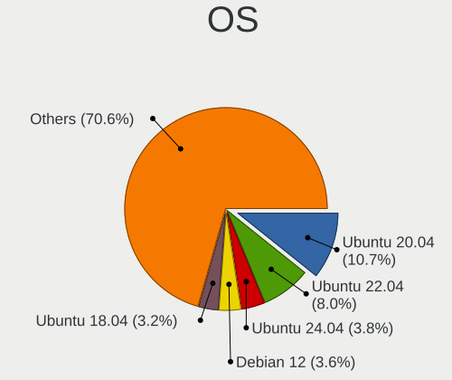

| Name               | Computers | Percent |
|--------------------|-----------|---------|
| Ubuntu 20.04       | 1899      | 10.73%  |
| Ubuntu 22.04       | 1423      | 8.04%   |
| Ubuntu 24.04       | 672       | 3.8%    |
| Debian 12          | 638       | 3.61%   |
| Ubuntu 18.04       | 572       | 3.23%   |
| Debian 11          | 482       | 2.72%   |
| Arch Rolling       | 407       | 2.3%    |
| OpenMandriva 4.2   | 398       | 2.25%   |
| OpenMandriva 4.3   | 325       | 1.84%   |
| Xubuntu 20.04      | 213       | 1.2%    |
| Zorin 17           | 210       | 1.19%   |
| Pop!_OS 22.04      | 210       | 1.19%   |
| Linux Mint 20.3    | 210       | 1.19%   |
| OpenMandriva 25.90 | 192       | 1.09%   |
| OpenMandriva 24.12 | 171       | 0.97%   |
| Linux Mint 22.1    | 171       | 0.97%   |
| Linux Mint 21.1    | 166       | 0.94%   |
| OpenMandriva 23.01 | 161       | 0.91%   |
| OpenMandriva 23.08 | 158       | 0.89%   |
| Linux Mint 22.2    | 151       | 0.85%   |
| Zorin 16           | 150       | 0.85%   |
| Linux Mint 21.3    | 141       | 0.8%    |
| Debian 10          | 139       | 0.79%   |
| Fedora 40          | 136       | 0.77%   |
| Xubuntu 22.04      | 131       | 0.74%   |
| Fedora 42          | 131       | 0.74%   |
| Fedora 41          | 131       | 0.74%   |
| Manjaro            | 130       | 0.73%   |
| Debian 13          | 125       | 0.71%   |
| Fedora 39          | 124       | 0.7%    |
| Arch               | 124       | 0.7%    |
| Ubuntu 21.10       | 123       | 0.7%    |
| OpenMandriva 23.03 | 122       | 0.69%   |
| Linux Mint 21.2    | 121       | 0.68%   |
| Linux Mint 20.2    | 115       | 0.65%   |
| Ubuntu 20.10       | 109       | 0.62%   |
| Ubuntu 23.04       | 108       | 0.61%   |
| Linux Mint 20.1    | 107       | 0.6%    |
| Ubuntu 21.04       | 106       | 0.6%    |
| Fedora 38          | 100       | 0.57%   |

OS Family
---------

OS without a version

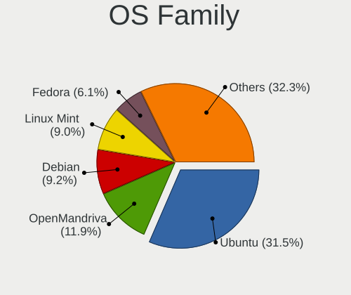

| Name          | Computers | Percent |
|---------------|-----------|---------|
| Ubuntu        | 5209      | 31.51%  |
| OpenMandriva  | 1973      | 11.94%  |
| Debian        | 1513      | 9.15%   |
| Linux Mint    | 1491      | 9.02%   |
| Fedora        | 1011      | 6.12%   |
| Xubuntu       | 535       | 3.24%   |
| Arch          | 522       | 3.16%   |
| Zorin         | 465       | 2.81%   |
| Kubuntu       | 384       | 2.32%   |
| Pop!_OS       | 377       | 2.28%   |
| Manjaro       | 348       | 2.11%   |
| Lubuntu       | 213       | 1.29%   |
| ROSA          | 206       | 1.25%   |
| Ubuntu MATE   | 202       | 1.22%   |
| KDE neon      | 145       | 0.88%   |
| openSUSE      | 135       | 0.82%   |
| Gentoo        | 112       | 0.68%   |
| Kali          | 103       | 0.62%   |
| Bazzite       | 96        | 0.58%   |
| ArcoLinux     | 96        | 0.58%   |
| Elementary    | 92        | 0.56%   |
| Ubuntu Unity  | 91        | 0.55%   |
| LMDE          | 91        | 0.55%   |
| EndeavourOS   | 82        | 0.5%    |
| SteamOS       | 81        | 0.49%   |
| Ubuntu Budgie | 60        | 0.36%   |
| Endless       | 55        | 0.33%   |
| Nobara        | 51        | 0.31%   |
| MX            | 50        | 0.3%    |
| Mageia        | 43        | 0.26%   |
| NixOS         | 42        | 0.25%   |
| BlackPanther  | 36        | 0.22%   |
| Ubuntu Studio | 32        | 0.19%   |
| CachyOS       | 31        | 0.19%   |
| Parrot        | 29        | 0.18%   |
| CentOS        | 29        | 0.18%   |
| Garuda Linux  | 27        | 0.16%   |
| Devuan        | 27        | 0.16%   |
| Clear Linux   | 23        | 0.14%   |
| Raspbian      | 21        | 0.13%   |

Kernel
------

Version of the Linux kernel

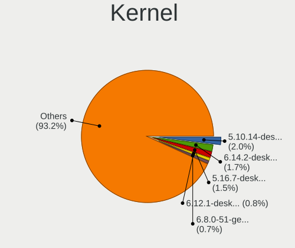

| Version                  | Computers | Percent |
|--------------------------|-----------|---------|
| 5.10.14-desktop-1omv4002 | 379       | 1.96%   |
| 6.14.2-desktop-3omv2590  | 339       | 1.75%   |
| 5.16.7-desktop-1omv4003  | 295       | 1.52%   |
| 6.12.1-desktop-1omv2490  | 157       | 0.81%   |
| 6.8.0-51-generic         | 143       | 0.74%   |
| 6.1.1-desktop-1omv2290   | 142       | 0.73%   |
| 6.4.11-desktop-1omv2390  | 138       | 0.71%   |
| 5.15.0-56-generic        | 132       | 0.68%   |
| 5.4.0-42-generic         | 128       | 0.66%   |
| 6.6.2-desktop-1omv2390   | 121       | 0.62%   |
| 6.2.6-desktop-1omv2390   | 113       | 0.58%   |
| 5.15.0-58-generic        | 102       | 0.53%   |
| 5.4.0-58-generic         | 98        | 0.51%   |
| 5.15.0-52-generic        | 96        | 0.5%    |
| 6.14.0-33-generic        | 94        | 0.49%   |
| 6.8.0-45-generic         | 92        | 0.47%   |
| 6.8.0-52-generic         | 91        | 0.47%   |
| 6.8.0-40-generic         | 85        | 0.44%   |
| 6.1.0-16-amd64           | 85        | 0.44%   |
| 5.4.0-52-generic         | 83        | 0.43%   |
| 6.2.0-26-generic         | 79        | 0.41%   |
| 5.15.0-91-generic        | 79        | 0.41%   |
| 5.11.0-27-generic        | 78        | 0.4%    |
| 5.11.0-38-generic        | 77        | 0.4%    |
| 6.5.0-14-generic         | 75        | 0.39%   |
| 6.14.0-29-generic        | 74        | 0.38%   |
| 5.15.0-48-generic        | 74        | 0.38%   |
| 5.4.0-26-generic         | 73        | 0.38%   |
| 5.8.0-43-generic         | 71        | 0.37%   |
| 6.8.0-60-generic         | 70        | 0.36%   |
| 6.14.0-36-generic        | 70        | 0.36%   |
| 5.4.0-48-generic         | 69        | 0.36%   |
| 6.8.0-31-generic         | 68        | 0.35%   |
| 5.15.0-46-generic        | 67        | 0.35%   |
| 6.2.0-39-generic         | 66        | 0.34%   |
| 5.11.0-37-generic        | 66        | 0.34%   |
| 5.4.0-65-generic         | 65        | 0.34%   |
| 5.15.0-43-generic        | 64        | 0.33%   |
| 6.5.0-26-generic         | 63        | 0.33%   |
| 5.8.0-50-generic         | 63        | 0.33%   |

Kernel Family
-------------

Linux kernel without a distro release

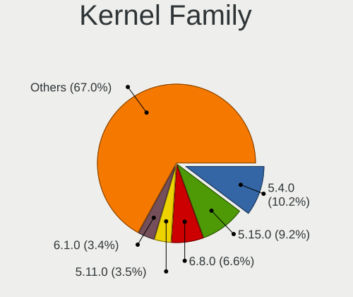

| Version | Computers | Percent |
|---------|-----------|---------|
| 5.4.0   | 1871      | 10.24%  |
| 5.15.0  | 1686      | 9.23%   |
| 6.8.0   | 1206      | 6.6%    |
| 5.11.0  | 640       | 3.5%    |
| 6.1.0   | 630       | 3.45%   |
| 5.8.0   | 618       | 3.38%   |
| 6.5.0   | 545       | 2.98%   |
| 5.13.0  | 528       | 2.89%   |
| 6.14.0  | 520       | 2.85%   |
| 5.10.0  | 493       | 2.7%    |
| 6.2.0   | 467       | 2.56%   |
| 4.15.0  | 466       | 2.55%   |
| 5.19.0  | 449       | 2.46%   |
| 5.10.14 | 382       | 2.09%   |
| 6.14.2  | 360       | 1.97%   |
| 5.16.7  | 296       | 1.62%   |
| 5.3.0   | 289       | 1.58%   |
| 6.11.0  | 268       | 1.47%   |
| 6.12.1  | 177       | 0.97%   |
| 5.0.0   | 164       | 0.9%    |
| 6.1.1   | 156       | 0.85%   |
| 6.4.11  | 145       | 0.79%   |
| 4.18.0  | 143       | 0.78%   |
| 6.2.6   | 136       | 0.74%   |
| 6.6.2   | 133       | 0.73%   |
| 4.19.0  | 131       | 0.72%   |
| 6.10.0  | 61        | 0.33%   |
| 5.14.0  | 59        | 0.32%   |
| 6.9.3   | 56        | 0.31%   |
| 6.12.57 | 51        | 0.28%   |
| 6.12.48 | 49        | 0.27%   |
| 6.0.0   | 46        | 0.25%   |
| 6.12.9  | 44        | 0.24%   |
| 6.17.7  | 41        | 0.22%   |
| 6.17.0  | 41        | 0.22%   |
| 6.12.10 | 40        | 0.22%   |
| 5.16.13 | 40        | 0.22%   |
| 6.15.9  | 36        | 0.2%    |
| 5.11.12 | 36        | 0.2%    |
| 4.9.20  | 35        | 0.19%   |

Kernel Major Ver.
-----------------

Linux kernel major version

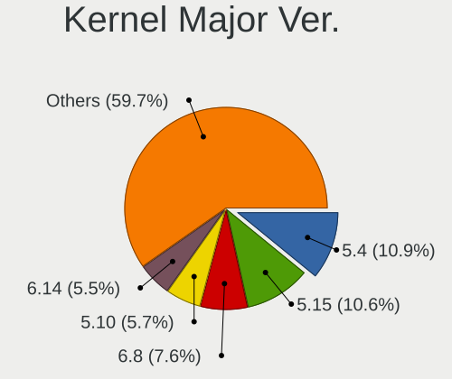

| Version | Computers | Percent |
|---------|-----------|---------|
| 5.4     | 1969      | 10.91%  |
| 5.15    | 1916      | 10.62%  |
| 6.8     | 1368      | 7.58%   |
| 5.10    | 1027      | 5.69%   |
| 6.14    | 985       | 5.46%   |
| 6.1     | 978       | 5.42%   |
| 5.11    | 738       | 4.09%   |
| 6.2     | 717       | 3.97%   |
| 5.8     | 708       | 3.92%   |
| 6.5     | 704       | 3.9%    |
| 5.13    | 610       | 3.38%   |
| 6.12    | 581       | 3.22%   |
| 5.19    | 545       | 3.02%   |
| 4.15    | 467       | 2.59%   |
| 5.16    | 434       | 2.41%   |
| 6.6     | 410       | 2.27%   |
| 6.11    | 408       | 2.26%   |
| 5.3     | 331       | 1.83%   |
| 6.4     | 290       | 1.61%   |
| 4.18    | 179       | 0.99%   |
| 6.17    | 178       | 0.99%   |
| 5.0     | 177       | 0.98%   |
| 6.9     | 172       | 0.95%   |
| 6.10    | 168       | 0.93%   |
| 5.14    | 154       | 0.85%   |
| 6.0     | 152       | 0.84%   |
| 4.19    | 151       | 0.84%   |
| 6.15    | 146       | 0.81%   |
| 5.18    | 132       | 0.73%   |
| 6.13    | 125       | 0.69%   |
| 4.9     | 121       | 0.67%   |
| 5.9     | 119       | 0.66%   |
| 6.16    | 116       | 0.64%   |
| 5.17    | 112       | 0.62%   |
| 6.3     | 106       | 0.59%   |
| 6.7     | 102       | 0.57%   |
| 5.6     | 82        | 0.45%   |
| 5.7     | 73        | 0.4%    |
| 5.12    | 70        | 0.39%   |
| 5.5     | 39        | 0.22%   |

Arch
----

OS architecture (x86_64, i586, etc.)

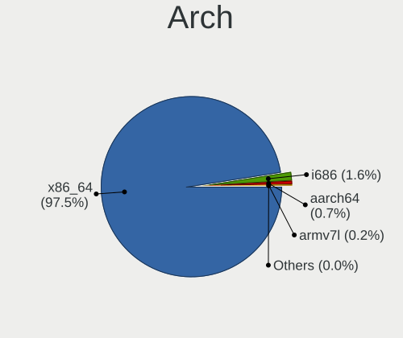

| Name        | Computers | Percent |
|-------------|-----------|---------|
| x86_64      | 15571     | 97.51%  |
| i686        | 250       | 1.57%   |
| aarch64     | 104       | 0.65%   |
| armv7l      | 30        | 0.19%   |
| armv6l      | 6         | 0.04%   |
| armv8l      | 2         | 0.01%   |
| Unknown     | 2         | 0.01%   |
| riscv64     | 1         | 0.01%   |
| ppc64le     | 1         | 0.01%   |
| loongarch64 | 1         | 0.01%   |

DE
--

Desktop Environment

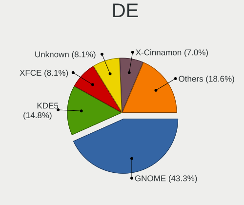

| Name             | Computers | Percent |
|------------------|-----------|---------|
| GNOME            | 7245      | 43.32%  |
| KDE5             | 2472      | 14.78%  |
| XFCE             | 1356      | 8.11%   |
| Unknown          | 1355      | 8.1%    |
| X-Cinnamon       | 1177      | 7.04%   |
| KDE6             | 1018      | 6.09%   |
| MATE             | 554       | 3.31%   |
| LXQt             | 322       | 1.93%   |
| KDE              | 180       | 1.08%   |
| Cinnamon         | 180       | 1.08%   |
| KDE4             | 140       | 0.84%   |
| i3               | 113       | 0.68%   |
| Pantheon         | 96        | 0.57%   |
| Unity            | 90        | 0.54%   |
| Budgie           | 80        | 0.48%   |
| LXDE             | 64        | 0.38%   |
| Hyprland         | 46        | 0.28%   |
| GNOME Flashback  | 46        | 0.28%   |
| GNOME Classic    | 29        | 0.17%   |
| sway             | 21        | 0.13%   |
| Deepin           | 19        | 0.11%   |
| awesome          | 13        | 0.08%   |
| COSMIC           | 12        | 0.07%   |
| openbox          | 9         | 0.05%   |
| Enlightenment    | 9         | 0.05%   |
| Trinity          | 7         | 0.04%   |
| niri             | 6         | 0.04%   |
| lightdm-xsession | 6         | 0.04%   |
| ICEWM            | 6         | 0.04%   |
| bspwm            | 6         | 0.04%   |
| qtile            | 5         | 0.03%   |
| i3-with-shmlog   | 4         | 0.02%   |
| none+i3          | 3         | 0.02%   |
| LXDE-pi-wayfire  | 3         | 0.02%   |
| GNUstep          | 3         | 0.02%   |
| dwm              | 3         | 0.02%   |
| labwc:wlroots    | 2         | 0.01%   |
| GNOME-Classic    | 2         | 0.01%   |
| fluxbox          | 2         | 0.01%   |
| Endless:GNOME    | 2         | 0.01%   |

Display Server
--------------

X11 or Wayland

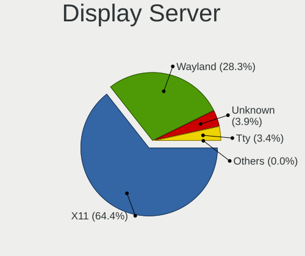

| Name        | Computers | Percent |
|-------------|-----------|---------|
| X11         | 10697     | 64.4%   |
| Wayland     | 4701      | 28.3%   |
| Unknown     | 641       | 3.86%   |
| Tty         | 567       | 3.41%   |
| Xcb         | 1         | 0.01%   |
| Web         | 1         | 0.01%   |
| Unspecified | 1         | 0.01%   |

Display Manager
---------------

SDDM, LightDM, etc.

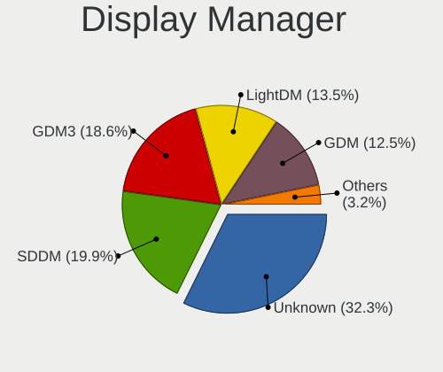

| Name           | Computers | Percent |
|----------------|-----------|---------|
| Unknown        | 5397      | 32.32%  |
| SDDM           | 3317      | 19.86%  |
| GDM3           | 3109      | 18.62%  |
| LightDM        | 2259      | 13.53%  |
| GDM            | 2080      | 12.46%  |
| TDM            | 337       | 2.02%   |
| KDM            | 115       | 0.69%   |
| SLiM           | 21        | 0.13%   |
| XDM            | 15        | 0.09%   |
| Ly             | 10        | 0.06%   |
| LXDM           | 10        | 0.06%   |
| GREETD         | 10        | 0.06%   |
| COSMIC-GREETER | 4         | 0.02%   |
| WDM            | 3         | 0.02%   |
| SLIMSKI        | 3         | 0.02%   |
| NODM           | 3         | 0.02%   |
| LY-DM          | 3         | 0.02%   |
| SU             | 1         | 0.01%   |
| MDM            | 1         | 0.01%   |
| LEMURS         | 1         | 0.01%   |
| EMPTTY         | 1         | 0.01%   |

OS Lang
-------

Language

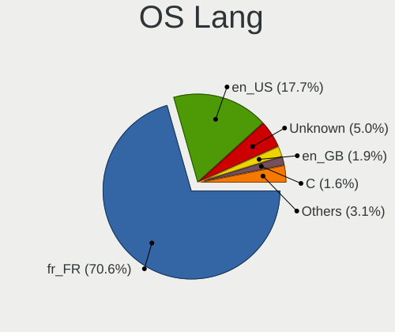

| Lang        | Computers | Percent |
|-------------|-----------|---------|
| fr_FR       | 11506     | 70.6%   |
| en_US       | 2880      | 17.67%  |
| Unknown     | 820       | 5.03%   |
| en_GB       | 311       | 1.91%   |
| C           | 268       | 1.64%   |
| it_IT       | 147       | 0.9%    |
| de_DE       | 61        | 0.37%   |
| ru_RU       | 28        | 0.17%   |
| es_ES       | 24        | 0.15%   |
| fr_BE       | 20        | 0.12%   |
| en_IE       | 20        | 0.12%   |
| fr_CH       | 19        | 0.12%   |
| fr_CA       | 19        | 0.12%   |
| POSIX       | 14        | 0.09%   |
| pl_PL       | 12        | 0.07%   |
| nl_NL       | 12        | 0.07%   |
| C.UTF8      | 12        | 0.07%   |
| pt_PT       | 11        | 0.07%   |
| en_DK       | 8         | 0.05%   |
| fr_FR.UTF8  | 7         | 0.04%   |
| en_AU       | 7         | 0.04%   |
| pt_BR       | 6         | 0.04%   |
| ru_UA       | 5         | 0.03%   |
| sv_SE       | 4         | 0.02%   |
| fr_LU       | 4         | 0.02%   |
| en_IN       | 4         | 0.02%   |
| en_CA       | 4         | 0.02%   |
| cs_CZ       | 4         | 0.02%   |
| ro_RO       | 3         | 0.02%   |
| en_AG       | 3         | 0.02%   |
| de_CH       | 3         | 0.02%   |
| zh_CN       | 2         | 0.01%   |
| uk_UA       | 2         | 0.01%   |
| sk_SK       | 2         | 0.01%   |
| nb_NO       | 2         | 0.01%   |
| hu_HU       | 2         | 0.01%   |
| fr_FR.utf-8 | 2         | 0.01%   |
| es_AR       | 2         | 0.01%   |
| da_DK       | 2         | 0.01%   |
| ar_SA       | 2         | 0.01%   |

Boot Mode
---------

EFI or BIOS

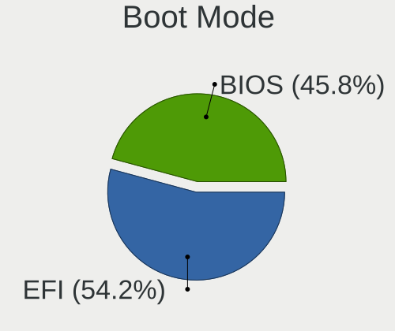

| Mode | Computers | Percent |
|------|-----------|---------|
| EFI  | 8849      | 54.2%   |
| BIOS | 7477      | 45.8%   |

Filesystem
----------

Type of filesystem

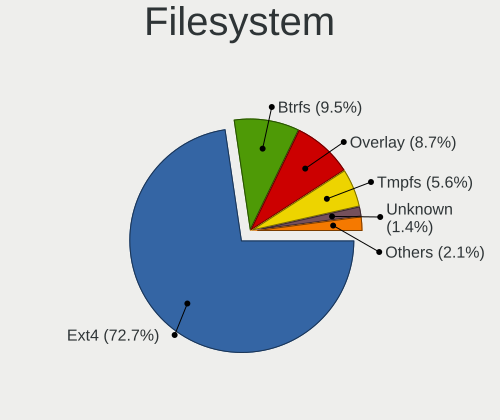

| Type     | Computers | Percent |
|----------|-----------|---------|
| Ext4     | 12010     | 72.67%  |
| Btrfs    | 1569      | 9.49%   |
| Overlay  | 1443      | 8.73%   |
| Tmpfs    | 923       | 5.59%   |
| Unknown  | 237       | 1.43%   |
| Xfs      | 160       | 0.97%   |
| Zfs      | 95        | 0.57%   |
| F2fs     | 30        | 0.18%   |
| Ext3     | 26        | 0.16%   |
| Ext2     | 18        | 0.11%   |
| Rootfs   | 7         | 0.04%   |
| Reiserfs | 3         | 0.02%   |
| Jfs      | 2         | 0.01%   |
| Aufs     | 2         | 0.01%   |
| XXXXXXX  | 1         | 0.01%   |

Part. scheme
------------

Scheme of partitioning

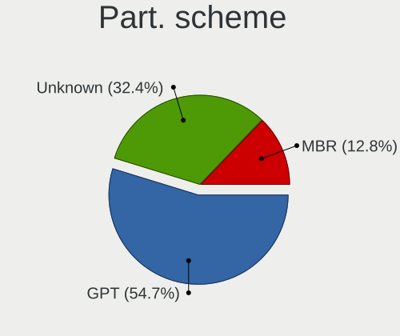

| Type    | Computers | Percent |
|---------|-----------|---------|
| GPT     | 9001      | 54.75%  |
| Unknown | 5333      | 32.44%  |
| MBR     | 2107      | 12.82%  |

Dual Boot with Linux/BSD
------------------------

Hosting more than one Linux/BSD

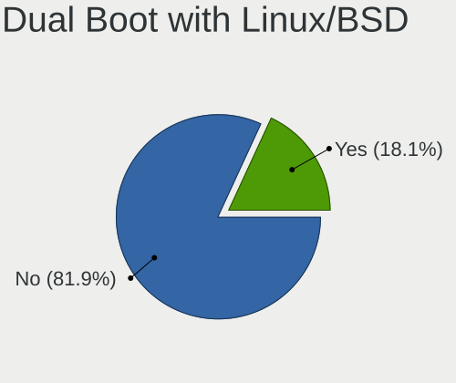

| Dual boot | Computers | Percent |
|-----------|-----------|---------|
| No        | 13385     | 81.89%  |
| Yes       | 2961      | 18.11%  |

Dual Boot (Win)
---------------

Hosting Linux and Windows

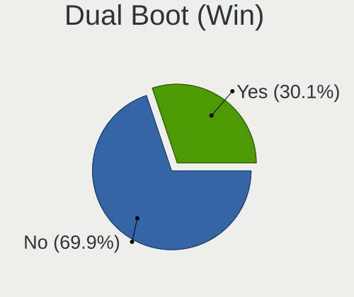

| Dual boot | Computers | Percent |
|-----------|-----------|---------|
| No        | 11375     | 69.88%  |
| Yes       | 4902      | 30.12%  |

Board
-----

Vendor
------

Motherboard manufacturer

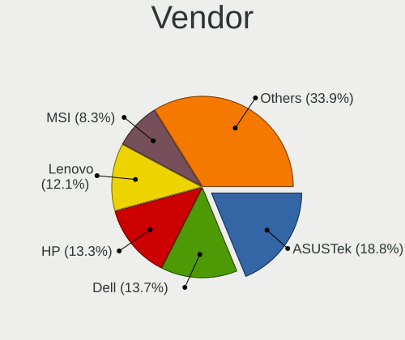

| Name                                 | Computers | Percent |
|--------------------------------------|-----------|---------|
| ASUSTek Computer                     | 2996      | 18.77%  |
| Dell                                 | 2184      | 13.68%  |
| Hewlett-Packard                      | 2120      | 13.28%  |
| Lenovo                               | 1930      | 12.09%  |
| MSI                                  | 1324      | 8.3%    |
| Gigabyte Technology                  | 906       | 5.68%   |
| Acer                                 | 792       | 4.96%   |
| ASRock                               | 379       | 2.37%   |
| Apple                                | 359       | 2.25%   |
| Toshiba                              | 261       | 1.64%   |
| Intel                                | 229       | 1.43%   |
| Unknown                              | 177       | 1.11%   |
| Packard Bell                         | 153       | 0.96%   |
| Notebook                             | 144       | 0.9%    |
| HUAWEI                               | 126       | 0.79%   |
| Samsung Electronics                  | 112       | 0.7%    |
| Fujitsu                              | 99        | 0.62%   |
| Sony                                 | 96        | 0.6%    |
| Raspberry Pi Foundation              | 73        | 0.46%   |
| Pegatron                             | 68        | 0.43%   |
| Foxconn                              | 68        | 0.43%   |
| Valve                                | 60        | 0.38%   |
| Medion                               | 57        | 0.36%   |
| eMachines                            | 56        | 0.35%   |
| AZW                                  | 52        | 0.33%   |
| UNOWHY                               | 51        | 0.32%   |
| Microsoft                            | 50        | 0.31%   |
| TUXEDO                               | 48        | 0.3%    |
| Framework                            | 46        | 0.29%   |
| Supermicro                           | 45        | 0.28%   |
| Thomson                              | 41        | 0.26%   |
| Alienware                            | 41        | 0.26%   |
| Shenzhen Meigao Electronic Equipment | 39        | 0.24%   |
| Google                               | 34        | 0.21%   |
| Fujitsu Siemens                      | 31        | 0.19%   |
| Shuttle                              | 30        | 0.19%   |
| PC Specialist                        | 30        | 0.19%   |
| Timi                                 | 28        | 0.18%   |
| Chuwi                                | 28        | 0.18%   |
| Clevo                                | 27        | 0.17%   |

Model
-----

Motherboard model

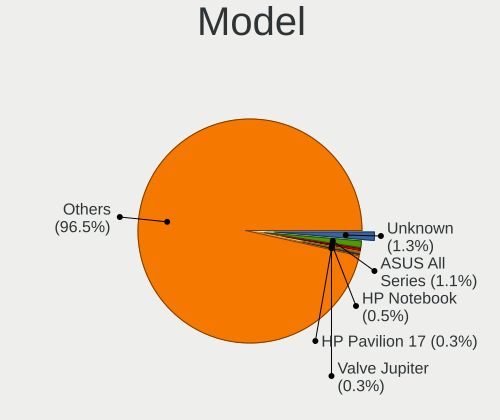

| Name                                       | Computers | Percent |
|--------------------------------------------|-----------|---------|
| Unknown                                    | 215       | 1.35%   |
| ASUS All Series                            | 174       | 1.09%   |
| HP Notebook                                | 74        | 0.46%   |
| HP Pavilion 17                             | 49        | 0.31%   |
| Valve Jupiter                              | 47        | 0.29%   |
| HP Pavilion dv7                            | 41        | 0.26%   |
| HP Pavilion dv6                            | 39        | 0.24%   |
| Dell OptiPlex 7010                         | 38        | 0.24%   |
| MSI MS-7C37                                | 35        | 0.22%   |
| Gigabyte B450M DS3H                        | 33        | 0.21%   |
| Dell OptiPlex 9020                         | 29        | 0.18%   |
| Dell OptiPlex 3020                         | 29        | 0.18%   |
| MSI MS-7C91                                | 28        | 0.18%   |
| MSI MS-7C56                                | 27        | 0.17%   |
| Dell OptiPlex 390                          | 27        | 0.17%   |
| HP Pavilion g7                             | 26        | 0.16%   |
| ASUS S551LN                                | 26        | 0.16%   |
| Dell XPS 13 9310                           | 25        | 0.16%   |
| Dell Latitude 7490                         | 25        | 0.16%   |
| ASUS TUF Gaming X570-PLUS                  | 24        | 0.15%   |
| MSI MS-7816                                | 23        | 0.14%   |
| HP EliteBook 840 G3                        | 23        | 0.14%   |
| HP Pavilion g6                             | 21        | 0.13%   |
| HP EliteBook 840 G2                        | 21        | 0.13%   |
| Gigabyte B450 AORUS ELITE                  | 21        | 0.13%   |
| ASUS TUF Gaming B550-PLUS                  | 21        | 0.13%   |
| MSI MS-7C02                                | 20        | 0.13%   |
| MSI MS-7817                                | 20        | 0.13%   |
| HP ProDesk 400 G2.5 SFF                    | 20        | 0.13%   |
| HP ProBook 650 G1                          | 20        | 0.13%   |
| HP Pavilion Notebook                       | 20        | 0.13%   |
| HP Pavilion 15                             | 20        | 0.13%   |
| Dell XPS 15 9570                           | 20        | 0.13%   |
| Dell Latitude 5420                         | 20        | 0.13%   |
| ASUS PRIME A320M-K                         | 20        | 0.13%   |
| Apple MacBookPro8,1                        | 20        | 0.13%   |
| Framework Laptop 13 (AMD Ryzen 7040Series) | 19        | 0.12%   |
| Dell XPS 13 9380                           | 19        | 0.12%   |
| Dell Latitude E6420                        | 19        | 0.12%   |
| Apple MacBookPro9,2                        | 19        | 0.12%   |

Model Family
------------

Motherboard model prefix

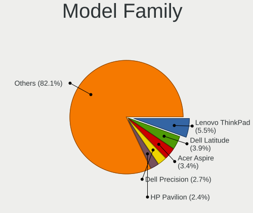

| Name                  | Computers | Percent |
|-----------------------|-----------|---------|
| Lenovo ThinkPad       | 877       | 5.49%   |
| Dell Latitude         | 627       | 3.93%   |
| Acer Aspire           | 542       | 3.4%    |
| Dell Precision        | 426       | 2.67%   |
| HP Pavilion           | 390       | 2.44%   |
| Dell OptiPlex         | 336       | 2.11%   |
| Lenovo IdeaPad        | 328       | 2.06%   |
| HP EliteBook          | 323       | 2.02%   |
| Dell XPS              | 283       | 1.77%   |
| Dell Inspiron         | 270       | 1.69%   |
| ASUS ROG              | 265       | 1.66%   |
| ASUS PRIME            | 253       | 1.59%   |
| Lenovo ThinkCentre    | 249       | 1.56%   |
| HP ProBook            | 241       | 1.51%   |
| ASUS VivoBook         | 241       | 1.51%   |
| Toshiba Satellite     | 215       | 1.35%   |
| Unknown               | 215       | 1.35%   |
| ASUS TUF              | 189       | 1.18%   |
| HP Compaq             | 180       | 1.13%   |
| ASUS All              | 174       | 1.09%   |
| HP Laptop             | 142       | 0.89%   |
| ASUS ZenBook          | 120       | 0.75%   |
| ASUS ASUS             | 108       | 0.68%   |
| HP ProDesk            | 99        | 0.62%   |
| Packard Bell EasyNote | 83        | 0.52%   |
| Lenovo Legion         | 83        | 0.52%   |
| Dell Vostro           | 83        | 0.52%   |
| HP ZBook              | 82        | 0.51%   |
| Lenovo Yoga           | 77        | 0.48%   |
| HP Notebook           | 74        | 0.46%   |
| RPi Raspberry         | 73        | 0.46%   |
| Acer Swift            | 72        | 0.45%   |
| HP ENVY               | 70        | 0.44%   |
| HP EliteDesk          | 57        | 0.36%   |
| Acer Nitro            | 54        | 0.34%   |
| Fujitsu ESPRIMO       | 52        | 0.33%   |
| Microsoft Surface     | 50        | 0.31%   |
| Valve Jupiter         | 47        | 0.29%   |
| HP OMEN               | 47        | 0.29%   |
| Gigabyte B450         | 46        | 0.29%   |

MFG Year
--------

Motherboard manufacture year

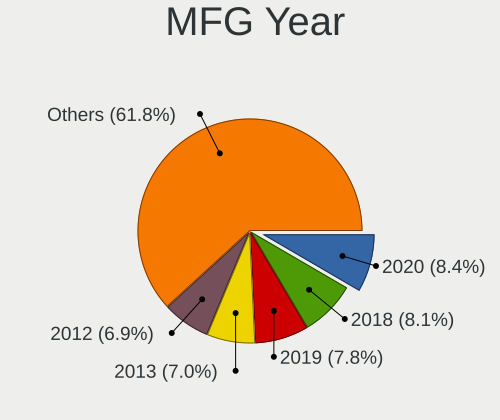

| Year    | Computers | Percent |
|---------|-----------|---------|
| 2020    | 1341      | 8.4%    |
| 2018    | 1292      | 8.1%    |
| 2019    | 1239      | 7.76%   |
| 2013    | 1117      | 7%      |
| 2012    | 1106      | 6.93%   |
| 2021    | 1095      | 6.86%   |
| 2014    | 923       | 5.78%   |
| 2015    | 906       | 5.68%   |
| 2011    | 895       | 5.61%   |
| 2017    | 845       | 5.29%   |
| 2022    | 793       | 4.97%   |
| 2016    | 782       | 4.9%    |
| 2010    | 696       | 4.36%   |
| 2023    | 640       | 4.01%   |
| 2008    | 590       | 3.7%    |
| 2009    | 587       | 3.68%   |
| 2024    | 370       | 2.32%   |
| 2007    | 284       | 1.78%   |
| 2006    | 141       | 0.88%   |
| Unknown | 127       | 0.8%    |
| 2025    | 106       | 0.66%   |
| 2005    | 57        | 0.36%   |
| 2004    | 13        | 0.08%   |
| 2003    | 11        | 0.07%   |
| 2002    | 2         | 0.01%   |
| 2001    | 2         | 0.01%   |

Form Factor
-----------

Physical design of the computer

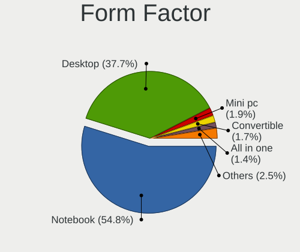

| Name           | Computers | Percent |
|----------------|-----------|---------|
| Notebook       | 8749      | 54.82%  |
| Desktop        | 6009      | 37.65%  |
| Mini pc        | 307       | 1.92%   |
| Convertible    | 270       | 1.69%   |
| All in one     | 219       | 1.37%   |
| Server         | 137       | 0.86%   |
| Tablet         | 133       | 0.83%   |
| System on chip | 121       | 0.76%   |
| Phone          | 13        | 0.08%   |
| Other          | 1         | 0.01%   |
| Firewall       | 1         | 0.01%   |

Secure Boot
-----------

Enabled or disabled

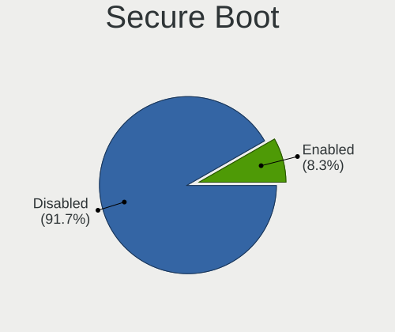

| State    | Computers | Percent |
|----------|-----------|---------|
| Disabled | 14739     | 91.73%  |
| Enabled  | 1328      | 8.27%   |

Coreboot
--------

Have coreboot on board

| Used | Computers | Percent |
|------|-----------|---------|
| No   | 15908     | 99.67%  |
| Yes  | 53        | 0.33%   |

RAM Size
--------

Total RAM memory

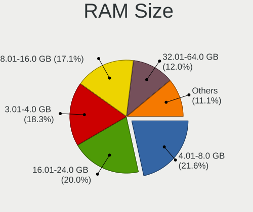

| Size in GB      | Computers | Percent |
|-----------------|-----------|---------|
| 4.01-8.0        | 3508      | 21.57%  |
| 16.01-24.0      | 3256      | 20.02%  |
| 3.01-4.0        | 2975      | 18.29%  |
| 8.01-16.0       | 2781      | 17.1%   |
| 32.01-64.0      | 1947      | 11.97%  |
| 64.01-256.0     | 518       | 3.18%   |
| 1.01-2.0        | 476       | 2.93%   |
| 24.01-32.0      | 431       | 2.65%   |
| 2.01-3.0        | 225       | 1.38%   |
| 0.51-1.0        | 92        | 0.57%   |
| More than 256.0 | 30        | 0.18%   |
| 0.01-0.5        | 20        | 0.12%   |
| Unknown         | 7         | 0.04%   |

RAM Used
--------

Used RAM memory

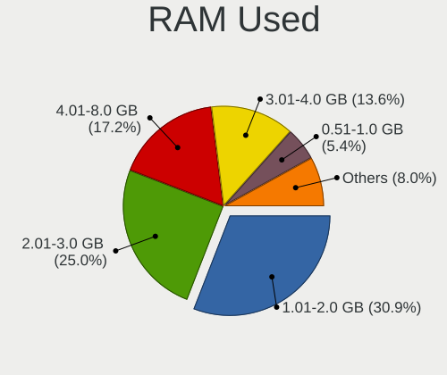

| Used GB         | Computers | Percent |
|-----------------|-----------|---------|
| 1.01-2.0        | 5481      | 30.9%   |
| 2.01-3.0        | 4430      | 24.97%  |
| 4.01-8.0        | 3047      | 17.18%  |
| 3.01-4.0        | 2407      | 13.57%  |
| 0.51-1.0        | 952       | 5.37%   |
| 8.01-16.0       | 939       | 5.29%   |
| 0.01-0.5        | 209       | 1.18%   |
| 16.01-24.0      | 151       | 0.85%   |
| 24.01-32.0      | 54        | 0.3%    |
| 32.01-64.0      | 41        | 0.23%   |
| 64.01-256.0     | 16        | 0.09%   |
| Unknown         | 11        | 0.06%   |
| More than 256.0 | 1         | 0.01%   |
| 0               | 1         | 0.01%   |

Total Drives
------------

Number of drives on board

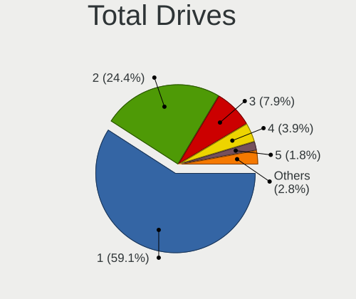

| Drives  | Computers | Percent |
|---------|-----------|---------|
| 1       | 9737      | 59.11%  |
| 2       | 4027      | 24.44%  |
| 3       | 1305      | 7.92%   |
| 4       | 642       | 3.9%    |
| 5       | 295       | 1.79%   |
| 6       | 162       | 0.98%   |
| 0       | 130       | 0.79%   |
| 7       | 77        | 0.47%   |
| 8       | 40        | 0.24%   |
| 9       | 20        | 0.12%   |
| 10      | 9         | 0.05%   |
| 14      | 4         | 0.02%   |
| 11      | 4         | 0.02%   |
| Unknown | 4         | 0.02%   |
| 25      | 2         | 0.01%   |
| 22      | 2         | 0.01%   |
| 18      | 2         | 0.01%   |
| 15      | 2         | 0.01%   |
| 13      | 2         | 0.01%   |
| 12      | 2         | 0.01%   |
| 29      | 1         | 0.01%   |
| 21      | 1         | 0.01%   |
| 20      | 1         | 0.01%   |
| 19      | 1         | 0.01%   |
| 17      | 1         | 0.01%   |
| 16      | 1         | 0.01%   |

Has CD-ROM
----------

Has CD-ROM on board

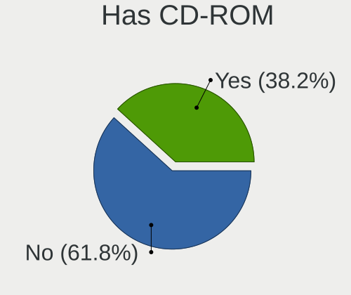

| Presented | Computers | Percent |
|-----------|-----------|---------|
| No        | 9941      | 61.76%  |
| Yes       | 6155      | 38.24%  |

Has Ethernet
------------

Has Ethernet on board

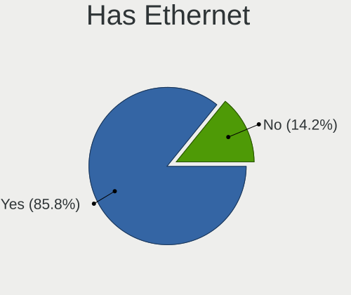

| Presented | Computers | Percent |
|-----------|-----------|---------|
| Yes       | 13750     | 85.84%  |
| No        | 2269      | 14.16%  |

Has WiFi
--------

Has WiFi module

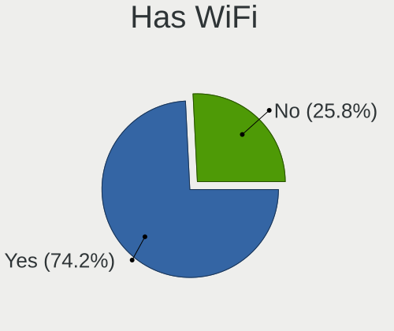

| Presented | Computers | Percent |
|-----------|-----------|---------|
| Yes       | 11940     | 74.21%  |
| No        | 4149      | 25.79%  |

Has Bluetooth
-------------

Has Bluetooth module

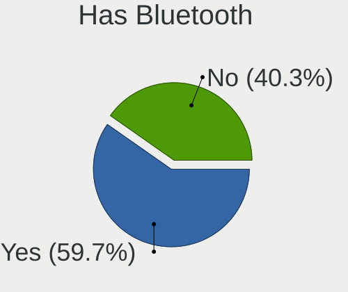

| Presented | Computers | Percent |
|-----------|-----------|---------|
| Yes       | 9659      | 59.74%  |
| No        | 6510      | 40.26%  |

Location
--------

Country
-------

Geographic location (country)

| Country | Computers | Percent |
|---------|-----------|---------|
| France  | 15960     | 100%    |

City
----

Geographic location (city)

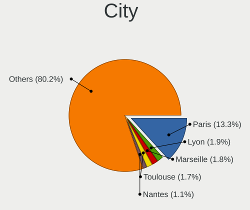

| City             | Computers | Percent |
|------------------|-----------|---------|
| Paris            | 2309      | 13.25%  |
| Lyon             | 324       | 1.86%   |
| Marseille        | 310       | 1.78%   |
| Toulouse         | 301       | 1.73%   |
| Nantes           | 199       | 1.14%   |
| Strasbourg       | 188       | 1.08%   |
| Rennes           | 173       | 0.99%   |
| Roubaix          | 169       | 0.97%   |
| Montpellier      | 167       | 0.96%   |
| Bordeaux         | 155       | 0.89%   |
| Grenoble         | 141       | 0.81%   |
| Lille            | 131       | 0.75%   |
| Rosny-sous-Bois  | 129       | 0.74%   |
| Nice             | 114       | 0.65%   |
| Brest            | 82        | 0.47%   |
| Caen             | 71        | 0.41%   |
| Limoges          | 69        | 0.4%    |
| Clichy-sous-Bois | 68        | 0.39%   |
| Bagneux          | 68        | 0.39%   |
| Villeurbanne     | 66        | 0.38%   |
| Nancy            | 65        | 0.37%   |
| Tours            | 64        | 0.37%   |
| Toulon           | 64        | 0.37%   |
| Poitiers         | 64        | 0.37%   |
| Argenteuil       | 60        | 0.34%   |
| Clermont-Ferrand | 58        | 0.33%   |
| Dijon            | 57        | 0.33%   |
| Cergy            | 57        | 0.33%   |
| Rouen            | 55        | 0.32%   |
| Angers           | 55        | 0.32%   |
| Saint-Denis      | 54        | 0.31%   |
| Orléans         | 53        | 0.3%    |
| Aix-en-Provence  | 53        | 0.3%    |
| Versailles       | 52        | 0.3%    |
| Besançon        | 52        | 0.3%    |
| Valenciennes     | 50        | 0.29%   |
| Nîmes           | 48        | 0.28%   |
| Metz             | 47        | 0.27%   |
| Quimper          | 46        | 0.26%   |
| La Rochelle      | 46        | 0.26%   |

Drives
------

Drive Vendor
------------

Hard drive vendors

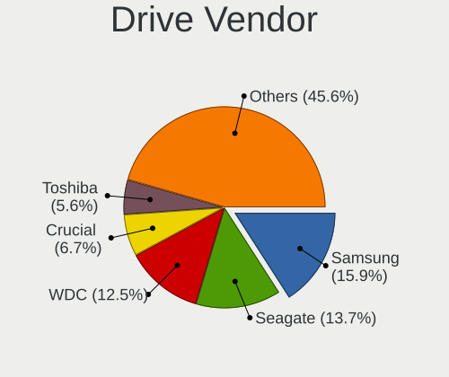

| Vendor                      | Computers | Drives | Percent |
|-----------------------------|-----------|--------|---------|
| Samsung Electronics         | 3777      | 5919   | 15.9%   |
| Seagate                     | 3252      | 5071   | 13.69%  |
| WDC                         | 2976      | 4666   | 12.53%  |
| Crucial                     | 1601      | 2294   | 6.74%   |
| Toshiba                     | 1322      | 1800   | 5.57%   |
| Sandisk                     | 1320      | 1701   | 5.56%   |
| Kingston                    | 1176      | 1514   | 4.95%   |
| Unknown                     | 839       | 1154   | 3.53%   |
| SK hynix                    | 712       | 940    | 3%      |
| Hitachi                     | 588       | 765    | 2.48%   |
| Micron Technology           | 558       | 708    | 2.35%   |
| Intel                       | 524       | 651    | 2.21%   |
| HGST                        | 521       | 714    | 2.19%   |
| PNY                         | 342       | 451    | 1.44%   |
| Micron/Crucial Technology   | 289       | 408    | 1.22%   |
| KIOXIA                      | 265       | 311    | 1.12%   |
| China                       | 195       | 255    | 0.82%   |
| Phison Electronics          | 183       | 256    | 0.77%   |
| Apple                       | 160       | 208    | 0.67%   |
| SPCC                        | 142       | 180    | 0.6%    |
| LDLC                        | 138       | 201    | 0.58%   |
| Kingston Technology Company | 138       | 180    | 0.58%   |
| Transcend                   | 137       | 164    | 0.58%   |
| Maxtor                      | 137       | 188    | 0.58%   |
| Phison                      | 120       | 147    | 0.51%   |
| Corsair                     | 114       | 148    | 0.48%   |
| Unknown                     | 92        | 105    | 0.39%   |
| JMicron Technology          | 86        | 103    | 0.36%   |
| Silicon Motion              | 85        | 113    | 0.36%   |
| LITEON                      | 85        | 95     | 0.36%   |
| Emtec                       | 80        | 101    | 0.34%   |
| OCZ                         | 79        | 101    | 0.33%   |
| MAXIO Technology (Hangzhou) | 70        | 82     | 0.29%   |
| Fujitsu                     | 70        | 106    | 0.29%   |
| A-DATA Technology           | 61        | 76     | 0.26%   |
| KingSpec                    | 52        | 62     | 0.22%   |
| LITEONIT                    | 47        | 55     | 0.2%    |
| Fanxiang                    | 47        | 52     | 0.2%    |
| Lexar                       | 46        | 58     | 0.19%   |
| Intenso                     | 45        | 54     | 0.19%   |

Drive Model
-----------

Hard drive models

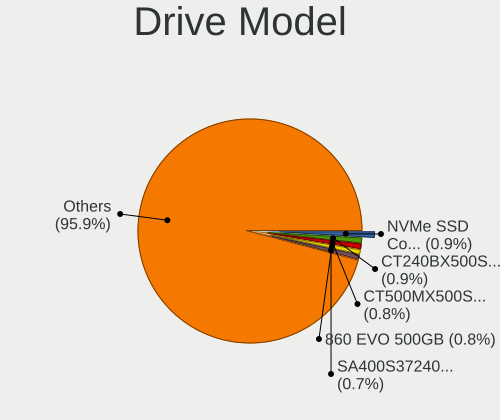

| Model                                              | Computers | Percent |
|----------------------------------------------------|-----------|---------|
| Samsung NVMe SSD Controller SM981/PM981/PM983 1TB  | 243       | 0.93%   |
| Crucial CT240BX500SSD1 240GB                       | 227       | 0.86%   |
| Crucial CT500MX500SSD1 500GB                       | 217       | 0.83%   |
| Samsung SSD 860 EVO 500GB                          | 201       | 0.77%   |
| Kingston SA400S37240G 240GB SSD                    | 193       | 0.74%   |
| Seagate ST500DM002-1BD142 500GB                    | 169       | 0.64%   |
| Samsung NVMe SSD Controller PM9A1/PM9A3/980PRO 1TB | 169       | 0.64%   |
| HGST HTS721010A9E630 1TB                           | 165       | 0.63%   |
| Samsung SSD 850 EVO 250GB                          | 158       | 0.6%    |
| Seagate ST1000LM035-1RK172 1TB                     | 157       | 0.6%    |
| Seagate ST1000DM010-2EP102 1TB                     | 157       | 0.6%    |
| Crucial CT1000MX500SSD1 1TB                        | 157       | 0.6%    |
| Toshiba MQ01ABD100 1TB                             | 154       | 0.59%   |
| Seagate ST1000LM024 HN-M101MBB 1TB                 | 153       | 0.58%   |
| Seagate ST2000DM008-2FR102 2TB                     | 147       | 0.56%   |
| Micron/Crucial P2 NVMe PCIe SSD 2TB                | 140       | 0.53%   |
| Unknown MMC Card  64GB                             | 133       | 0.51%   |
| Samsung SSD 850 EVO 500GB                          | 133       | 0.51%   |
| Crucial CT480BX500SSD1 480GB                       | 130       | 0.5%    |
| Samsung SSD 870 QVO 1TB                            | 123       | 0.47%   |
| Kingston SA400S37480G 480GB SSD                    | 120       | 0.46%   |
| Samsung SSD 860 EVO 1TB                            | 118       | 0.45%   |
| Unknown MMC Card  32GB                             | 111       | 0.42%   |
| Crucial CT1000BX500SSD1 1TB                        | 101       | 0.38%   |
| Seagate ST2000DM001-1ER164 2TB                     | 97        | 0.37%   |
| Samsung SSD 860 EVO 250GB                          | 96        | 0.37%   |
| Unknown SD/MMC/MS PRO 2GB                          | 92        | 0.35%   |
| Kingston SA400S37120G 120GB SSD                    | 92        | 0.35%   |
| Unknown                                            | 92        | 0.35%   |
| Seagate ST1000DM003-1ER162 1TB                     | 91        | 0.35%   |
| Samsung SSD 980 1TB                                | 88        | 0.34%   |
| Toshiba MQ04ABF100 1TB                             | 87        | 0.33%   |
| Seagate ST1000DM003-1CH162 1TB                     | 87        | 0.33%   |
| HGST HTS541010A9E680 1TB                           | 86        | 0.33%   |
| Seagate ST2000DM001-1CH164 2TB                     | 84        | 0.32%   |
| Toshiba DT01ACA100 1TB                             | 82        | 0.31%   |
| PNY CS900 240GB SSD                                | 82        | 0.31%   |
| Samsung SSD 870 EVO 500GB                          | 81        | 0.31%   |
| Seagate ST4000DM004-2CV104 4TB                     | 79        | 0.3%    |
| SanDisk NVMe SSD Drive 512GB                       | 79        | 0.3%    |

HDD Vendor
----------

Hard disk drive vendors

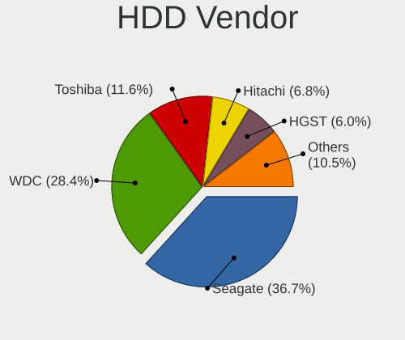

| Vendor              | Computers | Drives | Percent |
|---------------------|-----------|--------|---------|
| Seagate             | 3185      | 4935   | 36.73%  |
| WDC                 | 2463      | 3950   | 28.41%  |
| Toshiba             | 1008      | 1368   | 11.62%  |
| Hitachi             | 588       | 765    | 6.78%   |
| HGST                | 517       | 706    | 5.96%   |
| Samsung Electronics | 334       | 509    | 3.85%   |
| Maxtor              | 136       | 186    | 1.57%   |
| Unknown             | 105       | 120    | 1.21%   |
| Fujitsu             | 68        | 104    | 0.78%   |
| Apple               | 40        | 45     | 0.46%   |
| JMicron Technology  | 35        | 48     | 0.4%    |
| ASMT                | 23        | 33     | 0.27%   |
| Hewlett-Packard     | 22        | 65     | 0.25%   |
| Inateck             | 11        | 12     | 0.13%   |
| Intenso             | 10        | 11     | 0.12%   |
| USB3.0              | 9         | 9      | 0.1%    |
| TO Exter            | 9         | 9      | 0.1%    |
| Magnetic Data       | 9         | 9      | 0.1%    |
| LaCie               | 9         | 9      | 0.1%    |
| ASMedia             | 8         | 8      | 0.09%   |
| IBM/Hitachi         | 6         | 7      | 0.07%   |
| External            | 6         | 6      | 0.07%   |
| SABRENT             | 5         | 7      | 0.06%   |
| HGST HTS            | 5         | 8      | 0.06%   |
| HPE                 | 4         | 9      | 0.05%   |
| USB                 | 3         | 5      | 0.03%   |
| QEMU                | 3         | 5      | 0.03%   |
| MARVELL             | 3         | 6      | 0.03%   |
| KESU                | 3         | 3      | 0.03%   |
| Initio              | 3         | 4      | 0.03%   |
| IB-AC703            | 3         | 3      | 0.03%   |
| ASMT109x            | 3         | 4      | 0.03%   |
| Shenzhen            | 2         | 2      | 0.02%   |
| RSH-319             | 2         | 3      | 0.02%   |
| Maxone              | 2         | 3      | 0.02%   |
| ICY BOX             | 2         | 2      | 0.02%   |
| H/W                 | 2         | 22     | 0.02%   |
| China               | 2         | 2      | 0.02%   |
| Unknown             | 2         | 2      | 0.02%   |
| XrayDisk            | 1         | 1      | 0.01%   |

SSD Vendor
----------

Solid state drive vendors

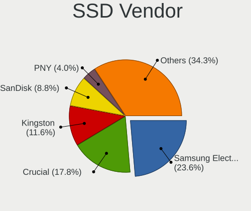

| Vendor              | Computers | Drives | Percent |
|---------------------|-----------|--------|---------|
| Samsung Electronics | 1859      | 2715   | 23.62%  |
| Crucial             | 1399      | 1990   | 17.78%  |
| Kingston            | 909       | 1154   | 11.55%  |
| SanDisk             | 694       | 884    | 8.82%   |
| PNY                 | 311       | 409    | 3.95%   |
| WDC                 | 236       | 290    | 3%      |
| China               | 190       | 250    | 2.41%   |
| Intel               | 185       | 215    | 2.35%   |
| Micron Technology   | 164       | 232    | 2.08%   |
| SK hynix            | 159       | 249    | 2.02%   |
| SPCC                | 133       | 170    | 1.69%   |
| Transcend           | 127       | 149    | 1.61%   |
| LDLC                | 98        | 127    | 1.25%   |
| Apple               | 93        | 113    | 1.18%   |
| Toshiba             | 89        | 120    | 1.13%   |
| OCZ                 | 78        | 97     | 0.99%   |
| LITEON              | 77        | 85     | 0.98%   |
| Emtec               | 75        | 91     | 0.95%   |
| Corsair             | 62        | 78     | 0.79%   |
| A-DATA Technology   | 50        | 65     | 0.64%   |
| LITEONIT            | 47        | 55     | 0.6%    |
| KingSpec            | 47        | 54     | 0.6%    |
| Verbatim            | 42        | 43     | 0.53%   |
| Unknown             | 34        | 42     | 0.43%   |
| Intenso             | 32        | 40     | 0.41%   |
| Patriot             | 30        | 43     | 0.38%   |
| Lexar               | 29        | 36     | 0.37%   |
| SABRENT             | 27        | 27     | 0.34%   |
| Fanxiang            | 24        | 25     | 0.3%    |
| Netac               | 22        | 24     | 0.28%   |
| TEXTORM             | 21        | 24     | 0.27%   |
| ASMT                | 19        | 24     | 0.24%   |
| Seagate             | 17        | 19     | 0.22%   |
| Dogfish             | 17        | 31     | 0.22%   |
| Gigabyte Technology | 16        | 21     | 0.2%    |
| Plextor             | 15        | 30     | 0.19%   |
| BHT                 | 15        | 20     | 0.19%   |
| BAITITON            | 14        | 15     | 0.18%   |
| KingDian            | 13        | 21     | 0.17%   |
| JMicron Technology  | 13        | 14     | 0.17%   |

Drive Kind
----------

HDD or SSD

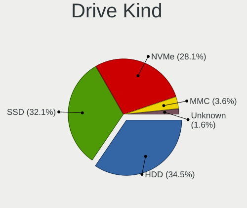

| Kind    | Computers | Drives | Percent |
|---------|-----------|--------|---------|
| HDD     | 7244      | 13038  | 34.53%  |
| SSD     | 6741      | 10568  | 32.14%  |
| NVMe    | 5901      | 8693   | 28.13%  |
| MMC     | 748       | 1001   | 3.57%   |
| Unknown | 343       | 532    | 1.64%   |

Drive Connector
---------------

SATA, SAS, NVMe, etc.

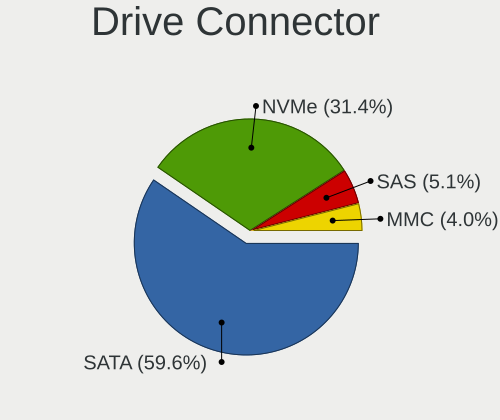

| Type | Computers | Drives | Percent |
|------|-----------|--------|---------|
| SATA | 11173     | 22708  | 59.57%  |
| NVMe | 5884      | 8620   | 31.37%  |
| SAS  | 952       | 1503   | 5.08%   |
| MMC  | 748       | 1001   | 3.99%   |

Drive Size
----------

Size of hard drive

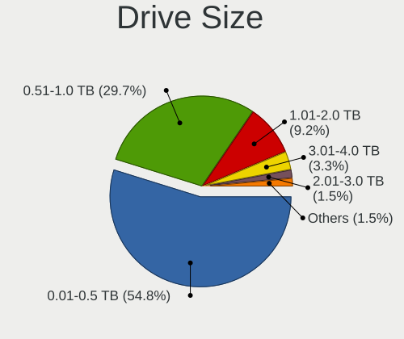

| Size in TB | Computers | Drives | Percent |
|------------|-----------|--------|---------|
| 0.01-0.5   | 8097      | 13040  | 54.81%  |
| 0.51-1.0   | 4388      | 6590   | 29.7%   |
| 1.01-2.0   | 1358      | 2264   | 9.19%   |
| 3.01-4.0   | 489       | 816    | 3.31%   |
| 2.01-3.0   | 221       | 386    | 1.5%    |
| 4.01-10.0  | 172       | 393    | 1.16%   |
| 10.01-20.0 | 44        | 111    | 0.3%    |
| 20.01-50.0 | 4         | 6      | 0.03%   |

Space Total
-----------

Amount of disk space available on the file system

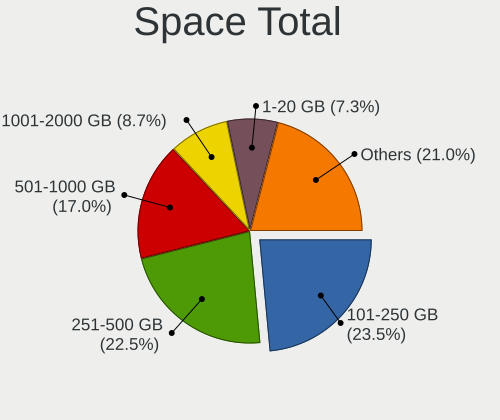

| Size in GB     | Computers | Percent |
|----------------|-----------|---------|
| 101-250        | 3999      | 23.52%  |
| 251-500        | 3830      | 22.53%  |
| 501-1000       | 2887      | 16.98%  |
| 1001-2000      | 1474      | 8.67%   |
| 1-20           | 1243      | 7.31%   |
| More than 3000 | 944       | 5.55%   |
| 51-100         | 886       | 5.21%   |
| Unknown        | 619       | 3.64%   |
| 2001-3000      | 585       | 3.44%   |
| 21-50          | 532       | 3.13%   |

Space Used
----------

Amount of used disk space

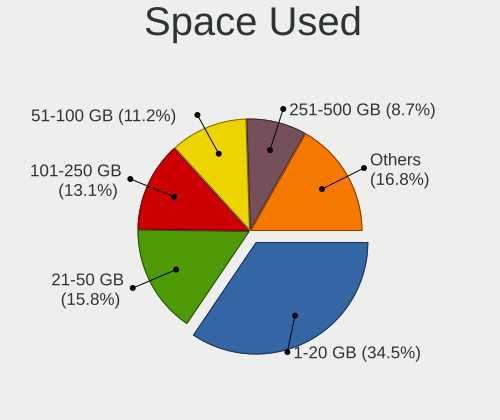

| Used GB        | Computers | Percent |
|----------------|-----------|---------|
| 1-20           | 6063      | 34.46%  |
| 21-50          | 2771      | 15.75%  |
| 101-250        | 2297      | 13.06%  |
| 51-100         | 1975      | 11.23%  |
| 251-500        | 1530      | 8.7%    |
| 501-1000       | 1095      | 6.22%   |
| 1001-2000      | 654       | 3.72%   |
| Unknown        | 619       | 3.52%   |
| More than 3000 | 330       | 1.88%   |
| 2001-3000      | 228       | 1.3%    |
| 0              | 31        | 0.18%   |

Malfunc. Drives
---------------

Drive models with a malfunction

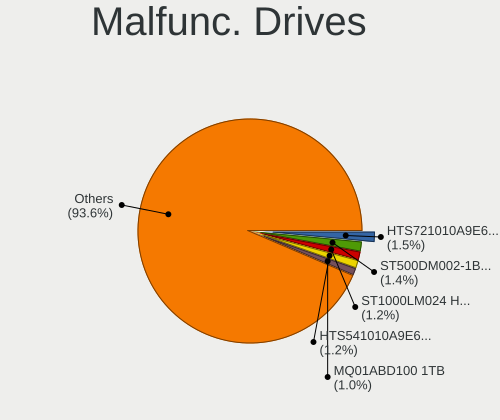

| Model                                 | Computers | Drives | Percent |
|---------------------------------------|-----------|--------|---------|
| HGST HTS721010A9E630 1TB              | 30        | 35     | 1.5%    |
| Seagate ST500DM002-1BD142 500GB       | 29        | 31     | 1.45%   |
| Seagate ST1000LM024 HN-M101MBB 1TB    | 25        | 27     | 1.25%   |
| HGST HTS541010A9E680 1TB              | 24        | 27     | 1.2%    |
| Toshiba MQ01ABD100 1TB                | 21        | 23     | 1.05%   |
| Seagate ST9500325AS 500GB             | 21        | 22     | 1.05%   |
| Seagate ST500LM021-1KJ152 500GB       | 21        | 25     | 1.05%   |
| Seagate ST1000LM035-1RK172 1TB        | 16        | 16     | 0.8%    |
| Seagate ST500LT012-1DG142 500GB       | 13        | 13     | 0.65%   |
| Seagate ST2000DM001-1CH164 2TB        | 12        | 15     | 0.6%    |
| Kingston SV300S37A120G 120GB SSD      | 12        | 15     | 0.6%    |
| HGST HTS725050A7E630 500GB            | 12        | 14     | 0.6%    |
| Seagate ST3500418AS 500GB             | 10        | 11     | 0.5%    |
| Seagate ST31000524AS 1TB              | 10        | 10     | 0.5%    |
| Seagate ST1000DM003-1CH162 1TB        | 10        | 10     | 0.5%    |
| HGST HTS545050A7E380 500GB            | 10        | 10     | 0.5%    |
| Toshiba MQ01ABD050 500GB              | 9         | 9      | 0.45%   |
| Seagate ST31000528AS 1TB              | 9         | 10     | 0.45%   |
| Seagate ST2000DM008-2FR102 2TB        | 9         | 12     | 0.45%   |
| Seagate ST2000DM001-1ER164 2TB        | 9         | 17     | 0.45%   |
| Seagate ST1000DM010-2EP102 1TB        | 9         | 15     | 0.45%   |
| LDLC SSD 120GB                        | 9         | 11     | 0.45%   |
| HGST HTS545050A7E680 500GB            | 9         | 10     | 0.45%   |
| Crucial CT525MX300SSD1 528GB          | 9         | 9      | 0.45%   |
| Crucial CT240M500SSD1 240GB           | 9         | 10     | 0.45%   |
| WDC WD10JPVX-22JC3T0 1TB              | 8         | 9      | 0.4%    |
| WDC WD10EADS-22M2B0 1TB               | 8         | 8      | 0.4%    |
| Toshiba MQ01ACF050 500GB              | 8         | 9      | 0.4%    |
| Toshiba MQ01ABF050 500GB              | 8         | 9      | 0.4%    |
| Seagate ST3250310AS 250GB             | 8         | 8      | 0.4%    |
| Seagate ST320LT007-9ZV142 320GB       | 8         | 9      | 0.4%    |
| Samsung Electronics SSD 870 EVO 1TB   | 8         | 9      | 0.4%    |
| Hitachi HTS547575A9E384 752GB         | 8         | 8      | 0.4%    |
| WDC WD5000AAKX-001CA0 500GB           | 7         | 9      | 0.35%   |
| WDC WD20EFRX-68EUZN0 2TB              | 7         | 15     | 0.35%   |
| WDC WD10EADS-65L5B1 1TB               | 7         | 7      | 0.35%   |
| Toshiba DT01ACA100 1TB                | 7         | 8      | 0.35%   |
| SK hynix HFS128G39TND-N210A 128GB SSD | 7         | 8      | 0.35%   |
| Seagate ST1000DM003-9YN162 1TB        | 7         | 9      | 0.35%   |
| Samsung Electronics HD103UJ 1TB       | 7         | 10     | 0.35%   |

Malfunc. Drive Vendor
---------------------

Vendors of faulty drives

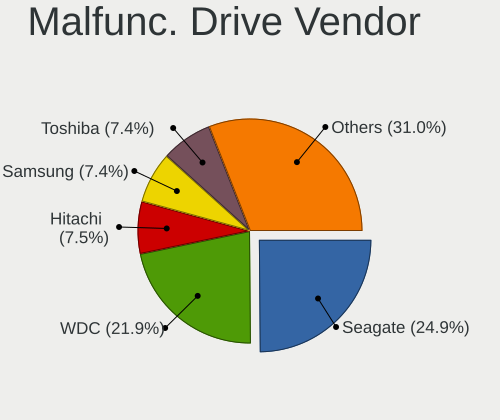

| Vendor                    | Computers | Drives | Percent |
|---------------------------|-----------|--------|---------|
| Seagate                   | 486       | 586    | 24.87%  |
| WDC                       | 427       | 537    | 21.85%  |
| Hitachi                   | 147       | 170    | 7.52%   |
| Samsung Electronics       | 145       | 180    | 7.42%   |
| Toshiba                   | 144       | 174    | 7.37%   |
| HGST                      | 109       | 126    | 5.58%   |
| Crucial                   | 71        | 80     | 3.63%   |
| Kingston                  | 57        | 67     | 2.92%   |
| Intel                     | 47        | 53     | 2.41%   |
| Maxtor                    | 46        | 58     | 2.35%   |
| SK hynix                  | 44        | 55     | 2.25%   |
| SanDisk                   | 42        | 52     | 2.15%   |
| LDLC                      | 17        | 19     | 0.87%   |
| Micron Technology         | 15        | 18     | 0.77%   |
| Fujitsu                   | 14        | 16     | 0.72%   |
| OCZ                       | 11        | 12     | 0.56%   |
| China                     | 10        | 13     | 0.51%   |
| LITEONIT                  | 8         | 11     | 0.41%   |
| LITEON                    | 7         | 7      | 0.36%   |
| A-DATA Technology         | 7         | 7      | 0.36%   |
| SPCC                      | 6         | 6      | 0.31%   |
| Apple                     | 6         | 7      | 0.31%   |
| JMicron Technology        | 5         | 6      | 0.26%   |
| Corsair                   | 5         | 6      | 0.26%   |
| Transcend                 | 4         | 5      | 0.2%    |
| Netac                     | 4         | 4      | 0.2%    |
| ASMT                      | 4         | 5      | 0.2%    |
| Apacer                    | 4         | 4      | 0.2%    |
| SSSTC                     | 3         | 3      | 0.15%   |
| Magnetic Data             | 3         | 3      | 0.15%   |
| Dogfish                   | 3         | 4      | 0.15%   |
| BAITITON                  | 3         | 3      | 0.15%   |
| 2.5"                      | 3         | 6      | 0.15%   |
| Unknown                   | 3         | 4      | 0.15%   |
| Verbatim                  | 2         | 2      | 0.1%    |
| Unknown                   | 2         | 2      | 0.1%    |
| Realtek Semiconductor     | 2         | 2      | 0.1%    |
| PNY                       | 2         | 2      | 0.1%    |
| Micron/Crucial Technology | 2         | 2      | 0.1%    |
| KingSpec                  | 2         | 2      | 0.1%    |

Malfunc. HDD Vendor
-------------------

Vendors of faulty HDD drives

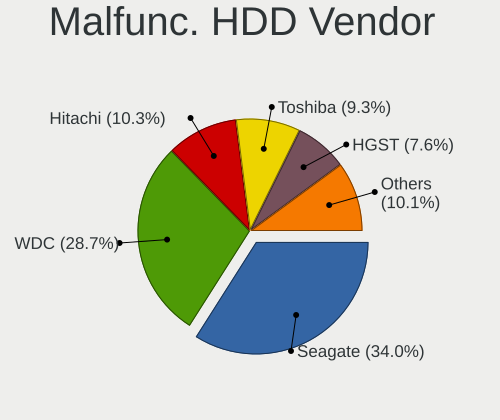

| Vendor              | Computers | Drives | Percent |
|---------------------|-----------|--------|---------|
| Seagate             | 486       | 586    | 34.01%  |
| WDC                 | 410       | 518    | 28.69%  |
| Hitachi             | 147       | 170    | 10.29%  |
| Toshiba             | 133       | 161    | 9.31%   |
| HGST                | 109       | 126    | 7.63%   |
| Samsung Electronics | 65        | 76     | 4.55%   |
| Maxtor              | 46        | 58     | 3.22%   |
| Fujitsu             | 14        | 16     | 0.98%   |
| Magnetic Data       | 3         | 3      | 0.21%   |
| ASMT                | 3         | 3      | 0.21%   |
| Apple               | 3         | 3      | 0.21%   |
| Unknown             | 2         | 2      | 0.14%   |
| JMicron Technology  | 2         | 2      | 0.14%   |
| Hewlett-Packard     | 2         | 2      | 0.14%   |
| TerraMas            | 1         | 4      | 0.07%   |
| TDAS                | 1         | 4      | 0.07%   |
| Inateck             | 1         | 1      | 0.07%   |
| IBM/Hitachi         | 1         | 1      | 0.07%   |

Malfunc. Drive Kind
-------------------

Kinds of faulty drives

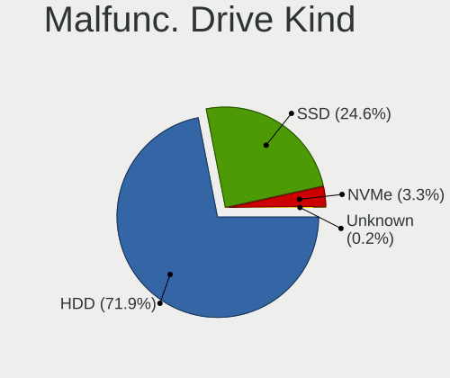

| Kind    | Computers | Drives | Percent |
|---------|-----------|--------|---------|
| HDD     | 1331      | 1736   | 71.95%  |
| SSD     | 455       | 549    | 24.59%  |
| NVMe    | 61        | 71     | 3.3%    |
| Unknown | 3         | 4      | 0.16%   |

Failed Drives
-------------

Failed drive models

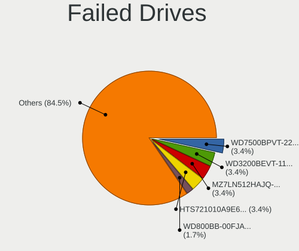

| Model                                            | Computers | Drives | Percent |
|--------------------------------------------------|-----------|--------|---------|
| WDC WD7500BPVT-22HXZT1 752GB                     | 2         | 5      | 3.45%   |
| WDC WD3200BEVT-11ZCT0 320GB                      | 2         | 2      | 3.45%   |
| Samsung Electronics MZ7LN512HAJQ-00000 512GB SSD | 2         | 5      | 3.45%   |
| HGST HTS721010A9E630 1TB                         | 2         | 2      | 3.45%   |
| WDC WD800BB-00FJA0 80GB                          | 1         | 1      | 1.72%   |
| WDC WD7500BPKT-75PK4T0 752GB                     | 1         | 1      | 1.72%   |
| WDC WD5000LPVX-75V0TT0 500GB                     | 1         | 1      | 1.72%   |
| WDC WD5000BEVT-35A0RT0 500GB                     | 1         | 1      | 1.72%   |
| WDC WD5000AAKS-00UU3A0 500GB                     | 1         | 1      | 1.72%   |
| WDC WD4000FYYZ-01UL1B2 4TB                       | 1         | 1      | 1.72%   |
| WDC WD3200AAJS-22VWA0 320GB                      | 1         | 1      | 1.72%   |
| WDC WD20EARS-00MVWB0 2TB                         | 1         | 2      | 1.72%   |
| WDC WD20EARS-00J99B0 2TB                         | 1         | 2      | 1.72%   |
| WDC WD1600BEVT-75ZCT1 160GB                      | 1         | 1      | 1.72%   |
| WDC WD1500HLFS-01G6U0 150GB                      | 1         | 1      | 1.72%   |
| WDC WD10SPZX-21Z10T0 1TB                         | 1         | 1      | 1.72%   |
| WDC WD10EALX-759BA1 1TB                          | 1         | 1      | 1.72%   |
| Toshiba MQ04ABF100 1TB                           | 1         | 1      | 1.72%   |
| Toshiba MQ02ABF050H 500GB                        | 1         | 1      | 1.72%   |
| Toshiba MQ01ABF050 500GB                         | 1         | 1      | 1.72%   |
| Toshiba MQ01ABD075 752GB                         | 1         | 1      | 1.72%   |
| Toshiba MK5055GSX 500GB                          | 1         | 1      | 1.72%   |
| Toshiba MK3259GSXP 320GB                         | 1         | 2      | 1.72%   |
| Toshiba DT01ACA300 3TB                           | 1         | 1      | 1.72%   |
| SK hynix SC308 SATA 512GB SSD                    | 1         | 1      | 1.72%   |
| SK hynix HFS128G39TND-N210A 128GB SSD            | 1         | 1      | 1.72%   |
| SK hynix BC501 NVMe Solid State Drive 512GB      | 1         | 1      | 1.72%   |
| SK hynix BC501 HFM256GDJTNG-8310A 256GB          | 1         | 2      | 1.72%   |
| Seagate ST500LT012-1DG142 500GB                  | 1         | 3      | 1.72%   |
| Seagate ST3500418ASQ 500GB                       | 1         | 1      | 1.72%   |
| Seagate ST3500418AS 500GB                        | 1         | 1      | 1.72%   |
| Seagate ST332062 0AS 320GB                       | 1         | 1      | 1.72%   |
| Seagate ST3300657SS 304GB                        | 1         | 2      | 1.72%   |
| Seagate ST3250318AS 250GB                        | 1         | 1      | 1.72%   |
| Seagate ST31000528AS 1TB                         | 1         | 1      | 1.72%   |
| Seagate ST2000DL003-9VT166 2TB                   | 1         | 1      | 1.72%   |
| Seagate ST1000LM048-2E7172 1TB                   | 1         | 1      | 1.72%   |
| Samsung Electronics SSD PM871 2.5 7mm 128GB      | 1         | 1      | 1.72%   |
| Samsung Electronics SSD 980 500GB                | 1         | 1      | 1.72%   |
| Samsung Electronics SSD 980 1TB                  | 1         | 2      | 1.72%   |

Failed Drive Vendor
-------------------

Failed drive vendors

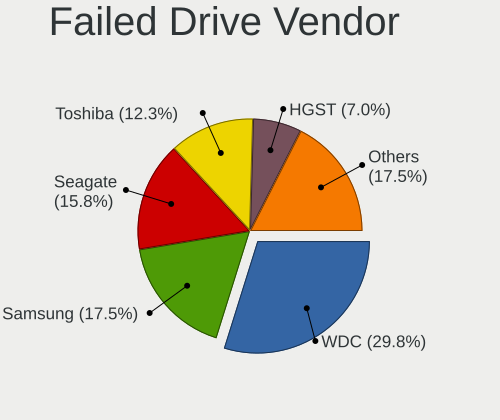

| Vendor              | Computers | Drives | Percent |
|---------------------|-----------|--------|---------|
| WDC                 | 17        | 22     | 29.82%  |
| Samsung Electronics | 10        | 15     | 17.54%  |
| Seagate             | 9         | 12     | 15.79%  |
| Toshiba             | 7         | 8      | 12.28%  |
| HGST                | 4         | 4      | 7.02%   |
| SK hynix            | 3         | 5      | 5.26%   |
| PNY                 | 1         | 1      | 1.75%   |
| Maxtor              | 1         | 1      | 1.75%   |
| KIOXIA              | 1         | 1      | 1.75%   |
| Kingston            | 1         | 1      | 1.75%   |
| Intel               | 1         | 1      | 1.75%   |
| Hitachi             | 1         | 1      | 1.75%   |
| Emtec               | 1         | 1      | 1.75%   |

Drive Status
------------

Number of failed and malfunc. drives

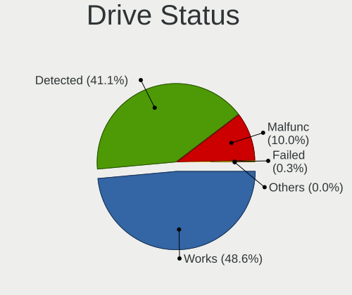

| Status   | Computers | Drives | Percent |
|----------|-----------|--------|---------|
| Works    | 8603      | 15810  | 48.55%  |
| Detected | 7278      | 15585  | 41.07%  |
| Malfunc  | 1777      | 2360   | 10.03%  |
| Failed   | 57        | 73     | 0.32%   |
| Fixed    | 3         | 3      | 0.02%   |
| Limited  | 1         | 1      | 0.01%   |

Storage controller
------------------

Storage Vendor
--------------

Storage controller vendors

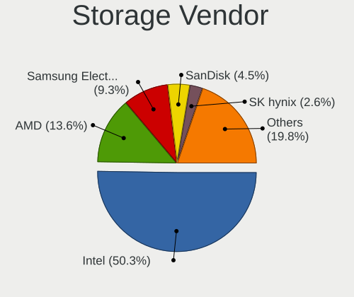

| Vendor                                  | Computers | Percent |
|-----------------------------------------|-----------|---------|
| Intel                                   | 10388     | 50.25%  |
| AMD                                     | 2811      | 13.6%   |
| Samsung Electronics                     | 1913      | 9.25%   |
| SanDisk                                 | 934       | 4.52%   |
| SK hynix                                | 538       | 2.6%    |
| Micron/Crucial Technology               | 484       | 2.34%   |
| Micron Technology                       | 416       | 2.01%   |
| Kingston Technology Company             | 407       | 1.97%   |
| Phison Electronics                      | 395       | 1.91%   |
| ASMedia Technology                      | 303       | 1.47%   |
| Nvidia                                  | 291       | 1.41%   |
| Toshiba America Info Systems            | 260       | 1.26%   |
| KIOXIA                                  | 248       | 1.2%    |
| Marvell Technology Group                | 242       | 1.17%   |
| JMicron Technology                      | 207       | 1%      |
| Silicon Motion                          | 112       | 0.54%   |
| MAXIO Technology (Hangzhou)             | 92        | 0.45%   |
| VIA Technologies                        | 69        | 0.33%   |
| Shenzhen Longsys Electronics            | 53        | 0.26%   |
| Broadcom / LSI                          | 49        | 0.24%   |
| LSI Logic / Symbios Logic               | 40        | 0.19%   |
| Union Memory (Shenzhen)                 | 37        | 0.18%   |
| Seagate Technology                      | 31        | 0.15%   |
| Silicon Image                           | 28        | 0.14%   |
| Realtek Semiconductor                   | 28        | 0.14%   |
| Silicon Integrated Systems [SiS]        | 26        | 0.13%   |
| Lite-On Technology                      | 25        | 0.12%   |
| Apple                                   | 25        | 0.12%   |
| Solidigm                                | 23        | 0.11%   |
| ADATA Technology                        | 23        | 0.11%   |
| Solid State Storage Technology          | 22        | 0.11%   |
| Lenovo                                  | 17        | 0.08%   |
| Adaptec                                 | 16        | 0.08%   |
| Hewlett-Packard                         | 15        | 0.07%   |
| Biwin Storage Technology                | 15        | 0.07%   |
| Yangtze Memory Technologies             | 13        | 0.06%   |
| Integrated Technology Express           | 9         | 0.04%   |
| INNOGRIT                                | 9         | 0.04%   |
| Transcend                               | 8         | 0.04%   |
| Shenzhen Unionmemory Information System | 8         | 0.04%   |

Storage Model
-------------

Storage controller models

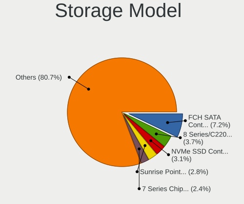

| Model                                                                          | Computers | Percent |
|--------------------------------------------------------------------------------|-----------|---------|
| AMD FCH SATA Controller [AHCI mode]                                            | 1676      | 7.17%   |
| Intel 8 Series/C220 Series Chipset Family 6-port SATA Controller 1 [AHCI mode] | 868       | 3.71%   |
| Samsung NVMe SSD Controller SM981/PM981/PM983                                  | 733       | 3.13%   |
| Intel Sunrise Point-LP SATA Controller [AHCI mode]                             | 663       | 2.84%   |
| Intel 7 Series Chipset Family 6-port SATA Controller [AHCI mode]               | 570       | 2.44%   |
| Intel Volume Management Device NVMe RAID Controller                            | 508       | 2.17%   |
| Intel 82801 Mobile SATA Controller [RAID mode]                                 | 468       | 2%      |
| Intel Q170/Q150/B150/H170/H110/Z170/CM236 Chipset SATA Controller [AHCI Mode]  | 440       | 1.88%   |
| Samsung NVMe SSD Controller 980 (DRAM-less)                                    | 420       | 1.8%    |
| Intel 6 Series/C200 Series Chipset Family 6 port Mobile SATA AHCI Controller   | 358       | 1.53%   |
| Intel SATA Controller [RAID mode]                                              | 355       | 1.52%   |
| AMD 400 Series Chipset SATA Controller                                         | 349       | 1.49%   |
| Samsung NVMe SSD Controller PM9A1/PM9A3/980PRO                                 | 348       | 1.49%   |
| Intel 6 Series/C200 Series Chipset Family 6 port Desktop SATA AHCI Controller  | 336       | 1.44%   |
| AMD 500 Series Chipset SATA Controller                                         | 326       | 1.39%   |
| Intel 8 Series SATA Controller 1 [AHCI mode]                                   | 318       | 1.36%   |
| Intel 82801IBM/IEM (ICH9M/ICH9M-E) 4 port SATA Controller [AHCI mode]          | 304       | 1.3%    |
| AMD SB7x0/SB8x0/SB9x0 SATA Controller [AHCI mode]                              | 303       | 1.3%    |
| Intel Cannon Lake Mobile PCH SATA AHCI Controller                              | 280       | 1.2%    |
| Intel Wildcat Point-LP SATA Controller [AHCI Mode]                             | 277       | 1.18%   |
| Micron/Crucial P2 [Nick P2] / P3 / P3 Plus NVMe PCIe SSD (DRAM-less)           | 272       | 1.16%   |
| ASMedia ASM1061/ASM1062 Serial ATA Controller                                  | 264       | 1.13%   |
| Intel 7 Series/C210 Series Chipset Family 6-port SATA Controller [AHCI mode]   | 257       | 1.1%    |
| Intel 200 Series PCH SATA controller [AHCI mode]                               | 255       | 1.09%   |
| Intel Cannon Lake PCH SATA AHCI Controller                                     | 240       | 1.03%   |
| AMD SB7x0/SB8x0/SB9x0 IDE Controller                                           | 218       | 0.93%   |
| Intel Celeron/Pentium Silver Processor SATA Controller                         | 214       | 0.92%   |
| Intel NM10/ICH7 Family SATA Controller [IDE mode]                              | 206       | 0.88%   |
| Intel 5 Series/3400 Series Chipset 4 port SATA AHCI Controller                 | 206       | 0.88%   |
| Intel Comet Lake SATA AHCI Controller                                          | 205       | 0.88%   |
| Intel HM170/QM170 Chipset SATA Controller [AHCI Mode]                          | 203       | 0.87%   |
| Intel 82801G (ICH7 Family) IDE Controller                                      | 192       | 0.82%   |
| AMD 600 Series Chipset SATA Controller                                         | 186       | 0.8%    |
| Samsung NVMe SSD Controller SM961/PM961/SM963                                  | 179       | 0.77%   |
| Phison E12 NVMe Controller                                                     | 168       | 0.72%   |
| SK hynix Gold P31/BC711/PC711 NVMe Solid State Drive                           | 167       | 0.71%   |
| Intel 82801HM/HEM (ICH8M/ICH8M-E) IDE Controller                               | 157       | 0.67%   |
| Intel 9 Series Chipset Family SATA Controller [AHCI Mode]                      | 153       | 0.65%   |
| SanDisk Extreme Pro / WD Black SN750 / PC SN730 / Red SN700 NVMe SSD           | 152       | 0.65%   |
| SanDisk Ultra 3D / WD PC SN530, IX SN530, Blue SN550 NVMe SSD (DRAM-less)      | 150       | 0.64%   |

Storage Kind
------------

Kind of storage controller (IDE, SATA, NVMe, SAS, ...)

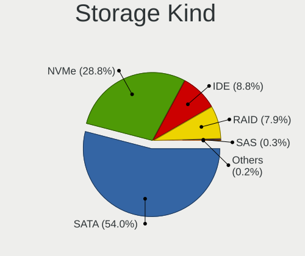

| Kind | Computers | Percent |
|------|-----------|---------|
| SATA | 11097     | 54.03%  |
| NVMe | 5912      | 28.79%  |
| IDE  | 1814      | 8.83%   |
| RAID | 1615      | 7.86%   |
| SAS  | 66        | 0.32%   |
| SCSI | 33        | 0.16%   |

Processor
---------

CPU Vendor
----------

Processor vendors

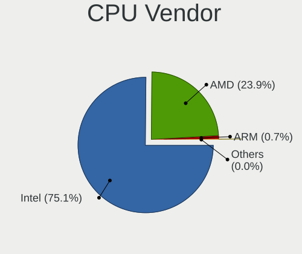

| Vendor                | Computers | Percent |
|-----------------------|-----------|---------|
| Intel                 | 11993     | 75.14%  |
| AMD                   | 3820      | 23.93%  |
| ARM                   | 119       | 0.75%   |
| QUALCOMM              | 17        | 0.11%   |
| Unknown               | 4         | 0.03%   |
| CentaurHauls          | 3         | 0.02%   |
| sifive,u74-mc         | 1         | 0.01%   |
| Marvell Semiconductor | 1         | 0.01%   |
| Loongson              | 1         | 0.01%   |
| CHRP IBM,8286-41A     | 1         | 0.01%   |

CPU Model
---------

Processor models

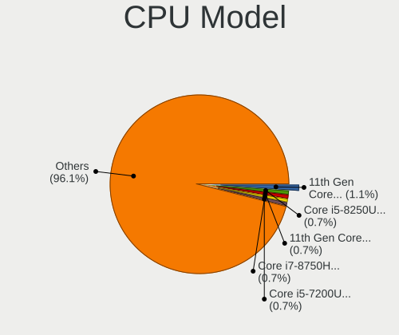

| Model                                         | Computers | Percent |
|-----------------------------------------------|-----------|---------|
| Intel 11th Gen Core i7-1165G7 @ 2.80GHz       | 179       | 1.12%   |
| Intel Core i5-8250U CPU @ 1.60GHz             | 119       | 0.74%   |
| Intel 11th Gen Core i5-1135G7 @ 2.40GHz       | 117       | 0.73%   |
| Intel Core i7-8750H CPU @ 2.20GHz             | 107       | 0.67%   |
| Intel Core i5-7200U CPU @ 2.50GHz             | 107       | 0.67%   |
| AMD Ryzen 5 3600 6-Core Processor             | 104       | 0.65%   |
| Intel Core i7-9750H CPU @ 2.60GHz             | 98        | 0.61%   |
| Intel Core i7-8565U CPU @ 1.80GHz             | 97        | 0.61%   |
| Intel Core i7-10510U CPU @ 1.80GHz            | 92        | 0.57%   |
| Intel Core i5-6300U CPU @ 2.40GHz             | 91        | 0.57%   |
| Intel Core i5-6200U CPU @ 2.30GHz             | 91        | 0.57%   |
| Intel Core i7-8550U CPU @ 1.80GHz             | 89        | 0.56%   |
| AMD Ryzen 5 5600X 6-Core Processor            | 88        | 0.55%   |
| Intel Core i5-8265U CPU @ 1.60GHz             | 85        | 0.53%   |
| Intel Core i5-10210U CPU @ 1.60GHz            | 85        | 0.53%   |
| Intel Atom x5-Z8350 CPU @ 1.44GHz             | 82        | 0.51%   |
| ARM Processor                                 | 81        | 0.51%   |
| Intel Core i7-6700HQ CPU @ 2.60GHz            | 78        | 0.49%   |
| Intel Core i5-2520M CPU @ 2.50GHz             | 75        | 0.47%   |
| AMD Ryzen 7 3700X 8-Core Processor            | 73        | 0.46%   |
| Intel Core i7-7700HQ CPU @ 2.80GHz            | 72        | 0.45%   |
| Intel Core i7-3770 CPU @ 3.40GHz              | 72        | 0.45%   |
| Intel Core i5-3210M CPU @ 2.50GHz             | 72        | 0.45%   |
| AMD Ryzen 5 3500U with Radeon Vega Mobile Gfx | 71        | 0.44%   |
| Intel Core i5-6500 CPU @ 3.20GHz              | 70        | 0.44%   |
| Intel 11th Gen Core i7-1185G7 @ 3.00GHz       | 70        | 0.44%   |
| AMD Ryzen 7 5700U with Radeon Graphics        | 70        | 0.44%   |
| Intel Core i5-5200U CPU @ 2.20GHz             | 69        | 0.43%   |
| Intel Core i5-3320M CPU @ 2.60GHz             | 69        | 0.43%   |
| Intel 12th Gen Core i7-12700H                 | 61        | 0.38%   |
| Intel Core i5-4460 CPU @ 3.20GHz              | 60        | 0.37%   |
| Intel Core i5-3230M CPU @ 2.60GHz             | 60        | 0.37%   |
| Intel 11th Gen Core i7-11800H @ 2.30GHz       | 60        | 0.37%   |
| AMD Ryzen 7 5800X 8-Core Processor            | 60        | 0.37%   |
| Intel Core i7-10750H CPU @ 2.60GHz            | 58        | 0.36%   |
| Intel Core i5-4210U CPU @ 1.70GHz             | 57        | 0.36%   |
| Intel Core i7-7500U CPU @ 2.70GHz             | 56        | 0.35%   |
| Intel Core i3-5005U CPU @ 2.00GHz             | 56        | 0.35%   |
| AMD Ryzen 7 5800H with Radeon Graphics        | 56        | 0.35%   |
| Intel Core i7-4790K CPU @ 4.00GHz             | 55        | 0.34%   |

CPU Model Family
----------------

Processor model prefix

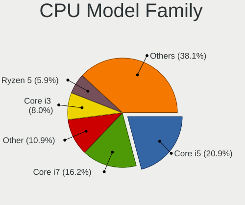

| Model                   | Computers | Percent |
|-------------------------|-----------|---------|
| Intel Core i5           | 3342      | 20.9%   |
| Intel Core i7           | 2588      | 16.19%  |
| Other                   | 1738      | 10.87%  |
| Intel Core i3           | 1276      | 7.98%   |
| AMD Ryzen 5             | 950       | 5.94%   |
| AMD Ryzen 7             | 841       | 5.26%   |
| Intel Celeron           | 700       | 4.38%   |
| Intel Core 2 Duo        | 591       | 3.7%    |
| Intel Pentium           | 427       | 2.67%   |
| Intel Xeon              | 370       | 2.31%   |
| AMD Ryzen 9             | 300       | 1.88%   |
| Intel Atom              | 252       | 1.58%   |
| Intel Pentium Dual-Core | 173       | 1.08%   |
| AMD FX                  | 145       | 0.91%   |
| Intel Core              | 142       | 0.89%   |
| Intel Core 2 Quad       | 126       | 0.79%   |
| AMD Ryzen 3             | 126       | 0.79%   |
| AMD E1                  | 106       | 0.66%   |
| Intel Core i9           | 102       | 0.64%   |
| AMD A4                  | 101       | 0.63%   |
| AMD Athlon II X2        | 87        | 0.54%   |
| AMD A6                  | 85        | 0.53%   |
| Intel Pentium Dual      | 84        | 0.53%   |
| Intel Core 2            | 79        | 0.49%   |
| AMD Ryzen 5 PRO         | 76        | 0.48%   |
| AMD A8                  | 76        | 0.48%   |
| AMD Ryzen 7 PRO         | 74        | 0.46%   |
| AMD Athlon 64 X2        | 70        | 0.44%   |
| AMD E2                  | 61        | 0.38%   |
| AMD Phenom II X4        | 56        | 0.35%   |
| AMD E                   | 53        | 0.33%   |
| Intel Genuine           | 48        | 0.3%    |
| AMD Athlon              | 48        | 0.3%    |
| Intel Pentium Silver    | 41        | 0.26%   |
| AMD A10                 | 40        | 0.25%   |
| Intel Pentium Gold      | 39        | 0.24%   |
| Intel Pentium 4         | 37        | 0.23%   |
| Intel Pentium D         | 27        | 0.17%   |
| ARM BCM                 | 25        | 0.16%   |
| AMD Athlon II           | 25        | 0.16%   |

CPU Cores
---------

Number of processor cores

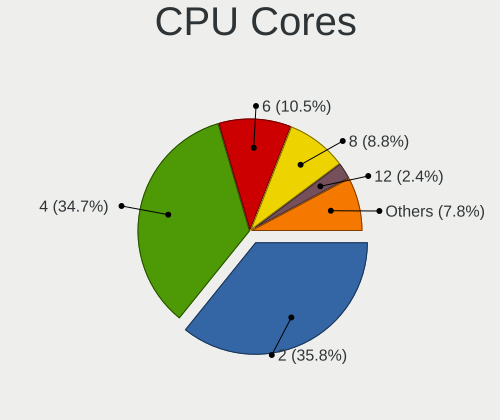

| Number  | Computers | Percent |
|---------|-----------|---------|
| 2       | 5732      | 35.8%   |
| 4       | 5550      | 34.67%  |
| 6       | 1681      | 10.5%   |
| 8       | 1413      | 8.83%   |
| 12      | 383       | 2.39%   |
| 1       | 316       | 1.97%   |
| 10      | 244       | 1.52%   |
| 16      | 214       | 1.34%   |
| 14      | 210       | 1.31%   |
| 3       | 64        | 0.4%    |
| Unknown | 63        | 0.39%   |
| 24      | 54        | 0.34%   |
| 20      | 48        | 0.3%    |
| 32      | 11        | 0.07%   |
| 40      | 5         | 0.03%   |
| 64      | 4         | 0.02%   |
| 18      | 4         | 0.02%   |
| 5       | 4         | 0.02%   |
| 48      | 3         | 0.02%   |
| 28      | 3         | 0.02%   |
| 36      | 2         | 0.01%   |
| 104     | 1         | 0.01%   |
| 7       | 1         | 0.01%   |

CPU Sockets
-----------

Number of sockets

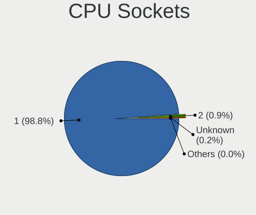

| Number  | Computers | Percent |
|---------|-----------|---------|
| 1       | 15781     | 98.82%  |
| 2       | 149       | 0.93%   |
| Unknown | 32        | 0.2%    |
| 4       | 4         | 0.03%   |
| 14      | 1         | 0.01%   |
| 3       | 1         | 0.01%   |
| 0       | 1         | 0.01%   |

CPU Threads
-----------

Threads per core (Hyper-Threading)

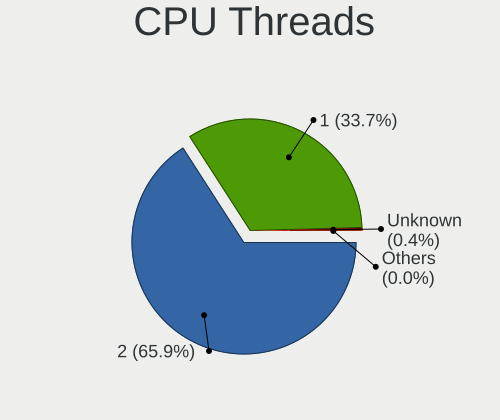

| Number  | Computers | Percent |
|---------|-----------|---------|
| 2       | 10549     | 65.89%  |
| 1       | 5390      | 33.67%  |
| Unknown | 63        | 0.39%   |
| 4       | 4         | 0.02%   |
| 24      | 1         | 0.01%   |
| 12      | 1         | 0.01%   |
| 8       | 1         | 0.01%   |

CPU Op-Modes
------------

CPU Operation Modes (32-bit, 64-bit)

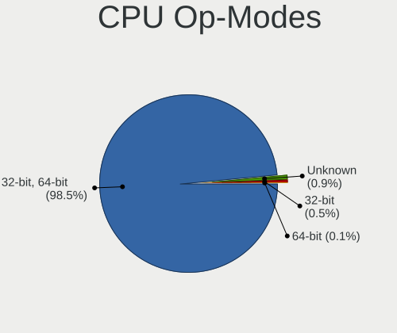

| Op mode        | Computers | Percent |
|----------------|-----------|---------|
| 32-bit, 64-bit | 15738     | 98.49%  |
| Unknown        | 143       | 0.89%   |
| 32-bit         | 85        | 0.53%   |
| 64-bit         | 14        | 0.09%   |

CPU Microcode
-------------

Microcode number

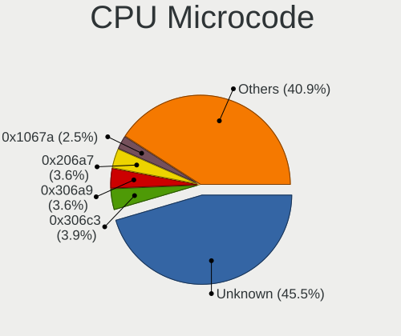

| Number     | Computers | Percent |
|------------|-----------|---------|
| Unknown    | 7576      | 45.46%  |
| 0x306c3    | 647       | 3.88%   |
| 0x306a9    | 608       | 3.65%   |
| 0x206a7    | 600       | 3.6%    |
| 0x1067a    | 417       | 2.5%    |
| 0x906ea    | 321       | 1.93%   |
| 0x506e3    | 310       | 1.86%   |
| 0x806c1    | 263       | 1.58%   |
| 0x806ec    | 241       | 1.45%   |
| 0x406e3    | 216       | 1.3%    |
| 0x40651    | 215       | 1.29%   |
| 0x806ea    | 214       | 1.28%   |
| 0x906e9    | 188       | 1.13%   |
| 0x306d4    | 185       | 1.11%   |
| 0x806e9    | 169       | 1.01%   |
| 0x20655    | 159       | 0.95%   |
| 0x6fd      | 157       | 0.94%   |
| 0x08108109 | 132       | 0.79%   |
| 0x010000c8 | 121       | 0.73%   |
| 0x08701021 | 113       | 0.68%   |
| 0x10676    | 106       | 0.64%   |
| 0x08600106 | 105       | 0.63%   |
| 0x30678    | 96        | 0.58%   |
| 0x0a50000c | 95        | 0.57%   |
| 0x0800820d | 90        | 0.54%   |
| 0xa0652    | 88        | 0.53%   |
| 0x406c4    | 88        | 0.53%   |
| 0x906a3    | 84        | 0.5%    |
| 0x906ed    | 80        | 0.48%   |
| 0x706a8    | 74        | 0.44%   |
| 0x106e5    | 74        | 0.44%   |
| 0x06001119 | 69        | 0.41%   |
| 0x806d1    | 65        | 0.39%   |
| 0x706e5    | 65        | 0.39%   |
| 0x506c9    | 64        | 0.38%   |
| 0x0a50000d | 63        | 0.38%   |
| 0x06000852 | 63        | 0.38%   |
| 0x806eb    | 62        | 0.37%   |
| 0x08608103 | 61        | 0.37%   |
| 0x07030105 | 61        | 0.37%   |

CPU Microarch
-------------

Microarchitecture

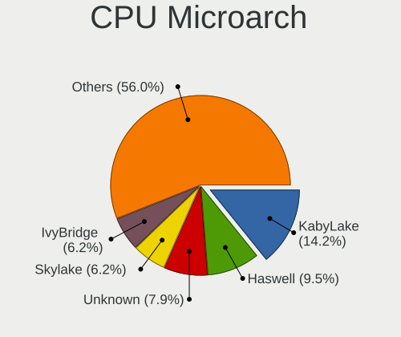

| Name              | Computers | Percent |
|-------------------|-----------|---------|
| KabyLake          | 2272      | 14.18%  |
| Haswell           | 1528      | 9.54%   |
| Unknown           | 1267      | 7.91%   |
| Skylake           | 990       | 6.18%   |
| IvyBridge         | 986       | 6.16%   |
| SandyBridge       | 962       | 6.01%   |
| Penryn            | 773       | 4.83%   |
| Zen 3             | 624       | 3.9%    |
| Zen 2             | 589       | 3.68%   |
| Alderlake Hybrid  | 531       | 3.32%   |
| TigerLake         | 493       | 3.08%   |
| Zen+              | 420       | 2.62%   |
| Core              | 404       | 2.52%   |
| Westmere          | 393       | 2.45%   |
| Silvermont        | 391       | 2.44%   |
| Broadwell         | 372       | 2.32%   |
| CometLake         | 359       | 2.24%   |
| K10               | 285       | 1.78%   |
| Icelake           | 271       | 1.69%   |
| Zen               | 240       | 1.5%    |
| Goldmont plus     | 224       | 1.4%    |
| Piledriver        | 221       | 1.38%   |
| Nehalem           | 173       | 1.08%   |
| Excavator         | 155       | 0.97%   |
| K8 Hammer         | 146       | 0.91%   |
| Puma              | 125       | 0.78%   |
| Goldmont          | 121       | 0.76%   |
| Bobcat            | 120       | 0.75%   |
| Bonnell           | 96        | 0.6%    |
| Jaguar            | 83        | 0.52%   |
| NetBurst          | 71        | 0.44%   |
| Gracemont         | 58        | 0.36%   |
| Meteorlake Hybrid | 57        | 0.36%   |
| K10 Llano         | 36        | 0.22%   |
| Tremont           | 35        | 0.22%   |
| Steamroller       | 35        | 0.22%   |
| P6                | 33        | 0.21%   |
| K8 & K10 hybrid   | 26        | 0.16%   |
| Lunarlake Hybrid  | 20        | 0.12%   |
| Bulldozer         | 19        | 0.12%   |

Graphics
--------

GPU Vendor
----------

Vendors of graphics cards

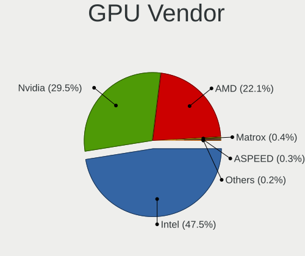

| Vendor                                       | Computers | Percent |
|----------------------------------------------|-----------|---------|
| Intel                                        | 9006      | 47.48%  |
| Nvidia                                       | 5591      | 29.48%  |
| AMD                                          | 4197      | 22.13%  |
| Matrox Electronics Systems                   | 78        | 0.41%   |
| ASPEED Technology                            | 58        | 0.31%   |
| Silicon Integrated Systems [SiS]             | 16        | 0.08%   |
| VIA Technologies                             | 9         | 0.05%   |
| Red Hat                                      | 3         | 0.02%   |
| ATI Technologies                             | 3         | 0.02%   |
| XGI Technology (eXtreme Graphics Innovation) | 1         | 0.01%   |
| Technical                                    | 1         | 0.01%   |
| S3 Graphics                                  | 1         | 0.01%   |
| Qualcomm Atheros                             | 1         | 0.01%   |
| Loongson Technology                          | 1         | 0.01%   |
| 3DLabs                                       | 1         | 0.01%   |
| 3Dfx Interactive                             | 1         | 0.01%   |

GPU Model
---------

Graphics card models

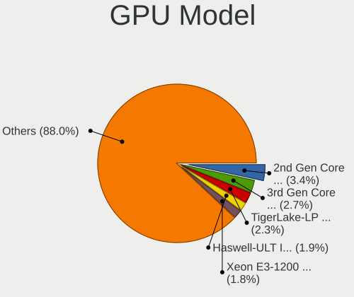

| Model                                                                                    | Computers | Percent |
|------------------------------------------------------------------------------------------|-----------|---------|
| Intel 2nd Generation Core Processor Family Integrated Graphics Controller                | 661       | 3.38%   |
| Intel 3rd Gen Core processor Graphics Controller                                         | 522       | 2.67%   |
| Intel TigerLake-LP GT2 [Iris Xe Graphics]                                                | 442       | 2.26%   |
| Intel Haswell-ULT Integrated Graphics Controller                                         | 363       | 1.86%   |
| Intel Xeon E3-1200 v3/4th Gen Core Processor Integrated Graphics Controller              | 352       | 1.8%    |
| Intel Skylake-U GT2 [HD Graphics 520]                                                    | 339       | 1.74%   |
| Intel CoffeeLake-H GT2 [UHD Graphics 630]                                                | 331       | 1.69%   |
| Intel Kaby Lake-R GT2 [UHD Graphics 620]                                                 | 307       | 1.57%   |
| AMD Picasso/Raven 2 [Radeon Vega Series / Radeon Vega Mobile Series]                     | 283       | 1.45%   |
| Intel 4th Gen Core Processor Integrated Graphics Controller                              | 272       | 1.39%   |
| Intel WhiskeyLake-U GT2 [UHD Graphics 620]                                               | 263       | 1.35%   |
| Intel Broadwell-U GT2 [HD Graphics 5500]                                                 | 263       | 1.35%   |
| Intel Kaby Lake-U GT2 [HD Graphics 620]                                                  | 261       | 1.34%   |
| AMD Renoir [Radeon Vega Series / Radeon Vega Mobile Series]                              | 254       | 1.3%    |
| Intel CometLake-U GT2 [UHD Graphics]                                                     | 242       | 1.24%   |
| Intel Mobile 4 Series Chipset Integrated Graphics Controller                             | 236       | 1.21%   |
| AMD Cezanne [Radeon Vega Series / Radeon Vega Mobile Series]                             | 225       | 1.15%   |
| Intel Atom/Celeron/Pentium Processor x5-E8000/J3xxx/N3xxx Integrated Graphics Controller | 217       | 1.11%   |
| Intel Core Processor Integrated Graphics Controller                                      | 203       | 1.04%   |
| Intel Skylake-S GT2 [HD Graphics 530]                                                    | 192       | 0.98%   |
| Intel GeminiLake [UHD Graphics 600]                                                      | 188       | 0.96%   |
| Intel Atom Processor Z36xxx/Z37xxx Series Graphics & Display                             | 168       | 0.86%   |
| Intel Alder Lake-P GT2 [Iris Xe Graphics]                                                | 167       | 0.86%   |
| AMD Ellesmere [Radeon RX 470/480/570/570X/580/580X/590]                                  | 165       | 0.84%   |
| Intel CoffeeLake-S GT2 [UHD Graphics 630]                                                | 161       | 0.82%   |
| Nvidia GP107M [GeForce GTX 1050 Mobile]                                                  | 153       | 0.78%   |
| Intel Raptor Lake-P [Iris Xe Graphics]                                                   | 151       | 0.77%   |
| Intel Skylake-H GT2 [HD Graphics 530]                                                    | 150       | 0.77%   |
| Intel CometLake-H GT2 [UHD Graphics]                                                     | 149       | 0.76%   |
| Nvidia GK208B [GeForce GT 710]                                                           | 148       | 0.76%   |
| Intel TigerLake-H GT1 [UHD Graphics]                                                     | 133       | 0.68%   |
| Intel Kaby Lake-H GT2 [HD Graphics 630]                                                  | 133       | 0.68%   |
| AMD Lucienne                                                                             | 128       | 0.66%   |
| Nvidia TU117M [GeForce GTX 1650 Mobile / Max-Q]                                          | 124       | 0.63%   |
| Nvidia GP107 [GeForce GTX 1050 Ti]                                                       | 121       | 0.62%   |
| Intel Xeon E3-1200 v2/3rd Gen Core processor Graphics Controller                         | 112       | 0.57%   |
| AMD Raphael                                                                              | 110       | 0.56%   |
| AMD Raven Ridge [Radeon Vega Series / Radeon Vega Mobile Series]                         | 106       | 0.54%   |
| AMD Rembrandt [Radeon 680M]                                                              | 105       | 0.54%   |
| Intel 4th Generation Core Processor Family Integrated Graphics Controller                | 104       | 0.53%   |

GPU Combo
---------

Combinations of graphics cards

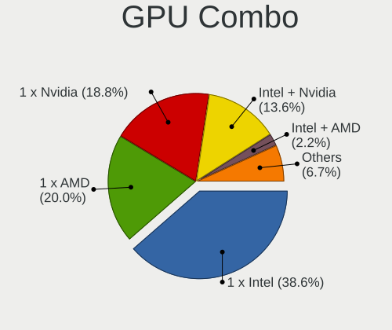

| Name                      | Computers | Percent |
|---------------------------|-----------|---------|
| 1 x Intel                 | 6219      | 38.6%   |
| 1 x AMD                   | 3224      | 20.01%  |
| 1 x Nvidia                | 3025      | 18.77%  |
| Intel + Nvidia            | 2197      | 13.64%  |
| Intel + AMD               | 361       | 2.24%   |
| AMD + Nvidia              | 326       | 2.02%   |
| 2 x AMD                   | 292       | 1.81%   |
| Other                     | 156       | 0.97%   |
| 2 x Intel                 | 80        | 0.5%    |
| 1 x Matrox                | 71        | 0.44%   |
| 1 x ASPEED                | 46        | 0.29%   |
| 2 x Nvidia                | 45        | 0.28%   |
| 1 x SiS                   | 16        | 0.1%    |
| 1 x VIA                   | 9         | 0.06%   |
| Nvidia + Matrox           | 7         | 0.04%   |
| Nvidia + ASPEED           | 5         | 0.03%   |
| Intel + 2 x Nvidia        | 5         | 0.03%   |
| AMD + ASPEED              | 5         | 0.03%   |
| 1 x Red Hat               | 3         | 0.02%   |
| Intel + AMD + 1 x Nvidia  | 3         | 0.02%   |
| 3 x AMD                   | 2         | 0.01%   |
| 2 x Nvidia + 1 x ASPEED   | 2         | 0.01%   |
| 2 x AMD + 1 x Nvidia      | 2         | 0.01%   |
| Intel + 2 x AMD           | 2         | 0.01%   |
| 3 x Nvidia                | 1         | 0.01%   |
| 2 x AMD + 1 x ASPEED      | 1         | 0.01%   |
| 2 x AMD + 1 x 3DLabs      | 1         | 0.01%   |
| 1 x XGI                   | 1         | 0.01%   |
| 1 x Technical             | 1         | 0.01%   |
| 1 x S3 Graphics           | 1         | 0.01%   |
| Nvidia + 3Dfx Interactive | 1         | 0.01%   |
| 1 x Loongson Technology   | 1         | 0.01%   |
| AMD + 2 x Nvidia          | 1         | 0.01%   |

GPU Driver
----------

Free vs proprietary

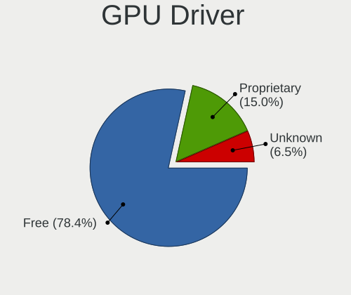

| Driver      | Computers | Percent |
|-------------|-----------|---------|
| Free        | 12752     | 78.45%  |
| Proprietary | 2440      | 15.01%  |
| Unknown     | 1063      | 6.54%   |

GPU Memory
----------

Total video memory

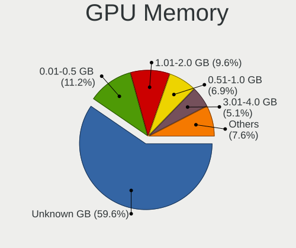

| Size in GB | Computers | Percent |
|------------|-----------|---------|
| Unknown    | 9807      | 59.57%  |
| 0.01-0.5   | 1836      | 11.15%  |
| 1.01-2.0   | 1582      | 9.61%   |
| 0.51-1.0   | 1140      | 6.92%   |
| 3.01-4.0   | 847       | 5.14%   |
| 7.01-8.0   | 526       | 3.2%    |
| 5.01-6.0   | 303       | 1.84%   |
| 8.01-16.0  | 264       | 1.6%    |
| 2.01-3.0   | 104       | 0.63%   |
| 16.01-24.0 | 43        | 0.26%   |
| 4.01-5.0   | 8         | 0.05%   |
| 24.01-32.0 | 2         | 0.01%   |
| 32.01-64.0 | 1         | 0.01%   |

Monitor
-------

Monitor Vendor
--------------

Monitor vendors

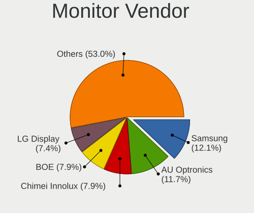

| Vendor                  | Computers | Percent |
|-------------------------|-----------|---------|
| Samsung Electronics     | 2142      | 12.07%  |
| AU Optronics            | 2069      | 11.66%  |
| Chimei Innolux          | 1400      | 7.89%   |
| BOE                     | 1400      | 7.89%   |
| LG Display              | 1320      | 7.44%   |
| Dell                    | 946       | 5.33%   |
| Iiyama                  | 896       | 5.05%   |
| Hewlett-Packard         | 686       | 3.87%   |
| Goldstar                | 642       | 3.62%   |
| Acer                    | 578       | 3.26%   |
| Philips                 | 523       | 2.95%   |
| Ancor Communications    | 428       | 2.41%   |
| AOC                     | 409       | 2.31%   |
| Sharp                   | 334       | 1.88%   |
| Apple                   | 322       | 1.82%   |
| BenQ                    | 318       | 1.79%   |
| Lenovo                  | 302       | 1.7%    |
| Chi Mei Optoelectronics | 224       | 1.26%   |
| ASUSTek Computer        | 213       | 1.2%    |
| ViewSonic               | 204       | 1.15%   |
| PANDA                   | 131       | 0.74%   |
| InfoVision              | 127       | 0.72%   |
| Unknown                 | 94        | 0.53%   |
| LG Philips              | 91        | 0.51%   |
| Sony                    | 87        | 0.49%   |
| MSI                     | 83        | 0.47%   |
| HannStar                | 79        | 0.45%   |
| HKC                     | 64        | 0.36%   |
| Eizo                    | 61        | 0.34%   |
| Vestel Elektronik       | 59        | 0.33%   |
| Fujitsu Siemens         | 52        | 0.29%   |
| Packard Bell            | 50        | 0.28%   |
| Valve                   | 49        | 0.28%   |
| NEC Computers           | 48        | 0.27%   |
| CSO                     | 48        | 0.27%   |
| Toshiba                 | 47        | 0.26%   |
| Idek Iiyama             | 47        | 0.26%   |
| Denver                  | 43        | 0.24%   |
| Panasonic               | 42        | 0.24%   |
| LG Electronics          | 41        | 0.23%   |

Monitor Model
-------------

Monitor models

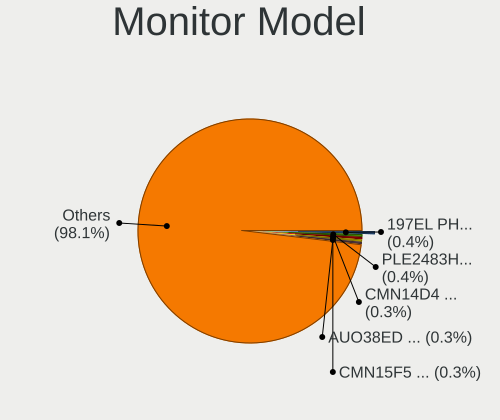

| Model                                                                     | Computers | Percent |
|---------------------------------------------------------------------------|-----------|---------|
| Philips 197EL PHLC08B 1366x768 410x230mm 18.5-inch                        | 81        | 0.44%   |
| Iiyama PLE2483H IVM6113 1920x1080 531x299mm 24.0-inch                     | 75        | 0.41%   |
| Chimei Innolux LCD Monitor CMN14D4 1920x1080 309x173mm 13.9-inch          | 64        | 0.35%   |
| AU Optronics LCD Monitor AUO38ED 1920x1080 344x193mm 15.5-inch            | 64        | 0.35%   |
| Chimei Innolux LCD Monitor CMN15F5 1920x1080 344x193mm 15.5-inch          | 62        | 0.34%   |
| Vestel Elektronik 40UHD_LCD_TV VES3700 3840x2160 880x500mm 39.8-inch      | 59        | 0.32%   |
| AU Optronics LCD Monitor AUO21ED 1920x1080 344x193mm 15.5-inch            | 55        | 0.3%    |
| AU Optronics LCD Monitor AUO106C 1366x768 276x155mm 12.5-inch             | 54        | 0.29%   |
| Samsung Electronics LCD Monitor SEC5441 1280x800 331x207mm 15.4-inch      | 49        | 0.27%   |
| Samsung Electronics C27F390 SAM0D32 1920x1080 598x336mm 27.0-inch         | 44        | 0.24%   |
| Unknown LCD Monitor FFFF 2288x1287 2550x2550mm 142.0-inch                 | 43        | 0.23%   |
| Chimei Innolux LCD Monitor CMN1521 1920x1080 344x193mm 15.5-inch          | 43        | 0.23%   |
| AU Optronics LCD Monitor AUO403D 1920x1080 309x174mm 14.0-inch            | 43        | 0.23%   |
| Samsung Electronics S24F350 SAM0D20 1920x1080 521x293mm 23.5-inch         | 42        | 0.23%   |
| AU Optronics LCD Monitor AUO26EC 1366x768 344x193mm 15.5-inch             | 40        | 0.22%   |
| Samsung Electronics C24F390 SAM0D2C 1920x1080 521x293mm 23.5-inch         | 39        | 0.21%   |
| Samsung Electronics LCD Monitor SEC544B 1600x900 382x214mm 17.2-inch      | 37        | 0.2%    |
| Chimei Innolux LCD Monitor CMN14D5 1920x1080 309x173mm 13.9-inch          | 37        | 0.2%    |
| Chi Mei Optoelectronics LCD Monitor CMO1720 1920x1080 382x215mm 17.3-inch | 36        | 0.2%    |
| AOC 27G2G4 AOC2702 1920x1080 598x336mm 27.0-inch                          | 36        | 0.2%    |
| Chimei Innolux LCD Monitor CMN15DC 1366x768 344x193mm 15.5-inch           | 35        | 0.19%   |
| AU Optronics LCD Monitor AUO159E 1600x900 382x214mm 17.2-inch             | 35        | 0.19%   |
| AU Optronics LCD Monitor AUO139E 1600x900 382x214mm 17.2-inch             | 35        | 0.19%   |
| Chimei Innolux LCD Monitor CMN1728 1600x900 382x215mm 17.3-inch           | 33        | 0.18%   |
| AU Optronics LCD Monitor AUO5B2D 1920x1080 293x162mm 13.2-inch            | 33        | 0.18%   |
| AOC 24G2W1G3 AOC2402 1920x1080 527x296mm 23.8-inch                        | 33        | 0.18%   |
| Valve ANX7530 U VLV3001 800x1280 100x150mm 7.1-inch                       | 32        | 0.17%   |
| Chimei Innolux LCD Monitor CMN15E8 1920x1080 344x193mm 15.5-inch          | 32        | 0.17%   |
| Chimei Innolux LCD Monitor CMN15E7 1920x1080 344x193mm 15.5-inch          | 32        | 0.17%   |
| Chimei Innolux LCD Monitor CMN15DB 1366x768 344x193mm 15.5-inch           | 32        | 0.17%   |
| AU Optronics LCD Monitor AUO45EC 1366x768 344x193mm 15.5-inch             | 32        | 0.17%   |
| AU Optronics LCD Monitor AUO36ED 1920x1080 344x193mm 15.5-inch            | 32        | 0.17%   |
| Chimei Innolux LCD Monitor CMN1734 1600x900 382x214mm 17.2-inch           | 31        | 0.17%   |
| AU Optronics LCD Monitor AUO61ED 1920x1080 344x194mm 15.5-inch            | 31        | 0.17%   |
| Samsung Electronics S24D330 SAM0D92 1920x1080 531x299mm 24.0-inch         | 30        | 0.16%   |
| Iiyama PLX2783H IVM6611 1920x1080 598x336mm 27.0-inch                     | 29        | 0.16%   |
| Iiyama PL2530H IVM6132 1920x1080 544x303mm 24.5-inch                      | 28        | 0.15%   |
| Chimei Innolux LCD Monitor CMN1747 1920x1080 381x214mm 17.2-inch          | 28        | 0.15%   |
| AOC 24B1W1 AOC2401 1920x1080 527x296mm 23.8-inch                          | 28        | 0.15%   |
| LG Display LCD Monitor LGD06B3 1920x1200 336x210mm 15.6-inch              | 27        | 0.15%   |

Monitor Resolution
------------------

Monitor screen resolution

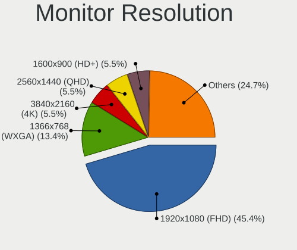

| Resolution         | Computers | Percent |
|--------------------|-----------|---------|
| 1920x1080 (FHD)    | 7620      | 45.42%  |
| 1366x768 (WXGA)    | 2247      | 13.39%  |
| 3840x2160 (4K)     | 923       | 5.5%    |
| 2560x1440 (QHD)    | 922       | 5.5%    |
| 1600x900 (HD+)     | 919       | 5.48%   |
| 1920x1200 (WUXGA)  | 671       | 4%      |
| 1680x1050 (WSXGA+) | 572       | 3.41%   |
| 1280x1024 (SXGA)   | 501       | 2.99%   |
| 1440x900 (WXGA+)   | 421       | 2.51%   |
| 1280x800 (WXGA)    | 294       | 1.75%   |
| 2560x1600          | 184       | 1.1%    |
| 3440x1440          | 177       | 1.06%   |
| 2880x1800          | 149       | 0.89%   |
| Unknown            | 149       | 0.89%   |
| 2560x1080          | 102       | 0.61%   |
| 3840x1080          | 84        | 0.5%    |
| 1360x768           | 83        | 0.49%   |
| 800x1280           | 56        | 0.33%   |
| 3840x2400          | 51        | 0.3%    |
| 2160x1440          | 50        | 0.3%    |
| 1600x1200          | 50        | 0.3%    |
| 2288x1287          | 48        | 0.29%   |
| 1024x600           | 41        | 0.24%   |
| 1024x768 (XGA)     | 38        | 0.23%   |
| 1920x540           | 36        | 0.21%   |
| 2256x1504          | 33        | 0.2%    |
| 2880x1920          | 27        | 0.16%   |
| 3840x1600          | 17        | 0.1%    |
| 3200x1800 (QHD+)   | 17        | 0.1%    |
| 1920x1280          | 17        | 0.1%    |
| 3072x1920          | 15        | 0.09%   |
| 2880x1620          | 15        | 0.09%   |
| 3200x2000          | 13        | 0.08%   |
| 1680x945           | 13        | 0.08%   |
| 3000x2000          | 12        | 0.07%   |
| 4480x1440          | 11        | 0.07%   |
| 2520x1680          | 10        | 0.06%   |
| 3456x2160          | 9         | 0.05%   |
| 3200x1080          | 8         | 0.05%   |
| 2048x1152          | 8         | 0.05%   |

Monitor Diagonal
----------------

Diagonal size in inches

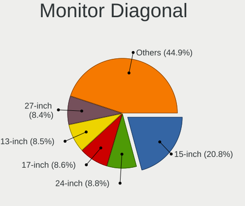

| Inches  | Computers | Percent |
|---------|-----------|---------|
| 15      | 3680      | 20.82%  |
| 24      | 1556      | 8.8%    |
| 17      | 1516      | 8.58%   |
| 13      | 1501      | 8.49%   |
| 27      | 1484      | 8.4%    |
| 23      | 1307      | 7.39%   |
| 14      | 1156      | 6.54%   |
| 21      | 1038      | 5.87%   |
| Unknown | 602       | 3.41%   |
| 19      | 484       | 2.74%   |
| 22      | 387       | 2.19%   |
| 31      | 360       | 2.04%   |
| 18      | 312       | 1.77%   |
| 16      | 301       | 1.7%    |
| 12      | 286       | 1.62%   |
| 20      | 246       | 1.39%   |
| 34      | 229       | 1.3%    |
| 84      | 136       | 0.77%   |
| 11      | 125       | 0.71%   |
| 32      | 81        | 0.46%   |
| 72      | 79        | 0.45%   |
| 10      | 79        | 0.45%   |
| 25      | 76        | 0.43%   |
| 40      | 70        | 0.4%    |
| 54      | 54        | 0.31%   |
| 7       | 54        | 0.31%   |
| 26      | 45        | 0.25%   |
| 142     | 43        | 0.24%   |
| 33      | 32        | 0.18%   |
| 29      | 28        | 0.16%   |
| 65      | 27        | 0.15%   |
| 48      | 27        | 0.15%   |
| 52      | 26        | 0.15%   |
| 49      | 23        | 0.13%   |
| 46      | 23        | 0.13%   |
| 42      | 22        | 0.12%   |
| 39      | 18        | 0.1%    |
| 63      | 17        | 0.1%    |
| 28      | 14        | 0.08%   |
| 37      | 13        | 0.07%   |

Monitor Width
-------------

Physical width

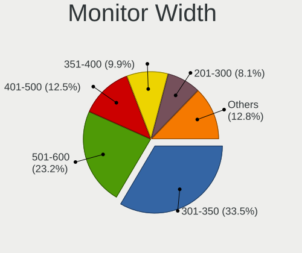

| Width in mm    | Computers | Percent |
|----------------|-----------|---------|
| 301-350        | 5788      | 33.47%  |
| 501-600        | 4013      | 23.21%  |
| 401-500        | 2158      | 12.48%  |
| 351-400        | 1715      | 9.92%   |
| 201-300        | 1403      | 8.11%   |
| Unknown        | 602       | 3.48%   |
| 601-700        | 524       | 3.03%   |
| 701-800        | 354       | 2.05%   |
| 1001-1500      | 235       | 1.36%   |
| 1501-2000      | 228       | 1.32%   |
| 801-900        | 125       | 0.72%   |
| 1-100          | 55        | 0.32%   |
| More than 2000 | 43        | 0.25%   |
| 901-1000       | 31        | 0.18%   |
| 101-200        | 17        | 0.1%    |

Aspect Ratio
------------

Proportional relationship between the width and the height

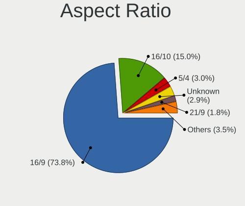

| Ratio   | Computers | Percent |
|---------|-----------|---------|
| 16/9    | 11721     | 73.84%  |
| 16/10   | 2380      | 14.99%  |
| 5/4     | 478       | 3.01%   |
| Unknown | 465       | 2.93%   |
| 21/9    | 279       | 1.76%   |
| 3/2     | 212       | 1.34%   |
| 4/3     | 116       | 0.73%   |
| 32/9    | 51        | 0.32%   |
| 1.00    | 44        | 0.28%   |
| 6/5     | 34        | 0.21%   |
| 0.67    | 32        | 0.2%    |
| 0.56    | 20        | 0.13%   |
| 0.62    | 15        | 0.09%   |
| 3.73    | 5         | 0.03%   |
| 3.20    | 3         | 0.02%   |
| 2.00    | 3         | 0.02%   |
| 0.45    | 3         | 0.02%   |
| 3.40    | 2         | 0.01%   |
| 11/10   | 2         | 0.01%   |
| 1.03    | 2         | 0.01%   |
| 6.00    | 1         | 0.01%   |
| 3.88    | 1         | 0.01%   |
| 2.70    | 1         | 0.01%   |
| 0.89    | 1         | 0.01%   |
| 0.75    | 1         | 0.01%   |
| 0.63    | 1         | 0.01%   |
| 0.58    | 1         | 0.01%   |

Monitor Area
------------

Area in inch²

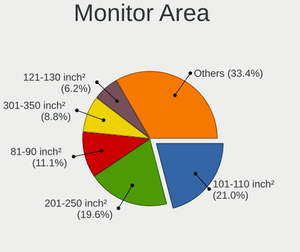

| Area in inch² | Computers | Percent |
|----------------|-----------|---------|
| 101-110        | 3657      | 20.95%  |
| 201-250        | 3420      | 19.6%   |
| 81-90          | 1933      | 11.08%  |
| 301-350        | 1533      | 8.78%   |
| 121-130        | 1085      | 6.22%   |
| 151-200        | 1003      | 5.75%   |
| 351-500        | 729       | 4.18%   |
| 71-80          | 722       | 4.14%   |
| Unknown        | 602       | 3.45%   |
| 251-300        | 549       | 3.15%   |
| 141-150        | 478       | 2.74%   |
| More than 1000 | 432       | 2.48%   |
| 111-120        | 298       | 1.71%   |
| 61-70          | 262       | 1.5%    |
| 501-1000       | 223       | 1.28%   |
| 131-140        | 213       | 1.22%   |
| 51-60          | 130       | 0.74%   |
| 41-50          | 77        | 0.44%   |
| 1-40           | 71        | 0.41%   |
| 91-100         | 36        | 0.21%   |

Pixel Density
-------------

Pixels per inch

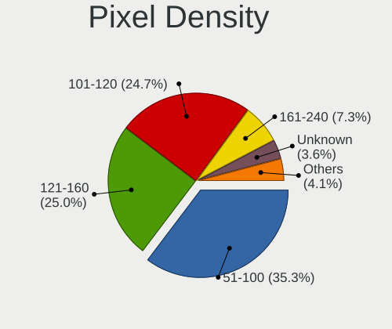

| Density       | Computers | Percent |
|---------------|-----------|---------|
| 51-100        | 5982      | 35.31%  |
| 121-160       | 4238      | 25.01%  |
| 101-120       | 4190      | 24.73%  |
| 161-240       | 1234      | 7.28%   |
| Unknown       | 603       | 3.56%   |
| More than 240 | 390       | 2.3%    |
| 1-50          | 306       | 1.81%   |

Multiple Monitors
-----------------

Total monitors connected

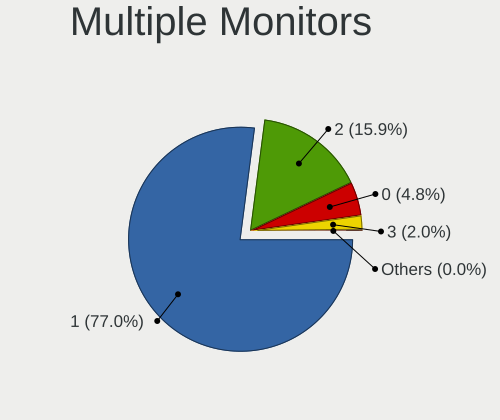

| Total | Computers | Percent |
|-------|-----------|---------|
| 1     | 12617     | 77.05%  |
| 2     | 2600      | 15.88%  |
| 0     | 794       | 4.85%   |
| 3     | 334       | 2.04%   |
| 4     | 27        | 0.16%   |
| 5     | 3         | 0.02%   |
| 6     | 1         | 0.01%   |

Network
-------

Net Controller Vendor
---------------------

Controller vendors

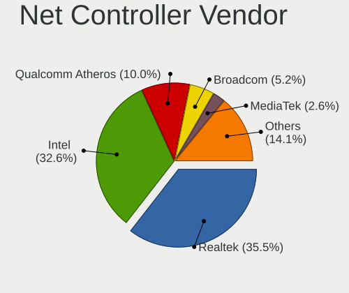

| Vendor                            | Computers | Percent |
|-----------------------------------|-----------|---------|
| Realtek Semiconductor             | 8555      | 35.52%  |
| Intel                             | 7857      | 32.62%  |
| Qualcomm Atheros                  | 2412      | 10.02%  |
| Broadcom                          | 1248      | 5.18%   |
| MediaTek                          | 617       | 2.56%   |
| Marvell Technology Group          | 294       | 1.22%   |
| Broadcom Limited                  | 265       | 1.1%    |
| TP-Link                           | 241       | 1%      |
| Ralink                            | 237       | 0.98%   |
| Nvidia                            | 219       | 0.91%   |
| ASIX Electronics                  | 198       | 0.82%   |
| NetGear                           | 127       | 0.53%   |
| Samsung Electronics               | 126       | 0.52%   |
| Ralink Technology                 | 118       | 0.49%   |
| Qualcomm                          | 92        | 0.38%   |
| Shenzhen Goodix Technology        | 83        | 0.34%   |
| Dell                              | 81        | 0.34%   |
| Xiaomi                            | 76        | 0.32%   |
| Aquantia                          | 73        | 0.3%    |
| DisplayLink                       | 67        | 0.28%   |
| D-Link System                     | 65        | 0.27%   |
| Microsoft                         | 57        | 0.24%   |
| D-Link                            | 51        | 0.21%   |
| Lenovo                            | 49        | 0.2%    |
| Ericsson Business Mobile Networks | 48        | 0.2%    |
| Huawei Technologies               | 44        | 0.18%   |
| Sierra Wireless                   | 43        | 0.18%   |
| Google                            | 38        | 0.16%   |
| OPPO Electronics                  | 37        | 0.15%   |
| JMicron Technology                | 37        | 0.15%   |
| Qualcomm Atheros Communications   | 34        | 0.14%   |
| Belkin Components                 | 31        | 0.13%   |
| Qualcomm Technologies             | 28        | 0.12%   |
| Microchip Technology              | 28        | 0.12%   |
| ASUSTek Computer                  | 28        | 0.12%   |
| VIA Technologies                  | 26        | 0.11%   |
| Hewlett-Packard                   | 25        | 0.1%    |
| Silicon Integrated Systems [SiS]  | 19        | 0.08%   |
| Guillemot                         | 18        | 0.07%   |
| Attansic Technology               | 18        | 0.07%   |

Net Controller Model
--------------------

Controller models

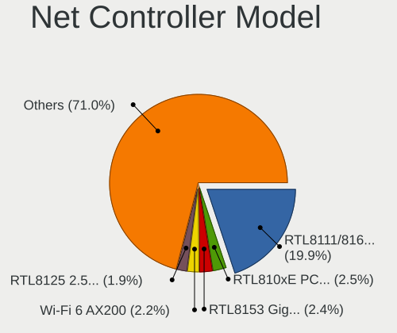

| Model                                                                  | Computers | Percent |
|------------------------------------------------------------------------|-----------|---------|
| Realtek RTL8111/8168/8211/8411 PCI Express Gigabit Ethernet Controller | 5632      | 19.9%   |
| Realtek RTL810xE PCI Express Fast Ethernet controller                  | 718       | 2.54%   |
| Realtek RTL8153 Gigabit Ethernet Adapter                               | 686       | 2.42%   |
| Intel Wi-Fi 6 AX200                                                    | 618       | 2.18%   |
| Realtek RTL8125 2.5GbE Controller                                      | 544       | 1.92%   |
| Intel 82579LM Gigabit Network Connection (Lewisville)                  | 465       | 1.64%   |
| Intel Wireless 8265 / 8275                                             | 411       | 1.45%   |
| Intel Wi-Fi 6 AX201                                                    | 371       | 1.31%   |
| Intel Wireless 7265                                                    | 370       | 1.31%   |
| Realtek RTL8821CE 802.11ac PCIe Wireless Network Adapter               | 340       | 1.2%    |
| Qualcomm Atheros QCA9377 802.11ac Wireless Network Adapter             | 332       | 1.17%   |
| Intel Wireless 8260                                                    | 312       | 1.1%    |
| Intel Wireless 7260                                                    | 292       | 1.03%   |
| Qualcomm Atheros AR9485 Wireless Network Adapter                       | 289       | 1.02%   |
| Qualcomm Atheros AR9285 Wireless Network Adapter (PCI-Express)         | 286       | 1.01%   |
| Intel Alder Lake-P PCH CNVi WiFi                                       | 283       | 1%      |
| Intel Cannon Lake PCH CNVi WiFi                                        | 251       | 0.89%   |
| Realtek RTL8822CE 802.11ac PCIe Wireless Network Adapter               | 248       | 0.88%   |
| Qualcomm Atheros QCA9565 / AR9565 Wireless Network Adapter             | 235       | 0.83%   |
| Intel Ethernet Connection I217-LM                                      | 234       | 0.83%   |
| Qualcomm Atheros QCA6174 802.11ac Wireless Network Adapter             | 229       | 0.81%   |
| Intel Ethernet Connection (2) I219-V                                   | 227       | 0.8%    |
| Intel Wi-Fi 6E(802.11ax) AX210/AX1675* 2x2 [Typhoon Peak]              | 224       | 0.79%   |
| Intel I211 Gigabit Network Connection                                  | 221       | 0.78%   |
| MediaTek MT7922 802.11ax PCI Express Wireless Network Adapter          | 217       | 0.77%   |
| Intel Comet Lake PCH-LP CNVi WiFi                                      | 216       | 0.76%   |
| Intel Wireless 3165                                                    | 208       | 0.73%   |
| MediaTek MT7921 802.11ax PCIe Wireless Network Adapter [Filogic 330]   | 200       | 0.71%   |
| Intel Cannon Point-LP CNVi [Wireless-AC]                               | 195       | 0.69%   |
| Realtek RTL8723BE PCIe Wireless Network Adapter                        | 183       | 0.65%   |
| Intel Ethernet Controller I225-V                                       | 183       | 0.65%   |
| ASIX AX88179 Gigabit Ethernet                                          | 183       | 0.65%   |
| Intel Centrino Advanced-N 6205 [Taylor Peak]                           | 177       | 0.63%   |
| Intel Comet Lake PCH CNVi WiFi                                         | 170       | 0.6%    |
| Intel Raptor Lake PCH CNVi WiFi                                        | 164       | 0.58%   |
| Intel Ethernet Connection (2) I219-LM                                  | 155       | 0.55%   |
| Intel Wi-Fi 5(802.11ac) Wireless-AC 9x6x [Thunder Peak]                | 151       | 0.53%   |
| Intel 82579V Gigabit Network Connection                                | 145       | 0.51%   |
| Intel Ethernet Connection (4) I219-LM                                  | 144       | 0.51%   |
| Intel Ethernet Connection I217-V                                       | 142       | 0.5%    |

Wireless Vendor
---------------

Wireless vendors

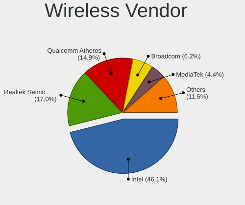

| Vendor                                | Computers | Percent |
|---------------------------------------|-----------|---------|
| Intel                                 | 5747      | 46.06%  |
| Realtek Semiconductor                 | 2124      | 17.02%  |
| Qualcomm Atheros                      | 1861      | 14.92%  |
| Broadcom                              | 769       | 6.16%   |
| MediaTek                              | 544       | 4.36%   |
| Ralink                                | 237       | 1.9%    |
| TP-Link                               | 227       | 1.82%   |
| Broadcom Limited                      | 173       | 1.39%   |
| NetGear                               | 122       | 0.98%   |
| Ralink Technology                     | 118       | 0.95%   |
| Qualcomm                              | 65        | 0.52%   |
| Microsoft                             | 53        | 0.42%   |
| D-Link                                | 49        | 0.39%   |
| Sierra Wireless                       | 43        | 0.34%   |
| D-Link System                         | 41        | 0.33%   |
| Dell                                  | 39        | 0.31%   |
| Qualcomm Atheros Communications       | 34        | 0.27%   |
| Marvell Technology Group              | 34        | 0.27%   |
| Belkin Components                     | 31        | 0.25%   |
| ASUSTek Computer                      | 27        | 0.22%   |
| Guillemot                             | 18        | 0.14%   |
| Edimax Technology                     | 15        | 0.12%   |
| Fibocom                               | 14        | 0.11%   |
| Hewlett-Packard                       | 10        | 0.08%   |
| Sagem                                 | 8         | 0.06%   |
| Qualcomm Technologies                 | 8         | 0.06%   |
| TRENDnet                              | 6         | 0.05%   |
| IMC Networks                          | 5         | 0.04%   |
| Gemtek                                | 5         | 0.04%   |
| ZyDAS                                 | 4         | 0.03%   |
| Tenda                                 | 4         | 0.03%   |
| Realtek                               | 4         | 0.03%   |
| Micro Star International              | 4         | 0.03%   |
| Linksys                               | 4         | 0.03%   |
| Accton Technology                     | 4         | 0.03%   |
| Z-Com                                 | 3         | 0.02%   |
| Quectel Wireless Solutions            | 3         | 0.02%   |
| Fujitsu Siemens Computers             | 3         | 0.02%   |
| 802.11g Adapter [Linksys WUSB54GC v3] | 3         | 0.02%   |
| Toshiba                               | 2         | 0.02%   |

Wireless Model
--------------

Wireless models

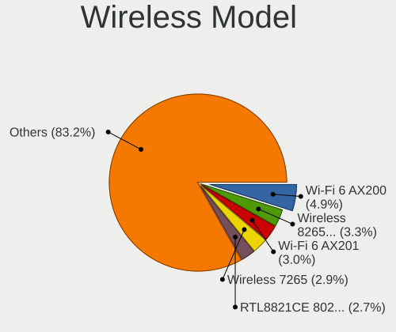

| Model                                                                | Computers | Percent |
|----------------------------------------------------------------------|-----------|---------|
| Intel Wi-Fi 6 AX200                                                  | 618       | 4.92%   |
| Intel Wireless 8265 / 8275                                           | 411       | 3.28%   |
| Intel Wi-Fi 6 AX201                                                  | 371       | 2.96%   |
| Intel Wireless 7265                                                  | 370       | 2.95%   |
| Realtek RTL8821CE 802.11ac PCIe Wireless Network Adapter             | 340       | 2.71%   |
| Qualcomm Atheros QCA9377 802.11ac Wireless Network Adapter           | 332       | 2.65%   |
| Intel Wireless 8260                                                  | 312       | 2.49%   |
| Intel Wireless 7260                                                  | 292       | 2.33%   |
| Qualcomm Atheros AR9485 Wireless Network Adapter                     | 289       | 2.3%    |
| Qualcomm Atheros AR9285 Wireless Network Adapter (PCI-Express)       | 286       | 2.28%   |
| Intel Cannon Lake PCH CNVi WiFi                                      | 251       | 2%      |
| Realtek RTL8822CE 802.11ac PCIe Wireless Network Adapter             | 248       | 1.98%   |
| Qualcomm Atheros QCA9565 / AR9565 Wireless Network Adapter           | 235       | 1.87%   |
| Qualcomm Atheros QCA6174 802.11ac Wireless Network Adapter           | 229       | 1.82%   |
| Intel Wi-Fi 6E(802.11ax) AX210/AX1675* 2x2 [Typhoon Peak]            | 224       | 1.79%   |
| Intel Comet Lake PCH-LP CNVi WiFi                                    | 216       | 1.72%   |
| Intel Wireless 3165                                                  | 208       | 1.66%   |
| Intel Alder Lake-P PCH CNVi WiFi                                     | 203       | 1.62%   |
| MediaTek MT7921 802.11ax PCIe Wireless Network Adapter [Filogic 330] | 200       | 1.59%   |
| Intel Cannon Point-LP CNVi [Wireless-AC]                             | 195       | 1.55%   |
| Realtek RTL8723BE PCIe Wireless Network Adapter                      | 183       | 1.46%   |
| MediaTek MT7922 802.11ax PCI Express Wireless Network Adapter        | 183       | 1.46%   |
| Intel Centrino Advanced-N 6205 [Taylor Peak]                         | 177       | 1.41%   |
| Intel Comet Lake PCH CNVi WiFi                                       | 170       | 1.35%   |
| Intel Raptor Lake PCH CNVi WiFi                                      | 161       | 1.28%   |
| Intel Wi-Fi 5(802.11ac) Wireless-AC 9x6x [Thunder Peak]              | 151       | 1.2%    |
| Broadcom BCM4313 802.11bgn Wireless Network Adapter                  | 142       | 1.13%   |
| Broadcom BCM43142 802.11b/g/n                                        | 124       | 0.99%   |
| Intel Tiger Lake PCH CNVi WiFi                                       | 123       | 0.98%   |
| Realtek RTL8188CE 802.11b/g/n WiFi Adapter                           | 121       | 0.96%   |
| Intel Dual Band Wireless-AC 3168NGW [Stone Peak]                     | 115       | 0.92%   |
| Realtek RTL88x2bu [AC1200 Techkey]                                   | 105       | 0.84%   |
| Qualcomm Atheros AR928X Wireless Network Adapter (PCI-Express)       | 102       | 0.81%   |
| Realtek RTL8188EE Wireless Network Adapter                           | 101       | 0.8%    |
| Qualcomm Atheros AR9462 Wireless Network Adapter                     | 97        | 0.77%   |
| Realtek 802.11ac NIC                                                 | 94        | 0.75%   |
| Realtek RTL8188EUS 802.11n Wireless Network Adapter                  | 93        | 0.74%   |
| Intel Wireless 3160                                                  | 92        | 0.73%   |
| Intel WiFi Link 5100                                                 | 89        | 0.71%   |
| Qualcomm Atheros AR9287 Wireless Network Adapter (PCI-Express)       | 79        | 0.63%   |

Ethernet Vendor
---------------

Ethernet vendors

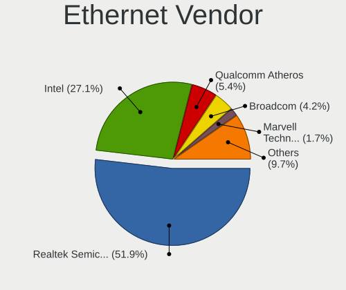

| Vendor                                 | Computers | Percent |
|----------------------------------------|-----------|---------|
| Realtek Semiconductor                  | 7738      | 51.86%  |
| Intel                                  | 4045      | 27.11%  |
| Qualcomm Atheros                       | 808       | 5.41%   |
| Broadcom                               | 626       | 4.2%    |
| Marvell Technology Group               | 260       | 1.74%   |
| Nvidia                                 | 219       | 1.47%   |
| ASIX Electronics                       | 198       | 1.33%   |
| Samsung Electronics                    | 124       | 0.83%   |
| Broadcom Limited                       | 95        | 0.64%   |
| Xiaomi                                 | 76        | 0.51%   |
| Aquantia                               | 73        | 0.49%   |
| MediaTek                               | 68        | 0.46%   |
| DisplayLink                            | 67        | 0.45%   |
| Lenovo                                 | 49        | 0.33%   |
| Google                                 | 38        | 0.25%   |
| OPPO Electronics                       | 37        | 0.25%   |
| JMicron Technology                     | 37        | 0.25%   |
| Huawei Technologies                    | 36        | 0.24%   |
| Qualcomm                               | 26        | 0.17%   |
| Microchip Technology                   | 24        | 0.16%   |
| D-Link System                          | 24        | 0.16%   |
| VIA Technologies                       | 23        | 0.15%   |
| Qualcomm Technologies                  | 20        | 0.13%   |
| Silicon Integrated Systems [SiS]       | 18        | 0.12%   |
| Attansic Technology                    | 18        | 0.12%   |
| TP-Link                                | 14        | 0.09%   |
| Mellanox Technologies                  | 13        | 0.09%   |
| Motorola PCS                           | 12        | 0.08%   |
| ICS Advent                             | 9         | 0.06%   |
| 3Com                                   | 9         | 0.06%   |
| Suzhou Motorcomm Electronic Technology | 8         | 0.05%   |
| Raspberry Pi                           | 8         | 0.05%   |
| Hewlett-Packard                        | 8         | 0.05%   |
| OnePlus Technology (Shenzhen)          | 7         | 0.05%   |
| Apple                                  | 7         | 0.05%   |
| Linksys                                | 6         | 0.04%   |
| QLogic                                 | 5         | 0.03%   |
| NetGear                                | 5         | 0.03%   |
| Dell                                   | 5         | 0.03%   |
| American Megatrends                    | 5         | 0.03%   |

Ethernet Model
--------------

Ethernet models

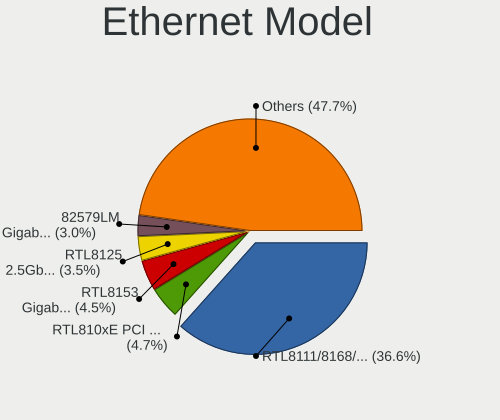

| Model                                                                  | Computers | Percent |
|------------------------------------------------------------------------|-----------|---------|
| Realtek RTL8111/8168/8211/8411 PCI Express Gigabit Ethernet Controller | 5632      | 36.6%   |
| Realtek RTL810xE PCI Express Fast Ethernet controller                  | 718       | 4.67%   |
| Realtek RTL8153 Gigabit Ethernet Adapter                               | 686       | 4.46%   |
| Realtek RTL8125 2.5GbE Controller                                      | 544       | 3.54%   |
| Intel 82579LM Gigabit Network Connection (Lewisville)                  | 465       | 3.02%   |
| Intel Ethernet Connection I217-LM                                      | 234       | 1.52%   |
| Intel Ethernet Connection (2) I219-V                                   | 227       | 1.48%   |
| Intel I211 Gigabit Network Connection                                  | 221       | 1.44%   |
| Intel Ethernet Controller I225-V                                       | 183       | 1.19%   |
| ASIX AX88179 Gigabit Ethernet                                          | 183       | 1.19%   |
| Intel Ethernet Connection (2) I219-LM                                  | 155       | 1.01%   |
| Intel 82579V Gigabit Network Connection                                | 145       | 0.94%   |
| Intel Ethernet Connection (4) I219-LM                                  | 144       | 0.94%   |
| Intel Ethernet Connection I217-V                                       | 142       | 0.92%   |
| Intel Ethernet Connection (7) I219-V                                   | 139       | 0.9%    |
| Qualcomm Atheros AR8151 v2.0 Gigabit Ethernet                          | 129       | 0.84%   |
| Qualcomm Atheros Killer E220x Gigabit Ethernet Controller              | 126       | 0.82%   |
| Intel Ethernet Connection I219-LM                                      | 114       | 0.74%   |
| Qualcomm Atheros AR8161 Gigabit Ethernet                               | 109       | 0.71%   |
| Intel Ethernet Connection (7) I219-LM                                  | 106       | 0.69%   |
| Samsung Galaxy series, misc. (tethering mode)                          | 103       | 0.67%   |
| Intel Ethernet Connection I218-LM                                      | 91        | 0.59%   |
| Intel Ethernet Connection (3) I218-LM                                  | 85        | 0.55%   |
| Realtek RTL-8100/8101L/8139 PCI Fast Ethernet Adapter                  | 80        | 0.52%   |
| Intel Alder Lake-P PCH CNVi WiFi                                       | 80        | 0.52%   |
| Broadcom NetXtreme BCM57765 Gigabit Ethernet PCIe                      | 80        | 0.52%   |
| Nvidia MCP61 Ethernet                                                  | 77        | 0.5%    |
| Intel I210 Gigabit Network Connection                                  | 76        | 0.49%   |
| Intel Ethernet Connection I219-V                                       | 75        | 0.49%   |
| Realtek RTL8152 Fast Ethernet Adapter                                  | 74        | 0.48%   |
| Qualcomm Atheros Killer E2400 Gigabit Ethernet Controller              | 74        | 0.48%   |
| Intel Ethernet Connection (2) I218-V                                   | 74        | 0.48%   |
| Intel Ethernet Connection (6) I219-V                                   | 73        | 0.47%   |
| Qualcomm Atheros QCA8171 Gigabit Ethernet                              | 71        | 0.46%   |
| Intel Ethernet Connection (4) I219-V                                   | 70        | 0.45%   |
| Intel Ethernet Controller I226-V                                       | 68        | 0.44%   |
| Broadcom NetLink BCM57780 Gigabit Ethernet PCIe                        | 68        | 0.44%   |
| Intel 82574L Gigabit Network Connection                                | 67        | 0.44%   |
| Intel 82577LM Gigabit Network Connection                               | 66        | 0.43%   |
| Xiaomi Mi/Redmi series (RNDIS)                                         | 61        | 0.4%    |

Net Controller Kind
-------------------

Ethernet, WiFi or modem

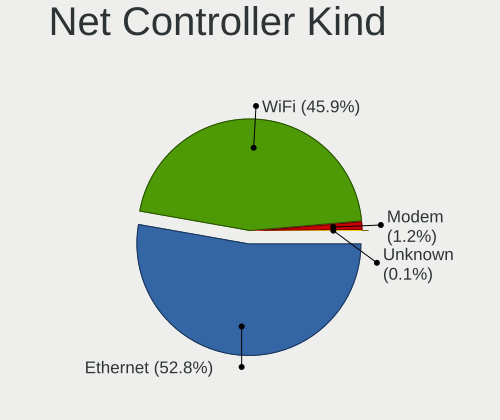

| Kind     | Computers | Percent |
|----------|-----------|---------|
| Ethernet | 13729     | 52.78%  |
| WiFi     | 11927     | 45.85%  |
| Modem    | 322       | 1.24%   |
| Unknown  | 35        | 0.13%   |

Used Controller
---------------

Currently used network controller

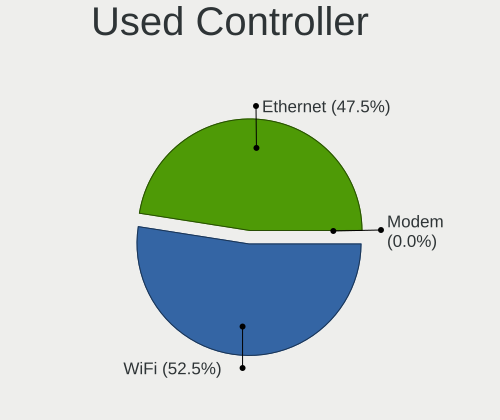

| Kind     | Computers | Percent |
|----------|-----------|---------|
| WiFi     | 8752      | 52.47%  |
| Ethernet | 7927      | 47.52%  |
| Modem    | 1         | 0.01%   |

NICs
----

Total network controllers on board

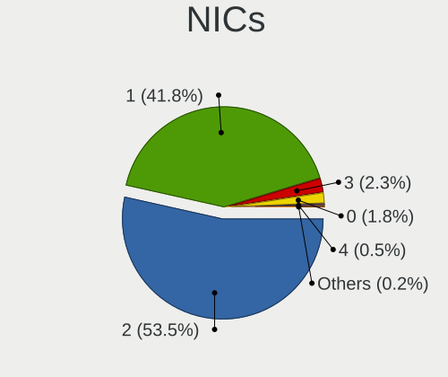

| Total | Computers | Percent |
|-------|-----------|---------|
| 2     | 8580      | 53.48%  |
| 1     | 6709      | 41.82%  |
| 3     | 368       | 2.29%   |
| 0     | 282       | 1.76%   |
| 4     | 73        | 0.46%   |
| 5     | 10        | 0.06%   |
| 6     | 7         | 0.04%   |
| 8     | 4         | 0.02%   |
| 7     | 4         | 0.02%   |
| 12    | 2         | 0.01%   |
| 9     | 2         | 0.01%   |
| 10    | 1         | 0.01%   |

IPv6
----

IPv6 vs IPv4

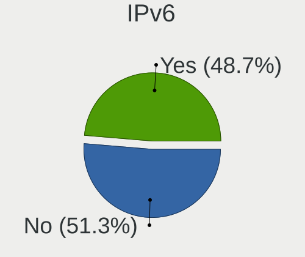

| Used | Computers | Percent |
|------|-----------|---------|
| No   | 8490      | 51.32%  |
| Yes  | 8052      | 48.68%  |

Bluetooth
---------

Bluetooth Vendor
----------------

Controller vendors

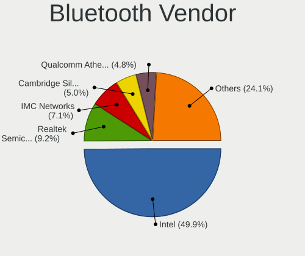

| Vendor                          | Computers | Percent |
|---------------------------------|-----------|---------|
| Intel                           | 4889      | 49.9%   |
| Realtek Semiconductor           | 902       | 9.21%   |
| IMC Networks                    | 691       | 7.05%   |
| Cambridge Silicon Radio         | 486       | 4.96%   |
| Qualcomm Atheros Communications | 470       | 4.8%    |
| Foxconn / Hon Hai               | 399       | 4.07%   |
| Broadcom                        | 352       | 3.59%   |
| Apple                           | 334       | 3.41%   |
| Lite-On Technology              | 257       | 2.62%   |
| ASUSTek Computer                | 175       | 1.79%   |
| MediaTek                        | 148       | 1.51%   |
| Dell                            | 143       | 1.46%   |
| TP-Link                         | 78        | 0.8%    |
| Realtek                         | 74        | 0.76%   |
| Toshiba                         | 65        | 0.66%   |
| Hewlett-Packard                 | 65        | 0.66%   |
| Ralink                          | 56        | 0.57%   |
| Marvell Semiconductor           | 28        | 0.29%   |
| Ralink Technology               | 27        | 0.28%   |
| Belkin Components               | 25        | 0.26%   |
| USI                             | 22        | 0.22%   |
| Alps Electric                   | 22        | 0.22%   |
| Foxconn International           | 17        | 0.17%   |
| Unknown                         | 14        | 0.14%   |
| Chicony Electronics             | 8         | 0.08%   |
| Integrated System Solution      | 7         | 0.07%   |
| Quectel Wireless Solutions      | 5         | 0.05%   |
| HTC (High Tech Computer)        | 5         | 0.05%   |
| Edimax Technology               | 5         | 0.05%   |
| Actions                         | 3         | 0.03%   |
| Taiyo Yuden                     | 2         | 0.02%   |
| Qcom                            | 2         | 0.02%   |
| Mercucys                        | 2         | 0.02%   |
| Kensington                      | 2         | 0.02%   |
| Fujitsu                         | 2         | 0.02%   |
| D-Link System                   | 2         | 0.02%   |
| Conwise Technology              | 2         | 0.02%   |
| Askey Computer                  | 2         | 0.02%   |
| TRENDnet                        | 1         | 0.01%   |
| Syntek                          | 1         | 0.01%   |

Bluetooth Model
---------------

Controller models

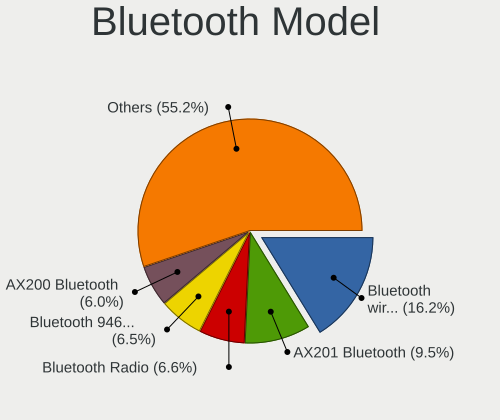

| Model                                               | Computers | Percent |
|-----------------------------------------------------|-----------|---------|
| Intel Bluetooth wireless interface                  | 1591      | 16.22%  |
| Intel AX201 Bluetooth                               | 936       | 9.54%   |
| Realtek Bluetooth Radio                             | 650       | 6.63%   |
| Intel Bluetooth 9460/9560 Jefferson Peak (JfP)      | 633       | 6.45%   |
| Intel AX200 Bluetooth                               | 584       | 5.95%   |
| Intel Bluetooth Device                              | 533       | 5.43%   |
| Cambridge Silicon Radio Bluetooth Dongle (HCI mode) | 486       | 4.96%   |
| IMC Networks Bluetooth Radio                        | 219       | 2.23%   |
| Intel AX210 Bluetooth                               | 202       | 2.06%   |
| Qualcomm Atheros  Bluetooth Device                  | 188       | 1.92%   |
| IMC Networks Bluetooth Device                       | 182       | 1.86%   |
| IMC Networks Wireless_Device                        | 181       | 1.85%   |
| Realtek  Bluetooth 4.2 Adapter                      | 165       | 1.68%   |
| MediaTek Wireless_Device                            | 142       | 1.45%   |
| Apple Bluetooth Host Controller                     | 139       | 1.42%   |
| Intel Wireless-AC 9260 Bluetooth Adapter            | 136       | 1.39%   |
| Foxconn / Hon Hai Wireless_Device                   | 135       | 1.38%   |
| Foxconn / Hon Hai Bluetooth Device                  | 121       | 1.23%   |
| Intel Centrino Bluetooth Wireless Transceiver       | 118       | 1.2%    |
| Intel Wireless-AC 3168 Bluetooth                    | 112       | 1.14%   |
| Apple Bluetooth USB Host Controller                 | 91        | 0.93%   |
| Qualcomm Atheros AR3011 Bluetooth                   | 86        | 0.88%   |
| Qualcomm Atheros QCA61x4 Bluetooth 4.0              | 83        | 0.85%   |
| Lite-On Qualcomm Atheros QCA9377 Bluetooth          | 82        | 0.84%   |
| TP-Link TP-T@- UB500 Adapter                        | 78        | 0.8%    |
| Realtek Bluetooth Radio                             | 74        | 0.75%   |
| Qualcomm Atheros AR3012 Bluetooth 4.0               | 74        | 0.75%   |
| Lite-On Bluetooth Device                            | 69        | 0.7%    |
| Foxconn / Hon Hai MediaTek Bluetooth Adapter        | 65        | 0.66%   |
| Dell DW375 Bluetooth Module                         | 60        | 0.61%   |
| Apple Built-in Bluetooth 2.0+EDR HCI                | 59        | 0.6%    |
| Ralink RT3290 Bluetooth                             | 56        | 0.57%   |
| ASUS Broadcom BCM20702A0 Bluetooth                  | 46        | 0.47%   |
| Broadcom BCM20702 Bluetooth 4.0 [ThinkPad]          | 45        | 0.46%   |
| Broadcom BCM2045B (BDC-2.1)                         | 45        | 0.46%   |
| Intel Centrino Advanced-N 6230 Bluetooth adapter    | 44        | 0.45%   |
| Lite-On Atheros AR3012 Bluetooth                    | 42        | 0.43%   |
| Apple Bluetooth HCI                                 | 39        | 0.4%    |
| HP Broadcom 2070 Bluetooth Combo                    | 38        | 0.39%   |
| IMC Networks Atheros AR3012 Bluetooth 4.0 Adapter   | 37        | 0.38%   |

Sound
-----

Sound Vendor
------------

Sound card vendors

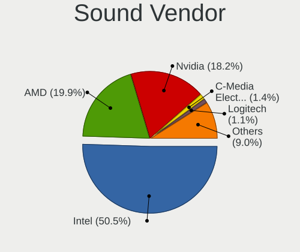

| Vendor                                       | Computers | Percent |
|----------------------------------------------|-----------|---------|
| Intel                                        | 11448     | 50.51%  |
| AMD                                          | 4505      | 19.88%  |
| Nvidia                                       | 4117      | 18.17%  |
| C-Media Electronics                          | 315       | 1.39%   |
| Logitech                                     | 240       | 1.06%   |
| GN Netcom                                    | 134       | 0.59%   |
| Creative Labs                                | 120       | 0.53%   |
| Realtek Semiconductor                        | 118       | 0.52%   |
| Texas Instruments                            | 79        | 0.35%   |
| ASUSTek Computer                             | 78        | 0.34%   |
| Kingston Technology                          | 73        | 0.32%   |
| Hewlett-Packard                              | 70        | 0.31%   |
| SteelSeries ApS                              | 68        | 0.3%    |
| JMTek                                        | 68        | 0.3%    |
| Plantronics                                  | 66        | 0.29%   |
| Corsair                                      | 65        | 0.29%   |
| Focusrite-Novation                           | 57        | 0.25%   |
| Generalplus Technology                       | 56        | 0.25%   |
| Razer USA                                    | 50        | 0.22%   |
| Lenovo                                       | 50        | 0.22%   |
| VIA Technologies                             | 47        | 0.21%   |
| Micro Star International                     | 38        | 0.17%   |
| DSEA A/S                                     | 37        | 0.16%   |
| Zoran Co. Personal Media Division (Nogatech) | 33        | 0.15%   |
| Sony                                         | 33        | 0.15%   |
| Creative Technology                          | 30        | 0.13%   |
| Silicon Integrated Systems [SiS]             | 25        | 0.11%   |
| Jieli Technology                             | 22        | 0.1%    |
| XMOS                                         | 20        | 0.09%   |
| M-Audio                                      | 20        | 0.09%   |
| Apple                                        | 20        | 0.09%   |
| RODE Microphones                             | 19        | 0.08%   |
| BEHRINGER International                      | 15        | 0.07%   |
| Yamaha                                       | 14        | 0.06%   |
| Tenx Technology                              | 14        | 0.06%   |
| PreSonus Audio Electronics                   | 13        | 0.06%   |
| KTMICRO                                      | 13        | 0.06%   |
| Dell                                         | 13        | 0.06%   |
| Blue Microphones                             | 12        | 0.05%   |
| Microsoft                                    | 10        | 0.04%   |

Sound Model
-----------

Sound card models

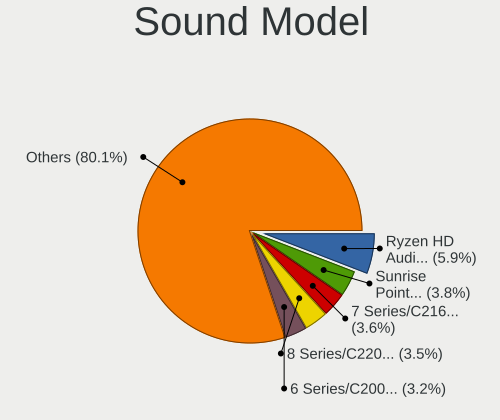

| Model                                                                      | Computers | Percent |
|----------------------------------------------------------------------------|-----------|---------|
| AMD Ryzen HD Audio Controller                                              | 1584      | 5.87%   |
| Intel Sunrise Point-LP HD Audio                                            | 1018      | 3.77%   |
| Intel 7 Series/C216 Chipset Family High Definition Audio Controller        | 961       | 3.56%   |
| Intel 8 Series/C220 Series Chipset High Definition Audio Controller        | 935       | 3.47%   |
| Intel 6 Series/C200 Series Chipset Family High Definition Audio Controller | 868       | 3.22%   |
| Intel Xeon E3-1200 v3/4th Gen Core Processor HD Audio Controller           | 702       | 2.6%    |
| AMD Renoir/Cezanne HDMI/DP Audio Controller                                | 680       | 2.52%   |
| Intel Cannon Lake PCH cAVS                                                 | 633       | 2.35%   |
| AMD Starship/Matisse HD Audio Controller                                   | 566       | 2.1%    |
| Intel 100 Series/C230 Series Chipset Family HD Audio Controller            | 536       | 1.99%   |
| AMD Radeon High Definition Audio Controller                                | 497       | 1.84%   |
| Intel Tiger Lake-LP Smart Sound Technology Audio Controller                | 490       | 1.82%   |
| Intel 82801I (ICH9 Family) HD Audio Controller                             | 466       | 1.73%   |
| AMD SBx00 Azalia (Intel HDA)                                               | 463       | 1.72%   |
| Intel 5 Series/3400 Series Chipset High Definition Audio                   | 452       | 1.68%   |
| AMD FCH Azalia Controller                                                  | 429       | 1.59%   |
| AMD Raven/Raven2/Fenghuang HDMI/DP Audio Controller                        | 371       | 1.38%   |
| Intel 8 Series HD Audio Controller                                         | 369       | 1.37%   |
| Intel Haswell-ULT HD Audio Controller                                      | 364       | 1.35%   |
| Intel NM10/ICH7 Family High Definition Audio Controller                    | 328       | 1.22%   |
| Nvidia GP107GL High Definition Audio Controller                            | 325       | 1.2%    |
| Intel Broadwell-U Audio Controller                                         | 323       | 1.2%    |
| Intel Alder Lake PCH-P High Definition Audio Controller                    | 319       | 1.18%   |
| Intel Wildcat Point-LP High Definition Audio Controller                    | 311       | 1.15%   |
| Intel Cannon Point-LP High Definition Audio Controller                     | 298       | 1.1%    |
| Nvidia GK208 HDMI/DP Audio Controller                                      | 297       | 1.1%    |
| Intel 200 Series PCH HD Audio                                              | 294       | 1.09%   |
| Intel Comet Lake PCH-LP cAVS                                               | 263       | 0.97%   |
| AMD Kabini HDMI/DP Audio                                                   | 257       | 0.95%   |
| Intel Comet Lake PCH cAVS                                                  | 247       | 0.92%   |
| AMD Navi 21/23 HDMI/DP Audio Controller                                    | 241       | 0.89%   |
| AMD Family 17h (Models 00h-0fh) HD Audio Controller                        | 240       | 0.89%   |
| Intel Celeron/Pentium Silver Processor High Definition Audio               | 224       | 0.83%   |
| Nvidia GA104 High Definition Audio Controller                              | 204       | 0.76%   |
| Intel Tiger Lake-H HD Audio Controller                                     | 204       | 0.76%   |
| Nvidia High Definition Audio Controller                                    | 198       | 0.73%   |
| Nvidia GF108 High Definition Audio Controller                              | 195       | 0.72%   |
| Intel Raptor Lake-P/U/H cAVS                                               | 193       | 0.72%   |
| Nvidia TU106 High Definition Audio Controller                              | 190       | 0.7%    |
| Nvidia GP106 High Definition Audio Controller                              | 190       | 0.7%    |

Memory
------

Memory Vendor
-------------

Memory module vendors

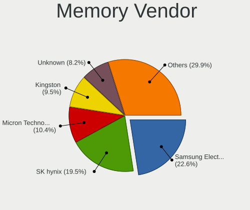

| Vendor              | Computers | Percent |
|---------------------|-----------|---------|
| Samsung Electronics | 2822      | 22.55%  |
| SK hynix            | 2440      | 19.5%   |
| Micron Technology   | 1305      | 10.43%  |
| Kingston            | 1183      | 9.45%   |
| Unknown             | 1023      | 8.18%   |
| Corsair             | 862       | 6.89%   |
| Crucial             | 840       | 6.71%   |
| G.Skill             | 616       | 4.92%   |
| Elpida              | 185       | 1.48%   |
| Ramaxel Technology  | 174       | 1.39%   |
| Nanya Technology    | 161       | 1.29%   |
| Unknown             | 152       | 1.21%   |
| A-DATA Technology   | 146       | 1.17%   |
| Unknown (ABCD)      | 126       | 1.01%   |
| Transcend           | 64        | 0.51%   |
| Patriot             | 30        | 0.24%   |
| PNY                 | 28        | 0.22%   |
| Timetec             | 26        | 0.21%   |
| Team                | 24        | 0.19%   |
| TEXTORM             | 22        | 0.18%   |
| Unifosa             | 19        | 0.15%   |
| Qimonda             | 14        | 0.11%   |
| Unknown (0x0E9D)    | 12        | 0.1%    |
| ASint Technology    | 12        | 0.1%    |
| Apacer              | 12        | 0.1%    |
| Unknown (0x0C97)    | 11        | 0.09%   |
| Lexar Co Limited    | 10        | 0.08%   |
| Lexar               | 8         | 0.06%   |
| Hewlett-Packard     | 8         | 0.06%   |
| Toshiba             | 7         | 0.06%   |
| Silicon Power       | 6         | 0.05%   |
| Innodisk            | 6         | 0.05%   |
| Wodposit            | 5         | 0.04%   |
| Kllisre             | 5         | 0.04%   |
| KLEVV               | 5         | 0.04%   |
| V-Color             | 4         | 0.03%   |
| Neo Forza           | 4         | 0.03%   |
| GOODRAM             | 4         | 0.03%   |
| 8CFD000080AD        | 4         | 0.03%   |
| Swissbit            | 3         | 0.02%   |

Memory Model
------------

Memory module models

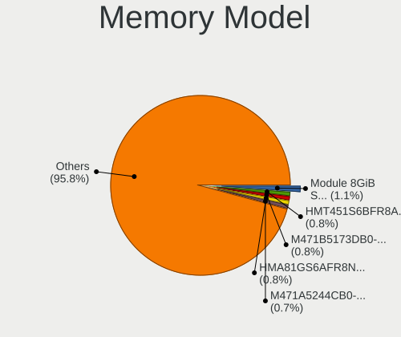

| Model                                                            | Computers | Percent |
|------------------------------------------------------------------|-----------|---------|
| Unknown                                                          | 152       | 1.14%   |
| SK hynix RAM HMT451S6BFR8A-PB 4GB SODIMM DDR3 1600MT/s           | 104       | 0.78%   |
| SK hynix RAM HMA81GS6AFR8N-UH 8GB SODIMM DDR4 2667MT/s           | 103       | 0.77%   |
| Samsung RAM M471B5173DB0-YK0 4GB SODIMM DDR3 1600MT/s            | 103       | 0.77%   |
| Samsung RAM M471A5244CB0-CTD 4GB SODIMM DDR4 3266MT/s            | 97        | 0.73%   |
| Unknown (ABCD) RAM 123456789012345678 2GB SODIMM LPDDR4 2400MT/s | 92        | 0.69%   |
| Samsung RAM M471B5173QH0-YK0 4GB SODIMM DDR3 1600MT/s            | 91        | 0.68%   |
| Samsung RAM M471A1G44AB0-CWE 8GiB SODIMM DDR4 3200MT/s           | 89        | 0.67%   |
| Corsair RAM CMK16GX4M2B3200C16 8GB DIMM DDR4 3600MT/s            | 76        | 0.57%   |
| Samsung RAM M471B5273DH0-CH9 4GB SODIMM DDR3 1600MT/s            | 71        | 0.53%   |
| Samsung RAM M471B5173EB0-YK0 4GB SODIMM DDR3 1600MT/s            | 70        | 0.52%   |
| SK hynix RAM HMAA1GS6CJR6N-XN 8GB SODIMM DDR4 3200MT/s           | 66        | 0.49%   |
| SK hynix RAM HMT351S6CFR8C-PB 4GB SODIMM DDR3 1600MT/s           | 65        | 0.49%   |
| Samsung RAM M471A1K43EB1-CWE 8GB SODIMM DDR4 3200MT/s            | 65        | 0.49%   |
| SK hynix RAM HMT41GS6BFR8A-PB 8GB SODIMM DDR3 2667MT/s           | 62        | 0.46%   |
| SK hynix RAM HMA81GS6DJR8N-XN 8GB SODIMM DDR4 3200MT/s           | 62        | 0.46%   |
| Samsung RAM M471A1K43DB1-CWE 8GB SODIMM DDR4 3200MT/s            | 62        | 0.46%   |
| Samsung RAM M471A1K43CB1-CTD 8GB SODIMM DDR4 3200MT/s            | 62        | 0.46%   |
| Samsung RAM M471B1G73DB0-YK0 8GB SODIMM DDR3 1600MT/s            | 59        | 0.44%   |
| Samsung RAM M471A1K43CB1-CRC 8GB SODIMM DDR4 8400MT/s            | 59        | 0.44%   |
| SK hynix RAM HMT451S6AFR8A-PB 4GB SODIMM DDR3 1600MT/s           | 53        | 0.4%    |
| Samsung RAM M471B5273CH0-CH9 4GB SODIMM DDR3 1334MT/s            | 53        | 0.4%    |
| Samsung RAM M471B1G73QH0-YK0 8GB SODIMM DDR3 1600MT/s            | 48        | 0.36%   |
| SK hynix RAM HMA81GS6JJR8N-VK 8GB SODIMM DDR4 2667MT/s           | 47        | 0.35%   |
| Samsung RAM M471A5244CB0-CWE 4GB SODIMM DDR4 3200MT/s            | 44        | 0.33%   |
| SK hynix RAM HMAA2GS6CJR8N-XN 16GB SODIMM DDR4 3200MT/s          | 43        | 0.32%   |
| Samsung RAM M471A5244CB0-CRC 4GB SODIMM DDR4 2667MT/s            | 42        | 0.31%   |
| Unknown RAM Module 2GB SODIMM DDR2 667MT/s                       | 40        | 0.3%    |
| Samsung RAM M471A1K43DB1-CTD 8GB SODIMM DDR4 2667MT/s            | 39        | 0.29%   |
| SK hynix RAM HMA81GS6CJR8N-VK 8GB SODIMM DDR4 2667MT/s           | 38        | 0.28%   |
| Samsung RAM M471A1G44BB0-CWE 8GB SODIMM DDR4 3200MT/s            | 38        | 0.28%   |
| SK hynix RAM HMA41GS6AFR8N-TF 8GB SODIMM DDR4 2667MT/s           | 36        | 0.27%   |
| Kingston RAM KHX1600C9D3/4GX 4GB DIMM DDR3 1867MT/s              | 36        | 0.27%   |
| Corsair RAM CMK32GX4M2E3200C16 16GB DIMM DDR4 3600MT/s           | 36        | 0.27%   |
| Micron RAM 8ATF1G64HZ-2G6E1 8GB SODIMM DDR4 2667MT/s             | 35        | 0.26%   |
| Unknown (ABCD) RAM 123456789012345678 2GB DIMM LPDDR4 2133MT/s   | 34        | 0.25%   |
| Micron RAM 4ATF51264HZ-2G6E1 4GB SODIMM DDR4 2667MT/s            | 34        | 0.25%   |
| Unknown RAM Module 2GB DIMM DDR2 800MT/s                         | 31        | 0.23%   |
| Micron RAM Module 4GB SODIMM DDR3 1600MT/s                       | 31        | 0.23%   |
| Micron RAM 4ATF51264HZ-3G2J1 4GB SODIMM DDR4 3200MT/s            | 31        | 0.23%   |

Memory Kind
-----------

Memory module kinds

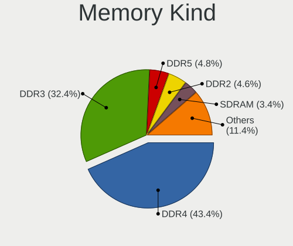

| Kind    | Computers | Percent |
|---------|-----------|---------|
| DDR4    | 4729      | 43.38%  |
| DDR3    | 3531      | 32.39%  |
| DDR5    | 519       | 4.76%   |
| DDR2    | 506       | 4.64%   |
| SDRAM   | 376       | 3.45%   |
| LPDDR4  | 363       | 3.33%   |
| LPDDR5  | 328       | 3.01%   |
| Unknown | 241       | 2.21%   |
| LPDDR3  | 196       | 1.8%    |
| DDR     | 83        | 0.76%   |
| DRAM    | 25        | 0.23%   |
| RAM     | 4         | 0.04%   |
| EEPROM  | 1         | 0.01%   |

Memory Form Factor
------------------

Physical design of the memory module

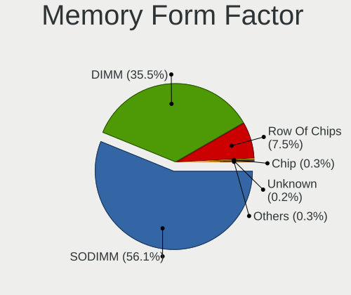

| Name            | Computers | Percent |
|-----------------|-----------|---------|
| SODIMM          | 6054      | 56.14%  |
| DIMM            | 3832      | 35.54%  |
| Row Of Chips    | 810       | 7.51%   |
| Chip            | 35        | 0.32%   |
| Unknown         | 25        | 0.23%   |
| RIMM            | 14        | 0.13%   |
| FB-DIMM         | 9         | 0.08%   |
| Proprietary Car | 4         | 0.04%   |

Memory Size
-----------

Memory module size

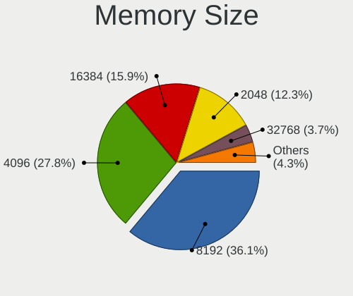

| Size  | Computers | Percent |
|-------|-----------|---------|
| 8192  | 4273      | 36.06%  |
| 4096  | 3298      | 27.83%  |
| 16384 | 1881      | 15.87%  |
| 2048  | 1457      | 12.3%   |
| 32768 | 436       | 3.68%   |
| 1024  | 398       | 3.36%   |
| 512   | 49        | 0.41%   |
| 49152 | 21        | 0.18%   |
| 65536 | 13        | 0.11%   |
| 3072  | 9         | 0.08%   |
| 256   | 5         | 0.04%   |
| 12288 | 3         | 0.03%   |
| 24576 | 2         | 0.02%   |
| 6144  | 2         | 0.02%   |
| 128   | 1         | 0.01%   |
| 1     | 1         | 0.01%   |

Memory Speed
------------

Memory module speed

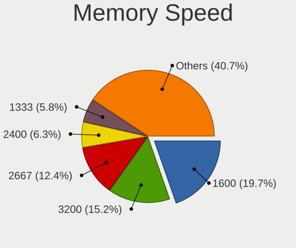

| Speed   | Computers | Percent |
|---------|-----------|---------|
| 1600    | 2324      | 19.66%  |
| 3200    | 1796      | 15.19%  |
| 2667    | 1469      | 12.43%  |
| 2400    | 739       | 6.25%   |
| 1333    | 683       | 5.78%   |
| 2133    | 585       | 4.95%   |
| 3600    | 340       | 2.88%   |
| 667     | 254       | 2.15%   |
| 800     | 249       | 2.11%   |
| 5600    | 235       | 1.99%   |
| 1334    | 233       | 1.97%   |
| 6400    | 216       | 1.83%   |
| 1867    | 209       | 1.77%   |
| 4800    | 178       | 1.51%   |
| Unknown | 166       | 1.4%    |
| 4267    | 134       | 1.13%   |
| 1067    | 124       | 1.05%   |
| 1066    | 121       | 1.02%   |
| 3266    | 117       | 0.99%   |
| 1866    | 93        | 0.79%   |
| 4199    | 83        | 0.7%    |
| 1800    | 83        | 0.7%    |
| 2666    | 81        | 0.69%   |
| 2048    | 80        | 0.68%   |
| 8400    | 76        | 0.64%   |
| 6000    | 71        | 0.6%    |
| 3000    | 71        | 0.6%    |
| 3733    | 67        | 0.57%   |
| 2933    | 64        | 0.54%   |
| 3466    | 59        | 0.5%    |
| 3400    | 59        | 0.5%    |
| 3800    | 55        | 0.47%   |
| 533     | 48        | 0.41%   |
| 7500    | 46        | 0.39%   |
| 2800    | 39        | 0.33%   |
| 8533    | 35        | 0.3%    |
| 4000    | 31        | 0.26%   |
| 4266    | 30        | 0.25%   |
| 975     | 30        | 0.25%   |
| 400     | 30        | 0.25%   |

Printers & scanners
-------------------

Printer Vendor
--------------

Printer device vendors

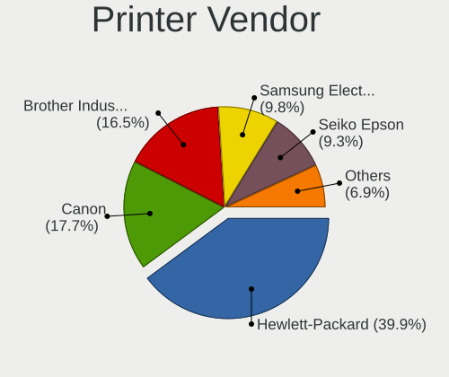

| Vendor                 | Computers | Percent |
|------------------------|-----------|---------|
| Hewlett-Packard        | 167       | 39.86%  |
| Canon                  | 74        | 17.66%  |
| Brother Industries     | 69        | 16.47%  |
| Samsung Electronics    | 41        | 9.79%   |
| Seiko Epson            | 39        | 9.31%   |
| Ricoh                  | 5         | 1.19%   |
| STMicroelectronics     | 3         | 0.72%   |
| QinHeng Electronics    | 3         | 0.72%   |
| Prolific Technology    | 3         | 0.72%   |
| Lexmark International  | 3         | 0.72%   |
| Dymo-CoStar            | 3         | 0.72%   |
| Zebra Technologies     | 1         | 0.24%   |
| Xiaomi                 | 1         | 0.24%   |
| Xerox                  | 1         | 0.24%   |
| Sagem                  | 1         | 0.24%   |
| Pantum                 | 1         | 0.24%   |
| Kyocera                | 1         | 0.24%   |
| Custom Engineering SPA | 1         | 0.24%   |
| BIXOLON                | 1         | 0.24%   |
| Apple                  | 1         | 0.24%   |

Printer Model
-------------

Printer device models

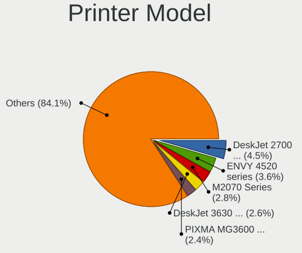

| Model                                                     | Computers | Percent |
|-----------------------------------------------------------|-----------|---------|
| HP DeskJet 2700 series                                    | 19        | 4.5%    |
| HP ENVY 4520 series                                       | 15        | 3.55%   |
| Samsung M2070 Series                                      | 12        | 2.84%   |
| HP DeskJet 3630 series                                    | 11        | 2.61%   |
| Canon PIXMA MG3600 Series                                 | 10        | 2.37%   |
| HP DeskJet 2600 series                                    | 8         | 1.9%    |
| HP ENVY Photo 6200 series                                 | 7         | 1.66%   |
| HP OfficeJet 3830 series                                  | 5         | 1.18%   |
| HP ENVY 5540 series                                       | 5         | 1.18%   |
| HP ENVY 5000 series                                       | 5         | 1.18%   |
| HP DeskJet 3700 series                                    | 5         | 1.18%   |
| Canon LiDE 400                                            | 5         | 1.18%   |
| Brother HL-2030 Laser Printer                             | 5         | 1.18%   |
| Seiko Epson XP-2100 Series                                | 4         | 0.95%   |
| HP LaserJet 1200                                          | 4         | 0.95%   |
| HP ENVY 4500 series                                       | 4         | 0.95%   |
| HP DeskJet Plus 4100 series                               | 4         | 0.95%   |
| HP Deskjet 3050A                                          | 4         | 0.95%   |
| Canon PIXMA MG2500 Series                                 | 4         | 0.95%   |
| Brother MFC-L2710DW series                                | 4         | 0.95%   |
| STMicroelectronics LED badge -- mini LED display -- 11x44 | 3         | 0.71%   |
| Seiko Epson XP-240 Series                                 | 3         | 0.71%   |
| Samsung SCX-3400 Series                                   | 3         | 0.71%   |
| Samsung ML-1660 Series                                    | 3         | 0.71%   |
| Samsung ML-1640 Series Laser Printer                      | 3         | 0.71%   |
| Samsung M2020 Series                                      | 3         | 0.71%   |
| Samsung CLX-3180 Series                                   | 3         | 0.71%   |
| Samsung CLX-3170 Series                                   | 3         | 0.71%   |
| QinHeng CH340S                                            | 3         | 0.71%   |
| Prolific PL2305 Parallel Port                             | 3         | 0.71%   |
| HP Printing Support                                       | 3         | 0.71%   |
| HP OfficeJet Pro 6970                                     | 3         | 0.71%   |
| HP DeskJet F4200 series                                   | 3         | 0.71%   |
| HP DeskJet 2130 series                                    | 3         | 0.71%   |
| HP Deskjet 1510                                           | 3         | 0.71%   |
| Canon PIXMA MP270 All-In-One Printer                      | 3         | 0.71%   |
| Canon MG5700 series                                       | 3         | 0.71%   |
| Canon iP7200 series                                       | 3         | 0.71%   |
| Brother Printer                                           | 3         | 0.71%   |
| Brother HL-L2375DW series                                 | 3         | 0.71%   |

Scanner Vendor
--------------

Scanner device vendors

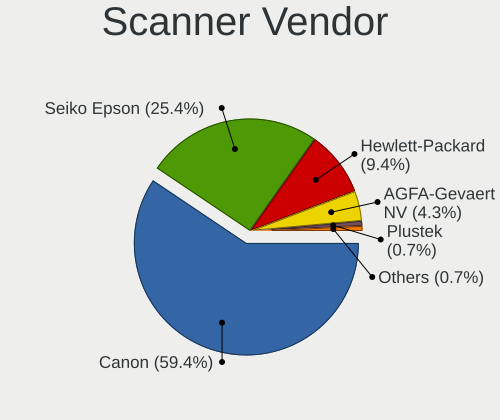

| Vendor          | Computers | Percent |
|-----------------|-----------|---------|
| Canon           | 82        | 59.42%  |
| Seiko Epson     | 35        | 25.36%  |
| Hewlett-Packard | 13        | 9.42%   |
| AGFA-Gevaert NV | 6         | 4.35%   |
| Plustek         | 1         | 0.72%   |
| Mustek Systems  | 1         | 0.72%   |

Scanner Model
-------------

Scanner device models

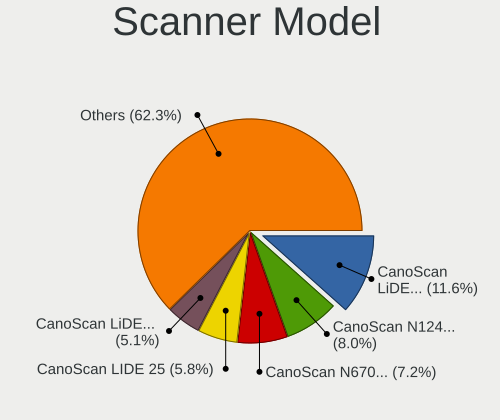

| Model                                                         | Computers | Percent |
|---------------------------------------------------------------|-----------|---------|
| Canon CanoScan LiDE 110                                       | 16        | 11.59%  |
| Canon CanoScan N1240U/LiDE 30                                 | 11        | 7.97%   |
| Canon CanoScan N670U/N676U/LiDE 20                            | 10        | 7.25%   |
| Canon CanoScan LIDE 25                                        | 8         | 5.8%    |
| Canon CanoScan LiDE 220                                       | 7         | 5.07%   |
| Canon CanoScan N650U/N656U                                    | 5         | 3.62%   |
| Seiko Epson GT-X770 [Perfection V500]                         | 4         | 2.9%    |
| Canon CanoScan LiDE 50/LiDE 35/LiDE 40                        | 4         | 2.9%    |
| Canon CanoScan LiDE 200                                       | 4         | 2.9%    |
| AGFA-Gevaert NV SnapScan e20                                  | 4         | 2.9%    |
| Seiko Epson GT-F730 [GT-S630/Perfection V33/V330 Photo]       | 3         | 2.17%   |
| Seiko Epson GT-7700U [Perfection 1240U]                       | 3         | 2.17%   |
| Canon CanoScan LiDE 60                                        | 3         | 2.17%   |
| Canon CanoScan LiDE 210                                       | 3         | 2.17%   |
| Canon CanoScan LiDE 120                                       | 3         | 2.17%   |
| Seiko Epson Perfection V37/V370                               | 2         | 1.45%   |
| Seiko Epson GT-X900 [Perfection V700/V750 Photo]              | 2         | 1.45%   |
| Seiko Epson GT-F720 [GT-S620/Perfection V30/V300 Photo]       | 2         | 1.45%   |
| Seiko Epson GT-F700 [Perfection V350]                         | 2         | 1.45%   |
| Seiko Epson GT-F650 [GT-S600/Perfection V10/V100]             | 2         | 1.45%   |
| Seiko Epson GT-9800F [Perfection 3200]                        | 2         | 1.45%   |
| Seiko Epson GT-6600U [Perfection 610]                         | 2         | 1.45%   |
| HP ScanJet 3570c                                              | 2         | 1.45%   |
| Canon CanoScan 4200F                                          | 2         | 1.45%   |
| Seiko Epson Scanner                                           | 1         | 0.72%   |
| Seiko Epson GT-X750 [Perfection 4490 Photo]                   | 1         | 0.72%   |
| Seiko Epson GT-F600 [Perfection 4180]                         | 1         | 0.72%   |
| Seiko Epson GT-9300UF [Perfection 2400 PHOTO]                 | 1         | 0.72%   |
| Seiko Epson GT-8700/GT-8700F [Perfection 1640SU/1640SU PHOTO] | 1         | 0.72%   |
| Seiko Epson GT-8400UF [Perfection 1670/1670 PHOTO]            | 1         | 0.72%   |
| Seiko Epson GT-8300UF [Perfection 1660 PHOTO]                 | 1         | 0.72%   |
| Seiko Epson GT-8200U/GT-8200UF [Perfection 1650/1650 PHOTO]   | 1         | 0.72%   |
| Seiko Epson GT-7300U [Perfection 1260/1260 PHOTO]             | 1         | 0.72%   |
| Seiko Epson ES-2000 [Expression 1600U]                        | 1         | 0.72%   |
| Seiko Epson CC-570L [Stylus CX3100/CX3200]                    | 1         | 0.72%   |
| Plustek OpticPro U24 Scanner                                  | 1         | 0.72%   |
| Mustek Systems ScanExpress A3 USB                             | 1         | 0.72%   |
| HP ScanJet G4050                                              | 1         | 0.72%   |
| HP ScanJet G4010                                              | 1         | 0.72%   |
| HP ScanJet 82x0C                                              | 1         | 0.72%   |

Camera
------

Camera Vendor
-------------

Camera device vendors

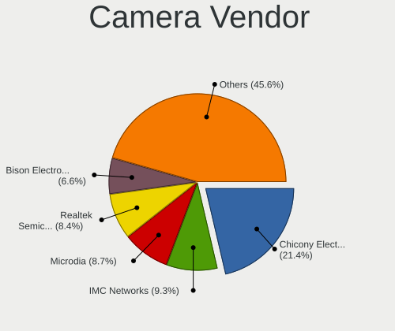

| Vendor                                 | Computers | Percent |
|----------------------------------------|-----------|---------|
| Chicony Electronics                    | 2008      | 21.35%  |
| IMC Networks                           | 879       | 9.35%   |
| Microdia                               | 816       | 8.68%   |
| Realtek Semiconductor                  | 794       | 8.44%   |
| Bison Electronics                      | 619       | 6.58%   |
| Logitech                               | 586       | 6.23%   |
| Sunplus Innovation Technology          | 498       | 5.3%    |
| Quanta                                 | 380       | 4.04%   |
| Cheng Uei Precision Industry (Foxlink) | 335       | 3.56%   |
| Apple                                  | 318       | 3.38%   |
| Suyin                                  | 287       | 3.05%   |
| Lite-On Technology                     | 213       | 2.27%   |
| Luxvisions Innotech Limited            | 202       | 2.15%   |
| Syntek                                 | 195       | 2.07%   |
| Alcor Micro                            | 109       | 1.16%   |
| Sonix Technology                       | 100       | 1.06%   |
| Samsung Electronics                    | 93        | 0.99%   |
| Microsoft                              | 82        | 0.87%   |
| Ricoh                                  | 69        | 0.73%   |
| Silicon Motion                         | 57        | 0.61%   |
| ShineTech                              | 57        | 0.61%   |
| Acer                                   | 45        | 0.48%   |
| Z-Star Microelectronics                | 33        | 0.35%   |
| Guillemot                              | 33        | 0.35%   |
| Primax Electronics                     | 31        | 0.33%   |
| SunplusIT                              | 29        | 0.31%   |
| ARC International                      | 28        | 0.3%    |
| Lenovo                                 | 27        | 0.29%   |
| Generalplus Technology                 | 26        | 0.28%   |
| Importek                               | 23        | 0.24%   |
| DigiTech                               | 21        | 0.22%   |
| ALi                                    | 20        | 0.21%   |
| icSpring                               | 19        | 0.2%    |
| GEMBIRD                                | 19        | 0.2%    |
| Creative Technology                    | 19        | 0.2%    |
| Y Media                                | 13        | 0.14%   |
| Razer USA                              | 11        | 0.12%   |
| KYE Systems (Mouse Systems)            | 11        | 0.12%   |
| kingcome                               | 11        | 0.12%   |
| Hewlett-Packard                        | 11        | 0.12%   |

Camera Model
------------

Camera device models

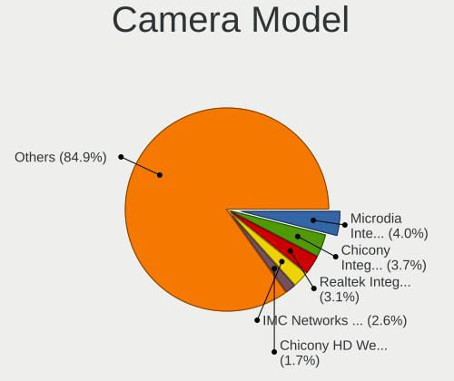

| Model                                    | Computers | Percent |
|------------------------------------------|-----------|---------|
| Microdia Integrated_Webcam_HD            | 374       | 3.95%   |
| Chicony Integrated Camera                | 348       | 3.68%   |
| Realtek Integrated_Webcam_HD             | 297       | 3.14%   |
| IMC Networks USB2.0 HD UVC WebCam        | 248       | 2.62%   |
| Chicony HD WebCam                        | 162       | 1.71%   |
| IMC Networks Integrated Camera           | 161       | 1.7%    |
| Bison Integrated Camera                  | 142       | 1.5%    |
| Logitech Webcam C270                     | 130       | 1.37%   |
| IMC Networks USB2.0 VGA UVC WebCam       | 126       | 1.33%   |
| Syntek Integrated Camera                 | 123       | 1.3%    |
| Sunplus Integrated_Webcam_HD             | 120       | 1.27%   |
| Chicony HP HD Camera                     | 104       | 1.1%    |
| Bison HD Webcam                          | 99        | 1.05%   |
| Apple iPhone 5/5C/5S/6/SE/7/8/X          | 95        | 1%      |
| Realtek USB Camera                       | 94        | 0.99%   |
| Samsung Galaxy series, misc. (MTP mode)  | 92        | 0.97%   |
| Apple Built-in iSight                    | 90        | 0.95%   |
| Microdia Integrated Webcam               | 77        | 0.81%   |
| Chicony Chicony USB2.0 Camera            | 75        | 0.79%   |
| Chicony USB2.0 VGA UVC WebCam            | 73        | 0.77%   |
| Chicony HP Truevision HD                 | 71        | 0.75%   |
| Apple FaceTime HD Camera (Built-in)      | 71        | 0.75%   |
| Chicony USB2.0 HD UVC WebCam             | 69        | 0.73%   |
| Chicony TOSHIBA Web Camera - HD          | 67        | 0.71%   |
| Logitech HD Pro Webcam C920              | 66        | 0.7%    |
| Chicony HP TrueVision HD Camera          | 66        | 0.7%    |
| Lite-On Integrated Camera                | 64        | 0.68%   |
| Bison BisonCam,NB Pro                    | 63        | 0.67%   |
| Quanta HP HD Camera                      | 60        | 0.63%   |
| Chicony USB 2.0 Camera                   | 60        | 0.63%   |
| Sunplus Asus Webcam                      | 56        | 0.59%   |
| Sonix USB2.0 HD UVC WebCam               | 55        | 0.58%   |
| Suyin Acer/HP Integrated Webcam [CN0314] | 54        | 0.57%   |
| Apple FaceTime HD Camera                 | 53        | 0.56%   |
| Chicony HP HD Webcam                     | 52        | 0.55%   |
| Quanta HD User Facing                    | 50        | 0.53%   |
| Lite-On HP HD Camera                     | 50        | 0.53%   |
| Alcor Micro USB 2.0 Camera               | 50        | 0.53%   |
| Luxvisions Innotech Limited HP HD Camera | 48        | 0.51%   |
| Bison BisonCam, NB Pro                   | 47        | 0.5%    |

Security
--------

Fingerprint Vendor
------------------

Fingerprint sensor vendors

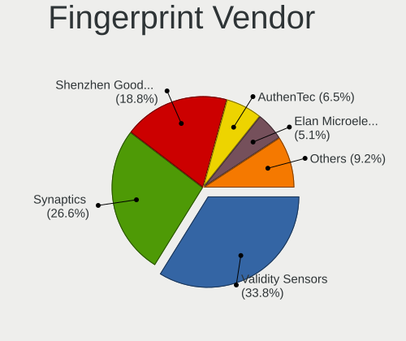

| Vendor                             | Computers | Percent |
|------------------------------------|-----------|---------|
| Validity Sensors                   | 474       | 33.83%  |
| Synaptics                          | 372       | 26.55%  |
| Shenzhen Goodix Technology         | 264       | 18.84%  |
| AuthenTec                          | 91        | 6.5%    |
| Elan Microelectronics              | 71        | 5.07%   |
| LighTuning Technology              | 67        | 4.78%   |
| Upek                               | 43        | 3.07%   |
| STMicroelectronics                 | 11        | 0.79%   |
| Realtek USB2.0 Finger Print Bridge | 3         | 0.21%   |
| Focal-systems.Corp                 | 3         | 0.21%   |
| HOLTEK                             | 1         | 0.07%   |
| DigitalPersona                     | 1         | 0.07%   |

Fingerprint Model
-----------------

Fingerprint sensor models

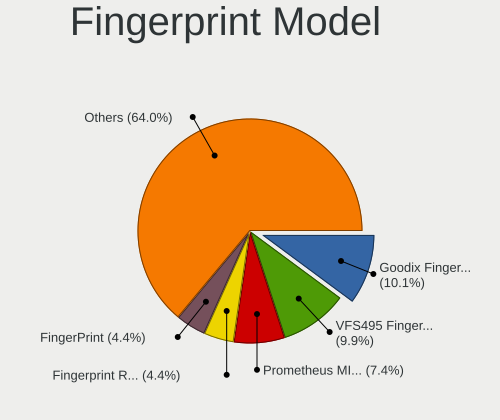

| Model                                                                      | Computers | Percent |
|----------------------------------------------------------------------------|-----------|---------|
| Shenzhen Goodix  Fingerprint Device                                        | 142       | 10.14%  |
| Validity Sensors VFS495 Fingerprint Reader                                 | 138       | 9.85%   |
| Synaptics Prometheus MIS Touch Fingerprint Reader                          | 103       | 7.35%   |
| Shenzhen Goodix Fingerprint Reader                                         | 61        | 4.35%   |
| Shenzhen Goodix FingerPrint                                                | 61        | 4.35%   |
| LighTuning EgisTec Touch Fingerprint Sensor                                | 55        | 3.93%   |
| Elan ELAN:Fingerprint                                                      | 47        | 3.35%   |
| Synaptics Metallica MIS Touch Fingerprint Reader                           | 46        | 3.28%   |
| Synaptics FS7604 Touch Fingerprint Sensor with PurePrint                   | 43        | 3.07%   |
| Validity Sensors VFS 5011 fingerprint sensor                               | 42        | 3%      |
| Upek Biometric Touchchip/Touchstrip Fingerprint Sensor                     | 38        | 2.71%   |
| AuthenTec AES2810                                                          | 32        | 2.28%   |
| Validity Sensors Synaptics WBDI                                            | 31        | 2.21%   |
| Validity Sensors VFS491                                                    | 30        | 2.14%   |
| Validity Sensors VFS471 Fingerprint Reader                                 | 29        | 2.07%   |
| Validity Sensors Fingerprint scanner                                       | 29        | 2.07%   |
| Validity Sensors VFS5011 Fingerprint Reader                                | 28        | 2%      |
| Validity Sensors VFS7500 Touch Fingerprint Sensor                          | 26        | 1.86%   |
| Synaptics Prometheus Fingerprint Reader                                    | 25        | 1.78%   |
| Synaptics Fingerprint reader [HP G6]                                       | 23        | 1.64%   |
| Validity Sensors VFS301 Fingerprint Reader                                 | 22        | 1.57%   |
| Validity Sensors Synaptics VFS7552 Touch Fingerprint Sensor with PurePrint | 22        | 1.57%   |
| Synaptics WBDI Fingerprint Reader USB 086                                  | 22        | 1.57%   |
| Validity Sensors Swipe Fingerprint Sensor                                  | 21        | 1.5%    |
| Elan ELAN:ARM-M4                                                           | 21        | 1.5%    |
| Validity Sensors VFS451 Fingerprint Reader                                 | 20        | 1.43%   |
| Synaptics UWP WBDI Device                                                  | 19        | 1.36%   |
| AuthenTec Fingerprint Sensor                                               | 19        | 1.36%   |
| AuthenTec AES1600                                                          | 19        | 1.36%   |
| Synaptics UWP WBDI                                                         | 17        | 1.21%   |
| Synaptics  WBDI                                                            | 17        | 1.21%   |
| Synaptics  FS7604 Touch Fingerprint Sensor with PurePrint                  | 16        | 1.14%   |
| Validity Sensors VFS Fingerprint sensor                                    | 14        | 1%      |
| AuthenTec AES2501 Fingerprint Sensor                                       | 13        | 0.93%   |
| Unknown                                                                    | 12        | 0.86%   |
| STMicroelectronics Fingerprint Reader                                      | 11        | 0.79%   |
| Validity Sensors VFS101 Fingerprint Reader                                 | 8         | 0.57%   |
| Validity Sensors VFS300 Fingerprint Reader                                 | 7         | 0.5%    |
| Synaptics WBDI                                                             | 7         | 0.5%    |
| Synaptics Metallica MOH Touch Fingerprint Reader                           | 7         | 0.5%    |

Chipcard Vendor
---------------

Chipcard module vendors

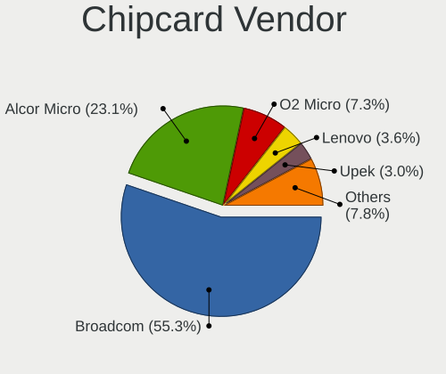

| Vendor                            | Computers | Percent |
|-----------------------------------|-----------|---------|
| Broadcom                          | 426       | 55.25%  |
| Alcor Micro                       | 178       | 23.09%  |
| O2 Micro                          | 56        | 7.26%   |
| Lenovo                            | 28        | 3.63%   |
| Upek                              | 23        | 2.98%   |
| Hewlett-Packard                   | 9         | 1.17%   |
| Gemalto (was Gemplus)             | 9         | 1.17%   |
| Yubico.com                        | 7         | 0.91%   |
| Aladdin Knowledge Systems         | 6         | 0.78%   |
| Advanced Card Systems             | 6         | 0.78%   |
| Chicony Electronics               | 4         | 0.52%   |
| Clay Logic                        | 3         | 0.39%   |
| SCM Microsystems                  | 2         | 0.26%   |
| Realtek Semiconductor             | 2         | 0.26%   |
| OmniKey                           | 2         | 0.26%   |
| Feitian Technologies              | 2         | 0.26%   |
| CHERRY                            | 2         | 0.26%   |
| Bit4id                            | 2         | 0.26%   |
| VASCO Data Security International | 1         | 0.13%   |
| ST-Ericsson                       | 1         | 0.13%   |
| SpringCard                        | 1         | 0.13%   |
| Jing-Mold Enterprise              | 1         | 0.13%   |

Chipcard Model
--------------

Chipcard module models

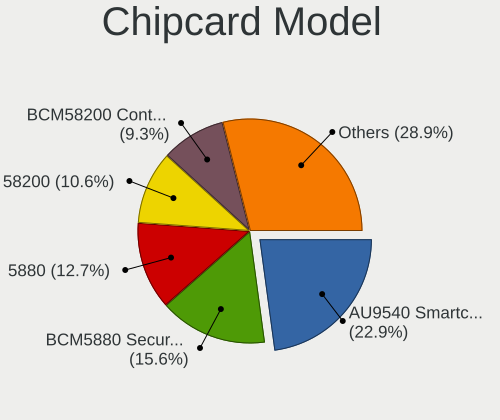

| Model                                                                        | Computers | Percent |
|------------------------------------------------------------------------------|-----------|---------|
| Alcor Micro AU9540 Smartcard Reader                                          | 177       | 22.87%  |
| Broadcom BCM5880 Secure Applications Processor                               | 121       | 15.63%  |
| Broadcom 5880                                                                | 98        | 12.66%  |
| Broadcom 58200                                                               | 82        | 10.59%  |
| Broadcom BCM58200 ControlVault 3 (FingerPrint sensor + Contacted SmartCard)  | 72        | 9.3%    |
| Broadcom BCM5880 Secure Applications Processor with fingerprint swipe sensor | 54        | 6.98%   |
| O2 Micro OZ776 CCID Smartcard Reader                                         | 52        | 6.72%   |
| Lenovo Integrated Smart Card Reader                                          | 26        | 3.36%   |
| Upek TouchChip Fingerprint Coprocessor (WBF advanced mode)                   | 23        | 2.97%   |
| Hewlett-Packard SC Keyboard - Apollo (Liteon)                                | 9         | 1.16%   |
| Yubico.com Yubikey 4/5 U2F+CCID                                              | 7         | 0.9%    |
| Gemalto (was Gemplus) GemPC Twin SmartCard Reader                            | 6         | 0.78%   |
| Aladdin Knowledge Systems Token JC                                           | 6         | 0.78%   |
| Advanced Card Systems ACR122U                                                | 5         | 0.65%   |
| O2 Micro Oz776 SmartCard Reader                                              | 4         | 0.52%   |
| Chicony Electronics HP Skylab USB Smartcard Keyboard                         | 4         | 0.52%   |
| Realtek Semiconductor Smart Card Reader Interface                            | 2         | 0.26%   |
| Lenovo Smartcard Keyboard                                                    | 2         | 0.26%   |
| Gemalto (was Gemplus) GemPC Key SmartCard Reader                             | 2         | 0.26%   |
| Clay Logic Nitrokey Pro                                                      | 2         | 0.26%   |
| Bit4id miniLector EVO                                                        | 2         | 0.26%   |
| Yubico.com Yubikey 4/5 CCID                                                  | 1         | 0.13%   |
| VASCO Data Security International Digipass 905 SmartCard Reader              | 1         | 0.13%   |
| ST-Ericsson Chipcard Reader                                                  | 1         | 0.13%   |
| SpringCard Two                                                               | 1         | 0.13%   |
| SCM Microsystems SCR335 SmartCard Reader                                     | 1         | 0.13%   |
| SCM Microsystems CLOUD 2700 F Smart Card Reader                              | 1         | 0.13%   |
| OmniKey CardMan 3021 / 3121                                                  | 1         | 0.13%   |
| OmniKey 3x21 Smart Card Reader                                               | 1         | 0.13%   |
| Jing-Mold Enterprise HP USB Business Slim Smartcard CCID Keyboard            | 1         | 0.13%   |
| Gemalto (was Gemplus) Compact Smart Card Reader Writer                       | 1         | 0.13%   |
| Feitian Technologies FT SCR310                                               | 1         | 0.13%   |
| Feitian Technologies FIDO CCID KB                                            | 1         | 0.13%   |
| Clay Logic Nitrokey Start                                                    | 1         | 0.13%   |
| CHERRY Smart Card Reader USB                                                 | 1         | 0.13%   |
| Cherry SECURE BOARD 1.0                                                      | 1         | 0.13%   |
| Broadcom BCM5880 Secure Applications Processor with fingerprint touch sensor | 1         | 0.13%   |
| Alcor Micro Watchdata W 1981                                                 | 1         | 0.13%   |
| Advanced Card Systems ACR1252 Dual Reader                                    | 1         | 0.13%   |

Unsupported
-----------

Unsupported Devices
-------------------

Total unsupported devices on board

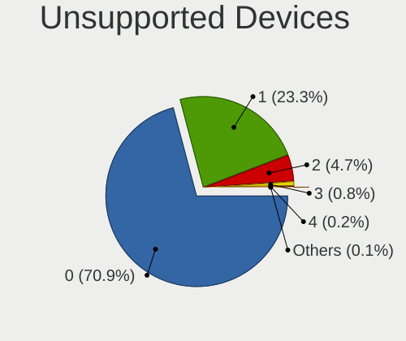

| Total | Computers | Percent |
|-------|-----------|---------|
| 0     | 11628     | 70.89%  |
| 1     | 3821      | 23.29%  |
| 2     | 771       | 4.7%    |
| 3     | 134       | 0.82%   |
| 4     | 29        | 0.18%   |
| 5     | 8         | 0.05%   |
| 6     | 5         | 0.03%   |
| 7     | 4         | 0.02%   |
| 9     | 2         | 0.01%   |
| 8     | 1         | 0.01%   |

Unsupported Device Types
------------------------

Types of unsupported devices

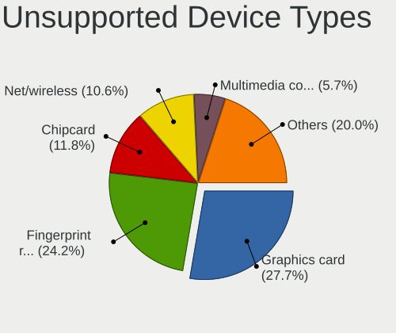

| Type                     | Computers | Percent |
|--------------------------|-----------|---------|
| Graphics card            | 1581      | 27.69%  |
| Fingerprint reader       | 1381      | 24.19%  |
| Chipcard                 | 673       | 11.79%  |
| Net/wireless             | 604       | 10.58%  |
| Multimedia controller    | 328       | 5.75%   |
| Communication controller | 221       | 3.87%   |
| Camera                   | 190       | 3.33%   |
| Bluetooth                | 145       | 2.54%   |
| Unassigned class         | 128       | 2.24%   |
| Sound                    | 89        | 1.56%   |
| Storage                  | 85        | 1.49%   |
| Card reader              | 83        | 1.45%   |
| Net/ethernet             | 70        | 1.23%   |
| Modem                    | 36        | 0.63%   |
| Network                  | 34        | 0.6%    |
| Storage/raid             | 17        | 0.3%    |
| Dvb card                 | 10        | 0.18%   |
| Storage/ide              | 9         | 0.16%   |
| Firewire controller      | 8         | 0.14%   |
| Flash memory             | 5         | 0.09%   |
| Wireless                 | 3         | 0.05%   |
| Tv card                  | 3         | 0.05%   |
| Storage/ata              | 3         | 0.05%   |
| Unclassified device      | 2         | 0.04%   |
| Storage/nvme             | 1         | 0.02%   |

