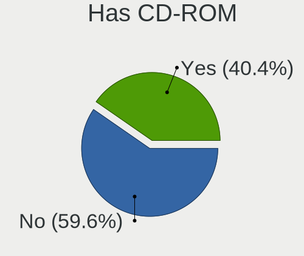
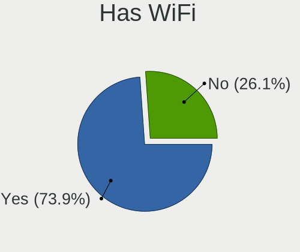
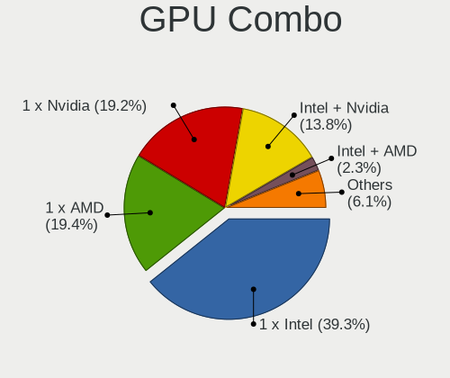
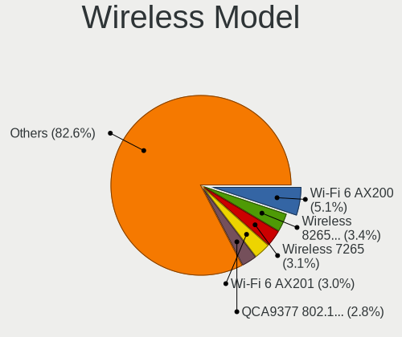

Linux in France - Tested Hardware & Statistics
----------------------------------------------

A project to collect tested hardware configurations for Linux in France.

Anyone can contribute to this report by the [hw-probe](https://github.com/linuxhw/hw-probe) tool:

    sudo -E hw-probe -all -upload

Please contribute! Especially if your hardware is rare.

This is a report for all computer types. See also reports for [desktops](/Location/France/Desktop/README.md) and [notebooks](/Location/France/Notebook/README.md).

Contents
--------

* [ Test Cases ](#test-cases)

* [ System ](#system)
  - [ OS                       ](#os)
  - [ OS Family                ](#os-family)
  - [ Kernel                   ](#kernel)
  - [ Kernel Family            ](#kernel-family)
  - [ Kernel Major Ver.        ](#kernel-major-ver)
  - [ Arch                     ](#arch)
  - [ DE                       ](#de)
  - [ Display Server           ](#display-server)
  - [ Display Manager          ](#display-manager)
  - [ OS Lang                  ](#os-lang)
  - [ Boot Mode                ](#boot-mode)
  - [ Filesystem               ](#filesystem)
  - [ Part. scheme             ](#part-scheme)
  - [ Dual Boot with Linux/BSD ](#dual-boot-with-linuxbsd)
  - [ Dual Boot (Win)          ](#dual-boot-win)

* [ Board ](#board)
  - [ Vendor                   ](#vendor)
  - [ Model                    ](#model)
  - [ Model Family             ](#model-family)
  - [ MFG Year                 ](#mfg-year)
  - [ Form Factor              ](#form-factor)
  - [ Secure Boot              ](#secure-boot)
  - [ Coreboot                 ](#coreboot)
  - [ RAM Size                 ](#ram-size)
  - [ RAM Used                 ](#ram-used)
  - [ Total Drives             ](#total-drives)
  - [ Has CD-ROM               ](#has-cd-rom)
  - [ Has Ethernet             ](#has-ethernet)
  - [ Has WiFi                 ](#has-wifi)
  - [ Has Bluetooth            ](#has-bluetooth)

* [ Location ](#location)
  - [ Country                  ](#country)
  - [ City                     ](#city)

* [ Drives ](#drives)
  - [ Drive Vendor             ](#drive-vendor)
  - [ Drive Model              ](#drive-model)
  - [ HDD Vendor               ](#hdd-vendor)
  - [ SSD Vendor               ](#ssd-vendor)
  - [ Drive Kind               ](#drive-kind)
  - [ Drive Connector          ](#drive-connector)
  - [ Drive Size               ](#drive-size)
  - [ Space Total              ](#space-total)
  - [ Space Used               ](#space-used)
  - [ Malfunc. Drives          ](#malfunc-drives)
  - [ Malfunc. Drive Vendor    ](#malfunc-drive-vendor)
  - [ Malfunc. HDD Vendor      ](#malfunc-hdd-vendor)
  - [ Malfunc. Drive Kind      ](#malfunc-drive-kind)
  - [ Failed Drives            ](#failed-drives)
  - [ Failed Drive Vendor      ](#failed-drive-vendor)
  - [ Drive Status             ](#drive-status)

* [ Storage controller ](#storage-controller)
  - [ Storage Vendor           ](#storage-vendor)
  - [ Storage Model            ](#storage-model)
  - [ Storage Kind             ](#storage-kind)

* [ Processor ](#processor)
  - [ CPU Vendor               ](#cpu-vendor)
  - [ CPU Model                ](#cpu-model)
  - [ CPU Model Family         ](#cpu-model-family)
  - [ CPU Cores                ](#cpu-cores)
  - [ CPU Sockets              ](#cpu-sockets)
  - [ CPU Threads              ](#cpu-threads)
  - [ CPU Op-Modes             ](#cpu-op-modes)
  - [ CPU Microcode            ](#cpu-microcode)
  - [ CPU Microarch            ](#cpu-microarch)

* [ Graphics ](#graphics)
  - [ GPU Vendor               ](#gpu-vendor)
  - [ GPU Model                ](#gpu-model)
  - [ GPU Combo                ](#gpu-combo)
  - [ GPU Driver               ](#gpu-driver)
  - [ GPU Memory               ](#gpu-memory)

* [ Monitor ](#monitor)
  - [ Monitor Vendor           ](#monitor-vendor)
  - [ Monitor Model            ](#monitor-model)
  - [ Monitor Resolution       ](#monitor-resolution)
  - [ Monitor Diagonal         ](#monitor-diagonal)
  - [ Monitor Width            ](#monitor-width)
  - [ Aspect Ratio             ](#aspect-ratio)
  - [ Monitor Area             ](#monitor-area)
  - [ Pixel Density            ](#pixel-density)
  - [ Multiple Monitors        ](#multiple-monitors)

* [ Network ](#network)
  - [ Net Controller Vendor    ](#net-controller-vendor)
  - [ Net Controller Model     ](#net-controller-model)
  - [ Wireless Vendor          ](#wireless-vendor)
  - [ Wireless Model           ](#wireless-model)
  - [ Ethernet Vendor          ](#ethernet-vendor)
  - [ Ethernet Model           ](#ethernet-model)
  - [ Net Controller Kind      ](#net-controller-kind)
  - [ Used Controller          ](#used-controller)
  - [ NICs                     ](#nics)
  - [ IPv6                     ](#ipv6)

* [ Bluetooth ](#bluetooth)
  - [ Bluetooth Vendor         ](#bluetooth-vendor)
  - [ Bluetooth Model          ](#bluetooth-model)

* [ Sound ](#sound)
  - [ Sound Vendor             ](#sound-vendor)
  - [ Sound Model              ](#sound-model)

* [ Memory ](#memory)
  - [ Memory Vendor            ](#memory-vendor)
  - [ Memory Model             ](#memory-model)
  - [ Memory Kind              ](#memory-kind)
  - [ Memory Form Factor       ](#memory-form-factor)
  - [ Memory Size              ](#memory-size)
  - [ Memory Speed             ](#memory-speed)

* [ Printers & scanners ](#printers--scanners)
  - [ Printer Vendor           ](#printer-vendor)
  - [ Printer Model            ](#printer-model)
  - [ Scanner Vendor           ](#scanner-vendor)
  - [ Scanner Model            ](#scanner-model)

* [ Camera ](#camera)
  - [ Camera Vendor            ](#camera-vendor)
  - [ Camera Model             ](#camera-model)

* [ Security ](#security)
  - [ Fingerprint Vendor       ](#fingerprint-vendor)
  - [ Fingerprint Model        ](#fingerprint-model)
  - [ Chipcard Vendor          ](#chipcard-vendor)
  - [ Chipcard Model           ](#chipcard-model)

* [ Unsupported ](#unsupported)
  - [ Unsupported Devices      ](#unsupported-devices)
  - [ Unsupported Device Types ](#unsupported-device-types)

Test Cases
----------

Total: 11578

| Vendor        | Model                       | Form-Factor | Probe                                                      | Date         |
|---------------|-----------------------------|-------------|------------------------------------------------------------|--------------|
| Gigabyte      | GA-MA770T-UD3               | Desktop     | [4644d239d7](https://linux-hardware.org/?probe=4644d239d7) | Feb 01, 2023 |
| Lenovo        | ThinkPad T400 6473PMG       | Notebook    | [07cba1c44b](https://linux-hardware.org/?probe=07cba1c44b) | Feb 01, 2023 |
| MSI           | A520M-A PRO                 | Desktop     | [f7a88d0dea](https://linux-hardware.org/?probe=f7a88d0dea) | Feb 01, 2023 |
| ASUSTek       | S551LN                      | Notebook    | [b7361dbc53](https://linux-hardware.org/?probe=b7361dbc53) | Feb 01, 2023 |
| ASRock        | X570 Pro4                   | Desktop     | [81b19ff917](https://linux-hardware.org/?probe=81b19ff917) | Feb 01, 2023 |
| Dell          | Inspiron 7501               | Notebook    | [426493e8a5](https://linux-hardware.org/?probe=426493e8a5) | Feb 01, 2023 |
| Lenovo        | 3181 NO DPK                 | Mini pc     | [d4c01d094b](https://linux-hardware.org/?probe=d4c01d094b) | Feb 01, 2023 |
| Dell          | 02P9X9 A04                  | Server      | [bda0eb6835](https://linux-hardware.org/?probe=bda0eb6835) | Feb 01, 2023 |
| HP            | Notebook                    | Notebook    | [3cea0a0519](https://linux-hardware.org/?probe=3cea0a0519) | Jan 31, 2023 |
| Dell          | G3 3500                     | Notebook    | [4b519ab8a8](https://linux-hardware.org/?probe=4b519ab8a8) | Jan 31, 2023 |
| Acer          | Aspire E5-575G              | Notebook    | [463b7f859f](https://linux-hardware.org/?probe=463b7f859f) | Jan 31, 2023 |
| Dell          | Inspiron 7400               | Notebook    | [a6b124fd34](https://linux-hardware.org/?probe=a6b124fd34) | Jan 31, 2023 |
| Dell          | 0XHGV1 A00                  | Desktop     | [05a6fd1857](https://linux-hardware.org/?probe=05a6fd1857) | Jan 31, 2023 |
| HP            | Notebook                    | Notebook    | [82d58b21c4](https://linux-hardware.org/?probe=82d58b21c4) | Jan 31, 2023 |
| ASUSTek       | Z97-PRO GAMER               | Desktop     | [9ce51b923e](https://linux-hardware.org/?probe=9ce51b923e) | Jan 31, 2023 |
| Dell          | Latitude 7410               | Notebook    | [fd07971a70](https://linux-hardware.org/?probe=fd07971a70) | Jan 31, 2023 |
| TUXEDO        | InfinityBook Pro Gen7 (M... | Notebook    | [4a2fcb6bd0](https://linux-hardware.org/?probe=4a2fcb6bd0) | Jan 31, 2023 |
| Lenovo        | 36C8 SDK0J40700 WIN 3258... | Desktop     | [01c7dbecde](https://linux-hardware.org/?probe=01c7dbecde) | Jan 31, 2023 |
| Intel         | NUC7i3DNB J57625-508        | Mini pc     | [0b0b0a2686](https://linux-hardware.org/?probe=0b0b0a2686) | Jan 31, 2023 |
| ASRock        | X570 Pro4                   | Desktop     | [37999411ed](https://linux-hardware.org/?probe=37999411ed) | Jan 31, 2023 |
| ASUSTek       | CROSSHAIR V FORMULA-Z       | Desktop     | [32dfb5ebe2](https://linux-hardware.org/?probe=32dfb5ebe2) | Jan 31, 2023 |
| HUAWEI        | WRTB-WXX9                   | Notebook    | [60967eaaaf](https://linux-hardware.org/?probe=60967eaaaf) | Jan 31, 2023 |
| Lenovo        | ThinkPad T500 2055AZ1       | Notebook    | [1086813401](https://linux-hardware.org/?probe=1086813401) | Jan 30, 2023 |
| Lenovo        | ThinkPad T500 2055AZ1       | Notebook    | [0b43f40c2a](https://linux-hardware.org/?probe=0b43f40c2a) | Jan 30, 2023 |
| Acer          | Aspire E5-575G              | Notebook    | [532f5a8dbe](https://linux-hardware.org/?probe=532f5a8dbe) | Jan 30, 2023 |
| Dell          | 0TP412                      | Desktop     | [5db177340d](https://linux-hardware.org/?probe=5db177340d) | Jan 30, 2023 |
| MSI           | 970 GAMING                  | Desktop     | [7bc39da7c1](https://linux-hardware.org/?probe=7bc39da7c1) | Jan 30, 2023 |
| Acer          | Aspire M5-581TG             | Notebook    | [970a402846](https://linux-hardware.org/?probe=970a402846) | Jan 30, 2023 |
| Acer          | Aspire M5-581TG             | Notebook    | [c2d425d254](https://linux-hardware.org/?probe=c2d425d254) | Jan 30, 2023 |
| Lenovo        | 36C8 SDK0J40700 WIN 3258... | Desktop     | [529b411b46](https://linux-hardware.org/?probe=529b411b46) | Jan 30, 2023 |
| ASUSTek       | E3 PRO GAMING V5            | Desktop     | [b7917146d8](https://linux-hardware.org/?probe=b7917146d8) | Jan 30, 2023 |
| ASUSTek       | ROG STRIX Z390-E GAMING     | Desktop     | [7983249b4c](https://linux-hardware.org/?probe=7983249b4c) | Jan 30, 2023 |
| ASUSTek       | VivoBook_ASUSLaptop X515... | Notebook    | [1ecef01472](https://linux-hardware.org/?probe=1ecef01472) | Jan 30, 2023 |
| HP            | EliteBook 850 G8 Noteboo... | Notebook    | [a5d6a22838](https://linux-hardware.org/?probe=a5d6a22838) | Jan 30, 2023 |
| Dell          | Latitude 7390               | Notebook    | [b154892be4](https://linux-hardware.org/?probe=b154892be4) | Jan 30, 2023 |
| HP            | ENVY Laptop 13-ah1xxx       | Notebook    | [360756b46a](https://linux-hardware.org/?probe=360756b46a) | Jan 30, 2023 |
| HP            | 0A64h                       | Desktop     | [da7b36ad47](https://linux-hardware.org/?probe=da7b36ad47) | Jan 30, 2023 |
| ASUSTek       | ROG STRIX B550-F GAMING     | Desktop     | [4fb612b680](https://linux-hardware.org/?probe=4fb612b680) | Jan 29, 2023 |
| MSI           | MPG B550I GAMING EDGE MA... | Desktop     | [ff186606cd](https://linux-hardware.org/?probe=ff186606cd) | Jan 29, 2023 |
| Intel         | NUC6CAYB J23203-410         | Mini pc     | [d4f05f2d34](https://linux-hardware.org/?probe=d4f05f2d34) | Jan 29, 2023 |
| HUAWEI        | MACHD-WXX9                  | Notebook    | [cac5b8faa5](https://linux-hardware.org/?probe=cac5b8faa5) | Jan 29, 2023 |
| HP            | ZBook 14 G2                 | Notebook    | [4b1e1bc7e1](https://linux-hardware.org/?probe=4b1e1bc7e1) | Jan 29, 2023 |
| Lenovo        | ThinkPad X1 Carbon Gen 8... | Notebook    | [47246aa8b5](https://linux-hardware.org/?probe=47246aa8b5) | Jan 29, 2023 |
| MSI           | CR700                       | Notebook    | [35d1ff1eac](https://linux-hardware.org/?probe=35d1ff1eac) | Jan 29, 2023 |
| Intel         | Unknown                     | Notebook    | [f387a4b732](https://linux-hardware.org/?probe=f387a4b732) | Jan 29, 2023 |
| Intel         | Unknown                     | Notebook    | [79aa357327](https://linux-hardware.org/?probe=79aa357327) | Jan 29, 2023 |
| HP            | ProBook 650 G1              | Notebook    | [830394a75e](https://linux-hardware.org/?probe=830394a75e) | Jan 29, 2023 |
| ASUSTek       | ASUS TUF Gaming F15 FX50... | Notebook    | [90644628b4](https://linux-hardware.org/?probe=90644628b4) | Jan 29, 2023 |
| Gigabyte      | Z170XP-SLI-CF               | Desktop     | [b9a38b7494](https://linux-hardware.org/?probe=b9a38b7494) | Jan 29, 2023 |
| Dell          | 0F8098                      | Desktop     | [d6066c739e](https://linux-hardware.org/?probe=d6066c739e) | Jan 28, 2023 |
| ASUSTek       | Z97-K                       | Desktop     | [e3f865cd20](https://linux-hardware.org/?probe=e3f865cd20) | Jan 28, 2023 |
| ASUSTek       | X550LB                      | Notebook    | [9590dd2f30](https://linux-hardware.org/?probe=9590dd2f30) | Jan 28, 2023 |
| Dell          | Latitude 7280               | Notebook    | [358f4c431f](https://linux-hardware.org/?probe=358f4c431f) | Jan 28, 2023 |
| Dell          | Latitude 7280               | Notebook    | [903e0489c4](https://linux-hardware.org/?probe=903e0489c4) | Jan 28, 2023 |
| ASUSTek       | Pro WS X570-ACE             | Desktop     | [6e55ab69b8](https://linux-hardware.org/?probe=6e55ab69b8) | Jan 28, 2023 |
| Lenovo        | NO DPK                      | Desktop     | [0abc762f30](https://linux-hardware.org/?probe=0abc762f30) | Jan 28, 2023 |
| Gigabyte      | B660M GAMING DDR4           | Desktop     | [c7fc79b5f1](https://linux-hardware.org/?probe=c7fc79b5f1) | Jan 28, 2023 |
| Lenovo        | ThinkPad T430u 3353A11      | Notebook    | [c93d5da3f1](https://linux-hardware.org/?probe=c93d5da3f1) | Jan 28, 2023 |
| ASUSTek       | UX410UAR                    | Notebook    | [e9ac16c8ef](https://linux-hardware.org/?probe=e9ac16c8ef) | Jan 28, 2023 |
| MSI           | H410M PRO                   | Desktop     | [d8c1dc4e25](https://linux-hardware.org/?probe=d8c1dc4e25) | Jan 28, 2023 |
| Dell          | Inspiron 7706 2n1           | Convertible | [4e17616aaf](https://linux-hardware.org/?probe=4e17616aaf) | Jan 28, 2023 |
| MSI           | H410M PRO                   | Desktop     | [72f5a735fb](https://linux-hardware.org/?probe=72f5a735fb) | Jan 28, 2023 |
| Lenovo        | IdeaPad 3 17ABA7 82RQ       | Notebook    | [57e0449f0f](https://linux-hardware.org/?probe=57e0449f0f) | Jan 28, 2023 |
| Valve         | Jupiter                     | Notebook    | [be17d6fd70](https://linux-hardware.org/?probe=be17d6fd70) | Jan 27, 2023 |
| Medion        | H61H2-LM3                   | Desktop     | [e9d671848c](https://linux-hardware.org/?probe=e9d671848c) | Jan 27, 2023 |
| TUXEDO        | InfinityBook S 15 Gen6      | Notebook    | [f5ebfcecc5](https://linux-hardware.org/?probe=f5ebfcecc5) | Jan 27, 2023 |
| HP            | Laptop 17-cp0xxx            | Notebook    | [e87b8175b1](https://linux-hardware.org/?probe=e87b8175b1) | Jan 27, 2023 |
| Lenovo        | IdeaPad Gaming 3 15ACH6 ... | Notebook    | [56cb1ce2a6](https://linux-hardware.org/?probe=56cb1ce2a6) | Jan 27, 2023 |
| ASUSTek       | K73E                        | Notebook    | [66e0036452](https://linux-hardware.org/?probe=66e0036452) | Jan 27, 2023 |
| ASUSTek       | K73E                        | Notebook    | [91f049a01d](https://linux-hardware.org/?probe=91f049a01d) | Jan 27, 2023 |
| Dell          | Latitude E6420              | Notebook    | [a772965137](https://linux-hardware.org/?probe=a772965137) | Jan 27, 2023 |
| Acer          | Aspire X1700                | Desktop     | [beab94f1ee](https://linux-hardware.org/?probe=beab94f1ee) | Jan 27, 2023 |
| Lenovo        | IdeaPad 330-17IKB 81DM      | Notebook    | [117d80ff4d](https://linux-hardware.org/?probe=117d80ff4d) | Jan 27, 2023 |
| Gigabyte      | H310M S2H                   | Desktop     | [6aa78b855a](https://linux-hardware.org/?probe=6aa78b855a) | Jan 27, 2023 |
| Lenovo        | ThinkPad T430u 3353A11      | Notebook    | [cf42b2f763](https://linux-hardware.org/?probe=cf42b2f763) | Jan 26, 2023 |
| Dell          | Latitude 5420               | Notebook    | [379a2dc9ab](https://linux-hardware.org/?probe=379a2dc9ab) | Jan 26, 2023 |
| Dell          | Latitude 5420               | Notebook    | [eec8ef8ddb](https://linux-hardware.org/?probe=eec8ef8ddb) | Jan 26, 2023 |
| Gigabyte      | Z87-D3HP-CF                 | Desktop     | [812c00440c](https://linux-hardware.org/?probe=812c00440c) | Jan 26, 2023 |
| HP            | 805D                        | Desktop     | [b1996094a9](https://linux-hardware.org/?probe=b1996094a9) | Jan 26, 2023 |
| ASUSTek       | PRIME X370-A                | Desktop     | [b1371b8883](https://linux-hardware.org/?probe=b1371b8883) | Jan 26, 2023 |
| HP            | 625                         | Notebook    | [06c4fa5119](https://linux-hardware.org/?probe=06c4fa5119) | Jan 25, 2023 |
| Gigabyte      | EX38-DS4                    | Desktop     | [4d5b828cfc](https://linux-hardware.org/?probe=4d5b828cfc) | Jan 25, 2023 |
| HP            | 1495                        | Desktop     | [d600418bf6](https://linux-hardware.org/?probe=d600418bf6) | Jan 25, 2023 |
| MSI           | MS-7032                     | Desktop     | [7b481f4c8c](https://linux-hardware.org/?probe=7b481f4c8c) | Jan 25, 2023 |
| Lenovo        | IdeaPad 3 15ADA05 81W1      | Notebook    | [7403ca2f73](https://linux-hardware.org/?probe=7403ca2f73) | Jan 25, 2023 |
| Intel         | B75                         | Desktop     | [20853a8c8d](https://linux-hardware.org/?probe=20853a8c8d) | Jan 25, 2023 |
| ASUSTek       | X510UAR                     | Notebook    | [7996de313e](https://linux-hardware.org/?probe=7996de313e) | Jan 25, 2023 |
| ASUSTek       | X510UAR                     | Notebook    | [3f4e15d14a](https://linux-hardware.org/?probe=3f4e15d14a) | Jan 25, 2023 |
| MSI           | H110M GAMING                | Desktop     | [2622dcb32e](https://linux-hardware.org/?probe=2622dcb32e) | Jan 25, 2023 |
| Dell          | 0NK5PH A00                  | Desktop     | [fc7e90e419](https://linux-hardware.org/?probe=fc7e90e419) | Jan 25, 2023 |
| Toshiba       | Satellite Pro R50-B         | Notebook    | [d08118920b](https://linux-hardware.org/?probe=d08118920b) | Jan 25, 2023 |
| Lenovo        | ThinkPad L380 20M6S2YE00    | Notebook    | [e6c626133e](https://linux-hardware.org/?probe=e6c626133e) | Jan 25, 2023 |
| TrekStor      | Surfbook A13B               | Notebook    | [4306d9ba1c](https://linux-hardware.org/?probe=4306d9ba1c) | Jan 25, 2023 |
| ASUSTek       | TUF Gaming FX505DY_FX505... | Notebook    | [148b797f1a](https://linux-hardware.org/?probe=148b797f1a) | Jan 25, 2023 |
| Gigabyte      | B550 AORUS ELITE AX         | Desktop     | [026efbc485](https://linux-hardware.org/?probe=026efbc485) | Jan 25, 2023 |
| Gigabyte      | B550 AORUS ELITE AX         | Desktop     | [184de230c5](https://linux-hardware.org/?probe=184de230c5) | Jan 25, 2023 |
| ASUSTek       | X301A1                      | Notebook    | [f9ea8894f0](https://linux-hardware.org/?probe=f9ea8894f0) | Jan 25, 2023 |
| Sony          | VGN-NW21MF_W                | Notebook    | [dd4ac0a026](https://linux-hardware.org/?probe=dd4ac0a026) | Jan 24, 2023 |
| ASUSTek       | X540LJ                      | Notebook    | [41c91fdc7b](https://linux-hardware.org/?probe=41c91fdc7b) | Jan 24, 2023 |
| ASUSTek       | X540LJ                      | Notebook    | [199569e288](https://linux-hardware.org/?probe=199569e288) | Jan 24, 2023 |
| HP            | ProBook 6570b               | Notebook    | [841250ba59](https://linux-hardware.org/?probe=841250ba59) | Jan 24, 2023 |
| HP            | EliteBook 2560p             | Notebook    | [f57750e125](https://linux-hardware.org/?probe=f57750e125) | Jan 24, 2023 |
| MSI           | B350M MORTAR                | Desktop     | [1c843535db](https://linux-hardware.org/?probe=1c843535db) | Jan 24, 2023 |
| ASUSTek       | PRIME B450M-A               | Desktop     | [da95f58140](https://linux-hardware.org/?probe=da95f58140) | Jan 23, 2023 |
| Dell          | Precision 3551              | Notebook    | [1338d3df20](https://linux-hardware.org/?probe=1338d3df20) | Jan 23, 2023 |
| MSI           | Stealth GS66 12UH           | Notebook    | [9e79dca70b](https://linux-hardware.org/?probe=9e79dca70b) | Jan 23, 2023 |
| Fujitsu       | D3233-A1 S26361-D3233-A1    | Desktop     | [8b280b4152](https://linux-hardware.org/?probe=8b280b4152) | Jan 23, 2023 |
| Dell          | Inspiron 7537               | Notebook    | [9181895f24](https://linux-hardware.org/?probe=9181895f24) | Jan 23, 2023 |
| Dell          | Latitude E4310              | Notebook    | [c32e006e62](https://linux-hardware.org/?probe=c32e006e62) | Jan 23, 2023 |
| Dell          | 0NNNCT A01                  | Desktop     | [b80dda96de](https://linux-hardware.org/?probe=b80dda96de) | Jan 23, 2023 |
| Dell          | Latitude E4310              | Notebook    | [5045d5e911](https://linux-hardware.org/?probe=5045d5e911) | Jan 23, 2023 |
| Lenovo        | G50-70 20351                | Notebook    | [e0da886a95](https://linux-hardware.org/?probe=e0da886a95) | Jan 23, 2023 |
| HP            | Spectre x360 Convertible... | Convertible | [3951ddfe72](https://linux-hardware.org/?probe=3951ddfe72) | Jan 23, 2023 |
| ASUSTek       | T300CHI                     | Notebook    | [bc020f2d3e](https://linux-hardware.org/?probe=bc020f2d3e) | Jan 23, 2023 |
| Lenovo        | ThinkPad X200 7458VL3       | Notebook    | [3a91fa2c72](https://linux-hardware.org/?probe=3a91fa2c72) | Jan 23, 2023 |
| MSI           | MS-7388                     | Desktop     | [4d5146a81f](https://linux-hardware.org/?probe=4d5146a81f) | Jan 22, 2023 |
| MSI           | PX60 6QE                    | Notebook    | [d820232c9c](https://linux-hardware.org/?probe=d820232c9c) | Jan 22, 2023 |
| Lenovo        | IdeaPad Gaming 3 15ARH05... | Notebook    | [bc070879ba](https://linux-hardware.org/?probe=bc070879ba) | Jan 22, 2023 |
| Lenovo        | IdeaPad 5 14ALC05 82LM      | Notebook    | [75f64e4cd4](https://linux-hardware.org/?probe=75f64e4cd4) | Jan 22, 2023 |
| MSI           | H81M-E34                    | Desktop     | [c11041ba13](https://linux-hardware.org/?probe=c11041ba13) | Jan 22, 2023 |
| Acer          | Aspire E1-570               | Notebook    | [30b3f2f346](https://linux-hardware.org/?probe=30b3f2f346) | Jan 22, 2023 |
| HP            | ProBook 4330s               | Notebook    | [f96c2452d3](https://linux-hardware.org/?probe=f96c2452d3) | Jan 22, 2023 |
| Lenovo        | ThinkPad P51 20HJS16Q0K     | Notebook    | [00e6c3575f](https://linux-hardware.org/?probe=00e6c3575f) | Jan 22, 2023 |
| ASUSTek       | Z97-K                       | Desktop     | [1261e08a8a](https://linux-hardware.org/?probe=1261e08a8a) | Jan 22, 2023 |
| Dell          | Latitude E5470              | Notebook    | [1a2810f035](https://linux-hardware.org/?probe=1a2810f035) | Jan 22, 2023 |
| Lenovo        | ThinkPad X260 20F5S4BY00    | Notebook    | [873bf3c874](https://linux-hardware.org/?probe=873bf3c874) | Jan 22, 2023 |
| HP            | 625                         | Notebook    | [838d72399b](https://linux-hardware.org/?probe=838d72399b) | Jan 22, 2023 |
| Dell          | XPS 15 9520                 | Notebook    | [893ebdd842](https://linux-hardware.org/?probe=893ebdd842) | Jan 22, 2023 |
| Lenovo        | ThinkPad E480 20KNCTO1WW    | Notebook    | [68ff3c02cb](https://linux-hardware.org/?probe=68ff3c02cb) | Jan 22, 2023 |
| ASUSTek       | G750JM                      | Notebook    | [8cb76e0d6d](https://linux-hardware.org/?probe=8cb76e0d6d) | Jan 22, 2023 |
| Dell          | G15 5510                    | Notebook    | [7cee6347e3](https://linux-hardware.org/?probe=7cee6347e3) | Jan 22, 2023 |
| MSI           | PS42 Modern 8MO             | Notebook    | [dfb621ce10](https://linux-hardware.org/?probe=dfb621ce10) | Jan 22, 2023 |
| MSI           | PS42 Modern 8MO             | Notebook    | [e1d7b236d3](https://linux-hardware.org/?probe=e1d7b236d3) | Jan 22, 2023 |
| Danew         | Dbook 131                   | Notebook    | [08911c133e](https://linux-hardware.org/?probe=08911c133e) | Jan 22, 2023 |
| Dell          | G3 3500                     | Notebook    | [941c11250c](https://linux-hardware.org/?probe=941c11250c) | Jan 21, 2023 |
| HP            | 625                         | Notebook    | [9a8a243973](https://linux-hardware.org/?probe=9a8a243973) | Jan 21, 2023 |
| Acer          | Aspire E1-570               | Notebook    | [9a0a65b69a](https://linux-hardware.org/?probe=9a0a65b69a) | Jan 21, 2023 |
| ASUSTek       | N751JK                      | Notebook    | [a67a4d078f](https://linux-hardware.org/?probe=a67a4d078f) | Jan 21, 2023 |
| Shenzhen M... | F6BFC                       | Desktop     | [21f62b0eac](https://linux-hardware.org/?probe=21f62b0eac) | Jan 21, 2023 |
| Dell          | G7 7700                     | Notebook    | [427a79e665](https://linux-hardware.org/?probe=427a79e665) | Jan 21, 2023 |
| Lenovo        | 30C0 SDK0J40697 WIN 3305... | Desktop     | [f6f1f5e32b](https://linux-hardware.org/?probe=f6f1f5e32b) | Jan 21, 2023 |
| ASUSTek       | TUF Gaming B560M-E          | Desktop     | [0bbafaf9fe](https://linux-hardware.org/?probe=0bbafaf9fe) | Jan 21, 2023 |
| MSI           | GP75 Leopard 9SD            | Notebook    | [5b41a33a67](https://linux-hardware.org/?probe=5b41a33a67) | Jan 21, 2023 |
| ASUSTek       | TUF Z390-PLUS GAMING        | Desktop     | [0f3a750cdc](https://linux-hardware.org/?probe=0f3a750cdc) | Jan 21, 2023 |
| ASRock        | B550M Pro4                  | Desktop     | [22b030cc5c](https://linux-hardware.org/?probe=22b030cc5c) | Jan 21, 2023 |
| Gigabyte      | B150M-D2V DDR3-CF           | Desktop     | [69bf20ee28](https://linux-hardware.org/?probe=69bf20ee28) | Jan 21, 2023 |
| MSI           | Z490-A PRO                  | Desktop     | [0a3fe4cb00](https://linux-hardware.org/?probe=0a3fe4cb00) | Jan 21, 2023 |
| Gigabyte      | B150M-D2V DDR3-CF           | Desktop     | [dfd88e113a](https://linux-hardware.org/?probe=dfd88e113a) | Jan 21, 2023 |
| Gigabyte      | B550M AORUS ELITE           | Desktop     | [7a067fe264](https://linux-hardware.org/?probe=7a067fe264) | Jan 21, 2023 |
| Acer          | Predator PH315-52           | Notebook    | [5e28e4cbdc](https://linux-hardware.org/?probe=5e28e4cbdc) | Jan 21, 2023 |
| Gigabyte      | B550 GAMING X V2            | Desktop     | [f1d22db1d7](https://linux-hardware.org/?probe=f1d22db1d7) | Jan 21, 2023 |
| Acer          | Aspire 1640                 | Notebook    | [5b271fa3eb](https://linux-hardware.org/?probe=5b271fa3eb) | Jan 21, 2023 |
| Acer          | Aspire 1640                 | Notebook    | [fb70812654](https://linux-hardware.org/?probe=fb70812654) | Jan 21, 2023 |
| ASUSTek       | PRIME Z390M-PLUS            | Desktop     | [6134837cfe](https://linux-hardware.org/?probe=6134837cfe) | Jan 21, 2023 |
| HP            | Laptop 15-dw0xxx            | Notebook    | [8de3cfc52e](https://linux-hardware.org/?probe=8de3cfc52e) | Jan 21, 2023 |
| HP            | EliteBook Folio 9480m       | Notebook    | [cf1b67c224](https://linux-hardware.org/?probe=cf1b67c224) | Jan 21, 2023 |
| HP            | EliteBook 840 G3            | Notebook    | [06f6499264](https://linux-hardware.org/?probe=06f6499264) | Jan 21, 2023 |
| ASUSTek       | P5QL PRO                    | Desktop     | [9f700f7e19](https://linux-hardware.org/?probe=9f700f7e19) | Jan 21, 2023 |
| ASUSTek       | PRIME B450-PLUS             | Desktop     | [e3525b1f86](https://linux-hardware.org/?probe=e3525b1f86) | Jan 21, 2023 |
| MSI           | Katana GF66 12UC            | Notebook    | [543136f475](https://linux-hardware.org/?probe=543136f475) | Jan 20, 2023 |
| ASUSTek       | P8Z68-V LX                  | Desktop     | [49f0bb23ea](https://linux-hardware.org/?probe=49f0bb23ea) | Jan 20, 2023 |
| MSI           | CR650                       | Notebook    | [3d3a46f5c6](https://linux-hardware.org/?probe=3d3a46f5c6) | Jan 20, 2023 |
| MSI           | CR650                       | Notebook    | [7d3b1f25c4](https://linux-hardware.org/?probe=7d3b1f25c4) | Jan 20, 2023 |
| ASRock        | A520M-HDVP/DASH             | Desktop     | [72421e0506](https://linux-hardware.org/?probe=72421e0506) | Jan 20, 2023 |
| Dell          | Inspiron 5391               | Notebook    | [050e28c342](https://linux-hardware.org/?probe=050e28c342) | Jan 20, 2023 |
| Dell          | Latitude 7410               | Notebook    | [488f794ad5](https://linux-hardware.org/?probe=488f794ad5) | Jan 20, 2023 |
| Gigabyte      | Z590 UD AC                  | Desktop     | [91dea34a76](https://linux-hardware.org/?probe=91dea34a76) | Jan 20, 2023 |
| Acer          | Aspire A515-57              | Notebook    | [3041b852df](https://linux-hardware.org/?probe=3041b852df) | Jan 20, 2023 |
| Dell          | 0KJCC5 A00                  | Desktop     | [08502cda27](https://linux-hardware.org/?probe=08502cda27) | Jan 20, 2023 |
| Dell          | Inspiron 14 5410            | Notebook    | [beaa2fdddb](https://linux-hardware.org/?probe=beaa2fdddb) | Jan 20, 2023 |
| Lenovo        | 3642 SDK0J40700 WIN 3258... | Desktop     | [bb1826bf63](https://linux-hardware.org/?probe=bb1826bf63) | Jan 20, 2023 |
| Lenovo        | ThinkBook 15 G2 ITL 20VE    | Notebook    | [ccf1934924](https://linux-hardware.org/?probe=ccf1934924) | Jan 20, 2023 |
| Acer          | Swift SF314-57              | Notebook    | [6a813e0dd0](https://linux-hardware.org/?probe=6a813e0dd0) | Jan 20, 2023 |
| Gigabyte      | M61PME-S2                   | Desktop     | [110d9cb0f9](https://linux-hardware.org/?probe=110d9cb0f9) | Jan 20, 2023 |
| ASUSTek       | ROG Strix G533QS_G533QS     | Notebook    | [105b2daa8e](https://linux-hardware.org/?probe=105b2daa8e) | Jan 20, 2023 |
| Gigabyte      | H310M S2H                   | Desktop     | [57a7b7d914](https://linux-hardware.org/?probe=57a7b7d914) | Jan 20, 2023 |
| Lenovo        | 7033EW4                     | Desktop     | [fd4303de2e](https://linux-hardware.org/?probe=fd4303de2e) | Jan 20, 2023 |
| Dell          | Precision 3551              | Notebook    | [4ff5a0ab8d](https://linux-hardware.org/?probe=4ff5a0ab8d) | Jan 19, 2023 |
| ASUSTek       | PRIME B365M-A               | Desktop     | [c08f2e5961](https://linux-hardware.org/?probe=c08f2e5961) | Jan 19, 2023 |
| ASUSTek       | PRIME B350M-A               | Desktop     | [6f50700657](https://linux-hardware.org/?probe=6f50700657) | Jan 19, 2023 |
| Apple         | MacBookPro8,1               | Notebook    | [b7f8407c8f](https://linux-hardware.org/?probe=b7f8407c8f) | Jan 19, 2023 |
| Dell          | XPS 15 9500                 | Notebook    | [606ba17221](https://linux-hardware.org/?probe=606ba17221) | Jan 19, 2023 |
| MSI           | H110M PRO-VD                | Desktop     | [e000402b1c](https://linux-hardware.org/?probe=e000402b1c) | Jan 19, 2023 |
| Lenovo        | IdeaPad 320-17AST 80XW      | Notebook    | [ae0457cc50](https://linux-hardware.org/?probe=ae0457cc50) | Jan 19, 2023 |
| Dell          | Latitude E5440              | Notebook    | [b1ac8af8ad](https://linux-hardware.org/?probe=b1ac8af8ad) | Jan 19, 2023 |
| Dell          | Latitude E5440              | Notebook    | [9b6d732a7c](https://linux-hardware.org/?probe=9b6d732a7c) | Jan 19, 2023 |
| MSI           | H110M PRO-VD                | Desktop     | [79e6461b99](https://linux-hardware.org/?probe=79e6461b99) | Jan 19, 2023 |
| Toshiba       | Satellite C70-A             | Notebook    | [ffaa715bdd](https://linux-hardware.org/?probe=ffaa715bdd) | Jan 19, 2023 |
| MSI           | X570-A PRO                  | Desktop     | [9c0b3ef63b](https://linux-hardware.org/?probe=9c0b3ef63b) | Jan 19, 2023 |
| ASUSTek       | VivoBook E14 E402WAS        | Notebook    | [39f2ca64d4](https://linux-hardware.org/?probe=39f2ca64d4) | Jan 19, 2023 |
| ASUSTek       | PRIME B250M-A               | Desktop     | [d2ecbd7302](https://linux-hardware.org/?probe=d2ecbd7302) | Jan 18, 2023 |
| Dell          | Vostro 1720                 | Notebook    | [1d06cb4ad8](https://linux-hardware.org/?probe=1d06cb4ad8) | Jan 18, 2023 |
| ASUSTek       | UX32VD                      | Notebook    | [7851952137](https://linux-hardware.org/?probe=7851952137) | Jan 18, 2023 |
| ASUSTek       | X411UN                      | Notebook    | [fad0f7ce44](https://linux-hardware.org/?probe=fad0f7ce44) | Jan 18, 2023 |
| Apple         | MacBookPro5,5               | Notebook    | [3dba9611d3](https://linux-hardware.org/?probe=3dba9611d3) | Jan 18, 2023 |
| Gigabyte      | P15FV5                      | Notebook    | [5a03ba32c0](https://linux-hardware.org/?probe=5a03ba32c0) | Jan 18, 2023 |
| Schenker      | XMG FUSION 15 (XFU15L19)    | Notebook    | [04d0c02d29](https://linux-hardware.org/?probe=04d0c02d29) | Jan 18, 2023 |
| ASUSTek       | PRIME Z270-A                | Desktop     | [8e511beda6](https://linux-hardware.org/?probe=8e511beda6) | Jan 18, 2023 |
| Lenovo        | 7033EW4                     | Desktop     | [df0d8cd728](https://linux-hardware.org/?probe=df0d8cd728) | Jan 18, 2023 |
| Dell          | Inspiron 7537               | Notebook    | [95cc108754](https://linux-hardware.org/?probe=95cc108754) | Jan 18, 2023 |
| Gigabyte      | H77-D3H                     | Desktop     | [15da5de3ae](https://linux-hardware.org/?probe=15da5de3ae) | Jan 18, 2023 |
| Lenovo        | 314F SDK0J40697 WIN 3305... | Desktop     | [f7efc3545d](https://linux-hardware.org/?probe=f7efc3545d) | Jan 18, 2023 |
| MSI           | H310M PRO-M2                | Desktop     | [6bdc0bc1c7](https://linux-hardware.org/?probe=6bdc0bc1c7) | Jan 17, 2023 |
| Packard Be... | EasyNote LE69KB             | Notebook    | [b1caf1d323](https://linux-hardware.org/?probe=b1caf1d323) | Jan 17, 2023 |
| Dell          | Latitude 5500               | Notebook    | [e0ae9cb026](https://linux-hardware.org/?probe=e0ae9cb026) | Jan 17, 2023 |
| Toshiba       | Satellite L655D             | Notebook    | [38b26485d3](https://linux-hardware.org/?probe=38b26485d3) | Jan 17, 2023 |
| Lenovo        | ThinkPad T61 766112G        | Notebook    | [fb772cc0cf](https://linux-hardware.org/?probe=fb772cc0cf) | Jan 17, 2023 |
| ASUSTek       | PRIME Z270-A                | Desktop     | [ad9172f4a9](https://linux-hardware.org/?probe=ad9172f4a9) | Jan 17, 2023 |
| Dell          | Latitude E5540              | Notebook    | [e8e30eb563](https://linux-hardware.org/?probe=e8e30eb563) | Jan 17, 2023 |
| MSI           | A320M-A PRO MAX             | Desktop     | [5a0f8a7ea6](https://linux-hardware.org/?probe=5a0f8a7ea6) | Jan 17, 2023 |
| Dell          | Vostro 1720                 | Notebook    | [d02dee9ab2](https://linux-hardware.org/?probe=d02dee9ab2) | Jan 17, 2023 |
| Dell          | Inspiron 14 5418            | Notebook    | [e3bfdaa6a4](https://linux-hardware.org/?probe=e3bfdaa6a4) | Jan 17, 2023 |
| Gigabyte      | Z170-HD3P-CF                | Desktop     | [851c4f03fc](https://linux-hardware.org/?probe=851c4f03fc) | Jan 17, 2023 |
| Dell          | Latitude 5410               | Notebook    | [c97379d747](https://linux-hardware.org/?probe=c97379d747) | Jan 17, 2023 |
| MSI           | GP70 2OD                    | Notebook    | [7405037963](https://linux-hardware.org/?probe=7405037963) | Jan 17, 2023 |
| Fujitsu       | D3230-A1 S26361-D3230-A1    | Desktop     | [6c3aa30aa8](https://linux-hardware.org/?probe=6c3aa30aa8) | Jan 17, 2023 |
| HP            | ZBook 14 G2                 | Notebook    | [d501532972](https://linux-hardware.org/?probe=d501532972) | Jan 17, 2023 |
| Toshiba       | Satellite A200              | Notebook    | [68ae2ab1d0](https://linux-hardware.org/?probe=68ae2ab1d0) | Jan 17, 2023 |
| HP            | EliteBook 820 G3            | Notebook    | [4abc3c8796](https://linux-hardware.org/?probe=4abc3c8796) | Jan 17, 2023 |
| Dell          | Studio 1735                 | Notebook    | [96d3df9639](https://linux-hardware.org/?probe=96d3df9639) | Jan 17, 2023 |
| Gigabyte      | Z270X-Ultra Gaming-CF       | Desktop     | [41839ed038](https://linux-hardware.org/?probe=41839ed038) | Jan 17, 2023 |
| Dell          | 01D4TT A00                  | Desktop     | [509404e50f](https://linux-hardware.org/?probe=509404e50f) | Jan 17, 2023 |
| Google        | Lulu                        | Notebook    | [b0e2a5a9b3](https://linux-hardware.org/?probe=b0e2a5a9b3) | Jan 16, 2023 |
| Dell          | 0HHV7N A00                  | Desktop     | [8e4a061e95](https://linux-hardware.org/?probe=8e4a061e95) | Jan 16, 2023 |
| Lenovo        | 3102 SDK0K13476 WIN 3306... | Desktop     | [fd843f48f5](https://linux-hardware.org/?probe=fd843f48f5) | Jan 16, 2023 |
| ASUSTek       | PRIME Z270-A                | Desktop     | [8bdec78777](https://linux-hardware.org/?probe=8bdec78777) | Jan 16, 2023 |
| Dell          | 0T4VP9 A00                  | All in one  | [6f705f4121](https://linux-hardware.org/?probe=6f705f4121) | Jan 16, 2023 |
| Packard Be... | ONETWO S3220                | All in one  | [89fb0c5d06](https://linux-hardware.org/?probe=89fb0c5d06) | Jan 16, 2023 |
| Samsung       | R530/R730/P530              | Notebook    | [e6752958eb](https://linux-hardware.org/?probe=e6752958eb) | Jan 16, 2023 |
| Acer          | Aspire 8942G                | Notebook    | [907b837cec](https://linux-hardware.org/?probe=907b837cec) | Jan 16, 2023 |
| MSI           | H61M-P20                    | Desktop     | [bf79928a7a](https://linux-hardware.org/?probe=bf79928a7a) | Jan 16, 2023 |
| ASRock        | FM2A88X+ Killer             | Desktop     | [ce91a77f1c](https://linux-hardware.org/?probe=ce91a77f1c) | Jan 16, 2023 |
| HP            | OMEN Laptop 15-en0xxx       | Notebook    | [7100a33e7e](https://linux-hardware.org/?probe=7100a33e7e) | Jan 15, 2023 |
| ASUSTek       | VivoBook 15_ASUS Laptop ... | Notebook    | [9ac2f0ab83](https://linux-hardware.org/?probe=9ac2f0ab83) | Jan 15, 2023 |
| HP            | Compaq 15                   | Notebook    | [ddfd4fd188](https://linux-hardware.org/?probe=ddfd4fd188) | Jan 15, 2023 |
| Dell          | Latitude E6420              | Notebook    | [3594f88292](https://linux-hardware.org/?probe=3594f88292) | Jan 15, 2023 |
| Toshiba       | TECRA A11                   | Notebook    | [3d58fc9423](https://linux-hardware.org/?probe=3d58fc9423) | Jan 15, 2023 |
| MSI           | B450 TOMAHAWK MAX           | Desktop     | [3b4a530695](https://linux-hardware.org/?probe=3b4a530695) | Jan 15, 2023 |
| HP            | EliteBook 840 G2            | Notebook    | [4850c49a4a](https://linux-hardware.org/?probe=4850c49a4a) | Jan 15, 2023 |
| HP            | EliteBook 840 G2            | Notebook    | [972e3e026a](https://linux-hardware.org/?probe=972e3e026a) | Jan 15, 2023 |
| AZW           | SER V01                     | Mini pc     | [456d3efd73](https://linux-hardware.org/?probe=456d3efd73) | Jan 15, 2023 |
| Acer          | Nitro AN515-44              | Notebook    | [f1e7eba4ca](https://linux-hardware.org/?probe=f1e7eba4ca) | Jan 15, 2023 |
| HP            | ZBook 14 G2                 | Notebook    | [239512c0c1](https://linux-hardware.org/?probe=239512c0c1) | Jan 15, 2023 |
| MSI           | MAG B560M MORTAR            | Desktop     | [45da89106d](https://linux-hardware.org/?probe=45da89106d) | Jan 15, 2023 |
| Acer          | Aspire 7250                 | Notebook    | [bcb2916be8](https://linux-hardware.org/?probe=bcb2916be8) | Jan 15, 2023 |
| HP            | EliteBook 8570w             | Notebook    | [53eb92efda](https://linux-hardware.org/?probe=53eb92efda) | Jan 15, 2023 |
| AZW           | SER V01                     | Mini pc     | [37a326ed20](https://linux-hardware.org/?probe=37a326ed20) | Jan 15, 2023 |
| Dell          | Inspiron 5749               | Notebook    | [445264f815](https://linux-hardware.org/?probe=445264f815) | Jan 15, 2023 |
| Packard Be... | EasyNote ML65               | Notebook    | [e3599cb723](https://linux-hardware.org/?probe=e3599cb723) | Jan 15, 2023 |
| Dell          | 0M863N A01                  | Desktop     | [4d7e5c21fc](https://linux-hardware.org/?probe=4d7e5c21fc) | Jan 15, 2023 |
| Dell          | Inspiron 5370               | Notebook    | [78b4039791](https://linux-hardware.org/?probe=78b4039791) | Jan 15, 2023 |
| Acer          | Aspire 7551                 | Notebook    | [b3e5df94f4](https://linux-hardware.org/?probe=b3e5df94f4) | Jan 15, 2023 |
| Apple         | MacBookPro9,2               | Notebook    | [2265827caa](https://linux-hardware.org/?probe=2265827caa) | Jan 14, 2023 |
| Lenovo        | G50-45 80E3                 | Notebook    | [ab05084e01](https://linux-hardware.org/?probe=ab05084e01) | Jan 14, 2023 |
| Toshiba       | TECRA A11                   | Notebook    | [758daba5e5](https://linux-hardware.org/?probe=758daba5e5) | Jan 14, 2023 |
| Gigabyte      | B550M AORUS PRO             | Desktop     | [0b375cb78b](https://linux-hardware.org/?probe=0b375cb78b) | Jan 14, 2023 |
| ASUSTek       | K75VM                       | Notebook    | [6cd0e1793b](https://linux-hardware.org/?probe=6cd0e1793b) | Jan 14, 2023 |
| Lenovo        | ThinkPad T420 42363C4       | Notebook    | [089518e186](https://linux-hardware.org/?probe=089518e186) | Jan 14, 2023 |
| Toshiba       | PORTEGE Z30-B               | Notebook    | [4c5c663576](https://linux-hardware.org/?probe=4c5c663576) | Jan 14, 2023 |
| Gigabyte      | H55M-UD2H                   | Desktop     | [a14f62fa30](https://linux-hardware.org/?probe=a14f62fa30) | Jan 14, 2023 |
| ASUSTek       | PRIME X570-P                | Desktop     | [32026c5c05](https://linux-hardware.org/?probe=32026c5c05) | Jan 14, 2023 |
| Lenovo        | 30D2 SDK0J40697 WIN 3305... | Desktop     | [67d3d3c57a](https://linux-hardware.org/?probe=67d3d3c57a) | Jan 14, 2023 |
| Samsung       | N150/N210/N220              | Notebook    | [5d2c7b7ded](https://linux-hardware.org/?probe=5d2c7b7ded) | Jan 14, 2023 |
| Lenovo        | G500 20236                  | Notebook    | [d92542c9e8](https://linux-hardware.org/?probe=d92542c9e8) | Jan 14, 2023 |
| Lenovo        | ThinkPad L510 2873A17       | Notebook    | [13f5fd23e5](https://linux-hardware.org/?probe=13f5fd23e5) | Jan 14, 2023 |
| Gigabyte      | B450 AORUS ELITE            | Desktop     | [9774dee993](https://linux-hardware.org/?probe=9774dee993) | Jan 14, 2023 |
| Lenovo        | ThinkPad E14 Gen 4 21EB0... | Notebook    | [56c9afafb4](https://linux-hardware.org/?probe=56c9afafb4) | Jan 14, 2023 |
| AZW           | SER V01                     | Mini pc     | [95376108b7](https://linux-hardware.org/?probe=95376108b7) | Jan 14, 2023 |
| Gigabyte      | Z77-D3H                     | Desktop     | [d09a603b10](https://linux-hardware.org/?probe=d09a603b10) | Jan 14, 2023 |
| HP            | 8054                        | Desktop     | [faf1c97cea](https://linux-hardware.org/?probe=faf1c97cea) | Jan 14, 2023 |
| Acer          | Aspire 5935                 | Notebook    | [40a8c82828](https://linux-hardware.org/?probe=40a8c82828) | Jan 14, 2023 |
| MSI           | MPG Z390 GAMING EDGE AC     | Desktop     | [1a25eeba6f](https://linux-hardware.org/?probe=1a25eeba6f) | Jan 14, 2023 |
| Gigabyte      | H310M S2H                   | Desktop     | [04381152c2](https://linux-hardware.org/?probe=04381152c2) | Jan 14, 2023 |
| Gigabyte      | H310M S2H                   | Desktop     | [a153e6f458](https://linux-hardware.org/?probe=a153e6f458) | Jan 14, 2023 |
| ASUSTek       | ROG Zephyrus G14 GA401IV... | Notebook    | [699d727f84](https://linux-hardware.org/?probe=699d727f84) | Jan 14, 2023 |
| ASUSTek       | TUF B450-PLUS GAMING        | Desktop     | [ed18454667](https://linux-hardware.org/?probe=ed18454667) | Jan 14, 2023 |
| Sony          | SVE1513U1ESI                | Notebook    | [d1c4a0dc83](https://linux-hardware.org/?probe=d1c4a0dc83) | Jan 14, 2023 |
| Lenovo        | ThinkPad X61 Tablet 7767... | Notebook    | [558f3d0d93](https://linux-hardware.org/?probe=558f3d0d93) | Jan 14, 2023 |
| Gigabyte      | B550M DS3H                  | Desktop     | [5de8333ea3](https://linux-hardware.org/?probe=5de8333ea3) | Jan 14, 2023 |
| HP            | EliteBook 820 G3            | Notebook    | [3a330d3173](https://linux-hardware.org/?probe=3a330d3173) | Jan 13, 2023 |
| Dell          | 0JWGHC A02                  | All in one  | [3c361f58e8](https://linux-hardware.org/?probe=3c361f58e8) | Jan 13, 2023 |
| Lenovo        | IdeaPad 330-17IKB 81DK      | Notebook    | [3df12b0c9c](https://linux-hardware.org/?probe=3df12b0c9c) | Jan 13, 2023 |
| HP            | ProBook 4540s               | Notebook    | [9b33dc4291](https://linux-hardware.org/?probe=9b33dc4291) | Jan 13, 2023 |
| Lenovo        | MIIX 520-12IKB 20M3         | Tablet      | [d4e1fd3279](https://linux-hardware.org/?probe=d4e1fd3279) | Jan 13, 2023 |
| Acer          | Nitro AN515-42              | Notebook    | [940dcb54ef](https://linux-hardware.org/?probe=940dcb54ef) | Jan 13, 2023 |
| Dell          | XPS 15 9500                 | Notebook    | [00348d3769](https://linux-hardware.org/?probe=00348d3769) | Jan 13, 2023 |
| ASUSTek       | A7K                         | Notebook    | [5307ba44c0](https://linux-hardware.org/?probe=5307ba44c0) | Jan 13, 2023 |
| Dell          | 0M5DCD A00                  | Desktop     | [f6e2ab2124](https://linux-hardware.org/?probe=f6e2ab2124) | Jan 13, 2023 |
| Gigabyte      | Z390 AORUS ELITE-CF         | Desktop     | [a399f30ea9](https://linux-hardware.org/?probe=a399f30ea9) | Jan 13, 2023 |
| ASUSTek       | X751LJ                      | Notebook    | [2cbaf315da](https://linux-hardware.org/?probe=2cbaf315da) | Jan 13, 2023 |
| Dell          | 0M5DCD A00                  | Desktop     | [83bed4df76](https://linux-hardware.org/?probe=83bed4df76) | Jan 13, 2023 |
| ASUSTek       | A7K                         | Notebook    | [1303f158ab](https://linux-hardware.org/?probe=1303f158ab) | Jan 13, 2023 |
| Teclast       | F6 Plus                     | Notebook    | [27cd155156](https://linux-hardware.org/?probe=27cd155156) | Jan 13, 2023 |
| ASUSTek       | ASUS TUF Gaming F15 FX50... | Notebook    | [73ca27df51](https://linux-hardware.org/?probe=73ca27df51) | Jan 13, 2023 |
| HC            | HCAR357-MI V1.0             | Desktop     | [516f1ed052](https://linux-hardware.org/?probe=516f1ed052) | Jan 13, 2023 |
| HP            | Notebook                    | Notebook    | [1baf122d48](https://linux-hardware.org/?probe=1baf122d48) | Jan 13, 2023 |
| Samsung       | RV410/RV510/S3510/E3510     | Notebook    | [22749c467f](https://linux-hardware.org/?probe=22749c467f) | Jan 13, 2023 |
| Notebook      | NJx0MU                      | Notebook    | [b3711a9adc](https://linux-hardware.org/?probe=b3711a9adc) | Jan 13, 2023 |
| Dell          | XPS 13 9380                 | Notebook    | [ece6bd7a3c](https://linux-hardware.org/?probe=ece6bd7a3c) | Jan 13, 2023 |
| ASUSTek       | P8Z77-V LK                  | Desktop     | [f954b55a5c](https://linux-hardware.org/?probe=f954b55a5c) | Jan 13, 2023 |
| ASUSTek       | TUF Gaming B550-PLUS        | Desktop     | [c331071e8a](https://linux-hardware.org/?probe=c331071e8a) | Jan 13, 2023 |
| TUXEDO        | Book XA15 / XA17 Gen10      | Notebook    | [343813c285](https://linux-hardware.org/?probe=343813c285) | Jan 13, 2023 |
| ASUSTek       | H110S2                      | Desktop     | [d783389831](https://linux-hardware.org/?probe=d783389831) | Jan 13, 2023 |
| Gigabyte      | H310M S2H                   | Desktop     | [9aec47cbf0](https://linux-hardware.org/?probe=9aec47cbf0) | Jan 12, 2023 |
| Dell          | System Vostro 3750          | Notebook    | [91b0444e5e](https://linux-hardware.org/?probe=91b0444e5e) | Jan 12, 2023 |
| HP            | 21EF                        | Desktop     | [0d5e3a9354](https://linux-hardware.org/?probe=0d5e3a9354) | Jan 12, 2023 |
| Gigabyte      | H310M S2H                   | Desktop     | [b3cccc4043](https://linux-hardware.org/?probe=b3cccc4043) | Jan 12, 2023 |
| HP            | 21EF                        | Desktop     | [cdeab03273](https://linux-hardware.org/?probe=cdeab03273) | Jan 12, 2023 |
| Intel         | DN2800MT AAG81515-900       | Desktop     | [546f31d89f](https://linux-hardware.org/?probe=546f31d89f) | Jan 12, 2023 |
| HP            | 15                          | Notebook    | [b06a589496](https://linux-hardware.org/?probe=b06a589496) | Jan 12, 2023 |
| Acer          | Swift SF314-54G             | Notebook    | [4272389a24](https://linux-hardware.org/?probe=4272389a24) | Jan 12, 2023 |
| ASUSTek       | PRIME Z690M-PLUS D4         | Desktop     | [4687ae7d43](https://linux-hardware.org/?probe=4687ae7d43) | Jan 12, 2023 |
| ASUSTek       | TUF Gaming X570-PLUS        | Desktop     | [190d9b58b8](https://linux-hardware.org/?probe=190d9b58b8) | Jan 12, 2023 |
| Lenovo        | Y520-15IKBN 80WK            | Notebook    | [219ffa8cfd](https://linux-hardware.org/?probe=219ffa8cfd) | Jan 12, 2023 |
| Lenovo        | Y520-15IKBN 80WK            | Notebook    | [552d9fd542](https://linux-hardware.org/?probe=552d9fd542) | Jan 12, 2023 |
| ASUSTek       | P8H77-M PRO                 | Desktop     | [24461e4b9f](https://linux-hardware.org/?probe=24461e4b9f) | Jan 12, 2023 |
| Lenovo        | Legion 7 16ITHg6 82K6       | Notebook    | [22bd8d5315](https://linux-hardware.org/?probe=22bd8d5315) | Jan 12, 2023 |
| ASRock        | ION3D-HT                    | Desktop     | [48707e3794](https://linux-hardware.org/?probe=48707e3794) | Jan 12, 2023 |
| ASUSTek       | ROG STRIX Z370-G GAMING     | Desktop     | [d92a983612](https://linux-hardware.org/?probe=d92a983612) | Jan 12, 2023 |
| Dell          | 0KM5PX A06                  | Server      | [63b5c2f7fb](https://linux-hardware.org/?probe=63b5c2f7fb) | Jan 12, 2023 |
| ASUSTek       | T100HAN                     | Notebook    | [7df180ed97](https://linux-hardware.org/?probe=7df180ed97) | Jan 12, 2023 |
| ASUSTek       | M5A78L LE                   | Desktop     | [ea76077171](https://linux-hardware.org/?probe=ea76077171) | Jan 11, 2023 |
| Lenovo        | ThinkPad R61 8935AC7        | Notebook    | [4128f195f0](https://linux-hardware.org/?probe=4128f195f0) | Jan 11, 2023 |
| Intel         | DQ77KB AAG81483-500         | Desktop     | [0e8844064e](https://linux-hardware.org/?probe=0e8844064e) | Jan 11, 2023 |
| ASUSTek       | N751JK                      | Notebook    | [259556fd6f](https://linux-hardware.org/?probe=259556fd6f) | Jan 11, 2023 |
| HP            | Notebook                    | Notebook    | [3ece4717c4](https://linux-hardware.org/?probe=3ece4717c4) | Jan 11, 2023 |
| Pine Micro... | Pine64 PinePhonePro (DT)    | Phone       | [a3cfc48f91](https://linux-hardware.org/?probe=a3cfc48f91) | Jan 11, 2023 |
| HP            | EliteBook 640 14 inch G9... | Notebook    | [a3dacf19d0](https://linux-hardware.org/?probe=a3dacf19d0) | Jan 11, 2023 |
| Intel         | JSL MRD                     | Desktop     | [d1b9dbaae0](https://linux-hardware.org/?probe=d1b9dbaae0) | Jan 11, 2023 |
| Gigabyte      | Z390 AORUS ELITE-CF         | Desktop     | [ff44388b68](https://linux-hardware.org/?probe=ff44388b68) | Jan 11, 2023 |
| Lenovo        | Legion 5 15ACH6H 82JU       | Notebook    | [a2363c6939](https://linux-hardware.org/?probe=a2363c6939) | Jan 11, 2023 |
| ASUSTek       | ZenBook Pro Duo UX582HM_... | Notebook    | [47d808cdc7](https://linux-hardware.org/?probe=47d808cdc7) | Jan 10, 2023 |
| Lenovo        | ThinkPad X270 20HN0015FR    | Notebook    | [e303c543ba](https://linux-hardware.org/?probe=e303c543ba) | Jan 10, 2023 |
| HP            | EliteBook 840 G8 Noteboo... | Notebook    | [28df55cca2](https://linux-hardware.org/?probe=28df55cca2) | Jan 10, 2023 |
| HP            | EliteBook 8460p             | Notebook    | [27ab381a1d](https://linux-hardware.org/?probe=27ab381a1d) | Jan 10, 2023 |
| Lenovo        | ThinkPad X201 3680AQ1       | Notebook    | [4a65277a98](https://linux-hardware.org/?probe=4a65277a98) | Jan 10, 2023 |
| HP            | Pavilion Notebook           | Notebook    | [f70bd958b7](https://linux-hardware.org/?probe=f70bd958b7) | Jan 10, 2023 |
| HP            | Pavilion Notebook           | Notebook    | [937414941b](https://linux-hardware.org/?probe=937414941b) | Jan 10, 2023 |
| Acer          | Aspire E5-575G              | Notebook    | [21bfdfce4b](https://linux-hardware.org/?probe=21bfdfce4b) | Jan 10, 2023 |
| Dell          | 0V0D45 A01                  | All in one  | [673bece511](https://linux-hardware.org/?probe=673bece511) | Jan 10, 2023 |
| Dell          | 0M5DCD A00                  | Desktop     | [4f6e8d1ac5](https://linux-hardware.org/?probe=4f6e8d1ac5) | Jan 10, 2023 |
| ASUSTek       | PRIME Z390M-PLUS            | Desktop     | [b0475049e8](https://linux-hardware.org/?probe=b0475049e8) | Jan 10, 2023 |
| ASUSTek       | M5A78L LE                   | Desktop     | [0b9c1c2841](https://linux-hardware.org/?probe=0b9c1c2841) | Jan 09, 2023 |
| Dell          | Inspiron 5502               | Notebook    | [b09655552e](https://linux-hardware.org/?probe=b09655552e) | Jan 09, 2023 |
| ASUSTek       | ROG CROSSHAIR VIII DARK ... | Desktop     | [1f77d36501](https://linux-hardware.org/?probe=1f77d36501) | Jan 09, 2023 |
| ASUSTek       | X301A1                      | Notebook    | [c98ae98676](https://linux-hardware.org/?probe=c98ae98676) | Jan 09, 2023 |
| Gigabyte      | B560I AORUS PRO AX          | Desktop     | [bd760b375b](https://linux-hardware.org/?probe=bd760b375b) | Jan 09, 2023 |
| ASUSTek       | Z97M-PLUS                   | Desktop     | [6746287398](https://linux-hardware.org/?probe=6746287398) | Jan 09, 2023 |
| Thomson       | N14C4WH64                   | Notebook    | [e9050d81df](https://linux-hardware.org/?probe=e9050d81df) | Jan 09, 2023 |
| Lenovo        | Legion 5 15ACH6H 82JU       | Notebook    | [e384aea51e](https://linux-hardware.org/?probe=e384aea51e) | Jan 09, 2023 |
| HP            | 802F                        | Desktop     | [1dd3655605](https://linux-hardware.org/?probe=1dd3655605) | Jan 09, 2023 |
| Lenovo        | Yoga 530-14ARR 81H9         | Convertible | [971ce3c690](https://linux-hardware.org/?probe=971ce3c690) | Jan 09, 2023 |
| Gigabyte      | B550 GAMING X V2            | Desktop     | [e64cca399f](https://linux-hardware.org/?probe=e64cca399f) | Jan 09, 2023 |
| Dell          | Precision 5560              | Notebook    | [cb05d14e97](https://linux-hardware.org/?probe=cb05d14e97) | Jan 09, 2023 |
| Gigabyte      | Z77-D3H                     | Desktop     | [8d02a61d53](https://linux-hardware.org/?probe=8d02a61d53) | Jan 09, 2023 |
| ASUSTek       | K50C                        | Notebook    | [266dd917fe](https://linux-hardware.org/?probe=266dd917fe) | Jan 08, 2023 |
| ASUSTek       | S301LA                      | Notebook    | [9745e5ae33](https://linux-hardware.org/?probe=9745e5ae33) | Jan 08, 2023 |
| Dell          | Inspiron 5593               | Notebook    | [7ada807633](https://linux-hardware.org/?probe=7ada807633) | Jan 08, 2023 |
| HP            | 0A98h                       | Desktop     | [a26fc3d5f4](https://linux-hardware.org/?probe=a26fc3d5f4) | Jan 08, 2023 |
| MSI           | B450M MORTAR MAX            | Desktop     | [474907a53e](https://linux-hardware.org/?probe=474907a53e) | Jan 08, 2023 |
| Lenovo        | MAHOBAY NO DPK              | Desktop     | [df436102d6](https://linux-hardware.org/?probe=df436102d6) | Jan 08, 2023 |
| Framework     | Laptop                      | Notebook    | [0c13e3ab8d](https://linux-hardware.org/?probe=0c13e3ab8d) | Jan 08, 2023 |
| Lenovo        | G505 20240                  | Notebook    | [e8611b7b9b](https://linux-hardware.org/?probe=e8611b7b9b) | Jan 08, 2023 |
| MSI           | 990XA-GD55                  | Desktop     | [b4525a8431](https://linux-hardware.org/?probe=b4525a8431) | Jan 08, 2023 |
| Gigabyte      | B550M DS3H                  | Desktop     | [faf4eff378](https://linux-hardware.org/?probe=faf4eff378) | Jan 08, 2023 |
| ASUSTek       | N73SV                       | Notebook    | [4cf1c4b702](https://linux-hardware.org/?probe=4cf1c4b702) | Jan 08, 2023 |
| Apple         | Mac-F42386C8 PVT            | All in one  | [d94d0c7025](https://linux-hardware.org/?probe=d94d0c7025) | Jan 08, 2023 |
| MSI           | MPG B550 GAMING PLUS        | Desktop     | [a763320a37](https://linux-hardware.org/?probe=a763320a37) | Jan 08, 2023 |
| ASUSTek       | G750JX                      | Notebook    | [128fe1567d](https://linux-hardware.org/?probe=128fe1567d) | Jan 08, 2023 |
| MSI           | CR62 6M                     | Notebook    | [942ca0f3b3](https://linux-hardware.org/?probe=942ca0f3b3) | Jan 07, 2023 |
| ASUSTek       | P8Z68-V LX                  | Desktop     | [f090331efa](https://linux-hardware.org/?probe=f090331efa) | Jan 07, 2023 |
| HP            | Compaq 6910p                | Notebook    | [8ba65cb6b5](https://linux-hardware.org/?probe=8ba65cb6b5) | Jan 07, 2023 |
| Lenovo        | ThinkPad T480s 20L8S2SX1... | Notebook    | [3c35917c78](https://linux-hardware.org/?probe=3c35917c78) | Jan 07, 2023 |
| HP            | Laptop 15-db0xxx            | Notebook    | [ff51bb2dd9](https://linux-hardware.org/?probe=ff51bb2dd9) | Jan 07, 2023 |
| Lenovo        | ThinkPad X220 4291T4Y       | Notebook    | [b1c7c505b2](https://linux-hardware.org/?probe=b1c7c505b2) | Jan 07, 2023 |
| ASUSTek       | P7P55D                      | Desktop     | [d6f1a60435](https://linux-hardware.org/?probe=d6f1a60435) | Jan 07, 2023 |
| HP            | EliteBook 850 G6            | Notebook    | [595e6fa89a](https://linux-hardware.org/?probe=595e6fa89a) | Jan 07, 2023 |
| Gigabyte      | H310M S2H                   | Desktop     | [1530f96142](https://linux-hardware.org/?probe=1530f96142) | Jan 07, 2023 |
| Dell          | Latitude E6410              | Notebook    | [f664cab1c4](https://linux-hardware.org/?probe=f664cab1c4) | Jan 07, 2023 |
| Acer          | Aspire E5-772G              | Notebook    | [c840cf9ca5](https://linux-hardware.org/?probe=c840cf9ca5) | Jan 07, 2023 |
| Lenovo        | G505 20240                  | Notebook    | [a2910be7b2](https://linux-hardware.org/?probe=a2910be7b2) | Jan 07, 2023 |
| Pegatron      | Eureka3                     | Desktop     | [c3aacdc606](https://linux-hardware.org/?probe=c3aacdc606) | Jan 07, 2023 |
| Lenovo        | ThinkPad T530 2392CTO       | Notebook    | [8c1cf48875](https://linux-hardware.org/?probe=8c1cf48875) | Jan 07, 2023 |
| MSI           | PRO B660M-B DDR4            | Desktop     | [cceab9ef33](https://linux-hardware.org/?probe=cceab9ef33) | Jan 07, 2023 |
| Framework     | Laptop                      | Notebook    | [cfabfdec3c](https://linux-hardware.org/?probe=cfabfdec3c) | Jan 07, 2023 |
| Dell          | 04MFRM A02                  | Desktop     | [7b29154637](https://linux-hardware.org/?probe=7b29154637) | Jan 07, 2023 |
| Toshiba       | Satellite Pro C850-10N      | Notebook    | [8f013ca042](https://linux-hardware.org/?probe=8f013ca042) | Jan 07, 2023 |
| Dell          | 042P49 A00                  | Desktop     | [91c410b89a](https://linux-hardware.org/?probe=91c410b89a) | Jan 07, 2023 |
| ASRock        | X470 Master SLI             | Desktop     | [c138f9159c](https://linux-hardware.org/?probe=c138f9159c) | Jan 07, 2023 |
| Acer          | Aspire XC-885 V:1.1         | Desktop     | [3a51845b72](https://linux-hardware.org/?probe=3a51845b72) | Jan 07, 2023 |
| ASUSTek       | M5A99X EVO                  | Desktop     | [d4111f62a5](https://linux-hardware.org/?probe=d4111f62a5) | Jan 07, 2023 |
| MSI           | H510M-A PRO                 | Desktop     | [38bc046bdd](https://linux-hardware.org/?probe=38bc046bdd) | Jan 07, 2023 |
| Lenovo        | IdeaPad S300 9803           | Notebook    | [1f31e39066](https://linux-hardware.org/?probe=1f31e39066) | Jan 07, 2023 |
| HP            | ZBook Studio G5             | Notebook    | [dfd35ce9ca](https://linux-hardware.org/?probe=dfd35ce9ca) | Jan 07, 2023 |
| HP            | Pavilion Laptop 15-eg0xx... | Notebook    | [41e6bde836](https://linux-hardware.org/?probe=41e6bde836) | Jan 06, 2023 |
| Lenovo        | ThinkPad X200s 7469A98      | Notebook    | [475d16af35](https://linux-hardware.org/?probe=475d16af35) | Jan 06, 2023 |
| Lenovo        | Legion 5 Pro 16IAH7H 82R... | Notebook    | [659196ed95](https://linux-hardware.org/?probe=659196ed95) | Jan 06, 2023 |
| Lenovo        | IdeaPad 100-15IBY 80MJ      | Notebook    | [cc8d4f6e6d](https://linux-hardware.org/?probe=cc8d4f6e6d) | Jan 06, 2023 |
| Lenovo        | IdeaPad 100-15IBY 80MJ      | Notebook    | [393397e25c](https://linux-hardware.org/?probe=393397e25c) | Jan 06, 2023 |
| Gigabyte      | B450 AORUS ELITE V2         | Desktop     | [7fd8978322](https://linux-hardware.org/?probe=7fd8978322) | Jan 06, 2023 |
| ASRock        | H370M Pro4                  | Desktop     | [69d73f2269](https://linux-hardware.org/?probe=69d73f2269) | Jan 06, 2023 |
| MSI           | MEG Z490 UNIFY              | Desktop     | [cb25b352e0](https://linux-hardware.org/?probe=cb25b352e0) | Jan 06, 2023 |
| ASUSTek       | ZenBook UX563FD_UX563FD     | Convertible | [13e393ab7c](https://linux-hardware.org/?probe=13e393ab7c) | Jan 06, 2023 |
| Gigabyte      | Z87X-D3H-CF                 | Desktop     | [a4b5bc192d](https://linux-hardware.org/?probe=a4b5bc192d) | Jan 06, 2023 |
| Lenovo        | ThinkPad T470s 20HGS36U0... | Notebook    | [cd1fc92879](https://linux-hardware.org/?probe=cd1fc92879) | Jan 06, 2023 |
| Lenovo        | Legion 5 Pro 16IAH7H 82R... | Notebook    | [40a6c7370b](https://linux-hardware.org/?probe=40a6c7370b) | Jan 05, 2023 |
| Valve         | Jupiter                     | Notebook    | [aa4288024c](https://linux-hardware.org/?probe=aa4288024c) | Jan 05, 2023 |
| HP            | Notebook                    | Notebook    | [e63dc1a81a](https://linux-hardware.org/?probe=e63dc1a81a) | Jan 05, 2023 |
| Lenovo        | ThinkPad X1 Carbon 4th 2... | Notebook    | [892ada8934](https://linux-hardware.org/?probe=892ada8934) | Jan 05, 2023 |
| ASRock        | FM2A78 Pro4+                | Desktop     | [a2038e788c](https://linux-hardware.org/?probe=a2038e788c) | Jan 05, 2023 |
| ASUSTek       | F50SV                       | Notebook    | [ae6f64f5df](https://linux-hardware.org/?probe=ae6f64f5df) | Jan 05, 2023 |
| HP            | 3397                        | Desktop     | [ef794d730d](https://linux-hardware.org/?probe=ef794d730d) | Jan 05, 2023 |
| ASUSTek       | ROG STRIX Z690-G GAMING ... | Desktop     | [0ae0a8d91b](https://linux-hardware.org/?probe=0ae0a8d91b) | Jan 05, 2023 |
| ASUSTek       | G20AJ                       | Desktop     | [9be7e0b11f](https://linux-hardware.org/?probe=9be7e0b11f) | Jan 05, 2023 |
| Dell          | Precision 7520              | Notebook    | [10c791a9f5](https://linux-hardware.org/?probe=10c791a9f5) | Jan 05, 2023 |
| HP            | 8055                        | Desktop     | [5f51faab6e](https://linux-hardware.org/?probe=5f51faab6e) | Jan 05, 2023 |
| Dell          | 0XHGV1 A00                  | Desktop     | [84b31ee7de](https://linux-hardware.org/?probe=84b31ee7de) | Jan 05, 2023 |
| HP            | EliteBook 840 Aero G8 No... | Notebook    | [b9f4ca82d2](https://linux-hardware.org/?probe=b9f4ca82d2) | Jan 05, 2023 |
| ASUSTek       | N73SV                       | Notebook    | [4ed6689d7c](https://linux-hardware.org/?probe=4ed6689d7c) | Jan 05, 2023 |
| MSI           | MPG Z390 GAMING EDGE AC     | Desktop     | [03f117a662](https://linux-hardware.org/?probe=03f117a662) | Jan 05, 2023 |
| MSI           | MPG Z390 GAMING EDGE AC     | Desktop     | [4ff5066793](https://linux-hardware.org/?probe=4ff5066793) | Jan 05, 2023 |
| Dell          | 0TP412                      | Desktop     | [b608bcbdcf](https://linux-hardware.org/?probe=b608bcbdcf) | Jan 04, 2023 |
| HP            | ProBook 470 G2              | Notebook    | [1f62ff6417](https://linux-hardware.org/?probe=1f62ff6417) | Jan 04, 2023 |
| ASUSTek       | PN62                        | Mini pc     | [cbc4213c79](https://linux-hardware.org/?probe=cbc4213c79) | Jan 04, 2023 |
| MSI           | 970 GAMING                  | Desktop     | [7931ef67b2](https://linux-hardware.org/?probe=7931ef67b2) | Jan 04, 2023 |
| ASUSTek       | ROG CROSSHAIR VIII DARK ... | Desktop     | [113e1b51b7](https://linux-hardware.org/?probe=113e1b51b7) | Jan 04, 2023 |
| UNOWHY        | Y13G011S4EI                 | Notebook    | [1e25e7059a](https://linux-hardware.org/?probe=1e25e7059a) | Jan 04, 2023 |
| ASUSTek       | N73SV                       | Notebook    | [2cba5c99c4](https://linux-hardware.org/?probe=2cba5c99c4) | Jan 04, 2023 |
| Dell          | 042P49 A00                  | Desktop     | [192e7fac1d](https://linux-hardware.org/?probe=192e7fac1d) | Jan 03, 2023 |
| ASUSTek       | PRIME B560M-A               | Desktop     | [f560abfd7f](https://linux-hardware.org/?probe=f560abfd7f) | Jan 03, 2023 |
| HP            | ProBook 6570b               | Notebook    | [875054c6d7](https://linux-hardware.org/?probe=875054c6d7) | Jan 03, 2023 |
| Dell          | Latitude 7410               | Notebook    | [028f9b0434](https://linux-hardware.org/?probe=028f9b0434) | Jan 03, 2023 |
| ASUSTek       | Berkeley                    | Desktop     | [746d7be693](https://linux-hardware.org/?probe=746d7be693) | Jan 03, 2023 |
| ASUSTek       | G56JR                       | Notebook    | [d8d521b964](https://linux-hardware.org/?probe=d8d521b964) | Jan 03, 2023 |
| Acer          | Aspire V3-772G              | Notebook    | [fac5053200](https://linux-hardware.org/?probe=fac5053200) | Jan 03, 2023 |
| HP            | 339A                        | Desktop     | [c35711cb53](https://linux-hardware.org/?probe=c35711cb53) | Jan 03, 2023 |
| HP            | 339A                        | Desktop     | [2a4cb6de27](https://linux-hardware.org/?probe=2a4cb6de27) | Jan 03, 2023 |
| ASUSTek       | G56JR                       | Notebook    | [ccebb5dd27](https://linux-hardware.org/?probe=ccebb5dd27) | Jan 02, 2023 |
| HP            | Stream Notebook             | Notebook    | [0cacfea12c](https://linux-hardware.org/?probe=0cacfea12c) | Jan 02, 2023 |
| ASUSTek       | T100TA                      | Notebook    | [73a67d66af](https://linux-hardware.org/?probe=73a67d66af) | Jan 02, 2023 |
| HP            | ZBook 15 G3                 | Notebook    | [7ef67aea7b](https://linux-hardware.org/?probe=7ef67aea7b) | Jan 02, 2023 |
| ASUSTek       | ROG STRIX Z690-G GAMING ... | Desktop     | [7c98c0b00d](https://linux-hardware.org/?probe=7c98c0b00d) | Jan 02, 2023 |
| MSI           | 970 GAMING                  | Desktop     | [1fa699405c](https://linux-hardware.org/?probe=1fa699405c) | Jan 02, 2023 |
| Lenovo        | ThinkPad T480 20L6S29E0D    | Notebook    | [a1f966e5e8](https://linux-hardware.org/?probe=a1f966e5e8) | Jan 02, 2023 |
| ASUSTek       | T100TA                      | Notebook    | [2c33e446d4](https://linux-hardware.org/?probe=2c33e446d4) | Jan 02, 2023 |
| Lenovo        | IdeaPad Gaming 3 15ACH6 ... | Notebook    | [1be42c9032](https://linux-hardware.org/?probe=1be42c9032) | Jan 02, 2023 |
| Dell          | 0WMJ54 A01                  | Desktop     | [c6feaa89a0](https://linux-hardware.org/?probe=c6feaa89a0) | Jan 01, 2023 |
| Lenovo        | SHARKBAY NOK                | Desktop     | [7c72451666](https://linux-hardware.org/?probe=7c72451666) | Jan 01, 2023 |
| Gigabyte      | B365 HD3                    | Desktop     | [195240c264](https://linux-hardware.org/?probe=195240c264) | Jan 01, 2023 |
| Dell          | System Inspiron N411Z       | Notebook    | [21f279751c](https://linux-hardware.org/?probe=21f279751c) | Jan 01, 2023 |
| Samsung       | 350V5C/351V5C/3540VC/344... | Notebook    | [aba076d86d](https://linux-hardware.org/?probe=aba076d86d) | Jan 01, 2023 |
| ASUSTek       | TUF Gaming FX505DT_TUF50... | Notebook    | [f9db70d551](https://linux-hardware.org/?probe=f9db70d551) | Jan 01, 2023 |
| Acer          | Aspire SW3-013              | Notebook    | [44016de6db](https://linux-hardware.org/?probe=44016de6db) | Jan 01, 2023 |
| Lenovo        | ThinkPad T460s 20FAS1E70... | Notebook    | [c13c5e3d0d](https://linux-hardware.org/?probe=c13c5e3d0d) | Jan 01, 2023 |
| Foxconn       | 2ACA                        | Desktop     | [505262a4b1](https://linux-hardware.org/?probe=505262a4b1) | Jan 01, 2023 |
| ASUSTek       | S551LN                      | Notebook    | [12629ba25d](https://linux-hardware.org/?probe=12629ba25d) | Jan 01, 2023 |
| Lenovo        | Y520-15IKBN 80WK            | Notebook    | [f438866c0d](https://linux-hardware.org/?probe=f438866c0d) | Jan 01, 2023 |
| HP            | Pavilion dv6                | Notebook    | [30ec83dbd4](https://linux-hardware.org/?probe=30ec83dbd4) | Dec 31, 2022 |
| ASUSTek       | PRIME B250M-K               | Desktop     | [9db6f0fda7](https://linux-hardware.org/?probe=9db6f0fda7) | Dec 31, 2022 |
| Lenovo        | ThinkPad T14 Gen 1 20UDC... | Notebook    | [ac397dc318](https://linux-hardware.org/?probe=ac397dc318) | Dec 31, 2022 |
| ASRock        | B550 Steel Legend           | Desktop     | [8705e10ac6](https://linux-hardware.org/?probe=8705e10ac6) | Dec 31, 2022 |
| Acer          | Aspire A514-54              | Notebook    | [5775c77a91](https://linux-hardware.org/?probe=5775c77a91) | Dec 31, 2022 |
| HP            | Laptop 17-cn1xxx            | Notebook    | [dde4bcd574](https://linux-hardware.org/?probe=dde4bcd574) | Dec 30, 2022 |
| Lenovo        | Y520-15IKBN 80WK            | Notebook    | [d44828a455](https://linux-hardware.org/?probe=d44828a455) | Dec 30, 2022 |
| Lenovo        | ThinkPad L15 Gen 1 20U8S... | Notebook    | [afa28ba4f3](https://linux-hardware.org/?probe=afa28ba4f3) | Dec 30, 2022 |
| Lenovo        | Y520-15IKBN 80WK            | Notebook    | [43f808e1e4](https://linux-hardware.org/?probe=43f808e1e4) | Dec 30, 2022 |
| Dell          | 05KX61 A00                  | Server      | [9f365307f3](https://linux-hardware.org/?probe=9f365307f3) | Dec 30, 2022 |
| Gigabyte      | GA-78LMT-USB3               | Desktop     | [6de26a316e](https://linux-hardware.org/?probe=6de26a316e) | Dec 30, 2022 |
| Lenovo        | ThinkPad X1 Carbon Gen 8... | Notebook    | [80abf89bc6](https://linux-hardware.org/?probe=80abf89bc6) | Dec 30, 2022 |
| MSI           | H61M-P22                    | Desktop     | [23b5356c0a](https://linux-hardware.org/?probe=23b5356c0a) | Dec 30, 2022 |
| ASRock        | 960GM-GS3 FX                | Desktop     | [1d8b5f0509](https://linux-hardware.org/?probe=1d8b5f0509) | Dec 30, 2022 |
| Intel         | NUC8BEB J72688-308          | Mini pc     | [b4a7d759f7](https://linux-hardware.org/?probe=b4a7d759f7) | Dec 30, 2022 |
| ASUSTek       | PRIME B450M-A II            | Desktop     | [0842d26251](https://linux-hardware.org/?probe=0842d26251) | Dec 30, 2022 |
| ASUSTek       | PRIME B450M-A II            | Desktop     | [d91b55f9f1](https://linux-hardware.org/?probe=d91b55f9f1) | Dec 30, 2022 |
| Gigabyte      | B450M DS3H-CF               | Desktop     | [47f838ca34](https://linux-hardware.org/?probe=47f838ca34) | Dec 30, 2022 |
| Intel         | NUC8BEB J72688-308          | Mini pc     | [d3daa756b4](https://linux-hardware.org/?probe=d3daa756b4) | Dec 30, 2022 |
| Gigabyte      | Z490I AORUS ULTRA           | Desktop     | [6cf8d26754](https://linux-hardware.org/?probe=6cf8d26754) | Dec 30, 2022 |
| Acer          | Nitro AN515-57              | Notebook    | [b0bfa9530a](https://linux-hardware.org/?probe=b0bfa9530a) | Dec 29, 2022 |
| ASUSTek       | VivoBook_ASUSLaptop X515... | Notebook    | [ce66958f69](https://linux-hardware.org/?probe=ce66958f69) | Dec 29, 2022 |
| ASUSTek       | G1                          | Notebook    | [1f8e426f96](https://linux-hardware.org/?probe=1f8e426f96) | Dec 29, 2022 |
| Toshiba       | Satellite C870-13V          | Notebook    | [5ad370d470](https://linux-hardware.org/?probe=5ad370d470) | Dec 29, 2022 |
| Acer          | Aspire 4820TG               | Notebook    | [77721c13c4](https://linux-hardware.org/?probe=77721c13c4) | Dec 29, 2022 |
| ASUSTek       | GL553VD                     | Notebook    | [9c4eab8774](https://linux-hardware.org/?probe=9c4eab8774) | Dec 29, 2022 |
| HP            | Pavilion 17                 | Notebook    | [4a8c3f4014](https://linux-hardware.org/?probe=4a8c3f4014) | Dec 29, 2022 |
| Shenzhen W... | TANK56                      | Notebook    | [4cd3e6c8e4](https://linux-hardware.org/?probe=4cd3e6c8e4) | Dec 29, 2022 |
| Lenovo        | G50-70 20351                | Notebook    | [6ece20ec58](https://linux-hardware.org/?probe=6ece20ec58) | Dec 29, 2022 |
| Acer          | Aspire X3960                | Desktop     | [f045d61192](https://linux-hardware.org/?probe=f045d61192) | Dec 29, 2022 |
| Lenovo        | ThinkPad X1 Carbon 6th 2... | Notebook    | [499c91958a](https://linux-hardware.org/?probe=499c91958a) | Dec 29, 2022 |
| Acer          | Aspire X3960                | Desktop     | [75e053c90f](https://linux-hardware.org/?probe=75e053c90f) | Dec 29, 2022 |
| Dell          | 0T10XW A01                  | Desktop     | [8b16a66b73](https://linux-hardware.org/?probe=8b16a66b73) | Dec 29, 2022 |
| HP            | Pavilion Laptop 15-eg0xx... | Notebook    | [b915fc0d47](https://linux-hardware.org/?probe=b915fc0d47) | Dec 28, 2022 |
| ASUSTek       | Zenbook UM5302TA_UM5302T... | Notebook    | [74c1f3a4c2](https://linux-hardware.org/?probe=74c1f3a4c2) | Dec 28, 2022 |
| ASRock        | H61M-ITX                    | Desktop     | [0ee8e9bb5b](https://linux-hardware.org/?probe=0ee8e9bb5b) | Dec 28, 2022 |
| ASUSTek       | X555BP                      | Notebook    | [6ddc84aa0d](https://linux-hardware.org/?probe=6ddc84aa0d) | Dec 28, 2022 |
| Dell          | 0YXT71 A01                  | Desktop     | [ed5e31a6bc](https://linux-hardware.org/?probe=ed5e31a6bc) | Dec 28, 2022 |
| Toshiba       | Satellite C55-C             | Notebook    | [2966924363](https://linux-hardware.org/?probe=2966924363) | Dec 28, 2022 |
| Toshiba       | Satellite C55-C             | Notebook    | [f3e27d230f](https://linux-hardware.org/?probe=f3e27d230f) | Dec 28, 2022 |
| Toshiba       | PORTEGE Z30T-A              | Notebook    | [cab72e8a11](https://linux-hardware.org/?probe=cab72e8a11) | Dec 28, 2022 |
| Dell          | G3 3500                     | Notebook    | [78e803b44e](https://linux-hardware.org/?probe=78e803b44e) | Dec 28, 2022 |
| ASUSTek       | PRIME B360M-K               | Desktop     | [48f161dfc8](https://linux-hardware.org/?probe=48f161dfc8) | Dec 27, 2022 |
| MSI           | GE62 2QC                    | Notebook    | [dbd69d70ac](https://linux-hardware.org/?probe=dbd69d70ac) | Dec 27, 2022 |
| MSI           | GP62 7QF                    | Notebook    | [3db82bd91e](https://linux-hardware.org/?probe=3db82bd91e) | Dec 27, 2022 |
| ASUSTek       | G56JR                       | Notebook    | [3acee33976](https://linux-hardware.org/?probe=3acee33976) | Dec 27, 2022 |
| MSI           | MPG Z390 GAMING EDGE AC     | Desktop     | [31f25029c1](https://linux-hardware.org/?probe=31f25029c1) | Dec 27, 2022 |
| Acer          | Aspire SW3-013              | Notebook    | [04286c0e93](https://linux-hardware.org/?probe=04286c0e93) | Dec 27, 2022 |
| Dell          | Inspiron 5579               | Notebook    | [6fbb0cbd09](https://linux-hardware.org/?probe=6fbb0cbd09) | Dec 27, 2022 |
| Dell          | Inspiron 5579               | Notebook    | [838cda532a](https://linux-hardware.org/?probe=838cda532a) | Dec 27, 2022 |
| Gigabyte      | 970-GAMING                  | Desktop     | [4a2d0b56d6](https://linux-hardware.org/?probe=4a2d0b56d6) | Dec 27, 2022 |
| Notebook      | L14xMU                      | Notebook    | [7644bc65e2](https://linux-hardware.org/?probe=7644bc65e2) | Dec 27, 2022 |
| Acer          | Nitro AN515-57              | Notebook    | [8ecb7e11b3](https://linux-hardware.org/?probe=8ecb7e11b3) | Dec 26, 2022 |
| Dell          | Inspiron 1012               | Notebook    | [3dd6b8a416](https://linux-hardware.org/?probe=3dd6b8a416) | Dec 26, 2022 |
| Acer          | Swift SF314-43              | Notebook    | [f7c9b3538e](https://linux-hardware.org/?probe=f7c9b3538e) | Dec 26, 2022 |
| Gigabyte      | Z690 AORUS MASTER           | Desktop     | [ebf2a443c2](https://linux-hardware.org/?probe=ebf2a443c2) | Dec 26, 2022 |
| Acer          | Veriton NBU                 | Desktop     | [cca454d1bd](https://linux-hardware.org/?probe=cca454d1bd) | Dec 26, 2022 |
| HUAWEI        | BOHK-WAX9X                  | Notebook    | [6703f01cfc](https://linux-hardware.org/?probe=6703f01cfc) | Dec 26, 2022 |
| ASUSTek       | K61IC                       | Notebook    | [4c34b8d5a1](https://linux-hardware.org/?probe=4c34b8d5a1) | Dec 26, 2022 |
| Lenovo        | Legion 5 15IAH7H 82RB       | Notebook    | [e47f890444](https://linux-hardware.org/?probe=e47f890444) | Dec 26, 2022 |
| Lenovo        | Legion 5 15IAH7H 82RB       | Notebook    | [c288ade12d](https://linux-hardware.org/?probe=c288ade12d) | Dec 26, 2022 |
| Dell          | 0H21J3 A07                  | Server      | [93e8563379](https://linux-hardware.org/?probe=93e8563379) | Dec 26, 2022 |
| Gigabyte      | 970-GAMING                  | Desktop     | [9df04c213d](https://linux-hardware.org/?probe=9df04c213d) | Dec 26, 2022 |
| HP            | 2AF7                        | Desktop     | [96344d97ba](https://linux-hardware.org/?probe=96344d97ba) | Dec 26, 2022 |
| Lenovo        | ThinkPad X250 20CLS1UB00    | Notebook    | [fc8b2899fa](https://linux-hardware.org/?probe=fc8b2899fa) | Dec 25, 2022 |
| MSI           | CR700                       | Notebook    | [92b97fec48](https://linux-hardware.org/?probe=92b97fec48) | Dec 25, 2022 |
| Intel         | NUC6CAYB J23203-405         | Mini pc     | [964f42356a](https://linux-hardware.org/?probe=964f42356a) | Dec 25, 2022 |
| MSI           | CR700                       | Notebook    | [df25c10894](https://linux-hardware.org/?probe=df25c10894) | Dec 25, 2022 |
| HP            | ProBook 450 G1              | Notebook    | [5497596ef1](https://linux-hardware.org/?probe=5497596ef1) | Dec 25, 2022 |
| HONOR         | BOD-WXX9                    | Notebook    | [894521b876](https://linux-hardware.org/?probe=894521b876) | Dec 25, 2022 |
| HP            | ProBook 450 G1              | Notebook    | [26c346f0ab](https://linux-hardware.org/?probe=26c346f0ab) | Dec 25, 2022 |
| Lenovo        | ThinkPad T470 W10DG 20JN... | Notebook    | [08af6df0dd](https://linux-hardware.org/?probe=08af6df0dd) | Dec 25, 2022 |
| HP            | ENVY 17                     | Notebook    | [f3458ee7d5](https://linux-hardware.org/?probe=f3458ee7d5) | Dec 25, 2022 |
| Dell          | 0MN1TX A02                  | Desktop     | [513af674c0](https://linux-hardware.org/?probe=513af674c0) | Dec 25, 2022 |
| HP            | ENVY Notebook               | Notebook    | [16af8b4da3](https://linux-hardware.org/?probe=16af8b4da3) | Dec 25, 2022 |
| Lenovo        | ThinkPad L530 24781P9       | Notebook    | [fd8de03405](https://linux-hardware.org/?probe=fd8de03405) | Dec 25, 2022 |
| Gigabyte      | B450 AORUS ELITE            | Desktop     | [d66772a936](https://linux-hardware.org/?probe=d66772a936) | Dec 25, 2022 |
| Lenovo        | Yoga 2 13 20344             | Notebook    | [9d8bce4c41](https://linux-hardware.org/?probe=9d8bce4c41) | Dec 25, 2022 |
| ASUSTek       | PRIME A320M-K               | Desktop     | [1762f53462](https://linux-hardware.org/?probe=1762f53462) | Dec 25, 2022 |
| Lenovo        | ThinkPad X220 4291UUC       | Notebook    | [6307be520e](https://linux-hardware.org/?probe=6307be520e) | Dec 25, 2022 |
| Gigabyte      | 970-GAMING                  | Desktop     | [ef0c06d132](https://linux-hardware.org/?probe=ef0c06d132) | Dec 25, 2022 |
| Gigabyte      | 970-GAMING                  | Desktop     | [9de3d146ff](https://linux-hardware.org/?probe=9de3d146ff) | Dec 25, 2022 |
| ASUSTek       | VivoBook_ASUSLaptop X513... | Notebook    | [a1f4999c28](https://linux-hardware.org/?probe=a1f4999c28) | Dec 25, 2022 |
| Toshiba       | Satellite C650              | Notebook    | [89b85889f9](https://linux-hardware.org/?probe=89b85889f9) | Dec 25, 2022 |
| ASUSTek       | G751JT                      | Notebook    | [16e989ff99](https://linux-hardware.org/?probe=16e989ff99) | Dec 25, 2022 |
| HP            | Laptop 15-bw0xx             | Notebook    | [42221f61fb](https://linux-hardware.org/?probe=42221f61fb) | Dec 25, 2022 |
| Dell          | XPS 15 9510                 | Notebook    | [6c809c224c](https://linux-hardware.org/?probe=6c809c224c) | Dec 24, 2022 |
| ASUSTek       | TUF Gaming B550M-PLUS       | Desktop     | [8df9791e32](https://linux-hardware.org/?probe=8df9791e32) | Dec 24, 2022 |
| ASUSTek       | VivoBook_ASUSLaptop X513... | Notebook    | [2b71327126](https://linux-hardware.org/?probe=2b71327126) | Dec 24, 2022 |
| Lenovo        | ThinkPad T470s 20HGS0AY0... | Notebook    | [28e67f37bc](https://linux-hardware.org/?probe=28e67f37bc) | Dec 24, 2022 |
| ASUSTek       | ROG Zephyrus G14 GA401QE... | Notebook    | [dab48b870c](https://linux-hardware.org/?probe=dab48b870c) | Dec 23, 2022 |
| HP            | Pavilion 17                 | Notebook    | [0adc0d708b](https://linux-hardware.org/?probe=0adc0d708b) | Dec 23, 2022 |
| ASUSTek       | VivoBook_ASUSLaptop X513... | Notebook    | [0d1532282f](https://linux-hardware.org/?probe=0d1532282f) | Dec 23, 2022 |
| Dell          | 0J3C2F A00                  | Desktop     | [f993ebb9ed](https://linux-hardware.org/?probe=f993ebb9ed) | Dec 23, 2022 |
| Acer          | E1-510                      | Notebook    | [463c668d4e](https://linux-hardware.org/?probe=463c668d4e) | Dec 23, 2022 |
| ASUSTek       | ASUS TUF Dash F15 FX516P... | Notebook    | [97749ab6b4](https://linux-hardware.org/?probe=97749ab6b4) | Dec 23, 2022 |
| ASRock        | H270 Pro4                   | Desktop     | [548ba72d05](https://linux-hardware.org/?probe=548ba72d05) | Dec 23, 2022 |
| Acer          | TravelMate 7730             | Notebook    | [8d166266b9](https://linux-hardware.org/?probe=8d166266b9) | Dec 23, 2022 |
| ASRock        | A320M-HDV R4.0              | Desktop     | [41ec48c0e5](https://linux-hardware.org/?probe=41ec48c0e5) | Dec 23, 2022 |
| Framework     | Laptop (12th Gen Intel C... | Notebook    | [e2e9b14a43](https://linux-hardware.org/?probe=e2e9b14a43) | Dec 23, 2022 |
| Acer          | Aspire E5-575G              | Notebook    | [bc197d71d8](https://linux-hardware.org/?probe=bc197d71d8) | Dec 23, 2022 |
| Danew         | Dbook 131                   | Notebook    | [25dbe464cd](https://linux-hardware.org/?probe=25dbe464cd) | Dec 23, 2022 |
| HP            | ProBook 440 G7              | Notebook    | [33a03f23cc](https://linux-hardware.org/?probe=33a03f23cc) | Dec 23, 2022 |
| MSI           | MPG Z390 GAMING PRO CARB... | Desktop     | [841b610817](https://linux-hardware.org/?probe=841b610817) | Dec 23, 2022 |
| Dell          | Inspiron 1546               | Notebook    | [7812af7998](https://linux-hardware.org/?probe=7812af7998) | Dec 23, 2022 |
| Unknown       | Unknown                     | Notebook    | [f9c4fecaf4](https://linux-hardware.org/?probe=f9c4fecaf4) | Dec 23, 2022 |
| Unknown       | Unknown                     | Notebook    | [3832db2827](https://linux-hardware.org/?probe=3832db2827) | Dec 23, 2022 |
| ASUSTek       | PRIME B450M-A               | Desktop     | [360e473cf9](https://linux-hardware.org/?probe=360e473cf9) | Dec 22, 2022 |
| HP            | EliteBook x360 1040 G8 N... | Convertible | [7794581d04](https://linux-hardware.org/?probe=7794581d04) | Dec 22, 2022 |
| Dell          | 0YJPT1 A00                  | Desktop     | [f78b9b1a90](https://linux-hardware.org/?probe=f78b9b1a90) | Dec 22, 2022 |
| Lenovo        | IdeaPad 700-17ISK 80RV      | Notebook    | [59bf9e85bf](https://linux-hardware.org/?probe=59bf9e85bf) | Dec 22, 2022 |
| HP            | Pavilion 17                 | Notebook    | [65dcf1eead](https://linux-hardware.org/?probe=65dcf1eead) | Dec 22, 2022 |
| ASUSTek       | X555LF                      | Notebook    | [bed000b293](https://linux-hardware.org/?probe=bed000b293) | Dec 22, 2022 |
| Acer          | Predator PO3-600 V:1.1      | Desktop     | [4a49555de6](https://linux-hardware.org/?probe=4a49555de6) | Dec 22, 2022 |
| Acer          | Predator PO3-600 V:1.1      | Desktop     | [8cb7f41543](https://linux-hardware.org/?probe=8cb7f41543) | Dec 22, 2022 |
| ASUSTek       | Zenbook UX3402ZA_UX3402Z... | Notebook    | [5bbf457036](https://linux-hardware.org/?probe=5bbf457036) | Dec 22, 2022 |
| ASUSTek       | 1015BXO                     | Notebook    | [7cce9a65ec](https://linux-hardware.org/?probe=7cce9a65ec) | Dec 22, 2022 |
| Gigabyte      | Z490I AORUS ULTRA           | Desktop     | [de140c1edd](https://linux-hardware.org/?probe=de140c1edd) | Dec 22, 2022 |
| HP            | 81C9                        | Desktop     | [cb40ddba01](https://linux-hardware.org/?probe=cb40ddba01) | Dec 22, 2022 |
| ASUSTek       | Zenbook UX3402ZA_UX3402Z... | Notebook    | [be01b942ed](https://linux-hardware.org/?probe=be01b942ed) | Dec 22, 2022 |
| Lenovo        | IdeaPad 5 15IAL7 82SF       | Notebook    | [16cae3015a](https://linux-hardware.org/?probe=16cae3015a) | Dec 21, 2022 |
| Lenovo        | ThinkPad T14 Gen 3 21AHC... | Notebook    | [28013105ef](https://linux-hardware.org/?probe=28013105ef) | Dec 21, 2022 |
| Dell          | 0T10XW A02                  | Desktop     | [f39488c597](https://linux-hardware.org/?probe=f39488c597) | Dec 21, 2022 |
| MSI           | H97M-G43                    | Desktop     | [a34bd69442](https://linux-hardware.org/?probe=a34bd69442) | Dec 21, 2022 |
| Dell          | 0T10XW A02                  | Desktop     | [0243df6ce4](https://linux-hardware.org/?probe=0243df6ce4) | Dec 21, 2022 |
| Acer          | ERC410M                     | Desktop     | [e25233896a](https://linux-hardware.org/?probe=e25233896a) | Dec 21, 2022 |
| Lenovo        | IdeaPad S145-15API 81UT     | Notebook    | [6ec5c4fc19](https://linux-hardware.org/?probe=6ec5c4fc19) | Dec 21, 2022 |
| Lenovo        | ThinkPad T14 Gen 1 20UD0... | Notebook    | [47ac3ac319](https://linux-hardware.org/?probe=47ac3ac319) | Dec 21, 2022 |
| Gigabyte      | H170M-DS3H-CF               | Desktop     | [714dafad38](https://linux-hardware.org/?probe=714dafad38) | Dec 21, 2022 |
| MSI           | MAG B560M MORTAR            | Desktop     | [9b1e668d0a](https://linux-hardware.org/?probe=9b1e668d0a) | Dec 21, 2022 |
| HP            | Laptop 15s-eq1xxx           | Notebook    | [fd0cb86f82](https://linux-hardware.org/?probe=fd0cb86f82) | Dec 21, 2022 |
| HP            | ProLiant MicroServer Gen... | Desktop     | [57182d09ed](https://linux-hardware.org/?probe=57182d09ed) | Dec 21, 2022 |
| ASUSTek       | VivoBook S14 X411UF         | Notebook    | [894f0ab5df](https://linux-hardware.org/?probe=894f0ab5df) | Dec 21, 2022 |
| Gigabyte      | B450M DS3H-CF               | Desktop     | [827c7f9bd3](https://linux-hardware.org/?probe=827c7f9bd3) | Dec 21, 2022 |
| Acer          | Aspire 7730ZG               | Notebook    | [bf9325456e](https://linux-hardware.org/?probe=bf9325456e) | Dec 20, 2022 |
| MSI           | GS73VR 7RF                  | Notebook    | [7f37920146](https://linux-hardware.org/?probe=7f37920146) | Dec 20, 2022 |
| Lenovo        | ThinkPad P14s Gen 1 20Y1... | Notebook    | [c0f4dfeb74](https://linux-hardware.org/?probe=c0f4dfeb74) | Dec 20, 2022 |
| Timi          | TM1701                      | Notebook    | [49f0865503](https://linux-hardware.org/?probe=49f0865503) | Dec 20, 2022 |
| Acer          | TravelMate 7730             | Notebook    | [8078925015](https://linux-hardware.org/?probe=8078925015) | Dec 20, 2022 |
| Gigabyte      | H61M-USB3V                  | Desktop     | [3161a64c4b](https://linux-hardware.org/?probe=3161a64c4b) | Dec 19, 2022 |
| LG Electro... | 17Z90P-G.AA56F              | Notebook    | [fa43417151](https://linux-hardware.org/?probe=fa43417151) | Dec 19, 2022 |
| ASUSTek       | S551LN                      | Notebook    | [df4a754b5d](https://linux-hardware.org/?probe=df4a754b5d) | Dec 19, 2022 |
| MSI           | MPG B550I GAMING EDGE WI... | Desktop     | [1e7aff6742](https://linux-hardware.org/?probe=1e7aff6742) | Dec 19, 2022 |
| ASUSTek       | X75VC                       | Notebook    | [a16ed79c3d](https://linux-hardware.org/?probe=a16ed79c3d) | Dec 19, 2022 |
| ASUSTek       | X550MD                      | Notebook    | [16f09c5918](https://linux-hardware.org/?probe=16f09c5918) | Dec 19, 2022 |
| Lenovo        | ThinkCentre M70E 0830W4E    | Desktop     | [199c8776ef](https://linux-hardware.org/?probe=199c8776ef) | Dec 18, 2022 |
| Dell          | Inspiron 7720               | Notebook    | [f29071b4a8](https://linux-hardware.org/?probe=f29071b4a8) | Dec 18, 2022 |
| MSI           | Z87M GAMING                 | Desktop     | [bf27014217](https://linux-hardware.org/?probe=bf27014217) | Dec 18, 2022 |
| HP            | ProBook 4720s               | Notebook    | [cd684d5dbe](https://linux-hardware.org/?probe=cd684d5dbe) | Dec 18, 2022 |
| Lenovo        | Legion 5 Pro 16IAH7H 82R... | Notebook    | [e0f5a5db4c](https://linux-hardware.org/?probe=e0f5a5db4c) | Dec 18, 2022 |
| HP            | EliteBook 850 G3            | Notebook    | [72eccc0663](https://linux-hardware.org/?probe=72eccc0663) | Dec 18, 2022 |
| ASUSTek       | VivoBook_ASUSLaptop X570... | Notebook    | [83887c3224](https://linux-hardware.org/?probe=83887c3224) | Dec 18, 2022 |
| Gigabyte      | H310M S2H                   | Desktop     | [ed996739df](https://linux-hardware.org/?probe=ed996739df) | Dec 18, 2022 |
| HUAWEI        | BOD-WXX9                    | Notebook    | [7895ac3dc1](https://linux-hardware.org/?probe=7895ac3dc1) | Dec 17, 2022 |
| Raspberry ... | Raspberry Pi 4 Model B R... | Soc         | [ed5d3570ef](https://linux-hardware.org/?probe=ed5d3570ef) | Dec 17, 2022 |
| Lenovo        | Legion 5 Pro 16IAH7H 82R... | Notebook    | [f15a27fd5e](https://linux-hardware.org/?probe=f15a27fd5e) | Dec 17, 2022 |
| Acer          | Aspire A317-51K             | Notebook    | [b02c6dccc2](https://linux-hardware.org/?probe=b02c6dccc2) | Dec 17, 2022 |
| Packard Be... | PT890-8237A                 | Desktop     | [bb9e8d2cd7](https://linux-hardware.org/?probe=bb9e8d2cd7) | Dec 17, 2022 |
| HP            | EliteBook Folio 1040 G3     | Notebook    | [278cdcd567](https://linux-hardware.org/?probe=278cdcd567) | Dec 17, 2022 |
| Toshiba       | Satellite C50D-A-12M        | Notebook    | [fa522940dd](https://linux-hardware.org/?probe=fa522940dd) | Dec 17, 2022 |
| Lenovo        | ThinkPad X1 Carbon Gen 9... | Notebook    | [1e2531fdf1](https://linux-hardware.org/?probe=1e2531fdf1) | Dec 17, 2022 |
| Gigabyte      | F2A55M-DS2                  | Desktop     | [a38c2f49be](https://linux-hardware.org/?probe=a38c2f49be) | Dec 17, 2022 |
| Notebook      | W65_67SZ                    | Notebook    | [770c00f7d9](https://linux-hardware.org/?probe=770c00f7d9) | Dec 17, 2022 |
| HP            | Notebook                    | Notebook    | [844d855f78](https://linux-hardware.org/?probe=844d855f78) | Dec 17, 2022 |
| HP            | EliteBook 840 G4            | Notebook    | [25b640f2ed](https://linux-hardware.org/?probe=25b640f2ed) | Dec 16, 2022 |
| Apple         | Mac-FFE5EF870D7BA81A iMa... | All in one  | [00c328990f](https://linux-hardware.org/?probe=00c328990f) | Dec 16, 2022 |
| MSI           | X370 GAMING PLUS            | Desktop     | [893af38c43](https://linux-hardware.org/?probe=893af38c43) | Dec 16, 2022 |
| Lenovo        | Yoga 7 14ACN6 82N7          | Convertible | [1a8c883ac5](https://linux-hardware.org/?probe=1a8c883ac5) | Dec 16, 2022 |
| Apple         | Mac-FFE5EF870D7BA81A iMa... | All in one  | [3d5598a5eb](https://linux-hardware.org/?probe=3d5598a5eb) | Dec 16, 2022 |
| Dell          | 0M5DCD A00                  | Desktop     | [f58cc5bcba](https://linux-hardware.org/?probe=f58cc5bcba) | Dec 16, 2022 |
| HP            | Spectre x360 Convertible... | Convertible | [655350654a](https://linux-hardware.org/?probe=655350654a) | Dec 16, 2022 |
| Lenovo        | ThinkPad X1 Carbon Gen 9... | Notebook    | [db670caadd](https://linux-hardware.org/?probe=db670caadd) | Dec 16, 2022 |
| Microsoft     | Surface Pro 4               | Tablet      | [e80c6cf1e1](https://linux-hardware.org/?probe=e80c6cf1e1) | Dec 16, 2022 |
| Gigabyte      | H310M S2H                   | Desktop     | [2c008886c6](https://linux-hardware.org/?probe=2c008886c6) | Dec 16, 2022 |
| Dell          | XPS 13 9380                 | Notebook    | [719f489e01](https://linux-hardware.org/?probe=719f489e01) | Dec 15, 2022 |
| Fujitsu       | LIFEBOOK E734               | Notebook    | [ff5206e8e0](https://linux-hardware.org/?probe=ff5206e8e0) | Dec 15, 2022 |
| Dell          | Latitude E6430              | Notebook    | [1da4bd3e02](https://linux-hardware.org/?probe=1da4bd3e02) | Dec 15, 2022 |
| HP            | Presario CQ62               | Notebook    | [fce21eae2c](https://linux-hardware.org/?probe=fce21eae2c) | Dec 15, 2022 |
| ZOTAC         | ION                         | Desktop     | [f02f6b8382](https://linux-hardware.org/?probe=f02f6b8382) | Dec 15, 2022 |
| Intel         | NUC11TNBv7 K87766-405       | Mini pc     | [94d4fe9a93](https://linux-hardware.org/?probe=94d4fe9a93) | Dec 15, 2022 |
| Lenovo        | 364F SDK0J40700 WIN 3258... | Desktop     | [ffe60f958c](https://linux-hardware.org/?probe=ffe60f958c) | Dec 15, 2022 |
| ASRock        | FM2A78 Pro4+                | Desktop     | [51ea57e65f](https://linux-hardware.org/?probe=51ea57e65f) | Dec 15, 2022 |
| Samsung       | RV410/RV510/S3510/E3510     | Notebook    | [31bf14c8d8](https://linux-hardware.org/?probe=31bf14c8d8) | Dec 15, 2022 |
| HP            | 2AFB                        | Desktop     | [4c57ea0ee7](https://linux-hardware.org/?probe=4c57ea0ee7) | Dec 15, 2022 |
| ASRock        | H310CM-HDV                  | Desktop     | [8f21b4e9c9](https://linux-hardware.org/?probe=8f21b4e9c9) | Dec 14, 2022 |
| ASRock        | H310CM-HDV                  | Desktop     | [b3c5f73f5a](https://linux-hardware.org/?probe=b3c5f73f5a) | Dec 14, 2022 |
| Toshiba       | Satellite Pro L300          | Notebook    | [6db5b50a6b](https://linux-hardware.org/?probe=6db5b50a6b) | Dec 14, 2022 |
| Apple         | Mac-FFE5EF870D7BA81A iMa... | All in one  | [02067db7ad](https://linux-hardware.org/?probe=02067db7ad) | Dec 14, 2022 |
| Apple         | MacBookPro5,4               | Notebook    | [902c809015](https://linux-hardware.org/?probe=902c809015) | Dec 14, 2022 |
| HP            | EliteBook 850 G8 Noteboo... | Notebook    | [db7a82e46c](https://linux-hardware.org/?probe=db7a82e46c) | Dec 14, 2022 |
| ASRock        | FM2A78 Pro4+                | Desktop     | [cb63c9ad7f](https://linux-hardware.org/?probe=cb63c9ad7f) | Dec 14, 2022 |
| Dell          | 0H8367                      | Desktop     | [7fff4bfffc](https://linux-hardware.org/?probe=7fff4bfffc) | Dec 14, 2022 |
| Toshiba       | PORTEGE R830                | Notebook    | [0d5af64ca4](https://linux-hardware.org/?probe=0d5af64ca4) | Dec 14, 2022 |
| Gigabyte      | GA-970A-D3                  | Desktop     | [9bc1aec0dc](https://linux-hardware.org/?probe=9bc1aec0dc) | Dec 14, 2022 |
| Dell          | Latitude E7450              | Notebook    | [196b96ea5e](https://linux-hardware.org/?probe=196b96ea5e) | Dec 14, 2022 |
| Optimized ... | KVM                         | Desktop     | [d62625a751](https://linux-hardware.org/?probe=d62625a751) | Dec 13, 2022 |
| ASUSTek       | A88XM-A                     | Desktop     | [64176404e2](https://linux-hardware.org/?probe=64176404e2) | Dec 13, 2022 |
| HP            | 304Ah                       | Desktop     | [d8b600f39e](https://linux-hardware.org/?probe=d8b600f39e) | Dec 13, 2022 |
| Intel         | DH61AG AAG23736-505         | Desktop     | [352a377398](https://linux-hardware.org/?probe=352a377398) | Dec 13, 2022 |
| ASUSTek       | X705UAP                     | Notebook    | [8080afc7d4](https://linux-hardware.org/?probe=8080afc7d4) | Dec 13, 2022 |
| MSI           | MAG B660 TOMAHAWK WIFI      | Desktop     | [1beb5ff3c4](https://linux-hardware.org/?probe=1beb5ff3c4) | Dec 13, 2022 |
| Medion        | H61H2-LM3                   | Desktop     | [af98dc76b3](https://linux-hardware.org/?probe=af98dc76b3) | Dec 12, 2022 |
| Acer          | Nitro AN517-54              | Notebook    | [3896296ad1](https://linux-hardware.org/?probe=3896296ad1) | Dec 12, 2022 |
| Gigabyte      | H77N-WIFI                   | Desktop     | [9704c6b7c4](https://linux-hardware.org/?probe=9704c6b7c4) | Dec 12, 2022 |
| Acer          | Aspire A515-56              | Notebook    | [5437de2b1b](https://linux-hardware.org/?probe=5437de2b1b) | Dec 12, 2022 |
| ASUSTek       | PRIME B350M-A               | Desktop     | [349781adbb](https://linux-hardware.org/?probe=349781adbb) | Dec 12, 2022 |
| Gigabyte      | B550M DS3H                  | Desktop     | [8370a57760](https://linux-hardware.org/?probe=8370a57760) | Dec 12, 2022 |
| HP            | ProBook 6570b               | Notebook    | [a6b67497a1](https://linux-hardware.org/?probe=a6b67497a1) | Dec 12, 2022 |
| Dell          | XPS 13 9380                 | Notebook    | [665b87269c](https://linux-hardware.org/?probe=665b87269c) | Dec 12, 2022 |
| ASUSTek       | ROG Strix G713RM_G713RM     | Notebook    | [48e21506f4](https://linux-hardware.org/?probe=48e21506f4) | Dec 11, 2022 |
| Lenovo        | ThinkPad P15 Gen 2i 20YR... | Notebook    | [257e692fa4](https://linux-hardware.org/?probe=257e692fa4) | Dec 11, 2022 |
| Microsoft     | Surface Pro 3               | Tablet      | [d65a8640af](https://linux-hardware.org/?probe=d65a8640af) | Dec 11, 2022 |
| ASUSTek       | PRIME B350M-A               | Desktop     | [25e5e8d887](https://linux-hardware.org/?probe=25e5e8d887) | Dec 11, 2022 |
| MSI           | B350 TOMAHAWK               | Desktop     | [0ce6563922](https://linux-hardware.org/?probe=0ce6563922) | Dec 11, 2022 |
| TUXEDO        | Pulse 15 Gen1               | Notebook    | [f803c32eae](https://linux-hardware.org/?probe=f803c32eae) | Dec 11, 2022 |
| Dell          | 0Y5DDC A00                  | Desktop     | [22f4cdc5d7](https://linux-hardware.org/?probe=22f4cdc5d7) | Dec 11, 2022 |
| ASUSTek       | X75VD                       | Notebook    | [5cdd66c849](https://linux-hardware.org/?probe=5cdd66c849) | Dec 11, 2022 |
| MSI           | H81M-E34                    | Desktop     | [a9cc317647](https://linux-hardware.org/?probe=a9cc317647) | Dec 11, 2022 |
| Lenovo        | IdeaPad 320-17AST 80XW      | Notebook    | [474f4f4c43](https://linux-hardware.org/?probe=474f4f4c43) | Dec 11, 2022 |
| ASUSTek       | X75VD                       | Notebook    | [624ea43f9d](https://linux-hardware.org/?probe=624ea43f9d) | Dec 11, 2022 |
| ASRock        | X79 Extreme6                | Desktop     | [8ef84e95c1](https://linux-hardware.org/?probe=8ef84e95c1) | Dec 11, 2022 |
| ASUSTek       | H81I-PLUS                   | Desktop     | [b252b33238](https://linux-hardware.org/?probe=b252b33238) | Dec 11, 2022 |
| Gigabyte      | B150M-D2V DDR3-CF           | Desktop     | [9d689be2ab](https://linux-hardware.org/?probe=9d689be2ab) | Dec 11, 2022 |
| AZW           | Gemini T45                  | Desktop     | [e0b5dab1b4](https://linux-hardware.org/?probe=e0b5dab1b4) | Dec 11, 2022 |
| AZW           | Gemini T45                  | Desktop     | [d169b1be26](https://linux-hardware.org/?probe=d169b1be26) | Dec 11, 2022 |
| Dell          | Latitude E7240              | Notebook    | [591f0ad589](https://linux-hardware.org/?probe=591f0ad589) | Dec 11, 2022 |
| ASUSTek       | T101HA                      | Tablet      | [6fb942bf9d](https://linux-hardware.org/?probe=6fb942bf9d) | Dec 11, 2022 |
| ASUSTek       | X751SA                      | Notebook    | [2da53106a0](https://linux-hardware.org/?probe=2da53106a0) | Dec 11, 2022 |
| Alienware     | m17 R2                      | Notebook    | [76a2c6b1ca](https://linux-hardware.org/?probe=76a2c6b1ca) | Dec 11, 2022 |
| ASUSTek       | X751SA                      | Notebook    | [36b3666998](https://linux-hardware.org/?probe=36b3666998) | Dec 10, 2022 |
| Dell          | Latitude E7240              | Notebook    | [e0aca47e1b](https://linux-hardware.org/?probe=e0aca47e1b) | Dec 10, 2022 |
| Acer          | Aspire E5-573G              | Notebook    | [ec1e8e146a](https://linux-hardware.org/?probe=ec1e8e146a) | Dec 10, 2022 |
| ASUSTek       | ROG Flow X13 GV301RA_GV3... | Convertible | [d7ea1184a2](https://linux-hardware.org/?probe=d7ea1184a2) | Dec 10, 2022 |
| ASUSTek       | PRIME B550M-A               | Desktop     | [05f65af47e](https://linux-hardware.org/?probe=05f65af47e) | Dec 10, 2022 |
| Gigabyte      | B550M DS3H                  | Desktop     | [6dd02812db](https://linux-hardware.org/?probe=6dd02812db) | Dec 10, 2022 |
| HP            | EliteBook 840 G1            | Notebook    | [350102190e](https://linux-hardware.org/?probe=350102190e) | Dec 10, 2022 |
| HP            | EliteBook 840 G1            | Notebook    | [688e981eee](https://linux-hardware.org/?probe=688e981eee) | Dec 10, 2022 |
| Dell          | Precision 5550              | Notebook    | [ad172b99ad](https://linux-hardware.org/?probe=ad172b99ad) | Dec 10, 2022 |
| ASUSTek       | P8Z77-V LX                  | Desktop     | [5625437112](https://linux-hardware.org/?probe=5625437112) | Dec 10, 2022 |
| ASUSTek       | PRIME X570-P                | Desktop     | [6466139b57](https://linux-hardware.org/?probe=6466139b57) | Dec 10, 2022 |
| ASUSTek       | P8Z77-V LX                  | Desktop     | [363ac45af6](https://linux-hardware.org/?probe=363ac45af6) | Dec 10, 2022 |
| MSI           | H97M-G43                    | Desktop     | [c62f2a0b49](https://linux-hardware.org/?probe=c62f2a0b49) | Dec 10, 2022 |
| Dell          | XPS 17 9700                 | Notebook    | [0426545e91](https://linux-hardware.org/?probe=0426545e91) | Dec 10, 2022 |
| ASUSTek       | ASUS TUF Gaming A15 FA50... | Notebook    | [26e2759694](https://linux-hardware.org/?probe=26e2759694) | Dec 10, 2022 |
| Valve         | Jupiter                     | Notebook    | [1e314d59ee](https://linux-hardware.org/?probe=1e314d59ee) | Dec 09, 2022 |
| Lenovo        | ThinkPad P15v Gen 1 20TQ... | Notebook    | [91b65d2fa1](https://linux-hardware.org/?probe=91b65d2fa1) | Dec 09, 2022 |
| Apple         | Mac-8ED6AF5B48C039E1 Mac... | Mini pc     | [dfceb62f5d](https://linux-hardware.org/?probe=dfceb62f5d) | Dec 09, 2022 |
| MSI           | GS73VR 7RF                  | Notebook    | [31aa44b519](https://linux-hardware.org/?probe=31aa44b519) | Dec 09, 2022 |
| ASUSTek       | PRIME B550-PLUS             | Desktop     | [a80714c4ec](https://linux-hardware.org/?probe=a80714c4ec) | Dec 09, 2022 |
| ASRock        | X570 Pro4                   | Desktop     | [347fc5c7ec](https://linux-hardware.org/?probe=347fc5c7ec) | Dec 09, 2022 |
| MSI           | 970 GAMING                  | Desktop     | [6269ce6b15](https://linux-hardware.org/?probe=6269ce6b15) | Dec 08, 2022 |
| Toshiba       | Satellite L500              | Notebook    | [3258bb06ef](https://linux-hardware.org/?probe=3258bb06ef) | Dec 08, 2022 |
| HP            | Pavilion Notebook           | Notebook    | [8cc721f649](https://linux-hardware.org/?probe=8cc721f649) | Dec 08, 2022 |
| ASUSTek       | ROG STRIX Z370-E GAMING     | Desktop     | [19986ba651](https://linux-hardware.org/?probe=19986ba651) | Dec 08, 2022 |
| Dell          | Precision 7720              | Notebook    | [5e8014cc1b](https://linux-hardware.org/?probe=5e8014cc1b) | Dec 08, 2022 |
| ASUSTek       | P8Z77-V LX                  | Desktop     | [1a61a83764](https://linux-hardware.org/?probe=1a61a83764) | Dec 08, 2022 |
| MSI           | 760GM-P23                   | Desktop     | [29337f7359](https://linux-hardware.org/?probe=29337f7359) | Dec 08, 2022 |
| HP            | 339A                        | Desktop     | [64e1121397](https://linux-hardware.org/?probe=64e1121397) | Dec 08, 2022 |
| ASUSTek       | F2A55                       | Desktop     | [a8ed6d4071](https://linux-hardware.org/?probe=a8ed6d4071) | Dec 08, 2022 |
| MSI           | H97M-G43                    | Desktop     | [53754acfcb](https://linux-hardware.org/?probe=53754acfcb) | Dec 08, 2022 |
| HP            | x360 310 G1 PC              | Notebook    | [297806eac9](https://linux-hardware.org/?probe=297806eac9) | Dec 08, 2022 |
| Lenovo        | ThinkPad T420 4236PZ0       | Notebook    | [603c3b47a9](https://linux-hardware.org/?probe=603c3b47a9) | Dec 08, 2022 |
| ASUSTek       | K55VD                       | Notebook    | [469f0a1d1f](https://linux-hardware.org/?probe=469f0a1d1f) | Dec 07, 2022 |
| Lenovo        | V15 G2 ITL 82KB             | Notebook    | [bf8647ecdc](https://linux-hardware.org/?probe=bf8647ecdc) | Dec 07, 2022 |
| Lenovo        | V15 G2 ITL 82KB             | Notebook    | [dfc7911df2](https://linux-hardware.org/?probe=dfc7911df2) | Dec 07, 2022 |
| HP            | ZBook 15 G6                 | Notebook    | [57a9a5fbf8](https://linux-hardware.org/?probe=57a9a5fbf8) | Dec 07, 2022 |
| Gigabyte      | B360N WIFI-CF               | Desktop     | [5abfdbdcba](https://linux-hardware.org/?probe=5abfdbdcba) | Dec 07, 2022 |
| MSI           | X399 SLI PLUS               | Desktop     | [c97bfe2139](https://linux-hardware.org/?probe=c97bfe2139) | Dec 07, 2022 |
| AZW           | U59                         | Desktop     | [ba4e2d8f5d](https://linux-hardware.org/?probe=ba4e2d8f5d) | Dec 07, 2022 |
| Lenovo        | ThinkPad P14s Gen 1 20Y1... | Notebook    | [82d49749a2](https://linux-hardware.org/?probe=82d49749a2) | Dec 07, 2022 |
| Dell          | Latitude E6410              | Notebook    | [0c768fd820](https://linux-hardware.org/?probe=0c768fd820) | Dec 07, 2022 |
| BESSTAR Te... | U820                        | Notebook    | [ea466e46b1](https://linux-hardware.org/?probe=ea466e46b1) | Dec 07, 2022 |
| HP            | Compaq 6910p                | Notebook    | [10b301f77e](https://linux-hardware.org/?probe=10b301f77e) | Dec 07, 2022 |
| Dell          | Inspiron 7720               | Notebook    | [180d05d4c1](https://linux-hardware.org/?probe=180d05d4c1) | Dec 06, 2022 |
| Acer          | Aspire E5-772               | Notebook    | [35c8c05d6c](https://linux-hardware.org/?probe=35c8c05d6c) | Dec 06, 2022 |
| ASUSTek       | ZenBook UX450FDX_UX480FD    | Notebook    | [ebf5cc9d6e](https://linux-hardware.org/?probe=ebf5cc9d6e) | Dec 06, 2022 |
| HP            | ZBook Firefly 14 inch G8... | Notebook    | [fccbb1fcec](https://linux-hardware.org/?probe=fccbb1fcec) | Dec 06, 2022 |
| HP            | EliteBook 2570p             | Notebook    | [fc7d866c16](https://linux-hardware.org/?probe=fc7d866c16) | Dec 06, 2022 |
| Lenovo        | ThinkPad L14 Gen 2a 20X6... | Notebook    | [1f1c509e41](https://linux-hardware.org/?probe=1f1c509e41) | Dec 06, 2022 |
| Lenovo        | ThinkPad T450s 20BWS2KM0... | Notebook    | [792c537a38](https://linux-hardware.org/?probe=792c537a38) | Dec 06, 2022 |
| HP            | EliteBook 840 G8 Noteboo... | Notebook    | [eaf904a47a](https://linux-hardware.org/?probe=eaf904a47a) | Dec 06, 2022 |
| Foxconn       | 2ABF                        | Desktop     | [90af9a1be5](https://linux-hardware.org/?probe=90af9a1be5) | Dec 06, 2022 |
| ASUSTek       | K70IO                       | Notebook    | [193053a6ef](https://linux-hardware.org/?probe=193053a6ef) | Dec 05, 2022 |
| Fujitsu       | D3498-A1 S26361-D3498-A1    | Desktop     | [03cd265cef](https://linux-hardware.org/?probe=03cd265cef) | Dec 05, 2022 |
| Lenovo        | ThinkPad L470 W10DG 20JV... | Notebook    | [5b72cdbdb8](https://linux-hardware.org/?probe=5b72cdbdb8) | Dec 05, 2022 |
| Apple         | MacBookPro5,4               | Notebook    | [bd98ec1bcb](https://linux-hardware.org/?probe=bd98ec1bcb) | Dec 05, 2022 |
| Dell          | Inspiron 5502               | Notebook    | [311215d00b](https://linux-hardware.org/?probe=311215d00b) | Dec 05, 2022 |
| MSI           | B450 TOMAHAWK MAX           | Desktop     | [f11d4ebe40](https://linux-hardware.org/?probe=f11d4ebe40) | Dec 05, 2022 |
| Lenovo        | Yoga Slim 9 14ITL5 82D1     | Notebook    | [f90956a720](https://linux-hardware.org/?probe=f90956a720) | Dec 05, 2022 |
| Dell          | 0T10XW A00                  | Desktop     | [d6f876fa52](https://linux-hardware.org/?probe=d6f876fa52) | Dec 05, 2022 |
| ASUSTek       | A_F_K31AN                   | Desktop     | [440d9055ff](https://linux-hardware.org/?probe=440d9055ff) | Dec 05, 2022 |
| ASRock        | B450 Pro4                   | Desktop     | [f96de923f4](https://linux-hardware.org/?probe=f96de923f4) | Dec 05, 2022 |
| ASUSTek       | ROG STRIX B550-I GAMING     | Desktop     | [b7b2f976e8](https://linux-hardware.org/?probe=b7b2f976e8) | Dec 05, 2022 |
| Lenovo        | ThinkPad Yoga 260 20FES4... | Convertible | [77dfa24689](https://linux-hardware.org/?probe=77dfa24689) | Dec 05, 2022 |
| eMachines     | E520 V1.06                  | Notebook    | [0ef424fa9b](https://linux-hardware.org/?probe=0ef424fa9b) | Dec 05, 2022 |
| Dell          | G3 3500                     | Notebook    | [5b23644904](https://linux-hardware.org/?probe=5b23644904) | Dec 05, 2022 |
| Lenovo        | ThinkPad P51 20HJS16Q0K     | Notebook    | [3dfd18754f](https://linux-hardware.org/?probe=3dfd18754f) | Dec 05, 2022 |
| HUAWEI        | BOD-WXX9                    | Notebook    | [3027fc2c2f](https://linux-hardware.org/?probe=3027fc2c2f) | Dec 05, 2022 |
| HUAWEI        | BOD-WXX9                    | Notebook    | [a07d55ca40](https://linux-hardware.org/?probe=a07d55ca40) | Dec 05, 2022 |
| HUAWEI        | CREM-WXX9                   | Notebook    | [535444f416](https://linux-hardware.org/?probe=535444f416) | Dec 05, 2022 |
| Acer          | Veriton X2631G V:1.0        | Desktop     | [363d58e88d](https://linux-hardware.org/?probe=363d58e88d) | Dec 05, 2022 |
| Acer          | Veriton X2631G V:1.0        | Desktop     | [f8607ccc53](https://linux-hardware.org/?probe=f8607ccc53) | Dec 05, 2022 |
| Dell          | 0M863N A01                  | Desktop     | [ee8183087b](https://linux-hardware.org/?probe=ee8183087b) | Dec 04, 2022 |
| HP            | x360 310 G1 PC              | Notebook    | [b15b39727b](https://linux-hardware.org/?probe=b15b39727b) | Dec 04, 2022 |
| Sony          | VPCEL2S1E                   | Notebook    | [0c98b9d570](https://linux-hardware.org/?probe=0c98b9d570) | Dec 04, 2022 |
| Dell          | 0TDG4V A01                  | Desktop     | [1129691459](https://linux-hardware.org/?probe=1129691459) | Dec 04, 2022 |
| Unknown       | Unknown                     | Desktop     | [a89e9e55cb](https://linux-hardware.org/?probe=a89e9e55cb) | Dec 04, 2022 |
| HUAWEI        | KLVL-WXX9                   | Notebook    | [7687bdc111](https://linux-hardware.org/?probe=7687bdc111) | Dec 04, 2022 |
| ASUSTek       | TUF Gaming Z690-PLUS WIF... | Desktop     | [db7cd6f0dc](https://linux-hardware.org/?probe=db7cd6f0dc) | Dec 04, 2022 |
| Acer          | Aspire VN7-572G             | Notebook    | [2147d11bad](https://linux-hardware.org/?probe=2147d11bad) | Dec 04, 2022 |
| Acer          | Aspire VN7-572G             | Notebook    | [5a456d1825](https://linux-hardware.org/?probe=5a456d1825) | Dec 04, 2022 |
| ASUSTek       | K53SD                       | Notebook    | [dbaf532969](https://linux-hardware.org/?probe=dbaf532969) | Dec 04, 2022 |
| Lenovo        | Win8 Pro DPK TPG            | Desktop     | [1dbda8e648](https://linux-hardware.org/?probe=1dbda8e648) | Dec 04, 2022 |
| ASUSTek       | LEUCITE3                    | Desktop     | [4f28bb5933](https://linux-hardware.org/?probe=4f28bb5933) | Dec 04, 2022 |
| HP            | 339A                        | Desktop     | [91ed08d2a9](https://linux-hardware.org/?probe=91ed08d2a9) | Dec 04, 2022 |
| MSI           | MAG B560M MORTAR            | Desktop     | [1725274555](https://linux-hardware.org/?probe=1725274555) | Dec 03, 2022 |
| Lenovo        | SHARKBAY NOK                | Desktop     | [c7cf7a1604](https://linux-hardware.org/?probe=c7cf7a1604) | Dec 03, 2022 |
| Lenovo        | SHARKBAY NOK                | Desktop     | [67c278b32e](https://linux-hardware.org/?probe=67c278b32e) | Dec 03, 2022 |
| Dell          | Latitude E5510              | Notebook    | [6027856ab6](https://linux-hardware.org/?probe=6027856ab6) | Dec 03, 2022 |
| HP            | Laptop 15s-fr2xxx           | Notebook    | [623e794238](https://linux-hardware.org/?probe=623e794238) | Dec 03, 2022 |
| Gigabyte      | GA-880GM-UD2H               | Desktop     | [f6bb91c588](https://linux-hardware.org/?probe=f6bb91c588) | Dec 03, 2022 |
| ASUSTek       | ET1610PT                    | Desktop     | [d8b1840336](https://linux-hardware.org/?probe=d8b1840336) | Dec 03, 2022 |
| MSI           | MPG B550 GAMING PLUS        | Desktop     | [6c05e05a15](https://linux-hardware.org/?probe=6c05e05a15) | Dec 03, 2022 |
| Lenovo        | ThinkPad T440p 20AWS17N0... | Notebook    | [716a6802ca](https://linux-hardware.org/?probe=716a6802ca) | Dec 03, 2022 |
| Fujitsu       | CELSIUS H720                | Notebook    | [a7eacb37c5](https://linux-hardware.org/?probe=a7eacb37c5) | Dec 03, 2022 |
| ASUSTek       | K70IO                       | Notebook    | [179ce76921](https://linux-hardware.org/?probe=179ce76921) | Dec 02, 2022 |
| HP            | Stream Notebook             | Notebook    | [dc16cc5c95](https://linux-hardware.org/?probe=dc16cc5c95) | Dec 02, 2022 |
| ASUSTek       | ROG Flow X16 GV601RW_GV6... | Convertible | [4bae364a79](https://linux-hardware.org/?probe=4bae364a79) | Dec 02, 2022 |
| Lenovo        | IdeaPad 100-15IBY 80MJ      | Notebook    | [78f2f440eb](https://linux-hardware.org/?probe=78f2f440eb) | Dec 02, 2022 |
| Valve         | Jupiter                     | Notebook    | [f54147a5ba](https://linux-hardware.org/?probe=f54147a5ba) | Dec 02, 2022 |
| HP            | EliteBook 865 16 inch G9... | Notebook    | [33b77409e5](https://linux-hardware.org/?probe=33b77409e5) | Dec 02, 2022 |
| HP            | Notebook                    | Notebook    | [c42eef153d](https://linux-hardware.org/?probe=c42eef153d) | Dec 02, 2022 |
| Dell          | Inspiron 16 5625            | Notebook    | [6e1523c2e8](https://linux-hardware.org/?probe=6e1523c2e8) | Dec 02, 2022 |
| Valve         | Jupiter                     | Notebook    | [4f32d4f1c2](https://linux-hardware.org/?probe=4f32d4f1c2) | Dec 02, 2022 |
| HP            | ProBook 6570b               | Notebook    | [be8f757095](https://linux-hardware.org/?probe=be8f757095) | Dec 02, 2022 |
| ASRock        | G41C-GS R2.0                | Desktop     | [87b13a5112](https://linux-hardware.org/?probe=87b13a5112) | Dec 02, 2022 |
| ASRock        | G41C-GS R2.0                | Desktop     | [82c0eb6155](https://linux-hardware.org/?probe=82c0eb6155) | Dec 02, 2022 |
| HP            | ProBook 6570b               | Notebook    | [1e40d6a94b](https://linux-hardware.org/?probe=1e40d6a94b) | Dec 02, 2022 |
| ASUSTek       | ROG Strix G731GU_G731GU     | Notebook    | [38ce706249](https://linux-hardware.org/?probe=38ce706249) | Dec 02, 2022 |
| ASUSTek       | ROG Strix G731GU_G731GU     | Notebook    | [546f2b82c9](https://linux-hardware.org/?probe=546f2b82c9) | Dec 02, 2022 |
| ASUSTek       | ROG Strix G731GU_G731GU     | Notebook    | [000d536e95](https://linux-hardware.org/?probe=000d536e95) | Dec 02, 2022 |
| ASUSTek       | VivoBook_ASUSLaptop X512... | Notebook    | [c19e5b9f4b](https://linux-hardware.org/?probe=c19e5b9f4b) | Dec 02, 2022 |
| HP            | 250 G8 Notebook PC          | Notebook    | [ed3886b135](https://linux-hardware.org/?probe=ed3886b135) | Dec 02, 2022 |
| Lenovo        | ThinkPad T61 6463WAP        | Notebook    | [e11baa0e49](https://linux-hardware.org/?probe=e11baa0e49) | Dec 02, 2022 |
| AZW           | SEi                         | Notebook    | [3cd2f7f657](https://linux-hardware.org/?probe=3cd2f7f657) | Dec 01, 2022 |
| Acer          | Aspire XC-705               | Desktop     | [86a503df2a](https://linux-hardware.org/?probe=86a503df2a) | Dec 01, 2022 |
| Gigabyte      | B450M DS3H-CF               | Desktop     | [5e7bc65683](https://linux-hardware.org/?probe=5e7bc65683) | Dec 01, 2022 |
| Samsung       | R540/R538/SA41/E452         | Notebook    | [afad3c8828](https://linux-hardware.org/?probe=afad3c8828) | Dec 01, 2022 |
| HP            | 250 G7 Notebook PC          | Notebook    | [1002df8858](https://linux-hardware.org/?probe=1002df8858) | Dec 01, 2022 |
| ASUSTek       | A88XM-A                     | Desktop     | [f883ed1fd1](https://linux-hardware.org/?probe=f883ed1fd1) | Dec 01, 2022 |
| Samsung       | 930XED                      | Notebook    | [38584fa129](https://linux-hardware.org/?probe=38584fa129) | Dec 01, 2022 |
| Dell          | Precision 5540              | Notebook    | [030dbd45f0](https://linux-hardware.org/?probe=030dbd45f0) | Dec 01, 2022 |
| ASUSTek       | S551LN                      | Notebook    | [b21b106fdf](https://linux-hardware.org/?probe=b21b106fdf) | Dec 01, 2022 |
| Gigabyte      | H170-HD3-CF                 | Desktop     | [1d293c6d72](https://linux-hardware.org/?probe=1d293c6d72) | Nov 30, 2022 |
| ASUSTek       | Z97-A                       | Desktop     | [da1400c491](https://linux-hardware.org/?probe=da1400c491) | Nov 30, 2022 |
| HP            | EliteBook 840 G3            | Notebook    | [e17d8c1694](https://linux-hardware.org/?probe=e17d8c1694) | Nov 30, 2022 |
| HUAWEI        | NBLK-WAX9X                  | Notebook    | [183243daeb](https://linux-hardware.org/?probe=183243daeb) | Nov 30, 2022 |
| HP            | EliteBook x360 1040 G8 N... | Convertible | [4b635dd9ef](https://linux-hardware.org/?probe=4b635dd9ef) | Nov 30, 2022 |
| Packard Be... | EasyNote TE69CXP            | Notebook    | [919275eb73](https://linux-hardware.org/?probe=919275eb73) | Nov 30, 2022 |
| Foxconn       | 2ABF                        | Desktop     | [09a9309a2a](https://linux-hardware.org/?probe=09a9309a2a) | Nov 30, 2022 |
| MSI           | Z370 GAMING PLUS            | Desktop     | [bd1c91dba9](https://linux-hardware.org/?probe=bd1c91dba9) | Nov 30, 2022 |
| Apple         | Mac-B809C3757DA9BB8D iMa... | All in one  | [f698b715e4](https://linux-hardware.org/?probe=f698b715e4) | Nov 30, 2022 |
| HP            | ZBook 15v G5                | Notebook    | [aabc35ae2a](https://linux-hardware.org/?probe=aabc35ae2a) | Nov 30, 2022 |
| ASUSTek       | E403SA                      | Notebook    | [d3a1f181d5](https://linux-hardware.org/?probe=d3a1f181d5) | Nov 30, 2022 |
| Foxconn       | 2ABF                        | Desktop     | [b585d891a8](https://linux-hardware.org/?probe=b585d891a8) | Nov 30, 2022 |
| Lenovo        | G70-80 80FF                 | Notebook    | [022ce8e2c8](https://linux-hardware.org/?probe=022ce8e2c8) | Nov 29, 2022 |
| HP            | Pavilion 17                 | Notebook    | [431ce9bd18](https://linux-hardware.org/?probe=431ce9bd18) | Nov 29, 2022 |
| Dell          | Latitude E6410              | Notebook    | [d7abefea4b](https://linux-hardware.org/?probe=d7abefea4b) | Nov 29, 2022 |
| Dell          | Latitude E6410              | Notebook    | [bac3e8c250](https://linux-hardware.org/?probe=bac3e8c250) | Nov 29, 2022 |
| Dell          | Latitude 5330               | Notebook    | [b8d907f2e8](https://linux-hardware.org/?probe=b8d907f2e8) | Nov 29, 2022 |
| MSI           | GT60                        | Notebook    | [07557bed1b](https://linux-hardware.org/?probe=07557bed1b) | Nov 29, 2022 |
| Dell          | Inspiron 16 5625            | Notebook    | [50912d5fa9](https://linux-hardware.org/?probe=50912d5fa9) | Nov 29, 2022 |
| HUAWEI        | NBD-WXX9                    | Notebook    | [e9932df850](https://linux-hardware.org/?probe=e9932df850) | Nov 29, 2022 |
| HUAWEI        | NBD-WXX9                    | Notebook    | [179ff76e75](https://linux-hardware.org/?probe=179ff76e75) | Nov 29, 2022 |
| Dell          | Latitude 7490               | Notebook    | [8934413cf0](https://linux-hardware.org/?probe=8934413cf0) | Nov 29, 2022 |
| Dell          | System Vostro 3750          | Notebook    | [ed88e2ae0c](https://linux-hardware.org/?probe=ed88e2ae0c) | Nov 29, 2022 |
| Thomson       | N17V3C8WH512                | Notebook    | [b89cd0328a](https://linux-hardware.org/?probe=b89cd0328a) | Nov 29, 2022 |
| ASRock        | FM2A78 Pro4+                | Desktop     | [7eae5fad47](https://linux-hardware.org/?probe=7eae5fad47) | Nov 29, 2022 |
| Razer         | Blade Stealth               | Notebook    | [e182c3c739](https://linux-hardware.org/?probe=e182c3c739) | Nov 29, 2022 |
| ASUSTek       | K70IO                       | Notebook    | [f91b4cdb61](https://linux-hardware.org/?probe=f91b4cdb61) | Nov 29, 2022 |
| Intel         | DH67BL AAG10189-213         | Desktop     | [11252af398](https://linux-hardware.org/?probe=11252af398) | Nov 28, 2022 |
| HP            | EliteBook 8460p             | Notebook    | [ffe997080f](https://linux-hardware.org/?probe=ffe997080f) | Nov 28, 2022 |
| Lenovo        | G50-80 80E5                 | Notebook    | [1387bf11ea](https://linux-hardware.org/?probe=1387bf11ea) | Nov 28, 2022 |
| Dell          | Inspiron 16 5625            | Notebook    | [22da2f8729](https://linux-hardware.org/?probe=22da2f8729) | Nov 28, 2022 |
| ASUSTek       | X756UVK                     | Notebook    | [4745940cf9](https://linux-hardware.org/?probe=4745940cf9) | Nov 28, 2022 |
| Dell          | 0NK5PH A00                  | Desktop     | [d889c3c50a](https://linux-hardware.org/?probe=d889c3c50a) | Nov 28, 2022 |
| Dell          | 0773VG A00                  | Desktop     | [a21b1834c2](https://linux-hardware.org/?probe=a21b1834c2) | Nov 28, 2022 |
| Dell          | 0773VG A00                  | Desktop     | [04125afb72](https://linux-hardware.org/?probe=04125afb72) | Nov 28, 2022 |
| ASRock        | FM2A78 Pro4+                | Desktop     | [908283c378](https://linux-hardware.org/?probe=908283c378) | Nov 28, 2022 |
| ASUSTek       | K70IO                       | Notebook    | [4eabf9a0d4](https://linux-hardware.org/?probe=4eabf9a0d4) | Nov 28, 2022 |
| Lenovo        | ThinkPad T450 20BUS03J00    | Notebook    | [8423f90db0](https://linux-hardware.org/?probe=8423f90db0) | Nov 27, 2022 |
| ASUSTek       | SABERTOOTH 990FX R2.0       | Desktop     | [bc515374ae](https://linux-hardware.org/?probe=bc515374ae) | Nov 27, 2022 |
| Dell          | Latitude E6230              | Notebook    | [f3536b80de](https://linux-hardware.org/?probe=f3536b80de) | Nov 27, 2022 |
| Dell          | Latitude E6230              | Notebook    | [dbaae2beb7](https://linux-hardware.org/?probe=dbaae2beb7) | Nov 27, 2022 |
| Dell          | 05XGC8 A00                  | Desktop     | [e0e0efb9be](https://linux-hardware.org/?probe=e0e0efb9be) | Nov 27, 2022 |
| ASUSTek       | TUF Gaming X570-PLUS        | Desktop     | [7cb4ad7428](https://linux-hardware.org/?probe=7cb4ad7428) | Nov 27, 2022 |
| Gigabyte      | B450M DS3H-CF               | Desktop     | [54d005e599](https://linux-hardware.org/?probe=54d005e599) | Nov 27, 2022 |
| Lenovo        | ThinkBook 14 G2 ITL 20VD    | Notebook    | [2d1a576ee6](https://linux-hardware.org/?probe=2d1a576ee6) | Nov 27, 2022 |
| HP            | Compaq Presario CQ60        | Notebook    | [1f521f98cb](https://linux-hardware.org/?probe=1f521f98cb) | Nov 27, 2022 |
| Dell          | Studio 1558                 | Notebook    | [bc76adb105](https://linux-hardware.org/?probe=bc76adb105) | Nov 27, 2022 |
| Dell          | Studio 1558                 | Notebook    | [43438ab851](https://linux-hardware.org/?probe=43438ab851) | Nov 27, 2022 |
| Jumper        | EZbook                      | Notebook    | [a93aa75e5f](https://linux-hardware.org/?probe=a93aa75e5f) | Nov 27, 2022 |
| Panasonic     | CF-19AHN3BFF                | Notebook    | [a5989143a8](https://linux-hardware.org/?probe=a5989143a8) | Nov 26, 2022 |
| ASUSTek       | 1002HA                      | Notebook    | [15d5eb998d](https://linux-hardware.org/?probe=15d5eb998d) | Nov 26, 2022 |
| ASUSTek       | P7P55D-E LX                 | Desktop     | [8b913d5510](https://linux-hardware.org/?probe=8b913d5510) | Nov 26, 2022 |
| ASUSTek       | SABERTOOTH 990FX R2.0       | Desktop     | [02b1483a02](https://linux-hardware.org/?probe=02b1483a02) | Nov 26, 2022 |
| Dell          | Latitude 7310               | Notebook    | [46ed677d40](https://linux-hardware.org/?probe=46ed677d40) | Nov 26, 2022 |
| Dell          | 04MFRM A02                  | Desktop     | [43239e45b1](https://linux-hardware.org/?probe=43239e45b1) | Nov 26, 2022 |
| ASUSTek       | ZenBook UX450FDX_UX480FD    | Notebook    | [694d1d5e96](https://linux-hardware.org/?probe=694d1d5e96) | Nov 26, 2022 |
| MSI           | GL62M 7RDX                  | Notebook    | [1aa67b30d4](https://linux-hardware.org/?probe=1aa67b30d4) | Nov 26, 2022 |
| HP            | ENVY x360 2-in-1 Laptop ... | Convertible | [1b3355afbc](https://linux-hardware.org/?probe=1b3355afbc) | Nov 26, 2022 |
| Dell          | Inspiron MP061              | Notebook    | [d70d7496df](https://linux-hardware.org/?probe=d70d7496df) | Nov 26, 2022 |
| ASUSTek       | Z97-A                       | Desktop     | [9163dc4b5d](https://linux-hardware.org/?probe=9163dc4b5d) | Nov 26, 2022 |
| Dell          | 05XGC8 A00                  | Desktop     | [6ea1a60122](https://linux-hardware.org/?probe=6ea1a60122) | Nov 26, 2022 |
| Dell          | Latitude E7240              | Notebook    | [634ebb2a88](https://linux-hardware.org/?probe=634ebb2a88) | Nov 25, 2022 |
| ASUSTek       | P8B75-M LX PLUS             | Desktop     | [7948a35f59](https://linux-hardware.org/?probe=7948a35f59) | Nov 25, 2022 |
| Gigabyte      | 970A-DS3P                   | Desktop     | [2787600567](https://linux-hardware.org/?probe=2787600567) | Nov 25, 2022 |
| HP            | Pavilion 15                 | Notebook    | [b294971fc6](https://linux-hardware.org/?probe=b294971fc6) | Nov 25, 2022 |
| ASUSTek       | X555YI                      | Notebook    | [2626d57c13](https://linux-hardware.org/?probe=2626d57c13) | Nov 25, 2022 |
| Intel         | BTC-T37                     | Desktop     | [f52a08ae38](https://linux-hardware.org/?probe=f52a08ae38) | Nov 25, 2022 |
| Dell          | Latitude 7310               | Notebook    | [0f9c2a5623](https://linux-hardware.org/?probe=0f9c2a5623) | Nov 25, 2022 |
| MSI           | 970 GAMING                  | Desktop     | [de56ed9d3f](https://linux-hardware.org/?probe=de56ed9d3f) | Nov 25, 2022 |
| Panasonic     | CF-19AHN3BFF                | Notebook    | [bfd184ea5c](https://linux-hardware.org/?probe=bfd184ea5c) | Nov 25, 2022 |
| Gigabyte      | G1.SNIPER B7-CF             | Desktop     | [c53295ce70](https://linux-hardware.org/?probe=c53295ce70) | Nov 25, 2022 |
| ASUSTek       | ROG STRIX Z790-E GAMING ... | Desktop     | [97ede0876f](https://linux-hardware.org/?probe=97ede0876f) | Nov 25, 2022 |
| ASUSTek       | ROG STRIX Z790-E GAMING ... | Desktop     | [1817579f89](https://linux-hardware.org/?probe=1817579f89) | Nov 25, 2022 |
| HP            | ProBook 640 G8 Notebook ... | Notebook    | [ce586530e4](https://linux-hardware.org/?probe=ce586530e4) | Nov 24, 2022 |
| Lenovo        | ThinkCentre A70 7099A5G     | Desktop     | [dad5599996](https://linux-hardware.org/?probe=dad5599996) | Nov 24, 2022 |
| HP            | 0AE8h                       | Desktop     | [c49d643fae](https://linux-hardware.org/?probe=c49d643fae) | Nov 24, 2022 |
| Dell          | Latitude 7310               | Notebook    | [d7448aaff8](https://linux-hardware.org/?probe=d7448aaff8) | Nov 24, 2022 |
| Acer          | Aspire ES1-523              | Notebook    | [333d3583b1](https://linux-hardware.org/?probe=333d3583b1) | Nov 24, 2022 |
| MSI           | B75A-G43                    | Desktop     | [7f635dae7f](https://linux-hardware.org/?probe=7f635dae7f) | Nov 24, 2022 |
| Unknown       | Unknown                     | Desktop     | [0904a442f0](https://linux-hardware.org/?probe=0904a442f0) | Nov 24, 2022 |
| Lenovo        | ThinkPad X1 Nano Gen 2 2... | Notebook    | [4b6212908f](https://linux-hardware.org/?probe=4b6212908f) | Nov 24, 2022 |
| Lenovo        | ThinkPad X1 Nano Gen 2 2... | Notebook    | [69c89370b7](https://linux-hardware.org/?probe=69c89370b7) | Nov 24, 2022 |
| Lenovo        | ThinkPad E14 Gen 2 20TA0... | Notebook    | [a4512e8a71](https://linux-hardware.org/?probe=a4512e8a71) | Nov 24, 2022 |
| Dell          | Latitude E6500              | Notebook    | [73d607f9e1](https://linux-hardware.org/?probe=73d607f9e1) | Nov 24, 2022 |
| Dell          | Latitude 7310               | Notebook    | [836fbd119c](https://linux-hardware.org/?probe=836fbd119c) | Nov 24, 2022 |
| Apple         | Mac-B809C3757DA9BB8D iMa... | All in one  | [b79f103dd5](https://linux-hardware.org/?probe=b79f103dd5) | Nov 24, 2022 |
| ASUSTek       | ASUS TUF Gaming A17 FA70... | Notebook    | [9e1f0c4898](https://linux-hardware.org/?probe=9e1f0c4898) | Nov 24, 2022 |
| ASUSTek       | VivoBook_ASUSLaptop E410... | Notebook    | [ef378a135b](https://linux-hardware.org/?probe=ef378a135b) | Nov 24, 2022 |
| Gigabyte      | H97-HD3                     | Desktop     | [7c2db201dc](https://linux-hardware.org/?probe=7c2db201dc) | Nov 24, 2022 |
| Intel         | NUC7i3DNB J57625-508        | Mini pc     | [e65c082f84](https://linux-hardware.org/?probe=e65c082f84) | Nov 24, 2022 |
| Acer          | Aspire A315-54K             | Notebook    | [12f19e4fbe](https://linux-hardware.org/?probe=12f19e4fbe) | Nov 23, 2022 |
| ASUSTek       | K70IJ                       | Notebook    | [8df764e624](https://linux-hardware.org/?probe=8df764e624) | Nov 23, 2022 |
| MSI           | MAG B550 TORPEDO            | Desktop     | [ca3bcfa403](https://linux-hardware.org/?probe=ca3bcfa403) | Nov 23, 2022 |
| HP            | ENVY x360 Convertible 15... | Convertible | [a9d12017bb](https://linux-hardware.org/?probe=a9d12017bb) | Nov 23, 2022 |
| ASUSTek       | PRIME B550-PLUS             | Desktop     | [b0e5869f2d](https://linux-hardware.org/?probe=b0e5869f2d) | Nov 23, 2022 |
| MSI           | Modern 14 C12M              | Notebook    | [51088606f5](https://linux-hardware.org/?probe=51088606f5) | Nov 23, 2022 |
| Acer          | FIH57                       | Desktop     | [008bcadcd9](https://linux-hardware.org/?probe=008bcadcd9) | Nov 23, 2022 |
| MSI           | H61M-E33                    | Desktop     | [d0277334cf](https://linux-hardware.org/?probe=d0277334cf) | Nov 23, 2022 |
| Lenovo        | ThinkPad X1 Carbon 4th 2... | Notebook    | [f1d8974d71](https://linux-hardware.org/?probe=f1d8974d71) | Nov 23, 2022 |
| Gigabyte      | B650M DS3H                  | Desktop     | [fc9449798a](https://linux-hardware.org/?probe=fc9449798a) | Nov 23, 2022 |
| Unknown       | Unknown                     | Notebook    | [c119fbb804](https://linux-hardware.org/?probe=c119fbb804) | Nov 22, 2022 |
| Lenovo        | ThinkPad P14s Gen 3 21AK... | Notebook    | [96205eb8d4](https://linux-hardware.org/?probe=96205eb8d4) | Nov 22, 2022 |
| Lenovo        | ThinkPad P14s Gen 3 21AK... | Notebook    | [97571585cd](https://linux-hardware.org/?probe=97571585cd) | Nov 22, 2022 |
| ASUSTek       | H81M2                       | Desktop     | [f06b4252d7](https://linux-hardware.org/?probe=f06b4252d7) | Nov 22, 2022 |
| Acer          | Aspire A515-57              | Notebook    | [4692ce22fb](https://linux-hardware.org/?probe=4692ce22fb) | Nov 22, 2022 |
| Acer          | Aspire A515-57              | Notebook    | [cb82f6d418](https://linux-hardware.org/?probe=cb82f6d418) | Nov 22, 2022 |
| HP            | ENVY dv6                    | Notebook    | [0d28d09c70](https://linux-hardware.org/?probe=0d28d09c70) | Nov 22, 2022 |
| Dell          | Inspiron 7586               | Convertible | [ea152cdb94](https://linux-hardware.org/?probe=ea152cdb94) | Nov 22, 2022 |
| Gigabyte      | GA-MA770T-UD3               | Desktop     | [29b92290e8](https://linux-hardware.org/?probe=29b92290e8) | Nov 22, 2022 |
| Dell          | Latitude E6520              | Notebook    | [1801edca03](https://linux-hardware.org/?probe=1801edca03) | Nov 22, 2022 |
| HP            | ProBook 450 G1              | Notebook    | [c8d71bb807](https://linux-hardware.org/?probe=c8d71bb807) | Nov 22, 2022 |
| Acer          | Veriton X2631G V:1.0        | Desktop     | [af2a85dd3c](https://linux-hardware.org/?probe=af2a85dd3c) | Nov 22, 2022 |
| Timi          | TM1612                      | Notebook    | [abd08d53c7](https://linux-hardware.org/?probe=abd08d53c7) | Nov 22, 2022 |
| Lenovo        | ThinkPad P14s Gen 1 20Y1... | Notebook    | [54d3eed278](https://linux-hardware.org/?probe=54d3eed278) | Nov 21, 2022 |
| Dell          | 0GY6Y8 A02                  | Desktop     | [8789b14e39](https://linux-hardware.org/?probe=8789b14e39) | Nov 21, 2022 |
| HP            | 8184 X4                     | Desktop     | [f38ad9d963](https://linux-hardware.org/?probe=f38ad9d963) | Nov 21, 2022 |
| ASUSTek       | V-P5G43 R1.04G              | Desktop     | [b400ca5e29](https://linux-hardware.org/?probe=b400ca5e29) | Nov 21, 2022 |
| Dell          | Precision 5510              | Notebook    | [63c0b8aa0c](https://linux-hardware.org/?probe=63c0b8aa0c) | Nov 21, 2022 |
| MSI           | MAG B560M MORTAR            | Desktop     | [18a3c1f2bf](https://linux-hardware.org/?probe=18a3c1f2bf) | Nov 21, 2022 |
| HP            | 3399                        | Desktop     | [bce6df1ffb](https://linux-hardware.org/?probe=bce6df1ffb) | Nov 21, 2022 |
| ASUSTek       | F1A55-M LE                  | Desktop     | [f2120128c1](https://linux-hardware.org/?probe=f2120128c1) | Nov 21, 2022 |
| Lenovo        | IdeaPad Slim 1-14AST-05 ... | Notebook    | [c3048ea26d](https://linux-hardware.org/?probe=c3048ea26d) | Nov 21, 2022 |
| HP            | Pavilion Notebook           | Notebook    | [9599fd68a9](https://linux-hardware.org/?probe=9599fd68a9) | Nov 21, 2022 |
| MSI           | A68HM-E33 V2                | Desktop     | [a93dbf13df](https://linux-hardware.org/?probe=a93dbf13df) | Nov 21, 2022 |
| MSI           | A68HM-E33 V2                | Desktop     | [50ca61403f](https://linux-hardware.org/?probe=50ca61403f) | Nov 21, 2022 |
| Acer          | FIH57                       | Desktop     | [70bcc47286](https://linux-hardware.org/?probe=70bcc47286) | Nov 21, 2022 |
| Acer          | Veriton X2631G V:1.0        | Desktop     | [df71eef5cb](https://linux-hardware.org/?probe=df71eef5cb) | Nov 21, 2022 |
| Unknown       | Unknown                     | Notebook    | [5a06cde126](https://linux-hardware.org/?probe=5a06cde126) | Nov 20, 2022 |
| Acer          | Veriton N4640G              | Desktop     | [a7984c4a95](https://linux-hardware.org/?probe=a7984c4a95) | Nov 20, 2022 |
| Acer          | Aspire ES1-711G             | Notebook    | [8852f94b38](https://linux-hardware.org/?probe=8852f94b38) | Nov 20, 2022 |
| ASUSTek       | ZenBook UX325EA_UX325EA     | Notebook    | [eb43c3d5c0](https://linux-hardware.org/?probe=eb43c3d5c0) | Nov 20, 2022 |
| HP            | 339A                        | Desktop     | [f5f01373e9](https://linux-hardware.org/?probe=f5f01373e9) | Nov 20, 2022 |
| ASRock        | 990FX Extreme3              | Desktop     | [84b8daa5c4](https://linux-hardware.org/?probe=84b8daa5c4) | Nov 20, 2022 |
| MSI           | X299 RAIDER                 | Desktop     | [544b8ae2b7](https://linux-hardware.org/?probe=544b8ae2b7) | Nov 19, 2022 |
| ASUSTek       | ZenBook UX325EA_UX325EA     | Notebook    | [6a51b20cd4](https://linux-hardware.org/?probe=6a51b20cd4) | Nov 19, 2022 |
| HP            | EliteBook 840 G2            | Notebook    | [6c896ef17e](https://linux-hardware.org/?probe=6c896ef17e) | Nov 19, 2022 |
| HP            | Pavilion g7                 | Notebook    | [fae1d08109](https://linux-hardware.org/?probe=fae1d08109) | Nov 19, 2022 |
| Google        | Rammus                      | Notebook    | [23ed7badd5](https://linux-hardware.org/?probe=23ed7badd5) | Nov 19, 2022 |
| Dell          | Latitude 7410               | Notebook    | [ce222880fe](https://linux-hardware.org/?probe=ce222880fe) | Nov 18, 2022 |
| Gigabyte      | 970A-DS3P                   | Desktop     | [fc7b21bd04](https://linux-hardware.org/?probe=fc7b21bd04) | Nov 18, 2022 |
| ASUSTek       | K30AD_M31AD_M51AD_M32AD     | Desktop     | [a0495a1ea1](https://linux-hardware.org/?probe=a0495a1ea1) | Nov 18, 2022 |
| HP            | 8643 SMVB                   | Desktop     | [3556ffb814](https://linux-hardware.org/?probe=3556ffb814) | Nov 18, 2022 |
| HP            | EliteBook 840 G3            | Notebook    | [a5151a0db4](https://linux-hardware.org/?probe=a5151a0db4) | Nov 18, 2022 |
| Dell          | Latitude 7300               | Notebook    | [5ff7502b3e](https://linux-hardware.org/?probe=5ff7502b3e) | Nov 18, 2022 |
| Dell          | 0Y7WYT A00                  | Desktop     | [d5306443e9](https://linux-hardware.org/?probe=d5306443e9) | Nov 18, 2022 |
| Dell          | 0773VG A00                  | Desktop     | [754a16b847](https://linux-hardware.org/?probe=754a16b847) | Nov 18, 2022 |
| Dell          | Latitude 7310               | Notebook    | [525543a3dc](https://linux-hardware.org/?probe=525543a3dc) | Nov 18, 2022 |
| Dell          | Latitude 7300               | Notebook    | [5c7f8f6d8c](https://linux-hardware.org/?probe=5c7f8f6d8c) | Nov 18, 2022 |
| Dell          | 0Y7WYT A00                  | Desktop     | [516b201857](https://linux-hardware.org/?probe=516b201857) | Nov 18, 2022 |
| HP            | Pavilion 17                 | Notebook    | [ab34ec642d](https://linux-hardware.org/?probe=ab34ec642d) | Nov 18, 2022 |
| Dynabook      | TECRA A50-J                 | Notebook    | [c0ae8746e0](https://linux-hardware.org/?probe=c0ae8746e0) | Nov 18, 2022 |
| ASUSTek       | Zenbook UM5302TA_UM5302T... | Notebook    | [94bd888b25](https://linux-hardware.org/?probe=94bd888b25) | Nov 18, 2022 |
| Acer          | Aspire S5-371               | Notebook    | [6274604555](https://linux-hardware.org/?probe=6274604555) | Nov 18, 2022 |
| Acer          | Swift SF314-42              | Notebook    | [12e2119f1c](https://linux-hardware.org/?probe=12e2119f1c) | Nov 18, 2022 |
| Dell          | Latitude 5520               | Notebook    | [72bcc12409](https://linux-hardware.org/?probe=72bcc12409) | Nov 18, 2022 |
| Acer          | Aspire S24-880              | All in one  | [a255155f98](https://linux-hardware.org/?probe=a255155f98) | Nov 18, 2022 |
| Dell          | Latitude 5490               | Notebook    | [70b8fb5e89](https://linux-hardware.org/?probe=70b8fb5e89) | Nov 18, 2022 |
| ASUSTek       | ZenBook UX333FN_UX333FN     | Notebook    | [88336d65e7](https://linux-hardware.org/?probe=88336d65e7) | Nov 17, 2022 |
| Dynabook E... | PORTABLECD2021              | Notebook    | [17a064a3c3](https://linux-hardware.org/?probe=17a064a3c3) | Nov 17, 2022 |
| MSI           | Prestige 14 A12SC           | Notebook    | [008c444627](https://linux-hardware.org/?probe=008c444627) | Nov 17, 2022 |
| HP            | EliteBook 840 G3            | Notebook    | [cd753ace10](https://linux-hardware.org/?probe=cd753ace10) | Nov 17, 2022 |
| Apple         | MacBookAir7,2               | Notebook    | [6901439af7](https://linux-hardware.org/?probe=6901439af7) | Nov 17, 2022 |
| HP            | 245 G8 Notebook PC          | Notebook    | [4d4f9a0e10](https://linux-hardware.org/?probe=4d4f9a0e10) | Nov 17, 2022 |
| Dell          | Latitude 7300               | Notebook    | [462f090e8c](https://linux-hardware.org/?probe=462f090e8c) | Nov 17, 2022 |
| Dell          | Latitude 7380               | Notebook    | [c34f569e5a](https://linux-hardware.org/?probe=c34f569e5a) | Nov 17, 2022 |
| Dell          | Latitude 7380               | Notebook    | [ff8bc9f174](https://linux-hardware.org/?probe=ff8bc9f174) | Nov 17, 2022 |
| HP            | ZBook 14 G2                 | Notebook    | [c084bd4b99](https://linux-hardware.org/?probe=c084bd4b99) | Nov 17, 2022 |
| HP            | ZBook 14 G2                 | Notebook    | [e687234452](https://linux-hardware.org/?probe=e687234452) | Nov 17, 2022 |
| Dynabook E... | PORTABLECD2021              | Notebook    | [5d138b93b6](https://linux-hardware.org/?probe=5d138b93b6) | Nov 16, 2022 |
| Dell          | Inspiron 13 5310            | Notebook    | [3c9865d86e](https://linux-hardware.org/?probe=3c9865d86e) | Nov 16, 2022 |
| MSI           | Katana GF76 11UC            | Notebook    | [24ba2f8b12](https://linux-hardware.org/?probe=24ba2f8b12) | Nov 16, 2022 |
| ASUSTek       | T100TA                      | Notebook    | [3d49b98878](https://linux-hardware.org/?probe=3d49b98878) | Nov 16, 2022 |
| HUAWEI        | HLYL-WXX9                   | Notebook    | [f863546b0f](https://linux-hardware.org/?probe=f863546b0f) | Nov 16, 2022 |
| ASUSTek       | PN51-E1                     | Mini pc     | [d6bae26c19](https://linux-hardware.org/?probe=d6bae26c19) | Nov 16, 2022 |
| Google        | Rammus                      | Notebook    | [ef0f440314](https://linux-hardware.org/?probe=ef0f440314) | Nov 16, 2022 |
| Dell          | 04MFRM A02                  | Desktop     | [677ab8eb16](https://linux-hardware.org/?probe=677ab8eb16) | Nov 16, 2022 |
| AMI           | Intel                       | Notebook    | [36327e3aca](https://linux-hardware.org/?probe=36327e3aca) | Nov 16, 2022 |
| HP            | Notebook                    | Notebook    | [d40f2df5a8](https://linux-hardware.org/?probe=d40f2df5a8) | Nov 16, 2022 |
| HP            | EliteBook x360 830 G6       | Convertible | [d4b09c09f0](https://linux-hardware.org/?probe=d4b09c09f0) | Nov 15, 2022 |
| HP            | Spectre x360 Convertible... | Convertible | [12fe5843d1](https://linux-hardware.org/?probe=12fe5843d1) | Nov 15, 2022 |
| HP            | 250 G6 Notebook PC          | Notebook    | [439fe62e2e](https://linux-hardware.org/?probe=439fe62e2e) | Nov 15, 2022 |
| LDLC          | SPC-N                       | Notebook    | [acec489419](https://linux-hardware.org/?probe=acec489419) | Nov 15, 2022 |
| ASUSTek       | H81M-A                      | Desktop     | [ff63827781](https://linux-hardware.org/?probe=ff63827781) | Nov 15, 2022 |
| Intel         | NUC7i3DNB J57625-508        | Mini pc     | [8e3861630d](https://linux-hardware.org/?probe=8e3861630d) | Nov 15, 2022 |
| MSI           | PRO H610M-B DDR4            | Desktop     | [5ffe9844bd](https://linux-hardware.org/?probe=5ffe9844bd) | Nov 15, 2022 |
| ASUSTek       | P5QL-ASUS-SE                | Desktop     | [6dd2bbbe51](https://linux-hardware.org/?probe=6dd2bbbe51) | Nov 15, 2022 |
| Dell          | 0UR033 A00                  | Server      | [2ff8924b15](https://linux-hardware.org/?probe=2ff8924b15) | Nov 15, 2022 |
| HP            | Pavilion 17                 | Notebook    | [de4e2c6446](https://linux-hardware.org/?probe=de4e2c6446) | Nov 15, 2022 |
| ASUSTek       | K30AD_M31AD_M51AD_M32AD     | Desktop     | [21ea41871f](https://linux-hardware.org/?probe=21ea41871f) | Nov 14, 2022 |
| ASUSTek       | P8Z77-V PRO                 | Desktop     | [7bf6427590](https://linux-hardware.org/?probe=7bf6427590) | Nov 14, 2022 |
| Acer          | Aspire E5-722               | Notebook    | [7e26ae7fe8](https://linux-hardware.org/?probe=7e26ae7fe8) | Nov 14, 2022 |

...

See full list of test cases in the file [Test_Cases.md](</Location/France/All/Test_Cases.md>).

System
------

OS
--

Installed operating systems

| Name               | Computers | Percent |
|--------------------|-----------|---------|
| Ubuntu 20.04       | 1708      | 19.86%  |
| Ubuntu 18.04       | 553       | 6.43%   |
| Ubuntu 22.04       | 412       | 4.79%   |
| OpenMandriva 4.2   | 356       | 4.14%   |
| Debian 11          | 316       | 3.67%   |
| OpenMandriva 4.3   | 274       | 3.19%   |
| Xubuntu 20.04      | 194       | 2.26%   |
| Linux Mint 20.3    | 175       | 2.03%   |
| Debian 10          | 134       | 1.56%   |
| Arch Rolling       | 125       | 1.45%   |
| Arch               | 124       | 1.44%   |
| Ubuntu 21.10       | 121       | 1.41%   |
| Ubuntu 20.10       | 109       | 1.27%   |
| Linux Mint 20.2    | 106       | 1.23%   |
| Linux Mint 20.1    | 106       | 1.23%   |
| Ubuntu 21.04       | 105       | 1.22%   |
| OpenMandriva 23.01 | 93        | 1.08%   |
| Fedora 33          | 88        | 1.02%   |
| Manjaro            | 87        | 1.01%   |
| Linux Mint 19.3    | 87        | 1.01%   |
| Ubuntu 19.10       | 85        | 0.99%   |
| Kubuntu 20.04      | 82        | 0.95%   |
| Zorin 16           | 77        | 0.9%    |
| Xubuntu 18.04      | 75        | 0.87%   |
| Linux Mint 20      | 75        | 0.87%   |
| Fedora 34          | 74        | 0.86%   |
| Ubuntu 19.04       | 71        | 0.83%   |
| Linux Mint 21      | 71        | 0.83%   |
| KDE neon 20.04     | 71        | 0.83%   |
| Fedora 32          | 69        | 0.8%    |
| Fedora 35          | 68        | 0.79%   |
| Fedora 36          | 63        | 0.73%   |
| Ubuntu MATE 20.04  | 62        | 0.72%   |
| Lubuntu 20.04      | 56        | 0.65%   |
| Pop!_OS 22.04      | 53        | 0.62%   |
| Pop!_OS 21.04      | 50        | 0.58%   |
| OpenMandriva 4.50  | 50        | 0.58%   |
| Pop!_OS 20.04      | 49        | 0.57%   |
| ROSA R11           | 47        | 0.55%   |
| Pop!_OS 20.10      | 46        | 0.53%   |

OS Family
---------

OS without a version

| Name          | Computers | Percent |
|---------------|-----------|---------|
| Ubuntu        | 3128      | 38.3%   |
| OpenMandriva  | 810       | 9.92%   |
| Linux Mint    | 655       | 8.02%   |
| Debian        | 542       | 6.64%   |
| Fedora        | 383       | 4.69%   |
| Xubuntu       | 347       | 4.25%   |
| Arch          | 243       | 2.98%   |
| Manjaro       | 230       | 2.82%   |
| Pop!_OS       | 212       | 2.6%    |
| Kubuntu       | 192       | 2.35%   |
| ROSA          | 171       | 2.09%   |
| Zorin         | 122       | 1.49%   |
| Ubuntu MATE   | 114       | 1.4%    |
| Lubuntu       | 97        | 1.19%   |
| KDE neon      | 84        | 1.03%   |
| Ubuntu Unity  | 65        | 0.8%    |
| openSUSE      | 64        | 0.78%   |
| Gentoo        | 53        | 0.65%   |
| Endless       | 51        | 0.62%   |
| Kali          | 50        | 0.61%   |
| ArcoLinux     | 45        | 0.55%   |
| Elementary    | 43        | 0.53%   |
| Ubuntu Budgie | 41        | 0.5%    |
| EndeavourOS   | 34        | 0.42%   |
| LMDE          | 33        | 0.4%    |
| BlackPanther  | 32        | 0.39%   |
| CentOS        | 26        | 0.32%   |
| Ubuntu Studio | 22        | 0.27%   |
| SteamOS       | 22        | 0.27%   |
| Parrot        | 20        | 0.24%   |
| Mageia        | 19        | 0.23%   |
| Clear Linux   | 19        | 0.23%   |
| MX            | 12        | 0.15%   |
| Kaisen        | 11        | 0.13%   |
| Artix         | 10        | 0.12%   |
| NixOS         | 9         | 0.11%   |
| Manjaro-ARM   | 9         | 0.11%   |
| Devuan        | 9         | 0.11%   |
| Nobara        | 8         | 0.1%    |
| LinuxFX       | 8         | 0.1%    |

Kernel
------

Version of the Linux kernel

| Version                  | Computers | Percent |
|--------------------------|-----------|---------|
| 5.10.14-desktop-1omv4002 | 339       | 3.61%   |
| 5.16.7-desktop-1omv4003  | 264       | 2.81%   |
| 5.4.0-42-generic         | 128       | 1.36%   |
| 5.15.0-56-generic        | 119       | 1.27%   |
| 5.4.0-58-generic         | 99        | 1.05%   |
| 5.15.0-52-generic        | 94        | 1%      |
| 6.1.1-desktop-1omv2290   | 87        | 0.93%   |
| 5.4.0-52-generic         | 81        | 0.86%   |
| 5.11.0-38-generic        | 76        | 0.81%   |
| 5.11.0-27-generic        | 76        | 0.81%   |
| 5.15.0-48-generic        | 74        | 0.79%   |
| 5.4.0-26-generic         | 72        | 0.77%   |
| 5.4.0-48-generic         | 69        | 0.73%   |
| 5.8.0-43-generic         | 68        | 0.72%   |
| 5.15.0-46-generic        | 66        | 0.7%    |
| 5.11.0-37-generic        | 66        | 0.7%    |
| 5.4.0-65-generic         | 65        | 0.69%   |
| 5.8.0-50-generic         | 63        | 0.67%   |
| 5.15.0-58-generic        | 62        | 0.66%   |
| 5.11.0-40-generic        | 57        | 0.61%   |
| 5.4.0-29-generic         | 55        | 0.58%   |
| 5.13.0-28-generic        | 55        | 0.58%   |
| 5.8.0-44-generic         | 54        | 0.57%   |
| 5.4.0-91-generic         | 54        | 0.57%   |
| 5.4.0-54-generic         | 54        | 0.57%   |
| 5.15.0-47-generic        | 54        | 0.57%   |
| 5.15.0-43-generic        | 54        | 0.57%   |
| 5.8.0-48-generic         | 53        | 0.56%   |
| 5.4.0-37-generic         | 53        | 0.56%   |
| 5.13.0-39-generic        | 52        | 0.55%   |
| 5.11.0-43-generic        | 51        | 0.54%   |
| 5.4.0-81-generic         | 48        | 0.51%   |
| 5.11.0-34-generic        | 48        | 0.51%   |
| 5.15.0-53-generic        | 47        | 0.5%    |
| 5.8.0-59-generic         | 46        | 0.49%   |
| 5.15.0-41-generic        | 46        | 0.49%   |
| 5.4.0-31-generic         | 45        | 0.48%   |
| 5.13.0-40-generic        | 45        | 0.48%   |
| 5.8.0-53-generic         | 42        | 0.45%   |
| 5.13.0-27-generic        | 42        | 0.45%   |

Kernel Family
-------------

Linux kernel without a distro release

| Version | Computers | Percent |
|---------|-----------|---------|
| 5.4.0   | 1747      | 19.76%  |
| 5.15.0  | 796       | 9%      |
| 5.11.0  | 629       | 7.11%   |
| 5.8.0   | 611       | 6.91%   |
| 5.13.0  | 513       | 5.8%    |
| 4.15.0  | 433       | 4.9%    |
| 5.10.0  | 345       | 3.9%    |
| 5.10.14 | 342       | 3.87%   |
| 5.3.0   | 288       | 3.26%   |
| 5.16.7  | 266       | 3.01%   |
| 5.0.0   | 164       | 1.85%   |
| 4.18.0  | 137       | 1.55%   |
| 4.19.0  | 128       | 1.45%   |
| 6.1.1   | 101       | 1.14%   |
| 5.19.0  | 84        | 0.95%   |
| 5.14.0  | 40        | 0.45%   |
| 4.9.20  | 35        | 0.4%    |
| 6.0.0   | 33        | 0.37%   |
| 5.18.12 | 32        | 0.36%   |
| 5.18.0  | 31        | 0.35%   |
| 5.11.12 | 31        | 0.35%   |
| 5.17.5  | 29        | 0.33%   |
| 4.18.16 | 29        | 0.33%   |
| 5.16.0  | 28        | 0.32%   |
| 4.4.0   | 28        | 0.32%   |
| 5.9.0   | 25        | 0.28%   |
| 5.12.4  | 23        | 0.26%   |
| 4.9.60  | 23        | 0.26%   |
| 5.19.12 | 22        | 0.25%   |
| 5.13.19 | 19        | 0.21%   |
| 5.9.16  | 18        | 0.2%    |
| 5.9.11  | 18        | 0.2%    |
| 5.7.0   | 18        | 0.2%    |
| 5.6.0   | 18        | 0.2%    |
| 5.17.1  | 17        | 0.19%   |
| 4.9.0   | 17        | 0.19%   |
| 5.17.0  | 16        | 0.18%   |
| 5.13.12 | 16        | 0.18%   |
| 6.0.9   | 15        | 0.17%   |
| 5.14.14 | 15        | 0.17%   |

Kernel Major Ver.
-----------------

Linux kernel major version

| Version  | Computers | Percent |
|----------|-----------|---------|
| 5.4      | 1842      | 21.1%   |
| 5.15     | 981       | 11.24%  |
| 5.10     | 828       | 9.48%   |
| 5.11     | 721       | 8.26%   |
| 5.8      | 700       | 8.02%   |
| 5.13     | 596       | 6.83%   |
| 4.15     | 434       | 4.97%   |
| 5.16     | 380       | 4.35%   |
| 5.3      | 329       | 3.77%   |
| 5.0      | 177       | 2.03%   |
| 5.19     | 173       | 1.98%   |
| 4.18     | 169       | 1.94%   |
| 4.19     | 145       | 1.66%   |
| 6.1      | 132       | 1.51%   |
| 5.18     | 128       | 1.47%   |
| 5.14     | 126       | 1.44%   |
| 6.0      | 125       | 1.43%   |
| 5.9      | 119       | 1.36%   |
| 4.9      | 119       | 1.36%   |
| 5.17     | 103       | 1.18%   |
| 5.6      | 82        | 0.94%   |
| 5.7      | 73        | 0.84%   |
| 5.12     | 70        | 0.8%    |
| 5.5      | 39        | 0.45%   |
| 4.4      | 32        | 0.37%   |
| 4.1      | 24        | 0.27%   |
| 5.2      | 13        | 0.15%   |
| 3.10     | 13        | 0.15%   |
| 4.14     | 12        | 0.14%   |
| 4.12     | 9         | 0.1%    |
| 4.20     | 7         | 0.08%   |
| 4.13     | 7         | 0.08%   |
| 5.1      | 6         | 0.07%   |
| 4.10     | 4         | 0.05%   |
| 4.8      | 3         | 0.03%   |
| 4.17     | 2         | 0.02%   |
| 3.4      | 2         | 0.02%   |
| 5        | 1         | 0.01%   |
| 4.9.273~ | 1         | 0.01%   |
| 3.14     | 1         | 0.01%   |

Arch
----

OS architecture (x86_64, i586, etc.)

| Name    | Computers | Percent |
|---------|-----------|---------|
| x86_64  | 7673      | 96.58%  |
| i686    | 212       | 2.67%   |
| aarch64 | 40        | 0.5%    |
| armv7l  | 16        | 0.2%    |
| armv8l  | 2         | 0.03%   |
| armv6l  | 1         | 0.01%   |
| Unknown | 1         | 0.01%   |

DE
--

Desktop Environment

| Name              | Computers | Percent |
|-------------------|-----------|---------|
| GNOME             | 3651      | 44.29%  |
| KDE5              | 1422      | 17.25%  |
| Unknown           | 861       | 10.45%  |
| XFCE              | 734       | 8.9%    |
| X-Cinnamon        | 464       | 5.63%   |
| MATE              | 305       | 3.7%    |
| Cinnamon          | 123       | 1.49%   |
| KDE               | 115       | 1.4%    |
| KDE4              | 114       | 1.38%   |
| LXQt              | 102       | 1.24%   |
| Unity             | 66        | 0.8%    |
| i3                | 66        | 0.8%    |
| Budgie            | 48        | 0.58%   |
| Pantheon          | 45        | 0.55%   |
| LXDE              | 37        | 0.45%   |
| GNOME Flashback   | 24        | 0.29%   |
| GNOME Classic     | 13        | 0.16%   |
| Deepin            | 11        | 0.13%   |
| sway              | 5         | 0.06%   |
| qtile             | 5         | 0.06%   |
| bspwm             | 5         | 0.06%   |
| awesome           | 4         | 0.05%   |
| trinity           | 3         | 0.04%   |
| i3-with-shmlog    | 3         | 0.04%   |
| openbox           | 2         | 0.02%   |
| lightdm-xsession  | 2         | 0.02%   |
| ICEWM             | 2         | 0.02%   |
| Enlightenment     | 2         | 0.02%   |
| Yaru:ubuntu:GNOME | 1         | 0.01%   |
| xmonad            | 1         | 0.01%   |
| wmaker-common     | 1         | 0.01%   |
| Lubuntu           | 1         | 0.01%   |
| LeftWM            | 1         | 0.01%   |
| GNUstep           | 1         | 0.01%   |
| fluxbox           | 1         | 0.01%   |
| dwm-sc            | 1         | 0.01%   |
| DWM               | 1         | 0.01%   |

Display Server
--------------

X11 or Wayland

| Name    | Computers | Percent |
|---------|-----------|---------|
| X11     | 6456      | 79.09%  |
| Wayland | 1054      | 12.91%  |
| Unknown | 423       | 5.18%   |
| Tty     | 230       | 2.82%   |

Display Manager
---------------

SDDM, LightDM, etc.

| Name    | Computers | Percent |
|---------|-----------|---------|
| Unknown | 3241      | 39.28%  |
| GDM     | 1456      | 17.65%  |
| SDDM    | 1410      | 17.09%  |
| LightDM | 888       | 10.76%  |
| GDM3    | 779       | 9.44%   |
| TDM     | 334       | 4.05%   |
| KDM     | 111       | 1.35%   |
| XDM     | 11        | 0.13%   |
| Ly      | 7         | 0.08%   |
| SLiM    | 6         | 0.07%   |
| NODM    | 3         | 0.04%   |
| LXDM    | 2         | 0.02%   |
| WDM     | 1         | 0.01%   |
| MDM     | 1         | 0.01%   |

OS Lang
-------

Language

| Lang        | Computers | Percent |
|-------------|-----------|---------|
| fr_FR       | 5584      | 69.13%  |
| en_US       | 1332      | 16.49%  |
| Unknown     | 745       | 9.22%   |
| en_GB       | 130       | 1.61%   |
| C           | 86        | 1.06%   |
| de_DE       | 23        | 0.28%   |
| ru_RU       | 22        | 0.27%   |
| it_IT       | 14        | 0.17%   |
| es_ES       | 14        | 0.17%   |
| nl_NL       | 12        | 0.15%   |
| fr_CH       | 11        | 0.14%   |
| pl_PL       | 10        | 0.12%   |
| fr_CA       | 9         | 0.11%   |
| pt_PT       | 7         | 0.09%   |
| fr_BE       | 7         | 0.09%   |
| POSIX       | 6         | 0.07%   |
| ru_UA       | 4         | 0.05%   |
| en_IE       | 4         | 0.05%   |
| en_AU       | 4         | 0.05%   |
| C.UTF8      | 4         | 0.05%   |
| sv_SE       | 3         | 0.04%   |
| pt_BR       | 3         | 0.04%   |
| fr_FR.UTF8  | 3         | 0.04%   |
| en_IN       | 3         | 0.04%   |
| hu_HU       | 2         | 0.02%   |
| fr_LU       | 2         | 0.02%   |
| en_DK       | 2         | 0.02%   |
| en_CA       | 2         | 0.02%   |
| en_AG       | 2         | 0.02%   |
| cs_CZ       | 2         | 0.02%   |
| tr_TR       | 1         | 0.01%   |
| sr_RS@latin | 1         | 0.01%   |
| sr_RS       | 1         | 0.01%   |
| sk_SK       | 1         | 0.01%   |
| ro_RO       | 1         | 0.01%   |
| nb_NO       | 1         | 0.01%   |
| fr_FR.utf-8 | 1         | 0.01%   |
| fi_FI       | 1         | 0.01%   |
| eu_ES       | 1         | 0.01%   |
| es_VE       | 1         | 0.01%   |

Boot Mode
---------

EFI or BIOS

| Mode | Computers | Percent |
|------|-----------|---------|
| EFI  | 4147      | 51.24%  |
| BIOS | 3947      | 48.76%  |

Filesystem
----------

Type of filesystem

| Type     | Computers | Percent |
|----------|-----------|---------|
| Ext4     | 6445      | 79.74%  |
| Overlay  | 777       | 9.61%   |
| Btrfs    | 467       | 5.78%   |
| Unknown  | 221       | 2.73%   |
| Xfs      | 79        | 0.98%   |
| Zfs      | 45        | 0.56%   |
| Ext2     | 15        | 0.19%   |
| F2fs     | 13        | 0.16%   |
| Ext3     | 13        | 0.16%   |
| Reiserfs | 3         | 0.04%   |
| Tmpfs    | 2         | 0.02%   |
| Rootfs   | 1         | 0.01%   |
| Jfs      | 1         | 0.01%   |
| Aufs     | 1         | 0.01%   |

Part. scheme
------------

Scheme of partitioning

| Type    | Computers | Percent |
|---------|-----------|---------|
| Unknown | 3471      | 42.71%  |
| GPT     | 3383      | 41.63%  |
| MBR     | 1273      | 15.66%  |

Dual Boot with Linux/BSD
------------------------

Hosting more than one Linux/BSD

| Dual boot | Computers | Percent |
|-----------|-----------|---------|
| No        | 6550      | 81.03%  |
| Yes       | 1533      | 18.97%  |

Dual Boot (Win)
---------------

Hosting Linux and Windows

| Dual boot | Computers | Percent |
|-----------|-----------|---------|
| No        | 5426      | 67.19%  |
| Yes       | 2650      | 32.81%  |

Board
-----

Vendor
------

Motherboard manufacturer

| Name                    | Computers | Percent |
|-------------------------|-----------|---------|
| ASUSTek Computer        | 1611      | 20.29%  |
| Dell                    | 1156      | 14.56%  |
| Hewlett-Packard         | 1014      | 12.77%  |
| Lenovo                  | 885       | 11.14%  |
| MSI                     | 676       | 8.51%   |
| Gigabyte Technology     | 460       | 5.79%   |
| Acer                    | 407       | 5.13%   |
| ASRock                  | 193       | 2.43%   |
| Toshiba                 | 146       | 1.84%   |
| Apple                   | 139       | 1.75%   |
| Intel                   | 117       | 1.47%   |
| Packard Bell            | 90        | 1.13%   |
| Notebook                | 80        | 1.01%   |
| HUAWEI                  | 67        | 0.84%   |
| Samsung Electronics     | 64        | 0.81%   |
| Unknown                 | 61        | 0.77%   |
| Sony                    | 53        | 0.67%   |
| Foxconn                 | 45        | 0.57%   |
| Pegatron                | 38        | 0.48%   |
| Fujitsu                 | 36        | 0.45%   |
| eMachines               | 34        | 0.43%   |
| Raspberry Pi Foundation | 32        | 0.4%    |
| Medion                  | 30        | 0.38%   |
| TUXEDO                  | 26        | 0.33%   |
| Supermicro              | 23        | 0.29%   |
| Timi                    | 21        | 0.26%   |
| Microsoft               | 20        | 0.25%   |
| Clevo                   | 20        | 0.25%   |
| Alienware               | 20        | 0.25%   |
| Thomson                 | 19        | 0.24%   |
| Fujitsu Siemens         | 19        | 0.24%   |
| Valve                   | 18        | 0.23%   |
| UNOWHY                  | 18        | 0.23%   |
| AZW                     | 18        | 0.23%   |
| Shuttle                 | 14        | 0.18%   |
| PC Specialist           | 13        | 0.16%   |
| ECS                     | 13        | 0.16%   |
| Chuwi                   | 13        | 0.16%   |
| BESSTAR Tech            | 13        | 0.16%   |
| Razer                   | 12        | 0.15%   |

Model
-----

Motherboard model

| Name                      | Computers | Percent |
|---------------------------|-----------|---------|
| ASUS All Series           | 113       | 1.42%   |
| Unknown                   | 80        | 1.01%   |
| HP Notebook               | 36        | 0.45%   |
| Gigabyte B450M DS3H       | 29        | 0.37%   |
| HP Pavilion dv6           | 25        | 0.31%   |
| HP Pavilion dv7           | 22        | 0.28%   |
| HP Pavilion 17            | 21        | 0.26%   |
| Dell OptiPlex 390         | 20        | 0.25%   |
| Valve Jupiter             | 18        | 0.23%   |
| Dell OptiPlex 7010        | 18        | 0.23%   |
| HP Pavilion g7            | 17        | 0.21%   |
| Dell XPS 13 9310          | 17        | 0.21%   |
| Dell OptiPlex 9020        | 16        | 0.2%    |
| ASUS S551LN               | 16        | 0.2%    |
| MSI MS-7C91               | 15        | 0.19%   |
| HP Pavilion Notebook      | 15        | 0.19%   |
| Dell XPS 13 9380          | 15        | 0.19%   |
| ASUS PRIME A320M-K        | 15        | 0.19%   |
| MSI MS-7C02               | 14        | 0.18%   |
| Dell XPS 13 7390          | 14        | 0.18%   |
| Dell Latitude E6420       | 14        | 0.18%   |
| MSI MS-7C37               | 13        | 0.16%   |
| MSI MS-7817               | 13        | 0.16%   |
| HP EliteBook 840 G2       | 13        | 0.16%   |
| Gigabyte 970A-DS3P        | 13        | 0.16%   |
| Dell XPS 15 7590          | 13        | 0.16%   |
| Dell OptiPlex 3020        | 13        | 0.16%   |
| MSI MS-7816               | 12        | 0.15%   |
| MSI MS-7758               | 12        | 0.15%   |
| MSI MS-7693               | 12        | 0.15%   |
| HP EliteBook 840 G3       | 12        | 0.15%   |
| HP Compaq Elite 8300 SFF  | 12        | 0.15%   |
| Dell XPS 15 9570          | 12        | 0.15%   |
| Dell Latitude 5420        | 12        | 0.15%   |
| HUAWEI HVY-WXX9           | 11        | 0.14%   |
| HP ProBook 650 G1         | 11        | 0.14%   |
| HP Pavilion g6            | 11        | 0.14%   |
| HP Pavilion 15            | 11        | 0.14%   |
| Gigabyte B450 AORUS ELITE | 11        | 0.14%   |
| ASUS TUF Gaming X570-PLUS | 11        | 0.14%   |

Model Family
------------

Motherboard model prefix

| Name                  | Computers | Percent |
|-----------------------|-----------|---------|
| Lenovo ThinkPad       | 433       | 5.45%   |
| Dell Latitude         | 329       | 4.14%   |
| Acer Aspire           | 271       | 3.41%   |
| HP Pavilion           | 217       | 2.73%   |
| Dell Precision        | 196       | 2.47%   |
| Dell OptiPlex         | 172       | 2.17%   |
| Dell XPS              | 163       | 2.05%   |
| Dell Inspiron         | 158       | 1.99%   |
| HP EliteBook          | 149       | 1.88%   |
| Lenovo IdeaPad        | 137       | 1.73%   |
| ASUS PRIME            | 133       | 1.67%   |
| Toshiba Satellite     | 123       | 1.55%   |
| HP ProBook            | 119       | 1.5%    |
| ASUS All              | 113       | 1.42%   |
| HP Compaq             | 109       | 1.37%   |
| ASUS ROG              | 106       | 1.33%   |
| ASUS VivoBook         | 103       | 1.3%    |
| Lenovo ThinkCentre    | 84        | 1.06%   |
| Unknown               | 80        | 1.01%   |
| ASUS TUF              | 77        | 0.97%   |
| HP Laptop             | 63        | 0.79%   |
| ASUS ZenBook          | 51        | 0.64%   |
| Packard Bell EasyNote | 48        | 0.6%    |
| Dell Vostro           | 44        | 0.55%   |
| Acer Swift            | 42        | 0.53%   |
| Lenovo Legion         | 36        | 0.45%   |
| HP Notebook           | 36        | 0.45%   |
| HP ENVY               | 34        | 0.43%   |
| Gigabyte B450M        | 34        | 0.43%   |
| RPi Raspberry         | 32        | 0.4%    |
| HP ZBook              | 31        | 0.39%   |
| Lenovo Yoga           | 29        | 0.37%   |
| Dell PowerEdge        | 25        | 0.31%   |
| Packard Bell IMEDIA   | 24        | 0.3%    |
| HP EliteDesk          | 24        | 0.3%    |
| ASUS P8Z77-V          | 24        | 0.3%    |
| HP ProDesk            | 23        | 0.29%   |
| Acer Nitro            | 23        | 0.29%   |
| ASUS ASUS             | 22        | 0.28%   |
| HP OMEN               | 21        | 0.26%   |

MFG Year
--------

Motherboard manufacture year

| Year    | Computers | Percent |
|---------|-----------|---------|
| 2018    | 770       | 9.7%    |
| 2020    | 729       | 9.18%   |
| 2019    | 723       | 9.1%    |
| 2012    | 642       | 8.08%   |
| 2013    | 602       | 7.58%   |
| 2011    | 527       | 6.64%   |
| 2015    | 475       | 5.98%   |
| 2017    | 474       | 5.97%   |
| 2021    | 467       | 5.88%   |
| 2014    | 456       | 5.74%   |
| 2010    | 430       | 5.41%   |
| 2016    | 393       | 4.95%   |
| 2009    | 361       | 4.55%   |
| 2008    | 355       | 4.47%   |
| 2007    | 189       | 2.38%   |
| 2022    | 139       | 1.75%   |
| 2006    | 91        | 1.15%   |
| Unknown | 49        | 0.62%   |
| 2005    | 47        | 0.59%   |
| 2004    | 12        | 0.15%   |
| 2003    | 6         | 0.08%   |
| 2002    | 2         | 0.03%   |
| 2001    | 2         | 0.03%   |

Form Factor
-----------

Physical design of the computer

| Name           | Computers | Percent |
|----------------|-----------|---------|
| Notebook       | 4395      | 55.35%  |
| Desktop        | 3056      | 38.48%  |
| Convertible    | 120       | 1.51%   |
| Mini pc        | 113       | 1.42%   |
| All in one     | 91        | 1.15%   |
| Server         | 63        | 0.79%   |
| Tablet         | 48        | 0.6%    |
| System on chip | 45        | 0.57%   |
| Phone          | 9         | 0.11%   |
| Firewall       | 1         | 0.01%   |

Secure Boot
-----------

Enabled or disabled

| State    | Computers | Percent |
|----------|-----------|---------|
| Disabled | 7318      | 91.57%  |
| Enabled  | 674       | 8.43%   |

Coreboot
--------

Have coreboot on board

| Used | Computers | Percent |
|------|-----------|---------|
| No   | 7925      | 99.79%  |
| Yes  | 17        | 0.21%   |

RAM Size
--------

Total RAM memory

| Size in GB      | Computers | Percent |
|-----------------|-----------|---------|
| 4.01-8.0        | 1766      | 21.96%  |
| 3.01-4.0        | 1766      | 21.96%  |
| 16.01-24.0      | 1661      | 20.65%  |
| 8.01-16.0       | 1362      | 16.93%  |
| 32.01-64.0      | 662       | 8.23%   |
| 1.01-2.0        | 330       | 4.1%    |
| 64.01-256.0     | 165       | 2.05%   |
| 2.01-3.0        | 136       | 1.69%   |
| 24.01-32.0      | 113       | 1.4%    |
| 0.51-1.0        | 60        | 0.75%   |
| 0.01-0.5        | 10        | 0.12%   |
| More than 256.0 | 7         | 0.09%   |
| Unknown         | 5         | 0.06%   |

RAM Used
--------

Used RAM memory

| Used GB     | Computers | Percent |
|-------------|-----------|---------|
| 1.01-2.0    | 3159      | 36.33%  |
| 2.01-3.0    | 2110      | 24.27%  |
| 4.01-8.0    | 1205      | 13.86%  |
| 3.01-4.0    | 1076      | 12.37%  |
| 0.51-1.0    | 600       | 6.9%    |
| 8.01-16.0   | 344       | 3.96%   |
| 0.01-0.5    | 116       | 1.33%   |
| 16.01-24.0  | 45        | 0.52%   |
| 24.01-32.0  | 16        | 0.18%   |
| 32.01-64.0  | 14        | 0.16%   |
| Unknown     | 9         | 0.1%    |
| 64.01-256.0 | 1         | 0.01%   |

Total Drives
------------

Number of drives on board

| Drives  | Computers | Percent |
|---------|-----------|---------|
| 1       | 4757      | 58.43%  |
| 2       | 2062      | 25.33%  |
| 3       | 665       | 8.17%   |
| 4       | 313       | 3.84%   |
| 5       | 142       | 1.74%   |
| 0       | 73        | 0.9%    |
| 6       | 68        | 0.84%   |
| 7       | 36        | 0.44%   |
| 8       | 11        | 0.14%   |
| 9       | 5         | 0.06%   |
| Unknown | 4         | 0.05%   |
| 22      | 1         | 0.01%   |
| 17      | 1         | 0.01%   |
| 14      | 1         | 0.01%   |
| 11      | 1         | 0.01%   |
| 10      | 1         | 0.01%   |

Has CD-ROM
----------

Has CD-ROM on board

| Presented | Computers | Percent |
|-----------|-----------|---------|
| No        | 4421      | 55.18%  |
| Yes       | 3591      | 44.82%  |

Has Ethernet
------------

Has Ethernet on board

| Presented | Computers | Percent |
|-----------|-----------|---------|
| Yes       | 6979      | 87.69%  |
| No        | 980       | 12.31%  |

Has WiFi
--------

Has WiFi module

| Presented | Computers | Percent |
|-----------|-----------|---------|
| Yes       | 5863      | 73.25%  |
| No        | 2141      | 26.75%  |

Has Bluetooth
-------------

Has Bluetooth module

| Presented | Computers | Percent |
|-----------|-----------|---------|
| Yes       | 4456      | 55.44%  |
| No        | 3582      | 44.56%  |

Location
--------

Country
-------

Geographic location (country)

| Country | Computers | Percent |
|---------|-----------|---------|
| France  | 7941      | 100%    |

City
----

Geographic location (city)

| City             | Computers | Percent |
|------------------|-----------|---------|
| Paris            | 1232      | 14.46%  |
| Lyon             | 170       | 2%      |
| Marseille        | 144       | 1.69%   |
| Toulouse         | 122       | 1.43%   |
| Nantes           | 103       | 1.21%   |
| Strasbourg       | 90        | 1.06%   |
| Montpellier      | 80        | 0.94%   |
| Rennes           | 67        | 0.79%   |
| Lille            | 65        | 0.76%   |
| Bordeaux         | 63        | 0.74%   |
| Roubaix          | 61        | 0.72%   |
| Clichy-sous-Bois | 58        | 0.68%   |
| Nice             | 57        | 0.67%   |
| Grenoble         | 57        | 0.67%   |
| Brest            | 44        | 0.52%   |
| Tours            | 37        | 0.43%   |
| La Rochelle      | 36        | 0.42%   |
| Toulon           | 34        | 0.4%    |
| Villeurbanne     | 33        | 0.39%   |
| Rouen            | 32        | 0.38%   |
| Caen             | 30        | 0.35%   |
| Poitiers         | 29        | 0.34%   |
| Nmes           | 28        | 0.33%   |
| Argenteuil       | 27        | 0.32%   |
| Aix-en-Provence  | 27        | 0.32%   |
| Metz             | 26        | 0.31%   |
| Limoges          | 26        | 0.31%   |
| Pau              | 25        | 0.29%   |
| Clermont-Ferrand | 25        | 0.29%   |
| Cergy            | 25        | 0.29%   |
| Besanon        | 24        | 0.28%   |
| Amiens           | 24        | 0.28%   |
| Nancy            | 23        | 0.27%   |
| Versailles       | 22        | 0.26%   |
| Perpignan        | 22        | 0.26%   |
| Dijon            | 22        | 0.26%   |
| Angers           | 22        | 0.26%   |
| Aubervilliers    | 21        | 0.25%   |
| Saint-Denis      | 20        | 0.23%   |
| Orlans         | 20        | 0.23%   |

Drives
------

Drive Vendor
------------

Hard drive vendors

| Vendor                      | Computers | Drives | Percent |
|-----------------------------|-----------|--------|---------|
| Seagate                     | 1856      | 2810   | 15.94%  |
| Samsung Electronics         | 1788      | 2724   | 15.35%  |
| WDC                         | 1694      | 2550   | 14.54%  |
| Crucial                     | 811       | 1107   | 6.96%   |
| Toshiba                     | 763       | 1001   | 6.55%   |
| SanDisk                     | 571       | 711    | 4.9%    |
| Kingston                    | 567       | 685    | 4.87%   |
| Unknown                     | 431       | 576    | 3.7%    |
| Hitachi                     | 374       | 465    | 3.21%   |
| SK hynix                    | 327       | 394    | 2.81%   |
| HGST                        | 310       | 407    | 2.66%   |
| Intel                       | 251       | 309    | 2.16%   |
| Micron Technology           | 195       | 232    | 1.67%   |
| PNY                         | 145       | 173    | 1.24%   |
| Maxtor                      | 97        | 125    | 0.83%   |
| KIOXIA                      | 88        | 100    | 0.76%   |
| LDLC                        | 87        | 130    | 0.75%   |
| Phison                      | 79        | 97     | 0.68%   |
| China                       | 76        | 92     | 0.65%   |
| Transcend                   | 69        | 80     | 0.59%   |
| Corsair                     | 69        | 79     | 0.59%   |
| Apple                       | 57        | 74     | 0.49%   |
| Micron/Crucial Technology   | 51        | 68     | 0.44%   |
| OCZ                         | 48        | 66     | 0.41%   |
| Fujitsu                     | 47        | 64     | 0.4%    |
| SPCC                        | 43        | 54     | 0.37%   |
| LITEON                      | 43        | 48     | 0.37%   |
| A-DATA Technology           | 37        | 45     | 0.32%   |
| JMicron Technology          | 34        | 40     | 0.29%   |
| LITEONIT                    | 30        | 31     | 0.26%   |
| Unknown                     | 26        | 31     | 0.22%   |
| Silicon Motion              | 24        | 34     | 0.21%   |
| Emtec                       | 20        | 23     | 0.17%   |
| Gigabyte Technology         | 19        | 23     | 0.16%   |
| ASMT                        | 19        | 22     | 0.16%   |
| Intenso                     | 16        | 18     | 0.14%   |
| Phison Electronics          | 15        | 18     | 0.13%   |
| Patriot                     | 15        | 21     | 0.13%   |
| KingSpec                    | 15        | 18     | 0.13%   |
| Kingston Technology Company | 14        | 14     | 0.12%   |

Drive Model
-----------

Hard drive models

| Model                              | Computers | Percent |
|------------------------------------|-----------|---------|
| Samsung SSD 860 EVO 500GB          | 131       | 1.02%   |
| Crucial CT240BX500SSD1 240GB       | 130       | 1.02%   |
| Crucial CT500MX500SSD1 500GB       | 120       | 0.94%   |
| HGST HTS721010A9E630 1TB           | 104       | 0.81%   |
| Seagate ST1000LM035-1RK172 1TB     | 100       | 0.78%   |
| Seagate ST1000LM024 HN-M101MBB 1TB | 95        | 0.74%   |
| Toshiba MQ01ABD100 1TB             | 93        | 0.73%   |
| Kingston SA400S37240G 240GB SSD    | 91        | 0.71%   |
| Samsung SSD 850 EVO 250GB          | 89        | 0.7%    |
| Seagate ST500DM002-1BD142 500GB    | 82        | 0.64%   |
| Seagate ST1000DM010-2EP102 1TB     | 81        | 0.63%   |
| Samsung SSD 850 EVO 500GB          | 78        | 0.61%   |
| Seagate ST2000DM008-2FR102 2TB     | 77        | 0.6%    |
| Crucial CT1000MX500SSD1 1TB        | 71        | 0.55%   |
| Samsung SSD 860 EVO 1TB            | 68        | 0.53%   |
| Unknown MMC Card  32GB             | 65        | 0.51%   |
| Seagate ST2000DM001-1ER164 2TB     | 63        | 0.49%   |
| Crucial CT480BX500SSD1 480GB       | 58        | 0.45%   |
| Samsung SSD 860 EVO 250GB          | 57        | 0.45%   |
| Kingston SA400S37120G 120GB SSD    | 57        | 0.45%   |
| Toshiba MQ04ABF100 1TB             | 56        | 0.44%   |
| Seagate ST1000DM003-1ER162 1TB     | 56        | 0.44%   |
| Seagate ST1000DM003-1CH162 1TB     | 55        | 0.43%   |
| Samsung NVMe SSD Drive 512GB       | 55        | 0.43%   |
| Unknown MMC Card  64GB             | 54        | 0.42%   |
| HGST HTS541010A9E680 1TB           | 53        | 0.41%   |
| Unknown SD/MMC/MS PRO 2GB          | 52        | 0.41%   |
| Seagate ST2000DM001-1CH164 2TB     | 51        | 0.4%    |
| Samsung SSD 870 QVO 1TB            | 51        | 0.4%    |
| Toshiba DT01ACA100 1TB             | 50        | 0.39%   |
| Kingston SV300S37A120G 120GB SSD   | 48        | 0.37%   |
| Samsung NVMe SSD Drive 500GB       | 47        | 0.37%   |
| Kingston SA400S37480G 480GB SSD    | 47        | 0.37%   |
| Samsung SSD 860 QVO 1TB            | 46        | 0.36%   |
| PNY CS900 120GB SSD                | 46        | 0.36%   |
| PNY CS900 240GB SSD                | 44        | 0.34%   |
| SanDisk NVMe SSD Drive 512GB       | 43        | 0.34%   |
| Crucial CT120BX500SSD1 120GB       | 42        | 0.33%   |
| Seagate ST500LT012-1DG142 500GB    | 41        | 0.32%   |
| Seagate ST1000LM048-2E7172 1TB     | 41        | 0.32%   |

HDD Vendor
----------

Hard disk drive vendors

| Vendor              | Computers | Drives | Percent |
|---------------------|-----------|--------|---------|
| Seagate             | 1831      | 2749   | 36.31%  |
| WDC                 | 1407      | 2162   | 27.9%   |
| Toshiba             | 584       | 750    | 11.58%  |
| Hitachi             | 374       | 465    | 7.42%   |
| HGST                | 310       | 407    | 6.15%   |
| Samsung Electronics | 234       | 348    | 4.64%   |
| Maxtor              | 97        | 125    | 1.92%   |
| Unknown             | 59        | 68     | 1.17%   |
| Fujitsu             | 46        | 63     | 0.91%   |
| Apple               | 17        | 19     | 0.34%   |
| ASMT                | 15        | 17     | 0.3%    |
| SABRENT             | 11        | 11     | 0.22%   |
| Hewlett-Packard     | 7         | 13     | 0.14%   |
| Magnetic Data       | 6         | 6      | 0.12%   |
| IBM/Hitachi         | 5         | 6      | 0.1%    |
| ASMedia             | 5         | 5      | 0.1%    |
| USB3.0              | 3         | 3      | 0.06%   |
| LaCie               | 3         | 3      | 0.06%   |
| JMicron Technology  | 3         | 4      | 0.06%   |
| Intenso             | 3         | 4      | 0.06%   |
| HGST HTS            | 3         | 4      | 0.06%   |
| ASMT109x            | 3         | 4      | 0.06%   |
| USB                 | 2         | 3      | 0.04%   |
| RSH-319             | 2         | 3      | 0.04%   |
| PHD 3.0             | 2         | 2      | 0.04%   |
| Storeva             | 1         | 1      | 0.02%   |
| SILICONMOTION       | 1         | 1      | 0.02%   |
| QEMU                | 1         | 1      | 0.02%   |
| MDT                 | 1         | 1      | 0.02%   |
| MARVELL             | 1         | 1      | 0.02%   |
| ICY BOX             | 1         | 1      | 0.02%   |
| H/W                 | 1         | 1      | 0.02%   |
| Generic-            | 1         | 1      | 0.02%   |
| ExcelStor           | 1         | 1      | 0.02%   |
| DELLBOSS            | 1         | 1      | 0.02%   |
| APPLE HD            | 1         | 1      | 0.02%   |

SSD Vendor
----------

Solid state drive vendors

| Vendor              | Computers | Drives | Percent |
|---------------------|-----------|--------|---------|
| Samsung Electronics | 982       | 1392   | 25%     |
| Crucial             | 730       | 997    | 18.58%  |
| Kingston            | 470       | 568    | 11.97%  |
| SanDisk             | 398       | 490    | 10.13%  |
| PNY                 | 133       | 157    | 3.39%   |
| WDC                 | 124       | 146    | 3.16%   |
| Intel               | 106       | 123    | 2.7%    |
| Micron Technology   | 84        | 112    | 2.14%   |
| SK hynix            | 83        | 103    | 2.11%   |
| China               | 73        | 89     | 1.86%   |
| Transcend           | 65        | 76     | 1.65%   |
| LDLC                | 62        | 83     | 1.58%   |
| Toshiba             | 48        | 63     | 1.22%   |
| OCZ                 | 47        | 62     | 1.2%    |
| SPCC                | 38        | 49     | 0.97%   |
| LITEON              | 36        | 39     | 0.92%   |
| Corsair             | 36        | 41     | 0.92%   |
| Apple               | 36        | 48     | 0.92%   |
| LITEONIT            | 30        | 31     | 0.76%   |
| A-DATA Technology   | 30        | 38     | 0.76%   |
| JMicron Technology  | 21        | 25     | 0.53%   |
| Emtec               | 17        | 19     | 0.43%   |
| KingSpec            | 15        | 18     | 0.38%   |
| Patriot             | 14        | 19     | 0.36%   |
| Unknown             | 14        | 17     | 0.36%   |
| Intenso             | 12        | 13     | 0.31%   |
| TEXTORM             | 10        | 11     | 0.25%   |
| Plextor             | 10        | 11     | 0.25%   |
| Dogfish             | 10        | 16     | 0.25%   |
| BHT                 | 10        | 13     | 0.25%   |
| Netac               | 9         | 10     | 0.23%   |
| KingDian            | 9         | 14     | 0.23%   |
| Apacer              | 8         | 8      | 0.2%    |
| Verbatim            | 7         | 7      | 0.18%   |
| BAITITON            | 7         | 7      | 0.18%   |
| Unknown             | 6         | 10     | 0.15%   |
| TCSUNBOW            | 6         | 9      | 0.15%   |
| Seagate             | 6         | 6      | 0.15%   |
| Goodram             | 6         | 8      | 0.15%   |
| Gigabyte Technology | 6         | 9      | 0.15%   |

Drive Kind
----------

HDD or SSD

| Kind    | Computers | Drives | Percent |
|---------|-----------|--------|---------|
| HDD     | 4226      | 7255   | 40.65%  |
| SSD     | 3417      | 5085   | 32.87%  |
| NVMe    | 2208      | 2982   | 21.24%  |
| MMC     | 377       | 513    | 3.63%   |
| Unknown | 167       | 241    | 1.61%   |

Drive Connector
---------------

SATA, SAS, NVMe, etc.

| Type | Computers | Drives | Percent |
|------|-----------|--------|---------|
| SATA | 6130      | 11994  | 67.17%  |
| NVMe | 2203      | 2970   | 24.14%  |
| SAS  | 416       | 599    | 4.56%   |
| MMC  | 377       | 513    | 4.13%   |

Drive Size
----------

Size of hard drive

| Size in TB | Computers | Drives | Percent |
|------------|-----------|--------|---------|
| 0.01-0.5   | 4537      | 7185   | 56.69%  |
| 0.51-1.0   | 2415      | 3478   | 30.18%  |
| 1.01-2.0   | 624       | 991    | 7.8%    |
| 3.01-4.0   | 191       | 301    | 2.39%   |
| 2.01-3.0   | 130       | 199    | 1.62%   |
| 4.01-10.0  | 90        | 147    | 1.12%   |
| 10.01-20.0 | 16        | 39     | 0.2%    |

Space Total
-----------

Amount of disk space available on the file system

| Size in GB     | Computers | Percent |
|----------------|-----------|---------|
| 101-250        | 2111      | 25.3%   |
| 251-500        | 1860      | 22.29%  |
| 501-1000       | 1327      | 15.91%  |
| 1-20           | 688       | 8.25%   |
| 1001-2000      | 669       | 8.02%   |
| 51-100         | 465       | 5.57%   |
| More than 3000 | 372       | 4.46%   |
| 21-50          | 312       | 3.74%   |
| Unknown        | 287       | 3.44%   |
| 2001-3000      | 252       | 3.02%   |

Space Used
----------

Amount of used disk space

| Used GB        | Computers | Percent |
|----------------|-----------|---------|
| 1-20           | 3157      | 36.61%  |
| 21-50          | 1326      | 15.38%  |
| 101-250        | 1096      | 12.71%  |
| 51-100         | 1006      | 11.67%  |
| 251-500        | 710       | 8.23%   |
| 501-1000       | 529       | 6.13%   |
| Unknown        | 287       | 3.33%   |
| 1001-2000      | 286       | 3.32%   |
| More than 3000 | 126       | 1.46%   |
| 2001-3000      | 97        | 1.12%   |
| 0              | 3         | 0.03%   |

Malfunc. Drives
---------------

Drive models with a malfunction

| Model                                 | Computers | Drives | Percent |
|---------------------------------------|-----------|--------|---------|
| HGST HTS721010A9E630 1TB              | 18        | 22     | 1.88%   |
| HGST HTS541010A9E680 1TB              | 12        | 12     | 1.25%   |
| Toshiba MQ01ABD100 1TB                | 11        | 13     | 1.15%   |
| Seagate ST500LM021-1KJ152 500GB       | 11        | 13     | 1.15%   |
| Seagate ST500DM002-1BD142 500GB       | 11        | 12     | 1.15%   |
| Seagate ST1000LM024 HN-M101MBB 1TB    | 11        | 11     | 1.15%   |
| Seagate ST9500325AS 500GB             | 10        | 11     | 1.04%   |
| Seagate ST500LT012-1DG142 500GB       | 8         | 8      | 0.84%   |
| Seagate ST2000DM001-1CH164 2TB        | 8         | 9      | 0.84%   |
| WDC WD10JPVX-22JC3T0 1TB              | 7         | 7      | 0.73%   |
| Seagate ST1000LM035-1RK172 1TB        | 7         | 7      | 0.73%   |
| Kingston SV300S37A120G 120GB SSD      | 6         | 8      | 0.63%   |
| HGST HTS725050A7E630 500GB            | 6         | 8      | 0.63%   |
| Crucial CT525MX300SSD1 528GB          | 6         | 6      | 0.63%   |
| WDC WD10EADS-22M2B0 1TB               | 5         | 5      | 0.52%   |
| Toshiba MQ01ABD050 500GB              | 5         | 5      | 0.52%   |
| Toshiba DT01ACA100 1TB                | 5         | 6      | 0.52%   |
| Seagate ST31000524AS 1TB              | 5         | 5      | 0.52%   |
| Seagate ST1000DM003-1CH162 1TB        | 5         | 5      | 0.52%   |
| Samsung Electronics HD103SJ 1TB       | 5         | 6      | 0.52%   |
| LDLC SSD 120GB                        | 5         | 7      | 0.52%   |
| Hitachi HTS727575A9E364 752GB         | 5         | 5      | 0.52%   |
| Hitachi HTS547575A9E384 752GB         | 5         | 5      | 0.52%   |
| Hitachi HTS545050B9A300 500GB         | 5         | 5      | 0.52%   |
| HGST HTS545050A7E680 500GB            | 5         | 5      | 0.52%   |
| WDC WD6400AAKS-22A7B2 640GB           | 4         | 6      | 0.42%   |
| WDC WD5000AAKX-001CA0 500GB           | 4         | 5      | 0.42%   |
| WDC WD3200AAKS-00L9A0 320GB           | 4         | 4      | 0.42%   |
| WDC WD10EADS-65L5B1 1TB               | 4         | 4      | 0.42%   |
| WDC WD10EADS-00M2B0 1TB               | 4         | 6      | 0.42%   |
| Toshiba MQ01ABF050 500GB              | 4         | 4      | 0.42%   |
| Toshiba MK5055GSX 500GB               | 4         | 4      | 0.42%   |
| Toshiba MK3265GSX 320GB               | 4         | 5      | 0.42%   |
| SK hynix HFS256G39TND-N210A 256GB SSD | 4         | 4      | 0.42%   |
| Seagate ST3500320AS 500GB             | 4         | 4      | 0.42%   |
| Seagate ST320LT007-9ZV142 320GB       | 4         | 5      | 0.42%   |
| Seagate ST31000528AS 1TB              | 4         | 4      | 0.42%   |
| Seagate ST2000DM001-1ER164 2TB        | 4         | 4      | 0.42%   |
| Seagate ST1000LM048-2E7172 1TB        | 4         | 4      | 0.42%   |
| Samsung Electronics HD321KJ 320GB     | 4         | 4      | 0.42%   |

Malfunc. Drive Vendor
---------------------

Vendors of faulty drives

| Vendor              | Computers | Drives | Percent |
|---------------------|-----------|--------|---------|
| Seagate             | 228       | 263    | 24.23%  |
| WDC                 | 203       | 242    | 21.57%  |
| Hitachi             | 87        | 96     | 9.25%   |
| Toshiba             | 70        | 80     | 7.44%   |
| Samsung Electronics | 67        | 74     | 7.12%   |
| HGST                | 53        | 59     | 5.63%   |
| Crucial             | 35        | 38     | 3.72%   |
| Maxtor              | 30        | 34     | 3.19%   |
| Intel               | 28        | 30     | 2.98%   |
| Kingston            | 25        | 28     | 2.66%   |
| SK hynix            | 22        | 28     | 2.34%   |
| SanDisk             | 21        | 24     | 2.23%   |
| Fujitsu             | 8         | 8      | 0.85%   |
| OCZ                 | 7         | 8      | 0.74%   |
| LDLC                | 7         | 9      | 0.74%   |
| Micron Technology   | 6         | 8      | 0.64%   |
| LITEONIT            | 4         | 4      | 0.43%   |
| Corsair             | 4         | 4      | 0.43%   |
| A-DATA Technology   | 4         | 4      | 0.43%   |
| China               | 3         | 3      | 0.32%   |
| Apacer              | 3         | 3      | 0.32%   |
| SPCC                | 2         | 2      | 0.21%   |
| Netac               | 2         | 2      | 0.21%   |
| LITEON              | 2         | 2      | 0.21%   |
| KingSpec            | 2         | 2      | 0.21%   |
| Dogfish             | 2         | 2      | 0.21%   |
| Apple               | 2         | 2      | 0.21%   |
| Unknown             | 1         | 1      | 0.11%   |
| TEXTORM             | 1         | 1      | 0.11%   |
| TakeMS              | 1         | 1      | 0.11%   |
| Phison              | 1         | 1      | 0.11%   |
| OCZ-VERTEX          | 1         | 1      | 0.11%   |
| Magnetic Data       | 1         | 1      | 0.11%   |
| JMicron Technology  | 1         | 1      | 0.11%   |
| Intenso             | 1         | 1      | 0.11%   |
| INNOVATION IT       | 1         | 1      | 0.11%   |
| IBM/Hitachi         | 1         | 1      | 0.11%   |
| Hewlett-Packard     | 1         | 1      | 0.11%   |
| ASMT                | 1         | 1      | 0.11%   |
| ASENNO              | 1         | 1      | 0.11%   |

Malfunc. HDD Vendor
-------------------

Vendors of faulty HDD drives

| Vendor              | Computers | Drives | Percent |
|---------------------|-----------|--------|---------|
| Seagate             | 228       | 263    | 31.62%  |
| WDC                 | 198       | 237    | 27.46%  |
| Hitachi             | 87        | 96     | 12.07%  |
| Toshiba             | 66        | 76     | 9.15%   |
| HGST                | 53        | 59     | 7.35%   |
| Samsung Electronics | 45        | 49     | 6.24%   |
| Maxtor              | 30        | 34     | 4.16%   |
| Fujitsu             | 8         | 8      | 1.11%   |
| Unknown             | 1         | 1      | 0.14%   |
| Magnetic Data       | 1         | 1      | 0.14%   |
| IBM/Hitachi         | 1         | 1      | 0.14%   |
| Hewlett-Packard     | 1         | 1      | 0.14%   |
| ASMT                | 1         | 1      | 0.14%   |
| Apple               | 1         | 1      | 0.14%   |

Malfunc. Drive Kind
-------------------

Kinds of faulty drives

| Kind    | Computers | Drives | Percent |
|---------|-----------|--------|---------|
| HDD     | 671       | 828    | 75.56%  |
| SSD     | 199       | 224    | 22.41%  |
| NVMe    | 17        | 20     | 1.91%   |
| Unknown | 1         | 1      | 0.11%   |

Failed Drives
-------------

Failed drive models

| Model                                            | Computers | Drives | Percent |
|--------------------------------------------------|-----------|--------|---------|
| WDC WD7500BPVT-22HXZT1 752GB                     | 2         | 3      | 6.9%    |
| WDC WD3200BEVT-11ZCT0 320GB                      | 2         | 2      | 6.9%    |
| Samsung Electronics MZ7LN512HAJQ-00000 512GB SSD | 2         | 5      | 6.9%    |
| WDC WD5000BEVT-35A0RT0 500GB                     | 1         | 1      | 3.45%   |
| WDC WD4000FYYZ-01UL1B2 4TB                       | 1         | 1      | 3.45%   |
| WDC WD20EARS-00J99B0 2TB                         | 1         | 2      | 3.45%   |
| WDC WD10SPZX-21Z10T0 1TB                         | 1         | 1      | 3.45%   |
| WDC WD10EALX-759BA1 1TB                          | 1         | 1      | 3.45%   |
| Toshiba MQ02ABF050H 500GB                        | 1         | 1      | 3.45%   |
| Toshiba MQ01ABF050 500GB                         | 1         | 1      | 3.45%   |
| Toshiba MQ01ABD075 752GB                         | 1         | 1      | 3.45%   |
| Toshiba MK5055GSX 500GB                          | 1         | 1      | 3.45%   |
| Toshiba MK3259GSXP 320GB                         | 1         | 1      | 3.45%   |
| SK hynix HFS128G39TND-N210A 128GB SSD            | 1         | 1      | 3.45%   |
| Seagate ST3500418ASQ 500GB                       | 1         | 1      | 3.45%   |
| Seagate ST3500418AS 500GB                        | 1         | 1      | 3.45%   |
| Seagate ST3300657SS 304GB                        | 1         | 2      | 3.45%   |
| Seagate ST3250318AS 249GB                        | 1         | 1      | 3.45%   |
| Seagate ST1000LM048-2E7172 1TB                   | 1         | 1      | 3.45%   |
| Samsung Electronics HM251JI 250GB                | 1         | 1      | 3.45%   |
| Samsung Electronics HE103SJ 1TB                  | 1         | 2      | 3.45%   |
| Samsung Electronics HD753LJ 752GB                | 1         | 1      | 3.45%   |
| Samsung Electronics HD501LJ 500GB                | 1         | 1      | 3.45%   |
| Kingston SMS200S360G 64GB SSD                    | 1         | 1      | 3.45%   |
| HGST HTS721010A9E630 1TB                         | 1         | 1      | 3.45%   |
| HGST HTS545050A7E380 500GB                       | 1         | 1      | 3.45%   |

Failed Drive Vendor
-------------------

Failed drive vendors

| Vendor              | Computers | Drives | Percent |
|---------------------|-----------|--------|---------|
| WDC                 | 9         | 11     | 31.03%  |
| Samsung Electronics | 6         | 10     | 20.69%  |
| Toshiba             | 5         | 5      | 17.24%  |
| Seagate             | 5         | 6      | 17.24%  |
| HGST                | 2         | 2      | 6.9%    |
| SK hynix            | 1         | 1      | 3.45%   |
| Kingston            | 1         | 1      | 3.45%   |

Drive Status
------------

Number of failed and malfunc. drives

| Status   | Computers | Drives | Percent |
|----------|-----------|--------|---------|
| Detected | 3943      | 8220   | 45.09%  |
| Works    | 3906      | 6746   | 44.67%  |
| Malfunc  | 865       | 1073   | 9.89%   |
| Failed   | 29        | 36     | 0.33%   |
| Limited  | 1         | 1      | 0.01%   |

Storage controller
------------------

Storage Vendor
--------------

Storage controller vendors

| Vendor                                  | Computers | Percent |
|-----------------------------------------|-----------|---------|
| Intel                                   | 5451      | 55.51%  |
| AMD                                     | 1393      | 14.19%  |
| Samsung Electronics                     | 743       | 7.57%   |
| SanDisk                                 | 347       | 3.53%   |
| SK hynix                                | 237       | 2.41%   |
| Nvidia                                  | 189       | 1.92%   |
| Toshiba America Info Systems            | 154       | 1.57%   |
| Marvell Technology Group                | 153       | 1.56%   |
| Phison Electronics                      | 143       | 1.46%   |
| Micron/Crucial Technology               | 135       | 1.37%   |
| JMicron Technology                      | 128       | 1.3%    |
| ASMedia Technology                      | 124       | 1.26%   |
| Micron Technology                       | 119       | 1.21%   |
| Kingston Technology Company             | 117       | 1.19%   |
| KIOXIA                                  | 82        | 0.84%   |
| VIA Technologies                        | 51        | 0.52%   |
| Silicon Motion                          | 35        | 0.36%   |
| LSI Logic / Symbios Logic               | 23        | 0.23%   |
| Broadcom / LSI                          | 23        | 0.23%   |
| Silicon Image                           | 20        | 0.2%    |
| Silicon Integrated Systems [SiS]        | 19        | 0.19%   |
| Union Memory (Shenzhen)                 | 18        | 0.18%   |
| Lite-On Technology                      | 18        | 0.18%   |
| Solid State Storage Technology          | 11        | 0.11%   |
| ADATA Technology                        | 11        | 0.11%   |
| Adaptec                                 | 11        | 0.11%   |
| Yangtze Memory Technologies             | 8         | 0.08%   |
| Seagate Technology                      | 8         | 0.08%   |
| Realtek Semiconductor                   | 6         | 0.06%   |
| Lenovo                                  | 6         | 0.06%   |
| Integrated Technology Express           | 6         | 0.06%   |
| Hewlett-Packard                         | 6         | 0.06%   |
| Apple                                   | 5         | 0.05%   |
| O2 Micro                                | 3         | 0.03%   |
| ULi Electronics                         | 2         | 0.02%   |
| Shenzhen Longsys Electronics            | 2         | 0.02%   |
| Promise Technology                      | 2         | 0.02%   |
| Transcend                               | 1         | 0.01%   |
| Tekram Technology                       | 1         | 0.01%   |
| Shenzhen Unionmemory Information System | 1         | 0.01%   |

Storage Model
-------------

Storage controller models

| Model                                                                          | Computers | Percent |
|--------------------------------------------------------------------------------|-----------|---------|
| AMD FCH SATA Controller [AHCI mode]                                            | 918       | 8.07%   |
| Intel 8 Series/C220 Series Chipset Family 6-port SATA Controller 1 [AHCI mode] | 428       | 3.76%   |
| Samsung NVMe SSD Controller SM981/PM981/PM983                                  | 373       | 3.28%   |
| Intel Sunrise Point-LP SATA Controller [AHCI mode]                             | 348       | 3.06%   |
| Intel 7 Series Chipset Family 6-port SATA Controller [AHCI mode]               | 331       | 2.91%   |
| Intel 82801 Mobile SATA Controller [RAID mode]                                 | 269       | 2.37%   |
| Intel Q170/Q150/B150/H170/H110/Z170/CM236 Chipset SATA Controller [AHCI Mode]  | 217       | 1.91%   |
| AMD 400 Series Chipset SATA Controller                                         | 206       | 1.81%   |
| Intel 6 Series/C200 Series Chipset Family 6 port Mobile SATA AHCI Controller   | 200       | 1.76%   |
| Intel Volume Management Device NVMe RAID Controller                            | 199       | 1.75%   |
| Intel 6 Series/C200 Series Chipset Family 6 port Desktop SATA AHCI Controller  | 190       | 1.67%   |
| AMD SB7x0/SB8x0/SB9x0 SATA Controller [AHCI mode]                              | 189       | 1.66%   |
| Intel Cannon Lake Mobile PCH SATA AHCI Controller                              | 185       | 1.63%   |
| Intel 82801IBM/IEM (ICH9M/ICH9M-E) 4 port SATA Controller [AHCI mode]          | 184       | 1.62%   |
| Samsung NVMe SSD Controller 980                                                | 165       | 1.45%   |
| Intel SATA Controller [RAID mode]                                              | 162       | 1.42%   |
| Intel 8 Series SATA Controller 1 [AHCI mode]                                   | 162       | 1.42%   |
| Intel Wildcat Point-LP SATA Controller [AHCI Mode]                             | 157       | 1.38%   |
| Intel NM10/ICH7 Family SATA Controller [IDE mode]                              | 145       | 1.28%   |
| AMD SB7x0/SB8x0/SB9x0 IDE Controller                                           | 143       | 1.26%   |
| Intel 7 Series/C210 Series Chipset Family 6-port SATA Controller [AHCI mode]   | 136       | 1.2%    |
| Intel 82801G (ICH7 Family) IDE Controller                                      | 129       | 1.13%   |
| Intel 200 Series PCH SATA controller [AHCI mode]                               | 123       | 1.08%   |
| Intel HM170/QM170 Chipset SATA Controller [AHCI Mode]                          | 121       | 1.06%   |
| Micron Non-Volatile memory controller                                          | 119       | 1.05%   |
| Intel Cannon Lake PCH SATA AHCI Controller                                     | 117       | 1.03%   |
| ASMedia ASM1062 Serial ATA Controller                                          | 113       | 0.99%   |
| Intel 5 Series/3400 Series Chipset 4 port SATA AHCI Controller                 | 111       | 0.98%   |
| Intel 82801HM/HEM (ICH8M/ICH8M-E) IDE Controller                               | 101       | 0.89%   |
| Intel Celeron/Pentium Silver Processor SATA Controller                         | 99        | 0.87%   |
| AMD 500 Series Chipset SATA Controller                                         | 97        | 0.85%   |
| Samsung NVMe SSD Controller SM961/PM961/SM963                                  | 96        | 0.84%   |
| Intel Comet Lake SATA AHCI Controller                                          | 94        | 0.83%   |
| SanDisk WD Black SN750 / PC SN730 NVMe SSD                                     | 93        | 0.82%   |
| AMD SB7x0/SB8x0/SB9x0 SATA Controller [IDE mode]                               | 92        | 0.81%   |
| Intel 9 Series Chipset Family SATA Controller [AHCI Mode]                      | 87        | 0.77%   |
| Intel 82801HM/HEM (ICH8M/ICH8M-E) SATA Controller [AHCI mode]                  | 87        | 0.77%   |
| Intel 5 Series/3400 Series Chipset 6 port SATA AHCI Controller                 | 87        | 0.77%   |
| Samsung NVMe SSD Controller PM9A1/PM9A3/980PRO                                 | 77        | 0.68%   |
| Phison E12 NVMe Controller                                                     | 76        | 0.67%   |

Storage Kind
------------

Kind of storage controller (IDE, SATA, NVMe, SAS, ...)

| Kind | Computers | Percent |
|------|-----------|---------|
| SATA | 5710      | 57.42%  |
| NVMe | 2228      | 22.41%  |
| IDE  | 1207      | 12.14%  |
| RAID | 750       | 7.54%   |
| SAS  | 29        | 0.29%   |
| SCSI | 20        | 0.2%    |

Processor
---------

CPU Vendor
----------

Processor vendors

| Vendor                | Computers | Percent |
|-----------------------|-----------|---------|
| Intel                 | 6146      | 77.4%   |
| AMD                   | 1734      | 21.84%  |
| ARM                   | 52        | 0.65%   |
| QUALCOMM              | 4         | 0.05%   |
| CentaurHauls          | 3         | 0.04%   |
| Marvell Semiconductor | 1         | 0.01%   |
| Unknown               | 1         | 0.01%   |

CPU Model
---------

Processor models

| Model                                         | Computers | Percent |
|-----------------------------------------------|-----------|---------|
| Intel 11th Gen Core i7-1165G7 @ 2.80GHz       | 111       | 1.39%   |
| Intel Core i5-8250U CPU @ 1.60GHz             | 72        | 0.9%    |
| Intel Core i7-8565U CPU @ 1.80GHz             | 68        | 0.85%   |
| Intel Core i5-7200U CPU @ 2.50GHz             | 67        | 0.84%   |
| Intel Core i7-8750H CPU @ 2.20GHz             | 65        | 0.82%   |
| Intel Core i7-9750H CPU @ 2.60GHz             | 64        | 0.8%    |
| Intel Core i7-10510U CPU @ 1.80GHz            | 58        | 0.73%   |
| Intel Core i7-8550U CPU @ 1.80GHz             | 56        | 0.7%    |
| Intel 11th Gen Core i5-1135G7 @ 2.40GHz       | 56        | 0.7%    |
| AMD Ryzen 5 3600 6-Core Processor             | 55        | 0.69%   |
| Intel Atom x5-Z8350 CPU @ 1.44GHz             | 54        | 0.68%   |
| Intel Core i7-6700HQ CPU @ 2.60GHz            | 51        | 0.64%   |
| AMD Ryzen 7 3700X 8-Core Processor            | 48        | 0.6%    |
| Intel Core i5-3210M CPU @ 2.50GHz             | 47        | 0.59%   |
| Intel Core i5-8265U CPU @ 1.60GHz             | 46        | 0.58%   |
| Intel Core i5-3320M CPU @ 2.60GHz             | 46        | 0.58%   |
| Intel Core i5-2520M CPU @ 2.50GHz             | 46        | 0.58%   |
| Intel Core i5-10210U CPU @ 1.60GHz            | 46        | 0.58%   |
| AMD Ryzen 5 3500U with Radeon Vega Mobile Gfx | 46        | 0.58%   |
| Intel Core i5-6200U CPU @ 2.30GHz             | 45        | 0.57%   |
| Intel Core i7-3770 CPU @ 3.40GHz              | 44        | 0.55%   |
| Intel Core i5-6300U CPU @ 2.40GHz             | 43        | 0.54%   |
| Intel Core i5-5200U CPU @ 2.20GHz             | 42        | 0.53%   |
| Intel Core i7-7700HQ CPU @ 2.80GHz            | 40        | 0.5%    |
| Intel 11th Gen Core i7-1185G7 @ 3.00GHz       | 37        | 0.46%   |
| ARM Processor                                 | 37        | 0.46%   |
| Intel Core i7-10750H CPU @ 2.60GHz            | 36        | 0.45%   |
| Intel Core i5-8300H CPU @ 2.30GHz             | 36        | 0.45%   |
| Intel Core i3-2120 CPU @ 3.30GHz              | 35        | 0.44%   |
| Intel Core i7-7500U CPU @ 2.70GHz             | 34        | 0.43%   |
| Intel Core i5-4210U CPU @ 1.70GHz             | 34        | 0.43%   |
| Intel Core i5-4460 CPU @ 3.20GHz              | 31        | 0.39%   |
| AMD Ryzen 9 3900X 12-Core Processor           | 31        | 0.39%   |
| Intel Core i7-4790K CPU @ 4.00GHz             | 30        | 0.38%   |
| Intel Core i5-6500 CPU @ 3.20GHz              | 30        | 0.38%   |
| Intel Core i3-5005U CPU @ 2.00GHz             | 30        | 0.38%   |
| Intel Core 2 Duo CPU E8400 @ 3.00GHz          | 30        | 0.38%   |
| AMD Ryzen 5 4600H with Radeon Graphics        | 30        | 0.38%   |
| Intel Core i7-3630QM CPU @ 2.40GHz            | 29        | 0.36%   |
| Intel Core i5-7300HQ CPU @ 2.50GHz            | 29        | 0.36%   |

CPU Model Family
----------------

Processor model prefix

| Model                   | Computers | Percent |
|-------------------------|-----------|---------|
| Intel Core i5           | 1780      | 22.38%  |
| Intel Core i7           | 1470      | 18.48%  |
| Intel Core i3           | 630       | 7.92%   |
| Other                   | 497       | 6.25%   |
| AMD Ryzen 5             | 392       | 4.93%   |
| Intel Core 2 Duo        | 367       | 4.61%   |
| Intel Celeron           | 353       | 4.44%   |
| AMD Ryzen 7             | 294       | 3.7%    |
| Intel Pentium           | 235       | 2.95%   |
| Intel Xeon              | 204       | 2.57%   |
| Intel Atom              | 161       | 2.02%   |
| Intel Pentium Dual-Core | 109       | 1.37%   |
| Intel Core 2 Quad       | 88        | 1.11%   |
| AMD FX                  | 88        | 1.11%   |
| AMD Ryzen 9             | 83        | 1.04%   |
| AMD Ryzen 3             | 73        | 0.92%   |
| Intel Pentium Dual      | 64        | 0.8%    |
| AMD A4                  | 63        | 0.79%   |
| AMD E1                  | 60        | 0.75%   |
| AMD Athlon II X2        | 59        | 0.74%   |
| Intel Core 2            | 56        | 0.7%    |
| AMD Athlon 64 X2        | 54        | 0.68%   |
| Intel Core i9           | 52        | 0.65%   |
| AMD A8                  | 47        | 0.59%   |
| AMD A6                  | 47        | 0.59%   |
| AMD E2                  | 41        | 0.52%   |
| AMD Phenom II X4        | 39        | 0.49%   |
| AMD E                   | 36        | 0.45%   |
| AMD Ryzen 7 PRO         | 35        | 0.44%   |
| Intel Pentium 4         | 31        | 0.39%   |
| Intel Genuine           | 27        | 0.34%   |
| AMD Athlon              | 26        | 0.33%   |
| Intel Pentium Silver    | 20        | 0.25%   |
| AMD Ryzen 5 PRO         | 20        | 0.25%   |
| Intel Pentium D         | 19        | 0.24%   |
| AMD Athlon 64           | 19        | 0.24%   |
| AMD A10                 | 17        | 0.21%   |
| AMD Sempron             | 16        | 0.2%    |
| AMD Athlon II           | 15        | 0.19%   |
| AMD Ryzen Threadripper  | 14        | 0.18%   |

CPU Cores
---------

Number of processor cores

| Number  | Computers | Percent |
|---------|-----------|---------|
| 2       | 3176      | 39.89%  |
| 4       | 3019      | 37.92%  |
| 6       | 745       | 9.36%   |
| 8       | 503       | 6.32%   |
| 1       | 225       | 2.83%   |
| 12      | 105       | 1.32%   |
| 3       | 45        | 0.57%   |
| Unknown | 35        | 0.44%   |
| 10      | 26        | 0.33%   |
| 16      | 25        | 0.31%   |
| 14      | 18        | 0.23%   |
| 20      | 12        | 0.15%   |
| 32      | 8         | 0.1%    |
| 24      | 8         | 0.1%    |
| 64      | 4         | 0.05%   |
| 40      | 2         | 0.03%   |
| 104     | 1         | 0.01%   |
| 48      | 1         | 0.01%   |
| 36      | 1         | 0.01%   |
| 28      | 1         | 0.01%   |
| 18      | 1         | 0.01%   |

CPU Sockets
-----------

Number of sockets

| Number  | Computers | Percent |
|---------|-----------|---------|
| 1       | 7862      | 98.94%  |
| 2       | 76        | 0.96%   |
| Unknown | 5         | 0.06%   |
| 4       | 2         | 0.03%   |
| 3       | 1         | 0.01%   |

CPU Threads
-----------

Threads per core (Hyper-Threading)

| Number  | Computers | Percent |
|---------|-----------|---------|
| 2       | 4939      | 62.02%  |
| 1       | 2987      | 37.51%  |
| Unknown | 35        | 0.44%   |
| 4       | 3         | 0.04%   |

CPU Op-Modes
------------

CPU Operation Modes (32-bit, 64-bit)

| Op mode        | Computers | Percent |
|----------------|-----------|---------|
| 32-bit, 64-bit | 7774      | 97.72%  |
| Unknown        | 111       | 1.4%    |
| 32-bit         | 66        | 0.83%   |
| 64-bit         | 4         | 0.05%   |

CPU Microcode
-------------

Microcode number

| Number     | Computers | Percent |
|------------|-----------|---------|
| Unknown    | 1486      | 18.14%  |
| 0x206a7    | 476       | 5.81%   |
| 0x306a9    | 474       | 5.79%   |
| 0x306c3    | 469       | 5.73%   |
| 0x1067a    | 338       | 4.13%   |
| 0x906ea    | 263       | 3.21%   |
| 0x506e3    | 219       | 2.67%   |
| 0x806c1    | 207       | 2.53%   |
| 0x806ec    | 195       | 2.38%   |
| 0x806ea    | 165       | 2.01%   |
| 0x40651    | 159       | 1.94%   |
| 0x906e9    | 154       | 1.88%   |
| 0x306d4    | 153       | 1.87%   |
| 0x406e3    | 145       | 1.77%   |
| 0x806e9    | 141       | 1.72%   |
| 0x20655    | 131       | 1.6%    |
| 0x6fd      | 127       | 1.55%   |
| 0x010000c8 | 97        | 1.18%   |
| 0x08108109 | 92        | 1.12%   |
| 0x08701021 | 89        | 1.09%   |
| 0x10676    | 88        | 1.07%   |
| 0x08600106 | 82        | 1%      |
| 0x406c4    | 75        | 0.92%   |
| 0xa0652    | 74        | 0.9%    |
| 0x0800820d | 72        | 0.88%   |
| 0x30678    | 67        | 0.82%   |
| 0x906ed    | 65        | 0.79%   |
| 0x106e5    | 61        | 0.74%   |
| 0x706e5    | 56        | 0.68%   |
| 0x0a50000c | 54        | 0.66%   |
| 0x06001119 | 54        | 0.66%   |
| 0x06000852 | 53        | 0.65%   |
| 0x08701013 | 52        | 0.63%   |
| 0x506c9    | 50        | 0.61%   |
| 0x07030105 | 50        | 0.61%   |
| 0x6fb      | 49        | 0.6%    |
| 0x406c3    | 49        | 0.6%    |
| 0x806eb    | 48        | 0.59%   |
| 0x706a1    | 48        | 0.59%   |
| 0x806d1    | 46        | 0.56%   |

CPU Microarch
-------------

Microarchitecture

| Name             | Computers | Percent |
|------------------|-----------|---------|
| KabyLake         | 1278      | 16.08%  |
| Haswell          | 775       | 9.75%   |
| SandyBridge      | 560       | 7.05%   |
| IvyBridge        | 555       | 6.98%   |
| Penryn           | 489       | 6.15%   |
| Skylake          | 474       | 5.96%   |
| Zen 2            | 345       | 4.34%   |
| Core             | 279       | 3.51%   |
| TigerLake        | 248       | 3.12%   |
| Zen+             | 244       | 3.07%   |
| Silvermont       | 239       | 3.01%   |
| Westmere         | 220       | 2.77%   |
| Broadwell        | 201       | 2.53%   |
| K10              | 185       | 2.33%   |
| Unknown          | 181       | 2.28%   |
| CometLake        | 177       | 2.23%   |
| Zen 3            | 161       | 2.03%   |
| Piledriver       | 140       | 1.76%   |
| Zen              | 136       | 1.71%   |
| Icelake          | 129       | 1.62%   |
| K8 Hammer        | 113       | 1.42%   |
| Nehalem          | 104       | 1.31%   |
| Goldmont plus    | 99        | 1.25%   |
| Bobcat           | 80        | 1.01%   |
| Puma             | 74        | 0.93%   |
| Excavator        | 72        | 0.91%   |
| Bonnell          | 68        | 0.86%   |
| Goldmont         | 64        | 0.81%   |
| Alderlake Hybrid | 59        | 0.74%   |
| NetBurst         | 55        | 0.69%   |
| Jaguar           | 45        | 0.57%   |
| K10 Llano        | 25        | 0.31%   |
| P6               | 23        | 0.29%   |
| Steamroller      | 14        | 0.18%   |
| K8 & K10 hybrid  | 12        | 0.15%   |
| Bulldozer        | 12        | 0.15%   |
| Tremont          | 7         | 0.09%   |
| K6               | 5         | 0.06%   |
| Sapphire Rapids  | 1         | 0.01%   |

Graphics
--------

GPU Vendor
----------

Vendors of graphics cards

| Vendor                                       | Computers | Percent |
|----------------------------------------------|-----------|---------|
| Intel                                        | 4485      | 47.59%  |
| Nvidia                                       | 2905      | 30.83%  |
| AMD                                          | 1938      | 20.56%  |
| Matrox Electronics Systems                   | 46        | 0.49%   |
| ASPEED Technology                            | 24        | 0.25%   |
| Silicon Integrated Systems [SiS]             | 11        | 0.12%   |
| VIA Technologies                             | 9         | 0.1%    |
| ATI Technologies                             | 3         | 0.03%   |
| XGI Technology (eXtreme Graphics Innovation) | 1         | 0.01%   |
| S3 Graphics                                  | 1         | 0.01%   |
| Red Hat                                      | 1         | 0.01%   |

GPU Model
---------

Graphics card models

| Model                                                                                    | Computers | Percent |
|------------------------------------------------------------------------------------------|-----------|---------|
| Intel 2nd Generation Core Processor Family Integrated Graphics Controller                | 385       | 3.97%   |
| Intel 3rd Gen Core processor Graphics Controller                                         | 301       | 3.11%   |
| Intel TigerLake-LP GT2 [Iris Xe Graphics]                                                | 234       | 2.42%   |
| Intel CoffeeLake-H GT2 [UHD Graphics 630]                                                | 212       | 2.19%   |
| Intel Haswell-ULT Integrated Graphics Controller                                         | 181       | 1.87%   |
| Intel Xeon E3-1200 v3/4th Gen Core Processor Integrated Graphics Controller              | 177       | 1.83%   |
| Intel UHD Graphics 620                                                                   | 167       | 1.72%   |
| Intel HD Graphics 530                                                                    | 161       | 1.66%   |
| Intel Skylake GT2 [HD Graphics 520]                                                      | 158       | 1.63%   |
| AMD Renoir                                                                               | 156       | 1.61%   |
| Intel HD Graphics 620                                                                    | 155       | 1.6%    |
| Intel Mobile 4 Series Chipset Integrated Graphics Controller                             | 152       | 1.57%   |
| Intel WhiskeyLake-U GT2 [UHD Graphics 620]                                               | 151       | 1.56%   |
| Intel HD Graphics 5500                                                                   | 149       | 1.54%   |
| Intel 4th Gen Core Processor Integrated Graphics Controller                              | 149       | 1.54%   |
| AMD Picasso/Raven 2 [Radeon Vega Series / Radeon Vega Mobile Series]                     | 147       | 1.52%   |
| Intel CometLake-U GT2 [UHD Graphics]                                                     | 141       | 1.46%   |
| Intel Atom/Celeron/Pentium Processor x5-E8000/J3xxx/N3xxx Integrated Graphics Controller | 138       | 1.42%   |
| Intel Core Processor Integrated Graphics Controller                                      | 115       | 1.19%   |
| Intel HD Graphics 630                                                                    | 111       | 1.15%   |
| Intel Atom Processor Z36xxx/Z37xxx Series Graphics & Display                             | 97        | 1%      |
| AMD Ellesmere [Radeon RX 470/480/570/570X/580/580X/590]                                  | 96        | 0.99%   |
| Nvidia GP107M [GeForce GTX 1050 Mobile]                                                  | 93        | 0.96%   |
| Intel CoffeeLake-S GT2 [UHD Graphics 630]                                                | 86        | 0.89%   |
| Nvidia GK208B [GeForce GT 710]                                                           | 85        | 0.88%   |
| Intel GeminiLake [UHD Graphics 600]                                                      | 80        | 0.83%   |
| Intel CometLake-H GT2 [UHD Graphics]                                                     | 80        | 0.83%   |
| Nvidia GP107 [GeForce GTX 1050 Ti]                                                       | 74        | 0.76%   |
| AMD Cezanne [Radeon Vega Series / Radeon Vega Mobile Series]                             | 72        | 0.74%   |
| Intel 4 Series Chipset Integrated Graphics Controller                                    | 66        | 0.68%   |
| Intel Mobile GM965/GL960 Integrated Graphics Controller (secondary)                      | 64        | 0.66%   |
| Intel Mobile GM965/GL960 Integrated Graphics Controller (primary)                        | 64        | 0.66%   |
| Nvidia GT218 [GeForce 210]                                                               | 63        | 0.65%   |
| AMD Raven Ridge [Radeon Vega Series / Radeon Vega Mobile Series]                         | 57        | 0.59%   |
| Intel Xeon E3-1200 v2/3rd Gen Core processor Graphics Controller                         | 56        | 0.58%   |
| Intel TigerLake-H GT1 [UHD Graphics]                                                     | 55        | 0.57%   |
| Nvidia GF117M [GeForce 610M/710M/810M/820M / GT 620M/625M/630M/720M]                     | 51        | 0.53%   |
| Intel HD Graphics 500                                                                    | 50        | 0.52%   |
| Nvidia TU117M [GeForce GTX 1650 Mobile / Max-Q]                                          | 49        | 0.51%   |
| Nvidia GP108 [GeForce GT 1030]                                                           | 49        | 0.51%   |

GPU Combo
---------

Combinations of graphics cards

| Name                 | Computers | Percent |
|----------------------|-----------|---------|
| 1 x Intel            | 3078      | 38.46%  |
| 1 x Nvidia           | 1666      | 20.82%  |
| 1 x AMD              | 1526      | 19.07%  |
| Intel + Nvidia       | 1119      | 13.98%  |
| Intel + AMD          | 193       | 2.41%   |
| 2 x AMD              | 117       | 1.46%   |
| AMD + Nvidia         | 103       | 1.29%   |
| Other                | 64        | 0.8%    |
| 1 x Matrox           | 41        | 0.51%   |
| 2 x Nvidia           | 25        | 0.31%   |
| 1 x ASPEED           | 21        | 0.26%   |
| 2 x Intel            | 13        | 0.16%   |
| 1 x SiS              | 11        | 0.14%   |
| 1 x VIA              | 9         | 0.11%   |
| Nvidia + Matrox      | 4         | 0.05%   |
| 3 x AMD              | 2         | 0.02%   |
| Intel + 2 x Nvidia   | 2         | 0.02%   |
| AMD + ASPEED         | 2         | 0.02%   |
| 3 x Nvidia           | 1         | 0.01%   |
| 2 x AMD + 1 x Nvidia | 1         | 0.01%   |
| 1 x XGI              | 1         | 0.01%   |
| 1 x S3 Graphics      | 1         | 0.01%   |
| 1 x Red Hat          | 1         | 0.01%   |
| Nvidia + ASPEED      | 1         | 0.01%   |
| Intel + 2 x AMD      | 1         | 0.01%   |

GPU Driver
----------

Free vs proprietary

| Driver      | Computers | Percent |
|-------------|-----------|---------|
| Free        | 6329      | 78.54%  |
| Proprietary | 1383      | 17.16%  |
| Unknown     | 346       | 4.29%   |

GPU Memory
----------

Total video memory

| Size in GB | Computers | Percent |
|------------|-----------|---------|
| Unknown    | 4219      | 51.8%   |
| 0.01-0.5   | 1103      | 13.54%  |
| 1.01-2.0   | 1034      | 12.69%  |
| 0.51-1.0   | 689       | 8.46%   |
| 3.01-4.0   | 518       | 6.36%   |
| 7.01-8.0   | 248       | 3.04%   |
| 5.01-6.0   | 181       | 2.22%   |
| 8.01-16.0  | 71        | 0.87%   |
| 2.01-3.0   | 68        | 0.83%   |
| 16.01-24.0 | 9         | 0.11%   |
| 4.01-5.0   | 5         | 0.06%   |

Monitor
-------

Monitor Vendor
--------------

Monitor vendors

| Vendor                  | Computers | Percent |
|-------------------------|-----------|---------|
| Samsung Electronics     | 1108      | 12.65%  |
| AU Optronics            | 1072      | 12.24%  |
| LG Display              | 692       | 7.9%    |
| Chimei Innolux          | 680       | 7.76%   |
| BOE                     | 609       | 6.95%   |
| Iiyama                  | 456       | 5.2%    |
| Dell                    | 456       | 5.2%    |
| Hewlett-Packard         | 350       | 3.99%   |
| Acer                    | 309       | 3.53%   |
| Goldstar                | 304       | 3.47%   |
| Ancor Communications    | 243       | 2.77%   |
| Philips                 | 224       | 2.56%   |
| AOC                     | 192       | 2.19%   |
| Sharp                   | 178       | 2.03%   |
| BenQ                    | 169       | 1.93%   |
| Lenovo                  | 149       | 1.7%    |
| Chi Mei Optoelectronics | 142       | 1.62%   |
| Apple                   | 126       | 1.44%   |
| ViewSonic               | 111       | 1.27%   |
| PANDA                   | 69        | 0.79%   |
| ASUSTek Computer        | 67        | 0.76%   |
| InfoVision              | 64        | 0.73%   |
| LG Philips              | 63        | 0.72%   |
| Sony                    | 47        | 0.54%   |
| HannStar                | 47        | 0.54%   |
| Unknown                 | 46        | 0.53%   |
| Packard Bell            | 33        | 0.38%   |
| Fujitsu Siemens         | 30        | 0.34%   |
| LG Electronics          | 29        | 0.33%   |
| Idek Iiyama             | 28        | 0.32%   |
| Vestel Elektronik       | 27        | 0.31%   |
| NEC Computers           | 24        | 0.27%   |
| Toshiba                 | 22        | 0.25%   |
| Medion                  | 22        | 0.25%   |
| Eizo                    | 22        | 0.25%   |
| Hitachi                 | 21        | 0.24%   |
| Panasonic               | 20        | 0.23%   |
| CSO                     | 20        | 0.23%   |
| Denver                  | 18        | 0.21%   |
| CPT                     | 18        | 0.21%   |

Monitor Model
-------------

Monitor models

| Model                                                                     | Computers | Percent |
|---------------------------------------------------------------------------|-----------|---------|
| AU Optronics LCD Monitor AUO38ED 1920x1080 344x193mm 15.5-inch            | 44        | 0.49%   |
| Iiyama PLE2483H IVM6113 1920x1080 531x299mm 24.0-inch                     | 40        | 0.44%   |
| Chimei Innolux LCD Monitor CMN14D4 1920x1080 309x173mm 13.9-inch          | 39        | 0.43%   |
| Samsung Electronics LCD Monitor SEC5441 1366x768 344x194mm 15.5-inch      | 33        | 0.36%   |
| AU Optronics LCD Monitor AUO21ED 1920x1080 344x194mm 15.5-inch            | 30        | 0.33%   |
| Samsung Electronics S24F350 SAM0D20 1920x1080 521x293mm 23.5-inch         | 28        | 0.31%   |
| Vestel Elektronik 50FHD_LCD_TV VES3700 1920x1080 1280x720mm 57.8-inch     | 27        | 0.3%    |
| Samsung Electronics LCD Monitor SEC544B 1600x900 310x174mm 14.0-inch      | 25        | 0.28%   |
| Samsung Electronics C27F390 SAM0D32 1920x1080 598x336mm 27.0-inch         | 25        | 0.28%   |
| AU Optronics LCD Monitor AUO61ED 1920x1080 344x194mm 15.5-inch            | 25        | 0.28%   |
| AU Optronics LCD Monitor AUO5B2D 1920x1080 293x162mm 13.2-inch            | 25        | 0.28%   |
| AU Optronics LCD Monitor AUO26EC 1366x768 344x193mm 15.5-inch             | 25        | 0.28%   |
| Chimei Innolux LCD Monitor CMN14D5 1920x1080 309x173mm 13.9-inch          | 24        | 0.26%   |
| Chi Mei Optoelectronics LCD Monitor CMO1720 1920x1080 382x215mm 17.3-inch | 24        | 0.26%   |
| Chimei Innolux LCD Monitor CMN1728 1600x900 382x215mm 17.3-inch           | 23        | 0.25%   |
| Chimei Innolux LCD Monitor CMN15F5 1920x1080 344x193mm 15.5-inch          | 23        | 0.25%   |
| AU Optronics LCD Monitor AUO106C 1366x768 276x155mm 12.5-inch             | 23        | 0.25%   |
| AU Optronics LCD Monitor AUO403D 1920x1080 309x173mm 13.9-inch            | 21        | 0.23%   |
| AU Optronics LCD Monitor AUO139E 1600x900 380x210mm 17.1-inch             | 20        | 0.22%   |
| Samsung Electronics C24F390 SAM0D2C 1920x1080 521x293mm 23.5-inch         | 19        | 0.21%   |
| Chimei Innolux LCD Monitor CMN1735 1920x1080 382x215mm 17.3-inch          | 19        | 0.21%   |
| Chimei Innolux LCD Monitor CMN1734 1600x900 382x214mm 17.2-inch           | 19        | 0.21%   |
| AU Optronics LCD Monitor AUO159E 1600x900 382x214mm 17.2-inch             | 19        | 0.21%   |
| LG Display LCD Monitor LGD033A 1366x768 344x194mm 15.5-inch               | 18        | 0.2%    |
| Chi Mei Optoelectronics LCD Monitor CMO15A7 1366x768 344x193mm 15.5-inch  | 18        | 0.2%    |
| Dell U2412M DELA07A 1920x1200 518x324mm 24.1-inch                         | 17        | 0.19%   |
| Chimei Innolux LCD Monitor CMN15DC 1366x768 344x193mm 15.5-inch           | 17        | 0.19%   |
| AU Optronics LCD Monitor AUO36ED 1920x1080 344x193mm 15.5-inch            | 17        | 0.19%   |
| AU Optronics LCD Monitor AUO109E 1600x900 382x214mm 17.2-inch             | 17        | 0.19%   |
| Samsung Electronics S24D330 SAM0D92 1920x1080 531x299mm 24.0-inch         | 16        | 0.18%   |
| LG Display LCD Monitor LGD02DC 1366x768 344x194mm 15.5-inch               | 16        | 0.18%   |
| Iiyama PLX2783H IVM6611 1920x1080 598x336mm 27.0-inch                     | 16        | 0.18%   |
| Chi Mei Optoelectronics LCD Monitor CMO1592 1366x768 344x193mm 15.5-inch  | 16        | 0.18%   |
| AU Optronics LCD Monitor AUO45EC 1366x768 344x193mm 15.5-inch             | 16        | 0.18%   |
| ViewSonic VX2457 VSCB931 1920x1080 521x293mm 23.5-inch                    | 15        | 0.17%   |
| Goldstar LG ULTRAWIDE GSM59F1 2560x1080 670x280mm 28.6-inch               | 15        | 0.17%   |
| BenQ GW2270 BNQ78DB 1920x1080 480x270mm 21.7-inch                         | 15        | 0.17%   |
| AU Optronics LCD Monitor AUO119E 1600x900 382x214mm 17.2-inch             | 15        | 0.17%   |
| Ancor Communications ASUS VS247 ACI249A 1920x1080 520x290mm 23.4-inch     | 15        | 0.17%   |
| Sharp LCD Monitor SHP14F9 1920x1200 288x180mm 13.4-inch                   | 14        | 0.15%   |

Monitor Resolution
------------------

Monitor screen resolution

| Resolution         | Computers | Percent |
|--------------------|-----------|---------|
| 1920x1080 (FHD)    | 3768      | 45.33%  |
| 1366x768 (WXGA)    | 1218      | 14.65%  |
| 1600x900 (HD+)     | 533       | 6.41%   |
| 3840x2160 (4K)     | 383       | 4.61%   |
| 2560x1440 (QHD)    | 348       | 4.19%   |
| 1680x1050 (WSXGA+) | 334       | 4.02%   |
| 1280x1024 (SXGA)   | 322       | 3.87%   |
| 1440x900 (WXGA+)   | 255       | 3.07%   |
| 1920x1200 (WUXGA)  | 246       | 2.96%   |
| 1280x800 (WXGA)    | 184       | 2.21%   |
| Unknown            | 108       | 1.3%    |
| 3440x1440          | 55        | 0.66%   |
| 1360x768           | 53        | 0.64%   |
| 2560x1080          | 49        | 0.59%   |
| 3840x1080          | 48        | 0.58%   |
| 2560x1600          | 39        | 0.47%   |
| 1024x600           | 32        | 0.38%   |
| 1600x1200          | 31        | 0.37%   |
| 2880x1800          | 25        | 0.3%    |
| 2160x1440          | 25        | 0.3%    |
| 1024x768 (XGA)     | 25        | 0.3%    |
| 800x1280           | 19        | 0.23%   |
| 3840x2400          | 19        | 0.23%   |
| 1920x540           | 17        | 0.2%    |
| 3200x1800 (QHD+)   | 12        | 0.14%   |
| 2288x1287          | 10        | 0.12%   |
| 4480x1440          | 8         | 0.1%    |
| 3840x1600          | 8         | 0.1%    |
| 3000x2000          | 8         | 0.1%    |
| 3200x1080          | 7         | 0.08%   |
| 2736x1824          | 7         | 0.08%   |
| 3600x1080          | 6         | 0.07%   |
| 1680x945           | 6         | 0.07%   |
| 5760x2160          | 5         | 0.06%   |
| 5760x1080          | 5         | 0.06%   |
| 3840x1200          | 5         | 0.06%   |
| 1280x720 (HD)      | 5         | 0.06%   |
| 2048x1152          | 4         | 0.05%   |
| 1920x515           | 4         | 0.05%   |
| 1400x1050          | 4         | 0.05%   |

Monitor Diagonal
----------------

Diagonal size in inches

| Inches  | Computers | Percent |
|---------|-----------|---------|
| 15      | 1926      | 22.07%  |
| 17      | 852       | 9.76%   |
| 13      | 754       | 8.64%   |
| 24      | 710       | 8.13%   |
| 23      | 701       | 8.03%   |
| 27      | 623       | 7.14%   |
| 14      | 520       | 5.96%   |
| 21      | 506       | 5.8%    |
| Unknown | 421       | 4.82%   |
| 19      | 310       | 3.55%   |
| 22      | 227       | 2.6%    |
| 12      | 155       | 1.78%   |
| 20      | 140       | 1.6%    |
| 18      | 136       | 1.56%   |
| 31      | 101       | 1.16%   |
| 34      | 85        | 0.97%   |
| 11      | 70        | 0.8%    |
| 84      | 59        | 0.68%   |
| 16      | 53        | 0.61%   |
| 10      | 47        | 0.54%   |
| 72      | 40        | 0.46%   |
| 25      | 39        | 0.45%   |
| 40      | 36        | 0.41%   |
| 32      | 36        | 0.41%   |
| 54      | 29        | 0.33%   |
| 26      | 21        | 0.24%   |
| 33      | 19        | 0.22%   |
| 46      | 12        | 0.14%   |
| 52      | 8         | 0.09%   |
| 48      | 8         | 0.09%   |
| 65      | 7         | 0.08%   |
| 49      | 7         | 0.08%   |
| 29      | 7         | 0.08%   |
| 142     | 6         | 0.07%   |
| 39      | 6         | 0.07%   |
| 37      | 6         | 0.07%   |
| 43      | 5         | 0.06%   |
| 42      | 5         | 0.06%   |
| 38      | 5         | 0.06%   |
| 28      | 5         | 0.06%   |

Monitor Width
-------------

Physical width

| Width in mm    | Computers | Percent |
|----------------|-----------|---------|
| 301-350        | 2886      | 33.77%  |
| 501-600        | 1867      | 21.85%  |
| 401-500        | 1128      | 13.2%   |
| 351-400        | 970       | 11.35%  |
| 201-300        | 693       | 8.11%   |
| Unknown        | 421       | 4.93%   |
| 601-700        | 181       | 2.12%   |
| 701-800        | 142       | 1.66%   |
| 1501-2000      | 101       | 1.18%   |
| 1001-1500      | 81        | 0.95%   |
| 801-900        | 58        | 0.68%   |
| 901-1000       | 8         | 0.09%   |
| More than 2000 | 6         | 0.07%   |
| 101-200        | 2         | 0.02%   |
| 1-100          | 2         | 0.02%   |

Aspect Ratio
------------

Proportional relationship between the width and the height

| Ratio   | Computers | Percent |
|---------|-----------|---------|
| 16/9    | 5820      | 74.09%  |
| 16/10   | 1066      | 13.57%  |
| Unknown | 337       | 4.29%   |
| 5/4     | 303       | 3.86%   |
| 21/9    | 102       | 1.3%    |
| 3/2     | 79        | 1.01%   |
| 4/3     | 76        | 0.97%   |
| 0.62    | 18        | 0.23%   |
| 6/5     | 17        | 0.22%   |
| 32/9    | 14        | 0.18%   |
| 1.00    | 6         | 0.08%   |
| 3.20    | 4         | 0.05%   |
| 3.73    | 3         | 0.04%   |
| 11/10   | 2         | 0.03%   |
| 0.67    | 2         | 0.03%   |
| 0.56    | 2         | 0.03%   |
| 3.88    | 1         | 0.01%   |
| 2.00    | 1         | 0.01%   |
| 1.03    | 1         | 0.01%   |
| 0.45    | 1         | 0.01%   |

Monitor Area
------------

Area in inch

| Area in inch | Computers | Percent |
|----------------|-----------|---------|
| 101-110        | 1939      | 22.46%  |
| 201-250        | 1716      | 19.88%  |
| 81-90          | 912       | 10.57%  |
| 301-350        | 645       | 7.47%   |
| 151-200        | 620       | 7.18%   |
| 121-130        | 597       | 6.92%   |
| Unknown        | 421       | 4.88%   |
| 71-80          | 374       | 4.33%   |
| 251-300        | 263       | 3.05%   |
| 351-500        | 247       | 2.86%   |
| 141-150        | 234       | 2.71%   |
| More than 1000 | 161       | 1.87%   |
| 61-70          | 133       | 1.54%   |
| 131-140        | 110       | 1.27%   |
| 501-1000       | 92        | 1.07%   |
| 51-60          | 70        | 0.81%   |
| 41-50          | 48        | 0.56%   |
| 111-120        | 31        | 0.36%   |
| 91-100         | 15        | 0.17%   |
| 1-40           | 4         | 0.05%   |

Pixel Density
-------------

Pixels per inch

| Density       | Computers | Percent |
|---------------|-----------|---------|
| 51-100        | 3046      | 36.3%   |
| 101-120       | 2137      | 25.46%  |
| 121-160       | 2089      | 24.89%  |
| 161-240       | 421       | 5.02%   |
| Unknown       | 421       | 5.02%   |
| More than 240 | 151       | 1.8%    |
| 1-50          | 127       | 1.51%   |

Multiple Monitors
-----------------

Total monitors connected

| Total | Computers | Percent |
|-------|-----------|---------|
| 1     | 6294      | 77.6%   |
| 2     | 1277      | 15.74%  |
| 0     | 387       | 4.77%   |
| 3     | 144       | 1.78%   |
| 4     | 7         | 0.09%   |
| 6     | 1         | 0.01%   |
| 5     | 1         | 0.01%   |

Network
-------

Net Controller Vendor
---------------------

Controller vendors

| Vendor                            | Computers | Percent |
|-----------------------------------|-----------|---------|
| Realtek Semiconductor             | 4251      | 35.98%  |
| Intel                             | 3773      | 31.93%  |
| Qualcomm Atheros                  | 1450      | 12.27%  |
| Broadcom                          | 671       | 5.68%   |
| Marvell Technology Group          | 176       | 1.49%   |
| Nvidia                            | 142       | 1.2%    |
| Broadcom Limited                  | 138       | 1.17%   |
| Ralink                            | 131       | 1.11%   |
| MediaTek                          | 100       | 0.85%   |
| TP-Link                           | 92        | 0.78%   |
| Ralink Technology                 | 70        | 0.59%   |
| NetGear                           | 66        | 0.56%   |
| Samsung Electronics               | 53        | 0.45%   |
| ASIX Electronics                  | 52        | 0.44%   |
| Dell                              | 44        | 0.37%   |
| D-Link System                     | 36        | 0.3%    |
| Xiaomi                            | 34        | 0.29%   |
| Ericsson Business Mobile Networks | 26        | 0.22%   |
| DisplayLink                       | 26        | 0.22%   |
| Huawei Technologies               | 25        | 0.21%   |
| VIA Technologies                  | 24        | 0.2%    |
| D-Link                            | 24        | 0.2%    |
| Sierra Wireless                   | 22        | 0.19%   |
| Microsoft                         | 22        | 0.19%   |
| Aquantia                          | 21        | 0.18%   |
| Lenovo                            | 20        | 0.17%   |
| JMicron Technology                | 20        | 0.17%   |
| Belkin Components                 | 20        | 0.17%   |
| Qualcomm                          | 18        | 0.15%   |
| Silicon Integrated Systems [SiS]  | 14        | 0.12%   |
| Qualcomm Atheros Communications   | 14        | 0.12%   |
| Attansic Technology               | 14        | 0.12%   |
| OPPO Electronics                  | 11        | 0.09%   |
| Hewlett-Packard                   | 11        | 0.09%   |
| Guillemot                         | 11        | 0.09%   |
| ASUSTek Computer                  | 11        | 0.09%   |
| Google                            | 10        | 0.08%   |
| OnePlus Technology (Shenzhen)     | 9         | 0.08%   |
| Edimax Technology                 | 9         | 0.08%   |
| Microchip Technology              | 8         | 0.07%   |

Net Controller Model
--------------------

Controller models

| Model                                                             | Computers | Percent |
|-------------------------------------------------------------------|-----------|---------|
| Realtek RTL8111/8168/8411 PCI Express Gigabit Ethernet Controller | 2942      | 21.22%  |
| Realtek RTL810xE PCI Express Fast Ethernet controller             | 424       | 3.06%   |
| Intel Wi-Fi 6 AX200                                               | 337       | 2.43%   |
| Realtek RTL8153 Gigabit Ethernet Adapter                          | 291       | 2.1%    |
| Intel 82579LM Gigabit Network Connection (Lewisville)             | 265       | 1.91%   |
| Intel Wireless 8265 / 8275                                        | 216       | 1.56%   |
| Qualcomm Atheros QCA9377 802.11ac Wireless Network Adapter        | 202       | 1.46%   |
| Intel Wi-Fi 6 AX201                                               | 194       | 1.4%    |
| Intel Wireless 7265                                               | 191       | 1.38%   |
| Qualcomm Atheros AR9485 Wireless Network Adapter                  | 174       | 1.25%   |
| Qualcomm Atheros AR9285 Wireless Network Adapter (PCI-Express)    | 172       | 1.24%   |
| Intel Cannon Lake PCH CNVi WiFi                                   | 161       | 1.16%   |
| Intel Wireless 8260                                               | 155       | 1.12%   |
| Intel Wireless 7260                                               | 150       | 1.08%   |
| Qualcomm Atheros QCA9565 / AR9565 Wireless Network Adapter        | 143       | 1.03%   |
| Realtek RTL8821CE 802.11ac PCIe Wireless Network Adapter          | 135       | 0.97%   |
| Realtek RTL8125 2.5GbE Controller                                 | 130       | 0.94%   |
| Qualcomm Atheros QCA6174 802.11ac Wireless Network Adapter        | 128       | 0.92%   |
| Intel I211 Gigabit Network Connection                             | 126       | 0.91%   |
| Intel Ethernet Connection (2) I219-V                              | 122       | 0.88%   |
| Intel Comet Lake PCH-LP CNVi WiFi                                 | 119       | 0.86%   |
| Intel Ethernet Connection I217-LM                                 | 116       | 0.84%   |
| Intel Centrino Advanced-N 6205 [Taylor Peak]                      | 111       | 0.8%    |
| Intel Cannon Point-LP CNVi [Wireless-AC]                          | 111       | 0.8%    |
| Realtek RTL8822CE 802.11ac PCIe Wireless Network Adapter          | 107       | 0.77%   |
| Intel Wireless 3165                                               | 105       | 0.76%   |
| Realtek RTL8723BE PCIe Wireless Network Adapter                   | 101       | 0.73%   |
| Intel Comet Lake PCH CNVi WiFi                                    | 91        | 0.66%   |
| Intel Wireless-AC 9260                                            | 87        | 0.63%   |
| Broadcom BCM4313 802.11bgn Wireless Network Adapter               | 85        | 0.61%   |
| Qualcomm Atheros AR8151 v2.0 Gigabit Ethernet                     | 84        | 0.61%   |
| Intel 82579V Gigabit Network Connection                           | 82        | 0.59%   |
| Realtek RTL8188CE 802.11b/g/n WiFi Adapter                        | 77        | 0.56%   |
| Intel Ethernet Connection (7) I219-V                              | 77        | 0.56%   |
| Qualcomm Atheros AR8161 Gigabit Ethernet                          | 74        | 0.53%   |
| Qualcomm Atheros Killer E220x Gigabit Ethernet Controller         | 70        | 0.5%    |
| Broadcom BCM43142 802.11b/g/n                                     | 69        | 0.5%    |
| Intel Ethernet Connection (2) I219-LM                             | 66        | 0.48%   |
| Intel Ethernet Connection I217-V                                  | 64        | 0.46%   |
| Qualcomm Atheros AR928X Wireless Network Adapter (PCI-Express)    | 63        | 0.45%   |

Wireless Vendor
---------------

Wireless vendors

| Vendor                                | Computers | Percent |
|---------------------------------------|-----------|---------|
| Intel                                 | 2797      | 45.78%  |
| Qualcomm Atheros                      | 1111      | 18.19%  |
| Realtek Semiconductor                 | 1024      | 16.76%  |
| Broadcom                              | 406       | 6.65%   |
| Ralink                                | 131       | 2.14%   |
| MediaTek                              | 87        | 1.42%   |
| TP-Link                               | 86        | 1.41%   |
| Broadcom Limited                      | 80        | 1.31%   |
| Ralink Technology                     | 70        | 1.15%   |
| NetGear                               | 62        | 1.01%   |
| D-Link                                | 23        | 0.38%   |
| Sierra Wireless                       | 22        | 0.36%   |
| Microsoft                             | 22        | 0.36%   |
| Dell                                  | 21        | 0.34%   |
| Belkin Components                     | 20        | 0.33%   |
| D-Link System                         | 19        | 0.31%   |
| Marvell Technology Group              | 17        | 0.28%   |
| Qualcomm Atheros Communications       | 14        | 0.23%   |
| Guillemot                             | 11        | 0.18%   |
| ASUSTek Computer                      | 11        | 0.18%   |
| Qualcomm                              | 10        | 0.16%   |
| Edimax Technology                     | 9         | 0.15%   |
| Fibocom                               | 7         | 0.11%   |
| Ericsson Business Mobile Networks     | 7         | 0.11%   |
| Sagem                                 | 5         | 0.08%   |
| IMC Networks                          | 5         | 0.08%   |
| Hewlett-Packard                       | 5         | 0.08%   |
| TRENDnet                              | 4         | 0.07%   |
| Gemtek                                | 4         | 0.07%   |
| Accton Technology                     | 3         | 0.05%   |
| ZyDAS                                 | 2         | 0.03%   |
| Toshiba                               | 2         | 0.03%   |
| Linksys                               | 2         | 0.03%   |
| Fujitsu Siemens Computers             | 2         | 0.03%   |
| 802.11g Adapter [Linksys WUSB54GC v3] | 2         | 0.03%   |
| Wilocity                              | 1         | 0.02%   |
| Texas Instruments                     | 1         | 0.02%   |
| Tenda                                 | 1         | 0.02%   |
| Micro Star International              | 1         | 0.02%   |
| BUFFALO                               | 1         | 0.02%   |

Wireless Model
--------------

Wireless models

| Model                                                          | Computers | Percent |
|----------------------------------------------------------------|-----------|---------|
| Intel Wi-Fi 6 AX200                                            | 337       | 5.48%   |
| Intel Wireless 8265 / 8275                                     | 216       | 3.51%   |
| Qualcomm Atheros QCA9377 802.11ac Wireless Network Adapter     | 202       | 3.29%   |
| Intel Wi-Fi 6 AX201                                            | 194       | 3.16%   |
| Intel Wireless 7265                                            | 191       | 3.11%   |
| Qualcomm Atheros AR9485 Wireless Network Adapter               | 174       | 2.83%   |
| Qualcomm Atheros AR9285 Wireless Network Adapter (PCI-Express) | 172       | 2.8%    |
| Intel Cannon Lake PCH CNVi WiFi                                | 161       | 2.62%   |
| Intel Wireless 8260                                            | 155       | 2.52%   |
| Intel Wireless 7260                                            | 150       | 2.44%   |
| Qualcomm Atheros QCA9565 / AR9565 Wireless Network Adapter     | 143       | 2.33%   |
| Realtek RTL8821CE 802.11ac PCIe Wireless Network Adapter       | 135       | 2.2%    |
| Qualcomm Atheros QCA6174 802.11ac Wireless Network Adapter     | 128       | 2.08%   |
| Intel Comet Lake PCH-LP CNVi WiFi                              | 119       | 1.94%   |
| Intel Centrino Advanced-N 6205 [Taylor Peak]                   | 111       | 1.81%   |
| Intel Cannon Point-LP CNVi [Wireless-AC]                       | 111       | 1.81%   |
| Realtek RTL8822CE 802.11ac PCIe Wireless Network Adapter       | 107       | 1.74%   |
| Intel Wireless 3165                                            | 105       | 1.71%   |
| Realtek RTL8723BE PCIe Wireless Network Adapter                | 101       | 1.64%   |
| Intel Comet Lake PCH CNVi WiFi                                 | 91        | 1.48%   |
| Intel Wireless-AC 9260                                         | 87        | 1.42%   |
| Broadcom BCM4313 802.11bgn Wireless Network Adapter            | 85        | 1.38%   |
| Realtek RTL8188CE 802.11b/g/n WiFi Adapter                     | 77        | 1.25%   |
| Broadcom BCM43142 802.11b/g/n                                  | 69        | 1.12%   |
| Qualcomm Atheros AR928X Wireless Network Adapter (PCI-Express) | 63        | 1.03%   |
| Intel PRO/Wireless 3945ABG [Golan] Network Connection          | 58        | 0.94%   |
| Realtek RTL8188EE Wireless Network Adapter                     | 55        | 0.89%   |
| Qualcomm Atheros AR9462 Wireless Network Adapter               | 54        | 0.88%   |
| Intel Wireless 3160                                            | 54        | 0.88%   |
| Intel Dual Band Wireless-AC 3168NGW [Stone Peak]               | 52        | 0.85%   |
| Intel WiFi Link 5100                                           | 50        | 0.81%   |
| Realtek RTL88x2bu [AC1200 Techkey]                             | 49        | 0.8%    |
| Qualcomm Atheros AR9287 Wireless Network Adapter (PCI-Express) | 49        | 0.8%    |
| Intel Tiger Lake PCH CNVi WiFi                                 | 49        | 0.8%    |
| Intel Centrino Wireless-N 2230                                 | 49        | 0.8%    |
| Intel Alder Lake-P PCH CNVi WiFi                               | 49        | 0.8%    |
| MediaTek MT7921 802.11ax PCI Express Wireless Network Adapter  | 46        | 0.75%   |
| Intel Ice Lake-LP PCH CNVi WiFi                                | 46        | 0.75%   |
| Realtek RTL8188EUS 802.11n Wireless Network Adapter            | 45        | 0.73%   |
| Intel Wi-Fi 6 AX210/AX211/AX411 160MHz                         | 45        | 0.73%   |

Ethernet Vendor
---------------

Ethernet vendors

| Vendor                           | Computers | Percent |
|----------------------------------|-----------|---------|
| Realtek Semiconductor            | 3874      | 52.22%  |
| Intel                            | 1928      | 25.99%  |
| Qualcomm Atheros                 | 501       | 6.75%   |
| Broadcom                         | 326       | 4.39%   |
| Marvell Technology Group         | 159       | 2.14%   |
| Nvidia                           | 142       | 1.91%   |
| Broadcom Limited                 | 61        | 0.82%   |
| Samsung Electronics              | 52        | 0.7%    |
| ASIX Electronics                 | 52        | 0.7%    |
| Xiaomi                           | 34        | 0.46%   |
| DisplayLink                      | 26        | 0.35%   |
| VIA Technologies                 | 21        | 0.28%   |
| Aquantia                         | 21        | 0.28%   |
| Lenovo                           | 20        | 0.27%   |
| JMicron Technology               | 20        | 0.27%   |
| Huawei Technologies              | 19        | 0.26%   |
| D-Link System                    | 17        | 0.23%   |
| Attansic Technology              | 14        | 0.19%   |
| Silicon Integrated Systems [SiS] | 13        | 0.18%   |
| MediaTek                         | 12        | 0.16%   |
| OPPO Electronics                 | 11        | 0.15%   |
| Google                           | 10        | 0.13%   |
| Qualcomm                         | 8         | 0.11%   |
| OnePlus Technology (Shenzhen)    | 7         | 0.09%   |
| ICS Advent                       | 7         | 0.09%   |
| TP-Link                          | 6         | 0.08%   |
| Microchip Technology             | 5         | 0.07%   |
| Apple                            | 5         | 0.07%   |
| NetGear                          | 4         | 0.05%   |
| Motorola PCS                     | 4         | 0.05%   |
| Mellanox Technologies            | 4         | 0.05%   |
| QLogic                           | 3         | 0.04%   |
| Linksys                          | 3         | 0.04%   |
| HTC (High Tech Computer)         | 3         | 0.04%   |
| 3Com                             | 3         | 0.04%   |
| Dell                             | 2         | 0.03%   |
| Cypress Semiconductor            | 2         | 0.03%   |
| ZTE WCDMA Technologies MSM       | 1         | 0.01%   |
| ULi Electronics                  | 1         | 0.01%   |
| Tehuti Networks                  | 1         | 0.01%   |

Ethernet Model
--------------

Ethernet models

| Model                                                             | Computers | Percent |
|-------------------------------------------------------------------|-----------|---------|
| Realtek RTL8111/8168/8411 PCI Express Gigabit Ethernet Controller | 2942      | 38.76%  |
| Realtek RTL810xE PCI Express Fast Ethernet controller             | 424       | 5.59%   |
| Realtek RTL8153 Gigabit Ethernet Adapter                          | 291       | 3.83%   |
| Intel 82579LM Gigabit Network Connection (Lewisville)             | 265       | 3.49%   |
| Realtek RTL8125 2.5GbE Controller                                 | 130       | 1.71%   |
| Intel I211 Gigabit Network Connection                             | 126       | 1.66%   |
| Intel Ethernet Connection (2) I219-V                              | 122       | 1.61%   |
| Intel Ethernet Connection I217-LM                                 | 116       | 1.53%   |
| Qualcomm Atheros AR8151 v2.0 Gigabit Ethernet                     | 84        | 1.11%   |
| Intel 82579V Gigabit Network Connection                           | 82        | 1.08%   |
| Intel Ethernet Connection (7) I219-V                              | 77        | 1.01%   |
| Qualcomm Atheros AR8161 Gigabit Ethernet                          | 74        | 0.97%   |
| Qualcomm Atheros Killer E220x Gigabit Ethernet Controller         | 70        | 0.92%   |
| Intel Ethernet Connection (2) I219-LM                             | 66        | 0.87%   |
| Intel Ethernet Connection I217-V                                  | 64        | 0.84%   |
| Intel Ethernet Connection (4) I219-LM                             | 61        | 0.8%    |
| Intel Ethernet Connection (7) I219-LM                             | 56        | 0.74%   |
| Intel Ethernet Connection I219-LM                                 | 55        | 0.72%   |
| Realtek RTL-8100/8101L/8139 PCI Fast Ethernet Adapter             | 54        | 0.71%   |
| Intel Ethernet Connection (3) I218-LM                             | 53        | 0.7%    |
| Nvidia MCP61 Ethernet                                             | 52        | 0.69%   |
| Intel Ethernet Connection (6) I219-V                              | 48        | 0.63%   |
| Intel Ethernet Connection (2) I218-V                              | 48        | 0.63%   |
| Intel Ethernet Controller I225-V                                  | 47        | 0.62%   |
| ASIX AX88179 Gigabit Ethernet                                     | 46        | 0.61%   |
| Samsung Galaxy series, misc. (tethering mode)                     | 42        | 0.55%   |
| Qualcomm Atheros AR8131 Gigabit Ethernet                          | 42        | 0.55%   |
| Qualcomm Atheros Killer E2400 Gigabit Ethernet Controller         | 41        | 0.54%   |
| Intel Ethernet Connection I218-LM                                 | 41        | 0.54%   |
| Intel 82574L Gigabit Network Connection                           | 41        | 0.54%   |
| Qualcomm Atheros AR8121/AR8113/AR8114 Gigabit or Fast Ethernet    | 40        | 0.53%   |
| Intel 82577LM Gigabit Network Connection                          | 40        | 0.53%   |
| Intel I210 Gigabit Network Connection                             | 39        | 0.51%   |
| Intel 82567LM-3 Gigabit Network Connection                        | 38        | 0.5%    |
| Marvell Group 88E8056 PCI-E Gigabit Ethernet Controller           | 36        | 0.47%   |
| Intel 82567LM Gigabit Network Connection                          | 36        | 0.47%   |
| Realtek RTL8152 Fast Ethernet Adapter                             | 35        | 0.46%   |
| Nvidia MCP79 Ethernet                                             | 34        | 0.45%   |
| Intel Ethernet Connection (4) I219-V                              | 34        | 0.45%   |
| Broadcom NetLink BCM57780 Gigabit Ethernet PCIe                   | 34        | 0.45%   |

Net Controller Kind
-------------------

Ethernet, WiFi or modem

| Kind     | Computers | Percent |
|----------|-----------|---------|
| Ethernet | 6973      | 53.8%   |
| WiFi     | 5859      | 45.2%   |
| Modem    | 115       | 0.89%   |
| Unknown  | 15        | 0.12%   |

Used Controller
---------------

Currently used network controller

| Kind     | Computers | Percent |
|----------|-----------|---------|
| WiFi     | 4337      | 52.34%  |
| Ethernet | 3949      | 47.66%  |

NICs
----

Total network controllers on board

| Total | Computers | Percent |
|-------|-----------|---------|
| 2     | 4371      | 54.79%  |
| 1     | 3274      | 41.04%  |
| 3     | 148       | 1.86%   |
| 0     | 145       | 1.82%   |
| 4     | 29        | 0.36%   |
| 5     | 5         | 0.06%   |
| 8     | 3         | 0.04%   |
| 6     | 3         | 0.04%   |

IPv6
----

IPv6 vs IPv4

| Used | Computers | Percent |
|------|-----------|---------|
| No   | 5304      | 64.96%  |
| Yes  | 2861      | 35.04%  |

Bluetooth
---------

Bluetooth Vendor
----------------

Controller vendors

| Vendor                          | Computers | Percent |
|---------------------------------|-----------|---------|
| Intel                           | 2235      | 49.66%  |
| Realtek Semiconductor           | 351       | 7.8%    |
| IMC Networks                    | 300       | 6.67%   |
| Cambridge Silicon Radio         | 296       | 6.58%   |
| Qualcomm Atheros Communications | 267       | 5.93%   |
| Broadcom                        | 216       | 4.8%    |
| Apple                           | 137       | 3.04%   |
| Lite-On Technology              | 136       | 3.02%   |
| Foxconn / Hon Hai               | 122       | 2.71%   |
| ASUSTek Computer                | 86        | 1.91%   |
| Dell                            | 80        | 1.78%   |
| Realtek                         | 42        | 0.93%   |
| Toshiba                         | 37        | 0.82%   |
| Hewlett-Packard                 | 37        | 0.82%   |
| Ralink                          | 31        | 0.69%   |
| Ralink Technology               | 19        | 0.42%   |
| MediaTek                        | 15        | 0.33%   |
| Belkin Components               | 15        | 0.33%   |
| Marvell Semiconductor           | 13        | 0.29%   |
| Foxconn International           | 13        | 0.29%   |
| Alps Electric                   | 13        | 0.29%   |
| TP-Link                         | 10        | 0.22%   |
| Integrated System Solution      | 6         | 0.13%   |
| Chicony Electronics             | 5         | 0.11%   |
| HTC (High Tech Computer)        | 3         | 0.07%   |
| USI                             | 2         | 0.04%   |
| Fujitsu                         | 2         | 0.04%   |
| Conwise Technology              | 2         | 0.04%   |
| TRENDnet                        | 1         | 0.02%   |
| Syntek                          | 1         | 0.02%   |
| Micro Star International        | 1         | 0.02%   |
| Logitech                        | 1         | 0.02%   |
| Kensington                      | 1         | 0.02%   |
| D-Link System                   | 1         | 0.02%   |
| D-Link                          | 1         | 0.02%   |
| Creative Technology             | 1         | 0.02%   |
| Corsair                         | 1         | 0.02%   |
| Com One                         | 1         | 0.02%   |

Bluetooth Model
---------------

Controller models

| Model                                               | Computers | Percent |
|-----------------------------------------------------|-----------|---------|
| Intel Bluetooth wireless interface                  | 827       | 18.37%  |
| Intel Bluetooth Device                              | 484       | 10.75%  |
| Intel Bluetooth 9460/9560 Jefferson Peak (JfP)      | 339       | 7.53%   |
| Intel AX200 Bluetooth                               | 314       | 6.97%   |
| Cambridge Silicon Radio Bluetooth Dongle (HCI mode) | 296       | 6.57%   |
| Realtek Bluetooth Radio                             | 227       | 5.04%   |
| IMC Networks Bluetooth Device                       | 118       | 2.62%   |
| Qualcomm Atheros  Bluetooth Device                  | 100       | 2.22%   |
| IMC Networks Bluetooth Radio                        | 94        | 2.09%   |
| Lite-On Bluetooth Device                            | 89        | 1.98%   |
| Realtek  Bluetooth 4.2 Adapter                      | 87        | 1.93%   |
| Intel Wireless-AC 9260 Bluetooth Adapter            | 78        | 1.73%   |
| Intel Centrino Bluetooth Wireless Transceiver       | 71        | 1.58%   |
| Foxconn / Hon Hai Bluetooth Device                  | 55        | 1.22%   |
| Intel Wireless-AC 3168 Bluetooth                    | 50        | 1.11%   |
| Apple Bluetooth Host Controller                     | 50        | 1.11%   |
| Qualcomm Atheros AR3012 Bluetooth 4.0               | 47        | 1.04%   |
| Qualcomm Atheros AR3011 Bluetooth                   | 47        | 1.04%   |
| Qualcomm Atheros QCA61x4 Bluetooth 4.0              | 45        | 1%      |
| Realtek Bluetooth Radio                             | 42        | 0.93%   |
| Apple Bluetooth USB Host Controller                 | 41        | 0.91%   |
| Intel AX210 Bluetooth                               | 40        | 0.89%   |
| Dell DW375 Bluetooth Module                         | 35        | 0.78%   |
| Intel Centrino Advanced-N 6230 Bluetooth adapter    | 32        | 0.71%   |
| Ralink RT3290 Bluetooth                             | 31        | 0.69%   |
| Foxconn / Hon Hai Wireless_Device                   | 27        | 0.6%    |
| Broadcom BCM2045B (BDC-2.1)                         | 27        | 0.6%    |
| IMC Networks Wireless_Device                        | 25        | 0.56%   |
| IMC Networks Atheros AR3012 Bluetooth 4.0 Adapter   | 25        | 0.56%   |
| Lite-On Atheros AR3012 Bluetooth                    | 24        | 0.53%   |
| Broadcom BCM20702 Bluetooth 4.0 [ThinkPad]          | 24        | 0.53%   |
| Apple Built-in Bluetooth 2.0+EDR HCI                | 24        | 0.53%   |
| Broadcom BCM20702A0 Bluetooth 4.0                   | 23        | 0.51%   |
| HP Broadcom 2070 Bluetooth Combo                    | 20        | 0.44%   |
| ASUS Broadcom BCM20702A0 Bluetooth                  | 20        | 0.44%   |
| Apple Bluetooth HCI                                 | 20        | 0.44%   |
| Realtek RTL8723B Bluetooth                          | 19        | 0.42%   |
| Broadcom BCM2045B (BDC-2.1) [Bluetooth Controller]  | 18        | 0.4%    |
| Dell BCM20702A0 Bluetooth Module                    | 17        | 0.38%   |
| Broadcom BCM43142A0 Bluetooth Device                | 17        | 0.38%   |

Sound
-----

Sound Vendor
------------

Sound card vendors

| Vendor                           | Computers | Percent |
|----------------------------------|-----------|---------|
| Intel                            | 5820      | 52.32%  |
| AMD                              | 2080      | 18.7%   |
| Nvidia                           | 2079      | 18.69%  |
| C-Media Electronics              | 165       | 1.48%   |
| Logitech                         | 104       | 0.93%   |
| Creative Labs                    | 74        | 0.67%   |
| Realtek Semiconductor            | 63        | 0.57%   |
| GN Netcom                        | 59        | 0.53%   |
| JMTek                            | 42        | 0.38%   |
| Kingston Technology              | 41        | 0.37%   |
| Plantronics                      | 39        | 0.35%   |
| Texas Instruments                | 38        | 0.34%   |
| Corsair                          | 37        | 0.33%   |
| VIA Technologies                 | 34        | 0.31%   |
| Focusrite-Novation               | 26        | 0.23%   |
| SteelSeries ApS                  | 23        | 0.21%   |
| Sennheiser Communications        | 21        | 0.19%   |
| Razer USA                        | 19        | 0.17%   |
| Lenovo                           | 19        | 0.17%   |
| Silicon Integrated Systems [SiS] | 18        | 0.16%   |
| Generalplus Technology           | 17        | 0.15%   |
| Hewlett-Packard                  | 15        | 0.13%   |
| XMOS                             | 11        | 0.1%    |
| Creative Technology              | 11        | 0.1%    |
| ASUSTek Computer                 | 11        | 0.1%    |
| M-Audio                          | 9         | 0.08%   |
| Sony                             | 8         | 0.07%   |
| BEHRINGER International          | 8         | 0.07%   |
| RODE Microphones                 | 7         | 0.06%   |
| Ensoniq                          | 7         | 0.06%   |
| Dell                             | 7         | 0.06%   |
| GYROCOM C&C                      | 6         | 0.05%   |
| Yamaha                           | 5         | 0.04%   |
| Turtle Beach                     | 5         | 0.04%   |
| Tenx Technology                  | 5         | 0.04%   |
| PreSonus Audio Electronics       | 5         | 0.04%   |
| Medeli Electronics               | 5         | 0.04%   |
| Blue Microphones                 | 5         | 0.04%   |
| Alesis                           | 5         | 0.04%   |
| Unknown                          | 4         | 0.04%   |

Sound Model
-----------

Sound card models

| Model                                                                      | Computers | Percent |
|----------------------------------------------------------------------------|-----------|---------|
| Intel 7 Series/C216 Chipset Family High Definition Audio Controller        | 551       | 4.24%   |
| Intel Sunrise Point-LP HD Audio                                            | 525       | 4.04%   |
| Intel 6 Series/C200 Series Chipset Family High Definition Audio Controller | 504       | 3.88%   |
| AMD Family 17h/19h HD Audio Controller                                     | 502       | 3.86%   |
| Intel 8 Series/C220 Series Chipset High Definition Audio Controller        | 464       | 3.57%   |
| Intel Cannon Lake PCH cAVS                                                 | 364       | 2.8%    |
| Intel Xeon E3-1200 v3/4th Gen Core Processor HD Audio Controller           | 350       | 2.69%   |
| AMD SBx00 Azalia (Intel HDA)                                               | 298       | 2.29%   |
| Intel 82801I (ICH9 Family) HD Audio Controller                             | 291       | 2.24%   |
| Intel 100 Series/C230 Series Chipset Family HD Audio Controller            | 276       | 2.12%   |
| Intel 5 Series/3400 Series Chipset High Definition Audio                   | 258       | 1.98%   |
| AMD Renoir Radeon High Definition Audio Controller                         | 255       | 1.96%   |
| AMD FCH Azalia Controller                                                  | 254       | 1.95%   |
| Intel Tiger Lake-LP Smart Sound Technology Audio Controller                | 247       | 1.9%    |
| AMD Starship/Matisse HD Audio Controller                                   | 246       | 1.89%   |
| Intel NM10/ICH7 Family High Definition Audio Controller                    | 231       | 1.78%   |
| Nvidia GP107GL High Definition Audio Controller                            | 197       | 1.52%   |
| AMD Raven/Raven2/Fenghuang HDMI/DP Audio Controller                        | 194       | 1.49%   |
| Intel 8 Series HD Audio Controller                                         | 184       | 1.42%   |
| Intel Haswell-ULT HD Audio Controller                                      | 181       | 1.39%   |
| Intel Broadwell-U Audio Controller                                         | 179       | 1.38%   |
| Intel Wildcat Point-LP High Definition Audio Controller                    | 175       | 1.35%   |
| Intel Cannon Point-LP High Definition Audio Controller                     | 169       | 1.3%    |
| Nvidia GK208 HDMI/DP Audio Controller                                      | 166       | 1.28%   |
| AMD Family 17h (Models 00h-0fh) HD Audio Controller                        | 159       | 1.22%   |
| Intel Comet Lake PCH-LP cAVS                                               | 153       | 1.18%   |
| Intel 200 Series PCH HD Audio                                              | 144       | 1.11%   |
| AMD Kabini HDMI/DP Audio                                                   | 133       | 1.02%   |
| Nvidia High Definition Audio Controller                                    | 126       | 0.97%   |
| Nvidia GF108 High Definition Audio Controller                              | 124       | 0.95%   |
| Intel 82801H (ICH8 Family) HD Audio Controller                             | 124       | 0.95%   |
| Intel Comet Lake PCH cAVS                                                  | 121       | 0.93%   |
| Nvidia TU106 High Definition Audio Controller                              | 108       | 0.83%   |
| Nvidia GP106 High Definition Audio Controller                              | 102       | 0.78%   |
| Intel Celeron/Pentium Silver Processor High Definition Audio               | 99        | 0.76%   |
| AMD Ellesmere HDMI Audio [Radeon RX 470/480 / 570/580/590]                 | 97        | 0.75%   |
| Intel 9 Series Chipset Family HD Audio Controller                          | 95        | 0.73%   |
| Nvidia TU107 GeForce GTX 1650 High Definition Audio Controller             | 94        | 0.72%   |
| Intel CM238 HD Audio Controller                                            | 92        | 0.71%   |
| Intel 82801JI (ICH10 Family) HD Audio Controller                           | 92        | 0.71%   |

Memory
------

Memory Vendor
-------------

Memory module vendors

| Vendor              | Computers | Percent |
|---------------------|-----------|---------|
| Samsung Electronics | 1292      | 21.92%  |
| SK hynix            | 1162      | 19.72%  |
| Unknown             | 610       | 10.35%  |
| Kingston            | 603       | 10.23%  |
| Micron Technology   | 562       | 9.54%   |
| Corsair             | 406       | 6.89%   |
| Crucial             | 382       | 6.48%   |
| G.Skill             | 276       | 4.68%   |
| Elpida              | 90        | 1.53%   |
| Nanya Technology    | 85        | 1.44%   |
| Ramaxel Technology  | 80        | 1.36%   |
| A-DATA Technology   | 56        | 0.95%   |
| Unknown (ABCD)      | 54        | 0.92%   |
| Transcend           | 30        | 0.51%   |
| Unknown             | 23        | 0.39%   |
| Team                | 16        | 0.27%   |
| Patriot             | 16        | 0.27%   |
| PNY                 | 15        | 0.25%   |
| Unifosa             | 10        | 0.17%   |
| Timetec             | 8         | 0.14%   |
| Unknown (0x0C97)    | 6         | 0.1%    |
| Qimonda             | 6         | 0.1%    |
| ASint Technology    | 6         | 0.1%    |
| Toshiba             | 5         | 0.08%   |
| TEXTORM             | 5         | 0.08%   |
| Apacer              | 5         | 0.08%   |
| Hewlett-Packard     | 4         | 0.07%   |
| V-Color             | 3         | 0.05%   |
| Swissbit            | 3         | 0.05%   |
| Silicon Power       | 3         | 0.05%   |
| SHARETRONIC         | 3         | 0.05%   |
| OCZ                 | 3         | 0.05%   |
| Lexar               | 3         | 0.05%   |
| Innodisk            | 3         | 0.05%   |
| Unknown (F301)      | 2         | 0.03%   |
| Unknown (07FB)      | 2         | 0.03%   |
| Ramos Technology    | 2         | 0.03%   |
| Kllisre             | 2         | 0.03%   |
| KLEVV               | 2         | 0.03%   |
| Goldkey             | 2         | 0.03%   |

Memory Model
------------

Memory module models

| Model                                                            | Computers | Percent |
|------------------------------------------------------------------|-----------|---------|
| Samsung RAM M471B5173DB0-YK0 4GB SODIMM DDR3 1600MT/s            | 53        | 0.84%   |
| Samsung RAM M471A5244CB0-CTD 4GB SODIMM DDR4 3266MT/s            | 53        | 0.84%   |
| SK hynix RAM HMA81GS6AFR8N-UH 8192MB SODIMM DDR4 2667MT/s        | 50        | 0.8%    |
| Samsung RAM M471A1G44AB0-CWE 8GB SODIMM DDR4 3200MT/s            | 45        | 0.72%   |
| Unknown (ABCD) RAM 123456789012345678 2GB SODIMM LPDDR4 2400MT/s | 39        | 0.62%   |
| Samsung RAM M471B5173QH0-YK0 4GB SODIMM DDR3 1600MT/s            | 39        | 0.62%   |
| Samsung RAM M471B5173EB0-YK0 4GB SODIMM DDR3 1600MT/s            | 38        | 0.61%   |
| SK hynix RAM HMT41GS6BFR8A-PB 8GB SODIMM DDR3 1600MT/s           | 37        | 0.59%   |
| SK hynix RAM HMT351S6CFR8C-PB 4GB SODIMM DDR3 1600MT/s           | 37        | 0.59%   |
| Samsung RAM M471A1K43CB1-CRC 8GB SODIMM DDR4 2667MT/s            | 36        | 0.57%   |
| SK hynix RAM HMT451S6BFR8A-PB 4096MB SODIMM DDR3 1600MT/s        | 35        | 0.56%   |
| SK hynix RAM HMA81GS6DJR8N-XN 8GB SODIMM DDR4 3200MT/s           | 35        | 0.56%   |
| Samsung RAM M471A1K43DB1-CWE 8GB SODIMM DDR4 3200MT/s            | 35        | 0.56%   |
| Samsung RAM M471B5273DH0-CH9 4GB SODIMM DDR3 1334MT/s            | 34        | 0.54%   |
| Samsung RAM M471B1G73DB0-YK0 8GB SODIMM DDR3 1600MT/s            | 34        | 0.54%   |
| Samsung RAM M471A1K43CB1-CTD 8GB SODIMM DDR4 2667MT/s            | 33        | 0.53%   |
| Samsung RAM M471B5273CH0-CH9 4GB SODIMM DDR3 1334MT/s            | 31        | 0.49%   |
| SK hynix RAM HMAA1GS6CJR6N-XN 8GB SODIMM DDR4 3200MT/s           | 30        | 0.48%   |
| Corsair RAM CMK16GX4M2B3200C16 8GB DIMM DDR4 3600MT/s            | 29        | 0.46%   |
| SK hynix RAM HMA81GS6JJR8N-VK 8GB SODIMM DDR4 2667MT/s           | 28        | 0.45%   |
| Samsung RAM M471A5244CB0-CRC 4GB SODIMM DDR4 2667MT/s            | 28        | 0.45%   |
| Samsung RAM M471A1K43DB1-CTD 8GB SODIMM DDR4 2667MT/s            | 28        | 0.45%   |
| SK hynix RAM HMT451S6AFR8A-PB 4GB SODIMM DDR3 1600MT/s           | 26        | 0.41%   |
| SK hynix RAM HMA81GS6CJR8N-VK 8GB SODIMM DDR4 2667MT/s           | 26        | 0.41%   |
| Micron RAM 4ATF51264HZ-2G6E1 4GB SODIMM DDR4 2667MT/s            | 24        | 0.38%   |
| Unknown                                                          | 23        | 0.37%   |
| Kingston RAM KHX1600C9D3/4GX 4GB DIMM DDR3 2400MT/s              | 21        | 0.33%   |
| SK hynix RAM H9CCNNNCLGALAR-NVD 8GB Row Of Chips LPDDR3 2133MT/s | 19        | 0.3%    |
| Samsung RAM M471B1G73QH0-YK0 8GB SODIMM DDR3 1867MT/s            | 19        | 0.3%    |
| Unknown RAM Module 2GB SODIMM DDR2 667MT/s                       | 18        | 0.29%   |
| SK hynix RAM HMA41GS6AFR8N-TF 8GB SODIMM DDR4 2667MT/s           | 18        | 0.29%   |
| Samsung RAM M471A1K43EB1-CWE 8GB SODIMM DDR4 3200MT/s            | 18        | 0.29%   |
| SK hynix RAM HMT41GS6AFR8A-PB 8GB SODIMM DDR3 1600MT/s           | 17        | 0.27%   |
| SK hynix RAM HMAA2GS6CJR8N-XN 16GB SODIMM DDR4 3200MT/s          | 17        | 0.27%   |
| Micron RAM 8ATF1G64HZ-3G2J1 8GB SODIMM DDR4 3200MT/s             | 17        | 0.27%   |
| Micron RAM 4ATF51264HZ-3G2J1 4GB SODIMM DDR4 3200MT/s            | 17        | 0.27%   |
| SK hynix RAM HMT351S6CFR8C-H9 4GB SODIMM DDR3 1333MT/s           | 16        | 0.25%   |
| SK hynix RAM HMA82GS6DJR8N-XN 16GB SODIMM DDR4 3200MT/s          | 16        | 0.25%   |
| Samsung RAM M471A2K43DB1-CWE 16GB SODIMM DDR4 3200MT/s           | 16        | 0.25%   |
| Samsung RAM M471A2K43CB1-CRC 16GB SODIMM DDR4 2667MT/s           | 16        | 0.25%   |

Memory Kind
-----------

Memory module kinds

| Kind    | Computers | Percent |
|---------|-----------|---------|
| DDR4    | 2227      | 43.41%  |
| DDR3    | 1868      | 36.41%  |
| DDR2    | 305       | 5.95%   |
| SDRAM   | 179       | 3.49%   |
| LPDDR4  | 174       | 3.39%   |
| Unknown | 152       | 2.96%   |
| LPDDR3  | 116       | 2.26%   |
| DDR     | 56        | 1.09%   |
| DDR5    | 23        | 0.45%   |
| LPDDR5  | 20        | 0.39%   |
| DRAM    | 8         | 0.16%   |
| RAM     | 1         | 0.02%   |
| EEPROM  | 1         | 0.02%   |

Memory Form Factor
------------------

Physical design of the memory module

| Name         | Computers | Percent |
|--------------|-----------|---------|
| SODIMM       | 2820      | 55.49%  |
| DIMM         | 1917      | 37.72%  |
| Row Of Chips | 306       | 6.02%   |
| Chip         | 17        | 0.33%   |
| FB-DIMM      | 8         | 0.16%   |
| RIMM         | 7         | 0.14%   |
| Unknown      | 7         | 0.14%   |

Memory Size
-----------

Memory module size

| Size  | Computers | Percent |
|-------|-----------|---------|
| 8192  | 1947      | 35.04%  |
| 4096  | 1729      | 31.12%  |
| 2048  | 814       | 14.65%  |
| 16384 | 673       | 12.11%  |
| 1024  | 254       | 4.57%   |
| 32768 | 94        | 1.69%   |
| 512   | 38        | 0.68%   |
| 65536 | 3         | 0.05%   |
| 256   | 3         | 0.05%   |
| 1     | 1         | 0.02%   |

Memory Speed
------------

Memory module speed

| Speed   | Computers | Percent |
|---------|-----------|---------|
| 1600    | 1210      | 21.91%  |
| 2667    | 761       | 13.78%  |
| 3200    | 720       | 13.04%  |
| 1333    | 388       | 7.03%   |
| 2400    | 386       | 6.99%   |
| 2133    | 290       | 5.25%   |
| 1334    | 168       | 3.04%   |
| 667     | 166       | 3.01%   |
| 800     | 149       | 2.7%    |
| 3600    | 112       | 2.03%   |
| 1867    | 110       | 1.99%   |
| Unknown | 98        | 1.77%   |
| 1066    | 80        | 1.45%   |
| 4267    | 78        | 1.41%   |
| 1067    | 68        | 1.23%   |
| 3266    | 59        | 1.07%   |
| 2933    | 44        | 0.8%    |
| 3000    | 43        | 0.78%   |
| 2048    | 43        | 0.78%   |
| 1866    | 40        | 0.72%   |
| 2666    | 36        | 0.65%   |
| 4199    | 33        | 0.6%    |
| 533     | 32        | 0.58%   |
| 3400    | 31        | 0.56%   |
| 1800    | 31        | 0.56%   |
| 3466    | 29        | 0.53%   |
| 4800    | 27        | 0.49%   |
| 6400    | 21        | 0.38%   |
| 3733    | 21        | 0.38%   |
| 400     | 21        | 0.38%   |
| 2800    | 18        | 0.33%   |
| 975     | 17        | 0.31%   |
| 333     | 14        | 0.25%   |
| 4266    | 13        | 0.24%   |
| 1639    | 12        | 0.22%   |
| 2465    | 11        | 0.2%    |
| 3800    | 10        | 0.18%   |
| 2000    | 10        | 0.18%   |
| 3866    | 9         | 0.16%   |
| 8400    | 8         | 0.14%   |

Printers & scanners
-------------------

Printer Vendor
--------------

Printer device vendors

| Vendor                | Computers | Percent |
|-----------------------|-----------|---------|
| Hewlett-Packard       | 104       | 44.07%  |
| Canon                 | 39        | 16.53%  |
| Brother Industries    | 34        | 14.41%  |
| Samsung Electronics   | 28        | 11.86%  |
| Seiko Epson           | 17        | 7.2%    |
| Prolific Technology   | 3         | 1.27%   |
| STMicroelectronics    | 2         | 0.85%   |
| Ricoh                 | 2         | 0.85%   |
| QinHeng Electronics   | 2         | 0.85%   |
| Xiaomi                | 1         | 0.42%   |
| Xerox                 | 1         | 0.42%   |
| Lexmark International | 1         | 0.42%   |
| Kyocera               | 1         | 0.42%   |
| Apple                 | 1         | 0.42%   |

Printer Model
-------------

Printer device models

| Model                                                     | Computers | Percent |
|-----------------------------------------------------------|-----------|---------|
| Samsung M2070 Series                                      | 9         | 3.8%    |
| HP ENVY 4520 series                                       | 9         | 3.8%    |
| HP DeskJet 3630 series                                    | 9         | 3.8%    |
| HP DeskJet 2700 series                                    | 9         | 3.8%    |
| HP ENVY Photo 6200 series                                 | 6         | 2.53%   |
| Canon PIXMA MG3600 Series                                 | 6         | 2.53%   |
| HP ENVY 5000 series                                       | 4         | 1.69%   |
| HP DeskJet Plus 4100 series                               | 4         | 1.69%   |
| HP DeskJet 3700 series                                    | 4         | 1.69%   |
| Brother HL-2030 Laser Printer                             | 4         | 1.69%   |
| Seiko Epson XP-243 245 247 Series                         | 3         | 1.27%   |
| Samsung M2020 Series                                      | 3         | 1.27%   |
| Prolific PL2305 Parallel Port                             | 3         | 1.27%   |
| HP OfficeJet 3830 series                                  | 3         | 1.27%   |
| HP Deskjet 3050A                                          | 3         | 1.27%   |
| HP DeskJet 2600 series                                    | 3         | 1.27%   |
| Canon PIXMA MG2500 Series                                 | 3         | 1.27%   |
| Brother Printer                                           | 3         | 1.27%   |
| Brother MFC-L2710DW series                                | 3         | 1.27%   |
| STMicroelectronics LED badge -- mini LED display -- 11x44 | 2         | 0.84%   |
| Seiko Epson XP-255 257 Series                             | 2         | 0.84%   |
| Seiko Epson XP-2100 Series                                | 2         | 0.84%   |
| Seiko Epson WF-2830 Series                                | 2         | 0.84%   |
| Samsung SCX-3400 Series                                   | 2         | 0.84%   |
| Samsung SCX-3200 Series                                   | 2         | 0.84%   |
| Samsung CLX-3180 Series                                   | 2         | 0.84%   |
| Samsung CLX-3170 Series                                   | 2         | 0.84%   |
| QinHeng CH340S                                            | 2         | 0.84%   |
| HP OfficeJet Pro 69                                       | 2         | 0.84%   |
| HP ENVY 5540 series                                       | 2         | 0.84%   |
| HP ENVY 4500 series                                       | 2         | 0.84%   |
| HP DeskJet F4200 series                                   | 2         | 0.84%   |
| HP DeskJet 5550                                           | 2         | 0.84%   |
| HP Deskjet 3070 B611 series                               | 2         | 0.84%   |
| HP Deskjet 1510                                           | 2         | 0.84%   |
| Canon TS5100 series                                       | 2         | 0.84%   |
| Canon PIXMA MP270 All-In-One Printer                      | 2         | 0.84%   |
| Canon PIXMA MG3500 Series                                 | 2         | 0.84%   |
| Canon iP7200 series                                       | 2         | 0.84%   |
| Brother MFC-J5335DW                                       | 2         | 0.84%   |

Scanner Vendor
--------------

Scanner device vendors

| Vendor          | Computers | Percent |
|-----------------|-----------|---------|
| Canon           | 50        | 62.5%   |
| Seiko Epson     | 19        | 23.75%  |
| Hewlett-Packard | 8         | 10%     |
| AGFA-Gevaert NV | 3         | 3.75%   |

Scanner Model
-------------

Scanner device models

| Model                                                         | Computers | Percent |
|---------------------------------------------------------------|-----------|---------|
| Canon CanoScan N1240U/LiDE 30                                 | 9         | 11.25%  |
| Canon CanoScan N670U/N676U/LiDE 20                            | 8         | 10%     |
| Canon CanoScan LiDE 110                                       | 8         | 10%     |
| Canon CanoScan LIDE 25                                        | 7         | 8.75%   |
| Seiko Epson GT-X770 [Perfection V500]                         | 4         | 5%      |
| Canon CanoScan LiDE 50/LiDE 35/LiDE 40                        | 3         | 3.75%   |
| Canon CanoScan LiDE 200                                       | 3         | 3.75%   |
| Seiko Epson GT-F730 [GT-S630/Perfection V33/V330 Photo]       | 2         | 2.5%    |
| Seiko Epson GT-9800F [Perfection 3200]                        | 2         | 2.5%    |
| HP ScanJet 3570c                                              | 2         | 2.5%    |
| Canon CanoScan N650U/N656U                                    | 2         | 2.5%    |
| Canon CanoScan LiDE 60                                        | 2         | 2.5%    |
| Canon CanoScan LiDE 220                                       | 2         | 2.5%    |
| Canon CanoScan LiDE 210                                       | 2         | 2.5%    |
| AGFA-Gevaert NV SnapScan e20                                  | 2         | 2.5%    |
| Seiko Epson Scanner                                           | 1         | 1.25%   |
| Seiko Epson GT-X750 [Perfection 4490 Photo]                   | 1         | 1.25%   |
| Seiko Epson GT-F700 [Perfection V350]                         | 1         | 1.25%   |
| Seiko Epson GT-F650 [GT-S600/Perfection V10/V100]             | 1         | 1.25%   |
| Seiko Epson GT-F600 [Perfection 4180]                         | 1         | 1.25%   |
| Seiko Epson GT-9300UF [Perfection 2400 PHOTO]                 | 1         | 1.25%   |
| Seiko Epson GT-8700/GT-8700F [Perfection 1640SU/1640SU PHOTO] | 1         | 1.25%   |
| Seiko Epson GT-8400UF [Perfection 1670/1670 PHOTO]            | 1         | 1.25%   |
| Seiko Epson GT-8200U/GT-8200UF [Perfection 1650/1650 PHOTO]   | 1         | 1.25%   |
| Seiko Epson GT-7700U [Perfection 1240U]                       | 1         | 1.25%   |
| Seiko Epson GT-6600U [Perfection 610]                         | 1         | 1.25%   |
| HP ScanJet G4010                                              | 1         | 1.25%   |
| HP ScanJet 5200c                                              | 1         | 1.25%   |
| HP ScanJet 4570c                                              | 1         | 1.25%   |
| HP ScanJet 3500c                                              | 1         | 1.25%   |
| HP ScanJet 2300c                                              | 1         | 1.25%   |
| HP PSC 1200                                                   | 1         | 1.25%   |
| Canon CanoScan LiDE 120                                       | 1         | 1.25%   |
| Canon CanoScan 9000F Mark II                                  | 1         | 1.25%   |
| Canon CanoScan 4400F                                          | 1         | 1.25%   |
| Canon CanoScan 4200F                                          | 1         | 1.25%   |
| AGFA-Gevaert NV SnapScan 1212U (?)                            | 1         | 1.25%   |

Camera
------

Camera Vendor
-------------

Camera device vendors

| Vendor                                 | Computers | Percent |
|----------------------------------------|-----------|---------|
| Chicony Electronics                    | 1017      | 21.62%  |
| IMC Networks                           | 476       | 10.12%  |
| Microdia                               | 433       | 9.21%   |
| Realtek Semiconductor                  | 407       | 8.65%   |
| Acer                                   | 344       | 7.31%   |
| Logitech                               | 312       | 6.63%   |
| Sunplus Innovation Technology          | 272       | 5.78%   |
| Suyin                                  | 172       | 3.66%   |
| Cheng Uei Precision Industry (Foxlink) | 169       | 3.59%   |
| Quanta                                 | 149       | 3.17%   |
| Apple                                  | 125       | 2.66%   |
| Lite-On Technology                     | 110       | 2.34%   |
| Syntek                                 | 92        | 1.96%   |
| Alcor Micro                            | 57        | 1.21%   |
| Samsung Electronics                    | 50        | 1.06%   |
| Microsoft                              | 49        | 1.04%   |
| Luxvisions Innotech Limited            | 45        | 0.96%   |
| Ricoh                                  | 43        | 0.91%   |
| Silicon Motion                         | 42        | 0.89%   |
| Guillemot                              | 24        | 0.51%   |
| Sonix Technology                       | 21        | 0.45%   |
| Lenovo                                 | 21        | 0.45%   |
| Z-Star Microelectronics                | 18        | 0.38%   |
| Primax Electronics                     | 18        | 0.38%   |
| Importek                               | 15        | 0.32%   |
| GEMBIRD                                | 15        | 0.32%   |
| DigiTech                               | 14        | 0.3%    |
| Creative Technology                    | 14        | 0.3%    |
| ARC International                      | 13        | 0.28%   |
| Generalplus Technology                 | 12        | 0.26%   |
| ALi                                    | 11        | 0.23%   |
| Hewlett-Packard                        | 10        | 0.21%   |
| KYE Systems (Mouse Systems)            | 7         | 0.15%   |
| 2M UVC CAMERA                          | 7         | 0.15%   |
| OmniVision Technologies                | 6         | 0.13%   |
| Cubeternet                             | 6         | 0.13%   |
| Y Media                                | 5         | 0.11%   |
| icSpring                               | 5         | 0.11%   |
| Xiaomi                                 | 4         | 0.09%   |
| SunplusIT                              | 4         | 0.09%   |

Camera Model
------------

Camera device models

| Model                                    | Computers | Percent |
|------------------------------------------|-----------|---------|
| Microdia Integrated_Webcam_HD            | 212       | 4.48%   |
| Realtek Integrated_Webcam_HD             | 178       | 3.77%   |
| Chicony Integrated Camera                | 154       | 3.26%   |
| IMC Networks USB2.0 HD UVC WebCam        | 110       | 2.33%   |
| Chicony HD WebCam                        | 102       | 2.16%   |
| IMC Networks Integrated Camera           | 85        | 1.8%    |
| IMC Networks USB2.0 VGA UVC WebCam       | 84        | 1.78%   |
| Acer Integrated Camera                   | 83        | 1.76%   |
| Sunplus Integrated_Webcam_HD             | 68        | 1.44%   |
| Logitech Webcam C270                     | 66        | 1.4%    |
| Samsung Galaxy A5 (MTP)                  | 50        | 1.06%   |
| Realtek USB Camera                       | 49        | 1.04%   |
| Acer HD Webcam                           | 48        | 1.02%   |
| Chicony USB2.0 VGA UVC WebCam            | 46        | 0.97%   |
| Chicony USB2.0 Camera                    | 45        | 0.95%   |
| Apple Built-in iSight                    | 45        | 0.95%   |
| Chicony HP HD Camera                     | 42        | 0.89%   |
| Chicony USB2.0 HD UVC WebCam             | 41        | 0.87%   |
| Sunplus Asus Webcam                      | 40        | 0.85%   |
| Syntek Integrated Camera                 | 39        | 0.83%   |
| Microdia Integrated Webcam               | 39        | 0.83%   |
| Apple iPhone 5/5C/5S/6/SE                | 37        | 0.78%   |
| Acer BisonCam,NB Pro                     | 36        | 0.76%   |
| Logitech HD Pro Webcam C920              | 35        | 0.74%   |
| Chicony USB 2.0 Camera                   | 35        | 0.74%   |
| Chicony HP TrueVision HD                 | 35        | 0.74%   |
| Chicony HP HD Webcam                     | 35        | 0.74%   |
| Lite-On Integrated Camera                | 33        | 0.7%    |
| Realtek USB2.0 HD UVC WebCam             | 32        | 0.68%   |
| Chicony HP Truevision HD camera          | 31        | 0.66%   |
| Acer BisonCam, NB Pro                    | 31        | 0.66%   |
| Acer Lenovo EasyCamera                   | 30        | 0.63%   |
| Suyin Acer/HP Integrated Webcam [CN0314] | 29        | 0.61%   |
| Logitech HD Webcam C525                  | 28        | 0.59%   |
| Sunplus HD WebCam                        | 27        | 0.57%   |
| Chicony TOSHIBA Web Camera - HD          | 27        | 0.57%   |
| Quanta HP HD Camera                      | 25        | 0.53%   |
| IMC Networks UVC VGA Webcam              | 25        | 0.53%   |
| IMC Networks USB2.0 HD IR UVC WebCam     | 25        | 0.53%   |
| Chicony VGA Webcam                       | 25        | 0.53%   |

Security
--------

Fingerprint Vendor
------------------

Fingerprint sensor vendors

| Vendor                     | Computers | Percent |
|----------------------------|-----------|---------|
| Validity Sensors           | 274       | 35.13%  |
| Synaptics                  | 176       | 22.56%  |
| Shenzhen Goodix Technology | 149       | 19.1%   |
| AuthenTec                  | 60        | 7.69%   |
| Elan Microelectronics      | 43        | 5.51%   |
| LighTuning Technology      | 37        | 4.74%   |
| Upek                       | 29        | 3.72%   |
| STMicroelectronics         | 11        | 1.41%   |
| Focal-systems.Corp         | 1         | 0.13%   |

Fingerprint Model
-----------------

Fingerprint sensor models

| Model                                                                      | Computers | Percent |
|----------------------------------------------------------------------------|-----------|---------|
| Validity Sensors VFS495 Fingerprint Reader                                 | 76        | 9.74%   |
| Shenzhen Goodix  FingerPrint Device                                        | 74        | 9.49%   |
| Synaptics Prometheus MIS Touch Fingerprint Reader                          | 63        | 8.08%   |
| Unknown                                                                    | 53        | 6.79%   |
| Shenzhen Goodix FingerPrint                                                | 39        | 5%      |
| Shenzhen Goodix Fingerprint Reader                                         | 36        | 4.62%   |
| LighTuning EgisTec Touch Fingerprint Sensor                                | 33        | 4.23%   |
| Elan ELAN:Fingerprint                                                      | 32        | 4.1%    |
| Validity Sensors VFS 5011 fingerprint sensor                               | 29        | 3.72%   |
| Upek Biometric Touchchip/Touchstrip Fingerprint Sensor                     | 25        | 3.21%   |
| Validity Sensors VFS491                                                    | 23        | 2.95%   |
| Synaptics Metallica MIS Touch Fingerprint Reader                           | 22        | 2.82%   |
| AuthenTec AES2810                                                          | 22        | 2.82%   |
| Validity Sensors VFS5011 Fingerprint Reader                                | 18        | 2.31%   |
| Validity Sensors VFS471 Fingerprint Reader                                 | 17        | 2.18%   |
| Validity Sensors VFS301 Fingerprint Reader                                 | 16        | 2.05%   |
| Validity Sensors Fingerprint scanner                                       | 16        | 2.05%   |
| Validity Sensors Synaptics WBDI                                            | 13        | 1.67%   |
| AuthenTec AES1600                                                          | 13        | 1.67%   |
| Validity Sensors VFS451 Fingerprint Reader                                 | 12        | 1.54%   |
| Validity Sensors Synaptics VFS7552 Touch Fingerprint Sensor with PurePrint | 12        | 1.54%   |
| Validity Sensors Swipe Fingerprint Sensor                                  | 12        | 1.54%   |
| Synaptics  VFS7552 Touch Fingerprint Sensor with PurePrint                 | 12        | 1.54%   |
| AuthenTec Fingerprint Sensor                                               | 12        | 1.54%   |
| Validity Sensors VFS7500 Touch Fingerprint Sensor                          | 11        | 1.41%   |
| STMicroelectronics Fingerprint Reader                                      | 11        | 1.41%   |
| Synaptics  WBDI                                                            | 9         | 1.15%   |
| Elan ELAN:ARM-M4                                                           | 9         | 1.15%   |
| AuthenTec AES2501 Fingerprint Sensor                                       | 9         | 1.15%   |
| Synaptics  FS7604 Touch Fingerprint Sensor with PurePrint                  | 8         | 1.03%   |
| Validity Sensors VFS Fingerprint sensor                                    | 6         | 0.77%   |
| Validity Sensors VFS101 Fingerprint Reader                                 | 5         | 0.64%   |
| Synaptics WBDI Device                                                      | 5         | 0.64%   |
| Upek TCS5B Fingerprint sensor                                              | 4         | 0.51%   |
| Validity Sensors VFS7552 Touch Fingerprint Sensor                          | 3         | 0.38%   |
| Validity Sensors VFS300 Fingerprint Reader                                 | 3         | 0.38%   |
| Synaptics Metallica MOH Touch Fingerprint Reader                           | 3         | 0.38%   |
| AuthenTec AES1660 Fingerprint Sensor                                       | 3         | 0.38%   |
| Validity Sensors Synaptics VFS7552 Touch Fingerprint Sensor                | 2         | 0.26%   |
| LighTuning Fingerprint Reader                                              | 2         | 0.26%   |

Chipcard Vendor
---------------

Chipcard module vendors

| Vendor                    | Computers | Percent |
|---------------------------|-----------|---------|
| Broadcom                  | 213       | 53.38%  |
| Alcor Micro               | 81        | 20.3%   |
| O2 Micro                  | 33        | 8.27%   |
| Upek                      | 16        | 4.01%   |
| Lenovo                    | 15        | 3.76%   |
| Hewlett-Packard           | 9         | 2.26%   |
| Gemalto (was Gemplus)     | 9         | 2.26%   |
| Aladdin Knowledge Systems | 4         | 1%      |
| Yubico.com                | 3         | 0.75%   |
| Clay Logic                | 3         | 0.75%   |
| Chicony Electronics       | 3         | 0.75%   |
| SCM Microsystems          | 2         | 0.5%    |
| Feitian Technologies      | 2         | 0.5%    |
| ST-Ericsson               | 1         | 0.25%   |
| SpringCard                | 1         | 0.25%   |
| Realtek Semiconductor     | 1         | 0.25%   |
| OmniKey                   | 1         | 0.25%   |
| Cherry                    | 1         | 0.25%   |
| Advanced Card Systems     | 1         | 0.25%   |

Chipcard Model
--------------

Chipcard module models

| Model                                                                        | Computers | Percent |
|------------------------------------------------------------------------------|-----------|---------|
| Alcor Micro AU9540 Smartcard Reader                                          | 80        | 20.05%  |
| Broadcom BCM5880 Secure Applications Processor                               | 71        | 17.79%  |
| Broadcom 58200                                                               | 63        | 15.79%  |
| Broadcom 5880                                                                | 45        | 11.28%  |
| Broadcom BCM5880 Secure Applications Processor with fingerprint swipe sensor | 33        | 8.27%   |
| O2 Micro OZ776 CCID Smartcard Reader                                         | 30        | 7.52%   |
| Upek TouchChip Fingerprint Coprocessor (WBF advanced mode)                   | 16        | 4.01%   |
| Lenovo Integrated Smart Card Reader                                          | 15        | 3.76%   |
| Hewlett-Packard SC Keyboard - Apollo (Liteon)                                | 9         | 2.26%   |
| Gemalto (was Gemplus) GemPC Twin SmartCard Reader                            | 6         | 1.5%    |
| Aladdin Knowledge Systems Token JC                                           | 4         | 1%      |
| Yubico.com Yubikey 4/5 U2F+CCID                                              | 3         | 0.75%   |
| O2 Micro Oz776 SmartCard Reader                                              | 3         | 0.75%   |
| Chicony Electronics HP Skylab USB Smartcard Keyboard                         | 3         | 0.75%   |
| Gemalto (was Gemplus) GemPC Key SmartCard Reader                             | 2         | 0.5%    |
| Clay Logic Nitrokey Pro                                                      | 2         | 0.5%    |
| ST-Ericsson Chipcard Reader                                                  | 1         | 0.25%   |
| SpringCard Two                                                               | 1         | 0.25%   |
| SCM Microsystems SCR335 SmartCard Reader                                     | 1         | 0.25%   |
| SCM Microsystems CLOUD 2700 F Smart Card Reader                              | 1         | 0.25%   |
| Realtek Semiconductor Smart Card Reader Interface                            | 1         | 0.25%   |
| OmniKey 3x21 Smart Card Reader                                               | 1         | 0.25%   |
| Gemalto (was Gemplus) Compact Smart Card Reader Writer                       | 1         | 0.25%   |
| Feitian Technologies U2F CCID KB                                             | 1         | 0.25%   |
| Feitian Technologies FT SCR310                                               | 1         | 0.25%   |
| Clay Logic Nitrokey Start                                                    | 1         | 0.25%   |
| Cherry Cherry GmbH CHERRY SECURE BOARD 1.0                                   | 1         | 0.25%   |
| Broadcom BCM5880 Secure Applications Processor with fingerprint touch sensor | 1         | 0.25%   |
| Alcor Micro Watchdata W 1981                                                 | 1         | 0.25%   |
| Advanced Card Systems ACR122U                                                | 1         | 0.25%   |

Unsupported
-----------

Unsupported Devices
-------------------

Total unsupported devices on board

| Total | Computers | Percent |
|-------|-----------|---------|
| 0     | 5803      | 71.31%  |
| 1     | 1847      | 22.7%   |
| 2     | 381       | 4.68%   |
| 3     | 70        | 0.86%   |
| 4     | 22        | 0.27%   |
| 5     | 7         | 0.09%   |
| 6     | 3         | 0.04%   |
| 9     | 2         | 0.02%   |
| 7     | 2         | 0.02%   |
| 8     | 1         | 0.01%   |

Unsupported Device Types
------------------------

Types of unsupported devices

| Type                     | Computers | Percent |
|--------------------------|-----------|---------|
| Fingerprint reader       | 770       | 27.07%  |
| Graphics card            | 701       | 24.65%  |
| Chipcard                 | 361       | 12.69%  |
| Net/wireless             | 300       | 10.55%  |
| Multimedia controller    | 132       | 4.64%   |
| Communication controller | 117       | 4.11%   |
| Camera                   | 93        | 3.27%   |
| Bluetooth                | 78        | 2.74%   |
| Unassigned class         | 65        | 2.29%   |
| Storage                  | 52        | 1.83%   |
| Sound                    | 45        | 1.58%   |
| Card reader              | 39        | 1.37%   |
| Net/ethernet             | 27        | 0.95%   |
| Modem                    | 20        | 0.7%    |
| Network                  | 13        | 0.46%   |
| Storage/raid             | 7         | 0.25%   |
| Firewire controller      | 6         | 0.21%   |
| Dvb card                 | 4         | 0.14%   |
| Storage/ide              | 3         | 0.11%   |
| Flash memory             | 3         | 0.11%   |
| Wireless                 | 2         | 0.07%   |
| Unclassified device      | 2         | 0.07%   |
| Tv card                  | 2         | 0.07%   |
| Storage/nvme             | 1         | 0.04%   |
| Storage/ata              | 1         | 0.04%   |

