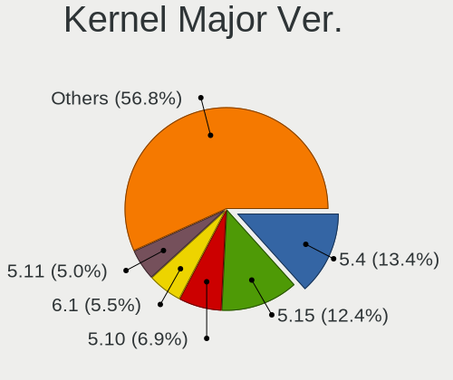
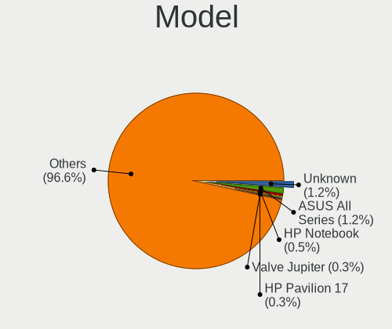
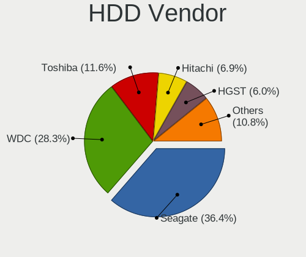
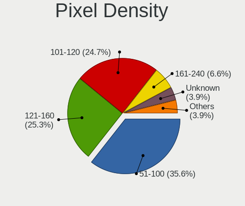
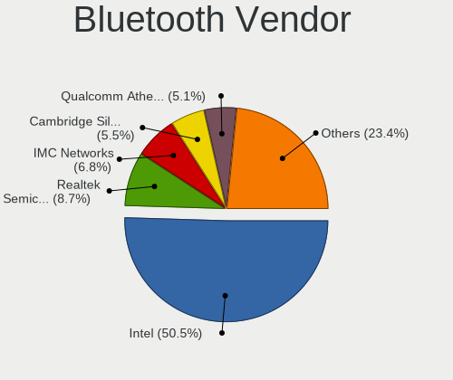

Linux in France - Tested Hardware & Statistics
----------------------------------------------

A project to collect tested hardware configurations for Linux in France.

Anyone can contribute to this report by the [hw-probe](https://github.com/linuxhw/hw-probe) tool:

    sudo -E hw-probe -all -upload

Please contribute! Especially if your hardware is rare.

This is a report for all computer types. See also reports for [desktops](/Location/France/Desktop/README.md) and [notebooks](/Location/France/Notebook/README.md).

Contents
--------

* [ Test Cases ](#test-cases)

* [ System ](#system)
  - [ OS                       ](#os)
  - [ OS Family                ](#os-family)
  - [ Kernel                   ](#kernel)
  - [ Kernel Family            ](#kernel-family)
  - [ Kernel Major Ver.        ](#kernel-major-ver)
  - [ Arch                     ](#arch)
  - [ DE                       ](#de)
  - [ Display Server           ](#display-server)
  - [ Display Manager          ](#display-manager)
  - [ OS Lang                  ](#os-lang)
  - [ Boot Mode                ](#boot-mode)
  - [ Filesystem               ](#filesystem)
  - [ Part. scheme             ](#part-scheme)
  - [ Dual Boot with Linux/BSD ](#dual-boot-with-linuxbsd)
  - [ Dual Boot (Win)          ](#dual-boot-win)

* [ Board ](#board)
  - [ Vendor                   ](#vendor)
  - [ Model                    ](#model)
  - [ Model Family             ](#model-family)
  - [ MFG Year                 ](#mfg-year)
  - [ Form Factor              ](#form-factor)
  - [ Secure Boot              ](#secure-boot)
  - [ Coreboot                 ](#coreboot)
  - [ RAM Size                 ](#ram-size)
  - [ RAM Used                 ](#ram-used)
  - [ Total Drives             ](#total-drives)
  - [ Has CD-ROM               ](#has-cd-rom)
  - [ Has Ethernet             ](#has-ethernet)
  - [ Has WiFi                 ](#has-wifi)
  - [ Has Bluetooth            ](#has-bluetooth)

* [ Location ](#location)
  - [ Country                  ](#country)
  - [ City                     ](#city)

* [ Drives ](#drives)
  - [ Drive Vendor             ](#drive-vendor)
  - [ Drive Model              ](#drive-model)
  - [ HDD Vendor               ](#hdd-vendor)
  - [ SSD Vendor               ](#ssd-vendor)
  - [ Drive Kind               ](#drive-kind)
  - [ Drive Connector          ](#drive-connector)
  - [ Drive Size               ](#drive-size)
  - [ Space Total              ](#space-total)
  - [ Space Used               ](#space-used)
  - [ Malfunc. Drives          ](#malfunc-drives)
  - [ Malfunc. Drive Vendor    ](#malfunc-drive-vendor)
  - [ Malfunc. HDD Vendor      ](#malfunc-hdd-vendor)
  - [ Malfunc. Drive Kind      ](#malfunc-drive-kind)
  - [ Failed Drives            ](#failed-drives)
  - [ Failed Drive Vendor      ](#failed-drive-vendor)
  - [ Drive Status             ](#drive-status)

* [ Storage controller ](#storage-controller)
  - [ Storage Vendor           ](#storage-vendor)
  - [ Storage Model            ](#storage-model)
  - [ Storage Kind             ](#storage-kind)

* [ Processor ](#processor)
  - [ CPU Vendor               ](#cpu-vendor)
  - [ CPU Model                ](#cpu-model)
  - [ CPU Model Family         ](#cpu-model-family)
  - [ CPU Cores                ](#cpu-cores)
  - [ CPU Sockets              ](#cpu-sockets)
  - [ CPU Threads              ](#cpu-threads)
  - [ CPU Op-Modes             ](#cpu-op-modes)
  - [ CPU Microcode            ](#cpu-microcode)
  - [ CPU Microarch            ](#cpu-microarch)

* [ Graphics ](#graphics)
  - [ GPU Vendor               ](#gpu-vendor)
  - [ GPU Model                ](#gpu-model)
  - [ GPU Combo                ](#gpu-combo)
  - [ GPU Driver               ](#gpu-driver)
  - [ GPU Memory               ](#gpu-memory)

* [ Monitor ](#monitor)
  - [ Monitor Vendor           ](#monitor-vendor)
  - [ Monitor Model            ](#monitor-model)
  - [ Monitor Resolution       ](#monitor-resolution)
  - [ Monitor Diagonal         ](#monitor-diagonal)
  - [ Monitor Width            ](#monitor-width)
  - [ Aspect Ratio             ](#aspect-ratio)
  - [ Monitor Area             ](#monitor-area)
  - [ Pixel Density            ](#pixel-density)
  - [ Multiple Monitors        ](#multiple-monitors)

* [ Network ](#network)
  - [ Net Controller Vendor    ](#net-controller-vendor)
  - [ Net Controller Model     ](#net-controller-model)
  - [ Wireless Vendor          ](#wireless-vendor)
  - [ Wireless Model           ](#wireless-model)
  - [ Ethernet Vendor          ](#ethernet-vendor)
  - [ Ethernet Model           ](#ethernet-model)
  - [ Net Controller Kind      ](#net-controller-kind)
  - [ Used Controller          ](#used-controller)
  - [ NICs                     ](#nics)
  - [ IPv6                     ](#ipv6)

* [ Bluetooth ](#bluetooth)
  - [ Bluetooth Vendor         ](#bluetooth-vendor)
  - [ Bluetooth Model          ](#bluetooth-model)

* [ Sound ](#sound)
  - [ Sound Vendor             ](#sound-vendor)
  - [ Sound Model              ](#sound-model)

* [ Memory ](#memory)
  - [ Memory Vendor            ](#memory-vendor)
  - [ Memory Model             ](#memory-model)
  - [ Memory Kind              ](#memory-kind)
  - [ Memory Form Factor       ](#memory-form-factor)
  - [ Memory Size              ](#memory-size)
  - [ Memory Speed             ](#memory-speed)

* [ Printers & scanners ](#printers--scanners)
  - [ Printer Vendor           ](#printer-vendor)
  - [ Printer Model            ](#printer-model)
  - [ Scanner Vendor           ](#scanner-vendor)
  - [ Scanner Model            ](#scanner-model)

* [ Camera ](#camera)
  - [ Camera Vendor            ](#camera-vendor)
  - [ Camera Model             ](#camera-model)

* [ Security ](#security)
  - [ Fingerprint Vendor       ](#fingerprint-vendor)
  - [ Fingerprint Model        ](#fingerprint-model)
  - [ Chipcard Vendor          ](#chipcard-vendor)
  - [ Chipcard Model           ](#chipcard-model)

* [ Unsupported ](#unsupported)
  - [ Unsupported Devices      ](#unsupported-devices)
  - [ Unsupported Device Types ](#unsupported-device-types)

Test Cases
----------

Total: 19151

| Vendor        | Model                       | Form-Factor | Probe                                                      | Date         |
|---------------|-----------------------------|-------------|------------------------------------------------------------|--------------|
| Samsung       | 940XGK                      | Notebook    | [7e994928cf](https://linux-hardware.org/?probe=7e994928cf) | Jan 06, 2025 |
| ASUSTek       | ROG Strix G712LV_G712LV     | Notebook    | [98506e2506](https://linux-hardware.org/?probe=98506e2506) | Jan 06, 2025 |
| Lenovo        | ThinkPad X1 Yoga 3rd 20L... | Convertible | [8ad221e4e7](https://linux-hardware.org/?probe=8ad221e4e7) | Jan 06, 2025 |
| ASRock        | B250 Gaming K4              | Desktop     | [dc5750e7fc](https://linux-hardware.org/?probe=dc5750e7fc) | Jan 06, 2025 |
| Dell          | Latitude E6230              | Notebook    | [638ece1f17](https://linux-hardware.org/?probe=638ece1f17) | Jan 05, 2025 |
| Toshiba       | Satellite C670-14M          | Notebook    | [9e54cf257c](https://linux-hardware.org/?probe=9e54cf257c) | Jan 05, 2025 |
| Lenovo        | ThinkPad W530 2441AG6       | Notebook    | [20e239cb8a](https://linux-hardware.org/?probe=20e239cb8a) | Jan 05, 2025 |
| Lenovo        | 14w Gen 2 82N9              | Notebook    | [733559df9e](https://linux-hardware.org/?probe=733559df9e) | Jan 05, 2025 |
| Dell          | Latitude D630               | Notebook    | [2c3411042a](https://linux-hardware.org/?probe=2c3411042a) | Jan 05, 2025 |
| ASUSTek       | TUF Gaming X570-PLUS        | Desktop     | [fe84b3d431](https://linux-hardware.org/?probe=fe84b3d431) | Jan 05, 2025 |
| UNOWHY        | Y13G113S4EI                 | Notebook    | [8d772f9e5a](https://linux-hardware.org/?probe=8d772f9e5a) | Jan 05, 2025 |
| Intel         | NUC8BEB J72693-308          | Mini pc     | [cc4e4ffe1a](https://linux-hardware.org/?probe=cc4e4ffe1a) | Jan 05, 2025 |
| Dell          | Latitude E5470              | Notebook    | [57a956fe26](https://linux-hardware.org/?probe=57a956fe26) | Jan 04, 2025 |
| HP            | 8643 SMVB                   | Desktop     | [246d1f3f87](https://linux-hardware.org/?probe=246d1f3f87) | Jan 04, 2025 |
| Unknown       | Unknown                     | Soc         | [a9fdc18349](https://linux-hardware.org/?probe=a9fdc18349) | Jan 04, 2025 |
| ASUSTek       | PRIME B450M-A               | Desktop     | [e6a453b673](https://linux-hardware.org/?probe=e6a453b673) | Jan 04, 2025 |
| ASUSTek       | Maximus VIII RANGER         | Desktop     | [b536336740](https://linux-hardware.org/?probe=b536336740) | Jan 04, 2025 |
| MSI           | Katana GF66 11UC            | Notebook    | [aca2d91d26](https://linux-hardware.org/?probe=aca2d91d26) | Jan 04, 2025 |
| MSI           | GP60 2PE                    | Notebook    | [85033de0ee](https://linux-hardware.org/?probe=85033de0ee) | Jan 04, 2025 |
| MSI           | 990XA-GD55                  | Desktop     | [5d282c8edc](https://linux-hardware.org/?probe=5d282c8edc) | Jan 04, 2025 |
| Lenovo        | G50-70 20351                | Notebook    | [666751867c](https://linux-hardware.org/?probe=666751867c) | Jan 04, 2025 |
| ASRock        | 970 Pro3 R2.0               | Desktop     | [adb7b1fe9d](https://linux-hardware.org/?probe=adb7b1fe9d) | Jan 04, 2025 |
| ASUSTek       | P8H61-MX USB3               | Desktop     | [b3b2df2fe7](https://linux-hardware.org/?probe=b3b2df2fe7) | Jan 04, 2025 |
| ASUSTek       | P8H61-MX USB3               | Desktop     | [1600afa2eb](https://linux-hardware.org/?probe=1600afa2eb) | Jan 04, 2025 |
| Acer          | Aspire 7530G                | Notebook    | [eaf2bcc73a](https://linux-hardware.org/?probe=eaf2bcc73a) | Jan 04, 2025 |
| HP            | Laptop 15-db0xxx            | Notebook    | [15039e5101](https://linux-hardware.org/?probe=15039e5101) | Jan 04, 2025 |
| Supermicro    | X7SPA-HF                    | Desktop     | [6239b93b09](https://linux-hardware.org/?probe=6239b93b09) | Jan 03, 2025 |
| ASUSTek       | PRIME Z270M-PLUS            | Desktop     | [32db9391d7](https://linux-hardware.org/?probe=32db9391d7) | Jan 03, 2025 |
| HP            | 2B0D A01                    | All in one  | [5aed288755](https://linux-hardware.org/?probe=5aed288755) | Jan 03, 2025 |
| Unknown       | Unknown                     | Notebook    | [4a568ea48d](https://linux-hardware.org/?probe=4a568ea48d) | Jan 03, 2025 |
| CWWK          | CW-AD4L-N V1                | Desktop     | [ed9e661757](https://linux-hardware.org/?probe=ed9e661757) | Jan 03, 2025 |
| Gigabyte      | X670E AORUS MASTER          | Desktop     | [903f395545](https://linux-hardware.org/?probe=903f395545) | Jan 03, 2025 |
| Dell          | G16 7630                    | Notebook    | [f98a9a65e0](https://linux-hardware.org/?probe=f98a9a65e0) | Jan 03, 2025 |
| Dell          | Inspiron 14 5425            | Notebook    | [573be124f2](https://linux-hardware.org/?probe=573be124f2) | Jan 03, 2025 |
| Dell          | G16 7630                    | Notebook    | [11b2b5a832](https://linux-hardware.org/?probe=11b2b5a832) | Jan 03, 2025 |
| ASUSTek       | M5A97 R2.0                  | Desktop     | [7526506dc2](https://linux-hardware.org/?probe=7526506dc2) | Jan 03, 2025 |
| Dell          | Inspiron 5405               | Notebook    | [e6c57490c8](https://linux-hardware.org/?probe=e6c57490c8) | Jan 02, 2025 |
| Dell          | 0Y7WYT A00                  | Desktop     | [3d1a88150a](https://linux-hardware.org/?probe=3d1a88150a) | Jan 02, 2025 |
| MSI           | MPG B550 GAMING PLUS        | Desktop     | [139667b28f](https://linux-hardware.org/?probe=139667b28f) | Jan 02, 2025 |
| Lenovo        | IdeaPad 700-15ISK 80RU      | Notebook    | [b26f854f97](https://linux-hardware.org/?probe=b26f854f97) | Jan 02, 2025 |
| Toshiba       | PORTABLE-CD2017             | Notebook    | [addbecd45d](https://linux-hardware.org/?probe=addbecd45d) | Jan 02, 2025 |
| ASUSTek       | 1002HA                      | Notebook    | [c1ab481b80](https://linux-hardware.org/?probe=c1ab481b80) | Jan 02, 2025 |
| Packard Be... | EasyNote TK87               | Notebook    | [468680be46](https://linux-hardware.org/?probe=468680be46) | Jan 02, 2025 |
| Packard Be... | EasyNote TK87               | Notebook    | [d0bb5660e7](https://linux-hardware.org/?probe=d0bb5660e7) | Jan 02, 2025 |
| ASUSTek       | 1002HA                      | Notebook    | [6720866a96](https://linux-hardware.org/?probe=6720866a96) | Jan 02, 2025 |
| ASUSTek       | P7P55D DELUXE               | Desktop     | [12d33ee44d](https://linux-hardware.org/?probe=12d33ee44d) | Jan 02, 2025 |
| Dell          | Latitude E6230              | Notebook    | [8611ea969f](https://linux-hardware.org/?probe=8611ea969f) | Jan 01, 2025 |
| ASUSTek       | ZenBook UX482EG_UX482EG     | Notebook    | [708ed8d150](https://linux-hardware.org/?probe=708ed8d150) | Jan 01, 2025 |
| Sony          | VGN-CS11Z_T                 | Notebook    | [28f8386e8f](https://linux-hardware.org/?probe=28f8386e8f) | Jan 01, 2025 |
| ASUSTek       | M5A97 R2.0                  | Desktop     | [a15d70317f](https://linux-hardware.org/?probe=a15d70317f) | Jan 01, 2025 |
| Dell          | 0N4YC8 A00                  | Desktop     | [f722edf7a9](https://linux-hardware.org/?probe=f722edf7a9) | Jan 01, 2025 |
| Gigabyte      | Z790 UD AX                  | Desktop     | [64a970e671](https://linux-hardware.org/?probe=64a970e671) | Jan 01, 2025 |
| HP            | 2B0D A01                    | All in one  | [871b4fe736](https://linux-hardware.org/?probe=871b4fe736) | Jan 01, 2025 |
| OEM           | B75 Ver:1.41                | Desktop     | [31c5df1f0f](https://linux-hardware.org/?probe=31c5df1f0f) | Jan 01, 2025 |
| Dell          | XPS 9315                    | Notebook    | [1620c81455](https://linux-hardware.org/?probe=1620c81455) | Jan 01, 2025 |
| Gigabyte      | B650 AORUS ELITE AX V2      | Desktop     | [00b2a8ffad](https://linux-hardware.org/?probe=00b2a8ffad) | Jan 01, 2025 |
| HP            | 2B0D A01                    | All in one  | [f2958af04d](https://linux-hardware.org/?probe=f2958af04d) | Dec 31, 2024 |
| ASUSTek       | ROG STRIX Z390-F GAMING     | Desktop     | [558ed56269](https://linux-hardware.org/?probe=558ed56269) | Dec 31, 2024 |
| HP            | 2B0D A01                    | All in one  | [d28496bed0](https://linux-hardware.org/?probe=d28496bed0) | Dec 31, 2024 |
| HP            | ProBook 6560b               | Notebook    | [c2ae1365c2](https://linux-hardware.org/?probe=c2ae1365c2) | Dec 31, 2024 |
| Toshiba       | Satellite P200              | Notebook    | [a07857c808](https://linux-hardware.org/?probe=a07857c808) | Dec 31, 2024 |
| HP            | Laptop 14-cm0xxx            | Notebook    | [045aa245db](https://linux-hardware.org/?probe=045aa245db) | Dec 31, 2024 |
| Framework     | Laptop 13 (AMD Ryzen 704... | Notebook    | [8b846a3158](https://linux-hardware.org/?probe=8b846a3158) | Dec 31, 2024 |
| Framework     | Laptop 13 (AMD Ryzen 704... | Notebook    | [0793ac2320](https://linux-hardware.org/?probe=0793ac2320) | Dec 31, 2024 |
| Framework     | Laptop 13 (AMD Ryzen 704... | Notebook    | [23175f9255](https://linux-hardware.org/?probe=23175f9255) | Dec 31, 2024 |
| Lenovo        | ThinkPad T495s 20QKS12J1... | Notebook    | [40610d9582](https://linux-hardware.org/?probe=40610d9582) | Dec 31, 2024 |
| Foxconn       | 2ADA                        | Desktop     | [a56fc7e027](https://linux-hardware.org/?probe=a56fc7e027) | Dec 30, 2024 |
| Lenovo        | IdeaPad 1 15IAU7 82QD       | Notebook    | [3d855d3f86](https://linux-hardware.org/?probe=3d855d3f86) | Dec 30, 2024 |
| Lenovo        | ThinkPad T430 2349TFK       | Notebook    | [976885ff78](https://linux-hardware.org/?probe=976885ff78) | Dec 30, 2024 |
| ASUSTek       | GL703VM                     | Notebook    | [1121e5f4ca](https://linux-hardware.org/?probe=1121e5f4ca) | Dec 30, 2024 |
| HP            | ENVY 17                     | Notebook    | [99fa04f0ca](https://linux-hardware.org/?probe=99fa04f0ca) | Dec 30, 2024 |
| ASUSTek       | ASUS TUF Gaming A15 FA50... | Notebook    | [b16417fac3](https://linux-hardware.org/?probe=b16417fac3) | Dec 30, 2024 |
| HP            | 212B                        | Desktop     | [0bb6c8d253](https://linux-hardware.org/?probe=0bb6c8d253) | Dec 29, 2024 |
| Dell          | G16 7630                    | Notebook    | [e7329668b8](https://linux-hardware.org/?probe=e7329668b8) | Dec 29, 2024 |
| ASUSTek       | VivoBook_ASUSLaptop X712... | Notebook    | [7b7d782202](https://linux-hardware.org/?probe=7b7d782202) | Dec 29, 2024 |
| Lenovo        | ThinkBook 14 G5+ APO 21J... | Notebook    | [1ee446218a](https://linux-hardware.org/?probe=1ee446218a) | Dec 29, 2024 |
| MSI           | H97 PC Mate                 | Desktop     | [28a72759b6](https://linux-hardware.org/?probe=28a72759b6) | Dec 29, 2024 |
| HP            | Notebook                    | Notebook    | [2fe95580ce](https://linux-hardware.org/?probe=2fe95580ce) | Dec 29, 2024 |
| Gigabyte      | B450M DS3H-CF               | Desktop     | [69968fade5](https://linux-hardware.org/?probe=69968fade5) | Dec 29, 2024 |
| Toshiba       | Satellite C70-B             | Notebook    | [5014d7827e](https://linux-hardware.org/?probe=5014d7827e) | Dec 29, 2024 |
| Shenzhen M... | F7BSC                       | Mini pc     | [fe538f1976](https://linux-hardware.org/?probe=fe538f1976) | Dec 28, 2024 |
| HP            | 845A                        | Desktop     | [c79d5baf3e](https://linux-hardware.org/?probe=c79d5baf3e) | Dec 28, 2024 |
| ASUSTek       | M3A32-MVP DELUXE            | Desktop     | [94f08a5066](https://linux-hardware.org/?probe=94f08a5066) | Dec 28, 2024 |
| ASUSTek       | M5A78L-M LX3                | Desktop     | [9436b53810](https://linux-hardware.org/?probe=9436b53810) | Dec 28, 2024 |
| MSI           | MAG B660 TOMAHAWK WIFI D... | Desktop     | [84f3fb88dd](https://linux-hardware.org/?probe=84f3fb88dd) | Dec 28, 2024 |
| MSI           | MS-16F1                     | Notebook    | [9906c1fa28](https://linux-hardware.org/?probe=9906c1fa28) | Dec 28, 2024 |
| MSI           | P67A-C45                    | Desktop     | [fd4f26fc74](https://linux-hardware.org/?probe=fd4f26fc74) | Dec 28, 2024 |
| Dell          | System Inspiron N7110       | Notebook    | [2607b61b02](https://linux-hardware.org/?probe=2607b61b02) | Dec 27, 2024 |
| Pegatron      | 2AD5                        | Desktop     | [e539fa9b0b](https://linux-hardware.org/?probe=e539fa9b0b) | Dec 27, 2024 |
| ASUSTek       | ROG STRIX X870-I GAMING ... | Desktop     | [13514b4f65](https://linux-hardware.org/?probe=13514b4f65) | Dec 27, 2024 |
| Lenovo        | ThinkPad P1 20MES1V800      | Notebook    | [1241156e04](https://linux-hardware.org/?probe=1241156e04) | Dec 27, 2024 |
| ASRock        | AB350M Pro4                 | Desktop     | [e7ad6f1e08](https://linux-hardware.org/?probe=e7ad6f1e08) | Dec 27, 2024 |
| ASUSTek       | S551LB                      | Notebook    | [a6d62182b2](https://linux-hardware.org/?probe=a6d62182b2) | Dec 27, 2024 |
| Lenovo        | ThinkPad P1 20MES1V800      | Notebook    | [0bd80b0050](https://linux-hardware.org/?probe=0bd80b0050) | Dec 27, 2024 |
| Fujitsu Si... | ESPRIMO Mobile U9210        | Notebook    | [67cd7236db](https://linux-hardware.org/?probe=67cd7236db) | Dec 27, 2024 |
| Lenovo        | ThinkPad X1 Carbon Gen 1... | Notebook    | [47b5606cc6](https://linux-hardware.org/?probe=47b5606cc6) | Dec 27, 2024 |
| Valve         | Galileo                     | Notebook    | [c1ae30e981](https://linux-hardware.org/?probe=c1ae30e981) | Dec 27, 2024 |
| Lenovo        | ThinkPad T470 20HES0EV0Q    | Notebook    | [df7447ad48](https://linux-hardware.org/?probe=df7447ad48) | Dec 26, 2024 |
| Raspberry ... | Raspberry Pi                | Soc         | [ceaec33a39](https://linux-hardware.org/?probe=ceaec33a39) | Dec 26, 2024 |
| MSI           | X670E GAMING PLUS WIFI      | Desktop     | [0ff42c80a6](https://linux-hardware.org/?probe=0ff42c80a6) | Dec 26, 2024 |
| Gigabyte      | B560 HD3                    | Desktop     | [08b938f26e](https://linux-hardware.org/?probe=08b938f26e) | Dec 26, 2024 |
| Dell          | Latitude E6230              | Notebook    | [cd5bf9b8fb](https://linux-hardware.org/?probe=cd5bf9b8fb) | Dec 26, 2024 |
| ASUSTek       | N750JV                      | Notebook    | [39dd282ac2](https://linux-hardware.org/?probe=39dd282ac2) | Dec 26, 2024 |
| HUAWEI        | KLVL-WXX9                   | Notebook    | [ace84142e7](https://linux-hardware.org/?probe=ace84142e7) | Dec 26, 2024 |
| HP            | Pavilion Gaming Laptop 1... | Notebook    | [d811ae85fd](https://linux-hardware.org/?probe=d811ae85fd) | Dec 26, 2024 |
| HP            | 2B29                        | Desktop     | [2bacb97467](https://linux-hardware.org/?probe=2bacb97467) | Dec 26, 2024 |
| Apple         | MacBookPro14,3              | Notebook    | [a6f60e20a6](https://linux-hardware.org/?probe=a6f60e20a6) | Dec 26, 2024 |
| Gigabyte      | B650 GAMING X AX V2         | Desktop     | [c12274a13c](https://linux-hardware.org/?probe=c12274a13c) | Dec 26, 2024 |
| ASUSTek       | G53SW                       | Notebook    | [89009e0426](https://linux-hardware.org/?probe=89009e0426) | Dec 26, 2024 |
| Shuttle       | NC03U                       | Notebook    | [7262526f1a](https://linux-hardware.org/?probe=7262526f1a) | Dec 26, 2024 |
| Dell          | Inspiron 5490               | Notebook    | [b8810650b5](https://linux-hardware.org/?probe=b8810650b5) | Dec 26, 2024 |
| Lenovo        | ThinkPad X390 20Q0CTO1WW    | Notebook    | [618303b5f9](https://linux-hardware.org/?probe=618303b5f9) | Dec 26, 2024 |
| ASUSTek       | K72Jr                       | Notebook    | [1d7e1a872d](https://linux-hardware.org/?probe=1d7e1a872d) | Dec 25, 2024 |
| HP            | 829A                        | Mini pc     | [215280111a](https://linux-hardware.org/?probe=215280111a) | Dec 25, 2024 |
| ASUSTek       | K53SD                       | Notebook    | [ae48bfb917](https://linux-hardware.org/?probe=ae48bfb917) | Dec 25, 2024 |
| ASUSTek       | K53SD                       | Notebook    | [f20d270b1c](https://linux-hardware.org/?probe=f20d270b1c) | Dec 25, 2024 |
| Dell          | 0VNGWR A01                  | All in one  | [c125805f0d](https://linux-hardware.org/?probe=c125805f0d) | Dec 25, 2024 |
| Dell          | Precision M6800             | Notebook    | [7d37225503](https://linux-hardware.org/?probe=7d37225503) | Dec 25, 2024 |
| ASUSTek       | PRIME B550-PLUS             | Desktop     | [8c3e2b5020](https://linux-hardware.org/?probe=8c3e2b5020) | Dec 25, 2024 |
| Intel         | NUC5i3MYBE H47781-209       | Mini pc     | [90bba668e6](https://linux-hardware.org/?probe=90bba668e6) | Dec 25, 2024 |
| Lenovo        | IdeaPad Slim 5 14AHP9 83... | Notebook    | [d1227bd0de](https://linux-hardware.org/?probe=d1227bd0de) | Dec 25, 2024 |
| Packard Be... | TBGM01                      | Desktop     | [68d8628be3](https://linux-hardware.org/?probe=68d8628be3) | Dec 25, 2024 |
| HP            | 82FF                        | Desktop     | [cfa3f49c26](https://linux-hardware.org/?probe=cfa3f49c26) | Dec 25, 2024 |
| Lenovo        | ThinkPad P53 20QQS5WG00     | Notebook    | [8afcf6a4e5](https://linux-hardware.org/?probe=8afcf6a4e5) | Dec 25, 2024 |
| ASUSTek       | PRIME H510M-K R2.0          | Desktop     | [9215a34e87](https://linux-hardware.org/?probe=9215a34e87) | Dec 25, 2024 |
| Dell          | Precision M6800             | Notebook    | [d5733504f6](https://linux-hardware.org/?probe=d5733504f6) | Dec 25, 2024 |
| ASUSTek       | G771JM                      | Notebook    | [47eab19f76](https://linux-hardware.org/?probe=47eab19f76) | Dec 25, 2024 |
| ASUSTek       | G771JM                      | Notebook    | [0e03d4ac45](https://linux-hardware.org/?probe=0e03d4ac45) | Dec 25, 2024 |
| ASUSTek       | ASUS Zenbook 14 UM3406HA... | Notebook    | [15d4c80d32](https://linux-hardware.org/?probe=15d4c80d32) | Dec 25, 2024 |
| HP            | Pavilion dv6                | Notebook    | [db20c486f1](https://linux-hardware.org/?probe=db20c486f1) | Dec 24, 2024 |
| Samsung       | R530/R730/P530              | Notebook    | [88983f374b](https://linux-hardware.org/?probe=88983f374b) | Dec 24, 2024 |
| Dell          | XPS 13 9300                 | Notebook    | [496f49c231](https://linux-hardware.org/?probe=496f49c231) | Dec 24, 2024 |
| Supermicro    | X10SDV-4C-TLN2F             | Server      | [3e9be7a949](https://linux-hardware.org/?probe=3e9be7a949) | Dec 24, 2024 |
| ASUSTek       | P8Z68-V PRO GEN3            | Desktop     | [cbf66f88d2](https://linux-hardware.org/?probe=cbf66f88d2) | Dec 24, 2024 |
| HUAWEI        | KPL-W0X                     | Notebook    | [6bcb7835d8](https://linux-hardware.org/?probe=6bcb7835d8) | Dec 24, 2024 |
| HP            | Pavilion g7                 | Notebook    | [349ddf33a4](https://linux-hardware.org/?probe=349ddf33a4) | Dec 23, 2024 |
| ASUSTek       | VivoBook_ASUSLaptop M370... | Notebook    | [86f9503271](https://linux-hardware.org/?probe=86f9503271) | Dec 23, 2024 |
| Gigabyte      | Z370P D3-CF                 | Desktop     | [9ea1b90178](https://linux-hardware.org/?probe=9ea1b90178) | Dec 23, 2024 |
| MSI           | C847IS-P33                  | Desktop     | [675e2d8c5d](https://linux-hardware.org/?probe=675e2d8c5d) | Dec 23, 2024 |
| Gigabyte      | B650 AORUS ELITE AX         | Desktop     | [31b0aab1bb](https://linux-hardware.org/?probe=31b0aab1bb) | Dec 23, 2024 |
| HP            | EliteBook 855 G8 Noteboo... | Notebook    | [1d6bf9301c](https://linux-hardware.org/?probe=1d6bf9301c) | Dec 23, 2024 |
| Sony          | SVP1321C5E                  | Notebook    | [7dfbac17e9](https://linux-hardware.org/?probe=7dfbac17e9) | Dec 23, 2024 |
| Dell          | 0KYWH7 A01                  | Desktop     | [86c6baedbe](https://linux-hardware.org/?probe=86c6baedbe) | Dec 23, 2024 |
| Khadas        | VIM1S                       | Soc         | [c7abbeff6b](https://linux-hardware.org/?probe=c7abbeff6b) | Dec 23, 2024 |
| Dell          | 0KYWH7 A01                  | Desktop     | [ac3e1d624b](https://linux-hardware.org/?probe=ac3e1d624b) | Dec 23, 2024 |
| MSI           | GS65 Stealth Thin 8RE       | Notebook    | [fe90399850](https://linux-hardware.org/?probe=fe90399850) | Dec 23, 2024 |
| Lenovo        | IdeaPad 1 15ALC7 82R4       | Notebook    | [20dc00eb37](https://linux-hardware.org/?probe=20dc00eb37) | Dec 23, 2024 |
| MSI           | GS65 Stealth Thin 8RE       | Notebook    | [3772b141b1](https://linux-hardware.org/?probe=3772b141b1) | Dec 23, 2024 |
| Dell          | Precision 7750              | Notebook    | [f7d88f943d](https://linux-hardware.org/?probe=f7d88f943d) | Dec 22, 2024 |
| MSI           | PRO B760-P WIFI DDR4        | Desktop     | [59c289d5b9](https://linux-hardware.org/?probe=59c289d5b9) | Dec 22, 2024 |
| Fujitsu       | LIFEBOOK E734               | Notebook    | [2009db3bc5](https://linux-hardware.org/?probe=2009db3bc5) | Dec 22, 2024 |
| ASUSTek       | X555YI                      | Notebook    | [220480564a](https://linux-hardware.org/?probe=220480564a) | Dec 22, 2024 |
| Unknown       | Unknown                     | Notebook    | [ee3d394ad4](https://linux-hardware.org/?probe=ee3d394ad4) | Dec 22, 2024 |
| Gigabyte      | P55V5                       | Notebook    | [5a6d2df08d](https://linux-hardware.org/?probe=5a6d2df08d) | Dec 22, 2024 |
| Dell          | Inspiron 7591               | Notebook    | [640a616ad8](https://linux-hardware.org/?probe=640a616ad8) | Dec 22, 2024 |
| MSI           | MPG Z790 CARBON WIFI        | Desktop     | [510b37b7aa](https://linux-hardware.org/?probe=510b37b7aa) | Dec 22, 2024 |
| Lenovo        | ThinkPad X1 Carbon Gen 1... | Notebook    | [bb6b07c2e4](https://linux-hardware.org/?probe=bb6b07c2e4) | Dec 22, 2024 |
| ASUSTek       | Vivobook Go E1404FA_E140... | Notebook    | [117beaf6ca](https://linux-hardware.org/?probe=117beaf6ca) | Dec 22, 2024 |
| ASRock        | X570 Phantom Gaming 4       | Desktop     | [c0bbc9c576](https://linux-hardware.org/?probe=c0bbc9c576) | Dec 22, 2024 |
| ASUSTek       | X550CC                      | Notebook    | [e00f7a5c68](https://linux-hardware.org/?probe=e00f7a5c68) | Dec 22, 2024 |
| MSI           | H110M PRO-D                 | Desktop     | [b7c9d31dff](https://linux-hardware.org/?probe=b7c9d31dff) | Dec 22, 2024 |
| TUXEDO        | Sirius 16 Gen2              | Notebook    | [97191ccd49](https://linux-hardware.org/?probe=97191ccd49) | Dec 21, 2024 |
| Lenovo        | ThinkPad W541 20EGS1FB00    | Notebook    | [6f758495b3](https://linux-hardware.org/?probe=6f758495b3) | Dec 21, 2024 |
| MSI           | GP73 Leopard 8RE            | Notebook    | [57edeb7f2e](https://linux-hardware.org/?probe=57edeb7f2e) | Dec 21, 2024 |
| MSI           | CR61 2M/CX61 2OC/CX61 2O... | Notebook    | [7c8e20f877](https://linux-hardware.org/?probe=7c8e20f877) | Dec 21, 2024 |
| ASUSTek       | P8P67 LE                    | Desktop     | [8e46f54d3c](https://linux-hardware.org/?probe=8e46f54d3c) | Dec 21, 2024 |
| Gigabyte      | H61M-S2P-B3                 | Desktop     | [ca83315819](https://linux-hardware.org/?probe=ca83315819) | Dec 21, 2024 |
| ASUSTek       | P8H61-MX USB3               | Desktop     | [c7fb48cd8b](https://linux-hardware.org/?probe=c7fb48cd8b) | Dec 21, 2024 |
| Lenovo        | IdeaPad 120S-14IAP 81A5     | Notebook    | [b458c0587b](https://linux-hardware.org/?probe=b458c0587b) | Dec 21, 2024 |
| ASRock        | B450M Pro4 R2.0             | Desktop     | [10620ef914](https://linux-hardware.org/?probe=10620ef914) | Dec 20, 2024 |
| ASUSTek       | P6T                         | Desktop     | [de989023ba](https://linux-hardware.org/?probe=de989023ba) | Dec 20, 2024 |
| Lenovo        | ThinkPad T490 20N3S2XL00    | Notebook    | [dd701f3856](https://linux-hardware.org/?probe=dd701f3856) | Dec 20, 2024 |
| ASUSTek       | H61M-E                      | Desktop     | [f975c50855](https://linux-hardware.org/?probe=f975c50855) | Dec 20, 2024 |
| ASUSTek       | ASUS TUF Gaming F17 FX70... | Notebook    | [7b099519b9](https://linux-hardware.org/?probe=7b099519b9) | Dec 20, 2024 |
| ASUSTek       | X550CL                      | Notebook    | [ca719e1a32](https://linux-hardware.org/?probe=ca719e1a32) | Dec 20, 2024 |
| ASUSTek       | VivoBook_ASUSLaptop X512... | Notebook    | [7c5e051820](https://linux-hardware.org/?probe=7c5e051820) | Dec 19, 2024 |
| Shuttle       | FH270                       | Desktop     | [068d900b56](https://linux-hardware.org/?probe=068d900b56) | Dec 19, 2024 |
| ASUSTek       | ROG STRIX X570-F GAMING     | Desktop     | [373f51ec84](https://linux-hardware.org/?probe=373f51ec84) | Dec 19, 2024 |
| ASUSTek       | ET1620I                     | Desktop     | [961909e36f](https://linux-hardware.org/?probe=961909e36f) | Dec 19, 2024 |
| Apple         | Mac-F2218EA9                | All in one  | [05fe2433a8](https://linux-hardware.org/?probe=05fe2433a8) | Dec 19, 2024 |
| Apple         | Mac-F2218EA9                | All in one  | [bb8798cf8d](https://linux-hardware.org/?probe=bb8798cf8d) | Dec 19, 2024 |
| HP            | Laptop 14-dk1xxx            | Notebook    | [e723e253d2](https://linux-hardware.org/?probe=e723e253d2) | Dec 19, 2024 |
| Acer          | TravelMate 6292             | Notebook    | [a81468385b](https://linux-hardware.org/?probe=a81468385b) | Dec 19, 2024 |
| Dell          | Latitude E5440              | Notebook    | [5adb2abeb6](https://linux-hardware.org/?probe=5adb2abeb6) | Dec 19, 2024 |
| Lenovo        | Legion 5 Pro 16ACH6H 82J... | Notebook    | [539c61eb30](https://linux-hardware.org/?probe=539c61eb30) | Dec 19, 2024 |
| Gigabyte      | Z390 M GAMING-CF            | Desktop     | [1892d9c3bf](https://linux-hardware.org/?probe=1892d9c3bf) | Dec 19, 2024 |
| HP            | ENVY x360 2-in-1 Laptop ... | Convertible | [ce25a532ee](https://linux-hardware.org/?probe=ce25a532ee) | Dec 19, 2024 |
| MSI           | MAG X670E TOMAHAWK WIFI     | Desktop     | [607a9aa50f](https://linux-hardware.org/?probe=607a9aa50f) | Dec 19, 2024 |
| ASUSTek       | P8Z77-V PRO                 | Desktop     | [4b3eb67e2e](https://linux-hardware.org/?probe=4b3eb67e2e) | Dec 19, 2024 |
| Packard Be... | TBGM01                      | Desktop     | [8fe4cbb492](https://linux-hardware.org/?probe=8fe4cbb492) | Dec 18, 2024 |
| Dell          | XPS 11 9P33                 | Notebook    | [ef92bd82b7](https://linux-hardware.org/?probe=ef92bd82b7) | Dec 18, 2024 |
| MSI           | C847IS-P33                  | Desktop     | [d2837e1066](https://linux-hardware.org/?probe=d2837e1066) | Dec 18, 2024 |
| ASUSTek       | NUC13ANB-M 60AS0040-MB2A... | Mini pc     | [0b4a2711cd](https://linux-hardware.org/?probe=0b4a2711cd) | Dec 18, 2024 |
| Gigabyte      | 970A-DS3P                   | Desktop     | [0cdac872bc](https://linux-hardware.org/?probe=0cdac872bc) | Dec 18, 2024 |
| Microsoft     | Surface Laptop Go           | Tablet      | [fc2c7117f6](https://linux-hardware.org/?probe=fc2c7117f6) | Dec 18, 2024 |
| Lenovo        | ThinkPad A485 20RUTOEIIT    | Notebook    | [dc1b85e281](https://linux-hardware.org/?probe=dc1b85e281) | Dec 18, 2024 |
| Lenovo        | ThinkPad X121e 3045CTO      | Notebook    | [ec4cf64022](https://linux-hardware.org/?probe=ec4cf64022) | Dec 18, 2024 |
| Lenovo        | ThinkPad T400 6473D2G       | Notebook    | [2c03096475](https://linux-hardware.org/?probe=2c03096475) | Dec 18, 2024 |
| Dell          | Precision 3540              | Notebook    | [a4da59e831](https://linux-hardware.org/?probe=a4da59e831) | Dec 18, 2024 |
| ASUSTek       | UX305FA                     | Notebook    | [cbe75c3d89](https://linux-hardware.org/?probe=cbe75c3d89) | Dec 18, 2024 |
| ASUSTek       | X540LJ                      | Notebook    | [dff11ceadc](https://linux-hardware.org/?probe=dff11ceadc) | Dec 18, 2024 |
| Lenovo        | ThinkPad L580 20LXS45K00    | Notebook    | [59222bec94](https://linux-hardware.org/?probe=59222bec94) | Dec 18, 2024 |
| Dell          | Latitude 7400               | Notebook    | [ed35bf7fb4](https://linux-hardware.org/?probe=ed35bf7fb4) | Dec 18, 2024 |
| ASUSTek       | UX390UAK                    | Notebook    | [795d742aff](https://linux-hardware.org/?probe=795d742aff) | Dec 18, 2024 |
| Gigabyte      | Z77-D3H                     | Desktop     | [9a64691207](https://linux-hardware.org/?probe=9a64691207) | Dec 17, 2024 |
| HP            | 8643 SMVB                   | Desktop     | [9091764f7e](https://linux-hardware.org/?probe=9091764f7e) | Dec 17, 2024 |
| MSI           | Z370 GAMING PRO CARBON      | Desktop     | [3b9ab5404e](https://linux-hardware.org/?probe=3b9ab5404e) | Dec 17, 2024 |
| ASUSTek       | ASUS Zenbook 14 UM3406HA... | Notebook    | [fb3afaa6bb](https://linux-hardware.org/?probe=fb3afaa6bb) | Dec 17, 2024 |
| Lenovo        | 1064 SDK0T76530 WIN 3556... | Desktop     | [5913ca9ed8](https://linux-hardware.org/?probe=5913ca9ed8) | Dec 17, 2024 |
| Acer          | Aspire AV15-53P             | Notebook    | [c0fd375335](https://linux-hardware.org/?probe=c0fd375335) | Dec 17, 2024 |
| ASUSTek       | ProArt X570-CREATOR WIFI    | Desktop     | [5bd1dbfa57](https://linux-hardware.org/?probe=5bd1dbfa57) | Dec 17, 2024 |
| GEEKOM        | A8                          | Desktop     | [821fae98e5](https://linux-hardware.org/?probe=821fae98e5) | Dec 17, 2024 |
| Valve         | Galileo                     | Notebook    | [92b2090648](https://linux-hardware.org/?probe=92b2090648) | Dec 17, 2024 |
| Valve         | Galileo                     | Notebook    | [860b42a1d3](https://linux-hardware.org/?probe=860b42a1d3) | Dec 17, 2024 |
| Lenovo        | IdeaPad 5 14ALC05 82LM      | Notebook    | [97f04be17e](https://linux-hardware.org/?probe=97f04be17e) | Dec 17, 2024 |
| IP3 Tech      | GB3B                        | Mini pc     | [b713008508](https://linux-hardware.org/?probe=b713008508) | Dec 17, 2024 |
| Lenovo        | ThinkPad X270 20HMS2C003    | Notebook    | [d713ec0e9b](https://linux-hardware.org/?probe=d713ec0e9b) | Dec 17, 2024 |
| Toshiba       | Satellite C70-B             | Notebook    | [c1d411bf64](https://linux-hardware.org/?probe=c1d411bf64) | Dec 17, 2024 |
| MSI           | H110M PRO-VD                | Desktop     | [3c491227b7](https://linux-hardware.org/?probe=3c491227b7) | Dec 16, 2024 |
| HP            | 198E                        | Desktop     | [7cedcbe8c0](https://linux-hardware.org/?probe=7cedcbe8c0) | Dec 16, 2024 |
| HP            | 198E                        | Desktop     | [9d254d2d2a](https://linux-hardware.org/?probe=9d254d2d2a) | Dec 16, 2024 |
| ASUSTek       | ZenBook UX435EA_UX435EA     | Notebook    | [55b8b860be](https://linux-hardware.org/?probe=55b8b860be) | Dec 16, 2024 |
| HP            | 83F3                        | Desktop     | [de8737ca72](https://linux-hardware.org/?probe=de8737ca72) | Dec 16, 2024 |
| HP            | 83F3                        | Desktop     | [e48e3c00d9](https://linux-hardware.org/?probe=e48e3c00d9) | Dec 16, 2024 |
| HP            | 859C                        | Desktop     | [e8bd962d37](https://linux-hardware.org/?probe=e8bd962d37) | Dec 16, 2024 |
| HP            | 83F3                        | Desktop     | [1c40aacec7](https://linux-hardware.org/?probe=1c40aacec7) | Dec 16, 2024 |
| ASUSTek       | P8Z68-V LX                  | Desktop     | [a91c4b26f6](https://linux-hardware.org/?probe=a91c4b26f6) | Dec 16, 2024 |
| HP            | 83F3                        | Desktop     | [ab0752e1fc](https://linux-hardware.org/?probe=ab0752e1fc) | Dec 16, 2024 |
| Dell          | Precision 3570              | Notebook    | [f7ddcad19a](https://linux-hardware.org/?probe=f7ddcad19a) | Dec 16, 2024 |
| Lenovo        | ThinkPad X390 20Q0CTO1WW    | Notebook    | [bcd9527a31](https://linux-hardware.org/?probe=bcd9527a31) | Dec 16, 2024 |
| ASUSTek       | ASUS TUF Gaming A16 FA61... | Notebook    | [efacc3d2bf](https://linux-hardware.org/?probe=efacc3d2bf) | Dec 16, 2024 |
| HP            | ProBook 450 15.6 inch G9... | Notebook    | [8f16da3f2f](https://linux-hardware.org/?probe=8f16da3f2f) | Dec 16, 2024 |
| ASUSTek       | PRIME X570-P                | Desktop     | [a88e3b9b74](https://linux-hardware.org/?probe=a88e3b9b74) | Dec 16, 2024 |
| Lenovo        | ThinkPad R500 2714AAG       | Notebook    | [d4c46ae3a8](https://linux-hardware.org/?probe=d4c46ae3a8) | Dec 16, 2024 |
| HUAWEI        | KLVL-WXX9                   | Notebook    | [3d5e444772](https://linux-hardware.org/?probe=3d5e444772) | Dec 16, 2024 |
| MSI           | MAG X870 TOMAHAWK WIFI      | Desktop     | [569b52f7b9](https://linux-hardware.org/?probe=569b52f7b9) | Dec 16, 2024 |
| Fujitsu       | LIFEBOOK E734               | Notebook    | [1fe6aaa34e](https://linux-hardware.org/?probe=1fe6aaa34e) | Dec 16, 2024 |
| MSI           | MAG X870 TOMAHAWK WIFI      | Desktop     | [bc81411e04](https://linux-hardware.org/?probe=bc81411e04) | Dec 16, 2024 |
| Unknown       | Unknown                     | Desktop     | [4aa185aae8](https://linux-hardware.org/?probe=4aa185aae8) | Dec 16, 2024 |
| AZW           | MINI S                      | Desktop     | [2fe134f22f](https://linux-hardware.org/?probe=2fe134f22f) | Dec 15, 2024 |
| Acer          | Aspire 5733                 | Notebook    | [edc4741bd8](https://linux-hardware.org/?probe=edc4741bd8) | Dec 15, 2024 |
| Sony          | SVF1521A1EW                 | Notebook    | [7ffea3b7db](https://linux-hardware.org/?probe=7ffea3b7db) | Dec 15, 2024 |
| Acer          | Aspire 5733                 | Notebook    | [b7af1c256d](https://linux-hardware.org/?probe=b7af1c256d) | Dec 15, 2024 |
| ASUSTek       | PRIME A520M-K               | Desktop     | [4a1f51c600](https://linux-hardware.org/?probe=4a1f51c600) | Dec 15, 2024 |
| OEM           | B75 Ver:1.41                | Desktop     | [26fc19a77d](https://linux-hardware.org/?probe=26fc19a77d) | Dec 15, 2024 |
| MSI           | MPG X870E CARBON WIFI       | Desktop     | [f744e3d46f](https://linux-hardware.org/?probe=f744e3d46f) | Dec 15, 2024 |
| Acer          | Aspire S27-1755             | All in one  | [6e8d78bce8](https://linux-hardware.org/?probe=6e8d78bce8) | Dec 15, 2024 |
| Gigabyte      | B450 AORUS ELITE V2         | Desktop     | [b24c0ed46d](https://linux-hardware.org/?probe=b24c0ed46d) | Dec 15, 2024 |
| MSI           | H81I                        | Desktop     | [8972ead70f](https://linux-hardware.org/?probe=8972ead70f) | Dec 15, 2024 |
| MSI           | MAG X870 TOMAHAWK WIFI      | Desktop     | [83ca588caa](https://linux-hardware.org/?probe=83ca588caa) | Dec 15, 2024 |
| MSI           | PRO Z790-P WIFI             | Desktop     | [2198d7f523](https://linux-hardware.org/?probe=2198d7f523) | Dec 15, 2024 |
| Lenovo        | Legion 5 15IMH05H 81Y6      | Notebook    | [4ed1aefa4d](https://linux-hardware.org/?probe=4ed1aefa4d) | Dec 14, 2024 |
| ASUSTek       | P7P55D                      | Desktop     | [4cf386124b](https://linux-hardware.org/?probe=4cf386124b) | Dec 14, 2024 |
| Unknown       | Unknown                     | Desktop     | [48bf121bc0](https://linux-hardware.org/?probe=48bf121bc0) | Dec 14, 2024 |
| HP            | 8590                        | Notebook    | [5afa506c7d](https://linux-hardware.org/?probe=5afa506c7d) | Dec 14, 2024 |
| Toshiba       | Satellite Pro A50-C         | Notebook    | [a972bd60ee](https://linux-hardware.org/?probe=a972bd60ee) | Dec 14, 2024 |
| Acer          | Aspire A515-57              | Notebook    | [6f894427d4](https://linux-hardware.org/?probe=6f894427d4) | Dec 14, 2024 |
| Acer          | Aspire A315-44P             | Notebook    | [f9db13ebf7](https://linux-hardware.org/?probe=f9db13ebf7) | Dec 14, 2024 |
| Acer          | Aspire A315-44P             | Notebook    | [6f14280852](https://linux-hardware.org/?probe=6f14280852) | Dec 14, 2024 |
| ASRock        | X299 Taichi XE              | Desktop     | [23e15f73e6](https://linux-hardware.org/?probe=23e15f73e6) | Dec 14, 2024 |
| Toshiba       | Satellite C50D-A-12M        | Notebook    | [e2983df3e5](https://linux-hardware.org/?probe=e2983df3e5) | Dec 13, 2024 |
| MSI           | GT70                        | Notebook    | [518f6c347b](https://linux-hardware.org/?probe=518f6c347b) | Dec 13, 2024 |
| Valve         | Galileo                     | Notebook    | [79f765f659](https://linux-hardware.org/?probe=79f765f659) | Dec 13, 2024 |
| Notebook      | NS50_70MU                   | Notebook    | [aabccaca04](https://linux-hardware.org/?probe=aabccaca04) | Dec 13, 2024 |
| Dell          | 0WMJ54 A01                  | Desktop     | [5d62063d9e](https://linux-hardware.org/?probe=5d62063d9e) | Dec 13, 2024 |
| Acer          | Predator PH315-51           | Notebook    | [e0925f342c](https://linux-hardware.org/?probe=e0925f342c) | Dec 13, 2024 |
| Toshiba       | Satellite C50D-A-12M        | Notebook    | [2d76f9c438](https://linux-hardware.org/?probe=2d76f9c438) | Dec 13, 2024 |
| Lenovo        | ThinkPad W530 2441AG6       | Notebook    | [1cae0ac2bd](https://linux-hardware.org/?probe=1cae0ac2bd) | Dec 13, 2024 |
| Dell          | Latitude 7490               | Notebook    | [94a563e506](https://linux-hardware.org/?probe=94a563e506) | Dec 13, 2024 |
| Lenovo        | IdeaPad Gaming 3 15ARH7 ... | Notebook    | [2407d824e5](https://linux-hardware.org/?probe=2407d824e5) | Dec 13, 2024 |
| HP            | Pavilion dm4                | Notebook    | [74c6e0eb54](https://linux-hardware.org/?probe=74c6e0eb54) | Dec 12, 2024 |
| MSI           | Z87-G45 GAMING              | Desktop     | [f86b7a5624](https://linux-hardware.org/?probe=f86b7a5624) | Dec 12, 2024 |
| Lenovo        | Yoga Slim 7 Pro 14ACH5 8... | Notebook    | [974059596f](https://linux-hardware.org/?probe=974059596f) | Dec 12, 2024 |
| HP            | 2B47                        | Desktop     | [856b94c173](https://linux-hardware.org/?probe=856b94c173) | Dec 12, 2024 |
| HP            | 620                         | Notebook    | [152ec63b24](https://linux-hardware.org/?probe=152ec63b24) | Dec 12, 2024 |
| Gigabyte      | B85M-D3H                    | Desktop     | [835a4f4d23](https://linux-hardware.org/?probe=835a4f4d23) | Dec 12, 2024 |
| Dell          | Inspiron 5567               | Notebook    | [ed32d0cd28](https://linux-hardware.org/?probe=ed32d0cd28) | Dec 12, 2024 |
| Intel         | JSL MRD                     | Desktop     | [7e6f631d27](https://linux-hardware.org/?probe=7e6f631d27) | Dec 12, 2024 |
| Notebook      | W65_W67RZ1                  | Notebook    | [2d537d4d2f](https://linux-hardware.org/?probe=2d537d4d2f) | Dec 12, 2024 |
| Lenovo        | Yoga 530-14ARR 81H9         | Convertible | [22fcb1190c](https://linux-hardware.org/?probe=22fcb1190c) | Dec 12, 2024 |
| Notebook      | W65_67SZ                    | Notebook    | [56e6117d69](https://linux-hardware.org/?probe=56e6117d69) | Dec 12, 2024 |
| Dell          | Inspiron 1545               | Notebook    | [d21ea3aaac](https://linux-hardware.org/?probe=d21ea3aaac) | Dec 12, 2024 |
| HP            | Pavilion 15                 | Notebook    | [6dc4f10c86](https://linux-hardware.org/?probe=6dc4f10c86) | Dec 12, 2024 |
| AMI           | Aptio CRB                   | Mini pc     | [51528b49b0](https://linux-hardware.org/?probe=51528b49b0) | Dec 12, 2024 |
| Gigabyte      | B650 EAGLE AX               | Desktop     | [e7c8036b9d](https://linux-hardware.org/?probe=e7c8036b9d) | Dec 11, 2024 |
| Framework     | Laptop                      | Notebook    | [ff03f6aa77](https://linux-hardware.org/?probe=ff03f6aa77) | Dec 11, 2024 |
| Gigabyte      | B760 GAMING X DDR4          | Desktop     | [f56aac465c](https://linux-hardware.org/?probe=f56aac465c) | Dec 11, 2024 |
| Dell          | 0DY523 A03                  | Server      | [05ba811091](https://linux-hardware.org/?probe=05ba811091) | Dec 11, 2024 |
| Lenovo        | Legion Pro 7 16ARX8H 82W... | Notebook    | [dd80038de7](https://linux-hardware.org/?probe=dd80038de7) | Dec 11, 2024 |
| Acer          | Swift SF314-54              | Notebook    | [0985707ec6](https://linux-hardware.org/?probe=0985707ec6) | Dec 11, 2024 |
| Lenovo        | SHARKBAY SDK0E50510 WIN     | Desktop     | [bd997925b9](https://linux-hardware.org/?probe=bd997925b9) | Dec 11, 2024 |
| HP            | ProBook 4530s               | Notebook    | [e8e3959577](https://linux-hardware.org/?probe=e8e3959577) | Dec 11, 2024 |
| Dell          | Inspiron 16 5645            | Notebook    | [0437f5d57e](https://linux-hardware.org/?probe=0437f5d57e) | Dec 11, 2024 |
| MSI           | MPG X870E CARBON WIFI       | Desktop     | [5dabd7ef60](https://linux-hardware.org/?probe=5dabd7ef60) | Dec 11, 2024 |
| Notebook      | NS50_70MU                   | Notebook    | [90e8ea0ef1](https://linux-hardware.org/?probe=90e8ea0ef1) | Dec 11, 2024 |
| ASUSTek       | X555QG                      | Notebook    | [4dadfdc86a](https://linux-hardware.org/?probe=4dadfdc86a) | Dec 10, 2024 |
| Lenovo        | G700 20251                  | Notebook    | [86190f176c](https://linux-hardware.org/?probe=86190f176c) | Dec 10, 2024 |
| ASUSTek       | TUF Gaming B460-PLUS        | Desktop     | [7aace976f0](https://linux-hardware.org/?probe=7aace976f0) | Dec 10, 2024 |
| MSI           | MPG Z690 FORCE WIFI         | Desktop     | [114c039a04](https://linux-hardware.org/?probe=114c039a04) | Dec 10, 2024 |
| ASUSTek       | UX550VD                     | Notebook    | [ec8a75d03e](https://linux-hardware.org/?probe=ec8a75d03e) | Dec 09, 2024 |
| Gigabyte      | GA-MA770T-UD3               | Desktop     | [12f7f54a9f](https://linux-hardware.org/?probe=12f7f54a9f) | Dec 09, 2024 |
| ASUSTek       | WS X299 SAGE/10G            | Desktop     | [314d35a1ae](https://linux-hardware.org/?probe=314d35a1ae) | Dec 09, 2024 |
| Lenovo        | ThinkPad P51 20HJS16Q0K     | Notebook    | [ecd4468e9c](https://linux-hardware.org/?probe=ecd4468e9c) | Dec 09, 2024 |
| Acer          | Aspire A317-53              | Notebook    | [c1daa8622b](https://linux-hardware.org/?probe=c1daa8622b) | Dec 09, 2024 |
| ASUSTek       | UX310UA                     | Notebook    | [dbceea77c6](https://linux-hardware.org/?probe=dbceea77c6) | Dec 09, 2024 |
| ASRockRack    | ROMED8-2T/OVHA              | Server      | [b6965c5024](https://linux-hardware.org/?probe=b6965c5024) | Dec 09, 2024 |
| MSI           | MAG X870 TOMAHAWK WIFI      | Desktop     | [a1d466a8c2](https://linux-hardware.org/?probe=a1d466a8c2) | Dec 09, 2024 |
| Packard Be... | EasyNote MH36               | Notebook    | [f7069c0d8b](https://linux-hardware.org/?probe=f7069c0d8b) | Dec 09, 2024 |
| ASUSTek       | TUF Gaming FX504GD_FX80G... | Notebook    | [32b4864422](https://linux-hardware.org/?probe=32b4864422) | Dec 09, 2024 |
| MSI           | Modern 15 A11M              | Notebook    | [c8f5bf1e23](https://linux-hardware.org/?probe=c8f5bf1e23) | Dec 08, 2024 |
| Dell          | Inspiron 14 Plus 7440       | Notebook    | [b0c9087a18](https://linux-hardware.org/?probe=b0c9087a18) | Dec 08, 2024 |
| Dell          | Latitude 7280               | Notebook    | [7b850c81c1](https://linux-hardware.org/?probe=7b850c81c1) | Dec 08, 2024 |
| HP            | ProBook 4720s               | Notebook    | [9c2ccd6664](https://linux-hardware.org/?probe=9c2ccd6664) | Dec 08, 2024 |
| HP            | ProBook 4720s               | Notebook    | [108d0cdec6](https://linux-hardware.org/?probe=108d0cdec6) | Dec 08, 2024 |
| Dell          | Inspiron 14 Plus 7440       | Notebook    | [253c2d74fb](https://linux-hardware.org/?probe=253c2d74fb) | Dec 08, 2024 |
| Acer          | Veriton M4630G V:1.0        | Desktop     | [e53c39772b](https://linux-hardware.org/?probe=e53c39772b) | Dec 08, 2024 |
| TUXEDO        | Aura 15 Gen1                | Notebook    | [34f734e369](https://linux-hardware.org/?probe=34f734e369) | Dec 08, 2024 |
| ASUSTek       | STRIX B250F GAMING          | Desktop     | [aad04cbfa0](https://linux-hardware.org/?probe=aad04cbfa0) | Dec 08, 2024 |
| Acer          | Aspire A315-24P             | Notebook    | [68fa0e7660](https://linux-hardware.org/?probe=68fa0e7660) | Dec 08, 2024 |
| Fujitsu Si... | ESPRIMO Mobile V6555        | Notebook    | [291861d530](https://linux-hardware.org/?probe=291861d530) | Dec 08, 2024 |
| Acer          | Aspire A317-54              | Notebook    | [bdb1888389](https://linux-hardware.org/?probe=bdb1888389) | Dec 07, 2024 |
| Gigabyte      | B550 GAMING X V2            | Desktop     | [b90a139240](https://linux-hardware.org/?probe=b90a139240) | Dec 07, 2024 |
| Dell          | XPS 15 9530                 | Notebook    | [181a07929f](https://linux-hardware.org/?probe=181a07929f) | Dec 07, 2024 |
| AZW           | MINI S                      | Desktop     | [cfba2893b1](https://linux-hardware.org/?probe=cfba2893b1) | Dec 07, 2024 |
| Dell          | 0K216C                      | Desktop     | [10ab4e790d](https://linux-hardware.org/?probe=10ab4e790d) | Dec 07, 2024 |
| Dell          | XPS 15 9530                 | Notebook    | [d37a70d3c2](https://linux-hardware.org/?probe=d37a70d3c2) | Dec 07, 2024 |
| ASUSTek       | ASUS TUF Gaming F17 FX70... | Notebook    | [cb5e7488d1](https://linux-hardware.org/?probe=cb5e7488d1) | Dec 07, 2024 |
| Medion        | Crawler E30e                | Notebook    | [58ff5ef538](https://linux-hardware.org/?probe=58ff5ef538) | Dec 07, 2024 |
| MSI           | Z87-G45 GAMING              | Desktop     | [74ef542001](https://linux-hardware.org/?probe=74ef542001) | Dec 07, 2024 |
| Shenzhen M... | DRBAA                       | Desktop     | [fa3ca24355](https://linux-hardware.org/?probe=fa3ca24355) | Dec 07, 2024 |
| ASUSTek       | TUF Gaming B650M-E WIFI     | Desktop     | [dd5a713c21](https://linux-hardware.org/?probe=dd5a713c21) | Dec 07, 2024 |
| HP            | Victus by Gaming Laptop ... | Notebook    | [b05f7c1be0](https://linux-hardware.org/?probe=b05f7c1be0) | Dec 07, 2024 |
| ASRock        | X570 Phantom Gaming 4       | Desktop     | [4b14a65ae5](https://linux-hardware.org/?probe=4b14a65ae5) | Dec 07, 2024 |
| Lenovo        | Yoga Slim 6 14IRH8 83E0     | Notebook    | [04288afd41](https://linux-hardware.org/?probe=04288afd41) | Dec 07, 2024 |
| Lenovo        | Yoga Slim 6 14IRH8 83E0     | Notebook    | [15a58c5a9c](https://linux-hardware.org/?probe=15a58c5a9c) | Dec 07, 2024 |
| ASUSTek       | TUF Gaming B650M-E WIFI     | Desktop     | [9aef334f00](https://linux-hardware.org/?probe=9aef334f00) | Dec 06, 2024 |
| ASUSTek       | Zenbook UX3402ZA_UX3402Z... | Notebook    | [f0d77fead4](https://linux-hardware.org/?probe=f0d77fead4) | Dec 06, 2024 |
| HP            | EliteBook 830 G8 Noteboo... | Notebook    | [63ac6e048e](https://linux-hardware.org/?probe=63ac6e048e) | Dec 06, 2024 |
| Lenovo        | ThinkPad E14 Gen 2 20TA0... | Notebook    | [a324fb8617](https://linux-hardware.org/?probe=a324fb8617) | Dec 06, 2024 |
| Acer          | Aspire V3-771               | Notebook    | [44298e427a](https://linux-hardware.org/?probe=44298e427a) | Dec 06, 2024 |
| Acer          | Aspire V3-771               | Notebook    | [75d53f2ee5](https://linux-hardware.org/?probe=75d53f2ee5) | Dec 06, 2024 |
| Toshiba       | Satellite Pro L630          | Notebook    | [ea76280b19](https://linux-hardware.org/?probe=ea76280b19) | Dec 06, 2024 |
| Valve         | Galileo                     | Notebook    | [cabb8134bf](https://linux-hardware.org/?probe=cabb8134bf) | Dec 06, 2024 |
| HP            | EliteBook 640 14 inch G1... | Notebook    | [56139d2a69](https://linux-hardware.org/?probe=56139d2a69) | Dec 06, 2024 |
| TUXEDO        | InfinityBook S 15 Gen6      | Notebook    | [4e73bb1e03](https://linux-hardware.org/?probe=4e73bb1e03) | Dec 06, 2024 |
| ASUSTek       | GL502VS                     | Notebook    | [f0af5bd510](https://linux-hardware.org/?probe=f0af5bd510) | Dec 06, 2024 |
| Gigabyte      | B450 AORUS ELITE            | Desktop     | [b3206b45cc](https://linux-hardware.org/?probe=b3206b45cc) | Dec 06, 2024 |
| HP            | 829A                        | Mini pc     | [9d39cf9b2e](https://linux-hardware.org/?probe=9d39cf9b2e) | Dec 05, 2024 |
| Dell          | Precision 3591              | Notebook    | [af761ba6a9](https://linux-hardware.org/?probe=af761ba6a9) | Dec 05, 2024 |
| ASRockRack    | E3C252D4U-2T/OVH            | Server      | [125542f615](https://linux-hardware.org/?probe=125542f615) | Dec 05, 2024 |
| ASUSTek       | VivoBook_ASUSLaptop K660... | Notebook    | [d1cf3d5b2b](https://linux-hardware.org/?probe=d1cf3d5b2b) | Dec 05, 2024 |
| Lenovo        | ThinkPad E14 Gen 3 20Y70... | Notebook    | [48f660fc68](https://linux-hardware.org/?probe=48f660fc68) | Dec 04, 2024 |
| Lenovo        | IdeaPad 110-15ISK 80UD      | Notebook    | [41f2901c17](https://linux-hardware.org/?probe=41f2901c17) | Dec 04, 2024 |
| Lenovo        | ThinkBook 15 G4 ABA 21DL    | Notebook    | [efe5d109c6](https://linux-hardware.org/?probe=efe5d109c6) | Dec 04, 2024 |
| Dell          | 0YP806 A02                  | Desktop     | [e738237e89](https://linux-hardware.org/?probe=e738237e89) | Dec 04, 2024 |
| Apple         | MacBookPro7,1               | Notebook    | [c3faa55c34](https://linux-hardware.org/?probe=c3faa55c34) | Dec 04, 2024 |
| HP            | EliteBook 645 14 inch G1... | Notebook    | [4b12beb5b9](https://linux-hardware.org/?probe=4b12beb5b9) | Dec 04, 2024 |
| HP            | EliteBook 640 14 inch G1... | Notebook    | [8379915764](https://linux-hardware.org/?probe=8379915764) | Dec 04, 2024 |
| ASUSTek       | TUF Gaming Z790-PRO WIFI    | Desktop     | [7dd5e02873](https://linux-hardware.org/?probe=7dd5e02873) | Dec 04, 2024 |
| Framework     | Laptop 13 (AMD Ryzen 704... | Notebook    | [c12683833e](https://linux-hardware.org/?probe=c12683833e) | Dec 03, 2024 |
| ASUSTek       | TUF Gaming X570-PLUS        | Desktop     | [cc3c1cb737](https://linux-hardware.org/?probe=cc3c1cb737) | Dec 03, 2024 |
| Dell          | Precision 5490              | Notebook    | [39951259df](https://linux-hardware.org/?probe=39951259df) | Dec 03, 2024 |
| HP            | EliteBook x360 1030 G2      | Convertible | [d2d77ad0f8](https://linux-hardware.org/?probe=d2d77ad0f8) | Dec 03, 2024 |
| Dell          | Vostro 3491                 | Notebook    | [361da1df64](https://linux-hardware.org/?probe=361da1df64) | Dec 03, 2024 |
| Gigabyte      | B550 GAMING X V2            | Desktop     | [3f6e18d4c5](https://linux-hardware.org/?probe=3f6e18d4c5) | Dec 03, 2024 |
| Dell          | Precision 5540              | Notebook    | [9e16a34662](https://linux-hardware.org/?probe=9e16a34662) | Dec 03, 2024 |
| Apple         | MacBookPro7,1               | Notebook    | [a806223e92](https://linux-hardware.org/?probe=a806223e92) | Dec 03, 2024 |
| ASRock        | B550M Pro4                  | Desktop     | [b5d3d47608](https://linux-hardware.org/?probe=b5d3d47608) | Dec 03, 2024 |
| SKIKK         | Midgard                     | Notebook    | [f38ad9c736](https://linux-hardware.org/?probe=f38ad9c736) | Dec 03, 2024 |
| ASUSTek       | Strix GL704GM_GL704GM       | Notebook    | [620d235bf6](https://linux-hardware.org/?probe=620d235bf6) | Dec 03, 2024 |
| Dell          | 0D4MD1 A00                  | Desktop     | [7328972ec3](https://linux-hardware.org/?probe=7328972ec3) | Dec 02, 2024 |
| Dell          | Latitude 5540               | Notebook    | [671915a3df](https://linux-hardware.org/?probe=671915a3df) | Dec 02, 2024 |
| Dell          | Precision 3551              | Notebook    | [d04bd63889](https://linux-hardware.org/?probe=d04bd63889) | Dec 02, 2024 |
| HP            | 339A                        | Desktop     | [c64449a47e](https://linux-hardware.org/?probe=c64449a47e) | Dec 02, 2024 |
| Lenovo        | ThinkPad T495 20NJCTO1WW    | Notebook    | [8ad6c56f00](https://linux-hardware.org/?probe=8ad6c56f00) | Dec 02, 2024 |
| Apple         | Mac-942B5BF58194151B        | All in one  | [d431ac00b1](https://linux-hardware.org/?probe=d431ac00b1) | Dec 02, 2024 |
| Dell          | 0NDYHG A01                  | Desktop     | [282527be25](https://linux-hardware.org/?probe=282527be25) | Dec 02, 2024 |
| Gigabyte      | B660 DS3H DDR4              | Desktop     | [2aaeb0eac6](https://linux-hardware.org/?probe=2aaeb0eac6) | Dec 02, 2024 |
| Dell          | XPS 15 9520                 | Notebook    | [1c01a47dcd](https://linux-hardware.org/?probe=1c01a47dcd) | Dec 02, 2024 |
| Acer          | Aspire Z3-615               | All in one  | [1cdbfbb642](https://linux-hardware.org/?probe=1cdbfbb642) | Dec 02, 2024 |
| Unknown       | Unknown                     | Phone       | [a7f6ba7cb3](https://linux-hardware.org/?probe=a7f6ba7cb3) | Dec 02, 2024 |
| Unknown       | Unknown                     | Phone       | [bc1a06c509](https://linux-hardware.org/?probe=bc1a06c509) | Dec 02, 2024 |
| Dell          | Inspiron 15-3567            | Notebook    | [fffcdca9f4](https://linux-hardware.org/?probe=fffcdca9f4) | Dec 01, 2024 |
| ASUSTek       | TUF Gaming X670E-PLUS WI... | Desktop     | [0065a1abc8](https://linux-hardware.org/?probe=0065a1abc8) | Dec 01, 2024 |
| Gigabyte      | 945P-S3                     | Desktop     | [7c7775d296](https://linux-hardware.org/?probe=7c7775d296) | Dec 01, 2024 |
| HP            | Compaq Mini 311-1000        | Notebook    | [da25f2f11a](https://linux-hardware.org/?probe=da25f2f11a) | Dec 01, 2024 |
| Lenovo        | ThinkPad X1 Carbon Gen 1... | Notebook    | [83800e0dd2](https://linux-hardware.org/?probe=83800e0dd2) | Dec 01, 2024 |
| Acer          | Aspire V3-371               | Notebook    | [cfe5b2b181](https://linux-hardware.org/?probe=cfe5b2b181) | Dec 01, 2024 |
| Acer          | Aspire A315-54K             | Notebook    | [6b2b116a91](https://linux-hardware.org/?probe=6b2b116a91) | Dec 01, 2024 |
| HP            | ProBook 4720s               | Notebook    | [64ba29b9f2](https://linux-hardware.org/?probe=64ba29b9f2) | Dec 01, 2024 |
| HP            | ProBook 4720s               | Notebook    | [9cf24341ad](https://linux-hardware.org/?probe=9cf24341ad) | Dec 01, 2024 |
| MSI           | H110M PRO-D                 | Desktop     | [b8889031de](https://linux-hardware.org/?probe=b8889031de) | Dec 01, 2024 |
| Lenovo        | IdeaPad 3 15IML05 81WB      | Notebook    | [dd0f8beb36](https://linux-hardware.org/?probe=dd0f8beb36) | Dec 01, 2024 |
| Acer          | Aspire A515-56              | Notebook    | [fc032f32ca](https://linux-hardware.org/?probe=fc032f32ca) | Dec 01, 2024 |
| Lenovo        | IdeaPad 3 17ABA7 82RQ       | Notebook    | [f518a2fbc3](https://linux-hardware.org/?probe=f518a2fbc3) | Nov 30, 2024 |
| ASUSTek       | K93SV                       | Notebook    | [53af6a8e17](https://linux-hardware.org/?probe=53af6a8e17) | Nov 30, 2024 |
| Dell          | Latitude E6330              | Notebook    | [f95099755e](https://linux-hardware.org/?probe=f95099755e) | Nov 30, 2024 |
| Dell          | Latitude E6330              | Notebook    | [416ede7598](https://linux-hardware.org/?probe=416ede7598) | Nov 30, 2024 |
| ASUSTek       | TUF Gaming B550-PLUS        | Desktop     | [d967f7baf8](https://linux-hardware.org/?probe=d967f7baf8) | Nov 30, 2024 |
| ASRock        | B550 Phantom Gaming 4       | Desktop     | [7312b4b954](https://linux-hardware.org/?probe=7312b4b954) | Nov 30, 2024 |
| MSI           | B450 GAMING PLUS            | Desktop     | [7cf713d1f4](https://linux-hardware.org/?probe=7cf713d1f4) | Nov 30, 2024 |
| ASUSTek       | B85-PRO GAMER               | Desktop     | [12dd784125](https://linux-hardware.org/?probe=12dd784125) | Nov 30, 2024 |
| Dell          | 02YYK5 A00                  | Desktop     | [96334059be](https://linux-hardware.org/?probe=96334059be) | Nov 30, 2024 |
| ASUSTek       | K50IE                       | Notebook    | [6b1d699417](https://linux-hardware.org/?probe=6b1d699417) | Nov 30, 2024 |
| ASUSTek       | P8H61-MX USB3               | Desktop     | [3a4c49cacd](https://linux-hardware.org/?probe=3a4c49cacd) | Nov 30, 2024 |
| ASUSTek       | B85-PRO GAMER               | Desktop     | [fb51898c9a](https://linux-hardware.org/?probe=fb51898c9a) | Nov 29, 2024 |
| HP            | Spectre x360 Convertible    | Convertible | [ccec9849da](https://linux-hardware.org/?probe=ccec9849da) | Nov 29, 2024 |
| Framework     | Laptop 13 (AMD Ryzen 704... | Notebook    | [a4a7031be1](https://linux-hardware.org/?probe=a4a7031be1) | Nov 29, 2024 |
| Intel         | DG41RQ AAE54511-205         | Desktop     | [2e5bbbe981](https://linux-hardware.org/?probe=2e5bbbe981) | Nov 29, 2024 |
| HP            | ProBook 440 14 inch G9 N... | Notebook    | [ae8591ed7e](https://linux-hardware.org/?probe=ae8591ed7e) | Nov 29, 2024 |
| Dell          | 0DR845                      | Desktop     | [1b6afa334f](https://linux-hardware.org/?probe=1b6afa334f) | Nov 29, 2024 |
| Intel         | DG41RQ AAE54511-205         | Desktop     | [72ff611394](https://linux-hardware.org/?probe=72ff611394) | Nov 29, 2024 |
| Acer          | Aspire A517-51              | Notebook    | [414d68892f](https://linux-hardware.org/?probe=414d68892f) | Nov 29, 2024 |
| Gigabyte      | MZBAYAP-00                  | Desktop     | [fb97ca86c6](https://linux-hardware.org/?probe=fb97ca86c6) | Nov 29, 2024 |
| Intel         | NUC12WSBi5 M46425-303       | Mini pc     | [b979600a4a](https://linux-hardware.org/?probe=b979600a4a) | Nov 29, 2024 |
| HP            | Laptop 15s-fq0xxx           | Notebook    | [b9916368be](https://linux-hardware.org/?probe=b9916368be) | Nov 29, 2024 |
| Gigabyte      | B660 DS3H DDR4              | Desktop     | [e32e466199](https://linux-hardware.org/?probe=e32e466199) | Nov 29, 2024 |
| HP            | Notebook                    | Notebook    | [f6aaab07ba](https://linux-hardware.org/?probe=f6aaab07ba) | Nov 29, 2024 |
| Dell          | Latitude 3190               | Notebook    | [adeae90473](https://linux-hardware.org/?probe=adeae90473) | Nov 28, 2024 |
| Dell          | Latitude E6320              | Notebook    | [1fbfc5b7ac](https://linux-hardware.org/?probe=1fbfc5b7ac) | Nov 28, 2024 |
| ASUSTek       | M4A79XTD EVO                | Desktop     | [462442fa72](https://linux-hardware.org/?probe=462442fa72) | Nov 28, 2024 |
| Gigabyte      | H81M-D2W                    | Desktop     | [c0db894e36](https://linux-hardware.org/?probe=c0db894e36) | Nov 28, 2024 |
| Acer          | Aspire 3830T                | Notebook    | [60fd51eaff](https://linux-hardware.org/?probe=60fd51eaff) | Nov 28, 2024 |
| HP            | ProBook 430 G8 Notebook ... | Notebook    | [4be4c4776e](https://linux-hardware.org/?probe=4be4c4776e) | Nov 27, 2024 |
| Lenovo        | ThinkPad P15 Gen 2i 20YQ... | Notebook    | [7e022f0097](https://linux-hardware.org/?probe=7e022f0097) | Nov 27, 2024 |
| Toshiba       | Satellite L300              | Notebook    | [5f14b73409](https://linux-hardware.org/?probe=5f14b73409) | Nov 27, 2024 |
| Dell          | G16 7630                    | Notebook    | [c5c762f132](https://linux-hardware.org/?probe=c5c762f132) | Nov 27, 2024 |
| eMachines     | MCP61PM-GM                  | Desktop     | [ff18233236](https://linux-hardware.org/?probe=ff18233236) | Nov 27, 2024 |
| Lenovo        | ThinkPad X1 Carbon 6th 2... | Notebook    | [5f5ae67cd6](https://linux-hardware.org/?probe=5f5ae67cd6) | Nov 27, 2024 |
| ASUSTek       | T100TA                      | Notebook    | [8c6076c6c9](https://linux-hardware.org/?probe=8c6076c6c9) | Nov 27, 2024 |
| Dell          | Latitude E6420              | Notebook    | [f38a40bedf](https://linux-hardware.org/?probe=f38a40bedf) | Nov 27, 2024 |
| Samsung       | 960XGL                      | Notebook    | [60544dead7](https://linux-hardware.org/?probe=60544dead7) | Nov 26, 2024 |
| HP            | ENVY Notebook               | Notebook    | [8f8d1df803](https://linux-hardware.org/?probe=8f8d1df803) | Nov 26, 2024 |
| Packard Be... | EasyNote ML65               | Notebook    | [f73a0dc2f2](https://linux-hardware.org/?probe=f73a0dc2f2) | Nov 26, 2024 |
| Shuttle       | XS35V3                      | Desktop     | [65cc0ee052](https://linux-hardware.org/?probe=65cc0ee052) | Nov 26, 2024 |
| Acer          | Nitro AN515-44              | Notebook    | [5d0c074a0f](https://linux-hardware.org/?probe=5d0c074a0f) | Nov 26, 2024 |
| Dell          | Latitude 7300               | Notebook    | [0b6efce6e2](https://linux-hardware.org/?probe=0b6efce6e2) | Nov 26, 2024 |
| ASRockRack    | X470D4U2-2T                 | Desktop     | [98e5a54764](https://linux-hardware.org/?probe=98e5a54764) | Nov 26, 2024 |
| AZW           | GK55                        | Desktop     | [89f2d40002](https://linux-hardware.org/?probe=89f2d40002) | Nov 26, 2024 |
| ASUSTek       | PRIME X670E-PRO WIFI        | Desktop     | [5820c49268](https://linux-hardware.org/?probe=5820c49268) | Nov 26, 2024 |
| ASRockRack    | X470D4U2-2T                 | Desktop     | [e4720d6a67](https://linux-hardware.org/?probe=e4720d6a67) | Nov 26, 2024 |
| Dell          | 04075X A00                  | All in one  | [d95a76345f](https://linux-hardware.org/?probe=d95a76345f) | Nov 25, 2024 |
| Lenovo        | ThinkPad X390 Yoga 20NQS... | Convertible | [91c6cdeace](https://linux-hardware.org/?probe=91c6cdeace) | Nov 25, 2024 |
| ASUSTek       | VivoBook_ASUSLaptop K650... | Notebook    | [d58ccbdbd5](https://linux-hardware.org/?probe=d58ccbdbd5) | Nov 25, 2024 |
| ASRockRack    | E3C252D4U-2T/OVH            | Server      | [f864f4a8f2](https://linux-hardware.org/?probe=f864f4a8f2) | Nov 25, 2024 |
| Intel         | S2600STB J17012-503         | Server      | [0ce0f968a8](https://linux-hardware.org/?probe=0ce0f968a8) | Nov 25, 2024 |
| Canonical     | LXD pc-q35-8.2              | Desktop     | [d237816bd5](https://linux-hardware.org/?probe=d237816bd5) | Nov 25, 2024 |
| Supermicro    | X10DRH-iT                   | Server      | [03ba31502c](https://linux-hardware.org/?probe=03ba31502c) | Nov 25, 2024 |
| Supermicro    | X10DRH-iT                   | Server      | [f59d7a8db6](https://linux-hardware.org/?probe=f59d7a8db6) | Nov 25, 2024 |
| Unknown       | V00                         | Mini pc     | [7257645201](https://linux-hardware.org/?probe=7257645201) | Nov 25, 2024 |
| Apple         | MacBook5,1                  | Notebook    | [c9bc1374b3](https://linux-hardware.org/?probe=c9bc1374b3) | Nov 25, 2024 |
| HP            | 8298                        | Desktop     | [200f681617](https://linux-hardware.org/?probe=200f681617) | Nov 25, 2024 |
| ASRock        | A300M-STX                   | Desktop     | [07fe25b59a](https://linux-hardware.org/?probe=07fe25b59a) | Nov 25, 2024 |
| Lenovo        | 3111 SDK0J40697 WIN 3305... | Desktop     | [d734209cfe](https://linux-hardware.org/?probe=d734209cfe) | Nov 25, 2024 |
| Lenovo        | SKYBAY SDK0J40697 WIN 33... | Desktop     | [64b155aa9d](https://linux-hardware.org/?probe=64b155aa9d) | Nov 25, 2024 |
| Lenovo        | ThinkPad P53 20QQS5WG00     | Notebook    | [1fcd89b3c9](https://linux-hardware.org/?probe=1fcd89b3c9) | Nov 24, 2024 |
| Dell          | Inspiron 5480               | Notebook    | [ce8745ed99](https://linux-hardware.org/?probe=ce8745ed99) | Nov 24, 2024 |
| Acer          | Aspire 3830T                | Notebook    | [50275fc28d](https://linux-hardware.org/?probe=50275fc28d) | Nov 24, 2024 |
| ASRock        | Z590 Extreme                | Desktop     | [e644a531fa](https://linux-hardware.org/?probe=e644a531fa) | Nov 24, 2024 |
| Acer          | Swift SF114-32              | Notebook    | [388ad0b976](https://linux-hardware.org/?probe=388ad0b976) | Nov 24, 2024 |
| ASRock        | Z87 Killer                  | Desktop     | [bc4880459e](https://linux-hardware.org/?probe=bc4880459e) | Nov 24, 2024 |
| Intel         | DN2800MT AAG23738-800       | Desktop     | [07e6f311c5](https://linux-hardware.org/?probe=07e6f311c5) | Nov 24, 2024 |
| Raspberry ... | Raspberry Pi 4 Model B R... | Soc         | [7b394d91fc](https://linux-hardware.org/?probe=7b394d91fc) | Nov 24, 2024 |
| HP            | OMEN by Gaming Laptop 16... | Notebook    | [424de7c996](https://linux-hardware.org/?probe=424de7c996) | Nov 24, 2024 |
| HP            | Notebook                    | Notebook    | [b00a743ec2](https://linux-hardware.org/?probe=b00a743ec2) | Nov 24, 2024 |
| MSI           | MPG X570 GAMING EDGE WIF... | Desktop     | [60acd12d71](https://linux-hardware.org/?probe=60acd12d71) | Nov 24, 2024 |
| HP            | 3047h                       | Desktop     | [69563862be](https://linux-hardware.org/?probe=69563862be) | Nov 24, 2024 |
| HP            | Notebook                    | Notebook    | [f69f443717](https://linux-hardware.org/?probe=f69f443717) | Nov 24, 2024 |
| Gigabyte      | B360M D3H-CF                | Desktop     | [f24b6c8c5c](https://linux-hardware.org/?probe=f24b6c8c5c) | Nov 24, 2024 |
| Colorful T... | C.Z77 X5 V20                | Desktop     | [5883b61b95](https://linux-hardware.org/?probe=5883b61b95) | Nov 24, 2024 |
| Valve         | Jupiter                     | Notebook    | [4bf52db455](https://linux-hardware.org/?probe=4bf52db455) | Nov 23, 2024 |
| HP            | Laptop 15-bs0xx             | Notebook    | [a3855fbdfb](https://linux-hardware.org/?probe=a3855fbdfb) | Nov 23, 2024 |
| HP            | Laptop 15-bs0xx             | Notebook    | [7db016c5fb](https://linux-hardware.org/?probe=7db016c5fb) | Nov 23, 2024 |
| Notebook      | W65_67SC                    | Notebook    | [310f0e36ad](https://linux-hardware.org/?probe=310f0e36ad) | Nov 23, 2024 |
| Lenovo        | IdeaPad 3 15ALC6 82KU       | Notebook    | [9e6d368a29](https://linux-hardware.org/?probe=9e6d368a29) | Nov 23, 2024 |
| MSI           | GE72 2QC                    | Notebook    | [18bcf97e52](https://linux-hardware.org/?probe=18bcf97e52) | Nov 23, 2024 |
| MSI           | AM1M                        | Desktop     | [563eb1dd1a](https://linux-hardware.org/?probe=563eb1dd1a) | Nov 23, 2024 |
| Toshiba       | Satellite L500              | Notebook    | [e84f351148](https://linux-hardware.org/?probe=e84f351148) | Nov 23, 2024 |
| HP            | Notebook                    | Notebook    | [d7db4f31e7](https://linux-hardware.org/?probe=d7db4f31e7) | Nov 23, 2024 |
| Apple         | MacBookPro5,5               | Notebook    | [2ccd8e4d15](https://linux-hardware.org/?probe=2ccd8e4d15) | Nov 23, 2024 |
| MSI           | PRO B650M-A WIFI            | Desktop     | [ac5865ff7b](https://linux-hardware.org/?probe=ac5865ff7b) | Nov 22, 2024 |
| ASUSTek       | VivoBook_ASUSLaptop S560... | Notebook    | [c80e9bcd59](https://linux-hardware.org/?probe=c80e9bcd59) | Nov 22, 2024 |
| ASUSTek       | N550JV                      | Notebook    | [9601e6c7a2](https://linux-hardware.org/?probe=9601e6c7a2) | Nov 22, 2024 |
| HP            | ZBook 14 G2                 | Notebook    | [82774b98d1](https://linux-hardware.org/?probe=82774b98d1) | Nov 22, 2024 |
| Optimized ... | KVM                         | Desktop     | [672aaf8ea5](https://linux-hardware.org/?probe=672aaf8ea5) | Nov 22, 2024 |
| HP            | Notebook                    | Notebook    | [bb9e0faf8f](https://linux-hardware.org/?probe=bb9e0faf8f) | Nov 22, 2024 |
| Lenovo        | 30C0 SDK0J40697 WIN 3305... | Desktop     | [07b1deff4c](https://linux-hardware.org/?probe=07b1deff4c) | Nov 22, 2024 |
| Gigabyte      | B550 AORUS ELITE V2         | Desktop     | [499656f477](https://linux-hardware.org/?probe=499656f477) | Nov 22, 2024 |
| ASUSTek       | G20AJ                       | Desktop     | [0dbb1f0216](https://linux-hardware.org/?probe=0dbb1f0216) | Nov 21, 2024 |
| Unknown       | AX16PRO                     | Notebook    | [97a667e749](https://linux-hardware.org/?probe=97a667e749) | Nov 21, 2024 |
| Apple         | Mac-031B6874CF7F642A iMa... | All in one  | [a404ec6238](https://linux-hardware.org/?probe=a404ec6238) | Nov 21, 2024 |
| Dell          | Precision 5490              | Notebook    | [32bacf2696](https://linux-hardware.org/?probe=32bacf2696) | Nov 21, 2024 |
| MSI           | PRO B760M-P                 | Desktop     | [a456280bbb](https://linux-hardware.org/?probe=a456280bbb) | Nov 21, 2024 |
| Dell          | 0Y7WYT A00                  | Desktop     | [b0d80c71d7](https://linux-hardware.org/?probe=b0d80c71d7) | Nov 21, 2024 |
| Valve         | Jupiter                     | Notebook    | [3011f248cc](https://linux-hardware.org/?probe=3011f248cc) | Nov 21, 2024 |
| MSI           | PRO X670-P WIFI             | Desktop     | [9879b0bbdb](https://linux-hardware.org/?probe=9879b0bbdb) | Nov 21, 2024 |
| Lenovo        | ThinkPad X270 W10DG 20K5... | Notebook    | [65b049cc4d](https://linux-hardware.org/?probe=65b049cc4d) | Nov 20, 2024 |
| Notebook      | NJx0PU                      | Notebook    | [08850b8a76](https://linux-hardware.org/?probe=08850b8a76) | Nov 20, 2024 |
| HP            | Pavilion dv7                | Notebook    | [bad29ac9c4](https://linux-hardware.org/?probe=bad29ac9c4) | Nov 20, 2024 |
| Dell          | Latitude 7300               | Notebook    | [f4e36dc49a](https://linux-hardware.org/?probe=f4e36dc49a) | Nov 20, 2024 |
| Dell          | Latitude 7300               | Notebook    | [9d34bce80e](https://linux-hardware.org/?probe=9d34bce80e) | Nov 20, 2024 |
| ASUSTek       | ZenBook UX325EA_UX325EA     | Notebook    | [7a54d6e427](https://linux-hardware.org/?probe=7a54d6e427) | Nov 20, 2024 |
| Toshiba       | Satellite Pro C50-A-1L6     | Notebook    | [aef1b82a78](https://linux-hardware.org/?probe=aef1b82a78) | Nov 20, 2024 |
| Lenovo        | ThinkPad T14s Gen 6 21M1... | Notebook    | [a3efffbb86](https://linux-hardware.org/?probe=a3efffbb86) | Nov 20, 2024 |
| HC Technol... | HCAR5000-MI                 | Desktop     | [46f7ea754f](https://linux-hardware.org/?probe=46f7ea754f) | Nov 20, 2024 |
| Lenovo        | ThinkPad L430 24662N5       | Notebook    | [3f365656fe](https://linux-hardware.org/?probe=3f365656fe) | Nov 20, 2024 |
| Dell          | Inspiron 7591               | Notebook    | [850f3ea624](https://linux-hardware.org/?probe=850f3ea624) | Nov 20, 2024 |
| ASUSTek       | TUF Gaming B760-PLUS WIF... | Desktop     | [d7dbe3d6fb](https://linux-hardware.org/?probe=d7dbe3d6fb) | Nov 19, 2024 |
| Lenovo        | ThinkPad P50 20EQS3FS00     | Notebook    | [a4e3b80ed2](https://linux-hardware.org/?probe=a4e3b80ed2) | Nov 19, 2024 |
| MSI           | MPG X670E CARBON WIFI       | Desktop     | [6d05aef0fe](https://linux-hardware.org/?probe=6d05aef0fe) | Nov 19, 2024 |
| eMachines     | E527                        | Notebook    | [8551ba8117](https://linux-hardware.org/?probe=8551ba8117) | Nov 19, 2024 |
| ECS           | Nettle2                     | Desktop     | [7737c05bc3](https://linux-hardware.org/?probe=7737c05bc3) | Nov 19, 2024 |
| ASUSTek       | H81M-PLUS                   | Desktop     | [336352af0c](https://linux-hardware.org/?probe=336352af0c) | Nov 19, 2024 |
| Dell          | 0D4MD1 A00                  | Desktop     | [132e87f1ef](https://linux-hardware.org/?probe=132e87f1ef) | Nov 19, 2024 |
| Lenovo        | IdeaPad Slim 5 16ABR8 82... | Notebook    | [2720f635d1](https://linux-hardware.org/?probe=2720f635d1) | Nov 19, 2024 |
| ASUSTek       | ROG Zephyrus G14 GA401IV... | Notebook    | [b2a47cfa3d](https://linux-hardware.org/?probe=b2a47cfa3d) | Nov 18, 2024 |
| HPE           | ProLiant DL380 Gen10        | Server      | [b6af75aff4](https://linux-hardware.org/?probe=b6af75aff4) | Nov 18, 2024 |
| Apple         | MacBookPro5,5               | Notebook    | [3f2eff0083](https://linux-hardware.org/?probe=3f2eff0083) | Nov 18, 2024 |
| Dell          | Latitude E6330              | Notebook    | [8cac9a5ccf](https://linux-hardware.org/?probe=8cac9a5ccf) | Nov 18, 2024 |
| Apple         | Mac-F2218EA9                | All in one  | [bf3651f419](https://linux-hardware.org/?probe=bf3651f419) | Nov 18, 2024 |
| MSI           | Z370 GAMING PLUS            | Desktop     | [796307b506](https://linux-hardware.org/?probe=796307b506) | Nov 18, 2024 |
| HP            | EliteBook 840 14 inch G1... | Notebook    | [3781e48de2](https://linux-hardware.org/?probe=3781e48de2) | Nov 18, 2024 |
| Unknown       | V00                         | Mini pc     | [d4b0b233e3](https://linux-hardware.org/?probe=d4b0b233e3) | Nov 18, 2024 |
| MSI           | Z490-A PRO                  | Desktop     | [54f7ac3651](https://linux-hardware.org/?probe=54f7ac3651) | Nov 18, 2024 |
| Lenovo        | SHARKBAY No DPK             | Desktop     | [d423593eab](https://linux-hardware.org/?probe=d423593eab) | Nov 18, 2024 |
| Lenovo        | SHARKBAY NOK                | Desktop     | [5607a6014f](https://linux-hardware.org/?probe=5607a6014f) | Nov 18, 2024 |
| Lenovo        | SHARKBAY NOK                | Desktop     | [cd39cecc53](https://linux-hardware.org/?probe=cd39cecc53) | Nov 18, 2024 |
| Lenovo        | SHARKBAY NOK                | Desktop     | [345015bb04](https://linux-hardware.org/?probe=345015bb04) | Nov 18, 2024 |
| Lenovo        | SHARKBAY NOK                | Desktop     | [3c358a844f](https://linux-hardware.org/?probe=3c358a844f) | Nov 18, 2024 |
| Lenovo        | SHARKBAY NOK                | Desktop     | [4845dc968a](https://linux-hardware.org/?probe=4845dc968a) | Nov 18, 2024 |
| Lenovo        | SHARKBAY NOK                | Desktop     | [254a0b1045](https://linux-hardware.org/?probe=254a0b1045) | Nov 18, 2024 |
| Lenovo        | SHARKBAY NOK                | Desktop     | [a0ab5a1443](https://linux-hardware.org/?probe=a0ab5a1443) | Nov 18, 2024 |
| Lenovo        | SHARKBAY NOK                | Desktop     | [be4331aad3](https://linux-hardware.org/?probe=be4331aad3) | Nov 18, 2024 |
| Lenovo        | SHARKBAY NOK                | Desktop     | [0f8c949253](https://linux-hardware.org/?probe=0f8c949253) | Nov 18, 2024 |
| HP            | Notebook                    | Notebook    | [9ec4cde8a4](https://linux-hardware.org/?probe=9ec4cde8a4) | Nov 18, 2024 |
| Lenovo        | SHARKBAY NOK                | Desktop     | [7e6d9e73e9](https://linux-hardware.org/?probe=7e6d9e73e9) | Nov 18, 2024 |
| Lenovo        | SHARKBAY NOK                | Desktop     | [409fa9e45f](https://linux-hardware.org/?probe=409fa9e45f) | Nov 18, 2024 |
| Lenovo        | SHARKBAY NOK                | Desktop     | [9992074193](https://linux-hardware.org/?probe=9992074193) | Nov 18, 2024 |
| Lenovo        | SHARKBAY NOK                | Desktop     | [b2849c39bb](https://linux-hardware.org/?probe=b2849c39bb) | Nov 18, 2024 |
| Lenovo        | SHARKBAY NOK                | Desktop     | [a6b5e3235e](https://linux-hardware.org/?probe=a6b5e3235e) | Nov 18, 2024 |
| Lenovo        | SHARKBAY NOK                | Desktop     | [36e8d012bf](https://linux-hardware.org/?probe=36e8d012bf) | Nov 18, 2024 |
| Lenovo        | SHARKBAY NOK                | Desktop     | [6b3edeb928](https://linux-hardware.org/?probe=6b3edeb928) | Nov 18, 2024 |
| Lenovo        | SHARKBAY NOK                | Desktop     | [4dfbde3876](https://linux-hardware.org/?probe=4dfbde3876) | Nov 18, 2024 |
| Lenovo        | SHARKBAY NOK                | Desktop     | [65c5d8aef2](https://linux-hardware.org/?probe=65c5d8aef2) | Nov 18, 2024 |
| Lenovo        | SHARKBAY NOK                | Desktop     | [c247a3fc9c](https://linux-hardware.org/?probe=c247a3fc9c) | Nov 18, 2024 |
| Lenovo        | SHARKBAY NOK                | Desktop     | [524bb130f7](https://linux-hardware.org/?probe=524bb130f7) | Nov 18, 2024 |
| Lenovo        | SHARKBAY NOK                | Desktop     | [d89b07b12d](https://linux-hardware.org/?probe=d89b07b12d) | Nov 18, 2024 |
| ASRock        | X670E PG Lightning          | Desktop     | [c700d9e4c0](https://linux-hardware.org/?probe=c700d9e4c0) | Nov 17, 2024 |
| Apple         | MacBook5,1                  | Notebook    | [fc4768f63d](https://linux-hardware.org/?probe=fc4768f63d) | Nov 17, 2024 |
| Apple         | MacBookPro5,5               | Notebook    | [001f8b1280](https://linux-hardware.org/?probe=001f8b1280) | Nov 17, 2024 |
| Dell          | Precision 3591              | Notebook    | [801c1e1581](https://linux-hardware.org/?probe=801c1e1581) | Nov 17, 2024 |
| HP            | 2B38                        | Desktop     | [7e1ed6da46](https://linux-hardware.org/?probe=7e1ed6da46) | Nov 17, 2024 |
| ASUSTek       | M4A785TD-M EVO              | Desktop     | [dab12a66ec](https://linux-hardware.org/?probe=dab12a66ec) | Nov 17, 2024 |
| Acer          | Aspire A515-54              | Notebook    | [a9a266274e](https://linux-hardware.org/?probe=a9a266274e) | Nov 17, 2024 |
| Dell          | Latitude 7390 2-in-1        | Notebook    | [7fc5d657c4](https://linux-hardware.org/?probe=7fc5d657c4) | Nov 16, 2024 |
| Lenovo        | ThinkPad R500 2718WYZ       | Notebook    | [3fdd5bf502](https://linux-hardware.org/?probe=3fdd5bf502) | Nov 16, 2024 |
| ASUSTek       | TUF Gaming X670E-PLUS       | Desktop     | [784e2dcbb8](https://linux-hardware.org/?probe=784e2dcbb8) | Nov 16, 2024 |
| Apple         | MacBookPro2,2               | Notebook    | [37e593aa38](https://linux-hardware.org/?probe=37e593aa38) | Nov 16, 2024 |
| HP            | 2B56                        | All in one  | [643913d6e0](https://linux-hardware.org/?probe=643913d6e0) | Nov 16, 2024 |
| Gigabyte      | P55V5                       | Notebook    | [e9fe9007e0](https://linux-hardware.org/?probe=e9fe9007e0) | Nov 16, 2024 |
| Gigabyte      | P55V5                       | Notebook    | [4ff2bec916](https://linux-hardware.org/?probe=4ff2bec916) | Nov 16, 2024 |
| HP            | Victus by Gaming Laptop ... | Notebook    | [85f56f1048](https://linux-hardware.org/?probe=85f56f1048) | Nov 16, 2024 |
| Lenovo        | 0B98401 WIN                 | Desktop     | [4e618ec5fd](https://linux-hardware.org/?probe=4e618ec5fd) | Nov 16, 2024 |
| Dell          | Latitude E6230              | Notebook    | [3140077cf6](https://linux-hardware.org/?probe=3140077cf6) | Nov 16, 2024 |
| ASUSTek       | T304UA                      | Tablet      | [e0485127b1](https://linux-hardware.org/?probe=e0485127b1) | Nov 16, 2024 |
| Lenovo        | G50-30 80G0                 | Notebook    | [070edd2e48](https://linux-hardware.org/?probe=070edd2e48) | Nov 16, 2024 |
| MSI           | MPG X670E CARBON WIFI       | Desktop     | [6caa94f61d](https://linux-hardware.org/?probe=6caa94f61d) | Nov 15, 2024 |
| ASUSTek       | ROG Zephyrus G14 GA401IV... | Notebook    | [5523dee900](https://linux-hardware.org/?probe=5523dee900) | Nov 15, 2024 |
| Acer          | Swift SF314-51              | Notebook    | [2b64cd4ec9](https://linux-hardware.org/?probe=2b64cd4ec9) | Nov 15, 2024 |
| Pegatron      | Eureka3                     | Desktop     | [66657932eb](https://linux-hardware.org/?probe=66657932eb) | Nov 15, 2024 |
| Thomson       | NEO17C-8B1TCO               | Notebook    | [b5896a8529](https://linux-hardware.org/?probe=b5896a8529) | Nov 15, 2024 |
| Dell          | 0200DY A02                  | Desktop     | [7a85e1e310](https://linux-hardware.org/?probe=7a85e1e310) | Nov 15, 2024 |
| MSI           | B85-G43 GAMING              | Desktop     | [c99693bf24](https://linux-hardware.org/?probe=c99693bf24) | Nov 15, 2024 |
| ASUSTek       | X555LN                      | Notebook    | [3ec27c0daf](https://linux-hardware.org/?probe=3ec27c0daf) | Nov 15, 2024 |
| ASUSTek       | M4A79XTD EVO                | Desktop     | [dd8ebfc442](https://linux-hardware.org/?probe=dd8ebfc442) | Nov 15, 2024 |
| ASUSTek       | X555LN                      | Notebook    | [d7aa77de0d](https://linux-hardware.org/?probe=d7aa77de0d) | Nov 15, 2024 |
| HP            | Victus by Gaming Laptop ... | Notebook    | [315e6340af](https://linux-hardware.org/?probe=315e6340af) | Nov 15, 2024 |
| Lenovo        | ThinkPad T495s 20QKS0LG0... | Notebook    | [b9ac22acde](https://linux-hardware.org/?probe=b9ac22acde) | Nov 15, 2024 |
| Dell          | Inspiron 5415               | Notebook    | [8a5f56cb22](https://linux-hardware.org/?probe=8a5f56cb22) | Nov 15, 2024 |
| Apple         | MacBook5,1                  | Notebook    | [846e661f87](https://linux-hardware.org/?probe=846e661f87) | Nov 15, 2024 |
| Dell          | Inspiron 7590               | Notebook    | [c5273da3b8](https://linux-hardware.org/?probe=c5273da3b8) | Nov 14, 2024 |
| PC Special... | NS50MU                      | Notebook    | [65a6da58c1](https://linux-hardware.org/?probe=65a6da58c1) | Nov 14, 2024 |
| Fujitsu       | LIFEBOOK U727               | Notebook    | [0c0e1567a8](https://linux-hardware.org/?probe=0c0e1567a8) | Nov 14, 2024 |
| Apple         | MacBookPro2,2               | Notebook    | [e15a7c3ce8](https://linux-hardware.org/?probe=e15a7c3ce8) | Nov 14, 2024 |
| Lenovo        | ThinkPad P16s Gen 2 21HK... | Notebook    | [2df4516c17](https://linux-hardware.org/?probe=2df4516c17) | Nov 14, 2024 |
| Dell          | 0HD5W2 A01                  | Desktop     | [a7c7d8ba31](https://linux-hardware.org/?probe=a7c7d8ba31) | Nov 14, 2024 |
| MSI           | B560M-A PRO                 | Desktop     | [9ae4131bec](https://linux-hardware.org/?probe=9ae4131bec) | Nov 14, 2024 |
| Dell          | Latitude 7420               | Notebook    | [38595a466f](https://linux-hardware.org/?probe=38595a466f) | Nov 14, 2024 |
| Microsoft     | Surface Pro                 | Tablet      | [4a75795aaf](https://linux-hardware.org/?probe=4a75795aaf) | Nov 14, 2024 |
| HP            | EliteBook 840 G3            | Notebook    | [c9a14a76c9](https://linux-hardware.org/?probe=c9a14a76c9) | Nov 13, 2024 |
| Dell          | 0NK5PH A00                  | Desktop     | [31a63822f9](https://linux-hardware.org/?probe=31a63822f9) | Nov 13, 2024 |
| Dell          | Latitude D630               | Notebook    | [e5a395e42a](https://linux-hardware.org/?probe=e5a395e42a) | Nov 13, 2024 |
| Dell          | Latitude 7340               | Notebook    | [ad73fedd66](https://linux-hardware.org/?probe=ad73fedd66) | Nov 13, 2024 |
| Unknown       | Unknown                     | Soc         | [e23247bfd3](https://linux-hardware.org/?probe=e23247bfd3) | Nov 13, 2024 |
| HP            | 829A                        | Mini pc     | [9395dbea8b](https://linux-hardware.org/?probe=9395dbea8b) | Nov 13, 2024 |
| ASUSTek       | Zenbook UX3402ZA_UX3402Z... | Notebook    | [84bc4d51e7](https://linux-hardware.org/?probe=84bc4d51e7) | Nov 13, 2024 |
| Acer          | Aspire ZC-105               | All in one  | [5b5ffbc8ee](https://linux-hardware.org/?probe=5b5ffbc8ee) | Nov 12, 2024 |
| Dell          | Latitude 7310               | Notebook    | [582bf55df3](https://linux-hardware.org/?probe=582bf55df3) | Nov 12, 2024 |
| Lenovo        | ThinkPad P51 20HJS16Q0K     | Notebook    | [2fe6978b43](https://linux-hardware.org/?probe=2fe6978b43) | Nov 12, 2024 |
| HP            | 1589                        | Desktop     | [6ef0cdecf7](https://linux-hardware.org/?probe=6ef0cdecf7) | Nov 12, 2024 |
| Lenovo        | ThinkPad X270 20HMS24F00    | Notebook    | [190463db3c](https://linux-hardware.org/?probe=190463db3c) | Nov 12, 2024 |
| Dell          | Latitude 7300               | Notebook    | [4afea027f2](https://linux-hardware.org/?probe=4afea027f2) | Nov 12, 2024 |
| ASUSTek       | VivoBook_ASUSLaptop M370... | Notebook    | [d655b85ff6](https://linux-hardware.org/?probe=d655b85ff6) | Nov 12, 2024 |
| Dell          | 0XPDFK A01                  | Desktop     | [b3aa73b7b8](https://linux-hardware.org/?probe=b3aa73b7b8) | Nov 12, 2024 |
| TUXEDO        | Pulse 15 Gen2               | Notebook    | [4f8fa011cd](https://linux-hardware.org/?probe=4f8fa011cd) | Nov 12, 2024 |
| Framework     | Laptop 16 (AMD Ryzen 704... | Notebook    | [193f9b2369](https://linux-hardware.org/?probe=193f9b2369) | Nov 12, 2024 |
| Lenovo        | 3102 SDK0J40705 WIN 3425... | Desktop     | [0d9fdeea1b](https://linux-hardware.org/?probe=0d9fdeea1b) | Nov 12, 2024 |
| Lenovo        | 3102 SDK0J40705 WIN 3425... | Desktop     | [4e28c59f13](https://linux-hardware.org/?probe=4e28c59f13) | Nov 12, 2024 |
| Lenovo        | 3102 SDK0J40705 WIN 3425... | Desktop     | [3f008e1bb5](https://linux-hardware.org/?probe=3f008e1bb5) | Nov 12, 2024 |
| ASUSTek       | G750JX                      | Notebook    | [f7a395b103](https://linux-hardware.org/?probe=f7a395b103) | Nov 12, 2024 |
| Dell          | Latitude 7310               | Notebook    | [6b3e5aa3ba](https://linux-hardware.org/?probe=6b3e5aa3ba) | Nov 12, 2024 |
| ASUSTek       | M32CD4-K                    | Desktop     | [30b7bf8ac2](https://linux-hardware.org/?probe=30b7bf8ac2) | Nov 11, 2024 |
| ASUSTek       | VivoBook_ASUSLaptop X350... | Notebook    | [bb36db3f35](https://linux-hardware.org/?probe=bb36db3f35) | Nov 11, 2024 |
| eMachines     | eME730                      | Notebook    | [babe1a68da](https://linux-hardware.org/?probe=babe1a68da) | Nov 11, 2024 |
| MSI           | MPG B550 GAMING PLUS        | Desktop     | [ba4d76b3ca](https://linux-hardware.org/?probe=ba4d76b3ca) | Nov 11, 2024 |
| Lenovo        | SHARKBAY SDK0E50510 WIN     | Desktop     | [5d0ba04af3](https://linux-hardware.org/?probe=5d0ba04af3) | Nov 11, 2024 |
| Lenovo        | SHARKBAY SDK0E50510 WIN     | Desktop     | [40ece38dfe](https://linux-hardware.org/?probe=40ece38dfe) | Nov 11, 2024 |
| HP            | 3397                        | Desktop     | [99bd8ead0e](https://linux-hardware.org/?probe=99bd8ead0e) | Nov 11, 2024 |
| Lenovo        | 312A SDK0J40697 WIN 3305... | Desktop     | [73ff28022d](https://linux-hardware.org/?probe=73ff28022d) | Nov 11, 2024 |
| ASUSTek       | VivoBook_ASUSLaptop K360... | Notebook    | [c236922dba](https://linux-hardware.org/?probe=c236922dba) | Nov 11, 2024 |
| ASUSTek       | VivoBook_ASUSLaptop X509... | Notebook    | [a94e54ceca](https://linux-hardware.org/?probe=a94e54ceca) | Nov 11, 2024 |
| Fujitsu       | LIFEBOOK E780               | Notebook    | [b41da32715](https://linux-hardware.org/?probe=b41da32715) | Nov 11, 2024 |
| Shenzhen M... | RPBNB                       | Desktop     | [193910bb98](https://linux-hardware.org/?probe=193910bb98) | Nov 11, 2024 |
| Win elemen... | M8S                         | Notebook    | [3b972b3f72](https://linux-hardware.org/?probe=3b972b3f72) | Nov 11, 2024 |
| ASUSTek       | Z170 PRO GAMING             | Desktop     | [e72fa9024e](https://linux-hardware.org/?probe=e72fa9024e) | Nov 10, 2024 |
| ASUSTek       | TUF B450-PLUS GAMING        | Desktop     | [d4a850d412](https://linux-hardware.org/?probe=d4a850d412) | Nov 10, 2024 |
| ASUSTek       | B85M-G                      | Desktop     | [83854ceaa7](https://linux-hardware.org/?probe=83854ceaa7) | Nov 10, 2024 |
| RuggedPC      | RuggedBookR15               | Notebook    | [aa3abb03d5](https://linux-hardware.org/?probe=aa3abb03d5) | Nov 10, 2024 |
| ASUSTek       | GL553VD                     | Notebook    | [e47176986c](https://linux-hardware.org/?probe=e47176986c) | Nov 10, 2024 |
| HP            | 8436                        | Desktop     | [d12b5fc880](https://linux-hardware.org/?probe=d12b5fc880) | Nov 10, 2024 |
| XIAOMI        | Redmi Book Pro 14 2024      | Notebook    | [677a093651](https://linux-hardware.org/?probe=677a093651) | Nov 10, 2024 |
| UNOWHY        | Y13G012S4EI                 | Notebook    | [bfaec6f29f](https://linux-hardware.org/?probe=bfaec6f29f) | Nov 10, 2024 |
| Gigabyte      | B450M DS3H WIFI-CF          | Desktop     | [9342753ae8](https://linux-hardware.org/?probe=9342753ae8) | Nov 10, 2024 |
| Acer          | Swift SFX16-52G             | Notebook    | [42a63cb4c1](https://linux-hardware.org/?probe=42a63cb4c1) | Nov 10, 2024 |
| Dell          | Inspiron 7591               | Notebook    | [f571fee698](https://linux-hardware.org/?probe=f571fee698) | Nov 09, 2024 |
| UNOWHY        | Y13G012S4EI                 | Notebook    | [3578d7c78f](https://linux-hardware.org/?probe=3578d7c78f) | Nov 09, 2024 |
| HP            | 1495                        | Desktop     | [5778238fb5](https://linux-hardware.org/?probe=5778238fb5) | Nov 09, 2024 |
| Lenovo        | ThinkPad L440 20ASS11T00    | Notebook    | [9e63659c87](https://linux-hardware.org/?probe=9e63659c87) | Nov 09, 2024 |
| ASRock        | B550M-ITX/ac                | Desktop     | [ba1ad0fefc](https://linux-hardware.org/?probe=ba1ad0fefc) | Nov 09, 2024 |
| ASUSTek       | PRIME Z370-P II             | Desktop     | [edcee03147](https://linux-hardware.org/?probe=edcee03147) | Nov 09, 2024 |
| ASUSTek       | T101HA                      | Tablet      | [2aa1d5261d](https://linux-hardware.org/?probe=2aa1d5261d) | Nov 09, 2024 |
| MSI           | MAG B550 TOMAHAWK MAX WI... | Desktop     | [6b414337bf](https://linux-hardware.org/?probe=6b414337bf) | Nov 09, 2024 |
| MSI           | MAG B550 TOMAHAWK MAX WI... | Desktop     | [f14289e584](https://linux-hardware.org/?probe=f14289e584) | Nov 09, 2024 |
| Acer          | H57M01                      | Desktop     | [2cdb2d965f](https://linux-hardware.org/?probe=2cdb2d965f) | Nov 08, 2024 |
| ASUSTek       | H81M-PLUS                   | Desktop     | [6eaa536f2d](https://linux-hardware.org/?probe=6eaa536f2d) | Nov 08, 2024 |
| UNOWHY        | Y13G012S4EI                 | Notebook    | [fa37732bbf](https://linux-hardware.org/?probe=fa37732bbf) | Nov 08, 2024 |
| Gigabyte      | B660 DS3H DDR4              | Desktop     | [f450b83e99](https://linux-hardware.org/?probe=f450b83e99) | Nov 08, 2024 |
| HP            | EliteBook 650 15.6 inch ... | Notebook    | [e1ec5115cc](https://linux-hardware.org/?probe=e1ec5115cc) | Nov 08, 2024 |
| HP            | ZBook 15u G6                | Notebook    | [e1bcd5f5b3](https://linux-hardware.org/?probe=e1bcd5f5b3) | Nov 08, 2024 |
| Unknown       | Unknown                     | Desktop     | [8d0bf1b519](https://linux-hardware.org/?probe=8d0bf1b519) | Nov 08, 2024 |
| ASUSTek       | ROG STRIX B550-F GAMING ... | Desktop     | [2234bd93cd](https://linux-hardware.org/?probe=2234bd93cd) | Nov 08, 2024 |
| ASRock        | B650M Pro RS WiFi           | Desktop     | [8dffd545ab](https://linux-hardware.org/?probe=8dffd545ab) | Nov 08, 2024 |
| Lenovo        | ThinkPad X200 7458AU2       | Notebook    | [37097fba8e](https://linux-hardware.org/?probe=37097fba8e) | Nov 07, 2024 |
| HP            | EliteBook 840 G3            | Notebook    | [1c1ee8b2f3](https://linux-hardware.org/?probe=1c1ee8b2f3) | Nov 07, 2024 |
| MSI           | Thin GF63 12UCX             | Notebook    | [20bee02e0a](https://linux-hardware.org/?probe=20bee02e0a) | Nov 07, 2024 |
| Acer          | Aspire T3-710 V:1.1         | Desktop     | [366203bce9](https://linux-hardware.org/?probe=366203bce9) | Nov 07, 2024 |
| HP            | 805E                        | All in one  | [eb19c3207d](https://linux-hardware.org/?probe=eb19c3207d) | Nov 06, 2024 |
| Gigabyte      | Z170-HD3P-CF                | Desktop     | [93d34614a7](https://linux-hardware.org/?probe=93d34614a7) | Nov 06, 2024 |
| Acer          | Aspire A315-42              | Notebook    | [ca4ae3882e](https://linux-hardware.org/?probe=ca4ae3882e) | Nov 06, 2024 |
| HP            | 83EF                        | Desktop     | [728bd7ff86](https://linux-hardware.org/?probe=728bd7ff86) | Nov 06, 2024 |
| HP            | 1495                        | Desktop     | [b362515be5](https://linux-hardware.org/?probe=b362515be5) | Nov 06, 2024 |
| Intel         | H61 VW11                    | Desktop     | [2f2205188e](https://linux-hardware.org/?probe=2f2205188e) | Nov 06, 2024 |
| Panasonic     | FZM1-3                      | Tablet      | [9e4ab87f0a](https://linux-hardware.org/?probe=9e4ab87f0a) | Nov 06, 2024 |
| ASUSTek       | M2A-VM HDMI                 | Desktop     | [adf5ddf2a2](https://linux-hardware.org/?probe=adf5ddf2a2) | Nov 06, 2024 |
| MSI           | Stealth 16Studio A13VG      | Notebook    | [91aabef817](https://linux-hardware.org/?probe=91aabef817) | Nov 06, 2024 |
| Unknown       | Unknown                     | Notebook    | [e10825d9a4](https://linux-hardware.org/?probe=e10825d9a4) | Nov 06, 2024 |
| Unknown       | Unknown                     | Notebook    | [385ca86468](https://linux-hardware.org/?probe=385ca86468) | Nov 06, 2024 |
| Lenovo        | IdeaPad 5 15ITL05 82FG      | Notebook    | [a03f229cb3](https://linux-hardware.org/?probe=a03f229cb3) | Nov 06, 2024 |
| HP            | 2B2C                        | Desktop     | [0847aa4536](https://linux-hardware.org/?probe=0847aa4536) | Nov 06, 2024 |
| HP            | 829A                        | Mini pc     | [e72d9e5b45](https://linux-hardware.org/?probe=e72d9e5b45) | Nov 05, 2024 |
| Lenovo        | ThinkPad T530 2429F37       | Notebook    | [6652f755d1](https://linux-hardware.org/?probe=6652f755d1) | Nov 05, 2024 |
| Dell          | 0T10XW A02                  | Desktop     | [663596ec53](https://linux-hardware.org/?probe=663596ec53) | Nov 05, 2024 |
| Toshiba       | Satellite Pro L500          | Notebook    | [efb17c8184](https://linux-hardware.org/?probe=efb17c8184) | Nov 05, 2024 |
| HP            | ProBook 430 G7              | Notebook    | [b26cf16938](https://linux-hardware.org/?probe=b26cf16938) | Nov 05, 2024 |
| Acer          | Aspire ZC-105               | All in one  | [aaa93c8f28](https://linux-hardware.org/?probe=aaa93c8f28) | Nov 05, 2024 |
| Dell          | 04JGCK A00                  | Desktop     | [4267102b29](https://linux-hardware.org/?probe=4267102b29) | Nov 05, 2024 |
| Gigabyte      | B660 DS3H DDR4              | Desktop     | [98e6f66559](https://linux-hardware.org/?probe=98e6f66559) | Nov 05, 2024 |
| Gigabyte      | B550 VISION D               | Desktop     | [11e1ff56bd](https://linux-hardware.org/?probe=11e1ff56bd) | Nov 05, 2024 |
| Toshiba       | Satellite Pro L500          | Notebook    | [747cde8aa1](https://linux-hardware.org/?probe=747cde8aa1) | Nov 05, 2024 |
| Dell          | 0CRH6C A00                  | Desktop     | [a6827a3a38](https://linux-hardware.org/?probe=a6827a3a38) | Nov 04, 2024 |
| Lenovo        | 316E SDK0J40697 WIN 3305... | Mini pc     | [d270f65914](https://linux-hardware.org/?probe=d270f65914) | Nov 04, 2024 |
| Panasonic     | FZM1-3                      | Tablet      | [7625380359](https://linux-hardware.org/?probe=7625380359) | Nov 04, 2024 |
| Lenovo        | Yoga Slim 7 ProX 14IAH7 ... | Notebook    | [90b574e0b2](https://linux-hardware.org/?probe=90b574e0b2) | Nov 04, 2024 |
| Dell          | 0T10XW A02                  | Desktop     | [f248927702](https://linux-hardware.org/?probe=f248927702) | Nov 04, 2024 |
| Acer          | Aspire X1700                | Desktop     | [772d91c939](https://linux-hardware.org/?probe=772d91c939) | Nov 04, 2024 |
| Dynabook      | PORTEGE X30L-J              | Notebook    | [7583dc6621](https://linux-hardware.org/?probe=7583dc6621) | Nov 04, 2024 |
| ASUSTek       | VivoBook_ASUSLaptop M340... | Notebook    | [ef2d7b43c2](https://linux-hardware.org/?probe=ef2d7b43c2) | Nov 03, 2024 |
| Dell          | Inspiron 7415 2-in-1        | Convertible | [771013ab51](https://linux-hardware.org/?probe=771013ab51) | Nov 03, 2024 |
| Intel         | NUC13ANBi3 M89896-203       | Mini pc     | [da8d6228f3](https://linux-hardware.org/?probe=da8d6228f3) | Nov 03, 2024 |
| ASUSTek       | VivoBook_ASUSLaptop M350... | Notebook    | [afa4d2407a](https://linux-hardware.org/?probe=afa4d2407a) | Nov 03, 2024 |
| ASUSTek       | PRIME H310M-A R2.0          | Desktop     | [1647f2e7a2](https://linux-hardware.org/?probe=1647f2e7a2) | Nov 03, 2024 |
| Apple         | Mac-27ADBB7B4CEE8E61 iMa... | All in one  | [6e1ff9e3b5](https://linux-hardware.org/?probe=6e1ff9e3b5) | Nov 03, 2024 |
| Acer          | Aspire 8930                 | Notebook    | [539b9d9106](https://linux-hardware.org/?probe=539b9d9106) | Nov 03, 2024 |
| Lenovo        | ThinkPad E16 Gen 2 21M5C... | Notebook    | [f3e016edaa](https://linux-hardware.org/?probe=f3e016edaa) | Nov 03, 2024 |
| Dell          | XPS 13 9360                 | Notebook    | [97905cfbdf](https://linux-hardware.org/?probe=97905cfbdf) | Nov 03, 2024 |
| Lenovo        | ThinkPad X270 W10DG 20K5... | Notebook    | [355fdb65ca](https://linux-hardware.org/?probe=355fdb65ca) | Nov 03, 2024 |
| Lenovo        | ThinkPad X270 W10DG 20K5... | Notebook    | [6a6e58c0fd](https://linux-hardware.org/?probe=6a6e58c0fd) | Nov 03, 2024 |
| ASUSTek       | M2A-VM HDMI                 | Desktop     | [5ca0b5da95](https://linux-hardware.org/?probe=5ca0b5da95) | Nov 02, 2024 |
| Lenovo        | SHARKBAY SDK0E50510 PRO     | Desktop     | [f4699e2430](https://linux-hardware.org/?probe=f4699e2430) | Nov 02, 2024 |
| Dell          | XPS 13 9365                 | Convertible | [d79a03f043](https://linux-hardware.org/?probe=d79a03f043) | Nov 02, 2024 |
| Apple         | MacBookPro10,2              | Notebook    | [e989c51a4a](https://linux-hardware.org/?probe=e989c51a4a) | Nov 02, 2024 |
| Lenovo        | ThinkPad P52 20M9S1QS00     | Notebook    | [fd716d5a78](https://linux-hardware.org/?probe=fd716d5a78) | Nov 02, 2024 |
| MSI           | X470 GAMING PLUS MAX        | Desktop     | [4ecac441de](https://linux-hardware.org/?probe=4ecac441de) | Nov 02, 2024 |
| Apple         | MacBookPro10,2              | Notebook    | [8899f70eb4](https://linux-hardware.org/?probe=8899f70eb4) | Nov 02, 2024 |
| Dell          | XPS 15 9510                 | Notebook    | [f5ed137e6d](https://linux-hardware.org/?probe=f5ed137e6d) | Nov 02, 2024 |
| HP            | ProBook 450 G1              | Notebook    | [1534dbb5c0](https://linux-hardware.org/?probe=1534dbb5c0) | Nov 02, 2024 |
| HP            | 1495                        | Desktop     | [00133664ce](https://linux-hardware.org/?probe=00133664ce) | Nov 02, 2024 |
| HP            | ZBook Studio 16 inch G10... | Notebook    | [43132006f7](https://linux-hardware.org/?probe=43132006f7) | Nov 02, 2024 |
| ASUSTek       | P6T                         | Desktop     | [43ad936378](https://linux-hardware.org/?probe=43ad936378) | Nov 01, 2024 |
| MSI           | X370 XPOWER GAMING TITAN... | Desktop     | [36275af64b](https://linux-hardware.org/?probe=36275af64b) | Nov 01, 2024 |
| HP            | ENVY Notebook               | Notebook    | [2c49b001b6](https://linux-hardware.org/?probe=2c49b001b6) | Nov 01, 2024 |
| Lenovo        | ThinkPad X270 W10DG 20K5... | Notebook    | [8bc6139269](https://linux-hardware.org/?probe=8bc6139269) | Nov 01, 2024 |
| Lenovo        | ThinkPad E490 20N8000RFR    | Notebook    | [8ea6d50c56](https://linux-hardware.org/?probe=8ea6d50c56) | Nov 01, 2024 |
| Apple         | MacBookPro10,1              | Notebook    | [d993d0ced3](https://linux-hardware.org/?probe=d993d0ced3) | Nov 01, 2024 |
| HP            | Laptop 17-ca1xxx            | Notebook    | [860ef2c633](https://linux-hardware.org/?probe=860ef2c633) | Nov 01, 2024 |
| Dell          | 0WJ772                      | Desktop     | [d6dc667160](https://linux-hardware.org/?probe=d6dc667160) | Nov 01, 2024 |
| Lenovo        | ThinkPad X270 W10DG 20K5... | Notebook    | [cc0eb110eb](https://linux-hardware.org/?probe=cc0eb110eb) | Nov 01, 2024 |
| ASUSTek       | TUF Gaming B450M-PRO S      | Desktop     | [747dc000aa](https://linux-hardware.org/?probe=747dc000aa) | Nov 01, 2024 |
| Gigabyte      | H81M-S2H                    | Desktop     | [84bdf7e626](https://linux-hardware.org/?probe=84bdf7e626) | Nov 01, 2024 |
| LG Electro... | 16Z90R-G.AD78F              | Notebook    | [3d07b1124e](https://linux-hardware.org/?probe=3d07b1124e) | Nov 01, 2024 |
| Lenovo        | IdeaPad 3 15IML05 81WB      | Notebook    | [7534458357](https://linux-hardware.org/?probe=7534458357) | Nov 01, 2024 |
| Gigabyte      | B660 DS3H DDR4              | Desktop     | [16f355b56f](https://linux-hardware.org/?probe=16f355b56f) | Nov 01, 2024 |
| Toshiba       | Satellite C70-B             | Notebook    | [8493b462b6](https://linux-hardware.org/?probe=8493b462b6) | Nov 01, 2024 |
| Toshiba       | Satellite C70-B             | Notebook    | [f1938f4ca3](https://linux-hardware.org/?probe=f1938f4ca3) | Nov 01, 2024 |
| HP            | Compaq Presario CQ71        | Notebook    | [170e0ba845](https://linux-hardware.org/?probe=170e0ba845) | Oct 31, 2024 |
| Lenovo        | ThinkPad P53 20QQS5WG00     | Notebook    | [a80fc08b83](https://linux-hardware.org/?probe=a80fc08b83) | Oct 31, 2024 |
| Fujitsu       | D2990-A1 S26361-D2990-A1    | Desktop     | [c96eaa6d8d](https://linux-hardware.org/?probe=c96eaa6d8d) | Oct 31, 2024 |
| System76      | Darter Pro                  | Notebook    | [47e11617c9](https://linux-hardware.org/?probe=47e11617c9) | Oct 31, 2024 |
| Lenovo        | ThinkPad E570 20H50070FR    | Notebook    | [44e59be57f](https://linux-hardware.org/?probe=44e59be57f) | Oct 31, 2024 |
| ASRock        | H81M-HDS                    | Desktop     | [aef95abb88](https://linux-hardware.org/?probe=aef95abb88) | Oct 31, 2024 |
| Apple         | Mac-F2218EA9                | All in one  | [ed3df2f39c](https://linux-hardware.org/?probe=ed3df2f39c) | Oct 31, 2024 |
| Apple         | Mac-F227BEC8 PVT            | All in one  | [42854681f0](https://linux-hardware.org/?probe=42854681f0) | Oct 30, 2024 |
| ASUSTek       | VivoBook_ASUSLaptop X170... | Notebook    | [83b6747c5a](https://linux-hardware.org/?probe=83b6747c5a) | Oct 30, 2024 |
| Dell          | Latitude 5480               | Notebook    | [f4440bc36a](https://linux-hardware.org/?probe=f4440bc36a) | Oct 30, 2024 |
| Lenovo        | ThinkPad E15 Gen 2 20TD0... | Notebook    | [a4e50510d5](https://linux-hardware.org/?probe=a4e50510d5) | Oct 30, 2024 |
| Dell          | Inspiron 5567               | Notebook    | [cff441fb06](https://linux-hardware.org/?probe=cff441fb06) | Oct 30, 2024 |
| Dell          | XPS 13 9340                 | Notebook    | [5291abd8bd](https://linux-hardware.org/?probe=5291abd8bd) | Oct 30, 2024 |
| ASUSTek       | P5Q PRO TURBO               | Desktop     | [776c21bef3](https://linux-hardware.org/?probe=776c21bef3) | Oct 30, 2024 |
| ASUSTek       | PN50-E1                     | Mini pc     | [693560be85](https://linux-hardware.org/?probe=693560be85) | Oct 30, 2024 |
| ASUSTek       | PN50-E1                     | Mini pc     | [e719a1f606](https://linux-hardware.org/?probe=e719a1f606) | Oct 30, 2024 |
| ASUSTek       | PN50-E1                     | Mini pc     | [a0aa1f6116](https://linux-hardware.org/?probe=a0aa1f6116) | Oct 30, 2024 |
| Lenovo        | IdeaPad 510-15ISK 80SR      | Notebook    | [1ad2d26ee7](https://linux-hardware.org/?probe=1ad2d26ee7) | Oct 30, 2024 |
| ASUSTek       | PN50-E1                     | Mini pc     | [646f6d4791](https://linux-hardware.org/?probe=646f6d4791) | Oct 30, 2024 |
| ASUSTek       | Zenbook Flip UP5302ZA_UP... | Convertible | [ddc6137a69](https://linux-hardware.org/?probe=ddc6137a69) | Oct 30, 2024 |
| Lenovo        | ThinkPad T530 2429A94       | Notebook    | [65b19adb3c](https://linux-hardware.org/?probe=65b19adb3c) | Oct 30, 2024 |
| Dell          | XPS 15 9510                 | Notebook    | [30d0451aa4](https://linux-hardware.org/?probe=30d0451aa4) | Oct 30, 2024 |
| Lenovo        | ThinkPad X1 Yoga 1st 20F... | Convertible | [6a3c1dda1a](https://linux-hardware.org/?probe=6a3c1dda1a) | Oct 30, 2024 |
| Lenovo        | YB1-X91F                    | Convertible | [fa3b8ed1c2](https://linux-hardware.org/?probe=fa3b8ed1c2) | Oct 29, 2024 |
| Acer          | Nitro AN515-52              | Notebook    | [009c07413d](https://linux-hardware.org/?probe=009c07413d) | Oct 29, 2024 |
| Dell          | 0N826N A03                  | Desktop     | [0c1f187190](https://linux-hardware.org/?probe=0c1f187190) | Oct 29, 2024 |
| Dell          | 0N826N A03                  | Desktop     | [c3e4a08e65](https://linux-hardware.org/?probe=c3e4a08e65) | Oct 29, 2024 |
| MSI           | GF615M-P33 V2               | Desktop     | [2e9f9367e0](https://linux-hardware.org/?probe=2e9f9367e0) | Oct 29, 2024 |
| HP            | EliteBook 660 16 inch G1... | Notebook    | [7de8e9c733](https://linux-hardware.org/?probe=7de8e9c733) | Oct 29, 2024 |
| Acer          | Swift SF514-52T             | Notebook    | [0016aee5fe](https://linux-hardware.org/?probe=0016aee5fe) | Oct 29, 2024 |
| Lenovo        | IdeaPad 520-15IKB 81BF      | Notebook    | [e738c30646](https://linux-hardware.org/?probe=e738c30646) | Oct 29, 2024 |
| AZW           | U59                         | Desktop     | [0691e1bbb8](https://linux-hardware.org/?probe=0691e1bbb8) | Oct 29, 2024 |
| Dell          | Precision 7510              | Notebook    | [eaa22e1a44](https://linux-hardware.org/?probe=eaa22e1a44) | Oct 29, 2024 |
| HP            | 3029h                       | Desktop     | [83bfbe4bbe](https://linux-hardware.org/?probe=83bfbe4bbe) | Oct 28, 2024 |
| UNOWHY        | Y13G010S4EI                 | Notebook    | [d2bca198d0](https://linux-hardware.org/?probe=d2bca198d0) | Oct 28, 2024 |
| Fujitsu       | D3313-F1 S26361-D3313-F1    | Desktop     | [c65be546ec](https://linux-hardware.org/?probe=c65be546ec) | Oct 28, 2024 |
| ASUSTek       | Z97-K                       | Desktop     | [8654f28086](https://linux-hardware.org/?probe=8654f28086) | Oct 28, 2024 |
| Xiaomi        | Pocophone F1 (fake displ... | Soc         | [7cef265625](https://linux-hardware.org/?probe=7cef265625) | Oct 28, 2024 |
| Gigabyte      | B550 AORUS ELITE V2         | Desktop     | [35db8c4932](https://linux-hardware.org/?probe=35db8c4932) | Oct 28, 2024 |
| Gigabyte      | B550M DS3H AC               | Desktop     | [a6e01cee58](https://linux-hardware.org/?probe=a6e01cee58) | Oct 28, 2024 |
| ASUSTek       | ASUS Zenbook 14 UM3406HA... | Notebook    | [90926b7b7e](https://linux-hardware.org/?probe=90926b7b7e) | Oct 28, 2024 |
| Dell          | Latitude 7320               | Notebook    | [fb78ccfe3a](https://linux-hardware.org/?probe=fb78ccfe3a) | Oct 28, 2024 |
| Lenovo        | ThinkPad T540p 20BFS1QE0... | Notebook    | [864093dd81](https://linux-hardware.org/?probe=864093dd81) | Oct 28, 2024 |
| ASUSTek       | PN50-E1                     | Mini pc     | [1d28217011](https://linux-hardware.org/?probe=1d28217011) | Oct 28, 2024 |
| UNOWHY        | Y13G010S4EI                 | Notebook    | [1868b677e5](https://linux-hardware.org/?probe=1868b677e5) | Oct 28, 2024 |
| Acer          | Predator G5900              | Desktop     | [972eedb81e](https://linux-hardware.org/?probe=972eedb81e) | Oct 28, 2024 |
| Dell          | XPS 13 9380                 | Notebook    | [dd27d8ca66](https://linux-hardware.org/?probe=dd27d8ca66) | Oct 27, 2024 |
| ASUSTek       | Zenbook UX3402ZA_UX3402Z... | Notebook    | [7619571919](https://linux-hardware.org/?probe=7619571919) | Oct 27, 2024 |
| Dell          | XPS 13 9380                 | Notebook    | [6608f69cd8](https://linux-hardware.org/?probe=6608f69cd8) | Oct 27, 2024 |
| HP            | ProBook 4730s               | Notebook    | [8c5e435a6b](https://linux-hardware.org/?probe=8c5e435a6b) | Oct 27, 2024 |
| Dell          | XPS 15 9500                 | Notebook    | [26b8d8ffba](https://linux-hardware.org/?probe=26b8d8ffba) | Oct 27, 2024 |
| Xiaomi        | Pocophone F1 (fake displ... | Soc         | [6058667841](https://linux-hardware.org/?probe=6058667841) | Oct 27, 2024 |
| Framework     | Laptop (13th Gen Intel C... | Notebook    | [87db71f6fe](https://linux-hardware.org/?probe=87db71f6fe) | Oct 27, 2024 |
| Framework     | Laptop (13th Gen Intel C... | Notebook    | [9521917abe](https://linux-hardware.org/?probe=9521917abe) | Oct 27, 2024 |
| ASUSTek       | M4A785TD-M EVO              | Desktop     | [83298d1f8c](https://linux-hardware.org/?probe=83298d1f8c) | Oct 27, 2024 |
| Foxconn       | 2ADA                        | Desktop     | [d5d1621fc4](https://linux-hardware.org/?probe=d5d1621fc4) | Oct 27, 2024 |
| Foxconn       | 2ADA                        | Desktop     | [162b68091d](https://linux-hardware.org/?probe=162b68091d) | Oct 27, 2024 |
| HP            | ProBook 4730s               | Notebook    | [98b5e041d8](https://linux-hardware.org/?probe=98b5e041d8) | Oct 27, 2024 |
| HP            | 245 G8 Notebook PC          | Notebook    | [8a3413b200](https://linux-hardware.org/?probe=8a3413b200) | Oct 26, 2024 |
| Dell          | XPS 9315                    | Notebook    | [c6a200692a](https://linux-hardware.org/?probe=c6a200692a) | Oct 26, 2024 |
| MSI           | CSM-H81M-P32                | Desktop     | [375a0a6487](https://linux-hardware.org/?probe=375a0a6487) | Oct 26, 2024 |
| Lenovo        | ThinkPad E16 Gen 2 21M5C... | Notebook    | [5a31a97e2b](https://linux-hardware.org/?probe=5a31a97e2b) | Oct 26, 2024 |
| HP            | EliteBook 640 14 inch G1... | Notebook    | [4fd62e953d](https://linux-hardware.org/?probe=4fd62e953d) | Oct 26, 2024 |
| Gigabyte      | GA-78LMT-USB3 SEx           | Desktop     | [890f59d74a](https://linux-hardware.org/?probe=890f59d74a) | Oct 26, 2024 |
| TUXEDO        | InfinityBook Pro Gen8 (M... | Notebook    | [e9d44b2dd7](https://linux-hardware.org/?probe=e9d44b2dd7) | Oct 26, 2024 |
| Intel         | X99-P4 V5.0                 | Desktop     | [81334985fd](https://linux-hardware.org/?probe=81334985fd) | Oct 26, 2024 |
| Gigabyte      | G41M-Combo                  | Desktop     | [4ddd0f69f1](https://linux-hardware.org/?probe=4ddd0f69f1) | Oct 26, 2024 |
| Gigabyte      | G41M-Combo                  | Desktop     | [0fb81a0008](https://linux-hardware.org/?probe=0fb81a0008) | Oct 26, 2024 |
| ASUSTek       | PRIME Z790-A WIFI           | Desktop     | [3096ec1041](https://linux-hardware.org/?probe=3096ec1041) | Oct 26, 2024 |
| Gigabyte      | H310MD2P-CF                 | Desktop     | [adeaead091](https://linux-hardware.org/?probe=adeaead091) | Oct 26, 2024 |
| MSI           | B550M PRO-VDH WIFI          | Desktop     | [4da1648423](https://linux-hardware.org/?probe=4da1648423) | Oct 26, 2024 |
| Acer          | H57M01                      | Desktop     | [686c4174f8](https://linux-hardware.org/?probe=686c4174f8) | Oct 26, 2024 |
| Toshiba       | Satellite C55-A-1N2         | Notebook    | [50b704bb4c](https://linux-hardware.org/?probe=50b704bb4c) | Oct 26, 2024 |
| HP            | EliteBook 640 14 inch G1... | Notebook    | [986a8ed166](https://linux-hardware.org/?probe=986a8ed166) | Oct 25, 2024 |
| TUXEDO        | Pulse 15 Gen2               | Notebook    | [c3eb35c1d9](https://linux-hardware.org/?probe=c3eb35c1d9) | Oct 25, 2024 |
| Lenovo        | ThinkPad L470 W10DG 20JV... | Notebook    | [d6c9338ed8](https://linux-hardware.org/?probe=d6c9338ed8) | Oct 25, 2024 |
| HUAWEI        | HVY-WXX9                    | Notebook    | [9dcb081b32](https://linux-hardware.org/?probe=9dcb081b32) | Oct 25, 2024 |
| ASUSTek       | VivoBook_ASUSLaptop X150... | Notebook    | [45a740a773](https://linux-hardware.org/?probe=45a740a773) | Oct 25, 2024 |
| HUAWEI        | HVY-WXX9                    | Notebook    | [04f2f2787e](https://linux-hardware.org/?probe=04f2f2787e) | Oct 25, 2024 |
| Microsoft     | Surface Laptop Go           | Tablet      | [b6b4082bac](https://linux-hardware.org/?probe=b6b4082bac) | Oct 24, 2024 |
| MSI           | PS42 Modern 8MO             | Notebook    | [c3940240fd](https://linux-hardware.org/?probe=c3940240fd) | Oct 24, 2024 |
| Lenovo        | Yoga 7 2-in-1 14AHP9 83D... | Convertible | [c4478ef8fb](https://linux-hardware.org/?probe=c4478ef8fb) | Oct 24, 2024 |
| ASUSTek       | ROG STRIX B650E-I GAMING... | Desktop     | [7e5e06b77f](https://linux-hardware.org/?probe=7e5e06b77f) | Oct 24, 2024 |
| Gigabyte      | A520 AORUS ELITE            | Desktop     | [34c9c15a02](https://linux-hardware.org/?probe=34c9c15a02) | Oct 23, 2024 |
| Lenovo        | 333D SDK0T76530 WIN 3556... | Mini pc     | [5cff2b68db](https://linux-hardware.org/?probe=5cff2b68db) | Oct 23, 2024 |
| HP            | EliteBook 840 G1            | Notebook    | [f909cd8627](https://linux-hardware.org/?probe=f909cd8627) | Oct 23, 2024 |
| ASRock        | B450M Steel Legend          | Desktop     | [ee7a3727e4](https://linux-hardware.org/?probe=ee7a3727e4) | Oct 23, 2024 |
| MSI           | Prestige 13Evo A13M         | Notebook    | [44ba69e924](https://linux-hardware.org/?probe=44ba69e924) | Oct 23, 2024 |
| HP            | 3047h                       | Desktop     | [c91fa66cbc](https://linux-hardware.org/?probe=c91fa66cbc) | Oct 23, 2024 |
| Lenovo        | ThinkPad X270 20HMS2C002    | Notebook    | [3bd05e0ee9](https://linux-hardware.org/?probe=3bd05e0ee9) | Oct 23, 2024 |
| HP            | Notebook                    | Notebook    | [00a772808d](https://linux-hardware.org/?probe=00a772808d) | Oct 23, 2024 |
| HP            | 212B                        | Desktop     | [6369ec6e2a](https://linux-hardware.org/?probe=6369ec6e2a) | Oct 23, 2024 |
| ASUSTek       | ROG Maximus Z790 FORMULA    | Desktop     | [325eceb3a6](https://linux-hardware.org/?probe=325eceb3a6) | Oct 23, 2024 |
| Apple         | MacBookPro11,2              | Notebook    | [20b9bf9240](https://linux-hardware.org/?probe=20b9bf9240) | Oct 23, 2024 |
| Dell          | Latitude 5440               | Notebook    | [e312fca55b](https://linux-hardware.org/?probe=e312fca55b) | Oct 23, 2024 |
| Unknown       | Unknown                     | Desktop     | [3a8dff97c1](https://linux-hardware.org/?probe=3a8dff97c1) | Oct 23, 2024 |
| HP            | ENVY Notebook               | Notebook    | [01f8794d83](https://linux-hardware.org/?probe=01f8794d83) | Oct 23, 2024 |
| Medion        | MS-7616                     | Desktop     | [0c544180a0](https://linux-hardware.org/?probe=0c544180a0) | Oct 23, 2024 |
| ASUSTek       | ROG STRIX B650E-I GAMING... | Desktop     | [fb9eb23d2c](https://linux-hardware.org/?probe=fb9eb23d2c) | Oct 22, 2024 |
| Dell          | 0D4MD1 A02                  | Desktop     | [7ad6989e32](https://linux-hardware.org/?probe=7ad6989e32) | Oct 22, 2024 |
| Dell          | Latitude 7390               | Notebook    | [f229559ac3](https://linux-hardware.org/?probe=f229559ac3) | Oct 22, 2024 |
| Dell          | 0GXM1W A00                  | Desktop     | [7fda0af750](https://linux-hardware.org/?probe=7fda0af750) | Oct 22, 2024 |
| Dell          | 06X1TJ A00                  | Desktop     | [cefee0523c](https://linux-hardware.org/?probe=cefee0523c) | Oct 22, 2024 |
| HP            | ProBook 4520s               | Notebook    | [352aa6f393](https://linux-hardware.org/?probe=352aa6f393) | Oct 22, 2024 |
| HP            | 0A60h                       | Desktop     | [72abb7494d](https://linux-hardware.org/?probe=72abb7494d) | Oct 22, 2024 |
| Lenovo        | ThinkPad X200 7458AU2       | Notebook    | [745f05ce6d](https://linux-hardware.org/?probe=745f05ce6d) | Oct 22, 2024 |
| Apple         | Mac-F4228EC8 DVT            | All in one  | [e3a8b1612a](https://linux-hardware.org/?probe=e3a8b1612a) | Oct 22, 2024 |
| Dell          | 0WR7PY A01                  | Desktop     | [c9ee515b39](https://linux-hardware.org/?probe=c9ee515b39) | Oct 22, 2024 |
| ASUSTek       | UX410UQK                    | Notebook    | [b62953d3d6](https://linux-hardware.org/?probe=b62953d3d6) | Oct 21, 2024 |
| ASUSTek       | UX410UQK                    | Notebook    | [213d3d1334](https://linux-hardware.org/?probe=213d3d1334) | Oct 21, 2024 |
| Gigabyte      | B550 AORUS ELITE V2         | Desktop     | [0f3d9053e1](https://linux-hardware.org/?probe=0f3d9053e1) | Oct 21, 2024 |
| Dell          | Precision 5560              | Notebook    | [6da5c6991c](https://linux-hardware.org/?probe=6da5c6991c) | Oct 21, 2024 |
| ASUSTek       | VivoBook_ASUS Laptop E41... | Notebook    | [2e20d6628f](https://linux-hardware.org/?probe=2e20d6628f) | Oct 21, 2024 |
| Dell          | Latitude 7310               | Notebook    | [17f4afbab2](https://linux-hardware.org/?probe=17f4afbab2) | Oct 21, 2024 |
| Dell          | Latitude E6320              | Notebook    | [766dcd0eaf](https://linux-hardware.org/?probe=766dcd0eaf) | Oct 21, 2024 |
| Pegatron      | EVANS                       | Desktop     | [17c53eb7a7](https://linux-hardware.org/?probe=17c53eb7a7) | Oct 21, 2024 |
| ASUSTek       | Z170I PRO GAMING            | Desktop     | [47cfcdf17b](https://linux-hardware.org/?probe=47cfcdf17b) | Oct 21, 2024 |
| ASUSTek       | VivoBook_ASUSLaptop M350... | Notebook    | [97936e2c62](https://linux-hardware.org/?probe=97936e2c62) | Oct 21, 2024 |
| HP            | 0AECh D                     | Desktop     | [cdbc7f10c8](https://linux-hardware.org/?probe=cdbc7f10c8) | Oct 21, 2024 |
| Dell          | Latitude 5510               | Notebook    | [98036add3f](https://linux-hardware.org/?probe=98036add3f) | Oct 21, 2024 |
| MSI           | B550M PRO-VDH               | Desktop     | [07cdf58410](https://linux-hardware.org/?probe=07cdf58410) | Oct 21, 2024 |
| Lenovo        | ThinkPad T470s W10DG 20J... | Notebook    | [e39d6b6b51](https://linux-hardware.org/?probe=e39d6b6b51) | Oct 21, 2024 |
| ASUSTek       | TUF Gaming B550M-PLUS       | Desktop     | [1c9e79aeac](https://linux-hardware.org/?probe=1c9e79aeac) | Oct 20, 2024 |
| HP            | EliteBook 840 G3            | Notebook    | [057b9a1a7f](https://linux-hardware.org/?probe=057b9a1a7f) | Oct 20, 2024 |
| ASUSTek       | N61Vg                       | Notebook    | [70e0fa41e5](https://linux-hardware.org/?probe=70e0fa41e5) | Oct 20, 2024 |
| Lenovo        | IdeaPad S145-14AST 81ST     | Notebook    | [8c2770483a](https://linux-hardware.org/?probe=8c2770483a) | Oct 20, 2024 |
| Dell          | Latitude 5310               | Notebook    | [fe94159d92](https://linux-hardware.org/?probe=fe94159d92) | Oct 20, 2024 |
| Acer          | Aspire VN7-593G             | Notebook    | [c90ad8b9c3](https://linux-hardware.org/?probe=c90ad8b9c3) | Oct 20, 2024 |
| Gigabyte      | Z77X-UD5H                   | Desktop     | [9e937521ab](https://linux-hardware.org/?probe=9e937521ab) | Oct 20, 2024 |
| Lenovo        | G40-45 80E1                 | Notebook    | [2a52d92541](https://linux-hardware.org/?probe=2a52d92541) | Oct 20, 2024 |
| ASUSTek       | VivoBook_ASUSLaptop X415... | Notebook    | [1224637f0c](https://linux-hardware.org/?probe=1224637f0c) | Oct 20, 2024 |
| ASUSTek       | VivoBook_ASUSLaptop X570... | Notebook    | [9c7e01ed96](https://linux-hardware.org/?probe=9c7e01ed96) | Oct 20, 2024 |
| Gigabyte      | A520M S2H                   | Desktop     | [20112b62da](https://linux-hardware.org/?probe=20112b62da) | Oct 20, 2024 |
| Fujitsu       | D2990-A1 S26361-D2990-A1    | Desktop     | [771cd1831b](https://linux-hardware.org/?probe=771cd1831b) | Oct 20, 2024 |
| ASUSTek       | Z170 PRO GAMING             | Desktop     | [80606a741e](https://linux-hardware.org/?probe=80606a741e) | Oct 20, 2024 |
| Intel         | NUC11PHBi7 M26151-404       | Mini pc     | [f93a2b50ee](https://linux-hardware.org/?probe=f93a2b50ee) | Oct 20, 2024 |
| ASUSTek       | Z170 PRO GAMING             | Desktop     | [3139bdda01](https://linux-hardware.org/?probe=3139bdda01) | Oct 20, 2024 |
| MSI           | H67MA-E35                   | Desktop     | [a8bb205b61](https://linux-hardware.org/?probe=a8bb205b61) | Oct 20, 2024 |
| MSI           | MS-B9051                    | All in one  | [edb7c3720d](https://linux-hardware.org/?probe=edb7c3720d) | Oct 19, 2024 |
| Apple         | Mac-942B59F58194171B iMa... | All in one  | [c2528beb43](https://linux-hardware.org/?probe=c2528beb43) | Oct 19, 2024 |
| Gigabyte      | P35C-DS3R                   | Desktop     | [d486c0f3cc](https://linux-hardware.org/?probe=d486c0f3cc) | Oct 19, 2024 |
| Gigabyte      | AORUS 16X ASG               | Notebook    | [2d585acb5b](https://linux-hardware.org/?probe=2d585acb5b) | Oct 19, 2024 |
| MSI           | MAG B660 TOMAHAWK WIFI D... | Desktop     | [8ce384110b](https://linux-hardware.org/?probe=8ce384110b) | Oct 19, 2024 |
| HP            | EliteBook 840 G2            | Notebook    | [2ddfce8e17](https://linux-hardware.org/?probe=2ddfce8e17) | Oct 19, 2024 |
| Gigabyte      | B760 GAMING X DDR4          | Desktop     | [09ae8d26b0](https://linux-hardware.org/?probe=09ae8d26b0) | Oct 19, 2024 |
| ASUSTek       | Unknown                     | Notebook    | [054ba0e2b8](https://linux-hardware.org/?probe=054ba0e2b8) | Oct 19, 2024 |
| Chuwi         | GemiBook Pro                | Notebook    | [be2a9177cc](https://linux-hardware.org/?probe=be2a9177cc) | Oct 19, 2024 |
| ASRock        | B450 Gaming-ITX/ac          | Desktop     | [9f00fdfd6a](https://linux-hardware.org/?probe=9f00fdfd6a) | Oct 18, 2024 |
| Intel         | D510MO AAE76523-401         | Desktop     | [ef9733928f](https://linux-hardware.org/?probe=ef9733928f) | Oct 18, 2024 |
| Thomson       | NEO17C-8B1TCO               | Notebook    | [a1bac51e95](https://linux-hardware.org/?probe=a1bac51e95) | Oct 18, 2024 |
| ASUSTek       | TUF Gaming B760-PLUS WIF... | Desktop     | [34de8d3de4](https://linux-hardware.org/?probe=34de8d3de4) | Oct 18, 2024 |
| ZOTAC         | H67ITX-C-E 02/03/05         | Desktop     | [19badd34b0](https://linux-hardware.org/?probe=19badd34b0) | Oct 18, 2024 |
| ASUSTek       | M4A88T-I DELUXE             | Desktop     | [4160c3040f](https://linux-hardware.org/?probe=4160c3040f) | Oct 18, 2024 |
| ASUSTek       | SABERTOOTH X58              | Desktop     | [d4240e52c9](https://linux-hardware.org/?probe=d4240e52c9) | Oct 18, 2024 |
| Unknown       | Unknown                     | Desktop     | [638bf77d29](https://linux-hardware.org/?probe=638bf77d29) | Oct 18, 2024 |
| ZOTAC         | H67ITX-C-E 02/03/05         | Desktop     | [8dbae4a350](https://linux-hardware.org/?probe=8dbae4a350) | Oct 18, 2024 |
| Unknown       | Unknown                     | Desktop     | [7d0ffc9b7a](https://linux-hardware.org/?probe=7d0ffc9b7a) | Oct 18, 2024 |
| CompuLab      | SBC-ATCFL                   | Mini pc     | [f6a1d71984](https://linux-hardware.org/?probe=f6a1d71984) | Oct 18, 2024 |
| CompuLab      | SBC-ATCFL                   | Mini pc     | [6b113dd471](https://linux-hardware.org/?probe=6b113dd471) | Oct 18, 2024 |
| Dell          | 0773VG A00                  | Desktop     | [d98c5d96b3](https://linux-hardware.org/?probe=d98c5d96b3) | Oct 18, 2024 |
| HP            | ENVY Notebook               | Notebook    | [e0bd44840f](https://linux-hardware.org/?probe=e0bd44840f) | Oct 18, 2024 |
| Supermicro    | X10DRH-CT                   | Server      | [e37ac0ac00](https://linux-hardware.org/?probe=e37ac0ac00) | Oct 17, 2024 |
| HP            | Elite x360 1040 14 inch ... | Convertible | [d532a13c25](https://linux-hardware.org/?probe=d532a13c25) | Oct 17, 2024 |
| Acer          | Predator G5900              | Desktop     | [b40304ed99](https://linux-hardware.org/?probe=b40304ed99) | Oct 17, 2024 |
| HP            | x2 210 G2                   | Tablet      | [ead38d715f](https://linux-hardware.org/?probe=ead38d715f) | Oct 17, 2024 |
| Lenovo        | ThinkPad P51 20HJS16Q0K     | Notebook    | [07f65e3a24](https://linux-hardware.org/?probe=07f65e3a24) | Oct 17, 2024 |
| HP            | EliteBook 850 G5            | Notebook    | [d890bc333d](https://linux-hardware.org/?probe=d890bc333d) | Oct 17, 2024 |
| Fujitsu       | LIFEBOOK U759               | Notebook    | [fed82bdfb6](https://linux-hardware.org/?probe=fed82bdfb6) | Oct 17, 2024 |
| Samsung       | 940XGK                      | Notebook    | [e6b94cea06](https://linux-hardware.org/?probe=e6b94cea06) | Oct 17, 2024 |
| HP            | Pavilion 17                 | Notebook    | [fca03e7072](https://linux-hardware.org/?probe=fca03e7072) | Oct 16, 2024 |
| Acer          | Aspire A715-71G             | Notebook    | [9490e36ffe](https://linux-hardware.org/?probe=9490e36ffe) | Oct 16, 2024 |
| ASUSTek       | P5B-E Plus                  | Desktop     | [fe29886e0f](https://linux-hardware.org/?probe=fe29886e0f) | Oct 16, 2024 |
| HP            | 15                          | Notebook    | [8ce1183eef](https://linux-hardware.org/?probe=8ce1183eef) | Oct 16, 2024 |
| Gigabyte      | H110M-S2H-CF                | Desktop     | [9599929595](https://linux-hardware.org/?probe=9599929595) | Oct 16, 2024 |
| OEM           | BTC B250                    | Desktop     | [3565cdebcc](https://linux-hardware.org/?probe=3565cdebcc) | Oct 16, 2024 |
| eMachines     | eM350                       | Notebook    | [2e70a62535](https://linux-hardware.org/?probe=2e70a62535) | Oct 16, 2024 |
| Lenovo        | ThinkPad P15s Gen 2i 20W... | Notebook    | [fa8a6774f1](https://linux-hardware.org/?probe=fa8a6774f1) | Oct 16, 2024 |
| Dell          | Precision 5680              | Notebook    | [ea110640b3](https://linux-hardware.org/?probe=ea110640b3) | Oct 16, 2024 |
| Apple         | Mac-FC02E91DDD3FA6A4 iMa... | All in one  | [585340e8e4](https://linux-hardware.org/?probe=585340e8e4) | Oct 16, 2024 |
| HP            | Pavilion dm4                | Notebook    | [d0b7c568a6](https://linux-hardware.org/?probe=d0b7c568a6) | Oct 15, 2024 |
| HP            | 212B                        | Desktop     | [68a15065c3](https://linux-hardware.org/?probe=68a15065c3) | Oct 15, 2024 |
| Dell          | Latitude 5490               | Notebook    | [4c35ed41b5](https://linux-hardware.org/?probe=4c35ed41b5) | Oct 15, 2024 |
| HP            | 1589                        | Desktop     | [4d2f3d8e0e](https://linux-hardware.org/?probe=4d2f3d8e0e) | Oct 15, 2024 |
| Dell          | 0804P1 A05                  | Server      | [ba0626ce0a](https://linux-hardware.org/?probe=ba0626ce0a) | Oct 15, 2024 |
| Lenovo        | ThinkPad P51 20HJS16Q0K     | Notebook    | [5a9b9eee7c](https://linux-hardware.org/?probe=5a9b9eee7c) | Oct 15, 2024 |
| ASRock        | X570 Taichi                 | Desktop     | [b3b87cb7d2](https://linux-hardware.org/?probe=b3b87cb7d2) | Oct 15, 2024 |
| Dell          | Inspiron 15 3525            | Notebook    | [f04084f8c7](https://linux-hardware.org/?probe=f04084f8c7) | Oct 15, 2024 |
| Acer          | Aspire A515-57              | Notebook    | [d4dc8ab1d6](https://linux-hardware.org/?probe=d4dc8ab1d6) | Oct 14, 2024 |
| Acer          | Aspire A515-57              | Notebook    | [f0ff48441e](https://linux-hardware.org/?probe=f0ff48441e) | Oct 14, 2024 |
| Dell          | 0GXM1W A00                  | Desktop     | [b9927d31ee](https://linux-hardware.org/?probe=b9927d31ee) | Oct 14, 2024 |
| ASUSTek       | TUF Gaming B760-PLUS WIF... | Desktop     | [2775a1237e](https://linux-hardware.org/?probe=2775a1237e) | Oct 14, 2024 |
| HP            | 83EF                        | Desktop     | [8f663818bd](https://linux-hardware.org/?probe=8f663818bd) | Oct 14, 2024 |
| MSI           | Prestige 15 A10SC           | Notebook    | [f3ec091495](https://linux-hardware.org/?probe=f3ec091495) | Oct 14, 2024 |
| ASRock        | Z370 Pro4                   | Desktop     | [8be5788f0f](https://linux-hardware.org/?probe=8be5788f0f) | Oct 14, 2024 |
| Dell          | Latitude 5440               | Notebook    | [d138b315bf](https://linux-hardware.org/?probe=d138b315bf) | Oct 14, 2024 |
| HP            | Notebook                    | Notebook    | [95c80ab8a1](https://linux-hardware.org/?probe=95c80ab8a1) | Oct 14, 2024 |
| ASUSTek       | ROG STRIX B650E-F GAMING... | Desktop     | [4ab8dafc86](https://linux-hardware.org/?probe=4ab8dafc86) | Oct 14, 2024 |
| HP            | EliteBook 840 G8 Noteboo... | Notebook    | [f49b7f8dc4](https://linux-hardware.org/?probe=f49b7f8dc4) | Oct 14, 2024 |
| HP            | EliteBook 830 G8 Noteboo... | Notebook    | [170c2f4b48](https://linux-hardware.org/?probe=170c2f4b48) | Oct 14, 2024 |
| Dell          | Latitude 7300               | Notebook    | [3378116445](https://linux-hardware.org/?probe=3378116445) | Oct 14, 2024 |
| Dell          | 0CRH6C A00                  | Desktop     | [fefc9e5259](https://linux-hardware.org/?probe=fefc9e5259) | Oct 14, 2024 |
| ASRock        | H81M-GL                     | Desktop     | [b2e32093e3](https://linux-hardware.org/?probe=b2e32093e3) | Oct 14, 2024 |
| HP            | 470 17 inch G10 Notebook... | Notebook    | [683678539d](https://linux-hardware.org/?probe=683678539d) | Oct 14, 2024 |
| Apple         | MacBookPro11,1              | Notebook    | [1f97e18753](https://linux-hardware.org/?probe=1f97e18753) | Oct 14, 2024 |
| Lenovo        | ThinkPad P50 20EQS3FS00     | Notebook    | [db43dd398a](https://linux-hardware.org/?probe=db43dd398a) | Oct 14, 2024 |
| HP            | Victus by Gaming Laptop ... | Notebook    | [102f87d310](https://linux-hardware.org/?probe=102f87d310) | Oct 14, 2024 |
| Lenovo        | ThinkPad P50 20EQS3FS00     | Notebook    | [80b91ee338](https://linux-hardware.org/?probe=80b91ee338) | Oct 13, 2024 |
| Lenovo        | ThinkPad P50 20EQS3FS00     | Notebook    | [3beb269230](https://linux-hardware.org/?probe=3beb269230) | Oct 13, 2024 |
| Timi          | TM1701                      | Notebook    | [831d041bf4](https://linux-hardware.org/?probe=831d041bf4) | Oct 13, 2024 |
| HP            | 1790                        | Desktop     | [4f639e54c8](https://linux-hardware.org/?probe=4f639e54c8) | Oct 13, 2024 |
| Dell          | Precision 5490              | Notebook    | [e8d341bdf0](https://linux-hardware.org/?probe=e8d341bdf0) | Oct 13, 2024 |
| ASRock        | B450M Steel Legend          | Desktop     | [0615e499e7](https://linux-hardware.org/?probe=0615e499e7) | Oct 13, 2024 |
| HP            | Spectre x360 Convertible    | Convertible | [9cf663ab4d](https://linux-hardware.org/?probe=9cf663ab4d) | Oct 13, 2024 |
| HP            | EliteBook 820 G2            | Notebook    | [d7e122a28c](https://linux-hardware.org/?probe=d7e122a28c) | Oct 13, 2024 |
| TUXEDO        | Pulse 14 Gen3               | Notebook    | [a33d03b342](https://linux-hardware.org/?probe=a33d03b342) | Oct 13, 2024 |
| Unknown       | HiMI MiFi LTE Mobile WiF... | Soc         | [89c50b5b5f](https://linux-hardware.org/?probe=89c50b5b5f) | Oct 13, 2024 |
| Toshiba       | Satellite Pro R50-B         | Notebook    | [0e6c2bcf30](https://linux-hardware.org/?probe=0e6c2bcf30) | Oct 12, 2024 |
| Apple         | MacBookPro8,1               | Notebook    | [a9762329ed](https://linux-hardware.org/?probe=a9762329ed) | Oct 12, 2024 |
| ASUSTek       | ROG STRIX Z790-E GAMING ... | Desktop     | [75722e8358](https://linux-hardware.org/?probe=75722e8358) | Oct 12, 2024 |
| HP            | EliteBook 845 G8 Noteboo... | Notebook    | [8dc9ff9d77](https://linux-hardware.org/?probe=8dc9ff9d77) | Oct 12, 2024 |
| Lenovo        | ThinkPad X270 20HMS2C002    | Notebook    | [1718617fcc](https://linux-hardware.org/?probe=1718617fcc) | Oct 12, 2024 |
| ASRock        | H310M-STX                   | Desktop     | [5594c931c3](https://linux-hardware.org/?probe=5594c931c3) | Oct 12, 2024 |
| ASUSTek       | M4N78-AM                    | Desktop     | [c6b776d706](https://linux-hardware.org/?probe=c6b776d706) | Oct 12, 2024 |
| Acer          | Nitro AN517-41              | Notebook    | [e8785d4819](https://linux-hardware.org/?probe=e8785d4819) | Oct 12, 2024 |
| Acer          | Nitro AN517-41              | Notebook    | [8e0ea36f8b](https://linux-hardware.org/?probe=8e0ea36f8b) | Oct 12, 2024 |
| Dell          | Latitude E4310              | Notebook    | [8dd49df323](https://linux-hardware.org/?probe=8dd49df323) | Oct 12, 2024 |
| eMachines     | EL1358                      | Desktop     | [ac5ee7bfaf](https://linux-hardware.org/?probe=ac5ee7bfaf) | Oct 12, 2024 |
| HP            | Pavilion g6                 | Notebook    | [2639353fe7](https://linux-hardware.org/?probe=2639353fe7) | Oct 11, 2024 |
| ASUSTek       | TUF Gaming B550-PLUS        | Desktop     | [1469fc65e2](https://linux-hardware.org/?probe=1469fc65e2) | Oct 11, 2024 |
| ASUSTek       | K95VJ                       | Notebook    | [a3388fefc3](https://linux-hardware.org/?probe=a3388fefc3) | Oct 11, 2024 |
| Notebook      | W65_67SC                    | Notebook    | [817e0905d2](https://linux-hardware.org/?probe=817e0905d2) | Oct 11, 2024 |
| Apple         | MacBookPro8,1               | Notebook    | [d34f97dac6](https://linux-hardware.org/?probe=d34f97dac6) | Oct 11, 2024 |
| Dell          | XPS 9315                    | Notebook    | [006dddc7f7](https://linux-hardware.org/?probe=006dddc7f7) | Oct 11, 2024 |
| ASUSTek       | P5E                         | Desktop     | [cdbc95990e](https://linux-hardware.org/?probe=cdbc95990e) | Oct 11, 2024 |
| ASUSTek       | UX303UA                     | Notebook    | [7151dfd4cb](https://linux-hardware.org/?probe=7151dfd4cb) | Oct 11, 2024 |
| ASUSTek       | H87-PRO                     | Desktop     | [e4e1104b5f](https://linux-hardware.org/?probe=e4e1104b5f) | Oct 11, 2024 |
| MSI           | MPG Z390 GAMING EDGE AC     | Desktop     | [299ca005bc](https://linux-hardware.org/?probe=299ca005bc) | Oct 11, 2024 |
| HP            | 1495                        | Desktop     | [d2880502e1](https://linux-hardware.org/?probe=d2880502e1) | Oct 11, 2024 |
| MSI           | MPG Z390 GAMING EDGE AC     | Desktop     | [9565490550](https://linux-hardware.org/?probe=9565490550) | Oct 10, 2024 |
| Dell          | Latitude E6500              | Notebook    | [79b47fa7fc](https://linux-hardware.org/?probe=79b47fa7fc) | Oct 10, 2024 |
| HP            | ENVY Laptop 16-h0xxx        | Notebook    | [0e5cca17fe](https://linux-hardware.org/?probe=0e5cca17fe) | Oct 10, 2024 |
| ASUSTek       | ZenBook Pro Duo UX582HS_... | Notebook    | [b1844ad84f](https://linux-hardware.org/?probe=b1844ad84f) | Oct 10, 2024 |
| GPD           | G1619-01                    | Notebook    | [fe3fdb0240](https://linux-hardware.org/?probe=fe3fdb0240) | Oct 10, 2024 |
| Dell          | XPS 15 9500                 | Notebook    | [5e34cafa29](https://linux-hardware.org/?probe=5e34cafa29) | Oct 10, 2024 |
| MSI           | Raider GE78HX SmartTP 13... | Notebook    | [0e81f2c4f0](https://linux-hardware.org/?probe=0e81f2c4f0) | Oct 10, 2024 |
| ASRock        | H610M-HVS                   | Desktop     | [91361cad1e](https://linux-hardware.org/?probe=91361cad1e) | Oct 10, 2024 |
| Foxconn       | 2ADA                        | Desktop     | [1660f30544](https://linux-hardware.org/?probe=1660f30544) | Oct 10, 2024 |
| Chuwi         | LarkBox X                   | Mini pc     | [d072857a29](https://linux-hardware.org/?probe=d072857a29) | Oct 10, 2024 |
| Foxconn       | 2ADA                        | Desktop     | [48ef106fef](https://linux-hardware.org/?probe=48ef106fef) | Oct 10, 2024 |
| HP            | Notebook                    | Notebook    | [9b4f294b5a](https://linux-hardware.org/?probe=9b4f294b5a) | Oct 10, 2024 |
| HP            | Notebook                    | Notebook    | [f679ad478f](https://linux-hardware.org/?probe=f679ad478f) | Oct 10, 2024 |
| HP            | 8298                        | Desktop     | [a6922b1c21](https://linux-hardware.org/?probe=a6922b1c21) | Oct 09, 2024 |
| HONOR         | NMH-WCX9                    | Notebook    | [03f4ff2833](https://linux-hardware.org/?probe=03f4ff2833) | Oct 09, 2024 |
| HONOR         | NMH-WCX9                    | Notebook    | [e167d1430c](https://linux-hardware.org/?probe=e167d1430c) | Oct 09, 2024 |
| Supermicro    | X10DRG-O+-CPU               | Server      | [c60acd2dcf](https://linux-hardware.org/?probe=c60acd2dcf) | Oct 09, 2024 |
| Supermicro    | X10DRG-O+-CPU               | Server      | [5e375d9ff0](https://linux-hardware.org/?probe=5e375d9ff0) | Oct 09, 2024 |
| ASUSTek       | ROG STRIX B550-I GAMING     | Desktop     | [bfa8131b20](https://linux-hardware.org/?probe=bfa8131b20) | Oct 09, 2024 |
| Dell          | Latitude 9430               | Convertible | [3fb74ab081](https://linux-hardware.org/?probe=3fb74ab081) | Oct 09, 2024 |
| Dell          | Latitude 7490               | Notebook    | [a689c0627d](https://linux-hardware.org/?probe=a689c0627d) | Oct 09, 2024 |
| Dell          | Latitude 7490               | Notebook    | [e713df2998](https://linux-hardware.org/?probe=e713df2998) | Oct 09, 2024 |
| MSI           | MPG X570 GAMING EDGE WIF... | Desktop     | [7e05f315c3](https://linux-hardware.org/?probe=7e05f315c3) | Oct 09, 2024 |
| Unknown       | Unknown                     | Mini pc     | [df1532d644](https://linux-hardware.org/?probe=df1532d644) | Oct 08, 2024 |
| Supermicro    | X9SRE/X9SRE-3F/X9SRi/X9S... | Server      | [9855ea4455](https://linux-hardware.org/?probe=9855ea4455) | Oct 08, 2024 |
| ASUSTek       | Strix GL704GV_GL704GV       | Notebook    | [516473e02a](https://linux-hardware.org/?probe=516473e02a) | Oct 08, 2024 |
| HP            | Pavilion dv7                | Notebook    | [a5042d7214](https://linux-hardware.org/?probe=a5042d7214) | Oct 08, 2024 |
| Apple         | MacBookPro8,1               | Notebook    | [9618fb14d2](https://linux-hardware.org/?probe=9618fb14d2) | Oct 08, 2024 |
| Gigabyte      | Z97-HD3                     | Desktop     | [2817a98190](https://linux-hardware.org/?probe=2817a98190) | Oct 08, 2024 |
| Lenovo        | IdeaPad 1 14ADA05 82GW      | Notebook    | [4e2fadbded](https://linux-hardware.org/?probe=4e2fadbded) | Oct 08, 2024 |
| ASUSTek       | PRIME Z790-A WIFI           | Desktop     | [894858ac5a](https://linux-hardware.org/?probe=894858ac5a) | Oct 08, 2024 |
| Lenovo        | ThinkPad X260 20F5S8AB00    | Notebook    | [5876807d2f](https://linux-hardware.org/?probe=5876807d2f) | Oct 08, 2024 |
| ASUSTek       | ROG STRIX Z690-F GAMING ... | Desktop     | [a0ce848ae5](https://linux-hardware.org/?probe=a0ce848ae5) | Oct 07, 2024 |
| Unknown       | Unknown                     | Phone       | [e81c52b4cd](https://linux-hardware.org/?probe=e81c52b4cd) | Oct 07, 2024 |
| Lenovo        | ThinkPad P51 20HJS16Q0K     | Notebook    | [58aaef22a8](https://linux-hardware.org/?probe=58aaef22a8) | Oct 07, 2024 |
| ASUSTek       | ASUS Vivobook S 14 M5406... | Notebook    | [b8741972d4](https://linux-hardware.org/?probe=b8741972d4) | Oct 07, 2024 |
| ASUSTek       | ASUS Vivobook S 14 M5406... | Notebook    | [56c7195dfd](https://linux-hardware.org/?probe=56c7195dfd) | Oct 07, 2024 |
| ASUSTek       | P6X58D-E                    | Desktop     | [254590d90b](https://linux-hardware.org/?probe=254590d90b) | Oct 07, 2024 |
| ASRock        | B450 Gaming-ITX/ac          | Desktop     | [8b17bc8bb6](https://linux-hardware.org/?probe=8b17bc8bb6) | Oct 07, 2024 |

...

See full list of test cases in the file [Test_Cases.md](</Location/France/All/Test_Cases.md>).

System
------

OS
--

Installed operating systems

| Name               | Computers | Percent |
|--------------------|-----------|---------|
| Ubuntu 20.04       | 1873      | 13.03%  |
| Ubuntu 22.04       | 1335      | 9.29%   |
| Ubuntu 18.04       | 567       | 3.95%   |
| Debian 12          | 473       | 3.29%   |
| Debian 11          | 470       | 3.27%   |
| OpenMandriva 4.2   | 389       | 2.71%   |
| OpenMandriva 4.3   | 324       | 2.25%   |
| Arch Rolling       | 311       | 2.16%   |
| Ubuntu 24.04       | 288       | 2%      |
| Xubuntu 20.04      | 209       | 1.45%   |
| Linux Mint 20.3    | 208       | 1.45%   |
| Linux Mint 21.1    | 165       | 1.15%   |
| OpenMandriva 23.01 | 160       | 1.11%   |
| Pop!_OS 22.04      | 158       | 1.1%    |
| OpenMandriva 23.08 | 156       | 1.09%   |
| Zorin 16           | 149       | 1.04%   |
| Debian 10          | 137       | 0.95%   |
| Fedora 40          | 132       | 0.92%   |
| Arch               | 124       | 0.86%   |
| Ubuntu 21.10       | 123       | 0.86%   |
| Xubuntu 22.04      | 122       | 0.85%   |
| Fedora 39          | 122       | 0.85%   |
| Manjaro            | 120       | 0.84%   |
| OpenMandriva 23.03 | 119       | 0.83%   |
| Linux Mint 21.2    | 117       | 0.81%   |
| Linux Mint 21.3    | 115       | 0.8%    |
| Linux Mint 20.2    | 115       | 0.8%    |
| Ubuntu 20.10       | 109       | 0.76%   |
| Ubuntu 23.04       | 108       | 0.75%   |
| Linux Mint 20.1    | 107       | 0.74%   |
| Zorin 17           | 106       | 0.74%   |
| Ubuntu 21.04       | 106       | 0.74%   |
| Fedora 38          | 100       | 0.7%    |
| Linux Mint 19.3    | 94        | 0.65%   |
| Kubuntu 22.04      | 94        | 0.65%   |
| ArcoLinux Rolling  | 94        | 0.65%   |
| Linux Mint 21      | 91        | 0.63%   |
| Fedora 33          | 89        | 0.62%   |
| Ubuntu 19.10       | 85        | 0.59%   |
| Xubuntu 18.04      | 83        | 0.58%   |

OS Family
---------

OS without a version

| Name          | Computers | Percent |
|---------------|-----------|---------|
| Ubuntu        | 4647      | 34.53%  |
| OpenMandriva  | 1400      | 10.4%   |
| Debian        | 1201      | 8.92%   |
| Linux Mint    | 1121      | 8.33%   |
| Fedora        | 779       | 5.79%   |
| Xubuntu       | 481       | 3.57%   |
| Arch          | 426       | 3.17%   |
| Pop!_OS       | 317       | 2.36%   |
| Kubuntu       | 316       | 2.35%   |
| Manjaro       | 315       | 2.34%   |
| Zorin         | 301       | 2.24%   |
| ROSA          | 189       | 1.4%    |
| Lubuntu       | 176       | 1.31%   |
| Ubuntu MATE   | 171       | 1.27%   |
| KDE neon      | 131       | 0.97%   |
| openSUSE      | 111       | 0.82%   |
| Gentoo        | 98        | 0.73%   |
| ArcoLinux     | 95        | 0.71%   |
| Ubuntu Unity  | 85        | 0.63%   |
| Kali          | 85        | 0.63%   |
| Elementary    | 75        | 0.56%   |
| EndeavourOS   | 63        | 0.47%   |
| LMDE          | 60        | 0.45%   |
| SteamOS       | 59        | 0.44%   |
| Ubuntu Budgie | 54        | 0.4%    |
| Endless       | 54        | 0.4%    |
| MX            | 37        | 0.27%   |
| BlackPanther  | 36        | 0.27%   |
| Nobara        | 35        | 0.26%   |
| Mageia        | 35        | 0.26%   |
| CentOS        | 29        | 0.22%   |
| Ubuntu Studio | 28        | 0.21%   |
| Parrot        | 27        | 0.2%    |
| NixOS         | 27        | 0.2%    |
| Clear Linux   | 23        | 0.17%   |
| Devuan        | 20        | 0.15%   |
| Xero          | 18        | 0.13%   |
| Raspbian      | 18        | 0.13%   |
| Garuda Linux  | 18        | 0.13%   |
| Bazzite       | 13        | 0.1%    |

Kernel
------

Version of the Linux kernel

| Version                  | Computers | Percent |
|--------------------------|-----------|---------|
| 5.10.14-desktop-1omv4002 | 370       | 2.34%   |
| 5.16.7-desktop-1omv4003  | 294       | 1.86%   |
| 6.1.1-desktop-1omv2290   | 141       | 0.89%   |
| 6.4.11-desktop-1omv2390  | 138       | 0.87%   |
| 5.15.0-56-generic        | 131       | 0.83%   |
| 5.4.0-42-generic         | 128       | 0.81%   |
| 6.2.6-desktop-1omv2390   | 110       | 0.7%    |
| 5.15.0-58-generic        | 102       | 0.65%   |
| 6.6.2-desktop-1omv2390   | 100       | 0.63%   |
| 5.4.0-58-generic         | 98        | 0.62%   |
| 5.15.0-52-generic        | 95        | 0.6%    |
| 6.8.0-45-generic         | 91        | 0.58%   |
| 6.1.0-16-amd64           | 85        | 0.54%   |
| 5.4.0-52-generic         | 83        | 0.53%   |
| 6.2.0-26-generic         | 79        | 0.5%    |
| 5.15.0-91-generic        | 79        | 0.5%    |
| 5.11.0-27-generic        | 78        | 0.49%   |
| 6.8.0-40-generic         | 77        | 0.49%   |
| 5.11.0-38-generic        | 77        | 0.49%   |
| 6.5.0-14-generic         | 75        | 0.48%   |
| 5.15.0-48-generic        | 74        | 0.47%   |
| 5.4.0-26-generic         | 73        | 0.46%   |
| 5.8.0-43-generic         | 71        | 0.45%   |
| 5.4.0-48-generic         | 69        | 0.44%   |
| 5.15.0-46-generic        | 67        | 0.42%   |
| 5.11.0-37-generic        | 66        | 0.42%   |
| 6.8.0-31-generic         | 65        | 0.41%   |
| 6.2.0-39-generic         | 65        | 0.41%   |
| 5.4.0-65-generic         | 65        | 0.41%   |
| 5.15.0-43-generic        | 64        | 0.41%   |
| 6.5.0-26-generic         | 63        | 0.4%    |
| 5.8.0-50-generic         | 63        | 0.4%    |
| 5.19.0-38-generic        | 60        | 0.38%   |
| 5.19.0-35-generic        | 58        | 0.37%   |
| 5.15.0-47-generic        | 58        | 0.37%   |
| 5.11.0-40-generic        | 58        | 0.37%   |
| 6.2.0-37-generic         | 56        | 0.35%   |
| 5.4.0-91-generic         | 56        | 0.35%   |
| 6.8.0-48-generic         | 55        | 0.35%   |
| 6.5.0-35-generic         | 55        | 0.35%   |

Kernel Family
-------------

Linux kernel without a distro release

| Version | Computers | Percent |
|---------|-----------|---------|
| 5.4.0   | 1859      | 12.52%  |
| 5.15.0  | 1597      | 10.76%  |
| 5.11.0  | 638       | 4.3%    |
| 5.8.0   | 618       | 4.16%   |
| 6.8.0   | 580       | 3.91%   |
| 6.5.0   | 536       | 3.61%   |
| 5.13.0  | 528       | 3.56%   |
| 5.10.0  | 482       | 3.25%   |
| 6.1.0   | 477       | 3.21%   |
| 6.2.0   | 466       | 3.14%   |
| 4.15.0  | 458       | 3.09%   |
| 5.19.0  | 447       | 3.01%   |
| 5.10.14 | 373       | 2.51%   |
| 5.16.7  | 295       | 1.99%   |
| 5.3.0   | 289       | 1.95%   |
| 5.0.0   | 164       | 1.1%    |
| 6.1.1   | 155       | 1.04%   |
| 6.4.11  | 145       | 0.98%   |
| 4.18.0  | 141       | 0.95%   |
| 6.2.6   | 133       | 0.9%    |
| 4.19.0  | 131       | 0.88%   |
| 6.6.2   | 112       | 0.75%   |
| 6.12.1  | 58        | 0.39%   |
| 6.11.0  | 56        | 0.38%   |
| 6.10.0  | 55        | 0.37%   |
| 5.14.0  | 55        | 0.37%   |
| 6.0.0   | 45        | 0.3%    |
| 6.9.3   | 41        | 0.28%   |
| 5.16.13 | 40        | 0.27%   |
| 5.11.12 | 36        | 0.24%   |
| 4.9.20  | 35        | 0.24%   |
| 5.18.0  | 34        | 0.23%   |
| 4.4.0   | 34        | 0.23%   |
| 6.5.5   | 33        | 0.22%   |
| 4.18.16 | 33        | 0.22%   |
| 5.18.12 | 32        | 0.22%   |
| 5.17.5  | 32        | 0.22%   |
| 6.5.6   | 30        | 0.2%    |
| 6.9.7   | 29        | 0.2%    |
| 6.6.10  | 29        | 0.2%    |

Kernel Major Ver.
-----------------

Linux kernel major version

| Version | Computers | Percent |
|---------|-----------|---------|
| 5.4     | 1957      | 13.35%  |
| 5.15    | 1824      | 12.44%  |
| 5.10    | 1006      | 6.86%   |
| 6.1     | 813       | 5.55%   |
| 5.11    | 736       | 5.02%   |
| 6.8     | 723       | 4.93%   |
| 6.2     | 713       | 4.86%   |
| 5.8     | 708       | 4.83%   |
| 6.5     | 694       | 4.73%   |
| 5.13    | 610       | 4.16%   |
| 5.19    | 543       | 3.7%    |
| 4.15    | 459       | 3.13%   |
| 5.16    | 433       | 2.95%   |
| 6.6     | 354       | 2.42%   |
| 5.3     | 331       | 2.26%   |
| 6.4     | 279       | 1.9%    |
| 5.0     | 177       | 1.21%   |
| 4.18    | 177       | 1.21%   |
| 6.11    | 166       | 1.13%   |
| 6.10    | 158       | 1.08%   |
| 6.9     | 155       | 1.06%   |
| 5.14    | 150       | 1.02%   |
| 6.0     | 149       | 1.02%   |
| 4.19    | 149       | 1.02%   |
| 5.18    | 132       | 0.9%    |
| 4.9     | 121       | 0.83%   |
| 5.9     | 119       | 0.81%   |
| 5.17    | 111       | 0.76%   |
| 6.3     | 105       | 0.72%   |
| 6.7     | 99        | 0.68%   |
| 6.12    | 89        | 0.61%   |
| 5.6     | 82        | 0.56%   |
| 5.7     | 73        | 0.5%    |
| 5.12    | 70        | 0.48%   |
| 5.5     | 39        | 0.27%   |
| 4.4     | 39        | 0.27%   |
| 4.1     | 25        | 0.17%   |
| 3.10    | 16        | 0.11%   |
| 4.14    | 14        | 0.1%    |
| 5.2     | 13        | 0.09%   |

Arch
----

OS architecture (x86_64, i586, etc.)

| Name    | Computers | Percent |
|---------|-----------|---------|
| x86_64  | 12657     | 97.26%  |
| i686    | 242       | 1.86%   |
| aarch64 | 78        | 0.6%    |
| armv7l  | 25        | 0.19%   |
| armv6l  | 6         | 0.05%   |
| armv8l  | 2         | 0.02%   |
| Unknown | 2         | 0.02%   |
| riscv64 | 1         | 0.01%   |

DE
--

Desktop Environment

| Name              | Computers | Percent |
|-------------------|-----------|---------|
| GNOME             | 6090      | 44.81%  |
| KDE5              | 2333      | 17.17%  |
| Unknown           | 1256      | 9.24%   |
| XFCE              | 1145      | 8.42%   |
| X-Cinnamon        | 851       | 6.26%   |
| MATE              | 477       | 3.51%   |
| LXQt              | 255       | 1.88%   |
| Cinnamon          | 162       | 1.19%   |
| KDE6              | 149       | 1.1%    |
| KDE               | 135       | 0.99%   |
| KDE4              | 127       | 0.93%   |
| i3                | 106       | 0.78%   |
| Unity             | 84        | 0.62%   |
| Pantheon          | 79        | 0.58%   |
| Budgie            | 72        | 0.53%   |
| LXDE              | 54        | 0.4%    |
| GNOME Flashback   | 43        | 0.32%   |
| Hyprland          | 28        | 0.21%   |
| GNOME Classic     | 22        | 0.16%   |
| Deepin            | 18        | 0.13%   |
| sway              | 17        | 0.13%   |
| awesome           | 12        | 0.09%   |
| Enlightenment     | 8         | 0.06%   |
| Openbox           | 7         | 0.05%   |
| trinity           | 6         | 0.04%   |
| bspwm             | 6         | 0.04%   |
| qtile             | 5         | 0.04%   |
| icewm             | 5         | 0.04%   |
| lightdm-xsession  | 4         | 0.03%   |
| i3-with-shmlog    | 4         | 0.03%   |
| none+i3           | 3         | 0.02%   |
| LXDE-pi-wayfire   | 3         | 0.02%   |
| GNUstep           | 2         | 0.01%   |
| GNOME-Classic     | 2         | 0.01%   |
| fluxbox           | 2         | 0.01%   |
| Endless:GNOME     | 2         | 0.01%   |
| COSMIC            | 2         | 0.01%   |
| Yaru:ubuntu:GNOME | 1         | 0.01%   |
| xmonad            | 1         | 0.01%   |
| wmaker-common     | 1         | 0.01%   |

Display Server
--------------

X11 or Wayland

| Name    | Computers | Percent |
|---------|-----------|---------|
| X11     | 9198      | 68.05%  |
| Wayland | 3315      | 24.53%  |
| Unknown | 562       | 4.16%   |
| Tty     | 440       | 3.26%   |
| Xcb     | 1         | 0.01%   |

Display Manager
---------------

SDDM, LightDM, etc.

| Name    | Computers | Percent |
|---------|-----------|---------|
| Unknown | 4478      | 32.9%   |
| SDDM    | 2503      | 18.39%  |
| GDM3    | 2449      | 18%     |
| GDM     | 1863      | 13.69%  |
| LightDM | 1797      | 13.2%   |
| TDM     | 337       | 2.48%   |
| KDM     | 114       | 0.84%   |
| SLiM    | 18        | 0.13%   |
| XDM     | 13        | 0.1%    |
| Ly      | 8         | 0.06%   |
| LXDM    | 8         | 0.06%   |
| GREETD  | 8         | 0.06%   |
| WDM     | 3         | 0.02%   |
| NODM    | 3         | 0.02%   |
| SLIMSKI | 2         | 0.01%   |
| LY-DM   | 2         | 0.01%   |
| MDM     | 1         | 0.01%   |
| LEMURS  | 1         | 0.01%   |
| EMPTTY  | 1         | 0.01%   |

OS Lang
-------

Language

| Lang        | Computers | Percent |
|-------------|-----------|---------|
| fr_FR       | 9370      | 70.55%  |
| en_US       | 2315      | 17.43%  |
| Unknown     | 799       | 6.02%   |
| en_GB       | 233       | 1.75%   |
| C           | 198       | 1.49%   |
| it_IT       | 74        | 0.56%   |
| de_DE       | 50        | 0.38%   |
| ru_RU       | 25        | 0.19%   |
| es_ES       | 19        | 0.14%   |
| fr_CH       | 15        | 0.11%   |
| fr_CA       | 15        | 0.11%   |
| en_IE       | 13        | 0.1%    |
| nl_NL       | 12        | 0.09%   |
| POSIX       | 11        | 0.08%   |
| pl_PL       | 11        | 0.08%   |
| fr_BE       | 11        | 0.08%   |
| pt_PT       | 10        | 0.08%   |
| C.UTF8      | 9         | 0.07%   |
| en_DK       | 7         | 0.05%   |
| en_AU       | 7         | 0.05%   |
| sv_SE       | 4         | 0.03%   |
| ru_UA       | 4         | 0.03%   |
| en_IN       | 4         | 0.03%   |
| cs_CZ       | 4         | 0.03%   |
| pt_BR       | 3         | 0.02%   |
| fr_LU       | 3         | 0.02%   |
| fr_FR.UTF8  | 3         | 0.02%   |
| en_CA       | 3         | 0.02%   |
| en_AG       | 3         | 0.02%   |
| sk_SK       | 2         | 0.02%   |
| ro_RO       | 2         | 0.02%   |
| nb_NO       | 2         | 0.02%   |
| hu_HU       | 2         | 0.02%   |
| fr_FR.utf-8 | 2         | 0.02%   |
| es_AR       | 2         | 0.02%   |
| de_CH       | 2         | 0.02%   |
| ar_SA       | 2         | 0.02%   |
| zh_CN       | 1         | 0.01%   |
| UTF-8       | 1         | 0.01%   |
| uk_UA       | 1         | 0.01%   |

Boot Mode
---------

EFI or BIOS

| Mode | Computers | Percent |
|------|-----------|---------|
| EFI  | 7176      | 53.94%  |
| BIOS | 6127      | 46.06%  |

Filesystem
----------

Type of filesystem

| Type     | Computers | Percent |
|----------|-----------|---------|
| Ext4     | 10060     | 74.78%  |
| Overlay  | 1137      | 8.45%   |
| Btrfs    | 1112      | 8.27%   |
| Tmpfs    | 628       | 4.67%   |
| Unknown  | 229       | 1.7%    |
| Xfs      | 133       | 0.99%   |
| Zfs      | 84        | 0.62%   |
| F2fs     | 24        | 0.18%   |
| Ext3     | 21        | 0.16%   |
| Ext2     | 16        | 0.12%   |
| Reiserfs | 3         | 0.02%   |
| Rootfs   | 2         | 0.01%   |
| Jfs      | 2         | 0.01%   |
| XXXXXXX  | 1         | 0.01%   |
| Aufs     | 1         | 0.01%   |

Part. scheme
------------

Scheme of partitioning

| Type    | Computers | Percent |
|---------|-----------|---------|
| GPT     | 7014      | 52.3%   |
| Unknown | 4513      | 33.65%  |
| MBR     | 1883      | 14.04%  |

Dual Boot with Linux/BSD
------------------------

Hosting more than one Linux/BSD

| Dual boot | Computers | Percent |
|-----------|-----------|---------|
| No        | 10892     | 81.83%  |
| Yes       | 2419      | 18.17%  |

Dual Boot (Win)
---------------

Hosting Linux and Windows

| Dual boot | Computers | Percent |
|-----------|-----------|---------|
| No        | 9154      | 68.99%  |
| Yes       | 4114      | 31.01%  |

Board
-----

Vendor
------

Motherboard manufacturer

| Name                    | Computers | Percent |
|-------------------------|-----------|---------|
| ASUSTek Computer        | 2456      | 18.88%  |
| Dell                    | 1826      | 14.04%  |
| Hewlett-Packard         | 1746      | 13.42%  |
| Lenovo                  | 1556      | 11.96%  |
| MSI                     | 1055      | 8.11%   |
| Gigabyte Technology     | 715       | 5.5%    |
| Acer                    | 645       | 4.96%   |
| ASRock                  | 318       | 2.45%   |
| Apple                   | 261       | 2.01%   |
| Toshiba                 | 221       | 1.7%    |
| Intel                   | 189       | 1.45%   |
| Packard Bell            | 133       | 1.02%   |
| Unknown                 | 128       | 0.98%   |
| Notebook                | 127       | 0.98%   |
| HUAWEI                  | 111       | 0.85%   |
| Samsung Electronics     | 95        | 0.73%   |
| Sony                    | 83        | 0.64%   |
| Fujitsu                 | 80        | 0.62%   |
| Raspberry Pi Foundation | 64        | 0.49%   |
| Foxconn                 | 62        | 0.48%   |
| Pegatron                | 57        | 0.44%   |
| eMachines               | 52        | 0.4%    |
| Valve                   | 51        | 0.39%   |
| Medion                  | 45        | 0.35%   |
| UNOWHY                  | 42        | 0.32%   |
| AZW                     | 42        | 0.32%   |
| Supermicro              | 39        | 0.3%    |
| Thomson                 | 36        | 0.28%   |
| Microsoft               | 36        | 0.28%   |
| TUXEDO                  | 35        | 0.27%   |
| Google                  | 31        | 0.24%   |
| Fujitsu Siemens         | 30        | 0.23%   |
| Alienware               | 30        | 0.23%   |
| Framework               | 29        | 0.22%   |
| Shuttle                 | 28        | 0.22%   |
| Timi                    | 27        | 0.21%   |
| Clevo                   | 25        | 0.19%   |
| Chuwi                   | 25        | 0.19%   |
| BESSTAR Tech            | 22        | 0.17%   |
| AMI                     | 20        | 0.15%   |

Model
-----

Motherboard model

| Name                        | Computers | Percent |
|-----------------------------|-----------|---------|
| Unknown                     | 155       | 1.19%   |
| ASUS All Series             | 151       | 1.16%   |
| HP Notebook                 | 59        | 0.45%   |
| Valve Jupiter               | 41        | 0.32%   |
| HP Pavilion 17              | 40        | 0.31%   |
| HP Pavilion dv6             | 35        | 0.27%   |
| HP Pavilion dv7             | 31        | 0.24%   |
| Gigabyte B450M DS3H         | 31        | 0.24%   |
| Dell OptiPlex 7010          | 29        | 0.22%   |
| MSI MS-7C37                 | 26        | 0.2%    |
| Dell OptiPlex 9020          | 25        | 0.19%   |
| Dell OptiPlex 390           | 25        | 0.19%   |
| HP Pavilion g7              | 24        | 0.18%   |
| ASUS S551LN                 | 24        | 0.18%   |
| ASUS TUF Gaming X570-PLUS   | 22        | 0.17%   |
| MSI MS-7C91                 | 21        | 0.16%   |
| Dell OptiPlex 3020          | 21        | 0.16%   |
| HP ProDesk 400 G2.5 SFF     | 20        | 0.15%   |
| HP EliteBook 840 G3         | 20        | 0.15%   |
| Dell XPS 13 9310            | 20        | 0.15%   |
| MSI MS-7816                 | 19        | 0.15%   |
| ASUS PRIME A320M-K          | 19        | 0.15%   |
| MSI MS-7C56                 | 18        | 0.14%   |
| HP ProBook 650 G1           | 18        | 0.14%   |
| HP Pavilion 15              | 18        | 0.14%   |
| HP EliteBook 840 G1         | 18        | 0.14%   |
| Dell XPS 15 9570            | 18        | 0.14%   |
| Dell Latitude 7490          | 18        | 0.14%   |
| MSI MS-7C02                 | 17        | 0.13%   |
| HP Pavilion Notebook        | 17        | 0.13%   |
| HP Pavilion g6              | 17        | 0.13%   |
| Dell XPS 13 9380            | 17        | 0.13%   |
| HUAWEI HVY-WXX9             | 16        | 0.12%   |
| HP EliteBook 840 G2         | 16        | 0.12%   |
| HP Compaq 8200 Elite SFF PC | 16        | 0.12%   |
| Gigabyte B450 AORUS ELITE   | 16        | 0.12%   |
| Dell XPS 15 9500            | 16        | 0.12%   |
| Dell XPS 15 7590            | 16        | 0.12%   |
| Dell XPS 13 7390            | 16        | 0.12%   |
| Dell Latitude E6420         | 16        | 0.12%   |

Model Family
------------

Motherboard model prefix

| Name                  | Computers | Percent |
|-----------------------|-----------|---------|
| Lenovo ThinkPad       | 730       | 5.61%   |
| Dell Latitude         | 522       | 4.01%   |
| Acer Aspire           | 434       | 3.34%   |
| Dell Precision        | 350       | 2.69%   |
| HP Pavilion           | 331       | 2.54%   |
| Dell OptiPlex         | 272       | 2.09%   |
| HP EliteBook          | 270       | 2.08%   |
| Lenovo IdeaPad        | 253       | 1.95%   |
| Dell XPS              | 246       | 1.89%   |
| Dell Inspiron         | 229       | 1.76%   |
| ASUS PRIME            | 203       | 1.56%   |
| Lenovo ThinkCentre    | 200       | 1.54%   |
| HP ProBook            | 195       | 1.5%    |
| ASUS ROG              | 191       | 1.47%   |
| Toshiba Satellite     | 187       | 1.44%   |
| ASUS VivoBook         | 186       | 1.43%   |
| HP Compaq             | 161       | 1.24%   |
| Unknown               | 155       | 1.19%   |
| ASUS All              | 151       | 1.16%   |
| ASUS TUF              | 133       | 1.02%   |
| HP Laptop             | 113       | 0.87%   |
| ASUS Zenbook          | 106       | 0.82%   |
| HP ProDesk            | 82        | 0.63%   |
| Dell Vostro           | 72        | 0.55%   |
| Packard Bell EasyNote | 71        | 0.55%   |
| Lenovo Legion         | 69        | 0.53%   |
| ASUS ASUS             | 69        | 0.53%   |
| Acer Swift            | 65        | 0.5%    |
| RPi Raspberry         | 64        | 0.49%   |
| HP ZBook              | 63        | 0.48%   |
| HP ENVY               | 60        | 0.46%   |
| HP Notebook           | 59        | 0.45%   |
| Lenovo Yoga           | 54        | 0.42%   |
| HP EliteDesk          | 46        | 0.35%   |
| Acer Nitro            | 44        | 0.34%   |
| Fujitsu ESPRIMO       | 42        | 0.32%   |
| Valve Jupiter         | 41        | 0.32%   |
| Packard Bell IMEDIA   | 39        | 0.3%    |
| Gigabyte B450M        | 39        | 0.3%    |
| Microsoft Surface     | 36        | 0.28%   |

MFG Year
--------

Motherboard manufacture year

| Year    | Computers | Percent |
|---------|-----------|---------|
| 2020    | 1111      | 8.54%   |
| 2018    | 1101      | 8.47%   |
| 2019    | 1052      | 8.09%   |
| 2012    | 933       | 7.17%   |
| 2013    | 932       | 7.17%   |
| 2021    | 919       | 7.07%   |
| 2011    | 767       | 5.9%    |
| 2014    | 766       | 5.89%   |
| 2015    | 725       | 5.57%   |
| 2017    | 718       | 5.52%   |
| 2016    | 666       | 5.12%   |
| 2010    | 609       | 4.68%   |
| 2022    | 578       | 4.44%   |
| 2008    | 521       | 4.01%   |
| 2009    | 515       | 3.96%   |
| 2023    | 414       | 3.18%   |
| 2007    | 261       | 2.01%   |
| 2006    | 121       | 0.93%   |
| 2024    | 117       | 0.9%    |
| Unknown | 99        | 0.76%   |
| 2005    | 55        | 0.42%   |
| 2004    | 13        | 0.1%    |
| 2003    | 9         | 0.07%   |
| 2002    | 2         | 0.02%   |
| 2001    | 2         | 0.02%   |

Form Factor
-----------

Physical design of the computer

| Name           | Computers | Percent |
|----------------|-----------|---------|
| Notebook       | 7204      | 55.39%  |
| Desktop        | 4893      | 37.62%  |
| Mini pc        | 217       | 1.67%   |
| Convertible    | 214       | 1.65%   |
| All in one     | 160       | 1.23%   |
| Server         | 116       | 0.89%   |
| System on chip | 95        | 0.73%   |
| Tablet         | 94        | 0.72%   |
| Phone          | 11        | 0.08%   |
| Other          | 1         | 0.01%   |
| Firewall       | 1         | 0.01%   |

Secure Boot
-----------

Enabled or disabled

| State    | Computers | Percent |
|----------|-----------|---------|
| Disabled | 11983     | 91.51%  |
| Enabled  | 1112      | 8.49%   |

Coreboot
--------

Have coreboot on board

| Used | Computers | Percent |
|------|-----------|---------|
| No   | 12960     | 99.64%  |
| Yes  | 47        | 0.36%   |

RAM Size
--------

Total RAM memory

| Size in GB      | Computers | Percent |
|-----------------|-----------|---------|
| 4.01-8.0        | 2905      | 21.94%  |
| 16.01-24.0      | 2663      | 20.11%  |
| 3.01-4.0        | 2586      | 19.53%  |
| 8.01-16.0       | 2267      | 17.12%  |
| 32.01-64.0      | 1398      | 10.56%  |
| 1.01-2.0        | 445       | 3.36%   |
| 64.01-256.0     | 371       | 2.8%    |
| 24.01-32.0      | 276       | 2.08%   |
| 2.01-3.0        | 199       | 1.5%    |
| 0.51-1.0        | 80        | 0.6%    |
| More than 256.0 | 25        | 0.19%   |
| 0.01-0.5        | 18        | 0.14%   |
| Unknown         | 7         | 0.05%   |

RAM Used
--------

Used RAM memory

| Used GB     | Computers | Percent |
|-------------|-----------|---------|
| 1.01-2.0    | 4700      | 32.54%  |
| 2.01-3.0    | 3589      | 24.85%  |
| 4.01-8.0    | 2337      | 16.18%  |
| 3.01-4.0    | 1911      | 13.23%  |
| 0.51-1.0    | 844       | 5.84%   |
| 8.01-16.0   | 685       | 4.74%   |
| 0.01-0.5    | 178       | 1.23%   |
| 16.01-24.0  | 112       | 0.78%   |
| 24.01-32.0  | 34        | 0.24%   |
| 32.01-64.0  | 32        | 0.22%   |
| Unknown     | 11        | 0.08%   |
| 64.01-256.0 | 10        | 0.07%   |
| 0           | 1         | 0.01%   |

Total Drives
------------

Number of drives on board

| Drives  | Computers | Percent |
|---------|-----------|---------|
| 1       | 7931      | 59.12%  |
| 2       | 3326      | 24.79%  |
| 3       | 1063      | 7.92%   |
| 4       | 503       | 3.75%   |
| 5       | 231       | 1.72%   |
| 6       | 124       | 0.92%   |
| 0       | 101       | 0.75%   |
| 7       | 60        | 0.45%   |
| 8       | 32        | 0.24%   |
| 9       | 18        | 0.13%   |
| 10      | 5         | 0.04%   |
| 11      | 4         | 0.03%   |
| Unknown | 4         | 0.03%   |
| 14      | 3         | 0.02%   |
| 25      | 2         | 0.01%   |
| 18      | 2         | 0.01%   |
| 13      | 2         | 0.01%   |
| 22      | 1         | 0.01%   |
| 21      | 1         | 0.01%   |
| 20      | 1         | 0.01%   |
| 17      | 1         | 0.01%   |
| 12      | 1         | 0.01%   |

Has CD-ROM
----------

Has CD-ROM on board

| Presented | Computers | Percent |
|-----------|-----------|---------|
| No        | 7824      | 59.63%  |
| Yes       | 5298      | 40.37%  |

Has Ethernet
------------

Has Ethernet on board

| Presented | Computers | Percent |
|-----------|-----------|---------|
| Yes       | 11234     | 86.05%  |
| No        | 1821      | 13.95%  |

Has WiFi
--------

Has WiFi module

| Presented | Computers | Percent |
|-----------|-----------|---------|
| Yes       | 9684      | 73.88%  |
| No        | 3424      | 26.12%  |

Has Bluetooth
-------------

Has Bluetooth module

| Presented | Computers | Percent |
|-----------|-----------|---------|
| Yes       | 7679      | 58.29%  |
| No        | 5494      | 41.71%  |

Location
--------

Country
-------

Geographic location (country)

| Country | Computers | Percent |
|---------|-----------|---------|
| France  | 13006     | 100%    |

City
----

Geographic location (city)

| City             | Computers | Percent |
|------------------|-----------|---------|
| Paris            | 1949      | 13.75%  |
| Lyon             | 260       | 1.83%   |
| Marseille        | 238       | 1.68%   |
| Toulouse         | 228       | 1.61%   |
| Roubaix          | 166       | 1.17%   |
| Nantes           | 163       | 1.15%   |
| Strasbourg       | 156       | 1.1%    |
| Montpellier      | 139       | 0.98%   |
| Rennes           | 132       | 0.93%   |
| Bordeaux         | 119       | 0.84%   |
| Grenoble         | 118       | 0.83%   |
| Lille            | 105       | 0.74%   |
| Nice             | 92        | 0.65%   |
| Rosny-sous-Bois  | 71        | 0.5%    |
| Bagneux          | 65        | 0.46%   |
| Clichy-sous-Bois | 64        | 0.45%   |
| Brest            | 64        | 0.45%   |
| Caen             | 62        | 0.44%   |
| Villeurbanne     | 56        | 0.4%    |
| Poitiers         | 56        | 0.4%    |
| Tours            | 54        | 0.38%   |
| Rouen            | 50        | 0.35%   |
| Argenteuil       | 50        | 0.35%   |
| Nancy            | 49        | 0.35%   |
| Toulon           | 48        | 0.34%   |
| Dijon            | 48        | 0.34%   |
| Clermont-Ferrand | 48        | 0.34%   |
| Besanon        | 46        | 0.32%   |
| Limoges          | 45        | 0.32%   |
| Cergy            | 45        | 0.32%   |
| Aix-en-Provence  | 44        | 0.31%   |
| Valenciennes     | 43        | 0.3%    |
| Saint-Denis      | 43        | 0.3%    |
| La Rochelle      | 43        | 0.3%    |
| Versailles       | 42        | 0.3%    |
| Orlans         | 40        | 0.28%   |
| Ivry-sur-Seine   | 38        | 0.27%   |
| Angers           | 38        | 0.27%   |
| Perpignan        | 37        | 0.26%   |
| Nmes           | 37        | 0.26%   |

Drives
------

Drive Vendor
------------

Hard drive vendors

| Vendor                      | Computers | Drives | Percent |
|-----------------------------|-----------|--------|---------|
| Samsung Electronics         | 3061      | 4799   | 15.91%  |
| Seagate                     | 2772      | 4278   | 14.4%   |
| WDC                         | 2558      | 4006   | 13.29%  |
| Crucial                     | 1282      | 1839   | 6.66%   |
| Toshiba                     | 1130      | 1510   | 5.87%   |
| SanDisk                     | 1004      | 1285   | 5.22%   |
| Kingston                    | 947       | 1188   | 4.92%   |
| Unknown                     | 732       | 1007   | 3.8%    |
| SK hynix                    | 570       | 724    | 2.96%   |
| Hitachi                     | 513       | 672    | 2.67%   |
| HGST                        | 451       | 624    | 2.34%   |
| Intel                       | 443       | 545    | 2.3%    |
| Micron Technology           | 391       | 488    | 2.03%   |
| PNY                         | 241       | 314    | 1.25%   |
| KIOXIA                      | 193       | 229    | 1%      |
| Micron/Crucial Technology   | 167       | 234    | 0.87%   |
| China                       | 154       | 197    | 0.8%    |
| Maxtor                      | 127       | 169    | 0.66%   |
| LDLC                        | 125       | 185    | 0.65%   |
| Transcend                   | 113       | 132    | 0.59%   |
| Phison Electronics          | 113       | 152    | 0.59%   |
| Phison                      | 112       | 137    | 0.58%   |
| SPCC                        | 110       | 141    | 0.57%   |
| Apple                       | 110       | 140    | 0.57%   |
| Corsair                     | 96        | 121    | 0.5%    |
| Unknown                     | 75        | 88     | 0.39%   |
| LITEON                      | 74        | 82     | 0.38%   |
| Kingston Technology Company | 73        | 89     | 0.38%   |
| OCZ                         | 66        | 86     | 0.34%   |
| JMicron Technology          | 65        | 82     | 0.34%   |
| Silicon Motion              | 62        | 84     | 0.32%   |
| Fujitsu                     | 61        | 82     | 0.32%   |
| Emtec                       | 56        | 70     | 0.29%   |
| A-DATA Technology           | 53        | 63     | 0.28%   |
| LITEONIT                    | 43        | 48     | 0.22%   |
| ASMT                        | 35        | 45     | 0.18%   |
| Verbatim                    | 33        | 33     | 0.17%   |
| Intenso                     | 32        | 40     | 0.17%   |
| Gigabyte Technology         | 32        | 41     | 0.17%   |
| Fanxiang                    | 32        | 35     | 0.17%   |

Drive Model
-----------

Hard drive models

| Model                                                | Computers | Percent |
|------------------------------------------------------|-----------|---------|
| Crucial CT240BX500SSD1 240GB                         | 191       | 0.9%    |
| Crucial CT500MX500SSD1 500GB                         | 183       | 0.86%   |
| Samsung SSD 860 EVO 500GB                            | 179       | 0.84%   |
| Samsung NVMe SSD Controller SM981/PM981/PM983 512GB  | 166       | 0.78%   |
| Kingston SA400S37240G 240GB SSD                      | 163       | 0.77%   |
| Seagate ST500DM002-1BD142 500GB                      | 142       | 0.67%   |
| Seagate ST1000LM035-1RK172 1TB                       | 139       | 0.65%   |
| HGST HTS721010A9E630 1TB                             | 138       | 0.65%   |
| Seagate ST1000LM024 HN-M101MBB 1TB                   | 132       | 0.62%   |
| Toshiba MQ01ABD100 1TB                               | 128       | 0.6%    |
| Samsung SSD 850 EVO 250GB                            | 126       | 0.59%   |
| Seagate ST2000DM008-2FR102 2TB                       | 123       | 0.58%   |
| Samsung SSD 850 EVO 500GB                            | 120       | 0.57%   |
| Crucial CT1000MX500SSD1 1TB                          | 120       | 0.57%   |
| Seagate ST1000DM010-2EP102 1TB                       | 117       | 0.55%   |
| Unknown MMC Card  64GB                               | 109       | 0.51%   |
| Samsung NVMe SSD Controller PM9A1/PM9A3/980PRO 512GB | 107       | 0.5%    |
| Unknown MMC Card  32GB                               | 104       | 0.49%   |
| Samsung SSD 870 QVO 1TB                              | 104       | 0.49%   |
| Crucial CT480BX500SSD1 480GB                         | 102       | 0.48%   |
| Samsung SSD 860 EVO 1TB                              | 99        | 0.47%   |
| Kingston SA400S37480G 480GB SSD                      | 94        | 0.44%   |
| Seagate ST2000DM001-1ER164 2TB                       | 87        | 0.41%   |
| Micron/Crucial P2 NVMe PCIe SSD 500GB                | 86        | 0.4%    |
| Unknown SD/MMC/MS PRO 128GB                          | 79        | 0.37%   |
| Toshiba MQ04ABF100 1TB                               | 79        | 0.37%   |
| Seagate ST1000DM003-1ER162 1TB                       | 79        | 0.37%   |
| Kingston SA400S37120G 120GB SSD                      | 79        | 0.37%   |
| Samsung SSD 860 EVO 250GB                            | 78        | 0.37%   |
| Seagate ST1000DM003-1CH162 1TB                       | 75        | 0.35%   |
| Unknown                                              | 75        | 0.35%   |
| Seagate ST2000DM001-1CH164 2TB                       | 73        | 0.34%   |
| HGST HTS541010A9E680 1TB                             | 73        | 0.34%   |
| Samsung SSD 980 1TB                                  | 70        | 0.33%   |
| Kingston SV300S37A120G 120GB SSD                     | 69        | 0.32%   |
| Toshiba DT01ACA100 1TB                               | 68        | 0.32%   |
| PNY CS900 240GB SSD                                  | 68        | 0.32%   |
| Crucial CT1000BX500SSD1 1TB                          | 68        | 0.32%   |
| SanDisk NVMe SSD Drive 512GB                         | 67        | 0.32%   |
| Seagate ST4000DM004-2CV104 4TB                       | 63        | 0.3%    |

HDD Vendor
----------

Hard disk drive vendors

| Vendor              | Computers | Drives | Percent |
|---------------------|-----------|--------|---------|
| Seagate             | 2717      | 4172   | 36.38%  |
| WDC                 | 2116      | 3394   | 28.33%  |
| Toshiba             | 867       | 1154   | 11.61%  |
| Hitachi             | 513       | 672    | 6.87%   |
| HGST                | 448       | 618    | 6%      |
| Samsung Electronics | 300       | 459    | 4.02%   |
| Maxtor              | 126       | 168    | 1.69%   |
| Unknown             | 89        | 100    | 1.19%   |
| Fujitsu             | 59        | 80     | 0.79%   |
| JMicron Technology  | 31        | 44     | 0.42%   |
| Apple               | 31        | 35     | 0.42%   |
| SABRENT             | 26        | 27     | 0.35%   |
| ASMT                | 26        | 34     | 0.35%   |
| Hewlett-Packard     | 20        | 60     | 0.27%   |
| Inateck             | 11        | 12     | 0.15%   |
| ASMedia             | 8         | 8      | 0.11%   |
| TO Exter            | 7         | 7      | 0.09%   |
| Magnetic Data       | 7         | 7      | 0.09%   |
| LaCie               | 7         | 7      | 0.09%   |
| IBM/Hitachi         | 6         | 7      | 0.08%   |
| External            | 6         | 6      | 0.08%   |
| Intenso             | 5         | 6      | 0.07%   |
| HGST HTS            | 5         | 8      | 0.07%   |
| USB                 | 3         | 5      | 0.04%   |
| Initio              | 3         | 4      | 0.04%   |
| ASMT109x            | 3         | 4      | 0.04%   |
| RSH-319             | 2         | 3      | 0.03%   |
| QEMU                | 2         | 4      | 0.03%   |
| MARVELL             | 2         | 2      | 0.03%   |
| KESU                | 2         | 2      | 0.03%   |
| ICY BOX             | 2         | 2      | 0.03%   |
| HPE                 | 2         | 6      | 0.03%   |
| H/W                 | 2         | 19     | 0.03%   |
| XrayDisk            | 1         | 1      | 0.01%   |
| USB3.0              | 1         | 1      | 0.01%   |
| Storeva             | 1         | 1      | 0.01%   |
| StoreJet            | 1         | 1      | 0.01%   |
| SILICONMOTION       | 1         | 1      | 0.01%   |
| MDT                 | 1         | 1      | 0.01%   |
| LIO-ORG             | 1         | 1      | 0.01%   |

SSD Vendor
----------

Solid state drive vendors

| Vendor              | Computers | Drives | Percent |
|---------------------|-----------|--------|---------|
| Samsung Electronics | 1569      | 2288   | 24.62%  |
| Crucial             | 1122      | 1595   | 17.61%  |
| Kingston            | 752       | 939    | 11.8%   |
| SanDisk             | 601       | 763    | 9.43%   |
| PNY                 | 218       | 285    | 3.42%   |
| WDC                 | 189       | 228    | 2.97%   |
| Intel               | 158       | 184    | 2.48%   |
| China               | 151       | 194    | 2.37%   |
| Micron Technology   | 136       | 194    | 2.13%   |
| SK hynix            | 129       | 174    | 2.02%   |
| Transcend           | 106       | 125    | 1.66%   |
| SPCC                | 101       | 131    | 1.59%   |
| LDLC                | 89        | 115    | 1.4%    |
| Toshiba             | 71        | 89     | 1.11%   |
| LITEON              | 66        | 72     | 1.04%   |
| OCZ                 | 65        | 82     | 1.02%   |
| Apple               | 62        | 78     | 0.97%   |
| Emtec               | 52        | 62     | 0.82%   |
| Corsair             | 50        | 62     | 0.78%   |
| LITEONIT            | 43        | 48     | 0.67%   |
| A-DATA Technology   | 43        | 53     | 0.67%   |
| Verbatim            | 32        | 32     | 0.5%    |
| KingSpec            | 31        | 38     | 0.49%   |
| Unknown             | 30        | 38     | 0.47%   |
| Intenso             | 23        | 30     | 0.36%   |
| Fanxiang            | 20        | 21     | 0.31%   |
| Patriot             | 19        | 26     | 0.3%    |
| Netac               | 18        | 20     | 0.28%   |
| TEXTORM             | 17        | 19     | 0.27%   |
| Dogfish             | 16        | 24     | 0.25%   |
| Plextor             | 13        | 27     | 0.2%    |
| Lexar               | 13        | 13     | 0.2%    |
| KingDian            | 13        | 21     | 0.2%    |
| Gigabyte Technology | 13        | 17     | 0.2%    |
| Apacer              | 13        | 13     | 0.2%    |
| BHT                 | 11        | 16     | 0.17%   |
| Teclast             | 10        | 12     | 0.16%   |
| Seagate             | 10        | 10     | 0.16%   |
| JMicron Technology  | 10        | 11     | 0.16%   |
| ASMT                | 9         | 10     | 0.14%   |

Drive Kind
----------

HDD or SSD

| Kind    | Computers | Drives | Percent |
|---------|-----------|--------|---------|
| HDD     | 6240      | 11151  | 36.55%  |
| SSD     | 5490      | 8506   | 32.16%  |
| NVMe    | 4408      | 6336   | 25.82%  |
| MMC     | 653       | 879    | 3.82%   |
| Unknown | 282       | 436    | 1.65%   |

Drive Connector
---------------

SATA, SAS, NVMe, etc.

| Type | Computers | Drives | Percent |
|------|-----------|--------|---------|
| SATA | 9367      | 18942  | 61.65%  |
| NVMe | 4396      | 6285   | 28.93%  |
| SAS  | 778       | 1202   | 5.12%   |
| MMC  | 653       | 879    | 4.3%    |

Drive Size
----------

Size of hard drive

| Size in TB | Computers | Drives | Percent |
|------------|-----------|--------|---------|
| 0.01-0.5   | 6860      | 11036  | 55.57%  |
| 0.51-1.0   | 3688      | 5533   | 29.88%  |
| 1.01-2.0   | 1033      | 1750   | 8.37%   |
| 3.01-4.0   | 358       | 595    | 2.9%    |
| 2.01-3.0   | 191       | 324    | 1.55%   |
| 4.01-10.0  | 155       | 314    | 1.26%   |
| 10.01-20.0 | 59        | 105    | 0.48%   |

Space Total
-----------

Amount of disk space available on the file system

| Size in GB     | Computers | Percent |
|----------------|-----------|---------|
| 101-250        | 3316      | 23.98%  |
| 251-500        | 3194      | 23.1%   |
| 501-1000       | 2312      | 16.72%  |
| 1001-2000      | 1149      | 8.31%   |
| 1-20           | 1050      | 7.59%   |
| 51-100         | 747       | 5.4%    |
| More than 3000 | 716       | 5.18%   |
| 2001-3000      | 456       | 3.3%    |
| 21-50          | 450       | 3.25%   |
| Unknown        | 437       | 3.16%   |

Space Used
----------

Amount of used disk space

| Used GB        | Computers | Percent |
|----------------|-----------|---------|
| 1-20           | 5055      | 35.35%  |
| 21-50          | 2243      | 15.69%  |
| 101-250        | 1886      | 13.19%  |
| 51-100         | 1630      | 11.4%   |
| 251-500        | 1238      | 8.66%   |
| 501-1000       | 863       | 6.04%   |
| 1001-2000      | 480       | 3.36%   |
| Unknown        | 437       | 3.06%   |
| More than 3000 | 261       | 1.83%   |
| 2001-3000      | 192       | 1.34%   |
| 0              | 14        | 0.1%    |

Malfunc. Drives
---------------

Drive models with a malfunction

| Model                               | Computers | Drives | Percent |
|-------------------------------------|-----------|--------|---------|
| HGST HTS721010A9E630 1TB            | 26        | 31     | 1.57%   |
| Seagate ST500DM002-1BD142 500GB     | 23        | 25     | 1.39%   |
| Seagate ST1000LM024 HN-M101MBB 1TB  | 22        | 23     | 1.33%   |
| Seagate ST9500325AS 500GB           | 20        | 21     | 1.21%   |
| Seagate ST500LM021-1KJ152 500GB     | 19        | 23     | 1.15%   |
| HGST HTS541010A9E680 1TB            | 18        | 20     | 1.08%   |
| Toshiba MQ01ABD100 1TB              | 15        | 17     | 0.9%    |
| Seagate ST1000LM035-1RK172 1TB      | 15        | 15     | 0.9%    |
| Seagate ST500LT012-1DG142 500GB     | 12        | 12     | 0.72%   |
| Kingston SV300S37A120G 120GB SSD    | 12        | 15     | 0.72%   |
| Seagate ST2000DM001-1CH164 2TB      | 11        | 13     | 0.66%   |
| HGST HTS725050A7E630 500GB          | 10        | 12     | 0.6%    |
| Seagate ST3500418AS 500GB           | 9         | 10     | 0.54%   |
| Seagate ST31000524AS 1TB            | 9         | 9      | 0.54%   |
| Seagate ST2000DM001-1ER164 2TB      | 9         | 17     | 0.54%   |
| HGST HTS545050A7E380 500GB          | 9         | 9      | 0.54%   |
| WDC WD10JPVX-22JC3T0 1TB            | 8         | 9      | 0.48%   |
| WDC WD10EADS-22M2B0 1TB             | 8         | 8      | 0.48%   |
| Seagate ST320LT007-9ZV142 320GB     | 8         | 9      | 0.48%   |
| Seagate ST31000528AS 1TB            | 8         | 9      | 0.48%   |
| LDLC SSD 120GB                      | 8         | 10     | 0.48%   |
| HGST HTS545050A7E680 500GB          | 8         | 9      | 0.48%   |
| Crucial CT240M500SSD1 240GB         | 8         | 9      | 0.48%   |
| WDC WD5000AAKX-001CA0 500GB         | 7         | 9      | 0.42%   |
| Toshiba MQ01ABF050 500GB            | 7         | 7      | 0.42%   |
| Toshiba MQ01ABD050 500GB            | 7         | 7      | 0.42%   |
| Seagate ST3250310AS 250GB           | 7         | 7      | 0.42%   |
| Samsung Electronics SSD 870 EVO 1TB | 7         | 7      | 0.42%   |
| Samsung Electronics HD103UJ 1TB     | 7         | 10     | 0.42%   |
| Samsung Electronics HD103SJ 1TB     | 7         | 8      | 0.42%   |
| Hitachi HTS547575A9E384 752GB       | 7         | 7      | 0.42%   |
| Crucial CT525MX300SSD1 528GB        | 7         | 7      | 0.42%   |
| WDC WD10EADS-65L5B1 1TB             | 6         | 6      | 0.36%   |
| Toshiba MQ01ACF050 500GB            | 6         | 6      | 0.36%   |
| Toshiba DT01ACA100 1TB              | 6         | 7      | 0.36%   |
| Seagate ST2000DM008-2FR102 2TB      | 6         | 7      | 0.36%   |
| Seagate ST1000DM010-2EP102 1TB      | 6         | 9      | 0.36%   |
| Seagate ST1000DM003-9YN162 1TB      | 6         | 8      | 0.36%   |
| Seagate ST1000DM003-1CH162 1TB      | 6         | 6      | 0.36%   |
| Maxtor STM3250310AS 250GB           | 6         | 10     | 0.36%   |

Malfunc. Drive Vendor
---------------------

Vendors of faulty drives

| Vendor              | Computers | Drives | Percent |
|---------------------|-----------|--------|---------|
| Seagate             | 407       | 493    | 25.2%   |
| WDC                 | 353       | 441    | 21.86%  |
| Toshiba             | 123       | 138    | 7.62%   |
| Samsung Electronics | 122       | 153    | 7.55%   |
| Hitachi             | 121       | 141    | 7.49%   |
| HGST                | 92        | 108    | 5.7%    |
| Crucial             | 55        | 62     | 3.41%   |
| Kingston            | 49        | 57     | 3.03%   |
| Maxtor              | 44        | 52     | 2.72%   |
| SanDisk             | 38        | 48     | 2.35%   |
| Intel               | 37        | 43     | 2.29%   |
| SK hynix            | 34        | 45     | 2.11%   |
| LDLC                | 14        | 16     | 0.87%   |
| Micron Technology   | 12        | 14     | 0.74%   |
| OCZ                 | 11        | 12     | 0.68%   |
| Fujitsu             | 10        | 10     | 0.62%   |
| China               | 8         | 11     | 0.5%    |
| A-DATA Technology   | 7         | 7      | 0.43%   |
| SPCC                | 5         | 5      | 0.31%   |
| LITEONIT            | 5         | 5      | 0.31%   |
| Netac               | 4         | 4      | 0.25%   |
| LITEON              | 4         | 4      | 0.25%   |
| Corsair             | 4         | 5      | 0.25%   |
| ASMT                | 4         | 5      | 0.25%   |
| Apacer              | 4         | 4      | 0.25%   |
| SSSTC               | 3         | 3      | 0.19%   |
| JMicron Technology  | 3         | 4      | 0.19%   |
| Dogfish             | 3         | 3      | 0.19%   |
| Apple               | 3         | 4      | 0.19%   |
| 2.5"                | 3         | 6      | 0.19%   |
| Transcend           | 2         | 3      | 0.12%   |
| Magnetic Data       | 2         | 2      | 0.12%   |
| KingSpec            | 2         | 2      | 0.12%   |
| Intenso             | 2         | 3      | 0.12%   |
| Hewlett-Packard     | 2         | 2      | 0.12%   |
| Unknown             | 2         | 3      | 0.12%   |
| X12                 | 1         | 1      | 0.06%   |
| Verbatim            | 1         | 1      | 0.06%   |
| Unknown             | 1         | 1      | 0.06%   |
| TEXTORM             | 1         | 1      | 0.06%   |

Malfunc. HDD Vendor
-------------------

Vendors of faulty HDD drives

| Vendor              | Computers | Drives | Percent |
|---------------------|-----------|--------|---------|
| Seagate             | 407       | 493    | 33.86%  |
| WDC                 | 343       | 431    | 28.54%  |
| Hitachi             | 121       | 141    | 10.07%  |
| Toshiba             | 114       | 129    | 9.48%   |
| HGST                | 92        | 108    | 7.65%   |
| Samsung Electronics | 59        | 70     | 4.91%   |
| Maxtor              | 44        | 52     | 3.66%   |
| Fujitsu             | 10        | 10     | 0.83%   |
| ASMT                | 3         | 4      | 0.25%   |
| Magnetic Data       | 2         | 2      | 0.17%   |
| Hewlett-Packard     | 2         | 2      | 0.17%   |
| Unknown             | 1         | 1      | 0.08%   |
| SABRENT             | 1         | 1      | 0.08%   |
| Inateck             | 1         | 1      | 0.08%   |
| IBM/Hitachi         | 1         | 1      | 0.08%   |
| Apple               | 1         | 1      | 0.08%   |

Malfunc. Drive Kind
-------------------

Kinds of faulty drives

| Kind    | Computers | Drives | Percent |
|---------|-----------|--------|---------|
| HDD     | 1116      | 1447   | 73.18%  |
| SSD     | 364       | 440    | 23.87%  |
| NVMe    | 42        | 49     | 2.75%   |
| Unknown | 3         | 4      | 0.2%    |

Failed Drives
-------------

Failed drive models

| Model                                            | Computers | Drives | Percent |
|--------------------------------------------------|-----------|--------|---------|
| WDC WD7500BPVT-22HXZT1 752GB                     | 2         | 4      | 4.08%   |
| WDC WD3200BEVT-11ZCT0 320GB                      | 2         | 2      | 4.08%   |
| Samsung Electronics MZ7LN512HAJQ-00000 512GB SSD | 2         | 5      | 4.08%   |
| HGST HTS721010A9E630 1TB                         | 2         | 2      | 4.08%   |
| WDC WD800BB-00FJA0 80GB                          | 1         | 1      | 2.04%   |
| WDC WD7500BPKT-75PK4T0 752GB                     | 1         | 1      | 2.04%   |
| WDC WD5000LPVX-75V0TT0 500GB                     | 1         | 1      | 2.04%   |
| WDC WD5000BEVT-35A0RT0 500GB                     | 1         | 1      | 2.04%   |
| WDC WD4000FYYZ-01UL1B2 4TB                       | 1         | 1      | 2.04%   |
| WDC WD3200AAJS-22VWA0 320GB                      | 1         | 1      | 2.04%   |
| WDC WD20EARS-00MVWB0 2TB                         | 1         | 2      | 2.04%   |
| WDC WD20EARS-00J99B0 2TB                         | 1         | 2      | 2.04%   |
| WDC WD1600BEVT-75ZCT1 160GB                      | 1         | 1      | 2.04%   |
| WDC WD1500HLFS-01G6U0 150GB                      | 1         | 1      | 2.04%   |
| WDC WD10SPZX-21Z10T0 1TB                         | 1         | 1      | 2.04%   |
| WDC WD10EALX-759BA1 1TB                          | 1         | 1      | 2.04%   |
| Toshiba MQ04ABF100 1TB                           | 1         | 1      | 2.04%   |
| Toshiba MQ02ABF050H 500GB                        | 1         | 1      | 2.04%   |
| Toshiba MQ01ABF050 500GB                         | 1         | 1      | 2.04%   |
| Toshiba MQ01ABD075 752GB                         | 1         | 1      | 2.04%   |
| Toshiba MK5055GSX 500GB                          | 1         | 1      | 2.04%   |
| Toshiba MK3259GSXP 320GB                         | 1         | 2      | 2.04%   |
| SK hynix HFS128G39TND-N210A 128GB SSD            | 1         | 1      | 2.04%   |
| SK hynix BC501 HFM256GDJTNG-8310A 256GB          | 1         | 2      | 2.04%   |
| Seagate ST500LT012-1DG142 500GB                  | 1         | 3      | 2.04%   |
| Seagate ST3500418ASQ 500GB                       | 1         | 1      | 2.04%   |
| Seagate ST3500418AS 500GB                        | 1         | 1      | 2.04%   |
| Seagate ST3300657SS 304GB                        | 1         | 2      | 2.04%   |
| Seagate ST3250318AS 250GB                        | 1         | 1      | 2.04%   |
| Seagate ST31000528AS 1TB                         | 1         | 1      | 2.04%   |
| Seagate ST2000DL003-9VT166 2TB                   | 1         | 1      | 2.04%   |
| Seagate ST1000LM048-2E7172 1TB                   | 1         | 1      | 2.04%   |
| Samsung Electronics SSD PM871 2.5 7mm 128GB      | 1         | 1      | 2.04%   |
| Samsung Electronics SSD 980 500GB                | 1         | 1      | 2.04%   |
| Samsung Electronics SSD 980 1TB                  | 1         | 2      | 2.04%   |
| Samsung Electronics HM251JI 250GB                | 1         | 1      | 2.04%   |
| Samsung Electronics HE103SJ 1TB                  | 1         | 2      | 2.04%   |
| Samsung Electronics HD753LJ 752GB                | 1         | 1      | 2.04%   |
| Samsung Electronics HD501LJ 500GB                | 1         | 1      | 2.04%   |
| Maxtor STM3320820AS 320GB                        | 1         | 1      | 2.04%   |

Failed Drive Vendor
-------------------

Failed drive vendors

| Vendor              | Computers | Drives | Percent |
|---------------------|-----------|--------|---------|
| WDC                 | 16        | 20     | 32.65%  |
| Samsung Electronics | 9         | 14     | 18.37%  |
| Seagate             | 8         | 11     | 16.33%  |
| Toshiba             | 6         | 7      | 12.24%  |
| HGST                | 3         | 3      | 6.12%   |
| SK hynix            | 2         | 3      | 4.08%   |
| Maxtor              | 1         | 1      | 2.04%   |
| KIOXIA              | 1         | 1      | 2.04%   |
| Kingston            | 1         | 1      | 2.04%   |
| Intel               | 1         | 1      | 2.04%   |
| Hitachi             | 1         | 1      | 2.04%   |

Drive Status
------------

Number of failed and malfunc. drives

| Status   | Computers | Drives | Percent |
|----------|-----------|--------|---------|
| Works    | 6947      | 12593  | 47.98%  |
| Detected | 6014      | 12708  | 41.54%  |
| Malfunc  | 1465      | 1940   | 10.12%  |
| Failed   | 49        | 63     | 0.34%   |
| Fixed    | 3         | 3      | 0.02%   |
| Limited  | 1         | 1      | 0.01%   |

Storage controller
------------------

Storage Vendor
--------------

Storage controller vendors

| Vendor                           | Computers | Percent |
|----------------------------------|-----------|---------|
| Intel                            | 8714      | 52.67%  |
| AMD                              | 2205      | 13.33%  |
| Samsung Electronics              | 1455      | 8.79%   |
| SanDisk                          | 677       | 4.09%   |
| SK hynix                         | 429       | 2.59%   |
| Micron/Crucial Technology        | 327       | 1.98%   |
| Phison Electronics               | 294       | 1.78%   |
| Micron Technology                | 270       | 1.63%   |
| Kingston Technology Company      | 269       | 1.63%   |
| Nvidia                           | 258       | 1.56%   |
| ASMedia Technology               | 240       | 1.45%   |
| Toshiba America Info Systems     | 228       | 1.38%   |
| Marvell Technology Group         | 208       | 1.26%   |
| JMicron Technology               | 181       | 1.09%   |
| KIOXIA                           | 175       | 1.06%   |
| Silicon Motion                   | 81        | 0.49%   |
| VIA Technologies                 | 66        | 0.4%    |
| Broadcom / LSI                   | 40        | 0.24%   |
| MAXIO Technology (Hangzhou)      | 38        | 0.23%   |
| LSI Logic / Symbios Logic        | 33        | 0.2%    |
| Shenzhen Longsys Electronics     | 32        | 0.19%   |
| Union Memory (Shenzhen)          | 28        | 0.17%   |
| Silicon Image                    | 27        | 0.16%   |
| Silicon Integrated Systems [SiS] | 25        | 0.15%   |
| Seagate Technology               | 24        | 0.15%   |
| Lite-On Technology               | 23        | 0.14%   |
| Realtek Semiconductor            | 20        | 0.12%   |
| ADATA Technology                 | 18        | 0.11%   |
| Solidigm                         | 17        | 0.1%    |
| Solid State Storage Technology   | 17        | 0.1%    |
| Apple                            | 16        | 0.1%    |
| Lenovo                           | 15        | 0.09%   |
| Adaptec                          | 15        | 0.09%   |
| Hewlett-Packard                  | 14        | 0.08%   |
| Yangtze Memory Technologies      | 11        | 0.07%   |
| Biwin Storage Technology         | 10        | 0.06%   |
| Integrated Technology Express    | 8         | 0.05%   |
| O2 Micro                         | 5         | 0.03%   |
| ULi Electronics                  | 4         | 0.02%   |
| Transcend                        | 4         | 0.02%   |

Storage Model
-------------

Storage controller models

| Model                                                                          | Computers | Percent |
|--------------------------------------------------------------------------------|-----------|---------|
| AMD FCH SATA Controller [AHCI mode]                                            | 1390      | 7.38%   |
| Intel 8 Series/C220 Series Chipset Family 6-port SATA Controller 1 [AHCI mode] | 730       | 3.88%   |
| Samsung NVMe SSD Controller SM981/PM981/PM983                                  | 619       | 3.29%   |
| Intel Sunrise Point-LP SATA Controller [AHCI mode]                             | 574       | 3.05%   |
| Intel 7 Series Chipset Family 6-port SATA Controller [AHCI mode]               | 488       | 2.59%   |
| Intel Volume Management Device NVMe RAID Controller                            | 416       | 2.21%   |
| Intel 82801 Mobile SATA Controller [RAID mode]                                 | 395       | 2.1%    |
| Intel Q170/Q150/B150/H170/H110/Z170/CM236 Chipset SATA Controller [AHCI Mode]  | 363       | 1.93%   |
| Samsung NVMe SSD Controller 980 (DRAM-less)                                    | 340       | 1.81%   |
| Intel 6 Series/C200 Series Chipset Family 6 port Mobile SATA AHCI Controller   | 304       | 1.62%   |
| Intel SATA Controller [RAID mode]                                              | 295       | 1.57%   |
| Intel 6 Series/C200 Series Chipset Family 6 port Desktop SATA AHCI Controller  | 293       | 1.56%   |
| AMD 400 Series Chipset SATA Controller                                         | 284       | 1.51%   |
| AMD SB7x0/SB8x0/SB9x0 SATA Controller [AHCI mode]                              | 265       | 1.41%   |
| Intel 82801IBM/IEM (ICH9M/ICH9M-E) 4 port SATA Controller [AHCI mode]          | 262       | 1.39%   |
| Samsung NVMe SSD Controller PM9A1/PM9A3/980PRO                                 | 260       | 1.38%   |
| Intel 8 Series SATA Controller 1 [AHCI mode]                                   | 260       | 1.38%   |
| Intel Cannon Lake Mobile PCH SATA AHCI Controller                              | 255       | 1.35%   |
| Intel Wildcat Point-LP SATA Controller [AHCI Mode]                             | 237       | 1.26%   |
| Intel 200 Series PCH SATA controller [AHCI mode]                               | 213       | 1.13%   |
| AMD 500 Series Chipset SATA Controller                                         | 213       | 1.13%   |
| Intel 7 Series/C210 Series Chipset Family 6-port SATA Controller [AHCI mode]   | 210       | 1.12%   |
| ASMedia ASM1061/ASM1062 Serial ATA Controller                                  | 210       | 1.12%   |
| Micron/Crucial P2 [Nick P2] / P3 / P3 Plus NVMe PCIe SSD (DRAM-less)           | 196       | 1.04%   |
| Intel Cannon Lake PCH SATA AHCI Controller                                     | 193       | 1.03%   |
| Intel NM10/ICH7 Family SATA Controller [IDE mode]                              | 192       | 1.02%   |
| AMD SB7x0/SB8x0/SB9x0 IDE Controller                                           | 190       | 1.01%   |
| Intel Celeron/Pentium Silver Processor SATA Controller                         | 183       | 0.97%   |
| Intel 82801G (ICH7 Family) IDE Controller                                      | 174       | 0.92%   |
| Intel HM170/QM170 Chipset SATA Controller [AHCI Mode]                          | 173       | 0.92%   |
| Intel 5 Series/3400 Series Chipset 4 port SATA AHCI Controller                 | 171       | 0.91%   |
| Intel Comet Lake SATA AHCI Controller                                          | 154       | 0.82%   |
| Samsung NVMe SSD Controller SM961/PM961/SM963                                  | 148       | 0.79%   |
| SK hynix Gold P31/BC711/PC711 NVMe Solid State Drive                           | 144       | 0.77%   |
| Intel 82801HM/HEM (ICH8M/ICH8M-E) IDE Controller                               | 137       | 0.73%   |
| Phison E12 NVMe Controller                                                     | 136       | 0.72%   |
| SanDisk Extreme Pro / WD Black SN750 / PC SN730 / Red SN700 NVMe SSD           | 128       | 0.68%   |
| Intel 9 Series Chipset Family SATA Controller [AHCI Mode]                      | 127       | 0.67%   |
| Intel 5 Series/3400 Series Chipset 6 port SATA AHCI Controller                 | 121       | 0.64%   |
| AMD SB7x0/SB8x0/SB9x0 SATA Controller [IDE mode]                               | 121       | 0.64%   |

Storage Kind
------------

Kind of storage controller (IDE, SATA, NVMe, SAS, ...)

| Kind | Computers | Percent |
|------|-----------|---------|
| SATA | 9130      | 55.08%  |
| NVMe | 4424      | 26.69%  |
| IDE  | 1628      | 9.82%   |
| RAID | 1313      | 7.92%   |
| SAS  | 52        | 0.31%   |
| SCSI | 28        | 0.17%   |

Processor
---------

CPU Vendor
----------

Processor vendors

| Vendor                | Computers | Percent |
|-----------------------|-----------|---------|
| Intel                 | 9956      | 76.55%  |
| AMD                   | 2936      | 22.57%  |
| ARM                   | 100       | 0.77%   |
| QUALCOMM              | 7         | 0.05%   |
| CentaurHauls          | 3         | 0.02%   |
| Unknown               | 2         | 0.02%   |
| sifive,u74-mc         | 1         | 0.01%   |
| Marvell Semiconductor | 1         | 0.01%   |

CPU Model
---------

Processor models

| Model                                         | Computers | Percent |
|-----------------------------------------------|-----------|---------|
| Intel 11th Gen Core i7-1165G7 @ 2.80GHz       | 156       | 1.2%    |
| Intel Core i5-8250U CPU @ 1.60GHz             | 102       | 0.78%   |
| Intel Core i5-7200U CPU @ 2.50GHz             | 95        | 0.73%   |
| Intel 11th Gen Core i5-1135G7 @ 2.40GHz       | 94        | 0.72%   |
| Intel Core i7-8750H CPU @ 2.20GHz             | 91        | 0.7%    |
| Intel Core i7-8565U CPU @ 1.80GHz             | 89        | 0.68%   |
| Intel Core i7-9750H CPU @ 2.60GHz             | 88        | 0.67%   |
| AMD Ryzen 5 3600 6-Core Processor             | 84        | 0.64%   |
| Intel Core i5-6300U CPU @ 2.40GHz             | 79        | 0.61%   |
| Intel Core i7-10510U CPU @ 1.80GHz            | 78        | 0.6%    |
| Intel Core i5-6200U CPU @ 2.30GHz             | 78        | 0.6%    |
| Intel Core i7-8550U CPU @ 1.80GHz             | 76        | 0.58%   |
| Intel Core i5-8265U CPU @ 1.60GHz             | 74        | 0.57%   |
| Intel Atom x5-Z8350 CPU @ 1.44GHz             | 74        | 0.57%   |
| ARM Processor                                 | 69        | 0.53%   |
| Intel Core i7-6700HQ CPU @ 2.60GHz            | 66        | 0.51%   |
| Intel Core i5-10210U CPU @ 1.60GHz            | 66        | 0.51%   |
| Intel Core i5-2520M CPU @ 2.50GHz             | 65        | 0.5%    |
| Intel Core i5-3210M CPU @ 2.50GHz             | 64        | 0.49%   |
| AMD Ryzen 7 3700X 8-Core Processor            | 64        | 0.49%   |
| Intel Core i7-7700HQ CPU @ 2.80GHz            | 63        | 0.48%   |
| AMD Ryzen 5 3500U with Radeon Vega Mobile Gfx | 62        | 0.48%   |
| Intel Core i5-3320M CPU @ 2.60GHz             | 61        | 0.47%   |
| Intel Core i7-3770 CPU @ 3.40GHz              | 60        | 0.46%   |
| Intel Core i5-5200U CPU @ 2.20GHz             | 60        | 0.46%   |
| Intel 11th Gen Core i7-1185G7 @ 3.00GHz       | 60        | 0.46%   |
| Intel Core i5-6500 CPU @ 3.20GHz              | 58        | 0.44%   |
| AMD Ryzen 5 5600X 6-Core Processor            | 58        | 0.44%   |
| AMD Ryzen 7 5700U with Radeon Graphics        | 55        | 0.42%   |
| Intel Core i5-4460 CPU @ 3.20GHz              | 51        | 0.39%   |
| Intel Core i5-3230M CPU @ 2.60GHz             | 51        | 0.39%   |
| Intel Core i7-7500U CPU @ 2.70GHz             | 50        | 0.38%   |
| Intel Core i7-10750H CPU @ 2.60GHz            | 50        | 0.38%   |
| Intel Core i5-8300H CPU @ 2.30GHz             | 50        | 0.38%   |
| Intel 12th Gen Core i7-12700H                 | 50        | 0.38%   |
| Intel 11th Gen Core i7-11800H @ 2.30GHz       | 50        | 0.38%   |
| Intel Core i3-2120 CPU @ 3.30GHz              | 49        | 0.38%   |
| Intel Core i5-4210U CPU @ 1.70GHz             | 48        | 0.37%   |
| Intel Core i3-6100 CPU @ 3.70GHz              | 48        | 0.37%   |
| Intel Core i3-6006U CPU @ 2.00GHz             | 46        | 0.35%   |

CPU Model Family
----------------

Processor model prefix

| Model                   | Computers | Percent |
|-------------------------|-----------|---------|
| Intel Core i5           | 2802      | 21.5%   |
| Intel Core i7           | 2170      | 16.65%  |
| Other                   | 1282      | 9.84%   |
| Intel Core i3           | 1060      | 8.14%   |
| AMD Ryzen 5             | 714       | 5.48%   |
| AMD Ryzen 7             | 606       | 4.65%   |
| Intel Celeron           | 593       | 4.55%   |
| Intel Core 2 Duo        | 518       | 3.98%   |
| Intel Pentium           | 359       | 2.76%   |
| Intel Xeon              | 326       | 2.5%    |
| Intel Atom              | 229       | 1.76%   |
| AMD Ryzen 9             | 203       | 1.56%   |
| Intel Pentium Dual-Core | 155       | 1.19%   |
| AMD FX                  | 124       | 0.95%   |
| Intel Core 2 Quad       | 116       | 0.89%   |
| AMD Ryzen 3             | 102       | 0.78%   |
| Intel Core i9           | 88        | 0.68%   |
| AMD A4                  | 88        | 0.68%   |
| AMD E1                  | 84        | 0.64%   |
| Intel Pentium Dual      | 80        | 0.61%   |
| Intel Core 2            | 74        | 0.57%   |
| AMD Athlon II X2        | 74        | 0.57%   |
| AMD A6                  | 66        | 0.51%   |
| AMD Athlon 64 X2        | 65        | 0.5%    |
| AMD A8                  | 63        | 0.48%   |
| AMD Ryzen 5 PRO         | 61        | 0.47%   |
| AMD Ryzen 7 PRO         | 57        | 0.44%   |
| AMD E2                  | 52        | 0.4%    |
| AMD E                   | 49        | 0.38%   |
| AMD Phenom II X4        | 48        | 0.37%   |
| AMD Athlon              | 42        | 0.32%   |
| Intel Genuine           | 41        | 0.31%   |
| Intel Core              | 39        | 0.3%    |
| Intel Pentium Silver    | 35        | 0.27%   |
| Intel Pentium 4         | 35        | 0.27%   |
| AMD A10                 | 33        | 0.25%   |
| Intel Pentium Gold      | 32        | 0.25%   |
| Intel Pentium D         | 26        | 0.2%    |
| AMD Athlon II           | 23        | 0.18%   |
| ARM BCM                 | 21        | 0.16%   |

CPU Cores
---------

Number of processor cores

| Number  | Computers | Percent |
|---------|-----------|---------|
| 2       | 4896      | 37.52%  |
| 4       | 4628      | 35.47%  |
| 6       | 1313      | 10.06%  |
| 8       | 1008      | 7.72%   |
| 1       | 288       | 2.21%   |
| 12      | 279       | 2.14%   |
| 10      | 166       | 1.27%   |
| 14      | 139       | 1.07%   |
| 16      | 121       | 0.93%   |
| 3       | 62        | 0.48%   |
| Unknown | 56        | 0.43%   |
| 24      | 35        | 0.27%   |
| 20      | 27        | 0.21%   |
| 32      | 10        | 0.08%   |
| 64      | 4         | 0.03%   |
| 40      | 4         | 0.03%   |
| 48      | 3         | 0.02%   |
| 28      | 3         | 0.02%   |
| 5       | 3         | 0.02%   |
| 18      | 2         | 0.02%   |
| 104     | 1         | 0.01%   |
| 36      | 1         | 0.01%   |

CPU Sockets
-----------

Number of sockets

| Number  | Computers | Percent |
|---------|-----------|---------|
| 1       | 12861     | 98.82%  |
| 2       | 125       | 0.96%   |
| Unknown | 25        | 0.19%   |
| 4       | 2         | 0.02%   |
| 3       | 1         | 0.01%   |
| 0       | 1         | 0.01%   |

CPU Threads
-----------

Threads per core (Hyper-Threading)

| Number  | Computers | Percent |
|---------|-----------|---------|
| 2       | 8495      | 65.1%   |
| 1       | 4495      | 34.44%  |
| Unknown | 56        | 0.43%   |
| 4       | 4         | 0.03%   |

CPU Op-Modes
------------

CPU Operation Modes (32-bit, 64-bit)

| Op mode        | Computers | Percent |
|----------------|-----------|---------|
| 32-bit, 64-bit | 12804     | 98.3%   |
| Unknown        | 134       | 1.03%   |
| 32-bit         | 79        | 0.61%   |
| 64-bit         | 9         | 0.07%   |

CPU Microcode
-------------

Microcode number

| Number     | Computers | Percent |
|------------|-----------|---------|
| Unknown    | 4767      | 35.06%  |
| 0x306c3    | 635       | 4.67%   |
| 0x306a9    | 590       | 4.34%   |
| 0x206a7    | 584       | 4.3%    |
| 0x1067a    | 408       | 3%      |
| 0x906ea    | 313       | 2.3%    |
| 0x506e3    | 296       | 2.18%   |
| 0x806c1    | 257       | 1.89%   |
| 0x806ec    | 233       | 1.71%   |
| 0x406e3    | 214       | 1.57%   |
| 0x806ea    | 205       | 1.51%   |
| 0x40651    | 205       | 1.51%   |
| 0x906e9    | 183       | 1.35%   |
| 0x306d4    | 181       | 1.33%   |
| 0x806e9    | 163       | 1.2%    |
| 0x6fd      | 155       | 1.14%   |
| 0x20655    | 154       | 1.13%   |
| 0x08108109 | 130       | 0.96%   |
| 0x010000c8 | 117       | 0.86%   |
| 0x08701021 | 112       | 0.82%   |
| 0x08600106 | 105       | 0.77%   |
| 0x10676    | 102       | 0.75%   |
| 0x0a50000c | 93        | 0.68%   |
| 0x30678    | 92        | 0.68%   |
| 0x0800820d | 90        | 0.66%   |
| 0xa0652    | 87        | 0.64%   |
| 0x406c4    | 86        | 0.63%   |
| 0x906a3    | 81        | 0.6%    |
| 0x906ed    | 79        | 0.58%   |
| 0x106e5    | 74        | 0.54%   |
| 0x706a8    | 73        | 0.54%   |
| 0x06001119 | 68        | 0.5%    |
| 0x806d1    | 65        | 0.48%   |
| 0x706e5    | 64        | 0.47%   |
| 0x506c9    | 63        | 0.46%   |
| 0x06000852 | 62        | 0.46%   |
| 0x0a50000d | 61        | 0.45%   |
| 0x08608103 | 61        | 0.45%   |
| 0x07030105 | 61        | 0.45%   |
| 0x806eb    | 60        | 0.44%   |

CPU Microarch
-------------

Microarchitecture

| Name              | Computers | Percent |
|-------------------|-----------|---------|
| KabyLake          | 1926      | 14.76%  |
| Haswell           | 1276      | 9.78%   |
| IvyBridge         | 837       | 6.41%   |
| SandyBridge       | 832       | 6.38%   |
| Skylake           | 827       | 6.34%   |
| Unknown           | 757       | 5.8%    |
| Penryn            | 686       | 5.26%   |
| Zen 2             | 497       | 3.81%   |
| Zen 3             | 437       | 3.35%   |
| TigerLake         | 407       | 3.12%   |
| Core              | 370       | 2.84%   |
| Alderlake Hybrid  | 370       | 2.84%   |
| Zen+              | 354       | 2.71%   |
| Silvermont        | 338       | 2.59%   |
| Westmere          | 326       | 2.5%    |
| Broadwell         | 311       | 2.38%   |
| CometLake         | 294       | 2.25%   |
| K10               | 245       | 1.88%   |
| Icelake           | 233       | 1.79%   |
| Zen               | 198       | 1.52%   |
| Piledriver        | 195       | 1.49%   |
| Goldmont plus     | 189       | 1.45%   |
| Nehalem           | 151       | 1.16%   |
| K8 Hammer         | 135       | 1.03%   |
| Excavator         | 126       | 0.97%   |
| Bobcat            | 102       | 0.78%   |
| Puma              | 99        | 0.76%   |
| Goldmont          | 99        | 0.76%   |
| Bonnell           | 87        | 0.67%   |
| NetBurst          | 68        | 0.52%   |
| Jaguar            | 68        | 0.52%   |
| Tremont           | 30        | 0.23%   |
| P6                | 30        | 0.23%   |
| K10 Llano         | 30        | 0.23%   |
| Meteorlake Hybrid | 26        | 0.2%    |
| Steamroller       | 24        | 0.18%   |
| Gracemont         | 24        | 0.18%   |
| K8 & K10 hybrid   | 23        | 0.18%   |
| Bulldozer         | 15        | 0.11%   |
| K6                | 5         | 0.04%   |

Graphics
--------

GPU Vendor
----------

Vendors of graphics cards

| Vendor                                       | Computers | Percent |
|----------------------------------------------|-----------|---------|
| Intel                                        | 7439      | 48.18%  |
| Nvidia                                       | 4579      | 29.65%  |
| AMD                                          | 3269      | 21.17%  |
| Matrox Electronics Systems                   | 69        | 0.45%   |
| ASPEED Technology                            | 51        | 0.33%   |
| Silicon Integrated Systems [SiS]             | 16        | 0.1%    |
| VIA Technologies                             | 9         | 0.06%   |
| ATI Technologies                             | 3         | 0.02%   |
| Red Hat                                      | 2         | 0.01%   |
| XGI Technology (eXtreme Graphics Innovation) | 1         | 0.01%   |
| S3 Graphics                                  | 1         | 0.01%   |
| 3DLabs                                       | 1         | 0.01%   |
| 3Dfx Interactive                             | 1         | 0.01%   |

GPU Model
---------

Graphics card models

| Model                                                                                    | Computers | Percent |
|------------------------------------------------------------------------------------------|-----------|---------|
| Intel 2nd Generation Core Processor Family Integrated Graphics Controller                | 565       | 3.56%   |
| Intel 3rd Gen Core processor Graphics Controller                                         | 446       | 2.81%   |
| Intel TigerLake-LP GT2 [Iris Xe Graphics]                                                | 370       | 2.33%   |
| Intel Xeon E3-1200 v3/4th Gen Core Processor Integrated Graphics Controller              | 304       | 1.91%   |
| Intel CoffeeLake-H GT2 [UHD Graphics 630]                                                | 295       | 1.86%   |
| Intel Haswell-ULT Integrated Graphics Controller                                         | 293       | 1.85%   |
| Intel Skylake GT2 [HD Graphics 520]                                                      | 292       | 1.84%   |
| Intel HD Graphics 530                                                                    | 284       | 1.79%   |
| Intel UHD Graphics 620                                                                   | 256       | 1.61%   |
| Intel 4th Gen Core Processor Integrated Graphics Controller                              | 235       | 1.48%   |
| Intel WhiskeyLake-U GT2 [UHD Graphics 620]                                               | 233       | 1.47%   |
| AMD Picasso/Raven 2 [Radeon Vega Series / Radeon Vega Mobile Series]                     | 232       | 1.46%   |
| Intel HD Graphics 620                                                                    | 226       | 1.42%   |
| Intel HD Graphics 5500                                                                   | 225       | 1.42%   |
| AMD Renoir [Radeon Vega Series / Radeon Vega Mobile Series]                              | 217       | 1.37%   |
| Intel Mobile 4 Series Chipset Integrated Graphics Controller                             | 212       | 1.34%   |
| Intel CometLake-U GT2 [UHD Graphics]                                                     | 197       | 1.24%   |
| Intel Atom/Celeron/Pentium Processor x5-E8000/J3xxx/N3xxx Integrated Graphics Controller | 189       | 1.19%   |
| Intel HD Graphics 630                                                                    | 180       | 1.13%   |
| Intel Core Processor Integrated Graphics Controller                                      | 166       | 1.05%   |
| AMD Cezanne [Radeon Vega Series / Radeon Vega Mobile Series]                             | 166       | 1.05%   |
| Intel GeminiLake [UHD Graphics 600]                                                      | 158       | 1%      |
| Intel Atom Processor Z36xxx/Z37xxx Series Graphics & Display                             | 144       | 0.91%   |
| Intel CoffeeLake-S GT2 [UHD Graphics 630]                                                | 137       | 0.86%   |
| Intel Alder Lake-P GT2 [Iris Xe Graphics]                                                | 132       | 0.83%   |
| Nvidia GP107M [GeForce GTX 1050 Mobile]                                                  | 130       | 0.82%   |
| AMD Ellesmere [Radeon RX 470/480/570/570X/580/580X/590]                                  | 127       | 0.8%    |
| Intel CometLake-H GT2 [UHD Graphics]                                                     | 123       | 0.77%   |
| Nvidia GK208B [GeForce GT 710]                                                           | 121       | 0.76%   |
| Intel TigerLake-H GT1 [UHD Graphics]                                                     | 115       | 0.72%   |
| Nvidia TU117M [GeForce GTX 1650 Mobile / Max-Q]                                          | 106       | 0.67%   |
| Nvidia GP107 [GeForce GTX 1050 Ti]                                                       | 105       | 0.66%   |
| Intel Raptor Lake-P [Iris Xe Graphics]                                                   | 103       | 0.65%   |
| AMD Lucienne                                                                             | 99        | 0.62%   |
| Intel 4 Series Chipset Integrated Graphics Controller                                    | 94        | 0.59%   |
| Nvidia GA106M [GeForce RTX 3060 Mobile / Max-Q]                                          | 91        | 0.57%   |
| Intel Xeon E3-1200 v2/3rd Gen Core processor Graphics Controller                         | 91        | 0.57%   |
| Nvidia GT218 [GeForce 210]                                                               | 88        | 0.55%   |
| AMD Raven Ridge [Radeon Vega Series / Radeon Vega Mobile Series]                         | 88        | 0.55%   |
| Intel 4th Generation Core Processor Family Integrated Graphics Controller                | 84        | 0.53%   |

GPU Combo
---------

Combinations of graphics cards

| Name                      | Computers | Percent |
|---------------------------|-----------|---------|
| 1 x Intel                 | 5156      | 39.27%  |
| 1 x AMD                   | 2548      | 19.41%  |
| 1 x Nvidia                | 2515      | 19.15%  |
| Intel + Nvidia            | 1812      | 13.8%   |
| Intel + AMD               | 299       | 2.28%   |
| AMD + Nvidia              | 218       | 1.66%   |
| 2 x AMD                   | 206       | 1.57%   |
| Other                     | 123       | 0.94%   |
| 1 x Matrox                | 63        | 0.48%   |
| 2 x Intel                 | 51        | 0.39%   |
| 1 x ASPEED                | 41        | 0.31%   |
| 2 x Nvidia                | 40        | 0.3%    |
| 1 x SiS                   | 16        | 0.12%   |
| 1 x VIA                   | 9         | 0.07%   |
| Nvidia + Matrox           | 6         | 0.05%   |
| Nvidia + ASPEED           | 4         | 0.03%   |
| AMD + ASPEED              | 4         | 0.03%   |
| 3 x AMD                   | 2         | 0.02%   |
| 2 x Nvidia + 1 x ASPEED   | 2         | 0.02%   |
| 2 x AMD + 1 x Nvidia      | 2         | 0.02%   |
| 1 x Red Hat               | 2         | 0.02%   |
| Intel + 2 x Nvidia        | 2         | 0.02%   |
| Intel + AMD + 1 x Nvidia  | 2         | 0.02%   |
| 3 x Nvidia                | 1         | 0.01%   |
| 2 x AMD + 1 x ASPEED      | 1         | 0.01%   |
| 2 x AMD + 1 x 3DLabs      | 1         | 0.01%   |
| 1 x XGI                   | 1         | 0.01%   |
| 1 x S3 Graphics           | 1         | 0.01%   |
| Nvidia + 3Dfx Interactive | 1         | 0.01%   |
| Intel + 2 x AMD           | 1         | 0.01%   |

GPU Driver
----------

Free vs proprietary

| Driver      | Computers | Percent |
|-------------|-----------|---------|
| Free        | 10371     | 78.35%  |
| Proprietary | 2177      | 16.45%  |
| Unknown     | 688       | 5.2%    |

GPU Memory
----------

Total video memory

| Size in GB | Computers | Percent |
|------------|-----------|---------|
| Unknown    | 7652      | 57.06%  |
| 0.01-0.5   | 1583      | 11.8%   |
| 1.01-2.0   | 1423      | 10.61%  |
| 0.51-1.0   | 1002      | 7.47%   |
| 3.01-4.0   | 749       | 5.59%   |
| 7.01-8.0   | 421       | 3.14%   |
| 5.01-6.0   | 271       | 2.02%   |
| 8.01-16.0  | 184       | 1.37%   |
| 2.01-3.0   | 87        | 0.65%   |
| 16.01-24.0 | 29        | 0.22%   |
| 4.01-5.0   | 7         | 0.05%   |
| 32.01-64.0 | 1         | 0.01%   |
| 24.01-32.0 | 1         | 0.01%   |

Monitor
-------

Monitor Vendor
--------------

Monitor vendors

| Vendor                  | Computers | Percent |
|-------------------------|-----------|---------|
| Samsung Electronics     | 1748      | 12.15%  |
| AU Optronics            | 1703      | 11.83%  |
| Chimei Innolux          | 1147      | 7.97%   |
| BOE                     | 1118      | 7.77%   |
| LG Display              | 1087      | 7.55%   |
| Dell                    | 777       | 5.4%    |
| Iiyama                  | 726       | 5.04%   |
| Hewlett-Packard         | 559       | 3.88%   |
| Goldstar                | 494       | 3.43%   |
| Acer                    | 482       | 3.35%   |
| Philips                 | 458       | 3.18%   |
| Ancor Communications    | 356       | 2.47%   |
| AOC                     | 314       | 2.18%   |
| Sharp                   | 283       | 1.97%   |
| BenQ                    | 263       | 1.83%   |
| Apple                   | 232       | 1.61%   |
| Lenovo                  | 229       | 1.59%   |
| Chi Mei Optoelectronics | 195       | 1.35%   |
| ViewSonic               | 164       | 1.14%   |
| ASUSTek Computer        | 147       | 1.02%   |
| PANDA                   | 114       | 0.79%   |
| InfoVision              | 109       | 0.76%   |
| LG Philips              | 82        | 0.57%   |
| Sony                    | 75        | 0.52%   |
| Unknown                 | 72        | 0.5%    |
| HannStar                | 66        | 0.46%   |
| Vestel Elektronik       | 48        | 0.33%   |
| Eizo                    | 48        | 0.33%   |
| CSO                     | 48        | 0.33%   |
| Packard Bell            | 47        | 0.33%   |
| Fujitsu Siemens         | 43        | 0.3%    |
| MSI                     | 41        | 0.28%   |
| Toshiba                 | 40        | 0.28%   |
| Idek Iiyama             | 40        | 0.28%   |
| HKC                     | 40        | 0.28%   |
| NEC Computers           | 38        | 0.26%   |
| LG Electronics          | 38        | 0.26%   |
| Valve                   | 37        | 0.26%   |
| Denver                  | 35        | 0.24%   |
| Panasonic               | 31        | 0.22%   |

Monitor Model
-------------

Monitor models

| Model                                                                     | Computers | Percent |
|---------------------------------------------------------------------------|-----------|---------|
| Philips 197EL PHLC08B 1366x768 410x230mm 18.5-inch                        | 81        | 0.55%   |
| Iiyama PLE2483H IVM6113 1920x1080 530x300mm 24.0-inch                     | 61        | 0.41%   |
| AU Optronics LCD Monitor AUO38ED 1920x1080 344x193mm 15.5-inch            | 57        | 0.38%   |
| Chimei Innolux LCD Monitor CMN14D4 1920x1080 309x173mm 13.9-inch          | 56        | 0.38%   |
| Vestel Elektronik 49FHD_LCD_TV VES3700 1920x1080 1280x720mm 57.8-inch     | 48        | 0.32%   |
| AU Optronics LCD Monitor AUO21ED 1920x1080 344x193mm 15.5-inch            | 47        | 0.32%   |
| AU Optronics LCD Monitor AUO106C 1366x768 277x156mm 12.5-inch             | 47        | 0.32%   |
| Samsung Electronics LCD Monitor SEC5441 1280x800 286x179mm 13.3-inch      | 44        | 0.3%    |
| Chimei Innolux LCD Monitor CMN15F5 1920x1080 344x193mm 15.5-inch          | 44        | 0.3%    |
| AU Optronics LCD Monitor AUO403D 1920x1080 309x174mm 14.0-inch            | 39        | 0.26%   |
| Samsung Electronics S24F350 SAM0D20 1920x1080 521x293mm 23.5-inch         | 36        | 0.24%   |
| Chimei Innolux LCD Monitor CMN14D5 1920x1080 309x173mm 13.9-inch          | 36        | 0.24%   |
| AU Optronics LCD Monitor AUO26EC 1366x768 344x193mm 15.5-inch             | 36        | 0.24%   |
| Samsung Electronics C27F390 SAM0D32 1920x1080 600x340mm 27.2-inch         | 35        | 0.24%   |
| Samsung Electronics LCD Monitor SEC544B 1600x900 382x215mm 17.3-inch      | 32        | 0.22%   |
| Samsung Electronics C24F390 SAM0D2C 1920x1080 521x293mm 23.5-inch         | 32        | 0.22%   |
| Chimei Innolux LCD Monitor CMN1521 1920x1080 344x193mm 15.5-inch          | 32        | 0.22%   |
| Chimei Innolux LCD Monitor CMN1728 1600x900 382x215mm 17.3-inch           | 30        | 0.2%    |
| Chi Mei Optoelectronics LCD Monitor CMO1720 1920x1080 382x215mm 17.3-inch | 30        | 0.2%    |
| AU Optronics LCD Monitor AUO5B2D 1920x1080 293x162mm 13.2-inch            | 30        | 0.2%    |
| AU Optronics LCD Monitor AUO139E 1600x900 382x214mm 17.2-inch             | 30        | 0.2%    |
| AU Optronics LCD Monitor AUO159E 1600x900 382x214mm 17.2-inch             | 29        | 0.2%    |
| AU Optronics LCD Monitor AUO36ED 1920x1080 344x193mm 15.5-inch            | 28        | 0.19%   |
| Chimei Innolux LCD Monitor CMN15E8 1920x1080 344x193mm 15.5-inch          | 27        | 0.18%   |
| Chimei Innolux LCD Monitor CMN15DB 1366x768 344x193mm 15.5-inch           | 27        | 0.18%   |
| AU Optronics LCD Monitor AUO45EC 1366x768 344x193mm 15.5-inch             | 27        | 0.18%   |
| Valve ANX7530 U VLV3001 800x1280 100x150mm 7.1-inch                       | 26        | 0.17%   |
| Samsung Electronics S24D330 SAM0D92 1920x1080 531x299mm 24.0-inch         | 26        | 0.17%   |
| Chimei Innolux LCD Monitor CMN1735 1920x1080 382x215mm 17.3-inch          | 25        | 0.17%   |
| Unknown LCD Monitor FFFF 2288x1287 2550x2550mm 142.0-inch                 | 24        | 0.16%   |
| Chimei Innolux LCD Monitor CMN1734 1600x900 382x214mm 17.2-inch           | 24        | 0.16%   |
| Chimei Innolux LCD Monitor CMN15DC 1366x768 344x193mm 15.5-inch           | 24        | 0.16%   |
| AU Optronics LCD Monitor AUO61ED 1920x1080 344x194mm 15.5-inch            | 24        | 0.16%   |
| LG Display LCD Monitor LGD033A 1366x768 340x190mm 15.3-inch               | 23        | 0.15%   |
| LG Display LCD Monitor LGD02DC 1366x768 344x194mm 15.5-inch               | 23        | 0.15%   |
| Iiyama PLX2783H IVM6611 1920x1080 598x336mm 27.0-inch                     | 23        | 0.15%   |
| Chimei Innolux LCD Monitor CMN1747 1920x1080 381x214mm 17.2-inch          | 23        | 0.15%   |
| Chi Mei Optoelectronics LCD Monitor CMO15A7 1366x768 344x193mm 15.5-inch  | 23        | 0.15%   |
| Iiyama PL2530H IVM6132 1920x1080 544x303mm 24.5-inch                      | 22        | 0.15%   |
| Iiyama PL2409HD IVM560C 1920x1080 521x293mm 23.5-inch                     | 22        | 0.15%   |

Monitor Resolution
------------------

Monitor screen resolution

| Resolution         | Computers | Percent |
|--------------------|-----------|---------|
| 1920x1080 (FHD)    | 6223      | 45.7%   |
| 1366x768 (WXGA)    | 1921      | 14.11%  |
| 1600x900 (HD+)     | 763       | 5.6%    |
| 3840x2160 (4K)     | 713       | 5.24%   |
| 2560x1440 (QHD)    | 679       | 4.99%   |
| 1680x1050 (WSXGA+) | 493       | 3.62%   |
| 1920x1200 (WUXGA)  | 477       | 3.5%    |
| 1280x1024 (SXGA)   | 438       | 3.22%   |
| 1440x900 (WXGA+)   | 368       | 2.7%    |
| 1280x800 (WXGA)    | 252       | 1.85%   |
| Unknown            | 128       | 0.94%   |
| 2560x1600          | 120       | 0.88%   |
| 3440x1440          | 119       | 0.87%   |
| 2880x1800          | 102       | 0.75%   |
| 2560x1080          | 76        | 0.56%   |
| 1360x768           | 74        | 0.54%   |
| 3840x1080          | 66        | 0.48%   |
| 800x1280           | 47        | 0.35%   |
| 1600x1200          | 46        | 0.34%   |
| 3840x2400          | 42        | 0.31%   |
| 2160x1440          | 38        | 0.28%   |
| 1024x600           | 37        | 0.27%   |
| 1024x768 (XGA)     | 33        | 0.24%   |
| 2288x1287          | 28        | 0.21%   |
| 1920x540           | 27        | 0.2%    |
| 2256x1504          | 24        | 0.18%   |
| 3200x1800 (QHD+)   | 17        | 0.12%   |
| 2880x1920          | 16        | 0.12%   |
| 3840x1600          | 13        | 0.1%    |
| 3072x1920          | 12        | 0.09%   |
| 3000x2000          | 11        | 0.08%   |
| 2880x1620          | 11        | 0.08%   |
| 1680x945           | 11        | 0.08%   |
| 1920x1280          | 9         | 0.07%   |
| 4480x1440          | 8         | 0.06%   |
| 3456x2160          | 8         | 0.06%   |
| 3200x2000          | 8         | 0.06%   |
| 2520x1680          | 8         | 0.06%   |
| 5760x1080          | 7         | 0.05%   |
| 3200x1080          | 7         | 0.05%   |

Monitor Diagonal
----------------

Diagonal size in inches

| Inches  | Computers | Percent |
|---------|-----------|---------|
| 15      | 3084      | 21.49%  |
| 17      | 1267      | 8.83%   |
| 24      | 1242      | 8.66%   |
| 13      | 1241      | 8.65%   |
| 27      | 1122      | 7.82%   |
| 23      | 1087      | 7.57%   |
| 14      | 906       | 6.31%   |
| 21      | 840       | 5.85%   |
| Unknown | 532       | 3.71%   |
| 19      | 423       | 2.95%   |
| 22      | 323       | 2.25%   |
| 18      | 279       | 1.94%   |
| 31      | 252       | 1.76%   |
| 12      | 250       | 1.74%   |
| 20      | 205       | 1.43%   |
| 16      | 197       | 1.37%   |
| 34      | 163       | 1.14%   |
| 84      | 107       | 0.75%   |
| 11      | 99        | 0.69%   |
| 10      | 68        | 0.47%   |
| 32      | 66        | 0.46%   |
| 72      | 64        | 0.45%   |
| 25      | 60        | 0.42%   |
| 40      | 54        | 0.38%   |
| 54      | 44        | 0.31%   |
| 7       | 38        | 0.26%   |
| 26      | 33        | 0.23%   |
| 33      | 27        | 0.19%   |
| 142     | 24        | 0.17%   |
| 52      | 23        | 0.16%   |
| 65      | 19        | 0.13%   |
| 48      | 19        | 0.13%   |
| 46      | 19        | 0.13%   |
| 29      | 18        | 0.13%   |
| 39      | 15        | 0.1%    |
| 49      | 13        | 0.09%   |
| 42      | 12        | 0.08%   |
| 3       | 11        | 0.08%   |
| 86      | 10        | 0.07%   |
| 37      | 10        | 0.07%   |

Monitor Width
-------------

Physical width

| Width in mm    | Computers | Percent |
|----------------|-----------|---------|
| 301-350        | 4754      | 33.84%  |
| 501-600        | 3184      | 22.67%  |
| 401-500        | 1809      | 12.88%  |
| 351-400        | 1434      | 10.21%  |
| 201-300        | 1148      | 8.17%   |
| Unknown        | 532       | 3.79%   |
| 601-700        | 380       | 2.71%   |
| 701-800        | 268       | 1.91%   |
| 1501-2000      | 180       | 1.28%   |
| 1001-1500      | 169       | 1.2%    |
| 801-900        | 96        | 0.68%   |
| 1-100          | 46        | 0.33%   |
| More than 2000 | 24        | 0.17%   |
| 901-1000       | 18        | 0.13%   |
| 101-200        | 6         | 0.04%   |

Aspect Ratio
------------

Proportional relationship between the width and the height

| Ratio   | Computers | Percent |
|---------|-----------|---------|
| 16/9    | 9564      | 74.3%   |
| 16/10   | 1843      | 14.32%  |
| Unknown | 420       | 3.26%   |
| 5/4     | 416       | 3.23%   |
| 21/9    | 199       | 1.55%   |
| 3/2     | 165       | 1.28%   |
| 4/3     | 103       | 0.8%    |
| 6/5     | 32        | 0.25%   |
| 32/9    | 30        | 0.23%   |
| 0.67    | 26        | 0.2%    |
| 1.00    | 25        | 0.19%   |
| 0.56    | 15        | 0.12%   |
| 0.62    | 12        | 0.09%   |
| 3.73    | 5         | 0.04%   |
| 3.20    | 3         | 0.02%   |
| 3.40    | 2         | 0.02%   |
| 2.00    | 2         | 0.02%   |
| 11/10   | 2         | 0.02%   |
| 1.03    | 2         | 0.02%   |
| 0.45    | 2         | 0.02%   |
| 6.00    | 1         | 0.01%   |
| 3.88    | 1         | 0.01%   |
| 0.75    | 1         | 0.01%   |
| 0.63    | 1         | 0.01%   |
| 0.58    | 1         | 0.01%   |

Monitor Area
------------

Area in inch

| Area in inch | Computers | Percent |
|----------------|-----------|---------|
| 101-110        | 3086      | 21.78%  |
| 201-250        | 2800      | 19.76%  |
| 81-90          | 1547      | 10.92%  |
| 301-350        | 1159      | 8.18%   |
| 121-130        | 893       | 6.3%    |
| 151-200        | 860       | 6.07%   |
| 71-80          | 600       | 4.23%   |
| Unknown        | 532       | 3.75%   |
| 351-500        | 524       | 3.7%    |
| 251-300        | 424       | 2.99%   |
| 141-150        | 419       | 2.96%   |
| More than 1000 | 327       | 2.31%   |
| 61-70          | 226       | 1.59%   |
| 131-140        | 184       | 1.3%    |
| 111-120        | 175       | 1.23%   |
| 501-1000       | 161       | 1.14%   |
| 51-60          | 102       | 0.72%   |
| 41-50          | 68        | 0.48%   |
| 1-40           | 52        | 0.37%   |
| 91-100         | 32        | 0.23%   |

Pixel Density
-------------

Pixels per inch

| Density       | Computers | Percent |
|---------------|-----------|---------|
| 51-100        | 4897      | 35.61%  |
| 121-160       | 3479      | 25.3%   |
| 101-120       | 3393      | 24.67%  |
| 161-240       | 910       | 6.62%   |
| Unknown       | 533       | 3.88%   |
| More than 240 | 309       | 2.25%   |
| 1-50          | 230       | 1.67%   |

Multiple Monitors
-----------------

Total monitors connected

| Total | Computers | Percent |
|-------|-----------|---------|
| 1     | 10266     | 77.01%  |
| 2     | 2126      | 15.95%  |
| 0     | 654       | 4.91%   |
| 3     | 262       | 1.97%   |
| 4     | 20        | 0.15%   |
| 6     | 1         | 0.01%   |
| 5     | 1         | 0.01%   |

Network
-------

Net Controller Vendor
---------------------

Controller vendors

| Vendor                            | Computers | Percent |
|-----------------------------------|-----------|---------|
| Realtek Semiconductor             | 6877      | 35.36%  |
| Intel                             | 6413      | 32.98%  |
| Qualcomm Atheros                  | 2080      | 10.7%   |
| Broadcom                          | 1040      | 5.35%   |
| MediaTek                          | 382       | 1.96%   |
| Marvell Technology Group          | 250       | 1.29%   |
| Broadcom Limited                  | 222       | 1.14%   |
| Ralink                            | 190       | 0.98%   |
| Nvidia                            | 189       | 0.97%   |
| TP-Link                           | 170       | 0.87%   |
| ASIX Electronics                  | 145       | 0.75%   |
| NetGear                           | 111       | 0.57%   |
| Ralink Technology                 | 97        | 0.5%    |
| Samsung Electronics               | 96        | 0.49%   |
| Dell                              | 70        | 0.36%   |
| Xiaomi                            | 66        | 0.34%   |
| Qualcomm                          | 58        | 0.3%    |
| DisplayLink                       | 56        | 0.29%   |
| D-Link System                     | 53        | 0.27%   |
| Aquantia                          | 49        | 0.25%   |
| D-Link                            | 47        | 0.24%   |
| Ericsson Business Mobile Networks | 43        | 0.22%   |
| Sierra Wireless                   | 39        | 0.2%    |
| Lenovo                            | 39        | 0.2%    |
| Huawei Technologies               | 39        | 0.2%    |
| Microsoft                         | 36        | 0.19%   |
| Google                            | 31        | 0.16%   |
| JMicron Technology                | 29        | 0.15%   |
| OPPO Electronics                  | 28        | 0.14%   |
| Qualcomm Atheros Communications   | 27        | 0.14%   |
| Belkin Components                 | 26        | 0.13%   |
| VIA Technologies                  | 25        | 0.13%   |
| ASUSTek Computer                  | 25        | 0.13%   |
| Microchip Technology              | 24        | 0.12%   |
| Hewlett-Packard                   | 23        | 0.12%   |
| Silicon Integrated Systems [SiS]  | 18        | 0.09%   |
| Guillemot                         | 17        | 0.09%   |
| Attansic Technology               | 17        | 0.09%   |
| Edimax Technology                 | 14        | 0.07%   |
| Qualcomm Technologies             | 11        | 0.06%   |

Net Controller Model
--------------------

Controller models

| Model                                                                  | Computers | Percent |
|------------------------------------------------------------------------|-----------|---------|
| Realtek RTL8111/8168/8211/8411 PCI Express Gigabit Ethernet Controller | 4589      | 20.08%  |
| Realtek RTL810xE PCI Express Fast Ethernet controller                  | 619       | 2.71%   |
| Realtek RTL8153 Gigabit Ethernet Adapter                               | 533       | 2.33%   |
| Intel Wi-Fi 6 AX200                                                    | 523       | 2.29%   |
| Intel 82579LM Gigabit Network Connection (Lewisville)                  | 401       | 1.75%   |
| Intel Wireless 8265 / 8275                                             | 344       | 1.51%   |
| Realtek RTL8125 2.5GbE Controller                                      | 332       | 1.45%   |
| Intel Wireless 7265                                                    | 311       | 1.36%   |
| Intel Wi-Fi 6 AX201                                                    | 310       | 1.36%   |
| Qualcomm Atheros QCA9377 802.11ac Wireless Network Adapter             | 283       | 1.24%   |
| Intel Wireless 8260                                                    | 271       | 1.19%   |
| Qualcomm Atheros AR9485 Wireless Network Adapter                       | 255       | 1.12%   |
| Realtek RTL8821CE 802.11ac PCIe Wireless Network Adapter               | 247       | 1.08%   |
| Qualcomm Atheros AR9285 Wireless Network Adapter (PCI-Express)         | 245       | 1.07%   |
| Intel Wireless 7260                                                    | 243       | 1.06%   |
| Intel Cannon Lake PCH CNVi WiFi                                        | 221       | 0.97%   |
| Intel Alder Lake-P PCH CNVi WiFi                                       | 219       | 0.96%   |
| Realtek RTL8822CE 802.11ac PCIe Wireless Network Adapter               | 210       | 0.92%   |
| Intel Ethernet Connection I217-LM                                      | 201       | 0.88%   |
| Qualcomm Atheros QCA6174 802.11ac Wireless Network Adapter             | 195       | 0.85%   |
| Qualcomm Atheros QCA9565 / AR9565 Wireless Network Adapter             | 192       | 0.84%   |
| Intel I211 Gigabit Network Connection                                  | 189       | 0.83%   |
| Intel Ethernet Connection (2) I219-V                                   | 188       | 0.82%   |
| Intel Wireless 3165                                                    | 181       | 0.79%   |
| Intel Comet Lake PCH-LP CNVi WiFi                                      | 171       | 0.75%   |
| Intel Cannon Point-LP CNVi [Wireless-AC]                               | 171       | 0.75%   |
| Intel Centrino Advanced-N 6205 [Taylor Peak]                           | 153       | 0.67%   |
| Realtek RTL8723BE PCIe Wireless Network Adapter                        | 146       | 0.64%   |
| Intel Wi-Fi 6E(802.11ax) AX210/AX1675* 2x2 [Typhoon Peak]              | 144       | 0.63%   |
| MediaTek MT7922 802.11ax PCI Express Wireless Network Adapter          | 139       | 0.61%   |
| Intel Comet Lake PCH CNVi WiFi                                         | 139       | 0.61%   |
| MediaTek MT7921 802.11ax PCI Express Wireless Network Adapter          | 134       | 0.59%   |
| ASIX AX88179 Gigabit Ethernet                                          | 134       | 0.59%   |
| Intel Ethernet Controller I225-V                                       | 130       | 0.57%   |
| Intel Ethernet Connection (2) I219-LM                                  | 130       | 0.57%   |
| Intel 82579V Gigabit Network Connection                                | 126       | 0.55%   |
| Intel Ethernet Connection I217-V                                       | 125       | 0.55%   |
| Intel Wi-Fi 5(802.11ac) Wireless-AC 9x6x [Thunder Peak]                | 123       | 0.54%   |
| Broadcom BCM4313 802.11bgn Wireless Network Adapter                    | 121       | 0.53%   |
| Qualcomm Atheros AR8151 v2.0 Gigabit Ethernet                          | 119       | 0.52%   |

Wireless Vendor
---------------

Wireless vendors

| Vendor                                | Computers | Percent |
|---------------------------------------|-----------|---------|
| Intel                                 | 4726      | 46.68%  |
| Realtek Semiconductor                 | 1726      | 17.05%  |
| Qualcomm Atheros                      | 1596      | 15.76%  |
| Broadcom                              | 636       | 6.28%   |
| MediaTek                              | 300       | 2.96%   |
| Ralink                                | 190       | 1.88%   |
| TP-Link                               | 158       | 1.56%   |
| Broadcom Limited                      | 142       | 1.4%    |
| NetGear                               | 107       | 1.06%   |
| Ralink Technology                     | 97        | 0.96%   |
| D-Link                                | 45        | 0.44%   |
| Sierra Wireless                       | 39        | 0.39%   |
| Qualcomm                              | 39        | 0.39%   |
| Microsoft                             | 35        | 0.35%   |
| Dell                                  | 35        | 0.35%   |
| D-Link System                         | 31        | 0.31%   |
| Qualcomm Atheros Communications       | 27        | 0.27%   |
| Belkin Components                     | 26        | 0.26%   |
| Marvell Technology Group              | 24        | 0.24%   |
| ASUSTek Computer                      | 24        | 0.24%   |
| Guillemot                             | 17        | 0.17%   |
| Edimax Technology                     | 14        | 0.14%   |
| Qualcomm Technologies                 | 11        | 0.11%   |
| Fibocom                               | 11        | 0.11%   |
| Hewlett-Packard                       | 9         | 0.09%   |
| Sagem                                 | 7         | 0.07%   |
| TRENDnet                              | 5         | 0.05%   |
| IMC Networks                          | 5         | 0.05%   |
| Gemtek                                | 5         | 0.05%   |
| ZyDAS                                 | 4         | 0.04%   |
| Z-Com                                 | 3         | 0.03%   |
| Tenda                                 | 3         | 0.03%   |
| Realtek                               | 3         | 0.03%   |
| Linksys                               | 3         | 0.03%   |
| Fujitsu Siemens Computers             | 3         | 0.03%   |
| Accton Technology                     | 3         | 0.03%   |
| 802.11g Adapter [Linksys WUSB54GC v3] | 3         | 0.03%   |
| Toshiba                               | 2         | 0.02%   |
| ZyXEL Communications                  | 1         | 0.01%   |
| Yoctopuce Sarl                        | 1         | 0.01%   |

Wireless Model
--------------

Wireless models

| Model                                                          | Computers | Percent |
|----------------------------------------------------------------|-----------|---------|
| Intel Wi-Fi 6 AX200                                            | 523       | 5.14%   |
| Intel Wireless 8265 / 8275                                     | 344       | 3.38%   |
| Intel Wireless 7265                                            | 311       | 3.06%   |
| Intel Wi-Fi 6 AX201                                            | 310       | 3.05%   |
| Qualcomm Atheros QCA9377 802.11ac Wireless Network Adapter     | 283       | 2.78%   |
| Intel Wireless 8260                                            | 271       | 2.66%   |
| Qualcomm Atheros AR9485 Wireless Network Adapter               | 255       | 2.51%   |
| Realtek RTL8821CE 802.11ac PCIe Wireless Network Adapter       | 247       | 2.43%   |
| Qualcomm Atheros AR9285 Wireless Network Adapter (PCI-Express) | 245       | 2.41%   |
| Intel Wireless 7260                                            | 243       | 2.39%   |
| Intel Cannon Lake PCH CNVi WiFi                                | 221       | 2.17%   |
| Intel Alder Lake-P PCH CNVi WiFi                               | 219       | 2.15%   |
| Realtek RTL8822CE 802.11ac PCIe Wireless Network Adapter       | 210       | 2.06%   |
| Qualcomm Atheros QCA6174 802.11ac Wireless Network Adapter     | 195       | 1.92%   |
| Qualcomm Atheros QCA9565 / AR9565 Wireless Network Adapter     | 192       | 1.89%   |
| Intel Wireless 3165                                            | 181       | 1.78%   |
| Intel Comet Lake PCH-LP CNVi WiFi                              | 171       | 1.68%   |
| Intel Cannon Point-LP CNVi [Wireless-AC]                       | 171       | 1.68%   |
| Intel Centrino Advanced-N 6205 [Taylor Peak]                   | 153       | 1.5%    |
| Realtek RTL8723BE PCIe Wireless Network Adapter                | 146       | 1.43%   |
| Intel Wi-Fi 6E(802.11ax) AX210/AX1675* 2x2 [Typhoon Peak]      | 144       | 1.41%   |
| Intel Comet Lake PCH CNVi WiFi                                 | 139       | 1.37%   |
| MediaTek MT7921 802.11ax PCI Express Wireless Network Adapter  | 134       | 1.32%   |
| Intel Wi-Fi 5(802.11ac) Wireless-AC 9x6x [Thunder Peak]        | 123       | 1.21%   |
| Broadcom BCM4313 802.11bgn Wireless Network Adapter            | 121       | 1.19%   |
| Broadcom BCM43142 802.11b/g/n                                  | 115       | 1.13%   |
| Realtek RTL8188CE 802.11b/g/n WiFi Adapter                     | 109       | 1.07%   |
| Intel Raptor Lake PCH CNVi WiFi                                | 109       | 1.07%   |
| Intel Tiger Lake PCH CNVi WiFi                                 | 102       | 1%      |
| Intel Dual Band Wireless-AC 3168NGW [Stone Peak]               | 95        | 0.93%   |
| Realtek RTL88x2bu [AC1200 Techkey]                             | 88        | 0.86%   |
| Qualcomm Atheros AR928X Wireless Network Adapter (PCI-Express) | 87        | 0.85%   |
| Realtek RTL8188EE Wireless Network Adapter                     | 86        | 0.84%   |
| Realtek 802.11ac NIC                                           | 83        | 0.82%   |
| Realtek RTL8188EUS 802.11n Wireless Network Adapter            | 79        | 0.78%   |
| MediaTek MT7922 802.11ax PCI Express Wireless Network Adapter  | 79        | 0.78%   |
| Qualcomm Atheros AR9462 Wireless Network Adapter               | 78        | 0.77%   |
| Intel WiFi Link 5100                                           | 76        | 0.75%   |
| Intel Wireless 3160                                            | 75        | 0.74%   |
| Intel PRO/Wireless 3945ABG [Golan] Network Connection          | 71        | 0.7%    |

Ethernet Vendor
---------------

Ethernet vendors

| Vendor                           | Computers | Percent |
|----------------------------------|-----------|---------|
| Realtek Semiconductor            | 6208      | 51.34%  |
| Intel                            | 3298      | 27.27%  |
| Qualcomm Atheros                 | 701       | 5.8%    |
| Broadcom                         | 512       | 4.23%   |
| Marvell Technology Group         | 226       | 1.87%   |
| Nvidia                           | 189       | 1.56%   |
| ASIX Electronics                 | 145       | 1.2%    |
| Broadcom Limited                 | 83        | 0.69%   |
| MediaTek                         | 78        | 0.65%   |
| Samsung Electronics              | 77        | 0.64%   |
| Xiaomi                           | 66        | 0.55%   |
| DisplayLink                      | 56        | 0.46%   |
| Aquantia                         | 49        | 0.41%   |
| Lenovo                           | 39        | 0.32%   |
| Huawei Technologies              | 32        | 0.26%   |
| JMicron Technology               | 29        | 0.24%   |
| OPPO Electronics                 | 28        | 0.23%   |
| Google                           | 27        | 0.22%   |
| VIA Technologies                 | 22        | 0.18%   |
| D-Link System                    | 22        | 0.18%   |
| Microchip Technology             | 20        | 0.17%   |
| Qualcomm                         | 19        | 0.16%   |
| Silicon Integrated Systems [SiS] | 17        | 0.14%   |
| Attansic Technology              | 17        | 0.14%   |
| TP-Link                          | 12        | 0.1%    |
| ICS Advent                       | 9         | 0.07%   |
| Motorola PCS                     | 8         | 0.07%   |
| OnePlus Technology (Shenzhen)    | 7         | 0.06%   |
| Mellanox Technologies            | 7         | 0.06%   |
| Hewlett-Packard                  | 7         | 0.06%   |
| Raspberry Pi                     | 6         | 0.05%   |
| Apple                            | 6         | 0.05%   |
| 3Com                             | 6         | 0.05%   |
| QLogic                           | 5         | 0.04%   |
| American Megatrends              | 5         | 0.04%   |
| NetGear                          | 4         | 0.03%   |
| Linksys                          | 4         | 0.03%   |
| HTC (High Tech Computer)         | 3         | 0.02%   |
| Hisense                          | 3         | 0.02%   |
| Dell                             | 3         | 0.02%   |

Ethernet Model
--------------

Ethernet models

| Model                                                                  | Computers | Percent |
|------------------------------------------------------------------------|-----------|---------|
| Realtek RTL8111/8168/8211/8411 PCI Express Gigabit Ethernet Controller | 4589      | 36.95%  |
| Realtek RTL810xE PCI Express Fast Ethernet controller                  | 619       | 4.98%   |
| Realtek RTL8153 Gigabit Ethernet Adapter                               | 533       | 4.29%   |
| Intel 82579LM Gigabit Network Connection (Lewisville)                  | 401       | 3.23%   |
| Realtek RTL8125 2.5GbE Controller                                      | 332       | 2.67%   |
| Intel Ethernet Connection I217-LM                                      | 201       | 1.62%   |
| Intel I211 Gigabit Network Connection                                  | 189       | 1.52%   |
| Intel Ethernet Connection (2) I219-V                                   | 188       | 1.51%   |
| ASIX AX88179 Gigabit Ethernet                                          | 134       | 1.08%   |
| Intel Ethernet Controller I225-V                                       | 130       | 1.05%   |
| Intel Ethernet Connection (2) I219-LM                                  | 130       | 1.05%   |
| Intel 82579V Gigabit Network Connection                                | 126       | 1.01%   |
| Intel Ethernet Connection I217-V                                       | 125       | 1.01%   |
| Qualcomm Atheros AR8151 v2.0 Gigabit Ethernet                          | 119       | 0.96%   |
| Intel Ethernet Connection (7) I219-V                                   | 115       | 0.93%   |
| Intel Ethernet Connection (4) I219-LM                                  | 110       | 0.89%   |
| Qualcomm Atheros Killer E220x Gigabit Ethernet Controller              | 103       | 0.83%   |
| Qualcomm Atheros AR8161 Gigabit Ethernet                               | 98        | 0.79%   |
| Intel Ethernet Connection I219-LM                                      | 97        | 0.78%   |
| Intel Ethernet Connection (7) I219-LM                                  | 89        | 0.72%   |
| Samsung Galaxy series, misc. (tethering mode)                          | 77        | 0.62%   |
| Intel Ethernet Connection (3) I218-LM                                  | 77        | 0.62%   |
| Intel Ethernet Connection I218-LM                                      | 76        | 0.61%   |
| Realtek RTL-8100/8101L/8139 PCI Fast Ethernet Adapter                  | 75        | 0.6%    |
| Nvidia MCP61 Ethernet                                                  | 67        | 0.54%   |
| Intel I210 Gigabit Network Connection                                  | 67        | 0.54%   |
| Intel Ethernet Connection I219-V                                       | 67        | 0.54%   |
| Intel Ethernet Connection (2) I218-V                                   | 64        | 0.52%   |
| Intel Ethernet Connection (6) I219-V                                   | 63        | 0.51%   |
| Qualcomm Atheros QCA8171 Gigabit Ethernet                              | 62        | 0.5%    |
| MediaTek MT7922 802.11ax PCI Express Wireless Network Adapter          | 60        | 0.48%   |
| Qualcomm Atheros Killer E2400 Gigabit Ethernet Controller              | 59        | 0.48%   |
| Realtek RTL8152 Fast Ethernet Adapter                                  | 58        | 0.47%   |
| Intel Ethernet Connection (4) I219-V                                   | 57        | 0.46%   |
| Broadcom NetLink BCM57780 Gigabit Ethernet PCIe                        | 57        | 0.46%   |
| Qualcomm Atheros AR8131 Gigabit Ethernet                               | 56        | 0.45%   |
| Intel 82577LM Gigabit Network Connection                               | 56        | 0.45%   |
| Intel 82574L Gigabit Network Connection                                | 56        | 0.45%   |
| Xiaomi Mi/Redmi series (RNDIS)                                         | 53        | 0.43%   |
| Broadcom NetXtreme BCM5764M Gigabit Ethernet PCIe                      | 53        | 0.43%   |

Net Controller Kind
-------------------

Ethernet, WiFi or modem

| Kind     | Computers | Percent |
|----------|-----------|---------|
| Ethernet | 11211     | 53.05%  |
| WiFi     | 9673      | 45.77%  |
| Modem    | 223       | 1.06%   |
| Unknown  | 25        | 0.12%   |

Used Controller
---------------

Currently used network controller

| Kind     | Computers | Percent |
|----------|-----------|---------|
| WiFi     | 7152      | 52.61%  |
| Ethernet | 6441      | 47.38%  |
| Modem    | 2         | 0.01%   |

NICs
----

Total network controllers on board

| Total | Computers | Percent |
|-------|-----------|---------|
| 2     | 6974      | 53.35%  |
| 1     | 5493      | 42.02%  |
| 3     | 281       | 2.15%   |
| 0     | 246       | 1.88%   |
| 4     | 52        | 0.4%    |
| 5     | 9         | 0.07%   |
| 6     | 5         | 0.04%   |
| 8     | 4         | 0.03%   |
| 7     | 3         | 0.02%   |
| 12    | 2         | 0.02%   |
| 9     | 2         | 0.02%   |

IPv6
----

IPv6 vs IPv4

| Used | Computers | Percent |
|------|-----------|---------|
| No   | 7452      | 55.27%  |
| Yes  | 6030      | 44.73%  |

Bluetooth
---------

Bluetooth Vendor
----------------

Controller vendors

| Vendor                          | Computers | Percent |
|---------------------------------|-----------|---------|
| Intel                           | 3922      | 50.48%  |
| Realtek Semiconductor           | 677       | 8.71%   |
| IMC Networks                    | 527       | 6.78%   |
| Cambridge Silicon Radio         | 426       | 5.48%   |
| Qualcomm Atheros Communications | 399       | 5.14%   |
| Broadcom                        | 318       | 4.09%   |
| Foxconn / Hon Hai               | 276       | 3.55%   |
| Apple                           | 246       | 3.17%   |
| Lite-On Technology              | 213       | 2.74%   |
| ASUSTek Computer                | 141       | 1.81%   |
| Dell                            | 121       | 1.56%   |
| MediaTek                        | 86        | 1.11%   |
| Realtek                         | 66        | 0.85%   |
| Hewlett-Packard                 | 57        | 0.73%   |
| Toshiba                         | 54        | 0.69%   |
| TP-Link                         | 43        | 0.55%   |
| Ralink                          | 42        | 0.54%   |
| Ralink Technology               | 25        | 0.32%   |
| Belkin Components               | 22        | 0.28%   |
| Marvell Semiconductor           | 20        | 0.26%   |
| Alps Electric                   | 19        | 0.24%   |
| Foxconn International           | 15        | 0.19%   |
| USI                             | 10        | 0.13%   |
| Chicony Electronics             | 7         | 0.09%   |
| Integrated System Solution      | 6         | 0.08%   |
| HTC (High Tech Computer)        | 4         | 0.05%   |
| Edimax Technology               | 4         | 0.05%   |
| Actions                         | 3         | 0.04%   |
| Kensington                      | 2         | 0.03%   |
| Fujitsu                         | 2         | 0.03%   |
| Conwise Technology              | 2         | 0.03%   |
| Unknown                         | 2         | 0.03%   |
| TRENDnet                        | 1         | 0.01%   |
| Taiyo Yuden                     | 1         | 0.01%   |
| Syntek                          | 1         | 0.01%   |
| Roper                           | 1         | 0.01%   |
| Qcom                            | 1         | 0.01%   |
| Micro Star International        | 1         | 0.01%   |
| Logitech                        | 1         | 0.01%   |
| D-Link System                   | 1         | 0.01%   |

Bluetooth Model
---------------

Controller models

| Model                                               | Computers | Percent |
|-----------------------------------------------------|-----------|---------|
| Intel Bluetooth wireless interface                  | 1344      | 17.29%  |
| Intel AX201 Bluetooth                               | 758       | 9.75%   |
| Intel Bluetooth 9460/9560 Jefferson Peak (JfP)      | 532       | 6.84%   |
| Intel AX200 Bluetooth                               | 491       | 6.32%   |
| Realtek Bluetooth Radio                             | 439       | 5.65%   |
| Cambridge Silicon Radio Bluetooth Dongle (HCI mode) | 426       | 5.48%   |
| Intel AX211 Bluetooth                               | 309       | 3.97%   |
| IMC Networks Bluetooth Radio                        | 165       | 2.12%   |
| Qualcomm Atheros  Bluetooth Device                  | 158       | 2.03%   |
| IMC Networks Bluetooth Device                       | 153       | 1.97%   |
| Realtek  Bluetooth 4.2 Adapter                      | 134       | 1.72%   |
| Intel AX210 Bluetooth                               | 126       | 1.62%   |
| Intel Wireless-AC 9260 Bluetooth Adapter            | 111       | 1.43%   |
| IMC Networks Wireless_Device                        | 111       | 1.43%   |
| Apple Bluetooth Host Controller                     | 104       | 1.34%   |
| Intel Centrino Bluetooth Wireless Transceiver       | 101       | 1.3%    |
| Intel Wireless-AC 3168 Bluetooth                    | 93        | 1.2%    |
| Foxconn / Hon Hai Bluetooth Device                  | 89        | 1.14%   |
| Foxconn / Hon Hai Wireless_Device                   | 83        | 1.07%   |
| MediaTek Wireless_Device                            | 80        | 1.03%   |
| Qualcomm Atheros AR3011 Bluetooth                   | 76        | 0.98%   |
| Qualcomm Atheros QCA61x4 Bluetooth 4.0              | 70        | 0.9%    |
| Lite-On Qualcomm Atheros QCA9377 Bluetooth          | 70        | 0.9%    |
| Realtek Bluetooth Radio                             | 66        | 0.85%   |
| Apple Bluetooth USB Host Controller                 | 62        | 0.8%    |
| Qualcomm Atheros AR3012 Bluetooth 4.0               | 58        | 0.75%   |
| Lite-On Bluetooth Device                            | 55        | 0.71%   |
| Dell DW375 Bluetooth Module                         | 50        | 0.64%   |
| TP-Link TP-Link Bluetooth USB Adapter               | 43        | 0.55%   |
| Apple Built-in Bluetooth 2.0+EDR HCI                | 43        | 0.55%   |
| Ralink RT3290 Bluetooth                             | 42        | 0.54%   |
| Realtek 802.11ac WLAN Adapter                       | 41        | 0.53%   |
| Intel Centrino Advanced-N 6230 Bluetooth adapter    | 41        | 0.53%   |
| Broadcom BCM20702 Bluetooth 4.0 [ThinkPad]          | 41        | 0.53%   |
| Foxconn / Hon Hai MediaTek Bluetooth Adapter        | 38        | 0.49%   |
| Lite-On Atheros AR3012 Bluetooth                    | 37        | 0.48%   |
| Broadcom BCM2045B (BDC-2.1)                         | 37        | 0.48%   |
| ASUS Broadcom BCM20702A0 Bluetooth                  | 37        | 0.48%   |
| HP Broadcom 2070 Bluetooth Combo                    | 34        | 0.44%   |
| Apple Bluetooth HCI                                 | 34        | 0.44%   |

Sound
-----

Sound Vendor
------------

Sound card vendors

| Vendor                                       | Computers | Percent |
|----------------------------------------------|-----------|---------|
| Intel                                        | 9465      | 51.73%  |
| AMD                                          | 3496      | 19.11%  |
| Nvidia                                       | 3330      | 18.2%   |
| C-Media Electronics                          | 253       | 1.38%   |
| Logitech                                     | 189       | 1.03%   |
| Creative Labs                                | 107       | 0.58%   |
| GN Netcom                                    | 103       | 0.56%   |
| Realtek Semiconductor                        | 101       | 0.55%   |
| Texas Instruments                            | 67        | 0.37%   |
| Kingston Technology                          | 62        | 0.34%   |
| Plantronics                                  | 58        | 0.32%   |
| JMTek                                        | 56        | 0.31%   |
| Corsair                                      | 55        | 0.3%    |
| Focusrite-Novation                           | 50        | 0.27%   |
| ASUSTek Computer                             | 48        | 0.26%   |
| Hewlett-Packard                              | 46        | 0.25%   |
| VIA Technologies                             | 44        | 0.24%   |
| Generalplus Technology                       | 42        | 0.23%   |
| SteelSeries ApS                              | 40        | 0.22%   |
| Lenovo                                       | 40        | 0.22%   |
| Razer USA                                    | 34        | 0.19%   |
| Silicon Integrated Systems [SiS]             | 24        | 0.13%   |
| DSEA A/S                                     | 24        | 0.13%   |
| Creative Technology                          | 24        | 0.13%   |
| Micro Star International                     | 21        | 0.11%   |
| Sony                                         | 17        | 0.09%   |
| Zoran Co. Personal Media Division (Nogatech) | 16        | 0.09%   |
| XMOS                                         | 16        | 0.09%   |
| M-Audio                                      | 16        | 0.09%   |
| RODE Microphones                             | 15        | 0.08%   |
| Apple                                        | 14        | 0.08%   |
| PreSonus Audio Electronics                   | 12        | 0.07%   |
| BEHRINGER International                      | 12        | 0.07%   |
| Sennheiser Communications                    | 11        | 0.06%   |
| Jieli Technology                             | 11        | 0.06%   |
| Dell                                         | 11        | 0.06%   |
| Tenx Technology                              | 10        | 0.05%   |
| Yamaha                                       | 9         | 0.05%   |
| KTMicro                                      | 9         | 0.05%   |
| Ensoniq                                      | 9         | 0.05%   |

Sound Model
-----------

Sound card models

| Model                                                                      | Computers | Percent |
|----------------------------------------------------------------------------|-----------|---------|
| AMD Family 17h/19h/1ah HD Audio Controller                                 | 1105      | 5.11%   |
| Intel Sunrise Point-LP HD Audio                                            | 859       | 3.97%   |
| Intel 7 Series/C216 Chipset Family High Definition Audio Controller        | 814       | 3.77%   |
| Intel 8 Series/C220 Series Chipset High Definition Audio Controller        | 786       | 3.64%   |
| Intel 6 Series/C200 Series Chipset Family High Definition Audio Controller | 749       | 3.47%   |
| Intel Xeon E3-1200 v3/4th Gen Core Processor HD Audio Controller           | 600       | 2.78%   |
| Intel Cannon Lake PCH cAVS                                                 | 543       | 2.51%   |
| AMD Renoir Radeon High Definition Audio Controller                         | 529       | 2.45%   |
| Intel 100 Series/C230 Series Chipset Family HD Audio Controller            | 442       | 2.05%   |
| AMD Starship/Matisse HD Audio Controller                                   | 424       | 1.96%   |
| Intel 82801I (ICH9 Family) HD Audio Controller                             | 411       | 1.9%    |
| Intel Tiger Lake-LP Smart Sound Technology Audio Controller                | 404       | 1.87%   |
| AMD SBx00 Azalia (Intel HDA)                                               | 402       | 1.86%   |
| Intel 5 Series/3400 Series Chipset High Definition Audio                   | 381       | 1.76%   |
| AMD FCH Azalia Controller                                                  | 349       | 1.61%   |
| AMD Raven/Raven2/Fenghuang HDMI/DP Audio Controller                        | 304       | 1.41%   |
| Intel NM10/ICH7 Family High Definition Audio Controller                    | 302       | 1.4%    |
| Intel 8 Series HD Audio Controller                                         | 299       | 1.38%   |
| Intel Haswell-ULT HD Audio Controller                                      | 294       | 1.36%   |
| Nvidia GP107GL High Definition Audio Controller                            | 278       | 1.29%   |
| Intel Broadwell-U Audio Controller                                         | 269       | 1.24%   |
| Intel Wildcat Point-LP High Definition Audio Controller                    | 262       | 1.21%   |
| Intel Cannon Point-LP High Definition Audio Controller                     | 262       | 1.21%   |
| AMD Rembrandt Radeon High Definition Audio Controller                      | 252       | 1.17%   |
| Nvidia GK208 HDMI/DP Audio Controller                                      | 250       | 1.16%   |
| Intel 200 Series PCH HD Audio                                              | 243       | 1.12%   |
| Intel Alder Lake PCH-P High Definition Audio Controller                    | 241       | 1.12%   |
| Intel Comet Lake PCH-LP cAVS                                               | 214       | 0.99%   |
| AMD Family 17h (Models 00h-0fh) HD Audio Controller                        | 205       | 0.95%   |
| AMD Kabini HDMI/DP Audio                                                   | 204       | 0.94%   |
| Intel Comet Lake PCH cAVS                                                  | 197       | 0.91%   |
| Intel Celeron/Pentium Silver Processor High Definition Audio               | 189       | 0.87%   |
| Nvidia High Definition Audio Controller                                    | 178       | 0.82%   |
| Nvidia GF108 High Definition Audio Controller                              | 173       | 0.8%    |
| Intel Tiger Lake-H HD Audio Controller                                     | 173       | 0.8%    |
| Intel 82801H (ICH8 Family) HD Audio Controller                             | 168       | 0.78%   |
| Nvidia TU107 GeForce GTX 1650 High Definition Audio Controller             | 166       | 0.77%   |
| AMD Navi 21/23 HDMI/DP Audio Controller                                    | 161       | 0.74%   |
| Nvidia GP106 High Definition Audio Controller                              | 159       | 0.74%   |
| Nvidia TU106 High Definition Audio Controller                              | 157       | 0.73%   |

Memory
------

Memory Vendor
-------------

Memory module vendors

| Vendor              | Computers | Percent |
|---------------------|-----------|---------|
| Samsung Electronics | 2319      | 22.68%  |
| SK hynix            | 2021      | 19.76%  |
| Micron Technology   | 1036      | 10.13%  |
| Kingston            | 973       | 9.51%   |
| Unknown             | 891       | 8.71%   |
| Corsair             | 691       | 6.76%   |
| Crucial             | 684       | 6.69%   |
| G.Skill             | 485       | 4.74%   |
| Elpida              | 154       | 1.51%   |
| Ramaxel Technology  | 150       | 1.47%   |
| Nanya Technology    | 136       | 1.33%   |
| A-DATA Technology   | 110       | 1.08%   |
| Unknown (ABCD)      | 105       | 1.03%   |
| Unknown             | 96        | 0.94%   |
| Transcend           | 50        | 0.49%   |
| PNY                 | 24        | 0.23%   |
| Patriot             | 24        | 0.23%   |
| Team                | 22        | 0.22%   |
| Timetec             | 21        | 0.21%   |
| Unifosa             | 18        | 0.18%   |
| TEXTORM             | 13        | 0.13%   |
| Qimonda             | 12        | 0.12%   |
| ASint Technology    | 12        | 0.12%   |
| Unknown (0x0C97)    | 10        | 0.1%    |
| Apacer              | 9         | 0.09%   |
| Hewlett-Packard     | 8         | 0.08%   |
| Toshiba             | 7         | 0.07%   |
| Lexar Co Limited    | 6         | 0.06%   |
| Innodisk            | 6         | 0.06%   |
| Unknown (0x0E9D)    | 5         | 0.05%   |
| Lexar               | 5         | 0.05%   |
| V-Color             | 4         | 0.04%   |
| Silicon Power       | 4         | 0.04%   |
| Kllisre             | 4         | 0.04%   |
| KLEVV               | 4         | 0.04%   |
| Swissbit            | 3         | 0.03%   |
| SHARETRONIC         | 3         | 0.03%   |
| OCZ                 | 3         | 0.03%   |
| Neo Forza           | 3         | 0.03%   |
| Axiom               | 3         | 0.03%   |

Memory Model
------------

Memory module models

| Model                                                            | Computers | Percent |
|------------------------------------------------------------------|-----------|---------|
| Unknown                                                          | 96        | 0.88%   |
| Samsung RAM M471B5173DB0-YK0 4GB SODIMM DDR3 1600MT/s            | 90        | 0.83%   |
| Samsung RAM M471A5244CB0-CTD 4GB SODIMM DDR4 3266MT/s            | 87        | 0.8%    |
| SK hynix RAM HMA81GS6AFR8N-UH 8GB SODIMM DDR4 2667MT/s           | 86        | 0.79%   |
| Unknown (ABCD) RAM 123456789012345678 2GB SODIMM LPDDR3 2400MT/s | 77        | 0.71%   |
| SK hynix RAM HMT351S6CFR8C-PB 4GB SODIMM DDR3 1600MT/s           | 73        | 0.67%   |
| Samsung RAM M471B5173QH0-YK0 4GB SODIMM DDR3 1600MT/s            | 73        | 0.67%   |
| Samsung RAM M471A1G44AB0-CWE 8GB SODIMM DDR4 3200MT/s            | 73        | 0.67%   |
| SK hynix RAM HMT451S6BFR8A-PB 4096MB SODIMM DDR3 1600MT/s        | 63        | 0.58%   |
| SK hynix RAM HMT41GS6BFR8A-PB 8GB SODIMM DDR3 1600MT/s           | 63        | 0.58%   |
| Samsung RAM M471B5273DH0-CH9 4GB SODIMM DDR3 1334MT/s            | 62        | 0.57%   |
| Corsair RAM CMK16GX4M2B3200C16 8GB DIMM DDR4 3600MT/s            | 60        | 0.55%   |
| Samsung RAM M471B5173EB0-YK0 4GB SODIMM DDR3 1600MT/s            | 59        | 0.54%   |
| SK hynix RAM HMA81GS6DJR8N-XN 8GB SODIMM DDR4 3200MT/s           | 56        | 0.51%   |
| SK hynix RAM HMAA1GS6CJR6N-XN 8GB SODIMM DDR4 3200MT/s           | 54        | 0.5%    |
| Samsung RAM M471A1K43CB1-CTD 8GB SODIMM DDR4 2667MT/s            | 54        | 0.5%    |
| Samsung RAM M471A1K43CB1-CRC 8GB SODIMM DDR4 2667MT/s            | 51        | 0.47%   |
| Samsung RAM M471A1K43EB1-CWE 8GB SODIMM DDR4 3200MT/s            | 49        | 0.45%   |
| Samsung RAM M471A1K43DB1-CWE 8GB SODIMM DDR4 3200MT/s            | 49        | 0.45%   |
| Samsung RAM M471B1G73DB0-YK0 8GB SODIMM DDR3 1600MT/s            | 48        | 0.44%   |
| Samsung RAM M471B5273CH0-CH9 4GB SODIMM DDR3 1334MT/s            | 46        | 0.42%   |
| SK hynix RAM HMA81GS6JJR8N-VK 8GB SODIMM DDR4 2667MT/s           | 44        | 0.4%    |
| SK hynix RAM HMT451S6AFR8A-PB 4GB SODIMM DDR3 1600MT/s           | 43        | 0.39%   |
| Samsung RAM M471B1G73QH0-YK0 8GB SODIMM DDR3 1600MT/s            | 41        | 0.38%   |
| Samsung RAM M471A5244CB0-CRC 4GB SODIMM DDR4 2667MT/s            | 38        | 0.35%   |
| SK hynix RAM HMAA2GS6CJR8N-XN 16GB SODIMM DDR4 3200MT/s          | 37        | 0.34%   |
| Samsung RAM M471A1K43DB1-CTD 8GB SODIMM DDR4 2667MT/s            | 33        | 0.3%    |
| Unknown RAM Module 2GB SODIMM DDR2 667MT/s                       | 32        | 0.29%   |
| Micron RAM 4ATF51264HZ-2G6E1 4GB SODIMM DDR4 2667MT/s            | 32        | 0.29%   |
| SK hynix RAM HMA81GS6CJR8N-VK 8GB SODIMM DDR4 2667MT/s           | 31        | 0.28%   |
| Samsung RAM M471A1G44BB0-CWE 8GB SODIMM DDR4 3200MT/s            | 31        | 0.28%   |
| Kingston RAM KHX1600C9D3/4GX 4GB DIMM DDR3 1800MT/s              | 31        | 0.28%   |
| SK hynix RAM HMA41GS6AFR8N-TF 8GB SODIMM DDR4 2667MT/s           | 30        | 0.28%   |
| Unknown (ABCD) RAM 123456789012345678 2GB DIMM DDR3 2400MT/s     | 28        | 0.26%   |
| Samsung RAM M471A5244CB0-CWE 4096MB SODIMM DDR4 3200MT/s         | 28        | 0.26%   |
| Samsung RAM M471B1G73EB0-YK0 8GB SODIMM DDR3 1600MT/s            | 27        | 0.25%   |
| Micron RAM Module 4GB SODIMM DDR3 1600MT/s                       | 27        | 0.25%   |
| Micron RAM 4ATF1G64HZ-3G2E1 8GB Row Of Chips DDR4 3200MT/s       | 27        | 0.25%   |
| SK hynix RAM HMT41GS6AFR8A-PB 8GB SODIMM DDR3 2667MT/s           | 26        | 0.24%   |
| Samsung RAM M378B5173EB0-YK0 4GB DIMM DDR3 1600MT/s              | 26        | 0.24%   |

Memory Kind
-----------

Memory module kinds

| Kind    | Computers | Percent |
|---------|-----------|---------|
| DDR4    | 3902      | 43.94%  |
| DDR3    | 3021      | 34.02%  |
| DDR2    | 438       | 4.93%   |
| LPDDR4  | 295       | 3.32%   |
| SDRAM   | 273       | 3.07%   |
| DDR5    | 266       | 3%      |
| Unknown | 210       | 2.36%   |
| LPDDR5  | 207       | 2.33%   |
| LPDDR3  | 167       | 1.88%   |
| DDR     | 75        | 0.84%   |
| DRAM    | 23        | 0.26%   |
| RAM     | 2         | 0.02%   |
| EEPROM  | 1         | 0.01%   |

Memory Form Factor
------------------

Physical design of the memory module

| Name            | Computers | Percent |
|-----------------|-----------|---------|
| SODIMM          | 4934      | 56.16%  |
| DIMM            | 3170      | 36.08%  |
| Row Of Chips    | 608       | 6.92%   |
| Chip            | 30        | 0.34%   |
| Unknown         | 20        | 0.23%   |
| RIMM            | 12        | 0.14%   |
| FB-DIMM         | 9         | 0.1%    |
| Proprietary Car | 2         | 0.02%   |

Memory Size
-----------

Memory module size

| Size  | Computers | Percent |
|-------|-----------|---------|
| 8192  | 3452      | 35.71%  |
| 4096  | 2793      | 28.89%  |
| 16384 | 1467      | 15.17%  |
| 2048  | 1256      | 12.99%  |
| 1024  | 356       | 3.68%   |
| 32768 | 271       | 2.8%    |
| 512   | 46        | 0.48%   |
| 65536 | 7         | 0.07%   |
| 3072  | 6         | 0.06%   |
| 256   | 5         | 0.05%   |
| 49152 | 3         | 0.03%   |
| 12288 | 2         | 0.02%   |
| 6144  | 2         | 0.02%   |
| 24576 | 1         | 0.01%   |
| 1     | 1         | 0.01%   |

Memory Speed
------------

Memory module speed

| Speed   | Computers | Percent |
|---------|-----------|---------|
| 1600    | 1936      | 20.16%  |
| 3200    | 1391      | 14.49%  |
| 2667    | 1258      | 13.1%   |
| 2400    | 643       | 6.7%    |
| 1333    | 590       | 6.14%   |
| 2133    | 482       | 5.02%   |
| 1334    | 268       | 2.79%   |
| 667     | 227       | 2.36%   |
| 3600    | 218       | 2.27%   |
| 800     | 217       | 2.26%   |
| 1867    | 186       | 1.94%   |
| 6400    | 155       | 1.61%   |
| Unknown | 143       | 1.49%   |
| 4800    | 137       | 1.43%   |
| 1066    | 110       | 1.15%   |
| 4267    | 109       | 1.14%   |
| 1067    | 108       | 1.12%   |
| 3266    | 100       | 1.04%   |
| 5600    | 93        | 0.97%   |
| 1866    | 78        | 0.81%   |
| 1800    | 72        | 0.75%   |
| 2933    | 67        | 0.7%    |
| 2048    | 66        | 0.69%   |
| 2666    | 65        | 0.68%   |
| 3000    | 63        | 0.66%   |
| 4199    | 51        | 0.53%   |
| 3466    | 45        | 0.47%   |
| 3733    | 44        | 0.46%   |
| 3400    | 44        | 0.46%   |
| 533     | 43        | 0.45%   |
| 3800    | 40        | 0.42%   |
| 2800    | 33        | 0.34%   |
| 975     | 30        | 0.31%   |
| 400     | 30        | 0.31%   |
| 4266    | 25        | 0.26%   |
| 3534    | 25        | 0.26%   |
| 7500    | 24        | 0.25%   |
| 4000    | 22        | 0.23%   |
| 6000    | 21        | 0.22%   |
| 1648    | 20        | 0.21%   |

Printers & scanners
-------------------

Printer Vendor
--------------

Printer device vendors

| Vendor                 | Computers | Percent |
|------------------------|-----------|---------|
| Hewlett-Packard        | 149       | 41.74%  |
| Canon                  | 61        | 17.09%  |
| Brother Industries     | 56        | 15.69%  |
| Samsung Electronics    | 39        | 10.92%  |
| Seiko Epson            | 28        | 7.84%   |
| Ricoh                  | 5         | 1.4%    |
| STMicroelectronics     | 3         | 0.84%   |
| QinHeng Electronics    | 3         | 0.84%   |
| Prolific Technology    | 3         | 0.84%   |
| Lexmark International  | 2         | 0.56%   |
| Xiaomi                 | 1         | 0.28%   |
| Xerox                  | 1         | 0.28%   |
| Pantum                 | 1         | 0.28%   |
| Kyocera                | 1         | 0.28%   |
| Dymo-CoStar            | 1         | 0.28%   |
| Custom Engineering SPA | 1         | 0.28%   |
| BIXOLON                | 1         | 0.28%   |
| Apple                  | 1         | 0.28%   |

Printer Model
-------------

Printer device models

| Model                                                     | Computers | Percent |
|-----------------------------------------------------------|-----------|---------|
| HP DeskJet 2700 series                                    | 14        | 3.89%   |
| HP ENVY 4520 series                                       | 13        | 3.61%   |
| Samsung M2070 Series                                      | 10        | 2.78%   |
| HP DeskJet 3630 series                                    | 10        | 2.78%   |
| Canon PIXMA MG3600 Series                                 | 8         | 2.22%   |
| HP DeskJet 2620 All-in-One Printer                        | 7         | 1.94%   |
| HP ENVY Photo 6200 series                                 | 6         | 1.67%   |
| HP OfficeJet 3830 series                                  | 5         | 1.39%   |
| HP ENVY 5540 series                                       | 5         | 1.39%   |
| HP ENVY 5000 series                                       | 5         | 1.39%   |
| Brother HL-2030 Laser Printer                             | 5         | 1.39%   |
| HP LaserJet 1200                                          | 4         | 1.11%   |
| HP DeskJet Plus 4100 series                               | 4         | 1.11%   |
| HP DeskJet 3700 series                                    | 4         | 1.11%   |
| HP Deskjet 3050A                                          | 4         | 1.11%   |
| Canon PIXMA MG2500 Series                                 | 4         | 1.11%   |
| Canon LiDE 400                                            | 4         | 1.11%   |
| Brother MFC-L2710DW series                                | 4         | 1.11%   |
| STMicroelectronics LED badge -- mini LED display -- 11x44 | 3         | 0.83%   |
| Seiko Epson XP-243 245 247 Series                         | 3         | 0.83%   |
| Seiko Epson XP-2100 Series                                | 3         | 0.83%   |
| Samsung SCX-3400 Series                                   | 3         | 0.83%   |
| Samsung ML-1660 Series                                    | 3         | 0.83%   |
| Samsung ML-1640 Series Laser Printer                      | 3         | 0.83%   |
| Samsung M2020 Series                                      | 3         | 0.83%   |
| Samsung CLX-3180 Series                                   | 3         | 0.83%   |
| Samsung CLX-3170 Series                                   | 3         | 0.83%   |
| QinHeng CH340S                                            | 3         | 0.83%   |
| Prolific PL2305 Parallel Port                             | 3         | 0.83%   |
| HP Printing Support                                       | 3         | 0.83%   |
| HP DeskJet F4200 series                                   | 3         | 0.83%   |
| HP DeskJet 2130 series                                    | 3         | 0.83%   |
| HP Deskjet 1510                                           | 3         | 0.83%   |
| Canon iP7200 series                                       | 3         | 0.83%   |
| Brother Printer                                           | 3         | 0.83%   |
| Brother HL-L2375DW series                                 | 3         | 0.83%   |
| Brother DCP-7055 scanner/printer                          | 3         | 0.83%   |
| Seiko Epson XP-255 257 Series                             | 2         | 0.56%   |
| Seiko Epson WF-2830 Series                                | 2         | 0.56%   |
| Seiko Epson ET-2820 Series                                | 2         | 0.56%   |

Scanner Vendor
--------------

Scanner device vendors

| Vendor          | Computers | Percent |
|-----------------|-----------|---------|
| Canon           | 70        | 57.85%  |
| Seiko Epson     | 32        | 26.45%  |
| Hewlett-Packard | 13        | 10.74%  |
| AGFA-Gevaert NV | 5         | 4.13%   |
| Mustek Systems  | 1         | 0.83%   |

Scanner Model
-------------

Scanner device models

| Model                                                         | Computers | Percent |
|---------------------------------------------------------------|-----------|---------|
| Canon CanoScan LiDE 110                                       | 12        | 9.92%   |
| Canon CanoScan N670U/N676U/LiDE 20                            | 10        | 8.26%   |
| Canon CanoScan N1240U/LiDE 30                                 | 10        | 8.26%   |
| Canon CanoScan LIDE 25                                        | 8         | 6.61%   |
| Canon CanoScan LiDE 220                                       | 5         | 4.13%   |
| Seiko Epson GT-X770 [Perfection V500]                         | 4         | 3.31%   |
| Canon CanoScan LiDE 50/LiDE 35/LiDE 40                        | 4         | 3.31%   |
| Seiko Epson GT-7700U [Perfection 1240U]                       | 3         | 2.48%   |
| Canon CanoScan N650U/N656U                                    | 3         | 2.48%   |
| Canon CanoScan LiDE 60                                        | 3         | 2.48%   |
| Canon CanoScan LiDE 200                                       | 3         | 2.48%   |
| Canon CanoScan LiDE 120                                       | 3         | 2.48%   |
| AGFA-Gevaert NV SnapScan e20                                  | 3         | 2.48%   |
| Seiko Epson Perfection V37/V370                               | 2         | 1.65%   |
| Seiko Epson GT-F730 [GT-S630/Perfection V33/V330 Photo]       | 2         | 1.65%   |
| Seiko Epson GT-F720 [GT-S620/Perfection V30/V300 Photo]       | 2         | 1.65%   |
| Seiko Epson GT-F700 [Perfection V350]                         | 2         | 1.65%   |
| Seiko Epson GT-F650 [GT-S600/Perfection V10/V100]             | 2         | 1.65%   |
| Seiko Epson GT-9800F [Perfection 3200]                        | 2         | 1.65%   |
| Seiko Epson GT-6600U [Perfection 610]                         | 2         | 1.65%   |
| HP ScanJet 3570c                                              | 2         | 1.65%   |
| Canon CanoScan LiDE 210                                       | 2         | 1.65%   |
| Canon CanoScan 4200F                                          | 2         | 1.65%   |
| Seiko Epson Scanner                                           | 1         | 0.83%   |
| Seiko Epson GT-X900 [Perfection V700/V750 Photo]              | 1         | 0.83%   |
| Seiko Epson GT-X750 [Perfection 4490 Photo]                   | 1         | 0.83%   |
| Seiko Epson GT-F600 [Perfection 4180]                         | 1         | 0.83%   |
| Seiko Epson GT-9300UF [Perfection 2400 PHOTO]                 | 1         | 0.83%   |
| Seiko Epson GT-8700/GT-8700F [Perfection 1640SU/1640SU PHOTO] | 1         | 0.83%   |
| Seiko Epson GT-8400UF [Perfection 1670/1670 PHOTO]            | 1         | 0.83%   |
| Seiko Epson GT-8300UF [Perfection 1660 PHOTO]                 | 1         | 0.83%   |
| Seiko Epson GT-8200U/GT-8200UF [Perfection 1650/1650 PHOTO]   | 1         | 0.83%   |
| Seiko Epson GT-7300U [Perfection 1260/1260 PHOTO]             | 1         | 0.83%   |
| Seiko Epson CC-570L [Stylus CX3100/CX3200]                    | 1         | 0.83%   |
| Mustek Systems ScanExpress A3 USB                             | 1         | 0.83%   |
| HP ScanJet G4050                                              | 1         | 0.83%   |
| HP ScanJet G4010                                              | 1         | 0.83%   |
| HP ScanJet 82x0C                                              | 1         | 0.83%   |
| HP ScanJet 7400c                                              | 1         | 0.83%   |
| HP ScanJet 5200c                                              | 1         | 0.83%   |

Camera
------

Camera Vendor
-------------

Camera device vendors

| Vendor                                 | Computers | Percent |
|----------------------------------------|-----------|---------|
| Chicony Electronics                    | 1650      | 21.43%  |
| IMC Networks                           | 737       | 9.57%   |
| Microdia                               | 684       | 8.88%   |
| Realtek Semiconductor                  | 647       | 8.4%    |
| Logitech                               | 484       | 6.28%   |
| Sunplus Innovation Technology          | 421       | 5.47%   |
| Bison Electronics                      | 421       | 5.47%   |
| Quanta                                 | 302       | 3.92%   |
| Cheng Uei Precision Industry (Foxlink) | 283       | 3.67%   |
| Suyin                                  | 251       | 3.26%   |
| Apple                                  | 240       | 3.12%   |
| Lite-On Technology                     | 185       | 2.4%    |
| Syntek                                 | 148       | 1.92%   |
| Luxvisions Innotech Limited            | 144       | 1.87%   |
| Acer                                   | 136       | 1.77%   |
| Alcor Micro                            | 97        | 1.26%   |
| Samsung Electronics                    | 83        | 1.08%   |
| Sonix Technology                       | 74        | 0.96%   |
| Microsoft                              | 68        | 0.88%   |
| Ricoh                                  | 60        | 0.78%   |
| Silicon Motion                         | 50        | 0.65%   |
| Guillemot                              | 32        | 0.42%   |
| Shinetech                              | 29        | 0.38%   |
| Z-Star Microelectronics                | 27        | 0.35%   |
| Lenovo                                 | 27        | 0.35%   |
| Primax Electronics                     | 25        | 0.32%   |
| ARC International                      | 23        | 0.3%    |
| Importek                               | 20        | 0.26%   |
| Generalplus Technology                 | 20        | 0.26%   |
| DigiTech                               | 19        | 0.25%   |
| SunplusIT                              | 18        | 0.23%   |
| GEMBIRD                                | 18        | 0.23%   |
| ALi                                    | 18        | 0.23%   |
| Creative Technology                    | 17        | 0.22%   |
| icSpring                               | 13        | 0.17%   |
| Y Media                                | 11        | 0.14%   |
| KYE Systems (Mouse Systems)            | 10        | 0.13%   |
| Hewlett-Packard                        | 10        | 0.13%   |
| WaveRider Communications               | 9         | 0.12%   |
| 2M UVC CAMERA                          | 9         | 0.12%   |

Camera Model
------------

Camera device models

| Model                                    | Computers | Percent |
|------------------------------------------|-----------|---------|
| Microdia Integrated_Webcam_HD            | 324       | 4.18%   |
| Chicony Integrated Camera                | 284       | 3.67%   |
| Realtek Integrated_Webcam_HD             | 261       | 3.37%   |
| IMC Networks USB2.0 HD UVC WebCam        | 200       | 2.58%   |
| IMC Networks Integrated Camera           | 127       | 1.64%   |
| Chicony HD WebCam                        | 120       | 1.55%   |
| Bison Integrated Camera                  | 118       | 1.52%   |
| Logitech Webcam C270                     | 112       | 1.45%   |
| IMC Networks USB2.0 VGA UVC WebCam       | 109       | 1.41%   |
| Sunplus Integrated_Webcam_HD             | 104       | 1.34%   |
| Syntek Integrated Camera                 | 89        | 1.15%   |
| Chicony HP HD Camera                     | 84        | 1.08%   |
| Bison HD Webcam                          | 84        | 1.08%   |
| Samsung Galaxy series, misc. (MTP mode)  | 83        | 1.07%   |
| Apple iPhone 5/5C/5S/6/SE/7/8/X/XR       | 81        | 1.05%   |
| Realtek USB Camera                       | 79        | 1.02%   |
| Logitech HD Pro Webcam C920              | 79        | 1.02%   |
| Apple Built-in iSight                    | 69        | 0.89%   |
| Microdia Integrated Webcam               | 64        | 0.83%   |
| Chicony USB2.0 HD UVC WebCam             | 63        | 0.81%   |
| Chicony USB2.0 Camera                    | 63        | 0.81%   |
| Chicony USB2.0 VGA UVC WebCam            | 62        | 0.8%    |
| Lite-On Integrated Camera                | 59        | 0.76%   |
| Chicony TOSHIBA Web Camera - HD          | 58        | 0.75%   |
| Chicony HP TrueVision HD Camera          | 55        | 0.71%   |
| Chicony HP Truevision HD                 | 55        | 0.71%   |
| Sunplus Asus Webcam                      | 52        | 0.67%   |
| Acer BisonCam,NB Pro                     | 52        | 0.67%   |
| Quanta HP HD Camera                      | 51        | 0.66%   |
| Chicony USB 2.0 Camera                   | 50        | 0.65%   |
| Apple FaceTime HD Camera (Built-in)      | 49        | 0.63%   |
| Suyin Acer/HP Integrated Webcam [CN0314] | 47        | 0.61%   |
| Realtek USB2.0 HD UVC WebCam             | 42        | 0.54%   |
| Chicony HP HD Webcam                     | 42        | 0.54%   |
| Sonix USB2.0 HD UVC WebCam               | 41        | 0.53%   |
| Quanta HD User Facing                    | 41        | 0.53%   |
| IMC Networks HD Camera                   | 41        | 0.53%   |
| Sunplus HD WebCam                        | 40        | 0.52%   |
| Luxvisions Innotech Limited HP HD Camera | 39        | 0.5%    |
| Lite-On HP HD Camera                     | 39        | 0.5%    |

Security
--------

Fingerprint Vendor
------------------

Fingerprint sensor vendors

| Vendor                             | Computers | Percent |
|------------------------------------|-----------|---------|
| Validity Sensors                   | 410       | 34.25%  |
| Synaptics                          | 304       | 25.4%   |
| Shenzhen Goodix Technology         | 226       | 18.88%  |
| AuthenTec                          | 77        | 6.43%   |
| Elan Microelectronics              | 65        | 5.43%   |
| LighTuning Technology              | 56        | 4.68%   |
| Upek                               | 42        | 3.51%   |
| STMicroelectronics                 | 11        | 0.92%   |
| Realtek USB2.0 Finger Print Bridge | 3         | 0.25%   |
| Focal-systems.Corp                 | 3         | 0.25%   |

Fingerprint Model
-----------------

Fingerprint sensor models

| Model                                                                      | Computers | Percent |
|----------------------------------------------------------------------------|-----------|---------|
| Shenzhen Goodix  Fingerprint Device                                        | 119       | 9.94%   |
| Validity Sensors VFS495 Fingerprint Reader                                 | 117       | 9.77%   |
| Synaptics Prometheus MIS Touch Fingerprint Reader                          | 91        | 7.6%    |
| Shenzhen Goodix FingerPrint                                                | 54        | 4.51%   |
| Shenzhen Goodix Fingerprint Reader                                         | 53        | 4.43%   |
| LighTuning EgisTec Touch Fingerprint Sensor                                | 48        | 4.01%   |
| Validity Sensors VFS 5011 fingerprint sensor                               | 39        | 3.26%   |
| Upek Biometric Touchchip/Touchstrip Fingerprint Sensor                     | 37        | 3.09%   |
| Synaptics Metallica MIS Touch Fingerprint Reader                           | 37        | 3.09%   |
| Synaptics FS7604 Touch Fingerprint Sensor with PurePrint                   | 36        | 3.01%   |
| Elan ELAN:Fingerprint                                                      | 34        | 2.84%   |
| Validity Sensors VFS491                                                    | 27        | 2.26%   |
| Validity Sensors Synaptics WBDI                                            | 27        | 2.26%   |
| AuthenTec AES2810                                                          | 27        | 2.26%   |
| Validity Sensors Fingerprint scanner                                       | 26        | 2.17%   |
| Validity Sensors VFS5011 Fingerprint Reader                                | 25        | 2.09%   |
| Validity Sensors VFS471 Fingerprint Reader                                 | 24        | 2.01%   |
| Validity Sensors VFS7500 Touch Fingerprint Sensor                          | 23        | 1.92%   |
| Synaptics WBDI Fingerprint Reader USB 086                                  | 22        | 1.84%   |
| Synaptics Fingerprint reader [HP G6]                                       | 21        | 1.75%   |
| Validity Sensors VFS451 Fingerprint Reader                                 | 19        | 1.59%   |
| Validity Sensors VFS301 Fingerprint Reader                                 | 18        | 1.5%    |
| Validity Sensors Synaptics VFS7552 Touch Fingerprint Sensor with PurePrint | 18        | 1.5%    |
| Validity Sensors Swipe Fingerprint Sensor                                  | 18        | 1.5%    |
| Elan ELAN:ARM-M4                                                           | 18        | 1.5%    |
| AuthenTec AES1600                                                          | 17        | 1.42%   |
| Synaptics Prometheus Fingerprint Reader                                    | 16        | 1.34%   |
| Synaptics  WBDI                                                            | 15        | 1.25%   |
| AuthenTec Fingerprint Sensor                                               | 15        | 1.25%   |
| Synaptics UWP WBDI                                                         | 14        | 1.17%   |
| Validity Sensors VFS Fingerprint sensor                                    | 12        | 1%      |
| AuthenTec AES2501 Fingerprint Sensor                                       | 12        | 1%      |
| STMicroelectronics Fingerprint Reader                                      | 11        | 0.92%   |
| Synaptics  FS7604 Touch Fingerprint Sensor with PurePrint                  | 10        | 0.84%   |
| Elan WBF Fingerprint Sensor                                                | 10        | 0.84%   |
| Unknown                                                                    | 9         | 0.75%   |
| Synaptics WBDI                                                             | 7         | 0.58%   |
| Synaptics UWP WBDI Device                                                  | 7         | 0.58%   |
| Validity Sensors VFS101 Fingerprint Reader                                 | 6         | 0.5%    |
| Synaptics Metallica MOH Touch Fingerprint Reader                           | 6         | 0.5%    |

Chipcard Vendor
---------------

Chipcard module vendors

| Vendor                            | Computers | Percent |
|-----------------------------------|-----------|---------|
| Broadcom                          | 358       | 55.76%  |
| Alcor Micro                       | 140       | 21.81%  |
| O2 Micro                          | 47        | 7.32%   |
| Lenovo                            | 24        | 3.74%   |
| Upek                              | 20        | 3.12%   |
| Hewlett-Packard                   | 9         | 1.4%    |
| Gemalto (was Gemplus)             | 9         | 1.4%    |
| Yubico.com                        | 6         | 0.93%   |
| Aladdin Knowledge Systems         | 5         | 0.78%   |
| Advanced Card Systems             | 5         | 0.78%   |
| Clay Logic                        | 3         | 0.47%   |
| Chicony Electronics               | 3         | 0.47%   |
| SCM Microsystems                  | 2         | 0.31%   |
| Realtek Semiconductor             | 2         | 0.31%   |
| Feitian Technologies              | 2         | 0.31%   |
| VASCO Data Security International | 1         | 0.16%   |
| ST-Ericsson                       | 1         | 0.16%   |
| SpringCard                        | 1         | 0.16%   |
| OmniKey                           | 1         | 0.16%   |
| Jing-Mold Enterprise              | 1         | 0.16%   |
| Cherry                            | 1         | 0.16%   |
| Bit4id                            | 1         | 0.16%   |

Chipcard Model
--------------

Chipcard module models

| Model                                                                        | Computers | Percent |
|------------------------------------------------------------------------------|-----------|---------|
| Alcor Micro AU9540 Smartcard Reader                                          | 139       | 21.65%  |
| Broadcom 58200                                                               | 122       | 19%     |
| Broadcom BCM5880 Secure Applications Processor                               | 107       | 16.67%  |
| Broadcom 5880                                                                | 81        | 12.62%  |
| Broadcom BCM5880 Secure Applications Processor with fingerprint swipe sensor | 47        | 7.32%   |
| O2 Micro OZ776 CCID Smartcard Reader                                         | 43        | 6.7%    |
| Lenovo Integrated Smart Card Reader                                          | 22        | 3.43%   |
| Upek TouchChip Fingerprint Coprocessor (WBF advanced mode)                   | 20        | 3.12%   |
| Hewlett-Packard SC Keyboard - Apollo (Liteon)                                | 9         | 1.4%    |
| Yubico.com Yubikey 4/5 U2F+CCID                                              | 6         | 0.93%   |
| Gemalto (was Gemplus) GemPC Twin SmartCard Reader                            | 6         | 0.93%   |
| Aladdin Knowledge Systems Token JC                                           | 5         | 0.78%   |
| O2 Micro Oz776 SmartCard Reader                                              | 4         | 0.62%   |
| Advanced Card Systems ACR122U                                                | 4         | 0.62%   |
| Chicony Electronics HP Skylab USB Smartcard Keyboard                         | 3         | 0.47%   |
| Realtek Semiconductor Smart Card Reader Interface                            | 2         | 0.31%   |
| Lenovo Smartcard Keyboard                                                    | 2         | 0.31%   |
| Gemalto (was Gemplus) GemPC Key SmartCard Reader                             | 2         | 0.31%   |
| Clay Logic Nitrokey Pro                                                      | 2         | 0.31%   |
| VASCO Data Security International Digipass 905 SmartCard Reader              | 1         | 0.16%   |
| ST-Ericsson Chipcard Reader                                                  | 1         | 0.16%   |
| SpringCard Two                                                               | 1         | 0.16%   |
| SCM Microsystems SCR335 SmartCard Reader                                     | 1         | 0.16%   |
| SCM Microsystems CLOUD 2700 F Smart Card Reader                              | 1         | 0.16%   |
| OmniKey 3x21 Smart Card Reader                                               | 1         | 0.16%   |
| Jing-Mold Enterprise HP USB Business Slim Smartcard CCID Keyboard            | 1         | 0.16%   |
| Gemalto (was Gemplus) Compact Smart Card Reader Writer                       | 1         | 0.16%   |
| Feitian Technologies FT SCR310                                               | 1         | 0.16%   |
| Feitian Technologies FIDO CCID KB                                            | 1         | 0.16%   |
| Clay Logic Nitrokey Start                                                    | 1         | 0.16%   |
| Cherry Cherry GmbH CHERRY SECURE BOARD 1.0                                   | 1         | 0.16%   |
| Broadcom BCM5880 Secure Applications Processor with fingerprint touch sensor | 1         | 0.16%   |
| Bit4id miniLector EVO                                                        | 1         | 0.16%   |
| Alcor Micro Watchdata W 1981                                                 | 1         | 0.16%   |
| Advanced Card Systems ACR1252 Dual Reader                                    | 1         | 0.16%   |

Unsupported
-----------

Unsupported Devices
-------------------

Total unsupported devices on board

| Total | Computers | Percent |
|-------|-----------|---------|
| 0     | 9430      | 70.55%  |
| 1     | 3131      | 23.42%  |
| 2     | 643       | 4.81%   |
| 3     | 115       | 0.86%   |
| 4     | 29        | 0.22%   |
| 5     | 8         | 0.06%   |
| 6     | 5         | 0.04%   |
| 7     | 4         | 0.03%   |
| 9     | 1         | 0.01%   |
| 8     | 1         | 0.01%   |

Unsupported Device Types
------------------------

Types of unsupported devices

| Type                     | Computers | Percent |
|--------------------------|-----------|---------|
| Graphics card            | 1288      | 27.19%  |
| Fingerprint reader       | 1183      | 24.97%  |
| Chipcard                 | 565       | 11.93%  |
| Net/wireless             | 494       | 10.43%  |
| Multimedia controller    | 267       | 5.64%   |
| Communication controller | 174       | 3.67%   |
| Camera                   | 167       | 3.53%   |
| Bluetooth                | 116       | 2.45%   |
| Unassigned class         | 109       | 2.3%    |
| Storage                  | 75        | 1.58%   |
| Sound                    | 74        | 1.56%   |
| Card reader              | 64        | 1.35%   |
| Net/ethernet             | 55        | 1.16%   |
| Modem                    | 33        | 0.7%    |
| Network                  | 26        | 0.55%   |
| Storage/raid             | 10        | 0.21%   |
| Storage/ide              | 8         | 0.17%   |
| Firewire controller      | 8         | 0.17%   |
| Dvb card                 | 7         | 0.15%   |
| Flash memory             | 5         | 0.11%   |
| Wireless                 | 3         | 0.06%   |
| Unclassified device      | 2         | 0.04%   |
| Tv card                  | 2         | 0.04%   |
| Storage/nvme             | 1         | 0.02%   |
| Storage/ata              | 1         | 0.02%   |

