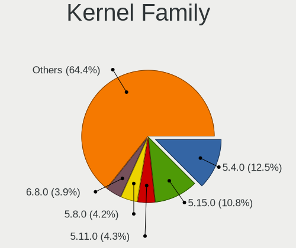
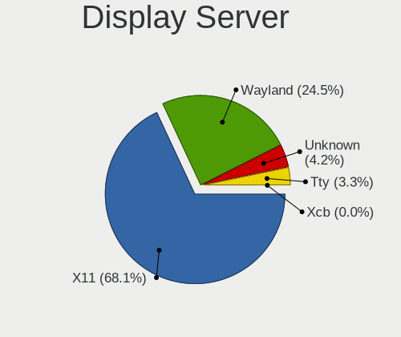
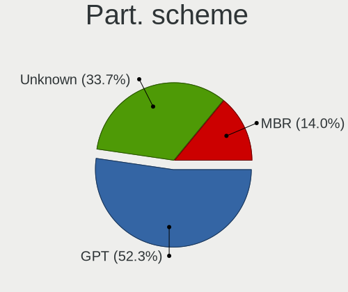
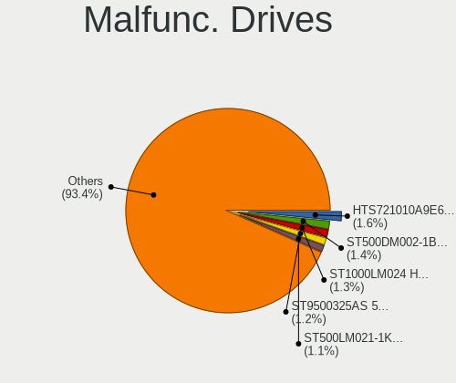
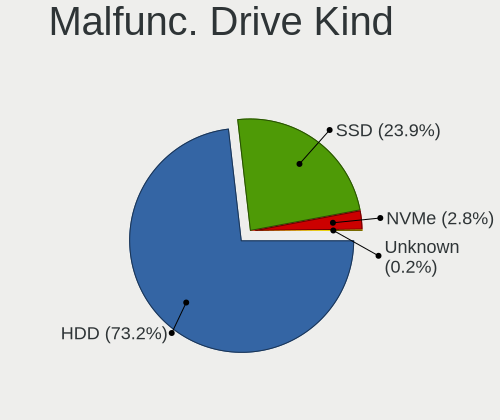
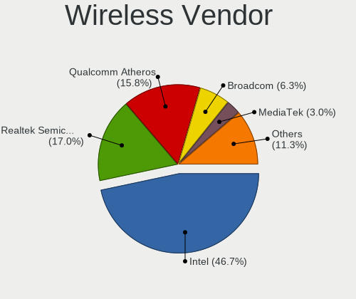

Linux in France - Tested Hardware & Statistics
----------------------------------------------

A project to collect tested hardware configurations for Linux in France.

Anyone can contribute to this report by the [hw-probe](https://github.com/linuxhw/hw-probe) tool:

    sudo -E hw-probe -all -upload

Please contribute! Especially if your hardware is rare.

This is a report for all computer types. See also reports for [desktops](/Location/France/Desktop/README.md) and [notebooks](/Location/France/Notebook/README.md).

Contents
--------

* [ Test Cases ](#test-cases)

* [ System ](#system)
  - [ OS                       ](#os)
  - [ OS Family                ](#os-family)
  - [ Kernel                   ](#kernel)
  - [ Kernel Family            ](#kernel-family)
  - [ Kernel Major Ver.        ](#kernel-major-ver)
  - [ Arch                     ](#arch)
  - [ DE                       ](#de)
  - [ Display Server           ](#display-server)
  - [ Display Manager          ](#display-manager)
  - [ OS Lang                  ](#os-lang)
  - [ Boot Mode                ](#boot-mode)
  - [ Filesystem               ](#filesystem)
  - [ Part. scheme             ](#part-scheme)
  - [ Dual Boot with Linux/BSD ](#dual-boot-with-linuxbsd)
  - [ Dual Boot (Win)          ](#dual-boot-win)

* [ Board ](#board)
  - [ Vendor                   ](#vendor)
  - [ Model                    ](#model)
  - [ Model Family             ](#model-family)
  - [ MFG Year                 ](#mfg-year)
  - [ Form Factor              ](#form-factor)
  - [ Secure Boot              ](#secure-boot)
  - [ Coreboot                 ](#coreboot)
  - [ RAM Size                 ](#ram-size)
  - [ RAM Used                 ](#ram-used)
  - [ Total Drives             ](#total-drives)
  - [ Has CD-ROM               ](#has-cd-rom)
  - [ Has Ethernet             ](#has-ethernet)
  - [ Has WiFi                 ](#has-wifi)
  - [ Has Bluetooth            ](#has-bluetooth)

* [ Location ](#location)
  - [ Country                  ](#country)
  - [ City                     ](#city)

* [ Drives ](#drives)
  - [ Drive Vendor             ](#drive-vendor)
  - [ Drive Model              ](#drive-model)
  - [ HDD Vendor               ](#hdd-vendor)
  - [ SSD Vendor               ](#ssd-vendor)
  - [ Drive Kind               ](#drive-kind)
  - [ Drive Connector          ](#drive-connector)
  - [ Drive Size               ](#drive-size)
  - [ Space Total              ](#space-total)
  - [ Space Used               ](#space-used)
  - [ Malfunc. Drives          ](#malfunc-drives)
  - [ Malfunc. Drive Vendor    ](#malfunc-drive-vendor)
  - [ Malfunc. HDD Vendor      ](#malfunc-hdd-vendor)
  - [ Malfunc. Drive Kind      ](#malfunc-drive-kind)
  - [ Failed Drives            ](#failed-drives)
  - [ Failed Drive Vendor      ](#failed-drive-vendor)
  - [ Drive Status             ](#drive-status)

* [ Storage controller ](#storage-controller)
  - [ Storage Vendor           ](#storage-vendor)
  - [ Storage Model            ](#storage-model)
  - [ Storage Kind             ](#storage-kind)

* [ Processor ](#processor)
  - [ CPU Vendor               ](#cpu-vendor)
  - [ CPU Model                ](#cpu-model)
  - [ CPU Model Family         ](#cpu-model-family)
  - [ CPU Cores                ](#cpu-cores)
  - [ CPU Sockets              ](#cpu-sockets)
  - [ CPU Threads              ](#cpu-threads)
  - [ CPU Op-Modes             ](#cpu-op-modes)
  - [ CPU Microcode            ](#cpu-microcode)
  - [ CPU Microarch            ](#cpu-microarch)

* [ Graphics ](#graphics)
  - [ GPU Vendor               ](#gpu-vendor)
  - [ GPU Model                ](#gpu-model)
  - [ GPU Combo                ](#gpu-combo)
  - [ GPU Driver               ](#gpu-driver)
  - [ GPU Memory               ](#gpu-memory)

* [ Monitor ](#monitor)
  - [ Monitor Vendor           ](#monitor-vendor)
  - [ Monitor Model            ](#monitor-model)
  - [ Monitor Resolution       ](#monitor-resolution)
  - [ Monitor Diagonal         ](#monitor-diagonal)
  - [ Monitor Width            ](#monitor-width)
  - [ Aspect Ratio             ](#aspect-ratio)
  - [ Monitor Area             ](#monitor-area)
  - [ Pixel Density            ](#pixel-density)
  - [ Multiple Monitors        ](#multiple-monitors)

* [ Network ](#network)
  - [ Net Controller Vendor    ](#net-controller-vendor)
  - [ Net Controller Model     ](#net-controller-model)
  - [ Wireless Vendor          ](#wireless-vendor)
  - [ Wireless Model           ](#wireless-model)
  - [ Ethernet Vendor          ](#ethernet-vendor)
  - [ Ethernet Model           ](#ethernet-model)
  - [ Net Controller Kind      ](#net-controller-kind)
  - [ Used Controller          ](#used-controller)
  - [ NICs                     ](#nics)
  - [ IPv6                     ](#ipv6)

* [ Bluetooth ](#bluetooth)
  - [ Bluetooth Vendor         ](#bluetooth-vendor)
  - [ Bluetooth Model          ](#bluetooth-model)

* [ Sound ](#sound)
  - [ Sound Vendor             ](#sound-vendor)
  - [ Sound Model              ](#sound-model)

* [ Memory ](#memory)
  - [ Memory Vendor            ](#memory-vendor)
  - [ Memory Model             ](#memory-model)
  - [ Memory Kind              ](#memory-kind)
  - [ Memory Form Factor       ](#memory-form-factor)
  - [ Memory Size              ](#memory-size)
  - [ Memory Speed             ](#memory-speed)

* [ Printers & scanners ](#printers--scanners)
  - [ Printer Vendor           ](#printer-vendor)
  - [ Printer Model            ](#printer-model)
  - [ Scanner Vendor           ](#scanner-vendor)
  - [ Scanner Model            ](#scanner-model)

* [ Camera ](#camera)
  - [ Camera Vendor            ](#camera-vendor)
  - [ Camera Model             ](#camera-model)

* [ Security ](#security)
  - [ Fingerprint Vendor       ](#fingerprint-vendor)
  - [ Fingerprint Model        ](#fingerprint-model)
  - [ Chipcard Vendor          ](#chipcard-vendor)
  - [ Chipcard Model           ](#chipcard-model)

* [ Unsupported ](#unsupported)
  - [ Unsupported Devices      ](#unsupported-devices)
  - [ Unsupported Device Types ](#unsupported-device-types)

Test Cases
----------

Total: 8942

| Vendor        | Model                       | Form-Factor | Probe                                                      | Date         |
|---------------|-----------------------------|-------------|------------------------------------------------------------|--------------|
| Dell          | XPS 13 9310                 | Notebook    | [726e3b4cd7](https://linux-hardware.org/?probe=726e3b4cd7) | May 31, 2022 |
| HP            | EliteBook 2570p             | Notebook    | [dabb678748](https://linux-hardware.org/?probe=dabb678748) | May 31, 2022 |
| Lenovo        | 3148 SDK0K13476 WIN 3306... | Desktop     | [5723328e24](https://linux-hardware.org/?probe=5723328e24) | May 31, 2022 |
| Lenovo        | ThinkPad W510 431963G       | Notebook    | [e46a1497d8](https://linux-hardware.org/?probe=e46a1497d8) | May 31, 2022 |
| Toshiba       | Satellite C850D-115         | Notebook    | [fca373e327](https://linux-hardware.org/?probe=fca373e327) | May 31, 2022 |
| ASRock        | N68C-GS4 FX                 | Desktop     | [d7db5b0968](https://linux-hardware.org/?probe=d7db5b0968) | May 30, 2022 |
| Packard Be... | EasyNote TE11HC             | Notebook    | [8350bd6d87](https://linux-hardware.org/?probe=8350bd6d87) | May 30, 2022 |
| Dell          | Latitude 5400               | Notebook    | [0440362644](https://linux-hardware.org/?probe=0440362644) | May 30, 2022 |
| Gigabyte      | Z87X-UD3H-CF                | Desktop     | [b0e96de917](https://linux-hardware.org/?probe=b0e96de917) | May 30, 2022 |
| Gigabyte      | Z87X-UD3H-CF                | Desktop     | [b4f73129a2](https://linux-hardware.org/?probe=b4f73129a2) | May 30, 2022 |
| Lenovo        | ThinkPad X1 Carbon 7th 2... | Notebook    | [6e43e1d4f1](https://linux-hardware.org/?probe=6e43e1d4f1) | May 30, 2022 |
| Timi          | TM1604                      | Notebook    | [cd9b839800](https://linux-hardware.org/?probe=cd9b839800) | May 29, 2022 |
| Dell          | Latitude E6420              | Notebook    | [e109444519](https://linux-hardware.org/?probe=e109444519) | May 29, 2022 |
| Gigabyte      | X570 UD                     | Desktop     | [627604d5dc](https://linux-hardware.org/?probe=627604d5dc) | May 29, 2022 |
| Lenovo        | Legion 5 Pro 16ACH6H 82J... | Notebook    | [b9eae1074f](https://linux-hardware.org/?probe=b9eae1074f) | May 29, 2022 |
| ASRock        | B85M-HDS                    | Desktop     | [54a1e6b445](https://linux-hardware.org/?probe=54a1e6b445) | May 29, 2022 |
| Samsung       | RV410/RV510/S3510/E3510     | Notebook    | [d7800ffe07](https://linux-hardware.org/?probe=d7800ffe07) | May 29, 2022 |
| Apple         | Mac-FFE5EF870D7BA81A iMa... | All in one  | [e054e02eba](https://linux-hardware.org/?probe=e054e02eba) | May 29, 2022 |
| Gigabyte      | Z87X-UD3H-CF                | Desktop     | [c1dd2cf1be](https://linux-hardware.org/?probe=c1dd2cf1be) | May 29, 2022 |
| Gigabyte      | Z87X-UD3H-CF                | Desktop     | [0df520da7e](https://linux-hardware.org/?probe=0df520da7e) | May 29, 2022 |
| MSI           | GF63 Thin 10SCXR            | Notebook    | [0d556408f3](https://linux-hardware.org/?probe=0d556408f3) | May 29, 2022 |
| Valve         | Jupiter                     | Notebook    | [0af4b9c805](https://linux-hardware.org/?probe=0af4b9c805) | May 29, 2022 |
| ASUSTek       | ASUS EXPERTBOOK P5440FA_... | Notebook    | [a0e5cf5b03](https://linux-hardware.org/?probe=a0e5cf5b03) | May 29, 2022 |
| Shuttle       | FS81                        | Desktop     | [756f86d9fc](https://linux-hardware.org/?probe=756f86d9fc) | May 28, 2022 |
| Acer          | Veriton X2631G V:1.0        | Desktop     | [3c144d36f0](https://linux-hardware.org/?probe=3c144d36f0) | May 28, 2022 |
| ASUSTek       | H110M-K                     | Desktop     | [9ff7306bbd](https://linux-hardware.org/?probe=9ff7306bbd) | May 28, 2022 |
| Dell          | XPS 15 9500                 | Notebook    | [ec336b7bfb](https://linux-hardware.org/?probe=ec336b7bfb) | May 28, 2022 |
| Gigabyte      | B450M DS3H-CF               | Desktop     | [ed9c55ffc6](https://linux-hardware.org/?probe=ed9c55ffc6) | May 28, 2022 |
| ASUSTek       | T101HA                      | Tablet      | [de0b2a5b77](https://linux-hardware.org/?probe=de0b2a5b77) | May 28, 2022 |
| ASUSTek       | VivoBook E14 E402WAS        | Notebook    | [9f3d329e42](https://linux-hardware.org/?probe=9f3d329e42) | May 28, 2022 |
| Acer          | Veriton X2631G V:1.0        | Desktop     | [26e26a3995](https://linux-hardware.org/?probe=26e26a3995) | May 28, 2022 |
| MSI           | B450 TOMAHAWK               | Desktop     | [2651c1881a](https://linux-hardware.org/?probe=2651c1881a) | May 27, 2022 |
| ASRock        | N68C-GS4 FX                 | Desktop     | [e78421dc9f](https://linux-hardware.org/?probe=e78421dc9f) | May 27, 2022 |
| HP            | EliteBook 840 G2            | Notebook    | [eeab3d23c4](https://linux-hardware.org/?probe=eeab3d23c4) | May 27, 2022 |
| Dell          | Vostro 15-3568              | Notebook    | [ee23f2618c](https://linux-hardware.org/?probe=ee23f2618c) | May 27, 2022 |
| Dell          | 0YJPT1 A00                  | Desktop     | [b122151e55](https://linux-hardware.org/?probe=b122151e55) | May 27, 2022 |
| ASUSTek       | P8H61                       | Desktop     | [0145453c1a](https://linux-hardware.org/?probe=0145453c1a) | May 27, 2022 |
| ASUSTek       | VivoBook E14 E402WAS        | Notebook    | [8234e83675](https://linux-hardware.org/?probe=8234e83675) | May 27, 2022 |
| Lenovo        | Legion 5 Pro 16ACH6H 82J... | Notebook    | [de0614be43](https://linux-hardware.org/?probe=de0614be43) | May 26, 2022 |
| Lenovo        | Legion 5 Pro 16ACH6H 82J... | Notebook    | [30eed68f77](https://linux-hardware.org/?probe=30eed68f77) | May 26, 2022 |
| ASUSTek       | X205TA                      | Notebook    | [9fa4c6beef](https://linux-hardware.org/?probe=9fa4c6beef) | May 26, 2022 |
| Fujitsu Si... | D2840-A1 S26361-D2840-A1    | Desktop     | [a9d7621b8d](https://linux-hardware.org/?probe=a9d7621b8d) | May 26, 2022 |
| MSI           | X370 GAMING PLUS            | Desktop     | [2f96ea6c22](https://linux-hardware.org/?probe=2f96ea6c22) | May 26, 2022 |
| ASUSTek       | PRIME X570-P                | Desktop     | [3774c9e6e6](https://linux-hardware.org/?probe=3774c9e6e6) | May 26, 2022 |
| MSI           | MPG B550I GAMING EDGE WI... | Desktop     | [740aeb1dff](https://linux-hardware.org/?probe=740aeb1dff) | May 26, 2022 |
| ASUSTek       | PRIME X470-PRO              | Desktop     | [496399846f](https://linux-hardware.org/?probe=496399846f) | May 26, 2022 |
| MSI           | A320M-A PRO MAX             | Desktop     | [f1ccdbbba4](https://linux-hardware.org/?probe=f1ccdbbba4) | May 26, 2022 |
| Gigabyte      | F2A78M-HD2                  | Desktop     | [fc9dd3db05](https://linux-hardware.org/?probe=fc9dd3db05) | May 26, 2022 |
| ASUSTek       | PRIME X570-P                | Desktop     | [f52de609a0](https://linux-hardware.org/?probe=f52de609a0) | May 26, 2022 |
| Gigabyte      | B450M H                     | Desktop     | [9c3f88c494](https://linux-hardware.org/?probe=9c3f88c494) | May 25, 2022 |
| ASUSTek       | ZenBook S UX391UA           | Notebook    | [aa6a60a379](https://linux-hardware.org/?probe=aa6a60a379) | May 25, 2022 |
| MSI           | MPG B550I GAMING EDGE WI... | Desktop     | [44386f8bae](https://linux-hardware.org/?probe=44386f8bae) | May 25, 2022 |
| ASUSTek       | P8Z77-M                     | Desktop     | [6e2da39201](https://linux-hardware.org/?probe=6e2da39201) | May 25, 2022 |
| HP            | ZBook 15 G2                 | Notebook    | [42ebc7f075](https://linux-hardware.org/?probe=42ebc7f075) | May 25, 2022 |
| Acer          | Aspire E5-571               | Notebook    | [b43bf0505e](https://linux-hardware.org/?probe=b43bf0505e) | May 25, 2022 |
| Lenovo        | ThinkPad L540 20AUS39X00    | Notebook    | [6a294d74f4](https://linux-hardware.org/?probe=6a294d74f4) | May 25, 2022 |
| Pegatron      | 2A94                        | Desktop     | [0b4773f876](https://linux-hardware.org/?probe=0b4773f876) | May 25, 2022 |
| Clevo         | W55xEU                      | Notebook    | [c5fd2417f4](https://linux-hardware.org/?probe=c5fd2417f4) | May 25, 2022 |
| Lenovo        | MAHOBAY NOK                 | Desktop     | [aa8d9cb3b9](https://linux-hardware.org/?probe=aa8d9cb3b9) | May 25, 2022 |
| Dell          | Inspiron 7501               | Notebook    | [81f3b14e0a](https://linux-hardware.org/?probe=81f3b14e0a) | May 25, 2022 |
| ASUSTek       | X540LA                      | Notebook    | [2015df99d9](https://linux-hardware.org/?probe=2015df99d9) | May 25, 2022 |
| Packard Be... | IMEDIA S3840                | Desktop     | [d102437a6f](https://linux-hardware.org/?probe=d102437a6f) | May 25, 2022 |
| Quanta        | Leopard ORv2-DDR4 31F06M... | Server      | [b133e19c7a](https://linux-hardware.org/?probe=b133e19c7a) | May 25, 2022 |
| ASUSTek       | X540LJ                      | Notebook    | [dbbcdcd2b5](https://linux-hardware.org/?probe=dbbcdcd2b5) | May 25, 2022 |
| Lenovo        | ThinkPad P14s Gen 1 20Y1... | Notebook    | [0a468b99d2](https://linux-hardware.org/?probe=0a468b99d2) | May 25, 2022 |
| HP            | EliteBook 2560p             | Notebook    | [00b2e6d758](https://linux-hardware.org/?probe=00b2e6d758) | May 24, 2022 |
| Lenovo        | ThinkPad P14s Gen 1 20Y1... | Notebook    | [8b214b9114](https://linux-hardware.org/?probe=8b214b9114) | May 24, 2022 |
| Dell          | XPS 13 9305                 | Notebook    | [c06270a534](https://linux-hardware.org/?probe=c06270a534) | May 24, 2022 |
| Apple         | MacBookAir3,2               | Notebook    | [d53c4aa502](https://linux-hardware.org/?probe=d53c4aa502) | May 24, 2022 |
| ASUSTek       | 1001PXD                     | Notebook    | [8c3e0451e1](https://linux-hardware.org/?probe=8c3e0451e1) | May 24, 2022 |
| ASUSTek       | M4N68T-M-V2                 | Desktop     | [e317246d50](https://linux-hardware.org/?probe=e317246d50) | May 24, 2022 |
| Shuttle       | FH170                       | Desktop     | [2645369ebc](https://linux-hardware.org/?probe=2645369ebc) | May 24, 2022 |
| HP            | 83EE                        | Desktop     | [dba7684d63](https://linux-hardware.org/?probe=dba7684d63) | May 24, 2022 |
| Dell          | Precision 3561              | Notebook    | [71657d24c1](https://linux-hardware.org/?probe=71657d24c1) | May 24, 2022 |
| Dell          | Precision 3561              | Notebook    | [385a286d0d](https://linux-hardware.org/?probe=385a286d0d) | May 24, 2022 |
| ASRock        | H470M-ITX/ac                | Desktop     | [181f7decc6](https://linux-hardware.org/?probe=181f7decc6) | May 24, 2022 |
| Dell          | XPS 13 9360                 | Notebook    | [41f966f459](https://linux-hardware.org/?probe=41f966f459) | May 24, 2022 |
| ASRockRack    | E3C232D2I                   | Desktop     | [0442460b97](https://linux-hardware.org/?probe=0442460b97) | May 24, 2022 |
| Lenovo        | ThinkPad P14s Gen 1 20Y1... | Notebook    | [a59234d081](https://linux-hardware.org/?probe=a59234d081) | May 24, 2022 |
| Gigabyte      | 970A-DS3P                   | Desktop     | [23d890ffc6](https://linux-hardware.org/?probe=23d890ffc6) | May 23, 2022 |
| Shuttle       | FS110                       | Desktop     | [d1147263be](https://linux-hardware.org/?probe=d1147263be) | May 23, 2022 |
| Acer          | Aspire 5736Z                | Notebook    | [78318327dd](https://linux-hardware.org/?probe=78318327dd) | May 23, 2022 |
| Acer          | Aspire 5736Z                | Notebook    | [621183d005](https://linux-hardware.org/?probe=621183d005) | May 23, 2022 |
| HUAWEI        | BOHB-WAX9                   | Notebook    | [64a3f31676](https://linux-hardware.org/?probe=64a3f31676) | May 23, 2022 |
| Timi          | TM1612                      | Notebook    | [50c4a534fb](https://linux-hardware.org/?probe=50c4a534fb) | May 23, 2022 |
| Timi          | TM1612                      | Notebook    | [8eb7ad8654](https://linux-hardware.org/?probe=8eb7ad8654) | May 23, 2022 |
| ASUSTek       | H61M-C                      | Desktop     | [4b17ea4a7f](https://linux-hardware.org/?probe=4b17ea4a7f) | May 23, 2022 |
| Lenovo        | ThinkPad T440p 20AWS17N0... | Notebook    | [0a9f7ecc76](https://linux-hardware.org/?probe=0a9f7ecc76) | May 23, 2022 |
| Dell          | 0F6X5P A00                  | Desktop     | [506150769b](https://linux-hardware.org/?probe=506150769b) | May 23, 2022 |
| ASUSTek       | ROG Maximus XII FORMULA     | Desktop     | [685e1fb0e9](https://linux-hardware.org/?probe=685e1fb0e9) | May 22, 2022 |
| MSI           | MPG B550 GAMING EDGE WIF... | Desktop     | [3e34ce179d](https://linux-hardware.org/?probe=3e34ce179d) | May 22, 2022 |
| Gigabyte      | TRX40 AORUS PRO WIFI        | Desktop     | [0c144ce08f](https://linux-hardware.org/?probe=0c144ce08f) | May 22, 2022 |
| ASUSTek       | ROG Maximus XII FORMULA     | Desktop     | [d702284a55](https://linux-hardware.org/?probe=d702284a55) | May 22, 2022 |
| ASUSTek       | X705UAP                     | Notebook    | [bd15f53ec3](https://linux-hardware.org/?probe=bd15f53ec3) | May 22, 2022 |
| Intel         | D33217GKE G76540-203        | Desktop     | [306d3e6caf](https://linux-hardware.org/?probe=306d3e6caf) | May 22, 2022 |
| ASUSTek       | X510UA                      | Notebook    | [51d57b9e53](https://linux-hardware.org/?probe=51d57b9e53) | May 22, 2022 |
| Shuttle       | FS110                       | Desktop     | [4845946b59](https://linux-hardware.org/?probe=4845946b59) | May 22, 2022 |
| MSI           | H97M-G43                    | Desktop     | [3869b1146e](https://linux-hardware.org/?probe=3869b1146e) | May 22, 2022 |
| Lenovo        | IdeaPad 320S-14IKB 80X4     | Notebook    | [aa6aefb86a](https://linux-hardware.org/?probe=aa6aefb86a) | May 21, 2022 |
| MSI           | Modern 14 A10M              | Notebook    | [97a0996658](https://linux-hardware.org/?probe=97a0996658) | May 21, 2022 |
| Toshiba       | Satellite L655              | Notebook    | [3ea531093a](https://linux-hardware.org/?probe=3ea531093a) | May 21, 2022 |
| ASUSTek       | P7P55D-E PRO                | Desktop     | [dfa1010543](https://linux-hardware.org/?probe=dfa1010543) | May 21, 2022 |
| Gigabyte      | Z77P-D3                     | Desktop     | [fc0a2b2595](https://linux-hardware.org/?probe=fc0a2b2595) | May 21, 2022 |
| ASUSTek       | F7L                         | Notebook    | [f5bcd583ac](https://linux-hardware.org/?probe=f5bcd583ac) | May 21, 2022 |
| ASUSTek       | K73SD                       | Notebook    | [8c77e10639](https://linux-hardware.org/?probe=8c77e10639) | May 21, 2022 |
| HP            | Notebook                    | Notebook    | [a1be02b2d6](https://linux-hardware.org/?probe=a1be02b2d6) | May 21, 2022 |
| PC Special... | NP5x_NP6x_NP7xPNK_PNH_PN... | Notebook    | [e002072665](https://linux-hardware.org/?probe=e002072665) | May 21, 2022 |
| eMachines     | E525                        | Notebook    | [ca296b06c9](https://linux-hardware.org/?probe=ca296b06c9) | May 21, 2022 |
| MSI           | B450-A PRO MAX              | Desktop     | [0fe6809527](https://linux-hardware.org/?probe=0fe6809527) | May 20, 2022 |
| Acer          | Aspire 7750G                | Notebook    | [0fd6c8569c](https://linux-hardware.org/?probe=0fd6c8569c) | May 20, 2022 |
| MSI           | MAG Z490 TOMAHAWK           | Desktop     | [a21b574411](https://linux-hardware.org/?probe=a21b574411) | May 20, 2022 |
| ASUSTek       | Maximus III Formula         | Desktop     | [866cd3e9f6](https://linux-hardware.org/?probe=866cd3e9f6) | May 20, 2022 |
| Lenovo        | ThinkPad X1 Carbon 4th 2... | Notebook    | [e876753143](https://linux-hardware.org/?probe=e876753143) | May 20, 2022 |
| ASUSTek       | Z87-DELUXE                  | Desktop     | [bcd22d5d0e](https://linux-hardware.org/?probe=bcd22d5d0e) | May 20, 2022 |
| Gigabyte      | GA-78LMT-S2P                | Desktop     | [73fdd642c6](https://linux-hardware.org/?probe=73fdd642c6) | May 19, 2022 |
| ASUSTek       | TUF Gaming B450-PLUS II     | Desktop     | [6a9166ca20](https://linux-hardware.org/?probe=6a9166ca20) | May 19, 2022 |
| MSI           | H110M PRO-VD                | Desktop     | [5c61e35792](https://linux-hardware.org/?probe=5c61e35792) | May 19, 2022 |
| Lenovo        | ThinkPad E14 Gen 2 20TA0... | Notebook    | [2972e28673](https://linux-hardware.org/?probe=2972e28673) | May 19, 2022 |
| MSI           | MAG B560M MORTAR WIFI       | Desktop     | [4e7e663f39](https://linux-hardware.org/?probe=4e7e663f39) | May 19, 2022 |
| ASUSTek       | Z97-C                       | Desktop     | [11968efbc5](https://linux-hardware.org/?probe=11968efbc5) | May 19, 2022 |
| ASUSTek       | VivoBook E14 E402WAS        | Notebook    | [df0ca9457c](https://linux-hardware.org/?probe=df0ca9457c) | May 18, 2022 |
| Unknown       | Unknown                     | Notebook    | [f3395963a9](https://linux-hardware.org/?probe=f3395963a9) | May 18, 2022 |
| ASRock        | B560M Pro4                  | Desktop     | [ba3b29db98](https://linux-hardware.org/?probe=ba3b29db98) | May 18, 2022 |
| ASUSTek       | PRIME B450M-K               | Desktop     | [54f3323bd2](https://linux-hardware.org/?probe=54f3323bd2) | May 18, 2022 |
| Dell          | Inspiron 14 7420 2-in-1     | Notebook    | [6ce320a4ac](https://linux-hardware.org/?probe=6ce320a4ac) | May 18, 2022 |
| Dell          | Inspiron 14 7420 2-in-1     | Notebook    | [63e24c7f2d](https://linux-hardware.org/?probe=63e24c7f2d) | May 18, 2022 |
| ASUSTek       | UX305FA                     | Notebook    | [5ec0821cdf](https://linux-hardware.org/?probe=5ec0821cdf) | May 18, 2022 |
| MSI           | B350M MORTAR                | Desktop     | [fd66fd9a5a](https://linux-hardware.org/?probe=fd66fd9a5a) | May 18, 2022 |
| ASUSTek       | P8Z68-V PRO GEN3            | Desktop     | [8a6fc346c5](https://linux-hardware.org/?probe=8a6fc346c5) | May 18, 2022 |
| ASUSTek       | X556URK                     | Notebook    | [b217fd2c65](https://linux-hardware.org/?probe=b217fd2c65) | May 18, 2022 |
| ASUSTek       | PRIME B450M-K               | Desktop     | [1dba88e243](https://linux-hardware.org/?probe=1dba88e243) | May 18, 2022 |
| Dell          | Latitude D610               | Notebook    | [2e945626d4](https://linux-hardware.org/?probe=2e945626d4) | May 17, 2022 |
| Apple         | Mac-F221BEC8                | Desktop     | [92c20deb50](https://linux-hardware.org/?probe=92c20deb50) | May 17, 2022 |
| Dell          | Latitude D610               | Notebook    | [9ee1df5d0e](https://linux-hardware.org/?probe=9ee1df5d0e) | May 17, 2022 |
| ASUSTek       | ROG Strix G513RM_G513RM     | Notebook    | [331099a3da](https://linux-hardware.org/?probe=331099a3da) | May 17, 2022 |
| Lenovo        | Legion 5 Pro 16ACH6H 82J... | Notebook    | [1ccddf153e](https://linux-hardware.org/?probe=1ccddf153e) | May 17, 2022 |
| Dell          | XPS 13 7390                 | Notebook    | [395da9a242](https://linux-hardware.org/?probe=395da9a242) | May 17, 2022 |
| Dell          | XPS 13 7390                 | Notebook    | [b2543f26eb](https://linux-hardware.org/?probe=b2543f26eb) | May 17, 2022 |
| Gigabyte      | B75N                        | Desktop     | [b3e561590b](https://linux-hardware.org/?probe=b3e561590b) | May 17, 2022 |
| Toshiba       | Satellite L655              | Notebook    | [7709c37037](https://linux-hardware.org/?probe=7709c37037) | May 17, 2022 |
| ASUSTek       | PRIME Z690M-PLUS D4         | Desktop     | [818ee286b7](https://linux-hardware.org/?probe=818ee286b7) | May 17, 2022 |
| Toshiba       | Satellite L655              | Notebook    | [1d12d6b59a](https://linux-hardware.org/?probe=1d12d6b59a) | May 17, 2022 |
| Pegatron      | 2A94                        | Desktop     | [c54b357993](https://linux-hardware.org/?probe=c54b357993) | May 16, 2022 |
| Dell          | 0GTK4K A02                  | Desktop     | [fba6de28d9](https://linux-hardware.org/?probe=fba6de28d9) | May 16, 2022 |
| Lenovo        | ThinkPad X1 Carbon 4th 2... | Notebook    | [1454db93a0](https://linux-hardware.org/?probe=1454db93a0) | May 16, 2022 |
| Lenovo        | ThinkPad T420 4236JV8       | Notebook    | [93ea3c3211](https://linux-hardware.org/?probe=93ea3c3211) | May 16, 2022 |
| ASUSTek       | K30AD_M31AD_M51AD_M32AD     | Desktop     | [efe02f8593](https://linux-hardware.org/?probe=efe02f8593) | May 16, 2022 |
| Dell          | Latitude E6400              | Notebook    | [d89696196c](https://linux-hardware.org/?probe=d89696196c) | May 16, 2022 |
| ASUSTek       | H110T                       | Desktop     | [e1d711b496](https://linux-hardware.org/?probe=e1d711b496) | May 16, 2022 |
| HP            | EliteBook 2560p             | Notebook    | [04c60d52d9](https://linux-hardware.org/?probe=04c60d52d9) | May 16, 2022 |
| ASUSTek       | VivoBook E14 E402WAS        | Notebook    | [4961cf3603](https://linux-hardware.org/?probe=4961cf3603) | May 16, 2022 |
| Lenovo        | ThinkPad T400 276521G       | Notebook    | [9a2f5118c5](https://linux-hardware.org/?probe=9a2f5118c5) | May 15, 2022 |
| Lenovo        | ThinkPad L540 20AUA27UFR    | Notebook    | [4a6dd68139](https://linux-hardware.org/?probe=4a6dd68139) | May 15, 2022 |
| Lenovo        | 3168 NOK                    | Desktop     | [273ebcdba6](https://linux-hardware.org/?probe=273ebcdba6) | May 15, 2022 |
| MSI           | MEG X570 UNIFY              | Desktop     | [4d00452dcb](https://linux-hardware.org/?probe=4d00452dcb) | May 15, 2022 |
| Gigabyte      | PH67A-D3-B3                 | Desktop     | [e819cbe6f7](https://linux-hardware.org/?probe=e819cbe6f7) | May 15, 2022 |
| Acer          | Aspire A317-32              | Notebook    | [8a8e910ffc](https://linux-hardware.org/?probe=8a8e910ffc) | May 15, 2022 |
| ASUSTek       | H170M-PLUS                  | Desktop     | [c1f5cb662f](https://linux-hardware.org/?probe=c1f5cb662f) | May 15, 2022 |
| Acer          | Swift SF314-54              | Notebook    | [1624fff74b](https://linux-hardware.org/?probe=1624fff74b) | May 15, 2022 |
| Thomson       | NEO14SBK                    | Notebook    | [2ae5fbd212](https://linux-hardware.org/?probe=2ae5fbd212) | May 15, 2022 |
| Gigabyte      | PH67A-D3-B3                 | Desktop     | [a292b16ff7](https://linux-hardware.org/?probe=a292b16ff7) | May 14, 2022 |
| ASUSTek       | GL552VW                     | Notebook    | [ef37144b46](https://linux-hardware.org/?probe=ef37144b46) | May 14, 2022 |
| Lenovo        | ThinkPad L14 Gen 2 20X10... | Notebook    | [bf7abc840c](https://linux-hardware.org/?probe=bf7abc840c) | May 14, 2022 |
| Dell          | 0JGM7F A00                  | Desktop     | [49bb61d936](https://linux-hardware.org/?probe=49bb61d936) | May 14, 2022 |
| MSI           | MPG B550 GAMING PLUS        | Desktop     | [3112931a28](https://linux-hardware.org/?probe=3112931a28) | May 14, 2022 |
| Dell          | 0JGM7F A00                  | Desktop     | [1f5b1d9c0a](https://linux-hardware.org/?probe=1f5b1d9c0a) | May 14, 2022 |
| HP            | 8924 0100                   | All in one  | [e4fdb39fd8](https://linux-hardware.org/?probe=e4fdb39fd8) | May 14, 2022 |
| MSI           | 970 GAMING                  | Desktop     | [bb9d221b00](https://linux-hardware.org/?probe=bb9d221b00) | May 14, 2022 |
| Lenovo        | ThinkPad L14 Gen 2 20X10... | Notebook    | [107ca55bd4](https://linux-hardware.org/?probe=107ca55bd4) | May 14, 2022 |
| Fujitsu       | LIFEBOOK E746               | Notebook    | [dd9eac2f81](https://linux-hardware.org/?probe=dd9eac2f81) | May 14, 2022 |
| Gigabyte      | P55-UD3R                    | Desktop     | [638e77ebd8](https://linux-hardware.org/?probe=638e77ebd8) | May 13, 2022 |
| Lenovo        | ThinkPad T14 Gen 1 20UDC... | Notebook    | [d8cfc5384f](https://linux-hardware.org/?probe=d8cfc5384f) | May 13, 2022 |
| Lenovo        | ThinkPad L520 5017W5C       | Notebook    | [7e841df590](https://linux-hardware.org/?probe=7e841df590) | May 13, 2022 |
| Acer          | Veriton M670G               | Desktop     | [a583d3a342](https://linux-hardware.org/?probe=a583d3a342) | May 13, 2022 |
| ASUSTek       | F1A75-M LE                  | Desktop     | [823a7381c9](https://linux-hardware.org/?probe=823a7381c9) | May 13, 2022 |
| MSI           | B450M MORTAR TITANIUM       | Desktop     | [b03899e10b](https://linux-hardware.org/?probe=b03899e10b) | May 13, 2022 |
| ASUSTek       | F1A75-M LE                  | Desktop     | [d7733a6d5e](https://linux-hardware.org/?probe=d7733a6d5e) | May 13, 2022 |
| Shuttle       | FH170                       | Desktop     | [9a5b55b35c](https://linux-hardware.org/?probe=9a5b55b35c) | May 13, 2022 |
| MSI           | Z97 GAMING 5                | Desktop     | [e395176aad](https://linux-hardware.org/?probe=e395176aad) | May 13, 2022 |
| ASUSTek       | PRIME A320M-K               | Desktop     | [a0a6e09b95](https://linux-hardware.org/?probe=a0a6e09b95) | May 13, 2022 |
| Dell          | G3 3779                     | Notebook    | [c1da54a43b](https://linux-hardware.org/?probe=c1da54a43b) | May 13, 2022 |
| Apple         | MacBookPro5,2               | Notebook    | [0a3017f333](https://linux-hardware.org/?probe=0a3017f333) | May 13, 2022 |
| Dell          | Inspiron 16 5620            | Notebook    | [b42e1cf95b](https://linux-hardware.org/?probe=b42e1cf95b) | May 13, 2022 |
| HUAWEI        | WRTB-WXX9                   | Notebook    | [7f2b79a6fa](https://linux-hardware.org/?probe=7f2b79a6fa) | May 12, 2022 |
| Lenovo        | Yoga 2 13 20344             | Notebook    | [bdd61986c1](https://linux-hardware.org/?probe=bdd61986c1) | May 12, 2022 |
| HP            | ProBook 4330s               | Notebook    | [52494be83b](https://linux-hardware.org/?probe=52494be83b) | May 12, 2022 |
| Fujitsu       | LIFEBOOK E746               | Notebook    | [8551aac5e5](https://linux-hardware.org/?probe=8551aac5e5) | May 12, 2022 |
| Dell          | Latitude E5570              | Notebook    | [ec640c6644](https://linux-hardware.org/?probe=ec640c6644) | May 12, 2022 |
| ASUSTek       | TUF Gaming B550-PLUS        | Desktop     | [bf4afe4481](https://linux-hardware.org/?probe=bf4afe4481) | May 12, 2022 |
| Lenovo        | ThinkPad E595 20NFS05500    | Notebook    | [8656f72354](https://linux-hardware.org/?probe=8656f72354) | May 11, 2022 |
| ASUSTek       | A7K                         | Notebook    | [29ca1c7e33](https://linux-hardware.org/?probe=29ca1c7e33) | May 11, 2022 |
| HP            | ENVY Laptop 13-ba1xxx       | Notebook    | [2591f59c80](https://linux-hardware.org/?probe=2591f59c80) | May 11, 2022 |
| MSI           | GT60 2OC/2OD                | Notebook    | [aa055927a2](https://linux-hardware.org/?probe=aa055927a2) | May 11, 2022 |
| Lenovo        | SHARKBAY NOK                | Desktop     | [7923c29010](https://linux-hardware.org/?probe=7923c29010) | May 11, 2022 |
| MSI           | X370 GAMING PRO CARBON      | Desktop     | [b1d977cd69](https://linux-hardware.org/?probe=b1d977cd69) | May 11, 2022 |
| HUAWEI        | NBLK-WAX9X                  | Notebook    | [d5df500fa3](https://linux-hardware.org/?probe=d5df500fa3) | May 10, 2022 |
| Dell          | Latitude 5290               | Notebook    | [f83f9858f3](https://linux-hardware.org/?probe=f83f9858f3) | May 10, 2022 |
| MSI           | Modern 15 A11M              | Notebook    | [8fe60eb961](https://linux-hardware.org/?probe=8fe60eb961) | May 10, 2022 |
| Toshiba       | Satellite C55-A-1N0         | Notebook    | [c64d31da4e](https://linux-hardware.org/?probe=c64d31da4e) | May 10, 2022 |
| Apple         | Mac-031AEE4D24BFF0B1 Mac... | Mini pc     | [ac9cea2d6c](https://linux-hardware.org/?probe=ac9cea2d6c) | May 10, 2022 |
| Dell          | 0DR845                      | Desktop     | [ab501b0efe](https://linux-hardware.org/?probe=ab501b0efe) | May 10, 2022 |
| ASUSTek       | VivoBook_ASUSLaptop X412... | Notebook    | [e6d579fd5b](https://linux-hardware.org/?probe=e6d579fd5b) | May 10, 2022 |
| Dell          | XPS 13 9310                 | Notebook    | [cae0934838](https://linux-hardware.org/?probe=cae0934838) | May 10, 2022 |
| MSI           | B360 GAMING PLUS            | Desktop     | [4591877807](https://linux-hardware.org/?probe=4591877807) | May 10, 2022 |
| Lenovo        | Flex 2-14 20404             | Notebook    | [92ea1dc23f](https://linux-hardware.org/?probe=92ea1dc23f) | May 10, 2022 |
| MSI           | X370 GAMING PRO CARBON      | Desktop     | [c8eccf75df](https://linux-hardware.org/?probe=c8eccf75df) | May 09, 2022 |
| MSI           | X370 GAMING PRO CARBON      | Desktop     | [ca1de5c6ae](https://linux-hardware.org/?probe=ca1de5c6ae) | May 09, 2022 |
| Gigabyte      | X570 UD                     | Desktop     | [20c66a91ff](https://linux-hardware.org/?probe=20c66a91ff) | May 09, 2022 |
| HP            | ProBook 4510s               | Notebook    | [1464ea43d3](https://linux-hardware.org/?probe=1464ea43d3) | May 09, 2022 |
| MSI           | Modern 15 A10M              | Notebook    | [88c226c079](https://linux-hardware.org/?probe=88c226c079) | May 09, 2022 |
| HP            | Pavilion Notebook           | Notebook    | [637a04a2d1](https://linux-hardware.org/?probe=637a04a2d1) | May 09, 2022 |
| ASUSTek       | K95VJ                       | Notebook    | [5e07819ad6](https://linux-hardware.org/?probe=5e07819ad6) | May 09, 2022 |
| MSI           | 760GM-P34                   | Desktop     | [85bea22dfe](https://linux-hardware.org/?probe=85bea22dfe) | May 09, 2022 |
| ASUSTek       | Z87-A                       | Desktop     | [ecff4161ad](https://linux-hardware.org/?probe=ecff4161ad) | May 08, 2022 |
| ASUSTek       | TUF Gaming B560-PLUS WIF... | Desktop     | [8f09cb9a0e](https://linux-hardware.org/?probe=8f09cb9a0e) | May 08, 2022 |
| Dell          | Inspiron 5482               | Notebook    | [fb9b420ea8](https://linux-hardware.org/?probe=fb9b420ea8) | May 08, 2022 |
| Pegatron      | Eureka3                     | Desktop     | [e383533179](https://linux-hardware.org/?probe=e383533179) | May 08, 2022 |
| Samsung       | 350V5C/351V5C/3540VC/344... | Notebook    | [877b9a8dea](https://linux-hardware.org/?probe=877b9a8dea) | May 08, 2022 |
| Packard Be... | 1.XX                        | Desktop     | [d06b70fd87](https://linux-hardware.org/?probe=d06b70fd87) | May 08, 2022 |
| Packard Be... | 1.XX                        | Desktop     | [9f3bfe5333](https://linux-hardware.org/?probe=9f3bfe5333) | May 08, 2022 |
| ASUSTek       | TUF X470-PLUS GAMING        | Desktop     | [dc9b228486](https://linux-hardware.org/?probe=dc9b228486) | May 08, 2022 |
| Apple         | MacBookAir6,2               | Notebook    | [1e1f4caa54](https://linux-hardware.org/?probe=1e1f4caa54) | May 08, 2022 |
| Chuwi         | GemiBook Pro                | Notebook    | [b5145fe094](https://linux-hardware.org/?probe=b5145fe094) | May 08, 2022 |
| ASUSTek       | SABERTOOTH X58              | Desktop     | [c276639676](https://linux-hardware.org/?probe=c276639676) | May 08, 2022 |
| ASUSTek       | P8H77-V LE                  | Desktop     | [acf562b58b](https://linux-hardware.org/?probe=acf562b58b) | May 08, 2022 |
| ASUSTek       | P8H77-V LE                  | Desktop     | [1a3e2da376](https://linux-hardware.org/?probe=1a3e2da376) | May 08, 2022 |
| Acer          | Aspire 5253G                | Notebook    | [6f6b26ee56](https://linux-hardware.org/?probe=6f6b26ee56) | May 08, 2022 |
| ASUSTek       | SABERTOOTH X58              | Desktop     | [3aa3223913](https://linux-hardware.org/?probe=3aa3223913) | May 07, 2022 |
| Lenovo        | ThinkPad X250 20CLS2TQ22    | Notebook    | [8fa9fd80a0](https://linux-hardware.org/?probe=8fa9fd80a0) | May 07, 2022 |
| MSI           | Katana GF76 12UEK           | Notebook    | [10e7f811ff](https://linux-hardware.org/?probe=10e7f811ff) | May 07, 2022 |
| Acer          | F690GVM                     | Desktop     | [4883e77b23](https://linux-hardware.org/?probe=4883e77b23) | May 07, 2022 |
| Timi          | TM1604                      | Notebook    | [bc97206a3a](https://linux-hardware.org/?probe=bc97206a3a) | May 07, 2022 |
| Dell          | Latitude 3540               | Notebook    | [e4dd2ae509](https://linux-hardware.org/?probe=e4dd2ae509) | May 06, 2022 |
| HP            | 1495                        | Desktop     | [4b63b733be](https://linux-hardware.org/?probe=4b63b733be) | May 06, 2022 |
| MSI           | B450 TOMAHAWK MAX II        | Desktop     | [216b5bc826](https://linux-hardware.org/?probe=216b5bc826) | May 06, 2022 |
| MSI           | B450 TOMAHAWK MAX II        | Desktop     | [54046196e9](https://linux-hardware.org/?probe=54046196e9) | May 06, 2022 |
| Dell          | 0GK35Y A00                  | Desktop     | [0be64397bb](https://linux-hardware.org/?probe=0be64397bb) | May 06, 2022 |
| ASUSTek       | EB1501P                     | Desktop     | [f1d427d32b](https://linux-hardware.org/?probe=f1d427d32b) | May 06, 2022 |
| Toshiba       | Satellite C70D-B            | Notebook    | [fa4a4b7ffc](https://linux-hardware.org/?probe=fa4a4b7ffc) | May 06, 2022 |
| Dell          | Inspiron 15 5510            | Notebook    | [c927d230e7](https://linux-hardware.org/?probe=c927d230e7) | May 06, 2022 |
| Acer          | Aspire A317-32              | Notebook    | [ae2c984a96](https://linux-hardware.org/?probe=ae2c984a96) | May 06, 2022 |
| Acer          | Nitro AN515-45              | Notebook    | [aefe7a52e0](https://linux-hardware.org/?probe=aefe7a52e0) | May 06, 2022 |
| Packard Be... | EasyNote TSX66HR            | Notebook    | [becf9e42b8](https://linux-hardware.org/?probe=becf9e42b8) | May 05, 2022 |
| HP            | 1495                        | Desktop     | [c845f7b657](https://linux-hardware.org/?probe=c845f7b657) | May 05, 2022 |
| Dell          | Latitude 7420               | Notebook    | [384325350c](https://linux-hardware.org/?probe=384325350c) | May 05, 2022 |
| ASUSTek       | K55VD                       | Notebook    | [8ff47b2a2c](https://linux-hardware.org/?probe=8ff47b2a2c) | May 05, 2022 |
| Dell          | Inspiron 14 5410            | Notebook    | [8cf21cf03f](https://linux-hardware.org/?probe=8cf21cf03f) | May 05, 2022 |
| Toshiba       | Satellite C670D-12N         | Notebook    | [f6bd692d1f](https://linux-hardware.org/?probe=f6bd692d1f) | May 05, 2022 |
| Teclast       | F7 Plus                     | Notebook    | [6aedd4e799](https://linux-hardware.org/?probe=6aedd4e799) | May 05, 2022 |
| HP            | ProBook 450 G5              | Notebook    | [cfa52783d2](https://linux-hardware.org/?probe=cfa52783d2) | May 05, 2022 |
| Acer          | Aspire 7740                 | Notebook    | [b7f708e626](https://linux-hardware.org/?probe=b7f708e626) | May 05, 2022 |
| Intel         | NUC7JYB J67967-404          | Mini pc     | [23b39ddb3a](https://linux-hardware.org/?probe=23b39ddb3a) | May 05, 2022 |
| HUAWEI        | WRTB-WXX9                   | Notebook    | [9af4db58d6](https://linux-hardware.org/?probe=9af4db58d6) | May 05, 2022 |
| ASUSTek       | TUF Gaming B450-PLUS II     | Desktop     | [d0a7dbb1e0](https://linux-hardware.org/?probe=d0a7dbb1e0) | May 04, 2022 |
| ASUSTek       | GL552VX                     | Notebook    | [d153ef27fa](https://linux-hardware.org/?probe=d153ef27fa) | May 04, 2022 |
| eMachines     | E525                        | Notebook    | [dfc36c2ea0](https://linux-hardware.org/?probe=dfc36c2ea0) | May 04, 2022 |
| TUXEDO        | Pulse 15 Gen1               | Notebook    | [eeb6685345](https://linux-hardware.org/?probe=eeb6685345) | May 04, 2022 |
| Dell          | Inspiron 5502               | Notebook    | [ccc57cd99e](https://linux-hardware.org/?probe=ccc57cd99e) | May 04, 2022 |
| ASUSTek       | PRIME B360-PLUS             | Desktop     | [4ce66ff579](https://linux-hardware.org/?probe=4ce66ff579) | May 04, 2022 |
| HUAWEI        | DRC-WXX                     | Tablet      | [4398a5b70f](https://linux-hardware.org/?probe=4398a5b70f) | May 04, 2022 |
| HP            | ProBook 470 G0              | Notebook    | [17a1e97761](https://linux-hardware.org/?probe=17a1e97761) | May 04, 2022 |
| Lenovo        | Legion Y540-15IRH 81SX      | Notebook    | [5a36e4d0fc](https://linux-hardware.org/?probe=5a36e4d0fc) | May 04, 2022 |
| MSI           | H97M-G43                    | Desktop     | [498fd4cdca](https://linux-hardware.org/?probe=498fd4cdca) | May 03, 2022 |
| Lenovo        | G50-70 20351                | Notebook    | [95a85a5620](https://linux-hardware.org/?probe=95a85a5620) | May 03, 2022 |
| Lenovo        | Legion Y540-15IRH 81SX      | Notebook    | [840bfcee31](https://linux-hardware.org/?probe=840bfcee31) | May 03, 2022 |
| MSI           | H97 GAMING 3                | Desktop     | [c3694433d0](https://linux-hardware.org/?probe=c3694433d0) | May 03, 2022 |
| Lenovo        | ThinkPad T490 20N2CTO1WW    | Notebook    | [79491af642](https://linux-hardware.org/?probe=79491af642) | May 03, 2022 |
| Valve         | Jupiter                     | Notebook    | [771539d18d](https://linux-hardware.org/?probe=771539d18d) | May 03, 2022 |
| Notebook      | NL40_50CU                   | Notebook    | [6cbd46444f](https://linux-hardware.org/?probe=6cbd46444f) | May 02, 2022 |
| Raspberry ... | Raspberry Pi 3 Model B R... | Soc         | [8e925e1c6d](https://linux-hardware.org/?probe=8e925e1c6d) | May 02, 2022 |
| Lenovo        | ThinkCentre M57e 6176A13    | Desktop     | [c920b52ec3](https://linux-hardware.org/?probe=c920b52ec3) | May 02, 2022 |
| Dell          | Latitude E6440              | Notebook    | [d2ab063048](https://linux-hardware.org/?probe=d2ab063048) | May 02, 2022 |
| ASUSTek       | E403SA                      | Notebook    | [c59815fc46](https://linux-hardware.org/?probe=c59815fc46) | May 02, 2022 |
| MSI           | B450I GAMING PLUS AC        | Desktop     | [c0ef0738b5](https://linux-hardware.org/?probe=c0ef0738b5) | May 02, 2022 |
| ASUSTek       | E403SA                      | Notebook    | [1036fd29cb](https://linux-hardware.org/?probe=1036fd29cb) | May 02, 2022 |
| Dell          | 0K7CVF A03                  | Server      | [05ac618789](https://linux-hardware.org/?probe=05ac618789) | May 02, 2022 |
| Sony          | VPCS13V9E                   | Notebook    | [0b565d3fac](https://linux-hardware.org/?probe=0b565d3fac) | May 02, 2022 |
| Dell          | Precision 7530              | Notebook    | [ef011e846b](https://linux-hardware.org/?probe=ef011e846b) | May 02, 2022 |
| ASUSTek       | TUF Gaming B550-PLUS        | Desktop     | [04c7c1f7f4](https://linux-hardware.org/?probe=04c7c1f7f4) | May 02, 2022 |
| Dell          | Precision 3520              | Notebook    | [caae9a5055](https://linux-hardware.org/?probe=caae9a5055) | May 02, 2022 |
| HP            | ZBook 15 G5                 | Notebook    | [334e009f9c](https://linux-hardware.org/?probe=334e009f9c) | May 02, 2022 |
| ASUSTek       | PRIME B450M-A               | Desktop     | [fac138a25c](https://linux-hardware.org/?probe=fac138a25c) | May 02, 2022 |
| Lenovo        | IdeaPad 5 15ALC05 82LN      | Notebook    | [f937431614](https://linux-hardware.org/?probe=f937431614) | May 01, 2022 |
| Dell          | Inspiron 7577               | Notebook    | [e039fa0209](https://linux-hardware.org/?probe=e039fa0209) | May 01, 2022 |
| HP            | Laptop 14-dk0xxx            | Notebook    | [c59146fbec](https://linux-hardware.org/?probe=c59146fbec) | May 01, 2022 |
| HP            | EliteBook 8570p             | Notebook    | [2dffdad8a4](https://linux-hardware.org/?probe=2dffdad8a4) | May 01, 2022 |
| ASUSTek       | F1A75-M LE                  | Desktop     | [93232d0716](https://linux-hardware.org/?probe=93232d0716) | May 01, 2022 |
| Dell          | Inspiron 7577               | Notebook    | [132a55cc40](https://linux-hardware.org/?probe=132a55cc40) | Apr 30, 2022 |
| Gigabyte      | H61M-DS2 x.x                | Desktop     | [463e99eb8c](https://linux-hardware.org/?probe=463e99eb8c) | Apr 30, 2022 |
| ASUSTek       | TUF Gaming X570-PLUS        | Desktop     | [22008db28a](https://linux-hardware.org/?probe=22008db28a) | Apr 30, 2022 |
| ASRock        | B550 Extreme4               | Desktop     | [7a90a198f5](https://linux-hardware.org/?probe=7a90a198f5) | Apr 30, 2022 |
| Dell          | Precision M6500             | Notebook    | [a3d82a4f1a](https://linux-hardware.org/?probe=a3d82a4f1a) | Apr 30, 2022 |
| Dell          | Precision M6500             | Notebook    | [cb7e68eb50](https://linux-hardware.org/?probe=cb7e68eb50) | Apr 30, 2022 |
| ASUSTek       | P8H61-M                     | Desktop     | [942f86f88a](https://linux-hardware.org/?probe=942f86f88a) | Apr 30, 2022 |
| Dell          | G5 5590                     | Notebook    | [4738729947](https://linux-hardware.org/?probe=4738729947) | Apr 30, 2022 |
| Acer          | Aspire ES1-512              | Notebook    | [642d72d06d](https://linux-hardware.org/?probe=642d72d06d) | Apr 30, 2022 |
| HP            | Pavilion dv7                | Notebook    | [f66df9ca5b](https://linux-hardware.org/?probe=f66df9ca5b) | Apr 30, 2022 |
| HP            | Pavilion dv7                | Notebook    | [150931746e](https://linux-hardware.org/?probe=150931746e) | Apr 30, 2022 |
| Lenovo        | ThinkPad T530 2394CTO       | Notebook    | [73ee1262a6](https://linux-hardware.org/?probe=73ee1262a6) | Apr 30, 2022 |
| ASRock        | B550 Extreme4               | Desktop     | [75362e2061](https://linux-hardware.org/?probe=75362e2061) | Apr 30, 2022 |
| Dell          | Latitude 5480               | Notebook    | [ba1ff8183e](https://linux-hardware.org/?probe=ba1ff8183e) | Apr 30, 2022 |
| Gigabyte      | 990FXA-UD3                  | Desktop     | [9b128bc47e](https://linux-hardware.org/?probe=9b128bc47e) | Apr 30, 2022 |
| HP            | ZBook 15 G5                 | Notebook    | [aac5097e2a](https://linux-hardware.org/?probe=aac5097e2a) | Apr 29, 2022 |
| ASUSTek       | ROG STRIX X570-E GAMING     | Desktop     | [970d30df6d](https://linux-hardware.org/?probe=970d30df6d) | Apr 29, 2022 |
| ASUSTek       | S551LN                      | Notebook    | [a5f0e1cee7](https://linux-hardware.org/?probe=a5f0e1cee7) | Apr 29, 2022 |
| Lenovo        | IdeaPad 100-15IBD 80QQ      | Notebook    | [4af637024a](https://linux-hardware.org/?probe=4af637024a) | Apr 29, 2022 |
| ASUSTek       | M5A97 LE R2.0               | Desktop     | [686f4acac4](https://linux-hardware.org/?probe=686f4acac4) | Apr 29, 2022 |
| ASUSTek       | B150 PRO GAMING D3          | Desktop     | [e258d71e2e](https://linux-hardware.org/?probe=e258d71e2e) | Apr 29, 2022 |
| HP            | Pavilion Gaming Laptop 1... | Notebook    | [bd2dda1d8a](https://linux-hardware.org/?probe=bd2dda1d8a) | Apr 29, 2022 |
| HP            | Pavilion Gaming Laptop 1... | Notebook    | [cfc9c5dbf7](https://linux-hardware.org/?probe=cfc9c5dbf7) | Apr 29, 2022 |
| Foxconn       | 2A8C                        | Desktop     | [eb747a3063](https://linux-hardware.org/?probe=eb747a3063) | Apr 29, 2022 |
| Apple         | MacBookPro8,2               | Notebook    | [50c8a02c35](https://linux-hardware.org/?probe=50c8a02c35) | Apr 29, 2022 |
| HP            | Pavilion Laptop 15-cs3xx... | Notebook    | [ac2800ef82](https://linux-hardware.org/?probe=ac2800ef82) | Apr 28, 2022 |
| HP            | Pavilion 17                 | Notebook    | [d865ef2ed1](https://linux-hardware.org/?probe=d865ef2ed1) | Apr 28, 2022 |
| ASUSTek       | VivoBook_ASUSLaptop X521... | Notebook    | [e8349bba13](https://linux-hardware.org/?probe=e8349bba13) | Apr 28, 2022 |
| Dell          | Latitude 5310               | Notebook    | [b4e7215e3b](https://linux-hardware.org/?probe=b4e7215e3b) | Apr 28, 2022 |
| Acer          | Nitro AN515-57              | Notebook    | [3206e0f075](https://linux-hardware.org/?probe=3206e0f075) | Apr 27, 2022 |
| Dell          | 08NPPY A00                  | Desktop     | [6c4d2173a5](https://linux-hardware.org/?probe=6c4d2173a5) | Apr 27, 2022 |
| ASRock        | B550 Extreme4               | Desktop     | [a7061bdb08](https://linux-hardware.org/?probe=a7061bdb08) | Apr 27, 2022 |
| HP            | EliteBook 840 G2            | Notebook    | [8c0c59e517](https://linux-hardware.org/?probe=8c0c59e517) | Apr 27, 2022 |
| Lenovo        | IdeaPad S340-15API 81NC     | Notebook    | [1a773927c4](https://linux-hardware.org/?probe=1a773927c4) | Apr 27, 2022 |
| Lenovo        | ThinkPad P14s Gen 1 20Y1... | Notebook    | [3314e78ec8](https://linux-hardware.org/?probe=3314e78ec8) | Apr 27, 2022 |
| ASUSTek       | TUF Gaming B450-PLUS II     | Desktop     | [f06ce3d416](https://linux-hardware.org/?probe=f06ce3d416) | Apr 27, 2022 |
| Samsung       | 350V5C/351V5C/3540VC/344... | Notebook    | [6e793edd01](https://linux-hardware.org/?probe=6e793edd01) | Apr 27, 2022 |
| ASUSTek       | ROG Zephyrus G14 GA401IH... | Notebook    | [863612cc05](https://linux-hardware.org/?probe=863612cc05) | Apr 27, 2022 |
| Acer          | Aspire A515-55              | Notebook    | [fa33f58948](https://linux-hardware.org/?probe=fa33f58948) | Apr 27, 2022 |
| Gigabyte      | B560M DS3H V2               | Desktop     | [4854a84496](https://linux-hardware.org/?probe=4854a84496) | Apr 27, 2022 |
| Lenovo        | ThinkPad T530 2394CTO       | Notebook    | [9fffc0babc](https://linux-hardware.org/?probe=9fffc0babc) | Apr 26, 2022 |
| Lenovo        | ThinkPad T530 2394CTO       | Notebook    | [b5f175a650](https://linux-hardware.org/?probe=b5f175a650) | Apr 26, 2022 |
| ASUSTek       | X705UA                      | Notebook    | [8c12b4587e](https://linux-hardware.org/?probe=8c12b4587e) | Apr 26, 2022 |
| ASRock        | B550 Extreme4               | Desktop     | [fcd8a2962e](https://linux-hardware.org/?probe=fcd8a2962e) | Apr 26, 2022 |
| ASUSTek       | G750JS                      | Notebook    | [24dab87910](https://linux-hardware.org/?probe=24dab87910) | Apr 26, 2022 |
| Dell          | Latitude 7480               | Notebook    | [7e85baf2f4](https://linux-hardware.org/?probe=7e85baf2f4) | Apr 26, 2022 |
| Dell          | 0FDT3J A04                  | Server      | [20586ef3ab](https://linux-hardware.org/?probe=20586ef3ab) | Apr 26, 2022 |
| ASUSTek       | P6T DELUXE V2               | Desktop     | [0e266b4987](https://linux-hardware.org/?probe=0e266b4987) | Apr 25, 2022 |
| Lenovo        | ThinkPad T14 Gen 2i 20W0... | Notebook    | [37a92322aa](https://linux-hardware.org/?probe=37a92322aa) | Apr 25, 2022 |
| MSI           | GF65 Thin 10UE              | Notebook    | [b099b2ab43](https://linux-hardware.org/?probe=b099b2ab43) | Apr 25, 2022 |
| MSI           | GF65 Thin 10UE              | Notebook    | [79fc46c6f0](https://linux-hardware.org/?probe=79fc46c6f0) | Apr 25, 2022 |
| MSI           | MEG X570 ACE                | Desktop     | [6807da5804](https://linux-hardware.org/?probe=6807da5804) | Apr 25, 2022 |
| Toshiba       | Satellite C50t-B            | Notebook    | [d2a6276ca3](https://linux-hardware.org/?probe=d2a6276ca3) | Apr 25, 2022 |
| ASUSTek       | VivoBook_ASUSLaptop X513... | Notebook    | [a33d02fb0e](https://linux-hardware.org/?probe=a33d02fb0e) | Apr 25, 2022 |
| Lenovo        | G50-30 80G0                 | Notebook    | [c7ea70f7ba](https://linux-hardware.org/?probe=c7ea70f7ba) | Apr 25, 2022 |
| ASUSTek       | G20AJ                       | Desktop     | [ed023008e4](https://linux-hardware.org/?probe=ed023008e4) | Apr 25, 2022 |
| ASUSTek       | P5KPL-AM EPU                | Desktop     | [71c83c7998](https://linux-hardware.org/?probe=71c83c7998) | Apr 25, 2022 |
| MSI           | MEG X570 ACE                | Desktop     | [e558893ff0](https://linux-hardware.org/?probe=e558893ff0) | Apr 25, 2022 |
| MSI           | MEG B550 UNIFY              | Desktop     | [3cf3319591](https://linux-hardware.org/?probe=3cf3319591) | Apr 25, 2022 |
| Dell          | Latitude E7270              | Notebook    | [d8dedbd4f6](https://linux-hardware.org/?probe=d8dedbd4f6) | Apr 25, 2022 |
| Dell          | Precision 3561              | Notebook    | [251f19b464](https://linux-hardware.org/?probe=251f19b464) | Apr 25, 2022 |
| Fujitsu       | D3173-A1 S26361-D3173-A1    | Mini pc     | [16265ec944](https://linux-hardware.org/?probe=16265ec944) | Apr 25, 2022 |
| TUXEDO        | Pulse 15 Gen1               | Notebook    | [5b54f10afa](https://linux-hardware.org/?probe=5b54f10afa) | Apr 24, 2022 |
| HP            | ProBook x360 11 G5 EE       | Convertible | [ef1e814871](https://linux-hardware.org/?probe=ef1e814871) | Apr 24, 2022 |
| Gigabyte      | G41M-Combo                  | Desktop     | [5bfd7adb54](https://linux-hardware.org/?probe=5bfd7adb54) | Apr 24, 2022 |
| ASUSTek       | S551LN                      | Notebook    | [779fe5a429](https://linux-hardware.org/?probe=779fe5a429) | Apr 24, 2022 |
| Alienware     | 17 R2                       | Notebook    | [93cc7785c3](https://linux-hardware.org/?probe=93cc7785c3) | Apr 24, 2022 |
| HP            | ProBook x360 11 G5 EE       | Convertible | [3ea846ae2a](https://linux-hardware.org/?probe=3ea846ae2a) | Apr 24, 2022 |
| ASUSTek       | X540LA                      | Notebook    | [370a60692a](https://linux-hardware.org/?probe=370a60692a) | Apr 24, 2022 |
| ASUSTek       | X550CC                      | Notebook    | [4f77777c97](https://linux-hardware.org/?probe=4f77777c97) | Apr 24, 2022 |
| Dell          | G3 3500                     | Notebook    | [e3f0210b87](https://linux-hardware.org/?probe=e3f0210b87) | Apr 24, 2022 |
| HP            | EliteBook 850 G6            | Notebook    | [438ad440d0](https://linux-hardware.org/?probe=438ad440d0) | Apr 24, 2022 |
| MSI           | MAG B550 TOMAHAWK           | Desktop     | [3f1d42f10f](https://linux-hardware.org/?probe=3f1d42f10f) | Apr 24, 2022 |
| ASUSTek       | B85M-E                      | Desktop     | [31572b098d](https://linux-hardware.org/?probe=31572b098d) | Apr 24, 2022 |
| HP            | 2820h                       | Desktop     | [3918640e67](https://linux-hardware.org/?probe=3918640e67) | Apr 23, 2022 |
| Gigabyte      | X470 AORUS ULTRA GAMING-... | Desktop     | [31ff0c4c22](https://linux-hardware.org/?probe=31ff0c4c22) | Apr 23, 2022 |
| Pegatron      | IPPPV-D3G                   | Desktop     | [2eea78768b](https://linux-hardware.org/?probe=2eea78768b) | Apr 23, 2022 |
| Gigabyte      | Z390 M GAMING-CF            | Desktop     | [929f99800a](https://linux-hardware.org/?probe=929f99800a) | Apr 23, 2022 |
| Dell          | Latitude E4300              | Notebook    | [0bc4953a89](https://linux-hardware.org/?probe=0bc4953a89) | Apr 23, 2022 |
| Dell          | Precision 3551              | Notebook    | [e1921eba79](https://linux-hardware.org/?probe=e1921eba79) | Apr 23, 2022 |
| MSI           | P67A-GD65                   | Desktop     | [ff96b12477](https://linux-hardware.org/?probe=ff96b12477) | Apr 23, 2022 |
| Dell          | XPS 13 9305                 | Notebook    | [51daefb9d3](https://linux-hardware.org/?probe=51daefb9d3) | Apr 22, 2022 |
| Lenovo        | ThinkBook 15p Gen 2 21B1    | Notebook    | [ce0b6939ac](https://linux-hardware.org/?probe=ce0b6939ac) | Apr 22, 2022 |
| Timi          | RedmiBook 14-APCS           | Notebook    | [32cb202a0e](https://linux-hardware.org/?probe=32cb202a0e) | Apr 22, 2022 |
| Lenovo        | Legion Y530-15ICH 81FV      | Notebook    | [2c17462cda](https://linux-hardware.org/?probe=2c17462cda) | Apr 22, 2022 |
| Acer          | Nitro AN515-57              | Notebook    | [848b9d8f5c](https://linux-hardware.org/?probe=848b9d8f5c) | Apr 22, 2022 |
| AMI           | Cherry Trail Tablet         | Desktop     | [a2179e3116](https://linux-hardware.org/?probe=a2179e3116) | Apr 22, 2022 |
| Acer          | Nitro AN515-57              | Notebook    | [da630d58cf](https://linux-hardware.org/?probe=da630d58cf) | Apr 22, 2022 |
| MSI           | Z77A-G43                    | Desktop     | [e0729e8375](https://linux-hardware.org/?probe=e0729e8375) | Apr 22, 2022 |
| Dell          | Inspiron 15 5510            | Notebook    | [73a8933099](https://linux-hardware.org/?probe=73a8933099) | Apr 22, 2022 |
| ASUSTek       | P5QC                        | Desktop     | [63f53fd6cb](https://linux-hardware.org/?probe=63f53fd6cb) | Apr 22, 2022 |
| HUAWEI        | DRC-WXX                     | Tablet      | [b2b1324db9](https://linux-hardware.org/?probe=b2b1324db9) | Apr 22, 2022 |
| MSI           | Pulse GL76 11UEK            | Notebook    | [beff2fb2f8](https://linux-hardware.org/?probe=beff2fb2f8) | Apr 22, 2022 |
| HUAWEI        | DRC-WXX                     | Tablet      | [d459a4ef7d](https://linux-hardware.org/?probe=d459a4ef7d) | Apr 22, 2022 |
| Pegatron      | EVANS                       | Desktop     | [118f512619](https://linux-hardware.org/?probe=118f512619) | Apr 21, 2022 |
| Dell          | XPS 15 7590                 | Notebook    | [5266d4c66b](https://linux-hardware.org/?probe=5266d4c66b) | Apr 21, 2022 |
| Dell          | XPS 15 7590                 | Notebook    | [70d107a754](https://linux-hardware.org/?probe=70d107a754) | Apr 21, 2022 |
| Dell          | 0590KW A01                  | Server      | [e86a005fd7](https://linux-hardware.org/?probe=e86a005fd7) | Apr 21, 2022 |
| Lenovo        | ThinkBook 15 G2 ITL 20VE    | Notebook    | [85b1934bfd](https://linux-hardware.org/?probe=85b1934bfd) | Apr 21, 2022 |
| Dell          | Latitude 5400               | Notebook    | [b9d83d936e](https://linux-hardware.org/?probe=b9d83d936e) | Apr 21, 2022 |
| Sony          | SVE1713V1EB                 | Notebook    | [84441dd32d](https://linux-hardware.org/?probe=84441dd32d) | Apr 21, 2022 |
| Acer          | Nitro N50-600 V:1.1         | Desktop     | [15332404e6](https://linux-hardware.org/?probe=15332404e6) | Apr 21, 2022 |
| Acer          | Nitro N50-600 V:1.1         | Desktop     | [b272388aa6](https://linux-hardware.org/?probe=b272388aa6) | Apr 21, 2022 |
| Dell          | Precision 3561              | Notebook    | [26fa0f202c](https://linux-hardware.org/?probe=26fa0f202c) | Apr 20, 2022 |
| ASUSTek       | X540LJ                      | Notebook    | [33a74b2070](https://linux-hardware.org/?probe=33a74b2070) | Apr 20, 2022 |
| Dell          | 040DDP A01                  | Desktop     | [0830bf0a35](https://linux-hardware.org/?probe=0830bf0a35) | Apr 20, 2022 |
| Lenovo        | Legion 5 15ITH6H 82JH       | Notebook    | [b9f3f2d21f](https://linux-hardware.org/?probe=b9f3f2d21f) | Apr 20, 2022 |
| HP            | G72                         | Notebook    | [255c100d4f](https://linux-hardware.org/?probe=255c100d4f) | Apr 20, 2022 |
| MSI           | H110M PRO-VD PLUS           | Desktop     | [37d0f0bb74](https://linux-hardware.org/?probe=37d0f0bb74) | Apr 20, 2022 |
| Lenovo        | IdeaPad 3 15ADA05 81W1      | Notebook    | [ee565a2f35](https://linux-hardware.org/?probe=ee565a2f35) | Apr 19, 2022 |
| ASUSTek       | Leonite2                    | Desktop     | [e8813012dd](https://linux-hardware.org/?probe=e8813012dd) | Apr 19, 2022 |
| Lenovo        | ThinkPad X1 Extreme Gen ... | Notebook    | [4047b55bcf](https://linux-hardware.org/?probe=4047b55bcf) | Apr 19, 2022 |
| ASUSTek       | VivoBook_ASUSLaptop X340... | Notebook    | [b5e3c59f45](https://linux-hardware.org/?probe=b5e3c59f45) | Apr 18, 2022 |
| Toshiba       | Satellite Pro C660          | Notebook    | [6af3fd0dea](https://linux-hardware.org/?probe=6af3fd0dea) | Apr 18, 2022 |
| HP            | 2B0D A01                    | All in one  | [26c0536db2](https://linux-hardware.org/?probe=26c0536db2) | Apr 18, 2022 |
| HUAWEI        | HVY-WXX9                    | Notebook    | [9629510a6c](https://linux-hardware.org/?probe=9629510a6c) | Apr 18, 2022 |
| ASUSTek       | ASUS TUF Gaming F17 FX70... | Notebook    | [885a3f046f](https://linux-hardware.org/?probe=885a3f046f) | Apr 18, 2022 |
| Acer          | Aspire 7730ZG               | Notebook    | [4129ff8d3a](https://linux-hardware.org/?probe=4129ff8d3a) | Apr 18, 2022 |
| Gigabyte      | H170-HD3-CF                 | Desktop     | [cebf5b3135](https://linux-hardware.org/?probe=cebf5b3135) | Apr 17, 2022 |
| HP            | 18E5                        | Desktop     | [211d35a24b](https://linux-hardware.org/?probe=211d35a24b) | Apr 17, 2022 |
| Intel         | DH61BE AAG14062-206         | Desktop     | [4816f51374](https://linux-hardware.org/?probe=4816f51374) | Apr 17, 2022 |
| MSI           | Modern 14 B10MW             | Notebook    | [b5d0d5b10b](https://linux-hardware.org/?probe=b5d0d5b10b) | Apr 17, 2022 |
| HP            | Pavilion Gaming Laptop 1... | Notebook    | [c5e6eae8d7](https://linux-hardware.org/?probe=c5e6eae8d7) | Apr 16, 2022 |
| ASUSTek       | G752VY                      | Notebook    | [a497ac3b95](https://linux-hardware.org/?probe=a497ac3b95) | Apr 16, 2022 |
| HP            | 250 G7 Notebook PC          | Notebook    | [2b3ac63766](https://linux-hardware.org/?probe=2b3ac63766) | Apr 16, 2022 |
| HP            | EliteBook 820 G2            | Notebook    | [65c9ced61d](https://linux-hardware.org/?probe=65c9ced61d) | Apr 16, 2022 |
| MSI           | MPG B550I GAMING EDGE WI... | Desktop     | [7afe8794c5](https://linux-hardware.org/?probe=7afe8794c5) | Apr 16, 2022 |
| HP            | EliteBook Folio 1040 G2     | Notebook    | [53eb30d6a6](https://linux-hardware.org/?probe=53eb30d6a6) | Apr 16, 2022 |
| ASUSTek       | G20AJ                       | Desktop     | [f83ee2cc17](https://linux-hardware.org/?probe=f83ee2cc17) | Apr 16, 2022 |
| ASUSTek       | G20AJ                       | Desktop     | [eef3c69fcd](https://linux-hardware.org/?probe=eef3c69fcd) | Apr 16, 2022 |
| HP            | Pavilion dv7                | Notebook    | [60eee202a1](https://linux-hardware.org/?probe=60eee202a1) | Apr 16, 2022 |
| Fujitsu       | LIFEBOOK E746               | Notebook    | [ae8fe4a156](https://linux-hardware.org/?probe=ae8fe4a156) | Apr 16, 2022 |
| Google        | Squawks                     | Notebook    | [a6dc68bba1](https://linux-hardware.org/?probe=a6dc68bba1) | Apr 15, 2022 |
| HP            | Pavilion Laptop 15-eg0xx... | Notebook    | [e9a5e187ad](https://linux-hardware.org/?probe=e9a5e187ad) | Apr 15, 2022 |
| MSI           | MAG B550M MORTAR WIFI       | Desktop     | [eae3d7f803](https://linux-hardware.org/?probe=eae3d7f803) | Apr 15, 2022 |
| Dell          | 0M5DCD A00                  | Desktop     | [8da74b67c8](https://linux-hardware.org/?probe=8da74b67c8) | Apr 15, 2022 |
| Notebook      | NH5x_NH7x_HHx_HJx_HKx       | Notebook    | [c14702d147](https://linux-hardware.org/?probe=c14702d147) | Apr 15, 2022 |
| Sony          | VGN-NS38E_S                 | Notebook    | [1b8177c97a](https://linux-hardware.org/?probe=1b8177c97a) | Apr 14, 2022 |
| Dell          | XPS 13 9300                 | Notebook    | [0f845854f8](https://linux-hardware.org/?probe=0f845854f8) | Apr 14, 2022 |
| ASUSTek       | Z97-K/USB                   | Desktop     | [16aaadda77](https://linux-hardware.org/?probe=16aaadda77) | Apr 14, 2022 |
| Clevo         | W240EU/W250EUQ/W270EUQ      | Notebook    | [799b4d2e08](https://linux-hardware.org/?probe=799b4d2e08) | Apr 14, 2022 |
| Dell          | Inspiron MP061              | Notebook    | [2e9f19b2e7](https://linux-hardware.org/?probe=2e9f19b2e7) | Apr 14, 2022 |
| Lenovo        | ThinkPad X1 Extreme 2nd ... | Notebook    | [8b693a6221](https://linux-hardware.org/?probe=8b693a6221) | Apr 14, 2022 |
| BESSTAR Te... | HM80                        | Desktop     | [80b368187a](https://linux-hardware.org/?probe=80b368187a) | Apr 14, 2022 |
| MSI           | Z390-A PRO                  | Desktop     | [a642b9ec3a](https://linux-hardware.org/?probe=a642b9ec3a) | Apr 14, 2022 |
| ASUSTek       | P8P67 LE                    | Desktop     | [84abfd3112](https://linux-hardware.org/?probe=84abfd3112) | Apr 14, 2022 |
| TUXEDO        | InfinityBook Pro 14 Gen6    | Notebook    | [4d46d1ce45](https://linux-hardware.org/?probe=4d46d1ce45) | Apr 14, 2022 |
| TUXEDO        | InfinityBook Pro 14 Gen6    | Notebook    | [f3d294f808](https://linux-hardware.org/?probe=f3d294f808) | Apr 14, 2022 |
| MSI           | MAG B550M MORTAR WIFI       | Desktop     | [191880e24b](https://linux-hardware.org/?probe=191880e24b) | Apr 14, 2022 |
| Lenovo        | ThinkPad W510 4391DK3       | Notebook    | [d73ef83ae7](https://linux-hardware.org/?probe=d73ef83ae7) | Apr 14, 2022 |
| MSI           | B150M PRO-VD D3             | Desktop     | [84bd94d672](https://linux-hardware.org/?probe=84bd94d672) | Apr 13, 2022 |
| Gigabyte      | Z97X-Gaming 3               | Desktop     | [5d45d7b3f7](https://linux-hardware.org/?probe=5d45d7b3f7) | Apr 13, 2022 |
| Gigabyte      | Z97X-UD3H-CF                | Desktop     | [a676bf83eb](https://linux-hardware.org/?probe=a676bf83eb) | Apr 13, 2022 |
| ASUSTek       | ROG STRIX Z390-E GAMING     | Desktop     | [392f621ca6](https://linux-hardware.org/?probe=392f621ca6) | Apr 13, 2022 |
| HP            | Pavilion dv6500             | Notebook    | [31d34f3d2d](https://linux-hardware.org/?probe=31d34f3d2d) | Apr 13, 2022 |
| ASRock        | B550 Extreme4               | Desktop     | [f74831788b](https://linux-hardware.org/?probe=f74831788b) | Apr 13, 2022 |
| HP            | OMEN by Laptop              | Notebook    | [3775d7e528](https://linux-hardware.org/?probe=3775d7e528) | Apr 13, 2022 |
| MSI           | MPG B550 GAMING PLUS        | Desktop     | [fe40f7c199](https://linux-hardware.org/?probe=fe40f7c199) | Apr 13, 2022 |
| HP            | 3648h                       | Desktop     | [fef6cf4c12](https://linux-hardware.org/?probe=fef6cf4c12) | Apr 13, 2022 |
| HP            | EliteBook 845 G8 Noteboo... | Notebook    | [eff12a28fd](https://linux-hardware.org/?probe=eff12a28fd) | Apr 13, 2022 |
| Lenovo        | ThinkPad T490s 20NXCTO1W... | Notebook    | [2edcc0aefa](https://linux-hardware.org/?probe=2edcc0aefa) | Apr 13, 2022 |
| MSI           | X470 GAMING PRO             | Desktop     | [1ba8ee75be](https://linux-hardware.org/?probe=1ba8ee75be) | Apr 13, 2022 |
| ASUSTek       | H97-PLUS                    | Desktop     | [234fd15d56](https://linux-hardware.org/?probe=234fd15d56) | Apr 13, 2022 |
| Dell          | Latitude 5310               | Notebook    | [5b0e8b3b6a](https://linux-hardware.org/?probe=5b0e8b3b6a) | Apr 13, 2022 |
| Pegatron      | 2AD5                        | Desktop     | [3a1253ff97](https://linux-hardware.org/?probe=3a1253ff97) | Apr 13, 2022 |
| ASUSTek       | H81M-A                      | Desktop     | [9d42acb7dc](https://linux-hardware.org/?probe=9d42acb7dc) | Apr 13, 2022 |
| Lenovo        | IdeaPad 330-15AST 81D6      | Notebook    | [280c9288d4](https://linux-hardware.org/?probe=280c9288d4) | Apr 13, 2022 |
| Lenovo        | ThinkPad X1 Carbon 4th 2... | Notebook    | [c6e4cb5abf](https://linux-hardware.org/?probe=c6e4cb5abf) | Apr 13, 2022 |
| Gigabyte      | H87M-D3H                    | Desktop     | [f638f9b557](https://linux-hardware.org/?probe=f638f9b557) | Apr 13, 2022 |
| MSI           | PS42 Modern 8RA             | Notebook    | [ed7332a282](https://linux-hardware.org/?probe=ed7332a282) | Apr 13, 2022 |
| Dell          | 0YXT71 A01                  | Desktop     | [682a5bc6cc](https://linux-hardware.org/?probe=682a5bc6cc) | Apr 13, 2022 |
| HP            | ProBook 640 G8 Notebook ... | Notebook    | [0357e04d4f](https://linux-hardware.org/?probe=0357e04d4f) | Apr 13, 2022 |
| Gigabyte      | B560M DS3H V2               | Desktop     | [175d1ee5ad](https://linux-hardware.org/?probe=175d1ee5ad) | Apr 12, 2022 |
| Gigabyte      | X570 AORUS PRO              | Desktop     | [7819bdfd17](https://linux-hardware.org/?probe=7819bdfd17) | Apr 12, 2022 |
| Raspberry ... | Raspberry Pi                | Soc         | [b1a3f02bf0](https://linux-hardware.org/?probe=b1a3f02bf0) | Apr 12, 2022 |
| Microsoft     | Surface Pro                 | Tablet      | [aa5e10cc7a](https://linux-hardware.org/?probe=aa5e10cc7a) | Apr 12, 2022 |
| Acer          | Aspire A114-32              | Notebook    | [3c048f588e](https://linux-hardware.org/?probe=3c048f588e) | Apr 12, 2022 |
| Dell          | Vostro 3700                 | Notebook    | [32c9c08613](https://linux-hardware.org/?probe=32c9c08613) | Apr 11, 2022 |
| Lenovo        | Yoga 7 14ITL5 82BH          | Convertible | [801d12367e](https://linux-hardware.org/?probe=801d12367e) | Apr 11, 2022 |
| Acer          | Aspire E5-721               | Notebook    | [abdc523e93](https://linux-hardware.org/?probe=abdc523e93) | Apr 11, 2022 |
| MSI           | H510M-A PRO                 | Desktop     | [fdb4e581a9](https://linux-hardware.org/?probe=fdb4e581a9) | Apr 11, 2022 |
| ASUSTek       | PRIME Z270-A                | Desktop     | [c31ef29891](https://linux-hardware.org/?probe=c31ef29891) | Apr 11, 2022 |
| Lenovo        | 312A SDK0J40697 WIN 3305... | Desktop     | [2a33f087e6](https://linux-hardware.org/?probe=2a33f087e6) | Apr 11, 2022 |
| Lenovo        | 312A SDK0J40697 WIN 3305... | Desktop     | [05b9ec80c6](https://linux-hardware.org/?probe=05b9ec80c6) | Apr 11, 2022 |
| Fujitsu       | LIFEBOOK E746               | Notebook    | [9380c2aaf9](https://linux-hardware.org/?probe=9380c2aaf9) | Apr 11, 2022 |
| Dell          | Latitude 7420               | Convertible | [b4868ec992](https://linux-hardware.org/?probe=b4868ec992) | Apr 11, 2022 |
| Jetway        | 1.0                         | Desktop     | [dbfff94911](https://linux-hardware.org/?probe=dbfff94911) | Apr 10, 2022 |
| Dell          | 0200DY A00                  | Desktop     | [38488f5c3a](https://linux-hardware.org/?probe=38488f5c3a) | Apr 10, 2022 |
| HP            | 3048h                       | Desktop     | [c55f6bc20c](https://linux-hardware.org/?probe=c55f6bc20c) | Apr 10, 2022 |
| HP            | 1998                        | Desktop     | [28dcd611cc](https://linux-hardware.org/?probe=28dcd611cc) | Apr 10, 2022 |
| HP            | Pavilion Notebook           | Notebook    | [51c96e48de](https://linux-hardware.org/?probe=51c96e48de) | Apr 10, 2022 |
| ASUSTek       | H110I-PLUS                  | Desktop     | [e367ac99ce](https://linux-hardware.org/?probe=e367ac99ce) | Apr 10, 2022 |
| Dell          | G7 7790                     | Notebook    | [6cdb296d8e](https://linux-hardware.org/?probe=6cdb296d8e) | Apr 10, 2022 |
| Lenovo        | ThinkPad X260 20F5S6QV00    | Notebook    | [315f7326a1](https://linux-hardware.org/?probe=315f7326a1) | Apr 10, 2022 |
| HP            | OMEN by Laptop              | Notebook    | [f83f7f076a](https://linux-hardware.org/?probe=f83f7f076a) | Apr 10, 2022 |
| Dell          | Precision 7560              | Notebook    | [f8641cc115](https://linux-hardware.org/?probe=f8641cc115) | Apr 10, 2022 |
| HP            | Notebook                    | Notebook    | [85a43844c8](https://linux-hardware.org/?probe=85a43844c8) | Apr 09, 2022 |
| ASRock        | Z87 Pro4                    | Desktop     | [03ee27c2ea](https://linux-hardware.org/?probe=03ee27c2ea) | Apr 09, 2022 |
| HP            | Pavilion dv7                | Notebook    | [031ac42e46](https://linux-hardware.org/?probe=031ac42e46) | Apr 09, 2022 |
| ASUSTek       | PRIME B450-PLUS             | Desktop     | [48c13b2a02](https://linux-hardware.org/?probe=48c13b2a02) | Apr 09, 2022 |
| eMachines     | eM350                       | Notebook    | [13c805d75b](https://linux-hardware.org/?probe=13c805d75b) | Apr 09, 2022 |
| ASUSTek       | P7P55-M                     | Desktop     | [dd609f533b](https://linux-hardware.org/?probe=dd609f533b) | Apr 09, 2022 |
| System76      | Gazelle                     | Notebook    | [9edcac1b2c](https://linux-hardware.org/?probe=9edcac1b2c) | Apr 09, 2022 |
| Lenovo        | IdeaPad 5 14ALC05 82LM      | Notebook    | [225f8e5c86](https://linux-hardware.org/?probe=225f8e5c86) | Apr 09, 2022 |
| Lenovo        | ThinkBook 15p Gen 2 21B1    | Notebook    | [e76eb71b7f](https://linux-hardware.org/?probe=e76eb71b7f) | Apr 09, 2022 |
| Lenovo        | ThinkPad T440p 20AWS3AG0... | Notebook    | [b995f1fe33](https://linux-hardware.org/?probe=b995f1fe33) | Apr 09, 2022 |
| MSI           | GS70 6QE                    | Notebook    | [8e387655c0](https://linux-hardware.org/?probe=8e387655c0) | Apr 08, 2022 |
| Dell          | Inspiron N7010              | Notebook    | [c0ce083329](https://linux-hardware.org/?probe=c0ce083329) | Apr 08, 2022 |
| MSI           | X370 XPOWER GAMING TITAN... | Desktop     | [2db23c062e](https://linux-hardware.org/?probe=2db23c062e) | Apr 08, 2022 |
| Supermicro    | X9SRH-7F/7TF                | Server      | [6241aab42a](https://linux-hardware.org/?probe=6241aab42a) | Apr 08, 2022 |
| Supermicro    | X10SDV-TLN4F                | Server      | [bd1e7ab252](https://linux-hardware.org/?probe=bd1e7ab252) | Apr 08, 2022 |
| Supermicro    | X9SRE/X9SRE-3F/X9SRi/X9S... | Server      | [21e11ad4fe](https://linux-hardware.org/?probe=21e11ad4fe) | Apr 08, 2022 |
| Gigabyte      | F2A88XM-D3H                 | Desktop     | [7305c4d766](https://linux-hardware.org/?probe=7305c4d766) | Apr 08, 2022 |
| ASUSTek       | ROG STRIX Z490-I GAMING     | Desktop     | [3cfcaa0d11](https://linux-hardware.org/?probe=3cfcaa0d11) | Apr 08, 2022 |
| HP            | 82F2 A01                    | Desktop     | [6eb23290be](https://linux-hardware.org/?probe=6eb23290be) | Apr 08, 2022 |
| HP            | ENVY 17                     | Notebook    | [dc478e704e](https://linux-hardware.org/?probe=dc478e704e) | Apr 08, 2022 |
| HP            | ENVY 17                     | Notebook    | [41b4c812c5](https://linux-hardware.org/?probe=41b4c812c5) | Apr 08, 2022 |
| System76      | Gazelle                     | Notebook    | [e22baecee4](https://linux-hardware.org/?probe=e22baecee4) | Apr 07, 2022 |
| ASUSTek       | X556UQ                      | Notebook    | [ee38be8ddd](https://linux-hardware.org/?probe=ee38be8ddd) | Apr 07, 2022 |
| Intel         | NUC8CCHB K44767-503         | Mini pc     | [d686b50ba5](https://linux-hardware.org/?probe=d686b50ba5) | Apr 07, 2022 |
| HP            | EliteBook 840 G8 Noteboo... | Notebook    | [8ab4c1618d](https://linux-hardware.org/?probe=8ab4c1618d) | Apr 07, 2022 |
| MSI           | Z77A-GD65                   | Desktop     | [030e3f6ea9](https://linux-hardware.org/?probe=030e3f6ea9) | Apr 07, 2022 |
| Lenovo        | ThinkPad T450s 20BWS0PF0... | Notebook    | [e73d2ba91e](https://linux-hardware.org/?probe=e73d2ba91e) | Apr 07, 2022 |
| Lenovo        | ThinkPad L440 20ASS34K00    | Notebook    | [357d9151c6](https://linux-hardware.org/?probe=357d9151c6) | Apr 07, 2022 |
| ASUSTek       | STRIKER II FORMULA          | Desktop     | [5dfea21930](https://linux-hardware.org/?probe=5dfea21930) | Apr 07, 2022 |
| ASUSTek       | STRIKER II FORMULA          | Desktop     | [040990b3fc](https://linux-hardware.org/?probe=040990b3fc) | Apr 07, 2022 |
| Dell          | XPS 13 9310                 | Notebook    | [a497a79602](https://linux-hardware.org/?probe=a497a79602) | Apr 07, 2022 |
| Dell          | XPS 13 9310                 | Notebook    | [f5d617af1b](https://linux-hardware.org/?probe=f5d617af1b) | Apr 07, 2022 |
| ASUSTek       | ROG Strix G731GU_G731GU     | Notebook    | [c4ed41947f](https://linux-hardware.org/?probe=c4ed41947f) | Apr 07, 2022 |
| Dell          | Studio 1747                 | Notebook    | [e1e79d7825](https://linux-hardware.org/?probe=e1e79d7825) | Apr 07, 2022 |
| Gigabyte      | F2A88XM-D3H                 | Desktop     | [e50ab269b2](https://linux-hardware.org/?probe=e50ab269b2) | Apr 06, 2022 |
| MSI           | Z370-A PRO                  | Desktop     | [c4f0f0573c](https://linux-hardware.org/?probe=c4f0f0573c) | Apr 06, 2022 |
| Dell          | Studio 1747                 | Notebook    | [4c452dc4f5](https://linux-hardware.org/?probe=4c452dc4f5) | Apr 06, 2022 |
| Dell          | 0Y2MRG A00                  | Desktop     | [d764d51af9](https://linux-hardware.org/?probe=d764d51af9) | Apr 06, 2022 |
| Gigabyte      | F2A88XM-D3H                 | Desktop     | [05e3166f60](https://linux-hardware.org/?probe=05e3166f60) | Apr 06, 2022 |
| Dell          | 0M5DCD A00                  | Desktop     | [209a69c333](https://linux-hardware.org/?probe=209a69c333) | Apr 06, 2022 |
| Packard Be... | EasyNote MH45               | Notebook    | [5e33894ebd](https://linux-hardware.org/?probe=5e33894ebd) | Apr 06, 2022 |
| Dell          | G5 5590                     | Notebook    | [86d53d1c79](https://linux-hardware.org/?probe=86d53d1c79) | Apr 06, 2022 |
| Lenovo        | ThinkBook 15p Gen 2 21B1    | Notebook    | [dbb3f589ad](https://linux-hardware.org/?probe=dbb3f589ad) | Apr 06, 2022 |
| ASUSTek       | A8N-VM CSM                  | Desktop     | [eac824e348](https://linux-hardware.org/?probe=eac824e348) | Apr 06, 2022 |
| Samsung       | RV411/RV511/E3511/S3511/... | Notebook    | [fd62bf7f91](https://linux-hardware.org/?probe=fd62bf7f91) | Apr 05, 2022 |
| Star Labs     | Lite                        | Notebook    | [7a49876efc](https://linux-hardware.org/?probe=7a49876efc) | Apr 05, 2022 |
| Valve         | Jupiter                     | Notebook    | [6129b15fb5](https://linux-hardware.org/?probe=6129b15fb5) | Apr 05, 2022 |
| ASUSTek       | VivoBook_ASUSLaptop X412... | Notebook    | [9b7950cd38](https://linux-hardware.org/?probe=9b7950cd38) | Apr 05, 2022 |
| Dell          | XPS 13 9370                 | Notebook    | [a2dd193a18](https://linux-hardware.org/?probe=a2dd193a18) | Apr 05, 2022 |
| Dell          | Precision 7730              | Notebook    | [df577a297b](https://linux-hardware.org/?probe=df577a297b) | Apr 05, 2022 |
| Gigabyte      | X570 AORUS PRO              | Desktop     | [fe22c5530c](https://linux-hardware.org/?probe=fe22c5530c) | Apr 05, 2022 |
| ASUSTek       | TUF X470-PLUS GAMING        | Desktop     | [f98a0cf73b](https://linux-hardware.org/?probe=f98a0cf73b) | Apr 05, 2022 |
| MSI           | Prestige 14Evo A11M         | Notebook    | [29b43c3e27](https://linux-hardware.org/?probe=29b43c3e27) | Apr 05, 2022 |
| Dell          | Precision 7520              | Notebook    | [7404842400](https://linux-hardware.org/?probe=7404842400) | Apr 05, 2022 |
| Dell          | 0T656F A02                  | Desktop     | [260c2183c2](https://linux-hardware.org/?probe=260c2183c2) | Apr 04, 2022 |
| Acer          | Swift SF314-41              | Notebook    | [564cfd1f31](https://linux-hardware.org/?probe=564cfd1f31) | Apr 04, 2022 |
| Dell          | 0DR845                      | Desktop     | [26a919fc82](https://linux-hardware.org/?probe=26a919fc82) | Apr 04, 2022 |
| Packard Be... | IMEDIA S2110A               | Desktop     | [b8bf871708](https://linux-hardware.org/?probe=b8bf871708) | Apr 04, 2022 |
| Lenovo        | G50-45 80E3                 | Notebook    | [5eac45729d](https://linux-hardware.org/?probe=5eac45729d) | Apr 04, 2022 |
| Unknown       | Unknown                     | Notebook    | [9ec92432e1](https://linux-hardware.org/?probe=9ec92432e1) | Apr 04, 2022 |
| HP            | 250 G7 Notebook PC          | Notebook    | [9170392920](https://linux-hardware.org/?probe=9170392920) | Apr 04, 2022 |
| PC Special... | Standard                    | Notebook    | [4584680506](https://linux-hardware.org/?probe=4584680506) | Apr 04, 2022 |
| Gigabyte      | Z590 UD AC                  | Desktop     | [ddd9e641ee](https://linux-hardware.org/?probe=ddd9e641ee) | Apr 04, 2022 |
| MSI           | P45 Neo-F                   | Desktop     | [8f1c621674](https://linux-hardware.org/?probe=8f1c621674) | Apr 04, 2022 |
| Dell          | Latitude D820               | Notebook    | [d07a035b7b](https://linux-hardware.org/?probe=d07a035b7b) | Apr 04, 2022 |
| ASUSTek       | PRIME B250M-K               | Desktop     | [cc6c7d17d9](https://linux-hardware.org/?probe=cc6c7d17d9) | Apr 03, 2022 |
| Packard Be... | Cuba MS-7301                | Desktop     | [1a89e021cd](https://linux-hardware.org/?probe=1a89e021cd) | Apr 03, 2022 |
| Sony          | VGN-FZ31M                   | Notebook    | [5e1ef6c19a](https://linux-hardware.org/?probe=5e1ef6c19a) | Apr 03, 2022 |
| Dell          | Inspiron N5110              | Notebook    | [cd682e107d](https://linux-hardware.org/?probe=cd682e107d) | Apr 03, 2022 |
| Acer          | Aspire X1700                | Desktop     | [dd39a6a660](https://linux-hardware.org/?probe=dd39a6a660) | Apr 03, 2022 |
| Acer          | Predator G3-605             | Desktop     | [7e8eef4976](https://linux-hardware.org/?probe=7e8eef4976) | Apr 03, 2022 |
| Dell          | Latitude 7490               | Notebook    | [2e43979827](https://linux-hardware.org/?probe=2e43979827) | Apr 03, 2022 |
| eMachines     | eM350                       | Notebook    | [0c2afeefb3](https://linux-hardware.org/?probe=0c2afeefb3) | Apr 03, 2022 |
| Dell          | Precision 5530              | Notebook    | [96b22b6124](https://linux-hardware.org/?probe=96b22b6124) | Apr 03, 2022 |
| Lenovo        | ThinkPad L470 W10DG 20JV... | Notebook    | [597f814e58](https://linux-hardware.org/?probe=597f814e58) | Apr 03, 2022 |
| Dell          | Latitude E6420              | Notebook    | [41c4a5b886](https://linux-hardware.org/?probe=41c4a5b886) | Apr 02, 2022 |
| LincPlus      | LINNCPLUS P1                | Notebook    | [22406313dc](https://linux-hardware.org/?probe=22406313dc) | Apr 02, 2022 |
| HP            | 18E5                        | Desktop     | [3474ce6335](https://linux-hardware.org/?probe=3474ce6335) | Apr 02, 2022 |
| ASRock        | B85M-HDS R2.0               | Desktop     | [9a446ac5fd](https://linux-hardware.org/?probe=9a446ac5fd) | Apr 02, 2022 |
| ASRock        | B560M Pro4                  | Desktop     | [5a4174b74d](https://linux-hardware.org/?probe=5a4174b74d) | Apr 02, 2022 |
| Dell          | 0WM839 A00                  | All in one  | [b5edf6760d](https://linux-hardware.org/?probe=b5edf6760d) | Apr 02, 2022 |
| ASUSTek       | TUF Gaming FX505GE_FX505... | Notebook    | [3c89c6c9d8](https://linux-hardware.org/?probe=3c89c6c9d8) | Apr 02, 2022 |
| Dell          | Inspiron 14 5401            | Notebook    | [d357bf876a](https://linux-hardware.org/?probe=d357bf876a) | Apr 02, 2022 |
| Pegatron      | 2A73h                       | Desktop     | [1aff91c424](https://linux-hardware.org/?probe=1aff91c424) | Apr 02, 2022 |
| Lenovo        | ThinkPad L470 W10DG 20JV... | Notebook    | [b022cbc8be](https://linux-hardware.org/?probe=b022cbc8be) | Apr 02, 2022 |
| Lenovo        | ThinkPad X240 20AMS00J00    | Notebook    | [f8d2abf5f9](https://linux-hardware.org/?probe=f8d2abf5f9) | Apr 01, 2022 |
| Gigabyte      | X570 UD                     | Desktop     | [860fedd7f0](https://linux-hardware.org/?probe=860fedd7f0) | Apr 01, 2022 |
| Dell          | Latitude 3390 2-in-1        | Convertible | [602e9005e7](https://linux-hardware.org/?probe=602e9005e7) | Apr 01, 2022 |
| HP            | ProBook 450 G8 Notebook ... | Notebook    | [712ca55ca9](https://linux-hardware.org/?probe=712ca55ca9) | Apr 01, 2022 |
| Dell          | Inspiron 14 5401            | Notebook    | [995691e022](https://linux-hardware.org/?probe=995691e022) | Apr 01, 2022 |
| HP            | EliteBook 850 G8 Noteboo... | Notebook    | [24fe7f7148](https://linux-hardware.org/?probe=24fe7f7148) | Apr 01, 2022 |
| Lenovo        | IdeaPad 510S-13IKB 80V0     | Notebook    | [97505bf353](https://linux-hardware.org/?probe=97505bf353) | Apr 01, 2022 |
| Dell          | 06JWJY A01                  | Desktop     | [afe97da13d](https://linux-hardware.org/?probe=afe97da13d) | Apr 01, 2022 |
| ASUSTek       | B85M-E                      | Desktop     | [b81a77ca49](https://linux-hardware.org/?probe=b81a77ca49) | Apr 01, 2022 |
| Samsung       | 305U1A                      | Notebook    | [f69394d574](https://linux-hardware.org/?probe=f69394d574) | Apr 01, 2022 |
| MSI           | B85-G43 GAMING              | Desktop     | [70574c396b](https://linux-hardware.org/?probe=70574c396b) | Mar 31, 2022 |
| ASUSTek       | PRIME Z690-P WIFI D4        | Desktop     | [ec4c49e5b2](https://linux-hardware.org/?probe=ec4c49e5b2) | Mar 31, 2022 |
| Gigabyte      | Z390 AORUS ULTRA-CF         | Desktop     | [ff4a7768d2](https://linux-hardware.org/?probe=ff4a7768d2) | Mar 31, 2022 |
| HUAWEI        | HVY-WXX9                    | Notebook    | [6eb9c66f7d](https://linux-hardware.org/?probe=6eb9c66f7d) | Mar 31, 2022 |
| Dell          | XPS 13 9310                 | Notebook    | [cbdf6cd38b](https://linux-hardware.org/?probe=cbdf6cd38b) | Mar 31, 2022 |
| Dell          | XPS 13 9310                 | Notebook    | [54ebfbd580](https://linux-hardware.org/?probe=54ebfbd580) | Mar 31, 2022 |
| Sony          | VGN-NS38E_S                 | Notebook    | [e55061b0ab](https://linux-hardware.org/?probe=e55061b0ab) | Mar 31, 2022 |
| Sony          | VGN-NS38E_S                 | Notebook    | [a6fad3260a](https://linux-hardware.org/?probe=a6fad3260a) | Mar 31, 2022 |
| ASUSTek       | VivoBook_ASUSLaptop X435... | Notebook    | [0cfca0c3f1](https://linux-hardware.org/?probe=0cfca0c3f1) | Mar 30, 2022 |
| ASUSTek       | PRIME Z270-A                | Desktop     | [e8bc504167](https://linux-hardware.org/?probe=e8bc504167) | Mar 30, 2022 |
| ASUSTek       | PRIME X470-PRO              | Desktop     | [3cd8bdb60c](https://linux-hardware.org/?probe=3cd8bdb60c) | Mar 30, 2022 |
| HP            | EliteBook x360 830 G5       | Convertible | [d384ca307e](https://linux-hardware.org/?probe=d384ca307e) | Mar 30, 2022 |
| Lenovo        | B550 20053                  | Notebook    | [e3c65a5e44](https://linux-hardware.org/?probe=e3c65a5e44) | Mar 30, 2022 |
| Dell          | 0KV3RP A00                  | Desktop     | [7b36bbe047](https://linux-hardware.org/?probe=7b36bbe047) | Mar 30, 2022 |
| Dell          | 0XGMD0 A00                  | All in one  | [4ea1550be2](https://linux-hardware.org/?probe=4ea1550be2) | Mar 30, 2022 |
| HP            | Pavilion g7                 | Notebook    | [a162ae9ffa](https://linux-hardware.org/?probe=a162ae9ffa) | Mar 30, 2022 |
| ASUSTek       | NCL-DS                      | Desktop     | [e078564242](https://linux-hardware.org/?probe=e078564242) | Mar 30, 2022 |
| Dell          | Latitude 5520               | Notebook    | [19ae38fc11](https://linux-hardware.org/?probe=19ae38fc11) | Mar 30, 2022 |
| Lenovo        | MIIX 320-10ICR 80XF         | Tablet      | [f47336bbed](https://linux-hardware.org/?probe=f47336bbed) | Mar 30, 2022 |
| Lenovo        | ThinkPad X230 23259S9       | Notebook    | [a461555ba9](https://linux-hardware.org/?probe=a461555ba9) | Mar 30, 2022 |
| Samsung       | 300E4A/300E5A/300E7A/343... | Notebook    | [7abb97f630](https://linux-hardware.org/?probe=7abb97f630) | Mar 30, 2022 |
| Gigabyte      | F2A88XM-D3H                 | Desktop     | [2491111c9d](https://linux-hardware.org/?probe=2491111c9d) | Mar 30, 2022 |
| TUXEDO        | Polaris Intel Gen3 (TGL)    | Notebook    | [c6e30abf8c](https://linux-hardware.org/?probe=c6e30abf8c) | Mar 29, 2022 |
| MSI           | GP62 7QF                    | Notebook    | [c15ac1cd59](https://linux-hardware.org/?probe=c15ac1cd59) | Mar 29, 2022 |
| Intel         | D33217GKE G76540-203        | Desktop     | [d178add858](https://linux-hardware.org/?probe=d178add858) | Mar 29, 2022 |
| Gigabyte      | GA-78LMT-USB3 SEx           | Desktop     | [2955e87822](https://linux-hardware.org/?probe=2955e87822) | Mar 29, 2022 |
| HUAWEI        | BOHB-WAX9                   | Notebook    | [f398041b40](https://linux-hardware.org/?probe=f398041b40) | Mar 29, 2022 |
| Dell          | Latitude 9410               | Convertible | [e541a22d07](https://linux-hardware.org/?probe=e541a22d07) | Mar 29, 2022 |
| Dell          | Inspiron N5110              | Notebook    | [ce630f6abb](https://linux-hardware.org/?probe=ce630f6abb) | Mar 29, 2022 |
| Lenovo        | ThinkPad E15 Gen 2 20T80... | Notebook    | [ee491ed7f4](https://linux-hardware.org/?probe=ee491ed7f4) | Mar 29, 2022 |
| HP            | Pavilion dv6                | Notebook    | [560cb55002](https://linux-hardware.org/?probe=560cb55002) | Mar 29, 2022 |
| Acer          | Aspire 1640                 | Notebook    | [93f44fda5e](https://linux-hardware.org/?probe=93f44fda5e) | Mar 28, 2022 |
| Lenovo        | IdeaPad 310-15ABR 80ST      | Notebook    | [60aa56878d](https://linux-hardware.org/?probe=60aa56878d) | Mar 28, 2022 |
| Lenovo        | 0C48431 PRO                 | Desktop     | [5376a37772](https://linux-hardware.org/?probe=5376a37772) | Mar 28, 2022 |
| ASUSTek       | ROG STRIX B550-E GAMING     | Desktop     | [3d9b292e29](https://linux-hardware.org/?probe=3d9b292e29) | Mar 28, 2022 |
| Gigabyte      | A520M S2H                   | Desktop     | [eb0a725911](https://linux-hardware.org/?probe=eb0a725911) | Mar 28, 2022 |
| Thomson       | NEO14-2.32BS                | Notebook    | [7d8d2dd456](https://linux-hardware.org/?probe=7d8d2dd456) | Mar 28, 2022 |
| Gigabyte      | F2A78M-HD2                  | Desktop     | [1991a3f990](https://linux-hardware.org/?probe=1991a3f990) | Mar 28, 2022 |
| ASUSTek       | P5Q-PRO                     | Desktop     | [c5d26f3dc7](https://linux-hardware.org/?probe=c5d26f3dc7) | Mar 27, 2022 |
| ASUSTek       | P5Q-PRO                     | Desktop     | [53da8c0cdf](https://linux-hardware.org/?probe=53da8c0cdf) | Mar 27, 2022 |
| Samsung       | R530/R730/R540              | Notebook    | [186f96a5a1](https://linux-hardware.org/?probe=186f96a5a1) | Mar 27, 2022 |
| SHENZHEN Y... | A8S PRO                     | Notebook    | [b4a38330e4](https://linux-hardware.org/?probe=b4a38330e4) | Mar 27, 2022 |
| ASUSTek       | M5A78L-M PLUS/USB3          | Desktop     | [3ed10cce06](https://linux-hardware.org/?probe=3ed10cce06) | Mar 27, 2022 |
| HP            | EliteBook 850 G6            | Notebook    | [084d60ff3b](https://linux-hardware.org/?probe=084d60ff3b) | Mar 27, 2022 |
| HP            | Compaq 615                  | Notebook    | [906354c0ce](https://linux-hardware.org/?probe=906354c0ce) | Mar 27, 2022 |
| Lenovo        | ThinkPad T495 20NKS13Q00    | Notebook    | [95d0d1e82a](https://linux-hardware.org/?probe=95d0d1e82a) | Mar 27, 2022 |
| HP            | EliteBook 2560p             | Notebook    | [124d170dc9](https://linux-hardware.org/?probe=124d170dc9) | Mar 27, 2022 |
| Lenovo        | 36FD SDK0J40709 WIN 3259... | All in one  | [75410d5871](https://linux-hardware.org/?probe=75410d5871) | Mar 27, 2022 |
| MSI           | GP62 7QF                    | Notebook    | [f05a7cf0e8](https://linux-hardware.org/?probe=f05a7cf0e8) | Mar 26, 2022 |
| MSI           | GE72 2QF                    | Notebook    | [3966a755c3](https://linux-hardware.org/?probe=3966a755c3) | Mar 26, 2022 |
| Packard Be... | ENLE11BZ                    | Notebook    | [4fb836698c](https://linux-hardware.org/?probe=4fb836698c) | Mar 26, 2022 |
| Notebook      | NV4XMB,ME,MZ                | Notebook    | [8c3ffc28b7](https://linux-hardware.org/?probe=8c3ffc28b7) | Mar 26, 2022 |
| SHENZHEN Y... | A8S PRO                     | Notebook    | [90d0fd195b](https://linux-hardware.org/?probe=90d0fd195b) | Mar 26, 2022 |
| ASUSTek       | N76VJ                       | Notebook    | [53ec863214](https://linux-hardware.org/?probe=53ec863214) | Mar 26, 2022 |
| Dell          | 0D24M8 A01                  | Desktop     | [60b0ea7dd1](https://linux-hardware.org/?probe=60b0ea7dd1) | Mar 26, 2022 |
| MSI           | MPG B550I GAMING EDGE WI... | Desktop     | [90299bc344](https://linux-hardware.org/?probe=90299bc344) | Mar 26, 2022 |
| HUAWEI        | HVY-WXX9                    | Notebook    | [cc9e9e5839](https://linux-hardware.org/?probe=cc9e9e5839) | Mar 25, 2022 |
| Alienware     | 0R3FWM A00                  | Desktop     | [46a5c111c3](https://linux-hardware.org/?probe=46a5c111c3) | Mar 25, 2022 |
| HP            | Compaq 615                  | Notebook    | [28368f4366](https://linux-hardware.org/?probe=28368f4366) | Mar 25, 2022 |
| ASUSTek       | K70IJ                       | Notebook    | [90b9aed933](https://linux-hardware.org/?probe=90b9aed933) | Mar 25, 2022 |
| Dell          | Latitude E5440              | Notebook    | [1aa586207c](https://linux-hardware.org/?probe=1aa586207c) | Mar 25, 2022 |
| Dell          | XPS 15 9570                 | Notebook    | [43c9e3966a](https://linux-hardware.org/?probe=43c9e3966a) | Mar 25, 2022 |
| Dell          | 05KX61 A00                  | Server      | [77d570f7ae](https://linux-hardware.org/?probe=77d570f7ae) | Mar 25, 2022 |
| Dell          | 0JP3NX A01                  | Desktop     | [60eeaf871f](https://linux-hardware.org/?probe=60eeaf871f) | Mar 25, 2022 |
| Lenovo        | G500 20236                  | Notebook    | [bb5a60710e](https://linux-hardware.org/?probe=bb5a60710e) | Mar 24, 2022 |
| ASRock        | N68C-S UCC                  | Desktop     | [da1fd40737](https://linux-hardware.org/?probe=da1fd40737) | Mar 24, 2022 |
| ASUSTek       | TUF B450-PLUS GAMING        | Desktop     | [93014492bd](https://linux-hardware.org/?probe=93014492bd) | Mar 24, 2022 |
| Intel         | DH61BE AAG14062-206         | Desktop     | [08a352b1d2](https://linux-hardware.org/?probe=08a352b1d2) | Mar 24, 2022 |
| Lenovo        | SHARKBAY SDK0E50510 WIN     | Desktop     | [9da89c589d](https://linux-hardware.org/?probe=9da89c589d) | Mar 24, 2022 |
| ASRock        | H110M-HDV R3.0              | Desktop     | [5409f0281e](https://linux-hardware.org/?probe=5409f0281e) | Mar 24, 2022 |
| ASUSTek       | U31SD                       | Notebook    | [00cff36d3f](https://linux-hardware.org/?probe=00cff36d3f) | Mar 24, 2022 |
| MSI           | H310M PRO-VDH PLUS          | Desktop     | [f7248b112d](https://linux-hardware.org/?probe=f7248b112d) | Mar 24, 2022 |
| MSI           | H310M PRO-VDH PLUS          | Desktop     | [0e85a5ee68](https://linux-hardware.org/?probe=0e85a5ee68) | Mar 24, 2022 |
| HUAWEI        | HVY-WXX9                    | Notebook    | [aa7427e650](https://linux-hardware.org/?probe=aa7427e650) | Mar 23, 2022 |
| ASUSTek       | G752VY                      | Notebook    | [2b82008ffc](https://linux-hardware.org/?probe=2b82008ffc) | Mar 23, 2022 |
| MSI           | GE72VR 6RF                  | Notebook    | [b957669e37](https://linux-hardware.org/?probe=b957669e37) | Mar 23, 2022 |
| Dell          | 0Y7WYT A00                  | Desktop     | [2376c46c04](https://linux-hardware.org/?probe=2376c46c04) | Mar 23, 2022 |
| HP            | ZBook Firefly 15 G7 Mobi... | Notebook    | [c923ffc942](https://linux-hardware.org/?probe=c923ffc942) | Mar 23, 2022 |
| MSI           | GL63 8RC                    | Notebook    | [21ffd75625](https://linux-hardware.org/?probe=21ffd75625) | Mar 23, 2022 |
| Teclast       | F15Plus 2                   | Notebook    | [0aa346d34a](https://linux-hardware.org/?probe=0aa346d34a) | Mar 23, 2022 |
| HP            | ProBook 430 G3              | Notebook    | [71a1efb495](https://linux-hardware.org/?probe=71a1efb495) | Mar 23, 2022 |
| HP            | ProBook 430 G1              | Notebook    | [e62a0f9e56](https://linux-hardware.org/?probe=e62a0f9e56) | Mar 23, 2022 |
| HP            | Pavilion dv5                | Notebook    | [22ae3dae3d](https://linux-hardware.org/?probe=22ae3dae3d) | Mar 22, 2022 |
| Acer          | Aspire 5830TG               | Notebook    | [681005049f](https://linux-hardware.org/?probe=681005049f) | Mar 22, 2022 |
| ASUSTek       | G752VY                      | Notebook    | [ffc0cdf0bd](https://linux-hardware.org/?probe=ffc0cdf0bd) | Mar 22, 2022 |
| ASUSTek       | G75VW                       | Notebook    | [202d109eb5](https://linux-hardware.org/?probe=202d109eb5) | Mar 22, 2022 |
| Thomson       | N17C8SR1T                   | Notebook    | [cbdfe9edf6](https://linux-hardware.org/?probe=cbdfe9edf6) | Mar 22, 2022 |
| Thomson       | N17C8SR1T                   | Notebook    | [1e426be12c](https://linux-hardware.org/?probe=1e426be12c) | Mar 22, 2022 |
| Gigabyte      | MU71-SU0-00 01000100        | Server      | [10e5711367](https://linux-hardware.org/?probe=10e5711367) | Mar 22, 2022 |
| Lenovo        | SHARKBAY SDK0E50510 WIN     | Desktop     | [7a02e1b55c](https://linux-hardware.org/?probe=7a02e1b55c) | Mar 22, 2022 |
| Acer          | Aspire 5100                 | Notebook    | [87b141a6ce](https://linux-hardware.org/?probe=87b141a6ce) | Mar 22, 2022 |
| Samsung       | RV410/RV510/S3510/E3510     | Notebook    | [c6af42491f](https://linux-hardware.org/?probe=c6af42491f) | Mar 22, 2022 |
| ASRock        | X370 Killer SLI             | Desktop     | [8f2239d221](https://linux-hardware.org/?probe=8f2239d221) | Mar 22, 2022 |
| Dell          | XPS 15 9570                 | Notebook    | [d4b19324b2](https://linux-hardware.org/?probe=d4b19324b2) | Mar 22, 2022 |
| ASUSTek       | A88XM-A                     | Desktop     | [052225ab9a](https://linux-hardware.org/?probe=052225ab9a) | Mar 22, 2022 |
| Dell          | Latitude E6400              | Notebook    | [49b4e17d7a](https://linux-hardware.org/?probe=49b4e17d7a) | Mar 22, 2022 |
| MSI           | GE72VR 6RF                  | Notebook    | [73be3ca633](https://linux-hardware.org/?probe=73be3ca633) | Mar 22, 2022 |
| MSI           | GP76 Leopard 11UH           | Notebook    | [d398e3284e](https://linux-hardware.org/?probe=d398e3284e) | Mar 22, 2022 |
| MSI           | B450M BAZOOKA MAX WIFI      | Desktop     | [747e4d92cf](https://linux-hardware.org/?probe=747e4d92cf) | Mar 21, 2022 |
| ASUSTek       | VivoBook_ASUSLaptop X570... | Notebook    | [4c23faece4](https://linux-hardware.org/?probe=4c23faece4) | Mar 21, 2022 |
| Dell          | Latitude 5510               | Notebook    | [d83be08c5d](https://linux-hardware.org/?probe=d83be08c5d) | Mar 21, 2022 |
| Dell          | Latitude E6420              | Notebook    | [dd8dd6e0fa](https://linux-hardware.org/?probe=dd8dd6e0fa) | Mar 21, 2022 |
| ASUSTek       | X705UA                      | Notebook    | [5b05567a86](https://linux-hardware.org/?probe=5b05567a86) | Mar 21, 2022 |
| HP            | ProBook 450 G5              | Notebook    | [8ff982fca7](https://linux-hardware.org/?probe=8ff982fca7) | Mar 21, 2022 |
| MSI           | MPG B550I GAMING EDGE WI... | Desktop     | [279bb03666](https://linux-hardware.org/?probe=279bb03666) | Mar 21, 2022 |
| ASUSTek       | PRIME Z370-P                | Desktop     | [a5937e694a](https://linux-hardware.org/?probe=a5937e694a) | Mar 20, 2022 |
| Thomson       | N14C4WH64                   | Notebook    | [9b3b9c113d](https://linux-hardware.org/?probe=9b3b9c113d) | Mar 20, 2022 |
| Acer          | Aspire A515-41G             | Notebook    | [50fe287748](https://linux-hardware.org/?probe=50fe287748) | Mar 20, 2022 |
| HP            | ENVY dv7                    | Notebook    | [b15a265c66](https://linux-hardware.org/?probe=b15a265c66) | Mar 20, 2022 |
| Lenovo        | 3140 SDK0J40700 WIN 3258... | Desktop     | [8ab51e0212](https://linux-hardware.org/?probe=8ab51e0212) | Mar 20, 2022 |
| MSI           | B560M PRO-VDH               | Desktop     | [b171a344f7](https://linux-hardware.org/?probe=b171a344f7) | Mar 20, 2022 |
| Lenovo        | ThinkPad T520 4243M75       | Notebook    | [d7a393fd7b](https://linux-hardware.org/?probe=d7a393fd7b) | Mar 20, 2022 |
| Intel         | NUC8BEB J72688-305          | Mini pc     | [2c4122809e](https://linux-hardware.org/?probe=2c4122809e) | Mar 20, 2022 |
| Chuwi         | GemiBook                    | Notebook    | [f7e06f0d6a](https://linux-hardware.org/?probe=f7e06f0d6a) | Mar 20, 2022 |
| Acer          | Acadia V1.21                | Notebook    | [e6541adef3](https://linux-hardware.org/?probe=e6541adef3) | Mar 20, 2022 |
| ASUSTek       | K73SV                       | Notebook    | [515f3d895e](https://linux-hardware.org/?probe=515f3d895e) | Mar 19, 2022 |
| ASUSTek       | K73SV                       | Notebook    | [34bd1f29eb](https://linux-hardware.org/?probe=34bd1f29eb) | Mar 19, 2022 |
| Lenovo        | Legion 5 17ACH6H 82JY       | Notebook    | [8e148f567b](https://linux-hardware.org/?probe=8e148f567b) | Mar 19, 2022 |
| Lenovo        | Legion 5 17ACH6H 82JY       | Notebook    | [52558a7cc2](https://linux-hardware.org/?probe=52558a7cc2) | Mar 19, 2022 |
| ASRock        | A55M-HVS                    | Desktop     | [b10a9e37bb](https://linux-hardware.org/?probe=b10a9e37bb) | Mar 19, 2022 |
| ASUSTek       | X705UAR                     | Notebook    | [c84459b828](https://linux-hardware.org/?probe=c84459b828) | Mar 19, 2022 |
| Timi          | TM1701                      | Notebook    | [5127044e2a](https://linux-hardware.org/?probe=5127044e2a) | Mar 19, 2022 |
| ASUSTek       | H110I-PLUS                  | Desktop     | [6a83a88b15](https://linux-hardware.org/?probe=6a83a88b15) | Mar 19, 2022 |
| ASUSTek       | P7P55D LE                   | Desktop     | [df99604e73](https://linux-hardware.org/?probe=df99604e73) | Mar 19, 2022 |
| Unknown       | X79-P3                      | Desktop     | [df0d4ee1a9](https://linux-hardware.org/?probe=df0d4ee1a9) | Mar 19, 2022 |
| Unknown       | X79-P3                      | Desktop     | [ab104fe8c0](https://linux-hardware.org/?probe=ab104fe8c0) | Mar 19, 2022 |
| HP            | EliteBook 8470p             | Notebook    | [3c40b29b63](https://linux-hardware.org/?probe=3c40b29b63) | Mar 19, 2022 |
| Dell          | 08HPGT A01                  | Desktop     | [30ecdb0b0e](https://linux-hardware.org/?probe=30ecdb0b0e) | Mar 19, 2022 |
| Lenovo        | ThinkPad P14s Gen 2a 21A... | Notebook    | [35e488d04a](https://linux-hardware.org/?probe=35e488d04a) | Mar 19, 2022 |
| Acer          | Aspire A717-71G             | Notebook    | [0c30cab21d](https://linux-hardware.org/?probe=0c30cab21d) | Mar 18, 2022 |
| Dell          | 035YY8 A02                  | Server      | [c1c5bd8cc6](https://linux-hardware.org/?probe=c1c5bd8cc6) | Mar 18, 2022 |
| Dell          | 035YY8 A02                  | Server      | [a1c90164b6](https://linux-hardware.org/?probe=a1c90164b6) | Mar 18, 2022 |
| Notebook      | NL4x_NL5xLU                 | Notebook    | [3a2af88613](https://linux-hardware.org/?probe=3a2af88613) | Mar 18, 2022 |
| Samsung       | R530/R730/R540              | Notebook    | [17c8c47d7b](https://linux-hardware.org/?probe=17c8c47d7b) | Mar 18, 2022 |
| HP            | Laptop 17-cp0xxx            | Notebook    | [a736b9986e](https://linux-hardware.org/?probe=a736b9986e) | Mar 18, 2022 |
| Dell          | 040DDP A01                  | Desktop     | [4cf633a014](https://linux-hardware.org/?probe=4cf633a014) | Mar 18, 2022 |
| ASUSTek       | U31SD                       | Notebook    | [63c0093cea](https://linux-hardware.org/?probe=63c0093cea) | Mar 18, 2022 |
| Lenovo        | Legion Y530-15ICH 81FV      | Notebook    | [3e5b21240c](https://linux-hardware.org/?probe=3e5b21240c) | Mar 17, 2022 |
| HP            | 81B3                        | Desktop     | [1924290221](https://linux-hardware.org/?probe=1924290221) | Mar 17, 2022 |
| MSI           | GT80 2QE                    | Notebook    | [d49ae40664](https://linux-hardware.org/?probe=d49ae40664) | Mar 17, 2022 |
| Dell          | 06JWJY A01                  | Desktop     | [55cad08f99](https://linux-hardware.org/?probe=55cad08f99) | Mar 17, 2022 |
| HP            | Pavilion dv6                | Notebook    | [e039f6eb58](https://linux-hardware.org/?probe=e039f6eb58) | Mar 17, 2022 |
| HUAWEI        | MACHD-WXX9                  | Notebook    | [5813e3000a](https://linux-hardware.org/?probe=5813e3000a) | Mar 17, 2022 |
| ASUSTek       | V272UA                      | All in one  | [4e7328c365](https://linux-hardware.org/?probe=4e7328c365) | Mar 17, 2022 |
| MSI           | H110M GAMING                | Desktop     | [d15ac7e6d5](https://linux-hardware.org/?probe=d15ac7e6d5) | Mar 16, 2022 |
| Toshiba       | Satellite C75-A             | Notebook    | [3a690077f0](https://linux-hardware.org/?probe=3a690077f0) | Mar 16, 2022 |
| Lenovo        | ThinkPad T14 Gen 1 20S1S... | Notebook    | [5ac68bc542](https://linux-hardware.org/?probe=5ac68bc542) | Mar 16, 2022 |
| Acer          | Aspire V5-531               | Notebook    | [35a2f77398](https://linux-hardware.org/?probe=35a2f77398) | Mar 16, 2022 |
| Acer          | Aspire 7741                 | Notebook    | [abbf6e7e7b](https://linux-hardware.org/?probe=abbf6e7e7b) | Mar 16, 2022 |
| MSI           | GE72VR 6RF                  | Notebook    | [b64205ca2e](https://linux-hardware.org/?probe=b64205ca2e) | Mar 15, 2022 |
| Dell          | 06JWJY A01                  | Desktop     | [562922f633](https://linux-hardware.org/?probe=562922f633) | Mar 15, 2022 |
| Dell          | Inspiron 7437               | Notebook    | [83eed6eaef](https://linux-hardware.org/?probe=83eed6eaef) | Mar 14, 2022 |
| Lenovo        | ThinkPad L15 Gen 2a 20X7... | Notebook    | [1829c59f64](https://linux-hardware.org/?probe=1829c59f64) | Mar 14, 2022 |
| MSI           | G31TM-P35                   | Desktop     | [47bfa2ee49](https://linux-hardware.org/?probe=47bfa2ee49) | Mar 14, 2022 |
| Dell          | Latitude D830               | Notebook    | [d1059491da](https://linux-hardware.org/?probe=d1059491da) | Mar 14, 2022 |
| Acer          | TravelMate 420              | Notebook    | [13cae0e399](https://linux-hardware.org/?probe=13cae0e399) | Mar 14, 2022 |
| HP            | EliteBook 840 G8 Noteboo... | Notebook    | [b51f3eeab9](https://linux-hardware.org/?probe=b51f3eeab9) | Mar 14, 2022 |
| Lenovo        | ThinkPad P15v Gen 1 20TQ... | Notebook    | [2ea48b8569](https://linux-hardware.org/?probe=2ea48b8569) | Mar 14, 2022 |
| Dell          | Latitude E5440              | Notebook    | [cc385d8327](https://linux-hardware.org/?probe=cc385d8327) | Mar 14, 2022 |
| ASUSTek       | M5A78L-M/USB3               | Desktop     | [34c10545c2](https://linux-hardware.org/?probe=34c10545c2) | Mar 14, 2022 |
| Acer          | Aspire V5-531               | Notebook    | [29bb11a9da](https://linux-hardware.org/?probe=29bb11a9da) | Mar 14, 2022 |
| Lenovo        | IdeaPad 5 14ALC05 82LM      | Notebook    | [6e3228111a](https://linux-hardware.org/?probe=6e3228111a) | Mar 14, 2022 |
| Dell          | OptiPlex 980                | Desktop     | [14cf2b23f7](https://linux-hardware.org/?probe=14cf2b23f7) | Mar 14, 2022 |
| Acer          | Aspire 5720Z                | Notebook    | [722af64178](https://linux-hardware.org/?probe=722af64178) | Mar 13, 2022 |
| ASRock        | B450 Gaming-ITX/ac          | Desktop     | [b0d2c76aa3](https://linux-hardware.org/?probe=b0d2c76aa3) | Mar 13, 2022 |
| HP            | 2AFB                        | Desktop     | [38a1e87f23](https://linux-hardware.org/?probe=38a1e87f23) | Mar 13, 2022 |
| ASUSTek       | H170M-PLUS                  | Desktop     | [ed2262d433](https://linux-hardware.org/?probe=ed2262d433) | Mar 13, 2022 |
| ASRock        | Q1900M                      | Desktop     | [44eb8c4b87](https://linux-hardware.org/?probe=44eb8c4b87) | Mar 13, 2022 |
| Lenovo        | ThinkCentre M58e 7491B1G    | Desktop     | [4464b6adb3](https://linux-hardware.org/?probe=4464b6adb3) | Mar 13, 2022 |
| Dell          | Inspiron 1545               | Notebook    | [e20996ff36](https://linux-hardware.org/?probe=e20996ff36) | Mar 13, 2022 |
| Gigabyte      | GA-MA770-UD3                | Desktop     | [7092d99cc8](https://linux-hardware.org/?probe=7092d99cc8) | Mar 13, 2022 |
| Lenovo        | ThinkPad T430 2349GCG       | Notebook    | [6acfb59dd3](https://linux-hardware.org/?probe=6acfb59dd3) | Mar 13, 2022 |
| ASRock        | B450 Gaming-ITX/ac          | Desktop     | [668a2b2bdb](https://linux-hardware.org/?probe=668a2b2bdb) | Mar 13, 2022 |
| ASRock        | B85M-ITX                    | Desktop     | [252e96684a](https://linux-hardware.org/?probe=252e96684a) | Mar 13, 2022 |
| Dell          | Precision 5540              | Notebook    | [99b2435d7a](https://linux-hardware.org/?probe=99b2435d7a) | Mar 12, 2022 |
| ASUSTek       | SABERTOOTH P67              | Desktop     | [2ee9a56044](https://linux-hardware.org/?probe=2ee9a56044) | Mar 12, 2022 |
| Samsung       | RV411/RV511/E3511/S3511/... | Notebook    | [7f9721781e](https://linux-hardware.org/?probe=7f9721781e) | Mar 12, 2022 |
| Lenovo        | ThinkPad T420 4236JY2       | Notebook    | [bc5d95b759](https://linux-hardware.org/?probe=bc5d95b759) | Mar 12, 2022 |
| MSI           | MPG B550I GAMING EDGE WI... | Desktop     | [29a5d5b8f2](https://linux-hardware.org/?probe=29a5d5b8f2) | Mar 12, 2022 |
| Foxconn       | 2AAF                        | Desktop     | [5160788fcc](https://linux-hardware.org/?probe=5160788fcc) | Mar 11, 2022 |
| MSI           | MPG B550I GAMING EDGE WI... | Desktop     | [32676b1a27](https://linux-hardware.org/?probe=32676b1a27) | Mar 11, 2022 |
| Dell          | Latitude E5440              | Notebook    | [ba08290ab8](https://linux-hardware.org/?probe=ba08290ab8) | Mar 11, 2022 |
| Lenovo        | Yoga 530-14IKB 81EK         | Convertible | [ffae437989](https://linux-hardware.org/?probe=ffae437989) | Mar 11, 2022 |
| Dell          | Latitude E5440              | Notebook    | [3aed7a6e34](https://linux-hardware.org/?probe=3aed7a6e34) | Mar 11, 2022 |
| ASUSTek       | N752VX                      | Notebook    | [5e4484efd4](https://linux-hardware.org/?probe=5e4484efd4) | Mar 11, 2022 |
| Acer          | Nitro AN515-56              | Notebook    | [39cdee5411](https://linux-hardware.org/?probe=39cdee5411) | Mar 11, 2022 |
| Lenovo        | ThinkPad T14s Gen 2i 20W... | Notebook    | [afa82246d8](https://linux-hardware.org/?probe=afa82246d8) | Mar 11, 2022 |
| eMachines     | eM350                       | Notebook    | [bfcb30a68a](https://linux-hardware.org/?probe=bfcb30a68a) | Mar 11, 2022 |
| HP            | 1495                        | Desktop     | [65180550c1](https://linux-hardware.org/?probe=65180550c1) | Mar 11, 2022 |
| Dell          | 01CTXG A06                  | Server      | [91ad706a90](https://linux-hardware.org/?probe=91ad706a90) | Mar 11, 2022 |
| Intel         | NUC8BEB J72692-310          | Mini pc     | [88296140c2](https://linux-hardware.org/?probe=88296140c2) | Mar 11, 2022 |
| ASUSTek       | VivoBook_ASUSLaptop M350... | Notebook    | [14237b32d9](https://linux-hardware.org/?probe=14237b32d9) | Mar 11, 2022 |
| Lenovo        | 36E0 SDK0J40709 WIN 3259... | All in one  | [0dd6576588](https://linux-hardware.org/?probe=0dd6576588) | Mar 11, 2022 |
| Dell          | Latitude 5500               | Notebook    | [37d1e90c32](https://linux-hardware.org/?probe=37d1e90c32) | Mar 11, 2022 |
| Dell          | Inspiron 1525               | Notebook    | [83a319f258](https://linux-hardware.org/?probe=83a319f258) | Mar 11, 2022 |
| Toshiba       | QOSMIO X770                 | Notebook    | [86f68b585b](https://linux-hardware.org/?probe=86f68b585b) | Mar 10, 2022 |
| Toshiba       | Satellite C870-1F3          | Notebook    | [14ac6c1f51](https://linux-hardware.org/?probe=14ac6c1f51) | Mar 10, 2022 |
| Dell          | Precision M4500             | Notebook    | [e7bec31798](https://linux-hardware.org/?probe=e7bec31798) | Mar 10, 2022 |
| Dell          | Precision M4500             | Notebook    | [7df433d476](https://linux-hardware.org/?probe=7df433d476) | Mar 10, 2022 |
| ASUSTek       | ZenBook UX463FA_UX463FA     | Convertible | [e3aada5dec](https://linux-hardware.org/?probe=e3aada5dec) | Mar 10, 2022 |
| Dell          | 0T32V9 A16                  | Server      | [3021bdc8e0](https://linux-hardware.org/?probe=3021bdc8e0) | Mar 10, 2022 |
| Dell          | Inspiron 3531               | Notebook    | [5b544e4af7](https://linux-hardware.org/?probe=5b544e4af7) | Mar 10, 2022 |
| ASUSTek       | PRIME Z370-P                | Desktop     | [7a11ca484c](https://linux-hardware.org/?probe=7a11ca484c) | Mar 10, 2022 |
| HUAWEI        | HVY-WXX9                    | Notebook    | [e9eeb0b8c7](https://linux-hardware.org/?probe=e9eeb0b8c7) | Mar 09, 2022 |
| Lenovo        | IdeaPadFlex 15D 20334       | Notebook    | [ad1c61d29f](https://linux-hardware.org/?probe=ad1c61d29f) | Mar 09, 2022 |
| ASRock        | N68C-S UCC                  | Desktop     | [28e6a0766d](https://linux-hardware.org/?probe=28e6a0766d) | Mar 09, 2022 |
| ASRock        | N68C-S UCC                  | Desktop     | [8e6ae6265b](https://linux-hardware.org/?probe=8e6ae6265b) | Mar 09, 2022 |
| HP            | OMEN by Laptop              | Notebook    | [3b338f456b](https://linux-hardware.org/?probe=3b338f456b) | Mar 09, 2022 |
| ASUSTek       | 1011PX                      | Notebook    | [776d052837](https://linux-hardware.org/?probe=776d052837) | Mar 09, 2022 |
| Dell          | Vostro 3583                 | Notebook    | [3c0c1d1ec2](https://linux-hardware.org/?probe=3c0c1d1ec2) | Mar 09, 2022 |
| HP            | Pavilion dv7                | Notebook    | [708bc5f491](https://linux-hardware.org/?probe=708bc5f491) | Mar 09, 2022 |
| ASUSTek       | SABERTOOTH P67              | Desktop     | [8e6dca57f5](https://linux-hardware.org/?probe=8e6dca57f5) | Mar 08, 2022 |
| Dell          | XPS 15 9570                 | Notebook    | [3f8fe40793](https://linux-hardware.org/?probe=3f8fe40793) | Mar 08, 2022 |
| Medion        | E3222                       | Convertible | [064457ad59](https://linux-hardware.org/?probe=064457ad59) | Mar 08, 2022 |
| Medion        | E3222                       | Convertible | [287046ff17](https://linux-hardware.org/?probe=287046ff17) | Mar 08, 2022 |
| Acer          | Aspire A114-32              | Notebook    | [1260b41068](https://linux-hardware.org/?probe=1260b41068) | Mar 08, 2022 |
| Dell          | Latitude E6400              | Notebook    | [bcacefe427](https://linux-hardware.org/?probe=bcacefe427) | Mar 08, 2022 |
| EVGA          | X58 SLI FTW3 Tylersburg     | Desktop     | [4946a1c5b0](https://linux-hardware.org/?probe=4946a1c5b0) | Mar 07, 2022 |
| EVGA          | X58 SLI FTW3 Tylersburg     | Desktop     | [f68258a39f](https://linux-hardware.org/?probe=f68258a39f) | Mar 07, 2022 |
| ASUSTek       | P5QPL-AM                    | Desktop     | [5c6c47dafa](https://linux-hardware.org/?probe=5c6c47dafa) | Mar 07, 2022 |
| Foxconn       | 2A8C                        | Desktop     | [9bcfd85a21](https://linux-hardware.org/?probe=9bcfd85a21) | Mar 07, 2022 |
| Toshiba       | Satellite C70               | Notebook    | [d8f6f051b3](https://linux-hardware.org/?probe=d8f6f051b3) | Mar 07, 2022 |
| MSI           | B450M MORTAR                | Desktop     | [f0f74fc82a](https://linux-hardware.org/?probe=f0f74fc82a) | Mar 07, 2022 |
| Dell          | Latitude E6400              | Notebook    | [4e626b238b](https://linux-hardware.org/?probe=4e626b238b) | Mar 07, 2022 |
| Dell          | Latitude E5430 non-vPro     | Notebook    | [2d2bd57c8b](https://linux-hardware.org/?probe=2d2bd57c8b) | Mar 06, 2022 |
| Lenovo        | ThinkPad T420 4236JY2       | Notebook    | [caa5c3eef1](https://linux-hardware.org/?probe=caa5c3eef1) | Mar 06, 2022 |
| Lenovo        | G50-30 80G0                 | Notebook    | [efc41b55f4](https://linux-hardware.org/?probe=efc41b55f4) | Mar 06, 2022 |
| Packard Be... | EasyNote TK11BZ             | Notebook    | [d52d456239](https://linux-hardware.org/?probe=d52d456239) | Mar 06, 2022 |
| Lenovo        | IdeaPad 3 14ITL6 82H7       | Notebook    | [bad433fa2f](https://linux-hardware.org/?probe=bad433fa2f) | Mar 06, 2022 |
| ASUSTek       | ASUS EXPERTBOOK B1400CEA... | Notebook    | [052e483cb5](https://linux-hardware.org/?probe=052e483cb5) | Mar 06, 2022 |
| Lenovo        | IdeaPadFlex 15D 20334       | Notebook    | [f5724fa5f6](https://linux-hardware.org/?probe=f5724fa5f6) | Mar 06, 2022 |
| Lenovo        | IdeaPadFlex 15D 20334       | Notebook    | [8955525fc5](https://linux-hardware.org/?probe=8955525fc5) | Mar 06, 2022 |
| HP            | Laptop 15-bs0xx             | Notebook    | [e1ae6c63f7](https://linux-hardware.org/?probe=e1ae6c63f7) | Mar 05, 2022 |
| HP            | Laptop 15-bs0xx             | Notebook    | [d95b517604](https://linux-hardware.org/?probe=d95b517604) | Mar 05, 2022 |
| ASUSTek       | ASUS EXPERTBOOK B1400CEA... | Notebook    | [7a52c91d68](https://linux-hardware.org/?probe=7a52c91d68) | Mar 05, 2022 |
| HP            | 1589                        | Desktop     | [88876808e9](https://linux-hardware.org/?probe=88876808e9) | Mar 05, 2022 |
| ASUSTek       | VivoBook_ASUSLaptop X571... | Notebook    | [85f724141f](https://linux-hardware.org/?probe=85f724141f) | Mar 05, 2022 |
| Teclast       | F15Plus 2                   | Notebook    | [35e76a0681](https://linux-hardware.org/?probe=35e76a0681) | Mar 05, 2022 |
| ASUSTek       | ZenBook UX325EA_UX325EA     | Notebook    | [c97d8d1ccb](https://linux-hardware.org/?probe=c97d8d1ccb) | Mar 05, 2022 |
| Dell          | 0G5GJ6 A03                  | Desktop     | [66f88a032f](https://linux-hardware.org/?probe=66f88a032f) | Mar 05, 2022 |
| Dell          | Inspiron 3501               | Notebook    | [b3ed851b52](https://linux-hardware.org/?probe=b3ed851b52) | Mar 05, 2022 |
| Dell          | Inspiron 3501               | Notebook    | [3422206208](https://linux-hardware.org/?probe=3422206208) | Mar 05, 2022 |
| MSI           | B450M MORTAR                | Desktop     | [1fb41e944f](https://linux-hardware.org/?probe=1fb41e944f) | Mar 05, 2022 |
| ASUSTek       | P8H61-M LE/USB3             | Desktop     | [7e772f422e](https://linux-hardware.org/?probe=7e772f422e) | Mar 05, 2022 |
| Lenovo        | MAHOBAY                     | Desktop     | [b05aa15bb2](https://linux-hardware.org/?probe=b05aa15bb2) | Mar 04, 2022 |
| ASUSTek       | X705UA                      | Notebook    | [90b627cc35](https://linux-hardware.org/?probe=90b627cc35) | Mar 04, 2022 |
| HP            | ProBook 445 G7              | Notebook    | [b0b810cf14](https://linux-hardware.org/?probe=b0b810cf14) | Mar 04, 2022 |
| ASUSTek       | P8H61-M LE/USB3             | Desktop     | [ebcfbc4212](https://linux-hardware.org/?probe=ebcfbc4212) | Mar 04, 2022 |
| HP            | x360 310 G2 PC              | Notebook    | [699c6bfcf4](https://linux-hardware.org/?probe=699c6bfcf4) | Mar 04, 2022 |
| Lenovo        | ThinkPad X260 20F5S5QU00    | Notebook    | [a715e66cac](https://linux-hardware.org/?probe=a715e66cac) | Mar 03, 2022 |
| HP            | EliteBook 2560p             | Notebook    | [bfe5a63158](https://linux-hardware.org/?probe=bfe5a63158) | Mar 03, 2022 |
| ASUSTek       | X450CC                      | Notebook    | [835313a116](https://linux-hardware.org/?probe=835313a116) | Mar 03, 2022 |
| Lenovo        | ThinkPad L14 Gen 1 20U10... | Notebook    | [7ff30fc453](https://linux-hardware.org/?probe=7ff30fc453) | Mar 03, 2022 |
| Microsoft     | Surface Go                  | Tablet      | [547e8c2e0b](https://linux-hardware.org/?probe=547e8c2e0b) | Mar 02, 2022 |
| UNOWHY        | Y14G101S2E                  | Notebook    | [1c7bb4416a](https://linux-hardware.org/?probe=1c7bb4416a) | Mar 02, 2022 |
| Medion        | E3222                       | Convertible | [ee2111791a](https://linux-hardware.org/?probe=ee2111791a) | Mar 02, 2022 |
| HP            | 805D                        | Desktop     | [2a09665009](https://linux-hardware.org/?probe=2a09665009) | Mar 02, 2022 |
| Lenovo        | IdeaPadFlex 15D 20334       | Notebook    | [b33617ac92](https://linux-hardware.org/?probe=b33617ac92) | Mar 02, 2022 |
| ASUSTek       | PRIME B450M-A               | Desktop     | [eb61ea7985](https://linux-hardware.org/?probe=eb61ea7985) | Mar 02, 2022 |
| UNOWHY        | Y14G101S2E                  | Notebook    | [1b4f96aec6](https://linux-hardware.org/?probe=1b4f96aec6) | Mar 02, 2022 |
| HP            | 212B                        | Desktop     | [c183489268](https://linux-hardware.org/?probe=c183489268) | Mar 01, 2022 |
| Microsoft     | Surface Go                  | Tablet      | [65a2479cda](https://linux-hardware.org/?probe=65a2479cda) | Mar 01, 2022 |
| HP            | Laptop 17-bs0xx             | Notebook    | [86ed155040](https://linux-hardware.org/?probe=86ed155040) | Mar 01, 2022 |
| Dell          | XPS 13 9310 2-in-1          | Convertible | [6f14fd298c](https://linux-hardware.org/?probe=6f14fd298c) | Mar 01, 2022 |
| Dell          | 04JN2K A09                  | Server      | [4b1dc70687](https://linux-hardware.org/?probe=4b1dc70687) | Mar 01, 2022 |
| Dell          | 04JN2K A09                  | Server      | [dfc56ee37b](https://linux-hardware.org/?probe=dfc56ee37b) | Mar 01, 2022 |
| Lenovo        | ThinkPad T490 20N2CTO1WW    | Notebook    | [7b1b6a2873](https://linux-hardware.org/?probe=7b1b6a2873) | Mar 01, 2022 |
| MSI           | H81M-E34                    | Desktop     | [563e906e47](https://linux-hardware.org/?probe=563e906e47) | Mar 01, 2022 |
| Chuwi         | GemiBook                    | Notebook    | [bb9f45273a](https://linux-hardware.org/?probe=bb9f45273a) | Mar 01, 2022 |
| Dell          | Inspiron N5110              | Notebook    | [4206238fce](https://linux-hardware.org/?probe=4206238fce) | Mar 01, 2022 |
| Toshiba       | Satellite C850D-11R         | Notebook    | [b9c2500ba7](https://linux-hardware.org/?probe=b9c2500ba7) | Feb 28, 2022 |
| Lenovo        | ThinkPad X1 Carbon 4th 2... | Notebook    | [b8d4561ffd](https://linux-hardware.org/?probe=b8d4561ffd) | Feb 28, 2022 |
| ASUSTek       | N501VW                      | Notebook    | [86c422e545](https://linux-hardware.org/?probe=86c422e545) | Feb 28, 2022 |
| Toshiba       | Satellite C50D-A-138        | Notebook    | [06b11bf254](https://linux-hardware.org/?probe=06b11bf254) | Feb 28, 2022 |
| Dell          | Latitude 3510               | Notebook    | [3dbf4851ac](https://linux-hardware.org/?probe=3dbf4851ac) | Feb 28, 2022 |
| ASUSTek       | X705UA                      | Notebook    | [7259618c61](https://linux-hardware.org/?probe=7259618c61) | Feb 27, 2022 |
| eMachines     | E525                        | Notebook    | [3dcd8ced36](https://linux-hardware.org/?probe=3dcd8ced36) | Feb 27, 2022 |
| Lenovo        | IdeaPadFlex 15D 20334       | Notebook    | [242c8f311b](https://linux-hardware.org/?probe=242c8f311b) | Feb 27, 2022 |
| ASRock        | B450M Pro4                  | Desktop     | [469f1aa208](https://linux-hardware.org/?probe=469f1aa208) | Feb 27, 2022 |
| Lenovo        | IdeaPadFlex 15D 20334       | Notebook    | [8c46fef09b](https://linux-hardware.org/?probe=8c46fef09b) | Feb 27, 2022 |
| Lenovo        | NO DPK                      | Desktop     | [a720d5bcaf](https://linux-hardware.org/?probe=a720d5bcaf) | Feb 27, 2022 |
| ASUSTek       | ROG STRIX B550-F GAMING     | Desktop     | [4f0307c6be](https://linux-hardware.org/?probe=4f0307c6be) | Feb 26, 2022 |
| Foxconn       | 2ADA                        | Desktop     | [fe3763eb05](https://linux-hardware.org/?probe=fe3763eb05) | Feb 26, 2022 |
| Lenovo        | ThinkPad T510 4384VJM       | Notebook    | [19e8d8425e](https://linux-hardware.org/?probe=19e8d8425e) | Feb 26, 2022 |
| Gigabyte      | G41M-ES2H                   | Desktop     | [b3d54bc211](https://linux-hardware.org/?probe=b3d54bc211) | Feb 26, 2022 |
| Dell          | Latitude 5520               | Notebook    | [734b05475a](https://linux-hardware.org/?probe=734b05475a) | Feb 26, 2022 |
| congatec      | conga-SA5 B.3               | Mini pc     | [31b3259d6f](https://linux-hardware.org/?probe=31b3259d6f) | Feb 26, 2022 |
| Lenovo        | IdeaPad 530S-14ARR 81H1     | Notebook    | [408821b06e](https://linux-hardware.org/?probe=408821b06e) | Feb 25, 2022 |
| ASRock        | Z87 Extreme9/ac             | Desktop     | [09664674b6](https://linux-hardware.org/?probe=09664674b6) | Feb 25, 2022 |
| Acer          | Aspire X3990                | Desktop     | [65a154d7fd](https://linux-hardware.org/?probe=65a154d7fd) | Feb 25, 2022 |
| HP            | 3397                        | Desktop     | [96bb93ffa4](https://linux-hardware.org/?probe=96bb93ffa4) | Feb 25, 2022 |
| Gigabyte      | B450M DS3H-CF               | Desktop     | [2ffdc9f169](https://linux-hardware.org/?probe=2ffdc9f169) | Feb 25, 2022 |
| Pegatron      | Narra6                      | Desktop     | [ad9a06f14d](https://linux-hardware.org/?probe=ad9a06f14d) | Feb 25, 2022 |
| MSI           | KA780G                      | Desktop     | [f6bc0eda57](https://linux-hardware.org/?probe=f6bc0eda57) | Feb 25, 2022 |
| MSI           | MAG B550M MORTAR WIFI       | Desktop     | [f2a6491fc3](https://linux-hardware.org/?probe=f2a6491fc3) | Feb 24, 2022 |
| MSI           | MPG B550 GAMING EDGE WIF... | Desktop     | [bca185ed94](https://linux-hardware.org/?probe=bca185ed94) | Feb 24, 2022 |
| ASUSTek       | TUF Gaming B550-PLUS        | Desktop     | [69ac34390b](https://linux-hardware.org/?probe=69ac34390b) | Feb 24, 2022 |
| Gigabyte      | H97N-WIFI                   | Desktop     | [06aa2ee2d6](https://linux-hardware.org/?probe=06aa2ee2d6) | Feb 24, 2022 |
| Dell          | 0GDG8Y A00                  | Desktop     | [2d0234e231](https://linux-hardware.org/?probe=2d0234e231) | Feb 24, 2022 |
| MSI           | A320M GAMING PRO            | Desktop     | [9cc531a056](https://linux-hardware.org/?probe=9cc531a056) | Feb 24, 2022 |
| ASUSTek       | X751LK                      | Notebook    | [231b6d4413](https://linux-hardware.org/?probe=231b6d4413) | Feb 24, 2022 |
| Dell          | Inspiron 3541               | Notebook    | [efd2dc8d13](https://linux-hardware.org/?probe=efd2dc8d13) | Feb 24, 2022 |
| Dell          | Inspiron 3541               | Notebook    | [a37855e3e8](https://linux-hardware.org/?probe=a37855e3e8) | Feb 24, 2022 |
| Dell          | Latitude E5500              | Notebook    | [1b8d8ffa33](https://linux-hardware.org/?probe=1b8d8ffa33) | Feb 24, 2022 |
| ASUSTek       | ROG STRIX B550-E GAMING     | Desktop     | [487957580f](https://linux-hardware.org/?probe=487957580f) | Feb 24, 2022 |
| Unknown       | TB-4000                     | Desktop     | [70155eb876](https://linux-hardware.org/?probe=70155eb876) | Feb 24, 2022 |
| HP            | ENVY x360 Convertible 15... | Convertible | [a10ed61ff3](https://linux-hardware.org/?probe=a10ed61ff3) | Feb 24, 2022 |
| ASUSTek       | ASUS EXPERTBOOK B1500CEA... | Notebook    | [ffa7218795](https://linux-hardware.org/?probe=ffa7218795) | Feb 24, 2022 |
| ASUSTek       | PRIME Z390M-PLUS            | Desktop     | [544dbac379](https://linux-hardware.org/?probe=544dbac379) | Feb 23, 2022 |
| ASUSTek       | VivoBook_ASUSLaptop X515... | Notebook    | [8160f79ae0](https://linux-hardware.org/?probe=8160f79ae0) | Feb 23, 2022 |
| ASUSTek       | UX303UA                     | Notebook    | [0ed28fa881](https://linux-hardware.org/?probe=0ed28fa881) | Feb 23, 2022 |
| HP            | Spectre x360 Convertible... | Convertible | [b4c8253286](https://linux-hardware.org/?probe=b4c8253286) | Feb 23, 2022 |
| MSI           | G41M-P25                    | Desktop     | [c8ebea2807](https://linux-hardware.org/?probe=c8ebea2807) | Feb 23, 2022 |
| Dell          | Inspiron N5050              | Notebook    | [88c13620a2](https://linux-hardware.org/?probe=88c13620a2) | Feb 23, 2022 |
| Toshiba       | Satellite Pro R50-C         | Notebook    | [37ebd6d5b2](https://linux-hardware.org/?probe=37ebd6d5b2) | Feb 23, 2022 |
| Raspberry ... | Raspberry Pi 3 Model B P... | Soc         | [6a686b1a1d](https://linux-hardware.org/?probe=6a686b1a1d) | Feb 23, 2022 |
| Lenovo        | ThinkPad T430 23495P8       | Notebook    | [03266eea0a](https://linux-hardware.org/?probe=03266eea0a) | Feb 23, 2022 |
| HP            | Notebook                    | Notebook    | [93a85593c3](https://linux-hardware.org/?probe=93a85593c3) | Feb 23, 2022 |
| Lenovo        | ThinkPad W540 20BG001KUK    | Notebook    | [ae867aeab0](https://linux-hardware.org/?probe=ae867aeab0) | Feb 23, 2022 |
| ASUSTek       | PRIME X570-P                | Desktop     | [9bef02ada7](https://linux-hardware.org/?probe=9bef02ada7) | Feb 22, 2022 |
| MSI           | B450 GAMING PLUS MAX        | Desktop     | [c31bdc38a5](https://linux-hardware.org/?probe=c31bdc38a5) | Feb 22, 2022 |
| Lenovo        | ThinkPad P14s Gen 2a 21A... | Notebook    | [59846bd87b](https://linux-hardware.org/?probe=59846bd87b) | Feb 22, 2022 |
| Dell          | Vostro V130                 | Notebook    | [75b7360134](https://linux-hardware.org/?probe=75b7360134) | Feb 22, 2022 |
| MSI           | MAG B550 TOMAHAWK           | Desktop     | [4fb61ea315](https://linux-hardware.org/?probe=4fb61ea315) | Feb 22, 2022 |
| Dell          | G15 5515                    | Notebook    | [820ff78ebe](https://linux-hardware.org/?probe=820ff78ebe) | Feb 22, 2022 |
| ASUSTek       | GL753VD                     | Notebook    | [e1e83bde9c](https://linux-hardware.org/?probe=e1e83bde9c) | Feb 22, 2022 |
| Gigabyte      | Z77-D3H                     | Desktop     | [a0d52488b2](https://linux-hardware.org/?probe=a0d52488b2) | Feb 22, 2022 |
| Lenovo        | ThinkPad P14s Gen 2a 21A... | Notebook    | [10d9500000](https://linux-hardware.org/?probe=10d9500000) | Feb 22, 2022 |
| Apple         | MacBookPro3,1               | Notebook    | [43d4159da3](https://linux-hardware.org/?probe=43d4159da3) | Feb 21, 2022 |
| HP            | ProBook 4720s               | Notebook    | [532e0a288f](https://linux-hardware.org/?probe=532e0a288f) | Feb 21, 2022 |
| Notebook      | NP5x_NP7xHH_HJ_HK           | Notebook    | [04622692c4](https://linux-hardware.org/?probe=04622692c4) | Feb 21, 2022 |
| ASUSTek       | PRIME X570-P                | Desktop     | [177c3db384](https://linux-hardware.org/?probe=177c3db384) | Feb 21, 2022 |
| Gigabyte      | GA-990XA-UD3                | Desktop     | [d24cd3d1e1](https://linux-hardware.org/?probe=d24cd3d1e1) | Feb 21, 2022 |
| Timi          | RedmiBook 16                | Notebook    | [cca94f2eda](https://linux-hardware.org/?probe=cca94f2eda) | Feb 21, 2022 |
| MSI           | B450M PRO-VDH MAX           | Desktop     | [f4ded8b967](https://linux-hardware.org/?probe=f4ded8b967) | Feb 20, 2022 |
| Gigabyte      | B360N WIFI-CF               | Desktop     | [6fd8316a53](https://linux-hardware.org/?probe=6fd8316a53) | Feb 20, 2022 |
| ASRock        | X570 Steel Legend           | Desktop     | [c8f8294a07](https://linux-hardware.org/?probe=c8f8294a07) | Feb 20, 2022 |
| Gigabyte      | B460 HD3                    | Desktop     | [ceeb703cf4](https://linux-hardware.org/?probe=ceeb703cf4) | Feb 20, 2022 |
| Apple         | MacBookPro5,5               | Notebook    | [2ef0397f90](https://linux-hardware.org/?probe=2ef0397f90) | Feb 20, 2022 |
| Apple         | MacBookPro5,5               | Notebook    | [33c341d85e](https://linux-hardware.org/?probe=33c341d85e) | Feb 20, 2022 |
| ASUSTek       | PRIME X370-PRO              | Desktop     | [cd61ef5a5d](https://linux-hardware.org/?probe=cd61ef5a5d) | Feb 20, 2022 |
| ASRock        | M3A UCC                     | Desktop     | [eaa75fb3f4](https://linux-hardware.org/?probe=eaa75fb3f4) | Feb 20, 2022 |
| HP            | Compaq Presario CQ61        | Notebook    | [a9e075e530](https://linux-hardware.org/?probe=a9e075e530) | Feb 20, 2022 |
| ASRock        | M3A UCC                     | Desktop     | [ce306a4c86](https://linux-hardware.org/?probe=ce306a4c86) | Feb 20, 2022 |
| Chuwi         | GemiBook Pro                | Notebook    | [2b35ab322f](https://linux-hardware.org/?probe=2b35ab322f) | Feb 20, 2022 |
| MSI           | H61M-P31/W8                 | Desktop     | [d91667374d](https://linux-hardware.org/?probe=d91667374d) | Feb 20, 2022 |
| ASUSTek       | PRIME B450-PLUS             | Desktop     | [c5fc2ff073](https://linux-hardware.org/?probe=c5fc2ff073) | Feb 20, 2022 |
| Intel         | CRESCENTBAY                 | Desktop     | [281c863152](https://linux-hardware.org/?probe=281c863152) | Feb 20, 2022 |
| ASUSTek       | G771JM                      | Notebook    | [309615910e](https://linux-hardware.org/?probe=309615910e) | Feb 20, 2022 |
| Dell          | G3 3779                     | Notebook    | [a5eae29522](https://linux-hardware.org/?probe=a5eae29522) | Feb 19, 2022 |
| MSI           | MPG B550I GAMING EDGE WI... | Desktop     | [090e6be6c1](https://linux-hardware.org/?probe=090e6be6c1) | Feb 19, 2022 |
| ASUSTek       | PRIME B350-PLUS             | Desktop     | [e4f6077e95](https://linux-hardware.org/?probe=e4f6077e95) | Feb 19, 2022 |
| Lenovo        | G50-70 20351                | Notebook    | [9c8c1d0b8d](https://linux-hardware.org/?probe=9c8c1d0b8d) | Feb 19, 2022 |
| HP            | Pavilion g6                 | Notebook    | [792465ee85](https://linux-hardware.org/?probe=792465ee85) | Feb 19, 2022 |
| Timi          | RedmiBook 16                | Notebook    | [558cad8df9](https://linux-hardware.org/?probe=558cad8df9) | Feb 19, 2022 |
| Lenovo        | IdeaPad L340-15API 81LW     | Notebook    | [45f481bc37](https://linux-hardware.org/?probe=45f481bc37) | Feb 19, 2022 |
| Lenovo        | Legion 5 15ARH05 82B5       | Notebook    | [7757b90e55](https://linux-hardware.org/?probe=7757b90e55) | Feb 19, 2022 |
| Samsung       | R519/R719                   | Notebook    | [33c8e55a2e](https://linux-hardware.org/?probe=33c8e55a2e) | Feb 19, 2022 |
| ASUSTek       | Z97-A                       | Desktop     | [f5a62e4392](https://linux-hardware.org/?probe=f5a62e4392) | Feb 19, 2022 |
| Toshiba       | Satellite L775-11N          | Notebook    | [497c03b2e2](https://linux-hardware.org/?probe=497c03b2e2) | Feb 19, 2022 |
| Apple         | MacBookPro10,1              | Notebook    | [bce5253028](https://linux-hardware.org/?probe=bce5253028) | Feb 19, 2022 |
| Dell          | Inspiron 5593               | Notebook    | [f4bce4423f](https://linux-hardware.org/?probe=f4bce4423f) | Feb 19, 2022 |
| MSI           | GE60 2OC\2OD\2OE            | Notebook    | [9a1b100a82](https://linux-hardware.org/?probe=9a1b100a82) | Feb 19, 2022 |
| Lenovo        | IdeaPad 530S-14ARR 81H1     | Notebook    | [831a8be43b](https://linux-hardware.org/?probe=831a8be43b) | Feb 19, 2022 |
| Lenovo        | IdeaPad 530S-14ARR 81H1     | Notebook    | [b799f689a4](https://linux-hardware.org/?probe=b799f689a4) | Feb 19, 2022 |
| ASUSTek       | ROG Strix G731GU_G731GU     | Notebook    | [f358f74d41](https://linux-hardware.org/?probe=f358f74d41) | Feb 18, 2022 |
| Dell          | Latitude E6440              | Notebook    | [c9fdefcaa6](https://linux-hardware.org/?probe=c9fdefcaa6) | Feb 18, 2022 |
| Acer          | Aspire F5-771G              | Notebook    | [056c9c48f6](https://linux-hardware.org/?probe=056c9c48f6) | Feb 18, 2022 |
| Huanan        | X99-F8 V2.0                 | Desktop     | [23c722f6cf](https://linux-hardware.org/?probe=23c722f6cf) | Feb 18, 2022 |
| Lenovo        | ThinkCentre xxx 7090A17     | Desktop     | [f46ff370b9](https://linux-hardware.org/?probe=f46ff370b9) | Feb 17, 2022 |
| Lenovo        | Yoga Slim 7 Pro 14ACH5 O... | Notebook    | [24ec19a092](https://linux-hardware.org/?probe=24ec19a092) | Feb 17, 2022 |
| ASUSTek       | A2D                         | Notebook    | [6fbba6195d](https://linux-hardware.org/?probe=6fbba6195d) | Feb 17, 2022 |
| Gigabyte      | H81M-HD3                    | Desktop     | [fe34b72551](https://linux-hardware.org/?probe=fe34b72551) | Feb 17, 2022 |
| MSI           | Stealth GS66 12UHS          | Notebook    | [bb8ef51c23](https://linux-hardware.org/?probe=bb8ef51c23) | Feb 17, 2022 |
| Lenovo        | ThinkPad R500 2716A54       | Notebook    | [9aa87e9270](https://linux-hardware.org/?probe=9aa87e9270) | Feb 17, 2022 |
| MSI           | Stealth GS66 12UHS          | Notebook    | [76d8378c4f](https://linux-hardware.org/?probe=76d8378c4f) | Feb 17, 2022 |
| MSI           | B450 TOMAHAWK MAX           | Desktop     | [740ff0ffcc](https://linux-hardware.org/?probe=740ff0ffcc) | Feb 17, 2022 |
| Chuwi         | GemiBook                    | Notebook    | [25f5f358cb](https://linux-hardware.org/?probe=25f5f358cb) | Feb 17, 2022 |
| Huanan        | X99-F8 V2.0                 | Desktop     | [f4fec6a5be](https://linux-hardware.org/?probe=f4fec6a5be) | Feb 17, 2022 |
| Pegatron      | Narra6                      | Desktop     | [712b5069b6](https://linux-hardware.org/?probe=712b5069b6) | Feb 17, 2022 |
| ASUSTek       | N76VZ                       | Notebook    | [924a8f6b7f](https://linux-hardware.org/?probe=924a8f6b7f) | Feb 16, 2022 |
| ASUSTek       | PRIME Z590-A                | Desktop     | [6beda6e2da](https://linux-hardware.org/?probe=6beda6e2da) | Feb 16, 2022 |
| MSI           | Stealth GS66 12UHS          | Notebook    | [5272f7aa5b](https://linux-hardware.org/?probe=5272f7aa5b) | Feb 16, 2022 |
| ASUSTek       | ROG STRIX Z370-G GAMING     | Desktop     | [a74d65bfe6](https://linux-hardware.org/?probe=a74d65bfe6) | Feb 16, 2022 |
| ASUSTek       | TUF X470-PLUS GAMING        | Desktop     | [9773bc9c72](https://linux-hardware.org/?probe=9773bc9c72) | Feb 16, 2022 |
| ASUSTek       | NCL-DS                      | Desktop     | [6b6f1e1dbd](https://linux-hardware.org/?probe=6b6f1e1dbd) | Feb 16, 2022 |
| ASUSTek       | GL702VMK                    | Notebook    | [a87200e9ba](https://linux-hardware.org/?probe=a87200e9ba) | Feb 16, 2022 |
| MSI           | MPG B550I GAMING EDGE WI... | Desktop     | [3bdbe20aed](https://linux-hardware.org/?probe=3bdbe20aed) | Feb 16, 2022 |
| Lenovo        | ThinkPad T470 W10DG 20JN... | Notebook    | [a62793c371](https://linux-hardware.org/?probe=a62793c371) | Feb 16, 2022 |
| MSI           | B450-A PRO MAX              | Desktop     | [538072f18d](https://linux-hardware.org/?probe=538072f18d) | Feb 16, 2022 |
| Gigabyte      | Z690 GAMING X DDR4          | Desktop     | [e91478dbc2](https://linux-hardware.org/?probe=e91478dbc2) | Feb 16, 2022 |
| ASUSTek       | X550JX                      | Notebook    | [9f76eff077](https://linux-hardware.org/?probe=9f76eff077) | Feb 16, 2022 |
| AZW           | U59                         | Desktop     | [f3eee45bda](https://linux-hardware.org/?probe=f3eee45bda) | Feb 16, 2022 |
| HP            | Laptop 15s-fq2xxx           | Notebook    | [1d89d4df7c](https://linux-hardware.org/?probe=1d89d4df7c) | Feb 16, 2022 |
| Lenovo        | ThinkPad T450s 20BXCTO1W... | Notebook    | [ee898ad2ba](https://linux-hardware.org/?probe=ee898ad2ba) | Feb 16, 2022 |
| Fujitsu       | D3041-A1 S26361-D3041-A1    | Desktop     | [4bc183685a](https://linux-hardware.org/?probe=4bc183685a) | Feb 16, 2022 |
| Lenovo        | Yoga 510-14IKB 80VB         | Convertible | [5a7d92aa02](https://linux-hardware.org/?probe=5a7d92aa02) | Feb 15, 2022 |
| Toshiba       | Satellite Pro NB10-A-109    | Notebook    | [c3049f32df](https://linux-hardware.org/?probe=c3049f32df) | Feb 15, 2022 |
| Lenovo        | ThinkPad P14s Gen 2a 21A... | Notebook    | [9dda4043d1](https://linux-hardware.org/?probe=9dda4043d1) | Feb 15, 2022 |
| Lenovo        | ThinkCentre M58p 7630A38    | Desktop     | [5317cf122d](https://linux-hardware.org/?probe=5317cf122d) | Feb 15, 2022 |
| ASUSTek       | UX303UB                     | Notebook    | [ef498b262a](https://linux-hardware.org/?probe=ef498b262a) | Feb 15, 2022 |
| ASUSTek       | P7H55-M PRO                 | Desktop     | [a3ebde02ae](https://linux-hardware.org/?probe=a3ebde02ae) | Feb 15, 2022 |
| HP            | Pavilion TS 15              | Notebook    | [6248023e72](https://linux-hardware.org/?probe=6248023e72) | Feb 15, 2022 |
| Dell          | XPS 13 9305                 | Notebook    | [8a191d5b66](https://linux-hardware.org/?probe=8a191d5b66) | Feb 15, 2022 |
| ASRock        | 970M Pro3                   | Desktop     | [9f10f0a7a0](https://linux-hardware.org/?probe=9f10f0a7a0) | Feb 15, 2022 |
| MSI           | MS-7204                     | Desktop     | [5f95f68df7](https://linux-hardware.org/?probe=5f95f68df7) | Feb 15, 2022 |
| Lenovo        | ThinkPad X1 Carbon 4th 2... | Notebook    | [f899917050](https://linux-hardware.org/?probe=f899917050) | Feb 15, 2022 |
| MSI           | 970A-G46                    | Desktop     | [36ec26d9e5](https://linux-hardware.org/?probe=36ec26d9e5) | Feb 15, 2022 |
| ASUSTek       | ZenBook UX434DA_UM433DA     | Notebook    | [2210f1c17c](https://linux-hardware.org/?probe=2210f1c17c) | Feb 15, 2022 |
| Lenovo        | G70-35 80Q5                 | Notebook    | [bdf84bbcc1](https://linux-hardware.org/?probe=bdf84bbcc1) | Feb 14, 2022 |
| HP            | ENVY x360 Convertible 15... | Convertible | [905ad02036](https://linux-hardware.org/?probe=905ad02036) | Feb 14, 2022 |
| Dell          | 0JP3NX A01                  | Desktop     | [b7696b0129](https://linux-hardware.org/?probe=b7696b0129) | Feb 14, 2022 |
| Dell          | 0JP3NX A01                  | Desktop     | [504bb820fe](https://linux-hardware.org/?probe=504bb820fe) | Feb 14, 2022 |
| Acer          | Swift SF114-32              | Notebook    | [92d9e3e1eb](https://linux-hardware.org/?probe=92d9e3e1eb) | Feb 14, 2022 |
| Acer          | Swift SF114-32              | Notebook    | [031e61417a](https://linux-hardware.org/?probe=031e61417a) | Feb 14, 2022 |
| Dell          | 0KWVT8 A03                  | Desktop     | [8112bfd058](https://linux-hardware.org/?probe=8112bfd058) | Feb 14, 2022 |
| HP            | OMEN by Laptop              | Notebook    | [863340bab2](https://linux-hardware.org/?probe=863340bab2) | Feb 14, 2022 |
| Lenovo        | ThinkPad T470 20HES18S0F    | Notebook    | [5af61cca75](https://linux-hardware.org/?probe=5af61cca75) | Feb 14, 2022 |
| Lenovo        | IdeaPad 5 15ALC05 82LN      | Notebook    | [b64b02ec69](https://linux-hardware.org/?probe=b64b02ec69) | Feb 14, 2022 |
| ASUSTek       | Z170-A                      | Desktop     | [046f5cdbd7](https://linux-hardware.org/?probe=046f5cdbd7) | Feb 14, 2022 |
| Biostar       | H81MHV3 5.0                 | Desktop     | [c70891d986](https://linux-hardware.org/?probe=c70891d986) | Feb 14, 2022 |
| ASRock        | A320M-HDV R4.0              | Desktop     | [27e20ff1d8](https://linux-hardware.org/?probe=27e20ff1d8) | Feb 14, 2022 |
| ASUSTek       | UX490UA                     | Notebook    | [5e40078555](https://linux-hardware.org/?probe=5e40078555) | Feb 14, 2022 |
| Shenzhen A... | X96 Max                     | Soc         | [440ca2b84f](https://linux-hardware.org/?probe=440ca2b84f) | Feb 14, 2022 |
| Gigabyte      | Z87X-D3H-CF                 | Desktop     | [ba5c642fd0](https://linux-hardware.org/?probe=ba5c642fd0) | Feb 14, 2022 |
| HP            | 1791                        | Desktop     | [2e6f278aca](https://linux-hardware.org/?probe=2e6f278aca) | Feb 14, 2022 |
| Dell          | Inspiron 3793               | Notebook    | [108edf2064](https://linux-hardware.org/?probe=108edf2064) | Feb 13, 2022 |
| ASUSTek       | PRIME Z590-A                | Desktop     | [825734953d](https://linux-hardware.org/?probe=825734953d) | Feb 13, 2022 |
| Dell          | Precision M6600             | Notebook    | [e9737d434f](https://linux-hardware.org/?probe=e9737d434f) | Feb 13, 2022 |
| MSI           | Z97 GAMING 5                | Desktop     | [fa15ba7f8a](https://linux-hardware.org/?probe=fa15ba7f8a) | Feb 13, 2022 |
| HP            | Stream Notebook PC 13       | Notebook    | [33d5b7046b](https://linux-hardware.org/?probe=33d5b7046b) | Feb 13, 2022 |
| Samsung       | 900X1B                      | Notebook    | [c609dfc310](https://linux-hardware.org/?probe=c609dfc310) | Feb 13, 2022 |
| MSI           | H61M-E33                    | Desktop     | [86bdb696b0](https://linux-hardware.org/?probe=86bdb696b0) | Feb 13, 2022 |
| Lenovo        | 36DB SDK0J40700 WIN 3258... | All in one  | [d10a3cb152](https://linux-hardware.org/?probe=d10a3cb152) | Feb 13, 2022 |
| HP            | 805D                        | Desktop     | [db88b9cb70](https://linux-hardware.org/?probe=db88b9cb70) | Feb 13, 2022 |
| HP            | Compaq 6530b (NA755ES#AB... | Notebook    | [5bc4fdcfb0](https://linux-hardware.org/?probe=5bc4fdcfb0) | Feb 13, 2022 |
| ASUSTek       | TUF B450-PLUS GAMING        | Desktop     | [d2a90294b3](https://linux-hardware.org/?probe=d2a90294b3) | Feb 13, 2022 |
| ASUSTek       | ROG STRIX Z390-F GAMING     | Desktop     | [ee8d1e4b48](https://linux-hardware.org/?probe=ee8d1e4b48) | Feb 13, 2022 |
| HP            | Pavilion dv7                | Notebook    | [937e0f27c0](https://linux-hardware.org/?probe=937e0f27c0) | Feb 13, 2022 |
| MSI           | GS73VR 7RF                  | Notebook    | [132f615f1d](https://linux-hardware.org/?probe=132f615f1d) | Feb 13, 2022 |
| ASUSTek       | ROG STRIX Z390-F GAMING     | Desktop     | [7a511b44b6](https://linux-hardware.org/?probe=7a511b44b6) | Feb 12, 2022 |
| Lenovo        | ThinkPad R500 2716A54       | Notebook    | [dd6737fb25](https://linux-hardware.org/?probe=dd6737fb25) | Feb 12, 2022 |
| ASUSTek       | X202E                       | Notebook    | [74bdbf8e59](https://linux-hardware.org/?probe=74bdbf8e59) | Feb 12, 2022 |
| Dell          | Inspiron 1525               | Notebook    | [673daa75d1](https://linux-hardware.org/?probe=673daa75d1) | Feb 12, 2022 |
| Toshiba       | Satellite C70-C-18E         | Notebook    | [c9ca181b40](https://linux-hardware.org/?probe=c9ca181b40) | Feb 12, 2022 |
| ASUSTek       | X756UXM                     | Notebook    | [d4ecf98490](https://linux-hardware.org/?probe=d4ecf98490) | Feb 12, 2022 |
| MSI           | G31TM-P21                   | Desktop     | [d9dbe1d02f](https://linux-hardware.org/?probe=d9dbe1d02f) | Feb 11, 2022 |
| Sony          | VGN-SZ71WN_C                | Notebook    | [677d24e366](https://linux-hardware.org/?probe=677d24e366) | Feb 11, 2022 |
| HP            | Compaq Presario CQ71        | Notebook    | [5061491140](https://linux-hardware.org/?probe=5061491140) | Feb 11, 2022 |
| Gigabyte      | G41M-Combo                  | Desktop     | [a72979e0f8](https://linux-hardware.org/?probe=a72979e0f8) | Feb 11, 2022 |
| HP            | Compaq Presario CQ71        | Notebook    | [cd89130dcd](https://linux-hardware.org/?probe=cd89130dcd) | Feb 11, 2022 |
| Foxconn       | 2A8C                        | Desktop     | [9dc9075c9b](https://linux-hardware.org/?probe=9dc9075c9b) | Feb 11, 2022 |
| ASUSTek       | ROG Strix G513QY_G513QY     | Notebook    | [7b71e39aa7](https://linux-hardware.org/?probe=7b71e39aa7) | Feb 11, 2022 |
| ASRock        | H110M-HDV R3.0              | Desktop     | [b18b1304b6](https://linux-hardware.org/?probe=b18b1304b6) | Feb 11, 2022 |
| Gigabyte      | B250M-DS3H-CF               | Desktop     | [41452f28a6](https://linux-hardware.org/?probe=41452f28a6) | Feb 11, 2022 |
| ASUSTek       | P5QC                        | Desktop     | [82f706b315](https://linux-hardware.org/?probe=82f706b315) | Feb 11, 2022 |
| Dell          | 06NWYK A00                  | Desktop     | [a4654ee182](https://linux-hardware.org/?probe=a4654ee182) | Feb 11, 2022 |
| ASUSTek       | X540SAA                     | Notebook    | [ba2f0c614d](https://linux-hardware.org/?probe=ba2f0c614d) | Feb 11, 2022 |
| Lenovo        | Y520-15IKBM 80YY            | Notebook    | [41b701725d](https://linux-hardware.org/?probe=41b701725d) | Feb 11, 2022 |
| Dell          | 0D24M8 A01                  | Desktop     | [a45da375c0](https://linux-hardware.org/?probe=a45da375c0) | Feb 11, 2022 |
| Notebook      | NK50S5_SZ                   | Notebook    | [c5a3485d32](https://linux-hardware.org/?probe=c5a3485d32) | Feb 11, 2022 |
| Toshiba       | Satellite A200              | Notebook    | [fcc19d0759](https://linux-hardware.org/?probe=fcc19d0759) | Feb 11, 2022 |
| Unknown       | Unknown                     | Desktop     | [f8ea6734a8](https://linux-hardware.org/?probe=f8ea6734a8) | Feb 11, 2022 |
| Toshiba       | Satellite A200              | Notebook    | [1a59a757f0](https://linux-hardware.org/?probe=1a59a757f0) | Feb 11, 2022 |
| Dell          | Inspiron 16 7610            | Notebook    | [337d8cd616](https://linux-hardware.org/?probe=337d8cd616) | Feb 10, 2022 |
| Apple         | MacBookPro5,5               | Notebook    | [75ee9c8a17](https://linux-hardware.org/?probe=75ee9c8a17) | Feb 10, 2022 |
| Acer          | EG43M                       | Desktop     | [9d294230e4](https://linux-hardware.org/?probe=9d294230e4) | Feb 10, 2022 |
| HP            | Laptop 17-ca0xxx            | Notebook    | [9be0b91a9a](https://linux-hardware.org/?probe=9be0b91a9a) | Feb 10, 2022 |
| Lenovo        | IdeaPad S145-15API 81UT     | Notebook    | [aba110f180](https://linux-hardware.org/?probe=aba110f180) | Feb 10, 2022 |
| ASUSTek       | X580VD                      | Notebook    | [5826f694e9](https://linux-hardware.org/?probe=5826f694e9) | Feb 10, 2022 |
| Acer          | Swift SF314-57              | Notebook    | [4f72a85e69](https://linux-hardware.org/?probe=4f72a85e69) | Feb 10, 2022 |
| MSI           | Z370 GAMING PLUS            | Desktop     | [f0de0b509f](https://linux-hardware.org/?probe=f0de0b509f) | Feb 10, 2022 |
| Lenovo        | ThinkPad X230 2325CZ1       | Notebook    | [77b71981b3](https://linux-hardware.org/?probe=77b71981b3) | Feb 10, 2022 |
| Notebook      | W65_67SZ                    | Notebook    | [747ffa0acc](https://linux-hardware.org/?probe=747ffa0acc) | Feb 09, 2022 |
| MSI           | MAG B550 TOMAHAWK           | Desktop     | [aaff820712](https://linux-hardware.org/?probe=aaff820712) | Feb 09, 2022 |
| ECS           | Livermore8                  | Desktop     | [e400ebae28](https://linux-hardware.org/?probe=e400ebae28) | Feb 09, 2022 |
| Dell          | Latitude E5530 non-vPro     | Notebook    | [953a03517c](https://linux-hardware.org/?probe=953a03517c) | Feb 09, 2022 |
| Lenovo        | IdeaPad 3 14IIL05 81WD      | Notebook    | [bde2ec769e](https://linux-hardware.org/?probe=bde2ec769e) | Feb 09, 2022 |
| Dell          | Inspiron 5379               | Notebook    | [f6ed0f4fdc](https://linux-hardware.org/?probe=f6ed0f4fdc) | Feb 09, 2022 |
| Fujitsu Si... | G31T-M2 V3.02               | Desktop     | [acfc17126b](https://linux-hardware.org/?probe=acfc17126b) | Feb 09, 2022 |
| ASUSTek       | Z170-A                      | Desktop     | [aa66dba98f](https://linux-hardware.org/?probe=aa66dba98f) | Feb 09, 2022 |
| ASUSTek       | X555LD                      | Notebook    | [bdda853706](https://linux-hardware.org/?probe=bdda853706) | Feb 09, 2022 |
| ASUSTek       | TUF Gaming X570-PLUS        | Desktop     | [a752207fe2](https://linux-hardware.org/?probe=a752207fe2) | Feb 09, 2022 |
| MSI           | B450M PRO-VDH MAX           | Desktop     | [c3ad47497a](https://linux-hardware.org/?probe=c3ad47497a) | Feb 09, 2022 |
| HP            | 158B                        | Desktop     | [1884efdb3d](https://linux-hardware.org/?probe=1884efdb3d) | Feb 09, 2022 |
| HP            | 3397                        | Desktop     | [b5bf60705d](https://linux-hardware.org/?probe=b5bf60705d) | Feb 09, 2022 |
| HP            | Pavilion Aero Laptop 13-... | Notebook    | [d596970450](https://linux-hardware.org/?probe=d596970450) | Feb 09, 2022 |
| Toshiba       | Satellite C855-139          | Notebook    | [0f6b738eb8](https://linux-hardware.org/?probe=0f6b738eb8) | Feb 09, 2022 |
| Raspberry ... | Raspberry Pi 3 Model B R... | Soc         | [f826957241](https://linux-hardware.org/?probe=f826957241) | Feb 08, 2022 |
| Packard Be... | EasyNote TE69CX             | Notebook    | [fb1073cdd0](https://linux-hardware.org/?probe=fb1073cdd0) | Feb 08, 2022 |
| HP            | 8053                        | Desktop     | [d197acb85f](https://linux-hardware.org/?probe=d197acb85f) | Feb 08, 2022 |
| Dell          | 0HX555                      | Desktop     | [f8c149fc7c](https://linux-hardware.org/?probe=f8c149fc7c) | Feb 08, 2022 |
| ASUSTek       | P5W DH Deluxe               | Desktop     | [7c3fa0c43b](https://linux-hardware.org/?probe=7c3fa0c43b) | Feb 08, 2022 |
| Gigabyte      | B365 M AORUS ELITE-CF       | Desktop     | [3c0edffcbd](https://linux-hardware.org/?probe=3c0edffcbd) | Feb 08, 2022 |
| ASUSTek       | TUF Gaming B450-PLUS II     | Desktop     | [10fa8a5f53](https://linux-hardware.org/?probe=10fa8a5f53) | Feb 08, 2022 |
| Clevo         | W251ESQ/W270ESQ             | Notebook    | [ece30938ed](https://linux-hardware.org/?probe=ece30938ed) | Feb 08, 2022 |
| MSI           | B550-A PRO                  | Desktop     | [a7c60ed07d](https://linux-hardware.org/?probe=a7c60ed07d) | Feb 08, 2022 |
| HP            | Pavilion 17                 | Notebook    | [3d6c666b77](https://linux-hardware.org/?probe=3d6c666b77) | Feb 08, 2022 |
| MSI           | Z370 GAMING PLUS            | Desktop     | [08e26250a7](https://linux-hardware.org/?probe=08e26250a7) | Feb 08, 2022 |
| Gigabyte      | H81M-D2V                    | Desktop     | [fb079a5d70](https://linux-hardware.org/?probe=fb079a5d70) | Feb 08, 2022 |
| Gigabyte      | H81M-D2V                    | Desktop     | [99626fa6fd](https://linux-hardware.org/?probe=99626fa6fd) | Feb 08, 2022 |
| Dell          | Latitude 5480               | Notebook    | [a57eb8e517](https://linux-hardware.org/?probe=a57eb8e517) | Feb 08, 2022 |
| HP            | Laptop 17-ak0xx             | Notebook    | [fe99f0793f](https://linux-hardware.org/?probe=fe99f0793f) | Feb 08, 2022 |
| ASUSTek       | ROG Strix G513QY_G513QY     | Notebook    | [7a7ec8b299](https://linux-hardware.org/?probe=7a7ec8b299) | Feb 07, 2022 |
| ASUSTek       | T-P5G31A                    | Desktop     | [87ad84da68](https://linux-hardware.org/?probe=87ad84da68) | Feb 07, 2022 |
| Dell          | 0K240Y A01                  | Desktop     | [e76acf08bd](https://linux-hardware.org/?probe=e76acf08bd) | Feb 07, 2022 |
| Lenovo        | V130-15IGM 81HL             | Notebook    | [c2ea636dd2](https://linux-hardware.org/?probe=c2ea636dd2) | Feb 07, 2022 |
| Acer          | Aspire A515-51G             | Notebook    | [2e9e49a246](https://linux-hardware.org/?probe=2e9e49a246) | Feb 07, 2022 |
| ASRock        | P67 Extreme4 Gen3           | Desktop     | [3a7e065d08](https://linux-hardware.org/?probe=3a7e065d08) | Feb 07, 2022 |
| Lenovo        | MAHOBAY Win8 STD MM DPK ... | All in one  | [485e063883](https://linux-hardware.org/?probe=485e063883) | Feb 07, 2022 |
| HP            | 3397                        | Desktop     | [1f567723ba](https://linux-hardware.org/?probe=1f567723ba) | Feb 07, 2022 |
| HP            | 802F                        | Desktop     | [d581c9200c](https://linux-hardware.org/?probe=d581c9200c) | Feb 07, 2022 |
| ASUSTek       | K30AD_M31AD_M51AD_M32AD     | Desktop     | [0b667cb9f8](https://linux-hardware.org/?probe=0b667cb9f8) | Feb 07, 2022 |
| Lenovo        | 3102 SDK0K13476 WIN 3306... | Desktop     | [10be720f0d](https://linux-hardware.org/?probe=10be720f0d) | Feb 07, 2022 |
| ASUSTek       | Z170-P D3                   | Desktop     | [4146cd6bcb](https://linux-hardware.org/?probe=4146cd6bcb) | Feb 07, 2022 |
| Dell          | 0RJJKJ A00                  | All in one  | [727e0d3a2e](https://linux-hardware.org/?probe=727e0d3a2e) | Feb 07, 2022 |
| HP            | Pavilion dm3                | Notebook    | [d8c2f04630](https://linux-hardware.org/?probe=d8c2f04630) | Feb 07, 2022 |
| ASRock        | P67 Performance             | Desktop     | [4bed91b4a7](https://linux-hardware.org/?probe=4bed91b4a7) | Feb 07, 2022 |
| SLIMBOOK      | ESSENTIAL15-AMD             | Notebook    | [609b645899](https://linux-hardware.org/?probe=609b645899) | Feb 07, 2022 |
| Acer          | Aspire 7730G                | Notebook    | [2da9bdb8af](https://linux-hardware.org/?probe=2da9bdb8af) | Feb 07, 2022 |
| ASUSTek       | PRIME B250M-K               | Desktop     | [72f22c503d](https://linux-hardware.org/?probe=72f22c503d) | Feb 07, 2022 |
| HP            | Notebook                    | Notebook    | [be3e049297](https://linux-hardware.org/?probe=be3e049297) | Feb 07, 2022 |
| HP            | ProBook 4730s               | Notebook    | [cba8e2a121](https://linux-hardware.org/?probe=cba8e2a121) | Feb 07, 2022 |
| ASUSTek       | M4A88TD-V EVO/USB3          | Desktop     | [3326f61a1d](https://linux-hardware.org/?probe=3326f61a1d) | Feb 06, 2022 |
| Toshiba       | Satellite C855-22N          | Notebook    | [e8a4451a9d](https://linux-hardware.org/?probe=e8a4451a9d) | Feb 06, 2022 |
| MSI           | MPG X570 GAMING PRO CARB... | Desktop     | [972365b3d4](https://linux-hardware.org/?probe=972365b3d4) | Feb 06, 2022 |
| HP            | 8053                        | Desktop     | [0327caabc3](https://linux-hardware.org/?probe=0327caabc3) | Feb 06, 2022 |
| MSI           | Z170A XPOWER GAMING TITA... | Desktop     | [f7d707147c](https://linux-hardware.org/?probe=f7d707147c) | Feb 06, 2022 |
| HUAWEI        | NBLK-WAX9X                  | Notebook    | [73db0d90e9](https://linux-hardware.org/?probe=73db0d90e9) | Feb 06, 2022 |
| Acer          | Aspire 7735                 | Notebook    | [38d97cd9da](https://linux-hardware.org/?probe=38d97cd9da) | Feb 06, 2022 |
| Lenovo        | ThinkPad L380 Yoga 20M8S... | Convertible | [29730d4b9d](https://linux-hardware.org/?probe=29730d4b9d) | Feb 06, 2022 |
| Lenovo        | ThinkPad L380 Yoga 20M8S... | Convertible | [e30b75282f](https://linux-hardware.org/?probe=e30b75282f) | Feb 06, 2022 |
| MSI           | B450-A PRO MAX              | Desktop     | [830c0232b6](https://linux-hardware.org/?probe=830c0232b6) | Feb 06, 2022 |
| HP            | Pavilion dv7                | Notebook    | [28bb1241de](https://linux-hardware.org/?probe=28bb1241de) | Feb 06, 2022 |
| HP            | Notebook                    | Notebook    | [810d680c8b](https://linux-hardware.org/?probe=810d680c8b) | Feb 06, 2022 |
| Samsung       | 300E4C/300E5C/300E7C        | Notebook    | [338f25a016](https://linux-hardware.org/?probe=338f25a016) | Feb 06, 2022 |
| HONOR         | HLYL-WXX9                   | Notebook    | [9cb5307823](https://linux-hardware.org/?probe=9cb5307823) | Feb 06, 2022 |
| Toshiba       | PORTEGE Z30-C               | Notebook    | [bcd18d223c](https://linux-hardware.org/?probe=bcd18d223c) | Feb 06, 2022 |
| HP            | Notebook                    | Notebook    | [66cbbf48ac](https://linux-hardware.org/?probe=66cbbf48ac) | Feb 05, 2022 |
| Dell          | Latitude D630               | Notebook    | [b2d5d4aa5a](https://linux-hardware.org/?probe=b2d5d4aa5a) | Feb 05, 2022 |
| ASUSTek       | P8Z68-V LX                  | Desktop     | [5f2710fb3a](https://linux-hardware.org/?probe=5f2710fb3a) | Feb 05, 2022 |
| Apple         | MacBookPro5,5               | Notebook    | [cc840b5085](https://linux-hardware.org/?probe=cc840b5085) | Feb 05, 2022 |
| Lenovo        | ThinkPad X395 20NLCTO1WW    | Notebook    | [ce23fdbead](https://linux-hardware.org/?probe=ce23fdbead) | Feb 05, 2022 |
| Dell          | Latitude E5430 non-vPro     | Notebook    | [e5c9f58792](https://linux-hardware.org/?probe=e5c9f58792) | Feb 05, 2022 |
| BESSTAR Te... | HM50                        | Desktop     | [4a771cafbd](https://linux-hardware.org/?probe=4a771cafbd) | Feb 05, 2022 |
| Lenovo        | IdeaPad 330S-14AST 81F8     | Notebook    | [895bbcb050](https://linux-hardware.org/?probe=895bbcb050) | Feb 05, 2022 |
| Lenovo        | ThinkPad T15 Gen 2i 20W4... | Notebook    | [c2d57771a1](https://linux-hardware.org/?probe=c2d57771a1) | Feb 04, 2022 |
| Lenovo        | 316E SDK0J40697 WIN 3305... | Mini pc     | [b961721ed1](https://linux-hardware.org/?probe=b961721ed1) | Feb 04, 2022 |
| Dell          | 0Y2K8N A01                  | Desktop     | [e3922aecf0](https://linux-hardware.org/?probe=e3922aecf0) | Feb 04, 2022 |
| Intel         | DH67VR AAG27177-201         | Desktop     | [554a5bc8bb](https://linux-hardware.org/?probe=554a5bc8bb) | Feb 04, 2022 |
| HP            | Pavilion 17                 | Notebook    | [f0d4a99870](https://linux-hardware.org/?probe=f0d4a99870) | Feb 04, 2022 |
| Chuwi         | GemiBook Pro                | Notebook    | [39298baf68](https://linux-hardware.org/?probe=39298baf68) | Feb 04, 2022 |
| Dell          | Precision 5550              | Notebook    | [2853896d4c](https://linux-hardware.org/?probe=2853896d4c) | Feb 04, 2022 |
| Intel         | NUC8BEB J72692-309          | Mini pc     | [85d07f0cc8](https://linux-hardware.org/?probe=85d07f0cc8) | Feb 03, 2022 |
| Intel         | NUC8BEB J72692-309          | Mini pc     | [f3e2292b52](https://linux-hardware.org/?probe=f3e2292b52) | Feb 03, 2022 |
| MSI           | MAG B550M MORTAR            | Desktop     | [06714fad25](https://linux-hardware.org/?probe=06714fad25) | Feb 03, 2022 |
| HP            | ProBook 640 G1              | Notebook    | [5d9fd312b4](https://linux-hardware.org/?probe=5d9fd312b4) | Feb 03, 2022 |
| ASUSTek       | ROG Zephyrus G14 GA401QM... | Notebook    | [862367b523](https://linux-hardware.org/?probe=862367b523) | Feb 03, 2022 |
| HP            | 1495                        | Desktop     | [b5cb1ae686](https://linux-hardware.org/?probe=b5cb1ae686) | Feb 03, 2022 |
| Lenovo        | IdeaPad Gaming 3 15ARH05... | Notebook    | [1423dee02a](https://linux-hardware.org/?probe=1423dee02a) | Feb 03, 2022 |
| Clevo         | P150HMx                     | Notebook    | [8f04d16711](https://linux-hardware.org/?probe=8f04d16711) | Feb 03, 2022 |
| MSI           | B450M MORTAR                | Desktop     | [a2fbd7d84e](https://linux-hardware.org/?probe=a2fbd7d84e) | Feb 03, 2022 |
| Dell          | Inspiron 7400               | Notebook    | [81a8943847](https://linux-hardware.org/?probe=81a8943847) | Feb 03, 2022 |
| MSI           | MS-7309                     | Desktop     | [75c2bc30ee](https://linux-hardware.org/?probe=75c2bc30ee) | Feb 03, 2022 |
| Gigabyte      | GB-BRR7H-4800               | Desktop     | [dca1097e4a](https://linux-hardware.org/?probe=dca1097e4a) | Feb 02, 2022 |
| ASUSTek       | Z97-C                       | Desktop     | [160b2468d6](https://linux-hardware.org/?probe=160b2468d6) | Feb 02, 2022 |
| Unknown       | GB01                        | Desktop     | [3b894ab0d8](https://linux-hardware.org/?probe=3b894ab0d8) | Feb 02, 2022 |
| MSI           | GF63 Thin 9SC               | Notebook    | [22c4c38de5](https://linux-hardware.org/?probe=22c4c38de5) | Feb 02, 2022 |
| ASUSTek       | X200MA                      | Notebook    | [993f670034](https://linux-hardware.org/?probe=993f670034) | Feb 02, 2022 |
| ASUSTek       | X200MA                      | Notebook    | [3208b602d6](https://linux-hardware.org/?probe=3208b602d6) | Feb 02, 2022 |
| Neousys Te... | NVS-8208 Rev. A1            | Server      | [4a717f6348](https://linux-hardware.org/?probe=4a717f6348) | Feb 02, 2022 |
| MSI           | GP73 Leopard 8RE            | Notebook    | [98271a4acb](https://linux-hardware.org/?probe=98271a4acb) | Feb 02, 2022 |
| HP            | EliteBook 840 G8 Noteboo... | Notebook    | [d22073c454](https://linux-hardware.org/?probe=d22073c454) | Feb 02, 2022 |
| ASRock        | G41M-VS3                    | Desktop     | [825356bf6c](https://linux-hardware.org/?probe=825356bf6c) | Feb 02, 2022 |
| ASUSTek       | Z97-C                       | Desktop     | [b7abddb5e1](https://linux-hardware.org/?probe=b7abddb5e1) | Feb 02, 2022 |
| Dell          | 0Y7WYT A00                  | Desktop     | [f7cf8b586e](https://linux-hardware.org/?probe=f7cf8b586e) | Feb 01, 2022 |
| Toshiba       | Satellite Pro C660          | Notebook    | [8be575e86a](https://linux-hardware.org/?probe=8be575e86a) | Feb 01, 2022 |
| MSI           | MPG B550 GAMING PLUS        | Desktop     | [d424a8e145](https://linux-hardware.org/?probe=d424a8e145) | Feb 01, 2022 |
| MSI           | MPG B550 GAMING PLUS        | Desktop     | [89dbe92caf](https://linux-hardware.org/?probe=89dbe92caf) | Feb 01, 2022 |
| Neousys Te... | NVS-8208 Rev. A1            | Server      | [7f7720253e](https://linux-hardware.org/?probe=7f7720253e) | Feb 01, 2022 |
| MSI           | GP73 Leopard 8RE            | Notebook    | [9638de228d](https://linux-hardware.org/?probe=9638de228d) | Feb 01, 2022 |
| Dell          | 08K0X7 A00                  | Desktop     | [8a390406ca](https://linux-hardware.org/?probe=8a390406ca) | Feb 01, 2022 |
| ASUSTek       | VivoBook_ASUSLaptop X515... | Notebook    | [bba0be98c7](https://linux-hardware.org/?probe=bba0be98c7) | Feb 01, 2022 |
| HP            | 250 G7 Notebook PC          | Notebook    | [b8f0614b9c](https://linux-hardware.org/?probe=b8f0614b9c) | Feb 01, 2022 |
| HP            | 805D                        | Desktop     | [19295e5827](https://linux-hardware.org/?probe=19295e5827) | Feb 01, 2022 |
| Lenovo        | IdeaPad 5 Pro 16ACH6 82L... | Notebook    | [3ecb394afb](https://linux-hardware.org/?probe=3ecb394afb) | Feb 01, 2022 |
| ASUSTek       | H110I-PLUS                  | Desktop     | [ebeaf681e3](https://linux-hardware.org/?probe=ebeaf681e3) | Feb 01, 2022 |
| Sophos        | SG                          | Firewall    | [4a3e898f12](https://linux-hardware.org/?probe=4a3e898f12) | Feb 01, 2022 |
| Lenovo        | ThinkPad T540p 20BE00B8F... | Notebook    | [ce5123c914](https://linux-hardware.org/?probe=ce5123c914) | Feb 01, 2022 |
| Apple         | MacBook5,1                  | Notebook    | [c1a6e6796d](https://linux-hardware.org/?probe=c1a6e6796d) | Jan 31, 2022 |
| Dell          | Precision 5530              | Notebook    | [3bb85a7897](https://linux-hardware.org/?probe=3bb85a7897) | Jan 31, 2022 |
| Intel         | DH67GD AAG10206-208         | Desktop     | [512d94c497](https://linux-hardware.org/?probe=512d94c497) | Jan 31, 2022 |
| ASUSTek       | PRIME B350-PLUS             | Desktop     | [00314992e5](https://linux-hardware.org/?probe=00314992e5) | Jan 31, 2022 |
| ASUSTek       | ZenBook 13 UX331UAL         | Notebook    | [1202dc6569](https://linux-hardware.org/?probe=1202dc6569) | Jan 31, 2022 |
| HP            | 3031h                       | Desktop     | [6d72e2608a](https://linux-hardware.org/?probe=6d72e2608a) | Jan 31, 2022 |
| HP            | 3031h                       | Desktop     | [dcda450860](https://linux-hardware.org/?probe=dcda450860) | Jan 31, 2022 |
| HP            | 18E7                        | Desktop     | [2e3af3e4c6](https://linux-hardware.org/?probe=2e3af3e4c6) | Jan 31, 2022 |
| Dell          | Vostro 2520                 | Notebook    | [a78ce3401f](https://linux-hardware.org/?probe=a78ce3401f) | Jan 31, 2022 |
| Fujitsu Si... | ESPRIMO Mobile V6535        | Notebook    | [460a295f83](https://linux-hardware.org/?probe=460a295f83) | Jan 30, 2022 |
| Dell          | XPS 13 9310                 | Notebook    | [7632d43439](https://linux-hardware.org/?probe=7632d43439) | Jan 30, 2022 |
| Apple         | MacBookPro5,5               | Notebook    | [34a7deb292](https://linux-hardware.org/?probe=34a7deb292) | Jan 30, 2022 |
| Lenovo        | Legion 5 15ARH05H 82B1      | Notebook    | [e41e701a15](https://linux-hardware.org/?probe=e41e701a15) | Jan 30, 2022 |
| Apple         | MacBookPro5,5               | Notebook    | [add488b5fe](https://linux-hardware.org/?probe=add488b5fe) | Jan 30, 2022 |
| Apple         | Mac-942B59F58194171B iMa... | All in one  | [93f280e643](https://linux-hardware.org/?probe=93f280e643) | Jan 30, 2022 |
| Intel         | NUC5i3RYB H41000-502        | Mini pc     | [da46965e22](https://linux-hardware.org/?probe=da46965e22) | Jan 30, 2022 |
| Lenovo        | ThinkPad T490 20N2000LFR    | Notebook    | [0c7293a8ec](https://linux-hardware.org/?probe=0c7293a8ec) | Jan 30, 2022 |
| Lenovo        | ThinkPad X390 20Q1S9RB00    | Notebook    | [9970037d9d](https://linux-hardware.org/?probe=9970037d9d) | Jan 30, 2022 |
| Packard Be... | IMEDIA S2291                | Desktop     | [02485b0d91](https://linux-hardware.org/?probe=02485b0d91) | Jan 30, 2022 |
| HP            | Pavilion dv6700             | Notebook    | [ca3c205049](https://linux-hardware.org/?probe=ca3c205049) | Jan 30, 2022 |
| Lenovo        | Legion Y540-15IRH-PG0 81... | Notebook    | [91f859c774](https://linux-hardware.org/?probe=91f859c774) | Jan 30, 2022 |
| Dell          | XPS 15 9500                 | Notebook    | [ac78806c22](https://linux-hardware.org/?probe=ac78806c22) | Jan 30, 2022 |
| Dell          | XPS 15 9500                 | Notebook    | [657fbc0f6d](https://linux-hardware.org/?probe=657fbc0f6d) | Jan 30, 2022 |
| Lenovo        | ThinkPad X1 Carbon 6th 2... | Notebook    | [b4793addec](https://linux-hardware.org/?probe=b4793addec) | Jan 30, 2022 |
| ASRock        | N68C-S                      | Desktop     | [a53e0201fe](https://linux-hardware.org/?probe=a53e0201fe) | Jan 30, 2022 |
| MSI           | Z97 GAMING 5                | Desktop     | [26005d669e](https://linux-hardware.org/?probe=26005d669e) | Jan 29, 2022 |
| Dell          | Precision M6800             | Notebook    | [616f865a0b](https://linux-hardware.org/?probe=616f865a0b) | Jan 29, 2022 |
| Lenovo        | ThinkPad X230 2324CH6       | Notebook    | [6dd5aee076](https://linux-hardware.org/?probe=6dd5aee076) | Jan 29, 2022 |
| Apple         | MacBookAir6,2               | Notebook    | [2440be23b6](https://linux-hardware.org/?probe=2440be23b6) | Jan 29, 2022 |
| ASUSTek       | T-P5G31A                    | Desktop     | [fb83efdcef](https://linux-hardware.org/?probe=fb83efdcef) | Jan 29, 2022 |
| Lenovo        | ThinkPad T430 2350B58       | Notebook    | [9c867cc4a8](https://linux-hardware.org/?probe=9c867cc4a8) | Jan 29, 2022 |
| ASUSTek       | X555YI                      | Notebook    | [cd204fc648](https://linux-hardware.org/?probe=cd204fc648) | Jan 29, 2022 |
| Toshiba       | Satellite Pro P200          | Notebook    | [2edecbff69](https://linux-hardware.org/?probe=2edecbff69) | Jan 29, 2022 |
| BESSTAR Te... | HM50                        | Desktop     | [d144b3e6f3](https://linux-hardware.org/?probe=d144b3e6f3) | Jan 29, 2022 |
| ASRock        | FM2A88X+ Killer             | Desktop     | [efc653778b](https://linux-hardware.org/?probe=efc653778b) | Jan 29, 2022 |
| Packard Be... | EasyNote LM98               | Notebook    | [92ea2431b4](https://linux-hardware.org/?probe=92ea2431b4) | Jan 29, 2022 |
| Apple         | MacBookPro11,1              | Notebook    | [c6bbc9eee8](https://linux-hardware.org/?probe=c6bbc9eee8) | Jan 29, 2022 |
| Toshiba       | Satellite C855-28Z          | Notebook    | [ad84e5fbf7](https://linux-hardware.org/?probe=ad84e5fbf7) | Jan 29, 2022 |
| HP            | ProBook 440 G7              | Notebook    | [e97cf8f315](https://linux-hardware.org/?probe=e97cf8f315) | Jan 28, 2022 |
| Dell          | XPS 15 9570                 | Notebook    | [cd1ab231e7](https://linux-hardware.org/?probe=cd1ab231e7) | Jan 28, 2022 |
| ASUSTek       | TUF Gaming FX505DY_FX505... | Notebook    | [2309c1e501](https://linux-hardware.org/?probe=2309c1e501) | Jan 28, 2022 |
| ASUSTek       | Berkeley                    | Desktop     | [a4a0a9e165](https://linux-hardware.org/?probe=a4a0a9e165) | Jan 27, 2022 |
| ASUSTek       | M2R-FVM                     | Desktop     | [17fd122470](https://linux-hardware.org/?probe=17fd122470) | Jan 27, 2022 |
| HP            | OMEN Laptop 15-ek0xxx       | Notebook    | [b2461c5213](https://linux-hardware.org/?probe=b2461c5213) | Jan 27, 2022 |
| MSI           | H110M GAMING                | Desktop     | [71c6952d90](https://linux-hardware.org/?probe=71c6952d90) | Jan 27, 2022 |
| Gigabyte      | H81M-DS2                    | Desktop     | [c0328d5402](https://linux-hardware.org/?probe=c0328d5402) | Jan 27, 2022 |
| ASUSTek       | P9D-I Series                | Server      | [26beb89fbe](https://linux-hardware.org/?probe=26beb89fbe) | Jan 27, 2022 |
| ASUSTek       | P7P55D-E PRO                | Desktop     | [7daa77d5ba](https://linux-hardware.org/?probe=7daa77d5ba) | Jan 27, 2022 |
| Jetway        | 1.0                         | Desktop     | [49169b21a3](https://linux-hardware.org/?probe=49169b21a3) | Jan 27, 2022 |
| Dell          | Vostro 15-3568              | Notebook    | [e5664c23d0](https://linux-hardware.org/?probe=e5664c23d0) | Jan 26, 2022 |
| Microsoft     | Surface Pro 3               | Tablet      | [92f8b5cbfa](https://linux-hardware.org/?probe=92f8b5cbfa) | Jan 26, 2022 |
| Acer          | Nitro AN515-52              | Notebook    | [34c8096b74](https://linux-hardware.org/?probe=34c8096b74) | Jan 26, 2022 |
| Gigabyte      | X570 AORUS ULTRA            | Desktop     | [f867a4e327](https://linux-hardware.org/?probe=f867a4e327) | Jan 26, 2022 |
| Intel         | NUC8BEB J72688-307          | Mini pc     | [8c47598f7b](https://linux-hardware.org/?probe=8c47598f7b) | Jan 26, 2022 |
| Gigabyte      | H61M-DS2                    | Desktop     | [e800b95c58](https://linux-hardware.org/?probe=e800b95c58) | Jan 26, 2022 |
| ASUSTek       | S551LN                      | Notebook    | [934ebdf176](https://linux-hardware.org/?probe=934ebdf176) | Jan 26, 2022 |
| Lenovo        | G50-45 80E3                 | Notebook    | [f7fafa6976](https://linux-hardware.org/?probe=f7fafa6976) | Jan 26, 2022 |
| MSI           | GP73 Leopard 8RE            | Notebook    | [908e003892](https://linux-hardware.org/?probe=908e003892) | Jan 26, 2022 |
| Dell          | Precision 3551              | Notebook    | [35e4b29c99](https://linux-hardware.org/?probe=35e4b29c99) | Jan 26, 2022 |
| HP            | Pavilion dv5                | Notebook    | [62a18fa26b](https://linux-hardware.org/?probe=62a18fa26b) | Jan 26, 2022 |
| HP            | Pavilion dv6700             | Notebook    | [998dbc252c](https://linux-hardware.org/?probe=998dbc252c) | Jan 26, 2022 |
| HP            | EliteBook 840 G3            | Notebook    | [fe9fed2a45](https://linux-hardware.org/?probe=fe9fed2a45) | Jan 26, 2022 |
| Lenovo        | IdeaPad 320-15AST 80XV      | Notebook    | [4df21e66db](https://linux-hardware.org/?probe=4df21e66db) | Jan 25, 2022 |
| Intel         | NUC8BEB J72688-308          | Mini pc     | [ed7ef9e839](https://linux-hardware.org/?probe=ed7ef9e839) | Jan 25, 2022 |
| Lenovo        | ThinkPad E15 Gen 3 20YGC... | Notebook    | [d1bc8d2e34](https://linux-hardware.org/?probe=d1bc8d2e34) | Jan 25, 2022 |
| Medion        | H110H4-CM2                  | Desktop     | [8574d37f58](https://linux-hardware.org/?probe=8574d37f58) | Jan 25, 2022 |
| HP            | ProBook 650 G1              | Notebook    | [446b36de5b](https://linux-hardware.org/?probe=446b36de5b) | Jan 25, 2022 |
| ASUSTek       | PRIME H310I-PLUS R2.0       | Desktop     | [ab4d7bb5c0](https://linux-hardware.org/?probe=ab4d7bb5c0) | Jan 24, 2022 |
| Acer          | Aspire 1640                 | Notebook    | [f46c03801f](https://linux-hardware.org/?probe=f46c03801f) | Jan 24, 2022 |
| Dell          | Latitude E6420              | Notebook    | [027f726453](https://linux-hardware.org/?probe=027f726453) | Jan 24, 2022 |
| Dell          | 051FJ8 A00                  | Desktop     | [4248fcfd47](https://linux-hardware.org/?probe=4248fcfd47) | Jan 24, 2022 |
| Dell          | 0W13NR A02                  | Server      | [fbe32aca1d](https://linux-hardware.org/?probe=fbe32aca1d) | Jan 24, 2022 |
| ASUSTek       | A88XM-E/USB                 | Desktop     | [5133eb5fcd](https://linux-hardware.org/?probe=5133eb5fcd) | Jan 24, 2022 |
| Gigabyte      | A320M-S2H-CF                | Desktop     | [fcde789242](https://linux-hardware.org/?probe=fcde789242) | Jan 24, 2022 |
| Lenovo        | IdeaPad 330-15IKB 81DE      | Notebook    | [3db7f38137](https://linux-hardware.org/?probe=3db7f38137) | Jan 24, 2022 |
| Gigabyte      | F2A88XM-HD3P                | Desktop     | [0cd1cb73e3](https://linux-hardware.org/?probe=0cd1cb73e3) | Jan 24, 2022 |
| Intel         | NUC7i3DNB J57625-508        | Mini pc     | [0261508ba5](https://linux-hardware.org/?probe=0261508ba5) | Jan 24, 2022 |
| Toshiba       | Satellite Pro C660          | Notebook    | [49c83041f3](https://linux-hardware.org/?probe=49c83041f3) | Jan 24, 2022 |
| Dell          | XPS 17 9700                 | Notebook    | [b14a462835](https://linux-hardware.org/?probe=b14a462835) | Jan 23, 2022 |
| Dell          | XPS 15 9570                 | Notebook    | [1ccb1fd970](https://linux-hardware.org/?probe=1ccb1fd970) | Jan 23, 2022 |
| ASUSTek       | UX370UAF                    | Convertible | [7a28c6dd1d](https://linux-hardware.org/?probe=7a28c6dd1d) | Jan 23, 2022 |
| HP            | 2ADC                        | Desktop     | [39d0f275b9](https://linux-hardware.org/?probe=39d0f275b9) | Jan 23, 2022 |
| Acer          | Swift SF514-54T             | Notebook    | [bcd7543bdf](https://linux-hardware.org/?probe=bcd7543bdf) | Jan 23, 2022 |
| ASRock        | B550 Extreme4               | Desktop     | [a6e7a03b85](https://linux-hardware.org/?probe=a6e7a03b85) | Jan 23, 2022 |
| SCHNEIDER     | SCL141CTP                   | Notebook    | [ff14e3fa97](https://linux-hardware.org/?probe=ff14e3fa97) | Jan 23, 2022 |
| HP            | ENVY x360 Convertible 13... | Convertible | [1d1b5d06c7](https://linux-hardware.org/?probe=1d1b5d06c7) | Jan 23, 2022 |
| ASUSTek       | X580VD                      | Notebook    | [299f1c8cca](https://linux-hardware.org/?probe=299f1c8cca) | Jan 23, 2022 |
| Raspberry ... | Raspberry Pi 4 Model B R... | Soc         | [1af14d5559](https://linux-hardware.org/?probe=1af14d5559) | Jan 23, 2022 |
| Intel         | DG965MQ AAD37419-302        | Desktop     | [0c7117815f](https://linux-hardware.org/?probe=0c7117815f) | Jan 23, 2022 |
| Lenovo        | IdeaPad S340-15API 81NC     | Notebook    | [529d021548](https://linux-hardware.org/?probe=529d021548) | Jan 22, 2022 |
| Online Lab... | SR 42                       | Desktop     | [e3037eb087](https://linux-hardware.org/?probe=e3037eb087) | Jan 22, 2022 |
| Gigabyte      | H310M S2H x.x               | Desktop     | [9e14e04f7f](https://linux-hardware.org/?probe=9e14e04f7f) | Jan 22, 2022 |
| ASUSTek       | K55VJ                       | Notebook    | [562262b9eb](https://linux-hardware.org/?probe=562262b9eb) | Jan 22, 2022 |
| ASUSTek       | ROG STRIX B560-I GAMING ... | Desktop     | [012cafbe22](https://linux-hardware.org/?probe=012cafbe22) | Jan 22, 2022 |
| ECS           | CDC-I                       | Desktop     | [b37fc67319](https://linux-hardware.org/?probe=b37fc67319) | Jan 22, 2022 |
| ASUSTek       | PRIME B360M-A               | Desktop     | [3825d7e113](https://linux-hardware.org/?probe=3825d7e113) | Jan 22, 2022 |
| ASUSTek       | EB1501P                     | Desktop     | [bd43e4b748](https://linux-hardware.org/?probe=bd43e4b748) | Jan 22, 2022 |
| ASUSTek       | EB1501P                     | Desktop     | [fec419577b](https://linux-hardware.org/?probe=fec419577b) | Jan 22, 2022 |
| Gigabyte      | GB-BRR7H-4800               | Desktop     | [992e0c224c](https://linux-hardware.org/?probe=992e0c224c) | Jan 22, 2022 |
| Lenovo        | IdeaPad 3 15IML05 81WB      | Notebook    | [eebb00a00f](https://linux-hardware.org/?probe=eebb00a00f) | Jan 22, 2022 |
| TUXEDO        | Pulse 15 Gen1               | Notebook    | [909aca1407](https://linux-hardware.org/?probe=909aca1407) | Jan 22, 2022 |
| ASUSTek       | VivoBook_ASUSLaptop X412... | Notebook    | [73b2a2c79c](https://linux-hardware.org/?probe=73b2a2c79c) | Jan 21, 2022 |
| ASUSTek       | TUF B450-PLUS GAMING        | Desktop     | [52e78b26c2](https://linux-hardware.org/?probe=52e78b26c2) | Jan 21, 2022 |
| ASUSTek       | P8H67-M EVO                 | Desktop     | [515ba182ff](https://linux-hardware.org/?probe=515ba182ff) | Jan 21, 2022 |
| Hardkernel    | ODROID-N2Plus               | Soc         | [55067d6afe](https://linux-hardware.org/?probe=55067d6afe) | Jan 21, 2022 |
| Unknown       | Unknown                     | Notebook    | [05e17dc297](https://linux-hardware.org/?probe=05e17dc297) | Jan 21, 2022 |
| ASUSTek       | M2N-E SLI                   | Desktop     | [bac342fc0f](https://linux-hardware.org/?probe=bac342fc0f) | Jan 21, 2022 |
| Lenovo        | B590 37612MG                | Notebook    | [cc8d1271b0](https://linux-hardware.org/?probe=cc8d1271b0) | Jan 21, 2022 |
| ASRock        | N68C-GS FX                  | Desktop     | [7023fd83fc](https://linux-hardware.org/?probe=7023fd83fc) | Jan 21, 2022 |
| Gigabyte      | A320M-S2H-CF                | Desktop     | [dd92029684](https://linux-hardware.org/?probe=dd92029684) | Jan 21, 2022 |
| Lenovo        | ThinkPad T480s 20L7CTO1W... | Notebook    | [1d478097a3](https://linux-hardware.org/?probe=1d478097a3) | Jan 21, 2022 |
| Dell          | Precision 5550              | Notebook    | [d918e1f390](https://linux-hardware.org/?probe=d918e1f390) | Jan 21, 2022 |
| Lenovo        | IdeaPad 530S-14IKB 81EU     | Notebook    | [c63c055197](https://linux-hardware.org/?probe=c63c055197) | Jan 21, 2022 |
| HP            | 18E7                        | Desktop     | [e2c42c2813](https://linux-hardware.org/?probe=e2c42c2813) | Jan 21, 2022 |
| ASUSTek       | Maximus VI HERO             | Desktop     | [2bdeafa547](https://linux-hardware.org/?probe=2bdeafa547) | Jan 21, 2022 |
| HP            | EliteBook 840 G8 Noteboo... | Notebook    | [5801a84f9e](https://linux-hardware.org/?probe=5801a84f9e) | Jan 20, 2022 |
| Dell          | Precision 5550              | Notebook    | [66ccaaa19f](https://linux-hardware.org/?probe=66ccaaa19f) | Jan 20, 2022 |
| Acer          | WMCP78M                     | Desktop     | [96428e77d6](https://linux-hardware.org/?probe=96428e77d6) | Jan 20, 2022 |
| Lenovo        | ThinkCentre A70 7099A5G     | Desktop     | [db3da2bd92](https://linux-hardware.org/?probe=db3da2bd92) | Jan 20, 2022 |
| Google        | Magolor                     | Notebook    | [c310bf0eba](https://linux-hardware.org/?probe=c310bf0eba) | Jan 20, 2022 |
| HARDKERNEL    | ODROID-H2                   | Desktop     | [8571d32884](https://linux-hardware.org/?probe=8571d32884) | Jan 20, 2022 |
| Clevo         | W35_37ET                    | Notebook    | [f8858fd0c3](https://linux-hardware.org/?probe=f8858fd0c3) | Jan 20, 2022 |
| ASUSTek       | Z97-C                       | Desktop     | [d777f4e71b](https://linux-hardware.org/?probe=d777f4e71b) | Jan 20, 2022 |
| Microsoft     | Surface Pro 7               | Tablet      | [94e7c9e1ed](https://linux-hardware.org/?probe=94e7c9e1ed) | Jan 20, 2022 |
| Apple         | MacBook6,1                  | Notebook    | [6907df60fb](https://linux-hardware.org/?probe=6907df60fb) | Jan 20, 2022 |
| Chuwi         | HeroBook                    | Notebook    | [67990dbe7f](https://linux-hardware.org/?probe=67990dbe7f) | Jan 19, 2022 |
| Dell          | 09WH54 A00                  | Desktop     | [7a4a69082a](https://linux-hardware.org/?probe=7a4a69082a) | Jan 19, 2022 |
| Dell          | Precision 3561              | Notebook    | [05b06d8c48](https://linux-hardware.org/?probe=05b06d8c48) | Jan 19, 2022 |
| Gigabyte      | AB350M-Gaming 3-CF          | Desktop     | [bddb19b4e9](https://linux-hardware.org/?probe=bddb19b4e9) | Jan 19, 2022 |
| ASUSTek       | G74Sx                       | Notebook    | [3e5038609a](https://linux-hardware.org/?probe=3e5038609a) | Jan 19, 2022 |
| MSI           | A68HM-E33 V2                | Desktop     | [c17caa5493](https://linux-hardware.org/?probe=c17caa5493) | Jan 19, 2022 |
| Lenovo        | G50-45 80E3                 | Notebook    | [e45b9230c9](https://linux-hardware.org/?probe=e45b9230c9) | Jan 19, 2022 |
| Sony          | VPCF12C5E                   | Notebook    | [7c8ee2ed3b](https://linux-hardware.org/?probe=7c8ee2ed3b) | Jan 19, 2022 |
| Dell          | Inspiron 7501               | Notebook    | [6d72c9d945](https://linux-hardware.org/?probe=6d72c9d945) | Jan 19, 2022 |
| HP            | ProBook 6550b               | Notebook    | [d4ab3277b0](https://linux-hardware.org/?probe=d4ab3277b0) | Jan 19, 2022 |
| Intel         | NUC9i9QNB K49243-403        | Mini pc     | [eff399191d](https://linux-hardware.org/?probe=eff399191d) | Jan 18, 2022 |
| ASUSTek       | G74Sx                       | Notebook    | [ad3f9e91a5](https://linux-hardware.org/?probe=ad3f9e91a5) | Jan 18, 2022 |
| Acer          | Aspire V3-771               | Notebook    | [2bf1416bf5](https://linux-hardware.org/?probe=2bf1416bf5) | Jan 18, 2022 |
| ASUSTek       | ROG STRIX B550-F GAMING     | Desktop     | [0fdf95e1d5](https://linux-hardware.org/?probe=0fdf95e1d5) | Jan 18, 2022 |
| Dell          | 060K5C A06                  | Server      | [2e5507b849](https://linux-hardware.org/?probe=2e5507b849) | Jan 18, 2022 |
| Clevo         | W251ESQ/W270ESQ             | Notebook    | [50380c8301](https://linux-hardware.org/?probe=50380c8301) | Jan 18, 2022 |
| Alienware     | 2                           | Desktop     | [e149bdddfa](https://linux-hardware.org/?probe=e149bdddfa) | Jan 18, 2022 |
| ASUSTek       | K93SV                       | Notebook    | [30f5830a2d](https://linux-hardware.org/?probe=30f5830a2d) | Jan 18, 2022 |
| Dell          | Latitude 7520               | Notebook    | [57f285f50a](https://linux-hardware.org/?probe=57f285f50a) | Jan 18, 2022 |
| ASUSTek       | TUF Gaming X570-PLUS        | Desktop     | [5cccda3e40](https://linux-hardware.org/?probe=5cccda3e40) | Jan 18, 2022 |
| ASRock        | B450M Pro4                  | Desktop     | [556d0fb884](https://linux-hardware.org/?probe=556d0fb884) | Jan 18, 2022 |
| ASRock        | B450M Pro4                  | Desktop     | [5232d69014](https://linux-hardware.org/?probe=5232d69014) | Jan 18, 2022 |
| ASUSTek       | PRIME X470-PRO              | Desktop     | [24fedcca0a](https://linux-hardware.org/?probe=24fedcca0a) | Jan 18, 2022 |
| HP            | EliteBook 840 G1            | Notebook    | [743d1b6641](https://linux-hardware.org/?probe=743d1b6641) | Jan 18, 2022 |
| eMachines     | G640                        | Notebook    | [3d750908c7](https://linux-hardware.org/?probe=3d750908c7) | Jan 17, 2022 |
| Lenovo        | G50-45 80E3                 | Notebook    | [98ff0f7580](https://linux-hardware.org/?probe=98ff0f7580) | Jan 17, 2022 |
| ASUSTek       | F7SR                        | Notebook    | [986fe60df0](https://linux-hardware.org/?probe=986fe60df0) | Jan 17, 2022 |
| ASUSTek       | F7SR                        | Notebook    | [0b18b5e31b](https://linux-hardware.org/?probe=0b18b5e31b) | Jan 17, 2022 |
| Gigabyte      | A320MA-M.2-CF               | Desktop     | [3dacdab227](https://linux-hardware.org/?probe=3dacdab227) | Jan 17, 2022 |
| Dell          | Inspiron 3501               | Notebook    | [898eb7ce85](https://linux-hardware.org/?probe=898eb7ce85) | Jan 16, 2022 |
| Foxconn       | 2ABF                        | Desktop     | [54a4320a98](https://linux-hardware.org/?probe=54a4320a98) | Jan 16, 2022 |
| ASUSTek       | X751YI                      | Notebook    | [7b3834fb55](https://linux-hardware.org/?probe=7b3834fb55) | Jan 16, 2022 |
| ASUSTek       | VivoBook_ASUSLaptop TP42... | Convertible | [7e08b66a40](https://linux-hardware.org/?probe=7e08b66a40) | Jan 16, 2022 |
| Apple         | MacBookPro5,5               | Notebook    | [05a41ad625](https://linux-hardware.org/?probe=05a41ad625) | Jan 16, 2022 |
| ASUSTek       | PRIME B250-PLUS             | Desktop     | [6a024b63f0](https://linux-hardware.org/?probe=6a024b63f0) | Jan 16, 2022 |
| ASUSTek       | UX430UNR                    | Notebook    | [00396e230d](https://linux-hardware.org/?probe=00396e230d) | Jan 16, 2022 |
| Apple         | MacBookPro10,2              | Notebook    | [804b4adedc](https://linux-hardware.org/?probe=804b4adedc) | Jan 15, 2022 |
| ASUSTek       | VivoBook_ASUSLaptop X515... | Notebook    | [047f9adb4a](https://linux-hardware.org/?probe=047f9adb4a) | Jan 15, 2022 |
| Lenovo        | ThinkPad E15 Gen 2 20TD0... | Notebook    | [e37b97a3e7](https://linux-hardware.org/?probe=e37b97a3e7) | Jan 15, 2022 |
| Toshiba       | Satellite Pro L500          | Notebook    | [987c5a92d0](https://linux-hardware.org/?probe=987c5a92d0) | Jan 15, 2022 |
| Dell          | 040DDP A01                  | Desktop     | [4eca922a4c](https://linux-hardware.org/?probe=4eca922a4c) | Jan 15, 2022 |
| MSI           | B85I                        | Desktop     | [dc1862e477](https://linux-hardware.org/?probe=dc1862e477) | Jan 15, 2022 |
| ASUSTek       | P5QL PRO                    | Desktop     | [18abe058ad](https://linux-hardware.org/?probe=18abe058ad) | Jan 15, 2022 |
| HP            | 1998                        | Desktop     | [7849d3e43a](https://linux-hardware.org/?probe=7849d3e43a) | Jan 15, 2022 |
| Toshiba       | TECRA R850                  | Notebook    | [cd13f4b4ab](https://linux-hardware.org/?probe=cd13f4b4ab) | Jan 15, 2022 |
| Dell          | Inspiron 14 5410            | Notebook    | [4baf66d9cd](https://linux-hardware.org/?probe=4baf66d9cd) | Jan 15, 2022 |
| Toshiba       | TECRA R850                  | Notebook    | [445c000697](https://linux-hardware.org/?probe=445c000697) | Jan 15, 2022 |
| Gigabyte      | B450M DS3H-CF               | Desktop     | [671180553c](https://linux-hardware.org/?probe=671180553c) | Jan 14, 2022 |
| Insyde        | Braswell                    | Notebook    | [a5bca1e5e8](https://linux-hardware.org/?probe=a5bca1e5e8) | Jan 14, 2022 |
| ASUSTek       | PRIME A320M-K               | Desktop     | [d93c0f1e9c](https://linux-hardware.org/?probe=d93c0f1e9c) | Jan 14, 2022 |
| Lenovo        | G50-70 20351                | Notebook    | [0e27bd03c9](https://linux-hardware.org/?probe=0e27bd03c9) | Jan 14, 2022 |
| ASUSTek       | X550CC                      | Notebook    | [aa8734376b](https://linux-hardware.org/?probe=aa8734376b) | Jan 14, 2022 |
| Acer          | Aspire A515-44              | Notebook    | [85b27e6814](https://linux-hardware.org/?probe=85b27e6814) | Jan 14, 2022 |
| Lenovo        | ThinkCentre A70 7099A5G     | Desktop     | [78902354bb](https://linux-hardware.org/?probe=78902354bb) | Jan 14, 2022 |
| HUAWEI        | NBLB-WAX9N                  | Notebook    | [5e11c31117](https://linux-hardware.org/?probe=5e11c31117) | Jan 14, 2022 |
| HP            | EliteBook 840 G8 Noteboo... | Notebook    | [d376565476](https://linux-hardware.org/?probe=d376565476) | Jan 14, 2022 |
| Dell          | Latitude 7520               | Notebook    | [a2457e4b1f](https://linux-hardware.org/?probe=a2457e4b1f) | Jan 14, 2022 |
| PC Special... | N150CU                      | Notebook    | [c323ee1b7d](https://linux-hardware.org/?probe=c323ee1b7d) | Jan 14, 2022 |
| ASUSTek       | VivoBook_ASUSLaptop X515... | Notebook    | [a0574d0765](https://linux-hardware.org/?probe=a0574d0765) | Jan 14, 2022 |
| HP            | ProBook 440 G7              | Notebook    | [7801a14800](https://linux-hardware.org/?probe=7801a14800) | Jan 14, 2022 |
| ASUSTek       | Maximus IV GENE-Z           | Desktop     | [e1d5a4a319](https://linux-hardware.org/?probe=e1d5a4a319) | Jan 14, 2022 |
| Clevo         | W251ESQ/W270ESQ             | Notebook    | [69cd1a1ecd](https://linux-hardware.org/?probe=69cd1a1ecd) | Jan 14, 2022 |
| ASUSTek       | G20AJ                       | Desktop     | [2289107616](https://linux-hardware.org/?probe=2289107616) | Jan 14, 2022 |
| MSI           | MS-7255                     | Desktop     | [bf4604061a](https://linux-hardware.org/?probe=bf4604061a) | Jan 14, 2022 |
| Acer          | Predator PH317-52           | Notebook    | [1de1d4e14c](https://linux-hardware.org/?probe=1de1d4e14c) | Jan 14, 2022 |
| ASUSTek       | Z97-AR                      | Desktop     | [3ed202b80d](https://linux-hardware.org/?probe=3ed202b80d) | Jan 13, 2022 |
| ASUSTek       | GL752VW                     | Notebook    | [2bc7b76882](https://linux-hardware.org/?probe=2bc7b76882) | Jan 13, 2022 |
| Lenovo        | Legion 5 15ACH6H 82JU       | Notebook    | [dd4336aeba](https://linux-hardware.org/?probe=dd4336aeba) | Jan 13, 2022 |
| ASUSTek       | ASUS EXPERTBOOK B1400CEP... | Notebook    | [d57b07dcea](https://linux-hardware.org/?probe=d57b07dcea) | Jan 13, 2022 |
| ASUSTek       | ASUS EXPERTBOOK B1400CEP... | Notebook    | [7e5c6d4e15](https://linux-hardware.org/?probe=7e5c6d4e15) | Jan 13, 2022 |
| Dell          | 0KWVT8 A00                  | Desktop     | [c4a3e67da7](https://linux-hardware.org/?probe=c4a3e67da7) | Jan 13, 2022 |
| Dell          | Inspiron 7791 2n1           | Convertible | [703604f04b](https://linux-hardware.org/?probe=703604f04b) | Jan 13, 2022 |
| ASUSTek       | TUF Gaming FX505DT_TUF50... | Notebook    | [b694d6fa5f](https://linux-hardware.org/?probe=b694d6fa5f) | Jan 13, 2022 |
| ASUSTek       | TUF Gaming FX505DT_TUF50... | Notebook    | [0f2222fc06](https://linux-hardware.org/?probe=0f2222fc06) | Jan 13, 2022 |
| Dell          | 0TT708 A01                  | Desktop     | [805a0e93cb](https://linux-hardware.org/?probe=805a0e93cb) | Jan 13, 2022 |
| Lenovo        | ThinkPad T440p 20AWS17N0... | Notebook    | [43f8f76683](https://linux-hardware.org/?probe=43f8f76683) | Jan 13, 2022 |
| Lenovo        | ThinkPad T440p 20AWS17N0... | Notebook    | [328af2e60a](https://linux-hardware.org/?probe=328af2e60a) | Jan 13, 2022 |
| Clevo         | W251ESQ/W270ESQ             | Notebook    | [9ff58d4725](https://linux-hardware.org/?probe=9ff58d4725) | Jan 12, 2022 |
| Toshiba       | Satellite Pro L770-15L      | Notebook    | [e69ea4b4d3](https://linux-hardware.org/?probe=e69ea4b4d3) | Jan 12, 2022 |
| HP            | ProBook 6470b               | Notebook    | [1d463f955b](https://linux-hardware.org/?probe=1d463f955b) | Jan 12, 2022 |
| MSI           | GF615M-P33                  | Desktop     | [b214018b58](https://linux-hardware.org/?probe=b214018b58) | Jan 12, 2022 |
| Dell          | Latitude 5510               | Notebook    | [cde48eb685](https://linux-hardware.org/?probe=cde48eb685) | Jan 12, 2022 |
| Lenovo        | ThinkCentre M58e 7491B1G    | Desktop     | [568741947f](https://linux-hardware.org/?probe=568741947f) | Jan 12, 2022 |
| MSI           | B350M PRO-VDH               | Desktop     | [29b6159e9c](https://linux-hardware.org/?probe=29b6159e9c) | Jan 12, 2022 |
| Gigabyte      | B550 AORUS PRO AC           | Desktop     | [1bc317c3e4](https://linux-hardware.org/?probe=1bc317c3e4) | Jan 12, 2022 |
| ASRock        | Z77 Pro3                    | Desktop     | [fd49163d5c](https://linux-hardware.org/?probe=fd49163d5c) | Jan 12, 2022 |
| Gigabyte      | A320M-S2H-CF                | Desktop     | [4c24369bb7](https://linux-hardware.org/?probe=4c24369bb7) | Jan 11, 2022 |
| HP            | 250 G7 Notebook PC          | Notebook    | [3c1a0039d7](https://linux-hardware.org/?probe=3c1a0039d7) | Jan 11, 2022 |
| ASUSTek       | M4A88T-M/USB3               | Desktop     | [14d1da1771](https://linux-hardware.org/?probe=14d1da1771) | Jan 11, 2022 |
| Intel         | DQ77KB AAG81483-500         | Desktop     | [86eec4d66c](https://linux-hardware.org/?probe=86eec4d66c) | Jan 11, 2022 |
| Intel         | DQ77KB AAG81483-500         | Desktop     | [ee451ffe45](https://linux-hardware.org/?probe=ee451ffe45) | Jan 11, 2022 |
| Lenovo        | IdeaPad 120S-14IAP 81A5     | Notebook    | [45e02e5604](https://linux-hardware.org/?probe=45e02e5604) | Jan 11, 2022 |
| Dell          | G5 5590                     | Notebook    | [a90d8e8f73](https://linux-hardware.org/?probe=a90d8e8f73) | Jan 10, 2022 |
| Dell          | Latitude E6540              | Notebook    | [fcc3620eca](https://linux-hardware.org/?probe=fcc3620eca) | Jan 10, 2022 |
| Dell          | Precision 7550              | Notebook    | [278c6860e3](https://linux-hardware.org/?probe=278c6860e3) | Jan 10, 2022 |
| Dell          | 048DY8 A01                  | Desktop     | [a7e349dead](https://linux-hardware.org/?probe=a7e349dead) | Jan 10, 2022 |
| Dell          | Inspiron 15-3567            | Notebook    | [acd9a0596c](https://linux-hardware.org/?probe=acd9a0596c) | Jan 10, 2022 |
| Dell          | XPS 17 9700                 | Notebook    | [9fec61c0c6](https://linux-hardware.org/?probe=9fec61c0c6) | Jan 10, 2022 |
| ASUSTek       | TUF Gaming X570-PLUS        | Desktop     | [c973caf482](https://linux-hardware.org/?probe=c973caf482) | Jan 10, 2022 |
| Lenovo        | ThinkPad E595 20NF0000GE    | Notebook    | [c78518f0ac](https://linux-hardware.org/?probe=c78518f0ac) | Jan 10, 2022 |
| ASUSTek       | H81-GAMER                   | Desktop     | [e123597c40](https://linux-hardware.org/?probe=e123597c40) | Jan 09, 2022 |
| HP            | 18E7                        | Desktop     | [0a1687e6fa](https://linux-hardware.org/?probe=0a1687e6fa) | Jan 09, 2022 |
| HP            | Pavilion 15                 | Notebook    | [6f97aded30](https://linux-hardware.org/?probe=6f97aded30) | Jan 09, 2022 |
| Acer          | Aspire E5-571G              | Notebook    | [3265422783](https://linux-hardware.org/?probe=3265422783) | Jan 09, 2022 |
| Toshiba       | Satellite C50D-A-12M        | Notebook    | [5d477f988f](https://linux-hardware.org/?probe=5d477f988f) | Jan 09, 2022 |
| Fujitsu       | D3230-A1 S26361-D3230-A1    | Desktop     | [7f94c66f93](https://linux-hardware.org/?probe=7f94c66f93) | Jan 09, 2022 |
| Dell          | Inspiron 15-3567            | Notebook    | [bd9f3dfc93](https://linux-hardware.org/?probe=bd9f3dfc93) | Jan 09, 2022 |
| Lenovo        | ThinkPad E550 20DF00CNFR    | Notebook    | [39e59be820](https://linux-hardware.org/?probe=39e59be820) | Jan 09, 2022 |
| ASUSTek       | VivoBook_ASUSLaptop X515... | Notebook    | [3bf9ad038a](https://linux-hardware.org/?probe=3bf9ad038a) | Jan 09, 2022 |
| Gigabyte      | F2A88XM-D3H                 | Desktop     | [02fe041d02](https://linux-hardware.org/?probe=02fe041d02) | Jan 09, 2022 |
| HP            | EliteBook 840 G2            | Notebook    | [5de9fddbf7](https://linux-hardware.org/?probe=5de9fddbf7) | Jan 09, 2022 |
| ASUSTek       | X756UVK                     | Notebook    | [47ab0d62c0](https://linux-hardware.org/?probe=47ab0d62c0) | Jan 09, 2022 |
| ASUSTek       | PRIME Z690-P WIFI D4        | Desktop     | [1cbc81e5c2](https://linux-hardware.org/?probe=1cbc81e5c2) | Jan 09, 2022 |
| Lenovo        | ThinkCentre M58e 7491B1G    | Desktop     | [a77218c72c](https://linux-hardware.org/?probe=a77218c72c) | Jan 09, 2022 |
| MSI           | B450M BAZOOKA MAX WIFI      | Desktop     | [6cb48fa647](https://linux-hardware.org/?probe=6cb48fa647) | Jan 08, 2022 |
| ASUSTek       | ROG STRIX B560-I GAMING ... | Desktop     | [c290fc6fc3](https://linux-hardware.org/?probe=c290fc6fc3) | Jan 08, 2022 |
| Gigabyte      | F2A88XM-D3H                 | Desktop     | [8875c8251a](https://linux-hardware.org/?probe=8875c8251a) | Jan 08, 2022 |
| Dell          | Latitude E6430              | Notebook    | [55794dd17d](https://linux-hardware.org/?probe=55794dd17d) | Jan 08, 2022 |
| IBM           | ThinkPad T43 1872W26        | Notebook    | [b5cf237473](https://linux-hardware.org/?probe=b5cf237473) | Jan 08, 2022 |
| Acer          | Predator PH317-52           | Notebook    | [4596b71283](https://linux-hardware.org/?probe=4596b71283) | Jan 08, 2022 |
| HP            | Pavilion dv6                | Notebook    | [fa4b3f600d](https://linux-hardware.org/?probe=fa4b3f600d) | Jan 08, 2022 |
| HP            | Pavilion dv6                | Notebook    | [98357f61a1](https://linux-hardware.org/?probe=98357f61a1) | Jan 08, 2022 |
| MSI           | Z170A GAMING M3             | Desktop     | [19ec6b28dd](https://linux-hardware.org/?probe=19ec6b28dd) | Jan 07, 2022 |
| System76      | Serval WS                   | Notebook    | [3c09405e80](https://linux-hardware.org/?probe=3c09405e80) | Jan 07, 2022 |
| HP            | ENVY 15                     | Notebook    | [ee0d28a571](https://linux-hardware.org/?probe=ee0d28a571) | Jan 07, 2022 |
| ASUSTek       | ROG STRIX Z490-I GAMING     | Desktop     | [c3a0a425f9](https://linux-hardware.org/?probe=c3a0a425f9) | Jan 07, 2022 |
| Notebook      | W65_67SZ                    | Notebook    | [a38592dcaf](https://linux-hardware.org/?probe=a38592dcaf) | Jan 06, 2022 |
| ASUSTek       | ROG STRIX Z490-I GAMING     | Desktop     | [ea4bdf8279](https://linux-hardware.org/?probe=ea4bdf8279) | Jan 06, 2022 |
| Dell          | Latitude 5480               | Notebook    | [25e067d7cd](https://linux-hardware.org/?probe=25e067d7cd) | Jan 06, 2022 |
| Dell          | Latitude 5480               | Notebook    | [d53f380ad3](https://linux-hardware.org/?probe=d53f380ad3) | Jan 06, 2022 |
| HP            | 18E7                        | Desktop     | [b9844ec9ca](https://linux-hardware.org/?probe=b9844ec9ca) | Jan 06, 2022 |
| ASUSTek       | All Series                  | Notebook    | [951c8c3ffc](https://linux-hardware.org/?probe=951c8c3ffc) | Jan 06, 2022 |
| HUAWEI        | HVY-WXX9                    | Notebook    | [0089d749e5](https://linux-hardware.org/?probe=0089d749e5) | Jan 05, 2022 |
| Gigabyte      | M57SLI-S4                   | Desktop     | [ec63d82626](https://linux-hardware.org/?probe=ec63d82626) | Jan 05, 2022 |
| ASUSTek       | M5A78L-M/USB3               | Desktop     | [7a0e13a7c1](https://linux-hardware.org/?probe=7a0e13a7c1) | Jan 05, 2022 |
| UNOWHY        | Y13G010S4EI                 | Notebook    | [66d00e2cd5](https://linux-hardware.org/?probe=66d00e2cd5) | Jan 05, 2022 |
| UNOWHY        | Y13G010S4EI                 | Notebook    | [7cf1327087](https://linux-hardware.org/?probe=7cf1327087) | Jan 05, 2022 |
| ASUSTek       | N752VX                      | Notebook    | [073f2c3d43](https://linux-hardware.org/?probe=073f2c3d43) | Jan 05, 2022 |
| HP            | ENVY Laptop 13-ah0xxx       | Notebook    | [0e938bc906](https://linux-hardware.org/?probe=0e938bc906) | Jan 05, 2022 |
| MSI           | B550M-A PRO                 | Desktop     | [40770f71e7](https://linux-hardware.org/?probe=40770f71e7) | Jan 05, 2022 |
| Dell          | Latitude D520               | Notebook    | [be135c2ebd](https://linux-hardware.org/?probe=be135c2ebd) | Jan 05, 2022 |
| ASUSTek       | UX490UA                     | Notebook    | [d8024aef8a](https://linux-hardware.org/?probe=d8024aef8a) | Jan 05, 2022 |
| Dell          | XPS L322X                   | Notebook    | [97388c82c7](https://linux-hardware.org/?probe=97388c82c7) | Jan 04, 2022 |
| Dell          | Latitude 7310               | Notebook    | [67a55c60e6](https://linux-hardware.org/?probe=67a55c60e6) | Jan 04, 2022 |
| Lenovo        | ThinkPad E15 20RDCTO1WW     | Notebook    | [cfb624ad9d](https://linux-hardware.org/?probe=cfb624ad9d) | Jan 04, 2022 |
| Lenovo        | ThinkPad E15 Gen 2 20TD0... | Notebook    | [91bf5fbf1c](https://linux-hardware.org/?probe=91bf5fbf1c) | Jan 04, 2022 |
| Packard Be... | EasyNote MH36               | Notebook    | [fb546da831](https://linux-hardware.org/?probe=fb546da831) | Jan 04, 2022 |
| HP            | 1791                        | Desktop     | [74122badef](https://linux-hardware.org/?probe=74122badef) | Jan 04, 2022 |
| Lenovo        | ThinkPad E15 Gen 2 20TD0... | Notebook    | [4dbb6731ed](https://linux-hardware.org/?probe=4dbb6731ed) | Jan 04, 2022 |
| Dell          | Latitude D520               | Notebook    | [9f5c582fb8](https://linux-hardware.org/?probe=9f5c582fb8) | Jan 04, 2022 |
| ASUSTek       | VivoBook_ASUSLaptop X509... | Notebook    | [11fd76f8e3](https://linux-hardware.org/?probe=11fd76f8e3) | Jan 04, 2022 |
| Intel         | DG965MQ AAD37419-302        | Desktop     | [1792f6a645](https://linux-hardware.org/?probe=1792f6a645) | Jan 04, 2022 |
| Toshiba       | Satellite Pro C660          | Notebook    | [4d080d5d7a](https://linux-hardware.org/?probe=4d080d5d7a) | Jan 03, 2022 |
| HP            | EliteBook 2540p             | Notebook    | [12ce36d52f](https://linux-hardware.org/?probe=12ce36d52f) | Jan 03, 2022 |
| Dell          | 0MWYPT A01                  | Desktop     | [59421d72cc](https://linux-hardware.org/?probe=59421d72cc) | Jan 03, 2022 |
| Gigabyte      | Z390 AORUS PRO WIFI-CF      | Desktop     | [608b8edfd4](https://linux-hardware.org/?probe=608b8edfd4) | Jan 03, 2022 |
| Gigabyte      | Z390 AORUS PRO WIFI-CF      | Desktop     | [157c5615eb](https://linux-hardware.org/?probe=157c5615eb) | Jan 03, 2022 |
| HP            | Pavilion Gaming Laptop 1... | Notebook    | [cdc07b4295](https://linux-hardware.org/?probe=cdc07b4295) | Jan 03, 2022 |
| Sony          | VGN-AR61E                   | Notebook    | [3068c7aa95](https://linux-hardware.org/?probe=3068c7aa95) | Jan 03, 2022 |
| ASUSTek       | X75VCP                      | Notebook    | [7f4c66b96a](https://linux-hardware.org/?probe=7f4c66b96a) | Jan 03, 2022 |
| ASUSTek       | P5Q-PRO                     | Desktop     | [960b50cf61](https://linux-hardware.org/?probe=960b50cf61) | Jan 03, 2022 |
| Dell          | Latitude 7490               | Notebook    | [8d2ea0eb2c](https://linux-hardware.org/?probe=8d2ea0eb2c) | Jan 03, 2022 |
| Lenovo        | IdeaPad 5 15ARE05 81YQ      | Notebook    | [c9d1e057c3](https://linux-hardware.org/?probe=c9d1e057c3) | Jan 03, 2022 |
| ASUSTek       | Z97-C                       | Desktop     | [acdca2de8b](https://linux-hardware.org/?probe=acdca2de8b) | Jan 03, 2022 |
| HP            | EliteBook 8570p             | Notebook    | [89e8a067b2](https://linux-hardware.org/?probe=89e8a067b2) | Jan 02, 2022 |
| Dell          | 03X6X0 A05                  | Server      | [e0e68efc2f](https://linux-hardware.org/?probe=e0e68efc2f) | Jan 02, 2022 |
| ASUSTek       | PRIME A320M-K               | Desktop     | [9d1d46c08a](https://linux-hardware.org/?probe=9d1d46c08a) | Jan 02, 2022 |
| Toshiba       | Satellite P300              | Notebook    | [7540ebe059](https://linux-hardware.org/?probe=7540ebe059) | Jan 02, 2022 |
| Lenovo        | ThinkPad E14 Gen 3 20Y7C... | Notebook    | [b93cc280ea](https://linux-hardware.org/?probe=b93cc280ea) | Jan 02, 2022 |
| HP            | Pavilion dv7                | Notebook    | [c8e2178f07](https://linux-hardware.org/?probe=c8e2178f07) | Jan 02, 2022 |
| Dell          | Precision 7560              | Notebook    | [158ff657e7](https://linux-hardware.org/?probe=158ff657e7) | Jan 02, 2022 |
| MSI           | MAG Z490 TOMAHAWK           | Desktop     | [8de00c21aa](https://linux-hardware.org/?probe=8de00c21aa) | Jan 01, 2022 |
| Dell          | Inspiron 3721               | Notebook    | [f3a7112e5f](https://linux-hardware.org/?probe=f3a7112e5f) | Jan 01, 2022 |
| HUAWEI        | BOHK-WAX9X                  | Notebook    | [d5e6362672](https://linux-hardware.org/?probe=d5e6362672) | Jan 01, 2022 |
| ASRock        | 870iCafe R2.0               | Desktop     | [f67cc91b2e](https://linux-hardware.org/?probe=f67cc91b2e) | Dec 31, 2021 |
| ASUSTek       | P5K-E                       | Desktop     | [f1c3532217](https://linux-hardware.org/?probe=f1c3532217) | Dec 31, 2021 |
| Lenovo        | ThinkPad E15 Gen 3 20YGC... | Notebook    | [3b65c20517](https://linux-hardware.org/?probe=3b65c20517) | Dec 31, 2021 |
| HP            | Laptop 14-dk1xxx            | Notebook    | [28705ffd61](https://linux-hardware.org/?probe=28705ffd61) | Dec 31, 2021 |
| Pegatron      | E66                         | Desktop     | [6646bf482c](https://linux-hardware.org/?probe=6646bf482c) | Dec 31, 2021 |
| Sony          | VPCEB3D4E                   | Notebook    | [284e5c371d](https://linux-hardware.org/?probe=284e5c371d) | Dec 31, 2021 |
| UNOWHY        | Y13G010S4EI                 | Notebook    | [5f302f16e2](https://linux-hardware.org/?probe=5f302f16e2) | Dec 31, 2021 |
| ASUSTek       | STRIX X99 GAMING            | Desktop     | [f7f99c478d](https://linux-hardware.org/?probe=f7f99c478d) | Dec 31, 2021 |
| ASUSTek       | X756UVK                     | Notebook    | [abf08232c4](https://linux-hardware.org/?probe=abf08232c4) | Dec 31, 2021 |
| ASUSTek       | PRIME B450M-A               | Desktop     | [58cb628601](https://linux-hardware.org/?probe=58cb628601) | Dec 31, 2021 |
| Dell          | XPS 13 9380                 | Notebook    | [30f398ec1c](https://linux-hardware.org/?probe=30f398ec1c) | Dec 30, 2021 |
| Google        | Akemi                       | Notebook    | [a691fb7115](https://linux-hardware.org/?probe=a691fb7115) | Dec 30, 2021 |
| Lenovo        | ThinkPad X1 Yoga Gen 6 2... | Convertible | [05f7f3990c](https://linux-hardware.org/?probe=05f7f3990c) | Dec 30, 2021 |
| Lenovo        | V510-15IKB 80WQ             | Notebook    | [6c9b6a80bd](https://linux-hardware.org/?probe=6c9b6a80bd) | Dec 30, 2021 |
| Lenovo        | V510-15IKB 80WQ             | Notebook    | [b9180c6589](https://linux-hardware.org/?probe=b9180c6589) | Dec 30, 2021 |
| Lenovo        | ThinkPad E15 Gen 2 20TD0... | Notebook    | [4ee18a044c](https://linux-hardware.org/?probe=4ee18a044c) | Dec 30, 2021 |
| Lenovo        | ThinkPad E15 Gen 2 20TD0... | Notebook    | [b6fc9edaaf](https://linux-hardware.org/?probe=b6fc9edaaf) | Dec 30, 2021 |
| HP            | 1589                        | Desktop     | [d123a8de64](https://linux-hardware.org/?probe=d123a8de64) | Dec 30, 2021 |
| Dell          | 0804P1 A04                  | Server      | [5a2fcb7023](https://linux-hardware.org/?probe=5a2fcb7023) | Dec 30, 2021 |
| ASUSTek       | PRIME Z690-P WIFI           | Desktop     | [428d5b007d](https://linux-hardware.org/?probe=428d5b007d) | Dec 30, 2021 |
| Pegatron      | 2A73                        | Desktop     | [7bd7b908f5](https://linux-hardware.org/?probe=7bd7b908f5) | Dec 29, 2021 |
| HP            | Pavilion dv6                | Notebook    | [d39214a966](https://linux-hardware.org/?probe=d39214a966) | Dec 29, 2021 |
| Dell          | G3 3579                     | Notebook    | [873c470afd](https://linux-hardware.org/?probe=873c470afd) | Dec 29, 2021 |
| Dell          | Inspiron 3721               | Notebook    | [31b2b27c56](https://linux-hardware.org/?probe=31b2b27c56) | Dec 29, 2021 |
| Apple         | Mac-F42386C8 PVT            | All in one  | [c33bd0b1cb](https://linux-hardware.org/?probe=c33bd0b1cb) | Dec 28, 2021 |
| Apple         | Mac-F226BEC8 PVT            | All in one  | [461677d69d](https://linux-hardware.org/?probe=461677d69d) | Dec 28, 2021 |
| Dell          | Latitude E4310              | Notebook    | [8b6976bdd2](https://linux-hardware.org/?probe=8b6976bdd2) | Dec 28, 2021 |
| HP            | Pavilion dv6700             | Notebook    | [ce62bcd9b0](https://linux-hardware.org/?probe=ce62bcd9b0) | Dec 28, 2021 |
| Dell          | XPS 15 9500                 | Notebook    | [59d2f4a4da](https://linux-hardware.org/?probe=59d2f4a4da) | Dec 28, 2021 |
| Sony          | VPCEJ1E1E                   | Notebook    | [0211323709](https://linux-hardware.org/?probe=0211323709) | Dec 28, 2021 |
| Dell          | Latitude 5500               | Notebook    | [33ec1bce93](https://linux-hardware.org/?probe=33ec1bce93) | Dec 28, 2021 |
| Toshiba       | Satellite Pro R50-C         | Notebook    | [012f2de3d5](https://linux-hardware.org/?probe=012f2de3d5) | Dec 28, 2021 |
| ASUSTek       | VivoBook_ASUSLaptop TP40... | Convertible | [0f2350ed15](https://linux-hardware.org/?probe=0f2350ed15) | Dec 28, 2021 |
| ASUSTek       | TUF Gaming FX505DY_FX505... | Notebook    | [18f0151a7b](https://linux-hardware.org/?probe=18f0151a7b) | Dec 28, 2021 |
| HP            | ProBook 6450b               | Notebook    | [3b1bcce13d](https://linux-hardware.org/?probe=3b1bcce13d) | Dec 28, 2021 |
| ASUSTek       | ZenBook UX482EA_UX482EA     | Notebook    | [0bfbd2adc1](https://linux-hardware.org/?probe=0bfbd2adc1) | Dec 28, 2021 |
| Dell          | XPS 15 9510                 | Notebook    | [5f594735cc](https://linux-hardware.org/?probe=5f594735cc) | Dec 28, 2021 |
| ASUSTek       | N75SF                       | Notebook    | [6587985fe7](https://linux-hardware.org/?probe=6587985fe7) | Dec 28, 2021 |
| MSI           | P45 Neo-F                   | Desktop     | [438c7c7ab9](https://linux-hardware.org/?probe=438c7c7ab9) | Dec 27, 2021 |
| Dell          | Precision 7560              | Notebook    | [bfb31f5a6c](https://linux-hardware.org/?probe=bfb31f5a6c) | Dec 27, 2021 |
| Packard Be... | MCP73VT-PM                  | Desktop     | [c4f47dca10](https://linux-hardware.org/?probe=c4f47dca10) | Dec 27, 2021 |
| ASUSTek       | TUF X470-PLUS GAMING        | Desktop     | [f9a93f6a5e](https://linux-hardware.org/?probe=f9a93f6a5e) | Dec 27, 2021 |
| Dell          | XPS 13 9305                 | Notebook    | [fcf909bf7b](https://linux-hardware.org/?probe=fcf909bf7b) | Dec 27, 2021 |
| Dell          | Latitude 5420               | Notebook    | [9cface9ae3](https://linux-hardware.org/?probe=9cface9ae3) | Dec 27, 2021 |
| ASUSTek       | TUF Gaming FX505DY_FX505... | Notebook    | [712f1bf709](https://linux-hardware.org/?probe=712f1bf709) | Dec 27, 2021 |
| Dell          | Studio 1737                 | Notebook    | [6b5362714f](https://linux-hardware.org/?probe=6b5362714f) | Dec 27, 2021 |
| Samsung       | 900X3G                      | Notebook    | [2fb7be579f](https://linux-hardware.org/?probe=2fb7be579f) | Dec 27, 2021 |
| Toshiba       | Satellite C50-A-19U         | Notebook    | [6a61931dde](https://linux-hardware.org/?probe=6a61931dde) | Dec 26, 2021 |
| Dell          | Inspiron 15 3515            | Notebook    | [8d130910ab](https://linux-hardware.org/?probe=8d130910ab) | Dec 26, 2021 |
| ASUSTek       | M3N78-EMH HDMI              | Desktop     | [9c23b50b11](https://linux-hardware.org/?probe=9c23b50b11) | Dec 26, 2021 |
| Gigabyte      | H67MA-UD2H-B3               | Desktop     | [e32af6a3de](https://linux-hardware.org/?probe=e32af6a3de) | Dec 26, 2021 |
| HP            | Laptop 15-db0xxx            | Notebook    | [02aa67904d](https://linux-hardware.org/?probe=02aa67904d) | Dec 26, 2021 |
| Toshiba       | Satellite Pro R50-C         | Notebook    | [2e716df6c6](https://linux-hardware.org/?probe=2e716df6c6) | Dec 26, 2021 |
| MSI           | Z170A GAMING M3             | Desktop     | [44aaf06363](https://linux-hardware.org/?probe=44aaf06363) | Dec 26, 2021 |
| Dell          | Latitude 7490               | Notebook    | [614767fe9b](https://linux-hardware.org/?probe=614767fe9b) | Dec 26, 2021 |
| Lenovo        | Inagua CRB                  | All in one  | [7d3a0a3ad9](https://linux-hardware.org/?probe=7d3a0a3ad9) | Dec 26, 2021 |
| HP            | ENVY Laptop 17-ch0xxx       | Notebook    | [d1aceeb32d](https://linux-hardware.org/?probe=d1aceeb32d) | Dec 26, 2021 |
| ASRock        | Z690M-ITX/ax                | Desktop     | [0a35834719](https://linux-hardware.org/?probe=0a35834719) | Dec 26, 2021 |
| Lenovo        | SHARKBAY NOK                | Desktop     | [2a7c56982c](https://linux-hardware.org/?probe=2a7c56982c) | Dec 26, 2021 |
| ASRock        | Z690M-ITX/ax                | Desktop     | [fcc19136e0](https://linux-hardware.org/?probe=fcc19136e0) | Dec 26, 2021 |
| JGINYUE       | X99-D8 Server V1.0          | Desktop     | [d1548e5cd1](https://linux-hardware.org/?probe=d1548e5cd1) | Dec 25, 2021 |
| Lenovo        | IdeaPad 330-17AST 81D7      | Notebook    | [f5924cb8b4](https://linux-hardware.org/?probe=f5924cb8b4) | Dec 25, 2021 |
| Dell          | XPS 13 9310                 | Notebook    | [eb095b1264](https://linux-hardware.org/?probe=eb095b1264) | Dec 25, 2021 |
| Lenovo        | V145-15AST 81MT             | Notebook    | [24ba3bb7a0](https://linux-hardware.org/?probe=24ba3bb7a0) | Dec 25, 2021 |
| HP            | ENVY Laptop 17-ch0xxx       | Notebook    | [1c92087fe8](https://linux-hardware.org/?probe=1c92087fe8) | Dec 25, 2021 |
| Dell          | XPS 17 9700                 | Notebook    | [f82235d02f](https://linux-hardware.org/?probe=f82235d02f) | Dec 25, 2021 |
| Lenovo        | ThinkPad T14s 20UJ0014FR    | Notebook    | [e7ccf2fa85](https://linux-hardware.org/?probe=e7ccf2fa85) | Dec 25, 2021 |
| HUAWEI        | NBLK-WAX9X                  | Notebook    | [1e8ce2ec6d](https://linux-hardware.org/?probe=1e8ce2ec6d) | Dec 25, 2021 |
| HP            | Pavilion Notebook           | Notebook    | [eea6113710](https://linux-hardware.org/?probe=eea6113710) | Dec 25, 2021 |
| Lenovo        | ThinkPad T420 4236B28       | Notebook    | [1c9b796c43](https://linux-hardware.org/?probe=1c9b796c43) | Dec 25, 2021 |
| Dell          | Latitude 7410               | Notebook    | [71a96bfc8f](https://linux-hardware.org/?probe=71a96bfc8f) | Dec 25, 2021 |
| Dell          | Latitude 3440               | Notebook    | [e80fdcee0c](https://linux-hardware.org/?probe=e80fdcee0c) | Dec 25, 2021 |
| MSI           | MS-7255                     | Desktop     | [8bb001fa61](https://linux-hardware.org/?probe=8bb001fa61) | Dec 25, 2021 |
| Apple         | MacBookAir6,2               | Notebook    | [35772aa50a](https://linux-hardware.org/?probe=35772aa50a) | Dec 25, 2021 |
| Lenovo        | SHARKBAY SDK0E50510 WIN     | Desktop     | [6c2dae2ca3](https://linux-hardware.org/?probe=6c2dae2ca3) | Dec 25, 2021 |
| Toshiba       | Satellite Pro L670          | Notebook    | [f3e7e35222](https://linux-hardware.org/?probe=f3e7e35222) | Dec 24, 2021 |
| Acer          | Aspire E5-521G              | Notebook    | [e39d6256d4](https://linux-hardware.org/?probe=e39d6256d4) | Dec 24, 2021 |
| Sony          | VPCEJ1E1E                   | Notebook    | [d8d2b553bf](https://linux-hardware.org/?probe=d8d2b553bf) | Dec 24, 2021 |
| Gigabyte      | B150M-HD3-CF                | Desktop     | [1f8dbcbdc7](https://linux-hardware.org/?probe=1f8dbcbdc7) | Dec 24, 2021 |
| ASUSTek       | ROG CROSSHAIR VIII HERO     | Desktop     | [1e9acda341](https://linux-hardware.org/?probe=1e9acda341) | Dec 24, 2021 |
| Gigabyte      | B150M-HD3-CF                | Desktop     | [8b9eeb5990](https://linux-hardware.org/?probe=8b9eeb5990) | Dec 24, 2021 |
| ASUSTek       | TUF Gaming Z690-PLUS WIF... | Desktop     | [26b64d67a9](https://linux-hardware.org/?probe=26b64d67a9) | Dec 24, 2021 |
| Raspberry ... | Raspberry Pi                | Soc         | [80a1a1a3f2](https://linux-hardware.org/?probe=80a1a1a3f2) | Dec 24, 2021 |
| Dell          | Latitude E4310              | Notebook    | [e5b46c1542](https://linux-hardware.org/?probe=e5b46c1542) | Dec 24, 2021 |
| ASUSTek       | TUF Gaming Z690-PLUS WIF... | Desktop     | [04bcdd10e9](https://linux-hardware.org/?probe=04bcdd10e9) | Dec 24, 2021 |
| HP            | Pav Gaming Laptop 15-dk1... | Notebook    | [b0f9889c91](https://linux-hardware.org/?probe=b0f9889c91) | Dec 24, 2021 |
| ASUSTek       | X705UAR                     | Notebook    | [4c77d5fe30](https://linux-hardware.org/?probe=4c77d5fe30) | Dec 24, 2021 |
| MSI           | MAG B550 TOMAHAWK           | Desktop     | [adf33163a2](https://linux-hardware.org/?probe=adf33163a2) | Dec 24, 2021 |
| Samsung       | 350V5C/351V5C/3540VC/344... | Notebook    | [82c8ca7bce](https://linux-hardware.org/?probe=82c8ca7bce) | Dec 24, 2021 |
| Dell          | Latitude E4310              | Notebook    | [c82f146aa6](https://linux-hardware.org/?probe=c82f146aa6) | Dec 24, 2021 |
| ASUSTek       | A8N5X                       | Desktop     | [4786d6b56c](https://linux-hardware.org/?probe=4786d6b56c) | Dec 24, 2021 |
| Samsung       | 3570R/370R/470R/450R/510... | Notebook    | [8e6899196e](https://linux-hardware.org/?probe=8e6899196e) | Dec 24, 2021 |
| Apple         | MacBookAir6,2               | Notebook    | [41d30a91a2](https://linux-hardware.org/?probe=41d30a91a2) | Dec 24, 2021 |
| Apple         | MacBookPro3,1               | Notebook    | [e4e2085912](https://linux-hardware.org/?probe=e4e2085912) | Dec 23, 2021 |
| ASUSTek       | ZenBook UX433FN_UX433FN     | Notebook    | [082e803629](https://linux-hardware.org/?probe=082e803629) | Dec 23, 2021 |
| Apple         | MacBookPro3,1               | Notebook    | [1dd9331f30](https://linux-hardware.org/?probe=1dd9331f30) | Dec 23, 2021 |
| Teclast       | F15S                        | Notebook    | [8be33fb7e2](https://linux-hardware.org/?probe=8be33fb7e2) | Dec 23, 2021 |
| Dell          | Inspiron 3501               | Notebook    | [a3b29a5a75](https://linux-hardware.org/?probe=a3b29a5a75) | Dec 23, 2021 |
| Packard Be... | IXTREME M5850               | Desktop     | [27a73b1bee](https://linux-hardware.org/?probe=27a73b1bee) | Dec 23, 2021 |
| HP            | ProBook 6450b               | Notebook    | [da7840b49c](https://linux-hardware.org/?probe=da7840b49c) | Dec 23, 2021 |
| HP            | ProBook 6450b               | Notebook    | [0bad0405df](https://linux-hardware.org/?probe=0bad0405df) | Dec 23, 2021 |
| HP            | ENVY Laptop 17-ch0xxx       | Notebook    | [d95c689189](https://linux-hardware.org/?probe=d95c689189) | Dec 23, 2021 |
| MSI           | Z590-A PRO                  | Desktop     | [4b20c43b53](https://linux-hardware.org/?probe=4b20c43b53) | Dec 22, 2021 |
| Intel         | DH67BL AAG10189-213         | Desktop     | [5fa9087a0f](https://linux-hardware.org/?probe=5fa9087a0f) | Dec 22, 2021 |
| Lenovo        | ThinkPad P51 20HJS16Q0K     | Notebook    | [5390e6662b](https://linux-hardware.org/?probe=5390e6662b) | Dec 22, 2021 |
| ASUSTek       | K53SC                       | Notebook    | [b47180ca0f](https://linux-hardware.org/?probe=b47180ca0f) | Dec 22, 2021 |
| HP            | 2B47                        | Desktop     | [64a4b36df8](https://linux-hardware.org/?probe=64a4b36df8) | Dec 22, 2021 |
| MSI           | P67A-GD65                   | Desktop     | [125fa6f8fe](https://linux-hardware.org/?probe=125fa6f8fe) | Dec 22, 2021 |
| HP            | Pavilion Gaming Laptop 1... | Notebook    | [60aac1eeb0](https://linux-hardware.org/?probe=60aac1eeb0) | Dec 22, 2021 |
| ASUSTek       | H81M-C                      | Desktop     | [f0e03ffaed](https://linux-hardware.org/?probe=f0e03ffaed) | Dec 22, 2021 |
| ASUSTek       | VivoBook_ASUSLaptop X712... | Notebook    | [36431daa99](https://linux-hardware.org/?probe=36431daa99) | Dec 22, 2021 |
| ASUSTek       | F1A75-V EVO                 | Desktop     | [fa17fae5a5](https://linux-hardware.org/?probe=fa17fae5a5) | Dec 22, 2021 |
| ASUSTek       | PRIME Z590-A                | Desktop     | [7d5af78d9b](https://linux-hardware.org/?probe=7d5af78d9b) | Dec 21, 2021 |
| ASUSTek       | Z97-A                       | Desktop     | [1d27772094](https://linux-hardware.org/?probe=1d27772094) | Dec 21, 2021 |
| Dell          | Latitude E6510              | Notebook    | [e637c26490](https://linux-hardware.org/?probe=e637c26490) | Dec 21, 2021 |
| Gigabyte      | B150M-D3H-CF                | Desktop     | [22f2f5c84b](https://linux-hardware.org/?probe=22f2f5c84b) | Dec 21, 2021 |
| Lenovo        | ThinkPad P14s Gen 1 20Y1... | Notebook    | [897aac29d2](https://linux-hardware.org/?probe=897aac29d2) | Dec 21, 2021 |
| Unknown       | Beelink GT1                 | Soc         | [a8749745a4](https://linux-hardware.org/?probe=a8749745a4) | Dec 21, 2021 |
| Intel         | NUC8BEB J72692-310          | Mini pc     | [f51d57d3bc](https://linux-hardware.org/?probe=f51d57d3bc) | Dec 21, 2021 |
| ASUSTek       | ROG ZENITH EXTREME          | Desktop     | [e3d82aebbe](https://linux-hardware.org/?probe=e3d82aebbe) | Dec 20, 2021 |
| ASUSTek       | M5A99X EVO R2.0             | Desktop     | [9813973b1b](https://linux-hardware.org/?probe=9813973b1b) | Dec 20, 2021 |
| Dell          | 0NDYHG A01                  | Desktop     | [093e7e5784](https://linux-hardware.org/?probe=093e7e5784) | Dec 20, 2021 |
| ASUSTek       | PRIME Z390-P                | Desktop     | [499419ee06](https://linux-hardware.org/?probe=499419ee06) | Dec 20, 2021 |
| Dell          | Vostro 3500                 | Notebook    | [91efbf7a41](https://linux-hardware.org/?probe=91efbf7a41) | Dec 20, 2021 |
| MSI           | GS70 6QE                    | Notebook    | [7b24bd01d3](https://linux-hardware.org/?probe=7b24bd01d3) | Dec 20, 2021 |
| Lenovo        | ThinkPad X1 Carbon 4th 2... | Notebook    | [c337fc0730](https://linux-hardware.org/?probe=c337fc0730) | Dec 20, 2021 |
| Sony          | VGN-AW41JF_H                | Notebook    | [81075bb34d](https://linux-hardware.org/?probe=81075bb34d) | Dec 20, 2021 |
| Sony          | VGN-AW41JF_H                | Notebook    | [093a892d37](https://linux-hardware.org/?probe=093a892d37) | Dec 20, 2021 |
| ASUSTek       | PRIME H310M-R R2.0          | Desktop     | [32340d057e](https://linux-hardware.org/?probe=32340d057e) | Dec 20, 2021 |
| ASUSTek       | 1015CX                      | Notebook    | [e146dc65ee](https://linux-hardware.org/?probe=e146dc65ee) | Dec 19, 2021 |
| Acer          | Aspire V3-571               | Notebook    | [5189bf7726](https://linux-hardware.org/?probe=5189bf7726) | Dec 19, 2021 |
| Gigabyte      | H110M-S2H-CF                | Desktop     | [c64c369808](https://linux-hardware.org/?probe=c64c369808) | Dec 19, 2021 |
| ASUSTek       | CM6330_CM6630_CM6730_CM6... | Desktop     | [f86ed2049c](https://linux-hardware.org/?probe=f86ed2049c) | Dec 19, 2021 |
| MSI           | MPG Z490 GAMING PLUS        | Desktop     | [2089bb7833](https://linux-hardware.org/?probe=2089bb7833) | Dec 19, 2021 |
| MSI           | 2A9C                        | Desktop     | [0e6220a2e6](https://linux-hardware.org/?probe=0e6220a2e6) | Dec 18, 2021 |
| ASUSTek       | TUF Gaming FX505DY_FX505... | Notebook    | [2b4333b426](https://linux-hardware.org/?probe=2b4333b426) | Dec 18, 2021 |
| Gigabyte      | H370 HD3-CF                 | Desktop     | [2497b24eda](https://linux-hardware.org/?probe=2497b24eda) | Dec 18, 2021 |
| Shenzhen A... | X96 Max                     | Soc         | [94f3848f94](https://linux-hardware.org/?probe=94f3848f94) | Dec 18, 2021 |
| HP            | Spectre x360 Convertible... | Convertible | [bc76e4bc78](https://linux-hardware.org/?probe=bc76e4bc78) | Dec 18, 2021 |
| ASUSTek       | ROG Strix G713QM_G713QM     | Notebook    | [2f9bd4cca2](https://linux-hardware.org/?probe=2f9bd4cca2) | Dec 18, 2021 |
| ASUSTek       | ROG STRIX X570-E GAMING     | Desktop     | [ac70723f1b](https://linux-hardware.org/?probe=ac70723f1b) | Dec 18, 2021 |
| HP            | Spectre x360 Convertible... | Convertible | [9a24ef697f](https://linux-hardware.org/?probe=9a24ef697f) | Dec 18, 2021 |
| ASUSTek       | X751YI                      | Notebook    | [ad5655f899](https://linux-hardware.org/?probe=ad5655f899) | Dec 17, 2021 |
| ASUSTek       | VivoBook_ASUSLaptop X515... | Notebook    | [93a290de09](https://linux-hardware.org/?probe=93a290de09) | Dec 17, 2021 |
| ASUSTek       | ZenBook UX331FA_UX331FA     | Notebook    | [0239a8682e](https://linux-hardware.org/?probe=0239a8682e) | Dec 17, 2021 |
| Lenovo        | ThinkCentre M57e 9489W1U    | Desktop     | [ba5156ef68](https://linux-hardware.org/?probe=ba5156ef68) | Dec 17, 2021 |
| Lenovo        | ThinkPad W541 20EGS07C01    | Notebook    | [5852ad7bef](https://linux-hardware.org/?probe=5852ad7bef) | Dec 17, 2021 |
| Sony          | VPCEF3E1E                   | Notebook    | [f26bff938f](https://linux-hardware.org/?probe=f26bff938f) | Dec 17, 2021 |
| Lenovo        | ThinkPad T470 20HES0KW0B    | Notebook    | [cfd8c36a80](https://linux-hardware.org/?probe=cfd8c36a80) | Dec 17, 2021 |
| ASUSTek       | P8H61-M LE                  | Desktop     | [b8be0cdaef](https://linux-hardware.org/?probe=b8be0cdaef) | Dec 17, 2021 |
| Dell          | Latitude 5590               | Notebook    | [a4e08f05eb](https://linux-hardware.org/?probe=a4e08f05eb) | Dec 17, 2021 |
| Lenovo        | ThinkPad T510 4349A49       | Notebook    | [109add4bfe](https://linux-hardware.org/?probe=109add4bfe) | Dec 17, 2021 |
| HP            | 0A00h                       | Desktop     | [56585a2839](https://linux-hardware.org/?probe=56585a2839) | Dec 17, 2021 |
| ASUSTek       | UX410UAK                    | Notebook    | [39dcbe0f57](https://linux-hardware.org/?probe=39dcbe0f57) | Dec 17, 2021 |
| Unknown       | Beelink GT1                 | Soc         | [51e764f297](https://linux-hardware.org/?probe=51e764f297) | Dec 17, 2021 |
| Unknown       | Unknown                     | Notebook    | [1892cdff8d](https://linux-hardware.org/?probe=1892cdff8d) | Dec 17, 2021 |
| Dell          | Latitude 7389               | Notebook    | [9c25379d7d](https://linux-hardware.org/?probe=9c25379d7d) | Dec 16, 2021 |
| MSI           | MPG Z490 GAMING PLUS        | Desktop     | [e498196491](https://linux-hardware.org/?probe=e498196491) | Dec 16, 2021 |
| Unknown       | Beelink GT1                 | Soc         | [c5f5fd7e8f](https://linux-hardware.org/?probe=c5f5fd7e8f) | Dec 16, 2021 |
| MSI           | 2AE0                        | Desktop     | [f40b9dbbbe](https://linux-hardware.org/?probe=f40b9dbbbe) | Dec 16, 2021 |
| Khadas        | VIM2                        | Soc         | [77b3e7305b](https://linux-hardware.org/?probe=77b3e7305b) | Dec 16, 2021 |
| Acer          | Swift SF114-32              | Notebook    | [87041f9c2d](https://linux-hardware.org/?probe=87041f9c2d) | Dec 16, 2021 |
| ASUSTek       | ZenBook UX433FN_UX433FN     | Notebook    | [7cb6974555](https://linux-hardware.org/?probe=7cb6974555) | Dec 16, 2021 |
| Dell          | 0Y2MRG A00                  | Desktop     | [dfb598a85c](https://linux-hardware.org/?probe=dfb598a85c) | Dec 16, 2021 |
| Lenovo        | ThinkPad P14s Gen 1 20Y1... | Notebook    | [9bfacb8a1c](https://linux-hardware.org/?probe=9bfacb8a1c) | Dec 16, 2021 |
| Lenovo        | ThinkPad P14s Gen 1 20Y1... | Notebook    | [c5fdc87e48](https://linux-hardware.org/?probe=c5fdc87e48) | Dec 16, 2021 |
| NEC Comput... | Packard Bell EasyNote       | Notebook    | [3f56973b16](https://linux-hardware.org/?probe=3f56973b16) | Dec 15, 2021 |
| Sony          | VPCEA3S1E                   | Notebook    | [87a583d203](https://linux-hardware.org/?probe=87a583d203) | Dec 15, 2021 |
| HP            | 18E7                        | Desktop     | [c600f1f2bb](https://linux-hardware.org/?probe=c600f1f2bb) | Dec 15, 2021 |
| NEC Comput... | Packard Bell EasyNote       | Notebook    | [6ff5b1b0cf](https://linux-hardware.org/?probe=6ff5b1b0cf) | Dec 15, 2021 |
| ASUSTek       | H81-GAMER                   | Desktop     | [74658e6a83](https://linux-hardware.org/?probe=74658e6a83) | Dec 15, 2021 |
| ASUSTek       | Q170M2                      | Desktop     | [83811b886e](https://linux-hardware.org/?probe=83811b886e) | Dec 15, 2021 |
| Acer          | Aspire E5-774G              | Notebook    | [59984816e6](https://linux-hardware.org/?probe=59984816e6) | Dec 15, 2021 |
| Lenovo        | ThinkPad T530 24296JG       | Notebook    | [e8d6ff471a](https://linux-hardware.org/?probe=e8d6ff471a) | Dec 15, 2021 |
| Unknown       | CN700-8237                  | Desktop     | [c55be123a1](https://linux-hardware.org/?probe=c55be123a1) | Dec 15, 2021 |
| Acer          | Aspire ES1-523              | Notebook    | [66a8186276](https://linux-hardware.org/?probe=66a8186276) | Dec 15, 2021 |
| Acer          | Aspire XC-704               | Desktop     | [598246c9fd](https://linux-hardware.org/?probe=598246c9fd) | Dec 15, 2021 |
| ASUSTek       | ZenBook UX433FN_UX433FN     | Notebook    | [c0e72732c6](https://linux-hardware.org/?probe=c0e72732c6) | Dec 14, 2021 |
| Notebook      | W65_W670SZ                  | Notebook    | [f91ee1991b](https://linux-hardware.org/?probe=f91ee1991b) | Dec 14, 2021 |
| ASUSTek       | P8B75-M LX                  | Desktop     | [4575aea29e](https://linux-hardware.org/?probe=4575aea29e) | Dec 14, 2021 |
| Dell          | Latitude 7490               | Notebook    | [ae8a45bc5a](https://linux-hardware.org/?probe=ae8a45bc5a) | Dec 14, 2021 |
| Gigabyte      | AB350-Gaming-CF             | Desktop     | [705efd4d1a](https://linux-hardware.org/?probe=705efd4d1a) | Dec 14, 2021 |
| ASUSTek       | STRIX Z270E GAMING          | Desktop     | [a3dd0b366d](https://linux-hardware.org/?probe=a3dd0b366d) | Dec 13, 2021 |
| Acer          | Aspire A315-54K             | Notebook    | [56741904bd](https://linux-hardware.org/?probe=56741904bd) | Dec 13, 2021 |
| MSI           | GL72M 7REX                  | Notebook    | [6ada534c8b](https://linux-hardware.org/?probe=6ada534c8b) | Dec 13, 2021 |
| Packard Be... | EasyNote LS11HR             | Notebook    | [6acd743eb4](https://linux-hardware.org/?probe=6acd743eb4) | Dec 13, 2021 |
| ASUSTek       | PRIME H410M-A               | Desktop     | [fb0903d979](https://linux-hardware.org/?probe=fb0903d979) | Dec 13, 2021 |
| Lenovo        | Flex 2-15 20405             | Notebook    | [ccc85b0783](https://linux-hardware.org/?probe=ccc85b0783) | Dec 13, 2021 |
| Dell          | 0T656F A02                  | Desktop     | [c6fcad51e9](https://linux-hardware.org/?probe=c6fcad51e9) | Dec 13, 2021 |
| Acer          | Aspire 7730G                | Notebook    | [9fbca311de](https://linux-hardware.org/?probe=9fbca311de) | Dec 13, 2021 |
| HP            | EliteBook 8530w             | Notebook    | [ca82257ff8](https://linux-hardware.org/?probe=ca82257ff8) | Dec 13, 2021 |
| Toshiba       | Satellite L755              | Notebook    | [62e66068da](https://linux-hardware.org/?probe=62e66068da) | Dec 13, 2021 |
| Dell          | Latitude E6430              | Notebook    | [aadf9bd175](https://linux-hardware.org/?probe=aadf9bd175) | Dec 13, 2021 |
| ASRock        | B560M Pro4                  | Desktop     | [f03914de42](https://linux-hardware.org/?probe=f03914de42) | Dec 13, 2021 |
| HP            | EliteBook 725 G3            | Notebook    | [88a4be9c2e](https://linux-hardware.org/?probe=88a4be9c2e) | Dec 12, 2021 |
| ASUSTek       | PRIME B360M-K               | Desktop     | [abb6a94373](https://linux-hardware.org/?probe=abb6a94373) | Dec 12, 2021 |
| Dell          | G3 3500                     | Notebook    | [d431b25755](https://linux-hardware.org/?probe=d431b25755) | Dec 12, 2021 |
| ASUSTek       | ROG Zephyrus G14 GA401IV... | Notebook    | [1dae2fa1e7](https://linux-hardware.org/?probe=1dae2fa1e7) | Dec 12, 2021 |
| Dell          | XPS 13 9370                 | Notebook    | [b6b4424229](https://linux-hardware.org/?probe=b6b4424229) | Dec 12, 2021 |
| Dell          | Precision 5550              | Notebook    | [9e88f6034f](https://linux-hardware.org/?probe=9e88f6034f) | Dec 12, 2021 |
| HP            | Pavilion TS 11              | Notebook    | [1617abd2f4](https://linux-hardware.org/?probe=1617abd2f4) | Dec 12, 2021 |
| HP            | ENVY x360 Convertible 13... | Convertible | [1609282738](https://linux-hardware.org/?probe=1609282738) | Dec 12, 2021 |
| Dell          | XPS 17 9700                 | Notebook    | [babaaa8280](https://linux-hardware.org/?probe=babaaa8280) | Dec 12, 2021 |
| Intel         | S1200BTL E98681-352         | Server      | [0051160b0d](https://linux-hardware.org/?probe=0051160b0d) | Dec 12, 2021 |
| Dell          | Latitude E5450              | Notebook    | [df3a889eab](https://linux-hardware.org/?probe=df3a889eab) | Dec 12, 2021 |
| Dell          | Latitude E5450              | Notebook    | [26872b847f](https://linux-hardware.org/?probe=26872b847f) | Dec 12, 2021 |
| Dell          | Inspiron 3501               | Notebook    | [3b33dbdc6b](https://linux-hardware.org/?probe=3b33dbdc6b) | Dec 12, 2021 |
| ASRock        | H310M-STX                   | Desktop     | [96a7160cee](https://linux-hardware.org/?probe=96a7160cee) | Dec 11, 2021 |
| Acer          | Swift SF314-41              | Notebook    | [4e9e6b5c99](https://linux-hardware.org/?probe=4e9e6b5c99) | Dec 11, 2021 |
| ASRock        | H310M-STX                   | Desktop     | [f40860a3ed](https://linux-hardware.org/?probe=f40860a3ed) | Dec 11, 2021 |
| ASUSTek       | ASUS TUF Gaming A17 FA70... | Notebook    | [1eabca6907](https://linux-hardware.org/?probe=1eabca6907) | Dec 11, 2021 |
| Gigabyte      | X470 AORUS ULTRA GAMING-... | Desktop     | [9c363da2d7](https://linux-hardware.org/?probe=9c363da2d7) | Dec 11, 2021 |
| Dell          | Inspiron 15 3510            | Notebook    | [7d97420d98](https://linux-hardware.org/?probe=7d97420d98) | Dec 11, 2021 |
| ASUSTek       | M5A78L-M LX3                | Desktop     | [92d870bb08](https://linux-hardware.org/?probe=92d870bb08) | Dec 11, 2021 |
| Dell          | Inspiron 3501               | Notebook    | [61e912c283](https://linux-hardware.org/?probe=61e912c283) | Dec 11, 2021 |
| Gigabyte      | AB350-Gaming-CF             | Desktop     | [4b61220ac3](https://linux-hardware.org/?probe=4b61220ac3) | Dec 11, 2021 |
| Acer          | Aspire A314-22              | Notebook    | [96d81f3199](https://linux-hardware.org/?probe=96d81f3199) | Dec 11, 2021 |
| HP            | Spectre x360 Convertible... | Convertible | [4d1880c589](https://linux-hardware.org/?probe=4d1880c589) | Dec 11, 2021 |
| HP            | Spectre x360 Convertible... | Convertible | [c02de63750](https://linux-hardware.org/?probe=c02de63750) | Dec 11, 2021 |
| Acer          | Aspire E5-575G              | Notebook    | [37cd7ae0c0](https://linux-hardware.org/?probe=37cd7ae0c0) | Dec 10, 2021 |
| Sony          | SVE1513B1EW                 | Notebook    | [094d9138e5](https://linux-hardware.org/?probe=094d9138e5) | Dec 10, 2021 |
| ASUSTek       | H81M-PLUS                   | Desktop     | [7ffe169cf9](https://linux-hardware.org/?probe=7ffe169cf9) | Dec 10, 2021 |
| Toshiba       | PORTEGE A600                | Notebook    | [7a5e987cb3](https://linux-hardware.org/?probe=7a5e987cb3) | Dec 10, 2021 |
| TUXEDO        | Pulse 15 Gen1               | Notebook    | [e261e82842](https://linux-hardware.org/?probe=e261e82842) | Dec 10, 2021 |
| ASUSTek       | X751YI                      | Notebook    | [59993760f8](https://linux-hardware.org/?probe=59993760f8) | Dec 10, 2021 |
| ASUSTek       | VivoBook_ASUSLaptop X412... | Notebook    | [fd5ad714f1](https://linux-hardware.org/?probe=fd5ad714f1) | Dec 10, 2021 |
| ASUSTek       | VivoBook_ASUSLaptop X435... | Notebook    | [4fe4d7393e](https://linux-hardware.org/?probe=4fe4d7393e) | Dec 10, 2021 |
| MSI           | GL73 8RC                    | Notebook    | [b4f620dd63](https://linux-hardware.org/?probe=b4f620dd63) | Dec 10, 2021 |
| HP            | EliteBook 840 G1            | Notebook    | [f04d152dbc](https://linux-hardware.org/?probe=f04d152dbc) | Dec 10, 2021 |
| Dell          | Precision M6500             | Notebook    | [eff4bd68bc](https://linux-hardware.org/?probe=eff4bd68bc) | Dec 10, 2021 |
| Lenovo        | Legion 5 Pro 16ITH6 82JF    | Notebook    | [0a616e7228](https://linux-hardware.org/?probe=0a616e7228) | Dec 10, 2021 |
| Lenovo        | ThinkPad X13 Gen 1 20UGS... | Notebook    | [87d91182e5](https://linux-hardware.org/?probe=87d91182e5) | Dec 09, 2021 |
| ASUSTek       | K95VJ                       | Notebook    | [bc3a33333a](https://linux-hardware.org/?probe=bc3a33333a) | Dec 09, 2021 |
| Lenovo        | G585 2181                   | Notebook    | [392cee4b42](https://linux-hardware.org/?probe=392cee4b42) | Dec 09, 2021 |
| HP            | EliteBook Folio 9470m       | Notebook    | [c505dc1521](https://linux-hardware.org/?probe=c505dc1521) | Dec 09, 2021 |
| HP            | 3048h                       | Desktop     | [b583a7dd31](https://linux-hardware.org/?probe=b583a7dd31) | Dec 09, 2021 |
| MSI           | Z87-G45 GAMING              | Desktop     | [1a012f2f1f](https://linux-hardware.org/?probe=1a012f2f1f) | Dec 09, 2021 |
| ASRock        | B560M Pro4                  | Desktop     | [ca363e419b](https://linux-hardware.org/?probe=ca363e419b) | Dec 09, 2021 |
| Dell          | 081N4V A02                  | Server      | [b689a1c943](https://linux-hardware.org/?probe=b689a1c943) | Dec 09, 2021 |
| Lenovo        | Y520-15IKBM 80YY            | Notebook    | [abe258b7ec](https://linux-hardware.org/?probe=abe258b7ec) | Dec 09, 2021 |
| Lenovo        | Y520-15IKBM 80YY            | Notebook    | [ddc7b8c96f](https://linux-hardware.org/?probe=ddc7b8c96f) | Dec 09, 2021 |
| Dell          | Latitude 5500               | Notebook    | [d293fa8753](https://linux-hardware.org/?probe=d293fa8753) | Dec 09, 2021 |
| Dell          | Latitude 5500               | Notebook    | [a2b09ae92d](https://linux-hardware.org/?probe=a2b09ae92d) | Dec 09, 2021 |
| MSI           | 970 GAMING                  | Desktop     | [1a5b0a8d39](https://linux-hardware.org/?probe=1a5b0a8d39) | Dec 09, 2021 |
| MSI           | 970 GAMING                  | Desktop     | [f4d8f580dc](https://linux-hardware.org/?probe=f4d8f580dc) | Dec 09, 2021 |
| MSI           | Katana GF76 11UC            | Notebook    | [73fd53a50c](https://linux-hardware.org/?probe=73fd53a50c) | Dec 08, 2021 |
| Gigabyte      | 945GCM-S2L                  | Desktop     | [a253c74be5](https://linux-hardware.org/?probe=a253c74be5) | Dec 08, 2021 |
| ASUSTek       | P8H61-M LX R2.0             | Desktop     | [d16919abc9](https://linux-hardware.org/?probe=d16919abc9) | Dec 08, 2021 |
| Unknown       | Unknown                     | Notebook    | [a07a7dd038](https://linux-hardware.org/?probe=a07a7dd038) | Dec 08, 2021 |
| Toshiba       | PORTEGE A600                | Notebook    | [2ecaddef09](https://linux-hardware.org/?probe=2ecaddef09) | Dec 08, 2021 |
| Acer          | M945G                       | Desktop     | [5c72066083](https://linux-hardware.org/?probe=5c72066083) | Dec 08, 2021 |
| Gigabyte      | B550 AORUS ELITE V2         | Desktop     | [0bd9e5cc80](https://linux-hardware.org/?probe=0bd9e5cc80) | Dec 08, 2021 |
| Dell          | 0HGFJM A00                  | Desktop     | [db1f27a7c7](https://linux-hardware.org/?probe=db1f27a7c7) | Dec 08, 2021 |
| Dell          | 0HGFJM A00                  | Desktop     | [1a392b6f38](https://linux-hardware.org/?probe=1a392b6f38) | Dec 08, 2021 |
| ASUSTek       | VivoBook_ASUSLaptop X515... | Notebook    | [2ac4810e93](https://linux-hardware.org/?probe=2ac4810e93) | Dec 08, 2021 |
| TUXEDO        | Pulse 15 Gen1               | Notebook    | [d11e027c87](https://linux-hardware.org/?probe=d11e027c87) | Dec 08, 2021 |
| Dell          | XPS 13 7390 2-in-1          | Convertible | [c30d3b2812](https://linux-hardware.org/?probe=c30d3b2812) | Dec 08, 2021 |
| Dell          | XPS 13 7390 2-in-1          | Convertible | [fd0301bd08](https://linux-hardware.org/?probe=fd0301bd08) | Dec 08, 2021 |
| HP            | EliteBook 840 G2            | Notebook    | [fbc33ca9af](https://linux-hardware.org/?probe=fbc33ca9af) | Dec 08, 2021 |
| ASUSTek       | VivoBook_ASUSLaptop X515... | Notebook    | [5f9f761ed0](https://linux-hardware.org/?probe=5f9f761ed0) | Dec 08, 2021 |
| ASUSTek       | VivoBook_ASUSLaptop X515... | Notebook    | [669a87825e](https://linux-hardware.org/?probe=669a87825e) | Dec 08, 2021 |
| Dell          | Latitude 7490               | Notebook    | [187ce36374](https://linux-hardware.org/?probe=187ce36374) | Dec 07, 2021 |
| ECS           | Nettle2                     | Desktop     | [bb67b27e67](https://linux-hardware.org/?probe=bb67b27e67) | Dec 07, 2021 |
| Lenovo        | G585 2181                   | Notebook    | [c03b3fab75](https://linux-hardware.org/?probe=c03b3fab75) | Dec 07, 2021 |
| ASRock        | Z370M Pro4                  | Desktop     | [ade1f1db1a](https://linux-hardware.org/?probe=ade1f1db1a) | Dec 07, 2021 |
| ASUSTek       | P5Q-PRO                     | Desktop     | [b31cb16e0b](https://linux-hardware.org/?probe=b31cb16e0b) | Dec 07, 2021 |
| ASUSTek       | VivoBook_ASUSLaptop X415... | Notebook    | [04fc6209b4](https://linux-hardware.org/?probe=04fc6209b4) | Dec 07, 2021 |
| ASUSTek       | ZenBook UX425QA_UM425QA     | Notebook    | [208868fbae](https://linux-hardware.org/?probe=208868fbae) | Dec 07, 2021 |
| Apple         | Mac-F221BEC8                | Desktop     | [94181f0230](https://linux-hardware.org/?probe=94181f0230) | Dec 07, 2021 |
| ASUSTek       | P5Q-PRO                     | Desktop     | [873bcda612](https://linux-hardware.org/?probe=873bcda612) | Dec 06, 2021 |
| Foxconn       | 2AAF                        | Desktop     | [db9d51686c](https://linux-hardware.org/?probe=db9d51686c) | Dec 06, 2021 |
| ASUSTek       | X751BP                      | Notebook    | [e1acc83725](https://linux-hardware.org/?probe=e1acc83725) | Dec 06, 2021 |
| Lenovo        | ThinkPad W540 20BG001KUK    | Notebook    | [68023d22af](https://linux-hardware.org/?probe=68023d22af) | Dec 06, 2021 |
| Dell          | Latitude E5570              | Notebook    | [38032eae74](https://linux-hardware.org/?probe=38032eae74) | Dec 06, 2021 |
| Lenovo        | ThinkBook 14 G2 ITL 20VD    | Notebook    | [4bccf8e78e](https://linux-hardware.org/?probe=4bccf8e78e) | Dec 06, 2021 |
| Dell          | Latitude E5570              | Notebook    | [9314738bbb](https://linux-hardware.org/?probe=9314738bbb) | Dec 06, 2021 |
| UNOWHY        | Y13G002S4EI                 | Notebook    | [d3328717de](https://linux-hardware.org/?probe=d3328717de) | Dec 06, 2021 |
| HP            | Laptop 17-ca2xxx            | Notebook    | [be9501862a](https://linux-hardware.org/?probe=be9501862a) | Dec 05, 2021 |
| Gigabyte      | Z390 AORUS PRO-CF           | Desktop     | [a323c197dc](https://linux-hardware.org/?probe=a323c197dc) | Dec 05, 2021 |
| Toshiba       | PORTEGE Z10T-A              | Notebook    | [5257d76a92](https://linux-hardware.org/?probe=5257d76a92) | Dec 05, 2021 |
| HP            | Spectre x360 Convertible... | Convertible | [66cbadb1c1](https://linux-hardware.org/?probe=66cbadb1c1) | Dec 05, 2021 |
| Dell          | Vostro 3460                 | Notebook    | [a85777f80f](https://linux-hardware.org/?probe=a85777f80f) | Dec 05, 2021 |
| HP            | Notebook                    | Notebook    | [d7c2bef552](https://linux-hardware.org/?probe=d7c2bef552) | Dec 05, 2021 |
| Lenovo        | ThinkPad T530 2429FA9       | Notebook    | [95ab90b0da](https://linux-hardware.org/?probe=95ab90b0da) | Dec 05, 2021 |
| HP            | Spectre x360 Convertible... | Convertible | [dedcb1a236](https://linux-hardware.org/?probe=dedcb1a236) | Dec 05, 2021 |
| HP            | Spectre x360 Convertible... | Convertible | [9c6465b0ee](https://linux-hardware.org/?probe=9c6465b0ee) | Dec 05, 2021 |
| Lenovo        | ThinkPad T450 20BUS46900    | Notebook    | [980d2b1409](https://linux-hardware.org/?probe=980d2b1409) | Dec 04, 2021 |
| HUAWEI        | KLVL-WXX9                   | Notebook    | [c32e5cdf4e](https://linux-hardware.org/?probe=c32e5cdf4e) | Dec 04, 2021 |
| Google        | Rammus                      | Notebook    | [5cdd87fe56](https://linux-hardware.org/?probe=5cdd87fe56) | Dec 04, 2021 |
| Clevo         | W2xxHSQ                     | Notebook    | [46aa39258c](https://linux-hardware.org/?probe=46aa39258c) | Dec 04, 2021 |
| ASUSTek       | K72Jr                       | Notebook    | [10bd6955bd](https://linux-hardware.org/?probe=10bd6955bd) | Dec 04, 2021 |
| HP            | 1587h                       | Desktop     | [aaa0c74349](https://linux-hardware.org/?probe=aaa0c74349) | Dec 04, 2021 |
| Lenovo        | ThinkBook 15-IIL 20SM       | Notebook    | [93cefb0cce](https://linux-hardware.org/?probe=93cefb0cce) | Dec 04, 2021 |
| Lenovo        | ThinkPad T530 2429FA9       | Notebook    | [6add05a1be](https://linux-hardware.org/?probe=6add05a1be) | Dec 04, 2021 |
| ASUSTek       | M2N68-AM Plus               | Desktop     | [e9b454a745](https://linux-hardware.org/?probe=e9b454a745) | Dec 04, 2021 |
| Packard Be... | PT890-8237A                 | Desktop     | [47f9bd515f](https://linux-hardware.org/?probe=47f9bd515f) | Dec 04, 2021 |
| Packard Be... | PT890-8237A                 | Desktop     | [300819afb3](https://linux-hardware.org/?probe=300819afb3) | Dec 04, 2021 |
| HP            | Pavilion g7                 | Notebook    | [795980ab4c](https://linux-hardware.org/?probe=795980ab4c) | Dec 04, 2021 |
| HP            | 250 G5 Notebook PC          | Notebook    | [c977d7c465](https://linux-hardware.org/?probe=c977d7c465) | Dec 04, 2021 |
| Dell          | 0G254H A00                  | Desktop     | [11897b38da](https://linux-hardware.org/?probe=11897b38da) | Dec 03, 2021 |
| Clevo         | W2xxHSQ                     | Notebook    | [11c73cfc5c](https://linux-hardware.org/?probe=11c73cfc5c) | Dec 03, 2021 |
| Notebook      | NV4XMB,ME,MZ                | Notebook    | [ec05196354](https://linux-hardware.org/?probe=ec05196354) | Dec 03, 2021 |
| Gigabyte      | Z590 VISION G               | Desktop     | [51e33fc095](https://linux-hardware.org/?probe=51e33fc095) | Dec 03, 2021 |
| Packard Be... | EasyNote ENLG81BA           | Notebook    | [65df411fac](https://linux-hardware.org/?probe=65df411fac) | Dec 03, 2021 |
| Dell          | XPS 13 9310                 | Notebook    | [9139950324](https://linux-hardware.org/?probe=9139950324) | Dec 03, 2021 |
| Dell          | 09WH54 A00                  | Desktop     | [27eb39e7f9](https://linux-hardware.org/?probe=27eb39e7f9) | Dec 03, 2021 |
| Acer          | F672CR R01-A4               | Desktop     | [ee1bc7199e](https://linux-hardware.org/?probe=ee1bc7199e) | Dec 03, 2021 |
| MSI           | B450M-A PRO MAX             | Desktop     | [17a6983b50](https://linux-hardware.org/?probe=17a6983b50) | Dec 03, 2021 |
| ASUSTek       | M2N68-AM Plus               | Desktop     | [b096d0494e](https://linux-hardware.org/?probe=b096d0494e) | Dec 02, 2021 |
| Dell          | XPS 13 9310                 | Notebook    | [4d1d806bf8](https://linux-hardware.org/?probe=4d1d806bf8) | Dec 02, 2021 |
| Huanan        | X99-F8 V2.0                 | Desktop     | [039bbca776](https://linux-hardware.org/?probe=039bbca776) | Dec 02, 2021 |
| HP            | EliteBook x360 830 G5       | Convertible | [33ef9926a3](https://linux-hardware.org/?probe=33ef9926a3) | Dec 02, 2021 |
| Lenovo        | IdeaPad Gaming 3 15ACH6 ... | Notebook    | [6ef4706e82](https://linux-hardware.org/?probe=6ef4706e82) | Dec 02, 2021 |
| ASUSTek       | A55BM-E                     | Desktop     | [9596c8e51d](https://linux-hardware.org/?probe=9596c8e51d) | Dec 02, 2021 |
| ASUSTek       | ROG STRIX B560-A GAMING ... | Desktop     | [859bf9eacb](https://linux-hardware.org/?probe=859bf9eacb) | Dec 02, 2021 |
| Dell          | Latitude E7440              | Notebook    | [413a4f9017](https://linux-hardware.org/?probe=413a4f9017) | Dec 02, 2021 |
| ASUSTek       | ASUS EXPERTBOOK B1400CEA... | Notebook    | [37d28d8425](https://linux-hardware.org/?probe=37d28d8425) | Dec 02, 2021 |
| ASUSTek       | H81M-A                      | Desktop     | [50acb69e6e](https://linux-hardware.org/?probe=50acb69e6e) | Dec 02, 2021 |
| ASUSTek       | P8Z77-V LX                  | Desktop     | [c9ed75dd92](https://linux-hardware.org/?probe=c9ed75dd92) | Dec 02, 2021 |
| Lenovo        | ThinkPad L390 20NSS43600    | Notebook    | [e9aae12812](https://linux-hardware.org/?probe=e9aae12812) | Dec 02, 2021 |
| HUAWEI        | KLVL-WXX9                   | Notebook    | [eed6b1cd5d](https://linux-hardware.org/?probe=eed6b1cd5d) | Dec 02, 2021 |
| eMachines     | E527                        | Notebook    | [a38a6f82d8](https://linux-hardware.org/?probe=a38a6f82d8) | Dec 01, 2021 |
| MSI           | B550M-A PRO                 | Desktop     | [052c17dd21](https://linux-hardware.org/?probe=052c17dd21) | Dec 01, 2021 |
| MSI           | CR61 2M/CX61 2OC/CX61 2O... | Notebook    | [a42ba12bea](https://linux-hardware.org/?probe=a42ba12bea) | Dec 01, 2021 |
| Gigabyte      | B75-D3V                     | Desktop     | [c6885625b9](https://linux-hardware.org/?probe=c6885625b9) | Dec 01, 2021 |
| ASUSTek       | TUF Gaming B550M-PLUS       | Desktop     | [0a3e70b938](https://linux-hardware.org/?probe=0a3e70b938) | Dec 01, 2021 |
| ASUSTek       | GL553VW                     | Notebook    | [4ad555a692](https://linux-hardware.org/?probe=4ad555a692) | Dec 01, 2021 |
| Dell          | 0RY007                      | Desktop     | [814e4720d3](https://linux-hardware.org/?probe=814e4720d3) | Nov 30, 2021 |
| Apple         | MacBookPro9,2               | Notebook    | [4b1e061cf3](https://linux-hardware.org/?probe=4b1e061cf3) | Nov 30, 2021 |
| ASUSTek       | E203NAS                     | Notebook    | [c400f4df81](https://linux-hardware.org/?probe=c400f4df81) | Nov 30, 2021 |
| ASUSTek       | M2N                         | Desktop     | [8f674fd086](https://linux-hardware.org/?probe=8f674fd086) | Nov 30, 2021 |
| HP            | ProBook 440 G5              | Notebook    | [ca5415d694](https://linux-hardware.org/?probe=ca5415d694) | Nov 30, 2021 |
| ASUSTek       | N56VM                       | Notebook    | [4ae50a5146](https://linux-hardware.org/?probe=4ae50a5146) | Nov 30, 2021 |
| Dell          | XPS 15 7590                 | Notebook    | [22d048c93d](https://linux-hardware.org/?probe=22d048c93d) | Nov 30, 2021 |
| ASUSTek       | ROG STRIX B560-A GAMING ... | Desktop     | [cab4a8d09e](https://linux-hardware.org/?probe=cab4a8d09e) | Nov 30, 2021 |
| ASUSTek       | ZenBook UX482EA_UX482EA     | Notebook    | [fbeac79b31](https://linux-hardware.org/?probe=fbeac79b31) | Nov 30, 2021 |
| ASUSTek       | H81M-PLUS                   | Desktop     | [6d6caad964](https://linux-hardware.org/?probe=6d6caad964) | Nov 29, 2021 |
| ASUSTek       | Z10PE-D16 WS                | Desktop     | [3188aa78c9](https://linux-hardware.org/?probe=3188aa78c9) | Nov 29, 2021 |
| ASUSTek       | P8P67 PRO                   | Desktop     | [c3b84208ce](https://linux-hardware.org/?probe=c3b84208ce) | Nov 29, 2021 |
| Lenovo        | ThinkPad T490 20N2CTO1WW    | Notebook    | [cca6a99387](https://linux-hardware.org/?probe=cca6a99387) | Nov 29, 2021 |
| Lenovo        | ThinkPad T440p 20AWS0KK0... | Notebook    | [ba677dbc9e](https://linux-hardware.org/?probe=ba677dbc9e) | Nov 29, 2021 |
| ASUSTek       | 1015CX                      | Notebook    | [d1c7a213b8](https://linux-hardware.org/?probe=d1c7a213b8) | Nov 29, 2021 |
| ASUSTek       | 1015CX                      | Notebook    | [a8922b1da6](https://linux-hardware.org/?probe=a8922b1da6) | Nov 29, 2021 |
| ASRock        | FM2A78M-DG3+                | Desktop     | [72dfdf487b](https://linux-hardware.org/?probe=72dfdf487b) | Nov 29, 2021 |
| HP            | Pavilion 15                 | Notebook    | [83d0016188](https://linux-hardware.org/?probe=83d0016188) | Nov 29, 2021 |
| MSI           | MS-N014                     | Notebook    | [f98cf89699](https://linux-hardware.org/?probe=f98cf89699) | Nov 29, 2021 |
| MSI           | MS-N014                     | Notebook    | [a90d5979be](https://linux-hardware.org/?probe=a90d5979be) | Nov 29, 2021 |
| Notebook      | NB50TL                      | Notebook    | [15a716161c](https://linux-hardware.org/?probe=15a716161c) | Nov 28, 2021 |
| Pegatron      | 2A99                        | Desktop     | [dcbf9d1032](https://linux-hardware.org/?probe=dcbf9d1032) | Nov 28, 2021 |
| Notebook      | NH5x_NH7x_HHx_HJx_HKx       | Notebook    | [8e5c4cc27b](https://linux-hardware.org/?probe=8e5c4cc27b) | Nov 28, 2021 |
| HP            | Notebook                    | Notebook    | [4a3ecf085e](https://linux-hardware.org/?probe=4a3ecf085e) | Nov 28, 2021 |
| Intel         | X79G V2.x                   | Desktop     | [a04ccc0b10](https://linux-hardware.org/?probe=a04ccc0b10) | Nov 28, 2021 |
| MSI           | P45 Neo-F                   | Desktop     | [8e6e31f42c](https://linux-hardware.org/?probe=8e6e31f42c) | Nov 28, 2021 |
| HUAWEI        | KLVL-WXX9                   | Notebook    | [34898be259](https://linux-hardware.org/?probe=34898be259) | Nov 28, 2021 |
| Pegatron      | 2A99                        | Desktop     | [bae15d38f8](https://linux-hardware.org/?probe=bae15d38f8) | Nov 28, 2021 |
| HP            | ProBook 4720s               | Notebook    | [5bac723b10](https://linux-hardware.org/?probe=5bac723b10) | Nov 28, 2021 |
| ASUSTek       | X550LA                      | Notebook    | [831f0654c4](https://linux-hardware.org/?probe=831f0654c4) | Nov 27, 2021 |
| ASUSTek       | P8Z77-V LX                  | Desktop     | [d47afa3352](https://linux-hardware.org/?probe=d47afa3352) | Nov 27, 2021 |
| Dell          | Inspiron 15 5518            | Notebook    | [55fe449c8d](https://linux-hardware.org/?probe=55fe449c8d) | Nov 27, 2021 |
| Packard Be... | EasyNote ENLG81BA           | Notebook    | [3fcadd0f73](https://linux-hardware.org/?probe=3fcadd0f73) | Nov 27, 2021 |
| Dell          | Vostro 3700                 | Notebook    | [18f091832c](https://linux-hardware.org/?probe=18f091832c) | Nov 27, 2021 |
| Samsung       | N130                        | Notebook    | [1a88380af6](https://linux-hardware.org/?probe=1a88380af6) | Nov 27, 2021 |
| Lenovo        | ThinkBook 15 G2 ITL 20VE    | Notebook    | [0e12642e78](https://linux-hardware.org/?probe=0e12642e78) | Nov 27, 2021 |
| Lenovo        | ThinkPad T440p 20AWS0KK0... | Notebook    | [b1f9c5861a](https://linux-hardware.org/?probe=b1f9c5861a) | Nov 27, 2021 |
| ASUSTek       | M3A32-MVP DELUXE            | Desktop     | [2b259d6d47](https://linux-hardware.org/?probe=2b259d6d47) | Nov 27, 2021 |
| ASUSTek       | P8H67-M PRO                 | Desktop     | [5c3b79adb4](https://linux-hardware.org/?probe=5c3b79adb4) | Nov 27, 2021 |
| ASUSTek       | P8H67-M PRO                 | Desktop     | [691afaf7d0](https://linux-hardware.org/?probe=691afaf7d0) | Nov 27, 2021 |
| Lenovo        | ThinkPad T440p 20AWS0KK0... | Notebook    | [50087315d8](https://linux-hardware.org/?probe=50087315d8) | Nov 27, 2021 |
| Notebook      | L140CU                      | Notebook    | [59021b2a31](https://linux-hardware.org/?probe=59021b2a31) | Nov 27, 2021 |
| MSI           | MPG Z490 GAMING PLUS        | Desktop     | [46a63cf369](https://linux-hardware.org/?probe=46a63cf369) | Nov 27, 2021 |
| MSI           | MPG Z490 GAMING PLUS        | Desktop     | [d8109a1195](https://linux-hardware.org/?probe=d8109a1195) | Nov 27, 2021 |
| Dell          | 0M5DCD A00                  | Desktop     | [53441b22f8](https://linux-hardware.org/?probe=53441b22f8) | Nov 27, 2021 |
| Dell          | XPS 13 9310                 | Notebook    | [c3abf33b86](https://linux-hardware.org/?probe=c3abf33b86) | Nov 27, 2021 |
| Dell          | XPS 13 9310                 | Notebook    | [87c80403ae](https://linux-hardware.org/?probe=87c80403ae) | Nov 27, 2021 |
| Acer          | Aspire 6920                 | Notebook    | [ecd71d1bde](https://linux-hardware.org/?probe=ecd71d1bde) | Nov 26, 2021 |
| Dell          | Latitude D830               | Notebook    | [080fac6354](https://linux-hardware.org/?probe=080fac6354) | Nov 26, 2021 |
| Lenovo        | ThinkPad T460 20FMS0B400    | Notebook    | [0304c067bd](https://linux-hardware.org/?probe=0304c067bd) | Nov 26, 2021 |
| ASUSTek       | P8Z77-V                     | Desktop     | [9ceba48554](https://linux-hardware.org/?probe=9ceba48554) | Nov 26, 2021 |
| Lenovo        | IdeaPad 100-15IBY 80MJ      | Notebook    | [71d58a102c](https://linux-hardware.org/?probe=71d58a102c) | Nov 26, 2021 |
| Lenovo        | IdeaPad 100-15IBY 80MJ      | Notebook    | [d9b3bd7851](https://linux-hardware.org/?probe=d9b3bd7851) | Nov 26, 2021 |
| Microsoft     | Surface Laptop 4            | Tablet      | [51711f9018](https://linux-hardware.org/?probe=51711f9018) | Nov 26, 2021 |
| ASUSTek       | P8Z77-V                     | Desktop     | [a8c5a39f21](https://linux-hardware.org/?probe=a8c5a39f21) | Nov 26, 2021 |
| Gigabyte      | GA-990FXA-UD3               | Desktop     | [20e8f6655f](https://linux-hardware.org/?probe=20e8f6655f) | Nov 26, 2021 |
| Samsung       | RV410/RV510/S3510/E3510     | Notebook    | [9240ce23bd](https://linux-hardware.org/?probe=9240ce23bd) | Nov 26, 2021 |
| ASUSTek       | UX550VE                     | Notebook    | [7da1de80ed](https://linux-hardware.org/?probe=7da1de80ed) | Nov 26, 2021 |
| MSI           | H81M-P33                    | Desktop     | [3d2583b1f1](https://linux-hardware.org/?probe=3d2583b1f1) | Nov 26, 2021 |
| Dell          | XPS 13 9310                 | Notebook    | [2e9f47c5fb](https://linux-hardware.org/?probe=2e9f47c5fb) | Nov 26, 2021 |
| MSI           | GE62VR 6RF                  | Notebook    | [48db051c10](https://linux-hardware.org/?probe=48db051c10) | Nov 26, 2021 |
| Acer          | Aspire 7740                 | Notebook    | [b4e964d2fe](https://linux-hardware.org/?probe=b4e964d2fe) | Nov 25, 2021 |
| Microsoft     | Surface Laptop 4            | Tablet      | [92fdb2f531](https://linux-hardware.org/?probe=92fdb2f531) | Nov 25, 2021 |
| Lenovo        | IdeaPad S145-15API 81UT     | Notebook    | [dea62ab6ef](https://linux-hardware.org/?probe=dea62ab6ef) | Nov 25, 2021 |
| Dell          | Latitude 5520               | Notebook    | [6fae6c9e46](https://linux-hardware.org/?probe=6fae6c9e46) | Nov 25, 2021 |
| HP            | ProBook 640 G1              | Notebook    | [311cb04cc5](https://linux-hardware.org/?probe=311cb04cc5) | Nov 25, 2021 |
| HP            | 3646h                       | Desktop     | [096733a0fa](https://linux-hardware.org/?probe=096733a0fa) | Nov 25, 2021 |
| ASUSTek       | PRIME Z390-P                | Desktop     | [457371fa9a](https://linux-hardware.org/?probe=457371fa9a) | Nov 25, 2021 |
| HP            | 3646h                       | Desktop     | [36b1e0c879](https://linux-hardware.org/?probe=36b1e0c879) | Nov 25, 2021 |
| ASUSTek       | PRIME B360-PLUS             | Desktop     | [515b608f63](https://linux-hardware.org/?probe=515b608f63) | Nov 25, 2021 |
| Dell          | Latitude 5420               | Notebook    | [71dd86d113](https://linux-hardware.org/?probe=71dd86d113) | Nov 25, 2021 |
| Dell          | 0G254H A00                  | Desktop     | [2e6c744703](https://linux-hardware.org/?probe=2e6c744703) | Nov 24, 2021 |
| HP            | Pavilion 17                 | Notebook    | [43944b4f78](https://linux-hardware.org/?probe=43944b4f78) | Nov 24, 2021 |
| ASUSTek       | K50IN                       | Notebook    | [b3baa5bea0](https://linux-hardware.org/?probe=b3baa5bea0) | Nov 24, 2021 |
| Apple         | Mac-00BE6ED71E35EB86 iMa... | All in one  | [ee1c5bfbac](https://linux-hardware.org/?probe=ee1c5bfbac) | Nov 24, 2021 |
| Lenovo        | ThinkPad W540 20BG0042FR    | Notebook    | [02b8528d76](https://linux-hardware.org/?probe=02b8528d76) | Nov 24, 2021 |
| Dell          | XPS 17 9710                 | Notebook    | [c97bbaf0c5](https://linux-hardware.org/?probe=c97bbaf0c5) | Nov 24, 2021 |
| HP            | Laptop 17-ca2xxx            | Notebook    | [8e483cf65c](https://linux-hardware.org/?probe=8e483cf65c) | Nov 24, 2021 |
| Lenovo        | Legion Y540-15IRH 81SX      | Notebook    | [e409895033](https://linux-hardware.org/?probe=e409895033) | Nov 24, 2021 |
| Fujitsu       | D2990-A1 S26361-D2990-A1    | Desktop     | [2ebf5505af](https://linux-hardware.org/?probe=2ebf5505af) | Nov 24, 2021 |
| Gigabyte      | H87N-WIFI                   | Desktop     | [90c2875d6d](https://linux-hardware.org/?probe=90c2875d6d) | Nov 24, 2021 |
| HP            | EliteBook 855 G8 Noteboo... | Notebook    | [7893bf2643](https://linux-hardware.org/?probe=7893bf2643) | Nov 24, 2021 |
| ASUSTek       | STRIX Z270F GAMING          | Desktop     | [148f8b6de1](https://linux-hardware.org/?probe=148f8b6de1) | Nov 24, 2021 |
| ASUSTek       | STRIX Z270F GAMING          | Desktop     | [021d70dbf2](https://linux-hardware.org/?probe=021d70dbf2) | Nov 24, 2021 |
| HP            | OMEN by Laptop 15-dc0xxx    | Notebook    | [f473a174c6](https://linux-hardware.org/?probe=f473a174c6) | Nov 24, 2021 |
| HP            | ProBook x360 11 G1 EE       | Notebook    | [df1011f2fc](https://linux-hardware.org/?probe=df1011f2fc) | Nov 24, 2021 |
| HP            | OMEN by Laptop 15-dc0xxx    | Notebook    | [698d70a723](https://linux-hardware.org/?probe=698d70a723) | Nov 24, 2021 |
| Dell          | XPS 17 9710                 | Notebook    | [fb1cce8ab4](https://linux-hardware.org/?probe=fb1cce8ab4) | Nov 24, 2021 |
| Clevo         | W240EU/W250EUQ/W270EUQ      | Notebook    | [2ee3a41100](https://linux-hardware.org/?probe=2ee3a41100) | Nov 24, 2021 |
| ASUSTek       | P8P67 DELUXE                | Desktop     | [f3453925e5](https://linux-hardware.org/?probe=f3453925e5) | Nov 23, 2021 |
| ASUSTek       | Z97-A                       | Desktop     | [856ecc2b70](https://linux-hardware.org/?probe=856ecc2b70) | Nov 23, 2021 |
| Toshiba       | Satellite Pro C50-A-154     | Notebook    | [6fb1dbf0e0](https://linux-hardware.org/?probe=6fb1dbf0e0) | Nov 23, 2021 |
| Toshiba       | Satellite P200              | Notebook    | [7d116b80a2](https://linux-hardware.org/?probe=7d116b80a2) | Nov 23, 2021 |
| Gigabyte      | B450M DS3H-CF               | Desktop     | [f5cadf9b2e](https://linux-hardware.org/?probe=f5cadf9b2e) | Nov 23, 2021 |
| HP            | EliteBook 840 G1            | Notebook    | [1422e1e009](https://linux-hardware.org/?probe=1422e1e009) | Nov 23, 2021 |
| ASUSTek       | PRIME B365M-K               | Desktop     | [523372b197](https://linux-hardware.org/?probe=523372b197) | Nov 23, 2021 |
| MSI           | MS-7030                     | Desktop     | [dc2b0207b3](https://linux-hardware.org/?probe=dc2b0207b3) | Nov 23, 2021 |
| Gigabyte      | H61N-USB3                   | Desktop     | [83e388363c](https://linux-hardware.org/?probe=83e388363c) | Nov 23, 2021 |
| Lenovo        | ThinkPad P52s 20LB000AFR    | Notebook    | [a677c12001](https://linux-hardware.org/?probe=a677c12001) | Nov 23, 2021 |
| ASRock        | FM2A88X+ Killer             | Desktop     | [2b2b399b41](https://linux-hardware.org/?probe=2b2b399b41) | Nov 23, 2021 |
| Dell          | 0PC5F7 A03                  | Desktop     | [5ee25c6894](https://linux-hardware.org/?probe=5ee25c6894) | Nov 23, 2021 |
| Dell          | 0PC5F7 A03                  | Desktop     | [7995f7e3a8](https://linux-hardware.org/?probe=7995f7e3a8) | Nov 23, 2021 |
| ASUSTek       | K70IC                       | Notebook    | [a84273ed9d](https://linux-hardware.org/?probe=a84273ed9d) | Nov 22, 2021 |
| Dell          | G5 5590                     | Notebook    | [cd847db99e](https://linux-hardware.org/?probe=cd847db99e) | Nov 22, 2021 |
| Lenovo        | Flex 2-15 20405             | Notebook    | [d191e3f97f](https://linux-hardware.org/?probe=d191e3f97f) | Nov 22, 2021 |
| Lenovo        | Flex 2-15 20405             | Notebook    | [6381b11078](https://linux-hardware.org/?probe=6381b11078) | Nov 22, 2021 |
| Dell          | 0TP412                      | Desktop     | [f759f2084b](https://linux-hardware.org/?probe=f759f2084b) | Nov 22, 2021 |
| HUAWEI        | BOHK-WAX9X                  | Notebook    | [3079189f6d](https://linux-hardware.org/?probe=3079189f6d) | Nov 22, 2021 |
| Samsung       | RV420/RV520/RV720/E3530/... | Notebook    | [d279b3f946](https://linux-hardware.org/?probe=d279b3f946) | Nov 22, 2021 |
| Dell          | Latitude 5421               | Notebook    | [21f7411827](https://linux-hardware.org/?probe=21f7411827) | Nov 22, 2021 |
| Lenovo        | Legion Y540-15IRH 81SX      | Notebook    | [216cb27097](https://linux-hardware.org/?probe=216cb27097) | Nov 22, 2021 |
| Acer          | Aspire 7740                 | Notebook    | [220e9b62b2](https://linux-hardware.org/?probe=220e9b62b2) | Nov 22, 2021 |
| Lenovo        | ThinkPad L540 20AV0051FR    | Notebook    | [2deafbfdcb](https://linux-hardware.org/?probe=2deafbfdcb) | Nov 21, 2021 |
| ASRock        | FM2A78M-HD+ R2.0            | Desktop     | [a518c0d17a](https://linux-hardware.org/?probe=a518c0d17a) | Nov 21, 2021 |
| ASUSTek       | ROG STRIX B460-F GAMING     | Desktop     | [c10736a15e](https://linux-hardware.org/?probe=c10736a15e) | Nov 21, 2021 |
| Packard Be... | EasyNote_ST85-M-010FR       | Notebook    | [867419b410](https://linux-hardware.org/?probe=867419b410) | Nov 21, 2021 |
| Dell          | Latitude E5470              | Notebook    | [75736bccbe](https://linux-hardware.org/?probe=75736bccbe) | Nov 21, 2021 |
| Dell          | 0TP412                      | Desktop     | [a162484e1f](https://linux-hardware.org/?probe=a162484e1f) | Nov 21, 2021 |
| ASUSTek       | ZenBook UX482EG_UX482EG     | Notebook    | [2e109e9059](https://linux-hardware.org/?probe=2e109e9059) | Nov 21, 2021 |
| Unknown       | Unknown                     | Phone       | [1476f81556](https://linux-hardware.org/?probe=1476f81556) | Nov 21, 2021 |
| Unknown       | Intel X79                   | Desktop     | [b272698078](https://linux-hardware.org/?probe=b272698078) | Nov 21, 2021 |
| ASUSTek       | X71SL                       | Notebook    | [dafa5d33ce](https://linux-hardware.org/?probe=dafa5d33ce) | Nov 21, 2021 |
| ASUSTek       | X71SL                       | Notebook    | [fbc7485402](https://linux-hardware.org/?probe=fbc7485402) | Nov 21, 2021 |
| Toshiba       | Satellite NB10t-A-102       | Notebook    | [cc3c046ba9](https://linux-hardware.org/?probe=cc3c046ba9) | Nov 21, 2021 |
| Lenovo        | IdeaPad 320-15IKB 80XL      | Notebook    | [933eda02dc](https://linux-hardware.org/?probe=933eda02dc) | Nov 21, 2021 |
| MSI           | GP73 Leopard 8RD            | Notebook    | [5bafb43f78](https://linux-hardware.org/?probe=5bafb43f78) | Nov 21, 2021 |
| Lenovo        | IdeaPad 120S-14IAP 81A5     | Notebook    | [09569b7a42](https://linux-hardware.org/?probe=09569b7a42) | Nov 21, 2021 |
| Gigabyte      | B450M GAMING                | Desktop     | [2355c29da1](https://linux-hardware.org/?probe=2355c29da1) | Nov 21, 2021 |
| MSI           | GL65 9SE                    | Notebook    | [153bfebb8e](https://linux-hardware.org/?probe=153bfebb8e) | Nov 20, 2021 |
| HP            | ProBook 470 G3              | Notebook    | [8c647fdf61](https://linux-hardware.org/?probe=8c647fdf61) | Nov 20, 2021 |
| Lenovo        | IdeaPad 120S-14IAP 81A5     | Notebook    | [059be1d157](https://linux-hardware.org/?probe=059be1d157) | Nov 20, 2021 |
| Lenovo        | Legion 5 15ACH6H 82JU       | Notebook    | [543c242614](https://linux-hardware.org/?probe=543c242614) | Nov 20, 2021 |
| Dell          | Precision 5520              | Notebook    | [0ca00fe3e9](https://linux-hardware.org/?probe=0ca00fe3e9) | Nov 20, 2021 |
| ASUSTek       | PRIME B360-PLUS             | Desktop     | [8c90375658](https://linux-hardware.org/?probe=8c90375658) | Nov 20, 2021 |
| Lenovo        | ThinkPad T450 20BUS03M00    | Notebook    | [585e1732f5](https://linux-hardware.org/?probe=585e1732f5) | Nov 20, 2021 |
| Dell          | 014GRG A02                  | Desktop     | [c23455dd49](https://linux-hardware.org/?probe=c23455dd49) | Nov 20, 2021 |
| ASUSTek       | M52AD_M12AD_A_F_K31AD       | Desktop     | [a13103a9ad](https://linux-hardware.org/?probe=a13103a9ad) | Nov 20, 2021 |
| MSI           | B360 GAMING PLUS            | Desktop     | [abb51a9107](https://linux-hardware.org/?probe=abb51a9107) | Nov 20, 2021 |
| ASUSTek       | PRIME B360-PLUS             | Desktop     | [a385b829b0](https://linux-hardware.org/?probe=a385b829b0) | Nov 20, 2021 |
| Alienware     | m15 R4                      | Notebook    | [32c71e4245](https://linux-hardware.org/?probe=32c71e4245) | Nov 20, 2021 |
| HP            | EliteBook 8460p             | Notebook    | [518ecd1329](https://linux-hardware.org/?probe=518ecd1329) | Nov 19, 2021 |
| HP            | ProBook 640 G1              | Notebook    | [b75a64f96a](https://linux-hardware.org/?probe=b75a64f96a) | Nov 19, 2021 |
| Dell          | Latitude E6410              | Notebook    | [867adcb040](https://linux-hardware.org/?probe=867adcb040) | Nov 19, 2021 |
| ASUSTek       | ROG STRIX Z590-F GAMING ... | Desktop     | [bd795eb1c2](https://linux-hardware.org/?probe=bd795eb1c2) | Nov 19, 2021 |
| Dell          | 0R230R A00                  | Desktop     | [ed396bc8af](https://linux-hardware.org/?probe=ed396bc8af) | Nov 19, 2021 |
| Gigabyte      | B85M-D3H                    | Desktop     | [7119b7f25b](https://linux-hardware.org/?probe=7119b7f25b) | Nov 19, 2021 |
| Dell          | Latitude 7370               | Notebook    | [13a9acb8b9](https://linux-hardware.org/?probe=13a9acb8b9) | Nov 19, 2021 |
| HP            | 15                          | Notebook    | [09be55672e](https://linux-hardware.org/?probe=09be55672e) | Nov 19, 2021 |
| ASUSTek       | Z97M-PLUS                   | Desktop     | [b63110a5f3](https://linux-hardware.org/?probe=b63110a5f3) | Nov 19, 2021 |
| Toshiba       | Satellite C50-A-1G2         | Notebook    | [1ac8ec3b66](https://linux-hardware.org/?probe=1ac8ec3b66) | Nov 19, 2021 |
| ECS           | H81H3-M3                    | Desktop     | [019a8bc90a](https://linux-hardware.org/?probe=019a8bc90a) | Nov 19, 2021 |
| Lenovo        | Legion 5 15ACH6H 82JU       | Notebook    | [6cffd04481](https://linux-hardware.org/?probe=6cffd04481) | Nov 19, 2021 |
| OEM           | Unknown                     | Desktop     | [fe641f4c72](https://linux-hardware.org/?probe=fe641f4c72) | Nov 19, 2021 |
| ASUSTek       | K73SD                       | Notebook    | [75b029cf30](https://linux-hardware.org/?probe=75b029cf30) | Nov 19, 2021 |
| Dell          | Precision 5510              | Notebook    | [1d46cced08](https://linux-hardware.org/?probe=1d46cced08) | Nov 19, 2021 |
| OEM           | Unknown                     | Desktop     | [793c116a8d](https://linux-hardware.org/?probe=793c116a8d) | Nov 19, 2021 |
| HP            | 82F2                        | Desktop     | [864b1b1731](https://linux-hardware.org/?probe=864b1b1731) | Nov 18, 2021 |
| ASUSTek       | Z87-A                       | Desktop     | [906510b2cd](https://linux-hardware.org/?probe=906510b2cd) | Nov 18, 2021 |
| ASUSTek       | ROG STRIX B460-F GAMING     | Desktop     | [483c332cbf](https://linux-hardware.org/?probe=483c332cbf) | Nov 18, 2021 |
| Dell          | Latitude E6540              | Notebook    | [ef3f0bbd7f](https://linux-hardware.org/?probe=ef3f0bbd7f) | Nov 18, 2021 |
| HP            | 3397                        | Desktop     | [7a9bd82ef2](https://linux-hardware.org/?probe=7a9bd82ef2) | Nov 18, 2021 |
| Intel         | NUC7i5BNB J31144-309        | Mini pc     | [82c4f6b3af](https://linux-hardware.org/?probe=82c4f6b3af) | Nov 18, 2021 |
| ASUSTek       | TUF Gaming X570-PLUS        | Desktop     | [2dc50bf90a](https://linux-hardware.org/?probe=2dc50bf90a) | Nov 18, 2021 |
| Samsung       | 305U1A                      | Notebook    | [c602ad4903](https://linux-hardware.org/?probe=c602ad4903) | Nov 18, 2021 |
| HP            | 8599                        | Desktop     | [4103117abb](https://linux-hardware.org/?probe=4103117abb) | Nov 18, 2021 |
| Intel         | DQ45CB AAE30148-207         | Desktop     | [37c8f0eb6b](https://linux-hardware.org/?probe=37c8f0eb6b) | Nov 18, 2021 |
| Dell          | Latitude 5480               | Notebook    | [0812afa273](https://linux-hardware.org/?probe=0812afa273) | Nov 18, 2021 |
| HP            | Compaq CQ58                 | Notebook    | [9523e1fbb6](https://linux-hardware.org/?probe=9523e1fbb6) | Nov 18, 2021 |
| Toshiba       | Satellite C50-A-1G2         | Notebook    | [aabda89a33](https://linux-hardware.org/?probe=aabda89a33) | Nov 18, 2021 |
| ASUSTek       | TUF X470-PLUS GAMING        | Desktop     | [589cb14b9f](https://linux-hardware.org/?probe=589cb14b9f) | Nov 18, 2021 |
| ASRockRack    | EPC621D8A                   | Server      | [baa2c57359](https://linux-hardware.org/?probe=baa2c57359) | Nov 18, 2021 |
| Dell          | Latitude 5590               | Notebook    | [8bef1790bd](https://linux-hardware.org/?probe=8bef1790bd) | Nov 18, 2021 |
| MSI           | GS73 Stealth 8RF            | Notebook    | [6808d215ec](https://linux-hardware.org/?probe=6808d215ec) | Nov 17, 2021 |
| HP            | EliteBook 850 G8 Noteboo... | Notebook    | [2a47b54df2](https://linux-hardware.org/?probe=2a47b54df2) | Nov 17, 2021 |
| Unknown       | Unknown                     | Desktop     | [f6332ae0c5](https://linux-hardware.org/?probe=f6332ae0c5) | Nov 17, 2021 |
| Dell          | Latitude E5570              | Notebook    | [16117a945a](https://linux-hardware.org/?probe=16117a945a) | Nov 17, 2021 |
| HP            | 15                          | Notebook    | [0bebc1fe98](https://linux-hardware.org/?probe=0bebc1fe98) | Nov 17, 2021 |
| MSI           | Z97-G45 GAMING              | Desktop     | [fc7a1caa36](https://linux-hardware.org/?probe=fc7a1caa36) | Nov 17, 2021 |
| Dell          | XPS 15 9500                 | Notebook    | [33bae5fe01](https://linux-hardware.org/?probe=33bae5fe01) | Nov 17, 2021 |
| Dell          | XPS 15 9500                 | Notebook    | [31c87c9fb0](https://linux-hardware.org/?probe=31c87c9fb0) | Nov 17, 2021 |
| Acer          | Predator PH315-51           | Notebook    | [77c52e9cd3](https://linux-hardware.org/?probe=77c52e9cd3) | Nov 17, 2021 |
| ASRock        | X470 Master SLI             | Desktop     | [c48f95d233](https://linux-hardware.org/?probe=c48f95d233) | Nov 17, 2021 |
| ASUSTek       | X510UAR                     | Notebook    | [c0b8fbf2da](https://linux-hardware.org/?probe=c0b8fbf2da) | Nov 17, 2021 |
| ASUSTek       | X540YA                      | Notebook    | [c26ac34fcd](https://linux-hardware.org/?probe=c26ac34fcd) | Nov 17, 2021 |
| Apple         | Mac-F2268CC8                | All in one  | [bdae470ccb](https://linux-hardware.org/?probe=bdae470ccb) | Nov 17, 2021 |
| Dell          | Latitude 9420               | Convertible | [8d049ae3d0](https://linux-hardware.org/?probe=8d049ae3d0) | Nov 17, 2021 |
| ASUSTek       | Z87-A                       | Desktop     | [6f2c01d947](https://linux-hardware.org/?probe=6f2c01d947) | Nov 16, 2021 |
| ASUSTek       | H97-PLUS                    | Desktop     | [ed3c10b44f](https://linux-hardware.org/?probe=ed3c10b44f) | Nov 16, 2021 |
| Dell          | Latitude E5520              | Notebook    | [4cdf5273ab](https://linux-hardware.org/?probe=4cdf5273ab) | Nov 16, 2021 |
| HP            | ProBook 4520s               | Notebook    | [1d9f0ec825](https://linux-hardware.org/?probe=1d9f0ec825) | Nov 16, 2021 |
| HP            | ProBook 4520s               | Notebook    | [1fb5221e00](https://linux-hardware.org/?probe=1fb5221e00) | Nov 16, 2021 |
| ASUSTek       | VivoBook E14 E402YA_E402... | Notebook    | [5b90bc1ed9](https://linux-hardware.org/?probe=5b90bc1ed9) | Nov 16, 2021 |
| ASUSTek       | X99-E                       | Desktop     | [c8deed9ea3](https://linux-hardware.org/?probe=c8deed9ea3) | Nov 16, 2021 |
| Dell          | 03X6X0 A05                  | Server      | [d9c04abaaf](https://linux-hardware.org/?probe=d9c04abaaf) | Nov 16, 2021 |
| MSI           | GF63 Thin 10SCXR            | Notebook    | [890e8ec1d4](https://linux-hardware.org/?probe=890e8ec1d4) | Nov 16, 2021 |
| Dell          | Latitude 7370               | Notebook    | [b43fadb11c](https://linux-hardware.org/?probe=b43fadb11c) | Nov 16, 2021 |
| MSI           | MPG B550 GAMING PLUS        | Desktop     | [e4375ff53a](https://linux-hardware.org/?probe=e4375ff53a) | Nov 16, 2021 |
| MSI           | MPG B550 GAMING PLUS        | Desktop     | [b8aa4af077](https://linux-hardware.org/?probe=b8aa4af077) | Nov 16, 2021 |
| Apple         | MacBookPro9,2               | Notebook    | [4a66b579ae](https://linux-hardware.org/?probe=4a66b579ae) | Nov 16, 2021 |
| ASUSTek       | P5Q                         | Desktop     | [f544ee5b12](https://linux-hardware.org/?probe=f544ee5b12) | Nov 16, 2021 |
| Gigabyte      | H87N-WIFI                   | Desktop     | [cc51562a6c](https://linux-hardware.org/?probe=cc51562a6c) | Nov 16, 2021 |
| HP            | 3397                        | Desktop     | [be170ea3c0](https://linux-hardware.org/?probe=be170ea3c0) | Nov 15, 2021 |
| HP            | 3397                        | Desktop     | [33500b1506](https://linux-hardware.org/?probe=33500b1506) | Nov 15, 2021 |
| AMI           | Cherry Trail CR             | Mini pc     | [97310ac67d](https://linux-hardware.org/?probe=97310ac67d) | Nov 15, 2021 |
| Dell          | Latitude 5421               | Notebook    | [ce996eacde](https://linux-hardware.org/?probe=ce996eacde) | Nov 15, 2021 |
| ASRock        | K8Upgrade-VM800             | Desktop     | [082a3abfd7](https://linux-hardware.org/?probe=082a3abfd7) | Nov 15, 2021 |
| ASUSTek       | P5KPL/1600                  | Desktop     | [16fc189abd](https://linux-hardware.org/?probe=16fc189abd) | Nov 15, 2021 |
| Toshiba       | Satellite NB10t-A-102       | Notebook    | [81b679850b](https://linux-hardware.org/?probe=81b679850b) | Nov 15, 2021 |
| TUXEDO        | InfinityBook S 15 Gen6      | Notebook    | [90b63564bb](https://linux-hardware.org/?probe=90b63564bb) | Nov 15, 2021 |
| Gigabyte      | Z77X-D3H                    | Desktop     | [be03431631](https://linux-hardware.org/?probe=be03431631) | Nov 15, 2021 |
| Lenovo        | ThinkCentre A70z 1165AEG    | Desktop     | [0e36428c44](https://linux-hardware.org/?probe=0e36428c44) | Nov 14, 2021 |
| Gigabyte      | H87M-D3H                    | Desktop     | [2d14af5192](https://linux-hardware.org/?probe=2d14af5192) | Nov 14, 2021 |
| Acer          | Swift SF114-32              | Notebook    | [008cd729a5](https://linux-hardware.org/?probe=008cd729a5) | Nov 14, 2021 |
| MSI           | B350 PC MATE                | Desktop     | [e8420e53fd](https://linux-hardware.org/?probe=e8420e53fd) | Nov 14, 2021 |
| Lenovo        | ThinkPad Yoga 260 20FES2... | Notebook    | [e881f41269](https://linux-hardware.org/?probe=e881f41269) | Nov 14, 2021 |
| HPE           | ProLiant MicroServer Gen... | Desktop     | [1c302d3d99](https://linux-hardware.org/?probe=1c302d3d99) | Nov 14, 2021 |
| ASUSTek       | 1015BX                      | Notebook    | [51933ea3ac](https://linux-hardware.org/?probe=51933ea3ac) | Nov 14, 2021 |
| Dell          | Precision 3541              | Notebook    | [a21fd45ac3](https://linux-hardware.org/?probe=a21fd45ac3) | Nov 14, 2021 |
| ASUSTek       | A88XM-A                     | Desktop     | [b30ab99344](https://linux-hardware.org/?probe=b30ab99344) | Nov 14, 2021 |
| HP            | Pavilion Notebook           | Notebook    | [d2eb7d0dc2](https://linux-hardware.org/?probe=d2eb7d0dc2) | Nov 14, 2021 |
| Acer          | Aspire A317-52              | Notebook    | [f42c8a05a7](https://linux-hardware.org/?probe=f42c8a05a7) | Nov 14, 2021 |
| Raspberry ... | Raspberry Pi                | Soc         | [46d79de66e](https://linux-hardware.org/?probe=46d79de66e) | Nov 13, 2021 |
| HP            | Pavilion Notebook           | Notebook    | [1b93110fd9](https://linux-hardware.org/?probe=1b93110fd9) | Nov 13, 2021 |
| HP            | 0B4Ch D                     | Desktop     | [c5bd8d37eb](https://linux-hardware.org/?probe=c5bd8d37eb) | Nov 13, 2021 |
| Gigabyte      | F2A88XM-D3H                 | Desktop     | [43cad93f6f](https://linux-hardware.org/?probe=43cad93f6f) | Nov 13, 2021 |
| MSI           | E3M WORKSTATION V5          | Desktop     | [8defc9a3ab](https://linux-hardware.org/?probe=8defc9a3ab) | Nov 13, 2021 |
| Dell          | Precision 7520              | Notebook    | [55077aa291](https://linux-hardware.org/?probe=55077aa291) | Nov 13, 2021 |
| MSI           | E3M WORKSTATION V5          | Desktop     | [d46343ea4b](https://linux-hardware.org/?probe=d46343ea4b) | Nov 13, 2021 |
| ASUSTek       | ASUS EXPERTBOOK B1500CEA... | Notebook    | [c1a976d644](https://linux-hardware.org/?probe=c1a976d644) | Nov 13, 2021 |
| Acer          | Aspire Z3-615               | All in one  | [3c765ba03a](https://linux-hardware.org/?probe=3c765ba03a) | Nov 13, 2021 |
| Acer          | RS780DV                     | Desktop     | [415847f244](https://linux-hardware.org/?probe=415847f244) | Nov 13, 2021 |
| HP            | ZBook 15 G6                 | Notebook    | [a23fa06de5](https://linux-hardware.org/?probe=a23fa06de5) | Nov 13, 2021 |
| Gigabyte      | H97M-HD3                    | Desktop     | [c8d9d803dc](https://linux-hardware.org/?probe=c8d9d803dc) | Nov 13, 2021 |
| Intel         | DN2800MT AAG81515-900       | Desktop     | [9c80fda1da](https://linux-hardware.org/?probe=9c80fda1da) | Nov 13, 2021 |
| ASUSTek       | 1002HA                      | Notebook    | [2eb3d438b2](https://linux-hardware.org/?probe=2eb3d438b2) | Nov 12, 2021 |
| Acer          | Aspire 5250                 | Notebook    | [cc25c5b2f9](https://linux-hardware.org/?probe=cc25c5b2f9) | Nov 12, 2021 |
| HP            | Pavilion TS 11              | Notebook    | [746f0808f4](https://linux-hardware.org/?probe=746f0808f4) | Nov 12, 2021 |
| Acer          | Aspire 5250                 | Notebook    | [7be8d3dc3d](https://linux-hardware.org/?probe=7be8d3dc3d) | Nov 12, 2021 |
| Packard Be... | AAXSKB-VA                   | All in one  | [f741138c3d](https://linux-hardware.org/?probe=f741138c3d) | Nov 12, 2021 |
| Acer          | RS780DV                     | Desktop     | [610927f2e1](https://linux-hardware.org/?probe=610927f2e1) | Nov 12, 2021 |
| Dell          | Inspiron 5515               | Notebook    | [c4f55dcfb7](https://linux-hardware.org/?probe=c4f55dcfb7) | Nov 12, 2021 |
| ASUSTek       | P8Z77-V LE                  | Desktop     | [4662796030](https://linux-hardware.org/?probe=4662796030) | Nov 12, 2021 |
| Lenovo        | ThinkPad T430 2349S6S       | Notebook    | [ae13a6eb9a](https://linux-hardware.org/?probe=ae13a6eb9a) | Nov 12, 2021 |
| Dell          | Precision 5510              | Notebook    | [80bbc48bce](https://linux-hardware.org/?probe=80bbc48bce) | Nov 12, 2021 |
| Dell          | Precision 7540              | Notebook    | [321b2a1ab3](https://linux-hardware.org/?probe=321b2a1ab3) | Nov 12, 2021 |
| ASUSTek       | GL553VD                     | Notebook    | [d152d41284](https://linux-hardware.org/?probe=d152d41284) | Nov 12, 2021 |
| Dell          | System Inspiron N4110       | Notebook    | [4f3af77a00](https://linux-hardware.org/?probe=4f3af77a00) | Nov 12, 2021 |
| Toshiba       | Satellite S50-B             | Notebook    | [cec0dd749a](https://linux-hardware.org/?probe=cec0dd749a) | Nov 12, 2021 |
| Dell          | Inspiron 3543               | Notebook    | [008e241f39](https://linux-hardware.org/?probe=008e241f39) | Nov 11, 2021 |
| ASUSTek       | N750JV                      | Notebook    | [113e7a90e0](https://linux-hardware.org/?probe=113e7a90e0) | Nov 11, 2021 |
| ASRock        | Z97E-ITX/ac                 | Desktop     | [b6d11ec1ba](https://linux-hardware.org/?probe=b6d11ec1ba) | Nov 11, 2021 |
| HP            | Notebook                    | Notebook    | [edc2933fa1](https://linux-hardware.org/?probe=edc2933fa1) | Nov 11, 2021 |
| Acer          | Aspire E5-571G              | Notebook    | [7856462a4f](https://linux-hardware.org/?probe=7856462a4f) | Nov 11, 2021 |
| ASRock        | X470 Master SLI             | Desktop     | [7058d85808](https://linux-hardware.org/?probe=7058d85808) | Nov 11, 2021 |
| TUXEDO        | InfinityBook S 14 v5        | Notebook    | [fe64477039](https://linux-hardware.org/?probe=fe64477039) | Nov 11, 2021 |
| Notebook      | P64_HJ,HK1                  | Notebook    | [f15a333240](https://linux-hardware.org/?probe=f15a333240) | Nov 11, 2021 |
| Acer          | Aspire X3995                | Desktop     | [351c694ae4](https://linux-hardware.org/?probe=351c694ae4) | Nov 11, 2021 |
| Intel         | NUC5i5RYB H40999-504        | Mini pc     | [16c15c2ad8](https://linux-hardware.org/?probe=16c15c2ad8) | Nov 11, 2021 |
| Toshiba       | Satellite NB10t-A-102       | Notebook    | [1e07fc1b9d](https://linux-hardware.org/?probe=1e07fc1b9d) | Nov 10, 2021 |
| Dell          | 0M5DCD A00                  | Desktop     | [afe9c5ca6f](https://linux-hardware.org/?probe=afe9c5ca6f) | Nov 10, 2021 |
| ASUSTek       | K30AD_M31AD_M51AD_M32AD     | Desktop     | [36e64b8256](https://linux-hardware.org/?probe=36e64b8256) | Nov 10, 2021 |
| ASUSTek       | X58L                        | Notebook    | [c3df58b13b](https://linux-hardware.org/?probe=c3df58b13b) | Nov 10, 2021 |
| ASUSTek       | X58L                        | Notebook    | [e1425f037e](https://linux-hardware.org/?probe=e1425f037e) | Nov 10, 2021 |
| HP            | ZBook 15                    | Notebook    | [835fb0e921](https://linux-hardware.org/?probe=835fb0e921) | Nov 10, 2021 |
| Lenovo        | ThinkPad T400 276812G       | Notebook    | [f118ccc696](https://linux-hardware.org/?probe=f118ccc696) | Nov 10, 2021 |
| Lenovo        | ThinkPad T400 276812G       | Notebook    | [fc96e3965e](https://linux-hardware.org/?probe=fc96e3965e) | Nov 10, 2021 |
| Huanan        | X99-F8 V2.0                 | Desktop     | [7463b38c9c](https://linux-hardware.org/?probe=7463b38c9c) | Nov 10, 2021 |
| Dell          | Precision 5520              | Notebook    | [c48f47a337](https://linux-hardware.org/?probe=c48f47a337) | Nov 10, 2021 |
| ASUSTek       | X58L                        | Notebook    | [f64ba3a9e4](https://linux-hardware.org/?probe=f64ba3a9e4) | Nov 10, 2021 |
| ASUSTek       | ROG STRIX B460-F GAMING     | Desktop     | [81726142d7](https://linux-hardware.org/?probe=81726142d7) | Nov 10, 2021 |
| AMI           | Cherry Trail CR             | Mini pc     | [4e770aaec7](https://linux-hardware.org/?probe=4e770aaec7) | Nov 10, 2021 |
| HP            | ProBook 640 G1              | Notebook    | [31d983a217](https://linux-hardware.org/?probe=31d983a217) | Nov 10, 2021 |
| Lenovo        | ThinkPad L450 20DTCTO1WW    | Notebook    | [ad9b4ec784](https://linux-hardware.org/?probe=ad9b4ec784) | Nov 09, 2021 |
| Lenovo        | ThinkPad E14 Gen 3 20Y7C... | Notebook    | [81605538eb](https://linux-hardware.org/?probe=81605538eb) | Nov 09, 2021 |
| ASUSTek       | ROG Strix G731GU_G731GU     | Notebook    | [86ba55d67a](https://linux-hardware.org/?probe=86ba55d67a) | Nov 09, 2021 |
| ASUSTek       | ROG Strix G712LV_G712LV     | Notebook    | [9154e175ad](https://linux-hardware.org/?probe=9154e175ad) | Nov 09, 2021 |
| Lenovo        | ThinkPad E15 Gen 3 20YGC... | Notebook    | [f8888515f4](https://linux-hardware.org/?probe=f8888515f4) | Nov 09, 2021 |
| Lenovo        | ThinkPad X250 20CLS7R400    | Notebook    | [55f197a179](https://linux-hardware.org/?probe=55f197a179) | Nov 09, 2021 |
| Acer          | Swift SF114-32              | Notebook    | [9ebb713a28](https://linux-hardware.org/?probe=9ebb713a28) | Nov 09, 2021 |
| Acer          | AO725                       | Notebook    | [e39e3a5527](https://linux-hardware.org/?probe=e39e3a5527) | Nov 08, 2021 |
| HP            | Stream Laptop 11-y0XX       | Notebook    | [1bd1ac9ae2](https://linux-hardware.org/?probe=1bd1ac9ae2) | Nov 08, 2021 |
| Fujitsu Si... | AMILO Si 2636               | Notebook    | [ca32959cf7](https://linux-hardware.org/?probe=ca32959cf7) | Nov 08, 2021 |
| Dell          | Latitude 7480               | Notebook    | [db025270b7](https://linux-hardware.org/?probe=db025270b7) | Nov 08, 2021 |
| ASUSTek       | UX303LAB                    | Notebook    | [7237b03c4b](https://linux-hardware.org/?probe=7237b03c4b) | Nov 08, 2021 |
| Supermicro    | C9Z390-PGWA                 | Server      | [b943041fbf](https://linux-hardware.org/?probe=b943041fbf) | Nov 08, 2021 |
| ASUSTek       | PRIME Z490-P                | Desktop     | [c25ef7b482](https://linux-hardware.org/?probe=c25ef7b482) | Nov 08, 2021 |
| ASUSTek       | TUF B450-PLUS GAMING        | Desktop     | [0ef80f43bb](https://linux-hardware.org/?probe=0ef80f43bb) | Nov 08, 2021 |
| ASRock        | G31M-S                      | Desktop     | [2ff442af20](https://linux-hardware.org/?probe=2ff442af20) | Nov 08, 2021 |
| Apple         | Mac-F2268DC8                | All in one  | [ad1e48835f](https://linux-hardware.org/?probe=ad1e48835f) | Nov 08, 2021 |
| MSI           | X370 GAMING PLUS            | Desktop     | [f04a2bdf6e](https://linux-hardware.org/?probe=f04a2bdf6e) | Nov 07, 2021 |
| Dell          | XPS 13 9310                 | Notebook    | [0c99cea4ba](https://linux-hardware.org/?probe=0c99cea4ba) | Nov 07, 2021 |
| Notebook      | W54_55SU1,SUW               | Notebook    | [a0e93f5294](https://linux-hardware.org/?probe=a0e93f5294) | Nov 07, 2021 |
| Dell          | 0M5DCD A00                  | Desktop     | [637bbc0c25](https://linux-hardware.org/?probe=637bbc0c25) | Nov 07, 2021 |
| ASUSTek       | H87-PLUS                    | Desktop     | [a699d4683c](https://linux-hardware.org/?probe=a699d4683c) | Nov 07, 2021 |
| Dell          | Vostro 3460                 | Notebook    | [ea23bde227](https://linux-hardware.org/?probe=ea23bde227) | Nov 07, 2021 |
| ASRock        | B450M Pro4                  | Desktop     | [1fb0114a05](https://linux-hardware.org/?probe=1fb0114a05) | Nov 07, 2021 |
| Apple         | Mac-F2268DC8                | All in one  | [c9f61e4c60](https://linux-hardware.org/?probe=c9f61e4c60) | Nov 07, 2021 |
| Lenovo        | ThinkPad T560 20FJS47K00    | Notebook    | [ccaedbd5cf](https://linux-hardware.org/?probe=ccaedbd5cf) | Nov 07, 2021 |
| Pegatron      | EVANS                       | Desktop     | [00cdced4d4](https://linux-hardware.org/?probe=00cdced4d4) | Nov 06, 2021 |
| Gigabyte      | B450 I AORUS PRO WIFI-CF    | Desktop     | [d7e365ed4b](https://linux-hardware.org/?probe=d7e365ed4b) | Nov 06, 2021 |
| Gigabyte      | B450M DS3H-CF               | Desktop     | [4b112de56d](https://linux-hardware.org/?probe=4b112de56d) | Nov 06, 2021 |
| Lenovo        | SHARKBAY No DPK             | Desktop     | [92be8f6c8b](https://linux-hardware.org/?probe=92be8f6c8b) | Nov 06, 2021 |
| MSI           | MEG X570 UNIFY              | Desktop     | [37685b5198](https://linux-hardware.org/?probe=37685b5198) | Nov 06, 2021 |
| Lenovo        | ThinkPad T495s 20QJCTO1W... | Notebook    | [305cca4bc8](https://linux-hardware.org/?probe=305cca4bc8) | Nov 06, 2021 |
| ASUSTek       | P8Z77-V LX                  | Desktop     | [2297044b3a](https://linux-hardware.org/?probe=2297044b3a) | Nov 06, 2021 |
| ASUSTek       | E402SA                      | Notebook    | [345438c3cd](https://linux-hardware.org/?probe=345438c3cd) | Nov 06, 2021 |
| Lenovo        | ThinkPad E14 Gen 3 20Y7C... | Notebook    | [28363f1eea](https://linux-hardware.org/?probe=28363f1eea) | Nov 05, 2021 |
| Raspberry ... | Raspberry Pi 4 Model B R... | Soc         | [6e8b50e148](https://linux-hardware.org/?probe=6e8b50e148) | Nov 05, 2021 |
| Lenovo        | ThinkPad T14 Gen 1 20S1S... | Notebook    | [e95d2fa980](https://linux-hardware.org/?probe=e95d2fa980) | Nov 05, 2021 |
| Lenovo        | ThinkPad T460 20FMS3MA01    | Notebook    | [7533e922dd](https://linux-hardware.org/?probe=7533e922dd) | Nov 04, 2021 |
| HP            | Laptop 14-ck0xxx            | Notebook    | [8d24d56a03](https://linux-hardware.org/?probe=8d24d56a03) | Nov 04, 2021 |
| Intel         | BTC-T37                     | Desktop     | [7c29416d55](https://linux-hardware.org/?probe=7c29416d55) | Nov 04, 2021 |
| HP            | ProLiant ML110 G7           | Desktop     | [2c91f2a607](https://linux-hardware.org/?probe=2c91f2a607) | Nov 04, 2021 |
| ASUSTek       | Z97-K                       | Desktop     | [3164be18f3](https://linux-hardware.org/?probe=3164be18f3) | Nov 04, 2021 |
| MSI           | B150 PC MATE                | Desktop     | [3fdd2f72ac](https://linux-hardware.org/?probe=3fdd2f72ac) | Nov 04, 2021 |
| Gigabyte      | B150M-D3H-CF                | Desktop     | [f5ef935897](https://linux-hardware.org/?probe=f5ef935897) | Nov 04, 2021 |
| HUAWEI        | HVY-WXX9                    | Notebook    | [c338e7c775](https://linux-hardware.org/?probe=c338e7c775) | Nov 04, 2021 |
| Lenovo        | ThinkPad T460 20FNCTO1WW    | Notebook    | [6ee78bd50a](https://linux-hardware.org/?probe=6ee78bd50a) | Nov 04, 2021 |
| Toshiba       | Satellite C70D-B            | Notebook    | [9fd353eaff](https://linux-hardware.org/?probe=9fd353eaff) | Nov 04, 2021 |
| HP            | 8860 A                      | Desktop     | [567271f7e7](https://linux-hardware.org/?probe=567271f7e7) | Nov 03, 2021 |
| Timi          | TM1613                      | Notebook    | [92fcd1ae43](https://linux-hardware.org/?probe=92fcd1ae43) | Nov 03, 2021 |
| HP            | 8860 A                      | Desktop     | [2176b7b19a](https://linux-hardware.org/?probe=2176b7b19a) | Nov 03, 2021 |
| Dell          | Precision 5510              | Notebook    | [eb702ce1e6](https://linux-hardware.org/?probe=eb702ce1e6) | Nov 03, 2021 |
| Lenovo        | Yoga S740-14IIL 81RS        | Notebook    | [833500916c](https://linux-hardware.org/?probe=833500916c) | Nov 03, 2021 |
| HUAWEI        | HVY-WXX9                    | Notebook    | [fdb3a089a2](https://linux-hardware.org/?probe=fdb3a089a2) | Nov 03, 2021 |
| Dell          | 0NK5PH A01                  | Desktop     | [817c2b6d6b](https://linux-hardware.org/?probe=817c2b6d6b) | Nov 03, 2021 |
| Lenovo        | ThinkPad X1 Carbon 7th 2... | Notebook    | [ce0c5aa1d8](https://linux-hardware.org/?probe=ce0c5aa1d8) | Nov 03, 2021 |
| Dell          | Latitude 7490               | Notebook    | [0d88552a3f](https://linux-hardware.org/?probe=0d88552a3f) | Nov 03, 2021 |
| Gigabyte      | H61M-S1                     | Desktop     | [772accc103](https://linux-hardware.org/?probe=772accc103) | Nov 03, 2021 |
| Dell          | Latitude 5590               | Notebook    | [5bc1ed5978](https://linux-hardware.org/?probe=5bc1ed5978) | Nov 03, 2021 |
| Gigabyte      | H61M-S1                     | Desktop     | [a601cc3ed9](https://linux-hardware.org/?probe=a601cc3ed9) | Nov 03, 2021 |
| HP            | EliteBook 850 G8 Noteboo... | Notebook    | [04290ed7d8](https://linux-hardware.org/?probe=04290ed7d8) | Nov 03, 2021 |
| ASUSTek       | Z87M-PLUS                   | Desktop     | [c26ea680eb](https://linux-hardware.org/?probe=c26ea680eb) | Nov 03, 2021 |
| Gigabyte      | F2A88XM-D3H                 | Desktop     | [b20a9e2eb0](https://linux-hardware.org/?probe=b20a9e2eb0) | Nov 03, 2021 |
| MSI           | A88XM-E35                   | Desktop     | [c8d4d0f9c5](https://linux-hardware.org/?probe=c8d4d0f9c5) | Nov 03, 2021 |
| MSI           | A88XM-E35                   | Desktop     | [7079674844](https://linux-hardware.org/?probe=7079674844) | Nov 03, 2021 |
| HP            | Pavilion dm3                | Notebook    | [b5ad1d85a6](https://linux-hardware.org/?probe=b5ad1d85a6) | Nov 03, 2021 |
| ASUSTek       | EB1501P                     | Desktop     | [b4407d37ce](https://linux-hardware.org/?probe=b4407d37ce) | Nov 03, 2021 |
| Biostar       | A68MD PRO                   | Desktop     | [19a6612e0a](https://linux-hardware.org/?probe=19a6612e0a) | Nov 03, 2021 |
| Lenovo        | ThinkPad X1 Carbon 6th 2... | Notebook    | [810980b4bd](https://linux-hardware.org/?probe=810980b4bd) | Nov 03, 2021 |
| Foxconn       | 2AA9h                       | Desktop     | [92ec7d0070](https://linux-hardware.org/?probe=92ec7d0070) | Nov 03, 2021 |
| Dell          | Inspiron 16 7610            | Notebook    | [896b145390](https://linux-hardware.org/?probe=896b145390) | Nov 02, 2021 |
| Notebook      | W65_W67RZ                   | Notebook    | [6eddddd430](https://linux-hardware.org/?probe=6eddddd430) | Nov 02, 2021 |
| Timi          | RedmiBook 16                | Notebook    | [9c25707942](https://linux-hardware.org/?probe=9c25707942) | Nov 02, 2021 |
| HP            | Pavilion Laptop 15-eg0xx... | Notebook    | [f466debd1a](https://linux-hardware.org/?probe=f466debd1a) | Nov 02, 2021 |
| ASUSTek       | ROG Zephyrus G14 GA401IV... | Notebook    | [834d5535cd](https://linux-hardware.org/?probe=834d5535cd) | Nov 02, 2021 |
| HP            | 8860 A                      | Desktop     | [7c3c80b113](https://linux-hardware.org/?probe=7c3c80b113) | Nov 02, 2021 |
| Biostar       | A68MD PRO                   | Desktop     | [417cbcba6a](https://linux-hardware.org/?probe=417cbcba6a) | Nov 02, 2021 |
| Dell          | 0KP561                      | Desktop     | [e0c7723977](https://linux-hardware.org/?probe=e0c7723977) | Nov 02, 2021 |
| ASUSTek       | UX310UA                     | Notebook    | [35b437bca5](https://linux-hardware.org/?probe=35b437bca5) | Nov 02, 2021 |
| Dell          | G3 3579                     | Notebook    | [a616f7e8bb](https://linux-hardware.org/?probe=a616f7e8bb) | Nov 02, 2021 |
| Dell          | 09WH54 A01                  | Desktop     | [71b3674e8c](https://linux-hardware.org/?probe=71b3674e8c) | Nov 02, 2021 |
| Dell          | Latitude D600               | Notebook    | [024dd9fbc7](https://linux-hardware.org/?probe=024dd9fbc7) | Nov 02, 2021 |
| Dell          | 0KP561                      | Desktop     | [904f09d033](https://linux-hardware.org/?probe=904f09d033) | Nov 02, 2021 |
| Gigabyte      | M61PM-S2                    | Desktop     | [ed3a73a8a0](https://linux-hardware.org/?probe=ed3a73a8a0) | Nov 02, 2021 |
| ASUSTek       | ROG Strix G731GU_G731GU     | Notebook    | [bf52b0246d](https://linux-hardware.org/?probe=bf52b0246d) | Nov 02, 2021 |
| Medion        | MS-7728                     | Desktop     | [564ffdab3d](https://linux-hardware.org/?probe=564ffdab3d) | Nov 02, 2021 |
| HP            | Pavilion TS 11              | Notebook    | [29af280c0e](https://linux-hardware.org/?probe=29af280c0e) | Nov 01, 2021 |
| HP            | G72                         | Notebook    | [367da84264](https://linux-hardware.org/?probe=367da84264) | Nov 01, 2021 |
| ASUSTek       | P7P55D                      | Desktop     | [1a1f3c42e0](https://linux-hardware.org/?probe=1a1f3c42e0) | Nov 01, 2021 |
| Pegatron      | 2AF0                        | Desktop     | [cffe6f5469](https://linux-hardware.org/?probe=cffe6f5469) | Nov 01, 2021 |
| Dell          | 0PC5F7 A03                  | Desktop     | [7599b9831d](https://linux-hardware.org/?probe=7599b9831d) | Nov 01, 2021 |
| HP            | Laptop 15-dw0xxx            | Notebook    | [4d8974fd86](https://linux-hardware.org/?probe=4d8974fd86) | Nov 01, 2021 |
| HP            | Laptop 15-dw0xxx            | Notebook    | [d4f0abda94](https://linux-hardware.org/?probe=d4f0abda94) | Nov 01, 2021 |
| Dell          | Latitude 5520               | Notebook    | [af56dd8795](https://linux-hardware.org/?probe=af56dd8795) | Nov 01, 2021 |
| HP            | 21D0                        | Desktop     | [040c7efa45](https://linux-hardware.org/?probe=040c7efa45) | Nov 01, 2021 |
| ASUSTek       | K52Dr                       | Notebook    | [de71378888](https://linux-hardware.org/?probe=de71378888) | Nov 01, 2021 |
| Unknown       | Unknown                     | Phone       | [74265ee730](https://linux-hardware.org/?probe=74265ee730) | Nov 01, 2021 |
| Packard Be... | EasyNote TV44HC             | Notebook    | [2f4f78d547](https://linux-hardware.org/?probe=2f4f78d547) | Nov 01, 2021 |
| Dell          | Latitude 5520               | Notebook    | [49a6b5ef90](https://linux-hardware.org/?probe=49a6b5ef90) | Nov 01, 2021 |
| Intel         | BTC-T37                     | Desktop     | [a8f544c7d1](https://linux-hardware.org/?probe=a8f544c7d1) | Nov 01, 2021 |
| Dell          | Latitude E6320              | Notebook    | [b16c13810f](https://linux-hardware.org/?probe=b16c13810f) | Nov 01, 2021 |
| Fujitsu       | LIFEBOOK U747               | Notebook    | [2b68c16c68](https://linux-hardware.org/?probe=2b68c16c68) | Nov 01, 2021 |
| MSI           | Prestige 14Evo A11M         | Notebook    | [4bf23ff82d](https://linux-hardware.org/?probe=4bf23ff82d) | Oct 31, 2021 |
| Apple         | MacBookPro8,1               | Notebook    | [6e17fb6ea4](https://linux-hardware.org/?probe=6e17fb6ea4) | Oct 31, 2021 |
| Dell          | XPS 13 7390 2-in-1          | Convertible | [138ec046f1](https://linux-hardware.org/?probe=138ec046f1) | Oct 31, 2021 |
| ASUSTek       | N61Ja                       | Notebook    | [e3fc4e0622](https://linux-hardware.org/?probe=e3fc4e0622) | Oct 31, 2021 |
| ASUSTek       | N61Ja                       | Notebook    | [3861fce83e](https://linux-hardware.org/?probe=3861fce83e) | Oct 31, 2021 |
| HP            | Pavilion dv6                | Notebook    | [e84cd86eb0](https://linux-hardware.org/?probe=e84cd86eb0) | Oct 31, 2021 |
| Unknown       | Unknown                     | Desktop     | [7983497985](https://linux-hardware.org/?probe=7983497985) | Oct 31, 2021 |
| Unknown       | Unknown                     | Desktop     | [75cc8a67e9](https://linux-hardware.org/?probe=75cc8a67e9) | Oct 31, 2021 |
| MSI           | Z170-A PRO                  | Desktop     | [77006702f8](https://linux-hardware.org/?probe=77006702f8) | Oct 31, 2021 |
| Synology      | DS1019+                     | Notebook    | [403e735c43](https://linux-hardware.org/?probe=403e735c43) | Oct 31, 2021 |
| ASUSTek       | M5A78L/USB3                 | Desktop     | [6ca4f46d1b](https://linux-hardware.org/?probe=6ca4f46d1b) | Oct 31, 2021 |
| MSI           | Z97-G45 GAMING              | Desktop     | [e9cd437617](https://linux-hardware.org/?probe=e9cd437617) | Oct 31, 2021 |
| Dell          | 0PC5F7 A03                  | Desktop     | [e04a41fc30](https://linux-hardware.org/?probe=e04a41fc30) | Oct 31, 2021 |
| ASUSTek       | M2N-E SLI                   | Desktop     | [f9bff20c4d](https://linux-hardware.org/?probe=f9bff20c4d) | Oct 31, 2021 |
| ASUSTek       | M2N-E SLI                   | Desktop     | [03db91ce41](https://linux-hardware.org/?probe=03db91ce41) | Oct 31, 2021 |
| HP            | 1587h                       | Desktop     | [2aeea457fd](https://linux-hardware.org/?probe=2aeea457fd) | Oct 31, 2021 |
| Dell          | Inspiron 5502               | Notebook    | [e58d33df6b](https://linux-hardware.org/?probe=e58d33df6b) | Oct 31, 2021 |
| Gigabyte      | B450M DS3H-CF               | Desktop     | [70a2909c2d](https://linux-hardware.org/?probe=70a2909c2d) | Oct 31, 2021 |
| Dell          | Inspiron MM061              | Notebook    | [fa750dafe2](https://linux-hardware.org/?probe=fa750dafe2) | Oct 31, 2021 |
| Lenovo        | ThinkPad P51 W10DG 20MNS... | Notebook    | [f45b082c14](https://linux-hardware.org/?probe=f45b082c14) | Oct 31, 2021 |
| Lenovo        | ThinkPad E14 Gen 3 20Y7C... | Notebook    | [8d45d9544e](https://linux-hardware.org/?probe=8d45d9544e) | Oct 31, 2021 |
| Gigabyte      | B450M DS3H-CF               | Desktop     | [01a8d30d48](https://linux-hardware.org/?probe=01a8d30d48) | Oct 31, 2021 |
| Lenovo        | Unknown                     | Notebook    | [497bf56cc6](https://linux-hardware.org/?probe=497bf56cc6) | Oct 31, 2021 |
| Dell          | 08CYF7 A02                  | Server      | [e757687f86](https://linux-hardware.org/?probe=e757687f86) | Oct 30, 2021 |
| Acer          | Aspire E5-575G              | Notebook    | [89135238fe](https://linux-hardware.org/?probe=89135238fe) | Oct 30, 2021 |
| Dell          | 0YXT71 A02                  | Desktop     | [e1b966b80d](https://linux-hardware.org/?probe=e1b966b80d) | Oct 30, 2021 |
| Acer          | Aspire Z3-615               | All in one  | [269771fe3e](https://linux-hardware.org/?probe=269771fe3e) | Oct 30, 2021 |
| HP            | Pavilion Notebook           | Notebook    | [85a55f5c3c](https://linux-hardware.org/?probe=85a55f5c3c) | Oct 30, 2021 |
| Dell          | 0PC5F7 A03                  | Desktop     | [d4c089bc2f](https://linux-hardware.org/?probe=d4c089bc2f) | Oct 30, 2021 |
| Dell          | 08WKV3 A00                  | Desktop     | [827cb9a77a](https://linux-hardware.org/?probe=827cb9a77a) | Oct 30, 2021 |
| Dell          | 0V52N7 A00                  | Server      | [9c8826c0d2](https://linux-hardware.org/?probe=9c8826c0d2) | Oct 30, 2021 |
| ASUSTek       | N10Jh                       | Notebook    | [9d10643a15](https://linux-hardware.org/?probe=9d10643a15) | Oct 30, 2021 |
| ASUSTek       | X756UX                      | Notebook    | [2f027fcbc2](https://linux-hardware.org/?probe=2f027fcbc2) | Oct 30, 2021 |
| Dell          | Inspiron 16 7610            | Notebook    | [27aff8dcbd](https://linux-hardware.org/?probe=27aff8dcbd) | Oct 30, 2021 |
| Khadas        | VIM3                        | Soc         | [14bc5c234d](https://linux-hardware.org/?probe=14bc5c234d) | Oct 30, 2021 |
| Lenovo        | ThinkPad X1 Carbon 4th 2... | Notebook    | [0d5a10fb39](https://linux-hardware.org/?probe=0d5a10fb39) | Oct 30, 2021 |
| Lenovo        | Z70-80 80FG                 | Notebook    | [1db80a4db5](https://linux-hardware.org/?probe=1db80a4db5) | Oct 30, 2021 |
| Dell          | XPS 17 9700                 | Notebook    | [5e25d50915](https://linux-hardware.org/?probe=5e25d50915) | Oct 30, 2021 |
| Gigabyte      | H110M-S2H-CF                | Desktop     | [fbaa649304](https://linux-hardware.org/?probe=fbaa649304) | Oct 30, 2021 |
| Lenovo        | ThinkPad E14 Gen 3 20Y7C... | Notebook    | [73f2c9ee59](https://linux-hardware.org/?probe=73f2c9ee59) | Oct 30, 2021 |
| Lenovo        | Z70-80 80FG                 | Notebook    | [545eb61311](https://linux-hardware.org/?probe=545eb61311) | Oct 30, 2021 |
| Lenovo        | ThinkPad T490 20N2CTO1WW    | Notebook    | [a01e524a66](https://linux-hardware.org/?probe=a01e524a66) | Oct 29, 2021 |
| Lenovo        | ThinkPad E14 Gen 3 20Y7C... | Notebook    | [86608a9461](https://linux-hardware.org/?probe=86608a9461) | Oct 29, 2021 |
| Dell          | 0YXT71 A02                  | Desktop     | [d220ec0b0b](https://linux-hardware.org/?probe=d220ec0b0b) | Oct 29, 2021 |
| ASUSTek       | M2N-MX SE                   | Desktop     | [91fe7919be](https://linux-hardware.org/?probe=91fe7919be) | Oct 29, 2021 |
| Dell          | G15 5510                    | Notebook    | [95595df5c1](https://linux-hardware.org/?probe=95595df5c1) | Oct 29, 2021 |
| HP            | ProLiant ML350 G6           | Desktop     | [9753f223e2](https://linux-hardware.org/?probe=9753f223e2) | Oct 29, 2021 |
| HP            | ProLiant ML350 G6           | Desktop     | [b38eec0fcb](https://linux-hardware.org/?probe=b38eec0fcb) | Oct 29, 2021 |
| HP            | ProLiant ML350 G6           | Desktop     | [afa2c8eed0](https://linux-hardware.org/?probe=afa2c8eed0) | Oct 29, 2021 |
| HUAWEI        | KLVL-WXX9                   | Notebook    | [3fcea4d382](https://linux-hardware.org/?probe=3fcea4d382) | Oct 29, 2021 |
| Dell          | 0C3YXR A00                  | Desktop     | [3fbbe71d21](https://linux-hardware.org/?probe=3fbbe71d21) | Oct 28, 2021 |
| ASRock        | B550M Steel Legend          | Desktop     | [df8ab9effb](https://linux-hardware.org/?probe=df8ab9effb) | Oct 28, 2021 |
| HP            | ProBook 430 G2              | Notebook    | [8d5a256374](https://linux-hardware.org/?probe=8d5a256374) | Oct 28, 2021 |
| Dell          | Latitude E7240              | Notebook    | [dbf0fd04c3](https://linux-hardware.org/?probe=dbf0fd04c3) | Oct 28, 2021 |
| HP            | 0AECh D                     | Desktop     | [15a01d5e13](https://linux-hardware.org/?probe=15a01d5e13) | Oct 28, 2021 |
| Pegatron      | EVANS                       | Desktop     | [30143b0cb7](https://linux-hardware.org/?probe=30143b0cb7) | Oct 28, 2021 |
| ASUSTek       | ROG STRIX X570-E GAMING     | Desktop     | [03af7df5b2](https://linux-hardware.org/?probe=03af7df5b2) | Oct 28, 2021 |
| ASRock        | AB350 Gaming-ITX/ac         | Desktop     | [c7798ba8d3](https://linux-hardware.org/?probe=c7798ba8d3) | Oct 28, 2021 |
| HP            | 245 G8 Notebook PC          | Notebook    | [a94d17f64b](https://linux-hardware.org/?probe=a94d17f64b) | Oct 28, 2021 |
| ASUSTek       | TUF B450-PLUS GAMING        | Desktop     | [c198141a8e](https://linux-hardware.org/?probe=c198141a8e) | Oct 28, 2021 |
| HP            | Presario CQ58               | Notebook    | [60d72bdce7](https://linux-hardware.org/?probe=60d72bdce7) | Oct 28, 2021 |
| HP            | Presario CQ58               | Notebook    | [8989debda6](https://linux-hardware.org/?probe=8989debda6) | Oct 27, 2021 |
| Dell          | Inspiron 3502               | Notebook    | [2f836bc22f](https://linux-hardware.org/?probe=2f836bc22f) | Oct 27, 2021 |
| ASRock        | G31M-GS                     | Desktop     | [17892fbf03](https://linux-hardware.org/?probe=17892fbf03) | Oct 27, 2021 |
| ASRock        | G31M-GS                     | Desktop     | [25e9cd546b](https://linux-hardware.org/?probe=25e9cd546b) | Oct 27, 2021 |
| ASUSTek       | X750JB                      | Notebook    | [90fd9f38fc](https://linux-hardware.org/?probe=90fd9f38fc) | Oct 27, 2021 |
| Dell          | Inspiron 3502               | Notebook    | [252d07f9f5](https://linux-hardware.org/?probe=252d07f9f5) | Oct 27, 2021 |
| Foxconn       | 2ABF                        | Desktop     | [380d5ab9f0](https://linux-hardware.org/?probe=380d5ab9f0) | Oct 27, 2021 |
| Dell          | Latitude 7520               | Notebook    | [ee28f23b26](https://linux-hardware.org/?probe=ee28f23b26) | Oct 27, 2021 |
| Packard Be... | EasyNote TV44HC             | Notebook    | [560c50a9f0](https://linux-hardware.org/?probe=560c50a9f0) | Oct 27, 2021 |
| HP            | 470 G8 Notebook PC          | Notebook    | [a0a111a38e](https://linux-hardware.org/?probe=a0a111a38e) | Oct 27, 2021 |
| Lenovo        | ThinkPad X230 23259L3       | Notebook    | [801c1d8af3](https://linux-hardware.org/?probe=801c1d8af3) | Oct 27, 2021 |
| ASUSTek       | ZenBook UX425QA_UM425QA     | Notebook    | [4f64b2aeff](https://linux-hardware.org/?probe=4f64b2aeff) | Oct 27, 2021 |
| Khadas        | VIM3                        | Soc         | [ef5d046e03](https://linux-hardware.org/?probe=ef5d046e03) | Oct 27, 2021 |
| HP            | Pavilion Notebook           | Notebook    | [4b691f2884](https://linux-hardware.org/?probe=4b691f2884) | Oct 27, 2021 |
| ASUSTek       | Z87-A                       | Desktop     | [36e2c969b8](https://linux-hardware.org/?probe=36e2c969b8) | Oct 26, 2021 |
| ASUSTek       | ZenBook UX425QA_UM425QA     | Notebook    | [ef955bcb31](https://linux-hardware.org/?probe=ef955bcb31) | Oct 26, 2021 |
| ASUSTek       | E402MA                      | Notebook    | [4c2453c6a2](https://linux-hardware.org/?probe=4c2453c6a2) | Oct 26, 2021 |
| MSI           | B85-G41 PC Mate             | Desktop     | [90659e6a34](https://linux-hardware.org/?probe=90659e6a34) | Oct 26, 2021 |
| Dell          | 0M5DCD A00                  | Desktop     | [f7ee091ae1](https://linux-hardware.org/?probe=f7ee091ae1) | Oct 26, 2021 |
| ASUSTek       | ROG STRIX Z370-F GAMING     | Desktop     | [05766074d7](https://linux-hardware.org/?probe=05766074d7) | Oct 26, 2021 |
| ASUSTek       | E202SA                      | Notebook    | [df9e8736c9](https://linux-hardware.org/?probe=df9e8736c9) | Oct 26, 2021 |
| HP            | Pavilion Notebook           | Notebook    | [cd2454732b](https://linux-hardware.org/?probe=cd2454732b) | Oct 25, 2021 |
| Lenovo        | ThinkPad X250 20CLS7R400    | Notebook    | [22a87cb141](https://linux-hardware.org/?probe=22a87cb141) | Oct 25, 2021 |
| MSI           | MS-7309                     | Desktop     | [72f1e0a452](https://linux-hardware.org/?probe=72f1e0a452) | Oct 25, 2021 |
| TUXEDO        | InfinityBook S 15 Gen6      | Notebook    | [a3ab1b4a11](https://linux-hardware.org/?probe=a3ab1b4a11) | Oct 25, 2021 |
| Dell          | Latitude 9420               | Convertible | [8c0eb7f583](https://linux-hardware.org/?probe=8c0eb7f583) | Oct 25, 2021 |
| Fujitsu       | D3041-A1 S26361-D3041-A1    | Desktop     | [3134454d4f](https://linux-hardware.org/?probe=3134454d4f) | Oct 24, 2021 |
| Dell          | Precision 5510              | Notebook    | [bc0bfcd534](https://linux-hardware.org/?probe=bc0bfcd534) | Oct 24, 2021 |
| Dell          | Precision 3520              | Notebook    | [cf720e50db](https://linux-hardware.org/?probe=cf720e50db) | Oct 24, 2021 |
| MSI           | MPG Z490 GAMING PLUS        | Desktop     | [487d0f0e12](https://linux-hardware.org/?probe=487d0f0e12) | Oct 24, 2021 |
| Fujitsu       | D3041-A1 S26361-D3041-A1    | Desktop     | [eb97afcaa6](https://linux-hardware.org/?probe=eb97afcaa6) | Oct 24, 2021 |
| Lenovo        | ThinkPad X270 W10DG 20K5... | Notebook    | [e0ae7283fb](https://linux-hardware.org/?probe=e0ae7283fb) | Oct 24, 2021 |
| Lenovo        | G50-45 80MQ                 | Notebook    | [0d0aa3b82b](https://linux-hardware.org/?probe=0d0aa3b82b) | Oct 24, 2021 |
| Thomson       | N17C512                     | Notebook    | [20abb09d3a](https://linux-hardware.org/?probe=20abb09d3a) | Oct 24, 2021 |
| HP            | EliteBook 840 G3            | Notebook    | [6e10691b76](https://linux-hardware.org/?probe=6e10691b76) | Oct 24, 2021 |
| ASUSTek       | VivoBook_ASUSLaptop X412... | Notebook    | [fe1e002cb0](https://linux-hardware.org/?probe=fe1e002cb0) | Oct 23, 2021 |
| HP            | G70                         | Notebook    | [9ed49ae55e](https://linux-hardware.org/?probe=9ed49ae55e) | Oct 23, 2021 |
| HP            | 3047h                       | Desktop     | [06668ade73](https://linux-hardware.org/?probe=06668ade73) | Oct 23, 2021 |
| Pegatron      | 2AB5                        | Desktop     | [2590ec6a56](https://linux-hardware.org/?probe=2590ec6a56) | Oct 23, 2021 |
| MSI           | B450 GAMING PLUS MAX        | Desktop     | [879759ba36](https://linux-hardware.org/?probe=879759ba36) | Oct 23, 2021 |
| ASUSTek       | ZenBook UX425QA_UM425QA     | Notebook    | [c8f19e95d8](https://linux-hardware.org/?probe=c8f19e95d8) | Oct 23, 2021 |
| Intel         | H81U                        | Notebook    | [7f5e602975](https://linux-hardware.org/?probe=7f5e602975) | Oct 23, 2021 |
| Gigabyte      | F2A88X-D3H                  | Desktop     | [0fca47e3eb](https://linux-hardware.org/?probe=0fca47e3eb) | Oct 22, 2021 |
| Dell          | Vostro 3559                 | Notebook    | [cbb0dc67de](https://linux-hardware.org/?probe=cbb0dc67de) | Oct 22, 2021 |
| ASUSTek       | K55VD                       | Notebook    | [5163f83320](https://linux-hardware.org/?probe=5163f83320) | Oct 22, 2021 |
| HP            | EliteBook x360 830 G5       | Convertible | [9383081522](https://linux-hardware.org/?probe=9383081522) | Oct 22, 2021 |
| Acer          | Swift SF315-52              | Notebook    | [f71f43206c](https://linux-hardware.org/?probe=f71f43206c) | Oct 22, 2021 |
| MSI           | Z97 GAMING 5                | Desktop     | [0273030434](https://linux-hardware.org/?probe=0273030434) | Oct 22, 2021 |
| ASUSTek       | UX310UA                     | Notebook    | [6185a37b2b](https://linux-hardware.org/?probe=6185a37b2b) | Oct 22, 2021 |
| Dell          | 0KP561                      | Desktop     | [08bbb7d29e](https://linux-hardware.org/?probe=08bbb7d29e) | Oct 22, 2021 |
| Acer          | Aspire VN7-592G             | Notebook    | [f2c465dcbe](https://linux-hardware.org/?probe=f2c465dcbe) | Oct 22, 2021 |
| Dell          | Latitude 5500               | Notebook    | [6d764db257](https://linux-hardware.org/?probe=6d764db257) | Oct 22, 2021 |
| Dell          | 0YGR09 A00                  | All in one  | [87a4f1e989](https://linux-hardware.org/?probe=87a4f1e989) | Oct 22, 2021 |
| ASUSTek       | ZenBook UX425QA_UM425QA     | Notebook    | [55dcb690c5](https://linux-hardware.org/?probe=55dcb690c5) | Oct 22, 2021 |
| Gigabyte      | H510M H                     | Desktop     | [4b2e1ddc09](https://linux-hardware.org/?probe=4b2e1ddc09) | Oct 22, 2021 |
| HP            | Compaq CQ58                 | Notebook    | [43eefcbf97](https://linux-hardware.org/?probe=43eefcbf97) | Oct 22, 2021 |
| HP            | Pavilion x360 Convertibl... | Convertible | [71479c34b4](https://linux-hardware.org/?probe=71479c34b4) | Oct 22, 2021 |
| Acer          | Aspire ES1-111              | Notebook    | [98323be6f8](https://linux-hardware.org/?probe=98323be6f8) | Oct 22, 2021 |
| HP            | Compaq CQ58                 | Notebook    | [553a61003f](https://linux-hardware.org/?probe=553a61003f) | Oct 21, 2021 |
| MSI           | B450M PRO-VDH MAX           | Desktop     | [11f7ec8b16](https://linux-hardware.org/?probe=11f7ec8b16) | Oct 21, 2021 |
| ICP / iEi     | SA58 V1.01                  | Desktop     | [bca4498e5d](https://linux-hardware.org/?probe=bca4498e5d) | Oct 21, 2021 |
| Notebook      | W54_55SU1,SUW               | Notebook    | [bcc786cfb9](https://linux-hardware.org/?probe=bcc786cfb9) | Oct 21, 2021 |
| TUXEDO        | Aura 15 Gen1                | Notebook    | [769328e65e](https://linux-hardware.org/?probe=769328e65e) | Oct 21, 2021 |
| HONOR         | HLYL-WXX9                   | Notebook    | [4749210cdc](https://linux-hardware.org/?probe=4749210cdc) | Oct 21, 2021 |
| HONOR         | HLYL-WXX9                   | Notebook    | [ae63837a37](https://linux-hardware.org/?probe=ae63837a37) | Oct 21, 2021 |
| Dell          | 0GDG8Y A00                  | Desktop     | [a4bf9808a8](https://linux-hardware.org/?probe=a4bf9808a8) | Oct 21, 2021 |
| ASRock        | E350M1                      | Desktop     | [84353af140](https://linux-hardware.org/?probe=84353af140) | Oct 21, 2021 |
| Lenovo        | ThinkPad S1 Yoga 20C0004... | Notebook    | [9facbd3d72](https://linux-hardware.org/?probe=9facbd3d72) | Oct 21, 2021 |
| Gigabyte      | F2A88X-D3H                  | Desktop     | [df8210558e](https://linux-hardware.org/?probe=df8210558e) | Oct 21, 2021 |
| Dell          | 05R2TK A01                  | All in one  | [fe549e9efe](https://linux-hardware.org/?probe=fe549e9efe) | Oct 21, 2021 |
| ASUSTek       | VivoBook_ASUSLaptop X515... | Notebook    | [f55ca527be](https://linux-hardware.org/?probe=f55ca527be) | Oct 21, 2021 |
| Lenovo        | SHARKBAY SDK0E50510 WIN     | Desktop     | [a79f5ef1cf](https://linux-hardware.org/?probe=a79f5ef1cf) | Oct 20, 2021 |
| Gigabyte      | AERO 15 XD                  | Notebook    | [6f4b47bf70](https://linux-hardware.org/?probe=6f4b47bf70) | Oct 20, 2021 |
| ASUSTek       | TUF Gaming B450-PLUS II     | Desktop     | [a29fc046a6](https://linux-hardware.org/?probe=a29fc046a6) | Oct 20, 2021 |
| HP            | ZBook 14u G6                | Notebook    | [ba581c25b0](https://linux-hardware.org/?probe=ba581c25b0) | Oct 20, 2021 |
| ASRock        | TRX40 Creator               | Desktop     | [8789f3f1e1](https://linux-hardware.org/?probe=8789f3f1e1) | Oct 20, 2021 |
| HP            | ProBook 450 G7              | Notebook    | [c86d75dbbb](https://linux-hardware.org/?probe=c86d75dbbb) | Oct 20, 2021 |
| MSI           | H97M-G43                    | Desktop     | [48617be8f2](https://linux-hardware.org/?probe=48617be8f2) | Oct 20, 2021 |
| ASUSTek       | ROG STRIX Z370-E GAMING     | Desktop     | [de600dc6cc](https://linux-hardware.org/?probe=de600dc6cc) | Oct 20, 2021 |
| Notebook      | NB50TL                      | Notebook    | [8a9f3dc154](https://linux-hardware.org/?probe=8a9f3dc154) | Oct 20, 2021 |
| ASUSTek       | P8Z77-V PRO                 | Desktop     | [1276c2e404](https://linux-hardware.org/?probe=1276c2e404) | Oct 20, 2021 |
| Dell          | Inspiron 7591 2n1           | Convertible | [6e2b3b5a7e](https://linux-hardware.org/?probe=6e2b3b5a7e) | Oct 20, 2021 |
| Microsoft     | Surface Laptop Go           | Tablet      | [fef5c59785](https://linux-hardware.org/?probe=fef5c59785) | Oct 19, 2021 |
| Acer          | Aspire V5-571PG             | Notebook    | [7302dc6be1](https://linux-hardware.org/?probe=7302dc6be1) | Oct 19, 2021 |
| ASRock        | H81M-HDS R2.0               | Desktop     | [33159aa42b](https://linux-hardware.org/?probe=33159aa42b) | Oct 19, 2021 |
| HP            | Notebook                    | Notebook    | [fa33bfd7bc](https://linux-hardware.org/?probe=fa33bfd7bc) | Oct 19, 2021 |
| Dell          | Latitude E6440              | Notebook    | [3020581460](https://linux-hardware.org/?probe=3020581460) | Oct 19, 2021 |
| ASUSTek       | TUF B450-PLUS GAMING        | Desktop     | [1db051798c](https://linux-hardware.org/?probe=1db051798c) | Oct 19, 2021 |
| HP            | EliteBook 840 G3            | Notebook    | [9e1eec86b1](https://linux-hardware.org/?probe=9e1eec86b1) | Oct 19, 2021 |
| Dell          | 0KX11M A04                  | Server      | [df26c4e8c4](https://linux-hardware.org/?probe=df26c4e8c4) | Oct 19, 2021 |
| ASUSTek       | P8Z77-V                     | Desktop     | [e59d042da2](https://linux-hardware.org/?probe=e59d042da2) | Oct 19, 2021 |
| Fujitsu       | D3162-A1 S26361-D3162-A1    | Desktop     | [28e2302e29](https://linux-hardware.org/?probe=28e2302e29) | Oct 19, 2021 |
| Lenovo        | ThinkPad X240 20ALS00200    | Notebook    | [c8f2959fdc](https://linux-hardware.org/?probe=c8f2959fdc) | Oct 19, 2021 |
| HP            | 14                          | Notebook    | [9c2ac2713a](https://linux-hardware.org/?probe=9c2ac2713a) | Oct 19, 2021 |
| ASUSTek       | UX410UAR                    | Notebook    | [8a9ad530dc](https://linux-hardware.org/?probe=8a9ad530dc) | Oct 19, 2021 |
| MSI           | 760GM-P23                   | Desktop     | [9e2d96b5b6](https://linux-hardware.org/?probe=9e2d96b5b6) | Oct 19, 2021 |
| Lenovo        | IdeaPad 330S-15IKB 81F5     | Notebook    | [8735c1e718](https://linux-hardware.org/?probe=8735c1e718) | Oct 19, 2021 |
| MSI           | H55M-E33                    | Desktop     | [4b6fa6fd54](https://linux-hardware.org/?probe=4b6fa6fd54) | Oct 19, 2021 |
| Dell          | Latitude 5520               | Notebook    | [455e97df4c](https://linux-hardware.org/?probe=455e97df4c) | Oct 19, 2021 |
| ASRock        | Z87 Extreme4                | Desktop     | [2ec87a3f6f](https://linux-hardware.org/?probe=2ec87a3f6f) | Oct 18, 2021 |
| Lenovo        | ThinkPad 20CD00AVUS         | Notebook    | [406d37b908](https://linux-hardware.org/?probe=406d37b908) | Oct 18, 2021 |
| Samsung       | R520/R522/R620              | Notebook    | [5d579f23df](https://linux-hardware.org/?probe=5d579f23df) | Oct 18, 2021 |
| MSI           | GF75 Thin 10SER             | Notebook    | [eaef417be9](https://linux-hardware.org/?probe=eaef417be9) | Oct 18, 2021 |
| ASUSTek       | ROG Strix G731GU_G731GU     | Notebook    | [eda72ab2ff](https://linux-hardware.org/?probe=eda72ab2ff) | Oct 18, 2021 |
| Gigabyte      | M61PME-S2                   | Desktop     | [7076f55128](https://linux-hardware.org/?probe=7076f55128) | Oct 18, 2021 |
| HP            | EliteBook Folio 9470m       | Notebook    | [1a6ff4210f](https://linux-hardware.org/?probe=1a6ff4210f) | Oct 18, 2021 |
| Packard Be... | IXTREME M5850               | Desktop     | [68136b417b](https://linux-hardware.org/?probe=68136b417b) | Oct 18, 2021 |
| Notebook      | NH5x_NH7x_HHx_HJx_HKx       | Notebook    | [9135995c0d](https://linux-hardware.org/?probe=9135995c0d) | Oct 18, 2021 |
| Medion        | X681X                       | Notebook    | [e36fa3ed65](https://linux-hardware.org/?probe=e36fa3ed65) | Oct 18, 2021 |
| ASUSTek       | X71SL                       | Notebook    | [4a33d58873](https://linux-hardware.org/?probe=4a33d58873) | Oct 18, 2021 |
| Gigabyte      | B450 AORUS ELITE            | Desktop     | [90fe8a952c](https://linux-hardware.org/?probe=90fe8a952c) | Oct 18, 2021 |
| Samsung       | 350V5C/351V5C/3540VC/344... | Notebook    | [dbf7a80e6c](https://linux-hardware.org/?probe=dbf7a80e6c) | Oct 18, 2021 |
| Samsung       | 350V5C/351V5C/3540VC/344... | Notebook    | [b3c6130ead](https://linux-hardware.org/?probe=b3c6130ead) | Oct 18, 2021 |
| Shuttle       | FS87                        | Desktop     | [f0bcf2111a](https://linux-hardware.org/?probe=f0bcf2111a) | Oct 18, 2021 |
| Samsung       | R520/R522/R620              | Notebook    | [47e0ae891c](https://linux-hardware.org/?probe=47e0ae891c) | Oct 17, 2021 |
| ASUSTek       | GL553VW                     | Notebook    | [df6d62524f](https://linux-hardware.org/?probe=df6d62524f) | Oct 17, 2021 |
| TUXEDO        | Pulse 15 Gen1               | Notebook    | [60e26c388c](https://linux-hardware.org/?probe=60e26c388c) | Oct 17, 2021 |
| Gigabyte      | B550M DS3H                  | Desktop     | [6178b450ad](https://linux-hardware.org/?probe=6178b450ad) | Oct 17, 2021 |
| Lenovo        | ThinkPad T14 Gen 1 20S1S... | Notebook    | [2d3f367fa7](https://linux-hardware.org/?probe=2d3f367fa7) | Oct 17, 2021 |
| ASRock        | B560M-HDV                   | Desktop     | [200bfff8ba](https://linux-hardware.org/?probe=200bfff8ba) | Oct 17, 2021 |
| ASUSTek       | M5A97 EVO R2.0              | Desktop     | [a1796c4f09](https://linux-hardware.org/?probe=a1796c4f09) | Oct 17, 2021 |
| TUXEDO        | Pulse 15 Gen1               | Notebook    | [b02ac47d33](https://linux-hardware.org/?probe=b02ac47d33) | Oct 17, 2021 |
| Gigabyte      | MFH27AI-SI                  | All in one  | [e3284a1e55](https://linux-hardware.org/?probe=e3284a1e55) | Oct 17, 2021 |
| Timi          | A35                         | Notebook    | [fc77f73aaf](https://linux-hardware.org/?probe=fc77f73aaf) | Oct 17, 2021 |
| eMachines     | E520 V1.06                  | Notebook    | [2d22d1c64a](https://linux-hardware.org/?probe=2d22d1c64a) | Oct 17, 2021 |
| Gigabyte      | F2A78M-HD2                  | Desktop     | [4f34393ca6](https://linux-hardware.org/?probe=4f34393ca6) | Oct 17, 2021 |
| Lenovo        | IdeaPad 330-17IKB 81DM      | Notebook    | [60456eb59b](https://linux-hardware.org/?probe=60456eb59b) | Oct 16, 2021 |
| Acer          | Extensa 2519                | Notebook    | [5b33aac7c5](https://linux-hardware.org/?probe=5b33aac7c5) | Oct 16, 2021 |
| ASUSTek       | ASUS Gaming FX570UD         | Notebook    | [680fcc27c4](https://linux-hardware.org/?probe=680fcc27c4) | Oct 16, 2021 |
| Dell          | Precision 5510              | Notebook    | [abde438309](https://linux-hardware.org/?probe=abde438309) | Oct 16, 2021 |
| ASUSTek       | ROG Strix G713QM_G713QM     | Notebook    | [a4d3e13675](https://linux-hardware.org/?probe=a4d3e13675) | Oct 16, 2021 |
| Lenovo        | ThinkPad T420 4236A71       | Notebook    | [002840ea37](https://linux-hardware.org/?probe=002840ea37) | Oct 16, 2021 |
| Gigabyte      | X570 GAMING X               | Desktop     | [dd8260abf9](https://linux-hardware.org/?probe=dd8260abf9) | Oct 16, 2021 |
| ASUSTek       | ROG Strix G713QM_G713QM     | Notebook    | [19105d9255](https://linux-hardware.org/?probe=19105d9255) | Oct 16, 2021 |
| ASUSTek       | PRIME B450M-A               | Desktop     | [80c959f7ca](https://linux-hardware.org/?probe=80c959f7ca) | Oct 15, 2021 |
| Pegatron      | Eureka3                     | Desktop     | [6499d1cf77](https://linux-hardware.org/?probe=6499d1cf77) | Oct 15, 2021 |
| Pegatron      | Eureka3                     | Desktop     | [a456734f94](https://linux-hardware.org/?probe=a456734f94) | Oct 15, 2021 |
| Lenovo        | ThinkPad X60 17068GG        | Notebook    | [2f3b34aac4](https://linux-hardware.org/?probe=2f3b34aac4) | Oct 15, 2021 |
| Lenovo        | G700 20251                  | Notebook    | [a1e8a47b13](https://linux-hardware.org/?probe=a1e8a47b13) | Oct 15, 2021 |
| Lenovo        | G550 2958                   | Notebook    | [570b8131d1](https://linux-hardware.org/?probe=570b8131d1) | Oct 15, 2021 |
| MSI           | H97 GUARD-PRO               | Desktop     | [b0879e4a90](https://linux-hardware.org/?probe=b0879e4a90) | Oct 15, 2021 |
| Gigabyte      | GA-870A-UD3                 | Desktop     | [b967c1cfc5](https://linux-hardware.org/?probe=b967c1cfc5) | Oct 15, 2021 |
| HUAWEI        | NBLK-WAX9X                  | Notebook    | [b9218a0347](https://linux-hardware.org/?probe=b9218a0347) | Oct 15, 2021 |
| Dell          | Latitude D600               | Notebook    | [c4a1e26625](https://linux-hardware.org/?probe=c4a1e26625) | Oct 15, 2021 |
| Dell          | Latitude D600               | Notebook    | [994b244534](https://linux-hardware.org/?probe=994b244534) | Oct 15, 2021 |
| ASUSTek       | F2A85-M PRO                 | Desktop     | [f90d8850f9](https://linux-hardware.org/?probe=f90d8850f9) | Oct 15, 2021 |
| Lenovo        | ThinkPad X61 76744NG        | Notebook    | [ee90608b54](https://linux-hardware.org/?probe=ee90608b54) | Oct 15, 2021 |
| Dell          | Vostro 5515                 | Notebook    | [d35349e075](https://linux-hardware.org/?probe=d35349e075) | Oct 15, 2021 |
| Intel         | NUC5i3RYB H41000-506        | Mini pc     | [b949def00e](https://linux-hardware.org/?probe=b949def00e) | Oct 15, 2021 |
| Gigabyte      | B450 I AORUS PRO WIFI-CF    | Desktop     | [a528c3b507](https://linux-hardware.org/?probe=a528c3b507) | Oct 15, 2021 |
| Gigabyte      | H61M-S2PV                   | Desktop     | [d54d095b0d](https://linux-hardware.org/?probe=d54d095b0d) | Oct 15, 2021 |
| Lenovo        | IdeaPad 320S-14IKB 81BN     | Notebook    | [92a4ba4aa3](https://linux-hardware.org/?probe=92a4ba4aa3) | Oct 15, 2021 |
| Dell          | Inspiron 7591 2n1           | Convertible | [7e2f2978b4](https://linux-hardware.org/?probe=7e2f2978b4) | Oct 15, 2021 |
| Dell          | 0N4YC8 A00                  | Desktop     | [1a94195ddb](https://linux-hardware.org/?probe=1a94195ddb) | Oct 15, 2021 |
| Unknown       | X79-P3                      | Desktop     | [a6e06b8cba](https://linux-hardware.org/?probe=a6e06b8cba) | Oct 15, 2021 |
| ASUSTek       | GL753VD                     | Notebook    | [a63eee78d3](https://linux-hardware.org/?probe=a63eee78d3) | Oct 14, 2021 |
| Dell          | Latitude E5430 vPro         | Notebook    | [f3f6a0f78c](https://linux-hardware.org/?probe=f3f6a0f78c) | Oct 14, 2021 |
| Dell          | Latitude E5430 vPro         | Notebook    | [fdc9ea5db1](https://linux-hardware.org/?probe=fdc9ea5db1) | Oct 14, 2021 |
| HP            | 3047h                       | Desktop     | [3555f36d18](https://linux-hardware.org/?probe=3555f36d18) | Oct 14, 2021 |
| HP            | 3047h                       | Desktop     | [1c853f239e](https://linux-hardware.org/?probe=1c853f239e) | Oct 14, 2021 |
| Dell          | XPS 15 9500                 | Notebook    | [1443087847](https://linux-hardware.org/?probe=1443087847) | Oct 14, 2021 |
| Gigabyte      | X570 AORUS PRO              | Desktop     | [31e1bbbea1](https://linux-hardware.org/?probe=31e1bbbea1) | Oct 14, 2021 |
| AYADEVICE     | AYA NEO FOUNDER             | Tablet      | [c039bd54b8](https://linux-hardware.org/?probe=c039bd54b8) | Oct 14, 2021 |
| HP            | Pavilion Notebook           | Notebook    | [ccee8afb23](https://linux-hardware.org/?probe=ccee8afb23) | Oct 14, 2021 |
| Gigabyte      | B450 AORUS ELITE            | Desktop     | [77dff3a32a](https://linux-hardware.org/?probe=77dff3a32a) | Oct 14, 2021 |
| ASUSTek       | PRIME B450M-A               | Desktop     | [0b5ca0df4e](https://linux-hardware.org/?probe=0b5ca0df4e) | Oct 14, 2021 |
| HP            | ProBook 650 G1              | Notebook    | [15e5c85b3b](https://linux-hardware.org/?probe=15e5c85b3b) | Oct 14, 2021 |
| HP            | Pavilion Notebook           | Notebook    | [6a8a9af008](https://linux-hardware.org/?probe=6a8a9af008) | Oct 14, 2021 |
| ASUSTek       | K30AD_M31AD_M51AD_M32AD     | Desktop     | [a99608bc0c](https://linux-hardware.org/?probe=a99608bc0c) | Oct 13, 2021 |
| MSI           | 970 GAMING                  | Desktop     | [a9928ec3dc](https://linux-hardware.org/?probe=a9928ec3dc) | Oct 13, 2021 |
| ASRock        | AB350M-HDV                  | Desktop     | [1d2c20267a](https://linux-hardware.org/?probe=1d2c20267a) | Oct 13, 2021 |
| Dell          | G5 5500                     | Notebook    | [1fda01a947](https://linux-hardware.org/?probe=1fda01a947) | Oct 13, 2021 |
| AZW           | U55                         | Mini pc     | [0a76ac3fb8](https://linux-hardware.org/?probe=0a76ac3fb8) | Oct 13, 2021 |
| Gigabyte      | B450 AORUS ELITE V2         | Desktop     | [b3c4471f54](https://linux-hardware.org/?probe=b3c4471f54) | Oct 13, 2021 |
| HP            | 14                          | Notebook    | [0b81380209](https://linux-hardware.org/?probe=0b81380209) | Oct 13, 2021 |
| Toshiba       | Satellite A100              | Notebook    | [ef126ad790](https://linux-hardware.org/?probe=ef126ad790) | Oct 13, 2021 |
| Lenovo        | IdeaPad 5 15ITL05 82FG      | Notebook    | [6cd76dfa2a](https://linux-hardware.org/?probe=6cd76dfa2a) | Oct 13, 2021 |
| ASUSTek       | N76VZ                       | Notebook    | [1d158dc1f0](https://linux-hardware.org/?probe=1d158dc1f0) | Oct 13, 2021 |
| MSI           | B350 TOMAHAWK               | Desktop     | [41379ff58a](https://linux-hardware.org/?probe=41379ff58a) | Oct 13, 2021 |
| Dell          | XPS 13 9310                 | Notebook    | [e4c6fc4231](https://linux-hardware.org/?probe=e4c6fc4231) | Oct 13, 2021 |
| ASUSTek       | S551LN                      | Notebook    | [fdeccae58a](https://linux-hardware.org/?probe=fdeccae58a) | Oct 13, 2021 |
| HP            | OMEN by Laptop              | Notebook    | [6163de66f1](https://linux-hardware.org/?probe=6163de66f1) | Oct 12, 2021 |
| Lenovo        | ThinkPad E15 Gen 3 20YGC... | Notebook    | [d890b30fce](https://linux-hardware.org/?probe=d890b30fce) | Oct 12, 2021 |
| Acer          | Swift SF315-52              | Notebook    | [da75e62659](https://linux-hardware.org/?probe=da75e62659) | Oct 12, 2021 |
| Acer          | Swift SF315-52              | Notebook    | [33adf162f2](https://linux-hardware.org/?probe=33adf162f2) | Oct 12, 2021 |
| Packard Be... | EasyNote ML65               | Notebook    | [4eb6918c25](https://linux-hardware.org/?probe=4eb6918c25) | Oct 12, 2021 |
| Packard Be... | EasyNote ML65               | Notebook    | [4719a391d4](https://linux-hardware.org/?probe=4719a391d4) | Oct 12, 2021 |
| MSI           | NF520T-C35                  | Desktop     | [277af949b6](https://linux-hardware.org/?probe=277af949b6) | Oct 12, 2021 |
| MSI           | NF520T-C35                  | Desktop     | [ed9520268a](https://linux-hardware.org/?probe=ed9520268a) | Oct 12, 2021 |
| Dell          | 0PC5F7 A03                  | Desktop     | [10b4482e0f](https://linux-hardware.org/?probe=10b4482e0f) | Oct 12, 2021 |
| Gigabyte      | B450 AORUS ELITE V2         | Desktop     | [35417a9b1f](https://linux-hardware.org/?probe=35417a9b1f) | Oct 12, 2021 |
| MSI           | MPG Z490 GAMING PLUS        | Desktop     | [59f755658e](https://linux-hardware.org/?probe=59f755658e) | Oct 12, 2021 |
| MSI           | MAG X570 TOMAHAWK WIFI      | Desktop     | [d36ac446bd](https://linux-hardware.org/?probe=d36ac446bd) | Oct 12, 2021 |
| MSI           | MAG X570 TOMAHAWK WIFI      | Desktop     | [a972779ddc](https://linux-hardware.org/?probe=a972779ddc) | Oct 12, 2021 |
| Lenovo        | IdeaPad 3 15IIL05 81WE      | Notebook    | [26453872b1](https://linux-hardware.org/?probe=26453872b1) | Oct 12, 2021 |
| HUAWEI        | KPL-W0X                     | Notebook    | [a1d0b6cfa5](https://linux-hardware.org/?probe=a1d0b6cfa5) | Oct 11, 2021 |
| ASUSTek       | PRIME B450M-A               | Desktop     | [138c57899f](https://linux-hardware.org/?probe=138c57899f) | Oct 11, 2021 |
| Chuwi         | GemiBook Pro                | Notebook    | [f4cbdf70ef](https://linux-hardware.org/?probe=f4cbdf70ef) | Oct 11, 2021 |
| Dell          | 0215PR A02                  | Desktop     | [d9e5820db2](https://linux-hardware.org/?probe=d9e5820db2) | Oct 11, 2021 |
| Dell          | 0RN4PJ A01                  | Server      | [c7d795e2a5](https://linux-hardware.org/?probe=c7d795e2a5) | Oct 11, 2021 |
| HP            | ProLiant BL460c G6          | Server      | [dcbc2d451e](https://linux-hardware.org/?probe=dcbc2d451e) | Oct 11, 2021 |
| BESSTAR Te... | T3 MRD                      | Notebook    | [a510831606](https://linux-hardware.org/?probe=a510831606) | Oct 11, 2021 |
| ASUSTek       | X58L                        | Notebook    | [41130a006f](https://linux-hardware.org/?probe=41130a006f) | Oct 11, 2021 |
| MSI           | MPG Z490 GAMING PLUS        | Desktop     | [46f9cbae92](https://linux-hardware.org/?probe=46f9cbae92) | Oct 11, 2021 |
| ASUSTek       | X58L                        | Notebook    | [d2a76fcd0f](https://linux-hardware.org/?probe=d2a76fcd0f) | Oct 11, 2021 |
| ASUSTek       | Z87-A                       | Desktop     | [b905f9c827](https://linux-hardware.org/?probe=b905f9c827) | Oct 10, 2021 |
| Lenovo        | ThinkPad Edge 031928G       | Notebook    | [04895faef4](https://linux-hardware.org/?probe=04895faef4) | Oct 10, 2021 |
| Teclast       | F7 Plus                     | Notebook    | [6c92e67a11](https://linux-hardware.org/?probe=6c92e67a11) | Oct 10, 2021 |
| MSI           | Katana GF66 11UC            | Notebook    | [7bb2ed90c8](https://linux-hardware.org/?probe=7bb2ed90c8) | Oct 10, 2021 |
| Samsung       | RV410/RV510/S3510/E3510     | Notebook    | [0ca3ca1067](https://linux-hardware.org/?probe=0ca3ca1067) | Oct 10, 2021 |
| Toshiba       | Satellite Pro C660          | Notebook    | [14a96b5cec](https://linux-hardware.org/?probe=14a96b5cec) | Oct 10, 2021 |
| MSI           | GF65 Thin 10SDR             | Notebook    | [9bfb12d72a](https://linux-hardware.org/?probe=9bfb12d72a) | Oct 10, 2021 |
| Dell          | XPS 13 9310                 | Notebook    | [dfacb48739](https://linux-hardware.org/?probe=dfacb48739) | Oct 09, 2021 |
| MSI           | GL63 8RD                    | Notebook    | [b2a1bd6d76](https://linux-hardware.org/?probe=b2a1bd6d76) | Oct 09, 2021 |
| Lenovo        | ThinkPad X230 2324FV6       | Notebook    | [eaf1bb2c45](https://linux-hardware.org/?probe=eaf1bb2c45) | Oct 09, 2021 |
| ASUSTek       | F2A85-M PRO                 | Desktop     | [b52a51beee](https://linux-hardware.org/?probe=b52a51beee) | Oct 09, 2021 |
| Intel         | DQ77KB AAG81483-500         | Desktop     | [e686032cff](https://linux-hardware.org/?probe=e686032cff) | Oct 09, 2021 |
| Intel         | DQ77KB AAG81483-500         | Desktop     | [0705a7ff76](https://linux-hardware.org/?probe=0705a7ff76) | Oct 09, 2021 |
| Gigabyte      | M61PME-S2P                  | Desktop     | [6e233bce65](https://linux-hardware.org/?probe=6e233bce65) | Oct 09, 2021 |
| Lenovo        | ThinkPad T430s 2355HKU      | Notebook    | [a95f439b8e](https://linux-hardware.org/?probe=a95f439b8e) | Oct 09, 2021 |
| Apple         | MacBookPro11,2              | Notebook    | [04fe0b66df](https://linux-hardware.org/?probe=04fe0b66df) | Oct 09, 2021 |
| Apple         | MacBookPro11,2              | Notebook    | [5f15eeee9f](https://linux-hardware.org/?probe=5f15eeee9f) | Oct 09, 2021 |
| Lenovo        | G50-45 80E3                 | Notebook    | [a0bc3d8be0](https://linux-hardware.org/?probe=a0bc3d8be0) | Oct 09, 2021 |
| Medion        | H81H3-EM2 H81EM2W08.309     | Desktop     | [7f0cdb7424](https://linux-hardware.org/?probe=7f0cdb7424) | Oct 09, 2021 |
| HP            | Notebook                    | Notebook    | [eb823bf260](https://linux-hardware.org/?probe=eb823bf260) | Oct 09, 2021 |
| HP            | Notebook                    | Notebook    | [8051753f57](https://linux-hardware.org/?probe=8051753f57) | Oct 09, 2021 |
| ASUSTek       | GL553VE                     | Notebook    | [cbbb88337f](https://linux-hardware.org/?probe=cbbb88337f) | Oct 09, 2021 |
| ASUSTek       | PRIME B450M-A               | Desktop     | [f62701cf54](https://linux-hardware.org/?probe=f62701cf54) | Oct 09, 2021 |
| Lenovo        | ThinkPad X200 7458VL3       | Notebook    | [c3769f3b77](https://linux-hardware.org/?probe=c3769f3b77) | Oct 08, 2021 |
| ASUSTek       | PRIME H410M-K               | Desktop     | [a4da124d05](https://linux-hardware.org/?probe=a4da124d05) | Oct 08, 2021 |
| Dell          | Precision 5540              | Notebook    | [b59369e8e7](https://linux-hardware.org/?probe=b59369e8e7) | Oct 08, 2021 |
| Dell          | Latitude E7470              | Notebook    | [2b63473d5b](https://linux-hardware.org/?probe=2b63473d5b) | Oct 08, 2021 |
| Gigabyte      | B450 AORUS ELITE V2         | Desktop     | [8068b5b456](https://linux-hardware.org/?probe=8068b5b456) | Oct 08, 2021 |
| HP            | Pavilion dv7                | Notebook    | [ba21dd1dd0](https://linux-hardware.org/?probe=ba21dd1dd0) | Oct 08, 2021 |
| Gigabyte      | B450M DS3H-CF               | Desktop     | [cb7bf65b6c](https://linux-hardware.org/?probe=cb7bf65b6c) | Oct 08, 2021 |
| ASUSTek       | N501VW                      | Notebook    | [40231fbffa](https://linux-hardware.org/?probe=40231fbffa) | Oct 08, 2021 |
| Foxconn       | 2AAF                        | Desktop     | [65e2eaccd6](https://linux-hardware.org/?probe=65e2eaccd6) | Oct 08, 2021 |
| ASUSTek       | ASUS EXPERTBOOK B1400CEP... | Notebook    | [9b53c63fcb](https://linux-hardware.org/?probe=9b53c63fcb) | Oct 08, 2021 |
| HP            | 84EE 1100                   | All in one  | [d26755f36d](https://linux-hardware.org/?probe=d26755f36d) | Oct 08, 2021 |
| ASUSTek       | P7P55D                      | Desktop     | [85e49e67ca](https://linux-hardware.org/?probe=85e49e67ca) | Oct 08, 2021 |
| HP            | ProBook 4530s               | Notebook    | [1e0b067117](https://linux-hardware.org/?probe=1e0b067117) | Oct 07, 2021 |
| Dell          | Inspiron 7591 2n1           | Convertible | [09ab0e7771](https://linux-hardware.org/?probe=09ab0e7771) | Oct 07, 2021 |
| Apple         | MacBook4,1                  | Notebook    | [157ad8cce8](https://linux-hardware.org/?probe=157ad8cce8) | Oct 07, 2021 |
| Apple         | MacBook4,1                  | Notebook    | [645d89bb66](https://linux-hardware.org/?probe=645d89bb66) | Oct 07, 2021 |
| Dell          | Latitude E7470              | Notebook    | [3ba3c3d691](https://linux-hardware.org/?probe=3ba3c3d691) | Oct 07, 2021 |
| Packard Be... | IMEDIA S3710                | Desktop     | [0e30e16dd6](https://linux-hardware.org/?probe=0e30e16dd6) | Oct 07, 2021 |
| MSI           | Z97-G45 GAMING              | Desktop     | [0d11725312](https://linux-hardware.org/?probe=0d11725312) | Oct 07, 2021 |
| Dell          | Latitude E5430 non-vPro     | Notebook    | [470f30ff2e](https://linux-hardware.org/?probe=470f30ff2e) | Oct 07, 2021 |
| Dell          | Latitude E5440              | Notebook    | [30a45fe2ee](https://linux-hardware.org/?probe=30a45fe2ee) | Oct 07, 2021 |
| Acer          | M945G                       | Desktop     | [d7bc24b484](https://linux-hardware.org/?probe=d7bc24b484) | Oct 07, 2021 |
| ASUSTek       | P5K                         | Desktop     | [e65f644073](https://linux-hardware.org/?probe=e65f644073) | Oct 07, 2021 |
| ASUSTek       | P5W DH Deluxe               | Desktop     | [3a064bdf05](https://linux-hardware.org/?probe=3a064bdf05) | Oct 07, 2021 |
| Dell          | Latitude 5510               | Notebook    | [1541c11d54](https://linux-hardware.org/?probe=1541c11d54) | Oct 07, 2021 |
| MSI           | B360M PRO-VH                | Desktop     | [e472116ccb](https://linux-hardware.org/?probe=e472116ccb) | Oct 07, 2021 |
| ASUSTek       | P8Z77-V LX                  | Desktop     | [d2defec478](https://linux-hardware.org/?probe=d2defec478) | Oct 07, 2021 |
| ASUSTek       | P8Z77-V LX                  | Desktop     | [6a5240a6cf](https://linux-hardware.org/?probe=6a5240a6cf) | Oct 07, 2021 |
| Lenovo        | ThinkPad E15 Gen 3 20YGC... | Notebook    | [d95a437845](https://linux-hardware.org/?probe=d95a437845) | Oct 07, 2021 |
| ASUSTek       | P8H77-V LE                  | Desktop     | [673f49386c](https://linux-hardware.org/?probe=673f49386c) | Oct 06, 2021 |
| Lenovo        | ThinkCentre M81 5049RE9     | Desktop     | [1360830bab](https://linux-hardware.org/?probe=1360830bab) | Oct 06, 2021 |
| Dell          | Inspiron 15-3567            | Notebook    | [414e52d7a4](https://linux-hardware.org/?probe=414e52d7a4) | Oct 06, 2021 |
| ASUSTek       | N76VB                       | Notebook    | [0936816a3f](https://linux-hardware.org/?probe=0936816a3f) | Oct 06, 2021 |
| HUAWEI        | NBLB-WAX9N                  | Notebook    | [9638a69b00](https://linux-hardware.org/?probe=9638a69b00) | Oct 06, 2021 |
| Dell          | Latitude E6420              | Notebook    | [3518feb297](https://linux-hardware.org/?probe=3518feb297) | Oct 06, 2021 |
| Packard Be... | EasyNote TJ66               | Notebook    | [3f34b3e11b](https://linux-hardware.org/?probe=3f34b3e11b) | Oct 06, 2021 |
| MSI           | MS-9A45 0A                  | Desktop     | [04afb3d9fe](https://linux-hardware.org/?probe=04afb3d9fe) | Oct 06, 2021 |
| Lenovo        | ThinkPad T490s 20NYS7K90... | Notebook    | [042f9bec29](https://linux-hardware.org/?probe=042f9bec29) | Oct 06, 2021 |
| HP            | ProLiant MicroServer Gen... | Desktop     | [ebdea9d0f5](https://linux-hardware.org/?probe=ebdea9d0f5) | Oct 06, 2021 |
| Dell          | 0PC5F7 A03                  | Desktop     | [ff4e1fdb3a](https://linux-hardware.org/?probe=ff4e1fdb3a) | Oct 06, 2021 |
| Gigabyte      | B550I AORUS PRO AX          | Desktop     | [46552d08f3](https://linux-hardware.org/?probe=46552d08f3) | Oct 06, 2021 |
| ASUSTek       | P7H55-M SI                  | Desktop     | [704043deab](https://linux-hardware.org/?probe=704043deab) | Oct 06, 2021 |
| Dell          | 0T2HR0 A00                  | Desktop     | [dc55f173fe](https://linux-hardware.org/?probe=dc55f173fe) | Oct 05, 2021 |
| MSI           | A320M-A PRO MAX             | Desktop     | [6639f1cf4f](https://linux-hardware.org/?probe=6639f1cf4f) | Oct 05, 2021 |
| Apple         | MacBookPro11,1              | Notebook    | [df0e5b92e1](https://linux-hardware.org/?probe=df0e5b92e1) | Oct 05, 2021 |
| Lenovo        | ThinkCentre A55 92658HG     | Desktop     | [edc1f2768d](https://linux-hardware.org/?probe=edc1f2768d) | Oct 05, 2021 |
| ASUSTek       | VivoBook_ASUSLaptop X509... | Notebook    | [0ea95296c3](https://linux-hardware.org/?probe=0ea95296c3) | Oct 05, 2021 |
| Fujitsu       | D2990-A3 S26361-D2990-A3    | Desktop     | [ff6c577d9b](https://linux-hardware.org/?probe=ff6c577d9b) | Oct 05, 2021 |
| ASUSTek       | VivoBook_ASUSLaptop X509... | Notebook    | [9620b94a87](https://linux-hardware.org/?probe=9620b94a87) | Oct 05, 2021 |
| ASUSTek       | X550LD                      | Notebook    | [9ac52a1161](https://linux-hardware.org/?probe=9ac52a1161) | Oct 05, 2021 |
| ASUSTek       | X550LD                      | Notebook    | [bfb75ef441](https://linux-hardware.org/?probe=bfb75ef441) | Oct 05, 2021 |
| HP            | 21D0                        | Desktop     | [ba6cce80cb](https://linux-hardware.org/?probe=ba6cce80cb) | Oct 05, 2021 |
| MSI           | MS-9A45 0A                  | Desktop     | [658cbe1d32](https://linux-hardware.org/?probe=658cbe1d32) | Oct 05, 2021 |
| Medion        | X681X                       | Notebook    | [88b5078a3e](https://linux-hardware.org/?probe=88b5078a3e) | Oct 05, 2021 |
| Medion        | X681X                       | Notebook    | [c5eaecc577](https://linux-hardware.org/?probe=c5eaecc577) | Oct 05, 2021 |
| Lenovo        | 312A SDK0L22692 WIN 3306... | Desktop     | [5d1781625e](https://linux-hardware.org/?probe=5d1781625e) | Oct 05, 2021 |
| ASUSTek       | Rampage IV EXTREME          | Desktop     | [04ad8f47dc](https://linux-hardware.org/?probe=04ad8f47dc) | Oct 05, 2021 |
| Samsung       | 350V5C/351V5C/3540VC/344... | Notebook    | [c9b430fff1](https://linux-hardware.org/?probe=c9b430fff1) | Oct 05, 2021 |
| Gigabyte      | B550I AORUS PRO AX          | Desktop     | [46a61c0976](https://linux-hardware.org/?probe=46a61c0976) | Oct 05, 2021 |
| Lenovo        | ThinkPad T490 20N3S37900    | Notebook    | [d863d4a930](https://linux-hardware.org/?probe=d863d4a930) | Oct 05, 2021 |
| ASUSTek       | P5G41T-M LX                 | Desktop     | [41aef7dc51](https://linux-hardware.org/?probe=41aef7dc51) | Oct 05, 2021 |
| Dell          | Latitude 5420               | Notebook    | [47bb7c8ef3](https://linux-hardware.org/?probe=47bb7c8ef3) | Oct 05, 2021 |
| ASUSTek       | ROG Strix G512LV_G512LV     | Notebook    | [9c8c59d923](https://linux-hardware.org/?probe=9c8c59d923) | Oct 05, 2021 |
| ASUSTek       | ROG Strix G512LV_G512LV     | Notebook    | [c4eb768046](https://linux-hardware.org/?probe=c4eb768046) | Oct 04, 2021 |
| TUXEDO        | InfinityBook S 15 Gen6      | Notebook    | [1af27d6451](https://linux-hardware.org/?probe=1af27d6451) | Oct 04, 2021 |
| Dell          | 0CRH6C A02                  | Desktop     | [9289bbcd3e](https://linux-hardware.org/?probe=9289bbcd3e) | Oct 04, 2021 |
| Acer          | Nitro AN515-45              | Notebook    | [51a2674731](https://linux-hardware.org/?probe=51a2674731) | Oct 04, 2021 |
| Dell          | XPS 15 9510                 | Notebook    | [fb94b38f6d](https://linux-hardware.org/?probe=fb94b38f6d) | Oct 04, 2021 |
| Lenovo        | ThinkPad E14 Gen 3 20Y70... | Notebook    | [d9dcb6b432](https://linux-hardware.org/?probe=d9dcb6b432) | Oct 04, 2021 |
| ASUSTek       | VivoBook_ASUSLaptop X512... | Notebook    | [5a12912901](https://linux-hardware.org/?probe=5a12912901) | Oct 04, 2021 |
| ASUSTek       | GL503VD                     | Notebook    | [107be5cbd2](https://linux-hardware.org/?probe=107be5cbd2) | Oct 03, 2021 |
| Dell          | Precision 3561              | Notebook    | [6863dde9cf](https://linux-hardware.org/?probe=6863dde9cf) | Oct 03, 2021 |
| MSI           | H55M-ED55                   | Desktop     | [032097d2f5](https://linux-hardware.org/?probe=032097d2f5) | Oct 03, 2021 |
| HP            | EliteBook 8440p             | Notebook    | [5dc072178f](https://linux-hardware.org/?probe=5dc072178f) | Oct 03, 2021 |
| ASUSTek       | TUF Gaming B560M-PLUS       | Desktop     | [de0f051658](https://linux-hardware.org/?probe=de0f051658) | Oct 02, 2021 |
| ASUSTek       | P5QPL-AM                    | Desktop     | [feb4da8218](https://linux-hardware.org/?probe=feb4da8218) | Oct 02, 2021 |
| Lenovo        | ThinkPad T440 20B7S1X108    | Notebook    | [0ad6768049](https://linux-hardware.org/?probe=0ad6768049) | Oct 02, 2021 |
| Lenovo        | ThinkCentre A70z 1165AEG    | Desktop     | [a10065fd78](https://linux-hardware.org/?probe=a10065fd78) | Oct 02, 2021 |
| Packard Be... | EasyNote TJ66               | Notebook    | [262fcfbb8b](https://linux-hardware.org/?probe=262fcfbb8b) | Oct 02, 2021 |
| ASUSTek       | VivoBook_ASUSLaptop X705... | Notebook    | [392ff94983](https://linux-hardware.org/?probe=392ff94983) | Oct 02, 2021 |
| Apple         | MacBookPro12,1              | Notebook    | [18e31a37c1](https://linux-hardware.org/?probe=18e31a37c1) | Oct 02, 2021 |
| ASUSTek       | VivoBook_ASUSLaptop X705... | Notebook    | [7f7aceca53](https://linux-hardware.org/?probe=7f7aceca53) | Oct 02, 2021 |
| MSI           | B85-G43                     | Desktop     | [1dde7a0e87](https://linux-hardware.org/?probe=1dde7a0e87) | Oct 02, 2021 |
| MSI           | Z370 PC PRO                 | Desktop     | [b3f32a59be](https://linux-hardware.org/?probe=b3f32a59be) | Oct 02, 2021 |
| HUAWEI        | HVY-WXX9                    | Notebook    | [f0b874d4f2](https://linux-hardware.org/?probe=f0b874d4f2) | Oct 02, 2021 |
| Gigabyte      | B450 AORUS ELITE V2         | Desktop     | [3108ebc19b](https://linux-hardware.org/?probe=3108ebc19b) | Oct 02, 2021 |
| TUXEDO        | InfinityBook S 15 Gen6      | Notebook    | [b665ef94e7](https://linux-hardware.org/?probe=b665ef94e7) | Oct 01, 2021 |
| Sony          | VGN-NR38E_S                 | Notebook    | [8cb5fc39c1](https://linux-hardware.org/?probe=8cb5fc39c1) | Oct 01, 2021 |
| BESSTAR Te... | Cherry Trail CR             | Mini pc     | [fd46c16bb7](https://linux-hardware.org/?probe=fd46c16bb7) | Oct 01, 2021 |
| Dell          | 06JWJY A01                  | Desktop     | [13718f9c0b](https://linux-hardware.org/?probe=13718f9c0b) | Oct 01, 2021 |
| MSI           | GP63 Leopard 8RD            | Notebook    | [21189bb3e0](https://linux-hardware.org/?probe=21189bb3e0) | Oct 01, 2021 |
| Lenovo        | 103D SDK0Q40112 WIN 3305... | Desktop     | [e78610af87](https://linux-hardware.org/?probe=e78610af87) | Oct 01, 2021 |
| Lenovo        | 103D SDK0Q40112 WIN 3305... | Desktop     | [21a915ab04](https://linux-hardware.org/?probe=21a915ab04) | Oct 01, 2021 |
| Apple         | MacBook7,1                  | Notebook    | [fc165a022b](https://linux-hardware.org/?probe=fc165a022b) | Oct 01, 2021 |
| Acer          | RS780DV                     | Desktop     | [5b85dd12e6](https://linux-hardware.org/?probe=5b85dd12e6) | Oct 01, 2021 |
| HP            | Stream Laptop 14-ax0XX      | Notebook    | [14e2bfc6fb](https://linux-hardware.org/?probe=14e2bfc6fb) | Sep 30, 2021 |
| HONOR         | BOD-WXX9                    | Notebook    | [aa91f5be6e](https://linux-hardware.org/?probe=aa91f5be6e) | Sep 30, 2021 |
| Lenovo        | ThinkPad X1 Carbon Gen 9... | Notebook    | [8e49254c26](https://linux-hardware.org/?probe=8e49254c26) | Sep 30, 2021 |
| Gigabyte      | M68SM-S2L                   | Desktop     | [9bea72de00](https://linux-hardware.org/?probe=9bea72de00) | Sep 30, 2021 |
| Gigabyte      | M68SM-S2L                   | Desktop     | [66d1af2e80](https://linux-hardware.org/?probe=66d1af2e80) | Sep 30, 2021 |
| HP            | Compaq 6730b (GW687AV)      | Notebook    | [ae3ecaef4f](https://linux-hardware.org/?probe=ae3ecaef4f) | Sep 29, 2021 |
| ASUSTek       | VivoBook_ASUSLaptop X421... | Notebook    | [de90177ee4](https://linux-hardware.org/?probe=de90177ee4) | Sep 29, 2021 |
| ASUSTek       | M4A785TD-M EVO              | Desktop     | [0228a60cde](https://linux-hardware.org/?probe=0228a60cde) | Sep 29, 2021 |
| Lenovo        | ThinkPad X220 4289AH7       | Notebook    | [ac589845b2](https://linux-hardware.org/?probe=ac589845b2) | Sep 29, 2021 |
| MSI           | GE75 Raider 10SFS           | Notebook    | [a7cf4e7fcf](https://linux-hardware.org/?probe=a7cf4e7fcf) | Sep 29, 2021 |
| ASUSTek       | K30AD_M31AD_M51AD_M32AD     | Desktop     | [9b7ef00b29](https://linux-hardware.org/?probe=9b7ef00b29) | Sep 29, 2021 |
| ASUSTek       | K30AD_M31AD_M51AD_M32AD     | Desktop     | [e48cd88acc](https://linux-hardware.org/?probe=e48cd88acc) | Sep 29, 2021 |
| Dell          | Latitude E5570              | Notebook    | [e4f58df5dc](https://linux-hardware.org/?probe=e4f58df5dc) | Sep 29, 2021 |
| Dell          | Precision 7520              | Notebook    | [1df01859c9](https://linux-hardware.org/?probe=1df01859c9) | Sep 29, 2021 |
| Gigabyte      | H67A-USB3-B3                | Desktop     | [9440c234ae](https://linux-hardware.org/?probe=9440c234ae) | Sep 28, 2021 |
| Dell          | Latitude 7490               | Notebook    | [8baaa9f52d](https://linux-hardware.org/?probe=8baaa9f52d) | Sep 28, 2021 |
| ASUSTek       | M4A785TD-V EVO              | Desktop     | [c21eff0d32](https://linux-hardware.org/?probe=c21eff0d32) | Sep 28, 2021 |
| Dell          | 0F373D A00                  | Desktop     | [24954bd6cf](https://linux-hardware.org/?probe=24954bd6cf) | Sep 28, 2021 |
| MSI           | Modern 15 A11M              | Notebook    | [bc3527775f](https://linux-hardware.org/?probe=bc3527775f) | Sep 28, 2021 |
| ASUSTek       | ZenBook UX325EA_UX325EA     | Notebook    | [9fef1cf40f](https://linux-hardware.org/?probe=9fef1cf40f) | Sep 28, 2021 |
| Dell          | 0GXM1W A00                  | Desktop     | [57b3b27a47](https://linux-hardware.org/?probe=57b3b27a47) | Sep 28, 2021 |
| Supermicro    | X10SDV-4C-TLN2F             | Server      | [938f3aefa9](https://linux-hardware.org/?probe=938f3aefa9) | Sep 28, 2021 |
| HP            | 1497                        | Desktop     | [1d45c925f0](https://linux-hardware.org/?probe=1d45c925f0) | Sep 27, 2021 |
| eMachines     | EL1352                      | Desktop     | [2d5f9a7733](https://linux-hardware.org/?probe=2d5f9a7733) | Sep 27, 2021 |
| HP            | 212B                        | Desktop     | [b49e0ae670](https://linux-hardware.org/?probe=b49e0ae670) | Sep 27, 2021 |
| Dell          | Latitude E5530 non-vPro     | Notebook    | [eeebd38220](https://linux-hardware.org/?probe=eeebd38220) | Sep 27, 2021 |
| Dell          | Latitude E5530 non-vPro     | Notebook    | [f3f3ae86b8](https://linux-hardware.org/?probe=f3f3ae86b8) | Sep 27, 2021 |
| ASUSTek       | P8P67 DELUXE                | Desktop     | [33216e0982](https://linux-hardware.org/?probe=33216e0982) | Sep 26, 2021 |
| Lenovo        | ThinkPad X240 20AMS1LN00    | Notebook    | [71d301cc84](https://linux-hardware.org/?probe=71d301cc84) | Sep 26, 2021 |
| Apple         | MacBook4,1                  | Notebook    | [5bc8dc0a34](https://linux-hardware.org/?probe=5bc8dc0a34) | Sep 26, 2021 |
| Dell          | XPS 13 9310                 | Notebook    | [39d644c56a](https://linux-hardware.org/?probe=39d644c56a) | Sep 26, 2021 |
| ASUSTek       | P5Q-E                       | Desktop     | [39df7a70f9](https://linux-hardware.org/?probe=39df7a70f9) | Sep 26, 2021 |
| Gigabyte      | B250M-DS3H-CF               | Desktop     | [6949d5b908](https://linux-hardware.org/?probe=6949d5b908) | Sep 26, 2021 |
| MSI           | MAG B550 TOMAHAWK           | Desktop     | [b95cc329ed](https://linux-hardware.org/?probe=b95cc329ed) | Sep 26, 2021 |
| Packard Be... | EasyNote LJ71               | Notebook    | [f7aab7c233](https://linux-hardware.org/?probe=f7aab7c233) | Sep 26, 2021 |
| HUAWEI        | NBLL-WXX9                   | Notebook    | [282b0f41f7](https://linux-hardware.org/?probe=282b0f41f7) | Sep 26, 2021 |
| Lenovo        | ThinkPad L420 7827AW9       | Notebook    | [6c7308609b](https://linux-hardware.org/?probe=6c7308609b) | Sep 26, 2021 |
| Dell          | Latitude E4300              | Notebook    | [dfb70246d8](https://linux-hardware.org/?probe=dfb70246d8) | Sep 25, 2021 |
| Dell          | 0RW199                      | Desktop     | [fb15e813cd](https://linux-hardware.org/?probe=fb15e813cd) | Sep 25, 2021 |
| Acer          | Swift SF314-56              | Notebook    | [73eca9fd70](https://linux-hardware.org/?probe=73eca9fd70) | Sep 25, 2021 |
| ASUSTek       | M4A78LT-M-LE                | Desktop     | [cc524fa15a](https://linux-hardware.org/?probe=cc524fa15a) | Sep 25, 2021 |
| BESSTAR Te... | Cherry Trail CR             | Mini pc     | [628b05680b](https://linux-hardware.org/?probe=628b05680b) | Sep 25, 2021 |
| ASUSTek       | M4A78LT-M-LE                | Desktop     | [4c89eda70c](https://linux-hardware.org/?probe=4c89eda70c) | Sep 25, 2021 |
| Notebook      | W54_55SU1,SUW               | Notebook    | [cf35d2a29a](https://linux-hardware.org/?probe=cf35d2a29a) | Sep 25, 2021 |
| Notebook      | W54_55SU1,SUW               | Notebook    | [d7b66d8e54](https://linux-hardware.org/?probe=d7b66d8e54) | Sep 25, 2021 |
| HP            | 8860 A                      | Desktop     | [f3e67793a1](https://linux-hardware.org/?probe=f3e67793a1) | Sep 25, 2021 |
| ASUSTek       | TUF Gaming FX505GE_FX505... | Notebook    | [0c67accead](https://linux-hardware.org/?probe=0c67accead) | Sep 25, 2021 |
| BESSTAR Te... | Cherry Trail CR             | Mini pc     | [a08b313e62](https://linux-hardware.org/?probe=a08b313e62) | Sep 25, 2021 |
| ASUSTek       | VivoBook_ASUSLaptop X512... | Notebook    | [4c54bf9df2](https://linux-hardware.org/?probe=4c54bf9df2) | Sep 25, 2021 |
| Acer          | Swift SF114-32              | Notebook    | [60ee9cd152](https://linux-hardware.org/?probe=60ee9cd152) | Sep 25, 2021 |
| Toshiba       | Satellite NB10t-A-102       | Notebook    | [fb0850ebcd](https://linux-hardware.org/?probe=fb0850ebcd) | Sep 25, 2021 |
| Acer          | TravelMate 4330 V1.24       | Notebook    | [a90e78f4ad](https://linux-hardware.org/?probe=a90e78f4ad) | Sep 24, 2021 |
| Acer          | Swift SF314-42              | Notebook    | [d11ed6f97d](https://linux-hardware.org/?probe=d11ed6f97d) | Sep 24, 2021 |
| Toshiba       | PORTEGE Z30-A               | Notebook    | [a65f8af3ac](https://linux-hardware.org/?probe=a65f8af3ac) | Sep 24, 2021 |
| ASUSTek       | X550VX                      | Notebook    | [77f00dd06f](https://linux-hardware.org/?probe=77f00dd06f) | Sep 24, 2021 |
| ASUSTek       | ROG STRIX B450-F GAMING     | Desktop     | [f8428d002d](https://linux-hardware.org/?probe=f8428d002d) | Sep 24, 2021 |
| Lenovo        | ThinkPad E14 Gen 2 20TAC... | Notebook    | [7745647936](https://linux-hardware.org/?probe=7745647936) | Sep 24, 2021 |
| HP            | EliteBook 845 G7 Noteboo... | Notebook    | [f8f4c193d1](https://linux-hardware.org/?probe=f8f4c193d1) | Sep 24, 2021 |
| HP            | EliteBook 845 G7 Noteboo... | Notebook    | [9cb8c2ae27](https://linux-hardware.org/?probe=9cb8c2ae27) | Sep 24, 2021 |
| Dell          | XPS 15 9500                 | Notebook    | [e975dc486c](https://linux-hardware.org/?probe=e975dc486c) | Sep 24, 2021 |
| Gigabyte      | H67A-USB3-B3                | Desktop     | [0aab60dbc8](https://linux-hardware.org/?probe=0aab60dbc8) | Sep 24, 2021 |
| Clevo         | W55xEU                      | Notebook    | [a01214e2a0](https://linux-hardware.org/?probe=a01214e2a0) | Sep 24, 2021 |
| MSI           | Modern 15 A11M              | Notebook    | [fe99af6254](https://linux-hardware.org/?probe=fe99af6254) | Sep 23, 2021 |
| Dell          | 0C27VV A01                  | Desktop     | [189c6b9bd1](https://linux-hardware.org/?probe=189c6b9bd1) | Sep 23, 2021 |
| MSI           | B460M PRO-VDH WIFI          | Desktop     | [03b0290469](https://linux-hardware.org/?probe=03b0290469) | Sep 23, 2021 |
| MSI           | B460M PRO-VDH WIFI          | Desktop     | [b4cf3f9692](https://linux-hardware.org/?probe=b4cf3f9692) | Sep 23, 2021 |
| AZW           | U55                         | Mini pc     | [03e4b0bb3c](https://linux-hardware.org/?probe=03e4b0bb3c) | Sep 23, 2021 |
| Gigabyte      | H97-HD3                     | Desktop     | [bb4f678d57](https://linux-hardware.org/?probe=bb4f678d57) | Sep 23, 2021 |
| ASUSTek       | PRIME B460-PLUS             | Desktop     | [d76a8245a5](https://linux-hardware.org/?probe=d76a8245a5) | Sep 22, 2021 |
| MSI           | GL63 8RC                    | Notebook    | [fe1dfbca7a](https://linux-hardware.org/?probe=fe1dfbca7a) | Sep 22, 2021 |
| Unknown       | Unknown                     | Notebook    | [d353a25e33](https://linux-hardware.org/?probe=d353a25e33) | Sep 22, 2021 |
| MSI           | GS73 Stealth 8RF            | Notebook    | [c5e6cd2079](https://linux-hardware.org/?probe=c5e6cd2079) | Sep 22, 2021 |
| MSI           | B460M PRO-VDH WIFI          | Desktop     | [72bba35083](https://linux-hardware.org/?probe=72bba35083) | Sep 22, 2021 |
| Dell          | Precision M4800             | Notebook    | [736b482dc3](https://linux-hardware.org/?probe=736b482dc3) | Sep 22, 2021 |
| AZW           | L55                         | Desktop     | [1b49e20e8a](https://linux-hardware.org/?probe=1b49e20e8a) | Sep 22, 2021 |
| Dell          | Latitude XT3                | Notebook    | [e139a9a623](https://linux-hardware.org/?probe=e139a9a623) | Sep 22, 2021 |
| Gigabyte      | H67A-USB3-B3                | Desktop     | [772b49f342](https://linux-hardware.org/?probe=772b49f342) | Sep 21, 2021 |
| MSI           | GE72 2QC                    | Notebook    | [bd83fdcf26](https://linux-hardware.org/?probe=bd83fdcf26) | Sep 21, 2021 |
| eMachines     | G525                        | Notebook    | [8e8d037369](https://linux-hardware.org/?probe=8e8d037369) | Sep 21, 2021 |
| Gigabyte      | H110M-S2H-CF                | Desktop     | [05eab7ef4b](https://linux-hardware.org/?probe=05eab7ef4b) | Sep 21, 2021 |
| ASUSTek       | UX430UAR                    | Notebook    | [57d695a843](https://linux-hardware.org/?probe=57d695a843) | Sep 21, 2021 |
| Acer          | Aspire one 1-431            | Notebook    | [3ff4be2b55](https://linux-hardware.org/?probe=3ff4be2b55) | Sep 21, 2021 |
| Dell          | Precision M6700             | Notebook    | [0d8cf3bf1c](https://linux-hardware.org/?probe=0d8cf3bf1c) | Sep 21, 2021 |
| MSI           | MAG B550M MORTAR WIFI       | Desktop     | [577bc6cd1a](https://linux-hardware.org/?probe=577bc6cd1a) | Sep 21, 2021 |
| MSI           | GE72 2QC                    | Notebook    | [8fe111c838](https://linux-hardware.org/?probe=8fe111c838) | Sep 21, 2021 |
| ASUSTek       | Z170-A                      | Desktop     | [323169caf9](https://linux-hardware.org/?probe=323169caf9) | Sep 21, 2021 |
| Dell          | Inspiron 3793               | Notebook    | [7334b969a1](https://linux-hardware.org/?probe=7334b969a1) | Sep 21, 2021 |
| eMachines     | EL1850                      | Desktop     | [a70c7ba20f](https://linux-hardware.org/?probe=a70c7ba20f) | Sep 21, 2021 |
| UNOWHY        | Y13G011S4EI                 | Notebook    | [70511c9675](https://linux-hardware.org/?probe=70511c9675) | Sep 21, 2021 |
| ASUSTek       | 1215B                       | Notebook    | [c45de8d3b1](https://linux-hardware.org/?probe=c45de8d3b1) | Sep 21, 2021 |
| ASUSTek       | K50IN                       | Notebook    | [7cdaef32aa](https://linux-hardware.org/?probe=7cdaef32aa) | Sep 20, 2021 |
| Packard Be... | EasyNote LS11HR             | Notebook    | [ed2292ba97](https://linux-hardware.org/?probe=ed2292ba97) | Sep 20, 2021 |
| Packard Be... | EasyNote LS11HR             | Notebook    | [f6a3747282](https://linux-hardware.org/?probe=f6a3747282) | Sep 20, 2021 |
| Lenovo        | IdeaPad S145-15AST 81N3     | Notebook    | [3aa96d3823](https://linux-hardware.org/?probe=3aa96d3823) | Sep 20, 2021 |
| Gigabyte      | X570 AORUS ELITE            | Desktop     | [1e7a40ebdb](https://linux-hardware.org/?probe=1e7a40ebdb) | Sep 20, 2021 |
| HP            | Stream Notebook PC 13       | Notebook    | [193b294617](https://linux-hardware.org/?probe=193b294617) | Sep 20, 2021 |
| Acer          | Aspire 7740                 | Notebook    | [dda5431cbb](https://linux-hardware.org/?probe=dda5431cbb) | Sep 20, 2021 |
| Lenovo        | IdeaPad 3 17ADA05 81W2      | Notebook    | [6e359ce5af](https://linux-hardware.org/?probe=6e359ce5af) | Sep 20, 2021 |
| Lenovo        | ThinkPad E14 Gen 3 20Y7C... | Notebook    | [76f8dfd499](https://linux-hardware.org/?probe=76f8dfd499) | Sep 20, 2021 |
| HP            | Pavilion Laptop 15-eh0xx... | Notebook    | [92131ac653](https://linux-hardware.org/?probe=92131ac653) | Sep 20, 2021 |
| HP            | Pavilion Laptop 15-eh0xx... | Notebook    | [f4dc112976](https://linux-hardware.org/?probe=f4dc112976) | Sep 20, 2021 |
| MSI           | H410M-A PRO                 | Desktop     | [6395502a0b](https://linux-hardware.org/?probe=6395502a0b) | Sep 20, 2021 |
| ASRock        | Z68 Extreme4 Gen3           | Desktop     | [7891bfd540](https://linux-hardware.org/?probe=7891bfd540) | Sep 20, 2021 |
| Dell          | Latitude 7520               | Notebook    | [afa6eff758](https://linux-hardware.org/?probe=afa6eff758) | Sep 20, 2021 |
| Apple         | MacBook4,1                  | Notebook    | [6253408f79](https://linux-hardware.org/?probe=6253408f79) | Sep 20, 2021 |
| ASUSTek       | PRIME A520M-K               | Desktop     | [68c27a546a](https://linux-hardware.org/?probe=68c27a546a) | Sep 20, 2021 |
| UNOWHY        | Y13G010S4EI                 | Notebook    | [ac834bec82](https://linux-hardware.org/?probe=ac834bec82) | Sep 20, 2021 |
| Lenovo        | Yoga 900-13ISK 80MK         | Notebook    | [7166b839d8](https://linux-hardware.org/?probe=7166b839d8) | Sep 19, 2021 |
| Lenovo        | Yoga 900-13ISK 80MK         | Notebook    | [937cdf5686](https://linux-hardware.org/?probe=937cdf5686) | Sep 19, 2021 |
| HP            | 225E                        | Desktop     | [eadad0eb90](https://linux-hardware.org/?probe=eadad0eb90) | Sep 19, 2021 |
| Lenovo        | ThinkPad E15 Gen 2 20TD0... | Notebook    | [387a44ab7c](https://linux-hardware.org/?probe=387a44ab7c) | Sep 19, 2021 |
| HP            | Pavilion dm4                | Notebook    | [e860b20b4d](https://linux-hardware.org/?probe=e860b20b4d) | Sep 19, 2021 |
| ASUSTek       | K73SJ                       | Notebook    | [ac01f64caa](https://linux-hardware.org/?probe=ac01f64caa) | Sep 19, 2021 |
| ASUSTek       | B85M-G                      | Desktop     | [9f31d3090b](https://linux-hardware.org/?probe=9f31d3090b) | Sep 19, 2021 |
| Toshiba       | Satellite NB10t-A-102       | Notebook    | [5182b3bdc4](https://linux-hardware.org/?probe=5182b3bdc4) | Sep 18, 2021 |
| Toshiba       | Satellite NB10t-A-102       | Notebook    | [a26998d493](https://linux-hardware.org/?probe=a26998d493) | Sep 18, 2021 |
| Lenovo        | IdeaPad 330-17ICH 81FL      | Notebook    | [e8896678e9](https://linux-hardware.org/?probe=e8896678e9) | Sep 18, 2021 |
| Lenovo        | ThinkPad X250 20CLS32H00    | Notebook    | [15981e12f3](https://linux-hardware.org/?probe=15981e12f3) | Sep 18, 2021 |
| Lenovo        | ThinkPad X250 20CLS32H00    | Notebook    | [bcdb4d552d](https://linux-hardware.org/?probe=bcdb4d552d) | Sep 18, 2021 |
| ASUSTek       | K73SV                       | Notebook    | [3a380949ba](https://linux-hardware.org/?probe=3a380949ba) | Sep 18, 2021 |
| ASUSTek       | VivoBook_ASUSLaptop X580... | Notebook    | [824a26d7e0](https://linux-hardware.org/?probe=824a26d7e0) | Sep 18, 2021 |
| Gigabyte      | A520M S2H                   | Desktop     | [1db5fc32c3](https://linux-hardware.org/?probe=1db5fc32c3) | Sep 18, 2021 |
| ASUSTek       | U50Vg                       | Notebook    | [8a8cd9fece](https://linux-hardware.org/?probe=8a8cd9fece) | Sep 18, 2021 |
| ASUSTek       | P8P67                       | Desktop     | [8c1582c3ed](https://linux-hardware.org/?probe=8c1582c3ed) | Sep 18, 2021 |
| Dell          | Latitude 5410               | Notebook    | [e6ccab6e7e](https://linux-hardware.org/?probe=e6ccab6e7e) | Sep 18, 2021 |
| ASUSTek       | UX303LN                     | Notebook    | [9c8bb62a98](https://linux-hardware.org/?probe=9c8bb62a98) | Sep 17, 2021 |
| Fujitsu       | LIFEBOOK A555               | Notebook    | [b13a831913](https://linux-hardware.org/?probe=b13a831913) | Sep 17, 2021 |
| Dell          | Latitude 5491               | Notebook    | [766d38b3fb](https://linux-hardware.org/?probe=766d38b3fb) | Sep 17, 2021 |
| Lenovo        | G70-35 80Q5                 | Notebook    | [6ce6f8e7f7](https://linux-hardware.org/?probe=6ce6f8e7f7) | Sep 17, 2021 |
| IP3 Tech      | AP1                         | Notebook    | [ffa208873d](https://linux-hardware.org/?probe=ffa208873d) | Sep 17, 2021 |
| Dell          | Precision 5760              | Notebook    | [4afa36e435](https://linux-hardware.org/?probe=4afa36e435) | Sep 17, 2021 |
| HP            | 3397                        | Desktop     | [2055aedbe2](https://linux-hardware.org/?probe=2055aedbe2) | Sep 17, 2021 |
| Acer          | RS740DVF                    | Desktop     | [4c36d6b364](https://linux-hardware.org/?probe=4c36d6b364) | Sep 17, 2021 |
| MSI           | MAG X570 TOMAHAWK WIFI      | Desktop     | [0e308c5ece](https://linux-hardware.org/?probe=0e308c5ece) | Sep 17, 2021 |
| ASUSTek       | M4A79XTD EVO                | Desktop     | [babdb2f68a](https://linux-hardware.org/?probe=babdb2f68a) | Sep 17, 2021 |
| Foxconn       | 2AAF                        | Desktop     | [be2ce05253](https://linux-hardware.org/?probe=be2ce05253) | Sep 17, 2021 |
| Dell          | Precision 3551              | Notebook    | [43d19c6f59](https://linux-hardware.org/?probe=43d19c6f59) | Sep 16, 2021 |
| Gigabyte      | G41M-Combo                  | Desktop     | [0941fe8cc4](https://linux-hardware.org/?probe=0941fe8cc4) | Sep 16, 2021 |
| Lenovo        | IdeaPad 510-15ISK 80SR      | Notebook    | [ecb9711c99](https://linux-hardware.org/?probe=ecb9711c99) | Sep 16, 2021 |
| ASUSTek       | P8Z77-V LK                  | Desktop     | [203e58b1d1](https://linux-hardware.org/?probe=203e58b1d1) | Sep 16, 2021 |
| MSI           | B85-G43 GAMING              | Desktop     | [da6e58ed2a](https://linux-hardware.org/?probe=da6e58ed2a) | Sep 16, 2021 |
| Lenovo        | ThinkPad T430u 62733CG      | Notebook    | [0ed65b5a9c](https://linux-hardware.org/?probe=0ed65b5a9c) | Sep 16, 2021 |
| Dell          | Latitude 9520               | Convertible | [ce071bc833](https://linux-hardware.org/?probe=ce071bc833) | Sep 16, 2021 |
| Foxconn       | 2AAF                        | Desktop     | [ca0b3e0add](https://linux-hardware.org/?probe=ca0b3e0add) | Sep 15, 2021 |
| Dell          | 0Y7WYT A00                  | Desktop     | [e4278d3243](https://linux-hardware.org/?probe=e4278d3243) | Sep 15, 2021 |
| HP            | OMEN by Laptop 15-dc0xxx    | Notebook    | [4c18c08616](https://linux-hardware.org/?probe=4c18c08616) | Sep 15, 2021 |
| PC Special... | Standard                    | Notebook    | [1454a60100](https://linux-hardware.org/?probe=1454a60100) | Sep 15, 2021 |
| ASUSTek       | U50Vg                       | Notebook    | [7d12a66551](https://linux-hardware.org/?probe=7d12a66551) | Sep 15, 2021 |
| HP            | OMEN by Laptop 15-dc0xxx    | Notebook    | [d406b31a3a](https://linux-hardware.org/?probe=d406b31a3a) | Sep 15, 2021 |
| Lenovo        | 30D9 SDK0J40697 WIN 3305... | Desktop     | [e880de0931](https://linux-hardware.org/?probe=e880de0931) | Sep 15, 2021 |
| ASUSTek       | N751JK                      | Notebook    | [9d34ea25cd](https://linux-hardware.org/?probe=9d34ea25cd) | Sep 14, 2021 |
| Acer          | Aspire A515-56              | Notebook    | [feb39c40ff](https://linux-hardware.org/?probe=feb39c40ff) | Sep 14, 2021 |
| Acer          | Aspire A515-56              | Notebook    | [fcbea61e0b](https://linux-hardware.org/?probe=fcbea61e0b) | Sep 14, 2021 |
| Linx          | LINX12X64                   | Tablet      | [7241068d63](https://linux-hardware.org/?probe=7241068d63) | Sep 14, 2021 |
| ASUSTek       | P6T WS PRO                  | Desktop     | [6054cd43f4](https://linux-hardware.org/?probe=6054cd43f4) | Sep 14, 2021 |
| ASUSTek       | PRIME B460-PLUS             | Desktop     | [67361acb38](https://linux-hardware.org/?probe=67361acb38) | Sep 14, 2021 |
| ASUSTek       | PRIME B460-PLUS             | Desktop     | [f7cc010076](https://linux-hardware.org/?probe=f7cc010076) | Sep 14, 2021 |
| Lenovo        | ThinkPad T480 20L5CTO1WW    | Notebook    | [620fd14b92](https://linux-hardware.org/?probe=620fd14b92) | Sep 14, 2021 |
| Lenovo        | IdeaPad 5 15ARE05 81YQ      | Notebook    | [6aeae42410](https://linux-hardware.org/?probe=6aeae42410) | Sep 14, 2021 |
| Lenovo        | IdeaPad 5 15ARE05 81YQ      | Notebook    | [320f66acb3](https://linux-hardware.org/?probe=320f66acb3) | Sep 14, 2021 |
| MSI           | MAG B550M BAZOOKA           | Desktop     | [6ddab6806e](https://linux-hardware.org/?probe=6ddab6806e) | Sep 14, 2021 |
| MSI           | MAG B550M BAZOOKA           | Desktop     | [72352cd62b](https://linux-hardware.org/?probe=72352cd62b) | Sep 14, 2021 |
| ASUSTek       | ROG Flow X13 GV301QE_GV3... | Notebook    | [d58f229004](https://linux-hardware.org/?probe=d58f229004) | Sep 14, 2021 |
| ASUSTek       | P5Q                         | Desktop     | [cb4997020a](https://linux-hardware.org/?probe=cb4997020a) | Sep 14, 2021 |
| Notebook      | W54_55SU1,SUW               | Notebook    | [7d4ed6e466](https://linux-hardware.org/?probe=7d4ed6e466) | Sep 13, 2021 |
| ASUSTek       | U50Vg                       | Notebook    | [f5d7593025](https://linux-hardware.org/?probe=f5d7593025) | Sep 13, 2021 |
| HP            | 81C6 MVB 0C                 | Server      | [679871cfec](https://linux-hardware.org/?probe=679871cfec) | Sep 13, 2021 |
| Dell          | Latitude 5520               | Notebook    | [48f5704d3a](https://linux-hardware.org/?probe=48f5704d3a) | Sep 13, 2021 |
| Teclast       | F15S                        | Notebook    | [b6fcd1a34d](https://linux-hardware.org/?probe=b6fcd1a34d) | Sep 13, 2021 |
| Teclast       | F15S                        | Notebook    | [93d4fafebd](https://linux-hardware.org/?probe=93d4fafebd) | Sep 13, 2021 |
| Lenovo        | ThinkPad T590 20N4000BFR    | Notebook    | [834ddc5e6a](https://linux-hardware.org/?probe=834ddc5e6a) | Sep 13, 2021 |
| Dell          | Latitude 5401               | Notebook    | [b1e4ac0a68](https://linux-hardware.org/?probe=b1e4ac0a68) | Sep 13, 2021 |
| ASUSTek       | U50Vg                       | Notebook    | [8013b7cbcf](https://linux-hardware.org/?probe=8013b7cbcf) | Sep 13, 2021 |
| Dell          | XPS 13 9300                 | Notebook    | [789f34e59b](https://linux-hardware.org/?probe=789f34e59b) | Sep 13, 2021 |
| Acer          | Swift SF514-54T             | Notebook    | [ecead70bc9](https://linux-hardware.org/?probe=ecead70bc9) | Sep 13, 2021 |
| ASUSTek       | X71SL                       | Notebook    | [3d07308843](https://linux-hardware.org/?probe=3d07308843) | Sep 13, 2021 |
| Lenovo        | ThinkBook 13s G2 ITL 20V... | Notebook    | [7a59962016](https://linux-hardware.org/?probe=7a59962016) | Sep 13, 2021 |
| Dell          | Latitude E6430              | Notebook    | [3626675792](https://linux-hardware.org/?probe=3626675792) | Sep 12, 2021 |
| ASUSTek       | TUF Gaming FA506IV_TUF56... | Notebook    | [9cdec29684](https://linux-hardware.org/?probe=9cdec29684) | Sep 12, 2021 |
| ASUSTek       | Leonite2                    | Desktop     | [be99559571](https://linux-hardware.org/?probe=be99559571) | Sep 12, 2021 |
| ASUSTek       | M32CD_A_F_K20CD_K31CD       | Desktop     | [cf7cbe9ec0](https://linux-hardware.org/?probe=cf7cbe9ec0) | Sep 12, 2021 |
| Foxconn       | 2ABF                        | Desktop     | [b86d7ca102](https://linux-hardware.org/?probe=b86d7ca102) | Sep 12, 2021 |
| Gigabyte      | B450 AORUS ELITE V2         | Desktop     | [10cc07f1c3](https://linux-hardware.org/?probe=10cc07f1c3) | Sep 12, 2021 |
| Lenovo        | ThinkBook 15 G2 ITL 20VE    | Notebook    | [0bba3925b9](https://linux-hardware.org/?probe=0bba3925b9) | Sep 12, 2021 |
| Dell          | XPS 13 9380                 | Notebook    | [e972359bdf](https://linux-hardware.org/?probe=e972359bdf) | Sep 12, 2021 |
| Dell          | Latitude E6400              | Notebook    | [11bc8e47ec](https://linux-hardware.org/?probe=11bc8e47ec) | Sep 12, 2021 |
| HP            | 8704                        | Desktop     | [b26e444f12](https://linux-hardware.org/?probe=b26e444f12) | Sep 12, 2021 |
| HP            | Pavilion dv3                | Notebook    | [30958f802d](https://linux-hardware.org/?probe=30958f802d) | Sep 12, 2021 |
| Acer          | Nitro AN515-45              | Notebook    | [dce5e5911d](https://linux-hardware.org/?probe=dce5e5911d) | Sep 12, 2021 |
| Acer          | Nitro AN515-45              | Notebook    | [97d333d564](https://linux-hardware.org/?probe=97d333d564) | Sep 12, 2021 |
| Lenovo        | ThinkPad P50 20EQS3BT2E     | Notebook    | [cd882d5f13](https://linux-hardware.org/?probe=cd882d5f13) | Sep 11, 2021 |
| HP            | Pavilion dm4                | Notebook    | [a10c76835b](https://linux-hardware.org/?probe=a10c76835b) | Sep 11, 2021 |
| Gigabyte      | B150M-D3H-CF                | Desktop     | [d13739db96](https://linux-hardware.org/?probe=d13739db96) | Sep 11, 2021 |
| Dell          | 0GDG8Y A00                  | Desktop     | [70e6485466](https://linux-hardware.org/?probe=70e6485466) | Sep 11, 2021 |
| Apple         | MacBookPro8,1               | Notebook    | [d838530236](https://linux-hardware.org/?probe=d838530236) | Sep 11, 2021 |
| ASRock        | B450 Gaming K4              | Desktop     | [356430d4ae](https://linux-hardware.org/?probe=356430d4ae) | Sep 11, 2021 |
| HP            | 83EE                        | Desktop     | [2a014fbea5](https://linux-hardware.org/?probe=2a014fbea5) | Sep 11, 2021 |
| Dell          | Latitude E7450              | Notebook    | [012bae3aa2](https://linux-hardware.org/?probe=012bae3aa2) | Sep 11, 2021 |
| TUXEDO        | InfinityBook Pro 15 v5      | Notebook    | [717f62803b](https://linux-hardware.org/?probe=717f62803b) | Sep 11, 2021 |
| HP            | 240 G7 Notebook PC          | Notebook    | [ed4c6315e5](https://linux-hardware.org/?probe=ed4c6315e5) | Sep 10, 2021 |
| Lenovo        | ThinkPad T15 Gen 1 20S6C... | Notebook    | [d12c25b997](https://linux-hardware.org/?probe=d12c25b997) | Sep 10, 2021 |
| MSI           | X99A TOMAHAWK               | Desktop     | [8a1c74b101](https://linux-hardware.org/?probe=8a1c74b101) | Sep 10, 2021 |
| Nvidia        | Tegra                       | Soc         | [9edd5667e5](https://linux-hardware.org/?probe=9edd5667e5) | Sep 10, 2021 |
| HP            | OMEN by Laptop 15-dc0xxx    | Notebook    | [9dcddb807d](https://linux-hardware.org/?probe=9dcddb807d) | Sep 10, 2021 |
| HP            | OMEN by Laptop 15-dc0xxx    | Notebook    | [572c0c5198](https://linux-hardware.org/?probe=572c0c5198) | Sep 10, 2021 |
| Gigabyte      | Sabre 17                    | Notebook    | [da4548ddc7](https://linux-hardware.org/?probe=da4548ddc7) | Sep 10, 2021 |
| Notebook      | W54_55SU1,SUW               | Notebook    | [e1a0cf3cfc](https://linux-hardware.org/?probe=e1a0cf3cfc) | Sep 10, 2021 |
| Dell          | G5 5587                     | Notebook    | [943e12f3e8](https://linux-hardware.org/?probe=943e12f3e8) | Sep 10, 2021 |
| ASUSTek       | X751NV                      | Notebook    | [c950527ee9](https://linux-hardware.org/?probe=c950527ee9) | Sep 10, 2021 |
| Toshiba       | Satellite C850D-11R         | Notebook    | [34dcaf597d](https://linux-hardware.org/?probe=34dcaf597d) | Sep 10, 2021 |
| TUXEDO        | Book XP14 Gen12             | Notebook    | [b46d8841d0](https://linux-hardware.org/?probe=b46d8841d0) | Sep 10, 2021 |
| Gigabyte      | Sabre 17KV8                 | Notebook    | [c6c64577d9](https://linux-hardware.org/?probe=c6c64577d9) | Sep 10, 2021 |
| Dell          | 0M5DCD A00                  | Desktop     | [f4c9642d6f](https://linux-hardware.org/?probe=f4c9642d6f) | Sep 10, 2021 |
| PC Special... | Standard                    | Notebook    | [5db42ad932](https://linux-hardware.org/?probe=5db42ad932) | Sep 10, 2021 |
| Lenovo        | ThinkPad T520 4243AP1       | Notebook    | [3abbaccc90](https://linux-hardware.org/?probe=3abbaccc90) | Sep 09, 2021 |
| Quanta        | S3E-MB 31S3EMB0010          | Server      | [01858bfdb7](https://linux-hardware.org/?probe=01858bfdb7) | Sep 09, 2021 |
| PC Special... | Standard                    | Notebook    | [d2721605f6](https://linux-hardware.org/?probe=d2721605f6) | Sep 09, 2021 |
| Nvidia        | Tegra                       | Soc         | [bc91368802](https://linux-hardware.org/?probe=bc91368802) | Sep 09, 2021 |
| Gigabyte      | Z87MX-D3H-CF                | Desktop     | [f979017fa9](https://linux-hardware.org/?probe=f979017fa9) | Sep 09, 2021 |
| ASUSTek       | M3N18L T-M3N8200            | Desktop     | [bd8410bceb](https://linux-hardware.org/?probe=bd8410bceb) | Sep 09, 2021 |
| Dell          | 0JP3NX A00                  | Desktop     | [4fc7d3730e](https://linux-hardware.org/?probe=4fc7d3730e) | Sep 09, 2021 |
| Dell          | 0TP412                      | Desktop     | [25b9af915a](https://linux-hardware.org/?probe=25b9af915a) | Sep 09, 2021 |
| Dell          | Latitude 6430U              | Notebook    | [0e5ec4122f](https://linux-hardware.org/?probe=0e5ec4122f) | Sep 09, 2021 |
| Gigabyte      | X79-UD3                     | Desktop     | [2bcb651e8f](https://linux-hardware.org/?probe=2bcb651e8f) | Sep 09, 2021 |
| Dell          | 060K5C A04                  | Server      | [c8f90792ec](https://linux-hardware.org/?probe=c8f90792ec) | Sep 09, 2021 |
| Gigabyte      | Sabre 17GV8                 | Notebook    | [e25eb8f4fb](https://linux-hardware.org/?probe=e25eb8f4fb) | Sep 09, 2021 |
| HP            | 339A                        | Desktop     | [7430a62153](https://linux-hardware.org/?probe=7430a62153) | Sep 09, 2021 |
| ASUSTek       | H81-PLUS                    | Desktop     | [4a0b05a3cd](https://linux-hardware.org/?probe=4a0b05a3cd) | Sep 09, 2021 |
| TUXEDO        | Book_XA1510                 | Notebook    | [611957e5f1](https://linux-hardware.org/?probe=611957e5f1) | Sep 09, 2021 |
| Gigabyte      | GA-880GM-USB3               | Desktop     | [969bf56907](https://linux-hardware.org/?probe=969bf56907) | Sep 09, 2021 |
| Chuwi         | Hi10 X                      | Tablet      | [1f1485e0a2](https://linux-hardware.org/?probe=1f1485e0a2) | Sep 09, 2021 |
| Dell          | Vostro 1700                 | Notebook    | [3ca698d670](https://linux-hardware.org/?probe=3ca698d670) | Sep 09, 2021 |
| Dell          | Vostro 1700                 | Notebook    | [37bd4db385](https://linux-hardware.org/?probe=37bd4db385) | Sep 09, 2021 |
| MSI           | B360 GAMING PLUS            | Desktop     | [41d1a4f015](https://linux-hardware.org/?probe=41d1a4f015) | Sep 09, 2021 |
| Intel         | A133L                       | Notebook    | [5958280b38](https://linux-hardware.org/?probe=5958280b38) | Sep 09, 2021 |
| HP            | ProBook 450 G8 Notebook ... | Notebook    | [b3dbb6d660](https://linux-hardware.org/?probe=b3dbb6d660) | Sep 08, 2021 |
| Dell          | Latitude 9520               | Convertible | [d66cb50bbc](https://linux-hardware.org/?probe=d66cb50bbc) | Sep 08, 2021 |
| Lenovo        | SHARKBAY SDK0E50510 WIN     | Desktop     | [8909b2d9b7](https://linux-hardware.org/?probe=8909b2d9b7) | Sep 08, 2021 |
| Dell          | Inspiron 7415 2-in-1        | Convertible | [a3abe5775c](https://linux-hardware.org/?probe=a3abe5775c) | Sep 08, 2021 |
| ZOTAC         | ZBOX-MI640/MI660/MI620NA... | Mini pc     | [1219fb4cef](https://linux-hardware.org/?probe=1219fb4cef) | Sep 08, 2021 |
| HP            | EliteBook 8560p             | Notebook    | [6bff88fb9e](https://linux-hardware.org/?probe=6bff88fb9e) | Sep 08, 2021 |
| Dell          | Latitude E7270              | Notebook    | [45041abc28](https://linux-hardware.org/?probe=45041abc28) | Sep 08, 2021 |
| Dell          | 03NVJ6 A01                  | Desktop     | [64435431ed](https://linux-hardware.org/?probe=64435431ed) | Sep 08, 2021 |
| Dell          | XPS 13 9305                 | Notebook    | [15595ccb7f](https://linux-hardware.org/?probe=15595ccb7f) | Sep 08, 2021 |
| Dell          | XPS 13 9305                 | Notebook    | [c907108187](https://linux-hardware.org/?probe=c907108187) | Sep 08, 2021 |
| MSI           | GL73 8RE                    | Notebook    | [9e72ff0e7f](https://linux-hardware.org/?probe=9e72ff0e7f) | Sep 08, 2021 |
| Microsoft     | Surface Laptop Go           | Tablet      | [846ba30d43](https://linux-hardware.org/?probe=846ba30d43) | Sep 07, 2021 |
| HP            | ProBook 430 G6              | Notebook    | [56f6e80ac3](https://linux-hardware.org/?probe=56f6e80ac3) | Sep 07, 2021 |
| MSI           | GF75 Thin 9SC               | Notebook    | [0d7a92e9fa](https://linux-hardware.org/?probe=0d7a92e9fa) | Sep 07, 2021 |
| Dell          | 0NNNCT A01                  | Desktop     | [db2503f46f](https://linux-hardware.org/?probe=db2503f46f) | Sep 07, 2021 |
| Gigabyte      | P15FV7                      | Notebook    | [2e5a4132f5](https://linux-hardware.org/?probe=2e5a4132f5) | Sep 07, 2021 |
| Dell          | 0M5DCD A00                  | Desktop     | [89f806e02f](https://linux-hardware.org/?probe=89f806e02f) | Sep 07, 2021 |
| Lenovo        | ThinkCentre M58e 7491B1G    | Desktop     | [85afc4a99b](https://linux-hardware.org/?probe=85afc4a99b) | Sep 07, 2021 |
| ASRock        | Z370M Pro4                  | Desktop     | [17c9df42cd](https://linux-hardware.org/?probe=17c9df42cd) | Sep 07, 2021 |
| ASRock        | Z370M Pro4                  | Desktop     | [01d203a7af](https://linux-hardware.org/?probe=01d203a7af) | Sep 07, 2021 |
| TUXEDO        | Pulse 15 Gen1               | Notebook    | [0ab8136443](https://linux-hardware.org/?probe=0ab8136443) | Sep 07, 2021 |
| ASUSTek       | P7P55-M                     | Desktop     | [5c6513527b](https://linux-hardware.org/?probe=5c6513527b) | Sep 07, 2021 |
| Dell          | 0M5DCD A00                  | Desktop     | [ddee404146](https://linux-hardware.org/?probe=ddee404146) | Sep 07, 2021 |
| ASUSTek       | N551JX                      | Notebook    | [dc9ef5d177](https://linux-hardware.org/?probe=dc9ef5d177) | Sep 07, 2021 |
| ASUSTek       | P8Z77-V LE PLUS             | Desktop     | [867b1f5318](https://linux-hardware.org/?probe=867b1f5318) | Sep 07, 2021 |
| ASUSTek       | P5KPL-AM EPU                | Desktop     | [4025c96223](https://linux-hardware.org/?probe=4025c96223) | Sep 06, 2021 |
| ASUSTek       | P5KPL-AM EPU                | Desktop     | [7eda37e31d](https://linux-hardware.org/?probe=7eda37e31d) | Sep 06, 2021 |
| Lenovo        | Yoga 720-13IKB 81C3         | Convertible | [9a20859e26](https://linux-hardware.org/?probe=9a20859e26) | Sep 06, 2021 |
| Gigabyte      | GA-970A-D3                  | Desktop     | [42e5ea780a](https://linux-hardware.org/?probe=42e5ea780a) | Sep 06, 2021 |
| Acer          | Swift SF514-51              | Notebook    | [6ab5bc3174](https://linux-hardware.org/?probe=6ab5bc3174) | Sep 06, 2021 |
| Acer          | Swift SF514-51              | Notebook    | [1bf499eb80](https://linux-hardware.org/?probe=1bf499eb80) | Sep 06, 2021 |
| Dell          | Precision 7550              | Notebook    | [d5d4d4b217](https://linux-hardware.org/?probe=d5d4d4b217) | Sep 06, 2021 |
| Dell          | 0C7195                      | Desktop     | [5e8cb420ea](https://linux-hardware.org/?probe=5e8cb420ea) | Sep 06, 2021 |
| Lenovo        | ThinkPad T530 2429B14       | Notebook    | [c7e0c71a2b](https://linux-hardware.org/?probe=c7e0c71a2b) | Sep 06, 2021 |
| Dell          | Precision 7560              | Notebook    | [03d7773132](https://linux-hardware.org/?probe=03d7773132) | Sep 06, 2021 |
| Dell          | Latitude 5480               | Notebook    | [1e82ac1334](https://linux-hardware.org/?probe=1e82ac1334) | Sep 06, 2021 |
| MSI           | B450M PRO-M2 MAX            | Desktop     | [c40909a574](https://linux-hardware.org/?probe=c40909a574) | Sep 06, 2021 |
| Samsung       | NC10                        | Notebook    | [98ba59d155](https://linux-hardware.org/?probe=98ba59d155) | Sep 06, 2021 |
| Huanan        | X99-F8                      | Desktop     | [c1441fa5dc](https://linux-hardware.org/?probe=c1441fa5dc) | Sep 06, 2021 |
| Gigabyte      | H61M-D2H-USB3               | Desktop     | [57e1ed1142](https://linux-hardware.org/?probe=57e1ed1142) | Sep 05, 2021 |
| Dell          | XPS 15 7590                 | Notebook    | [2e4363f1bc](https://linux-hardware.org/?probe=2e4363f1bc) | Sep 05, 2021 |
| Apple         | Mac-942B59F58194171B iMa... | All in one  | [57ed7dc3c0](https://linux-hardware.org/?probe=57ed7dc3c0) | Sep 05, 2021 |
| ASUSTek       | P8Z77-M                     | Desktop     | [475b67a609](https://linux-hardware.org/?probe=475b67a609) | Sep 05, 2021 |
| Dell          | XPS 15 9575                 | Convertible | [27d7c254cc](https://linux-hardware.org/?probe=27d7c254cc) | Sep 05, 2021 |
| Lenovo        | IdeaPad 5 15ALC05 82LN      | Notebook    | [e5a1539353](https://linux-hardware.org/?probe=e5a1539353) | Sep 05, 2021 |
| HP            | ProLiant MicroServer        | Desktop     | [69ca9e90ae](https://linux-hardware.org/?probe=69ca9e90ae) | Sep 05, 2021 |
| ASUSTek       | TUF Gaming FA506IV_TUF56... | Notebook    | [7366162a3e](https://linux-hardware.org/?probe=7366162a3e) | Sep 05, 2021 |
| ASUSTek       | M4A88TD-M EVO               | Desktop     | [64875f65a3](https://linux-hardware.org/?probe=64875f65a3) | Sep 05, 2021 |
| Acer          | Aspire V5-122               | Notebook    | [7edead7532](https://linux-hardware.org/?probe=7edead7532) | Sep 04, 2021 |
| Dell          | Latitude E6520              | Notebook    | [49385b6000](https://linux-hardware.org/?probe=49385b6000) | Sep 04, 2021 |
| HP            | 3029h                       | Desktop     | [9c52ec1eb2](https://linux-hardware.org/?probe=9c52ec1eb2) | Sep 04, 2021 |
| Apple         | MacBook4,1                  | Notebook    | [eb5532ec9c](https://linux-hardware.org/?probe=eb5532ec9c) | Sep 04, 2021 |
| Dell          | Latitude E5550              | Notebook    | [974759ecdb](https://linux-hardware.org/?probe=974759ecdb) | Sep 04, 2021 |
| Dell          | Latitude E5550              | Notebook    | [6933d0f060](https://linux-hardware.org/?probe=6933d0f060) | Sep 04, 2021 |
| Apple         | Mac-F42C88C8 Proto1         | Desktop     | [b52a9fd947](https://linux-hardware.org/?probe=b52a9fd947) | Sep 03, 2021 |
| ASUSTek       | P5Q                         | Desktop     | [036dfd91e1](https://linux-hardware.org/?probe=036dfd91e1) | Sep 03, 2021 |
| Fujitsu       | D2990-A1 S26361-D2990-A1    | Desktop     | [ee76fbd8e5](https://linux-hardware.org/?probe=ee76fbd8e5) | Sep 03, 2021 |
| ONE-NETBOO... | A1                          | Notebook    | [c5030917e3](https://linux-hardware.org/?probe=c5030917e3) | Sep 03, 2021 |
| HP            | Pavilion Gaming Laptop 1... | Notebook    | [d26d6327b1](https://linux-hardware.org/?probe=d26d6327b1) | Sep 03, 2021 |
| Gigabyte      | 945P-S3                     | Desktop     | [823bc68829](https://linux-hardware.org/?probe=823bc68829) | Sep 02, 2021 |
| HP            | Pavilion dv6                | Notebook    | [194d0a6b6d](https://linux-hardware.org/?probe=194d0a6b6d) | Sep 02, 2021 |
| MSI           | TRX40 PRO WIFI              | Desktop     | [d337b01cb3](https://linux-hardware.org/?probe=d337b01cb3) | Sep 02, 2021 |
| Lenovo        | ThinkPad S1 Yoga 20C0004... | Notebook    | [e278b5da62](https://linux-hardware.org/?probe=e278b5da62) | Sep 01, 2021 |
| ASUSTek       | P9X79                       | Desktop     | [d432591188](https://linux-hardware.org/?probe=d432591188) | Sep 01, 2021 |
| Dell          | 0RY007                      | Desktop     | [52d47340f2](https://linux-hardware.org/?probe=52d47340f2) | Sep 01, 2021 |
| HP            | ProBook 450 G3              | Notebook    | [a8fc49871d](https://linux-hardware.org/?probe=a8fc49871d) | Sep 01, 2021 |
| Dell          | Latitude 5420               | Notebook    | [44892c1043](https://linux-hardware.org/?probe=44892c1043) | Sep 01, 2021 |
| ASUSTek       | Leonite2                    | Desktop     | [c331557969](https://linux-hardware.org/?probe=c331557969) | Sep 01, 2021 |
| Intel         | NUC7JYB J67969-404          | Mini pc     | [3c88709f8a](https://linux-hardware.org/?probe=3c88709f8a) | Sep 01, 2021 |
| Dell          | Latitude E6400              | Notebook    | [5d425c277d](https://linux-hardware.org/?probe=5d425c277d) | Aug 31, 2021 |
| Dell          | 0N4YC8 A00                  | Desktop     | [7e7b3b3b91](https://linux-hardware.org/?probe=7e7b3b3b91) | Aug 31, 2021 |
| Dell          | 0J37VM A01                  | Desktop     | [2505115dc2](https://linux-hardware.org/?probe=2505115dc2) | Aug 31, 2021 |
| Dell          | 0RW199                      | Desktop     | [caec671180](https://linux-hardware.org/?probe=caec671180) | Aug 31, 2021 |
| HP            | x360 310 G2 PC              | Notebook    | [429d94dd0f](https://linux-hardware.org/?probe=429d94dd0f) | Aug 31, 2021 |
| Notebook      | W250EGQ / W270EGQ           | Notebook    | [7b879eb296](https://linux-hardware.org/?probe=7b879eb296) | Aug 31, 2021 |
| MSI           | CR70 2M/CX70 2OC/CX70 2O... | Notebook    | [5ee9ab86d7](https://linux-hardware.org/?probe=5ee9ab86d7) | Aug 31, 2021 |
| Biostar       | A320MH                      | Desktop     | [ad30d85752](https://linux-hardware.org/?probe=ad30d85752) | Aug 31, 2021 |
| ASUSTek       | P5Q-E                       | Desktop     | [997ce785b2](https://linux-hardware.org/?probe=997ce785b2) | Aug 31, 2021 |
| Dell          | Inspiron 3593               | Notebook    | [5f9f37c33b](https://linux-hardware.org/?probe=5f9f37c33b) | Aug 30, 2021 |
| ASUSTek       | P7H55-M SI                  | Desktop     | [462a181df0](https://linux-hardware.org/?probe=462a181df0) | Aug 30, 2021 |
| Intel         | D54250WYK H13922-303        | Desktop     | [33f0fb6241](https://linux-hardware.org/?probe=33f0fb6241) | Aug 30, 2021 |
| MSI           | MAG B460M MORTAR            | Desktop     | [6fa1f56407](https://linux-hardware.org/?probe=6fa1f56407) | Aug 30, 2021 |
| ASRock        | B550 Extreme4               | Desktop     | [07024d83ca](https://linux-hardware.org/?probe=07024d83ca) | Aug 30, 2021 |
| ASUSTek       | P7H55-M SI                  | Desktop     | [2f9f7d43ad](https://linux-hardware.org/?probe=2f9f7d43ad) | Aug 30, 2021 |
| HP            | Pavilion Gaming Laptop 1... | Notebook    | [8f1d313043](https://linux-hardware.org/?probe=8f1d313043) | Aug 30, 2021 |
| Foxconn       | 2ABF                        | Desktop     | [967db93155](https://linux-hardware.org/?probe=967db93155) | Aug 30, 2021 |
| MSI           | MAG B550 TOMAHAWK           | Desktop     | [bbe1424130](https://linux-hardware.org/?probe=bbe1424130) | Aug 30, 2021 |
| Acer          | Aspire A317-32              | Notebook    | [ac16970b49](https://linux-hardware.org/?probe=ac16970b49) | Aug 30, 2021 |
| ASUSTek       | VivoBook_ASUSLaptop X415... | Notebook    | [16eb1bc24c](https://linux-hardware.org/?probe=16eb1bc24c) | Aug 30, 2021 |
| HP            | EliteBook 850 G5            | Notebook    | [68149f9864](https://linux-hardware.org/?probe=68149f9864) | Aug 30, 2021 |
| HP            | 84DE                        | All in one  | [326928e373](https://linux-hardware.org/?probe=326928e373) | Aug 30, 2021 |
| Lenovo        | B50-70 80EU                 | Notebook    | [33ac3a2c18](https://linux-hardware.org/?probe=33ac3a2c18) | Aug 29, 2021 |
| HP            | 84DE                        | All in one  | [efdafefbb1](https://linux-hardware.org/?probe=efdafefbb1) | Aug 29, 2021 |
| ASUSTek       | K72Jr                       | Notebook    | [4bce4d50a0](https://linux-hardware.org/?probe=4bce4d50a0) | Aug 29, 2021 |
| HP            | OMEN by Laptop              | Notebook    | [0631958800](https://linux-hardware.org/?probe=0631958800) | Aug 29, 2021 |
| Gigabyte      | A520M S2H                   | Desktop     | [1c95ab3662](https://linux-hardware.org/?probe=1c95ab3662) | Aug 29, 2021 |
| ASUSTek       | P8Z77-M PRO                 | Desktop     | [c0d2217f9a](https://linux-hardware.org/?probe=c0d2217f9a) | Aug 29, 2021 |
| ASUSTek       | P8Z77-M PRO                 | Desktop     | [85e89b83a0](https://linux-hardware.org/?probe=85e89b83a0) | Aug 29, 2021 |
| Gigabyte      | EP43-DS3                    | Desktop     | [0eaf518e06](https://linux-hardware.org/?probe=0eaf518e06) | Aug 29, 2021 |
| Dell          | XPS L412Z                   | Notebook    | [3d88b07802](https://linux-hardware.org/?probe=3d88b07802) | Aug 29, 2021 |
| Dell          | XPS L412Z                   | Notebook    | [e2cb7e745e](https://linux-hardware.org/?probe=e2cb7e745e) | Aug 29, 2021 |
| Lenovo        | ThinkPad T61 6464AS3        | Notebook    | [2d21956a4a](https://linux-hardware.org/?probe=2d21956a4a) | Aug 29, 2021 |
| Gigabyte      | X570 AORUS PRO              | Desktop     | [445afafc69](https://linux-hardware.org/?probe=445afafc69) | Aug 29, 2021 |
| Notebook      | NL40_50GU                   | Notebook    | [977812d04b](https://linux-hardware.org/?probe=977812d04b) | Aug 29, 2021 |
| Gigabyte      | Z77-DS3H                    | Desktop     | [e06775bbd6](https://linux-hardware.org/?probe=e06775bbd6) | Aug 29, 2021 |
| Apple         | Mac-F42C88C8 Proto1         | Desktop     | [05ad6628c6](https://linux-hardware.org/?probe=05ad6628c6) | Aug 29, 2021 |
| eMachines     | G525                        | Notebook    | [d64e29475f](https://linux-hardware.org/?probe=d64e29475f) | Aug 29, 2021 |
| HP            | Notebook                    | Notebook    | [fa651d2327](https://linux-hardware.org/?probe=fa651d2327) | Aug 28, 2021 |
| MSI           | MEG X570 UNIFY              | Desktop     | [cf5f33a843](https://linux-hardware.org/?probe=cf5f33a843) | Aug 28, 2021 |
| ASRock        | H470 Steel Legend           | Desktop     | [d11755c374](https://linux-hardware.org/?probe=d11755c374) | Aug 28, 2021 |
| Unknown       | Unknown                     | Desktop     | [22dcd2395a](https://linux-hardware.org/?probe=22dcd2395a) | Aug 28, 2021 |
| ASUSTek       | ROG STRIX B550-F GAMING     | Desktop     | [614ac09d36](https://linux-hardware.org/?probe=614ac09d36) | Aug 28, 2021 |
| MSI           | CR61 2M/CX61 2OC/CX61 2O... | Notebook    | [c5bbffbd8f](https://linux-hardware.org/?probe=c5bbffbd8f) | Aug 28, 2021 |
| Jetway        | 1.0                         | Desktop     | [9c4b8ad466](https://linux-hardware.org/?probe=9c4b8ad466) | Aug 28, 2021 |
| MSI           | 2A9C                        | Desktop     | [57601d98f3](https://linux-hardware.org/?probe=57601d98f3) | Aug 28, 2021 |
| Gigabyte      | H61M-S2PV                   | Desktop     | [d2997c25fd](https://linux-hardware.org/?probe=d2997c25fd) | Aug 28, 2021 |
| HP            | Laptop 15-dw0xxx            | Notebook    | [53d712fdcb](https://linux-hardware.org/?probe=53d712fdcb) | Aug 28, 2021 |
| Dell          | Latitude 5400               | Notebook    | [9e1492ee0e](https://linux-hardware.org/?probe=9e1492ee0e) | Aug 28, 2021 |
| MSI           | X570-A PRO                  | Desktop     | [830bfb129f](https://linux-hardware.org/?probe=830bfb129f) | Aug 27, 2021 |
| Packard Be... | MCP73VT-PM                  | Desktop     | [c9ed90c1a7](https://linux-hardware.org/?probe=c9ed90c1a7) | Aug 27, 2021 |
| HP            | 1497                        | Desktop     | [172fbe6a53](https://linux-hardware.org/?probe=172fbe6a53) | Aug 27, 2021 |
| ASUSTek       | P5QPL-VM EPU                | Desktop     | [a951328dee](https://linux-hardware.org/?probe=a951328dee) | Aug 27, 2021 |
| Notebook      | NK50S5_SZ                   | Notebook    | [6cba599e57](https://linux-hardware.org/?probe=6cba599e57) | Aug 27, 2021 |
| ASUSTek       | 1001PX                      | Notebook    | [1b8954cf9f](https://linux-hardware.org/?probe=1b8954cf9f) | Aug 27, 2021 |
| ASUSTek       | VivoBook_ASUSLaptop X515... | Notebook    | [e805810785](https://linux-hardware.org/?probe=e805810785) | Aug 27, 2021 |
| ASUSTek       | P6X58D-E                    | Desktop     | [b15958b9c4](https://linux-hardware.org/?probe=b15958b9c4) | Aug 27, 2021 |
| ASUSTek       | ROG STRIX TRX40-E GAMING    | Desktop     | [afd5f8b9b1](https://linux-hardware.org/?probe=afd5f8b9b1) | Aug 27, 2021 |
| ASUSTek       | P6X58D-E                    | Desktop     | [126fd385c1](https://linux-hardware.org/?probe=126fd385c1) | Aug 27, 2021 |
| HP            | Pavilion 17                 | Notebook    | [ec4b5b1377](https://linux-hardware.org/?probe=ec4b5b1377) | Aug 26, 2021 |
| Dell          | Precision M6700             | Notebook    | [191db00b83](https://linux-hardware.org/?probe=191db00b83) | Aug 26, 2021 |
| Packard Be... | EasyNote TS44HR             | Notebook    | [fa287e0453](https://linux-hardware.org/?probe=fa287e0453) | Aug 26, 2021 |
| Dell          | Latitude 7400               | Notebook    | [6e2e8a9de0](https://linux-hardware.org/?probe=6e2e8a9de0) | Aug 26, 2021 |
| MSI           | 2A9C                        | Desktop     | [61ba0e79da](https://linux-hardware.org/?probe=61ba0e79da) | Aug 26, 2021 |
| Samsung       | 350V5C/351V5C/3540VC/344... | Notebook    | [41663f4fb2](https://linux-hardware.org/?probe=41663f4fb2) | Aug 26, 2021 |
| ASUSTek       | UX430UAR                    | Notebook    | [88f301b39f](https://linux-hardware.org/?probe=88f301b39f) | Aug 26, 2021 |
| HUAWEI        | NBLK-WAX9X                  | Notebook    | [2c4c7620cc](https://linux-hardware.org/?probe=2c4c7620cc) | Aug 26, 2021 |
| HP            | Pavilion g6                 | Notebook    | [5d6726e11f](https://linux-hardware.org/?probe=5d6726e11f) | Aug 25, 2021 |
| Lenovo        | SHARKBAY SDK0E50512 STD     | Desktop     | [aa1a98a9d6](https://linux-hardware.org/?probe=aa1a98a9d6) | Aug 25, 2021 |
| ASUSTek       | UX305FA                     | Notebook    | [91b4275b9b](https://linux-hardware.org/?probe=91b4275b9b) | Aug 25, 2021 |
| Toshiba       | PORTEGE R700                | Notebook    | [36bdc09e2c](https://linux-hardware.org/?probe=36bdc09e2c) | Aug 25, 2021 |
| Acer          | Aspire E5-551               | Notebook    | [154250f58d](https://linux-hardware.org/?probe=154250f58d) | Aug 25, 2021 |
| HP            | EliteBook 850 G6            | Notebook    | [e9fbc2c540](https://linux-hardware.org/?probe=e9fbc2c540) | Aug 25, 2021 |
| ASUSTek       | P751JA                      | Notebook    | [0ba110ae45](https://linux-hardware.org/?probe=0ba110ae45) | Aug 25, 2021 |
| Lenovo        | ThinkPad E14 20RA0016FR     | Notebook    | [94091b0705](https://linux-hardware.org/?probe=94091b0705) | Aug 24, 2021 |
| Notebook      | W970SUW                     | Notebook    | [231346d40a](https://linux-hardware.org/?probe=231346d40a) | Aug 24, 2021 |
| Lenovo        | ThinkPad T480s 20L7CTO1W... | Notebook    | [4362c6ef79](https://linux-hardware.org/?probe=4362c6ef79) | Aug 24, 2021 |
| Lenovo        | G50-30 80G0                 | Notebook    | [27cdfce14b](https://linux-hardware.org/?probe=27cdfce14b) | Aug 24, 2021 |
| ASUSTek       | P7P55D DELUXE               | Desktop     | [179854811e](https://linux-hardware.org/?probe=179854811e) | Aug 24, 2021 |
| ASUSTek       | P7P55D DELUXE               | Desktop     | [ae12ab4c17](https://linux-hardware.org/?probe=ae12ab4c17) | Aug 24, 2021 |
| ASUSTek       | X71SL                       | Notebook    | [16a883a800](https://linux-hardware.org/?probe=16a883a800) | Aug 24, 2021 |
| HUAWEI        | HVY-WXX9                    | Notebook    | [428295be2a](https://linux-hardware.org/?probe=428295be2a) | Aug 24, 2021 |
| ASUSTek       | PRIME A320M-K               | Desktop     | [847e7f4c1a](https://linux-hardware.org/?probe=847e7f4c1a) | Aug 23, 2021 |
| HUAWEI        | NBLL-WXX9                   | Notebook    | [11b752eb71](https://linux-hardware.org/?probe=11b752eb71) | Aug 23, 2021 |
| eMachines     | eMachiens G443              | Notebook    | [dcb360fa9d](https://linux-hardware.org/?probe=dcb360fa9d) | Aug 23, 2021 |
| Toshiba       | Satellite P300              | Notebook    | [03ec6b77ae](https://linux-hardware.org/?probe=03ec6b77ae) | Aug 23, 2021 |
| Toshiba       | Satellite P300              | Notebook    | [f223413e91](https://linux-hardware.org/?probe=f223413e91) | Aug 23, 2021 |
| MSI           | 2A9C                        | Desktop     | [14712a07fb](https://linux-hardware.org/?probe=14712a07fb) | Aug 23, 2021 |
| TUXEDO        | InfinityBook Pro 15 v5      | Notebook    | [0414a1e49b](https://linux-hardware.org/?probe=0414a1e49b) | Aug 23, 2021 |
| Lenovo        | MAHOBAY NO DPK              | Desktop     | [e3c59baa2e](https://linux-hardware.org/?probe=e3c59baa2e) | Aug 23, 2021 |
| Gigabyte      | B450M DS3H-CF               | Desktop     | [f128b4ee5a](https://linux-hardware.org/?probe=f128b4ee5a) | Aug 23, 2021 |
| HP            | Pavilion g6                 | Notebook    | [3ef5f1d13c](https://linux-hardware.org/?probe=3ef5f1d13c) | Aug 23, 2021 |
| Acer          | RS780DV                     | Desktop     | [57b9f12c78](https://linux-hardware.org/?probe=57b9f12c78) | Aug 23, 2021 |
| ASUSTek       | X751LJ                      | Notebook    | [4d57138896](https://linux-hardware.org/?probe=4d57138896) | Aug 22, 2021 |
| Dell          | 0T656F A02                  | Desktop     | [7115ffee65](https://linux-hardware.org/?probe=7115ffee65) | Aug 22, 2021 |
| HP            | EliteBook 840 G4            | Notebook    | [ebe40b3244](https://linux-hardware.org/?probe=ebe40b3244) | Aug 22, 2021 |
| Lenovo        | ThinkPad L420 7827AW9       | Notebook    | [d18b84f4e1](https://linux-hardware.org/?probe=d18b84f4e1) | Aug 22, 2021 |
| Lenovo        | ThinkPad L420 7827AW9       | Notebook    | [7e1de8f6ba](https://linux-hardware.org/?probe=7e1de8f6ba) | Aug 22, 2021 |
| ASUSTek       | G771JM                      | Notebook    | [57b847b12c](https://linux-hardware.org/?probe=57b847b12c) | Aug 22, 2021 |
| ASUSTek       | G771JM                      | Notebook    | [db4b9878fa](https://linux-hardware.org/?probe=db4b9878fa) | Aug 22, 2021 |
| MSI           | 2A9C                        | Desktop     | [198ebeb6c8](https://linux-hardware.org/?probe=198ebeb6c8) | Aug 22, 2021 |
| Dell          | XPS 17 9710                 | Notebook    | [2ec395c6ca](https://linux-hardware.org/?probe=2ec395c6ca) | Aug 22, 2021 |
| HP            | ProLiant ML350 G6           | Desktop     | [d89bfcf1f9](https://linux-hardware.org/?probe=d89bfcf1f9) | Aug 22, 2021 |
| ASUSTek       | ROG Strix G533QS_G533QS     | Notebook    | [cae806f49d](https://linux-hardware.org/?probe=cae806f49d) | Aug 22, 2021 |
| HP            | EliteBook 735 G6            | Notebook    | [4168e4f738](https://linux-hardware.org/?probe=4168e4f738) | Aug 22, 2021 |
| Dell          | Latitude E6400              | Notebook    | [89bdf7b44a](https://linux-hardware.org/?probe=89bdf7b44a) | Aug 21, 2021 |
| ASUSTek       | ROG STRIX B550-F GAMING     | Desktop     | [edc2f605d1](https://linux-hardware.org/?probe=edc2f605d1) | Aug 21, 2021 |
| Lenovo        | G50-30 80G0                 | Notebook    | [afbefeb6d3](https://linux-hardware.org/?probe=afbefeb6d3) | Aug 21, 2021 |
| Apple         | MacBookPro5,2               | Notebook    | [d7a956af53](https://linux-hardware.org/?probe=d7a956af53) | Aug 21, 2021 |
| ASUSTek       | Z87-EXPERT                  | Desktop     | [df9d84a892](https://linux-hardware.org/?probe=df9d84a892) | Aug 21, 2021 |
| MSI           | MS-B1711                    | Desktop     | [e7f26dd76d](https://linux-hardware.org/?probe=e7f26dd76d) | Aug 21, 2021 |
| Dell          | XPS 15 9575                 | Convertible | [25b4f85dc9](https://linux-hardware.org/?probe=25b4f85dc9) | Aug 21, 2021 |
| Lenovo        | ThinkPad P52s 20LB0009FR    | Notebook    | [d2c417c68b](https://linux-hardware.org/?probe=d2c417c68b) | Aug 21, 2021 |
| ASUSTek       | ROG Strix G513QR_G513QR     | Notebook    | [d9a6f9c739](https://linux-hardware.org/?probe=d9a6f9c739) | Aug 21, 2021 |
| ZOTAC         | ZBOX-ECM73070C/53060C       | Mini pc     | [556bf6fe19](https://linux-hardware.org/?probe=556bf6fe19) | Aug 21, 2021 |
| ASUSTek       | P5VD2-VM SE                 | Desktop     | [be5f9f33d4](https://linux-hardware.org/?probe=be5f9f33d4) | Aug 21, 2021 |
| Acer          | Aspire S5-371               | Notebook    | [5e3fcc0daa](https://linux-hardware.org/?probe=5e3fcc0daa) | Aug 21, 2021 |
| Packard Be... | NC-ENLG81BA-C2N6            | Notebook    | [2b49e11ef2](https://linux-hardware.org/?probe=2b49e11ef2) | Aug 21, 2021 |
| Packard Be... | EasyNote SL65               | Notebook    | [934368dd02](https://linux-hardware.org/?probe=934368dd02) | Aug 20, 2021 |
| Lenovo        | ThinkPad T15 Gen 2i 20W4... | Notebook    | [bad0ffd0e2](https://linux-hardware.org/?probe=bad0ffd0e2) | Aug 20, 2021 |
| GPD           | MicroPC                     | Notebook    | [7fa0c4e3c4](https://linux-hardware.org/?probe=7fa0c4e3c4) | Aug 20, 2021 |
| Lenovo        | ThinkPad T490 20N20048GE    | Notebook    | [614cf0cb7e](https://linux-hardware.org/?probe=614cf0cb7e) | Aug 20, 2021 |
| TUXEDO        | InfinityBook S 15 Gen6      | Notebook    | [aabe23e7a8](https://linux-hardware.org/?probe=aabe23e7a8) | Aug 20, 2021 |
| Lenovo        | ThinkPad T490 20N20048GE    | Notebook    | [dd1cd6553e](https://linux-hardware.org/?probe=dd1cd6553e) | Aug 20, 2021 |
| ASUSTek       | PRIME Z590-A                | Desktop     | [56700e09b7](https://linux-hardware.org/?probe=56700e09b7) | Aug 20, 2021 |
| ASUSTek       | ZenBook UX425EA_BX425EA     | Notebook    | [4a5fc5deaf](https://linux-hardware.org/?probe=4a5fc5deaf) | Aug 20, 2021 |
| HP            | Presario CQ56               | Notebook    | [35c9d58492](https://linux-hardware.org/?probe=35c9d58492) | Aug 20, 2021 |
| ASUSTek       | AT5IONT-I                   | Desktop     | [19d0290990](https://linux-hardware.org/?probe=19d0290990) | Aug 20, 2021 |
| ASUSTek       | AT5IONT-I                   | Desktop     | [cddc530d88](https://linux-hardware.org/?probe=cddc530d88) | Aug 20, 2021 |
| Dell          | 0Y2K8N A01                  | Desktop     | [6b0fd02c91](https://linux-hardware.org/?probe=6b0fd02c91) | Aug 20, 2021 |
| MSI           | MEG X570 UNIFY              | Desktop     | [c4800a930a](https://linux-hardware.org/?probe=c4800a930a) | Aug 20, 2021 |
| HP            | 339A                        | Desktop     | [57d5bbd1e4](https://linux-hardware.org/?probe=57d5bbd1e4) | Aug 19, 2021 |
| Dell          | 0T2HR0 A00                  | Desktop     | [5190965eeb](https://linux-hardware.org/?probe=5190965eeb) | Aug 19, 2021 |
| Lenovo        | MIIX 310-10ICR 80SG         | Tablet      | [af56329f56](https://linux-hardware.org/?probe=af56329f56) | Aug 19, 2021 |
| Lenovo        | ThinkPad X230 23301C8       | Notebook    | [311c6f08e5](https://linux-hardware.org/?probe=311c6f08e5) | Aug 19, 2021 |
| ASUSTek       | P8H77-V LE                  | Desktop     | [dffd5d1df7](https://linux-hardware.org/?probe=dffd5d1df7) | Aug 19, 2021 |
| ASUSTek       | D520MT_D520SF_D320MT        | Desktop     | [5fb844180b](https://linux-hardware.org/?probe=5fb844180b) | Aug 19, 2021 |
| HP            | Pavilion g7                 | Notebook    | [2e884bf0f0](https://linux-hardware.org/?probe=2e884bf0f0) | Aug 19, 2021 |
| Notebook      | N150CU                      | Notebook    | [8d2621da6a](https://linux-hardware.org/?probe=8d2621da6a) | Aug 19, 2021 |
| Gigabyte      | P55-USB3                    | Desktop     | [5e6a1d1926](https://linux-hardware.org/?probe=5e6a1d1926) | Aug 19, 2021 |
| Gigabyte      | F2A75M-D3H                  | Desktop     | [2c092a6adf](https://linux-hardware.org/?probe=2c092a6adf) | Aug 19, 2021 |
| HP            | EliteBook x360 830 G5       | Convertible | [6c1ab8d85f](https://linux-hardware.org/?probe=6c1ab8d85f) | Aug 18, 2021 |
| HP            | ZBook 14u G6                | Notebook    | [8a9c2319a6](https://linux-hardware.org/?probe=8a9c2319a6) | Aug 18, 2021 |
| Lenovo        | IdeaPad S145-14API 81UV     | Notebook    | [b9f7569d62](https://linux-hardware.org/?probe=b9f7569d62) | Aug 18, 2021 |
| MSI           | IONA                        | Desktop     | [750db2f0df](https://linux-hardware.org/?probe=750db2f0df) | Aug 18, 2021 |
| Dell          | XPS 13 9310                 | Notebook    | [26f97341d4](https://linux-hardware.org/?probe=26f97341d4) | Aug 18, 2021 |
| ASUSTek       | TUF Gaming X570-PRO         | Desktop     | [2dbf8d3544](https://linux-hardware.org/?probe=2dbf8d3544) | Aug 18, 2021 |

...

See full list of test cases in the file [Test_Cases.md](</Location/France/All/Test_Cases.md>).

System
------

OS
--

Installed operating systems

| Name                         | Computers | Percent |
|------------------------------|-----------|---------|
| Ubuntu 20.04                 | 1575      | 23.86%  |
| Ubuntu 18.04                 | 545       | 8.26%   |
| OpenMandriva 4.2             | 341       | 5.17%   |
| Xubuntu 20.04                | 167       | 2.53%   |
| Debian 11                    | 161       | 2.44%   |
| OpenMandriva 4.3             | 129       | 1.95%   |
| Debian 10                    | 129       | 1.95%   |
| Ubuntu 21.10                 | 121       | 1.83%   |
| Ubuntu 20.10                 | 110       | 1.67%   |
| Ubuntu 21.04                 | 105       | 1.59%   |
| Linux Mint 20.1              | 101       | 1.53%   |
| Arch                         | 101       | 1.53%   |
| Linux Mint 20.2              | 98        | 1.48%   |
| Arch Rolling                 | 93        | 1.41%   |
| Linux Mint 20.3              | 90        | 1.36%   |
| Fedora 33                    | 88        | 1.33%   |
| Ubuntu 19.10                 | 86        | 1.3%    |
| Linux Mint 19.3              | 84        | 1.27%   |
| Kubuntu 20.04                | 73        | 1.11%   |
| Fedora 34                    | 73        | 1.11%   |
| Xubuntu 18.04                | 72        | 1.09%   |
| Manjaro                      | 72        | 1.09%   |
| Ubuntu 19.04                 | 71        | 1.08%   |
| Linux Mint 20                | 70        | 1.06%   |
| Fedora 32                    | 69        | 1.05%   |
| Fedora 35                    | 62        | 0.94%   |
| KDE neon 20.04               | 61        | 0.92%   |
| Pop!_OS 21.04                | 50        | 0.76%   |
| Lubuntu 20.04                | 50        | 0.76%   |
| Ubuntu MATE 20.04            | 49        | 0.74%   |
| Pop!_OS 20.04                | 49        | 0.74%   |
| Ubuntu 22.04                 | 48        | 0.73%   |
| ROSA R11                     | 47        | 0.71%   |
| Pop!_OS 20.10                | 46        | 0.7%    |
| Ubuntu 16.04                 | 42        | 0.64%   |
| ROSA R9                      | 40        | 0.61%   |
| Fedora 31                    | 40        | 0.61%   |
| Zorin 15                     | 39        | 0.59%   |
| Zorin 16                     | 37        | 0.56%   |
| ROSA R10                     | 37        | 0.56%   |
| Debian Testing               | 35        | 0.53%   |
| ArcoLinux Rolling            | 33        | 0.5%    |
| openSUSE Tumbleweed-XXXXXXXX | 29        | 0.44%   |
| BlackPanther 18.1            | 29        | 0.44%   |
| ROSA R11.1                   | 28        | 0.42%   |
| Debian Unstable              | 25        | 0.38%   |
| Ubuntu 18.10                 | 24        | 0.36%   |
| Pop!_OS 21.10                | 24        | 0.36%   |
| OpenMandriva 4.50            | 24        | 0.36%   |
| Gentoo 2.7                   | 24        | 0.36%   |
| Linux Mint 19.2              | 23        | 0.35%   |
| ROSA R8.1                    | 21        | 0.32%   |
| EndeavourOS Rolling          | 20        | 0.3%    |
| Kubuntu 20.10                | 19        | 0.29%   |
| Linux Mint 19.1              | 18        | 0.27%   |
| Kubuntu 21.10                | 18        | 0.27%   |
| Ubuntu Studio 20.04          | 17        | 0.26%   |
| Ubuntu MATE 18.04            | 17        | 0.26%   |
| LMDE 4                       | 17        | 0.26%   |
| Gentoo 2.6                   | 17        | 0.26%   |

OS Family
---------

OS without a version

| Name          | Computers | Percent |
|---------------|-----------|---------|
| Ubuntu        | 2645      | 42.07%  |
| OpenMandriva  | 498       | 7.92%   |
| Linux Mint    | 469       | 7.46%   |
| Debian        | 360       | 5.73%   |
| Fedora        | 294       | 4.68%   |
| Xubuntu       | 279       | 4.44%   |
| Arch          | 191       | 3.04%   |
| Manjaro       | 183       | 2.91%   |
| Pop!_OS       | 172       | 2.74%   |
| ROSA          | 167       | 2.66%   |
| Kubuntu       | 138       | 2.2%    |
| Ubuntu MATE   | 86        | 1.37%   |
| Zorin         | 79        | 1.26%   |
| Lubuntu       | 70        | 1.11%   |
| KDE neon      | 68        | 1.08%   |
| openSUSE      | 50        | 0.8%    |
| Endless       | 46        | 0.73%   |
| Gentoo        | 44        | 0.7%    |
| ArcoLinux     | 34        | 0.54%   |
| Kali          | 33        | 0.52%   |
| Elementary    | 33        | 0.52%   |
| Ubuntu Budgie | 31        | 0.49%   |
| BlackPanther  | 31        | 0.49%   |
| EndeavourOS   | 25        | 0.4%    |
| LMDE          | 22        | 0.35%   |
| CentOS        | 21        | 0.33%   |
| Ubuntu Studio | 18        | 0.29%   |
| Mageia        | 17        | 0.27%   |
| Clear Linux   | 17        | 0.27%   |
| Parrot        | 13        | 0.21%   |
| Kaisen        | 11        | 0.17%   |
| Artix         | 10        | 0.16%   |
| MX            | 9         | 0.14%   |
| LinuxFX       | 8         | 0.13%   |
| Devuan        | 8         | 0.13%   |
| Manjaro-ARM   | 7         | 0.11%   |
| RHEL          | 6         | 0.1%    |
| Android       | 6         | 0.1%    |
| Solus         | 5         | 0.08%   |
| Peppermint    | 5         | 0.08%   |
| Linux Lite    | 5         | 0.08%   |
| UbuntuDDE     | 4         | 0.06%   |
| Trisquel      | 4         | 0.06%   |
| Slackware     | 4         | 0.06%   |
| Garuda Linux  | 4         | 0.06%   |
| antergos      | 4         | 0.06%   |
| Void Linux    | 3         | 0.05%   |
| Sparky        | 3         | 0.05%   |
| Raspbian      | 3         | 0.05%   |
| GNOME OS      | 3         | 0.05%   |
| Xero          | 2         | 0.03%   |
| SteamOS       | 2         | 0.03%   |
| Q4OS          | 2         | 0.03%   |
| NixOS         | 2         | 0.03%   |
| Generic       | 2         | 0.03%   |
| GalliumOS     | 2         | 0.03%   |
| Exherbo       | 2         | 0.03%   |
| Calculate     | 2         | 0.03%   |
| BunsenLabs    | 2         | 0.03%   |
| AlmaLinux     | 2         | 0.03%   |

Kernel
------

Version of the Linux kernel

| Version                  | Computers | Percent |
|--------------------------|-----------|---------|
| 5.10.14-desktop-1omv4002 | 325       | 4.49%   |
| 5.4.0-42-generic         | 128       | 1.77%   |
| 5.16.7-desktop-1omv4003  | 122       | 1.69%   |
| 5.4.0-58-generic         | 99        | 1.37%   |
| 5.4.0-52-generic         | 79        | 1.09%   |
| 5.11.0-38-generic        | 74        | 1.02%   |
| 5.11.0-27-generic        | 72        | 1%      |
| 5.4.0-48-generic         | 69        | 0.95%   |
| 5.4.0-26-generic         | 69        | 0.95%   |
| 5.8.0-43-generic         | 67        | 0.93%   |
| 5.11.0-37-generic        | 66        | 0.91%   |
| 5.4.0-65-generic         | 65        | 0.9%    |
| 5.8.0-50-generic         | 63        | 0.87%   |
| 5.11.0-40-generic        | 57        | 0.79%   |
| 5.4.0-29-generic         | 55        | 0.76%   |
| 5.8.0-44-generic         | 54        | 0.75%   |
| 5.4.0-54-generic         | 54        | 0.75%   |
| 5.13.0-28-generic        | 54        | 0.75%   |
| 5.8.0-48-generic         | 53        | 0.73%   |
| 5.4.0-37-generic         | 53        | 0.73%   |
| 5.13.0-39-generic        | 52        | 0.72%   |
| 5.4.0-91-generic         | 50        | 0.69%   |
| 5.11.0-43-generic        | 50        | 0.69%   |
| 5.11.0-34-generic        | 48        | 0.66%   |
| 5.4.0-81-generic         | 47        | 0.65%   |
| 5.8.0-59-generic         | 46        | 0.64%   |
| 5.4.0-31-generic         | 45        | 0.62%   |
| 5.13.0-40-generic        | 43        | 0.59%   |
| 5.13.0-27-generic        | 42        | 0.58%   |
| 5.8.0-53-generic         | 40        | 0.55%   |
| 5.4.0-73-generic         | 40        | 0.55%   |
| 5.8.0-41-generic         | 39        | 0.54%   |
| 5.4.0-66-generic         | 39        | 0.54%   |
| 5.13.0-30-generic        | 39        | 0.54%   |
| 5.10.0-8-amd64           | 39        | 0.54%   |
| 5.4.0-72-generic         | 38        | 0.53%   |
| 5.11.0-41-generic        | 38        | 0.53%   |
| 5.4.0-80-generic         | 36        | 0.5%    |
| 5.4.0-74-generic         | 36        | 0.5%    |
| 5.4.0-47-generic         | 35        | 0.48%   |
| 5.3.0-40-generic         | 35        | 0.48%   |
| 5.4.0-70-generic         | 34        | 0.47%   |
| 5.4.0-40-generic         | 34        | 0.47%   |
| 5.4.0-33-generic         | 34        | 0.47%   |
| 5.13.0-35-generic        | 34        | 0.47%   |
| 5.8.0-55-generic         | 33        | 0.46%   |
| 5.3.0-46-generic         | 33        | 0.46%   |
| 5.3.0-42-generic         | 33        | 0.46%   |
| 5.4.0-90-generic         | 32        | 0.44%   |
| 5.10.0-9-amd64           | 32        | 0.44%   |
| 5.4.0-56-generic         | 30        | 0.41%   |
| 5.4.0-53-generic         | 29        | 0.4%    |
| 5.4.0-89-generic         | 28        | 0.39%   |
| 5.8.0-38-generic         | 27        | 0.37%   |
| 5.4.0-100-generic        | 27        | 0.37%   |
| 5.3.0-28-generic         | 27        | 0.37%   |
| 4.18.16-desktop-1bP      | 27        | 0.37%   |
| 5.4.0-88-generic         | 26        | 0.36%   |
| 5.4.0-28-generic         | 26        | 0.36%   |
| 5.13.0-22-generic        | 26        | 0.36%   |

Kernel Family
-------------

Linux kernel without a distro release

| Version | Computers | Percent |
|---------|-----------|---------|
| 5.4.0   | 1573      | 23.11%  |
| 5.11.0  | 615       | 9.04%   |
| 5.8.0   | 604       | 8.87%   |
| 5.13.0  | 439       | 6.45%   |
| 4.15.0  | 416       | 6.11%   |
| 5.10.14 | 328       | 4.82%   |
| 5.3.0   | 288       | 4.23%   |
| 5.10.0  | 196       | 2.88%   |
| 5.0.0   | 164       | 2.41%   |
| 4.18.0  | 136       | 2%      |
| 4.19.0  | 126       | 1.85%   |
| 5.16.7  | 124       | 1.82%   |
| 5.15.0  | 84        | 1.23%   |
| 4.9.20  | 35        | 0.51%   |
| 5.11.12 | 30        | 0.44%   |
| 4.18.16 | 28        | 0.41%   |
| 5.14.0  | 26        | 0.38%   |
| 5.9.0   | 25        | 0.37%   |
| 5.16.0  | 24        | 0.35%   |
| 4.4.0   | 24        | 0.35%   |
| 5.17.5  | 23        | 0.34%   |
| 5.12.4  | 23        | 0.34%   |
| 4.9.60  | 23        | 0.34%   |
| 5.13.19 | 19        | 0.28%   |
| 5.9.16  | 18        | 0.26%   |
| 5.9.11  | 18        | 0.26%   |
| 5.7.0   | 18        | 0.26%   |
| 5.6.0   | 18        | 0.26%   |
| 5.17.1  | 17        | 0.25%   |
| 4.9.0   | 17        | 0.25%   |
| 5.13.12 | 16        | 0.24%   |
| 5.14.14 | 15        | 0.22%   |
| 5.4.32  | 14        | 0.21%   |
| 5.14.9  | 14        | 0.21%   |
| 5.8.18  | 13        | 0.19%   |
| 4.1.38  | 13        | 0.19%   |
| 5.9.1   | 12        | 0.18%   |
| 5.15.10 | 12        | 0.18%   |
| 5.13.13 | 12        | 0.18%   |
| 4.9.155 | 12        | 0.18%   |
| 5.16.16 | 11        | 0.16%   |
| 5.15.15 | 11        | 0.16%   |
| 5.11.11 | 11        | 0.16%   |
| 5.9.14  | 10        | 0.15%   |
| 5.8.11  | 10        | 0.15%   |
| 5.6.7   | 10        | 0.15%   |
| 5.3.18  | 10        | 0.15%   |
| 5.15.12 | 10        | 0.15%   |
| 5.9.8   | 9         | 0.13%   |
| 5.8.16  | 9         | 0.13%   |
| 5.8.15  | 9         | 0.13%   |
| 5.6.19  | 9         | 0.13%   |
| 5.16.15 | 9         | 0.13%   |
| 5.16.11 | 9         | 0.13%   |
| 5.14.10 | 9         | 0.13%   |
| 5.11.16 | 9         | 0.13%   |
| 5.10.10 | 9         | 0.13%   |
| 4.1.34  | 9         | 0.13%   |
| 3.10.0  | 9         | 0.13%   |
| 5.9.13  | 8         | 0.12%   |

Kernel Major Ver.
-----------------

Linux kernel major version

| Version  | Computers | Percent |
|----------|-----------|---------|
| 5.4      | 1666      | 24.8%   |
| 5.11     | 706       | 10.51%  |
| 5.8      | 693       | 10.32%  |
| 5.10     | 656       | 9.76%   |
| 5.13     | 522       | 7.77%   |
| 4.15     | 417       | 6.21%   |
| 5.3      | 327       | 4.87%   |
| 5.16     | 229       | 3.41%   |
| 5.15     | 207       | 3.08%   |
| 5.0      | 177       | 2.63%   |
| 4.18     | 167       | 2.49%   |
| 4.19     | 143       | 2.13%   |
| 5.9      | 118       | 1.76%   |
| 4.9      | 117       | 1.74%   |
| 5.14     | 107       | 1.59%   |
| 5.6      | 82        | 1.22%   |
| 5.7      | 73        | 1.09%   |
| 5.12     | 70        | 1.04%   |
| 5.17     | 69        | 1.03%   |
| 5.5      | 39        | 0.58%   |
| 4.4      | 28        | 0.42%   |
| 4.1      | 24        | 0.36%   |
| 5.2      | 13        | 0.19%   |
| 4.14     | 12        | 0.18%   |
| 3.10     | 10        | 0.15%   |
| 4.12     | 9         | 0.13%   |
| 4.20     | 7         | 0.1%    |
| 4.13     | 7         | 0.1%    |
| 5.1      | 6         | 0.09%   |
| 4.10     | 4         | 0.06%   |
| 4.8      | 3         | 0.04%   |
| 4.17     | 2         | 0.03%   |
| 3.4      | 2         | 0.03%   |
| 5.18     | 1         | 0.01%   |
| 5        | 1         | 0.01%   |
| 4.9.273~ | 1         | 0.01%   |
| 3.14     | 1         | 0.01%   |
| 2.6      | 1         | 0.01%   |
| Unknown  | 1         | 0.01%   |

Arch
----

OS architecture (x86_64, i586, etc.)

| Name    | Computers | Percent |
|---------|-----------|---------|
| x86_64  | 5878      | 95.89%  |
| i686    | 203       | 3.31%   |
| aarch64 | 33        | 0.54%   |
| armv7l  | 13        | 0.21%   |
| armv8l  | 2         | 0.03%   |
| Unknown | 1         | 0.02%   |

DE
--

Desktop Environment

| Name              | Computers | Percent |
|-------------------|-----------|---------|
| GNOME             | 2914      | 45.79%  |
| KDE5              | 920       | 14.46%  |
| Unknown           | 754       | 11.85%  |
| XFCE              | 571       | 8.97%   |
| X-Cinnamon        | 316       | 4.97%   |
| MATE              | 220       | 3.46%   |
| KDE4              | 113       | 1.78%   |
| KDE               | 111       | 1.74%   |
| Cinnamon          | 88        | 1.38%   |
| LXQt              | 71        | 1.12%   |
| Unity             | 66        | 1.04%   |
| i3                | 50        | 0.79%   |
| Budgie            | 37        | 0.58%   |
| Pantheon          | 33        | 0.52%   |
| LXDE              | 29        | 0.46%   |
| GNOME Flashback   | 18        | 0.28%   |
| Deepin            | 10        | 0.16%   |
| GNOME Classic     | 8         | 0.13%   |
| bspwm             | 5         | 0.08%   |
| awesome           | 4         | 0.06%   |
| trinity           | 3         | 0.05%   |
| i3-with-shmlog    | 3         | 0.05%   |
| sway              | 2         | 0.03%   |
| qtile             | 2         | 0.03%   |
| openbox           | 2         | 0.03%   |
| lightdm-xsession  | 2         | 0.03%   |
| ICEWM             | 2         | 0.03%   |
| Enlightenment     | 2         | 0.03%   |
| Yaru:ubuntu:GNOME | 1         | 0.02%   |
| xmonad            | 1         | 0.02%   |
| wmaker-common     | 1         | 0.02%   |
| LeftWM            | 1         | 0.02%   |
| GNUstep           | 1         | 0.02%   |
| fluxbox           | 1         | 0.02%   |
| dwm-sc            | 1         | 0.02%   |
| DWM               | 1         | 0.02%   |

Display Server
--------------

X11 or Wayland

| Name    | Computers | Percent |
|---------|-----------|---------|
| X11     | 5133      | 81.77%  |
| Wayland | 619       | 9.86%   |
| Unknown | 375       | 5.97%   |
| Tty     | 150       | 2.39%   |

Display Manager
---------------

SDDM, LightDM, etc.

| Name    | Computers | Percent |
|---------|-----------|---------|
| Unknown | 2891      | 45.56%  |
| GDM     | 1223      | 19.28%  |
| SDDM    | 949       | 14.96%  |
| LightDM | 476       | 7.5%    |
| TDM     | 339       | 5.34%   |
| GDM3    | 334       | 5.26%   |
| KDM     | 111       | 1.75%   |
| XDM     | 9         | 0.14%   |
| SLiM    | 6         | 0.09%   |
| Ly      | 4         | 0.06%   |
| NODM    | 1         | 0.02%   |
| MDM     | 1         | 0.02%   |
| LXDM    | 1         | 0.02%   |

OS Lang
-------

Language

| Lang        | Computers | Percent |
|-------------|-----------|---------|
| fr_FR       | 4258      | 68.15%  |
| en_US       | 941       | 15.06%  |
| Unknown     | 732       | 11.72%  |
| en_GB       | 93        | 1.49%   |
| C           | 71        | 1.14%   |
| de_DE       | 17        | 0.27%   |
| ru_RU       | 15        | 0.24%   |
| it_IT       | 12        | 0.19%   |
| es_ES       | 11        | 0.18%   |
| nl_NL       | 10        | 0.16%   |
| fr_CH       | 8         | 0.13%   |
| fr_CA       | 8         | 0.13%   |
| pt_PT       | 7         | 0.11%   |
| pl_PL       | 7         | 0.11%   |
| fr_BE       | 6         | 0.1%    |
| POSIX       | 4         | 0.06%   |
| C.UTF8      | 4         | 0.06%   |
| sv_SE       | 3         | 0.05%   |
| pt_BR       | 3         | 0.05%   |
| fr_FR.UTF8  | 3         | 0.05%   |
| en_IE       | 3         | 0.05%   |
| ru_UA       | 2         | 0.03%   |
| hu_HU       | 2         | 0.03%   |
| fr_LU       | 2         | 0.03%   |
| en_IN       | 2         | 0.03%   |
| en_DK       | 2         | 0.03%   |
| en_AU       | 2         | 0.03%   |
| cs_CZ       | 2         | 0.03%   |
| sr_RS@latin | 1         | 0.02%   |
| sr_RS       | 1         | 0.02%   |
| sk_SK       | 1         | 0.02%   |
| ro_RO       | 1         | 0.02%   |
| nb_NO       | 1         | 0.02%   |
| eu_ES       | 1         | 0.02%   |
| es_VE       | 1         | 0.02%   |
| es_UY       | 1         | 0.02%   |
| es_AR       | 1         | 0.02%   |
| en_ZA       | 1         | 0.02%   |
| en_US.utf-8 | 1         | 0.02%   |
| en_FR       | 1         | 0.02%   |
| en_EN       | 1         | 0.02%   |
| en_CA       | 1         | 0.02%   |
| de_BE       | 1         | 0.02%   |
| de_AT       | 1         | 0.02%   |
| da_DK       | 1         | 0.02%   |
| ca_ES       | 1         | 0.02%   |

Boot Mode
---------

EFI or BIOS

| Mode | Computers | Percent |
|------|-----------|---------|
| BIOS | 3165      | 50.74%  |
| EFI  | 3073      | 49.26%  |

Filesystem
----------

Type of filesystem

| Type     | Computers | Percent |
|----------|-----------|---------|
| Ext4     | 5083      | 81.41%  |
| Overlay  | 495       | 7.93%   |
| Btrfs    | 306       | 4.9%    |
| Unknown  | 221       | 3.54%   |
| Xfs      | 66        | 1.06%   |
| Zfs      | 36        | 0.58%   |
| Ext2     | 14        | 0.22%   |
| Ext3     | 9         | 0.14%   |
| F2fs     | 8         | 0.13%   |
| Reiserfs | 2         | 0.03%   |
| Tmpfs    | 1         | 0.02%   |
| Rootfs   | 1         | 0.02%   |
| Jfs      | 1         | 0.02%   |
| Aufs     | 1         | 0.02%   |

Part. scheme
------------

Scheme of partitioning

| Type    | Computers | Percent |
|---------|-----------|---------|
| Unknown | 3099      | 49.69%  |
| GPT     | 2193      | 35.16%  |
| MBR     | 945       | 15.15%  |

Dual Boot with Linux/BSD
------------------------

Hosting more than one Linux/BSD

| Dual boot | Computers | Percent |
|-----------|-----------|---------|
| No        | 5091      | 81.69%  |
| Yes       | 1141      | 18.31%  |

Dual Boot (Win)
---------------

Hosting Linux and Windows

| Dual boot | Computers | Percent |
|-----------|-----------|---------|
| No        | 4193      | 67.23%  |
| Yes       | 2044      | 32.77%  |

Board
-----

Vendor
------

Motherboard manufacturer

| Name                    | Computers | Percent |
|-------------------------|-----------|---------|
| ASUSTek Computer        | 1282      | 20.93%  |
| Dell                    | 868       | 14.17%  |
| Hewlett-Packard         | 766       | 12.5%   |
| Lenovo                  | 651       | 10.63%  |
| MSI                     | 529       | 8.64%   |
| Gigabyte Technology     | 346       | 5.65%   |
| Acer                    | 315       | 5.14%   |
| ASRock                  | 161       | 2.63%   |
| Toshiba                 | 116       | 1.89%   |
| Apple                   | 116       | 1.89%   |
| Intel                   | 89        | 1.45%   |
| Packard Bell            | 72        | 1.18%   |
| Notebook                | 61        | 1%      |
| Samsung Electronics     | 58        | 0.95%   |
| Unknown                 | 48        | 0.78%   |
| HUAWEI                  | 47        | 0.77%   |
| Sony                    | 45        | 0.73%   |
| Pegatron                | 35        | 0.57%   |
| Foxconn                 | 34        | 0.56%   |
| eMachines               | 30        | 0.49%   |
| Fujitsu                 | 27        | 0.44%   |
| Raspberry Pi Foundation | 24        | 0.39%   |
| Medion                  | 24        | 0.39%   |
| TUXEDO                  | 21        | 0.34%   |
| Supermicro              | 20        | 0.33%   |
| Clevo                   | 20        | 0.33%   |
| Timi                    | 18        | 0.29%   |
| Fujitsu Siemens         | 17        | 0.28%   |
| Microsoft               | 16        | 0.26%   |
| Alienware               | 14        | 0.23%   |
| ECS                     | 13        | 0.21%   |
| Thomson                 | 12        | 0.2%    |
| Shuttle                 | 12        | 0.2%    |
| Razer                   | 11        | 0.18%   |
| PC Specialist           | 11        | 0.18%   |
| AMI                     | 11        | 0.18%   |
| UNOWHY                  | 10        | 0.16%   |
| Chuwi                   | 10        | 0.16%   |
| AZW                     | 10        | 0.16%   |
| Teclast                 | 9         | 0.15%   |
| BESSTAR Tech            | 9         | 0.15%   |
| ZOTAC                   | 7         | 0.11%   |
| NEC Computers           | 7         | 0.11%   |
| Google                  | 7         | 0.11%   |
| Biostar                 | 6         | 0.1%    |
| ASRockRack              | 5         | 0.08%   |
| Huanan                  | 4         | 0.07%   |
| Hardkernel              | 4         | 0.07%   |
| SCHNEIDER               | 3         | 0.05%   |
| OEM                     | 3         | 0.05%   |
| IP3 Tech                | 3         | 0.05%   |
| HONOR                   | 3         | 0.05%   |
| Essentiel B             | 3         | 0.05%   |
| ABIT                    | 3         | 0.05%   |
| Valve                   | 2         | 0.03%   |
| System76                | 2         | 0.03%   |
| Schenker                | 2         | 0.03%   |
| Quanta                  | 2         | 0.03%   |
| Pine Microsystems       | 2         | 0.03%   |
| Nvidia                  | 2         | 0.03%   |

Model
-----

Motherboard model

| Name                                       | Computers | Percent |
|--------------------------------------------|-----------|---------|
| ASUS All Series                            | 97        | 1.58%   |
| Unknown                                    | 64        | 1.04%   |
| HP Notebook                                | 24        | 0.39%   |
| HP Pavilion dv6                            | 23        | 0.38%   |
| HP Pavilion dv7                            | 21        | 0.34%   |
| Gigabyte B450M DS3H                        | 20        | 0.33%   |
| Dell XPS 13 9310                           | 17        | 0.28%   |
| Dell OptiPlex 390                          | 16        | 0.26%   |
| HP Pavilion g7                             | 15        | 0.24%   |
| HP Pavilion 17                             | 14        | 0.23%   |
| Dell XPS 13 7390                           | 14        | 0.23%   |
| Dell XPS 15 7590                           | 13        | 0.21%   |
| Dell OptiPlex 9020                         | 13        | 0.21%   |
| ASUS PRIME A320M-K                         | 13        | 0.21%   |
| Dell XPS 15 9570                           | 12        | 0.2%    |
| MSI MS-7C91                                | 11        | 0.18%   |
| MSI MS-7816                                | 11        | 0.18%   |
| HP Pavilion g6                             | 11        | 0.18%   |
| HP EliteBook 840 G2                        | 11        | 0.18%   |
| Dell XPS 13 9380                           | 11        | 0.18%   |
| Dell OptiPlex 7010                         | 11        | 0.18%   |
| Dell Latitude E6420                        | 11        | 0.18%   |
| MSI MS-7C02                                | 10        | 0.16%   |
| HP ProBook 650 G1                          | 10        | 0.16%   |
| HP Pavilion Notebook                       | 10        | 0.16%   |
| HP Pavilion 15                             | 10        | 0.16%   |
| Dell Latitude E6400                        | 10        | 0.16%   |
| MSI MS-7C37                                | 9         | 0.15%   |
| MSI MS-7B79                                | 9         | 0.15%   |
| MSI MS-7A38                                | 9         | 0.15%   |
| MSI MS-7850                                | 9         | 0.15%   |
| MSI MS-7817                                | 9         | 0.15%   |
| MSI MS-7758                                | 9         | 0.15%   |
| MSI MS-7693                                | 9         | 0.15%   |
| HUAWEI NBLK-WAX9X                          | 9         | 0.15%   |
| HP Compaq Elite 8300 SFF                   | 9         | 0.15%   |
| Gigabyte 970A-DS3P                         | 9         | 0.15%   |
| Dell OptiPlex 3020                         | 9         | 0.15%   |
| ASUS S551LN                                | 9         | 0.15%   |
| ASUS PRIME X470-PRO                        | 9         | 0.15%   |
| ASUS PRIME B450M-A                         | 9         | 0.15%   |
| ASRock B450M Pro4                          | 9         | 0.15%   |
| MSI MS-7B86                                | 8         | 0.13%   |
| HUAWEI HVY-WXX9                            | 8         | 0.13%   |
| HP OMEN by Laptop                          | 8         | 0.13%   |
| HP EliteBook 840 G3                        | 8         | 0.13%   |
| Dell XPS 15 9500                           | 8         | 0.13%   |
| Dell Latitude 7490                         | 8         | 0.13%   |
| ASUS VivoBook_ASUSLaptop X570ZD_X570ZD     | 8         | 0.13%   |
| ASUS TUF Gaming X570-PLUS                  | 8         | 0.13%   |
| ASUS TUF B450-PLUS GAMING                  | 8         | 0.13%   |
| Samsung 300E4A/300E5A/300E7A/3430EA/3530EA | 7         | 0.11%   |
| RPi Raspberry Pi                           | 7         | 0.11%   |
| MSI MS-7A34                                | 7         | 0.11%   |
| MSI MS-7821                                | 7         | 0.11%   |
| MSI MS-7597                                | 7         | 0.11%   |
| Lenovo G50-45 80E3                         | 7         | 0.11%   |
| Lenovo G50-30 80G0                         | 7         | 0.11%   |
| HP Laptop 15-db0xxx                        | 7         | 0.11%   |
| HP EliteBook 840 G1                        | 7         | 0.11%   |

Model Family
------------

Motherboard model prefix

| Name                  | Computers | Percent |
|-----------------------|-----------|---------|
| Lenovo ThinkPad       | 329       | 5.37%   |
| Dell Latitude         | 253       | 4.13%   |
| Acer Aspire           | 212       | 3.46%   |
| HP Pavilion           | 180       | 2.94%   |
| Dell Precision        | 147       | 2.4%    |
| Dell XPS              | 140       | 2.29%   |
| Dell Inspiron         | 114       | 1.86%   |
| Dell OptiPlex         | 109       | 1.78%   |
| HP EliteBook          | 106       | 1.73%   |
| Lenovo IdeaPad        | 101       | 1.65%   |
| Toshiba Satellite     | 100       | 1.63%   |
| HP ProBook            | 100       | 1.63%   |
| ASUS PRIME            | 97        | 1.58%   |
| ASUS All              | 97        | 1.58%   |
| ASUS VivoBook         | 82        | 1.34%   |
| HP Compaq             | 80        | 1.31%   |
| ASUS ROG              | 74        | 1.21%   |
| Unknown               | 64        | 1.04%   |
| Lenovo ThinkCentre    | 55        | 0.9%    |
| ASUS TUF              | 54        | 0.88%   |
| HP Laptop             | 42        | 0.69%   |
| Packard Bell EasyNote | 37        | 0.6%    |
| Dell Vostro           | 36        | 0.59%   |
| Acer Swift            | 35        | 0.57%   |
| ASUS ZenBook          | 32        | 0.52%   |
| Lenovo Legion         | 27        | 0.44%   |
| RPi Raspberry         | 24        | 0.39%   |
| HP Notebook           | 24        | 0.39%   |
| HP ENVY               | 23        | 0.38%   |
| Gigabyte B450M        | 23        | 0.38%   |
| Lenovo Yoga           | 20        | 0.33%   |
| HP ProDesk            | 20        | 0.33%   |
| Packard Bell IMEDIA   | 19        | 0.31%   |
| HP ZBook              | 19        | 0.31%   |
| ASUS P8Z77-V          | 18        | 0.29%   |
| HP OMEN               | 17        | 0.28%   |
| HP EliteDesk          | 17        | 0.28%   |
| Dell PowerEdge        | 17        | 0.28%   |
| Microsoft Surface     | 16        | 0.26%   |
| Gigabyte X570         | 16        | 0.26%   |
| Dell G5               | 16        | 0.26%   |
| Acer Nitro            | 16        | 0.26%   |
| Fujitsu ESPRIMO       | 15        | 0.24%   |
| Acer Veriton          | 15        | 0.24%   |
| HP ProLiant           | 14        | 0.23%   |
| ASRock B450M          | 13        | 0.21%   |
| MSI Modern            | 12        | 0.2%    |
| Gigabyte B450         | 12        | 0.2%    |
| Dell G3               | 12        | 0.2%    |
| ASUS P8H61-M          | 12        | 0.2%    |
| ASUS P7P55D           | 12        | 0.2%    |
| ASUS ASUS             | 12        | 0.2%    |
| Acer TravelMate       | 12        | 0.2%    |
| Razer Blade           | 11        | 0.18%   |
| MSI MS-7C91           | 11        | 0.18%   |
| MSI MS-7816           | 11        | 0.18%   |
| ASUS P8P67            | 11        | 0.18%   |
| ASUS Maximus          | 11        | 0.18%   |
| MSI MS-7C02           | 10        | 0.16%   |
| Lenovo ThinkBook      | 10        | 0.16%   |

MFG Year
--------

Motherboard manufacture year

| Year    | Computers | Percent |
|---------|-----------|---------|
| 2018    | 630       | 10.28%  |
| 2019    | 596       | 9.73%   |
| 2020    | 526       | 8.59%   |
| 2012    | 488       | 7.97%   |
| 2013    | 475       | 7.75%   |
| 2011    | 431       | 7.04%   |
| 2017    | 378       | 6.17%   |
| 2010    | 365       | 5.96%   |
| 2014    | 360       | 5.88%   |
| 2015    | 353       | 5.76%   |
| 2008    | 310       | 5.06%   |
| 2016    | 309       | 5.04%   |
| 2009    | 296       | 4.83%   |
| 2021    | 256       | 4.18%   |
| 2007    | 164       | 2.68%   |
| 2006    | 75        | 1.22%   |
| Unknown | 43        | 0.7%    |
| 2005    | 42        | 0.69%   |
| 2004    | 12        | 0.2%    |
| 2022    | 8         | 0.13%   |
| 2003    | 6         | 0.1%    |
| 2002    | 2         | 0.03%   |
| 2001    | 1         | 0.02%   |

Form Factor
-----------

Physical design of the computer

| Name           | Computers | Percent |
|----------------|-----------|---------|
| Notebook       | 3382      | 55.21%  |
| Desktop        | 2384      | 38.92%  |
| Convertible    | 89        | 1.45%   |
| Mini pc        | 75        | 1.22%   |
| All in one     | 65        | 1.06%   |
| Server         | 49        | 0.8%    |
| Tablet         | 38        | 0.62%   |
| System on chip | 35        | 0.57%   |
| Phone          | 8         | 0.13%   |
| Firewall       | 1         | 0.02%   |

Secure Boot
-----------

Enabled or disabled

| State    | Computers | Percent |
|----------|-----------|---------|
| Disabled | 5649      | 91.7%   |
| Enabled  | 511       | 8.3%    |

Coreboot
--------

Have coreboot on board

| Used | Computers | Percent |
|------|-----------|---------|
| No   | 6113      | 99.77%  |
| Yes  | 14        | 0.23%   |

RAM Size
--------

Total RAM memory

| Size in GB      | Computers | Percent |
|-----------------|-----------|---------|
| 3.01-4.0        | 1409      | 22.72%  |
| 4.01-8.0        | 1348      | 21.74%  |
| 16.01-24.0      | 1275      | 20.56%  |
| 8.01-16.0       | 1031      | 16.63%  |
| 32.01-64.0      | 463       | 7.47%   |
| 1.01-2.0        | 284       | 4.58%   |
| 64.01-256.0     | 122       | 1.97%   |
| 2.01-3.0        | 116       | 1.87%   |
| 24.01-32.0      | 82        | 1.32%   |
| 0.51-1.0        | 53        | 0.85%   |
| 0.01-0.5        | 9         | 0.15%   |
| Unknown         | 5         | 0.08%   |
| More than 256.0 | 4         | 0.06%   |

RAM Used
--------

Used RAM memory

| Used GB     | Computers | Percent |
|-------------|-----------|---------|
| 1.01-2.0    | 2485      | 37.11%  |
| 2.01-3.0    | 1613      | 24.09%  |
| 4.01-8.0    | 891       | 13.31%  |
| 3.01-4.0    | 806       | 12.04%  |
| 0.51-1.0    | 502       | 7.5%    |
| 8.01-16.0   | 240       | 3.58%   |
| 0.01-0.5    | 94        | 1.4%    |
| 16.01-24.0  | 33        | 0.49%   |
| 32.01-64.0  | 13        | 0.19%   |
| 24.01-32.0  | 9         | 0.13%   |
| Unknown     | 9         | 0.13%   |
| 64.01-256.0 | 1         | 0.01%   |

Total Drives
------------

Number of drives on board

| Drives  | Computers | Percent |
|---------|-----------|---------|
| 1       | 3664      | 58.38%  |
| 2       | 1568      | 24.98%  |
| 3       | 522       | 8.32%   |
| 4       | 249       | 3.97%   |
| 5       | 118       | 1.88%   |
| 0       | 61        | 0.97%   |
| 6       | 51        | 0.81%   |
| 7       | 26        | 0.41%   |
| 8       | 6         | 0.1%    |
| 9       | 4         | 0.06%   |
| Unknown | 4         | 0.06%   |
| 22      | 1         | 0.02%   |
| 11      | 1         | 0.02%   |
| 10      | 1         | 0.02%   |

Has CD-ROM
----------

Has CD-ROM on board

| Presented | Computers | Percent |
|-----------|-----------|---------|
| No        | 3317      | 53.7%   |
| Yes       | 2860      | 46.3%   |

Has Ethernet
------------

Has Ethernet on board

| Presented | Computers | Percent |
|-----------|-----------|---------|
| Yes       | 5408      | 88.09%  |
| No        | 731       | 11.91%  |

Has WiFi
--------

Has WiFi module

| Presented | Computers | Percent |
|-----------|-----------|---------|
| Yes       | 4493      | 72.81%  |
| No        | 1678      | 27.19%  |

Has Bluetooth
-------------

Has Bluetooth module

| Presented | Computers | Percent |
|-----------|-----------|---------|
| Yes       | 3328      | 53.7%   |
| No        | 2869      | 46.3%   |

Location
--------

Country
-------

Geographic location (country)

| Country | Computers | Percent |
|---------|-----------|---------|
| France  | 6126      | 100%    |

City
----

Geographic location (city)

| City                 | Computers | Percent |
|----------------------|-----------|---------|
| Paris                | 973       | 14.81%  |
| Lyon                 | 141       | 2.15%   |
| Toulouse             | 108       | 1.64%   |
| Marseille            | 105       | 1.6%    |
| Nantes               | 81        | 1.23%   |
| Strasbourg           | 79        | 1.2%    |
| Montpellier          | 58        | 0.88%   |
| Rennes               | 53        | 0.81%   |
| Clichy-sous-Bois     | 52        | 0.79%   |
| Lille                | 51        | 0.78%   |
| Nice                 | 48        | 0.73%   |
| Grenoble             | 48        | 0.73%   |
| Bordeaux             | 44        | 0.67%   |
| Roubaix              | 42        | 0.64%   |
| Tours                | 32        | 0.49%   |
| Brest                | 32        | 0.49%   |
| La Rochelle          | 29        | 0.44%   |
| Toulon               | 26        | 0.4%    |
| Villeurbanne         | 25        | 0.38%   |
| Poitiers             | 24        | 0.37%   |
| Caen                 | 24        | 0.37%   |
| Metz                 | 23        | 0.35%   |
| Nancy                | 22        | 0.33%   |
| Clermont-Ferrand     | 22        | 0.33%   |
| Besanon            | 22        | 0.33%   |
| Rouen                | 21        | 0.32%   |
| Argenteuil           | 21        | 0.32%   |
| Aix-en-Provence      | 21        | 0.32%   |
| Versailles           | 20        | 0.3%    |
| Amiens               | 20        | 0.3%    |
| Nmes               | 19        | 0.29%   |
| Cergy                | 19        | 0.29%   |
| Perpignan            | 18        | 0.27%   |
| Pau                  | 18        | 0.27%   |
| Orlans             | 18        | 0.27%   |
| Dijon                | 18        | 0.27%   |
| Violes               | 17        | 0.26%   |
| Angers               | 17        | 0.26%   |
| Villejuif            | 16        | 0.24%   |
| Limoges              | 16        | 0.24%   |
| Le Mans              | 16        | 0.24%   |
| Colmar               | 16        | 0.24%   |
| Saint-Denis          | 15        | 0.23%   |
| Ivry-sur-Seine       | 15        | 0.23%   |
| Reims                | 14        | 0.21%   |
| Boulogne-Billancourt | 14        | 0.21%   |
| Bziers             | 14        | 0.21%   |
| Annecy               | 14        | 0.21%   |
| Talence              | 13        | 0.2%    |
| Rueil-Malmaison      | 13        | 0.2%    |
| Colomiers            | 13        | 0.2%    |
| Clamart              | 13        | 0.2%    |
| Aubervilliers        | 13        | 0.2%    |
| Valence              | 12        | 0.18%   |
| Palaiseau            | 12        | 0.18%   |
| Niort                | 12        | 0.18%   |
| Mieuxce              | 12        | 0.18%   |
| Meylan               | 12        | 0.18%   |
| Mrignac            | 12        | 0.18%   |
| Lannion              | 12        | 0.18%   |

Drives
------

Drive Vendor
------------

Hard drive vendors

| Vendor                    | Computers | Drives | Percent |
|---------------------------|-----------|--------|---------|
| Seagate                   | 1507      | 2259   | 16.78%  |
| Samsung Electronics       | 1347      | 2046   | 15%     |
| WDC                       | 1338      | 2010   | 14.9%   |
| Toshiba                   | 607       | 790    | 6.76%   |
| Crucial                   | 604       | 827    | 6.73%   |
| Kingston                  | 446       | 539    | 4.97%   |
| SanDisk                   | 428       | 526    | 4.77%   |
| Unknown                   | 327       | 442    | 3.64%   |
| Hitachi                   | 310       | 377    | 3.45%   |
| HGST                      | 253       | 339    | 2.82%   |
| SK Hynix                  | 250       | 302    | 2.78%   |
| Intel                     | 193       | 237    | 2.15%   |
| Micron Technology         | 127       | 154    | 1.41%   |
| PNY                       | 105       | 125    | 1.17%   |
| MAXTOR                    | 81        | 105    | 0.9%    |
| LDLC                      | 70        | 108    | 0.78%   |
| Phison                    | 63        | 78     | 0.7%    |
| Transcend                 | 57        | 65     | 0.63%   |
| Corsair                   | 55        | 62     | 0.61%   |
| KIOXIA                    | 54        | 60     | 0.6%    |
| China                     | 51        | 65     | 0.57%   |
| Apple                     | 48        | 61     | 0.53%   |
| Fujitsu                   | 43        | 60     | 0.48%   |
| OCZ                       | 40        | 56     | 0.45%   |
| Micron/Crucial Technology | 32        | 40     | 0.36%   |
| LITEON                    | 31        | 34     | 0.35%   |
| SPCC                      | 28        | 35     | 0.31%   |
| A-DATA Technology         | 28        | 35     | 0.31%   |
| LITEONIT                  | 23        | 23     | 0.26%   |
| Silicon Motion            | 20        | 28     | 0.22%   |
| JMicron                   | 20        | 25     | 0.22%   |
| Patriot                   | 14        | 20     | 0.16%   |
| Gigabyte Technology       | 14        | 17     | 0.16%   |
| ASMT                      | 14        | 16     | 0.16%   |
| Hewlett-Packard           | 13        | 19     | 0.14%   |
| Intenso                   | 12        | 13     | 0.13%   |
| Unknown                   | 12        | 13     | 0.13%   |
| KingSpec                  | 10        | 12     | 0.11%   |
| EMTEC                     | 10        | 12     | 0.11%   |
| SABRENT                   | 9         | 9      | 0.1%    |
| Lite-On                   | 9         | 13     | 0.1%    |
| PLEXTOR                   | 8         | 9      | 0.09%   |
| Netac                     | 8         | 9      | 0.09%   |
| LaCie                     | 8         | 9      | 0.09%   |
| Dogfish                   | 8         | 8      | 0.09%   |
| BHT                       | 8         | 8      | 0.09%   |
| SSSTC                     | 7         | 9      | 0.08%   |
| Lenovo                    | 7         | 8      | 0.08%   |
| KingDian                  | 7         | 8      | 0.08%   |
| Verbatim                  | 6         | 6      | 0.07%   |
| TCSUNBOW                  | 6         | 9      | 0.07%   |
| BAITITON                  | 6         | 6      | 0.07%   |
| Apacer                    | 6         | 6      | 0.07%   |
| YMTC                      | 5         | 6      | 0.06%   |
| Union Memory              | 5         | 5      | 0.06%   |
| TO Exter                  | 5         | 5      | 0.06%   |
| TEXTORM                   | 5         | 5      | 0.06%   |
| Magnetic Data             | 5         | 6      | 0.06%   |
| IBM/Hitachi               | 5         | 6      | 0.06%   |
| Teclast                   | 4         | 6      | 0.04%   |

Drive Model
-----------

Hard drive models

| Model                              | Computers | Percent |
|------------------------------------|-----------|---------|
| Samsung SSD 860 EVO 500GB          | 110       | 1.12%   |
| Crucial CT240BX500SSD1 240GB       | 96        | 0.98%   |
| HGST HTS721010A9E630 1TB           | 85        | 0.86%   |
| Crucial CT500MX500SSD1 500GB       | 85        | 0.86%   |
| Seagate ST1000LM035-1RK172 1TB     | 84        | 0.85%   |
| Seagate ST1000LM024 HN-M101MBB 1TB | 76        | 0.77%   |
| Toshiba MQ01ABD100 1TB             | 74        | 0.75%   |
| Samsung SSD 850 EVO 250GB          | 71        | 0.72%   |
| Kingston SA400S37240G 240GB SSD    | 68        | 0.69%   |
| Seagate ST1000DM010-2EP102 1TB     | 64        | 0.65%   |
| Seagate ST500DM002-1BD142 500GB    | 62        | 0.63%   |
| Seagate ST2000DM008-2FR102 2TB     | 61        | 0.62%   |
| Samsung SSD 850 EVO 500GB          | 59        | 0.6%    |
| Unknown MMC Card  32GB             | 55        | 0.56%   |
| Samsung SSD 860 EVO 1TB            | 52        | 0.53%   |
| Crucial CT1000MX500SSD1 1TB        | 52        | 0.53%   |
| Samsung SSD 860 EVO 250GB          | 51        | 0.52%   |
| Seagate ST2000DM001-1ER164 2TB     | 49        | 0.5%    |
| Samsung NVMe SSD Drive 512GB       | 49        | 0.5%    |
| Kingston SA400S37120G 120GB SSD    | 48        | 0.49%   |
| Seagate ST1000DM003-1ER162 1TB     | 47        | 0.48%   |
| Toshiba MQ04ABF100 1TB             | 45        | 0.46%   |
| Seagate ST1000DM003-1CH162 1TB     | 45        | 0.46%   |
| Toshiba DT01ACA100 1TB             | 43        | 0.44%   |
| Samsung NVMe SSD Drive 500GB       | 43        | 0.44%   |
| HGST HTS541010A9E680 1TB           | 42        | 0.43%   |
| Crucial CT480BX500SSD1 480GB       | 42        | 0.43%   |
| Seagate ST2000DM001-1CH164 2TB     | 41        | 0.42%   |
| Kingston SV300S37A120G 120GB SSD   | 41        | 0.42%   |
| Unknown MMC Card  64GB             | 40        | 0.41%   |
| Unknown SD/MMC/MS PRO 999GB        | 35        | 0.36%   |
| Sandisk NVMe SSD Drive 512GB       | 35        | 0.36%   |
| PNY CS900 120GB SSD                | 35        | 0.36%   |
| Seagate ST9500325AS 500GB          | 34        | 0.35%   |
| Samsung SSD 870 QVO 1TB            | 34        | 0.35%   |
| Samsung SSD 860 QVO 1TB            | 34        | 0.35%   |
| PNY CS900 240GB SSD                | 34        | 0.35%   |
| Kingston SA400S37480G 480GB SSD    | 34        | 0.35%   |
| Seagate ST500LT012-1DG142 500GB    | 32        | 0.33%   |
| Seagate ST2000DM006-2DM164 2TB     | 32        | 0.33%   |
| Samsung NVMe SSD Drive 1TB         | 32        | 0.33%   |
| Seagate ST1000LM048-2E7172 1TB     | 31        | 0.32%   |
| Samsung NVMe SSD Drive 256GB       | 30        | 0.3%    |
| Crucial CT120BX500SSD1 120GB       | 30        | 0.3%    |
| WDC WD10EZEX-08WN4A0 1TB           | 29        | 0.29%   |
| Seagate Expansion 4TB              | 29        | 0.29%   |
| HGST HTS725050A7E630 500GB         | 29        | 0.29%   |
| Toshiba NVMe SSD Drive 512GB       | 28        | 0.28%   |
| Seagate ST3500418AS 500GB          | 28        | 0.28%   |
| Samsung HD103SJ 1TB                | 28        | 0.28%   |
| Seagate ST31000524AS 1TB           | 27        | 0.27%   |
| Samsung SSD 840 EVO 250GB          | 27        | 0.27%   |
| Intel NVMe SSD Drive 512GB         | 27        | 0.27%   |
| Seagate ST1000LM049-2GH172 1TB     | 26        | 0.26%   |
| Samsung SSD 970 EVO Plus 500GB     | 26        | 0.26%   |
| Samsung NVMe SSD Drive 250GB       | 26        | 0.26%   |
| WDC WD20EZRX-00D8PB0 2TB           | 25        | 0.25%   |
| Crucial CT250MX500SSD1 250GB       | 25        | 0.25%   |
| WDC WD10JPVX-22JC3T0 1TB           | 23        | 0.23%   |
| SK Hynix NVMe SSD Drive 512GB      | 23        | 0.23%   |

HDD Vendor
----------

Hard disk drive vendors

| Vendor              | Computers | Drives | Percent |
|---------------------|-----------|--------|---------|
| Seagate             | 1492      | 2214   | 36.62%  |
| WDC                 | 1122      | 1720   | 27.54%  |
| Toshiba             | 465       | 588    | 11.41%  |
| Hitachi             | 310       | 377    | 7.61%   |
| HGST                | 253       | 339    | 6.21%   |
| Samsung Electronics | 194       | 286    | 4.76%   |
| MAXTOR              | 81        | 105    | 1.99%   |
| Fujitsu             | 42        | 59     | 1.03%   |
| Unknown             | 40        | 48     | 0.98%   |
| Apple               | 12        | 13     | 0.29%   |
| ASMT                | 10        | 11     | 0.25%   |
| SABRENT             | 9         | 9      | 0.22%   |
| Hewlett-Packard     | 7         | 13     | 0.17%   |
| IBM/Hitachi         | 5         | 6      | 0.12%   |
| Magnetic Data       | 4         | 4      | 0.1%    |
| Inateck             | 3         | 3      | 0.07%   |
| ASMT109x            | 3         | 4      | 0.07%   |
| USB                 | 2         | 2      | 0.05%   |
| PHD 3.0             | 2         | 2      | 0.05%   |
| LaCie               | 2         | 2      | 0.05%   |
| JMicron             | 2         | 3      | 0.05%   |
| Intenso             | 2         | 2      | 0.05%   |
| HGST HTS            | 2         | 2      | 0.05%   |
| Asmedia             | 2         | 4      | 0.05%   |
| SILICONMOTION       | 1         | 1      | 0.02%   |
| RSH-319             | 1         | 2      | 0.02%   |
| MDT                 | 1         | 1      | 0.02%   |
| MARVELL             | 1         | 1      | 0.02%   |
| H/W                 | 1         | 1      | 0.02%   |
| Generic-            | 1         | 1      | 0.02%   |
| DELLBOSS            | 1         | 1      | 0.02%   |
| APPLE HD            | 1         | 1      | 0.02%   |

SSD Vendor
----------

Solid state drive vendors

| Vendor              | Computers | Drives | Percent |
|---------------------|-----------|--------|---------|
| Samsung Electronics | 772       | 1091   | 25.59%  |
| Crucial             | 550       | 754    | 18.23%  |
| Kingston            | 373       | 448    | 12.36%  |
| SanDisk             | 309       | 381    | 10.24%  |
| PNY                 | 96        | 112    | 3.18%   |
| WDC                 | 91        | 109    | 3.02%   |
| Intel               | 88        | 104    | 2.92%   |
| SK Hynix            | 66        | 82     | 2.19%   |
| Micron Technology   | 66        | 87     | 2.19%   |
| Transcend           | 54        | 62     | 1.79%   |
| China               | 49        | 63     | 1.62%   |
| LDLC                | 48        | 65     | 1.59%   |
| OCZ                 | 39        | 52     | 1.29%   |
| Toshiba             | 34        | 46     | 1.13%   |
| Apple               | 33        | 44     | 1.09%   |
| Corsair             | 32        | 36     | 1.06%   |
| LITEON              | 27        | 29     | 0.89%   |
| SPCC                | 25        | 32     | 0.83%   |
| LITEONIT            | 23        | 23     | 0.76%   |
| A-DATA Technology   | 23        | 30     | 0.76%   |
| Patriot             | 13        | 18     | 0.43%   |
| JMicron             | 13        | 16     | 0.43%   |
| KingSpec            | 10        | 12     | 0.33%   |
| Intenso             | 9         | 10     | 0.3%    |
| Emtec               | 9         | 10     | 0.3%    |
| DOGFISH             | 8         | 8      | 0.27%   |
| BHT                 | 8         | 8      | 0.27%   |
| PLEXTOR             | 7         | 8      | 0.23%   |
| KingDian            | 7         | 8      | 0.23%   |
| Verbatim            | 6         | 6      | 0.2%    |
| Unknown             | 6         | 10     | 0.2%    |
| Netac               | 6         | 7      | 0.2%    |
| BAITITON            | 6         | 6      | 0.2%    |
| Apacer              | 6         | 6      | 0.2%    |
| Unknown             | 6         | 6      | 0.2%    |
| TO Exter            | 5         | 5      | 0.17%   |
| TCSUNBOW            | 5         | 8      | 0.17%   |
| Gigabyte Technology | 5         | 7      | 0.17%   |
| TEXTORM             | 4         | 4      | 0.13%   |
| Teclast             | 4         | 6      | 0.13%   |
| Seagate             | 4         | 4      | 0.13%   |
| GOODRAM             | 4         | 6      | 0.13%   |
| GALAX               | 4         | 4      | 0.13%   |
| PNY CS90            | 3         | 3      | 0.1%    |
| ORTIAL              | 3         | 5      | 0.1%    |
| DREVO               | 3         | 3      | 0.1%    |
| ASMT                | 3         | 3      | 0.1%    |
| Vaseky              | 2         | 2      | 0.07%   |
| TYPEC 1T            | 2         | 2      | 0.07%   |
| NMICRO              | 2         | 2      | 0.07%   |
| INTEL SS            | 2         | 2      | 0.07%   |
| Integral            | 2         | 2      | 0.07%   |
| ASMedia             | 2         | 2      | 0.07%   |
| WDC WDS1            | 1         | 1      | 0.03%   |
| USB3.0              | 1         | 1      | 0.03%   |
| Union Memory        | 1         | 1      | 0.03%   |
| tigo                | 1         | 1      | 0.03%   |
| Team                | 1         | 1      | 0.03%   |
| takeMS              | 1         | 2      | 0.03%   |
| StoreJet            | 1         | 1      | 0.03%   |

Drive Kind
----------

HDD or SSD

| Kind    | Computers | Drives | Percent |
|---------|-----------|--------|---------|
| HDD     | 3419      | 5825   | 42.67%  |
| SSD     | 2628      | 3903   | 32.8%   |
| NVMe    | 1548      | 2063   | 19.32%  |
| MMC     | 287       | 390    | 3.58%   |
| Unknown | 131       | 195    | 1.63%   |

Drive Connector
---------------

SATA, SAS, NVMe, etc.

| Type | Computers | Drives | Percent |
|------|-----------|--------|---------|
| SATA | 4855      | 9469   | 69.42%  |
| NVMe | 1546      | 2059   | 22.1%   |
| SAS  | 306       | 458    | 4.38%   |
| MMC  | 287       | 390    | 4.1%    |

Drive Size
----------

Size of hard drive

| Size in TB | Computers | Drives | Percent |
|------------|-----------|--------|---------|
| 0.01-0.5   | 3594      | 5714   | 56.93%  |
| 0.51-1.0   | 1897      | 2724   | 30.05%  |
| 1.01-2.0   | 496       | 787    | 7.86%   |
| 3.01-4.0   | 163       | 255    | 2.58%   |
| 2.01-3.0   | 99        | 144    | 1.57%   |
| 4.01-10.0  | 56        | 92     | 0.89%   |
| 10.01-20.0 | 8         | 12     | 0.13%   |

Space Total
-----------

Amount of disk space available on the file system

| Size in GB     | Computers | Percent |
|----------------|-----------|---------|
| 101-250        | 1686      | 26.18%  |
| 251-500        | 1436      | 22.3%   |
| 501-1000       | 1019      | 15.83%  |
| 1001-2000      | 507       | 7.87%   |
| 1-20           | 473       | 7.35%   |
| 51-100         | 372       | 5.78%   |
| More than 3000 | 281       | 4.36%   |
| 21-50          | 255       | 3.96%   |
| Unknown        | 217       | 3.37%   |
| 2001-3000      | 193       | 3%      |

Space Used
----------

Amount of used disk space

| Used GB        | Computers | Percent |
|----------------|-----------|---------|
| 1-20           | 2470      | 37.14%  |
| 21-50          | 1029      | 15.47%  |
| 101-250        | 828       | 12.45%  |
| 51-100         | 790       | 11.88%  |
| 251-500        | 525       | 7.89%   |
| 501-1000       | 397       | 5.97%   |
| 1001-2000      | 227       | 3.41%   |
| Unknown        | 217       | 3.26%   |
| More than 3000 | 90        | 1.35%   |
| 2001-3000      | 75        | 1.13%   |
| 0              | 2         | 0.03%   |

Malfunc. Drives
---------------

Drive models with a malfunction

| Model                                 | Computers | Drives | Percent |
|---------------------------------------|-----------|--------|---------|
| HGST HTS721010A9E630 1TB              | 14        | 17     | 2.01%   |
| HGST HTS541010A9E680 1TB              | 10        | 10     | 1.44%   |
| Seagate ST9500325AS 500GB             | 9         | 10     | 1.29%   |
| Toshiba MQ01ABD100 1TB                | 8         | 10     | 1.15%   |
| WDC WD10JPVX-22JC3T0 1TB              | 7         | 7      | 1.01%   |
| Seagate ST500LM021-1KJ152 500GB       | 7         | 9      | 1.01%   |
| Seagate ST500DM002-1BD142 500GB       | 7         | 8      | 1.01%   |
| Seagate ST31000524AS 1TB              | 5         | 5      | 0.72%   |
| Seagate ST1000LM035-1RK172 1TB        | 5         | 5      | 0.72%   |
| Seagate ST1000LM024 HN-M101MBB 1TB    | 5         | 5      | 0.72%   |
| Kingston SV300S37A120G 120GB SSD      | 5         | 7      | 0.72%   |
| HGST HTS725050A7E630 500GB            | 5         | 7      | 0.72%   |
| WDC WD5000AAKX-001CA0 500GB           | 4         | 4      | 0.58%   |
| WDC WD10EADS-00M2B0 1TB               | 4         | 6      | 0.58%   |
| Toshiba MQ01ABD050 500GB              | 4         | 4      | 0.58%   |
| Toshiba MK5055GSX 500GB               | 4         | 4      | 0.58%   |
| Toshiba MK3265GSX 320GB               | 4         | 5      | 0.58%   |
| Toshiba DT01ACA100 1TB                | 4         | 5      | 0.58%   |
| Seagate ST500LT012-1DG142 500GB       | 4         | 4      | 0.58%   |
| Seagate ST1000DM003-1CH162 1TB        | 4         | 4      | 0.58%   |
| Samsung Electronics HD321KJ 320GB     | 4         | 4      | 0.58%   |
| Samsung Electronics HD103SJ 1TB       | 4         | 5      | 0.58%   |
| Hitachi HTS547575A9E384 752GB         | 4         | 4      | 0.58%   |
| Hitachi HTS545050B9A300 500GB         | 4         | 4      | 0.58%   |
| Hitachi HTS543232A7A384 320GB         | 4         | 6      | 0.58%   |
| Crucial CT525MX300SSD1 528GB          | 4         | 4      | 0.58%   |
| Crucial CT120M500SSD1 120GB           | 4         | 5      | 0.58%   |
| WDC WD6400AAKS-22A7B2 640GB           | 3         | 5      | 0.43%   |
| WDC WD5000BEKT-75KA9T0 500GB          | 3         | 3      | 0.43%   |
| WDC WD3200AAKS-00L9A0 320GB           | 3         | 3      | 0.43%   |
| WDC WD3200AAJS-08L7A0 320GB           | 3         | 3      | 0.43%   |
| WDC WD20PURZ-85GU6Y0 2TB              | 3         | 3      | 0.43%   |
| WDC WD20EARS-00MVWB0 2TB              | 3         | 3      | 0.43%   |
| WDC WD10EADS-22M2B0 1TB               | 3         | 3      | 0.43%   |
| Toshiba MK3261GSYN 320GB              | 3         | 3      | 0.43%   |
| SK Hynix HFS256G39TND-N210A 256GB SSD | 3         | 3      | 0.43%   |
| Seagate ST9250315AS 250GB             | 3         | 5      | 0.43%   |
| Seagate ST3500418AS 500GB             | 3         | 3      | 0.43%   |
| Seagate ST3500320AS 500GB             | 3         | 3      | 0.43%   |
| Seagate ST3320820AS 320GB             | 3         | 3      | 0.43%   |
| Seagate ST3320418AS 320GB             | 3         | 3      | 0.43%   |
| Seagate ST3160815AS 160GB             | 3         | 3      | 0.43%   |
| Seagate ST31000528AS 1TB              | 3         | 3      | 0.43%   |
| Seagate ST3000DM001-1CH166 3TB        | 3         | 3      | 0.43%   |
| Seagate ST2000DM001-1CH164 2TB        | 3         | 4      | 0.43%   |
| Seagate ST1000LM048-2E7172 1TB        | 3         | 3      | 0.43%   |
| Seagate ST1000DX001-1NS162 1TB        | 3         | 3      | 0.43%   |
| Samsung Electronics HD502HJ 500GB     | 3         | 3      | 0.43%   |
| MAXTOR STM3500320AS 500GB             | 3         | 4      | 0.43%   |
| MAXTOR STM3250310AS 250GB             | 3         | 5      | 0.43%   |
| LDLC SSD 120GB                        | 3         | 5      | 0.43%   |
| Kingston SA400S37120G 120GB SSD       | 3         | 3      | 0.43%   |
| Hitachi HTS727575A9E364 752GB         | 3         | 3      | 0.43%   |
| Hitachi HTS547550A9E384 500GB         | 3         | 3      | 0.43%   |
| Hitachi HTS545050A7E380 500GB         | 3         | 3      | 0.43%   |
| Hitachi HDS721050CLA362 500GB         | 3         | 7      | 0.43%   |
| HGST HTS545050A7E380 500GB            | 3         | 3      | 0.43%   |
| Crucial CT275MX300SSD1 275GB          | 3         | 3      | 0.43%   |
| WDC WD5000AAKX-00ERMA0 500GB          | 2         | 2      | 0.29%   |
| WDC WD5000AAKS-65YGA0 500GB           | 2         | 2      | 0.29%   |

Malfunc. Drive Vendor
---------------------

Vendors of faulty drives

| Vendor              | Computers | Drives | Percent |
|---------------------|-----------|--------|---------|
| Seagate             | 166       | 191    | 24.23%  |
| WDC                 | 153       | 184    | 22.34%  |
| Hitachi             | 63        | 72     | 9.2%    |
| Toshiba             | 48        | 53     | 7.01%   |
| Samsung Electronics | 47        | 53     | 6.86%   |
| HGST                | 37        | 42     | 5.4%    |
| Crucial             | 26        | 28     | 3.8%    |
| MAXTOR              | 21        | 25     | 3.07%   |
| Kingston            | 21        | 24     | 3.07%   |
| Intel               | 21        | 23     | 3.07%   |
| SK Hynix            | 18        | 23     | 2.63%   |
| SanDisk             | 15        | 17     | 2.19%   |
| Fujitsu             | 8         | 8      | 1.17%   |
| Micron Technology   | 5         | 7      | 0.73%   |
| LDLC                | 5         | 7      | 0.73%   |
| OCZ                 | 3         | 3      | 0.44%   |
| Corsair             | 3         | 3      | 0.44%   |
| A-DATA Technology   | 3         | 3      | 0.44%   |
| SPCC                | 2         | 2      | 0.29%   |
| LITEONIT            | 2         | 2      | 0.29%   |
| KingSpec            | 2         | 2      | 0.29%   |
| Unknown             | 1         | 1      | 0.15%   |
| takeMS              | 1         | 1      | 0.15%   |
| Phison              | 1         | 1      | 0.15%   |
| OCZ-VERTEX          | 1         | 1      | 0.15%   |
| LITEON              | 1         | 1      | 0.15%   |
| Intenso             | 1         | 1      | 0.15%   |
| INNOVATION IT       | 1         | 1      | 0.15%   |
| IBM/Hitachi         | 1         | 1      | 0.15%   |
| Hewlett-Packard     | 1         | 1      | 0.15%   |
| DOGFISH             | 1         | 1      | 0.15%   |
| China               | 1         | 1      | 0.15%   |
| ASMT                | 1         | 1      | 0.15%   |
| ASENNO              | 1         | 1      | 0.15%   |
| Apple               | 1         | 1      | 0.15%   |
| Apacer              | 1         | 1      | 0.15%   |
| 2.5"                | 1         | 1      | 0.15%   |

Malfunc. HDD Vendor
-------------------

Vendors of faulty HDD drives

| Vendor              | Computers | Drives | Percent |
|---------------------|-----------|--------|---------|
| Seagate             | 166       | 191    | 31.26%  |
| WDC                 | 151       | 182    | 28.44%  |
| Hitachi             | 63        | 72     | 11.86%  |
| Toshiba             | 47        | 52     | 8.85%   |
| HGST                | 37        | 42     | 6.97%   |
| Samsung Electronics | 34        | 37     | 6.4%    |
| MAXTOR              | 21        | 25     | 3.95%   |
| Fujitsu             | 8         | 8      | 1.51%   |
| Unknown             | 1         | 1      | 0.19%   |
| IBM/Hitachi         | 1         | 1      | 0.19%   |
| Hewlett-Packard     | 1         | 1      | 0.19%   |
| ASMT                | 1         | 1      | 0.19%   |

Malfunc. Drive Kind
-------------------

Kinds of faulty drives

| Kind | Computers | Drives | Percent |
|------|-----------|--------|---------|
| HDD  | 496       | 613    | 76.66%  |
| SSD  | 140       | 161    | 21.64%  |
| NVMe | 11        | 14     | 1.7%    |

Failed Drives
-------------

Failed drive models

| Model                                            | Computers | Drives | Percent |
|--------------------------------------------------|-----------|--------|---------|
| WDC WD7500BPVT-22HXZT1 752GB                     | 2         | 2      | 8%      |
| Samsung Electronics MZ7LN512HAJQ-00000 512GB SSD | 2         | 5      | 8%      |
| WDC WD5000BEVT-35A0RT0 500GB                     | 1         | 1      | 4%      |
| WDC WD4000FYYZ-01UL1B2 4TB                       | 1         | 1      | 4%      |
| WDC WD3200BEVT-11ZCT0 320GB                      | 1         | 1      | 4%      |
| WDC WD20EARS-00J99B0 2TB                         | 1         | 1      | 4%      |
| WDC WD10SPZX-21Z10T0 1TB                         | 1         | 1      | 4%      |
| WDC WD10EALX-759BA1 1TB                          | 1         | 1      | 4%      |
| Toshiba MQ02ABF050H 500GB                        | 1         | 1      | 4%      |
| Toshiba MQ01ABF050 500GB                         | 1         | 1      | 4%      |
| Toshiba MQ01ABD075 752GB                         | 1         | 1      | 4%      |
| Toshiba MK5055GSX 500GB                          | 1         | 1      | 4%      |
| Toshiba MK3259GSXP 320GB                         | 1         | 1      | 4%      |
| SK Hynix HFS128G39TND-N210A 128GB SSD            | 1         | 1      | 4%      |
| Seagate ST3500418ASQ 500GB                       | 1         | 1      | 4%      |
| Seagate ST3500418AS 500GB                        | 1         | 1      | 4%      |
| Seagate ST3250318AS 250GB                        | 1         | 1      | 4%      |
| Seagate ST1000LM048-2E7172 1TB                   | 1         | 1      | 4%      |
| Samsung Electronics HE103SJ 1TB                  | 1         | 2      | 4%      |
| Samsung Electronics HD753LJ 752GB                | 1         | 1      | 4%      |
| Samsung Electronics HD501LJ 500GB                | 1         | 1      | 4%      |
| Kingston SMS200S360G 64GB SSD                    | 1         | 1      | 4%      |
| HGST HTS545050A7E380 500GB                       | 1         | 1      | 4%      |

Failed Drive Vendor
-------------------

Failed drive vendors

| Vendor              | Computers | Drives | Percent |
|---------------------|-----------|--------|---------|
| WDC                 | 8         | 8      | 32%     |
| Toshiba             | 5         | 5      | 20%     |
| Samsung Electronics | 5         | 9      | 20%     |
| Seagate             | 4         | 4      | 16%     |
| SK Hynix            | 1         | 1      | 4%      |
| Kingston            | 1         | 1      | 4%      |
| HGST                | 1         | 1      | 4%      |

Drive Status
------------

Number of failed and malfunc. drives

| Status   | Computers | Drives | Percent |
|----------|-----------|--------|---------|
| Detected | 3314      | 6849   | 49.46%  |
| Works    | 2727      | 4709   | 40.7%   |
| Malfunc  | 633       | 788    | 9.45%   |
| Failed   | 25        | 29     | 0.37%   |
| Limited  | 1         | 1      | 0.01%   |

Storage controller
------------------

Storage Vendor
--------------

Storage controller vendors

| Vendor                           | Computers | Percent |
|----------------------------------|-----------|---------|
| Intel                            | 4227      | 56.29%  |
| AMD                              | 1075      | 14.32%  |
| Samsung Electronics              | 518       | 6.9%    |
| Sandisk                          | 249       | 3.32%   |
| SK Hynix                         | 180       | 2.4%    |
| Nvidia                           | 164       | 2.18%   |
| Marvell Technology Group         | 136       | 1.81%   |
| Toshiba America Info Systems     | 129       | 1.72%   |
| JMicron Technology               | 111       | 1.48%   |
| Phison Electronics               | 101       | 1.35%   |
| ASMedia Technology               | 94        | 1.25%   |
| Micron/Crucial Technology        | 91        | 1.21%   |
| Kingston Technology Company      | 79        | 1.05%   |
| Micron Technology                | 67        | 0.89%   |
| KIOXIA                           | 50        | 0.67%   |
| VIA Technologies                 | 48        | 0.64%   |
| Silicon Motion                   | 26        | 0.35%   |
| Silicon Image                    | 20        | 0.27%   |
| LSI Logic / Symbios Logic        | 18        | 0.24%   |
| Silicon Integrated Systems [SiS] | 16        | 0.21%   |
| Broadcom / LSI                   | 16        | 0.21%   |
| Union Memory (Shenzhen)          | 14        | 0.19%   |
| Lite-On Technology               | 13        | 0.17%   |
| Solid State Storage Technology   | 8         | 0.11%   |
| ADATA Technology                 | 7         | 0.09%   |
| Adaptec                          | 7         | 0.09%   |
| Yangtze Memory Technologies      | 6         | 0.08%   |
| Lenovo                           | 6         | 0.08%   |
| Seagate Technology               | 5         | 0.07%   |
| Realtek Semiconductor            | 5         | 0.07%   |
| Integrated Technology Express    | 5         | 0.07%   |
| Hewlett-Packard                  | 5         | 0.07%   |
| Apple                            | 4         | 0.05%   |
| ULi Electronics                  | 2         | 0.03%   |
| Promise Technology               | 2         | 0.03%   |
| Unknown                          | 1         | 0.01%   |
| Tekram Technology                | 1         | 0.01%   |
| Shenzhen Longsys Electronics     | 1         | 0.01%   |
| OCZ Technology Group             | 1         | 0.01%   |
| 3ware                            | 1         | 0.01%   |

Storage Model
-------------

Storage controller models

| Model                                                                                   | Computers | Percent |
|-----------------------------------------------------------------------------------------|-----------|---------|
| AMD FCH SATA Controller [AHCI mode]                                                     | 715       | 8.15%   |
| Intel 8 Series/C220 Series Chipset Family 6-port SATA Controller 1 [AHCI mode]          | 348       | 3.97%   |
| Samsung NVMe SSD Controller SM981/PM981/PM983                                           | 288       | 3.28%   |
| Intel Sunrise Point-LP SATA Controller [AHCI mode]                                      | 271       | 3.09%   |
| Intel 7 Series Chipset Family 6-port SATA Controller [AHCI mode]                        | 263       | 3%      |
| Intel 82801 Mobile SATA Controller [RAID mode]                                          | 213       | 2.43%   |
| Intel Cannon Lake Mobile PCH SATA AHCI Controller                                       | 169       | 1.93%   |
| Intel 6 Series/C200 Series Chipset Family 6 port Mobile SATA AHCI Controller            | 169       | 1.93%   |
| Intel Q170/Q150/B150/H170/H110/Z170/CM236 Chipset SATA Controller [AHCI Mode]           | 161       | 1.83%   |
| AMD 400 Series Chipset SATA Controller                                                  | 158       | 1.8%    |
| AMD SB7x0/SB8x0/SB9x0 SATA Controller [AHCI mode]                                       | 153       | 1.74%   |
| Intel 82801IBM/IEM (ICH9M/ICH9M-E) 4 port SATA Controller [AHCI mode]                   | 151       | 1.72%   |
| Intel 6 Series/C200 Series Chipset Family 6 port Desktop SATA AHCI Controller           | 139       | 1.58%   |
| Intel NM10/ICH7 Family SATA Controller [IDE mode]                                       | 131       | 1.49%   |
| Intel SATA Controller [RAID mode]                                                       | 125       | 1.42%   |
| AMD SB7x0/SB8x0/SB9x0 IDE Controller                                                    | 119       | 1.36%   |
| Intel Wildcat Point-LP SATA Controller [AHCI Mode]                                      | 118       | 1.34%   |
| Intel 82801G (ICH7 Family) IDE Controller                                               | 114       | 1.3%    |
| Intel 8 Series SATA Controller 1 [AHCI mode]                                            | 113       | 1.29%   |
| Intel Volume Management Device NVMe RAID Controller                                     | 101       | 1.15%   |
| Intel HM170/QM170 Chipset SATA Controller [AHCI Mode]                                   | 100       | 1.14%   |
| Intel 7 Series/C210 Series Chipset Family 6-port SATA Controller [AHCI mode]            | 97        | 1.11%   |
| Intel 200 Series PCH SATA controller [AHCI mode]                                        | 97        | 1.11%   |
| Intel 82801HM/HEM (ICH8M/ICH8M-E) IDE Controller                                        | 92        | 1.05%   |
| Intel 5 Series/3400 Series Chipset 4 port SATA AHCI Controller                          | 89        | 1.01%   |
| ASMedia ASM1062 Serial ATA Controller                                                   | 89        | 1.01%   |
| Samsung NVMe SSD Controller 980                                                         | 85        | 0.97%   |
| Intel Cannon Lake PCH SATA AHCI Controller                                              | 79        | 0.9%    |
| Samsung NVMe SSD Controller SM961/PM961/SM963                                           | 78        | 0.89%   |
| Intel 82801HM/HEM (ICH8M/ICH8M-E) SATA Controller [AHCI mode]                           | 78        | 0.89%   |
| AMD SB7x0/SB8x0/SB9x0 SATA Controller [IDE mode]                                        | 76        | 0.87%   |
| Intel 5 Series/3400 Series Chipset 6 port SATA AHCI Controller                          | 74        | 0.84%   |
| Sandisk WD Black SN750 / PC SN730 NVMe SSD                                              | 72        | 0.82%   |
| Intel Comet Lake SATA AHCI Controller                                                   | 71        | 0.81%   |
| Intel 9 Series Chipset Family SATA Controller [AHCI Mode]                               | 70        | 0.8%    |
| Micron Non-Volatile memory controller                                                   | 67        | 0.76%   |
| Intel Celeron/Pentium Silver Processor SATA Controller                                  | 66        | 0.75%   |
| Intel 6 Series/C200 Series Chipset Family Desktop SATA Controller (IDE mode, ports 4-5) | 64        | 0.73%   |
| Intel 6 Series/C200 Series Chipset Family Desktop SATA Controller (IDE mode, ports 0-3) | 64        | 0.73%   |
| Toshiba America Info Systems XG6 NVMe SSD Controller                                    | 62        | 0.71%   |
| Nvidia MCP61 SATA Controller                                                            | 61        | 0.7%    |
| Intel Atom Processor E3800 Series SATA AHCI Controller                                  | 59        | 0.67%   |
| Phison E12 NVMe Controller                                                              | 58        | 0.66%   |
| AMD 500 Series Chipset SATA Controller                                                  | 58        | 0.66%   |
| JMicron JMB363 SATA/IDE Controller                                                      | 56        | 0.64%   |
| Sandisk WD Blue SN550 NVMe SSD                                                          | 53        | 0.6%    |
| Nvidia MCP61 IDE                                                                        | 53        | 0.6%    |
| Intel Cannon Point-LP SATA Controller [AHCI Mode]                                       | 52        | 0.59%   |
| SK Hynix Non-Volatile memory controller                                                 | 51        | 0.58%   |
| KIOXIA Non-Volatile memory controller                                                   | 50        | 0.57%   |
| Intel Atom/Celeron/Pentium Processor x5-E8000/J3xxx/N3xxx Series SATA Controller        | 48        | 0.55%   |
| Intel SSD 660P Series                                                                   | 47        | 0.54%   |
| Intel 82801JI (ICH10 Family) 4 port SATA IDE Controller #1                              | 46        | 0.52%   |
| SK Hynix Gold P31 SSD                                                                   | 44        | 0.5%    |
| AMD FCH SATA Controller D                                                               | 44        | 0.5%    |
| Sandisk WD Blue SN500 / PC SN520 NVMe SSD                                               | 43        | 0.49%   |
| Intel 82801JI (ICH10 Family) 2 port SATA IDE Controller #2                              | 43        | 0.49%   |
| Intel NM10/ICH7 Family SATA Controller [AHCI mode]                                      | 40        | 0.46%   |
| Intel Celeron N3350/Pentium N4200/Atom E3900 Series SATA AHCI Controller                | 40        | 0.46%   |
| Intel 500 Series Chipset Family SATA AHCI Controller                                    | 40        | 0.46%   |

Storage Kind
------------

Kind of storage controller (IDE, SATA, NVMe, SAS, ...)

| Kind | Computers | Percent |
|------|-----------|---------|
| SATA | 4417      | 58.16%  |
| NVMe | 1573      | 20.71%  |
| IDE  | 1033      | 13.6%   |
| RAID | 536       | 7.06%   |
| SAS  | 23        | 0.3%    |
| SCSI | 13        | 0.17%   |

Processor
---------

CPU Vendor
----------

Processor vendors

| Vendor                | Computers | Percent |
|-----------------------|-----------|---------|
| Intel                 | 4758      | 77.67%  |
| AMD                   | 1318      | 21.51%  |
| ARM                   | 41        | 0.67%   |
| QUALCOMM              | 4         | 0.07%   |
| CentaurHauls          | 3         | 0.05%   |
| Marvell Semiconductor | 1         | 0.02%   |
| Unknown               | 1         | 0.02%   |

CPU Model
---------

Processor models

| Model                                         | Computers | Percent |
|-----------------------------------------------|-----------|---------|
| Intel 11th Gen Core i7-1165G7 @ 2.80GHz       | 77        | 1.25%   |
| Intel Core i7-8750H CPU @ 2.20GHz             | 61        | 0.99%   |
| Intel Core i5-8250U CPU @ 1.60GHz             | 58        | 0.95%   |
| Intel Core i7-9750H CPU @ 2.60GHz             | 55        | 0.9%    |
| Intel Core i5-7200U CPU @ 2.50GHz             | 54        | 0.88%   |
| Intel Core i7-8565U CPU @ 1.80GHz             | 53        | 0.86%   |
| Intel Core i7-10510U CPU @ 1.80GHz            | 49        | 0.8%    |
| Intel Atom x5-Z8350 CPU @ 1.44GHz             | 46        | 0.75%   |
| Intel Core i7-8550U CPU @ 1.80GHz             | 45        | 0.73%   |
| Intel Core i7-6700HQ CPU @ 2.60GHz            | 42        | 0.68%   |
| AMD Ryzen 5 3600 6-Core Processor             | 39        | 0.64%   |
| AMD Ryzen 5 3500U with Radeon Vega Mobile Gfx | 39        | 0.64%   |
| Intel Core i5-3210M CPU @ 2.50GHz             | 38        | 0.62%   |
| AMD Ryzen 7 3700X 8-Core Processor            | 38        | 0.62%   |
| Intel Core i5-2520M CPU @ 2.50GHz             | 37        | 0.6%    |
| Intel Core i7-3770 CPU @ 3.40GHz              | 36        | 0.59%   |
| Intel Core i5-6200U CPU @ 2.30GHz             | 36        | 0.59%   |
| Intel Core i5-8265U CPU @ 1.60GHz             | 35        | 0.57%   |
| Intel Core i5-10210U CPU @ 1.60GHz            | 35        | 0.57%   |
| Intel Core i5-8300H CPU @ 2.30GHz             | 34        | 0.55%   |
| Intel Core i5-3320M CPU @ 2.60GHz             | 34        | 0.55%   |
| Intel Core i7-7700HQ CPU @ 2.80GHz            | 32        | 0.52%   |
| Intel Core i5-5200U CPU @ 2.20GHz             | 31        | 0.51%   |
| Intel 11th Gen Core i5-1135G7 @ 2.40GHz       | 30        | 0.49%   |
| ARM Processor                                 | 30        | 0.49%   |
| Intel Core i5-6300U CPU @ 2.40GHz             | 29        | 0.47%   |
| Intel Core i7-4790K CPU @ 4.00GHz             | 27        | 0.44%   |
| Intel Core i7-10750H CPU @ 2.60GHz            | 27        | 0.44%   |
| Intel 11th Gen Core i7-1185G7 @ 3.00GHz       | 27        | 0.44%   |
| Intel Core i3-2120 CPU @ 3.30GHz              | 26        | 0.42%   |
| Intel Core i7-7500U CPU @ 2.70GHz             | 25        | 0.41%   |
| Intel Core i7-3630QM CPU @ 2.40GHz            | 25        | 0.41%   |
| Intel Core 2 Duo CPU E8400 @ 3.00GHz          | 25        | 0.41%   |
| AMD Ryzen 5 2600 Six-Core Processor           | 25        | 0.41%   |
| AMD Ryzen 5 2500U with Radeon Vega Mobile Gfx | 25        | 0.41%   |
| Intel Core i7-4790 CPU @ 3.60GHz              | 24        | 0.39%   |
| Intel Core i7-1065G7 CPU @ 1.30GHz            | 24        | 0.39%   |
| Intel Core i5-7300HQ CPU @ 2.50GHz            | 24        | 0.39%   |
| Intel Core i5-4210U CPU @ 1.70GHz             | 24        | 0.39%   |
| Intel Core i5-3230M CPU @ 2.60GHz             | 23        | 0.37%   |
| Intel Core i5-2400 CPU @ 3.10GHz              | 23        | 0.37%   |
| AMD Ryzen 9 3900X 12-Core Processor           | 23        | 0.37%   |
| Intel Core i5-5300U CPU @ 2.30GHz             | 22        | 0.36%   |
| Intel Core i5-4460 CPU @ 3.20GHz              | 22        | 0.36%   |
| Intel Core i5-1035G1 CPU @ 1.00GHz            | 22        | 0.36%   |
| Intel Core i3-5005U CPU @ 2.00GHz             | 22        | 0.36%   |
| Intel Core i3 CPU M 380 @ 2.53GHz             | 22        | 0.36%   |
| AMD Ryzen 7 4800H with Radeon Graphics        | 22        | 0.36%   |
| Intel Core i5-6500 CPU @ 3.20GHz              | 21        | 0.34%   |
| Intel Core i5-2500K CPU @ 3.30GHz             | 21        | 0.34%   |
| Intel Core i7-2670QM CPU @ 2.20GHz            | 20        | 0.33%   |
| Intel Core i5-3570K CPU @ 3.40GHz             | 20        | 0.33%   |
| Intel Core i5-2410M CPU @ 2.30GHz             | 20        | 0.33%   |
| Intel Celeron CPU N3050 @ 1.60GHz             | 20        | 0.33%   |
| AMD Ryzen 5 4500U with Radeon Graphics        | 20        | 0.33%   |
| Intel Core i7-6500U CPU @ 2.50GHz             | 19        | 0.31%   |
| Intel Core 2 Duo CPU T7250 @ 2.00GHz          | 19        | 0.31%   |
| Intel Core 2 Duo CPU P8600 @ 2.40GHz          | 19        | 0.31%   |
| Intel Core i7-6700 CPU @ 3.40GHz              | 18        | 0.29%   |
| Intel Core i5-9300H CPU @ 2.40GHz             | 18        | 0.29%   |

CPU Model Family
----------------

Processor model prefix

| Model                   | Computers | Percent |
|-------------------------|-----------|---------|
| Intel Core i5           | 1369      | 22.33%  |
| Intel Core i7           | 1192      | 19.44%  |
| Intel Core i3           | 485       | 7.91%   |
| Intel Core 2 Duo        | 310       | 5.06%   |
| AMD Ryzen 5             | 286       | 4.66%   |
| Other                   | 271       | 4.42%   |
| Intel Celeron           | 251       | 4.09%   |
| AMD Ryzen 7             | 202       | 3.29%   |
| Intel Pentium           | 191       | 3.11%   |
| Intel Xeon              | 150       | 2.45%   |
| Intel Atom              | 131       | 2.14%   |
| Intel Pentium Dual-Core | 93        | 1.52%   |
| Intel Core 2 Quad       | 74        | 1.21%   |
| AMD FX                  | 67        | 1.09%   |
| AMD Ryzen 9             | 60        | 0.98%   |
| AMD Ryzen 3             | 58        | 0.95%   |
| Intel Pentium Dual      | 56        | 0.91%   |
| AMD Athlon II X2        | 54        | 0.88%   |
| AMD A4                  | 54        | 0.88%   |
| AMD Athlon 64 X2        | 51        | 0.83%   |
| Intel Core 2            | 48        | 0.78%   |
| Intel Core i9           | 47        | 0.77%   |
| AMD E1                  | 44        | 0.72%   |
| AMD A6                  | 37        | 0.6%    |
| AMD Phenom II X4        | 36        | 0.59%   |
| AMD E2                  | 36        | 0.59%   |
| AMD A8                  | 33        | 0.54%   |
| Intel Pentium 4         | 30        | 0.49%   |
| AMD E                   | 30        | 0.49%   |
| Intel Genuine           | 24        | 0.39%   |
| AMD Ryzen 7 PRO         | 22        | 0.36%   |
| AMD Athlon              | 20        | 0.33%   |
| AMD Athlon 64           | 17        | 0.28%   |
| Intel Pentium Silver    | 16        | 0.26%   |
| AMD Ryzen 5 PRO         | 16        | 0.26%   |
| AMD A10                 | 16        | 0.26%   |
| Intel Pentium D         | 14        | 0.23%   |
| AMD Sempron             | 14        | 0.23%   |
| AMD Ryzen Threadripper  | 12        | 0.2%    |
| AMD Athlon II X4        | 12        | 0.2%    |
| Intel Pentium Gold      | 11        | 0.18%   |
| AMD Phenom II X6        | 11        | 0.18%   |
| AMD Athlon II           | 11        | 0.18%   |
| Intel Xeon Silver       | 9         | 0.15%   |
| Intel Pentium M         | 9         | 0.15%   |
| Intel Celeron Dual-Core | 9         | 0.15%   |
| AMD Athlon Dual Core    | 9         | 0.15%   |
| Intel Celeron M         | 8         | 0.13%   |
| AMD A12                 | 8         | 0.13%   |
| Intel Core m3           | 7         | 0.11%   |
| AMD Athlon X4           | 7         | 0.11%   |
| AMD Athlon X2           | 7         | 0.11%   |
| AMD Athlon II Dual-Core | 7         | 0.11%   |
| AMD Turion 64 X2 Mobile | 6         | 0.1%    |
| ARM BCM                 | 5         | 0.08%   |
| AMD Phenom              | 5         | 0.08%   |
| AMD Phenom II X2        | 4         | 0.07%   |
| AMD Athlon II X3        | 4         | 0.07%   |
| Intel Xeon Gold         | 3         | 0.05%   |
| AMD Turion II Neo       | 3         | 0.05%   |

CPU Cores
---------

Number of processor cores

| Number  | Computers | Percent |
|---------|-----------|---------|
| 2       | 2529      | 41.18%  |
| 4       | 2347      | 38.21%  |
| 6       | 544       | 8.86%   |
| 8       | 347       | 5.65%   |
| 1       | 188       | 3.06%   |
| 12      | 62        | 1.01%   |
| Unknown | 34        | 0.55%   |
| 3       | 32        | 0.52%   |
| 10      | 15        | 0.24%   |
| 16      | 11        | 0.18%   |
| 20      | 9         | 0.15%   |
| 32      | 8         | 0.13%   |
| 24      | 5         | 0.08%   |
| 64      | 3         | 0.05%   |
| 14      | 3         | 0.05%   |
| 40      | 2         | 0.03%   |
| 36      | 1         | 0.02%   |
| 28      | 1         | 0.02%   |
| 18      | 1         | 0.02%   |

CPU Sockets
-----------

Number of sockets

| Number  | Computers | Percent |
|---------|-----------|---------|
| 1       | 6070      | 99.01%  |
| 2       | 55        | 0.9%    |
| Unknown | 4         | 0.07%   |
| 4       | 1         | 0.02%   |
| 3       | 1         | 0.02%   |

CPU Threads
-----------

Threads per core (Hyper-Threading)

| Number  | Computers | Percent |
|---------|-----------|---------|
| 2       | 3736      | 60.83%  |
| 1       | 2372      | 38.62%  |
| Unknown | 34        | 0.55%   |

CPU Op-Modes
------------

CPU Operation Modes (32-bit, 64-bit)

| Op mode        | Computers | Percent |
|----------------|-----------|---------|
| 32-bit, 64-bit | 5968      | 97.2%   |
| Unknown        | 105       | 1.71%   |
| 32-bit         | 63        | 1.03%   |
| 64-bit         | 4         | 0.07%   |

CPU Microcode
-------------

Microcode number

| Number     | Computers | Percent |
|------------|-----------|---------|
| Unknown    | 1070      | 16.98%  |
| 0x306c3    | 391       | 6.2%    |
| 0x206a7    | 388       | 6.16%   |
| 0x306a9    | 364       | 5.78%   |
| 0x1067a    | 280       | 4.44%   |
| 0x906ea    | 222       | 3.52%   |
| 0x506e3    | 166       | 2.63%   |
| 0x806ec    | 157       | 2.49%   |
| 0x806ea    | 134       | 2.13%   |
| 0x806c1    | 129       | 2.05%   |
| 0x906e9    | 126       | 2%      |
| 0x306d4    | 122       | 1.94%   |
| 0x6fd      | 114       | 1.81%   |
| 0x806e9    | 113       | 1.79%   |
| 0x406e3    | 113       | 1.79%   |
| 0x40651    | 111       | 1.76%   |
| 0x20655    | 107       | 1.7%    |
| 0x010000c8 | 85        | 1.35%   |
| 0x10676    | 79        | 1.25%   |
| 0x08108109 | 71        | 1.13%   |
| 0x08701021 | 68        | 1.08%   |
| 0x406c4    | 65        | 1.03%   |
| 0x0800820d | 59        | 0.94%   |
| 0x08600106 | 55        | 0.87%   |
| 0xa0652    | 52        | 0.83%   |
| 0x706e5    | 52        | 0.83%   |
| 0x106e5    | 52        | 0.83%   |
| 0x30678    | 51        | 0.81%   |
| 0x906ed    | 49        | 0.78%   |
| 0x08701013 | 46        | 0.73%   |
| 0x06001119 | 46        | 0.73%   |
| 0x706a1    | 42        | 0.67%   |
| 0x406c3    | 42        | 0.67%   |
| 0x06000852 | 42        | 0.67%   |
| 0x05000119 | 41        | 0.65%   |
| 0x07030105 | 39        | 0.62%   |
| 0x806eb    | 38        | 0.6%    |
| 0x20652    | 37        | 0.59%   |
| 0x6fb      | 36        | 0.57%   |
| 0x08108102 | 36        | 0.57%   |
| 0x0810100b | 34        | 0.54%   |
| 0x506c9    | 33        | 0.52%   |
| 0x06006705 | 29        | 0.46%   |
| 0x6f6      | 28        | 0.44%   |
| 0x106ca    | 28        | 0.44%   |
| 0x806d1    | 26        | 0.41%   |
| 0x0a50000c | 26        | 0.41%   |
| 0x0700010f | 25        | 0.4%    |
| 0x08001138 | 22        | 0.35%   |
| 0xa0653    | 20        | 0.32%   |
| 0x106a5    | 20        | 0.32%   |
| 0x08600104 | 20        | 0.32%   |
| 0xa0655    | 19        | 0.3%    |
| 0x08600103 | 19        | 0.3%    |
| 0x706a8    | 18        | 0.29%   |
| 0x03000027 | 18        | 0.29%   |
| 0x306f2    | 17        | 0.27%   |
| 0x206d7    | 17        | 0.27%   |
| 0x08001137 | 17        | 0.27%   |
| 0x6f2      | 16        | 0.25%   |

CPU Microarch
-------------

Microarchitecture

| Name             | Computers | Percent |
|------------------|-----------|---------|
| KabyLake         | 1015      | 16.56%  |
| Haswell          | 608       | 9.92%   |
| SandyBridge      | 454       | 7.41%   |
| IvyBridge        | 424       | 6.92%   |
| Penryn           | 416       | 6.79%   |
| Skylake          | 360       | 5.87%   |
| Zen 2            | 264       | 4.31%   |
| Core             | 231       | 3.77%   |
| Zen+             | 198       | 3.23%   |
| Silvermont       | 195       | 3.18%   |
| Westmere         | 180       | 2.94%   |
| K10              | 159       | 2.59%   |
| Broadwell        | 156       | 2.55%   |
| TigerLake        | 155       | 2.53%   |
| CometLake        | 121       | 1.97%   |
| Zen              | 111       | 1.81%   |
| Piledriver       | 110       | 1.79%   |
| K8 Hammer        | 103       | 1.68%   |
| IceLake          | 95        | 1.55%   |
| Unknown          | 95        | 1.55%   |
| Nehalem          | 88        | 1.44%   |
| Zen 3            | 81        | 1.32%   |
| Bobcat           | 68        | 1.11%   |
| Goldmont plus    | 66        | 1.08%   |
| Excavator        | 58        | 0.95%   |
| Puma             | 56        | 0.91%   |
| Bonnell          | 56        | 0.91%   |
| NetBurst         | 47        | 0.77%   |
| Goldmont         | 41        | 0.67%   |
| Jaguar           | 32        | 0.52%   |
| P6               | 21        | 0.34%   |
| K10 Llano        | 20        | 0.33%   |
| Steamroller      | 12        | 0.2%    |
| Bulldozer        | 11        | 0.18%   |
| K8 & K10 hybrid  | 7         | 0.11%   |
| Alderlake Hybrid | 6         | 0.1%    |
| K6               | 5         | 0.08%   |
| Tremont          | 4         | 0.07%   |

Graphics
--------

GPU Vendor
----------

Vendors of graphics cards

| Vendor                           | Computers | Percent |
|----------------------------------|-----------|---------|
| Intel                            | 3402      | 46.84%  |
| Nvidia                           | 2269      | 31.24%  |
| AMD                              | 1513      | 20.83%  |
| Matrox Electronics Systems       | 37        | 0.51%   |
| ASPEED Technology                | 20        | 0.28%   |
| VIA Technologies                 | 9         | 0.12%   |
| Silicon Integrated Systems [SiS] | 9         | 0.12%   |
| ATI Technologies                 | 3         | 0.04%   |
| S3 Graphics                      | 1         | 0.01%   |

GPU Model
---------

Graphics card models

| Model                                                                                    | Computers | Percent |
|------------------------------------------------------------------------------------------|-----------|---------|
| Intel 2nd Generation Core Processor Family Integrated Graphics Controller                | 310       | 4.14%   |
| Intel 3rd Gen Core processor Graphics Controller                                         | 238       | 3.18%   |
| Intel CoffeeLake-H GT2 [UHD Graphics 630]                                                | 193       | 2.58%   |
| Intel TigerLake-LP GT2 [Iris Xe Graphics]                                                | 151       | 2.02%   |
| Intel Xeon E3-1200 v3/4th Gen Core Processor Integrated Graphics Controller              | 139       | 1.86%   |
| Intel UHD Graphics 620                                                                   | 135       | 1.8%    |
| Intel Haswell-ULT Integrated Graphics Controller                                         | 127       | 1.7%    |
| Intel Mobile 4 Series Chipset Integrated Graphics Controller                             | 122       | 1.63%   |
| Intel HD Graphics 530                                                                    | 122       | 1.63%   |
| Intel Skylake GT2 [HD Graphics 520]                                                      | 121       | 1.62%   |
| Intel 4th Gen Core Processor Integrated Graphics Controller                              | 121       | 1.62%   |
| Intel WhiskeyLake-U GT2 [UHD Graphics 620]                                               | 119       | 1.59%   |
| AMD Renoir                                                                               | 119       | 1.59%   |
| Intel Atom/Celeron/Pentium Processor x5-E8000/J3xxx/N3xxx Integrated Graphics Controller | 117       | 1.56%   |
| Intel HD Graphics 5500                                                                   | 114       | 1.52%   |
| AMD Picasso/Raven 2 [Radeon Vega Series / Radeon Vega Mobile Series]                     | 114       | 1.52%   |
| Intel CometLake-U GT2 [UHD Graphics]                                                     | 109       | 1.46%   |
| Intel HD Graphics 620                                                                    | 108       | 1.44%   |
| Intel HD Graphics 630                                                                    | 92        | 1.23%   |
| Intel Core Processor Integrated Graphics Controller                                      | 92        | 1.23%   |
| Nvidia GP107M [GeForce GTX 1050 Mobile]                                                  | 80        | 1.07%   |
| AMD Ellesmere [Radeon RX 470/480/570/570X/580/580X/590]                                  | 79        | 1.06%   |
| Intel Atom Processor Z36xxx/Z37xxx Series Graphics & Display                             | 74        | 0.99%   |
| Nvidia GK208B [GeForce GT 710]                                                           | 68        | 0.91%   |
| Nvidia GP107 [GeForce GTX 1050 Ti]                                                       | 63        | 0.84%   |
| Intel CometLake-H GT2 [UHD Graphics]                                                     | 55        | 0.74%   |
| Intel CoffeeLake-S GT2 [UHD Graphics 630]                                                | 55        | 0.74%   |
| Intel Mobile GM965/GL960 Integrated Graphics Controller (secondary)                      | 54        | 0.72%   |
| Intel Mobile GM965/GL960 Integrated Graphics Controller (primary)                        | 54        | 0.72%   |
| Nvidia GT218 [GeForce 210]                                                               | 51        | 0.68%   |
| Intel GeminiLake [UHD Graphics 600]                                                      | 51        | 0.68%   |
| Intel 4 Series Chipset Integrated Graphics Controller                                    | 50        | 0.67%   |
| AMD Raven Ridge [Radeon Vega Series / Radeon Vega Mobile Series]                         | 48        | 0.64%   |
| Nvidia GP106 [GeForce GTX 1060 6GB]                                                      | 43        | 0.57%   |
| Nvidia GF117M [GeForce 610M/710M/810M/820M / GT 620M/625M/630M/720M]                     | 42        | 0.56%   |
| Nvidia TU117M [GeForce GTX 1650 Mobile / Max-Q]                                          | 40        | 0.53%   |
| Nvidia GP107M [GeForce GTX 1050 Ti Mobile]                                               | 40        | 0.53%   |
| AMD Cezanne                                                                              | 40        | 0.53%   |
| AMD Stoney [Radeon R2/R3/R4/R5 Graphics]                                                 | 39        | 0.52%   |
| AMD Cedar [Radeon HD 5000/6000/7350/8350 Series]                                         | 39        | 0.52%   |
| Nvidia GP108 [GeForce GT 1030]                                                           | 38        | 0.51%   |
| Nvidia GM204 [GeForce GTX 970]                                                           | 38        | 0.51%   |
| Nvidia GM107M [GeForce GTX 950M]                                                         | 38        | 0.51%   |
| Intel Xeon E3-1200 v2/3rd Gen Core processor Graphics Controller                         | 33        | 0.44%   |
| Intel HD Graphics 500                                                                    | 33        | 0.44%   |
| AMD Park [Mobility Radeon HD 5430/5450/5470]                                             | 33        | 0.44%   |
| Nvidia TU106M [GeForce RTX 2060 Mobile]                                                  | 32        | 0.43%   |
| Nvidia GP106M [GeForce GTX 1060 Mobile]                                                  | 30        | 0.4%    |
| Nvidia GM206 [GeForce GTX 960]                                                           | 30        | 0.4%    |
| Nvidia GM107M [GeForce GTX 960M]                                                         | 30        | 0.4%    |
| Intel Iris Plus Graphics G1 (Ice Lake)                                                   | 30        | 0.4%    |
| Nvidia GM108M [GeForce 840M]                                                             | 29        | 0.39%   |
| Nvidia GF119 [GeForce GT 610]                                                            | 29        | 0.39%   |
| Intel TigerLake-H GT1 [UHD Graphics]                                                     | 29        | 0.39%   |
| AMD Seymour [Radeon HD 6400M/7400M Series]                                               | 29        | 0.39%   |
| AMD Navi 10 [Radeon RX 5600 OEM/5600 XT / 5700/5700 XT]                                  | 29        | 0.39%   |
| Intel 4th Generation Core Processor Family Integrated Graphics Controller                | 28        | 0.37%   |
| AMD Sun XT [Radeon HD 8670A/8670M/8690M / R5 M330 / M430 / Radeon 520 Mobile]            | 28        | 0.37%   |
| Intel IvyBridge GT2 [HD Graphics 4000]                                                   | 26        | 0.35%   |
| Nvidia GK208B [GeForce GT 730]                                                           | 25        | 0.33%   |

GPU Combo
---------

Combinations of graphics cards

| Name                 | Computers | Percent |
|----------------------|-----------|---------|
| 1 x Intel            | 2325      | 37.68%  |
| 1 x Nvidia           | 1325      | 21.47%  |
| 1 x AMD              | 1186      | 19.22%  |
| Intel + Nvidia       | 856       | 13.87%  |
| Intel + AMD          | 160       | 2.59%   |
| 2 x AMD              | 96        | 1.56%   |
| AMD + Nvidia         | 73        | 1.18%   |
| Other                | 52        | 0.84%   |
| 1 x Matrox           | 32        | 0.52%   |
| 2 x Nvidia           | 20        | 0.32%   |
| 1 x ASPEED           | 17        | 0.28%   |
| 1 x VIA              | 9         | 0.15%   |
| 1 x SiS              | 9         | 0.15%   |
| Nvidia + Matrox      | 4         | 0.06%   |
| AMD + ASPEED         | 2         | 0.03%   |
| 3 x Nvidia           | 1         | 0.02%   |
| 3 x AMD              | 1         | 0.02%   |
| 2 x AMD + 1 x Nvidia | 1         | 0.02%   |
| 1 x S3 Graphics      | 1         | 0.02%   |
| Nvidia + ASPEED      | 1         | 0.02%   |

GPU Driver
----------

Free vs proprietary

| Driver      | Computers | Percent |
|-------------|-----------|---------|
| Free        | 4858      | 78.18%  |
| Proprietary | 1094      | 17.61%  |
| Unknown     | 262       | 4.22%   |

GPU Memory
----------

Total video memory

| Size in GB | Computers | Percent |
|------------|-----------|---------|
| Unknown    | 3106      | 49.51%  |
| 0.01-0.5   | 903       | 14.4%   |
| 1.01-2.0   | 842       | 13.42%  |
| 0.51-1.0   | 556       | 8.86%   |
| 3.01-4.0   | 422       | 6.73%   |
| 7.01-8.0   | 190       | 3.03%   |
| 5.01-6.0   | 142       | 2.26%   |
| 2.01-3.0   | 54        | 0.86%   |
| 8.01-16.0  | 50        | 0.8%    |
| 16.01-24.0 | 5         | 0.08%   |
| 4.01-5.0   | 3         | 0.05%   |

Monitor
-------

Monitor Vendor
--------------

Monitor vendors

| Vendor                  | Computers | Percent |
|-------------------------|-----------|---------|
| Samsung Electronics     | 866       | 12.83%  |
| AU Optronics            | 824       | 12.21%  |
| LG Display              | 543       | 8.05%   |
| Chimei Innolux          | 513       | 7.6%    |
| BOE                     | 427       | 6.33%   |
| Iiyama                  | 349       | 5.17%   |
| Dell                    | 343       | 5.08%   |
| Hewlett-Packard         | 273       | 4.05%   |
| Acer                    | 245       | 3.63%   |
| Goldstar                | 236       | 3.5%    |
| Ancor Communications    | 206       | 3.05%   |
| Philips                 | 163       | 2.42%   |
| AOC                     | 149       | 2.21%   |
| Sharp                   | 148       | 2.19%   |
| BenQ                    | 133       | 1.97%   |
| Chi Mei Optoelectronics | 122       | 1.81%   |
| Apple                   | 104       | 1.54%   |
| Lenovo                  | 102       | 1.51%   |
| ViewSonic               | 77        | 1.14%   |
| LG Philips              | 53        | 0.79%   |
| PANDA                   | 51        | 0.76%   |
| ASUSTek Computer        | 48        | 0.71%   |
| InfoVision              | 47        | 0.7%    |
| HannStar                | 42        | 0.62%   |
| Unknown                 | 38        | 0.56%   |
| Sony                    | 38        | 0.56%   |
| Packard Bell            | 29        | 0.43%   |
| LG Electronics          | 27        | 0.4%    |
| Idek Iiyama             | 26        | 0.39%   |
| Fujitsu Siemens         | 26        | 0.39%   |
| Vestel Elektronik       | 23        | 0.34%   |
| Eizo                    | 19        | 0.28%   |
| NEC Computers           | 18        | 0.27%   |
| Medion                  | 18        | 0.27%   |
| Hitachi                 | 18        | 0.27%   |
| Panasonic               | 17        | 0.25%   |
| CPT                     | 15        | 0.22%   |
| Toshiba                 | 14        | 0.21%   |
| Denver                  | 14        | 0.21%   |
| Hyundai ImageQuest      | 13        | 0.19%   |
| CSO                     | 13        | 0.19%   |
| MSI                     | 12        | 0.18%   |
| SNC                     | 10        | 0.15%   |
| HKC                     | 9         | 0.13%   |
| Belinea                 | 9         | 0.13%   |
| Seiko/Epson             | 8         | 0.12%   |
| NECCI                   | 8         | 0.12%   |
| RTK                     | 7         | 0.1%    |
| RS                      | 7         | 0.1%    |
| Plain Tree Systems      | 7         | 0.1%    |
| AGO                     | 7         | 0.1%    |
| Lenovo Group Limited    | 6         | 0.09%   |
| InnoLux Display         | 6         | 0.09%   |
| Unknown                 | 6         | 0.09%   |
| ___                     | 5         | 0.07%   |
| RIS                     | 5         | 0.07%   |
| OEM                     | 5         | 0.07%   |
| NUL                     | 5         | 0.07%   |
| LPL                     | 5         | 0.07%   |
| IBM                     | 5         | 0.07%   |

Monitor Model
-------------

Monitor models

| Model                                                                     | Computers | Percent |
|---------------------------------------------------------------------------|-----------|---------|
| AU Optronics LCD Monitor AUO38ED 1920x1080 344x193mm 15.5-inch            | 39        | 0.56%   |
| Iiyama PLE2483H IVM6113 1920x1080 531x299mm 24.0-inch                     | 32        | 0.46%   |
| Chimei Innolux LCD Monitor CMN14D4 1920x1080 309x173mm 13.9-inch          | 29        | 0.42%   |
| Samsung Electronics LCD Monitor SEC5441 1366x768 309x174mm 14.0-inch      | 28        | 0.4%    |
| AU Optronics LCD Monitor AUO21ED 1920x1080 344x194mm 15.5-inch            | 28        | 0.4%    |
| Vestel Elektronik 22W_LCD_TV VES3700 1920x540                             | 23        | 0.33%   |
| Samsung Electronics LCD Monitor SEC544B 1600x900 310x174mm 14.0-inch      | 23        | 0.33%   |
| Samsung Electronics C27F390 SAM0D32 1920x1080 598x336mm 27.0-inch         | 21        | 0.3%    |
| Chi Mei Optoelectronics LCD Monitor CMO1720 1920x1080 382x215mm 17.3-inch | 21        | 0.3%    |
| AU Optronics LCD Monitor AUO5B2D 1920x1080 293x162mm 13.2-inch            | 21        | 0.3%    |
| Samsung Electronics S24F350 SAM0D20 1920x1080 521x293mm 23.5-inch         | 20        | 0.29%   |
| AU Optronics LCD Monitor AUO61ED 1920x1080 344x194mm 15.5-inch            | 20        | 0.29%   |
| AU Optronics LCD Monitor AUO106C 1366x768 276x155mm 12.5-inch             | 20        | 0.29%   |
| AU Optronics LCD Monitor AUO26EC 1366x768 344x193mm 15.5-inch             | 18        | 0.26%   |
| Chimei Innolux LCD Monitor CMN1728 1600x900 382x215mm 17.3-inch           | 17        | 0.24%   |
| Chimei Innolux LCD Monitor CMN15F5 1920x1080 344x193mm 15.5-inch          | 17        | 0.24%   |
| Chimei Innolux LCD Monitor CMN14D5 1920x1080 309x173mm 13.9-inch          | 17        | 0.24%   |
| LG Display LCD Monitor LGD033A 1366x768 344x194mm 15.5-inch               | 16        | 0.23%   |
| Chimei Innolux LCD Monitor CMN1735 1920x1080 382x215mm 17.3-inch          | 16        | 0.23%   |
| Chi Mei Optoelectronics LCD Monitor CMO15A7 1366x768 344x193mm 15.5-inch  | 16        | 0.23%   |
| LG Display LCD Monitor LGD02DC 1366x768 344x194mm 15.5-inch               | 15        | 0.22%   |
| AU Optronics LCD Monitor AUO403D 1920x1080 309x174mm 14.0-inch            | 15        | 0.22%   |
| Sharp LCD Monitor SHP14F9 1920x1200 288x180mm 13.4-inch                   | 14        | 0.2%    |
| Sharp LCD Monitor SHP149A 1920x1080 344x194mm 15.5-inch                   | 14        | 0.2%    |
| Iiyama PLX2783H IVM6611 1920x1080 598x336mm 27.0-inch                     | 14        | 0.2%    |
| Chimei Innolux LCD Monitor CMN15DC 1366x768 340x190mm 15.3-inch           | 14        | 0.2%    |
| AU Optronics LCD Monitor AUO159E 1600x900 382x214mm 17.2-inch             | 14        | 0.2%    |
| AU Optronics LCD Monitor AUO139E 1600x900 382x214mm 17.2-inch             | 14        | 0.2%    |
| Samsung Electronics C24F390 SAM0D2C 1920x1080 521x293mm 23.5-inch         | 13        | 0.19%   |
| Chimei Innolux LCD Monitor CMN1747 1920x1080 381x214mm 17.2-inch          | 13        | 0.19%   |
| Chimei Innolux LCD Monitor CMN1738 1920x1080 381x214mm 17.2-inch          | 13        | 0.19%   |
| Chimei Innolux LCD Monitor CMN1734 1600x900 382x214mm 17.2-inch           | 13        | 0.19%   |
| Chi Mei Optoelectronics LCD Monitor CMO1592 1366x768 344x193mm 15.5-inch  | 13        | 0.19%   |
| AU Optronics LCD Monitor AUO109E 1600x900 380x210mm 17.1-inch             | 13        | 0.19%   |
| Samsung Electronics S22D300 SAM0B3F 1920x1080 477x268mm 21.5-inch         | 12        | 0.17%   |
| Iiyama PLE2283H IVM562E 1920x1080 477x268mm 21.5-inch                     | 12        | 0.17%   |
| Goldstar ULTRAWIDE GSM59F1 2560x1080 673x284mm 28.8-inch                  | 12        | 0.17%   |
| Dell U2412M DELA07A 1920x1200 518x324mm 24.1-inch                         | 12        | 0.17%   |
| Chimei Innolux LCD Monitor CMN15E8 1920x1080 344x193mm 15.5-inch          | 12        | 0.17%   |
| BOE LCD Monitor BOE069C 1920x1080 344x193mm 15.5-inch                     | 12        | 0.17%   |
| BenQ GW2270 BNQ78DB 1920x1080 476x268mm 21.5-inch                         | 12        | 0.17%   |
| AU Optronics LCD Monitor AUO45EC 1366x768 344x193mm 15.5-inch             | 12        | 0.17%   |
| AU Optronics LCD Monitor AUO22EC 1366x768 344x193mm 15.5-inch             | 12        | 0.17%   |
| Sharp LCD Monitor SHP14D1 1920x1200 336x210mm 15.6-inch                   | 11        | 0.16%   |
| Sharp LCD Monitor SHP14BA 1920x1080 344x194mm 15.5-inch                   | 11        | 0.16%   |
| LG Display LCD Monitor LGD04E8 1920x1080 382x215mm 17.3-inch              | 11        | 0.16%   |
| Iiyama PL2474H IVM6146 1920x1080 521x293mm 23.5-inch                      | 11        | 0.16%   |
| Iiyama PL2409HD IVM560C 1920x1080 521x293mm 23.5-inch                     | 11        | 0.16%   |
| Chimei Innolux LCD Monitor CMN14D2 1920x1080 309x173mm 13.9-inch          | 11        | 0.16%   |
| AU Optronics LCD Monitor AUO219E 1600x900 382x214mm 17.2-inch             | 11        | 0.16%   |
| AU Optronics LCD Monitor AUO219D 1920x1080 381x214mm 17.2-inch            | 11        | 0.16%   |
| AU Optronics LCD Monitor AUO129E 1600x900 382x214mm 17.2-inch             | 11        | 0.16%   |
| AOC F22 AOC2200 1920x1080 476x268mm 21.5-inch                             | 11        | 0.16%   |
| Ancor Communications VE247 ACI2493 1920x1080 530x300mm 24.0-inch          | 11        | 0.16%   |
| Ancor Communications ASUS VS247 ACI249A 1920x1080 520x290mm 23.4-inch     | 11        | 0.16%   |
| Samsung Electronics S24D330 SAM0D92 1920x1080 531x299mm 24.0-inch         | 10        | 0.14%   |
| Samsung Electronics LCD Monitor SEC314F 1600x900 382x215mm 17.3-inch      | 10        | 0.14%   |
| Samsung Electronics LCD Monitor SDC4852 1366x768 344x194mm 15.5-inch      | 10        | 0.14%   |
| LG Display LCD Monitor LGD046F 1920x1080 344x194mm 15.5-inch              | 10        | 0.14%   |
| Lenovo LCD Monitor LEN40B0 1366x768 345x194mm 15.6-inch                   | 10        | 0.14%   |

Monitor Resolution
------------------

Monitor screen resolution

| Resolution         | Computers | Percent |
|--------------------|-----------|---------|
| 1920x1080 (FHD)    | 2844      | 44.39%  |
| 1366x768 (WXGA)    | 986       | 15.39%  |
| 1600x900 (HD+)     | 423       | 6.6%    |
| 1680x1050 (WSXGA+) | 282       | 4.4%    |
| 3840x2160 (4K)     | 276       | 4.31%   |
| 1280x1024 (SXGA)   | 263       | 4.1%    |
| 2560x1440 (QHD)    | 249       | 3.89%   |
| 1440x900 (WXGA+)   | 198       | 3.09%   |
| 1920x1200 (WUXGA)  | 185       | 2.89%   |
| 1280x800 (WXGA)    | 158       | 2.47%   |
| Unknown            | 97        | 1.51%   |
| 3840x1080          | 39        | 0.61%   |
| 1360x768           | 38        | 0.59%   |
| 3440x1440          | 36        | 0.56%   |
| 2560x1080          | 34        | 0.53%   |
| 1024x600           | 28        | 0.44%   |
| 2560x1600          | 23        | 0.36%   |
| 1600x1200          | 23        | 0.36%   |
| 1024x768 (XGA)     | 22        | 0.34%   |
| 2160x1440          | 17        | 0.27%   |
| 3840x2400          | 13        | 0.2%    |
| 2880x1800          | 13        | 0.2%    |
| 3200x1800 (QHD+)   | 12        | 0.19%   |
| 1920x540           | 11        | 0.17%   |
| 4480x1440          | 8         | 0.12%   |
| 3840x1600          | 7         | 0.11%   |
| 3200x1080          | 7         | 0.11%   |
| 3000x2000          | 6         | 0.09%   |
| 2736x1824          | 6         | 0.09%   |
| 1680x945           | 6         | 0.09%   |
| 5760x2160          | 5         | 0.08%   |
| 3600x1080          | 5         | 0.08%   |
| 2288x1287          | 5         | 0.08%   |
| 3840x1200          | 4         | 0.06%   |
| 1920x515           | 4         | 0.06%   |
| 1280x960           | 4         | 0.06%   |
| 1280x720 (HD)      | 4         | 0.06%   |
| 800x1280           | 3         | 0.05%   |
| 5760x1200          | 3         | 0.05%   |
| 5760x1080          | 3         | 0.05%   |
| 2560x1024          | 3         | 0.05%   |
| 2048x1152          | 3         | 0.05%   |
| 1400x1050          | 3         | 0.05%   |
| 1280x768           | 3         | 0.05%   |
| 7680x2160          | 2         | 0.03%   |
| 3200x1200          | 2         | 0.03%   |
| 3120x1050          | 2         | 0.03%   |
| 3072x1920          | 2         | 0.03%   |
| 2960x1050          | 2         | 0.03%   |
| 720x1280           | 1         | 0.02%   |
| 6720x2160          | 1         | 0.02%   |
| 6400x2160          | 1         | 0.02%   |
| 6400x1080          | 1         | 0.02%   |
| 5040x1080          | 1         | 0.02%   |
| 4880x1080          | 1         | 0.02%   |
| 4480x1600          | 1         | 0.02%   |
| 4240x1440          | 1         | 0.02%   |
| 4160x1440          | 1         | 0.02%   |
| 4096x2160          | 1         | 0.02%   |
| 3840x1440          | 1         | 0.02%   |

Monitor Diagonal
----------------

Diagonal size in inches

| Inches  | Computers | Percent |
|---------|-----------|---------|
| 15      | 1484      | 22.11%  |
| 17      | 680       | 10.13%  |
| 13      | 583       | 8.69%   |
| 23      | 536       | 7.99%   |
| 24      | 525       | 7.82%   |
| 27      | 468       | 6.97%   |
| 21      | 406       | 6.05%   |
| 14      | 382       | 5.69%   |
| Unknown | 359       | 5.35%   |
| 19      | 240       | 3.58%   |
| 22      | 190       | 2.83%   |
| 12      | 123       | 1.83%   |
| 20      | 117       | 1.74%   |
| 18      | 108       | 1.61%   |
| 31      | 67        | 1%      |
| 11      | 64        | 0.95%   |
| 34      | 59        | 0.88%   |
| 10      | 44        | 0.66%   |
| 84      | 41        | 0.61%   |
| 72      | 32        | 0.48%   |
| 16      | 30        | 0.45%   |
| 32      | 27        | 0.4%    |
| 25      | 26        | 0.39%   |
| 54      | 19        | 0.28%   |
| 33      | 16        | 0.24%   |
| 40      | 12        | 0.18%   |
| 26      | 12        | 0.18%   |
| 46      | 7         | 0.1%    |
| 65      | 6         | 0.09%   |
| 49      | 5         | 0.07%   |
| 37      | 5         | 0.07%   |
| 48      | 4         | 0.06%   |
| 43      | 4         | 0.06%   |
| 29      | 4         | 0.06%   |
| 52      | 3         | 0.04%   |
| 35      | 3         | 0.04%   |
| 28      | 3         | 0.04%   |
| 142     | 2         | 0.03%   |
| 55      | 2         | 0.03%   |
| 47      | 2         | 0.03%   |
| 42      | 2         | 0.03%   |
| 39      | 2         | 0.03%   |
| 30      | 2         | 0.03%   |
| 66      | 1         | 0.01%   |
| 60      | 1         | 0.01%   |
| 50      | 1         | 0.01%   |
| 38      | 1         | 0.01%   |
| 8       | 1         | 0.01%   |

Monitor Width
-------------

Physical width

| Width in mm    | Computers | Percent |
|----------------|-----------|---------|
| 301-350        | 2207      | 33.58%  |
| 501-600        | 1397      | 21.26%  |
| 401-500        | 909       | 13.83%  |
| 351-400        | 763       | 11.61%  |
| 201-300        | 556       | 8.46%   |
| Unknown        | 359       | 5.46%   |
| 601-700        | 124       | 1.89%   |
| 701-800        | 102       | 1.55%   |
| 1501-2000      | 73        | 1.11%   |
| 1001-1500      | 52        | 0.79%   |
| 801-900        | 23        | 0.35%   |
| 901-1000       | 4         | 0.06%   |
| More than 2000 | 2         | 0.03%   |
| 101-200        | 1         | 0.02%   |

Aspect Ratio
------------

Proportional relationship between the width and the height

| Ratio   | Computers | Percent |
|---------|-----------|---------|
| 16/9    | 4448      | 73.39%  |
| 16/10   | 824       | 13.6%   |
| Unknown | 306       | 5.05%   |
| 5/4     | 254       | 4.19%   |
| 21/9    | 71        | 1.17%   |
| 4/3     | 62        | 1.02%   |
| 3/2     | 61        | 1.01%   |
| 6/5     | 11        | 0.18%   |
| 32/9    | 7         | 0.12%   |
| 0.62    | 4         | 0.07%   |
| 3.73    | 3         | 0.05%   |
| 3.20    | 3         | 0.05%   |
| 11/10   | 2         | 0.03%   |
| 1.00    | 2         | 0.03%   |
| 3.88    | 1         | 0.02%   |
| 0.56    | 1         | 0.02%   |
| 0.45    | 1         | 0.02%   |

Monitor Area
------------

Area in inch

| Area in inch | Computers | Percent |
|----------------|-----------|---------|
| 101-110        | 1492      | 22.46%  |
| 201-250        | 1330      | 20.02%  |
| 81-90          | 688       | 10.36%  |
| 151-200        | 495       | 7.45%   |
| 301-350        | 482       | 7.26%   |
| 121-130        | 462       | 6.96%   |
| Unknown        | 359       | 5.4%    |
| 71-80          | 287       | 4.32%   |
| 141-150        | 198       | 2.98%   |
| 251-300        | 193       | 2.91%   |
| 351-500        | 172       | 2.59%   |
| More than 1000 | 110       | 1.66%   |
| 61-70          | 106       | 1.6%    |
| 131-140        | 91        | 1.37%   |
| 51-60          | 64        | 0.96%   |
| 41-50          | 44        | 0.66%   |
| 501-1000       | 42        | 0.63%   |
| 111-120        | 13        | 0.2%    |
| 91-100         | 12        | 0.18%   |
| 1-40           | 2         | 0.03%   |

Pixel Density
-------------

Pixels per inch

| Density       | Computers | Percent |
|---------------|-----------|---------|
| 51-100        | 2336      | 36.21%  |
| 101-120       | 1680      | 26.04%  |
| 121-160       | 1587      | 24.6%   |
| Unknown       | 359       | 5.56%   |
| 161-240       | 294       | 4.56%   |
| More than 240 | 113       | 1.75%   |
| 1-50          | 83        | 1.29%   |

Multiple Monitors
-----------------

Total monitors connected

| Total | Computers | Percent |
|-------|-----------|---------|
| 1     | 4853      | 77.75%  |
| 2     | 980       | 15.7%   |
| 0     | 294       | 4.71%   |
| 3     | 108       | 1.73%   |
| 4     | 5         | 0.08%   |
| 6     | 1         | 0.02%   |
| 5     | 1         | 0.02%   |

Network
-------

Net Controller Vendor
---------------------

Controller vendors

| Vendor                            | Computers | Percent |
|-----------------------------------|-----------|---------|
| Realtek Semiconductor             | 3257      | 35.61%  |
| Intel                             | 2865      | 31.32%  |
| Qualcomm Atheros                  | 1183      | 12.93%  |
| Broadcom                          | 522       | 5.71%   |
| Marvell Technology Group          | 159       | 1.74%   |
| Nvidia                            | 123       | 1.34%   |
| Ralink                            | 112       | 1.22%   |
| Broadcom Limited                  | 110       | 1.2%    |
| TP-Link                           | 70        | 0.77%   |
| Ralink Technology                 | 56        | 0.61%   |
| NetGear                           | 55        | 0.6%    |
| MEDIATEK                          | 47        | 0.51%   |
| Samsung Electronics               | 41        | 0.45%   |
| Dell                              | 38        | 0.42%   |
| ASIX Electronics                  | 35        | 0.38%   |
| D-Link System                     | 32        | 0.35%   |
| Xiaomi                            | 24        | 0.26%   |
| VIA Technologies                  | 23        | 0.25%   |
| Huawei Technologies               | 22        | 0.24%   |
| Ericsson Business Mobile Networks | 22        | 0.24%   |
| JMicron Technology                | 19        | 0.21%   |
| D-Link                            | 19        | 0.21%   |
| Microsoft                         | 17        | 0.19%   |
| Sierra Wireless                   | 16        | 0.17%   |
| Belkin Components                 | 16        | 0.17%   |
| Silicon Integrated Systems [SiS]  | 13        | 0.14%   |
| DisplayLink                       | 13        | 0.14%   |
| Attansic Technology               | 13        | 0.14%   |
| Aquantia                          | 13        | 0.14%   |
| Qualcomm Atheros Communications   | 11        | 0.12%   |
| Qualcomm                          | 11        | 0.12%   |
| Lenovo                            | 10        | 0.11%   |
| Guillemot                         | 10        | 0.11%   |
| Hewlett-Packard                   | 9         | 0.1%    |
| Google                            | 9         | 0.1%    |
| ASUSTek Computer                  | 9         | 0.1%    |
| Edimax Technology                 | 8         | 0.09%   |
| OnePlus Technology (Shenzhen)     | 7         | 0.08%   |
| Arduino SA                        | 6         | 0.07%   |
| Microchip Technology              | 5         | 0.05%   |
| IMC Networks                      | 5         | 0.05%   |
| ICS Advent                        | 5         | 0.05%   |
| Fibocom                           | 5         | 0.05%   |
| TRENDnet                          | 4         | 0.04%   |
| Toshiba                           | 4         | 0.04%   |
| Sagem                             | 4         | 0.04%   |
| Linksys                           | 4         | 0.04%   |
| Apple                             | 4         | 0.04%   |
| U-Blox                            | 3         | 0.03%   |
| STMicroelectronics                | 3         | 0.03%   |
| OPPO Electronics                  | 3         | 0.03%   |
| Motorola PCS                      | 3         | 0.03%   |
| Mellanox Technologies             | 3         | 0.03%   |
| Gemtek                            | 3         | 0.03%   |
| Accton Technology                 | 3         | 0.03%   |
| 3Com                              | 3         | 0.03%   |
| ZyDAS                             | 2         | 0.02%   |
| Texas Instruments                 | 2         | 0.02%   |
| Sigma Designs                     | 2         | 0.02%   |
| QLogic                            | 2         | 0.02%   |

Net Controller Model
--------------------

Controller models

| Model                                                                   | Computers | Percent |
|-------------------------------------------------------------------------|-----------|---------|
| Realtek RTL8111/8168/8411 PCI Express Gigabit Ethernet Controller       | 2286      | 21.36%  |
| Realtek RTL810xE PCI Express Fast Ethernet controller                   | 339       | 3.17%   |
| Intel Wi-Fi 6 AX200                                                     | 260       | 2.43%   |
| Realtek RTL8153 Gigabit Ethernet Adapter                                | 210       | 1.96%   |
| Intel 82579LM Gigabit Network Connection (Lewisville)                   | 199       | 1.86%   |
| Intel Wireless 8265 / 8275                                              | 176       | 1.64%   |
| Intel Wireless 7265                                                     | 153       | 1.43%   |
| Qualcomm Atheros QCA9377 802.11ac Wireless Network Adapter              | 152       | 1.42%   |
| Qualcomm Atheros AR9485 Wireless Network Adapter                        | 144       | 1.35%   |
| Qualcomm Atheros AR9285 Wireless Network Adapter (PCI-Express)          | 142       | 1.33%   |
| Intel Cannon Lake PCH CNVi WiFi                                         | 133       | 1.24%   |
| Intel Wi-Fi 6 AX201                                                     | 127       | 1.19%   |
| Qualcomm Atheros QCA9565 / AR9565 Wireless Network Adapter              | 117       | 1.09%   |
| Intel Wireless 7260                                                     | 111       | 1.04%   |
| Intel Wireless 8260                                                     | 107       | 1%      |
| Intel I211 Gigabit Network Connection                                   | 107       | 1%      |
| Qualcomm Atheros QCA6174 802.11ac Wireless Network Adapter              | 106       | 0.99%   |
| Intel Ethernet Connection (2) I219-V                                    | 99        | 0.92%   |
| Intel Ethernet Connection I217-LM                                       | 92        | 0.86%   |
| Realtek RTL8821CE 802.11ac PCIe Wireless Network Adapter                | 89        | 0.83%   |
| Intel Comet Lake PCH-LP CNVi WiFi                                       | 88        | 0.82%   |
| Intel Centrino Advanced-N 6205 [Taylor Peak]                            | 87        | 0.81%   |
| Realtek RTL8125 2.5GbE Controller                                       | 86        | 0.8%    |
| Intel Cannon Point-LP CNVi [Wireless-AC]                                | 85        | 0.79%   |
| Realtek RTL8723BE PCIe Wireless Network Adapter                         | 83        | 0.78%   |
| Intel Wireless 3165                                                     | 79        | 0.74%   |
| Broadcom BCM4313 802.11bgn Wireless Network Adapter                     | 74        | 0.69%   |
| Qualcomm Atheros AR8151 v2.0 Gigabit Ethernet                           | 70        | 0.65%   |
| Intel Wireless-AC 9260                                                  | 69        | 0.64%   |
| Intel 82579V Gigabit Network Connection                                 | 69        | 0.64%   |
| Intel Comet Lake PCH CNVi WiFi                                          | 67        | 0.63%   |
| Realtek RTL8188CE 802.11b/g/n WiFi Adapter                              | 65        | 0.61%   |
| Realtek RTL8822CE 802.11ac PCIe Wireless Network Adapter                | 63        | 0.59%   |
| Qualcomm Atheros AR8161 Gigabit Ethernet                                | 60        | 0.56%   |
| Qualcomm Atheros Killer E220x Gigabit Ethernet Controller               | 57        | 0.53%   |
| Intel Ethernet Connection (7) I219-V                                    | 54        | 0.5%    |
| Qualcomm Atheros AR928X Wireless Network Adapter (PCI-Express)          | 51        | 0.48%   |
| Intel Ethernet Connection I217-V                                        | 51        | 0.48%   |
| Realtek RTL-8100/8101L/8139 PCI Fast Ethernet Adapter                   | 50        | 0.47%   |
| Broadcom BCM43142 802.11b/g/n                                           | 49        | 0.46%   |
| Intel PRO/Wireless 3945ABG [Golan] Network Connection                   | 46        | 0.43%   |
| Intel Ethernet Connection (4) I219-LM                                   | 46        | 0.43%   |
| Nvidia MCP61 Ethernet                                                   | 45        | 0.42%   |
| Intel Ethernet Connection (2) I219-LM                                   | 45        | 0.42%   |
| Qualcomm Atheros AR9462 Wireless Network Adapter                        | 44        | 0.41%   |
| Intel WiFi Link 5100                                                    | 44        | 0.41%   |
| Intel Ethernet Connection (3) I218-LM                                   | 44        | 0.41%   |
| Intel Dual Band Wireless-AC 3168NGW [Stone Peak]                        | 43        | 0.4%    |
| Qualcomm Atheros AR9287 Wireless Network Adapter (PCI-Express)          | 42        | 0.39%   |
| Intel Ice Lake-LP PCH CNVi WiFi                                         | 41        | 0.38%   |
| Intel Wireless 3160                                                     | 40        | 0.37%   |
| Intel Ethernet Connection (2) I218-V                                    | 40        | 0.37%   |
| Realtek RTL8188EE Wireless Network Adapter                              | 39        | 0.36%   |
| Qualcomm Atheros AR242x / AR542x Wireless Network Adapter (PCI-Express) | 39        | 0.36%   |
| Intel Ethernet Connection (6) I219-V                                    | 39        | 0.36%   |
| Intel Ethernet Connection I219-LM                                       | 38        | 0.36%   |
| Intel Ethernet Connection (7) I219-LM                                   | 38        | 0.36%   |
| Intel 82574L Gigabit Network Connection                                 | 38        | 0.36%   |
| Realtek RTL88x2bu [AC1200 Techkey]                                      | 36        | 0.34%   |
| Intel Centrino Wireless-N 2230                                          | 36        | 0.34%   |

Wireless Vendor
---------------

Wireless vendors

| Vendor                                | Computers | Percent |
|---------------------------------------|-----------|---------|
| Intel                                 | 2106      | 45.09%  |
| Qualcomm Atheros                      | 908       | 19.44%  |
| Realtek Semiconductor                 | 756       | 16.18%  |
| Broadcom                              | 323       | 6.92%   |
| Ralink                                | 112       | 2.4%    |
| TP-Link                               | 66        | 1.41%   |
| Broadcom Limited                      | 62        | 1.33%   |
| Ralink Technology                     | 56        | 1.2%    |
| NetGear                               | 51        | 1.09%   |
| MEDIATEK                              | 34        | 0.73%   |
| D-Link                                | 18        | 0.39%   |
| Microsoft                             | 17        | 0.36%   |
| Dell                                  | 17        | 0.36%   |
| Sierra Wireless                       | 16        | 0.34%   |
| D-Link System                         | 16        | 0.34%   |
| Belkin Components                     | 16        | 0.34%   |
| Marvell Technology Group              | 12        | 0.26%   |
| Qualcomm Atheros Communications       | 11        | 0.24%   |
| Guillemot                             | 10        | 0.21%   |
| ASUSTek Computer                      | 9         | 0.19%   |
| Edimax Technology                     | 8         | 0.17%   |
| IMC Networks                          | 5         | 0.11%   |
| TRENDnet                              | 4         | 0.09%   |
| Sagem                                 | 4         | 0.09%   |
| Qualcomm                              | 4         | 0.09%   |
| Hewlett-Packard                       | 4         | 0.09%   |
| Fibocom                               | 4         | 0.09%   |
| Gemtek                                | 3         | 0.06%   |
| Accton Technology                     | 3         | 0.06%   |
| ZyDAS                                 | 2         | 0.04%   |
| Toshiba                               | 2         | 0.04%   |
| Linksys                               | 2         | 0.04%   |
| Fujitsu Siemens Computers             | 2         | 0.04%   |
| 802.11g Adapter [Linksys WUSB54GC v3] | 2         | 0.04%   |
| Wilocity                              | 1         | 0.02%   |
| Texas Instruments                     | 1         | 0.02%   |
| Tenda                                 | 1         | 0.02%   |
| Micro Star International              | 1         | 0.02%   |
| BUFFALO                               | 1         | 0.02%   |
| Apple                                 | 1         | 0.02%   |

Wireless Model
--------------

Wireless models

| Model                                                                   | Computers | Percent |
|-------------------------------------------------------------------------|-----------|---------|
| Intel Wi-Fi 6 AX200                                                     | 260       | 5.53%   |
| Intel Wireless 8265 / 8275                                              | 176       | 3.74%   |
| Intel Wireless 7265                                                     | 153       | 3.25%   |
| Qualcomm Atheros QCA9377 802.11ac Wireless Network Adapter              | 152       | 3.23%   |
| Qualcomm Atheros AR9485 Wireless Network Adapter                        | 144       | 3.06%   |
| Qualcomm Atheros AR9285 Wireless Network Adapter (PCI-Express)          | 142       | 3.02%   |
| Intel Cannon Lake PCH CNVi WiFi                                         | 133       | 2.83%   |
| Intel Wi-Fi 6 AX201                                                     | 127       | 2.7%    |
| Qualcomm Atheros QCA9565 / AR9565 Wireless Network Adapter              | 117       | 2.49%   |
| Intel Wireless 7260                                                     | 111       | 2.36%   |
| Intel Wireless 8260                                                     | 107       | 2.28%   |
| Qualcomm Atheros QCA6174 802.11ac Wireless Network Adapter              | 106       | 2.25%   |
| Realtek RTL8821CE 802.11ac PCIe Wireless Network Adapter                | 89        | 1.89%   |
| Intel Comet Lake PCH-LP CNVi WiFi                                       | 88        | 1.87%   |
| Intel Centrino Advanced-N 6205 [Taylor Peak]                            | 87        | 1.85%   |
| Intel Cannon Point-LP CNVi [Wireless-AC]                                | 85        | 1.81%   |
| Realtek RTL8723BE PCIe Wireless Network Adapter                         | 83        | 1.77%   |
| Intel Wireless 3165                                                     | 79        | 1.68%   |
| Broadcom BCM4313 802.11bgn Wireless Network Adapter                     | 74        | 1.57%   |
| Intel Wireless-AC 9260                                                  | 69        | 1.47%   |
| Intel Comet Lake PCH CNVi WiFi                                          | 67        | 1.43%   |
| Realtek RTL8188CE 802.11b/g/n WiFi Adapter                              | 65        | 1.38%   |
| Realtek RTL8822CE 802.11ac PCIe Wireless Network Adapter                | 63        | 1.34%   |
| Qualcomm Atheros AR928X Wireless Network Adapter (PCI-Express)          | 51        | 1.08%   |
| Broadcom BCM43142 802.11b/g/n                                           | 49        | 1.04%   |
| Intel PRO/Wireless 3945ABG [Golan] Network Connection                   | 46        | 0.98%   |
| Qualcomm Atheros AR9462 Wireless Network Adapter                        | 44        | 0.94%   |
| Intel WiFi Link 5100                                                    | 44        | 0.94%   |
| Intel Dual Band Wireless-AC 3168NGW [Stone Peak]                        | 43        | 0.91%   |
| Qualcomm Atheros AR9287 Wireless Network Adapter (PCI-Express)          | 42        | 0.89%   |
| Intel Ice Lake-LP PCH CNVi WiFi                                         | 41        | 0.87%   |
| Intel Wireless 3160                                                     | 40        | 0.85%   |
| Realtek RTL8188EE Wireless Network Adapter                              | 39        | 0.83%   |
| Qualcomm Atheros AR242x / AR542x Wireless Network Adapter (PCI-Express) | 39        | 0.83%   |
| Realtek RTL88x2bu [AC1200 Techkey]                                      | 36        | 0.77%   |
| Intel Centrino Wireless-N 2230                                          | 36        | 0.77%   |
| Realtek RTL8821AE 802.11ac PCIe Wireless Network Adapter                | 35        | 0.74%   |
| Realtek RTL8188EUS 802.11n Wireless Network Adapter                     | 34        | 0.72%   |
| Realtek RTL8822BE 802.11a/b/g/n/ac WiFi adapter                         | 33        | 0.7%    |
| Ralink RT3090 Wireless 802.11n 1T/1R PCIe                               | 32        | 0.68%   |
| TP-Link TL-WN823N v2/v3 [Realtek RTL8192EU]                             | 30        | 0.64%   |
| Realtek RTL8723DE Wireless Network Adapter                              | 29        | 0.62%   |
| Intel PRO/Wireless 4965 AG or AGN [Kedron] Network Connection           | 29        | 0.62%   |
| Intel Tiger Lake PCH CNVi WiFi                                          | 28        | 0.6%    |
| Intel Dual Band Wireless-AC 3165 Plus Bluetooth                         | 28        | 0.6%    |
| Realtek 802.11ac NIC                                                    | 26        | 0.55%   |
| Intel Centrino Advanced-N 6200                                          | 26        | 0.55%   |
| Broadcom BCM43228 802.11a/b/g/n                                         | 26        | 0.55%   |
| Broadcom BCM43224 802.11a/b/g/n                                         | 26        | 0.55%   |
| Ralink RT3290 Wireless 802.11n 1T/1R PCIe                               | 25        | 0.53%   |
| Intel PRO/Wireless 5100 AGN [Shiloh] Network Connection                 | 24        | 0.51%   |
| Realtek RTL8191SEvB Wireless LAN Controller                             | 23        | 0.49%   |
| Intel Wi-Fi 6 AX210/AX211/AX411 160MHz                                  | 23        | 0.49%   |
| Intel Centrino Advanced-N 6235                                          | 23        | 0.49%   |
| Realtek RTL8192EE PCIe Wireless Network Adapter                         | 22        | 0.47%   |
| Realtek RTL8192CU 802.11n WLAN Adapter                                  | 22        | 0.47%   |
| Qualcomm Atheros AR9227 Wireless Network Adapter                        | 22        | 0.47%   |
| Ralink MT7601U Wireless Adapter                                         | 21        | 0.45%   |
| Broadcom BCM4322 802.11a/b/g/n Wireless LAN Controller                  | 21        | 0.45%   |
| Intel Gemini Lake PCH CNVi WiFi                                         | 20        | 0.43%   |

Ethernet Vendor
---------------

Ethernet vendors

| Vendor                            | Computers | Percent |
|-----------------------------------|-----------|---------|
| Realtek Semiconductor             | 2986      | 52.01%  |
| Intel                             | 1458      | 25.4%   |
| Qualcomm Atheros                  | 413       | 7.19%   |
| Broadcom                          | 245       | 4.27%   |
| Marvell Technology Group          | 147       | 2.56%   |
| Nvidia                            | 123       | 2.14%   |
| Broadcom Limited                  | 50        | 0.87%   |
| Samsung Electronics               | 39        | 0.68%   |
| ASIX Electronics                  | 35        | 0.61%   |
| Xiaomi                            | 24        | 0.42%   |
| VIA Technologies                  | 20        | 0.35%   |
| JMicron Technology                | 19        | 0.33%   |
| Huawei Technologies               | 16        | 0.28%   |
| D-Link System                     | 16        | 0.28%   |
| DisplayLink                       | 13        | 0.23%   |
| Attansic Technology               | 13        | 0.23%   |
| Aquantia                          | 13        | 0.23%   |
| Silicon Integrated Systems [SiS]  | 12        | 0.21%   |
| MediaTek                          | 12        | 0.21%   |
| Lenovo                            | 10        | 0.17%   |
| Qualcomm                          | 7         | 0.12%   |
| Google                            | 7         | 0.12%   |
| OnePlus Technology (Shenzhen)     | 5         | 0.09%   |
| ICS Advent                        | 5         | 0.09%   |
| TP-Link                           | 4         | 0.07%   |
| NetGear                           | 4         | 0.07%   |
| OPPO Electronics                  | 3         | 0.05%   |
| Motorola PCS                      | 3         | 0.05%   |
| Microchip Technology              | 3         | 0.05%   |
| Mellanox Technologies             | 3         | 0.05%   |
| Apple                             | 3         | 0.05%   |
| 3Com                              | 3         | 0.05%   |
| QLogic                            | 2         | 0.03%   |
| Linksys                           | 2         | 0.03%   |
| HTC (High Tech Computer)          | 2         | 0.03%   |
| Cypress Semiconductor             | 2         | 0.03%   |
| ZTE WCDMA Technologies MSM        | 1         | 0.02%   |
| ULi Electronics                   | 1         | 0.02%   |
| Tehuti Networks                   | 1         | 0.02%   |
| Sundance Technology Inc / IC Plus | 1         | 0.02%   |
| Standard Microsystems             | 1         | 0.02%   |
| Netchip Technology                | 1         | 0.02%   |
| National Semiconductor            | 1         | 0.02%   |
| Intellon                          | 1         | 0.02%   |
| IBM                               | 1         | 0.02%   |
| HMD Global                        | 1         | 0.02%   |
| Hisense                           | 1         | 0.02%   |
| Hewlett-Packard                   | 1         | 0.02%   |
| Foxconn / Hon Hai                 | 1         | 0.02%   |
| Fibocom                           | 1         | 0.02%   |
| Emulex                            | 1         | 0.02%   |
| Davicom Semiconductor             | 1         | 0.02%   |
| D-Link                            | 1         | 0.02%   |
| Archos                            | 1         | 0.02%   |
| AMD                               | 1         | 0.02%   |

Ethernet Model
--------------

Ethernet models

| Model                                                             | Computers | Percent |
|-------------------------------------------------------------------|-----------|---------|
| Realtek RTL8111/8168/8411 PCI Express Gigabit Ethernet Controller | 2286      | 38.89%  |
| Realtek RTL810xE PCI Express Fast Ethernet controller             | 339       | 5.77%   |
| Realtek RTL8153 Gigabit Ethernet Adapter                          | 210       | 3.57%   |
| Intel 82579LM Gigabit Network Connection (Lewisville)             | 199       | 3.39%   |
| Intel I211 Gigabit Network Connection                             | 107       | 1.82%   |
| Intel Ethernet Connection (2) I219-V                              | 99        | 1.68%   |
| Intel Ethernet Connection I217-LM                                 | 92        | 1.57%   |
| Realtek RTL8125 2.5GbE Controller                                 | 85        | 1.45%   |
| Qualcomm Atheros AR8151 v2.0 Gigabit Ethernet                     | 70        | 1.19%   |
| Intel 82579V Gigabit Network Connection                           | 69        | 1.17%   |
| Qualcomm Atheros AR8161 Gigabit Ethernet                          | 60        | 1.02%   |
| Qualcomm Atheros Killer E220x Gigabit Ethernet Controller         | 57        | 0.97%   |
| Intel Ethernet Connection (7) I219-V                              | 54        | 0.92%   |
| Intel Ethernet Connection I217-V                                  | 51        | 0.87%   |
| Realtek RTL-8100/8101L/8139 PCI Fast Ethernet Adapter             | 50        | 0.85%   |
| Intel Ethernet Connection (4) I219-LM                             | 46        | 0.78%   |
| Nvidia MCP61 Ethernet                                             | 45        | 0.77%   |
| Intel Ethernet Connection (2) I219-LM                             | 45        | 0.77%   |
| Intel Ethernet Connection (3) I218-LM                             | 44        | 0.75%   |
| Intel Ethernet Connection (2) I218-V                              | 40        | 0.68%   |
| Intel Ethernet Connection (6) I219-V                              | 39        | 0.66%   |
| Intel Ethernet Connection I219-LM                                 | 38        | 0.65%   |
| Intel Ethernet Connection (7) I219-LM                             | 38        | 0.65%   |
| Intel 82574L Gigabit Network Connection                           | 38        | 0.65%   |
| Qualcomm Atheros Killer E2400 Gigabit Ethernet Controller         | 35        | 0.6%    |
| Qualcomm Atheros AR8131 Gigabit Ethernet                          | 34        | 0.58%   |
| Qualcomm Atheros AR8121/AR8113/AR8114 Gigabit or Fast Ethernet    | 34        | 0.58%   |
| Marvell Group 88E8056 PCI-E Gigabit Ethernet Controller           | 33        | 0.56%   |
| Intel 82567LM Gigabit Network Connection                          | 33        | 0.56%   |
| Samsung Galaxy series, misc. (tethering mode)                     | 32        | 0.54%   |
| Intel I210 Gigabit Network Connection                             | 32        | 0.54%   |
| Intel 82577LM Gigabit Network Connection                          | 30        | 0.51%   |
| Intel 82567LM-3 Gigabit Network Connection                        | 30        | 0.51%   |
| ASIX AX88179 Gigabit Ethernet                                     | 30        | 0.51%   |
| Intel Ethernet Connection I218-LM                                 | 28        | 0.48%   |
| Nvidia MCP79 Ethernet                                             | 27        | 0.46%   |
| Qualcomm Atheros QCA8171 Gigabit Ethernet                         | 26        | 0.44%   |
| Intel Ethernet Connection (4) I219-V                              | 26        | 0.44%   |
| Broadcom NetLink BCM57780 Gigabit Ethernet PCIe                   | 26        | 0.44%   |
| Intel Ethernet Connection I219-V                                  | 23        | 0.39%   |
| Qualcomm Atheros AR8132 Fast Ethernet                             | 22        | 0.37%   |
| Intel Ethernet Connection (6) I219-LM                             | 22        | 0.37%   |
| Marvell Group 88E8040 PCI-E Fast Ethernet Controller              | 21        | 0.36%   |
| Intel Ethernet Connection (5) I219-LM                             | 20        | 0.34%   |
| Broadcom NetXtreme BCM5764M Gigabit Ethernet PCIe                 | 20        | 0.34%   |
| Broadcom NetXtreme BCM5761 Gigabit Ethernet PCIe                  | 20        | 0.34%   |
| Broadcom NetLink BCM5784M Gigabit Ethernet PCIe                   | 20        | 0.34%   |
| Broadcom NetLink BCM57785 Gigabit Ethernet PCIe                   | 20        | 0.34%   |
| Xiaomi Mi/Redmi series (RNDIS)                                    | 19        | 0.32%   |
| Realtek RTL8152 Fast Ethernet Adapter                             | 19        | 0.32%   |
| JMicron JMC250 PCI Express Gigabit Ethernet Controller            | 19        | 0.32%   |
| Broadcom NetXtreme BCM57765 Gigabit Ethernet PCIe                 | 19        | 0.32%   |
| VIA VT6102/VT6103 [Rhine-II]                                      | 18        | 0.31%   |
| Intel Ethernet Controller I225-V                                  | 18        | 0.31%   |
| Marvell Group 88E8055 PCI-E Gigabit Ethernet Controller           | 17        | 0.29%   |
| Qualcomm Atheros QCA8172 Fast Ethernet                            | 16        | 0.27%   |
| Qualcomm Atheros Killer E2500 Gigabit Ethernet Controller         | 16        | 0.27%   |
| Intel Ethernet Connection (10) I219-V                             | 16        | 0.27%   |
| Realtek RTL8169 PCI Gigabit Ethernet Controller                   | 15        | 0.26%   |
| Marvell Group 88E8058 PCI-E Gigabit Ethernet Controller           | 15        | 0.26%   |

Net Controller Kind
-------------------

Ethernet, WiFi or modem

| Kind     | Computers | Percent |
|----------|-----------|---------|
| Ethernet | 5403      | 53.93%  |
| WiFi     | 4492      | 44.84%  |
| Modem    | 109       | 1.09%   |
| Unknown  | 14        | 0.14%   |

Used Controller
---------------

Currently used network controller

| Kind     | Computers | Percent |
|----------|-----------|---------|
| WiFi     | 3380      | 52.9%   |
| Ethernet | 3008      | 47.08%  |
| Unknown  | 1         | 0.02%   |

NICs
----

Total network controllers on board

| Total | Computers | Percent |
|-------|-----------|---------|
| 2     | 3389      | 55.11%  |
| 1     | 2500      | 40.66%  |
| 3     | 115       | 1.87%   |
| 0     | 112       | 1.82%   |
| 4     | 23        | 0.37%   |
| 5     | 4         | 0.07%   |
| 8     | 3         | 0.05%   |
| 6     | 3         | 0.05%   |

IPv6
----

IPv6 vs IPv4

| Used | Computers | Percent |
|------|-----------|---------|
| No   | 4521      | 71.73%  |
| Yes  | 1782      | 28.27%  |

Bluetooth
---------

Bluetooth Vendor
----------------

Controller vendors

| Vendor                          | Computers | Percent |
|---------------------------------|-----------|---------|
| Intel                           | 1646      | 48.96%  |
| Realtek Semiconductor           | 255       | 7.58%   |
| Cambridge Silicon Radio         | 227       | 6.75%   |
| IMC Networks                    | 215       | 6.4%    |
| Qualcomm Atheros Communications | 214       | 6.37%   |
| Broadcom                        | 170       | 5.06%   |
| Apple                           | 114       | 3.39%   |
| Lite-On Technology              | 101       | 3%      |
| Foxconn / Hon Hai               | 77        | 2.29%   |
| ASUSTek Computer                | 70        | 2.08%   |
| Dell                            | 64        | 1.9%    |
| Realtek                         | 34        | 1.01%   |
| Hewlett-Packard                 | 31        | 0.92%   |
| Toshiba                         | 29        | 0.86%   |
| Ralink                          | 25        | 0.74%   |
| Ralink Technology               | 18        | 0.54%   |
| Belkin Components               | 11        | 0.33%   |
| Marvell Semiconductor           | 10        | 0.3%    |
| Foxconn International           | 10        | 0.3%    |
| Alps Electric                   | 10        | 0.3%    |
| MediaTek                        | 5         | 0.15%   |
| Integrated System Solution      | 5         | 0.15%   |
| Chicony Electronics             | 5         | 0.15%   |
| TP-Link                         | 4         | 0.12%   |
| HTC (High Tech Computer)        | 3         | 0.09%   |
| Conwise Technology              | 2         | 0.06%   |
| TRENDnet                        | 1         | 0.03%   |
| Micro Star International        | 1         | 0.03%   |
| Logitech                        | 1         | 0.03%   |
| Kensington                      | 1         | 0.03%   |
| D-Link System                   | 1         | 0.03%   |
| Creative Technology             | 1         | 0.03%   |
| Com One                         | 1         | 0.03%   |

Bluetooth Model
---------------

Controller models

| Model                                                 | Computers | Percent |
|-------------------------------------------------------|-----------|---------|
| Intel Bluetooth wireless interface                    | 628       | 18.67%  |
| Intel AX201 Bluetooth                                 | 300       | 8.92%   |
| Intel Bluetooth 9460/9560 Jefferson Peak (JfP)        | 266       | 7.91%   |
| Intel AX200 Bluetooth                                 | 245       | 7.29%   |
| Cambridge Silicon Radio Bluetooth Dongle (HCI mode)   | 227       | 6.75%   |
| Realtek Bluetooth Radio                               | 154       | 4.58%   |
| IMC Networks Bluetooth Device                         | 97        | 2.88%   |
| Qualcomm Atheros  Bluetooth Device                    | 82        | 2.44%   |
| Realtek  Bluetooth 4.2 Adapter                        | 69        | 2.05%   |
| Intel Wireless-AC 9260 Bluetooth Adapter              | 59        | 1.75%   |
| IMC Networks Bluetooth Radio                          | 57        | 1.69%   |
| Intel Centrino Bluetooth Wireless Transceiver         | 53        | 1.58%   |
| Apple Bluetooth Host Controller                       | 44        | 1.31%   |
| Qualcomm Atheros AR3012 Bluetooth 4.0                 | 42        | 1.25%   |
| Foxconn / Hon Hai Bluetooth Device                    | 42        | 1.25%   |
| Intel Wireless-AC 3168 Bluetooth                      | 41        | 1.22%   |
| Qualcomm Atheros AR3011 Bluetooth                     | 39        | 1.16%   |
| Qualcomm Atheros QCA61x4 Bluetooth 4.0                | 35        | 1.04%   |
| Realtek Bluetooth Radio                               | 34        | 1.01%   |
| Lite-On Qualcomm Atheros QCA9377 Bluetooth            | 33        | 0.98%   |
| Lite-On Bluetooth Device                              | 32        | 0.95%   |
| Apple Bluetooth USB Host Controller                   | 30        | 0.89%   |
| Intel Centrino Advanced-N 6230 Bluetooth adapter      | 29        | 0.86%   |
| Dell DW375 Bluetooth Module                           | 26        | 0.77%   |
| Ralink RT3290 Bluetooth                               | 25        | 0.74%   |
| Broadcom BCM20702 Bluetooth 4.0 [ThinkPad]            | 22        | 0.65%   |
| Lite-On Atheros AR3012 Bluetooth                      | 21        | 0.62%   |
| Broadcom BCM2045B (BDC-2.1)                           | 21        | 0.62%   |
| Intel AX210 Bluetooth                                 | 20        | 0.59%   |
| IMC Networks Atheros AR3012 Bluetooth 4.0 Adapter     | 20        | 0.59%   |
| Apple Bluetooth HCI                                   | 20        | 0.59%   |
| Broadcom BCM20702A0 Bluetooth 4.0                     | 19        | 0.56%   |
| Apple Built-in Bluetooth 2.0+EDR HCI                  | 19        | 0.56%   |
| ASUS Broadcom BCM20702A0 Bluetooth                    | 17        | 0.51%   |
| HP Broadcom 2070 Bluetooth Combo                      | 16        | 0.48%   |
| Realtek RTL8723B Bluetooth                            | 15        | 0.45%   |
| Broadcom BCM2045B (BDC-2.1) [Bluetooth Controller]    | 14        | 0.42%   |
| Realtek 802.11ac WLAN Adapter                         | 13        | 0.39%   |
| Toshiba Bluetooth Device                              | 12        | 0.36%   |
| Ralink Motorola BC4 Bluetooth 3.0+HS Adapter          | 12        | 0.36%   |
| IMC Networks Bluetooth                                | 12        | 0.36%   |
| HP Bluetooth 2.0 Interface [Broadcom BCM2045]         | 12        | 0.36%   |
| Dell BCM20702A0 Bluetooth Module                      | 12        | 0.36%   |
| Broadcom HP Portable Bumble Bee                       | 12        | 0.36%   |
| Broadcom HP Portable SoftSailing                      | 11        | 0.33%   |
| Broadcom BCM43142A0 Bluetooth Device                  | 11        | 0.33%   |
| IMC Networks Wireless_Device                          | 10        | 0.3%    |
| Foxconn International BCM43142A0 Bluetooth module     | 10        | 0.3%    |
| Broadcom BCM43142A0 Bluetooth 4.0                     | 10        | 0.3%    |
| ASUS Qualcomm Bluetooth 4.1                           | 10        | 0.3%    |
| ASUS Bluetooth Adapter                                | 8         | 0.24%   |
| ASUS BCM20702A0                                       | 8         | 0.24%   |
| Foxconn / Hon Hai Wireless_Device                     | 7         | 0.21%   |
| Broadcom BCM43142 Bluetooth 4.0                       | 7         | 0.21%   |
| Broadcom BCM2070 Bluetooth Device                     | 7         | 0.21%   |
| Broadcom BCM2045 Bluetooth                            | 7         | 0.21%   |
| Belkin Components F8T065BF Mini Bluetooth 4.0 Adapter | 7         | 0.21%   |
| ASUS BT-253 Bluetooth Adapter                         | 7         | 0.21%   |
| ASUS Bluetooth Radio                                  | 7         | 0.21%   |
| Ralink CSR BS8510                                     | 6         | 0.18%   |

Sound
-----

Sound Vendor
------------

Sound card vendors

| Vendor                            | Computers | Percent |
|-----------------------------------|-----------|---------|
| Intel                             | 4494      | 52.35%  |
| AMD                               | 1611      | 18.77%  |
| Nvidia                            | 1605      | 18.7%   |
| C-Media Electronics               | 129       | 1.5%    |
| Logitech                          | 80        | 0.93%   |
| Creative Labs                     | 63        | 0.73%   |
| GN Netcom                         | 48        | 0.56%   |
| Realtek Semiconductor             | 46        | 0.54%   |
| JMTek                             | 34        | 0.4%    |
| Plantronics                       | 32        | 0.37%   |
| Texas Instruments                 | 31        | 0.36%   |
| Kingston Technology               | 31        | 0.36%   |
| VIA Technologies                  | 29        | 0.34%   |
| Corsair                           | 25        | 0.29%   |
| Sennheiser Communications         | 22        | 0.26%   |
| Focusrite-Novation                | 20        | 0.23%   |
| SteelSeries ApS                   | 18        | 0.21%   |
| Silicon Integrated Systems [SiS]  | 16        | 0.19%   |
| Razer USA                         | 14        | 0.16%   |
| Generalplus Technology            | 13        | 0.15%   |
| Lenovo                            | 12        | 0.14%   |
| Creative Technology               | 9         | 0.1%    |
| XMOS                              | 8         | 0.09%   |
| Sony                              | 7         | 0.08%   |
| M-Audio                           | 7         | 0.08%   |
| Hewlett-Packard                   | 7         | 0.08%   |
| Dell                              | 6         | 0.07%   |
| ASUSTek Computer                  | 6         | 0.07%   |
| Turtle Beach                      | 5         | 0.06%   |
| Tenx Technology                   | 5         | 0.06%   |
| Ensoniq                           | 5         | 0.06%   |
| BEHRINGER International           | 5         | 0.06%   |
| Yamaha                            | 4         | 0.05%   |
| Unknown                           | 4         | 0.05%   |
| RODE Microphones                  | 4         | 0.05%   |
| GYROCOM C&C                       | 4         | 0.05%   |
| Blue Microphones                  | 4         | 0.05%   |
| Apple                             | 4         | 0.05%   |
| ZOOM                              | 3         | 0.03%   |
| Roland                            | 3         | 0.03%   |
| ROCCAT                            | 3         | 0.03%   |
| PreSonus Audio Electronics        | 3         | 0.03%   |
| Medeli Electronics                | 3         | 0.03%   |
| Guillemot                         | 3         | 0.03%   |
| Elitegroup Computer Systems (ECS) | 3         | 0.03%   |
| Cambridge Silicon Radio           | 3         | 0.03%   |
| Cambridge Audio                   | 3         | 0.03%   |
| Bose                              | 3         | 0.03%   |
| AVID Technology                   | 3         | 0.03%   |
| ATI Technologies                  | 3         | 0.03%   |
| Astro Gaming                      | 3         | 0.03%   |
| Alesis                            | 3         | 0.03%   |
| AKAI Professional M.I.            | 3         | 0.03%   |
| ULi Electronics                   | 2         | 0.02%   |
| OnePlus Technology (Shenzhen)     | 2         | 0.02%   |
| No brand                          | 2         | 0.02%   |
| Microsoft                         | 2         | 0.02%   |
| Mad Catz                          | 2         | 0.02%   |
| Harman                            | 2         | 0.02%   |
| Giga-Byte Technology              | 2         | 0.02%   |

Sound Model
-----------

Sound card models

| Model                                                                                             | Computers | Percent |
|---------------------------------------------------------------------------------------------------|-----------|---------|
| Intel 7 Series/C216 Chipset Family High Definition Audio Controller                               | 421       | 4.21%   |
| Intel Sunrise Point-LP HD Audio                                                                   | 408       | 4.08%   |
| Intel 6 Series/C200 Series Chipset Family High Definition Audio Controller                        | 408       | 4.08%   |
| Intel 8 Series/C220 Series Chipset High Definition Audio Controller                               | 377       | 3.77%   |
| AMD Family 17h/19h HD Audio Controller                                                            | 342       | 3.42%   |
| Intel Cannon Lake PCH cAVS                                                                        | 296       | 2.96%   |
| Intel Xeon E3-1200 v3/4th Gen Core Processor HD Audio Controller                                  | 276       | 2.76%   |
| AMD SBx00 Azalia (Intel HDA)                                                                      | 244       | 2.44%   |
| Intel 82801I (ICH9 Family) HD Audio Controller                                                    | 242       | 2.42%   |
| Intel 5 Series/3400 Series Chipset High Definition Audio                                          | 213       | 2.13%   |
| Intel 100 Series/C230 Series Chipset Family HD Audio Controller                                   | 210       | 2.1%    |
| Intel NM10/ICH7 Family High Definition Audio Controller                                           | 206       | 2.06%   |
| AMD FCH Azalia Controller                                                                         | 203       | 2.03%   |
| AMD Starship/Matisse HD Audio Controller                                                          | 178       | 1.78%   |
| Nvidia GP107GL High Definition Audio Controller                                                   | 161       | 1.61%   |
| AMD Renoir Radeon High Definition Audio Controller                                                | 160       | 1.6%    |
| AMD Raven/Raven2/Fenghuang HDMI/DP Audio Controller                                               | 156       | 1.56%   |
| Intel Tiger Lake-LP Smart Sound Technology Audio Controller                                       | 155       | 1.55%   |
| Intel Broadwell-U Audio Controller                                                                | 137       | 1.37%   |
| Intel Wildcat Point-LP High Definition Audio Controller                                           | 133       | 1.33%   |
| AMD Family 17h (Models 00h-0fh) HD Audio Controller                                               | 132       | 1.32%   |
| Intel Cannon Point-LP High Definition Audio Controller                                            | 130       | 1.3%    |
| Intel 8 Series HD Audio Controller                                                                | 129       | 1.29%   |
| Intel Haswell-ULT HD Audio Controller                                                             | 126       | 1.26%   |
| Nvidia GK208 HDMI/DP Audio Controller                                                             | 123       | 1.23%   |
| Intel Comet Lake PCH-LP cAVS                                                                      | 119       | 1.19%   |
| Intel 200 Series PCH HD Audio                                                                     | 110       | 1.1%    |
| Intel 82801H (ICH8 Family) HD Audio Controller                                                    | 106       | 1.06%   |
| Nvidia High Definition Audio Controller                                                           | 100       | 1%      |
| Nvidia GF108 High Definition Audio Controller                                                     | 99        | 0.99%   |
| AMD Kabini HDMI/DP Audio                                                                          | 99        | 0.99%   |
| Nvidia GP106 High Definition Audio Controller                                                     | 89        | 0.89%   |
| Intel Comet Lake PCH cAVS                                                                         | 84        | 0.84%   |
| Nvidia TU106 High Definition Audio Controller                                                     | 81        | 0.81%   |
| AMD Ellesmere HDMI Audio [Radeon RX 470/480 / 570/580/590]                                        | 80        | 0.8%    |
| Intel 9 Series Chipset Family HD Audio Controller                                                 | 78        | 0.78%   |
| Intel CM238 HD Audio Controller                                                                   | 77        | 0.77%   |
| Intel 82801JI (ICH10 Family) HD Audio Controller                                                  | 76        | 0.76%   |
| AMD Cedar HDMI Audio [Radeon HD 5400/6300/7300 Series]                                            | 74        | 0.74%   |
| AMD RV710/730 HDMI Audio [Radeon HD 4000 series]                                                  | 69        | 0.69%   |
| Intel Celeron/Pentium Silver Processor High Definition Audio                                      | 66        | 0.66%   |
| Nvidia GK107 HDMI Audio Controller                                                                | 65        | 0.65%   |
| Nvidia GM107 High Definition Audio Controller [GeForce 940MX]                                     | 64        | 0.64%   |
| Intel Atom Processor Z36xxx/Z37xxx Series High Definition Audio Controller                        | 63        | 0.63%   |
| Nvidia TU107 GeForce GTX 1650 High Definition Audio Controller                                    | 60        | 0.6%    |
| Nvidia GP104 High Definition Audio Controller                                                     | 60        | 0.6%    |
| Nvidia MCP61 High Definition Audio                                                                | 59        | 0.59%   |
| Nvidia GF119 HDMI Audio Controller                                                                | 59        | 0.59%   |
| Intel Atom/Celeron/Pentium Processor x5-E8000/J3xxx/N3xxx Series High Definition Audio Controller | 59        | 0.59%   |
| AMD Wrestler HDMI Audio                                                                           | 57        | 0.57%   |
| Intel Ice Lake-LP Smart Sound Technology Audio Controller                                         | 56        | 0.56%   |
| Nvidia GK104 HDMI Audio Controller                                                                | 55        | 0.55%   |
| AMD Oland/Hainan/Cape Verde/Pitcairn HDMI Audio [Radeon HD 7000 Series]                           | 55        | 0.55%   |
| AMD Family 15h (Models 60h-6fh) Audio Controller                                                  | 55        | 0.55%   |
| Nvidia GM204 High Definition Audio Controller                                                     | 51        | 0.51%   |
| Nvidia TU116 High Definition Audio Controller                                                     | 49        | 0.49%   |
| Intel Tiger Lake-H HD Audio Controller                                                            | 46        | 0.46%   |
| Realtek Semiconductor USB Audio                                                                   | 45        | 0.45%   |
| AMD Navi 10 HDMI Audio                                                                            | 45        | 0.45%   |
| AMD Caicos HDMI Audio [Radeon HD 6450 / 7450/8450/8490 OEM / R5 230/235/235X OEM]                 | 43        | 0.43%   |

Memory
------

Memory Vendor
-------------

Memory module vendors

| Vendor                                           | Computers | Percent |
|--------------------------------------------------|-----------|---------|
| Samsung Electronics                              | 929       | 21.85%  |
| SK Hynix                                         | 827       | 19.45%  |
| Unknown                                          | 486       | 11.43%  |
| Kingston                                         | 438       | 10.3%   |
| Micron Technology                                | 386       | 9.08%   |
| Corsair                                          | 305       | 7.17%   |
| Crucial                                          | 274       | 6.45%   |
| G.Skill                                          | 201       | 4.73%   |
| Elpida                                           | 74        | 1.74%   |
| Nanya Technology                                 | 59        | 1.39%   |
| Ramaxel Technology                               | 52        | 1.22%   |
| A-DATA Technology                                | 40        | 0.94%   |
| Unknown (ABCD)                                   | 30        | 0.71%   |
| Transcend                                        | 20        | 0.47%   |
| Team                                             | 11        | 0.26%   |
| PNY                                              | 11        | 0.26%   |
| Patriot                                          | 11        | 0.26%   |
| Unifosa                                          | 6         | 0.14%   |
| ASint Technology                                 | 6         | 0.14%   |
| Unknown                                          | 6         | 0.14%   |
| Toshiba                                          | 5         | 0.12%   |
| Qimonda                                          | 5         | 0.12%   |
| Apacer                                           | 4         | 0.09%   |
| V-Color                                          | 3         | 0.07%   |
| Textorm                                          | 3         | 0.07%   |
| Swissbit                                         | 3         | 0.07%   |
| Silicon Power                                    | 3         | 0.07%   |
| SHARETRONIC                                      | 3         | 0.07%   |
| OCZ                                              | 3         | 0.07%   |
| Hewlett-Packard                                  | 3         | 0.07%   |
| Unknown (07FB)                                   | 2         | 0.05%   |
| TIMETEC                                          | 2         | 0.05%   |
| Klevv                                            | 2         | 0.05%   |
| Innodisk                                         | 2         | 0.05%   |
| Goldkey                                          | 2         | 0.05%   |
| Avant                                            | 2         | 0.05%   |
| Unknown (F301)                                   | 1         | 0.02%   |
| Unknown (0x8634)                                 | 1         | 0.02%   |
| Unknown (0x7301)                                 | 1         | 0.02%   |
| Unknown (0x4D3420373054353636334548332D43463720) | 1         | 0.02%   |
| Unknown (0x4D342037305432383634515A332D43463720) | 1         | 0.02%   |
| Unknown (0x36345431323830323145444C335342322020) | 1         | 0.02%   |
| Unknown (0x0C97)                                 | 1         | 0.02%   |
| Unknown (01F3)                                   | 1         | 0.02%   |
| TakeMS                                           | 1         | 0.02%   |
| Sesame                                           | 1         | 0.02%   |
| Ramos Technology                                 | 1         | 0.02%   |
| PKI                                              | 1         | 0.02%   |
| Patriot Memory                                   | 1         | 0.02%   |
| OnBoard                                          | 1         | 0.02%   |
| Netlist                                          | 1         | 0.02%   |
| Neo Forza                                        | 1         | 0.02%   |
| M                                                | 1         | 0.02%   |
| Lexar                                            | 1         | 0.02%   |
| Kreton                                           | 1         | 0.02%   |
| KingFast                                         | 1         | 0.02%   |
| Infineon                                         | 1         | 0.02%   |
| HPE                                              | 1         | 0.02%   |
| H                                                | 1         | 0.02%   |
| GeIL                                             | 1         | 0.02%   |

Memory Model
------------

Memory module models

| Model                                                            | Computers | Percent |
|------------------------------------------------------------------|-----------|---------|
| Samsung RAM M471A5244CB0-CTD 4GB SODIMM DDR4 3266MT/s            | 43        | 0.95%   |
| Samsung RAM M471B5173DB0-YK0 4GB SODIMM DDR3 1600MT/s            | 39        | 0.86%   |
| SK Hynix RAM HMA81GS6AFR8N-UH 8GB SODIMM DDR4 2667MT/s           | 37        | 0.82%   |
| SK Hynix RAM HMT351S6CFR8C-PB 4GB SODIMM DDR3 1600MT/s           | 35        | 0.77%   |
| SK Hynix RAM HMT451S6BFR8A-PB 4GB SODIMM DDR3 1600MT/s           | 33        | 0.73%   |
| Samsung RAM M471A1G44AB0-CWE 8GB SODIMM DDR4 3200MT/s            | 33        | 0.73%   |
| Samsung RAM M471A1K43CB1-CTD 8GB SODIMM DDR4 2667MT/s            | 29        | 0.64%   |
| Samsung RAM M471A1K43CB1-CRC 8GB SODIMM DDR4 2667MT/s            | 29        | 0.64%   |
| SK Hynix RAM HMT41GS6BFR8A-PB 8GB SODIMM DDR3 1600MT/s           | 27        | 0.59%   |
| Samsung RAM M471B5273DH0-CH9 4GB SODIMM DDR3 1334MT/s            | 26        | 0.57%   |
| Samsung RAM M471B5273CH0-CH9 4GB SODIMM DDR3 1334MT/s            | 26        | 0.57%   |
| Samsung RAM M471B5173QH0-YK0 4GB SODIMM DDR3 1600MT/s            | 26        | 0.57%   |
| Samsung RAM M471B5173EB0-YK0 4GB SODIMM DDR3 1600MT/s            | 26        | 0.57%   |
| Unknown (ABCD) RAM 123456789012345678 2GB SODIMM DDR4 2400MT/s   | 24        | 0.53%   |
| Samsung RAM M471B1G73DB0-YK0 8192MB SODIMM DDR3 1600MT/s         | 24        | 0.53%   |
| Samsung RAM M471A1K43DB1-CWE 8GB SODIMM DDR4 3200MT/s            | 24        | 0.53%   |
| SK Hynix RAM HMA81GS6JJR8N-VK 8GB SODIMM DDR4 2667MT/s           | 23        | 0.51%   |
| Samsung RAM M471A5244CB0-CRC 4GB SODIMM DDR4 2667MT/s            | 22        | 0.48%   |
| SK Hynix RAM HMA81GS6DJR8N-XN 8GB SODIMM DDR4 3200MT/s           | 21        | 0.46%   |
| Samsung RAM M471A1K43DB1-CTD 8GB SODIMM DDR4 2667MT/s            | 21        | 0.46%   |
| SK Hynix RAM HMA81GS6CJR8N-VK 8192MB SODIMM DDR4 2667MT/s        | 19        | 0.42%   |
| SK Hynix RAM HMT451S6AFR8A-PB 4GB SODIMM DDR3 1600MT/s           | 18        | 0.4%    |
| Corsair RAM CMK16GX4M2B3200C16 8GB DIMM DDR4 3600MT/s            | 17        | 0.37%   |
| Kingston RAM KHX1600C9D3/4GX 4096MB DIMM DDR3 2400MT/s           | 16        | 0.35%   |
| SK Hynix RAM HMAA1GS6CJR6N-XN 8GB SODIMM DDR4 3200MT/s           | 15        | 0.33%   |
| Micron RAM 4ATF51264HZ-2G6E1 4GB SODIMM DDR4 2667MT/s            | 15        | 0.33%   |
| SK Hynix RAM HMA82GS6DJR8N-XN 16GB SODIMM DDR4 3200MT/s          | 14        | 0.31%   |
| SK Hynix RAM HMA41GS6AFR8N-TF 8GB SODIMM DDR4 2667MT/s           | 14        | 0.31%   |
| SK Hynix RAM H9CCNNNCLGALAR-NVD 8GB Row Of Chips LPDDR3 2133MT/s | 14        | 0.31%   |
| Samsung RAM M471A2K43DB1-CWE 16GB SODIMM DDR4 3200MT/s           | 14        | 0.31%   |
| Samsung RAM M471A2K43CB1-CRC 16384MB SODIMM DDR4 2667MT/s        | 14        | 0.31%   |
| SK Hynix RAM HMT41GS6AFR8A-PB 8GB SODIMM DDR3 1600MT/s           | 13        | 0.29%   |
| SK Hynix RAM HMAA2GS6CJR8N-XN 16384MB SODIMM DDR4 3200MT/s       | 13        | 0.29%   |
| Unknown RAM Module 4096MB DIMM 1333MT/s                          | 12        | 0.26%   |
| Samsung RAM M378B5173DB0-CK0 4GB DIMM DDR3 1600MT/s              | 12        | 0.26%   |
| Crucial RAM CT102464BF160B.M16 8GB SODIMM DDR3 1600MT/s          | 12        | 0.26%   |
| Unknown RAM Module 2GB Row Of Chips LPDDR4 4267MT/s              | 11        | 0.24%   |
| SK Hynix RAM HMT351S6CFR8C-H9 4096MB SODIMM DDR3 1333MT/s        | 11        | 0.24%   |
| SK Hynix RAM HMA851S6CJR6N-VK 4GB SODIMM DDR4 2667MT/s           | 11        | 0.24%   |
| SK Hynix RAM HMA851S6CJR6N-VK 4GB Row Of Chips DDR4 2667MT/s     | 11        | 0.24%   |
| Samsung RAM M471B5273DH0-CK0 4096MB SODIMM DDR3 1600MT/s         | 11        | 0.24%   |
| Samsung RAM M471B1G73QH0-YK0 8192MB SODIMM DDR3 1600MT/s         | 11        | 0.24%   |
| Samsung RAM M471A4G43AB1-CWE 32GB SODIMM DDR4 3200MT/s           | 11        | 0.24%   |
| Samsung RAM M471A1K43BB0-CPB 8GB SODIMM DDR4 2133MT/s            | 11        | 0.24%   |
| Samsung RAM M4 70T5663EH3-CF7 2GB SODIMM DDR2 975MT/s            | 11        | 0.24%   |
| Micron RAM 8ATF1G64HZ-3G2J1 8GB SODIMM DDR4 3200MT/s             | 11        | 0.24%   |
| Micron RAM 4ATS2G64HZ-3G2B1 16GB SODIMM DDR4 3200MT/s            | 11        | 0.24%   |
| Corsair RAM CMK16GX4M2B3000C15 8GB DIMM DDR4 3000MT/s            | 11        | 0.24%   |
| Unknown RAM Module 2048MB SODIMM DDR2 667MT/s                    | 10        | 0.22%   |
| Unknown RAM Module 2048MB DIMM 1333MT/s                          | 10        | 0.22%   |
| Samsung RAM Module 16384MB SODIMM DDR4 2667MT/s                  | 10        | 0.22%   |
| Samsung RAM M471B5773DH0-CH9 2GB SODIMM DDR3 1600MT/s            | 10        | 0.22%   |
| Nanya RAM NT4GC64B8HG0NS-CG 4GB SODIMM DDR3 1334MT/s             | 10        | 0.22%   |
| Micron RAM 8KTF51264HZ-1G6E1 4GB SODIMM DDR3 1600MT/s            | 10        | 0.22%   |
| Micron RAM 8ATF1G64HZ-2G6E1 8GB SODIMM DDR4 2667MT/s             | 10        | 0.22%   |
| Micron RAM 4ATF1G64HZ-3G2E1 8GB SODIMM DDR4 3200MT/s             | 10        | 0.22%   |
| Kingston RAM KHX2666C16/8G 8GB DIMM DDR4 3466MT/s                | 10        | 0.22%   |
| Crucial RAM CT102464BF160B.C16 8192MB SODIMM DDR3 1600MT/s       | 10        | 0.22%   |
| Unknown RAM Module 2GB SODIMM DDR2 667MT/s                       | 9         | 0.2%    |
| SK Hynix RAM HMT351S6EFR8A-PB 4096MB SODIMM DDR3 1600MT/s        | 9         | 0.2%    |

Memory Kind
-----------

Memory module kinds

| Kind    | Computers | Percent |
|---------|-----------|---------|
| DDR4    | 1573      | 42.51%  |
| DDR3    | 1379      | 37.27%  |
| DDR2    | 239       | 6.46%   |
| SDRAM   | 121       | 3.27%   |
| LPDDR4  | 121       | 3.27%   |
| Unknown | 119       | 3.22%   |
| LPDDR3  | 90        | 2.43%   |
| DDR     | 51        | 1.38%   |
| DRAM    | 6         | 0.16%   |
| EEPROM  | 1         | 0.03%   |

Memory Form Factor
------------------

Physical design of the memory module

| Name         | Computers | Percent |
|--------------|-----------|---------|
| SODIMM       | 2028      | 55.29%  |
| DIMM         | 1403      | 38.25%  |
| Row Of Chips | 212       | 5.78%   |
| Chip         | 11        | 0.3%    |
| Unknown      | 6         | 0.16%   |
| FB-DIMM      | 5         | 0.14%   |
| RIMM         | 3         | 0.08%   |

Memory Size
-----------

Memory module size

| Size  | Computers | Percent |
|-------|-----------|---------|
| 8192  | 1338      | 33.4%   |
| 4096  | 1285      | 32.08%  |
| 2048  | 625       | 15.6%   |
| 16384 | 452       | 11.28%  |
| 1024  | 205       | 5.12%   |
| 32768 | 62        | 1.55%   |
| 512   | 35        | 0.87%   |
| 256   | 3         | 0.07%   |
| 1     | 1         | 0.02%   |

Memory Speed
------------

Memory module speed

| Speed   | Computers | Percent |
|---------|-----------|---------|
| 1600    | 891       | 22.4%   |
| 2667    | 601       | 15.11%  |
| 3200    | 463       | 11.64%  |
| 1333    | 296       | 7.44%   |
| 2400    | 280       | 7.04%   |
| 2133    | 213       | 5.36%   |
| 1334    | 134       | 3.37%   |
| 667     | 127       | 3.19%   |
| 800     | 119       | 2.99%   |
| Unknown | 83        | 2.09%   |
| 1867    | 79        | 1.99%   |
| 1066    | 64        | 1.61%   |
| 4267    | 61        | 1.53%   |
| 3600    | 59        | 1.48%   |
| 1067    | 51        | 1.28%   |
| 3266    | 49        | 1.23%   |
| 2048    | 31        | 0.78%   |
| 3466    | 30        | 0.75%   |
| 2933    | 30        | 0.75%   |
| 2666    | 28        | 0.7%    |
| 1866    | 26        | 0.65%   |
| 3000    | 25        | 0.63%   |
| 533     | 22        | 0.55%   |
| 4199    | 20        | 0.5%    |
| 400     | 19        | 0.48%   |
| 1800    | 18        | 0.45%   |
| 333     | 12        | 0.3%    |
| 2800    | 10        | 0.25%   |
| 975     | 10        | 0.25%   |
| 4266    | 9         | 0.23%   |
| 3733    | 9         | 0.23%   |
| 3400    | 8         | 0.2%    |
| 2465    | 8         | 0.2%    |
| 3800    | 7         | 0.18%   |
| 1639    | 7         | 0.18%   |
| 4800    | 6         | 0.15%   |
| 3533    | 6         | 0.15%   |
| 3100    | 6         | 0.15%   |
| 3151    | 5         | 0.13%   |
| 1400    | 5         | 0.13%   |
| 2733    | 4         | 0.1%    |
| 266     | 4         | 0.1%    |
| 49926   | 3         | 0.08%   |
| 3666    | 3         | 0.08%   |
| 3007    | 3         | 0.08%   |
| 2473    | 3         | 0.08%   |
| 2134    | 3         | 0.08%   |
| 52217   | 2         | 0.05%   |
| 3334    | 2         | 0.05%   |
| 3333    | 2         | 0.05%   |
| 3066    | 2         | 0.05%   |
| 2200    | 2         | 0.05%   |
| 2000    | 2         | 0.05%   |
| 1777    | 2         | 0.05%   |
| 4333    | 1         | 0.03%   |
| 3500    | 1         | 0.03%   |
| 3001    | 1         | 0.03%   |
| 2747    | 1         | 0.03%   |
| 2448    | 1         | 0.03%   |
| 2197    | 1         | 0.03%   |

Printers & scanners
-------------------

Printer Vendor
--------------

Printer device vendors

| Vendor              | Computers | Percent |
|---------------------|-----------|---------|
| Hewlett-Packard     | 89        | 46.84%  |
| Canon               | 30        | 15.79%  |
| Samsung Electronics | 23        | 12.11%  |
| Brother Industries  | 21        | 11.05%  |
| Seiko Epson         | 16        | 8.42%   |
| STMicroelectronics  | 2         | 1.05%   |
| Ricoh               | 2         | 1.05%   |
| QinHeng Electronics | 2         | 1.05%   |
| Prolific Technology | 2         | 1.05%   |
| Xiaomi              | 1         | 0.53%   |
| Xerox               | 1         | 0.53%   |
| Kyocera             | 1         | 0.53%   |

Printer Model
-------------

Printer device models

| Model                                                      | Computers | Percent |
|------------------------------------------------------------|-----------|---------|
| HP ENVY 4520 series                                        | 8         | 4.19%   |
| HP DeskJet 3630 series                                     | 8         | 4.19%   |
| HP DeskJet 2700 series                                     | 8         | 4.19%   |
| Samsung M2070 Series                                       | 6         | 3.14%   |
| HP ENVY Photo 6200 series                                  | 5         | 2.62%   |
| Canon PIXMA MG3600 Series                                  | 5         | 2.62%   |
| HP DeskJet Plus 4100 series                                | 4         | 2.09%   |
| Seiko Epson XP-243 245 247 Series                          | 3         | 1.57%   |
| Samsung M2020 Series                                       | 3         | 1.57%   |
| HP ENVY 5000 series                                        | 3         | 1.57%   |
| HP DeskJet 3700 series                                     | 3         | 1.57%   |
| HP Deskjet 3050A                                           | 3         | 1.57%   |
| HP DeskJet 2620 All-in-One Printer                         | 3         | 1.57%   |
| Brother HL-2030 Laser Printer                              | 3         | 1.57%   |
| STMicroelectronics LED badge -- mini LED display -- 11x44  | 2         | 1.05%   |
| Seiko Epson XP-255 257 Series                              | 2         | 1.05%   |
| Seiko Epson XP-2100 Series                                 | 2         | 1.05%   |
| Seiko Epson WF-2830 Series                                 | 2         | 1.05%   |
| Samsung SCX-3200 Series                                    | 2         | 1.05%   |
| Samsung CLX-3180 Series                                    | 2         | 1.05%   |
| Samsung CLX-3170 Series                                    | 2         | 1.05%   |
| QinHeng CH340S                                             | 2         | 1.05%   |
| Prolific PL2305 Parallel Port                              | 2         | 1.05%   |
| HP OfficeJet Pro 69                                        | 2         | 1.05%   |
| HP OfficeJet 3830 series                                   | 2         | 1.05%   |
| HP ENVY 5540 series                                        | 2         | 1.05%   |
| HP ENVY 4500 series                                        | 2         | 1.05%   |
| HP DeskJet F4200 series                                    | 2         | 1.05%   |
| HP DeskJet 5550                                            | 2         | 1.05%   |
| HP Deskjet 1510                                            | 2         | 1.05%   |
| Canon PIXMA MP270 All-In-One Printer                       | 2         | 1.05%   |
| Canon PIXMA MG3500 Series                                  | 2         | 1.05%   |
| Canon PIXMA MG2500 Series                                  | 2         | 1.05%   |
| Canon iP7200 series                                        | 2         | 1.05%   |
| Brother Printer                                            | 2         | 1.05%   |
| Brother MFC-L2710DW series                                 | 2         | 1.05%   |
| Brother HL-L2350DW series                                  | 2         | 1.05%   |
| Xiaomi MiMouse 2                                           | 1         | 0.52%   |
| Xerox ColorQube 8580DN                                     | 1         | 0.52%   |
| Seiko Epson XP-2150 Series                                 | 1         | 0.52%   |
| Seiko Epson WF-2510 Series                                 | 1         | 0.52%   |
| Seiko Epson WF-2010 Series                                 | 1         | 0.52%   |
| Seiko Epson ME 320/330 Series [Stylus SX125]               | 1         | 0.52%   |
| Seiko Epson ET-4750 [WorkForce ET-4750 EcoTank All-in-One] | 1         | 0.52%   |
| Seiko Epson ET-2720 Series                                 | 1         | 0.52%   |
| Seiko Epson AcuLaser CX17NF                                | 1         | 0.52%   |
| Samsung SCX-3400 Series                                    | 1         | 0.52%   |
| Samsung ML-216x Series Laser Printer                       | 1         | 0.52%   |
| Samsung ML-2010P Mono Laser Printer                        | 1         | 0.52%   |
| Samsung ML-1660 Series                                     | 1         | 0.52%   |
| Samsung ML-1630 Series                                     | 1         | 0.52%   |
| Samsung M288x Series                                       | 1         | 0.52%   |
| Samsung CLP-300 Series                                     | 1         | 0.52%   |
| Samsung C48x Series Color Laser Multifunction Printer      | 1         | 0.52%   |
| Ricoh SP 211                                               | 1         | 0.52%   |
| Ricoh SP 112                                               | 1         | 0.52%   |
| Kyocera FS-1370DN                                          | 1         | 0.52%   |
| HP Printing Support                                        | 1         | 0.52%   |
| HP Photosmart B010 series                                  | 1         | 0.52%   |
| HP Officejet Pro 8100                                      | 1         | 0.52%   |

Scanner Vendor
--------------

Scanner device vendors

| Vendor          | Computers | Percent |
|-----------------|-----------|---------|
| Canon           | 39        | 61.9%   |
| Seiko Epson     | 14        | 22.22%  |
| Hewlett-Packard | 8         | 12.7%   |
| AGFA-Gevaert NV | 2         | 3.17%   |

Scanner Model
-------------

Scanner device models

| Model                                                       | Computers | Percent |
|-------------------------------------------------------------|-----------|---------|
| Canon CanoScan N670U/N676U/LiDE 20                          | 7         | 11.11%  |
| Canon CanoScan LiDE 110                                     | 7         | 11.11%  |
| Canon CanoScan N1240U/LiDE 30                               | 6         | 9.52%   |
| Canon CanoScan LIDE 25                                      | 5         | 7.94%   |
| Seiko Epson GT-X770 [Perfection V500]                       | 4         | 6.35%   |
| Canon CanoScan LiDE 50/LiDE 35/LiDE 40                      | 3         | 4.76%   |
| Seiko Epson GT-F730 [GT-S630/Perfection V33/V330 Photo]     | 2         | 3.17%   |
| HP ScanJet 3570c                                            | 2         | 3.17%   |
| Canon CanoScan LiDE 220                                     | 2         | 3.17%   |
| Canon CanoScan LiDE 210                                     | 2         | 3.17%   |
| Seiko Epson Scanner                                         | 1         | 1.59%   |
| Seiko Epson GT-X750 [Perfection 4490 Photo]                 | 1         | 1.59%   |
| Seiko Epson GT-F650 [GT-S600/Perfection V10/V100]           | 1         | 1.59%   |
| Seiko Epson GT-F600 [Perfection 4180]                       | 1         | 1.59%   |
| Seiko Epson GT-9800F [Perfection 3200]                      | 1         | 1.59%   |
| Seiko Epson GT-9300UF [Perfection 2400 PHOTO]               | 1         | 1.59%   |
| Seiko Epson GT-8200U/GT-8200UF [Perfection 1650/1650 PHOTO] | 1         | 1.59%   |
| Seiko Epson GT-7700U [Perfection 1240U]                     | 1         | 1.59%   |
| HP ScanJet G4010                                            | 1         | 1.59%   |
| HP ScanJet 5200c                                            | 1         | 1.59%   |
| HP ScanJet 4570c                                            | 1         | 1.59%   |
| HP ScanJet 3500c                                            | 1         | 1.59%   |
| HP ScanJet 2300c                                            | 1         | 1.59%   |
| HP PSC 1200                                                 | 1         | 1.59%   |
| Canon CanoScan N650U/N656U                                  | 1         | 1.59%   |
| Canon CanoScan LiDE 60                                      | 1         | 1.59%   |
| Canon CanoScan LiDE 200                                     | 1         | 1.59%   |
| Canon CanoScan LiDE 120                                     | 1         | 1.59%   |
| Canon CanoScan 9000F Mark II                                | 1         | 1.59%   |
| Canon CanoScan 4400F                                        | 1         | 1.59%   |
| Canon CanoScan 4200F                                        | 1         | 1.59%   |
| AGFA-Gevaert NV SnapScan e20                                | 1         | 1.59%   |
| AGFA-Gevaert NV SnapScan 1212U (?)                          | 1         | 1.59%   |

Camera
------

Camera Vendor
-------------

Camera device vendors

| Vendor                                 | Computers | Percent |
|----------------------------------------|-----------|---------|
| Chicony Electronics                    | 789       | 21.85%  |
| IMC Networks                           | 381       | 10.55%  |
| Microdia                               | 335       | 9.28%   |
| Realtek Semiconductor                  | 295       | 8.17%   |
| Acer                                   | 276       | 7.64%   |
| Logitech                               | 242       | 6.7%    |
| Sunplus Innovation Technology          | 200       | 5.54%   |
| Suyin                                  | 138       | 3.82%   |
| Cheng Uei Precision Industry (Foxlink) | 126       | 3.49%   |
| Apple                                  | 103       | 2.85%   |
| Quanta                                 | 95        | 2.63%   |
| Lite-On Technology                     | 94        | 2.6%    |
| Syntek                                 | 59        | 1.63%   |
| Alcor Micro                            | 47        | 1.3%    |
| Samsung Electronics                    | 45        | 1.25%   |
| Silicon Motion                         | 41        | 1.14%   |
| Microsoft                              | 38        | 1.05%   |
| Ricoh                                  | 35        | 0.97%   |
| Luxvisions Innotech Limited            | 22        | 0.61%   |
| Lenovo                                 | 17        | 0.47%   |
| Primax Electronics                     | 16        | 0.44%   |
| Z-Star Microelectronics                | 15        | 0.42%   |
| Guillemot                              | 15        | 0.42%   |
| GEMBIRD                                | 14        | 0.39%   |
| DigiTech                               | 12        | 0.33%   |
| Importek                               | 11        | 0.3%    |
| Generalplus Technology                 | 11        | 0.3%    |
| Sonix Technology                       | 10        | 0.28%   |
| ALi                                    | 9         | 0.25%   |
| Hewlett-Packard                        | 8         | 0.22%   |
| Creative Technology                    | 8         | 0.22%   |
| ARC International                      | 8         | 0.22%   |
| OmniVision Technologies                | 6         | 0.17%   |
| KYE Systems (Mouse Systems)            | 6         | 0.17%   |
| 2M UVC CAMERA                          | 6         | 0.17%   |
| Cubeternet                             | 5         | 0.14%   |
| Jieli Technology                       | 4         | 0.11%   |
| Intel                                  | 4         | 0.11%   |
| WaveRider Communications               | 3         | 0.08%   |
| Sunplus IT                             | 3         | 0.08%   |
| Pixart Imaging                         | 3         | 0.08%   |
| Genesys Logic                          | 3         | 0.08%   |
| Arkmicro Technologies                  | 3         | 0.08%   |
| Xiaomi                                 | 2         | 0.06%   |
| USB Camera                             | 2         | 0.06%   |
| SunplusIT                              | 2         | 0.06%   |
| Sunplus Technology                     | 2         | 0.06%   |
| Razer USA                              | 2         | 0.06%   |
| Philips (or NXP)                       | 2         | 0.06%   |
| Novatek Microelectronics               | 2         | 0.06%   |
| MacroSilicon                           | 2         | 0.06%   |
| Huawei Technologies                    | 2         | 0.06%   |
| AVerMedia Technologies                 | 2         | 0.06%   |
| YGTek                                  | 1         | 0.03%   |
| Yealink Network Technology             | 1         | 0.03%   |
| Y Media                                | 1         | 0.03%   |
| Xiongmai                               | 1         | 0.03%   |
| WCM_USB                                | 1         | 0.03%   |
| Valve Software                         | 1         | 0.03%   |
| Trust                                  | 1         | 0.03%   |

Camera Model
------------

Camera device models

| Model                                                                      | Computers | Percent |
|----------------------------------------------------------------------------|-----------|---------|
| Microdia Integrated_Webcam_HD                                              | 179       | 4.93%   |
| Realtek Integrated_Webcam_HD                                               | 135       | 3.72%   |
| Chicony Integrated Camera                                                  | 108       | 2.98%   |
| IMC Networks USB2.0 HD UVC WebCam                                          | 85        | 2.34%   |
| Chicony HD WebCam                                                          | 81        | 2.23%   |
| IMC Networks USB2.0 VGA UVC WebCam                                         | 73        | 2.01%   |
| IMC Networks Integrated Camera                                             | 67        | 1.85%   |
| Acer Integrated Camera                                                     | 58        | 1.6%    |
| Sunplus Integrated_Webcam_HD                                               | 50        | 1.38%   |
| Logitech Webcam C270                                                       | 49        | 1.35%   |
| Samsung Galaxy A5 (MTP)                                                    | 45        | 1.24%   |
| Acer HD Webcam                                                             | 39        | 1.07%   |
| Chicony USB2.0 VGA UVC WebCam                                              | 37        | 1.02%   |
| Apple Built-in iSight                                                      | 37        | 1.02%   |
| Chicony USB2.0 Camera                                                      | 35        | 0.96%   |
| Chicony USB2.0 HD UVC WebCam                                               | 34        | 0.94%   |
| Apple iPhone 5/5C/5S/6/SE                                                  | 32        | 0.88%   |
| Realtek USB Camera                                                         | 31        | 0.85%   |
| Sunplus Asus Webcam                                                        | 30        | 0.83%   |
| Microdia Integrated Webcam                                                 | 30        | 0.83%   |
| Lite-On Integrated Camera                                                  | 30        | 0.83%   |
| Chicony TOSHIBA Web Camera - HD                                            | 30        | 0.83%   |
| Chicony HP HD Camera                                                       | 30        | 0.83%   |
| Chicony HP HD Webcam                                                       | 29        | 0.8%    |
| Logitech HD Pro Webcam C920                                                | 28        | 0.77%   |
| Chicony USB 2.0 Camera                                                     | 28        | 0.77%   |
| Acer BisonCam,NB Pro                                                       | 27        | 0.74%   |
| Acer BisonCam, NB Pro                                                      | 27        | 0.74%   |
| Chicony HP Truevision HD                                                   | 26        | 0.72%   |
| Suyin Acer/HP Integrated Webcam [CN0314]                                   | 24        | 0.66%   |
| Realtek USB2.0 HD UVC WebCam                                               | 24        | 0.66%   |
| Syntek Integrated Camera                                                   | 23        | 0.63%   |
| Acer Lenovo EasyCamera                                                     | 23        | 0.63%   |
| Logitech HD Webcam C525                                                    | 22        | 0.61%   |
| Lite-On HP HD Camera                                                       | 22        | 0.61%   |
| IMC Networks UVC VGA Webcam                                                | 22        | 0.61%   |
| Chicony VGA WebCam                                                         | 21        | 0.58%   |
| Chicony HP Truevision HD camera                                            | 21        | 0.58%   |
| Sunplus HD WebCam                                                          | 19        | 0.52%   |
| IMC Networks ov9734_azurewave_camera                                       | 19        | 0.52%   |
| Chicony EasyCamera                                                         | 18        | 0.5%    |
| IMC Networks USB2.0 HD IR UVC WebCam                                       | 16        | 0.44%   |
| Chicony Integrated Camera (1280x720@30)                                    | 16        | 0.44%   |
| Cheng Uei Precision Industry (Foxlink) Webcam                              | 16        | 0.44%   |
| Cheng Uei Precision Industry (Foxlink) HD Camera                           | 16        | 0.44%   |
| Apple FaceTime HD Camera (Built-in)                                        | 16        | 0.44%   |
| Realtek USB2.0 VGA UVC WebCam                                              | 15        | 0.41%   |
| Quanta HP HD Camera                                                        | 15        | 0.41%   |
| IMC Networks USB2.0 UVC HD Webcam                                          | 15        | 0.41%   |
| Acer EasyCamera                                                            | 15        | 0.41%   |
| Syntek Lenovo EasyCamera                                                   | 14        | 0.39%   |
| Microdia Webcam Vitade AF                                                  | 14        | 0.39%   |
| Apple FaceTime HD Camera                                                   | 14        | 0.39%   |
| Microsoft LifeCam HD-3000                                                  | 13        | 0.36%   |
| IMC Networks VGA UVC WebCam                                                | 13        | 0.36%   |
| IMC Networks Integrated Webcam                                             | 13        | 0.36%   |
| Chicony HP Wide Vision HD Camera                                           | 13        | 0.36%   |
| Chicony HD WebCam (Asus N-series)                                          | 13        | 0.36%   |
| Cheng Uei Precision Industry (Foxlink) HP Wide Vision HD integrated webcam | 13        | 0.36%   |
| Quanta HP Webcam                                                           | 12        | 0.33%   |

Security
--------

Fingerprint Vendor
------------------

Fingerprint sensor vendors

| Vendor                     | Computers | Percent |
|----------------------------|-----------|---------|
| Validity Sensors           | 216       | 35.82%  |
| Synaptics                  | 133       | 22.06%  |
| Shenzhen Goodix Technology | 116       | 19.24%  |
| AuthenTec                  | 43        | 7.13%   |
| Elan Microelectronics      | 36        | 5.97%   |
| LighTuning Technology      | 30        | 4.98%   |
| Upek                       | 23        | 3.81%   |
| STMicroelectronics         | 5         | 0.83%   |
| Focal-systems.Corp         | 1         | 0.17%   |

Fingerprint Model
-----------------

Fingerprint sensor models

| Model                                                                      | Computers | Percent |
|----------------------------------------------------------------------------|-----------|---------|
| Validity Sensors VFS495 Fingerprint Reader                                 | 59        | 9.78%   |
| Shenzhen Goodix  Fingerprint Device                                        | 51        | 8.46%   |
| Synaptics Prometheus MIS Touch Fingerprint Reader                          | 48        | 7.96%   |
| Shenzhen Goodix FingerPrint                                                | 34        | 5.64%   |
| Unknown                                                                    | 34        | 5.64%   |
| Shenzhen Goodix Fingerprint Reader                                         | 31        | 5.14%   |
| Elan ELAN:Fingerprint                                                      | 30        | 4.98%   |
| LighTuning EgisTec Touch Fingerprint Sensor                                | 29        | 4.81%   |
| Validity Sensors VFS 5011 fingerprint sensor                               | 24        | 3.98%   |
| Synaptics Metallica MIS Touch Fingerprint Reader                           | 20        | 3.32%   |
| Upek Biometric Touchchip/Touchstrip Fingerprint Sensor                     | 19        | 3.15%   |
| Validity Sensors VFS491                                                    | 17        | 2.82%   |
| AuthenTec AES2810                                                          | 17        | 2.82%   |
| Validity Sensors VFS471 Fingerprint Reader                                 | 15        | 2.49%   |
| Validity Sensors VFS301 Fingerprint Reader                                 | 14        | 2.32%   |
| Validity Sensors Fingerprint scanner                                       | 14        | 2.32%   |
| Validity Sensors VFS5011 Fingerprint Reader                                | 13        | 2.16%   |
| Validity Sensors VFS451 Fingerprint Reader                                 | 11        | 1.82%   |
| Validity Sensors Swipe Fingerprint Sensor                                  | 10        | 1.66%   |
| Synaptics  VFS7552 Touch Fingerprint Sensor with PurePrint                 | 10        | 1.66%   |
| AuthenTec AES1600                                                          | 10        | 1.66%   |
| Validity Sensors Synaptics WBDI                                            | 8         | 1.33%   |
| Validity Sensors Synaptics VFS7552 Touch Fingerprint Sensor with PurePrint | 8         | 1.33%   |
| Synaptics  WBDI                                                            | 8         | 1.33%   |
| AuthenTec Fingerprint Sensor                                               | 7         | 1.16%   |
| Validity Sensors VFS7500 Touch Fingerprint Sensor                          | 6         | 1%      |
| Synaptics  FS7604 Touch Fingerprint Sensor with PurePrint                  | 6         | 1%      |
| Validity Sensors VFS101 Fingerprint Reader                                 | 5         | 0.83%   |
| STMicroelectronics Fingerprint Reader                                      | 5         | 0.83%   |
| AuthenTec AES2501 Fingerprint Sensor                                       | 5         | 0.83%   |
| Validity Sensors VFS Fingerprint sensor                                    | 4         | 0.66%   |
| Upek TCS5B Fingerprint sensor                                              | 4         | 0.66%   |
| Synaptics WBDI Device                                                      | 4         | 0.66%   |
| Elan ELAN:ARM-M4                                                           | 4         | 0.66%   |
| Validity Sensors VFS7552 Touch Fingerprint Sensor                          | 3         | 0.5%    |
| Validity Sensors VFS300 Fingerprint Reader                                 | 3         | 0.5%    |
| AuthenTec AES1660 Fingerprint Sensor                                       | 3         | 0.5%    |
| Validity Sensors Synaptics VFS7552 Touch Fingerprint Sensor                | 2         | 0.33%   |
| Synaptics Metallica MOH Touch Fingerprint Reader                           | 2         | 0.33%   |
| Elan fingerprint sensor [FeinTech FPS00200]                                | 2         | 0.33%   |
| Synaptics  WBDI Fingerprint Reader - USB 052                               | 1         | 0.17%   |
| LighTuning Fingerprint Reader                                              | 1         | 0.17%   |
| Focal-systems.Corp FT9201Fingerprint.                                      | 1         | 0.17%   |
| AuthenTec AES2550 Fingerprint Sensor                                       | 1         | 0.17%   |

Chipcard Vendor
---------------

Chipcard module vendors

| Vendor                    | Computers | Percent |
|---------------------------|-----------|---------|
| Broadcom                  | 164       | 53.07%  |
| Alcor Micro               | 62        | 20.06%  |
| O2 Micro                  | 25        | 8.09%   |
| Upek                      | 14        | 4.53%   |
| Lenovo                    | 11        | 3.56%   |
| Hewlett-Packard           | 9         | 2.91%   |
| Gemalto (was Gemplus)     | 8         | 2.59%   |
| SCM Microsystems          | 2         | 0.65%   |
| Feitian Technologies      | 2         | 0.65%   |
| Clay Logic                | 2         | 0.65%   |
| Aladdin Knowledge Systems | 2         | 0.65%   |
| Yubico.com                | 1         | 0.32%   |
| ST-Ericsson               | 1         | 0.32%   |
| SpringCard                | 1         | 0.32%   |
| Realtek Semiconductor     | 1         | 0.32%   |
| OmniKey                   | 1         | 0.32%   |
| Chicony Electronics       | 1         | 0.32%   |
| Cherry                    | 1         | 0.32%   |
| Advanced Card Systems     | 1         | 0.32%   |

Chipcard Model
--------------

Chipcard module models

| Model                                                                        | Computers | Percent |
|------------------------------------------------------------------------------|-----------|---------|
| Alcor Micro AU9540 Smartcard Reader                                          | 61        | 19.74%  |
| Broadcom BCM5880 Secure Applications Processor                               | 59        | 19.09%  |
| Broadcom 58200                                                               | 45        | 14.56%  |
| Broadcom 5880                                                                | 35        | 11.33%  |
| Broadcom BCM5880 Secure Applications Processor with fingerprint swipe sensor | 24        | 7.77%   |
| O2 Micro OZ776 CCID Smartcard Reader                                         | 22        | 7.12%   |
| Upek TouchChip Fingerprint Coprocessor (WBF advanced mode)                   | 14        | 4.53%   |
| Lenovo Integrated Smart Card Reader                                          | 11        | 3.56%   |
| Hewlett-Packard SC Keyboard - Apollo (Liteon)                                | 9         | 2.91%   |
| Gemalto (was Gemplus) GemPC Twin SmartCard Reader                            | 5         | 1.62%   |
| O2 Micro Oz776 SmartCard Reader                                              | 3         | 0.97%   |
| Gemalto (was Gemplus) GemPC Key SmartCard Reader                             | 2         | 0.65%   |
| Aladdin Knowledge Systems Token JC                                           | 2         | 0.65%   |
| Yubico.com Yubikey 4/5 U2F+CCID                                              | 1         | 0.32%   |
| ST-Ericsson Chipcard Reader                                                  | 1         | 0.32%   |
| SpringCard Two                                                               | 1         | 0.32%   |
| SCM Microsystems SCR335 SmartCard Reader                                     | 1         | 0.32%   |
| SCM Microsystems CLOUD 2700 F Smart Card Reader                              | 1         | 0.32%   |
| Realtek Semiconductor Smart Card Reader Interface                            | 1         | 0.32%   |
| OmniKey 3x21 Smart Card Reader                                               | 1         | 0.32%   |
| Gemalto (was Gemplus) Compact Smart Card Reader Writer                       | 1         | 0.32%   |
| Feitian Technologies U2F CCID KB                                             | 1         | 0.32%   |
| Feitian Technologies FT SCR310                                               | 1         | 0.32%   |
| Clay Logic Nitrokey Start                                                    | 1         | 0.32%   |
| Clay Logic Nitrokey Pro                                                      | 1         | 0.32%   |
| Chicony Electronics HP Skylab USB Smartcard Keyboard                         | 1         | 0.32%   |
| Cherry Cherry GmbH CHERRY SECURE BOARD 1.0                                   | 1         | 0.32%   |
| Broadcom BCM5880 Secure Applications Processor with fingerprint touch sensor | 1         | 0.32%   |
| Alcor Micro Watchdata W 1981                                                 | 1         | 0.32%   |
| Advanced Card Systems ACR122U                                                | 1         | 0.32%   |

Unsupported
-----------

Unsupported Devices
-------------------

Total unsupported devices on board

| Total | Computers | Percent |
|-------|-----------|---------|
| 0     | 4513      | 72.01%  |
| 1     | 1403      | 22.39%  |
| 2     | 269       | 4.29%   |
| 3     | 55        | 0.88%   |
| 4     | 14        | 0.22%   |
| 5     | 7         | 0.11%   |
| 7     | 3         | 0.05%   |
| 6     | 2         | 0.03%   |
| 8     | 1         | 0.02%   |

Unsupported Device Types
------------------------

Types of unsupported devices

| Type                     | Computers | Percent |
|--------------------------|-----------|---------|
| Fingerprint reader       | 594       | 27.99%  |
| Graphics card            | 464       | 21.87%  |
| Chipcard                 | 280       | 13.2%   |
| Net/wireless             | 232       | 10.93%  |
| Multimedia controller    | 103       | 4.85%   |
| Communication controller | 94        | 4.43%   |
| Camera                   | 61        | 2.87%   |
| Bluetooth                | 55        | 2.59%   |
| Unassigned class         | 51        | 2.4%    |
| Storage                  | 43        | 2.03%   |
| Sound                    | 36        | 1.7%    |
| Card reader              | 32        | 1.51%   |
| Net/ethernet             | 24        | 1.13%   |
| Modem                    | 18        | 0.85%   |
| Network                  | 9         | 0.42%   |
| Firewire controller      | 6         | 0.28%   |
| Storage/raid             | 5         | 0.24%   |
| Storage/ide              | 3         | 0.14%   |
| Flash memory             | 3         | 0.14%   |
| Dvb card                 | 3         | 0.14%   |
| Unclassified device      | 2         | 0.09%   |
| Wireless                 | 1         | 0.05%   |
| Tv card                  | 1         | 0.05%   |
| Storage/nvme             | 1         | 0.05%   |
| Storage/ata              | 1         | 0.05%   |

