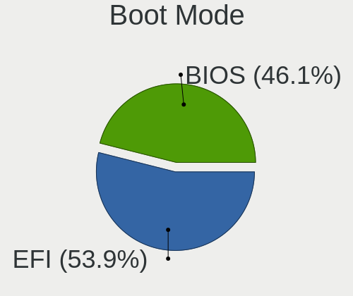
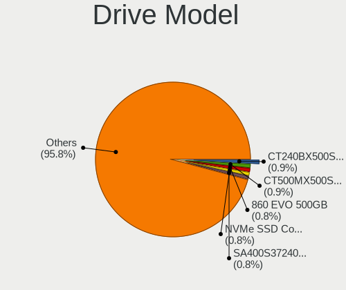
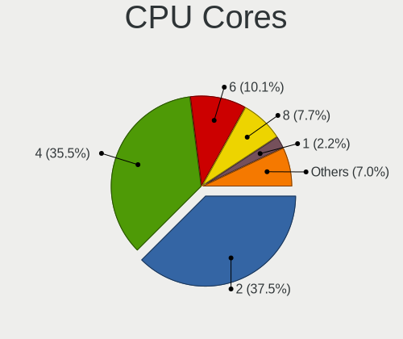
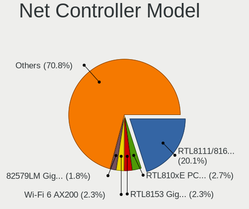
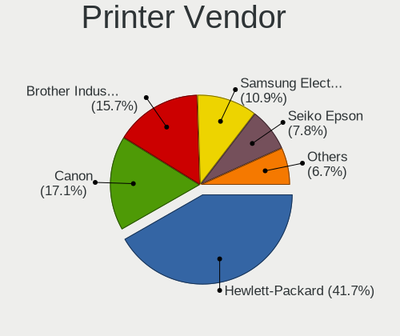

Linux in France - Tested Hardware & Statistics
----------------------------------------------

A project to collect tested hardware configurations for Linux in France.

Anyone can contribute to this report by the [hw-probe](https://github.com/linuxhw/hw-probe) tool:

    sudo -E hw-probe -all -upload

Please contribute! Especially if your hardware is rare.

This is a report for all computer types. See also reports for [desktops](/Location/France/Desktop/README.md) and [notebooks](/Location/France/Notebook/README.md).

Contents
--------

* [ Test Cases ](#test-cases)

* [ System ](#system)
  - [ OS                       ](#os)
  - [ OS Family                ](#os-family)
  - [ Kernel                   ](#kernel)
  - [ Kernel Family            ](#kernel-family)
  - [ Kernel Major Ver.        ](#kernel-major-ver)
  - [ Arch                     ](#arch)
  - [ DE                       ](#de)
  - [ Display Server           ](#display-server)
  - [ Display Manager          ](#display-manager)
  - [ OS Lang                  ](#os-lang)
  - [ Boot Mode                ](#boot-mode)
  - [ Filesystem               ](#filesystem)
  - [ Part. scheme             ](#part-scheme)
  - [ Dual Boot with Linux/BSD ](#dual-boot-with-linuxbsd)
  - [ Dual Boot (Win)          ](#dual-boot-win)

* [ Board ](#board)
  - [ Vendor                   ](#vendor)
  - [ Model                    ](#model)
  - [ Model Family             ](#model-family)
  - [ MFG Year                 ](#mfg-year)
  - [ Form Factor              ](#form-factor)
  - [ Secure Boot              ](#secure-boot)
  - [ Coreboot                 ](#coreboot)
  - [ RAM Size                 ](#ram-size)
  - [ RAM Used                 ](#ram-used)
  - [ Total Drives             ](#total-drives)
  - [ Has CD-ROM               ](#has-cd-rom)
  - [ Has Ethernet             ](#has-ethernet)
  - [ Has WiFi                 ](#has-wifi)
  - [ Has Bluetooth            ](#has-bluetooth)

* [ Location ](#location)
  - [ Country                  ](#country)
  - [ City                     ](#city)

* [ Drives ](#drives)
  - [ Drive Vendor             ](#drive-vendor)
  - [ Drive Model              ](#drive-model)
  - [ HDD Vendor               ](#hdd-vendor)
  - [ SSD Vendor               ](#ssd-vendor)
  - [ Drive Kind               ](#drive-kind)
  - [ Drive Connector          ](#drive-connector)
  - [ Drive Size               ](#drive-size)
  - [ Space Total              ](#space-total)
  - [ Space Used               ](#space-used)
  - [ Malfunc. Drives          ](#malfunc-drives)
  - [ Malfunc. Drive Vendor    ](#malfunc-drive-vendor)
  - [ Malfunc. HDD Vendor      ](#malfunc-hdd-vendor)
  - [ Malfunc. Drive Kind      ](#malfunc-drive-kind)
  - [ Failed Drives            ](#failed-drives)
  - [ Failed Drive Vendor      ](#failed-drive-vendor)
  - [ Drive Status             ](#drive-status)

* [ Storage controller ](#storage-controller)
  - [ Storage Vendor           ](#storage-vendor)
  - [ Storage Model            ](#storage-model)
  - [ Storage Kind             ](#storage-kind)

* [ Processor ](#processor)
  - [ CPU Vendor               ](#cpu-vendor)
  - [ CPU Model                ](#cpu-model)
  - [ CPU Model Family         ](#cpu-model-family)
  - [ CPU Cores                ](#cpu-cores)
  - [ CPU Sockets              ](#cpu-sockets)
  - [ CPU Threads              ](#cpu-threads)
  - [ CPU Op-Modes             ](#cpu-op-modes)
  - [ CPU Microcode            ](#cpu-microcode)
  - [ CPU Microarch            ](#cpu-microarch)

* [ Graphics ](#graphics)
  - [ GPU Vendor               ](#gpu-vendor)
  - [ GPU Model                ](#gpu-model)
  - [ GPU Combo                ](#gpu-combo)
  - [ GPU Driver               ](#gpu-driver)
  - [ GPU Memory               ](#gpu-memory)

* [ Monitor ](#monitor)
  - [ Monitor Vendor           ](#monitor-vendor)
  - [ Monitor Model            ](#monitor-model)
  - [ Monitor Resolution       ](#monitor-resolution)
  - [ Monitor Diagonal         ](#monitor-diagonal)
  - [ Monitor Width            ](#monitor-width)
  - [ Aspect Ratio             ](#aspect-ratio)
  - [ Monitor Area             ](#monitor-area)
  - [ Pixel Density            ](#pixel-density)
  - [ Multiple Monitors        ](#multiple-monitors)

* [ Network ](#network)
  - [ Net Controller Vendor    ](#net-controller-vendor)
  - [ Net Controller Model     ](#net-controller-model)
  - [ Wireless Vendor          ](#wireless-vendor)
  - [ Wireless Model           ](#wireless-model)
  - [ Ethernet Vendor          ](#ethernet-vendor)
  - [ Ethernet Model           ](#ethernet-model)
  - [ Net Controller Kind      ](#net-controller-kind)
  - [ Used Controller          ](#used-controller)
  - [ NICs                     ](#nics)
  - [ IPv6                     ](#ipv6)

* [ Bluetooth ](#bluetooth)
  - [ Bluetooth Vendor         ](#bluetooth-vendor)
  - [ Bluetooth Model          ](#bluetooth-model)

* [ Sound ](#sound)
  - [ Sound Vendor             ](#sound-vendor)
  - [ Sound Model              ](#sound-model)

* [ Memory ](#memory)
  - [ Memory Vendor            ](#memory-vendor)
  - [ Memory Model             ](#memory-model)
  - [ Memory Kind              ](#memory-kind)
  - [ Memory Form Factor       ](#memory-form-factor)
  - [ Memory Size              ](#memory-size)
  - [ Memory Speed             ](#memory-speed)

* [ Printers & scanners ](#printers--scanners)
  - [ Printer Vendor           ](#printer-vendor)
  - [ Printer Model            ](#printer-model)
  - [ Scanner Vendor           ](#scanner-vendor)
  - [ Scanner Model            ](#scanner-model)

* [ Camera ](#camera)
  - [ Camera Vendor            ](#camera-vendor)
  - [ Camera Model             ](#camera-model)

* [ Security ](#security)
  - [ Fingerprint Vendor       ](#fingerprint-vendor)
  - [ Fingerprint Model        ](#fingerprint-model)
  - [ Chipcard Vendor          ](#chipcard-vendor)
  - [ Chipcard Model           ](#chipcard-model)

* [ Unsupported ](#unsupported)
  - [ Unsupported Devices      ](#unsupported-devices)
  - [ Unsupported Device Types ](#unsupported-device-types)

Test Cases
----------

Total: 16774

| Vendor        | Model                       | Form-Factor | Probe                                                      | Date         |
|---------------|-----------------------------|-------------|------------------------------------------------------------|--------------|
| MSI           | PRO B650M-A WIFI            | Desktop     | [c5f27e5e7b](https://linux-hardware.org/?probe=c5f27e5e7b) | May 09, 2024 |
| Dell          | Latitude 5290 2-in-1        | Notebook    | [56d2614671](https://linux-hardware.org/?probe=56d2614671) | May 09, 2024 |
| Acer          | Veriton X2631G V:1.0        | Desktop     | [221cf17e59](https://linux-hardware.org/?probe=221cf17e59) | May 08, 2024 |
| Gigabyte      | Z170N-WIFI-CF               | Desktop     | [7a88f50508](https://linux-hardware.org/?probe=7a88f50508) | May 08, 2024 |
| Gigabyte      | Z170N-WIFI-CF               | Desktop     | [6143f9e1aa](https://linux-hardware.org/?probe=6143f9e1aa) | May 08, 2024 |
| ASUSTek       | LEONITE                     | Desktop     | [a50f5f9e3a](https://linux-hardware.org/?probe=a50f5f9e3a) | May 08, 2024 |
| HP            | ProBook 6460b               | Notebook    | [14aa46f09d](https://linux-hardware.org/?probe=14aa46f09d) | May 08, 2024 |
| Dell          | Inspiron 7415 2-in-1        | Convertible | [2bf4332abb](https://linux-hardware.org/?probe=2bf4332abb) | May 08, 2024 |
| Dell          | Inspiron 7415 2-in-1        | Convertible | [8f09e9d011](https://linux-hardware.org/?probe=8f09e9d011) | May 08, 2024 |
| ASUSTek       | X705UVP                     | Notebook    | [b850816596](https://linux-hardware.org/?probe=b850816596) | May 08, 2024 |
| Sony          | VGN-NS12M_W                 | Notebook    | [e364d75564](https://linux-hardware.org/?probe=e364d75564) | May 08, 2024 |
| ASUSTek       | ASUS TUF Gaming A15 FA50... | Notebook    | [ae1ef1680a](https://linux-hardware.org/?probe=ae1ef1680a) | May 08, 2024 |
| Acer          | P7YE0                       | Notebook    | [21da78891a](https://linux-hardware.org/?probe=21da78891a) | May 08, 2024 |
| ASUSTek       | PRIME X470-PRO              | Desktop     | [c9bee8e35a](https://linux-hardware.org/?probe=c9bee8e35a) | May 08, 2024 |
| Unknown       | Unknown                     | Desktop     | [07a1876fd0](https://linux-hardware.org/?probe=07a1876fd0) | May 08, 2024 |
| Acer          | Swift SFX16-61G             | Notebook    | [9cbd40bfc7](https://linux-hardware.org/?probe=9cbd40bfc7) | May 08, 2024 |
| ASUSTek       | P5Q SE2                     | Desktop     | [cf126cd087](https://linux-hardware.org/?probe=cf126cd087) | May 08, 2024 |
| Fujitsu Si... | LIFEBOOK E8410              | Notebook    | [30a913526e](https://linux-hardware.org/?probe=30a913526e) | May 07, 2024 |
| Notebook      | NS50_70MU                   | Notebook    | [99983ceae1](https://linux-hardware.org/?probe=99983ceae1) | May 07, 2024 |
| Lenovo        | 7Z74CTO1WW 07               | Server      | [ecd5a5be36](https://linux-hardware.org/?probe=ecd5a5be36) | May 07, 2024 |
| Dell          | Latitude 7480               | Notebook    | [2b3aee3902](https://linux-hardware.org/?probe=2b3aee3902) | May 07, 2024 |
| MSI           | Thin GF63 12UCX             | Notebook    | [f253ec6e52](https://linux-hardware.org/?probe=f253ec6e52) | May 07, 2024 |
| SCHNEIDER     | SCL141CTP                   | Notebook    | [ce0a785c29](https://linux-hardware.org/?probe=ce0a785c29) | May 07, 2024 |
| Dell          | Precision 7720              | Notebook    | [5423da6e5c](https://linux-hardware.org/?probe=5423da6e5c) | May 07, 2024 |
| ASUSTek       | Zenbook S 13 UX5304VA_UX... | Notebook    | [1c72c07e3d](https://linux-hardware.org/?probe=1c72c07e3d) | May 07, 2024 |
| ECS           | Nettle2                     | Desktop     | [af1b3ee348](https://linux-hardware.org/?probe=af1b3ee348) | May 07, 2024 |
| Sony          | SVF1521E2EW                 | Notebook    | [2e86efc1ba](https://linux-hardware.org/?probe=2e86efc1ba) | May 07, 2024 |
| Lenovo        | IdeaPad 3 15ITL6 82H8       | Notebook    | [a5b0e5456a](https://linux-hardware.org/?probe=a5b0e5456a) | May 07, 2024 |
| MSI           | MAG B660 TOMAHAWK WIFI D... | Desktop     | [5a5f459292](https://linux-hardware.org/?probe=5a5f459292) | May 06, 2024 |
| Medion        | E14223                      | Notebook    | [73ae3c5e79](https://linux-hardware.org/?probe=73ae3c5e79) | May 06, 2024 |
| Lenovo        | Legion Y540-15IRH 81SX      | Notebook    | [44f44fe800](https://linux-hardware.org/?probe=44f44fe800) | May 06, 2024 |
| ASUSTek       | P9X79                       | Desktop     | [dd0d50c3bf](https://linux-hardware.org/?probe=dd0d50c3bf) | May 06, 2024 |
| Packard Be... | EasyNote LM81               | Notebook    | [0ea4d18648](https://linux-hardware.org/?probe=0ea4d18648) | May 06, 2024 |
| Pegatron      | 2AC3                        | Desktop     | [3bc44b080d](https://linux-hardware.org/?probe=3bc44b080d) | May 06, 2024 |
| ASUSTek       | S550CB                      | Notebook    | [943c34e625](https://linux-hardware.org/?probe=943c34e625) | May 06, 2024 |
| ASUSTek       | X550CC                      | Notebook    | [db900f1cd1](https://linux-hardware.org/?probe=db900f1cd1) | May 05, 2024 |
| Dell          | Precision 3561              | Notebook    | [1e92742d1f](https://linux-hardware.org/?probe=1e92742d1f) | May 05, 2024 |
| Dell          | 0NW6H5 A00                  | Desktop     | [3fafaee792](https://linux-hardware.org/?probe=3fafaee792) | May 05, 2024 |
| Apple         | MacBookAir6,2               | Notebook    | [672e653276](https://linux-hardware.org/?probe=672e653276) | May 05, 2024 |
| Supermicro    | X7DCL                       | Desktop     | [9644da40a4](https://linux-hardware.org/?probe=9644da40a4) | May 05, 2024 |
| Lenovo        | ThinkPad X220 4291U1A       | Notebook    | [56fe72121d](https://linux-hardware.org/?probe=56fe72121d) | May 05, 2024 |
| ASUSTek       | TUF Gaming FX505GE_FX505... | Notebook    | [6794452c3b](https://linux-hardware.org/?probe=6794452c3b) | May 05, 2024 |
| Dell          | 0NW6H5 A00                  | Desktop     | [ed934b8b61](https://linux-hardware.org/?probe=ed934b8b61) | May 05, 2024 |
| HP            | Notebook                    | Notebook    | [27cafe3bf5](https://linux-hardware.org/?probe=27cafe3bf5) | May 05, 2024 |
| Gigabyte      | B560 HD3                    | Desktop     | [dfe7ad1035](https://linux-hardware.org/?probe=dfe7ad1035) | May 04, 2024 |
| ASUSTek       | K56CB                       | Notebook    | [1d94e1ecd1](https://linux-hardware.org/?probe=1d94e1ecd1) | May 04, 2024 |
| Packard Be... | IMEDIA S3840                | Desktop     | [52543a4786](https://linux-hardware.org/?probe=52543a4786) | May 04, 2024 |
| ASUSTek       | GL703VM                     | Notebook    | [9fc5a6d2eb](https://linux-hardware.org/?probe=9fc5a6d2eb) | May 04, 2024 |
| ASRock        | Z590M-ITX/ax                | Desktop     | [bd54fbe980](https://linux-hardware.org/?probe=bd54fbe980) | May 04, 2024 |
| Notebook      | NL40_50GU                   | Notebook    | [00f0ca50a9](https://linux-hardware.org/?probe=00f0ca50a9) | May 04, 2024 |
| Dell          | Latitude 5290 2-in-1        | Notebook    | [2e9e3f6434](https://linux-hardware.org/?probe=2e9e3f6434) | May 04, 2024 |
| Gigabyte      | GA-78LMT-USB3               | Desktop     | [4b675ff584](https://linux-hardware.org/?probe=4b675ff584) | May 04, 2024 |
| Dell          | 03NVJ6 A01                  | Desktop     | [d2f91d8ce7](https://linux-hardware.org/?probe=d2f91d8ce7) | May 03, 2024 |
| Dell          | XPS 13 9340                 | Notebook    | [4446c73008](https://linux-hardware.org/?probe=4446c73008) | May 03, 2024 |
| Lenovo        | ThinkPad X1 Carbon 4th 2... | Notebook    | [f6f74ecb12](https://linux-hardware.org/?probe=f6f74ecb12) | May 03, 2024 |
| Packard Be... | EasyNote LM81               | Notebook    | [44ead9f439](https://linux-hardware.org/?probe=44ead9f439) | May 03, 2024 |
| Lenovo        | G50-45 80E3                 | Notebook    | [ed0b78b628](https://linux-hardware.org/?probe=ed0b78b628) | May 03, 2024 |
| Lenovo        | ThinkPad L380 Yoga 20M8S... | Convertible | [97ed9c7991](https://linux-hardware.org/?probe=97ed9c7991) | May 03, 2024 |
| ASUSTek       | N71Vn                       | Notebook    | [6f38bd6250](https://linux-hardware.org/?probe=6f38bd6250) | May 03, 2024 |
| ASUSTek       | VivoBook_ASUSLaptop K650... | Notebook    | [40f4c2e910](https://linux-hardware.org/?probe=40f4c2e910) | May 03, 2024 |
| BESSTAR Te... | UM250 V1.0                  | Desktop     | [e8072c717d](https://linux-hardware.org/?probe=e8072c717d) | May 03, 2024 |
| HP            | EliteBook x360 1030 G3      | Convertible | [c2eb93ecec](https://linux-hardware.org/?probe=c2eb93ecec) | May 02, 2024 |
| Google        | Nospike                     | Notebook    | [549d690ae1](https://linux-hardware.org/?probe=549d690ae1) | May 02, 2024 |
| Dell          | 0X231R A01                  | Desktop     | [27d20c0bf3](https://linux-hardware.org/?probe=27d20c0bf3) | May 02, 2024 |
| HP            | EliteBook 865 16 inch G1... | Notebook    | [9051ebbe11](https://linux-hardware.org/?probe=9051ebbe11) | May 02, 2024 |
| ASRock        | H170M-ITX/ac                | Desktop     | [856a303262](https://linux-hardware.org/?probe=856a303262) | May 02, 2024 |
| Dell          | Latitude 5490               | Notebook    | [a8db3589fb](https://linux-hardware.org/?probe=a8db3589fb) | May 02, 2024 |
| HP            | Pavilion dm1                | Notebook    | [ba07809953](https://linux-hardware.org/?probe=ba07809953) | May 02, 2024 |
| Notebook      | PCx0Dx                      | Notebook    | [a2c29d6db0](https://linux-hardware.org/?probe=a2c29d6db0) | May 02, 2024 |
| Lenovo        | ThinkPad T480 20L6SADD00    | Notebook    | [b9fcd48ed1](https://linux-hardware.org/?probe=b9fcd48ed1) | May 02, 2024 |
| HP            | Victus by Laptop 16-d0xx... | Notebook    | [4192b9d9ad](https://linux-hardware.org/?probe=4192b9d9ad) | May 02, 2024 |
| MSI           | MAG B650 TOMAHAWK WIFI      | Desktop     | [63daec1367](https://linux-hardware.org/?probe=63daec1367) | May 02, 2024 |
| Apple         | MacBookPro6,2               | Notebook    | [1307008025](https://linux-hardware.org/?probe=1307008025) | May 01, 2024 |
| MSI           | MS-7204                     | Desktop     | [5d3f1b6a58](https://linux-hardware.org/?probe=5d3f1b6a58) | May 01, 2024 |
| ASUSTek       | ZenBook UX534FAC_UX534FA    | Notebook    | [d203d83db8](https://linux-hardware.org/?probe=d203d83db8) | May 01, 2024 |
| ASUSTek       | N71Vn                       | Notebook    | [d5d1d55df1](https://linux-hardware.org/?probe=d5d1d55df1) | May 01, 2024 |
| HP            | Spectre Pro x360 G1         | Notebook    | [39577e6ab0](https://linux-hardware.org/?probe=39577e6ab0) | May 01, 2024 |
| Lenovo        | Legion 7 16ITHg6 82K6       | Notebook    | [d118bb6622](https://linux-hardware.org/?probe=d118bb6622) | May 01, 2024 |
| HP            | 2AF7                        | Desktop     | [9c65c2ddec](https://linux-hardware.org/?probe=9c65c2ddec) | May 01, 2024 |
| ASUSTek       | TUF Gaming Z690-PLUS WIF... | Desktop     | [e0847e949c](https://linux-hardware.org/?probe=e0847e949c) | May 01, 2024 |
| HP            | 2AF7                        | Desktop     | [b38ae0f0de](https://linux-hardware.org/?probe=b38ae0f0de) | May 01, 2024 |
| Dell          | XPS 13 9360                 | Notebook    | [00b20277f7](https://linux-hardware.org/?probe=00b20277f7) | May 01, 2024 |
| HP            | Pavilion dv7                | Notebook    | [d191e30bf7](https://linux-hardware.org/?probe=d191e30bf7) | May 01, 2024 |
| HP            | Elite Dragonfly 13.5 inc... | Notebook    | [508451cb4c](https://linux-hardware.org/?probe=508451cb4c) | May 01, 2024 |
| ASUSTek       | TUF Gaming X570-PLUS        | Desktop     | [1f2b64a2d2](https://linux-hardware.org/?probe=1f2b64a2d2) | May 01, 2024 |
| Packard Be... | IMEDIA S2185                | Desktop     | [47d64869d6](https://linux-hardware.org/?probe=47d64869d6) | Apr 30, 2024 |
| Acer          | Aspire V3-372T              | Notebook    | [888ad09735](https://linux-hardware.org/?probe=888ad09735) | Apr 30, 2024 |
| HP            | Notebook                    | Notebook    | [1fd0f0caa7](https://linux-hardware.org/?probe=1fd0f0caa7) | Apr 30, 2024 |
| HP            | EliteBook 840 G8 Noteboo... | Notebook    | [dca5cca3c7](https://linux-hardware.org/?probe=dca5cca3c7) | Apr 30, 2024 |
| Dell          | Latitude 7310               | Notebook    | [4379da59b1](https://linux-hardware.org/?probe=4379da59b1) | Apr 30, 2024 |
| Packard Be... | EasyNote LJ61               | Notebook    | [9d19962863](https://linux-hardware.org/?probe=9d19962863) | Apr 30, 2024 |
| Packard Be... | EasyNote LJ61               | Notebook    | [6a1a6f046a](https://linux-hardware.org/?probe=6a1a6f046a) | Apr 30, 2024 |
| ASUSTek       | CG8480                      | Desktop     | [7567b12c01](https://linux-hardware.org/?probe=7567b12c01) | Apr 30, 2024 |
| Gigabyte      | AB350-Gaming 3-CF           | Desktop     | [c4d5dca0ad](https://linux-hardware.org/?probe=c4d5dca0ad) | Apr 30, 2024 |
| MSI           | MAG B550M MORTAR            | Desktop     | [b1197903be](https://linux-hardware.org/?probe=b1197903be) | Apr 30, 2024 |
| ASUSTek       | S550CB                      | Notebook    | [81cb26d4c3](https://linux-hardware.org/?probe=81cb26d4c3) | Apr 29, 2024 |
| HP            | ZBook Firefly 14 inch G9... | Notebook    | [22dcf39db0](https://linux-hardware.org/?probe=22dcf39db0) | Apr 29, 2024 |
| Minix         | NEO Z83-4A                  | Desktop     | [60faf42ed9](https://linux-hardware.org/?probe=60faf42ed9) | Apr 29, 2024 |
| Dell          | Latitude 7300               | Notebook    | [9fb87e1a65](https://linux-hardware.org/?probe=9fb87e1a65) | Apr 29, 2024 |
| HP            | 829A                        | Mini pc     | [61f142eb68](https://linux-hardware.org/?probe=61f142eb68) | Apr 29, 2024 |
| Lenovo        | ThinkPad S1 Yoga 12 20DK... | Notebook    | [62b6fb2419](https://linux-hardware.org/?probe=62b6fb2419) | Apr 29, 2024 |
| Lenovo        | ThinkPad Yoga 370 20JJS0... | Convertible | [6aab19ee1d](https://linux-hardware.org/?probe=6aab19ee1d) | Apr 29, 2024 |
| ASUSTek       | H81M-P PLUS                 | Desktop     | [e3c17dccb5](https://linux-hardware.org/?probe=e3c17dccb5) | Apr 29, 2024 |
| ASUSTek       | P5Q SE2                     | Desktop     | [6cbd8c5f1b](https://linux-hardware.org/?probe=6cbd8c5f1b) | Apr 28, 2024 |
| Dell          | 096JG8 A00                  | Desktop     | [499c9724bd](https://linux-hardware.org/?probe=499c9724bd) | Apr 28, 2024 |
| Lenovo        | ThinkPad T420 4236MA3       | Notebook    | [c968415c21](https://linux-hardware.org/?probe=c968415c21) | Apr 28, 2024 |
| HP            | Pavilion Notebook           | Notebook    | [6da1776d42](https://linux-hardware.org/?probe=6da1776d42) | Apr 28, 2024 |
| ASUSTek       | A8NE-FM                     | Desktop     | [dbabd85077](https://linux-hardware.org/?probe=dbabd85077) | Apr 28, 2024 |
| ASUSTek       | G20AJ                       | Desktop     | [d314388bb1](https://linux-hardware.org/?probe=d314388bb1) | Apr 28, 2024 |
| Lenovo        | ThinkPad W541 20EGS03W15    | Notebook    | [32ac46c0a5](https://linux-hardware.org/?probe=32ac46c0a5) | Apr 27, 2024 |
| Fujitsu       | LIFEBOOK U7411              | Notebook    | [f1e695e218](https://linux-hardware.org/?probe=f1e695e218) | Apr 27, 2024 |
| HP            | Compaq 8510w                | Notebook    | [6761a4250d](https://linux-hardware.org/?probe=6761a4250d) | Apr 27, 2024 |
| Acer          | Aspire X1700                | Desktop     | [8bf1981482](https://linux-hardware.org/?probe=8bf1981482) | Apr 27, 2024 |
| Dell          | 096JG8 A01                  | Desktop     | [5848ea3def](https://linux-hardware.org/?probe=5848ea3def) | Apr 27, 2024 |
| Lenovo        | ThinkPad P70 20ESS2J700     | Notebook    | [3ed1b856a7](https://linux-hardware.org/?probe=3ed1b856a7) | Apr 27, 2024 |
| ASUSTek       | ASUS TUF Gaming A17 FA70... | Notebook    | [da45f52feb](https://linux-hardware.org/?probe=da45f52feb) | Apr 27, 2024 |
| ASUSTek       | ASUS TUF Gaming A17 FA70... | Notebook    | [f8f255e514](https://linux-hardware.org/?probe=f8f255e514) | Apr 27, 2024 |
| Gigabyte      | B560 HD3                    | Desktop     | [2e0ebe37ab](https://linux-hardware.org/?probe=2e0ebe37ab) | Apr 27, 2024 |
| Acer          | Aspire 5738                 | Notebook    | [a7b22c04c8](https://linux-hardware.org/?probe=a7b22c04c8) | Apr 27, 2024 |
| ASUSTek       | S551LN                      | Notebook    | [e1fa85e2ad](https://linux-hardware.org/?probe=e1fa85e2ad) | Apr 27, 2024 |
| HP            | ZBook 15                    | Notebook    | [63fe793b96](https://linux-hardware.org/?probe=63fe793b96) | Apr 27, 2024 |
| ASUSTek       | PRIME B450M-A               | Desktop     | [f658c7fdf6](https://linux-hardware.org/?probe=f658c7fdf6) | Apr 27, 2024 |
| ASUSTek       | M5A97                       | Desktop     | [ba034c6e1b](https://linux-hardware.org/?probe=ba034c6e1b) | Apr 27, 2024 |
| HP            | Compaq 8710w (GT649PA#AB... | Notebook    | [aa6e9b5ba6](https://linux-hardware.org/?probe=aa6e9b5ba6) | Apr 26, 2024 |
| ASUSTek       | ROG STRIX B650E-E GAMING... | Desktop     | [46b14746fc](https://linux-hardware.org/?probe=46b14746fc) | Apr 26, 2024 |
| HP            | Pavilion Laptop 15-eh1xx... | Notebook    | [3358640735](https://linux-hardware.org/?probe=3358640735) | Apr 26, 2024 |
| HP            | EliteBook 820 G3            | Notebook    | [c73442e58f](https://linux-hardware.org/?probe=c73442e58f) | Apr 26, 2024 |
| Medion        | Defender P30                | Notebook    | [12b85f5741](https://linux-hardware.org/?probe=12b85f5741) | Apr 26, 2024 |
| Samsung       | RV410/RV510/S3510/E3510     | Notebook    | [d62fc38125](https://linux-hardware.org/?probe=d62fc38125) | Apr 26, 2024 |
| Dell          | Latitude E4300              | Notebook    | [251219f28e](https://linux-hardware.org/?probe=251219f28e) | Apr 26, 2024 |
| HP            | EliteBook 820 G3            | Notebook    | [9f260f753a](https://linux-hardware.org/?probe=9f260f753a) | Apr 26, 2024 |
| HP            | 84EE 1100                   | All in one  | [4754cb2a54](https://linux-hardware.org/?probe=4754cb2a54) | Apr 26, 2024 |
| HP            | Compaq 8710w (GT649PA#AB... | Notebook    | [00f1c96012](https://linux-hardware.org/?probe=00f1c96012) | Apr 26, 2024 |
| Samsung       | RV415/RV515/E3415           | Notebook    | [b52d1ce535](https://linux-hardware.org/?probe=b52d1ce535) | Apr 25, 2024 |
| ASUSTek       | ROG STRIX X670E-A GAMING... | Desktop     | [9a4a6cdc15](https://linux-hardware.org/?probe=9a4a6cdc15) | Apr 25, 2024 |
| Dell          | Precision M6800             | Notebook    | [1d41e8bb92](https://linux-hardware.org/?probe=1d41e8bb92) | Apr 25, 2024 |
| Lenovo        | ThinkPad P52 20M9CTO1WW     | Notebook    | [ce0b51d2c0](https://linux-hardware.org/?probe=ce0b51d2c0) | Apr 25, 2024 |
| Lenovo        | ThinkPad L420 7829A71       | Notebook    | [11c76a20a0](https://linux-hardware.org/?probe=11c76a20a0) | Apr 25, 2024 |
| Lenovo        | IdeaPad 320-17ISK 80XJ      | Notebook    | [a0fe903a7c](https://linux-hardware.org/?probe=a0fe903a7c) | Apr 25, 2024 |
| ECS           | Nettle                      | Desktop     | [ca8eb0919a](https://linux-hardware.org/?probe=ca8eb0919a) | Apr 25, 2024 |
| ECS           | Nettle                      | Desktop     | [47a4f75a79](https://linux-hardware.org/?probe=47a4f75a79) | Apr 25, 2024 |
| Dell          | XPS 13 9305                 | Notebook    | [62621a436b](https://linux-hardware.org/?probe=62621a436b) | Apr 25, 2024 |
| HP            | Notebook                    | Notebook    | [64adec78e1](https://linux-hardware.org/?probe=64adec78e1) | Apr 25, 2024 |
| ASUSTek       | ROG STRIX Z370-E GAMING     | Desktop     | [3ed49ed1c3](https://linux-hardware.org/?probe=3ed49ed1c3) | Apr 24, 2024 |
| MSI           | Z370-A PRO                  | Desktop     | [46add129fe](https://linux-hardware.org/?probe=46add129fe) | Apr 24, 2024 |
| Toshiba       | Satellite Pro L630          | Notebook    | [9c0d08ec19](https://linux-hardware.org/?probe=9c0d08ec19) | Apr 24, 2024 |
| Dell          | 08NPPY A00                  | Desktop     | [8e54a2234f](https://linux-hardware.org/?probe=8e54a2234f) | Apr 24, 2024 |
| Unknown       | Unknown                     | Notebook    | [d722d0e84b](https://linux-hardware.org/?probe=d722d0e84b) | Apr 24, 2024 |
| Gigabyte      | G5 MF                       | Notebook    | [abbf347c78](https://linux-hardware.org/?probe=abbf347c78) | Apr 24, 2024 |
| HP            | Pavilion Gaming Laptop 1... | Notebook    | [d0dab98dcc](https://linux-hardware.org/?probe=d0dab98dcc) | Apr 24, 2024 |
| Dell          | 0VNGWR A01                  | All in one  | [b95fa4f6b0](https://linux-hardware.org/?probe=b95fa4f6b0) | Apr 23, 2024 |
| Raspberry ... | Raspberry Pi 2 Model B R... | Soc         | [040900be49](https://linux-hardware.org/?probe=040900be49) | Apr 23, 2024 |
| Dell          | 0NNNCT A01                  | Desktop     | [c448c1be35](https://linux-hardware.org/?probe=c448c1be35) | Apr 23, 2024 |
| HP            | Laptop 15s-fq2xxx           | Notebook    | [06c81aed79](https://linux-hardware.org/?probe=06c81aed79) | Apr 23, 2024 |
| HP            | Pavilion Laptop 15-cs0xx... | Notebook    | [d50544d577](https://linux-hardware.org/?probe=d50544d577) | Apr 23, 2024 |
| ASUSTek       | K42F                        | Notebook    | [f29299723c](https://linux-hardware.org/?probe=f29299723c) | Apr 23, 2024 |
| ASUSTek       | K42F                        | Notebook    | [63b454fa02](https://linux-hardware.org/?probe=63b454fa02) | Apr 23, 2024 |
| Notebook      | NP50D5                      | Notebook    | [5efdc99e90](https://linux-hardware.org/?probe=5efdc99e90) | Apr 23, 2024 |
| Apple         | MacBookPro5,2               | Notebook    | [a5052885f7](https://linux-hardware.org/?probe=a5052885f7) | Apr 22, 2024 |
| ASUSTek       | TUF Gaming B550M-PLUS       | Desktop     | [d57b51f491](https://linux-hardware.org/?probe=d57b51f491) | Apr 22, 2024 |
| MSI           | GS65 Stealth Thin 8RE       | Notebook    | [8e326da202](https://linux-hardware.org/?probe=8e326da202) | Apr 22, 2024 |
| Dell          | Vostro 1220                 | Notebook    | [ce4128ed7b](https://linux-hardware.org/?probe=ce4128ed7b) | Apr 22, 2024 |
| Acer          | Aspire E5-773G              | Notebook    | [5e72cf2ad7](https://linux-hardware.org/?probe=5e72cf2ad7) | Apr 22, 2024 |
| ASUSTek       | X751MA                      | Notebook    | [e8b836dd14](https://linux-hardware.org/?probe=e8b836dd14) | Apr 22, 2024 |
| Samsung       | 950XED                      | Notebook    | [20c945fb12](https://linux-hardware.org/?probe=20c945fb12) | Apr 22, 2024 |
| Dell          | XPS 13 9340                 | Notebook    | [5b25704805](https://linux-hardware.org/?probe=5b25704805) | Apr 22, 2024 |
| ASUSTek       | K93SM                       | Notebook    | [031f10fad0](https://linux-hardware.org/?probe=031f10fad0) | Apr 22, 2024 |
| eMachines     | eME528                      | Notebook    | [026f678993](https://linux-hardware.org/?probe=026f678993) | Apr 21, 2024 |
| Acer          | RS780DV                     | Desktop     | [2fd4cf8e84](https://linux-hardware.org/?probe=2fd4cf8e84) | Apr 21, 2024 |
| ASUSTek       | TUF Gaming X570-PLUS        | Desktop     | [2c617e212d](https://linux-hardware.org/?probe=2c617e212d) | Apr 21, 2024 |
| Intel         | DH55HC AAE70933-503         | Desktop     | [54e6f2958d](https://linux-hardware.org/?probe=54e6f2958d) | Apr 21, 2024 |
| MSI           | MPG X570 GAMING EDGE WIF... | Desktop     | [a2b7475561](https://linux-hardware.org/?probe=a2b7475561) | Apr 21, 2024 |
| ASUSTek       | K75VM                       | Notebook    | [c863c3ba6b](https://linux-hardware.org/?probe=c863c3ba6b) | Apr 21, 2024 |
| MSI           | B75MA-P45                   | Desktop     | [d52757e003](https://linux-hardware.org/?probe=d52757e003) | Apr 21, 2024 |
| ASUSTek       | P7P55D                      | Desktop     | [3bd8026fda](https://linux-hardware.org/?probe=3bd8026fda) | Apr 21, 2024 |
| HP            | ProLiant MicroServer Gen... | Desktop     | [e44ef3501a](https://linux-hardware.org/?probe=e44ef3501a) | Apr 21, 2024 |
| ASUSTek       | G20AJ                       | Desktop     | [0b3321dc98](https://linux-hardware.org/?probe=0b3321dc98) | Apr 21, 2024 |
| ASUSTek       | P8H61-M LX                  | Desktop     | [96710be28c](https://linux-hardware.org/?probe=96710be28c) | Apr 20, 2024 |
| Samsung       | 950QED                      | Convertible | [f90bbb5ff4](https://linux-hardware.org/?probe=f90bbb5ff4) | Apr 20, 2024 |
| ASUSTek       | TUF Gaming Z690-PLUS WIF... | Desktop     | [a1f1d3f4a0](https://linux-hardware.org/?probe=a1f1d3f4a0) | Apr 20, 2024 |
| Toshiba       | Satellite C870-192          | Notebook    | [563eab96cf](https://linux-hardware.org/?probe=563eab96cf) | Apr 20, 2024 |
| ASRock        | X570 Phantom Gaming 4       | Desktop     | [95c911346e](https://linux-hardware.org/?probe=95c911346e) | Apr 20, 2024 |
| Lenovo        | ThinkPad L420 7829A71       | Notebook    | [06f7d10927](https://linux-hardware.org/?probe=06f7d10927) | Apr 20, 2024 |
| Dell          | Precision M6800             | Notebook    | [c44a2aee51](https://linux-hardware.org/?probe=c44a2aee51) | Apr 20, 2024 |
| ASUSTek       | ROG Zephyrus Duo 16 GX65... | Notebook    | [328b8f3d9e](https://linux-hardware.org/?probe=328b8f3d9e) | Apr 19, 2024 |
| ASUSTek       | T101HA                      | Tablet      | [703372f7ac](https://linux-hardware.org/?probe=703372f7ac) | Apr 19, 2024 |
| Intel         | NUC11TNBi5 M11904-404       | Mini pc     | [90c846e3d1](https://linux-hardware.org/?probe=90c846e3d1) | Apr 19, 2024 |
| HP            | 8184 X4                     | Desktop     | [e110e13968](https://linux-hardware.org/?probe=e110e13968) | Apr 19, 2024 |
| ASUSTek       | ROG Zephyrus G15 GA503RW    | Notebook    | [8d5622069d](https://linux-hardware.org/?probe=8d5622069d) | Apr 19, 2024 |
| Dell          | 08NPPY A00                  | Desktop     | [36e7d8d2b8](https://linux-hardware.org/?probe=36e7d8d2b8) | Apr 19, 2024 |
| Fujitsu       | D3517-A1 S26361-D3517-A1    | Desktop     | [faac8a47c7](https://linux-hardware.org/?probe=faac8a47c7) | Apr 19, 2024 |
| Lenovo        | SHARKBAY NO DPK             | Desktop     | [5da21e8599](https://linux-hardware.org/?probe=5da21e8599) | Apr 19, 2024 |
| Unknown       | Unknown                     | Notebook    | [62969495f2](https://linux-hardware.org/?probe=62969495f2) | Apr 19, 2024 |
| Dell          | Vostro 1220                 | Notebook    | [2842ff320d](https://linux-hardware.org/?probe=2842ff320d) | Apr 19, 2024 |
| Acer          | Aspire ES1-512              | Notebook    | [7e666ce610](https://linux-hardware.org/?probe=7e666ce610) | Apr 19, 2024 |
| UNOWHY        | Y13G002S4EI                 | Notebook    | [d5ed9a8f9c](https://linux-hardware.org/?probe=d5ed9a8f9c) | Apr 18, 2024 |
| Chuwi         | CoreBook X                  | Notebook    | [de2cd02e92](https://linux-hardware.org/?probe=de2cd02e92) | Apr 18, 2024 |
| Lenovo        | ThinkPad X1 Extreme 2nd ... | Notebook    | [634572901c](https://linux-hardware.org/?probe=634572901c) | Apr 18, 2024 |
| Lenovo        | ThinkPad T440p 20AWS17N0... | Notebook    | [9f31e2ff86](https://linux-hardware.org/?probe=9f31e2ff86) | Apr 18, 2024 |
| MSI           | B450 GAMING PLUS            | Desktop     | [7f84bae081](https://linux-hardware.org/?probe=7f84bae081) | Apr 18, 2024 |
| Fujitsu       | D3403-A1 S26361-D3403-A1    | Desktop     | [05c7db4b10](https://linux-hardware.org/?probe=05c7db4b10) | Apr 18, 2024 |
| HP            | EliteBook 840 G8 Noteboo... | Notebook    | [01121cc898](https://linux-hardware.org/?probe=01121cc898) | Apr 18, 2024 |
| Dell          | 0Y958C A00                  | Desktop     | [88a0060933](https://linux-hardware.org/?probe=88a0060933) | Apr 18, 2024 |
| ASUSTek       | P9X79                       | Desktop     | [3f587bf3dd](https://linux-hardware.org/?probe=3f587bf3dd) | Apr 18, 2024 |
| Dell          | Latitude E5540              | Notebook    | [c52074d979](https://linux-hardware.org/?probe=c52074d979) | Apr 17, 2024 |
| ASUSTek       | ASUS TUF Gaming F15 FX50... | Notebook    | [0eb26f6fcc](https://linux-hardware.org/?probe=0eb26f6fcc) | Apr 17, 2024 |
| Lenovo        | 3130 SDK0J40700 WIN 3258... | Mini pc     | [5256952fc5](https://linux-hardware.org/?probe=5256952fc5) | Apr 17, 2024 |
| Lenovo        | ThinkPad L560 20F2S0TB00    | Notebook    | [943647251c](https://linux-hardware.org/?probe=943647251c) | Apr 17, 2024 |
| HP            | EliteBook 6930p             | Notebook    | [263d72f3c6](https://linux-hardware.org/?probe=263d72f3c6) | Apr 17, 2024 |
| Medion        | E14223                      | Notebook    | [27971449ab](https://linux-hardware.org/?probe=27971449ab) | Apr 17, 2024 |
| Acer          | Aspire A317-52              | Notebook    | [bf62cb2dba](https://linux-hardware.org/?probe=bf62cb2dba) | Apr 17, 2024 |
| HP            | 1998                        | Desktop     | [ae4e73aa97](https://linux-hardware.org/?probe=ae4e73aa97) | Apr 17, 2024 |
| Pegatron      | Narra6                      | Desktop     | [fb336cac9b](https://linux-hardware.org/?probe=fb336cac9b) | Apr 17, 2024 |
| HP            | 83E7                        | Desktop     | [f643b7fe0c](https://linux-hardware.org/?probe=f643b7fe0c) | Apr 17, 2024 |
| HP            | 83E7                        | Desktop     | [0ae274b680](https://linux-hardware.org/?probe=0ae274b680) | Apr 17, 2024 |
| ASUSTek       | X751LJ                      | Notebook    | [ee2d127680](https://linux-hardware.org/?probe=ee2d127680) | Apr 16, 2024 |
| Dell          | 0D28YY A03                  | Desktop     | [0332c27e2c](https://linux-hardware.org/?probe=0332c27e2c) | Apr 16, 2024 |
| MSI           | MAG Z790 TOMAHAWK WIFI      | Desktop     | [2dc0b12567](https://linux-hardware.org/?probe=2dc0b12567) | Apr 16, 2024 |
| Notebook      | W230ST                      | Notebook    | [946ba4a3b8](https://linux-hardware.org/?probe=946ba4a3b8) | Apr 16, 2024 |
| Lenovo        | IdeaPadFlex 14 20308        | Notebook    | [7ccf67d720](https://linux-hardware.org/?probe=7ccf67d720) | Apr 16, 2024 |
| Foxconn       | 2AB1h                       | Desktop     | [9681c7f433](https://linux-hardware.org/?probe=9681c7f433) | Apr 16, 2024 |
| Dell          | Latitude 7520               | Notebook    | [f040020d5f](https://linux-hardware.org/?probe=f040020d5f) | Apr 16, 2024 |
| Lenovo        | ThinkPad T480 20L6SAYX00    | Notebook    | [f53da67ab4](https://linux-hardware.org/?probe=f53da67ab4) | Apr 15, 2024 |
| Acer          | Aspire V3-572P              | Notebook    | [8664247893](https://linux-hardware.org/?probe=8664247893) | Apr 15, 2024 |
| HP            | Laptop 17-cp0xxx            | Notebook    | [6f08b03e98](https://linux-hardware.org/?probe=6f08b03e98) | Apr 15, 2024 |
| Lenovo        | 0B98401 WIN                 | Desktop     | [4fa3e985a9](https://linux-hardware.org/?probe=4fa3e985a9) | Apr 15, 2024 |
| Lenovo        | 30BE SDK0J40705 WIN 3425... | Desktop     | [bfacfe1e0f](https://linux-hardware.org/?probe=bfacfe1e0f) | Apr 15, 2024 |
| Lenovo        | ThinkPad X280 20KESA5000    | Notebook    | [8571fb3b5c](https://linux-hardware.org/?probe=8571fb3b5c) | Apr 14, 2024 |
| Lenovo        | Legion 5 15IMH05H 81Y6      | Notebook    | [5785462109](https://linux-hardware.org/?probe=5785462109) | Apr 14, 2024 |
| Dell          | 0D28YY A00                  | Desktop     | [c1bd4e2de3](https://linux-hardware.org/?probe=c1bd4e2de3) | Apr 14, 2024 |
| HP            | 805D                        | Desktop     | [f3b0ef4a3b](https://linux-hardware.org/?probe=f3b0ef4a3b) | Apr 14, 2024 |
| Lenovo        | Win8 Pro DPK TPG            | Desktop     | [c6fd918c6e](https://linux-hardware.org/?probe=c6fd918c6e) | Apr 14, 2024 |
| Apple         | MacBookPro11,3              | Notebook    | [9e81741e0e](https://linux-hardware.org/?probe=9e81741e0e) | Apr 14, 2024 |
| Notebook      | NS5x_NS7xAU                 | Notebook    | [fef58e28df](https://linux-hardware.org/?probe=fef58e28df) | Apr 14, 2024 |
| ASUSTek       | PRIME X670-P                | Desktop     | [121abdd671](https://linux-hardware.org/?probe=121abdd671) | Apr 14, 2024 |
| Dell          | 0VNGWR A01                  | All in one  | [e7cba4de7d](https://linux-hardware.org/?probe=e7cba4de7d) | Apr 14, 2024 |
| HP            | Pavilion g6                 | Notebook    | [80f535a166](https://linux-hardware.org/?probe=80f535a166) | Apr 13, 2024 |
| ASUSTek       | X550JX                      | Notebook    | [10e9087348](https://linux-hardware.org/?probe=10e9087348) | Apr 13, 2024 |
| Acer          | Aspire V3-572P              | Notebook    | [541e26e0da](https://linux-hardware.org/?probe=541e26e0da) | Apr 13, 2024 |
| MSI           | B450 GAMING PLUS            | Desktop     | [fe95b1e7e7](https://linux-hardware.org/?probe=fe95b1e7e7) | Apr 13, 2024 |
| HP            | EliteBook 855 G8 Noteboo... | Notebook    | [f40332b7bb](https://linux-hardware.org/?probe=f40332b7bb) | Apr 13, 2024 |
| Dell          | Latitude E5520              | Notebook    | [0f03f7a01f](https://linux-hardware.org/?probe=0f03f7a01f) | Apr 13, 2024 |
| ASUSTek       | N552VW                      | Notebook    | [02c36db055](https://linux-hardware.org/?probe=02c36db055) | Apr 12, 2024 |
| Dell          | G15 5511                    | Notebook    | [dca2850091](https://linux-hardware.org/?probe=dca2850091) | Apr 12, 2024 |
| MSI           | MAG B460M MORTAR            | Desktop     | [175185cdad](https://linux-hardware.org/?probe=175185cdad) | Apr 12, 2024 |
| Valve         | Jupiter                     | Notebook    | [64cab9101d](https://linux-hardware.org/?probe=64cab9101d) | Apr 12, 2024 |
| MSI           | GE62 2QC                    | Notebook    | [af7a9f75d6](https://linux-hardware.org/?probe=af7a9f75d6) | Apr 12, 2024 |
| MSI           | GE62 2QC                    | Notebook    | [2b18322513](https://linux-hardware.org/?probe=2b18322513) | Apr 12, 2024 |
| HP            | Pavilion Laptop 15-cs0xx... | Notebook    | [40addd8c40](https://linux-hardware.org/?probe=40addd8c40) | Apr 12, 2024 |
| Acer          | Aspire A317-53              | Notebook    | [5b6ec1ea3e](https://linux-hardware.org/?probe=5b6ec1ea3e) | Apr 12, 2024 |
| Notebook      | NS5x_NS7xAU                 | Notebook    | [d2fa3daec7](https://linux-hardware.org/?probe=d2fa3daec7) | Apr 12, 2024 |
| Fujitsu       | D3600-A1 S26361-D3600-A1    | Desktop     | [4f86a9d176](https://linux-hardware.org/?probe=4f86a9d176) | Apr 12, 2024 |
| Notebook      | NS5x_NS7xPU                 | Notebook    | [b97d0acf58](https://linux-hardware.org/?probe=b97d0acf58) | Apr 11, 2024 |
| Dell          | 060K5C A02                  | Server      | [3bab33d8d5](https://linux-hardware.org/?probe=3bab33d8d5) | Apr 11, 2024 |
| HP            | Laptop 15-dy1xxx            | Notebook    | [05d78a16da](https://linux-hardware.org/?probe=05d78a16da) | Apr 11, 2024 |
| HP            | EliteBook 840 G5            | Notebook    | [045700832b](https://linux-hardware.org/?probe=045700832b) | Apr 11, 2024 |
| Lenovo        | ThinkPad L14 Gen 4 21H1C... | Notebook    | [4d834b6378](https://linux-hardware.org/?probe=4d834b6378) | Apr 11, 2024 |
| ASUSTek       | H97M-E                      | Desktop     | [431b3ef7f6](https://linux-hardware.org/?probe=431b3ef7f6) | Apr 11, 2024 |
| Lenovo        | ThinkPad L14 Gen 4 21H1C... | Notebook    | [12ad1e078b](https://linux-hardware.org/?probe=12ad1e078b) | Apr 11, 2024 |
| ASUSTek       | TUF Gaming FX504GD_FX80G... | Notebook    | [fbaf67a904](https://linux-hardware.org/?probe=fbaf67a904) | Apr 11, 2024 |
| ASUSTek       | TUF Gaming FX504GD_FX80G... | Notebook    | [2526b63349](https://linux-hardware.org/?probe=2526b63349) | Apr 11, 2024 |
| Gigabyte      | B550 AORUS ELITE V2         | Desktop     | [cfca756ef5](https://linux-hardware.org/?probe=cfca756ef5) | Apr 11, 2024 |
| ASUSTek       | TUF Gaming FA706II_TUF76... | Notebook    | [ee6a729006](https://linux-hardware.org/?probe=ee6a729006) | Apr 11, 2024 |
| ASUSTek       | X450CC                      | Notebook    | [5ead7a9dea](https://linux-hardware.org/?probe=5ead7a9dea) | Apr 11, 2024 |
| ASUSTek       | X450CC                      | Notebook    | [752a03f0de](https://linux-hardware.org/?probe=752a03f0de) | Apr 11, 2024 |
| MSI           | CR70 2M/CX70 2OC/CX70 2O... | Notebook    | [c473133c45](https://linux-hardware.org/?probe=c473133c45) | Apr 11, 2024 |
| ASUSTek       | PRIME Z270-A                | Desktop     | [44d8afa05f](https://linux-hardware.org/?probe=44d8afa05f) | Apr 11, 2024 |
| ASUSTek       | N552VW                      | Notebook    | [981a9ddf63](https://linux-hardware.org/?probe=981a9ddf63) | Apr 11, 2024 |
| Acer          | Aspire SW5-011              | Notebook    | [4e8ad9d65f](https://linux-hardware.org/?probe=4e8ad9d65f) | Apr 10, 2024 |
| ASUSTek       | PRIME A320M-K               | Desktop     | [79ea757db1](https://linux-hardware.org/?probe=79ea757db1) | Apr 10, 2024 |
| MSI           | Raider GE78HX SmartTP 13... | Notebook    | [c048dc6e93](https://linux-hardware.org/?probe=c048dc6e93) | Apr 10, 2024 |
| Dell          | Precision 7680              | Notebook    | [816057ca7a](https://linux-hardware.org/?probe=816057ca7a) | Apr 10, 2024 |
| HUAWEI        | BOM-WXX9                    | Notebook    | [514738e85f](https://linux-hardware.org/?probe=514738e85f) | Apr 10, 2024 |
| Lenovo        | ThinkPad L13 Gen 3 21BAS... | Notebook    | [73f98df7bf](https://linux-hardware.org/?probe=73f98df7bf) | Apr 10, 2024 |
| Dell          | XPS 9315                    | Notebook    | [c4879d5e8d](https://linux-hardware.org/?probe=c4879d5e8d) | Apr 10, 2024 |
| Samsung       | 950QED                      | Convertible | [ba4223fab8](https://linux-hardware.org/?probe=ba4223fab8) | Apr 10, 2024 |
| HP            | 2B13 A01                    | All in one  | [30160f86ab](https://linux-hardware.org/?probe=30160f86ab) | Apr 10, 2024 |
| Lenovo        | ThinkPad X1 Carbon 7th 2... | Notebook    | [638339b307](https://linux-hardware.org/?probe=638339b307) | Apr 10, 2024 |
| ASUSTek       | ROG STRIX B550-I GAMING     | Desktop     | [09d22d5711](https://linux-hardware.org/?probe=09d22d5711) | Apr 10, 2024 |
| ASUSTek       | ASUS Zenbook 14 UX3405MA... | Notebook    | [55845bc8a6](https://linux-hardware.org/?probe=55845bc8a6) | Apr 10, 2024 |
| HP            | 18E7                        | Desktop     | [06187ec68b](https://linux-hardware.org/?probe=06187ec68b) | Apr 09, 2024 |
| Shenzhen M... | F7BFD                       | Desktop     | [98e43e8de4](https://linux-hardware.org/?probe=98e43e8de4) | Apr 09, 2024 |
| MSI           | B85-G43 GAMING              | Desktop     | [2bb4a429e0](https://linux-hardware.org/?probe=2bb4a429e0) | Apr 09, 2024 |
| HP            | 339A                        | Desktop     | [e7fb50b1c8](https://linux-hardware.org/?probe=e7fb50b1c8) | Apr 09, 2024 |
| HP            | ProBook 4520s               | Notebook    | [b29f0bab6b](https://linux-hardware.org/?probe=b29f0bab6b) | Apr 09, 2024 |
| HP            | ProBook 450 G5              | Notebook    | [62ad537ec4](https://linux-hardware.org/?probe=62ad537ec4) | Apr 09, 2024 |
| MSI           | PRO B760-P WIFI DDR4        | Desktop     | [313d012a75](https://linux-hardware.org/?probe=313d012a75) | Apr 09, 2024 |
| ASUSTek       | ASUS Zenbook 14 UX3405MA... | Notebook    | [e332273f42](https://linux-hardware.org/?probe=e332273f42) | Apr 08, 2024 |
| MSI           | B450M-A PRO MAX             | Desktop     | [6f8f2695ef](https://linux-hardware.org/?probe=6f8f2695ef) | Apr 08, 2024 |
| Google        | Magolor                     | Notebook    | [df74bd8187](https://linux-hardware.org/?probe=df74bd8187) | Apr 08, 2024 |
| Google        | Magolor                     | Notebook    | [dc67b995b5](https://linux-hardware.org/?probe=dc67b995b5) | Apr 08, 2024 |
| Dell          | Precision 5510              | Notebook    | [7790933937](https://linux-hardware.org/?probe=7790933937) | Apr 08, 2024 |
| Apple         | Mac-65CE76090165799A iMa... | All in one  | [0fc9eabd1b](https://linux-hardware.org/?probe=0fc9eabd1b) | Apr 08, 2024 |
| ASUSTek       | ROG Strix G513QR_G513QR     | Notebook    | [2c23a28e81](https://linux-hardware.org/?probe=2c23a28e81) | Apr 08, 2024 |
| Acer          | Veriton X2631G V:1.0        | Desktop     | [a55fdfb7ab](https://linux-hardware.org/?probe=a55fdfb7ab) | Apr 08, 2024 |
| Apple         | MacBookPro13,2              | Notebook    | [9aa383b71b](https://linux-hardware.org/?probe=9aa383b71b) | Apr 07, 2024 |
| MSI           | Z87-GD65 GAMING             | Desktop     | [af8d94ff13](https://linux-hardware.org/?probe=af8d94ff13) | Apr 07, 2024 |
| Lenovo        | IdeaPad 3 14ADA05 81W0      | Notebook    | [da48420d2a](https://linux-hardware.org/?probe=da48420d2a) | Apr 07, 2024 |
| Gigabyte      | P55A-UD3                    | Desktop     | [c7ceab8c20](https://linux-hardware.org/?probe=c7ceab8c20) | Apr 07, 2024 |
| MSI           | A78M-E35                    | Desktop     | [48d55373b4](https://linux-hardware.org/?probe=48d55373b4) | Apr 07, 2024 |
| MSI           | H510M-A PRO                 | Desktop     | [06ae4e1c3a](https://linux-hardware.org/?probe=06ae4e1c3a) | Apr 07, 2024 |
| ASUSTek       | M4A785TD-V EVO              | Desktop     | [96ba97f920](https://linux-hardware.org/?probe=96ba97f920) | Apr 07, 2024 |
| Apple         | MacBookAir6,2               | Notebook    | [a63811031c](https://linux-hardware.org/?probe=a63811031c) | Apr 07, 2024 |
| Medion        | Akoya P7818                 | Notebook    | [5b8f93851b](https://linux-hardware.org/?probe=5b8f93851b) | Apr 07, 2024 |
| Fujitsu Si... | LIFEBOOK S6410              | Notebook    | [e82877a3db](https://linux-hardware.org/?probe=e82877a3db) | Apr 07, 2024 |
| MSI           | MPG Z390 GAMING PLUS        | Desktop     | [52a45ea839](https://linux-hardware.org/?probe=52a45ea839) | Apr 06, 2024 |
| Acer          | Aspire V3-572P              | Notebook    | [e4cc62041e](https://linux-hardware.org/?probe=e4cc62041e) | Apr 06, 2024 |
| ASUSTek       | P8Z77-V LK                  | Desktop     | [1b5139bc55](https://linux-hardware.org/?probe=1b5139bc55) | Apr 06, 2024 |
| Acer          | Aspire V3-572P              | Notebook    | [8f10a9f724](https://linux-hardware.org/?probe=8f10a9f724) | Apr 06, 2024 |
| HP            | ProLiant DL380p Gen8        | Server      | [a6bae50544](https://linux-hardware.org/?probe=a6bae50544) | Apr 06, 2024 |
| Unknown       | Unknown                     | Desktop     | [0f08ac20fe](https://linux-hardware.org/?probe=0f08ac20fe) | Apr 06, 2024 |
| ASUSTek       | P8H61-M LX                  | Desktop     | [6479db032f](https://linux-hardware.org/?probe=6479db032f) | Apr 06, 2024 |
| MSI           | A78M-E35                    | Desktop     | [bcf25c6ef5](https://linux-hardware.org/?probe=bcf25c6ef5) | Apr 06, 2024 |
| Toshiba       | Satellite U500              | Notebook    | [4872d0c452](https://linux-hardware.org/?probe=4872d0c452) | Apr 06, 2024 |
| SCHNEIDER     | SCL141CTP                   | Notebook    | [33e14fe576](https://linux-hardware.org/?probe=33e14fe576) | Apr 06, 2024 |
| ASUSTek       | Z170-A                      | Desktop     | [30127a97b5](https://linux-hardware.org/?probe=30127a97b5) | Apr 06, 2024 |
| ZOTAC         | ZBOX                        | Mini pc     | [554acf8897](https://linux-hardware.org/?probe=554acf8897) | Apr 06, 2024 |
| HP            | Pavilion dv6                | Notebook    | [e397c999bc](https://linux-hardware.org/?probe=e397c999bc) | Apr 06, 2024 |
| MSI           | CSM-H81M-P32                | Desktop     | [d564057957](https://linux-hardware.org/?probe=d564057957) | Apr 06, 2024 |
| HP            | ZBook 15u G6                | Notebook    | [a1865e5d26](https://linux-hardware.org/?probe=a1865e5d26) | Apr 06, 2024 |
| Google        | Magolor                     | Notebook    | [36145fc673](https://linux-hardware.org/?probe=36145fc673) | Apr 06, 2024 |
| ASRock        | B550 Extreme4               | Desktop     | [40f3fcd90e](https://linux-hardware.org/?probe=40f3fcd90e) | Apr 06, 2024 |
| Lenovo        | IdeaPadFlex 5 14ALC05 82... | Convertible | [bae97d2c1c](https://linux-hardware.org/?probe=bae97d2c1c) | Apr 05, 2024 |
| Dell          | Latitude E6410              | Notebook    | [7c4144e1df](https://linux-hardware.org/?probe=7c4144e1df) | Apr 05, 2024 |
| MSI           | Z270-A PRO                  | Desktop     | [3ea83c119a](https://linux-hardware.org/?probe=3ea83c119a) | Apr 05, 2024 |
| pine64        | PinePhonePro                | Soc         | [7266602ec2](https://linux-hardware.org/?probe=7266602ec2) | Apr 05, 2024 |
| Dell          | Precision 5550              | Notebook    | [3e0f6b8cef](https://linux-hardware.org/?probe=3e0f6b8cef) | Apr 05, 2024 |
| HP            | EliteBook 840 G2            | Notebook    | [cb733ed3d2](https://linux-hardware.org/?probe=cb733ed3d2) | Apr 05, 2024 |
| Samsung       | 950QED                      | Convertible | [01d86bf081](https://linux-hardware.org/?probe=01d86bf081) | Apr 04, 2024 |
| ASUSTek       | H97M-E                      | Desktop     | [3b51eeae68](https://linux-hardware.org/?probe=3b51eeae68) | Apr 04, 2024 |
| Acer          | Extensa 5630                | Notebook    | [224d74c060](https://linux-hardware.org/?probe=224d74c060) | Apr 04, 2024 |
| Framework     | Laptop (13th Gen Intel C... | Notebook    | [0d1189e3fb](https://linux-hardware.org/?probe=0d1189e3fb) | Apr 04, 2024 |
| Acer          | Extensa 5630                | Notebook    | [c810325d19](https://linux-hardware.org/?probe=c810325d19) | Apr 04, 2024 |
| Dell          | 0773VG A00                  | Desktop     | [9d4ec0043b](https://linux-hardware.org/?probe=9d4ec0043b) | Apr 04, 2024 |
| Dell          | 0773VG A00                  | Desktop     | [f6762c2218](https://linux-hardware.org/?probe=f6762c2218) | Apr 04, 2024 |
| VALE          | Notebook Classic C151V      | Notebook    | [db85555d5c](https://linux-hardware.org/?probe=db85555d5c) | Apr 04, 2024 |
| Google        | Woomax                      | Notebook    | [265e415e66](https://linux-hardware.org/?probe=265e415e66) | Apr 04, 2024 |
| MSI           | B550M PRO-VDH WIFI          | Desktop     | [071d177bf5](https://linux-hardware.org/?probe=071d177bf5) | Apr 04, 2024 |
| ASUSTek       | ROG CROSSHAIR VIII HERO     | Desktop     | [8946117fdf](https://linux-hardware.org/?probe=8946117fdf) | Apr 04, 2024 |
| HP            | Pro Tablet 10 EE G1         | Notebook    | [364cf44bfa](https://linux-hardware.org/?probe=364cf44bfa) | Apr 03, 2024 |
| HP            | Pro Tablet 10 EE G1         | Notebook    | [a76cafaf48](https://linux-hardware.org/?probe=a76cafaf48) | Apr 03, 2024 |
| Dell          | Latitude 9440 2-in-1        | Convertible | [705dbea40c](https://linux-hardware.org/?probe=705dbea40c) | Apr 03, 2024 |
| Fujitsu       | D3041-A1 S26361-D3041-A1    | Desktop     | [fec7c15063](https://linux-hardware.org/?probe=fec7c15063) | Apr 03, 2024 |
| Unknown       | 1.0                         | Desktop     | [a9918419c7](https://linux-hardware.org/?probe=a9918419c7) | Apr 03, 2024 |
| MSI           | A78M-E35                    | Desktop     | [0e59aae215](https://linux-hardware.org/?probe=0e59aae215) | Apr 03, 2024 |
| Dell          | Latitude E4310              | Notebook    | [e182d9e891](https://linux-hardware.org/?probe=e182d9e891) | Apr 03, 2024 |
| ASUSTek       | PRIME A320M-K               | Desktop     | [542543f41c](https://linux-hardware.org/?probe=542543f41c) | Apr 03, 2024 |
| ASUSTek       | PRIME A320M-K               | Desktop     | [2a31339386](https://linux-hardware.org/?probe=2a31339386) | Apr 03, 2024 |
| ASUSTek       | VivoBook_ASUSLaptop X513... | Notebook    | [0ded53a444](https://linux-hardware.org/?probe=0ded53a444) | Apr 03, 2024 |
| ASRock        | B650M-H/M.2+                | Desktop     | [38f4136e38](https://linux-hardware.org/?probe=38f4136e38) | Apr 03, 2024 |
| Dell          | Latitude 5440               | Notebook    | [19eee079f1](https://linux-hardware.org/?probe=19eee079f1) | Apr 03, 2024 |
| Lenovo        | Legion Slim 7 16APH8 82Y... | Notebook    | [fa74b9e85f](https://linux-hardware.org/?probe=fa74b9e85f) | Apr 03, 2024 |
| HP            | Laptop 17-by3xxx            | Notebook    | [d023b9d46a](https://linux-hardware.org/?probe=d023b9d46a) | Apr 03, 2024 |
| GEEKOM        | Mini IT13                   | Desktop     | [a1a4fb6a47](https://linux-hardware.org/?probe=a1a4fb6a47) | Apr 03, 2024 |
| Dell          | Inspiron 14 Plus 7440       | Notebook    | [45c26d6324](https://linux-hardware.org/?probe=45c26d6324) | Apr 03, 2024 |
| Acer          | Veriton X2631G V:1.0        | Desktop     | [3033affa37](https://linux-hardware.org/?probe=3033affa37) | Apr 03, 2024 |
| Panasonic     | CF-C1BTCREFF                | Notebook    | [6a749f6baf](https://linux-hardware.org/?probe=6a749f6baf) | Apr 03, 2024 |
| ASRock        | B650M-H/M.2+                | Desktop     | [2e3ed0f79c](https://linux-hardware.org/?probe=2e3ed0f79c) | Apr 02, 2024 |
| MSI           | MPG X570 GAMING PLUS        | Desktop     | [fd86a8582e](https://linux-hardware.org/?probe=fd86a8582e) | Apr 02, 2024 |
| MSI           | X58 Pro                     | Desktop     | [9b0fab5acc](https://linux-hardware.org/?probe=9b0fab5acc) | Apr 02, 2024 |
| ASRock        | B650M Pro RS                | Desktop     | [67e130d888](https://linux-hardware.org/?probe=67e130d888) | Apr 02, 2024 |
| ASRock        | B650M Pro RS                | Desktop     | [36fa1e4e54](https://linux-hardware.org/?probe=36fa1e4e54) | Apr 02, 2024 |
| Toshiba       | Satellite Pro C50-A-154     | Notebook    | [6b63313103](https://linux-hardware.org/?probe=6b63313103) | Apr 02, 2024 |
| HP            | EliteBook 850 G5            | Notebook    | [8f85b49c52](https://linux-hardware.org/?probe=8f85b49c52) | Apr 02, 2024 |
| Dell          | Latitude 5540               | Notebook    | [3feb2e9beb](https://linux-hardware.org/?probe=3feb2e9beb) | Apr 02, 2024 |
| Lenovo        | Legion Slim 7 16APH8 82Y... | Notebook    | [9fb0717868](https://linux-hardware.org/?probe=9fb0717868) | Apr 02, 2024 |
| Acer          | Aspire SW5-011              | Notebook    | [6f6cb62f08](https://linux-hardware.org/?probe=6f6cb62f08) | Apr 02, 2024 |
| Lenovo        | ThinkPad X240 20AMS1PT06    | Notebook    | [fb2384d93e](https://linux-hardware.org/?probe=fb2384d93e) | Apr 02, 2024 |
| ASUSTek       | ROG STRIX Z690-A GAMING ... | Desktop     | [3bf4dbf87e](https://linux-hardware.org/?probe=3bf4dbf87e) | Apr 02, 2024 |
| Gigabyte      | Z390 GAMING X-CF            | Desktop     | [9baccdd577](https://linux-hardware.org/?probe=9baccdd577) | Apr 01, 2024 |
| ASUSTek       | P5Q SE2                     | Desktop     | [c5b6f6c163](https://linux-hardware.org/?probe=c5b6f6c163) | Apr 01, 2024 |
| MSI           | Z87M-G43                    | Desktop     | [cc552f3d3e](https://linux-hardware.org/?probe=cc552f3d3e) | Apr 01, 2024 |
| Dell          | Latitude 7400               | Notebook    | [5de339a7cc](https://linux-hardware.org/?probe=5de339a7cc) | Apr 01, 2024 |
| Fujitsu       | D3041-A1 S26361-D3041-A1    | Desktop     | [7756c3e23b](https://linux-hardware.org/?probe=7756c3e23b) | Apr 01, 2024 |
| ASUSTek       | P5GC-MX/1333                | Desktop     | [308b9667e8](https://linux-hardware.org/?probe=308b9667e8) | Apr 01, 2024 |
| Acer          | Aspire SW5-011              | Notebook    | [6fbb2e2797](https://linux-hardware.org/?probe=6fbb2e2797) | Apr 01, 2024 |
| Lenovo        | ThinkPad P14s Gen 2a 21A... | Notebook    | [cdd5077ad4](https://linux-hardware.org/?probe=cdd5077ad4) | Apr 01, 2024 |
| HP            | 2AF7                        | Desktop     | [a9fd9938cd](https://linux-hardware.org/?probe=a9fd9938cd) | Apr 01, 2024 |
| ASUSTek       | PRIME Z390M-PLUS            | Desktop     | [2f1c067d48](https://linux-hardware.org/?probe=2f1c067d48) | Apr 01, 2024 |
| Gigabyte      | A620M DS3H                  | Desktop     | [6af09d8c2e](https://linux-hardware.org/?probe=6af09d8c2e) | Apr 01, 2024 |
| ASUSTek       | CROSSHAIR V FORMULA-Z       | Desktop     | [939cfeb31e](https://linux-hardware.org/?probe=939cfeb31e) | Apr 01, 2024 |
| Raspberry ... | Raspberry Pi Model B Rev... | Soc         | [cfbbfcb791](https://linux-hardware.org/?probe=cfbbfcb791) | Apr 01, 2024 |
| Dell          | Latitude E6430              | Notebook    | [bf9cac92e7](https://linux-hardware.org/?probe=bf9cac92e7) | Apr 01, 2024 |
| ASUSTek       | Z97-K                       | Desktop     | [f967d096ac](https://linux-hardware.org/?probe=f967d096ac) | Apr 01, 2024 |
| Panasonic     | CF-C1BTCREFF                | Notebook    | [bb492a4906](https://linux-hardware.org/?probe=bb492a4906) | Apr 01, 2024 |
| ASUSTek       | M5A97                       | Desktop     | [f8c77546fd](https://linux-hardware.org/?probe=f8c77546fd) | Apr 01, 2024 |
| N-one         | Nbook Ultra                 | Notebook    | [3061b09bec](https://linux-hardware.org/?probe=3061b09bec) | Apr 01, 2024 |
| Pegatron      | Benicia                     | Desktop     | [22f74ed745](https://linux-hardware.org/?probe=22f74ed745) | Mar 31, 2024 |
| Dell          | Vostro 3350                 | Notebook    | [b886f3addc](https://linux-hardware.org/?probe=b886f3addc) | Mar 31, 2024 |
| Dell          | 03NVJ6 A01                  | Desktop     | [70e6108772](https://linux-hardware.org/?probe=70e6108772) | Mar 31, 2024 |
| MSI           | B450M-A PRO MAX             | Desktop     | [e6faa05425](https://linux-hardware.org/?probe=e6faa05425) | Mar 31, 2024 |
| Gigabyte      | B450 AORUS M                | Desktop     | [e3f1b781a2](https://linux-hardware.org/?probe=e3f1b781a2) | Mar 31, 2024 |
| HP            | ProBook 650 G1              | Notebook    | [f097372357](https://linux-hardware.org/?probe=f097372357) | Mar 31, 2024 |
| Gigabyte      | B450 AORUS M                | Desktop     | [145a13951d](https://linux-hardware.org/?probe=145a13951d) | Mar 31, 2024 |
| ASUSTek       | ROG STRIX B550-F GAMING     | Desktop     | [30575319dc](https://linux-hardware.org/?probe=30575319dc) | Mar 31, 2024 |
| Lenovo        | G50-45 80E3                 | Notebook    | [297eab2023](https://linux-hardware.org/?probe=297eab2023) | Mar 31, 2024 |
| Dell          | Inspiron 5415               | Notebook    | [1d11041809](https://linux-hardware.org/?probe=1d11041809) | Mar 31, 2024 |
| MSI           | Z390-A PRO                  | Desktop     | [bbd24ce2a1](https://linux-hardware.org/?probe=bbd24ce2a1) | Mar 31, 2024 |
| Lenovo        | IdeaPad Slim 3 15IAH8 83... | Notebook    | [f6171acc29](https://linux-hardware.org/?probe=f6171acc29) | Mar 31, 2024 |
| Supermicro    | A2SDV-16C-TLN5F             | Server      | [d809c4b99d](https://linux-hardware.org/?probe=d809c4b99d) | Mar 31, 2024 |
| ASUSTek       | ROG Zephyrus G16 GU603ZU... | Notebook    | [37980dcbe5](https://linux-hardware.org/?probe=37980dcbe5) | Mar 30, 2024 |
| Gigabyte      | H610M H V2 DDR4             | Desktop     | [f2d3e09bab](https://linux-hardware.org/?probe=f2d3e09bab) | Mar 30, 2024 |
| Lenovo        | ThinkPad X1 Titanium Gen... | Convertible | [f460459e92](https://linux-hardware.org/?probe=f460459e92) | Mar 30, 2024 |
| ASUSTek       | VivoBook_ASUS Laptop E20... | Notebook    | [83edc14408](https://linux-hardware.org/?probe=83edc14408) | Mar 30, 2024 |
| ASRock        | 970 Pro3 R2.0               | Desktop     | [a06f99839a](https://linux-hardware.org/?probe=a06f99839a) | Mar 30, 2024 |
| Dell          | 0VRWRC A00                  | Desktop     | [4a651d4b56](https://linux-hardware.org/?probe=4a651d4b56) | Mar 30, 2024 |
| ASUSTek       | K73SD                       | Notebook    | [4002cbf0dd](https://linux-hardware.org/?probe=4002cbf0dd) | Mar 30, 2024 |
| Lenovo        | ThinkPad P16s Gen 2 21K9... | Notebook    | [8704378099](https://linux-hardware.org/?probe=8704378099) | Mar 30, 2024 |
| ASUSTek       | ROG CROSSHAIR VII HERO      | Desktop     | [175015e349](https://linux-hardware.org/?probe=175015e349) | Mar 30, 2024 |
| MSI           | Z87-G45 GAMING              | Desktop     | [87c22b0ce2](https://linux-hardware.org/?probe=87c22b0ce2) | Mar 30, 2024 |
| Samsung       | RV410/RV510/S3510/E3510     | Notebook    | [253349e4e3](https://linux-hardware.org/?probe=253349e4e3) | Mar 30, 2024 |
| Lenovo        | IdeaPad Slim 3 14IAN8 82... | Notebook    | [3709076728](https://linux-hardware.org/?probe=3709076728) | Mar 30, 2024 |
| Dell          | Precision 5510              | Notebook    | [f29d3d3821](https://linux-hardware.org/?probe=f29d3d3821) | Mar 30, 2024 |
| Lenovo        | ThinkPad P53 20QQS5WG00     | Notebook    | [15499f30af](https://linux-hardware.org/?probe=15499f30af) | Mar 30, 2024 |
| HP            | EliteBook 865 16 inch G1... | Notebook    | [cda1c99c4d](https://linux-hardware.org/?probe=cda1c99c4d) | Mar 30, 2024 |
| System76      | Oryx Pro                    | Notebook    | [577e73e857](https://linux-hardware.org/?probe=577e73e857) | Mar 29, 2024 |
| HP            | EliteBook 840 G3            | Notebook    | [62424edf23](https://linux-hardware.org/?probe=62424edf23) | Mar 29, 2024 |
| Lenovo        | ThinkPad E16 Gen 1 21JNC... | Notebook    | [0a59bd119b](https://linux-hardware.org/?probe=0a59bd119b) | Mar 29, 2024 |
| Notebook      | W94_95_97JU                 | Notebook    | [b7c47deb98](https://linux-hardware.org/?probe=b7c47deb98) | Mar 29, 2024 |
| MSI           | X470 GAMING PLUS            | Desktop     | [e312018423](https://linux-hardware.org/?probe=e312018423) | Mar 29, 2024 |
| Unknown       | Unknown                     | Other       | [863028af34](https://linux-hardware.org/?probe=863028af34) | Mar 29, 2024 |
| Lenovo        | ThinkPad L13 Gen 4 21FG0... | Notebook    | [d43e40c1a9](https://linux-hardware.org/?probe=d43e40c1a9) | Mar 28, 2024 |
| Lenovo        | 1066 NOK                    | Desktop     | [43b1e20967](https://linux-hardware.org/?probe=43b1e20967) | Mar 28, 2024 |
| ASUSTek       | PRIME Z270-A                | Desktop     | [1f4b198de7](https://linux-hardware.org/?probe=1f4b198de7) | Mar 28, 2024 |
| Toshiba       | PORTEGE Z930                | Notebook    | [e1f25da3fd](https://linux-hardware.org/?probe=e1f25da3fd) | Mar 28, 2024 |
| HP            | 2AE3                        | Desktop     | [f068c22e6c](https://linux-hardware.org/?probe=f068c22e6c) | Mar 28, 2024 |
| Lenovo        | ThinkPad P14s Gen 2a 21A... | Notebook    | [3eb36392bc](https://linux-hardware.org/?probe=3eb36392bc) | Mar 28, 2024 |
| Gigabyte      | H61M-USB3-B3                | Desktop     | [41ba5dc8ca](https://linux-hardware.org/?probe=41ba5dc8ca) | Mar 28, 2024 |
| HP            | ProBook 4515s               | Notebook    | [3048353db9](https://linux-hardware.org/?probe=3048353db9) | Mar 27, 2024 |
| Sony          | VPCEB1M1E                   | Notebook    | [0ab1b90960](https://linux-hardware.org/?probe=0ab1b90960) | Mar 27, 2024 |
| Foxconn       | 2A8C                        | Desktop     | [7160e6163b](https://linux-hardware.org/?probe=7160e6163b) | Mar 27, 2024 |
| HP            | EliteBook 865 16 inch G1... | Notebook    | [b0de881978](https://linux-hardware.org/?probe=b0de881978) | Mar 27, 2024 |
| Microsoft     | Surface Pro 3               | Tablet      | [5fcdfd80ef](https://linux-hardware.org/?probe=5fcdfd80ef) | Mar 27, 2024 |
| Gigabyte      | B560 HD3                    | Desktop     | [9844cd781b](https://linux-hardware.org/?probe=9844cd781b) | Mar 27, 2024 |
| Dell          | 0D6H9T A00                  | Desktop     | [26269c60d1](https://linux-hardware.org/?probe=26269c60d1) | Mar 27, 2024 |
| Lenovo        | ThinkPad T460s 20FAS5LC0... | Notebook    | [59ae008766](https://linux-hardware.org/?probe=59ae008766) | Mar 27, 2024 |
| Lenovo        | Unknown                     | Notebook    | [3bbef18998](https://linux-hardware.org/?probe=3bbef18998) | Mar 27, 2024 |
| Gigabyte      | B450M DS3H V2               | Desktop     | [87b6bc78b5](https://linux-hardware.org/?probe=87b6bc78b5) | Mar 27, 2024 |
| ASUSTek       | VivoBook_ASUSLaptop X712... | Notebook    | [d6f2169d3f](https://linux-hardware.org/?probe=d6f2169d3f) | Mar 26, 2024 |
| Biostar       | A320MH                      | Desktop     | [758fa14917](https://linux-hardware.org/?probe=758fa14917) | Mar 26, 2024 |
| Dell          | Latitude 7400               | Notebook    | [ccc014c5e0](https://linux-hardware.org/?probe=ccc014c5e0) | Mar 26, 2024 |
| Gigabyte      | B550I AORUS PRO AX          | Desktop     | [e8233f1a8a](https://linux-hardware.org/?probe=e8233f1a8a) | Mar 26, 2024 |
| Acer          | Extensa 2540                | Notebook    | [3e49d36612](https://linux-hardware.org/?probe=3e49d36612) | Mar 26, 2024 |
| ASRock        | H310CM-HDV                  | Desktop     | [b4c034c103](https://linux-hardware.org/?probe=b4c034c103) | Mar 26, 2024 |
| HP            | Laptop 17-cn0xxx            | Notebook    | [0520ea7cea](https://linux-hardware.org/?probe=0520ea7cea) | Mar 26, 2024 |
| Dell          | Latitude E5510              | Notebook    | [3f05300c5e](https://linux-hardware.org/?probe=3f05300c5e) | Mar 26, 2024 |
| Star Labs     | StarBook                    | Notebook    | [91ff4c71fc](https://linux-hardware.org/?probe=91ff4c71fc) | Mar 26, 2024 |
| Lenovo        | ThinkPad T430s 2356LPG      | Notebook    | [62264fdc8f](https://linux-hardware.org/?probe=62264fdc8f) | Mar 26, 2024 |
| Acer          | Aspire A317-32              | Notebook    | [a8ba259399](https://linux-hardware.org/?probe=a8ba259399) | Mar 26, 2024 |
| ASUSTek       | M5A78L-M LX3                | Desktop     | [a549e35cf7](https://linux-hardware.org/?probe=a549e35cf7) | Mar 26, 2024 |
| HP            | EliteBook 860 16 inch G9... | Notebook    | [687163bf58](https://linux-hardware.org/?probe=687163bf58) | Mar 26, 2024 |
| ASUSTek       | P5K SE                      | Desktop     | [2391cf9f32](https://linux-hardware.org/?probe=2391cf9f32) | Mar 26, 2024 |
| Acer          | Aspire A315-24P             | Notebook    | [17387e2822](https://linux-hardware.org/?probe=17387e2822) | Mar 26, 2024 |
| ASUSTek       | K53SC                       | Notebook    | [c089e8153d](https://linux-hardware.org/?probe=c089e8153d) | Mar 25, 2024 |
| HP            | 250 G1                      | Notebook    | [1061b55594](https://linux-hardware.org/?probe=1061b55594) | Mar 25, 2024 |
| Valve         | Jupiter                     | Notebook    | [99fec85b50](https://linux-hardware.org/?probe=99fec85b50) | Mar 25, 2024 |
| Dell          | Vostro 15-3568              | Notebook    | [25184ad945](https://linux-hardware.org/?probe=25184ad945) | Mar 25, 2024 |
| System76      | Lemur                       | Notebook    | [a5fb83b20e](https://linux-hardware.org/?probe=a5fb83b20e) | Mar 25, 2024 |
| ASUSTek       | PRIME Z270-A                | Desktop     | [68fe6d8535](https://linux-hardware.org/?probe=68fe6d8535) | Mar 25, 2024 |
| Dell          | Vostro 15-3568              | Notebook    | [b48921d197](https://linux-hardware.org/?probe=b48921d197) | Mar 25, 2024 |
| Dell          | Vostro 15-3568              | Notebook    | [c906c9dc87](https://linux-hardware.org/?probe=c906c9dc87) | Mar 25, 2024 |
| HP            | ProBook 655 G2              | Notebook    | [49a85fae09](https://linux-hardware.org/?probe=49a85fae09) | Mar 25, 2024 |
| Dell          | Vostro 15-3568              | Notebook    | [43d5eddd6e](https://linux-hardware.org/?probe=43d5eddd6e) | Mar 25, 2024 |
| Dell          | Vostro 15-3568              | Notebook    | [756f5d9aca](https://linux-hardware.org/?probe=756f5d9aca) | Mar 25, 2024 |
| Samsung       | 930QED                      | Convertible | [831b532ba9](https://linux-hardware.org/?probe=831b532ba9) | Mar 25, 2024 |
| ASRock        | B450M Pro4                  | Desktop     | [2e8543e629](https://linux-hardware.org/?probe=2e8543e629) | Mar 25, 2024 |
| MSI           | MPG X570 GAMING PLUS        | Desktop     | [a271b9a90e](https://linux-hardware.org/?probe=a271b9a90e) | Mar 25, 2024 |
| HP            | Pavilion Gaming Laptop 1... | Notebook    | [9d47965e8d](https://linux-hardware.org/?probe=9d47965e8d) | Mar 25, 2024 |
| ASUSTek       | P5Q SE2                     | Desktop     | [7cad0a2b84](https://linux-hardware.org/?probe=7cad0a2b84) | Mar 24, 2024 |
| Ordissimo     | Lucie3                      | Notebook    | [76b68ca5f4](https://linux-hardware.org/?probe=76b68ca5f4) | Mar 24, 2024 |
| Lenovo        | ThinkPad L512 2598W2P       | Notebook    | [29d9529699](https://linux-hardware.org/?probe=29d9529699) | Mar 24, 2024 |
| ASUSTek       | X550CC                      | Notebook    | [5e519a6603](https://linux-hardware.org/?probe=5e519a6603) | Mar 24, 2024 |
| Gigabyte      | B560 HD3                    | Desktop     | [eba189960a](https://linux-hardware.org/?probe=eba189960a) | Mar 24, 2024 |
| Lenovo        | MIIX 310-10ICR 80SG         | Tablet      | [be52b57f8d](https://linux-hardware.org/?probe=be52b57f8d) | Mar 24, 2024 |
| Shenzhen M... | F7BFD                       | Desktop     | [64942ccf25](https://linux-hardware.org/?probe=64942ccf25) | Mar 24, 2024 |
| Acer          | Swift SF315-52G             | Notebook    | [03ba032080](https://linux-hardware.org/?probe=03ba032080) | Mar 24, 2024 |
| Google        | Markarth                    | Notebook    | [9987cda5ae](https://linux-hardware.org/?probe=9987cda5ae) | Mar 24, 2024 |
| Lenovo        | Yoga S740-15IRH 81NX        | Notebook    | [d6b26c4897](https://linux-hardware.org/?probe=d6b26c4897) | Mar 24, 2024 |
| Qilive        | QW2214FR                    | Notebook    | [4a5e116692](https://linux-hardware.org/?probe=4a5e116692) | Mar 24, 2024 |
| Raspberry ... | Raspberry Pi 5 Model B R... | Soc         | [793cd99221](https://linux-hardware.org/?probe=793cd99221) | Mar 23, 2024 |
| Lenovo        | ThinkPad R400 7440CJ5       | Notebook    | [42b496df16](https://linux-hardware.org/?probe=42b496df16) | Mar 23, 2024 |
| HP            | Laptop 15-db0xxx            | Notebook    | [904ac30154](https://linux-hardware.org/?probe=904ac30154) | Mar 23, 2024 |
| Dell          | Latitude 7490               | Notebook    | [ac2f810336](https://linux-hardware.org/?probe=ac2f810336) | Mar 23, 2024 |
| HP            | ZBook Fury 17.3 inch G8 ... | Notebook    | [1d7a69a724](https://linux-hardware.org/?probe=1d7a69a724) | Mar 23, 2024 |
| Lenovo        | ThinkPad X1 Carbon Gen 1... | Notebook    | [525897132a](https://linux-hardware.org/?probe=525897132a) | Mar 23, 2024 |
| HP            | ZBook 17 G3                 | Notebook    | [8bbc4eaca3](https://linux-hardware.org/?probe=8bbc4eaca3) | Mar 23, 2024 |
| Qilive        | QW2214FR                    | Notebook    | [caa8ca0076](https://linux-hardware.org/?probe=caa8ca0076) | Mar 23, 2024 |
| Chuwi         | LarkBox X                   | Mini pc     | [b3bbd8f0a3](https://linux-hardware.org/?probe=b3bbd8f0a3) | Mar 23, 2024 |
| Lenovo        | SHARKBAY SDK0E50510 WIN     | Desktop     | [1a34385882](https://linux-hardware.org/?probe=1a34385882) | Mar 23, 2024 |
| ASUSTek       | ASUS TUF Gaming A17 FA70... | Notebook    | [dfcbe4a6cd](https://linux-hardware.org/?probe=dfcbe4a6cd) | Mar 23, 2024 |
| Lenovo        | IdeaPad 5 Pro 16ACH6 82L... | Notebook    | [b2fd799b3e](https://linux-hardware.org/?probe=b2fd799b3e) | Mar 23, 2024 |
| Lenovo        | IdeaPad 5 Pro 16ACH6 82L... | Notebook    | [ff2beece1e](https://linux-hardware.org/?probe=ff2beece1e) | Mar 23, 2024 |
| Lenovo        | SHARKBAY SDK0E50510 PRO     | Desktop     | [e18375e687](https://linux-hardware.org/?probe=e18375e687) | Mar 23, 2024 |
| Dell          | Precision 5510              | Notebook    | [da71f8326d](https://linux-hardware.org/?probe=da71f8326d) | Mar 22, 2024 |
| Lenovo        | ThinkPad L15 Gen 2a 20X8... | Notebook    | [3bb5d80e00](https://linux-hardware.org/?probe=3bb5d80e00) | Mar 22, 2024 |
| HP            | 82A2                        | Desktop     | [fcb3205539](https://linux-hardware.org/?probe=fcb3205539) | Mar 22, 2024 |
| HP            | Laptop 15-bs0xx             | Notebook    | [1398cdcdf9](https://linux-hardware.org/?probe=1398cdcdf9) | Mar 22, 2024 |
| Gigabyte      | H87-HD3                     | Desktop     | [39e7b8c321](https://linux-hardware.org/?probe=39e7b8c321) | Mar 22, 2024 |
| Lenovo        | ThinkPad S1 Yoga 12 20DK... | Notebook    | [df5c12540c](https://linux-hardware.org/?probe=df5c12540c) | Mar 22, 2024 |
| Framework     | Laptop 13 (AMD Ryzen 704... | Notebook    | [cb0339240e](https://linux-hardware.org/?probe=cb0339240e) | Mar 22, 2024 |
| Gigabyte      | X570 AORUS ULTRA            | Desktop     | [b9335282c7](https://linux-hardware.org/?probe=b9335282c7) | Mar 22, 2024 |
| Gigabyte      | X570 AORUS ULTRA            | Desktop     | [5a4786b744](https://linux-hardware.org/?probe=5a4786b744) | Mar 22, 2024 |
| Fujitsu       | LIFEBOOK E754               | Notebook    | [4558c9a4f4](https://linux-hardware.org/?probe=4558c9a4f4) | Mar 22, 2024 |
| Lenovo        | IdeaPad 3 15ITL6 82H8       | Notebook    | [28a7b94965](https://linux-hardware.org/?probe=28a7b94965) | Mar 22, 2024 |
| HP            | Pavilion 17                 | Notebook    | [fcbbdc0161](https://linux-hardware.org/?probe=fcbbdc0161) | Mar 22, 2024 |
| HP            | 18E5                        | Desktop     | [f930adc0a1](https://linux-hardware.org/?probe=f930adc0a1) | Mar 22, 2024 |
| HP            | Laptop 15-dw1xxx            | Notebook    | [cb5da69062](https://linux-hardware.org/?probe=cb5da69062) | Mar 22, 2024 |
| N-one         | Nbook Ultra                 | Notebook    | [7261d31ee0](https://linux-hardware.org/?probe=7261d31ee0) | Mar 22, 2024 |
| Lenovo        | ThinkPad T480s 20L8SF6G0... | Notebook    | [3692614ad5](https://linux-hardware.org/?probe=3692614ad5) | Mar 21, 2024 |
| HUAWEI        | BOHB-WAX9                   | Notebook    | [eecdc4a970](https://linux-hardware.org/?probe=eecdc4a970) | Mar 21, 2024 |
| HUAWEI        | BOHB-WAX9                   | Notebook    | [0a1b9c732b](https://linux-hardware.org/?probe=0a1b9c732b) | Mar 21, 2024 |
| Shuttle       | FX79R                       | Desktop     | [eb2e392958](https://linux-hardware.org/?probe=eb2e392958) | Mar 21, 2024 |
| Gigabyte      | B550M AORUS ELITE           | Desktop     | [0565d53d0c](https://linux-hardware.org/?probe=0565d53d0c) | Mar 21, 2024 |
| Dell          | 0K240Y A02                  | Desktop     | [8c345dca31](https://linux-hardware.org/?probe=8c345dca31) | Mar 21, 2024 |
| Dell          | XPS 15 7590                 | Notebook    | [039f85d908](https://linux-hardware.org/?probe=039f85d908) | Mar 21, 2024 |
| AMI           | Intel                       | Notebook    | [8f3257e1b2](https://linux-hardware.org/?probe=8f3257e1b2) | Mar 21, 2024 |
| ASUSTek       | ASUS TUF Gaming A17 FA70... | Notebook    | [6e67248d73](https://linux-hardware.org/?probe=6e67248d73) | Mar 21, 2024 |
| Notebook      | NJ50_70CU                   | Notebook    | [8333a53296](https://linux-hardware.org/?probe=8333a53296) | Mar 21, 2024 |
| ASUSTek       | TUF Gaming B550-PLUS        | Desktop     | [4e4b5aa3ab](https://linux-hardware.org/?probe=4e4b5aa3ab) | Mar 21, 2024 |
| ASUSTek       | PRIME Z370-P II             | Desktop     | [09665b9825](https://linux-hardware.org/?probe=09665b9825) | Mar 21, 2024 |
| ASUSTek       | Zenbook UX3402ZA_UX3402Z... | Notebook    | [ed920d12cd](https://linux-hardware.org/?probe=ed920d12cd) | Mar 21, 2024 |
| ASUSTek       | TUF Gaming Z490-PLUS        | Desktop     | [290457f38f](https://linux-hardware.org/?probe=290457f38f) | Mar 21, 2024 |
| Gigabyte      | Z590M GAMING X              | Desktop     | [0012e0f378](https://linux-hardware.org/?probe=0012e0f378) | Mar 20, 2024 |
| Gigabyte      | Z590M GAMING X              | Desktop     | [c04f68437c](https://linux-hardware.org/?probe=c04f68437c) | Mar 20, 2024 |
| Google        | Magma                       | Notebook    | [8fe3986816](https://linux-hardware.org/?probe=8fe3986816) | Mar 20, 2024 |
| ASUSTek       | VivoBook_ASUSLaptop X580... | Notebook    | [bf10979335](https://linux-hardware.org/?probe=bf10979335) | Mar 20, 2024 |
| ASUSTek       | ROG Ally RC71L_RC71L        | Tablet      | [8c417336e4](https://linux-hardware.org/?probe=8c417336e4) | Mar 20, 2024 |
| Dell          | 0CRH6C A00                  | Desktop     | [39bad2b417](https://linux-hardware.org/?probe=39bad2b417) | Mar 20, 2024 |
| ASUSTek       | VivoBook_ASUSLaptop X509... | Notebook    | [fd5a3402a1](https://linux-hardware.org/?probe=fd5a3402a1) | Mar 20, 2024 |
| Fanless Mi... | Rev GMLR1                   | Mini pc     | [4d53c0064d](https://linux-hardware.org/?probe=4d53c0064d) | Mar 20, 2024 |
| Dell          | 0PRR48 A01                  | Desktop     | [7c69b5e082](https://linux-hardware.org/?probe=7c69b5e082) | Mar 20, 2024 |
| HP            | Pavilion Laptop 15-eh3xx... | Notebook    | [2bceb73245](https://linux-hardware.org/?probe=2bceb73245) | Mar 20, 2024 |
| Dell          | XPS 13 7390 2-in-1          | Convertible | [de361da6e2](https://linux-hardware.org/?probe=de361da6e2) | Mar 20, 2024 |
| Dell          | Latitude E6320              | Notebook    | [28c0028b04](https://linux-hardware.org/?probe=28c0028b04) | Mar 19, 2024 |
| HP            | Pavilion g7                 | Notebook    | [5b1d72b75b](https://linux-hardware.org/?probe=5b1d72b75b) | Mar 19, 2024 |
| HP            | ProLiant BL460c Gen8        | Server      | [8817060a23](https://linux-hardware.org/?probe=8817060a23) | Mar 19, 2024 |
| Dell          | 0NK5PH A00                  | Desktop     | [ee2fd9c92e](https://linux-hardware.org/?probe=ee2fd9c92e) | Mar 19, 2024 |
| Sony          | VGN-TZ21MN_N                | Notebook    | [1e1a62727b](https://linux-hardware.org/?probe=1e1a62727b) | Mar 19, 2024 |
| ASUSTek       | Zenbook 15 UM3504DA_UM35... | Notebook    | [30b121552a](https://linux-hardware.org/?probe=30b121552a) | Mar 19, 2024 |
| Dell          | Latitude 7310               | Notebook    | [923439f862](https://linux-hardware.org/?probe=923439f862) | Mar 19, 2024 |
| HP            | 250 G4 Notebook PC          | Notebook    | [07815a2823](https://linux-hardware.org/?probe=07815a2823) | Mar 19, 2024 |
| Acer          | Aspire A315-53              | Notebook    | [2ed442747f](https://linux-hardware.org/?probe=2ed442747f) | Mar 19, 2024 |
| Acer          | Aspire A515-55              | Notebook    | [42252ad0cc](https://linux-hardware.org/?probe=42252ad0cc) | Mar 19, 2024 |
| ASUSTek       | VivoBook_ASUSLaptop X409... | Notebook    | [4c0f4ab6ca](https://linux-hardware.org/?probe=4c0f4ab6ca) | Mar 19, 2024 |
| Medion        | Crawler E30e                | Notebook    | [294e13c1ea](https://linux-hardware.org/?probe=294e13c1ea) | Mar 18, 2024 |
| Apple         | Mac-81E3E92DD6088272 iMa... | All in one  | [6ebf6d5c87](https://linux-hardware.org/?probe=6ebf6d5c87) | Mar 18, 2024 |
| Apple         | Mac-81E3E92DD6088272 iMa... | All in one  | [a4f5cd90b3](https://linux-hardware.org/?probe=a4f5cd90b3) | Mar 18, 2024 |
| HP            | EliteBook 840 G8 Noteboo... | Notebook    | [a71745084b](https://linux-hardware.org/?probe=a71745084b) | Mar 18, 2024 |
| HP            | EliteBook 830 G8 Noteboo... | Notebook    | [751e49dec1](https://linux-hardware.org/?probe=751e49dec1) | Mar 18, 2024 |
| Dell          | 0Y7WYT A00                  | Desktop     | [d7eb963cb3](https://linux-hardware.org/?probe=d7eb963cb3) | Mar 18, 2024 |
| HP            | 83F0                        | Desktop     | [253f57edf9](https://linux-hardware.org/?probe=253f57edf9) | Mar 18, 2024 |
| UNOWHY        | Y13G113S4EI                 | Notebook    | [d676b4994a](https://linux-hardware.org/?probe=d676b4994a) | Mar 18, 2024 |
| Dell          | Latitude E6500              | Notebook    | [610674fdb6](https://linux-hardware.org/?probe=610674fdb6) | Mar 17, 2024 |
| Chuwi         | Hi10 X                      | Tablet      | [e746a7b752](https://linux-hardware.org/?probe=e746a7b752) | Mar 17, 2024 |
| HP            | Pavilion Gaming Laptop 1... | Notebook    | [5026966312](https://linux-hardware.org/?probe=5026966312) | Mar 17, 2024 |
| Dell          | XPS 15 9530                 | Notebook    | [4b6c0edcf7](https://linux-hardware.org/?probe=4b6c0edcf7) | Mar 17, 2024 |
| MSI           | GE70 2QE                    | Notebook    | [31b45c6de7](https://linux-hardware.org/?probe=31b45c6de7) | Mar 17, 2024 |
| Packard Be... | AAXSKB-VA                   | All in one  | [fd7a1be57f](https://linux-hardware.org/?probe=fd7a1be57f) | Mar 17, 2024 |
| HP            | Bloog                       | Notebook    | [4f0506526f](https://linux-hardware.org/?probe=4f0506526f) | Mar 17, 2024 |
| HP            | 18E5                        | Desktop     | [b916560084](https://linux-hardware.org/?probe=b916560084) | Mar 17, 2024 |
| Dell          | G5 5590                     | Notebook    | [c914da4cc5](https://linux-hardware.org/?probe=c914da4cc5) | Mar 17, 2024 |
| Fujitsu       | D3162-A1 S26361-D3162-A1    | Desktop     | [f0513b05b9](https://linux-hardware.org/?probe=f0513b05b9) | Mar 17, 2024 |
| ASUSTek       | K46CB                       | Notebook    | [ecaef44e46](https://linux-hardware.org/?probe=ecaef44e46) | Mar 17, 2024 |
| Intel         | NUC11PABi5 M68265-501       | Mini pc     | [c44e343345](https://linux-hardware.org/?probe=c44e343345) | Mar 17, 2024 |
| Intel         | NUC11PABi5 M68265-501       | Mini pc     | [8f5d6ee906](https://linux-hardware.org/?probe=8f5d6ee906) | Mar 17, 2024 |
| Dell          | Inspiron 7591               | Notebook    | [92314e9f47](https://linux-hardware.org/?probe=92314e9f47) | Mar 17, 2024 |
| Dell          | Latitude 7490               | Notebook    | [2d06821968](https://linux-hardware.org/?probe=2d06821968) | Mar 17, 2024 |
| HP            | EliteBook 745 G3            | Notebook    | [b881a5b337](https://linux-hardware.org/?probe=b881a5b337) | Mar 17, 2024 |
| Acer          | Nitro AN515-42              | Notebook    | [76fa1af5db](https://linux-hardware.org/?probe=76fa1af5db) | Mar 17, 2024 |
| HP            | EliteBook 745 G3            | Notebook    | [988b3c3ebc](https://linux-hardware.org/?probe=988b3c3ebc) | Mar 17, 2024 |
| HP            | EliteBook 745 G3            | Notebook    | [ff007ff23e](https://linux-hardware.org/?probe=ff007ff23e) | Mar 16, 2024 |
| HP            | EliteBook 745 G3            | Notebook    | [18bed734d1](https://linux-hardware.org/?probe=18bed734d1) | Mar 16, 2024 |
| Shuttle       | FH270                       | Desktop     | [998d248a1b](https://linux-hardware.org/?probe=998d248a1b) | Mar 16, 2024 |
| Gigabyte      | B550 AORUS PRO V2           | Desktop     | [f1bb876476](https://linux-hardware.org/?probe=f1bb876476) | Mar 16, 2024 |
| Lenovo        | 1057 SDK0T76538 WIN 3556... | Desktop     | [9899ce2f0b](https://linux-hardware.org/?probe=9899ce2f0b) | Mar 16, 2024 |
| HP            | x2 Detachable 10-p0XX       | Tablet      | [ce4ec1dacc](https://linux-hardware.org/?probe=ce4ec1dacc) | Mar 16, 2024 |
| Dell          | 08HPGT A01                  | Desktop     | [701b447347](https://linux-hardware.org/?probe=701b447347) | Mar 16, 2024 |
| Intel         | X99 V2.0                    | Desktop     | [d4ff1fb34c](https://linux-hardware.org/?probe=d4ff1fb34c) | Mar 15, 2024 |
| ASUSTek       | ROG Zephyrus G16 GU603ZU... | Notebook    | [0fbca44791](https://linux-hardware.org/?probe=0fbca44791) | Mar 15, 2024 |
| Dell          | 0CRH6C A00                  | Desktop     | [08cfdf56d8](https://linux-hardware.org/?probe=08cfdf56d8) | Mar 15, 2024 |
| Gigabyte      | GA-870A-UD3                 | Desktop     | [ed71b4a8dc](https://linux-hardware.org/?probe=ed71b4a8dc) | Mar 15, 2024 |
| Dell          | Latitude 9440 2-in-1        | Convertible | [37c71375ed](https://linux-hardware.org/?probe=37c71375ed) | Mar 15, 2024 |
| ASUSTek       | PRIME X570-P                | Desktop     | [c05fb5669f](https://linux-hardware.org/?probe=c05fb5669f) | Mar 15, 2024 |
| Acer          | Aspire 5750G                | Notebook    | [05c00c1baf](https://linux-hardware.org/?probe=05c00c1baf) | Mar 15, 2024 |
| Qilive        | QW2214FR                    | Notebook    | [29901f6a01](https://linux-hardware.org/?probe=29901f6a01) | Mar 15, 2024 |
| ASUSTek       | X102BA                      | Notebook    | [7b12d02a0c](https://linux-hardware.org/?probe=7b12d02a0c) | Mar 15, 2024 |
| HP            | EliteBook 860 16 inch G9... | Notebook    | [229bc29a68](https://linux-hardware.org/?probe=229bc29a68) | Mar 14, 2024 |
| HP            | ENVY Notebook               | Notebook    | [ca5a74db11](https://linux-hardware.org/?probe=ca5a74db11) | Mar 14, 2024 |
| HP            | Pavilion Gaming Laptop 1... | Notebook    | [1cee1f0522](https://linux-hardware.org/?probe=1cee1f0522) | Mar 14, 2024 |
| ASUSTek       | TUF Gaming B650-PLUS        | Desktop     | [dbc28d0198](https://linux-hardware.org/?probe=dbc28d0198) | Mar 14, 2024 |
| Lenovo        | Legion Pro 7 16ARX8H 82W... | Notebook    | [ec652b3d4e](https://linux-hardware.org/?probe=ec652b3d4e) | Mar 14, 2024 |
| Medion        | Defender P30                | Notebook    | [34a9a3fde8](https://linux-hardware.org/?probe=34a9a3fde8) | Mar 13, 2024 |
| Medion        | Defender P30                | Notebook    | [459ac8cc46](https://linux-hardware.org/?probe=459ac8cc46) | Mar 13, 2024 |
| HP            | 83EF                        | Desktop     | [fae8218db1](https://linux-hardware.org/?probe=fae8218db1) | Mar 13, 2024 |
| HP            | ProBook 640 G8 Notebook ... | Notebook    | [82bda69ec0](https://linux-hardware.org/?probe=82bda69ec0) | Mar 13, 2024 |
| Lenovo        | 32CB SDK0T76549 WIN 3792... | Desktop     | [343a068616](https://linux-hardware.org/?probe=343a068616) | Mar 13, 2024 |
| Framework     | Laptop 13 (AMD Ryzen 704... | Notebook    | [d9f07121b0](https://linux-hardware.org/?probe=d9f07121b0) | Mar 13, 2024 |
| ASUSTek       | Q170M2                      | Desktop     | [a8946a8559](https://linux-hardware.org/?probe=a8946a8559) | Mar 13, 2024 |
| Acer          | Aspire 7740                 | Notebook    | [8d1809ffa7](https://linux-hardware.org/?probe=8d1809ffa7) | Mar 13, 2024 |
| ASUSTek       | Maximus VIII IMPACT         | Desktop     | [2ea9772d4a](https://linux-hardware.org/?probe=2ea9772d4a) | Mar 13, 2024 |
| HP            | 829A                        | Mini pc     | [a11e32b04b](https://linux-hardware.org/?probe=a11e32b04b) | Mar 12, 2024 |
| Gigabyte      | Z170X-Gaming 7              | Desktop     | [00b7555475](https://linux-hardware.org/?probe=00b7555475) | Mar 12, 2024 |
| Dell          | 0M5DCD A00                  | Desktop     | [6a7520951e](https://linux-hardware.org/?probe=6a7520951e) | Mar 12, 2024 |
| HP            | Laptop 15-db0xxx            | Notebook    | [4780c3bfe0](https://linux-hardware.org/?probe=4780c3bfe0) | Mar 12, 2024 |
| Lenovo        | ThinkPad L520 5015AH2       | Notebook    | [c63473fd10](https://linux-hardware.org/?probe=c63473fd10) | Mar 12, 2024 |
| Gigabyte      | H410M S2H V3                | Desktop     | [0f5989dcbc](https://linux-hardware.org/?probe=0f5989dcbc) | Mar 12, 2024 |
| Lenovo        | 1052 NOK                    | Desktop     | [a07900782f](https://linux-hardware.org/?probe=a07900782f) | Mar 12, 2024 |
| Lenovo        | Flex 2-14 20404             | Notebook    | [e95e59de53](https://linux-hardware.org/?probe=e95e59de53) | Mar 12, 2024 |
| Lenovo        | IdeaPad 320-15IKB 80XL      | Notebook    | [9d22ecd7c0](https://linux-hardware.org/?probe=9d22ecd7c0) | Mar 12, 2024 |
| Lenovo        | IdeaPad 320-15IKB 80XL      | Notebook    | [0fc00c2837](https://linux-hardware.org/?probe=0fc00c2837) | Mar 12, 2024 |
| Thomson       | N14C4SL64                   | Notebook    | [7a431d9150](https://linux-hardware.org/?probe=7a431d9150) | Mar 12, 2024 |
| ASRock        | P45TS                       | Desktop     | [34e6cab182](https://linux-hardware.org/?probe=34e6cab182) | Mar 12, 2024 |
| Dell          | Latitude 5420               | Notebook    | [e49cabfe78](https://linux-hardware.org/?probe=e49cabfe78) | Mar 12, 2024 |
| Gigabyte      | Z170X-Gaming 7              | Desktop     | [f6081f29e9](https://linux-hardware.org/?probe=f6081f29e9) | Mar 12, 2024 |
| ASUSTek       | VivoBook_ASUSLaptop X160... | Notebook    | [7c359d1171](https://linux-hardware.org/?probe=7c359d1171) | Mar 11, 2024 |
| Lenovo        | ThinkPad T470 W10DG 20JN... | Notebook    | [d0c902f508](https://linux-hardware.org/?probe=d0c902f508) | Mar 11, 2024 |
| ASUSTek       | ROG Flow Z13 GZ301ZC_GZ3... | Tablet      | [373c7fc7bb](https://linux-hardware.org/?probe=373c7fc7bb) | Mar 11, 2024 |
| Fujitsu       | D2990-A1 S26361-D2990-A1    | Desktop     | [276397e2f1](https://linux-hardware.org/?probe=276397e2f1) | Mar 11, 2024 |
| Lenovo        | ThinkBook 14 G2 ITL 20VD    | Notebook    | [676b491e39](https://linux-hardware.org/?probe=676b491e39) | Mar 11, 2024 |
| Lenovo        | ThinkPad T480 20L5CTO1WW    | Notebook    | [2985082c3c](https://linux-hardware.org/?probe=2985082c3c) | Mar 10, 2024 |
| ASUSTek       | M5A99X EVO R2.0             | Desktop     | [10fb0f7876](https://linux-hardware.org/?probe=10fb0f7876) | Mar 10, 2024 |
| HP            | 1589                        | Desktop     | [7ad3ce74f3](https://linux-hardware.org/?probe=7ad3ce74f3) | Mar 10, 2024 |
| HP            | EliteBook 840 G1            | Notebook    | [0d3d1372df](https://linux-hardware.org/?probe=0d3d1372df) | Mar 10, 2024 |
| AZW           | SER V1                      | Desktop     | [03fbf37ce1](https://linux-hardware.org/?probe=03fbf37ce1) | Mar 10, 2024 |
| Acer          | TravelMate 5730             | Notebook    | [06d52ce1c4](https://linux-hardware.org/?probe=06d52ce1c4) | Mar 10, 2024 |
| HP            | 630                         | Notebook    | [4aee0c5868](https://linux-hardware.org/?probe=4aee0c5868) | Mar 10, 2024 |
| Lenovo        | V110-15ISK 80TL             | Notebook    | [2341d20d26](https://linux-hardware.org/?probe=2341d20d26) | Mar 10, 2024 |
| HP            | Pavilion Gaming Laptop 1... | Notebook    | [69542ec0a9](https://linux-hardware.org/?probe=69542ec0a9) | Mar 10, 2024 |
| MSI           | MPG Z390 GAMING PLUS        | Desktop     | [d23cf8f29d](https://linux-hardware.org/?probe=d23cf8f29d) | Mar 10, 2024 |
| ASUSTek       | TUF Gaming FX705DD_TUF70... | Notebook    | [6ca07ca433](https://linux-hardware.org/?probe=6ca07ca433) | Mar 10, 2024 |
| Dell          | Latitude 5580               | Notebook    | [e1ad4ed6e0](https://linux-hardware.org/?probe=e1ad4ed6e0) | Mar 09, 2024 |
| Dell          | Latitude 5580               | Notebook    | [baa3592d98](https://linux-hardware.org/?probe=baa3592d98) | Mar 09, 2024 |
| HP            | Pavilion g7                 | Notebook    | [2b73a3506e](https://linux-hardware.org/?probe=2b73a3506e) | Mar 09, 2024 |
| Google        | Lillipup                    | Notebook    | [3e55a8fd00](https://linux-hardware.org/?probe=3e55a8fd00) | Mar 09, 2024 |
| Acer          | Aspire 9420                 | Notebook    | [ac85f8e229](https://linux-hardware.org/?probe=ac85f8e229) | Mar 09, 2024 |
| Huanan        | X79 249PC V2.2              | Desktop     | [cd70055977](https://linux-hardware.org/?probe=cd70055977) | Mar 09, 2024 |
| Clevo         | W55xEU                      | Notebook    | [0ee8318d3f](https://linux-hardware.org/?probe=0ee8318d3f) | Mar 09, 2024 |
| HP            | EliteBook 745 G6            | Notebook    | [3e4ccde716](https://linux-hardware.org/?probe=3e4ccde716) | Mar 09, 2024 |
| Lenovo        | IdeaPad U410                | Notebook    | [01389d9b94](https://linux-hardware.org/?probe=01389d9b94) | Mar 09, 2024 |
| MSI           | PRO H510M-B                 | Desktop     | [3a9a45e21f](https://linux-hardware.org/?probe=3a9a45e21f) | Mar 09, 2024 |
| MSI           | PRO H510M-B                 | Desktop     | [d0492e12eb](https://linux-hardware.org/?probe=d0492e12eb) | Mar 09, 2024 |
| eMachines     | E525                        | Notebook    | [4a4a1ac342](https://linux-hardware.org/?probe=4a4a1ac342) | Mar 09, 2024 |
| ASUSTek       | G551JX                      | Notebook    | [8a875afd94](https://linux-hardware.org/?probe=8a875afd94) | Mar 08, 2024 |
| Lenovo        | ThinkPad X201 3680JS3       | Notebook    | [b2645f2bd0](https://linux-hardware.org/?probe=b2645f2bd0) | Mar 08, 2024 |
| HP            | Pavilion Gaming Laptop 1... | Notebook    | [6875737e74](https://linux-hardware.org/?probe=6875737e74) | Mar 08, 2024 |
| Gigabyte      | A320M-S2H-CF                | Desktop     | [e86d403b4d](https://linux-hardware.org/?probe=e86d403b4d) | Mar 08, 2024 |
| ASUSTek       | P7P55D                      | Desktop     | [21057a4ccd](https://linux-hardware.org/?probe=21057a4ccd) | Mar 08, 2024 |
| Winnovo       | TaBook                      | Convertible | [e98a415190](https://linux-hardware.org/?probe=e98a415190) | Mar 08, 2024 |
| MSI           | B85-G43                     | Desktop     | [5d249d7bee](https://linux-hardware.org/?probe=5d249d7bee) | Mar 07, 2024 |
| ASUSTek       | X541UAK                     | Notebook    | [0bc7007e5a](https://linux-hardware.org/?probe=0bc7007e5a) | Mar 07, 2024 |
| Apple         | Mac-27ADBB7B4CEE8E61 iMa... | All in one  | [699dfdc2f3](https://linux-hardware.org/?probe=699dfdc2f3) | Mar 07, 2024 |
| Gigabyte      | H410M S2H V3                | Desktop     | [f2ae26b3f5](https://linux-hardware.org/?probe=f2ae26b3f5) | Mar 07, 2024 |
| MSI           | Z370-A PRO                  | Desktop     | [d9dd8f8f33](https://linux-hardware.org/?probe=d9dd8f8f33) | Mar 07, 2024 |
| HP            | 3397                        | Desktop     | [571ec29e07](https://linux-hardware.org/?probe=571ec29e07) | Mar 07, 2024 |
| Dell          | Precision 3560              | Notebook    | [84c5570426](https://linux-hardware.org/?probe=84c5570426) | Mar 07, 2024 |
| Lenovo        | Legion 5 15IAH7 82RC        | Notebook    | [f25ce70502](https://linux-hardware.org/?probe=f25ce70502) | Mar 07, 2024 |
| Dell          | Latitude 5280               | Notebook    | [59fcb83d4a](https://linux-hardware.org/?probe=59fcb83d4a) | Mar 07, 2024 |
| Dell          | Latitude 5280               | Notebook    | [eca7be25aa](https://linux-hardware.org/?probe=eca7be25aa) | Mar 07, 2024 |
| Apple         | Mac-27ADBB7B4CEE8E61 iMa... | All in one  | [04577f93c3](https://linux-hardware.org/?probe=04577f93c3) | Mar 07, 2024 |
| Dell          | Precision 3560              | Notebook    | [4232eb8f17](https://linux-hardware.org/?probe=4232eb8f17) | Mar 07, 2024 |
| ASUSTek       | M5A97                       | Desktop     | [cfbc35830a](https://linux-hardware.org/?probe=cfbc35830a) | Mar 07, 2024 |
| Gigabyte      | GA-870A-UD3                 | Desktop     | [b0471e7792](https://linux-hardware.org/?probe=b0471e7792) | Mar 07, 2024 |
| Dell          | G5 5590                     | Notebook    | [cf22eb76cb](https://linux-hardware.org/?probe=cf22eb76cb) | Mar 06, 2024 |
| RuggedPC      | RuggedBookR15               | Notebook    | [1c2a04ab34](https://linux-hardware.org/?probe=1c2a04ab34) | Mar 06, 2024 |
| RuggedPC      | RuggedBookR15               | Notebook    | [bcdeba9b2d](https://linux-hardware.org/?probe=bcdeba9b2d) | Mar 06, 2024 |
| Intel         | NUC7i5BNB J31144-310        | Mini pc     | [5239dd2ffd](https://linux-hardware.org/?probe=5239dd2ffd) | Mar 06, 2024 |
| HP            | 3047h                       | Desktop     | [519b4484b0](https://linux-hardware.org/?probe=519b4484b0) | Mar 06, 2024 |
| Dell          | Latitude E6530              | Notebook    | [1401c33566](https://linux-hardware.org/?probe=1401c33566) | Mar 06, 2024 |
| Dell          | Latitude E6530              | Notebook    | [376efca9f8](https://linux-hardware.org/?probe=376efca9f8) | Mar 06, 2024 |
| HP            | ProBook 4730s               | Notebook    | [8eabdb01f6](https://linux-hardware.org/?probe=8eabdb01f6) | Mar 06, 2024 |
| MSI           | X570-A PRO                  | Desktop     | [551069870d](https://linux-hardware.org/?probe=551069870d) | Mar 05, 2024 |
| Wortmann      | Terra_Mobile_1774           | Notebook    | [e73d009a7f](https://linux-hardware.org/?probe=e73d009a7f) | Mar 05, 2024 |
| Framework     | Laptop 13 (AMD Ryzen 704... | Notebook    | [334c4ee786](https://linux-hardware.org/?probe=334c4ee786) | Mar 05, 2024 |
| Acer          | Veriton N4630G              | Desktop     | [53fb2ce231](https://linux-hardware.org/?probe=53fb2ce231) | Mar 05, 2024 |
| ASUSTek       | PRIME B450M-A               | Desktop     | [649b7ab633](https://linux-hardware.org/?probe=649b7ab633) | Mar 05, 2024 |
| ASUSTek       | TUF Gaming B550-PLUS        | Desktop     | [38123fe3aa](https://linux-hardware.org/?probe=38123fe3aa) | Mar 05, 2024 |
| Lenovo        | IdeaPad 5 15ITL05 82FG      | Notebook    | [1c340dbb25](https://linux-hardware.org/?probe=1c340dbb25) | Mar 04, 2024 |
| MSI           | PRO Z790-P WIFI             | Desktop     | [a3c3118e28](https://linux-hardware.org/?probe=a3c3118e28) | Mar 04, 2024 |
| HC Technol... | HCAR6000-MI2                | Desktop     | [e84a5cbddb](https://linux-hardware.org/?probe=e84a5cbddb) | Mar 04, 2024 |
| HP            | EliteBook 840 G6            | Notebook    | [e61abe174c](https://linux-hardware.org/?probe=e61abe174c) | Mar 04, 2024 |
| Google        | Elemi                       | Notebook    | [eccdd7c8a7](https://linux-hardware.org/?probe=eccdd7c8a7) | Mar 04, 2024 |
| Google        | Bobba                       | Notebook    | [6df3f2c1c8](https://linux-hardware.org/?probe=6df3f2c1c8) | Mar 04, 2024 |
| Google        | Bobba                       | Notebook    | [2bcb9c0184](https://linux-hardware.org/?probe=2bcb9c0184) | Mar 04, 2024 |
| Google        | Magolor                     | Notebook    | [bf456da608](https://linux-hardware.org/?probe=bf456da608) | Mar 04, 2024 |
| Framework     | Laptop 13 (AMD Ryzen 704... | Notebook    | [698fff5e0e](https://linux-hardware.org/?probe=698fff5e0e) | Mar 04, 2024 |
| Lenovo        | ThinkPad P53 20QQS5WG00     | Notebook    | [c9b881db8b](https://linux-hardware.org/?probe=c9b881db8b) | Mar 04, 2024 |
| Dell          | Latitude E6420              | Notebook    | [e2242d6194](https://linux-hardware.org/?probe=e2242d6194) | Mar 04, 2024 |
| Lenovo        | ThinkPad A275 20KDS01S00    | Notebook    | [21f2a28872](https://linux-hardware.org/?probe=21f2a28872) | Mar 04, 2024 |
| Apple         | MacBookAir7,2               | Notebook    | [675086a94e](https://linux-hardware.org/?probe=675086a94e) | Mar 03, 2024 |
| Unknown       | Unknown                     | Desktop     | [267b3b9397](https://linux-hardware.org/?probe=267b3b9397) | Mar 03, 2024 |
| Lenovo        | ThinkPad X260 20F5S4BY00    | Notebook    | [efea91c506](https://linux-hardware.org/?probe=efea91c506) | Mar 03, 2024 |
| ASUSTek       | Zenbook UM3402YA_UM3402Y... | Notebook    | [6662caaaad](https://linux-hardware.org/?probe=6662caaaad) | Mar 03, 2024 |
| Supermicro    | H12DSi-NT6                  | Server      | [b4fb317748](https://linux-hardware.org/?probe=b4fb317748) | Mar 03, 2024 |
| Dell          | Latitude E6230              | Notebook    | [49f05d7c23](https://linux-hardware.org/?probe=49f05d7c23) | Mar 03, 2024 |
| Dell          | 088DT1 A01                  | Desktop     | [52c4382ecc](https://linux-hardware.org/?probe=52c4382ecc) | Mar 03, 2024 |
| Gigabyte      | A520M DS3H V2               | Desktop     | [2046b817c7](https://linux-hardware.org/?probe=2046b817c7) | Mar 03, 2024 |
| ASUSTek       | P8Z68 DELUXE/GEN3           | Desktop     | [bf906a171c](https://linux-hardware.org/?probe=bf906a171c) | Mar 03, 2024 |
| ASUSTek       | K55VJ                       | Notebook    | [88ee2dbed6](https://linux-hardware.org/?probe=88ee2dbed6) | Mar 03, 2024 |
| Lenovo        | ThinkPad T480 20L6003PFR    | Notebook    | [d6ded6d32a](https://linux-hardware.org/?probe=d6ded6d32a) | Mar 03, 2024 |
| Valve         | Galileo                     | Notebook    | [fd78eb29e4](https://linux-hardware.org/?probe=fd78eb29e4) | Mar 02, 2024 |
| Apple         | Mac-77F17D7DA9285301 iMa... | All in one  | [881350bf8a](https://linux-hardware.org/?probe=881350bf8a) | Mar 02, 2024 |
| Lenovo        | ThinkCentre M81 0385A2G     | Desktop     | [f66c00d744](https://linux-hardware.org/?probe=f66c00d744) | Mar 02, 2024 |
| Lenovo        | ThinkCentre M81 0385A2G     | Desktop     | [81dc4aff97](https://linux-hardware.org/?probe=81dc4aff97) | Mar 02, 2024 |
| Acer          | Aspire E1-771G              | Notebook    | [7657151a7d](https://linux-hardware.org/?probe=7657151a7d) | Mar 02, 2024 |
| MSI           | A320M-A PRO                 | Desktop     | [e69e7cf8f3](https://linux-hardware.org/?probe=e69e7cf8f3) | Mar 02, 2024 |
| MSI           | MPG B550I GAMING EDGE WI... | Desktop     | [ac67c850c0](https://linux-hardware.org/?probe=ac67c850c0) | Mar 02, 2024 |
| Acer          | Veriton M480                | Desktop     | [c8ed2099cb](https://linux-hardware.org/?probe=c8ed2099cb) | Mar 02, 2024 |
| ASUSTek       | ROG STRIX B650E-F GAMING... | Desktop     | [e8dae907db](https://linux-hardware.org/?probe=e8dae907db) | Mar 02, 2024 |
| Acer          | Veriton X2631G V:1.0        | Desktop     | [317f16e1c9](https://linux-hardware.org/?probe=317f16e1c9) | Mar 02, 2024 |
| Intel         | NUC12WSBi5 M63398-302       | Mini pc     | [bb23c07ee4](https://linux-hardware.org/?probe=bb23c07ee4) | Mar 02, 2024 |
| Gigabyte      | B760 GAMING X AX            | Desktop     | [bdd341c11c](https://linux-hardware.org/?probe=bdd341c11c) | Mar 02, 2024 |
| HP            | Pavilion 15                 | Notebook    | [343bdb8188](https://linux-hardware.org/?probe=343bdb8188) | Mar 01, 2024 |
| MSI           | 970 GAMING                  | Desktop     | [940cdd271c](https://linux-hardware.org/?probe=940cdd271c) | Mar 01, 2024 |
| ASUSTek       | G73Sw                       | Notebook    | [4587c66de2](https://linux-hardware.org/?probe=4587c66de2) | Mar 01, 2024 |
| Supermicro    | C7Z270-PG                   | Server      | [793ee51687](https://linux-hardware.org/?probe=793ee51687) | Mar 01, 2024 |
| ASRock        | G41C-GS R2.0                | Desktop     | [c57846f189](https://linux-hardware.org/?probe=c57846f189) | Mar 01, 2024 |
| Acer          | Aspire E5-575G              | Notebook    | [97fc633522](https://linux-hardware.org/?probe=97fc633522) | Mar 01, 2024 |
| Lenovo        | IdeaPad Slim 5 16IAH8 83... | Notebook    | [3408b2aa46](https://linux-hardware.org/?probe=3408b2aa46) | Mar 01, 2024 |
| ASUSTek       | G73Sw                       | Notebook    | [3605d5ddc7](https://linux-hardware.org/?probe=3605d5ddc7) | Mar 01, 2024 |
| ASUSTek       | G551JM                      | Notebook    | [d653708caf](https://linux-hardware.org/?probe=d653708caf) | Feb 29, 2024 |
| ASUSTek       | G551JM                      | Notebook    | [b65b1f7639](https://linux-hardware.org/?probe=b65b1f7639) | Feb 29, 2024 |
| ASUSTek       | P5K3 Deluxe                 | Desktop     | [fa29313cd5](https://linux-hardware.org/?probe=fa29313cd5) | Feb 29, 2024 |
| Lenovo        | 3642 SDK0J40700 WIN 3258... | Desktop     | [29c944d669](https://linux-hardware.org/?probe=29c944d669) | Feb 29, 2024 |
| HP            | ProBook 450 15.6 inch G9... | Notebook    | [efbfc9a3e3](https://linux-hardware.org/?probe=efbfc9a3e3) | Feb 29, 2024 |
| ASUSTek       | Maximus III Formula         | Desktop     | [a81f1bdc21](https://linux-hardware.org/?probe=a81f1bdc21) | Feb 29, 2024 |
| HP            | ENVY dv7                    | Notebook    | [20d2fbda35](https://linux-hardware.org/?probe=20d2fbda35) | Feb 29, 2024 |
| Dell          | Vostro 3360                 | Notebook    | [f981644866](https://linux-hardware.org/?probe=f981644866) | Feb 29, 2024 |
| HP            | Laptop 14s-dq0xxx           | Notebook    | [07e47bd9aa](https://linux-hardware.org/?probe=07e47bd9aa) | Feb 29, 2024 |
| HP            | ENVY x360 Convertible 15... | Convertible | [c67909b206](https://linux-hardware.org/?probe=c67909b206) | Feb 29, 2024 |
| UNOWHY        | Y13G011S4EI                 | Notebook    | [f785899192](https://linux-hardware.org/?probe=f785899192) | Feb 29, 2024 |
| ASUSTek       | 1002HA                      | Notebook    | [f6540ea84c](https://linux-hardware.org/?probe=f6540ea84c) | Feb 29, 2024 |
| Samsung       | 930QED                      | Convertible | [4b839e239c](https://linux-hardware.org/?probe=4b839e239c) | Feb 28, 2024 |
| ASUSTek       | X750LN                      | Notebook    | [7629638be0](https://linux-hardware.org/?probe=7629638be0) | Feb 28, 2024 |
| HP            | 829A                        | Mini pc     | [1056e20897](https://linux-hardware.org/?probe=1056e20897) | Feb 28, 2024 |
| HP            | 83EF                        | Desktop     | [ddc3298368](https://linux-hardware.org/?probe=ddc3298368) | Feb 28, 2024 |
| Lenovo        | IdeaPad S145-15API 81UT     | Notebook    | [633357530e](https://linux-hardware.org/?probe=633357530e) | Feb 28, 2024 |
| ASUSTek       | M5A78L-M LX3                | Desktop     | [445ff9dc64](https://linux-hardware.org/?probe=445ff9dc64) | Feb 28, 2024 |
| ASUSTek       | T101HA                      | Tablet      | [08453be623](https://linux-hardware.org/?probe=08453be623) | Feb 28, 2024 |
| ASUSTek       | T101HA                      | Tablet      | [8bb6693e8a](https://linux-hardware.org/?probe=8bb6693e8a) | Feb 28, 2024 |
| Apple         | MacBookAir7,1               | Notebook    | [1c13d9c5b2](https://linux-hardware.org/?probe=1c13d9c5b2) | Feb 28, 2024 |
| ASUSTek       | VivoBook_ASUSLaptop TP41... | Convertible | [3c29b2abd6](https://linux-hardware.org/?probe=3c29b2abd6) | Feb 27, 2024 |
| Unknown       | Unknown                     | Desktop     | [047c8d8a08](https://linux-hardware.org/?probe=047c8d8a08) | Feb 27, 2024 |
| Packard Be... | H17HV                       | Notebook    | [aa7bdcf198](https://linux-hardware.org/?probe=aa7bdcf198) | Feb 27, 2024 |
| Gigabyte      | B150M-D3H-CF                | Desktop     | [9f8fe44f33](https://linux-hardware.org/?probe=9f8fe44f33) | Feb 27, 2024 |
| MSI           | Cyborg 15 A12VF             | Notebook    | [061b5691d6](https://linux-hardware.org/?probe=061b5691d6) | Feb 27, 2024 |
| Notebook      | NLx0MU                      | Notebook    | [eb5d2cc34a](https://linux-hardware.org/?probe=eb5d2cc34a) | Feb 27, 2024 |
| HP            | ProBook 650 G8 Notebook ... | Notebook    | [476ad16c26](https://linux-hardware.org/?probe=476ad16c26) | Feb 27, 2024 |
| ASUSTek       | CROSSHAIR VI HERO           | Desktop     | [6f1eca8990](https://linux-hardware.org/?probe=6f1eca8990) | Feb 27, 2024 |
| Toshiba       | Satellite Pro R50-B         | Notebook    | [977a4b5cc2](https://linux-hardware.org/?probe=977a4b5cc2) | Feb 26, 2024 |
| Lenovo        | ThinkPad T470 W10DG 20JN... | Notebook    | [7152f902cf](https://linux-hardware.org/?probe=7152f902cf) | Feb 26, 2024 |
| ASUSTek       | ASUS TUF Gaming A15 FA50... | Notebook    | [a40d261af5](https://linux-hardware.org/?probe=a40d261af5) | Feb 26, 2024 |
| MSI           | P67A-GD65                   | Desktop     | [e9cc945e23](https://linux-hardware.org/?probe=e9cc945e23) | Feb 26, 2024 |
| HP            | ProBook 4545s               | Notebook    | [d5673ad3a8](https://linux-hardware.org/?probe=d5673ad3a8) | Feb 26, 2024 |
| Dell          | 0WR7PY A01                  | Desktop     | [b3cf18859d](https://linux-hardware.org/?probe=b3cf18859d) | Feb 26, 2024 |
| Dell          | 0WR7PY A01                  | Desktop     | [781e201621](https://linux-hardware.org/?probe=781e201621) | Feb 26, 2024 |
| Dell          | Vostro1710                  | Notebook    | [63df4559ce](https://linux-hardware.org/?probe=63df4559ce) | Feb 26, 2024 |
| UNOWHY        | Y13G113S4EI                 | Notebook    | [ad027129ba](https://linux-hardware.org/?probe=ad027129ba) | Feb 26, 2024 |
| Lenovo        | 3102 SDK0J40697 WIN 3305... | Desktop     | [fbc35348b0](https://linux-hardware.org/?probe=fbc35348b0) | Feb 26, 2024 |
| Google        | Eldrid                      | Notebook    | [476937b35b](https://linux-hardware.org/?probe=476937b35b) | Feb 26, 2024 |
| Acer          | Veriton X2611G V1.0         | Desktop     | [b4090f3246](https://linux-hardware.org/?probe=b4090f3246) | Feb 26, 2024 |
| Acer          | Veriton X2611G V1.0         | Desktop     | [929c04b8f3](https://linux-hardware.org/?probe=929c04b8f3) | Feb 26, 2024 |
| Acer          | Aspire A315-24P             | Notebook    | [fc38526fc2](https://linux-hardware.org/?probe=fc38526fc2) | Feb 26, 2024 |
| Thomson       | NEO14A-4SL64                | Notebook    | [cc866fc9f1](https://linux-hardware.org/?probe=cc866fc9f1) | Feb 26, 2024 |
| Lenovo        | ThinkPad X240 20AMS00J00    | Notebook    | [1a95b4d8e6](https://linux-hardware.org/?probe=1a95b4d8e6) | Feb 26, 2024 |
| ASUSTek       | Zenbook S 13 UX5304VA_UX... | Notebook    | [821a30868b](https://linux-hardware.org/?probe=821a30868b) | Feb 26, 2024 |
| ASUSTek       | Zenbook S 13 UX5304VA_UX... | Notebook    | [887c849b98](https://linux-hardware.org/?probe=887c849b98) | Feb 26, 2024 |
| Supermicro    | X9SRE/X9SRE-3F/X9SRi/X9S... | Server      | [c2582319e4](https://linux-hardware.org/?probe=c2582319e4) | Feb 26, 2024 |
| Dell          | Latitude E5470              | Notebook    | [10ab411f6f](https://linux-hardware.org/?probe=10ab411f6f) | Feb 25, 2024 |
| ASUSTek       | P5LD2                       | Desktop     | [db694867b8](https://linux-hardware.org/?probe=db694867b8) | Feb 25, 2024 |
| Lenovo        | Flex 2 Pro-15 80K8          | Notebook    | [da7a0e3d49](https://linux-hardware.org/?probe=da7a0e3d49) | Feb 25, 2024 |
| HP            | ZBook 17 G5                 | Notebook    | [6be338eb09](https://linux-hardware.org/?probe=6be338eb09) | Feb 25, 2024 |
| MSI           | A320M GRENADE               | Desktop     | [540e4beff6](https://linux-hardware.org/?probe=540e4beff6) | Feb 25, 2024 |
| HP            | 0B54h D                     | Desktop     | [5d99caba51](https://linux-hardware.org/?probe=5d99caba51) | Feb 25, 2024 |
| Acer          | Aspire 5733                 | Notebook    | [3f1c51c526](https://linux-hardware.org/?probe=3f1c51c526) | Feb 25, 2024 |
| MSI           | B550-A PRO                  | Desktop     | [92c45b0a38](https://linux-hardware.org/?probe=92c45b0a38) | Feb 25, 2024 |
| Colorful T... | C.Z77 X5 V20                | Desktop     | [c4b1274d4e](https://linux-hardware.org/?probe=c4b1274d4e) | Feb 25, 2024 |
| ASUSTek       | M5A97 R2.0                  | Desktop     | [702dee066a](https://linux-hardware.org/?probe=702dee066a) | Feb 25, 2024 |
| Dell          | Latitude 3590               | Notebook    | [cfd80ed606](https://linux-hardware.org/?probe=cfd80ed606) | Feb 25, 2024 |
| Lenovo        | Y520-15IKBM 80YY            | Notebook    | [c8de9e7dd7](https://linux-hardware.org/?probe=c8de9e7dd7) | Feb 25, 2024 |
| ASUSTek       | X751BP                      | Notebook    | [074794faf0](https://linux-hardware.org/?probe=074794faf0) | Feb 25, 2024 |
| ECS           | Nettle2                     | Desktop     | [22c306dd3e](https://linux-hardware.org/?probe=22c306dd3e) | Feb 25, 2024 |
| Dell          | 07HNGV A01                  | Server      | [3f5c089ca7](https://linux-hardware.org/?probe=3f5c089ca7) | Feb 25, 2024 |
| HP            | ENVY Notebook               | Notebook    | [d3e8ab6282](https://linux-hardware.org/?probe=d3e8ab6282) | Feb 24, 2024 |
| ASUSTek       | Z97-A                       | Desktop     | [933b884b19](https://linux-hardware.org/?probe=933b884b19) | Feb 24, 2024 |
| HP            | ProBook 4730s               | Notebook    | [9441592753](https://linux-hardware.org/?probe=9441592753) | Feb 24, 2024 |
| HP            | ProBook 4730s               | Notebook    | [558fc0a500](https://linux-hardware.org/?probe=558fc0a500) | Feb 24, 2024 |
| Apple         | Mac-942B5BF58194151B        | All in one  | [16a770e1ca](https://linux-hardware.org/?probe=16a770e1ca) | Feb 24, 2024 |
| MSI           | Z390-A PRO                  | Desktop     | [ca7c7ef424](https://linux-hardware.org/?probe=ca7c7ef424) | Feb 24, 2024 |
| ASUSTek       | Z97-A                       | Desktop     | [136c66a00d](https://linux-hardware.org/?probe=136c66a00d) | Feb 24, 2024 |
| Dell          | Vostro 1510                 | Notebook    | [c2b1496073](https://linux-hardware.org/?probe=c2b1496073) | Feb 24, 2024 |
| ASRock        | A320M-HDV R4.0              | Desktop     | [69ef5f3bb0](https://linux-hardware.org/?probe=69ef5f3bb0) | Feb 24, 2024 |
| HP            | Laptop 15s-eq2xxx           | Notebook    | [2bf6de2c3d](https://linux-hardware.org/?probe=2bf6de2c3d) | Feb 24, 2024 |
| Unknown       | Wiko U FEEL (p6609bcd)      | Soc         | [a714207175](https://linux-hardware.org/?probe=a714207175) | Feb 24, 2024 |
| Apple         | Mac-F226BEC8 PVT            | All in one  | [d17f61dd3a](https://linux-hardware.org/?probe=d17f61dd3a) | Feb 24, 2024 |
| Apple         | MacBook5,1                  | Notebook    | [be026cabc8](https://linux-hardware.org/?probe=be026cabc8) | Feb 24, 2024 |
| Chuwi         | LarkBox X                   | Mini pc     | [3fbe80ee39](https://linux-hardware.org/?probe=3fbe80ee39) | Feb 24, 2024 |
| Apple         | Mac-F226BEC8 PVT            | All in one  | [e990417791](https://linux-hardware.org/?probe=e990417791) | Feb 24, 2024 |
| HUAWEI        | CREM-WXX9                   | Notebook    | [9f6a95d5b4](https://linux-hardware.org/?probe=9f6a95d5b4) | Feb 23, 2024 |
| ASUSTek       | VivoBook_ASUSLaptop TP41... | Convertible | [a844f6afdc](https://linux-hardware.org/?probe=a844f6afdc) | Feb 23, 2024 |
| ASUSTek       | Zenbook 15 UM3504DA_UM35... | Notebook    | [ae27669ac1](https://linux-hardware.org/?probe=ae27669ac1) | Feb 23, 2024 |
| ECS           | Nettle2                     | Desktop     | [ebcede7711](https://linux-hardware.org/?probe=ebcede7711) | Feb 23, 2024 |
| ASRock        | X570 Phantom Gaming 4       | Desktop     | [f1d5ee6d87](https://linux-hardware.org/?probe=f1d5ee6d87) | Feb 23, 2024 |
| ASUSTek       | TUF Gaming B550M-PLUS       | Desktop     | [d4ac4dafa1](https://linux-hardware.org/?probe=d4ac4dafa1) | Feb 23, 2024 |
| HP            | 1791                        | Desktop     | [ae57638284](https://linux-hardware.org/?probe=ae57638284) | Feb 23, 2024 |
| Lenovo        | IdeaPad 700-17ISK 80RV      | Notebook    | [f4a020c2d5](https://linux-hardware.org/?probe=f4a020c2d5) | Feb 23, 2024 |
| ASUSTek       | Z10PA-D8 Series             | Desktop     | [83933addae](https://linux-hardware.org/?probe=83933addae) | Feb 23, 2024 |
| Lenovo        | ThinkPad X1 Carbon 6th 2... | Notebook    | [bb563ea8ac](https://linux-hardware.org/?probe=bb563ea8ac) | Feb 23, 2024 |
| Lenovo        | ThinkPad X1 Carbon 6th 2... | Notebook    | [2c9ffa4b20](https://linux-hardware.org/?probe=2c9ffa4b20) | Feb 23, 2024 |
| ASUSTek       | TUF Gaming B450M-PRO II     | Desktop     | [b8d705b208](https://linux-hardware.org/?probe=b8d705b208) | Feb 23, 2024 |
| HP            | EliteBook 850 G3            | Notebook    | [bf5310d274](https://linux-hardware.org/?probe=bf5310d274) | Feb 23, 2024 |
| Microsoft     | Surface Pro 3               | Tablet      | [a37929700b](https://linux-hardware.org/?probe=a37929700b) | Feb 22, 2024 |
| ASRock        | B650M-HDV/M.2               | Desktop     | [23c90ffd3a](https://linux-hardware.org/?probe=23c90ffd3a) | Feb 22, 2024 |
| Shenzhen M... | F7BFD                       | Desktop     | [ed5d36c89f](https://linux-hardware.org/?probe=ed5d36c89f) | Feb 22, 2024 |
| MSI           | GE62 2QC                    | Notebook    | [62ed1b10e2](https://linux-hardware.org/?probe=62ed1b10e2) | Feb 22, 2024 |
| MSI           | GE62 2QC                    | Notebook    | [335f256e19](https://linux-hardware.org/?probe=335f256e19) | Feb 22, 2024 |
| Lenovo        | MIIX 320-10ICR 80XF         | Tablet      | [86b047a480](https://linux-hardware.org/?probe=86b047a480) | Feb 22, 2024 |
| HP            | Pavilion g7                 | Notebook    | [b2fc22f586](https://linux-hardware.org/?probe=b2fc22f586) | Feb 22, 2024 |
| HP            | Pavilion g7                 | Notebook    | [956682544d](https://linux-hardware.org/?probe=956682544d) | Feb 22, 2024 |
| ASUSTek       | N73SV                       | Notebook    | [43c5394e3c](https://linux-hardware.org/?probe=43c5394e3c) | Feb 22, 2024 |
| HP            | x2 Detachable 10-p0XX       | Tablet      | [8476f79ba6](https://linux-hardware.org/?probe=8476f79ba6) | Feb 22, 2024 |
| Acer          | Aspire 7739ZG               | Notebook    | [28c0214fad](https://linux-hardware.org/?probe=28c0214fad) | Feb 22, 2024 |
| MSI           | MPG X570S EDGE MAX WIFI     | Desktop     | [fff9712c8b](https://linux-hardware.org/?probe=fff9712c8b) | Feb 22, 2024 |
| Lenovo        | ThinkPad X1 Carbon 3rd 2... | Notebook    | [8b84087603](https://linux-hardware.org/?probe=8b84087603) | Feb 22, 2024 |
| Lenovo        | ThinkPad P51 20HJS1C721     | Notebook    | [59ce13a4d2](https://linux-hardware.org/?probe=59ce13a4d2) | Feb 22, 2024 |
| Lenovo        | ThinkPad P51 20HJS1C721     | Notebook    | [03c3e68dce](https://linux-hardware.org/?probe=03c3e68dce) | Feb 22, 2024 |
| Dell          | G15 5510                    | Notebook    | [b2428b7c77](https://linux-hardware.org/?probe=b2428b7c77) | Feb 22, 2024 |
| Samsung       | 940XFG                      | Notebook    | [faf2ae8b83](https://linux-hardware.org/?probe=faf2ae8b83) | Feb 22, 2024 |
| ASUSTek       | X555LF                      | Notebook    | [6813963655](https://linux-hardware.org/?probe=6813963655) | Feb 21, 2024 |
| ASUSTek       | X555LF                      | Notebook    | [bb77b37e97](https://linux-hardware.org/?probe=bb77b37e97) | Feb 21, 2024 |
| Apple         | Mac-65CE76090165799A iMa... | All in one  | [690fefdb22](https://linux-hardware.org/?probe=690fefdb22) | Feb 21, 2024 |
| HP            | Pavilion Laptop 14-ce3xx... | Notebook    | [34d4321780](https://linux-hardware.org/?probe=34d4321780) | Feb 21, 2024 |
| MSI           | MPG X570S EDGE MAX WIFI     | Desktop     | [8e13111e3d](https://linux-hardware.org/?probe=8e13111e3d) | Feb 21, 2024 |
| Dell          | Precision 3530              | Notebook    | [4e0e860f03](https://linux-hardware.org/?probe=4e0e860f03) | Feb 21, 2024 |
| Gigabyte      | B760 GAMING X DDR4          | Desktop     | [08993ce565](https://linux-hardware.org/?probe=08993ce565) | Feb 21, 2024 |
| HUAWEI        | CREM-WXX9                   | Notebook    | [a39fcfc194](https://linux-hardware.org/?probe=a39fcfc194) | Feb 20, 2024 |
| Acer          | Aspire 9420                 | Notebook    | [b45701bea6](https://linux-hardware.org/?probe=b45701bea6) | Feb 20, 2024 |
| ASUSTek       | P8Z77-M PRO                 | Desktop     | [3a965d0919](https://linux-hardware.org/?probe=3a965d0919) | Feb 20, 2024 |
| AZW           | SER V1.0                    | Mini pc     | [ca7564315c](https://linux-hardware.org/?probe=ca7564315c) | Feb 20, 2024 |
| ASUSTek       | N73SV                       | Notebook    | [de0b9bc3a2](https://linux-hardware.org/?probe=de0b9bc3a2) | Feb 20, 2024 |
| PC Special... | NV4XMB,ME,MZ                | Notebook    | [46d41dc4b2](https://linux-hardware.org/?probe=46d41dc4b2) | Feb 20, 2024 |
| Gigabyte      | B660 DS3H DDR4              | Desktop     | [ae9d36e104](https://linux-hardware.org/?probe=ae9d36e104) | Feb 20, 2024 |
| HP            | Notebook                    | Notebook    | [c14bb7d685](https://linux-hardware.org/?probe=c14bb7d685) | Feb 20, 2024 |
| Lenovo        | ThinkPad P1 Gen 3 20TJS1... | Notebook    | [9149959cf3](https://linux-hardware.org/?probe=9149959cf3) | Feb 20, 2024 |
| PC Special... | NV4XMB,ME,MZ                | Notebook    | [dc9af46267](https://linux-hardware.org/?probe=dc9af46267) | Feb 20, 2024 |
| Intel         | H61                         | Desktop     | [fc2cf214b0](https://linux-hardware.org/?probe=fc2cf214b0) | Feb 20, 2024 |
| Toshiba       | Satellite C55-C             | Notebook    | [d6c740ae85](https://linux-hardware.org/?probe=d6c740ae85) | Feb 20, 2024 |
| HP            | ProBook 655 G2              | Notebook    | [35963fed1e](https://linux-hardware.org/?probe=35963fed1e) | Feb 19, 2024 |
| Dell          | Vostro 15-3568              | Notebook    | [f8db4dca33](https://linux-hardware.org/?probe=f8db4dca33) | Feb 19, 2024 |
| MSI           | MPG B550I GAMING EDGE WI... | Desktop     | [061ea603cd](https://linux-hardware.org/?probe=061ea603cd) | Feb 19, 2024 |
| ALLDOCUBE     | KnoteGo                     | Tablet      | [ce5ed12e45](https://linux-hardware.org/?probe=ce5ed12e45) | Feb 19, 2024 |
| Lenovo        | IdeaPad Slim 3 15IAH8 83... | Notebook    | [7d5d8f543a](https://linux-hardware.org/?probe=7d5d8f543a) | Feb 19, 2024 |
| MSI           | H310M PRO-VH                | Desktop     | [6dfc1610c0](https://linux-hardware.org/?probe=6dfc1610c0) | Feb 19, 2024 |
| AZW           | SER V1.0                    | Mini pc     | [5195a2d5f3](https://linux-hardware.org/?probe=5195a2d5f3) | Feb 19, 2024 |
| HP            | EliteBook 830 G8 Noteboo... | Notebook    | [8133bb9837](https://linux-hardware.org/?probe=8133bb9837) | Feb 19, 2024 |
| HP            | EliteBook 830 G8 Noteboo... | Notebook    | [f5df3d53c6](https://linux-hardware.org/?probe=f5df3d53c6) | Feb 19, 2024 |
| ASUSTek       | PRIME X370-PRO              | Desktop     | [fab473f6eb](https://linux-hardware.org/?probe=fab473f6eb) | Feb 19, 2024 |
| HP            | Laptop 15s-eq2xxx           | Notebook    | [4f5607c1d1](https://linux-hardware.org/?probe=4f5607c1d1) | Feb 19, 2024 |
| ASUSTek       | PRIME Z390M-PLUS            | Desktop     | [522f55db74](https://linux-hardware.org/?probe=522f55db74) | Feb 18, 2024 |
| ASUSTek       | N73SV                       | Notebook    | [9500f86395](https://linux-hardware.org/?probe=9500f86395) | Feb 18, 2024 |
| HP            | EliteBook Folio 1040 G3     | Notebook    | [ea7d7d5062](https://linux-hardware.org/?probe=ea7d7d5062) | Feb 18, 2024 |
| Shenzhen W... | AERO 2 Pro                  | Mini pc     | [4edf29a65c](https://linux-hardware.org/?probe=4edf29a65c) | Feb 18, 2024 |
| HP            | EliteBook Folio 1040 G3     | Notebook    | [4ea7ea32d7](https://linux-hardware.org/?probe=4ea7ea32d7) | Feb 18, 2024 |
| ASUSTek       | Basswood                    | Desktop     | [c183e42bf0](https://linux-hardware.org/?probe=c183e42bf0) | Feb 18, 2024 |
| Gigabyte      | B450M DS3H-CF               | Desktop     | [36a49f2b71](https://linux-hardware.org/?probe=36a49f2b71) | Feb 18, 2024 |
| Dell          | OptiPlex 980                | Desktop     | [9554536e5f](https://linux-hardware.org/?probe=9554536e5f) | Feb 18, 2024 |
| HP            | 339B                        | Desktop     | [4f6aa657ef](https://linux-hardware.org/?probe=4f6aa657ef) | Feb 18, 2024 |
| MSI           | GE62 2QC                    | Notebook    | [f8881f445f](https://linux-hardware.org/?probe=f8881f445f) | Feb 18, 2024 |
| MSI           | MPG B550I GAMING EDGE WI... | Desktop     | [82230c42fa](https://linux-hardware.org/?probe=82230c42fa) | Feb 18, 2024 |
| Gigabyte      | B560 HD3                    | Desktop     | [37705691a2](https://linux-hardware.org/?probe=37705691a2) | Feb 18, 2024 |
| ASUSTek       | Zenbook UM3402YA_UM3402Y... | Notebook    | [b1a752802c](https://linux-hardware.org/?probe=b1a752802c) | Feb 17, 2024 |
| Lenovo        | ThinkPad T550 20CJS1XB00    | Notebook    | [4188780648](https://linux-hardware.org/?probe=4188780648) | Feb 17, 2024 |
| ASUSTek       | Basswood                    | Desktop     | [06f3aa1c00](https://linux-hardware.org/?probe=06f3aa1c00) | Feb 17, 2024 |
| MSI           | P65 Creator 8RD             | Notebook    | [2bfa08aab7](https://linux-hardware.org/?probe=2bfa08aab7) | Feb 17, 2024 |
| MSI           | P65 Creator 8RD             | Notebook    | [8b69bda254](https://linux-hardware.org/?probe=8b69bda254) | Feb 17, 2024 |
| Dell          | Precision 5480              | Notebook    | [fa2a2e2bb2](https://linux-hardware.org/?probe=fa2a2e2bb2) | Feb 17, 2024 |
| MSI           | Z87-GD65 GAMING             | Desktop     | [c6883405b2](https://linux-hardware.org/?probe=c6883405b2) | Feb 17, 2024 |
| MSI           | GE62 2QC                    | Notebook    | [2aef4483de](https://linux-hardware.org/?probe=2aef4483de) | Feb 17, 2024 |
| Lenovo        | ThinkPad X1 Extreme 2nd ... | Notebook    | [f7fc16610a](https://linux-hardware.org/?probe=f7fc16610a) | Feb 17, 2024 |
| Gigabyte      | M720-US3                    | Desktop     | [79c1cffeae](https://linux-hardware.org/?probe=79c1cffeae) | Feb 17, 2024 |
| Dell          | XPS 9315                    | Notebook    | [21f111eac5](https://linux-hardware.org/?probe=21f111eac5) | Feb 17, 2024 |
| Gigabyte      | M720-US3                    | Desktop     | [340b590f33](https://linux-hardware.org/?probe=340b590f33) | Feb 17, 2024 |
| ASUSTek       | X751MA                      | Notebook    | [9f7154507e](https://linux-hardware.org/?probe=9f7154507e) | Feb 17, 2024 |
| MSI           | FM2-A55M-E33                | Desktop     | [840f8a0855](https://linux-hardware.org/?probe=840f8a0855) | Feb 17, 2024 |
| Notebook      | PD5x_7xPNP_PNN_PNT          | Notebook    | [19c33bf4bc](https://linux-hardware.org/?probe=19c33bf4bc) | Feb 17, 2024 |
| Dell          | Inspiron 5491 2n1           | Convertible | [26702c186d](https://linux-hardware.org/?probe=26702c186d) | Feb 17, 2024 |
| Dell          | Inspiron 5491 2n1           | Convertible | [c538693744](https://linux-hardware.org/?probe=c538693744) | Feb 17, 2024 |
| HP            | ZBook 17 G3                 | Notebook    | [99c9f62b68](https://linux-hardware.org/?probe=99c9f62b68) | Feb 17, 2024 |
| Dell          | Latitude E5540              | Notebook    | [9103e34326](https://linux-hardware.org/?probe=9103e34326) | Feb 17, 2024 |
| HP            | ZBook 17 G3                 | Notebook    | [83d0f5a817](https://linux-hardware.org/?probe=83d0f5a817) | Feb 17, 2024 |
| Acer          | Aspire 9420                 | Notebook    | [13ef1e26e9](https://linux-hardware.org/?probe=13ef1e26e9) | Feb 17, 2024 |
| Toshiba       | Satellite P300D             | Notebook    | [73c34a8c07](https://linux-hardware.org/?probe=73c34a8c07) | Feb 17, 2024 |
| Acer          | Aspire ES1-572              | Notebook    | [d19442d88c](https://linux-hardware.org/?probe=d19442d88c) | Feb 17, 2024 |
| MSI           | AMETHYST-M                  | Desktop     | [ca908328d9](https://linux-hardware.org/?probe=ca908328d9) | Feb 17, 2024 |
| MSI           | AMETHYST-M                  | Desktop     | [1701f5e6a9](https://linux-hardware.org/?probe=1701f5e6a9) | Feb 16, 2024 |
| ASUSTek       | X750JB                      | Notebook    | [6280d27845](https://linux-hardware.org/?probe=6280d27845) | Feb 16, 2024 |
| Valve         | Jupiter                     | Notebook    | [70ad42b190](https://linux-hardware.org/?probe=70ad42b190) | Feb 16, 2024 |
| MSI           | B450M PRO-VDH MAX           | Desktop     | [c325b99554](https://linux-hardware.org/?probe=c325b99554) | Feb 16, 2024 |
| Microsoft     | Surface 3                   | Tablet      | [f1cb1cf700](https://linux-hardware.org/?probe=f1cb1cf700) | Feb 16, 2024 |
| Intel         | DN2820FYK H24582-204        | Desktop     | [3068eac5e9](https://linux-hardware.org/?probe=3068eac5e9) | Feb 16, 2024 |
| ASUSTek       | M5A78L-M LX3                | Desktop     | [78b9324e29](https://linux-hardware.org/?probe=78b9324e29) | Feb 16, 2024 |
| Unknown       | Unknown                     | Desktop     | [f333efff07](https://linux-hardware.org/?probe=f333efff07) | Feb 16, 2024 |
| Microsoft     | Surface 3                   | Tablet      | [31c8d647b1](https://linux-hardware.org/?probe=31c8d647b1) | Feb 16, 2024 |
| Acer          | Aspire ES1-572              | Notebook    | [a6d4f0f832](https://linux-hardware.org/?probe=a6d4f0f832) | Feb 16, 2024 |
| Samsung       | N150/N210/N220              | Notebook    | [ef44a39f02](https://linux-hardware.org/?probe=ef44a39f02) | Feb 15, 2024 |
| Lenovo        | G50-80 80L0                 | Notebook    | [c47cbd830c](https://linux-hardware.org/?probe=c47cbd830c) | Feb 15, 2024 |
| Google        | Morphius                    | Notebook    | [b12084d8b3](https://linux-hardware.org/?probe=b12084d8b3) | Feb 15, 2024 |
| Acer          | Aspire E5-575G              | Notebook    | [1611827430](https://linux-hardware.org/?probe=1611827430) | Feb 15, 2024 |
| Acer          | Aspire E5-575G              | Notebook    | [76115896af](https://linux-hardware.org/?probe=76115896af) | Feb 15, 2024 |
| ASUSTek       | ASUS TUF Gaming A17 FA70... | Notebook    | [5610552ec6](https://linux-hardware.org/?probe=5610552ec6) | Feb 15, 2024 |
| MSI           | H310M PRO-VDH PLUS          | Desktop     | [526c74c210](https://linux-hardware.org/?probe=526c74c210) | Feb 15, 2024 |
| Chuwi         | LarkBook                    | Notebook    | [2b83713d38](https://linux-hardware.org/?probe=2b83713d38) | Feb 15, 2024 |
| ASUSTek       | ROG STRIX B550-F GAMING ... | Desktop     | [f6ae281d7d](https://linux-hardware.org/?probe=f6ae281d7d) | Feb 14, 2024 |
| Acer          | Aspire VX5-591G             | Notebook    | [ab712b6e6c](https://linux-hardware.org/?probe=ab712b6e6c) | Feb 14, 2024 |
| HP            | Laptop 15s-eq2xxx           | Notebook    | [eea029d231](https://linux-hardware.org/?probe=eea029d231) | Feb 14, 2024 |
| Dell          | XPS 13 9370                 | Notebook    | [b879bb14ec](https://linux-hardware.org/?probe=b879bb14ec) | Feb 14, 2024 |
| ASUSTek       | ASUS TUF Gaming F17 FX70... | Notebook    | [385a58367a](https://linux-hardware.org/?probe=385a58367a) | Feb 14, 2024 |
| Rockchip      | RK3318 BOX                  | Soc         | [9b806c989c](https://linux-hardware.org/?probe=9b806c989c) | Feb 13, 2024 |
| Dell          | Latitude 7640               | Notebook    | [475f96372d](https://linux-hardware.org/?probe=475f96372d) | Feb 13, 2024 |
| Dell          | Latitude 7640               | Notebook    | [96450e06c4](https://linux-hardware.org/?probe=96450e06c4) | Feb 13, 2024 |
| HP            | EliteBook 650 15.6 inch ... | Notebook    | [c82778e496](https://linux-hardware.org/?probe=c82778e496) | Feb 13, 2024 |
| ASUSTek       | TUF B450-PLUS GAMING        | Desktop     | [2cac62c3ba](https://linux-hardware.org/?probe=2cac62c3ba) | Feb 13, 2024 |
| Lenovo        | IdeaPad 1 15ALC7 82R4       | Notebook    | [07e6688739](https://linux-hardware.org/?probe=07e6688739) | Feb 13, 2024 |
| Acer          | Extensa 2510                | Notebook    | [06a4171f11](https://linux-hardware.org/?probe=06a4171f11) | Feb 13, 2024 |
| UNOWHY        | Y13G012S4EI                 | Notebook    | [03314486cf](https://linux-hardware.org/?probe=03314486cf) | Feb 12, 2024 |
| ASUSTek       | PRIME H310M-A R2.0          | Desktop     | [253477cf1d](https://linux-hardware.org/?probe=253477cf1d) | Feb 12, 2024 |
| Lenovo        | G50-80 80L0                 | Notebook    | [818573af38](https://linux-hardware.org/?probe=818573af38) | Feb 12, 2024 |
| Samsung       | R530/R730/R540              | Notebook    | [87a8e1b871](https://linux-hardware.org/?probe=87a8e1b871) | Feb 12, 2024 |
| Samsung       | R530/R730/R540              | Notebook    | [76cbfe301a](https://linux-hardware.org/?probe=76cbfe301a) | Feb 12, 2024 |
| MSI           | CX62 6QD                    | Notebook    | [5dacc0d109](https://linux-hardware.org/?probe=5dacc0d109) | Feb 12, 2024 |
| Lenovo        | IdeaPad 110-15ACL 80TJ      | Notebook    | [a2a847f5f1](https://linux-hardware.org/?probe=a2a847f5f1) | Feb 12, 2024 |
| Lenovo        | ThinkPad P53 20QQS2J700     | Notebook    | [46f9aefc3c](https://linux-hardware.org/?probe=46f9aefc3c) | Feb 12, 2024 |
| AMD           | 990FXA-UD3                  | Desktop     | [a8866aee9c](https://linux-hardware.org/?probe=a8866aee9c) | Feb 12, 2024 |
| Pegatron      | 2AC3                        | Desktop     | [a9575c488b](https://linux-hardware.org/?probe=a9575c488b) | Feb 11, 2024 |
| AMI           | Cherry Trail CR             | Desktop     | [aca9ec8d0b](https://linux-hardware.org/?probe=aca9ec8d0b) | Feb 11, 2024 |
| ASUSTek       | Zenbook UP5401ZA_UP5401Z... | Convertible | [6772aa307d](https://linux-hardware.org/?probe=6772aa307d) | Feb 11, 2024 |
| MSI           | MPG B550I GAMING EDGE WI... | Desktop     | [13b4e442ab](https://linux-hardware.org/?probe=13b4e442ab) | Feb 11, 2024 |
| Dell          | 0M5DCD A00                  | Desktop     | [7bb33cf1e5](https://linux-hardware.org/?probe=7bb33cf1e5) | Feb 11, 2024 |
| HP            | 8055                        | Desktop     | [5814a9f75b](https://linux-hardware.org/?probe=5814a9f75b) | Feb 11, 2024 |
| ASUSTek       | T305CA                      | Tablet      | [6a0b2c7d45](https://linux-hardware.org/?probe=6a0b2c7d45) | Feb 11, 2024 |
| Acer          | Nitro AN515-42              | Notebook    | [352247befa](https://linux-hardware.org/?probe=352247befa) | Feb 11, 2024 |
| Lenovo        | ThinkPad T420 4236AQ7       | Notebook    | [28e70842be](https://linux-hardware.org/?probe=28e70842be) | Feb 11, 2024 |
| Lenovo        | ThinkPad T420 4236AQ7       | Notebook    | [0d14425cfd](https://linux-hardware.org/?probe=0d14425cfd) | Feb 10, 2024 |
| Lenovo        | ThinkPad P53 20QQS2J700     | Notebook    | [21ec659510](https://linux-hardware.org/?probe=21ec659510) | Feb 10, 2024 |
| ASUSTek       | VivoBook_ASUSLaptop TP41... | Convertible | [2b22862a39](https://linux-hardware.org/?probe=2b22862a39) | Feb 10, 2024 |
| Microsoft     | Surface Go                  | Tablet      | [bfcc035d2e](https://linux-hardware.org/?probe=bfcc035d2e) | Feb 10, 2024 |
| Dell          | Precision 7750              | Notebook    | [8695bec28d](https://linux-hardware.org/?probe=8695bec28d) | Feb 10, 2024 |
| Timi          | TM1612                      | Notebook    | [2a15c2633b](https://linux-hardware.org/?probe=2a15c2633b) | Feb 10, 2024 |
| Acer          | Aspire 6930G                | Notebook    | [f721e58007](https://linux-hardware.org/?probe=f721e58007) | Feb 10, 2024 |
| MSI           | H81I                        | Desktop     | [915af7cf34](https://linux-hardware.org/?probe=915af7cf34) | Feb 10, 2024 |
| HP            | Pavilion dv9500             | Notebook    | [4745fa66f1](https://linux-hardware.org/?probe=4745fa66f1) | Feb 10, 2024 |
| Dell          | Latitude 3340               | Notebook    | [f1233f10b5](https://linux-hardware.org/?probe=f1233f10b5) | Feb 10, 2024 |
| Gigabyte      | B660 DS3H DDR4              | Desktop     | [5c7f0a16c1](https://linux-hardware.org/?probe=5c7f0a16c1) | Feb 10, 2024 |
| Lenovo        | ThinkPad X270 W10DG 20K5... | Notebook    | [fe0527e3ef](https://linux-hardware.org/?probe=fe0527e3ef) | Feb 10, 2024 |
| Lenovo        | 3716 SDK0J40709 WIN 3259... | Desktop     | [645b995b49](https://linux-hardware.org/?probe=645b995b49) | Feb 10, 2024 |
| Gigabyte      | Z170X-Gaming 3              | Desktop     | [d264eab3b7](https://linux-hardware.org/?probe=d264eab3b7) | Feb 10, 2024 |
| Lenovo        | SHARKBAY SDK0E50510 WIN     | Desktop     | [e1cb948290](https://linux-hardware.org/?probe=e1cb948290) | Feb 10, 2024 |
| Framework     | Laptop 13 (AMD Ryzen 704... | Notebook    | [79c7045d5a](https://linux-hardware.org/?probe=79c7045d5a) | Feb 10, 2024 |
| ASUSTek       | ROG Strix G713QM_G713QM     | Notebook    | [cb11452db9](https://linux-hardware.org/?probe=cb11452db9) | Feb 10, 2024 |
| Acer          | Aspire 7741                 | Notebook    | [5d5d087439](https://linux-hardware.org/?probe=5d5d087439) | Feb 09, 2024 |
| Lenovo        | Yoga Pro 9 14IRP8 83BU      | Notebook    | [89b444f15f](https://linux-hardware.org/?probe=89b444f15f) | Feb 09, 2024 |
| HP            | EliteBook 850 G4            | Notebook    | [29061c8aef](https://linux-hardware.org/?probe=29061c8aef) | Feb 09, 2024 |
| Gigabyte      | H81ND2H                     | Desktop     | [eca344c342](https://linux-hardware.org/?probe=eca344c342) | Feb 09, 2024 |
| Apple         | MacBookPro13,2              | Notebook    | [0609e5ac67](https://linux-hardware.org/?probe=0609e5ac67) | Feb 09, 2024 |
| MSI           | B450 GAMING PLUS MAX        | Desktop     | [b60ad9d7c8](https://linux-hardware.org/?probe=b60ad9d7c8) | Feb 09, 2024 |
| ASUSTek       | UX303LB                     | Notebook    | [b9ba4404c0](https://linux-hardware.org/?probe=b9ba4404c0) | Feb 09, 2024 |
| Gigabyte      | B150M-D3H-CF                | Desktop     | [d9396eb142](https://linux-hardware.org/?probe=d9396eb142) | Feb 09, 2024 |
| Dell          | Inspiron 5482               | Convertible | [1f1335082e](https://linux-hardware.org/?probe=1f1335082e) | Feb 09, 2024 |
| Dell          | Latitude 5590               | Notebook    | [684246246f](https://linux-hardware.org/?probe=684246246f) | Feb 09, 2024 |
| ASUSTek       | E402SA                      | Notebook    | [04ced7990c](https://linux-hardware.org/?probe=04ced7990c) | Feb 09, 2024 |
| HP            | EliteBook 840 G1            | Notebook    | [35a11cec77](https://linux-hardware.org/?probe=35a11cec77) | Feb 09, 2024 |
| Framework     | Laptop 13 (AMD Ryzen 704... | Notebook    | [a69c247373](https://linux-hardware.org/?probe=a69c247373) | Feb 09, 2024 |
| HP            | EliteBook 850 G4            | Notebook    | [bc7751b843](https://linux-hardware.org/?probe=bc7751b843) | Feb 09, 2024 |
| Acer          | Aspire 6530G                | Notebook    | [a52bd02af6](https://linux-hardware.org/?probe=a52bd02af6) | Feb 08, 2024 |
| Lenovo        | ThinkPad X13 Gen 1 20UGS... | Notebook    | [c1d2cd9e5d](https://linux-hardware.org/?probe=c1d2cd9e5d) | Feb 08, 2024 |
| Dell          | Precision 7520              | Notebook    | [3ba06d2c0d](https://linux-hardware.org/?probe=3ba06d2c0d) | Feb 08, 2024 |
| Toshiba       | Satellite C55-C             | Notebook    | [459c7c4609](https://linux-hardware.org/?probe=459c7c4609) | Feb 08, 2024 |
| ASUSTek       | ROG STRIX X570-I GAMING     | Desktop     | [bc288692b8](https://linux-hardware.org/?probe=bc288692b8) | Feb 08, 2024 |
| Toshiba       | Satellite P300D             | Notebook    | [1f4681990f](https://linux-hardware.org/?probe=1f4681990f) | Feb 08, 2024 |
| HP            | Pro x2 612 G2               | Tablet      | [e2d3886ff8](https://linux-hardware.org/?probe=e2d3886ff8) | Feb 07, 2024 |
| Intel         | DH77EB AAG39073-304         | Desktop     | [916f12df18](https://linux-hardware.org/?probe=916f12df18) | Feb 07, 2024 |
| ASUSTek       | M5A97                       | Desktop     | [718c307974](https://linux-hardware.org/?probe=718c307974) | Feb 07, 2024 |
| Lenovo        | U41-70 80JV                 | Notebook    | [343e04ef36](https://linux-hardware.org/?probe=343e04ef36) | Feb 07, 2024 |
| Gigabyte      | TRX40 AORUS MASTER          | Desktop     | [109ad93b1a](https://linux-hardware.org/?probe=109ad93b1a) | Feb 07, 2024 |
| Lenovo        | ThinkCentre A58 75227MG     | Desktop     | [bf324db579](https://linux-hardware.org/?probe=bf324db579) | Feb 07, 2024 |
| Lenovo        | Yoga 710-14IKB 80V4         | Convertible | [864fd74b9e](https://linux-hardware.org/?probe=864fd74b9e) | Feb 07, 2024 |
| MSI           | B450M GAMING PLUS           | Desktop     | [62af32fc16](https://linux-hardware.org/?probe=62af32fc16) | Feb 07, 2024 |
| Acer          | Nitro N50-600 V:1.1         | Desktop     | [77fcc6975f](https://linux-hardware.org/?probe=77fcc6975f) | Feb 07, 2024 |
| Dell          | Vostro 3520                 | Notebook    | [2769de4998](https://linux-hardware.org/?probe=2769de4998) | Feb 06, 2024 |
| Dell          | Vostro 3520                 | Notebook    | [8c1c97cf43](https://linux-hardware.org/?probe=8c1c97cf43) | Feb 06, 2024 |
| ASUSTek       | S551LN                      | Notebook    | [f0fa2180ae](https://linux-hardware.org/?probe=f0fa2180ae) | Feb 06, 2024 |
| Dell          | XPS 15 9500                 | Notebook    | [75a76abaae](https://linux-hardware.org/?probe=75a76abaae) | Feb 06, 2024 |
| MSI           | Modern 15 A11M              | Notebook    | [6cd999c654](https://linux-hardware.org/?probe=6cd999c654) | Feb 06, 2024 |
| Acer          | Aspire S5-371T              | Notebook    | [d4d625e0b7](https://linux-hardware.org/?probe=d4d625e0b7) | Feb 06, 2024 |
| ASUSTek       | M2N68-AM Plus               | Desktop     | [8800fba01e](https://linux-hardware.org/?probe=8800fba01e) | Feb 06, 2024 |
| Gigabyte      | F2A88XM-D3H                 | Desktop     | [2fa9eb2a59](https://linux-hardware.org/?probe=2fa9eb2a59) | Feb 06, 2024 |
| ASUSTek       | VivoBook_ASUSLaptop TP41... | Convertible | [8d7ab689c6](https://linux-hardware.org/?probe=8d7ab689c6) | Feb 05, 2024 |
| ASUSTek       | VivoBook_ASUSLaptop X712... | Notebook    | [5fa467241b](https://linux-hardware.org/?probe=5fa467241b) | Feb 05, 2024 |
| Dell          | 01G0M6 A01                  | Desktop     | [012f48fe9b](https://linux-hardware.org/?probe=012f48fe9b) | Feb 05, 2024 |
| Dell          | Latitude E7270              | Notebook    | [ff1a8893d9](https://linux-hardware.org/?probe=ff1a8893d9) | Feb 05, 2024 |
| HP            | 15                          | Notebook    | [663bb069a3](https://linux-hardware.org/?probe=663bb069a3) | Feb 05, 2024 |
| ASUSTek       | TUF Gaming Z490-PLUS        | Desktop     | [8771a28384](https://linux-hardware.org/?probe=8771a28384) | Feb 05, 2024 |

...

See full list of test cases in the file [Test_Cases.md](</Location/France/All/Test_Cases.md>).

System
------

OS
--

Installed operating systems

| Name               | Computers | Percent |
|--------------------|-----------|---------|
| Ubuntu 20.04       | 1842      | 14.69%  |
| Ubuntu 22.04       | 1168      | 9.31%   |
| Ubuntu 18.04       | 564       | 4.5%    |
| Debian 11          | 451       | 3.6%    |
| OpenMandriva 4.2   | 381       | 3.04%   |
| OpenMandriva 4.3   | 321       | 2.56%   |
| Debian 12          | 277       | 2.21%   |
| Arch Rolling       | 250       | 1.99%   |
| Xubuntu 20.04      | 202       | 1.61%   |
| Linux Mint 20.3    | 201       | 1.6%    |
| OpenMandriva 23.01 | 158       | 1.26%   |
| Linux Mint 21.1    | 158       | 1.26%   |
| Zorin 16           | 145       | 1.16%   |
| OpenMandriva 23.08 | 135       | 1.08%   |
| Debian 10          | 135       | 1.08%   |
| Pop!_OS 22.04      | 126       | 1%      |
| Arch               | 124       | 0.99%   |
| Ubuntu 21.10       | 122       | 0.97%   |
| OpenMandriva 23.03 | 116       | 0.92%   |
| Manjaro            | 114       | 0.91%   |
| Linux Mint 20.2    | 114       | 0.91%   |
| Fedora 39          | 114       | 0.91%   |
| Linux Mint 21.2    | 112       | 0.89%   |
| Ubuntu 20.10       | 109       | 0.87%   |
| Linux Mint 20.1    | 107       | 0.85%   |
| Ubuntu 21.04       | 106       | 0.85%   |
| Ubuntu 23.04       | 105       | 0.84%   |
| Xubuntu 22.04      | 104       | 0.83%   |
| Fedora 38          | 99        | 0.79%   |
| Linux Mint 19.3    | 93        | 0.74%   |
| Fedora 33          | 89        | 0.71%   |
| Linux Mint 21      | 87        | 0.69%   |
| Ubuntu 19.10       | 85        | 0.68%   |
| Kubuntu 22.04      | 84        | 0.67%   |
| Kubuntu 20.04      | 83        | 0.66%   |
| Xubuntu 18.04      | 82        | 0.65%   |
| ArcoLinux Rolling  | 81        | 0.65%   |
| Ubuntu 22.10       | 80        | 0.64%   |
| Linux Mint 20      | 80        | 0.64%   |
| Fedora 34          | 75        | 0.6%    |

OS Family
---------

OS without a version

| Name          | Computers | Percent |
|---------------|-----------|---------|
| Ubuntu        | 4196      | 35.63%  |
| OpenMandriva  | 1229      | 10.44%  |
| Linux Mint    | 987       | 8.38%   |
| Debian        | 964       | 8.19%   |
| Fedora        | 626       | 5.32%   |
| Xubuntu       | 445       | 3.78%   |
| Arch          | 366       | 3.11%   |
| Manjaro       | 292       | 2.48%   |
| Pop!_OS       | 283       | 2.4%    |
| Kubuntu       | 273       | 2.32%   |
| Zorin         | 238       | 2.02%   |
| ROSA          | 183       | 1.55%   |
| Ubuntu MATE   | 156       | 1.32%   |
| Lubuntu       | 154       | 1.31%   |
| KDE neon      | 115       | 0.98%   |
| openSUSE      | 96        | 0.82%   |
| Gentoo        | 82        | 0.7%    |
| ArcoLinux     | 82        | 0.7%    |
| Ubuntu Unity  | 79        | 0.67%   |
| Kali          | 79        | 0.67%   |
| Elementary    | 62        | 0.53%   |
| LMDE          | 54        | 0.46%   |
| EndeavourOS   | 54        | 0.46%   |
| Ubuntu Budgie | 52        | 0.44%   |
| Endless       | 52        | 0.44%   |
| SteamOS       | 45        | 0.38%   |
| BlackPanther  | 36        | 0.31%   |
| MX            | 33        | 0.28%   |
| Mageia        | 29        | 0.25%   |
| CentOS        | 29        | 0.25%   |
| Ubuntu Studio | 25        | 0.21%   |
| Nobara        | 25        | 0.21%   |
| Parrot        | 23        | 0.2%    |
| Clear Linux   | 21        | 0.18%   |
| Devuan        | 19        | 0.16%   |
| Xero          | 18        | 0.15%   |
| Raspbian      | 17        | 0.14%   |
| NixOS         | 15        | 0.13%   |
| Garuda Linux  | 14        | 0.12%   |
| Kaisen        | 12        | 0.1%    |

Kernel
------

Version of the Linux kernel

| Version                  | Computers | Percent |
|--------------------------|-----------|---------|
| 5.10.14-desktop-1omv4002 | 362       | 2.63%   |
| 5.16.7-desktop-1omv4003  | 291       | 2.12%   |
| 6.1.1-desktop-1omv2290   | 140       | 1.02%   |
| 5.15.0-56-generic        | 131       | 0.95%   |
| 5.4.0-42-generic         | 128       | 0.93%   |
| 6.4.11-desktop-1omv2390  | 120       | 0.87%   |
| 6.2.6-desktop-1omv2390   | 107       | 0.78%   |
| 5.15.0-58-generic        | 102       | 0.74%   |
| 5.4.0-58-generic         | 98        | 0.71%   |
| 5.15.0-52-generic        | 95        | 0.69%   |
| 6.1.0-16-amd64           | 85        | 0.62%   |
| 5.4.0-52-generic         | 83        | 0.6%    |
| 5.11.0-38-generic        | 77        | 0.56%   |
| 5.11.0-27-generic        | 77        | 0.56%   |
| 6.6.2-desktop-1omv2390   | 76        | 0.55%   |
| 6.2.0-26-generic         | 76        | 0.55%   |
| 5.15.0-48-generic        | 74        | 0.54%   |
| 5.4.0-26-generic         | 73        | 0.53%   |
| 5.15.0-91-generic        | 73        | 0.53%   |
| 6.5.0-14-generic         | 72        | 0.52%   |
| 5.8.0-43-generic         | 71        | 0.52%   |
| 5.4.0-48-generic         | 69        | 0.5%    |
| 5.15.0-46-generic        | 66        | 0.48%   |
| 5.11.0-37-generic        | 66        | 0.48%   |
| 5.4.0-65-generic         | 65        | 0.47%   |
| 5.8.0-50-generic         | 63        | 0.46%   |
| 5.15.0-43-generic        | 63        | 0.46%   |
| 6.5.0-26-generic         | 62        | 0.45%   |
| 6.2.0-39-generic         | 60        | 0.44%   |
| 5.19.0-38-generic        | 60        | 0.44%   |
| 5.19.0-35-generic        | 58        | 0.42%   |
| 5.15.0-47-generic        | 58        | 0.42%   |
| 5.11.0-40-generic        | 58        | 0.42%   |
| 6.2.0-37-generic         | 55        | 0.4%    |
| 5.4.0-91-generic         | 55        | 0.4%    |
| 5.4.0-29-generic         | 55        | 0.4%    |
| 5.13.0-28-generic        | 55        | 0.4%    |
| 5.8.0-44-generic         | 54        | 0.39%   |
| 5.4.0-54-generic         | 54        | 0.39%   |
| 5.8.0-48-generic         | 53        | 0.39%   |

Kernel Family
-------------

Linux kernel without a distro release

| Version | Computers | Percent |
|---------|-----------|---------|
| 5.4.0   | 1832      | 14.16%  |
| 5.15.0  | 1464      | 11.32%  |
| 5.11.0  | 637       | 4.92%   |
| 5.8.0   | 618       | 4.78%   |
| 5.13.0  | 527       | 4.07%   |
| 5.10.0  | 466       | 3.6%    |
| 6.2.0   | 454       | 3.51%   |
| 4.15.0  | 451       | 3.49%   |
| 5.19.0  | 447       | 3.46%   |
| 6.5.0   | 400       | 3.09%   |
| 5.10.14 | 365       | 2.82%   |
| 6.1.0   | 305       | 2.36%   |
| 5.16.7  | 292       | 2.26%   |
| 5.3.0   | 288       | 2.23%   |
| 5.0.0   | 164       | 1.27%   |
| 6.1.1   | 154       | 1.19%   |
| 4.18.0  | 138       | 1.07%   |
| 6.2.6   | 130       | 1%      |
| 4.19.0  | 129       | 1%      |
| 6.4.11  | 127       | 0.98%   |
| 6.6.2   | 88        | 0.68%   |
| 5.14.0  | 52        | 0.4%    |
| 6.0.0   | 45        | 0.35%   |
| 5.16.13 | 40        | 0.31%   |
| 6.8.0   | 39        | 0.3%    |
| 5.11.12 | 36        | 0.28%   |
| 4.9.20  | 35        | 0.27%   |
| 5.18.0  | 34        | 0.26%   |
| 4.18.16 | 33        | 0.26%   |
| 6.5.5   | 32        | 0.25%   |
| 5.18.12 | 32        | 0.25%   |
| 5.17.5  | 32        | 0.25%   |
| 4.4.0   | 32        | 0.25%   |
| 6.5.6   | 28        | 0.22%   |
| 5.16.0  | 28        | 0.22%   |
| 6.6.8   | 26        | 0.2%    |
| 6.6.10  | 25        | 0.19%   |
| 6.4.8   | 25        | 0.19%   |
| 5.9.0   | 25        | 0.19%   |
| 5.19.12 | 24        | 0.19%   |

Kernel Major Ver.
-----------------

Linux kernel major version

| Version | Computers | Percent |
|---------|-----------|---------|
| 5.4     | 1928      | 15.1%   |
| 5.15    | 1685      | 13.19%  |
| 5.10    | 981       | 7.68%   |
| 5.11    | 735       | 5.75%   |
| 5.8     | 707       | 5.54%   |
| 6.2     | 697       | 5.46%   |
| 6.1     | 624       | 4.89%   |
| 5.13    | 609       | 4.77%   |
| 6.5     | 553       | 4.33%   |
| 5.19    | 543       | 4.25%   |
| 4.15    | 452       | 3.54%   |
| 5.16    | 430       | 3.37%   |
| 5.3     | 330       | 2.58%   |
| 6.6     | 262       | 2.05%   |
| 6.4     | 251       | 1.97%   |
| 5.0     | 177       | 1.39%   |
| 4.18    | 174       | 1.36%   |
| 6.0     | 147       | 1.15%   |
| 5.14    | 147       | 1.15%   |
| 4.19    | 147       | 1.15%   |
| 5.18    | 132       | 1.03%   |
| 4.9     | 121       | 0.95%   |
| 5.9     | 119       | 0.93%   |
| 5.17    | 111       | 0.87%   |
| 6.3     | 104       | 0.81%   |
| 6.8     | 101       | 0.79%   |
| 6.7     | 89        | 0.7%    |
| 5.6     | 82        | 0.64%   |
| 5.7     | 73        | 0.57%   |
| 5.12    | 70        | 0.55%   |
| 5.5     | 39        | 0.31%   |
| 4.4     | 37        | 0.29%   |
| 4.1     | 25        | 0.2%    |
| 3.10    | 16        | 0.13%   |
| 4.14    | 14        | 0.11%   |
| 5.2     | 13        | 0.1%    |
| 4.12    | 9         | 0.07%   |
| 4.20    | 7         | 0.05%   |
| 4.13    | 7         | 0.05%   |
| 5.1     | 6         | 0.05%   |

Arch
----

OS architecture (x86_64, i586, etc.)

| Name    | Computers | Percent |
|---------|-----------|---------|
| x86_64  | 11068     | 97.1%   |
| i686    | 233       | 2.04%   |
| aarch64 | 63        | 0.55%   |
| armv7l  | 25        | 0.22%   |
| armv6l  | 6         | 0.05%   |
| armv8l  | 2         | 0.02%   |
| Unknown | 2         | 0.02%   |

DE
--

Desktop Environment

| Name              | Computers | Percent |
|-------------------|-----------|---------|
| GNOME             | 5311      | 44.78%  |
| KDE5              | 2180      | 18.38%  |
| Unknown           | 1039      | 8.76%   |
| XFCE              | 1026      | 8.65%   |
| X-Cinnamon        | 744       | 6.27%   |
| MATE              | 436       | 3.68%   |
| LXQt              | 197       | 1.66%   |
| Cinnamon          | 151       | 1.27%   |
| KDE               | 123       | 1.04%   |
| KDE4              | 118       | 0.99%   |
| i3                | 88        | 0.74%   |
| Unity             | 79        | 0.67%   |
| Budgie            | 68        | 0.57%   |
| Pantheon          | 66        | 0.56%   |
| LXDE              | 50        | 0.42%   |
| GNOME Flashback   | 34        | 0.29%   |
| KDE6              | 23        | 0.19%   |
| GNOME Classic     | 19        | 0.16%   |
| Deepin            | 18        | 0.15%   |
| Hyprland          | 12        | 0.1%    |
| sway              | 10        | 0.08%   |
| awesome           | 10        | 0.08%   |
| Enlightenment     | 7         | 0.06%   |
| qtile             | 5         | 0.04%   |
| Openbox           | 5         | 0.04%   |
| icewm             | 5         | 0.04%   |
| bspwm             | 5         | 0.04%   |
| trinity           | 4         | 0.03%   |
| lightdm-xsession  | 4         | 0.03%   |
| i3-with-shmlog    | 3         | 0.03%   |
| GNUstep           | 2         | 0.02%   |
| GNOME-Classic     | 2         | 0.02%   |
| Yaru:ubuntu:GNOME | 1         | 0.01%   |
| xmonad            | 1         | 0.01%   |
| wmaker-common     | 1         | 0.01%   |
| ubuntu:pika:GNOME | 1         | 0.01%   |
| none+i3           | 1         | 0.01%   |
| LXDE-pi-wayfire   | 1         | 0.01%   |
| Lubuntu           | 1         | 0.01%   |
| LeftWM            | 1         | 0.01%   |

Display Server
--------------

X11 or Wayland

| Name    | Computers | Percent |
|---------|-----------|---------|
| X11     | 8434      | 71.36%  |
| Wayland | 2505      | 21.19%  |
| Unknown | 507       | 4.29%   |
| Tty     | 372       | 3.15%   |
| Xcb     | 1         | 0.01%   |

Display Manager
---------------

SDDM, LightDM, etc.

| Name    | Computers | Percent |
|---------|-----------|---------|
| Unknown | 4054      | 34.04%  |
| SDDM    | 2168      | 18.2%   |
| GDM3    | 1918      | 16.11%  |
| GDM     | 1753      | 14.72%  |
| LightDM | 1513      | 12.7%   |
| TDM     | 335       | 2.81%   |
| KDM     | 112       | 0.94%   |
| SLiM    | 16        | 0.13%   |
| XDM     | 12        | 0.1%    |
| Ly      | 8         | 0.07%   |
| LXDM    | 6         | 0.05%   |
| NODM    | 3         | 0.03%   |
| WDM     | 2         | 0.02%   |
| SLIMSKI | 2         | 0.02%   |
| LY-DM   | 2         | 0.02%   |
| GREETD  | 2         | 0.02%   |
| MDM     | 1         | 0.01%   |
| LEMURS  | 1         | 0.01%   |
| EMPTTY  | 1         | 0.01%   |

OS Lang
-------

Language

| Lang        | Computers | Percent |
|-------------|-----------|---------|
| fr_FR       | 8243      | 70.85%  |
| en_US       | 1966      | 16.9%   |
| Unknown     | 780       | 6.7%    |
| en_GB       | 196       | 1.68%   |
| C           | 154       | 1.32%   |
| de_DE       | 39        | 0.34%   |
| it_IT       | 38        | 0.33%   |
| ru_RU       | 23        | 0.2%    |
| es_ES       | 16        | 0.14%   |
| fr_CH       | 13        | 0.11%   |
| en_IE       | 13        | 0.11%   |
| nl_NL       | 12        | 0.1%    |
| fr_CA       | 12        | 0.1%    |
| pt_PT       | 10        | 0.09%   |
| pl_PL       | 10        | 0.09%   |
| POSIX       | 8         | 0.07%   |
| fr_BE       | 8         | 0.07%   |
| en_DK       | 6         | 0.05%   |
| C.UTF8      | 6         | 0.05%   |
| en_AU       | 5         | 0.04%   |
| sv_SE       | 4         | 0.03%   |
| ru_UA       | 4         | 0.03%   |
| en_IN       | 4         | 0.03%   |
| cs_CZ       | 4         | 0.03%   |
| pt_BR       | 3         | 0.03%   |
| fr_LU       | 3         | 0.03%   |
| fr_FR.UTF8  | 3         | 0.03%   |
| en_CA       | 3         | 0.03%   |
| en_AG       | 3         | 0.03%   |
| sk_SK       | 2         | 0.02%   |
| ro_RO       | 2         | 0.02%   |
| nb_NO       | 2         | 0.02%   |
| hu_HU       | 2         | 0.02%   |
| fr_FR.utf-8 | 2         | 0.02%   |
| es_AR       | 2         | 0.02%   |
| de_CH       | 2         | 0.02%   |
| zh_CN       | 1         | 0.01%   |
| UTF-8       | 1         | 0.01%   |
| uk_UA       | 1         | 0.01%   |
| tr_TR       | 1         | 0.01%   |

Boot Mode
---------

EFI or BIOS

| Mode | Computers | Percent |
|------|-----------|---------|
| EFI  | 6230      | 53.49%  |
| BIOS | 5418      | 46.51%  |

Filesystem
----------

Type of filesystem

| Type     | Computers | Percent |
|----------|-----------|---------|
| Ext4     | 8996      | 76.45%  |
| Overlay  | 1016      | 8.63%   |
| Btrfs    | 871       | 7.4%    |
| Tmpfs    | 403       | 3.42%   |
| Unknown  | 227       | 1.93%   |
| Xfs      | 112       | 0.95%   |
| Zfs      | 74        | 0.63%   |
| F2fs     | 24        | 0.2%    |
| Ext3     | 21        | 0.18%   |
| Ext2     | 16        | 0.14%   |
| Reiserfs | 3         | 0.03%   |
| XXXXXXX  | 1         | 0.01%   |
| Rootfs   | 1         | 0.01%   |
| Jfs      | 1         | 0.01%   |
| Aufs     | 1         | 0.01%   |

Part. scheme
------------

Scheme of partitioning

| Type    | Computers | Percent |
|---------|-----------|---------|
| GPT     | 5838      | 49.7%   |
| Unknown | 4168      | 35.48%  |
| MBR     | 1740      | 14.81%  |

Dual Boot with Linux/BSD
------------------------

Hosting more than one Linux/BSD

| Dual boot | Computers | Percent |
|-----------|-----------|---------|
| No        | 9527      | 81.77%  |
| Yes       | 2124      | 18.23%  |

Dual Boot (Win)
---------------

Hosting Linux and Windows

| Dual boot | Computers | Percent |
|-----------|-----------|---------|
| No        | 7946      | 68.41%  |
| Yes       | 3669      | 31.59%  |

Board
-----

Vendor
------

Motherboard manufacturer

| Name                    | Computers | Percent |
|-------------------------|-----------|---------|
| ASUSTek Computer        | 2192      | 19.24%  |
| Dell                    | 1621      | 14.23%  |
| Hewlett-Packard         | 1533      | 13.45%  |
| Lenovo                  | 1321      | 11.59%  |
| MSI                     | 935       | 8.21%   |
| Gigabyte Technology     | 639       | 5.61%   |
| Acer                    | 572       | 5.02%   |
| ASRock                  | 268       | 2.35%   |
| Apple                   | 215       | 1.89%   |
| Toshiba                 | 203       | 1.78%   |
| Intel                   | 160       | 1.4%    |
| Packard Bell            | 118       | 1.04%   |
| Notebook                | 112       | 0.98%   |
| HUAWEI                  | 102       | 0.9%    |
| Unknown                 | 100       | 0.88%   |
| Samsung Electronics     | 86        | 0.75%   |
| Sony                    | 78        | 0.68%   |
| Fujitsu                 | 67        | 0.59%   |
| Foxconn                 | 57        | 0.5%    |
| Raspberry Pi Foundation | 56        | 0.49%   |
| Pegatron                | 52        | 0.46%   |
| eMachines               | 46        | 0.4%    |
| Medion                  | 41        | 0.36%   |
| Valve                   | 38        | 0.33%   |
| UNOWHY                  | 33        | 0.29%   |
| Thomson                 | 32        | 0.28%   |
| Supermicro              | 32        | 0.28%   |
| AZW                     | 32        | 0.28%   |
| Microsoft               | 31        | 0.27%   |
| TUXEDO                  | 30        | 0.26%   |
| Google                  | 30        | 0.26%   |
| Alienware               | 29        | 0.25%   |
| Fujitsu Siemens         | 27        | 0.24%   |
| Timi                    | 26        | 0.23%   |
| Clevo                   | 25        | 0.22%   |
| Shuttle                 | 24        | 0.21%   |
| Chuwi                   | 21        | 0.18%   |
| BESSTAR Tech            | 21        | 0.18%   |
| PC Specialist           | 17        | 0.15%   |
| Framework               | 17        | 0.15%   |

Model
-----

Motherboard model

| Name                      | Computers | Percent |
|---------------------------|-----------|---------|
| ASUS All Series           | 139       | 1.22%   |
| Unknown                   | 127       | 1.11%   |
| HP Notebook               | 50        | 0.44%   |
| HP Pavilion 17            | 39        | 0.34%   |
| Valve Jupiter             | 36        | 0.32%   |
| HP Pavilion dv6           | 32        | 0.28%   |
| HP Pavilion dv7           | 30        | 0.26%   |
| Gigabyte B450M DS3H       | 30        | 0.26%   |
| Dell OptiPlex 7010        | 25        | 0.22%   |
| Dell OptiPlex 390         | 24        | 0.21%   |
| ASUS S551LN               | 24        | 0.21%   |
| MSI MS-7C37               | 21        | 0.18%   |
| HP Pavilion g7            | 21        | 0.18%   |
| Dell OptiPlex 9020        | 21        | 0.18%   |
| HP ProDesk 400 G2.5 SFF   | 20        | 0.18%   |
| MSI MS-7816               | 19        | 0.17%   |
| Dell OptiPlex 3020        | 19        | 0.17%   |
| ASUS PRIME A320M-K        | 19        | 0.17%   |
| HP ProBook 650 G1         | 18        | 0.16%   |
| HP EliteBook 840 G3       | 18        | 0.16%   |
| Dell XPS 13 9310          | 18        | 0.16%   |
| MSI MS-7C91               | 17        | 0.15%   |
| Dell XPS 15 9570          | 17        | 0.15%   |
| ASUS TUF Gaming X570-PLUS | 17        | 0.15%   |
| MSI MS-7C02               | 16        | 0.14%   |
| HP Pavilion Notebook      | 16        | 0.14%   |
| HP Pavilion 15            | 16        | 0.14%   |
| Dell Latitude E6420       | 16        | 0.14%   |
| Dell Latitude 5420        | 16        | 0.14%   |
| MSI MS-7A38               | 15        | 0.13%   |
| MSI MS-7817               | 15        | 0.13%   |
| HUAWEI HVY-WXX9           | 15        | 0.13%   |
| HP Pavilion g6            | 15        | 0.13%   |
| Dell XPS 15 7590          | 15        | 0.13%   |
| Dell XPS 13 9380          | 15        | 0.13%   |
| Dell XPS 13 7390          | 15        | 0.13%   |
| Dell Latitude 5400        | 15        | 0.13%   |
| MSI MS-7C56               | 14        | 0.12%   |
| MSI MS-7B79               | 14        | 0.12%   |
| MSI MS-7758               | 14        | 0.12%   |

Model Family
------------

Motherboard model prefix

| Name                  | Computers | Percent |
|-----------------------|-----------|---------|
| Lenovo ThinkPad       | 628       | 5.51%   |
| Dell Latitude         | 463       | 4.06%   |
| Acer Aspire           | 381       | 3.34%   |
| HP Pavilion           | 307       | 2.69%   |
| Dell Precision        | 299       | 2.62%   |
| Dell OptiPlex         | 242       | 2.12%   |
| HP EliteBook          | 237       | 2.08%   |
| Dell XPS              | 219       | 1.92%   |
| Lenovo IdeaPad        | 211       | 1.85%   |
| Dell Inspiron         | 203       | 1.78%   |
| ASUS PRIME            | 186       | 1.63%   |
| HP ProBook            | 173       | 1.52%   |
| Toshiba Satellite     | 171       | 1.5%    |
| ASUS ROG              | 163       | 1.43%   |
| Lenovo ThinkCentre    | 157       | 1.38%   |
| ASUS VivoBook         | 157       | 1.38%   |
| HP Compaq             | 145       | 1.27%   |
| ASUS All              | 139       | 1.22%   |
| Unknown               | 127       | 1.11%   |
| ASUS TUF              | 110       | 0.97%   |
| HP Laptop             | 100       | 0.88%   |
| ASUS ZenBook          | 92        | 0.81%   |
| Dell Vostro           | 69        | 0.61%   |
| HP ProDesk            | 68        | 0.6%    |
| Packard Bell EasyNote | 61        | 0.54%   |
| Lenovo Legion         | 59        | 0.52%   |
| Acer Swift            | 58        | 0.51%   |
| RPi Raspberry         | 56        | 0.49%   |
| HP ZBook              | 56        | 0.49%   |
| HP Notebook           | 50        | 0.44%   |
| ASUS ASUS             | 50        | 0.44%   |
| HP ENVY               | 48        | 0.42%   |
| Lenovo Yoga           | 45        | 0.39%   |
| HP EliteDesk          | 40        | 0.35%   |
| Gigabyte B450M        | 37        | 0.32%   |
| Acer Nitro            | 37        | 0.32%   |
| Valve Jupiter         | 36        | 0.32%   |
| Packard Bell IMEDIA   | 35        | 0.31%   |
| Fujitsu ESPRIMO       | 34        | 0.3%    |
| Microsoft Surface     | 31        | 0.27%   |

MFG Year
--------

Motherboard manufacture year

| Year    | Computers | Percent |
|---------|-----------|---------|
| 2018    | 1016      | 8.92%   |
| 2020    | 984       | 8.64%   |
| 2019    | 941       | 8.26%   |
| 2013    | 836       | 7.34%   |
| 2012    | 824       | 7.23%   |
| 2021    | 809       | 7.1%    |
| 2011    | 701       | 6.15%   |
| 2014    | 672       | 5.9%    |
| 2015    | 658       | 5.77%   |
| 2017    | 629       | 5.52%   |
| 2016    | 593       | 5.2%    |
| 2010    | 565       | 4.96%   |
| 2008    | 490       | 4.3%    |
| 2009    | 468       | 4.11%   |
| 2022    | 447       | 3.92%   |
| 2023    | 239       | 2.1%    |
| 2007    | 237       | 2.08%   |
| 2006    | 113       | 0.99%   |
| Unknown | 86        | 0.75%   |
| 2005    | 52        | 0.46%   |
| 2004    | 13        | 0.11%   |
| 2003    | 9         | 0.08%   |
| 2024    | 8         | 0.07%   |
| 2002    | 2         | 0.02%   |
| 2001    | 2         | 0.02%   |

Form Factor
-----------

Physical design of the computer

| Name           | Computers | Percent |
|----------------|-----------|---------|
| Notebook       | 6334      | 55.59%  |
| Desktop        | 4302      | 37.76%  |
| Convertible    | 185       | 1.62%   |
| Mini pc        | 177       | 1.55%   |
| All in one     | 132       | 1.16%   |
| Server         | 91        | 0.8%    |
| Tablet         | 81        | 0.71%   |
| System on chip | 80        | 0.7%    |
| Phone          | 10        | 0.09%   |
| Other          | 1         | 0.01%   |
| Firewall       | 1         | 0.01%   |

Secure Boot
-----------

Enabled or disabled

| State    | Computers | Percent |
|----------|-----------|---------|
| Disabled | 10508     | 91.6%   |
| Enabled  | 964       | 8.4%    |

Coreboot
--------

Have coreboot on board

| Used | Computers | Percent |
|------|-----------|---------|
| No   | 11351     | 99.61%  |
| Yes  | 44        | 0.39%   |

RAM Size
--------

Total RAM memory

| Size in GB      | Computers | Percent |
|-----------------|-----------|---------|
| 4.01-8.0        | 2566      | 22.14%  |
| 3.01-4.0        | 2374      | 20.49%  |
| 16.01-24.0      | 2335      | 20.15%  |
| 8.01-16.0       | 1970      | 17%     |
| 32.01-64.0      | 1105      | 9.54%   |
| 1.01-2.0        | 425       | 3.67%   |
| 64.01-256.0     | 301       | 2.6%    |
| 24.01-32.0      | 215       | 1.86%   |
| 2.01-3.0        | 181       | 1.56%   |
| 0.51-1.0        | 75        | 0.65%   |
| More than 256.0 | 17        | 0.15%   |
| 0.01-0.5        | 17        | 0.15%   |
| Unknown         | 7         | 0.06%   |

RAM Used
--------

Used RAM memory

| Used GB     | Computers | Percent |
|-------------|-----------|---------|
| 1.01-2.0    | 4267      | 33.82%  |
| 2.01-3.0    | 3139      | 24.88%  |
| 4.01-8.0    | 1928      | 15.28%  |
| 3.01-4.0    | 1621      | 12.85%  |
| 0.51-1.0    | 777       | 6.16%   |
| 8.01-16.0   | 561       | 4.45%   |
| 0.01-0.5    | 164       | 1.3%    |
| 16.01-24.0  | 89        | 0.71%   |
| 24.01-32.0  | 29        | 0.23%   |
| 32.01-64.0  | 22        | 0.17%   |
| Unknown     | 11        | 0.09%   |
| 64.01-256.0 | 9         | 0.07%   |
| 0           | 1         | 0.01%   |

Total Drives
------------

Number of drives on board

| Drives  | Computers | Percent |
|---------|-----------|---------|
| 1       | 6917      | 58.95%  |
| 2       | 2917      | 24.86%  |
| 3       | 925       | 7.88%   |
| 4       | 453       | 3.86%   |
| 5       | 207       | 1.76%   |
| 6       | 112       | 0.95%   |
| 0       | 93        | 0.79%   |
| 7       | 54        | 0.46%   |
| 8       | 23        | 0.2%    |
| 9       | 13        | 0.11%   |
| Unknown | 4         | 0.03%   |
| 11      | 3         | 0.03%   |
| 25      | 2         | 0.02%   |
| 13      | 2         | 0.02%   |
| 10      | 2         | 0.02%   |
| 22      | 1         | 0.01%   |
| 21      | 1         | 0.01%   |
| 20      | 1         | 0.01%   |
| 18      | 1         | 0.01%   |
| 17      | 1         | 0.01%   |
| 14      | 1         | 0.01%   |

Has CD-ROM
----------

Has CD-ROM on board

| Presented | Computers | Percent |
|-----------|-----------|---------|
| No        | 6685      | 58.15%  |
| Yes       | 4811      | 41.85%  |

Has Ethernet
------------

Has Ethernet on board

| Presented | Computers | Percent |
|-----------|-----------|---------|
| Yes       | 9876      | 86.37%  |
| No        | 1558      | 13.63%  |

Has WiFi
--------

Has WiFi module

| Presented | Computers | Percent |
|-----------|-----------|---------|
| Yes       | 8504      | 74.07%  |
| No        | 2977      | 25.93%  |

Has Bluetooth
-------------

Has Bluetooth module

| Presented | Computers | Percent |
|-----------|-----------|---------|
| Yes       | 6620      | 57.39%  |
| No        | 4915      | 42.61%  |

Location
--------

Country
-------

Geographic location (country)

| Country | Computers | Percent |
|---------|-----------|---------|
| France  | 11394     | 100%    |

City
----

Geographic location (city)

| City             | Computers | Percent |
|------------------|-----------|---------|
| Paris            | 1723      | 13.89%  |
| Lyon             | 225       | 1.81%   |
| Marseille        | 221       | 1.78%   |
| Toulouse         | 199       | 1.6%    |
| Roubaix          | 157       | 1.27%   |
| Nantes           | 140       | 1.13%   |
| Strasbourg       | 135       | 1.09%   |
| Montpellier      | 124       | 1%      |
| Rennes           | 113       | 0.91%   |
| Bordeaux         | 106       | 0.85%   |
| Grenoble         | 97        | 0.78%   |
| Lille            | 93        | 0.75%   |
| Nice             | 78        | 0.63%   |
| Clichy-sous-Bois | 63        | 0.51%   |
| Caen             | 54        | 0.44%   |
| Brest            | 53        | 0.43%   |
| Poitiers         | 50        | 0.4%    |
| Villeurbanne     | 48        | 0.39%   |
| Tours            | 48        | 0.39%   |
| Argenteuil       | 44        | 0.35%   |
| Rouen            | 43        | 0.35%   |
| La Rochelle      | 43        | 0.35%   |
| Clermont-Ferrand | 42        | 0.34%   |
| Toulon           | 41        | 0.33%   |
| Valenciennes     | 40        | 0.32%   |
| Saint-Denis      | 39        | 0.31%   |
| Dijon            | 39        | 0.31%   |
| Rosny-sous-Bois  | 38        | 0.31%   |
| Limoges          | 38        | 0.31%   |
| Aix-en-Provence  | 38        | 0.31%   |
| Nmes           | 36        | 0.29%   |
| Nancy            | 36        | 0.29%   |
| Besanon        | 36        | 0.29%   |
| Versailles       | 35        | 0.28%   |
| Metz             | 35        | 0.28%   |
| Angers           | 35        | 0.28%   |
| Orlans         | 34        | 0.27%   |
| Vitry-sur-Seine  | 33        | 0.27%   |
| Pau              | 32        | 0.26%   |
| Cergy            | 32        | 0.26%   |

Drives
------

Drive Vendor
------------

Hard drive vendors

| Vendor                      | Computers | Drives | Percent |
|-----------------------------|-----------|--------|---------|
| Samsung Electronics         | 2631      | 4112   | 15.63%  |
| Seagate                     | 2499      | 3826   | 14.85%  |
| WDC                         | 2330      | 3598   | 13.84%  |
| Crucial                     | 1143      | 1622   | 6.79%   |
| Toshiba                     | 1028      | 1367   | 6.11%   |
| SanDisk                     | 833       | 1079   | 4.95%   |
| Kingston                    | 814       | 1008   | 4.84%   |
| Unknown                     | 651       | 894    | 3.87%   |
| SK hynix                    | 485       | 603    | 2.88%   |
| Hitachi                     | 479       | 625    | 2.85%   |
| HGST                        | 418       | 559    | 2.48%   |
| Intel                       | 384       | 477    | 2.28%   |
| Micron Technology           | 327       | 400    | 1.94%   |
| PNY                         | 211       | 260    | 1.25%   |
| KIOXIA                      | 155       | 185    | 0.92%   |
| China                       | 138       | 171    | 0.82%   |
| Micron/Crucial Technology   | 120       | 165    | 0.71%   |
| Maxtor                      | 117       | 153    | 0.7%    |
| LDLC                        | 115       | 171    | 0.68%   |
| Phison                      | 103       | 124    | 0.61%   |
| Transcend                   | 99        | 118    | 0.59%   |
| Apple                       | 92        | 115    | 0.55%   |
| SPCC                        | 89        | 114    | 0.53%   |
| Corsair                     | 85        | 104    | 0.5%    |
| Phison Electronics          | 72        | 101    | 0.43%   |
| Unknown                     | 64        | 73     | 0.38%   |
| OCZ                         | 63        | 83     | 0.37%   |
| LITEON                      | 61        | 67     | 0.36%   |
| Fujitsu                     | 59        | 79     | 0.35%   |
| JMicron Technology          | 56        | 71     | 0.33%   |
| Silicon Motion              | 52        | 70     | 0.31%   |
| Kingston Technology Company | 50        | 60     | 0.3%    |
| A-DATA Technology           | 48        | 58     | 0.29%   |
| Emtec                       | 47        | 58     | 0.28%   |
| LITEONIT                    | 38        | 42     | 0.23%   |
| Gigabyte Technology         | 29        | 38     | 0.17%   |
| Intenso                     | 28        | 34     | 0.17%   |
| ASMT                        | 28        | 36     | 0.17%   |
| KingSpec                    | 26        | 32     | 0.15%   |
| Hewlett-Packard             | 26        | 78     | 0.15%   |

Drive Model
-----------

Hard drive models

| Model                                              | Computers | Percent |
|----------------------------------------------------|-----------|---------|
| Crucial CT240BX500SSD1 240GB                       | 173       | 0.93%   |
| Samsung SSD 860 EVO 500GB                          | 166       | 0.89%   |
| Crucial CT500MX500SSD1 500GB                       | 166       | 0.89%   |
| Kingston SA400S37240G 240GB SSD                    | 143       | 0.77%   |
| HGST HTS721010A9E630 1TB                           | 131       | 0.7%    |
| Seagate ST1000LM035-1RK172 1TB                     | 126       | 0.68%   |
| Seagate ST500DM002-1BD142 500GB                    | 124       | 0.67%   |
| Toshiba MQ01ABD100 1TB                             | 117       | 0.63%   |
| Seagate ST1000LM024 HN-M101MBB 1TB                 | 116       | 0.62%   |
| Seagate ST2000DM008-2FR102 2TB                     | 115       | 0.62%   |
| Samsung NVMe SSD Controller SM981/PM981/PM983 1TB  | 113       | 0.61%   |
| Samsung SSD 850 EVO 250GB                          | 110       | 0.59%   |
| Samsung SSD 850 EVO 500GB                          | 108       | 0.58%   |
| Crucial CT1000MX500SSD1 1TB                        | 105       | 0.56%   |
| Seagate ST1000DM010-2EP102 1TB                     | 99        | 0.53%   |
| Unknown MMC Card  64GB                             | 95        | 0.51%   |
| Unknown MMC Card  32GB                             | 94        | 0.51%   |
| Samsung SSD 860 EVO 1TB                            | 88        | 0.47%   |
| Crucial CT480BX500SSD1 480GB                       | 88        | 0.47%   |
| Samsung SSD 870 QVO 1TB                            | 87        | 0.47%   |
| Seagate ST2000DM001-1ER164 2TB                     | 82        | 0.44%   |
| Kingston SA400S37480G 480GB SSD                    | 79        | 0.42%   |
| Toshiba MQ04ABF100 1TB                             | 75        | 0.4%    |
| Seagate ST1000DM003-1ER162 1TB                     | 74        | 0.4%    |
| Kingston SA400S37120G 120GB SSD                    | 73        | 0.39%   |
| Samsung SSD 860 EVO 250GB                          | 72        | 0.39%   |
| HGST HTS541010A9E680 1TB                           | 71        | 0.38%   |
| Unknown SD/MMC/MS PRO 128GB                        | 69        | 0.37%   |
| Samsung NVMe SSD Controller PM9A1/PM9A3/980PRO 1TB | 69        | 0.37%   |
| Seagate ST2000DM001-1CH164 2TB                     | 68        | 0.37%   |
| Seagate ST1000DM003-1CH162 1TB                     | 68        | 0.37%   |
| PNY CS900 240GB SSD                                | 64        | 0.34%   |
| Unknown                                            | 64        | 0.34%   |
| Kingston SV300S37A120G 120GB SSD                   | 63        | 0.34%   |
| Toshiba DT01ACA100 1TB                             | 60        | 0.32%   |
| Seagate ST4000DM004-2CV104 4TB                     | 58        | 0.31%   |
| PNY CS900 120GB SSD                                | 58        | 0.31%   |
| SanDisk NVMe SSD Drive 512GB                       | 57        | 0.31%   |
| Samsung SSD 860 QVO 1TB                            | 57        | 0.31%   |
| Micron/Crucial P2 NVMe PCIe SSD 4TB                | 57        | 0.31%   |

HDD Vendor
----------

Hard disk drive vendors

| Vendor              | Computers | Drives | Percent |
|---------------------|-----------|--------|---------|
| Seagate             | 2452      | 3731   | 36.22%  |
| WDC                 | 1924      | 3036   | 28.42%  |
| Toshiba             | 790       | 1042   | 11.67%  |
| Hitachi             | 479       | 625    | 7.08%   |
| HGST                | 416       | 555    | 6.15%   |
| Samsung Electronics | 283       | 431    | 4.18%   |
| Maxtor              | 117       | 153    | 1.73%   |
| Unknown             | 77        | 87     | 1.14%   |
| Fujitsu             | 57        | 77     | 0.84%   |
| JMicron Technology  | 25        | 37     | 0.37%   |
| Apple               | 24        | 27     | 0.35%   |
| SABRENT             | 17        | 17     | 0.25%   |
| Hewlett-Packard     | 17        | 38     | 0.25%   |
| ASMT                | 13        | 19     | 0.19%   |
| Inateck             | 9         | 9      | 0.13%   |
| TO Exter            | 7         | 7      | 0.1%    |
| Magnetic Data       | 7         | 7      | 0.1%    |
| LaCie               | 6         | 6      | 0.09%   |
| IBM/Hitachi         | 6         | 7      | 0.09%   |
| Intenso             | 5         | 6      | 0.07%   |
| HGST HTS            | 5         | 7      | 0.07%   |
| ASMedia             | 4         | 4      | 0.06%   |
| ASMT109x            | 3         | 4      | 0.04%   |
| USB                 | 2         | 2      | 0.03%   |
| RSH-319             | 2         | 3      | 0.03%   |
| Initio              | 2         | 3      | 0.03%   |
| ICY BOX             | 2         | 2      | 0.03%   |
| H/W                 | 2         | 19     | 0.03%   |
| XrayDisk            | 1         | 1      | 0.01%   |
| USB3.0              | 1         | 1      | 0.01%   |
| Storeva             | 1         | 1      | 0.01%   |
| StoreJet            | 1         | 1      | 0.01%   |
| SILICONMOTION       | 1         | 1      | 0.01%   |
| QEMU                | 1         | 2      | 0.01%   |
| MDT                 | 1         | 1      | 0.01%   |
| MARVELL             | 1         | 1      | 0.01%   |
| KESU                | 1         | 1      | 0.01%   |
| IB-AC703            | 1         | 1      | 0.01%   |
| HPE                 | 1         | 4      | 0.01%   |
| Generic-            | 1         | 1      | 0.01%   |

SSD Vendor
----------

Solid state drive vendors

| Vendor              | Computers | Drives | Percent |
|---------------------|-----------|--------|---------|
| Samsung Electronics | 1379      | 2004   | 24.59%  |
| Crucial             | 1000      | 1407   | 17.83%  |
| Kingston            | 660       | 818    | 11.77%  |
| SanDisk             | 533       | 679    | 9.51%   |
| PNY                 | 189       | 233    | 3.37%   |
| WDC                 | 169       | 205    | 3.01%   |
| Intel               | 145       | 170    | 2.59%   |
| China               | 136       | 169    | 2.43%   |
| Micron Technology   | 121       | 170    | 2.16%   |
| SK hynix            | 113       | 148    | 2.02%   |
| Transcend           | 94        | 113    | 1.68%   |
| LDLC                | 83        | 108    | 1.48%   |
| SPCC                | 81        | 105    | 1.44%   |
| Toshiba             | 65        | 82     | 1.16%   |
| OCZ                 | 62        | 79     | 1.11%   |
| Apple               | 54        | 68     | 0.96%   |
| LITEON              | 53        | 57     | 0.95%   |
| Emtec               | 44        | 52     | 0.78%   |
| Corsair             | 44        | 53     | 0.78%   |
| LITEONIT            | 38        | 42     | 0.68%   |
| A-DATA Technology   | 38        | 48     | 0.68%   |
| Unknown             | 27        | 32     | 0.48%   |
| KingSpec            | 26        | 32     | 0.46%   |
| Verbatim            | 22        | 22     | 0.39%   |
| Intenso             | 20        | 25     | 0.36%   |
| Patriot             | 18        | 25     | 0.32%   |
| Fanxiang            | 16        | 17     | 0.29%   |
| Dogfish             | 15        | 23     | 0.27%   |
| TEXTORM             | 14        | 16     | 0.25%   |
| Netac               | 14        | 16     | 0.25%   |
| ASMT                | 14        | 16     | 0.25%   |
| KingDian            | 13        | 20     | 0.23%   |
| Plextor             | 12        | 22     | 0.21%   |
| Gigabyte Technology | 12        | 16     | 0.21%   |
| BHT                 | 11        | 15     | 0.2%    |
| Apacer              | 11        | 11     | 0.2%    |
| Teclast             | 10        | 12     | 0.18%   |
| JMicron Technology  | 10        | 11     | 0.18%   |
| Seagate             | 9         | 9      | 0.16%   |
| Lexar               | 8         | 8      | 0.14%   |

Drive Kind
----------

HDD or SSD

| Kind    | Computers | Drives | Percent |
|---------|-----------|--------|---------|
| HDD     | 5647      | 9981   | 37.82%  |
| SSD     | 4836      | 7431   | 32.39%  |
| NVMe    | 3619      | 5139   | 24.24%  |
| MMC     | 584       | 786    | 3.91%   |
| Unknown | 244       | 388    | 1.63%   |

Drive Connector
---------------

SATA, SAS, NVMe, etc.

| Type | Computers | Drives | Percent |
|------|-----------|--------|---------|
| SATA | 8391      | 16806  | 63.37%  |
| NVMe | 3606      | 5099   | 27.23%  |
| SAS  | 660       | 1034   | 4.98%   |
| MMC  | 584       | 786    | 4.41%   |

Drive Size
----------

Size of hard drive

| Size in TB | Computers | Drives | Percent |
|------------|-----------|--------|---------|
| 0.01-0.5   | 6167      | 9879   | 55.9%   |
| 0.51-1.0   | 3289      | 4907   | 29.81%  |
| 1.01-2.0   | 941       | 1540   | 8.53%   |
| 3.01-4.0   | 307       | 496    | 2.78%   |
| 2.01-3.0   | 173       | 295    | 1.57%   |
| 4.01-10.0  | 113       | 219    | 1.02%   |
| 10.01-20.0 | 42        | 76     | 0.38%   |

Space Total
-----------

Amount of disk space available on the file system

| Size in GB     | Computers | Percent |
|----------------|-----------|---------|
| 101-250        | 2939      | 24.32%  |
| 251-500        | 2800      | 23.17%  |
| 501-1000       | 1992      | 16.48%  |
| 1001-2000      | 964       | 7.98%   |
| 1-20           | 920       | 7.61%   |
| 51-100         | 673       | 5.57%   |
| More than 3000 | 603       | 4.99%   |
| 21-50          | 417       | 3.45%   |
| Unknown        | 392       | 3.24%   |
| 2001-3000      | 384       | 3.18%   |

Space Used
----------

Amount of used disk space

| Used GB        | Computers | Percent |
|----------------|-----------|---------|
| 1-20           | 4477      | 35.84%  |
| 21-50          | 1972      | 15.79%  |
| 101-250        | 1631      | 13.06%  |
| 51-100         | 1414      | 11.32%  |
| 251-500        | 1058      | 8.47%   |
| 501-1000       | 747       | 5.98%   |
| 1001-2000      | 413       | 3.31%   |
| Unknown        | 392       | 3.14%   |
| More than 3000 | 216       | 1.73%   |
| 2001-3000      | 164       | 1.31%   |
| 0              | 7         | 0.06%   |

Malfunc. Drives
---------------

Drive models with a malfunction

| Model                               | Computers | Drives | Percent |
|-------------------------------------|-----------|--------|---------|
| HGST HTS721010A9E630 1TB            | 25        | 30     | 1.71%   |
| Seagate ST500LM021-1KJ152 500GB     | 18        | 22     | 1.23%   |
| HGST HTS541010A9E680 1TB            | 18        | 19     | 1.23%   |
| Seagate ST9500325AS 500GB           | 17        | 18     | 1.16%   |
| Seagate ST500DM002-1BD142 500GB     | 17        | 19     | 1.16%   |
| Seagate ST1000LM024 HN-M101MBB 1TB  | 17        | 18     | 1.16%   |
| Toshiba MQ01ABD100 1TB              | 15        | 17     | 1.02%   |
| Kingston SV300S37A120G 120GB SSD    | 11        | 13     | 0.75%   |
| Seagate ST500LT012-1DG142 500GB     | 10        | 10     | 0.68%   |
| Seagate ST2000DM001-1CH164 2TB      | 10        | 12     | 0.68%   |
| Seagate ST1000LM035-1RK172 1TB      | 10        | 10     | 0.68%   |
| HGST HTS725050A7E630 500GB          | 10        | 12     | 0.68%   |
| Seagate ST2000DM001-1ER164 2TB      | 9         | 17     | 0.61%   |
| WDC WD10JPVX-22JC3T0 1TB            | 8         | 8      | 0.55%   |
| Seagate ST31000524AS 1TB            | 8         | 8      | 0.55%   |
| LDLC SSD 120GB                      | 8         | 10     | 0.55%   |
| HGST HTS545050A7E380 500GB          | 8         | 8      | 0.55%   |
| Crucial CT240M500SSD1 240GB         | 8         | 9      | 0.55%   |
| WDC WD10EADS-22M2B0 1TB             | 7         | 7      | 0.48%   |
| Toshiba MQ01ABD050 500GB            | 7         | 7      | 0.48%   |
| Seagate ST3500418AS 500GB           | 7         | 8      | 0.48%   |
| Seagate ST31000528AS 1TB            | 7         | 8      | 0.48%   |
| Samsung Electronics HD103SJ 1TB     | 7         | 8      | 0.48%   |
| WDC WD10EADS-65L5B1 1TB             | 6         | 6      | 0.41%   |
| Toshiba MQ01ABF050 500GB            | 6         | 6      | 0.41%   |
| Seagate ST3250310AS 250GB           | 6         | 6      | 0.41%   |
| Seagate ST320LT007-9ZV142 320GB     | 6         | 7      | 0.41%   |
| Samsung Electronics SSD 870 EVO 1TB | 6         | 6      | 0.41%   |
| Samsung Electronics HD103UJ 1TB     | 6         | 8      | 0.41%   |
| Maxtor STM3250310AS 250GB           | 6         | 10     | 0.41%   |
| Hitachi HTS727575A9E364 752GB       | 6         | 6      | 0.41%   |
| Hitachi HTS547575A9E384 752GB       | 6         | 6      | 0.41%   |
| HGST HTS545050A7E680 500GB          | 6         | 7      | 0.41%   |
| Crucial CT525MX300SSD1 528GB        | 6         | 6      | 0.41%   |
| Crucial CT275MX300SSD1 275GB        | 6         | 8      | 0.41%   |
| WDC WD6400AAKS-22A7B2 640GB         | 5         | 9      | 0.34%   |
| WDC WD5000AAKX-22ERMA0 500GB        | 5         | 6      | 0.34%   |
| WDC WD30EFRX-68EUZN0 3TB            | 5         | 11     | 0.34%   |
| WDC WD10EARS-00Y5B1 1TB             | 5         | 7      | 0.34%   |
| WDC WD10EADS-00M2B0 1TB             | 5         | 7      | 0.34%   |

Malfunc. Drive Vendor
---------------------

Vendors of faulty drives

| Vendor              | Computers | Drives | Percent |
|---------------------|-----------|--------|---------|
| Seagate             | 349       | 427    | 24.46%  |
| WDC                 | 318       | 397    | 22.28%  |
| Toshiba             | 111       | 124    | 7.78%   |
| Hitachi             | 111       | 127    | 7.78%   |
| Samsung Electronics | 100       | 121    | 7.01%   |
| HGST                | 85        | 99     | 5.96%   |
| Crucial             | 49        | 54     | 3.43%   |
| Kingston            | 42        | 47     | 2.94%   |
| Maxtor              | 41        | 47     | 2.87%   |
| Intel               | 34        | 39     | 2.38%   |
| SanDisk             | 33        | 43     | 2.31%   |
| SK hynix            | 31        | 40     | 2.17%   |
| LDLC                | 13        | 15     | 0.91%   |
| OCZ                 | 11        | 12     | 0.77%   |
| Micron Technology   | 10        | 12     | 0.7%    |
| Fujitsu             | 10        | 10     | 0.7%    |
| China               | 6         | 6      | 0.42%   |
| LITEONIT            | 5         | 5      | 0.35%   |
| A-DATA Technology   | 5         | 5      | 0.35%   |
| SPCC                | 4         | 4      | 0.28%   |
| LITEON              | 4         | 4      | 0.28%   |
| Corsair             | 4         | 5      | 0.28%   |
| ASMT                | 4         | 4      | 0.28%   |
| Apacer              | 4         | 4      | 0.28%   |
| Netac               | 3         | 3      | 0.21%   |
| JMicron Technology  | 3         | 4      | 0.21%   |
| Apple               | 3         | 4      | 0.21%   |
| 2.5"                | 3         | 6      | 0.21%   |
| Transcend           | 2         | 3      | 0.14%   |
| SSSTC               | 2         | 2      | 0.14%   |
| Magnetic Data       | 2         | 2      | 0.14%   |
| KingSpec            | 2         | 2      | 0.14%   |
| Intenso             | 2         | 3      | 0.14%   |
| Hewlett-Packard     | 2         | 2      | 0.14%   |
| Dogfish             | 2         | 2      | 0.14%   |
| Unknown             | 1         | 1      | 0.07%   |
| TEXTORM             | 1         | 1      | 0.07%   |
| TakeMS              | 1         | 1      | 0.07%   |
| SED                 | 1         | 1      | 0.07%   |
| SABRENT             | 1         | 1      | 0.07%   |

Malfunc. HDD Vendor
-------------------

Vendors of faulty HDD drives

| Vendor              | Computers | Drives | Percent |
|---------------------|-----------|--------|---------|
| Seagate             | 349       | 427    | 32.43%  |
| WDC                 | 309       | 388    | 28.72%  |
| Hitachi             | 111       | 127    | 10.32%  |
| Toshiba             | 105       | 118    | 9.76%   |
| HGST                | 85        | 99     | 7.9%    |
| Samsung Electronics | 55        | 65     | 5.11%   |
| Maxtor              | 41        | 47     | 3.81%   |
| Fujitsu             | 10        | 10     | 0.93%   |
| Magnetic Data       | 2         | 2      | 0.19%   |
| Hewlett-Packard     | 2         | 2      | 0.19%   |
| ASMT                | 2         | 2      | 0.19%   |
| Unknown             | 1         | 1      | 0.09%   |
| SABRENT             | 1         | 1      | 0.09%   |
| Inateck             | 1         | 1      | 0.09%   |
| IBM/Hitachi         | 1         | 1      | 0.09%   |
| Apple               | 1         | 1      | 0.09%   |

Malfunc. Drive Kind
-------------------

Kinds of faulty drives

| Kind    | Computers | Drives | Percent |
|---------|-----------|--------|---------|
| HDD     | 995       | 1292   | 74.03%  |
| SSD     | 313       | 369    | 23.29%  |
| NVMe    | 33        | 37     | 2.46%   |
| Unknown | 3         | 4      | 0.22%   |

Failed Drives
-------------

Failed drive models

| Model                                            | Computers | Drives | Percent |
|--------------------------------------------------|-----------|--------|---------|
| WDC WD7500BPVT-22HXZT1 752GB                     | 2         | 3      | 4.44%   |
| WDC WD3200BEVT-11ZCT0 320GB                      | 2         | 2      | 4.44%   |
| Samsung Electronics MZ7LN512HAJQ-00000 512GB SSD | 2         | 5      | 4.44%   |
| WDC WD800BB-00FJA0 80GB                          | 1         | 1      | 2.22%   |
| WDC WD7500BPKT-75PK4T0 752GB                     | 1         | 1      | 2.22%   |
| WDC WD5000LPVX-75V0TT0 500GB                     | 1         | 1      | 2.22%   |
| WDC WD5000BEVT-35A0RT0 500GB                     | 1         | 1      | 2.22%   |
| WDC WD4000FYYZ-01UL1B2 4TB                       | 1         | 1      | 2.22%   |
| WDC WD3200AAJS-22VWA0 320GB                      | 1         | 1      | 2.22%   |
| WDC WD20EARS-00MVWB0 2TB                         | 1         | 2      | 2.22%   |
| WDC WD20EARS-00J99B0 2TB                         | 1         | 2      | 2.22%   |
| WDC WD1500HLFS-01G6U0 150GB                      | 1         | 1      | 2.22%   |
| WDC WD10SPZX-21Z10T0 1TB                         | 1         | 1      | 2.22%   |
| WDC WD10EALX-759BA1 1TB                          | 1         | 1      | 2.22%   |
| Toshiba MQ04ABF100 1TB                           | 1         | 1      | 2.22%   |
| Toshiba MQ02ABF050H 500GB                        | 1         | 1      | 2.22%   |
| Toshiba MQ01ABF050 500GB                         | 1         | 1      | 2.22%   |
| Toshiba MQ01ABD075 752GB                         | 1         | 1      | 2.22%   |
| Toshiba MK5055GSX 500GB                          | 1         | 1      | 2.22%   |
| Toshiba MK3259GSXP 320GB                         | 1         | 2      | 2.22%   |
| SK hynix HFS128G39TND-N210A 128GB SSD            | 1         | 1      | 2.22%   |
| SK hynix BC501 HFM256GDJTNG-8310A 256GB          | 1         | 1      | 2.22%   |
| Seagate ST500LT012-1DG142 500GB                  | 1         | 3      | 2.22%   |
| Seagate ST3500418ASQ 500GB                       | 1         | 1      | 2.22%   |
| Seagate ST3500418AS 500GB                        | 1         | 1      | 2.22%   |
| Seagate ST3300657SS 304GB                        | 1         | 2      | 2.22%   |
| Seagate ST3250318AS 250GB                        | 1         | 1      | 2.22%   |
| Seagate ST31000528AS 1TB                         | 1         | 1      | 2.22%   |
| Seagate ST1000LM048-2E7172 1TB                   | 1         | 1      | 2.22%   |
| Samsung Electronics SSD PM871 2.5 7mm 128GB      | 1         | 1      | 2.22%   |
| Samsung Electronics SSD 980 500GB                | 1         | 1      | 2.22%   |
| Samsung Electronics SSD 980 1TB                  | 1         | 2      | 2.22%   |
| Samsung Electronics HM251JI 250GB                | 1         | 1      | 2.22%   |
| Samsung Electronics HE103SJ 1TB                  | 1         | 2      | 2.22%   |
| Samsung Electronics HD753LJ 752GB                | 1         | 1      | 2.22%   |
| Samsung Electronics HD501LJ 500GB                | 1         | 1      | 2.22%   |
| Maxtor STM3320820AS 320GB                        | 1         | 1      | 2.22%   |
| Kingston SMS200S360G 64GB SSD                    | 1         | 1      | 2.22%   |
| Intel SSDSC2KW256G8 256GB                        | 1         | 1      | 2.22%   |
| Hitachi HTS723232L9A360 320GB                    | 1         | 1      | 2.22%   |

Failed Drive Vendor
-------------------

Failed drive vendors

| Vendor              | Computers | Drives | Percent |
|---------------------|-----------|--------|---------|
| WDC                 | 15        | 18     | 33.33%  |
| Samsung Electronics | 9         | 14     | 20%     |
| Seagate             | 7         | 10     | 15.56%  |
| Toshiba             | 6         | 7      | 13.33%  |
| SK hynix            | 2         | 2      | 4.44%   |
| HGST                | 2         | 2      | 4.44%   |
| Maxtor              | 1         | 1      | 2.22%   |
| Kingston            | 1         | 1      | 2.22%   |
| Intel               | 1         | 1      | 2.22%   |
| Hitachi             | 1         | 1      | 2.22%   |

Drive Status
------------

Number of failed and malfunc. drives

| Status   | Computers | Drives | Percent |
|----------|-----------|--------|---------|
| Works    | 5988      | 10711  | 47.26%  |
| Detected | 5343      | 11252  | 42.17%  |
| Malfunc  | 1292      | 1702   | 10.2%   |
| Failed   | 45        | 57     | 0.36%   |
| Fixed    | 2         | 2      | 0.02%   |
| Limited  | 1         | 1      | 0.01%   |

Storage controller
------------------

Storage Vendor
--------------

Storage controller vendors

| Vendor                           | Computers | Percent |
|----------------------------------|-----------|---------|
| Intel                            | 7716      | 53.73%  |
| AMD                              | 1941      | 13.52%  |
| Samsung Electronics              | 1199      | 8.35%   |
| Sandisk                          | 556       | 3.87%   |
| SK hynix                         | 361       | 2.51%   |
| Micron/Crucial Technology        | 265       | 1.85%   |
| Phison Electronics               | 239       | 1.66%   |
| Nvidia                           | 235       | 1.64%   |
| Micron Technology                | 219       | 1.53%   |
| Toshiba America Info Systems     | 207       | 1.44%   |
| Kingston Technology Company      | 206       | 1.43%   |
| ASMedia Technology               | 206       | 1.43%   |
| Marvell Technology Group         | 196       | 1.36%   |
| JMicron Technology               | 168       | 1.17%   |
| KIOXIA                           | 139       | 0.97%   |
| Silicon Motion                   | 69        | 0.48%   |
| VIA Technologies                 | 63        | 0.44%   |
| Broadcom / LSI                   | 38        | 0.26%   |
| LSI Logic / Symbios Logic        | 29        | 0.2%    |
| Union Memory (Shenzhen)          | 25        | 0.17%   |
| Silicon Image                    | 25        | 0.17%   |
| Silicon Integrated Systems [SiS] | 24        | 0.17%   |
| Lite-On Technology               | 22        | 0.15%   |
| Seagate Technology               | 21        | 0.15%   |
| Solid State Storage Technology   | 17        | 0.12%   |
| MAXIO Technology (Hangzhou)      | 17        | 0.12%   |
| ADATA Technology                 | 17        | 0.12%   |
| Shenzhen Longsys Electronics     | 16        | 0.11%   |
| Realtek Semiconductor            | 14        | 0.1%    |
| Solidigm                         | 13        | 0.09%   |
| Apple                            | 13        | 0.09%   |
| Adaptec                          | 13        | 0.09%   |
| Yangtze Memory Technologies      | 11        | 0.08%   |
| Hewlett-Packard                  | 10        | 0.07%   |
| Lenovo                           | 9         | 0.06%   |
| Integrated Technology Express    | 8         | 0.06%   |
| Biwin Storage Technology         | 6         | 0.04%   |
| O2 Micro                         | 5         | 0.03%   |
| Promise Technology               | 3         | 0.02%   |
| INNOGRIT                         | 3         | 0.02%   |

Storage Model
-------------

Storage controller models

| Model                                                                          | Computers | Percent |
|--------------------------------------------------------------------------------|-----------|---------|
| AMD FCH SATA Controller [AHCI mode]                                            | 1253      | 7.63%   |
| Intel 8 Series/C220 Series Chipset Family 6-port SATA Controller 1 [AHCI mode] | 626       | 3.81%   |
| Samsung NVMe SSD Controller SM981/PM981/PM983                                  | 540       | 3.29%   |
| Intel Sunrise Point-LP SATA Controller [AHCI mode]                             | 506       | 3.08%   |
| Intel 7 Series Chipset Family 6-port SATA Controller [AHCI mode]               | 445       | 2.71%   |
| Intel 82801 Mobile SATA Controller [RAID mode]                                 | 357       | 2.17%   |
| Intel Volume Management Device NVMe RAID Controller                            | 356       | 2.17%   |
| Intel Q170/Q150/B150/H170/H110/Z170/CM236 Chipset SATA Controller [AHCI Mode]  | 319       | 1.94%   |
| Samsung NVMe SSD Controller 980 (DRAM-less)                                    | 292       | 1.78%   |
| Intel 6 Series/C200 Series Chipset Family 6 port Mobile SATA AHCI Controller   | 277       | 1.69%   |
| Intel SATA Controller [RAID mode]                                              | 269       | 1.64%   |
| AMD 400 Series Chipset SATA Controller                                         | 258       | 1.57%   |
| Intel 6 Series/C200 Series Chipset Family 6 port Desktop SATA AHCI Controller  | 256       | 1.56%   |
| AMD SB7x0/SB8x0/SB9x0 SATA Controller [AHCI mode]                              | 246       | 1.5%    |
| Intel 82801IBM/IEM (ICH9M/ICH9M-E) 4 port SATA Controller [AHCI mode]          | 242       | 1.47%   |
| Intel 8 Series SATA Controller 1 [AHCI mode]                                   | 233       | 1.42%   |
| Intel Cannon Lake Mobile PCH SATA AHCI Controller                              | 231       | 1.41%   |
| Intel Wildcat Point-LP SATA Controller [AHCI Mode]                             | 217       | 1.32%   |
| Samsung NVMe SSD Controller PM9A1/PM9A3/980PRO                                 | 195       | 1.19%   |
| Intel 7 Series/C210 Series Chipset Family 6-port SATA Controller [AHCI mode]   | 190       | 1.16%   |
| ASMedia ASM1061/ASM1062 Serial ATA Controller                                  | 185       | 1.13%   |
| Intel 200 Series PCH SATA controller [AHCI mode]                               | 182       | 1.11%   |
| Intel NM10/ICH7 Family SATA Controller [IDE mode]                              | 181       | 1.1%    |
| AMD SB7x0/SB8x0/SB9x0 IDE Controller                                           | 176       | 1.07%   |
| Intel Cannon Lake PCH SATA AHCI Controller                                     | 167       | 1.02%   |
| AMD 500 Series Chipset SATA Controller                                         | 167       | 1.02%   |
| Intel Celeron/Pentium Silver Processor SATA Controller                         | 161       | 0.98%   |
| Intel 82801G (ICH7 Family) IDE Controller                                      | 161       | 0.98%   |
| Micron/Crucial P2 [Nick P2] / P3 / P3 Plus NVMe PCIe SSD (DRAM-less)           | 158       | 0.96%   |
| Intel 5 Series/3400 Series Chipset 4 port SATA AHCI Controller                 | 156       | 0.95%   |
| Intel HM170/QM170 Chipset SATA Controller [AHCI Mode]                          | 154       | 0.94%   |
| Intel Comet Lake SATA AHCI Controller                                          | 132       | 0.8%    |
| Intel 82801HM/HEM (ICH8M/ICH8M-E) IDE Controller                               | 127       | 0.77%   |
| SK hynix Gold P31/BC711/PC711 NVMe Solid State Drive                           | 125       | 0.76%   |
| Samsung NVMe SSD Controller SM961/PM961/SM963                                  | 124       | 0.76%   |
| Phison E12 NVMe Controller                                                     | 123       | 0.75%   |
| SanDisk Extreme Pro / WD Black SN750 / PC SN730 / Red SN700 NVMe SSD           | 120       | 0.73%   |
| Intel 9 Series Chipset Family SATA Controller [AHCI Mode]                      | 117       | 0.71%   |
| AMD SB7x0/SB8x0/SB9x0 SATA Controller [IDE mode]                               | 113       | 0.69%   |
| Intel 82801HM/HEM (ICH8M/ICH8M-E) SATA Controller [AHCI mode]                  | 111       | 0.68%   |

Storage Kind
------------

Kind of storage controller (IDE, SATA, NVMe, SAS, ...)

| Kind | Computers | Percent |
|------|-----------|---------|
| SATA | 8059      | 55.95%  |
| NVMe | 3634      | 25.23%  |
| IDE  | 1515      | 10.52%  |
| RAID | 1123      | 7.8%    |
| SAS  | 47        | 0.33%   |
| SCSI | 25        | 0.17%   |

Processor
---------

CPU Vendor
----------

Processor vendors

| Vendor                | Computers | Percent |
|-----------------------|-----------|---------|
| Intel                 | 8761      | 76.89%  |
| AMD                   | 2535      | 22.25%  |
| ARM                   | 87        | 0.76%   |
| QUALCOMM              | 5         | 0.04%   |
| CentaurHauls          | 3         | 0.03%   |
| Unknown               | 2         | 0.02%   |
| Marvell Semiconductor | 1         | 0.01%   |

CPU Model
---------

Processor models

| Model                                         | Computers | Percent |
|-----------------------------------------------|-----------|---------|
| Intel 11th Gen Core i7-1165G7 @ 2.80GHz       | 139       | 1.22%   |
| Intel Core i5-8250U CPU @ 1.60GHz             | 91        | 0.8%    |
| Intel Core i5-7200U CPU @ 2.50GHz             | 88        | 0.77%   |
| Intel Core i7-9750H CPU @ 2.60GHz             | 83        | 0.73%   |
| Intel Core i7-8565U CPU @ 1.80GHz             | 83        | 0.73%   |
| Intel 11th Gen Core i5-1135G7 @ 2.40GHz       | 83        | 0.73%   |
| Intel Core i7-8750H CPU @ 2.20GHz             | 82        | 0.72%   |
| AMD Ryzen 5 3600 6-Core Processor             | 75        | 0.66%   |
| Intel Core i7-10510U CPU @ 1.80GHz            | 71        | 0.62%   |
| Intel Atom x5-Z8350 CPU @ 1.44GHz             | 71        | 0.62%   |
| Intel Core i7-8550U CPU @ 1.80GHz             | 70        | 0.61%   |
| Intel Core i5-6300U CPU @ 2.40GHz             | 67        | 0.59%   |
| Intel Core i5-6200U CPU @ 2.30GHz             | 66        | 0.58%   |
| Intel Core i5-8265U CPU @ 1.60GHz             | 63        | 0.55%   |
| Intel Core i7-6700HQ CPU @ 2.60GHz            | 61        | 0.53%   |
| Intel Core i5-2520M CPU @ 2.50GHz             | 60        | 0.53%   |
| Intel Core i5-10210U CPU @ 1.60GHz            | 60        | 0.53%   |
| Intel Core i7-7700HQ CPU @ 2.80GHz            | 58        | 0.51%   |
| Intel Core i5-3210M CPU @ 2.50GHz             | 58        | 0.51%   |
| AMD Ryzen 5 3500U with Radeon Vega Mobile Gfx | 58        | 0.51%   |
| AMD Ryzen 7 3700X 8-Core Processor            | 57        | 0.5%    |
| Intel 11th Gen Core i7-1185G7 @ 3.00GHz       | 56        | 0.49%   |
| ARM Processor                                 | 56        | 0.49%   |
| Intel Core i5-3320M CPU @ 2.60GHz             | 54        | 0.47%   |
| Intel Core i7-3770 CPU @ 3.40GHz              | 53        | 0.46%   |
| Intel Core i5-5200U CPU @ 2.20GHz             | 53        | 0.46%   |
| Intel Core i5-6500 CPU @ 3.20GHz              | 48        | 0.42%   |
| Intel 11th Gen Core i7-11800H @ 2.30GHz       | 48        | 0.42%   |
| Intel Core i7-10750H CPU @ 2.60GHz            | 47        | 0.41%   |
| Intel Core i5-3230M CPU @ 2.60GHz             | 47        | 0.41%   |
| Intel Core i5-8300H CPU @ 2.30GHz             | 45        | 0.39%   |
| Intel Core i3-2120 CPU @ 3.30GHz              | 45        | 0.39%   |
| AMD Ryzen 7 5700U with Radeon Graphics        | 45        | 0.39%   |
| Intel Core i5-4460 CPU @ 3.20GHz              | 44        | 0.39%   |
| Intel Core i5-4210U CPU @ 1.70GHz             | 44        | 0.39%   |
| Intel 12th Gen Core i7-12700H                 | 44        | 0.39%   |
| AMD Ryzen 5 5600X 6-Core Processor            | 44        | 0.39%   |
| Intel Core i3-4030U CPU @ 1.90GHz             | 43        | 0.38%   |
| Intel Core i7-7500U CPU @ 2.70GHz             | 41        | 0.36%   |
| Intel Core i3-6100 CPU @ 3.70GHz              | 41        | 0.36%   |

CPU Model Family
----------------

Processor model prefix

| Model                   | Computers | Percent |
|-------------------------|-----------|---------|
| Intel Core i5           | 2463      | 21.58%  |
| Intel Core i7           | 1953      | 17.11%  |
| Other                   | 1023      | 8.96%   |
| Intel Core i3           | 931       | 8.16%   |
| AMD Ryzen 5             | 604       | 5.29%   |
| Intel Celeron           | 527       | 4.62%   |
| AMD Ryzen 7             | 496       | 4.35%   |
| Intel Core 2 Duo        | 472       | 4.14%   |
| Intel Pentium           | 327       | 2.86%   |
| Intel Xeon              | 288       | 2.52%   |
| Intel Atom              | 217       | 1.9%    |
| AMD Ryzen 9             | 153       | 1.34%   |
| Intel Pentium Dual-Core | 141       | 1.24%   |
| Intel Core 2 Quad       | 112       | 0.98%   |
| AMD FX                  | 110       | 0.96%   |
| AMD Ryzen 3             | 94        | 0.82%   |
| AMD A4                  | 84        | 0.74%   |
| Intel Core i9           | 76        | 0.67%   |
| AMD E1                  | 76        | 0.67%   |
| Intel Pentium Dual      | 73        | 0.64%   |
| AMD Athlon II X2        | 73        | 0.64%   |
| Intel Core 2            | 68        | 0.6%    |
| AMD Athlon 64 X2        | 64        | 0.56%   |
| AMD A6                  | 60        | 0.53%   |
| AMD A8                  | 59        | 0.52%   |
| AMD Ryzen 7 PRO         | 51        | 0.45%   |
| AMD Ryzen 5 PRO         | 50        | 0.44%   |
| AMD E2                  | 49        | 0.43%   |
| AMD E                   | 48        | 0.42%   |
| AMD Phenom II X4        | 46        | 0.4%    |
| Intel Genuine           | 40        | 0.35%   |
| Intel Pentium 4         | 35        | 0.31%   |
| Intel Pentium Silver    | 32        | 0.28%   |
| AMD Athlon              | 31        | 0.27%   |
| AMD A10                 | 30        | 0.26%   |
| Intel Pentium Gold      | 27        | 0.24%   |
| Intel Pentium D         | 24        | 0.21%   |
| ARM BCM                 | 21        | 0.18%   |
| AMD Athlon 64           | 21        | 0.18%   |
| AMD Sempron             | 20        | 0.18%   |

CPU Cores
---------

Number of processor cores

| Number  | Computers | Percent |
|---------|-----------|---------|
| 2       | 4408      | 38.57%  |
| 4       | 4129      | 36.13%  |
| 6       | 1131      | 9.9%    |
| 8       | 834       | 7.3%    |
| 1       | 274       | 2.4%    |
| 12      | 209       | 1.83%   |
| 10      | 112       | 0.98%   |
| 14      | 97        | 0.85%   |
| 16      | 69        | 0.6%    |
| 3       | 55        | 0.48%   |
| Unknown | 47        | 0.41%   |
| 24      | 21        | 0.18%   |
| 20      | 17        | 0.15%   |
| 32      | 10        | 0.09%   |
| 64      | 4         | 0.04%   |
| 40      | 4         | 0.04%   |
| 5       | 2         | 0.02%   |
| 104     | 1         | 0.01%   |
| 48      | 1         | 0.01%   |
| 36      | 1         | 0.01%   |
| 28      | 1         | 0.01%   |
| 18      | 1         | 0.01%   |

CPU Sockets
-----------

Number of sockets

| Number  | Computers | Percent |
|---------|-----------|---------|
| 1       | 11268     | 98.85%  |
| 2       | 111       | 0.97%   |
| Unknown | 16        | 0.14%   |
| 4       | 2         | 0.02%   |
| 3       | 1         | 0.01%   |
| 0       | 1         | 0.01%   |

CPU Threads
-----------

Threads per core (Hyper-Threading)

| Number  | Computers | Percent |
|---------|-----------|---------|
| 2       | 7340      | 64.24%  |
| 1       | 4036      | 35.32%  |
| Unknown | 47        | 0.41%   |
| 4       | 3         | 0.03%   |

CPU Op-Modes
------------

CPU Operation Modes (32-bit, 64-bit)

| Op mode        | Computers | Percent |
|----------------|-----------|---------|
| 32-bit, 64-bit | 11201     | 98.14%  |
| Unknown        | 131       | 1.15%   |
| 32-bit         | 75        | 0.66%   |
| 64-bit         | 6         | 0.05%   |

CPU Microcode
-------------

Microcode number

| Number     | Computers | Percent |
|------------|-----------|---------|
| Unknown    | 3418      | 28.76%  |
| 0x306c3    | 598       | 5.03%   |
| 0x306a9    | 571       | 4.8%    |
| 0x206a7    | 559       | 4.7%    |
| 0x1067a    | 404       | 3.4%    |
| 0x906ea    | 306       | 2.57%   |
| 0x506e3    | 274       | 2.31%   |
| 0x806c1    | 250       | 2.1%    |
| 0x806ec    | 226       | 1.9%    |
| 0x406e3    | 201       | 1.69%   |
| 0x40651    | 199       | 1.67%   |
| 0x806ea    | 195       | 1.64%   |
| 0x906e9    | 179       | 1.51%   |
| 0x306d4    | 178       | 1.5%    |
| 0x806e9    | 157       | 1.32%   |
| 0x6fd      | 151       | 1.27%   |
| 0x20655    | 150       | 1.26%   |
| 0x08108109 | 128       | 1.08%   |
| 0x010000c8 | 114       | 0.96%   |
| 0x08701021 | 112       | 0.94%   |
| 0x08600106 | 101       | 0.85%   |
| 0x10676    | 99        | 0.83%   |
| 0x0a50000c | 90        | 0.76%   |
| 0x0800820d | 89        | 0.75%   |
| 0x30678    | 88        | 0.74%   |
| 0xa0652    | 87        | 0.73%   |
| 0x406c4    | 86        | 0.72%   |
| 0x906ed    | 76        | 0.64%   |
| 0x906a3    | 74        | 0.62%   |
| 0x106e5    | 73        | 0.61%   |
| 0x706a8    | 68        | 0.57%   |
| 0x06001119 | 67        | 0.56%   |
| 0x806d1    | 63        | 0.53%   |
| 0x706e5    | 62        | 0.52%   |
| 0x506c9    | 61        | 0.51%   |
| 0x07030105 | 60        | 0.5%    |
| 0x08608103 | 59        | 0.5%    |
| 0x06000852 | 59        | 0.5%    |
| 0x806eb    | 58        | 0.49%   |
| 0x05000119 | 58        | 0.49%   |

CPU Microarch
-------------

Microarchitecture

| Name             | Computers | Percent |
|------------------|-----------|---------|
| KabyLake         | 1711      | 14.98%  |
| Haswell          | 1123      | 9.83%   |
| IvyBridge        | 758       | 6.63%   |
| SandyBridge      | 749       | 6.56%   |
| Skylake          | 715       | 6.26%   |
| Penryn           | 635       | 5.56%   |
| Unknown          | 528       | 4.62%   |
| Zen 2            | 453       | 3.96%   |
| TigerLake        | 366       | 3.2%    |
| Core             | 340       | 2.98%   |
| Zen 3            | 332       | 2.91%   |
| Zen+             | 327       | 2.86%   |
| Silvermont       | 323       | 2.83%   |
| Westmere         | 301       | 2.63%   |
| Broadwell        | 280       | 2.45%   |
| CometLake        | 255       | 2.23%   |
| Alderlake Hybrid | 249       | 2.18%   |
| K10              | 229       | 2%      |
| Icelake          | 205       | 1.79%   |
| Zen              | 179       | 1.57%   |
| Piledriver       | 178       | 1.56%   |
| Goldmont plus    | 166       | 1.45%   |
| Nehalem          | 138       | 1.21%   |
| K8 Hammer        | 130       | 1.14%   |
| Excavator        | 114       | 1%      |
| Bobcat           | 100       | 0.88%   |
| Puma             | 91        | 0.8%    |
| Goldmont         | 90        | 0.79%   |
| Bonnell          | 80        | 0.7%    |
| NetBurst         | 65        | 0.57%   |
| Jaguar           | 58        | 0.51%   |
| P6               | 28        | 0.25%   |
| K10 Llano        | 28        | 0.25%   |
| Tremont          | 22        | 0.19%   |
| Steamroller      | 22        | 0.19%   |
| K8 & K10 hybrid  | 21        | 0.18%   |
| Bulldozer        | 15        | 0.13%   |
| Gracemont        | 12        | 0.11%   |
| K6               | 5         | 0.04%   |
| Sapphire Rapids  | 2         | 0.02%   |

Graphics
--------

GPU Vendor
----------

Vendors of graphics cards

| Vendor                                       | Computers | Percent |
|----------------------------------------------|-----------|---------|
| Intel                                        | 6506      | 48.11%  |
| Nvidia                                       | 4049      | 29.94%  |
| AMD                                          | 2840      | 21%     |
| Matrox Electronics Systems                   | 61        | 0.45%   |
| ASPEED Technology                            | 37        | 0.27%   |
| Silicon Integrated Systems [SiS]             | 15        | 0.11%   |
| VIA Technologies                             | 9         | 0.07%   |
| ATI Technologies                             | 3         | 0.02%   |
| XGI Technology (eXtreme Graphics Innovation) | 1         | 0.01%   |
| S3 Graphics                                  | 1         | 0.01%   |
| Red Hat                                      | 1         | 0.01%   |

GPU Model
---------

Graphics card models

| Model                                                                                    | Computers | Percent |
|------------------------------------------------------------------------------------------|-----------|---------|
| Intel 2nd Generation Core Processor Family Integrated Graphics Controller                | 511       | 3.68%   |
| Intel 3rd Gen Core processor Graphics Controller                                         | 410       | 2.95%   |
| Intel TigerLake-LP GT2 [Iris Xe Graphics]                                                | 332       | 2.39%   |
| Intel CoffeeLake-H GT2 [UHD Graphics 630]                                                | 273       | 1.97%   |
| Intel Haswell-ULT Integrated Graphics Controller                                         | 264       | 1.9%    |
| Intel Xeon E3-1200 v3/4th Gen Core Processor Integrated Graphics Controller              | 257       | 1.85%   |
| Intel Skylake GT2 [HD Graphics 520]                                                      | 251       | 1.81%   |
| Intel HD Graphics 530                                                                    | 248       | 1.79%   |
| Intel UHD Graphics 620                                                                   | 225       | 1.62%   |
| Intel 4th Gen Core Processor Integrated Graphics Controller                              | 208       | 1.5%    |
| Intel HD Graphics 5500                                                                   | 207       | 1.49%   |
| Intel WhiskeyLake-U GT2 [UHD Graphics 620]                                               | 205       | 1.48%   |
| AMD Picasso/Raven 2 [Radeon Vega Series / Radeon Vega Mobile Series]                     | 204       | 1.47%   |
| Intel HD Graphics 620                                                                    | 200       | 1.44%   |
| AMD Renoir [Radeon RX Vega 6 (Ryzen 4000/5000 Mobile Series)]                            | 200       | 1.44%   |
| Intel Mobile 4 Series Chipset Integrated Graphics Controller                             | 197       | 1.42%   |
| Intel Atom/Celeron/Pentium Processor x5-E8000/J3xxx/N3xxx Integrated Graphics Controller | 180       | 1.3%    |
| Intel CometLake-U GT2 [UHD Graphics]                                                     | 179       | 1.29%   |
| Intel HD Graphics 630                                                                    | 158       | 1.14%   |
| Intel Core Processor Integrated Graphics Controller                                      | 155       | 1.12%   |
| Intel Atom Processor Z36xxx/Z37xxx Series Graphics & Display                             | 138       | 0.99%   |
| Intel GeminiLake [UHD Graphics 600]                                                      | 137       | 0.99%   |
| AMD Cezanne [Radeon Vega Series / Radeon Vega Mobile Series]                             | 133       | 0.96%   |
| Intel CoffeeLake-S GT2 [UHD Graphics 630]                                                | 122       | 0.88%   |
| AMD Ellesmere [Radeon RX 470/480/570/570X/580/580X/590]                                  | 121       | 0.87%   |
| Nvidia GP107M [GeForce GTX 1050 Mobile]                                                  | 119       | 0.86%   |
| Nvidia GK208B [GeForce GT 710]                                                           | 113       | 0.81%   |
| Intel CometLake-H GT2 [UHD Graphics]                                                     | 111       | 0.8%    |
| Intel TigerLake-H GT1 [UHD Graphics]                                                     | 104       | 0.75%   |
| Intel Alder Lake-P GT2 [Iris Xe Graphics]                                                | 102       | 0.73%   |
| Nvidia TU117M [GeForce GTX 1650 Mobile / Max-Q]                                          | 96        | 0.69%   |
| Nvidia GP107 [GeForce GTX 1050 Ti]                                                       | 94        | 0.68%   |
| Intel 4 Series Chipset Integrated Graphics Controller                                    | 89        | 0.64%   |
| AMD Lucienne                                                                             | 83        | 0.6%    |
| Nvidia GT218 [GeForce 210]                                                               | 80        | 0.58%   |
| Intel Xeon E3-1200 v2/3rd Gen Core processor Graphics Controller                         | 80        | 0.58%   |
| AMD Raven Ridge [Radeon Vega Series / Radeon Vega Mobile Series]                         | 79        | 0.57%   |
| Nvidia GA106M [GeForce RTX 3060 Mobile / Max-Q]                                          | 77        | 0.55%   |
| Intel Mobile GM965/GL960 Integrated Graphics Controller (secondary)                      | 74        | 0.53%   |
| Intel Mobile GM965/GL960 Integrated Graphics Controller (primary)                        | 74        | 0.53%   |

GPU Combo
---------

Combinations of graphics cards

| Name                     | Computers | Percent |
|--------------------------|-----------|---------|
| 1 x Intel                | 4498      | 39.12%  |
| 1 x Nvidia               | 2243      | 19.51%  |
| 1 x AMD                  | 2233      | 19.42%  |
| Intel + Nvidia           | 1605      | 13.96%  |
| Intel + AMD              | 261       | 2.27%   |
| AMD + Nvidia             | 174       | 1.51%   |
| 2 x AMD                  | 172       | 1.5%    |
| Other                    | 107       | 0.93%   |
| 1 x Matrox               | 55        | 0.48%   |
| 2 x Intel                | 37        | 0.32%   |
| 2 x Nvidia               | 33        | 0.29%   |
| 1 x ASPEED               | 29        | 0.25%   |
| 1 x SiS                  | 15        | 0.13%   |
| 1 x VIA                  | 9         | 0.08%   |
| Nvidia + Matrox          | 6         | 0.05%   |
| Nvidia + ASPEED          | 3         | 0.03%   |
| AMD + ASPEED             | 3         | 0.03%   |
| 3 x AMD                  | 2         | 0.02%   |
| Intel + 2 x Nvidia       | 2         | 0.02%   |
| Intel + AMD + 1 x Nvidia | 2         | 0.02%   |
| 3 x Nvidia               | 1         | 0.01%   |
| 2 x Nvidia + 1 x ASPEED  | 1         | 0.01%   |
| 2 x AMD + 1 x Nvidia     | 1         | 0.01%   |
| 2 x AMD + 1 x ASPEED     | 1         | 0.01%   |
| 1 x XGI                  | 1         | 0.01%   |
| 1 x S3 Graphics          | 1         | 0.01%   |
| 1 x Red Hat              | 1         | 0.01%   |
| Intel + 2 x AMD          | 1         | 0.01%   |

GPU Driver
----------

Free vs proprietary

| Driver      | Computers | Percent |
|-------------|-----------|---------|
| Free        | 9157      | 79.08%  |
| Proprietary | 1919      | 16.57%  |
| Unknown     | 504       | 4.35%   |

GPU Memory
----------

Total video memory

| Size in GB | Computers | Percent |
|------------|-----------|---------|
| Unknown    | 6484      | 55.26%  |
| 0.01-0.5   | 1437      | 12.25%  |
| 1.01-2.0   | 1320      | 11.25%  |
| 0.51-1.0   | 928       | 7.91%   |
| 3.01-4.0   | 686       | 5.85%   |
| 7.01-8.0   | 363       | 3.09%   |
| 5.01-6.0   | 246       | 2.1%    |
| 8.01-16.0  | 152       | 1.3%    |
| 2.01-3.0   | 82        | 0.7%    |
| 16.01-24.0 | 26        | 0.22%   |
| 4.01-5.0   | 7         | 0.06%   |
| 32.01-64.0 | 1         | 0.01%   |
| 24.01-32.0 | 1         | 0.01%   |

Monitor
-------

Monitor Vendor
--------------

Monitor vendors

| Vendor                  | Computers | Percent |
|-------------------------|-----------|---------|
| Samsung Electronics     | 1519      | 12.1%   |
| AU Optronics            | 1497      | 11.93%  |
| Chimei Innolux          | 1016      | 8.09%   |
| BOE                     | 963       | 7.67%   |
| LG Display              | 952       | 7.59%   |
| Dell                    | 676       | 5.39%   |
| Iiyama                  | 646       | 5.15%   |
| Hewlett-Packard         | 486       | 3.87%   |
| Goldstar                | 428       | 3.41%   |
| Acer                    | 423       | 3.37%   |
| Philips                 | 392       | 3.12%   |
| Ancor Communications    | 325       | 2.59%   |
| AOC                     | 274       | 2.18%   |
| Sharp                   | 263       | 2.1%    |
| BenQ                    | 237       | 1.89%   |
| Lenovo                  | 202       | 1.61%   |
| Apple                   | 192       | 1.53%   |
| Chi Mei Optoelectronics | 180       | 1.43%   |
| ViewSonic               | 144       | 1.15%   |
| ASUSTek Computer        | 116       | 0.92%   |
| PANDA                   | 96        | 0.76%   |
| InfoVision              | 95        | 0.76%   |
| LG Philips              | 80        | 0.64%   |
| Sony                    | 67        | 0.53%   |
| Unknown                 | 62        | 0.49%   |
| HannStar                | 53        | 0.42%   |
| Packard Bell            | 42        | 0.33%   |
| Vestel Elektronik       | 38        | 0.3%    |
| Fujitsu Siemens         | 38        | 0.3%    |
| Idek Iiyama             | 37        | 0.29%   |
| Eizo                    | 36        | 0.29%   |
| CSO                     | 36        | 0.29%   |
| LG Electronics          | 35        | 0.28%   |
| NEC Computers           | 34        | 0.27%   |
| MSI                     | 34        | 0.27%   |
| Toshiba                 | 33        | 0.26%   |
| HKC                     | 30        | 0.24%   |
| Denver                  | 30        | 0.24%   |
| Hitachi                 | 27        | 0.22%   |
| SNC                     | 26        | 0.21%   |

Monitor Model
-------------

Monitor models

| Model                                                                     | Computers | Percent |
|---------------------------------------------------------------------------|-----------|---------|
| Iiyama PLE2483H IVM6113 1920x1080 531x299mm 24.0-inch                     | 57        | 0.44%   |
| Philips 197EL PHLC08B 1366x768 410x230mm 18.5-inch                        | 56        | 0.43%   |
| AU Optronics LCD Monitor AUO38ED 1920x1080 344x193mm 15.5-inch            | 50        | 0.39%   |
| Chimei Innolux LCD Monitor CMN14D4 1920x1080 309x173mm 13.9-inch          | 45        | 0.35%   |
| Samsung Electronics LCD Monitor SEC5441 1366x768 344x194mm 15.5-inch      | 43        | 0.33%   |
| AU Optronics LCD Monitor AUO21ED 1920x1080 344x193mm 15.5-inch            | 41        | 0.32%   |
| AU Optronics LCD Monitor AUO106C 1366x768 277x156mm 12.5-inch             | 39        | 0.3%    |
| Vestel Elektronik 22W_LCD_TV VES3700 1920x540                             | 38        | 0.29%   |
| AU Optronics LCD Monitor AUO403D 1920x1080 309x174mm 14.0-inch            | 35        | 0.27%   |
| Chimei Innolux LCD Monitor CMN15F5 1920x1080 344x193mm 15.5-inch          | 34        | 0.26%   |
| Samsung Electronics S24F350 SAM0D20 1920x1080 521x293mm 23.5-inch         | 32        | 0.25%   |
| AU Optronics LCD Monitor AUO26EC 1366x768 344x193mm 15.5-inch             | 32        | 0.25%   |
| Chimei Innolux LCD Monitor CMN14D5 1920x1080 309x173mm 13.9-inch          | 30        | 0.23%   |
| Samsung Electronics LCD Monitor SEC544B 1600x900 310x174mm 14.0-inch      | 29        | 0.22%   |
| Chimei Innolux LCD Monitor CMN1728 1600x900 382x215mm 17.3-inch           | 29        | 0.22%   |
| Chi Mei Optoelectronics LCD Monitor CMO1720 1920x1080 382x215mm 17.3-inch | 29        | 0.22%   |
| Samsung Electronics C27F390 SAM0D32 1920x1080 598x336mm 27.0-inch         | 28        | 0.22%   |
| AU Optronics LCD Monitor AUO36ED 1920x1080 344x193mm 15.5-inch            | 28        | 0.22%   |
| AU Optronics LCD Monitor AUO159E 1600x900 382x214mm 17.2-inch             | 28        | 0.22%   |
| Samsung Electronics C24F390 SAM0D2C 1920x1080 521x293mm 23.5-inch         | 27        | 0.21%   |
| AU Optronics LCD Monitor AUO5B2D 1920x1080 293x162mm 13.2-inch            | 27        | 0.21%   |
| AU Optronics LCD Monitor AUO139E 1600x900 382x214mm 17.2-inch             | 26        | 0.2%    |
| Chimei Innolux LCD Monitor CMN1521 1920x1080 344x193mm 15.5-inch          | 25        | 0.19%   |
| Chimei Innolux LCD Monitor CMN1734 1600x900 382x214mm 17.2-inch           | 24        | 0.19%   |
| AU Optronics LCD Monitor AUO45EC 1366x768 344x193mm 15.5-inch             | 24        | 0.19%   |
| Samsung Electronics S24D330 SAM0D92 1920x1080 531x299mm 24.0-inch         | 23        | 0.18%   |
| Iiyama PLX2783H IVM6611 1920x1080 598x336mm 27.0-inch                     | 23        | 0.18%   |
| Chimei Innolux LCD Monitor CMN1735 1920x1080 382x215mm 17.3-inch          | 23        | 0.18%   |
| Chimei Innolux LCD Monitor CMN15DB 1366x768 344x193mm 15.5-inch           | 23        | 0.18%   |
| Iiyama PL2530H IVM6132 1920x1080 544x303mm 24.5-inch                      | 22        | 0.17%   |
| Chimei Innolux LCD Monitor CMN1747 1920x1080 381x214mm 17.2-inch          | 22        | 0.17%   |
| Chimei Innolux LCD Monitor CMN15E8 1920x1080 344x193mm 15.5-inch          | 22        | 0.17%   |
| Chimei Innolux LCD Monitor CMN15DC 1366x768 344x193mm 15.5-inch           | 22        | 0.17%   |
| Chi Mei Optoelectronics LCD Monitor CMO15A7 1366x768 344x193mm 15.5-inch  | 22        | 0.17%   |
| Valve ANX7530 U VLV3001 800x1280 100x150mm 7.1-inch                       | 21        | 0.16%   |
| Iiyama PL2409HD IVM560C 1920x1080 521x293mm 23.5-inch                     | 21        | 0.16%   |
| Dell U2412M DELA07A 1920x1200 518x324mm 24.1-inch                         | 21        | 0.16%   |
| Sharp LCD Monitor SHP14D1 1920x1200 336x210mm 15.6-inch                   | 20        | 0.15%   |
| LG Display LCD Monitor LGD033A 1366x768 344x194mm 15.5-inch               | 20        | 0.15%   |
| LG Display LCD Monitor LGD02DC 1366x768 344x194mm 15.5-inch               | 20        | 0.15%   |

Monitor Resolution
------------------

Monitor screen resolution

| Resolution         | Computers | Percent |
|--------------------|-----------|---------|
| 1920x1080 (FHD)    | 5420      | 45.53%  |
| 1366x768 (WXGA)    | 1731      | 14.54%  |
| 1600x900 (HD+)     | 707       | 5.94%   |
| 3840x2160 (4K)     | 599       | 5.03%   |
| 2560x1440 (QHD)    | 552       | 4.64%   |
| 1680x1050 (WSXGA+) | 448       | 3.76%   |
| 1280x1024 (SXGA)   | 403       | 3.39%   |
| 1920x1200 (WUXGA)  | 392       | 3.29%   |
| 1440x900 (WXGA+)   | 337       | 2.83%   |
| 1280x800 (WXGA)    | 227       | 1.91%   |
| Unknown            | 126       | 1.06%   |
| 3440x1440          | 102       | 0.86%   |
| 2560x1600          | 86        | 0.72%   |
| 1360x768           | 70        | 0.59%   |
| 2560x1080          | 67        | 0.56%   |
| 3840x1080          | 61        | 0.51%   |
| 2880x1800          | 60        | 0.5%    |
| 1600x1200          | 40        | 0.34%   |
| 1024x600           | 36        | 0.3%    |
| 800x1280           | 34        | 0.29%   |
| 3840x2400          | 34        | 0.29%   |
| 2160x1440          | 32        | 0.27%   |
| 1024x768 (XGA)     | 31        | 0.26%   |
| 1920x540           | 25        | 0.21%   |
| 2288x1287          | 21        | 0.18%   |
| 3200x1800 (QHD+)   | 17        | 0.14%   |
| 2256x1504          | 17        | 0.14%   |
| 3000x2000          | 11        | 0.09%   |
| 2880x1620          | 11        | 0.09%   |
| 3072x1920          | 10        | 0.08%   |
| 3840x1600          | 9         | 0.08%   |
| 1920x1280          | 9         | 0.08%   |
| 4480x1440          | 8         | 0.07%   |
| 2736x1824          | 8         | 0.07%   |
| 1680x945           | 8         | 0.07%   |
| 3200x1080          | 7         | 0.06%   |
| 2520x1680          | 7         | 0.06%   |
| 5760x1080          | 6         | 0.05%   |
| 3600x1080          | 6         | 0.05%   |
| 5760x2160          | 5         | 0.04%   |

Monitor Diagonal
----------------

Diagonal size in inches

| Inches  | Computers | Percent |
|---------|-----------|---------|
| 15      | 2754      | 22%     |
| 17      | 1167      | 9.32%   |
| 13      | 1085      | 8.67%   |
| 24      | 1067      | 8.52%   |
| 23      | 962       | 7.68%   |
| 27      | 946       | 7.56%   |
| 14      | 757       | 6.05%   |
| 21      | 738       | 5.89%   |
| Unknown | 506       | 4.04%   |
| 19      | 383       | 3.06%   |
| 22      | 289       | 2.31%   |
| 18      | 229       | 1.83%   |
| 12      | 219       | 1.75%   |
| 31      | 190       | 1.52%   |
| 20      | 184       | 1.47%   |
| 34      | 135       | 1.08%   |
| 16      | 131       | 1.05%   |
| 11      | 94        | 0.75%   |
| 84      | 85        | 0.68%   |
| 10      | 64        | 0.51%   |
| 72      | 55        | 0.44%   |
| 32      | 52        | 0.42%   |
| 25      | 51        | 0.41%   |
| 40      | 46        | 0.37%   |
| 54      | 38        | 0.3%    |
| 26      | 29        | 0.23%   |
| 33      | 25        | 0.2%    |
| 7       | 25        | 0.2%    |
| 65      | 19        | 0.15%   |
| 142     | 17        | 0.14%   |
| 29      | 17        | 0.14%   |
| 48      | 16        | 0.13%   |
| 52      | 14        | 0.11%   |
| 46      | 14        | 0.11%   |
| 39      | 13        | 0.1%    |
| 3       | 11        | 0.09%   |
| 49      | 10        | 0.08%   |
| 42      | 9         | 0.07%   |
| 35      | 8         | 0.06%   |
| 28      | 8         | 0.06%   |

Monitor Width
-------------

Physical width

| Width in mm    | Computers | Percent |
|----------------|-----------|---------|
| 301-350        | 4164      | 33.97%  |
| 501-600        | 2744      | 22.38%  |
| 401-500        | 1585      | 12.93%  |
| 351-400        | 1313      | 10.71%  |
| 201-300        | 998       | 8.14%   |
| Unknown        | 506       | 4.13%   |
| 601-700        | 303       | 2.47%   |
| 701-800        | 222       | 1.81%   |
| 1501-2000      | 143       | 1.17%   |
| 1001-1500      | 134       | 1.09%   |
| 801-900        | 80        | 0.65%   |
| 1-100          | 33        | 0.27%   |
| More than 2000 | 17        | 0.14%   |
| 901-1000       | 12        | 0.1%    |
| 101-200        | 5         | 0.04%   |

Aspect Ratio
------------

Proportional relationship between the width and the height

| Ratio   | Computers | Percent |
|---------|-----------|---------|
| 16/9    | 8389      | 74.53%  |
| 16/10   | 1553      | 13.8%   |
| Unknown | 408       | 3.62%   |
| 5/4     | 382       | 3.39%   |
| 21/9    | 164       | 1.46%   |
| 3/2     | 142       | 1.26%   |
| 4/3     | 94        | 0.84%   |
| 6/5     | 31        | 0.28%   |
| 32/9    | 25        | 0.22%   |
| 0.67    | 21        | 0.19%   |
| 1.00    | 17        | 0.15%   |
| 0.56    | 10        | 0.09%   |
| 3.20    | 4         | 0.04%   |
| 0.62    | 4         | 0.04%   |
| 3.73    | 3         | 0.03%   |
| 11/10   | 2         | 0.02%   |
| 3.88    | 1         | 0.01%   |
| 3.40    | 1         | 0.01%   |
| 2.00    | 1         | 0.01%   |
| 1.03    | 1         | 0.01%   |
| 0.75    | 1         | 0.01%   |
| 0.58    | 1         | 0.01%   |
| 0.45    | 1         | 0.01%   |

Monitor Area
------------

Area in inch

| Area in inch | Computers | Percent |
|----------------|-----------|---------|
| 101-110        | 2746      | 22.21%  |
| 201-250        | 2443      | 19.76%  |
| 81-90          | 1326      | 10.73%  |
| 301-350        | 979       | 7.92%   |
| 121-130        | 833       | 6.74%   |
| 151-200        | 771       | 6.24%   |
| 71-80          | 528       | 4.27%   |
| Unknown        | 506       | 4.09%   |
| 351-500        | 416       | 3.36%   |
| 251-300        | 371       | 3%      |
| 141-150        | 362       | 2.93%   |
| More than 1000 | 257       | 2.08%   |
| 61-70          | 189       | 1.53%   |
| 131-140        | 158       | 1.28%   |
| 501-1000       | 131       | 1.06%   |
| 111-120        | 120       | 0.97%   |
| 51-60          | 96        | 0.78%   |
| 41-50          | 64        | 0.52%   |
| 1-40           | 38        | 0.31%   |
| 91-100         | 29        | 0.23%   |

Pixel Density
-------------

Pixels per inch

| Density       | Computers | Percent |
|---------------|-----------|---------|
| 51-100        | 4279      | 35.63%  |
| 121-160       | 3047      | 25.37%  |
| 101-120       | 3000      | 24.98%  |
| 161-240       | 737       | 6.14%   |
| Unknown       | 507       | 4.22%   |
| More than 240 | 253       | 2.11%   |
| 1-50          | 187       | 1.56%   |

Multiple Monitors
-----------------

Total monitors connected

| Total | Computers | Percent |
|-------|-----------|---------|
| 1     | 9036      | 77.39%  |
| 2     | 1834      | 15.71%  |
| 0     | 562       | 4.81%   |
| 3     | 224       | 1.92%   |
| 4     | 18        | 0.15%   |
| 6     | 1         | 0.01%   |
| 5     | 1         | 0.01%   |

Network
-------

Net Controller Vendor
---------------------

Controller vendors

| Vendor                            | Computers | Percent |
|-----------------------------------|-----------|---------|
| Realtek Semiconductor             | 6079      | 35.73%  |
| Intel                             | 5555      | 32.65%  |
| Qualcomm Atheros                  | 1888      | 11.1%   |
| Broadcom                          | 925       | 5.44%   |
| MediaTek                          | 259       | 1.52%   |
| Marvell Technology Group          | 231       | 1.36%   |
| Broadcom Limited                  | 193       | 1.13%   |
| Nvidia                            | 173       | 1.02%   |
| Ralink                            | 169       | 0.99%   |
| TP-Link                           | 135       | 0.79%   |
| ASIX Electronics                  | 123       | 0.72%   |
| NetGear                           | 102       | 0.6%    |
| Ralink Technology                 | 89        | 0.52%   |
| Samsung Electronics               | 80        | 0.47%   |
| Dell                              | 62        | 0.36%   |
| Xiaomi                            | 60        | 0.35%   |
| D-Link System                     | 47        | 0.28%   |
| DisplayLink                       | 46        | 0.27%   |
| D-Link                            | 42        | 0.25%   |
| Aquantia                          | 41        | 0.24%   |
| Qualcomm                          | 40        | 0.24%   |
| Ericsson Business Mobile Networks | 39        | 0.23%   |
| Sierra Wireless                   | 36        | 0.21%   |
| Microsoft                         | 33        | 0.19%   |
| Lenovo                            | 32        | 0.19%   |
| Huawei Technologies               | 31        | 0.18%   |
| JMicron Technology                | 27        | 0.16%   |
| Google                            | 27        | 0.16%   |
| Qualcomm Atheros Communications   | 26        | 0.15%   |
| Belkin Components                 | 26        | 0.15%   |
| VIA Technologies                  | 25        | 0.15%   |
| OPPO Electronics                  | 24        | 0.14%   |
| Microchip Technology              | 21        | 0.12%   |
| Hewlett-Packard                   | 20        | 0.12%   |
| ASUSTek Computer                  | 19        | 0.11%   |
| Silicon Integrated Systems [SiS]  | 17        | 0.1%    |
| Guillemot                         | 16        | 0.09%   |
| Attansic Technology               | 15        | 0.09%   |
| Edimax Technology                 | 13        | 0.08%   |
| FIBOCOM                           | 11        | 0.06%   |

Net Controller Model
--------------------

Controller models

| Model                                                                  | Computers | Percent |
|------------------------------------------------------------------------|-----------|---------|
| Realtek RTL8111/8168/8211/8411 PCI Express Gigabit Ethernet Controller | 4078      | 20.43%  |
| Realtek RTL810xE PCI Express Fast Ethernet controller                  | 567       | 2.84%   |
| Intel Wi-Fi 6 AX200                                                    | 468       | 2.34%   |
| Realtek RTL8153 Gigabit Ethernet Adapter                               | 454       | 2.27%   |
| Intel 82579LM Gigabit Network Connection (Lewisville)                  | 366       | 1.83%   |
| Intel Wireless 8265 / 8275                                             | 298       | 1.49%   |
| Intel Wi-Fi 6 AX201                                                    | 281       | 1.41%   |
| Intel Wireless 7265                                                    | 278       | 1.39%   |
| Qualcomm Atheros QCA9377 802.11ac Wireless Network Adapter             | 261       | 1.31%   |
| Realtek RTL8125 2.5GbE Controller                                      | 252       | 1.26%   |
| Qualcomm Atheros AR9485 Wireless Network Adapter                       | 233       | 1.17%   |
| Intel Wireless 8260                                                    | 230       | 1.15%   |
| Qualcomm Atheros AR9285 Wireless Network Adapter (PCI-Express)         | 222       | 1.11%   |
| Intel Wireless 7260                                                    | 214       | 1.07%   |
| Realtek RTL8821CE 802.11ac PCIe Wireless Network Adapter               | 211       | 1.06%   |
| Intel Cannon Lake PCH CNVi WiFi                                        | 202       | 1.01%   |
| Realtek RTL8822CE 802.11ac PCIe Wireless Network Adapter               | 184       | 0.92%   |
| Qualcomm Atheros QCA9565 / AR9565 Wireless Network Adapter             | 183       | 0.92%   |
| Intel Ethernet Connection I217-LM                                      | 181       | 0.91%   |
| Intel Alder Lake-P PCH CNVi WiFi                                       | 173       | 0.87%   |
| Qualcomm Atheros QCA6174 802.11ac Wireless Network Adapter             | 172       | 0.86%   |
| Intel Wireless 3165                                                    | 166       | 0.83%   |
| Intel I211 Gigabit Network Connection                                  | 165       | 0.83%   |
| Intel Ethernet Connection (2) I219-V                                   | 162       | 0.81%   |
| Intel Comet Lake PCH-LP CNVi WiFi                                      | 156       | 0.78%   |
| Intel Cannon Point-LP CNVi [Wireless-AC]                               | 152       | 0.76%   |
| Intel Centrino Advanced-N 6205 [Taylor Peak]                           | 141       | 0.71%   |
| Realtek RTL8723BE PCIe Wireless Network Adapter                        | 134       | 0.67%   |
| Intel Comet Lake PCH CNVi WiFi                                         | 125       | 0.63%   |
| Intel Ethernet Connection (2) I219-LM                                  | 113       | 0.57%   |
| ASIX AX88179 Gigabit Ethernet                                          | 113       | 0.57%   |
| Intel 82579V Gigabit Network Connection                                | 112       | 0.56%   |
| Intel Wi-Fi 6E(802.11ax) AX210/AX1675* 2x2 [Typhoon Peak]              | 111       | 0.56%   |
| Intel Wi-Fi 5(802.11ac) Wireless-AC 9x6x [Thunder Peak]                | 110       | 0.55%   |
| Broadcom BCM4313 802.11bgn Wireless Network Adapter                    | 110       | 0.55%   |
| Broadcom BCM43142 802.11b/g/n                                          | 106       | 0.53%   |
| Intel Ethernet Connection (7) I219-V                                   | 105       | 0.53%   |
| Qualcomm Atheros AR8151 v2.0 Gigabit Ethernet                          | 104       | 0.52%   |
| Realtek RTL8188CE 802.11b/g/n WiFi Adapter                             | 103       | 0.52%   |
| Intel Ethernet Controller I225-V                                       | 101       | 0.51%   |

Wireless Vendor
---------------

Wireless vendors

| Vendor                                | Computers | Percent |
|---------------------------------------|-----------|---------|
| Intel                                 | 4109      | 46.26%  |
| Realtek Semiconductor                 | 1521      | 17.12%  |
| Qualcomm Atheros                      | 1454      | 16.37%  |
| Broadcom                              | 567       | 6.38%   |
| MediaTek                              | 242       | 2.72%   |
| Ralink                                | 169       | 1.9%    |
| TP-Link                               | 127       | 1.43%   |
| Broadcom Limited                      | 120       | 1.35%   |
| NetGear                               | 98        | 1.1%    |
| Ralink Technology                     | 89        | 1%      |
| D-Link                                | 40        | 0.45%   |
| Sierra Wireless                       | 36        | 0.41%   |
| Microsoft                             | 32        | 0.36%   |
| Dell                                  | 32        | 0.36%   |
| Qualcomm Atheros Communications       | 26        | 0.29%   |
| D-Link System                         | 26        | 0.29%   |
| Belkin Components                     | 26        | 0.29%   |
| Qualcomm                              | 25        | 0.28%   |
| Marvell Technology Group              | 22        | 0.25%   |
| ASUSTek Computer                      | 19        | 0.21%   |
| Guillemot                             | 16        | 0.18%   |
| Edimax Technology                     | 13        | 0.15%   |
| FIBOCOM                               | 11        | 0.12%   |
| Sagem                                 | 6         | 0.07%   |
| Hewlett-Packard                       | 6         | 0.07%   |
| TRENDnet                              | 5         | 0.06%   |
| IMC Networks                          | 5         | 0.06%   |
| Gemtek                                | 4         | 0.05%   |
| ZyDAS                                 | 3         | 0.03%   |
| Z-Com                                 | 3         | 0.03%   |
| Tenda                                 | 3         | 0.03%   |
| Qualcomm Technologies                 | 3         | 0.03%   |
| Linksys                               | 3         | 0.03%   |
| Fujitsu Siemens Computers             | 3         | 0.03%   |
| Accton Technology                     | 3         | 0.03%   |
| 802.11g Adapter [Linksys WUSB54GC v3] | 3         | 0.03%   |
| Toshiba                               | 2         | 0.02%   |
| ZyXEL Communications                  | 1         | 0.01%   |
| Yoctopuce Sarl                        | 1         | 0.01%   |
| Wilocity                              | 1         | 0.01%   |

Wireless Model
--------------

Wireless models

| Model                                                          | Computers | Percent |
|----------------------------------------------------------------|-----------|---------|
| Intel Wi-Fi 6 AX200                                            | 468       | 5.24%   |
| Intel Wireless 8265 / 8275                                     | 298       | 3.34%   |
| Intel Wi-Fi 6 AX201                                            | 281       | 3.15%   |
| Intel Wireless 7265                                            | 278       | 3.11%   |
| Qualcomm Atheros QCA9377 802.11ac Wireless Network Adapter     | 261       | 2.92%   |
| Qualcomm Atheros AR9485 Wireless Network Adapter               | 233       | 2.61%   |
| Intel Wireless 8260                                            | 230       | 2.58%   |
| Qualcomm Atheros AR9285 Wireless Network Adapter (PCI-Express) | 222       | 2.49%   |
| Intel Wireless 7260                                            | 214       | 2.4%    |
| Realtek RTL8821CE 802.11ac PCIe Wireless Network Adapter       | 211       | 2.36%   |
| Intel Cannon Lake PCH CNVi WiFi                                | 202       | 2.26%   |
| Realtek RTL8822CE 802.11ac PCIe Wireless Network Adapter       | 184       | 2.06%   |
| Qualcomm Atheros QCA9565 / AR9565 Wireless Network Adapter     | 183       | 2.05%   |
| Intel Alder Lake-P PCH CNVi WiFi                               | 173       | 1.94%   |
| Qualcomm Atheros QCA6174 802.11ac Wireless Network Adapter     | 172       | 1.93%   |
| Intel Wireless 3165                                            | 166       | 1.86%   |
| Intel Comet Lake PCH-LP CNVi WiFi                              | 156       | 1.75%   |
| Intel Cannon Point-LP CNVi [Wireless-AC]                       | 152       | 1.7%    |
| Intel Centrino Advanced-N 6205 [Taylor Peak]                   | 141       | 1.58%   |
| Realtek RTL8723BE PCIe Wireless Network Adapter                | 134       | 1.5%    |
| Intel Comet Lake PCH CNVi WiFi                                 | 125       | 1.4%    |
| Intel Wi-Fi 6E(802.11ax) AX210/AX1675* 2x2 [Typhoon Peak]      | 111       | 1.24%   |
| Intel Wi-Fi 5(802.11ac) Wireless-AC 9x6x [Thunder Peak]        | 110       | 1.23%   |
| Broadcom BCM4313 802.11bgn Wireless Network Adapter            | 110       | 1.23%   |
| Broadcom BCM43142 802.11b/g/n                                  | 106       | 1.19%   |
| Realtek RTL8188CE 802.11b/g/n WiFi Adapter                     | 103       | 1.15%   |
| MediaTek MT7921 802.11ax PCI Express Wireless Network Adapter  | 93        | 1.04%   |
| Intel Tiger Lake PCH CNVi WiFi                                 | 93        | 1.04%   |
| MediaTek MT7922 802.11ax PCI Express Wireless Network Adapter  | 88        | 0.99%   |
| Realtek RTL8188EE Wireless Network Adapter                     | 79        | 0.88%   |
| Qualcomm Atheros AR928X Wireless Network Adapter (PCI-Express) | 79        | 0.88%   |
| Intel Dual Band Wireless-AC 3168NGW [Stone Peak]               | 78        | 0.87%   |
| Realtek RTL88x2bu [AC1200 Techkey]                             | 76        | 0.85%   |
| Intel WiFi Link 5100                                           | 71        | 0.8%    |
| Realtek RTL8188EUS 802.11n Wireless Network Adapter            | 70        | 0.78%   |
| Intel Wireless 3160                                            | 70        | 0.78%   |
| Qualcomm Atheros AR9462 Wireless Network Adapter               | 69        | 0.77%   |
| Qualcomm Atheros AR9287 Wireless Network Adapter (PCI-Express) | 68        | 0.76%   |
| Intel PRO/Wireless 3945ABG [Golan] Network Connection          | 65        | 0.73%   |
| Realtek 802.11ac NIC                                           | 64        | 0.72%   |

Ethernet Vendor
---------------

Ethernet vendors

| Vendor                           | Computers | Percent |
|----------------------------------|-----------|---------|
| Realtek Semiconductor            | 5483      | 51.83%  |
| Intel                            | 2839      | 26.84%  |
| Qualcomm Atheros                 | 638       | 6.03%   |
| Broadcom                         | 448       | 4.23%   |
| Marvell Technology Group         | 209       | 1.98%   |
| Nvidia                           | 173       | 1.64%   |
| ASIX Electronics                 | 123       | 1.16%   |
| Samsung Electronics              | 79        | 0.75%   |
| Broadcom Limited                 | 76        | 0.72%   |
| Xiaomi                           | 60        | 0.57%   |
| DisplayLink                      | 46        | 0.43%   |
| Aquantia                         | 41        | 0.39%   |
| Lenovo                           | 32        | 0.3%    |
| JMicron Technology               | 27        | 0.26%   |
| Google                           | 27        | 0.26%   |
| OPPO Electronics                 | 24        | 0.23%   |
| Huawei Technologies              | 24        | 0.23%   |
| VIA Technologies                 | 22        | 0.21%   |
| D-Link System                    | 21        | 0.2%    |
| Microchip Technology             | 17        | 0.16%   |
| Silicon Integrated Systems [SiS] | 16        | 0.15%   |
| MediaTek                         | 16        | 0.15%   |
| Qualcomm                         | 15        | 0.14%   |
| Attansic Technology              | 15        | 0.14%   |
| ICS Advent                       | 9         | 0.09%   |
| TP-Link                          | 8         | 0.08%   |
| OnePlus Technology (Shenzhen)    | 7         | 0.07%   |
| Motorola PCS                     | 7         | 0.07%   |
| Hewlett-Packard                  | 6         | 0.06%   |
| Apple                            | 6         | 0.06%   |
| QLogic                           | 5         | 0.05%   |
| Mellanox Technologies            | 5         | 0.05%   |
| 3Com                             | 5         | 0.05%   |
| NetGear                          | 4         | 0.04%   |
| Raspberry Pi                     | 3         | 0.03%   |
| Linksys                          | 3         | 0.03%   |
| HTC (High Tech Computer)         | 3         | 0.03%   |
| Dell                             | 3         | 0.03%   |
| ZTE WCDMA Technologies MSM       | 2         | 0.02%   |
| Standard Microsystems            | 2         | 0.02%   |

Ethernet Model
--------------

Ethernet models

| Model                                                                  | Computers | Percent |
|------------------------------------------------------------------------|-----------|---------|
| Realtek RTL8111/8168/8211/8411 PCI Express Gigabit Ethernet Controller | 4078      | 37.61%  |
| Realtek RTL810xE PCI Express Fast Ethernet controller                  | 567       | 5.23%   |
| Realtek RTL8153 Gigabit Ethernet Adapter                               | 454       | 4.19%   |
| Intel 82579LM Gigabit Network Connection (Lewisville)                  | 366       | 3.38%   |
| Realtek RTL8125 2.5GbE Controller                                      | 252       | 2.32%   |
| Intel Ethernet Connection I217-LM                                      | 181       | 1.67%   |
| Intel I211 Gigabit Network Connection                                  | 165       | 1.52%   |
| Intel Ethernet Connection (2) I219-V                                   | 162       | 1.49%   |
| Intel Ethernet Connection (2) I219-LM                                  | 113       | 1.04%   |
| ASIX AX88179 Gigabit Ethernet                                          | 113       | 1.04%   |
| Intel 82579V Gigabit Network Connection                                | 112       | 1.03%   |
| Intel Ethernet Connection (7) I219-V                                   | 105       | 0.97%   |
| Qualcomm Atheros AR8151 v2.0 Gigabit Ethernet                          | 104       | 0.96%   |
| Intel Ethernet Controller I225-V                                       | 101       | 0.93%   |
| Intel Ethernet Connection I217-V                                       | 97        | 0.89%   |
| Qualcomm Atheros Killer E220x Gigabit Ethernet Controller              | 95        | 0.88%   |
| Qualcomm Atheros AR8161 Gigabit Ethernet                               | 90        | 0.83%   |
| Intel Ethernet Connection (4) I219-LM                                  | 90        | 0.83%   |
| Intel Ethernet Connection I219-LM                                      | 85        | 0.78%   |
| Intel Ethernet Connection (7) I219-LM                                  | 78        | 0.72%   |
| Realtek RTL-8100/8101L/8139 PCI Fast Ethernet Adapter                  | 71        | 0.65%   |
| Intel Ethernet Connection (3) I218-LM                                  | 71        | 0.65%   |
| Intel Ethernet Connection I218-LM                                      | 67        | 0.62%   |
| Nvidia MCP61 Ethernet                                                  | 64        | 0.59%   |
| Samsung Galaxy series, misc. (tethering mode)                          | 63        | 0.58%   |
| Intel I210 Gigabit Network Connection                                  | 61        | 0.56%   |
| Intel Ethernet Connection (2) I218-V                                   | 61        | 0.56%   |
| Qualcomm Atheros Killer E2400 Gigabit Ethernet Controller              | 55        | 0.51%   |
| Intel Ethernet Connection I219-V                                       | 55        | 0.51%   |
| Intel Ethernet Connection (6) I219-V                                   | 55        | 0.51%   |
| Realtek RTL8152 Fast Ethernet Adapter                                  | 53        | 0.49%   |
| Intel 82577LM Gigabit Network Connection                               | 53        | 0.49%   |
| Qualcomm Atheros AR8131 Gigabit Ethernet                               | 52        | 0.48%   |
| Qualcomm Atheros QCA8171 Gigabit Ethernet                              | 51        | 0.47%   |
| Intel 82574L Gigabit Network Connection                                | 51        | 0.47%   |
| Intel Ethernet Connection (4) I219-V                                   | 50        | 0.46%   |
| Broadcom NetLink BCM57780 Gigabit Ethernet PCIe                        | 49        | 0.45%   |
| Xiaomi Mi/Redmi series (RNDIS)                                         | 47        | 0.43%   |
| Intel 82567LM-3 Gigabit Network Connection                             | 47        | 0.43%   |
| Intel 82567LM Gigabit Network Connection                               | 47        | 0.43%   |

Net Controller Kind
-------------------

Ethernet, WiFi or modem

| Kind     | Computers | Percent |
|----------|-----------|---------|
| Ethernet | 9862      | 53.18%  |
| WiFi     | 8494      | 45.8%   |
| Modem    | 169       | 0.91%   |
| Unknown  | 20        | 0.11%   |

Used Controller
---------------

Currently used network controller

| Kind     | Computers | Percent |
|----------|-----------|---------|
| WiFi     | 6275      | 52.69%  |
| Ethernet | 5634      | 47.31%  |

NICs
----

Total network controllers on board

| Total | Computers | Percent |
|-------|-----------|---------|
| 2     | 6106      | 53.33%  |
| 1     | 4817      | 42.07%  |
| 3     | 242       | 2.11%   |
| 0     | 222       | 1.94%   |
| 4     | 43        | 0.38%   |
| 5     | 7         | 0.06%   |
| 8     | 4         | 0.03%   |
| 6     | 4         | 0.03%   |
| 7     | 3         | 0.03%   |
| 9     | 2         | 0.02%   |

IPv6
----

IPv6 vs IPv4

| Used | Computers | Percent |
|------|-----------|---------|
| No   | 6777      | 57.46%  |
| Yes  | 5018      | 42.54%  |

Bluetooth
---------

Bluetooth Vendor
----------------

Controller vendors

| Vendor                          | Computers | Percent |
|---------------------------------|-----------|---------|
| Intel                           | 3375      | 50.41%  |
| Realtek Semiconductor           | 573       | 8.56%   |
| IMC Networks                    | 453       | 6.77%   |
| Cambridge Silicon Radio         | 392       | 5.86%   |
| Qualcomm Atheros Communications | 356       | 5.32%   |
| Broadcom                        | 291       | 4.35%   |
| Foxconn / Hon Hai               | 221       | 3.3%    |
| Apple                           | 206       | 3.08%   |
| Lite-On Technology              | 184       | 2.75%   |
| ASUSTek Computer                | 122       | 1.82%   |
| Dell                            | 107       | 1.6%    |
| Realtek                         | 60        | 0.9%    |
| Hewlett-Packard                 | 52        | 0.78%   |
| Toshiba                         | 51        | 0.76%   |
| MediaTek                        | 46        | 0.69%   |
| Ralink                          | 37        | 0.55%   |
| TP-Link                         | 29        | 0.43%   |
| Ralink Technology               | 24        | 0.36%   |
| Belkin Components               | 21        | 0.31%   |
| Marvell Semiconductor           | 18        | 0.27%   |
| Alps Electric                   | 17        | 0.25%   |
| Foxconn International           | 14        | 0.21%   |
| USI                             | 8         | 0.12%   |
| Chicony Electronics             | 7         | 0.1%    |
| Integrated System Solution      | 6         | 0.09%   |
| HTC (High Tech Computer)        | 3         | 0.04%   |
| Edimax Technology               | 3         | 0.04%   |
| Kensington                      | 2         | 0.03%   |
| Fujitsu                         | 2         | 0.03%   |
| Conwise Technology              | 2         | 0.03%   |
| TRENDnet                        | 1         | 0.01%   |
| Taiyo Yuden                     | 1         | 0.01%   |
| Syntek                          | 1         | 0.01%   |
| Roper                           | 1         | 0.01%   |
| Qcom                            | 1         | 0.01%   |
| Micro Star International        | 1         | 0.01%   |
| Logitech                        | 1         | 0.01%   |
| D-Link System                   | 1         | 0.01%   |
| D-Link                          | 1         | 0.01%   |
| Creative Technology             | 1         | 0.01%   |

Bluetooth Model
---------------

Controller models

| Model                                               | Computers | Percent |
|-----------------------------------------------------|-----------|---------|
| Intel Bluetooth wireless interface                  | 719       | 10.74%  |
| Intel AX201 Bluetooth                               | 662       | 9.89%   |
| Intel Bluetooth 9460/9560 Jefferson Peak (JfP)      | 477       | 7.12%   |
| Intel Bluetooth Device                              | 467       | 6.97%   |
| Intel AX200 Bluetooth                               | 437       | 6.53%   |
| Cambridge Silicon Radio Bluetooth Dongle (HCI mode) | 392       | 5.85%   |
| Realtek Bluetooth Radio                             | 391       | 5.84%   |
| Intel AX211 Bluetooth                               | 205       | 3.06%   |
| IMC Networks Bluetooth Device                       | 147       | 2.2%    |
| IMC Networks Bluetooth Radio                        | 146       | 2.18%   |
| Qualcomm Atheros  Bluetooth Device                  | 136       | 2.03%   |
| Intel Wireless-AC 9260 Bluetooth Adapter            | 102       | 1.52%   |
| Intel AX210 Bluetooth                               | 98        | 1.46%   |
| Intel Centrino Bluetooth Wireless Transceiver       | 95        | 1.42%   |
| Apple Bluetooth Host Controller                     | 86        | 1.28%   |
| Realtek  Bluetooth 4.2 Adapter                      | 85        | 1.27%   |
| Intel Wireless-AC 3168 Bluetooth                    | 76        | 1.13%   |
| Foxconn / Hon Hai Bluetooth Device                  | 76        | 1.13%   |
| IMC Networks Wireless_Device                        | 74        | 1.1%    |
| Qualcomm Atheros AR3011 Bluetooth                   | 69        | 1.03%   |
| Lite-On Qualcomm Atheros QCA9377 Bluetooth          | 66        | 0.99%   |
| Qualcomm Atheros QCA61x4 Bluetooth 4.0              | 62        | 0.93%   |
| Realtek Bluetooth Radio                             | 60        | 0.9%    |
| Foxconn / Hon Hai Wireless_Device                   | 57        | 0.85%   |
| Apple Bluetooth USB Host Controller                 | 55        | 0.82%   |
| Qualcomm Atheros AR3012 Bluetooth 4.0               | 54        | 0.81%   |
| Dell DW375 Bluetooth Module                         | 47        | 0.7%    |
| Lite-On Bluetooth Device                            | 46        | 0.69%   |
| Realtek 802.11ac WLAN Adapter                       | 41        | 0.61%   |
| MediaTek Wireless_Device                            | 40        | 0.6%    |
| Intel Centrino Advanced-N 6230 Bluetooth adapter    | 38        | 0.57%   |
| Broadcom BCM20702 Bluetooth 4.0 [ThinkPad]          | 38        | 0.57%   |
| Ralink RT3290 Bluetooth                             | 37        | 0.55%   |
| Lite-On Atheros AR3012 Bluetooth                    | 35        | 0.52%   |
| Broadcom BCM2045B (BDC-2.1)                         | 35        | 0.52%   |
| Apple Built-in Bluetooth 2.0+EDR HCI                | 34        | 0.51%   |
| IMC Networks Atheros AR3012 Bluetooth 4.0 Adapter   | 32        | 0.48%   |
| Broadcom BCM43142A0 Bluetooth Device                | 31        | 0.46%   |
| ASUS Broadcom BCM20702A0 Bluetooth                  | 31        | 0.46%   |
| HP Broadcom 2070 Bluetooth Combo                    | 30        | 0.45%   |

Sound
-----

Sound Vendor
------------

Sound card vendors

| Vendor                                       | Computers | Percent |
|----------------------------------------------|-----------|---------|
| Intel                                        | 8321      | 52.04%  |
| AMD                                          | 3033      | 18.97%  |
| Nvidia                                       | 2928      | 18.31%  |
| C-Media Electronics                          | 219       | 1.37%   |
| Logitech                                     | 158       | 0.99%   |
| Creative Labs                                | 102       | 0.64%   |
| Realtek Semiconductor                        | 89        | 0.56%   |
| GN Netcom                                    | 80        | 0.5%    |
| Texas Instruments                            | 58        | 0.36%   |
| Kingston Technology                          | 55        | 0.34%   |
| Plantronics                                  | 52        | 0.33%   |
| JMTek                                        | 51        | 0.32%   |
| Corsair                                      | 50        | 0.31%   |
| Focusrite-Novation                           | 44        | 0.28%   |
| VIA Technologies                             | 41        | 0.26%   |
| Generalplus Technology                       | 36        | 0.23%   |
| Lenovo                                       | 35        | 0.22%   |
| ASUSTek Computer                             | 34        | 0.21%   |
| SteelSeries ApS                              | 32        | 0.2%    |
| Hewlett-Packard                              | 32        | 0.2%    |
| Razer USA                                    | 31        | 0.19%   |
| Silicon Integrated Systems [SiS]             | 23        | 0.14%   |
| Creative Technology                          | 22        | 0.14%   |
| DSEA A/S                                     | 20        | 0.13%   |
| XMOS                                         | 15        | 0.09%   |
| M-Audio                                      | 15        | 0.09%   |
| Sony                                         | 14        | 0.09%   |
| Zoran Co. Personal Media Division (Nogatech) | 12        | 0.08%   |
| RODE Microphones                             | 12        | 0.08%   |
| Apple                                        | 12        | 0.08%   |
| BEHRINGER International                      | 11        | 0.07%   |
| Sennheiser Communications                    | 10        | 0.06%   |
| Yamaha                                       | 9         | 0.06%   |
| PreSonus Audio Electronics                   | 9         | 0.06%   |
| Micro Star International                     | 9         | 0.06%   |
| Ensoniq                                      | 9         | 0.06%   |
| Dell                                         | 9         | 0.06%   |
| Microsoft                                    | 8         | 0.05%   |
| Medeli Electronics                           | 8         | 0.05%   |
| BR25                                         | 8         | 0.05%   |

Sound Model
-----------

Sound card models

| Model                                                                      | Computers | Percent |
|----------------------------------------------------------------------------|-----------|---------|
| AMD Family 17h/19h HD Audio Controller                                     | 882       | 4.69%   |
| Intel Sunrise Point-LP HD Audio                                            | 749       | 3.98%   |
| Intel 7 Series/C216 Chipset Family High Definition Audio Controller        | 741       | 3.94%   |
| Intel 8 Series/C220 Series Chipset High Definition Audio Controller        | 679       | 3.61%   |
| Intel 6 Series/C200 Series Chipset Family High Definition Audio Controller | 672       | 3.57%   |
| Intel Xeon E3-1200 v3/4th Gen Core Processor HD Audio Controller           | 514       | 2.73%   |
| Intel Cannon Lake PCH cAVS                                                 | 485       | 2.58%   |
| AMD Renoir Radeon High Definition Audio Controller                         | 448       | 2.38%   |
| Intel 100 Series/C230 Series Chipset Family HD Audio Controller            | 389       | 2.07%   |
| Intel 82801I (ICH9 Family) HD Audio Controller                             | 379       | 2.01%   |
| AMD SBx00 Azalia (Intel HDA)                                               | 374       | 1.99%   |
| Intel Tiger Lake-LP Smart Sound Technology Audio Controller                | 364       | 1.93%   |
| AMD Starship/Matisse HD Audio Controller                                   | 355       | 1.89%   |
| Intel 5 Series/3400 Series Chipset High Definition Audio                   | 348       | 1.85%   |
| AMD FCH Azalia Controller                                                  | 323       | 1.72%   |
| Intel NM10/ICH7 Family High Definition Audio Controller                    | 282       | 1.5%    |
| Intel 8 Series HD Audio Controller                                         | 269       | 1.43%   |
| AMD Raven/Raven2/Fenghuang HDMI/DP Audio Controller                        | 268       | 1.42%   |
| Intel Haswell-ULT HD Audio Controller                                      | 265       | 1.41%   |
| Nvidia GP107GL High Definition Audio Controller                            | 252       | 1.34%   |
| Intel Broadwell-U Audio Controller                                         | 245       | 1.3%    |
| Intel Wildcat Point-LP High Definition Audio Controller                    | 241       | 1.28%   |
| Nvidia GK208 HDMI/DP Audio Controller                                      | 229       | 1.22%   |
| Intel Cannon Point-LP High Definition Audio Controller                     | 229       | 1.22%   |
| Intel 200 Series PCH HD Audio                                              | 211       | 1.12%   |
| AMD Family 17h (Models 00h-0fh) HD Audio Controller                        | 198       | 1.05%   |
| Intel Comet Lake PCH-LP cAVS                                               | 195       | 1.04%   |
| AMD Kabini HDMI/DP Audio                                                   | 185       | 0.98%   |
| Intel Alder Lake PCH-P High Definition Audio Controller                    | 182       | 0.97%   |
| Intel Comet Lake PCH cAVS                                                  | 170       | 0.9%    |
| Intel Celeron/Pentium Silver Processor High Definition Audio               | 166       | 0.88%   |
| Nvidia GF108 High Definition Audio Controller                              | 162       | 0.86%   |
| Nvidia High Definition Audio Controller                                    | 160       | 0.85%   |
| Intel Tiger Lake-H HD Audio Controller                                     | 157       | 0.83%   |
| AMD Rembrandt Radeon High Definition Audio Controller                      | 155       | 0.82%   |
| Intel 82801H (ICH8 Family) HD Audio Controller                             | 154       | 0.82%   |
| Nvidia TU107 GeForce GTX 1650 High Definition Audio Controller             | 145       | 0.77%   |
| Nvidia TU106 High Definition Audio Controller                              | 142       | 0.75%   |
| Nvidia GP106 High Definition Audio Controller                              | 138       | 0.73%   |
| Intel 9 Series Chipset Family HD Audio Controller                          | 129       | 0.69%   |

Memory
------

Memory Vendor
-------------

Memory module vendors

| Vendor              | Computers | Percent |
|---------------------|-----------|---------|
| Samsung Electronics | 2004      | 22.6%   |
| SK hynix            | 1765      | 19.91%  |
| Micron Technology   | 880       | 9.93%   |
| Kingston            | 853       | 9.62%   |
| Unknown             | 823       | 9.28%   |
| Corsair             | 594       | 6.7%    |
| Crucial             | 592       | 6.68%   |
| G.Skill             | 413       | 4.66%   |
| Ramaxel Technology  | 132       | 1.49%   |
| Elpida              | 132       | 1.49%   |
| Nanya Technology    | 120       | 1.35%   |
| Unknown (ABCD)      | 92        | 1.04%   |
| A-DATA Technology   | 91        | 1.03%   |
| Unknown             | 63        | 0.71%   |
| Transcend           | 41        | 0.46%   |
| Patriot             | 22        | 0.25%   |
| Team                | 19        | 0.21%   |
| Unifosa             | 18        | 0.2%    |
| PNY                 | 18        | 0.2%    |
| Timetec             | 15        | 0.17%   |
| ASint Technology    | 12        | 0.14%   |
| Unknown (0x0C97)    | 10        | 0.11%   |
| Qimonda             | 10        | 0.11%   |
| TEXTORM             | 8         | 0.09%   |
| Apacer              | 8         | 0.09%   |
| Toshiba             | 7         | 0.08%   |
| Innodisk            | 6         | 0.07%   |
| Hewlett-Packard     | 5         | 0.06%   |
| V-Color             | 4         | 0.05%   |
| Silicon Power       | 4         | 0.05%   |
| Lexar               | 4         | 0.05%   |
| Swissbit            | 3         | 0.03%   |
| SHARETRONIC         | 3         | 0.03%   |
| OCZ                 | 3         | 0.03%   |
| Neo Forza           | 3         | 0.03%   |
| Kllisre             | 3         | 0.03%   |
| KLEVV               | 3         | 0.03%   |
| Avant               | 3         | 0.03%   |
| Unknown (F301)      | 2         | 0.02%   |
| Unknown (0x0E9D)    | 2         | 0.02%   |

Memory Model
------------

Memory module models

| Model                                                            | Computers | Percent |
|------------------------------------------------------------------|-----------|---------|
| Samsung RAM M471B5173DB0-YK0 4GB SODIMM DDR3 1600MT/s            | 85        | 0.9%    |
| SK hynix RAM HMT451S6BFR8A-PB 4GB SODIMM DDR3 1600MT/s           | 81        | 0.86%   |
| SK hynix RAM HMA81GS6AFR8N-UH 8GB SODIMM DDR4 2667MT/s           | 75        | 0.79%   |
| Samsung RAM M471A5244CB0-CTD 4GB SODIMM DDR4 3266MT/s            | 73        | 0.77%   |
| Unknown (ABCD) RAM 123456789012345678 2GB SODIMM LPDDR4 2400MT/s | 68        | 0.72%   |
| Samsung RAM M471A1G44AB0-CWE 8192MB SODIMM DDR4 3200MT/s         | 67        | 0.71%   |
| Samsung RAM M471B5173QH0-YK0 4GB SODIMM DDR3 1600MT/s            | 65        | 0.69%   |
| Unknown                                                          | 63        | 0.67%   |
| SK hynix RAM HMT351S6CFR8C-PB 4GB SODIMM DDR3 1600MT/s           | 62        | 0.66%   |
| Samsung RAM M471B5273DH0-CH9 4GB SODIMM DDR3 1334MT/s            | 55        | 0.58%   |
| Samsung RAM M471B5173EB0-YK0 4GB SODIMM DDR3 1600MT/s            | 50        | 0.53%   |
| Samsung RAM M471A1K43CB1-CTD 8GB SODIMM DDR4 2667MT/s            | 50        | 0.53%   |
| Corsair RAM CMK16GX4M2B3200C16 8GB DIMM DDR4 3600MT/s            | 50        | 0.53%   |
| SK hynix RAM HMT41GS6BFR8A-PB 8GB SODIMM DDR3 1600MT/s           | 49        | 0.52%   |
| SK hynix RAM HMAA1GS6CJR6N-XN 8GB SODIMM DDR4 3200MT/s           | 49        | 0.52%   |
| Samsung RAM M471A1K43DB1-CWE 8GB SODIMM DDR4 3200MT/s            | 45        | 0.48%   |
| Samsung RAM M471A1K43CB1-CRC 8GB SODIMM DDR4 2667MT/s            | 45        | 0.48%   |
| Samsung RAM M471B1G73DB0-YK0 8GB SODIMM DDR3 1600MT/s            | 44        | 0.47%   |
| Samsung RAM M471B5273CH0-CH9 4GB SODIMM DDR3 1334MT/s            | 43        | 0.46%   |
| Samsung RAM M471A1K43EB1-CWE 8GB SODIMM DDR4 3200MT/s            | 41        | 0.43%   |
| SK hynix RAM HMA81GS6JJR8N-VK 8GB SODIMM DDR4 2667MT/s           | 39        | 0.41%   |
| Samsung RAM M471A5244CB0-CRC 4GB SODIMM DDR4 2667MT/s            | 33        | 0.35%   |
| SK hynix RAM HMAA2GS6CJR8N-XN 16GB SODIMM DDR4 3200MT/s          | 32        | 0.34%   |
| Samsung RAM M471A1K43DB1-CTD 8GB SODIMM DDR4 2667MT/s            | 32        | 0.34%   |
| Unknown RAM Module 2GB SODIMM DDR2 667MT/s                       | 30        | 0.32%   |
| SK hynix RAM HMA81GS6CJR8N-VK 8GB SODIMM DDR4 2667MT/s           | 30        | 0.32%   |
| SK hynix RAM HMA81GS6DJR8N-XN 8192MB SODIMM DDR4 3200MT/s        | 29        | 0.31%   |
| Samsung RAM M471B1G73QH0-YK0 8GB SODIMM DDR3 1600MT/s            | 29        | 0.31%   |
| SK hynix RAM HMT451S6AFR8A-PB 4096MB SODIMM DDR3 1600MT/s        | 27        | 0.29%   |
| Micron RAM 4ATF51264HZ-2G6E1 4GB SODIMM DDR4 2667MT/s            | 27        | 0.29%   |
| Micron RAM Module 4GB SODIMM DDR3 1600MT/s                       | 26        | 0.28%   |
| SK hynix RAM HMA41GS6AFR8N-TF 8GB SODIMM DDR4 2667MT/s           | 25        | 0.26%   |
| Kingston RAM KHX1600C9D3/4GX 4GB DIMM DDR3 1600MT/s              | 25        | 0.26%   |
| Unknown (ABCD) RAM 123456789012345678 4GB DIMM DDR4 2400MT/s     | 24        | 0.25%   |
| SK hynix RAM HMT41GS6AFR8A-PB 8GB SODIMM DDR3 1600MT/s           | 24        | 0.25%   |
| Samsung RAM M378B5173EB0-YK0 4GB DIMM DDR3 1600MT/s              | 24        | 0.25%   |
| Micron RAM 4ATF1G64HZ-3G2E1 8GB Row Of Chips DDR4 3200MT/s       | 24        | 0.25%   |
| SK hynix RAM HMA81GS6DJR8N-XN 8GB SODIMM DDR4 3200MT/s           | 23        | 0.24%   |
| Samsung RAM M471B1G73EB0-YK0 8GB SODIMM DDR3 1600MT/s            | 23        | 0.24%   |
| Samsung RAM M471A2K43CB1-CRC 16GB SODIMM DDR4 2667MT/s           | 23        | 0.24%   |

Memory Kind
-----------

Memory module kinds

| Kind    | Computers | Percent |
|---------|-----------|---------|
| DDR4    | 3358      | 43.61%  |
| DDR3    | 2706      | 35.14%  |
| DDR2    | 402       | 5.22%   |
| LPDDR4  | 265       | 3.44%   |
| SDRAM   | 247       | 3.21%   |
| Unknown | 198       | 2.57%   |
| DDR5    | 163       | 2.12%   |
| LPDDR3  | 146       | 1.9%    |
| LPDDR5  | 126       | 1.64%   |
| DDR     | 70        | 0.91%   |
| DRAM    | 17        | 0.22%   |
| RAM     | 1         | 0.01%   |
| EEPROM  | 1         | 0.01%   |

Memory Form Factor
------------------

Physical design of the memory module

| Name         | Computers | Percent |
|--------------|-----------|---------|
| SODIMM       | 4286      | 56.16%  |
| DIMM         | 2789      | 36.54%  |
| Row Of Chips | 491       | 6.43%   |
| Chip         | 27        | 0.35%   |
| Unknown      | 18        | 0.24%   |
| RIMM         | 12        | 0.16%   |
| FB-DIMM      | 9         | 0.12%   |

Memory Size
-----------

Memory module size

| Size  | Computers | Percent |
|-------|-----------|---------|
| 8192  | 3007      | 35.85%  |
| 4096  | 2492      | 29.71%  |
| 2048  | 1154      | 13.76%  |
| 16384 | 1143      | 13.63%  |
| 1024  | 327       | 3.9%    |
| 32768 | 205       | 2.44%   |
| 512   | 44        | 0.52%   |
| 65536 | 5         | 0.06%   |
| 256   | 4         | 0.05%   |
| 3072  | 3         | 0.04%   |
| 49152 | 1         | 0.01%   |
| 6144  | 1         | 0.01%   |
| 1     | 1         | 0.01%   |

Memory Speed
------------

Memory module speed

| Speed   | Computers | Percent |
|---------|-----------|---------|
| 1600    | 1748      | 21.05%  |
| 3200    | 1188      | 14.3%   |
| 2667    | 1073      | 12.92%  |
| 2400    | 547       | 6.59%   |
| 1333    | 537       | 6.47%   |
| 2133    | 422       | 5.08%   |
| 1334    | 246       | 2.96%   |
| 667     | 205       | 2.47%   |
| 800     | 200       | 2.41%   |
| 3600    | 171       | 2.06%   |
| 1867    | 156       | 1.88%   |
| Unknown | 132       | 1.59%   |
| 6400    | 117       | 1.41%   |
| 4800    | 110       | 1.32%   |
| 1066    | 106       | 1.28%   |
| 4267    | 99        | 1.19%   |
| 1067    | 99        | 1.19%   |
| 3266    | 85        | 1.02%   |
| 1866    | 67        | 0.81%   |
| 1800    | 65        | 0.78%   |
| 2933    | 63        | 0.76%   |
| 2048    | 61        | 0.73%   |
| 2666    | 57        | 0.69%   |
| 3000    | 52        | 0.63%   |
| 3400    | 44        | 0.53%   |
| 4199    | 43        | 0.52%   |
| 533     | 40        | 0.48%   |
| 5600    | 39        | 0.47%   |
| 3733    | 39        | 0.47%   |
| 3800    | 36        | 0.43%   |
| 975     | 29        | 0.35%   |
| 400     | 28        | 0.34%   |
| 4266    | 25        | 0.3%    |
| 2800    | 25        | 0.3%    |
| 3534    | 19        | 0.23%   |
| 3466    | 19        | 0.23%   |
| 1648    | 19        | 0.23%   |
| 333     | 18        | 0.22%   |
| 3866    | 17        | 0.2%    |
| 3066    | 17        | 0.2%    |

Printers & scanners
-------------------

Printer Vendor
--------------

Printer device vendors

| Vendor                | Computers | Percent |
|-----------------------|-----------|---------|
| Hewlett-Packard       | 133       | 41.96%  |
| Canon                 | 55        | 17.35%  |
| Brother Industries    | 50        | 15.77%  |
| Samsung Electronics   | 37        | 11.67%  |
| Seiko Epson           | 22        | 6.94%   |
| Ricoh                 | 4         | 1.26%   |
| QinHeng Electronics   | 3         | 0.95%   |
| Prolific Technology   | 3         | 0.95%   |
| STMicroelectronics    | 2         | 0.63%   |
| Lexmark International | 2         | 0.63%   |
| Xiaomi                | 1         | 0.32%   |
| Xerox                 | 1         | 0.32%   |
| Pantum                | 1         | 0.32%   |
| Kyocera               | 1         | 0.32%   |
| Dymo-CoStar           | 1         | 0.32%   |
| Apple                 | 1         | 0.32%   |

Printer Model
-------------

Printer device models

| Model                                                     | Computers | Percent |
|-----------------------------------------------------------|-----------|---------|
| HP DeskJet 2700 series                                    | 13        | 4.09%   |
| HP ENVY 4520 series                                       | 11        | 3.46%   |
| Samsung M2070 Series                                      | 9         | 2.83%   |
| HP DeskJet 3630 series                                    | 9         | 2.83%   |
| Canon PIXMA MG3600 Series                                 | 8         | 2.52%   |
| HP ENVY Photo 6200 series                                 | 6         | 1.89%   |
| HP DeskJet 2600 series                                    | 6         | 1.89%   |
| HP OfficeJet 3830 series                                  | 5         | 1.57%   |
| HP ENVY 5540 series                                       | 5         | 1.57%   |
| Brother HL-2030 Laser Printer                             | 5         | 1.57%   |
| HP ENVY 5000 series                                       | 4         | 1.26%   |
| HP DeskJet Plus 4100 series                               | 4         | 1.26%   |
| HP DeskJet 3700 series                                    | 4         | 1.26%   |
| HP Deskjet 3050A                                          | 4         | 1.26%   |
| Seiko Epson XP-240 Series                                 | 3         | 0.94%   |
| Samsung ML-1660 Series                                    | 3         | 0.94%   |
| Samsung ML-1640 Series Laser Printer                      | 3         | 0.94%   |
| Samsung M2020 Series                                      | 3         | 0.94%   |
| Samsung CLX-3180 Series                                   | 3         | 0.94%   |
| Samsung CLX-3170 Series                                   | 3         | 0.94%   |
| QinHeng CH340S                                            | 3         | 0.94%   |
| Prolific PL2305 Parallel Port                             | 3         | 0.94%   |
| HP Printing Support                                       | 3         | 0.94%   |
| HP DeskJet F4200 series                                   | 3         | 0.94%   |
| Canon PIXMA MG2500 Series                                 | 3         | 0.94%   |
| Canon LiDE 400                                            | 3         | 0.94%   |
| Brother Printer                                           | 3         | 0.94%   |
| Brother MFC-L2710DW series                                | 3         | 0.94%   |
| Brother HL-L2375DW series                                 | 3         | 0.94%   |
| Brother DCP-7055 scanner/printer                          | 3         | 0.94%   |
| STMicroelectronics LED badge -- mini LED display -- 11x44 | 2         | 0.63%   |
| Seiko Epson XP-255 257 Series                             | 2         | 0.63%   |
| Seiko Epson XP-2100 Series                                | 2         | 0.63%   |
| Seiko Epson WF-2830 Series                                | 2         | 0.63%   |
| Samsung SCX-3400 Series                                   | 2         | 0.63%   |
| Samsung SCX-3200 Series                                   | 2         | 0.63%   |
| Samsung ML-1630 Series                                    | 2         | 0.63%   |
| HP OfficeJet Pro 6970                                     | 2         | 0.63%   |
| HP LaserJet P2055 series                                  | 2         | 0.63%   |
| HP LaserJet 1200                                          | 2         | 0.63%   |

Scanner Vendor
--------------

Scanner device vendors

| Vendor          | Computers | Percent |
|-----------------|-----------|---------|
| Canon           | 66        | 60.55%  |
| Seiko Epson     | 28        | 25.69%  |
| Hewlett-Packard | 10        | 9.17%   |
| AGFA-Gevaert NV | 5         | 4.59%   |

Scanner Model
-------------

Scanner device models

| Model                                                         | Computers | Percent |
|---------------------------------------------------------------|-----------|---------|
| Canon CanoScan LiDE 110                                       | 11        | 10.09%  |
| Canon CanoScan N670U/N676U/LiDE 20                            | 9         | 8.26%   |
| Canon CanoScan N1240U/LiDE 30                                 | 9         | 8.26%   |
| Canon CanoScan LIDE 25                                        | 8         | 7.34%   |
| Seiko Epson GT-X770 [Perfection V500]                         | 4         | 3.67%   |
| Canon CanoScan LiDE 50/LiDE 35/LiDE 40                        | 4         | 3.67%   |
| Canon CanoScan LiDE 220                                       | 4         | 3.67%   |
| Seiko Epson GT-7700U [Perfection 1240U]                       | 3         | 2.75%   |
| Canon CanoScan N650U/N656U                                    | 3         | 2.75%   |
| Canon CanoScan LiDE 60                                        | 3         | 2.75%   |
| Canon CanoScan LiDE 200                                       | 3         | 2.75%   |
| Canon CanoScan LiDE 120                                       | 3         | 2.75%   |
| AGFA-Gevaert NV SnapScan e20                                  | 3         | 2.75%   |
| Seiko Epson GT-F730 [GT-S630/Perfection V33/V330 Photo]       | 2         | 1.83%   |
| Seiko Epson GT-F700 [Perfection V350]                         | 2         | 1.83%   |
| Seiko Epson GT-F650 [GT-S600/Perfection V10/V100]             | 2         | 1.83%   |
| Seiko Epson GT-9800F [Perfection 3200]                        | 2         | 1.83%   |
| Seiko Epson GT-6600U [Perfection 610]                         | 2         | 1.83%   |
| HP ScanJet 3570c                                              | 2         | 1.83%   |
| Canon CanoScan LiDE 210                                       | 2         | 1.83%   |
| Canon CanoScan 4200F                                          | 2         | 1.83%   |
| Seiko Epson Scanner                                           | 1         | 0.92%   |
| Seiko Epson GT-X900 [Perfection V700/V750 Photo]              | 1         | 0.92%   |
| Seiko Epson GT-X750 [Perfection 4490 Photo]                   | 1         | 0.92%   |
| Seiko Epson GT-F720 [GT-S620/Perfection V30/V300 Photo]       | 1         | 0.92%   |
| Seiko Epson GT-F600 [Perfection 4180]                         | 1         | 0.92%   |
| Seiko Epson GT-9300UF [Perfection 2400 PHOTO]                 | 1         | 0.92%   |
| Seiko Epson GT-8700/GT-8700F [Perfection 1640SU/1640SU PHOTO] | 1         | 0.92%   |
| Seiko Epson GT-8400UF [Perfection 1670/1670 PHOTO]            | 1         | 0.92%   |
| Seiko Epson GT-8300UF [Perfection 1660 PHOTO]                 | 1         | 0.92%   |
| Seiko Epson GT-8200U/GT-8200UF [Perfection 1650/1650 PHOTO]   | 1         | 0.92%   |
| Seiko Epson GT-7300U [Perfection 1260/1260 PHOTO]             | 1         | 0.92%   |
| HP ScanJet G4050                                              | 1         | 0.92%   |
| HP ScanJet G4010                                              | 1         | 0.92%   |
| HP ScanJet 5200c                                              | 1         | 0.92%   |
| HP ScanJet 4570c                                              | 1         | 0.92%   |
| HP ScanJet 4370                                               | 1         | 0.92%   |
| HP ScanJet 3500c                                              | 1         | 0.92%   |
| HP ScanJet 2300c                                              | 1         | 0.92%   |
| HP PSC 1200                                                   | 1         | 0.92%   |

Camera
------

Camera Vendor
-------------

Camera device vendors

| Vendor                                 | Computers | Percent |
|----------------------------------------|-----------|---------|
| Chicony Electronics                    | 1463      | 21.6%   |
| IMC Networks                           | 665       | 9.82%   |
| Microdia                               | 620       | 9.15%   |
| Realtek Semiconductor                  | 562       | 8.3%    |
| Logitech                               | 434       | 6.41%   |
| Sunplus Innovation Technology          | 376       | 5.55%   |
| Bison Electronics                      | 328       | 4.84%   |
| Quanta                                 | 254       | 3.75%   |
| Cheng Uei Precision Industry (Foxlink) | 253       | 3.73%   |
| Suyin                                  | 229       | 3.38%   |
| Apple                                  | 191       | 2.82%   |
| Lite-On Technology                     | 163       | 2.41%   |
| Acer                                   | 151       | 2.23%   |
| Syntek                                 | 126       | 1.86%   |
| Luxvisions Innotech Limited            | 107       | 1.58%   |
| Alcor Micro                            | 85        | 1.25%   |
| Samsung Electronics                    | 76        | 1.12%   |
| Microsoft                              | 63        | 0.93%   |
| Ricoh                                  | 58        | 0.86%   |
| Sonix Technology                       | 56        | 0.83%   |
| Silicon Motion                         | 49        | 0.72%   |
| Guillemot                              | 31        | 0.46%   |
| Z-Star Microelectronics                | 27        | 0.4%    |
| Lenovo                                 | 25        | 0.37%   |
| Primax Electronics                     | 23        | 0.34%   |
| ARC International                      | 21        | 0.31%   |
| Importek                               | 17        | 0.25%   |
| Generalplus Technology                 | 17        | 0.25%   |
| DigiTech                               | 17        | 0.25%   |
| ALi                                    | 17        | 0.25%   |
| GEMBIRD                                | 16        | 0.24%   |
| Creative Technology                    | 16        | 0.24%   |
| ShineTech                              | 15        | 0.22%   |
| Y Media                                | 11        | 0.16%   |
| icSpring                               | 10        | 0.15%   |
| Hewlett-Packard                        | 10        | 0.15%   |
| Sunplus IT                             | 9         | 0.13%   |
| 2M UVC CAMERA                          | 9         | 0.13%   |
| SunplusIT                              | 8         | 0.12%   |
| KYE Systems (Mouse Systems)            | 8         | 0.12%   |

Camera Model
------------

Camera device models

| Model                                    | Computers | Percent |
|------------------------------------------|-----------|---------|
| Microdia Integrated_Webcam_HD            | 297       | 4.36%   |
| Chicony Integrated Camera                | 241       | 3.54%   |
| Realtek Integrated_Webcam_HD             | 234       | 3.44%   |
| IMC Networks USB2.0 HD UVC WebCam        | 172       | 2.53%   |
| Chicony HD WebCam                        | 120       | 1.76%   |
| IMC Networks Integrated Camera           | 116       | 1.7%    |
| IMC Networks USB2.0 VGA UVC WebCam       | 103       | 1.51%   |
| Logitech Webcam C270                     | 101       | 1.48%   |
| Realtek USB Camera                       | 98        | 1.44%   |
| Sunplus Integrated_Webcam_HD             | 92        | 1.35%   |
| Bison Integrated Camera                  | 85        | 1.25%   |
| Samsung Galaxy series, misc. (MTP mode)  | 76        | 1.12%   |
| Chicony USB2.0 Camera                    | 73        | 1.07%   |
| Chicony HP HD Camera                     | 73        | 1.07%   |
| Bison HD Webcam                          | 72        | 1.06%   |
| Syntek Integrated Camera                 | 69        | 1.01%   |
| Apple iPhone 5/5C/5S/6/SE/7/8/X          | 62        | 0.91%   |
| Chicony USB2.0 VGA UVC WebCam            | 61        | 0.9%    |
| Microdia Integrated Webcam               | 57        | 0.84%   |
| Apple Built-in iSight                    | 57        | 0.84%   |
| Chicony USB2.0 HD UVC WebCam             | 54        | 0.79%   |
| Lite-On Integrated Camera                | 52        | 0.76%   |
| Chicony TOSHIBA Web Camera - HD          | 52        | 0.76%   |
| Chicony HP Truevision HD                 | 51        | 0.75%   |
| Chicony HP Truevision HD camera          | 49        | 0.72%   |
| Bison BisonCam,NB Pro                    | 49        | 0.72%   |
| Sunplus Asus Webcam                      | 47        | 0.69%   |
| Logitech HD Pro Webcam C920              | 47        | 0.69%   |
| Suyin Acer/HP Integrated Webcam [CN0314] | 43        | 0.63%   |
| Quanta HP HD Camera                      | 43        | 0.63%   |
| Realtek USB2.0 HD UVC WebCam             | 41        | 0.6%    |
| Acer Integrated Camera                   | 41        | 0.6%    |
| Chicony HP HD Webcam                     | 39        | 0.57%   |
| Chicony USB 2.0 Camera                   | 37        | 0.54%   |
| Apple FaceTime HD Camera (Built-in)      | 37        | 0.54%   |
| Quanta HD User Facing                    | 35        | 0.51%   |
| Lite-On HP HD Camera                     | 35        | 0.51%   |
| Sunplus HD WebCam                        | 33        | 0.48%   |
| Luxvisions Innotech Limited HP HD Camera | 33        | 0.48%   |
| Logitech HD Webcam C525                  | 33        | 0.48%   |

Security
--------

Fingerprint Vendor
------------------

Fingerprint sensor vendors

| Vendor                             | Computers | Percent |
|------------------------------------|-----------|---------|
| Validity Sensors                   | 375       | 35.01%  |
| Synaptics                          | 255       | 23.81%  |
| Shenzhen Goodix Technology         | 205       | 19.14%  |
| AuthenTec                          | 73        | 6.82%   |
| Elan Microelectronics              | 58        | 5.42%   |
| LighTuning Technology              | 49        | 4.58%   |
| Upek                               | 41        | 3.83%   |
| STMicroelectronics                 | 11        | 1.03%   |
| Focal-systems.Corp                 | 3         | 0.28%   |
| Realtek USB2.0 Finger Print Bridge | 1         | 0.09%   |

Fingerprint Model
-----------------

Fingerprint sensor models

| Model                                                                      | Computers | Percent |
|----------------------------------------------------------------------------|-----------|---------|
| Validity Sensors VFS495 Fingerprint Reader                                 | 108       | 10.08%  |
| Shenzhen Goodix  Fingerprint Device                                        | 106       | 9.9%    |
| Synaptics Prometheus MIS Touch Fingerprint Reader                          | 83        | 7.75%   |
| Shenzhen Goodix Fingerprint Reader                                         | 50        | 4.67%   |
| Shenzhen Goodix FingerPrint                                                | 49        | 4.58%   |
| LighTuning EgisTec Touch Fingerprint Sensor                                | 43        | 4.01%   |
| Validity Sensors VFS 5011 fingerprint sensor                               | 38        | 3.55%   |
| Elan ELAN:Fingerprint                                                      | 38        | 3.55%   |
| Upek Biometric Touchchip/Touchstrip Fingerprint Sensor                     | 36        | 3.36%   |
| Synaptics FS7604 Touch Fingerprint Sensor with PurePrint                   | 33        | 3.08%   |
| Synaptics Metallica MIS Touch Fingerprint Reader                           | 32        | 2.99%   |
| Validity Sensors VFS491                                                    | 26        | 2.43%   |
| AuthenTec AES2810                                                          | 25        | 2.33%   |
| Validity Sensors Fingerprint scanner                                       | 24        | 2.24%   |
| Validity Sensors VFS5011 Fingerprint Reader                                | 23        | 2.15%   |
| Validity Sensors VFS471 Fingerprint Reader                                 | 21        | 1.96%   |
| Validity Sensors Synaptics WBDI                                            | 21        | 1.96%   |
| Validity Sensors VFS7500 Touch Fingerprint Sensor                          | 20        | 1.87%   |
| Synaptics WBDI Fingerprint Reader USB 086                                  | 19        | 1.77%   |
| Validity Sensors Synaptics VFS7552 Touch Fingerprint Sensor with PurePrint | 18        | 1.68%   |
| Validity Sensors VFS451 Fingerprint Reader                                 | 17        | 1.59%   |
| Validity Sensors VFS301 Fingerprint Reader                                 | 17        | 1.59%   |
| Synaptics Fingerprint reader [HP G6]                                       | 17        | 1.59%   |
| Elan ELAN:ARM-M4                                                           | 17        | 1.59%   |
| Validity Sensors Swipe Fingerprint Sensor                                  | 16        | 1.49%   |
| AuthenTec AES1600                                                          | 16        | 1.49%   |
| AuthenTec Fingerprint Sensor                                               | 15        | 1.4%    |
| Synaptics UWP WBDI                                                         | 13        | 1.21%   |
| Validity Sensors VFS Fingerprint sensor                                    | 12        | 1.12%   |
| Synaptics  WBDI                                                            | 12        | 1.12%   |
| AuthenTec AES2501 Fingerprint Sensor                                       | 12        | 1.12%   |
| STMicroelectronics Fingerprint Reader                                      | 11        | 1.03%   |
| Synaptics  FS7604 Touch Fingerprint Sensor with PurePrint                  | 10        | 0.93%   |
| Unknown                                                                    | 9         | 0.84%   |
| Synaptics WBDI                                                             | 7         | 0.65%   |
| Validity Sensors VFS101 Fingerprint Reader                                 | 5         | 0.47%   |
| Upek TCS5B Fingerprint sensor                                              | 5         | 0.47%   |
| Synaptics WBDI Device                                                      | 5         | 0.47%   |
| Synaptics TouchPad                                                         | 5         | 0.47%   |
| Validity Sensors VFS300 Fingerprint Reader                                 | 4         | 0.37%   |

Chipcard Vendor
---------------

Chipcard module vendors

| Vendor                            | Computers | Percent |
|-----------------------------------|-----------|---------|
| Broadcom                          | 315       | 55.07%  |
| Alcor Micro                       | 123       | 21.5%   |
| O2 Micro                          | 42        | 7.34%   |
| Lenovo                            | 22        | 3.85%   |
| Upek                              | 19        | 3.32%   |
| Hewlett-Packard                   | 9         | 1.57%   |
| Gemalto (was Gemplus)             | 9         | 1.57%   |
| Yubico.com                        | 6         | 1.05%   |
| Aladdin Knowledge Systems         | 5         | 0.87%   |
| Clay Logic                        | 3         | 0.52%   |
| Chicony Electronics               | 3         | 0.52%   |
| Advanced Card Systems             | 3         | 0.52%   |
| SCM Microsystems                  | 2         | 0.35%   |
| Realtek Semiconductor             | 2         | 0.35%   |
| Feitian Technologies              | 2         | 0.35%   |
| VASCO Data Security International | 1         | 0.17%   |
| ST-Ericsson                       | 1         | 0.17%   |
| SpringCard                        | 1         | 0.17%   |
| OmniKey                           | 1         | 0.17%   |
| Jing-Mold Enterprise              | 1         | 0.17%   |
| Cherry                            | 1         | 0.17%   |
| Bit4id                            | 1         | 0.17%   |

Chipcard Model
--------------

Chipcard module models

| Model                                                                        | Computers | Percent |
|------------------------------------------------------------------------------|-----------|---------|
| Alcor Micro AU9540 Smartcard Reader                                          | 122       | 21.33%  |
| Broadcom 58200                                                               | 105       | 18.36%  |
| Broadcom BCM5880 Secure Applications Processor                               | 98        | 17.13%  |
| Broadcom 5880                                                                | 68        | 11.89%  |
| Broadcom BCM5880 Secure Applications Processor with fingerprint swipe sensor | 43        | 7.52%   |
| O2 Micro OZ776 CCID Smartcard Reader                                         | 38        | 6.64%   |
| Lenovo Integrated Smart Card Reader                                          | 20        | 3.5%    |
| Upek TouchChip Fingerprint Coprocessor (WBF advanced mode)                   | 19        | 3.32%   |
| Hewlett-Packard SC Keyboard - Apollo (Liteon)                                | 9         | 1.57%   |
| Yubico.com Yubikey 4/5 U2F+CCID                                              | 6         | 1.05%   |
| Gemalto (was Gemplus) GemPC Twin SmartCard Reader                            | 6         | 1.05%   |
| Aladdin Knowledge Systems Token JC                                           | 5         | 0.87%   |
| O2 Micro Oz776 SmartCard Reader                                              | 4         | 0.7%    |
| Chicony Electronics HP Skylab USB Smartcard Keyboard                         | 3         | 0.52%   |
| Realtek Semiconductor Smart Card Reader Interface                            | 2         | 0.35%   |
| Lenovo Smartcard Keyboard                                                    | 2         | 0.35%   |
| Gemalto (was Gemplus) GemPC Key SmartCard Reader                             | 2         | 0.35%   |
| Clay Logic Nitrokey Pro                                                      | 2         | 0.35%   |
| Advanced Card Systems ACR122U                                                | 2         | 0.35%   |
| VASCO Data Security International Digipass 905 SmartCard Reader              | 1         | 0.17%   |
| ST-Ericsson Chipcard Reader                                                  | 1         | 0.17%   |
| SpringCard Two                                                               | 1         | 0.17%   |
| SCM Microsystems SCR335 SmartCard Reader                                     | 1         | 0.17%   |
| SCM Microsystems CLOUD 2700 F Smart Card Reader                              | 1         | 0.17%   |
| OmniKey 3x21 Smart Card Reader                                               | 1         | 0.17%   |
| Jing-Mold Enterprise HP USB Business Slim Smartcard CCID Keyboard            | 1         | 0.17%   |
| Gemalto (was Gemplus) Compact Smart Card Reader Writer                       | 1         | 0.17%   |
| Feitian Technologies FT SCR310                                               | 1         | 0.17%   |
| Feitian Technologies FIDO CCID KB                                            | 1         | 0.17%   |
| Clay Logic Nitrokey Start                                                    | 1         | 0.17%   |
| Cherry Cherry GmbH CHERRY SECURE BOARD 1.0                                   | 1         | 0.17%   |
| Broadcom BCM5880 Secure Applications Processor with fingerprint touch sensor | 1         | 0.17%   |
| Bit4id miniLector EVO                                                        | 1         | 0.17%   |
| Alcor Micro Watchdata W 1981                                                 | 1         | 0.17%   |
| Advanced Card Systems ACR1252 Dual Reader                                    | 1         | 0.17%   |

Unsupported
-----------

Unsupported Devices
-------------------

Total unsupported devices on board

| Total | Computers | Percent |
|-------|-----------|---------|
| 0     | 8296      | 70.89%  |
| 1     | 2724      | 23.28%  |
| 2     | 541       | 4.62%   |
| 3     | 100       | 0.85%   |
| 4     | 24        | 0.21%   |
| 5     | 8         | 0.07%   |
| 6     | 4         | 0.03%   |
| 7     | 3         | 0.03%   |
| 9     | 1         | 0.01%   |
| 8     | 1         | 0.01%   |

Unsupported Device Types
------------------------

Types of unsupported devices

| Type                     | Computers | Percent |
|--------------------------|-----------|---------|
| Fingerprint reader       | 1057      | 25.86%  |
| Graphics card            | 1050      | 25.68%  |
| Chipcard                 | 507       | 12.4%   |
| Net/wireless             | 433       | 10.59%  |
| Multimedia controller    | 219       | 5.36%   |
| Camera                   | 152       | 3.72%   |
| Communication controller | 149       | 3.64%   |
| Bluetooth                | 103       | 2.52%   |
| Unassigned class         | 90        | 2.2%    |
| Storage                  | 73        | 1.79%   |
| Sound                    | 66        | 1.61%   |
| Card reader              | 54        | 1.32%   |
| Net/ethernet             | 43        | 1.05%   |
| Modem                    | 30        | 0.73%   |
| Network                  | 22        | 0.54%   |
| Storage/raid             | 8         | 0.2%    |
| Firewire controller      | 7         | 0.17%   |
| Storage/ide              | 6         | 0.15%   |
| Dvb card                 | 6         | 0.15%   |
| Flash memory             | 4         | 0.1%    |
| Wireless                 | 3         | 0.07%   |
| Unclassified device      | 2         | 0.05%   |
| Tv card                  | 2         | 0.05%   |
| Storage/nvme             | 1         | 0.02%   |
| Storage/ata              | 1         | 0.02%   |

