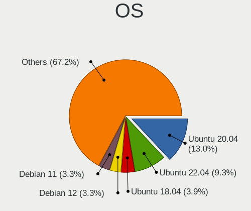
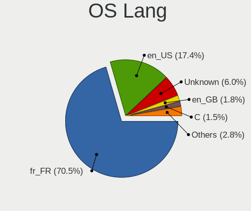
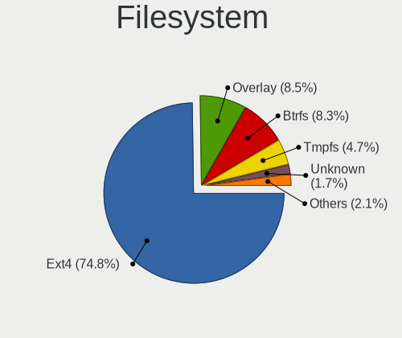
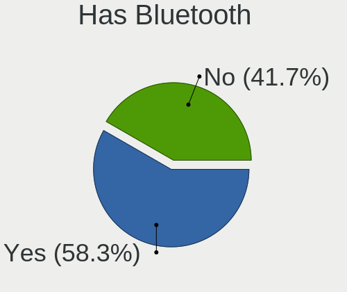

Linux in France - Tested Hardware & Statistics
----------------------------------------------

A project to collect tested hardware configurations for Linux in France.

Anyone can contribute to this report by the [hw-probe](https://github.com/linuxhw/hw-probe) tool:

    sudo -E hw-probe -all -upload

Please contribute! Especially if your hardware is rare.

This is a report for all computer types. See also reports for [desktops](/Location/France/Desktop/README.md) and [notebooks](/Location/France/Notebook/README.md).

Contents
--------

* [ Test Cases ](#test-cases)

* [ System ](#system)
  - [ OS                       ](#os)
  - [ OS Family                ](#os-family)
  - [ Kernel                   ](#kernel)
  - [ Kernel Family            ](#kernel-family)
  - [ Kernel Major Ver.        ](#kernel-major-ver)
  - [ Arch                     ](#arch)
  - [ DE                       ](#de)
  - [ Display Server           ](#display-server)
  - [ Display Manager          ](#display-manager)
  - [ OS Lang                  ](#os-lang)
  - [ Boot Mode                ](#boot-mode)
  - [ Filesystem               ](#filesystem)
  - [ Part. scheme             ](#part-scheme)
  - [ Dual Boot with Linux/BSD ](#dual-boot-with-linuxbsd)
  - [ Dual Boot (Win)          ](#dual-boot-win)

* [ Board ](#board)
  - [ Vendor                   ](#vendor)
  - [ Model                    ](#model)
  - [ Model Family             ](#model-family)
  - [ MFG Year                 ](#mfg-year)
  - [ Form Factor              ](#form-factor)
  - [ Secure Boot              ](#secure-boot)
  - [ Coreboot                 ](#coreboot)
  - [ RAM Size                 ](#ram-size)
  - [ RAM Used                 ](#ram-used)
  - [ Total Drives             ](#total-drives)
  - [ Has CD-ROM               ](#has-cd-rom)
  - [ Has Ethernet             ](#has-ethernet)
  - [ Has WiFi                 ](#has-wifi)
  - [ Has Bluetooth            ](#has-bluetooth)

* [ Location ](#location)
  - [ Country                  ](#country)
  - [ City                     ](#city)

* [ Drives ](#drives)
  - [ Drive Vendor             ](#drive-vendor)
  - [ Drive Model              ](#drive-model)
  - [ HDD Vendor               ](#hdd-vendor)
  - [ SSD Vendor               ](#ssd-vendor)
  - [ Drive Kind               ](#drive-kind)
  - [ Drive Connector          ](#drive-connector)
  - [ Drive Size               ](#drive-size)
  - [ Space Total              ](#space-total)
  - [ Space Used               ](#space-used)
  - [ Malfunc. Drives          ](#malfunc-drives)
  - [ Malfunc. Drive Vendor    ](#malfunc-drive-vendor)
  - [ Malfunc. HDD Vendor      ](#malfunc-hdd-vendor)
  - [ Malfunc. Drive Kind      ](#malfunc-drive-kind)
  - [ Failed Drives            ](#failed-drives)
  - [ Failed Drive Vendor      ](#failed-drive-vendor)
  - [ Drive Status             ](#drive-status)

* [ Storage controller ](#storage-controller)
  - [ Storage Vendor           ](#storage-vendor)
  - [ Storage Model            ](#storage-model)
  - [ Storage Kind             ](#storage-kind)

* [ Processor ](#processor)
  - [ CPU Vendor               ](#cpu-vendor)
  - [ CPU Model                ](#cpu-model)
  - [ CPU Model Family         ](#cpu-model-family)
  - [ CPU Cores                ](#cpu-cores)
  - [ CPU Sockets              ](#cpu-sockets)
  - [ CPU Threads              ](#cpu-threads)
  - [ CPU Op-Modes             ](#cpu-op-modes)
  - [ CPU Microcode            ](#cpu-microcode)
  - [ CPU Microarch            ](#cpu-microarch)

* [ Graphics ](#graphics)
  - [ GPU Vendor               ](#gpu-vendor)
  - [ GPU Model                ](#gpu-model)
  - [ GPU Combo                ](#gpu-combo)
  - [ GPU Driver               ](#gpu-driver)
  - [ GPU Memory               ](#gpu-memory)

* [ Monitor ](#monitor)
  - [ Monitor Vendor           ](#monitor-vendor)
  - [ Monitor Model            ](#monitor-model)
  - [ Monitor Resolution       ](#monitor-resolution)
  - [ Monitor Diagonal         ](#monitor-diagonal)
  - [ Monitor Width            ](#monitor-width)
  - [ Aspect Ratio             ](#aspect-ratio)
  - [ Monitor Area             ](#monitor-area)
  - [ Pixel Density            ](#pixel-density)
  - [ Multiple Monitors        ](#multiple-monitors)

* [ Network ](#network)
  - [ Net Controller Vendor    ](#net-controller-vendor)
  - [ Net Controller Model     ](#net-controller-model)
  - [ Wireless Vendor          ](#wireless-vendor)
  - [ Wireless Model           ](#wireless-model)
  - [ Ethernet Vendor          ](#ethernet-vendor)
  - [ Ethernet Model           ](#ethernet-model)
  - [ Net Controller Kind      ](#net-controller-kind)
  - [ Used Controller          ](#used-controller)
  - [ NICs                     ](#nics)
  - [ IPv6                     ](#ipv6)

* [ Bluetooth ](#bluetooth)
  - [ Bluetooth Vendor         ](#bluetooth-vendor)
  - [ Bluetooth Model          ](#bluetooth-model)

* [ Sound ](#sound)
  - [ Sound Vendor             ](#sound-vendor)
  - [ Sound Model              ](#sound-model)

* [ Memory ](#memory)
  - [ Memory Vendor            ](#memory-vendor)
  - [ Memory Model             ](#memory-model)
  - [ Memory Kind              ](#memory-kind)
  - [ Memory Form Factor       ](#memory-form-factor)
  - [ Memory Size              ](#memory-size)
  - [ Memory Speed             ](#memory-speed)

* [ Printers & scanners ](#printers--scanners)
  - [ Printer Vendor           ](#printer-vendor)
  - [ Printer Model            ](#printer-model)
  - [ Scanner Vendor           ](#scanner-vendor)
  - [ Scanner Model            ](#scanner-model)

* [ Camera ](#camera)
  - [ Camera Vendor            ](#camera-vendor)
  - [ Camera Model             ](#camera-model)

* [ Security ](#security)
  - [ Fingerprint Vendor       ](#fingerprint-vendor)
  - [ Fingerprint Model        ](#fingerprint-model)
  - [ Chipcard Vendor          ](#chipcard-vendor)
  - [ Chipcard Model           ](#chipcard-model)

* [ Unsupported ](#unsupported)
  - [ Unsupported Devices      ](#unsupported-devices)
  - [ Unsupported Device Types ](#unsupported-device-types)

Test Cases
----------

Total: 13689

| Vendor        | Model                       | Form-Factor | Probe                                                      | Date         |
|---------------|-----------------------------|-------------|------------------------------------------------------------|--------------|
| Lenovo        | ThinkPad T460p 20FXS1C30... | Notebook    | [08542d994e](https://linux-hardware.org/?probe=08542d994e) | Aug 12, 2023 |
| ASUSTek       | K55VD                       | Notebook    | [05024005e4](https://linux-hardware.org/?probe=05024005e4) | Aug 12, 2023 |
| HP            | 8643 SMVB                   | Desktop     | [2832e701f2](https://linux-hardware.org/?probe=2832e701f2) | Aug 12, 2023 |
| Lenovo        | ThinkPad L13 Gen 3 21BAS... | Notebook    | [67f821bd4d](https://linux-hardware.org/?probe=67f821bd4d) | Aug 12, 2023 |
| Fujitsu       | D2990-A1 S26361-D2990-A1    | Desktop     | [ae7ae594f1](https://linux-hardware.org/?probe=ae7ae594f1) | Aug 12, 2023 |
| Acer          | Aspire 5733Z                | Notebook    | [977c66cbc0](https://linux-hardware.org/?probe=977c66cbc0) | Aug 12, 2023 |
| Gigabyte      | B550 GAMING X V2            | Desktop     | [1f4aa5bf97](https://linux-hardware.org/?probe=1f4aa5bf97) | Aug 12, 2023 |
| Unknown       | Unknown                     | Notebook    | [2e76349d2c](https://linux-hardware.org/?probe=2e76349d2c) | Aug 12, 2023 |
| Gigabyte      | M720-US3                    | Desktop     | [222bc02e4f](https://linux-hardware.org/?probe=222bc02e4f) | Aug 11, 2023 |
| Lenovo        | IdeaPad 310-15IAP 80TT      | Notebook    | [361e073b5c](https://linux-hardware.org/?probe=361e073b5c) | Aug 11, 2023 |
| Gigabyte      | B450 AORUS M                | Desktop     | [f4a323eb82](https://linux-hardware.org/?probe=f4a323eb82) | Aug 11, 2023 |
| Sony          | SVE1513I4E                  | Notebook    | [6b8cb6d520](https://linux-hardware.org/?probe=6b8cb6d520) | Aug 11, 2023 |
| MSI           | MPG X570 GAMING PRO CARB... | Desktop     | [f711709f3f](https://linux-hardware.org/?probe=f711709f3f) | Aug 11, 2023 |
| MSI           | H410M-A PRO                 | Desktop     | [de3739c2a5](https://linux-hardware.org/?probe=de3739c2a5) | Aug 11, 2023 |
| Lenovo        | ThinkPad T520 42405FG       | Notebook    | [fad80ecff3](https://linux-hardware.org/?probe=fad80ecff3) | Aug 11, 2023 |
| Acer          | Aspire ES1-431              | Notebook    | [171fd219cc](https://linux-hardware.org/?probe=171fd219cc) | Aug 10, 2023 |
| HP            | 18E7                        | Desktop     | [ff27f888f0](https://linux-hardware.org/?probe=ff27f888f0) | Aug 10, 2023 |
| Acer          | Aspire ES1-431              | Notebook    | [6802a19338](https://linux-hardware.org/?probe=6802a19338) | Aug 10, 2023 |
| Gigabyte      | H61M-D2H-USB3               | Desktop     | [0028486d9d](https://linux-hardware.org/?probe=0028486d9d) | Aug 10, 2023 |
| Gigabyte      | B560M DS3H                  | Desktop     | [96d3419a5f](https://linux-hardware.org/?probe=96d3419a5f) | Aug 10, 2023 |
| Lenovo        | IdeaPad 320-15AST 80XV      | Notebook    | [0caf17e079](https://linux-hardware.org/?probe=0caf17e079) | Aug 10, 2023 |
| MSI           | MPG X570 GAMING PRO CARB... | Desktop     | [0521e62bf9](https://linux-hardware.org/?probe=0521e62bf9) | Aug 10, 2023 |
| MSI           | MPG X570 GAMING PRO CARB... | Desktop     | [198fcb1fc2](https://linux-hardware.org/?probe=198fcb1fc2) | Aug 10, 2023 |
| HP            | Pavilion 17                 | Notebook    | [65733120b0](https://linux-hardware.org/?probe=65733120b0) | Aug 09, 2023 |
| Lenovo        | V145-15AST 81MT             | Notebook    | [304b175b3c](https://linux-hardware.org/?probe=304b175b3c) | Aug 09, 2023 |
| ASUSTek       | ASUS TUF Gaming F17 FX70... | Notebook    | [bf81bbf7b4](https://linux-hardware.org/?probe=bf81bbf7b4) | Aug 09, 2023 |
| MSI           | Z590-A PRO                  | Desktop     | [4448c9f2e1](https://linux-hardware.org/?probe=4448c9f2e1) | Aug 09, 2023 |
| MSI           | Z590-A PRO                  | Desktop     | [6e1d11025a](https://linux-hardware.org/?probe=6e1d11025a) | Aug 09, 2023 |
| Acer          | Aspire A317-53              | Notebook    | [de8d362cb8](https://linux-hardware.org/?probe=de8d362cb8) | Aug 09, 2023 |
| MSI           | Z97-G45 GAMING              | Desktop     | [65d491c109](https://linux-hardware.org/?probe=65d491c109) | Aug 09, 2023 |
| Intel         | DQ77KB AAG40294-401         | Desktop     | [3a761b76d6](https://linux-hardware.org/?probe=3a761b76d6) | Aug 09, 2023 |
| ASUSTek       | ROG CROSSHAIR VIII DARK ... | Desktop     | [0cf2ab49c0](https://linux-hardware.org/?probe=0cf2ab49c0) | Aug 09, 2023 |
| HP            | EliteBook 830 G8 Noteboo... | Notebook    | [5e79da69ed](https://linux-hardware.org/?probe=5e79da69ed) | Aug 09, 2023 |
| HP            | EliteBook 830 G8 Noteboo... | Notebook    | [c761edfea1](https://linux-hardware.org/?probe=c761edfea1) | Aug 09, 2023 |
| Dell          | 040DDP A00                  | Desktop     | [13d99d66da](https://linux-hardware.org/?probe=13d99d66da) | Aug 09, 2023 |
| Dell          | XPS 15 9520                 | Notebook    | [0620b6b11a](https://linux-hardware.org/?probe=0620b6b11a) | Aug 09, 2023 |
| Shuttle       | XS35V3                      | Desktop     | [ced8776e4d](https://linux-hardware.org/?probe=ced8776e4d) | Aug 09, 2023 |
| Dell          | 08HPGT A01                  | Desktop     | [273e794a99](https://linux-hardware.org/?probe=273e794a99) | Aug 09, 2023 |
| Lenovo        | ThinkPad X1 Titanium Gen... | Convertible | [057ef3751d](https://linux-hardware.org/?probe=057ef3751d) | Aug 08, 2023 |
| MSI           | MPG B550I GAMING EDGE WI... | Desktop     | [ee7bcf8fe1](https://linux-hardware.org/?probe=ee7bcf8fe1) | Aug 08, 2023 |
| ASUSTek       | P5LD2-SE                    | Desktop     | [04d19635d5](https://linux-hardware.org/?probe=04d19635d5) | Aug 08, 2023 |
| ASUSTek       | P5LD2-SE                    | Desktop     | [671a686166](https://linux-hardware.org/?probe=671a686166) | Aug 08, 2023 |
| Dell          | 0NK5PH A01                  | Desktop     | [eb06b6713d](https://linux-hardware.org/?probe=eb06b6713d) | Aug 08, 2023 |
| MSI           | B450 GAMING PLUS MAX        | Desktop     | [d9c999ffa3](https://linux-hardware.org/?probe=d9c999ffa3) | Aug 08, 2023 |
| Dell          | Latitude 7310               | Notebook    | [19646f8e46](https://linux-hardware.org/?probe=19646f8e46) | Aug 08, 2023 |
| Lenovo        | ThinkPad P50 20EQS0T800     | Notebook    | [8316628b28](https://linux-hardware.org/?probe=8316628b28) | Aug 08, 2023 |
| Lenovo        | ThinkPad P50 20EQS0T800     | Notebook    | [05d33f11b5](https://linux-hardware.org/?probe=05d33f11b5) | Aug 08, 2023 |
| Notebook      | W65_W67RZ1                  | Notebook    | [ab4b3c8f47](https://linux-hardware.org/?probe=ab4b3c8f47) | Aug 08, 2023 |
| Lenovo        | ThinkPad L13 Gen 3 21BAS... | Notebook    | [187ac2792a](https://linux-hardware.org/?probe=187ac2792a) | Aug 08, 2023 |
| Fujitsu       | D2990-A1 S26361-D2990-A1    | Desktop     | [c48e0220d8](https://linux-hardware.org/?probe=c48e0220d8) | Aug 08, 2023 |
| Intel         | D33217GKE G76540-203        | Desktop     | [fa0fbda262](https://linux-hardware.org/?probe=fa0fbda262) | Aug 08, 2023 |
| HP            | EliteBook 840 G3            | Notebook    | [bf56c08196](https://linux-hardware.org/?probe=bf56c08196) | Aug 08, 2023 |
| HP            | ZBook 14 G2                 | Notebook    | [c52b1e963f](https://linux-hardware.org/?probe=c52b1e963f) | Aug 08, 2023 |
| Dell          | 0GWHMW A03                  | Desktop     | [ce5dea2bc6](https://linux-hardware.org/?probe=ce5dea2bc6) | Aug 08, 2023 |
| Dell          | 0GWHMW A03                  | Desktop     | [1ba2de9148](https://linux-hardware.org/?probe=1ba2de9148) | Aug 08, 2023 |
| Intel         | D33217GKE G76540-203        | Desktop     | [f75916b7c7](https://linux-hardware.org/?probe=f75916b7c7) | Aug 08, 2023 |
| Dell          | 08HPGT A01                  | Desktop     | [616f6ba289](https://linux-hardware.org/?probe=616f6ba289) | Aug 08, 2023 |
| Lenovo        | ThinkPad T14 Gen 2a 20XL... | Notebook    | [4148b505d6](https://linux-hardware.org/?probe=4148b505d6) | Aug 08, 2023 |
| HP            | ZBook 14 G2                 | Notebook    | [211978450c](https://linux-hardware.org/?probe=211978450c) | Aug 08, 2023 |
| HP            | EliteBook 840 G3            | Notebook    | [132603d7e2](https://linux-hardware.org/?probe=132603d7e2) | Aug 08, 2023 |
| Dell          | Latitude 7310               | Notebook    | [baab866835](https://linux-hardware.org/?probe=baab866835) | Aug 08, 2023 |
| HP            | ZBook 14 G2                 | Notebook    | [23dd3e572c](https://linux-hardware.org/?probe=23dd3e572c) | Aug 08, 2023 |
| Lenovo        | ThinkPad L13 Gen 3 21BAS... | Notebook    | [b00519fee7](https://linux-hardware.org/?probe=b00519fee7) | Aug 08, 2023 |
| Gigabyte      | H610M S2H DDR4              | Desktop     | [ff4ead4bd3](https://linux-hardware.org/?probe=ff4ead4bd3) | Aug 08, 2023 |
| Acer          | AO756                       | Notebook    | [1ea1658ac0](https://linux-hardware.org/?probe=1ea1658ac0) | Aug 07, 2023 |
| Gigabyte      | B550 AORUS ELITE V2         | Desktop     | [ef73e2e520](https://linux-hardware.org/?probe=ef73e2e520) | Aug 07, 2023 |
| Notebook      | NLx0MU                      | Notebook    | [bb99f6f69e](https://linux-hardware.org/?probe=bb99f6f69e) | Aug 07, 2023 |
| HP            | G60                         | Notebook    | [7f3b9aec85](https://linux-hardware.org/?probe=7f3b9aec85) | Aug 07, 2023 |
| Lenovo        | ThinkPad L13 Gen 3 21BAS... | Notebook    | [a1b9b9fc2c](https://linux-hardware.org/?probe=a1b9b9fc2c) | Aug 07, 2023 |
| MSI           | B450 GAMING PLUS MAX        | Desktop     | [c04ac90ce8](https://linux-hardware.org/?probe=c04ac90ce8) | Aug 07, 2023 |
| MSI           | GL72 7QF                    | Notebook    | [73f4a3b852](https://linux-hardware.org/?probe=73f4a3b852) | Aug 07, 2023 |
| Lenovo        | ThinkPad X1 Carbon Gen 1... | Notebook    | [a3dd4fadf3](https://linux-hardware.org/?probe=a3dd4fadf3) | Aug 07, 2023 |
| Lenovo        | ThinkPad X200 74595FG       | Notebook    | [fe977cc0fe](https://linux-hardware.org/?probe=fe977cc0fe) | Aug 07, 2023 |
| Notebook      | NHxxRZQ                     | Notebook    | [0cd17c8b5c](https://linux-hardware.org/?probe=0cd17c8b5c) | Aug 07, 2023 |
| Micro Comp... | NUCXI7                      | Notebook    | [96d3ade9eb](https://linux-hardware.org/?probe=96d3ade9eb) | Aug 07, 2023 |
| ASUSTek       | P5N-E SLI                   | Desktop     | [d552e347f5](https://linux-hardware.org/?probe=d552e347f5) | Aug 07, 2023 |
| MSI           | Z97 GAMING 5                | Desktop     | [d076b394d9](https://linux-hardware.org/?probe=d076b394d9) | Aug 06, 2023 |
| Dell          | 0WMJ54 A01                  | Desktop     | [7f6aa0ed0c](https://linux-hardware.org/?probe=7f6aa0ed0c) | Aug 06, 2023 |
| MSI           | H310M PRO-D                 | Desktop     | [201844f73e](https://linux-hardware.org/?probe=201844f73e) | Aug 06, 2023 |
| Foxconn       | 2AAF                        | Desktop     | [e0b2d4efb6](https://linux-hardware.org/?probe=e0b2d4efb6) | Aug 06, 2023 |
| HP            | ZBook Firefly 15.6 inch ... | Notebook    | [a3c7d29211](https://linux-hardware.org/?probe=a3c7d29211) | Aug 06, 2023 |
| Dell          | Latitude E5440              | Notebook    | [326ba9627a](https://linux-hardware.org/?probe=326ba9627a) | Aug 06, 2023 |
| ASUSTek       | PRIME B550M-A WIFI II       | Desktop     | [7a15d18c93](https://linux-hardware.org/?probe=7a15d18c93) | Aug 06, 2023 |
| ASRock        | Z75 Pro3                    | Desktop     | [597461a5ac](https://linux-hardware.org/?probe=597461a5ac) | Aug 06, 2023 |
| HP            | ENVY x360 2-in-1 Laptop ... | Convertible | [b47eca38dc](https://linux-hardware.org/?probe=b47eca38dc) | Aug 06, 2023 |
| Dell          | 02YYK5 A01                  | Desktop     | [5796ca55ef](https://linux-hardware.org/?probe=5796ca55ef) | Aug 06, 2023 |
| HP            | 1791                        | Desktop     | [4a89aab3d6](https://linux-hardware.org/?probe=4a89aab3d6) | Aug 05, 2023 |
| ASUSTek       | Z87-PRO                     | Desktop     | [9d39447e43](https://linux-hardware.org/?probe=9d39447e43) | Aug 05, 2023 |
| Dell          | Latitude 5400               | Notebook    | [e788e3a534](https://linux-hardware.org/?probe=e788e3a534) | Aug 05, 2023 |
| Lenovo        | Yoga Slim 7 Pro 16ACH6 8... | Notebook    | [8c56195933](https://linux-hardware.org/?probe=8c56195933) | Aug 05, 2023 |
| HP            | 829A                        | Mini pc     | [03a93a19f6](https://linux-hardware.org/?probe=03a93a19f6) | Aug 05, 2023 |
| Lenovo        | Y520-15IKBN 80WK            | Notebook    | [ae5361d56f](https://linux-hardware.org/?probe=ae5361d56f) | Aug 05, 2023 |
| ASUSTek       | K52Je                       | Notebook    | [34fa8887dd](https://linux-hardware.org/?probe=34fa8887dd) | Aug 05, 2023 |
| HP            | Notebook                    | Notebook    | [d86cc7b5ba](https://linux-hardware.org/?probe=d86cc7b5ba) | Aug 05, 2023 |
| Notebook      | NP5x_NP6x_NP7xRNJ_RNH       | Notebook    | [f4f8099774](https://linux-hardware.org/?probe=f4f8099774) | Aug 05, 2023 |
| Lenovo        | IdeaPad S340-15API 81NC     | Notebook    | [f1e284ec93](https://linux-hardware.org/?probe=f1e284ec93) | Aug 04, 2023 |
| HP            | 829A                        | Mini pc     | [ce4068d660](https://linux-hardware.org/?probe=ce4068d660) | Aug 04, 2023 |
| Dell          | G5 5587                     | Notebook    | [320fffbb49](https://linux-hardware.org/?probe=320fffbb49) | Aug 04, 2023 |
| Acer          | Aspire 5738                 | Notebook    | [f5df04e0e6](https://linux-hardware.org/?probe=f5df04e0e6) | Aug 04, 2023 |
| ASUSTek       | PRIME Z270-K                | Desktop     | [838f543301](https://linux-hardware.org/?probe=838f543301) | Aug 04, 2023 |
| ASUSTek       | PRIME Z270-K                | Desktop     | [1b9b10c938](https://linux-hardware.org/?probe=1b9b10c938) | Aug 04, 2023 |
| ASUSTek       | VivoBook_ASUSLaptop X509... | Notebook    | [87febc0242](https://linux-hardware.org/?probe=87febc0242) | Aug 04, 2023 |
| ZOTAC         | ZBOX-CI329NANO              | Mini pc     | [0068fdf226](https://linux-hardware.org/?probe=0068fdf226) | Aug 04, 2023 |
| ASUSTek       | P5B-Deluxe                  | Desktop     | [122ba504c1](https://linux-hardware.org/?probe=122ba504c1) | Aug 04, 2023 |
| MSI           | PRO X670-P WIFI             | Desktop     | [cd0d64a16a](https://linux-hardware.org/?probe=cd0d64a16a) | Aug 03, 2023 |
| Dell          | Latitude 5480               | Notebook    | [c52baac4e0](https://linux-hardware.org/?probe=c52baac4e0) | Aug 03, 2023 |
| MSI           | Titan GT77HX 13VH           | Notebook    | [3acda608a1](https://linux-hardware.org/?probe=3acda608a1) | Aug 03, 2023 |
| Sony          | VGN-NS38E_S                 | Notebook    | [a21051f2a8](https://linux-hardware.org/?probe=a21051f2a8) | Aug 03, 2023 |
| MSI           | Z97 GAMING 3                | Desktop     | [caac03a431](https://linux-hardware.org/?probe=caac03a431) | Aug 03, 2023 |
| Notebook      | N9x0TD_TF                   | Notebook    | [033c07e1d3](https://linux-hardware.org/?probe=033c07e1d3) | Aug 03, 2023 |
| Microsoft     | Surface 3                   | Tablet      | [34364bb6c3](https://linux-hardware.org/?probe=34364bb6c3) | Aug 03, 2023 |
| Notebook      | N9x0TD_TF                   | Notebook    | [3ab98d3af1](https://linux-hardware.org/?probe=3ab98d3af1) | Aug 03, 2023 |
| HP            | EliteBook 8570p             | Notebook    | [9b2c783e20](https://linux-hardware.org/?probe=9b2c783e20) | Aug 03, 2023 |
| Microsoft     | Surface 3                   | Tablet      | [8ed1cc4a3b](https://linux-hardware.org/?probe=8ed1cc4a3b) | Aug 03, 2023 |
| Toshiba       | Satellite C70-B             | Notebook    | [877d855f27](https://linux-hardware.org/?probe=877d855f27) | Aug 02, 2023 |
| TUXEDO        | Book XA15 / XA17 Gen10      | Notebook    | [18e29b97ac](https://linux-hardware.org/?probe=18e29b97ac) | Aug 02, 2023 |
| MSI           | 760GM-P23                   | Desktop     | [c9e70623fc](https://linux-hardware.org/?probe=c9e70623fc) | Aug 02, 2023 |
| Intel         | DH67BL AAG10189-211         | Desktop     | [db043e1572](https://linux-hardware.org/?probe=db043e1572) | Aug 02, 2023 |
| Dell          | Inspiron 14 Plus 7420       | Notebook    | [251b811e9b](https://linux-hardware.org/?probe=251b811e9b) | Aug 02, 2023 |
| Dell          | XPS 15 9500                 | Notebook    | [5c8ad99a3c](https://linux-hardware.org/?probe=5c8ad99a3c) | Aug 02, 2023 |
| Fujitsu       | D3402-A1 S26361-D3402-A1    | Desktop     | [5cbdefa7c5](https://linux-hardware.org/?probe=5cbdefa7c5) | Aug 02, 2023 |
| ASUSTek       | VivoBook_ASUSLaptop M350... | Notebook    | [5f2529e42b](https://linux-hardware.org/?probe=5f2529e42b) | Aug 02, 2023 |
| HP            | Pavilion 15                 | Notebook    | [257fe62454](https://linux-hardware.org/?probe=257fe62454) | Aug 02, 2023 |
| Pegatron      | Benicia                     | Desktop     | [5db4c563c6](https://linux-hardware.org/?probe=5db4c563c6) | Aug 01, 2023 |
| ASUSTek       | GL502VSK                    | Notebook    | [0ed7feaa05](https://linux-hardware.org/?probe=0ed7feaa05) | Aug 01, 2023 |
| Gigabyte      | B550 GAMING X V2            | Desktop     | [8353d48977](https://linux-hardware.org/?probe=8353d48977) | Aug 01, 2023 |
| Gigabyte      | B550 AORUS PRO V2           | Desktop     | [abe7173905](https://linux-hardware.org/?probe=abe7173905) | Aug 01, 2023 |
| Dell          | Precision 7520              | Notebook    | [b5addbb003](https://linux-hardware.org/?probe=b5addbb003) | Aug 01, 2023 |
| HP            | 1496                        | Desktop     | [24863488f0](https://linux-hardware.org/?probe=24863488f0) | Aug 01, 2023 |
| AZW           | SER                         | Mini pc     | [26cf19da86](https://linux-hardware.org/?probe=26cf19da86) | Jul 31, 2023 |
| Acer          | AOD255                      | Notebook    | [bdaffcb2ef](https://linux-hardware.org/?probe=bdaffcb2ef) | Jul 31, 2023 |
| ASUSTek       | PRIME B550M-A               | Desktop     | [c7f6e64888](https://linux-hardware.org/?probe=c7f6e64888) | Jul 31, 2023 |
| ASUSTek       | TUF Gaming X570-PLUS        | Desktop     | [4e4e6cd3eb](https://linux-hardware.org/?probe=4e4e6cd3eb) | Jul 31, 2023 |
| Packard Be... | H17HV                       | Notebook    | [de2003d390](https://linux-hardware.org/?probe=de2003d390) | Jul 31, 2023 |
| Lenovo        | ThinkPad L440 20ASS19B03    | Notebook    | [560cd8b4fb](https://linux-hardware.org/?probe=560cd8b4fb) | Jul 31, 2023 |
| Unknown       | Unknown                     | Desktop     | [11d7923fa3](https://linux-hardware.org/?probe=11d7923fa3) | Jul 31, 2023 |
| ASUSTek       | P6T SE                      | Desktop     | [aead9f82b2](https://linux-hardware.org/?probe=aead9f82b2) | Jul 31, 2023 |
| ASUSTek       | P6T SE                      | Desktop     | [9e8f131101](https://linux-hardware.org/?probe=9e8f131101) | Jul 31, 2023 |
| Shuttle       | XS35V3                      | Desktop     | [52c5dda710](https://linux-hardware.org/?probe=52c5dda710) | Jul 31, 2023 |
| Dell          | G15 5510                    | Notebook    | [8ab77abc2e](https://linux-hardware.org/?probe=8ab77abc2e) | Jul 30, 2023 |
| Intel         | DH67BL AAG10189-211         | Desktop     | [33ac97b0c6](https://linux-hardware.org/?probe=33ac97b0c6) | Jul 30, 2023 |
| Gigabyte      | X58A-UD7                    | Desktop     | [98759e7a12](https://linux-hardware.org/?probe=98759e7a12) | Jul 30, 2023 |
| Dell          | Latitude E5430 non-vPro     | Notebook    | [3daec696c7](https://linux-hardware.org/?probe=3daec696c7) | Jul 30, 2023 |
| Gigabyte      | Z170X-Gaming 3              | Desktop     | [3bbfa332c0](https://linux-hardware.org/?probe=3bbfa332c0) | Jul 30, 2023 |
| ASRock        | B650M PG Riptide            | Desktop     | [9f95c471d0](https://linux-hardware.org/?probe=9f95c471d0) | Jul 30, 2023 |
| Lenovo        | 0C48431 WIN                 | Desktop     | [4e0d5538b2](https://linux-hardware.org/?probe=4e0d5538b2) | Jul 30, 2023 |
| MSI           | GS73VR 7RF                  | Notebook    | [9df7170f38](https://linux-hardware.org/?probe=9df7170f38) | Jul 29, 2023 |
| ASUSTek       | P5G41C-M LX                 | Desktop     | [18f28e3fb6](https://linux-hardware.org/?probe=18f28e3fb6) | Jul 29, 2023 |
| Pegatron      | EVANS                       | Desktop     | [323d6a7283](https://linux-hardware.org/?probe=323d6a7283) | Jul 29, 2023 |
| Intel         | D33217GKE G76540-203        | Desktop     | [d551e6904d](https://linux-hardware.org/?probe=d551e6904d) | Jul 29, 2023 |
| MSI           | GT70 2PE                    | Notebook    | [d0ef2177c3](https://linux-hardware.org/?probe=d0ef2177c3) | Jul 29, 2023 |
| MSI           | GT70 2PE                    | Notebook    | [bc059e2204](https://linux-hardware.org/?probe=bc059e2204) | Jul 29, 2023 |
| Acer          | Swift SF315-52G             | Notebook    | [413fcf8114](https://linux-hardware.org/?probe=413fcf8114) | Jul 29, 2023 |
| Acer          | Swift SF315-52G             | Notebook    | [aca997f2b5](https://linux-hardware.org/?probe=aca997f2b5) | Jul 29, 2023 |
| Acer          | AOD255                      | Notebook    | [53c73b6ad3](https://linux-hardware.org/?probe=53c73b6ad3) | Jul 29, 2023 |
| HP            | ProBook 4525s               | Notebook    | [f1f6309860](https://linux-hardware.org/?probe=f1f6309860) | Jul 29, 2023 |
| ASUSTek       | Zenbook UM5302TA_UM5302T... | Notebook    | [579d4eebb8](https://linux-hardware.org/?probe=579d4eebb8) | Jul 29, 2023 |
| ASUSTek       | X102BA                      | Notebook    | [488aa4c5b4](https://linux-hardware.org/?probe=488aa4c5b4) | Jul 29, 2023 |
| Shuttle       | XS35V3                      | Desktop     | [1753d8ab39](https://linux-hardware.org/?probe=1753d8ab39) | Jul 29, 2023 |
| Ugoos         | AM6b Plus                   | Soc         | [a5ff8e9a5d](https://linux-hardware.org/?probe=a5ff8e9a5d) | Jul 29, 2023 |
| Sony          | VGN-NS38E_S                 | Notebook    | [703b459140](https://linux-hardware.org/?probe=703b459140) | Jul 28, 2023 |
| MSI           | MPG B550I GAMING EDGE WI... | Desktop     | [5473e8bab9](https://linux-hardware.org/?probe=5473e8bab9) | Jul 28, 2023 |
| Chitech Sh... | Tibuta_MasterPad-W100       | Notebook    | [202a9be7b7](https://linux-hardware.org/?probe=202a9be7b7) | Jul 28, 2023 |
| Chuwi         | Hi10 X                      | Tablet      | [dac7c62216](https://linux-hardware.org/?probe=dac7c62216) | Jul 28, 2023 |
| Acer          | Aspire 4810T                | Notebook    | [4d3abb525e](https://linux-hardware.org/?probe=4d3abb525e) | Jul 28, 2023 |
| Dell          | Precision 3520              | Notebook    | [bc2e0ff018](https://linux-hardware.org/?probe=bc2e0ff018) | Jul 28, 2023 |
| MSI           | X370 GAMING PRO CARBON      | Desktop     | [d4774401e3](https://linux-hardware.org/?probe=d4774401e3) | Jul 28, 2023 |
| MSI           | X370 GAMING PRO CARBON      | Desktop     | [45c79840cc](https://linux-hardware.org/?probe=45c79840cc) | Jul 28, 2023 |
| Pegatron      | 2A99                        | Desktop     | [068f8c77fd](https://linux-hardware.org/?probe=068f8c77fd) | Jul 27, 2023 |
| ASUSTek       | PRIME X370-PRO              | Desktop     | [75dec2a4a4](https://linux-hardware.org/?probe=75dec2a4a4) | Jul 27, 2023 |
| Lenovo        | ThinkPad P15 Gen 2i 20YQ... | Notebook    | [6e7d094f7f](https://linux-hardware.org/?probe=6e7d094f7f) | Jul 27, 2023 |
| Toshiba       | Satellite C70-B             | Notebook    | [56489a32b2](https://linux-hardware.org/?probe=56489a32b2) | Jul 27, 2023 |
| Intel         | D33217GKE G76540-203        | Desktop     | [b4089ed499](https://linux-hardware.org/?probe=b4089ed499) | Jul 26, 2023 |
| Cincoze       | DS-1300.00.001              | Desktop     | [e359107d20](https://linux-hardware.org/?probe=e359107d20) | Jul 26, 2023 |
| Cincoze       | DS-1300.00.001              | Desktop     | [01309bf370](https://linux-hardware.org/?probe=01309bf370) | Jul 26, 2023 |
| Dell          | Precision 3520              | Notebook    | [2502fbaef2](https://linux-hardware.org/?probe=2502fbaef2) | Jul 26, 2023 |
| Gigabyte      | X570 UD                     | Desktop     | [c693096b39](https://linux-hardware.org/?probe=c693096b39) | Jul 26, 2023 |
| Acer          | AOD255                      | Notebook    | [4f96dbf750](https://linux-hardware.org/?probe=4f96dbf750) | Jul 25, 2023 |
| Gigabyte      | F2A88XM-D3H                 | Desktop     | [86e9608516](https://linux-hardware.org/?probe=86e9608516) | Jul 25, 2023 |
| HP            | Laptop 17-cp0xxx            | Notebook    | [f8720bbd07](https://linux-hardware.org/?probe=f8720bbd07) | Jul 25, 2023 |
| Lenovo        | ThinkPad P16s Gen 2 21HK... | Notebook    | [f22f51832b](https://linux-hardware.org/?probe=f22f51832b) | Jul 25, 2023 |
| Dell          | Studio 1537                 | Notebook    | [803a98f7e6](https://linux-hardware.org/?probe=803a98f7e6) | Jul 25, 2023 |
| Dell          | 0M5DCD A00                  | Desktop     | [f03fba3891](https://linux-hardware.org/?probe=f03fba3891) | Jul 25, 2023 |
| HP            | 250 G5 Notebook PC          | Notebook    | [007f2e5957](https://linux-hardware.org/?probe=007f2e5957) | Jul 25, 2023 |
| Gigabyte      | B365M H                     | Desktop     | [12902831a7](https://linux-hardware.org/?probe=12902831a7) | Jul 25, 2023 |
| Dell          | Inspiron 15-3552            | Notebook    | [3b317edaf6](https://linux-hardware.org/?probe=3b317edaf6) | Jul 25, 2023 |
| MSI           | GF63 Thin 10SCXR            | Notebook    | [b34b7fa5fb](https://linux-hardware.org/?probe=b34b7fa5fb) | Jul 25, 2023 |
| MSI           | Z77A-GD65                   | Desktop     | [4df7cd69af](https://linux-hardware.org/?probe=4df7cd69af) | Jul 25, 2023 |
| Pegatron      | Benicia                     | Desktop     | [ad8b67f72e](https://linux-hardware.org/?probe=ad8b67f72e) | Jul 24, 2023 |
| Unknown       | 1.2                         | Desktop     | [b18dd168dd](https://linux-hardware.org/?probe=b18dd168dd) | Jul 24, 2023 |
| Acer          | Nitro AN515-57              | Notebook    | [d4b572d070](https://linux-hardware.org/?probe=d4b572d070) | Jul 24, 2023 |
| Dell          | Precision 7520              | Notebook    | [66922483cf](https://linux-hardware.org/?probe=66922483cf) | Jul 24, 2023 |
| Acer          | AOD255                      | Notebook    | [3543f0800e](https://linux-hardware.org/?probe=3543f0800e) | Jul 24, 2023 |
| Dell          | Inspiron 15 3511            | Notebook    | [980ed56abe](https://linux-hardware.org/?probe=980ed56abe) | Jul 24, 2023 |
| Valve         | Jupiter                     | Notebook    | [59b11daded](https://linux-hardware.org/?probe=59b11daded) | Jul 24, 2023 |
| MSI           | X370 GAMING PRO CARBON      | Desktop     | [f6c6668305](https://linux-hardware.org/?probe=f6c6668305) | Jul 23, 2023 |
| Acer          | Aspire 5738                 | Notebook    | [3cc1d4a0cd](https://linux-hardware.org/?probe=3cc1d4a0cd) | Jul 23, 2023 |
| ASUSTek       | CROSSHAIR VI HERO           | Desktop     | [567693892b](https://linux-hardware.org/?probe=567693892b) | Jul 23, 2023 |
| ASUSTek       | PRIME X570-P                | Desktop     | [c052f51a67](https://linux-hardware.org/?probe=c052f51a67) | Jul 23, 2023 |
| HP            | ProBook 640 G1              | Notebook    | [de254aad44](https://linux-hardware.org/?probe=de254aad44) | Jul 23, 2023 |
| Dell          | Inspiron 3541               | Notebook    | [0a146a40d9](https://linux-hardware.org/?probe=0a146a40d9) | Jul 23, 2023 |
| Lenovo        | ThinkPad L460 20FVS01J00    | Notebook    | [96fe0142cd](https://linux-hardware.org/?probe=96fe0142cd) | Jul 23, 2023 |
| Dell          | 0K7CVF A03                  | Server      | [228949ef5a](https://linux-hardware.org/?probe=228949ef5a) | Jul 23, 2023 |
| Gigabyte      | P67A-UD3-B3                 | Desktop     | [26e7657871](https://linux-hardware.org/?probe=26e7657871) | Jul 23, 2023 |
| ASRock        | B560M Pro4                  | Desktop     | [881853b4dc](https://linux-hardware.org/?probe=881853b4dc) | Jul 23, 2023 |
| HP            | Elite x2 G4                 | Tablet      | [1705d2fd99](https://linux-hardware.org/?probe=1705d2fd99) | Jul 23, 2023 |
| Radxa         | ROCK 5B                     | Soc         | [9f1e03d74d](https://linux-hardware.org/?probe=9f1e03d74d) | Jul 23, 2023 |
| Acer          | AO756                       | Notebook    | [23e3fc369f](https://linux-hardware.org/?probe=23e3fc369f) | Jul 23, 2023 |
| ASRock        | 4X4-4000 Series             | Desktop     | [d95040e760](https://linux-hardware.org/?probe=d95040e760) | Jul 23, 2023 |
| Dell          | Precision M2400             | Notebook    | [86913a26b4](https://linux-hardware.org/?probe=86913a26b4) | Jul 22, 2023 |
| Lenovo        | ThinkPad T420s 4174PEG      | Notebook    | [3bedb2ae12](https://linux-hardware.org/?probe=3bedb2ae12) | Jul 22, 2023 |
| ASUSTek       | Q170M2                      | Desktop     | [f3435d221b](https://linux-hardware.org/?probe=f3435d221b) | Jul 21, 2023 |
| ASUSTek       | B53E                        | Notebook    | [08012052d5](https://linux-hardware.org/?probe=08012052d5) | Jul 21, 2023 |
| ASUSTek       | K72Jr                       | Notebook    | [cdb9b29f94](https://linux-hardware.org/?probe=cdb9b29f94) | Jul 21, 2023 |
| ASUSTek       | H110S2                      | Desktop     | [3e43d97432](https://linux-hardware.org/?probe=3e43d97432) | Jul 21, 2023 |
| Fujitsu       | D3313-A1 S26361-D3313-A1    | Desktop     | [97edd15b78](https://linux-hardware.org/?probe=97edd15b78) | Jul 21, 2023 |
| ASUSTek       | VivoBook_ASUS Laptop X50... | Notebook    | [3db32d6c63](https://linux-hardware.org/?probe=3db32d6c63) | Jul 21, 2023 |
| Lenovo        | ThinkPad T540p 20BFA06B0... | Notebook    | [15e3320bb0](https://linux-hardware.org/?probe=15e3320bb0) | Jul 21, 2023 |
| Toshiba       | Satellite C70-B             | Notebook    | [cf2d22469b](https://linux-hardware.org/?probe=cf2d22469b) | Jul 20, 2023 |
| ASUSTek       | VivoBook_ASUSLaptop X712... | Notebook    | [5c4d93901b](https://linux-hardware.org/?probe=5c4d93901b) | Jul 20, 2023 |
| ASUSTek       | UX303LB                     | Notebook    | [901f80bb60](https://linux-hardware.org/?probe=901f80bb60) | Jul 20, 2023 |
| Dell          | 0D28YY A01                  | Desktop     | [6b01835487](https://linux-hardware.org/?probe=6b01835487) | Jul 20, 2023 |
| MSI           | CR700                       | Notebook    | [5cde06d6b9](https://linux-hardware.org/?probe=5cde06d6b9) | Jul 20, 2023 |
| MSI           | CR700                       | Notebook    | [2b2e403f78](https://linux-hardware.org/?probe=2b2e403f78) | Jul 20, 2023 |
| Lenovo        | ThinkPad P73 20QRCTO1WW     | Notebook    | [7527ca0197](https://linux-hardware.org/?probe=7527ca0197) | Jul 20, 2023 |
| MSI           | A88XM-E35 V2                | Desktop     | [7ab6252e08](https://linux-hardware.org/?probe=7ab6252e08) | Jul 19, 2023 |
| HP            | Pavilion 15                 | Notebook    | [e1bfe97e63](https://linux-hardware.org/?probe=e1bfe97e63) | Jul 19, 2023 |
| Dell          | 0XC7MM A00                  | Desktop     | [8d7dd80fa4](https://linux-hardware.org/?probe=8d7dd80fa4) | Jul 19, 2023 |
| Acer          | Aspire E1-771               | Notebook    | [9d53aeea5a](https://linux-hardware.org/?probe=9d53aeea5a) | Jul 19, 2023 |
| ASUSTek       | PRIME X370-PRO              | Desktop     | [158ce24cd5](https://linux-hardware.org/?probe=158ce24cd5) | Jul 19, 2023 |
| Thomson       | N15C8BK2T                   | Notebook    | [2e04333da5](https://linux-hardware.org/?probe=2e04333da5) | Jul 19, 2023 |
| ASUSTek       | PRIME Z390-A                | Desktop     | [94856d413f](https://linux-hardware.org/?probe=94856d413f) | Jul 19, 2023 |
| HP            | 3047h                       | Desktop     | [a45f598a92](https://linux-hardware.org/?probe=a45f598a92) | Jul 18, 2023 |
| HP            | Pavilion 15                 | Notebook    | [a5485bb7e0](https://linux-hardware.org/?probe=a5485bb7e0) | Jul 18, 2023 |
| ASRock        | H370M Pro4                  | Desktop     | [7682b57f64](https://linux-hardware.org/?probe=7682b57f64) | Jul 18, 2023 |
| ASUSTek       | Z87-C                       | Desktop     | [5324c1542f](https://linux-hardware.org/?probe=5324c1542f) | Jul 18, 2023 |
| Acer          | Nitro AN515-57              | Notebook    | [9853a8cf46](https://linux-hardware.org/?probe=9853a8cf46) | Jul 18, 2023 |
| ASUSTek       | ROG STRIX Z370-E GAMING     | Desktop     | [25aef4eda4](https://linux-hardware.org/?probe=25aef4eda4) | Jul 18, 2023 |
| MSI           | MS-AEC11                    | All in one  | [9b9bcbddf0](https://linux-hardware.org/?probe=9b9bcbddf0) | Jul 17, 2023 |
| HP            | 3047h                       | Desktop     | [614b6a73e0](https://linux-hardware.org/?probe=614b6a73e0) | Jul 17, 2023 |
| Thomson       | X15I5-8TU512                | Notebook    | [f2d5a7b0d5](https://linux-hardware.org/?probe=f2d5a7b0d5) | Jul 17, 2023 |
| Dell          | Inspiron 16 7610            | Notebook    | [6d77ef17a0](https://linux-hardware.org/?probe=6d77ef17a0) | Jul 17, 2023 |
| ASUSTek       | G551JM                      | Notebook    | [393e57db0c](https://linux-hardware.org/?probe=393e57db0c) | Jul 17, 2023 |
| HP            | Stream Laptop 14-ax0XX      | Notebook    | [e2075c4a1e](https://linux-hardware.org/?probe=e2075c4a1e) | Jul 17, 2023 |
| Alienware     | m16 R1 AMD                  | Notebook    | [7ca76c0d32](https://linux-hardware.org/?probe=7ca76c0d32) | Jul 17, 2023 |
| Acer          | TDPS05 R3700                | Desktop     | [78a7951688](https://linux-hardware.org/?probe=78a7951688) | Jul 17, 2023 |
| ASRock        | X570 Phantom Gaming 4       | Desktop     | [fb1a31ec95](https://linux-hardware.org/?probe=fb1a31ec95) | Jul 16, 2023 |
| Teclast       | F6 Plus                     | Notebook    | [c18a0b61ae](https://linux-hardware.org/?probe=c18a0b61ae) | Jul 16, 2023 |
| Teclast       | F6 Plus                     | Notebook    | [c95b1bb4f5](https://linux-hardware.org/?probe=c95b1bb4f5) | Jul 16, 2023 |
| Dell          | Latitude E6440              | Notebook    | [c1de0cf4d1](https://linux-hardware.org/?probe=c1de0cf4d1) | Jul 16, 2023 |
| Dell          | Latitude E6320              | Notebook    | [0087a8e5cf](https://linux-hardware.org/?probe=0087a8e5cf) | Jul 16, 2023 |
| Toshiba       | Satellite P500              | Notebook    | [c72cbade9e](https://linux-hardware.org/?probe=c72cbade9e) | Jul 16, 2023 |
| ASUSTek       | Z87-EXPERT                  | Desktop     | [1e8eeb8513](https://linux-hardware.org/?probe=1e8eeb8513) | Jul 16, 2023 |
| ASUSTek       | Z87-EXPERT                  | Desktop     | [8efa3cf99d](https://linux-hardware.org/?probe=8efa3cf99d) | Jul 16, 2023 |
| GEEKOM        | Mini IT 8                   | Desktop     | [4754a5fc1b](https://linux-hardware.org/?probe=4754a5fc1b) | Jul 16, 2023 |
| Gigabyte      | Z690 GAMING X DDR4          | Desktop     | [7fe3a6b5b2](https://linux-hardware.org/?probe=7fe3a6b5b2) | Jul 16, 2023 |
| Lenovo        | 30BE SDK0J40697 WIN 3305... | Desktop     | [9161db3013](https://linux-hardware.org/?probe=9161db3013) | Jul 15, 2023 |
| MSI           | Modern 15 A10RBS            | Notebook    | [fde24c2a13](https://linux-hardware.org/?probe=fde24c2a13) | Jul 15, 2023 |
| ASUSTek       | Z87-C                       | Desktop     | [33e96d6f34](https://linux-hardware.org/?probe=33e96d6f34) | Jul 15, 2023 |
| Gigabyte      | H81M-HD3                    | Desktop     | [4a6f56c54a](https://linux-hardware.org/?probe=4a6f56c54a) | Jul 15, 2023 |
| Lenovo        | ThinkPad X260 20F5S04B00    | Notebook    | [8d3168b6c4](https://linux-hardware.org/?probe=8d3168b6c4) | Jul 15, 2023 |
| HP            | EliteBook 840 G1            | Notebook    | [420ffaec41](https://linux-hardware.org/?probe=420ffaec41) | Jul 15, 2023 |
| HP            | Pavilion 17                 | Notebook    | [c8775bcc36](https://linux-hardware.org/?probe=c8775bcc36) | Jul 15, 2023 |
| Acer          | Aspire E5-773G              | Notebook    | [a4a4102548](https://linux-hardware.org/?probe=a4a4102548) | Jul 15, 2023 |
| MSI           | Z590-A PRO                  | Desktop     | [8c4fe85b51](https://linux-hardware.org/?probe=8c4fe85b51) | Jul 15, 2023 |
| ASUSTek       | VivoBook 12_ASUS Laptop ... | Notebook    | [c36495481b](https://linux-hardware.org/?probe=c36495481b) | Jul 15, 2023 |
| SLIMBOOK      | PROX15-AMD                  | Notebook    | [7e088e838b](https://linux-hardware.org/?probe=7e088e838b) | Jul 15, 2023 |
| Dell          | Inspiron MP061              | Notebook    | [0a26ffe33b](https://linux-hardware.org/?probe=0a26ffe33b) | Jul 15, 2023 |
| BESSTAR Te... | U820                        | Notebook    | [6e79cbdccc](https://linux-hardware.org/?probe=6e79cbdccc) | Jul 15, 2023 |
| BESSTAR Te... | U820                        | Notebook    | [1c9da1be8b](https://linux-hardware.org/?probe=1c9da1be8b) | Jul 15, 2023 |
| Notebook      | NS5x_NS7xPU                 | Notebook    | [41283a1f4e](https://linux-hardware.org/?probe=41283a1f4e) | Jul 15, 2023 |
| Dell          | Latitude 7490               | Notebook    | [6811ebe45a](https://linux-hardware.org/?probe=6811ebe45a) | Jul 15, 2023 |
| BESSTAR Te... | U820                        | Notebook    | [274b5bed12](https://linux-hardware.org/?probe=274b5bed12) | Jul 15, 2023 |
| Toshiba       | Satellite Pro L500          | Notebook    | [605c123888](https://linux-hardware.org/?probe=605c123888) | Jul 15, 2023 |
| Toshiba       | Satellite C70-B             | Notebook    | [9727ab2451](https://linux-hardware.org/?probe=9727ab2451) | Jul 14, 2023 |
| MSI           | MPG X570 GAMING PRO CARB... | Desktop     | [2be21e12f5](https://linux-hardware.org/?probe=2be21e12f5) | Jul 14, 2023 |
| Gigabyte      | H510M H                     | Desktop     | [8771f0ddd0](https://linux-hardware.org/?probe=8771f0ddd0) | Jul 14, 2023 |
| Samsung       | 530U3BI/530U4BI/530U4BH     | Notebook    | [2f552150c5](https://linux-hardware.org/?probe=2f552150c5) | Jul 14, 2023 |
| ASUSTek       | M5A78L LE                   | Desktop     | [5e2e7e4f4b](https://linux-hardware.org/?probe=5e2e7e4f4b) | Jul 14, 2023 |
| ASUSTek       | ZenBook UX562FD_UX562FD     | Convertible | [d2cef330bf](https://linux-hardware.org/?probe=d2cef330bf) | Jul 14, 2023 |
| AZW           | SER                         | Mini pc     | [8fdb4e6f42](https://linux-hardware.org/?probe=8fdb4e6f42) | Jul 14, 2023 |
| AZW           | SER                         | Mini pc     | [537e7c9c94](https://linux-hardware.org/?probe=537e7c9c94) | Jul 13, 2023 |
| Lenovo        | ThinkPad X260 20F5S04B00    | Notebook    | [ae8ecf10e7](https://linux-hardware.org/?probe=ae8ecf10e7) | Jul 13, 2023 |
| Unknown       | Unknown                     | Notebook    | [a67315ae3e](https://linux-hardware.org/?probe=a67315ae3e) | Jul 13, 2023 |
| Lenovo        | ThinkPad P15 Gen 1 20SUS... | Notebook    | [a5cdc8bb58](https://linux-hardware.org/?probe=a5cdc8bb58) | Jul 13, 2023 |
| MSI           | X370 GAMING PRO CARBON      | Desktop     | [87a3354fc2](https://linux-hardware.org/?probe=87a3354fc2) | Jul 13, 2023 |
| ASUSTek       | X456UV                      | Notebook    | [b0a9e3905f](https://linux-hardware.org/?probe=b0a9e3905f) | Jul 13, 2023 |
| Lenovo        | ThinkPad X280 20KES73S06    | Notebook    | [b301164e01](https://linux-hardware.org/?probe=b301164e01) | Jul 13, 2023 |
| Dell          | XPS 13 9343                 | Notebook    | [0ae6ff1386](https://linux-hardware.org/?probe=0ae6ff1386) | Jul 13, 2023 |
| ASUSTek       | P8Z68-V LX                  | Desktop     | [7c9bb65c6a](https://linux-hardware.org/?probe=7c9bb65c6a) | Jul 13, 2023 |
| ASUSTek       | P8Z68-V LX                  | Desktop     | [3795772e96](https://linux-hardware.org/?probe=3795772e96) | Jul 13, 2023 |
| HP            | ProBook 4525s               | Notebook    | [6bae89bb98](https://linux-hardware.org/?probe=6bae89bb98) | Jul 13, 2023 |
| HP            | 1495                        | Desktop     | [fdbc0b7f33](https://linux-hardware.org/?probe=fdbc0b7f33) | Jul 13, 2023 |
| Sony          | VPCEF4E1E                   | Notebook    | [32f1860a65](https://linux-hardware.org/?probe=32f1860a65) | Jul 12, 2023 |
| ASUSTek       | ROG STRIX B650E-E GAMING... | Desktop     | [4875c100c1](https://linux-hardware.org/?probe=4875c100c1) | Jul 12, 2023 |
| Dell          | 0T10XW A01                  | Desktop     | [51cf410b69](https://linux-hardware.org/?probe=51cf410b69) | Jul 12, 2023 |
| ASUSTek       | M5A78L-M LX V2              | Desktop     | [ce55d97846](https://linux-hardware.org/?probe=ce55d97846) | Jul 12, 2023 |
| Acer          | Swift SF515-51T             | Notebook    | [9f8a8c63e6](https://linux-hardware.org/?probe=9f8a8c63e6) | Jul 12, 2023 |
| Apple         | Mac-F42386C8 PVT            | All in one  | [682457df13](https://linux-hardware.org/?probe=682457df13) | Jul 12, 2023 |
| HP            | EliteBook 8440p             | Notebook    | [3ffdc0cd08](https://linux-hardware.org/?probe=3ffdc0cd08) | Jul 12, 2023 |
| ASUSTek       | GL553VW                     | Notebook    | [9946c63986](https://linux-hardware.org/?probe=9946c63986) | Jul 12, 2023 |
| Apple         | Mac-F42C88C8 Proto1         | Desktop     | [493d7a5ab7](https://linux-hardware.org/?probe=493d7a5ab7) | Jul 12, 2023 |
| MSI           | H81M-P32                    | Desktop     | [2bf59485a6](https://linux-hardware.org/?probe=2bf59485a6) | Jul 12, 2023 |
| Samsung       | 950XED                      | Notebook    | [2f8f9d9277](https://linux-hardware.org/?probe=2f8f9d9277) | Jul 12, 2023 |
| Dell          | Inspiron 1545               | Notebook    | [738fd58ef5](https://linux-hardware.org/?probe=738fd58ef5) | Jul 11, 2023 |
| Fujitsu       | D3230-A1 S26361-D3230-A1    | Desktop     | [c81c5855d4](https://linux-hardware.org/?probe=c81c5855d4) | Jul 11, 2023 |
| Unknown       | 1.0                         | Desktop     | [73e4a885a4](https://linux-hardware.org/?probe=73e4a885a4) | Jul 11, 2023 |
| HP            | Compaq 6730s                | Notebook    | [1c3f1f1005](https://linux-hardware.org/?probe=1c3f1f1005) | Jul 11, 2023 |
| Dell          | 048DY8 A00                  | Desktop     | [66c586dfe4](https://linux-hardware.org/?probe=66c586dfe4) | Jul 11, 2023 |
| Foxconn       | 2ABF                        | Desktop     | [0cc7523fc4](https://linux-hardware.org/?probe=0cc7523fc4) | Jul 10, 2023 |
| HP            | EliteBook 845 14 inch G9... | Notebook    | [c2a5a3534e](https://linux-hardware.org/?probe=c2a5a3534e) | Jul 10, 2023 |
| MSI           | MPG X570 GAMING PLUS        | Desktop     | [c09e539c94](https://linux-hardware.org/?probe=c09e539c94) | Jul 09, 2023 |
| HP            | ENVY 17                     | Notebook    | [0d1714007f](https://linux-hardware.org/?probe=0d1714007f) | Jul 09, 2023 |
| Acer          | Aspire A515-51G             | Notebook    | [044dd1e5a7](https://linux-hardware.org/?probe=044dd1e5a7) | Jul 09, 2023 |
| AZW           | U55                         | Mini pc     | [274a292b6d](https://linux-hardware.org/?probe=274a292b6d) | Jul 09, 2023 |
| Lenovo        | ThinkPad P51 20HJS16Q0K     | Notebook    | [866af72fb6](https://linux-hardware.org/?probe=866af72fb6) | Jul 09, 2023 |
| TR            | ST Plus-KN                  | Notebook    | [3d549b50a3](https://linux-hardware.org/?probe=3d549b50a3) | Jul 09, 2023 |
| Gigabyte      | B450 I AORUS PRO WIFI-CF    | Desktop     | [2d5d457159](https://linux-hardware.org/?probe=2d5d457159) | Jul 09, 2023 |
| ASRock        | B650 PG Lightning           | Desktop     | [86c4d26a95](https://linux-hardware.org/?probe=86c4d26a95) | Jul 09, 2023 |
| ASUSTek       | VivoBook S14 X430UA         | Notebook    | [fdb15c83de](https://linux-hardware.org/?probe=fdb15c83de) | Jul 09, 2023 |
| HP            | 3048h                       | Desktop     | [99232ecd53](https://linux-hardware.org/?probe=99232ecd53) | Jul 09, 2023 |
| Dell          | Latitude 5320               | Notebook    | [55d5b4447a](https://linux-hardware.org/?probe=55d5b4447a) | Jul 09, 2023 |
| HP            | EliteBook 840 G5            | Notebook    | [8a798fe917](https://linux-hardware.org/?probe=8a798fe917) | Jul 09, 2023 |
| Gigabyte      | H410M S2H V2                | Desktop     | [dfc7f7a309](https://linux-hardware.org/?probe=dfc7f7a309) | Jul 09, 2023 |
| MSI           | Katana GF76 11UE            | Notebook    | [05c77752ce](https://linux-hardware.org/?probe=05c77752ce) | Jul 08, 2023 |
| MSI           | Katana GF76 11UE            | Notebook    | [be128325f8](https://linux-hardware.org/?probe=be128325f8) | Jul 08, 2023 |
| Gigabyte      | B450M DS3H-CF               | Desktop     | [144cb029ba](https://linux-hardware.org/?probe=144cb029ba) | Jul 08, 2023 |
| Dell          | 0V8WGR A00                  | Desktop     | [89e81df1b9](https://linux-hardware.org/?probe=89e81df1b9) | Jul 08, 2023 |
| Dell          | 0V8WGR A00                  | Desktop     | [0eaaaced27](https://linux-hardware.org/?probe=0eaaaced27) | Jul 08, 2023 |
| Dell          | 0V8WGR A00                  | Desktop     | [a208acb623](https://linux-hardware.org/?probe=a208acb623) | Jul 08, 2023 |
| Acer          | Aspire A315-21              | Notebook    | [d6a3964ff7](https://linux-hardware.org/?probe=d6a3964ff7) | Jul 08, 2023 |
| Dell          | 096JG8 A01                  | Desktop     | [3bf9689ee5](https://linux-hardware.org/?probe=3bf9689ee5) | Jul 08, 2023 |
| HP            | 3399                        | Desktop     | [432d638098](https://linux-hardware.org/?probe=432d638098) | Jul 08, 2023 |
| Dell          | Latitude E5470              | Notebook    | [e04195b0f7](https://linux-hardware.org/?probe=e04195b0f7) | Jul 08, 2023 |
| ASUSTek       | P8B75-M                     | Desktop     | [1cc2699f88](https://linux-hardware.org/?probe=1cc2699f88) | Jul 08, 2023 |
| Acer          | Aspire E5-523G              | Notebook    | [6535e7c6d1](https://linux-hardware.org/?probe=6535e7c6d1) | Jul 08, 2023 |
| Toshiba       | Satellite C870D-108         | Notebook    | [90207c9016](https://linux-hardware.org/?probe=90207c9016) | Jul 08, 2023 |
| Dell          | Vostro 1720                 | Notebook    | [0bd2fdf8a5](https://linux-hardware.org/?probe=0bd2fdf8a5) | Jul 08, 2023 |
| Sony          | VGN-NS38E_S                 | Notebook    | [eac09b82f8](https://linux-hardware.org/?probe=eac09b82f8) | Jul 07, 2023 |
| Sony          | VGN-NS38E_S                 | Notebook    | [4302a878d3](https://linux-hardware.org/?probe=4302a878d3) | Jul 07, 2023 |
| HP            | EliteBook 830 G8 Noteboo... | Notebook    | [25e1dec3b8](https://linux-hardware.org/?probe=25e1dec3b8) | Jul 07, 2023 |
| Thomson       | N15C4SL128                  | Notebook    | [96909a5157](https://linux-hardware.org/?probe=96909a5157) | Jul 07, 2023 |
| Lenovo        | ThinkPad X1 Carbon Gen 1... | Notebook    | [0b4200c1e4](https://linux-hardware.org/?probe=0b4200c1e4) | Jul 07, 2023 |
| Apple         | Mac-942B5BF58194151B        | All in one  | [f86a92b9af](https://linux-hardware.org/?probe=f86a92b9af) | Jul 07, 2023 |
| ASUSTek       | ROG Strix G713PV_G713PV     | Notebook    | [702534e040](https://linux-hardware.org/?probe=702534e040) | Jul 07, 2023 |
| Medion        | Erazer P7643 MD60299        | Notebook    | [2c74ffe58f](https://linux-hardware.org/?probe=2c74ffe58f) | Jul 07, 2023 |
| ASRock        | Z370 Professional Gaming... | Desktop     | [9101223f5e](https://linux-hardware.org/?probe=9101223f5e) | Jul 07, 2023 |
| Toshiba       | Satellite L670              | Notebook    | [fdc3192779](https://linux-hardware.org/?probe=fdc3192779) | Jul 06, 2023 |
| ASUSTek       | K55VJ                       | Notebook    | [cb30ecfbff](https://linux-hardware.org/?probe=cb30ecfbff) | Jul 06, 2023 |
| HP            | 84EF 01100                  | All in one  | [d31e0669fa](https://linux-hardware.org/?probe=d31e0669fa) | Jul 06, 2023 |
| Toshiba       | Satellite L670              | Notebook    | [1db76edeb5](https://linux-hardware.org/?probe=1db76edeb5) | Jul 06, 2023 |
| Gigabyte      | Z170-HD3P-CF                | Desktop     | [6afd29fd20](https://linux-hardware.org/?probe=6afd29fd20) | Jul 06, 2023 |
| Dell          | Inspiron 7786               | Convertible | [2cd14c5648](https://linux-hardware.org/?probe=2cd14c5648) | Jul 06, 2023 |
| HP            | 240 G7 Notebook PC          | Notebook    | [9a3f397986](https://linux-hardware.org/?probe=9a3f397986) | Jul 06, 2023 |
| Apple         | Mac-942B5BF58194151B        | All in one  | [abc1cb8ab2](https://linux-hardware.org/?probe=abc1cb8ab2) | Jul 05, 2023 |
| Notebook      | NLx0MU                      | Notebook    | [b3530f3e0e](https://linux-hardware.org/?probe=b3530f3e0e) | Jul 05, 2023 |
| Timi          | TM1612                      | Notebook    | [843293c28d](https://linux-hardware.org/?probe=843293c28d) | Jul 05, 2023 |
| Thomson       | N15C4SL128                  | Notebook    | [8ba4bb3685](https://linux-hardware.org/?probe=8ba4bb3685) | Jul 05, 2023 |
| Dell          | Latitude 5480               | Notebook    | [ac446902dd](https://linux-hardware.org/?probe=ac446902dd) | Jul 05, 2023 |
| Lenovo        | IdeaPad 3 15ALC6 82KU       | Notebook    | [a3a67ab04c](https://linux-hardware.org/?probe=a3a67ab04c) | Jul 05, 2023 |
| ASUSTek       | TP300LA                     | Notebook    | [0954f1ace0](https://linux-hardware.org/?probe=0954f1ace0) | Jul 05, 2023 |
| MSI           | Indio                       | Desktop     | [b61c090b7e](https://linux-hardware.org/?probe=b61c090b7e) | Jul 05, 2023 |
| Gigabyte      | Z87-D3HP-CF                 | Desktop     | [7502eb638e](https://linux-hardware.org/?probe=7502eb638e) | Jul 04, 2023 |
| HP            | 83EF                        | Desktop     | [5f850e2bc1](https://linux-hardware.org/?probe=5f850e2bc1) | Jul 04, 2023 |
| Dell          | 0KYWH7 A00                  | Desktop     | [0c16b66976](https://linux-hardware.org/?probe=0c16b66976) | Jul 04, 2023 |
| Intel         | X79-SERVER V1.1             | Desktop     | [b3f63a5b2b](https://linux-hardware.org/?probe=b3f63a5b2b) | Jul 04, 2023 |
| eMachines     | Padus                       | Notebook    | [008b3a48cd](https://linux-hardware.org/?probe=008b3a48cd) | Jul 04, 2023 |
| Samsung       | 950XED                      | Notebook    | [e81ef31b14](https://linux-hardware.org/?probe=e81ef31b14) | Jul 03, 2023 |
| HP            | 1791                        | Desktop     | [64fdea845b](https://linux-hardware.org/?probe=64fdea845b) | Jul 03, 2023 |
| Dell          | Precision 3561              | Notebook    | [c7bd236006](https://linux-hardware.org/?probe=c7bd236006) | Jul 03, 2023 |
| HP            | Pavilion Laptop 15-eh1xx... | Notebook    | [f14a5888b6](https://linux-hardware.org/?probe=f14a5888b6) | Jul 03, 2023 |
| Dell          | Vostro 1220                 | Notebook    | [293d95dec2](https://linux-hardware.org/?probe=293d95dec2) | Jul 03, 2023 |
| HP            | Pavilion 17                 | Notebook    | [e6daccb5b9](https://linux-hardware.org/?probe=e6daccb5b9) | Jul 02, 2023 |
| ASRock        | P67 Performance             | Desktop     | [5abbfdce39](https://linux-hardware.org/?probe=5abbfdce39) | Jul 02, 2023 |
| Lenovo        | G50-45 80E3                 | Notebook    | [aae865deb7](https://linux-hardware.org/?probe=aae865deb7) | Jul 02, 2023 |
| Dell          | Latitude E6320              | Notebook    | [6f9335ddfd](https://linux-hardware.org/?probe=6f9335ddfd) | Jul 02, 2023 |
| Lenovo        | G50-45 80E3                 | Notebook    | [89db1a9656](https://linux-hardware.org/?probe=89db1a9656) | Jul 02, 2023 |
| HP            | Pavilion Gaming Notebook    | Notebook    | [0e9e13c4b5](https://linux-hardware.org/?probe=0e9e13c4b5) | Jul 02, 2023 |
| Samsung       | RV410/RV510/S3510/E3510     | Notebook    | [d703fd9378](https://linux-hardware.org/?probe=d703fd9378) | Jul 02, 2023 |
| Lenovo        | ThinkPad X260 20F5S4BY00    | Notebook    | [f252a559f2](https://linux-hardware.org/?probe=f252a559f2) | Jul 02, 2023 |
| Gigabyte      | B550 AORUS ELITE V2         | Desktop     | [7429ccb00c](https://linux-hardware.org/?probe=7429ccb00c) | Jul 01, 2023 |
| Fujitsu Si... | ESPRIMO Mobile V6535        | Notebook    | [b9d71582c0](https://linux-hardware.org/?probe=b9d71582c0) | Jul 01, 2023 |
| ASUSTek       | P5E Deluxe                  | Desktop     | [895759fa79](https://linux-hardware.org/?probe=895759fa79) | Jul 01, 2023 |
| MSI           | GF63 Thin 11UC              | Notebook    | [5270a5ddc7](https://linux-hardware.org/?probe=5270a5ddc7) | Jul 01, 2023 |
| ASUSTek       | ROG STRIX B660-F GAMING ... | Desktop     | [4f7a6ff110](https://linux-hardware.org/?probe=4f7a6ff110) | Jul 01, 2023 |
| HP            | Pavilion dv7                | Notebook    | [e10b64716f](https://linux-hardware.org/?probe=e10b64716f) | Jul 01, 2023 |
| Lenovo        | Yoga S740-15IRH 81NX        | Notebook    | [46508a63f2](https://linux-hardware.org/?probe=46508a63f2) | Jul 01, 2023 |
| Lenovo        | IdeaPad 3 15ABA7 82RN       | Notebook    | [1cc2f89c1a](https://linux-hardware.org/?probe=1cc2f89c1a) | Jul 01, 2023 |
| HP            | Compaq 6830s                | Notebook    | [9a777f4318](https://linux-hardware.org/?probe=9a777f4318) | Jul 01, 2023 |
| Acer          | Aspire E5-772               | Notebook    | [b33f11c7c9](https://linux-hardware.org/?probe=b33f11c7c9) | Jul 01, 2023 |
| ASUSTek       | K52Dr                       | Notebook    | [f97425ba5f](https://linux-hardware.org/?probe=f97425ba5f) | Jun 30, 2023 |
| Sony          | VGN-NS38E_S                 | Notebook    | [270e8b9fb7](https://linux-hardware.org/?probe=270e8b9fb7) | Jun 30, 2023 |
| Sony          | VGN-NS38E_S                 | Notebook    | [ca33cfbc67](https://linux-hardware.org/?probe=ca33cfbc67) | Jun 30, 2023 |
| Gigabyte      | B760M DS3H AX DDR4          | Desktop     | [0d3ecc7c44](https://linux-hardware.org/?probe=0d3ecc7c44) | Jun 30, 2023 |
| Gigabyte      | B550M AORUS PRO             | Desktop     | [08d14942e4](https://linux-hardware.org/?probe=08d14942e4) | Jun 30, 2023 |
| ASUSTek       | ROG CROSSHAIR VI HERO       | Notebook    | [6a4f9f32d6](https://linux-hardware.org/?probe=6a4f9f32d6) | Jun 30, 2023 |
| HP            | EliteBook 830 G6            | Notebook    | [6c6741deb9](https://linux-hardware.org/?probe=6c6741deb9) | Jun 30, 2023 |
| ASUSTek       | P8H67-V                     | Desktop     | [afe93b44f3](https://linux-hardware.org/?probe=afe93b44f3) | Jun 30, 2023 |
| Acer          | Aspire A517-52              | Notebook    | [954ac9a8e4](https://linux-hardware.org/?probe=954ac9a8e4) | Jun 30, 2023 |
| ASUSTek       | X555LAB                     | Notebook    | [99e1623ea0](https://linux-hardware.org/?probe=99e1623ea0) | Jun 29, 2023 |
| HP            | ProBook 4530s               | Notebook    | [d1c3bf37ff](https://linux-hardware.org/?probe=d1c3bf37ff) | Jun 29, 2023 |
| MSI           | GT70                        | Notebook    | [7471aab8f7](https://linux-hardware.org/?probe=7471aab8f7) | Jun 29, 2023 |
| ASUSTek       | PRIME X370-PRO              | Desktop     | [6c7621fe04](https://linux-hardware.org/?probe=6c7621fe04) | Jun 29, 2023 |
| MSI           | GF75 Thin 9SC               | Notebook    | [1f2cf12e26](https://linux-hardware.org/?probe=1f2cf12e26) | Jun 29, 2023 |
| ASUSTek       | PRIME Z270-A                | Desktop     | [171e61b165](https://linux-hardware.org/?probe=171e61b165) | Jun 29, 2023 |
| MSI           | MAG Z390 TOMAHAWK           | Desktop     | [49f05e412e](https://linux-hardware.org/?probe=49f05e412e) | Jun 28, 2023 |
| HP            | Pavilion 17                 | Notebook    | [01c3ae7698](https://linux-hardware.org/?probe=01c3ae7698) | Jun 28, 2023 |
| MSI           | MAG Z390 TOMAHAWK           | Desktop     | [5c049dc792](https://linux-hardware.org/?probe=5c049dc792) | Jun 28, 2023 |
| Dell          | Precision 3560              | Notebook    | [d7dfa3c472](https://linux-hardware.org/?probe=d7dfa3c472) | Jun 28, 2023 |
| Lenovo        | ThinkPad L13 Yoga Gen 3 ... | Convertible | [d6d67cffd3](https://linux-hardware.org/?probe=d6d67cffd3) | Jun 28, 2023 |
| HP            | ProBook 470 G3              | Notebook    | [1025bf4027](https://linux-hardware.org/?probe=1025bf4027) | Jun 28, 2023 |
| HP            | ProBook 470 G3              | Notebook    | [b8453a6830](https://linux-hardware.org/?probe=b8453a6830) | Jun 28, 2023 |
| HP            | ENVY x360 Convertible 15... | Convertible | [0081fa215e](https://linux-hardware.org/?probe=0081fa215e) | Jun 28, 2023 |
| ASUSTek       | M4N78                       | Desktop     | [03e5d24ba1](https://linux-hardware.org/?probe=03e5d24ba1) | Jun 28, 2023 |
| ASRock        | Z75 Pro3                    | Desktop     | [cb40f5d060](https://linux-hardware.org/?probe=cb40f5d060) | Jun 28, 2023 |
| ASRock        | Z75 Pro3                    | Desktop     | [13ac46e7fb](https://linux-hardware.org/?probe=13ac46e7fb) | Jun 28, 2023 |
| ASUSTek       | N75SF                       | Notebook    | [eda2a0d726](https://linux-hardware.org/?probe=eda2a0d726) | Jun 28, 2023 |
| Lenovo        | ThinkPad Z13 Gen 1 21D2C... | Notebook    | [90a10ed8ed](https://linux-hardware.org/?probe=90a10ed8ed) | Jun 28, 2023 |
| MSI           | H81M-P32                    | Desktop     | [c0c2f3ba48](https://linux-hardware.org/?probe=c0c2f3ba48) | Jun 28, 2023 |
| MSI           | H81M-P32                    | Desktop     | [75cbcde6b8](https://linux-hardware.org/?probe=75cbcde6b8) | Jun 28, 2023 |
| Dell          | Latitude E6530              | Notebook    | [f015f73aef](https://linux-hardware.org/?probe=f015f73aef) | Jun 27, 2023 |
| UNOWHY        | Y13G002S4EI                 | Notebook    | [dae5fc72df](https://linux-hardware.org/?probe=dae5fc72df) | Jun 27, 2023 |
| UNOWHY        | Y13G002S4EI                 | Notebook    | [c91c09307d](https://linux-hardware.org/?probe=c91c09307d) | Jun 27, 2023 |
| ASUSTek       | P8Z77-V                     | Desktop     | [177c923e5a](https://linux-hardware.org/?probe=177c923e5a) | Jun 27, 2023 |
| Unknown       | T3 MRD                      | Desktop     | [7478cd5b81](https://linux-hardware.org/?probe=7478cd5b81) | Jun 27, 2023 |
| Toshiba       | Satellite L300              | Notebook    | [8b04801d40](https://linux-hardware.org/?probe=8b04801d40) | Jun 27, 2023 |
| Lenovo        | ThinkPad A485 20MUCTO1WW    | Notebook    | [465cc8968f](https://linux-hardware.org/?probe=465cc8968f) | Jun 27, 2023 |
| Lenovo        | ThinkPad X13 Gen 1 20UGS... | Notebook    | [3928ad0893](https://linux-hardware.org/?probe=3928ad0893) | Jun 27, 2023 |
| Intel         | DN2820FYK H24582-204        | Desktop     | [f296b651e4](https://linux-hardware.org/?probe=f296b651e4) | Jun 27, 2023 |
| ASRock        | X570 Phantom Gaming 4       | Desktop     | [309cb87000](https://linux-hardware.org/?probe=309cb87000) | Jun 26, 2023 |
| LG Electro... | 17Z90R-G.AD79F              | Notebook    | [0d641b84fe](https://linux-hardware.org/?probe=0d641b84fe) | Jun 26, 2023 |
| Neousys Te... | NVS-9000 Rev. ES2           | Server      | [1680be6585](https://linux-hardware.org/?probe=1680be6585) | Jun 26, 2023 |
| Lenovo        | IdeaPad 3 15ABA7 82RN       | Notebook    | [b8a3042b9d](https://linux-hardware.org/?probe=b8a3042b9d) | Jun 26, 2023 |
| Timi          | TM1613                      | Notebook    | [e6b5bc59c2](https://linux-hardware.org/?probe=e6b5bc59c2) | Jun 26, 2023 |
| Lenovo        | ThinkCentre M91p 7033A1G    | Desktop     | [a3ca410b6a](https://linux-hardware.org/?probe=a3ca410b6a) | Jun 26, 2023 |
| ASUSTek       | PRIME A320M-K               | Desktop     | [3505659de8](https://linux-hardware.org/?probe=3505659de8) | Jun 25, 2023 |
| Dell          | 0J3C2F A00                  | Desktop     | [96184db86b](https://linux-hardware.org/?probe=96184db86b) | Jun 25, 2023 |
| Lenovo        | ThinkPad Helix 36986DG      | Notebook    | [ba30e1369c](https://linux-hardware.org/?probe=ba30e1369c) | Jun 25, 2023 |
| ASUSTek       | P5Q-PRO                     | Desktop     | [eb8a9d675b](https://linux-hardware.org/?probe=eb8a9d675b) | Jun 25, 2023 |
| Toshiba       | Satellite Pro L500          | Notebook    | [44e57dc97b](https://linux-hardware.org/?probe=44e57dc97b) | Jun 25, 2023 |
| Notebook      | PCX0DX                      | Notebook    | [d02e6a9fa6](https://linux-hardware.org/?probe=d02e6a9fa6) | Jun 25, 2023 |
| HP            | 8055                        | Desktop     | [7fac5a1354](https://linux-hardware.org/?probe=7fac5a1354) | Jun 24, 2023 |
| Acer          | Aspire F5-573G              | Notebook    | [b7bbc8246f](https://linux-hardware.org/?probe=b7bbc8246f) | Jun 24, 2023 |
| Dell          | Latitude E6410              | Notebook    | [7d1989fd84](https://linux-hardware.org/?probe=7d1989fd84) | Jun 24, 2023 |
| Dell          | Precision 5510              | Notebook    | [38d61a4475](https://linux-hardware.org/?probe=38d61a4475) | Jun 24, 2023 |
| ASRock        | B85 Pro4                    | Desktop     | [f42da342bc](https://linux-hardware.org/?probe=f42da342bc) | Jun 24, 2023 |
| Intel         | DH55HC AAE70933-503         | Desktop     | [8dab0b7f0d](https://linux-hardware.org/?probe=8dab0b7f0d) | Jun 24, 2023 |
| Toshiba       | Satellite Pro L300          | Notebook    | [96f79c634a](https://linux-hardware.org/?probe=96f79c634a) | Jun 24, 2023 |
| HP            | 1496                        | Desktop     | [9d4549de6c](https://linux-hardware.org/?probe=9d4549de6c) | Jun 24, 2023 |
| Raspberry ... | Raspberry Pi                | Soc         | [9151f79ebe](https://linux-hardware.org/?probe=9151f79ebe) | Jun 24, 2023 |
| HP            | Pavilion dv7                | Notebook    | [ab7310809d](https://linux-hardware.org/?probe=ab7310809d) | Jun 24, 2023 |
| Toshiba       | Satellite L655              | Notebook    | [6ed0182e96](https://linux-hardware.org/?probe=6ed0182e96) | Jun 24, 2023 |
| Alienware     | 17                          | Notebook    | [63b34ffc64](https://linux-hardware.org/?probe=63b34ffc64) | Jun 24, 2023 |
| ASRockRack    | X470D4U2-2T                 | Desktop     | [4a11a4190a](https://linux-hardware.org/?probe=4a11a4190a) | Jun 23, 2023 |
| Toshiba       | Satellite P200              | Notebook    | [19350653f7](https://linux-hardware.org/?probe=19350653f7) | Jun 23, 2023 |
| Lenovo        | ThinkPad X1 Titanium Gen... | Convertible | [ac715f3941](https://linux-hardware.org/?probe=ac715f3941) | Jun 23, 2023 |
| eMachines     | eMG520                      | Notebook    | [2a33e0b985](https://linux-hardware.org/?probe=2a33e0b985) | Jun 23, 2023 |
| Lenovo        | ThinkBook 14 G3 ACL 21A2    | Notebook    | [649bcffd26](https://linux-hardware.org/?probe=649bcffd26) | Jun 23, 2023 |
| Packard Be... | EN Butterfly m              | Notebook    | [70bae75df2](https://linux-hardware.org/?probe=70bae75df2) | Jun 23, 2023 |
| Dell          | Precision 3581              | Notebook    | [2e960d89db](https://linux-hardware.org/?probe=2e960d89db) | Jun 23, 2023 |
| Dell          | XPS 15 9500                 | Notebook    | [36dc72c683](https://linux-hardware.org/?probe=36dc72c683) | Jun 23, 2023 |
| Dell          | XPS 15 9575                 | Convertible | [150b8d631e](https://linux-hardware.org/?probe=150b8d631e) | Jun 23, 2023 |
| Notebook      | W54_55SU1,SUW               | Notebook    | [622462c1d1](https://linux-hardware.org/?probe=622462c1d1) | Jun 23, 2023 |
| Notebook      | W54_55SU1,SUW               | Notebook    | [117e92a397](https://linux-hardware.org/?probe=117e92a397) | Jun 23, 2023 |
| AZW           | SER                         | Mini pc     | [4375fcb36a](https://linux-hardware.org/?probe=4375fcb36a) | Jun 23, 2023 |
| ASRock        | X570 Phantom Gaming 4       | Desktop     | [83eb8cda4a](https://linux-hardware.org/?probe=83eb8cda4a) | Jun 23, 2023 |
| Lenovo        | ThinkPad E460 20ETCTO1WW    | Notebook    | [762add0eb1](https://linux-hardware.org/?probe=762add0eb1) | Jun 22, 2023 |
| UNOWHY        | Y13G010S4EI                 | Notebook    | [b36de255fe](https://linux-hardware.org/?probe=b36de255fe) | Jun 22, 2023 |
| UNOWHY        | Y13G010S4EI                 | Notebook    | [f8f4049a95](https://linux-hardware.org/?probe=f8f4049a95) | Jun 22, 2023 |
| Acer          | WG43M                       | Desktop     | [b3eae58854](https://linux-hardware.org/?probe=b3eae58854) | Jun 22, 2023 |
| Acer          | Nitro AN515-57              | Notebook    | [fc54744449](https://linux-hardware.org/?probe=fc54744449) | Jun 22, 2023 |
| Lenovo        | SHARKBAY SDK0E50510 WIN     | Desktop     | [0a065bce17](https://linux-hardware.org/?probe=0a065bce17) | Jun 22, 2023 |
| AZW           | SER                         | Mini pc     | [9ef166eb46](https://linux-hardware.org/?probe=9ef166eb46) | Jun 22, 2023 |
| Dell          | 0NKW6Y A01                  | Desktop     | [def5a35ba4](https://linux-hardware.org/?probe=def5a35ba4) | Jun 21, 2023 |
| Gigabyte      | Z490 GAMING X               | Desktop     | [596a01e7a5](https://linux-hardware.org/?probe=596a01e7a5) | Jun 21, 2023 |
| Lenovo        | ThinkPad L440 20ASS19B03    | Notebook    | [3acd887212](https://linux-hardware.org/?probe=3acd887212) | Jun 21, 2023 |
| Timi          | RedmiBook Pro 14S           | Notebook    | [e6b0f20906](https://linux-hardware.org/?probe=e6b0f20906) | Jun 21, 2023 |
| Dell          | Latitude 5430               | Notebook    | [458a2111da](https://linux-hardware.org/?probe=458a2111da) | Jun 21, 2023 |
| ASUSTek       | K73SD                       | Notebook    | [2dcb7bb5c9](https://linux-hardware.org/?probe=2dcb7bb5c9) | Jun 21, 2023 |
| Gigabyte      | B450 AORUS ELITE V2         | Desktop     | [004f9be7a7](https://linux-hardware.org/?probe=004f9be7a7) | Jun 21, 2023 |
| Lenovo        | IdeaPad L340-17IRH Gamin... | Notebook    | [386c32d302](https://linux-hardware.org/?probe=386c32d302) | Jun 21, 2023 |
| Dell          | 09KPNV A01                  | Desktop     | [ff224b2f9d](https://linux-hardware.org/?probe=ff224b2f9d) | Jun 21, 2023 |
| Dell          | 09KPNV A01                  | Desktop     | [acbd33c5c8](https://linux-hardware.org/?probe=acbd33c5c8) | Jun 21, 2023 |
| Dell          | Inspiron 5737               | Notebook    | [a7e4d1a6bd](https://linux-hardware.org/?probe=a7e4d1a6bd) | Jun 21, 2023 |
| ASUSTek       | PRIME X470-PRO              | Desktop     | [f1acdd3081](https://linux-hardware.org/?probe=f1acdd3081) | Jun 20, 2023 |
| Dell          | Latitude E5520              | Notebook    | [4c041a09f6](https://linux-hardware.org/?probe=4c041a09f6) | Jun 20, 2023 |
| ASUSTek       | Maximus VI HERO             | Desktop     | [ec5318fcd1](https://linux-hardware.org/?probe=ec5318fcd1) | Jun 20, 2023 |
| Dell          | 0VHRW1 A03                  | Desktop     | [f077d9dc8f](https://linux-hardware.org/?probe=f077d9dc8f) | Jun 20, 2023 |
| Samsung       | 300E4A/300E5A/300E7A/343... | Notebook    | [f84ddd7cac](https://linux-hardware.org/?probe=f84ddd7cac) | Jun 20, 2023 |
| ASUSTek       | ROG STRIX B550-F GAMING     | Desktop     | [5a51d4431b](https://linux-hardware.org/?probe=5a51d4431b) | Jun 20, 2023 |
| HP            | Laptop 14s-dq2xxx           | Notebook    | [68d3aeda15](https://linux-hardware.org/?probe=68d3aeda15) | Jun 20, 2023 |
| Gigabyte      | Z790 AORUS ELITE AX         | Desktop     | [d9d8f74eca](https://linux-hardware.org/?probe=d9d8f74eca) | Jun 19, 2023 |
| Lenovo        | IdeaPad 3 15ABA7 82RN       | Notebook    | [5daecd88f5](https://linux-hardware.org/?probe=5daecd88f5) | Jun 19, 2023 |
| Lenovo        | ThinkPad L440 20ASS19B03    | Notebook    | [a881db7c2b](https://linux-hardware.org/?probe=a881db7c2b) | Jun 19, 2023 |
| Dell          | XPS 15 9510                 | Notebook    | [27bfb2de7d](https://linux-hardware.org/?probe=27bfb2de7d) | Jun 19, 2023 |
| Gigabyte      | Z690 GAMING X DDR4          | Desktop     | [257c60290f](https://linux-hardware.org/?probe=257c60290f) | Jun 19, 2023 |
| HP            | 1497                        | Desktop     | [a922d11f63](https://linux-hardware.org/?probe=a922d11f63) | Jun 19, 2023 |
| Dell          | Vostro 1520                 | Notebook    | [bc371b62c9](https://linux-hardware.org/?probe=bc371b62c9) | Jun 19, 2023 |
| Dell          | Vostro 1520                 | Notebook    | [8086cf1231](https://linux-hardware.org/?probe=8086cf1231) | Jun 19, 2023 |
| Otazak        | iPC45                       | Convertible | [5448e32422](https://linux-hardware.org/?probe=5448e32422) | Jun 19, 2023 |
| Gigabyte      | Z690 GAMING X DDR4          | Desktop     | [fcec0ed2a4](https://linux-hardware.org/?probe=fcec0ed2a4) | Jun 19, 2023 |
| Dell          | Inspiron 5415               | Notebook    | [ade4d4c90c](https://linux-hardware.org/?probe=ade4d4c90c) | Jun 19, 2023 |
| HP            | Pavilion 17                 | Notebook    | [46ae665800](https://linux-hardware.org/?probe=46ae665800) | Jun 18, 2023 |
| Notebook      | NLx0MU                      | Notebook    | [733af664a4](https://linux-hardware.org/?probe=733af664a4) | Jun 18, 2023 |
| Dell          | Latitude 5430               | Notebook    | [7c591ed7d8](https://linux-hardware.org/?probe=7c591ed7d8) | Jun 18, 2023 |
| ASUSTek       | Maximus VI HERO             | Desktop     | [fcbe9b509b](https://linux-hardware.org/?probe=fcbe9b509b) | Jun 18, 2023 |
| Lenovo        | ThinkPad P15 Gen 1 20SUS... | Notebook    | [4d509da42f](https://linux-hardware.org/?probe=4d509da42f) | Jun 18, 2023 |
| Apple         | Mac-942B5BF58194151B        | All in one  | [651988e989](https://linux-hardware.org/?probe=651988e989) | Jun 18, 2023 |
| Xunlong       | Orange Pi Lite              | Soc         | [f7e41df8d6](https://linux-hardware.org/?probe=f7e41df8d6) | Jun 18, 2023 |
| HP            | Pavilion 17                 | Notebook    | [f0e1e5aae8](https://linux-hardware.org/?probe=f0e1e5aae8) | Jun 18, 2023 |
| Lenovo        | 30D9 SDK0J40697 WIN 3305... | Desktop     | [02de076b1c](https://linux-hardware.org/?probe=02de076b1c) | Jun 18, 2023 |
| HP            | ProBook 650 G2              | Notebook    | [37b1f672d0](https://linux-hardware.org/?probe=37b1f672d0) | Jun 18, 2023 |
| Lenovo        | ThinkPad T480 20L6S7PE0G    | Notebook    | [591e97398c](https://linux-hardware.org/?probe=591e97398c) | Jun 18, 2023 |
| HP            | ProBook 650 G2              | Notebook    | [8dc64586cc](https://linux-hardware.org/?probe=8dc64586cc) | Jun 18, 2023 |
| Lenovo        | Yoga S740-15IRH 81NX        | Notebook    | [6fb60cf84a](https://linux-hardware.org/?probe=6fb60cf84a) | Jun 18, 2023 |
| Toshiba       | Satellite Pro L500          | Notebook    | [14765b8284](https://linux-hardware.org/?probe=14765b8284) | Jun 18, 2023 |
| HP            | 2820h                       | Desktop     | [b6d16a685f](https://linux-hardware.org/?probe=b6d16a685f) | Jun 17, 2023 |
| Lenovo        | ThinkPad P50 20EQS4840B     | Notebook    | [a60f1ae93e](https://linux-hardware.org/?probe=a60f1ae93e) | Jun 17, 2023 |
| Dell          | XPS 13 9370                 | Notebook    | [f008a78339](https://linux-hardware.org/?probe=f008a78339) | Jun 17, 2023 |
| Gigabyte      | H81M-S2H                    | Desktop     | [7a3f7dcd73](https://linux-hardware.org/?probe=7a3f7dcd73) | Jun 17, 2023 |
| Dell          | Latitude 7370               | Notebook    | [5c2378adc5](https://linux-hardware.org/?probe=5c2378adc5) | Jun 17, 2023 |
| Gigabyte      | AORUS 15P XC                | Notebook    | [bc59248a6c](https://linux-hardware.org/?probe=bc59248a6c) | Jun 17, 2023 |
| Dell          | Latitude 7370               | Notebook    | [44dba24aed](https://linux-hardware.org/?probe=44dba24aed) | Jun 17, 2023 |
| Dell          | 0P301D A00                  | Desktop     | [91bec0952f](https://linux-hardware.org/?probe=91bec0952f) | Jun 17, 2023 |
| Gigabyte      | B450M DS3H-CF               | Desktop     | [3c45e54fd2](https://linux-hardware.org/?probe=3c45e54fd2) | Jun 17, 2023 |
| MSI           | GT70                        | Notebook    | [3ccbd6cfb4](https://linux-hardware.org/?probe=3ccbd6cfb4) | Jun 17, 2023 |
| Intel         | DQ77KB AAG81483-500         | Desktop     | [f06eae8b41](https://linux-hardware.org/?probe=f06eae8b41) | Jun 17, 2023 |
| HP            | Laptop 17-bs0xx             | Notebook    | [bbb32d23be](https://linux-hardware.org/?probe=bbb32d23be) | Jun 17, 2023 |
| Lenovo        | 3111 SDK0J40697 WIN 3305... | Mini pc     | [ec95321dfb](https://linux-hardware.org/?probe=ec95321dfb) | Jun 17, 2023 |
| Dell          | Precision M2800             | Notebook    | [e9f259595a](https://linux-hardware.org/?probe=e9f259595a) | Jun 17, 2023 |
| ASUSTek       | P5K Premium                 | Desktop     | [dddb2b8bdf](https://linux-hardware.org/?probe=dddb2b8bdf) | Jun 17, 2023 |
| Toshiba       | Satellite C870-199          | Notebook    | [cc18b4ff53](https://linux-hardware.org/?probe=cc18b4ff53) | Jun 16, 2023 |
| ASUSTek       | PRIME X570-P                | Desktop     | [1f5163e415](https://linux-hardware.org/?probe=1f5163e415) | Jun 16, 2023 |
| ASUSTek       | VivoBook_ASUSLaptop TP40... | Convertible | [cfea5ce0fe](https://linux-hardware.org/?probe=cfea5ce0fe) | Jun 16, 2023 |
| Lenovo        | ThinkBook 14 G3 ACL 21A2    | Notebook    | [63cf4a0f41](https://linux-hardware.org/?probe=63cf4a0f41) | Jun 16, 2023 |
| HP            | EliteBook 820 G1            | Notebook    | [4c6361a099](https://linux-hardware.org/?probe=4c6361a099) | Jun 16, 2023 |
| HP            | Victus by Laptop 16-e0xx... | Notebook    | [ec46ef5f36](https://linux-hardware.org/?probe=ec46ef5f36) | Jun 15, 2023 |
| Unknown       | Unknown                     | Desktop     | [f94cf27a96](https://linux-hardware.org/?probe=f94cf27a96) | Jun 15, 2023 |
| Lenovo        | MIIX 310-10ICR 80SG         | Tablet      | [56c650c8b1](https://linux-hardware.org/?probe=56c650c8b1) | Jun 15, 2023 |
| Gigabyte      | B360N WIFI-CF               | Desktop     | [d517ea1435](https://linux-hardware.org/?probe=d517ea1435) | Jun 15, 2023 |
| Samsung       | 350V5C/351V5C/3540VC/344... | Notebook    | [41d5c8b913](https://linux-hardware.org/?probe=41d5c8b913) | Jun 15, 2023 |
| ASRock        | X470 Master SLI             | Desktop     | [448a3cf6b1](https://linux-hardware.org/?probe=448a3cf6b1) | Jun 15, 2023 |
| Lenovo        | Legion 5 15ACH6H 82JU       | Notebook    | [67b278ea0e](https://linux-hardware.org/?probe=67b278ea0e) | Jun 15, 2023 |
| Dell          | Precision 5570              | Notebook    | [76bbf6a26f](https://linux-hardware.org/?probe=76bbf6a26f) | Jun 15, 2023 |
| HUAWEI        | BOHB-WAX9                   | Notebook    | [1858e12df4](https://linux-hardware.org/?probe=1858e12df4) | Jun 15, 2023 |
| MSI           | Modern 14 B10MW             | Notebook    | [c488929cdc](https://linux-hardware.org/?probe=c488929cdc) | Jun 15, 2023 |
| HP            | EliteBook 840 G5            | Notebook    | [a3990bdddb](https://linux-hardware.org/?probe=a3990bdddb) | Jun 15, 2023 |
| Lenovo        | V15 G2 ALC 82KD             | Notebook    | [23a8eeaa23](https://linux-hardware.org/?probe=23a8eeaa23) | Jun 15, 2023 |
| Lenovo        | ThinkPad L420 78545EG       | Notebook    | [bb42ee1009](https://linux-hardware.org/?probe=bb42ee1009) | Jun 14, 2023 |
| ASUSTek       | X541UAK                     | Notebook    | [5540ea0d6f](https://linux-hardware.org/?probe=5540ea0d6f) | Jun 14, 2023 |
| ZOTAC         | ZBOX-EN760                  | Mini pc     | [e36c953da7](https://linux-hardware.org/?probe=e36c953da7) | Jun 14, 2023 |
| HP            | EliteBook 840 G5            | Notebook    | [ea8e583821](https://linux-hardware.org/?probe=ea8e583821) | Jun 14, 2023 |
| ASUSTek       | P6T DELUXE V2               | Desktop     | [887bfc11d5](https://linux-hardware.org/?probe=887bfc11d5) | Jun 14, 2023 |
| Dell          | Latitude E5570              | Notebook    | [43171e0f19](https://linux-hardware.org/?probe=43171e0f19) | Jun 14, 2023 |
| Raspberry ... | Raspberry Pi 4 Model B R... | Soc         | [2f23e52c68](https://linux-hardware.org/?probe=2f23e52c68) | Jun 14, 2023 |
| Sony          | SVS1312J3EW                 | Notebook    | [6668ed0dbe](https://linux-hardware.org/?probe=6668ed0dbe) | Jun 14, 2023 |
| HUAWEI        | BOHB-WAX9                   | Notebook    | [40ec446343](https://linux-hardware.org/?probe=40ec446343) | Jun 14, 2023 |
| Dell          | 0WMJ54 A01                  | Desktop     | [04f1fdc3c9](https://linux-hardware.org/?probe=04f1fdc3c9) | Jun 14, 2023 |
| ASUSTek       | P8B75-M LE                  | Desktop     | [2bc004d4b4](https://linux-hardware.org/?probe=2bc004d4b4) | Jun 14, 2023 |
| HP            | ENVY Notebook               | Notebook    | [6e714661f6](https://linux-hardware.org/?probe=6e714661f6) | Jun 14, 2023 |
| MSI           | GT75 Titan 8RG              | Notebook    | [9e25159fb6](https://linux-hardware.org/?probe=9e25159fb6) | Jun 14, 2023 |
| ASUSTek       | N73SV                       | Notebook    | [b3b70ef13b](https://linux-hardware.org/?probe=b3b70ef13b) | Jun 14, 2023 |
| Dell          | Venue 11 Pro 5130           | Notebook    | [e1bb6b17b8](https://linux-hardware.org/?probe=e1bb6b17b8) | Jun 14, 2023 |
| Fujitsu       | LIFEBOOK U747               | Notebook    | [aea3f705ed](https://linux-hardware.org/?probe=aea3f705ed) | Jun 13, 2023 |
| HP            | Laptop 17-bs0xx             | Notebook    | [1cddf187c5](https://linux-hardware.org/?probe=1cddf187c5) | Jun 13, 2023 |
| MSI           | Z77A-G45                    | Desktop     | [db1a941e2c](https://linux-hardware.org/?probe=db1a941e2c) | Jun 13, 2023 |
| Samsung       | R540/R538/SA41/E452         | Notebook    | [678c5510d3](https://linux-hardware.org/?probe=678c5510d3) | Jun 13, 2023 |
| ASRock        | X570 Phantom Gaming 4       | Desktop     | [0f19266aaf](https://linux-hardware.org/?probe=0f19266aaf) | Jun 13, 2023 |
| Gigabyte      | G41M-Combo                  | Desktop     | [a22e7ac3ea](https://linux-hardware.org/?probe=a22e7ac3ea) | Jun 13, 2023 |
| Apple         | MacBookAir6,2               | Notebook    | [6a1f1e134c](https://linux-hardware.org/?probe=6a1f1e134c) | Jun 13, 2023 |
| ASUSTek       | ZenBook UX425EA_BX425EA     | Notebook    | [a0b003c3b1](https://linux-hardware.org/?probe=a0b003c3b1) | Jun 13, 2023 |
| Alienware     | m15 R7                      | Notebook    | [c4a2634a83](https://linux-hardware.org/?probe=c4a2634a83) | Jun 13, 2023 |
| Alienware     | m15 R7                      | Notebook    | [7b53840b8b](https://linux-hardware.org/?probe=7b53840b8b) | Jun 13, 2023 |
| Apple         | MacBookPro12,1              | Notebook    | [a515b0dbf7](https://linux-hardware.org/?probe=a515b0dbf7) | Jun 12, 2023 |
| ASUSTek       | ASUSPRO P5440FA_P5440FA     | Notebook    | [20b91b813f](https://linux-hardware.org/?probe=20b91b813f) | Jun 12, 2023 |
| Gigabyte      | GA-A75M-D2H                 | Desktop     | [b870560cb8](https://linux-hardware.org/?probe=b870560cb8) | Jun 12, 2023 |
| Biostar       | A520MH                      | Desktop     | [70760c5e70](https://linux-hardware.org/?probe=70760c5e70) | Jun 12, 2023 |
| Supermicro    | X9DAi                       | Desktop     | [07f73cff06](https://linux-hardware.org/?probe=07f73cff06) | Jun 12, 2023 |
| Dell          | Precision 7560              | Notebook    | [fc461aad87](https://linux-hardware.org/?probe=fc461aad87) | Jun 12, 2023 |
| HP            | EliteBook 640 14 inch G9... | Notebook    | [69f20a331c](https://linux-hardware.org/?probe=69f20a331c) | Jun 12, 2023 |
| Dell          | Latitude 5520               | Notebook    | [f0fc9a8003](https://linux-hardware.org/?probe=f0fc9a8003) | Jun 11, 2023 |
| MSI           | B450M PRO-VDH MAX           | Desktop     | [c433d533f0](https://linux-hardware.org/?probe=c433d533f0) | Jun 11, 2023 |
| ASUSTek       | H110M-PLUS                  | Desktop     | [c544318b46](https://linux-hardware.org/?probe=c544318b46) | Jun 11, 2023 |
| ASUSTek       | V-P5G43 R1.04G              | Desktop     | [e2400bfebe](https://linux-hardware.org/?probe=e2400bfebe) | Jun 11, 2023 |
| ASUSTek       | ASUS TUF Gaming A17 FA70... | Notebook    | [cacba08c72](https://linux-hardware.org/?probe=cacba08c72) | Jun 11, 2023 |
| ASUSTek       | PRIME X370-PRO              | Desktop     | [008148f553](https://linux-hardware.org/?probe=008148f553) | Jun 11, 2023 |
| HP            | 8643 SMVB                   | Desktop     | [db301ecd59](https://linux-hardware.org/?probe=db301ecd59) | Jun 11, 2023 |
| Dell          | Precision 5570              | Notebook    | [32975fdf08](https://linux-hardware.org/?probe=32975fdf08) | Jun 11, 2023 |
| NEC Comput... | PC-LM550LS6R                | Notebook    | [695f9825a6](https://linux-hardware.org/?probe=695f9825a6) | Jun 11, 2023 |
| Microsoft     | Surface Laptop Studio       | Tablet      | [58dde53dbd](https://linux-hardware.org/?probe=58dde53dbd) | Jun 11, 2023 |
| Microsoft     | Surface Laptop Studio       | Tablet      | [a2c786f205](https://linux-hardware.org/?probe=a2c786f205) | Jun 11, 2023 |
| Acer          | Veriton X2631G V:1.0        | Desktop     | [99f3070065](https://linux-hardware.org/?probe=99f3070065) | Jun 11, 2023 |
| ASUSTek       | M5A78L/USB3                 | Desktop     | [81e4b3fe5c](https://linux-hardware.org/?probe=81e4b3fe5c) | Jun 10, 2023 |
| ASUSTek       | M5A78L/USB3                 | Desktop     | [b5aee5a0a1](https://linux-hardware.org/?probe=b5aee5a0a1) | Jun 10, 2023 |
| ASUSTek       | X751LD                      | Notebook    | [89aee96c82](https://linux-hardware.org/?probe=89aee96c82) | Jun 10, 2023 |
| Lenovo        | ThinkPad X240 20AMS5XY00    | Notebook    | [3b98c592e0](https://linux-hardware.org/?probe=3b98c592e0) | Jun 10, 2023 |
| Lenovo        | ThinkPad P16s Gen 1 21CK... | Notebook    | [c768cfa03d](https://linux-hardware.org/?probe=c768cfa03d) | Jun 10, 2023 |
| Lenovo        | ThinkPad T550 20CJS1XB00    | Notebook    | [3d3375df75](https://linux-hardware.org/?probe=3d3375df75) | Jun 10, 2023 |
| Pegatron      | Benicia                     | Desktop     | [c57fee6ea0](https://linux-hardware.org/?probe=c57fee6ea0) | Jun 10, 2023 |
| ASUSTek       | TUF Gaming X570-PLUS        | Desktop     | [0eae3567d9](https://linux-hardware.org/?probe=0eae3567d9) | Jun 10, 2023 |
| HP            | 339B                        | Desktop     | [bc6de07e07](https://linux-hardware.org/?probe=bc6de07e07) | Jun 09, 2023 |
| ASUSTek       | PRIME X370-PRO              | Desktop     | [77145a587d](https://linux-hardware.org/?probe=77145a587d) | Jun 09, 2023 |
| Dell          | XPS 13 9370                 | Notebook    | [c605e51eca](https://linux-hardware.org/?probe=c605e51eca) | Jun 09, 2023 |
| Dell          | XPS 9320                    | Notebook    | [c9f26e18c2](https://linux-hardware.org/?probe=c9f26e18c2) | Jun 09, 2023 |
| Gigabyte      | X570 UD                     | Desktop     | [98a10d2fd9](https://linux-hardware.org/?probe=98a10d2fd9) | Jun 08, 2023 |
| Dell          | 0GY6Y8 A02                  | Desktop     | [65f988a0c3](https://linux-hardware.org/?probe=65f988a0c3) | Jun 08, 2023 |
| AZW           | SEi                         | Desktop     | [399b4a7add](https://linux-hardware.org/?probe=399b4a7add) | Jun 08, 2023 |
| Dell          | Precision 3551              | Notebook    | [0e484bd6a5](https://linux-hardware.org/?probe=0e484bd6a5) | Jun 08, 2023 |
| Unknown       | Unknown                     | Desktop     | [2c3b00b1ae](https://linux-hardware.org/?probe=2c3b00b1ae) | Jun 08, 2023 |
| Dell          | Precision 5510              | Notebook    | [24317d94ff](https://linux-hardware.org/?probe=24317d94ff) | Jun 08, 2023 |
| HP            | EliteBook 840 G3            | Notebook    | [cd3bb98a1e](https://linux-hardware.org/?probe=cd3bb98a1e) | Jun 08, 2023 |
| HUAWEI        | MACHD-WXX9                  | Notebook    | [f87fe0fe34](https://linux-hardware.org/?probe=f87fe0fe34) | Jun 08, 2023 |
| Gigabyte      | GA-A75M-D2H                 | Desktop     | [f78a07f792](https://linux-hardware.org/?probe=f78a07f792) | Jun 08, 2023 |
| Techvision    | TVI7309X B0                 | Desktop     | [57b238a5ff](https://linux-hardware.org/?probe=57b238a5ff) | Jun 08, 2023 |
| Gigabyte      | B550M AORUS ELITE           | Desktop     | [87f789c059](https://linux-hardware.org/?probe=87f789c059) | Jun 07, 2023 |
| MSI           | CreatorPro X17 A12UKS       | Notebook    | [ee827c186c](https://linux-hardware.org/?probe=ee827c186c) | Jun 07, 2023 |
| MSI           | A88XM-E35                   | Desktop     | [efe1285363](https://linux-hardware.org/?probe=efe1285363) | Jun 07, 2023 |
| HP            | 8169                        | Desktop     | [45543e5040](https://linux-hardware.org/?probe=45543e5040) | Jun 07, 2023 |
| ASUSTek       | ROG STRIX B550-A GAMING     | Desktop     | [933978a1ae](https://linux-hardware.org/?probe=933978a1ae) | Jun 07, 2023 |
| Dell          | Latitude 5530               | Notebook    | [1e3452635f](https://linux-hardware.org/?probe=1e3452635f) | Jun 07, 2023 |
| ASUSTek       | PRIME B360-PLUS             | Desktop     | [8b82994313](https://linux-hardware.org/?probe=8b82994313) | Jun 07, 2023 |
| ASUSTek       | H97M-E                      | Desktop     | [97140e9688](https://linux-hardware.org/?probe=97140e9688) | Jun 07, 2023 |
| Lenovo        | ThinkPad P15s Gen 2i 20W... | Notebook    | [53341e2d0d](https://linux-hardware.org/?probe=53341e2d0d) | Jun 07, 2023 |
| Lenovo        | Kabini CRB 31900058 STD     | Desktop     | [8f3282c700](https://linux-hardware.org/?probe=8f3282c700) | Jun 06, 2023 |
| MSI           | B85-G43 GAMING              | Desktop     | [326a620bbd](https://linux-hardware.org/?probe=326a620bbd) | Jun 06, 2023 |
| MSI           | B85-G43 GAMING              | Desktop     | [9cfd61dae7](https://linux-hardware.org/?probe=9cfd61dae7) | Jun 06, 2023 |
| HP            | Pavilion g7                 | Notebook    | [f8cccf0fec](https://linux-hardware.org/?probe=f8cccf0fec) | Jun 06, 2023 |
| Dell          | Latitude 5530               | Notebook    | [44aa9db289](https://linux-hardware.org/?probe=44aa9db289) | Jun 06, 2023 |
| MSI           | Crosshair 15 C12VF          | Notebook    | [6cd11169d0](https://linux-hardware.org/?probe=6cd11169d0) | Jun 05, 2023 |
| HP            | ENVY Laptop 13-ba0xxx       | Notebook    | [22143d333a](https://linux-hardware.org/?probe=22143d333a) | Jun 05, 2023 |
| Acer          | Aspire ES1-711              | Notebook    | [5534470ef5](https://linux-hardware.org/?probe=5534470ef5) | Jun 05, 2023 |
| ASUSTek       | VivoBook_ASUSLaptop X515... | Notebook    | [a06e6ab7ad](https://linux-hardware.org/?probe=a06e6ab7ad) | Jun 05, 2023 |
| ASUSTek       | G750JM                      | Notebook    | [cdb3539c93](https://linux-hardware.org/?probe=cdb3539c93) | Jun 05, 2023 |
| ASRock        | G41M-GS3                    | Desktop     | [f8789775fe](https://linux-hardware.org/?probe=f8789775fe) | Jun 05, 2023 |
| Intel         | DE3815TYKH H26998-402       | Desktop     | [d2f97c16e9](https://linux-hardware.org/?probe=d2f97c16e9) | Jun 05, 2023 |
| Dell          | 0DF42J A00                  | Desktop     | [c68dff0dd7](https://linux-hardware.org/?probe=c68dff0dd7) | Jun 05, 2023 |
| Gigabyte      | F2A55M-DS2                  | Desktop     | [74b01a9071](https://linux-hardware.org/?probe=74b01a9071) | Jun 05, 2023 |
| ASUSTek       | K95VJ                       | Notebook    | [9bbcec82c6](https://linux-hardware.org/?probe=9bbcec82c6) | Jun 05, 2023 |
| HP            | 1850                        | Desktop     | [bddc14be8b](https://linux-hardware.org/?probe=bddc14be8b) | Jun 05, 2023 |
| ASUSTek       | UX303UA                     | Notebook    | [41514924ed](https://linux-hardware.org/?probe=41514924ed) | Jun 04, 2023 |
| Intel         | DH55HC AAE70933-503         | Desktop     | [b3d5e112eb](https://linux-hardware.org/?probe=b3d5e112eb) | Jun 04, 2023 |
| Jumper        | EZbook                      | Notebook    | [950179fe29](https://linux-hardware.org/?probe=950179fe29) | Jun 04, 2023 |
| Toshiba       | Satellite L655              | Notebook    | [1b9656a4a1](https://linux-hardware.org/?probe=1b9656a4a1) | Jun 04, 2023 |
| ASUSTek       | G750JM                      | Notebook    | [f492ab6829](https://linux-hardware.org/?probe=f492ab6829) | Jun 04, 2023 |
| UNOWHY        | Y13G002S4EI                 | Notebook    | [f1b932f397](https://linux-hardware.org/?probe=f1b932f397) | Jun 04, 2023 |
| IP3 Tech      | AP1                         | Notebook    | [d24ecf10e2](https://linux-hardware.org/?probe=d24ecf10e2) | Jun 04, 2023 |
| MSI           | H81M-P32                    | Desktop     | [f2423b3ef9](https://linux-hardware.org/?probe=f2423b3ef9) | Jun 04, 2023 |
| MSI           | H81M-P32                    | Desktop     | [f1d0b1d487](https://linux-hardware.org/?probe=f1d0b1d487) | Jun 04, 2023 |
| Toshiba       | Satellite Pro L300          | Notebook    | [968005c798](https://linux-hardware.org/?probe=968005c798) | Jun 04, 2023 |
| ASUSTek       | ROG Strix G713RM_G713RM     | Notebook    | [d45c069b9f](https://linux-hardware.org/?probe=d45c069b9f) | Jun 04, 2023 |
| Samsung       | 950XED                      | Notebook    | [185834c02e](https://linux-hardware.org/?probe=185834c02e) | Jun 04, 2023 |
| Schenker      | XMG FOCUS (M22)             | Notebook    | [31203c3645](https://linux-hardware.org/?probe=31203c3645) | Jun 03, 2023 |
| Acer          | Aspire TC-705               | Desktop     | [8aa3bc4947](https://linux-hardware.org/?probe=8aa3bc4947) | Jun 03, 2023 |
| HONOR         | HGF-WX6                     | Notebook    | [13d0d7b145](https://linux-hardware.org/?probe=13d0d7b145) | Jun 03, 2023 |
| MSI           | H97M-G43                    | Desktop     | [6bd1b61977](https://linux-hardware.org/?probe=6bd1b61977) | Jun 03, 2023 |
| HUAWEI        | CREM-WXX9                   | Notebook    | [75ba9fba2f](https://linux-hardware.org/?probe=75ba9fba2f) | Jun 03, 2023 |
| Gigabyte      | B650M GAMING X AX           | Desktop     | [610ba5871f](https://linux-hardware.org/?probe=610ba5871f) | Jun 03, 2023 |
| Acer          | Aspire E5-772G              | Notebook    | [5bd684bed6](https://linux-hardware.org/?probe=5bd684bed6) | Jun 02, 2023 |
| Acer          | Aspire E5-772G              | Notebook    | [f454cdf394](https://linux-hardware.org/?probe=f454cdf394) | Jun 02, 2023 |
| Toshiba       | Satellite L655              | Notebook    | [9b83a4575b](https://linux-hardware.org/?probe=9b83a4575b) | Jun 02, 2023 |
| Lenovo        | IdeaPad 5 14ALC05 82LM      | Notebook    | [d856669333](https://linux-hardware.org/?probe=d856669333) | Jun 02, 2023 |
| Valve         | Jupiter                     | Notebook    | [d1fec35ece](https://linux-hardware.org/?probe=d1fec35ece) | Jun 02, 2023 |
| Gigabyte      | G5 GE                       | Notebook    | [558ee7e63f](https://linux-hardware.org/?probe=558ee7e63f) | Jun 02, 2023 |
| Lenovo        | Legion 5 15ACH6H 82JU       | Notebook    | [4d170e024e](https://linux-hardware.org/?probe=4d170e024e) | Jun 02, 2023 |
| Acer          | Aspire X3950                | Desktop     | [82aa882647](https://linux-hardware.org/?probe=82aa882647) | Jun 02, 2023 |
| ASRockRack    | X470D4U2-2T                 | Desktop     | [43901d3db7](https://linux-hardware.org/?probe=43901d3db7) | Jun 02, 2023 |
| ECS           | Nettle2                     | Desktop     | [6fe297e475](https://linux-hardware.org/?probe=6fe297e475) | Jun 02, 2023 |
| Acer          | Aspire X3950                | Desktop     | [1c7f0f7567](https://linux-hardware.org/?probe=1c7f0f7567) | Jun 02, 2023 |
| Acer          | Aspire 7745G                | Notebook    | [7739f949e1](https://linux-hardware.org/?probe=7739f949e1) | Jun 02, 2023 |
| HP            | 802E                        | Desktop     | [1837c96bfd](https://linux-hardware.org/?probe=1837c96bfd) | Jun 02, 2023 |
| MSI           | H81M-E34                    | Desktop     | [26362cac22](https://linux-hardware.org/?probe=26362cac22) | Jun 02, 2023 |
| Gigabyte      | GA-78LMT-USB3               | Desktop     | [def2c6020b](https://linux-hardware.org/?probe=def2c6020b) | Jun 01, 2023 |
| MSI           | H81M-E34                    | Desktop     | [9f04387a7c](https://linux-hardware.org/?probe=9f04387a7c) | Jun 01, 2023 |
| MSI           | H510M-A PRO                 | Desktop     | [f517c1893a](https://linux-hardware.org/?probe=f517c1893a) | Jun 01, 2023 |
| HP            | 18E5                        | Desktop     | [9d89c3065b](https://linux-hardware.org/?probe=9d89c3065b) | Jun 01, 2023 |
| UNOWHY        | Y13G002S4EI                 | Notebook    | [0bb0a8be66](https://linux-hardware.org/?probe=0bb0a8be66) | Jun 01, 2023 |
| HP            | Laptop 14s-dq0xxx           | Notebook    | [0017659aa2](https://linux-hardware.org/?probe=0017659aa2) | Jun 01, 2023 |
| MSI           | H510M-A PRO                 | Desktop     | [8557cd4efa](https://linux-hardware.org/?probe=8557cd4efa) | Jun 01, 2023 |
| Dell          | Latitude E5510              | Notebook    | [4a0bc9e53f](https://linux-hardware.org/?probe=4a0bc9e53f) | Jun 01, 2023 |
| ASUSTek       | X751MA                      | Notebook    | [1b1a5c05ac](https://linux-hardware.org/?probe=1b1a5c05ac) | Jun 01, 2023 |
| HP            | EliteBook 650 15.6 inch ... | Notebook    | [3ca0d2f1a7](https://linux-hardware.org/?probe=3ca0d2f1a7) | Jun 01, 2023 |
| Lenovo        | Legion Y540-15IRH 81SX      | Notebook    | [ffc6b5e345](https://linux-hardware.org/?probe=ffc6b5e345) | Jun 01, 2023 |
| Supermicro    | X12STD-F                    | Desktop     | [8511ce89ad](https://linux-hardware.org/?probe=8511ce89ad) | Jun 01, 2023 |
| ASUSTek       | VivoBook_ASUSLaptop X580... | Notebook    | [f66667b7fb](https://linux-hardware.org/?probe=f66667b7fb) | Jun 01, 2023 |
| Dell          | Latitude E5510              | Notebook    | [9457826049](https://linux-hardware.org/?probe=9457826049) | Jun 01, 2023 |
| Gigabyte      | B550M AORUS ELITE           | Desktop     | [9faf2de183](https://linux-hardware.org/?probe=9faf2de183) | Jun 01, 2023 |
| Samsung       | N150/N210/N220              | Notebook    | [449400ebe9](https://linux-hardware.org/?probe=449400ebe9) | May 31, 2023 |
| Acer          | Aspire 3830TG               | Notebook    | [abd7d9a412](https://linux-hardware.org/?probe=abd7d9a412) | May 31, 2023 |
| Packard Be... | EasyNote LJ75               | Notebook    | [95c733d00f](https://linux-hardware.org/?probe=95c733d00f) | May 31, 2023 |
| Lenovo        | IdeaPad 5 Pro 16ARH7 82S... | Notebook    | [ceaf9120eb](https://linux-hardware.org/?probe=ceaf9120eb) | May 31, 2023 |
| MSI           | GE70 2QE                    | Notebook    | [a075b8b77d](https://linux-hardware.org/?probe=a075b8b77d) | May 31, 2023 |
| Lenovo        | ThinkPad T480 20L6S7PE0G    | Notebook    | [239faf8c55](https://linux-hardware.org/?probe=239faf8c55) | May 31, 2023 |
| MSI           | B85M-G43                    | Desktop     | [38fb05719a](https://linux-hardware.org/?probe=38fb05719a) | May 31, 2023 |
| Dell          | Inspiron 3502               | Notebook    | [3c734d2900](https://linux-hardware.org/?probe=3c734d2900) | May 31, 2023 |
| ASRock        | X570 Phantom Gaming 4       | Desktop     | [6c3655186f](https://linux-hardware.org/?probe=6c3655186f) | May 31, 2023 |
| ASUSTek       | K52Jc                       | Notebook    | [ad0b57d7c6](https://linux-hardware.org/?probe=ad0b57d7c6) | May 31, 2023 |
| ASUSTek       | K52Jc                       | Notebook    | [7709d9fd16](https://linux-hardware.org/?probe=7709d9fd16) | May 31, 2023 |
| Dell          | Latitude E5510              | Notebook    | [52e1023195](https://linux-hardware.org/?probe=52e1023195) | May 31, 2023 |
| Dell          | Latitude E5510              | Notebook    | [aa0f6a81b6](https://linux-hardware.org/?probe=aa0f6a81b6) | May 30, 2023 |
| ASUSTek       | P4S8L                       | Desktop     | [c26269028e](https://linux-hardware.org/?probe=c26269028e) | May 30, 2023 |
| Acer          | Aspire V3-574G              | Notebook    | [728459dd4a](https://linux-hardware.org/?probe=728459dd4a) | May 30, 2023 |
| Samsung       | R610                        | Notebook    | [4e3be533ba](https://linux-hardware.org/?probe=4e3be533ba) | May 30, 2023 |
| Lenovo        | Legion 5 15ACH6H 82JU       | Notebook    | [86e04155f2](https://linux-hardware.org/?probe=86e04155f2) | May 30, 2023 |
| Nvidia        | Tegra                       | Soc         | [235f3fa96f](https://linux-hardware.org/?probe=235f3fa96f) | May 30, 2023 |
| Cincoze       | 1.0.01.001                  | Desktop     | [1552e93368](https://linux-hardware.org/?probe=1552e93368) | May 30, 2023 |
| MSI           | H55M-ED55                   | Desktop     | [a89bdc8ec0](https://linux-hardware.org/?probe=a89bdc8ec0) | May 30, 2023 |
| Dell          | Latitude 3480               | Notebook    | [56d1834385](https://linux-hardware.org/?probe=56d1834385) | May 30, 2023 |
| HP            | 0B54h D                     | Desktop     | [c7813156eb](https://linux-hardware.org/?probe=c7813156eb) | May 30, 2023 |
| ASUSTek       | VivoBook_ASUSLaptop M350... | Notebook    | [cddd43859b](https://linux-hardware.org/?probe=cddd43859b) | May 30, 2023 |
| HP            | Victus by Laptop 16-e0xx... | Notebook    | [d4cc055d3a](https://linux-hardware.org/?probe=d4cc055d3a) | May 30, 2023 |
| ASUSTek       | PRIME Z370-P                | Desktop     | [afb02cee29](https://linux-hardware.org/?probe=afb02cee29) | May 29, 2023 |
| MSI           | Z170A MPOWER GAMING TITA... | Desktop     | [0e9239c5f7](https://linux-hardware.org/?probe=0e9239c5f7) | May 29, 2023 |
| HP            | Elite Dragonfly 13.5 inc... | Notebook    | [1e0fbe86da](https://linux-hardware.org/?probe=1e0fbe86da) | May 29, 2023 |
| ASUSTek       | VivoBook_ASUSLaptop X712... | Notebook    | [509bb7aae7](https://linux-hardware.org/?probe=509bb7aae7) | May 29, 2023 |
| Gigabyte      | H410M H                     | Desktop     | [7a52f09646](https://linux-hardware.org/?probe=7a52f09646) | May 29, 2023 |
| ASUSTek       | SABERTOOTH 990FX R2.0       | Desktop     | [a46f523ea2](https://linux-hardware.org/?probe=a46f523ea2) | May 29, 2023 |
| MSI           | A320M-A PRO                 | Desktop     | [88f3c7f5e5](https://linux-hardware.org/?probe=88f3c7f5e5) | May 29, 2023 |
| Lenovo        | ThinkPad T440p 20AWS19P0... | Notebook    | [8d25da413c](https://linux-hardware.org/?probe=8d25da413c) | May 29, 2023 |
| ASUSTek       | H81M-C                      | Desktop     | [ece00aac41](https://linux-hardware.org/?probe=ece00aac41) | May 29, 2023 |
| Acer          | Aspire E5-772G              | Notebook    | [ae0b46c29f](https://linux-hardware.org/?probe=ae0b46c29f) | May 28, 2023 |
| Dell          | 048DY8 A01                  | Desktop     | [9bfe61714e](https://linux-hardware.org/?probe=9bfe61714e) | May 28, 2023 |
| Dell          | XPS 9320                    | Notebook    | [33e7d964ad](https://linux-hardware.org/?probe=33e7d964ad) | May 28, 2023 |
| ASRock        | Z370 Professional Gaming... | Desktop     | [f7d00f30cb](https://linux-hardware.org/?probe=f7d00f30cb) | May 28, 2023 |
| Shuttle       | X50V5                       | Notebook    | [277cc7ca36](https://linux-hardware.org/?probe=277cc7ca36) | May 28, 2023 |
| ASUSTek       | ROG CROSSHAIR VIII DARK ... | Desktop     | [7af2cff4d7](https://linux-hardware.org/?probe=7af2cff4d7) | May 27, 2023 |
| Lenovo        | IdeaPad L3 15IML05 81Y3     | Notebook    | [d62f60891d](https://linux-hardware.org/?probe=d62f60891d) | May 27, 2023 |
| HP            | Pavilion dv6                | Notebook    | [9f96328490](https://linux-hardware.org/?probe=9f96328490) | May 27, 2023 |
| ASUSTek       | TUF Z390-PRO GAMING         | Desktop     | [449d13baa5](https://linux-hardware.org/?probe=449d13baa5) | May 27, 2023 |
| Gigabyte      | GA-MA785GMT-UD2H            | Desktop     | [7d4df58daf](https://linux-hardware.org/?probe=7d4df58daf) | May 27, 2023 |
| Dell          | Precision 3581              | Notebook    | [9fb00fd492](https://linux-hardware.org/?probe=9fb00fd492) | May 27, 2023 |
| MSI           | H55M-ED55                   | Desktop     | [61e1fc3841](https://linux-hardware.org/?probe=61e1fc3841) | May 27, 2023 |
| Dell          | Inspiron 5567               | Notebook    | [9dc73257dc](https://linux-hardware.org/?probe=9dc73257dc) | May 27, 2023 |
| ASUSTek       | ASUS TUF Gaming A17 FA70... | Notebook    | [efe0b55153](https://linux-hardware.org/?probe=efe0b55153) | May 27, 2023 |
| HP            | 81BA                        | All in one  | [d41186191f](https://linux-hardware.org/?probe=d41186191f) | May 27, 2023 |
| Dell          | 0TP406                      | Desktop     | [c7300f35f4](https://linux-hardware.org/?probe=c7300f35f4) | May 26, 2023 |
| ASRock        | X300M-STX                   | Desktop     | [c3af0f3242](https://linux-hardware.org/?probe=c3af0f3242) | May 26, 2023 |
| Dell          | Latitude 3520               | Notebook    | [bfa8a18cb5](https://linux-hardware.org/?probe=bfa8a18cb5) | May 26, 2023 |
| Dell          | 0NDYHG A01                  | Desktop     | [07be92d6f3](https://linux-hardware.org/?probe=07be92d6f3) | May 26, 2023 |
| Dell          | G15 5510                    | Notebook    | [f9e862a5dd](https://linux-hardware.org/?probe=f9e862a5dd) | May 26, 2023 |
| ASUSTek       | ROG Strix G513QR_G513QR     | Notebook    | [76a373f9dd](https://linux-hardware.org/?probe=76a373f9dd) | May 26, 2023 |
| ASUSTek       | ASUS EXPERTBOOK B1400CEA... | Notebook    | [4c3aa6334b](https://linux-hardware.org/?probe=4c3aa6334b) | May 26, 2023 |
| Lenovo        | ThinkPad T450 20BUS06B00    | Notebook    | [d86873ceab](https://linux-hardware.org/?probe=d86873ceab) | May 26, 2023 |
| ASUSTek       | P4S8L                       | Desktop     | [75096a0d55](https://linux-hardware.org/?probe=75096a0d55) | May 25, 2023 |
| ASRock        | H61M-VG4                    | Desktop     | [4a6c3586fa](https://linux-hardware.org/?probe=4a6c3586fa) | May 25, 2023 |
| Toshiba       | Satellite L300              | Notebook    | [10adda3362](https://linux-hardware.org/?probe=10adda3362) | May 25, 2023 |
| ASUSTek       | N75SF                       | Notebook    | [38840055c8](https://linux-hardware.org/?probe=38840055c8) | May 25, 2023 |
| Foxconn       | 2ABF                        | Desktop     | [a764ae9f3c](https://linux-hardware.org/?probe=a764ae9f3c) | May 25, 2023 |
| Acer          | EG31M R01-A4                | Desktop     | [447645dad3](https://linux-hardware.org/?probe=447645dad3) | May 25, 2023 |
| ASUSTek       | ASUS TUF Gaming A17 FA70... | Notebook    | [ab42ac444e](https://linux-hardware.org/?probe=ab42ac444e) | May 24, 2023 |
| Foxconn       | 2ABF                        | Desktop     | [9fbeb26e54](https://linux-hardware.org/?probe=9fbeb26e54) | May 24, 2023 |
| Dell          | Precision 5470              | Notebook    | [e0a145106b](https://linux-hardware.org/?probe=e0a145106b) | May 24, 2023 |
| HP            | 1496                        | Desktop     | [2edc574902](https://linux-hardware.org/?probe=2edc574902) | May 24, 2023 |
| HP            | Pavilion Notebook 15-bc5... | Notebook    | [933989a15b](https://linux-hardware.org/?probe=933989a15b) | May 24, 2023 |
| Gigabyte      | GA-MA785GMT-UD2H            | Desktop     | [8fd8cdb823](https://linux-hardware.org/?probe=8fd8cdb823) | May 24, 2023 |
| Lenovo        | 318E SDK0L22692 WIN 3792... | Desktop     | [5fb6f16a6d](https://linux-hardware.org/?probe=5fb6f16a6d) | May 24, 2023 |
| HP            | Victus by Laptop 16-e0xx... | Notebook    | [d92b2ec905](https://linux-hardware.org/?probe=d92b2ec905) | May 24, 2023 |
| ASRock        | E350M1                      | Desktop     | [d366f5f318](https://linux-hardware.org/?probe=d366f5f318) | May 24, 2023 |
| ASUSTek       | K55VJ                       | Notebook    | [2b12b33767](https://linux-hardware.org/?probe=2b12b33767) | May 24, 2023 |
| Dell          | Inspiron 14 5401            | Notebook    | [16d8b1c945](https://linux-hardware.org/?probe=16d8b1c945) | May 24, 2023 |
| HP            | Laptop 17-by3xxx            | Notebook    | [dcafbb2a69](https://linux-hardware.org/?probe=dcafbb2a69) | May 23, 2023 |
| HP            | Laptop 17-by3xxx            | Notebook    | [cbe27885cb](https://linux-hardware.org/?probe=cbe27885cb) | May 23, 2023 |
| Lenovo        | SHARKBAY SDK0E50510 WIN     | Desktop     | [5837575ac6](https://linux-hardware.org/?probe=5837575ac6) | May 23, 2023 |
| Lenovo        | SHARKBAY SDK0E50510 WIN     | Desktop     | [dc47e13a60](https://linux-hardware.org/?probe=dc47e13a60) | May 23, 2023 |
| ASUSTek       | TUF Gaming B550-PLUS        | Desktop     | [4e817c1abf](https://linux-hardware.org/?probe=4e817c1abf) | May 23, 2023 |
| ASRock        | E350M1                      | Desktop     | [1debe3dcdf](https://linux-hardware.org/?probe=1debe3dcdf) | May 23, 2023 |
| HP            | EliteBook x360 830 G8 No... | Convertible | [b3062be7f2](https://linux-hardware.org/?probe=b3062be7f2) | May 23, 2023 |
| Lenovo        | ThinkPad P73 20QRCTO1WW     | Notebook    | [f8ef460648](https://linux-hardware.org/?probe=f8ef460648) | May 23, 2023 |
| HP            | ProBook 450 G3              | Notebook    | [4400f1205b](https://linux-hardware.org/?probe=4400f1205b) | May 23, 2023 |
| Lenovo        | ThinkPad W520 4284CY1       | Notebook    | [91945b5bb5](https://linux-hardware.org/?probe=91945b5bb5) | May 23, 2023 |
| Apple         | MacBookPro8,1               | Notebook    | [fadd25f4c5](https://linux-hardware.org/?probe=fadd25f4c5) | May 23, 2023 |
| MSI           | H81M-E34                    | Desktop     | [4247f30888](https://linux-hardware.org/?probe=4247f30888) | May 23, 2023 |
| Unknown       | Unknown                     | Desktop     | [977cf42905](https://linux-hardware.org/?probe=977cf42905) | May 23, 2023 |
| HP            | Pavilion 17                 | Notebook    | [eb6c222cf7](https://linux-hardware.org/?probe=eb6c222cf7) | May 23, 2023 |
| UNOWHY        | Y13G011S4EI                 | Notebook    | [3642f34cd6](https://linux-hardware.org/?probe=3642f34cd6) | May 23, 2023 |
| ASUSTek       | K73SD                       | Notebook    | [063e42ac60](https://linux-hardware.org/?probe=063e42ac60) | May 22, 2023 |
| ASUSTek       | UX301LAB                    | Notebook    | [69f7b4ae4f](https://linux-hardware.org/?probe=69f7b4ae4f) | May 22, 2023 |
| HP            | 1791                        | Desktop     | [7fa95d1b7b](https://linux-hardware.org/?probe=7fa95d1b7b) | May 22, 2023 |
| HUAWEI        | HLYL-WXX9                   | Notebook    | [28a8978593](https://linux-hardware.org/?probe=28a8978593) | May 22, 2023 |
| Raspberry ... | Raspberry Pi Model B Rev... | Soc         | [ac40ad8213](https://linux-hardware.org/?probe=ac40ad8213) | May 22, 2023 |
| ASRock        | B450 Steel Legend           | Desktop     | [012c721256](https://linux-hardware.org/?probe=012c721256) | May 22, 2023 |
| HP            | Laptop 15-da0xxx            | Notebook    | [82f235bfbb](https://linux-hardware.org/?probe=82f235bfbb) | May 22, 2023 |
| Dell          | Latitude E4200              | Notebook    | [f352cc3ee4](https://linux-hardware.org/?probe=f352cc3ee4) | May 22, 2023 |
| Gigabyte      | B450M DS3H-CF               | Desktop     | [2b2367f9b1](https://linux-hardware.org/?probe=2b2367f9b1) | May 22, 2023 |
| MSI           | PRO Z690-A DDR4             | Desktop     | [b3fb445705](https://linux-hardware.org/?probe=b3fb445705) | May 22, 2023 |
| Dell          | 0PC5F7 A03                  | Desktop     | [8b4b66a085](https://linux-hardware.org/?probe=8b4b66a085) | May 22, 2023 |
| HP            | 1589                        | Desktop     | [a7d56849a5](https://linux-hardware.org/?probe=a7d56849a5) | May 22, 2023 |
| Lenovo        | 3753 NOK                    | Desktop     | [f2971c14a7](https://linux-hardware.org/?probe=f2971c14a7) | May 21, 2023 |
| Gigabyte      | B450M H                     | Desktop     | [9db5706bfc](https://linux-hardware.org/?probe=9db5706bfc) | May 21, 2023 |
| HP            | ProBook 4310s               | Notebook    | [1a32d434c0](https://linux-hardware.org/?probe=1a32d434c0) | May 21, 2023 |
| MSI           | PS63 Modern 8MO             | Notebook    | [5d6f78bfbb](https://linux-hardware.org/?probe=5d6f78bfbb) | May 21, 2023 |
| Fujitsu Si... | ESPRIMO Mobile V6535        | Notebook    | [bfaa8e099f](https://linux-hardware.org/?probe=bfaa8e099f) | May 21, 2023 |
| ASUSTek       | G752VY                      | Notebook    | [2762dac255](https://linux-hardware.org/?probe=2762dac255) | May 21, 2023 |
| ASRock        | B550M Phantom Gaming 4      | Desktop     | [31c946c569](https://linux-hardware.org/?probe=31c946c569) | May 21, 2023 |
| HP            | EliteBook 640 14 inch G9... | Notebook    | [32e623c724](https://linux-hardware.org/?probe=32e623c724) | May 21, 2023 |
| Rockchip      | Unknown                     | Soc         | [f02cc91719](https://linux-hardware.org/?probe=f02cc91719) | May 21, 2023 |
| Lenovo        | ThinkPad S1 Yoga 12 20DK... | Notebook    | [473ea193d5](https://linux-hardware.org/?probe=473ea193d5) | May 21, 2023 |
| Toshiba       | Satellite P300              | Notebook    | [ed99950768](https://linux-hardware.org/?probe=ed99950768) | May 20, 2023 |
| Lenovo        | ThinkPad P14s Gen 1 20Y1... | Notebook    | [c5fee7bb50](https://linux-hardware.org/?probe=c5fee7bb50) | May 20, 2023 |
| Gigabyte      | Z490I AORUS ULTRA           | Desktop     | [14e978a000](https://linux-hardware.org/?probe=14e978a000) | May 20, 2023 |
| ASUSTek       | P8Z77-V                     | Desktop     | [b38a68e146](https://linux-hardware.org/?probe=b38a68e146) | May 20, 2023 |
| MSI           | H97M-G43                    | Desktop     | [2e31a2b7e0](https://linux-hardware.org/?probe=2e31a2b7e0) | May 20, 2023 |
| Lenovo        | ThinkPad W510 4391DK3       | Notebook    | [ac8db768ce](https://linux-hardware.org/?probe=ac8db768ce) | May 20, 2023 |
| ASUSTek       | VivoBook_ASUSLaptop M350... | Notebook    | [de162ff16c](https://linux-hardware.org/?probe=de162ff16c) | May 20, 2023 |
| Timi          | Xiaomi Book Pro 16 2022     | Notebook    | [c1089ff84e](https://linux-hardware.org/?probe=c1089ff84e) | May 20, 2023 |
| Pegatron      | Benicia                     | Desktop     | [24fc512198](https://linux-hardware.org/?probe=24fc512198) | May 19, 2023 |
| Dell          | Precision 5470              | Notebook    | [e600af2d5a](https://linux-hardware.org/?probe=e600af2d5a) | May 19, 2023 |
| ASUSTek       | PRIME B450-PLUS             | Desktop     | [9f1830f264](https://linux-hardware.org/?probe=9f1830f264) | May 19, 2023 |
| ASUSTek       | VivoBook_ASUSLaptop X512... | Notebook    | [73aafcfb9c](https://linux-hardware.org/?probe=73aafcfb9c) | May 19, 2023 |
| ASUSTek       | TUF Gaming Z490-PLUS        | Desktop     | [52bfbb69ee](https://linux-hardware.org/?probe=52bfbb69ee) | May 19, 2023 |
| ASUSTek       | TUF Gaming Z490-PLUS        | Desktop     | [6d04bdb08d](https://linux-hardware.org/?probe=6d04bdb08d) | May 19, 2023 |
| Gigabyte      | H55M-USB3                   | Desktop     | [bb5b5bd73c](https://linux-hardware.org/?probe=bb5b5bd73c) | May 19, 2023 |
| Pegatron      | Benicia                     | Desktop     | [6bb420fe9a](https://linux-hardware.org/?probe=6bb420fe9a) | May 19, 2023 |
| ASUSTek       | F7Se                        | Notebook    | [1cd79e84fd](https://linux-hardware.org/?probe=1cd79e84fd) | May 19, 2023 |
| ASUSTek       | PRIME B450-PLUS             | Desktop     | [d8d391a609](https://linux-hardware.org/?probe=d8d391a609) | May 18, 2023 |
| Packard Be... | PT890-8237A                 | Desktop     | [b15e7cc105](https://linux-hardware.org/?probe=b15e7cc105) | May 18, 2023 |
| Toshiba       | PORTEGE Z830                | Notebook    | [f4548ca81b](https://linux-hardware.org/?probe=f4548ca81b) | May 18, 2023 |
| Gigabyte      | B550 AORUS ELITE AX V2      | Desktop     | [c09d32ebc2](https://linux-hardware.org/?probe=c09d32ebc2) | May 18, 2023 |
| Toshiba       | Satellite C855-22N          | Notebook    | [f5ccfb46ea](https://linux-hardware.org/?probe=f5ccfb46ea) | May 18, 2023 |
| ASUSTek       | P5KPL-SE                    | Desktop     | [2914e5278a](https://linux-hardware.org/?probe=2914e5278a) | May 18, 2023 |
| ASUSTek       | M4A77TD                     | Desktop     | [ccd791a9d4](https://linux-hardware.org/?probe=ccd791a9d4) | May 18, 2023 |
| Lenovo        | ThinkPad T550 20CJS1XB00    | Notebook    | [d1569df0f6](https://linux-hardware.org/?probe=d1569df0f6) | May 18, 2023 |
| Gateway       | DS10G                       | Desktop     | [556a92e56a](https://linux-hardware.org/?probe=556a92e56a) | May 18, 2023 |
| HP            | Compaq Presario CQ60        | Notebook    | [5b51a121e2](https://linux-hardware.org/?probe=5b51a121e2) | May 18, 2023 |
| Pegatron      | Benicia                     | Desktop     | [8d49889e39](https://linux-hardware.org/?probe=8d49889e39) | May 18, 2023 |
| Dell          | Precision 5520              | Notebook    | [6e4c751579](https://linux-hardware.org/?probe=6e4c751579) | May 18, 2023 |
| HP            | ProBook 4310s               | Notebook    | [dfcb51e697](https://linux-hardware.org/?probe=dfcb51e697) | May 17, 2023 |
| Dell          | Latitude 7490               | Notebook    | [392cde1432](https://linux-hardware.org/?probe=392cde1432) | May 17, 2023 |
| Lenovo        | ThinkPad Edge E530 62722... | Notebook    | [baa1b942cf](https://linux-hardware.org/?probe=baa1b942cf) | May 17, 2023 |
| Dell          | Inspiron 5580               | Notebook    | [7ced5f9473](https://linux-hardware.org/?probe=7ced5f9473) | May 17, 2023 |
| Gigabyte      | B560 HD3                    | Desktop     | [2a6dcbf826](https://linux-hardware.org/?probe=2a6dcbf826) | May 17, 2023 |
| ASUSTek       | PRIME B365-PLUS             | Desktop     | [d43fc4e5b9](https://linux-hardware.org/?probe=d43fc4e5b9) | May 17, 2023 |
| ASUSTek       | PRIME B350-PLUS             | Desktop     | [863f20642f](https://linux-hardware.org/?probe=863f20642f) | May 17, 2023 |
| ASUSTek       | B150-PLUS                   | Desktop     | [41b19667a8](https://linux-hardware.org/?probe=41b19667a8) | May 17, 2023 |
| Acer          | TravelMate X514-51          | Notebook    | [24465d2184](https://linux-hardware.org/?probe=24465d2184) | May 17, 2023 |
| Acer          | Aspire 5742G                | Notebook    | [04a6fe63c1](https://linux-hardware.org/?probe=04a6fe63c1) | May 17, 2023 |
| Apple         | MacBookAir7,2               | Notebook    | [add6bcd4f7](https://linux-hardware.org/?probe=add6bcd4f7) | May 16, 2023 |
| Apple         | MacBookAir7,2               | Notebook    | [2616bd6b98](https://linux-hardware.org/?probe=2616bd6b98) | May 16, 2023 |
| Fujitsu Si... | AMILO A1645                 | Notebook    | [d825262368](https://linux-hardware.org/?probe=d825262368) | May 16, 2023 |
| Fujitsu Si... | AMILO A1645                 | Notebook    | [18ca79ef29](https://linux-hardware.org/?probe=18ca79ef29) | May 16, 2023 |
| SLIMBOOK      | Executive                   | Notebook    | [0a70f31ce9](https://linux-hardware.org/?probe=0a70f31ce9) | May 16, 2023 |
| Dell          | Precision 5530              | Notebook    | [16366ef886](https://linux-hardware.org/?probe=16366ef886) | May 16, 2023 |
| HUAWEI        | NBLB-WAX9N                  | Notebook    | [05441101a8](https://linux-hardware.org/?probe=05441101a8) | May 16, 2023 |
| ASRock        | A300M-STX                   | Desktop     | [b06c75ac5e](https://linux-hardware.org/?probe=b06c75ac5e) | May 16, 2023 |
| Lenovo        | ThinkPad T440 20B7S1MF0D    | Notebook    | [6173458650](https://linux-hardware.org/?probe=6173458650) | May 16, 2023 |
| ASUSTek       | T100TA                      | Notebook    | [050d9ad83f](https://linux-hardware.org/?probe=050d9ad83f) | May 16, 2023 |
| Toshiba       | Satellite L655              | Notebook    | [2fa63538ef](https://linux-hardware.org/?probe=2fa63538ef) | May 15, 2023 |
| Gigabyte      | B450 AORUS ELITE            | Desktop     | [4529ae76bb](https://linux-hardware.org/?probe=4529ae76bb) | May 15, 2023 |
| MSI           | PRO B760M-A WIFI DDR4       | Desktop     | [6a8a2f481e](https://linux-hardware.org/?probe=6a8a2f481e) | May 15, 2023 |
| Dell          | XPS 17 9700                 | Notebook    | [55eb2f47b9](https://linux-hardware.org/?probe=55eb2f47b9) | May 15, 2023 |
| ASUSTek       | M5A88-V EVO                 | Desktop     | [02da78340f](https://linux-hardware.org/?probe=02da78340f) | May 15, 2023 |
| HP            | 8436                        | Desktop     | [ae94b377fd](https://linux-hardware.org/?probe=ae94b377fd) | May 15, 2023 |
| Gigabyte      | Z77X-D3H                    | Desktop     | [2e2744285f](https://linux-hardware.org/?probe=2e2744285f) | May 15, 2023 |
| Sony          | VPCF11M1E                   | Notebook    | [b42c56ac73](https://linux-hardware.org/?probe=b42c56ac73) | May 14, 2023 |
| HUAWEI        | CREM-WXX9                   | Notebook    | [b08b887e1a](https://linux-hardware.org/?probe=b08b887e1a) | May 14, 2023 |
| Sony          | VGN-FW51MF_H                | Notebook    | [572b403a00](https://linux-hardware.org/?probe=572b403a00) | May 14, 2023 |
| Lenovo        | IdeaPad S540-14IWL 81ND     | Notebook    | [d200313f91](https://linux-hardware.org/?probe=d200313f91) | May 14, 2023 |
| Sony          | VGN-FW51MF_H                | Notebook    | [0b0cc4f60e](https://linux-hardware.org/?probe=0b0cc4f60e) | May 14, 2023 |
| HP            | EliteBook 8560w             | Notebook    | [d8735e3006](https://linux-hardware.org/?probe=d8735e3006) | May 14, 2023 |
| ASUSTek       | K55VJ                       | Notebook    | [bf3ff003f9](https://linux-hardware.org/?probe=bf3ff003f9) | May 14, 2023 |
| HP            | EliteBook 8560w             | Notebook    | [ffe7a5c97b](https://linux-hardware.org/?probe=ffe7a5c97b) | May 14, 2023 |
| HP            | Notebook                    | Notebook    | [decd46d3ed](https://linux-hardware.org/?probe=decd46d3ed) | May 14, 2023 |
| Dell          | Latitude E5420              | Notebook    | [571765685f](https://linux-hardware.org/?probe=571765685f) | May 14, 2023 |
| HP            | EliteBook 850 G8 Noteboo... | Notebook    | [6335ace28b](https://linux-hardware.org/?probe=6335ace28b) | May 14, 2023 |
| AMI           | Intel                       | Notebook    | [958f5ffc92](https://linux-hardware.org/?probe=958f5ffc92) | May 14, 2023 |
| AMI           | Intel                       | Notebook    | [0c9a68a20c](https://linux-hardware.org/?probe=0c9a68a20c) | May 13, 2023 |
| HP            | 3397                        | Desktop     | [c6f97f09f1](https://linux-hardware.org/?probe=c6f97f09f1) | May 13, 2023 |
| ASUSTek       | P5N-E SLI                   | Desktop     | [56783f77b9](https://linux-hardware.org/?probe=56783f77b9) | May 13, 2023 |
| Lenovo        | ThinkPad Z13 Gen 1 21D20... | Notebook    | [0f3a2fae1b](https://linux-hardware.org/?probe=0f3a2fae1b) | May 13, 2023 |
| Fujitsu       | D3011-A1 S26361-D3011-A1    | Desktop     | [ede664c4ca](https://linux-hardware.org/?probe=ede664c4ca) | May 13, 2023 |
| Fujitsu       | D3011-A1 S26361-D3011-A1    | Desktop     | [4849aadd59](https://linux-hardware.org/?probe=4849aadd59) | May 13, 2023 |
| MSI           | MAG B550M BAZOOKA           | Desktop     | [ef9c6905f1](https://linux-hardware.org/?probe=ef9c6905f1) | May 13, 2023 |
| Dell          | Latitude 7490               | Notebook    | [16cfe08da3](https://linux-hardware.org/?probe=16cfe08da3) | May 13, 2023 |
| MSI           | MAG B550M BAZOOKA           | Desktop     | [bfff1b604f](https://linux-hardware.org/?probe=bfff1b604f) | May 13, 2023 |
| Jumper        | EZbook                      | Notebook    | [56321a4f9c](https://linux-hardware.org/?probe=56321a4f9c) | May 13, 2023 |
| ASUSTek       | GL10CS                      | Desktop     | [270c5658e6](https://linux-hardware.org/?probe=270c5658e6) | May 13, 2023 |
| HP            | EliteBook 855 G8 Noteboo... | Notebook    | [ef37458c10](https://linux-hardware.org/?probe=ef37458c10) | May 13, 2023 |
| Dell          | 0D883F A05                  | Desktop     | [99e782e805](https://linux-hardware.org/?probe=99e782e805) | May 13, 2023 |
| ASUSTek       | ASUS TUF Gaming F15 FX50... | Notebook    | [804de32208](https://linux-hardware.org/?probe=804de32208) | May 13, 2023 |
| MSI           | GL73 8RC                    | Notebook    | [4eb76264f2](https://linux-hardware.org/?probe=4eb76264f2) | May 12, 2023 |
| ASUSTek       | X411UA                      | Notebook    | [bd54bb7c02](https://linux-hardware.org/?probe=bd54bb7c02) | May 12, 2023 |
| HUAWEI        | HVY-WXX9                    | Notebook    | [9ca71ebd01](https://linux-hardware.org/?probe=9ca71ebd01) | May 12, 2023 |
| Dell          | Precision 5550              | Notebook    | [f6d4846655](https://linux-hardware.org/?probe=f6d4846655) | May 12, 2023 |
| HUAWEI        | NBD-WXX9                    | Notebook    | [d8c0bd3bff](https://linux-hardware.org/?probe=d8c0bd3bff) | May 12, 2023 |
| Dell          | Latitude 7490               | Notebook    | [a187ae7b7e](https://linux-hardware.org/?probe=a187ae7b7e) | May 12, 2023 |
| HP            | Stream Notebook             | Notebook    | [5ed3be74da](https://linux-hardware.org/?probe=5ed3be74da) | May 12, 2023 |
| Gigabyte      | X570S AORUS PRO AX          | Desktop     | [30bda7d8cb](https://linux-hardware.org/?probe=30bda7d8cb) | May 12, 2023 |
| Toshiba       | Satellite Pro C660          | Notebook    | [848eedb681](https://linux-hardware.org/?probe=848eedb681) | May 12, 2023 |
| ASUSTek       | P5B-Deluxe                  | Desktop     | [87edc3a632](https://linux-hardware.org/?probe=87edc3a632) | May 12, 2023 |
| HUAWEI        | MACHD-WXX9                  | Notebook    | [f5d0a04a09](https://linux-hardware.org/?probe=f5d0a04a09) | May 12, 2023 |
| Medion        | Crawler E40                 | Notebook    | [d0df38a2da](https://linux-hardware.org/?probe=d0df38a2da) | May 12, 2023 |
| Medion        | Crawler E40                 | Notebook    | [c58193ce55](https://linux-hardware.org/?probe=c58193ce55) | May 12, 2023 |
| HP            | ProBook 450 G7              | Notebook    | [ba542c09f2](https://linux-hardware.org/?probe=ba542c09f2) | May 12, 2023 |
| Dell          | Latitude 7400               | Notebook    | [c8ce2e462f](https://linux-hardware.org/?probe=c8ce2e462f) | May 11, 2023 |
| Dell          | 04YP6J A02                  | Desktop     | [aec2bbbb46](https://linux-hardware.org/?probe=aec2bbbb46) | May 11, 2023 |
| Gigabyte      | B550 AORUS ELITE V2         | Desktop     | [64159d4a10](https://linux-hardware.org/?probe=64159d4a10) | May 11, 2023 |
| Gigabyte      | B550 AORUS ELITE V2         | Desktop     | [68caa87cfd](https://linux-hardware.org/?probe=68caa87cfd) | May 11, 2023 |
| ASUSTek       | ASUS TUF Gaming F15 FX50... | Notebook    | [a1cb5cae49](https://linux-hardware.org/?probe=a1cb5cae49) | May 11, 2023 |
| ASUSTek       | VivoBook_ASUSLaptop X515... | Notebook    | [7b53d1c3dc](https://linux-hardware.org/?probe=7b53d1c3dc) | May 11, 2023 |
| Apple         | MacBookPro6,2               | Notebook    | [f56ecb2642](https://linux-hardware.org/?probe=f56ecb2642) | May 11, 2023 |
| Dell          | Latitude E4310              | Notebook    | [84d1a3fda9](https://linux-hardware.org/?probe=84d1a3fda9) | May 11, 2023 |
| Dell          | 09M8Y8 A01                  | Desktop     | [6131eb37d1](https://linux-hardware.org/?probe=6131eb37d1) | May 11, 2023 |
| Lenovo        | ThinkPad X240 20AMS1J100    | Notebook    | [86edc6c6d6](https://linux-hardware.org/?probe=86edc6c6d6) | May 11, 2023 |
| ASUSTek       | X411UA                      | Notebook    | [bc27160391](https://linux-hardware.org/?probe=bc27160391) | May 10, 2023 |
| Toshiba       | Satellite C660D             | Notebook    | [0337ec13a6](https://linux-hardware.org/?probe=0337ec13a6) | May 10, 2023 |
| Dell          | Precision 5520              | Notebook    | [5dfdbeff37](https://linux-hardware.org/?probe=5dfdbeff37) | May 10, 2023 |
| Fujitsu       | LIFEBOOK A3510              | Notebook    | [7df7ca9fbf](https://linux-hardware.org/?probe=7df7ca9fbf) | May 10, 2023 |
| ASUSTek       | X550CC                      | Notebook    | [4d0b606423](https://linux-hardware.org/?probe=4d0b606423) | May 10, 2023 |
| HP            | Presario CQ62               | Notebook    | [7619e0cff9](https://linux-hardware.org/?probe=7619e0cff9) | May 10, 2023 |
| Sony          | SVE1713K1EB                 | Notebook    | [96244b73e7](https://linux-hardware.org/?probe=96244b73e7) | May 10, 2023 |
| ASRockRack    | X470D4U2-2T                 | Desktop     | [25b993b097](https://linux-hardware.org/?probe=25b993b097) | May 10, 2023 |
| Lenovo        | ThinkPad P14s Gen 3 21AK... | Notebook    | [0b797e8428](https://linux-hardware.org/?probe=0b797e8428) | May 10, 2023 |
| Notebook      | N150ZU                      | Notebook    | [bfd69adf4e](https://linux-hardware.org/?probe=bfd69adf4e) | May 10, 2023 |
| Thomson       | N14C64WF                    | Notebook    | [4e5a5f6e51](https://linux-hardware.org/?probe=4e5a5f6e51) | May 10, 2023 |
| ASUSTek       | PRIME Z370-P II             | Desktop     | [4d84deed6b](https://linux-hardware.org/?probe=4d84deed6b) | May 09, 2023 |
| Lenovo        | Yoga 7 14ACN6 82N7          | Convertible | [ba75f23f44](https://linux-hardware.org/?probe=ba75f23f44) | May 09, 2023 |
| ASUSTek       | ROG STRIX B650E-F GAMING... | Desktop     | [dc1db599ea](https://linux-hardware.org/?probe=dc1db599ea) | May 09, 2023 |
| Dell          | G5 5590                     | Notebook    | [c07c29d5de](https://linux-hardware.org/?probe=c07c29d5de) | May 09, 2023 |
| MSI           | B85-G43                     | Desktop     | [461e3ed4bc](https://linux-hardware.org/?probe=461e3ed4bc) | May 09, 2023 |
| Apple         | MacBookPro6,2               | Notebook    | [db93afa653](https://linux-hardware.org/?probe=db93afa653) | May 09, 2023 |
| Gigabyte      | F2A78M-HD2                  | Desktop     | [0a758d5a5d](https://linux-hardware.org/?probe=0a758d5a5d) | May 08, 2023 |
| ASUSTek       | X200MA                      | Notebook    | [1f7840b315](https://linux-hardware.org/?probe=1f7840b315) | May 08, 2023 |
| Acer          | Swift SFA16-41              | Notebook    | [7934eebd9b](https://linux-hardware.org/?probe=7934eebd9b) | May 08, 2023 |
| Dell          | 0XCR8D A02                  | Desktop     | [5bc5ccdcad](https://linux-hardware.org/?probe=5bc5ccdcad) | May 08, 2023 |
| Lenovo        | IdeaPad 1 15IGL7 82V7       | Notebook    | [4c3f70e8d3](https://linux-hardware.org/?probe=4c3f70e8d3) | May 08, 2023 |
| HP            | Victus by Laptop 16-e0xx... | Notebook    | [dc97e2fc43](https://linux-hardware.org/?probe=dc97e2fc43) | May 08, 2023 |
| ASUSTek       | TUF Gaming X570-PLUS        | Desktop     | [4e424e0ad2](https://linux-hardware.org/?probe=4e424e0ad2) | May 08, 2023 |
| Dell          | 0T656F A01                  | Desktop     | [94294c8cf0](https://linux-hardware.org/?probe=94294c8cf0) | May 08, 2023 |
| Acer          | Aspire 7741                 | Notebook    | [995e6d9580](https://linux-hardware.org/?probe=995e6d9580) | May 08, 2023 |
| Lenovo        | IdeaPad 530S-14ARR 81H1     | Notebook    | [0d2ac684c8](https://linux-hardware.org/?probe=0d2ac684c8) | May 08, 2023 |
| HP            | EliteBook 725 G4            | Notebook    | [bf3ce4741e](https://linux-hardware.org/?probe=bf3ce4741e) | May 08, 2023 |
| Dell          | Inspiron 16 Plus 7620       | Notebook    | [ea808c2e80](https://linux-hardware.org/?probe=ea808c2e80) | May 08, 2023 |
| ASUSTek       | VivoBook_ASUS Laptop X50... | Notebook    | [f4d1f788e1](https://linux-hardware.org/?probe=f4d1f788e1) | May 08, 2023 |
| Dell          | Inspiron 16 Plus 7620       | Notebook    | [382b81c0d1](https://linux-hardware.org/?probe=382b81c0d1) | May 08, 2023 |
| HP            | 3031h                       | Desktop     | [dc7b257f83](https://linux-hardware.org/?probe=dc7b257f83) | May 08, 2023 |
| ASUSTek       | VivoBook_ASUSLaptop X432... | Notebook    | [395097d3a3](https://linux-hardware.org/?probe=395097d3a3) | May 08, 2023 |
| Acer          | Aspire V3-772G              | Notebook    | [bbf20cfdad](https://linux-hardware.org/?probe=bbf20cfdad) | May 08, 2023 |
| HP            | EliteBook 840 G5            | Notebook    | [48d87e5c6e](https://linux-hardware.org/?probe=48d87e5c6e) | May 08, 2023 |
| Sony          | VPCZ12C5E                   | Notebook    | [512da95fb0](https://linux-hardware.org/?probe=512da95fb0) | May 08, 2023 |
| Lenovo        | ThinkPad T440 20B7A0CYFR    | Notebook    | [f945ec106e](https://linux-hardware.org/?probe=f945ec106e) | May 07, 2023 |
| Dell          | Precision 5510              | Notebook    | [9a4ba61d41](https://linux-hardware.org/?probe=9a4ba61d41) | May 07, 2023 |
| Dell          | MXG061                      | Notebook    | [8ef701b61d](https://linux-hardware.org/?probe=8ef701b61d) | May 07, 2023 |
| ASUSTek       | K73SJ                       | Notebook    | [99ede66d8d](https://linux-hardware.org/?probe=99ede66d8d) | May 07, 2023 |
| ASUSTek       | P5Q SE2                     | Desktop     | [c7d1eac585](https://linux-hardware.org/?probe=c7d1eac585) | May 07, 2023 |
| HP            | Pavilion Laptop 15-eh1xx... | Notebook    | [816f9e047a](https://linux-hardware.org/?probe=816f9e047a) | May 07, 2023 |
| MSI           | Katana GF66 11UE            | Notebook    | [e69f8169fc](https://linux-hardware.org/?probe=e69f8169fc) | May 07, 2023 |
| Lenovo        | ThinkPad SL500 27464DG      | Notebook    | [f2bb35c6d3](https://linux-hardware.org/?probe=f2bb35c6d3) | May 07, 2023 |
| Sony          | VPCZ12C5E                   | Notebook    | [67e1fdf9c2](https://linux-hardware.org/?probe=67e1fdf9c2) | May 07, 2023 |
| ASUSTek       | K73SJ                       | Notebook    | [13b8c8be10](https://linux-hardware.org/?probe=13b8c8be10) | May 07, 2023 |
| Lenovo        | MAHOBAY NO DPK              | Desktop     | [0fa7cb39ce](https://linux-hardware.org/?probe=0fa7cb39ce) | May 07, 2023 |
| Valve         | Jupiter                     | Notebook    | [270eaa3e12](https://linux-hardware.org/?probe=270eaa3e12) | May 07, 2023 |
| ASRock        | X570 Phantom Gaming X       | Desktop     | [4681975f9d](https://linux-hardware.org/?probe=4681975f9d) | May 07, 2023 |
| HP            | Presario CQ57               | Notebook    | [370295ac6d](https://linux-hardware.org/?probe=370295ac6d) | May 07, 2023 |
| Alienware     | 18                          | Notebook    | [4c6abf91cd](https://linux-hardware.org/?probe=4c6abf91cd) | May 07, 2023 |
| HP            | Elite Dragonfly 13.5 inc... | Notebook    | [50b503ae3e](https://linux-hardware.org/?probe=50b503ae3e) | May 07, 2023 |
| HP            | Elite Dragonfly 13.5 inc... | Notebook    | [64bbfa416b](https://linux-hardware.org/?probe=64bbfa416b) | May 07, 2023 |
| Shuttle       | FZ77                        | Desktop     | [e4a71bcb2d](https://linux-hardware.org/?probe=e4a71bcb2d) | May 07, 2023 |
| Lenovo        | ThinkPad L13 Gen 3 21BAS... | Notebook    | [6c404ee491](https://linux-hardware.org/?probe=6c404ee491) | May 06, 2023 |
| Acer          | Aspire AV15-51              | Notebook    | [9d7736a816](https://linux-hardware.org/?probe=9d7736a816) | May 06, 2023 |
| Unknown       | Unknown                     | Notebook    | [dd406112de](https://linux-hardware.org/?probe=dd406112de) | May 06, 2023 |
| Dell          | Precision 7550              | Notebook    | [5f962aaea0](https://linux-hardware.org/?probe=5f962aaea0) | May 06, 2023 |
| Acer          | Aspire 7720                 | Notebook    | [e28510b64d](https://linux-hardware.org/?probe=e28510b64d) | May 06, 2023 |
| Intel         | WADE-8076-ST-WMS            | Desktop     | [ae71682181](https://linux-hardware.org/?probe=ae71682181) | May 06, 2023 |
| Lenovo        | IdeaPad 530S-14ARR 81H1     | Notebook    | [c67960852a](https://linux-hardware.org/?probe=c67960852a) | May 06, 2023 |
| Notebook      | N7x0WU                      | Notebook    | [985f971691](https://linux-hardware.org/?probe=985f971691) | May 06, 2023 |
| ASUSTek       | Strix GL504GS_GL504GS       | Notebook    | [cdb842cc09](https://linux-hardware.org/?probe=cdb842cc09) | May 06, 2023 |
| Acer          | NC-V3-772G-747A8G1TMAKK     | Notebook    | [58f420d816](https://linux-hardware.org/?probe=58f420d816) | May 06, 2023 |
| ASUSTek       | ASUS TUF Dash F15 FX516P... | Notebook    | [b4f013c967](https://linux-hardware.org/?probe=b4f013c967) | May 06, 2023 |
| Acer          | Aspire E5-571G              | Notebook    | [4b45fabd96](https://linux-hardware.org/?probe=4b45fabd96) | May 05, 2023 |
| Dell          | Latitude 7400 2-in-1        | Convertible | [7c3b61fab9](https://linux-hardware.org/?probe=7c3b61fab9) | May 05, 2023 |
| Acer          | Aspire 7720                 | Notebook    | [2e216b0830](https://linux-hardware.org/?probe=2e216b0830) | May 05, 2023 |
| Lenovo        | ThinkPad T450 20BUS46900    | Notebook    | [523dce6a6d](https://linux-hardware.org/?probe=523dce6a6d) | May 05, 2023 |
| HP            | 1589                        | Desktop     | [dd3e55b423](https://linux-hardware.org/?probe=dd3e55b423) | May 05, 2023 |
| Unknown       | X133                        | Notebook    | [b38ee0b3cc](https://linux-hardware.org/?probe=b38ee0b3cc) | May 05, 2023 |
| Dell          | 0PU052                      | Desktop     | [03c6b8486e](https://linux-hardware.org/?probe=03c6b8486e) | May 05, 2023 |
| eMachines     | eMG620                      | Notebook    | [224dc7209e](https://linux-hardware.org/?probe=224dc7209e) | May 04, 2023 |
| Gigabyte      | B550 GAMING X V2            | Desktop     | [11a0e59867](https://linux-hardware.org/?probe=11a0e59867) | May 04, 2023 |
| Dell          | 05WNJ2 A03                  | Server      | [fe6dc0d9c7](https://linux-hardware.org/?probe=fe6dc0d9c7) | May 04, 2023 |
| Dell          | Latitude 7490               | Notebook    | [65d9b877b5](https://linux-hardware.org/?probe=65d9b877b5) | May 04, 2023 |
| Dell          | Latitude 7490               | Notebook    | [383b9d3aec](https://linux-hardware.org/?probe=383b9d3aec) | May 04, 2023 |
| Acer          | Aspire X1430                | Desktop     | [4bdb74f57e](https://linux-hardware.org/?probe=4bdb74f57e) | May 04, 2023 |
| Dell          | XPS 15 9550                 | Notebook    | [e31c30bd52](https://linux-hardware.org/?probe=e31c30bd52) | May 04, 2023 |
| ASUSTek       | Z170I PRO GAMING            | Desktop     | [da8be5a40f](https://linux-hardware.org/?probe=da8be5a40f) | May 04, 2023 |
| ASUSTek       | K61IC                       | Notebook    | [727b9fae92](https://linux-hardware.org/?probe=727b9fae92) | May 03, 2023 |
| Notebook      | N7x0WU                      | Notebook    | [b11821f4a1](https://linux-hardware.org/?probe=b11821f4a1) | May 03, 2023 |
| HP            | Unknown                     | Notebook    | [b99510884b](https://linux-hardware.org/?probe=b99510884b) | May 03, 2023 |
| HPE           | ProLiant DL360 Gen10 Plu... | Server      | [74466ad718](https://linux-hardware.org/?probe=74466ad718) | May 03, 2023 |
| HP            | EliteBook 640 14 inch G9... | Notebook    | [fc1bd7fffc](https://linux-hardware.org/?probe=fc1bd7fffc) | May 03, 2023 |
| HP            | EliteBook 640 14 inch G9... | Notebook    | [c8373114ef](https://linux-hardware.org/?probe=c8373114ef) | May 03, 2023 |
| HP            | Pavilion dm4                | Notebook    | [cb567d8263](https://linux-hardware.org/?probe=cb567d8263) | May 03, 2023 |
| Acer          | H57M01                      | Desktop     | [affe73e1a5](https://linux-hardware.org/?probe=affe73e1a5) | May 03, 2023 |
| Gigabyte      | GA-78LMT-S2P                | Desktop     | [456582ed94](https://linux-hardware.org/?probe=456582ed94) | May 03, 2023 |
| Gigabyte      | P55A-UD3                    | Desktop     | [c338210639](https://linux-hardware.org/?probe=c338210639) | May 03, 2023 |
| Gigabyte      | X670E AORUS MASTER          | Desktop     | [f115308631](https://linux-hardware.org/?probe=f115308631) | May 03, 2023 |
| UNOWHY        | Y13G011S4EI                 | Notebook    | [581cd68800](https://linux-hardware.org/?probe=581cd68800) | May 02, 2023 |
| HP            | OMEN by Laptop              | Notebook    | [a60578cfe2](https://linux-hardware.org/?probe=a60578cfe2) | May 02, 2023 |
| ASUSTek       | TUF B450-PLUS GAMING        | Desktop     | [ee33a17baa](https://linux-hardware.org/?probe=ee33a17baa) | May 02, 2023 |
| HP            | 2AFB                        | Desktop     | [a2d8494867](https://linux-hardware.org/?probe=a2d8494867) | May 01, 2023 |
| MSI           | A320M-A PRO MAX             | Desktop     | [6bfbb6bee6](https://linux-hardware.org/?probe=6bfbb6bee6) | May 01, 2023 |
| MSI           | Katana GF76 12UEK           | Notebook    | [5af5d6aec3](https://linux-hardware.org/?probe=5af5d6aec3) | May 01, 2023 |
| ASRock        | H61M-VS                     | Desktop     | [4946cab965](https://linux-hardware.org/?probe=4946cab965) | May 01, 2023 |
| Intel         | DG41RQ AAE54511-203         | Desktop     | [4eb2bc6e88](https://linux-hardware.org/?probe=4eb2bc6e88) | May 01, 2023 |

...

See full list of test cases in the file [Test_Cases.md](</Location/France/All/Test_Cases.md>).

System
------

OS
--

Installed operating systems

| Name               | Computers | Percent |
|--------------------|-----------|---------|
| Ubuntu 20.04       | 1767      | 17.33%  |
| Ubuntu 22.04       | 719       | 7.05%   |
| Ubuntu 18.04       | 560       | 5.49%   |
| Debian 11          | 424       | 4.16%   |
| OpenMandriva 4.2   | 371       | 3.64%   |
| OpenMandriva 4.3   | 308       | 3.02%   |
| Xubuntu 20.04      | 198       | 1.94%   |
| Linux Mint 20.3    | 195       | 1.91%   |
| Arch Rolling       | 174       | 1.71%   |
| OpenMandriva 23.01 | 153       | 1.5%    |
| Linux Mint 21.1    | 144       | 1.41%   |
| Debian 10          | 135       | 1.32%   |
| Arch               | 124       | 1.22%   |
| Ubuntu 21.10       | 122       | 1.2%    |
| Ubuntu 20.10       | 109       | 1.07%   |
| Linux Mint 20.2    | 109       | 1.07%   |
| Zorin 16           | 108       | 1.06%   |
| Ubuntu 21.04       | 106       | 1.04%   |
| OpenMandriva 23.03 | 106       | 1.04%   |
| Linux Mint 20.1    | 106       | 1.04%   |
| Manjaro            | 97        | 0.95%   |
| Linux Mint 19.3    | 89        | 0.87%   |
| Fedora 33          | 89        | 0.87%   |
| Ubuntu 19.10       | 85        | 0.83%   |
| Kubuntu 20.04      | 83        | 0.81%   |
| Linux Mint 21      | 80        | 0.78%   |
| Xubuntu 18.04      | 78        | 0.77%   |
| Ubuntu 22.10       | 78        | 0.77%   |
| Pop!_OS 22.04      | 78        | 0.77%   |
| Linux Mint 20      | 78        | 0.77%   |
| Fedora 34          | 75        | 0.74%   |
| Ubuntu 19.04       | 71        | 0.7%    |
| KDE neon 20.04     | 71        | 0.7%    |
| Fedora 35          | 71        | 0.7%    |
| Fedora 37          | 69        | 0.68%   |
| Fedora 32          | 69        | 0.68%   |
| Fedora 36          | 66        | 0.65%   |
| Xubuntu 22.04      | 65        | 0.64%   |
| Ubuntu MATE 20.04  | 65        | 0.64%   |
| Lubuntu 20.04      | 62        | 0.61%   |

OS Family
---------

OS without a version

| Name          | Computers | Percent |
|---------------|-----------|---------|
| Ubuntu        | 3576      | 37.14%  |
| OpenMandriva  | 999       | 10.37%  |
| Linux Mint    | 812       | 8.43%   |
| Debian        | 700       | 7.27%   |
| Fedora        | 460       | 4.78%   |
| Xubuntu       | 385       | 4%      |
| Arch          | 292       | 3.03%   |
| Manjaro       | 256       | 2.66%   |
| Pop!_OS       | 238       | 2.47%   |
| Kubuntu       | 224       | 2.33%   |
| ROSA          | 175       | 1.82%   |
| Zorin         | 154       | 1.6%    |
| Ubuntu MATE   | 135       | 1.4%    |
| Lubuntu       | 120       | 1.25%   |
| KDE neon      | 104       | 1.08%   |
| openSUSE      | 76        | 0.79%   |
| Ubuntu Unity  | 74        | 0.77%   |
| Gentoo        | 67        | 0.7%    |
| ArcoLinux     | 61        | 0.63%   |
| Kali          | 60        | 0.62%   |
| Endless       | 52        | 0.54%   |
| Elementary    | 50        | 0.52%   |
| Ubuntu Budgie | 47        | 0.49%   |
| EndeavourOS   | 40        | 0.42%   |
| LMDE          | 37        | 0.38%   |
| BlackPanther  | 35        | 0.36%   |
| SteamOS       | 31        | 0.32%   |
| CentOS        | 29        | 0.3%    |
| Ubuntu Studio | 22        | 0.23%   |
| Mageia        | 22        | 0.23%   |
| Parrot        | 21        | 0.22%   |
| Clear Linux   | 19        | 0.2%    |
| MX            | 18        | 0.19%   |
| Nobara        | 16        | 0.17%   |
| Raspbian      | 13        | 0.14%   |
| Devuan        | 13        | 0.14%   |
| NixOS         | 12        | 0.12%   |
| Kaisen        | 12        | 0.12%   |
| Artix         | 12        | 0.12%   |
| Manjaro-ARM   | 11        | 0.11%   |

Kernel
------

Version of the Linux kernel

| Version                  | Computers | Percent |
|--------------------------|-----------|---------|
| 5.10.14-desktop-1omv4002 | 354       | 3.17%   |
| 5.16.7-desktop-1omv4003  | 281       | 2.52%   |
| 6.1.1-desktop-1omv2290   | 135       | 1.21%   |
| 5.15.0-56-generic        | 131       | 1.17%   |
| 5.4.0-42-generic         | 128       | 1.15%   |
| 5.4.0-58-generic         | 99        | 0.89%   |
| 5.15.0-58-generic        | 99        | 0.89%   |
| 6.2.6-desktop-1omv2390   | 97        | 0.87%   |
| 5.15.0-52-generic        | 95        | 0.85%   |
| 5.4.0-52-generic         | 81        | 0.73%   |
| 5.11.0-27-generic        | 78        | 0.7%    |
| 5.11.0-38-generic        | 77        | 0.69%   |
| 5.15.0-48-generic        | 74        | 0.66%   |
| 5.4.0-26-generic         | 73        | 0.65%   |
| 5.8.0-43-generic         | 69        | 0.62%   |
| 5.4.0-48-generic         | 69        | 0.62%   |
| 5.15.0-46-generic        | 66        | 0.59%   |
| 5.11.0-37-generic        | 66        | 0.59%   |
| 5.4.0-65-generic         | 65        | 0.58%   |
| 5.8.0-50-generic         | 63        | 0.56%   |
| 5.15.0-43-generic        | 61        | 0.55%   |
| 5.19.0-38-generic        | 60        | 0.54%   |
| 5.19.0-35-generic        | 58        | 0.52%   |
| 5.11.0-40-generic        | 57        | 0.51%   |
| 5.15.0-47-generic        | 56        | 0.5%    |
| 5.4.0-91-generic         | 55        | 0.49%   |
| 5.4.0-29-generic         | 55        | 0.49%   |
| 5.13.0-28-generic        | 55        | 0.49%   |
| 5.8.0-44-generic         | 54        | 0.48%   |
| 5.4.0-54-generic         | 54        | 0.48%   |
| 5.8.0-48-generic         | 53        | 0.47%   |
| 5.4.0-37-generic         | 53        | 0.47%   |
| 5.13.0-39-generic        | 52        | 0.47%   |
| 5.15.0-60-generic        | 51        | 0.46%   |
| 5.11.0-43-generic        | 51        | 0.46%   |
| 5.15.0-53-generic        | 49        | 0.44%   |
| 5.4.0-81-generic         | 48        | 0.43%   |
| 5.11.0-34-generic        | 48        | 0.43%   |
| 5.19.0-41-generic        | 47        | 0.42%   |
| 5.8.0-59-generic         | 46        | 0.41%   |

Kernel Family
-------------

Linux kernel without a distro release

| Version | Computers | Percent |
|---------|-----------|---------|
| 5.4.0   | 1794      | 17.1%   |
| 5.15.0  | 1131      | 10.78%  |
| 5.11.0  | 635       | 6.05%   |
| 5.8.0   | 613       | 5.84%   |
| 5.13.0  | 523       | 4.99%   |
| 4.15.0  | 443       | 4.22%   |
| 5.19.0  | 436       | 4.16%   |
| 5.10.0  | 435       | 4.15%   |
| 5.10.14 | 357       | 3.4%    |
| 5.3.0   | 288       | 2.75%   |
| 5.16.7  | 283       | 2.7%    |
| 5.0.0   | 164       | 1.56%   |
| 6.1.1   | 149       | 1.42%   |
| 4.18.0  | 137       | 1.31%   |
| 4.19.0  | 129       | 1.23%   |
| 6.2.6   | 115       | 1.1%    |
| 6.2.0   | 84        | 0.8%    |
| 6.1.0   | 61        | 0.58%   |
| 5.14.0  | 47        | 0.45%   |
| 6.0.0   | 43        | 0.41%   |
| 5.16.13 | 36        | 0.34%   |
| 4.9.20  | 35        | 0.33%   |
| 5.18.0  | 34        | 0.32%   |
| 5.11.12 | 34        | 0.32%   |
| 5.18.12 | 32        | 0.31%   |
| 4.18.16 | 32        | 0.31%   |
| 5.17.5  | 31        | 0.3%    |
| 4.4.0   | 30        | 0.29%   |
| 5.16.0  | 28        | 0.27%   |
| 5.9.0   | 25        | 0.24%   |
| 5.19.12 | 23        | 0.22%   |
| 5.12.4  | 23        | 0.22%   |
| 4.9.60  | 23        | 0.22%   |
| 5.13.19 | 19        | 0.18%   |
| 6.0.12  | 18        | 0.17%   |
| 5.9.16  | 18        | 0.17%   |
| 5.9.11  | 18        | 0.17%   |
| 5.7.0   | 18        | 0.17%   |
| 5.6.0   | 18        | 0.17%   |
| 5.17.0  | 18        | 0.17%   |

Kernel Major Ver.
-----------------

Linux kernel major version

| Version | Computers | Percent |
|---------|-----------|---------|
| 5.4     | 1889      | 18.25%  |
| 5.15    | 1343      | 12.97%  |
| 5.10    | 938       | 9.06%   |
| 5.11    | 730       | 7.05%   |
| 5.8     | 702       | 6.78%   |
| 5.13    | 606       | 5.85%   |
| 5.19    | 531       | 5.13%   |
| 4.15    | 444       | 4.29%   |
| 5.16    | 416       | 4.02%   |
| 6.1     | 330       | 3.19%   |
| 5.3     | 330       | 3.19%   |
| 6.2     | 301       | 2.91%   |
| 5.0     | 177       | 1.71%   |
| 4.18    | 172       | 1.66%   |
| 4.19    | 146       | 1.41%   |
| 6.0     | 144       | 1.39%   |
| 5.14    | 137       | 1.32%   |
| 5.18    | 132       | 1.28%   |
| 4.9     | 120       | 1.16%   |
| 5.9     | 119       | 1.15%   |
| 5.17    | 108       | 1.04%   |
| 6.3     | 89        | 0.86%   |
| 5.6     | 82        | 0.79%   |
| 5.7     | 73        | 0.71%   |
| 5.12    | 70        | 0.68%   |
| 6.4     | 39        | 0.38%   |
| 5.5     | 39        | 0.38%   |
| 4.4     | 35        | 0.34%   |
| 4.1     | 24        | 0.23%   |
| 3.10    | 15        | 0.14%   |
| 5.2     | 13        | 0.13%   |
| 4.14    | 12        | 0.12%   |
| 4.12    | 9         | 0.09%   |
| 4.20    | 7         | 0.07%   |
| 4.13    | 7         | 0.07%   |
| 5.1     | 6         | 0.06%   |
| 4.10    | 4         | 0.04%   |
| 4.8     | 3         | 0.03%   |
| 4.17    | 2         | 0.02%   |
| 3.4     | 2         | 0.02%   |

Arch
----

OS architecture (x86_64, i586, etc.)

| Name    | Computers | Percent |
|---------|-----------|---------|
| x86_64  | 9045      | 96.8%   |
| i686    | 221       | 2.37%   |
| aarch64 | 50        | 0.54%   |
| armv7l  | 21        | 0.22%   |
| armv6l  | 4         | 0.04%   |
| armv8l  | 2         | 0.02%   |
| Unknown | 1         | 0.01%   |

DE
--

Desktop Environment

| Name              | Computers | Percent |
|-------------------|-----------|---------|
| GNOME             | 4278      | 44.07%  |
| KDE5              | 1749      | 18.02%  |
| Unknown           | 935       | 9.63%   |
| XFCE              | 858       | 8.84%   |
| X-Cinnamon        | 586       | 6.04%   |
| MATE              | 369       | 3.8%    |
| LXQt              | 144       | 1.48%   |
| Cinnamon          | 135       | 1.39%   |
| KDE               | 118       | 1.22%   |
| KDE4              | 115       | 1.18%   |
| Unity             | 75        | 0.77%   |
| i3                | 74        | 0.76%   |
| Budgie            | 58        | 0.6%    |
| Pantheon          | 53        | 0.55%   |
| LXDE              | 45        | 0.46%   |
| GNOME Flashback   | 29        | 0.3%    |
| GNOME Classic     | 14        | 0.14%   |
| Deepin            | 12        | 0.12%   |
| sway              | 10        | 0.1%    |
| awesome           | 7         | 0.07%   |
| qtile             | 5         | 0.05%   |
| bspwm             | 5         | 0.05%   |
| trinity           | 3         | 0.03%   |
| lightdm-xsession  | 3         | 0.03%   |
| ICEWM             | 3         | 0.03%   |
| i3-with-shmlog    | 3         | 0.03%   |
| Hyprland          | 3         | 0.03%   |
| Openbox           | 2         | 0.02%   |
| GNUstep           | 2         | 0.02%   |
| Enlightenment     | 2         | 0.02%   |
| Yaru:ubuntu:GNOME | 1         | 0.01%   |
| xmonad            | 1         | 0.01%   |
| wmaker-common     | 1         | 0.01%   |
| ubuntu:pika:GNOME | 1         | 0.01%   |
| Lubuntu           | 1         | 0.01%   |
| LeftWM            | 1         | 0.01%   |
| INPT              | 1         | 0.01%   |
| Hypr              | 1         | 0.01%   |
| fluxbox           | 1         | 0.01%   |
| dwm-sc            | 1         | 0.01%   |

Display Server
--------------

X11 or Wayland

| Name    | Computers | Percent |
|---------|-----------|---------|
| X11     | 7384      | 76.8%   |
| Wayland | 1481      | 15.4%   |
| Unknown | 449       | 4.67%   |
| Tty     | 300       | 3.12%   |
| Xcb     | 1         | 0.01%   |

Display Manager
---------------

SDDM, LightDM, etc.

| Name    | Computers | Percent |
|---------|-----------|---------|
| Unknown | 3566      | 36.66%  |
| SDDM    | 1729      | 17.78%  |
| GDM     | 1602      | 16.47%  |
| GDM3    | 1192      | 12.26%  |
| LightDM | 1149      | 11.81%  |
| TDM     | 334       | 3.43%   |
| KDM     | 111       | 1.14%   |
| SLiM    | 12        | 0.12%   |
| XDM     | 11        | 0.11%   |
| Ly      | 8         | 0.08%   |
| LXDM    | 5         | 0.05%   |
| NODM    | 3         | 0.03%   |
| GREETD  | 2         | 0.02%   |
| WDM     | 1         | 0.01%   |
| MDM     | 1         | 0.01%   |

OS Lang
-------

Language

| Lang        | Computers | Percent |
|-------------|-----------|---------|
| fr_FR       | 6663      | 69.92%  |
| en_US       | 1611      | 16.9%   |
| Unknown     | 757       | 7.94%   |
| en_GB       | 157       | 1.65%   |
| C           | 106       | 1.11%   |
| de_DE       | 30        | 0.31%   |
| ru_RU       | 23        | 0.24%   |
| it_IT       | 16        | 0.17%   |
| es_ES       | 15        | 0.16%   |
| nl_NL       | 12        | 0.13%   |
| fr_CH       | 12        | 0.13%   |
| en_IE       | 12        | 0.13%   |
| pl_PL       | 10        | 0.1%    |
| fr_CA       | 10        | 0.1%    |
| pt_PT       | 8         | 0.08%   |
| fr_BE       | 7         | 0.07%   |
| POSIX       | 6         | 0.06%   |
| C.UTF8      | 5         | 0.05%   |
| sv_SE       | 4         | 0.04%   |
| ru_UA       | 4         | 0.04%   |
| en_IN       | 4         | 0.04%   |
| en_DK       | 4         | 0.04%   |
| en_AU       | 4         | 0.04%   |
| pt_BR       | 3         | 0.03%   |
| fr_FR.UTF8  | 3         | 0.03%   |
| en_AG       | 3         | 0.03%   |
| ro_RO       | 2         | 0.02%   |
| nb_NO       | 2         | 0.02%   |
| hu_HU       | 2         | 0.02%   |
| fr_LU       | 2         | 0.02%   |
| fr_FR.utf-8 | 2         | 0.02%   |
| en_CA       | 2         | 0.02%   |
| cs_CZ       | 2         | 0.02%   |
| zh_CN       | 1         | 0.01%   |
| UTF-8       | 1         | 0.01%   |
| tr_TR       | 1         | 0.01%   |
| sr_RS@latin | 1         | 0.01%   |
| sr_RS       | 1         | 0.01%   |
| sk_SK       | 1         | 0.01%   |
| oc_FR       | 1         | 0.01%   |

Boot Mode
---------

EFI or BIOS

| Mode | Computers | Percent |
|------|-----------|---------|
| EFI  | 4967      | 52.13%  |
| BIOS | 4562      | 47.87%  |

Filesystem
----------

Type of filesystem

| Type     | Computers | Percent |
|----------|-----------|---------|
| Ext4     | 7559      | 78.88%  |
| Overlay  | 878       | 9.16%   |
| Btrfs    | 605       | 6.31%   |
| Unknown  | 222       | 2.32%   |
| Tmpfs    | 110       | 1.15%   |
| Xfs      | 101       | 1.05%   |
| Zfs      | 57        | 0.59%   |
| Ext2     | 16        | 0.17%   |
| F2fs     | 15        | 0.16%   |
| Ext3     | 14        | 0.15%   |
| Reiserfs | 3         | 0.03%   |
| Rootfs   | 1         | 0.01%   |
| Jfs      | 1         | 0.01%   |
| Aufs     | 1         | 0.01%   |

Part. scheme
------------

Scheme of partitioning

| Type    | Computers | Percent |
|---------|-----------|---------|
| GPT     | 4352      | 45.36%  |
| Unknown | 3741      | 38.99%  |
| MBR     | 1501      | 15.65%  |

Dual Boot with Linux/BSD
------------------------

Hosting more than one Linux/BSD

| Dual boot | Computers | Percent |
|-----------|-----------|---------|
| No        | 7757      | 81.37%  |
| Yes       | 1776      | 18.63%  |

Dual Boot (Win)
---------------

Hosting Linux and Windows

| Dual boot | Computers | Percent |
|-----------|-----------|---------|
| No        | 6423      | 67.57%  |
| Yes       | 3083      | 32.43%  |

Board
-----

Vendor
------

Motherboard manufacturer

| Name                    | Computers | Percent |
|-------------------------|-----------|---------|
| ASUSTek Computer        | 1857      | 19.88%  |
| Dell                    | 1355      | 14.51%  |
| Hewlett-Packard         | 1204      | 12.89%  |
| Lenovo                  | 1042      | 11.16%  |
| MSI                     | 784       | 8.39%   |
| Gigabyte Technology     | 551       | 5.9%    |
| Acer                    | 479       | 5.13%   |
| ASRock                  | 226       | 2.42%   |
| Toshiba                 | 174       | 1.86%   |
| Apple                   | 162       | 1.73%   |
| Intel                   | 133       | 1.42%   |
| Packard Bell            | 102       | 1.09%   |
| Notebook                | 93        | 1%      |
| HUAWEI                  | 81        | 0.87%   |
| Unknown                 | 76        | 0.81%   |
| Samsung Electronics     | 70        | 0.75%   |
| Sony                    | 67        | 0.72%   |
| Foxconn                 | 52        | 0.56%   |
| Fujitsu                 | 47        | 0.5%    |
| Pegatron                | 45        | 0.48%   |
| Raspberry Pi Foundation | 42        | 0.45%   |
| eMachines               | 39        | 0.42%   |
| Medion                  | 34        | 0.36%   |
| TUXEDO                  | 29        | 0.31%   |
| Valve                   | 27        | 0.29%   |
| Supermicro              | 26        | 0.28%   |
| Alienware               | 26        | 0.28%   |
| Timi                    | 25        | 0.27%   |
| Thomson                 | 25        | 0.27%   |
| AZW                     | 25        | 0.27%   |
| Microsoft               | 24        | 0.26%   |
| UNOWHY                  | 22        | 0.24%   |
| Fujitsu Siemens         | 22        | 0.24%   |
| Clevo                   | 20        | 0.21%   |
| Shuttle                 | 19        | 0.2%    |
| Chuwi                   | 16        | 0.17%   |
| PC Specialist           | 15        | 0.16%   |
| BESSTAR Tech            | 15        | 0.16%   |
| ZOTAC                   | 14        | 0.15%   |
| Google                  | 14        | 0.15%   |

Model
-----

Motherboard model

| Name                      | Computers | Percent |
|---------------------------|-----------|---------|
| ASUS All Series           | 126       | 1.35%   |
| Unknown                   | 98        | 1.05%   |
| HP Notebook               | 41        | 0.44%   |
| HP Pavilion 17            | 31        | 0.33%   |
| Gigabyte B450M DS3H       | 29        | 0.31%   |
| HP Pavilion dv6           | 28        | 0.3%    |
| Valve Jupiter             | 27        | 0.29%   |
| HP Pavilion dv7           | 25        | 0.27%   |
| Dell OptiPlex 390         | 22        | 0.24%   |
| ASUS S551LN               | 22        | 0.24%   |
| Dell OptiPlex 7010        | 21        | 0.22%   |
| Dell OptiPlex 9020        | 19        | 0.2%    |
| HP Pavilion g7            | 18        | 0.19%   |
| Dell XPS 13 9310          | 18        | 0.19%   |
| ASUS PRIME A320M-K        | 18        | 0.19%   |
| MSI MS-7816               | 17        | 0.18%   |
| MSI MS-7C91               | 16        | 0.17%   |
| MSI MS-7C37               | 15        | 0.16%   |
| MSI MS-7C02               | 15        | 0.16%   |
| HP Pavilion Notebook      | 15        | 0.16%   |
| Dell XPS 13 9380          | 15        | 0.16%   |
| Dell XPS 13 7390          | 15        | 0.16%   |
| Dell OptiPlex 3020        | 15        | 0.16%   |
| Dell Latitude E6420       | 15        | 0.16%   |
| MSI MS-7817               | 14        | 0.15%   |
| HUAWEI HVY-WXX9           | 14        | 0.15%   |
| HP Pavilion 15            | 14        | 0.15%   |
| HP EliteBook 840 G3       | 14        | 0.15%   |
| Dell XPS 15 9570          | 14        | 0.15%   |
| MSI MS-7758               | 13        | 0.14%   |
| HP Pavilion g6            | 13        | 0.14%   |
| HP EliteBook 840 G2       | 13        | 0.14%   |
| HP Compaq Elite 8300 SFF  | 13        | 0.14%   |
| Gigabyte B450 AORUS ELITE | 13        | 0.14%   |
| Gigabyte 970A-DS3P        | 13        | 0.14%   |
| Dell XPS 15 9500          | 13        | 0.14%   |
| Dell XPS 15 7590          | 13        | 0.14%   |
| Dell Latitude 5420        | 13        | 0.14%   |
| Dell Latitude 5400        | 13        | 0.14%   |
| ASUS TUF Gaming X570-PLUS | 13        | 0.14%   |

Model Family
------------

Motherboard model prefix

| Name                  | Computers | Percent |
|-----------------------|-----------|---------|
| Lenovo ThinkPad       | 508       | 5.44%   |
| Dell Latitude         | 376       | 4.03%   |
| Acer Aspire           | 319       | 3.42%   |
| HP Pavilion           | 255       | 2.73%   |
| Dell Precision        | 254       | 2.72%   |
| Dell OptiPlex         | 198       | 2.12%   |
| Dell XPS              | 188       | 2.01%   |
| HP EliteBook          | 183       | 1.96%   |
| Dell Inspiron         | 179       | 1.92%   |
| Lenovo IdeaPad        | 170       | 1.82%   |
| ASUS PRIME            | 157       | 1.68%   |
| Toshiba Satellite     | 144       | 1.54%   |
| HP ProBook            | 132       | 1.41%   |
| ASUS VivoBook         | 132       | 1.41%   |
| HP Compaq             | 127       | 1.36%   |
| ASUS All              | 126       | 1.35%   |
| ASUS ROG              | 122       | 1.31%   |
| Lenovo ThinkCentre    | 103       | 1.1%    |
| Unknown               | 98        | 1.05%   |
| ASUS TUF              | 85        | 0.91%   |
| HP Laptop             | 79        | 0.85%   |
| ASUS ZenBook          | 62        | 0.66%   |
| Dell Vostro           | 54        | 0.58%   |
| Packard Bell EasyNote | 51        | 0.55%   |
| Acer Swift            | 48        | 0.51%   |
| Lenovo Legion         | 43        | 0.46%   |
| RPi Raspberry         | 42        | 0.45%   |
| HP Notebook           | 41        | 0.44%   |
| HP ENVY               | 41        | 0.44%   |
| HP ZBook              | 37        | 0.4%    |
| Lenovo Yoga           | 36        | 0.39%   |
| Gigabyte B450M        | 35        | 0.37%   |
| ASUS ASUS             | 32        | 0.34%   |
| HP EliteDesk          | 31        | 0.33%   |
| Packard Bell IMEDIA   | 30        | 0.32%   |
| HP ProDesk            | 29        | 0.31%   |
| Acer Nitro            | 29        | 0.31%   |
| Dell PowerEdge        | 28        | 0.3%    |
| Valve Jupiter         | 27        | 0.29%   |
| Gigabyte B450         | 27        | 0.29%   |

MFG Year
--------

Motherboard manufacture year

| Year    | Computers | Percent |
|---------|-----------|---------|
| 2018    | 858       | 9.19%   |
| 2020    | 839       | 8.98%   |
| 2019    | 815       | 8.73%   |
| 2012    | 722       | 7.73%   |
| 2013    | 700       | 7.49%   |
| 2011    | 615       | 6.58%   |
| 2021    | 614       | 6.57%   |
| 2014    | 551       | 5.9%    |
| 2015    | 546       | 5.85%   |
| 2017    | 526       | 5.63%   |
| 2010    | 497       | 5.32%   |
| 2016    | 474       | 5.07%   |
| 2008    | 411       | 4.4%    |
| 2009    | 407       | 4.36%   |
| 2022    | 287       | 3.07%   |
| 2007    | 203       | 2.17%   |
| 2006    | 105       | 1.12%   |
| Unknown | 67        | 0.72%   |
| 2005    | 48        | 0.51%   |
| 2023    | 30        | 0.32%   |
| 2004    | 12        | 0.13%   |
| 2003    | 9         | 0.1%    |
| 2002    | 2         | 0.02%   |
| 2001    | 2         | 0.02%   |

Form Factor
-----------

Physical design of the computer

| Name           | Computers | Percent |
|----------------|-----------|---------|
| Notebook       | 5183      | 55.49%  |
| Desktop        | 3570      | 38.22%  |
| Convertible    | 146       | 1.56%   |
| Mini pc        | 133       | 1.42%   |
| All in one     | 106       | 1.13%   |
| Server         | 73        | 0.78%   |
| System on chip | 62        | 0.66%   |
| Tablet         | 56        | 0.6%    |
| Phone          | 10        | 0.11%   |
| Firewall       | 1         | 0.01%   |

Secure Boot
-----------

Enabled or disabled

| State    | Computers | Percent |
|----------|-----------|---------|
| Disabled | 8598      | 91.46%  |
| Enabled  | 803       | 8.54%   |

Coreboot
--------

Have coreboot on board

| Used | Computers | Percent |
|------|-----------|---------|
| No   | 9318      | 99.75%  |
| Yes  | 23        | 0.25%   |

RAM Size
--------

Total RAM memory

| Size in GB      | Computers | Percent |
|-----------------|-----------|---------|
| 4.01-8.0        | 2091      | 22.06%  |
| 3.01-4.0        | 2003      | 21.13%  |
| 16.01-24.0      | 1948      | 20.55%  |
| 8.01-16.0       | 1617      | 17.06%  |
| 32.01-64.0      | 830       | 8.76%   |
| 1.01-2.0        | 369       | 3.89%   |
| 64.01-256.0     | 212       | 2.24%   |
| 2.01-3.0        | 161       | 1.7%    |
| 24.01-32.0      | 150       | 1.58%   |
| 0.51-1.0        | 68        | 0.72%   |
| 0.01-0.5        | 15        | 0.16%   |
| More than 256.0 | 11        | 0.12%   |
| Unknown         | 5         | 0.05%   |

RAM Used
--------

Used RAM memory

| Used GB     | Computers | Percent |
|-------------|-----------|---------|
| 1.01-2.0    | 3582      | 34.81%  |
| 2.01-3.0    | 2536      | 24.65%  |
| 4.01-8.0    | 1496      | 14.54%  |
| 3.01-4.0    | 1316      | 12.79%  |
| 0.51-1.0    | 680       | 6.61%   |
| 8.01-16.0   | 421       | 4.09%   |
| 0.01-0.5    | 144       | 1.4%    |
| 16.01-24.0  | 63        | 0.61%   |
| 24.01-32.0  | 20        | 0.19%   |
| 32.01-64.0  | 18        | 0.17%   |
| Unknown     | 9         | 0.09%   |
| 64.01-256.0 | 4         | 0.04%   |

Total Drives
------------

Number of drives on board

| Drives  | Computers | Percent |
|---------|-----------|---------|
| 1       | 5613      | 58.51%  |
| 2       | 2422      | 25.24%  |
| 3       | 774       | 8.07%   |
| 4       | 367       | 3.83%   |
| 5       | 163       | 1.7%    |
| 6       | 88        | 0.92%   |
| 0       | 80        | 0.83%   |
| 7       | 45        | 0.47%   |
| 8       | 16        | 0.17%   |
| 9       | 10        | 0.1%    |
| Unknown | 4         | 0.04%   |
| 11      | 3         | 0.03%   |
| 13      | 2         | 0.02%   |
| 10      | 2         | 0.02%   |
| 25      | 1         | 0.01%   |
| 22      | 1         | 0.01%   |
| 21      | 1         | 0.01%   |
| 17      | 1         | 0.01%   |
| 14      | 1         | 0.01%   |

Has CD-ROM
----------

Has CD-ROM on board

| Presented | Computers | Percent |
|-----------|-----------|---------|
| No        | 5310      | 56.35%  |
| Yes       | 4113      | 43.65%  |

Has Ethernet
------------

Has Ethernet on board

| Presented | Computers | Percent |
|-----------|-----------|---------|
| Yes       | 8145      | 86.97%  |
| No        | 1220      | 13.03%  |

Has WiFi
--------

Has WiFi module

| Presented | Computers | Percent |
|-----------|-----------|---------|
| Yes       | 6897      | 73.3%   |
| No        | 2512      | 26.7%   |

Has Bluetooth
-------------

Has Bluetooth module

| Presented | Computers | Percent |
|-----------|-----------|---------|
| Yes       | 5310      | 56.15%  |
| No        | 4147      | 43.85%  |

Location
--------

Country
-------

Geographic location (country)

| Country | Computers | Percent |
|---------|-----------|---------|
| France  | 9340      | 100%    |

City
----

Geographic location (city)

| City             | Computers | Percent |
|------------------|-----------|---------|
| Paris            | 1438      | 14.21%  |
| Lyon             | 198       | 1.96%   |
| Marseille        | 179       | 1.77%   |
| Toulouse         | 153       | 1.51%   |
| Nantes           | 121       | 1.2%    |
| Strasbourg       | 108       | 1.07%   |
| Montpellier      | 102       | 1.01%   |
| Rennes           | 90        | 0.89%   |
| Bordeaux         | 83        | 0.82%   |
| Lille            | 76        | 0.75%   |
| Grenoble         | 73        | 0.72%   |
| Roubaix          | 71        | 0.7%    |
| Nice             | 64        | 0.63%   |
| Clichy-sous-Bois | 61        | 0.6%    |
| Brest            | 47        | 0.46%   |
| Caen             | 44        | 0.43%   |
| Tours            | 41        | 0.41%   |
| Poitiers         | 40        | 0.4%    |
| La Rochelle      | 40        | 0.4%    |
| Villeurbanne     | 39        | 0.39%   |
| Rouen            | 36        | 0.36%   |
| Toulon           | 35        | 0.35%   |
| Argenteuil       | 34        | 0.34%   |
| Clermont-Ferrand | 32        | 0.32%   |
| Aix-en-Provence  | 31        | 0.31%   |
| Nmes           | 30        | 0.3%    |
| Nancy            | 30        | 0.3%    |
| Metz             | 30        | 0.3%    |
| Limoges          | 30        | 0.3%    |
| Dijon            | 30        | 0.3%    |
| Versailles       | 29        | 0.29%   |
| Pau              | 29        | 0.29%   |
| Besanon        | 29        | 0.29%   |
| Amiens           | 28        | 0.28%   |
| Valenciennes     | 27        | 0.27%   |
| Perpignan        | 27        | 0.27%   |
| Orlans         | 27        | 0.27%   |
| Cergy            | 27        | 0.27%   |
| Angers           | 27        | 0.27%   |
| Saint-Denis      | 25        | 0.25%   |

Drives
------

Drive Vendor
------------

Hard drive vendors

| Vendor                      | Computers | Drives | Percent |
|-----------------------------|-----------|--------|---------|
| Samsung Electronics         | 2148      | 3295   | 15.59%  |
| Seagate                     | 2132      | 3246   | 15.47%  |
| WDC                         | 1975      | 3024   | 14.33%  |
| Crucial                     | 949       | 1323   | 6.89%   |
| Toshiba                     | 884       | 1148   | 6.41%   |
| SanDisk                     | 674       | 869    | 4.89%   |
| Kingston                    | 658       | 815    | 4.77%   |
| Unknown                     | 522       | 693    | 3.79%   |
| Hitachi                     | 416       | 531    | 3.02%   |
| SK hynix                    | 390       | 474    | 2.83%   |
| HGST                        | 362       | 474    | 2.63%   |
| Intel                       | 301       | 376    | 2.18%   |
| Micron Technology           | 242       | 285    | 1.76%   |
| PNY                         | 179       | 217    | 1.3%    |
| KIOXIA                      | 115       | 132    | 0.83%   |
| Maxtor                      | 109       | 141    | 0.79%   |
| LDLC                        | 101       | 148    | 0.73%   |
| China                       | 99        | 121    | 0.72%   |
| Phison                      | 89        | 108    | 0.65%   |
| Transcend                   | 83        | 97     | 0.6%    |
| Corsair                     | 75        | 89     | 0.54%   |
| Micron/Crucial Technology   | 71        | 98     | 0.52%   |
| SPCC                        | 64        | 80     | 0.46%   |
| Apple                       | 64        | 81     | 0.46%   |
| OCZ                         | 52        | 71     | 0.38%   |
| LITEON                      | 51        | 57     | 0.37%   |
| Fujitsu                     | 51        | 69     | 0.37%   |
| JMicron Technology          | 46        | 60     | 0.33%   |
| A-DATA Technology           | 41        | 50     | 0.3%    |
| Unknown                     | 41        | 46     | 0.3%    |
| Phison Electronics          | 36        | 45     | 0.26%   |
| LITEONIT                    | 36        | 38     | 0.26%   |
| Silicon Motion              | 34        | 48     | 0.25%   |
| Kingston Technology Company | 29        | 31     | 0.21%   |
| Emtec                       | 29        | 36     | 0.21%   |
| Gigabyte Technology         | 27        | 32     | 0.2%    |
| ASMT                        | 24        | 31     | 0.17%   |
| Intenso                     | 22        | 26     | 0.16%   |
| Hewlett-Packard             | 17        | 61     | 0.12%   |
| Netac                       | 16        | 18     | 0.12%   |

Drive Model
-----------

Hard drive models

| Model                                               | Computers | Percent |
|-----------------------------------------------------|-----------|---------|
| Crucial CT240BX500SSD1 240GB                        | 153       | 1.01%   |
| Samsung SSD 860 EVO 500GB                           | 144       | 0.95%   |
| Crucial CT500MX500SSD1 500GB                        | 135       | 0.89%   |
| HGST HTS721010A9E630 1TB                            | 117       | 0.77%   |
| Seagate ST1000LM035-1RK172 1TB                      | 115       | 0.76%   |
| Kingston SA400S37240G 240GB SSD                     | 109       | 0.72%   |
| Seagate ST1000LM024 HN-M101MBB 1TB                  | 105       | 0.69%   |
| Toshiba MQ01ABD100 1TB                              | 102       | 0.67%   |
| Samsung SSD 850 EVO 250GB                           | 97        | 0.64%   |
| Samsung SSD 850 EVO 500GB                           | 95        | 0.63%   |
| Seagate ST500DM002-1BD142 500GB                     | 93        | 0.61%   |
| Seagate ST2000DM008-2FR102 2TB                      | 93        | 0.61%   |
| Seagate ST1000DM010-2EP102 1TB                      | 89        | 0.59%   |
| Crucial CT1000MX500SSD1 1TB                         | 88        | 0.58%   |
| Unknown MMC Card  32GB                              | 79        | 0.52%   |
| Seagate ST2000DM001-1ER164 2TB                      | 73        | 0.48%   |
| Samsung SSD 860 EVO 1TB                             | 73        | 0.48%   |
| Crucial CT480BX500SSD1 480GB                        | 70        | 0.46%   |
| Seagate ST1000DM003-1ER162 1TB                      | 68        | 0.45%   |
| Unknown MMC Card  64GB                              | 66        | 0.43%   |
| Toshiba MQ04ABF100 1TB                              | 66        | 0.43%   |
| Seagate ST1000DM003-1CH162 1TB                      | 66        | 0.43%   |
| Samsung SSD 860 EVO 250GB                           | 66        | 0.43%   |
| Kingston SA400S37120G 120GB SSD                     | 63        | 0.41%   |
| Samsung SSD 870 QVO 1TB                             | 62        | 0.41%   |
| HGST HTS541010A9E680 1TB                            | 61        | 0.4%    |
| Unknown SD/MMC/MS PRO 128GB                         | 60        | 0.4%    |
| Seagate ST2000DM001-1CH164 2TB                      | 59        | 0.39%   |
| Kingston SA400S37480G 480GB SSD                     | 59        | 0.39%   |
| Toshiba DT01ACA100 1TB                              | 58        | 0.38%   |
| Samsung NVMe SSD Controller SM981/PM981/PM983 500GB | 57        | 0.38%   |
| Samsung NVMe SSD Drive 512GB                        | 55        | 0.36%   |
| PNY CS900 120GB SSD                                 | 55        | 0.36%   |
| PNY CS900 240GB SSD                                 | 53        | 0.35%   |
| Kingston SV300S37A120G 120GB SSD                    | 52        | 0.34%   |
| Samsung SSD 860 QVO 1TB                             | 50        | 0.33%   |
| Crucial CT120BX500SSD1 120GB                        | 49        | 0.32%   |
| SanDisk NVMe SSD Drive 512GB                        | 47        | 0.31%   |
| Samsung NVMe SSD Drive 500GB                        | 47        | 0.31%   |
| Seagate ST4000DM004-2CV104 4TB                      | 46        | 0.3%    |

HDD Vendor
----------

Hard disk drive vendors

| Vendor              | Computers | Drives | Percent |
|---------------------|-----------|--------|---------|
| Seagate             | 2097      | 3170   | 36.14%  |
| WDC                 | 1627      | 2549   | 28.04%  |
| Toshiba             | 675       | 863    | 11.63%  |
| Hitachi             | 416       | 531    | 7.17%   |
| HGST                | 361       | 472    | 6.22%   |
| Samsung Electronics | 262       | 394    | 4.52%   |
| Maxtor              | 109       | 141    | 1.88%   |
| Unknown             | 67        | 76     | 1.15%   |
| Fujitsu             | 50        | 68     | 0.86%   |
| JMicron Technology  | 22        | 34     | 0.38%   |
| ASMT                | 20        | 27     | 0.34%   |
| Apple               | 18        | 20     | 0.31%   |
| Hewlett-Packard     | 9         | 24     | 0.16%   |
| Inateck             | 8         | 8      | 0.14%   |
| ASMedia             | 8         | 10     | 0.14%   |
| Magnetic Data       | 6         | 6      | 0.1%    |
| LaCie               | 5         | 5      | 0.09%   |
| IBM/Hitachi         | 5         | 6      | 0.09%   |
| USB3.0              | 4         | 4      | 0.07%   |
| HGST HTS            | 4         | 6      | 0.07%   |
| Intenso             | 3         | 4      | 0.05%   |
| ASMT109x            | 3         | 4      | 0.05%   |
| RSH-319             | 2         | 3      | 0.03%   |
| PHD 3.0             | 2         | 2      | 0.03%   |
| H/W                 | 2         | 13     | 0.03%   |
| External            | 2         | 2      | 0.03%   |
| USB                 | 1         | 1      | 0.02%   |
| Storeva             | 1         | 1      | 0.02%   |
| StoreJet            | 1         | 1      | 0.02%   |
| SILICONMOTION       | 1         | 1      | 0.02%   |
| QEMU                | 1         | 1      | 0.02%   |
| MDT                 | 1         | 1      | 0.02%   |
| MARVELL             | 1         | 1      | 0.02%   |
| Initio              | 1         | 1      | 0.02%   |
| ICY BOX             | 1         | 1      | 0.02%   |
| HPE                 | 1         | 4      | 0.02%   |
| Generic-            | 1         | 1      | 0.02%   |
| ExcelStor           | 1         | 1      | 0.02%   |
| DELLBOSS            | 1         | 1      | 0.02%   |
| APPLE HD            | 1         | 1      | 0.02%   |

SSD Vendor
----------

Solid state drive vendors

| Vendor              | Computers | Drives | Percent |
|---------------------|-----------|--------|---------|
| Samsung Electronics | 1156      | 1647   | 25.14%  |
| Crucial             | 846       | 1174   | 18.4%   |
| Kingston            | 540       | 675    | 11.74%  |
| SanDisk             | 457       | 572    | 9.94%   |
| PNY                 | 162       | 195    | 3.52%   |
| WDC                 | 145       | 172    | 3.15%   |
| Intel               | 121       | 143    | 2.63%   |
| Micron Technology   | 99        | 128    | 2.15%   |
| China               | 98        | 120    | 2.13%   |
| SK hynix            | 96        | 117    | 2.09%   |
| Transcend           | 79        | 93     | 1.72%   |
| LDLC                | 73        | 96     | 1.59%   |
| Toshiba             | 58        | 73     | 1.26%   |
| SPCC                | 57        | 73     | 1.24%   |
| OCZ                 | 51        | 67     | 1.11%   |
| LITEON              | 43        | 47     | 0.94%   |
| Apple               | 41        | 53     | 0.89%   |
| Corsair             | 40        | 46     | 0.87%   |
| LITEONIT            | 36        | 38     | 0.78%   |
| A-DATA Technology   | 33        | 42     | 0.72%   |
| Emtec               | 27        | 31     | 0.59%   |
| KingSpec            | 16        | 19     | 0.35%   |
| Intenso             | 16        | 19     | 0.35%   |
| Unknown             | 15        | 18     | 0.33%   |
| Patriot             | 14        | 20     | 0.3%    |
| Plextor             | 12        | 19     | 0.26%   |
| Netac               | 12        | 14     | 0.26%   |
| Verbatim            | 11        | 11     | 0.24%   |
| TEXTORM             | 11        | 12     | 0.24%   |
| Gigabyte Technology | 11        | 14     | 0.24%   |
| KingDian            | 10        | 15     | 0.22%   |
| JMicron Technology  | 10        | 11     | 0.22%   |
| Dogfish             | 10        | 17     | 0.22%   |
| BHT                 | 10        | 14     | 0.22%   |
| Teclast             | 8         | 10     | 0.17%   |
| Apacer              | 8         | 8      | 0.17%   |
| Seagate             | 7         | 7      | 0.15%   |
| BAITITON            | 7         | 7      | 0.15%   |
| Unknown             | 6         | 10     | 0.13%   |
| TCSUNBOW            | 6         | 10     | 0.13%   |

Drive Kind
----------

HDD or SSD

| Kind    | Computers | Drives | Percent |
|---------|-----------|--------|---------|
| HDD     | 4827      | 8460   | 39.45%  |
| SSD     | 3994      | 6019   | 32.64%  |
| NVMe    | 2757      | 3834   | 22.53%  |
| MMC     | 467       | 624    | 3.82%   |
| Unknown | 190       | 296    | 1.55%   |

Drive Connector
---------------

SATA, SAS, NVMe, etc.

| Type | Computers | Drives | Percent |
|------|-----------|--------|---------|
| SATA | 7073      | 14023  | 65.53%  |
| NVMe | 2747      | 3806   | 25.45%  |
| SAS  | 506       | 780    | 4.69%   |
| MMC  | 467       | 624    | 4.33%   |

Drive Size
----------

Size of hard drive

| Size in TB | Computers | Drives | Percent |
|------------|-----------|--------|---------|
| 0.01-0.5   | 5202      | 8257   | 56.12%  |
| 0.51-1.0   | 2812      | 4169   | 30.33%  |
| 1.01-2.0   | 758       | 1210   | 8.18%   |
| 3.01-4.0   | 229       | 367    | 2.47%   |
| 2.01-3.0   | 146       | 246    | 1.57%   |
| 4.01-10.0  | 103       | 181    | 1.11%   |
| 10.01-20.0 | 20        | 49     | 0.22%   |

Space Total
-----------

Amount of disk space available on the file system

| Size in GB     | Computers | Percent |
|----------------|-----------|---------|
| 101-250        | 2453      | 24.86%  |
| 251-500        | 2228      | 22.58%  |
| 501-1000       | 1605      | 16.27%  |
| 1001-2000      | 788       | 7.99%   |
| 1-20           | 778       | 7.89%   |
| 51-100         | 543       | 5.5%    |
| More than 3000 | 471       | 4.77%   |
| 21-50          | 364       | 3.69%   |
| Unknown        | 329       | 3.33%   |
| 2001-3000      | 307       | 3.11%   |

Space Used
----------

Amount of used disk space

| Used GB        | Computers | Percent |
|----------------|-----------|---------|
| 1-20           | 3640      | 35.72%  |
| 21-50          | 1603      | 15.73%  |
| 101-250        | 1319      | 12.94%  |
| 51-100         | 1193      | 11.71%  |
| 251-500        | 850       | 8.34%   |
| 501-1000       | 628       | 6.16%   |
| 1001-2000      | 338       | 3.32%   |
| Unknown        | 329       | 3.23%   |
| More than 3000 | 162       | 1.59%   |
| 2001-3000      | 126       | 1.24%   |
| 0              | 3         | 0.03%   |

Malfunc. Drives
---------------

Drive models with a malfunction

| Model                              | Computers | Drives | Percent |
|------------------------------------|-----------|--------|---------|
| HGST HTS721010A9E630 1TB           | 22        | 26     | 1.83%   |
| HGST HTS541010A9E680 1TB           | 16        | 17     | 1.33%   |
| Seagate ST500LM021-1KJ152 500GB    | 15        | 17     | 1.25%   |
| Seagate ST1000LM024 HN-M101MBB 1TB | 14        | 15     | 1.17%   |
| Seagate ST500DM002-1BD142 500GB    | 13        | 14     | 1.08%   |
| Seagate ST9500325AS 500GB          | 12        | 13     | 1%      |
| Toshiba MQ01ABD100 1TB             | 11        | 13     | 0.92%   |
| Seagate ST500LT012-1DG142 500GB    | 9         | 9      | 0.75%   |
| Seagate ST2000DM001-1CH164 2TB     | 9         | 10     | 0.75%   |
| Seagate ST1000LM035-1RK172 1TB     | 9         | 9      | 0.75%   |
| WDC WD10JPVX-22JC3T0 1TB           | 8         | 8      | 0.67%   |
| WDC WD10EADS-22M2B0 1TB            | 7         | 7      | 0.58%   |
| Seagate ST31000528AS 1TB           | 7         | 7      | 0.58%   |
| Seagate ST2000DM001-1ER164 2TB     | 7         | 8      | 0.58%   |
| Samsung Electronics HD103SJ 1TB    | 7         | 8      | 0.58%   |
| HGST HTS725050A7E630 500GB         | 7         | 9      | 0.58%   |
| Toshiba MQ01ABF050 500GB           | 6         | 6      | 0.5%    |
| Seagate ST3250310AS 250GB          | 6         | 6      | 0.5%    |
| Seagate ST320LT007-9ZV142 320GB    | 6         | 7      | 0.5%    |
| Seagate ST31000524AS 1TB           | 6         | 6      | 0.5%    |
| LDLC SSD 120GB                     | 6         | 8      | 0.5%    |
| Kingston SV300S37A120G 120GB SSD   | 6         | 8      | 0.5%    |
| HGST HTS545050A7E380 500GB         | 6         | 6      | 0.5%    |
| Crucial CT525MX300SSD1 528GB       | 6         | 6      | 0.5%    |
| Crucial CT240M500SSD1 240GB        | 6         | 7      | 0.5%    |
| WDC WD6400AAKS-22A7B2 640GB        | 5         | 8      | 0.42%   |
| WDC WD10EADS-65L5B1 1TB            | 5         | 5      | 0.42%   |
| WDC WD10EADS-00M2B0 1TB            | 5         | 7      | 0.42%   |
| Toshiba MQ01ABD050 500GB           | 5         | 5      | 0.42%   |
| Toshiba DT01ACA100 1TB             | 5         | 6      | 0.42%   |
| Seagate ST3320820AS 320GB          | 5         | 5      | 0.42%   |
| Seagate ST1000DM003-9YN162 1TB     | 5         | 6      | 0.42%   |
| Seagate ST1000DM003-1CH162 1TB     | 5         | 5      | 0.42%   |
| Samsung Electronics HD103UJ 1TB    | 5         | 6      | 0.42%   |
| Maxtor 6V160E0 160GB               | 5         | 5      | 0.42%   |
| Hitachi HTS727575A9E364 752GB      | 5         | 5      | 0.42%   |
| Hitachi HTS547575A9E384 752GB      | 5         | 5      | 0.42%   |
| Hitachi HTS545050B9A300 500GB      | 5         | 5      | 0.42%   |
| Hitachi HTS545050A7E380 500GB      | 5         | 5      | 0.42%   |
| HGST HTS545050A7E680 500GB         | 5         | 5      | 0.42%   |

Malfunc. Drive Vendor
---------------------

Vendors of faulty drives

| Vendor              | Computers | Drives | Percent |
|---------------------|-----------|--------|---------|
| Seagate             | 288       | 335    | 24.59%  |
| WDC                 | 255       | 311    | 21.78%  |
| Hitachi             | 98        | 110    | 8.37%   |
| Toshiba             | 91        | 102    | 7.77%   |
| Samsung Electronics | 84        | 98     | 7.17%   |
| HGST                | 67        | 75     | 5.72%   |
| Crucial             | 43        | 47     | 3.67%   |
| Maxtor              | 37        | 42     | 3.16%   |
| Kingston            | 33        | 37     | 2.82%   |
| Intel               | 30        | 35     | 2.56%   |
| SK hynix            | 27        | 34     | 2.31%   |
| SanDisk             | 27        | 32     | 2.31%   |
| Fujitsu             | 10        | 10     | 0.85%   |
| LDLC                | 9         | 11     | 0.77%   |
| OCZ                 | 8         | 9      | 0.68%   |
| Micron Technology   | 8         | 10     | 0.68%   |
| LITEONIT            | 4         | 4      | 0.34%   |
| Corsair             | 4         | 5      | 0.34%   |
| China               | 4         | 4      | 0.34%   |
| A-DATA Technology   | 4         | 4      | 0.34%   |
| SPCC                | 3         | 3      | 0.26%   |
| Netac               | 3         | 3      | 0.26%   |
| LITEON              | 3         | 3      | 0.26%   |
| Apacer              | 3         | 3      | 0.26%   |
| 2.5"                | 3         | 4      | 0.26%   |
| KingSpec            | 2         | 2      | 0.17%   |
| JMicron Technology  | 2         | 2      | 0.17%   |
| Intenso             | 2         | 2      | 0.17%   |
| Hewlett-Packard     | 2         | 2      | 0.17%   |
| Dogfish             | 2         | 2      | 0.17%   |
| ASMT                | 2         | 2      | 0.17%   |
| Apple               | 2         | 2      | 0.17%   |
| Unknown             | 1         | 1      | 0.09%   |
| Transcend           | 1         | 2      | 0.09%   |
| TEXTORM             | 1         | 1      | 0.09%   |
| TakeMS              | 1         | 1      | 0.09%   |
| SSSTC               | 1         | 1      | 0.09%   |
| Phison              | 1         | 1      | 0.09%   |
| OCZ-VERTEX          | 1         | 1      | 0.09%   |
| Magnetic Data       | 1         | 1      | 0.09%   |

Malfunc. HDD Vendor
-------------------

Vendors of faulty HDD drives

| Vendor              | Computers | Drives | Percent |
|---------------------|-----------|--------|---------|
| Seagate             | 288       | 335    | 32.18%  |
| WDC                 | 249       | 305    | 27.82%  |
| Hitachi             | 98        | 110    | 10.95%  |
| Toshiba             | 86        | 97     | 9.61%   |
| HGST                | 67        | 75     | 7.49%   |
| Samsung Electronics | 52        | 59     | 5.81%   |
| Maxtor              | 37        | 42     | 4.13%   |
| Fujitsu             | 10        | 10     | 1.12%   |
| Hewlett-Packard     | 2         | 2      | 0.22%   |
| ASMT                | 2         | 2      | 0.22%   |
| Unknown             | 1         | 1      | 0.11%   |
| Magnetic Data       | 1         | 1      | 0.11%   |
| IBM/Hitachi         | 1         | 1      | 0.11%   |
| Apple               | 1         | 1      | 0.11%   |

Malfunc. Drive Kind
-------------------

Kinds of faulty drives

| Kind    | Computers | Drives | Percent |
|---------|-----------|--------|---------|
| HDD     | 830       | 1041   | 75.25%  |
| SSD     | 248       | 287    | 22.48%  |
| NVMe    | 23        | 27     | 2.09%   |
| Unknown | 2         | 2      | 0.18%   |

Failed Drives
-------------

Failed drive models

| Model                                            | Computers | Drives | Percent |
|--------------------------------------------------|-----------|--------|---------|
| WDC WD7500BPVT-22HXZT1 752GB                     | 2         | 3      | 5.71%   |
| WDC WD3200BEVT-11ZCT0 320GB                      | 2         | 2      | 5.71%   |
| Samsung Electronics MZ7LN512HAJQ-00000 512GB SSD | 2         | 5      | 5.71%   |
| WDC WD800BB-00FJA0 80GB                          | 1         | 1      | 2.86%   |
| WDC WD5000BEVT-35A0RT0 500GB                     | 1         | 1      | 2.86%   |
| WDC WD4000FYYZ-01UL1B2 4TB                       | 1         | 1      | 2.86%   |
| WDC WD3200AAJS-22VWA0 320GB                      | 1         | 1      | 2.86%   |
| WDC WD20EARS-00MVWB0 2TB                         | 1         | 2      | 2.86%   |
| WDC WD20EARS-00J99B0 2TB                         | 1         | 2      | 2.86%   |
| WDC WD10SPZX-21Z10T0 1TB                         | 1         | 1      | 2.86%   |
| WDC WD10EALX-759BA1 1TB                          | 1         | 1      | 2.86%   |
| Toshiba MQ04ABF100 1TB                           | 1         | 1      | 2.86%   |
| Toshiba MQ02ABF050H 500GB                        | 1         | 1      | 2.86%   |
| Toshiba MQ01ABF050 500GB                         | 1         | 1      | 2.86%   |
| Toshiba MQ01ABD075 752GB                         | 1         | 1      | 2.86%   |
| Toshiba MK5055GSX 500GB                          | 1         | 1      | 2.86%   |
| Toshiba MK3259GSXP 320GB                         | 1         | 2      | 2.86%   |
| SK hynix HFS128G39TND-N210A 128GB SSD            | 1         | 1      | 2.86%   |
| Seagate ST3500418ASQ 500GB                       | 1         | 1      | 2.86%   |
| Seagate ST3500418AS 500GB                        | 1         | 1      | 2.86%   |
| Seagate ST3300657SS 304GB                        | 1         | 2      | 2.86%   |
| Seagate ST3250318AS 250GB                        | 1         | 1      | 2.86%   |
| Seagate ST1000LM048-2E7172 1TB                   | 1         | 1      | 2.86%   |
| Samsung Electronics SSD PM871 2.5 7mm 128GB      | 1         | 1      | 2.86%   |
| Samsung Electronics HM251JI 250GB                | 1         | 1      | 2.86%   |
| Samsung Electronics HE103SJ 1TB                  | 1         | 2      | 2.86%   |
| Samsung Electronics HD753LJ 752GB                | 1         | 1      | 2.86%   |
| Samsung Electronics HD501LJ 500GB                | 1         | 1      | 2.86%   |
| Kingston SMS200S360G 64GB SSD                    | 1         | 1      | 2.86%   |
| Intel SSDSC2KW256G8 256GB                        | 1         | 1      | 2.86%   |
| HGST HTS721010A9E630 1TB                         | 1         | 1      | 2.86%   |
| HGST HTS545050A7E380 500GB                       | 1         | 1      | 2.86%   |

Failed Drive Vendor
-------------------

Failed drive vendors

| Vendor              | Computers | Drives | Percent |
|---------------------|-----------|--------|---------|
| WDC                 | 12        | 15     | 34.29%  |
| Samsung Electronics | 7         | 11     | 20%     |
| Toshiba             | 6         | 7      | 17.14%  |
| Seagate             | 5         | 6      | 14.29%  |
| HGST                | 2         | 2      | 5.71%   |
| SK hynix            | 1         | 1      | 2.86%   |
| Kingston            | 1         | 1      | 2.86%   |
| Intel               | 1         | 1      | 2.86%   |

Drive Status
------------

Number of failed and malfunc. drives

| Status   | Computers | Drives | Percent |
|----------|-----------|--------|---------|
| Works    | 4754      | 8399   | 45.91%  |
| Detected | 4497      | 9430   | 43.43%  |
| Malfunc  | 1065      | 1357   | 10.29%  |
| Failed   | 35        | 44     | 0.34%   |
| Fixed    | 2         | 2      | 0.02%   |
| Limited  | 1         | 1      | 0.01%   |

Storage controller
------------------

Storage Vendor
--------------

Storage controller vendors

| Vendor                           | Computers | Percent |
|----------------------------------|-----------|---------|
| Intel                            | 6398      | 54.71%  |
| AMD                              | 1629      | 13.93%  |
| Samsung Electronics              | 928       | 7.94%   |
| SanDisk                          | 434       | 3.71%   |
| SK hynix                         | 285       | 2.44%   |
| Nvidia                           | 206       | 1.76%   |
| Phison Electronics               | 178       | 1.52%   |
| Toshiba America Info Systems     | 177       | 1.51%   |
| Micron/Crucial Technology        | 177       | 1.51%   |
| Marvell Technology Group         | 172       | 1.47%   |
| ASMedia Technology               | 165       | 1.41%   |
| Micron Technology                | 151       | 1.29%   |
| Kingston Technology Company      | 151       | 1.29%   |
| JMicron Technology               | 147       | 1.26%   |
| KIOXIA                           | 106       | 0.91%   |
| VIA Technologies                 | 58        | 0.5%    |
| Silicon Motion                   | 47        | 0.4%    |
| Broadcom / LSI                   | 31        | 0.27%   |
| LSI Logic / Symbios Logic        | 27        | 0.23%   |
| Silicon Image                    | 24        | 0.21%   |
| Silicon Integrated Systems [SiS] | 22        | 0.19%   |
| Lite-On Technology               | 21        | 0.18%   |
| Union Memory (Shenzhen)          | 20        | 0.17%   |
| Seagate Technology               | 17        | 0.15%   |
| Solid State Storage Technology   | 15        | 0.13%   |
| ADATA Technology                 | 15        | 0.13%   |
| Realtek Semiconductor            | 11        | 0.09%   |
| Adaptec                          | 11        | 0.09%   |
| Yangtze Memory Technologies      | 10        | 0.09%   |
| Hewlett-Packard                  | 8         | 0.07%   |
| Shenzhen Longsys Electronics     | 7         | 0.06%   |
| Integrated Technology Express    | 7         | 0.06%   |
| MAXIO Technology (Hangzhou)      | 6         | 0.05%   |
| Lenovo                           | 6         | 0.05%   |
| Apple                            | 5         | 0.04%   |
| Promise Technology               | 3         | 0.03%   |
| O2 Micro                         | 3         | 0.03%   |
| ULi Electronics                  | 2         | 0.02%   |
| Solidigm                         | 2         | 0.02%   |
| INNOGRIT                         | 2         | 0.02%   |

Storage Model
-------------

Storage controller models

| Model                                                                          | Computers | Percent |
|--------------------------------------------------------------------------------|-----------|---------|
| AMD FCH SATA Controller [AHCI mode]                                            | 1077      | 8%      |
| Intel 8 Series/C220 Series Chipset Family 6-port SATA Controller 1 [AHCI mode] | 496       | 3.68%   |
| Samsung NVMe SSD Controller SM981/PM981/PM983                                  | 437       | 3.24%   |
| Intel Sunrise Point-LP SATA Controller [AHCI mode]                             | 407       | 3.02%   |
| Intel 7 Series Chipset Family 6-port SATA Controller [AHCI mode]               | 378       | 2.81%   |
| Intel 82801 Mobile SATA Controller [RAID mode]                                 | 301       | 2.24%   |
| Intel Volume Management Device NVMe RAID Controller                            | 268       | 1.99%   |
| Intel Q170/Q150/B150/H170/H110/Z170/CM236 Chipset SATA Controller [AHCI Mode]  | 254       | 1.89%   |
| Intel 6 Series/C200 Series Chipset Family 6 port Mobile SATA AHCI Controller   | 232       | 1.72%   |
| AMD 400 Series Chipset SATA Controller                                         | 227       | 1.69%   |
| Samsung NVMe SSD Controller 980                                                | 225       | 1.67%   |
| Intel 6 Series/C200 Series Chipset Family 6 port Desktop SATA AHCI Controller  | 221       | 1.64%   |
| AMD SB7x0/SB8x0/SB9x0 SATA Controller [AHCI mode]                              | 219       | 1.63%   |
| Intel 82801IBM/IEM (ICH9M/ICH9M-E) 4 port SATA Controller [AHCI mode]          | 213       | 1.58%   |
| Intel Cannon Lake Mobile PCH SATA AHCI Controller                              | 204       | 1.51%   |
| Intel 8 Series SATA Controller 1 [AHCI mode]                                   | 196       | 1.46%   |
| Intel Wildcat Point-LP SATA Controller [AHCI Mode]                             | 192       | 1.43%   |
| Intel SATA Controller [RAID mode]                                              | 186       | 1.38%   |
| Intel NM10/ICH7 Family SATA Controller [IDE mode]                              | 164       | 1.22%   |
| Intel 7 Series/C210 Series Chipset Family 6-port SATA Controller [AHCI mode]   | 161       | 1.2%    |
| AMD SB7x0/SB8x0/SB9x0 IDE Controller                                           | 159       | 1.18%   |
| ASMedia ASM1062 Serial ATA Controller                                          | 147       | 1.09%   |
| Intel 82801G (ICH7 Family) IDE Controller                                      | 146       | 1.08%   |
| Intel 200 Series PCH SATA controller [AHCI mode]                               | 144       | 1.07%   |
| Intel HM170/QM170 Chipset SATA Controller [AHCI Mode]                          | 136       | 1.01%   |
| Intel Cannon Lake PCH SATA AHCI Controller                                     | 133       | 0.99%   |
| Intel 5 Series/3400 Series Chipset 4 port SATA AHCI Controller                 | 131       | 0.97%   |
| Intel Celeron/Pentium Silver Processor SATA Controller                         | 127       | 0.94%   |
| AMD 500 Series Chipset SATA Controller                                         | 125       | 0.93%   |
| Samsung NVMe SSD Controller PM9A1/PM9A3/980PRO                                 | 121       | 0.9%    |
| Intel 82801HM/HEM (ICH8M/ICH8M-E) IDE Controller                               | 112       | 0.83%   |
| Intel Comet Lake SATA AHCI Controller                                          | 109       | 0.81%   |
| Samsung NVMe SSD Controller SM961/PM961/SM963                                  | 108       | 0.8%    |
| SanDisk WD Black SN750 / PC SN730 NVMe SSD                                     | 107       | 0.79%   |
| Intel 9 Series Chipset Family SATA Controller [AHCI Mode]                      | 102       | 0.76%   |
| AMD SB7x0/SB8x0/SB9x0 SATA Controller [IDE mode]                               | 101       | 0.75%   |
| Intel 5 Series/3400 Series Chipset 6 port SATA AHCI Controller                 | 99        | 0.74%   |
| SK hynix Gold P31/BC711/PC711 NVMe Solid State Drive                           | 98        | 0.73%   |
| Intel 82801HM/HEM (ICH8M/ICH8M-E) SATA Controller [AHCI mode]                  | 97        | 0.72%   |
| Phison E12 NVMe Controller                                                     | 95        | 0.71%   |

Storage Kind
------------

Kind of storage controller (IDE, SATA, NVMe, SAS, ...)

| Kind | Computers | Percent |
|------|-----------|---------|
| SATA | 6687      | 56.78%  |
| NVMe | 2773      | 23.54%  |
| IDE  | 1361      | 11.56%  |
| RAID | 896       | 7.61%   |
| SAS  | 39        | 0.33%   |
| SCSI | 22        | 0.19%   |

Processor
---------

CPU Vendor
----------

Processor vendors

| Vendor                | Computers | Percent |
|-----------------------|-----------|---------|
| Intel                 | 7213      | 77.23%  |
| AMD                   | 2048      | 21.93%  |
| ARM                   | 70        | 0.75%   |
| QUALCOMM              | 4         | 0.04%   |
| CentaurHauls          | 3         | 0.03%   |
| Marvell Semiconductor | 1         | 0.01%   |
| Unknown               | 1         | 0.01%   |

CPU Model
---------

Processor models

| Model                                         | Computers | Percent |
|-----------------------------------------------|-----------|---------|
| Intel 11th Gen Core i7-1165G7 @ 2.80GHz       | 123       | 1.31%   |
| Intel Core i5-8250U CPU @ 1.60GHz             | 84        | 0.9%    |
| Intel Core i7-8565U CPU @ 1.80GHz             | 79        | 0.84%   |
| Intel Core i5-7200U CPU @ 2.50GHz             | 76        | 0.81%   |
| Intel Core i7-8750H CPU @ 2.20GHz             | 72        | 0.77%   |
| Intel Core i7-9750H CPU @ 2.60GHz             | 71        | 0.76%   |
| Intel 11th Gen Core i5-1135G7 @ 2.40GHz       | 67        | 0.72%   |
| AMD Ryzen 5 3600 6-Core Processor             | 65        | 0.69%   |
| Intel Core i7-10510U CPU @ 1.80GHz            | 64        | 0.68%   |
| Intel Core i7-8550U CPU @ 1.80GHz             | 61        | 0.65%   |
| Intel Atom x5-Z8350 CPU @ 1.44GHz             | 57        | 0.61%   |
| Intel Core i7-6700HQ CPU @ 2.60GHz            | 56        | 0.6%    |
| Intel Core i5-6200U CPU @ 2.30GHz             | 56        | 0.6%    |
| Intel Core i5-3210M CPU @ 2.50GHz             | 54        | 0.58%   |
| Intel Core i5-10210U CPU @ 1.60GHz            | 53        | 0.57%   |
| AMD Ryzen 7 3700X 8-Core Processor            | 53        | 0.57%   |
| Intel Core i5-8265U CPU @ 1.60GHz             | 52        | 0.56%   |
| Intel Core i5-6300U CPU @ 2.40GHz             | 50        | 0.53%   |
| Intel Core i5-2520M CPU @ 2.50GHz             | 50        | 0.53%   |
| Intel Core i7-3770 CPU @ 3.40GHz              | 49        | 0.52%   |
| Intel Core i5-5200U CPU @ 2.20GHz             | 49        | 0.52%   |
| Intel Core i7-7700HQ CPU @ 2.80GHz            | 48        | 0.51%   |
| Intel Core i5-3320M CPU @ 2.60GHz             | 48        | 0.51%   |
| AMD Ryzen 5 3500U with Radeon Vega Mobile Gfx | 48        | 0.51%   |
| Intel 11th Gen Core i7-1185G7 @ 3.00GHz       | 47        | 0.5%    |
| ARM Processor                                 | 46        | 0.49%   |
| Intel Core i7-10750H CPU @ 2.60GHz            | 45        | 0.48%   |
| Intel Core i5-8300H CPU @ 2.30GHz             | 40        | 0.43%   |
| Intel Core i3-2120 CPU @ 3.30GHz              | 40        | 0.43%   |
| Intel Core i5-4460 CPU @ 3.20GHz              | 38        | 0.41%   |
| Intel Core i5-4210U CPU @ 1.70GHz             | 38        | 0.41%   |
| Intel Core i3-5005U CPU @ 2.00GHz             | 38        | 0.41%   |
| Intel 11th Gen Core i7-11800H @ 2.30GHz       | 38        | 0.41%   |
| Intel Core i5-6500 CPU @ 3.20GHz              | 36        | 0.38%   |
| Intel Core i3-4030U CPU @ 1.90GHz             | 36        | 0.38%   |
| AMD Ryzen 5 5600X 6-Core Processor            | 36        | 0.38%   |
| AMD Ryzen 5 4600H with Radeon Graphics        | 36        | 0.38%   |
| Intel Core i7-7500U CPU @ 2.70GHz             | 35        | 0.37%   |
| Intel 12th Gen Core i7-12700H                 | 35        | 0.37%   |
| AMD Ryzen 7 5700U with Radeon Graphics        | 35        | 0.37%   |

CPU Model Family
----------------

Processor model prefix

| Model                   | Computers | Percent |
|-------------------------|-----------|---------|
| Intel Core i5           | 2079      | 22.22%  |
| Intel Core i7           | 1686      | 18.02%  |
| Intel Core i3           | 736       | 7.87%   |
| Other                   | 685       | 7.32%   |
| AMD Ryzen 5             | 475       | 5.08%   |
| Intel Celeron           | 428       | 4.57%   |
| Intel Core 2 Duo        | 417       | 4.46%   |
| AMD Ryzen 7             | 371       | 3.96%   |
| Intel Pentium           | 257       | 2.75%   |
| Intel Xeon              | 245       | 2.62%   |
| Intel Atom              | 183       | 1.96%   |
| Intel Pentium Dual-Core | 124       | 1.33%   |
| AMD Ryzen 9             | 108       | 1.15%   |
| AMD FX                  | 99        | 1.06%   |
| Intel Core 2 Quad       | 98        | 1.05%   |
| AMD Ryzen 3             | 78        | 0.83%   |
| AMD A4                  | 72        | 0.77%   |
| Intel Pentium Dual      | 69        | 0.74%   |
| AMD Athlon II X2        | 64        | 0.68%   |
| Intel Core 2            | 63        | 0.67%   |
| AMD E1                  | 62        | 0.66%   |
| Intel Core i9           | 58        | 0.62%   |
| AMD Athlon 64 X2        | 57        | 0.61%   |
| AMD A6                  | 54        | 0.58%   |
| AMD A8                  | 53        | 0.57%   |
| AMD E2                  | 46        | 0.49%   |
| AMD Ryzen 7 PRO         | 43        | 0.46%   |
| AMD E                   | 42        | 0.45%   |
| AMD Phenom II X4        | 41        | 0.44%   |
| Intel Pentium 4         | 33        | 0.35%   |
| Intel Genuine           | 33        | 0.35%   |
| AMD Ryzen 5 PRO         | 33        | 0.35%   |
| AMD Athlon              | 30        | 0.32%   |
| Intel Pentium Silver    | 25        | 0.27%   |
| Intel Pentium D         | 21        | 0.22%   |
| AMD A10                 | 21        | 0.22%   |
| AMD Athlon 64           | 19        | 0.2%    |
| AMD Sempron             | 18        | 0.19%   |
| AMD Athlon II           | 18        | 0.19%   |
| Intel Pentium Gold      | 17        | 0.18%   |

CPU Cores
---------

Number of processor cores

| Number  | Computers | Percent |
|---------|-----------|---------|
| 2       | 3660      | 39.07%  |
| 4       | 3506      | 37.43%  |
| 6       | 910       | 9.71%   |
| 8       | 625       | 6.67%   |
| 1       | 253       | 2.7%    |
| 12      | 144       | 1.54%   |
| 3       | 52        | 0.56%   |
| 14      | 49        | 0.52%   |
| 10      | 47        | 0.5%    |
| 16      | 41        | 0.44%   |
| Unknown | 37        | 0.39%   |
| 24      | 12        | 0.13%   |
| 20      | 12        | 0.13%   |
| 32      | 9         | 0.1%    |
| 64      | 4         | 0.04%   |
| 40      | 2         | 0.02%   |
| 104     | 1         | 0.01%   |
| 48      | 1         | 0.01%   |
| 36      | 1         | 0.01%   |
| 28      | 1         | 0.01%   |
| 18      | 1         | 0.01%   |

CPU Sockets
-----------

Number of sockets

| Number  | Computers | Percent |
|---------|-----------|---------|
| 1       | 9238      | 98.86%  |
| 2       | 96        | 1.03%   |
| Unknown | 7         | 0.07%   |
| 4       | 2         | 0.02%   |
| 3       | 1         | 0.01%   |
| 0       | 1         | 0.01%   |

CPU Threads
-----------

Threads per core (Hyper-Threading)

| Number  | Computers | Percent |
|---------|-----------|---------|
| 2       | 5895      | 62.9%   |
| 1       | 3437      | 36.67%  |
| Unknown | 37        | 0.39%   |
| 4       | 3         | 0.03%   |

CPU Op-Modes
------------

CPU Operation Modes (32-bit, 64-bit)

| Op mode        | Computers | Percent |
|----------------|-----------|---------|
| 32-bit, 64-bit | 9161      | 97.89%  |
| Unknown        | 120       | 1.28%   |
| 32-bit         | 71        | 0.76%   |
| 64-bit         | 6         | 0.06%   |

CPU Microcode
-------------

Microcode number

| Number     | Computers | Percent |
|------------|-----------|---------|
| Unknown    | 2063      | 21.31%  |
| 0x206a7    | 531       | 5.49%   |
| 0x306c3    | 526       | 5.43%   |
| 0x306a9    | 526       | 5.43%   |
| 0x1067a    | 381       | 3.94%   |
| 0x906ea    | 290       | 3%      |
| 0x506e3    | 243       | 2.51%   |
| 0x806c1    | 238       | 2.46%   |
| 0x806ec    | 213       | 2.2%    |
| 0x806ea    | 184       | 1.9%    |
| 0x40651    | 178       | 1.84%   |
| 0x306d4    | 172       | 1.78%   |
| 0x406e3    | 171       | 1.77%   |
| 0x906e9    | 167       | 1.73%   |
| 0x806e9    | 149       | 1.54%   |
| 0x20655    | 144       | 1.49%   |
| 0x6fd      | 139       | 1.44%   |
| 0x08108109 | 108       | 1.12%   |
| 0x010000c8 | 108       | 1.12%   |
| 0x08701021 | 103       | 1.06%   |
| 0x10676    | 94        | 0.97%   |
| 0x08600106 | 89        | 0.92%   |
| 0xa0652    | 85        | 0.88%   |
| 0x30678    | 83        | 0.86%   |
| 0x0800820d | 80        | 0.83%   |
| 0x406c4    | 78        | 0.81%   |
| 0x906ed    | 72        | 0.74%   |
| 0x106e5    | 68        | 0.7%    |
| 0x0a50000c | 68        | 0.7%    |
| 0x06001119 | 61        | 0.63%   |
| 0x706e5    | 60        | 0.62%   |
| 0x906a3    | 58        | 0.6%    |
| 0x806eb    | 57        | 0.59%   |
| 0x506c9    | 57        | 0.59%   |
| 0x06000852 | 57        | 0.59%   |
| 0x07030105 | 55        | 0.57%   |
| 0x806d1    | 54        | 0.56%   |
| 0x08701013 | 54        | 0.56%   |
| 0x05000119 | 54        | 0.56%   |
| 0x706a8    | 53        | 0.55%   |

CPU Microarch
-------------

Microarchitecture

| Name             | Computers | Percent |
|------------------|-----------|---------|
| KabyLake         | 1449      | 15.49%  |
| Haswell          | 909       | 9.71%   |
| SandyBridge      | 649       | 6.94%   |
| IvyBridge        | 641       | 6.85%   |
| Skylake          | 558       | 5.96%   |
| Penryn           | 557       | 5.95%   |
| Zen 2            | 393       | 4.2%    |
| Core             | 311       | 3.32%   |
| TigerLake        | 300       | 3.21%   |
| Unknown          | 299       | 3.2%    |
| Zen+             | 281       | 3%      |
| Silvermont       | 271       | 2.9%    |
| Westmere         | 258       | 2.76%   |
| Broadwell        | 245       | 2.62%   |
| Zen 3            | 232       | 2.48%   |
| CometLake        | 214       | 2.29%   |
| K10              | 207       | 2.21%   |
| Piledriver       | 159       | 1.7%    |
| Icelake          | 154       | 1.65%   |
| Zen              | 153       | 1.64%   |
| Goldmont plus    | 127       | 1.36%   |
| Nehalem          | 120       | 1.28%   |
| K8 Hammer        | 119       | 1.27%   |
| Alderlake Hybrid | 119       | 1.27%   |
| Bobcat           | 90        | 0.96%   |
| Excavator        | 86        | 0.92%   |
| Puma             | 79        | 0.84%   |
| Bonnell          | 77        | 0.82%   |
| Goldmont         | 76        | 0.81%   |
| NetBurst         | 60        | 0.64%   |
| Jaguar           | 49        | 0.52%   |
| K10 Llano        | 26        | 0.28%   |
| P6               | 25        | 0.27%   |
| Steamroller      | 18        | 0.19%   |
| K8 & K10 hybrid  | 15        | 0.16%   |
| Bulldozer        | 13        | 0.14%   |
| Tremont          | 12        | 0.13%   |
| K6               | 5         | 0.05%   |
| Sapphire Rapids  | 1         | 0.01%   |

Graphics
--------

GPU Vendor
----------

Vendors of graphics cards

| Vendor                                       | Computers | Percent |
|----------------------------------------------|-----------|---------|
| Intel                                        | 5280      | 47.53%  |
| Nvidia                                       | 3401      | 30.61%  |
| AMD                                          | 2317      | 20.86%  |
| Matrox Electronics Systems                   | 52        | 0.47%   |
| ASPEED Technology                            | 30        | 0.27%   |
| Silicon Integrated Systems [SiS]             | 14        | 0.13%   |
| VIA Technologies                             | 9         | 0.08%   |
| ATI Technologies                             | 3         | 0.03%   |
| XGI Technology (eXtreme Graphics Innovation) | 1         | 0.01%   |
| S3 Graphics                                  | 1         | 0.01%   |
| Red Hat                                      | 1         | 0.01%   |

GPU Model
---------

Graphics card models

| Model                                                                                    | Computers | Percent |
|------------------------------------------------------------------------------------------|-----------|---------|
| Intel 2nd Generation Core Processor Family Integrated Graphics Controller                | 440       | 3.86%   |
| Intel 3rd Gen Core processor Graphics Controller                                         | 343       | 3.01%   |
| Intel TigerLake-LP GT2 [Iris Xe Graphics]                                                | 277       | 2.43%   |
| Intel CoffeeLake-H GT2 [UHD Graphics 630]                                                | 236       | 2.07%   |
| Intel Haswell-ULT Integrated Graphics Controller                                         | 216       | 1.89%   |
| Intel Xeon E3-1200 v3/4th Gen Core Processor Integrated Graphics Controller              | 209       | 1.83%   |
| Intel UHD Graphics 620                                                                   | 192       | 1.68%   |
| Intel HD Graphics 530                                                                    | 191       | 1.67%   |
| Intel Skylake GT2 [HD Graphics 520]                                                      | 190       | 1.67%   |
| Intel HD Graphics 5500                                                                   | 184       | 1.61%   |
| Intel WhiskeyLake-U GT2 [UHD Graphics 620]                                               | 176       | 1.54%   |
| Intel Mobile 4 Series Chipset Integrated Graphics Controller                             | 176       | 1.54%   |
| AMD Renoir                                                                               | 176       | 1.54%   |
| Intel HD Graphics 620                                                                    | 171       | 1.5%    |
| AMD Picasso/Raven 2 [Radeon Vega Series / Radeon Vega Mobile Series]                     | 167       | 1.46%   |
| Intel 4th Gen Core Processor Integrated Graphics Controller                              | 166       | 1.45%   |
| Intel CometLake-U GT2 [UHD Graphics]                                                     | 156       | 1.37%   |
| Intel Atom/Celeron/Pentium Processor x5-E8000/J3xxx/N3xxx Integrated Graphics Controller | 148       | 1.3%    |
| Intel HD Graphics 630                                                                    | 132       | 1.16%   |
| Intel Core Processor Integrated Graphics Controller                                      | 131       | 1.15%   |
| Intel Atom Processor Z36xxx/Z37xxx Series Graphics & Display                             | 119       | 1.04%   |
| AMD Ellesmere [Radeon RX 470/480/570/570X/580/580X/590]                                  | 109       | 0.96%   |
| Nvidia GP107M [GeForce GTX 1050 Mobile]                                                  | 105       | 0.92%   |
| Intel GeminiLake [UHD Graphics 600]                                                      | 103       | 0.9%    |
| Nvidia GK208B [GeForce GT 710]                                                           | 99        | 0.87%   |
| Intel CoffeeLake-S GT2 [UHD Graphics 630]                                                | 99        | 0.87%   |
| AMD Cezanne [Radeon Vega Series / Radeon Vega Mobile Series]                             | 98        | 0.86%   |
| Intel CometLake-H GT2 [UHD Graphics]                                                     | 96        | 0.84%   |
| Nvidia GP107 [GeForce GTX 1050 Ti]                                                       | 86        | 0.75%   |
| Intel Alder Lake-P Integrated Graphics Controller                                        | 83        | 0.73%   |
| Intel 4 Series Chipset Integrated Graphics Controller                                    | 76        | 0.67%   |
| Intel TigerLake-H GT1 [UHD Graphics]                                                     | 73        | 0.64%   |
| Intel Mobile GM965/GL960 Integrated Graphics Controller (secondary)                      | 69        | 0.6%    |
| Intel Mobile GM965/GL960 Integrated Graphics Controller (primary)                        | 69        | 0.6%    |
| AMD Raven Ridge [Radeon Vega Series / Radeon Vega Mobile Series]                         | 69        | 0.6%    |
| Nvidia GT218 [GeForce 210]                                                               | 68        | 0.6%    |
| Intel Xeon E3-1200 v2/3rd Gen Core processor Graphics Controller                         | 66        | 0.58%   |
| Intel HD Graphics 500                                                                    | 60        | 0.53%   |
| Nvidia TU117M [GeForce GTX 1650 Mobile / Max-Q]                                          | 59        | 0.52%   |
| AMD Stoney [Radeon R2/R3/R4/R5 Graphics]                                                 | 58        | 0.51%   |

GPU Combo
---------

Combinations of graphics cards

| Name                 | Computers | Percent |
|----------------------|-----------|---------|
| 1 x Intel            | 3600      | 38.22%  |
| 1 x Nvidia           | 1916      | 20.34%  |
| 1 x AMD              | 1823      | 19.36%  |
| Intel + Nvidia       | 1336      | 14.19%  |
| Intel + AMD          | 228       | 2.42%   |
| 2 x AMD              | 135       | 1.43%   |
| AMD + Nvidia         | 132       | 1.4%    |
| Other                | 83        | 0.88%   |
| 1 x Matrox           | 47        | 0.5%    |
| 2 x Nvidia           | 27        | 0.29%   |
| 1 x ASPEED           | 25        | 0.27%   |
| 2 x Intel            | 24        | 0.25%   |
| 1 x SiS              | 14        | 0.15%   |
| 1 x VIA              | 9         | 0.1%    |
| Nvidia + Matrox      | 4         | 0.04%   |
| 3 x AMD              | 2         | 0.02%   |
| Nvidia + ASPEED      | 2         | 0.02%   |
| Intel + 2 x Nvidia   | 2         | 0.02%   |
| AMD + ASPEED         | 2         | 0.02%   |
| 3 x Nvidia           | 1         | 0.01%   |
| 2 x AMD + 1 x Nvidia | 1         | 0.01%   |
| 2 x AMD + 1 x ASPEED | 1         | 0.01%   |
| 1 x XGI              | 1         | 0.01%   |
| 1 x S3 Graphics      | 1         | 0.01%   |
| 1 x Red Hat          | 1         | 0.01%   |
| Intel + 2 x AMD      | 1         | 0.01%   |

GPU Driver
----------

Free vs proprietary

| Driver      | Computers | Percent |
|-------------|-----------|---------|
| Free        | 7466      | 78.71%  |
| Proprietary | 1594      | 16.8%   |
| Unknown     | 426       | 4.49%   |

GPU Memory
----------

Total video memory

| Size in GB | Computers | Percent |
|------------|-----------|---------|
| Unknown    | 5091      | 53.06%  |
| 0.01-0.5   | 1237      | 12.89%  |
| 1.01-2.0   | 1175      | 12.25%  |
| 0.51-1.0   | 805       | 8.39%   |
| 3.01-4.0   | 588       | 6.13%   |
| 7.01-8.0   | 298       | 3.11%   |
| 5.01-6.0   | 208       | 2.17%   |
| 8.01-16.0  | 97        | 1.01%   |
| 2.01-3.0   | 76        | 0.79%   |
| 16.01-24.0 | 14        | 0.15%   |
| 4.01-5.0   | 5         | 0.05%   |
| 24.01-32.0 | 1         | 0.01%   |

Monitor
-------

Monitor Vendor
--------------

Monitor vendors

| Vendor                  | Computers | Percent |
|-------------------------|-----------|---------|
| Samsung Electronics     | 1261      | 12.31%  |
| AU Optronics            | 1222      | 11.93%  |
| Chimei Innolux          | 821       | 8.01%   |
| LG Display              | 811       | 7.91%   |
| BOE                     | 735       | 7.17%   |
| Iiyama                  | 537       | 5.24%   |
| Dell                    | 530       | 5.17%   |
| Hewlett-Packard         | 412       | 4.02%   |
| Acer                    | 362       | 3.53%   |
| Goldstar                | 343       | 3.35%   |
| Ancor Communications    | 279       | 2.72%   |
| Philips                 | 265       | 2.59%   |
| AOC                     | 230       | 2.24%   |
| Sharp                   | 217       | 2.12%   |
| BenQ                    | 207       | 2.02%   |
| Lenovo                  | 166       | 1.62%   |
| Chi Mei Optoelectronics | 160       | 1.56%   |
| Apple                   | 148       | 1.44%   |
| ViewSonic               | 126       | 1.23%   |
| ASUSTek Computer        | 86        | 0.84%   |
| PANDA                   | 82        | 0.8%    |
| InfoVision              | 79        | 0.77%   |
| LG Philips              | 73        | 0.71%   |
| Sony                    | 58        | 0.57%   |
| Unknown                 | 52        | 0.51%   |
| HannStar                | 49        | 0.48%   |
| Packard Bell            | 36        | 0.35%   |
| Idek Iiyama             | 36        | 0.35%   |
| LG Electronics          | 35        | 0.34%   |
| Fujitsu Siemens         | 33        | 0.32%   |
| Vestel Elektronik       | 31        | 0.3%    |
| Toshiba                 | 28        | 0.27%   |
| Eizo                    | 27        | 0.26%   |
| NEC Computers           | 26        | 0.25%   |
| CSO                     | 26        | 0.25%   |
| MSI                     | 25        | 0.24%   |
| Denver                  | 23        | 0.22%   |
| Panasonic               | 22        | 0.21%   |
| Medion                  | 22        | 0.21%   |
| Hitachi                 | 22        | 0.21%   |

Monitor Model
-------------

Monitor models

| Model                                                                     | Computers | Percent |
|---------------------------------------------------------------------------|-----------|---------|
| Iiyama PLE2483H IVM6113 1920x1080 531x299mm 24.0-inch                     | 49        | 0.46%   |
| AU Optronics LCD Monitor AUO38ED 1920x1080 344x193mm 15.5-inch            | 47        | 0.44%   |
| Chimei Innolux LCD Monitor CMN14D4 1920x1080 309x173mm 13.9-inch          | 43        | 0.41%   |
| Samsung Electronics LCD Monitor SEC5441 1366x768 344x194mm 15.5-inch      | 37        | 0.35%   |
| AU Optronics LCD Monitor AUO21ED 1920x1080 344x194mm 15.5-inch            | 34        | 0.32%   |
| Vestel Elektronik 42 FHD_LCD-TV VES3700 1920x540                          | 31        | 0.29%   |
| Chimei Innolux LCD Monitor CMN15F5 1920x1080 344x193mm 15.5-inch          | 29        | 0.27%   |
| Chimei Innolux LCD Monitor CMN14D5 1920x1080 309x173mm 13.9-inch          | 29        | 0.27%   |
| Samsung Electronics S24F350 SAM0D20 1920x1080 521x293mm 23.5-inch         | 28        | 0.26%   |
| AU Optronics LCD Monitor AUO106C 1366x768 277x156mm 12.5-inch             | 27        | 0.26%   |
| Samsung Electronics LCD Monitor SEC544B 1600x900 382x214mm 17.2-inch      | 26        | 0.25%   |
| Samsung Electronics C27F390 SAM0D32 1920x1080 598x336mm 27.0-inch         | 26        | 0.25%   |
| Chimei Innolux LCD Monitor CMN1728 1600x900 382x215mm 17.3-inch           | 26        | 0.25%   |
| Chi Mei Optoelectronics LCD Monitor CMO1720 1920x1080 382x215mm 17.3-inch | 26        | 0.25%   |
| AU Optronics LCD Monitor AUO5B2D 1920x1080 293x162mm 13.2-inch            | 26        | 0.25%   |
| AU Optronics LCD Monitor AUO26EC 1366x768 344x193mm 15.5-inch             | 26        | 0.25%   |
| AU Optronics LCD Monitor AUO403D 1920x1080 309x174mm 14.0-inch            | 25        | 0.24%   |
| AU Optronics LCD Monitor AUO36ED 1920x1080 344x193mm 15.5-inch            | 24        | 0.23%   |
| AU Optronics LCD Monitor AUO159E 1600x900 382x214mm 17.2-inch             | 24        | 0.23%   |
| AU Optronics LCD Monitor AUO139E 1600x900 382x214mm 17.2-inch             | 24        | 0.23%   |
| Chimei Innolux LCD Monitor CMN1734 1600x900 382x214mm 17.2-inch           | 22        | 0.21%   |
| Chi Mei Optoelectronics LCD Monitor CMO15A7 1366x768 344x193mm 15.5-inch  | 22        | 0.21%   |
| Samsung Electronics C24F390 SAM0D2C 1920x1080 521x293mm 23.5-inch         | 21        | 0.2%    |
| Chimei Innolux LCD Monitor CMN1735 1920x1080 382x215mm 17.3-inch          | 21        | 0.2%    |
| BenQ GW2270 BNQ78DB 1920x1080 476x268mm 21.5-inch                         | 20        | 0.19%   |
| Samsung Electronics S24D330 SAM0D92 1920x1080 531x299mm 24.0-inch         | 19        | 0.18%   |
| Chimei Innolux LCD Monitor CMN15DC 1366x768 344x193mm 15.5-inch           | 19        | 0.18%   |
| ViewSonic VX2457 VSCB931 1920x1080 521x293mm 23.5-inch                    | 18        | 0.17%   |
| LG Display LCD Monitor LGD033A 1366x768 344x194mm 15.5-inch               | 18        | 0.17%   |
| LG Display LCD Monitor LGD02DC 1366x768 344x194mm 15.5-inch               | 18        | 0.17%   |
| Iiyama PLX2783H IVM6611 1920x1080 598x336mm 27.0-inch                     | 18        | 0.17%   |
| Iiyama PL2530H IVM6132 1920x1080 544x303mm 24.5-inch                      | 18        | 0.17%   |
| Iiyama PL2409HD IVM560C 1920x1080 521x293mm 23.5-inch                     | 18        | 0.17%   |
| Goldstar ULTRAWIDE GSM59F1 2560x1080 673x284mm 28.8-inch                  | 18        | 0.17%   |
| Chimei Innolux LCD Monitor CMN1747 1920x1080 381x214mm 17.2-inch          | 18        | 0.17%   |
| Sharp LCD Monitor SHP14D1 1920x1200 336x210mm 15.6-inch                   | 17        | 0.16%   |
| Sharp LCD Monitor SHP149A 1920x1080 344x194mm 15.5-inch                   | 17        | 0.16%   |
| Dell U2412M DELA07A 1920x1200 518x324mm 24.1-inch                         | 17        | 0.16%   |
| Chimei Innolux LCD Monitor CMN15E8 1920x1080 344x193mm 15.5-inch          | 17        | 0.16%   |
| AU Optronics LCD Monitor AUO6287 1440x900 367x229mm 17.0-inch             | 17        | 0.16%   |

Monitor Resolution
------------------

Monitor screen resolution

| Resolution         | Computers | Percent |
|--------------------|-----------|---------|
| 1920x1080 (FHD)    | 4433      | 45.63%  |
| 1366x768 (WXGA)    | 1399      | 14.4%   |
| 1600x900 (HD+)     | 602       | 6.2%    |
| 3840x2160 (4K)     | 460       | 4.73%   |
| 2560x1440 (QHD)    | 428       | 4.41%   |
| 1680x1050 (WSXGA+) | 382       | 3.93%   |
| 1280x1024 (SXGA)   | 361       | 3.72%   |
| 1920x1200 (WUXGA)  | 301       | 3.1%    |
| 1440x900 (WXGA+)   | 295       | 3.04%   |
| 1280x800 (WXGA)    | 201       | 2.07%   |
| Unknown            | 120       | 1.24%   |
| 3440x1440          | 74        | 0.76%   |
| 1360x768           | 61        | 0.63%   |
| 2560x1080          | 59        | 0.61%   |
| 3840x1080          | 56        | 0.58%   |
| 2560x1600          | 51        | 0.52%   |
| 1024x600           | 34        | 0.35%   |
| 2880x1800          | 33        | 0.34%   |
| 1600x1200          | 32        | 0.33%   |
| 3840x2400          | 27        | 0.28%   |
| 2160x1440          | 27        | 0.28%   |
| 1024x768 (XGA)     | 26        | 0.27%   |
| 800x1280           | 23        | 0.24%   |
| 1920x540           | 20        | 0.21%   |
| 3200x1800 (QHD+)   | 14        | 0.14%   |
| 2288x1287          | 14        | 0.14%   |
| 3000x2000          | 11        | 0.11%   |
| 3840x1600          | 9         | 0.09%   |
| 4480x1440          | 8         | 0.08%   |
| 2736x1824          | 8         | 0.08%   |
| 3200x1080          | 7         | 0.07%   |
| 1680x945           | 7         | 0.07%   |
| 3600x1080          | 6         | 0.06%   |
| 5760x2160          | 5         | 0.05%   |
| 5760x1080          | 5         | 0.05%   |
| 3840x1200          | 5         | 0.05%   |
| 3072x1920          | 5         | 0.05%   |
| 2048x1152          | 5         | 0.05%   |
| 1280x720 (HD)      | 5         | 0.05%   |
| 2520x1680          | 4         | 0.04%   |

Monitor Diagonal
----------------

Diagonal size in inches

| Inches  | Computers | Percent |
|---------|-----------|---------|
| 15      | 2249      | 22.01%  |
| 17      | 992       | 9.71%   |
| 13      | 884       | 8.65%   |
| 24      | 853       | 8.35%   |
| 23      | 818       | 8.01%   |
| 27      | 750       | 7.34%   |
| 14      | 606       | 5.93%   |
| 21      | 592       | 5.79%   |
| Unknown | 463       | 4.53%   |
| 19      | 337       | 3.3%    |
| 22      | 247       | 2.42%   |
| 12      | 177       | 1.73%   |
| 20      | 155       | 1.52%   |
| 18      | 148       | 1.45%   |
| 31      | 127       | 1.24%   |
| 34      | 107       | 1.05%   |
| 11      | 82        | 0.8%    |
| 16      | 81        | 0.79%   |
| 84      | 65        | 0.64%   |
| 10      | 51        | 0.5%    |
| 72      | 48        | 0.47%   |
| 32      | 44        | 0.43%   |
| 25      | 43        | 0.42%   |
| 40      | 38        | 0.37%   |
| 54      | 27        | 0.26%   |
| 26      | 27        | 0.26%   |
| 33      | 23        | 0.23%   |
| 65      | 14        | 0.14%   |
| 46      | 14        | 0.14%   |
| 52      | 12        | 0.12%   |
| 48      | 12        | 0.12%   |
| 29      | 12        | 0.12%   |
| 7       | 12        | 0.12%   |
| 39      | 11        | 0.11%   |
| 3       | 11        | 0.11%   |
| 142     | 10        | 0.1%    |
| 49      | 8         | 0.08%   |
| 35      | 8         | 0.08%   |
| 36      | 7         | 0.07%   |
| 42      | 6         | 0.06%   |

Monitor Width
-------------

Physical width

| Width in mm    | Computers | Percent |
|----------------|-----------|---------|
| 301-350        | 3378      | 33.78%  |
| 501-600        | 2228      | 22.28%  |
| 401-500        | 1274      | 12.74%  |
| 351-400        | 1118      | 11.18%  |
| 201-300        | 809       | 8.09%   |
| Unknown        | 463       | 4.63%   |
| 601-700        | 219       | 2.19%   |
| 701-800        | 182       | 1.82%   |
| 1501-2000      | 115       | 1.15%   |
| 1001-1500      | 102       | 1.02%   |
| 801-900        | 70        | 0.7%    |
| 1-100          | 22        | 0.22%   |
| More than 2000 | 10        | 0.1%    |
| 901-1000       | 8         | 0.08%   |
| 101-200        | 3         | 0.03%   |

Aspect Ratio
------------

Proportional relationship between the width and the height

| Ratio   | Computers | Percent |
|---------|-----------|---------|
| 16/9    | 6807      | 74.09%  |
| 16/10   | 1250      | 13.6%   |
| Unknown | 380       | 4.14%   |
| 5/4     | 339       | 3.69%   |
| 21/9    | 131       | 1.43%   |
| 3/2     | 102       | 1.11%   |
| 4/3     | 91        | 0.99%   |
| 6/5     | 29        | 0.32%   |
| 32/9    | 19        | 0.21%   |
| 0.67    | 12        | 0.13%   |
| 1.00    | 10        | 0.11%   |
| 3.20    | 4         | 0.04%   |
| 3.73    | 3         | 0.03%   |
| 11/10   | 2         | 0.02%   |
| 0.62    | 2         | 0.02%   |
| 0.56    | 2         | 0.02%   |
| 3.88    | 1         | 0.01%   |
| 2.00    | 1         | 0.01%   |
| 1.03    | 1         | 0.01%   |
| 0.58    | 1         | 0.01%   |
| 0.45    | 1         | 0.01%   |

Monitor Area
------------

Area in inch

| Area in inch | Computers | Percent |
|----------------|-----------|---------|
| 101-110        | 2246      | 22.25%  |
| 201-250        | 2019      | 20%     |
| 81-90          | 1067      | 10.57%  |
| 301-350        | 779       | 7.72%   |
| 121-130        | 690       | 6.84%   |
| 151-200        | 677       | 6.71%   |
| Unknown        | 463       | 4.59%   |
| 71-80          | 434       | 4.3%    |
| 351-500        | 313       | 3.1%    |
| 251-300        | 299       | 2.96%   |
| 141-150        | 265       | 2.63%   |
| More than 1000 | 192       | 1.9%    |
| 61-70          | 152       | 1.51%   |
| 131-140        | 133       | 1.32%   |
| 501-1000       | 113       | 1.12%   |
| 51-60          | 82        | 0.81%   |
| 111-120        | 75        | 0.74%   |
| 41-50          | 52        | 0.52%   |
| 1-40           | 25        | 0.25%   |
| 91-100         | 19        | 0.19%   |

Pixel Density
-------------

Pixels per inch

| Density       | Computers | Percent |
|---------------|-----------|---------|
| 51-100        | 3543      | 36.09%  |
| 101-120       | 2468      | 25.14%  |
| 121-160       | 2463      | 25.09%  |
| 161-240       | 536       | 5.46%   |
| Unknown       | 463       | 4.72%   |
| More than 240 | 193       | 1.97%   |
| 1-50          | 150       | 1.53%   |

Multiple Monitors
-----------------

Total monitors connected

| Total | Computers | Percent |
|-------|-----------|---------|
| 1     | 7376      | 77.22%  |
| 2     | 1525      | 15.97%  |
| 0     | 466       | 4.88%   |
| 3     | 174       | 1.82%   |
| 4     | 9         | 0.09%   |
| 6     | 1         | 0.01%   |
| 5     | 1         | 0.01%   |

Network
-------

Net Controller Vendor
---------------------

Controller vendors

| Vendor                            | Computers | Percent |
|-----------------------------------|-----------|---------|
| Realtek Semiconductor             | 4989      | 35.86%  |
| Intel                             | 4498      | 32.33%  |
| Qualcomm Atheros                  | 1624      | 11.67%  |
| Broadcom                          | 777       | 5.58%   |
| Marvell Technology Group          | 198       | 1.42%   |
| Broadcom Limited                  | 164       | 1.18%   |
| Nvidia                            | 151       | 1.09%   |
| Ralink                            | 150       | 1.08%   |
| MediaTek                          | 148       | 1.06%   |
| TP-Link                           | 105       | 0.75%   |
| NetGear                           | 84        | 0.6%    |
| Ralink Technology                 | 81        | 0.58%   |
| ASIX Electronics                  | 81        | 0.58%   |
| Samsung Electronics               | 65        | 0.47%   |
| Dell                              | 48        | 0.34%   |
| Xiaomi                            | 46        | 0.33%   |
| D-Link System                     | 42        | 0.3%    |
| DisplayLink                       | 34        | 0.24%   |
| D-Link                            | 32        | 0.23%   |
| Qualcomm                          | 29        | 0.21%   |
| Ericsson Business Mobile Networks | 29        | 0.21%   |
| Sierra Wireless                   | 28        | 0.2%    |
| Microsoft                         | 28        | 0.2%    |
| Aquantia                          | 28        | 0.2%    |
| Huawei Technologies               | 26        | 0.19%   |
| VIA Technologies                  | 25        | 0.18%   |
| JMicron Technology                | 24        | 0.17%   |
| Lenovo                            | 22        | 0.16%   |
| Belkin Components                 | 22        | 0.16%   |
| Qualcomm Atheros Communications   | 20        | 0.14%   |
| OPPO Electronics                  | 17        | 0.12%   |
| Google                            | 16        | 0.11%   |
| Silicon Integrated Systems [SiS]  | 15        | 0.11%   |
| Guillemot                         | 15        | 0.11%   |
| ASUSTek Computer                  | 15        | 0.11%   |
| Hewlett-Packard                   | 14        | 0.1%    |
| Attansic Technology               | 14        | 0.1%    |
| Microchip Technology              | 13        | 0.09%   |
| Edimax Technology                 | 10        | 0.07%   |
| OnePlus Technology (Shenzhen)     | 9         | 0.06%   |

Net Controller Model
--------------------

Controller models

| Model                                                             | Computers | Percent |
|-------------------------------------------------------------------|-----------|---------|
| Realtek RTL8111/8168/8411 PCI Express Gigabit Ethernet Controller | 3408      | 20.88%  |
| Realtek RTL810xE PCI Express Fast Ethernet controller             | 496       | 3.04%   |
| Intel Wi-Fi 6 AX200                                               | 388       | 2.38%   |
| Realtek RTL8153 Gigabit Ethernet Adapter                          | 348       | 2.13%   |
| Intel 82579LM Gigabit Network Connection (Lewisville)             | 307       | 1.88%   |
| Intel Wireless 8265 / 8275                                        | 246       | 1.51%   |
| Intel Wireless 7265                                               | 233       | 1.43%   |
| Intel Wi-Fi 6 AX201                                               | 231       | 1.42%   |
| Qualcomm Atheros QCA9377 802.11ac Wireless Network Adapter        | 221       | 1.35%   |
| Qualcomm Atheros AR9485 Wireless Network Adapter                  | 195       | 1.19%   |
| Qualcomm Atheros AR9285 Wireless Network Adapter (PCI-Express)    | 194       | 1.19%   |
| Intel Wireless 8260                                               | 185       | 1.13%   |
| Intel Cannon Lake PCH CNVi WiFi                                   | 178       | 1.09%   |
| Intel Wireless 7260                                               | 177       | 1.08%   |
| Realtek RTL8125 2.5GbE Controller                                 | 173       | 1.06%   |
| Realtek RTL8821CE 802.11ac PCIe Wireless Network Adapter          | 169       | 1.04%   |
| Qualcomm Atheros QCA9565 / AR9565 Wireless Network Adapter        | 164       | 1%      |
| Intel I211 Gigabit Network Connection                             | 148       | 0.91%   |
| Qualcomm Atheros QCA6174 802.11ac Wireless Network Adapter        | 144       | 0.88%   |
| Intel Ethernet Connection I217-LM                                 | 143       | 0.88%   |
| Realtek RTL8822CE 802.11ac PCIe Wireless Network Adapter          | 138       | 0.85%   |
| Intel Ethernet Connection (2) I219-V                              | 136       | 0.83%   |
| Intel Comet Lake PCH-LP CNVi WiFi                                 | 133       | 0.81%   |
| Intel Cannon Point-LP CNVi [Wireless-AC]                          | 131       | 0.8%    |
| Intel Wireless 3165                                               | 126       | 0.77%   |
| Intel Centrino Advanced-N 6205 [Taylor Peak]                      | 122       | 0.75%   |
| Realtek RTL8723BE PCIe Wireless Network Adapter                   | 116       | 0.71%   |
| Intel Comet Lake PCH CNVi WiFi                                    | 107       | 0.66%   |
| Intel Alder Lake-P PCH CNVi WiFi                                  | 106       | 0.65%   |
| Broadcom BCM4313 802.11bgn Wireless Network Adapter               | 99        | 0.61%   |
| Qualcomm Atheros AR8151 v2.0 Gigabit Ethernet                     | 97        | 0.59%   |
| Intel Wireless-AC 9260                                            | 96        | 0.59%   |
| Intel 82579V Gigabit Network Connection                           | 95        | 0.58%   |
| Realtek RTL8188CE 802.11b/g/n WiFi Adapter                        | 86        | 0.53%   |
| Qualcomm Atheros Killer E220x Gigabit Ethernet Controller         | 84        | 0.51%   |
| Intel Ethernet Connection (7) I219-V                              | 84        | 0.51%   |
| Intel Ethernet Connection (2) I219-LM                             | 84        | 0.51%   |
| Broadcom BCM43142 802.11b/g/n                                     | 84        | 0.51%   |
| Qualcomm Atheros AR8161 Gigabit Ethernet                          | 80        | 0.49%   |
| Intel Ethernet Connection I217-V                                  | 74        | 0.45%   |

Wireless Vendor
---------------

Wireless vendors

| Vendor                                | Computers | Percent |
|---------------------------------------|-----------|---------|
| Intel                                 | 3324      | 46.09%  |
| Qualcomm Atheros                      | 1238      | 17.17%  |
| Realtek Semiconductor                 | 1225      | 16.99%  |
| Broadcom                              | 469       | 6.5%    |
| Ralink                                | 150       | 2.08%   |
| MediaTek                              | 134       | 1.86%   |
| TP-Link                               | 98        | 1.36%   |
| Broadcom Limited                      | 98        | 1.36%   |
| Ralink Technology                     | 81        | 1.12%   |
| NetGear                               | 80        | 1.11%   |
| D-Link                                | 30        | 0.42%   |
| Sierra Wireless                       | 28        | 0.39%   |
| Microsoft                             | 28        | 0.39%   |
| Dell                                  | 24        | 0.33%   |
| D-Link System                         | 23        | 0.32%   |
| Belkin Components                     | 22        | 0.31%   |
| Qualcomm Atheros Communications       | 20        | 0.28%   |
| Marvell Technology Group              | 19        | 0.26%   |
| Qualcomm                              | 16        | 0.22%   |
| Guillemot                             | 15        | 0.21%   |
| ASUSTek Computer                      | 15        | 0.21%   |
| Edimax Technology                     | 10        | 0.14%   |
| Ericsson Business Mobile Networks     | 8         | 0.11%   |
| Fibocom                               | 7         | 0.1%    |
| Hewlett-Packard                       | 6         | 0.08%   |
| TRENDnet                              | 5         | 0.07%   |
| Sagem                                 | 5         | 0.07%   |
| IMC Networks                          | 5         | 0.07%   |
| Gemtek                                | 4         | 0.06%   |
| ZyDAS                                 | 3         | 0.04%   |
| Accton Technology                     | 3         | 0.04%   |
| 802.11g Adapter [Linksys WUSB54GC v3] | 3         | 0.04%   |
| Toshiba                               | 2         | 0.03%   |
| Linksys                               | 2         | 0.03%   |
| Fujitsu Siemens Computers             | 2         | 0.03%   |
| ZyXEL Communications                  | 1         | 0.01%   |
| Z-Com                                 | 1         | 0.01%   |
| Yoctopuce Sarl                        | 1         | 0.01%   |
| Wilocity                              | 1         | 0.01%   |
| Wacom                                 | 1         | 0.01%   |

Wireless Model
--------------

Wireless models

| Model                                                          | Computers | Percent |
|----------------------------------------------------------------|-----------|---------|
| Intel Wi-Fi 6 AX200                                            | 388       | 5.35%   |
| Intel Wireless 8265 / 8275                                     | 246       | 3.39%   |
| Intel Wireless 7265                                            | 233       | 3.21%   |
| Intel Wi-Fi 6 AX201                                            | 231       | 3.18%   |
| Qualcomm Atheros QCA9377 802.11ac Wireless Network Adapter     | 221       | 3.05%   |
| Qualcomm Atheros AR9485 Wireless Network Adapter               | 195       | 2.69%   |
| Qualcomm Atheros AR9285 Wireless Network Adapter (PCI-Express) | 194       | 2.67%   |
| Intel Wireless 8260                                            | 185       | 2.55%   |
| Intel Cannon Lake PCH CNVi WiFi                                | 178       | 2.45%   |
| Intel Wireless 7260                                            | 177       | 2.44%   |
| Realtek RTL8821CE 802.11ac PCIe Wireless Network Adapter       | 169       | 2.33%   |
| Qualcomm Atheros QCA9565 / AR9565 Wireless Network Adapter     | 164       | 2.26%   |
| Qualcomm Atheros QCA6174 802.11ac Wireless Network Adapter     | 144       | 1.98%   |
| Realtek RTL8822CE 802.11ac PCIe Wireless Network Adapter       | 138       | 1.9%    |
| Intel Comet Lake PCH-LP CNVi WiFi                              | 133       | 1.83%   |
| Intel Cannon Point-LP CNVi [Wireless-AC]                       | 131       | 1.81%   |
| Intel Wireless 3165                                            | 126       | 1.74%   |
| Intel Centrino Advanced-N 6205 [Taylor Peak]                   | 122       | 1.68%   |
| Realtek RTL8723BE PCIe Wireless Network Adapter                | 116       | 1.6%    |
| Intel Comet Lake PCH CNVi WiFi                                 | 107       | 1.47%   |
| Intel Alder Lake-P PCH CNVi WiFi                               | 106       | 1.46%   |
| Broadcom BCM4313 802.11bgn Wireless Network Adapter            | 99        | 1.36%   |
| Intel Wireless-AC 9260                                         | 96        | 1.32%   |
| Realtek RTL8188CE 802.11b/g/n WiFi Adapter                     | 86        | 1.19%   |
| Broadcom BCM43142 802.11b/g/n                                  | 84        | 1.16%   |
| Intel Wi-Fi 6 AX210/AX211/AX411 160MHz                         | 70        | 0.96%   |
| Intel Dual Band Wireless-AC 3168NGW [Stone Peak]               | 67        | 0.92%   |
| Qualcomm Atheros AR928X Wireless Network Adapter (PCI-Express) | 65        | 0.9%    |
| MediaTek MT7921 802.11ax PCI Express Wireless Network Adapter  | 64        | 0.88%   |
| Intel Tiger Lake PCH CNVi WiFi                                 | 64        | 0.88%   |
| Intel WiFi Link 5100                                           | 62        | 0.85%   |
| Realtek RTL8188EE Wireless Network Adapter                     | 61        | 0.84%   |
| Intel Wireless 3160                                            | 61        | 0.84%   |
| Intel PRO/Wireless 3945ABG [Golan] Network Connection          | 61        | 0.84%   |
| Qualcomm Atheros AR9462 Wireless Network Adapter               | 59        | 0.81%   |
| Realtek RTL88x2bu [AC1200 Techkey]                             | 58        | 0.8%    |
| Realtek RTL8188EUS 802.11n Wireless Network Adapter            | 58        | 0.8%    |
| Qualcomm Atheros AR9287 Wireless Network Adapter (PCI-Express) | 54        | 0.74%   |
| Intel Centrino Wireless-N 2230                                 | 54        | 0.74%   |
| Realtek RTL8822BE 802.11a/b/g/n/ac WiFi adapter                | 49        | 0.68%   |

Ethernet Vendor
---------------

Ethernet vendors

| Vendor                           | Computers | Percent |
|----------------------------------|-----------|---------|
| Realtek Semiconductor            | 4528      | 52.09%  |
| Intel                            | 2285      | 26.29%  |
| Qualcomm Atheros                 | 569       | 6.55%   |
| Broadcom                         | 381       | 4.38%   |
| Marvell Technology Group         | 179       | 2.06%   |
| Nvidia                           | 151       | 1.74%   |
| ASIX Electronics                 | 81        | 0.93%   |
| Broadcom Limited                 | 69        | 0.79%   |
| Samsung Electronics              | 51        | 0.59%   |
| Xiaomi                           | 46        | 0.53%   |
| DisplayLink                      | 34        | 0.39%   |
| Aquantia                         | 28        | 0.32%   |
| JMicron Technology               | 24        | 0.28%   |
| VIA Technologies                 | 22        | 0.25%   |
| Lenovo                           | 22        | 0.25%   |
| Huawei Technologies              | 20        | 0.23%   |
| D-Link System                    | 19        | 0.22%   |
| OPPO Electronics                 | 17        | 0.2%    |
| Google                           | 16        | 0.18%   |
| Silicon Integrated Systems [SiS] | 14        | 0.16%   |
| Attansic Technology              | 14        | 0.16%   |
| Qualcomm                         | 13        | 0.15%   |
| MediaTek                         | 13        | 0.15%   |
| Microchip Technology             | 9         | 0.1%    |
| TP-Link                          | 7         | 0.08%   |
| OnePlus Technology (Shenzhen)    | 7         | 0.08%   |
| ICS Advent                       | 7         | 0.08%   |
| Apple                            | 6         | 0.07%   |
| Motorola PCS                     | 5         | 0.06%   |
| 3Com                             | 5         | 0.06%   |
| QLogic                           | 4         | 0.05%   |
| NetGear                          | 4         | 0.05%   |
| Mellanox Technologies            | 4         | 0.05%   |
| Tenda                            | 3         | 0.03%   |
| Linksys                          | 3         | 0.03%   |
| HTC (High Tech Computer)         | 3         | 0.03%   |
| Hisense                          | 2         | 0.02%   |
| Dell                             | 2         | 0.02%   |
| D-Link                           | 2         | 0.02%   |
| Cypress Semiconductor            | 2         | 0.02%   |

Ethernet Model
--------------

Ethernet models

| Model                                                             | Computers | Percent |
|-------------------------------------------------------------------|-----------|---------|
| Realtek RTL8111/8168/8411 PCI Express Gigabit Ethernet Controller | 3408      | 38.28%  |
| Realtek RTL810xE PCI Express Fast Ethernet controller             | 496       | 5.57%   |
| Realtek RTL8153 Gigabit Ethernet Adapter                          | 348       | 3.91%   |
| Intel 82579LM Gigabit Network Connection (Lewisville)             | 307       | 3.45%   |
| Realtek RTL8125 2.5GbE Controller                                 | 173       | 1.94%   |
| Intel I211 Gigabit Network Connection                             | 148       | 1.66%   |
| Intel Ethernet Connection I217-LM                                 | 143       | 1.61%   |
| Intel Ethernet Connection (2) I219-V                              | 136       | 1.53%   |
| Qualcomm Atheros AR8151 v2.0 Gigabit Ethernet                     | 97        | 1.09%   |
| Intel 82579V Gigabit Network Connection                           | 95        | 1.07%   |
| Qualcomm Atheros Killer E220x Gigabit Ethernet Controller         | 84        | 0.94%   |
| Intel Ethernet Connection (7) I219-V                              | 84        | 0.94%   |
| Intel Ethernet Connection (2) I219-LM                             | 84        | 0.94%   |
| Qualcomm Atheros AR8161 Gigabit Ethernet                          | 80        | 0.9%    |
| Intel Ethernet Connection I217-V                                  | 74        | 0.83%   |
| ASIX AX88179 Gigabit Ethernet                                     | 74        | 0.83%   |
| Intel Ethernet Connection (4) I219-LM                             | 70        | 0.79%   |
| Realtek RTL-8100/8101L/8139 PCI Fast Ethernet Adapter             | 66        | 0.74%   |
| Intel Ethernet Connection I219-LM                                 | 65        | 0.73%   |
| Intel Ethernet Controller I225-V                                  | 64        | 0.72%   |
| Intel Ethernet Connection (7) I219-LM                             | 64        | 0.72%   |
| Intel Ethernet Connection (3) I218-LM                             | 63        | 0.71%   |
| Nvidia MCP61 Ethernet                                             | 55        | 0.62%   |
| Intel Ethernet Connection I218-LM                                 | 53        | 0.6%    |
| Intel Ethernet Connection (2) I218-V                              | 52        | 0.58%   |
| Intel Ethernet Connection (6) I219-V                              | 51        | 0.57%   |
| Samsung Galaxy series, misc. (tethering mode)                     | 50        | 0.56%   |
| Qualcomm Atheros AR8131 Gigabit Ethernet                          | 48        | 0.54%   |
| Qualcomm Atheros Killer E2400 Gigabit Ethernet Controller         | 47        | 0.53%   |
| Intel 82574L Gigabit Network Connection                           | 46        | 0.52%   |
| Intel I210 Gigabit Network Connection                             | 45        | 0.51%   |
| Intel 82577LM Gigabit Network Connection                          | 45        | 0.51%   |
| Realtek RTL8152 Fast Ethernet Adapter                             | 42        | 0.47%   |
| Qualcomm Atheros QCA8171 Gigabit Ethernet                         | 42        | 0.47%   |
| Qualcomm Atheros AR8121/AR8113/AR8114 Gigabit or Fast Ethernet    | 42        | 0.47%   |
| Marvell Group 88E8056 PCI-E Gigabit Ethernet Controller           | 41        | 0.46%   |
| Intel 82567LM Gigabit Network Connection                          | 41        | 0.46%   |
| Broadcom NetXtreme BCM5764M Gigabit Ethernet PCIe                 | 40        | 0.45%   |
| Intel 82567LM-3 Gigabit Network Connection                        | 39        | 0.44%   |
| Broadcom NetLink BCM57780 Gigabit Ethernet PCIe                   | 39        | 0.44%   |

Net Controller Kind
-------------------

Ethernet, WiFi or modem

| Kind     | Computers | Percent |
|----------|-----------|---------|
| Ethernet | 8138      | 53.58%  |
| WiFi     | 6891      | 45.37%  |
| Modem    | 144       | 0.95%   |
| Unknown  | 16        | 0.11%   |

Used Controller
---------------

Currently used network controller

| Kind     | Computers | Percent |
|----------|-----------|---------|
| WiFi     | 5110      | 52.38%  |
| Ethernet | 4644      | 47.61%  |
| Modem    | 1         | 0.01%   |

NICs
----

Total network controllers on board

| Total | Computers | Percent |
|-------|-----------|---------|
| 2     | 5066      | 53.99%  |
| 1     | 3905      | 41.61%  |
| 3     | 179       | 1.91%   |
| 0     | 178       | 1.9%    |
| 4     | 37        | 0.39%   |
| 5     | 7         | 0.07%   |
| 8     | 4         | 0.04%   |
| 6     | 4         | 0.04%   |
| 7     | 3         | 0.03%   |
| 9     | 1         | 0.01%   |

IPv6
----

IPv6 vs IPv4

| Used | Computers | Percent |
|------|-----------|---------|
| No   | 5940      | 61.64%  |
| Yes  | 3697      | 38.36%  |

Bluetooth
---------

Bluetooth Vendor
----------------

Controller vendors

| Vendor                          | Computers | Percent |
|---------------------------------|-----------|---------|
| Intel                           | 2689      | 50.08%  |
| Realtek Semiconductor           | 439       | 8.18%   |
| IMC Networks                    | 356       | 6.63%   |
| Cambridge Silicon Radio         | 339       | 6.31%   |
| Qualcomm Atheros Communications | 298       | 5.55%   |
| Broadcom                        | 253       | 4.71%   |
| Foxconn / Hon Hai               | 160       | 2.98%   |
| Apple                           | 160       | 2.98%   |
| Lite-On Technology              | 154       | 2.87%   |
| ASUSTek Computer                | 102       | 1.9%    |
| Dell                            | 87        | 1.62%   |
| Realtek                         | 47        | 0.88%   |
| Hewlett-Packard                 | 44        | 0.82%   |
| Toshiba                         | 42        | 0.78%   |
| Ralink                          | 34        | 0.63%   |
| Ralink Technology               | 22        | 0.41%   |
| MediaTek                        | 22        | 0.41%   |
| TP-Link                         | 20        | 0.37%   |
| Belkin Components               | 19        | 0.35%   |
| Marvell Semiconductor           | 15        | 0.28%   |
| Foxconn International           | 14        | 0.26%   |
| Alps Electric                   | 14        | 0.26%   |
| Chicony Electronics             | 7         | 0.13%   |
| USI                             | 6         | 0.11%   |
| Integrated System Solution      | 6         | 0.11%   |
| HTC (High Tech Computer)        | 3         | 0.06%   |
| Fujitsu                         | 2         | 0.04%   |
| Conwise Technology              | 2         | 0.04%   |
| TRENDnet                        | 1         | 0.02%   |
| Syntek                          | 1         | 0.02%   |
| Qcom                            | 1         | 0.02%   |
| Micro Star International        | 1         | 0.02%   |
| Logitech                        | 1         | 0.02%   |
| Kensington                      | 1         | 0.02%   |
| Edimax Technology               | 1         | 0.02%   |
| D-Link System                   | 1         | 0.02%   |
| D-Link                          | 1         | 0.02%   |
| Creative Technology             | 1         | 0.02%   |
| Corsair                         | 1         | 0.02%   |
| Com One                         | 1         | 0.02%   |

Bluetooth Model
---------------

Controller models

| Model                                               | Computers | Percent |
|-----------------------------------------------------|-----------|---------|
| Intel Bluetooth wireless interface                  | 983       | 18.3%   |
| Intel AX201 Bluetooth                               | 523       | 9.74%   |
| Intel Bluetooth 9460/9560 Jefferson Peak (JfP)      | 395       | 7.35%   |
| Intel AX200 Bluetooth                               | 362       | 6.74%   |
| Cambridge Silicon Radio Bluetooth Dongle (HCI mode) | 339       | 6.31%   |
| Realtek Bluetooth Radio                             | 293       | 5.46%   |
| IMC Networks Bluetooth Device                       | 130       | 2.42%   |
| IMC Networks Bluetooth Radio                        | 116       | 2.16%   |
| Qualcomm Atheros  Bluetooth Device                  | 114       | 2.12%   |
| Realtek  Bluetooth 4.2 Adapter                      | 101       | 1.88%   |
| Intel Bluetooth Device                              | 97        | 1.81%   |
| Intel Wireless-AC 9260 Bluetooth Adapter            | 88        | 1.64%   |
| Intel Centrino Bluetooth Wireless Transceiver       | 81        | 1.51%   |
| Intel Wireless-AC 3168 Bluetooth                    | 65        | 1.21%   |
| Foxconn / Hon Hai Bluetooth Device                  | 63        | 1.17%   |
| Intel AX210 Bluetooth                               | 61        | 1.14%   |
| Apple Bluetooth Host Controller                     | 57        | 1.06%   |
| Qualcomm Atheros AR3011 Bluetooth                   | 55        | 1.02%   |
| Lite-On Qualcomm Atheros QCA9377 Bluetooth          | 55        | 1.02%   |
| Qualcomm Atheros QCA61x4 Bluetooth 4.0              | 51        | 0.95%   |
| Apple Bluetooth USB Host Controller                 | 49        | 0.91%   |
| Qualcomm Atheros AR3012 Bluetooth 4.0               | 48        | 0.89%   |
| Lite-On Bluetooth Device                            | 39        | 0.73%   |
| IMC Networks Wireless_Device                        | 39        | 0.73%   |
| Realtek 802.11ac WLAN Adapter                       | 37        | 0.69%   |
| Dell DW375 Bluetooth Module                         | 37        | 0.69%   |
| Intel Centrino Advanced-N 6230 Bluetooth adapter    | 35        | 0.65%   |
| Ralink RT3290 Bluetooth                             | 34        | 0.63%   |
| Lite-On Atheros AR3012 Bluetooth                    | 31        | 0.58%   |
| IMC Networks Atheros AR3012 Bluetooth 4.0 Adapter   | 30        | 0.56%   |
| Broadcom BCM2045B (BDC-2.1)                         | 30        | 0.56%   |
| Apple Built-in Bluetooth 2.0+EDR HCI                | 28        | 0.52%   |
| Broadcom BCM20702A0 Bluetooth 4.0                   | 27        | 0.5%    |
| Broadcom BCM20702 Bluetooth 4.0 [ThinkPad]          | 26        | 0.48%   |
| HP Broadcom 2070 Bluetooth Combo                    | 25        | 0.47%   |
| Foxconn / Hon Hai Wireless_Device                   | 25        | 0.47%   |
| Broadcom BCM43142A0 Bluetooth Device                | 25        | 0.47%   |
| ASUS Broadcom BCM20702A0 Bluetooth                  | 25        | 0.47%   |
| Apple Bluetooth HCI                                 | 24        | 0.45%   |
| Realtek RTL8723B Bluetooth                          | 21        | 0.39%   |

Sound
-----

Sound Vendor
------------

Sound card vendors

| Vendor                           | Computers | Percent |
|----------------------------------|-----------|---------|
| Intel                            | 6848      | 52.2%   |
| AMD                              | 2475      | 18.87%  |
| Nvidia                           | 2420      | 18.45%  |
| C-Media Electronics              | 191       | 1.46%   |
| Logitech                         | 125       | 0.95%   |
| Creative Labs                    | 82        | 0.63%   |
| Realtek Semiconductor            | 72        | 0.55%   |
| GN Netcom                        | 69        | 0.53%   |
| Kingston Technology              | 51        | 0.39%   |
| Texas Instruments                | 46        | 0.35%   |
| Corsair                          | 45        | 0.34%   |
| Plantronics                      | 44        | 0.34%   |
| JMTek                            | 44        | 0.34%   |
| VIA Technologies                 | 40        | 0.3%    |
| Focusrite-Novation               | 32        | 0.24%   |
| SteelSeries ApS                  | 28        | 0.21%   |
| Generalplus Technology           | 28        | 0.21%   |
| Razer USA                        | 24        | 0.18%   |
| Silicon Integrated Systems [SiS] | 21        | 0.16%   |
| Sennheiser Communications        | 21        | 0.16%   |
| Lenovo                           | 21        | 0.16%   |
| Hewlett-Packard                  | 19        | 0.14%   |
| ASUSTek Computer                 | 18        | 0.14%   |
| Creative Technology              | 15        | 0.11%   |
| XMOS                             | 13        | 0.1%    |
| M-Audio                          | 13        | 0.1%    |
| Sony                             | 12        | 0.09%   |
| PreSonus Audio Electronics       | 9         | 0.07%   |
| BEHRINGER International          | 9         | 0.07%   |
| RODE Microphones                 | 8         | 0.06%   |
| Ensoniq                          | 8         | 0.06%   |
| Yamaha                           | 7         | 0.05%   |
| Turtle Beach                     | 7         | 0.05%   |
| Tenx Technology                  | 7         | 0.05%   |
| Micro Star International         | 7         | 0.05%   |
| GYROCOM C&C                      | 7         | 0.05%   |
| Dell                             | 7         | 0.05%   |
| Scarlett                         | 6         | 0.05%   |
| Alesis                           | 6         | 0.05%   |
| Medeli Electronics               | 5         | 0.04%   |

Sound Model
-----------

Sound card models

| Model                                                                      | Computers | Percent |
|----------------------------------------------------------------------------|-----------|---------|
| AMD Family 17h/19h HD Audio Controller                                     | 644       | 4.19%   |
| Intel 7 Series/C216 Chipset Family High Definition Audio Controller        | 635       | 4.13%   |
| Intel Sunrise Point-LP HD Audio                                            | 606       | 3.94%   |
| Intel 6 Series/C200 Series Chipset Family High Definition Audio Controller | 580       | 3.77%   |
| Intel 8 Series/C220 Series Chipset High Definition Audio Controller        | 538       | 3.5%    |
| Intel Cannon Lake PCH cAVS                                                 | 407       | 2.65%   |
| Intel Xeon E3-1200 v3/4th Gen Core Processor HD Audio Controller           | 404       | 2.63%   |
| AMD Renoir Radeon High Definition Audio Controller                         | 339       | 2.2%    |
| Intel 82801I (ICH9 Family) HD Audio Controller                             | 338       | 2.2%    |
| AMD SBx00 Azalia (Intel HDA)                                               | 335       | 2.18%   |
| Intel 100 Series/C230 Series Chipset Family HD Audio Controller            | 316       | 2.06%   |
| Intel 5 Series/3400 Series Chipset High Definition Audio                   | 300       | 1.95%   |
| Intel Tiger Lake-LP Smart Sound Technology Audio Controller                | 299       | 1.94%   |
| AMD Starship/Matisse HD Audio Controller                                   | 292       | 1.9%    |
| AMD FCH Azalia Controller                                                  | 283       | 1.84%   |
| Intel NM10/ICH7 Family High Definition Audio Controller                    | 258       | 1.68%   |
| AMD Raven/Raven2/Fenghuang HDMI/DP Audio Controller                        | 224       | 1.46%   |
| Nvidia GP107GL High Definition Audio Controller                            | 222       | 1.44%   |
| Intel 8 Series HD Audio Controller                                         | 221       | 1.44%   |
| Intel Broadwell-U Audio Controller                                         | 218       | 1.42%   |
| Intel Haswell-ULT HD Audio Controller                                      | 217       | 1.41%   |
| Intel Wildcat Point-LP High Definition Audio Controller                    | 214       | 1.39%   |
| Intel Cannon Point-LP High Definition Audio Controller                     | 199       | 1.29%   |
| Nvidia GK208 HDMI/DP Audio Controller                                      | 197       | 1.28%   |
| AMD Family 17h (Models 00h-0fh) HD Audio Controller                        | 178       | 1.16%   |
| Intel Comet Lake PCH-LP cAVS                                               | 169       | 1.1%    |
| Intel 200 Series PCH HD Audio                                              | 166       | 1.08%   |
| Intel Comet Lake PCH cAVS                                                  | 146       | 0.95%   |
| AMD Kabini HDMI/DP Audio                                                   | 145       | 0.94%   |
| Nvidia GF108 High Definition Audio Controller                              | 141       | 0.92%   |
| Intel 82801H (ICH8 Family) HD Audio Controller                             | 137       | 0.89%   |
| Nvidia High Definition Audio Controller                                    | 136       | 0.88%   |
| Intel Celeron/Pentium Silver Processor High Definition Audio               | 127       | 0.83%   |
| Nvidia TU106 High Definition Audio Controller                              | 124       | 0.81%   |
| Nvidia GP106 High Definition Audio Controller                              | 118       | 0.77%   |
| Nvidia TU107 GeForce GTX 1650 High Definition Audio Controller             | 116       | 0.75%   |
| Intel Tiger Lake-H HD Audio Controller                                     | 112       | 0.73%   |
| Intel Alder Lake PCH-P High Definition Audio Controller                    | 112       | 0.73%   |
| AMD Ellesmere HDMI Audio [Radeon RX 470/480 / 570/580/590]                 | 112       | 0.73%   |
| Intel 9 Series Chipset Family HD Audio Controller                          | 111       | 0.72%   |

Memory
------

Memory Vendor
-------------

Memory module vendors

| Vendor              | Computers | Percent |
|---------------------|-----------|---------|
| Samsung Electronics | 1587      | 22.37%  |
| SK hynix            | 1387      | 19.55%  |
| Kingston            | 713       | 10.05%  |
| Unknown             | 708       | 9.98%   |
| Micron Technology   | 691       | 9.74%   |
| Corsair             | 478       | 6.74%   |
| Crucial             | 467       | 6.58%   |
| G.Skill             | 340       | 4.79%   |
| Elpida              | 106       | 1.49%   |
| Ramaxel Technology  | 103       | 1.45%   |
| Nanya Technology    | 99        | 1.4%    |
| Unknown (ABCD)      | 66        | 0.93%   |
| A-DATA Technology   | 65        | 0.92%   |
| Transcend           | 34        | 0.48%   |
| Unknown             | 34        | 0.48%   |
| Team                | 18        | 0.25%   |
| Patriot             | 18        | 0.25%   |
| PNY                 | 16        | 0.23%   |
| Unifosa             | 14        | 0.2%    |
| Timetec             | 12        | 0.17%   |
| ASint Technology    | 10        | 0.14%   |
| Qimonda             | 8         | 0.11%   |
| Unknown (0x0C97)    | 7         | 0.1%    |
| Toshiba             | 6         | 0.08%   |
| TEXTORM             | 5         | 0.07%   |
| Hewlett-Packard     | 5         | 0.07%   |
| Apacer              | 5         | 0.07%   |
| Lexar               | 4         | 0.06%   |
| Innodisk            | 4         | 0.06%   |
| V-Color             | 3         | 0.04%   |
| Swissbit            | 3         | 0.04%   |
| Silicon Power       | 3         | 0.04%   |
| SHARETRONIC         | 3         | 0.04%   |
| OCZ                 | 3         | 0.04%   |
| Avant               | 3         | 0.04%   |
| Unknown (F301)      | 2         | 0.03%   |
| Unknown (07FB)      | 2         | 0.03%   |
| TakeMS              | 2         | 0.03%   |
| Ramos Technology    | 2         | 0.03%   |
| Neo Forza           | 2         | 0.03%   |

Memory Model
------------

Memory module models

| Model                                                            | Computers | Percent |
|------------------------------------------------------------------|-----------|---------|
| SK hynix RAM HMT451S6BFR8A-PB 4GB SODIMM DDR3 1600MT/s           | 65        | 0.86%   |
| Samsung RAM M471B5173DB0-YK0 4GB SODIMM DDR3 1600MT/s            | 63        | 0.83%   |
| Samsung RAM M471A5244CB0-CTD 4GB SODIMM DDR4 3266MT/s            | 63        | 0.83%   |
| SK hynix RAM HMA81GS6AFR8N-UH 8GB SODIMM DDR4 2667MT/s           | 56        | 0.74%   |
| Samsung RAM M471A1G44AB0-CWE 8GB SODIMM DDR4 3200MT/s            | 54        | 0.71%   |
| SK hynix RAM HMT351S6CFR8C-PB 4GB SODIMM DDR3 1600MT/s           | 53        | 0.7%    |
| Samsung RAM M471B5173QH0-YK0 4096MB SODIMM DDR3 1600MT/s         | 49        | 0.65%   |
| Unknown (ABCD) RAM 123456789012345678 2GB SODIMM LPDDR4 2400MT/s | 48        | 0.63%   |
| SK hynix RAM HMA81GS6DJR8N-XN 8GB SODIMM DDR4 3200MT/s           | 48        | 0.63%   |
| Samsung RAM M471B5173EB0-YK0 4GB SODIMM DDR3 1600MT/s            | 43        | 0.57%   |
| Samsung RAM M471A1K43CB1-CTD 8GB SODIMM DDR4 2667MT/s            | 42        | 0.55%   |
| Samsung RAM M471A1K43CB1-CRC 8GB SODIMM DDR4 2667MT/s            | 42        | 0.55%   |
| Samsung RAM M471B5273DH0-CH9 4GB SODIMM DDR3 1334MT/s            | 41        | 0.54%   |
| SK hynix RAM HMAA1GS6CJR6N-XN 8GB SODIMM DDR4 3200MT/s           | 40        | 0.53%   |
| Samsung RAM M471B1G73DB0-YK0 8GB SODIMM DDR3 1600MT/s            | 39        | 0.51%   |
| Corsair RAM CMK16GX4M2B3200C16 8GB DIMM DDR4 3600MT/s            | 39        | 0.51%   |
| SK hynix RAM HMT41GS6BFR8A-PB 8GB SODIMM DDR3 1600MT/s           | 38        | 0.5%    |
| Samsung RAM M471B5273CH0-CH9 4GB SODIMM DDR3 1334MT/s            | 38        | 0.5%    |
| Samsung RAM M471A1K43DB1-CWE 8192MB SODIMM DDR4 3200MT/s         | 37        | 0.49%   |
| SK hynix RAM HMA81GS6JJR8N-VK 8GB SODIMM DDR4 2667MT/s           | 35        | 0.46%   |
| Unknown                                                          | 34        | 0.45%   |
| SK hynix RAM HMT451S6AFR8A-PB 4GB SODIMM DDR3 1600MT/s           | 33        | 0.44%   |
| Samsung RAM M471A5244CB0-CRC 4GB SODIMM DDR4 2667MT/s            | 32        | 0.42%   |
| Samsung RAM M471A1K43DB1-CTD 8GB SODIMM DDR4 2667MT/s            | 30        | 0.4%    |
| Samsung RAM M471A1K43EB1-CWE 8GB SODIMM DDR4 3200MT/s            | 28        | 0.37%   |
| SK hynix RAM HMA81GS6CJR8N-VK 8GB SODIMM DDR4 2667MT/s           | 27        | 0.36%   |
| Micron RAM 4ATF51264HZ-2G6E1 4GB SODIMM DDR4 2667MT/s            | 26        | 0.34%   |
| Unknown RAM Module 2GB SODIMM DDR2 667MT/s                       | 25        | 0.33%   |
| SK hynix RAM HMAA2GS6CJR8N-XN 16GB SODIMM DDR4 3200MT/s          | 24        | 0.32%   |
| Samsung RAM M471B1G73QH0-YK0 8GB SODIMM DDR3 1867MT/s            | 24        | 0.32%   |
| Micron RAM Module 4GB SODIMM DDR3 1600MT/s                       | 24        | 0.32%   |
| Kingston RAM KHX1600C9D3/4GX 4GB DIMM DDR3 1600MT/s              | 23        | 0.3%    |
| G.Skill RAM F3-12800CL9-4GBXL 4GB DIMM DDR3 1867MT/s             | 22        | 0.29%   |
| SK hynix RAM HMA41GS6AFR8N-TF 8GB SODIMM DDR4 2667MT/s           | 21        | 0.28%   |
| Samsung RAM M471B1G73EB0-YK0 8GB SODIMM DDR3 1600MT/s            | 21        | 0.28%   |
| Samsung RAM M471A2K43CB1-CRC 16GB SODIMM DDR4 2667MT/s           | 20        | 0.26%   |
| Micron RAM 8ATF1G64HZ-3G2J1 8GB SODIMM DDR4 3200MT/s             | 20        | 0.26%   |
| SK hynix RAM HMT425S6AFR6A-PB 2GB SODIMM DDR3 3200MT/s           | 19        | 0.25%   |
| SK hynix RAM H9CCNNNCLGALAR-NVD 8GB Row Of Chips LPDDR3 2133MT/s | 19        | 0.25%   |
| Samsung RAM M471A1K43BB0-CPB 8GB SODIMM DDR4 2133MT/s            | 19        | 0.25%   |

Memory Kind
-----------

Memory module kinds

| Kind    | Computers | Percent |
|---------|-----------|---------|
| DDR4    | 2691      | 43.59%  |
| DDR3    | 2223      | 36.01%  |
| DDR2    | 363       | 5.88%   |
| SDRAM   | 219       | 3.55%   |
| LPDDR4  | 205       | 3.32%   |
| Unknown | 175       | 2.83%   |
| LPDDR3  | 124       | 2.01%   |
| DDR     | 59        | 0.96%   |
| DDR5    | 58        | 0.94%   |
| LPDDR5  | 45        | 0.73%   |
| DRAM    | 10        | 0.16%   |
| RAM     | 1         | 0.02%   |
| EEPROM  | 1         | 0.02%   |

Memory Form Factor
------------------

Physical design of the memory module

| Name         | Computers | Percent |
|--------------|-----------|---------|
| SODIMM       | 3420      | 55.94%  |
| DIMM         | 2277      | 37.24%  |
| Row Of Chips | 362       | 5.92%   |
| Chip         | 23        | 0.38%   |
| Unknown      | 12        | 0.2%    |
| RIMM         | 11        | 0.18%   |
| FB-DIMM      | 9         | 0.15%   |

Memory Size
-----------

Memory module size

| Size  | Computers | Percent |
|-------|-----------|---------|
| 8192  | 2426      | 36.05%  |
| 4096  | 2034      | 30.23%  |
| 2048  | 968       | 14.39%  |
| 16384 | 833       | 12.38%  |
| 1024  | 290       | 4.31%   |
| 32768 | 131       | 1.95%   |
| 512   | 40        | 0.59%   |
| 65536 | 3         | 0.04%   |
| 256   | 3         | 0.04%   |
| 1     | 1         | 0.01%   |

Memory Speed
------------

Memory module speed

| Speed   | Computers | Percent |
|---------|-----------|---------|
| 1600    | 1428      | 21.45%  |
| 3200    | 907       | 13.62%  |
| 2667    | 900       | 13.52%  |
| 1333    | 451       | 6.77%   |
| 2400    | 450       | 6.76%   |
| 2133    | 334       | 5.02%   |
| 1334    | 203       | 3.05%   |
| 667     | 187       | 2.81%   |
| 800     | 174       | 2.61%   |
| 1867    | 132       | 1.98%   |
| 3600    | 129       | 1.94%   |
| Unknown | 113       | 1.7%    |
| 1066    | 91        | 1.37%   |
| 4267    | 88        | 1.32%   |
| 1067    | 82        | 1.23%   |
| 3266    | 76        | 1.14%   |
| 4800    | 58        | 0.87%   |
| 1866    | 56        | 0.84%   |
| 2048    | 55        | 0.83%   |
| 1800    | 54        | 0.81%   |
| 3000    | 50        | 0.75%   |
| 2933    | 50        | 0.75%   |
| 6400    | 46        | 0.69%   |
| 2666    | 43        | 0.65%   |
| 4199    | 39        | 0.59%   |
| 3400    | 37        | 0.56%   |
| 533     | 37        | 0.56%   |
| 975     | 25        | 0.38%   |
| 400     | 25        | 0.38%   |
| 3733    | 22        | 0.33%   |
| 2800    | 22        | 0.33%   |
| 3800    | 18        | 0.27%   |
| 3533    | 18        | 0.27%   |
| 4266    | 17        | 0.26%   |
| 3466    | 16        | 0.24%   |
| 3666    | 15        | 0.23%   |
| 333     | 15        | 0.23%   |
| 1639    | 13        | 0.2%    |
| 3534    | 12        | 0.18%   |
| 2465    | 12        | 0.18%   |

Printers & scanners
-------------------

Printer Vendor
--------------

Printer device vendors

| Vendor                | Computers | Percent |
|-----------------------|-----------|---------|
| Hewlett-Packard       | 115       | 43.4%   |
| Brother Industries    | 43        | 16.23%  |
| Canon                 | 41        | 15.47%  |
| Samsung Electronics   | 32        | 12.08%  |
| Seiko Epson           | 18        | 6.79%   |
| Ricoh                 | 3         | 1.13%   |
| Prolific Technology   | 3         | 1.13%   |
| STMicroelectronics    | 2         | 0.75%   |
| QinHeng Electronics   | 2         | 0.75%   |
| Lexmark International | 2         | 0.75%   |
| Xiaomi                | 1         | 0.38%   |
| Xerox                 | 1         | 0.38%   |
| Kyocera               | 1         | 0.38%   |
| Apple                 | 1         | 0.38%   |

Printer Model
-------------

Printer device models

| Model                                                     | Computers | Percent |
|-----------------------------------------------------------|-----------|---------|
| HP DeskJet 2700 series                                    | 11        | 4.14%   |
| Samsung M2070 Series                                      | 9         | 3.38%   |
| HP ENVY 4520 series                                       | 9         | 3.38%   |
| HP DeskJet 3630 series                                    | 9         | 3.38%   |
| HP ENVY Photo 6200 series                                 | 6         | 2.26%   |
| Canon PIXMA MG3600 Series                                 | 6         | 2.26%   |
| HP OfficeJet 3830 series                                  | 5         | 1.88%   |
| HP DeskJet 2620 All-in-One Printer                        | 5         | 1.88%   |
| HP ENVY 5000 series                                       | 4         | 1.5%    |
| HP DeskJet Plus 4100 series                               | 4         | 1.5%    |
| HP DeskJet 3700 series                                    | 4         | 1.5%    |
| Brother HL-2030 Laser Printer                             | 4         | 1.5%    |
| Seiko Epson XP-240 Series                                 | 3         | 1.13%   |
| Samsung M2020 Series                                      | 3         | 1.13%   |
| Samsung CLX-3170 Series                                   | 3         | 1.13%   |
| Prolific PL2305 Parallel Port                             | 3         | 1.13%   |
| HP ENVY 5540 series                                       | 3         | 1.13%   |
| HP Deskjet 3050A                                          | 3         | 1.13%   |
| Canon PIXMA MG2500 Series                                 | 3         | 1.13%   |
| Brother Printer                                           | 3         | 1.13%   |
| Brother MFC-L2710DW series                                | 3         | 1.13%   |
| Brother DCP-7055 scanner/printer                          | 3         | 1.13%   |
| STMicroelectronics LED badge -- mini LED display -- 11x44 | 2         | 0.75%   |
| Seiko Epson XP-255 257 Series                             | 2         | 0.75%   |
| Seiko Epson XP-2100 Series                                | 2         | 0.75%   |
| Seiko Epson WF-2830 Series                                | 2         | 0.75%   |
| Samsung SCX-3400 Series                                   | 2         | 0.75%   |
| Samsung SCX-3200 Series                                   | 2         | 0.75%   |
| Samsung ML-1660 Series                                    | 2         | 0.75%   |
| Samsung ML-1640 Series Laser Printer                      | 2         | 0.75%   |
| Samsung ML-1630 Series                                    | 2         | 0.75%   |
| Samsung CLX-3180 Series                                   | 2         | 0.75%   |
| QinHeng CH340S                                            | 2         | 0.75%   |
| HP OfficeJet Pro 69                                       | 2         | 0.75%   |
| HP LaserJet 1200                                          | 2         | 0.75%   |
| HP ENVY Pro 6400 series                                   | 2         | 0.75%   |
| HP ENVY 4500 series                                       | 2         | 0.75%   |
| HP DeskJet F4200 series                                   | 2         | 0.75%   |
| HP DeskJet 5550                                           | 2         | 0.75%   |
| HP Deskjet 3070 B611 series                               | 2         | 0.75%   |

Scanner Vendor
--------------

Scanner device vendors

| Vendor          | Computers | Percent |
|-----------------|-----------|---------|
| Canon           | 58        | 61.7%   |
| Seiko Epson     | 24        | 25.53%  |
| Hewlett-Packard | 8         | 8.51%   |
| AGFA-Gevaert NV | 4         | 4.26%   |

Scanner Model
-------------

Scanner device models

| Model                                                         | Computers | Percent |
|---------------------------------------------------------------|-----------|---------|
| Canon CanoScan N670U/N676U/LiDE 20                            | 9         | 9.57%   |
| Canon CanoScan N1240U/LiDE 30                                 | 9         | 9.57%   |
| Canon CanoScan LiDE 110                                       | 9         | 9.57%   |
| Canon CanoScan LIDE 25                                        | 7         | 7.45%   |
| Seiko Epson GT-X770 [Perfection V500]                         | 4         | 4.26%   |
| Canon CanoScan LiDE 60                                        | 3         | 3.19%   |
| Canon CanoScan LiDE 50/LiDE 35/LiDE 40                        | 3         | 3.19%   |
| Canon CanoScan LiDE 200                                       | 3         | 3.19%   |
| AGFA-Gevaert NV SnapScan e20                                  | 3         | 3.19%   |
| Seiko Epson GT-F730 [GT-S630/Perfection V33/V330 Photo]       | 2         | 2.13%   |
| Seiko Epson GT-F700 [Perfection V350]                         | 2         | 2.13%   |
| Seiko Epson GT-F650 [GT-S600/Perfection V10/V100]             | 2         | 2.13%   |
| Seiko Epson GT-9800F [Perfection 3200]                        | 2         | 2.13%   |
| Seiko Epson GT-6600U [Perfection 610]                         | 2         | 2.13%   |
| HP ScanJet 3570c                                              | 2         | 2.13%   |
| Canon CanoScan N650U/N656U                                    | 2         | 2.13%   |
| Canon CanoScan LiDE 220                                       | 2         | 2.13%   |
| Canon CanoScan LiDE 210                                       | 2         | 2.13%   |
| Canon CanoScan LiDE 120                                       | 2         | 2.13%   |
| Canon CanoScan 4200F                                          | 2         | 2.13%   |
| Seiko Epson Scanner                                           | 1         | 1.06%   |
| Seiko Epson GT-X900 [Perfection V700/V750 Photo]              | 1         | 1.06%   |
| Seiko Epson GT-X750 [Perfection 4490 Photo]                   | 1         | 1.06%   |
| Seiko Epson GT-F720 [GT-S620/Perfection V30/V300 Photo]       | 1         | 1.06%   |
| Seiko Epson GT-F600 [Perfection 4180]                         | 1         | 1.06%   |
| Seiko Epson GT-9300UF [Perfection 2400 PHOTO]                 | 1         | 1.06%   |
| Seiko Epson GT-8700/GT-8700F [Perfection 1640SU/1640SU PHOTO] | 1         | 1.06%   |
| Seiko Epson GT-8400UF [Perfection 1670/1670 PHOTO]            | 1         | 1.06%   |
| Seiko Epson GT-8200U/GT-8200UF [Perfection 1650/1650 PHOTO]   | 1         | 1.06%   |
| Seiko Epson GT-7700U [Perfection 1240U]                       | 1         | 1.06%   |
| HP ScanJet G4010                                              | 1         | 1.06%   |
| HP ScanJet 5200c                                              | 1         | 1.06%   |
| HP ScanJet 4570c                                              | 1         | 1.06%   |
| HP ScanJet 3500c                                              | 1         | 1.06%   |
| HP ScanJet 2300c                                              | 1         | 1.06%   |
| HP PSC 1200                                                   | 1         | 1.06%   |
| Canon CanoScan LiDE 70                                        | 1         | 1.06%   |
| Canon CanoScan LiDE 100                                       | 1         | 1.06%   |
| Canon CanoScan 9000F Mark II                                  | 1         | 1.06%   |
| Canon CanoScan 8800F                                          | 1         | 1.06%   |

Camera
------

Camera Vendor
-------------

Camera device vendors

| Vendor                                 | Computers | Percent |
|----------------------------------------|-----------|---------|
| Chicony Electronics                    | 1213      | 21.81%  |
| IMC Networks                           | 560       | 10.07%  |
| Microdia                               | 517       | 9.3%    |
| Realtek Semiconductor                  | 471       | 8.47%   |
| Logitech                               | 372       | 6.69%   |
| Sunplus Innovation Technology          | 318       | 5.72%   |
| Bison Electronics                      | 227       | 4.08%   |
| Suyin                                  | 203       | 3.65%   |
| Cheng Uei Precision Industry (Foxlink) | 195       | 3.51%   |
| Quanta                                 | 191       | 3.43%   |
| Acer                                   | 176       | 3.16%   |
| Apple                                  | 149       | 2.68%   |
| Lite-On Technology                     | 122       | 2.19%   |
| Syntek                                 | 104       | 1.87%   |
| Alcor Micro                            | 67        | 1.2%    |
| Samsung Electronics                    | 63        | 1.13%   |
| Luxvisions Innotech Limited            | 63        | 1.13%   |
| Microsoft                              | 54        | 0.97%   |
| Ricoh                                  | 49        | 0.88%   |
| Silicon Motion                         | 46        | 0.83%   |
| Sonix Technology                       | 33        | 0.59%   |
| Guillemot                              | 25        | 0.45%   |
| Z-Star Microelectronics                | 22        | 0.4%    |
| Lenovo                                 | 22        | 0.4%    |
| Primax Electronics                     | 20        | 0.36%   |
| ARC International                      | 17        | 0.31%   |
| Importek                               | 16        | 0.29%   |
| Generalplus Technology                 | 15        | 0.27%   |
| GEMBIRD                                | 15        | 0.27%   |
| DigiTech                               | 14        | 0.25%   |
| Creative Technology                    | 14        | 0.25%   |
| ALi                                    | 13        | 0.23%   |
| Hewlett-Packard                        | 10        | 0.18%   |
| Y Media                                | 9         | 0.16%   |
| icSpring                               | 9         | 0.16%   |
| KYE Systems (Mouse Systems)            | 8         | 0.14%   |
| 2M UVC CAMERA                          | 8         | 0.14%   |
| Sunplus IT                             | 7         | 0.13%   |
| WaveRider Communications               | 6         | 0.11%   |
| OmniVision Technologies                | 6         | 0.11%   |

Camera Model
------------

Camera device models

| Model                                    | Computers | Percent |
|------------------------------------------|-----------|---------|
| Microdia Integrated_Webcam_HD            | 254       | 4.54%   |
| Realtek Integrated_Webcam_HD             | 207       | 3.7%    |
| Chicony Integrated Camera                | 187       | 3.34%   |
| IMC Networks USB2.0 HD UVC WebCam        | 136       | 2.43%   |
| Chicony HD WebCam                        | 103       | 1.84%   |
| IMC Networks Integrated Camera           | 100       | 1.79%   |
| IMC Networks USB2.0 VGA UVC WebCam       | 95        | 1.7%    |
| Logitech Webcam C270                     | 85        | 1.52%   |
| Sunplus Integrated_Webcam_HD             | 80        | 1.43%   |
| Realtek USB Camera                       | 69        | 1.23%   |
| Samsung Galaxy series, misc. (MTP mode)  | 63        | 1.13%   |
| Chicony USB2.0 Camera                    | 58        | 1.04%   |
| Chicony HP HD Camera                     | 56        | 1%      |
| Chicony USB2.0 VGA UVC WebCam            | 53        | 0.95%   |
| Syntek Integrated Camera                 | 49        | 0.88%   |
| Acer Integrated Camera                   | 49        | 0.88%   |
| Microdia Integrated Webcam               | 47        | 0.84%   |
| Apple iPhone 5/5C/5S/6/SE/7/8/X          | 47        | 0.84%   |
| Apple Built-in iSight                    | 47        | 0.84%   |
| Chicony USB2.0 HD UVC WebCam             | 46        | 0.82%   |
| Bison Integrated Camera                  | 46        | 0.82%   |
| Chicony HP Truevision HD                 | 45        | 0.8%    |
| Chicony TOSHIBA Web Camera - HD          | 44        | 0.79%   |
| Sunplus Asus Webcam                      | 43        | 0.77%   |
| Acer BisonCam,NB Pro                     | 43        | 0.77%   |
| Logitech HD Pro Webcam C920              | 42        | 0.75%   |
| Lite-On Integrated Camera                | 40        | 0.72%   |
| Chicony USB 2.0 Camera                   | 40        | 0.72%   |
| Chicony HP Truevision HD camera          | 38        | 0.68%   |
| Quanta HP HD Camera                      | 36        | 0.64%   |
| Chicony HP HD Webcam                     | 36        | 0.64%   |
| Suyin Acer/HP Integrated Webcam [CN0314] | 34        | 0.61%   |
| Sunplus HD WebCam                        | 34        | 0.61%   |
| Alcor Micro USB 2.0 Camera               | 33        | 0.59%   |
| Acer HD Webcam                           | 32        | 0.57%   |
| Logitech HD Webcam C525                  | 31        | 0.55%   |
| Bison BisonCam, NB Pro                   | 31        | 0.55%   |
| Realtek USB2.0 HD UVC WebCam             | 30        | 0.54%   |
| Chicony VGA Webcam                       | 30        | 0.54%   |
| IMC Networks USB2.0 HD IR UVC WebCam     | 29        | 0.52%   |

Security
--------

Fingerprint Vendor
------------------

Fingerprint sensor vendors

| Vendor                             | Computers | Percent |
|------------------------------------|-----------|---------|
| Validity Sensors                   | 315       | 35%     |
| Synaptics                          | 208       | 23.11%  |
| Shenzhen Goodix Technology         | 168       | 18.67%  |
| AuthenTec                          | 66        | 7.33%   |
| Elan Microelectronics              | 49        | 5.44%   |
| LighTuning Technology              | 45        | 5%      |
| Upek                               | 36        | 4%      |
| STMicroelectronics                 | 11        | 1.22%   |
| Realtek USB2.0 Finger Print Bridge | 1         | 0.11%   |
| Focal-systems.Corp                 | 1         | 0.11%   |

Fingerprint Model
-----------------

Fingerprint sensor models

| Model                                                                      | Computers | Percent |
|----------------------------------------------------------------------------|-----------|---------|
| Validity Sensors VFS495 Fingerprint Reader                                 | 86        | 9.56%   |
| Shenzhen Goodix  FingerPrint Device                                        | 84        | 9.33%   |
| Synaptics Prometheus MIS Touch Fingerprint Reader                          | 70        | 7.78%   |
| Shenzhen Goodix FingerPrint                                                | 44        | 4.89%   |
| Shenzhen Goodix Fingerprint Reader                                         | 40        | 4.44%   |
| LighTuning EgisTec Touch Fingerprint Sensor                                | 39        | 4.33%   |
| Elan ELAN:Fingerprint                                                      | 34        | 3.78%   |
| Validity Sensors VFS 5011 fingerprint sensor                               | 32        | 3.56%   |
| Upek Biometric Touchchip/Touchstrip Fingerprint Sensor                     | 31        | 3.44%   |
| Validity Sensors VFS491                                                    | 25        | 2.78%   |
| Synaptics Metallica MIS Touch Fingerprint Reader                           | 25        | 2.78%   |
| AuthenTec AES2810                                                          | 24        | 2.67%   |
| Validity Sensors Fingerprint scanner                                       | 20        | 2.22%   |
| Validity Sensors VFS5011 Fingerprint Reader                                | 18        | 2%      |
| Validity Sensors VFS471 Fingerprint Reader                                 | 18        | 2%      |
| Synaptics UWP WBDI                                                         | 17        | 1.89%   |
| Synaptics FS7604 Touch Fingerprint Sensor with PurePrint                   | 17        | 1.89%   |
| Validity Sensors VFS7500 Touch Fingerprint Sensor                          | 16        | 1.78%   |
| Validity Sensors VFS451 Fingerprint Reader                                 | 16        | 1.78%   |
| Validity Sensors VFS301 Fingerprint Reader                                 | 16        | 1.78%   |
| Synaptics WBDI Fingerprint Reader USB 086                                  | 16        | 1.78%   |
| Validity Sensors Synaptics VFS7552 Touch Fingerprint Sensor with PurePrint | 15        | 1.67%   |
| Validity Sensors Synaptics WBDI                                            | 14        | 1.56%   |
| Validity Sensors Swipe Fingerprint Sensor                                  | 14        | 1.56%   |
| AuthenTec Fingerprint Sensor                                               | 14        | 1.56%   |
| AuthenTec AES1600                                                          | 14        | 1.56%   |
| Synaptics Fingerprint reader [HP G6]                                       | 13        | 1.44%   |
| Synaptics  WBDI                                                            | 12        | 1.33%   |
| Elan ELAN:ARM-M4                                                           | 12        | 1.33%   |
| Validity Sensors VFS Fingerprint sensor                                    | 11        | 1.22%   |
| STMicroelectronics Fingerprint Reader                                      | 11        | 1.22%   |
| Synaptics  FS7604 Touch Fingerprint Sensor with PurePrint                  | 10        | 1.11%   |
| AuthenTec AES2501 Fingerprint Sensor                                       | 10        | 1.11%   |
| Unknown                                                                    | 8         | 0.89%   |
| Synaptics WBDI                                                             | 6         | 0.67%   |
| Validity Sensors VFS101 Fingerprint Reader                                 | 5         | 0.56%   |
| Upek TCS5B Fingerprint sensor                                              | 5         | 0.56%   |
| Synaptics WBDI Device                                                      | 5         | 0.56%   |
| Validity Sensors VFS300 Fingerprint Reader                                 | 4         | 0.44%   |
| Validity Sensors VFS7552 Touch Fingerprint Sensor                          | 3         | 0.33%   |

Chipcard Vendor
---------------

Chipcard module vendors

| Vendor                    | Computers | Percent |
|---------------------------|-----------|---------|
| Broadcom                  | 255       | 54.84%  |
| Alcor Micro               | 94        | 20.22%  |
| O2 Micro                  | 38        | 8.17%   |
| Upek                      | 17        | 3.66%   |
| Lenovo                    | 16        | 3.44%   |
| Hewlett-Packard           | 9         | 1.94%   |
| Gemalto (was Gemplus)     | 9         | 1.94%   |
| Aladdin Knowledge Systems | 5         | 1.08%   |
| Yubico.com                | 4         | 0.86%   |
| Clay Logic                | 3         | 0.65%   |
| Chicony Electronics       | 3         | 0.65%   |
| SCM Microsystems          | 2         | 0.43%   |
| Realtek Semiconductor     | 2         | 0.43%   |
| Feitian Technologies      | 2         | 0.43%   |
| ST-Ericsson               | 1         | 0.22%   |
| SpringCard                | 1         | 0.22%   |
| OmniKey                   | 1         | 0.22%   |
| Jing-Mold Enterprise      | 1         | 0.22%   |
| Cherry                    | 1         | 0.22%   |
| Advanced Card Systems     | 1         | 0.22%   |

Chipcard Model
--------------

Chipcard module models

| Model                                                                        | Computers | Percent |
|------------------------------------------------------------------------------|-----------|---------|
| Alcor Micro AU9540 Smartcard Reader                                          | 93        | 20%     |
| Broadcom 58200                                                               | 82        | 17.63%  |
| Broadcom BCM5880 Secure Applications Processor                               | 81        | 17.42%  |
| Broadcom 5880                                                                | 54        | 11.61%  |
| Broadcom BCM5880 Secure Applications Processor with fingerprint swipe sensor | 37        | 7.96%   |
| O2 Micro OZ776 CCID Smartcard Reader                                         | 34        | 7.31%   |
| Upek TouchChip Fingerprint Coprocessor (WBF advanced mode)                   | 17        | 3.66%   |
| Lenovo Integrated Smart Card Reader                                          | 16        | 3.44%   |
| Hewlett-Packard SC Keyboard - Apollo (Liteon)                                | 9         | 1.94%   |
| Gemalto (was Gemplus) GemPC Twin SmartCard Reader                            | 6         | 1.29%   |
| Aladdin Knowledge Systems Token JC                                           | 5         | 1.08%   |
| Yubico.com Yubikey 4/5 U2F+CCID                                              | 4         | 0.86%   |
| O2 Micro Oz776 SmartCard Reader                                              | 4         | 0.86%   |
| Chicony Electronics HP Skylab USB Smartcard Keyboard                         | 3         | 0.65%   |
| Realtek Semiconductor Smart Card Reader Interface                            | 2         | 0.43%   |
| Gemalto (was Gemplus) GemPC Key SmartCard Reader                             | 2         | 0.43%   |
| Clay Logic Nitrokey Pro                                                      | 2         | 0.43%   |
| ST-Ericsson Chipcard Reader                                                  | 1         | 0.22%   |
| SpringCard Two                                                               | 1         | 0.22%   |
| SCM Microsystems SCR335 SmartCard Reader                                     | 1         | 0.22%   |
| SCM Microsystems CLOUD 2700 F Smart Card Reader                              | 1         | 0.22%   |
| OmniKey 3x21 Smart Card Reader                                               | 1         | 0.22%   |
| Jing-Mold Enterprise HP USB Business Slim Smartcard CCID Keyboard            | 1         | 0.22%   |
| Gemalto (was Gemplus) Compact Smart Card Reader Writer                       | 1         | 0.22%   |
| Feitian Technologies U2F CCID KB                                             | 1         | 0.22%   |
| Feitian Technologies FT SCR310                                               | 1         | 0.22%   |
| Clay Logic Nitrokey Start                                                    | 1         | 0.22%   |
| Cherry Cherry GmbH CHERRY SECURE BOARD 1.0                                   | 1         | 0.22%   |
| Broadcom BCM5880 Secure Applications Processor with fingerprint touch sensor | 1         | 0.22%   |
| Alcor Micro Watchdata W 1981                                                 | 1         | 0.22%   |
| Advanced Card Systems ACR122U                                                | 1         | 0.22%   |

Unsupported
-----------

Unsupported Devices
-------------------

Total unsupported devices on board

| Total | Computers | Percent |
|-------|-----------|---------|
| 0     | 6813      | 71.09%  |
| 1     | 2209      | 23.05%  |
| 2     | 442       | 4.61%   |
| 3     | 84        | 0.88%   |
| 4     | 21        | 0.22%   |
| 5     | 7         | 0.07%   |
| 6     | 3         | 0.03%   |
| 8     | 2         | 0.02%   |
| 7     | 2         | 0.02%   |
| 9     | 1         | 0.01%   |

Unsupported Device Types
------------------------

Types of unsupported devices

| Type                     | Computers | Percent |
|--------------------------|-----------|---------|
| Fingerprint reader       | 890       | 26.72%  |
| Graphics card            | 828       | 24.86%  |
| Chipcard                 | 421       | 12.64%  |
| Net/wireless             | 351       | 10.54%  |
| Multimedia controller    | 160       | 4.8%    |
| Communication controller | 128       | 3.84%   |
| Camera                   | 117       | 3.51%   |
| Bluetooth                | 89        | 2.67%   |
| Unassigned class         | 79        | 2.37%   |
| Storage                  | 60        | 1.8%    |
| Sound                    | 53        | 1.59%   |
| Card reader              | 46        | 1.38%   |
| Net/ethernet             | 33        | 0.99%   |
| Modem                    | 21        | 0.63%   |
| Network                  | 18        | 0.54%   |
| Storage/raid             | 7         | 0.21%   |
| Firewire controller      | 7         | 0.21%   |
| Storage/ide              | 5         | 0.15%   |
| Dvb card                 | 5         | 0.15%   |
| Flash memory             | 4         | 0.12%   |
| Wireless                 | 3         | 0.09%   |
| Unclassified device      | 2         | 0.06%   |
| Tv card                  | 2         | 0.06%   |
| Storage/nvme             | 1         | 0.03%   |
| Storage/ata              | 1         | 0.03%   |

