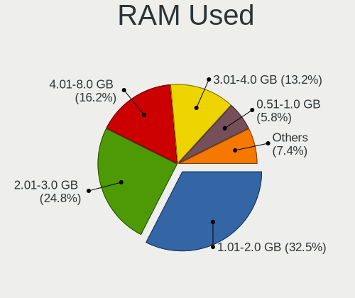
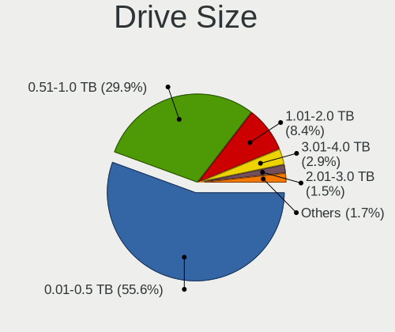
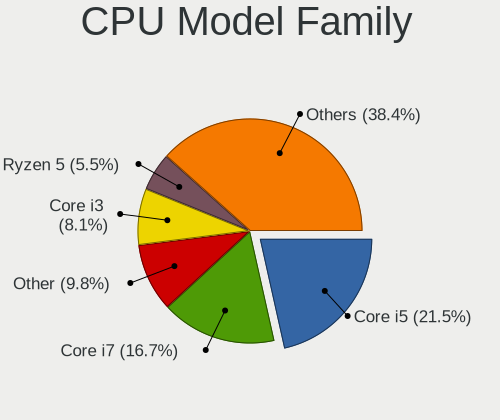
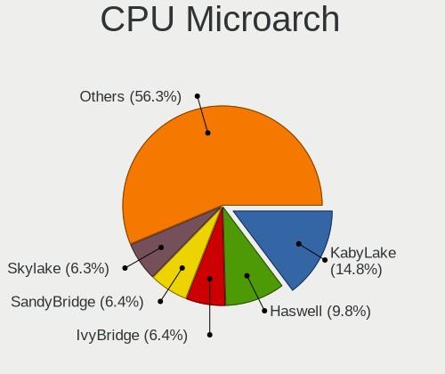
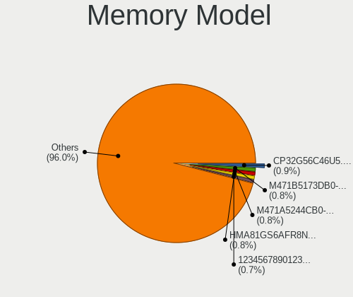

Linux in France - Tested Hardware & Statistics
----------------------------------------------

A project to collect tested hardware configurations for Linux in France.

Anyone can contribute to this report by the [hw-probe](https://github.com/linuxhw/hw-probe) tool:

    sudo -E hw-probe -all -upload

Please contribute! Especially if your hardware is rare.

This is a report for all computer types. See also reports for [desktops](/Location/France/Desktop/README.md) and [notebooks](/Location/France/Notebook/README.md).

Contents
--------

* [ Test Cases ](#test-cases)

* [ System ](#system)
  - [ OS                       ](#os)
  - [ OS Family                ](#os-family)
  - [ Kernel                   ](#kernel)
  - [ Kernel Family            ](#kernel-family)
  - [ Kernel Major Ver.        ](#kernel-major-ver)
  - [ Arch                     ](#arch)
  - [ DE                       ](#de)
  - [ Display Server           ](#display-server)
  - [ Display Manager          ](#display-manager)
  - [ OS Lang                  ](#os-lang)
  - [ Boot Mode                ](#boot-mode)
  - [ Filesystem               ](#filesystem)
  - [ Part. scheme             ](#part-scheme)
  - [ Dual Boot with Linux/BSD ](#dual-boot-with-linuxbsd)
  - [ Dual Boot (Win)          ](#dual-boot-win)

* [ Board ](#board)
  - [ Vendor                   ](#vendor)
  - [ Model                    ](#model)
  - [ Model Family             ](#model-family)
  - [ MFG Year                 ](#mfg-year)
  - [ Form Factor              ](#form-factor)
  - [ Secure Boot              ](#secure-boot)
  - [ Coreboot                 ](#coreboot)
  - [ RAM Size                 ](#ram-size)
  - [ RAM Used                 ](#ram-used)
  - [ Total Drives             ](#total-drives)
  - [ Has CD-ROM               ](#has-cd-rom)
  - [ Has Ethernet             ](#has-ethernet)
  - [ Has WiFi                 ](#has-wifi)
  - [ Has Bluetooth            ](#has-bluetooth)

* [ Location ](#location)
  - [ Country                  ](#country)
  - [ City                     ](#city)

* [ Drives ](#drives)
  - [ Drive Vendor             ](#drive-vendor)
  - [ Drive Model              ](#drive-model)
  - [ HDD Vendor               ](#hdd-vendor)
  - [ SSD Vendor               ](#ssd-vendor)
  - [ Drive Kind               ](#drive-kind)
  - [ Drive Connector          ](#drive-connector)
  - [ Drive Size               ](#drive-size)
  - [ Space Total              ](#space-total)
  - [ Space Used               ](#space-used)
  - [ Malfunc. Drives          ](#malfunc-drives)
  - [ Malfunc. Drive Vendor    ](#malfunc-drive-vendor)
  - [ Malfunc. HDD Vendor      ](#malfunc-hdd-vendor)
  - [ Malfunc. Drive Kind      ](#malfunc-drive-kind)
  - [ Failed Drives            ](#failed-drives)
  - [ Failed Drive Vendor      ](#failed-drive-vendor)
  - [ Drive Status             ](#drive-status)

* [ Storage controller ](#storage-controller)
  - [ Storage Vendor           ](#storage-vendor)
  - [ Storage Model            ](#storage-model)
  - [ Storage Kind             ](#storage-kind)

* [ Processor ](#processor)
  - [ CPU Vendor               ](#cpu-vendor)
  - [ CPU Model                ](#cpu-model)
  - [ CPU Model Family         ](#cpu-model-family)
  - [ CPU Cores                ](#cpu-cores)
  - [ CPU Sockets              ](#cpu-sockets)
  - [ CPU Threads              ](#cpu-threads)
  - [ CPU Op-Modes             ](#cpu-op-modes)
  - [ CPU Microcode            ](#cpu-microcode)
  - [ CPU Microarch            ](#cpu-microarch)

* [ Graphics ](#graphics)
  - [ GPU Vendor               ](#gpu-vendor)
  - [ GPU Model                ](#gpu-model)
  - [ GPU Combo                ](#gpu-combo)
  - [ GPU Driver               ](#gpu-driver)
  - [ GPU Memory               ](#gpu-memory)

* [ Monitor ](#monitor)
  - [ Monitor Vendor           ](#monitor-vendor)
  - [ Monitor Model            ](#monitor-model)
  - [ Monitor Resolution       ](#monitor-resolution)
  - [ Monitor Diagonal         ](#monitor-diagonal)
  - [ Monitor Width            ](#monitor-width)
  - [ Aspect Ratio             ](#aspect-ratio)
  - [ Monitor Area             ](#monitor-area)
  - [ Pixel Density            ](#pixel-density)
  - [ Multiple Monitors        ](#multiple-monitors)

* [ Network ](#network)
  - [ Net Controller Vendor    ](#net-controller-vendor)
  - [ Net Controller Model     ](#net-controller-model)
  - [ Wireless Vendor          ](#wireless-vendor)
  - [ Wireless Model           ](#wireless-model)
  - [ Ethernet Vendor          ](#ethernet-vendor)
  - [ Ethernet Model           ](#ethernet-model)
  - [ Net Controller Kind      ](#net-controller-kind)
  - [ Used Controller          ](#used-controller)
  - [ NICs                     ](#nics)
  - [ IPv6                     ](#ipv6)

* [ Bluetooth ](#bluetooth)
  - [ Bluetooth Vendor         ](#bluetooth-vendor)
  - [ Bluetooth Model          ](#bluetooth-model)

* [ Sound ](#sound)
  - [ Sound Vendor             ](#sound-vendor)
  - [ Sound Model              ](#sound-model)

* [ Memory ](#memory)
  - [ Memory Vendor            ](#memory-vendor)
  - [ Memory Model             ](#memory-model)
  - [ Memory Kind              ](#memory-kind)
  - [ Memory Form Factor       ](#memory-form-factor)
  - [ Memory Size              ](#memory-size)
  - [ Memory Speed             ](#memory-speed)

* [ Printers & scanners ](#printers--scanners)
  - [ Printer Vendor           ](#printer-vendor)
  - [ Printer Model            ](#printer-model)
  - [ Scanner Vendor           ](#scanner-vendor)
  - [ Scanner Model            ](#scanner-model)

* [ Camera ](#camera)
  - [ Camera Vendor            ](#camera-vendor)
  - [ Camera Model             ](#camera-model)

* [ Security ](#security)
  - [ Fingerprint Vendor       ](#fingerprint-vendor)
  - [ Fingerprint Model        ](#fingerprint-model)
  - [ Chipcard Vendor          ](#chipcard-vendor)
  - [ Chipcard Model           ](#chipcard-model)

* [ Unsupported ](#unsupported)
  - [ Unsupported Devices      ](#unsupported-devices)
  - [ Unsupported Device Types ](#unsupported-device-types)

Test Cases
----------

Total: 15230

| Vendor        | Model                       | Form-Factor | Probe                                                      | Date         |
|---------------|-----------------------------|-------------|------------------------------------------------------------|--------------|
| Google        | Magolor                     | Notebook    | [f5d079bc79](https://linux-hardware.org/?probe=f5d079bc79) | Dec 24, 2023 |
| MSI           | PRO B650-S WIFI             | Desktop     | [c084478d6e](https://linux-hardware.org/?probe=c084478d6e) | Dec 24, 2023 |
| ASUSTek       | Zenbook 15 UM3504DA_UM35... | Notebook    | [6cc304ea54](https://linux-hardware.org/?probe=6cc304ea54) | Dec 23, 2023 |
| Dell          | Latitude E4310              | Notebook    | [41f607e5e5](https://linux-hardware.org/?probe=41f607e5e5) | Dec 23, 2023 |
| Acer          | Veriton X2631G V:1.0        | Desktop     | [a57f2ee15f](https://linux-hardware.org/?probe=a57f2ee15f) | Dec 23, 2023 |
| Acer          | Aspire ES1-572              | Notebook    | [e726ce9f63](https://linux-hardware.org/?probe=e726ce9f63) | Dec 23, 2023 |
| Sony          | VPCEA1S1E                   | Notebook    | [af850dd5f3](https://linux-hardware.org/?probe=af850dd5f3) | Dec 23, 2023 |
| ASRock        | H310CM-HDV/M.2              | Desktop     | [76d95ab75c](https://linux-hardware.org/?probe=76d95ab75c) | Dec 23, 2023 |
| HP            | ProBook 655 G2              | Notebook    | [033325e722](https://linux-hardware.org/?probe=033325e722) | Dec 23, 2023 |
| Alienware     | m15 R7 AMD                  | Notebook    | [9d80128f05](https://linux-hardware.org/?probe=9d80128f05) | Dec 23, 2023 |
| MSI           | GE62 2QF                    | Notebook    | [cf9a783196](https://linux-hardware.org/?probe=cf9a783196) | Dec 23, 2023 |
| Dell          | 0WMJ54 A01                  | Desktop     | [ac0b6ab055](https://linux-hardware.org/?probe=ac0b6ab055) | Dec 23, 2023 |
| AOKZOE        | A1 AR07                     | Tablet      | [788f53e0dd](https://linux-hardware.org/?probe=788f53e0dd) | Dec 23, 2023 |
| Lenovo        | NOK                         | Desktop     | [35841ab3ed](https://linux-hardware.org/?probe=35841ab3ed) | Dec 23, 2023 |
| MSI           | A88XM-E35                   | Desktop     | [dce385e94b](https://linux-hardware.org/?probe=dce385e94b) | Dec 23, 2023 |
| ASUSTek       | T100TA                      | Notebook    | [9ad17d2d3c](https://linux-hardware.org/?probe=9ad17d2d3c) | Dec 23, 2023 |
| ASRock        | Z370 Professional Gaming... | Desktop     | [d46814af3c](https://linux-hardware.org/?probe=d46814af3c) | Dec 23, 2023 |
| eMachines     | E527                        | Notebook    | [cf5b096be7](https://linux-hardware.org/?probe=cf5b096be7) | Dec 22, 2023 |
| GPD           | G1621-02                    | Notebook    | [eaf78f9da1](https://linux-hardware.org/?probe=eaf78f9da1) | Dec 22, 2023 |
| ASUSTek       | PRIME B450-PLUS             | Desktop     | [c9bee45423](https://linux-hardware.org/?probe=c9bee45423) | Dec 22, 2023 |
| Dell          | Studio 1737                 | Notebook    | [a157d70ea2](https://linux-hardware.org/?probe=a157d70ea2) | Dec 22, 2023 |
| MSI           | B450M PRO-VDH MAX           | Desktop     | [851dce0b14](https://linux-hardware.org/?probe=851dce0b14) | Dec 22, 2023 |
| MSI           | X570-A PRO                  | Desktop     | [27a132c185](https://linux-hardware.org/?probe=27a132c185) | Dec 22, 2023 |
| Apple         | Mac-F226BEC8 PVT            | All in one  | [7b3f2a201c](https://linux-hardware.org/?probe=7b3f2a201c) | Dec 22, 2023 |
| Dell          | Latitude 14 Rugged (5404... | Notebook    | [084f663c15](https://linux-hardware.org/?probe=084f663c15) | Dec 22, 2023 |
| Acer          | Aspire 5742G                | Notebook    | [1f9d486306](https://linux-hardware.org/?probe=1f9d486306) | Dec 22, 2023 |
| Dell          | Latitude E6440              | Notebook    | [904540fc01](https://linux-hardware.org/?probe=904540fc01) | Dec 21, 2023 |
| Dell          | System Vostro 3750          | Notebook    | [aa1fb5d9a6](https://linux-hardware.org/?probe=aa1fb5d9a6) | Dec 21, 2023 |
| HONOR         | HYM-WXX                     | Notebook    | [1c225a853e](https://linux-hardware.org/?probe=1c225a853e) | Dec 21, 2023 |
| ASUSTek       | Zenbook 15 UM3504DA_UM35... | Notebook    | [907851c66b](https://linux-hardware.org/?probe=907851c66b) | Dec 21, 2023 |
| Toshiba       | Satellite L655              | Notebook    | [7a1001a094](https://linux-hardware.org/?probe=7a1001a094) | Dec 21, 2023 |
| Lenovo        | SHARKBAY SDK0E50510 WIN     | Desktop     | [0bc1c80333](https://linux-hardware.org/?probe=0bc1c80333) | Dec 21, 2023 |
| Dell          | Precision 3581              | Notebook    | [aa0186ade6](https://linux-hardware.org/?probe=aa0186ade6) | Dec 21, 2023 |
| Dell          | Inspiron 15 3535            | Notebook    | [466204d787](https://linux-hardware.org/?probe=466204d787) | Dec 21, 2023 |
| Intel         | NUC7i5BNB J31144-309        | Mini pc     | [75c700e92a](https://linux-hardware.org/?probe=75c700e92a) | Dec 21, 2023 |
| Acer          | Aspire XC-1760              | Desktop     | [ac3910a453](https://linux-hardware.org/?probe=ac3910a453) | Dec 21, 2023 |
| Gigabyte      | B550 GAMING X V2            | Desktop     | [ce4bc6f455](https://linux-hardware.org/?probe=ce4bc6f455) | Dec 21, 2023 |
| Dell          | Latitude 5590               | Notebook    | [9877862088](https://linux-hardware.org/?probe=9877862088) | Dec 21, 2023 |
| Lenovo        | ThinkPad 20FRS22T00         | Convertible | [d52b91f681](https://linux-hardware.org/?probe=d52b91f681) | Dec 21, 2023 |
| Lenovo        | ThinkPad 20FRS22T00         | Convertible | [1d07dbc740](https://linux-hardware.org/?probe=1d07dbc740) | Dec 21, 2023 |
| Dell          | 0NKW6Y A02                  | Desktop     | [d41c926291](https://linux-hardware.org/?probe=d41c926291) | Dec 21, 2023 |
| ASRock        | Z77 Pro4                    | Desktop     | [d8d81bc3e2](https://linux-hardware.org/?probe=d8d81bc3e2) | Dec 21, 2023 |
| Acer          | Veriton X2631G V:1.0        | Desktop     | [8116f31329](https://linux-hardware.org/?probe=8116f31329) | Dec 21, 2023 |
| ASUSTek       | V241IC-R                    | All in one  | [dedb790269](https://linux-hardware.org/?probe=dedb790269) | Dec 20, 2023 |
| Acer          | Aspire E1-771G              | Notebook    | [07bcd26f94](https://linux-hardware.org/?probe=07bcd26f94) | Dec 20, 2023 |
| Dell          | Latitude 5590               | Notebook    | [4f307c792f](https://linux-hardware.org/?probe=4f307c792f) | Dec 20, 2023 |
| HP            | 805D                        | Desktop     | [6768e6fc48](https://linux-hardware.org/?probe=6768e6fc48) | Dec 20, 2023 |
| Gigabyte      | H81M-DS2                    | Desktop     | [1da522781e](https://linux-hardware.org/?probe=1da522781e) | Dec 20, 2023 |
| ASUSTek       | Z97-PRO                     | Desktop     | [917d636ff9](https://linux-hardware.org/?probe=917d636ff9) | Dec 20, 2023 |
| Gigabyte      | A520M DS3H V2               | Desktop     | [3ba51c21e8](https://linux-hardware.org/?probe=3ba51c21e8) | Dec 20, 2023 |
| ASUSTek       | ROG STRIX B550-F GAMING     | Desktop     | [84530cb3ca](https://linux-hardware.org/?probe=84530cb3ca) | Dec 20, 2023 |
| HP            | Pavilion dv6                | Notebook    | [4cc379dfbd](https://linux-hardware.org/?probe=4cc379dfbd) | Dec 19, 2023 |
| Gigabyte      | GA-MA78LMT-US2H             | Desktop     | [a1f4076586](https://linux-hardware.org/?probe=a1f4076586) | Dec 19, 2023 |
| ASRock        | X670E PG Lightning          | Desktop     | [c41952876f](https://linux-hardware.org/?probe=c41952876f) | Dec 19, 2023 |
| Lenovo        | 30BE SDK0J40697 WIN 3305... | Desktop     | [9b8d8ec134](https://linux-hardware.org/?probe=9b8d8ec134) | Dec 19, 2023 |
| Lenovo        | MAHOBAY NOK                 | Desktop     | [7fe77a3476](https://linux-hardware.org/?probe=7fe77a3476) | Dec 19, 2023 |
| Lenovo        | 30BE SDK0J40705 WIN 3425... | Desktop     | [65b6d3dcc0](https://linux-hardware.org/?probe=65b6d3dcc0) | Dec 19, 2023 |
| Lenovo        | 30BE SDK0J40705 WIN 3425... | Desktop     | [ab5bffcf0a](https://linux-hardware.org/?probe=ab5bffcf0a) | Dec 19, 2023 |
| Lenovo        | SHARKBAY 0B98401 PRO        | Desktop     | [9f3471e435](https://linux-hardware.org/?probe=9f3471e435) | Dec 19, 2023 |
| Lenovo        | SKYBAY SDK0J40705 WIN 34... | Desktop     | [752a59a0cc](https://linux-hardware.org/?probe=752a59a0cc) | Dec 19, 2023 |
| HP            | EliteBook 840 14 inch G1... | Notebook    | [2222f1a1fb](https://linux-hardware.org/?probe=2222f1a1fb) | Dec 19, 2023 |
| Lenovo        | SHARKBAY SDK0E50510 WIN     | Desktop     | [bff7dced45](https://linux-hardware.org/?probe=bff7dced45) | Dec 19, 2023 |
| Dell          | G7 7790                     | Notebook    | [bcc6b4046b](https://linux-hardware.org/?probe=bcc6b4046b) | Dec 19, 2023 |
| Acer          | Nitro ANV15-51              | Notebook    | [c4ddaa9bc4](https://linux-hardware.org/?probe=c4ddaa9bc4) | Dec 19, 2023 |
| DellInc.      | Venue 8 Pro 5830            | Notebook    | [d6408a26a1](https://linux-hardware.org/?probe=d6408a26a1) | Dec 19, 2023 |
| Fujitsu       | D3221-A1 S26361-D3221-A1    | Desktop     | [843515c201](https://linux-hardware.org/?probe=843515c201) | Dec 19, 2023 |
| Lenovo        | SHARKBAY 0B98401 PRO        | Desktop     | [993b9536cf](https://linux-hardware.org/?probe=993b9536cf) | Dec 19, 2023 |
| Lenovo        | 30BE SDK0J40705 WIN 3425... | Desktop     | [782dad2128](https://linux-hardware.org/?probe=782dad2128) | Dec 19, 2023 |
| Acer          | Nitro ANV15-51              | Notebook    | [aa343c3d4f](https://linux-hardware.org/?probe=aa343c3d4f) | Dec 19, 2023 |
| MSI           | X570-A PRO                  | Desktop     | [3cf8d970f8](https://linux-hardware.org/?probe=3cf8d970f8) | Dec 19, 2023 |
| HP            | Pavilion 17                 | Notebook    | [449c36ff1c](https://linux-hardware.org/?probe=449c36ff1c) | Dec 19, 2023 |
| Packard Be... | Veriton M275                | Desktop     | [2263820deb](https://linux-hardware.org/?probe=2263820deb) | Dec 18, 2023 |
| MSI           | Bravo 15 B5DD               | Notebook    | [7bb3bd0328](https://linux-hardware.org/?probe=7bb3bd0328) | Dec 18, 2023 |
| ASUSTek       | ROG CROSSHAIR VIII DARK ... | Desktop     | [ce269919cd](https://linux-hardware.org/?probe=ce269919cd) | Dec 18, 2023 |
| HP            | ZBook Fury 15.6 inch G8 ... | Notebook    | [02ffa90273](https://linux-hardware.org/?probe=02ffa90273) | Dec 18, 2023 |
| Dell          | 0NC2VH A01                  | Desktop     | [5976f16a69](https://linux-hardware.org/?probe=5976f16a69) | Dec 18, 2023 |
| MSI           | MPG Z390 GAMING PLUS        | Desktop     | [d56dcc35b9](https://linux-hardware.org/?probe=d56dcc35b9) | Dec 18, 2023 |
| Dell          | Precision 7530              | Notebook    | [6de510283f](https://linux-hardware.org/?probe=6de510283f) | Dec 18, 2023 |
| ASUSTek       | PRIME H310I-PLUS R2.0       | Desktop     | [1e1b811e8b](https://linux-hardware.org/?probe=1e1b811e8b) | Dec 18, 2023 |
| ASUSTek       | P8H61                       | Desktop     | [e0b9ef0f5e](https://linux-hardware.org/?probe=e0b9ef0f5e) | Dec 18, 2023 |
| Dell          | Latitude 7440               | Notebook    | [644c46aba6](https://linux-hardware.org/?probe=644c46aba6) | Dec 18, 2023 |
| ASUSTek       | P8H61                       | Desktop     | [e83b933182](https://linux-hardware.org/?probe=e83b933182) | Dec 18, 2023 |
| Dell          | Venue 11 Pro 5130           | Notebook    | [74cdfd92c0](https://linux-hardware.org/?probe=74cdfd92c0) | Dec 18, 2023 |
| Fujitsu       | LIFEBOOK A512               | Notebook    | [0c3974dad9](https://linux-hardware.org/?probe=0c3974dad9) | Dec 18, 2023 |
| Acer          | Aspire S7-391               | Notebook    | [ab734913e8](https://linux-hardware.org/?probe=ab734913e8) | Dec 17, 2023 |
| Acer          | Aspire S7-391               | Notebook    | [1d66b3f887](https://linux-hardware.org/?probe=1d66b3f887) | Dec 17, 2023 |
| Lenovo        | 3136 SDK0J40697 WIN 3305... | Mini pc     | [b61d950623](https://linux-hardware.org/?probe=b61d950623) | Dec 17, 2023 |
| Raspberry ... | Raspberry Pi 5 Model B R... | Soc         | [d38e1077ae](https://linux-hardware.org/?probe=d38e1077ae) | Dec 17, 2023 |
| Acer          | Nitro AN517-54              | Notebook    | [80aeddc1b2](https://linux-hardware.org/?probe=80aeddc1b2) | Dec 17, 2023 |
| HP            | ZBook 17 G5                 | Notebook    | [288e976604](https://linux-hardware.org/?probe=288e976604) | Dec 17, 2023 |
| Acer          | Nitro AN517-54              | Notebook    | [2f2bcf0c97](https://linux-hardware.org/?probe=2f2bcf0c97) | Dec 17, 2023 |
| Dell          | G5 5587                     | Notebook    | [0200ad8ea9](https://linux-hardware.org/?probe=0200ad8ea9) | Dec 17, 2023 |
| ASUSTek       | VivoBook_ASUSLaptop K360... | Notebook    | [6e359357d4](https://linux-hardware.org/?probe=6e359357d4) | Dec 17, 2023 |
| HP            | Compaq 6730s                | Notebook    | [628e8cf362](https://linux-hardware.org/?probe=628e8cf362) | Dec 17, 2023 |
| ASUSTek       | P4P800-VM                   | Desktop     | [8fb6faae11](https://linux-hardware.org/?probe=8fb6faae11) | Dec 17, 2023 |
| HP            | Compaq 6730s                | Notebook    | [774f3d4feb](https://linux-hardware.org/?probe=774f3d4feb) | Dec 17, 2023 |
| Fujitsu       | D3230-A1 S26361-D3230-A1    | Desktop     | [447fb33261](https://linux-hardware.org/?probe=447fb33261) | Dec 17, 2023 |
| Dell          | 06X1TJ A00                  | Desktop     | [b9738c48b0](https://linux-hardware.org/?probe=b9738c48b0) | Dec 17, 2023 |
| ASUSTek       | PRIME A320M-K               | Desktop     | [1f0e0f04f8](https://linux-hardware.org/?probe=1f0e0f04f8) | Dec 17, 2023 |
| ASUSTek       | X456UB                      | Notebook    | [5a4a0662e1](https://linux-hardware.org/?probe=5a4a0662e1) | Dec 17, 2023 |
| Foxconn       | 2ABF                        | Desktop     | [907abd30c7](https://linux-hardware.org/?probe=907abd30c7) | Dec 17, 2023 |
| MSI           | GF63 Thin 11UC              | Notebook    | [06556bd61a](https://linux-hardware.org/?probe=06556bd61a) | Dec 17, 2023 |
| MSI           | MAG B550 TOMAHAWK           | Desktop     | [5c8981cf69](https://linux-hardware.org/?probe=5c8981cf69) | Dec 17, 2023 |
| Google        | Woomax                      | Notebook    | [7516d70c03](https://linux-hardware.org/?probe=7516d70c03) | Dec 17, 2023 |
| Shenzhen M... | TH80                        | Desktop     | [1ad9ee524d](https://linux-hardware.org/?probe=1ad9ee524d) | Dec 16, 2023 |
| Dell          | Latitude 5290 2-in-1        | Notebook    | [b90524a691](https://linux-hardware.org/?probe=b90524a691) | Dec 16, 2023 |
| ASRock        | Z77 Pro4                    | Desktop     | [15ce6626f3](https://linux-hardware.org/?probe=15ce6626f3) | Dec 16, 2023 |
| ASUSTek       | Z97-PRO                     | Desktop     | [383682bb1f](https://linux-hardware.org/?probe=383682bb1f) | Dec 16, 2023 |
| Toshiba       | Satellite L655              | Notebook    | [5f625c9177](https://linux-hardware.org/?probe=5f625c9177) | Dec 16, 2023 |
| Acer          | EG43M                       | Desktop     | [62c8e8acf8](https://linux-hardware.org/?probe=62c8e8acf8) | Dec 16, 2023 |
| Dell          | Inspiron 14 5420            | Notebook    | [ef0c78ce49](https://linux-hardware.org/?probe=ef0c78ce49) | Dec 16, 2023 |
| ASUSTek       | Z97-PRO                     | Desktop     | [a0e9f7ca57](https://linux-hardware.org/?probe=a0e9f7ca57) | Dec 16, 2023 |
| Lenovo        | ThinkPad T420 4238AW2       | Notebook    | [01fae631cf](https://linux-hardware.org/?probe=01fae631cf) | Dec 16, 2023 |
| Toshiba       | Satellite C660D             | Notebook    | [4277f53694](https://linux-hardware.org/?probe=4277f53694) | Dec 16, 2023 |
| ASUSTek       | ASUS TUF Gaming A17 FA70... | Notebook    | [bac2e83dd7](https://linux-hardware.org/?probe=bac2e83dd7) | Dec 16, 2023 |
| Gigabyte      | B660 DS3H DDR4              | Desktop     | [51a1a58859](https://linux-hardware.org/?probe=51a1a58859) | Dec 16, 2023 |
| Gigabyte      | 970-GAMING                  | Desktop     | [f1f6a55f9c](https://linux-hardware.org/?probe=f1f6a55f9c) | Dec 16, 2023 |
| Gigabyte      | 970-GAMING                  | Desktop     | [8b6e7627f9](https://linux-hardware.org/?probe=8b6e7627f9) | Dec 16, 2023 |
| ASUSTek       | Zenbook 15 UM3504DA_UM35... | Notebook    | [12c5d1d331](https://linux-hardware.org/?probe=12c5d1d331) | Dec 16, 2023 |
| MSI           | Katana GF66 11SC            | Notebook    | [1eb5b02078](https://linux-hardware.org/?probe=1eb5b02078) | Dec 15, 2023 |
| Apple         | MacBookAir6,2               | Notebook    | [31426d7740](https://linux-hardware.org/?probe=31426d7740) | Dec 15, 2023 |
| BESSTAR Te... | ATB15                       | Server      | [a3bf3001fb](https://linux-hardware.org/?probe=a3bf3001fb) | Dec 15, 2023 |
| Sony          | SVF1521G6EW                 | Notebook    | [55b5387ed5](https://linux-hardware.org/?probe=55b5387ed5) | Dec 15, 2023 |
| ASUSTek       | VivoBook_ASUS Laptop E40... | Notebook    | [05141b9b76](https://linux-hardware.org/?probe=05141b9b76) | Dec 14, 2023 |
| ASUSTek       | VivoBook_ASUS Laptop E40... | Notebook    | [a869524ac6](https://linux-hardware.org/?probe=a869524ac6) | Dec 14, 2023 |
| TECHNOPC      | NANO 5                      | Desktop     | [3ac9d2eb32](https://linux-hardware.org/?probe=3ac9d2eb32) | Dec 14, 2023 |
| Lenovo        | Legion 5 Pro 16ACH6H 82J... | Notebook    | [51e42890da](https://linux-hardware.org/?probe=51e42890da) | Dec 14, 2023 |
| Dell          | Precision 5510              | Notebook    | [ddc02a6165](https://linux-hardware.org/?probe=ddc02a6165) | Dec 14, 2023 |
| HP            | 8463                        | Desktop     | [0d01616e1c](https://linux-hardware.org/?probe=0d01616e1c) | Dec 14, 2023 |
| GPD           | G1619-04                    | Notebook    | [27dd6e79da](https://linux-hardware.org/?probe=27dd6e79da) | Dec 14, 2023 |
| Fujitsu       | D3432-A1 S26361-D3432-A1    | Desktop     | [742681b576](https://linux-hardware.org/?probe=742681b576) | Dec 14, 2023 |
| Gigabyte      | A320M-S2H-CF                | Desktop     | [eddc4eec8d](https://linux-hardware.org/?probe=eddc4eec8d) | Dec 14, 2023 |
| Fujitsu       | D3432-A1 S26361-D3432-A1    | Desktop     | [72cd581273](https://linux-hardware.org/?probe=72cd581273) | Dec 14, 2023 |
| HP            | 3047h                       | Desktop     | [d7d067e46c](https://linux-hardware.org/?probe=d7d067e46c) | Dec 14, 2023 |
| Dell          | XPS 15 9520                 | Notebook    | [ac8fb0b18d](https://linux-hardware.org/?probe=ac8fb0b18d) | Dec 14, 2023 |
| ASUSTek       | E403SA                      | Notebook    | [141030490c](https://linux-hardware.org/?probe=141030490c) | Dec 14, 2023 |
| HP            | Pavilion 17                 | Notebook    | [81e5865518](https://linux-hardware.org/?probe=81e5865518) | Dec 14, 2023 |
| Apple         | MacBookPro5,1               | Notebook    | [277dadb387](https://linux-hardware.org/?probe=277dadb387) | Dec 13, 2023 |
| HP            | 83EF                        | Desktop     | [e2a7a03e4c](https://linux-hardware.org/?probe=e2a7a03e4c) | Dec 13, 2023 |
| HP            | 83EF                        | Desktop     | [d5d568c47c](https://linux-hardware.org/?probe=d5d568c47c) | Dec 13, 2023 |
| Sony          | VAIO                        | All in one  | [26d923a8b0](https://linux-hardware.org/?probe=26d923a8b0) | Dec 13, 2023 |
| Packard Be... | EasyNote LM85               | Notebook    | [18a9f48bee](https://linux-hardware.org/?probe=18a9f48bee) | Dec 13, 2023 |
| HP            | 829A                        | Mini pc     | [4a18e66bdc](https://linux-hardware.org/?probe=4a18e66bdc) | Dec 13, 2023 |
| Lenovo        | V110-15IAP 80TG             | Notebook    | [de6e3bf0eb](https://linux-hardware.org/?probe=de6e3bf0eb) | Dec 13, 2023 |
| Dell          | Precision 5510              | Notebook    | [0ce634decf](https://linux-hardware.org/?probe=0ce634decf) | Dec 13, 2023 |
| Timi          | TM1604                      | Notebook    | [67597f3bd5](https://linux-hardware.org/?probe=67597f3bd5) | Dec 13, 2023 |
| HP            | ZBook 17                    | Notebook    | [d1269ca08c](https://linux-hardware.org/?probe=d1269ca08c) | Dec 13, 2023 |
| TECHNOPC      | NANO 5                      | Desktop     | [5b9044ceb2](https://linux-hardware.org/?probe=5b9044ceb2) | Dec 12, 2023 |
| Acer          | Veriton M4630G V:1.0        | Desktop     | [91ec51ebf5](https://linux-hardware.org/?probe=91ec51ebf5) | Dec 12, 2023 |
| ASRock        | B760M PG Riptide            | Desktop     | [30e068aaca](https://linux-hardware.org/?probe=30e068aaca) | Dec 12, 2023 |
| HP            | EliteBook 840 G3            | Notebook    | [01752b90ef](https://linux-hardware.org/?probe=01752b90ef) | Dec 12, 2023 |
| ASUSTek       | P553UA                      | Notebook    | [9a0bb65e3f](https://linux-hardware.org/?probe=9a0bb65e3f) | Dec 12, 2023 |
| ASUSTek       | ASUS TUF Gaming A17 FA70... | Notebook    | [4293932b86](https://linux-hardware.org/?probe=4293932b86) | Dec 12, 2023 |
| Dell          | Inspiron 7591               | Notebook    | [10a266d0ff](https://linux-hardware.org/?probe=10a266d0ff) | Dec 12, 2023 |
| Acer          | Aspire E1-571               | Notebook    | [4576cb723a](https://linux-hardware.org/?probe=4576cb723a) | Dec 12, 2023 |
| Dell          | Latitude E6320              | Notebook    | [dbacdcadba](https://linux-hardware.org/?probe=dbacdcadba) | Dec 12, 2023 |
| Valve         | Galileo                     | Notebook    | [beb6edb04f](https://linux-hardware.org/?probe=beb6edb04f) | Dec 12, 2023 |
| ASUSTek       | G551JM                      | Notebook    | [10dfa9e380](https://linux-hardware.org/?probe=10dfa9e380) | Dec 12, 2023 |
| MSI           | GX60 1AC/GX60 3AE/GX60 3... | Notebook    | [262637b1e2](https://linux-hardware.org/?probe=262637b1e2) | Dec 11, 2023 |
| ASUSTek       | PRIME Z370-P II             | Desktop     | [9311323293](https://linux-hardware.org/?probe=9311323293) | Dec 11, 2023 |
| Acer          | WG43M                       | Desktop     | [b1fcb17dea](https://linux-hardware.org/?probe=b1fcb17dea) | Dec 11, 2023 |
| Lenovo        | 3102 SDK0J40705 WIN 3425... | Desktop     | [e3afd2e002](https://linux-hardware.org/?probe=e3afd2e002) | Dec 11, 2023 |
| Lenovo        | 3102 SDK0J40705 WIN 3425... | Desktop     | [656bfe20f4](https://linux-hardware.org/?probe=656bfe20f4) | Dec 11, 2023 |
| Lenovo        | 3102 SDK0J40705 WIN 3425... | Desktop     | [b1c994920c](https://linux-hardware.org/?probe=b1c994920c) | Dec 11, 2023 |
| Lenovo        | 312A SDK0J40697 WIN 3305... | Desktop     | [cc7c14dd72](https://linux-hardware.org/?probe=cc7c14dd72) | Dec 11, 2023 |
| Lenovo        | 312A SDK0J40697 WIN 3305... | Desktop     | [b7c06bf365](https://linux-hardware.org/?probe=b7c06bf365) | Dec 11, 2023 |
| Lenovo        | 3102 SDK0J40705 WIN 3425... | Desktop     | [8badd81a74](https://linux-hardware.org/?probe=8badd81a74) | Dec 11, 2023 |
| Lenovo        | 312A SDK0J40697 WIN 3305... | Desktop     | [448dc8ed72](https://linux-hardware.org/?probe=448dc8ed72) | Dec 11, 2023 |
| Framework     | Laptop 13 (AMD Ryzen 704... | Notebook    | [ffcb3c9798](https://linux-hardware.org/?probe=ffcb3c9798) | Dec 11, 2023 |
| Lenovo        | 312A SDK0J40697 WIN 3305... | Desktop     | [472c013f53](https://linux-hardware.org/?probe=472c013f53) | Dec 11, 2023 |
| Lenovo        | 3102 SDK0J40705 WIN 3425... | Desktop     | [8cb24408c9](https://linux-hardware.org/?probe=8cb24408c9) | Dec 11, 2023 |
| Lenovo        | 3102 SDK0J40705 WIN 3425... | Desktop     | [df2e9cf858](https://linux-hardware.org/?probe=df2e9cf858) | Dec 11, 2023 |
| Lenovo        | 3102 SDK0J40705 WIN 3425... | Desktop     | [c8d223020d](https://linux-hardware.org/?probe=c8d223020d) | Dec 11, 2023 |
| Lenovo        | 3102 SDK0J40705 WIN 3425... | Desktop     | [70364f28ab](https://linux-hardware.org/?probe=70364f28ab) | Dec 11, 2023 |
| ASUSTek       | ROG STRIX B550-F GAMING     | Desktop     | [473e3f7093](https://linux-hardware.org/?probe=473e3f7093) | Dec 11, 2023 |
| Lenovo        | 3140 SDK0J40697 WIN 3305... | Desktop     | [d5500a3830](https://linux-hardware.org/?probe=d5500a3830) | Dec 11, 2023 |
| ASUSTek       | Zenbook 15 UM3504DA_UM35... | Notebook    | [8a61a6bdd6](https://linux-hardware.org/?probe=8a61a6bdd6) | Dec 11, 2023 |
| HP            | ProBook 450 G3              | Notebook    | [57a80d9d1b](https://linux-hardware.org/?probe=57a80d9d1b) | Dec 11, 2023 |
| Intel         | DZ77SL-50K AAG55115-300     | Desktop     | [29590179a8](https://linux-hardware.org/?probe=29590179a8) | Dec 11, 2023 |
| GPD           | G1619-03                    | Notebook    | [92773d52d8](https://linux-hardware.org/?probe=92773d52d8) | Dec 10, 2023 |
| ASUSTek       | Zenbook UN5401QA_UN5401Q... | Convertible | [1f61ed59d7](https://linux-hardware.org/?probe=1f61ed59d7) | Dec 10, 2023 |
| HUAWEI        | BOHK-WAX9X                  | Notebook    | [dbf172e6c8](https://linux-hardware.org/?probe=dbf172e6c8) | Dec 10, 2023 |
| Acer          | Aspire ES1-572              | Notebook    | [c66bd8de67](https://linux-hardware.org/?probe=c66bd8de67) | Dec 10, 2023 |
| Gigabyte      | B660 DS3H DDR4              | Desktop     | [ad9ec5bc5b](https://linux-hardware.org/?probe=ad9ec5bc5b) | Dec 10, 2023 |
| Fujitsu       | D3230-A1 S26361-D3230-A1    | Desktop     | [62b99b4cdd](https://linux-hardware.org/?probe=62b99b4cdd) | Dec 10, 2023 |
| Fujitsu       | D3230-A1 S26361-D3230-A1    | Desktop     | [dd9345ea7d](https://linux-hardware.org/?probe=dd9345ea7d) | Dec 10, 2023 |
| Dell          | 0TP406                      | Desktop     | [1b81a10a36](https://linux-hardware.org/?probe=1b81a10a36) | Dec 10, 2023 |
| ASRock        | B560M Pro4                  | Desktop     | [b85850b4c2](https://linux-hardware.org/?probe=b85850b4c2) | Dec 10, 2023 |
| Intel         | NUC7i5BNB J31144-309        | Mini pc     | [0b97746a2b](https://linux-hardware.org/?probe=0b97746a2b) | Dec 10, 2023 |
| Intel         | NUC7i5BNB J31144-309        | Mini pc     | [d68da09499](https://linux-hardware.org/?probe=d68da09499) | Dec 10, 2023 |
| HP            | 2B29                        | Desktop     | [6fb328f58e](https://linux-hardware.org/?probe=6fb328f58e) | Dec 10, 2023 |
| Acer          | Veriton X2631G V:1.0        | Desktop     | [1465cf0eac](https://linux-hardware.org/?probe=1465cf0eac) | Dec 09, 2023 |
| Intel         | DZ77SL-50K AAG55115-300     | Desktop     | [c1d93cb6b2](https://linux-hardware.org/?probe=c1d93cb6b2) | Dec 09, 2023 |
| HP            | ENVY x360 2-in-1 Laptop ... | Convertible | [479476586a](https://linux-hardware.org/?probe=479476586a) | Dec 09, 2023 |
| HP            | EliteBook 820 G3            | Notebook    | [50335a1ca6](https://linux-hardware.org/?probe=50335a1ca6) | Dec 09, 2023 |
| HP            | ProBook 640 G2              | Notebook    | [0989548d19](https://linux-hardware.org/?probe=0989548d19) | Dec 09, 2023 |
| Toshiba       | Satellite C870D-116         | Notebook    | [78a800febe](https://linux-hardware.org/?probe=78a800febe) | Dec 09, 2023 |
| ASUSTek       | ROG Strix G513QR_G513QR     | Notebook    | [b3f7b8b30a](https://linux-hardware.org/?probe=b3f7b8b30a) | Dec 09, 2023 |
| Dell          | Inspiron 7591               | Notebook    | [7907f73ee0](https://linux-hardware.org/?probe=7907f73ee0) | Dec 09, 2023 |
| ASUSTek       | PRIME A320M-K               | Desktop     | [237110c8c0](https://linux-hardware.org/?probe=237110c8c0) | Dec 09, 2023 |
| MSI           | H110M GAMING                | Desktop     | [c1f16cd93f](https://linux-hardware.org/?probe=c1f16cd93f) | Dec 09, 2023 |
| Valve         | Jupiter                     | Notebook    | [7d649cef63](https://linux-hardware.org/?probe=7d649cef63) | Dec 09, 2023 |
| MSI           | MS-AA811 100                | All in one  | [ce3691f366](https://linux-hardware.org/?probe=ce3691f366) | Dec 08, 2023 |
| GPD           | G1619-03                    | Notebook    | [bc2ade83b8](https://linux-hardware.org/?probe=bc2ade83b8) | Dec 08, 2023 |
| ASUSTek       | PRIME B760M-A WIFI          | Desktop     | [968b8ae2d9](https://linux-hardware.org/?probe=968b8ae2d9) | Dec 08, 2023 |
| Shenzhen M... | F6BFC                       | Desktop     | [67371c6af4](https://linux-hardware.org/?probe=67371c6af4) | Dec 08, 2023 |
| ASUSTek       | PRIME Z370-P II             | Desktop     | [85cd0d0c3d](https://linux-hardware.org/?probe=85cd0d0c3d) | Dec 08, 2023 |
| MSI           | B550-A PRO                  | Desktop     | [cc2b6e8b40](https://linux-hardware.org/?probe=cc2b6e8b40) | Dec 08, 2023 |
| ASUSTek       | Rampage III Extreme         | Desktop     | [d4d934c9be](https://linux-hardware.org/?probe=d4d934c9be) | Dec 08, 2023 |
| Lenovo        | SHARKBAY 0B98401 WIN        | Desktop     | [56eae53402](https://linux-hardware.org/?probe=56eae53402) | Dec 08, 2023 |
| Gigabyte      | Z790 AERO G                 | Desktop     | [783eeb6b56](https://linux-hardware.org/?probe=783eeb6b56) | Dec 08, 2023 |
| MSI           | 2A9C                        | Desktop     | [f7229302d9](https://linux-hardware.org/?probe=f7229302d9) | Dec 08, 2023 |
| MSI           | 2A9C                        | Desktop     | [8b9c64bc7a](https://linux-hardware.org/?probe=8b9c64bc7a) | Dec 08, 2023 |
| ASUSTek       | X555BP                      | Notebook    | [b7680df948](https://linux-hardware.org/?probe=b7680df948) | Dec 07, 2023 |
| Acer          | Aspire E1-771G              | Notebook    | [099fae46db](https://linux-hardware.org/?probe=099fae46db) | Dec 07, 2023 |
| Lenovo        | SHARKBAY 0B98401 WIN        | Desktop     | [16b14ad0a7](https://linux-hardware.org/?probe=16b14ad0a7) | Dec 07, 2023 |
| HP            | 843B                        | Desktop     | [27527dbb19](https://linux-hardware.org/?probe=27527dbb19) | Dec 07, 2023 |
| Toshiba       | Satellite C70-B             | Notebook    | [6493c4fcf8](https://linux-hardware.org/?probe=6493c4fcf8) | Dec 07, 2023 |
| Gigabyte      | B550M DS3H                  | Desktop     | [650771c55d](https://linux-hardware.org/?probe=650771c55d) | Dec 07, 2023 |
| Unknown       | AX15                        | Notebook    | [3eb1590b8e](https://linux-hardware.org/?probe=3eb1590b8e) | Dec 07, 2023 |
| Unknown       | Unknown                     | Desktop     | [1dd3b89bd1](https://linux-hardware.org/?probe=1dd3b89bd1) | Dec 07, 2023 |
| Toshiba       | Satellite L655              | Notebook    | [dc8c17b9fd](https://linux-hardware.org/?probe=dc8c17b9fd) | Dec 07, 2023 |
| ASUSTek       | TUF Gaming X570-PLUS        | Desktop     | [39a966c6da](https://linux-hardware.org/?probe=39a966c6da) | Dec 07, 2023 |
| Lenovo        | Yoga 9 14ITL5 82BG          | Convertible | [77a21a8df4](https://linux-hardware.org/?probe=77a21a8df4) | Dec 06, 2023 |
| Acer          | Aspire E1-771G              | Notebook    | [28f6aca279](https://linux-hardware.org/?probe=28f6aca279) | Dec 06, 2023 |
| HP            | Laptop 15-db0xxx            | Notebook    | [8b324f5c18](https://linux-hardware.org/?probe=8b324f5c18) | Dec 06, 2023 |
| Lenovo        | IdeaPad 3 17ADA05 81W2      | Notebook    | [beaa75c727](https://linux-hardware.org/?probe=beaa75c727) | Dec 06, 2023 |
| ASUSTek       | VivoBook_ASUSLaptop X515... | Notebook    | [5e71510e4c](https://linux-hardware.org/?probe=5e71510e4c) | Dec 06, 2023 |
| Lenovo        | ThinkCentre M81 5049P14     | Desktop     | [c847e2e0c2](https://linux-hardware.org/?probe=c847e2e0c2) | Dec 06, 2023 |
| Gigabyte      | Z790 AERO G                 | Desktop     | [e49aeaf1a8](https://linux-hardware.org/?probe=e49aeaf1a8) | Dec 06, 2023 |
| Toshiba       | Satellite C70-B             | Notebook    | [ea76b3e92c](https://linux-hardware.org/?probe=ea76b3e92c) | Dec 06, 2023 |
| Intel         | STK1AW32SC H91596-302       | Desktop     | [9dbc61e045](https://linux-hardware.org/?probe=9dbc61e045) | Dec 05, 2023 |
| Acer          | Swift SF515-51T             | Notebook    | [941ba24cf2](https://linux-hardware.org/?probe=941ba24cf2) | Dec 05, 2023 |
| Lenovo        | ThinkPad T460 20FMS5QV00    | Notebook    | [d04d3a298f](https://linux-hardware.org/?probe=d04d3a298f) | Dec 05, 2023 |
| Lenovo        | ThinkPad T440p 20AWS0JC0... | Notebook    | [11fdf05513](https://linux-hardware.org/?probe=11fdf05513) | Dec 05, 2023 |
| HP            | 15                          | Notebook    | [561269f586](https://linux-hardware.org/?probe=561269f586) | Dec 05, 2023 |
| Dell          | Inspiron 15 5510            | Notebook    | [f20f7f2563](https://linux-hardware.org/?probe=f20f7f2563) | Dec 05, 2023 |
| ASRock        | B550M PG Riptide            | Desktop     | [6132709ecd](https://linux-hardware.org/?probe=6132709ecd) | Dec 05, 2023 |
| Lenovo        | ThinkPad T15 Gen 1 20S7S... | Notebook    | [6e9230f8ab](https://linux-hardware.org/?probe=6e9230f8ab) | Dec 05, 2023 |
| Acer          | Veriton X2631G V:1.0        | Desktop     | [022c234330](https://linux-hardware.org/?probe=022c234330) | Dec 05, 2023 |
| HUAWEI        | BOD-WXX9                    | Notebook    | [e6e58d5148](https://linux-hardware.org/?probe=e6e58d5148) | Dec 05, 2023 |
| Framework     | Laptop (12th Gen Intel C... | Notebook    | [fe06cb32bc](https://linux-hardware.org/?probe=fe06cb32bc) | Dec 05, 2023 |
| HUAWEI        | BOD-WXX9                    | Notebook    | [da8437565a](https://linux-hardware.org/?probe=da8437565a) | Dec 04, 2023 |
| Dell          | Latitude 9330               | Convertible | [1c8a7db9cf](https://linux-hardware.org/?probe=1c8a7db9cf) | Dec 04, 2023 |
| Lenovo        | G50-45 80E3                 | Notebook    | [9cbacbf139](https://linux-hardware.org/?probe=9cbacbf139) | Dec 04, 2023 |
| Gigabyte      | X99-UD4-CF                  | Desktop     | [fa5609e17d](https://linux-hardware.org/?probe=fa5609e17d) | Dec 04, 2023 |
| ASUSTek       | ASUS TUF Gaming F17 FX70... | Notebook    | [3f26c37883](https://linux-hardware.org/?probe=3f26c37883) | Dec 04, 2023 |
| Samsung       | R530/R730                   | Notebook    | [3919c76efa](https://linux-hardware.org/?probe=3919c76efa) | Dec 04, 2023 |
| Lenovo        | ThinkPad T450 20BUS3L502    | Notebook    | [592eb925fd](https://linux-hardware.org/?probe=592eb925fd) | Dec 04, 2023 |
| Lenovo        | ThinkPad T14 Gen 3 21AHC... | Notebook    | [7afcab06a4](https://linux-hardware.org/?probe=7afcab06a4) | Dec 04, 2023 |
| Fujitsu       | D3230-A1 S26361-D3230-A1    | Desktop     | [a66e59470c](https://linux-hardware.org/?probe=a66e59470c) | Dec 04, 2023 |
| Lenovo        | ThinkPad T460 20FMS5QV00    | Notebook    | [3b08be3ebc](https://linux-hardware.org/?probe=3b08be3ebc) | Dec 03, 2023 |
| ASUSTek       | ROG Flow Z13 GZ301ZC_GZ3... | Tablet      | [ab1e435922](https://linux-hardware.org/?probe=ab1e435922) | Dec 03, 2023 |
| Lenovo        | ThinkPad T14 Gen 3 21AHC... | Notebook    | [bbd413d34b](https://linux-hardware.org/?probe=bbd413d34b) | Dec 03, 2023 |
| ASUSTek       | GL703VM                     | Notebook    | [616bfbe220](https://linux-hardware.org/?probe=616bfbe220) | Dec 03, 2023 |
| ASUSTek       | Z97-P                       | Desktop     | [c4e675a705](https://linux-hardware.org/?probe=c4e675a705) | Dec 03, 2023 |
| HP            | Unknown                     | Notebook    | [ac64007236](https://linux-hardware.org/?probe=ac64007236) | Dec 03, 2023 |
| Acer          | Aspire X1430                | Desktop     | [e4fa6a217d](https://linux-hardware.org/?probe=e4fa6a217d) | Dec 03, 2023 |
| Lenovo        | 3136 SDK0J40697 WIN 3305... | Mini pc     | [4e15aaed2a](https://linux-hardware.org/?probe=4e15aaed2a) | Dec 03, 2023 |
| Apple         | MacBookPro10,1              | Notebook    | [198b467b8f](https://linux-hardware.org/?probe=198b467b8f) | Dec 03, 2023 |
| Lenovo        | ThinkPad E14 Gen 3 20Y70... | Notebook    | [e7c23bf6d5](https://linux-hardware.org/?probe=e7c23bf6d5) | Dec 03, 2023 |
| MSI           | PS63 Modern 8RC             | Notebook    | [76f07c96fd](https://linux-hardware.org/?probe=76f07c96fd) | Dec 03, 2023 |
| Foxconn       | 2A8C                        | Desktop     | [651f26ea2e](https://linux-hardware.org/?probe=651f26ea2e) | Dec 03, 2023 |
| Lenovo        | ThinkPad X1 Yoga Gen 8 2... | Convertible | [10dbf91cb7](https://linux-hardware.org/?probe=10dbf91cb7) | Dec 03, 2023 |
| Lenovo        | ThinkPad X1 Yoga Gen 8 2... | Convertible | [09104cdc15](https://linux-hardware.org/?probe=09104cdc15) | Dec 03, 2023 |
| Apple         | MacBookPro10,1              | Notebook    | [948e2f229a](https://linux-hardware.org/?probe=948e2f229a) | Dec 03, 2023 |
| Dell          | 05XGC8 A01                  | Desktop     | [619cda09d0](https://linux-hardware.org/?probe=619cda09d0) | Dec 03, 2023 |
| UNOWHY        | Y13G002S4EI                 | Notebook    | [4587cd55f9](https://linux-hardware.org/?probe=4587cd55f9) | Dec 03, 2023 |
| Lenovo        | ThinkPad T530 2429F37       | Notebook    | [7db847c98e](https://linux-hardware.org/?probe=7db847c98e) | Dec 03, 2023 |
| Lenovo        | HASWELLREFRESHDT 3190005... | All in one  | [ee04da9a30](https://linux-hardware.org/?probe=ee04da9a30) | Dec 03, 2023 |
| HP            | 0B54h D                     | Desktop     | [bffc586a45](https://linux-hardware.org/?probe=bffc586a45) | Dec 02, 2023 |
| ASUSTek       | PRIME Z390M-PLUS            | Desktop     | [0fbb7ed910](https://linux-hardware.org/?probe=0fbb7ed910) | Dec 02, 2023 |
| Lenovo        | IdeaPad 3 15ADA05 81W1      | Notebook    | [fe6c19062f](https://linux-hardware.org/?probe=fe6c19062f) | Dec 02, 2023 |
| Lenovo        | IdeaPad 3 15ADA05 81W1      | Notebook    | [6189dc268f](https://linux-hardware.org/?probe=6189dc268f) | Dec 02, 2023 |
| Apple         | Mac-031AEE4D24BFF0B1 Mac... | Mini pc     | [e69613180a](https://linux-hardware.org/?probe=e69613180a) | Dec 02, 2023 |
| Apple         | Mac-031AEE4D24BFF0B1 Mac... | Mini pc     | [b17bd653e9](https://linux-hardware.org/?probe=b17bd653e9) | Dec 02, 2023 |
| Apple         | MacBookPro5,5               | Notebook    | [53e38cd006](https://linux-hardware.org/?probe=53e38cd006) | Dec 02, 2023 |
| Dell          | Latitude E6510              | Notebook    | [0c49353fa5](https://linux-hardware.org/?probe=0c49353fa5) | Dec 02, 2023 |
| Gigabyte      | H81M-S2H                    | Desktop     | [8dd5a975f9](https://linux-hardware.org/?probe=8dd5a975f9) | Dec 02, 2023 |
| Samsung       | R610                        | Notebook    | [63c97d55c8](https://linux-hardware.org/?probe=63c97d55c8) | Dec 02, 2023 |
| MSI           | H81M-P33                    | Desktop     | [3c745928bb](https://linux-hardware.org/?probe=3c745928bb) | Dec 02, 2023 |
| Acer          | Aspire E5-771G              | Notebook    | [907744429e](https://linux-hardware.org/?probe=907744429e) | Dec 02, 2023 |
| ASUSTek       | ROG Flow Z13 GZ301ZC_GZ3... | Tablet      | [eda85e9fa8](https://linux-hardware.org/?probe=eda85e9fa8) | Dec 02, 2023 |
| HP            | Notebook                    | Notebook    | [4b88cdde01](https://linux-hardware.org/?probe=4b88cdde01) | Dec 02, 2023 |
| Clevo         | W251ESQ/W270ESQ             | Notebook    | [8572803f38](https://linux-hardware.org/?probe=8572803f38) | Dec 01, 2023 |
| ASUSTek       | P7P55D-E                    | Desktop     | [8d95019eec](https://linux-hardware.org/?probe=8d95019eec) | Dec 01, 2023 |
| MSI           | X470 GAMING PRO CARBON      | Desktop     | [f44c7e37a0](https://linux-hardware.org/?probe=f44c7e37a0) | Dec 01, 2023 |
| Acer          | Aspire A317-51K             | Notebook    | [aa5652abe0](https://linux-hardware.org/?probe=aa5652abe0) | Dec 01, 2023 |
| Acer          | Swift SF314-511             | Notebook    | [ca692e6dcb](https://linux-hardware.org/?probe=ca692e6dcb) | Dec 01, 2023 |
| Toshiba       | Satellite C870-1F3          | Notebook    | [adb628ff38](https://linux-hardware.org/?probe=adb628ff38) | Dec 01, 2023 |
| Toshiba       | Satellite C870-1F3          | Notebook    | [93907ea0f4](https://linux-hardware.org/?probe=93907ea0f4) | Dec 01, 2023 |
| HP            | ProBook 450 15.6 inch G9... | Notebook    | [fc30a356f0](https://linux-hardware.org/?probe=fc30a356f0) | Dec 01, 2023 |
| Notebook      | NJ50_70CU                   | Notebook    | [613d0fb4a0](https://linux-hardware.org/?probe=613d0fb4a0) | Dec 01, 2023 |
| HP            | 0A80h                       | Desktop     | [5e6a479e17](https://linux-hardware.org/?probe=5e6a479e17) | Dec 01, 2023 |
| Intel         | NUC5i3RYB H41000-507        | Mini pc     | [b0c7a29604](https://linux-hardware.org/?probe=b0c7a29604) | Dec 01, 2023 |
| ASUSTek       | M5A78L-M LX3                | Desktop     | [41ae74c0ef](https://linux-hardware.org/?probe=41ae74c0ef) | Dec 01, 2023 |
| Gigabyte      | B150M-D2V DDR3-CF           | Desktop     | [fc87fb1112](https://linux-hardware.org/?probe=fc87fb1112) | Dec 01, 2023 |
| Unknown       | Unknown                     | Desktop     | [cd167c532c](https://linux-hardware.org/?probe=cd167c532c) | Dec 01, 2023 |
| HP            | Pavilion Laptop 14-ce3xx... | Notebook    | [62ab001788](https://linux-hardware.org/?probe=62ab001788) | Dec 01, 2023 |
| HP            | ProBook 650 G1              | Notebook    | [a3bf52bd5d](https://linux-hardware.org/?probe=a3bf52bd5d) | Nov 30, 2023 |
| Qilive        | QW2214FR                    | Notebook    | [8daddd5057](https://linux-hardware.org/?probe=8daddd5057) | Nov 30, 2023 |
| ASUSTek       | Zenbook UM5302TA_UM5302T... | Notebook    | [bd0ae5856a](https://linux-hardware.org/?probe=bd0ae5856a) | Nov 30, 2023 |
| ASRock        | 970 Extreme4                | Desktop     | [4ab4cd31f3](https://linux-hardware.org/?probe=4ab4cd31f3) | Nov 30, 2023 |
| Clevo         | C4100/C5100                 | Notebook    | [8e2637b70f](https://linux-hardware.org/?probe=8e2637b70f) | Nov 30, 2023 |
| Clevo         | C4100/C5100                 | Notebook    | [ea98614215](https://linux-hardware.org/?probe=ea98614215) | Nov 30, 2023 |
| ASUSTek       | PN63-S1                     | Mini pc     | [d602eb1fdb](https://linux-hardware.org/?probe=d602eb1fdb) | Nov 30, 2023 |
| Dell          | 0PRR48 A01                  | Desktop     | [0942eb512e](https://linux-hardware.org/?probe=0942eb512e) | Nov 30, 2023 |
| HP            | EliteBook 655 15.6 inch ... | Notebook    | [5a628a7b0f](https://linux-hardware.org/?probe=5a628a7b0f) | Nov 30, 2023 |
| Dell          | 0YXT71 A01                  | Desktop     | [73fb774b15](https://linux-hardware.org/?probe=73fb774b15) | Nov 30, 2023 |
| HP            | ProBook 450 G1              | Notebook    | [7c7825a9c9](https://linux-hardware.org/?probe=7c7825a9c9) | Nov 30, 2023 |
| Dell          | XPS 9320                    | Notebook    | [e4ca1d9f5f](https://linux-hardware.org/?probe=e4ca1d9f5f) | Nov 30, 2023 |
| HP            | 8860 A                      | Desktop     | [997e48505b](https://linux-hardware.org/?probe=997e48505b) | Nov 30, 2023 |
| Lenovo        | IdeaPad 5 15ALC05 82LN      | Notebook    | [b682c56733](https://linux-hardware.org/?probe=b682c56733) | Nov 29, 2023 |
| Teclast       | F15S                        | Notebook    | [34392dd87e](https://linux-hardware.org/?probe=34392dd87e) | Nov 29, 2023 |
| ASUSTek       | P8H61-MX USB3               | Desktop     | [c464dd98f8](https://linux-hardware.org/?probe=c464dd98f8) | Nov 29, 2023 |
| HP            | 8860 A                      | Desktop     | [ce6ad4189c](https://linux-hardware.org/?probe=ce6ad4189c) | Nov 29, 2023 |
| ASUSTek       | P8H61-MX USB3               | Desktop     | [49ff7bc16f](https://linux-hardware.org/?probe=49ff7bc16f) | Nov 29, 2023 |
| Lenovo        | ThinkPad Z13 Gen 1 21D20... | Notebook    | [a5caeab77f](https://linux-hardware.org/?probe=a5caeab77f) | Nov 29, 2023 |
| ASUSTek       | GL703VM                     | Notebook    | [262f681abe](https://linux-hardware.org/?probe=262f681abe) | Nov 29, 2023 |
| Acer          | Veriton X2631G V:1.0        | Desktop     | [32c908c896](https://linux-hardware.org/?probe=32c908c896) | Nov 29, 2023 |
| ASUSTek       | P7P55D-E PRO                | Desktop     | [6fe23dd80e](https://linux-hardware.org/?probe=6fe23dd80e) | Nov 28, 2023 |
| Lenovo        | ThinkPad R500 27148UG       | Notebook    | [546c56f7bb](https://linux-hardware.org/?probe=546c56f7bb) | Nov 28, 2023 |
| Gigabyte      | B450 AORUS ELITE            | Desktop     | [c93b09ccf3](https://linux-hardware.org/?probe=c93b09ccf3) | Nov 28, 2023 |
| Neousys Te... | Nuvo-2600 Series Rev. ES... | Server      | [d04f27866a](https://linux-hardware.org/?probe=d04f27866a) | Nov 28, 2023 |
| MSI           | GF63 Thin 11UD              | Notebook    | [bde4e92728](https://linux-hardware.org/?probe=bde4e92728) | Nov 28, 2023 |
| MSI           | A88XM-E35                   | Desktop     | [c12fd28b60](https://linux-hardware.org/?probe=c12fd28b60) | Nov 28, 2023 |
| HP            | 2B3C                        | Desktop     | [022f87f538](https://linux-hardware.org/?probe=022f87f538) | Nov 28, 2023 |
| HP            | EliteBook 860 16 inch G1... | Notebook    | [ebf45c9457](https://linux-hardware.org/?probe=ebf45c9457) | Nov 28, 2023 |
| Gigabyte      | B660M DS3H AX DDR4          | Desktop     | [2c6159430a](https://linux-hardware.org/?probe=2c6159430a) | Nov 28, 2023 |
| MSI           | Prestige 14H B12UCX         | Notebook    | [d7c4903da6](https://linux-hardware.org/?probe=d7c4903da6) | Nov 28, 2023 |
| Lenovo        | Unknown                     | Notebook    | [0324aeaf06](https://linux-hardware.org/?probe=0324aeaf06) | Nov 28, 2023 |
| Gigabyte      | Z590 UD AC                  | Desktop     | [416fbc3923](https://linux-hardware.org/?probe=416fbc3923) | Nov 28, 2023 |
| ASUSTek       | Zenbook UX3402ZA_UX3402Z... | Notebook    | [413049d0f4](https://linux-hardware.org/?probe=413049d0f4) | Nov 28, 2023 |
| ASRock        | Z370 Professional Gaming... | Desktop     | [92354a1a90](https://linux-hardware.org/?probe=92354a1a90) | Nov 28, 2023 |
| Acer          | Nitro AN515-58              | Notebook    | [2ddc688d1d](https://linux-hardware.org/?probe=2ddc688d1d) | Nov 28, 2023 |
| ASUSTek       | ROG STRIX B650E-I GAMING... | Desktop     | [7077c34a71](https://linux-hardware.org/?probe=7077c34a71) | Nov 27, 2023 |
| Sony          | VGN-NS12M_W                 | Notebook    | [c1400d8699](https://linux-hardware.org/?probe=c1400d8699) | Nov 27, 2023 |
| ASUSTek       | K73SD                       | Notebook    | [cd71879827](https://linux-hardware.org/?probe=cd71879827) | Nov 27, 2023 |
| MSI           | GE72VR 7RF                  | Notebook    | [8f1366b9a9](https://linux-hardware.org/?probe=8f1366b9a9) | Nov 27, 2023 |
| HP            | 895F                        | All in one  | [9322fd4f07](https://linux-hardware.org/?probe=9322fd4f07) | Nov 27, 2023 |
| Lenovo        | ThinkCentre M58p 6137A1G    | Desktop     | [fafec0e338](https://linux-hardware.org/?probe=fafec0e338) | Nov 27, 2023 |
| Acer          | Veriton X2632G V:1.0        | Desktop     | [0c50fc3c6f](https://linux-hardware.org/?probe=0c50fc3c6f) | Nov 27, 2023 |
| ASUSTek       | ASUS TUF Gaming A15 FA50... | Notebook    | [8739388aac](https://linux-hardware.org/?probe=8739388aac) | Nov 27, 2023 |
| ASUSTek       | ROG STRIX B560-I GAMING ... | Desktop     | [42fe7e0273](https://linux-hardware.org/?probe=42fe7e0273) | Nov 27, 2023 |
| ASUSTek       | ROG STRIX B560-I GAMING ... | Desktop     | [55eda30366](https://linux-hardware.org/?probe=55eda30366) | Nov 27, 2023 |
| Dell          | Latitude E7470              | Notebook    | [7b07507b58](https://linux-hardware.org/?probe=7b07507b58) | Nov 27, 2023 |
| HP            | Laptop 17-cp0xxx            | Notebook    | [63ddfa6f43](https://linux-hardware.org/?probe=63ddfa6f43) | Nov 27, 2023 |
| Lenovo        | Yoga Pro 9 14IRP8 83BU      | Notebook    | [0bc55c4101](https://linux-hardware.org/?probe=0bc55c4101) | Nov 27, 2023 |
| Gigabyte      | B450M DS3H-CF               | Desktop     | [5d7a20cf12](https://linux-hardware.org/?probe=5d7a20cf12) | Nov 27, 2023 |
| Toshiba       | Satellite S70t-A            | Notebook    | [a98f08b161](https://linux-hardware.org/?probe=a98f08b161) | Nov 27, 2023 |
| ASUSTek       | Maximus VIII FORMULA        | Desktop     | [a39fba5394](https://linux-hardware.org/?probe=a39fba5394) | Nov 27, 2023 |
| Intel         | NUC7JYB M37316-600          | Mini pc     | [1276cc7c88](https://linux-hardware.org/?probe=1276cc7c88) | Nov 27, 2023 |
| ASUSTek       | PN50                        | Mini pc     | [8c0078f865](https://linux-hardware.org/?probe=8c0078f865) | Nov 27, 2023 |
| Dell          | 05XGC8 A01                  | Desktop     | [08a2ba3613](https://linux-hardware.org/?probe=08a2ba3613) | Nov 27, 2023 |
| Acer          | Aspire M5400                | Desktop     | [f0e15f3802](https://linux-hardware.org/?probe=f0e15f3802) | Nov 27, 2023 |
| HP            | Pavilion Gaming Laptop 1... | Notebook    | [06bf1b0f79](https://linux-hardware.org/?probe=06bf1b0f79) | Nov 27, 2023 |
| MSI           | Modern 15 A10M              | Notebook    | [105e84e282](https://linux-hardware.org/?probe=105e84e282) | Nov 26, 2023 |
| ASUSTek       | ROG Strix G733ZW_G733ZW     | Notebook    | [21bc20e802](https://linux-hardware.org/?probe=21bc20e802) | Nov 26, 2023 |
| Lenovo        | ThinkPad W541 20EGS07C01    | Notebook    | [c05294f5f5](https://linux-hardware.org/?probe=c05294f5f5) | Nov 26, 2023 |
| Apple         | MacBookPro11,1              | Notebook    | [9bb8e96cf9](https://linux-hardware.org/?probe=9bb8e96cf9) | Nov 26, 2023 |
| Lenovo        | SHARKBAY NO DPK             | Desktop     | [c38359c001](https://linux-hardware.org/?probe=c38359c001) | Nov 26, 2023 |
| Lenovo        | ThinkPad W541 20EGS07C01    | Notebook    | [dc051898f5](https://linux-hardware.org/?probe=dc051898f5) | Nov 26, 2023 |
| Apple         | MacBookPro8,1               | Notebook    | [1a31182007](https://linux-hardware.org/?probe=1a31182007) | Nov 26, 2023 |
| Packard Be... | DOT S                       | Notebook    | [c42837d646](https://linux-hardware.org/?probe=c42837d646) | Nov 26, 2023 |
| HUAWEI        | CREM-WXX9                   | Notebook    | [ab6a5cd935](https://linux-hardware.org/?probe=ab6a5cd935) | Nov 26, 2023 |
| Foxconn       | 2ABF                        | Desktop     | [875c5eb0aa](https://linux-hardware.org/?probe=875c5eb0aa) | Nov 26, 2023 |
| HP            | Notebook                    | Notebook    | [671f5f59ac](https://linux-hardware.org/?probe=671f5f59ac) | Nov 26, 2023 |
| Dell          | Precision M4800             | Notebook    | [8712b3ecb9](https://linux-hardware.org/?probe=8712b3ecb9) | Nov 26, 2023 |
| Intel         | NUC7i3BNB J22859-309        | Mini pc     | [f285125351](https://linux-hardware.org/?probe=f285125351) | Nov 25, 2023 |
| Shenzhen M... | F7BSC                       | Mini pc     | [dcd0e12b1b](https://linux-hardware.org/?probe=dcd0e12b1b) | Nov 25, 2023 |
| HP            | ENVY x360 2-in-1 Laptop ... | Convertible | [d3d40c6380](https://linux-hardware.org/?probe=d3d40c6380) | Nov 25, 2023 |
| Google        | Droid                       | Notebook    | [f0bc6c8af1](https://linux-hardware.org/?probe=f0bc6c8af1) | Nov 25, 2023 |
| ASUSTek       | TUF B450M-PLUS GAMING       | Desktop     | [9c4c337fe9](https://linux-hardware.org/?probe=9c4c337fe9) | Nov 25, 2023 |
| MSI           | Prestige 14H B12UCX         | Notebook    | [6034c0b26d](https://linux-hardware.org/?probe=6034c0b26d) | Nov 25, 2023 |
| ASUSTek       | Zenbook 15 UM3504DA_UM35... | Notebook    | [3b163ea99b](https://linux-hardware.org/?probe=3b163ea99b) | Nov 25, 2023 |
| Lenovo        | Legion 5 15ACH6H 82JU       | Notebook    | [6007599bc5](https://linux-hardware.org/?probe=6007599bc5) | Nov 25, 2023 |
| Lenovo        | SHARKBAY NO DPK             | Desktop     | [b25d3c281d](https://linux-hardware.org/?probe=b25d3c281d) | Nov 25, 2023 |
| ASUSTek       | GL753VD                     | Notebook    | [214c1cc15b](https://linux-hardware.org/?probe=214c1cc15b) | Nov 25, 2023 |
| ASUSTek       | TUF Gaming X570-PLUS        | Desktop     | [a727d2b744](https://linux-hardware.org/?probe=a727d2b744) | Nov 25, 2023 |
| HP            | EliteBook 860 16 inch G1... | Notebook    | [5d2574b6cf](https://linux-hardware.org/?probe=5d2574b6cf) | Nov 24, 2023 |
| Lenovo        | ThinkPad X1 Titanium Gen... | Convertible | [d0995ac144](https://linux-hardware.org/?probe=d0995ac144) | Nov 24, 2023 |
| MSI           | B250M PRO-VD                | Desktop     | [d3697eee2c](https://linux-hardware.org/?probe=d3697eee2c) | Nov 24, 2023 |
| Gigabyte      | Z590 UD AC                  | Desktop     | [5ae0c22a32](https://linux-hardware.org/?probe=5ae0c22a32) | Nov 24, 2023 |
| MSI           | H510I PRO WIFI              | Desktop     | [e7d054d239](https://linux-hardware.org/?probe=e7d054d239) | Nov 24, 2023 |
| MSI           | H510I PRO WIFI              | Desktop     | [a56bfd4a49](https://linux-hardware.org/?probe=a56bfd4a49) | Nov 24, 2023 |
| MSI           | H510I PRO WIFI              | Desktop     | [ffc6733484](https://linux-hardware.org/?probe=ffc6733484) | Nov 24, 2023 |
| ASUSTek       | TUF B450-PLUS GAMING        | Desktop     | [c24820ad94](https://linux-hardware.org/?probe=c24820ad94) | Nov 24, 2023 |
| ASUSTek       | PRIME A520M-K               | Desktop     | [83c2b87d3c](https://linux-hardware.org/?probe=83c2b87d3c) | Nov 24, 2023 |
| Dell          | XPS 13 9305                 | Notebook    | [6a47a3a5de](https://linux-hardware.org/?probe=6a47a3a5de) | Nov 24, 2023 |
| Valve         | Jupiter                     | Notebook    | [cd4e80c195](https://linux-hardware.org/?probe=cd4e80c195) | Nov 24, 2023 |
| Valve         | Jupiter                     | Notebook    | [cb881f1c27](https://linux-hardware.org/?probe=cb881f1c27) | Nov 24, 2023 |
| Dell          | 0M5DCD A00                  | Desktop     | [78748bcf50](https://linux-hardware.org/?probe=78748bcf50) | Nov 24, 2023 |
| MSI           | Z87-G41 PC Mate             | Desktop     | [a56a424940](https://linux-hardware.org/?probe=a56a424940) | Nov 24, 2023 |
| Packard Be... | EasyNote ENLG71BM           | Notebook    | [25ae01fde2](https://linux-hardware.org/?probe=25ae01fde2) | Nov 24, 2023 |
| Dell          | Latitude E5550              | Notebook    | [96a4d03e8c](https://linux-hardware.org/?probe=96a4d03e8c) | Nov 23, 2023 |
| Dell          | 08NPPY A00                  | Desktop     | [c0c9296b6b](https://linux-hardware.org/?probe=c0c9296b6b) | Nov 23, 2023 |
| Framework     | Laptop 13 (AMD Ryzen 704... | Notebook    | [04dd78f309](https://linux-hardware.org/?probe=04dd78f309) | Nov 23, 2023 |
| AMI           | Cherry Trail CR             | Mini pc     | [a293e791bf](https://linux-hardware.org/?probe=a293e791bf) | Nov 23, 2023 |
| Lenovo        | ThinkBook 15 G3 ACL 21A4    | Notebook    | [b450d3fe43](https://linux-hardware.org/?probe=b450d3fe43) | Nov 23, 2023 |
| Gigabyte      | B450 AORUS ELITE            | Desktop     | [298883c961](https://linux-hardware.org/?probe=298883c961) | Nov 23, 2023 |
| eMachines     | EL1358                      | Desktop     | [f22b0b98c3](https://linux-hardware.org/?probe=f22b0b98c3) | Nov 23, 2023 |
| ASUSTek       | TUF Gaming X570-PLUS        | Desktop     | [70c262ab30](https://linux-hardware.org/?probe=70c262ab30) | Nov 23, 2023 |
| Trigkey       | S5 V2.0                     | Mini pc     | [2c0d0a3fb3](https://linux-hardware.org/?probe=2c0d0a3fb3) | Nov 23, 2023 |
| ASUSTek       | H81T                        | Desktop     | [fa69af34be](https://linux-hardware.org/?probe=fa69af34be) | Nov 23, 2023 |
| Toshiba       | Satellite Pro L500          | Notebook    | [712435b9a5](https://linux-hardware.org/?probe=712435b9a5) | Nov 22, 2023 |
| Fujitsu       | D2990-A2 S26361-D2990-A2    | Desktop     | [67293d8013](https://linux-hardware.org/?probe=67293d8013) | Nov 22, 2023 |
| ASRock        | AB350 Pro4                  | Desktop     | [eff446af17](https://linux-hardware.org/?probe=eff446af17) | Nov 22, 2023 |
| Biostar       | H81MHV3 5.0                 | Desktop     | [3643a6597c](https://linux-hardware.org/?probe=3643a6597c) | Nov 22, 2023 |
| ASRock        | A520M-HVS                   | Desktop     | [b240b18174](https://linux-hardware.org/?probe=b240b18174) | Nov 22, 2023 |
| HP            | 8AC9                        | Mini pc     | [2b59165061](https://linux-hardware.org/?probe=2b59165061) | Nov 22, 2023 |
| ASRock        | A320M-HDV R4.0              | Desktop     | [794cc91e17](https://linux-hardware.org/?probe=794cc91e17) | Nov 22, 2023 |
| Acer          | Aspire E1-570               | Notebook    | [8c6fd80245](https://linux-hardware.org/?probe=8c6fd80245) | Nov 22, 2023 |
| HP            | Pavilion Laptop 15-eg2xx... | Notebook    | [4ade8c4182](https://linux-hardware.org/?probe=4ade8c4182) | Nov 22, 2023 |
| Fujitsu Si... | AMILO Pi 3625               | Notebook    | [e93688d366](https://linux-hardware.org/?probe=e93688d366) | Nov 22, 2023 |
| Toshiba       | Satellite C670D-11Z         | Notebook    | [354cabf09c](https://linux-hardware.org/?probe=354cabf09c) | Nov 22, 2023 |
| Lenovo        | ThinkCentre M90p 3282B5G    | Desktop     | [6269daf388](https://linux-hardware.org/?probe=6269daf388) | Nov 22, 2023 |
| Unknown       | Unknown                     | Desktop     | [34559c1aa3](https://linux-hardware.org/?probe=34559c1aa3) | Nov 22, 2023 |
| Gigabyte      | GB-BRR3H-4300               | Desktop     | [5850b8f7b8](https://linux-hardware.org/?probe=5850b8f7b8) | Nov 22, 2023 |
| MSI           | Prestige 15 A11SCX          | Notebook    | [e443925a9c](https://linux-hardware.org/?probe=e443925a9c) | Nov 22, 2023 |
| HP            | Pavilion 15                 | Notebook    | [9ac4b59c55](https://linux-hardware.org/?probe=9ac4b59c55) | Nov 21, 2023 |
| Fujitsu Si... | AMILO Xa 1526               | Notebook    | [af6326319c](https://linux-hardware.org/?probe=af6326319c) | Nov 21, 2023 |
| Lenovo        | ThinkPad T550 20CJS02E00    | Notebook    | [00e8b77882](https://linux-hardware.org/?probe=00e8b77882) | Nov 21, 2023 |
| HP            | ZBook Fury 15.6 inch G8 ... | Notebook    | [8d5fa67be3](https://linux-hardware.org/?probe=8d5fa67be3) | Nov 21, 2023 |
| ASUSTek       | ROG Strix G713IM_G713IM     | Notebook    | [bacf466ce6](https://linux-hardware.org/?probe=bacf466ce6) | Nov 21, 2023 |
| ASUSTek       | N550JK                      | Notebook    | [e29a6a807e](https://linux-hardware.org/?probe=e29a6a807e) | Nov 21, 2023 |
| Mediacom      | SmartBook 14 FullHD - SB... | Notebook    | [1e58f5a4f9](https://linux-hardware.org/?probe=1e58f5a4f9) | Nov 21, 2023 |
| MSI           | A320M-A PRO MAX             | Desktop     | [9f22b27f2f](https://linux-hardware.org/?probe=9f22b27f2f) | Nov 21, 2023 |
| Valve         | Jupiter                     | Notebook    | [f36d771d28](https://linux-hardware.org/?probe=f36d771d28) | Nov 20, 2023 |
| ASRock        | B650M Pro RS                | Desktop     | [d5c721e44b](https://linux-hardware.org/?probe=d5c721e44b) | Nov 20, 2023 |
| HUAWEI        | HVY-WXX9                    | Notebook    | [6c2755ced9](https://linux-hardware.org/?probe=6c2755ced9) | Nov 20, 2023 |
| ASUSTek       | PRIME A320M-K               | Desktop     | [b29d72095f](https://linux-hardware.org/?probe=b29d72095f) | Nov 20, 2023 |
| PC Special... | Lafite Pro II 15            | Notebook    | [b7b85ab8ce](https://linux-hardware.org/?probe=b7b85ab8ce) | Nov 20, 2023 |
| Dell          | 0DPRKF A04                  | Server      | [99d59495ed](https://linux-hardware.org/?probe=99d59495ed) | Nov 20, 2023 |
| ASUSTek       | Zenbook UX3402ZA_UX3402Z... | Notebook    | [bf2a6c9451](https://linux-hardware.org/?probe=bf2a6c9451) | Nov 20, 2023 |
| HP            | ProBook 650 G5              | Notebook    | [ea9539a6d2](https://linux-hardware.org/?probe=ea9539a6d2) | Nov 20, 2023 |
| Intel         | NUC5i3RYB H41000-507        | Mini pc     | [67cba6139f](https://linux-hardware.org/?probe=67cba6139f) | Nov 20, 2023 |
| Acer          | Aspire 7535                 | Notebook    | [8316560129](https://linux-hardware.org/?probe=8316560129) | Nov 20, 2023 |
| MSI           | MPG X570 GAMING PLUS        | Desktop     | [6e37b34a47](https://linux-hardware.org/?probe=6e37b34a47) | Nov 20, 2023 |
| HP            | EliteBook 840 G1            | Notebook    | [f2462919d4](https://linux-hardware.org/?probe=f2462919d4) | Nov 19, 2023 |
| Gigabyte      | F2A88XM-HD3                 | Desktop     | [d5a1fce5c0](https://linux-hardware.org/?probe=d5a1fce5c0) | Nov 19, 2023 |
| ASUSTek       | GL553VD                     | Notebook    | [eff083cd7e](https://linux-hardware.org/?probe=eff083cd7e) | Nov 19, 2023 |
| HP            | Pavilion dm4                | Notebook    | [6fb416e928](https://linux-hardware.org/?probe=6fb416e928) | Nov 19, 2023 |
| HP            | OMEN by Laptop              | Notebook    | [886c5bc9a6](https://linux-hardware.org/?probe=886c5bc9a6) | Nov 19, 2023 |
| Gigabyte      | Z270X-Ultra Gaming-CF       | Desktop     | [cbc624285e](https://linux-hardware.org/?probe=cbc624285e) | Nov 19, 2023 |
| Fujitsu       | D3500-A1 S26361-D3500-A1    | Desktop     | [86881fc519](https://linux-hardware.org/?probe=86881fc519) | Nov 19, 2023 |
| HP            | OMEN by Laptop              | Notebook    | [bcd7007cde](https://linux-hardware.org/?probe=bcd7007cde) | Nov 19, 2023 |
| Apple         | Mac-942B59F58194171B iMa... | All in one  | [38373259c9](https://linux-hardware.org/?probe=38373259c9) | Nov 19, 2023 |
| Intel         | HM570                       | Desktop     | [d266b38bab](https://linux-hardware.org/?probe=d266b38bab) | Nov 19, 2023 |
| Notebook      | W54_55SU1,SUW               | Notebook    | [c11c5d127d](https://linux-hardware.org/?probe=c11c5d127d) | Nov 18, 2023 |
| Notebook      | W54_55SU1,SUW               | Notebook    | [12a0c7cc59](https://linux-hardware.org/?probe=12a0c7cc59) | Nov 18, 2023 |
| HP            | 250 G6 Notebook PC          | Notebook    | [b62a8b07f4](https://linux-hardware.org/?probe=b62a8b07f4) | Nov 18, 2023 |
| Acer          | Veriton X2631G V:1.0        | Desktop     | [cac6e2da21](https://linux-hardware.org/?probe=cac6e2da21) | Nov 18, 2023 |
| HP            | Compaq 6510b (GR680ET)      | Notebook    | [4d849ef131](https://linux-hardware.org/?probe=4d849ef131) | Nov 18, 2023 |
| Acer          | Aspire ES1-711              | Notebook    | [b7e85345bc](https://linux-hardware.org/?probe=b7e85345bc) | Nov 18, 2023 |
| Dell          | Latitude 7400               | Notebook    | [953d5c7200](https://linux-hardware.org/?probe=953d5c7200) | Nov 18, 2023 |
| Dell          | 0WMJ54 A00                  | Desktop     | [1fcea24296](https://linux-hardware.org/?probe=1fcea24296) | Nov 18, 2023 |
| HP            | Pavilion Laptop 15-cs0xx... | Notebook    | [c3769c8a57](https://linux-hardware.org/?probe=c3769c8a57) | Nov 18, 2023 |
| LG Electro... | 16Z90R-G.AD75F              | Notebook    | [83d650792f](https://linux-hardware.org/?probe=83d650792f) | Nov 18, 2023 |
| Lenovo        | IdeaPad 3 15ITL6 82H8       | Notebook    | [67b231cfe0](https://linux-hardware.org/?probe=67b231cfe0) | Nov 18, 2023 |
| Teclast       | F15Plus 2                   | Notebook    | [e263f987c0](https://linux-hardware.org/?probe=e263f987c0) | Nov 18, 2023 |
| ASUSTek       | X550JX                      | Notebook    | [d8e10147d2](https://linux-hardware.org/?probe=d8e10147d2) | Nov 18, 2023 |
| Intel         | JSL MRD                     | Desktop     | [fe873e258e](https://linux-hardware.org/?probe=fe873e258e) | Nov 18, 2023 |
| Intel         | JSL MRD                     | Desktop     | [f25d22654a](https://linux-hardware.org/?probe=f25d22654a) | Nov 18, 2023 |
| HP            | ProBook 430 G7              | Notebook    | [093edd002d](https://linux-hardware.org/?probe=093edd002d) | Nov 18, 2023 |
| Thomson       | N15C8BK2T                   | Notebook    | [e5a62b2035](https://linux-hardware.org/?probe=e5a62b2035) | Nov 18, 2023 |
| ASUSTek       | X540LJ                      | Notebook    | [fef63b579f](https://linux-hardware.org/?probe=fef63b579f) | Nov 17, 2023 |
| ASUSTek       | PRIME A320M-K               | Desktop     | [7adb8abf2c](https://linux-hardware.org/?probe=7adb8abf2c) | Nov 17, 2023 |
| MSI           | MPG X570 GAMING EDGE WIF... | Desktop     | [a8ac01af3d](https://linux-hardware.org/?probe=a8ac01af3d) | Nov 17, 2023 |
| Lenovo        | SHARKBAY NOK                | Desktop     | [d087235304](https://linux-hardware.org/?probe=d087235304) | Nov 17, 2023 |
| ASUSTek       | P5SD2-VM                    | Desktop     | [8fa21e29e3](https://linux-hardware.org/?probe=8fa21e29e3) | Nov 17, 2023 |
| MSI           | GS65 Stealth 9SD            | Notebook    | [b0eba2e921](https://linux-hardware.org/?probe=b0eba2e921) | Nov 16, 2023 |
| MSI           | GS65 Stealth 9SD            | Notebook    | [0331447937](https://linux-hardware.org/?probe=0331447937) | Nov 16, 2023 |
| ASUSTek       | TUF Gaming FX505GM_FX505... | Notebook    | [47427f60c0](https://linux-hardware.org/?probe=47427f60c0) | Nov 16, 2023 |
| MSI           | B75MA-P45                   | Desktop     | [6401616423](https://linux-hardware.org/?probe=6401616423) | Nov 16, 2023 |
| Unknown       | T100                        | Desktop     | [298b8f8764](https://linux-hardware.org/?probe=298b8f8764) | Nov 16, 2023 |
| Lenovo        | Yoga 2 13 20344             | Notebook    | [ebb7ed0d8c](https://linux-hardware.org/?probe=ebb7ed0d8c) | Nov 16, 2023 |
| HP            | ProBook 650 G5              | Notebook    | [5736b02f06](https://linux-hardware.org/?probe=5736b02f06) | Nov 16, 2023 |
| HP            | ZBook Fury 17.3 inch G8 ... | Notebook    | [e7e00bb090](https://linux-hardware.org/?probe=e7e00bb090) | Nov 16, 2023 |
| Lenovo        | ThinkPad X1 Titanium Gen... | Convertible | [ee85e1b081](https://linux-hardware.org/?probe=ee85e1b081) | Nov 16, 2023 |
| Lenovo        | ThinkPad X1 Titanium Gen... | Convertible | [29cb7d688c](https://linux-hardware.org/?probe=29cb7d688c) | Nov 16, 2023 |
| Apple         | MacBookAir3,1               | Notebook    | [e2eb5cacb7](https://linux-hardware.org/?probe=e2eb5cacb7) | Nov 15, 2023 |
| HP            | Pavilion Gaming Laptop 1... | Notebook    | [adab9bb3b4](https://linux-hardware.org/?probe=adab9bb3b4) | Nov 15, 2023 |
| Acer          | Aspire ES1-572              | Notebook    | [9622b50e1e](https://linux-hardware.org/?probe=9622b50e1e) | Nov 15, 2023 |
| HP            | EliteBook 840 G6            | Notebook    | [d702c8d829](https://linux-hardware.org/?probe=d702c8d829) | Nov 15, 2023 |
| Google        | Kohaku                      | Notebook    | [ac5c19b11f](https://linux-hardware.org/?probe=ac5c19b11f) | Nov 15, 2023 |
| Dell          | Latitude 7310               | Notebook    | [8370505908](https://linux-hardware.org/?probe=8370505908) | Nov 15, 2023 |
| Lenovo        | IdeaPad S300 9803           | Notebook    | [21f7433934](https://linux-hardware.org/?probe=21f7433934) | Nov 15, 2023 |
| Gigabyte      | X570 UD                     | Desktop     | [2902bc3e9f](https://linux-hardware.org/?probe=2902bc3e9f) | Nov 15, 2023 |
| MSI           | GP72 6QF                    | Notebook    | [89f6458e06](https://linux-hardware.org/?probe=89f6458e06) | Nov 15, 2023 |
| ASUSTek       | GL753VD                     | Notebook    | [a05c294e1e](https://linux-hardware.org/?probe=a05c294e1e) | Nov 15, 2023 |
| Lenovo        | ThinkPad X280 20KES5840A    | Notebook    | [8800b951d8](https://linux-hardware.org/?probe=8800b951d8) | Nov 14, 2023 |
| MSI           | Z370 PC PRO                 | Desktop     | [e9e98d1041](https://linux-hardware.org/?probe=e9e98d1041) | Nov 14, 2023 |
| Unknown       | Unknown                     | Desktop     | [90f5f3a274](https://linux-hardware.org/?probe=90f5f3a274) | Nov 14, 2023 |
| MSI           | Prestige 15 A10SC           | Notebook    | [a9ff569501](https://linux-hardware.org/?probe=a9ff569501) | Nov 14, 2023 |
| Toshiba       | Satellite C870D-116         | Notebook    | [117931b0aa](https://linux-hardware.org/?probe=117931b0aa) | Nov 14, 2023 |
| Lenovo        | ThinkPad L13 Gen 3 21BAS... | Notebook    | [2521cc716f](https://linux-hardware.org/?probe=2521cc716f) | Nov 14, 2023 |
| Lenovo        | ThinkPad L13 Gen 3 21BAS... | Notebook    | [556cb2f633](https://linux-hardware.org/?probe=556cb2f633) | Nov 14, 2023 |
| BESSTAR Te... | GB7                         | Mini pc     | [01ce54e1ed](https://linux-hardware.org/?probe=01ce54e1ed) | Nov 14, 2023 |
| Thomson       | N14C4WH64                   | Notebook    | [79fb5c8b87](https://linux-hardware.org/?probe=79fb5c8b87) | Nov 14, 2023 |
| MSI           | MPG B550I GAMING EDGE WI... | Desktop     | [c15516679b](https://linux-hardware.org/?probe=c15516679b) | Nov 14, 2023 |
| Dell          | Latitude 5430               | Notebook    | [9aed6642da](https://linux-hardware.org/?probe=9aed6642da) | Nov 14, 2023 |
| MSI           | MAG B460M MORTAR WIFI       | Desktop     | [0342a78240](https://linux-hardware.org/?probe=0342a78240) | Nov 13, 2023 |
| MSI           | MS-AA5E 0A                  | All in one  | [70aecfa805](https://linux-hardware.org/?probe=70aecfa805) | Nov 13, 2023 |
| Lenovo        | Yoga 7 14ARB7 82QF          | Convertible | [5e1d3c2445](https://linux-hardware.org/?probe=5e1d3c2445) | Nov 13, 2023 |
| Lenovo        | 3172 WIN 1801942225574      | Mini pc     | [bd184e092d](https://linux-hardware.org/?probe=bd184e092d) | Nov 13, 2023 |
| ASUSTek       | ROG STRIX B760-I GAMING ... | Desktop     | [8f52e4ab47](https://linux-hardware.org/?probe=8f52e4ab47) | Nov 13, 2023 |
| Dell          | XPS 15 9520                 | Notebook    | [a8e7103aa2](https://linux-hardware.org/?probe=a8e7103aa2) | Nov 13, 2023 |
| Dell          | Latitude E5420              | Notebook    | [dc67f70b3b](https://linux-hardware.org/?probe=dc67f70b3b) | Nov 13, 2023 |
| Apple         | MacBookAir4,2               | Notebook    | [aefe53a7b6](https://linux-hardware.org/?probe=aefe53a7b6) | Nov 13, 2023 |
| HP            | Pavilion Gaming Laptop 1... | Notebook    | [6d1d512f69](https://linux-hardware.org/?probe=6d1d512f69) | Nov 12, 2023 |
| HP            | Laptop 15-db0xxx            | Notebook    | [44aa818077](https://linux-hardware.org/?probe=44aa818077) | Nov 12, 2023 |
| ASRock        | C226 WS                     | Desktop     | [7be296e07e](https://linux-hardware.org/?probe=7be296e07e) | Nov 12, 2023 |
| Notebook      | NJ50_70CU                   | Notebook    | [ed00b585a3](https://linux-hardware.org/?probe=ed00b585a3) | Nov 12, 2023 |
| Lenovo        | SHARKBAY SDK0E50510 PRO     | Desktop     | [cd6a15e082](https://linux-hardware.org/?probe=cd6a15e082) | Nov 12, 2023 |
| Lenovo        | ThinkPad T420 42369N1       | Notebook    | [632121ae02](https://linux-hardware.org/?probe=632121ae02) | Nov 12, 2023 |
| Acer          | Aspire X3950                | Desktop     | [b5f08e00c9](https://linux-hardware.org/?probe=b5f08e00c9) | Nov 12, 2023 |
| Lenovo        | ThinkPad Edge E530 62722... | Notebook    | [a7bd543bb7](https://linux-hardware.org/?probe=a7bd543bb7) | Nov 12, 2023 |
| MSI           | B350 TOMAHAWK ARCTIC        | Desktop     | [cccbd25b73](https://linux-hardware.org/?probe=cccbd25b73) | Nov 12, 2023 |
| ASUSTek       | P8Z77-V DELUXE              | Desktop     | [d61e9c84e5](https://linux-hardware.org/?probe=d61e9c84e5) | Nov 12, 2023 |
| Toshiba       | Satellite C70-B             | Notebook    | [a9534bcb6d](https://linux-hardware.org/?probe=a9534bcb6d) | Nov 12, 2023 |
| MSI           | X470 GAMING PLUS MAX        | Desktop     | [0029d3638f](https://linux-hardware.org/?probe=0029d3638f) | Nov 12, 2023 |
| Toshiba       | Satellite C650D             | Notebook    | [a49e05d0b8](https://linux-hardware.org/?probe=a49e05d0b8) | Nov 11, 2023 |
| ASUSTek       | P8Z77-V                     | Desktop     | [5fcc1a42c3](https://linux-hardware.org/?probe=5fcc1a42c3) | Nov 11, 2023 |
| HP            | Stream Notebook             | Notebook    | [2434e6cef4](https://linux-hardware.org/?probe=2434e6cef4) | Nov 11, 2023 |
| Acer          | Aspire 5715Z                | Notebook    | [532b575898](https://linux-hardware.org/?probe=532b575898) | Nov 11, 2023 |
| Fujitsu       | LIFEBOOK E780               | Notebook    | [86e17547d2](https://linux-hardware.org/?probe=86e17547d2) | Nov 11, 2023 |
| ASUSTek       | P8H67-I DELUXE              | Desktop     | [2e8ed5d14f](https://linux-hardware.org/?probe=2e8ed5d14f) | Nov 11, 2023 |
| MSI           | MS-AC111 100                | All in one  | [bccec4f06c](https://linux-hardware.org/?probe=bccec4f06c) | Nov 10, 2023 |
| ASUSTek       | X580VD                      | Notebook    | [81b80194be](https://linux-hardware.org/?probe=81b80194be) | Nov 10, 2023 |
| ASUSTek       | X580VD                      | Notebook    | [5dcc6790c2](https://linux-hardware.org/?probe=5dcc6790c2) | Nov 10, 2023 |
| HP            | ProBook 650 G5              | Notebook    | [3442cd2670](https://linux-hardware.org/?probe=3442cd2670) | Nov 10, 2023 |
| Samsung       | R425D/R525D                 | Notebook    | [566985b28a](https://linux-hardware.org/?probe=566985b28a) | Nov 10, 2023 |
| Lenovo        | 318E SDK0J40697 WIN 3305... | Desktop     | [947bd85c63](https://linux-hardware.org/?probe=947bd85c63) | Nov 10, 2023 |
| ASUSTek       | P7H55-M                     | Desktop     | [cee33b1be4](https://linux-hardware.org/?probe=cee33b1be4) | Nov 10, 2023 |
| HP            | EliteBook 840 G6            | Notebook    | [33e3267f6a](https://linux-hardware.org/?probe=33e3267f6a) | Nov 10, 2023 |
| ASUSTek       | VivoBook_ASUSLaptop X515... | Notebook    | [3f1d1d36ef](https://linux-hardware.org/?probe=3f1d1d36ef) | Nov 10, 2023 |
| ASUSTek       | VivoBook_ASUSLaptop X712... | Notebook    | [1284e15df1](https://linux-hardware.org/?probe=1284e15df1) | Nov 10, 2023 |
| Lenovo        | ThinkPad P51 20HJS16Q0K     | Notebook    | [ebbeac415f](https://linux-hardware.org/?probe=ebbeac415f) | Nov 10, 2023 |
| MSI           | MS-AA5E 0A                  | All in one  | [2320eda284](https://linux-hardware.org/?probe=2320eda284) | Nov 10, 2023 |
| HP            | Pavilion Sleekbook 15 PC    | Notebook    | [9b881d355c](https://linux-hardware.org/?probe=9b881d355c) | Nov 09, 2023 |
| ASUSTek       | K95VM                       | Notebook    | [a58011f5bc](https://linux-hardware.org/?probe=a58011f5bc) | Nov 09, 2023 |
| Lenovo        | G50-45 80E3                 | Notebook    | [51f7d5e2dc](https://linux-hardware.org/?probe=51f7d5e2dc) | Nov 09, 2023 |
| Dell          | Latitude 5590               | Notebook    | [5712f37060](https://linux-hardware.org/?probe=5712f37060) | Nov 09, 2023 |
| Lenovo        | G50-45 80E3                 | Notebook    | [0a23b4526a](https://linux-hardware.org/?probe=0a23b4526a) | Nov 09, 2023 |
| ASUSTek       | ROG Strix G713IM_G713IM     | Notebook    | [95d3d270b2](https://linux-hardware.org/?probe=95d3d270b2) | Nov 09, 2023 |
| Lenovo        | ThinkCentre M71e 5033A21    | Desktop     | [61d14476fe](https://linux-hardware.org/?probe=61d14476fe) | Nov 09, 2023 |
| Notebook      | NJ50_70CU                   | Notebook    | [7ffd65d532](https://linux-hardware.org/?probe=7ffd65d532) | Nov 09, 2023 |
| Dell          | Latitude 7280               | Notebook    | [a91cab2bb9](https://linux-hardware.org/?probe=a91cab2bb9) | Nov 08, 2023 |
| Lenovo        | IdeaPad 3 17ITL6 82H9       | Notebook    | [5cf379008d](https://linux-hardware.org/?probe=5cf379008d) | Nov 08, 2023 |
| ASUSTek       | VivoBook_ASUSLaptop X509... | Notebook    | [58e4e6690a](https://linux-hardware.org/?probe=58e4e6690a) | Nov 08, 2023 |
| Notebook      | NJ50_70CU                   | Notebook    | [f48a185656](https://linux-hardware.org/?probe=f48a185656) | Nov 08, 2023 |
| ASUSTek       | ROG Zephyrus G15 GA503QS... | Notebook    | [52b0129f48](https://linux-hardware.org/?probe=52b0129f48) | Nov 08, 2023 |
| ASUSTek       | ROG Zephyrus G15 GA503QS... | Notebook    | [b05a5bff97](https://linux-hardware.org/?probe=b05a5bff97) | Nov 08, 2023 |
| Dell          | Latitude 9420               | Convertible | [772d54e7c0](https://linux-hardware.org/?probe=772d54e7c0) | Nov 08, 2023 |
| Dell          | 0C96W1 A03                  | Desktop     | [e33b75f1f2](https://linux-hardware.org/?probe=e33b75f1f2) | Nov 08, 2023 |
| Dell          | Latitude 7280               | Notebook    | [22957cd62d](https://linux-hardware.org/?probe=22957cd62d) | Nov 08, 2023 |
| Dell          | Latitude 5430               | Notebook    | [e7df6855a7](https://linux-hardware.org/?probe=e7df6855a7) | Nov 08, 2023 |
| MSI           | Creator M16 B12VE           | Notebook    | [fec840c7fd](https://linux-hardware.org/?probe=fec840c7fd) | Nov 08, 2023 |
| Gigabyte      | H110M-S2H-CF                | Desktop     | [10f68961cf](https://linux-hardware.org/?probe=10f68961cf) | Nov 08, 2023 |
| HP            | Compaq 6830s                | Notebook    | [069a45be37](https://linux-hardware.org/?probe=069a45be37) | Nov 08, 2023 |
| MSI           | MAG B660M MORTAR            | Desktop     | [a8c3434f4e](https://linux-hardware.org/?probe=a8c3434f4e) | Nov 07, 2023 |
| ASUSTek       | ROG Flow X13 GV302XA_GV3... | Convertible | [ea32172357](https://linux-hardware.org/?probe=ea32172357) | Nov 07, 2023 |
| Dell          | Inspiron 7720               | Notebook    | [beed298cdb](https://linux-hardware.org/?probe=beed298cdb) | Nov 07, 2023 |
| Lenovo        | IdeaPad 3 14ALC6 82KT       | Notebook    | [c28217d1ed](https://linux-hardware.org/?probe=c28217d1ed) | Nov 07, 2023 |
| Lenovo        | SHARKBAY NOK                | Desktop     | [8ab4453aad](https://linux-hardware.org/?probe=8ab4453aad) | Nov 07, 2023 |
| Foxconn       | 2AAF                        | Desktop     | [fc483856a6](https://linux-hardware.org/?probe=fc483856a6) | Nov 07, 2023 |
| Lenovo        | ThinkPad X240 20AMS7X300    | Notebook    | [e87e6bdcfc](https://linux-hardware.org/?probe=e87e6bdcfc) | Nov 07, 2023 |
| Lenovo        | ThinkPad X230 23259T0       | Notebook    | [bc52f6064a](https://linux-hardware.org/?probe=bc52f6064a) | Nov 07, 2023 |
| Dell          | Venue 11 Pro 5130           | Notebook    | [c2434cadfc](https://linux-hardware.org/?probe=c2434cadfc) | Nov 07, 2023 |
| Dell          | Venue 11 Pro 5130           | Notebook    | [a5628b0f9d](https://linux-hardware.org/?probe=a5628b0f9d) | Nov 07, 2023 |
| Toshiba       | Satellite L550              | Notebook    | [530b650093](https://linux-hardware.org/?probe=530b650093) | Nov 07, 2023 |
| Apple         | MacBookPro8,1               | Notebook    | [e8e313e8e9](https://linux-hardware.org/?probe=e8e313e8e9) | Nov 07, 2023 |
| ASUSTek       | VivoBook_ASUSLaptop X712... | Notebook    | [996538af0c](https://linux-hardware.org/?probe=996538af0c) | Nov 07, 2023 |
| Acer          | Veriton X2631G V:1.0        | Desktop     | [8c4cb5939b](https://linux-hardware.org/?probe=8c4cb5939b) | Nov 07, 2023 |
| ASUSTek       | X55A                        | Notebook    | [705bc0e6a5](https://linux-hardware.org/?probe=705bc0e6a5) | Nov 07, 2023 |
| Acer          | Veriton Z4810G              | All in one  | [21c8a1c690](https://linux-hardware.org/?probe=21c8a1c690) | Nov 07, 2023 |
| HP            | Pavilion Laptop 14-ec0xx... | Notebook    | [d33b9781b7](https://linux-hardware.org/?probe=d33b9781b7) | Nov 06, 2023 |
| ASUSTek       | P8Z68-V PRO GEN3            | Desktop     | [50747bc510](https://linux-hardware.org/?probe=50747bc510) | Nov 06, 2023 |
| Lenovo        | ThinkPad T420 4236NHG       | Notebook    | [6db239877b](https://linux-hardware.org/?probe=6db239877b) | Nov 06, 2023 |
| HUAWEI        | BOHB-WAX9                   | Notebook    | [94847646c8](https://linux-hardware.org/?probe=94847646c8) | Nov 06, 2023 |
| ASUSTek       | ROG Maximus XI HERO         | Desktop     | [a642f476da](https://linux-hardware.org/?probe=a642f476da) | Nov 06, 2023 |
| ASUSTek       | PRIME Z270-A                | Desktop     | [725ce23e28](https://linux-hardware.org/?probe=725ce23e28) | Nov 06, 2023 |
| ASUSTek       | X751MA                      | Notebook    | [d5e1758d4e](https://linux-hardware.org/?probe=d5e1758d4e) | Nov 06, 2023 |
| Dell          | Venue 11 Pro 5130           | Notebook    | [5d63a1487d](https://linux-hardware.org/?probe=5d63a1487d) | Nov 06, 2023 |
| Shuttle       | XS35V3                      | Desktop     | [0c51d541de](https://linux-hardware.org/?probe=0c51d541de) | Nov 06, 2023 |
| Dell          | Venue 11 Pro 5130           | Notebook    | [0facd311dc](https://linux-hardware.org/?probe=0facd311dc) | Nov 05, 2023 |
| Dell          | Latitude 7280               | Notebook    | [3f1419b0ea](https://linux-hardware.org/?probe=3f1419b0ea) | Nov 05, 2023 |
| Dell          | Venue 11 Pro 5130           | Notebook    | [27740d5118](https://linux-hardware.org/?probe=27740d5118) | Nov 05, 2023 |
| Dell          | 0WMJ54 A01                  | Desktop     | [5cff6ffdfc](https://linux-hardware.org/?probe=5cff6ffdfc) | Nov 05, 2023 |
| HP            | 1497                        | Desktop     | [734abf0595](https://linux-hardware.org/?probe=734abf0595) | Nov 05, 2023 |
| MSI           | Bravo 15 B5DD               | Notebook    | [72b02cceec](https://linux-hardware.org/?probe=72b02cceec) | Nov 05, 2023 |
| MSI           | Bravo 15 B5DD               | Notebook    | [8a35411be4](https://linux-hardware.org/?probe=8a35411be4) | Nov 05, 2023 |
| HP            | 802F                        | Desktop     | [8fe557cc85](https://linux-hardware.org/?probe=8fe557cc85) | Nov 05, 2023 |
| Lenovo        | G50-45 80E3                 | Notebook    | [2ac9878b30](https://linux-hardware.org/?probe=2ac9878b30) | Nov 05, 2023 |
| Lenovo        | SHARKBAY 0B98401 PRO        | Desktop     | [7152c7ed2c](https://linux-hardware.org/?probe=7152c7ed2c) | Nov 05, 2023 |
| ASUSTek       | G75VW                       | Notebook    | [94bc809d57](https://linux-hardware.org/?probe=94bc809d57) | Nov 05, 2023 |
| ASRock        | A320M Pro4-F                | Desktop     | [7dab52cd8c](https://linux-hardware.org/?probe=7dab52cd8c) | Nov 05, 2023 |
| ASUSTek       | K55VJ                       | Notebook    | [47851a05e9](https://linux-hardware.org/?probe=47851a05e9) | Nov 05, 2023 |
| Samsung       | 305E4A/305E5A/305E7A        | Notebook    | [257e40f6bd](https://linux-hardware.org/?probe=257e40f6bd) | Nov 05, 2023 |
| Lenovo        | ThinkPad T14s Gen 3 21CQ... | Notebook    | [c235d90592](https://linux-hardware.org/?probe=c235d90592) | Nov 05, 2023 |
| MSI           | H110I PRO                   | Desktop     | [c335c71c4b](https://linux-hardware.org/?probe=c335c71c4b) | Nov 05, 2023 |
| Lenovo        | SHARKBAY 0B98401 PRO        | Desktop     | [8841ab599e](https://linux-hardware.org/?probe=8841ab599e) | Nov 04, 2023 |
| HP            | Pavilion dv7                | Notebook    | [6a44cc2c3c](https://linux-hardware.org/?probe=6a44cc2c3c) | Nov 04, 2023 |
| ASUSTek       | X550LC                      | Notebook    | [bd59b07dbf](https://linux-hardware.org/?probe=bd59b07dbf) | Nov 04, 2023 |
| ASUSTek       | X550LC                      | Notebook    | [b7fa2bbb0b](https://linux-hardware.org/?probe=b7fa2bbb0b) | Nov 04, 2023 |
| Apple         | MacBook5,2                  | Notebook    | [1d8dad6600](https://linux-hardware.org/?probe=1d8dad6600) | Nov 04, 2023 |
| Dell          | 0W0CHX A00                  | Desktop     | [3ed37b3d70](https://linux-hardware.org/?probe=3ed37b3d70) | Nov 04, 2023 |
| Unknown       | Unknown                     | Notebook    | [662c88776a](https://linux-hardware.org/?probe=662c88776a) | Nov 04, 2023 |
| Xiaomi        | POCO X3 NFC                 | Soc         | [009c4485f7](https://linux-hardware.org/?probe=009c4485f7) | Nov 04, 2023 |
| Xiaomi        | POCO X3 NFC                 | Soc         | [3c682a6ee3](https://linux-hardware.org/?probe=3c682a6ee3) | Nov 04, 2023 |
| Dell          | Latitude E5450              | Notebook    | [1f23c5fd7c](https://linux-hardware.org/?probe=1f23c5fd7c) | Nov 04, 2023 |
| ASUSTek       | UX32VD                      | Notebook    | [7c4eefbe35](https://linux-hardware.org/?probe=7c4eefbe35) | Nov 04, 2023 |
| HP            | OMEN by Laptop 17-ck2xxx    | Notebook    | [e34a0ab109](https://linux-hardware.org/?probe=e34a0ab109) | Nov 03, 2023 |
| Thomson       | N14C4WH64                   | Notebook    | [51c94bc00f](https://linux-hardware.org/?probe=51c94bc00f) | Nov 03, 2023 |
| Lenovo        | G50-45 80E3                 | Notebook    | [a816b34b9e](https://linux-hardware.org/?probe=a816b34b9e) | Nov 03, 2023 |
| HUAWEI        | HLYL-WXX9                   | Notebook    | [993a2b9f3e](https://linux-hardware.org/?probe=993a2b9f3e) | Nov 03, 2023 |
| ASUSTek       | TUF Gaming B650-PLUS WIF... | Desktop     | [d35fc5aa78](https://linux-hardware.org/?probe=d35fc5aa78) | Nov 03, 2023 |
| Timi          | A35                         | Notebook    | [1baa5932cc](https://linux-hardware.org/?probe=1baa5932cc) | Nov 03, 2023 |
| Dell          | Latitude 7280               | Notebook    | [b795f0157b](https://linux-hardware.org/?probe=b795f0157b) | Nov 03, 2023 |
| Dell          | 0427JK A00                  | Desktop     | [ac631c05bc](https://linux-hardware.org/?probe=ac631c05bc) | Nov 03, 2023 |
| Dell          | Latitude 9330               | Convertible | [d4597194bb](https://linux-hardware.org/?probe=d4597194bb) | Nov 03, 2023 |
| Star Labs     | StarBook                    | Notebook    | [288fdf6f55](https://linux-hardware.org/?probe=288fdf6f55) | Nov 02, 2023 |
| MSI           | MPG B550 GAMING PLUS        | Desktop     | [b58b97e74a](https://linux-hardware.org/?probe=b58b97e74a) | Nov 02, 2023 |
| Lenovo        | ThinkPad L560 20F2S0DA00    | Notebook    | [3030ad2bc8](https://linux-hardware.org/?probe=3030ad2bc8) | Nov 02, 2023 |
| Biostar       | B250MHC                     | Desktop     | [528c04a30a](https://linux-hardware.org/?probe=528c04a30a) | Nov 02, 2023 |
| ASUSTek       | TUF Gaming B650-PLUS WIF... | Desktop     | [9a5c45e54b](https://linux-hardware.org/?probe=9a5c45e54b) | Nov 02, 2023 |
| Acer          | Predator PH717-71           | Notebook    | [a72ab29450](https://linux-hardware.org/?probe=a72ab29450) | Nov 02, 2023 |
| ASUSTek       | T100TAF                     | Notebook    | [ea9f809740](https://linux-hardware.org/?probe=ea9f809740) | Nov 02, 2023 |
| Dell          | Inspiron 1750               | Notebook    | [0250d0fe82](https://linux-hardware.org/?probe=0250d0fe82) | Nov 02, 2023 |
| Dell          | Inspiron 1750               | Notebook    | [39bb893e18](https://linux-hardware.org/?probe=39bb893e18) | Nov 02, 2023 |
| Dell          | Latitude E6530              | Notebook    | [878bc8ec66](https://linux-hardware.org/?probe=878bc8ec66) | Nov 02, 2023 |
| ASUSTek       | VivoBook_ASUSLaptop X411... | Notebook    | [8ac5fd2789](https://linux-hardware.org/?probe=8ac5fd2789) | Nov 02, 2023 |
| HUAWEI        | BOHK-WAX9X                  | Notebook    | [4372a2d9eb](https://linux-hardware.org/?probe=4372a2d9eb) | Nov 02, 2023 |
| ASUSTek       | M52AD_M12AD                 | Desktop     | [a75715ee4a](https://linux-hardware.org/?probe=a75715ee4a) | Nov 01, 2023 |
| HP            | Notebook                    | Notebook    | [3e766ed947](https://linux-hardware.org/?probe=3e766ed947) | Nov 01, 2023 |
| HP            | Notebook                    | Notebook    | [47c0e83dcc](https://linux-hardware.org/?probe=47c0e83dcc) | Nov 01, 2023 |
| Lenovo        | ThinkPad L15 Gen 2 20X4S... | Notebook    | [ac563e5542](https://linux-hardware.org/?probe=ac563e5542) | Nov 01, 2023 |
| Apple         | MacBookPro11,5              | Notebook    | [99e5155c24](https://linux-hardware.org/?probe=99e5155c24) | Nov 01, 2023 |
| ASUSTek       | ZenBook UX325EA_UX325EA     | Notebook    | [6afebfd732](https://linux-hardware.org/?probe=6afebfd732) | Nov 01, 2023 |
| ASUSTek       | P5K PRO                     | Desktop     | [00af1ea679](https://linux-hardware.org/?probe=00af1ea679) | Nov 01, 2023 |
| Dell          | Latitude E7450              | Notebook    | [5e39e2bc88](https://linux-hardware.org/?probe=5e39e2bc88) | Nov 01, 2023 |
| ASUSTek       | G53JW                       | Notebook    | [fcc18f3b68](https://linux-hardware.org/?probe=fcc18f3b68) | Nov 01, 2023 |
| MSI           | MAG Z390 TOMAHAWK           | Desktop     | [a31e5e0862](https://linux-hardware.org/?probe=a31e5e0862) | Nov 01, 2023 |
| Dell          | Precision 5550              | Notebook    | [87a9861125](https://linux-hardware.org/?probe=87a9861125) | Nov 01, 2023 |
| ASUSTek       | PRIME A320M-K               | Desktop     | [4881df8aec](https://linux-hardware.org/?probe=4881df8aec) | Nov 01, 2023 |
| Apple         | Mac-F2208EC8                | Mini pc     | [7efb8849d2](https://linux-hardware.org/?probe=7efb8849d2) | Nov 01, 2023 |
| Teclast       | F6 Pro                      | Notebook    | [27dd740e4c](https://linux-hardware.org/?probe=27dd740e4c) | Nov 01, 2023 |
| HP            | EliteBook 840 G3            | Notebook    | [a09d649781](https://linux-hardware.org/?probe=a09d649781) | Nov 01, 2023 |
| ASUSTek       | UX430UA                     | Notebook    | [d99926d970](https://linux-hardware.org/?probe=d99926d970) | Nov 01, 2023 |
| Lenovo        | IdeaPad S300 9803           | Notebook    | [543dfc0b4e](https://linux-hardware.org/?probe=543dfc0b4e) | Oct 31, 2023 |
| HP            | Notebook                    | Notebook    | [b1491b73ae](https://linux-hardware.org/?probe=b1491b73ae) | Oct 31, 2023 |
| ASUSTek       | G53JW                       | Notebook    | [6795430efa](https://linux-hardware.org/?probe=6795430efa) | Oct 31, 2023 |
| Dell          | G15 5510                    | Notebook    | [12bd3f99da](https://linux-hardware.org/?probe=12bd3f99da) | Oct 31, 2023 |
| MSI           | A320M PRO-M2 V2             | Desktop     | [3b667e2123](https://linux-hardware.org/?probe=3b667e2123) | Oct 31, 2023 |
| ASUSTek       | VivoBook_ASUSLaptop X515... | Notebook    | [97ae72d7b7](https://linux-hardware.org/?probe=97ae72d7b7) | Oct 31, 2023 |
| MSI           | B85-G43 GAMING              | Desktop     | [5d218dd764](https://linux-hardware.org/?probe=5d218dd764) | Oct 31, 2023 |
| Pegatron      | EVANS                       | Desktop     | [3ea2a80843](https://linux-hardware.org/?probe=3ea2a80843) | Oct 31, 2023 |
| Dell          | XPS 15 9530                 | Notebook    | [148857cc51](https://linux-hardware.org/?probe=148857cc51) | Oct 31, 2023 |
| Pegatron      | EVANS                       | Desktop     | [52c3eeea68](https://linux-hardware.org/?probe=52c3eeea68) | Oct 31, 2023 |
| HP            | Elite x360 1040 14 inch ... | Convertible | [f7385ed51b](https://linux-hardware.org/?probe=f7385ed51b) | Oct 31, 2023 |
| HP            | Laptop 15-db0xxx            | Notebook    | [cf7f0c142e](https://linux-hardware.org/?probe=cf7f0c142e) | Oct 31, 2023 |
| HP            | Victus by Gaming Laptop ... | Notebook    | [0f4fa9169b](https://linux-hardware.org/?probe=0f4fa9169b) | Oct 31, 2023 |
| OFF GLOBAL    | Nokia PureBook Pro 17       | Notebook    | [5bc799ab5a](https://linux-hardware.org/?probe=5bc799ab5a) | Oct 30, 2023 |
| Acer          | Aspire E5-576G              | Notebook    | [c0626d553b](https://linux-hardware.org/?probe=c0626d553b) | Oct 30, 2023 |
| HP            | ZBook Fury 15.6 inch G8 ... | Notebook    | [56f24de5ff](https://linux-hardware.org/?probe=56f24de5ff) | Oct 30, 2023 |
| Gigabyte      | GA-970A-D3                  | Desktop     | [38ae588910](https://linux-hardware.org/?probe=38ae588910) | Oct 30, 2023 |
| HP            | EliteBook 830 G8 Noteboo... | Notebook    | [0e7bb14862](https://linux-hardware.org/?probe=0e7bb14862) | Oct 30, 2023 |
| ASRock        | FM2A88X+ Killer             | Desktop     | [2310075f2d](https://linux-hardware.org/?probe=2310075f2d) | Oct 30, 2023 |
| HP            | ProBook 640 G1              | Notebook    | [cf78ef09d2](https://linux-hardware.org/?probe=cf78ef09d2) | Oct 30, 2023 |
| MSI           | B85-G43 GAMING              | Desktop     | [fa91d8044f](https://linux-hardware.org/?probe=fa91d8044f) | Oct 30, 2023 |
| Dell          | Precision 3551              | Notebook    | [4f054a63ef](https://linux-hardware.org/?probe=4f054a63ef) | Oct 30, 2023 |
| ZOTAC         | ZBOX-CI669/CI649NANO        | Mini pc     | [7822c87b1f](https://linux-hardware.org/?probe=7822c87b1f) | Oct 30, 2023 |
| Shenzhen M... | F7BSC                       | Mini pc     | [8ed2593c1e](https://linux-hardware.org/?probe=8ed2593c1e) | Oct 30, 2023 |
| Shenzhen M... | F7BSC                       | Mini pc     | [c894a2ac6a](https://linux-hardware.org/?probe=c894a2ac6a) | Oct 30, 2023 |
| HP            | Elite x360 1040 14 inch ... | Convertible | [ed124d68bb](https://linux-hardware.org/?probe=ed124d68bb) | Oct 30, 2023 |
| HUAWEI        | BOHB-WAX9                   | Notebook    | [5da6238372](https://linux-hardware.org/?probe=5da6238372) | Oct 30, 2023 |
| Acer          | Veriton X2631G V:1.0        | Desktop     | [c2c4828db8](https://linux-hardware.org/?probe=c2c4828db8) | Oct 30, 2023 |
| Acer          | Aspire A315-21              | Notebook    | [48785f697c](https://linux-hardware.org/?probe=48785f697c) | Oct 29, 2023 |
| Sony          | VPCEH1L0E                   | Notebook    | [2a5fa0340e](https://linux-hardware.org/?probe=2a5fa0340e) | Oct 29, 2023 |
| Sony          | VPCEH1L0E                   | Notebook    | [103e485a0f](https://linux-hardware.org/?probe=103e485a0f) | Oct 29, 2023 |
| ASUSTek       | VivoBook_ASUSLaptop X421... | Notebook    | [7301c9b3df](https://linux-hardware.org/?probe=7301c9b3df) | Oct 29, 2023 |
| Notebook      | NS5x_NS7xAU                 | Notebook    | [151d6e2c69](https://linux-hardware.org/?probe=151d6e2c69) | Oct 29, 2023 |
| Dell          | Latitude 9430               | Convertible | [4032b160f8](https://linux-hardware.org/?probe=4032b160f8) | Oct 29, 2023 |
| Gigabyte      | B450M DS3H-CF               | Desktop     | [e18680d1f4](https://linux-hardware.org/?probe=e18680d1f4) | Oct 29, 2023 |
| Dell          | 02YYK5 A00                  | Desktop     | [bda6b9ff10](https://linux-hardware.org/?probe=bda6b9ff10) | Oct 29, 2023 |
| Dell          | Precision 3550              | Notebook    | [f07af59705](https://linux-hardware.org/?probe=f07af59705) | Oct 29, 2023 |
| HP            | Pavilion 17                 | Notebook    | [2ef396fb9c](https://linux-hardware.org/?probe=2ef396fb9c) | Oct 29, 2023 |
| ASUSTek       | P7P55-M                     | Desktop     | [3fa8a23f12](https://linux-hardware.org/?probe=3fa8a23f12) | Oct 29, 2023 |
| MSI           | X299 TOMAHAWK AC            | Desktop     | [b878ce40e7](https://linux-hardware.org/?probe=b878ce40e7) | Oct 29, 2023 |
| Dell          | Precision 5480              | Notebook    | [5df408828c](https://linux-hardware.org/?probe=5df408828c) | Oct 29, 2023 |
| MSI           | X570-A PRO                  | Desktop     | [b6f56d4f6c](https://linux-hardware.org/?probe=b6f56d4f6c) | Oct 29, 2023 |
| Acer          | Aspire ES1-572              | Notebook    | [12b1df4e2b](https://linux-hardware.org/?probe=12b1df4e2b) | Oct 29, 2023 |
| ASRock        | Z370 Professional Gaming... | Desktop     | [f589e0c914](https://linux-hardware.org/?probe=f589e0c914) | Oct 28, 2023 |
| Lenovo        | ThinkPad X1 Titanium Gen... | Convertible | [7f556dd124](https://linux-hardware.org/?probe=7f556dd124) | Oct 28, 2023 |
| MSI           | B360 GAMING PLUS            | Desktop     | [bb17f05c7f](https://linux-hardware.org/?probe=bb17f05c7f) | Oct 28, 2023 |
| HUAWEI        | NBLB-WAX9N                  | Notebook    | [1ad2b79950](https://linux-hardware.org/?probe=1ad2b79950) | Oct 28, 2023 |
| HUAWEI        | NBLB-WAX9N                  | Notebook    | [ab6e0c5094](https://linux-hardware.org/?probe=ab6e0c5094) | Oct 28, 2023 |
| HUAWEI        | NBLB-WAX9N                  | Notebook    | [67a82dac1b](https://linux-hardware.org/?probe=67a82dac1b) | Oct 28, 2023 |
| MSI           | Modern 15 A5M               | Notebook    | [903418110a](https://linux-hardware.org/?probe=903418110a) | Oct 28, 2023 |
| HP            | 8053                        | Desktop     | [352cc1bad8](https://linux-hardware.org/?probe=352cc1bad8) | Oct 28, 2023 |
| HP            | 8053                        | Desktop     | [25f2c6e830](https://linux-hardware.org/?probe=25f2c6e830) | Oct 28, 2023 |
| ZOTAC         | ZBOX-CI669/CI649NANO        | Mini pc     | [f090267683](https://linux-hardware.org/?probe=f090267683) | Oct 28, 2023 |
| ASUSTek       | ProArt B650-CREATOR         | Desktop     | [fdb96441a0](https://linux-hardware.org/?probe=fdb96441a0) | Oct 27, 2023 |
| ASUSTek       | ProArt B650-CREATOR         | Desktop     | [dde83d5de1](https://linux-hardware.org/?probe=dde83d5de1) | Oct 27, 2023 |
| Lenovo        | SHARKBAY SDK0E50510 WIN     | Desktop     | [880bf38f49](https://linux-hardware.org/?probe=880bf38f49) | Oct 27, 2023 |
| Raspberry ... | Raspberry Pi 3 Model B R... | Soc         | [a70008d8f3](https://linux-hardware.org/?probe=a70008d8f3) | Oct 27, 2023 |
| Lenovo        | IdeaPad Gaming 3 15IAH7 ... | Notebook    | [d8bfe77d00](https://linux-hardware.org/?probe=d8bfe77d00) | Oct 27, 2023 |
| HP            | 339A                        | Desktop     | [d0deadc097](https://linux-hardware.org/?probe=d0deadc097) | Oct 27, 2023 |
| ASUSTek       | H110M-A                     | Desktop     | [a58f65d857](https://linux-hardware.org/?probe=a58f65d857) | Oct 27, 2023 |
| Gigabyte      | H97-D3H-CF                  | Desktop     | [e248fcb770](https://linux-hardware.org/?probe=e248fcb770) | Oct 27, 2023 |
| ASUSTek       | ROG Strix G513QY_G513QY     | Notebook    | [334f8582b0](https://linux-hardware.org/?probe=334f8582b0) | Oct 27, 2023 |
| Dell          | Inspiron MM061              | Notebook    | [d4b3f62ecb](https://linux-hardware.org/?probe=d4b3f62ecb) | Oct 27, 2023 |
| Lenovo        | Yoga Slim 7 14ARE05 82A2    | Notebook    | [a899ecd171](https://linux-hardware.org/?probe=a899ecd171) | Oct 27, 2023 |
| MSI           | GL73 8RD                    | Notebook    | [62d3ea64dd](https://linux-hardware.org/?probe=62d3ea64dd) | Oct 27, 2023 |
| Dell          | XPS 15 9530                 | Notebook    | [dbc8a87975](https://linux-hardware.org/?probe=dbc8a87975) | Oct 27, 2023 |
| Lenovo        | IdeaPad 3 17IIL05 81WF      | Notebook    | [3a2901251b](https://linux-hardware.org/?probe=3a2901251b) | Oct 27, 2023 |
| ASUSTek       | ROG CROSSHAIR VIII HERO     | Desktop     | [f7c6d6e17e](https://linux-hardware.org/?probe=f7c6d6e17e) | Oct 27, 2023 |
| HP            | Laptop 17-cp2xxx            | Notebook    | [788d8538b6](https://linux-hardware.org/?probe=788d8538b6) | Oct 27, 2023 |
| Dell          | Latitude E5470              | Notebook    | [fbbcdd8d9f](https://linux-hardware.org/?probe=fbbcdd8d9f) | Oct 26, 2023 |
| ASUSTek       | P8P67 PRO                   | Desktop     | [a1916cc782](https://linux-hardware.org/?probe=a1916cc782) | Oct 26, 2023 |
| LattePanda    | Sigma                       | Desktop     | [d287cf2d8a](https://linux-hardware.org/?probe=d287cf2d8a) | Oct 26, 2023 |
| Raspberry ... | Raspberry Pi 4 Model B R... | Soc         | [9d84368e3a](https://linux-hardware.org/?probe=9d84368e3a) | Oct 26, 2023 |
| MSI           | MS-6657                     | All in one  | [289100db90](https://linux-hardware.org/?probe=289100db90) | Oct 26, 2023 |
| MSI           | MAG Z390 TOMAHAWK           | Desktop     | [0a305499ef](https://linux-hardware.org/?probe=0a305499ef) | Oct 26, 2023 |
| HP            | ProBook 4530s               | Notebook    | [b86df6ad72](https://linux-hardware.org/?probe=b86df6ad72) | Oct 26, 2023 |
| Dell          | 06D7TR A00                  | Desktop     | [a7097bd7f1](https://linux-hardware.org/?probe=a7097bd7f1) | Oct 26, 2023 |
| HP            | G61                         | Notebook    | [d184a33522](https://linux-hardware.org/?probe=d184a33522) | Oct 26, 2023 |
| Lenovo        | SHARKBAY NOK                | Desktop     | [67021475e9](https://linux-hardware.org/?probe=67021475e9) | Oct 26, 2023 |
| Intel         | NUC6i5SYB H81131-505        | Mini pc     | [992a1810e2](https://linux-hardware.org/?probe=992a1810e2) | Oct 26, 2023 |
| MSI           | Stealth 16Studio A13VG      | Notebook    | [2009a0a84b](https://linux-hardware.org/?probe=2009a0a84b) | Oct 26, 2023 |
| Valve         | Jupiter                     | Notebook    | [eda569093f](https://linux-hardware.org/?probe=eda569093f) | Oct 25, 2023 |
| Lenovo        | ThinkPad X1C 5th W10DG 2... | Notebook    | [c66ebc8e70](https://linux-hardware.org/?probe=c66ebc8e70) | Oct 25, 2023 |
| Acer          | Aspire VN7-572G             | Notebook    | [979741d1d0](https://linux-hardware.org/?probe=979741d1d0) | Oct 25, 2023 |
| Dell          | Latitude E5470              | Notebook    | [cac52e6eaf](https://linux-hardware.org/?probe=cac52e6eaf) | Oct 25, 2023 |
| Lenovo        | ThinkPad S1 Yoga 20CD000... | Notebook    | [4e393023d7](https://linux-hardware.org/?probe=4e393023d7) | Oct 25, 2023 |
| Dell          | Latitude 9430               | Convertible | [5e0239fb7c](https://linux-hardware.org/?probe=5e0239fb7c) | Oct 25, 2023 |
| Samsung       | 305E4A/305E5A/305E7A        | Notebook    | [3ce0f8310d](https://linux-hardware.org/?probe=3ce0f8310d) | Oct 25, 2023 |
| ASUSTek       | ROG Ally RC71L_RC71L        | Tablet      | [a25c5e5185](https://linux-hardware.org/?probe=a25c5e5185) | Oct 25, 2023 |
| HP            | Pavilion dv7                | Notebook    | [6c8a64fc73](https://linux-hardware.org/?probe=6c8a64fc73) | Oct 24, 2023 |
| HP            | 212B                        | Desktop     | [714373878e](https://linux-hardware.org/?probe=714373878e) | Oct 24, 2023 |
| HP            | 829A                        | Mini pc     | [97abff4e6f](https://linux-hardware.org/?probe=97abff4e6f) | Oct 24, 2023 |
| HP            | 829A                        | Mini pc     | [b373f53a20](https://linux-hardware.org/?probe=b373f53a20) | Oct 24, 2023 |
| ASUSTek       | PRIME A320M-K               | Desktop     | [d09253d43a](https://linux-hardware.org/?probe=d09253d43a) | Oct 24, 2023 |
| Gigabyte      | B450M DS3H-CF               | Desktop     | [9b0be83ecc](https://linux-hardware.org/?probe=9b0be83ecc) | Oct 24, 2023 |
| HP            | ZBook Fury 15.6 inch G8 ... | Notebook    | [05a3492143](https://linux-hardware.org/?probe=05a3492143) | Oct 24, 2023 |
| Gigabyte      | B550 AORUS ELITE V2         | Desktop     | [3daca4912e](https://linux-hardware.org/?probe=3daca4912e) | Oct 24, 2023 |
| ASUSTek       | UX303LB                     | Notebook    | [1fdfa51ddc](https://linux-hardware.org/?probe=1fdfa51ddc) | Oct 24, 2023 |
| ASUSTek       | G551JX                      | Notebook    | [db16c87fe8](https://linux-hardware.org/?probe=db16c87fe8) | Oct 24, 2023 |
| MSI           | GT62VR 6RD                  | Notebook    | [0d10c5251c](https://linux-hardware.org/?probe=0d10c5251c) | Oct 23, 2023 |
| HP            | ProBook 450 G6              | Notebook    | [5dc90618a7](https://linux-hardware.org/?probe=5dc90618a7) | Oct 23, 2023 |
| Fujitsu       | LIFEBOOK E754               | Notebook    | [17e7fcc400](https://linux-hardware.org/?probe=17e7fcc400) | Oct 23, 2023 |
| Dell          | 0R790T A00                  | Desktop     | [905555c7d5](https://linux-hardware.org/?probe=905555c7d5) | Oct 23, 2023 |
| Dell          | 0R790T A00                  | Desktop     | [5f6d67d67e](https://linux-hardware.org/?probe=5f6d67d67e) | Oct 23, 2023 |
| Google        | Bobba                       | Notebook    | [3a660aaaef](https://linux-hardware.org/?probe=3a660aaaef) | Oct 23, 2023 |
| Acer          | WG43M                       | Desktop     | [0580e7ab1b](https://linux-hardware.org/?probe=0580e7ab1b) | Oct 23, 2023 |
| Unknown       | Unknown                     | Desktop     | [95d6dab241](https://linux-hardware.org/?probe=95d6dab241) | Oct 23, 2023 |
| UNOWHY        | Y13G012S4EI                 | Notebook    | [37680f1ed6](https://linux-hardware.org/?probe=37680f1ed6) | Oct 22, 2023 |
| Trigkey       | Green G5                    | Desktop     | [a0cb634fc5](https://linux-hardware.org/?probe=a0cb634fc5) | Oct 22, 2023 |
| Gigabyte      | B550M DS3H                  | Desktop     | [8bfba005ad](https://linux-hardware.org/?probe=8bfba005ad) | Oct 22, 2023 |
| Gigabyte      | B550M DS3H                  | Desktop     | [6677da99ae](https://linux-hardware.org/?probe=6677da99ae) | Oct 22, 2023 |
| Toshiba       | Satellite C70D-B            | Notebook    | [7f1637fdb9](https://linux-hardware.org/?probe=7f1637fdb9) | Oct 22, 2023 |
| Gigabyte      | B450M DS3H-CF               | Desktop     | [b6df3ae720](https://linux-hardware.org/?probe=b6df3ae720) | Oct 22, 2023 |
| Dell          | Precision 3571              | Notebook    | [a2ba806246](https://linux-hardware.org/?probe=a2ba806246) | Oct 22, 2023 |
| Dell          | Precision 3571              | Notebook    | [efedaee27d](https://linux-hardware.org/?probe=efedaee27d) | Oct 22, 2023 |
| ASUSTek       | P8H67                       | Desktop     | [5e8558b08d](https://linux-hardware.org/?probe=5e8558b08d) | Oct 22, 2023 |
| ASUSTek       | Zenbook UX7602VI_UX7602V... | Notebook    | [96e2577624](https://linux-hardware.org/?probe=96e2577624) | Oct 22, 2023 |
| Acer          | Aspire V3-111P              | Notebook    | [3c17975c8c](https://linux-hardware.org/?probe=3c17975c8c) | Oct 22, 2023 |
| HP            | EliteBook 840 G8 Noteboo... | Notebook    | [b7b860ac67](https://linux-hardware.org/?probe=b7b860ac67) | Oct 22, 2023 |
| Acer          | Aspire ES1-572              | Notebook    | [b4e1647054](https://linux-hardware.org/?probe=b4e1647054) | Oct 21, 2023 |
| Acer          | Veriton X2631G V:1.0        | Desktop     | [22402b17d1](https://linux-hardware.org/?probe=22402b17d1) | Oct 21, 2023 |
| Thomson       | X15I5-8TU512                | Notebook    | [68099cb005](https://linux-hardware.org/?probe=68099cb005) | Oct 21, 2023 |
| HP            | Dragonfly 13.5 inch G4 N... | Notebook    | [eb4d59cc70](https://linux-hardware.org/?probe=eb4d59cc70) | Oct 21, 2023 |
| ASUSTek       | ROG STRIX B550-F GAMING     | Desktop     | [9d3213958f](https://linux-hardware.org/?probe=9d3213958f) | Oct 21, 2023 |
| Gigabyte      | B450M DS3H-CF               | Desktop     | [30d9002099](https://linux-hardware.org/?probe=30d9002099) | Oct 21, 2023 |
| HP            | 09F0h                       | Desktop     | [97710d8f02](https://linux-hardware.org/?probe=97710d8f02) | Oct 21, 2023 |
| ASUSTek       | P9X79                       | Desktop     | [3df64c6ee4](https://linux-hardware.org/?probe=3df64c6ee4) | Oct 21, 2023 |
| HP            | Pavilion dm1                | Notebook    | [74c8fce8f0](https://linux-hardware.org/?probe=74c8fce8f0) | Oct 21, 2023 |
| Lenovo        | IdeaPad 330-17AST 81D7      | Notebook    | [314c39b6d1](https://linux-hardware.org/?probe=314c39b6d1) | Oct 21, 2023 |
| ASUSTek       | GL553VD                     | Notebook    | [87210c3d86](https://linux-hardware.org/?probe=87210c3d86) | Oct 21, 2023 |
| ASUSTek       | VivoBook_ASUSLaptop X515... | Notebook    | [130d199934](https://linux-hardware.org/?probe=130d199934) | Oct 21, 2023 |
| MACHINIST     | X99-RS9 V2.0                | Desktop     | [2fb0ec8fa2](https://linux-hardware.org/?probe=2fb0ec8fa2) | Oct 21, 2023 |
| AZW           | SER V1                      | Desktop     | [60f9b9fdd9](https://linux-hardware.org/?probe=60f9b9fdd9) | Oct 21, 2023 |
| Dell          | Latitude 7440               | Notebook    | [e0997ac78c](https://linux-hardware.org/?probe=e0997ac78c) | Oct 20, 2023 |
| ASUSTek       | VivoBook_ASUSLaptop X705... | Notebook    | [148be53a91](https://linux-hardware.org/?probe=148be53a91) | Oct 20, 2023 |
| ASUSTek       | ASUS TUF Dash F15 FX517Z... | Notebook    | [d9a8c7946e](https://linux-hardware.org/?probe=d9a8c7946e) | Oct 20, 2023 |
| ASUSTek       | ASUS TUF Dash F15 FX517Z... | Notebook    | [5cac857cd9](https://linux-hardware.org/?probe=5cac857cd9) | Oct 20, 2023 |
| Toshiba       | Satellite C660              | Notebook    | [483998d7de](https://linux-hardware.org/?probe=483998d7de) | Oct 20, 2023 |
| ASUSTek       | X540LJ                      | Notebook    | [2aea2077db](https://linux-hardware.org/?probe=2aea2077db) | Oct 20, 2023 |
| Toshiba       | Satellite C70D-B            | Notebook    | [793d71f1d2](https://linux-hardware.org/?probe=793d71f1d2) | Oct 20, 2023 |
| HP            | Compaq 15                   | Notebook    | [992044ca80](https://linux-hardware.org/?probe=992044ca80) | Oct 20, 2023 |
| Dell          | Latitude E6430s             | Notebook    | [ce1c3a6c86](https://linux-hardware.org/?probe=ce1c3a6c86) | Oct 20, 2023 |
| Acer          | Aspire S3                   | Notebook    | [612caa1082](https://linux-hardware.org/?probe=612caa1082) | Oct 20, 2023 |
| Lenovo        | ThinkPad L540 20AUA044FR    | Notebook    | [70d42f0667](https://linux-hardware.org/?probe=70d42f0667) | Oct 20, 2023 |
| Lenovo        | G50-45 80E3                 | Notebook    | [41f9f44ee1](https://linux-hardware.org/?probe=41f9f44ee1) | Oct 20, 2023 |
| Lenovo        | G50-45 80E3                 | Notebook    | [98f1b28357](https://linux-hardware.org/?probe=98f1b28357) | Oct 20, 2023 |
| Lenovo        | SHARKBAY NOK                | Desktop     | [cb8d8311e7](https://linux-hardware.org/?probe=cb8d8311e7) | Oct 20, 2023 |
| HP            | Pavilion 17                 | Notebook    | [855c6109eb](https://linux-hardware.org/?probe=855c6109eb) | Oct 20, 2023 |
| AMI           | Aptio CRB                   | Mini pc     | [b2a43d238a](https://linux-hardware.org/?probe=b2a43d238a) | Oct 20, 2023 |
| Gigabyte      | B550 AORUS MASTER           | Desktop     | [4d1d3bb840](https://linux-hardware.org/?probe=4d1d3bb840) | Oct 19, 2023 |
| Gigabyte      | B660M DS3H DDR4             | Desktop     | [82633fd1ef](https://linux-hardware.org/?probe=82633fd1ef) | Oct 19, 2023 |
| HP            | Pavilion 17                 | Notebook    | [36613b2f1f](https://linux-hardware.org/?probe=36613b2f1f) | Oct 19, 2023 |
| Dell          | XPS 15 9520                 | Notebook    | [dd0f8dcb86](https://linux-hardware.org/?probe=dd0f8dcb86) | Oct 19, 2023 |
| ALLDOCUBE     | KnoteGo                     | Tablet      | [17833d30dc](https://linux-hardware.org/?probe=17833d30dc) | Oct 19, 2023 |
| ASUSTek       | PRIME B660-PLUS D4          | Desktop     | [b677f99638](https://linux-hardware.org/?probe=b677f99638) | Oct 19, 2023 |
| HP            | Spectre x360 2-in-1 Lapt... | Convertible | [61d7dfa1ac](https://linux-hardware.org/?probe=61d7dfa1ac) | Oct 19, 2023 |
| ASUSTek       | X542UR                      | Notebook    | [72390695fd](https://linux-hardware.org/?probe=72390695fd) | Oct 19, 2023 |
| HP            | 1496                        | Desktop     | [c0c1d4b920](https://linux-hardware.org/?probe=c0c1d4b920) | Oct 19, 2023 |
| ASUSTek       | Zenbook 15 UM3504DA_UM35... | Notebook    | [2e7d97492d](https://linux-hardware.org/?probe=2e7d97492d) | Oct 19, 2023 |
| ASUSTek       | N501JW                      | Notebook    | [a61bad1bae](https://linux-hardware.org/?probe=a61bad1bae) | Oct 19, 2023 |
| ASUSTek       | X540LJ                      | Notebook    | [a0c126c4ce](https://linux-hardware.org/?probe=a0c126c4ce) | Oct 19, 2023 |
| MSI           | Z590-A PRO                  | Desktop     | [804682ff68](https://linux-hardware.org/?probe=804682ff68) | Oct 19, 2023 |
| Intel         | NUC5i7RYB H73774-101        | Mini pc     | [8d58200a98](https://linux-hardware.org/?probe=8d58200a98) | Oct 19, 2023 |
| MSI           | B450 TOMAHAWK               | Desktop     | [911d7f21e7](https://linux-hardware.org/?probe=911d7f21e7) | Oct 18, 2023 |
| UNOWHY        | Y13G012S4EI                 | Notebook    | [70032c78d7](https://linux-hardware.org/?probe=70032c78d7) | Oct 18, 2023 |
| Apple         | MacBookPro9,2               | Notebook    | [d9d804297d](https://linux-hardware.org/?probe=d9d804297d) | Oct 18, 2023 |
| HP            | EliteBook 840 G3            | Notebook    | [726f0ecc0b](https://linux-hardware.org/?probe=726f0ecc0b) | Oct 18, 2023 |
| Apple         | MacBookPro9,2               | Notebook    | [90413e0c45](https://linux-hardware.org/?probe=90413e0c45) | Oct 18, 2023 |
| Dell          | Latitude E6320              | Notebook    | [91e5128fd5](https://linux-hardware.org/?probe=91e5128fd5) | Oct 18, 2023 |
| HP            | EliteBook 655 15.6 inch ... | Notebook    | [ebf8cac9b8](https://linux-hardware.org/?probe=ebf8cac9b8) | Oct 18, 2023 |
| Lenovo        | SHARKBAY 0B98401 PRO        | Desktop     | [6e81d4f878](https://linux-hardware.org/?probe=6e81d4f878) | Oct 18, 2023 |
| HP            | EliteBook 860 16 inch G1... | Notebook    | [bde071302f](https://linux-hardware.org/?probe=bde071302f) | Oct 18, 2023 |
| ASUSTek       | PRIME Z370-P                | Desktop     | [aa01fa43ac](https://linux-hardware.org/?probe=aa01fa43ac) | Oct 18, 2023 |
| HP            | EliteBook 850 G3            | Notebook    | [58831524ae](https://linux-hardware.org/?probe=58831524ae) | Oct 18, 2023 |
| Fujitsu       | D3603-A1 S26361-D3603-A1    | Desktop     | [793ba23be0](https://linux-hardware.org/?probe=793ba23be0) | Oct 18, 2023 |
| MSI           | H77MA-G43                   | Desktop     | [b741ca0ecc](https://linux-hardware.org/?probe=b741ca0ecc) | Oct 18, 2023 |
| MSI           | CX61 2PC                    | Notebook    | [67442a53f9](https://linux-hardware.org/?probe=67442a53f9) | Oct 18, 2023 |
| Lenovo        | SHARKBAY NOK                | Desktop     | [15064c45a9](https://linux-hardware.org/?probe=15064c45a9) | Oct 17, 2023 |
| HP            | ProBook 450 G6              | Notebook    | [b3c36f8233](https://linux-hardware.org/?probe=b3c36f8233) | Oct 17, 2023 |
| ASUSTek       | K55VJ                       | Notebook    | [f5cfc1c08e](https://linux-hardware.org/?probe=f5cfc1c08e) | Oct 17, 2023 |
| Acer          | Veriton Z4810G              | All in one  | [8308968be0](https://linux-hardware.org/?probe=8308968be0) | Oct 17, 2023 |
| Dell          | 0GK35Y A00                  | Desktop     | [99aded4434](https://linux-hardware.org/?probe=99aded4434) | Oct 17, 2023 |
| ASRock        | B560M Pro4                  | Desktop     | [77690da2b6](https://linux-hardware.org/?probe=77690da2b6) | Oct 17, 2023 |
| ASUSTek       | EP121                       | Notebook    | [9c01d196e1](https://linux-hardware.org/?probe=9c01d196e1) | Oct 17, 2023 |
| Google        | Bobba                       | Notebook    | [f8cdd51f65](https://linux-hardware.org/?probe=f8cdd51f65) | Oct 17, 2023 |
| HP            | Pavilion Notebook           | Notebook    | [5981bba0dd](https://linux-hardware.org/?probe=5981bba0dd) | Oct 17, 2023 |
| HP            | Pavilion Gaming Laptop 1... | Notebook    | [d63ed71e40](https://linux-hardware.org/?probe=d63ed71e40) | Oct 17, 2023 |
| ASUSTek       | UN42                        | Desktop     | [53267f9960](https://linux-hardware.org/?probe=53267f9960) | Oct 17, 2023 |
| Foxconn       | 2ABF                        | Desktop     | [cf4a419a07](https://linux-hardware.org/?probe=cf4a419a07) | Oct 17, 2023 |
| ASRock        | A320M-HDV R3.0              | Desktop     | [95642179a1](https://linux-hardware.org/?probe=95642179a1) | Oct 16, 2023 |
| Acer          | Aspire A314-23P             | Notebook    | [99490448ae](https://linux-hardware.org/?probe=99490448ae) | Oct 16, 2023 |
| Acer          | Aspire A314-23P             | Notebook    | [431b672bf5](https://linux-hardware.org/?probe=431b672bf5) | Oct 16, 2023 |
| Dell          | 0CRH6C A00                  | Desktop     | [861e34ac85](https://linux-hardware.org/?probe=861e34ac85) | Oct 16, 2023 |
| MACHINIST     | X99-MR9A PRO MAX V1.2       | Desktop     | [abace10ada](https://linux-hardware.org/?probe=abace10ada) | Oct 16, 2023 |
| MSI           | Z97A GAMING 7               | Desktop     | [8af7152ba5](https://linux-hardware.org/?probe=8af7152ba5) | Oct 16, 2023 |
| Gigabyte      | B450M DS3H-CF               | Desktop     | [f12bcba44c](https://linux-hardware.org/?probe=f12bcba44c) | Oct 16, 2023 |
| Acer          | Aspire ES1-523              | Notebook    | [6f80d0517c](https://linux-hardware.org/?probe=6f80d0517c) | Oct 16, 2023 |
| HP            | 0AE4h                       | Desktop     | [a31dd4463f](https://linux-hardware.org/?probe=a31dd4463f) | Oct 16, 2023 |
| HP            | 0AE4h                       | Desktop     | [4ebaa677df](https://linux-hardware.org/?probe=4ebaa677df) | Oct 16, 2023 |
| Apple         | MacBookPro16,1              | Notebook    | [6417009f82](https://linux-hardware.org/?probe=6417009f82) | Oct 16, 2023 |
| Lenovo        | ThinkPad R61 8935AC7        | Notebook    | [fc4f024a54](https://linux-hardware.org/?probe=fc4f024a54) | Oct 16, 2023 |
| Lenovo        | IdeaPad S340-15API 81NC     | Notebook    | [9aaa4cdee5](https://linux-hardware.org/?probe=9aaa4cdee5) | Oct 16, 2023 |
| HP            | 18E5                        | Desktop     | [d869fcd6dc](https://linux-hardware.org/?probe=d869fcd6dc) | Oct 16, 2023 |
| HP            | ProBook 4730s               | Notebook    | [42a7295a49](https://linux-hardware.org/?probe=42a7295a49) | Oct 15, 2023 |
| Lenovo        | ThinkPad E595 20NFCTO1WW    | Notebook    | [0d80ec0e27](https://linux-hardware.org/?probe=0d80ec0e27) | Oct 15, 2023 |
| HP            | Pavilion Gaming Laptop 1... | Notebook    | [6e4a6a34cd](https://linux-hardware.org/?probe=6e4a6a34cd) | Oct 15, 2023 |
| Lenovo        | ThinkPad X240 20AMS7X300    | Notebook    | [0cc0243579](https://linux-hardware.org/?probe=0cc0243579) | Oct 15, 2023 |
| Lenovo        | ThinkPad X230 23259T0       | Notebook    | [a9d4c1b781](https://linux-hardware.org/?probe=a9d4c1b781) | Oct 15, 2023 |
| Dell          | 0HN7XN A01                  | Desktop     | [6ca94363be](https://linux-hardware.org/?probe=6ca94363be) | Oct 15, 2023 |
| Dell          | 0HN7XN A01                  | Desktop     | [de23701ea4](https://linux-hardware.org/?probe=de23701ea4) | Oct 15, 2023 |
| MSI           | MAG B460M MORTAR WIFI       | Desktop     | [dd3eca03df](https://linux-hardware.org/?probe=dd3eca03df) | Oct 15, 2023 |
| Acer          | Aspire ES1-523              | Notebook    | [2dfea2666c](https://linux-hardware.org/?probe=2dfea2666c) | Oct 15, 2023 |
| Acer          | Aspire A317-51K             | Notebook    | [b342c56fc5](https://linux-hardware.org/?probe=b342c56fc5) | Oct 15, 2023 |
| Apple         | Mac-F4238CC8 PVT            | All in one  | [c1b1aceafa](https://linux-hardware.org/?probe=c1b1aceafa) | Oct 15, 2023 |
| Apple         | Mac-F4238CC8 PVT            | All in one  | [ea83e14c3b](https://linux-hardware.org/?probe=ea83e14c3b) | Oct 15, 2023 |
| HP            | Pavilion Aero Laptop 13-... | Notebook    | [85e073cb44](https://linux-hardware.org/?probe=85e073cb44) | Oct 15, 2023 |
| Gigabyte      | B760 GAMING X DDR4          | Desktop     | [1f718e54bf](https://linux-hardware.org/?probe=1f718e54bf) | Oct 15, 2023 |
| ASUSTek       | P5Q PRO TURBO               | Desktop     | [16a117accb](https://linux-hardware.org/?probe=16a117accb) | Oct 15, 2023 |
| Lenovo        | ThinkPad T420 4236EJ3       | Notebook    | [d1eebbe97a](https://linux-hardware.org/?probe=d1eebbe97a) | Oct 14, 2023 |
| Intel         | DN2820FYK H24582-204        | Desktop     | [721e07849a](https://linux-hardware.org/?probe=721e07849a) | Oct 14, 2023 |
| Dell          | 0F5C5X A00                  | Desktop     | [78e96592c1](https://linux-hardware.org/?probe=78e96592c1) | Oct 14, 2023 |
| UNOWHY        | Y13G011S4EI                 | Notebook    | [15ee1d73bb](https://linux-hardware.org/?probe=15ee1d73bb) | Oct 14, 2023 |
| Unknown       | Unknown                     | Desktop     | [b45f1baf7a](https://linux-hardware.org/?probe=b45f1baf7a) | Oct 14, 2023 |
| BESSTAR Te... | UM250 V1.0                  | Desktop     | [b4697a227f](https://linux-hardware.org/?probe=b4697a227f) | Oct 14, 2023 |
| UNOWHY        | Y13G011S4EI                 | Notebook    | [ea84658524](https://linux-hardware.org/?probe=ea84658524) | Oct 14, 2023 |
| Clevo         | W150ER                      | Notebook    | [e119814a32](https://linux-hardware.org/?probe=e119814a32) | Oct 14, 2023 |
| ASUSTek       | PRIME Z370-P                | Desktop     | [c8c0c21213](https://linux-hardware.org/?probe=c8c0c21213) | Oct 14, 2023 |
| Dell          | Latitude 5400               | Notebook    | [26c8a94f7f](https://linux-hardware.org/?probe=26c8a94f7f) | Oct 14, 2023 |
| Framework     | Laptop (13th Gen Intel C... | Notebook    | [98ebe6766d](https://linux-hardware.org/?probe=98ebe6766d) | Oct 14, 2023 |
| Lenovo        | 30FD SDK0J40697 WIN 3305... | Desktop     | [0e5e9d0e0f](https://linux-hardware.org/?probe=0e5e9d0e0f) | Oct 14, 2023 |
| ASUSTek       | P9X79                       | Desktop     | [93898c0a2b](https://linux-hardware.org/?probe=93898c0a2b) | Oct 13, 2023 |
| Notebook      | NJ50_70CU                   | Notebook    | [885120121b](https://linux-hardware.org/?probe=885120121b) | Oct 13, 2023 |
| Gigabyte      | GA-880GMA-UD2H              | Desktop     | [2da1e6091f](https://linux-hardware.org/?probe=2da1e6091f) | Oct 13, 2023 |
| HP            | 1495                        | Desktop     | [e524318d58](https://linux-hardware.org/?probe=e524318d58) | Oct 13, 2023 |
| Dell          | 0HN7XN A00                  | Desktop     | [d4a17eb118](https://linux-hardware.org/?probe=d4a17eb118) | Oct 13, 2023 |
| MSI           | B85-G43                     | Desktop     | [8684995c92](https://linux-hardware.org/?probe=8684995c92) | Oct 13, 2023 |
| Lenovo        | ThinkPad X1 Carbon Gen 1... | Notebook    | [7ee4351584](https://linux-hardware.org/?probe=7ee4351584) | Oct 13, 2023 |
| HUAWEI        | BOM-WXX9                    | Notebook    | [7310efb29d](https://linux-hardware.org/?probe=7310efb29d) | Oct 13, 2023 |
| Lenovo        | SHARKBAY SDK0E50510 WIN     | Desktop     | [2c2a10deb9](https://linux-hardware.org/?probe=2c2a10deb9) | Oct 12, 2023 |
| Thomson       | NEO14-4W64                  | Notebook    | [f68e52a8a1](https://linux-hardware.org/?probe=f68e52a8a1) | Oct 12, 2023 |
| Lenovo        | V145-15AST 81MT             | Notebook    | [47c6aaf7b8](https://linux-hardware.org/?probe=47c6aaf7b8) | Oct 12, 2023 |
| ASUSTek       | G11CD                       | Desktop     | [32a4a9380e](https://linux-hardware.org/?probe=32a4a9380e) | Oct 12, 2023 |
| Dell          | XPS 13 9360                 | Notebook    | [d227c42e18](https://linux-hardware.org/?probe=d227c42e18) | Oct 12, 2023 |
| Raspberry ... | Raspberry Pi 3 Model B P... | Soc         | [806b641392](https://linux-hardware.org/?probe=806b641392) | Oct 12, 2023 |
| MSI           | GF63 8RC                    | Notebook    | [6fcc7aa3b0](https://linux-hardware.org/?probe=6fcc7aa3b0) | Oct 12, 2023 |
| HP            | EliteBook 840 G6 HC         | Notebook    | [e1b3f5dbeb](https://linux-hardware.org/?probe=e1b3f5dbeb) | Oct 11, 2023 |
| Dell          | Latitude E7470              | Notebook    | [7bf3b8f1ae](https://linux-hardware.org/?probe=7bf3b8f1ae) | Oct 11, 2023 |
| Gigabyte      | GA-880GMA-UD2H              | Desktop     | [17b8025f8d](https://linux-hardware.org/?probe=17b8025f8d) | Oct 11, 2023 |
| Gigabyte      | MC12-LE0-00 01000100        | Desktop     | [c95171af54](https://linux-hardware.org/?probe=c95171af54) | Oct 11, 2023 |
| Quanta        | S5HF MB 31S5HMB0000         | Server      | [8ed40984db](https://linux-hardware.org/?probe=8ed40984db) | Oct 11, 2023 |
| Online Lab... | SR 42                       | Desktop     | [905b8dc78b](https://linux-hardware.org/?probe=905b8dc78b) | Oct 11, 2023 |
| Lenovo        | Legion Pro 5 16ARX8 82WM    | Notebook    | [be6e7011cc](https://linux-hardware.org/?probe=be6e7011cc) | Oct 11, 2023 |
| ASUSTek       | H61M-K                      | Desktop     | [77ff5b185a](https://linux-hardware.org/?probe=77ff5b185a) | Oct 11, 2023 |
| Notebook      | W510LU                      | Notebook    | [7b46aa1486](https://linux-hardware.org/?probe=7b46aa1486) | Oct 11, 2023 |
| Samsung       | 305E4A/305E5A/305E7A        | Notebook    | [cca48ceee9](https://linux-hardware.org/?probe=cca48ceee9) | Oct 11, 2023 |
| Lenovo        | ThinkPad E15 Gen 4 21E60... | Notebook    | [ea3f6440b2](https://linux-hardware.org/?probe=ea3f6440b2) | Oct 11, 2023 |
| Framework     | Laptop (13th Gen Intel C... | Notebook    | [4f5f1c9eea](https://linux-hardware.org/?probe=4f5f1c9eea) | Oct 11, 2023 |
| Samsung       | 305E4A/305E5A/305E7A        | Notebook    | [22df79ec5d](https://linux-hardware.org/?probe=22df79ec5d) | Oct 11, 2023 |
| Gigabyte      | F2A78M-HD2                  | Desktop     | [4e83b42f8d](https://linux-hardware.org/?probe=4e83b42f8d) | Oct 11, 2023 |
| Lenovo        | MIIX 510-12IKB 80XE         | Tablet      | [82ab455c69](https://linux-hardware.org/?probe=82ab455c69) | Oct 10, 2023 |
| Acer          | Aspire A315-24P             | Notebook    | [30640ecf17](https://linux-hardware.org/?probe=30640ecf17) | Oct 10, 2023 |
| Clevo         | W240HU/W250HUQ              | Notebook    | [deb84129fb](https://linux-hardware.org/?probe=deb84129fb) | Oct 10, 2023 |
| Samsung       | 350V5C/351V5C/3540VC/344... | Notebook    | [62325b0861](https://linux-hardware.org/?probe=62325b0861) | Oct 10, 2023 |
| HP            | 82A5                        | Mini pc     | [3cdda1aa14](https://linux-hardware.org/?probe=3cdda1aa14) | Oct 10, 2023 |
| ASUSTek       | G750JM                      | Notebook    | [62af3377c2](https://linux-hardware.org/?probe=62af3377c2) | Oct 10, 2023 |
| EUROCOM       | RAPTOR X17                  | Notebook    | [468a885ee9](https://linux-hardware.org/?probe=468a885ee9) | Oct 10, 2023 |
| Dell          | Precision 5570              | Notebook    | [3b9cb31d2f](https://linux-hardware.org/?probe=3b9cb31d2f) | Oct 10, 2023 |
| Intel         | JSL MRD                     | Desktop     | [52918e7bbc](https://linux-hardware.org/?probe=52918e7bbc) | Oct 10, 2023 |
| ASUSTek       | TUF Gaming A620M-PLUS WI... | Desktop     | [15d9d16ec9](https://linux-hardware.org/?probe=15d9d16ec9) | Oct 09, 2023 |
| Dell          | XPS 15 9550                 | Notebook    | [a5ef1797e7](https://linux-hardware.org/?probe=a5ef1797e7) | Oct 09, 2023 |
| Gigabyte      | H270-HD3-CF                 | Desktop     | [8c6732798b](https://linux-hardware.org/?probe=8c6732798b) | Oct 09, 2023 |
| Dell          | XPS 9320                    | Notebook    | [1cd3d3eb22](https://linux-hardware.org/?probe=1cd3d3eb22) | Oct 09, 2023 |
| Toshiba       | Satellite C660D             | Notebook    | [1106658f2c](https://linux-hardware.org/?probe=1106658f2c) | Oct 09, 2023 |
| Dell          | 0FDT3J A03                  | Server      | [8904f36bde](https://linux-hardware.org/?probe=8904f36bde) | Oct 09, 2023 |
| Extra Terr... | Unknown                     | Notebook    | [505b2e0823](https://linux-hardware.org/?probe=505b2e0823) | Oct 08, 2023 |
| Dell          | Latitude E5440              | Notebook    | [a039ff25ef](https://linux-hardware.org/?probe=a039ff25ef) | Oct 08, 2023 |
| Pegatron      | Benicia                     | Desktop     | [895d65cd9b](https://linux-hardware.org/?probe=895d65cd9b) | Oct 08, 2023 |
| MSI           | MPG B550I GAMING EDGE WI... | Desktop     | [26708ac497](https://linux-hardware.org/?probe=26708ac497) | Oct 08, 2023 |
| Lenovo        | ThinkPad P50 20EQS1WW00     | Notebook    | [91f26dd2c7](https://linux-hardware.org/?probe=91f26dd2c7) | Oct 08, 2023 |
| Shuttle       | FS110                       | Desktop     | [cd7c40ed57](https://linux-hardware.org/?probe=cd7c40ed57) | Oct 08, 2023 |
| Gigabyte      | F2A78M-HD2                  | Desktop     | [e9b2c833e0](https://linux-hardware.org/?probe=e9b2c833e0) | Oct 08, 2023 |
| MSI           | GT73EVR 7RE                 | Notebook    | [b68e25b341](https://linux-hardware.org/?probe=b68e25b341) | Oct 08, 2023 |
| Dell          | Latitude E7440              | Notebook    | [40ffa6c211](https://linux-hardware.org/?probe=40ffa6c211) | Oct 08, 2023 |
| HP            | 212B                        | Desktop     | [faa56daf1d](https://linux-hardware.org/?probe=faa56daf1d) | Oct 07, 2023 |
| Dell          | Latitude 9330               | Convertible | [a2b0fe0523](https://linux-hardware.org/?probe=a2b0fe0523) | Oct 07, 2023 |
| HP            | 8058                        | All in one  | [1e3047c572](https://linux-hardware.org/?probe=1e3047c572) | Oct 07, 2023 |
| Lenovo        | ThinkPad P50 20EQS1WW00     | Notebook    | [a830045a2a](https://linux-hardware.org/?probe=a830045a2a) | Oct 07, 2023 |
| ASUSTek       | Zenbook UX7602VI_UX7602V... | Notebook    | [93faa713c7](https://linux-hardware.org/?probe=93faa713c7) | Oct 07, 2023 |
| Dell          | 0GK35Y A00                  | Desktop     | [47987fd9dd](https://linux-hardware.org/?probe=47987fd9dd) | Oct 07, 2023 |
| Dell          | 0M5DCD A00                  | Desktop     | [30d2522c95](https://linux-hardware.org/?probe=30d2522c95) | Oct 07, 2023 |
| Lenovo        | ThinkPad T480 20L6S2LK0J    | Notebook    | [cae6954f11](https://linux-hardware.org/?probe=cae6954f11) | Oct 07, 2023 |
| Lenovo        | ThinkPad T480 20L6S2LK0J    | Notebook    | [ca68af85fb](https://linux-hardware.org/?probe=ca68af85fb) | Oct 07, 2023 |
| ASRock        | N68C-GS FX                  | Desktop     | [cfafd2008d](https://linux-hardware.org/?probe=cfafd2008d) | Oct 07, 2023 |
| MSI           | 09AC                        | Desktop     | [f70ac0139f](https://linux-hardware.org/?probe=f70ac0139f) | Oct 07, 2023 |
| Lenovo        | 361A SDK0J40700 WIN 3258... | Desktop     | [9dcc3f1734](https://linux-hardware.org/?probe=9dcc3f1734) | Oct 07, 2023 |
| Dell          | 0XJ5V0 A01                  | Desktop     | [db35d96d14](https://linux-hardware.org/?probe=db35d96d14) | Oct 06, 2023 |
| EUROCOM       | RAPTOR X17                  | Notebook    | [b720194674](https://linux-hardware.org/?probe=b720194674) | Oct 06, 2023 |
| Dell          | XPS 15 7590                 | Notebook    | [f4c0266602](https://linux-hardware.org/?probe=f4c0266602) | Oct 06, 2023 |
| Lenovo        | ThinkCentre xxx 7090A17     | Desktop     | [669bc2a016](https://linux-hardware.org/?probe=669bc2a016) | Oct 06, 2023 |
| Dell          | XPS 15 7590                 | Notebook    | [8978850a77](https://linux-hardware.org/?probe=8978850a77) | Oct 06, 2023 |
| Dell          | 0NK5PH A01                  | Desktop     | [abf0015687](https://linux-hardware.org/?probe=abf0015687) | Oct 06, 2023 |
| Lenovo        | ThinkBook 15 G3 ACL 21A4    | Notebook    | [75690ff16c](https://linux-hardware.org/?probe=75690ff16c) | Oct 06, 2023 |
| Lenovo        | ThinkBook 15 G3 ACL 21A4    | Notebook    | [642e50dbfd](https://linux-hardware.org/?probe=642e50dbfd) | Oct 06, 2023 |
| HUAWEI        | BOHB-WAX9                   | Notebook    | [7add8932c3](https://linux-hardware.org/?probe=7add8932c3) | Oct 06, 2023 |
| Foxconn       | 2ABF                        | Desktop     | [887c13dff8](https://linux-hardware.org/?probe=887c13dff8) | Oct 06, 2023 |
| Foxconn       | 2ABF                        | Desktop     | [5bd11bbd69](https://linux-hardware.org/?probe=5bd11bbd69) | Oct 06, 2023 |
| Dell          | Precision 5480              | Notebook    | [3a87c7a065](https://linux-hardware.org/?probe=3a87c7a065) | Oct 05, 2023 |
| ASUSTek       | Vivobook Go E1504FA_E150... | Notebook    | [bfe115219f](https://linux-hardware.org/?probe=bfe115219f) | Oct 05, 2023 |
| Acer          | Aspire A317-53              | Notebook    | [523e4c1ed6](https://linux-hardware.org/?probe=523e4c1ed6) | Oct 05, 2023 |
| Dell          | Latitude 7490               | Notebook    | [fd6fe204ae](https://linux-hardware.org/?probe=fd6fe204ae) | Oct 05, 2023 |
| Fujitsu Si... | AMILO Li 2727               | Notebook    | [a95e5535f4](https://linux-hardware.org/?probe=a95e5535f4) | Oct 05, 2023 |
| Dell          | Latitude 3420               | Notebook    | [c5a2d75e6c](https://linux-hardware.org/?probe=c5a2d75e6c) | Oct 05, 2023 |
| ASRock        | X470 Master SLI             | Desktop     | [b44384b1ba](https://linux-hardware.org/?probe=b44384b1ba) | Oct 05, 2023 |
| Fujitsu Si... | AMILO Li 2727               | Notebook    | [fd0dc36129](https://linux-hardware.org/?probe=fd0dc36129) | Oct 05, 2023 |
| Lenovo        | IdeaPad C340-14IWL 81N4     | Convertible | [0ef9b0be54](https://linux-hardware.org/?probe=0ef9b0be54) | Oct 05, 2023 |
| HP            | Pavilion Laptop 15-cs3xx... | Notebook    | [763ef47e79](https://linux-hardware.org/?probe=763ef47e79) | Oct 05, 2023 |
| Lenovo        | ThinkPad P16 Gen 1 21D6C... | Notebook    | [dfb6b7140d](https://linux-hardware.org/?probe=dfb6b7140d) | Oct 05, 2023 |
| Lenovo        | IdeaPad 3 15ADA05 81W1      | Notebook    | [2a4f34aeb4](https://linux-hardware.org/?probe=2a4f34aeb4) | Oct 05, 2023 |
| HP            | 18E5                        | Desktop     | [653e855c90](https://linux-hardware.org/?probe=653e855c90) | Oct 05, 2023 |
| Dell          | 0GXM1W A00                  | Desktop     | [529f4a7005](https://linux-hardware.org/?probe=529f4a7005) | Oct 04, 2023 |
| Dell          | 0G785M A00                  | Desktop     | [8edd52e89c](https://linux-hardware.org/?probe=8edd52e89c) | Oct 04, 2023 |
| ASUSTek       | VivoBook_ASUSLaptop K650... | Notebook    | [258d726766](https://linux-hardware.org/?probe=258d726766) | Oct 04, 2023 |
| HP            | 829A                        | Mini pc     | [ebc484abdd](https://linux-hardware.org/?probe=ebc484abdd) | Oct 04, 2023 |
| MSI           | GE63 Raider RGB 9SF         | Notebook    | [6eaabebb19](https://linux-hardware.org/?probe=6eaabebb19) | Oct 04, 2023 |
| Lenovo        | ThinkPad P51 20HJS0RE02     | Notebook    | [892c35359f](https://linux-hardware.org/?probe=892c35359f) | Oct 04, 2023 |
| Lenovo        | 3708 SDK0T76465 WIN 3422... | Desktop     | [d1efe97f1a](https://linux-hardware.org/?probe=d1efe97f1a) | Oct 04, 2023 |
| HP            | 3396                        | Desktop     | [e83b1b4945](https://linux-hardware.org/?probe=e83b1b4945) | Oct 03, 2023 |
| Gigabyte      | A320M-S2H-CF                | Desktop     | [ae9334124d](https://linux-hardware.org/?probe=ae9334124d) | Oct 03, 2023 |
| Gigabyte      | B550M S2H                   | Desktop     | [92cf4d1df2](https://linux-hardware.org/?probe=92cf4d1df2) | Oct 03, 2023 |
| Gigabyte      | B550M S2H                   | Desktop     | [d7efd8ecaa](https://linux-hardware.org/?probe=d7efd8ecaa) | Oct 03, 2023 |
| Lenovo        | Legion 5 15IAH7H 82RB       | Notebook    | [48ee75db0b](https://linux-hardware.org/?probe=48ee75db0b) | Oct 03, 2023 |
| Fujitsu Si... | ESPRIMO Mobile V6535        | Notebook    | [12331db1c1](https://linux-hardware.org/?probe=12331db1c1) | Oct 03, 2023 |
| Dell          | Latitude 7310               | Notebook    | [1c6453acbe](https://linux-hardware.org/?probe=1c6453acbe) | Oct 03, 2023 |
| ASUSTek       | Zenbook UX535QA_UM535QA     | Notebook    | [ffd1d0957b](https://linux-hardware.org/?probe=ffd1d0957b) | Oct 03, 2023 |
| HP            | 83EF                        | Desktop     | [fc4526b206](https://linux-hardware.org/?probe=fc4526b206) | Oct 03, 2023 |
| Gigabyte      | B760 GAMING X DDR4          | Desktop     | [d7108a55e5](https://linux-hardware.org/?probe=d7108a55e5) | Oct 02, 2023 |
| Valve         | Jupiter                     | Notebook    | [35dc2f9bbd](https://linux-hardware.org/?probe=35dc2f9bbd) | Oct 02, 2023 |
| Acer          | Swift SF515-51T             | Notebook    | [2452e6e54f](https://linux-hardware.org/?probe=2452e6e54f) | Oct 02, 2023 |
| Lenovo        | IdeaPad 700-15ISK 80RU      | Notebook    | [9b38690634](https://linux-hardware.org/?probe=9b38690634) | Oct 02, 2023 |
| ASUSTek       | UX303UA                     | Notebook    | [657233bb53](https://linux-hardware.org/?probe=657233bb53) | Oct 02, 2023 |
| ASRock        | J4105-ITX                   | Desktop     | [f4d4b23c31](https://linux-hardware.org/?probe=f4d4b23c31) | Oct 02, 2023 |
| HP            | 81C5 MVB                    | Desktop     | [ccdf9d0cfa](https://linux-hardware.org/?probe=ccdf9d0cfa) | Oct 02, 2023 |
| Dell          | Precision 5480              | Notebook    | [21bd104767](https://linux-hardware.org/?probe=21bd104767) | Oct 02, 2023 |
| Dell          | 0NDYHG A01                  | Desktop     | [c84e2b4e06](https://linux-hardware.org/?probe=c84e2b4e06) | Oct 02, 2023 |
| Dell          | G15 5511                    | Notebook    | [8510f95ae4](https://linux-hardware.org/?probe=8510f95ae4) | Oct 02, 2023 |
| Lenovo        | ThinkPad E15 Gen 2 20TD0... | Notebook    | [45dc056bee](https://linux-hardware.org/?probe=45dc056bee) | Oct 02, 2023 |
| Dell          | Inspiron 16 7610            | Notebook    | [ae7655427a](https://linux-hardware.org/?probe=ae7655427a) | Oct 02, 2023 |
| Apple         | MacBookAir6,2               | Notebook    | [25d2225829](https://linux-hardware.org/?probe=25d2225829) | Oct 02, 2023 |
| GPD           | G1621-02                    | Notebook    | [10ca9df59f](https://linux-hardware.org/?probe=10ca9df59f) | Oct 01, 2023 |
| Dell          | Latitude E6320              | Notebook    | [58713ab6bf](https://linux-hardware.org/?probe=58713ab6bf) | Oct 01, 2023 |
| Apple         | Mac-00BE6ED71E35EB86 iMa... | All in one  | [d6c281a706](https://linux-hardware.org/?probe=d6c281a706) | Oct 01, 2023 |
| ASUSTek       | PRIME B660-PLUS D4          | Desktop     | [ff0e651b1b](https://linux-hardware.org/?probe=ff0e651b1b) | Oct 01, 2023 |

...

See full list of test cases in the file [Test_Cases.md](</Location/France/All/Test_Cases.md>).

System
------

OS
--

Installed operating systems

| Name               | Computers | Percent |
|--------------------|-----------|---------|
| Ubuntu 20.04       | 1812      | 15.96%  |
| Ubuntu 22.04       | 968       | 8.53%   |
| Ubuntu 18.04       | 562       | 4.95%   |
| Debian 11          | 437       | 3.85%   |
| OpenMandriva 4.2   | 377       | 3.32%   |
| OpenMandriva 4.3   | 318       | 2.8%    |
| Arch Rolling       | 211       | 1.86%   |
| Xubuntu 20.04      | 200       | 1.76%   |
| Linux Mint 20.3    | 196       | 1.73%   |
| OpenMandriva 23.01 | 156       | 1.37%   |
| Linux Mint 21.1    | 153       | 1.35%   |
| Debian 10          | 135       | 1.19%   |
| Zorin 16           | 131       | 1.15%   |
| Arch               | 124       | 1.09%   |
| Ubuntu 21.10       | 122       | 1.07%   |
| Debian 12          | 119       | 1.05%   |
| OpenMandriva 23.03 | 114       | 1%      |
| Linux Mint 20.2    | 112       | 0.99%   |
| Ubuntu 20.10       | 109       | 0.96%   |
| Manjaro            | 108       | 0.95%   |
| Ubuntu 21.04       | 106       | 0.93%   |
| Linux Mint 20.1    | 106       | 0.93%   |
| Pop!_OS 22.04      | 101       | 0.89%   |
| OpenMandriva 23.08 | 101       | 0.89%   |
| Ubuntu 23.04       | 99        | 0.87%   |
| Fedora 38          | 93        | 0.82%   |
| Linux Mint 19.3    | 91        | 0.8%    |
| Fedora 33          | 89        | 0.78%   |
| Ubuntu 19.10       | 85        | 0.75%   |
| Linux Mint 21      | 84        | 0.74%   |
| Kubuntu 20.04      | 83        | 0.73%   |
| Xubuntu 22.04      | 82        | 0.72%   |
| Linux Mint 21.2    | 82        | 0.72%   |
| Xubuntu 18.04      | 79        | 0.7%    |
| Ubuntu 22.10       | 79        | 0.7%    |
| Linux Mint 20      | 78        | 0.69%   |
| Fedora 34          | 75        | 0.66%   |
| Kubuntu 22.04      | 72        | 0.63%   |
| KDE neon 20.04     | 72        | 0.63%   |
| Ubuntu 19.04       | 71        | 0.63%   |

OS Family
---------

OS without a version

| Name          | Computers | Percent |
|---------------|-----------|---------|
| Ubuntu        | 3913      | 36.67%  |
| OpenMandriva  | 1147      | 10.75%  |
| Linux Mint    | 894       | 8.38%   |
| Debian        | 783       | 7.34%   |
| Fedora        | 527       | 4.94%   |
| Xubuntu       | 410       | 3.84%   |
| Arch          | 327       | 3.06%   |
| Manjaro       | 280       | 2.62%   |
| Pop!_OS       | 259       | 2.43%   |
| Kubuntu       | 249       | 2.33%   |
| Zorin         | 179       | 1.68%   |
| ROSA          | 175       | 1.64%   |
| Ubuntu MATE   | 145       | 1.36%   |
| Lubuntu       | 135       | 1.27%   |
| KDE neon      | 110       | 1.03%   |
| openSUSE      | 86        | 0.81%   |
| Gentoo        | 77        | 0.72%   |
| Ubuntu Unity  | 76        | 0.71%   |
| Kali          | 72        | 0.67%   |
| ArcoLinux     | 72        | 0.67%   |
| Elementary    | 56        | 0.52%   |
| Endless       | 52        | 0.49%   |
| Ubuntu Budgie | 50        | 0.47%   |
| EndeavourOS   | 48        | 0.45%   |
| LMDE          | 46        | 0.43%   |
| SteamOS       | 40        | 0.37%   |
| BlackPanther  | 36        | 0.34%   |
| CentOS        | 29        | 0.27%   |
| Mageia        | 25        | 0.23%   |
| Ubuntu Studio | 24        | 0.22%   |
| Parrot        | 21        | 0.2%    |
| Nobara        | 21        | 0.2%    |
| MX            | 21        | 0.2%    |
| Clear Linux   | 20        | 0.19%   |
| Devuan        | 16        | 0.15%   |
| Raspbian      | 15        | 0.14%   |
| Xero          | 13        | 0.12%   |
| NixOS         | 13        | 0.12%   |
| Kaisen        | 12        | 0.11%   |
| Garuda Linux  | 12        | 0.11%   |

Kernel
------

Version of the Linux kernel

| Version                  | Computers | Percent |
|--------------------------|-----------|---------|
| 5.10.14-desktop-1omv4002 | 360       | 2.89%   |
| 5.16.7-desktop-1omv4003  | 288       | 2.31%   |
| 6.1.1-desktop-1omv2290   | 138       | 1.11%   |
| 5.15.0-56-generic        | 131       | 1.05%   |
| 5.4.0-42-generic         | 128       | 1.03%   |
| 6.2.6-desktop-1omv2390   | 105       | 0.84%   |
| 5.15.0-58-generic        | 101       | 0.81%   |
| 5.4.0-58-generic         | 99        | 0.8%    |
| 5.15.0-52-generic        | 95        | 0.76%   |
| 6.4.11-desktop-1omv2390  | 87        | 0.7%    |
| 5.4.0-52-generic         | 83        | 0.67%   |
| 5.11.0-27-generic        | 78        | 0.63%   |
| 5.11.0-38-generic        | 77        | 0.62%   |
| 5.15.0-48-generic        | 74        | 0.59%   |
| 5.4.0-26-generic         | 73        | 0.59%   |
| 5.8.0-43-generic         | 70        | 0.56%   |
| 5.4.0-48-generic         | 69        | 0.55%   |
| 6.2.0-26-generic         | 66        | 0.53%   |
| 5.15.0-46-generic        | 66        | 0.53%   |
| 5.11.0-37-generic        | 66        | 0.53%   |
| 5.4.0-65-generic         | 65        | 0.52%   |
| 5.15.0-43-generic        | 64        | 0.51%   |
| 5.8.0-50-generic         | 63        | 0.51%   |
| 5.19.0-38-generic        | 60        | 0.48%   |
| 5.19.0-35-generic        | 58        | 0.47%   |
| 5.15.0-47-generic        | 58        | 0.47%   |
| 5.11.0-40-generic        | 57        | 0.46%   |
| 5.4.0-91-generic         | 55        | 0.44%   |
| 5.4.0-29-generic         | 55        | 0.44%   |
| 5.13.0-28-generic        | 55        | 0.44%   |
| 5.8.0-44-generic         | 54        | 0.43%   |
| 5.4.0-54-generic         | 54        | 0.43%   |
| 6.2.0-37-generic         | 53        | 0.43%   |
| 5.8.0-48-generic         | 53        | 0.43%   |
| 5.4.0-37-generic         | 53        | 0.43%   |
| 5.13.0-39-generic        | 52        | 0.42%   |
| 5.15.0-60-generic        | 51        | 0.41%   |
| 5.11.0-43-generic        | 51        | 0.41%   |
| 5.15.0-53-generic        | 49        | 0.39%   |
| 5.4.0-81-generic         | 48        | 0.39%   |

Kernel Family
-------------

Linux kernel without a distro release

| Version | Computers | Percent |
|---------|-----------|---------|
| 5.4.0   | 1813      | 15.5%   |
| 5.15.0  | 1314      | 11.23%  |
| 5.11.0  | 635       | 5.43%   |
| 5.8.0   | 616       | 5.26%   |
| 5.13.0  | 526       | 4.5%    |
| 5.10.0  | 450       | 3.85%   |
| 4.15.0  | 447       | 3.82%   |
| 5.19.0  | 444       | 3.79%   |
| 6.2.0   | 402       | 3.44%   |
| 5.10.14 | 363       | 3.1%    |
| 5.16.7  | 290       | 2.48%   |
| 5.3.0   | 288       | 2.46%   |
| 5.0.0   | 164       | 1.4%    |
| 6.1.1   | 152       | 1.3%    |
| 6.1.0   | 138       | 1.18%   |
| 4.18.0  | 137       | 1.17%   |
| 4.19.0  | 129       | 1.1%    |
| 6.2.6   | 125       | 1.07%   |
| 6.4.11  | 94        | 0.8%    |
| 6.5.0   | 69        | 0.59%   |
| 5.14.0  | 49        | 0.42%   |
| 6.0.0   | 44        | 0.38%   |
| 5.16.13 | 39        | 0.33%   |
| 6.6.2   | 38        | 0.32%   |
| 4.9.20  | 35        | 0.3%    |
| 5.18.0  | 34        | 0.29%   |
| 5.11.12 | 34        | 0.29%   |
| 4.18.16 | 33        | 0.28%   |
| 5.18.12 | 32        | 0.27%   |
| 5.17.5  | 32        | 0.27%   |
| 4.4.0   | 32        | 0.27%   |
| 6.5.5   | 29        | 0.25%   |
| 5.16.0  | 28        | 0.24%   |
| 5.9.0   | 25        | 0.21%   |
| 5.19.12 | 24        | 0.21%   |
| 6.4.8   | 23        | 0.2%    |
| 5.12.4  | 23        | 0.2%    |
| 4.9.60  | 23        | 0.2%    |
| 5.17.0  | 21        | 0.18%   |
| 6.5.6   | 19        | 0.16%   |

Kernel Major Ver.
-----------------

Linux kernel major version

| Version | Computers | Percent |
|---------|-----------|---------|
| 5.4     | 1909      | 16.53%  |
| 5.15    | 1530      | 13.25%  |
| 5.10    | 959       | 8.3%    |
| 5.11    | 730       | 6.32%   |
| 5.8     | 705       | 6.1%    |
| 6.2     | 640       | 5.54%   |
| 5.13    | 609       | 5.27%   |
| 5.19    | 539       | 4.67%   |
| 4.15    | 448       | 3.88%   |
| 6.1     | 440       | 3.81%   |
| 5.16    | 427       | 3.7%    |
| 5.3     | 330       | 2.86%   |
| 6.4     | 209       | 1.81%   |
| 6.5     | 199       | 1.72%   |
| 5.0     | 177       | 1.53%   |
| 4.18    | 173       | 1.5%    |
| 4.19    | 147       | 1.27%   |
| 6.0     | 146       | 1.26%   |
| 5.14    | 142       | 1.23%   |
| 5.18    | 132       | 1.14%   |
| 4.9     | 121       | 1.05%   |
| 5.9     | 119       | 1.03%   |
| 5.17    | 112       | 0.97%   |
| 6.3     | 103       | 0.89%   |
| 6.6     | 89        | 0.77%   |
| 5.6     | 82        | 0.71%   |
| 5.7     | 73        | 0.63%   |
| 5.12    | 70        | 0.61%   |
| 5.5     | 39        | 0.34%   |
| 4.4     | 37        | 0.32%   |
| 4.1     | 24        | 0.21%   |
| 3.10    | 16        | 0.14%   |
| 5.2     | 13        | 0.11%   |
| 4.14    | 13        | 0.11%   |
| 4.12    | 9         | 0.08%   |
| 4.20    | 7         | 0.06%   |
| 4.13    | 7         | 0.06%   |
| 5.1     | 6         | 0.05%   |
| 4.10    | 4         | 0.03%   |
| 4.8     | 3         | 0.03%   |

Arch
----

OS architecture (x86_64, i586, etc.)

| Name    | Computers | Percent |
|---------|-----------|---------|
| x86_64  | 10036     | 96.98%  |
| i686    | 225       | 2.17%   |
| aarch64 | 58        | 0.56%   |
| armv7l  | 23        | 0.22%   |
| armv6l  | 4         | 0.04%   |
| armv8l  | 2         | 0.02%   |
| Unknown | 1         | 0.01%   |

DE
--

Desktop Environment

| Name              | Computers | Percent |
|-------------------|-----------|---------|
| GNOME             | 4762      | 44.27%  |
| KDE5              | 1996      | 18.56%  |
| Unknown           | 994       | 9.24%   |
| XFCE              | 931       | 8.65%   |
| X-Cinnamon        | 661       | 6.14%   |
| MATE              | 401       | 3.73%   |
| LXQt              | 170       | 1.58%   |
| Cinnamon          | 139       | 1.29%   |
| KDE               | 121       | 1.12%   |
| KDE4              | 117       | 1.09%   |
| i3                | 83        | 0.77%   |
| Unity             | 77        | 0.72%   |
| Budgie            | 64        | 0.59%   |
| Pantheon          | 59        | 0.55%   |
| LXDE              | 46        | 0.43%   |
| GNOME Flashback   | 31        | 0.29%   |
| GNOME Classic     | 16        | 0.15%   |
| Deepin            | 15        | 0.14%   |
| sway              | 10        | 0.09%   |
| Hyprland          | 8         | 0.07%   |
| awesome           | 7         | 0.07%   |
| qtile             | 5         | 0.05%   |
| bspwm             | 5         | 0.05%   |
| openbox           | 4         | 0.04%   |
| Enlightenment     | 4         | 0.04%   |
| trinity           | 3         | 0.03%   |
| lightdm-xsession  | 3         | 0.03%   |
| ICEWM             | 3         | 0.03%   |
| i3-with-shmlog    | 3         | 0.03%   |
| LeftWM            | 2         | 0.02%   |
| GNUstep           | 2         | 0.02%   |
| Yaru:ubuntu:GNOME | 1         | 0.01%   |
| xmonad            | 1         | 0.01%   |
| wmaker-common     | 1         | 0.01%   |
| ubuntu:pika:GNOME | 1         | 0.01%   |
| Lubuntu           | 1         | 0.01%   |
| KDE6              | 1         | 0.01%   |
| INPT              | 1         | 0.01%   |
| Hypr              | 1         | 0.01%   |
| GNOME-Classic     | 1         | 0.01%   |

Display Server
--------------

X11 or Wayland

| Name    | Computers | Percent |
|---------|-----------|---------|
| X11     | 7893      | 73.68%  |
| Wayland | 2001      | 18.68%  |
| Unknown | 481       | 4.49%   |
| Tty     | 336       | 3.14%   |
| Xcb     | 1         | 0.01%   |

Display Manager
---------------

SDDM, LightDM, etc.

| Name    | Computers | Percent |
|---------|-----------|---------|
| Unknown | 3800      | 35.2%   |
| SDDM    | 1978      | 18.32%  |
| GDM     | 1687      | 15.63%  |
| GDM3    | 1533      | 14.2%   |
| LightDM | 1303      | 12.07%  |
| TDM     | 334       | 3.09%   |
| KDM     | 112       | 1.04%   |
| SLiM    | 15        | 0.14%   |
| XDM     | 11        | 0.1%    |
| Ly      | 8         | 0.07%   |
| LXDM    | 5         | 0.05%   |
| NODM    | 3         | 0.03%   |
| GREETD  | 2         | 0.02%   |
| WDM     | 1         | 0.01%   |
| MDM     | 1         | 0.01%   |
| LY-DM   | 1         | 0.01%   |
| LEMURS  | 1         | 0.01%   |

OS Lang
-------

Language

| Lang        | Computers | Percent |
|-------------|-----------|---------|
| fr_FR       | 7424      | 70.31%  |
| en_US       | 1805      | 17.09%  |
| Unknown     | 767       | 7.26%   |
| en_GB       | 179       | 1.7%    |
| C           | 127       | 1.2%    |
| de_DE       | 34        | 0.32%   |
| ru_RU       | 23        | 0.22%   |
| it_IT       | 22        | 0.21%   |
| es_ES       | 15        | 0.14%   |
| nl_NL       | 12        | 0.11%   |
| fr_CH       | 12        | 0.11%   |
| en_IE       | 12        | 0.11%   |
| pl_PL       | 10        | 0.09%   |
| fr_CA       | 10        | 0.09%   |
| pt_PT       | 8         | 0.08%   |
| fr_BE       | 8         | 0.08%   |
| POSIX       | 6         | 0.06%   |
| C.UTF8      | 6         | 0.06%   |
| sv_SE       | 5         | 0.05%   |
| en_DK       | 5         | 0.05%   |
| ru_UA       | 4         | 0.04%   |
| en_IN       | 4         | 0.04%   |
| en_AU       | 4         | 0.04%   |
| pt_BR       | 3         | 0.03%   |
| fr_LU       | 3         | 0.03%   |
| fr_FR.UTF8  | 3         | 0.03%   |
| en_CA       | 3         | 0.03%   |
| en_AG       | 3         | 0.03%   |
| cs_CZ       | 3         | 0.03%   |
| sk_SK       | 2         | 0.02%   |
| ro_RO       | 2         | 0.02%   |
| nb_NO       | 2         | 0.02%   |
| hu_HU       | 2         | 0.02%   |
| fr_FR.utf-8 | 2         | 0.02%   |
| de_CH       | 2         | 0.02%   |
| zh_CN       | 1         | 0.01%   |
| UTF-8       | 1         | 0.01%   |
| tr_TR       | 1         | 0.01%   |
| sr_RS@latin | 1         | 0.01%   |
| sr_RS       | 1         | 0.01%   |

Boot Mode
---------

EFI or BIOS

| Mode | Computers | Percent |
|------|-----------|---------|
| EFI  | 5608      | 53.06%  |
| BIOS | 4961      | 46.94%  |

Filesystem
----------

Type of filesystem

| Type     | Computers | Percent |
|----------|-----------|---------|
| Ext4     | 8268      | 77.52%  |
| Overlay  | 952       | 8.93%   |
| Btrfs    | 728       | 6.83%   |
| Tmpfs    | 258       | 2.42%   |
| Unknown  | 225       | 2.11%   |
| Xfs      | 106       | 0.99%   |
| Zfs      | 65        | 0.61%   |
| F2fs     | 22        | 0.21%   |
| Ext3     | 19        | 0.18%   |
| Ext2     | 16        | 0.15%   |
| Reiserfs | 3         | 0.03%   |
| XXXXXXX  | 1         | 0.01%   |
| Rootfs   | 1         | 0.01%   |
| Jfs      | 1         | 0.01%   |
| Aufs     | 1         | 0.01%   |

Part. scheme
------------

Scheme of partitioning

| Type    | Computers | Percent |
|---------|-----------|---------|
| GPT     | 5090      | 47.8%   |
| Unknown | 3944      | 37.04%  |
| MBR     | 1614      | 15.16%  |

Dual Boot with Linux/BSD
------------------------

Hosting more than one Linux/BSD

| Dual boot | Computers | Percent |
|-----------|-----------|---------|
| No        | 8617      | 81.49%  |
| Yes       | 1957      | 18.51%  |

Dual Boot (Win)
---------------

Hosting Linux and Windows

| Dual boot | Computers | Percent |
|-----------|-----------|---------|
| No        | 7135      | 67.73%  |
| Yes       | 3400      | 32.27%  |

Board
-----

Vendor
------

Motherboard manufacturer

| Name                    | Computers | Percent |
|-------------------------|-----------|---------|
| ASUSTek Computer        | 2027      | 19.59%  |
| Dell                    | 1492      | 14.42%  |
| Hewlett-Packard         | 1341      | 12.96%  |
| Lenovo                  | 1172      | 11.33%  |
| MSI                     | 859       | 8.3%    |
| Gigabyte Technology     | 595       | 5.75%   |
| Acer                    | 531       | 5.13%   |
| ASRock                  | 241       | 2.33%   |
| Apple                   | 193       | 1.87%   |
| Toshiba                 | 188       | 1.82%   |
| Intel                   | 149       | 1.44%   |
| Packard Bell            | 109       | 1.05%   |
| Notebook                | 101       | 0.98%   |
| HUAWEI                  | 96        | 0.93%   |
| Unknown                 | 88        | 0.85%   |
| Samsung Electronics     | 77        | 0.74%   |
| Sony                    | 74        | 0.72%   |
| Fujitsu                 | 58        | 0.56%   |
| Foxconn                 | 54        | 0.52%   |
| Raspberry Pi Foundation | 50        | 0.48%   |
| Pegatron                | 48        | 0.46%   |
| eMachines               | 42        | 0.41%   |
| Medion                  | 35        | 0.34%   |
| Valve                   | 34        | 0.33%   |
| TUXEDO                  | 30        | 0.29%   |
| Thomson                 | 30        | 0.29%   |
| AZW                     | 29        | 0.28%   |
| Supermicro              | 28        | 0.27%   |
| Alienware               | 28        | 0.27%   |
| UNOWHY                  | 27        | 0.26%   |
| Timi                    | 26        | 0.25%   |
| Microsoft               | 25        | 0.24%   |
| Fujitsu Siemens         | 25        | 0.24%   |
| Clevo                   | 24        | 0.23%   |
| Shuttle                 | 20        | 0.19%   |
| Google                  | 20        | 0.19%   |
| BESSTAR Tech            | 20        | 0.19%   |
| Chuwi                   | 17        | 0.16%   |
| PC Specialist           | 16        | 0.15%   |
| ZOTAC                   | 15        | 0.14%   |

Model
-----

Motherboard model

| Name                      | Computers | Percent |
|---------------------------|-----------|---------|
| ASUS All Series           | 135       | 1.3%    |
| Unknown                   | 113       | 1.09%   |
| HP Notebook               | 45        | 0.43%   |
| HP Pavilion 17            | 36        | 0.35%   |
| Valve Jupiter             | 33        | 0.32%   |
| Gigabyte B450M DS3H       | 30        | 0.29%   |
| HP Pavilion dv6           | 29        | 0.28%   |
| HP Pavilion dv7           | 28        | 0.27%   |
| Dell OptiPlex 7010        | 23        | 0.22%   |
| Dell OptiPlex 390         | 23        | 0.22%   |
| ASUS S551LN               | 22        | 0.21%   |
| Dell OptiPlex 9020        | 21        | 0.2%    |
| MSI MS-7C37               | 18        | 0.17%   |
| HP Pavilion g7            | 18        | 0.17%   |
| HP EliteBook 840 G3       | 18        | 0.17%   |
| Dell XPS 13 9310          | 18        | 0.17%   |
| Dell OptiPlex 3020        | 18        | 0.17%   |
| ASUS PRIME A320M-K        | 18        | 0.17%   |
| MSI MS-7C91               | 17        | 0.16%   |
| MSI MS-7816               | 17        | 0.16%   |
| MSI MS-7C02               | 16        | 0.15%   |
| Dell Latitude E6420       | 16        | 0.15%   |
| MSI MS-7817               | 15        | 0.14%   |
| HUAWEI HVY-WXX9           | 15        | 0.14%   |
| HP Pavilion Notebook      | 15        | 0.14%   |
| HP Pavilion 15            | 15        | 0.14%   |
| Dell XPS 15 9570          | 15        | 0.14%   |
| Dell XPS 13 9380          | 15        | 0.14%   |
| Dell XPS 13 7390          | 15        | 0.14%   |
| Dell Latitude 5420        | 15        | 0.14%   |
| Dell Latitude 5400        | 15        | 0.14%   |
| MSI MS-7A38               | 14        | 0.14%   |
| HP EliteBook 840 G2       | 14        | 0.14%   |
| Gigabyte B450 AORUS ELITE | 14        | 0.14%   |
| Dell XPS 15 7590          | 14        | 0.14%   |
| ASUS TUF Gaming X570-PLUS | 14        | 0.14%   |
| MSI MS-7B79               | 13        | 0.13%   |
| MSI MS-7758               | 13        | 0.13%   |
| HP Pavilion g6            | 13        | 0.13%   |
| HP Compaq Elite 8300 SFF  | 13        | 0.13%   |

Model Family
------------

Motherboard model prefix

| Name                  | Computers | Percent |
|-----------------------|-----------|---------|
| Lenovo ThinkPad       | 558       | 5.39%   |
| Dell Latitude         | 426       | 4.12%   |
| Acer Aspire           | 354       | 3.42%   |
| HP Pavilion           | 278       | 2.69%   |
| Dell Precision        | 276       | 2.67%   |
| Dell OptiPlex         | 223       | 2.16%   |
| HP EliteBook          | 207       | 2%      |
| Dell XPS              | 202       | 1.95%   |
| Dell Inspiron         | 190       | 1.84%   |
| Lenovo IdeaPad        | 186       | 1.8%    |
| ASUS PRIME            | 169       | 1.63%   |
| Toshiba Satellite     | 157       | 1.52%   |
| HP ProBook            | 147       | 1.42%   |
| ASUS VivoBook         | 147       | 1.42%   |
| ASUS ROG              | 145       | 1.4%    |
| Lenovo ThinkCentre    | 137       | 1.32%   |
| HP Compaq             | 137       | 1.32%   |
| ASUS All              | 135       | 1.3%    |
| Unknown               | 113       | 1.09%   |
| ASUS TUF              | 91        | 0.88%   |
| HP Laptop             | 89        | 0.86%   |
| ASUS Zenbook          | 82        | 0.79%   |
| Dell Vostro           | 57        | 0.55%   |
| Acer Swift            | 56        | 0.54%   |
| Packard Bell EasyNote | 55        | 0.53%   |
| RPi Raspberry         | 50        | 0.48%   |
| Lenovo Legion         | 49        | 0.47%   |
| HP ZBook              | 45        | 0.43%   |
| HP Notebook           | 45        | 0.43%   |
| Lenovo Yoga           | 43        | 0.42%   |
| HP ENVY               | 43        | 0.42%   |
| ASUS ASUS             | 39        | 0.38%   |
| Gigabyte B450M        | 36        | 0.35%   |
| HP EliteDesk          | 35        | 0.34%   |
| HP ProDesk            | 34        | 0.33%   |
| Acer Nitro            | 34        | 0.33%   |
| Valve Jupiter         | 33        | 0.32%   |
| Packard Bell IMEDIA   | 32        | 0.31%   |
| Dell PowerEdge        | 30        | 0.29%   |
| HP OMEN               | 29        | 0.28%   |

MFG Year
--------

Motherboard manufacture year

| Year    | Computers | Percent |
|---------|-----------|---------|
| 2018    | 934       | 9.03%   |
| 2020    | 911       | 8.81%   |
| 2019    | 887       | 8.57%   |
| 2012    | 782       | 7.56%   |
| 2013    | 759       | 7.34%   |
| 2021    | 716       | 6.92%   |
| 2011    | 658       | 6.36%   |
| 2014    | 620       | 5.99%   |
| 2015    | 586       | 5.66%   |
| 2017    | 578       | 5.59%   |
| 2010    | 528       | 5.1%    |
| 2016    | 521       | 5.04%   |
| 2009    | 439       | 4.24%   |
| 2008    | 435       | 4.2%    |
| 2022    | 379       | 3.66%   |
| 2007    | 218       | 2.11%   |
| 2023    | 133       | 1.29%   |
| 2006    | 108       | 1.04%   |
| Unknown | 77        | 0.74%   |
| 2005    | 50        | 0.48%   |
| 2004    | 13        | 0.13%   |
| 2003    | 9         | 0.09%   |
| 2002    | 2         | 0.02%   |
| 2001    | 2         | 0.02%   |

Form Factor
-----------

Physical design of the computer

| Name           | Computers | Percent |
|----------------|-----------|---------|
| Notebook       | 5749      | 55.57%  |
| Desktop        | 3921      | 37.9%   |
| Convertible    | 165       | 1.59%   |
| Mini pc        | 162       | 1.57%   |
| All in one     | 122       | 1.18%   |
| Server         | 79        | 0.76%   |
| System on chip | 71        | 0.69%   |
| Tablet         | 65        | 0.63%   |
| Phone          | 10        | 0.1%    |
| Firewall       | 1         | 0.01%   |

Secure Boot
-----------

Enabled or disabled

| State    | Computers | Percent |
|----------|-----------|---------|
| Disabled | 9530      | 91.53%  |
| Enabled  | 882       | 8.47%   |

Coreboot
--------

Have coreboot on board

| Used | Computers | Percent |
|------|-----------|---------|
| No   | 10315     | 99.7%   |
| Yes  | 31        | 0.3%    |

RAM Size
--------

Total RAM memory

| Size in GB      | Computers | Percent |
|-----------------|-----------|---------|
| 4.01-8.0        | 2350      | 22.35%  |
| 3.01-4.0        | 2157      | 20.52%  |
| 16.01-24.0      | 2138      | 20.33%  |
| 8.01-16.0       | 1804      | 17.16%  |
| 32.01-64.0      | 963       | 9.16%   |
| 1.01-2.0        | 389       | 3.7%    |
| 64.01-256.0     | 254       | 2.42%   |
| 24.01-32.0      | 180       | 1.71%   |
| 2.01-3.0        | 173       | 1.65%   |
| 0.51-1.0        | 73        | 0.69%   |
| 0.01-0.5        | 15        | 0.14%   |
| More than 256.0 | 12        | 0.11%   |
| Unknown         | 6         | 0.06%   |

RAM Used
--------

Used RAM memory

| Used GB     | Computers | Percent |
|-------------|-----------|---------|
| 1.01-2.0    | 3919      | 34.27%  |
| 2.01-3.0    | 2831      | 24.76%  |
| 4.01-8.0    | 1706      | 14.92%  |
| 3.01-4.0    | 1473      | 12.88%  |
| 0.51-1.0    | 722       | 6.31%   |
| 8.01-16.0   | 489       | 4.28%   |
| 0.01-0.5    | 156       | 1.36%   |
| 16.01-24.0  | 79        | 0.69%   |
| 24.01-32.0  | 23        | 0.2%    |
| 32.01-64.0  | 20        | 0.17%   |
| Unknown     | 10        | 0.09%   |
| 64.01-256.0 | 6         | 0.05%   |

Total Drives
------------

Number of drives on board

| Drives  | Computers | Percent |
|---------|-----------|---------|
| 1       | 6240      | 58.63%  |
| 2       | 2687      | 25.25%  |
| 3       | 844       | 7.93%   |
| 4       | 401       | 3.77%   |
| 5       | 180       | 1.69%   |
| 6       | 103       | 0.97%   |
| 0       | 89        | 0.84%   |
| 7       | 51        | 0.48%   |
| 8       | 19        | 0.18%   |
| 9       | 12        | 0.11%   |
| Unknown | 4         | 0.04%   |
| 11      | 3         | 0.03%   |
| 13      | 2         | 0.02%   |
| 10      | 2         | 0.02%   |
| 25      | 1         | 0.01%   |
| 22      | 1         | 0.01%   |
| 21      | 1         | 0.01%   |
| 18      | 1         | 0.01%   |
| 17      | 1         | 0.01%   |
| 14      | 1         | 0.01%   |

Has CD-ROM
----------

Has CD-ROM on board

| Presented | Computers | Percent |
|-----------|-----------|---------|
| No        | 5932      | 56.81%  |
| Yes       | 4510      | 43.19%  |

Has Ethernet
------------

Has Ethernet on board

| Presented | Computers | Percent |
|-----------|-----------|---------|
| Yes       | 8988      | 86.61%  |
| No        | 1390      | 13.39%  |

Has WiFi
--------

Has WiFi module

| Presented | Computers | Percent |
|-----------|-----------|---------|
| Yes       | 7691      | 73.78%  |
| No        | 2733      | 26.22%  |

Has Bluetooth
-------------

Has Bluetooth module

| Presented | Computers | Percent |
|-----------|-----------|---------|
| Yes       | 5981      | 57.07%  |
| No        | 4499      | 42.93%  |

Location
--------

Country
-------

Geographic location (country)

| Country | Computers | Percent |
|---------|-----------|---------|
| France  | 10345     | 100%    |

City
----

Geographic location (city)

| City                 | Computers | Percent |
|----------------------|-----------|---------|
| Paris                | 1582      | 14.06%  |
| Lyon                 | 212       | 1.88%   |
| Marseille            | 201       | 1.79%   |
| Toulouse             | 173       | 1.54%   |
| Nantes               | 132       | 1.17%   |
| Strasbourg           | 114       | 1.01%   |
| Montpellier          | 111       | 0.99%   |
| Rennes               | 103       | 0.92%   |
| Roubaix              | 98        | 0.87%   |
| Bordeaux             | 96        | 0.85%   |
| Lille                | 89        | 0.79%   |
| Grenoble             | 86        | 0.76%   |
| Nice                 | 71        | 0.63%   |
| Clichy-sous-Bois     | 62        | 0.55%   |
| Caen                 | 52        | 0.46%   |
| Brest                | 47        | 0.42%   |
| Villeurbanne         | 46        | 0.41%   |
| Tours                | 46        | 0.41%   |
| Poitiers             | 46        | 0.41%   |
| Rouen                | 41        | 0.36%   |
| La Rochelle          | 41        | 0.36%   |
| Argenteuil           | 41        | 0.36%   |
| Toulon               | 38        | 0.34%   |
| Valenciennes         | 36        | 0.32%   |
| Dijon                | 36        | 0.32%   |
| Limoges              | 34        | 0.3%    |
| Clermont-Ferrand     | 34        | 0.3%    |
| Aix-en-Provence      | 34        | 0.3%    |
| Besanon            | 33        | 0.29%   |
| Pau                  | 32        | 0.28%   |
| Nmes               | 32        | 0.28%   |
| Nancy                | 32        | 0.28%   |
| Metz                 | 32        | 0.28%   |
| Angers               | 32        | 0.28%   |
| Versailles           | 31        | 0.28%   |
| Orlans             | 31        | 0.28%   |
| Amiens               | 31        | 0.28%   |
| Perpignan            | 30        | 0.27%   |
| Cergy                | 30        | 0.27%   |
| Boulogne-Billancourt | 30        | 0.27%   |

Drives
------

Drive Vendor
------------

Hard drive vendors

| Vendor                      | Computers | Drives | Percent |
|-----------------------------|-----------|--------|---------|
| Samsung Electronics         | 2393      | 3708   | 15.67%  |
| Seagate                     | 2308      | 3523   | 15.12%  |
| WDC                         | 2147      | 3295   | 14.06%  |
| Crucial                     | 1048      | 1477   | 6.86%   |
| Toshiba                     | 944       | 1244   | 6.18%   |
| SanDisk                     | 749       | 971    | 4.91%   |
| Kingston                    | 730       | 905    | 4.78%   |
| Unknown                     | 590       | 789    | 3.86%   |
| SK hynix                    | 445       | 544    | 2.91%   |
| Hitachi                     | 444       | 572    | 2.91%   |
| HGST                        | 388       | 517    | 2.54%   |
| Intel                       | 342       | 430    | 2.24%   |
| Micron Technology           | 286       | 345    | 1.87%   |
| PNY                         | 194       | 238    | 1.27%   |
| KIOXIA                      | 138       | 164    | 0.9%    |
| China                       | 121       | 150    | 0.79%   |
| Maxtor                      | 113       | 149    | 0.74%   |
| LDLC                        | 108       | 160    | 0.71%   |
| Phison                      | 97        | 118    | 0.64%   |
| Transcend                   | 91        | 109    | 0.6%    |
| Micron/Crucial Technology   | 89        | 124    | 0.58%   |
| Corsair                     | 82        | 98     | 0.54%   |
| Apple                       | 80        | 99     | 0.52%   |
| SPCC                        | 74        | 94     | 0.48%   |
| OCZ                         | 56        | 76     | 0.37%   |
| LITEON                      | 54        | 60     | 0.35%   |
| JMicron Technology          | 54        | 69     | 0.35%   |
| Fujitsu                     | 53        | 72     | 0.35%   |
| Unknown                     | 53        | 60     | 0.35%   |
| Phison Electronics          | 50        | 67     | 0.33%   |
| A-DATA Technology           | 45        | 55     | 0.29%   |
| EMTEC                       | 43        | 53     | 0.28%   |
| Silicon Motion              | 42        | 57     | 0.28%   |
| LITEONIT                    | 36        | 40     | 0.24%   |
| Kingston Technology Company | 36        | 39     | 0.24%   |
| Gigabyte Technology         | 28        | 34     | 0.18%   |
| Intenso                     | 25        | 30     | 0.16%   |
| ASMT                        | 25        | 32     | 0.16%   |
| KingSpec                    | 21        | 25     | 0.14%   |
| Patriot                     | 20        | 27     | 0.13%   |

Drive Model
-----------

Hard drive models

| Model                                               | Computers | Percent |
|-----------------------------------------------------|-----------|---------|
| Crucial CT240BX500SSD1 240GB                        | 162       | 0.96%   |
| Samsung SSD 860 EVO 500GB                           | 158       | 0.94%   |
| Crucial CT500MX500SSD1 500GB                        | 155       | 0.92%   |
| HGST HTS721010A9E630 1TB                            | 126       | 0.75%   |
| Kingston SA400S37240G 240GB SSD                     | 123       | 0.73%   |
| Seagate ST1000LM035-1RK172 1TB                      | 120       | 0.71%   |
| Toshiba MQ01ABD100 1TB                              | 110       | 0.65%   |
| Seagate ST1000LM024 HN-M101MBB 1TB                  | 108       | 0.64%   |
| Seagate ST2000DM008-2FR102 2TB                      | 102       | 0.61%   |
| Samsung SSD 850 EVO 500GB                           | 102       | 0.61%   |
| Samsung SSD 850 EVO 250GB                           | 102       | 0.61%   |
| Seagate ST500DM002-1BD142 500GB                     | 101       | 0.6%    |
| Crucial CT1000MX500SSD1 1TB                         | 99        | 0.59%   |
| Seagate ST1000DM010-2EP102 1TB                      | 95        | 0.56%   |
| Unknown MMC Card  32GB                              | 85        | 0.5%    |
| Samsung NVMe SSD Controller SM981/PM981/PM983 250GB | 83        | 0.49%   |
| Unknown MMC Card  64GB                              | 81        | 0.48%   |
| Samsung SSD 860 EVO 1TB                             | 80        | 0.48%   |
| Seagate ST2000DM001-1ER164 2TB                      | 79        | 0.47%   |
| Crucial CT480BX500SSD1 480GB                        | 79        | 0.47%   |
| Samsung SSD 870 QVO 1TB                             | 74        | 0.44%   |
| Toshiba MQ04ABF100 1TB                              | 72        | 0.43%   |
| Seagate ST1000DM003-1ER162 1TB                      | 71        | 0.42%   |
| Samsung SSD 860 EVO 250GB                           | 68        | 0.4%    |
| Kingston SA400S37120G 120GB SSD                     | 68        | 0.4%    |
| Seagate ST1000DM003-1CH162 1TB                      | 67        | 0.4%    |
| Kingston SA400S37480G 480GB SSD                     | 66        | 0.39%   |
| HGST HTS541010A9E680 1TB                            | 66        | 0.39%   |
| Unknown SD/MMC/MS PRO 128GB                         | 65        | 0.39%   |
| Seagate ST2000DM001-1CH164 2TB                      | 62        | 0.37%   |
| Toshiba DT01ACA100 1TB                              | 60        | 0.36%   |
| PNY CS900 240GB SSD                                 | 59        | 0.35%   |
| PNY CS900 120GB SSD                                 | 57        | 0.34%   |
| Samsung NVMe SSD Drive 512GB                        | 55        | 0.33%   |
| Kingston SV300S37A120G 120GB SSD                    | 55        | 0.33%   |
| Unknown                                             | 53        | 0.31%   |
| SanDisk NVMe SSD Drive 512GB                        | 52        | 0.31%   |
| Samsung SSD 860 QVO 1TB                             | 52        | 0.31%   |
| Crucial CT120BX500SSD1 120GB                        | 52        | 0.31%   |
| Seagate ST4000DM004-2CV104 4TB                      | 51        | 0.3%    |

HDD Vendor
----------

Hard disk drive vendors

| Vendor              | Computers | Drives | Percent |
|---------------------|-----------|--------|---------|
| Seagate             | 2268      | 3440   | 36.49%  |
| WDC                 | 1763      | 2767   | 28.37%  |
| Toshiba             | 720       | 936    | 11.58%  |
| Hitachi             | 444       | 572    | 7.14%   |
| HGST                | 387       | 515    | 6.23%   |
| Samsung Electronics | 271       | 408    | 4.36%   |
| Maxtor              | 113       | 149    | 1.82%   |
| Unknown             | 73        | 83     | 1.17%   |
| Fujitsu             | 52        | 71     | 0.84%   |
| Apple               | 22        | 24     | 0.35%   |
| ASMT                | 11        | 16     | 0.18%   |
| Hewlett-Packard     | 9         | 24     | 0.14%   |
| Inateck             | 8         | 8      | 0.13%   |
| Magnetic Data       | 7         | 7      | 0.11%   |
| TO Exter            | 6         | 6      | 0.1%    |
| USB3.0              | 5         | 5      | 0.08%   |
| LaCie               | 5         | 5      | 0.08%   |
| IBM/Hitachi         | 5         | 6      | 0.08%   |
| HGST HTS            | 5         | 7      | 0.08%   |
| JMicron Technology  | 4         | 10     | 0.06%   |
| Intenso             | 4         | 5      | 0.06%   |
| USB                 | 3         | 5      | 0.05%   |
| StoreJet            | 3         | 3      | 0.05%   |
| ASMT109x            | 3         | 4      | 0.05%   |
| RSH-319             | 2         | 3      | 0.03%   |
| Initio              | 2         | 2      | 0.03%   |
| H/W                 | 2         | 19     | 0.03%   |
| External            | 2         | 2      | 0.03%   |
| XrayDisk            | 1         | 1      | 0.02%   |
| Storeva             | 1         | 1      | 0.02%   |
| SILICONMOTION       | 1         | 1      | 0.02%   |
| QEMU                | 1         | 1      | 0.02%   |
| MDT                 | 1         | 1      | 0.02%   |
| MARVELL             | 1         | 1      | 0.02%   |
| KESU                | 1         | 1      | 0.02%   |
| ICY BOX             | 1         | 1      | 0.02%   |
| IB-AC703            | 1         | 1      | 0.02%   |
| HPE                 | 1         | 4      | 0.02%   |
| Generic-            | 1         | 1      | 0.02%   |
| ExcelStor           | 1         | 1      | 0.02%   |

SSD Vendor
----------

Solid state drive vendors

| Vendor              | Computers | Drives | Percent |
|---------------------|-----------|--------|---------|
| Samsung Electronics | 1265      | 1834   | 24.77%  |
| Crucial             | 926       | 1296   | 18.14%  |
| Kingston            | 592       | 739    | 11.59%  |
| SanDisk             | 494       | 630    | 9.67%   |
| PNY                 | 175       | 214    | 3.43%   |
| WDC                 | 159       | 191    | 3.11%   |
| Intel               | 129       | 152    | 2.53%   |
| China               | 120       | 149    | 2.35%   |
| Micron Technology   | 109       | 151    | 2.13%   |
| SK hynix            | 104       | 134    | 2.04%   |
| Transcend           | 87        | 105    | 1.7%    |
| LDLC                | 77        | 101    | 1.51%   |
| SPCC                | 66        | 85     | 1.29%   |
| Toshiba             | 62        | 78     | 1.21%   |
| OCZ                 | 55        | 72     | 1.08%   |
| Apple               | 50        | 63     | 0.98%   |
| LITEON              | 46        | 50     | 0.9%    |
| Corsair             | 43        | 50     | 0.84%   |
| Emtec               | 40        | 47     | 0.78%   |
| LITEONIT            | 36        | 40     | 0.71%   |
| A-DATA Technology   | 35        | 45     | 0.69%   |
| JMicron Technology  | 31        | 38     | 0.61%   |
| KingSpec            | 21        | 25     | 0.41%   |
| Unknown             | 21        | 26     | 0.41%   |
| Patriot             | 18        | 24     | 0.35%   |
| Intenso             | 18        | 22     | 0.35%   |
| Verbatim            | 15        | 15     | 0.29%   |
| Netac               | 13        | 15     | 0.25%   |
| ASMT                | 13        | 15     | 0.25%   |
| TEXTORM             | 12        | 14     | 0.24%   |
| Plextor             | 12        | 21     | 0.24%   |
| KingDian            | 12        | 18     | 0.24%   |
| Dogfish             | 12        | 19     | 0.24%   |
| Gigabyte Technology | 11        | 14     | 0.22%   |
| BHT                 | 11        | 15     | 0.22%   |
| Teclast             | 10        | 12     | 0.2%    |
| ASMedia             | 10        | 12     | 0.2%    |
| Apacer              | 9         | 9      | 0.18%   |
| Fanxiang            | 8         | 9      | 0.16%   |
| Seagate             | 7         | 7      | 0.14%   |

Drive Kind
----------

HDD or SSD

| Kind    | Computers | Drives | Percent |
|---------|-----------|--------|---------|
| HDD     | 5187      | 9121   | 38.26%  |
| SSD     | 4415      | 6761   | 32.57%  |
| NVMe    | 3207      | 4496   | 23.66%  |
| MMC     | 528       | 703    | 3.89%   |
| Unknown | 220       | 340    | 1.62%   |

Drive Connector
---------------

SATA, SAS, NVMe, etc.

| Type | Computers | Drives | Percent |
|------|-----------|--------|---------|
| SATA | 7686      | 15366  | 64.09%  |
| NVMe | 3189      | 4452   | 26.59%  |
| SAS  | 589       | 900    | 4.91%   |
| MMC  | 528       | 703    | 4.4%    |

Drive Size
----------

Size of hard drive

| Size in TB | Computers | Drives | Percent |
|------------|-----------|--------|---------|
| 0.01-0.5   | 5635      | 9035   | 55.87%  |
| 0.51-1.0   | 3077      | 4570   | 30.51%  |
| 1.01-2.0   | 832       | 1356   | 8.25%   |
| 3.01-4.0   | 261       | 420    | 2.59%   |
| 2.01-3.0   | 156       | 267    | 1.55%   |
| 4.01-10.0  | 106       | 185    | 1.05%   |
| 10.01-20.0 | 19        | 49     | 0.19%   |

Space Total
-----------

Amount of disk space available on the file system

| Size in GB     | Computers | Percent |
|----------------|-----------|---------|
| 101-250        | 2705      | 24.68%  |
| 251-500        | 2491      | 22.73%  |
| 501-1000       | 1797      | 16.4%   |
| 1001-2000      | 860       | 7.85%   |
| 1-20           | 856       | 7.81%   |
| 51-100         | 604       | 5.51%   |
| More than 3000 | 535       | 4.88%   |
| 21-50          | 398       | 3.63%   |
| Unknown        | 371       | 3.39%   |
| 2001-3000      | 342       | 3.12%   |

Space Used
----------

Amount of used disk space

| Used GB        | Computers | Percent |
|----------------|-----------|---------|
| 1-20           | 4021      | 35.53%  |
| 21-50          | 1792      | 15.84%  |
| 101-250        | 1490      | 13.17%  |
| 51-100         | 1306      | 11.54%  |
| 251-500        | 945       | 8.35%   |
| 501-1000       | 690       | 6.1%    |
| 1001-2000      | 374       | 3.31%   |
| Unknown        | 371       | 3.28%   |
| More than 3000 | 181       | 1.6%    |
| 2001-3000      | 141       | 1.25%   |
| 0              | 5         | 0.04%   |

Malfunc. Drives
---------------

Drive models with a malfunction

| Model                                 | Computers | Drives | Percent |
|---------------------------------------|-----------|--------|---------|
| HGST HTS721010A9E630 1TB              | 24        | 28     | 1.81%   |
| HGST HTS541010A9E680 1TB              | 18        | 19     | 1.36%   |
| Seagate ST500LM021-1KJ152 500GB       | 17        | 21     | 1.28%   |
| Seagate ST500DM002-1BD142 500GB       | 15        | 16     | 1.13%   |
| Seagate ST1000LM024 HN-M101MBB 1TB    | 15        | 16     | 1.13%   |
| Seagate ST9500325AS 500GB             | 14        | 15     | 1.06%   |
| Toshiba MQ01ABD100 1TB                | 12        | 14     | 0.91%   |
| Seagate ST500LT012-1DG142 500GB       | 10        | 10     | 0.76%   |
| Seagate ST2000DM001-1CH164 2TB        | 9         | 10     | 0.68%   |
| Seagate ST1000LM035-1RK172 1TB        | 9         | 9      | 0.68%   |
| WDC WD10JPVX-22JC3T0 1TB              | 8         | 8      | 0.6%    |
| Seagate ST31000524AS 1TB              | 8         | 8      | 0.6%    |
| Seagate ST2000DM001-1ER164 2TB        | 8         | 13     | 0.6%    |
| Kingston SV300S37A120G 120GB SSD      | 8         | 10     | 0.6%    |
| Crucial CT240M500SSD1 240GB           | 8         | 9      | 0.6%    |
| WDC WD10EADS-22M2B0 1TB               | 7         | 7      | 0.53%   |
| Seagate ST3500418AS 500GB             | 7         | 8      | 0.53%   |
| Seagate ST31000528AS 1TB              | 7         | 8      | 0.53%   |
| Samsung Electronics HD103SJ 1TB       | 7         | 8      | 0.53%   |
| HGST HTS725050A7E630 500GB            | 7         | 9      | 0.53%   |
| WDC WD10EADS-65L5B1 1TB               | 6         | 6      | 0.45%   |
| Toshiba MQ01ABF050 500GB              | 6         | 6      | 0.45%   |
| Toshiba MQ01ABD050 500GB              | 6         | 6      | 0.45%   |
| Seagate ST3250310AS 250GB             | 6         | 6      | 0.45%   |
| Seagate ST320LT007-9ZV142 320GB       | 6         | 7      | 0.45%   |
| LDLC SSD 120GB                        | 6         | 8      | 0.45%   |
| Hitachi HTS727575A9E364 752GB         | 6         | 6      | 0.45%   |
| Hitachi HTS547575A9E384 752GB         | 6         | 6      | 0.45%   |
| HGST HTS545050A7E680 500GB            | 6         | 7      | 0.45%   |
| HGST HTS545050A7E380 500GB            | 6         | 6      | 0.45%   |
| Crucial CT525MX300SSD1 528GB          | 6         | 6      | 0.45%   |
| Crucial CT275MX300SSD1 275GB          | 6         | 8      | 0.45%   |
| WDC WD6400AAKS-22A7B2 640GB           | 5         | 9      | 0.38%   |
| WDC WD10EARS-00Y5B1 1TB               | 5         | 6      | 0.38%   |
| WDC WD10EADS-00M2B0 1TB               | 5         | 7      | 0.38%   |
| Toshiba DT01ACA100 1TB                | 5         | 6      | 0.38%   |
| SK hynix HFS128G39TND-N210A 128GB SSD | 5         | 6      | 0.38%   |
| Seagate ST3500320AS 500GB             | 5         | 5      | 0.38%   |
| Seagate ST3320820AS 320GB             | 5         | 5      | 0.38%   |
| Seagate ST1000DM003-9YN162 1TB        | 5         | 6      | 0.38%   |

Malfunc. Drive Vendor
---------------------

Vendors of faulty drives

| Vendor                | Computers | Drives | Percent |
|-----------------------|-----------|--------|---------|
| Seagate               | 316       | 381    | 24.48%  |
| WDC                   | 289       | 353    | 22.39%  |
| Hitachi               | 103       | 117    | 7.98%   |
| Toshiba               | 97        | 108    | 7.51%   |
| Samsung Electronics   | 90        | 108    | 6.97%   |
| HGST                  | 76        | 88     | 5.89%   |
| Crucial               | 47        | 52     | 3.64%   |
| Maxtor                | 39        | 45     | 3.02%   |
| Kingston              | 37        | 42     | 2.87%   |
| Intel                 | 31        | 36     | 2.4%    |
| SK hynix              | 30        | 37     | 2.32%   |
| SanDisk               | 29        | 38     | 2.25%   |
| LDLC                  | 11        | 13     | 0.85%   |
| OCZ                   | 10        | 11     | 0.77%   |
| Fujitsu               | 10        | 10     | 0.77%   |
| Micron Technology     | 9         | 11     | 0.7%    |
| China                 | 5         | 5      | 0.39%   |
| A-DATA Technology     | 5         | 5      | 0.39%   |
| LITEONIT              | 4         | 4      | 0.31%   |
| Corsair               | 4         | 5      | 0.31%   |
| SPCC                  | 3         | 3      | 0.23%   |
| Netac                 | 3         | 3      | 0.23%   |
| LITEON                | 3         | 3      | 0.23%   |
| Apple                 | 3         | 4      | 0.23%   |
| Apacer                | 3         | 3      | 0.23%   |
| 2.5"                  | 3         | 6      | 0.23%   |
| Transcend             | 2         | 3      | 0.15%   |
| Magnetic Data         | 2         | 2      | 0.15%   |
| KingSpec              | 2         | 2      | 0.15%   |
| JMicron Technology    | 2         | 3      | 0.15%   |
| Intenso               | 2         | 3      | 0.15%   |
| Hewlett-Packard       | 2         | 2      | 0.15%   |
| Dogfish               | 2         | 2      | 0.15%   |
| ASMT                  | 2         | 2      | 0.15%   |
| Unknown               | 1         | 1      | 0.08%   |
| TEXTORM               | 1         | 1      | 0.08%   |
| TakeMS                | 1         | 1      | 0.08%   |
| SSSTC                 | 1         | 1      | 0.08%   |
| SABRENT               | 1         | 1      | 0.08%   |
| Realtek Semiconductor | 1         | 1      | 0.08%   |

Malfunc. HDD Vendor
-------------------

Vendors of faulty HDD drives

| Vendor              | Computers | Drives | Percent |
|---------------------|-----------|--------|---------|
| Seagate             | 316       | 381    | 32.34%  |
| WDC                 | 280       | 344    | 28.66%  |
| Hitachi             | 103       | 117    | 10.54%  |
| Toshiba             | 92        | 103    | 9.42%   |
| HGST                | 76        | 88     | 7.78%   |
| Samsung Electronics | 53        | 62     | 5.42%   |
| Maxtor              | 39        | 45     | 3.99%   |
| Fujitsu             | 10        | 10     | 1.02%   |
| Magnetic Data       | 2         | 2      | 0.2%    |
| Hewlett-Packard     | 2         | 2      | 0.2%    |
| Unknown             | 1         | 1      | 0.1%    |
| IBM/Hitachi         | 1         | 1      | 0.1%    |
| ASMT                | 1         | 1      | 0.1%    |
| Apple               | 1         | 1      | 0.1%    |

Malfunc. Drive Kind
-------------------

Kinds of faulty drives

| Kind    | Computers | Drives | Percent |
|---------|-----------|--------|---------|
| HDD     | 906       | 1158   | 74.45%  |
| SSD     | 278       | 329    | 22.84%  |
| NVMe    | 31        | 35     | 2.55%   |
| Unknown | 2         | 3      | 0.16%   |

Failed Drives
-------------

Failed drive models

| Model                                            | Computers | Drives | Percent |
|--------------------------------------------------|-----------|--------|---------|
| WDC WD7500BPVT-22HXZT1 752GB                     | 2         | 3      | 5%      |
| WDC WD3200BEVT-11ZCT0 320GB                      | 2         | 2      | 5%      |
| Samsung Electronics MZ7LN512HAJQ-00000 512GB SSD | 2         | 5      | 5%      |
| WDC WD800BB-00FJA0 80GB                          | 1         | 1      | 2.5%    |
| WDC WD7500BPKT-75PK4T0 752GB                     | 1         | 1      | 2.5%    |
| WDC WD5000BEVT-35A0RT0 500GB                     | 1         | 1      | 2.5%    |
| WDC WD4000FYYZ-01UL1B2 4TB                       | 1         | 1      | 2.5%    |
| WDC WD3200AAJS-22VWA0 320GB                      | 1         | 1      | 2.5%    |
| WDC WD20EARS-00MVWB0 2TB                         | 1         | 2      | 2.5%    |
| WDC WD20EARS-00J99B0 2TB                         | 1         | 2      | 2.5%    |
| WDC WD10SPZX-21Z10T0 1TB                         | 1         | 1      | 2.5%    |
| WDC WD10EALX-759BA1 1TB                          | 1         | 1      | 2.5%    |
| Toshiba MQ04ABF100 1TB                           | 1         | 1      | 2.5%    |
| Toshiba MQ02ABF050H 500GB                        | 1         | 1      | 2.5%    |
| Toshiba MQ01ABF050 500GB                         | 1         | 1      | 2.5%    |
| Toshiba MQ01ABD075 752GB                         | 1         | 1      | 2.5%    |
| Toshiba MK5055GSX 500GB                          | 1         | 1      | 2.5%    |
| Toshiba MK3259GSXP 320GB                         | 1         | 2      | 2.5%    |
| SK hynix HFS128G39TND-N210A 128GB SSD            | 1         | 1      | 2.5%    |
| Seagate ST3500418ASQ 500GB                       | 1         | 1      | 2.5%    |
| Seagate ST3500418AS 500GB                        | 1         | 1      | 2.5%    |
| Seagate ST3300657SS 304GB                        | 1         | 2      | 2.5%    |
| Seagate ST3250318AS 250GB                        | 1         | 1      | 2.5%    |
| Seagate ST31000528AS 1TB                         | 1         | 1      | 2.5%    |
| Seagate ST1000LM048-2E7172 1TB                   | 1         | 1      | 2.5%    |
| Samsung Electronics SSD PM871 2.5 7mm 128GB      | 1         | 1      | 2.5%    |
| Samsung Electronics SSD 980 500GB                | 1         | 1      | 2.5%    |
| Samsung Electronics SSD 980 1TB                  | 1         | 2      | 2.5%    |
| Samsung Electronics HM251JI 250GB                | 1         | 1      | 2.5%    |
| Samsung Electronics HE103SJ 1TB                  | 1         | 2      | 2.5%    |
| Samsung Electronics HD753LJ 752GB                | 1         | 1      | 2.5%    |
| Samsung Electronics HD501LJ 500GB                | 1         | 1      | 2.5%    |
| Maxtor STM3320820AS 320GB                        | 1         | 1      | 2.5%    |
| Kingston SMS200S360G 64GB SSD                    | 1         | 1      | 2.5%    |
| Intel SSDSC2KW256G8 256GB                        | 1         | 1      | 2.5%    |
| HGST HTS721010A9E630 1TB                         | 1         | 1      | 2.5%    |
| HGST HTS545050A7E380 500GB                       | 1         | 1      | 2.5%    |

Failed Drive Vendor
-------------------

Failed drive vendors

| Vendor              | Computers | Drives | Percent |
|---------------------|-----------|--------|---------|
| WDC                 | 13        | 16     | 32.5%   |
| Samsung Electronics | 9         | 14     | 22.5%   |
| Toshiba             | 6         | 7      | 15%     |
| Seagate             | 6         | 7      | 15%     |
| HGST                | 2         | 2      | 5%      |
| SK hynix            | 1         | 1      | 2.5%    |
| Maxtor              | 1         | 1      | 2.5%    |
| Kingston            | 1         | 1      | 2.5%    |
| Intel               | 1         | 1      | 2.5%    |

Drive Status
------------

Number of failed and malfunc. drives

| Status   | Computers | Drives | Percent |
|----------|-----------|--------|---------|
| Works    | 5376      | 9566   | 46.73%  |
| Detected | 4912      | 10277  | 42.7%   |
| Malfunc  | 1173      | 1525   | 10.2%   |
| Failed   | 40        | 50     | 0.35%   |
| Fixed    | 2         | 2      | 0.02%   |
| Limited  | 1         | 1      | 0.01%   |

Storage controller
------------------

Storage Vendor
--------------

Storage controller vendors

| Vendor                           | Computers | Percent |
|----------------------------------|-----------|---------|
| Intel                            | 7037      | 54.11%  |
| AMD                              | 1772      | 13.63%  |
| Samsung Electronics              | 1068      | 8.21%   |
| SanDisk                          | 500       | 3.84%   |
| SK hynix                         | 330       | 2.54%   |
| Nvidia                           | 222       | 1.71%   |
| Micron/Crucial Technology        | 214       | 1.65%   |
| Phison Electronics               | 205       | 1.58%   |
| Toshiba America Info Systems     | 193       | 1.48%   |
| Micron Technology                | 188       | 1.45%   |
| Marvell Technology Group         | 185       | 1.42%   |
| ASMedia Technology               | 184       | 1.41%   |
| Kingston Technology Company      | 177       | 1.36%   |
| JMicron Technology               | 157       | 1.21%   |
| KIOXIA                           | 125       | 0.96%   |
| VIA Technologies                 | 62        | 0.48%   |
| Silicon Motion                   | 57        | 0.44%   |
| Broadcom / LSI                   | 33        | 0.25%   |
| LSI Logic / Symbios Logic        | 29        | 0.22%   |
| Silicon Image                    | 25        | 0.19%   |
| Union Memory (Shenzhen)          | 24        | 0.18%   |
| Silicon Integrated Systems [SiS] | 23        | 0.18%   |
| Lite-On Technology               | 21        | 0.16%   |
| Seagate Technology               | 18        | 0.14%   |
| Solid State Storage Technology   | 17        | 0.13%   |
| ADATA Technology                 | 17        | 0.13%   |
| Realtek Semiconductor            | 14        | 0.11%   |
| Adaptec                          | 12        | 0.09%   |
| MAXIO Technology (Hangzhou)      | 11        | 0.08%   |
| Yangtze Memory Technologies      | 10        | 0.08%   |
| Shenzhen Longsys Electronics     | 10        | 0.08%   |
| Solidigm                         | 8         | 0.06%   |
| Hewlett-Packard                  | 8         | 0.06%   |
| Apple                            | 8         | 0.06%   |
| Integrated Technology Express    | 7         | 0.05%   |
| Lenovo                           | 6         | 0.05%   |
| O2 Micro                         | 4         | 0.03%   |
| Biwin Storage Technology         | 4         | 0.03%   |
| Promise Technology               | 3         | 0.02%   |
| INNOGRIT                         | 3         | 0.02%   |

Storage Model
-------------

Storage controller models

| Model                                                                          | Computers | Percent |
|--------------------------------------------------------------------------------|-----------|---------|
| AMD FCH SATA Controller [AHCI mode]                                            | 1176      | 7.89%   |
| Intel 8 Series/C220 Series Chipset Family 6-port SATA Controller 1 [AHCI mode] | 550       | 3.69%   |
| Samsung NVMe SSD Controller SM981/PM981/PM983                                  | 489       | 3.28%   |
| Intel Sunrise Point-LP SATA Controller [AHCI mode]                             | 452       | 3.03%   |
| Intel 7 Series Chipset Family 6-port SATA Controller [AHCI mode]               | 409       | 2.74%   |
| Intel 82801 Mobile SATA Controller [RAID mode]                                 | 332       | 2.23%   |
| Intel Volume Management Device NVMe RAID Controller                            | 316       | 2.12%   |
| Intel Q170/Q150/B150/H170/H110/Z170/CM236 Chipset SATA Controller [AHCI Mode]  | 282       | 1.89%   |
| Samsung NVMe SSD Controller 980 (DRAM-less)                                    | 264       | 1.77%   |
| Intel 6 Series/C200 Series Chipset Family 6 port Mobile SATA AHCI Controller   | 255       | 1.71%   |
| AMD 400 Series Chipset SATA Controller                                         | 240       | 1.61%   |
| Intel 6 Series/C200 Series Chipset Family 6 port Desktop SATA AHCI Controller  | 239       | 1.6%    |
| AMD SB7x0/SB8x0/SB9x0 SATA Controller [AHCI mode]                              | 231       | 1.55%   |
| Intel 82801IBM/IEM (ICH9M/ICH9M-E) 4 port SATA Controller [AHCI mode]          | 226       | 1.52%   |
| Intel Cannon Lake Mobile PCH SATA AHCI Controller                              | 219       | 1.47%   |
| Intel 8 Series SATA Controller 1 [AHCI mode]                                   | 209       | 1.4%    |
| Intel Wildcat Point-LP SATA Controller [AHCI Mode]                             | 205       | 1.37%   |
| Intel SATA Controller [RAID mode]                                              | 205       | 1.37%   |
| Intel 7 Series/C210 Series Chipset Family 6-port SATA Controller [AHCI mode]   | 176       | 1.18%   |
| Intel NM10/ICH7 Family SATA Controller [IDE mode]                              | 171       | 1.15%   |
| AMD SB7x0/SB8x0/SB9x0 IDE Controller                                           | 168       | 1.13%   |
| Intel 200 Series PCH SATA controller [AHCI mode]                               | 166       | 1.11%   |
| ASMedia ASM1062 Serial ATA Controller                                          | 165       | 1.11%   |
| Samsung NVMe SSD Controller PM9A1/PM9A3/980PRO                                 | 158       | 1.06%   |
| Intel Cannon Lake PCH SATA AHCI Controller                                     | 153       | 1.03%   |
| Intel 82801G (ICH7 Family) IDE Controller                                      | 151       | 1.01%   |
| Intel HM170/QM170 Chipset SATA Controller [AHCI Mode]                          | 147       | 0.99%   |
| Intel Celeron/Pentium Silver Processor SATA Controller                         | 144       | 0.97%   |
| AMD 500 Series Chipset SATA Controller                                         | 144       | 0.97%   |
| Intel 5 Series/3400 Series Chipset 4 port SATA AHCI Controller                 | 142       | 0.95%   |
| Micron/Crucial P2 [Nick P2] / P3 / P3 Plus NVMe PCIe SSD (DRAM-less)           | 122       | 0.82%   |
| Intel Comet Lake SATA AHCI Controller                                          | 122       | 0.82%   |
| Intel 82801HM/HEM (ICH8M/ICH8M-E) IDE Controller                               | 119       | 0.8%    |
| Samsung NVMe SSD Controller SM961/PM961/SM963                                  | 115       | 0.77%   |
| SanDisk Extreme Pro / WD Black SN750 / PC SN730 / Red SN700 NVMe SSD           | 113       | 0.76%   |
| Intel 9 Series Chipset Family SATA Controller [AHCI Mode]                      | 112       | 0.75%   |
| SK hynix Gold P31/BC711/PC711 NVMe Solid State Drive                           | 111       | 0.74%   |
| Phison E12 NVMe Controller                                                     | 108       | 0.72%   |
| AMD SB7x0/SB8x0/SB9x0 SATA Controller [IDE mode]                               | 106       | 0.71%   |
| Intel 5 Series/3400 Series Chipset 6 port SATA AHCI Controller                 | 105       | 0.7%    |

Storage Kind
------------

Kind of storage controller (IDE, SATA, NVMe, SAS, ...)

| Kind | Computers | Percent |
|------|-----------|---------|
| SATA | 7352      | 56.21%  |
| NVMe | 3217      | 24.59%  |
| IDE  | 1427      | 10.91%  |
| RAID | 1020      | 7.8%    |
| SAS  | 40        | 0.31%   |
| SCSI | 24        | 0.18%   |

Processor
---------

CPU Vendor
----------

Processor vendors

| Vendor                | Computers | Percent |
|-----------------------|-----------|---------|
| Intel                 | 7973      | 77.07%  |
| AMD                   | 2283      | 22.07%  |
| ARM                   | 79        | 0.76%   |
| QUALCOMM              | 5         | 0.05%   |
| CentaurHauls          | 3         | 0.03%   |
| Marvell Semiconductor | 1         | 0.01%   |
| Unknown               | 1         | 0.01%   |

CPU Model
---------

Processor models

| Model                                         | Computers | Percent |
|-----------------------------------------------|-----------|---------|
| Intel 11th Gen Core i7-1165G7 @ 2.80GHz       | 130       | 1.25%   |
| Intel Core i5-8250U CPU @ 1.60GHz             | 89        | 0.86%   |
| Intel Core i5-7200U CPU @ 2.50GHz             | 82        | 0.79%   |
| Intel Core i7-8565U CPU @ 1.80GHz             | 81        | 0.78%   |
| Intel Core i7-9750H CPU @ 2.60GHz             | 79        | 0.76%   |
| Intel Core i7-8750H CPU @ 2.20GHz             | 78        | 0.75%   |
| Intel 11th Gen Core i5-1135G7 @ 2.40GHz       | 76        | 0.73%   |
| Intel Core i7-10510U CPU @ 1.80GHz            | 68        | 0.66%   |
| AMD Ryzen 5 3600 6-Core Processor             | 68        | 0.66%   |
| Intel Core i7-8550U CPU @ 1.80GHz             | 64        | 0.62%   |
| Intel Core i5-6300U CPU @ 2.40GHz             | 62        | 0.6%    |
| Intel Core i5-6200U CPU @ 2.30GHz             | 62        | 0.6%    |
| Intel Core i5-8265U CPU @ 1.60GHz             | 60        | 0.58%   |
| Intel Atom x5-Z8350 CPU @ 1.44GHz             | 60        | 0.58%   |
| Intel Core i7-6700HQ CPU @ 2.60GHz            | 59        | 0.57%   |
| Intel Core i5-10210U CPU @ 1.60GHz            | 59        | 0.57%   |
| Intel Core i5-3210M CPU @ 2.50GHz             | 57        | 0.55%   |
| Intel Core i5-2520M CPU @ 2.50GHz             | 56        | 0.54%   |
| Intel Core i7-7700HQ CPU @ 2.80GHz            | 54        | 0.52%   |
| AMD Ryzen 5 3500U with Radeon Vega Mobile Gfx | 54        | 0.52%   |
| Intel 11th Gen Core i7-1185G7 @ 3.00GHz       | 53        | 0.51%   |
| AMD Ryzen 7 3700X 8-Core Processor            | 53        | 0.51%   |
| ARM Processor                                 | 52        | 0.5%    |
| Intel Core i5-5200U CPU @ 2.20GHz             | 51        | 0.49%   |
| Intel Core i5-3320M CPU @ 2.60GHz             | 51        | 0.49%   |
| Intel Core i7-3770 CPU @ 3.40GHz              | 50        | 0.48%   |
| Intel Core i7-10750H CPU @ 2.60GHz            | 45        | 0.43%   |
| Intel 11th Gen Core i7-11800H @ 2.30GHz       | 44        | 0.42%   |
| Intel Core i5-8300H CPU @ 2.30GHz             | 42        | 0.4%    |
| Intel Core i5-6500 CPU @ 3.20GHz              | 42        | 0.4%    |
| Intel Core i3-2120 CPU @ 3.30GHz              | 42        | 0.4%    |
| Intel 12th Gen Core i7-12700H                 | 42        | 0.4%    |
| AMD Ryzen 7 5700U with Radeon Graphics        | 42        | 0.4%    |
| Intel Core i5-4460 CPU @ 3.20GHz              | 41        | 0.4%    |
| Intel Core i5-4210U CPU @ 1.70GHz             | 41        | 0.4%    |
| Intel Core i3-4030U CPU @ 1.90GHz             | 40        | 0.39%   |
| Intel Core i7-4790K CPU @ 4.00GHz             | 39        | 0.38%   |
| Intel Core i7-4790 CPU @ 3.60GHz              | 39        | 0.38%   |
| Intel Core i3-5005U CPU @ 2.00GHz             | 39        | 0.38%   |
| AMD Ryzen 5 5600X 6-Core Processor            | 39        | 0.38%   |

CPU Model Family
----------------

Processor model prefix

| Model                   | Computers | Percent |
|-------------------------|-----------|---------|
| Intel Core i5           | 2271      | 21.91%  |
| Intel Core i7           | 1823      | 17.59%  |
| Other                   | 872       | 8.41%   |
| Intel Core i3           | 821       | 7.92%   |
| AMD Ryzen 5             | 534       | 5.15%   |
| Intel Celeron           | 480       | 4.63%   |
| Intel Core 2 Duo        | 443       | 4.27%   |
| AMD Ryzen 7             | 434       | 4.19%   |
| Intel Pentium           | 279       | 2.69%   |
| Intel Xeon              | 262       | 2.53%   |
| Intel Atom              | 199       | 1.92%   |
| Intel Pentium Dual-Core | 134       | 1.29%   |
| AMD Ryzen 9             | 130       | 1.25%   |
| Intel Core 2 Quad       | 106       | 1.02%   |
| AMD FX                  | 103       | 0.99%   |
| AMD Ryzen 3             | 89        | 0.86%   |
| AMD A4                  | 76        | 0.73%   |
| Intel Pentium Dual      | 71        | 0.69%   |
| AMD E1                  | 69        | 0.67%   |
| AMD Athlon II X2        | 68        | 0.66%   |
| Intel Core i9           | 67        | 0.65%   |
| Intel Core 2            | 63        | 0.61%   |
| AMD Athlon 64 X2        | 60        | 0.58%   |
| AMD A6                  | 58        | 0.56%   |
| AMD A8                  | 55        | 0.53%   |
| AMD E2                  | 48        | 0.46%   |
| AMD Ryzen 7 PRO         | 45        | 0.43%   |
| AMD E                   | 45        | 0.43%   |
| AMD Phenom II X4        | 43        | 0.41%   |
| AMD Ryzen 5 PRO         | 42        | 0.41%   |
| Intel Genuine           | 36        | 0.35%   |
| Intel Pentium 4         | 35        | 0.34%   |
| AMD Athlon              | 30        | 0.29%   |
| Intel Pentium Silver    | 27        | 0.26%   |
| AMD A10                 | 27        | 0.26%   |
| Intel Pentium Gold      | 22        | 0.21%   |
| Intel Pentium D         | 22        | 0.21%   |
| AMD Athlon 64           | 20        | 0.19%   |
| AMD Athlon II           | 19        | 0.18%   |
| AMD Sempron             | 18        | 0.17%   |

CPU Cores
---------

Number of processor cores

| Number  | Computers | Percent |
|---------|-----------|---------|
| 2       | 3996      | 38.51%  |
| 4       | 3832      | 36.93%  |
| 6       | 1025      | 9.88%   |
| 8       | 729       | 7.03%   |
| 1       | 261       | 2.52%   |
| 12      | 169       | 1.63%   |
| 10      | 84        | 0.81%   |
| 14      | 82        | 0.79%   |
| 16      | 53        | 0.51%   |
| 3       | 53        | 0.51%   |
| Unknown | 43        | 0.41%   |
| 24      | 17        | 0.16%   |
| 20      | 13        | 0.13%   |
| 32      | 9         | 0.09%   |
| 64      | 4         | 0.04%   |
| 40      | 2         | 0.02%   |
| 104     | 1         | 0.01%   |
| 48      | 1         | 0.01%   |
| 36      | 1         | 0.01%   |
| 28      | 1         | 0.01%   |
| 18      | 1         | 0.01%   |

CPU Sockets
-----------

Number of sockets

| Number  | Computers | Percent |
|---------|-----------|---------|
| 1       | 10234     | 98.88%  |
| 2       | 100       | 0.97%   |
| Unknown | 12        | 0.12%   |
| 4       | 2         | 0.02%   |
| 3       | 1         | 0.01%   |
| 0       | 1         | 0.01%   |

CPU Threads
-----------

Threads per core (Hyper-Threading)

| Number  | Computers | Percent |
|---------|-----------|---------|
| 2       | 6605      | 63.65%  |
| 1       | 3726      | 35.91%  |
| Unknown | 43        | 0.41%   |
| 4       | 3         | 0.03%   |

CPU Op-Modes
------------

CPU Operation Modes (32-bit, 64-bit)

| Op mode        | Computers | Percent |
|----------------|-----------|---------|
| 32-bit, 64-bit | 10161     | 98.05%  |
| Unknown        | 124       | 1.2%    |
| 32-bit         | 72        | 0.69%   |
| 64-bit         | 6         | 0.06%   |

CPU Microcode
-------------

Microcode number

| Number     | Computers | Percent |
|------------|-----------|---------|
| Unknown    | 2728      | 25.33%  |
| 0x306c3    | 547       | 5.08%   |
| 0x206a7    | 547       | 5.08%   |
| 0x306a9    | 542       | 5.03%   |
| 0x1067a    | 397       | 3.69%   |
| 0x906ea    | 300       | 2.79%   |
| 0x506e3    | 256       | 2.38%   |
| 0x806c1    | 248       | 2.3%    |
| 0x806ec    | 222       | 2.06%   |
| 0x806ea    | 187       | 1.74%   |
| 0x40651    | 186       | 1.73%   |
| 0x406e3    | 178       | 1.65%   |
| 0x306d4    | 176       | 1.63%   |
| 0x906e9    | 173       | 1.61%   |
| 0x806e9    | 151       | 1.4%    |
| 0x20655    | 147       | 1.36%   |
| 0x6fd      | 145       | 1.35%   |
| 0x08108109 | 119       | 1.1%    |
| 0x010000c8 | 113       | 1.05%   |
| 0x08701021 | 105       | 0.97%   |
| 0x08600106 | 98        | 0.91%   |
| 0x10676    | 94        | 0.87%   |
| 0xa0652    | 86        | 0.8%    |
| 0x30678    | 86        | 0.8%    |
| 0x0800820d | 84        | 0.78%   |
| 0x0a50000c | 83        | 0.77%   |
| 0x406c4    | 82        | 0.76%   |
| 0x906ed    | 72        | 0.67%   |
| 0x106e5    | 70        | 0.65%   |
| 0x906a3    | 66        | 0.61%   |
| 0x06001119 | 63        | 0.58%   |
| 0x706e5    | 61        | 0.57%   |
| 0x706a8    | 61        | 0.57%   |
| 0x506c9    | 61        | 0.57%   |
| 0x806eb    | 58        | 0.54%   |
| 0x07030105 | 58        | 0.54%   |
| 0x06000852 | 57        | 0.53%   |
| 0x806d1    | 56        | 0.52%   |
| 0x08701013 | 56        | 0.52%   |
| 0x05000119 | 56        | 0.52%   |

CPU Microarch
-------------

Microarchitecture

| Name             | Computers | Percent |
|------------------|-----------|---------|
| KabyLake         | 1582      | 15.26%  |
| Haswell          | 1007      | 9.71%   |
| SandyBridge      | 703       | 6.78%   |
| IvyBridge        | 686       | 6.62%   |
| Skylake          | 632       | 6.1%    |
| Penryn           | 599       | 5.78%   |
| Zen 2            | 421       | 4.06%   |
| Unknown          | 404       | 3.9%    |
| TigerLake        | 334       | 3.22%   |
| Core             | 323       | 3.12%   |
| Zen+             | 305       | 2.94%   |
| Silvermont       | 294       | 2.84%   |
| Zen 3            | 285       | 2.75%   |
| Westmere         | 276       | 2.66%   |
| Broadwell        | 264       | 2.55%   |
| CometLake        | 233       | 2.25%   |
| K10              | 217       | 2.09%   |
| Alderlake Hybrid | 197       | 1.9%    |
| Icelake          | 182       | 1.76%   |
| Piledriver       | 165       | 1.59%   |
| Zen              | 163       | 1.57%   |
| Goldmont plus    | 146       | 1.41%   |
| Nehalem          | 129       | 1.24%   |
| K8 Hammer        | 124       | 1.2%    |
| Excavator        | 101       | 0.97%   |
| Bobcat           | 95        | 0.92%   |
| Puma             | 86        | 0.83%   |
| Goldmont         | 86        | 0.83%   |
| Bonnell          | 78        | 0.75%   |
| NetBurst         | 63        | 0.61%   |
| Jaguar           | 51        | 0.49%   |
| K10 Llano        | 27        | 0.26%   |
| P6               | 26        | 0.25%   |
| Tremont          | 20        | 0.19%   |
| Steamroller      | 20        | 0.19%   |
| K8 & K10 hybrid  | 18        | 0.17%   |
| Bulldozer        | 15        | 0.14%   |
| Gracemont        | 6         | 0.06%   |
| K6               | 5         | 0.05%   |
| Sapphire Rapids  | 1         | 0.01%   |

Graphics
--------

GPU Vendor
----------

Vendors of graphics cards

| Vendor                                       | Computers | Percent |
|----------------------------------------------|-----------|---------|
| Intel                                        | 5889      | 47.85%  |
| Nvidia                                       | 3721      | 30.23%  |
| AMD                                          | 2581      | 20.97%  |
| Matrox Electronics Systems                   | 54        | 0.44%   |
| ASPEED Technology                            | 33        | 0.27%   |
| Silicon Integrated Systems [SiS]             | 14        | 0.11%   |
| VIA Technologies                             | 9         | 0.07%   |
| ATI Technologies                             | 3         | 0.02%   |
| XGI Technology (eXtreme Graphics Innovation) | 1         | 0.01%   |
| S3 Graphics                                  | 1         | 0.01%   |
| Red Hat                                      | 1         | 0.01%   |

GPU Model
---------

Graphics card models

| Model                                                                                    | Computers | Percent |
|------------------------------------------------------------------------------------------|-----------|---------|
| Intel 2nd Generation Core Processor Family Integrated Graphics Controller                | 478       | 3.78%   |
| Intel 3rd Gen Core processor Graphics Controller                                         | 372       | 2.94%   |
| Intel TigerLake-LP GT2 [Iris Xe Graphics]                                                | 307       | 2.43%   |
| Intel CoffeeLake-H GT2 [UHD Graphics 630]                                                | 255       | 2.02%   |
| Intel Haswell-ULT Integrated Graphics Controller                                         | 237       | 1.87%   |
| Intel Xeon E3-1200 v3/4th Gen Core Processor Integrated Graphics Controller              | 232       | 1.84%   |
| Intel HD Graphics 530                                                                    | 223       | 1.76%   |
| Intel Skylake GT2 [HD Graphics 520]                                                      | 219       | 1.73%   |
| Intel UHD Graphics 620                                                                   | 204       | 1.61%   |
| Intel WhiskeyLake-U GT2 [UHD Graphics 620]                                               | 196       | 1.55%   |
| Intel HD Graphics 5500                                                                   | 196       | 1.55%   |
| AMD Renoir [Radeon RX Vega 6 (Ryzen 4000/5000 Mobile Series)]                            | 193       | 1.53%   |
| AMD Picasso/Raven 2 [Radeon Vega Series / Radeon Vega Mobile Series]                     | 186       | 1.47%   |
| Intel 4th Gen Core Processor Integrated Graphics Controller                              | 185       | 1.46%   |
| Intel Mobile 4 Series Chipset Integrated Graphics Controller                             | 184       | 1.46%   |
| Intel HD Graphics 620                                                                    | 183       | 1.45%   |
| Intel CometLake-U GT2 [UHD Graphics]                                                     | 171       | 1.35%   |
| Intel Atom/Celeron/Pentium Processor x5-E8000/J3xxx/N3xxx Integrated Graphics Controller | 160       | 1.27%   |
| Intel HD Graphics 630                                                                    | 146       | 1.15%   |
| Intel Core Processor Integrated Graphics Controller                                      | 138       | 1.09%   |
| Intel Atom Processor Z36xxx/Z37xxx Series Graphics & Display                             | 129       | 1.02%   |
| Intel GeminiLake [UHD Graphics 600]                                                      | 122       | 0.97%   |
| AMD Ellesmere [Radeon RX 470/480/570/570X/580/580X/590]                                  | 117       | 0.93%   |
| AMD Cezanne [Radeon Vega Series / Radeon Vega Mobile Series]                             | 116       | 0.92%   |
| Intel CoffeeLake-S GT2 [UHD Graphics 630]                                                | 113       | 0.89%   |
| Nvidia GP107M [GeForce GTX 1050 Mobile]                                                  | 111       | 0.88%   |
| Nvidia GK208B [GeForce GT 710]                                                           | 107       | 0.85%   |
| Intel CometLake-H GT2 [UHD Graphics]                                                     | 102       | 0.81%   |
| Intel TigerLake-H GT1 [UHD Graphics]                                                     | 93        | 0.74%   |
| Nvidia GP107 [GeForce GTX 1050 Ti]                                                       | 90        | 0.71%   |
| Nvidia TU117M [GeForce GTX 1650 Mobile / Max-Q]                                          | 88        | 0.7%    |
| Intel Alder Lake-P GT2 [Iris Xe Graphics]                                                | 87        | 0.69%   |
| Intel 4 Series Chipset Integrated Graphics Controller                                    | 84        | 0.66%   |
| Intel Xeon E3-1200 v2/3rd Gen Core processor Graphics Controller                         | 74        | 0.59%   |
| Nvidia GT218 [GeForce 210]                                                               | 73        | 0.58%   |
| AMD Raven Ridge [Radeon Vega Series / Radeon Vega Mobile Series]                         | 73        | 0.58%   |
| Intel Mobile GM965/GL960 Integrated Graphics Controller (secondary)                      | 72        | 0.57%   |
| Intel Mobile GM965/GL960 Integrated Graphics Controller (primary)                        | 72        | 0.57%   |
| AMD Lucienne                                                                             | 70        | 0.55%   |
| Intel HD Graphics 500                                                                    | 68        | 0.54%   |

GPU Combo
---------

Combinations of graphics cards

| Name                     | Computers | Percent |
|--------------------------|-----------|---------|
| 1 x Intel                | 4027      | 38.57%  |
| 1 x Nvidia               | 2064      | 19.77%  |
| 1 x AMD                  | 2033      | 19.47%  |
| Intel + Nvidia           | 1484      | 14.21%  |
| Intel + AMD              | 246       | 2.36%   |
| 2 x AMD                  | 152       | 1.46%   |
| AMD + Nvidia             | 151       | 1.45%   |
| Other                    | 97        | 0.93%   |
| 1 x Matrox               | 49        | 0.47%   |
| 2 x Intel                | 33        | 0.32%   |
| 2 x Nvidia               | 32        | 0.31%   |
| 1 x ASPEED               | 28        | 0.27%   |
| 1 x SiS                  | 14        | 0.13%   |
| 1 x VIA                  | 9         | 0.09%   |
| Nvidia + Matrox          | 5         | 0.05%   |
| 3 x AMD                  | 2         | 0.02%   |
| Nvidia + ASPEED          | 2         | 0.02%   |
| Intel + 2 x Nvidia       | 2         | 0.02%   |
| AMD + ASPEED             | 2         | 0.02%   |
| 3 x Nvidia               | 1         | 0.01%   |
| 2 x AMD + 1 x Nvidia     | 1         | 0.01%   |
| 2 x AMD + 1 x ASPEED     | 1         | 0.01%   |
| 1 x XGI                  | 1         | 0.01%   |
| 1 x S3 Graphics          | 1         | 0.01%   |
| 1 x Red Hat              | 1         | 0.01%   |
| Intel + 2 x AMD          | 1         | 0.01%   |
| Intel + AMD + 1 x Nvidia | 1         | 0.01%   |

GPU Driver
----------

Free vs proprietary

| Driver      | Computers | Percent |
|-------------|-----------|---------|
| Free        | 8297      | 78.93%  |
| Proprietary | 1752      | 16.67%  |
| Unknown     | 463       | 4.4%    |

GPU Memory
----------

Total video memory

| Size in GB | Computers | Percent |
|------------|-----------|---------|
| Unknown    | 5750      | 54.02%  |
| 0.01-0.5   | 1352      | 12.7%   |
| 1.01-2.0   | 1252      | 11.76%  |
| 0.51-1.0   | 867       | 8.14%   |
| 3.01-4.0   | 635       | 5.97%   |
| 7.01-8.0   | 332       | 3.12%   |
| 5.01-6.0   | 223       | 2.09%   |
| 8.01-16.0  | 125       | 1.17%   |
| 2.01-3.0   | 80        | 0.75%   |
| 16.01-24.0 | 21        | 0.2%    |
| 4.01-5.0   | 7         | 0.07%   |
| 24.01-32.0 | 1         | 0.01%   |

Monitor
-------

Monitor Vendor
--------------

Monitor vendors

| Vendor                  | Computers | Percent |
|-------------------------|-----------|---------|
| Samsung Electronics     | 1399      | 12.26%  |
| AU Optronics            | 1358      | 11.9%   |
| Chimei Innolux          | 912       | 7.99%   |
| LG Display              | 877       | 7.69%   |
| BOE                     | 855       | 7.49%   |
| Dell                    | 603       | 5.29%   |
| Iiyama                  | 595       | 5.22%   |
| Hewlett-Packard         | 448       | 3.93%   |
| Acer                    | 394       | 3.45%   |
| Goldstar                | 383       | 3.36%   |
| Philips                 | 317       | 2.78%   |
| Ancor Communications    | 306       | 2.68%   |
| AOC                     | 253       | 2.22%   |
| Sharp                   | 238       | 2.09%   |
| BenQ                    | 220       | 1.93%   |
| Lenovo                  | 181       | 1.59%   |
| Apple                   | 173       | 1.52%   |
| Chi Mei Optoelectronics | 171       | 1.5%    |
| ViewSonic               | 140       | 1.23%   |
| ASUSTek Computer        | 105       | 0.92%   |
| PANDA                   | 89        | 0.78%   |
| InfoVision              | 86        | 0.75%   |
| LG Philips              | 77        | 0.67%   |
| Sony                    | 64        | 0.56%   |
| Unknown                 | 57        | 0.5%    |
| HannStar                | 52        | 0.46%   |
| Packard Bell            | 39        | 0.34%   |
| Idek Iiyama             | 37        | 0.32%   |
| Fujitsu Siemens         | 37        | 0.32%   |
| LG Electronics          | 35        | 0.31%   |
| Vestel Elektronik       | 34        | 0.3%    |
| NEC Computers           | 32        | 0.28%   |
| MSI                     | 30        | 0.26%   |
| Eizo                    | 30        | 0.26%   |
| Toshiba                 | 29        | 0.25%   |
| CSO                     | 29        | 0.25%   |
| Denver                  | 27        | 0.24%   |
| HKC                     | 24        | 0.21%   |
| Panasonic               | 23        | 0.2%    |
| Medion                  | 23        | 0.2%    |

Monitor Model
-------------

Monitor models

| Model                                                                     | Computers | Percent |
|---------------------------------------------------------------------------|-----------|---------|
| Iiyama PLE2483H IVM6113 1920x1080 531x299mm 24.0-inch                     | 53        | 0.45%   |
| AU Optronics LCD Monitor AUO38ED 1920x1080 344x193mm 15.5-inch            | 49        | 0.42%   |
| Chimei Innolux LCD Monitor CMN14D4 1920x1080 309x173mm 13.9-inch          | 45        | 0.38%   |
| Samsung Electronics LCD Monitor SEC5441 1366x768 309x174mm 14.0-inch      | 39        | 0.33%   |
| AU Optronics LCD Monitor AUO21ED 1920x1080 344x194mm 15.5-inch            | 39        | 0.33%   |
| Vestel Elektronik 32W_LCD_TV VES3700 1920x1080 706x398mm 31.9-inch        | 34        | 0.29%   |
| Chimei Innolux LCD Monitor CMN15F5 1920x1080 344x193mm 15.5-inch          | 32        | 0.27%   |
| AU Optronics LCD Monitor AUO403D 1920x1080 309x174mm 14.0-inch            | 31        | 0.26%   |
| Samsung Electronics S24F350 SAM0D20 1920x1080 521x293mm 23.5-inch         | 29        | 0.25%   |
| Chimei Innolux LCD Monitor CMN14D5 1920x1080 309x173mm 13.9-inch          | 29        | 0.25%   |
| Samsung Electronics LCD Monitor SEC544B 1600x900 382x215mm 17.3-inch      | 28        | 0.24%   |
| AU Optronics LCD Monitor AUO26EC 1366x768 344x193mm 15.5-inch             | 28        | 0.24%   |
| AU Optronics LCD Monitor AUO106C 1366x768 276x155mm 12.5-inch             | 28        | 0.24%   |
| Samsung Electronics C27F390 SAM0D32 1920x1080 598x336mm 27.0-inch         | 27        | 0.23%   |
| AU Optronics LCD Monitor AUO5B2D 1920x1080 293x162mm 13.2-inch            | 27        | 0.23%   |
| Chimei Innolux LCD Monitor CMN1728 1600x900 382x215mm 17.3-inch           | 26        | 0.22%   |
| Chi Mei Optoelectronics LCD Monitor CMO1720 1920x1080 382x215mm 17.3-inch | 26        | 0.22%   |
| Samsung Electronics C24F390 SAM0D2C 1920x1080 521x293mm 23.5-inch         | 25        | 0.21%   |
| AU Optronics LCD Monitor AUO36ED 1920x1080 344x193mm 15.5-inch            | 25        | 0.21%   |
| AU Optronics LCD Monitor AUO159E 1600x900 382x214mm 17.2-inch             | 25        | 0.21%   |
| AU Optronics LCD Monitor AUO139E 1600x900 382x214mm 17.2-inch             | 25        | 0.21%   |
| Samsung Electronics S24D330 SAM0D92 1920x1080 531x299mm 24.0-inch         | 22        | 0.19%   |
| Iiyama PLX2783H IVM6611 1920x1080 598x336mm 27.0-inch                     | 22        | 0.19%   |
| Chimei Innolux LCD Monitor CMN1747 1920x1080 381x214mm 17.2-inch          | 22        | 0.19%   |
| Chimei Innolux LCD Monitor CMN1735 1920x1080 382x215mm 17.3-inch          | 22        | 0.19%   |
| Chimei Innolux LCD Monitor CMN1734 1600x900 382x214mm 17.2-inch           | 22        | 0.19%   |
| Chi Mei Optoelectronics LCD Monitor CMO15A7 1366x768 344x193mm 15.5-inch  | 22        | 0.19%   |
| Iiyama PL2530H IVM6132 1920x1080 544x303mm 24.5-inch                      | 21        | 0.18%   |
| Chimei Innolux LCD Monitor CMN15DC 1366x768 344x193mm 15.5-inch           | 21        | 0.18%   |
| Chimei Innolux LCD Monitor CMN1521 1920x1080 344x193mm 15.5-inch          | 21        | 0.18%   |
| Chimei Innolux LCD Monitor CMN15E8 1920x1080 344x193mm 15.5-inch          | 20        | 0.17%   |
| BenQ GW2270 BNQ78DB 1920x1080 476x268mm 21.5-inch                         | 20        | 0.17%   |
| AU Optronics LCD Monitor AUO45EC 1366x768 344x193mm 15.5-inch             | 20        | 0.17%   |
| ViewSonic VX2457 VSCB931 1920x1080 521x293mm 23.5-inch                    | 19        | 0.16%   |
| Philips 197EL PHLC08B 1366x768 410x230mm 18.5-inch                        | 19        | 0.16%   |
| LG Display LCD Monitor LGD033A 1366x768 344x194mm 15.5-inch               | 19        | 0.16%   |
| LG Display LCD Monitor LGD02DC 1366x768 344x194mm 15.5-inch               | 19        | 0.16%   |
| Iiyama PL2409HD IVM560C 1920x1080 521x293mm 23.5-inch                     | 19        | 0.16%   |
| Goldstar ULTRAWIDE GSM59F1 2560x1080 798x334mm 34.1-inch                  | 19        | 0.16%   |
| Dell U2412M DELA07A 1920x1200 518x324mm 24.1-inch                         | 19        | 0.16%   |

Monitor Resolution
------------------

Monitor screen resolution

| Resolution         | Computers | Percent |
|--------------------|-----------|---------|
| 1920x1080 (FHD)    | 4944      | 45.75%  |
| 1366x768 (WXGA)    | 1527      | 14.13%  |
| 1600x900 (HD+)     | 659       | 6.1%    |
| 3840x2160 (4K)     | 529       | 4.9%    |
| 2560x1440 (QHD)    | 497       | 4.6%    |
| 1680x1050 (WSXGA+) | 416       | 3.85%   |
| 1280x1024 (SXGA)   | 386       | 3.57%   |
| 1920x1200 (WUXGA)  | 347       | 3.21%   |
| 1440x900 (WXGA+)   | 315       | 2.92%   |
| 1280x800 (WXGA)    | 214       | 1.98%   |
| Unknown            | 120       | 1.11%   |
| 3440x1440          | 85        | 0.79%   |
| 2560x1600          | 74        | 0.68%   |
| 1360x768           | 65        | 0.6%    |
| 2560x1080          | 63        | 0.58%   |
| 3840x1080          | 59        | 0.55%   |
| 2880x1800          | 48        | 0.44%   |
| 1600x1200          | 37        | 0.34%   |
| 1024x600           | 35        | 0.32%   |
| 800x1280           | 30        | 0.28%   |
| 3840x2400          | 30        | 0.28%   |
| 2160x1440          | 28        | 0.26%   |
| 1024x768 (XGA)     | 28        | 0.26%   |
| 1920x540           | 23        | 0.21%   |
| 2288x1287          | 18        | 0.17%   |
| 3200x1800 (QHD+)   | 14        | 0.13%   |
| 3000x2000          | 11        | 0.1%    |
| 3840x1600          | 9         | 0.08%   |
| 4480x1440          | 8         | 0.07%   |
| 3072x1920          | 8         | 0.07%   |
| 2880x1620          | 8         | 0.07%   |
| 2736x1824          | 8         | 0.07%   |
| 2256x1504          | 8         | 0.07%   |
| 1680x945           | 8         | 0.07%   |
| 3200x1080          | 7         | 0.06%   |
| 1920x1280          | 7         | 0.06%   |
| 3600x1080          | 6         | 0.06%   |
| 2520x1680          | 6         | 0.06%   |
| 5760x2160          | 5         | 0.05%   |
| 5760x1080          | 5         | 0.05%   |

Monitor Diagonal
----------------

Diagonal size in inches

| Inches  | Computers | Percent |
|---------|-----------|---------|
| 15      | 2487      | 21.85%  |
| 17      | 1090      | 9.58%   |
| 13      | 986       | 8.66%   |
| 24      | 955       | 8.39%   |
| 23      | 898       | 7.89%   |
| 27      | 858       | 7.54%   |
| 14      | 690       | 6.06%   |
| 21      | 667       | 5.86%   |
| Unknown | 485       | 4.26%   |
| 19      | 357       | 3.14%   |
| 22      | 270       | 2.37%   |
| 12      | 190       | 1.67%   |
| 20      | 177       | 1.56%   |
| 18      | 176       | 1.55%   |
| 31      | 155       | 1.36%   |
| 34      | 117       | 1.03%   |
| 16      | 110       | 0.97%   |
| 11      | 89        | 0.78%   |
| 84      | 74        | 0.65%   |
| 10      | 56        | 0.49%   |
| 72      | 52        | 0.46%   |
| 32      | 47        | 0.41%   |
| 25      | 47        | 0.41%   |
| 40      | 43        | 0.38%   |
| 54      | 32        | 0.28%   |
| 26      | 28        | 0.25%   |
| 33      | 25        | 0.22%   |
| 7       | 21        | 0.18%   |
| 65      | 17        | 0.15%   |
| 48      | 16        | 0.14%   |
| 29      | 16        | 0.14%   |
| 142     | 14        | 0.12%   |
| 52      | 14        | 0.12%   |
| 46      | 14        | 0.12%   |
| 39      | 13        | 0.11%   |
| 3       | 11        | 0.1%    |
| 49      | 8         | 0.07%   |
| 35      | 8         | 0.07%   |
| 42      | 7         | 0.06%   |
| 36      | 7         | 0.06%   |

Monitor Width
-------------

Physical width

| Width in mm    | Computers | Percent |
|----------------|-----------|---------|
| 301-350        | 3779      | 33.93%  |
| 501-600        | 2492      | 22.38%  |
| 401-500        | 1424      | 12.79%  |
| 351-400        | 1219      | 10.95%  |
| 201-300        | 891       | 8%      |
| Unknown        | 485       | 4.36%   |
| 601-700        | 264       | 2.37%   |
| 701-800        | 198       | 1.78%   |
| 1501-2000      | 128       | 1.15%   |
| 1001-1500      | 122       | 1.1%    |
| 801-900        | 77        | 0.69%   |
| 1-100          | 29        | 0.26%   |
| More than 2000 | 14        | 0.13%   |
| 901-1000       | 9         | 0.08%   |
| 101-200        | 5         | 0.04%   |

Aspect Ratio
------------

Proportional relationship between the width and the height

| Ratio   | Computers | Percent |
|---------|-----------|---------|
| 16/9    | 7574      | 74.16%  |
| 16/10   | 1409      | 13.8%   |
| Unknown | 394       | 3.86%   |
| 5/4     | 364       | 3.56%   |
| 21/9    | 144       | 1.41%   |
| 3/2     | 118       | 1.16%   |
| 4/3     | 99        | 0.97%   |
| 6/5     | 31        | 0.3%    |
| 32/9    | 22        | 0.22%   |
| 0.67    | 18        | 0.18%   |
| 1.00    | 14        | 0.14%   |
| 0.56    | 8         | 0.08%   |
| 3.20    | 4         | 0.04%   |
| 3.73    | 3         | 0.03%   |
| 0.62    | 3         | 0.03%   |
| 11/10   | 2         | 0.02%   |
| 3.88    | 1         | 0.01%   |
| 2.00    | 1         | 0.01%   |
| 1.03    | 1         | 0.01%   |
| 0.75    | 1         | 0.01%   |
| 0.58    | 1         | 0.01%   |
| 0.45    | 1         | 0.01%   |

Monitor Area
------------

Area in inch

| Area in inch | Computers | Percent |
|----------------|-----------|---------|
| 101-110        | 2486      | 22.13%  |
| 201-250        | 2234      | 19.88%  |
| 81-90          | 1210      | 10.77%  |
| 301-350        | 889       | 7.91%   |
| 121-130        | 764       | 6.8%    |
| 151-200        | 737       | 6.56%   |
| Unknown        | 485       | 4.32%   |
| 71-80          | 476       | 4.24%   |
| 351-500        | 358       | 3.19%   |
| 251-300        | 331       | 2.95%   |
| 141-150        | 308       | 2.74%   |
| More than 1000 | 228       | 2.03%   |
| 61-70          | 163       | 1.45%   |
| 131-140        | 144       | 1.28%   |
| 501-1000       | 123       | 1.09%   |
| 111-120        | 95        | 0.85%   |
| 51-60          | 90        | 0.8%    |
| 41-50          | 56        | 0.5%    |
| 1-40           | 34        | 0.3%    |
| 91-100         | 25        | 0.22%   |

Pixel Density
-------------

Pixels per inch

| Density       | Computers | Percent |
|---------------|-----------|---------|
| 51-100        | 3902      | 35.75%  |
| 121-160       | 2763      | 25.31%  |
| 101-120       | 2722      | 24.94%  |
| 161-240       | 647       | 5.93%   |
| Unknown       | 485       | 4.44%   |
| More than 240 | 222       | 2.03%   |
| 1-50          | 175       | 1.6%    |

Multiple Monitors
-----------------

Total monitors connected

| Total | Computers | Percent |
|-------|-----------|---------|
| 1     | 8165      | 77.08%  |
| 2     | 1692      | 15.97%  |
| 0     | 515       | 4.86%   |
| 3     | 204       | 1.93%   |
| 4     | 15        | 0.14%   |
| 6     | 1         | 0.01%   |
| 5     | 1         | 0.01%   |

Network
-------

Net Controller Vendor
---------------------

Controller vendors

| Vendor                            | Computers | Percent |
|-----------------------------------|-----------|---------|
| Realtek Semiconductor             | 5513      | 35.71%  |
| Intel                             | 5036      | 32.62%  |
| Qualcomm Atheros                  | 1744      | 11.3%   |
| Broadcom                          | 851       | 5.51%   |
| Marvell Technology Group          | 212       | 1.37%   |
| MediaTek                          | 205       | 1.33%   |
| Broadcom Limited                  | 182       | 1.18%   |
| Nvidia                            | 161       | 1.04%   |
| Ralink                            | 156       | 1.01%   |
| TP-Link                           | 118       | 0.76%   |
| ASIX Electronics                  | 104       | 0.67%   |
| NetGear                           | 94        | 0.61%   |
| Ralink Technology                 | 84        | 0.54%   |
| Samsung Electronics               | 71        | 0.46%   |
| Dell                              | 58        | 0.38%   |
| Xiaomi                            | 53        | 0.34%   |
| DisplayLink                       | 45        | 0.29%   |
| D-Link System                     | 45        | 0.29%   |
| D-Link                            | 35        | 0.23%   |
| Qualcomm                          | 33        | 0.21%   |
| Aquantia                          | 33        | 0.21%   |
| Sierra Wireless                   | 31        | 0.2%    |
| Lenovo                            | 30        | 0.19%   |
| Microsoft                         | 29        | 0.19%   |
| Huawei Technologies               | 29        | 0.19%   |
| Ericsson Business Mobile Networks | 29        | 0.19%   |
| JMicron Technology                | 26        | 0.17%   |
| VIA Technologies                  | 25        | 0.16%   |
| Belkin Components                 | 25        | 0.16%   |
| Qualcomm Atheros Communications   | 24        | 0.16%   |
| Google                            | 24        | 0.16%   |
| OPPO Electronics                  | 22        | 0.14%   |
| Microchip Technology              | 17        | 0.11%   |
| ASUSTek Computer                  | 17        | 0.11%   |
| Silicon Integrated Systems [SiS]  | 16        | 0.1%    |
| Guillemot                         | 16        | 0.1%    |
| Hewlett-Packard                   | 15        | 0.1%    |
| Attansic Technology               | 14        | 0.09%   |
| Fibocom                           | 10        | 0.06%   |
| Edimax Technology                 | 10        | 0.06%   |

Net Controller Model
--------------------

Controller models

| Model                                                             | Computers | Percent |
|-------------------------------------------------------------------|-----------|---------|
| Realtek RTL8111/8168/8411 PCI Express Gigabit Ethernet Controller | 3724      | 20.56%  |
| Realtek RTL810xE PCI Express Fast Ethernet controller             | 527       | 2.91%   |
| Intel Wi-Fi 6 AX200                                               | 432       | 2.38%   |
| Realtek RTL8153 Gigabit Ethernet Adapter                          | 415       | 2.29%   |
| Intel 82579LM Gigabit Network Connection (Lewisville)             | 332       | 1.83%   |
| Intel Wireless 8265 / 8275                                        | 267       | 1.47%   |
| Intel Wireless 7265                                               | 257       | 1.42%   |
| Intel Wi-Fi 6 AX201                                               | 256       | 1.41%   |
| Qualcomm Atheros QCA9377 802.11ac Wireless Network Adapter        | 244       | 1.35%   |
| Realtek RTL8125 2.5GbE Controller                                 | 211       | 1.16%   |
| Qualcomm Atheros AR9485 Wireless Network Adapter                  | 210       | 1.16%   |
| Intel Wireless 8260                                               | 209       | 1.15%   |
| Qualcomm Atheros AR9285 Wireless Network Adapter (PCI-Express)    | 207       | 1.14%   |
| Intel Wireless 7260                                               | 196       | 1.08%   |
| Realtek RTL8821CE 802.11ac PCIe Wireless Network Adapter          | 194       | 1.07%   |
| Intel Cannon Lake PCH CNVi WiFi                                   | 193       | 1.07%   |
| Qualcomm Atheros QCA9565 / AR9565 Wireless Network Adapter        | 170       | 0.94%   |
| Realtek RTL8822CE 802.11ac PCIe Wireless Network Adapter          | 162       | 0.89%   |
| Intel Ethernet Connection I217-LM                                 | 160       | 0.88%   |
| Qualcomm Atheros QCA6174 802.11ac Wireless Network Adapter        | 155       | 0.86%   |
| Intel I211 Gigabit Network Connection                             | 153       | 0.84%   |
| Intel Comet Lake PCH-LP CNVi WiFi                                 | 149       | 0.82%   |
| Intel Ethernet Connection (2) I219-V                              | 146       | 0.81%   |
| Intel Wireless 3165                                               | 145       | 0.8%    |
| Intel Cannon Point-LP CNVi [Wireless-AC]                          | 145       | 0.8%    |
| Intel Alder Lake-P PCH CNVi WiFi                                  | 140       | 0.77%   |
| Intel Centrino Advanced-N 6205 [Taylor Peak]                      | 130       | 0.72%   |
| Realtek RTL8723BE PCIe Wireless Network Adapter                   | 127       | 0.7%    |
| Intel Comet Lake PCH CNVi WiFi                                    | 114       | 0.63%   |
| Intel Wireless-AC 9260                                            | 105       | 0.58%   |
| Broadcom BCM4313 802.11bgn Wireless Network Adapter               | 104       | 0.57%   |
| Intel 82579V Gigabit Network Connection                           | 102       | 0.56%   |
| Intel Ethernet Connection (2) I219-LM                             | 101       | 0.56%   |
| Qualcomm Atheros AR8151 v2.0 Gigabit Ethernet                     | 100       | 0.55%   |
| Broadcom BCM43142 802.11b/g/n                                     | 95        | 0.52%   |
| ASIX AX88179 Gigabit Ethernet                                     | 95        | 0.52%   |
| Intel Ethernet Connection (7) I219-V                              | 94        | 0.52%   |
| Realtek RTL8188CE 802.11b/g/n WiFi Adapter                        | 93        | 0.51%   |
| Intel Wi-Fi 6 AX210/AX211/AX411 160MHz                            | 91        | 0.5%    |
| Qualcomm Atheros Killer E220x Gigabit Ethernet Controller         | 89        | 0.49%   |

Wireless Vendor
---------------

Wireless vendors

| Vendor                                | Computers | Percent |
|---------------------------------------|-----------|---------|
| Intel                                 | 3735      | 46.36%  |
| Realtek Semiconductor                 | 1371      | 17.02%  |
| Qualcomm Atheros                      | 1336      | 16.58%  |
| Broadcom                              | 520       | 6.45%   |
| MediaTek                              | 178       | 2.21%   |
| Ralink                                | 156       | 1.94%   |
| Broadcom Limited                      | 111       | 1.38%   |
| TP-Link                               | 110       | 1.37%   |
| NetGear                               | 90        | 1.12%   |
| Ralink Technology                     | 84        | 1.04%   |
| Dell                                  | 44        | 0.55%   |
| D-Link                                | 33        | 0.41%   |
| Sierra Wireless                       | 31        | 0.38%   |
| Microsoft                             | 29        | 0.36%   |
| D-Link System                         | 25        | 0.31%   |
| Belkin Components                     | 25        | 0.31%   |
| Qualcomm Atheros Communications       | 24        | 0.3%    |
| Qualcomm                              | 19        | 0.24%   |
| Marvell Technology Group              | 19        | 0.24%   |
| ASUSTek Computer                      | 17        | 0.21%   |
| Guillemot                             | 16        | 0.2%    |
| Fibocom                               | 10        | 0.12%   |
| Edimax Technology                     | 10        | 0.12%   |
| Ericsson Business Mobile Networks     | 8         | 0.1%    |
| Hewlett-Packard                       | 6         | 0.07%   |
| TRENDnet                              | 5         | 0.06%   |
| Sagem                                 | 5         | 0.06%   |
| IMC Networks                          | 5         | 0.06%   |
| Gemtek                                | 4         | 0.05%   |
| ZyDAS                                 | 3         | 0.04%   |
| Tenda                                 | 3         | 0.04%   |
| Fujitsu Siemens Computers             | 3         | 0.04%   |
| Accton Technology                     | 3         | 0.04%   |
| 802.11g Adapter [Linksys WUSB54GC v3] | 3         | 0.04%   |
| Toshiba                               | 2         | 0.02%   |
| Linksys                               | 2         | 0.02%   |
| ZyXEL Communications                  | 1         | 0.01%   |
| Z-Com                                 | 1         | 0.01%   |
| Yoctopuce Sarl                        | 1         | 0.01%   |
| Wilocity                              | 1         | 0.01%   |

Wireless Model
--------------

Wireless models

| Model                                                                   | Computers | Percent |
|-------------------------------------------------------------------------|-----------|---------|
| Intel Wi-Fi 6 AX200                                                     | 432       | 5.33%   |
| Intel Wireless 8265 / 8275                                              | 267       | 3.3%    |
| Intel Wireless 7265                                                     | 257       | 3.17%   |
| Intel Wi-Fi 6 AX201                                                     | 256       | 3.16%   |
| Qualcomm Atheros QCA9377 802.11ac Wireless Network Adapter              | 244       | 3.01%   |
| Qualcomm Atheros AR9485 Wireless Network Adapter                        | 210       | 2.59%   |
| Intel Wireless 8260                                                     | 209       | 2.58%   |
| Qualcomm Atheros AR9285 Wireless Network Adapter (PCI-Express)          | 207       | 2.56%   |
| Intel Wireless 7260                                                     | 196       | 2.42%   |
| Realtek RTL8821CE 802.11ac PCIe Wireless Network Adapter                | 194       | 2.39%   |
| Intel Cannon Lake PCH CNVi WiFi                                         | 193       | 2.38%   |
| Qualcomm Atheros QCA9565 / AR9565 Wireless Network Adapter              | 170       | 2.1%    |
| Realtek RTL8822CE 802.11ac PCIe Wireless Network Adapter                | 162       | 2%      |
| Qualcomm Atheros QCA6174 802.11ac Wireless Network Adapter              | 155       | 1.91%   |
| Intel Comet Lake PCH-LP CNVi WiFi                                       | 149       | 1.84%   |
| Intel Wireless 3165                                                     | 145       | 1.79%   |
| Intel Cannon Point-LP CNVi [Wireless-AC]                                | 145       | 1.79%   |
| Intel Alder Lake-P PCH CNVi WiFi                                        | 140       | 1.73%   |
| Intel Centrino Advanced-N 6205 [Taylor Peak]                            | 130       | 1.6%    |
| Realtek RTL8723BE PCIe Wireless Network Adapter                         | 127       | 1.57%   |
| Intel Comet Lake PCH CNVi WiFi                                          | 114       | 1.41%   |
| Intel Wireless-AC 9260                                                  | 105       | 1.3%    |
| Broadcom BCM4313 802.11bgn Wireless Network Adapter                     | 104       | 1.28%   |
| Broadcom BCM43142 802.11b/g/n                                           | 95        | 1.17%   |
| Realtek RTL8188CE 802.11b/g/n WiFi Adapter                              | 93        | 1.15%   |
| Intel Wi-Fi 6 AX210/AX211/AX411 160MHz                                  | 91        | 1.12%   |
| Intel Tiger Lake PCH CNVi WiFi                                          | 84        | 1.04%   |
| MediaTek MT7921 802.11ax PCI Express Wireless Network Adapter           | 78        | 0.96%   |
| Intel Dual Band Wireless-AC 3168NGW [Stone Peak]                        | 73        | 0.9%    |
| Qualcomm Atheros AR928X Wireless Network Adapter (PCI-Express)          | 71        | 0.88%   |
| Realtek RTL8188EE Wireless Network Adapter                              | 70        | 0.86%   |
| Realtek RTL88x2bu [AC1200 Techkey]                                      | 68        | 0.84%   |
| Intel WiFi Link 5100                                                    | 66        | 0.81%   |
| Realtek RTL8188EUS 802.11n Wireless Network Adapter                     | 63        | 0.78%   |
| Qualcomm Atheros AR9462 Wireless Network Adapter                        | 63        | 0.78%   |
| Intel Wireless 3160                                                     | 63        | 0.78%   |
| Intel PRO/Wireless 3945ABG [Golan] Network Connection                   | 62        | 0.77%   |
| Qualcomm Atheros AR9287 Wireless Network Adapter (PCI-Express)          | 61        | 0.75%   |
| Intel Centrino Wireless-N 2230                                          | 59        | 0.73%   |
| Qualcomm Atheros AR242x / AR542x Wireless Network Adapter (PCI-Express) | 54        | 0.67%   |

Ethernet Vendor
---------------

Ethernet vendors

| Vendor                           | Computers | Percent |
|----------------------------------|-----------|---------|
| Realtek Semiconductor            | 4991      | 51.89%  |
| Intel                            | 2549      | 26.5%   |
| Qualcomm Atheros                 | 602       | 6.26%   |
| Broadcom                         | 414       | 4.3%    |
| Marvell Technology Group         | 193       | 2.01%   |
| Nvidia                           | 161       | 1.67%   |
| ASIX Electronics                 | 104       | 1.08%   |
| Broadcom Limited                 | 74        | 0.77%   |
| Samsung Electronics              | 57        | 0.59%   |
| Xiaomi                           | 53        | 0.55%   |
| DisplayLink                      | 45        | 0.47%   |
| Aquantia                         | 33        | 0.34%   |
| Lenovo                           | 30        | 0.31%   |
| MediaTek                         | 26        | 0.27%   |
| JMicron Technology               | 26        | 0.27%   |
| Google                           | 24        | 0.25%   |
| Huawei Technologies              | 23        | 0.24%   |
| VIA Technologies                 | 22        | 0.23%   |
| OPPO Electronics                 | 22        | 0.23%   |
| D-Link System                    | 20        | 0.21%   |
| Silicon Integrated Systems [SiS] | 15        | 0.16%   |
| Qualcomm                         | 14        | 0.15%   |
| Attansic Technology              | 14        | 0.15%   |
| Microchip Technology             | 13        | 0.14%   |
| TP-Link                          | 8         | 0.08%   |
| ICS Advent                       | 8         | 0.08%   |
| OnePlus Technology (Shenzhen)    | 7         | 0.07%   |
| Motorola PCS                     | 7         | 0.07%   |
| Apple                            | 6         | 0.06%   |
| Mellanox Technologies            | 5         | 0.05%   |
| 3Com                             | 5         | 0.05%   |
| QLogic                           | 4         | 0.04%   |
| NetGear                          | 4         | 0.04%   |
| Linksys                          | 3         | 0.03%   |
| HTC (High Tech Computer)         | 3         | 0.03%   |
| Dell                             | 3         | 0.03%   |
| Standard Microsystems            | 2         | 0.02%   |
| Hisense                          | 2         | 0.02%   |
| D-Link                           | 2         | 0.02%   |
| Cypress Semiconductor            | 2         | 0.02%   |

Ethernet Model
--------------

Ethernet models

| Model                                                             | Computers | Percent |
|-------------------------------------------------------------------|-----------|---------|
| Realtek RTL8111/8168/8411 PCI Express Gigabit Ethernet Controller | 3724      | 37.78%  |
| Realtek RTL810xE PCI Express Fast Ethernet controller             | 527       | 5.35%   |
| Realtek RTL8153 Gigabit Ethernet Adapter                          | 415       | 4.21%   |
| Intel 82579LM Gigabit Network Connection (Lewisville)             | 332       | 3.37%   |
| Realtek RTL8125 2.5GbE Controller                                 | 211       | 2.14%   |
| Intel Ethernet Connection I217-LM                                 | 160       | 1.62%   |
| Intel I211 Gigabit Network Connection                             | 153       | 1.55%   |
| Intel Ethernet Connection (2) I219-V                              | 146       | 1.48%   |
| Intel 82579V Gigabit Network Connection                           | 102       | 1.03%   |
| Intel Ethernet Connection (2) I219-LM                             | 101       | 1.02%   |
| Qualcomm Atheros AR8151 v2.0 Gigabit Ethernet                     | 100       | 1.01%   |
| ASIX AX88179 Gigabit Ethernet                                     | 95        | 0.96%   |
| Intel Ethernet Connection (7) I219-V                              | 94        | 0.95%   |
| Qualcomm Atheros Killer E220x Gigabit Ethernet Controller         | 89        | 0.9%    |
| Qualcomm Atheros AR8161 Gigabit Ethernet                          | 86        | 0.87%   |
| Intel Ethernet Connection I217-V                                  | 86        | 0.87%   |
| Intel Ethernet Controller I225-V                                  | 80        | 0.81%   |
| Intel Ethernet Connection I219-LM                                 | 78        | 0.79%   |
| Intel Ethernet Connection (4) I219-LM                             | 76        | 0.77%   |
| Intel Ethernet Connection (7) I219-LM                             | 72        | 0.73%   |
| Realtek RTL-8100/8101L/8139 PCI Fast Ethernet Adapter             | 69        | 0.7%    |
| Intel Ethernet Connection (3) I218-LM                             | 69        | 0.7%    |
| Intel Ethernet Connection I218-LM                                 | 59        | 0.6%    |
| Nvidia MCP61 Ethernet                                             | 58        | 0.59%   |
| Intel Ethernet Connection (2) I218-V                              | 58        | 0.59%   |
| Samsung Galaxy series, misc. (tethering mode)                     | 56        | 0.57%   |
| Intel Ethernet Connection (6) I219-V                              | 54        | 0.55%   |
| Qualcomm Atheros Killer E2400 Gigabit Ethernet Controller         | 52        | 0.53%   |
| Intel I210 Gigabit Network Connection                             | 52        | 0.53%   |
| Qualcomm Atheros AR8131 Gigabit Ethernet                          | 49        | 0.5%    |
| Intel 82577LM Gigabit Network Connection                          | 49        | 0.5%    |
| Realtek RTL8152 Fast Ethernet Adapter                             | 48        | 0.49%   |
| Intel 82574L Gigabit Network Connection                           | 48        | 0.49%   |
| Qualcomm Atheros QCA8171 Gigabit Ethernet                         | 47        | 0.48%   |
| Intel Ethernet Connection I219-V                                  | 46        | 0.47%   |
| Intel 82567LM-3 Gigabit Network Connection                        | 45        | 0.46%   |
| Qualcomm Atheros AR8121/AR8113/AR8114 Gigabit or Fast Ethernet    | 44        | 0.45%   |
| Marvell Group 88E8056 PCI-E Gigabit Ethernet Controller           | 44        | 0.45%   |
| Intel Ethernet Connection (4) I219-V                              | 43        | 0.44%   |
| Intel 82567LM Gigabit Network Connection                          | 43        | 0.44%   |

Net Controller Kind
-------------------

Ethernet, WiFi or modem

| Kind     | Computers | Percent |
|----------|-----------|---------|
| Ethernet | 8979      | 53.39%  |
| WiFi     | 7683      | 45.68%  |
| Modem    | 139       | 0.83%   |
| Unknown  | 18        | 0.11%   |

Used Controller
---------------

Currently used network controller

| Kind     | Computers | Percent |
|----------|-----------|---------|
| WiFi     | 5684      | 52.55%  |
| Ethernet | 5131      | 47.44%  |
| Modem    | 1         | 0.01%   |

NICs
----

Total network controllers on board

| Total | Computers | Percent |
|-------|-----------|---------|
| 2     | 5571      | 53.59%  |
| 1     | 4352      | 41.86%  |
| 3     | 210       | 2.02%   |
| 0     | 202       | 1.94%   |
| 4     | 42        | 0.4%    |
| 5     | 7         | 0.07%   |
| 8     | 4         | 0.04%   |
| 6     | 4         | 0.04%   |
| 7     | 3         | 0.03%   |
| 9     | 1         | 0.01%   |

IPv6
----

IPv6 vs IPv4

| Used | Computers | Percent |
|------|-----------|---------|
| No   | 6366      | 59.53%  |
| Yes  | 4328      | 40.47%  |

Bluetooth
---------

Bluetooth Vendor
----------------

Controller vendors

| Vendor                          | Computers | Percent |
|---------------------------------|-----------|---------|
| Intel                           | 3058      | 50.55%  |
| Realtek Semiconductor           | 505       | 8.35%   |
| IMC Networks                    | 408       | 6.74%   |
| Cambridge Silicon Radio         | 362       | 5.98%   |
| Qualcomm Atheros Communications | 319       | 5.27%   |
| Broadcom                        | 268       | 4.43%   |
| Foxconn / Hon Hai               | 191       | 3.16%   |
| Apple                           | 189       | 3.12%   |
| Lite-On Technology              | 171       | 2.83%   |
| ASUSTek Computer                | 113       | 1.87%   |
| Dell                            | 99        | 1.64%   |
| Realtek                         | 56        | 0.93%   |
| Toshiba                         | 46        | 0.76%   |
| Hewlett-Packard                 | 45        | 0.74%   |
| Ralink                          | 34        | 0.56%   |
| MediaTek                        | 31        | 0.51%   |
| TP-Link                         | 24        | 0.4%    |
| Ralink Technology               | 24        | 0.4%    |
| Belkin Components               | 20        | 0.33%   |
| Marvell Semiconductor           | 16        | 0.26%   |
| Alps Electric                   | 15        | 0.25%   |
| Foxconn International           | 14        | 0.23%   |
| Chicony Electronics             | 7         | 0.12%   |
| USI                             | 6         | 0.1%    |
| Integrated System Solution      | 6         | 0.1%    |
| HTC (High Tech Computer)        | 3         | 0.05%   |
| Kensington                      | 2         | 0.03%   |
| Fujitsu                         | 2         | 0.03%   |
| Conwise Technology              | 2         | 0.03%   |
| TRENDnet                        | 1         | 0.02%   |
| Syntek                          | 1         | 0.02%   |
| Roper                           | 1         | 0.02%   |
| Qcom                            | 1         | 0.02%   |
| Micro Star International        | 1         | 0.02%   |
| Logitech                        | 1         | 0.02%   |
| Edimax Technology               | 1         | 0.02%   |
| D-Link System                   | 1         | 0.02%   |
| D-Link                          | 1         | 0.02%   |
| Creative Technology             | 1         | 0.02%   |
| Corsair                         | 1         | 0.02%   |

Bluetooth Model
---------------

Controller models

| Model                                               | Computers | Percent |
|-----------------------------------------------------|-----------|---------|
| Intel Bluetooth wireless interface                  | 1080      | 17.85%  |
| Intel AX201 Bluetooth                               | 597       | 9.87%   |
| Intel Bluetooth 9460/9560 Jefferson Peak (JfP)      | 445       | 7.35%   |
| Intel AX200 Bluetooth                               | 405       | 6.69%   |
| Cambridge Silicon Radio Bluetooth Dongle (HCI mode) | 362       | 5.98%   |
| Realtek Bluetooth Radio                             | 326       | 5.39%   |
| Intel Bluetooth Device                              | 158       | 2.61%   |
| IMC Networks Bluetooth Device                       | 140       | 2.31%   |
| IMC Networks Bluetooth Radio                        | 132       | 2.18%   |
| Qualcomm Atheros  Bluetooth Device                  | 120       | 1.98%   |
| Realtek  Bluetooth 4.2 Adapter                      | 109       | 1.8%    |
| Intel Wireless-AC 9260 Bluetooth Adapter            | 97        | 1.6%    |
| Intel Centrino Bluetooth Wireless Transceiver       | 90        | 1.49%   |
| Intel AX210 Bluetooth                               | 80        | 1.32%   |
| Apple Bluetooth Host Controller                     | 78        | 1.29%   |
| Intel Wireless-AC 3168 Bluetooth                    | 71        | 1.17%   |
| Foxconn / Hon Hai Bluetooth Device                  | 66        | 1.09%   |
| Lite-On Qualcomm Atheros QCA9377 Bluetooth          | 62        | 1.02%   |
| Qualcomm Atheros AR3011 Bluetooth                   | 61        | 1.01%   |
| IMC Networks Wireless_Device                        | 57        | 0.94%   |
| Qualcomm Atheros QCA61x4 Bluetooth 4.0              | 56        | 0.93%   |
| Qualcomm Atheros AR3012 Bluetooth 4.0               | 51        | 0.84%   |
| Apple Bluetooth USB Host Controller                 | 49        | 0.81%   |
| Realtek 802.11ac WLAN Adapter                       | 44        | 0.73%   |
| Dell DW375 Bluetooth Module                         | 44        | 0.73%   |
| Foxconn / Hon Hai Wireless_Device                   | 43        | 0.71%   |
| Lite-On Bluetooth Device                            | 42        | 0.69%   |
| Intel Centrino Advanced-N 6230 Bluetooth adapter    | 36        | 0.59%   |
| Realtek 802.11ac WLAN Adapter                       | 35        | 0.58%   |
| Ralink RT3290 Bluetooth                             | 34        | 0.56%   |
| Lite-On Atheros AR3012 Bluetooth                    | 33        | 0.55%   |
| Apple Built-in Bluetooth 2.0+EDR HCI                | 33        | 0.55%   |
| IMC Networks Atheros AR3012 Bluetooth 4.0 Adapter   | 31        | 0.51%   |
| Broadcom BCM2045B (BDC-2.1)                         | 31        | 0.51%   |
| Broadcom BCM43142A0 Bluetooth Device                | 30        | 0.5%    |
| ASUS Broadcom BCM20702A0 Bluetooth                  | 29        | 0.48%   |
| Broadcom BCM20702A0 Bluetooth 4.0                   | 28        | 0.46%   |
| Broadcom BCM20702 Bluetooth 4.0 [ThinkPad]          | 27        | 0.45%   |
| Apple Bluetooth HCI                                 | 27        | 0.45%   |
| MediaTek Wireless_Device                            | 26        | 0.43%   |

Sound
-----

Sound Vendor
------------

Sound card vendors

| Vendor                                       | Computers | Percent |
|----------------------------------------------|-----------|---------|
| Intel                                        | 7572      | 52.12%  |
| AMD                                          | 2752      | 18.94%  |
| Nvidia                                       | 2657      | 18.29%  |
| C-Media Electronics                          | 204       | 1.4%    |
| Logitech                                     | 144       | 0.99%   |
| Creative Labs                                | 93        | 0.64%   |
| Realtek Semiconductor                        | 81        | 0.56%   |
| GN Netcom                                    | 73        | 0.5%    |
| Texas Instruments                            | 54        | 0.37%   |
| Kingston Technology                          | 54        | 0.37%   |
| JMTek                                        | 49        | 0.34%   |
| Plantronics                                  | 48        | 0.33%   |
| Corsair                                      | 47        | 0.32%   |
| VIA Technologies                             | 41        | 0.28%   |
| Focusrite-Novation                           | 39        | 0.27%   |
| Generalplus Technology                       | 32        | 0.22%   |
| SteelSeries ApS                              | 29        | 0.2%    |
| Lenovo                                       | 28        | 0.19%   |
| Razer USA                                    | 27        | 0.19%   |
| ASUSTek Computer                             | 26        | 0.18%   |
| Hewlett-Packard                              | 25        | 0.17%   |
| Silicon Integrated Systems [SiS]             | 22        | 0.15%   |
| DSEA A/S                                     | 19        | 0.13%   |
| Creative Technology                          | 19        | 0.13%   |
| XMOS                                         | 15        | 0.1%    |
| M-Audio                                      | 14        | 0.1%    |
| Sony                                         | 13        | 0.09%   |
| Dell                                         | 10        | 0.07%   |
| Yamaha                                       | 9         | 0.06%   |
| Sennheiser Communications                    | 9         | 0.06%   |
| RODE Microphones                             | 9         | 0.06%   |
| PreSonus Audio Electronics                   | 9         | 0.06%   |
| Ensoniq                                      | 9         | 0.06%   |
| BEHRINGER International                      | 9         | 0.06%   |
| Zoran Co. Personal Media Division (Nogatech) | 8         | 0.06%   |
| Apple                                        | 8         | 0.06%   |
| AKAI Professional M.I.                       | 8         | 0.06%   |
| Turtle Beach                                 | 7         | 0.05%   |
| Tenx Technology                              | 7         | 0.05%   |
| Micro Star International                     | 7         | 0.05%   |

Sound Model
-----------

Sound card models

| Model                                                                      | Computers | Percent |
|----------------------------------------------------------------------------|-----------|---------|
| AMD Family 17h/19h HD Audio Controller                                     | 774       | 4.53%   |
| Intel 7 Series/C216 Chipset Family High Definition Audio Controller        | 685       | 4.01%   |
| Intel Sunrise Point-LP HD Audio                                            | 664       | 3.89%   |
| Intel 6 Series/C200 Series Chipset Family High Definition Audio Controller | 627       | 3.67%   |
| Intel 8 Series/C220 Series Chipset High Definition Audio Controller        | 599       | 3.51%   |
| Intel Xeon E3-1200 v3/4th Gen Core Processor HD Audio Controller           | 449       | 2.63%   |
| Intel Cannon Lake PCH cAVS                                                 | 448       | 2.62%   |
| AMD Renoir Radeon High Definition Audio Controller                         | 407       | 2.38%   |
| Intel 82801I (ICH9 Family) HD Audio Controller                             | 356       | 2.09%   |
| AMD SBx00 Azalia (Intel HDA)                                               | 352       | 2.06%   |
| Intel 100 Series/C230 Series Chipset Family HD Audio Controller            | 350       | 2.05%   |
| Intel Tiger Lake-LP Smart Sound Technology Audio Controller                | 333       | 1.95%   |
| Intel 5 Series/3400 Series Chipset High Definition Audio                   | 321       | 1.88%   |
| AMD Starship/Matisse HD Audio Controller                                   | 313       | 1.83%   |
| AMD FCH Azalia Controller                                                  | 301       | 1.76%   |
| Intel NM10/ICH7 Family High Definition Audio Controller                    | 265       | 1.55%   |
| AMD Raven/Raven2/Fenghuang HDMI/DP Audio Controller                        | 247       | 1.45%   |
| Intel 8 Series HD Audio Controller                                         | 242       | 1.42%   |
| Nvidia GP107GL High Definition Audio Controller                            | 239       | 1.4%    |
| Intel Haswell-ULT HD Audio Controller                                      | 238       | 1.39%   |
| Intel Broadwell-U Audio Controller                                         | 232       | 1.36%   |
| Intel Wildcat Point-LP High Definition Audio Controller                    | 228       | 1.34%   |
| Intel Cannon Point-LP High Definition Audio Controller                     | 219       | 1.28%   |
| Nvidia GK208 HDMI/DP Audio Controller                                      | 213       | 1.25%   |
| Intel 200 Series PCH HD Audio                                              | 192       | 1.12%   |
| AMD Family 17h (Models 00h-0fh) HD Audio Controller                        | 186       | 1.09%   |
| Intel Comet Lake PCH-LP cAVS                                               | 185       | 1.08%   |
| AMD Kabini HDMI/DP Audio                                                   | 162       | 0.95%   |
| Intel Comet Lake PCH cAVS                                                  | 154       | 0.9%    |
| Nvidia GF108 High Definition Audio Controller                              | 150       | 0.88%   |
| Nvidia High Definition Audio Controller                                    | 148       | 0.87%   |
| Intel Celeron/Pentium Silver Processor High Definition Audio               | 146       | 0.86%   |
| Intel Alder Lake PCH-P High Definition Audio Controller                    | 146       | 0.86%   |
| Intel 82801H (ICH8 Family) HD Audio Controller                             | 145       | 0.85%   |
| Intel Tiger Lake-H HD Audio Controller                                     | 136       | 0.8%    |
| Nvidia TU106 High Definition Audio Controller                              | 130       | 0.76%   |
| Nvidia TU107 GeForce GTX 1650 High Definition Audio Controller             | 129       | 0.76%   |
| Nvidia GP106 High Definition Audio Controller                              | 127       | 0.74%   |
| Intel 9 Series Chipset Family HD Audio Controller                          | 124       | 0.73%   |
| AMD Ellesmere HDMI Audio [Radeon RX 470/480 / 570/580/590]                 | 122       | 0.71%   |

Memory
------

Memory Vendor
-------------

Memory module vendors

| Vendor              | Computers | Percent |
|---------------------|-----------|---------|
| Samsung Electronics | 1797      | 22.56%  |
| SK hynix            | 1573      | 19.74%  |
| Kingston            | 781       | 9.8%    |
| Micron Technology   | 779       | 9.78%   |
| Unknown             | 759       | 9.53%   |
| Corsair             | 536       | 6.73%   |
| Crucial             | 532       | 6.68%   |
| G.Skill             | 375       | 4.71%   |
| Elpida              | 118       | 1.48%   |
| Ramaxel Technology  | 115       | 1.44%   |
| Nanya Technology    | 112       | 1.41%   |
| Unknown (ABCD)      | 81        | 1.02%   |
| A-DATA Technology   | 74        | 0.93%   |
| Unknown             | 49        | 0.62%   |
| Transcend           | 38        | 0.48%   |
| Patriot             | 20        | 0.25%   |
| Team                | 19        | 0.24%   |
| Unifosa             | 18        | 0.23%   |
| PNY                 | 16        | 0.2%    |
| Timetec             | 14        | 0.18%   |
| Qimonda             | 10        | 0.13%   |
| ASint Technology    | 10        | 0.13%   |
| Apacer              | 8         | 0.1%    |
| Unknown (0x0C97)    | 7         | 0.09%   |
| TEXTORM             | 7         | 0.09%   |
| Toshiba             | 6         | 0.08%   |
| Innodisk            | 6         | 0.08%   |
| Hewlett-Packard     | 5         | 0.06%   |
| Lexar               | 4         | 0.05%   |
| V-Color             | 3         | 0.04%   |
| Swissbit            | 3         | 0.04%   |
| Silicon Power       | 3         | 0.04%   |
| SHARETRONIC         | 3         | 0.04%   |
| OCZ                 | 3         | 0.04%   |
| Kllisre             | 3         | 0.04%   |
| KLEVV               | 3         | 0.04%   |
| Avant               | 3         | 0.04%   |
| Unknown (F301)      | 2         | 0.03%   |
| Unknown (0x0E9D)    | 2         | 0.03%   |
| Unknown (07FB)      | 2         | 0.03%   |

Memory Model
------------

Memory module models

| Model                                                             | Computers | Percent |
|-------------------------------------------------------------------|-----------|---------|
| Samsung RAM M471B5173DB0-YK0 4GB SODIMM DDR3 1600MT/s             | 71        | 0.83%   |
| SK hynix RAM HMT451S6BFR8A-PB 4GB SODIMM DDR3 1600MT/s            | 70        | 0.82%   |
| Samsung RAM M471A5244CB0-CTD 4GB SODIMM DDR4 3266MT/s             | 68        | 0.8%    |
| Samsung RAM M471A1G44AB0-CWE 8GB SODIMM DDR4 3200MT/s             | 64        | 0.75%   |
| SK hynix RAM HMA81GS6AFR8N-UH 8GB SODIMM DDR4 2667MT/s            | 61        | 0.72%   |
| Samsung RAM M471B5173QH0-YK0 4GB SODIMM DDR3 1600MT/s             | 59        | 0.69%   |
| Unknown (ABCD) RAM 123456789012345678 2GB SODIMM LPDDR4 2400MT/s  | 58        | 0.68%   |
| SK hynix RAM HMT351S6CFR8C-PB 4GB SODIMM DDR3 1600MT/s            | 56        | 0.66%   |
| SK hynix RAM HMA81GS6DJR8N-XN 8GB SODIMM DDR4 3200MT/s            | 51        | 0.6%    |
| Unknown                                                           | 49        | 0.58%   |
| Samsung RAM M471B5273DH0-CH9 4GB SODIMM DDR3 1334MT/s             | 48        | 0.56%   |
| Corsair RAM CMK16GX4M2B3200C16 8GB DIMM DDR4 3600MT/s             | 48        | 0.56%   |
| Samsung RAM M471A1K43CB1-CTD 8GB SODIMM DDR4 2667MT/s             | 47        | 0.55%   |
| Samsung RAM M471B5173EB0-YK0 4GB SODIMM DDR3 1600MT/s             | 46        | 0.54%   |
| Samsung RAM M471A1K43CB1-CRC 8GB SODIMM DDR4 2667MT/s             | 45        | 0.53%   |
| SK hynix RAM HMT41GS6BFR8A-PB 8GB SODIMM DDR3 1600MT/s            | 43        | 0.51%   |
| SK hynix RAM HMAA1GS6CJR6N-XN 8GB SODIMM DDR4 3200MT/s            | 43        | 0.51%   |
| Samsung RAM M471B1G73DB0-YK0 8GB SODIMM DDR3 1600MT/s             | 43        | 0.51%   |
| Samsung RAM M471A1K43DB1-CWE 8GB SODIMM DDR4 3200MT/s             | 43        | 0.51%   |
| Samsung RAM M471B5273CH0-CH9 4GB SODIMM DDR3 1334MT/s             | 40        | 0.47%   |
| SK hynix RAM HMA81GS6JJR8N-VK 8GB SODIMM DDR4 2667MT/s            | 38        | 0.45%   |
| SK hynix RAM HMT451S6AFR8A-PB 4GB SODIMM DDR3 1600MT/s            | 36        | 0.42%   |
| Samsung RAM M471A5244CB0-CRC 4096MB SODIMM DDR4 2667MT/s          | 32        | 0.38%   |
| Samsung RAM M471A1K43EB1-CWE 8GB SODIMM DDR4 3200MT/s             | 32        | 0.38%   |
| Samsung RAM M471A1K43DB1-CTD 8GB SODIMM DDR4 2667MT/s             | 31        | 0.36%   |
| Unknown RAM Module 2GB SODIMM DDR2 667MT/s                        | 28        | 0.33%   |
| SK hynix RAM HMA81GS6CJR8N-VK 8GB SODIMM DDR4 2667MT/s            | 28        | 0.33%   |
| SK hynix RAM HMAA2GS6CJR8N-XN 16GB SODIMM DDR4 3200MT/s           | 27        | 0.32%   |
| Samsung RAM M471B1G73QH0-YK0 8GB SODIMM DDR3 1867MT/s             | 27        | 0.32%   |
| Micron RAM 4ATF51264HZ-2G6E1 4GB SODIMM DDR4 2667MT/s             | 27        | 0.32%   |
| Kingston RAM KHX1600C9D3/4GX 4GB DIMM DDR3 1600MT/s               | 25        | 0.29%   |
| Micron RAM Module 4GB SODIMM DDR3 1600MT/s                        | 24        | 0.28%   |
| Unknown (ABCD) RAM 123456789012345678 1536MB DIMM LPDDR4 2400MT/s | 23        | 0.27%   |
| SK hynix RAM HMA41GS6AFR8N-TF 8GB SODIMM DDR4 2667MT/s            | 23        | 0.27%   |
| G.Skill RAM F3-12800CL9-4GBXL 4GB DIMM DDR3 1867MT/s              | 23        | 0.27%   |
| Samsung RAM M471A2K43CB1-CRC 16GB SODIMM DDR4 2667MT/s            | 22        | 0.26%   |
| Micron RAM 4ATF1G64HZ-3G2E1 8GB SODIMM DDR4 3200MT/s              | 22        | 0.26%   |
| Micron RAM 4ATF1G64HZ-3G2E1 8GB Row Of Chips DDR4 3200MT/s        | 22        | 0.26%   |
| SK hynix RAM HMT41GS6AFR8A-PB 8GB SODIMM DDR3 1600MT/s            | 21        | 0.25%   |
| Samsung RAM M471B1G73EB0-YK0 8GB SODIMM DDR3 1600MT/s             | 21        | 0.25%   |

Memory Kind
-----------

Memory module kinds

| Kind    | Computers | Percent |
|---------|-----------|---------|
| DDR4    | 3035      | 43.76%  |
| DDR3    | 2438      | 35.16%  |
| DDR2    | 383       | 5.52%   |
| LPDDR4  | 245       | 3.53%   |
| SDRAM   | 234       | 3.37%   |
| Unknown | 188       | 2.71%   |
| LPDDR3  | 133       | 1.92%   |
| DDR5    | 111       | 1.6%    |
| LPDDR5  | 88        | 1.27%   |
| DDR     | 63        | 0.91%   |
| DRAM    | 15        | 0.22%   |
| RAM     | 1         | 0.01%   |
| EEPROM  | 1         | 0.01%   |

Memory Form Factor
------------------

Physical design of the memory module

| Name         | Computers | Percent |
|--------------|-----------|---------|
| SODIMM       | 3850      | 56.05%  |
| DIMM         | 2526      | 36.77%  |
| Row Of Chips | 432       | 6.29%   |
| Chip         | 24        | 0.35%   |
| Unknown      | 17        | 0.25%   |
| RIMM         | 11        | 0.16%   |
| FB-DIMM      | 9         | 0.13%   |

Memory Size
-----------

Memory module size

| Size  | Computers | Percent |
|-------|-----------|---------|
| 8192  | 2722      | 36.04%  |
| 4096  | 2254      | 29.85%  |
| 2048  | 1070      | 14.17%  |
| 16384 | 978       | 12.95%  |
| 1024  | 308       | 4.08%   |
| 32768 | 168       | 2.22%   |
| 512   | 42        | 0.56%   |
| 256   | 4         | 0.05%   |
| 65536 | 3         | 0.04%   |
| 49152 | 1         | 0.01%   |
| 6144  | 1         | 0.01%   |
| 1     | 1         | 0.01%   |

Memory Speed
------------

Memory module speed

| Speed   | Computers | Percent |
|---------|-----------|---------|
| 1600    | 1563      | 20.88%  |
| 3200    | 1055      | 14.1%   |
| 2667    | 993       | 13.27%  |
| 2400    | 492       | 6.57%   |
| 1333    | 489       | 6.53%   |
| 2133    | 366       | 4.89%   |
| 1334    | 222       | 2.97%   |
| 667     | 195       | 2.61%   |
| 800     | 189       | 2.53%   |
| 1867    | 145       | 1.94%   |
| 3600    | 144       | 1.92%   |
| Unknown | 120       | 1.6%    |
| 1066    | 98        | 1.31%   |
| 4267    | 97        | 1.3%    |
| 1067    | 91        | 1.22%   |
| 6400    | 88        | 1.18%   |
| 4800    | 87        | 1.16%   |
| 3266    | 80        | 1.07%   |
| 1866    | 62        | 0.83%   |
| 2933    | 61        | 0.82%   |
| 2048    | 61        | 0.82%   |
| 1800    | 60        | 0.8%    |
| 3000    | 53        | 0.71%   |
| 2666    | 53        | 0.71%   |
| 3400    | 47        | 0.63%   |
| 4199    | 41        | 0.55%   |
| 533     | 40        | 0.53%   |
| 3733    | 34        | 0.45%   |
| 400     | 27        | 0.36%   |
| 975     | 26        | 0.35%   |
| 2800    | 25        | 0.33%   |
| 4266    | 23        | 0.31%   |
| 3800    | 21        | 0.28%   |
| 3533    | 19        | 0.25%   |
| 3466    | 19        | 0.25%   |
| 5600    | 18        | 0.24%   |
| 333     | 16        | 0.21%   |
| 3666    | 15        | 0.2%    |
| 3534    | 15        | 0.2%    |
| 1639    | 15        | 0.2%    |

Printers & scanners
-------------------

Printer Vendor
--------------

Printer device vendors

| Vendor                | Computers | Percent |
|-----------------------|-----------|---------|
| Hewlett-Packard       | 126       | 42.71%  |
| Canon                 | 49        | 16.61%  |
| Brother Industries    | 48        | 16.27%  |
| Samsung Electronics   | 35        | 11.86%  |
| Seiko Epson           | 19        | 6.44%   |
| Ricoh                 | 4         | 1.36%   |
| Prolific Technology   | 3         | 1.02%   |
| STMicroelectronics    | 2         | 0.68%   |
| QinHeng Electronics   | 2         | 0.68%   |
| Lexmark International | 2         | 0.68%   |
| Xiaomi                | 1         | 0.34%   |
| Xerox                 | 1         | 0.34%   |
| Pantum                | 1         | 0.34%   |
| Kyocera               | 1         | 0.34%   |
| Apple                 | 1         | 0.34%   |

Printer Model
-------------

Printer device models

| Model                                                     | Computers | Percent |
|-----------------------------------------------------------|-----------|---------|
| HP DeskJet 2700 series                                    | 12        | 4.05%   |
| HP ENVY 4520 series                                       | 11        | 3.72%   |
| Samsung M2070 Series                                      | 9         | 3.04%   |
| HP DeskJet 3630 series                                    | 9         | 3.04%   |
| Canon PIXMA MG3600 Series                                 | 7         | 2.36%   |
| HP ENVY Photo 6200 series                                 | 6         | 2.03%   |
| HP DeskJet 2620 All-in-One Printer                        | 6         | 2.03%   |
| HP OfficeJet 3830 series                                  | 5         | 1.69%   |
| Brother HL-2030 Laser Printer                             | 5         | 1.69%   |
| HP ENVY 5540 series                                       | 4         | 1.35%   |
| HP ENVY 5000 series                                       | 4         | 1.35%   |
| HP DeskJet Plus 4100 series                               | 4         | 1.35%   |
| HP DeskJet 3700 series                                    | 4         | 1.35%   |
| HP Deskjet 3050A                                          | 4         | 1.35%   |
| Seiko Epson XP-240 Series                                 | 3         | 1.01%   |
| Samsung ML-1640 Series Laser Printer                      | 3         | 1.01%   |
| Samsung M2020 Series                                      | 3         | 1.01%   |
| Samsung CLX-3180 Series                                   | 3         | 1.01%   |
| Samsung CLX-3170 Series                                   | 3         | 1.01%   |
| Prolific PL2305 Parallel Port                             | 3         | 1.01%   |
| HP DeskJet F4200 series                                   | 3         | 1.01%   |
| Canon PIXMA MG2500 Series                                 | 3         | 1.01%   |
| Brother Printer                                           | 3         | 1.01%   |
| Brother MFC-L2710DW series                                | 3         | 1.01%   |
| Brother DCP-7055 scanner/printer                          | 3         | 1.01%   |
| STMicroelectronics LED badge -- mini LED display -- 11x44 | 2         | 0.68%   |
| Seiko Epson XP-255 257 Series                             | 2         | 0.68%   |
| Seiko Epson XP-2100 Series                                | 2         | 0.68%   |
| Seiko Epson WF-2830 Series                                | 2         | 0.68%   |
| Samsung SCX-3400 Series                                   | 2         | 0.68%   |
| Samsung SCX-3200 Series                                   | 2         | 0.68%   |
| Samsung ML-1660 Series                                    | 2         | 0.68%   |
| Samsung ML-1630 Series                                    | 2         | 0.68%   |
| QinHeng CH340S                                            | 2         | 0.68%   |
| HP OfficeJet Pro 69                                       | 2         | 0.68%   |
| HP LaserJet 1200                                          | 2         | 0.68%   |
| HP ENVY Pro 6400 series                                   | 2         | 0.68%   |
| HP ENVY 4500 series                                       | 2         | 0.68%   |
| HP DeskJet 5550                                           | 2         | 0.68%   |
| HP Deskjet 3070 B611 series                               | 2         | 0.68%   |

Scanner Vendor
--------------

Scanner device vendors

| Vendor          | Computers | Percent |
|-----------------|-----------|---------|
| Canon           | 63        | 62.38%  |
| Seiko Epson     | 24        | 23.76%  |
| Hewlett-Packard | 9         | 8.91%   |
| AGFA-Gevaert NV | 5         | 4.95%   |

Scanner Model
-------------

Scanner device models

| Model                                                         | Computers | Percent |
|---------------------------------------------------------------|-----------|---------|
| Canon CanoScan LiDE 110                                       | 10        | 9.9%    |
| Canon CanoScan N670U/N676U/LiDE 20                            | 9         | 8.91%   |
| Canon CanoScan N1240U/LiDE 30                                 | 9         | 8.91%   |
| Canon CanoScan LIDE 25                                        | 8         | 7.92%   |
| Seiko Epson GT-X770 [Perfection V500]                         | 4         | 3.96%   |
| Canon CanoScan LiDE 50/LiDE 35/LiDE 40                        | 4         | 3.96%   |
| Canon CanoScan N650U/N656U                                    | 3         | 2.97%   |
| Canon CanoScan LiDE 60                                        | 3         | 2.97%   |
| Canon CanoScan LiDE 220                                       | 3         | 2.97%   |
| Canon CanoScan LiDE 200                                       | 3         | 2.97%   |
| AGFA-Gevaert NV SnapScan e20                                  | 3         | 2.97%   |
| Seiko Epson GT-F730 [GT-S630/Perfection V33/V330 Photo]       | 2         | 1.98%   |
| Seiko Epson GT-F700 [Perfection V350]                         | 2         | 1.98%   |
| Seiko Epson GT-F650 [GT-S600/Perfection V10/V100]             | 2         | 1.98%   |
| Seiko Epson GT-9800F [Perfection 3200]                        | 2         | 1.98%   |
| Seiko Epson GT-6600U [Perfection 610]                         | 2         | 1.98%   |
| HP ScanJet 3570c                                              | 2         | 1.98%   |
| Canon CanoScan LiDE 210                                       | 2         | 1.98%   |
| Canon CanoScan LiDE 120                                       | 2         | 1.98%   |
| Canon CanoScan 4200F                                          | 2         | 1.98%   |
| Seiko Epson Scanner                                           | 1         | 0.99%   |
| Seiko Epson GT-X900 [Perfection V700/V750 Photo]              | 1         | 0.99%   |
| Seiko Epson GT-X750 [Perfection 4490 Photo]                   | 1         | 0.99%   |
| Seiko Epson GT-F720 [GT-S620/Perfection V30/V300 Photo]       | 1         | 0.99%   |
| Seiko Epson GT-F600 [Perfection 4180]                         | 1         | 0.99%   |
| Seiko Epson GT-9300UF [Perfection 2400 PHOTO]                 | 1         | 0.99%   |
| Seiko Epson GT-8700/GT-8700F [Perfection 1640SU/1640SU PHOTO] | 1         | 0.99%   |
| Seiko Epson GT-8400UF [Perfection 1670/1670 PHOTO]            | 1         | 0.99%   |
| Seiko Epson GT-8200U/GT-8200UF [Perfection 1650/1650 PHOTO]   | 1         | 0.99%   |
| Seiko Epson GT-7700U [Perfection 1240U]                       | 1         | 0.99%   |
| HP ScanJet G4050                                              | 1         | 0.99%   |
| HP ScanJet G4010                                              | 1         | 0.99%   |
| HP ScanJet 5200c                                              | 1         | 0.99%   |
| HP ScanJet 4570c                                              | 1         | 0.99%   |
| HP ScanJet 3500c                                              | 1         | 0.99%   |
| HP ScanJet 2300c                                              | 1         | 0.99%   |
| HP PSC 1200                                                   | 1         | 0.99%   |
| Canon CanoScan LiDE 70                                        | 1         | 0.99%   |
| Canon CanoScan LiDE 100                                       | 1         | 0.99%   |
| Canon CanoScan 9000F Mark II                                  | 1         | 0.99%   |

Camera
------

Camera Vendor
-------------

Camera device vendors

| Vendor                                 | Computers | Percent |
|----------------------------------------|-----------|---------|
| Chicony Electronics                    | 1338      | 21.7%   |
| IMC Networks                           | 619       | 10.04%  |
| Microdia                               | 568       | 9.21%   |
| Realtek Semiconductor                  | 507       | 8.22%   |
| Logitech                               | 407       | 6.6%    |
| Sunplus Innovation Technology          | 348       | 5.64%   |
| Bison Electronics                      | 318       | 5.16%   |
| Quanta                                 | 223       | 3.62%   |
| Suyin                                  | 216       | 3.5%    |
| Cheng Uei Precision Industry (Foxlink) | 214       | 3.47%   |
| Apple                                  | 172       | 2.79%   |
| Lite-On Technology                     | 140       | 2.27%   |
| Acer                                   | 131       | 2.12%   |
| Syntek                                 | 110       | 1.78%   |
| Luxvisions Innotech Limited            | 83        | 1.35%   |
| Alcor Micro                            | 77        | 1.25%   |
| Samsung Electronics                    | 71        | 1.15%   |
| Microsoft                              | 60        | 0.97%   |
| Ricoh                                  | 55        | 0.89%   |
| Silicon Motion                         | 47        | 0.76%   |
| Sonix Technology                       | 45        | 0.73%   |
| Z-Star Microelectronics                | 26        | 0.42%   |
| Guillemot                              | 26        | 0.42%   |
| Lenovo                                 | 22        | 0.36%   |
| Primax Electronics                     | 21        | 0.34%   |
| ARC International                      | 19        | 0.31%   |
| Importek                               | 17        | 0.28%   |
| GEMBIRD                                | 16        | 0.26%   |
| DigiTech                               | 16        | 0.26%   |
| Creative Technology                    | 16        | 0.26%   |
| Generalplus Technology                 | 15        | 0.24%   |
| ALi                                    | 14        | 0.23%   |
| Y Media                                | 11        | 0.18%   |
| Shinetech                              | 11        | 0.18%   |
| Hewlett-Packard                        | 10        | 0.16%   |
| SunplusIT                              | 9         | 0.15%   |
| icSpring                               | 9         | 0.15%   |
| HDR webcam                             | 9         | 0.15%   |
| KYE Systems (Mouse Systems)            | 8         | 0.13%   |
| WaveRider Communications               | 7         | 0.11%   |

Camera Model
------------

Camera device models

| Model                                    | Computers | Percent |
|------------------------------------------|-----------|---------|
| Microdia Integrated_Webcam_HD            | 276       | 4.46%   |
| Realtek Integrated_Webcam_HD             | 222       | 3.58%   |
| Chicony integrated camera                | 212       | 3.42%   |
| IMC Networks USB2.0 HD UVC WebCam        | 153       | 2.47%   |
| Chicony HD WebCam                        | 116       | 1.87%   |
| IMC Networks Integrated Camera           | 108       | 1.74%   |
| IMC Networks USB2.0 VGA UVC WebCam       | 101       | 1.63%   |
| Bison Integrated Camera                  | 101       | 1.63%   |
| Logitech Webcam C270                     | 94        | 1.52%   |
| Sunplus Integrated_Webcam_HD             | 87        | 1.4%    |
| Realtek USB Camera                       | 81        | 1.31%   |
| Samsung Galaxy series, misc. (MTP mode)  | 71        | 1.15%   |
| Bison HD Webcam                          | 70        | 1.13%   |
| Chicony HP HD Camera                     | 62        | 1%      |
| Chicony USB2.0 VGA UVC WebCam            | 58        | 0.94%   |
| Syntek Integrated Camera                 | 55        | 0.89%   |
| Apple iPhone 5/5C/5S/6/SE/7/8/X/XR       | 54        | 0.87%   |
| Microdia Integrated Webcam               | 53        | 0.86%   |
| Apple Built-in iSight                    | 53        | 0.86%   |
| Chicony USB2.0 HD UVC WebCam             | 51        | 0.82%   |
| Chicony USB2.0 Camera                    | 48        | 0.77%   |
| Lite-On Integrated Camera                | 47        | 0.76%   |
| Chicony TOSHIBA Web Camera - HD          | 47        | 0.76%   |
| Chicony HP Truevision HD camera          | 47        | 0.76%   |
| Chicony HP Truevision HD                 | 47        | 0.76%   |
| Sunplus Asus Webcam                      | 46        | 0.74%   |
| Logitech HD Pro Webcam C920              | 46        | 0.74%   |
| Acer BisonCam,NB Pro                     | 46        | 0.74%   |
| Quanta HP HD Camera                      | 40        | 0.65%   |
| Alcor Micro USB 2.0 Camera               | 39        | 0.63%   |
| Realtek USB2.0 HD UVC WebCam             | 38        | 0.61%   |
| Chicony USB 2.0 camera                   | 38        | 0.61%   |
| Chicony HP HD Webcam                     | 38        | 0.61%   |
| Suyin Acer/HP Integrated Webcam [CN0314] | 37        | 0.6%    |
| Lite-On HP HD Camera                     | 37        | 0.6%    |
| Sunplus HD WebCam                        | 33        | 0.53%   |
| Quanta HD User Facing                    | 33        | 0.53%   |
| Logitech HD Webcam C525                  | 32        | 0.52%   |
| Chicony VGA Webcam                       | 32        | 0.52%   |
| IMC Networks USB2.0 HD IR UVC WebCam     | 31        | 0.5%    |

Security
--------

Fingerprint Vendor
------------------

Fingerprint sensor vendors

| Vendor                             | Computers | Percent |
|------------------------------------|-----------|---------|
| Validity Sensors                   | 339       | 34.49%  |
| Synaptics                          | 231       | 23.5%   |
| Shenzhen Goodix Technology         | 190       | 19.33%  |
| AuthenTec                          | 69        | 7.02%   |
| Elan Microelectronics              | 52        | 5.29%   |
| LighTuning Technology              | 49        | 4.98%   |
| Upek                               | 39        | 3.97%   |
| STMicroelectronics                 | 11        | 1.12%   |
| Focal-systems.Corp                 | 2         | 0.2%    |
| Realtek USB2.0 Finger Print Bridge | 1         | 0.1%    |

Fingerprint Model
-----------------

Fingerprint sensor models

| Model                                                                      | Computers | Percent |
|----------------------------------------------------------------------------|-----------|---------|
| Shenzhen Goodix  Fingerprint Device                                        | 99        | 10.07%  |
| Validity Sensors VFS495 Fingerprint Reader                                 | 95        | 9.66%   |
| Synaptics Prometheus MIS Touch Fingerprint Reader                          | 74        | 7.53%   |
| Shenzhen Goodix FingerPrint                                                | 47        | 4.78%   |
| Shenzhen Goodix Fingerprint Reader                                         | 44        | 4.48%   |
| LighTuning EgisTec Touch Fingerprint Sensor                                | 43        | 4.37%   |
| Validity Sensors VFS 5011 fingerprint sensor                               | 35        | 3.56%   |
| Elan ELAN:Fingerprint                                                      | 35        | 3.56%   |
| Upek Biometric Touchchip/Touchstrip Fingerprint Sensor                     | 34        | 3.46%   |
| Synaptics Metallica MIS Touch Fingerprint Reader                           | 28        | 2.85%   |
| Validity Sensors VFS491                                                    | 26        | 2.64%   |
| Synaptics FS7604 Touch Fingerprint Sensor with PurePrint                   | 24        | 2.44%   |
| AuthenTec AES2810                                                          | 24        | 2.44%   |
| Validity Sensors VFS471 Fingerprint Reader                                 | 20        | 2.03%   |
| Validity Sensors Fingerprint scanner                                       | 20        | 2.03%   |
| Validity Sensors VFS7500 Touch Fingerprint Sensor                          | 19        | 1.93%   |
| Validity Sensors VFS5011 Fingerprint Reader                                | 19        | 1.93%   |
| Synaptics WBDI Fingerprint Reader USB 086                                  | 19        | 1.93%   |
| Validity Sensors VFS301 Fingerprint Reader                                 | 17        | 1.73%   |
| Validity Sensors Synaptics WBDI                                            | 17        | 1.73%   |
| Synaptics Fingerprint reader [HP G6]                                       | 17        | 1.73%   |
| Validity Sensors VFS451 Fingerprint Reader                                 | 16        | 1.63%   |
| Validity Sensors Synaptics VFS7552 Touch Fingerprint Sensor with PurePrint | 15        | 1.53%   |
| AuthenTec Fingerprint Sensor                                               | 15        | 1.53%   |
| AuthenTec AES1600                                                          | 15        | 1.53%   |
| Validity Sensors Swipe Fingerprint Sensor                                  | 14        | 1.42%   |
| Elan ELAN:ARM-M4                                                           | 14        | 1.42%   |
| Synaptics UWP WBDI                                                         | 13        | 1.32%   |
| Validity Sensors VFS Fingerprint sensor                                    | 12        | 1.22%   |
| Synaptics  WBDI                                                            | 12        | 1.22%   |
| STMicroelectronics Fingerprint Reader                                      | 11        | 1.12%   |
| Synaptics  FS7604 Touch Fingerprint Sensor with PurePrint                  | 10        | 1.02%   |
| AuthenTec AES2501 Fingerprint Sensor                                       | 10        | 1.02%   |
| Unknown                                                                    | 8         | 0.81%   |
| Synaptics WBDI                                                             | 7         | 0.71%   |
| Validity Sensors VFS101 Fingerprint Reader                                 | 5         | 0.51%   |
| Upek TCS5B Fingerprint sensor                                              | 5         | 0.51%   |
| Synaptics WBDI Device                                                      | 5         | 0.51%   |
| Synaptics TouchPad                                                         | 5         | 0.51%   |
| Validity Sensors VFS300 Fingerprint Reader                                 | 4         | 0.41%   |

Chipcard Vendor
---------------

Chipcard module vendors

| Vendor                            | Computers | Percent |
|-----------------------------------|-----------|---------|
| Broadcom                          | 288       | 55.92%  |
| Alcor Micro                       | 102       | 19.81%  |
| O2 Micro                          | 39        | 7.57%   |
| Lenovo                            | 20        | 3.88%   |
| Upek                              | 18        | 3.5%    |
| Hewlett-Packard                   | 9         | 1.75%   |
| Gemalto (was Gemplus)             | 9         | 1.75%   |
| Yubico.com                        | 5         | 0.97%   |
| Aladdin Knowledge Systems         | 5         | 0.97%   |
| Clay Logic                        | 3         | 0.58%   |
| Chicony Electronics               | 3         | 0.58%   |
| SCM Microsystems                  | 2         | 0.39%   |
| Realtek Semiconductor             | 2         | 0.39%   |
| Feitian Technologies              | 2         | 0.39%   |
| Advanced Card Systems             | 2         | 0.39%   |
| VASCO Data Security International | 1         | 0.19%   |
| ST-Ericsson                       | 1         | 0.19%   |
| SpringCard                        | 1         | 0.19%   |
| OmniKey                           | 1         | 0.19%   |
| Jing-Mold Enterprise              | 1         | 0.19%   |
| Cherry                            | 1         | 0.19%   |

Chipcard Model
--------------

Chipcard module models

| Model                                                                        | Computers | Percent |
|------------------------------------------------------------------------------|-----------|---------|
| Alcor Micro AU9540 Smartcard Reader                                          | 101       | 19.61%  |
| Broadcom 58200                                                               | 94        | 18.25%  |
| Broadcom BCM5880 Secure Applications Processor                               | 91        | 17.67%  |
| Broadcom 5880                                                                | 61        | 11.84%  |
| Broadcom BCM5880 Secure Applications Processor with fingerprint swipe sensor | 41        | 7.96%   |
| O2 Micro OZ776 CCID Smartcard Reader                                         | 35        | 6.8%    |
| Lenovo Integrated Smart Card Reader                                          | 19        | 3.69%   |
| Upek TouchChip Fingerprint Coprocessor (WBF advanced mode)                   | 18        | 3.5%    |
| Hewlett-Packard SC Keyboard - Apollo (Liteon)                                | 9         | 1.75%   |
| Gemalto (was Gemplus) GemPC Twin SmartCard Reader                            | 6         | 1.17%   |
| Yubico.com Yubikey 4/5 U2F+CCID                                              | 5         | 0.97%   |
| Aladdin Knowledge Systems Token JC                                           | 5         | 0.97%   |
| O2 Micro Oz776 SmartCard Reader                                              | 4         | 0.78%   |
| Chicony Electronics HP Skylab USB Smartcard Keyboard                         | 3         | 0.58%   |
| Realtek Semiconductor Smart Card Reader Interface                            | 2         | 0.39%   |
| Gemalto (was Gemplus) GemPC Key SmartCard Reader                             | 2         | 0.39%   |
| Clay Logic Nitrokey Pro                                                      | 2         | 0.39%   |
| Advanced Card Systems ACR122U                                                | 2         | 0.39%   |
| VASCO Data Security International Digipass 905 SmartCard Reader              | 1         | 0.19%   |
| ST-Ericsson Chipcard Reader                                                  | 1         | 0.19%   |
| SpringCard Two                                                               | 1         | 0.19%   |
| SCM Microsystems SCR335 SmartCard Reader                                     | 1         | 0.19%   |
| SCM Microsystems CLOUD 2700 F Smart Card Reader                              | 1         | 0.19%   |
| OmniKey 3x21 Smart Card Reader                                               | 1         | 0.19%   |
| Lenovo Smartcard Keyboard                                                    | 1         | 0.19%   |
| Jing-Mold Enterprise HP USB Business Slim Smartcard CCID Keyboard            | 1         | 0.19%   |
| Gemalto (was Gemplus) Compact Smart Card Reader Writer                       | 1         | 0.19%   |
| Feitian Technologies FT SCR310                                               | 1         | 0.19%   |
| Feitian Technologies FIDO CCID KB                                            | 1         | 0.19%   |
| Clay Logic Nitrokey Start                                                    | 1         | 0.19%   |
| Cherry Cherry GmbH CHERRY SECURE BOARD 1.0                                   | 1         | 0.19%   |
| Broadcom BCM5880 Secure Applications Processor with fingerprint touch sensor | 1         | 0.19%   |
| Alcor Micro Watchdata W 1981                                                 | 1         | 0.19%   |

Unsupported
-----------

Unsupported Devices
-------------------

Total unsupported devices on board

| Total | Computers | Percent |
|-------|-----------|---------|
| 0     | 7505      | 70.67%  |
| 1     | 2490      | 23.45%  |
| 2     | 495       | 4.66%   |
| 3     | 94        | 0.89%   |
| 4     | 22        | 0.21%   |
| 5     | 6         | 0.06%   |
| 7     | 3         | 0.03%   |
| 6     | 3         | 0.03%   |
| 9     | 2         | 0.02%   |

Unsupported Device Types
------------------------

Types of unsupported devices

| Type                     | Computers | Percent |
|--------------------------|-----------|---------|
| Fingerprint reader       | 972       | 26.05%  |
| Graphics card            | 968       | 25.94%  |
| Chipcard                 | 461       | 12.36%  |
| Net/wireless             | 393       | 10.53%  |
| Multimedia controller    | 195       | 5.23%   |
| Communication controller | 136       | 3.65%   |
| Camera                   | 133       | 3.56%   |
| Bluetooth                | 93        | 2.49%   |
| Unassigned class         | 84        | 2.25%   |
| Storage                  | 65        | 1.74%   |
| Sound                    | 60        | 1.61%   |
| Card reader              | 49        | 1.31%   |
| Net/ethernet             | 40        | 1.07%   |
| Modem                    | 22        | 0.59%   |
| Network                  | 20        | 0.54%   |
| Storage/raid             | 8         | 0.21%   |
| Firewire controller      | 7         | 0.19%   |
| Storage/ide              | 6         | 0.16%   |
| Dvb card                 | 6         | 0.16%   |
| Flash memory             | 4         | 0.11%   |
| Wireless                 | 3         | 0.08%   |
| Unclassified device      | 2         | 0.05%   |
| Tv card                  | 2         | 0.05%   |
| Storage/nvme             | 1         | 0.03%   |
| Storage/ata              | 1         | 0.03%   |

