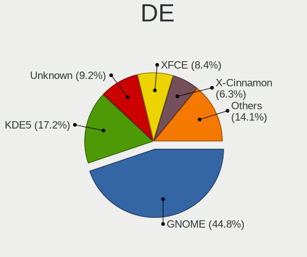
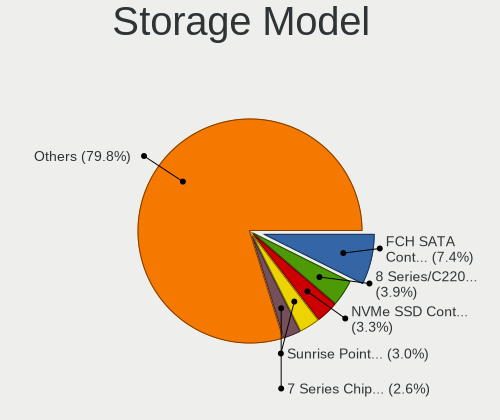
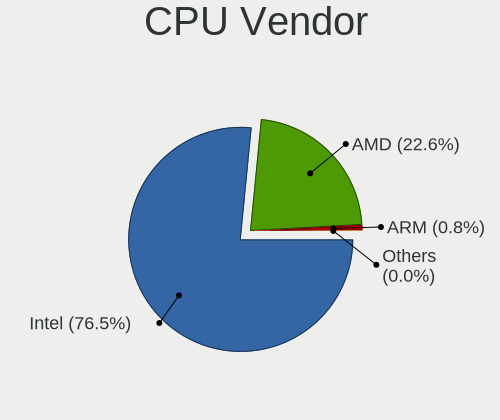
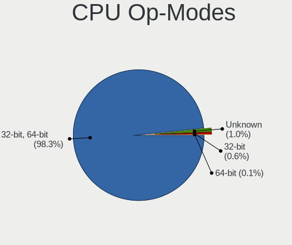
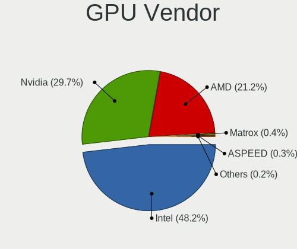
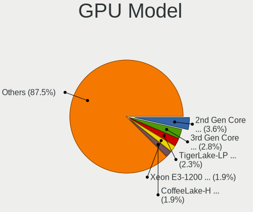
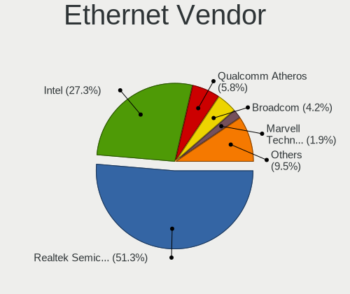

Linux in France - Tested Hardware & Statistics
----------------------------------------------

A project to collect tested hardware configurations for Linux in France.

Anyone can contribute to this report by the [hw-probe](https://github.com/linuxhw/hw-probe) tool:

    sudo -E hw-probe -all -upload

Please contribute! Especially if your hardware is rare.

This is a report for all computer types. See also reports for [desktops](/Location/France/Desktop/README.md) and [notebooks](/Location/France/Notebook/README.md).

Contents
--------

* [ Test Cases ](#test-cases)

* [ System ](#system)
  - [ OS                       ](#os)
  - [ OS Family                ](#os-family)
  - [ Kernel                   ](#kernel)
  - [ Kernel Family            ](#kernel-family)
  - [ Kernel Major Ver.        ](#kernel-major-ver)
  - [ Arch                     ](#arch)
  - [ DE                       ](#de)
  - [ Display Server           ](#display-server)
  - [ Display Manager          ](#display-manager)
  - [ OS Lang                  ](#os-lang)
  - [ Boot Mode                ](#boot-mode)
  - [ Filesystem               ](#filesystem)
  - [ Part. scheme             ](#part-scheme)
  - [ Dual Boot with Linux/BSD ](#dual-boot-with-linuxbsd)
  - [ Dual Boot (Win)          ](#dual-boot-win)

* [ Board ](#board)
  - [ Vendor                   ](#vendor)
  - [ Model                    ](#model)
  - [ Model Family             ](#model-family)
  - [ MFG Year                 ](#mfg-year)
  - [ Form Factor              ](#form-factor)
  - [ Secure Boot              ](#secure-boot)
  - [ Coreboot                 ](#coreboot)
  - [ RAM Size                 ](#ram-size)
  - [ RAM Used                 ](#ram-used)
  - [ Total Drives             ](#total-drives)
  - [ Has CD-ROM               ](#has-cd-rom)
  - [ Has Ethernet             ](#has-ethernet)
  - [ Has WiFi                 ](#has-wifi)
  - [ Has Bluetooth            ](#has-bluetooth)

* [ Location ](#location)
  - [ Country                  ](#country)
  - [ City                     ](#city)

* [ Drives ](#drives)
  - [ Drive Vendor             ](#drive-vendor)
  - [ Drive Model              ](#drive-model)
  - [ HDD Vendor               ](#hdd-vendor)
  - [ SSD Vendor               ](#ssd-vendor)
  - [ Drive Kind               ](#drive-kind)
  - [ Drive Connector          ](#drive-connector)
  - [ Drive Size               ](#drive-size)
  - [ Space Total              ](#space-total)
  - [ Space Used               ](#space-used)
  - [ Malfunc. Drives          ](#malfunc-drives)
  - [ Malfunc. Drive Vendor    ](#malfunc-drive-vendor)
  - [ Malfunc. HDD Vendor      ](#malfunc-hdd-vendor)
  - [ Malfunc. Drive Kind      ](#malfunc-drive-kind)
  - [ Failed Drives            ](#failed-drives)
  - [ Failed Drive Vendor      ](#failed-drive-vendor)
  - [ Drive Status             ](#drive-status)

* [ Storage controller ](#storage-controller)
  - [ Storage Vendor           ](#storage-vendor)
  - [ Storage Model            ](#storage-model)
  - [ Storage Kind             ](#storage-kind)

* [ Processor ](#processor)
  - [ CPU Vendor               ](#cpu-vendor)
  - [ CPU Model                ](#cpu-model)
  - [ CPU Model Family         ](#cpu-model-family)
  - [ CPU Cores                ](#cpu-cores)
  - [ CPU Sockets              ](#cpu-sockets)
  - [ CPU Threads              ](#cpu-threads)
  - [ CPU Op-Modes             ](#cpu-op-modes)
  - [ CPU Microcode            ](#cpu-microcode)
  - [ CPU Microarch            ](#cpu-microarch)

* [ Graphics ](#graphics)
  - [ GPU Vendor               ](#gpu-vendor)
  - [ GPU Model                ](#gpu-model)
  - [ GPU Combo                ](#gpu-combo)
  - [ GPU Driver               ](#gpu-driver)
  - [ GPU Memory               ](#gpu-memory)

* [ Monitor ](#monitor)
  - [ Monitor Vendor           ](#monitor-vendor)
  - [ Monitor Model            ](#monitor-model)
  - [ Monitor Resolution       ](#monitor-resolution)
  - [ Monitor Diagonal         ](#monitor-diagonal)
  - [ Monitor Width            ](#monitor-width)
  - [ Aspect Ratio             ](#aspect-ratio)
  - [ Monitor Area             ](#monitor-area)
  - [ Pixel Density            ](#pixel-density)
  - [ Multiple Monitors        ](#multiple-monitors)

* [ Network ](#network)
  - [ Net Controller Vendor    ](#net-controller-vendor)
  - [ Net Controller Model     ](#net-controller-model)
  - [ Wireless Vendor          ](#wireless-vendor)
  - [ Wireless Model           ](#wireless-model)
  - [ Ethernet Vendor          ](#ethernet-vendor)
  - [ Ethernet Model           ](#ethernet-model)
  - [ Net Controller Kind      ](#net-controller-kind)
  - [ Used Controller          ](#used-controller)
  - [ NICs                     ](#nics)
  - [ IPv6                     ](#ipv6)

* [ Bluetooth ](#bluetooth)
  - [ Bluetooth Vendor         ](#bluetooth-vendor)
  - [ Bluetooth Model          ](#bluetooth-model)

* [ Sound ](#sound)
  - [ Sound Vendor             ](#sound-vendor)
  - [ Sound Model              ](#sound-model)

* [ Memory ](#memory)
  - [ Memory Vendor            ](#memory-vendor)
  - [ Memory Model             ](#memory-model)
  - [ Memory Kind              ](#memory-kind)
  - [ Memory Form Factor       ](#memory-form-factor)
  - [ Memory Size              ](#memory-size)
  - [ Memory Speed             ](#memory-speed)

* [ Printers & scanners ](#printers--scanners)
  - [ Printer Vendor           ](#printer-vendor)
  - [ Printer Model            ](#printer-model)
  - [ Scanner Vendor           ](#scanner-vendor)
  - [ Scanner Model            ](#scanner-model)

* [ Camera ](#camera)
  - [ Camera Vendor            ](#camera-vendor)
  - [ Camera Model             ](#camera-model)

* [ Security ](#security)
  - [ Fingerprint Vendor       ](#fingerprint-vendor)
  - [ Fingerprint Model        ](#fingerprint-model)
  - [ Chipcard Vendor          ](#chipcard-vendor)
  - [ Chipcard Model           ](#chipcard-model)

* [ Unsupported ](#unsupported)
  - [ Unsupported Devices      ](#unsupported-devices)
  - [ Unsupported Device Types ](#unsupported-device-types)

Test Cases
----------

Total: 12305

| Vendor        | Model                       | Form-Factor | Probe                                                      | Date         |
|---------------|-----------------------------|-------------|------------------------------------------------------------|--------------|
| Dell          | Vostro 1520                 | Notebook    | [2132a3308c](https://linux-hardware.org/?probe=2132a3308c) | Apr 01, 2023 |
| ASUSTek       | N752VX                      | Notebook    | [d426499408](https://linux-hardware.org/?probe=d426499408) | Apr 01, 2023 |
| Gigabyte      | B150M-D2V DDR3-CF           | Desktop     | [35bae3b94d](https://linux-hardware.org/?probe=35bae3b94d) | Apr 01, 2023 |
| HP            | Presario CQ58               | Notebook    | [e8f8f289ac](https://linux-hardware.org/?probe=e8f8f289ac) | Apr 01, 2023 |
| ASUSTek       | ASUS EXPERTBOOK B1500CEA... | Notebook    | [87bc2601f3](https://linux-hardware.org/?probe=87bc2601f3) | Apr 01, 2023 |
| ASUSTek       | PRIME B350M-A               | Desktop     | [f8afb163dc](https://linux-hardware.org/?probe=f8afb163dc) | Apr 01, 2023 |
| ASUSTek       | S551LN                      | Notebook    | [916adbdf9f](https://linux-hardware.org/?probe=916adbdf9f) | Apr 01, 2023 |
| MSI           | H97M-G43                    | Desktop     | [b93caf26e4](https://linux-hardware.org/?probe=b93caf26e4) | Apr 01, 2023 |
| Gigabyte      | B150M-D2V DDR3-CF           | Desktop     | [3599b8e875](https://linux-hardware.org/?probe=3599b8e875) | Mar 31, 2023 |
| MSI           | B450 TOMAHAWK MAX           | Desktop     | [d79127e48c](https://linux-hardware.org/?probe=d79127e48c) | Mar 31, 2023 |
| Acer          | Aspire 7720                 | Notebook    | [073d49ce6b](https://linux-hardware.org/?probe=073d49ce6b) | Mar 31, 2023 |
| Lenovo        | ThinkPad L14 Gen 3 21C5C... | Notebook    | [683d3101d8](https://linux-hardware.org/?probe=683d3101d8) | Mar 31, 2023 |
| Dell          | Inspiron 7577               | Notebook    | [5800e3859c](https://linux-hardware.org/?probe=5800e3859c) | Mar 31, 2023 |
| Acer          | Nitro AN515-54              | Notebook    | [9e7aa15a9f](https://linux-hardware.org/?probe=9e7aa15a9f) | Mar 31, 2023 |
| ASUSTek       | P8Z77-V                     | Desktop     | [498726ce78](https://linux-hardware.org/?probe=498726ce78) | Mar 31, 2023 |
| ASUSTek       | M4A88TD-V EVO/USB3          | Desktop     | [624d23335b](https://linux-hardware.org/?probe=624d23335b) | Mar 31, 2023 |
| MSI           | X470 GAMING PLUS MAX        | Desktop     | [d6b6c88578](https://linux-hardware.org/?probe=d6b6c88578) | Mar 31, 2023 |
| MSI           | X470 GAMING PLUS MAX        | Desktop     | [704145641e](https://linux-hardware.org/?probe=704145641e) | Mar 31, 2023 |
| Notebook      | NL40_50GU                   | Notebook    | [a46afd7246](https://linux-hardware.org/?probe=a46afd7246) | Mar 31, 2023 |
| Foxconn       | 2ABF                        | Desktop     | [8daf4bf0a5](https://linux-hardware.org/?probe=8daf4bf0a5) | Mar 30, 2023 |
| Fujitsu Si... | ESPRIMO Mobile V6535        | Notebook    | [81c43aeb0d](https://linux-hardware.org/?probe=81c43aeb0d) | Mar 30, 2023 |
| Apple         | MacBookAir7,2               | Notebook    | [d9cbbe0a35](https://linux-hardware.org/?probe=d9cbbe0a35) | Mar 30, 2023 |
| Dell          | Precision 5510              | Notebook    | [4bbf7f5ef2](https://linux-hardware.org/?probe=4bbf7f5ef2) | Mar 30, 2023 |
| MSI           | A320M PRO-VD PLUS           | Desktop     | [9e43a17d1a](https://linux-hardware.org/?probe=9e43a17d1a) | Mar 30, 2023 |
| Lenovo        | Legion Y530-15ICH 81FV      | Notebook    | [0f8c22b288](https://linux-hardware.org/?probe=0f8c22b288) | Mar 30, 2023 |
| ASUSTek       | K55A                        | Notebook    | [cf40bdccfc](https://linux-hardware.org/?probe=cf40bdccfc) | Mar 30, 2023 |
| ASRock        | FM2A88X Extreme6+           | Desktop     | [ad1392d8c0](https://linux-hardware.org/?probe=ad1392d8c0) | Mar 30, 2023 |
| ASUSTek       | K55A                        | Notebook    | [b6c168d185](https://linux-hardware.org/?probe=b6c168d185) | Mar 30, 2023 |
| Intel         | NUC6i5SYB H81131-503        | Mini pc     | [0a09299aae](https://linux-hardware.org/?probe=0a09299aae) | Mar 30, 2023 |
| Lenovo        | SHARKBAY SDK0E50510 WIN     | Desktop     | [76e09994d0](https://linux-hardware.org/?probe=76e09994d0) | Mar 30, 2023 |
| Packard Be... | MCP73PV                     | Desktop     | [2082d90602](https://linux-hardware.org/?probe=2082d90602) | Mar 30, 2023 |
| Lenovo        | V15-ADA 82C7                | Notebook    | [552ad08e05](https://linux-hardware.org/?probe=552ad08e05) | Mar 30, 2023 |
| Raspberry ... | Raspberry Pi                | Soc         | [426c2d06fd](https://linux-hardware.org/?probe=426c2d06fd) | Mar 30, 2023 |
| Sony          | SVF1521C2EW                 | Notebook    | [978ae8afac](https://linux-hardware.org/?probe=978ae8afac) | Mar 30, 2023 |
| ASUSTek       | ROG STRIX B660-F GAMING ... | Desktop     | [de5bf4239c](https://linux-hardware.org/?probe=de5bf4239c) | Mar 30, 2023 |
| HP            | 82B4                        | Desktop     | [0829a64947](https://linux-hardware.org/?probe=0829a64947) | Mar 30, 2023 |
| Alienware     | m15 Ryzen Ed. R5            | Notebook    | [0f273e6227](https://linux-hardware.org/?probe=0f273e6227) | Mar 30, 2023 |
| ASUSTek       | TUF Gaming X570-PRO WIFI... | Desktop     | [cfe80f22f8](https://linux-hardware.org/?probe=cfe80f22f8) | Mar 30, 2023 |
| ASUSTek       | M5A97                       | Desktop     | [4d12d122e1](https://linux-hardware.org/?probe=4d12d122e1) | Mar 30, 2023 |
| Shuttle       | FH170                       | Desktop     | [0fa0f1ab72](https://linux-hardware.org/?probe=0fa0f1ab72) | Mar 30, 2023 |
| MSI           | MS-AA5E 0A                  | All in one  | [36d66ad0a2](https://linux-hardware.org/?probe=36d66ad0a2) | Mar 29, 2023 |
| Lenovo        | G700 20251                  | Notebook    | [7580b631a9](https://linux-hardware.org/?probe=7580b631a9) | Mar 29, 2023 |
| Acer          | Veriton Z4810G              | All in one  | [c4a9881345](https://linux-hardware.org/?probe=c4a9881345) | Mar 29, 2023 |
| Lenovo        | U41-70 80JV                 | Notebook    | [975da67142](https://linux-hardware.org/?probe=975da67142) | Mar 29, 2023 |
| ASRockRack    | X470D4U2-2T                 | Desktop     | [38e3ecfb84](https://linux-hardware.org/?probe=38e3ecfb84) | Mar 29, 2023 |
| HP            | Laptop 17-by0xxx            | Notebook    | [89a0332dfd](https://linux-hardware.org/?probe=89a0332dfd) | Mar 29, 2023 |
| HP            | EliteBook 8770w             | Notebook    | [46a3f1d497](https://linux-hardware.org/?probe=46a3f1d497) | Mar 29, 2023 |
| Lenovo        | IdeaPad 100-15IBY 80MJ      | Notebook    | [11c94aa91b](https://linux-hardware.org/?probe=11c94aa91b) | Mar 29, 2023 |
| ASUSTek       | Q170M2                      | Desktop     | [8808e457a1](https://linux-hardware.org/?probe=8808e457a1) | Mar 29, 2023 |
| Toshiba       | Satellite P200              | Notebook    | [c55a4d3166](https://linux-hardware.org/?probe=c55a4d3166) | Mar 29, 2023 |
| ASUSTek       | ZenBook UX463FL_UX463FL     | Convertible | [2798c67b5c](https://linux-hardware.org/?probe=2798c67b5c) | Mar 29, 2023 |
| ASUSTek       | ROG STRIX B660-F GAMING ... | Desktop     | [dadeec8815](https://linux-hardware.org/?probe=dadeec8815) | Mar 29, 2023 |
| Notebook      | NL40_50CU                   | Notebook    | [fe471635fb](https://linux-hardware.org/?probe=fe471635fb) | Mar 29, 2023 |
| ASRock        | X470 Master SLI             | Desktop     | [e4d56ca8c8](https://linux-hardware.org/?probe=e4d56ca8c8) | Mar 28, 2023 |
| ASRock        | H61M-DG3/USB3               | Desktop     | [6e7b188568](https://linux-hardware.org/?probe=6e7b188568) | Mar 28, 2023 |
| HP            | 0A60h                       | Desktop     | [6ad65f4f2b](https://linux-hardware.org/?probe=6ad65f4f2b) | Mar 28, 2023 |
| Dell          | Vostro 5568                 | Notebook    | [0004be15a4](https://linux-hardware.org/?probe=0004be15a4) | Mar 28, 2023 |
| ASUSTek       | ZenBook UX425QA_UM425QA     | Notebook    | [2f1975360e](https://linux-hardware.org/?probe=2f1975360e) | Mar 28, 2023 |
| HP            | Compaq 6510b (GR680ET)      | Notebook    | [716c4212c7](https://linux-hardware.org/?probe=716c4212c7) | Mar 28, 2023 |
| Lenovo        | V145-15AST 81MT             | Notebook    | [7fff3bb217](https://linux-hardware.org/?probe=7fff3bb217) | Mar 28, 2023 |
| MSI           | B85-G43                     | Desktop     | [3dac8c76c2](https://linux-hardware.org/?probe=3dac8c76c2) | Mar 28, 2023 |
| Acer          | Aspire E5-532G              | Notebook    | [35e076d9b5](https://linux-hardware.org/?probe=35e076d9b5) | Mar 28, 2023 |
| Lenovo        | 36D9 SDK0J40700 WIN 3258... | Desktop     | [16db0eb166](https://linux-hardware.org/?probe=16db0eb166) | Mar 28, 2023 |
| Dell          | 0DKKCF A00                  | All in one  | [bc3d41b77d](https://linux-hardware.org/?probe=bc3d41b77d) | Mar 28, 2023 |
| Dell          | 0WR7PY A01                  | Desktop     | [5f0453caf8](https://linux-hardware.org/?probe=5f0453caf8) | Mar 28, 2023 |
| ASUSTek       | N61Jq                       | Notebook    | [0ca1f04770](https://linux-hardware.org/?probe=0ca1f04770) | Mar 28, 2023 |
| ASRock        | G31M-S                      | Desktop     | [4ad324790c](https://linux-hardware.org/?probe=4ad324790c) | Mar 28, 2023 |
| Sony          | SVF1521C2EW                 | Notebook    | [2bafb0a0e4](https://linux-hardware.org/?probe=2bafb0a0e4) | Mar 28, 2023 |
| ASRock        | G31M-S                      | Desktop     | [225f122e05](https://linux-hardware.org/?probe=225f122e05) | Mar 28, 2023 |
| HP            | 1497                        | Desktop     | [94c6f8a63a](https://linux-hardware.org/?probe=94c6f8a63a) | Mar 27, 2023 |
| HP            | Laptop 14s-fq2xxx           | Notebook    | [8b64ddb550](https://linux-hardware.org/?probe=8b64ddb550) | Mar 27, 2023 |
| Lenovo        | ThinkPad L13 Gen 3 21B9C... | Notebook    | [0744b26f5c](https://linux-hardware.org/?probe=0744b26f5c) | Mar 27, 2023 |
| HP            | EliteBook 840 G3            | Notebook    | [58d5e99cd1](https://linux-hardware.org/?probe=58d5e99cd1) | Mar 27, 2023 |
| Gigabyte      | WRX80-SU8                   | Desktop     | [88c24f7e44](https://linux-hardware.org/?probe=88c24f7e44) | Mar 27, 2023 |
| Dell          | 0G919G A00                  | Desktop     | [139207e1a7](https://linux-hardware.org/?probe=139207e1a7) | Mar 27, 2023 |
| Dell          | Latitude E5430 non-vPro     | Notebook    | [17794caffa](https://linux-hardware.org/?probe=17794caffa) | Mar 27, 2023 |
| Lenovo        | IdeaPad Gaming 3 15IMH05... | Notebook    | [08627c5990](https://linux-hardware.org/?probe=08627c5990) | Mar 27, 2023 |
| ASUSTek       | M5A97 R2.0                  | Desktop     | [d56f48b9d1](https://linux-hardware.org/?probe=d56f48b9d1) | Mar 27, 2023 |
| Dell          | XPS 15 9570                 | Notebook    | [5be538736f](https://linux-hardware.org/?probe=5be538736f) | Mar 27, 2023 |
| Acer          | Aspire 4820TG               | Notebook    | [e634227889](https://linux-hardware.org/?probe=e634227889) | Mar 27, 2023 |
| Fanless Mi... | Rev GMLR1                   | Mini pc     | [119a217e25](https://linux-hardware.org/?probe=119a217e25) | Mar 27, 2023 |
| Lenovo        | SHARKBAY SDK0E50510 WIN     | Desktop     | [ebed945eae](https://linux-hardware.org/?probe=ebed945eae) | Mar 27, 2023 |
| Lenovo        | ThinkPad P73 20QRCTO1WW     | Notebook    | [7cd7234999](https://linux-hardware.org/?probe=7cd7234999) | Mar 27, 2023 |
| Lenovo        | SHARKBAY SDK0E50510 WIN     | Desktop     | [fd16b858df](https://linux-hardware.org/?probe=fd16b858df) | Mar 27, 2023 |
| ASUSTek       | P8H61-M LE                  | Desktop     | [e834f14d64](https://linux-hardware.org/?probe=e834f14d64) | Mar 27, 2023 |
| Lenovo        | IdeaPad 320-15ISK 80XH      | Notebook    | [c3dbea760e](https://linux-hardware.org/?probe=c3dbea760e) | Mar 26, 2023 |
| HP            | ProLiant ML350 G5           | Desktop     | [b0000fc633](https://linux-hardware.org/?probe=b0000fc633) | Mar 26, 2023 |
| Packard Be... | MCP73PV                     | Desktop     | [87d1fd7511](https://linux-hardware.org/?probe=87d1fd7511) | Mar 26, 2023 |
| Wistron       | ProLiant ML110 G6           | Desktop     | [2e14ac2984](https://linux-hardware.org/?probe=2e14ac2984) | Mar 26, 2023 |
| ASUSTek       | K50IE                       | Notebook    | [bde872583b](https://linux-hardware.org/?probe=bde872583b) | Mar 26, 2023 |
| Dell          | 0VHRW1 A03                  | Desktop     | [9aa3215de8](https://linux-hardware.org/?probe=9aa3215de8) | Mar 26, 2023 |
| ASUSTek       | PRIME H510M-K               | Desktop     | [54e2f18738](https://linux-hardware.org/?probe=54e2f18738) | Mar 26, 2023 |
| Lenovo        | ThinkPad P73 20QRCTO1WW     | Notebook    | [2d83ebd124](https://linux-hardware.org/?probe=2d83ebd124) | Mar 26, 2023 |
| ASUSTek       | X75VD                       | Notebook    | [9997ce4485](https://linux-hardware.org/?probe=9997ce4485) | Mar 26, 2023 |
| MSI           | MAG Z490 TOMAHAWK           | Notebook    | [f9c5ae93de](https://linux-hardware.org/?probe=f9c5ae93de) | Mar 26, 2023 |
| Fujitsu Si... | AMILO Pi 3625               | Notebook    | [076352cb68](https://linux-hardware.org/?probe=076352cb68) | Mar 26, 2023 |
| Dell          | 0VHRW1 A03                  | Desktop     | [129c2be9aa](https://linux-hardware.org/?probe=129c2be9aa) | Mar 26, 2023 |
| MSI           | MAG Z490 TOMAHAWK           | Notebook    | [414c36eb9d](https://linux-hardware.org/?probe=414c36eb9d) | Mar 26, 2023 |
| ZOTAC         | ZBOX-EN173080C/EN173070C... | Mini pc     | [6f53d65339](https://linux-hardware.org/?probe=6f53d65339) | Mar 26, 2023 |
| Valve         | Jupiter                     | Notebook    | [b7c75f2713](https://linux-hardware.org/?probe=b7c75f2713) | Mar 26, 2023 |
| Dell          | Latitude 5520               | Notebook    | [47372d09fe](https://linux-hardware.org/?probe=47372d09fe) | Mar 25, 2023 |
| Dell          | Latitude 5520               | Notebook    | [0c69ef5724](https://linux-hardware.org/?probe=0c69ef5724) | Mar 25, 2023 |
| Lenovo        | 36F7 SDK0J40700 WIN 3258... | Desktop     | [e6219e18b1](https://linux-hardware.org/?probe=e6219e18b1) | Mar 25, 2023 |
| Packard Be... | EasyNote SB65               | Notebook    | [f49cf1aa7a](https://linux-hardware.org/?probe=f49cf1aa7a) | Mar 25, 2023 |
| HP            | OMEN by Laptop 16-b0xxx     | Notebook    | [22aa7f3036](https://linux-hardware.org/?probe=22aa7f3036) | Mar 25, 2023 |
| Dell          | XPS 9315                    | Notebook    | [050fede003](https://linux-hardware.org/?probe=050fede003) | Mar 25, 2023 |
| Toshiba       | KIRA                        | Notebook    | [e96de49ce8](https://linux-hardware.org/?probe=e96de49ce8) | Mar 25, 2023 |
| Dell          | 0654JC A01                  | Desktop     | [3771b8bf2e](https://linux-hardware.org/?probe=3771b8bf2e) | Mar 25, 2023 |
| HP            | ProBook 645 G4              | Notebook    | [6a03f43f29](https://linux-hardware.org/?probe=6a03f43f29) | Mar 25, 2023 |
| ASUSTek       | P5B-Deluxe                  | Desktop     | [3d8b7a6d89](https://linux-hardware.org/?probe=3d8b7a6d89) | Mar 25, 2023 |
| ASUSTek       | H97-PLUS                    | Desktop     | [30d5652df2](https://linux-hardware.org/?probe=30d5652df2) | Mar 25, 2023 |
| Gigabyte      | B150M-D2V DDR3-CF           | Desktop     | [276aa0b036](https://linux-hardware.org/?probe=276aa0b036) | Mar 25, 2023 |
| Dell          | 00V62H A00                  | Desktop     | [34d3fc12b2](https://linux-hardware.org/?probe=34d3fc12b2) | Mar 25, 2023 |
| Dell          | 00V62H A00                  | Desktop     | [f7aaf1dcd0](https://linux-hardware.org/?probe=f7aaf1dcd0) | Mar 25, 2023 |
| ASUSTek       | PRIME B550M-A               | Desktop     | [623f5742ab](https://linux-hardware.org/?probe=623f5742ab) | Mar 25, 2023 |
| Unknown       | Unknown                     | Notebook    | [fb97269a4d](https://linux-hardware.org/?probe=fb97269a4d) | Mar 24, 2023 |
| Packard Be... | H17HV                       | Notebook    | [c4bddccbd8](https://linux-hardware.org/?probe=c4bddccbd8) | Mar 24, 2023 |
| Gigabyte      | GA-890FXA-UD5               | Desktop     | [5fccdb098d](https://linux-hardware.org/?probe=5fccdb098d) | Mar 24, 2023 |
| Dell          | Precision 3551              | Notebook    | [bc979e320b](https://linux-hardware.org/?probe=bc979e320b) | Mar 24, 2023 |
| Lenovo        | SDK0E50519 WIN              | Desktop     | [2fb6bb5874](https://linux-hardware.org/?probe=2fb6bb5874) | Mar 24, 2023 |
| Dell          | Precision 3551              | Notebook    | [0509bee16a](https://linux-hardware.org/?probe=0509bee16a) | Mar 24, 2023 |
| Apple         | Mac-35C5E08120C7EEAF Mac... | Mini pc     | [7506ffb6fd](https://linux-hardware.org/?probe=7506ffb6fd) | Mar 24, 2023 |
| Dell          | 0NK5PH A00                  | Desktop     | [f76bc64ee4](https://linux-hardware.org/?probe=f76bc64ee4) | Mar 24, 2023 |
| HP            | EliteBook 850 G5            | Notebook    | [cde421908c](https://linux-hardware.org/?probe=cde421908c) | Mar 24, 2023 |
| ASUSTek       | PRIME X470-PRO              | Desktop     | [8af246641b](https://linux-hardware.org/?probe=8af246641b) | Mar 24, 2023 |
| Lenovo        | ThinkPad Edge E530 62722... | Notebook    | [479f7f7a25](https://linux-hardware.org/?probe=479f7f7a25) | Mar 23, 2023 |
| ASUSTek       | PRIME Z590M-PLUS            | Desktop     | [0027308e3d](https://linux-hardware.org/?probe=0027308e3d) | Mar 23, 2023 |
| HP            | Pavilion dv7                | Notebook    | [c0cec2e941](https://linux-hardware.org/?probe=c0cec2e941) | Mar 23, 2023 |
| HP            | 3048h                       | Desktop     | [8cee790d83](https://linux-hardware.org/?probe=8cee790d83) | Mar 23, 2023 |
| Dell          | XPS 15 9510                 | Notebook    | [e6db3c2c26](https://linux-hardware.org/?probe=e6db3c2c26) | Mar 23, 2023 |
| HP            | 1905                        | Desktop     | [7bccc34bf4](https://linux-hardware.org/?probe=7bccc34bf4) | Mar 23, 2023 |
| Lenovo        | ThinkPad P70 20ESS2VP00     | Notebook    | [bb6fdb6236](https://linux-hardware.org/?probe=bb6fdb6236) | Mar 23, 2023 |
| Lenovo        | ThinkPad X1 Carbon Gen 1... | Notebook    | [28cd6cb051](https://linux-hardware.org/?probe=28cd6cb051) | Mar 23, 2023 |
| Valve         | Jupiter                     | Notebook    | [9d1c01a6cd](https://linux-hardware.org/?probe=9d1c01a6cd) | Mar 23, 2023 |
| HP            | Spectre                     | Convertible | [c9181ab4f2](https://linux-hardware.org/?probe=c9181ab4f2) | Mar 22, 2023 |
| HP            | Spectre                     | Convertible | [5e07c68683](https://linux-hardware.org/?probe=5e07c68683) | Mar 22, 2023 |
| ASUSTek       | ZenBook UX463FL_UX463FL     | Convertible | [662189c6fc](https://linux-hardware.org/?probe=662189c6fc) | Mar 22, 2023 |
| Toshiba       | Satellite C870-198          | Notebook    | [7969002105](https://linux-hardware.org/?probe=7969002105) | Mar 22, 2023 |
| ASUSTek       | VivoBook_ASUSLaptop K650... | Notebook    | [ba101f37d0](https://linux-hardware.org/?probe=ba101f37d0) | Mar 22, 2023 |
| ASUSTek       | ROG Rampage VI EXTREME O... | Desktop     | [d5afcaf7a1](https://linux-hardware.org/?probe=d5afcaf7a1) | Mar 22, 2023 |
| AZW           | GK35                        | Desktop     | [bd935978b7](https://linux-hardware.org/?probe=bd935978b7) | Mar 22, 2023 |
| Dell          | 0HHV7N A00                  | Desktop     | [7b10e71784](https://linux-hardware.org/?probe=7b10e71784) | Mar 22, 2023 |
| HP            | Spectre x360 2-in-1 Lapt... | Convertible | [b037cbd3b6](https://linux-hardware.org/?probe=b037cbd3b6) | Mar 22, 2023 |
| HP            | Spectre x360 2-in-1 Lapt... | Convertible | [a87172150f](https://linux-hardware.org/?probe=a87172150f) | Mar 22, 2023 |
| Notebook      | P15SM                       | Notebook    | [082e2c3c16](https://linux-hardware.org/?probe=082e2c3c16) | Mar 21, 2023 |
| Dell          | Latitude E7240              | Notebook    | [a3e408033c](https://linux-hardware.org/?probe=a3e408033c) | Mar 21, 2023 |
| ASUSTek       | VivoBook_ASUSLaptop M760... | Notebook    | [8606a64427](https://linux-hardware.org/?probe=8606a64427) | Mar 21, 2023 |
| MSI           | Z77A-GD80                   | Desktop     | [bcb120034c](https://linux-hardware.org/?probe=bcb120034c) | Mar 21, 2023 |
| ASUSTek       | VivoBook E14 E402WAS        | Notebook    | [95154b40cc](https://linux-hardware.org/?probe=95154b40cc) | Mar 21, 2023 |
| Lenovo        | SHARKBAY SDK0E50510 WIN     | Desktop     | [57a69bcf57](https://linux-hardware.org/?probe=57a69bcf57) | Mar 21, 2023 |
| Lenovo        | B50-10 80QR                 | Notebook    | [134bf99094](https://linux-hardware.org/?probe=134bf99094) | Mar 21, 2023 |
| MSI           | GF63 Thin 10SCSR            | Notebook    | [45610ce6bf](https://linux-hardware.org/?probe=45610ce6bf) | Mar 21, 2023 |
| HP            | ProBook x360 440 G1         | Convertible | [579152ea57](https://linux-hardware.org/?probe=579152ea57) | Mar 21, 2023 |
| ASUSTek       | GL553VD                     | Notebook    | [ea7e302020](https://linux-hardware.org/?probe=ea7e302020) | Mar 21, 2023 |
| ASUSTek       | GL553VD                     | Notebook    | [8ed4a1e3ba](https://linux-hardware.org/?probe=8ed4a1e3ba) | Mar 21, 2023 |
| HP            | EliteBook 850 G5            | Notebook    | [5ca3a1b044](https://linux-hardware.org/?probe=5ca3a1b044) | Mar 21, 2023 |
| HUAWEI        | KLVL-WXX9                   | Notebook    | [2da4187f91](https://linux-hardware.org/?probe=2da4187f91) | Mar 21, 2023 |
| HP            | EliteBook 840 G5            | Notebook    | [a204a0f2c0](https://linux-hardware.org/?probe=a204a0f2c0) | Mar 21, 2023 |
| Dell          | XPS 15 9510                 | Notebook    | [d23fb1d0f6](https://linux-hardware.org/?probe=d23fb1d0f6) | Mar 21, 2023 |
| Dell          | Latitude E6420              | Notebook    | [e564f25125](https://linux-hardware.org/?probe=e564f25125) | Mar 20, 2023 |
| HP            | 21F5                        | Desktop     | [865a85e5bc](https://linux-hardware.org/?probe=865a85e5bc) | Mar 20, 2023 |
| MSI           | H310M PRO-VD                | Desktop     | [1b98d965e7](https://linux-hardware.org/?probe=1b98d965e7) | Mar 20, 2023 |
| HP            | Pavilion dm4                | Notebook    | [7983ee084c](https://linux-hardware.org/?probe=7983ee084c) | Mar 20, 2023 |
| HP            | Laptop 15s-eq1xxx           | Notebook    | [3aee61f2bb](https://linux-hardware.org/?probe=3aee61f2bb) | Mar 20, 2023 |
| Notebook      | NS50_70MU                   | Notebook    | [cb2c031349](https://linux-hardware.org/?probe=cb2c031349) | Mar 20, 2023 |
| Dell          | Latitude E5500              | Notebook    | [9c76627b98](https://linux-hardware.org/?probe=9c76627b98) | Mar 20, 2023 |
| ASUSTek       | PRIME Z370-P II             | Desktop     | [3b81f87409](https://linux-hardware.org/?probe=3b81f87409) | Mar 20, 2023 |
| ASUSTek       | M3A78-EMH HDMI              | Desktop     | [0aa8c2bf55](https://linux-hardware.org/?probe=0aa8c2bf55) | Mar 20, 2023 |
| Dell          | Latitude 5520               | Notebook    | [4153e72c6b](https://linux-hardware.org/?probe=4153e72c6b) | Mar 19, 2023 |
| ASUSTek       | ROG STRIX B660-F GAMING ... | Desktop     | [b5d9053f1c](https://linux-hardware.org/?probe=b5d9053f1c) | Mar 19, 2023 |
| ASUSTek       | ROG STRIX B660-F GAMING ... | Desktop     | [660ae0f7ed](https://linux-hardware.org/?probe=660ae0f7ed) | Mar 19, 2023 |
| HP            | Pavilion Gaming Laptop 1... | Notebook    | [3387f1f1c8](https://linux-hardware.org/?probe=3387f1f1c8) | Mar 19, 2023 |
| Acer          | Swift SF514-53T             | Notebook    | [9d37ace881](https://linux-hardware.org/?probe=9d37ace881) | Mar 19, 2023 |
| Acer          | Swift SF514-53T             | Notebook    | [93ce0e9d73](https://linux-hardware.org/?probe=93ce0e9d73) | Mar 19, 2023 |
| Toshiba       | Satellite Pro C50-A-1EM     | Notebook    | [a49e9997f1](https://linux-hardware.org/?probe=a49e9997f1) | Mar 19, 2023 |
| Lenovo        | Bantry CRB 31900058 STD     | Desktop     | [bbe02b925a](https://linux-hardware.org/?probe=bbe02b925a) | Mar 19, 2023 |
| Lenovo        | Bantry CRB 31900058 STD     | Desktop     | [d376f92f8d](https://linux-hardware.org/?probe=d376f92f8d) | Mar 19, 2023 |
| ASUSTek       | X550VX                      | Notebook    | [dcc37300fd](https://linux-hardware.org/?probe=dcc37300fd) | Mar 19, 2023 |
| Gigabyte      | Z77X-UD5H                   | Desktop     | [dc0a9ba834](https://linux-hardware.org/?probe=dc0a9ba834) | Mar 19, 2023 |
| HP            | ZBook 17 G3                 | Notebook    | [cb3b7c5bfb](https://linux-hardware.org/?probe=cb3b7c5bfb) | Mar 19, 2023 |
| Lenovo        | SHARKBAY SDK0E50510 WIN     | Desktop     | [1e96b578fa](https://linux-hardware.org/?probe=1e96b578fa) | Mar 18, 2023 |
| Supermicro    | X10SDV-4C-TLN2F             | Server      | [210b2e16e3](https://linux-hardware.org/?probe=210b2e16e3) | Mar 18, 2023 |
| Dell          | Precision M4800             | Notebook    | [26912746f6](https://linux-hardware.org/?probe=26912746f6) | Mar 18, 2023 |
| HP            | OMEN by Laptop 17-an0xx     | Notebook    | [5a11bc39d5](https://linux-hardware.org/?probe=5a11bc39d5) | Mar 18, 2023 |
| Dell          | Inspiron 1120               | Notebook    | [d864592854](https://linux-hardware.org/?probe=d864592854) | Mar 18, 2023 |
| HP            | Laptop 15-db0xxx            | Notebook    | [bb43e46d71](https://linux-hardware.org/?probe=bb43e46d71) | Mar 18, 2023 |
| Lenovo        | ThinkPad P50 20EQS1MY00     | Notebook    | [beeb327f26](https://linux-hardware.org/?probe=beeb327f26) | Mar 18, 2023 |
| Acer          | Aspire 7750G                | Notebook    | [39d6b256fa](https://linux-hardware.org/?probe=39d6b256fa) | Mar 18, 2023 |
| ASUSTek       | F2A85-M PRO                 | Desktop     | [5e3e1f990b](https://linux-hardware.org/?probe=5e3e1f990b) | Mar 18, 2023 |
| MSI           | MAG X570 TOMAHAWK WIFI      | Desktop     | [0e6f572d41](https://linux-hardware.org/?probe=0e6f572d41) | Mar 18, 2023 |
| Gigabyte      | G41MT-D3                    | Desktop     | [9a4ac88209](https://linux-hardware.org/?probe=9a4ac88209) | Mar 17, 2023 |
| Lenovo        | ThinkPad P14s Gen 3 21AK... | Notebook    | [4ff2145364](https://linux-hardware.org/?probe=4ff2145364) | Mar 17, 2023 |
| Dell          | Precision 3520              | Notebook    | [2afa31184a](https://linux-hardware.org/?probe=2afa31184a) | Mar 17, 2023 |
| Dell          | Precision 3520              | Notebook    | [819b4aa330](https://linux-hardware.org/?probe=819b4aa330) | Mar 17, 2023 |
| Acer          | Aspire 9410                 | Notebook    | [b124194b0c](https://linux-hardware.org/?probe=b124194b0c) | Mar 17, 2023 |
| Lenovo        | ThinkPad X250 20CL001LMB    | Notebook    | [d78880e600](https://linux-hardware.org/?probe=d78880e600) | Mar 17, 2023 |
| MSI           | GP62 6QE                    | Notebook    | [3db109542c](https://linux-hardware.org/?probe=3db109542c) | Mar 17, 2023 |
| Lenovo        | IdeaPad Gaming 3 15IHU6 ... | Notebook    | [7cededfaa9](https://linux-hardware.org/?probe=7cededfaa9) | Mar 17, 2023 |
| TUXEDO        | Pulse 14 Gen1               | Notebook    | [525b267c31](https://linux-hardware.org/?probe=525b267c31) | Mar 17, 2023 |
| Dell          | Latitude E7470              | Notebook    | [f2dd0afe92](https://linux-hardware.org/?probe=f2dd0afe92) | Mar 17, 2023 |
| Unknown       | Unknown                     | Notebook    | [3eb0bf05b4](https://linux-hardware.org/?probe=3eb0bf05b4) | Mar 17, 2023 |
| HP            | Pavilion dm1                | Notebook    | [8707341105](https://linux-hardware.org/?probe=8707341105) | Mar 16, 2023 |
| Dell          | Vostro 1520                 | Notebook    | [a029e62352](https://linux-hardware.org/?probe=a029e62352) | Mar 16, 2023 |
| Gigabyte      | AX370-Gaming 5              | Desktop     | [97d434b3b5](https://linux-hardware.org/?probe=97d434b3b5) | Mar 16, 2023 |
| HP            | 158A                        | Desktop     | [4a023a55d8](https://linux-hardware.org/?probe=4a023a55d8) | Mar 16, 2023 |
| Lenovo        | Legion 5 Pro 16IAH7H 82R... | Notebook    | [d0ab04cac0](https://linux-hardware.org/?probe=d0ab04cac0) | Mar 16, 2023 |
| Gigabyte      | AX370-Gaming 5              | Desktop     | [dd101b4b05](https://linux-hardware.org/?probe=dd101b4b05) | Mar 16, 2023 |
| Gigabyte      | F2A68HM-DS2                 | Desktop     | [293b961af2](https://linux-hardware.org/?probe=293b961af2) | Mar 16, 2023 |
| Gigabyte      | F2A88XM-D3H                 | Desktop     | [c7a98e4c15](https://linux-hardware.org/?probe=c7a98e4c15) | Mar 16, 2023 |
| Lenovo        | ThinkPad Edge E530 62722... | Notebook    | [fac1a255b7](https://linux-hardware.org/?probe=fac1a255b7) | Mar 16, 2023 |
| Toshiba       | Satellite C55-A-1T6         | Notebook    | [71751e4045](https://linux-hardware.org/?probe=71751e4045) | Mar 16, 2023 |
| HP            | ZBook 15 G5                 | Notebook    | [2af12bdf73](https://linux-hardware.org/?probe=2af12bdf73) | Mar 16, 2023 |
| Lenovo        | IdeaPad 1 15IGL7 82V7       | Notebook    | [a01912ff82](https://linux-hardware.org/?probe=a01912ff82) | Mar 15, 2023 |
| ASUSTek       | M5A97 R2.0                  | Desktop     | [526e33e980](https://linux-hardware.org/?probe=526e33e980) | Mar 15, 2023 |
| Toshiba       | PORTEGE Z30-B               | Notebook    | [06db6fa9b3](https://linux-hardware.org/?probe=06db6fa9b3) | Mar 15, 2023 |
| Dell          | Inspiron 7577               | Notebook    | [d19eaf791f](https://linux-hardware.org/?probe=d19eaf791f) | Mar 15, 2023 |
| ASUSTek       | N751JK                      | Notebook    | [d148f91b52](https://linux-hardware.org/?probe=d148f91b52) | Mar 15, 2023 |
| Dell          | Inspiron 7577               | Notebook    | [a519acdd2e](https://linux-hardware.org/?probe=a519acdd2e) | Mar 15, 2023 |
| Gigabyte      | Z77P-D3                     | Desktop     | [34ad3eb730](https://linux-hardware.org/?probe=34ad3eb730) | Mar 15, 2023 |
| Gigabyte      | Z77P-D3                     | Desktop     | [06c53ecdec](https://linux-hardware.org/?probe=06c53ecdec) | Mar 15, 2023 |
| MSI           | H510M-A PRO                 | Desktop     | [92c35e8f43](https://linux-hardware.org/?probe=92c35e8f43) | Mar 15, 2023 |
| Lenovo        | ThinkPad X230 2325BA3       | Notebook    | [45533fd7eb](https://linux-hardware.org/?probe=45533fd7eb) | Mar 14, 2023 |
| HP            | Notebook                    | Notebook    | [de2e2f370b](https://linux-hardware.org/?probe=de2e2f370b) | Mar 14, 2023 |
| HUAWEI        | CREM-WXX9                   | Notebook    | [933110cc30](https://linux-hardware.org/?probe=933110cc30) | Mar 14, 2023 |
| Dell          | 064N3D A00                  | All in one  | [4721bf0213](https://linux-hardware.org/?probe=4721bf0213) | Mar 14, 2023 |
| MSI           | FM2-A55M-E33                | Desktop     | [d6106fe9e3](https://linux-hardware.org/?probe=d6106fe9e3) | Mar 14, 2023 |
| ASUSTek       | M5A97 R2.0                  | Desktop     | [2f69480899](https://linux-hardware.org/?probe=2f69480899) | Mar 14, 2023 |
| HP            | EliteBook 840 G8 Noteboo... | Notebook    | [b3d9dfdb16](https://linux-hardware.org/?probe=b3d9dfdb16) | Mar 14, 2023 |
| Dell          | Inspiron 3583               | Notebook    | [9eaa09faf0](https://linux-hardware.org/?probe=9eaa09faf0) | Mar 14, 2023 |
| Packard Be... | IMEDIA S3840                | Desktop     | [b54abceafe](https://linux-hardware.org/?probe=b54abceafe) | Mar 14, 2023 |
| HP            | 339A                        | Desktop     | [3110e1b98c](https://linux-hardware.org/?probe=3110e1b98c) | Mar 14, 2023 |
| Dell          | Precision 5570              | Notebook    | [f0d98798a2](https://linux-hardware.org/?probe=f0d98798a2) | Mar 14, 2023 |
| MSI           | MAG X570 TOMAHAWK WIFI      | Desktop     | [49737df106](https://linux-hardware.org/?probe=49737df106) | Mar 14, 2023 |
| Acer          | Aspire A715-74G             | Notebook    | [54d17115b9](https://linux-hardware.org/?probe=54d17115b9) | Mar 13, 2023 |
| Acer          | Aspire A715-74G             | Notebook    | [79932e56ad](https://linux-hardware.org/?probe=79932e56ad) | Mar 13, 2023 |
| Foxconn       | 2AAF                        | Desktop     | [6d5e3ffeed](https://linux-hardware.org/?probe=6d5e3ffeed) | Mar 13, 2023 |
| Dell          | Precision 7560              | Notebook    | [0b0c4e4b1c](https://linux-hardware.org/?probe=0b0c4e4b1c) | Mar 13, 2023 |
| MSI           | B85-G43                     | Desktop     | [7e9ce07cb8](https://linux-hardware.org/?probe=7e9ce07cb8) | Mar 13, 2023 |
| ASUSTek       | VivoBook_ASUSLaptop X712... | Notebook    | [3c4e911c6d](https://linux-hardware.org/?probe=3c4e911c6d) | Mar 13, 2023 |
| MSI           | B85-G43                     | Desktop     | [9a9a70ade3](https://linux-hardware.org/?probe=9a9a70ade3) | Mar 13, 2023 |
| MSI           | GV62 7RE                    | Notebook    | [1de50d9986](https://linux-hardware.org/?probe=1de50d9986) | Mar 13, 2023 |
| Toshiba       | Satellite Pro L500          | Notebook    | [303f47547b](https://linux-hardware.org/?probe=303f47547b) | Mar 12, 2023 |
| Acer          | Aspire ES1-523              | Notebook    | [4247bd6835](https://linux-hardware.org/?probe=4247bd6835) | Mar 12, 2023 |
| ASUSTek       | PRIME A320M-K               | Desktop     | [e259b3e70a](https://linux-hardware.org/?probe=e259b3e70a) | Mar 12, 2023 |
| Dell          | Inspiron 5565               | Notebook    | [9415690de2](https://linux-hardware.org/?probe=9415690de2) | Mar 12, 2023 |
| Lenovo        | IdeaPad 3 15ALC6 82KU       | Notebook    | [4ee87a1213](https://linux-hardware.org/?probe=4ee87a1213) | Mar 12, 2023 |
| HP            | 339A                        | Desktop     | [fa78907d67](https://linux-hardware.org/?probe=fa78907d67) | Mar 12, 2023 |
| ASUSTek       | ASUS TUF Gaming A15 FA50... | Notebook    | [406d19d44f](https://linux-hardware.org/?probe=406d19d44f) | Mar 12, 2023 |
| ASUSTek       | TUF Gaming Z690-PLUS D4     | Desktop     | [053e36ef52](https://linux-hardware.org/?probe=053e36ef52) | Mar 12, 2023 |
| Chuwi         | GemiBook Pro                | Notebook    | [fc04961aef](https://linux-hardware.org/?probe=fc04961aef) | Mar 11, 2023 |
| Lenovo        | IdeaPad 3 15ADA05 81W1      | Notebook    | [73fe7fd06e](https://linux-hardware.org/?probe=73fe7fd06e) | Mar 11, 2023 |
| HP            | EliteBook 840 G4            | Notebook    | [c4792e57b9](https://linux-hardware.org/?probe=c4792e57b9) | Mar 11, 2023 |
| MSI           | MAG B660M BAZOOKA DDR4      | Desktop     | [cb1be19cd3](https://linux-hardware.org/?probe=cb1be19cd3) | Mar 11, 2023 |
| MSI           | Z77A-GD80                   | Desktop     | [28e364aa1a](https://linux-hardware.org/?probe=28e364aa1a) | Mar 11, 2023 |
| MSI           | Z77A-GD80                   | Desktop     | [932497a278](https://linux-hardware.org/?probe=932497a278) | Mar 11, 2023 |
| BESSTAR Te... | X300                        | Notebook    | [3f12a2f32e](https://linux-hardware.org/?probe=3f12a2f32e) | Mar 11, 2023 |
| BESSTAR Te... | X300                        | Notebook    | [a6ba9c1545](https://linux-hardware.org/?probe=a6ba9c1545) | Mar 11, 2023 |
| HP            | Laptop 17-cn2xxx            | Notebook    | [239832f304](https://linux-hardware.org/?probe=239832f304) | Mar 11, 2023 |
| ASUSTek       | ROG STRIX Z390-E GAMING     | Desktop     | [ef3ba694a9](https://linux-hardware.org/?probe=ef3ba694a9) | Mar 11, 2023 |
| MSI           | B85-G43                     | Desktop     | [47ac638c2e](https://linux-hardware.org/?probe=47ac638c2e) | Mar 11, 2023 |
| Dell          | 0T10XW A00                  | Desktop     | [a47baaadde](https://linux-hardware.org/?probe=a47baaadde) | Mar 11, 2023 |
| Dell          | Precision 5570              | Notebook    | [470ba58973](https://linux-hardware.org/?probe=470ba58973) | Mar 11, 2023 |
| ASUSTek       | VivoBook_ASUSLaptop X412... | Notebook    | [3823c10f89](https://linux-hardware.org/?probe=3823c10f89) | Mar 11, 2023 |
| Raspberry ... | Raspberry Pi Model B Rev... | Soc         | [682aca59d0](https://linux-hardware.org/?probe=682aca59d0) | Mar 11, 2023 |
| Lenovo        | G505 20240                  | Notebook    | [201f4fc780](https://linux-hardware.org/?probe=201f4fc780) | Mar 11, 2023 |
| Lenovo        | ThinkPad P53 20QN0007FR     | Notebook    | [960d07f083](https://linux-hardware.org/?probe=960d07f083) | Mar 11, 2023 |
| HP            | 212B                        | Desktop     | [0ea1ad02f7](https://linux-hardware.org/?probe=0ea1ad02f7) | Mar 11, 2023 |
| Intel         | DH55HC AAE70933-503         | Desktop     | [4d1f3745ac](https://linux-hardware.org/?probe=4d1f3745ac) | Mar 10, 2023 |
| Intel         | DH55HC AAE70933-503         | Desktop     | [46160d5ef3](https://linux-hardware.org/?probe=46160d5ef3) | Mar 10, 2023 |
| Fujitsu Si... | LIFEBOOK E8410              | Notebook    | [c2230a6690](https://linux-hardware.org/?probe=c2230a6690) | Mar 10, 2023 |
| ASUSTek       | VivoBook_ASUSLaptop E510... | Notebook    | [54e498fb2e](https://linux-hardware.org/?probe=54e498fb2e) | Mar 10, 2023 |
| System76      | Gazelle Professional        | Notebook    | [42f5755b1d](https://linux-hardware.org/?probe=42f5755b1d) | Mar 10, 2023 |
| Dell          | Latitude 5530               | Notebook    | [335933aedb](https://linux-hardware.org/?probe=335933aedb) | Mar 10, 2023 |
| Lenovo        | ThinkPad Edge E530 62722... | Notebook    | [da07981235](https://linux-hardware.org/?probe=da07981235) | Mar 10, 2023 |
| Lenovo        | ThinkPad Edge E530 62722... | Notebook    | [6e55c3caff](https://linux-hardware.org/?probe=6e55c3caff) | Mar 10, 2023 |
| HP            | ProLiant DL380 Gen9         | Server      | [5f85fdadf1](https://linux-hardware.org/?probe=5f85fdadf1) | Mar 10, 2023 |
| HP            | ProBook 430 G2              | Notebook    | [4f689d1291](https://linux-hardware.org/?probe=4f689d1291) | Mar 10, 2023 |
| Toshiba       | TECRA Z40-A                 | Notebook    | [43c7df46f9](https://linux-hardware.org/?probe=43c7df46f9) | Mar 09, 2023 |
| HP            | EliteBook x360 1030 G8 N... | Convertible | [19abb737df](https://linux-hardware.org/?probe=19abb737df) | Mar 09, 2023 |
| HP            | EliteBook x360 1030 G8 N... | Convertible | [fdb869c840](https://linux-hardware.org/?probe=fdb869c840) | Mar 09, 2023 |
| Toshiba       | Satellite L300              | Notebook    | [a35bb278ba](https://linux-hardware.org/?probe=a35bb278ba) | Mar 09, 2023 |
| Gigabyte      | A320M-H-CF                  | Desktop     | [d519ac8d3e](https://linux-hardware.org/?probe=d519ac8d3e) | Mar 09, 2023 |
| Dell          | Latitude E5450              | Notebook    | [6a40dced5b](https://linux-hardware.org/?probe=6a40dced5b) | Mar 09, 2023 |
| MSI           | Z77A-GD80                   | Desktop     | [3b63adee43](https://linux-hardware.org/?probe=3b63adee43) | Mar 09, 2023 |
| MSI           | Z77A-GD80                   | Desktop     | [f447b1afca](https://linux-hardware.org/?probe=f447b1afca) | Mar 09, 2023 |
| HP            | Presario CQ61               | Notebook    | [0eab7ae44e](https://linux-hardware.org/?probe=0eab7ae44e) | Mar 09, 2023 |
| ASUSTek       | UX410UAR                    | Notebook    | [4fa93928b1](https://linux-hardware.org/?probe=4fa93928b1) | Mar 09, 2023 |
| Acer          | Aspire 7250                 | Notebook    | [026f2228a3](https://linux-hardware.org/?probe=026f2228a3) | Mar 08, 2023 |
| Pegatron      | 2AB5                        | Desktop     | [7e36ff0272](https://linux-hardware.org/?probe=7e36ff0272) | Mar 08, 2023 |
| Fujitsu       | LIFEBOOK E734               | Notebook    | [a4e6e8e566](https://linux-hardware.org/?probe=a4e6e8e566) | Mar 08, 2023 |
| Samsung       | 350V5C/351V5C/3540VC/344... | Notebook    | [cc67f30d28](https://linux-hardware.org/?probe=cc67f30d28) | Mar 08, 2023 |
| ASUSTek       | PRIME X570-P                | Desktop     | [588a008ee1](https://linux-hardware.org/?probe=588a008ee1) | Mar 08, 2023 |
| Samsung       | 350V5C/351V5C/3540VC/344... | Notebook    | [82fee79835](https://linux-hardware.org/?probe=82fee79835) | Mar 08, 2023 |
| Toshiba       | Satellite L300              | Notebook    | [13418c9605](https://linux-hardware.org/?probe=13418c9605) | Mar 08, 2023 |
| ASUSTek       | H110M-K                     | Desktop     | [f69aaa84ed](https://linux-hardware.org/?probe=f69aaa84ed) | Mar 08, 2023 |
| ASUSTek       | X705UAR                     | Notebook    | [21ea5828e3](https://linux-hardware.org/?probe=21ea5828e3) | Mar 08, 2023 |
| MSI           | PRO B760M-A WIFI DDR4       | Desktop     | [cea86809fd](https://linux-hardware.org/?probe=cea86809fd) | Mar 08, 2023 |
| Dell          | 0T10XW A00                  | Desktop     | [fd255666fc](https://linux-hardware.org/?probe=fd255666fc) | Mar 08, 2023 |
| Intel         | D33217GKE G76540-203        | Desktop     | [f18444c5dd](https://linux-hardware.org/?probe=f18444c5dd) | Mar 08, 2023 |
| Dell          | XPS 15 9570                 | Notebook    | [0312ea16b6](https://linux-hardware.org/?probe=0312ea16b6) | Mar 08, 2023 |
| Dell          | Precision 3560              | Notebook    | [0873d45206](https://linux-hardware.org/?probe=0873d45206) | Mar 08, 2023 |
| Microsoft     | Surface Pro 4               | Tablet      | [768e0fb7b6](https://linux-hardware.org/?probe=768e0fb7b6) | Mar 08, 2023 |
| Dell          | Precision 3520              | Notebook    | [99eaeb743c](https://linux-hardware.org/?probe=99eaeb743c) | Mar 08, 2023 |
| Dell          | Precision 3520              | Notebook    | [acf74c7740](https://linux-hardware.org/?probe=acf74c7740) | Mar 08, 2023 |
| Dell          | XPS 15 9570                 | Notebook    | [fc0152a6de](https://linux-hardware.org/?probe=fc0152a6de) | Mar 08, 2023 |
| Fujitsu       | D2679-B1 S26361-D2679-Bx... | Desktop     | [79459b8b4b](https://linux-hardware.org/?probe=79459b8b4b) | Mar 08, 2023 |
| Lenovo        | 3102 SDK0K13476 WIN 3306... | Desktop     | [b1a69ac03b](https://linux-hardware.org/?probe=b1a69ac03b) | Mar 08, 2023 |
| ASUSTek       | VivoBook_ASUSLaptop M340... | Notebook    | [42e5be35d6](https://linux-hardware.org/?probe=42e5be35d6) | Mar 08, 2023 |
| MSI           | A320M PRO-VD PLUS           | Desktop     | [85e83db4dc](https://linux-hardware.org/?probe=85e83db4dc) | Mar 08, 2023 |
| Packard Be... | IXTREME M5850               | Desktop     | [60b6ba7904](https://linux-hardware.org/?probe=60b6ba7904) | Mar 07, 2023 |
| Intel         | NUC6i3SYB H81132-505        | Mini pc     | [cfb630c626](https://linux-hardware.org/?probe=cfb630c626) | Mar 07, 2023 |
| Acer          | Aspire ES1-732              | Notebook    | [03a5f04251](https://linux-hardware.org/?probe=03a5f04251) | Mar 07, 2023 |
| Chuwi         | LapBook Plus                | Notebook    | [55365bb7ab](https://linux-hardware.org/?probe=55365bb7ab) | Mar 07, 2023 |
| Dell          | Latitude 5590               | Notebook    | [10e7ed8ff6](https://linux-hardware.org/?probe=10e7ed8ff6) | Mar 07, 2023 |
| ASUSTek       | VivoBook_ASUSLaptop X150... | Notebook    | [ac92e5ce13](https://linux-hardware.org/?probe=ac92e5ce13) | Mar 07, 2023 |
| AZW           | GT-R                        | Notebook    | [cce9cccb8f](https://linux-hardware.org/?probe=cce9cccb8f) | Mar 07, 2023 |
| Acer          | Aspire A114-31              | Notebook    | [33ce987151](https://linux-hardware.org/?probe=33ce987151) | Mar 06, 2023 |
| Pegatron      | 2AD5                        | Desktop     | [3356f97e00](https://linux-hardware.org/?probe=3356f97e00) | Mar 06, 2023 |
| ASUSTek       | K52JT                       | Notebook    | [802fe86b5c](https://linux-hardware.org/?probe=802fe86b5c) | Mar 06, 2023 |
| Dell          | Latitude 5400               | Notebook    | [9e2592768b](https://linux-hardware.org/?probe=9e2592768b) | Mar 06, 2023 |
| Samsung       | 350V5C/351V5C/3540VC/344... | Notebook    | [28dd9d3ce4](https://linux-hardware.org/?probe=28dd9d3ce4) | Mar 06, 2023 |
| ASUSTek       | UX303LB                     | Notebook    | [4137763385](https://linux-hardware.org/?probe=4137763385) | Mar 06, 2023 |
| ASUSTek       | Z97-A                       | Desktop     | [6bc7428949](https://linux-hardware.org/?probe=6bc7428949) | Mar 06, 2023 |
| HP            | EliteBook x360 830 G6       | Convertible | [114bc4ee0c](https://linux-hardware.org/?probe=114bc4ee0c) | Mar 06, 2023 |
| ASUSTek       | SABERTOOTH 990FX R2.0       | Desktop     | [98f8bd8557](https://linux-hardware.org/?probe=98f8bd8557) | Mar 06, 2023 |
| ASUSTek       | X550JX                      | Notebook    | [a9a82b2395](https://linux-hardware.org/?probe=a9a82b2395) | Mar 06, 2023 |
| ASUSTek       | PRIME A320M-K               | Desktop     | [38cb86265f](https://linux-hardware.org/?probe=38cb86265f) | Mar 06, 2023 |
| Dell          | 048DY8 A00                  | Desktop     | [2ae03ba26f](https://linux-hardware.org/?probe=2ae03ba26f) | Mar 06, 2023 |
| MSI           | PRO B760M-A WIFI DDR4       | Desktop     | [39187f7b13](https://linux-hardware.org/?probe=39187f7b13) | Mar 06, 2023 |
| ASUSTek       | VivoBook_ASUSLaptop E510... | Notebook    | [9b1357d5c0](https://linux-hardware.org/?probe=9b1357d5c0) | Mar 06, 2023 |
| HP            | ENVY x360 2-in-1 Laptop ... | Convertible | [423b13a62d](https://linux-hardware.org/?probe=423b13a62d) | Mar 06, 2023 |
| Gigabyte      | Z68X-UD3-B3                 | Desktop     | [f2be73745e](https://linux-hardware.org/?probe=f2be73745e) | Mar 06, 2023 |
| MSI           | MPG B550I GAMING EDGE WI... | Desktop     | [e6421e9301](https://linux-hardware.org/?probe=e6421e9301) | Mar 06, 2023 |
| MSI           | PRO B760M-A WIFI DDR4       | Desktop     | [06bb73cbaa](https://linux-hardware.org/?probe=06bb73cbaa) | Mar 05, 2023 |
| Sony          | SVE1513I4E                  | Notebook    | [76d0570787](https://linux-hardware.org/?probe=76d0570787) | Mar 05, 2023 |
| Dell          | Latitude E7450              | Notebook    | [1c1d26f569](https://linux-hardware.org/?probe=1c1d26f569) | Mar 05, 2023 |
| HUAWEI        | HVY-WXX9                    | Notebook    | [28dbdcfbb7](https://linux-hardware.org/?probe=28dbdcfbb7) | Mar 05, 2023 |
| Lenovo        | ThinkPad T550 20CJS02E00    | Notebook    | [d8535715f8](https://linux-hardware.org/?probe=d8535715f8) | Mar 05, 2023 |
| Acer          | Aspire 5750G                | Notebook    | [1c918f0aa3](https://linux-hardware.org/?probe=1c918f0aa3) | Mar 05, 2023 |
| Packard Be... | FIH57                       | Desktop     | [06cd872d9b](https://linux-hardware.org/?probe=06cd872d9b) | Mar 05, 2023 |
| HP            | EliteBook 6930p             | Notebook    | [6757b860c8](https://linux-hardware.org/?probe=6757b860c8) | Mar 05, 2023 |
| Gigabyte      | MZBAYAP-00                  | Desktop     | [b090a8b795](https://linux-hardware.org/?probe=b090a8b795) | Mar 05, 2023 |
| Lenovo        | G50-80 80L0                 | Notebook    | [6e4cec1477](https://linux-hardware.org/?probe=6e4cec1477) | Mar 05, 2023 |
| ASUSTek       | VivoBook S14 X411UF         | Notebook    | [ff4621a345](https://linux-hardware.org/?probe=ff4621a345) | Mar 05, 2023 |
| Lenovo        | ThinkPad X270 20HMS4EC0D    | Notebook    | [108c90e7f7](https://linux-hardware.org/?probe=108c90e7f7) | Mar 05, 2023 |
| LG Electro... | R580-K.APC4BE1              | Notebook    | [9cac5bdcfc](https://linux-hardware.org/?probe=9cac5bdcfc) | Mar 05, 2023 |
| Medion        | MS-7800                     | Desktop     | [980dc395c7](https://linux-hardware.org/?probe=980dc395c7) | Mar 05, 2023 |
| Medion        | MS-7800                     | Desktop     | [80b8165141](https://linux-hardware.org/?probe=80b8165141) | Mar 05, 2023 |
| ASUSTek       | P8P67                       | Desktop     | [70ee1f3c06](https://linux-hardware.org/?probe=70ee1f3c06) | Mar 04, 2023 |
| Intel         | DH55HC AAE70933-503         | Desktop     | [e038320969](https://linux-hardware.org/?probe=e038320969) | Mar 04, 2023 |
| MSI           | B450M-A PRO MAX             | Desktop     | [bd65553838](https://linux-hardware.org/?probe=bd65553838) | Mar 04, 2023 |
| HP            | Pavilion g7                 | Notebook    | [1f09b36fde](https://linux-hardware.org/?probe=1f09b36fde) | Mar 04, 2023 |
| Acer          | Aspire 5935                 | Notebook    | [f76641318f](https://linux-hardware.org/?probe=f76641318f) | Mar 04, 2023 |
| ASUSTek       | VivoBook_ASUSLaptop X513... | Notebook    | [fdb3bcda29](https://linux-hardware.org/?probe=fdb3bcda29) | Mar 04, 2023 |
| Quanta        | S3E-MB 31S3EMB0010          | Server      | [97d3c70fb5](https://linux-hardware.org/?probe=97d3c70fb5) | Mar 04, 2023 |
| ASUSTek       | VivoBook_ASUSLaptop E510... | Notebook    | [9b0664e4d7](https://linux-hardware.org/?probe=9b0664e4d7) | Mar 04, 2023 |
| Dell          | Latitude E6230              | Notebook    | [1909328685](https://linux-hardware.org/?probe=1909328685) | Mar 04, 2023 |
| Dell          | Inspiron 1120               | Notebook    | [41f23e384c](https://linux-hardware.org/?probe=41f23e384c) | Mar 04, 2023 |
| HP            | EliteBook 840 G8 Noteboo... | Notebook    | [63e9a399f8](https://linux-hardware.org/?probe=63e9a399f8) | Mar 04, 2023 |
| HP            | ZBook 15 G4                 | Notebook    | [38a0ce48ed](https://linux-hardware.org/?probe=38a0ce48ed) | Mar 04, 2023 |
| Pegatron      | 2AD5                        | Desktop     | [86b939ac1a](https://linux-hardware.org/?probe=86b939ac1a) | Mar 03, 2023 |
| Google        | Lulu                        | Notebook    | [eb4cf4fb11](https://linux-hardware.org/?probe=eb4cf4fb11) | Mar 03, 2023 |
| ASUSTek       | STRIX H270I GAMING          | Desktop     | [2ff7fe6634](https://linux-hardware.org/?probe=2ff7fe6634) | Mar 03, 2023 |
| Lenovo        | Annapurna CRB NOK           | Desktop     | [5316a545d0](https://linux-hardware.org/?probe=5316a545d0) | Mar 03, 2023 |
| HP            | Spectre                     | Convertible | [8e2fdf7f6b](https://linux-hardware.org/?probe=8e2fdf7f6b) | Mar 03, 2023 |
| Foxconn       | 2A8C                        | Desktop     | [1cf53baf99](https://linux-hardware.org/?probe=1cf53baf99) | Mar 03, 2023 |
| HP            | Pavilion 17                 | Notebook    | [de3dcf402a](https://linux-hardware.org/?probe=de3dcf402a) | Mar 03, 2023 |
| Dell          | 0H19HD A06                  | Server      | [be1989f55d](https://linux-hardware.org/?probe=be1989f55d) | Mar 03, 2023 |
| Dell          | Latitude E7440              | Notebook    | [36439d1a64](https://linux-hardware.org/?probe=36439d1a64) | Mar 03, 2023 |
| ASUSTek       | VivoBook_ASUSLaptop X513... | Notebook    | [a553120d6e](https://linux-hardware.org/?probe=a553120d6e) | Mar 03, 2023 |
| Lenovo        | ThinkPad X1 Extreme Gen ... | Notebook    | [c4c7ebf544](https://linux-hardware.org/?probe=c4c7ebf544) | Mar 03, 2023 |
| TUXEDO        | InfinityBook S 14 Gen6      | Notebook    | [756ac6782b](https://linux-hardware.org/?probe=756ac6782b) | Mar 03, 2023 |
| ASUSTek       | TUF Z390-PRO GAMING         | Desktop     | [3908191101](https://linux-hardware.org/?probe=3908191101) | Mar 03, 2023 |
| HP            | Pavilion Aero Laptop 13-... | Notebook    | [dae34bbf69](https://linux-hardware.org/?probe=dae34bbf69) | Mar 02, 2023 |
| Acer          | Aspire 1640Z                | Notebook    | [915a8900d0](https://linux-hardware.org/?probe=915a8900d0) | Mar 02, 2023 |
| Dell          | Latitude E7440              | Notebook    | [b84f760e8e](https://linux-hardware.org/?probe=b84f760e8e) | Mar 02, 2023 |
| ASUSTek       | ROG Flow X13 GV301RE_GV3... | Convertible | [886538fe37](https://linux-hardware.org/?probe=886538fe37) | Mar 02, 2023 |
| Apple         | MacBookPro9,2               | Notebook    | [75befd2e82](https://linux-hardware.org/?probe=75befd2e82) | Mar 02, 2023 |
| Microsoft     | Surface Book 3              | Tablet      | [3a14639664](https://linux-hardware.org/?probe=3a14639664) | Mar 02, 2023 |
| Dell          | Vostro 15 5510              | Notebook    | [96a16581c6](https://linux-hardware.org/?probe=96a16581c6) | Mar 02, 2023 |
| ASUSTek       | Z97-PRO GAMER               | Desktop     | [1da5b61697](https://linux-hardware.org/?probe=1da5b61697) | Mar 02, 2023 |
| Raspberry ... | Raspberry Pi Model B Rev... | Soc         | [09930df16b](https://linux-hardware.org/?probe=09930df16b) | Mar 02, 2023 |
| Dell          | Latitude 3510               | Notebook    | [0bad8d504d](https://linux-hardware.org/?probe=0bad8d504d) | Mar 02, 2023 |
| Foxconn       | 2ABF                        | Desktop     | [f9213f29ca](https://linux-hardware.org/?probe=f9213f29ca) | Mar 01, 2023 |
| Dell          | XPS 15 9520                 | Notebook    | [e28307db49](https://linux-hardware.org/?probe=e28307db49) | Mar 01, 2023 |
| HP            | ZBook 17 G3                 | Notebook    | [cf6ef752c9](https://linux-hardware.org/?probe=cf6ef752c9) | Mar 01, 2023 |
| ASUSTek       | X556URK                     | Notebook    | [aa7492e59a](https://linux-hardware.org/?probe=aa7492e59a) | Mar 01, 2023 |
| Lenovo        | IdeaPad 720-15IKB 81AG      | Notebook    | [704b0f3226](https://linux-hardware.org/?probe=704b0f3226) | Mar 01, 2023 |
| Apple         | Mac-F4228EC8 DVT            | All in one  | [2e34c2ec01](https://linux-hardware.org/?probe=2e34c2ec01) | Mar 01, 2023 |
| Packard Be... | IMEDIA S3840                | Desktop     | [d0ce638961](https://linux-hardware.org/?probe=d0ce638961) | Mar 01, 2023 |
| ASUSTek       | VivoBook S14 X411UF         | Notebook    | [bd4fd4080d](https://linux-hardware.org/?probe=bd4fd4080d) | Mar 01, 2023 |
| ASUSTek       | VivoBook S14 X411UF         | Notebook    | [90d8927f0a](https://linux-hardware.org/?probe=90d8927f0a) | Mar 01, 2023 |
| ASRock        | B650E PG Riptide WiFi       | Desktop     | [a637650ff7](https://linux-hardware.org/?probe=a637650ff7) | Mar 01, 2023 |
| HP            | Laptop 17-ca1xxx            | Notebook    | [7f93c1a4e3](https://linux-hardware.org/?probe=7f93c1a4e3) | Feb 28, 2023 |
| HUAWEI        | CREM-WXX9                   | Notebook    | [22d51a725f](https://linux-hardware.org/?probe=22d51a725f) | Feb 28, 2023 |
| MSI           | MAG B365M MORTAR            | Desktop     | [26f53549dd](https://linux-hardware.org/?probe=26f53549dd) | Feb 28, 2023 |
| Acer          | Aspire X3995                | Desktop     | [eccac5b752](https://linux-hardware.org/?probe=eccac5b752) | Feb 28, 2023 |
| Lenovo        | ThinkPad X1 Yoga 1st 20F... | Convertible | [17605a6808](https://linux-hardware.org/?probe=17605a6808) | Feb 28, 2023 |
| ASUSTek       | P8H61-M LX3 PLUS R2.0       | Desktop     | [2b434f0b1d](https://linux-hardware.org/?probe=2b434f0b1d) | Feb 28, 2023 |
| Dell          | Latitude 5400               | Notebook    | [00cd14a724](https://linux-hardware.org/?probe=00cd14a724) | Feb 28, 2023 |
| HP            | Laptop 15s-eq1xxx           | Notebook    | [c070966ad7](https://linux-hardware.org/?probe=c070966ad7) | Feb 28, 2023 |
| MSI           | A320M PRO-VD PLUS           | Desktop     | [6677ab11b2](https://linux-hardware.org/?probe=6677ab11b2) | Feb 28, 2023 |
| Apple         | MacBookAir3,1               | Notebook    | [573644760d](https://linux-hardware.org/?probe=573644760d) | Feb 28, 2023 |
| Acer          | Aspire A515-57              | Notebook    | [6c511739eb](https://linux-hardware.org/?probe=6c511739eb) | Feb 28, 2023 |
| Timi          | TM1701                      | Notebook    | [ab658664bb](https://linux-hardware.org/?probe=ab658664bb) | Feb 28, 2023 |
| Lenovo        | ThinkPad Z13 Gen 1 21D2C... | Notebook    | [b5a4a1809f](https://linux-hardware.org/?probe=b5a4a1809f) | Feb 28, 2023 |
| ASUSTek       | CM6870                      | Desktop     | [e338b721af](https://linux-hardware.org/?probe=e338b721af) | Feb 28, 2023 |
| ASRockRack    | X470D4U2-2T                 | Desktop     | [4d3d5e02a1](https://linux-hardware.org/?probe=4d3d5e02a1) | Feb 28, 2023 |
| MSI           | A320M PRO-M2 V2             | Desktop     | [0264556bba](https://linux-hardware.org/?probe=0264556bba) | Feb 28, 2023 |
| Apple         | Mac-942B5BF58194151B        | All in one  | [371a95fb3d](https://linux-hardware.org/?probe=371a95fb3d) | Feb 28, 2023 |
| ASUSTek       | VivoBook S14 X411UF         | Notebook    | [88745e1f03](https://linux-hardware.org/?probe=88745e1f03) | Feb 28, 2023 |
| Lenovo        | ThinkPad S1 Yoga 20C0S23... | Notebook    | [3cd99ed8f4](https://linux-hardware.org/?probe=3cd99ed8f4) | Feb 28, 2023 |
| Lenovo        | Legion 7 16ACHg6 82N6       | Notebook    | [594ff7091b](https://linux-hardware.org/?probe=594ff7091b) | Feb 27, 2023 |
| ASUSTek       | VivoBook_ASUSLaptop M760... | Notebook    | [1f80bce21e](https://linux-hardware.org/?probe=1f80bce21e) | Feb 27, 2023 |
| ASUSTek       | VivoBook_ASUSLaptop M760... | Notebook    | [08e6c7285a](https://linux-hardware.org/?probe=08e6c7285a) | Feb 27, 2023 |
| HP            | 3047h                       | Desktop     | [db6be92c4f](https://linux-hardware.org/?probe=db6be92c4f) | Feb 27, 2023 |
| Acer          | Aspire E5-571               | Notebook    | [5f035002e1](https://linux-hardware.org/?probe=5f035002e1) | Feb 27, 2023 |
| ASUSTek       | VivoBook_ASUS Laptop X50... | Notebook    | [05d3c9f96c](https://linux-hardware.org/?probe=05d3c9f96c) | Feb 27, 2023 |
| ASUSTek       | Z10PE-D16 WS                | Desktop     | [dd74cb518b](https://linux-hardware.org/?probe=dd74cb518b) | Feb 27, 2023 |
| ASUSTek       | VivoBook_ASUS Laptop X50... | Notebook    | [f70d3317a2](https://linux-hardware.org/?probe=f70d3317a2) | Feb 27, 2023 |
| Dell          | Latitude 5400               | Notebook    | [b788c61c95](https://linux-hardware.org/?probe=b788c61c95) | Feb 27, 2023 |
| HP            | Pavilion m6                 | Notebook    | [1e9d802ab6](https://linux-hardware.org/?probe=1e9d802ab6) | Feb 27, 2023 |
| ASUSTek       | E402MA                      | Notebook    | [c49b50f583](https://linux-hardware.org/?probe=c49b50f583) | Feb 27, 2023 |
| ASUSTek       | E402MA                      | Notebook    | [4083a9232f](https://linux-hardware.org/?probe=4083a9232f) | Feb 27, 2023 |
| HP            | Pavilion m6                 | Notebook    | [0d35b0b080](https://linux-hardware.org/?probe=0d35b0b080) | Feb 27, 2023 |
| Unknown       | Unknown                     | Desktop     | [1a407f82b9](https://linux-hardware.org/?probe=1a407f82b9) | Feb 27, 2023 |
| ASRock        | A320M-HDV R4.0              | Desktop     | [37d2aab670](https://linux-hardware.org/?probe=37d2aab670) | Feb 27, 2023 |
| HP            | Pavilion 17                 | Notebook    | [dfd1ca1091](https://linux-hardware.org/?probe=dfd1ca1091) | Feb 27, 2023 |
| Lenovo        | G50-80 80L0                 | Notebook    | [19727a16be](https://linux-hardware.org/?probe=19727a16be) | Feb 26, 2023 |
| ASUSTek       | ASUS TUF Gaming F15 FX50... | Notebook    | [e763fc25e7](https://linux-hardware.org/?probe=e763fc25e7) | Feb 26, 2023 |
| ASUSTek       | PRIME B350M-A               | Desktop     | [4cd492ee3e](https://linux-hardware.org/?probe=4cd492ee3e) | Feb 26, 2023 |
| ASRock        | B85 Pro4                    | Desktop     | [0b4daba4fb](https://linux-hardware.org/?probe=0b4daba4fb) | Feb 26, 2023 |
| Foxconn       | 2ABF                        | Desktop     | [ead0312777](https://linux-hardware.org/?probe=ead0312777) | Feb 26, 2023 |
| HONOR         | BBR-WAX9                    | Notebook    | [3fe348fb3f](https://linux-hardware.org/?probe=3fe348fb3f) | Feb 26, 2023 |
| Lenovo        | ThinkPad T430u 3353A11      | Notebook    | [3f35f45bf0](https://linux-hardware.org/?probe=3f35f45bf0) | Feb 26, 2023 |
| Dell          | Latitude E5450              | Notebook    | [62ce48db27](https://linux-hardware.org/?probe=62ce48db27) | Feb 26, 2023 |
| Lenovo        | ThinkPad T420 4236EJ3       | Notebook    | [d0b043c11b](https://linux-hardware.org/?probe=d0b043c11b) | Feb 26, 2023 |
| ASUSTek       | PRIME B350M-A               | Desktop     | [9471b0f763](https://linux-hardware.org/?probe=9471b0f763) | Feb 26, 2023 |
| Lenovo        | ThinkPad L14 Gen 3 21C5C... | Notebook    | [b80c1e685f](https://linux-hardware.org/?probe=b80c1e685f) | Feb 26, 2023 |
| Acer          | Nitro AN515-52              | Notebook    | [08d12e1049](https://linux-hardware.org/?probe=08d12e1049) | Feb 26, 2023 |
| Dell          | Latitude E5530 non-vPro     | Notebook    | [5634c4795c](https://linux-hardware.org/?probe=5634c4795c) | Feb 26, 2023 |
| HUAWEI        | CREM-WXX9                   | Notebook    | [c026a25fb2](https://linux-hardware.org/?probe=c026a25fb2) | Feb 26, 2023 |
| HP            | ENVY 17                     | Notebook    | [dea1551bf3](https://linux-hardware.org/?probe=dea1551bf3) | Feb 26, 2023 |
| Valve         | Jupiter                     | Notebook    | [1b7321e88d](https://linux-hardware.org/?probe=1b7321e88d) | Feb 26, 2023 |
| HP            | ENVY 17                     | Notebook    | [0f347a1b6c](https://linux-hardware.org/?probe=0f347a1b6c) | Feb 26, 2023 |
| ASRock        | AB350 Pro4                  | Desktop     | [887241ec59](https://linux-hardware.org/?probe=887241ec59) | Feb 26, 2023 |
| MSI           | MPG X570 GAMING PLUS        | Desktop     | [724039adf2](https://linux-hardware.org/?probe=724039adf2) | Feb 26, 2023 |
| Pegatron      | 2AD5                        | Desktop     | [0f487c3a2a](https://linux-hardware.org/?probe=0f487c3a2a) | Feb 26, 2023 |
| MSI           | A320M PRO-VD PLUS           | Desktop     | [bd6c07d84d](https://linux-hardware.org/?probe=bd6c07d84d) | Feb 26, 2023 |
| HP            | 3398                        | Desktop     | [5e7ae4c866](https://linux-hardware.org/?probe=5e7ae4c866) | Feb 25, 2023 |
| HP            | Laptop 15s-eq2xxx           | Notebook    | [3142c6a90c](https://linux-hardware.org/?probe=3142c6a90c) | Feb 25, 2023 |
| HP            | 18E7                        | Desktop     | [7b52dfac52](https://linux-hardware.org/?probe=7b52dfac52) | Feb 25, 2023 |
| Chuwi         | GemiBook Pro                | Notebook    | [9894743527](https://linux-hardware.org/?probe=9894743527) | Feb 25, 2023 |
| HP            | 3047h                       | Desktop     | [8f7d5acf1f](https://linux-hardware.org/?probe=8f7d5acf1f) | Feb 25, 2023 |
| Dell          | XPS 9315                    | Notebook    | [86fea0e08a](https://linux-hardware.org/?probe=86fea0e08a) | Feb 25, 2023 |
| Pegatron      | 2AD5                        | Desktop     | [4c68f5ea84](https://linux-hardware.org/?probe=4c68f5ea84) | Feb 25, 2023 |
| Sony          | SVE1513B1EW                 | Notebook    | [c99ef001e4](https://linux-hardware.org/?probe=c99ef001e4) | Feb 25, 2023 |
| HP            | ProBook 450 15.6 inch G9... | Notebook    | [f1db9ad466](https://linux-hardware.org/?probe=f1db9ad466) | Feb 25, 2023 |
| MSI           | B360M PRO-VH                | Desktop     | [fad0bd20e1](https://linux-hardware.org/?probe=fad0bd20e1) | Feb 24, 2023 |
| Dell          | 0VRWRC A00                  | Desktop     | [7089ab33b3](https://linux-hardware.org/?probe=7089ab33b3) | Feb 24, 2023 |
| Chuwi         | GemiBook Pro                | Notebook    | [f8f1005d73](https://linux-hardware.org/?probe=f8f1005d73) | Feb 24, 2023 |
| Lenovo        | 3111 SDK0J40697 WIN 3305... | Mini pc     | [15cf7c7cd7](https://linux-hardware.org/?probe=15cf7c7cd7) | Feb 24, 2023 |
| ASRock        | X370 Professional Gaming    | Desktop     | [cff46cb07b](https://linux-hardware.org/?probe=cff46cb07b) | Feb 24, 2023 |
| HP            | Pavilion dv6000 (GF657EA... | Notebook    | [fe52d35d1a](https://linux-hardware.org/?probe=fe52d35d1a) | Feb 24, 2023 |
| Lenovo        | G50-80 80E5                 | Notebook    | [3f28f459bf](https://linux-hardware.org/?probe=3f28f459bf) | Feb 24, 2023 |
| Lenovo        | G50-80 80E5                 | Notebook    | [8ed4158090](https://linux-hardware.org/?probe=8ed4158090) | Feb 24, 2023 |
| ASUSTek       | ROG Strix G513RC_G513RC     | Notebook    | [041c57ebe6](https://linux-hardware.org/?probe=041c57ebe6) | Feb 24, 2023 |
| MSI           | Z87M GAMING                 | Desktop     | [0603accd89](https://linux-hardware.org/?probe=0603accd89) | Feb 24, 2023 |
| MSI           | X370 GAMING PLUS            | Desktop     | [4d45d5880b](https://linux-hardware.org/?probe=4d45d5880b) | Feb 23, 2023 |
| ASUSTek       | H97M-PLUS                   | Desktop     | [f82cea1be8](https://linux-hardware.org/?probe=f82cea1be8) | Feb 23, 2023 |
| Lenovo        | ThinkPad L14 Gen 3 21C5C... | Notebook    | [6b2160527d](https://linux-hardware.org/?probe=6b2160527d) | Feb 23, 2023 |
| ASUSTek       | T100TAF                     | Notebook    | [4fce660f2d](https://linux-hardware.org/?probe=4fce660f2d) | Feb 23, 2023 |
| ASUSTek       | ROG Strix G713RW_G713RW     | Notebook    | [5368c6d0a2](https://linux-hardware.org/?probe=5368c6d0a2) | Feb 23, 2023 |
| T-bao         | MINI PC                     | Desktop     | [68ba9fc610](https://linux-hardware.org/?probe=68ba9fc610) | Feb 23, 2023 |
| Packard Be... | ONETWO L5700                | All in one  | [6ec6a6661d](https://linux-hardware.org/?probe=6ec6a6661d) | Feb 22, 2023 |
| HP            | Spectre                     | Convertible | [2366c11489](https://linux-hardware.org/?probe=2366c11489) | Feb 22, 2023 |
| Lenovo        | ThinkPad X1 Carbon 3rd 2... | Notebook    | [8fde9cab5c](https://linux-hardware.org/?probe=8fde9cab5c) | Feb 22, 2023 |
| MSI           | B550M PRO-VDH WIFI          | Desktop     | [ce8874cff4](https://linux-hardware.org/?probe=ce8874cff4) | Feb 22, 2023 |
| Toshiba       | Satellite L655              | Notebook    | [2b16b06c7f](https://linux-hardware.org/?probe=2b16b06c7f) | Feb 22, 2023 |
| AZW           | U59                         | Desktop     | [9289537f45](https://linux-hardware.org/?probe=9289537f45) | Feb 22, 2023 |
| ASRockRack    | X470D4U2-2T                 | Desktop     | [9d233c96b5](https://linux-hardware.org/?probe=9d233c96b5) | Feb 22, 2023 |
| Lenovo        | G50-80 80E5                 | Notebook    | [51b83f1e27](https://linux-hardware.org/?probe=51b83f1e27) | Feb 22, 2023 |
| ASUSTek       | A_F_K20CE                   | Desktop     | [2dffc350dd](https://linux-hardware.org/?probe=2dffc350dd) | Feb 22, 2023 |
| Lenovo        | V130-15IGM 81HL             | Notebook    | [40205862f6](https://linux-hardware.org/?probe=40205862f6) | Feb 22, 2023 |
| Gigabyte      | H81M-S2PV                   | Desktop     | [ad365efca1](https://linux-hardware.org/?probe=ad365efca1) | Feb 22, 2023 |
| Foxconn       | Lucknow                     | Desktop     | [3ca9a4f66e](https://linux-hardware.org/?probe=3ca9a4f66e) | Feb 22, 2023 |
| Gigabyte      | B360 AORUS GAMING 3 WIFI... | Desktop     | [1d2132b142](https://linux-hardware.org/?probe=1d2132b142) | Feb 22, 2023 |
| Notebook      | N8xEJEK                     | Notebook    | [1548ea7cab](https://linux-hardware.org/?probe=1548ea7cab) | Feb 21, 2023 |
| Notebook      | N8xEJEK                     | Notebook    | [a8a28d6f2b](https://linux-hardware.org/?probe=a8a28d6f2b) | Feb 21, 2023 |
| ASUSTek       | X55VD                       | Notebook    | [6b71d8369a](https://linux-hardware.org/?probe=6b71d8369a) | Feb 21, 2023 |
| HP            | Victus by Laptop 16-e0xx... | Notebook    | [9978852d07](https://linux-hardware.org/?probe=9978852d07) | Feb 21, 2023 |
| ASUSTek       | G11CD                       | Desktop     | [4fc47f45be](https://linux-hardware.org/?probe=4fc47f45be) | Feb 21, 2023 |
| MSI           | B85-G43                     | Desktop     | [62273631b2](https://linux-hardware.org/?probe=62273631b2) | Feb 21, 2023 |
| MSI           | Z170A XPOWER GAMING TITA... | Desktop     | [b644019f77](https://linux-hardware.org/?probe=b644019f77) | Feb 21, 2023 |
| Apple         | MacBookPro9,2               | Notebook    | [80df77e6a1](https://linux-hardware.org/?probe=80df77e6a1) | Feb 21, 2023 |
| Dell          | Vostro 15 7510              | Notebook    | [df764baed8](https://linux-hardware.org/?probe=df764baed8) | Feb 21, 2023 |
| ASUSTek       | PRIME B450M-A               | Desktop     | [8c97a04c10](https://linux-hardware.org/?probe=8c97a04c10) | Feb 21, 2023 |
| HP            | Pavilion 15                 | Notebook    | [9aee694156](https://linux-hardware.org/?probe=9aee694156) | Feb 21, 2023 |
| ASUSTek       | K70IC                       | Notebook    | [e5aad61a1b](https://linux-hardware.org/?probe=e5aad61a1b) | Feb 21, 2023 |
| Fujitsu Si... | ESPRIMO Mobile V6535        | Notebook    | [751f76b561](https://linux-hardware.org/?probe=751f76b561) | Feb 21, 2023 |
| Pegatron      | 2A73h                       | Desktop     | [835743de83](https://linux-hardware.org/?probe=835743de83) | Feb 21, 2023 |
| ASUSTek       | UX410UQK                    | Notebook    | [0a23974b1b](https://linux-hardware.org/?probe=0a23974b1b) | Feb 21, 2023 |
| Gigabyte      | B450 AORUS ELITE            | Desktop     | [c61a513a81](https://linux-hardware.org/?probe=c61a513a81) | Feb 20, 2023 |
| Dell          | XPS 13 7390                 | Notebook    | [a3ed8101b1](https://linux-hardware.org/?probe=a3ed8101b1) | Feb 20, 2023 |
| Toshiba       | TECRA R850                  | Notebook    | [082f5559c7](https://linux-hardware.org/?probe=082f5559c7) | Feb 20, 2023 |
| Lenovo        | IdeaPad L340-17API 81LY     | Notebook    | [e26b379150](https://linux-hardware.org/?probe=e26b379150) | Feb 20, 2023 |
| Lenovo        | ThinkPad X1 Carbon 4th 2... | Notebook    | [ba0144c710](https://linux-hardware.org/?probe=ba0144c710) | Feb 20, 2023 |
| Lenovo        | 30BC SDK0J40697 WIN 3305... | Desktop     | [2a403bdb2b](https://linux-hardware.org/?probe=2a403bdb2b) | Feb 20, 2023 |
| Gigabyte      | 945P-S3                     | Desktop     | [2cdcb107ab](https://linux-hardware.org/?probe=2cdcb107ab) | Feb 20, 2023 |
| Intel         | NUC12WSBi5 M46425-303       | Mini pc     | [53ba72d592](https://linux-hardware.org/?probe=53ba72d592) | Feb 20, 2023 |
| ASRock        | H81M-HDS R2.0               | Desktop     | [32b47345a6](https://linux-hardware.org/?probe=32b47345a6) | Feb 20, 2023 |
| ASUSTek       | SABERTOOTH X99              | Desktop     | [422b14d8d7](https://linux-hardware.org/?probe=422b14d8d7) | Feb 19, 2023 |
| Toshiba       | Satellite L655              | Notebook    | [a5124a64e6](https://linux-hardware.org/?probe=a5124a64e6) | Feb 19, 2023 |
| Gigabyte      | X570S AORUS ELITE AX        | Desktop     | [7e45218236](https://linux-hardware.org/?probe=7e45218236) | Feb 19, 2023 |
| HP            | 2B56                        | All in one  | [25c4d7a993](https://linux-hardware.org/?probe=25c4d7a993) | Feb 19, 2023 |
| ASUSTek       | G10AC                       | Desktop     | [8a367bb885](https://linux-hardware.org/?probe=8a367bb885) | Feb 19, 2023 |
| ASUSTek       | P553UA                      | Notebook    | [b999af6719](https://linux-hardware.org/?probe=b999af6719) | Feb 19, 2023 |
| ASUSTek       | ZenBook UX562FD_UX562FD     | Convertible | [54807bcb6c](https://linux-hardware.org/?probe=54807bcb6c) | Feb 18, 2023 |
| HP            | EliteBook 8440p             | Notebook    | [24e71c037b](https://linux-hardware.org/?probe=24e71c037b) | Feb 18, 2023 |
| ASUSTek       | STRIX X99 GAMING            | Desktop     | [8dd1992835](https://linux-hardware.org/?probe=8dd1992835) | Feb 18, 2023 |
| Sony          | VGN-NW21MF_W                | Notebook    | [e46cfcff64](https://linux-hardware.org/?probe=e46cfcff64) | Feb 17, 2023 |
| Lenovo        | Legion 5 15ACH6H 82JU       | Notebook    | [bfeb3ab070](https://linux-hardware.org/?probe=bfeb3ab070) | Feb 17, 2023 |
| IP3 Tech      | Cherry Trail CR             | Desktop     | [0ff2dc2202](https://linux-hardware.org/?probe=0ff2dc2202) | Feb 17, 2023 |
| Gigabyte      | Z590 AORUS ELITE AX         | Desktop     | [8da7f7cbdc](https://linux-hardware.org/?probe=8da7f7cbdc) | Feb 17, 2023 |
| MSI           | MS-7267                     | Desktop     | [0b89f039c1](https://linux-hardware.org/?probe=0b89f039c1) | Feb 17, 2023 |
| Lenovo        | 312A SDK0J40697 WIN 3305... | Desktop     | [4a3d5fee69](https://linux-hardware.org/?probe=4a3d5fee69) | Feb 17, 2023 |
| TUXEDO        | Pulse 15 Gen1               | Notebook    | [12f305c12f](https://linux-hardware.org/?probe=12f305c12f) | Feb 17, 2023 |
| Toshiba       | Satellite C70-C-18E         | Notebook    | [7642482909](https://linux-hardware.org/?probe=7642482909) | Feb 17, 2023 |
| Acer          | Veriton M4610G              | Desktop     | [7c5f2f584e](https://linux-hardware.org/?probe=7c5f2f584e) | Feb 17, 2023 |
| Apple         | MacBookPro9,1               | Notebook    | [4ab4c99cab](https://linux-hardware.org/?probe=4ab4c99cab) | Feb 17, 2023 |
| HP            | ENVY x360 Convertible 13... | Convertible | [53055b0d6e](https://linux-hardware.org/?probe=53055b0d6e) | Feb 16, 2023 |
| MSI           | MPG B550I GAMING EDGE WI... | Desktop     | [078d55d158](https://linux-hardware.org/?probe=078d55d158) | Feb 16, 2023 |
| eMachines     | eMachiens G443              | Notebook    | [096a4bb9e4](https://linux-hardware.org/?probe=096a4bb9e4) | Feb 16, 2023 |
| HP            | Pavilion dv6500             | Notebook    | [95a9115968](https://linux-hardware.org/?probe=95a9115968) | Feb 16, 2023 |
| ASUSTek       | X75VD                       | Notebook    | [81c64d5916](https://linux-hardware.org/?probe=81c64d5916) | Feb 16, 2023 |
| MSI           | H61M-E33                    | Desktop     | [f0c902ce04](https://linux-hardware.org/?probe=f0c902ce04) | Feb 16, 2023 |
| Dell          | Precision 5570              | Notebook    | [d5f9d13ae3](https://linux-hardware.org/?probe=d5f9d13ae3) | Feb 16, 2023 |
| Shenzhen W... | AERO 3                      | Mini pc     | [6c8324859d](https://linux-hardware.org/?probe=6c8324859d) | Feb 16, 2023 |
| Dell          | Latitude 7330               | Notebook    | [caf4a2b3ac](https://linux-hardware.org/?probe=caf4a2b3ac) | Feb 16, 2023 |
| Gigabyte      | F2A78M-HD2                  | Desktop     | [9f9cc6f9e2](https://linux-hardware.org/?probe=9f9cc6f9e2) | Feb 16, 2023 |
| Dell          | Vostro 1510                 | Notebook    | [a9e4d33e06](https://linux-hardware.org/?probe=a9e4d33e06) | Feb 16, 2023 |
| Dell          | Precision 5750              | Notebook    | [7b814aee7c](https://linux-hardware.org/?probe=7b814aee7c) | Feb 16, 2023 |
| ASUSTek       | S551LN                      | Notebook    | [676c244c1d](https://linux-hardware.org/?probe=676c244c1d) | Feb 16, 2023 |
| ASUSTek       | N76VZ                       | Notebook    | [ed9bd6b127](https://linux-hardware.org/?probe=ed9bd6b127) | Feb 16, 2023 |
| Dell          | Inspiron 7405 2n1           | Convertible | [3041828966](https://linux-hardware.org/?probe=3041828966) | Feb 16, 2023 |
| MSI           | X370 GAMING PRO CARBON      | Desktop     | [e1bbf14222](https://linux-hardware.org/?probe=e1bbf14222) | Feb 16, 2023 |
| MSI           | X370 GAMING PRO CARBON      | Desktop     | [ba96494c0f](https://linux-hardware.org/?probe=ba96494c0f) | Feb 16, 2023 |
| MSI           | MAG B550 TOMAHAWK           | Desktop     | [e8dc5253a3](https://linux-hardware.org/?probe=e8dc5253a3) | Feb 15, 2023 |
| HP            | 250 G6 Notebook PC          | Notebook    | [745ae4d0fb](https://linux-hardware.org/?probe=745ae4d0fb) | Feb 15, 2023 |
| Dell          | Precision 5570              | Notebook    | [d0f2fa25c3](https://linux-hardware.org/?probe=d0f2fa25c3) | Feb 15, 2023 |
| Shenzhen W... | AERO 3                      | Mini pc     | [9cbb805c11](https://linux-hardware.org/?probe=9cbb805c11) | Feb 15, 2023 |
| Dell          | 0NK5PH A00                  | Desktop     | [5455b577db](https://linux-hardware.org/?probe=5455b577db) | Feb 15, 2023 |
| Supermicro    | X7DCL                       | Desktop     | [49e545591c](https://linux-hardware.org/?probe=49e545591c) | Feb 15, 2023 |
| ASUSTek       | ASUS TUF Gaming A17 FA70... | Notebook    | [0b622220d7](https://linux-hardware.org/?probe=0b622220d7) | Feb 15, 2023 |
| HP            | EliteBook x360 1040 G8 N... | Convertible | [e1d323e96f](https://linux-hardware.org/?probe=e1d323e96f) | Feb 15, 2023 |
| ASUSTek       | PRIME Z590-V                | Desktop     | [4d00371a70](https://linux-hardware.org/?probe=4d00371a70) | Feb 15, 2023 |
| ASUSTek       | PRIME Z690-P WIFI           | Desktop     | [b30e6a84c8](https://linux-hardware.org/?probe=b30e6a84c8) | Feb 14, 2023 |
| Lenovo        | Yoga 7 14ACN6 82N7          | Convertible | [b9301138cc](https://linux-hardware.org/?probe=b9301138cc) | Feb 14, 2023 |
| Alienware     | m15 Ryzen Ed. R5            | Notebook    | [542f27e209](https://linux-hardware.org/?probe=542f27e209) | Feb 14, 2023 |
| HP            | 805D                        | Desktop     | [217784712c](https://linux-hardware.org/?probe=217784712c) | Feb 14, 2023 |
| ASUSTek       | TUF Gaming B550-PLUS        | Desktop     | [5d2153f4f2](https://linux-hardware.org/?probe=5d2153f4f2) | Feb 14, 2023 |
| ASUSTek       | ROG Strix G731GU_G731GU     | Notebook    | [977650806e](https://linux-hardware.org/?probe=977650806e) | Feb 14, 2023 |
| Lenovo        | ThinkPad X240 20AMS4AN00    | Notebook    | [ec8fbb6350](https://linux-hardware.org/?probe=ec8fbb6350) | Feb 14, 2023 |
| Lenovo        | ThinkPad P16s Gen 1 21CK... | Notebook    | [25dbf25c62](https://linux-hardware.org/?probe=25dbf25c62) | Feb 14, 2023 |
| Lenovo        | 30BE SDK0K17763 WIN 1801... | Desktop     | [837c0bcb6a](https://linux-hardware.org/?probe=837c0bcb6a) | Feb 14, 2023 |
| Gigabyte      | H87-D3H-CF                  | Desktop     | [2914a1866d](https://linux-hardware.org/?probe=2914a1866d) | Feb 14, 2023 |
| Google        | Lulu                        | Notebook    | [15fa093522](https://linux-hardware.org/?probe=15fa093522) | Feb 14, 2023 |
| Lenovo        | SHARKBAY NOK                | Desktop     | [4ccd4c2da2](https://linux-hardware.org/?probe=4ccd4c2da2) | Feb 14, 2023 |
| Lenovo        | ThinkPad L520 5015AH2       | Notebook    | [8f2bad1d66](https://linux-hardware.org/?probe=8f2bad1d66) | Feb 13, 2023 |
| HUAWEI        | CREM-WXX9                   | Notebook    | [02ae55d12c](https://linux-hardware.org/?probe=02ae55d12c) | Feb 13, 2023 |
| Thomson       | N17V3C4WH128                | Notebook    | [57eacd1a37](https://linux-hardware.org/?probe=57eacd1a37) | Feb 13, 2023 |
| Dell          | Inspiron 14 5420            | Notebook    | [45862fde09](https://linux-hardware.org/?probe=45862fde09) | Feb 13, 2023 |
| Dell          | Inspiron 14 5420            | Notebook    | [8153aeb3fb](https://linux-hardware.org/?probe=8153aeb3fb) | Feb 13, 2023 |
| ASUSTek       | Z170-A                      | Desktop     | [6cf7a75c9e](https://linux-hardware.org/?probe=6cf7a75c9e) | Feb 13, 2023 |
| Dell          | XPS 13 9370                 | Notebook    | [36bf8af789](https://linux-hardware.org/?probe=36bf8af789) | Feb 13, 2023 |
| MSI           | MS-B9181                    | Desktop     | [a155bc9fc3](https://linux-hardware.org/?probe=a155bc9fc3) | Feb 13, 2023 |
| Dell          | Latitude E6320              | Notebook    | [32ad32fb45](https://linux-hardware.org/?probe=32ad32fb45) | Feb 13, 2023 |
| ASRock        | E350M1                      | Desktop     | [ac69adceb6](https://linux-hardware.org/?probe=ac69adceb6) | Feb 13, 2023 |
| MSI           | B450M MORTAR                | Desktop     | [5b93510482](https://linux-hardware.org/?probe=5b93510482) | Feb 13, 2023 |
| Gigabyte      | X299 AORUS Gaming 3 Pro-... | Desktop     | [24d20958ab](https://linux-hardware.org/?probe=24d20958ab) | Feb 13, 2023 |
| Apple         | MacBookPro13,3              | Notebook    | [628feb8b19](https://linux-hardware.org/?probe=628feb8b19) | Feb 13, 2023 |
| Apple         | MacBookPro13,3              | Notebook    | [2f591ee9e3](https://linux-hardware.org/?probe=2f591ee9e3) | Feb 13, 2023 |
| MSI           | B450M PRO-M2 MAX            | Desktop     | [2032f6e202](https://linux-hardware.org/?probe=2032f6e202) | Feb 13, 2023 |
| Dell          | 0KWVT8 A03                  | Desktop     | [eec95070bb](https://linux-hardware.org/?probe=eec95070bb) | Feb 13, 2023 |
| Toshiba       | Satellite Pro R50-B         | Notebook    | [0634db3367](https://linux-hardware.org/?probe=0634db3367) | Feb 13, 2023 |
| ASUSTek       | G771JM                      | Notebook    | [af72d8c72f](https://linux-hardware.org/?probe=af72d8c72f) | Feb 12, 2023 |
| MSI           | GF65 Thin 9SEXR             | Notebook    | [7d57fccbf0](https://linux-hardware.org/?probe=7d57fccbf0) | Feb 12, 2023 |
| Lenovo        | 36C8 SDK0J40700 WIN 3258... | Desktop     | [68db95ee9b](https://linux-hardware.org/?probe=68db95ee9b) | Feb 12, 2023 |
| Raspberry ... | Raspberry Pi 3 Model A P... | Soc         | [3a16a28774](https://linux-hardware.org/?probe=3a16a28774) | Feb 12, 2023 |
| HUAWEI        | CREM-WXX9                   | Notebook    | [09266b8b06](https://linux-hardware.org/?probe=09266b8b06) | Feb 12, 2023 |
| Acer          | Extensa 2540                | Notebook    | [6e7e38afb4](https://linux-hardware.org/?probe=6e7e38afb4) | Feb 12, 2023 |
| ASUSTek       | M5A99X EVO R2.0             | Desktop     | [a74e071a54](https://linux-hardware.org/?probe=a74e071a54) | Feb 12, 2023 |
| Fanless Mi... | Rev JSL8                    | Mini pc     | [861c0d497e](https://linux-hardware.org/?probe=861c0d497e) | Feb 12, 2023 |
| Lenovo        | ThinkPad P16s Gen 1 21CK... | Notebook    | [095fa7a182](https://linux-hardware.org/?probe=095fa7a182) | Feb 12, 2023 |
| Acer          | Aspire E5-574G              | Notebook    | [cdbd2ad757](https://linux-hardware.org/?probe=cdbd2ad757) | Feb 12, 2023 |
| Pine Micro... | Pine64 PinePhonePro         | Phone       | [121fcf8fd6](https://linux-hardware.org/?probe=121fcf8fd6) | Feb 12, 2023 |
| ASUSTek       | ZenBook UX562FD_UX562FD     | Convertible | [9e28099913](https://linux-hardware.org/?probe=9e28099913) | Feb 11, 2023 |
| Dell          | 0WMJ54 A01                  | Desktop     | [350850e668](https://linux-hardware.org/?probe=350850e668) | Feb 11, 2023 |
| Dell          | Vostro 15 3515              | Notebook    | [22d5eabee5](https://linux-hardware.org/?probe=22d5eabee5) | Feb 11, 2023 |
| HP            | Notebook                    | Notebook    | [523c719e5b](https://linux-hardware.org/?probe=523c719e5b) | Feb 11, 2023 |
| HP            | Notebook                    | Notebook    | [d4e29128dd](https://linux-hardware.org/?probe=d4e29128dd) | Feb 11, 2023 |
| Gigabyte      | GB-BKi5(H)A-7200            | Notebook    | [57ff1b0fe3](https://linux-hardware.org/?probe=57ff1b0fe3) | Feb 11, 2023 |
| ASUSTek       | G75VW                       | Notebook    | [e2eeee26af](https://linux-hardware.org/?probe=e2eeee26af) | Feb 11, 2023 |
| Dell          | Precision 5570              | Notebook    | [8398c80e6b](https://linux-hardware.org/?probe=8398c80e6b) | Feb 11, 2023 |
| Lenovo        | ThinkPad T480s 20L7001PF... | Notebook    | [f6d2fc27d1](https://linux-hardware.org/?probe=f6d2fc27d1) | Feb 10, 2023 |
| Acer          | TravelMate 7730             | Notebook    | [a9a9e21b5a](https://linux-hardware.org/?probe=a9a9e21b5a) | Feb 10, 2023 |
| Dell          | Inspiron 7706 2n1           | Convertible | [d9707b086e](https://linux-hardware.org/?probe=d9707b086e) | Feb 10, 2023 |
| Lenovo        | Yoga 530-14IKB 81EK         | Convertible | [200c5bc81b](https://linux-hardware.org/?probe=200c5bc81b) | Feb 10, 2023 |
| MSI           | GE60 2QE                    | Notebook    | [4d8865f2bd](https://linux-hardware.org/?probe=4d8865f2bd) | Feb 10, 2023 |
| Lenovo        | IdeaPad 3 17IML05 81WC      | Notebook    | [9da08e5265](https://linux-hardware.org/?probe=9da08e5265) | Feb 10, 2023 |
| ASUSTek       | Pro WS X570-ACE             | Desktop     | [127e027611](https://linux-hardware.org/?probe=127e027611) | Feb 10, 2023 |
| Acer          | Aspire E1-570               | Notebook    | [df85a15b13](https://linux-hardware.org/?probe=df85a15b13) | Feb 10, 2023 |
| ASUSTek       | X541UAK                     | Notebook    | [fb254cca56](https://linux-hardware.org/?probe=fb254cca56) | Feb 10, 2023 |
| Gigabyte      | H77N-WIFI                   | Desktop     | [756bc1fc3b](https://linux-hardware.org/?probe=756bc1fc3b) | Feb 10, 2023 |
| Gigabyte      | H77N-WIFI                   | Desktop     | [769b226f8e](https://linux-hardware.org/?probe=769b226f8e) | Feb 10, 2023 |
| Lenovo        | Yoga 500-14ACL 80NA         | Notebook    | [3bdbc623a8](https://linux-hardware.org/?probe=3bdbc623a8) | Feb 10, 2023 |
| Lenovo        | Yoga 500-15IBD 80N6         | Notebook    | [077853b2db](https://linux-hardware.org/?probe=077853b2db) | Feb 09, 2023 |
| Dell          | Inspiron 7706 2n1           | Convertible | [57a1d5072b](https://linux-hardware.org/?probe=57a1d5072b) | Feb 09, 2023 |
| Acer          | Swift SF314-54              | Notebook    | [8d92b8e7c5](https://linux-hardware.org/?probe=8d92b8e7c5) | Feb 09, 2023 |
| Gigabyte      | B365M H                     | Desktop     | [fca49121d5](https://linux-hardware.org/?probe=fca49121d5) | Feb 09, 2023 |
| HP            | Spectre x360 Convertible... | Convertible | [1f4b88ad7f](https://linux-hardware.org/?probe=1f4b88ad7f) | Feb 09, 2023 |
| Lenovo        | IdeaPad 3 15ADA05 81W1      | Notebook    | [a77dd320a8](https://linux-hardware.org/?probe=a77dd320a8) | Feb 09, 2023 |
| Dell          | Precision 5570              | Notebook    | [52cd3af211](https://linux-hardware.org/?probe=52cd3af211) | Feb 09, 2023 |
| Supermicro    | X9DAi                       | Desktop     | [546ea7c2e8](https://linux-hardware.org/?probe=546ea7c2e8) | Feb 09, 2023 |
| Sony          | SVE1513U1ESI                | Notebook    | [77dafc35f5](https://linux-hardware.org/?probe=77dafc35f5) | Feb 09, 2023 |
| ASUSTek       | Z97-K                       | Desktop     | [afaaed1c36](https://linux-hardware.org/?probe=afaaed1c36) | Feb 09, 2023 |
| ASRock        | B550 Pro4                   | Desktop     | [9d947022b0](https://linux-hardware.org/?probe=9d947022b0) | Feb 09, 2023 |
| Lenovo        | ThinkPad L512 2550WC7       | Notebook    | [8b8efe2813](https://linux-hardware.org/?probe=8b8efe2813) | Feb 09, 2023 |
| Dell          | Precision M6500             | Notebook    | [dcabcd8d63](https://linux-hardware.org/?probe=dcabcd8d63) | Feb 09, 2023 |
| Sony          | VGN-NS38E_S                 | Notebook    | [891c180950](https://linux-hardware.org/?probe=891c180950) | Feb 08, 2023 |
| Packard Be... | IMEDIA S3840                | Desktop     | [cc92542e21](https://linux-hardware.org/?probe=cc92542e21) | Feb 08, 2023 |
| HUAWEI        | CREM-WXX9                   | Notebook    | [965758f3ea](https://linux-hardware.org/?probe=965758f3ea) | Feb 08, 2023 |
| Intel         | NUC5i3RYB H41000-506        | Mini pc     | [afe1fd72e6](https://linux-hardware.org/?probe=afe1fd72e6) | Feb 08, 2023 |
| ASUSTek       | ZenBook UX325EA_UX325EA     | Notebook    | [cc897fe72d](https://linux-hardware.org/?probe=cc897fe72d) | Feb 08, 2023 |
| Dell          | 0NC2VH A01                  | Desktop     | [85ab2e4223](https://linux-hardware.org/?probe=85ab2e4223) | Feb 08, 2023 |
| EXTRA Comp... | A9100                       | Notebook    | [67278c37d9](https://linux-hardware.org/?probe=67278c37d9) | Feb 08, 2023 |
| Fujitsu       | LIFEBOOK U7411              | Notebook    | [fcd6a27cd6](https://linux-hardware.org/?probe=fcd6a27cd6) | Feb 08, 2023 |
| Dell          | Precision 5570              | Notebook    | [6c257e667d](https://linux-hardware.org/?probe=6c257e667d) | Feb 08, 2023 |
| Packard Be... | IMEDIA S3840                | Desktop     | [190d8c3b40](https://linux-hardware.org/?probe=190d8c3b40) | Feb 08, 2023 |
| ASUSTek       | VivoBook_ASUSLaptop X350... | Notebook    | [b07e05a4ed](https://linux-hardware.org/?probe=b07e05a4ed) | Feb 08, 2023 |
| HUAWEI        | NBLK-WAX9X                  | Notebook    | [d37cc19110](https://linux-hardware.org/?probe=d37cc19110) | Feb 08, 2023 |
| Dell          | Precision 5570              | Notebook    | [e81b3de663](https://linux-hardware.org/?probe=e81b3de663) | Feb 08, 2023 |
| ASUSTek       | H81-PLUS                    | Desktop     | [c01a8b01f0](https://linux-hardware.org/?probe=c01a8b01f0) | Feb 08, 2023 |
| ASUSTek       | VivoBook_ASUSLaptop M340... | Notebook    | [eca3a05d41](https://linux-hardware.org/?probe=eca3a05d41) | Feb 07, 2023 |
| Notebook      | NL5xNU                      | Notebook    | [b7fb43ba75](https://linux-hardware.org/?probe=b7fb43ba75) | Feb 07, 2023 |
| ASUSTek       | PRIME X399-A                | Desktop     | [22ba7d722f](https://linux-hardware.org/?probe=22ba7d722f) | Feb 07, 2023 |
| HP            | Pavilion 17                 | Notebook    | [9bd81582a4](https://linux-hardware.org/?probe=9bd81582a4) | Feb 07, 2023 |
| Dell          | 0T568R A00                  | Desktop     | [b4cafb34f7](https://linux-hardware.org/?probe=b4cafb34f7) | Feb 07, 2023 |
| HP            | Pavilion 17                 | Notebook    | [45eb87271b](https://linux-hardware.org/?probe=45eb87271b) | Feb 07, 2023 |
| TUXEDO        | InfinityBook S 14 Gen6      | Notebook    | [9e019a0396](https://linux-hardware.org/?probe=9e019a0396) | Feb 07, 2023 |
| Dell          | 0HHV7N A00                  | Desktop     | [e67a1c86b7](https://linux-hardware.org/?probe=e67a1c86b7) | Feb 07, 2023 |
| Dell          | Precision 5570              | Notebook    | [d279e97c00](https://linux-hardware.org/?probe=d279e97c00) | Feb 07, 2023 |
| Lenovo        | ThinkPad X1 Carbon 3rd 2... | Notebook    | [cd59ace4d1](https://linux-hardware.org/?probe=cd59ace4d1) | Feb 07, 2023 |
| Toshiba       | Satellite C870-196          | Notebook    | [85ded7d8d0](https://linux-hardware.org/?probe=85ded7d8d0) | Feb 06, 2023 |
| ASUSTek       | K72JT                       | Notebook    | [9620d41f62](https://linux-hardware.org/?probe=9620d41f62) | Feb 06, 2023 |
| Dell          | Inspiron 7791 2n1           | Convertible | [b666459988](https://linux-hardware.org/?probe=b666459988) | Feb 06, 2023 |
| Dell          | Inspiron 7791 2n1           | Convertible | [dee03d9aff](https://linux-hardware.org/?probe=dee03d9aff) | Feb 06, 2023 |
| Dell          | 0HD5W2 A01                  | Desktop     | [02260ca8b3](https://linux-hardware.org/?probe=02260ca8b3) | Feb 06, 2023 |
| Dell          | Latitude E5430 non-vPro     | Notebook    | [7d2d46a579](https://linux-hardware.org/?probe=7d2d46a579) | Feb 06, 2023 |
| Dell          | 06JWJY A00                  | Desktop     | [9745edaf8e](https://linux-hardware.org/?probe=9745edaf8e) | Feb 06, 2023 |
| ASUSTek       | M5A78L-M LX3                | Desktop     | [6519e2ca2f](https://linux-hardware.org/?probe=6519e2ca2f) | Feb 06, 2023 |
| Dell          | Latitude 5520               | Notebook    | [e9782f4262](https://linux-hardware.org/?probe=e9782f4262) | Feb 06, 2023 |
| ASUSTek       | X71Q                        | Notebook    | [c89b078e8f](https://linux-hardware.org/?probe=c89b078e8f) | Feb 06, 2023 |
| Notebook      | NLx0MU                      | Notebook    | [9a05c88c59](https://linux-hardware.org/?probe=9a05c88c59) | Feb 06, 2023 |
| Dell          | 0TTDMJ A00                  | Desktop     | [0bd327136a](https://linux-hardware.org/?probe=0bd327136a) | Feb 06, 2023 |
| Lenovo        | ThinkPad X250 20CLS2TQ22    | Notebook    | [112a65a03e](https://linux-hardware.org/?probe=112a65a03e) | Feb 06, 2023 |
| MSI           | PRO H610M-B DDR4            | Desktop     | [6217fdc070](https://linux-hardware.org/?probe=6217fdc070) | Feb 06, 2023 |
| Raspberry ... | Raspberry Pi 4 Model B R... | Soc         | [2891f201f0](https://linux-hardware.org/?probe=2891f201f0) | Feb 06, 2023 |
| Notebook      | NJ50_70CU                   | Notebook    | [c0c9951f8d](https://linux-hardware.org/?probe=c0c9951f8d) | Feb 05, 2023 |
| HP            | 0A64h                       | Desktop     | [40ef639345](https://linux-hardware.org/?probe=40ef639345) | Feb 05, 2023 |
| Acer          | Nitro AN515-45              | Notebook    | [bb420e8f71](https://linux-hardware.org/?probe=bb420e8f71) | Feb 05, 2023 |
| Dell          | 0TTDMJ A00                  | Desktop     | [6dd8a1b58a](https://linux-hardware.org/?probe=6dd8a1b58a) | Feb 05, 2023 |
| MSI           | B250M PRO-VDH               | Desktop     | [b8675ca2ee](https://linux-hardware.org/?probe=b8675ca2ee) | Feb 05, 2023 |
| Gigabyte      | B150M-D2V DDR3-CF           | Desktop     | [bc0593280c](https://linux-hardware.org/?probe=bc0593280c) | Feb 05, 2023 |
| ASUSTek       | H87M-PLUS                   | Desktop     | [99dc5ad30d](https://linux-hardware.org/?probe=99dc5ad30d) | Feb 05, 2023 |
| HP            | Pro x2 612 G1 Tablet        | Notebook    | [6e00c72683](https://linux-hardware.org/?probe=6e00c72683) | Feb 05, 2023 |
| HP            | Laptop 17-ak0xx             | Notebook    | [ed6c6cc366](https://linux-hardware.org/?probe=ed6c6cc366) | Feb 05, 2023 |
| Acer          | Aspire A317-53              | Notebook    | [2f56f41681](https://linux-hardware.org/?probe=2f56f41681) | Feb 05, 2023 |
| ASUSTek       | P5V-VM DH                   | Desktop     | [9d090675b1](https://linux-hardware.org/?probe=9d090675b1) | Feb 05, 2023 |
| ASUSTek       | B75M-PLUS                   | Desktop     | [d2981f72e6](https://linux-hardware.org/?probe=d2981f72e6) | Feb 05, 2023 |
| Sony          | VPCEH1E1E                   | Notebook    | [76589a7570](https://linux-hardware.org/?probe=76589a7570) | Feb 05, 2023 |
| Google        | Rabbid                      | Notebook    | [e309afd2d9](https://linux-hardware.org/?probe=e309afd2d9) | Feb 05, 2023 |
| MSI           | A320M PRO-M2                | Desktop     | [3fa2ac81f2](https://linux-hardware.org/?probe=3fa2ac81f2) | Feb 05, 2023 |
| HP            | 3396                        | Desktop     | [96a3376aa0](https://linux-hardware.org/?probe=96a3376aa0) | Feb 05, 2023 |
| Sony          | VGN-Z31MN_B                 | Notebook    | [bfb9a55ce9](https://linux-hardware.org/?probe=bfb9a55ce9) | Feb 05, 2023 |
| Acer          | Nitro AN517-52              | Notebook    | [e409f042e2](https://linux-hardware.org/?probe=e409f042e2) | Feb 05, 2023 |
| Google        | Rabbid                      | Notebook    | [3afddd7ab1](https://linux-hardware.org/?probe=3afddd7ab1) | Feb 05, 2023 |
| Dell          | 0D4MD1 A00                  | Desktop     | [7198c3d131](https://linux-hardware.org/?probe=7198c3d131) | Feb 05, 2023 |
| Toshiba       | Satellite C660              | Notebook    | [8d67e1438d](https://linux-hardware.org/?probe=8d67e1438d) | Feb 05, 2023 |
| Lenovo        | ThinkPad X260 20F5S65B0J    | Notebook    | [cca484a94e](https://linux-hardware.org/?probe=cca484a94e) | Feb 04, 2023 |
| ASUSTek       | Basswood                    | Desktop     | [7de223a121](https://linux-hardware.org/?probe=7de223a121) | Feb 04, 2023 |
| Raspberry ... | Raspberry Pi 4 Model B R... | Soc         | [a3cab7679b](https://linux-hardware.org/?probe=a3cab7679b) | Feb 04, 2023 |
| ASUSTek       | UX331UA                     | Notebook    | [4b5a781cb4](https://linux-hardware.org/?probe=4b5a781cb4) | Feb 04, 2023 |
| HP            | 1589                        | Desktop     | [7b3a0cf51b](https://linux-hardware.org/?probe=7b3a0cf51b) | Feb 04, 2023 |
| HUAWEI        | CREM-WXX9                   | Notebook    | [43a0910ff6](https://linux-hardware.org/?probe=43a0910ff6) | Feb 04, 2023 |
| Gigabyte      | B150M-D2V DDR3-CF           | Desktop     | [e12e1d2598](https://linux-hardware.org/?probe=e12e1d2598) | Feb 04, 2023 |
| Apple         | MacBookPro8,1               | Notebook    | [9765b77a43](https://linux-hardware.org/?probe=9765b77a43) | Feb 04, 2023 |
| Dell          | Precision 5570              | Notebook    | [11d65e48fa](https://linux-hardware.org/?probe=11d65e48fa) | Feb 04, 2023 |
| MSI           | GF63 Thin 11UD              | Notebook    | [8b60b63594](https://linux-hardware.org/?probe=8b60b63594) | Feb 04, 2023 |
| Dell          | Precision 5570              | Notebook    | [5378f40d0d](https://linux-hardware.org/?probe=5378f40d0d) | Feb 04, 2023 |
| ASUSTek       | PRIME X570-P                | Desktop     | [a8dcc6b4c1](https://linux-hardware.org/?probe=a8dcc6b4c1) | Feb 03, 2023 |
| Intel         | D33217GKE G76540-203        | Desktop     | [0f43f169d1](https://linux-hardware.org/?probe=0f43f169d1) | Feb 03, 2023 |
| Dell          | G3 3500                     | Notebook    | [a25e0c9862](https://linux-hardware.org/?probe=a25e0c9862) | Feb 03, 2023 |
| ASUSTek       | P8P67 PRO                   | Desktop     | [49d8a19239](https://linux-hardware.org/?probe=49d8a19239) | Feb 03, 2023 |
| HP            | EliteBook 850 G8 Noteboo... | Notebook    | [001a819e3d](https://linux-hardware.org/?probe=001a819e3d) | Feb 03, 2023 |
| HP            | Laptop 14s-fq2xxx           | Notebook    | [f63797ea26](https://linux-hardware.org/?probe=f63797ea26) | Feb 03, 2023 |
| Lenovo        | ThinkPad P53 20QNCTO1WW     | Notebook    | [cc7e8a75d3](https://linux-hardware.org/?probe=cc7e8a75d3) | Feb 03, 2023 |
| Dell          | 05WNJ2 A02                  | Desktop     | [4619f572c5](https://linux-hardware.org/?probe=4619f572c5) | Feb 03, 2023 |
| HUAWEI        | BOM-WXX9                    | Notebook    | [9b453ade5b](https://linux-hardware.org/?probe=9b453ade5b) | Feb 03, 2023 |
| HUAWEI        | BOM-WXX9                    | Notebook    | [2d0b0d4330](https://linux-hardware.org/?probe=2d0b0d4330) | Feb 02, 2023 |
| HUAWEI        | CREM-WXX9                   | Notebook    | [f794d33e76](https://linux-hardware.org/?probe=f794d33e76) | Feb 02, 2023 |
| ASRock        | FM2A88X Extreme4+           | Desktop     | [9f812fe2a7](https://linux-hardware.org/?probe=9f812fe2a7) | Feb 02, 2023 |
| HP            | EliteBook 840 G2            | Notebook    | [7dd8dceb80](https://linux-hardware.org/?probe=7dd8dceb80) | Feb 02, 2023 |
| ASUSTek       | TUF Gaming B550-PLUS        | Desktop     | [795ee67158](https://linux-hardware.org/?probe=795ee67158) | Feb 02, 2023 |
| HP            | EliteBook 840 G2            | Notebook    | [3339c49f38](https://linux-hardware.org/?probe=3339c49f38) | Feb 02, 2023 |
| Gigabyte      | Z170XP-SLI-CF               | Desktop     | [1fddf279a5](https://linux-hardware.org/?probe=1fddf279a5) | Feb 02, 2023 |
| MSI           | H110M PRO-VD                | Desktop     | [b35d6e3a08](https://linux-hardware.org/?probe=b35d6e3a08) | Feb 02, 2023 |
| MSI           | H110M PRO-VD                | Desktop     | [cc717bffbe](https://linux-hardware.org/?probe=cc717bffbe) | Feb 02, 2023 |
| Dell          | 0HFG24 A02                  | Server      | [a05562bc52](https://linux-hardware.org/?probe=a05562bc52) | Feb 02, 2023 |
| Lenovo        | Yoga 9 14IAP7 82LU          | Convertible | [5ee874041a](https://linux-hardware.org/?probe=5ee874041a) | Feb 02, 2023 |
| HP            | Victus by Laptop 16-e0xx... | Notebook    | [80921f3386](https://linux-hardware.org/?probe=80921f3386) | Feb 01, 2023 |
| Lenovo        | ThinkPad X230 23259S9       | Notebook    | [3d9e74535f](https://linux-hardware.org/?probe=3d9e74535f) | Feb 01, 2023 |
| Lenovo        | MAHOBAY Win8 STD MM DPK ... | Desktop     | [203e3fe693](https://linux-hardware.org/?probe=203e3fe693) | Feb 01, 2023 |
| Dell          | Inspiron 5570               | Notebook    | [d186290a3f](https://linux-hardware.org/?probe=d186290a3f) | Feb 01, 2023 |
| ASUSTek       | K8N-DL                      | Desktop     | [dde5c844f2](https://linux-hardware.org/?probe=dde5c844f2) | Feb 01, 2023 |
| Lenovo        | IdeaPad 5 14ARE05 81YM      | Notebook    | [e477495ef6](https://linux-hardware.org/?probe=e477495ef6) | Feb 01, 2023 |
| Apple         | Mac-031B6874CF7F642A iMa... | All in one  | [61da73a065](https://linux-hardware.org/?probe=61da73a065) | Feb 01, 2023 |
| Gigabyte      | GA-MA770T-UD3               | Desktop     | [4644d239d7](https://linux-hardware.org/?probe=4644d239d7) | Feb 01, 2023 |
| Lenovo        | ThinkPad T400 6473PMG       | Notebook    | [07cba1c44b](https://linux-hardware.org/?probe=07cba1c44b) | Feb 01, 2023 |
| MSI           | A520M-A PRO                 | Desktop     | [f7a88d0dea](https://linux-hardware.org/?probe=f7a88d0dea) | Feb 01, 2023 |
| ASUSTek       | S551LN                      | Notebook    | [b7361dbc53](https://linux-hardware.org/?probe=b7361dbc53) | Feb 01, 2023 |
| ASRock        | X570 Pro4                   | Desktop     | [81b19ff917](https://linux-hardware.org/?probe=81b19ff917) | Feb 01, 2023 |
| Dell          | Inspiron 7501               | Notebook    | [426493e8a5](https://linux-hardware.org/?probe=426493e8a5) | Feb 01, 2023 |
| Lenovo        | 3181 NO DPK                 | Mini pc     | [d4c01d094b](https://linux-hardware.org/?probe=d4c01d094b) | Feb 01, 2023 |
| Dell          | 02P9X9 A04                  | Server      | [bda0eb6835](https://linux-hardware.org/?probe=bda0eb6835) | Feb 01, 2023 |
| HP            | Notebook                    | Notebook    | [3cea0a0519](https://linux-hardware.org/?probe=3cea0a0519) | Jan 31, 2023 |
| Dell          | G3 3500                     | Notebook    | [4b519ab8a8](https://linux-hardware.org/?probe=4b519ab8a8) | Jan 31, 2023 |
| Acer          | Aspire E5-575G              | Notebook    | [463b7f859f](https://linux-hardware.org/?probe=463b7f859f) | Jan 31, 2023 |
| Dell          | Inspiron 7400               | Notebook    | [a6b124fd34](https://linux-hardware.org/?probe=a6b124fd34) | Jan 31, 2023 |
| Dell          | 0XHGV1 A00                  | Desktop     | [05a6fd1857](https://linux-hardware.org/?probe=05a6fd1857) | Jan 31, 2023 |
| HP            | Notebook                    | Notebook    | [82d58b21c4](https://linux-hardware.org/?probe=82d58b21c4) | Jan 31, 2023 |
| ASUSTek       | Z97-PRO GAMER               | Desktop     | [9ce51b923e](https://linux-hardware.org/?probe=9ce51b923e) | Jan 31, 2023 |
| Dell          | Latitude 7410               | Notebook    | [fd07971a70](https://linux-hardware.org/?probe=fd07971a70) | Jan 31, 2023 |
| TUXEDO        | InfinityBook Pro Gen7 (M... | Notebook    | [4a2fcb6bd0](https://linux-hardware.org/?probe=4a2fcb6bd0) | Jan 31, 2023 |
| Lenovo        | 36C8 SDK0J40700 WIN 3258... | Desktop     | [01c7dbecde](https://linux-hardware.org/?probe=01c7dbecde) | Jan 31, 2023 |
| Intel         | NUC7i3DNB J57625-508        | Mini pc     | [0b0b0a2686](https://linux-hardware.org/?probe=0b0b0a2686) | Jan 31, 2023 |
| ASRock        | X570 Pro4                   | Desktop     | [37999411ed](https://linux-hardware.org/?probe=37999411ed) | Jan 31, 2023 |
| ASUSTek       | CROSSHAIR V FORMULA-Z       | Desktop     | [32dfb5ebe2](https://linux-hardware.org/?probe=32dfb5ebe2) | Jan 31, 2023 |
| HUAWEI        | WRTB-WXX9                   | Notebook    | [60967eaaaf](https://linux-hardware.org/?probe=60967eaaaf) | Jan 31, 2023 |
| Lenovo        | ThinkPad T500 2055AZ1       | Notebook    | [1086813401](https://linux-hardware.org/?probe=1086813401) | Jan 30, 2023 |
| Lenovo        | ThinkPad T500 2055AZ1       | Notebook    | [0b43f40c2a](https://linux-hardware.org/?probe=0b43f40c2a) | Jan 30, 2023 |
| Acer          | Aspire E5-575G              | Notebook    | [532f5a8dbe](https://linux-hardware.org/?probe=532f5a8dbe) | Jan 30, 2023 |
| Dell          | 0TP412                      | Desktop     | [5db177340d](https://linux-hardware.org/?probe=5db177340d) | Jan 30, 2023 |
| MSI           | 970 GAMING                  | Desktop     | [7bc39da7c1](https://linux-hardware.org/?probe=7bc39da7c1) | Jan 30, 2023 |
| Acer          | Aspire M5-581TG             | Notebook    | [970a402846](https://linux-hardware.org/?probe=970a402846) | Jan 30, 2023 |
| Acer          | Aspire M5-581TG             | Notebook    | [c2d425d254](https://linux-hardware.org/?probe=c2d425d254) | Jan 30, 2023 |
| Lenovo        | 36C8 SDK0J40700 WIN 3258... | Desktop     | [529b411b46](https://linux-hardware.org/?probe=529b411b46) | Jan 30, 2023 |
| ASUSTek       | E3 PRO GAMING V5            | Desktop     | [b7917146d8](https://linux-hardware.org/?probe=b7917146d8) | Jan 30, 2023 |
| ASUSTek       | ROG STRIX Z390-E GAMING     | Desktop     | [7983249b4c](https://linux-hardware.org/?probe=7983249b4c) | Jan 30, 2023 |
| ASUSTek       | VivoBook_ASUSLaptop X515... | Notebook    | [1ecef01472](https://linux-hardware.org/?probe=1ecef01472) | Jan 30, 2023 |
| HP            | EliteBook 850 G8 Noteboo... | Notebook    | [a5d6a22838](https://linux-hardware.org/?probe=a5d6a22838) | Jan 30, 2023 |
| Dell          | Latitude 7390               | Notebook    | [b154892be4](https://linux-hardware.org/?probe=b154892be4) | Jan 30, 2023 |
| HP            | ENVY Laptop 13-ah1xxx       | Notebook    | [360756b46a](https://linux-hardware.org/?probe=360756b46a) | Jan 30, 2023 |
| HP            | 0A64h                       | Desktop     | [da7b36ad47](https://linux-hardware.org/?probe=da7b36ad47) | Jan 30, 2023 |
| ASUSTek       | ROG STRIX B550-F GAMING     | Desktop     | [4fb612b680](https://linux-hardware.org/?probe=4fb612b680) | Jan 29, 2023 |
| MSI           | MPG B550I GAMING EDGE MA... | Desktop     | [ff186606cd](https://linux-hardware.org/?probe=ff186606cd) | Jan 29, 2023 |
| Intel         | NUC6CAYB J23203-410         | Mini pc     | [d4f05f2d34](https://linux-hardware.org/?probe=d4f05f2d34) | Jan 29, 2023 |
| HUAWEI        | MACHD-WXX9                  | Notebook    | [cac5b8faa5](https://linux-hardware.org/?probe=cac5b8faa5) | Jan 29, 2023 |
| HP            | ZBook 14 G2                 | Notebook    | [4b1e1bc7e1](https://linux-hardware.org/?probe=4b1e1bc7e1) | Jan 29, 2023 |
| Lenovo        | ThinkPad X1 Carbon Gen 8... | Notebook    | [47246aa8b5](https://linux-hardware.org/?probe=47246aa8b5) | Jan 29, 2023 |
| MSI           | CR700                       | Notebook    | [35d1ff1eac](https://linux-hardware.org/?probe=35d1ff1eac) | Jan 29, 2023 |
| Intel         | Unknown                     | Notebook    | [f387a4b732](https://linux-hardware.org/?probe=f387a4b732) | Jan 29, 2023 |
| Intel         | Unknown                     | Notebook    | [79aa357327](https://linux-hardware.org/?probe=79aa357327) | Jan 29, 2023 |
| HP            | ProBook 650 G1              | Notebook    | [830394a75e](https://linux-hardware.org/?probe=830394a75e) | Jan 29, 2023 |
| ASUSTek       | ASUS TUF Gaming F15 FX50... | Notebook    | [90644628b4](https://linux-hardware.org/?probe=90644628b4) | Jan 29, 2023 |
| Gigabyte      | Z170XP-SLI-CF               | Desktop     | [b9a38b7494](https://linux-hardware.org/?probe=b9a38b7494) | Jan 29, 2023 |
| Dell          | 0F8098                      | Desktop     | [d6066c739e](https://linux-hardware.org/?probe=d6066c739e) | Jan 28, 2023 |
| ASUSTek       | Z97-K                       | Desktop     | [e3f865cd20](https://linux-hardware.org/?probe=e3f865cd20) | Jan 28, 2023 |
| ASUSTek       | X550LB                      | Notebook    | [9590dd2f30](https://linux-hardware.org/?probe=9590dd2f30) | Jan 28, 2023 |
| Dell          | Latitude 7280               | Notebook    | [358f4c431f](https://linux-hardware.org/?probe=358f4c431f) | Jan 28, 2023 |
| Dell          | Latitude 7280               | Notebook    | [903e0489c4](https://linux-hardware.org/?probe=903e0489c4) | Jan 28, 2023 |
| ASUSTek       | Pro WS X570-ACE             | Desktop     | [6e55ab69b8](https://linux-hardware.org/?probe=6e55ab69b8) | Jan 28, 2023 |
| Lenovo        | NO DPK                      | Desktop     | [0abc762f30](https://linux-hardware.org/?probe=0abc762f30) | Jan 28, 2023 |
| Gigabyte      | B660M GAMING DDR4           | Desktop     | [c7fc79b5f1](https://linux-hardware.org/?probe=c7fc79b5f1) | Jan 28, 2023 |
| Lenovo        | ThinkPad T430u 3353A11      | Notebook    | [c93d5da3f1](https://linux-hardware.org/?probe=c93d5da3f1) | Jan 28, 2023 |
| ASUSTek       | UX410UAR                    | Notebook    | [e9ac16c8ef](https://linux-hardware.org/?probe=e9ac16c8ef) | Jan 28, 2023 |
| MSI           | H410M PRO                   | Desktop     | [d8c1dc4e25](https://linux-hardware.org/?probe=d8c1dc4e25) | Jan 28, 2023 |
| Dell          | Inspiron 7706 2n1           | Convertible | [4e17616aaf](https://linux-hardware.org/?probe=4e17616aaf) | Jan 28, 2023 |
| MSI           | H410M PRO                   | Desktop     | [72f5a735fb](https://linux-hardware.org/?probe=72f5a735fb) | Jan 28, 2023 |
| Lenovo        | IdeaPad 3 17ABA7 82RQ       | Notebook    | [57e0449f0f](https://linux-hardware.org/?probe=57e0449f0f) | Jan 28, 2023 |
| Valve         | Jupiter                     | Notebook    | [be17d6fd70](https://linux-hardware.org/?probe=be17d6fd70) | Jan 27, 2023 |
| Medion        | H61H2-LM3                   | Desktop     | [e9d671848c](https://linux-hardware.org/?probe=e9d671848c) | Jan 27, 2023 |
| TUXEDO        | InfinityBook S 15 Gen6      | Notebook    | [f5ebfcecc5](https://linux-hardware.org/?probe=f5ebfcecc5) | Jan 27, 2023 |
| HP            | Laptop 17-cp0xxx            | Notebook    | [e87b8175b1](https://linux-hardware.org/?probe=e87b8175b1) | Jan 27, 2023 |
| Lenovo        | IdeaPad Gaming 3 15ACH6 ... | Notebook    | [56cb1ce2a6](https://linux-hardware.org/?probe=56cb1ce2a6) | Jan 27, 2023 |
| ASUSTek       | K73E                        | Notebook    | [66e0036452](https://linux-hardware.org/?probe=66e0036452) | Jan 27, 2023 |
| ASUSTek       | K73E                        | Notebook    | [91f049a01d](https://linux-hardware.org/?probe=91f049a01d) | Jan 27, 2023 |
| Dell          | Latitude E6420              | Notebook    | [a772965137](https://linux-hardware.org/?probe=a772965137) | Jan 27, 2023 |
| Acer          | Aspire X1700                | Desktop     | [beab94f1ee](https://linux-hardware.org/?probe=beab94f1ee) | Jan 27, 2023 |
| Lenovo        | IdeaPad 330-17IKB 81DM      | Notebook    | [117d80ff4d](https://linux-hardware.org/?probe=117d80ff4d) | Jan 27, 2023 |
| Gigabyte      | H310M S2H                   | Desktop     | [6aa78b855a](https://linux-hardware.org/?probe=6aa78b855a) | Jan 27, 2023 |
| Lenovo        | ThinkPad T430u 3353A11      | Notebook    | [cf42b2f763](https://linux-hardware.org/?probe=cf42b2f763) | Jan 26, 2023 |
| Dell          | Latitude 5420               | Notebook    | [379a2dc9ab](https://linux-hardware.org/?probe=379a2dc9ab) | Jan 26, 2023 |
| Dell          | Latitude 5420               | Notebook    | [eec8ef8ddb](https://linux-hardware.org/?probe=eec8ef8ddb) | Jan 26, 2023 |
| Gigabyte      | Z87-D3HP-CF                 | Desktop     | [812c00440c](https://linux-hardware.org/?probe=812c00440c) | Jan 26, 2023 |
| HP            | 805D                        | Desktop     | [b1996094a9](https://linux-hardware.org/?probe=b1996094a9) | Jan 26, 2023 |
| ASUSTek       | PRIME X370-A                | Desktop     | [b1371b8883](https://linux-hardware.org/?probe=b1371b8883) | Jan 26, 2023 |
| HP            | 625                         | Notebook    | [06c4fa5119](https://linux-hardware.org/?probe=06c4fa5119) | Jan 25, 2023 |
| Gigabyte      | EX38-DS4                    | Desktop     | [4d5b828cfc](https://linux-hardware.org/?probe=4d5b828cfc) | Jan 25, 2023 |
| HP            | 1495                        | Desktop     | [d600418bf6](https://linux-hardware.org/?probe=d600418bf6) | Jan 25, 2023 |
| MSI           | MS-7032                     | Desktop     | [7b481f4c8c](https://linux-hardware.org/?probe=7b481f4c8c) | Jan 25, 2023 |
| Lenovo        | IdeaPad 3 15ADA05 81W1      | Notebook    | [7403ca2f73](https://linux-hardware.org/?probe=7403ca2f73) | Jan 25, 2023 |
| Intel         | B75                         | Desktop     | [20853a8c8d](https://linux-hardware.org/?probe=20853a8c8d) | Jan 25, 2023 |
| ASUSTek       | X510UAR                     | Notebook    | [7996de313e](https://linux-hardware.org/?probe=7996de313e) | Jan 25, 2023 |
| ASUSTek       | X510UAR                     | Notebook    | [3f4e15d14a](https://linux-hardware.org/?probe=3f4e15d14a) | Jan 25, 2023 |
| MSI           | H110M GAMING                | Desktop     | [2622dcb32e](https://linux-hardware.org/?probe=2622dcb32e) | Jan 25, 2023 |
| Dell          | 0NK5PH A00                  | Desktop     | [fc7e90e419](https://linux-hardware.org/?probe=fc7e90e419) | Jan 25, 2023 |
| Toshiba       | Satellite Pro R50-B         | Notebook    | [d08118920b](https://linux-hardware.org/?probe=d08118920b) | Jan 25, 2023 |
| Lenovo        | ThinkPad L380 20M6S2YE00    | Notebook    | [e6c626133e](https://linux-hardware.org/?probe=e6c626133e) | Jan 25, 2023 |
| TrekStor      | Surfbook A13B               | Notebook    | [4306d9ba1c](https://linux-hardware.org/?probe=4306d9ba1c) | Jan 25, 2023 |
| ASUSTek       | TUF Gaming FX505DY_FX505... | Notebook    | [148b797f1a](https://linux-hardware.org/?probe=148b797f1a) | Jan 25, 2023 |
| Gigabyte      | B550 AORUS ELITE AX         | Desktop     | [026efbc485](https://linux-hardware.org/?probe=026efbc485) | Jan 25, 2023 |
| Gigabyte      | B550 AORUS ELITE AX         | Desktop     | [184de230c5](https://linux-hardware.org/?probe=184de230c5) | Jan 25, 2023 |
| ASUSTek       | X301A1                      | Notebook    | [f9ea8894f0](https://linux-hardware.org/?probe=f9ea8894f0) | Jan 25, 2023 |
| Sony          | VGN-NW21MF_W                | Notebook    | [dd4ac0a026](https://linux-hardware.org/?probe=dd4ac0a026) | Jan 24, 2023 |
| ASUSTek       | X540LJ                      | Notebook    | [41c91fdc7b](https://linux-hardware.org/?probe=41c91fdc7b) | Jan 24, 2023 |
| ASUSTek       | X540LJ                      | Notebook    | [199569e288](https://linux-hardware.org/?probe=199569e288) | Jan 24, 2023 |
| HP            | ProBook 6570b               | Notebook    | [841250ba59](https://linux-hardware.org/?probe=841250ba59) | Jan 24, 2023 |
| HP            | EliteBook 2560p             | Notebook    | [f57750e125](https://linux-hardware.org/?probe=f57750e125) | Jan 24, 2023 |
| MSI           | B350M MORTAR                | Desktop     | [1c843535db](https://linux-hardware.org/?probe=1c843535db) | Jan 24, 2023 |
| ASUSTek       | PRIME B450M-A               | Desktop     | [da95f58140](https://linux-hardware.org/?probe=da95f58140) | Jan 23, 2023 |
| Dell          | Precision 3551              | Notebook    | [1338d3df20](https://linux-hardware.org/?probe=1338d3df20) | Jan 23, 2023 |
| MSI           | Stealth GS66 12UH           | Notebook    | [9e79dca70b](https://linux-hardware.org/?probe=9e79dca70b) | Jan 23, 2023 |
| Fujitsu       | D3233-A1 S26361-D3233-A1    | Desktop     | [8b280b4152](https://linux-hardware.org/?probe=8b280b4152) | Jan 23, 2023 |
| Dell          | Inspiron 7537               | Notebook    | [9181895f24](https://linux-hardware.org/?probe=9181895f24) | Jan 23, 2023 |
| Dell          | Latitude E4310              | Notebook    | [c32e006e62](https://linux-hardware.org/?probe=c32e006e62) | Jan 23, 2023 |
| Dell          | 0NNNCT A01                  | Desktop     | [b80dda96de](https://linux-hardware.org/?probe=b80dda96de) | Jan 23, 2023 |
| Dell          | Latitude E4310              | Notebook    | [5045d5e911](https://linux-hardware.org/?probe=5045d5e911) | Jan 23, 2023 |
| Lenovo        | G50-70 20351                | Notebook    | [e0da886a95](https://linux-hardware.org/?probe=e0da886a95) | Jan 23, 2023 |
| HP            | Spectre x360 Convertible... | Convertible | [3951ddfe72](https://linux-hardware.org/?probe=3951ddfe72) | Jan 23, 2023 |
| ASUSTek       | T300CHI                     | Notebook    | [bc020f2d3e](https://linux-hardware.org/?probe=bc020f2d3e) | Jan 23, 2023 |
| Lenovo        | ThinkPad X200 7458VL3       | Notebook    | [3a91fa2c72](https://linux-hardware.org/?probe=3a91fa2c72) | Jan 23, 2023 |
| MSI           | MS-7388                     | Desktop     | [4d5146a81f](https://linux-hardware.org/?probe=4d5146a81f) | Jan 22, 2023 |
| MSI           | PX60 6QE                    | Notebook    | [d820232c9c](https://linux-hardware.org/?probe=d820232c9c) | Jan 22, 2023 |
| Lenovo        | IdeaPad Gaming 3 15ARH05... | Notebook    | [bc070879ba](https://linux-hardware.org/?probe=bc070879ba) | Jan 22, 2023 |
| Lenovo        | IdeaPad 5 14ALC05 82LM      | Notebook    | [75f64e4cd4](https://linux-hardware.org/?probe=75f64e4cd4) | Jan 22, 2023 |
| MSI           | H81M-E34                    | Desktop     | [c11041ba13](https://linux-hardware.org/?probe=c11041ba13) | Jan 22, 2023 |
| Acer          | Aspire E1-570               | Notebook    | [30b3f2f346](https://linux-hardware.org/?probe=30b3f2f346) | Jan 22, 2023 |
| HP            | ProBook 4330s               | Notebook    | [f96c2452d3](https://linux-hardware.org/?probe=f96c2452d3) | Jan 22, 2023 |
| Lenovo        | ThinkPad P51 20HJS16Q0K     | Notebook    | [00e6c3575f](https://linux-hardware.org/?probe=00e6c3575f) | Jan 22, 2023 |
| ASUSTek       | Z97-K                       | Desktop     | [1261e08a8a](https://linux-hardware.org/?probe=1261e08a8a) | Jan 22, 2023 |
| Dell          | Latitude E5470              | Notebook    | [1a2810f035](https://linux-hardware.org/?probe=1a2810f035) | Jan 22, 2023 |
| Lenovo        | ThinkPad X260 20F5S4BY00    | Notebook    | [873bf3c874](https://linux-hardware.org/?probe=873bf3c874) | Jan 22, 2023 |
| HP            | 625                         | Notebook    | [838d72399b](https://linux-hardware.org/?probe=838d72399b) | Jan 22, 2023 |
| Dell          | XPS 15 9520                 | Notebook    | [893ebdd842](https://linux-hardware.org/?probe=893ebdd842) | Jan 22, 2023 |
| Lenovo        | ThinkPad E480 20KNCTO1WW    | Notebook    | [68ff3c02cb](https://linux-hardware.org/?probe=68ff3c02cb) | Jan 22, 2023 |
| ASUSTek       | G750JM                      | Notebook    | [8cb76e0d6d](https://linux-hardware.org/?probe=8cb76e0d6d) | Jan 22, 2023 |
| Dell          | G15 5510                    | Notebook    | [7cee6347e3](https://linux-hardware.org/?probe=7cee6347e3) | Jan 22, 2023 |
| MSI           | PS42 Modern 8MO             | Notebook    | [dfb621ce10](https://linux-hardware.org/?probe=dfb621ce10) | Jan 22, 2023 |
| MSI           | PS42 Modern 8MO             | Notebook    | [e1d7b236d3](https://linux-hardware.org/?probe=e1d7b236d3) | Jan 22, 2023 |
| Danew         | Dbook 131                   | Notebook    | [08911c133e](https://linux-hardware.org/?probe=08911c133e) | Jan 22, 2023 |
| Dell          | G3 3500                     | Notebook    | [941c11250c](https://linux-hardware.org/?probe=941c11250c) | Jan 21, 2023 |
| HP            | 625                         | Notebook    | [9a8a243973](https://linux-hardware.org/?probe=9a8a243973) | Jan 21, 2023 |
| Acer          | Aspire E1-570               | Notebook    | [9a0a65b69a](https://linux-hardware.org/?probe=9a0a65b69a) | Jan 21, 2023 |
| ASUSTek       | N751JK                      | Notebook    | [a67a4d078f](https://linux-hardware.org/?probe=a67a4d078f) | Jan 21, 2023 |
| Shenzhen M... | F6BFC                       | Desktop     | [21f62b0eac](https://linux-hardware.org/?probe=21f62b0eac) | Jan 21, 2023 |
| Dell          | G7 7700                     | Notebook    | [427a79e665](https://linux-hardware.org/?probe=427a79e665) | Jan 21, 2023 |
| Lenovo        | 30C0 SDK0J40697 WIN 3305... | Desktop     | [f6f1f5e32b](https://linux-hardware.org/?probe=f6f1f5e32b) | Jan 21, 2023 |
| ASUSTek       | TUF Gaming B560M-E          | Desktop     | [0bbafaf9fe](https://linux-hardware.org/?probe=0bbafaf9fe) | Jan 21, 2023 |
| MSI           | GP75 Leopard 9SD            | Notebook    | [5b41a33a67](https://linux-hardware.org/?probe=5b41a33a67) | Jan 21, 2023 |
| ASUSTek       | TUF Z390-PLUS GAMING        | Desktop     | [0f3a750cdc](https://linux-hardware.org/?probe=0f3a750cdc) | Jan 21, 2023 |
| ASRock        | B550M Pro4                  | Desktop     | [22b030cc5c](https://linux-hardware.org/?probe=22b030cc5c) | Jan 21, 2023 |
| Gigabyte      | B150M-D2V DDR3-CF           | Desktop     | [69bf20ee28](https://linux-hardware.org/?probe=69bf20ee28) | Jan 21, 2023 |
| MSI           | Z490-A PRO                  | Desktop     | [0a3fe4cb00](https://linux-hardware.org/?probe=0a3fe4cb00) | Jan 21, 2023 |
| Gigabyte      | B150M-D2V DDR3-CF           | Desktop     | [dfd88e113a](https://linux-hardware.org/?probe=dfd88e113a) | Jan 21, 2023 |
| Gigabyte      | B550M AORUS ELITE           | Desktop     | [7a067fe264](https://linux-hardware.org/?probe=7a067fe264) | Jan 21, 2023 |
| Acer          | Predator PH315-52           | Notebook    | [5e28e4cbdc](https://linux-hardware.org/?probe=5e28e4cbdc) | Jan 21, 2023 |
| Gigabyte      | B550 GAMING X V2            | Desktop     | [f1d22db1d7](https://linux-hardware.org/?probe=f1d22db1d7) | Jan 21, 2023 |
| Acer          | Aspire 1640                 | Notebook    | [5b271fa3eb](https://linux-hardware.org/?probe=5b271fa3eb) | Jan 21, 2023 |
| Acer          | Aspire 1640                 | Notebook    | [fb70812654](https://linux-hardware.org/?probe=fb70812654) | Jan 21, 2023 |
| ASUSTek       | PRIME Z390M-PLUS            | Desktop     | [6134837cfe](https://linux-hardware.org/?probe=6134837cfe) | Jan 21, 2023 |
| HP            | Laptop 15-dw0xxx            | Notebook    | [8de3cfc52e](https://linux-hardware.org/?probe=8de3cfc52e) | Jan 21, 2023 |
| HP            | EliteBook Folio 9480m       | Notebook    | [cf1b67c224](https://linux-hardware.org/?probe=cf1b67c224) | Jan 21, 2023 |
| HP            | EliteBook 840 G3            | Notebook    | [06f6499264](https://linux-hardware.org/?probe=06f6499264) | Jan 21, 2023 |
| ASUSTek       | P5QL PRO                    | Desktop     | [9f700f7e19](https://linux-hardware.org/?probe=9f700f7e19) | Jan 21, 2023 |
| ASUSTek       | PRIME B450-PLUS             | Desktop     | [e3525b1f86](https://linux-hardware.org/?probe=e3525b1f86) | Jan 21, 2023 |
| MSI           | Katana GF66 12UC            | Notebook    | [543136f475](https://linux-hardware.org/?probe=543136f475) | Jan 20, 2023 |
| ASUSTek       | P8Z68-V LX                  | Desktop     | [49f0bb23ea](https://linux-hardware.org/?probe=49f0bb23ea) | Jan 20, 2023 |
| MSI           | CR650                       | Notebook    | [3d3a46f5c6](https://linux-hardware.org/?probe=3d3a46f5c6) | Jan 20, 2023 |
| MSI           | CR650                       | Notebook    | [7d3b1f25c4](https://linux-hardware.org/?probe=7d3b1f25c4) | Jan 20, 2023 |
| ASRock        | A520M-HDVP/DASH             | Desktop     | [72421e0506](https://linux-hardware.org/?probe=72421e0506) | Jan 20, 2023 |
| Dell          | Inspiron 5391               | Notebook    | [050e28c342](https://linux-hardware.org/?probe=050e28c342) | Jan 20, 2023 |
| Dell          | Latitude 7410               | Notebook    | [488f794ad5](https://linux-hardware.org/?probe=488f794ad5) | Jan 20, 2023 |
| Gigabyte      | Z590 UD AC                  | Desktop     | [91dea34a76](https://linux-hardware.org/?probe=91dea34a76) | Jan 20, 2023 |
| Acer          | Aspire A515-57              | Notebook    | [3041b852df](https://linux-hardware.org/?probe=3041b852df) | Jan 20, 2023 |
| Dell          | 0KJCC5 A00                  | Desktop     | [08502cda27](https://linux-hardware.org/?probe=08502cda27) | Jan 20, 2023 |
| Dell          | Inspiron 14 5410            | Notebook    | [beaa2fdddb](https://linux-hardware.org/?probe=beaa2fdddb) | Jan 20, 2023 |
| Lenovo        | 3642 SDK0J40700 WIN 3258... | Desktop     | [bb1826bf63](https://linux-hardware.org/?probe=bb1826bf63) | Jan 20, 2023 |
| Lenovo        | ThinkBook 15 G2 ITL 20VE    | Notebook    | [ccf1934924](https://linux-hardware.org/?probe=ccf1934924) | Jan 20, 2023 |
| Acer          | Swift SF314-57              | Notebook    | [6a813e0dd0](https://linux-hardware.org/?probe=6a813e0dd0) | Jan 20, 2023 |
| Gigabyte      | M61PME-S2                   | Desktop     | [110d9cb0f9](https://linux-hardware.org/?probe=110d9cb0f9) | Jan 20, 2023 |
| ASUSTek       | ROG Strix G533QS_G533QS     | Notebook    | [105b2daa8e](https://linux-hardware.org/?probe=105b2daa8e) | Jan 20, 2023 |
| Gigabyte      | H310M S2H                   | Desktop     | [57a7b7d914](https://linux-hardware.org/?probe=57a7b7d914) | Jan 20, 2023 |
| Lenovo        | 7033EW4                     | Desktop     | [fd4303de2e](https://linux-hardware.org/?probe=fd4303de2e) | Jan 20, 2023 |
| Dell          | Precision 3551              | Notebook    | [4ff5a0ab8d](https://linux-hardware.org/?probe=4ff5a0ab8d) | Jan 19, 2023 |
| ASUSTek       | PRIME B365M-A               | Desktop     | [c08f2e5961](https://linux-hardware.org/?probe=c08f2e5961) | Jan 19, 2023 |
| ASUSTek       | PRIME B350M-A               | Desktop     | [6f50700657](https://linux-hardware.org/?probe=6f50700657) | Jan 19, 2023 |
| Apple         | MacBookPro8,1               | Notebook    | [b7f8407c8f](https://linux-hardware.org/?probe=b7f8407c8f) | Jan 19, 2023 |
| Dell          | XPS 15 9500                 | Notebook    | [606ba17221](https://linux-hardware.org/?probe=606ba17221) | Jan 19, 2023 |
| MSI           | H110M PRO-VD                | Desktop     | [e000402b1c](https://linux-hardware.org/?probe=e000402b1c) | Jan 19, 2023 |
| Lenovo        | IdeaPad 320-17AST 80XW      | Notebook    | [ae0457cc50](https://linux-hardware.org/?probe=ae0457cc50) | Jan 19, 2023 |
| Dell          | Latitude E5440              | Notebook    | [b1ac8af8ad](https://linux-hardware.org/?probe=b1ac8af8ad) | Jan 19, 2023 |
| Dell          | Latitude E5440              | Notebook    | [9b6d732a7c](https://linux-hardware.org/?probe=9b6d732a7c) | Jan 19, 2023 |
| MSI           | H110M PRO-VD                | Desktop     | [79e6461b99](https://linux-hardware.org/?probe=79e6461b99) | Jan 19, 2023 |
| Toshiba       | Satellite C70-A             | Notebook    | [ffaa715bdd](https://linux-hardware.org/?probe=ffaa715bdd) | Jan 19, 2023 |
| MSI           | X570-A PRO                  | Desktop     | [9c0b3ef63b](https://linux-hardware.org/?probe=9c0b3ef63b) | Jan 19, 2023 |
| ASUSTek       | VivoBook E14 E402WAS        | Notebook    | [39f2ca64d4](https://linux-hardware.org/?probe=39f2ca64d4) | Jan 19, 2023 |
| ASUSTek       | PRIME B250M-A               | Desktop     | [d2ecbd7302](https://linux-hardware.org/?probe=d2ecbd7302) | Jan 18, 2023 |
| Dell          | Vostro 1720                 | Notebook    | [1d06cb4ad8](https://linux-hardware.org/?probe=1d06cb4ad8) | Jan 18, 2023 |
| ASUSTek       | UX32VD                      | Notebook    | [7851952137](https://linux-hardware.org/?probe=7851952137) | Jan 18, 2023 |
| ASUSTek       | X411UN                      | Notebook    | [fad0f7ce44](https://linux-hardware.org/?probe=fad0f7ce44) | Jan 18, 2023 |
| Apple         | MacBookPro5,5               | Notebook    | [3dba9611d3](https://linux-hardware.org/?probe=3dba9611d3) | Jan 18, 2023 |
| Gigabyte      | P15FV5                      | Notebook    | [5a03ba32c0](https://linux-hardware.org/?probe=5a03ba32c0) | Jan 18, 2023 |
| Schenker      | XMG FUSION 15 (XFU15L19)    | Notebook    | [04d0c02d29](https://linux-hardware.org/?probe=04d0c02d29) | Jan 18, 2023 |
| ASUSTek       | PRIME Z270-A                | Desktop     | [8e511beda6](https://linux-hardware.org/?probe=8e511beda6) | Jan 18, 2023 |
| Lenovo        | 7033EW4                     | Desktop     | [df0d8cd728](https://linux-hardware.org/?probe=df0d8cd728) | Jan 18, 2023 |
| Dell          | Inspiron 7537               | Notebook    | [95cc108754](https://linux-hardware.org/?probe=95cc108754) | Jan 18, 2023 |
| Gigabyte      | H77-D3H                     | Desktop     | [15da5de3ae](https://linux-hardware.org/?probe=15da5de3ae) | Jan 18, 2023 |
| Lenovo        | 314F SDK0J40697 WIN 3305... | Desktop     | [f7efc3545d](https://linux-hardware.org/?probe=f7efc3545d) | Jan 18, 2023 |
| MSI           | H310M PRO-M2                | Desktop     | [6bdc0bc1c7](https://linux-hardware.org/?probe=6bdc0bc1c7) | Jan 17, 2023 |
| Packard Be... | EasyNote LE69KB             | Notebook    | [b1caf1d323](https://linux-hardware.org/?probe=b1caf1d323) | Jan 17, 2023 |
| Dell          | Latitude 5500               | Notebook    | [e0ae9cb026](https://linux-hardware.org/?probe=e0ae9cb026) | Jan 17, 2023 |
| Toshiba       | Satellite L655D             | Notebook    | [38b26485d3](https://linux-hardware.org/?probe=38b26485d3) | Jan 17, 2023 |
| Lenovo        | ThinkPad T61 766112G        | Notebook    | [fb772cc0cf](https://linux-hardware.org/?probe=fb772cc0cf) | Jan 17, 2023 |
| ASUSTek       | PRIME Z270-A                | Desktop     | [ad9172f4a9](https://linux-hardware.org/?probe=ad9172f4a9) | Jan 17, 2023 |
| Dell          | Latitude E5540              | Notebook    | [e8e30eb563](https://linux-hardware.org/?probe=e8e30eb563) | Jan 17, 2023 |
| MSI           | A320M-A PRO MAX             | Desktop     | [5a0f8a7ea6](https://linux-hardware.org/?probe=5a0f8a7ea6) | Jan 17, 2023 |
| Dell          | Vostro 1720                 | Notebook    | [d02dee9ab2](https://linux-hardware.org/?probe=d02dee9ab2) | Jan 17, 2023 |
| Dell          | Inspiron 14 5418            | Notebook    | [e3bfdaa6a4](https://linux-hardware.org/?probe=e3bfdaa6a4) | Jan 17, 2023 |
| Gigabyte      | Z170-HD3P-CF                | Desktop     | [851c4f03fc](https://linux-hardware.org/?probe=851c4f03fc) | Jan 17, 2023 |
| Dell          | Latitude 5410               | Notebook    | [c97379d747](https://linux-hardware.org/?probe=c97379d747) | Jan 17, 2023 |
| MSI           | GP70 2OD                    | Notebook    | [7405037963](https://linux-hardware.org/?probe=7405037963) | Jan 17, 2023 |
| Fujitsu       | D3230-A1 S26361-D3230-A1    | Desktop     | [6c3aa30aa8](https://linux-hardware.org/?probe=6c3aa30aa8) | Jan 17, 2023 |
| HP            | ZBook 14 G2                 | Notebook    | [d501532972](https://linux-hardware.org/?probe=d501532972) | Jan 17, 2023 |
| Toshiba       | Satellite A200              | Notebook    | [68ae2ab1d0](https://linux-hardware.org/?probe=68ae2ab1d0) | Jan 17, 2023 |
| HP            | EliteBook 820 G3            | Notebook    | [4abc3c8796](https://linux-hardware.org/?probe=4abc3c8796) | Jan 17, 2023 |
| Dell          | Studio 1735                 | Notebook    | [96d3df9639](https://linux-hardware.org/?probe=96d3df9639) | Jan 17, 2023 |
| Gigabyte      | Z270X-Ultra Gaming-CF       | Desktop     | [41839ed038](https://linux-hardware.org/?probe=41839ed038) | Jan 17, 2023 |
| Dell          | 01D4TT A00                  | Desktop     | [509404e50f](https://linux-hardware.org/?probe=509404e50f) | Jan 17, 2023 |
| Google        | Lulu                        | Notebook    | [b0e2a5a9b3](https://linux-hardware.org/?probe=b0e2a5a9b3) | Jan 16, 2023 |
| Dell          | 0HHV7N A00                  | Desktop     | [8e4a061e95](https://linux-hardware.org/?probe=8e4a061e95) | Jan 16, 2023 |
| Lenovo        | 3102 SDK0K13476 WIN 3306... | Desktop     | [fd843f48f5](https://linux-hardware.org/?probe=fd843f48f5) | Jan 16, 2023 |
| ASUSTek       | PRIME Z270-A                | Desktop     | [8bdec78777](https://linux-hardware.org/?probe=8bdec78777) | Jan 16, 2023 |
| Dell          | 0T4VP9 A00                  | All in one  | [6f705f4121](https://linux-hardware.org/?probe=6f705f4121) | Jan 16, 2023 |
| Packard Be... | ONETWO S3220                | All in one  | [89fb0c5d06](https://linux-hardware.org/?probe=89fb0c5d06) | Jan 16, 2023 |
| Samsung       | R530/R730/P530              | Notebook    | [e6752958eb](https://linux-hardware.org/?probe=e6752958eb) | Jan 16, 2023 |
| Acer          | Aspire 8942G                | Notebook    | [907b837cec](https://linux-hardware.org/?probe=907b837cec) | Jan 16, 2023 |
| MSI           | H61M-P20                    | Desktop     | [bf79928a7a](https://linux-hardware.org/?probe=bf79928a7a) | Jan 16, 2023 |
| ASRock        | FM2A88X+ Killer             | Desktop     | [ce91a77f1c](https://linux-hardware.org/?probe=ce91a77f1c) | Jan 16, 2023 |
| HP            | OMEN Laptop 15-en0xxx       | Notebook    | [7100a33e7e](https://linux-hardware.org/?probe=7100a33e7e) | Jan 15, 2023 |
| ASUSTek       | VivoBook 15_ASUS Laptop ... | Notebook    | [9ac2f0ab83](https://linux-hardware.org/?probe=9ac2f0ab83) | Jan 15, 2023 |
| HP            | Compaq 15                   | Notebook    | [ddfd4fd188](https://linux-hardware.org/?probe=ddfd4fd188) | Jan 15, 2023 |
| Dell          | Latitude E6420              | Notebook    | [3594f88292](https://linux-hardware.org/?probe=3594f88292) | Jan 15, 2023 |
| Toshiba       | TECRA A11                   | Notebook    | [3d58fc9423](https://linux-hardware.org/?probe=3d58fc9423) | Jan 15, 2023 |
| MSI           | B450 TOMAHAWK MAX           | Desktop     | [3b4a530695](https://linux-hardware.org/?probe=3b4a530695) | Jan 15, 2023 |
| HP            | EliteBook 840 G2            | Notebook    | [4850c49a4a](https://linux-hardware.org/?probe=4850c49a4a) | Jan 15, 2023 |
| HP            | EliteBook 840 G2            | Notebook    | [972e3e026a](https://linux-hardware.org/?probe=972e3e026a) | Jan 15, 2023 |
| AZW           | SER V01                     | Mini pc     | [456d3efd73](https://linux-hardware.org/?probe=456d3efd73) | Jan 15, 2023 |
| Acer          | Nitro AN515-44              | Notebook    | [f1e7eba4ca](https://linux-hardware.org/?probe=f1e7eba4ca) | Jan 15, 2023 |
| HP            | ZBook 14 G2                 | Notebook    | [239512c0c1](https://linux-hardware.org/?probe=239512c0c1) | Jan 15, 2023 |
| MSI           | MAG B560M MORTAR            | Desktop     | [45da89106d](https://linux-hardware.org/?probe=45da89106d) | Jan 15, 2023 |
| Acer          | Aspire 7250                 | Notebook    | [bcb2916be8](https://linux-hardware.org/?probe=bcb2916be8) | Jan 15, 2023 |
| HP            | EliteBook 8570w             | Notebook    | [53eb92efda](https://linux-hardware.org/?probe=53eb92efda) | Jan 15, 2023 |
| AZW           | SER V01                     | Mini pc     | [37a326ed20](https://linux-hardware.org/?probe=37a326ed20) | Jan 15, 2023 |
| Dell          | Inspiron 5749               | Notebook    | [445264f815](https://linux-hardware.org/?probe=445264f815) | Jan 15, 2023 |
| Packard Be... | EasyNote ML65               | Notebook    | [e3599cb723](https://linux-hardware.org/?probe=e3599cb723) | Jan 15, 2023 |
| Dell          | 0M863N A01                  | Desktop     | [4d7e5c21fc](https://linux-hardware.org/?probe=4d7e5c21fc) | Jan 15, 2023 |
| Dell          | Inspiron 5370               | Notebook    | [78b4039791](https://linux-hardware.org/?probe=78b4039791) | Jan 15, 2023 |
| Acer          | Aspire 7551                 | Notebook    | [b3e5df94f4](https://linux-hardware.org/?probe=b3e5df94f4) | Jan 15, 2023 |
| Apple         | MacBookPro9,2               | Notebook    | [2265827caa](https://linux-hardware.org/?probe=2265827caa) | Jan 14, 2023 |
| Lenovo        | G50-45 80E3                 | Notebook    | [ab05084e01](https://linux-hardware.org/?probe=ab05084e01) | Jan 14, 2023 |
| Toshiba       | TECRA A11                   | Notebook    | [758daba5e5](https://linux-hardware.org/?probe=758daba5e5) | Jan 14, 2023 |
| Gigabyte      | B550M AORUS PRO             | Desktop     | [0b375cb78b](https://linux-hardware.org/?probe=0b375cb78b) | Jan 14, 2023 |
| ASUSTek       | K75VM                       | Notebook    | [6cd0e1793b](https://linux-hardware.org/?probe=6cd0e1793b) | Jan 14, 2023 |
| Lenovo        | ThinkPad T420 42363C4       | Notebook    | [089518e186](https://linux-hardware.org/?probe=089518e186) | Jan 14, 2023 |
| Toshiba       | PORTEGE Z30-B               | Notebook    | [4c5c663576](https://linux-hardware.org/?probe=4c5c663576) | Jan 14, 2023 |
| Gigabyte      | H55M-UD2H                   | Desktop     | [a14f62fa30](https://linux-hardware.org/?probe=a14f62fa30) | Jan 14, 2023 |
| ASUSTek       | PRIME X570-P                | Desktop     | [32026c5c05](https://linux-hardware.org/?probe=32026c5c05) | Jan 14, 2023 |
| Lenovo        | 30D2 SDK0J40697 WIN 3305... | Desktop     | [67d3d3c57a](https://linux-hardware.org/?probe=67d3d3c57a) | Jan 14, 2023 |
| Samsung       | N150/N210/N220              | Notebook    | [5d2c7b7ded](https://linux-hardware.org/?probe=5d2c7b7ded) | Jan 14, 2023 |
| Lenovo        | G500 20236                  | Notebook    | [d92542c9e8](https://linux-hardware.org/?probe=d92542c9e8) | Jan 14, 2023 |
| Lenovo        | ThinkPad L510 2873A17       | Notebook    | [13f5fd23e5](https://linux-hardware.org/?probe=13f5fd23e5) | Jan 14, 2023 |
| Gigabyte      | B450 AORUS ELITE            | Desktop     | [9774dee993](https://linux-hardware.org/?probe=9774dee993) | Jan 14, 2023 |
| Lenovo        | ThinkPad E14 Gen 4 21EB0... | Notebook    | [56c9afafb4](https://linux-hardware.org/?probe=56c9afafb4) | Jan 14, 2023 |
| AZW           | SER V01                     | Mini pc     | [95376108b7](https://linux-hardware.org/?probe=95376108b7) | Jan 14, 2023 |
| Gigabyte      | Z77-D3H                     | Desktop     | [d09a603b10](https://linux-hardware.org/?probe=d09a603b10) | Jan 14, 2023 |
| HP            | 8054                        | Desktop     | [faf1c97cea](https://linux-hardware.org/?probe=faf1c97cea) | Jan 14, 2023 |
| Acer          | Aspire 5935                 | Notebook    | [40a8c82828](https://linux-hardware.org/?probe=40a8c82828) | Jan 14, 2023 |
| MSI           | MPG Z390 GAMING EDGE AC     | Desktop     | [1a25eeba6f](https://linux-hardware.org/?probe=1a25eeba6f) | Jan 14, 2023 |
| Gigabyte      | H310M S2H                   | Desktop     | [04381152c2](https://linux-hardware.org/?probe=04381152c2) | Jan 14, 2023 |
| Gigabyte      | H310M S2H                   | Desktop     | [a153e6f458](https://linux-hardware.org/?probe=a153e6f458) | Jan 14, 2023 |

...

See full list of test cases in the file [Test_Cases.md](</Location/France/All/Test_Cases.md>).

System
------

OS
--

Installed operating systems

| Name               | Computers | Percent |
|--------------------|-----------|---------|
| Ubuntu 20.04       | 1728      | 18.9%   |
| Ubuntu 18.04       | 554       | 6.06%   |
| Ubuntu 22.04       | 513       | 5.61%   |
| OpenMandriva 4.2   | 362       | 3.96%   |
| Debian 11          | 349       | 3.82%   |
| OpenMandriva 4.3   | 291       | 3.18%   |
| Xubuntu 20.04      | 195       | 2.13%   |
| Linux Mint 20.3    | 186       | 2.03%   |
| OpenMandriva 23.01 | 146       | 1.6%    |
| Arch Rolling       | 139       | 1.52%   |
| Debian 10          | 134       | 1.47%   |
| Arch               | 124       | 1.36%   |
| Ubuntu 21.10       | 122       | 1.33%   |
| Ubuntu 20.10       | 109       | 1.19%   |
| Ubuntu 21.04       | 106       | 1.16%   |
| Linux Mint 20.2    | 106       | 1.16%   |
| Linux Mint 20.1    | 106       | 1.16%   |
| Manjaro            | 89        | 0.97%   |
| Fedora 33          | 89        | 0.97%   |
| Linux Mint 19.3    | 88        | 0.96%   |
| Ubuntu 19.10       | 85        | 0.93%   |
| Zorin 16           | 84        | 0.92%   |
| Kubuntu 20.04      | 82        | 0.9%    |
| Xubuntu 18.04      | 78        | 0.85%   |
| Linux Mint 21      | 76        | 0.83%   |
| Linux Mint 20      | 76        | 0.83%   |
| Fedora 34          | 75        | 0.82%   |
| Ubuntu 19.04       | 71        | 0.78%   |
| KDE neon 20.04     | 71        | 0.78%   |
| Fedora 35          | 70        | 0.77%   |
| Fedora 32          | 69        | 0.75%   |
| Fedora 36          | 65        | 0.71%   |
| Ubuntu MATE 20.04  | 63        | 0.69%   |
| Ubuntu 22.10       | 63        | 0.69%   |
| Fedora 37          | 63        | 0.69%   |
| Pop!_OS 22.04      | 61        | 0.67%   |
| Lubuntu 20.04      | 57        | 0.62%   |
| Linux Mint 21.1    | 55        | 0.6%    |
| Kubuntu 22.04      | 52        | 0.57%   |
| ArcoLinux Rolling  | 51        | 0.56%   |

OS Family
---------

OS without a version

| Name          | Computers | Percent |
|---------------|-----------|---------|
| Ubuntu        | 3275      | 37.87%  |
| OpenMandriva  | 888       | 10.27%  |
| Linux Mint    | 702       | 8.12%   |
| Debian        | 590       | 6.82%   |
| Fedora        | 404       | 4.67%   |
| Xubuntu       | 359       | 4.15%   |
| Arch          | 257       | 2.97%   |
| Manjaro       | 234       | 2.71%   |
| Pop!_OS       | 221       | 2.56%   |
| Kubuntu       | 206       | 2.38%   |
| ROSA          | 174       | 2.01%   |
| Zorin         | 129       | 1.49%   |
| Ubuntu MATE   | 124       | 1.43%   |
| Lubuntu       | 106       | 1.23%   |
| KDE neon      | 93        | 1.08%   |
| Ubuntu Unity  | 68        | 0.79%   |
| openSUSE      | 67        | 0.77%   |
| Gentoo        | 59        | 0.68%   |
| Kali          | 53        | 0.61%   |
| ArcoLinux     | 52        | 0.6%    |
| Endless       | 51        | 0.59%   |
| Elementary    | 47        | 0.54%   |
| Ubuntu Budgie | 44        | 0.51%   |
| EndeavourOS   | 35        | 0.4%    |
| LMDE          | 34        | 0.39%   |
| BlackPanther  | 33        | 0.38%   |
| CentOS        | 29        | 0.34%   |
| SteamOS       | 24        | 0.28%   |
| Ubuntu Studio | 23        | 0.27%   |
| Parrot        | 20        | 0.23%   |
| Mageia        | 20        | 0.23%   |
| Clear Linux   | 19        | 0.22%   |
| MX            | 13        | 0.15%   |
| Kaisen        | 11        | 0.13%   |
| Raspbian      | 10        | 0.12%   |
| Nobara        | 10        | 0.12%   |
| Manjaro-ARM   | 10        | 0.12%   |
| Artix         | 10        | 0.12%   |
| NixOS         | 9         | 0.1%    |
| LinuxFX       | 9         | 0.1%    |

Kernel
------

Version of the Linux kernel

| Version                  | Computers | Percent |
|--------------------------|-----------|---------|
| 5.10.14-desktop-1omv4002 | 345       | 3.45%   |
| 5.16.7-desktop-1omv4003  | 271       | 2.71%   |
| 6.1.1-desktop-1omv2290   | 130       | 1.3%    |
| 5.4.0-42-generic         | 128       | 1.28%   |
| 5.15.0-56-generic        | 122       | 1.22%   |
| 5.4.0-58-generic         | 99        | 0.99%   |
| 5.15.0-58-generic        | 95        | 0.95%   |
| 5.15.0-52-generic        | 94        | 0.94%   |
| 5.4.0-52-generic         | 81        | 0.81%   |
| 5.11.0-38-generic        | 77        | 0.77%   |
| 5.11.0-27-generic        | 76        | 0.76%   |
| 5.15.0-48-generic        | 74        | 0.74%   |
| 5.4.0-26-generic         | 72        | 0.72%   |
| 5.8.0-43-generic         | 69        | 0.69%   |
| 5.4.0-48-generic         | 69        | 0.69%   |
| 5.15.0-46-generic        | 66        | 0.66%   |
| 5.11.0-37-generic        | 66        | 0.66%   |
| 5.4.0-65-generic         | 65        | 0.65%   |
| 5.8.0-50-generic         | 63        | 0.63%   |
| 5.15.0-43-generic        | 60        | 0.6%    |
| 5.19.0-35-generic        | 57        | 0.57%   |
| 5.11.0-40-generic        | 57        | 0.57%   |
| 5.4.0-29-generic         | 55        | 0.55%   |
| 5.13.0-28-generic        | 55        | 0.55%   |
| 5.8.0-44-generic         | 54        | 0.54%   |
| 5.4.0-91-generic         | 54        | 0.54%   |
| 5.4.0-54-generic         | 54        | 0.54%   |
| 5.15.0-47-generic        | 54        | 0.54%   |
| 5.8.0-48-generic         | 53        | 0.53%   |
| 5.4.0-37-generic         | 53        | 0.53%   |
| 5.13.0-39-generic        | 52        | 0.52%   |
| 5.11.0-43-generic        | 51        | 0.51%   |
| 5.4.0-81-generic         | 48        | 0.48%   |
| 5.15.0-60-generic        | 48        | 0.48%   |
| 5.15.0-53-generic        | 48        | 0.48%   |
| 5.11.0-34-generic        | 48        | 0.48%   |
| 5.8.0-59-generic         | 46        | 0.46%   |
| 5.15.0-41-generic        | 46        | 0.46%   |
| 5.4.0-31-generic         | 45        | 0.45%   |
| 5.13.0-40-generic        | 45        | 0.45%   |

Kernel Family
-------------

Linux kernel without a distro release

| Version | Computers | Percent |
|---------|-----------|---------|
| 5.4.0   | 1762      | 18.73%  |
| 5.15.0  | 929       | 9.88%   |
| 5.11.0  | 632       | 6.72%   |
| 5.8.0   | 612       | 6.51%   |
| 5.13.0  | 516       | 5.49%   |
| 4.15.0  | 437       | 4.65%   |
| 5.10.0  | 371       | 3.94%   |
| 5.10.14 | 348       | 3.7%    |
| 5.3.0   | 288       | 3.06%   |
| 5.16.7  | 273       | 2.9%    |
| 5.19.0  | 205       | 2.18%   |
| 5.0.0   | 164       | 1.74%   |
| 6.1.1   | 144       | 1.53%   |
| 4.18.0  | 137       | 1.46%   |
| 4.19.0  | 128       | 1.36%   |
| 5.14.0  | 43        | 0.46%   |
| 6.0.0   | 39        | 0.41%   |
| 4.9.20  | 35        | 0.37%   |
| 5.11.12 | 34        | 0.36%   |
| 5.18.12 | 32        | 0.34%   |
| 5.18.0  | 31        | 0.33%   |
| 5.17.5  | 31        | 0.33%   |
| 4.18.16 | 30        | 0.32%   |
| 5.16.0  | 28        | 0.3%    |
| 4.4.0   | 28        | 0.3%    |
| 6.2.6   | 26        | 0.28%   |
| 5.9.0   | 25        | 0.27%   |
| 5.16.13 | 25        | 0.27%   |
| 5.12.4  | 23        | 0.24%   |
| 4.9.60  | 23        | 0.24%   |
| 5.19.12 | 22        | 0.23%   |
| 6.1.0   | 20        | 0.21%   |
| 5.13.19 | 19        | 0.2%    |
| 6.0.12  | 18        | 0.19%   |
| 5.9.16  | 18        | 0.19%   |
| 5.9.11  | 18        | 0.19%   |
| 5.7.0   | 18        | 0.19%   |
| 5.6.0   | 18        | 0.19%   |
| 5.17.1  | 17        | 0.18%   |
| 5.17.0  | 17        | 0.18%   |

Kernel Major Ver.
-----------------

Linux kernel major version

| Version  | Computers | Percent |
|----------|-----------|---------|
| 5.4      | 1857      | 20%     |
| 5.15     | 1126      | 12.13%  |
| 5.10     | 863       | 9.29%   |
| 5.11     | 727       | 7.83%   |
| 5.8      | 701       | 7.55%   |
| 5.13     | 599       | 6.45%   |
| 4.15     | 438       | 4.72%   |
| 5.16     | 397       | 4.28%   |
| 5.3      | 329       | 3.54%   |
| 5.19     | 296       | 3.19%   |
| 6.1      | 249       | 2.68%   |
| 5.0      | 177       | 1.91%   |
| 4.18     | 170       | 1.83%   |
| 4.19     | 145       | 1.56%   |
| 6.0      | 139       | 1.5%    |
| 5.14     | 130       | 1.4%    |
| 5.18     | 129       | 1.39%   |
| 5.9      | 119       | 1.28%   |
| 4.9      | 119       | 1.28%   |
| 5.17     | 107       | 1.15%   |
| 5.6      | 82        | 0.88%   |
| 5.7      | 73        | 0.79%   |
| 5.12     | 70        | 0.75%   |
| 6.2      | 64        | 0.69%   |
| 5.5      | 39        | 0.42%   |
| 4.4      | 32        | 0.34%   |
| 4.1      | 24        | 0.26%   |
| 3.10     | 15        | 0.16%   |
| 5.2      | 13        | 0.14%   |
| 4.14     | 12        | 0.13%   |
| 4.12     | 9         | 0.1%    |
| 4.20     | 7         | 0.08%   |
| 4.13     | 7         | 0.08%   |
| 5.1      | 6         | 0.06%   |
| 4.10     | 4         | 0.04%   |
| 4.8      | 3         | 0.03%   |
| 4.17     | 2         | 0.02%   |
| 3.4      | 2         | 0.02%   |
| 5        | 1         | 0.01%   |
| 4.9.273~ | 1         | 0.01%   |

Arch
----

OS architecture (x86_64, i586, etc.)

| Name    | Computers | Percent |
|---------|-----------|---------|
| x86_64  | 8130      | 96.64%  |
| i686    | 216       | 2.57%   |
| aarch64 | 44        | 0.52%   |
| armv7l  | 17        | 0.2%    |
| armv6l  | 3         | 0.04%   |
| armv8l  | 2         | 0.02%   |
| Unknown | 1         | 0.01%   |

DE
--

Desktop Environment

| Name              | Computers | Percent |
|-------------------|-----------|---------|
| GNOME             | 3855      | 44.17%  |
| KDE5              | 1542      | 17.67%  |
| Unknown           | 882       | 10.11%  |
| XFCE              | 765       | 8.77%   |
| X-Cinnamon        | 502       | 5.75%   |
| MATE              | 328       | 3.76%   |
| Cinnamon          | 131       | 1.5%    |
| LXQt              | 117       | 1.34%   |
| KDE               | 116       | 1.33%   |
| KDE4              | 115       | 1.32%   |
| Unity             | 69        | 0.79%   |
| i3                | 67        | 0.77%   |
| Budgie            | 52        | 0.6%    |
| Pantheon          | 49        | 0.56%   |
| LXDE              | 39        | 0.45%   |
| GNOME Flashback   | 25        | 0.29%   |
| GNOME Classic     | 13        | 0.15%   |
| Deepin            | 11        | 0.13%   |
| sway              | 7         | 0.08%   |
| awesome           | 7         | 0.08%   |
| qtile             | 5         | 0.06%   |
| bspwm             | 5         | 0.06%   |
| trinity           | 3         | 0.03%   |
| i3-with-shmlog    | 3         | 0.03%   |
| openbox           | 2         | 0.02%   |
| lightdm-xsession  | 2         | 0.02%   |
| ICEWM             | 2         | 0.02%   |
| GNUstep           | 2         | 0.02%   |
| Enlightenment     | 2         | 0.02%   |
| Yaru:ubuntu:GNOME | 1         | 0.01%   |
| xmonad            | 1         | 0.01%   |
| wmaker-common     | 1         | 0.01%   |
| Lubuntu           | 1         | 0.01%   |
| LeftWM            | 1         | 0.01%   |
| Hyprland          | 1         | 0.01%   |
| fluxbox           | 1         | 0.01%   |
| dwm-sc            | 1         | 0.01%   |
| DWM               | 1         | 0.01%   |

Display Server
--------------

X11 or Wayland

| Name    | Computers | Percent |
|---------|-----------|---------|
| X11     | 6773      | 78.32%  |
| Wayland | 1197      | 13.84%  |
| Unknown | 430       | 4.97%   |
| Tty     | 248       | 2.87%   |

Display Manager
---------------

SDDM, LightDM, etc.

| Name    | Computers | Percent |
|---------|-----------|---------|
| Unknown | 3329      | 38.09%  |
| SDDM    | 1535      | 17.56%  |
| GDM     | 1514      | 17.32%  |
| LightDM | 964       | 11.03%  |
| GDM3    | 918       | 10.5%   |
| TDM     | 334       | 3.82%   |
| KDM     | 111       | 1.27%   |
| XDM     | 11        | 0.13%   |
| Ly      | 8         | 0.09%   |
| SLiM    | 6         | 0.07%   |
| LXDM    | 4         | 0.05%   |
| NODM    | 3         | 0.03%   |
| WDM     | 1         | 0.01%   |
| MDM     | 1         | 0.01%   |
| GREETD  | 1         | 0.01%   |

OS Lang
-------

Language

| Lang        | Computers | Percent |
|-------------|-----------|---------|
| fr_FR       | 5949      | 69.43%  |
| en_US       | 1430      | 16.69%  |
| Unknown     | 749       | 8.74%   |
| en_GB       | 142       | 1.66%   |
| C           | 91        | 1.06%   |
| de_DE       | 26        | 0.3%    |
| ru_RU       | 22        | 0.26%   |
| es_ES       | 15        | 0.18%   |
| it_IT       | 14        | 0.16%   |
| nl_NL       | 12        | 0.14%   |
| fr_CH       | 11        | 0.13%   |
| pl_PL       | 10        | 0.12%   |
| fr_CA       | 9         | 0.11%   |
| pt_PT       | 7         | 0.08%   |
| fr_BE       | 7         | 0.08%   |
| POSIX       | 6         | 0.07%   |
| ru_UA       | 4         | 0.05%   |
| en_IE       | 4         | 0.05%   |
| en_AU       | 4         | 0.05%   |
| C.UTF8      | 4         | 0.05%   |
| sv_SE       | 3         | 0.04%   |
| pt_BR       | 3         | 0.04%   |
| fr_FR.UTF8  | 3         | 0.04%   |
| en_IN       | 3         | 0.04%   |
| hu_HU       | 2         | 0.02%   |
| fr_LU       | 2         | 0.02%   |
| en_DK       | 2         | 0.02%   |
| en_CA       | 2         | 0.02%   |
| en_AG       | 2         | 0.02%   |
| cs_CZ       | 2         | 0.02%   |
| zh_CN       | 1         | 0.01%   |
| tr_TR       | 1         | 0.01%   |
| sr_RS@latin | 1         | 0.01%   |
| sr_RS       | 1         | 0.01%   |
| sk_SK       | 1         | 0.01%   |
| ro_RO       | 1         | 0.01%   |
| oc_FR       | 1         | 0.01%   |
| nb_NO       | 1         | 0.01%   |
| fr_FR.utf-8 | 1         | 0.01%   |
| fi_FI       | 1         | 0.01%   |

Boot Mode
---------

EFI or BIOS

| Mode | Computers | Percent |
|------|-----------|---------|
| EFI  | 4434      | 51.71%  |
| BIOS | 4140      | 48.29%  |

Filesystem
----------

Type of filesystem

| Type     | Computers | Percent |
|----------|-----------|---------|
| Ext4     | 6852      | 79.84%  |
| Overlay  | 815       | 9.5%    |
| Btrfs    | 510       | 5.94%   |
| Unknown  | 221       | 2.58%   |
| Xfs      | 85        | 0.99%   |
| Zfs      | 49        | 0.57%   |
| Ext2     | 15        | 0.17%   |
| F2fs     | 13        | 0.15%   |
| Ext3     | 13        | 0.15%   |
| Tmpfs    | 3         | 0.03%   |
| Reiserfs | 3         | 0.03%   |
| Rootfs   | 1         | 0.01%   |
| Jfs      | 1         | 0.01%   |
| Aufs     | 1         | 0.01%   |

Part. scheme
------------

Scheme of partitioning

| Type    | Computers | Percent |
|---------|-----------|---------|
| GPT     | 3723      | 43.19%  |
| Unknown | 3545      | 41.12%  |
| MBR     | 1353      | 15.69%  |

Dual Boot with Linux/BSD
------------------------

Hosting more than one Linux/BSD

| Dual boot | Computers | Percent |
|-----------|-----------|---------|
| No        | 6958      | 81.18%  |
| Yes       | 1613      | 18.82%  |

Dual Boot (Win)
---------------

Hosting Linux and Windows

| Dual boot | Computers | Percent |
|-----------|-----------|---------|
| No        | 5754      | 67.22%  |
| Yes       | 2806      | 32.78%  |

Board
-----

Vendor
------

Motherboard manufacturer

| Name                    | Computers | Percent |
|-------------------------|-----------|---------|
| ASUSTek Computer        | 1702      | 20.24%  |
| Dell                    | 1228      | 14.6%   |
| Hewlett-Packard         | 1075      | 12.78%  |
| Lenovo                  | 942       | 11.2%   |
| MSI                     | 707       | 8.41%   |
| Gigabyte Technology     | 480       | 5.71%   |
| Acer                    | 428       | 5.09%   |
| ASRock                  | 204       | 2.43%   |
| Toshiba                 | 156       | 1.86%   |
| Apple                   | 149       | 1.77%   |
| Intel                   | 122       | 1.45%   |
| Packard Bell            | 98        | 1.17%   |
| Notebook                | 84        | 1%      |
| HUAWEI                  | 73        | 0.87%   |
| Samsung Electronics     | 65        | 0.77%   |
| Unknown                 | 64        | 0.76%   |
| Sony                    | 57        | 0.68%   |
| Foxconn                 | 49        | 0.58%   |
| Pegatron                | 41        | 0.49%   |
| Raspberry Pi Foundation | 38        | 0.45%   |
| Fujitsu                 | 38        | 0.45%   |
| eMachines               | 34        | 0.4%    |
| Medion                  | 31        | 0.37%   |
| TUXEDO                  | 29        | 0.34%   |
| Supermicro              | 25        | 0.3%    |
| Timi                    | 22        | 0.26%   |
| Microsoft               | 22        | 0.26%   |
| Alienware               | 22        | 0.26%   |
| Fujitsu Siemens         | 21        | 0.25%   |
| Valve                   | 20        | 0.24%   |
| Thomson                 | 20        | 0.24%   |
| Clevo                   | 20        | 0.24%   |
| AZW                     | 20        | 0.24%   |
| UNOWHY                  | 18        | 0.21%   |
| Shuttle                 | 15        | 0.18%   |
| Chuwi                   | 15        | 0.18%   |
| BESSTAR Tech            | 14        | 0.17%   |
| PC Specialist           | 13        | 0.15%   |
| Google                  | 13        | 0.15%   |
| ECS                     | 13        | 0.15%   |

Model
-----

Motherboard model

| Name                      | Computers | Percent |
|---------------------------|-----------|---------|
| ASUS All Series           | 119       | 1.42%   |
| Unknown                   | 83        | 0.99%   |
| HP Notebook               | 37        | 0.44%   |
| Gigabyte B450M DS3H       | 29        | 0.34%   |
| HP Pavilion dv6           | 25        | 0.3%    |
| HP Pavilion 17            | 24        | 0.29%   |
| HP Pavilion dv7           | 23        | 0.27%   |
| Valve Jupiter             | 20        | 0.24%   |
| Dell OptiPlex 390         | 20        | 0.24%   |
| Dell OptiPlex 7010        | 19        | 0.23%   |
| HP Pavilion g7            | 17        | 0.2%    |
| Dell XPS 13 9310          | 17        | 0.2%    |
| Dell OptiPlex 9020        | 17        | 0.2%    |
| ASUS S551LN               | 17        | 0.2%    |
| ASUS PRIME A320M-K        | 17        | 0.2%    |
| MSI MS-7C91               | 16        | 0.19%   |
| MSI MS-7C02               | 15        | 0.18%   |
| HP Pavilion Notebook      | 15        | 0.18%   |
| Dell XPS 13 9380          | 15        | 0.18%   |
| Dell XPS 13 7390          | 15        | 0.18%   |
| Dell Latitude E6420       | 15        | 0.18%   |
| MSI MS-7C37               | 14        | 0.17%   |
| Dell XPS 15 9570          | 14        | 0.17%   |
| MSI MS-7817               | 13        | 0.15%   |
| MSI MS-7816               | 13        | 0.15%   |
| HP EliteBook 840 G3       | 13        | 0.15%   |
| HP EliteBook 840 G2       | 13        | 0.15%   |
| Gigabyte 970A-DS3P        | 13        | 0.15%   |
| Dell XPS 15 7590          | 13        | 0.15%   |
| Dell OptiPlex 3020        | 13        | 0.15%   |
| MSI MS-7758               | 12        | 0.14%   |
| MSI MS-7693               | 12        | 0.14%   |
| HUAWEI HVY-WXX9           | 12        | 0.14%   |
| HP Pavilion 15            | 12        | 0.14%   |
| HP Compaq Elite 8300 SFF  | 12        | 0.14%   |
| Gigabyte B450 AORUS ELITE | 12        | 0.14%   |
| Dell Latitude 5420        | 12        | 0.14%   |
| Dell Latitude 5400        | 12        | 0.14%   |
| ASUS PRIME B450M-A        | 12        | 0.14%   |
| MSI MS-7B79               | 11        | 0.13%   |

Model Family
------------

Motherboard model prefix

| Name                  | Computers | Percent |
|-----------------------|-----------|---------|
| Lenovo ThinkPad       | 459       | 5.46%   |
| Dell Latitude         | 346       | 4.11%   |
| Acer Aspire           | 286       | 3.4%    |
| HP Pavilion           | 226       | 2.69%   |
| Dell Precision        | 218       | 2.59%   |
| Dell OptiPlex         | 179       | 2.13%   |
| Dell XPS              | 173       | 2.06%   |
| Dell Inspiron         | 166       | 1.97%   |
| HP EliteBook          | 161       | 1.91%   |
| Lenovo IdeaPad        | 147       | 1.75%   |
| ASUS PRIME            | 145       | 1.72%   |
| Toshiba Satellite     | 129       | 1.53%   |
| HP ProBook            | 122       | 1.45%   |
| ASUS All              | 119       | 1.42%   |
| HP Compaq             | 116       | 1.38%   |
| ASUS VivoBook         | 116       | 1.38%   |
| ASUS ROG              | 111       | 1.32%   |
| Lenovo ThinkCentre    | 90        | 1.07%   |
| Unknown               | 83        | 0.99%   |
| ASUS TUF              | 79        | 0.94%   |
| HP Laptop             | 70        | 0.83%   |
| ASUS ZenBook          | 56        | 0.67%   |
| Packard Bell EasyNote | 49        | 0.58%   |
| Dell Vostro           | 49        | 0.58%   |
| Acer Swift            | 43        | 0.51%   |
| RPi Raspberry         | 38        | 0.45%   |
| Lenovo Legion         | 38        | 0.45%   |
| HP Notebook           | 37        | 0.44%   |
| HP ENVY               | 36        | 0.43%   |
| HP ZBook              | 35        | 0.42%   |
| Gigabyte B450M        | 34        | 0.4%    |
| Lenovo Yoga           | 33        | 0.39%   |
| Packard Bell IMEDIA   | 29        | 0.34%   |
| Dell PowerEdge        | 27        | 0.32%   |
| Acer Nitro            | 26        | 0.31%   |
| HP ProDesk            | 25        | 0.3%    |
| ASUS P8Z77-V          | 25        | 0.3%    |
| ASUS ASUS             | 25        | 0.3%    |
| HP EliteDesk          | 24        | 0.29%   |
| HP OMEN               | 23        | 0.27%   |

MFG Year
--------

Motherboard manufacture year

| Year    | Computers | Percent |
|---------|-----------|---------|
| 2018    | 806       | 9.58%   |
| 2020    | 765       | 9.1%    |
| 2019    | 753       | 8.95%   |
| 2012    | 675       | 8.03%   |
| 2013    | 627       | 7.46%   |
| 2011    | 552       | 6.56%   |
| 2021    | 517       | 6.15%   |
| 2015    | 504       | 5.99%   |
| 2017    | 494       | 5.87%   |
| 2014    | 485       | 5.77%   |
| 2010    | 452       | 5.38%   |
| 2016    | 428       | 5.09%   |
| 2009    | 372       | 4.42%   |
| 2008    | 369       | 4.39%   |
| 2007    | 193       | 2.3%    |
| 2022    | 189       | 2.25%   |
| 2006    | 101       | 1.2%    |
| Unknown | 56        | 0.67%   |
| 2005    | 47        | 0.56%   |
| 2004    | 12        | 0.14%   |
| 2003    | 6         | 0.07%   |
| 2023    | 2         | 0.02%   |
| 2002    | 2         | 0.02%   |
| 2001    | 2         | 0.02%   |

Form Factor
-----------

Physical design of the computer

| Name           | Computers | Percent |
|----------------|-----------|---------|
| Notebook       | 4657      | 55.38%  |
| Desktop        | 3217      | 38.26%  |
| Convertible    | 134       | 1.59%   |
| Mini pc        | 123       | 1.46%   |
| All in one     | 98        | 1.17%   |
| Server         | 68        | 0.81%   |
| System on chip | 51        | 0.61%   |
| Tablet         | 50        | 0.59%   |
| Phone          | 10        | 0.12%   |
| Firewall       | 1         | 0.01%   |

Secure Boot
-----------

Enabled or disabled

| State    | Computers | Percent |
|----------|-----------|---------|
| Disabled | 7744      | 91.52%  |
| Enabled  | 718       | 8.48%   |

Coreboot
--------

Have coreboot on board

| Used | Computers | Percent |
|------|-----------|---------|
| No   | 8390      | 99.76%  |
| Yes  | 20        | 0.24%   |

RAM Size
--------

Total RAM memory

| Size in GB      | Computers | Percent |
|-----------------|-----------|---------|
| 4.01-8.0        | 1875      | 22%     |
| 3.01-4.0        | 1843      | 21.62%  |
| 16.01-24.0      | 1765      | 20.71%  |
| 8.01-16.0       | 1447      | 16.98%  |
| 32.01-64.0      | 712       | 8.35%   |
| 1.01-2.0        | 341       | 4%      |
| 64.01-256.0     | 185       | 2.17%   |
| 2.01-3.0        | 143       | 1.68%   |
| 24.01-32.0      | 124       | 1.45%   |
| 0.51-1.0        | 62        | 0.73%   |
| 0.01-0.5        | 13        | 0.15%   |
| More than 256.0 | 9         | 0.11%   |
| Unknown         | 5         | 0.06%   |

RAM Used
--------

Used RAM memory

| Used GB     | Computers | Percent |
|-------------|-----------|---------|
| 1.01-2.0    | 3318      | 35.93%  |
| 2.01-3.0    | 2261      | 24.49%  |
| 4.01-8.0    | 1282      | 13.88%  |
| 3.01-4.0    | 1159      | 12.55%  |
| 0.51-1.0    | 628       | 6.8%    |
| 8.01-16.0   | 368       | 3.99%   |
| 0.01-0.5    | 123       | 1.33%   |
| 16.01-24.0  | 51        | 0.55%   |
| 32.01-64.0  | 17        | 0.18%   |
| 24.01-32.0  | 16        | 0.17%   |
| Unknown     | 9         | 0.1%    |
| 64.01-256.0 | 2         | 0.02%   |

Total Drives
------------

Number of drives on board

| Drives  | Computers | Percent |
|---------|-----------|---------|
| 1       | 5046      | 58.49%  |
| 2       | 2185      | 25.33%  |
| 3       | 701       | 8.13%   |
| 4       | 332       | 3.85%   |
| 5       | 145       | 1.68%   |
| 0       | 76        | 0.88%   |
| 6       | 71        | 0.82%   |
| 7       | 39        | 0.45%   |
| 8       | 14        | 0.16%   |
| 9       | 6         | 0.07%   |
| Unknown | 4         | 0.05%   |
| 10      | 2         | 0.02%   |
| 25      | 1         | 0.01%   |
| 22      | 1         | 0.01%   |
| 21      | 1         | 0.01%   |
| 17      | 1         | 0.01%   |
| 14      | 1         | 0.01%   |
| 11      | 1         | 0.01%   |

Has CD-ROM
----------

Has CD-ROM on board

| Presented | Computers | Percent |
|-----------|-----------|---------|
| No        | 4720      | 55.62%  |
| Yes       | 3766      | 44.38%  |

Has Ethernet
------------

Has Ethernet on board

| Presented | Computers | Percent |
|-----------|-----------|---------|
| Yes       | 7364      | 87.33%  |
| No        | 1068      | 12.67%  |

Has WiFi
--------

Has WiFi module

| Presented | Computers | Percent |
|-----------|-----------|---------|
| Yes       | 6208      | 73.25%  |
| No        | 2267      | 26.75%  |

Has Bluetooth
-------------

Has Bluetooth module

| Presented | Computers | Percent |
|-----------|-----------|---------|
| Yes       | 4748      | 55.77%  |
| No        | 3765      | 44.23%  |

Location
--------

Country
-------

Geographic location (country)

| Country | Computers | Percent |
|---------|-----------|---------|
| France  | 8409      | 100%    |

City
----

Geographic location (city)

| City             | Computers | Percent |
|------------------|-----------|---------|
| Paris            | 1306      | 14.39%  |
| Lyon             | 174       | 1.92%   |
| Marseille        | 152       | 1.68%   |
| Toulouse         | 131       | 1.44%   |
| Nantes           | 108       | 1.19%   |
| Strasbourg       | 94        | 1.04%   |
| Montpellier      | 82        | 0.9%    |
| Rennes           | 75        | 0.83%   |
| Roubaix          | 68        | 0.75%   |
| Bordeaux         | 68        | 0.75%   |
| Lille            | 66        | 0.73%   |
| Grenoble         | 66        | 0.73%   |
| Nice             | 60        | 0.66%   |
| Clichy-sous-Bois | 58        | 0.64%   |
| Brest            | 44        | 0.48%   |
| Tours            | 41        | 0.45%   |
| La Rochelle      | 36        | 0.4%    |
| Toulon           | 35        | 0.39%   |
| Villeurbanne     | 34        | 0.37%   |
| Rouen            | 34        | 0.37%   |
| Poitiers         | 34        | 0.37%   |
| Caen             | 30        | 0.33%   |
| Aix-en-Provence  | 30        | 0.33%   |
| Nmes           | 29        | 0.32%   |
| Argenteuil       | 29        | 0.32%   |
| Metz             | 28        | 0.31%   |
| Cergy            | 28        | 0.31%   |
| Clermont-Ferrand | 27        | 0.3%    |
| Pau              | 26        | 0.29%   |
| Limoges          | 26        | 0.29%   |
| Angers           | 26        | 0.29%   |
| Versailles       | 25        | 0.28%   |
| Nancy            | 25        | 0.28%   |
| Besanon        | 25        | 0.28%   |
| Dijon            | 24        | 0.26%   |
| Amiens           | 24        | 0.26%   |
| Perpignan        | 23        | 0.25%   |
| Aubervilliers    | 22        | 0.24%   |
| Saint-Denis      | 21        | 0.23%   |
| Orlans         | 20        | 0.22%   |

Drives
------

Drive Vendor
------------

Hard drive vendors

| Vendor                      | Computers | Drives | Percent |
|-----------------------------|-----------|--------|---------|
| Seagate                     | 1948      | 2950   | 15.79%  |
| Samsung Electronics         | 1904      | 2903   | 15.43%  |
| WDC                         | 1787      | 2719   | 14.48%  |
| Crucial                     | 855       | 1177   | 6.93%   |
| Toshiba                     | 808       | 1057   | 6.55%   |
| SanDisk                     | 603       | 757    | 4.89%   |
| Kingston                    | 595       | 728    | 4.82%   |
| Unknown                     | 461       | 614    | 3.74%   |
| Hitachi                     | 387       | 490    | 3.14%   |
| SK hynix                    | 348       | 419    | 2.82%   |
| HGST                        | 328       | 431    | 2.66%   |
| Intel                       | 267       | 330    | 2.16%   |
| Micron Technology           | 216       | 259    | 1.75%   |
| PNY                         | 153       | 185    | 1.24%   |
| Maxtor                      | 102       | 131    | 0.83%   |
| LDLC                        | 95        | 140    | 0.77%   |
| KIOXIA                      | 95        | 108    | 0.77%   |
| China                       | 83        | 102    | 0.67%   |
| Phison                      | 81        | 99     | 0.66%   |
| Transcend                   | 73        | 84     | 0.59%   |
| Corsair                     | 72        | 85     | 0.58%   |
| Apple                       | 61        | 78     | 0.49%   |
| Micron/Crucial Technology   | 53        | 70     | 0.43%   |
| OCZ                         | 49        | 67     | 0.4%    |
| Fujitsu                     | 49        | 66     | 0.4%    |
| LITEON                      | 47        | 52     | 0.38%   |
| SPCC                        | 46        | 59     | 0.37%   |
| JMicron Technology          | 40        | 47     | 0.32%   |
| A-DATA Technology           | 38        | 46     | 0.31%   |
| LITEONIT                    | 32        | 34     | 0.26%   |
| Unknown                     | 30        | 35     | 0.24%   |
| Silicon Motion              | 27        | 38     | 0.22%   |
| Emtec                       | 24        | 28     | 0.19%   |
| Phison Electronics          | 21        | 26     | 0.17%   |
| Intenso                     | 20        | 22     | 0.16%   |
| Gigabyte Technology         | 20        | 24     | 0.16%   |
| ASMT                        | 20        | 24     | 0.16%   |
| Kingston Technology Company | 17        | 18     | 0.14%   |
| Netac                       | 16        | 18     | 0.13%   |
| Hewlett-Packard             | 16        | 47     | 0.13%   |

Drive Model
-----------

Hard drive models

| Model                              | Computers | Percent |
|------------------------------------|-----------|---------|
| Crucial CT240BX500SSD1 240GB       | 141       | 1.04%   |
| Samsung SSD 860 EVO 500GB          | 135       | 0.99%   |
| Crucial CT500MX500SSD1 500GB       | 122       | 0.9%    |
| HGST HTS721010A9E630 1TB           | 109       | 0.8%    |
| Seagate ST1000LM035-1RK172 1TB     | 106       | 0.78%   |
| Seagate ST1000LM024 HN-M101MBB 1TB | 99        | 0.73%   |
| Kingston SA400S37240G 240GB SSD    | 96        | 0.71%   |
| Toshiba MQ01ABD100 1TB             | 94        | 0.69%   |
| Samsung SSD 850 EVO 250GB          | 92        | 0.68%   |
| Seagate ST500DM002-1BD142 500GB    | 87        | 0.64%   |
| Samsung SSD 850 EVO 500GB          | 86        | 0.63%   |
| Seagate ST2000DM008-2FR102 2TB     | 85        | 0.63%   |
| Seagate ST1000DM010-2EP102 1TB     | 83        | 0.61%   |
| Crucial CT1000MX500SSD1 1TB        | 75        | 0.55%   |
| Unknown MMC Card  32GB             | 70        | 0.52%   |
| Samsung SSD 860 EVO 1TB            | 69        | 0.51%   |
| Seagate ST2000DM001-1ER164 2TB     | 67        | 0.49%   |
| Crucial CT480BX500SSD1 480GB       | 62        | 0.46%   |
| Toshiba MQ04ABF100 1TB             | 61        | 0.45%   |
| Samsung SSD 860 EVO 250GB          | 60        | 0.44%   |
| Kingston SA400S37120G 120GB SSD    | 59        | 0.43%   |
| Seagate ST1000DM003-1ER162 1TB     | 58        | 0.43%   |
| Seagate ST1000DM003-1CH162 1TB     | 58        | 0.43%   |
| Unknown SD/MMC/MS PRO 64GB         | 56        | 0.41%   |
| Unknown MMC Card  64GB             | 56        | 0.41%   |
| Samsung NVMe SSD Drive 512GB       | 55        | 0.41%   |
| HGST HTS541010A9E680 1TB           | 55        | 0.41%   |
| Toshiba DT01ACA100 1TB             | 54        | 0.4%    |
| Samsung SSD 870 QVO 1TB            | 54        | 0.4%    |
| Seagate ST2000DM001-1CH164 2TB     | 51        | 0.38%   |
| Kingston SA400S37480G 480GB SSD    | 51        | 0.38%   |
| Kingston SV300S37A120G 120GB SSD   | 48        | 0.35%   |
| Samsung NVMe SSD Drive 500GB       | 47        | 0.35%   |
| PNY CS900 120GB SSD                | 47        | 0.35%   |
| Crucial CT120BX500SSD1 120GB       | 47        | 0.35%   |
| Samsung SSD 860 QVO 1TB            | 46        | 0.34%   |
| PNY CS900 240GB SSD                | 46        | 0.34%   |
| SanDisk NVMe SSD Drive 512GB       | 44        | 0.32%   |
| Seagate Expansion+ 2TB             | 42        | 0.31%   |
| Seagate ST9500325AS 500GB          | 41        | 0.3%    |

HDD Vendor
----------

Hard disk drive vendors

| Vendor              | Computers | Drives | Percent |
|---------------------|-----------|--------|---------|
| Seagate             | 1920      | 2885   | 36.24%  |
| WDC                 | 1481      | 2304   | 27.95%  |
| Toshiba             | 618       | 792    | 11.66%  |
| Hitachi             | 387       | 490    | 7.3%    |
| HGST                | 327       | 429    | 6.17%   |
| Samsung Electronics | 243       | 361    | 4.59%   |
| Maxtor              | 102       | 131    | 1.93%   |
| Unknown             | 63        | 72     | 1.19%   |
| Fujitsu             | 48        | 65     | 0.91%   |
| ASMT                | 19        | 23     | 0.36%   |
| Apple               | 18        | 20     | 0.34%   |
| SABRENT             | 11        | 11     | 0.21%   |
| Hewlett-Packard     | 8         | 14     | 0.15%   |
| Magnetic Data       | 6         | 6      | 0.11%   |
| IBM/Hitachi         | 5         | 6      | 0.09%   |
| ASMedia             | 5         | 5      | 0.09%   |
| JMicron Technology  | 4         | 5      | 0.08%   |
| USB3.0              | 3         | 3      | 0.06%   |
| LaCie               | 3         | 3      | 0.06%   |
| Intenso             | 3         | 4      | 0.06%   |
| HGST HTS            | 3         | 4      | 0.06%   |
| ASMT109x            | 3         | 4      | 0.06%   |
| USB                 | 2         | 3      | 0.04%   |
| RSH-319             | 2         | 3      | 0.04%   |
| PHD 3.0             | 2         | 2      | 0.04%   |
| H/W                 | 2         | 10     | 0.04%   |
| Storeva             | 1         | 1      | 0.02%   |
| SILICONMOTION       | 1         | 1      | 0.02%   |
| QEMU                | 1         | 1      | 0.02%   |
| MDT                 | 1         | 1      | 0.02%   |
| MARVELL             | 1         | 1      | 0.02%   |
| ICY BOX             | 1         | 1      | 0.02%   |
| Generic-            | 1         | 1      | 0.02%   |
| ExcelStor           | 1         | 1      | 0.02%   |
| DELLBOSS            | 1         | 1      | 0.02%   |
| APPLE HD            | 1         | 1      | 0.02%   |

SSD Vendor
----------

Solid state drive vendors

| Vendor              | Computers | Drives | Percent |
|---------------------|-----------|--------|---------|
| Samsung Electronics | 1036      | 1471   | 24.99%  |
| Crucial             | 768       | 1055   | 18.53%  |
| Kingston            | 492       | 605    | 11.87%  |
| SanDisk             | 416       | 513    | 10.04%  |
| PNY                 | 139       | 167    | 3.35%   |
| WDC                 | 127       | 149    | 3.06%   |
| Intel               | 111       | 129    | 2.68%   |
| Micron Technology   | 92        | 121    | 2.22%   |
| SK hynix            | 89        | 109    | 2.15%   |
| China               | 80        | 99     | 1.93%   |
| Transcend           | 69        | 80     | 1.66%   |
| LDLC                | 68        | 90     | 1.64%   |
| Toshiba             | 51        | 66     | 1.23%   |
| OCZ                 | 48        | 63     | 1.16%   |
| SPCC                | 40        | 53     | 0.97%   |
| LITEON              | 40        | 43     | 0.97%   |
| Corsair             | 39        | 45     | 0.94%   |
| Apple               | 38        | 50     | 0.92%   |
| LITEONIT            | 32        | 34     | 0.77%   |
| A-DATA Technology   | 31        | 39     | 0.75%   |
| JMicron Technology  | 23        | 28     | 0.55%   |
| Emtec               | 21        | 23     | 0.51%   |
| KingSpec            | 15        | 18     | 0.36%   |
| Intenso             | 15        | 16     | 0.36%   |
| Patriot             | 14        | 19     | 0.34%   |
| Unknown             | 14        | 17     | 0.34%   |
| Netac               | 12        | 14     | 0.29%   |
| Plextor             | 11        | 14     | 0.27%   |
| Dogfish             | 11        | 17     | 0.27%   |
| TEXTORM             | 10        | 11     | 0.24%   |
| BHT                 | 10        | 14     | 0.24%   |
| KingDian            | 9         | 14     | 0.22%   |
| Apacer              | 8         | 8      | 0.19%   |
| Verbatim            | 7         | 7      | 0.17%   |
| BAITITON            | 7         | 7      | 0.17%   |
| Unknown             | 6         | 10     | 0.14%   |
| Teclast             | 6         | 8      | 0.14%   |
| TCSUNBOW            | 6         | 9      | 0.14%   |
| Seagate             | 6         | 6      | 0.14%   |
| Goodram             | 6         | 8      | 0.14%   |

Drive Kind
----------

HDD or SSD

| Kind    | Computers | Drives | Percent |
|---------|-----------|--------|---------|
| HDD     | 4433      | 7665   | 40.31%  |
| SSD     | 3608      | 5388   | 32.81%  |
| NVMe    | 2379      | 3248   | 21.63%  |
| MMC     | 403       | 546    | 3.66%   |
| Unknown | 175       | 272    | 1.59%   |

Drive Connector
---------------

SATA, SAS, NVMe, etc.

| Type | Computers | Drives | Percent |
|------|-----------|--------|---------|
| SATA | 6451      | 12673  | 66.67%  |
| NVMe | 2374      | 3234   | 24.53%  |
| SAS  | 448       | 666    | 4.63%   |
| MMC  | 403       | 546    | 4.16%   |

Drive Size
----------

Size of hard drive

| Size in TB      | Computers | Drives | Percent |
|-----------------|-----------|--------|---------|
| 0.01-0.5        | 4763      | 7544   | 56.38%  |
| 0.51-1.0        | 2533      | 3672   | 29.98%  |
| 1.01-2.0        | 709       | 1119   | 8.39%   |
| 3.01-4.0        | 192       | 304    | 2.27%   |
| 2.01-3.0        | 135       | 207    | 1.6%    |
| 4.01-10.0       | 96        | 160    | 1.14%   |
| 10.01-20.0      | 18        | 45     | 0.21%   |
| More than 100.0 | 2         | 2      | 0.02%   |

Space Total
-----------

Amount of disk space available on the file system

| Size in GB     | Computers | Percent |
|----------------|-----------|---------|
| 101-250        | 2222      | 25.07%  |
| 251-500        | 1982      | 22.37%  |
| 501-1000       | 1411      | 15.92%  |
| 1-20           | 726       | 8.19%   |
| 1001-2000      | 716       | 8.08%   |
| 51-100         | 492       | 5.55%   |
| More than 3000 | 406       | 4.58%   |
| 21-50          | 333       | 3.76%   |
| Unknown        | 301       | 3.4%    |
| 2001-3000      | 273       | 3.08%   |

Space Used
----------

Amount of used disk space

| Used GB        | Computers | Percent |
|----------------|-----------|---------|
| 1-20           | 3333      | 36.4%   |
| 21-50          | 1410      | 15.4%   |
| 101-250        | 1179      | 12.88%  |
| 51-100         | 1066      | 11.64%  |
| 251-500        | 738       | 8.06%   |
| 501-1000       | 576       | 6.29%   |
| 1001-2000      | 304       | 3.32%   |
| Unknown        | 301       | 3.29%   |
| More than 3000 | 132       | 1.44%   |
| 2001-3000      | 115       | 1.26%   |
| 0              | 3         | 0.03%   |

Malfunc. Drives
---------------

Drive models with a malfunction

| Model                                 | Computers | Drives | Percent |
|---------------------------------------|-----------|--------|---------|
| HGST HTS721010A9E630 1TB              | 20        | 24     | 1.91%   |
| Seagate ST1000LM024 HN-M101MBB 1TB    | 13        | 14     | 1.24%   |
| Seagate ST500DM002-1BD142 500GB       | 12        | 13     | 1.14%   |
| HGST HTS541010A9E680 1TB              | 12        | 13     | 1.14%   |
| Toshiba MQ01ABD100 1TB                | 11        | 13     | 1.05%   |
| Seagate ST9500325AS 500GB             | 11        | 12     | 1.05%   |
| Seagate ST500LM021-1KJ152 500GB       | 11        | 13     | 1.05%   |
| WDC WD10JPVX-22JC3T0 1TB              | 8         | 8      | 0.76%   |
| Seagate ST500LT012-1DG142 500GB       | 8         | 8      | 0.76%   |
| Seagate ST2000DM001-1CH164 2TB        | 8         | 9      | 0.76%   |
| Seagate ST1000LM035-1RK172 1TB        | 8         | 8      | 0.76%   |
| Samsung Electronics HD103SJ 1TB       | 7         | 8      | 0.67%   |
| WDC WD10EADS-22M2B0 1TB               | 6         | 6      | 0.57%   |
| Seagate ST31000524AS 1TB              | 6         | 6      | 0.57%   |
| Kingston SV300S37A120G 120GB SSD      | 6         | 8      | 0.57%   |
| HGST HTS725050A7E630 500GB            | 6         | 8      | 0.57%   |
| Crucial CT525MX300SSD1 528GB          | 6         | 6      | 0.57%   |
| Toshiba MQ01ABF050 500GB              | 5         | 5      | 0.48%   |
| Toshiba MQ01ABD050 500GB              | 5         | 5      | 0.48%   |
| Toshiba DT01ACA100 1TB                | 5         | 6      | 0.48%   |
| Seagate ST3250310AS 250GB             | 5         | 5      | 0.48%   |
| Seagate ST320LT007-9ZV142 320GB       | 5         | 6      | 0.48%   |
| Seagate ST31000528AS 1TB              | 5         | 5      | 0.48%   |
| Seagate ST2000DM001-1ER164 2TB        | 5         | 6      | 0.48%   |
| Seagate ST1000DM003-1CH162 1TB        | 5         | 5      | 0.48%   |
| LDLC SSD 120GB                        | 5         | 7      | 0.48%   |
| Hitachi HTS727575A9E364 752GB         | 5         | 5      | 0.48%   |
| Hitachi HTS547575A9E384 752GB         | 5         | 5      | 0.48%   |
| Hitachi HTS545050B9A300 500GB         | 5         | 5      | 0.48%   |
| HGST HTS545050A7E680 500GB            | 5         | 5      | 0.48%   |
| HGST HTS545050A7E380 500GB            | 5         | 5      | 0.48%   |
| WDC WD6400AAKS-22A7B2 640GB           | 4         | 6      | 0.38%   |
| WDC WD5000AAKX-001CA0 500GB           | 4         | 5      | 0.38%   |
| WDC WD3200AAKS-00L9A0 320GB           | 4         | 4      | 0.38%   |
| WDC WD10EADS-65L5B1 1TB               | 4         | 4      | 0.38%   |
| WDC WD10EADS-00M2B0 1TB               | 4         | 6      | 0.38%   |
| Toshiba MK5055GSX 500GB               | 4         | 4      | 0.38%   |
| Toshiba MK3265GSX 320GB               | 4         | 5      | 0.38%   |
| SK hynix HFS256G39TND-N210A 256GB SSD | 4         | 4      | 0.38%   |
| Seagate ST3500418AS 500GB             | 4         | 4      | 0.38%   |

Malfunc. Drive Vendor
---------------------

Vendors of faulty drives

| Vendor              | Computers | Drives | Percent |
|---------------------|-----------|--------|---------|
| Seagate             | 251       | 290    | 24.37%  |
| WDC                 | 224       | 271    | 21.75%  |
| Hitachi             | 91        | 101    | 8.83%   |
| Toshiba             | 78        | 89     | 7.57%   |
| Samsung Electronics | 75        | 84     | 7.28%   |
| HGST                | 58        | 65     | 5.63%   |
| Crucial             | 37        | 40     | 3.59%   |
| Maxtor              | 33        | 37     | 3.2%    |
| Intel               | 30        | 33     | 2.91%   |
| Kingston            | 29        | 32     | 2.82%   |
| SK hynix            | 24        | 30     | 2.33%   |
| SanDisk             | 21        | 24     | 2.04%   |
| Fujitsu             | 9         | 9      | 0.87%   |
| Micron Technology   | 8         | 10     | 0.78%   |
| OCZ                 | 7         | 8      | 0.68%   |
| LDLC                | 7         | 9      | 0.68%   |
| LITEONIT            | 4         | 4      | 0.39%   |
| Corsair             | 4         | 5      | 0.39%   |
| A-DATA Technology   | 4         | 4      | 0.39%   |
| SPCC                | 3         | 3      | 0.29%   |
| Netac               | 3         | 3      | 0.29%   |
| China               | 3         | 3      | 0.29%   |
| Apacer              | 3         | 3      | 0.29%   |
| LITEON              | 2         | 2      | 0.19%   |
| KingSpec            | 2         | 2      | 0.19%   |
| Intenso             | 2         | 2      | 0.19%   |
| Hewlett-Packard     | 2         | 2      | 0.19%   |
| Dogfish             | 2         | 2      | 0.19%   |
| Apple               | 2         | 2      | 0.19%   |
| Unknown             | 1         | 1      | 0.1%    |
| TEXTORM             | 1         | 1      | 0.1%    |
| TakeMS              | 1         | 1      | 0.1%    |
| Phison              | 1         | 1      | 0.1%    |
| OCZ-VERTEX          | 1         | 1      | 0.1%    |
| Magnetic Data       | 1         | 1      | 0.1%    |
| JMicron Technology  | 1         | 1      | 0.1%    |
| INNOVATION IT       | 1         | 1      | 0.1%    |
| IBM/Hitachi         | 1         | 1      | 0.1%    |
| ASMT                | 1         | 1      | 0.1%    |
| ASENNO              | 1         | 1      | 0.1%    |

Malfunc. HDD Vendor
-------------------

Vendors of faulty HDD drives

| Vendor              | Computers | Drives | Percent |
|---------------------|-----------|--------|---------|
| Seagate             | 251       | 290    | 31.73%  |
| WDC                 | 220       | 267    | 27.81%  |
| Hitachi             | 91        | 101    | 11.5%   |
| Toshiba             | 74        | 85     | 9.36%   |
| HGST                | 58        | 65     | 7.33%   |
| Samsung Electronics | 48        | 53     | 6.07%   |
| Maxtor              | 33        | 37     | 4.17%   |
| Fujitsu             | 9         | 9      | 1.14%   |
| Hewlett-Packard     | 2         | 2      | 0.25%   |
| Unknown             | 1         | 1      | 0.13%   |
| Magnetic Data       | 1         | 1      | 0.13%   |
| IBM/Hitachi         | 1         | 1      | 0.13%   |
| ASMT                | 1         | 1      | 0.13%   |
| Apple               | 1         | 1      | 0.13%   |

Malfunc. Drive Kind
-------------------

Kinds of faulty drives

| Kind    | Computers | Drives | Percent |
|---------|-----------|--------|---------|
| HDD     | 735       | 914    | 75.7%   |
| SSD     | 214       | 242    | 22.04%  |
| NVMe    | 21        | 24     | 2.16%   |
| Unknown | 1         | 1      | 0.1%    |

Failed Drives
-------------

Failed drive models

| Model                                            | Computers | Drives | Percent |
|--------------------------------------------------|-----------|--------|---------|
| WDC WD7500BPVT-22HXZT1 752GB                     | 2         | 3      | 6.67%   |
| WDC WD3200BEVT-11ZCT0 320GB                      | 2         | 2      | 6.67%   |
| Samsung Electronics MZ7LN512HAJQ-00000 512GB SSD | 2         | 5      | 6.67%   |
| WDC WD5000BEVT-35A0RT0 500GB                     | 1         | 1      | 3.33%   |
| WDC WD4000FYYZ-01UL1B2 4TB                       | 1         | 1      | 3.33%   |
| WDC WD3200AAJS-22VWA0 320GB                      | 1         | 1      | 3.33%   |
| WDC WD20EARS-00J99B0 2TB                         | 1         | 2      | 3.33%   |
| WDC WD10SPZX-21Z10T0 1TB                         | 1         | 1      | 3.33%   |
| WDC WD10EALX-759BA1 1TB                          | 1         | 1      | 3.33%   |
| Toshiba MQ02ABF050H 500GB                        | 1         | 1      | 3.33%   |
| Toshiba MQ01ABF050 500GB                         | 1         | 1      | 3.33%   |
| Toshiba MQ01ABD075 752GB                         | 1         | 1      | 3.33%   |
| Toshiba MK5055GSX 500GB                          | 1         | 1      | 3.33%   |
| Toshiba MK3259GSXP 320GB                         | 1         | 2      | 3.33%   |
| SK hynix HFS128G39TND-N210A 128GB SSD            | 1         | 1      | 3.33%   |
| Seagate ST3500418ASQ 500GB                       | 1         | 1      | 3.33%   |
| Seagate ST3500418AS 500GB                        | 1         | 1      | 3.33%   |
| Seagate ST3300657SS 304GB                        | 1         | 2      | 3.33%   |
| Seagate ST3250318AS 250GB                        | 1         | 1      | 3.33%   |
| Seagate ST1000LM048-2E7172 1TB                   | 1         | 1      | 3.33%   |
| Samsung Electronics HM251JI 250GB                | 1         | 1      | 3.33%   |
| Samsung Electronics HE103SJ 1TB                  | 1         | 2      | 3.33%   |
| Samsung Electronics HD753LJ 752GB                | 1         | 1      | 3.33%   |
| Samsung Electronics HD501LJ 500GB                | 1         | 1      | 3.33%   |
| Kingston SMS200S360G 64GB SSD                    | 1         | 1      | 3.33%   |
| HGST HTS721010A9E630 1TB                         | 1         | 1      | 3.33%   |
| HGST HTS545050A7E380 500GB                       | 1         | 1      | 3.33%   |

Failed Drive Vendor
-------------------

Failed drive vendors

| Vendor              | Computers | Drives | Percent |
|---------------------|-----------|--------|---------|
| WDC                 | 10        | 12     | 33.33%  |
| Samsung Electronics | 6         | 10     | 20%     |
| Toshiba             | 5         | 6      | 16.67%  |
| Seagate             | 5         | 6      | 16.67%  |
| HGST                | 2         | 2      | 6.67%   |
| SK hynix            | 1         | 1      | 3.33%   |
| Kingston            | 1         | 1      | 3.33%   |

Drive Status
------------

Number of failed and malfunc. drives

| Status   | Computers | Drives | Percent |
|----------|-----------|--------|---------|
| Works    | 4195      | 7300   | 45.22%  |
| Detected | 4107      | 8599   | 44.28%  |
| Malfunc  | 943       | 1181   | 10.17%  |
| Failed   | 30        | 38     | 0.32%   |
| Limited  | 1         | 1      | 0.01%   |

Storage controller
------------------

Storage Vendor
--------------

Storage controller vendors

| Vendor                           | Computers | Percent |
|----------------------------------|-----------|---------|
| Intel                            | 5774      | 55.3%   |
| AMD                              | 1475      | 14.13%  |
| Samsung Electronics              | 803       | 7.69%   |
| SanDisk                          | 378       | 3.62%   |
| SK hynix                         | 252       | 2.41%   |
| Nvidia                           | 194       | 1.86%   |
| Toshiba America Info Systems     | 162       | 1.55%   |
| Marvell Technology Group         | 157       | 1.5%    |
| Phison Electronics               | 152       | 1.46%   |
| Micron/Crucial Technology        | 143       | 1.37%   |
| ASMedia Technology               | 137       | 1.31%   |
| JMicron Technology               | 134       | 1.28%   |
| Micron Technology                | 132       | 1.26%   |
| Kingston Technology Company      | 125       | 1.2%    |
| KIOXIA                           | 89        | 0.85%   |
| VIA Technologies                 | 53        | 0.51%   |
| Silicon Motion                   | 39        | 0.37%   |
| Broadcom / LSI                   | 27        | 0.26%   |
| LSI Logic / Symbios Logic        | 25        | 0.24%   |
| Silicon Image                    | 21        | 0.2%    |
| Silicon Integrated Systems [SiS] | 20        | 0.19%   |
| Union Memory (Shenzhen)          | 19        | 0.18%   |
| Lite-On Technology               | 19        | 0.18%   |
| Solid State Storage Technology   | 14        | 0.13%   |
| ADATA Technology                 | 12        | 0.11%   |
| Adaptec                          | 11        | 0.11%   |
| Seagate Technology               | 10        | 0.1%    |
| Yangtze Memory Technologies      | 9         | 0.09%   |
| Hewlett-Packard                  | 8         | 0.08%   |
| Realtek Semiconductor            | 7         | 0.07%   |
| Lenovo                           | 6         | 0.06%   |
| Integrated Technology Express    | 6         | 0.06%   |
| Apple                            | 5         | 0.05%   |
| Shenzhen Longsys Electronics     | 4         | 0.04%   |
| O2 Micro                         | 3         | 0.03%   |
| ULi Electronics                  | 2         | 0.02%   |
| Promise Technology               | 2         | 0.02%   |
| MAXIO Technology (Hangzhou)      | 2         | 0.02%   |
| Transcend                        | 1         | 0.01%   |
| Tekram Technology                | 1         | 0.01%   |

Storage Model
-------------

Storage controller models

| Model                                                                          | Computers | Percent |
|--------------------------------------------------------------------------------|-----------|---------|
| AMD FCH SATA Controller [AHCI mode]                                            | 978       | 8.1%    |
| Intel 8 Series/C220 Series Chipset Family 6-port SATA Controller 1 [AHCI mode] | 447       | 3.7%    |
| Samsung NVMe SSD Controller SM981/PM981/PM983                                  | 389       | 3.22%   |
| Intel Sunrise Point-LP SATA Controller [AHCI mode]                             | 371       | 3.07%   |
| Intel 7 Series Chipset Family 6-port SATA Controller [AHCI mode]               | 347       | 2.87%   |
| Intel 82801 Mobile SATA Controller [RAID mode]                                 | 280       | 2.32%   |
| Intel Volume Management Device NVMe RAID Controller                            | 228       | 1.89%   |
| Intel Q170/Q150/B150/H170/H110/Z170/CM236 Chipset SATA Controller [AHCI Mode]  | 228       | 1.89%   |
| AMD 400 Series Chipset SATA Controller                                         | 211       | 1.75%   |
| Intel 6 Series/C200 Series Chipset Family 6 port Mobile SATA AHCI Controller   | 209       | 1.73%   |
| Intel 6 Series/C200 Series Chipset Family 6 port Desktop SATA AHCI Controller  | 200       | 1.66%   |
| AMD SB7x0/SB8x0/SB9x0 SATA Controller [AHCI mode]                              | 200       | 1.66%   |
| Intel Cannon Lake Mobile PCH SATA AHCI Controller                              | 193       | 1.6%    |
| Intel 82801IBM/IEM (ICH9M/ICH9M-E) 4 port SATA Controller [AHCI mode]          | 192       | 1.59%   |
| Samsung NVMe SSD Controller 980                                                | 184       | 1.52%   |
| Intel Wildcat Point-LP SATA Controller [AHCI Mode]                             | 172       | 1.42%   |
| Intel 8 Series SATA Controller 1 [AHCI mode]                                   | 172       | 1.42%   |
| Intel SATA Controller [RAID mode]                                              | 171       | 1.42%   |
| Intel NM10/ICH7 Family SATA Controller [IDE mode]                              | 151       | 1.25%   |
| AMD SB7x0/SB8x0/SB9x0 IDE Controller                                           | 147       | 1.22%   |
| Intel 7 Series/C210 Series Chipset Family 6-port SATA Controller [AHCI mode]   | 146       | 1.21%   |
| Intel 82801G (ICH7 Family) IDE Controller                                      | 134       | 1.11%   |
| Micron NVMe Storage Controller                                                 | 132       | 1.09%   |
| Intel 200 Series PCH SATA controller [AHCI mode]                               | 131       | 1.08%   |
| Intel HM170/QM170 Chipset SATA Controller [AHCI Mode]                          | 126       | 1.04%   |
| ASMedia ASM1062 Serial ATA Controller                                          | 124       | 1.03%   |
| Intel Cannon Lake PCH SATA AHCI Controller                                     | 122       | 1.01%   |
| Intel 5 Series/3400 Series Chipset 4 port SATA AHCI Controller                 | 117       | 0.97%   |
| Intel 82801HM/HEM (ICH8M/ICH8M-E) IDE Controller                               | 107       | 0.89%   |
| Intel Celeron/Pentium Silver Processor SATA Controller                         | 105       | 0.87%   |
| AMD 500 Series Chipset SATA Controller                                         | 103       | 0.85%   |
| SanDisk WD Black SN750 / PC SN730 NVMe SSD                                     | 101       | 0.84%   |
| Samsung NVMe SSD Controller SM961/PM961/SM963                                  | 101       | 0.84%   |
| Intel Comet Lake SATA AHCI Controller                                          | 100       | 0.83%   |
| Samsung NVMe SSD Controller PM9A1/PM9A3/980PRO                                 | 98        | 0.81%   |
| AMD SB7x0/SB8x0/SB9x0 SATA Controller [IDE mode]                               | 95        | 0.79%   |
| Intel 9 Series Chipset Family SATA Controller [AHCI Mode]                      | 93        | 0.77%   |
| Intel 82801HM/HEM (ICH8M/ICH8M-E) SATA Controller [AHCI mode]                  | 92        | 0.76%   |
| Intel 5 Series/3400 Series Chipset 6 port SATA AHCI Controller                 | 90        | 0.75%   |
| Intel Atom Processor E3800 Series SATA AHCI Controller                         | 81        | 0.67%   |

Storage Kind
------------

Kind of storage controller (IDE, SATA, NVMe, SAS, ...)

| Kind | Computers | Percent |
|------|-----------|---------|
| SATA | 6029      | 57.09%  |
| NVMe | 2400      | 22.73%  |
| IDE  | 1261      | 11.94%  |
| RAID | 816       | 7.73%   |
| SAS  | 34        | 0.32%   |
| SCSI | 20        | 0.19%   |

Processor
---------

CPU Vendor
----------

Processor vendors

| Vendor                | Computers | Percent |
|-----------------------|-----------|---------|
| Intel                 | 6499      | 77.29%  |
| AMD                   | 1842      | 21.91%  |
| ARM                   | 59        | 0.7%    |
| QUALCOMM              | 4         | 0.05%   |
| CentaurHauls          | 3         | 0.04%   |
| Marvell Semiconductor | 1         | 0.01%   |
| Unknown               | 1         | 0.01%   |

CPU Model
---------

Processor models

| Model                                         | Computers | Percent |
|-----------------------------------------------|-----------|---------|
| Intel 11th Gen Core i7-1165G7 @ 2.80GHz       | 115       | 1.36%   |
| Intel Core i5-8250U CPU @ 1.60GHz             | 80        | 0.95%   |
| Intel Core i5-7200U CPU @ 2.50GHz             | 73        | 0.87%   |
| Intel Core i7-8565U CPU @ 1.80GHz             | 71        | 0.84%   |
| Intel Core i7-9750H CPU @ 2.60GHz             | 68        | 0.81%   |
| Intel Core i7-8750H CPU @ 2.20GHz             | 68        | 0.81%   |
| Intel Core i7-10510U CPU @ 1.80GHz            | 61        | 0.72%   |
| Intel 11th Gen Core i5-1135G7 @ 2.40GHz       | 60        | 0.71%   |
| Intel Core i7-8550U CPU @ 1.80GHz             | 58        | 0.69%   |
| AMD Ryzen 5 3600 6-Core Processor             | 56        | 0.66%   |
| Intel Atom x5-Z8350 CPU @ 1.44GHz             | 55        | 0.65%   |
| Intel Core i7-6700HQ CPU @ 2.60GHz            | 53        | 0.63%   |
| Intel Core i5-3210M CPU @ 2.50GHz             | 50        | 0.59%   |
| AMD Ryzen 7 3700X 8-Core Processor            | 50        | 0.59%   |
| Intel Core i5-8265U CPU @ 1.60GHz             | 49        | 0.58%   |
| Intel Core i5-2520M CPU @ 2.50GHz             | 49        | 0.58%   |
| Intel Core i5-3320M CPU @ 2.60GHz             | 48        | 0.57%   |
| Intel Core i5-10210U CPU @ 1.60GHz            | 48        | 0.57%   |
| Intel Core i7-3770 CPU @ 3.40GHz              | 47        | 0.56%   |
| AMD Ryzen 5 3500U with Radeon Vega Mobile Gfx | 47        | 0.56%   |
| Intel Core i5-6300U CPU @ 2.40GHz             | 46        | 0.55%   |
| Intel Core i5-6200U CPU @ 2.30GHz             | 46        | 0.55%   |
| Intel Core i5-5200U CPU @ 2.20GHz             | 45        | 0.53%   |
| Intel Core i7-7700HQ CPU @ 2.80GHz            | 43        | 0.51%   |
| Intel 11th Gen Core i7-1185G7 @ 3.00GHz       | 41        | 0.49%   |
| ARM Processor                                 | 41        | 0.49%   |
| Intel Core i5-8300H CPU @ 2.30GHz             | 38        | 0.45%   |
| Intel Core i7-10750H CPU @ 2.60GHz            | 37        | 0.44%   |
| Intel Core i5-4210U CPU @ 1.70GHz             | 36        | 0.43%   |
| Intel Core i3-2120 CPU @ 3.30GHz              | 35        | 0.42%   |
| Intel Core i7-7500U CPU @ 2.70GHz             | 34        | 0.4%    |
| Intel 11th Gen Core i7-11800H @ 2.30GHz       | 34        | 0.4%    |
| Intel Core i5-6500 CPU @ 3.20GHz              | 33        | 0.39%   |
| Intel Core i3-5005U CPU @ 2.00GHz             | 33        | 0.39%   |
| Intel Core i5-4460 CPU @ 3.20GHz              | 32        | 0.38%   |
| AMD Ryzen 9 3900X 12-Core Processor           | 32        | 0.38%   |
| AMD Ryzen 5 4600H with Radeon Graphics        | 32        | 0.38%   |
| Intel Core i7-4790K CPU @ 4.00GHz             | 31        | 0.37%   |
| Intel Core 2 Duo CPU E8400 @ 3.00GHz          | 31        | 0.37%   |
| Intel Core i7-4790 CPU @ 3.60GHz              | 30        | 0.36%   |

CPU Model Family
----------------

Processor model prefix

| Model                   | Computers | Percent |
|-------------------------|-----------|---------|
| Intel Core i5           | 1878      | 22.3%   |
| Intel Core i7           | 1544      | 18.34%  |
| Intel Core i3           | 666       | 7.91%   |
| Other                   | 557       | 6.61%   |
| AMD Ryzen 5             | 416       | 4.94%   |
| Intel Core 2 Duo        | 382       | 4.54%   |
| Intel Celeron           | 373       | 4.43%   |
| AMD Ryzen 7             | 323       | 3.84%   |
| Intel Pentium           | 246       | 2.92%   |
| Intel Xeon              | 222       | 2.64%   |
| Intel Atom              | 165       | 1.96%   |
| Intel Pentium Dual-Core | 114       | 1.35%   |
| AMD FX                  | 92        | 1.09%   |
| AMD Ryzen 9             | 91        | 1.08%   |
| Intel Core 2 Quad       | 89        | 1.06%   |
| AMD Ryzen 3             | 76        | 0.9%    |
| Intel Pentium Dual      | 67        | 0.8%    |
| AMD A4                  | 66        | 0.78%   |
| Intel Core 2            | 60        | 0.71%   |
| AMD E1                  | 60        | 0.71%   |
| AMD Athlon II X2        | 60        | 0.71%   |
| AMD Athlon 64 X2        | 55        | 0.65%   |
| Intel Core i9           | 54        | 0.64%   |
| AMD A8                  | 50        | 0.59%   |
| AMD A6                  | 49        | 0.58%   |
| AMD E2                  | 43        | 0.51%   |
| AMD Phenom II X4        | 40        | 0.48%   |
| AMD Ryzen 7 PRO         | 39        | 0.46%   |
| AMD E                   | 37        | 0.44%   |
| Intel Pentium 4         | 31        | 0.37%   |
| Intel Genuine           | 28        | 0.33%   |
| AMD Athlon              | 28        | 0.33%   |
| Intel Pentium Silver    | 21        | 0.25%   |
| Intel Pentium D         | 21        | 0.25%   |
| AMD Ryzen 5 PRO         | 21        | 0.25%   |
| AMD A10                 | 20        | 0.24%   |
| AMD Athlon 64           | 19        | 0.23%   |
| AMD Sempron             | 17        | 0.2%    |
| Intel Pentium Gold      | 16        | 0.19%   |
| AMD Ryzen Threadripper  | 16        | 0.19%   |

CPU Cores
---------

Number of processor cores

| Number  | Computers | Percent |
|---------|-----------|---------|
| 2       | 3339      | 39.61%  |
| 4       | 3184      | 37.77%  |
| 6       | 788       | 9.35%   |
| 8       | 553       | 6.56%   |
| 1       | 234       | 2.78%   |
| 12      | 114       | 1.35%   |
| 3       | 47        | 0.56%   |
| Unknown | 36        | 0.43%   |
| 10      | 34        | 0.4%    |
| 16      | 30        | 0.36%   |
| 14      | 30        | 0.36%   |
| 20      | 12        | 0.14%   |
| 32      | 9         | 0.11%   |
| 24      | 8         | 0.09%   |
| 64      | 4         | 0.05%   |
| 40      | 2         | 0.02%   |
| 104     | 1         | 0.01%   |
| 48      | 1         | 0.01%   |
| 36      | 1         | 0.01%   |
| 28      | 1         | 0.01%   |
| 18      | 1         | 0.01%   |

CPU Sockets
-----------

Number of sockets

| Number  | Computers | Percent |
|---------|-----------|---------|
| 1       | 8321      | 98.89%  |
| 2       | 84        | 1%      |
| Unknown | 6         | 0.07%   |
| 4       | 2         | 0.02%   |
| 3       | 1         | 0.01%   |

CPU Threads
-----------

Threads per core (Hyper-Threading)

| Number  | Computers | Percent |
|---------|-----------|---------|
| 2       | 5267      | 62.44%  |
| 1       | 3129      | 37.1%   |
| Unknown | 36        | 0.43%   |
| 4       | 3         | 0.04%   |

CPU Op-Modes
------------

CPU Operation Modes (32-bit, 64-bit)

| Op mode        | Computers | Percent |
|----------------|-----------|---------|
| 32-bit, 64-bit | 8239      | 97.78%  |
| Unknown        | 114       | 1.35%   |
| 32-bit         | 68        | 0.81%   |
| 64-bit         | 5         | 0.06%   |

CPU Microcode
-------------

Microcode number

| Number     | Computers | Percent |
|------------|-----------|---------|
| Unknown    | 1650      | 18.99%  |
| 0x306a9    | 498       | 5.73%   |
| 0x206a7    | 495       | 5.7%    |
| 0x306c3    | 488       | 5.62%   |
| 0x1067a    | 350       | 4.03%   |
| 0x906ea    | 272       | 3.13%   |
| 0x506e3    | 229       | 2.64%   |
| 0x806c1    | 224       | 2.58%   |
| 0x806ec    | 203       | 2.34%   |
| 0x806ea    | 175       | 2.01%   |
| 0x40651    | 165       | 1.9%    |
| 0x306d4    | 164       | 1.89%   |
| 0x906e9    | 158       | 1.82%   |
| 0x406e3    | 153       | 1.76%   |
| 0x806e9    | 145       | 1.67%   |
| 0x20655    | 134       | 1.54%   |
| 0x6fd      | 131       | 1.51%   |
| 0x08108109 | 100       | 1.15%   |
| 0x010000c8 | 100       | 1.15%   |
| 0x08701021 | 92        | 1.06%   |
| 0x10676    | 90        | 1.04%   |
| 0x08600106 | 86        | 0.99%   |
| 0xa0652    | 78        | 0.9%    |
| 0x0800820d | 76        | 0.87%   |
| 0x406c4    | 75        | 0.86%   |
| 0x30678    | 73        | 0.84%   |
| 0x906ed    | 69        | 0.79%   |
| 0x106e5    | 64        | 0.74%   |
| 0x0a50000c | 60        | 0.69%   |
| 0x06001119 | 58        | 0.67%   |
| 0x706e5    | 57        | 0.66%   |
| 0x506c9    | 55        | 0.63%   |
| 0x06000852 | 55        | 0.63%   |
| 0x806eb    | 52        | 0.6%    |
| 0x08701013 | 52        | 0.6%    |
| 0x07030105 | 51        | 0.59%   |
| 0x906a3    | 49        | 0.56%   |
| 0x806d1    | 49        | 0.56%   |
| 0x706a1    | 49        | 0.56%   |
| 0x6fb      | 49        | 0.56%   |

CPU Microarch
-------------

Microarchitecture

| Name             | Computers | Percent |
|------------------|-----------|---------|
| KabyLake         | 1344      | 15.97%  |
| Haswell          | 817       | 9.71%   |
| SandyBridge      | 590       | 7.01%   |
| IvyBridge        | 586       | 6.96%   |
| Penryn           | 508       | 6.04%   |
| Skylake          | 503       | 5.98%   |
| Zen 2            | 359       | 4.27%   |
| Core             | 290       | 3.45%   |
| TigerLake        | 266       | 3.16%   |
| Zen+             | 261       | 3.1%    |
| Silvermont       | 247       | 2.93%   |
| Westmere         | 229       | 2.72%   |
| Broadwell        | 221       | 2.63%   |
| Unknown          | 216       | 2.57%   |
| K10              | 192       | 2.28%   |
| CometLake        | 186       | 2.21%   |
| Zen 3            | 185       | 2.2%    |
| Piledriver       | 149       | 1.77%   |
| Zen              | 144       | 1.71%   |
| Icelake          | 134       | 1.59%   |
| K8 Hammer        | 116       | 1.38%   |
| Nehalem          | 109       | 1.29%   |
| Goldmont plus    | 105       | 1.25%   |
| Bobcat           | 82        | 0.97%   |
| Excavator        | 77        | 0.91%   |
| Alderlake Hybrid | 77        | 0.91%   |
| Puma             | 75        | 0.89%   |
| Goldmont         | 69        | 0.82%   |
| Bonnell          | 69        | 0.82%   |
| NetBurst         | 57        | 0.68%   |
| Jaguar           | 46        | 0.55%   |
| P6               | 25        | 0.3%    |
| K10 Llano        | 25        | 0.3%    |
| Steamroller      | 17        | 0.2%    |
| K8 & K10 hybrid  | 13        | 0.15%   |
| Bulldozer        | 12        | 0.14%   |
| Tremont          | 10        | 0.12%   |
| K6               | 5         | 0.06%   |
| Sapphire Rapids  | 1         | 0.01%   |

Graphics
--------

GPU Vendor
----------

Vendors of graphics cards

| Vendor                                       | Computers | Percent |
|----------------------------------------------|-----------|---------|
| Intel                                        | 4745      | 47.51%  |
| Nvidia                                       | 3077      | 30.81%  |
| AMD                                          | 2061      | 20.64%  |
| Matrox Electronics Systems                   | 50        | 0.5%    |
| ASPEED Technology                            | 27        | 0.27%   |
| Silicon Integrated Systems [SiS]             | 12        | 0.12%   |
| VIA Technologies                             | 9         | 0.09%   |
| ATI Technologies                             | 3         | 0.03%   |
| XGI Technology (eXtreme Graphics Innovation) | 1         | 0.01%   |
| S3 Graphics                                  | 1         | 0.01%   |
| Red Hat                                      | 1         | 0.01%   |

GPU Model
---------

Graphics card models

| Model                                                                                    | Computers | Percent |
|------------------------------------------------------------------------------------------|-----------|---------|
| Intel 2nd Generation Core Processor Family Integrated Graphics Controller                | 397       | 3.87%   |
| Intel 3rd Gen Core processor Graphics Controller                                         | 316       | 3.08%   |
| Intel TigerLake-LP GT2 [Iris Xe Graphics]                                                | 250       | 2.44%   |
| Intel CoffeeLake-H GT2 [UHD Graphics 630]                                                | 224       | 2.18%   |
| Intel Haswell-ULT Integrated Graphics Controller                                         | 191       | 1.86%   |
| Intel Xeon E3-1200 v3/4th Gen Core Processor Integrated Graphics Controller              | 184       | 1.79%   |
| Intel UHD Graphics 620                                                                   | 179       | 1.74%   |
| Intel HD Graphics 530                                                                    | 173       | 1.69%   |
| Intel Skylake GT2 [HD Graphics 520]                                                      | 167       | 1.63%   |
| Intel HD Graphics 5500                                                                   | 165       | 1.61%   |
| Intel HD Graphics 620                                                                    | 164       | 1.6%    |
| AMD Renoir                                                                               | 163       | 1.59%   |
| Intel WhiskeyLake-U GT2 [UHD Graphics 620]                                               | 160       | 1.56%   |
| Intel Mobile 4 Series Chipset Integrated Graphics Controller                             | 159       | 1.55%   |
| AMD Picasso/Raven 2 [Radeon Vega Series / Radeon Vega Mobile Series]                     | 155       | 1.51%   |
| Intel 4th Gen Core Processor Integrated Graphics Controller                              | 153       | 1.49%   |
| Intel CometLake-U GT2 [UHD Graphics]                                                     | 147       | 1.43%   |
| Intel Atom/Celeron/Pentium Processor x5-E8000/J3xxx/N3xxx Integrated Graphics Controller | 140       | 1.36%   |
| Intel Core Processor Integrated Graphics Controller                                      | 121       | 1.18%   |
| Intel HD Graphics 630                                                                    | 116       | 1.13%   |
| Intel Atom Processor Z36xxx/Z37xxx Series Graphics & Display                             | 103       | 1%      |
| Nvidia GP107M [GeForce GTX 1050 Mobile]                                                  | 99        | 0.96%   |
| AMD Ellesmere [Radeon RX 470/480/570/570X/580/580X/590]                                  | 99        | 0.96%   |
| Nvidia GK208B [GeForce GT 710]                                                           | 90        | 0.88%   |
| Intel CoffeeLake-S GT2 [UHD Graphics 630]                                                | 89        | 0.87%   |
| Intel GeminiLake [UHD Graphics 600]                                                      | 85        | 0.83%   |
| Intel CometLake-H GT2 [UHD Graphics]                                                     | 84        | 0.82%   |
| AMD Cezanne [Radeon Vega Series / Radeon Vega Mobile Series]                             | 84        | 0.82%   |
| Nvidia GP107 [GeForce GTX 1050 Ti]                                                       | 81        | 0.79%   |
| Intel 4 Series Chipset Integrated Graphics Controller                                    | 69        | 0.67%   |
| Nvidia GT218 [GeForce 210]                                                               | 66        | 0.64%   |
| Intel Mobile GM965/GL960 Integrated Graphics Controller (secondary)                      | 66        | 0.64%   |
| Intel Mobile GM965/GL960 Integrated Graphics Controller (primary)                        | 66        | 0.64%   |
| AMD Raven Ridge [Radeon Vega Series / Radeon Vega Mobile Series]                         | 62        | 0.6%    |
| Intel TigerLake-H GT1 [UHD Graphics]                                                     | 61        | 0.59%   |
| Intel Xeon E3-1200 v2/3rd Gen Core processor Graphics Controller                         | 59        | 0.57%   |
| Intel Alder Lake-P Integrated Graphics Controller                                        | 55        | 0.54%   |
| Intel HD Graphics 500                                                                    | 54        | 0.53%   |
| Nvidia TU117M [GeForce GTX 1650 Mobile / Max-Q]                                          | 53        | 0.52%   |
| Nvidia GP108 [GeForce GT 1030]                                                           | 52        | 0.51%   |

GPU Combo
---------

Combinations of graphics cards

| Name                 | Computers | Percent |
|----------------------|-----------|---------|
| 1 x Intel            | 3248      | 38.31%  |
| 1 x Nvidia           | 1756      | 20.71%  |
| 1 x AMD              | 1625      | 19.16%  |
| Intel + Nvidia       | 1191      | 14.05%  |
| Intel + AMD          | 202       | 2.38%   |
| 2 x AMD              | 121       | 1.43%   |
| AMD + Nvidia         | 113       | 1.33%   |
| Other                | 72        | 0.85%   |
| 1 x Matrox           | 45        | 0.53%   |
| 2 x Nvidia           | 26        | 0.31%   |
| 1 x ASPEED           | 23        | 0.27%   |
| 2 x Intel            | 18        | 0.21%   |
| 1 x SiS              | 12        | 0.14%   |
| 1 x VIA              | 9         | 0.11%   |
| Nvidia + Matrox      | 4         | 0.05%   |
| 3 x AMD              | 2         | 0.02%   |
| Intel + 2 x Nvidia   | 2         | 0.02%   |
| AMD + ASPEED         | 2         | 0.02%   |
| 3 x Nvidia           | 1         | 0.01%   |
| 2 x AMD + 1 x Nvidia | 1         | 0.01%   |
| 2 x AMD + 1 x ASPEED | 1         | 0.01%   |
| 1 x XGI              | 1         | 0.01%   |
| 1 x S3 Graphics      | 1         | 0.01%   |
| 1 x Red Hat          | 1         | 0.01%   |
| Nvidia + ASPEED      | 1         | 0.01%   |
| Intel + 2 x AMD      | 1         | 0.01%   |

GPU Driver
----------

Free vs proprietary

| Driver      | Computers | Percent |
|-------------|-----------|---------|
| Free        | 6715      | 78.69%  |
| Proprietary | 1447      | 16.96%  |
| Unknown     | 372       | 4.36%   |

GPU Memory
----------

Total video memory

| Size in GB | Computers | Percent |
|------------|-----------|---------|
| Unknown    | 4513      | 52.29%  |
| 0.01-0.5   | 1149      | 13.31%  |
| 1.01-2.0   | 1079      | 12.5%   |
| 0.51-1.0   | 733       | 8.49%   |
| 3.01-4.0   | 545       | 6.32%   |
| 7.01-8.0   | 262       | 3.04%   |
| 5.01-6.0   | 186       | 2.16%   |
| 8.01-16.0  | 77        | 0.89%   |
| 2.01-3.0   | 70        | 0.81%   |
| 16.01-24.0 | 11        | 0.13%   |
| 4.01-5.0   | 5         | 0.06%   |

Monitor
-------

Monitor Vendor
--------------

Monitor vendors

| Vendor                  | Computers | Percent |
|-------------------------|-----------|---------|
| Samsung Electronics     | 1153      | 12.54%  |
| AU Optronics            | 1110      | 12.07%  |
| LG Display              | 737       | 8.01%   |
| Chimei Innolux          | 728       | 7.92%   |
| BOE                     | 649       | 7.06%   |
| Iiyama                  | 476       | 5.18%   |
| Dell                    | 470       | 5.11%   |
| Hewlett-Packard         | 370       | 4.02%   |
| Acer                    | 323       | 3.51%   |
| Goldstar                | 305       | 3.32%   |
| Ancor Communications    | 252       | 2.74%   |
| Philips                 | 239       | 2.6%    |
| AOC                     | 205       | 2.23%   |
| Sharp                   | 194       | 2.11%   |
| BenQ                    | 183       | 1.99%   |
| Lenovo                  | 155       | 1.69%   |
| Chi Mei Optoelectronics | 144       | 1.57%   |
| Apple                   | 135       | 1.47%   |
| ViewSonic               | 114       | 1.24%   |
| ASUSTek Computer        | 74        | 0.8%    |
| PANDA                   | 72        | 0.78%   |
| LG Philips              | 68        | 0.74%   |
| InfoVision              | 68        | 0.74%   |
| Sony                    | 51        | 0.55%   |
| HannStar                | 48        | 0.52%   |
| Unknown                 | 47        | 0.51%   |
| Packard Bell            | 33        | 0.36%   |
| LG Electronics          | 33        | 0.36%   |
| Idek Iiyama             | 33        | 0.36%   |
| Fujitsu Siemens         | 31        | 0.34%   |
| Vestel Elektronik       | 28        | 0.3%    |
| Toshiba                 | 24        | 0.26%   |
| NEC Computers           | 24        | 0.26%   |
| Eizo                    | 23        | 0.25%   |
| Medion                  | 22        | 0.24%   |
| Hitachi                 | 22        | 0.24%   |
| CSO                     | 21        | 0.23%   |
| SNC                     | 20        | 0.22%   |
| Panasonic               | 20        | 0.22%   |
| MSI                     | 19        | 0.21%   |

Monitor Model
-------------

Monitor models

| Model                                                                     | Computers | Percent |
|---------------------------------------------------------------------------|-----------|---------|
| AU Optronics LCD Monitor AUO38ED 1920x1080 344x193mm 15.5-inch            | 46        | 0.48%   |
| Iiyama PLE2483H IVM6113 1920x1080 531x299mm 24.0-inch                     | 41        | 0.43%   |
| Chimei Innolux LCD Monitor CMN14D4 1920x1080 309x173mm 13.9-inch          | 41        | 0.43%   |
| Samsung Electronics LCD Monitor SEC5441 1366x768 344x194mm 15.5-inch      | 33        | 0.35%   |
| AU Optronics LCD Monitor AUO21ED 1920x1080 344x194mm 15.5-inch            | 33        | 0.35%   |
| Vestel Elektronik 55UHD_LCD_TV VES3700 3840x2160 1872x1053mm 84.6-inch    | 28        | 0.29%   |
| Samsung Electronics S24F350 SAM0D20 1920x1080 521x293mm 23.5-inch         | 28        | 0.29%   |
| Samsung Electronics C27F390 SAM0D32 1920x1080 598x336mm 27.0-inch         | 26        | 0.27%   |
| Chimei Innolux LCD Monitor CMN15F5 1920x1080 344x193mm 15.5-inch          | 26        | 0.27%   |
| Chimei Innolux LCD Monitor CMN14D5 1920x1080 309x173mm 13.9-inch          | 26        | 0.27%   |
| AU Optronics LCD Monitor AUO5B2D 1920x1080 293x162mm 13.2-inch            | 26        | 0.27%   |
| Samsung Electronics LCD Monitor SEC544B 1600x900 310x174mm 14.0-inch      | 25        | 0.26%   |
| AU Optronics LCD Monitor AUO26EC 1366x768 344x193mm 15.5-inch             | 25        | 0.26%   |
| AU Optronics LCD Monitor AUO106C 1366x768 276x155mm 12.5-inch             | 25        | 0.26%   |
| Chimei Innolux LCD Monitor CMN1728 1600x900 382x215mm 17.3-inch           | 24        | 0.25%   |
| Chi Mei Optoelectronics LCD Monitor CMO1720 1920x1080 382x215mm 17.3-inch | 24        | 0.25%   |
| AU Optronics LCD Monitor AUO139E 1600x900 382x214mm 17.2-inch             | 22        | 0.23%   |
| AU Optronics LCD Monitor AUO403D 1920x1080 309x173mm 13.9-inch            | 21        | 0.22%   |
| AU Optronics LCD Monitor AUO159E 1600x900 382x214mm 17.2-inch             | 21        | 0.22%   |
| Samsung Electronics C24F390 SAM0D2C 1920x1080 521x293mm 23.5-inch         | 20        | 0.21%   |
| Chimei Innolux LCD Monitor CMN1735 1920x1080 382x215mm 17.3-inch          | 19        | 0.2%    |
| Chimei Innolux LCD Monitor CMN1734 1600x900 382x214mm 17.2-inch           | 19        | 0.2%    |
| AU Optronics LCD Monitor AUO36ED 1920x1080 344x193mm 15.5-inch            | 19        | 0.2%    |
| LG Display LCD Monitor LGD033A 1366x768 344x194mm 15.5-inch               | 18        | 0.19%   |
| Chimei Innolux LCD Monitor CMN15DC 1366x768 344x193mm 15.5-inch           | 18        | 0.19%   |
| Chi Mei Optoelectronics LCD Monitor CMO15A7 1366x768 344x193mm 15.5-inch  | 18        | 0.19%   |
| Samsung Electronics S24D330 SAM0D92 1920x1080 531x299mm 24.0-inch         | 17        | 0.18%   |
| Iiyama PLX2783H IVM6611 1920x1080 598x336mm 27.0-inch                     | 17        | 0.18%   |
| Dell U2412M DELA07A 1920x1200 518x324mm 24.1-inch                         | 17        | 0.18%   |
| AU Optronics LCD Monitor AUO109E 1600x900 382x214mm 17.2-inch             | 17        | 0.18%   |
| Sharp LCD Monitor SHP149A 1920x1080 344x194mm 15.5-inch                   | 16        | 0.17%   |
| LG Display LCD Monitor LGD02DC 1366x768 344x194mm 15.5-inch               | 16        | 0.17%   |
| Chi Mei Optoelectronics LCD Monitor CMO1592 1366x768 344x193mm 15.5-inch  | 16        | 0.17%   |
| BenQ GW2270 BNQ78DB 1920x1080 476x268mm 21.5-inch                         | 16        | 0.17%   |
| AU Optronics LCD Monitor AUO45EC 1366x768 344x193mm 15.5-inch             | 16        | 0.17%   |
| AU Optronics LCD Monitor AUO219E 1600x900 382x214mm 17.2-inch             | 16        | 0.17%   |
| AU Optronics LCD Monitor AUO119E 1600x900 382x214mm 17.2-inch             | 16        | 0.17%   |
| ViewSonic VX2457 VSCB931 1920x1080 521x293mm 23.5-inch                    | 15        | 0.16%   |
| Iiyama PL2390 IVM562E 1920x1080 509x286mm 23.0-inch                       | 15        | 0.16%   |
| Goldstar ULTRAWIDE GSM59F1 2560x1080 673x284mm 28.8-inch                  | 15        | 0.16%   |

Monitor Resolution
------------------

Monitor screen resolution

| Resolution         | Computers | Percent |
|--------------------|-----------|---------|
| 1920x1080 (FHD)    | 3961      | 45.4%   |
| 1366x768 (WXGA)    | 1271      | 14.57%  |
| 1600x900 (HD+)     | 556       | 6.37%   |
| 3840x2160 (4K)     | 399       | 4.57%   |
| 2560x1440 (QHD)    | 369       | 4.23%   |
| 1680x1050 (WSXGA+) | 346       | 3.97%   |
| 1280x1024 (SXGA)   | 333       | 3.82%   |
| 1440x900 (WXGA+)   | 273       | 3.13%   |
| 1920x1200 (WUXGA)  | 261       | 2.99%   |
| 1280x800 (WXGA)    | 191       | 2.19%   |
| Unknown            | 116       | 1.33%   |
| 3440x1440          | 62        | 0.71%   |
| 1360x768           | 55        | 0.63%   |
| 3840x1080          | 51        | 0.58%   |
| 2560x1080          | 50        | 0.57%   |
| 2560x1600          | 39        | 0.45%   |
| 1600x1200          | 33        | 0.38%   |
| 1024x600           | 32        | 0.37%   |
| 2880x1800          | 28        | 0.32%   |
| 2160x1440          | 27        | 0.31%   |
| 3840x2400          | 26        | 0.3%    |
| 1024x768 (XGA)     | 26        | 0.3%    |
| 1920x540           | 17        | 0.19%   |
| 800x1280           | 16        | 0.18%   |
| 3200x1800 (QHD+)   | 12        | 0.14%   |
| 2288x1287          | 11        | 0.13%   |
| 3840x1600          | 9         | 0.1%    |
| 4480x1440          | 8         | 0.09%   |
| 3000x2000          | 8         | 0.09%   |
| 2736x1824          | 8         | 0.09%   |
| 3200x1080          | 7         | 0.08%   |
| 3600x1080          | 6         | 0.07%   |
| 1680x945           | 6         | 0.07%   |
| 5760x2160          | 5         | 0.06%   |
| 5760x1080          | 5         | 0.06%   |
| 3840x1200          | 5         | 0.06%   |
| 1280x720 (HD)      | 5         | 0.06%   |
| 2048x1152          | 4         | 0.05%   |
| 1920x515           | 4         | 0.05%   |
| 1400x1050          | 4         | 0.05%   |

Monitor Diagonal
----------------

Diagonal size in inches

| Inches  | Computers | Percent |
|---------|-----------|---------|
| 15      | 2021      | 22.06%  |
| 17      | 899       | 9.81%   |
| 13      | 800       | 8.73%   |
| 23      | 736       | 8.03%   |
| 24      | 734       | 8.01%   |
| 27      | 653       | 7.13%   |
| 14      | 548       | 5.98%   |
| 21      | 538       | 5.87%   |
| Unknown | 445       | 4.86%   |
| 19      | 321       | 3.5%    |
| 22      | 222       | 2.42%   |
| 12      | 164       | 1.79%   |
| 20      | 144       | 1.57%   |
| 18      | 139       | 1.52%   |
| 31      | 102       | 1.11%   |
| 34      | 90        | 0.98%   |
| 11      | 73        | 0.8%    |
| 16      | 64        | 0.7%    |
| 84      | 62        | 0.68%   |
| 10      | 47        | 0.51%   |
| 72      | 43        | 0.47%   |
| 25      | 41        | 0.45%   |
| 40      | 38        | 0.41%   |
| 32      | 38        | 0.41%   |
| 54      | 23        | 0.25%   |
| 26      | 23        | 0.25%   |
| 33      | 21        | 0.23%   |
| 46      | 12        | 0.13%   |
| 65      | 10        | 0.11%   |
| 52      | 9         | 0.1%    |
| 48      | 9         | 0.1%    |
| 29      | 9         | 0.1%    |
| 142     | 7         | 0.08%   |
| 49      | 7         | 0.08%   |
| 36      | 7         | 0.08%   |
| 39      | 6         | 0.07%   |
| 38      | 6         | 0.07%   |
| 37      | 6         | 0.07%   |
| 35      | 6         | 0.07%   |
| 42      | 5         | 0.05%   |

Monitor Width
-------------

Physical width

| Width in mm    | Computers | Percent |
|----------------|-----------|---------|
| 301-350        | 3044      | 33.91%  |
| 501-600        | 1955      | 21.78%  |
| 401-500        | 1169      | 13.02%  |
| 351-400        | 1021      | 11.37%  |
| 201-300        | 728       | 8.11%   |
| Unknown        | 445       | 4.96%   |
| 601-700        | 185       | 2.06%   |
| 701-800        | 156       | 1.74%   |
| 1501-2000      | 107       | 1.19%   |
| 1001-1500      | 82        | 0.91%   |
| 801-900        | 63        | 0.7%    |
| More than 2000 | 7         | 0.08%   |
| 901-1000       | 7         | 0.08%   |
| 1-100          | 5         | 0.06%   |
| 101-200        | 2         | 0.02%   |

Aspect Ratio
------------

Proportional relationship between the width and the height

| Ratio   | Computers | Percent |
|---------|-----------|---------|
| 16/9    | 6103      | 73.9%   |
| 16/10   | 1127      | 13.65%  |
| Unknown | 363       | 4.4%    |
| 5/4     | 312       | 3.78%   |
| 21/9    | 110       | 1.33%   |
| 3/2     | 88        | 1.07%   |
| 4/3     | 82        | 0.99%   |
| 6/5     | 18        | 0.22%   |
| 32/9    | 15        | 0.18%   |
| 0.62    | 13        | 0.16%   |
| 1.00    | 7         | 0.08%   |
| 0.67    | 5         | 0.06%   |
| 3.20    | 4         | 0.05%   |
| 3.73    | 3         | 0.04%   |
| 11/10   | 2         | 0.02%   |
| 0.56    | 2         | 0.02%   |
| 3.88    | 1         | 0.01%   |
| 2.00    | 1         | 0.01%   |
| 1.03    | 1         | 0.01%   |
| 0.45    | 1         | 0.01%   |

Monitor Area
------------

Area in inch

| Area in inch | Computers | Percent |
|----------------|-----------|---------|
| 101-110        | 2032      | 22.44%  |
| 201-250        | 1788      | 19.75%  |
| 81-90          | 968       | 10.69%  |
| 301-350        | 676       | 7.47%   |
| 151-200        | 644       | 7.11%   |
| 121-130        | 629       | 6.95%   |
| Unknown        | 445       | 4.91%   |
| 71-80          | 392       | 4.33%   |
| 251-300        | 265       | 2.93%   |
| 351-500        | 260       | 2.87%   |
| 141-150        | 241       | 2.66%   |
| More than 1000 | 167       | 1.84%   |
| 61-70          | 142       | 1.57%   |
| 131-140        | 118       | 1.3%    |
| 501-1000       | 101       | 1.12%   |
| 51-60          | 73        | 0.81%   |
| 41-50          | 48        | 0.53%   |
| 111-120        | 44        | 0.49%   |
| 91-100         | 15        | 0.17%   |
| 1-40           | 7         | 0.08%   |

Pixel Density
-------------

Pixels per inch

| Density       | Computers | Percent |
|---------------|-----------|---------|
| 51-100        | 3178      | 36.06%  |
| 101-120       | 2237      | 25.38%  |
| 121-160       | 2203      | 25%     |
| 161-240       | 456       | 5.17%   |
| Unknown       | 445       | 5.05%   |
| More than 240 | 166       | 1.88%   |
| 1-50          | 128       | 1.45%   |

Multiple Monitors
-----------------

Total monitors connected

| Total | Computers | Percent |
|-------|-----------|---------|
| 1     | 6680      | 77.71%  |
| 2     | 1344      | 15.64%  |
| 0     | 415       | 4.83%   |
| 3     | 148       | 1.72%   |
| 4     | 7         | 0.08%   |
| 6     | 1         | 0.01%   |
| 5     | 1         | 0.01%   |

Network
-------

Net Controller Vendor
---------------------

Controller vendors

| Vendor                            | Computers | Percent |
|-----------------------------------|-----------|---------|
| Realtek Semiconductor             | 4494      | 35.91%  |
| Intel                             | 4025      | 32.16%  |
| Qualcomm Atheros                  | 1498      | 11.97%  |
| Broadcom                          | 706       | 5.64%   |
| Marvell Technology Group          | 180       | 1.44%   |
| Broadcom Limited                  | 148       | 1.18%   |
| Nvidia                            | 144       | 1.15%   |
| Ralink                            | 139       | 1.11%   |
| MediaTek                          | 118       | 0.94%   |
| TP-Link                           | 97        | 0.78%   |
| Ralink Technology                 | 72        | 0.58%   |
| NetGear                           | 71        | 0.57%   |
| ASIX Electronics                  | 62        | 0.5%    |
| Samsung Electronics               | 59        | 0.47%   |
| Dell                              | 45        | 0.36%   |
| D-Link System                     | 39        | 0.31%   |
| Xiaomi                            | 34        | 0.27%   |
| DisplayLink                       | 28        | 0.22%   |
| D-Link                            | 27        | 0.22%   |
| Huawei Technologies               | 26        | 0.21%   |
| Ericsson Business Mobile Networks | 26        | 0.21%   |
| VIA Technologies                  | 25        | 0.2%    |
| Sierra Wireless                   | 25        | 0.2%    |
| Aquantia                          | 25        | 0.2%    |
| Qualcomm                          | 23        | 0.18%   |
| Microsoft                         | 22        | 0.18%   |
| JMicron Technology                | 22        | 0.18%   |
| Belkin Components                 | 22        | 0.18%   |
| Lenovo                            | 21        | 0.17%   |
| Qualcomm Atheros Communications   | 18        | 0.14%   |
| Silicon Integrated Systems [SiS]  | 14        | 0.11%   |
| Attansic Technology               | 14        | 0.11%   |
| Hewlett-Packard                   | 12        | 0.1%    |
| Google                            | 12        | 0.1%    |
| OPPO Electronics                  | 11        | 0.09%   |
| Guillemot                         | 11        | 0.09%   |
| ASUSTek Computer                  | 11        | 0.09%   |
| Microchip Technology              | 10        | 0.08%   |
| Edimax Technology                 | 10        | 0.08%   |
| OnePlus Technology (Shenzhen)     | 9         | 0.07%   |

Net Controller Model
--------------------

Controller models

| Model                                                             | Computers | Percent |
|-------------------------------------------------------------------|-----------|---------|
| Realtek RTL8111/8168/8411 PCI Express Gigabit Ethernet Controller | 3100      | 21.12%  |
| Realtek RTL810xE PCI Express Fast Ethernet controller             | 445       | 3.03%   |
| Intel Wi-Fi 6 AX200                                               | 357       | 2.43%   |
| Realtek RTL8153 Gigabit Ethernet Adapter                          | 306       | 2.08%   |
| Intel 82579LM Gigabit Network Connection (Lewisville)             | 280       | 1.91%   |
| Intel Wireless 8265 / 8275                                        | 229       | 1.56%   |
| Qualcomm Atheros QCA9377 802.11ac Wireless Network Adapter        | 210       | 1.43%   |
| Intel Wireless 7265                                               | 209       | 1.42%   |
| Intel Wi-Fi 6 AX201                                               | 207       | 1.41%   |
| Qualcomm Atheros AR9485 Wireless Network Adapter                  | 178       | 1.21%   |
| Qualcomm Atheros AR9285 Wireless Network Adapter (PCI-Express)    | 178       | 1.21%   |
| Intel Wireless 8260                                               | 167       | 1.14%   |
| Intel Cannon Lake PCH CNVi WiFi                                   | 167       | 1.14%   |
| Intel Wireless 7260                                               | 161       | 1.1%    |
| Qualcomm Atheros QCA9565 / AR9565 Wireless Network Adapter        | 146       | 0.99%   |
| Realtek RTL8821CE 802.11ac PCIe Wireless Network Adapter          | 145       | 0.99%   |
| Realtek RTL8125 2.5GbE Controller                                 | 144       | 0.98%   |
| Qualcomm Atheros QCA6174 802.11ac Wireless Network Adapter        | 134       | 0.91%   |
| Intel I211 Gigabit Network Connection                             | 131       | 0.89%   |
| Intel Ethernet Connection (2) I219-V                              | 126       | 0.86%   |
| Intel Ethernet Connection I217-LM                                 | 124       | 0.84%   |
| Intel Comet Lake PCH-LP CNVi WiFi                                 | 124       | 0.84%   |
| Realtek RTL8822CE 802.11ac PCIe Wireless Network Adapter          | 120       | 0.82%   |
| Intel Cannon Point-LP CNVi [Wireless-AC]                          | 118       | 0.8%    |
| Intel Centrino Advanced-N 6205 [Taylor Peak]                      | 116       | 0.79%   |
| Intel Wireless 3165                                               | 111       | 0.76%   |
| Realtek RTL8723BE PCIe Wireless Network Adapter                   | 106       | 0.72%   |
| Intel Comet Lake PCH CNVi WiFi                                    | 95        | 0.65%   |
| Intel 82579V Gigabit Network Connection                           | 90        | 0.61%   |
| Intel Wireless-AC 9260                                            | 89        | 0.61%   |
| Broadcom BCM4313 802.11bgn Wireless Network Adapter               | 88        | 0.6%    |
| Qualcomm Atheros AR8151 v2.0 Gigabit Ethernet                     | 86        | 0.59%   |
| Realtek RTL8188CE 802.11b/g/n WiFi Adapter                        | 81        | 0.55%   |
| Intel Ethernet Connection (7) I219-V                              | 81        | 0.55%   |
| Qualcomm Atheros AR8161 Gigabit Ethernet                          | 78        | 0.53%   |
| Intel Ethernet Connection (2) I219-LM                             | 74        | 0.5%    |
| Broadcom BCM43142 802.11b/g/n                                     | 74        | 0.5%    |
| Qualcomm Atheros Killer E220x Gigabit Ethernet Controller         | 71        | 0.48%   |
| Intel Alder Lake-P PCH CNVi WiFi                                  | 68        | 0.46%   |
| Intel Ethernet Connection I217-V                                  | 67        | 0.46%   |

Wireless Vendor
---------------

Wireless vendors

| Vendor                                | Computers | Percent |
|---------------------------------------|-----------|---------|
| Intel                                 | 2982      | 46.08%  |
| Qualcomm Atheros                      | 1146      | 17.71%  |
| Realtek Semiconductor                 | 1085      | 16.76%  |
| Broadcom                              | 426       | 6.58%   |
| Ralink                                | 139       | 2.15%   |
| MediaTek                              | 105       | 1.62%   |
| TP-Link                               | 91        | 1.41%   |
| Broadcom Limited                      | 87        | 1.34%   |
| Ralink Technology                     | 72        | 1.11%   |
| NetGear                               | 67        | 1.04%   |
| D-Link                                | 26        | 0.4%    |
| Sierra Wireless                       | 25        | 0.39%   |
| Microsoft                             | 22        | 0.34%   |
| Dell                                  | 22        | 0.34%   |
| Belkin Components                     | 22        | 0.34%   |
| D-Link System                         | 21        | 0.32%   |
| Qualcomm Atheros Communications       | 18        | 0.28%   |
| Marvell Technology Group              | 18        | 0.28%   |
| Qualcomm                              | 13        | 0.2%    |
| Guillemot                             | 11        | 0.17%   |
| ASUSTek Computer                      | 11        | 0.17%   |
| Edimax Technology                     | 10        | 0.15%   |
| FIBOCOM                               | 7         | 0.11%   |
| Hewlett-Packard                       | 6         | 0.09%   |
| Sagem                                 | 5         | 0.08%   |
| IMC Networks                          | 5         | 0.08%   |
| TRENDnet                              | 4         | 0.06%   |
| Gemtek                                | 4         | 0.06%   |
| Accton Technology                     | 3         | 0.05%   |
| 802.11g Adapter [Linksys WUSB54GC v3] | 3         | 0.05%   |
| ZyDAS                                 | 2         | 0.03%   |
| Toshiba                               | 2         | 0.03%   |
| Tenda                                 | 2         | 0.03%   |
| Linksys                               | 2         | 0.03%   |
| Fujitsu Siemens Computers             | 2         | 0.03%   |
| Z-Com                                 | 1         | 0.02%   |
| Wilocity                              | 1         | 0.02%   |
| Texas Instruments                     | 1         | 0.02%   |
| Micro Star International              | 1         | 0.02%   |
| BUFFALO                               | 1         | 0.02%   |

Wireless Model
--------------

Wireless models

| Model                                                                   | Computers | Percent |
|-------------------------------------------------------------------------|-----------|---------|
| Intel Wi-Fi 6 AX200                                                     | 357       | 5.48%   |
| Intel Wireless 8265 / 8275                                              | 229       | 3.52%   |
| Qualcomm Atheros QCA9377 802.11ac Wireless Network Adapter              | 210       | 3.23%   |
| Intel Wireless 7265                                                     | 209       | 3.21%   |
| Intel Wi-Fi 6 AX201                                                     | 207       | 3.18%   |
| Qualcomm Atheros AR9485 Wireless Network Adapter                        | 178       | 2.73%   |
| Qualcomm Atheros AR9285 Wireless Network Adapter (PCI-Express)          | 178       | 2.73%   |
| Intel Wireless 8260                                                     | 167       | 2.57%   |
| Intel Cannon Lake PCH CNVi WiFi                                         | 167       | 2.57%   |
| Intel Wireless 7260                                                     | 161       | 2.47%   |
| Qualcomm Atheros QCA9565 / AR9565 Wireless Network Adapter              | 146       | 2.24%   |
| Realtek RTL8821CE 802.11ac PCIe Wireless Network Adapter                | 145       | 2.23%   |
| Qualcomm Atheros QCA6174 802.11ac Wireless Network Adapter              | 134       | 2.06%   |
| Intel Comet Lake PCH-LP CNVi WiFi                                       | 124       | 1.9%    |
| Realtek RTL8822CE 802.11ac PCIe Wireless Network Adapter                | 120       | 1.84%   |
| Intel Cannon Point-LP CNVi [Wireless-AC]                                | 118       | 1.81%   |
| Intel Centrino Advanced-N 6205 [Taylor Peak]                            | 116       | 1.78%   |
| Intel Wireless 3165                                                     | 111       | 1.71%   |
| Realtek RTL8723BE PCIe Wireless Network Adapter                         | 106       | 1.63%   |
| Intel Comet Lake PCH CNVi WiFi                                          | 95        | 1.46%   |
| Intel Wireless-AC 9260                                                  | 89        | 1.37%   |
| Broadcom BCM4313 802.11bgn Wireless Network Adapter                     | 88        | 1.35%   |
| Realtek RTL8188CE 802.11b/g/n WiFi Adapter                              | 81        | 1.24%   |
| Broadcom BCM43142 802.11b/g/n                                           | 74        | 1.14%   |
| Intel Alder Lake-P PCH CNVi WiFi                                        | 68        | 1.04%   |
| Qualcomm Atheros AR928X Wireless Network Adapter (PCI-Express)          | 64        | 0.98%   |
| Intel PRO/Wireless 3945ABG [Golan] Network Connection                   | 60        | 0.92%   |
| Intel Wireless 3160                                                     | 59        | 0.91%   |
| Intel Dual Band Wireless-AC 3168NGW [Stone Peak]                        | 58        | 0.89%   |
| Realtek RTL8188EE Wireless Network Adapter                              | 57        | 0.88%   |
| Realtek RTL88x2bu [AC1200 Techkey]                                      | 55        | 0.84%   |
| Qualcomm Atheros AR9462 Wireless Network Adapter                        | 55        | 0.84%   |
| Intel WiFi Link 5100                                                    | 55        | 0.84%   |
| Intel Tiger Lake PCH CNVi WiFi                                          | 55        | 0.84%   |
| MediaTek MT7921 802.11ax PCI Express Wireless Network Adapter           | 53        | 0.81%   |
| Intel Centrino Wireless-N 2230                                          | 51        | 0.78%   |
| Qualcomm Atheros AR9287 Wireless Network Adapter (PCI-Express)          | 50        | 0.77%   |
| Intel Wi-Fi 6 AX210/AX211/AX411 160MHz                                  | 49        | 0.75%   |
| Realtek RTL8188EUS 802.11n Wireless Network Adapter                     | 48        | 0.74%   |
| Qualcomm Atheros AR242x / AR542x Wireless Network Adapter (PCI-Express) | 47        | 0.72%   |

Ethernet Vendor
---------------

Ethernet vendors

| Vendor                           | Computers | Percent |
|----------------------------------|-----------|---------|
| Realtek Semiconductor            | 4087      | 52.11%  |
| Intel                            | 2052      | 26.16%  |
| Qualcomm Atheros                 | 521       | 6.64%   |
| Broadcom                         | 346       | 4.41%   |
| Marvell Technology Group         | 162       | 2.07%   |
| Nvidia                           | 144       | 1.84%   |
| Broadcom Limited                 | 64        | 0.82%   |
| ASIX Electronics                 | 62        | 0.79%   |
| Samsung Electronics              | 58        | 0.74%   |
| Xiaomi                           | 34        | 0.43%   |
| DisplayLink                      | 28        | 0.36%   |
| Aquantia                         | 25        | 0.32%   |
| VIA Technologies                 | 22        | 0.28%   |
| JMicron Technology               | 22        | 0.28%   |
| Lenovo                           | 21        | 0.27%   |
| Huawei Technologies              | 20        | 0.26%   |
| D-Link System                    | 18        | 0.23%   |
| Attansic Technology              | 14        | 0.18%   |
| Silicon Integrated Systems [SiS] | 13        | 0.17%   |
| MediaTek                         | 12        | 0.15%   |
| Google                           | 12        | 0.15%   |
| OPPO Electronics                 | 11        | 0.14%   |
| Qualcomm                         | 10        | 0.13%   |
| OnePlus Technology (Shenzhen)    | 7         | 0.09%   |
| Microchip Technology             | 7         | 0.09%   |
| ICS Advent                       | 7         | 0.09%   |
| TP-Link                          | 6         | 0.08%   |
| Apple                            | 6         | 0.08%   |
| QLogic                           | 4         | 0.05%   |
| NetGear                          | 4         | 0.05%   |
| Motorola PCS                     | 4         | 0.05%   |
| Mellanox Technologies            | 4         | 0.05%   |
| 3Com                             | 4         | 0.05%   |
| Linksys                          | 3         | 0.04%   |
| HTC (High Tech Computer)         | 3         | 0.04%   |
| Dell                             | 2         | 0.03%   |
| Cypress Semiconductor            | 2         | 0.03%   |
| ZTE WCDMA Technologies MSM       | 1         | 0.01%   |
| ULi Electronics                  | 1         | 0.01%   |
| Tehuti Networks                  | 1         | 0.01%   |

Ethernet Model
--------------

Ethernet models

| Model                                                             | Computers | Percent |
|-------------------------------------------------------------------|-----------|---------|
| Realtek RTL8111/8168/8411 PCI Express Gigabit Ethernet Controller | 3100      | 38.63%  |
| Realtek RTL810xE PCI Express Fast Ethernet controller             | 445       | 5.55%   |
| Realtek RTL8153 Gigabit Ethernet Adapter                          | 306       | 3.81%   |
| Intel 82579LM Gigabit Network Connection (Lewisville)             | 280       | 3.49%   |
| Realtek RTL8125 2.5GbE Controller                                 | 144       | 1.79%   |
| Intel I211 Gigabit Network Connection                             | 131       | 1.63%   |
| Intel Ethernet Connection (2) I219-V                              | 126       | 1.57%   |
| Intel Ethernet Connection I217-LM                                 | 124       | 1.55%   |
| Intel 82579V Gigabit Network Connection                           | 90        | 1.12%   |
| Qualcomm Atheros AR8151 v2.0 Gigabit Ethernet                     | 86        | 1.07%   |
| Intel Ethernet Connection (7) I219-V                              | 81        | 1.01%   |
| Qualcomm Atheros AR8161 Gigabit Ethernet                          | 78        | 0.97%   |
| Intel Ethernet Connection (2) I219-LM                             | 74        | 0.92%   |
| Qualcomm Atheros Killer E220x Gigabit Ethernet Controller         | 71        | 0.88%   |
| Intel Ethernet Connection I217-V                                  | 67        | 0.83%   |
| Intel Ethernet Connection (4) I219-LM                             | 64        | 0.8%    |
| Intel Ethernet Connection (7) I219-LM                             | 60        | 0.75%   |
| Intel Ethernet Connection (3) I218-LM                             | 60        | 0.75%   |
| Intel Ethernet Connection I219-LM                                 | 58        | 0.72%   |
| Realtek RTL-8100/8101L/8139 PCI Fast Ethernet Adapter             | 57        | 0.71%   |
| ASIX AX88179 Gigabit Ethernet                                     | 55        | 0.69%   |
| Nvidia MCP61 Ethernet                                             | 52        | 0.65%   |
| Intel Ethernet Connection (2) I218-V                              | 52        | 0.65%   |
| Intel Ethernet Controller I225-V                                  | 51        | 0.64%   |
| Intel Ethernet Connection (6) I219-V                              | 49        | 0.61%   |
| Samsung Galaxy series, misc. (tethering mode)                     | 45        | 0.56%   |
| Intel Ethernet Connection I218-LM                                 | 45        | 0.56%   |
| Qualcomm Atheros AR8131 Gigabit Ethernet                          | 44        | 0.55%   |
| Qualcomm Atheros Killer E2400 Gigabit Ethernet Controller         | 43        | 0.54%   |
| Intel 82574L Gigabit Network Connection                           | 43        | 0.54%   |
| Intel I210 Gigabit Network Connection                             | 41        | 0.51%   |
| Intel 82577LM Gigabit Network Connection                          | 41        | 0.51%   |
| Qualcomm Atheros AR8121/AR8113/AR8114 Gigabit or Fast Ethernet    | 40        | 0.5%    |
| Realtek RTL8152 Fast Ethernet Adapter                             | 39        | 0.49%   |
| Intel 82567LM-3 Gigabit Network Connection                        | 38        | 0.47%   |
| Intel 82567LM Gigabit Network Connection                          | 38        | 0.47%   |
| Qualcomm Atheros QCA8171 Gigabit Ethernet                         | 37        | 0.46%   |
| Marvell Group 88E8056 PCI-E Gigabit Ethernet Controller           | 37        | 0.46%   |
| Intel Ethernet Connection (4) I219-V                              | 36        | 0.45%   |
| Broadcom NetLink BCM57780 Gigabit Ethernet PCIe                   | 35        | 0.44%   |

Net Controller Kind
-------------------

Ethernet, WiFi or modem

| Kind     | Computers | Percent |
|----------|-----------|---------|
| Ethernet | 7357      | 53.69%  |
| WiFi     | 6203      | 45.27%  |
| Modem    | 127       | 0.93%   |
| Unknown  | 15        | 0.11%   |

Used Controller
---------------

Currently used network controller

| Kind     | Computers | Percent |
|----------|-----------|---------|
| WiFi     | 4606      | 52.49%  |
| Ethernet | 4169      | 47.51%  |

NICs
----

Total network controllers on board

| Total | Computers | Percent |
|-------|-----------|---------|
| 2     | 4606      | 54.5%   |
| 1     | 3491      | 41.31%  |
| 3     | 156       | 1.85%   |
| 0     | 154       | 1.82%   |
| 4     | 32        | 0.38%   |
| 5     | 5         | 0.06%   |
| 8     | 4         | 0.05%   |
| 6     | 3         | 0.04%   |

IPv6
----

IPv6 vs IPv4

| Used | Computers | Percent |
|------|-----------|---------|
| No   | 5516      | 63.68%  |
| Yes  | 3146      | 36.32%  |

Bluetooth
---------

Bluetooth Vendor
----------------

Controller vendors

| Vendor                          | Computers | Percent |
|---------------------------------|-----------|---------|
| Intel                           | 2393      | 49.9%   |
| Realtek Semiconductor           | 376       | 7.84%   |
| IMC Networks                    | 319       | 6.65%   |
| Cambridge Silicon Radio         | 312       | 6.51%   |
| Qualcomm Atheros Communications | 279       | 5.82%   |
| Broadcom                        | 231       | 4.82%   |
| Apple                           | 146       | 3.04%   |
| Lite-On Technology              | 140       | 2.92%   |
| Foxconn / Hon Hai               | 132       | 2.75%   |
| ASUSTek Computer                | 91        | 1.9%    |
| Dell                            | 82        | 1.71%   |
| Realtek                         | 46        | 0.96%   |
| Toshiba                         | 38        | 0.79%   |
| Hewlett-Packard                 | 38        | 0.79%   |
| Ralink                          | 32        | 0.67%   |
| Ralink Technology               | 19        | 0.4%    |
| MediaTek                        | 18        | 0.38%   |
| Belkin Components               | 16        | 0.33%   |
| Marvell Semiconductor           | 14        | 0.29%   |
| Foxconn International           | 14        | 0.29%   |
| Alps Electric                   | 13        | 0.27%   |
| TP-Link                         | 11        | 0.23%   |
| Integrated System Solution      | 6         | 0.13%   |
| Chicony Electronics             | 6         | 0.13%   |
| USI                             | 5         | 0.1%    |
| HTC (High Tech Computer)        | 3         | 0.06%   |
| Fujitsu                         | 2         | 0.04%   |
| Conwise Technology              | 2         | 0.04%   |
| TRENDnet                        | 1         | 0.02%   |
| Syntek                          | 1         | 0.02%   |
| Qcom                            | 1         | 0.02%   |
| Micro Star International        | 1         | 0.02%   |
| Logitech                        | 1         | 0.02%   |
| Kensington                      | 1         | 0.02%   |
| D-Link System                   | 1         | 0.02%   |
| D-Link                          | 1         | 0.02%   |
| Creative Technology             | 1         | 0.02%   |
| Corsair                         | 1         | 0.02%   |
| Com One                         | 1         | 0.02%   |
| Unknown                         | 1         | 0.02%   |

Bluetooth Model
---------------

Controller models

| Model                                               | Computers | Percent |
|-----------------------------------------------------|-----------|---------|
| Intel Bluetooth wireless interface                  | 891       | 18.57%  |
| Intel AX201 Bluetooth                               | 475       | 9.9%    |
| Intel Bluetooth 9460/9560 Jefferson Peak (JfP)      | 354       | 7.38%   |
| Intel AX200 Bluetooth                               | 332       | 6.92%   |
| Cambridge Silicon Radio Bluetooth Dongle (HCI mode) | 312       | 6.5%    |
| Realtek Bluetooth Radio                             | 244       | 5.09%   |
| IMC Networks Bluetooth Device                       | 121       | 2.52%   |
| Qualcomm Atheros  Bluetooth Device                  | 105       | 2.19%   |
| IMC Networks Bluetooth Radio                        | 100       | 2.08%   |
| Realtek  Bluetooth 4.2 Adapter                      | 91        | 1.9%    |
| Intel Wireless-AC 9260 Bluetooth Adapter            | 80        | 1.67%   |
| Intel Centrino Bluetooth Wireless Transceiver       | 73        | 1.52%   |
| Apple Bluetooth Host Controller                     | 59        | 1.23%   |
| Intel Bluetooth Device                              | 57        | 1.19%   |
| Foxconn / Hon Hai Bluetooth Device                  | 57        | 1.19%   |
| Intel Wireless-AC 3168 Bluetooth                    | 56        | 1.17%   |
| Lite-On Qualcomm Atheros QCA9377 Bluetooth          | 52        | 1.08%   |
| Qualcomm Atheros AR3011 Bluetooth                   | 50        | 1.04%   |
| Qualcomm Atheros QCA61x4 Bluetooth 4.0              | 49        | 1.02%   |
| Qualcomm Atheros AR3012 Bluetooth 4.0               | 47        | 0.98%   |
| Realtek Bluetooth Radio                             | 46        | 0.96%   |
| Intel AX210 Bluetooth                               | 43        | 0.9%    |
| Lite-On Bluetooth Device                            | 39        | 0.81%   |
| Apple Bluetooth USB Host Controller                 | 39        | 0.81%   |
| Dell DW375 Bluetooth Module                         | 36        | 0.75%   |
| IMC Networks Wireless_Device                        | 34        | 0.71%   |
| Intel Centrino Advanced-N 6230 Bluetooth adapter    | 33        | 0.69%   |
| Ralink RT3290 Bluetooth                             | 32        | 0.67%   |
| Foxconn / Hon Hai Wireless_Device                   | 30        | 0.63%   |
| Broadcom BCM2045B (BDC-2.1)                         | 29        | 0.6%    |
| Broadcom BCM20702 Bluetooth 4.0 [ThinkPad]          | 26        | 0.54%   |
| IMC Networks Atheros AR3012 Bluetooth 4.0 Adapter   | 25        | 0.52%   |
| Apple Built-in Bluetooth 2.0+EDR HCI                | 25        | 0.52%   |
| Lite-On Atheros AR3012 Bluetooth                    | 24        | 0.5%    |
| Broadcom BCM20702A0 Bluetooth 4.0                   | 24        | 0.5%    |
| ASUS Broadcom BCM20702A0 Bluetooth                  | 22        | 0.46%   |
| Apple Bluetooth HCI                                 | 21        | 0.44%   |
| Realtek RTL8723B Bluetooth                          | 20        | 0.42%   |
| HP Broadcom 2070 Bluetooth Combo                    | 20        | 0.42%   |
| Broadcom BCM43142A0 Bluetooth Device                | 20        | 0.42%   |

Sound
-----

Sound Vendor
------------

Sound card vendors

| Vendor                           | Computers | Percent |
|----------------------------------|-----------|---------|
| Intel                            | 6156      | 52.26%  |
| AMD                              | 2210      | 18.76%  |
| Nvidia                           | 2196      | 18.64%  |
| C-Media Electronics              | 169       | 1.43%   |
| Logitech                         | 109       | 0.93%   |
| Creative Labs                    | 76        | 0.65%   |
| Realtek Semiconductor            | 65        | 0.55%   |
| GN Netcom                        | 65        | 0.55%   |
| JMTek                            | 43        | 0.37%   |
| Corsair                          | 43        | 0.37%   |
| Kingston Technology              | 42        | 0.36%   |
| Texas Instruments                | 41        | 0.35%   |
| Plantronics                      | 40        | 0.34%   |
| VIA Technologies                 | 36        | 0.31%   |
| Focusrite-Novation               | 31        | 0.26%   |
| SteelSeries ApS                  | 27        | 0.23%   |
| Sennheiser Communications        | 20        | 0.17%   |
| Generalplus Technology           | 20        | 0.17%   |
| Silicon Integrated Systems [SiS] | 19        | 0.16%   |
| Razer USA                        | 19        | 0.16%   |
| Lenovo                           | 19        | 0.16%   |
| Hewlett-Packard                  | 15        | 0.13%   |
| ASUSTek Computer                 | 13        | 0.11%   |
| XMOS                             | 12        | 0.1%    |
| Creative Technology              | 11        | 0.09%   |
| Sony                             | 9         | 0.08%   |
| M-Audio                          | 9         | 0.08%   |
| RODE Microphones                 | 8         | 0.07%   |
| BEHRINGER International          | 8         | 0.07%   |
| PreSonus Audio Electronics       | 7         | 0.06%   |
| GYROCOM C&C                      | 7         | 0.06%   |
| Ensoniq                          | 7         | 0.06%   |
| Dell                             | 7         | 0.06%   |
| Tenx Technology                  | 6         | 0.05%   |
| Alesis                           | 6         | 0.05%   |
| Yamaha                           | 5         | 0.04%   |
| Turtle Beach                     | 5         | 0.04%   |
| Micro Star International         | 5         | 0.04%   |
| Medeli Electronics               | 5         | 0.04%   |
| Blue Microphones                 | 5         | 0.04%   |

Sound Model
-----------

Sound card models

| Model                                                                      | Computers | Percent |
|----------------------------------------------------------------------------|-----------|---------|
| Intel 7 Series/C216 Chipset Family High Definition Audio Controller        | 583       | 4.23%   |
| Intel Sunrise Point-LP HD Audio                                            | 557       | 4.04%   |
| AMD Family 17h/19h HD Audio Controller                                     | 552       | 4%      |
| Intel 6 Series/C200 Series Chipset Family High Definition Audio Controller | 528       | 3.83%   |
| Intel 8 Series/C220 Series Chipset High Definition Audio Controller        | 483       | 3.5%    |
| Intel Cannon Lake PCH cAVS                                                 | 382       | 2.77%   |
| Intel Xeon E3-1200 v3/4th Gen Core Processor HD Audio Controller           | 364       | 2.64%   |
| AMD SBx00 Azalia (Intel HDA)                                               | 312       | 2.26%   |
| Intel 82801I (ICH9 Family) HD Audio Controller                             | 301       | 2.18%   |
| Intel 100 Series/C230 Series Chipset Family HD Audio Controller            | 289       | 2.1%    |
| AMD Renoir Radeon High Definition Audio Controller                         | 285       | 2.07%   |
| Intel 5 Series/3400 Series Chipset High Definition Audio                   | 270       | 1.96%   |
| AMD FCH Azalia Controller                                                  | 266       | 1.93%   |
| Intel Tiger Lake-LP Smart Sound Technology Audio Controller                | 265       | 1.92%   |
| AMD Starship/Matisse HD Audio Controller                                   | 255       | 1.85%   |
| Intel NM10/ICH7 Family High Definition Audio Controller                    | 239       | 1.73%   |
| Nvidia GP107GL High Definition Audio Controller                            | 210       | 1.52%   |
| AMD Raven/Raven2/Fenghuang HDMI/DP Audio Controller                        | 206       | 1.49%   |
| Intel Broadwell-U Audio Controller                                         | 196       | 1.42%   |
| Intel 8 Series HD Audio Controller                                         | 195       | 1.41%   |
| Intel Wildcat Point-LP High Definition Audio Controller                    | 192       | 1.39%   |
| Intel Haswell-ULT HD Audio Controller                                      | 192       | 1.39%   |
| Intel Cannon Point-LP High Definition Audio Controller                     | 179       | 1.3%    |
| Nvidia GK208 HDMI/DP Audio Controller                                      | 178       | 1.29%   |
| AMD Family 17h (Models 00h-0fh) HD Audio Controller                        | 170       | 1.23%   |
| Intel Comet Lake PCH-LP cAVS                                               | 159       | 1.15%   |
| Intel 200 Series PCH HD Audio                                              | 153       | 1.11%   |
| AMD Kabini HDMI/DP Audio                                                   | 137       | 0.99%   |
| Intel 82801H (ICH8 Family) HD Audio Controller                             | 132       | 0.96%   |
| Nvidia High Definition Audio Controller                                    | 130       | 0.94%   |
| Intel Comet Lake PCH cAVS                                                  | 127       | 0.92%   |
| Nvidia GF108 High Definition Audio Controller                              | 126       | 0.91%   |
| Nvidia TU106 High Definition Audio Controller                              | 112       | 0.81%   |
| Nvidia GP106 High Definition Audio Controller                              | 108       | 0.78%   |
| Intel Celeron/Pentium Silver Processor High Definition Audio               | 105       | 0.76%   |
| Nvidia TU107 GeForce GTX 1650 High Definition Audio Controller             | 102       | 0.74%   |
| Intel 9 Series Chipset Family HD Audio Controller                          | 101       | 0.73%   |
| AMD Ellesmere HDMI Audio [Radeon RX 470/480 / 570/580/590]                 | 100       | 0.73%   |
| Intel CM238 HD Audio Controller                                            | 97        | 0.7%    |
| Intel 82801JI (ICH10 Family) HD Audio Controller                           | 93        | 0.67%   |

Memory
------

Memory Vendor
-------------

Memory module vendors

| Vendor              | Computers | Percent |
|---------------------|-----------|---------|
| Samsung Electronics | 1401      | 22.21%  |
| SK hynix            | 1241      | 19.67%  |
| Kingston            | 646       | 10.24%  |
| Unknown             | 643       | 10.19%  |
| Micron Technology   | 611       | 9.68%   |
| Corsair             | 417       | 6.61%   |
| Crucial             | 410       | 6.5%    |
| G.Skill             | 301       | 4.77%   |
| Elpida              | 96        | 1.52%   |
| Ramaxel Technology  | 89        | 1.41%   |
| Nanya Technology    | 86        | 1.36%   |
| A-DATA Technology   | 60        | 0.95%   |
| Unknown (ABCD)      | 58        | 0.92%   |
| Transcend           | 31        | 0.49%   |
| Unknown             | 21        | 0.33%   |
| Team                | 17        | 0.27%   |
| Patriot             | 17        | 0.27%   |
| PNY                 | 15        | 0.24%   |
| Unifosa             | 14        | 0.22%   |
| ASint Technology    | 9         | 0.14%   |
| Timetec             | 8         | 0.13%   |
| Qimonda             | 8         | 0.13%   |
| Unknown (0x0C97)    | 6         | 0.1%    |
| Toshiba             | 5         | 0.08%   |
| TEXTORM             | 5         | 0.08%   |
| Hewlett-Packard     | 5         | 0.08%   |
| Apacer              | 5         | 0.08%   |
| V-Color             | 3         | 0.05%   |
| Swissbit            | 3         | 0.05%   |
| Silicon Power       | 3         | 0.05%   |
| SHARETRONIC         | 3         | 0.05%   |
| OCZ                 | 3         | 0.05%   |
| Lexar               | 3         | 0.05%   |
| Innodisk            | 3         | 0.05%   |
| Unknown (F301)      | 2         | 0.03%   |
| Unknown (07FB)      | 2         | 0.03%   |
| Ramos Technology    | 2         | 0.03%   |
| Kllisre             | 2         | 0.03%   |
| KLEVV               | 2         | 0.03%   |
| Goldkey             | 2         | 0.03%   |

Memory Model
------------

Memory module models

| Model                                                            | Computers | Percent |
|------------------------------------------------------------------|-----------|---------|
| Samsung RAM M471A5244CB0-CTD 4GB SODIMM DDR4 3266MT/s            | 58        | 0.86%   |
| SK hynix RAM HMT451S6BFR8A-PB 4GB SODIMM DDR3 1600MT/s           | 55        | 0.82%   |
| Samsung RAM M471B5173DB0-YK0 4GB SODIMM DDR3 1600MT/s            | 55        | 0.82%   |
| SK hynix RAM HMA81GS6AFR8N-UH 8GB SODIMM DDR4 2667MT/s           | 54        | 0.8%    |
| Samsung RAM M471A1G44AB0-CWE 8GB SODIMM DDR4 3200MT/s            | 51        | 0.76%   |
| Samsung RAM M471B5173QH0-YK0 4GB SODIMM DDR3 1600MT/s            | 44        | 0.65%   |
| Unknown (ABCD) RAM 123456789012345678 2GB SODIMM LPDDR4 2400MT/s | 41        | 0.61%   |
| Samsung RAM M471A1K43CB1-CRC 8GB SODIMM DDR4 2667MT/s            | 40        | 0.59%   |
| SK hynix RAM HMT41GS6BFR8A-PB 8GB SODIMM DDR3 1600MT/s           | 39        | 0.58%   |
| SK hynix RAM HMT351S6CFR8C-PB 4GB SODIMM DDR3 1600MT/s           | 39        | 0.58%   |
| SK hynix RAM HMA81GS6DJR8N-XN 8GB SODIMM DDR4 3200MT/s           | 39        | 0.58%   |
| Samsung RAM M471B5173EB0-YK0 4GB SODIMM DDR3 1600MT/s            | 39        | 0.58%   |
| Samsung RAM M471B1G73DB0-YK0 8GB SODIMM DDR3 1600MT/s            | 36        | 0.53%   |
| Samsung RAM M471B5273DH0-CH9 4GB SODIMM DDR3 1334MT/s            | 35        | 0.52%   |
| Samsung RAM M471B5273CH0-CH9 4GB SODIMM DDR3 1334MT/s            | 35        | 0.52%   |
| Samsung RAM M471A1K43DB1-CWE 8GB SODIMM DDR4 3200MT/s            | 35        | 0.52%   |
| Samsung RAM M471A1K43CB1-CTD 8GB SODIMM DDR4 2667MT/s            | 35        | 0.52%   |
| SK hynix RAM HMAA1GS6CJR6N-XN 8GB SODIMM DDR4 3200MT/s           | 33        | 0.49%   |
| SK hynix RAM HMA81GS6JJR8N-VK 8GB SODIMM DDR4 2667MT/s           | 32        | 0.47%   |
| SK hynix RAM HMT451S6AFR8A-PB 4GB SODIMM DDR3 1600MT/s           | 30        | 0.45%   |
| Samsung RAM M471A5244CB0-CRC 4GB SODIMM DDR4 2667MT/s            | 30        | 0.45%   |
| Corsair RAM CMK16GX4M2B3200C16 8GB DIMM DDR4 3600MT/s            | 30        | 0.45%   |
| Samsung RAM M471A1K43DB1-CTD 8GB SODIMM DDR4 2667MT/s            | 29        | 0.43%   |
| SK hynix RAM HMA81GS6CJR8N-VK 8GB SODIMM DDR4 2667MT/s           | 26        | 0.39%   |
| Micron RAM 4ATF51264HZ-2G6E1 4GB SODIMM DDR4 2667MT/s            | 25        | 0.37%   |
| Kingston RAM KHX1600C9D3/4GX 4GB DIMM DDR3 1600MT/s              | 22        | 0.33%   |
| Samsung RAM M471B1G73QH0-YK0 8GB SODIMM DDR3 1867MT/s            | 21        | 0.31%   |
| Unknown                                                          | 21        | 0.31%   |
| Unknown RAM Module 2GB SODIMM DDR2 667MT/s                       | 20        | 0.3%    |
| Samsung RAM M471A1K43EB1-CWE 8GB SODIMM DDR4 3200MT/s            | 20        | 0.3%    |
| SK hynix RAM HMA41GS6AFR8N-TF 8GB SODIMM DDR4 2667MT/s           | 19        | 0.28%   |
| SK hynix RAM H9CCNNNCLGALAR-NVD 8GB Row Of Chips LPDDR3 2133MT/s | 19        | 0.28%   |
| SK hynix RAM HMT41GS6AFR8A-PB 8GB SODIMM DDR3 1600MT/s           | 18        | 0.27%   |
| Micron RAM 8ATF1G64HZ-3G2J1 8GB SODIMM DDR4 3200MT/s             | 18        | 0.27%   |
| Micron RAM 4ATF51264HZ-3G2J1 4GB SODIMM DDR4 3200MT/s            | 18        | 0.27%   |
| Unknown (ABCD) RAM 123456789012345678 1GB DIMM DDR3 2400MT/s     | 17        | 0.25%   |
| Samsung RAM M471A2K43CB1-CRC 16GB SODIMM DDR4 2667MT/s           | 17        | 0.25%   |
| Micron RAM Module 4GB SODIMM DDR3 1600MT/s                       | 17        | 0.25%   |
| G.Skill RAM F3-12800CL9-4GBXL 4GB DIMM DDR3 1867MT/s             | 17        | 0.25%   |
| SK hynix RAM HMT351U6CFR8C-PB 4GB DIMM DDR3 1800MT/s             | 16        | 0.24%   |

Memory Kind
-----------

Memory module kinds

| Kind    | Computers | Percent |
|---------|-----------|---------|
| DDR4    | 2392      | 43.56%  |
| DDR3    | 1990      | 36.24%  |
| DDR2    | 327       | 5.96%   |
| SDRAM   | 191       | 3.48%   |
| LPDDR4  | 186       | 3.39%   |
| Unknown | 153       | 2.79%   |
| LPDDR3  | 121       | 2.2%    |
| DDR     | 57        | 1.04%   |
| DDR5    | 36        | 0.66%   |
| LPDDR5  | 27        | 0.49%   |
| DRAM    | 9         | 0.16%   |
| RAM     | 1         | 0.02%   |
| EEPROM  | 1         | 0.02%   |

Memory Form Factor
------------------

Physical design of the memory module

| Name         | Computers | Percent |
|--------------|-----------|---------|
| SODIMM       | 3022      | 55.56%  |
| DIMM         | 2043      | 37.56%  |
| Row Of Chips | 326       | 5.99%   |
| Chip         | 20        | 0.37%   |
| Unknown      | 10        | 0.18%   |
| RIMM         | 9         | 0.17%   |
| FB-DIMM      | 9         | 0.17%   |

Memory Size
-----------

Memory module size

| Size  | Computers | Percent |
|-------|-----------|---------|
| 8192  | 2101      | 35.27%  |
| 4096  | 1843      | 30.94%  |
| 2048  | 868       | 14.57%  |
| 16384 | 721       | 12.1%   |
| 1024  | 271       | 4.55%   |
| 32768 | 107       | 1.8%    |
| 512   | 39        | 0.65%   |
| 65536 | 3         | 0.05%   |
| 256   | 3         | 0.05%   |
| 1     | 1         | 0.02%   |

Memory Speed
------------

Memory module speed

| Speed   | Computers | Percent |
|---------|-----------|---------|
| 1600    | 1282      | 21.67%  |
| 2667    | 815       | 13.77%  |
| 3200    | 770       | 13.01%  |
| 2400    | 418       | 7.06%   |
| 1333    | 415       | 7.01%   |
| 2133    | 308       | 5.21%   |
| 1334    | 178       | 3.01%   |
| 667     | 175       | 2.96%   |
| 800     | 156       | 2.64%   |
| 1867    | 119       | 2.01%   |
| 3600    | 110       | 1.86%   |
| Unknown | 103       | 1.74%   |
| 4267    | 82        | 1.39%   |
| 1066    | 81        | 1.37%   |
| 1067    | 70        | 1.18%   |
| 3266    | 69        | 1.17%   |
| 1866    | 47        | 0.79%   |
| 2933    | 46        | 0.78%   |
| 2048    | 46        | 0.78%   |
| 3000    | 44        | 0.74%   |
| 2666    | 39        | 0.66%   |
| 4800    | 38        | 0.64%   |
| 533     | 35        | 0.59%   |
| 3400    | 34        | 0.57%   |
| 4199    | 33        | 0.56%   |
| 1800    | 32        | 0.54%   |
| 3466    | 31        | 0.52%   |
| 6400    | 27        | 0.46%   |
| 400     | 23        | 0.39%   |
| 3733    | 22        | 0.37%   |
| 975     | 21        | 0.35%   |
| 2800    | 19        | 0.32%   |
| 3800    | 16        | 0.27%   |
| 333     | 15        | 0.25%   |
| 4266    | 14        | 0.24%   |
| 3666    | 14        | 0.24%   |
| 2465    | 12        | 0.2%    |
| 1639    | 12        | 0.2%    |
| 3866    | 10        | 0.17%   |
| 2000    | 10        | 0.17%   |

Printers & scanners
-------------------

Printer Vendor
--------------

Printer device vendors

| Vendor                | Computers | Percent |
|-----------------------|-----------|---------|
| Hewlett-Packard       | 106       | 43.62%  |
| Canon                 | 39        | 16.05%  |
| Brother Industries    | 37        | 15.23%  |
| Samsung Electronics   | 29        | 11.93%  |
| Seiko Epson           | 17        | 7%      |
| Prolific Technology   | 3         | 1.23%   |
| STMicroelectronics    | 2         | 0.82%   |
| Ricoh                 | 2         | 0.82%   |
| QinHeng Electronics   | 2         | 0.82%   |
| Lexmark International | 2         | 0.82%   |
| Xiaomi                | 1         | 0.41%   |
| Xerox                 | 1         | 0.41%   |
| Kyocera               | 1         | 0.41%   |
| Apple                 | 1         | 0.41%   |

Printer Model
-------------

Printer device models

| Model                                                     | Computers | Percent |
|-----------------------------------------------------------|-----------|---------|
| Samsung M2070 Series                                      | 9         | 3.69%   |
| HP ENVY 4520 series                                       | 9         | 3.69%   |
| HP DeskJet 3630 series                                    | 9         | 3.69%   |
| HP DeskJet 2700 series                                    | 9         | 3.69%   |
| HP ENVY Photo 6200 series                                 | 6         | 2.46%   |
| Canon PIXMA MG3600 Series                                 | 6         | 2.46%   |
| HP ENVY 5000 series                                       | 4         | 1.64%   |
| HP DeskJet Plus 4100 series                               | 4         | 1.64%   |
| HP DeskJet 3700 series                                    | 4         | 1.64%   |
| HP DeskJet 2600 series                                    | 4         | 1.64%   |
| Brother HL-2030 Laser Printer                             | 4         | 1.64%   |
| Seiko Epson XP-243 245 247 Series                         | 3         | 1.23%   |
| Samsung M2020 Series                                      | 3         | 1.23%   |
| Prolific PL2305 Parallel Port                             | 3         | 1.23%   |
| HP OfficeJet 3830 series                                  | 3         | 1.23%   |
| HP Deskjet 3050A                                          | 3         | 1.23%   |
| Canon PIXMA MG2500 Series                                 | 3         | 1.23%   |
| Brother Printer                                           | 3         | 1.23%   |
| Brother MFC-L2710DW series                                | 3         | 1.23%   |
| STMicroelectronics LED badge -- mini LED display -- 11x44 | 2         | 0.82%   |
| Seiko Epson XP-255 257 Series                             | 2         | 0.82%   |
| Seiko Epson XP-2100 Series                                | 2         | 0.82%   |
| Seiko Epson WF-2830 Series                                | 2         | 0.82%   |
| Samsung SCX-3400 Series                                   | 2         | 0.82%   |
| Samsung SCX-3200 Series                                   | 2         | 0.82%   |
| Samsung ML-1660 Series                                    | 2         | 0.82%   |
| Samsung CLX-3180 Series                                   | 2         | 0.82%   |
| Samsung CLX-3170 Series                                   | 2         | 0.82%   |
| QinHeng CH340S                                            | 2         | 0.82%   |
| HP OfficeJet Pro 69                                       | 2         | 0.82%   |
| HP ENVY 5540 series                                       | 2         | 0.82%   |
| HP ENVY 4500 series                                       | 2         | 0.82%   |
| HP DeskJet F4200 series                                   | 2         | 0.82%   |
| HP DeskJet 5550                                           | 2         | 0.82%   |
| HP Deskjet 3070 B611 series                               | 2         | 0.82%   |
| HP DeskJet 2130 series                                    | 2         | 0.82%   |
| HP Deskjet 1510                                           | 2         | 0.82%   |
| Canon TS5100 series                                       | 2         | 0.82%   |
| Canon PIXMA MP270 All-In-One Printer                      | 2         | 0.82%   |
| Canon PIXMA MG3500 Series                                 | 2         | 0.82%   |

Scanner Vendor
--------------

Scanner device vendors

| Vendor          | Computers | Percent |
|-----------------|-----------|---------|
| Canon           | 53        | 61.63%  |
| Seiko Epson     | 22        | 25.58%  |
| Hewlett-Packard | 8         | 9.3%    |
| AGFA-Gevaert NV | 3         | 3.49%   |

Scanner Model
-------------

Scanner device models

| Model                                                         | Computers | Percent |
|---------------------------------------------------------------|-----------|---------|
| Canon CanoScan N670U/N676U/LiDE 20                            | 9         | 10.47%  |
| Canon CanoScan N1240U/LiDE 30                                 | 9         | 10.47%  |
| Canon CanoScan LiDE 110                                       | 9         | 10.47%  |
| Canon CanoScan LIDE 25                                        | 7         | 8.14%   |
| Seiko Epson GT-X770 [Perfection V500]                         | 4         | 4.65%   |
| Canon CanoScan LiDE 50/LiDE 35/LiDE 40                        | 3         | 3.49%   |
| Canon CanoScan LiDE 200                                       | 3         | 3.49%   |
| Seiko Epson GT-F730 [GT-S630/Perfection V33/V330 Photo]       | 2         | 2.33%   |
| Seiko Epson GT-F650 [GT-S600/Perfection V10/V100]             | 2         | 2.33%   |
| Seiko Epson GT-9800F [Perfection 3200]                        | 2         | 2.33%   |
| Seiko Epson GT-6600U [Perfection 610]                         | 2         | 2.33%   |
| HP ScanJet 3570c                                              | 2         | 2.33%   |
| Canon CanoScan N650U/N656U                                    | 2         | 2.33%   |
| Canon CanoScan LiDE 60                                        | 2         | 2.33%   |
| Canon CanoScan LiDE 220                                       | 2         | 2.33%   |
| Canon CanoScan LiDE 210                                       | 2         | 2.33%   |
| AGFA-Gevaert NV SnapScan e20                                  | 2         | 2.33%   |
| Seiko Epson Scanner                                           | 1         | 1.16%   |
| Seiko Epson GT-X900 [Perfection V700/V750 Photo]              | 1         | 1.16%   |
| Seiko Epson GT-X750 [Perfection 4490 Photo]                   | 1         | 1.16%   |
| Seiko Epson GT-F700 [Perfection V350]                         | 1         | 1.16%   |
| Seiko Epson GT-F600 [Perfection 4180]                         | 1         | 1.16%   |
| Seiko Epson GT-9300UF [Perfection 2400 PHOTO]                 | 1         | 1.16%   |
| Seiko Epson GT-8700/GT-8700F [Perfection 1640SU/1640SU PHOTO] | 1         | 1.16%   |
| Seiko Epson GT-8400UF [Perfection 1670/1670 PHOTO]            | 1         | 1.16%   |
| Seiko Epson GT-8200U/GT-8200UF [Perfection 1650/1650 PHOTO]   | 1         | 1.16%   |
| Seiko Epson GT-7700U [Perfection 1240U]                       | 1         | 1.16%   |
| HP ScanJet G4010                                              | 1         | 1.16%   |
| HP ScanJet 5200c                                              | 1         | 1.16%   |
| HP ScanJet 4570c                                              | 1         | 1.16%   |
| HP ScanJet 3500c                                              | 1         | 1.16%   |
| HP ScanJet 2300c                                              | 1         | 1.16%   |
| HP PSC 1200                                                   | 1         | 1.16%   |
| Canon CanoScan LiDE 70                                        | 1         | 1.16%   |
| Canon CanoScan LiDE 120                                       | 1         | 1.16%   |
| Canon CanoScan 9000F Mark II                                  | 1         | 1.16%   |
| Canon CanoScan 4400F                                          | 1         | 1.16%   |
| Canon CanoScan 4200F                                          | 1         | 1.16%   |
| AGFA-Gevaert NV SnapScan 1212U (?)                            | 1         | 1.16%   |

Camera
------

Camera Vendor
-------------

Camera device vendors

| Vendor                                 | Computers | Percent |
|----------------------------------------|-----------|---------|
| Chicony Electronics                    | 1076      | 21.53%  |
| IMC Networks                           | 511       | 10.23%  |
| Microdia                               | 463       | 9.27%   |
| Realtek Semiconductor                  | 435       | 8.71%   |
| Logitech                               | 337       | 6.74%   |
| Acer                                   | 302       | 6.04%   |
| Sunplus Innovation Technology          | 281       | 5.62%   |
| Suyin                                  | 181       | 3.62%   |
| Cheng Uei Precision Industry (Foxlink) | 174       | 3.48%   |
| Quanta                                 | 164       | 3.28%   |
| Apple                                  | 139       | 2.78%   |
| Lite-On Technology                     | 114       | 2.28%   |
| Syntek                                 | 97        | 1.94%   |
| Alcor Micro                            | 61        | 1.22%   |
| Bison Electronics                      | 60        | 1.2%    |
| Samsung Electronics                    | 54        | 1.08%   |
| Luxvisions Innotech Limited            | 52        | 1.04%   |
| Microsoft                              | 49        | 0.98%   |
| Silicon Motion                         | 45        | 0.9%    |
| Ricoh                                  | 45        | 0.9%    |
| Sonix Technology                       | 26        | 0.52%   |
| Guillemot                              | 25        | 0.5%    |
| Lenovo                                 | 21        | 0.42%   |
| Z-Star Microelectronics                | 19        | 0.38%   |
| Primax Electronics                     | 18        | 0.36%   |
| Importek                               | 15        | 0.3%    |
| GEMBIRD                                | 15        | 0.3%    |
| DigiTech                               | 14        | 0.28%   |
| Creative Technology                    | 14        | 0.28%   |
| Generalplus Technology                 | 13        | 0.26%   |
| ARC International                      | 13        | 0.26%   |
| ALi                                    | 11        | 0.22%   |
| Hewlett-Packard                        | 10        | 0.2%    |
| webcam                                 | 7         | 0.14%   |
| KYE Systems (Mouse Systems)            | 7         | 0.14%   |
| USB Camera                             | 6         | 0.12%   |
| OmniVision Technologies                | 6         | 0.12%   |
| Cubeternet                             | 6         | 0.12%   |
| Y Media                                | 5         | 0.1%    |
| WaveRider Communications               | 5         | 0.1%    |

Camera Model
------------

Camera device models

| Model                                    | Computers | Percent |
|------------------------------------------|-----------|---------|
| Microdia Integrated_Webcam_HD            | 229       | 4.56%   |
| Realtek Integrated_Webcam_HD             | 184       | 3.66%   |
| Chicony Integrated Camera                | 171       | 3.4%    |
| IMC Networks USB2.0 HD UVC WebCam        | 118       | 2.35%   |
| Chicony HD WebCam                        | 94        | 1.87%   |
| IMC Networks Integrated Camera           | 93        | 1.85%   |
| IMC Networks USB2.0 VGA UVC WebCam       | 88        | 1.75%   |
| Logitech Webcam C270                     | 73        | 1.45%   |
| Sunplus Integrated_Webcam_HD             | 71        | 1.41%   |
| Acer Integrated Camera                   | 60        | 1.19%   |
| Samsung Galaxy A5 (MTP)                  | 54        | 1.07%   |
| Chicony USB2.0 Camera                    | 49        | 0.98%   |
| Chicony HP HD Camera                     | 49        | 0.98%   |
| Acer HD Webcam                           | 49        | 0.98%   |
| Realtek USB Camera                       | 48        | 0.96%   |
| Chicony USB2.0 VGA UVC WebCam            | 47        | 0.94%   |
| Apple Built-in iSight                    | 45        | 0.9%    |
| Syntek Integrated Camera                 | 43        | 0.86%   |
| Apple iPhone 5/5C/5S/6/SE/7/8/X          | 43        | 0.86%   |
| Chicony USB2.0 HD UVC WebCam             | 42        | 0.84%   |
| Microdia Integrated Webcam               | 41        | 0.82%   |
| Chicony TOSHIBA Web Camera - HD          | 41        | 0.82%   |
| Sunplus Asus Webcam                      | 40        | 0.8%    |
| Acer BisonCam,NB Pro                     | 38        | 0.76%   |
| Logitech HD Pro Webcam C920              | 37        | 0.74%   |
| Lite-On Integrated Camera                | 36        | 0.72%   |
| Chicony USB 2.0 Camera                   | 36        | 0.72%   |
| Chicony HP Truevision HD                 | 36        | 0.72%   |
| Realtek USB2.0 HD UVC WebCam             | 35        | 0.7%    |
| Chicony HP HD Webcam                     | 35        | 0.7%    |
| Chicony HP TrueVision HD Camera          | 34        | 0.68%   |
| Acer BisonCam, NB Pro                    | 31        | 0.62%   |
| Logitech HD Webcam C525                  | 30        | 0.6%    |
| Suyin Acer/HP Integrated Webcam [CN0314] | 29        | 0.58%   |
| Quanta HP HD Camera                      | 29        | 0.58%   |
| IMC Networks USB2.0 HD IR UVC WebCam     | 28        | 0.56%   |
| Sunplus HD WebCam                        | 27        | 0.54%   |
| Chicony VGA Webcam                       | 27        | 0.54%   |
| IMC Networks UVC VGA Webcam              | 25        | 0.5%    |
| Bison Integrated Camera                  | 25        | 0.5%    |

Security
--------

Fingerprint Vendor
------------------

Fingerprint sensor vendors

| Vendor                             | Computers | Percent |
|------------------------------------|-----------|---------|
| Validity Sensors                   | 292       | 35.22%  |
| Synaptics                          | 189       | 22.8%   |
| Shenzhen Goodix Technology         | 154       | 18.58%  |
| AuthenTec                          | 65        | 7.84%   |
| Elan Microelectronics              | 44        | 5.31%   |
| LighTuning Technology              | 41        | 4.95%   |
| Upek                               | 31        | 3.74%   |
| STMicroelectronics                 | 11        | 1.33%   |
| Realtek USB2.0 Finger Print Bridge | 1         | 0.12%   |
| Focal-systems.Corp                 | 1         | 0.12%   |

Fingerprint Model
-----------------

Fingerprint sensor models

| Model                                                                      | Computers | Percent |
|----------------------------------------------------------------------------|-----------|---------|
| Validity Sensors VFS495 Fingerprint Reader                                 | 81        | 9.77%   |
| Shenzhen Goodix  Fingerprint Device                                        | 79        | 9.53%   |
| Synaptics Prometheus MIS Touch Fingerprint Reader                          | 66        | 7.96%   |
| Shenzhen Goodix FingerPrint                                                | 39        | 4.7%    |
| Shenzhen Goodix Fingerprint Reader                                         | 36        | 4.34%   |
| LighTuning EgisTec Touch Fingerprint Sensor                                | 35        | 4.22%   |
| Elan ELAN:Fingerprint                                                      | 33        | 3.98%   |
| Validity Sensors VFS 5011 fingerprint sensor                               | 31        | 3.74%   |
| Upek Biometric Touchchip/Touchstrip Fingerprint Sensor                     | 27        | 3.26%   |
| Validity Sensors VFS491                                                    | 24        | 2.9%    |
| AuthenTec AES2810                                                          | 24        | 2.9%    |
| Synaptics Metallica MIS Touch Fingerprint Reader                           | 23        | 2.77%   |
| Validity Sensors VFS5011 Fingerprint Reader                                | 18        | 2.17%   |
| Validity Sensors VFS471 Fingerprint Reader                                 | 17        | 2.05%   |
| Validity Sensors Fingerprint scanner                                       | 17        | 2.05%   |
| Validity Sensors VFS301 Fingerprint Reader                                 | 16        | 1.93%   |
| Synaptics UWP WBDI                                                         | 15        | 1.81%   |
| Validity Sensors VFS7500 Touch Fingerprint Sensor                          | 14        | 1.69%   |
| Validity Sensors Synaptics WBDI                                            | 14        | 1.69%   |
| AuthenTec AES1600                                                          | 14        | 1.69%   |
| Validity Sensors VFS451 Fingerprint Reader                                 | 13        | 1.57%   |
| Validity Sensors Synaptics VFS7552 Touch Fingerprint Sensor with PurePrint | 13        | 1.57%   |
| Synaptics WBDI Fingerprint Reader USB 086                                  | 13        | 1.57%   |
| Synaptics  VFS7552 Touch Fingerprint Sensor with PurePrint                 | 13        | 1.57%   |
| Synaptics FS7604 Touch Fingerprint Sensor with PurePrint                   | 13        | 1.57%   |
| AuthenTec Fingerprint Sensor                                               | 13        | 1.57%   |
| Validity Sensors Swipe Fingerprint Sensor                                  | 12        | 1.45%   |
| Synaptics  WBDI                                                            | 11        | 1.33%   |
| STMicroelectronics Fingerprint Reader                                      | 11        | 1.33%   |
| Synaptics  FS7604 Touch Fingerprint Sensor with PurePrint                  | 10        | 1.21%   |
| AuthenTec AES2501 Fingerprint Sensor                                       | 10        | 1.21%   |
| Validity Sensors VFS Fingerprint sensor                                    | 9         | 1.09%   |
| Elan ELAN:ARM-M4                                                           | 9         | 1.09%   |
| Unknown                                                                    | 7         | 0.84%   |
| Validity Sensors VFS101 Fingerprint Reader                                 | 5         | 0.6%    |
| Synaptics WBDI Device                                                      | 5         | 0.6%    |
| Synaptics WBDI                                                             | 5         | 0.6%    |
| Upek TCS5B Fingerprint sensor                                              | 4         | 0.48%   |
| Validity Sensors VFS7552 Touch Fingerprint Sensor                          | 3         | 0.36%   |
| Validity Sensors VFS300 Fingerprint Reader                                 | 3         | 0.36%   |

Chipcard Vendor
---------------

Chipcard module vendors

| Vendor                    | Computers | Percent |
|---------------------------|-----------|---------|
| Broadcom                  | 226       | 53.55%  |
| Alcor Micro               | 85        | 20.14%  |
| O2 Micro                  | 35        | 8.29%   |
| Upek                      | 17        | 4.03%   |
| Lenovo                    | 16        | 3.79%   |
| Hewlett-Packard           | 9         | 2.13%   |
| Gemalto (was Gemplus)     | 9         | 2.13%   |
| Aladdin Knowledge Systems | 5         | 1.18%   |
| Yubico.com                | 3         | 0.71%   |
| Clay Logic                | 3         | 0.71%   |
| Chicony Electronics       | 3         | 0.71%   |
| SCM Microsystems          | 2         | 0.47%   |
| Realtek Semiconductor     | 2         | 0.47%   |
| Feitian Technologies      | 2         | 0.47%   |
| ST-Ericsson               | 1         | 0.24%   |
| SpringCard                | 1         | 0.24%   |
| OmniKey                   | 1         | 0.24%   |
| Cherry                    | 1         | 0.24%   |
| Advanced Card Systems     | 1         | 0.24%   |

Chipcard Model
--------------

Chipcard module models

| Model                                                                        | Computers | Percent |
|------------------------------------------------------------------------------|-----------|---------|
| Alcor Micro AU9540 Smartcard Reader                                          | 84        | 19.91%  |
| Broadcom BCM5880 Secure Applications Processor                               | 77        | 18.25%  |
| Broadcom 58200                                                               | 69        | 16.35%  |
| Broadcom 5880                                                                | 46        | 10.9%   |
| Broadcom BCM5880 Secure Applications Processor with fingerprint swipe sensor | 33        | 7.82%   |
| O2 Micro OZ776 CCID Smartcard Reader                                         | 32        | 7.58%   |
| Upek TouchChip Fingerprint Coprocessor (WBF advanced mode)                   | 17        | 4.03%   |
| Lenovo Integrated Smart Card Reader                                          | 16        | 3.79%   |
| Hewlett-Packard SC Keyboard - Apollo (Liteon)                                | 9         | 2.13%   |
| Gemalto (was Gemplus) GemPC Twin SmartCard Reader                            | 6         | 1.42%   |
| Aladdin Knowledge Systems Token JC                                           | 5         | 1.18%   |
| Yubico.com Yubikey 4/5 U2F+CCID                                              | 3         | 0.71%   |
| O2 Micro Oz776 SmartCard Reader                                              | 3         | 0.71%   |
| Chicony Electronics HP Skylab USB Smartcard Keyboard                         | 3         | 0.71%   |
| Realtek Semiconductor Smart Card Reader Interface                            | 2         | 0.47%   |
| Gemalto (was Gemplus) GemPC Key SmartCard Reader                             | 2         | 0.47%   |
| Clay Logic Nitrokey Pro                                                      | 2         | 0.47%   |
| ST-Ericsson Chipcard Reader                                                  | 1         | 0.24%   |
| SpringCard Two                                                               | 1         | 0.24%   |
| SCM Microsystems SCR335 SmartCard Reader                                     | 1         | 0.24%   |
| SCM Microsystems CLOUD 2700 F Smart Card Reader                              | 1         | 0.24%   |
| OmniKey 3x21 Smart Card Reader                                               | 1         | 0.24%   |
| Gemalto (was Gemplus) Compact Smart Card Reader Writer                       | 1         | 0.24%   |
| Feitian Technologies U2F CCID KB                                             | 1         | 0.24%   |
| Feitian Technologies FT SCR310                                               | 1         | 0.24%   |
| Clay Logic Nitrokey Start                                                    | 1         | 0.24%   |
| Cherry Cherry GmbH CHERRY SECURE BOARD 1.0                                   | 1         | 0.24%   |
| Broadcom BCM5880 Secure Applications Processor with fingerprint touch sensor | 1         | 0.24%   |
| Alcor Micro Watchdata W 1981                                                 | 1         | 0.24%   |
| Advanced Card Systems ACR122U                                                | 1         | 0.24%   |

Unsupported
-----------

Unsupported Devices
-------------------

Total unsupported devices on board

| Total | Computers | Percent |
|-------|-----------|---------|
| 0     | 6107      | 70.84%  |
| 1     | 1991      | 23.09%  |
| 2     | 412       | 4.78%   |
| 3     | 76        | 0.88%   |
| 4     | 20        | 0.23%   |
| 5     | 7         | 0.08%   |
| 6     | 3         | 0.03%   |
| 8     | 2         | 0.02%   |
| 7     | 2         | 0.02%   |
| 9     | 1         | 0.01%   |

Unsupported Device Types
------------------------

Types of unsupported devices

| Type                     | Computers | Percent |
|--------------------------|-----------|---------|
| Fingerprint reader       | 819       | 26.9%   |
| Graphics card            | 774       | 25.42%  |
| Chipcard                 | 382       | 12.55%  |
| Net/wireless             | 317       | 10.41%  |
| Multimedia controller    | 140       | 4.6%    |
| Communication controller | 121       | 3.97%   |
| Camera                   | 98        | 3.22%   |
| Bluetooth                | 81        | 2.66%   |
| Unassigned class         | 74        | 2.43%   |
| Storage                  | 56        | 1.84%   |
| Sound                    | 46        | 1.51%   |
| Card reader              | 40        | 1.31%   |
| Net/ethernet             | 28        | 0.92%   |
| Modem                    | 20        | 0.66%   |
| Network                  | 15        | 0.49%   |
| Storage/raid             | 7         | 0.23%   |
| Firewire controller      | 7         | 0.23%   |
| Dvb card                 | 5         | 0.16%   |
| Storage/ide              | 4         | 0.13%   |
| Flash memory             | 3         | 0.1%    |
| Wireless                 | 2         | 0.07%   |
| Unclassified device      | 2         | 0.07%   |
| Tv card                  | 2         | 0.07%   |
| Storage/nvme             | 1         | 0.03%   |
| Storage/ata              | 1         | 0.03%   |

