Linux in France - Tested Hardware & Statistics (Desktops)
---------------------------------------------------------

A project to collect tested hardware configurations for Linux in France.

Anyone can contribute to this report by the [hw-probe](https://github.com/linuxhw/hw-probe) tool:

    sudo -E hw-probe -all -upload

Please contribute! Especially if your hardware is rare.

Contents
--------

* [ Test Cases ](#test-cases)

* [ System ](#system)
  - [ OS                       ](#os)
  - [ OS Family                ](#os-family)
  - [ Kernel                   ](#kernel)
  - [ Kernel Family            ](#kernel-family)
  - [ Kernel Major Ver.        ](#kernel-major-ver)
  - [ Arch                     ](#arch)
  - [ DE                       ](#de)
  - [ Display Server           ](#display-server)
  - [ Display Manager          ](#display-manager)
  - [ OS Lang                  ](#os-lang)
  - [ Boot Mode                ](#boot-mode)
  - [ Filesystem               ](#filesystem)
  - [ Part. scheme             ](#part-scheme)
  - [ Dual Boot with Linux/BSD ](#dual-boot-with-linuxbsd)
  - [ Dual Boot (Win)          ](#dual-boot-win)

* [ Board ](#board)
  - [ Vendor                   ](#vendor)
  - [ Model                    ](#model)
  - [ Model Family             ](#model-family)
  - [ MFG Year                 ](#mfg-year)
  - [ Form Factor              ](#form-factor)
  - [ Secure Boot              ](#secure-boot)
  - [ Coreboot                 ](#coreboot)
  - [ RAM Size                 ](#ram-size)
  - [ RAM Used                 ](#ram-used)
  - [ Total Drives             ](#total-drives)
  - [ Has CD-ROM               ](#has-cd-rom)
  - [ Has Ethernet             ](#has-ethernet)
  - [ Has WiFi                 ](#has-wifi)
  - [ Has Bluetooth            ](#has-bluetooth)

* [ Location ](#location)
  - [ Country                  ](#country)
  - [ City                     ](#city)

* [ Drives ](#drives)
  - [ Drive Vendor             ](#drive-vendor)
  - [ Drive Model              ](#drive-model)
  - [ HDD Vendor               ](#hdd-vendor)
  - [ SSD Vendor               ](#ssd-vendor)
  - [ Drive Kind               ](#drive-kind)
  - [ Drive Connector          ](#drive-connector)
  - [ Drive Size               ](#drive-size)
  - [ Space Total              ](#space-total)
  - [ Space Used               ](#space-used)
  - [ Malfunc. Drives          ](#malfunc-drives)
  - [ Malfunc. Drive Vendor    ](#malfunc-drive-vendor)
  - [ Malfunc. HDD Vendor      ](#malfunc-hdd-vendor)
  - [ Malfunc. Drive Kind      ](#malfunc-drive-kind)
  - [ Failed Drives            ](#failed-drives)
  - [ Failed Drive Vendor      ](#failed-drive-vendor)
  - [ Drive Status             ](#drive-status)

* [ Storage controller ](#storage-controller)
  - [ Storage Vendor           ](#storage-vendor)
  - [ Storage Model            ](#storage-model)
  - [ Storage Kind             ](#storage-kind)

* [ Processor ](#processor)
  - [ CPU Vendor               ](#cpu-vendor)
  - [ CPU Model                ](#cpu-model)
  - [ CPU Model Family         ](#cpu-model-family)
  - [ CPU Cores                ](#cpu-cores)
  - [ CPU Sockets              ](#cpu-sockets)
  - [ CPU Threads              ](#cpu-threads)
  - [ CPU Op-Modes             ](#cpu-op-modes)
  - [ CPU Microcode            ](#cpu-microcode)
  - [ CPU Microarch            ](#cpu-microarch)

* [ Graphics ](#graphics)
  - [ GPU Vendor               ](#gpu-vendor)
  - [ GPU Model                ](#gpu-model)
  - [ GPU Combo                ](#gpu-combo)
  - [ GPU Driver               ](#gpu-driver)
  - [ GPU Memory               ](#gpu-memory)

* [ Monitor ](#monitor)
  - [ Monitor Vendor           ](#monitor-vendor)
  - [ Monitor Model            ](#monitor-model)
  - [ Monitor Resolution       ](#monitor-resolution)
  - [ Monitor Diagonal         ](#monitor-diagonal)
  - [ Monitor Width            ](#monitor-width)
  - [ Aspect Ratio             ](#aspect-ratio)
  - [ Monitor Area             ](#monitor-area)
  - [ Pixel Density            ](#pixel-density)
  - [ Multiple Monitors        ](#multiple-monitors)

* [ Network ](#network)
  - [ Net Controller Vendor    ](#net-controller-vendor)
  - [ Net Controller Model     ](#net-controller-model)
  - [ Wireless Vendor          ](#wireless-vendor)
  - [ Wireless Model           ](#wireless-model)
  - [ Ethernet Vendor          ](#ethernet-vendor)
  - [ Ethernet Model           ](#ethernet-model)
  - [ Net Controller Kind      ](#net-controller-kind)
  - [ Used Controller          ](#used-controller)
  - [ NICs                     ](#nics)
  - [ IPv6                     ](#ipv6)

* [ Bluetooth ](#bluetooth)
  - [ Bluetooth Vendor         ](#bluetooth-vendor)
  - [ Bluetooth Model          ](#bluetooth-model)

* [ Sound ](#sound)
  - [ Sound Vendor             ](#sound-vendor)
  - [ Sound Model              ](#sound-model)

* [ Memory ](#memory)
  - [ Memory Vendor            ](#memory-vendor)
  - [ Memory Model             ](#memory-model)
  - [ Memory Kind              ](#memory-kind)
  - [ Memory Form Factor       ](#memory-form-factor)
  - [ Memory Size              ](#memory-size)
  - [ Memory Speed             ](#memory-speed)

* [ Printers & scanners ](#printers--scanners)
  - [ Printer Vendor           ](#printer-vendor)
  - [ Printer Model            ](#printer-model)
  - [ Scanner Vendor           ](#scanner-vendor)
  - [ Scanner Model            ](#scanner-model)

* [ Camera ](#camera)
  - [ Camera Vendor            ](#camera-vendor)
  - [ Camera Model             ](#camera-model)

* [ Security ](#security)
  - [ Fingerprint Vendor       ](#fingerprint-vendor)
  - [ Fingerprint Model        ](#fingerprint-model)
  - [ Chipcard Vendor          ](#chipcard-vendor)
  - [ Chipcard Model           ](#chipcard-model)

* [ Unsupported ](#unsupported)
  - [ Unsupported Devices      ](#unsupported-devices)
  - [ Unsupported Device Types ](#unsupported-device-types)

Test Cases
----------

Total: 4345

| Vendor        | Model                       | Probe                                                      | Date         |
|---------------|-----------------------------|------------------------------------------------------------|--------------|
| ASUSTek       | PRIME B250M-K               | [9db6f0fda7](https://linux-hardware.org/?probe=9db6f0fda7) | Dec 31, 2022 |
| ASRock        | B550 Steel Legend           | [8705e10ac6](https://linux-hardware.org/?probe=8705e10ac6) | Dec 31, 2022 |
| Gigabyte      | GA-78LMT-USB3               | [6de26a316e](https://linux-hardware.org/?probe=6de26a316e) | Dec 30, 2022 |
| MSI           | H61M-P22                    | [23b5356c0a](https://linux-hardware.org/?probe=23b5356c0a) | Dec 30, 2022 |
| ASRock        | 960GM-GS3 FX                | [1d8b5f0509](https://linux-hardware.org/?probe=1d8b5f0509) | Dec 30, 2022 |
| ASUSTek       | PRIME B450M-A II            | [0842d26251](https://linux-hardware.org/?probe=0842d26251) | Dec 30, 2022 |
| ASUSTek       | PRIME B450M-A II            | [d91b55f9f1](https://linux-hardware.org/?probe=d91b55f9f1) | Dec 30, 2022 |
| Gigabyte      | B450M DS3H-CF               | [47f838ca34](https://linux-hardware.org/?probe=47f838ca34) | Dec 30, 2022 |
| Gigabyte      | Z490I AORUS ULTRA           | [6cf8d26754](https://linux-hardware.org/?probe=6cf8d26754) | Dec 30, 2022 |
| Acer          | Aspire X3960                | [f045d61192](https://linux-hardware.org/?probe=f045d61192) | Dec 29, 2022 |
| Acer          | Aspire X3960                | [75e053c90f](https://linux-hardware.org/?probe=75e053c90f) | Dec 29, 2022 |
| Dell          | 0T10XW A01                  | [8b16a66b73](https://linux-hardware.org/?probe=8b16a66b73) | Dec 29, 2022 |
| ASRock        | H61M-ITX                    | [0ee8e9bb5b](https://linux-hardware.org/?probe=0ee8e9bb5b) | Dec 28, 2022 |
| Dell          | 0YXT71 A01                  | [ed5e31a6bc](https://linux-hardware.org/?probe=ed5e31a6bc) | Dec 28, 2022 |
| ASUSTek       | PRIME B360M-K               | [48f161dfc8](https://linux-hardware.org/?probe=48f161dfc8) | Dec 27, 2022 |
| MSI           | MPG Z390 GAMING EDGE AC     | [31f25029c1](https://linux-hardware.org/?probe=31f25029c1) | Dec 27, 2022 |
| Gigabyte      | 970-GAMING                  | [4a2d0b56d6](https://linux-hardware.org/?probe=4a2d0b56d6) | Dec 27, 2022 |
| Gigabyte      | Z690 AORUS MASTER           | [ebf2a443c2](https://linux-hardware.org/?probe=ebf2a443c2) | Dec 26, 2022 |
| Acer          | Veriton NBU                 | [cca454d1bd](https://linux-hardware.org/?probe=cca454d1bd) | Dec 26, 2022 |
| Gigabyte      | 970-GAMING                  | [9df04c213d](https://linux-hardware.org/?probe=9df04c213d) | Dec 26, 2022 |
| HP            | 2AF7                        | [96344d97ba](https://linux-hardware.org/?probe=96344d97ba) | Dec 26, 2022 |
| Dell          | 0MN1TX A02                  | [513af674c0](https://linux-hardware.org/?probe=513af674c0) | Dec 25, 2022 |
| Gigabyte      | B450 AORUS ELITE            | [d66772a936](https://linux-hardware.org/?probe=d66772a936) | Dec 25, 2022 |
| ASUSTek       | PRIME A320M-K               | [1762f53462](https://linux-hardware.org/?probe=1762f53462) | Dec 25, 2022 |
| Gigabyte      | 970-GAMING                  | [ef0c06d132](https://linux-hardware.org/?probe=ef0c06d132) | Dec 25, 2022 |
| Gigabyte      | 970-GAMING                  | [9de3d146ff](https://linux-hardware.org/?probe=9de3d146ff) | Dec 25, 2022 |
| ASUSTek       | TUF Gaming B550M-PLUS       | [8df9791e32](https://linux-hardware.org/?probe=8df9791e32) | Dec 24, 2022 |
| Dell          | 0J3C2F A00                  | [f993ebb9ed](https://linux-hardware.org/?probe=f993ebb9ed) | Dec 23, 2022 |
| ASRock        | H270 Pro4                   | [548ba72d05](https://linux-hardware.org/?probe=548ba72d05) | Dec 23, 2022 |
| ASRock        | A320M-HDV R4.0              | [41ec48c0e5](https://linux-hardware.org/?probe=41ec48c0e5) | Dec 23, 2022 |
| MSI           | MPG Z390 GAMING PRO CARB... | [841b610817](https://linux-hardware.org/?probe=841b610817) | Dec 23, 2022 |
| ASUSTek       | PRIME B450M-A               | [360e473cf9](https://linux-hardware.org/?probe=360e473cf9) | Dec 22, 2022 |
| Dell          | 0YJPT1 A00                  | [f78b9b1a90](https://linux-hardware.org/?probe=f78b9b1a90) | Dec 22, 2022 |
| Acer          | Predator PO3-600 V:1.1      | [4a49555de6](https://linux-hardware.org/?probe=4a49555de6) | Dec 22, 2022 |
| Acer          | Predator PO3-600 V:1.1      | [8cb7f41543](https://linux-hardware.org/?probe=8cb7f41543) | Dec 22, 2022 |
| Gigabyte      | Z490I AORUS ULTRA           | [de140c1edd](https://linux-hardware.org/?probe=de140c1edd) | Dec 22, 2022 |
| HP            | 81C9                        | [cb40ddba01](https://linux-hardware.org/?probe=cb40ddba01) | Dec 22, 2022 |
| Dell          | 0T10XW A02                  | [f39488c597](https://linux-hardware.org/?probe=f39488c597) | Dec 21, 2022 |
| MSI           | H97M-G43                    | [a34bd69442](https://linux-hardware.org/?probe=a34bd69442) | Dec 21, 2022 |
| Dell          | 0T10XW A02                  | [0243df6ce4](https://linux-hardware.org/?probe=0243df6ce4) | Dec 21, 2022 |
| Acer          | ERC410M                     | [e25233896a](https://linux-hardware.org/?probe=e25233896a) | Dec 21, 2022 |
| Gigabyte      | H170M-DS3H-CF               | [714dafad38](https://linux-hardware.org/?probe=714dafad38) | Dec 21, 2022 |
| MSI           | MAG B560M MORTAR            | [9b1e668d0a](https://linux-hardware.org/?probe=9b1e668d0a) | Dec 21, 2022 |
| HP            | ProLiant MicroServer Gen... | [57182d09ed](https://linux-hardware.org/?probe=57182d09ed) | Dec 21, 2022 |
| Gigabyte      | B450M DS3H-CF               | [827c7f9bd3](https://linux-hardware.org/?probe=827c7f9bd3) | Dec 21, 2022 |
| Gigabyte      | H61M-USB3V                  | [3161a64c4b](https://linux-hardware.org/?probe=3161a64c4b) | Dec 19, 2022 |
| MSI           | MPG B550I GAMING EDGE WI... | [1e7aff6742](https://linux-hardware.org/?probe=1e7aff6742) | Dec 19, 2022 |
| Lenovo        | ThinkCentre M70E 0830W4E    | [199c8776ef](https://linux-hardware.org/?probe=199c8776ef) | Dec 18, 2022 |
| MSI           | Z87M GAMING                 | [bf27014217](https://linux-hardware.org/?probe=bf27014217) | Dec 18, 2022 |
| Gigabyte      | H310M S2H                   | [ed996739df](https://linux-hardware.org/?probe=ed996739df) | Dec 18, 2022 |
| Packard Be... | PT890-8237A                 | [bb9e8d2cd7](https://linux-hardware.org/?probe=bb9e8d2cd7) | Dec 17, 2022 |
| Gigabyte      | F2A55M-DS2                  | [a38c2f49be](https://linux-hardware.org/?probe=a38c2f49be) | Dec 17, 2022 |
| MSI           | X370 GAMING PLUS            | [893af38c43](https://linux-hardware.org/?probe=893af38c43) | Dec 16, 2022 |
| Dell          | 0M5DCD A00                  | [f58cc5bcba](https://linux-hardware.org/?probe=f58cc5bcba) | Dec 16, 2022 |
| Gigabyte      | H310M S2H                   | [2c008886c6](https://linux-hardware.org/?probe=2c008886c6) | Dec 16, 2022 |
| ZOTAC         | ION                         | [f02f6b8382](https://linux-hardware.org/?probe=f02f6b8382) | Dec 15, 2022 |
| Lenovo        | 364F SDK0J40700 WIN 3258... | [ffe60f958c](https://linux-hardware.org/?probe=ffe60f958c) | Dec 15, 2022 |
| ASRock        | FM2A78 Pro4+                | [51ea57e65f](https://linux-hardware.org/?probe=51ea57e65f) | Dec 15, 2022 |
| HP            | 2AFB                        | [4c57ea0ee7](https://linux-hardware.org/?probe=4c57ea0ee7) | Dec 15, 2022 |
| ASRock        | H310CM-HDV                  | [8f21b4e9c9](https://linux-hardware.org/?probe=8f21b4e9c9) | Dec 14, 2022 |
| ASRock        | H310CM-HDV                  | [b3c5f73f5a](https://linux-hardware.org/?probe=b3c5f73f5a) | Dec 14, 2022 |
| ASRock        | FM2A78 Pro4+                | [cb63c9ad7f](https://linux-hardware.org/?probe=cb63c9ad7f) | Dec 14, 2022 |
| Dell          | 0H8367                      | [7fff4bfffc](https://linux-hardware.org/?probe=7fff4bfffc) | Dec 14, 2022 |
| Gigabyte      | GA-970A-D3                  | [9bc1aec0dc](https://linux-hardware.org/?probe=9bc1aec0dc) | Dec 14, 2022 |
| Optimized ... | KVM                         | [d62625a751](https://linux-hardware.org/?probe=d62625a751) | Dec 13, 2022 |
| ASUSTek       | A88XM-A                     | [64176404e2](https://linux-hardware.org/?probe=64176404e2) | Dec 13, 2022 |
| HP            | 304Ah                       | [d8b600f39e](https://linux-hardware.org/?probe=d8b600f39e) | Dec 13, 2022 |
| Intel         | DH61AG AAG23736-505         | [352a377398](https://linux-hardware.org/?probe=352a377398) | Dec 13, 2022 |
| MSI           | MAG B660 TOMAHAWK WIFI      | [1beb5ff3c4](https://linux-hardware.org/?probe=1beb5ff3c4) | Dec 13, 2022 |
| Medion        | H61H2-LM3                   | [af98dc76b3](https://linux-hardware.org/?probe=af98dc76b3) | Dec 12, 2022 |
| Gigabyte      | H77N-WIFI                   | [9704c6b7c4](https://linux-hardware.org/?probe=9704c6b7c4) | Dec 12, 2022 |
| ASUSTek       | PRIME B350M-A               | [349781adbb](https://linux-hardware.org/?probe=349781adbb) | Dec 12, 2022 |
| Gigabyte      | B550M DS3H                  | [8370a57760](https://linux-hardware.org/?probe=8370a57760) | Dec 12, 2022 |
| ASUSTek       | PRIME B350M-A               | [25e5e8d887](https://linux-hardware.org/?probe=25e5e8d887) | Dec 11, 2022 |
| MSI           | B350 TOMAHAWK               | [0ce6563922](https://linux-hardware.org/?probe=0ce6563922) | Dec 11, 2022 |
| Dell          | 0Y5DDC A00                  | [22f4cdc5d7](https://linux-hardware.org/?probe=22f4cdc5d7) | Dec 11, 2022 |
| MSI           | H81M-E34                    | [a9cc317647](https://linux-hardware.org/?probe=a9cc317647) | Dec 11, 2022 |
| ASRock        | X79 Extreme6                | [8ef84e95c1](https://linux-hardware.org/?probe=8ef84e95c1) | Dec 11, 2022 |
| ASUSTek       | H81I-PLUS                   | [b252b33238](https://linux-hardware.org/?probe=b252b33238) | Dec 11, 2022 |
| Gigabyte      | B150M-D2V DDR3-CF           | [9d689be2ab](https://linux-hardware.org/?probe=9d689be2ab) | Dec 11, 2022 |
| AZW           | Gemini T45                  | [e0b5dab1b4](https://linux-hardware.org/?probe=e0b5dab1b4) | Dec 11, 2022 |
| AZW           | Gemini T45                  | [d169b1be26](https://linux-hardware.org/?probe=d169b1be26) | Dec 11, 2022 |
| ASUSTek       | PRIME B550M-A               | [05f65af47e](https://linux-hardware.org/?probe=05f65af47e) | Dec 10, 2022 |
| Gigabyte      | B550M DS3H                  | [6dd02812db](https://linux-hardware.org/?probe=6dd02812db) | Dec 10, 2022 |
| ASUSTek       | P8Z77-V LX                  | [5625437112](https://linux-hardware.org/?probe=5625437112) | Dec 10, 2022 |
| ASUSTek       | PRIME X570-P                | [6466139b57](https://linux-hardware.org/?probe=6466139b57) | Dec 10, 2022 |
| ASUSTek       | P8Z77-V LX                  | [363ac45af6](https://linux-hardware.org/?probe=363ac45af6) | Dec 10, 2022 |
| MSI           | H97M-G43                    | [c62f2a0b49](https://linux-hardware.org/?probe=c62f2a0b49) | Dec 10, 2022 |
| ASUSTek       | PRIME B550-PLUS             | [a80714c4ec](https://linux-hardware.org/?probe=a80714c4ec) | Dec 09, 2022 |
| ASRock        | X570 Pro4                   | [347fc5c7ec](https://linux-hardware.org/?probe=347fc5c7ec) | Dec 09, 2022 |
| MSI           | 970 GAMING                  | [6269ce6b15](https://linux-hardware.org/?probe=6269ce6b15) | Dec 08, 2022 |
| ASUSTek       | ROG STRIX Z370-E GAMING     | [19986ba651](https://linux-hardware.org/?probe=19986ba651) | Dec 08, 2022 |
| ASUSTek       | P8Z77-V LX                  | [1a61a83764](https://linux-hardware.org/?probe=1a61a83764) | Dec 08, 2022 |
| MSI           | 760GM-P23                   | [29337f7359](https://linux-hardware.org/?probe=29337f7359) | Dec 08, 2022 |
| HP            | 339A                        | [64e1121397](https://linux-hardware.org/?probe=64e1121397) | Dec 08, 2022 |
| ASUSTek       | F2A55                       | [a8ed6d4071](https://linux-hardware.org/?probe=a8ed6d4071) | Dec 08, 2022 |
| MSI           | H97M-G43                    | [53754acfcb](https://linux-hardware.org/?probe=53754acfcb) | Dec 08, 2022 |
| Gigabyte      | B360N WIFI-CF               | [5abfdbdcba](https://linux-hardware.org/?probe=5abfdbdcba) | Dec 07, 2022 |
| MSI           | X399 SLI PLUS               | [c97bfe2139](https://linux-hardware.org/?probe=c97bfe2139) | Dec 07, 2022 |
| AZW           | U59                         | [ba4e2d8f5d](https://linux-hardware.org/?probe=ba4e2d8f5d) | Dec 07, 2022 |
| Foxconn       | 2ABF                        | [90af9a1be5](https://linux-hardware.org/?probe=90af9a1be5) | Dec 06, 2022 |
| Fujitsu       | D3498-A1 S26361-D3498-A1    | [03cd265cef](https://linux-hardware.org/?probe=03cd265cef) | Dec 05, 2022 |
| MSI           | B450 TOMAHAWK MAX           | [f11d4ebe40](https://linux-hardware.org/?probe=f11d4ebe40) | Dec 05, 2022 |
| Dell          | 0T10XW A00                  | [d6f876fa52](https://linux-hardware.org/?probe=d6f876fa52) | Dec 05, 2022 |
| ASUSTek       | A_F_K31AN                   | [440d9055ff](https://linux-hardware.org/?probe=440d9055ff) | Dec 05, 2022 |
| ASRock        | B450 Pro4                   | [f96de923f4](https://linux-hardware.org/?probe=f96de923f4) | Dec 05, 2022 |
| ASUSTek       | ROG STRIX B550-I GAMING     | [b7b2f976e8](https://linux-hardware.org/?probe=b7b2f976e8) | Dec 05, 2022 |
| Acer          | Veriton X2631G V:1.0        | [363d58e88d](https://linux-hardware.org/?probe=363d58e88d) | Dec 05, 2022 |
| Acer          | Veriton X2631G V:1.0        | [f8607ccc53](https://linux-hardware.org/?probe=f8607ccc53) | Dec 05, 2022 |
| Dell          | 0M863N A01                  | [ee8183087b](https://linux-hardware.org/?probe=ee8183087b) | Dec 04, 2022 |
| Dell          | 0TDG4V A01                  | [1129691459](https://linux-hardware.org/?probe=1129691459) | Dec 04, 2022 |
| Unknown       | Unknown                     | [a89e9e55cb](https://linux-hardware.org/?probe=a89e9e55cb) | Dec 04, 2022 |
| ASUSTek       | TUF Gaming Z690-PLUS WIF... | [db7cd6f0dc](https://linux-hardware.org/?probe=db7cd6f0dc) | Dec 04, 2022 |
| Lenovo        | Win8 Pro DPK TPG            | [1dbda8e648](https://linux-hardware.org/?probe=1dbda8e648) | Dec 04, 2022 |
| ASUSTek       | LEUCITE3                    | [4f28bb5933](https://linux-hardware.org/?probe=4f28bb5933) | Dec 04, 2022 |
| HP            | 339A                        | [91ed08d2a9](https://linux-hardware.org/?probe=91ed08d2a9) | Dec 04, 2022 |
| MSI           | MAG B560M MORTAR            | [1725274555](https://linux-hardware.org/?probe=1725274555) | Dec 03, 2022 |
| Lenovo        | SHARKBAY NOK                | [c7cf7a1604](https://linux-hardware.org/?probe=c7cf7a1604) | Dec 03, 2022 |
| Lenovo        | SHARKBAY NOK                | [67c278b32e](https://linux-hardware.org/?probe=67c278b32e) | Dec 03, 2022 |
| Gigabyte      | GA-880GM-UD2H               | [f6bb91c588](https://linux-hardware.org/?probe=f6bb91c588) | Dec 03, 2022 |
| ASUSTek       | ET1610PT                    | [d8b1840336](https://linux-hardware.org/?probe=d8b1840336) | Dec 03, 2022 |
| MSI           | MPG B550 GAMING PLUS        | [6c05e05a15](https://linux-hardware.org/?probe=6c05e05a15) | Dec 03, 2022 |
| ASRock        | G41C-GS R2.0                | [87b13a5112](https://linux-hardware.org/?probe=87b13a5112) | Dec 02, 2022 |
| ASRock        | G41C-GS R2.0                | [82c0eb6155](https://linux-hardware.org/?probe=82c0eb6155) | Dec 02, 2022 |
| Acer          | Aspire XC-705               | [86a503df2a](https://linux-hardware.org/?probe=86a503df2a) | Dec 01, 2022 |
| Gigabyte      | B450M DS3H-CF               | [5e7bc65683](https://linux-hardware.org/?probe=5e7bc65683) | Dec 01, 2022 |
| ASUSTek       | A88XM-A                     | [f883ed1fd1](https://linux-hardware.org/?probe=f883ed1fd1) | Dec 01, 2022 |
| Gigabyte      | H170-HD3-CF                 | [1d293c6d72](https://linux-hardware.org/?probe=1d293c6d72) | Nov 30, 2022 |
| ASUSTek       | Z97-A                       | [da1400c491](https://linux-hardware.org/?probe=da1400c491) | Nov 30, 2022 |
| Foxconn       | 2ABF                        | [09a9309a2a](https://linux-hardware.org/?probe=09a9309a2a) | Nov 30, 2022 |
| MSI           | Z370 GAMING PLUS            | [bd1c91dba9](https://linux-hardware.org/?probe=bd1c91dba9) | Nov 30, 2022 |
| Foxconn       | 2ABF                        | [b585d891a8](https://linux-hardware.org/?probe=b585d891a8) | Nov 30, 2022 |
| ASRock        | FM2A78 Pro4+                | [7eae5fad47](https://linux-hardware.org/?probe=7eae5fad47) | Nov 29, 2022 |
| Intel         | DH67BL AAG10189-213         | [11252af398](https://linux-hardware.org/?probe=11252af398) | Nov 28, 2022 |
| Dell          | 0NK5PH A00                  | [d889c3c50a](https://linux-hardware.org/?probe=d889c3c50a) | Nov 28, 2022 |
| Dell          | 0773VG A00                  | [a21b1834c2](https://linux-hardware.org/?probe=a21b1834c2) | Nov 28, 2022 |
| Dell          | 0773VG A00                  | [04125afb72](https://linux-hardware.org/?probe=04125afb72) | Nov 28, 2022 |
| ASRock        | FM2A78 Pro4+                | [908283c378](https://linux-hardware.org/?probe=908283c378) | Nov 28, 2022 |
| ASUSTek       | SABERTOOTH 990FX R2.0       | [bc515374ae](https://linux-hardware.org/?probe=bc515374ae) | Nov 27, 2022 |
| Dell          | 05XGC8 A00                  | [e0e0efb9be](https://linux-hardware.org/?probe=e0e0efb9be) | Nov 27, 2022 |
| ASUSTek       | TUF Gaming X570-PLUS        | [7cb4ad7428](https://linux-hardware.org/?probe=7cb4ad7428) | Nov 27, 2022 |
| Gigabyte      | B450M DS3H-CF               | [54d005e599](https://linux-hardware.org/?probe=54d005e599) | Nov 27, 2022 |
| ASUSTek       | P7P55D-E LX                 | [8b913d5510](https://linux-hardware.org/?probe=8b913d5510) | Nov 26, 2022 |
| ASUSTek       | SABERTOOTH 990FX R2.0       | [02b1483a02](https://linux-hardware.org/?probe=02b1483a02) | Nov 26, 2022 |
| Dell          | 04MFRM A02                  | [43239e45b1](https://linux-hardware.org/?probe=43239e45b1) | Nov 26, 2022 |
| ASUSTek       | Z97-A                       | [9163dc4b5d](https://linux-hardware.org/?probe=9163dc4b5d) | Nov 26, 2022 |
| Dell          | 05XGC8 A00                  | [6ea1a60122](https://linux-hardware.org/?probe=6ea1a60122) | Nov 26, 2022 |
| ASUSTek       | P8B75-M LX PLUS             | [7948a35f59](https://linux-hardware.org/?probe=7948a35f59) | Nov 25, 2022 |
| Gigabyte      | 970A-DS3P                   | [2787600567](https://linux-hardware.org/?probe=2787600567) | Nov 25, 2022 |
| Intel         | BTC-T37                     | [f52a08ae38](https://linux-hardware.org/?probe=f52a08ae38) | Nov 25, 2022 |
| MSI           | 970 GAMING                  | [de56ed9d3f](https://linux-hardware.org/?probe=de56ed9d3f) | Nov 25, 2022 |
| Gigabyte      | G1.SNIPER B7-CF             | [c53295ce70](https://linux-hardware.org/?probe=c53295ce70) | Nov 25, 2022 |
| ASUSTek       | ROG STRIX Z790-E GAMING ... | [97ede0876f](https://linux-hardware.org/?probe=97ede0876f) | Nov 25, 2022 |
| ASUSTek       | ROG STRIX Z790-E GAMING ... | [1817579f89](https://linux-hardware.org/?probe=1817579f89) | Nov 25, 2022 |
| Lenovo        | ThinkCentre A70 7099A5G     | [dad5599996](https://linux-hardware.org/?probe=dad5599996) | Nov 24, 2022 |
| HP            | 0AE8h                       | [c49d643fae](https://linux-hardware.org/?probe=c49d643fae) | Nov 24, 2022 |
| MSI           | B75A-G43                    | [7f635dae7f](https://linux-hardware.org/?probe=7f635dae7f) | Nov 24, 2022 |
| Unknown       | Unknown                     | [0904a442f0](https://linux-hardware.org/?probe=0904a442f0) | Nov 24, 2022 |
| Gigabyte      | H97-HD3                     | [7c2db201dc](https://linux-hardware.org/?probe=7c2db201dc) | Nov 24, 2022 |
| MSI           | MAG B550 TORPEDO            | [ca3bcfa403](https://linux-hardware.org/?probe=ca3bcfa403) | Nov 23, 2022 |
| ASUSTek       | PRIME B550-PLUS             | [b0e5869f2d](https://linux-hardware.org/?probe=b0e5869f2d) | Nov 23, 2022 |
| Acer          | FIH57                       | [008bcadcd9](https://linux-hardware.org/?probe=008bcadcd9) | Nov 23, 2022 |
| MSI           | H61M-E33                    | [d0277334cf](https://linux-hardware.org/?probe=d0277334cf) | Nov 23, 2022 |
| Gigabyte      | B650M DS3H                  | [fc9449798a](https://linux-hardware.org/?probe=fc9449798a) | Nov 23, 2022 |
| ASUSTek       | H81M2                       | [f06b4252d7](https://linux-hardware.org/?probe=f06b4252d7) | Nov 22, 2022 |
| Gigabyte      | GA-MA770T-UD3               | [29b92290e8](https://linux-hardware.org/?probe=29b92290e8) | Nov 22, 2022 |
| Acer          | Veriton X2631G V:1.0        | [af2a85dd3c](https://linux-hardware.org/?probe=af2a85dd3c) | Nov 22, 2022 |
| Dell          | 0GY6Y8 A02                  | [8789b14e39](https://linux-hardware.org/?probe=8789b14e39) | Nov 21, 2022 |
| HP            | 8184 X4                     | [f38ad9d963](https://linux-hardware.org/?probe=f38ad9d963) | Nov 21, 2022 |
| ASUSTek       | V-P5G43 R1.04G              | [b400ca5e29](https://linux-hardware.org/?probe=b400ca5e29) | Nov 21, 2022 |
| MSI           | MAG B560M MORTAR            | [18a3c1f2bf](https://linux-hardware.org/?probe=18a3c1f2bf) | Nov 21, 2022 |
| HP            | 3399                        | [bce6df1ffb](https://linux-hardware.org/?probe=bce6df1ffb) | Nov 21, 2022 |
| ASUSTek       | F1A55-M LE                  | [f2120128c1](https://linux-hardware.org/?probe=f2120128c1) | Nov 21, 2022 |
| MSI           | A68HM-E33 V2                | [a93dbf13df](https://linux-hardware.org/?probe=a93dbf13df) | Nov 21, 2022 |
| MSI           | A68HM-E33 V2                | [50ca61403f](https://linux-hardware.org/?probe=50ca61403f) | Nov 21, 2022 |
| Acer          | FIH57                       | [70bcc47286](https://linux-hardware.org/?probe=70bcc47286) | Nov 21, 2022 |
| Acer          | Veriton X2631G V:1.0        | [df71eef5cb](https://linux-hardware.org/?probe=df71eef5cb) | Nov 21, 2022 |
| Acer          | Veriton N4640G              | [a7984c4a95](https://linux-hardware.org/?probe=a7984c4a95) | Nov 20, 2022 |
| HP            | 339A                        | [f5f01373e9](https://linux-hardware.org/?probe=f5f01373e9) | Nov 20, 2022 |
| ASRock        | 990FX Extreme3              | [84b8daa5c4](https://linux-hardware.org/?probe=84b8daa5c4) | Nov 20, 2022 |
| MSI           | X299 RAIDER                 | [544b8ae2b7](https://linux-hardware.org/?probe=544b8ae2b7) | Nov 19, 2022 |
| Gigabyte      | 970A-DS3P                   | [fc7b21bd04](https://linux-hardware.org/?probe=fc7b21bd04) | Nov 18, 2022 |
| ASUSTek       | K30AD_M31AD_M51AD_M32AD     | [a0495a1ea1](https://linux-hardware.org/?probe=a0495a1ea1) | Nov 18, 2022 |
| HP            | 8643 SMVB                   | [3556ffb814](https://linux-hardware.org/?probe=3556ffb814) | Nov 18, 2022 |
| Dell          | 0Y7WYT A00                  | [d5306443e9](https://linux-hardware.org/?probe=d5306443e9) | Nov 18, 2022 |
| Dell          | 0773VG A00                  | [754a16b847](https://linux-hardware.org/?probe=754a16b847) | Nov 18, 2022 |
| Dell          | 0Y7WYT A00                  | [516b201857](https://linux-hardware.org/?probe=516b201857) | Nov 18, 2022 |
| Dell          | 04MFRM A02                  | [677ab8eb16](https://linux-hardware.org/?probe=677ab8eb16) | Nov 16, 2022 |
| ASUSTek       | H81M-A                      | [ff63827781](https://linux-hardware.org/?probe=ff63827781) | Nov 15, 2022 |
| MSI           | PRO H610M-B DDR4            | [5ffe9844bd](https://linux-hardware.org/?probe=5ffe9844bd) | Nov 15, 2022 |
| ASUSTek       | P5QL-ASUS-SE                | [6dd2bbbe51](https://linux-hardware.org/?probe=6dd2bbbe51) | Nov 15, 2022 |
| ASUSTek       | K30AD_M31AD_M51AD_M32AD     | [21ea41871f](https://linux-hardware.org/?probe=21ea41871f) | Nov 14, 2022 |
| ASUSTek       | P8Z77-V PRO                 | [7bf6427590](https://linux-hardware.org/?probe=7bf6427590) | Nov 14, 2022 |
| Gigabyte      | H97-HD3                     | [8a2f5e3f03](https://linux-hardware.org/?probe=8a2f5e3f03) | Nov 14, 2022 |
| Gigabyte      | H97-HD3                     | [b99ae215e4](https://linux-hardware.org/?probe=b99ae215e4) | Nov 14, 2022 |
| ASUSTek       | M5A78L-M/USB3               | [851afe02f6](https://linux-hardware.org/?probe=851afe02f6) | Nov 13, 2022 |
| Gigabyte      | B550 AORUS ELITE V2         | [71c62efbb1](https://linux-hardware.org/?probe=71c62efbb1) | Nov 13, 2022 |
| Foxconn       | 2ADA                        | [4ddae3c3a0](https://linux-hardware.org/?probe=4ddae3c3a0) | Nov 13, 2022 |
| Gigabyte      | B150M-D3H-CF                | [3b46bafe87](https://linux-hardware.org/?probe=3b46bafe87) | Nov 13, 2022 |
| MSI           | H97 GUARD-PRO               | [3ea9d7a74a](https://linux-hardware.org/?probe=3ea9d7a74a) | Nov 13, 2022 |
| ASUSTek       | M2NPV-VM                    | [db28f53298](https://linux-hardware.org/?probe=db28f53298) | Nov 12, 2022 |
| ASUSTek       | P7P55D-E LX                 | [cef5f6aa9f](https://linux-hardware.org/?probe=cef5f6aa9f) | Nov 12, 2022 |
| Intel         | DQ77KB AAG81483-500         | [eceaef0c0c](https://linux-hardware.org/?probe=eceaef0c0c) | Nov 12, 2022 |
| Biostar       | A70MD PRO                   | [8c9796cb09](https://linux-hardware.org/?probe=8c9796cb09) | Nov 12, 2022 |
| MSI           | B75MA-P45                   | [3db5e45a80](https://linux-hardware.org/?probe=3db5e45a80) | Nov 12, 2022 |
| Lenovo        | SDK0E50510 WIN              | [d77bd1633c](https://linux-hardware.org/?probe=d77bd1633c) | Nov 11, 2022 |
| MSI           | B75A-G43                    | [75822f5ac0](https://linux-hardware.org/?probe=75822f5ac0) | Nov 11, 2022 |
| Gigabyte      | H410M S2H V3                | [2172ca7325](https://linux-hardware.org/?probe=2172ca7325) | Nov 11, 2022 |
| Dell          | 0D441T A00                  | [8825499c05](https://linux-hardware.org/?probe=8825499c05) | Nov 11, 2022 |
| ASUSTek       | Benicia                     | [03ce113379](https://linux-hardware.org/?probe=03ce113379) | Nov 11, 2022 |
| ASUSTek       | EB1501P                     | [0664261b3a](https://linux-hardware.org/?probe=0664261b3a) | Nov 11, 2022 |
| ASUSTek       | EB1501P                     | [ad47bcfb8b](https://linux-hardware.org/?probe=ad47bcfb8b) | Nov 11, 2022 |
| ASUSTek       | X99-DELUXE                  | [a1243611f4](https://linux-hardware.org/?probe=a1243611f4) | Nov 11, 2022 |
| Dell          | 0NNNCT A01                  | [472bcb70c1](https://linux-hardware.org/?probe=472bcb70c1) | Nov 10, 2022 |
| ASUSTek       | X99-DELUXE                  | [784b2e30e1](https://linux-hardware.org/?probe=784b2e30e1) | Nov 10, 2022 |
| Dell          | 04YP6J A02                  | [6a3833051e](https://linux-hardware.org/?probe=6a3833051e) | Nov 10, 2022 |
| Gigabyte      | Z690 GAMING X DDR4          | [ddbdf3da0f](https://linux-hardware.org/?probe=ddbdf3da0f) | Nov 10, 2022 |
| Acer          | RS880M05                    | [cb216f090c](https://linux-hardware.org/?probe=cb216f090c) | Nov 09, 2022 |
| Gigabyte      | GA-MA770T-UD3               | [6e773a6bf0](https://linux-hardware.org/?probe=6e773a6bf0) | Nov 09, 2022 |
| ASUSTek       | B150M-C                     | [d2dd725b2e](https://linux-hardware.org/?probe=d2dd725b2e) | Nov 09, 2022 |
| BESSTAR Te... | TH50                        | [9e0784517f](https://linux-hardware.org/?probe=9e0784517f) | Nov 09, 2022 |
| Acer          | Aspire XC600 v1.0           | [9eddda7671](https://linux-hardware.org/?probe=9eddda7671) | Nov 09, 2022 |
| Gigabyte      | B450 AORUS ELITE            | [08be836975](https://linux-hardware.org/?probe=08be836975) | Nov 08, 2022 |
| MSI           | MAG B560M MORTAR            | [d06c10f1cf](https://linux-hardware.org/?probe=d06c10f1cf) | Nov 08, 2022 |
| MSI           | 970 GAMING                  | [d2ab3af437](https://linux-hardware.org/?probe=d2ab3af437) | Nov 08, 2022 |
| MSI           | PRO H610M-B DDR4            | [377df38ed7](https://linux-hardware.org/?probe=377df38ed7) | Nov 08, 2022 |
| MSI           | X370 GAMING PRO CARBON      | [2796faab6c](https://linux-hardware.org/?probe=2796faab6c) | Nov 08, 2022 |
| MSI           | MAG B560M MORTAR            | [5fe681b53d](https://linux-hardware.org/?probe=5fe681b53d) | Nov 07, 2022 |
| Unknown       | Unknown                     | [dc375c11c7](https://linux-hardware.org/?probe=dc375c11c7) | Nov 07, 2022 |
| Gigabyte      | X670 GAMING X AX            | [1a96ebec7a](https://linux-hardware.org/?probe=1a96ebec7a) | Nov 07, 2022 |
| Dell          | 0N826N A03                  | [2126bcff1e](https://linux-hardware.org/?probe=2126bcff1e) | Nov 06, 2022 |
| Acer          | Aspire XC600 v1.0           | [440f3f42f9](https://linux-hardware.org/?probe=440f3f42f9) | Nov 06, 2022 |
| ASUSTek       | PRO H410T                   | [66a809ab24](https://linux-hardware.org/?probe=66a809ab24) | Nov 05, 2022 |
| ASUSTek       | P7P55D-E LX                 | [2a79c24ee2](https://linux-hardware.org/?probe=2a79c24ee2) | Nov 05, 2022 |
| HP            | 83E9                        | [837b4320c1](https://linux-hardware.org/?probe=837b4320c1) | Nov 05, 2022 |
| ASUSTek       | K30AD_M31AD_M51AD_M32AD     | [ffb4ff83fd](https://linux-hardware.org/?probe=ffb4ff83fd) | Nov 05, 2022 |
| Foxconn       | 2ABF                        | [75884710cd](https://linux-hardware.org/?probe=75884710cd) | Nov 04, 2022 |
| Gigabyte      | H97-HD3                     | [bb8dbe6d52](https://linux-hardware.org/?probe=bb8dbe6d52) | Nov 04, 2022 |
| MSI           | MPG X570 GAMING PRO CARB... | [acb00ae29c](https://linux-hardware.org/?probe=acb00ae29c) | Nov 03, 2022 |
| MSI           | MAG B560M MORTAR            | [82a755ae03](https://linux-hardware.org/?probe=82a755ae03) | Nov 03, 2022 |
| Intel         | D33217GKE G76540-203        | [eb15ca5b98](https://linux-hardware.org/?probe=eb15ca5b98) | Nov 03, 2022 |
| ASUSTek       | K30AD_M31AD_M51AD_M32AD     | [5ace066925](https://linux-hardware.org/?probe=5ace066925) | Nov 03, 2022 |
| ASUSTek       | P8Z77-V                     | [adb4579fb7](https://linux-hardware.org/?probe=adb4579fb7) | Nov 03, 2022 |
| Intel         | D33217GKE G76540-203        | [20824af437](https://linux-hardware.org/?probe=20824af437) | Nov 03, 2022 |
| Gigabyte      | Z390 UD                     | [c54743b7e8](https://linux-hardware.org/?probe=c54743b7e8) | Nov 02, 2022 |
| Gigabyte      | Z390 UD                     | [24a3f977bf](https://linux-hardware.org/?probe=24a3f977bf) | Nov 02, 2022 |
| Dell          | 0JGM7F A00                  | [28f4800b2b](https://linux-hardware.org/?probe=28f4800b2b) | Nov 02, 2022 |
| Gigabyte      | 970A-DS3P                   | [65231808f8](https://linux-hardware.org/?probe=65231808f8) | Nov 02, 2022 |
| Dell          | 0XR1GT A00                  | [8f551aaa52](https://linux-hardware.org/?probe=8f551aaa52) | Nov 01, 2022 |
| Dell          | 03NVJ6 A03                  | [adebd09dc4](https://linux-hardware.org/?probe=adebd09dc4) | Oct 31, 2022 |
| ASRock        | B560M Pro4                  | [865aef7529](https://linux-hardware.org/?probe=865aef7529) | Oct 31, 2022 |
| ASUSTek       | P7P55D-E PRO                | [1e0daee604](https://linux-hardware.org/?probe=1e0daee604) | Oct 30, 2022 |
| Foxconn       | 2ABF                        | [ad558f1150](https://linux-hardware.org/?probe=ad558f1150) | Oct 30, 2022 |
| HP            | 158B                        | [9c02b7fe58](https://linux-hardware.org/?probe=9c02b7fe58) | Oct 30, 2022 |
| Intel         | D33217GKE G76540-203        | [95238cc6e8](https://linux-hardware.org/?probe=95238cc6e8) | Oct 30, 2022 |
| Intel         | D33217GKE G76540-203        | [51a91ba41f](https://linux-hardware.org/?probe=51a91ba41f) | Oct 30, 2022 |
| Foxconn       | 2ADA                        | [16815dacc1](https://linux-hardware.org/?probe=16815dacc1) | Oct 29, 2022 |
| HP            | 8653 A                      | [bc1f3b445b](https://linux-hardware.org/?probe=bc1f3b445b) | Oct 28, 2022 |
| Dell          | 02M8NY A01                  | [47c0e65f02](https://linux-hardware.org/?probe=47c0e65f02) | Oct 28, 2022 |
| Dell          | 0XHGV1 A00                  | [8fad928e72](https://linux-hardware.org/?probe=8fad928e72) | Oct 28, 2022 |
| Intel         | D33217GKE G76540-203        | [2501d67199](https://linux-hardware.org/?probe=2501d67199) | Oct 28, 2022 |
| Intel         | D33217GKE G76540-203        | [9827bdf3f6](https://linux-hardware.org/?probe=9827bdf3f6) | Oct 28, 2022 |
| Lenovo        | MAHOBAY NOK                 | [267b0a3f94](https://linux-hardware.org/?probe=267b0a3f94) | Oct 28, 2022 |
| ASUSTek       | ET2700I                     | [ce0d0e61eb](https://linux-hardware.org/?probe=ce0d0e61eb) | Oct 28, 2022 |
| MSI           | B85-G43                     | [48ac016cd9](https://linux-hardware.org/?probe=48ac016cd9) | Oct 27, 2022 |
| Gigabyte      | B85M-D3V-A                  | [055062356e](https://linux-hardware.org/?probe=055062356e) | Oct 25, 2022 |
| Gigabyte      | B450 I AORUS PRO WIFI-CF    | [4e2d4383c0](https://linux-hardware.org/?probe=4e2d4383c0) | Oct 25, 2022 |
| ASUSTek       | PRIME X570-PRO              | [3ab5922ddf](https://linux-hardware.org/?probe=3ab5922ddf) | Oct 25, 2022 |
| ASUSTek       | TUF Z390-PRO GAMING         | [2c4d63c9b2](https://linux-hardware.org/?probe=2c4d63c9b2) | Oct 24, 2022 |
| ASUSTek       | PRIME B350-PLUS             | [544988df6e](https://linux-hardware.org/?probe=544988df6e) | Oct 24, 2022 |
| Dell          | 0GX297                      | [a047bbd7a0](https://linux-hardware.org/?probe=a047bbd7a0) | Oct 24, 2022 |
| ASUSTek       | PRIME H510M-K               | [af2163c4dd](https://linux-hardware.org/?probe=af2163c4dd) | Oct 24, 2022 |
| HP            | 8055                        | [624dddbaec](https://linux-hardware.org/?probe=624dddbaec) | Oct 24, 2022 |
| Dell          | 0J3C2F A00                  | [d165241883](https://linux-hardware.org/?probe=d165241883) | Oct 24, 2022 |
| ASRock        | P45TS                       | [484f63b830](https://linux-hardware.org/?probe=484f63b830) | Oct 24, 2022 |
| Gigabyte      | Z390 UD                     | [17adb9ee1e](https://linux-hardware.org/?probe=17adb9ee1e) | Oct 23, 2022 |
| ASUSTek       | ROG STRIX B550-I GAMING     | [50b6612f7d](https://linux-hardware.org/?probe=50b6612f7d) | Oct 23, 2022 |
| HP            | 805D                        | [916b6f09ac](https://linux-hardware.org/?probe=916b6f09ac) | Oct 23, 2022 |
| HP            | 8055                        | [27793140bf](https://linux-hardware.org/?probe=27793140bf) | Oct 23, 2022 |
| ASUSTek       | PRIME X670-P WIFI           | [e2d21dcb54](https://linux-hardware.org/?probe=e2d21dcb54) | Oct 23, 2022 |
| MSI           | MAG Z690 TORPEDO            | [381a618ea5](https://linux-hardware.org/?probe=381a618ea5) | Oct 22, 2022 |
| ASUSTek       | TUF Gaming B560-PLUS WIF... | [312828c6a3](https://linux-hardware.org/?probe=312828c6a3) | Oct 22, 2022 |
| ASUSTek       | ROG STRIX B450-F GAMING     | [77463ad1d7](https://linux-hardware.org/?probe=77463ad1d7) | Oct 21, 2022 |
| MSI           | H310M PRO-M2 PLUS           | [85bbd08363](https://linux-hardware.org/?probe=85bbd08363) | Oct 21, 2022 |
| Gigabyte      | GA-790FXTA-UD5              | [78218a5b63](https://linux-hardware.org/?probe=78218a5b63) | Oct 21, 2022 |
| Gigabyte      | B150M-D3H-CF                | [3d5bfd2ba5](https://linux-hardware.org/?probe=3d5bfd2ba5) | Oct 21, 2022 |
| ASUSTek       | M32CD4-K                    | [0b5131c630](https://linux-hardware.org/?probe=0b5131c630) | Oct 21, 2022 |
| Unknown       | Unknown                     | [26c773d138](https://linux-hardware.org/?probe=26c773d138) | Oct 21, 2022 |
| MSI           | H81M-P33                    | [4bc1726059](https://linux-hardware.org/?probe=4bc1726059) | Oct 21, 2022 |
| ASUSTek       | PRIME H310M-R R2.0          | [d575515de3](https://linux-hardware.org/?probe=d575515de3) | Oct 20, 2022 |
| MSI           | B450M MORTAR MAX            | [02643d35a4](https://linux-hardware.org/?probe=02643d35a4) | Oct 20, 2022 |
| Acer          | Aspire XC-705               | [535cc5230e](https://linux-hardware.org/?probe=535cc5230e) | Oct 20, 2022 |
| ASUSTek       | ROG Maximus XI FORMULA      | [13830a8b2b](https://linux-hardware.org/?probe=13830a8b2b) | Oct 20, 2022 |
| Acer          | Veriton X2631G V:1.0        | [4becf50dac](https://linux-hardware.org/?probe=4becf50dac) | Oct 19, 2022 |
| ASUSTek       | PRIME B360-PLUS             | [cd36bb86da](https://linux-hardware.org/?probe=cd36bb86da) | Oct 19, 2022 |
| Dell          | 0CRH6C A00                  | [457122aa94](https://linux-hardware.org/?probe=457122aa94) | Oct 19, 2022 |
| ASUSTek       | P8B75-M LX                  | [b97b4b3d9a](https://linux-hardware.org/?probe=b97b4b3d9a) | Oct 19, 2022 |
| ASUSTek       | P8B75-M LX                  | [827927ddce](https://linux-hardware.org/?probe=827927ddce) | Oct 19, 2022 |
| ASRock        | 970 Extreme3                | [23f7ae20e3](https://linux-hardware.org/?probe=23f7ae20e3) | Oct 19, 2022 |
| Dell          | 0Y7WYT A00                  | [285952dd76](https://linux-hardware.org/?probe=285952dd76) | Oct 19, 2022 |
| HP            | 1905                        | [34b81558fc](https://linux-hardware.org/?probe=34b81558fc) | Oct 19, 2022 |
| Gigabyte      | 970A-DS3P FX                | [e0c8c2fe15](https://linux-hardware.org/?probe=e0c8c2fe15) | Oct 18, 2022 |
| MSI           | H61M-E33                    | [7591f8fa5f](https://linux-hardware.org/?probe=7591f8fa5f) | Oct 18, 2022 |
| HP            | 1905                        | [37cd2f3dc2](https://linux-hardware.org/?probe=37cd2f3dc2) | Oct 18, 2022 |
| MSI           | B450 GAMING PLUS MAX        | [aa5b8fb98e](https://linux-hardware.org/?probe=aa5b8fb98e) | Oct 18, 2022 |
| ASRock        | H310M-STX                   | [56f9a169fa](https://linux-hardware.org/?probe=56f9a169fa) | Oct 18, 2022 |
| MSI           | B450 TOMAHAWK MAX           | [db3ce64578](https://linux-hardware.org/?probe=db3ce64578) | Oct 18, 2022 |
| MSI           | B450 TOMAHAWK MAX           | [621cca0fca](https://linux-hardware.org/?probe=621cca0fca) | Oct 18, 2022 |
| ASUSTek       | TUF Gaming B460-PLUS        | [5823a0c5d0](https://linux-hardware.org/?probe=5823a0c5d0) | Oct 18, 2022 |
| Gigabyte      | B450M DS3H-CF               | [e61760eab3](https://linux-hardware.org/?probe=e61760eab3) | Oct 18, 2022 |
| MSI           | H310M PRO-VD PLUS           | [359822ae5f](https://linux-hardware.org/?probe=359822ae5f) | Oct 17, 2022 |
| Gigabyte      | 970A-D3                     | [9f5d48a7c6](https://linux-hardware.org/?probe=9f5d48a7c6) | Oct 17, 2022 |
| MSI           | B250M PRO-VD                | [28d9942c9f](https://linux-hardware.org/?probe=28d9942c9f) | Oct 17, 2022 |
| HP            | 1850                        | [eda9bb7861](https://linux-hardware.org/?probe=eda9bb7861) | Oct 15, 2022 |
| Gigabyte      | B450M DS3H-CF               | [6e45f7ecd7](https://linux-hardware.org/?probe=6e45f7ecd7) | Oct 15, 2022 |
| Lenovo        | SHARKBAY SDK0E50510 PRO     | [5038f48b66](https://linux-hardware.org/?probe=5038f48b66) | Oct 15, 2022 |
| ASUSTek       | PRIME B560-PLUS             | [1a0ed356d7](https://linux-hardware.org/?probe=1a0ed356d7) | Oct 15, 2022 |
| Lenovo        | SDK0E50510 WIN              | [3f3d531577](https://linux-hardware.org/?probe=3f3d531577) | Oct 15, 2022 |
| ASRock        | J5040-ITX                   | [aee52607f0](https://linux-hardware.org/?probe=aee52607f0) | Oct 14, 2022 |
| Medion        | MS-7797                     | [c6174b67dd](https://linux-hardware.org/?probe=c6174b67dd) | Oct 14, 2022 |
| ASRockRack    | X470D4U2-2T                 | [ebada4e791](https://linux-hardware.org/?probe=ebada4e791) | Oct 14, 2022 |
| Dell          | 0N4YC8 A00                  | [85766540b3](https://linux-hardware.org/?probe=85766540b3) | Oct 14, 2022 |
| Dell          | 0GY6Y8 A01                  | [06e46e98b4](https://linux-hardware.org/?probe=06e46e98b4) | Oct 14, 2022 |
| Pegatron      | 2A94                        | [038d49b359](https://linux-hardware.org/?probe=038d49b359) | Oct 13, 2022 |
| Unknown       | Unknown                     | [8a680cbcbe](https://linux-hardware.org/?probe=8a680cbcbe) | Oct 13, 2022 |
| MSI           | Z87 XPOWER                  | [5e73f5004a](https://linux-hardware.org/?probe=5e73f5004a) | Oct 13, 2022 |
| Lenovo        | ThinkCentre M71e 3167B28    | [0cfbd3c2fc](https://linux-hardware.org/?probe=0cfbd3c2fc) | Oct 13, 2022 |
| ASRock        | B550 Phantom Gaming-ITX/... | [679af656c1](https://linux-hardware.org/?probe=679af656c1) | Oct 13, 2022 |
| MSI           | B360I GMAING PRO AC         | [2584a31610](https://linux-hardware.org/?probe=2584a31610) | Oct 12, 2022 |
| ASUSTek       | PRIME B660M-A D4            | [f1fcb66794](https://linux-hardware.org/?probe=f1fcb66794) | Oct 12, 2022 |
| ASRock        | B550M Phantom Gaming 4      | [9744660229](https://linux-hardware.org/?probe=9744660229) | Oct 12, 2022 |
| Acer          | EM61SM/EM61PM               | [191540e7bc](https://linux-hardware.org/?probe=191540e7bc) | Oct 12, 2022 |
| eMachines     | EL1352                      | [ff2899db03](https://linux-hardware.org/?probe=ff2899db03) | Oct 11, 2022 |
| ASUSTek       | M32CD4-K                    | [0e8ec5b69d](https://linux-hardware.org/?probe=0e8ec5b69d) | Oct 11, 2022 |
| Dell          | 0T656F A01                  | [1680fa50c0](https://linux-hardware.org/?probe=1680fa50c0) | Oct 11, 2022 |
| Lenovo        | SHARKBAY SDK0E50510 PRO     | [cbadb49ecd](https://linux-hardware.org/?probe=cbadb49ecd) | Oct 11, 2022 |
| Foxconn       | 2ABF                        | [33c86327c4](https://linux-hardware.org/?probe=33c86327c4) | Oct 11, 2022 |
| Lenovo        | ThinkCentre M58 7359WES     | [1c00ee45c1](https://linux-hardware.org/?probe=1c00ee45c1) | Oct 11, 2022 |
| eMachines     | EL1352                      | [805958ae53](https://linux-hardware.org/?probe=805958ae53) | Oct 11, 2022 |
| ASUSTek       | ROG STRIX Z390-F GAMING     | [3341f329c9](https://linux-hardware.org/?probe=3341f329c9) | Oct 11, 2022 |
| ASRock        | G41C-GS R2.0                | [92ab2501ea](https://linux-hardware.org/?probe=92ab2501ea) | Oct 11, 2022 |
| Acer          | Aspire XC-230               | [d213bca85f](https://linux-hardware.org/?probe=d213bca85f) | Oct 10, 2022 |
| Acer          | EM61SM/EM61PM               | [fb2dd76511](https://linux-hardware.org/?probe=fb2dd76511) | Oct 10, 2022 |
| AOpen         | D1007 0BBA                  | [b3597a7cbc](https://linux-hardware.org/?probe=b3597a7cbc) | Oct 10, 2022 |
| Lenovo        | Dory CRB                    | [33ae78632a](https://linux-hardware.org/?probe=33ae78632a) | Oct 09, 2022 |
| ASUSTek       | P8H77-M PRO                 | [ec2b212e33](https://linux-hardware.org/?probe=ec2b212e33) | Oct 09, 2022 |
| Unknown       | Unknown                     | [fef2c17618](https://linux-hardware.org/?probe=fef2c17618) | Oct 09, 2022 |
| Acer          | EM61SM/EM61PM               | [58d2cda88f](https://linux-hardware.org/?probe=58d2cda88f) | Oct 08, 2022 |
| Lenovo        | SHARKBAY SDK0E50510 PRO     | [72f51c852d](https://linux-hardware.org/?probe=72f51c852d) | Oct 08, 2022 |
| Lenovo        | SDK0E50510 WIN              | [8f1aa49dc2](https://linux-hardware.org/?probe=8f1aa49dc2) | Oct 08, 2022 |
| Lenovo        | ThinkCentre M71z 1741A7G    | [805de67dc2](https://linux-hardware.org/?probe=805de67dc2) | Oct 08, 2022 |
| Lenovo        | ThinkCentre M71z 1741A7G    | [900d02c2ab](https://linux-hardware.org/?probe=900d02c2ab) | Oct 08, 2022 |
| Lenovo        | SHARKBAY SDK0E50510 PRO     | [ac8df9496c](https://linux-hardware.org/?probe=ac8df9496c) | Oct 08, 2022 |
| HP            | 3396                        | [c5924b78db](https://linux-hardware.org/?probe=c5924b78db) | Oct 08, 2022 |
| MSI           | H81M-E34                    | [154cb109bf](https://linux-hardware.org/?probe=154cb109bf) | Oct 08, 2022 |
| ASRockRack    | X470D4U2-2T                 | [5b543dbd16](https://linux-hardware.org/?probe=5b543dbd16) | Oct 08, 2022 |
| ASUSTek       | ROG STRIX B450-F GAMING ... | [9525ea0de3](https://linux-hardware.org/?probe=9525ea0de3) | Oct 07, 2022 |
| Gigabyte      | B450M DS3H-CF               | [c1c51b96ef](https://linux-hardware.org/?probe=c1c51b96ef) | Oct 06, 2022 |
| HP            | 3398                        | [c70e10b68b](https://linux-hardware.org/?probe=c70e10b68b) | Oct 06, 2022 |
| Gigabyte      | H87M-D3H                    | [8b9d7f32d1](https://linux-hardware.org/?probe=8b9d7f32d1) | Oct 06, 2022 |
| ASUSTek       | PRIME B450M-K II            | [1bf20fe68c](https://linux-hardware.org/?probe=1bf20fe68c) | Oct 05, 2022 |
| ASUSTek       | PRIME B450-PLUS             | [85eb59fc6d](https://linux-hardware.org/?probe=85eb59fc6d) | Oct 05, 2022 |
| MSI           | MPG X570S EDGE MAX WIFI     | [3a644dd82f](https://linux-hardware.org/?probe=3a644dd82f) | Oct 04, 2022 |
| ASUSTek       | G15DK                       | [3c8be02775](https://linux-hardware.org/?probe=3c8be02775) | Oct 04, 2022 |
| ASUSTek       | G15DK                       | [76a03b7071](https://linux-hardware.org/?probe=76a03b7071) | Oct 03, 2022 |
| Dell          | 0NDYHG A01                  | [a43be6f15b](https://linux-hardware.org/?probe=a43be6f15b) | Oct 03, 2022 |
| MSI           | B450M PRO-M2                | [4af26bb39b](https://linux-hardware.org/?probe=4af26bb39b) | Oct 03, 2022 |
| Dell          | 0CRH6C A00                  | [72bd267fdc](https://linux-hardware.org/?probe=72bd267fdc) | Oct 03, 2022 |
| Dell          | 0Y7WYT A00                  | [2209533c27](https://linux-hardware.org/?probe=2209533c27) | Oct 03, 2022 |
| ASUSTek       | TUF Gaming B560-PLUS WIF... | [48e867fba8](https://linux-hardware.org/?probe=48e867fba8) | Oct 02, 2022 |
| ASUSTek       | M4A78LT-LE                  | [3ff1278fbe](https://linux-hardware.org/?probe=3ff1278fbe) | Oct 02, 2022 |
| Acer          | Aspire XC-705               | [73aab58eda](https://linux-hardware.org/?probe=73aab58eda) | Oct 02, 2022 |
| ASUSTek       | PRIME B560-PLUS             | [ee5752ed3f](https://linux-hardware.org/?probe=ee5752ed3f) | Oct 02, 2022 |
| Gigabyte      | B450 AORUS ELITE            | [6121fee541](https://linux-hardware.org/?probe=6121fee541) | Oct 02, 2022 |
| ASUSTek       | P8Z77-V LX2                 | [e513ef6b84](https://linux-hardware.org/?probe=e513ef6b84) | Oct 02, 2022 |
| ASUSTek       | M32CD4-K                    | [dd34ecfa95](https://linux-hardware.org/?probe=dd34ecfa95) | Oct 02, 2022 |
| ASUSTek       | M32CD4-K                    | [cbddf3b882](https://linux-hardware.org/?probe=cbddf3b882) | Oct 02, 2022 |
| MSI           | X370 GAMING PRO CARBON      | [e1043db8cf](https://linux-hardware.org/?probe=e1043db8cf) | Oct 02, 2022 |
| MSI           | B360I GMAING PRO AC         | [bbdf7b4f77](https://linux-hardware.org/?probe=bbdf7b4f77) | Oct 01, 2022 |
| Unknown       | X79-P3                      | [9269fd5ff4](https://linux-hardware.org/?probe=9269fd5ff4) | Oct 01, 2022 |
| HP            | 0B4Ch D                     | [1b409fc1f6](https://linux-hardware.org/?probe=1b409fc1f6) | Oct 01, 2022 |
| HP            | 0B4Ch D                     | [ccc7fe3103](https://linux-hardware.org/?probe=ccc7fe3103) | Oct 01, 2022 |
| Lenovo        | SHARKBAY SDK0E50510 PRO     | [cb5d0d1945](https://linux-hardware.org/?probe=cb5d0d1945) | Oct 01, 2022 |
| Dell          | 0RW203                      | [c8a408311d](https://linux-hardware.org/?probe=c8a408311d) | Oct 01, 2022 |
| Lenovo        | SHARKBAY SDK0E50510 PRO     | [3af0c5cc5f](https://linux-hardware.org/?probe=3af0c5cc5f) | Oct 01, 2022 |
| Gigabyte      | B450 AORUS ELITE            | [dda857d7e6](https://linux-hardware.org/?probe=dda857d7e6) | Oct 01, 2022 |
| MSI           | X470 GAMING PRO             | [53e99a8ce6](https://linux-hardware.org/?probe=53e99a8ce6) | Oct 01, 2022 |
| ASUSTek       | PRIME B450-PLUS             | [db15c7b708](https://linux-hardware.org/?probe=db15c7b708) | Oct 01, 2022 |
| MSI           | Z270-A PRO                  | [6f96dc34e2](https://linux-hardware.org/?probe=6f96dc34e2) | Oct 01, 2022 |
| ASUSTek       | B75M-A                      | [cbeab03cbd](https://linux-hardware.org/?probe=cbeab03cbd) | Oct 01, 2022 |
| ASUSTek       | M5A78L-M LX                 | [d967f57569](https://linux-hardware.org/?probe=d967f57569) | Oct 01, 2022 |
| Shuttle       | FS35V4                      | [e38fd71e40](https://linux-hardware.org/?probe=e38fd71e40) | Oct 01, 2022 |
| Pegatron      | 2A94                        | [6425f7a434](https://linux-hardware.org/?probe=6425f7a434) | Sep 30, 2022 |
| Gigabyte      | G41M-Combo                  | [aa49a31777](https://linux-hardware.org/?probe=aa49a31777) | Sep 30, 2022 |
| ASRock        | X470 Master SLI             | [47c190b6e9](https://linux-hardware.org/?probe=47c190b6e9) | Sep 30, 2022 |
| Gigabyte      | B75M-D3H                    | [a7d5bbb754](https://linux-hardware.org/?probe=a7d5bbb754) | Sep 29, 2022 |
| Gigabyte      | B75M-D3H                    | [5f261094bf](https://linux-hardware.org/?probe=5f261094bf) | Sep 29, 2022 |
| Acer          | Predator G6-710             | [12fd4575f7](https://linux-hardware.org/?probe=12fd4575f7) | Sep 29, 2022 |
| ASUSTek       | P8P67                       | [1ad22cf7a8](https://linux-hardware.org/?probe=1ad22cf7a8) | Sep 28, 2022 |
| Gigabyte      | B450 I AORUS PRO WIFI-CF    | [d5185ee60b](https://linux-hardware.org/?probe=d5185ee60b) | Sep 28, 2022 |
| ASUSTek       | PRIME B450M-K               | [262a244d81](https://linux-hardware.org/?probe=262a244d81) | Sep 28, 2022 |
| MSI           | MPG X570 GAMING EDGE WIF... | [30507c8461](https://linux-hardware.org/?probe=30507c8461) | Sep 27, 2022 |
| Lenovo        | ThinkStation S30 056839G    | [427d10a5ca](https://linux-hardware.org/?probe=427d10a5ca) | Sep 27, 2022 |
| Dell          | 0M5DCD A00                  | [5168af6134](https://linux-hardware.org/?probe=5168af6134) | Sep 27, 2022 |
| Dell          | 0WN7Y6 A01                  | [356dc77824](https://linux-hardware.org/?probe=356dc77824) | Sep 27, 2022 |
| MSI           | X570-A PRO                  | [8e872a0556](https://linux-hardware.org/?probe=8e872a0556) | Sep 27, 2022 |
| HP            | 0A60h                       | [ccb90a4b31](https://linux-hardware.org/?probe=ccb90a4b31) | Sep 27, 2022 |
| Gigabyte      | 970A-DS3P                   | [202e51c5d3](https://linux-hardware.org/?probe=202e51c5d3) | Sep 26, 2022 |
| Dell          | 082WXT A01                  | [7b1ea76e92](https://linux-hardware.org/?probe=7b1ea76e92) | Sep 26, 2022 |
| Dell          | 082WXT A01                  | [7c4445ad04](https://linux-hardware.org/?probe=7c4445ad04) | Sep 26, 2022 |
| Gigabyte      | B75M-D3V                    | [291b07ce5f](https://linux-hardware.org/?probe=291b07ce5f) | Sep 26, 2022 |
| MSI           | C847IS-P33                  | [9b2205d329](https://linux-hardware.org/?probe=9b2205d329) | Sep 25, 2022 |
| ASUSTek       | PRIME B350-PLUS             | [53c469011c](https://linux-hardware.org/?probe=53c469011c) | Sep 25, 2022 |
| ASUSTek       | ROG STRIX B550-E GAMING     | [c6c3ce5c04](https://linux-hardware.org/?probe=c6c3ce5c04) | Sep 25, 2022 |
| ASUSTek       | Rampage V EDITION 10        | [c65cbf84dc](https://linux-hardware.org/?probe=c65cbf84dc) | Sep 25, 2022 |
| ASUSTek       | G10AJ                       | [bf77a2476d](https://linux-hardware.org/?probe=bf77a2476d) | Sep 25, 2022 |
| Dell          | 0C7195                      | [9711ab00d7](https://linux-hardware.org/?probe=9711ab00d7) | Sep 24, 2022 |
| Foxconn       | 2ADA                        | [8a734f0799](https://linux-hardware.org/?probe=8a734f0799) | Sep 24, 2022 |
| ASUSTek       | P5QPL-VM EPU                | [8a4819f23d](https://linux-hardware.org/?probe=8a4819f23d) | Sep 23, 2022 |
| Gigabyte      | X570S AORUS ELITE AX        | [1553f6266c](https://linux-hardware.org/?probe=1553f6266c) | Sep 23, 2022 |
| ASUSTek       | TUF Gaming B560-PLUS WIF... | [7d69f0c6c6](https://linux-hardware.org/?probe=7d69f0c6c6) | Sep 23, 2022 |
| ASUSTek       | PRIME Z390-A                | [5e4d865987](https://linux-hardware.org/?probe=5e4d865987) | Sep 21, 2022 |
| ASUSTek       | PRIME B360-PLUS             | [49b3253936](https://linux-hardware.org/?probe=49b3253936) | Sep 21, 2022 |
| MSI           | H81M-P33                    | [108817dc0f](https://linux-hardware.org/?probe=108817dc0f) | Sep 21, 2022 |
| Dell          | 042P49 A02                  | [180561f253](https://linux-hardware.org/?probe=180561f253) | Sep 20, 2022 |
| ASRock        | X470 Master SLI             | [3c8fefe578](https://linux-hardware.org/?probe=3c8fefe578) | Sep 20, 2022 |
| ASRock        | X470 Master SLI             | [1975320cad](https://linux-hardware.org/?probe=1975320cad) | Sep 20, 2022 |
| Dell          | 040DDP A01                  | [635c6895e1](https://linux-hardware.org/?probe=635c6895e1) | Sep 20, 2022 |
| Lenovo        | 3728 SDK0R32862 WIN 3258... | [d78d85bde3](https://linux-hardware.org/?probe=d78d85bde3) | Sep 20, 2022 |
| Gigabyte      | B450 AORUS ELITE            | [bb0b1764e0](https://linux-hardware.org/?probe=bb0b1764e0) | Sep 19, 2022 |
| Dell          | 0XC837                      | [94ad27e346](https://linux-hardware.org/?probe=94ad27e346) | Sep 19, 2022 |
| ASUSTek       | TUF Gaming X570-PLUS        | [a06139b33d](https://linux-hardware.org/?probe=a06139b33d) | Sep 17, 2022 |
| ASUSTek       | P8Z77-V                     | [3ace24ebfc](https://linux-hardware.org/?probe=3ace24ebfc) | Sep 16, 2022 |
| Foxconn       | 2ADA                        | [b136916fb3](https://linux-hardware.org/?probe=b136916fb3) | Sep 16, 2022 |
| Dell          | 0NC2VH A01                  | [cba8ef504c](https://linux-hardware.org/?probe=cba8ef504c) | Sep 16, 2022 |
| Gigabyte      | B450M DS3H-CF               | [c99c4f9785](https://linux-hardware.org/?probe=c99c4f9785) | Sep 15, 2022 |
| MSI           | MPG B550I GAMING EDGE WI... | [a803a04b1f](https://linux-hardware.org/?probe=a803a04b1f) | Sep 15, 2022 |
| MSI           | MPG B550I GAMING EDGE WI... | [50f0cfbfad](https://linux-hardware.org/?probe=50f0cfbfad) | Sep 15, 2022 |
| Gigabyte      | B560M DS3H V2               | [af4b9d7add](https://linux-hardware.org/?probe=af4b9d7add) | Sep 14, 2022 |
| HP            | 1496                        | [cb6033fc21](https://linux-hardware.org/?probe=cb6033fc21) | Sep 14, 2022 |
| HP            | 81C5 MVB                    | [e274dcadcd](https://linux-hardware.org/?probe=e274dcadcd) | Sep 14, 2022 |
| Gigabyte      | Z590 UD AC                  | [8774a8312b](https://linux-hardware.org/?probe=8774a8312b) | Sep 13, 2022 |
| MSI           | PRESTIGE X570 CREATION      | [5e67e25052](https://linux-hardware.org/?probe=5e67e25052) | Sep 13, 2022 |
| ASUSTek       | ROG STRIX B550-I GAMING     | [cacc85ca2e](https://linux-hardware.org/?probe=cacc85ca2e) | Sep 13, 2022 |
| ASUSTek       | ROG STRIX B550-I GAMING     | [0c6d5b57dd](https://linux-hardware.org/?probe=0c6d5b57dd) | Sep 13, 2022 |
| ASUSTek       | ROG STRIX B550-E GAMING     | [7fb82d496f](https://linux-hardware.org/?probe=7fb82d496f) | Sep 12, 2022 |
| Dell          | 0H8052                      | [1ade497706](https://linux-hardware.org/?probe=1ade497706) | Sep 12, 2022 |
| ASUSTek       | ROG STRIX Z690-F GAMING ... | [d2ed0e3000](https://linux-hardware.org/?probe=d2ed0e3000) | Sep 12, 2022 |
| Dell          | 0VD92X A00                  | [2b699a677b](https://linux-hardware.org/?probe=2b699a677b) | Sep 11, 2022 |
| Foxconn       | 2ADA                        | [1b43b0d291](https://linux-hardware.org/?probe=1b43b0d291) | Sep 11, 2022 |
| ASUSTek       | Z170-A                      | [66c2198f48](https://linux-hardware.org/?probe=66c2198f48) | Sep 10, 2022 |
| ASUSTek       | PRIME H270-PRO              | [4ad8216bf8](https://linux-hardware.org/?probe=4ad8216bf8) | Sep 10, 2022 |
| ASUSTek       | PRIME H270-PRO              | [bfaebac5d4](https://linux-hardware.org/?probe=bfaebac5d4) | Sep 10, 2022 |
| Dell          | 0J3C2F A00                  | [40c43aff10](https://linux-hardware.org/?probe=40c43aff10) | Sep 10, 2022 |
| ASUSTek       | TUF Gaming B460M-PLUS       | [cd84312899](https://linux-hardware.org/?probe=cd84312899) | Sep 09, 2022 |
| Dell          | 0C7195                      | [728b74ef0c](https://linux-hardware.org/?probe=728b74ef0c) | Sep 09, 2022 |
| MSI           | Z77A-G45                    | [e26581d20e](https://linux-hardware.org/?probe=e26581d20e) | Sep 09, 2022 |
| MSI           | B450I GAMING PLUS AC        | [acbb191061](https://linux-hardware.org/?probe=acbb191061) | Sep 09, 2022 |
| Packard Be... | IMEDIA S2883                | [c4fe9ee6f0](https://linux-hardware.org/?probe=c4fe9ee6f0) | Sep 08, 2022 |
| ASUSTek       | PRIME B460M-A               | [c89a7d5488](https://linux-hardware.org/?probe=c89a7d5488) | Sep 07, 2022 |
| Dell          | 0JCTF8 A00                  | [7a0145000a](https://linux-hardware.org/?probe=7a0145000a) | Sep 07, 2022 |
| ASUSTek       | X99-E WS                    | [fcf815d38f](https://linux-hardware.org/?probe=fcf815d38f) | Sep 07, 2022 |
| ASUSTek       | PRIME H370-PLUS             | [14a3a316d5](https://linux-hardware.org/?probe=14a3a316d5) | Sep 07, 2022 |
| Gigabyte      | B450M DS3H-CF               | [0efcfb2037](https://linux-hardware.org/?probe=0efcfb2037) | Sep 07, 2022 |
| MSI           | MS-7387                     | [1f49477abf](https://linux-hardware.org/?probe=1f49477abf) | Sep 06, 2022 |
| ASUSTek       | G20AJ                       | [7e1557713a](https://linux-hardware.org/?probe=7e1557713a) | Sep 06, 2022 |
| HP            | 843B                        | [55206c17b9](https://linux-hardware.org/?probe=55206c17b9) | Sep 06, 2022 |
| Unknown       | SKYBAY                      | [6098d39f63](https://linux-hardware.org/?probe=6098d39f63) | Sep 05, 2022 |
| Gigabyte      | 990FXA-UD3                  | [a132b449e4](https://linux-hardware.org/?probe=a132b449e4) | Sep 05, 2022 |
| Dell          | 06JWJY A00                  | [a5f1112e93](https://linux-hardware.org/?probe=a5f1112e93) | Sep 05, 2022 |
| Dell          | 06FW8P A00                  | [6023e5aa76](https://linux-hardware.org/?probe=6023e5aa76) | Sep 05, 2022 |
| ASUSTek       | PRIME X570-P                | [6810a0954f](https://linux-hardware.org/?probe=6810a0954f) | Sep 05, 2022 |
| ASUSTek       | H81M-PLUS                   | [2d99107aa6](https://linux-hardware.org/?probe=2d99107aa6) | Sep 05, 2022 |
| ASUSTek       | PRIME H270M-PLUS            | [668995f3ff](https://linux-hardware.org/?probe=668995f3ff) | Sep 04, 2022 |
| ASUSTek       | PRIME X570-P                | [57e1ced53d](https://linux-hardware.org/?probe=57e1ced53d) | Sep 04, 2022 |
| ASUSTek       | PRIME X570-P                | [b704a0ae67](https://linux-hardware.org/?probe=b704a0ae67) | Sep 04, 2022 |
| ASUSTek       | PRIME X570-P                | [5065144435](https://linux-hardware.org/?probe=5065144435) | Sep 04, 2022 |
| HP            | 3397                        | [c66c292876](https://linux-hardware.org/?probe=c66c292876) | Sep 04, 2022 |
| ASRock        | 760GM-HDV                   | [ebf696b876](https://linux-hardware.org/?probe=ebf696b876) | Sep 03, 2022 |
| MSI           | H510M-A PRO                 | [eb29524a90](https://linux-hardware.org/?probe=eb29524a90) | Sep 03, 2022 |
| ASRock        | Z97 Pro3                    | [7ec410bfe6](https://linux-hardware.org/?probe=7ec410bfe6) | Sep 03, 2022 |
| Gigabyte      | B450M DS3H-CF               | [5f37e7a618](https://linux-hardware.org/?probe=5f37e7a618) | Sep 03, 2022 |
| HP            | 18E4                        | [c58c0043cb](https://linux-hardware.org/?probe=c58c0043cb) | Sep 03, 2022 |
| ASUSTek       | ROG Maximus XI FORMULA      | [b765d1e662](https://linux-hardware.org/?probe=b765d1e662) | Sep 02, 2022 |
| Gigabyte      | B85M-HD3                    | [4f4717cb85](https://linux-hardware.org/?probe=4f4717cb85) | Sep 02, 2022 |
| Gigabyte      | B550 GAMING X V2            | [756431d18d](https://linux-hardware.org/?probe=756431d18d) | Sep 02, 2022 |
| ASUSTek       | TUF Gaming B450-PLUS II     | [efc46d8d23](https://linux-hardware.org/?probe=efc46d8d23) | Sep 01, 2022 |
| MSI           | MAG X570S TORPEDO MAX       | [d98546fd95](https://linux-hardware.org/?probe=d98546fd95) | Aug 31, 2022 |
| MSI           | MPG B550I GAMING EDGE WI... | [aacd965d80](https://linux-hardware.org/?probe=aacd965d80) | Aug 31, 2022 |
| MSI           | MPG B550I GAMING EDGE WI... | [c5547cac7c](https://linux-hardware.org/?probe=c5547cac7c) | Aug 31, 2022 |
| HP            | 83E0                        | [af9b15b8e7](https://linux-hardware.org/?probe=af9b15b8e7) | Aug 31, 2022 |
| ASUSTek       | Z97-A                       | [1e70cd86f6](https://linux-hardware.org/?probe=1e70cd86f6) | Aug 31, 2022 |
| Dell          | 040DDP A00                  | [09ffe165d3](https://linux-hardware.org/?probe=09ffe165d3) | Aug 30, 2022 |
| MSI           | MPG B550I GAMING EDGE WI... | [e770273b10](https://linux-hardware.org/?probe=e770273b10) | Aug 30, 2022 |
| ASUSTek       | P8P67 PRO                   | [aa43ab7091](https://linux-hardware.org/?probe=aa43ab7091) | Aug 29, 2022 |
| ASUSTek       | P8P67 PRO                   | [4882cfb195](https://linux-hardware.org/?probe=4882cfb195) | Aug 29, 2022 |
| MSI           | B250M PRO-VD                | [d462e3b9d0](https://linux-hardware.org/?probe=d462e3b9d0) | Aug 29, 2022 |
| MSI           | H310M PRO-M2 PLUS           | [a561fb6354](https://linux-hardware.org/?probe=a561fb6354) | Aug 29, 2022 |
| Lenovo        | MAHOBAY NO DPK              | [2d013c60ed](https://linux-hardware.org/?probe=2d013c60ed) | Aug 29, 2022 |
| MSI           | MAG B550 TORPEDO            | [58f0ba95c3](https://linux-hardware.org/?probe=58f0ba95c3) | Aug 29, 2022 |
| Gigabyte      | GA-MA790FXT-UD5P            | [e692fe97cb](https://linux-hardware.org/?probe=e692fe97cb) | Aug 28, 2022 |
| Medion        | B460H6-EM                   | [91371e505d](https://linux-hardware.org/?probe=91371e505d) | Aug 28, 2022 |
| Gigabyte      | B450 AORUS ELITE            | [859b3cb78a](https://linux-hardware.org/?probe=859b3cb78a) | Aug 28, 2022 |
| Gigabyte      | G41M-Combo                  | [353da69160](https://linux-hardware.org/?probe=353da69160) | Aug 26, 2022 |
| Intel         | X79G V2.x                   | [8418a8e83c](https://linux-hardware.org/?probe=8418a8e83c) | Aug 26, 2022 |
| Foxconn       | 2ABF                        | [46efca142c](https://linux-hardware.org/?probe=46efca142c) | Aug 26, 2022 |
| HP            | 18E5                        | [9196bf639b](https://linux-hardware.org/?probe=9196bf639b) | Aug 26, 2022 |
| Lenovo        | 7033EW4                     | [54417ae55f](https://linux-hardware.org/?probe=54417ae55f) | Aug 26, 2022 |
| Packard Be... | IMEDIA S1300                | [4b8f3feaa7](https://linux-hardware.org/?probe=4b8f3feaa7) | Aug 25, 2022 |
| Dell          | 0RJ290                      | [ca82162ed5](https://linux-hardware.org/?probe=ca82162ed5) | Aug 25, 2022 |
| Acer          | Aspire XC-710 V:1.1         | [0b76e0f97d](https://linux-hardware.org/?probe=0b76e0f97d) | Aug 25, 2022 |
| ASUSTek       | UN62                        | [49fcd1324f](https://linux-hardware.org/?probe=49fcd1324f) | Aug 25, 2022 |
| ASUSTek       | PRIME X570-PRO              | [663509c999](https://linux-hardware.org/?probe=663509c999) | Aug 24, 2022 |
| ASUSTek       | PRIME X570-PRO              | [2b7d1d59a1](https://linux-hardware.org/?probe=2b7d1d59a1) | Aug 24, 2022 |
| HP            | 21D0                        | [1bd58d519c](https://linux-hardware.org/?probe=1bd58d519c) | Aug 24, 2022 |
| Gigabyte      | A320M-H-CF                  | [476ca6c833](https://linux-hardware.org/?probe=476ca6c833) | Aug 24, 2022 |
| Dell          | 0MWYPT A02                  | [017af6f58d](https://linux-hardware.org/?probe=017af6f58d) | Aug 23, 2022 |
| HP            | 3397                        | [335f59c96f](https://linux-hardware.org/?probe=335f59c96f) | Aug 22, 2022 |
| Biostar       | H81MHV3 5.0                 | [161cae6726](https://linux-hardware.org/?probe=161cae6726) | Aug 22, 2022 |
| ASRock        | A320M-HDV R4.0              | [82481d6225](https://linux-hardware.org/?probe=82481d6225) | Aug 22, 2022 |
| ASRock        | A520M-HVS                   | [842ad7d4d2](https://linux-hardware.org/?probe=842ad7d4d2) | Aug 22, 2022 |
| ASUSTek       | Z87-C                       | [8de83c544f](https://linux-hardware.org/?probe=8de83c544f) | Aug 21, 2022 |
| Foxconn       | 2ABF                        | [3eed86b908](https://linux-hardware.org/?probe=3eed86b908) | Aug 21, 2022 |
| Packard Be... | PT890-8237A                 | [36a4120390](https://linux-hardware.org/?probe=36a4120390) | Aug 20, 2022 |
| ASUSTek       | TUF B350M-PLUS GAMING       | [b2ac87cffc](https://linux-hardware.org/?probe=b2ac87cffc) | Aug 20, 2022 |
| MSI           | MAG X570S TORPEDO MAX       | [d5e91a17b8](https://linux-hardware.org/?probe=d5e91a17b8) | Aug 20, 2022 |
| HP            | 1497                        | [580e1a6efe](https://linux-hardware.org/?probe=580e1a6efe) | Aug 19, 2022 |
| Acer          | Veriton X2631G V:1.0        | [de98920808](https://linux-hardware.org/?probe=de98920808) | Aug 18, 2022 |
| Intel         | D54250WYK H13922-302        | [ba78bd360c](https://linux-hardware.org/?probe=ba78bd360c) | Aug 18, 2022 |
| eMachines     | ET1350                      | [96e9f7aba7](https://linux-hardware.org/?probe=96e9f7aba7) | Aug 18, 2022 |
| Foxconn       | 2ADA                        | [015ccc4b06](https://linux-hardware.org/?probe=015ccc4b06) | Aug 18, 2022 |
| Dell          | 0FDY5C A00                  | [4cd1658b87](https://linux-hardware.org/?probe=4cd1658b87) | Aug 17, 2022 |
| MSI           | X470 GAMING PRO             | [b648d56b04](https://linux-hardware.org/?probe=b648d56b04) | Aug 17, 2022 |
| Dell          | 00V62H A01                  | [34b4c61308](https://linux-hardware.org/?probe=34b4c61308) | Aug 17, 2022 |
| Gigabyte      | B85M-D3PH                   | [a5ed221478](https://linux-hardware.org/?probe=a5ed221478) | Aug 17, 2022 |
| Dell          | 0YXT71 A00                  | [def7e10c65](https://linux-hardware.org/?probe=def7e10c65) | Aug 17, 2022 |
| Acer          | Veriton X2631G V:1.0        | [a7af0ea5e7](https://linux-hardware.org/?probe=a7af0ea5e7) | Aug 17, 2022 |
| MSI           | H170M PRO-VDH               | [4d7aa09763](https://linux-hardware.org/?probe=4d7aa09763) | Aug 16, 2022 |
| ASUSTek       | TUF Gaming B450-PLUS II     | [dd98185972](https://linux-hardware.org/?probe=dd98185972) | Aug 16, 2022 |
| Dell          | 0T656F A01                  | [ec4014a549](https://linux-hardware.org/?probe=ec4014a549) | Aug 16, 2022 |
| Lenovo        | 370A SDK0J40700 WIN 3258... | [ed6155d213](https://linux-hardware.org/?probe=ed6155d213) | Aug 16, 2022 |
| Dell          | 0GM819                      | [f7745d3d3a](https://linux-hardware.org/?probe=f7745d3d3a) | Aug 16, 2022 |
| ASRock        | X470 Master SLI             | [ce62975b20](https://linux-hardware.org/?probe=ce62975b20) | Aug 15, 2022 |
| Gigabyte      | B75M-D3V                    | [87f8cc8553](https://linux-hardware.org/?probe=87f8cc8553) | Aug 15, 2022 |
| MSI           | A320M-A PRO MAX             | [bf211d4e64](https://linux-hardware.org/?probe=bf211d4e64) | Aug 15, 2022 |
| Gigabyte      | B450M H                     | [a16dfdfe7b](https://linux-hardware.org/?probe=a16dfdfe7b) | Aug 15, 2022 |
| ASUSTek       | P7P55D                      | [cd43fbf16a](https://linux-hardware.org/?probe=cd43fbf16a) | Aug 15, 2022 |
| ASUSTek       | TUF Gaming X570-PLUS        | [53429d945b](https://linux-hardware.org/?probe=53429d945b) | Aug 15, 2022 |
| ASUSTek       | Z170 PRO GAMING             | [3d2bd6d842](https://linux-hardware.org/?probe=3d2bd6d842) | Aug 15, 2022 |
| HP            | 0B4Ch D                     | [deaaa5c32c](https://linux-hardware.org/?probe=deaaa5c32c) | Aug 15, 2022 |
| Gigabyte      | B460 AORUS PRO AC           | [ab9e6d26d6](https://linux-hardware.org/?probe=ab9e6d26d6) | Aug 14, 2022 |
| Gigabyte      | H97N-WIFI                   | [966a3e1593](https://linux-hardware.org/?probe=966a3e1593) | Aug 13, 2022 |
| ASRock        | H61M-DGS                    | [50b7221c5a](https://linux-hardware.org/?probe=50b7221c5a) | Aug 12, 2022 |
| ASUSTek       | ROG STRIX B550-F GAMING     | [8c792d555c](https://linux-hardware.org/?probe=8c792d555c) | Aug 12, 2022 |
| Gigabyte      | H370 HD3-CF                 | [3d93d807ca](https://linux-hardware.org/?probe=3d93d807ca) | Aug 12, 2022 |
| MSI           | Z87-G45 GAMING              | [2f541727e1](https://linux-hardware.org/?probe=2f541727e1) | Aug 12, 2022 |
| ASUSTek       | PRIME A320M-K               | [1f75df3828](https://linux-hardware.org/?probe=1f75df3828) | Aug 12, 2022 |
| ASRock        | Z97M Pro4                   | [245d189a61](https://linux-hardware.org/?probe=245d189a61) | Aug 11, 2022 |
| Gigabyte      | H370 AORUS GAMING 3 WIFI... | [d2f7a86fd8](https://linux-hardware.org/?probe=d2f7a86fd8) | Aug 11, 2022 |
| ASRock        | H61M/U3S3                   | [be0d853621](https://linux-hardware.org/?probe=be0d853621) | Aug 11, 2022 |
| Gigabyte      | B450M DS3H V2               | [33dc68fe04](https://linux-hardware.org/?probe=33dc68fe04) | Aug 11, 2022 |
| Vorke         | V1 Plus                     | [a31728f53e](https://linux-hardware.org/?probe=a31728f53e) | Aug 10, 2022 |
| Lenovo        | SHARKBAY NOK                | [9a77cf2f22](https://linux-hardware.org/?probe=9a77cf2f22) | Aug 10, 2022 |
| eMachines     | Veriton V2110               | [3492540d77](https://linux-hardware.org/?probe=3492540d77) | Aug 09, 2022 |
| MSI           | MPG X570S EDGE MAX WIFI     | [346b22a42e](https://linux-hardware.org/?probe=346b22a42e) | Aug 09, 2022 |
| ASRock        | G41M-VS3                    | [16a2e0ab5d](https://linux-hardware.org/?probe=16a2e0ab5d) | Aug 09, 2022 |
| MSI           | MPG B550I GAMING EDGE WI... | [77396822d3](https://linux-hardware.org/?probe=77396822d3) | Aug 09, 2022 |
| MSI           | MAG B550 TOMAHAWK           | [1713317338](https://linux-hardware.org/?probe=1713317338) | Aug 09, 2022 |
| Lenovo        | Bantry CRB NOK              | [fbeb21c99a](https://linux-hardware.org/?probe=fbeb21c99a) | Aug 09, 2022 |
| Foxconn       | 2ABF                        | [89d9f69018](https://linux-hardware.org/?probe=89d9f69018) | Aug 09, 2022 |
| Lenovo        | SHARKBAY NOK                | [c9bb066a9b](https://linux-hardware.org/?probe=c9bb066a9b) | Aug 08, 2022 |
| Lenovo        | SHARKBAY NOK                | [7bc9d5090f](https://linux-hardware.org/?probe=7bc9d5090f) | Aug 08, 2022 |
| ASUSTek       | G20AJ                       | [613f8a0c36](https://linux-hardware.org/?probe=613f8a0c36) | Aug 08, 2022 |
| Foxconn       | 2ABF                        | [ee62b165ef](https://linux-hardware.org/?probe=ee62b165ef) | Aug 08, 2022 |
| ASUSTek       | PRIME A320M-K               | [40808a05c1](https://linux-hardware.org/?probe=40808a05c1) | Aug 07, 2022 |
| Foxconn       | 2ABF                        | [bfa218709f](https://linux-hardware.org/?probe=bfa218709f) | Aug 07, 2022 |
| Gigabyte      | H370 AORUS GAMING 3 WIFI... | [6eac3041ec](https://linux-hardware.org/?probe=6eac3041ec) | Aug 07, 2022 |
| Gigabyte      | F2A78M-HD2                  | [64b08b679f](https://linux-hardware.org/?probe=64b08b679f) | Aug 05, 2022 |
| MSI           | MPG B550I GAMING EDGE WI... | [255c2dd960](https://linux-hardware.org/?probe=255c2dd960) | Aug 05, 2022 |
| MSI           | MAG B460M BAZOOKA           | [85037ebcb0](https://linux-hardware.org/?probe=85037ebcb0) | Aug 05, 2022 |
| ASUSTek       | ROG Maximus XI HERO         | [d725206bff](https://linux-hardware.org/?probe=d725206bff) | Aug 04, 2022 |
| ASUSTek       | P5N-E SLI                   | [237c4a2367](https://linux-hardware.org/?probe=237c4a2367) | Aug 04, 2022 |
| Dell          | 0HGFJM A00                  | [b1011ae242](https://linux-hardware.org/?probe=b1011ae242) | Aug 04, 2022 |
| MSI           | Z170A GAMING M5             | [37ccdc4cf7](https://linux-hardware.org/?probe=37ccdc4cf7) | Aug 04, 2022 |
| Lenovo        | SDK0E50510 WIN              | [e43f32d47e](https://linux-hardware.org/?probe=e43f32d47e) | Aug 04, 2022 |
| ASRock        | G41M-VS3                    | [16c2b30680](https://linux-hardware.org/?probe=16c2b30680) | Aug 04, 2022 |
| MSI           | 970 GAMING                  | [5eee2883a9](https://linux-hardware.org/?probe=5eee2883a9) | Aug 04, 2022 |
| ASUSTek       | P6T                         | [978f8623ff](https://linux-hardware.org/?probe=978f8623ff) | Aug 03, 2022 |
| Foxconn       | 2ADA                        | [81b60bd487](https://linux-hardware.org/?probe=81b60bd487) | Aug 03, 2022 |
| ASRock        | NUC-8265U                   | [32b0ae0f97](https://linux-hardware.org/?probe=32b0ae0f97) | Aug 03, 2022 |
| Supermicro    | X7DCL                       | [4b841e9401](https://linux-hardware.org/?probe=4b841e9401) | Aug 03, 2022 |
| Dell          | 0KW626                      | [629c1c7800](https://linux-hardware.org/?probe=629c1c7800) | Aug 03, 2022 |
| Acer          | Veriton X2631G V:1.0        | [182bfa1039](https://linux-hardware.org/?probe=182bfa1039) | Aug 02, 2022 |
| Lenovo        | SHARKBAY NOK                | [7f574acfee](https://linux-hardware.org/?probe=7f574acfee) | Aug 02, 2022 |
| ASUSTek       | Z87-EXPERT                  | [f513bdb1f5](https://linux-hardware.org/?probe=f513bdb1f5) | Aug 02, 2022 |
| ASUSTek       | Z87-EXPERT                  | [ec9385b488](https://linux-hardware.org/?probe=ec9385b488) | Aug 02, 2022 |
| MSI           | Z97 GAMING 5                | [d2c534d06f](https://linux-hardware.org/?probe=d2c534d06f) | Aug 02, 2022 |
| Acer          | EM61SM/EM61PM               | [1a35a6d7dc](https://linux-hardware.org/?probe=1a35a6d7dc) | Aug 02, 2022 |
| Lenovo        | 314F SDK0Q40112 WIN 3305... | [e906976bea](https://linux-hardware.org/?probe=e906976bea) | Aug 02, 2022 |
| Acer          | Veriton X2631G V:1.0        | [e63e46c5a4](https://linux-hardware.org/?probe=e63e46c5a4) | Aug 02, 2022 |
| Gigabyte      | G1.SNIPER B7-CF             | [83e4b444ae](https://linux-hardware.org/?probe=83e4b444ae) | Aug 01, 2022 |
| Gigabyte      | G1.SNIPER B7-CF             | [4e335cb7ce](https://linux-hardware.org/?probe=4e335cb7ce) | Aug 01, 2022 |
| Gigabyte      | H87-HD3                     | [daaf600950](https://linux-hardware.org/?probe=daaf600950) | Aug 01, 2022 |
| MSI           | MAG B550 TOMAHAWK           | [0d7342cca0](https://linux-hardware.org/?probe=0d7342cca0) | Aug 01, 2022 |
| ASUSTek       | Z170-A                      | [5f41623898](https://linux-hardware.org/?probe=5f41623898) | Aug 01, 2022 |
| MSI           | Z490-A PRO                  | [054fdc9187](https://linux-hardware.org/?probe=054fdc9187) | Jul 31, 2022 |
| MSI           | A68HM-E33 V2                | [86af6982c5](https://linux-hardware.org/?probe=86af6982c5) | Jul 30, 2022 |
| ASUSTek       | P5P43TD PRO                 | [7325fb8135](https://linux-hardware.org/?probe=7325fb8135) | Jul 30, 2022 |
| Gigabyte      | AB350-Gaming 3-CF           | [bc1c5d997f](https://linux-hardware.org/?probe=bc1c5d997f) | Jul 30, 2022 |
| ASUSTek       | TUF Gaming X570-PLUS        | [9ea9e6f737](https://linux-hardware.org/?probe=9ea9e6f737) | Jul 30, 2022 |
| Gigabyte      | G41M-Combo                  | [3ec038d45b](https://linux-hardware.org/?probe=3ec038d45b) | Jul 30, 2022 |
| MSI           | MPG B550I GAMING EDGE WI... | [efa02942f2](https://linux-hardware.org/?probe=efa02942f2) | Jul 29, 2022 |
| ASUSTek       | B85M-E/DASH                 | [2ebbaa4052](https://linux-hardware.org/?probe=2ebbaa4052) | Jul 29, 2022 |
| HP            | 339A                        | [fa0d80162a](https://linux-hardware.org/?probe=fa0d80162a) | Jul 29, 2022 |
| Dell          | 0W0CHX A00                  | [be7cc4f033](https://linux-hardware.org/?probe=be7cc4f033) | Jul 29, 2022 |
| Intel         | SHARKBAY                    | [bd5b812271](https://linux-hardware.org/?probe=bd5b812271) | Jul 29, 2022 |
| Acer          | Veriton M4610G              | [00ec5bea11](https://linux-hardware.org/?probe=00ec5bea11) | Jul 29, 2022 |
| ASUSTek       | TUF Gaming B550-PLUS        | [2953cb274f](https://linux-hardware.org/?probe=2953cb274f) | Jul 28, 2022 |
| ASUSTek       | H81M-PLUS                   | [db534130d2](https://linux-hardware.org/?probe=db534130d2) | Jul 28, 2022 |
| HP            | 21F5                        | [27cf2d6a42](https://linux-hardware.org/?probe=27cf2d6a42) | Jul 28, 2022 |
| Gigabyte      | Z77-D3H                     | [2d3706b78b](https://linux-hardware.org/?probe=2d3706b78b) | Jul 28, 2022 |
| HP            | 8860 A                      | [10dc51c925](https://linux-hardware.org/?probe=10dc51c925) | Jul 28, 2022 |
| HP            | ProLiant MicroServer        | [8104eee56e](https://linux-hardware.org/?probe=8104eee56e) | Jul 28, 2022 |
| Gigabyte      | A520M DS3H                  | [900a5b4f7f](https://linux-hardware.org/?probe=900a5b4f7f) | Jul 28, 2022 |
| ASUSTek       | P7P55D                      | [0c9828e226](https://linux-hardware.org/?probe=0c9828e226) | Jul 28, 2022 |
| MSI           | B250M PRO-VDH               | [737604edb6](https://linux-hardware.org/?probe=737604edb6) | Jul 28, 2022 |
| Intel         | DH61AG AAG23736-505         | [7fd3a18899](https://linux-hardware.org/?probe=7fd3a18899) | Jul 28, 2022 |
| MSI           | B450M PRO-M2 MAX            | [ab8af10726](https://linux-hardware.org/?probe=ab8af10726) | Jul 28, 2022 |
| HP            | 3048h                       | [01d1b1e99a](https://linux-hardware.org/?probe=01d1b1e99a) | Jul 28, 2022 |
| MSI           | H110I PRO                   | [1dcc4b694a](https://linux-hardware.org/?probe=1dcc4b694a) | Jul 28, 2022 |
| ASUSTek       | PRIME X470-PRO              | [ce5af45a80](https://linux-hardware.org/?probe=ce5af45a80) | Jul 28, 2022 |
| ASUSTek       | GRYPHON Z87                 | [73b9d340d2](https://linux-hardware.org/?probe=73b9d340d2) | Jul 28, 2022 |
| HP            | 1495                        | [e5f22db975](https://linux-hardware.org/?probe=e5f22db975) | Jul 28, 2022 |
| MSI           | X370 GAMING PLUS            | [a39ccd24ff](https://linux-hardware.org/?probe=a39ccd24ff) | Jul 27, 2022 |
| Dell          | 09KPNV A00                  | [610282a0e6](https://linux-hardware.org/?probe=610282a0e6) | Jul 27, 2022 |
| Pegatron      | 2A94h                       | [3a92c9c971](https://linux-hardware.org/?probe=3a92c9c971) | Jul 27, 2022 |
| MSI           | MPG X570S EDGE MAX WIFI     | [29780cf747](https://linux-hardware.org/?probe=29780cf747) | Jul 27, 2022 |
| ASUSTek       | TUF Gaming B550-PLUS        | [ed58dd6bb4](https://linux-hardware.org/?probe=ed58dd6bb4) | Jul 27, 2022 |
| ASUSTek       | H61-PLUS                    | [fd45d5c31b](https://linux-hardware.org/?probe=fd45d5c31b) | Jul 27, 2022 |
| Gigabyte      | H470M DS3H                  | [5f90ec9763](https://linux-hardware.org/?probe=5f90ec9763) | Jul 27, 2022 |
| Dell          | 0C27VV A03                  | [c1c4edd1e5](https://linux-hardware.org/?probe=c1c4edd1e5) | Jul 26, 2022 |
| ASRock        | H510M-HDV/M.2               | [e7672c215b](https://linux-hardware.org/?probe=e7672c215b) | Jul 26, 2022 |
| Gigabyte      | X570 AORUS ULTRA            | [af32973765](https://linux-hardware.org/?probe=af32973765) | Jul 26, 2022 |
| HP            | 870C                        | [b88964a379](https://linux-hardware.org/?probe=b88964a379) | Jul 26, 2022 |
| ASUSTek       | AT5NM10T-I                  | [9738c4bebc](https://linux-hardware.org/?probe=9738c4bebc) | Jul 26, 2022 |
| ASRock        | H81M-HDS                    | [5a42337e2b](https://linux-hardware.org/?probe=5a42337e2b) | Jul 22, 2022 |
| HP            | 0A68h                       | [cc4b39e6d0](https://linux-hardware.org/?probe=cc4b39e6d0) | Jul 22, 2022 |
| ASRock        | H81M-HDS                    | [ba68702925](https://linux-hardware.org/?probe=ba68702925) | Jul 22, 2022 |
| Gigabyte      | H370 AORUS GAMING 3 WIFI... | [b08505b90e](https://linux-hardware.org/?probe=b08505b90e) | Jul 21, 2022 |
| Dell          | 0KJCC5 A00                  | [4eec45d964](https://linux-hardware.org/?probe=4eec45d964) | Jul 21, 2022 |
| HP            | 0B4Ch D                     | [15e71f4f03](https://linux-hardware.org/?probe=15e71f4f03) | Jul 21, 2022 |
| Dell          | 0HD5W2 A01                  | [e2eca7122c](https://linux-hardware.org/?probe=e2eca7122c) | Jul 21, 2022 |
| Lenovo        | 1.0                         | [e520e716cf](https://linux-hardware.org/?probe=e520e716cf) | Jul 21, 2022 |
| ASRock        | B550 Extreme4               | [226924706f](https://linux-hardware.org/?probe=226924706f) | Jul 20, 2022 |
| MSI           | PRO B660M-A DDR4            | [ba0058e96e](https://linux-hardware.org/?probe=ba0058e96e) | Jul 20, 2022 |
| Gigabyte      | Z590M                       | [b173d6beaa](https://linux-hardware.org/?probe=b173d6beaa) | Jul 20, 2022 |
| ASUSTek       | P8Z68-V LX                  | [0de7d2f427](https://linux-hardware.org/?probe=0de7d2f427) | Jul 20, 2022 |
| Gigabyte      | H61M-S2PV                   | [44b9b405c2](https://linux-hardware.org/?probe=44b9b405c2) | Jul 20, 2022 |
| MSI           | MPG X570S EDGE MAX WIFI     | [fdc7518bfd](https://linux-hardware.org/?probe=fdc7518bfd) | Jul 19, 2022 |
| Gigabyte      | B150M-D3H-CF                | [65fb347b62](https://linux-hardware.org/?probe=65fb347b62) | Jul 19, 2022 |
| Lenovo        | 370A SDK0J40700 WIN 3258... | [290d973b31](https://linux-hardware.org/?probe=290d973b31) | Jul 19, 2022 |
| MSI           | B75MA-P45                   | [89af63cf6f](https://linux-hardware.org/?probe=89af63cf6f) | Jul 19, 2022 |
| ASUSTek       | TUF Gaming Z690-PLUS D4     | [dc94f6ef14](https://linux-hardware.org/?probe=dc94f6ef14) | Jul 17, 2022 |
| Gigabyte      | B75M-D3H                    | [1c0d0a79d1](https://linux-hardware.org/?probe=1c0d0a79d1) | Jul 17, 2022 |
| Gigabyte      | F2A78M-DS2                  | [00a709911c](https://linux-hardware.org/?probe=00a709911c) | Jul 17, 2022 |
| MSI           | MPG B550I GAMING EDGE WI... | [d3a4952274](https://linux-hardware.org/?probe=d3a4952274) | Jul 15, 2022 |
| MSI           | MPG B550I GAMING EDGE WI... | [047f24d3e3](https://linux-hardware.org/?probe=047f24d3e3) | Jul 15, 2022 |
| Lenovo        | 7033EW4                     | [e471fc8ecd](https://linux-hardware.org/?probe=e471fc8ecd) | Jul 15, 2022 |
| MSI           | Z170A GAMING M5             | [16d2d7469b](https://linux-hardware.org/?probe=16d2d7469b) | Jul 15, 2022 |
| Dell          | 0MFHTR A00                  | [2ba698429a](https://linux-hardware.org/?probe=2ba698429a) | Jul 14, 2022 |
| MSI           | G41M-P28                    | [8bd39aa164](https://linux-hardware.org/?probe=8bd39aa164) | Jul 14, 2022 |
| ASRock        | X570 Taichi                 | [98ffa2e8b0](https://linux-hardware.org/?probe=98ffa2e8b0) | Jul 13, 2022 |
| Gigabyte      | M68M-S2P                    | [7096026beb](https://linux-hardware.org/?probe=7096026beb) | Jul 13, 2022 |
| Intel         | DH55TC AAE70932-303         | [0005417882](https://linux-hardware.org/?probe=0005417882) | Jul 13, 2022 |
| ASRock        | B550 Extreme4               | [6106db3d9a](https://linux-hardware.org/?probe=6106db3d9a) | Jul 12, 2022 |
| MSI           | MPG X570S EDGE MAX WIFI     | [fafb6deae6](https://linux-hardware.org/?probe=fafb6deae6) | Jul 12, 2022 |
| Gigabyte      | GA-MA785GM-US2H             | [8a5a5a0987](https://linux-hardware.org/?probe=8a5a5a0987) | Jul 12, 2022 |
| MSI           | MAG X570S TORPEDO MAX       | [80de38308d](https://linux-hardware.org/?probe=80de38308d) | Jul 11, 2022 |
| MSI           | H97M-G43                    | [c8b2844540](https://linux-hardware.org/?probe=c8b2844540) | Jul 11, 2022 |
| ASUSTek       | H61M-C                      | [1ff5597164](https://linux-hardware.org/?probe=1ff5597164) | Jul 11, 2022 |
| Gigabyte      | GA-A75-UD4H                 | [eba82e4b87](https://linux-hardware.org/?probe=eba82e4b87) | Jul 10, 2022 |
| Gigabyte      | EP45-UD3                    | [195c60abeb](https://linux-hardware.org/?probe=195c60abeb) | Jul 08, 2022 |
| Gigabyte      | M68M-S2P                    | [b4bfeb947f](https://linux-hardware.org/?probe=b4bfeb947f) | Jul 08, 2022 |
| MSI           | Z590-A PRO                  | [45155c9045](https://linux-hardware.org/?probe=45155c9045) | Jul 07, 2022 |
| ASUSTek       | TUF Gaming X570-PLUS        | [8b1d9534ff](https://linux-hardware.org/?probe=8b1d9534ff) | Jul 07, 2022 |
| MSI           | Z590-A PRO                  | [2685bc5f4f](https://linux-hardware.org/?probe=2685bc5f4f) | Jul 07, 2022 |
| ASUSTek       | STRIX Z270F GAMING          | [758112a61d](https://linux-hardware.org/?probe=758112a61d) | Jul 07, 2022 |
| Gigabyte      | Z170XP-SLI-CF               | [36546bd458](https://linux-hardware.org/?probe=36546bd458) | Jul 06, 2022 |
| Gigabyte      | Z170XP-SLI-CF               | [b523713f83](https://linux-hardware.org/?probe=b523713f83) | Jul 06, 2022 |
| HP            | 870C                        | [17993cf668](https://linux-hardware.org/?probe=17993cf668) | Jul 06, 2022 |
| Gigabyte      | H77N-WIFI                   | [dc12f11117](https://linux-hardware.org/?probe=dc12f11117) | Jul 05, 2022 |
| Gigabyte      | H110M-S2H-CF                | [e400d050db](https://linux-hardware.org/?probe=e400d050db) | Jul 05, 2022 |
| Gigabyte      | G41M-ES2L                   | [d1aa8fe23d](https://linux-hardware.org/?probe=d1aa8fe23d) | Jul 05, 2022 |
| ASUSTek       | H97-PLUS                    | [07a45bcfef](https://linux-hardware.org/?probe=07a45bcfef) | Jul 04, 2022 |
| ASUSTek       | TUF Gaming B560-PLUS WIF... | [fa17eccd81](https://linux-hardware.org/?probe=fa17eccd81) | Jul 04, 2022 |
| Gigabyte      | B550 AORUS ELITE V2         | [2cabe9acd0](https://linux-hardware.org/?probe=2cabe9acd0) | Jul 03, 2022 |
| MSI           | PRO B660M-A DDR4            | [7b470f27d3](https://linux-hardware.org/?probe=7b470f27d3) | Jul 03, 2022 |
| Intel         | DP55KG AAE47218-404         | [aaa7656f44](https://linux-hardware.org/?probe=aaa7656f44) | Jul 03, 2022 |
| ASUSTek       | P5K-VM                      | [ad9d0f9183](https://linux-hardware.org/?probe=ad9d0f9183) | Jul 02, 2022 |
| MSI           | MPG X570S EDGE MAX WIFI     | [7d5d5c1a7e](https://linux-hardware.org/?probe=7d5d5c1a7e) | Jul 02, 2022 |
| MSI           | MPG B550I GAMING EDGE WI... | [1e952feb96](https://linux-hardware.org/?probe=1e952feb96) | Jul 02, 2022 |
| ASUSTek       | H97-PLUS                    | [85de5cfaff](https://linux-hardware.org/?probe=85de5cfaff) | Jul 02, 2022 |
| HP            | 212B                        | [bd8ef053fd](https://linux-hardware.org/?probe=bd8ef053fd) | Jul 02, 2022 |
| MSI           | MPG B550I GAMING EDGE WI... | [ddd3132e39](https://linux-hardware.org/?probe=ddd3132e39) | Jul 02, 2022 |
| Gigabyte      | X470 AORUS ULTRA GAMING-... | [3633eb51d4](https://linux-hardware.org/?probe=3633eb51d4) | Jul 01, 2022 |
| Dell          | 0NRKPK A02                  | [c483bc3c81](https://linux-hardware.org/?probe=c483bc3c81) | Jul 01, 2022 |
| Dell          | 06NWYK A01                  | [91408af847](https://linux-hardware.org/?probe=91408af847) | Jul 01, 2022 |
| Gigabyte      | H81M-S2PH                   | [cc62a478ac](https://linux-hardware.org/?probe=cc62a478ac) | Jul 01, 2022 |
| Dell          | 0MFHTR A00                  | [bb4d1c2872](https://linux-hardware.org/?probe=bb4d1c2872) | Jul 01, 2022 |
| Unknown       | Unknown                     | [1de34d9bf9](https://linux-hardware.org/?probe=1de34d9bf9) | Jun 30, 2022 |
| MACHINIST     | X99-RS9 V2.0                | [0924d664a1](https://linux-hardware.org/?probe=0924d664a1) | Jun 30, 2022 |
| Gigabyte      | B450 AORUS ELITE            | [7287dd0ad5](https://linux-hardware.org/?probe=7287dd0ad5) | Jun 30, 2022 |
| Gigabyte      | B450 AORUS ELITE            | [3c478faa0c](https://linux-hardware.org/?probe=3c478faa0c) | Jun 30, 2022 |
| MSI           | MPG Z390I GAMING EDGE AC    | [389293962a](https://linux-hardware.org/?probe=389293962a) | Jun 29, 2022 |
| ASUSTek       | B85M-E                      | [2423d184c0](https://linux-hardware.org/?probe=2423d184c0) | Jun 29, 2022 |
| MSI           | B450M PRO-VDH MAX           | [f01192b57e](https://linux-hardware.org/?probe=f01192b57e) | Jun 29, 2022 |
| MSI           | H110M GAMING                | [e33051cbd0](https://linux-hardware.org/?probe=e33051cbd0) | Jun 28, 2022 |
| Dell          | 0NRKPK A01                  | [dca04c3b5b](https://linux-hardware.org/?probe=dca04c3b5b) | Jun 28, 2022 |
| Dell          | 0NRKPK A01                  | [2af61a0a3c](https://linux-hardware.org/?probe=2af61a0a3c) | Jun 28, 2022 |
| ASUSTek       | PRIME B450-PLUS             | [f2f78497e6](https://linux-hardware.org/?probe=f2f78497e6) | Jun 28, 2022 |
| ASUSTek       | PRIME B450M-K               | [441cba3212](https://linux-hardware.org/?probe=441cba3212) | Jun 27, 2022 |
| ASUSTek       | TUF Gaming B550M-E WIFI     | [e3fcc67ecc](https://linux-hardware.org/?probe=e3fcc67ecc) | Jun 26, 2022 |
| MSI           | 760GM-P23                   | [ff0f44e63c](https://linux-hardware.org/?probe=ff0f44e63c) | Jun 26, 2022 |
| MSI           | B450M PRO-M2                | [516abfbea1](https://linux-hardware.org/?probe=516abfbea1) | Jun 26, 2022 |
| Dell          | 0VRWRC A00                  | [fe159bf237](https://linux-hardware.org/?probe=fe159bf237) | Jun 26, 2022 |
| Minix         | NEO Z83-4 V1.1              | [4fd5881226](https://linux-hardware.org/?probe=4fd5881226) | Jun 26, 2022 |
| Minix         | NEO Z83-4 V1.1              | [01e2541b47](https://linux-hardware.org/?probe=01e2541b47) | Jun 26, 2022 |
| Dell          | 088DT1 A01                  | [6b2aa6c257](https://linux-hardware.org/?probe=6b2aa6c257) | Jun 26, 2022 |
| ASUSTek       | P8Z68-V LX                  | [5935ab812a](https://linux-hardware.org/?probe=5935ab812a) | Jun 26, 2022 |
| Dell          | 088DT1 A01                  | [dae78cdc9e](https://linux-hardware.org/?probe=dae78cdc9e) | Jun 26, 2022 |
| Maxtang       | FP30 V1.0                   | [6d86a132d4](https://linux-hardware.org/?probe=6d86a132d4) | Jun 26, 2022 |
| ASUSTek       | ROG STRIX Z370-G GAMING     | [519e378380](https://linux-hardware.org/?probe=519e378380) | Jun 25, 2022 |
| MSI           | Z97 GAMING 5                | [473a0abca4](https://linux-hardware.org/?probe=473a0abca4) | Jun 25, 2022 |
| MSI           | H61MA-E35                   | [697fc8150b](https://linux-hardware.org/?probe=697fc8150b) | Jun 25, 2022 |
| BESSTAR Te... | HM90                        | [e8a4e37cc6](https://linux-hardware.org/?probe=e8a4e37cc6) | Jun 25, 2022 |
| MSI           | H61MA-E35                   | [46a7f113c9](https://linux-hardware.org/?probe=46a7f113c9) | Jun 25, 2022 |
| ASUSTek       | PRIME X570-P                | [fc1716de1f](https://linux-hardware.org/?probe=fc1716de1f) | Jun 24, 2022 |
| Dell          | 0KW626                      | [ceb37aeba1](https://linux-hardware.org/?probe=ceb37aeba1) | Jun 24, 2022 |
| Intel         | D33217GKE G76540-203        | [9bc1116d3a](https://linux-hardware.org/?probe=9bc1116d3a) | Jun 24, 2022 |
| ASUSTek       | Z97-A                       | [17840d3ad6](https://linux-hardware.org/?probe=17840d3ad6) | Jun 23, 2022 |
| MSI           | X570-A PRO                  | [f23e2ad2eb](https://linux-hardware.org/?probe=f23e2ad2eb) | Jun 23, 2022 |
| ASUSTek       | H61M-K                      | [1a568c2e5f](https://linux-hardware.org/?probe=1a568c2e5f) | Jun 23, 2022 |
| ASUSTek       | STRIX Z270F GAMING          | [d5d735e981](https://linux-hardware.org/?probe=d5d735e981) | Jun 22, 2022 |
| ASUSTek       | H61-PLUS                    | [3e7e83322b](https://linux-hardware.org/?probe=3e7e83322b) | Jun 22, 2022 |
| Dell          | 0G919G A00                  | [753f0bf2a8](https://linux-hardware.org/?probe=753f0bf2a8) | Jun 21, 2022 |
| Dell          | 0C7195                      | [de1b3a50c4](https://linux-hardware.org/?probe=de1b3a50c4) | Jun 21, 2022 |
| Dell          | 0C7195                      | [849bd15857](https://linux-hardware.org/?probe=849bd15857) | Jun 21, 2022 |
| ASUSTek       | P8Z68-V LE                  | [5aa18e7ef9](https://linux-hardware.org/?probe=5aa18e7ef9) | Jun 20, 2022 |
| MSI           | X370 XPOWER GAMING TITAN... | [4e9034764b](https://linux-hardware.org/?probe=4e9034764b) | Jun 20, 2022 |
| ASUSTek       | X99-A                       | [b4635a7e21](https://linux-hardware.org/?probe=b4635a7e21) | Jun 20, 2022 |
| ASUSTek       | TUF Gaming X570-PLUS        | [4879f19d4a](https://linux-hardware.org/?probe=4879f19d4a) | Jun 20, 2022 |
| ASRock        | X470 Master SLI             | [42b74b0907](https://linux-hardware.org/?probe=42b74b0907) | Jun 19, 2022 |
| Gigabyte      | Z590 AORUS ELITE AX         | [3d4d492e9d](https://linux-hardware.org/?probe=3d4d492e9d) | Jun 19, 2022 |
| Gigabyte      | Z590 AORUS ELITE AX         | [8cff182bbf](https://linux-hardware.org/?probe=8cff182bbf) | Jun 19, 2022 |
| ASRock        | H55M                        | [980af488d9](https://linux-hardware.org/?probe=980af488d9) | Jun 19, 2022 |
| MSI           | B450 TOMAHAWK MAX           | [19199f4c55](https://linux-hardware.org/?probe=19199f4c55) | Jun 19, 2022 |
| Gigabyte      | Z87X-UD3H-CF                | [4c91d4b394](https://linux-hardware.org/?probe=4c91d4b394) | Jun 19, 2022 |
| ASUSTek       | Q170M2                      | [76f5dd0027](https://linux-hardware.org/?probe=76f5dd0027) | Jun 18, 2022 |
| ASUSTek       | Q170M2                      | [32713d6759](https://linux-hardware.org/?probe=32713d6759) | Jun 18, 2022 |
| HP            | 1790                        | [5162585f07](https://linux-hardware.org/?probe=5162585f07) | Jun 18, 2022 |
| HP            | 843B                        | [b0e1ab726c](https://linux-hardware.org/?probe=b0e1ab726c) | Jun 18, 2022 |
| Lenovo        | ThinkCentre M71e 5033AR1    | [dd0f797f78](https://linux-hardware.org/?probe=dd0f797f78) | Jun 17, 2022 |
| ASUSTek       | TUF Gaming B550M-PLUS       | [e048d9df09](https://linux-hardware.org/?probe=e048d9df09) | Jun 17, 2022 |
| Dell          | 0KRC95 A00                  | [c47403b875](https://linux-hardware.org/?probe=c47403b875) | Jun 17, 2022 |
| Gigabyte      | X399 AORUS Gaming 7         | [b9de371265](https://linux-hardware.org/?probe=b9de371265) | Jun 17, 2022 |
| Gigabyte      | X399 AORUS Gaming 7         | [d987e4522e](https://linux-hardware.org/?probe=d987e4522e) | Jun 17, 2022 |
| Lenovo        | SHARKBAY SDK0E50510 WIN     | [13d8bcbf2d](https://linux-hardware.org/?probe=13d8bcbf2d) | Jun 16, 2022 |
| MSI           | B450M PRO-M2 MAX            | [f005c585bd](https://linux-hardware.org/?probe=f005c585bd) | Jun 16, 2022 |
| Dell          | 0C7195                      | [fd059539b2](https://linux-hardware.org/?probe=fd059539b2) | Jun 16, 2022 |
| Dell          | 0C7195                      | [192423f74c](https://linux-hardware.org/?probe=192423f74c) | Jun 16, 2022 |
| Unknown       | Unknown                     | [87eb57392c](https://linux-hardware.org/?probe=87eb57392c) | Jun 16, 2022 |
| ASUSTek       | PRIME Z390-A                | [e156236584](https://linux-hardware.org/?probe=e156236584) | Jun 16, 2022 |
| MSI           | Z77A-G43                    | [ead05322dd](https://linux-hardware.org/?probe=ead05322dd) | Jun 15, 2022 |
| HP            | 18E7                        | [664241d366](https://linux-hardware.org/?probe=664241d366) | Jun 15, 2022 |
| ASUSTek       | TUF B360M-PLUS GAMING       | [88104c621b](https://linux-hardware.org/?probe=88104c621b) | Jun 15, 2022 |
| Lenovo        | SHARKBAY NOK                | [ef09475b7c](https://linux-hardware.org/?probe=ef09475b7c) | Jun 14, 2022 |
| HP            | 83E1                        | [2c365ffc9b](https://linux-hardware.org/?probe=2c365ffc9b) | Jun 14, 2022 |
| ASUSTek       | P8Z68-V GEN3                | [863fc6a3bd](https://linux-hardware.org/?probe=863fc6a3bd) | Jun 14, 2022 |
| Lenovo        | SHARKBAY NOK                | [f0ea730ac9](https://linux-hardware.org/?probe=f0ea730ac9) | Jun 14, 2022 |
| Packard Be... | MCP73                       | [0542e4233e](https://linux-hardware.org/?probe=0542e4233e) | Jun 14, 2022 |
| ASRock        | B85M-HDS                    | [c85e275160](https://linux-hardware.org/?probe=c85e275160) | Jun 14, 2022 |
| Lenovo        | SHARKBAY NOK                | [e66e451439](https://linux-hardware.org/?probe=e66e451439) | Jun 14, 2022 |
| Pegatron      | Benicia                     | [393861cd07](https://linux-hardware.org/?probe=393861cd07) | Jun 13, 2022 |
| Acer          | Veriton X2631G V:1.0        | [8f7cca461c](https://linux-hardware.org/?probe=8f7cca461c) | Jun 13, 2022 |
| MSI           | MS-7360                     | [fe6f5deaa0](https://linux-hardware.org/?probe=fe6f5deaa0) | Jun 13, 2022 |
| Unknown       | 1.0                         | [8c8f612260](https://linux-hardware.org/?probe=8c8f612260) | Jun 13, 2022 |
| MSI           | MS-7360                     | [df15dd80d4](https://linux-hardware.org/?probe=df15dd80d4) | Jun 12, 2022 |
| Acer          | Aspire TC-391               | [0925911d72](https://linux-hardware.org/?probe=0925911d72) | Jun 12, 2022 |
| ASUSTek       | H170M-PLUS                  | [416fd6d121](https://linux-hardware.org/?probe=416fd6d121) | Jun 11, 2022 |
| ASUSTek       | SABERTOOTH X58              | [4cc4a7c1b3](https://linux-hardware.org/?probe=4cc4a7c1b3) | Jun 11, 2022 |
| Gigabyte      | F2A88XM-D3H                 | [6818c8dc03](https://linux-hardware.org/?probe=6818c8dc03) | Jun 11, 2022 |
| Acer          | Veriton X2631G V:1.0        | [943f097be0](https://linux-hardware.org/?probe=943f097be0) | Jun 11, 2022 |
| ASUSTek       | M5A97 PLUS                  | [668b715efd](https://linux-hardware.org/?probe=668b715efd) | Jun 10, 2022 |
| Dell          | 0HV8FN A01                  | [33d201cb1d](https://linux-hardware.org/?probe=33d201cb1d) | Jun 10, 2022 |
| MSI           | H97 GAMING 3                | [839bbee3fa](https://linux-hardware.org/?probe=839bbee3fa) | Jun 10, 2022 |
| MSI           | H310M PRO-VDH PLUS          | [a40e002fc4](https://linux-hardware.org/?probe=a40e002fc4) | Jun 09, 2022 |
| Lenovo        | ThinkCentre M58p 9965A5G    | [35ee376f8a](https://linux-hardware.org/?probe=35ee376f8a) | Jun 09, 2022 |
| Dell          | 06JWJY A01                  | [d4675eb5c0](https://linux-hardware.org/?probe=d4675eb5c0) | Jun 09, 2022 |
| Dell          | 0XCR8D A03                  | [08cc695028](https://linux-hardware.org/?probe=08cc695028) | Jun 09, 2022 |
| ASUSTek       | ROG STRIX B360-I GAMING     | [1b4307a298](https://linux-hardware.org/?probe=1b4307a298) | Jun 09, 2022 |
| Gigabyte      | H97-HD3                     | [7f48bb6a8a](https://linux-hardware.org/?probe=7f48bb6a8a) | Jun 08, 2022 |
| ASRock        | N68C-S UCC                  | [ca2987cf23](https://linux-hardware.org/?probe=ca2987cf23) | Jun 08, 2022 |
| ASUSTek       | ROG STRIX Z390-E GAMING     | [44aa7de1c8](https://linux-hardware.org/?probe=44aa7de1c8) | Jun 08, 2022 |
| HP            | ProLiant ML350 G6           | [e0769abb37](https://linux-hardware.org/?probe=e0769abb37) | Jun 08, 2022 |
| ASUSTek       | ProArt X570-CREATOR WIFI    | [35b29ccf1d](https://linux-hardware.org/?probe=35b29ccf1d) | Jun 08, 2022 |
| Gigabyte      | A520M DS3H                  | [e12c11bc94](https://linux-hardware.org/?probe=e12c11bc94) | Jun 08, 2022 |
| Acer          | Veriton X2631G V:1.0        | [0c5963ea95](https://linux-hardware.org/?probe=0c5963ea95) | Jun 07, 2022 |
| Acer          | WG43M                       | [dc4b41b107](https://linux-hardware.org/?probe=dc4b41b107) | Jun 07, 2022 |
| Dell          | 040DDP A01                  | [94cce73a9d](https://linux-hardware.org/?probe=94cce73a9d) | Jun 07, 2022 |
| Lenovo        | 103D SDK0J40697 WIN 3305... | [03c6ee002e](https://linux-hardware.org/?probe=03c6ee002e) | Jun 07, 2022 |
| Shuttle       | FL10J                       | [8c27549c9e](https://linux-hardware.org/?probe=8c27549c9e) | Jun 07, 2022 |
| MSI           | A55M-P33                    | [7b11750186](https://linux-hardware.org/?probe=7b11750186) | Jun 06, 2022 |
| ASRock        | X470 Master SLI             | [eb62d09265](https://linux-hardware.org/?probe=eb62d09265) | Jun 05, 2022 |
| HP            | 2B29                        | [2915ed219f](https://linux-hardware.org/?probe=2915ed219f) | Jun 05, 2022 |
| MSI           | A320M-A PRO                 | [488a6e3259](https://linux-hardware.org/?probe=488a6e3259) | Jun 05, 2022 |
| HP            | 81B4                        | [011cceca53](https://linux-hardware.org/?probe=011cceca53) | Jun 05, 2022 |
| Gigabyte      | H110M-S2H-CF                | [7ccdf657a0](https://linux-hardware.org/?probe=7ccdf657a0) | Jun 04, 2022 |
| HP            | 81B4                        | [cbcdcf9d37](https://linux-hardware.org/?probe=cbcdcf9d37) | Jun 04, 2022 |
| ASUSTek       | PRIME A320M-A               | [b610820278](https://linux-hardware.org/?probe=b610820278) | Jun 03, 2022 |
| MSI           | MPG Z390I GAMING EDGE AC    | [a31e1dac27](https://linux-hardware.org/?probe=a31e1dac27) | Jun 03, 2022 |
| Dell          | 00V62H A01                  | [20544feb00](https://linux-hardware.org/?probe=20544feb00) | Jun 03, 2022 |
| ASUSTek       | ROG CROSSHAIR VIII HERO     | [35ff0536a6](https://linux-hardware.org/?probe=35ff0536a6) | Jun 02, 2022 |
| HP            | 0AE4h                       | [da9e188e92](https://linux-hardware.org/?probe=da9e188e92) | Jun 01, 2022 |
| MSI           | MPG Z390I GAMING EDGE AC    | [db32f9ad3e](https://linux-hardware.org/?probe=db32f9ad3e) | Jun 01, 2022 |
| Gigabyte      | B450M DS3H-CF               | [3a7e7b471a](https://linux-hardware.org/?probe=3a7e7b471a) | Jun 01, 2022 |
| Lenovo        | 3148 SDK0K13476 WIN 3306... | [5723328e24](https://linux-hardware.org/?probe=5723328e24) | May 31, 2022 |
| ASRock        | N68C-GS4 FX                 | [d7db5b0968](https://linux-hardware.org/?probe=d7db5b0968) | May 30, 2022 |
| Gigabyte      | Z87X-UD3H-CF                | [b0e96de917](https://linux-hardware.org/?probe=b0e96de917) | May 30, 2022 |
| Gigabyte      | X570 UD                     | [627604d5dc](https://linux-hardware.org/?probe=627604d5dc) | May 29, 2022 |
| ASRock        | B85M-HDS                    | [54a1e6b445](https://linux-hardware.org/?probe=54a1e6b445) | May 29, 2022 |
| Gigabyte      | Z87X-UD3H-CF                | [0df520da7e](https://linux-hardware.org/?probe=0df520da7e) | May 29, 2022 |
| Shuttle       | FS81                        | [756f86d9fc](https://linux-hardware.org/?probe=756f86d9fc) | May 28, 2022 |
| Acer          | Veriton X2631G V:1.0        | [3c144d36f0](https://linux-hardware.org/?probe=3c144d36f0) | May 28, 2022 |
| ASUSTek       | H110M-K                     | [9ff7306bbd](https://linux-hardware.org/?probe=9ff7306bbd) | May 28, 2022 |
| Gigabyte      | B450M DS3H-CF               | [ed9c55ffc6](https://linux-hardware.org/?probe=ed9c55ffc6) | May 28, 2022 |
| Acer          | Veriton X2631G V:1.0        | [26e26a3995](https://linux-hardware.org/?probe=26e26a3995) | May 28, 2022 |
| MSI           | B450 TOMAHAWK               | [2651c1881a](https://linux-hardware.org/?probe=2651c1881a) | May 27, 2022 |
| ASRock        | N68C-GS4 FX                 | [e78421dc9f](https://linux-hardware.org/?probe=e78421dc9f) | May 27, 2022 |
| Dell          | 0YJPT1 A00                  | [b122151e55](https://linux-hardware.org/?probe=b122151e55) | May 27, 2022 |
| ASUSTek       | P8H61                       | [0145453c1a](https://linux-hardware.org/?probe=0145453c1a) | May 27, 2022 |
| Fujitsu Si... | D2840-A1 S26361-D2840-A1    | [a9d7621b8d](https://linux-hardware.org/?probe=a9d7621b8d) | May 26, 2022 |
| MSI           | X370 GAMING PLUS            | [2f96ea6c22](https://linux-hardware.org/?probe=2f96ea6c22) | May 26, 2022 |
| ASUSTek       | PRIME X570-P                | [3774c9e6e6](https://linux-hardware.org/?probe=3774c9e6e6) | May 26, 2022 |
| MSI           | MPG B550I GAMING EDGE WI... | [740aeb1dff](https://linux-hardware.org/?probe=740aeb1dff) | May 26, 2022 |
| ASUSTek       | PRIME X470-PRO              | [496399846f](https://linux-hardware.org/?probe=496399846f) | May 26, 2022 |
| MSI           | A320M-A PRO MAX             | [f1ccdbbba4](https://linux-hardware.org/?probe=f1ccdbbba4) | May 26, 2022 |
| Gigabyte      | F2A78M-HD2                  | [fc9dd3db05](https://linux-hardware.org/?probe=fc9dd3db05) | May 26, 2022 |
| ASUSTek       | PRIME X570-P                | [f52de609a0](https://linux-hardware.org/?probe=f52de609a0) | May 26, 2022 |
| Gigabyte      | B450M H                     | [9c3f88c494](https://linux-hardware.org/?probe=9c3f88c494) | May 25, 2022 |
| MSI           | MPG B550I GAMING EDGE WI... | [44386f8bae](https://linux-hardware.org/?probe=44386f8bae) | May 25, 2022 |
| ASUSTek       | P8Z77-M                     | [6e2da39201](https://linux-hardware.org/?probe=6e2da39201) | May 25, 2022 |
| Pegatron      | 2A94                        | [0b4773f876](https://linux-hardware.org/?probe=0b4773f876) | May 25, 2022 |
| Lenovo        | MAHOBAY NOK                 | [aa8d9cb3b9](https://linux-hardware.org/?probe=aa8d9cb3b9) | May 25, 2022 |
| Packard Be... | IMEDIA S3840                | [d102437a6f](https://linux-hardware.org/?probe=d102437a6f) | May 25, 2022 |
| ASUSTek       | M4N68T-M-V2                 | [e317246d50](https://linux-hardware.org/?probe=e317246d50) | May 24, 2022 |
| Shuttle       | FH170                       | [2645369ebc](https://linux-hardware.org/?probe=2645369ebc) | May 24, 2022 |
| HP            | 83EE                        | [dba7684d63](https://linux-hardware.org/?probe=dba7684d63) | May 24, 2022 |
| ASRock        | H470M-ITX/ac                | [181f7decc6](https://linux-hardware.org/?probe=181f7decc6) | May 24, 2022 |
| ASRockRack    | E3C232D2I                   | [0442460b97](https://linux-hardware.org/?probe=0442460b97) | May 24, 2022 |
| Gigabyte      | 970A-DS3P                   | [23d890ffc6](https://linux-hardware.org/?probe=23d890ffc6) | May 23, 2022 |
| Shuttle       | FS110                       | [d1147263be](https://linux-hardware.org/?probe=d1147263be) | May 23, 2022 |
| ASUSTek       | H61M-C                      | [4b17ea4a7f](https://linux-hardware.org/?probe=4b17ea4a7f) | May 23, 2022 |
| Dell          | 0F6X5P A00                  | [506150769b](https://linux-hardware.org/?probe=506150769b) | May 23, 2022 |
| ASUSTek       | ROG Maximus XII FORMULA     | [685e1fb0e9](https://linux-hardware.org/?probe=685e1fb0e9) | May 22, 2022 |
| MSI           | MPG B550 GAMING EDGE WIF... | [3e34ce179d](https://linux-hardware.org/?probe=3e34ce179d) | May 22, 2022 |
| Gigabyte      | TRX40 AORUS PRO WIFI        | [0c144ce08f](https://linux-hardware.org/?probe=0c144ce08f) | May 22, 2022 |
| ASUSTek       | ROG Maximus XII FORMULA     | [d702284a55](https://linux-hardware.org/?probe=d702284a55) | May 22, 2022 |
| Intel         | D33217GKE G76540-203        | [306d3e6caf](https://linux-hardware.org/?probe=306d3e6caf) | May 22, 2022 |
| Shuttle       | FS110                       | [4845946b59](https://linux-hardware.org/?probe=4845946b59) | May 22, 2022 |
| MSI           | H97M-G43                    | [3869b1146e](https://linux-hardware.org/?probe=3869b1146e) | May 22, 2022 |
| ASUSTek       | P7P55D-E PRO                | [dfa1010543](https://linux-hardware.org/?probe=dfa1010543) | May 21, 2022 |
| Gigabyte      | Z77P-D3                     | [fc0a2b2595](https://linux-hardware.org/?probe=fc0a2b2595) | May 21, 2022 |
| MSI           | B450-A PRO MAX              | [0fe6809527](https://linux-hardware.org/?probe=0fe6809527) | May 20, 2022 |
| MSI           | MAG Z490 TOMAHAWK           | [a21b574411](https://linux-hardware.org/?probe=a21b574411) | May 20, 2022 |
| ASUSTek       | Maximus III Formula         | [866cd3e9f6](https://linux-hardware.org/?probe=866cd3e9f6) | May 20, 2022 |
| ASUSTek       | Z87-DELUXE                  | [bcd22d5d0e](https://linux-hardware.org/?probe=bcd22d5d0e) | May 20, 2022 |
| Gigabyte      | GA-78LMT-S2P                | [73fdd642c6](https://linux-hardware.org/?probe=73fdd642c6) | May 19, 2022 |
| ASUSTek       | TUF Gaming B450-PLUS II     | [6a9166ca20](https://linux-hardware.org/?probe=6a9166ca20) | May 19, 2022 |
| MSI           | H110M PRO-VD                | [5c61e35792](https://linux-hardware.org/?probe=5c61e35792) | May 19, 2022 |
| MSI           | MAG B560M MORTAR WIFI       | [4e7e663f39](https://linux-hardware.org/?probe=4e7e663f39) | May 19, 2022 |
| ASUSTek       | Z97-C                       | [11968efbc5](https://linux-hardware.org/?probe=11968efbc5) | May 19, 2022 |
| ASRock        | B560M Pro4                  | [ba3b29db98](https://linux-hardware.org/?probe=ba3b29db98) | May 18, 2022 |
| ASUSTek       | PRIME B450M-K               | [54f3323bd2](https://linux-hardware.org/?probe=54f3323bd2) | May 18, 2022 |
| MSI           | B350M MORTAR                | [fd66fd9a5a](https://linux-hardware.org/?probe=fd66fd9a5a) | May 18, 2022 |
| ASUSTek       | P8Z68-V PRO GEN3            | [8a6fc346c5](https://linux-hardware.org/?probe=8a6fc346c5) | May 18, 2022 |
| ASUSTek       | PRIME B450M-K               | [1dba88e243](https://linux-hardware.org/?probe=1dba88e243) | May 18, 2022 |
| Apple         | Mac-F221BEC8                | [92c20deb50](https://linux-hardware.org/?probe=92c20deb50) | May 17, 2022 |
| Gigabyte      | B75N                        | [b3e561590b](https://linux-hardware.org/?probe=b3e561590b) | May 17, 2022 |
| ASUSTek       | PRIME Z690M-PLUS D4         | [818ee286b7](https://linux-hardware.org/?probe=818ee286b7) | May 17, 2022 |
| Pegatron      | 2A94                        | [c54b357993](https://linux-hardware.org/?probe=c54b357993) | May 16, 2022 |
| Dell          | 0GTK4K A02                  | [fba6de28d9](https://linux-hardware.org/?probe=fba6de28d9) | May 16, 2022 |
| ASUSTek       | K30AD_M31AD_M51AD_M32AD     | [efe02f8593](https://linux-hardware.org/?probe=efe02f8593) | May 16, 2022 |
| ASUSTek       | H110T                       | [e1d711b496](https://linux-hardware.org/?probe=e1d711b496) | May 16, 2022 |
| Lenovo        | 3168 NOK                    | [273ebcdba6](https://linux-hardware.org/?probe=273ebcdba6) | May 15, 2022 |
| MSI           | MEG X570 UNIFY              | [4d00452dcb](https://linux-hardware.org/?probe=4d00452dcb) | May 15, 2022 |
| Gigabyte      | PH67A-D3-B3                 | [e819cbe6f7](https://linux-hardware.org/?probe=e819cbe6f7) | May 15, 2022 |
| ASUSTek       | H170M-PLUS                  | [c1f5cb662f](https://linux-hardware.org/?probe=c1f5cb662f) | May 15, 2022 |
| Gigabyte      | PH67A-D3-B3                 | [a292b16ff7](https://linux-hardware.org/?probe=a292b16ff7) | May 14, 2022 |
| Dell          | 0JGM7F A00                  | [49bb61d936](https://linux-hardware.org/?probe=49bb61d936) | May 14, 2022 |
| MSI           | MPG B550 GAMING PLUS        | [3112931a28](https://linux-hardware.org/?probe=3112931a28) | May 14, 2022 |
| Dell          | 0JGM7F A00                  | [1f5b1d9c0a](https://linux-hardware.org/?probe=1f5b1d9c0a) | May 14, 2022 |
| MSI           | 970 GAMING                  | [bb9d221b00](https://linux-hardware.org/?probe=bb9d221b00) | May 14, 2022 |
| Gigabyte      | P55-UD3R                    | [638e77ebd8](https://linux-hardware.org/?probe=638e77ebd8) | May 13, 2022 |
| Acer          | Veriton M670G               | [a583d3a342](https://linux-hardware.org/?probe=a583d3a342) | May 13, 2022 |
| ASUSTek       | F1A75-M LE                  | [823a7381c9](https://linux-hardware.org/?probe=823a7381c9) | May 13, 2022 |
| MSI           | B450M MORTAR TITANIUM       | [b03899e10b](https://linux-hardware.org/?probe=b03899e10b) | May 13, 2022 |
| ASUSTek       | F1A75-M LE                  | [d7733a6d5e](https://linux-hardware.org/?probe=d7733a6d5e) | May 13, 2022 |
| Shuttle       | FH170                       | [9a5b55b35c](https://linux-hardware.org/?probe=9a5b55b35c) | May 13, 2022 |
| MSI           | Z97 GAMING 5                | [e395176aad](https://linux-hardware.org/?probe=e395176aad) | May 13, 2022 |
| ASUSTek       | PRIME A320M-K               | [a0a6e09b95](https://linux-hardware.org/?probe=a0a6e09b95) | May 13, 2022 |
| ASUSTek       | TUF Gaming B550-PLUS        | [bf4afe4481](https://linux-hardware.org/?probe=bf4afe4481) | May 12, 2022 |
| Lenovo        | SHARKBAY NOK                | [7923c29010](https://linux-hardware.org/?probe=7923c29010) | May 11, 2022 |
| MSI           | X370 GAMING PRO CARBON      | [b1d977cd69](https://linux-hardware.org/?probe=b1d977cd69) | May 11, 2022 |
| Dell          | 0DR845                      | [ab501b0efe](https://linux-hardware.org/?probe=ab501b0efe) | May 10, 2022 |
| MSI           | B360 GAMING PLUS            | [4591877807](https://linux-hardware.org/?probe=4591877807) | May 10, 2022 |
| MSI           | X370 GAMING PRO CARBON      | [c8eccf75df](https://linux-hardware.org/?probe=c8eccf75df) | May 09, 2022 |
| MSI           | X370 GAMING PRO CARBON      | [ca1de5c6ae](https://linux-hardware.org/?probe=ca1de5c6ae) | May 09, 2022 |
| Gigabyte      | X570 UD                     | [20c66a91ff](https://linux-hardware.org/?probe=20c66a91ff) | May 09, 2022 |
| MSI           | 760GM-P34                   | [85bea22dfe](https://linux-hardware.org/?probe=85bea22dfe) | May 09, 2022 |
| ASUSTek       | Z87-A                       | [ecff4161ad](https://linux-hardware.org/?probe=ecff4161ad) | May 08, 2022 |
| ASUSTek       | TUF Gaming B560-PLUS WIF... | [8f09cb9a0e](https://linux-hardware.org/?probe=8f09cb9a0e) | May 08, 2022 |
| Pegatron      | Eureka3                     | [e383533179](https://linux-hardware.org/?probe=e383533179) | May 08, 2022 |
| Packard Be... | 1.XX                        | [d06b70fd87](https://linux-hardware.org/?probe=d06b70fd87) | May 08, 2022 |
| Packard Be... | 1.XX                        | [9f3bfe5333](https://linux-hardware.org/?probe=9f3bfe5333) | May 08, 2022 |
| ASUSTek       | TUF X470-PLUS GAMING        | [dc9b228486](https://linux-hardware.org/?probe=dc9b228486) | May 08, 2022 |
| ASUSTek       | SABERTOOTH X58              | [c276639676](https://linux-hardware.org/?probe=c276639676) | May 08, 2022 |
| ASUSTek       | P8H77-V LE                  | [acf562b58b](https://linux-hardware.org/?probe=acf562b58b) | May 08, 2022 |
| ASUSTek       | P8H77-V LE                  | [1a3e2da376](https://linux-hardware.org/?probe=1a3e2da376) | May 08, 2022 |
| ASUSTek       | SABERTOOTH X58              | [3aa3223913](https://linux-hardware.org/?probe=3aa3223913) | May 07, 2022 |
| Acer          | F690GVM                     | [4883e77b23](https://linux-hardware.org/?probe=4883e77b23) | May 07, 2022 |
| HP            | 1495                        | [4b63b733be](https://linux-hardware.org/?probe=4b63b733be) | May 06, 2022 |
| MSI           | B450 TOMAHAWK MAX II        | [216b5bc826](https://linux-hardware.org/?probe=216b5bc826) | May 06, 2022 |
| MSI           | B450 TOMAHAWK MAX II        | [54046196e9](https://linux-hardware.org/?probe=54046196e9) | May 06, 2022 |
| Dell          | 0GK35Y A00                  | [0be64397bb](https://linux-hardware.org/?probe=0be64397bb) | May 06, 2022 |
| ASUSTek       | EB1501P                     | [f1d427d32b](https://linux-hardware.org/?probe=f1d427d32b) | May 06, 2022 |
| HP            | 1495                        | [c845f7b657](https://linux-hardware.org/?probe=c845f7b657) | May 05, 2022 |
| ASUSTek       | TUF Gaming B450-PLUS II     | [d0a7dbb1e0](https://linux-hardware.org/?probe=d0a7dbb1e0) | May 04, 2022 |
| ASUSTek       | PRIME B360-PLUS             | [4ce66ff579](https://linux-hardware.org/?probe=4ce66ff579) | May 04, 2022 |
| MSI           | H97M-G43                    | [498fd4cdca](https://linux-hardware.org/?probe=498fd4cdca) | May 03, 2022 |
| MSI           | H97 GAMING 3                | [c3694433d0](https://linux-hardware.org/?probe=c3694433d0) | May 03, 2022 |
| Lenovo        | ThinkCentre M57e 6176A13    | [c920b52ec3](https://linux-hardware.org/?probe=c920b52ec3) | May 02, 2022 |
| MSI           | B450I GAMING PLUS AC        | [c0ef0738b5](https://linux-hardware.org/?probe=c0ef0738b5) | May 02, 2022 |
| ASUSTek       | TUF Gaming B550-PLUS        | [04c7c1f7f4](https://linux-hardware.org/?probe=04c7c1f7f4) | May 02, 2022 |
| ASUSTek       | PRIME B450M-A               | [fac138a25c](https://linux-hardware.org/?probe=fac138a25c) | May 02, 2022 |
| ASUSTek       | F1A75-M LE                  | [93232d0716](https://linux-hardware.org/?probe=93232d0716) | May 01, 2022 |
| Gigabyte      | H61M-DS2 x.x                | [463e99eb8c](https://linux-hardware.org/?probe=463e99eb8c) | Apr 30, 2022 |
| ASUSTek       | TUF Gaming X570-PLUS        | [22008db28a](https://linux-hardware.org/?probe=22008db28a) | Apr 30, 2022 |
| ASRock        | B550 Extreme4               | [7a90a198f5](https://linux-hardware.org/?probe=7a90a198f5) | Apr 30, 2022 |
| ASUSTek       | P8H61-M                     | [942f86f88a](https://linux-hardware.org/?probe=942f86f88a) | Apr 30, 2022 |
| ASRock        | B550 Extreme4               | [75362e2061](https://linux-hardware.org/?probe=75362e2061) | Apr 30, 2022 |
| Gigabyte      | 990FXA-UD3                  | [9b128bc47e](https://linux-hardware.org/?probe=9b128bc47e) | Apr 30, 2022 |
| ASUSTek       | ROG STRIX X570-E GAMING     | [970d30df6d](https://linux-hardware.org/?probe=970d30df6d) | Apr 29, 2022 |
| ASUSTek       | M5A97 LE R2.0               | [686f4acac4](https://linux-hardware.org/?probe=686f4acac4) | Apr 29, 2022 |
| ASUSTek       | B150 PRO GAMING D3          | [e258d71e2e](https://linux-hardware.org/?probe=e258d71e2e) | Apr 29, 2022 |
| Foxconn       | 2A8C                        | [eb747a3063](https://linux-hardware.org/?probe=eb747a3063) | Apr 29, 2022 |
| Dell          | 08NPPY A00                  | [6c4d2173a5](https://linux-hardware.org/?probe=6c4d2173a5) | Apr 27, 2022 |
| ASRock        | B550 Extreme4               | [a7061bdb08](https://linux-hardware.org/?probe=a7061bdb08) | Apr 27, 2022 |
| ASUSTek       | TUF Gaming B450-PLUS II     | [f06ce3d416](https://linux-hardware.org/?probe=f06ce3d416) | Apr 27, 2022 |
| Gigabyte      | B560M DS3H V2               | [4854a84496](https://linux-hardware.org/?probe=4854a84496) | Apr 27, 2022 |
| ASRock        | B550 Extreme4               | [fcd8a2962e](https://linux-hardware.org/?probe=fcd8a2962e) | Apr 26, 2022 |
| ASUSTek       | P6T DELUXE V2               | [0e266b4987](https://linux-hardware.org/?probe=0e266b4987) | Apr 25, 2022 |
| MSI           | MEG X570 ACE                | [6807da5804](https://linux-hardware.org/?probe=6807da5804) | Apr 25, 2022 |
| ASUSTek       | G20AJ                       | [ed023008e4](https://linux-hardware.org/?probe=ed023008e4) | Apr 25, 2022 |
| ASUSTek       | P5KPL-AM EPU                | [71c83c7998](https://linux-hardware.org/?probe=71c83c7998) | Apr 25, 2022 |
| MSI           | MEG X570 ACE                | [e558893ff0](https://linux-hardware.org/?probe=e558893ff0) | Apr 25, 2022 |
| MSI           | MEG B550 UNIFY              | [3cf3319591](https://linux-hardware.org/?probe=3cf3319591) | Apr 25, 2022 |
| Gigabyte      | G41M-Combo                  | [5bfd7adb54](https://linux-hardware.org/?probe=5bfd7adb54) | Apr 24, 2022 |
| MSI           | MAG B550 TOMAHAWK           | [3f1d42f10f](https://linux-hardware.org/?probe=3f1d42f10f) | Apr 24, 2022 |
| ASUSTek       | B85M-E                      | [31572b098d](https://linux-hardware.org/?probe=31572b098d) | Apr 24, 2022 |
| HP            | 2820h                       | [3918640e67](https://linux-hardware.org/?probe=3918640e67) | Apr 23, 2022 |
| Gigabyte      | X470 AORUS ULTRA GAMING-... | [31ff0c4c22](https://linux-hardware.org/?probe=31ff0c4c22) | Apr 23, 2022 |
| Pegatron      | IPPPV-D3G                   | [2eea78768b](https://linux-hardware.org/?probe=2eea78768b) | Apr 23, 2022 |
| Gigabyte      | Z390 M GAMING-CF            | [929f99800a](https://linux-hardware.org/?probe=929f99800a) | Apr 23, 2022 |
| MSI           | P67A-GD65                   | [ff96b12477](https://linux-hardware.org/?probe=ff96b12477) | Apr 23, 2022 |
| AMI           | Cherry Trail Tablet         | [a2179e3116](https://linux-hardware.org/?probe=a2179e3116) | Apr 22, 2022 |
| MSI           | Z77A-G43                    | [e0729e8375](https://linux-hardware.org/?probe=e0729e8375) | Apr 22, 2022 |
| ASUSTek       | P5QC                        | [63f53fd6cb](https://linux-hardware.org/?probe=63f53fd6cb) | Apr 22, 2022 |
| Pegatron      | EVANS                       | [118f512619](https://linux-hardware.org/?probe=118f512619) | Apr 21, 2022 |
| Acer          | Nitro N50-600 V:1.1         | [15332404e6](https://linux-hardware.org/?probe=15332404e6) | Apr 21, 2022 |
| Acer          | Nitro N50-600 V:1.1         | [b272388aa6](https://linux-hardware.org/?probe=b272388aa6) | Apr 21, 2022 |
| Dell          | 040DDP A01                  | [0830bf0a35](https://linux-hardware.org/?probe=0830bf0a35) | Apr 20, 2022 |
| MSI           | H110M PRO-VD PLUS           | [37d0f0bb74](https://linux-hardware.org/?probe=37d0f0bb74) | Apr 20, 2022 |
| ASUSTek       | Leonite2                    | [e8813012dd](https://linux-hardware.org/?probe=e8813012dd) | Apr 19, 2022 |
| Gigabyte      | H170-HD3-CF                 | [cebf5b3135](https://linux-hardware.org/?probe=cebf5b3135) | Apr 17, 2022 |
| HP            | 18E5                        | [211d35a24b](https://linux-hardware.org/?probe=211d35a24b) | Apr 17, 2022 |
| Intel         | DH61BE AAG14062-206         | [4816f51374](https://linux-hardware.org/?probe=4816f51374) | Apr 17, 2022 |
| MSI           | MPG B550I GAMING EDGE WI... | [7afe8794c5](https://linux-hardware.org/?probe=7afe8794c5) | Apr 16, 2022 |
| ASUSTek       | G20AJ                       | [f83ee2cc17](https://linux-hardware.org/?probe=f83ee2cc17) | Apr 16, 2022 |
| ASUSTek       | G20AJ                       | [eef3c69fcd](https://linux-hardware.org/?probe=eef3c69fcd) | Apr 16, 2022 |
| MSI           | MAG B550M MORTAR WIFI       | [eae3d7f803](https://linux-hardware.org/?probe=eae3d7f803) | Apr 15, 2022 |
| Dell          | 0M5DCD A00                  | [8da74b67c8](https://linux-hardware.org/?probe=8da74b67c8) | Apr 15, 2022 |
| ASUSTek       | Z97-K/USB                   | [16aaadda77](https://linux-hardware.org/?probe=16aaadda77) | Apr 14, 2022 |
| BESSTAR Te... | HM80                        | [80b368187a](https://linux-hardware.org/?probe=80b368187a) | Apr 14, 2022 |
| MSI           | Z390-A PRO                  | [a642b9ec3a](https://linux-hardware.org/?probe=a642b9ec3a) | Apr 14, 2022 |
| ASUSTek       | P8P67 LE                    | [84abfd3112](https://linux-hardware.org/?probe=84abfd3112) | Apr 14, 2022 |
| MSI           | MAG B550M MORTAR WIFI       | [191880e24b](https://linux-hardware.org/?probe=191880e24b) | Apr 14, 2022 |
| MSI           | B150M PRO-VD D3             | [84bd94d672](https://linux-hardware.org/?probe=84bd94d672) | Apr 13, 2022 |
| Gigabyte      | Z97X-Gaming 3               | [5d45d7b3f7](https://linux-hardware.org/?probe=5d45d7b3f7) | Apr 13, 2022 |
| Gigabyte      | Z97X-UD3H-CF                | [a676bf83eb](https://linux-hardware.org/?probe=a676bf83eb) | Apr 13, 2022 |
| ASUSTek       | ROG STRIX Z390-E GAMING     | [392f621ca6](https://linux-hardware.org/?probe=392f621ca6) | Apr 13, 2022 |
| ASRock        | B550 Extreme4               | [f74831788b](https://linux-hardware.org/?probe=f74831788b) | Apr 13, 2022 |

...

See full list of test cases in the file [Test_Cases.md](</Location/France/Desktop/Test_Cases.md>).

System
------

OS
--

Installed operating systems

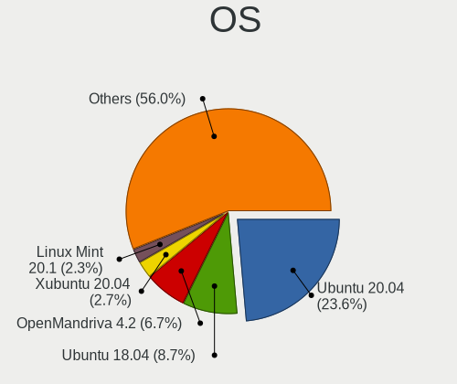

| Name              | Desktops | Percent |
|-------------------|----------|---------|
| Ubuntu 20.04      | 648      | 20.2%   |
| Ubuntu 18.04      | 216      | 6.73%   |
| OpenMandriva 4.2  | 173      | 5.39%   |
| Ubuntu 22.04      | 126      | 3.93%   |
| OpenMandriva 4.3  | 119      | 3.71%   |
| Debian 11         | 103      | 3.21%   |
| Xubuntu 20.04     | 74       | 2.31%   |
| Linux Mint 20.1   | 58       | 1.81%   |
| Debian 10         | 57       | 1.78%   |
| Linux Mint 20.3   | 55       | 1.71%   |
| Arch Rolling      | 54       | 1.68%   |
| Linux Mint 20.2   | 42       | 1.31%   |
| Ubuntu 20.10      | 41       | 1.28%   |
| Ubuntu 21.04      | 40       | 1.25%   |
| Ubuntu 21.10      | 39       | 1.22%   |
| Arch              | 37       | 1.15%   |
| Linux Mint 19.3   | 36       | 1.12%   |
| Kubuntu 20.04     | 36       | 1.12%   |
| Fedora 33         | 35       | 1.09%   |
| Linux Mint 20     | 33       | 1.03%   |
| KDE neon 20.04    | 31       | 0.97%   |
| Fedora 35         | 30       | 0.94%   |
| Ubuntu 19.04      | 29       | 0.9%    |
| Linux Mint 21     | 28       | 0.87%   |
| Manjaro           | 27       | 0.84%   |
| Ubuntu 19.10      | 26       | 0.81%   |
| OpenMandriva 4.50 | 25       | 0.78%   |
| Fedora 32         | 24       | 0.75%   |
| Fedora 34         | 23       | 0.72%   |
| Zorin 16          | 22       | 0.69%   |
| Xubuntu 18.04     | 22       | 0.69%   |
| ROSA R11          | 22       | 0.69%   |
| ROSA R10          | 22       | 0.69%   |
| Lubuntu 20.04     | 22       | 0.69%   |
| Ubuntu MATE 20.04 | 21       | 0.65%   |
| ROSA R9           | 21       | 0.65%   |
| Fedora 36         | 21       | 0.65%   |
| Pop!_OS 21.04     | 20       | 0.62%   |
| ROSA R11.1        | 19       | 0.59%   |
| Pop!_OS 22.04     | 19       | 0.59%   |

OS Family
---------

OS without a version

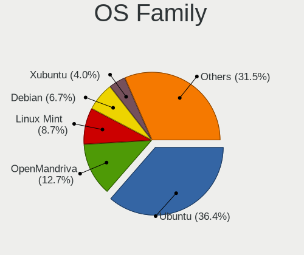

| Name          | Desktops | Percent |
|---------------|----------|---------|
| Ubuntu        | 1161     | 38.27%  |
| OpenMandriva  | 333      | 10.98%  |
| Linux Mint    | 252      | 8.31%   |
| Debian        | 185      | 6.1%    |
| Xubuntu       | 132      | 4.35%   |
| Fedora        | 126      | 4.15%   |
| ROSA          | 92       | 3.03%   |
| Arch          | 89       | 2.93%   |
| Manjaro       | 81       | 2.67%   |
| Kubuntu       | 71       | 2.34%   |
| Pop!_OS       | 66       | 2.18%   |
| Ubuntu MATE   | 43       | 1.42%   |
| Ubuntu Unity  | 40       | 1.32%   |
| Zorin         | 39       | 1.29%   |
| Lubuntu       | 38       | 1.25%   |
| KDE neon      | 34       | 1.12%   |
| openSUSE      | 20       | 0.66%   |
| Gentoo        | 19       | 0.63%   |
| ArcoLinux     | 17       | 0.56%   |
| LMDE          | 16       | 0.53%   |
| Ubuntu Budgie | 14       | 0.46%   |
| Mageia        | 14       | 0.46%   |
| Elementary    | 14       | 0.46%   |
| BlackPanther  | 13       | 0.43%   |
| CentOS        | 12       | 0.4%    |
| Clear Linux   | 11       | 0.36%   |
| Ubuntu Studio | 10       | 0.33%   |
| EndeavourOS   | 10       | 0.33%   |
| Kali          | 8        | 0.26%   |
| Endless       | 7        | 0.23%   |
| Artix         | 7        | 0.23%   |
| Nobara        | 6        | 0.2%    |
| Devuan        | 6        | 0.2%    |
| SteamOS       | 5        | 0.16%   |
| MX            | 5        | 0.16%   |
| Trisquel      | 4        | 0.13%   |
| Sparky        | 3        | 0.1%    |
| Solus         | 3        | 0.1%    |
| LinuxFX       | 3        | 0.1%    |
| Void Linux    | 2        | 0.07%   |

Kernel
------

Version of the Linux kernel

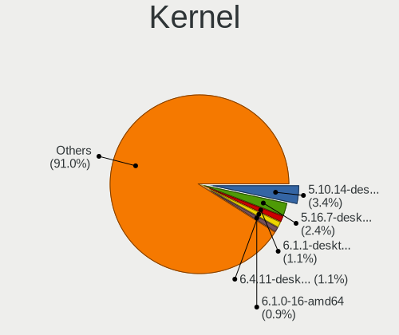

| Version                  | Desktops | Percent |
|--------------------------|----------|---------|
| 5.10.14-desktop-1omv4002 | 166      | 4.67%   |
| 5.16.7-desktop-1omv4003  | 114      | 3.21%   |
| 5.4.0-58-generic         | 50       | 1.41%   |
| 5.4.0-42-generic         | 44       | 1.24%   |
| 5.15.0-52-generic        | 38       | 1.07%   |
| 5.15.0-56-generic        | 33       | 0.93%   |
| 5.4.0-65-generic         | 31       | 0.87%   |
| 5.4.0-48-generic         | 31       | 0.87%   |
| 5.4.0-52-generic         | 30       | 0.84%   |
| 5.4.0-29-generic         | 30       | 0.84%   |
| 5.11.0-37-generic        | 30       | 0.84%   |
| 5.4.0-26-generic         | 28       | 0.79%   |
| 5.15.0-48-generic        | 28       | 0.79%   |
| 5.11.0-27-generic        | 28       | 0.79%   |
| 5.15.0-46-generic        | 27       | 0.76%   |
| 5.13.0-28-generic        | 27       | 0.76%   |
| 5.8.0-50-generic         | 26       | 0.73%   |
| 5.8.0-43-generic         | 26       | 0.73%   |
| 5.13.0-39-generic        | 26       | 0.73%   |
| 5.4.0-54-generic         | 25       | 0.7%    |
| 5.11.0-38-generic        | 23       | 0.65%   |
| 5.4.0-81-generic         | 21       | 0.59%   |
| 5.15.0-47-generic        | 21       | 0.59%   |
| 5.15.0-43-generic        | 21       | 0.59%   |
| 5.8.0-48-generic         | 20       | 0.56%   |
| 5.4.0-74-generic         | 20       | 0.56%   |
| 5.11.0-40-generic        | 20       | 0.56%   |
| 5.8.0-44-generic         | 19       | 0.53%   |
| 5.4.0-91-generic         | 19       | 0.53%   |
| 5.4.0-73-generic         | 19       | 0.53%   |
| 5.4.0-70-generic         | 19       | 0.53%   |
| 5.4.0-37-generic         | 19       | 0.53%   |
| 5.11.0-41-generic        | 19       | 0.53%   |
| 5.4.0-72-generic         | 18       | 0.51%   |
| 5.4.0-66-generic         | 18       | 0.51%   |
| 5.11.0-43-generic        | 18       | 0.51%   |
| 5.8.0-59-generic         | 17       | 0.48%   |
| 5.4.0-53-generic         | 17       | 0.48%   |
| 5.15.0-53-generic        | 17       | 0.48%   |
| 5.15.0-41-generic        | 17       | 0.48%   |

Kernel Family
-------------

Linux kernel without a distro release

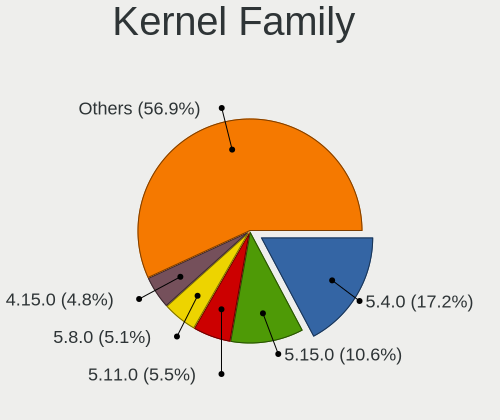

| Version | Desktops | Percent |
|---------|----------|---------|
| 5.4.0   | 711      | 21.46%  |
| 5.15.0  | 256      | 7.73%   |
| 5.11.0  | 236      | 7.12%   |
| 5.8.0   | 217      | 6.55%   |
| 4.15.0  | 199      | 6.01%   |
| 5.13.0  | 179      | 5.4%    |
| 5.10.14 | 168      | 5.07%   |
| 5.16.7  | 116      | 3.5%    |
| 5.10.0  | 107      | 3.23%   |
| 5.3.0   | 104      | 3.14%   |
| 5.0.0   | 60       | 1.81%   |
| 4.18.0  | 59       | 1.78%   |
| 4.19.0  | 58       | 1.75%   |
| 5.19.0  | 25       | 0.75%   |
| 4.9.20  | 19       | 0.57%   |
| 4.9.60  | 16       | 0.48%   |
| 5.18.0  | 14       | 0.42%   |
| 5.18.12 | 13       | 0.39%   |
| 5.12.4  | 13       | 0.39%   |
| 5.4.32  | 11       | 0.33%   |
| 5.11.12 | 11       | 0.33%   |
| 4.4.0   | 11       | 0.33%   |
| 4.18.16 | 11       | 0.33%   |
| 6.0.0   | 9        | 0.27%   |
| 5.19.12 | 9        | 0.27%   |
| 5.17.5  | 9        | 0.27%   |
| 5.9.16  | 8        | 0.24%   |
| 5.9.0   | 8        | 0.24%   |
| 5.8.16  | 7        | 0.21%   |
| 5.6.19  | 7        | 0.21%   |
| 5.14.14 | 7        | 0.21%   |
| 5.13.19 | 7        | 0.21%   |
| 5.13.13 | 7        | 0.21%   |
| 5.13.12 | 7        | 0.21%   |
| 3.10.0  | 7        | 0.21%   |
| 5.9.1   | 6        | 0.18%   |
| 5.7.0   | 6        | 0.18%   |
| 5.19.5  | 6        | 0.18%   |
| 5.14.0  | 6        | 0.18%   |
| 4.9.9   | 6        | 0.18%   |

Kernel Major Ver.
-----------------

Linux kernel major version

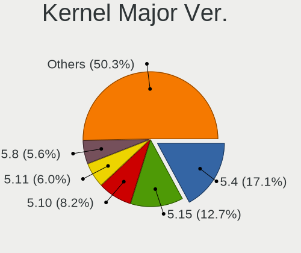

| Version | Desktops | Percent |
|---------|----------|---------|
| 5.4     | 752      | 22.96%  |
| 5.10    | 319      | 9.74%   |
| 5.15    | 313      | 9.56%   |
| 5.11    | 273      | 8.34%   |
| 5.8     | 259      | 7.91%   |
| 5.13    | 213      | 6.5%    |
| 4.15    | 200      | 6.11%   |
| 5.16    | 158      | 4.82%   |
| 5.3     | 118      | 3.6%    |
| 4.18    | 71       | 2.17%   |
| 5.0     | 67       | 2.05%   |
| 4.19    | 65       | 1.98%   |
| 4.9     | 62       | 1.89%   |
| 5.19    | 57       | 1.74%   |
| 5.18    | 52       | 1.59%   |
| 5.9     | 43       | 1.31%   |
| 5.17    | 37       | 1.13%   |
| 6.0     | 32       | 0.98%   |
| 5.6     | 29       | 0.89%   |
| 5.14    | 29       | 0.89%   |
| 5.7     | 27       | 0.82%   |
| 5.12    | 27       | 0.82%   |
| 5.5     | 15       | 0.46%   |
| 4.1     | 13       | 0.4%    |
| 4.4     | 12       | 0.37%   |
| 3.10    | 7        | 0.21%   |
| 4.20    | 5        | 0.15%   |
| 4.12    | 4        | 0.12%   |
| 6.1     | 3        | 0.09%   |
| 5.2     | 3        | 0.09%   |
| 4.14    | 3        | 0.09%   |
| 5.1     | 2        | 0.06%   |
| 4.8     | 2        | 0.06%   |
| 4.13    | 2        | 0.06%   |
| 2.6     | 1        | 0.03%   |

Arch
----

OS architecture (x86_64, i586, etc.)

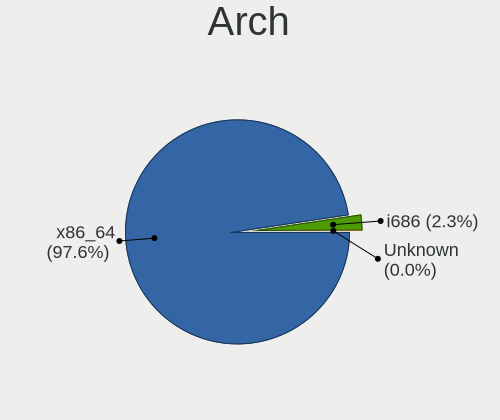

| Name   | Desktops | Percent |
|--------|----------|---------|
| x86_64 | 2841     | 96.76%  |
| i686   | 93       | 3.17%   |
| armv7l | 2        | 0.07%   |

DE
--

Desktop Environment

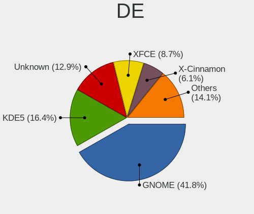

| Name            | Desktops | Percent |
|-----------------|----------|---------|
| GNOME           | 1244     | 40.59%  |
| KDE5            | 562      | 18.34%  |
| Unknown         | 357      | 11.65%  |
| XFCE            | 271      | 8.84%   |
| X-Cinnamon      | 198      | 6.46%   |
| MATE            | 117      | 3.82%   |
| KDE4            | 59       | 1.92%   |
| KDE             | 50       | 1.63%   |
| Unity           | 40       | 1.31%   |
| LXQt            | 40       | 1.31%   |
| Cinnamon        | 33       | 1.08%   |
| Budgie          | 16       | 0.52%   |
| Pantheon        | 15       | 0.49%   |
| LXDE            | 15       | 0.49%   |
| i3              | 11       | 0.36%   |
| GNOME Flashback | 8        | 0.26%   |
| GNOME Classic   | 7        | 0.23%   |
| qtile           | 4        | 0.13%   |
| Deepin          | 3        | 0.1%    |
| bspwm           | 3        | 0.1%    |
| sway            | 2        | 0.07%   |
| awesome         | 2        | 0.07%   |
| trinity         | 1        | 0.03%   |
| Openbox         | 1        | 0.03%   |
| LeftWM          | 1        | 0.03%   |
| ICEWM           | 1        | 0.03%   |
| GNUstep         | 1        | 0.03%   |
| fluxbox         | 1        | 0.03%   |
| Enlightenment   | 1        | 0.03%   |
| DWM             | 1        | 0.03%   |

Display Server
--------------

X11 or Wayland

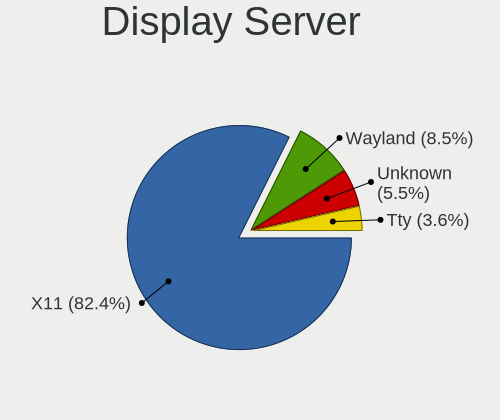

| Name    | Desktops | Percent |
|---------|----------|---------|
| X11     | 2480     | 82.26%  |
| Wayland | 265      | 8.79%   |
| Unknown | 160      | 5.31%   |
| Tty     | 110      | 3.65%   |

Display Manager
---------------

SDDM, LightDM, etc.

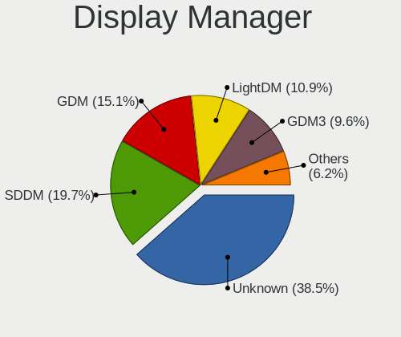

| Name    | Desktops | Percent |
|---------|----------|---------|
| Unknown | 1247     | 40.62%  |
| SDDM    | 566      | 18.44%  |
| GDM     | 472      | 15.37%  |
| LightDM | 320      | 10.42%  |
| GDM3    | 256      | 8.34%   |
| TDM     | 139      | 4.53%   |
| KDM     | 58       | 1.89%   |
| Ly      | 4        | 0.13%   |
| SLiM    | 3        | 0.1%    |
| XDM     | 2        | 0.07%   |
| WDM     | 1        | 0.03%   |
| NODM    | 1        | 0.03%   |
| LXDM    | 1        | 0.03%   |

OS Lang
-------

Language

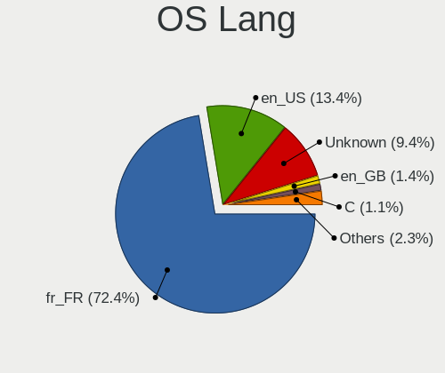

| Lang        | Desktops | Percent |
|-------------|----------|---------|
| fr_FR       | 2141     | 71.51%  |
| en_US       | 397      | 13.26%  |
| Unknown     | 313      | 10.45%  |
| en_GB       | 41       | 1.37%   |
| C           | 34       | 1.14%   |
| de_DE       | 11       | 0.37%   |
| ru_RU       | 8        | 0.27%   |
| nl_NL       | 5        | 0.17%   |
| es_ES       | 5        | 0.17%   |
| pt_PT       | 4        | 0.13%   |
| it_IT       | 3        | 0.1%    |
| fr_CA       | 3        | 0.1%    |
| C.UTF8      | 3        | 0.1%    |
| sv_SE       | 2        | 0.07%   |
| fr_FR.UTF8  | 2        | 0.07%   |
| fr_CH       | 2        | 0.07%   |
| fr_BE       | 2        | 0.07%   |
| en_IE       | 2        | 0.07%   |
| en_DK       | 2        | 0.07%   |
| sr_RS@latin | 1        | 0.03%   |
| sr_RS       | 1        | 0.03%   |
| ru_UA       | 1        | 0.03%   |
| POSIX       | 1        | 0.03%   |
| fr_LU       | 1        | 0.03%   |
| fr_FR.utf-8 | 1        | 0.03%   |
| fi_FI       | 1        | 0.03%   |
| es_ES@euro  | 1        | 0.03%   |
| es_BO       | 1        | 0.03%   |
| en_US.utf-8 | 1        | 0.03%   |
| en_EN       | 1        | 0.03%   |
| en_AU       | 1        | 0.03%   |
| en_AG       | 1        | 0.03%   |
| ar_SA       | 1        | 0.03%   |

Boot Mode
---------

EFI or BIOS

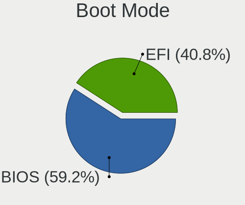

| Mode | Desktops | Percent |
|------|----------|---------|
| BIOS | 1800     | 60.14%  |
| EFI  | 1193     | 39.86%  |

Filesystem
----------

Type of filesystem

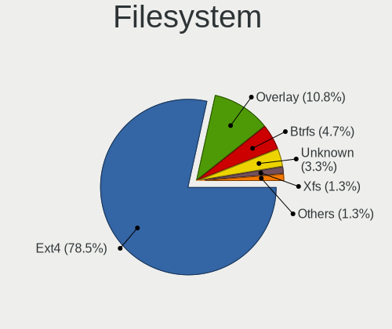

| Type     | Desktops | Percent |
|----------|----------|---------|
| Ext4     | 2351     | 78.37%  |
| Overlay  | 326      | 10.87%  |
| Btrfs    | 146      | 4.87%   |
| Unknown  | 97       | 3.23%   |
| Xfs      | 40       | 1.33%   |
| Zfs      | 21       | 0.7%    |
| Ext2     | 6        | 0.2%    |
| Ext3     | 5        | 0.17%   |
| F2fs     | 3        | 0.1%    |
| Reiserfs | 2        | 0.07%   |
| Tmpfs    | 1        | 0.03%   |
| Rootfs   | 1        | 0.03%   |
| Aufs     | 1        | 0.03%   |

Part. scheme
------------

Scheme of partitioning

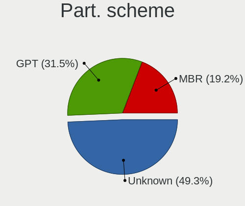

| Type    | Desktops | Percent |
|---------|----------|---------|
| Unknown | 1341     | 44.46%  |
| GPT     | 1077     | 35.71%  |
| MBR     | 598      | 19.83%  |

Dual Boot with Linux/BSD
------------------------

Hosting more than one Linux/BSD

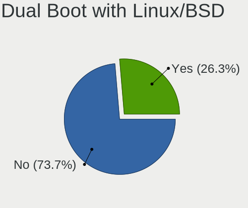

| Dual boot | Desktops | Percent |
|-----------|----------|---------|
| No        | 2210     | 73.69%  |
| Yes       | 789      | 26.31%  |

Dual Boot (Win)
---------------

Hosting Linux and Windows

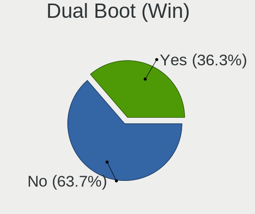

| Dual boot | Desktops | Percent |
|-----------|----------|---------|
| No        | 1894     | 62.94%  |
| Yes       | 1115     | 37.06%  |

Board
-----

Vendor
------

Motherboard manufacturer

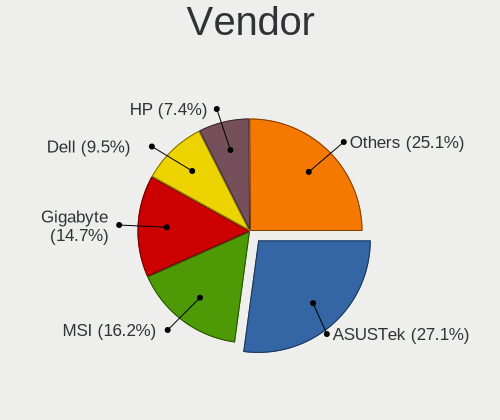

| Name                        | Desktops | Percent |
|-----------------------------|----------|---------|
| ASUSTek Computer            | 831      | 28.32%  |
| MSI                         | 488      | 16.63%  |
| Gigabyte Technology         | 419      | 14.28%  |
| Dell                        | 269      | 9.17%   |
| Hewlett-Packard             | 200      | 6.82%   |
| ASRock                      | 187      | 6.37%   |
| Lenovo                      | 91       | 3.1%    |
| Acer                        | 72       | 2.45%   |
| Intel                       | 49       | 1.67%   |
| Foxconn                     | 44       | 1.5%    |
| Pegatron                    | 37       | 1.26%   |
| Unknown                     | 33       | 1.12%   |
| Packard Bell                | 31       | 1.06%   |
| Medion                      | 17       | 0.58%   |
| Fujitsu                     | 17       | 0.58%   |
| eMachines                   | 16       | 0.55%   |
| Supermicro                  | 13       | 0.44%   |
| Shuttle                     | 13       | 0.44%   |
| ECS                         | 13       | 0.44%   |
| AZW                         | 8        | 0.27%   |
| Biostar                     | 7        | 0.24%   |
| Apple                       | 7        | 0.24%   |
| AMI                         | 6        | 0.2%    |
| Alienware                   | 6        | 0.2%    |
| ASRockRack                  | 5        | 0.17%   |
| NEC Computers               | 4        | 0.14%   |
| Huanan                      | 4        | 0.14%   |
| Fujitsu Siemens             | 4        | 0.14%   |
| BESSTAR Tech                | 4        | 0.14%   |
| ZOTAC                       | 3        | 0.1%    |
| OEM                         | 3        | 0.1%    |
| ABIT                        | 3        | 0.1%    |
| ICP / iEi                   | 2        | 0.07%   |
| Gateway                     | 2        | 0.07%   |
| Wistron                     | 1        | 0.03%   |
| WinFast                     | 1        | 0.03%   |
| Vorke                       | 1        | 0.03%   |
| TYAN Computer               | 1        | 0.03%   |
| TECO Electric and Machinery | 1        | 0.03%   |
| SiYW                        | 1        | 0.03%   |

Model
-----

Motherboard model

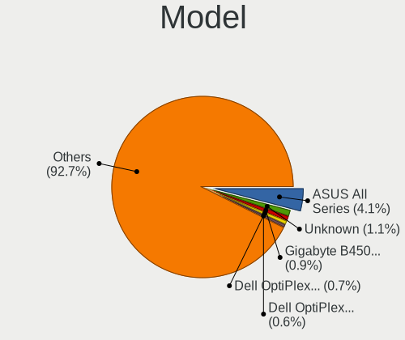

| Name                        | Desktops | Percent |
|-----------------------------|----------|---------|
| ASUS All Series             | 108      | 3.68%   |
| Unknown                     | 35       | 1.19%   |
| Gigabyte B450M DS3H         | 29       | 0.99%   |
| Dell OptiPlex 7010          | 18       | 0.61%   |
| Dell OptiPlex 390           | 18       | 0.61%   |
| Dell OptiPlex 9020          | 16       | 0.55%   |
| MSI MS-7C91                 | 15       | 0.51%   |
| ASUS PRIME A320M-K          | 15       | 0.51%   |
| MSI MS-7C02                 | 13       | 0.44%   |
| Gigabyte 970A-DS3P          | 13       | 0.44%   |
| MSI MS-7C37                 | 12       | 0.41%   |
| MSI MS-7817                 | 12       | 0.41%   |
| MSI MS-7816                 | 12       | 0.41%   |
| MSI MS-7758                 | 12       | 0.41%   |
| MSI MS-7693                 | 12       | 0.41%   |
| Dell OptiPlex 3020          | 12       | 0.41%   |
| HP Compaq Elite 8300 SFF    | 11       | 0.37%   |
| MSI MS-7B79                 | 10       | 0.34%   |
| MSI MS-7A38                 | 10       | 0.34%   |
| Gigabyte B450 AORUS ELITE   | 10       | 0.34%   |
| ASUS TUF Gaming X570-PLUS   | 10       | 0.34%   |
| ASUS PRIME X470-PRO         | 10       | 0.34%   |
| ASUS PRIME B450M-A          | 10       | 0.34%   |
| MSI MS-7B86                 | 9        | 0.31%   |
| MSI MS-7850                 | 9        | 0.31%   |
| ASUS P7P55D                 | 9        | 0.31%   |
| ASRock B450M Pro4           | 9        | 0.31%   |
| MSI MS-7A34                 | 8        | 0.27%   |
| MSI MS-7A32                 | 8        | 0.27%   |
| MSI MS-7821                 | 8        | 0.27%   |
| HP Compaq 8200 Elite SFF PC | 8        | 0.27%   |
| Gigabyte G41M-Combo         | 8        | 0.27%   |
| eMachines EL1352            | 8        | 0.27%   |
| Dell OptiPlex 3010          | 8        | 0.27%   |
| ASUS TUF B450-PLUS GAMING   | 8        | 0.27%   |
| ASUS P8Z77-V                | 8        | 0.27%   |
| MSI MS-7B89                 | 7        | 0.24%   |
| MSI MS-7B84                 | 7        | 0.24%   |
| MSI MS-7721                 | 7        | 0.24%   |
| MSI MS-7597                 | 7        | 0.24%   |

Model Family
------------

Motherboard model prefix

| Name                | Desktops | Percent |
|---------------------|----------|---------|
| Dell OptiPlex       | 159      | 5.42%   |
| ASUS PRIME          | 124      | 4.23%   |
| ASUS All            | 108      | 3.68%   |
| Lenovo ThinkCentre  | 72       | 2.45%   |
| Dell Precision      | 71       | 2.42%   |
| HP Compaq           | 70       | 2.39%   |
| ASUS ROG            | 66       | 2.25%   |
| ASUS TUF            | 55       | 1.87%   |
| Acer Aspire         | 42       | 1.43%   |
| Unknown             | 35       | 1.19%   |
| Gigabyte B450M      | 34       | 1.16%   |
| Packard Bell IMEDIA | 24       | 0.82%   |
| ASUS P8Z77-V        | 24       | 0.82%   |
| HP ProDesk          | 22       | 0.75%   |
| HP EliteDesk        | 22       | 0.75%   |
| Gigabyte B450       | 20       | 0.68%   |
| Acer Veriton        | 19       | 0.65%   |
| Gigabyte X570       | 17       | 0.58%   |
| MSI MS-7C91         | 15       | 0.51%   |
| Dell Inspiron       | 15       | 0.51%   |
| Gigabyte 970A-DS3P  | 14       | 0.48%   |
| Fujitsu ESPRIMO     | 14       | 0.48%   |
| ASUS P7P55D         | 14       | 0.48%   |
| MSI MS-7C02         | 13       | 0.44%   |
| HP ProLiant         | 13       | 0.44%   |
| HP Pavilion         | 13       | 0.44%   |
| ASUS P8P67          | 13       | 0.44%   |
| ASRock B450M        | 13       | 0.44%   |
| MSI MS-7C37         | 12       | 0.41%   |
| MSI MS-7817         | 12       | 0.41%   |
| MSI MS-7816         | 12       | 0.41%   |
| MSI MS-7758         | 12       | 0.41%   |
| MSI MS-7693         | 12       | 0.41%   |
| ASUS P8H61-M        | 12       | 0.41%   |
| Gigabyte Z390       | 11       | 0.37%   |
| ASUS Maximus        | 11       | 0.37%   |
| ASUS M5A78L-M       | 11       | 0.37%   |
| MSI MS-7B79         | 10       | 0.34%   |
| MSI MS-7A38         | 10       | 0.34%   |
| Dell XPS            | 10       | 0.34%   |

MFG Year
--------

Motherboard manufacture year

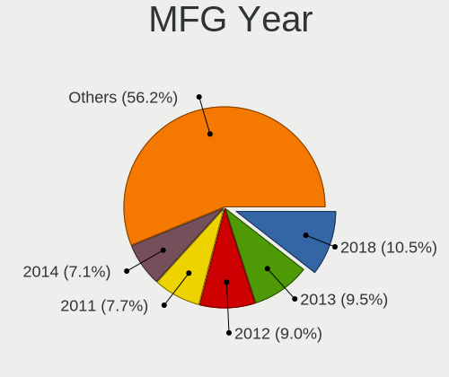

| Year    | Desktops | Percent |
|---------|----------|---------|
| 2018    | 309      | 10.53%  |
| 2012    | 279      | 9.51%   |
| 2013    | 278      | 9.48%   |
| 2011    | 222      | 7.57%   |
| 2014    | 207      | 7.06%   |
| 2010    | 195      | 6.65%   |
| 2009    | 184      | 6.27%   |
| 2019    | 182      | 6.2%    |
| 2020    | 179      | 6.1%    |
| 2017    | 170      | 5.79%   |
| 2015    | 156      | 5.32%   |
| 2008    | 143      | 4.87%   |
| 2016    | 116      | 3.95%   |
| 2021    | 95       | 3.24%   |
| 2007    | 93       | 3.17%   |
| 2006    | 58       | 1.98%   |
| 2005    | 31       | 1.06%   |
| 2022    | 18       | 0.61%   |
| 2004    | 9        | 0.31%   |
| 2003    | 5        | 0.17%   |
| Unknown | 3        | 0.1%    |
| 2002    | 1        | 0.03%   |
| 2001    | 1        | 0.03%   |

Form Factor
-----------

Physical design of the computer

| Name    | Desktops | Percent |
|---------|----------|---------|
| Desktop | 2934     | 100%    |

Secure Boot
-----------

Enabled or disabled

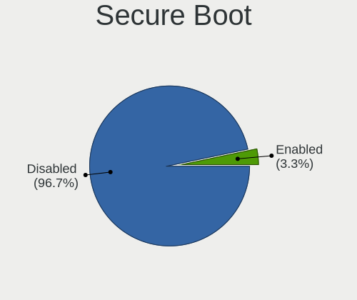

| State    | Desktops | Percent |
|----------|----------|---------|
| Disabled | 2856     | 97.11%  |
| Enabled  | 85       | 2.89%   |

Coreboot
--------

Have coreboot on board

| Used | Desktops | Percent |
|------|----------|---------|
| No   | 2933     | 99.97%  |
| Yes  | 1        | 0.03%   |

RAM Size
--------

Total RAM memory

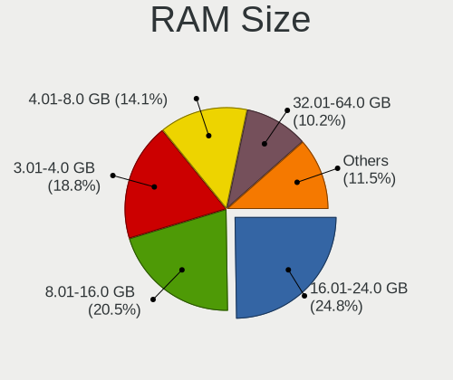

| Size in GB      | Desktops | Percent |
|-----------------|----------|---------|
| 16.01-24.0      | 743      | 24.86%  |
| 8.01-16.0       | 607      | 20.31%  |
| 3.01-4.0        | 556      | 18.6%   |
| 4.01-8.0        | 425      | 14.22%  |
| 32.01-64.0      | 323      | 10.81%  |
| 1.01-2.0        | 112      | 3.75%   |
| 64.01-256.0     | 86       | 2.88%   |
| 24.01-32.0      | 68       | 2.28%   |
| 2.01-3.0        | 44       | 1.47%   |
| 0.51-1.0        | 18       | 0.6%    |
| 0.01-0.5        | 3        | 0.1%    |
| Unknown         | 3        | 0.1%    |
| More than 256.0 | 1        | 0.03%   |

RAM Used
--------

Used RAM memory

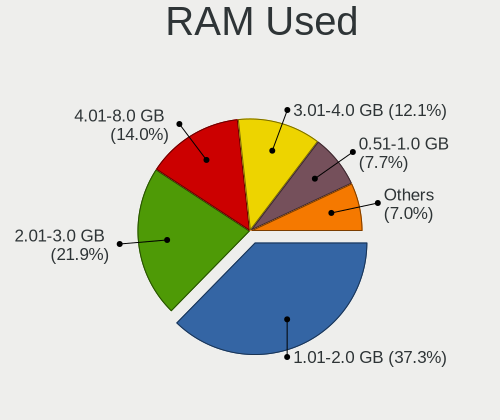

| Used GB     | Desktops | Percent |
|-------------|----------|---------|
| 1.01-2.0    | 1196     | 36.91%  |
| 2.01-3.0    | 708      | 21.85%  |
| 4.01-8.0    | 458      | 14.14%  |
| 3.01-4.0    | 393      | 12.13%  |
| 0.51-1.0    | 255      | 7.87%   |
| 8.01-16.0   | 134      | 4.14%   |
| 0.01-0.5    | 50       | 1.54%   |
| 16.01-24.0  | 27       | 0.83%   |
| 32.01-64.0  | 8        | 0.25%   |
| 24.01-32.0  | 6        | 0.19%   |
| Unknown     | 4        | 0.12%   |
| 64.01-256.0 | 1        | 0.03%   |

Total Drives
------------

Number of drives on board

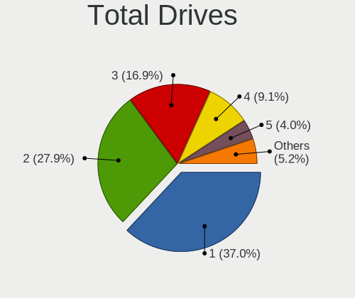

| Drives  | Desktops | Percent |
|---------|----------|---------|
| 1       | 1132     | 37.01%  |
| 2       | 871      | 28.47%  |
| 3       | 513      | 16.77%  |
| 4       | 277      | 9.06%   |
| 5       | 131      | 4.28%   |
| 6       | 61       | 1.99%   |
| 7       | 27       | 0.88%   |
| 0       | 25       | 0.82%   |
| 8       | 11       | 0.36%   |
| 9       | 5        | 0.16%   |
| Unknown | 3        | 0.1%    |
| 22      | 1        | 0.03%   |
| 14      | 1        | 0.03%   |
| 11      | 1        | 0.03%   |

Has CD-ROM
----------

Has CD-ROM on board

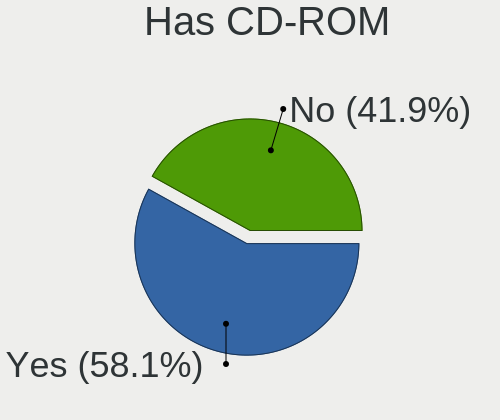

| Presented | Desktops | Percent |
|-----------|----------|---------|
| Yes       | 1702     | 57.15%  |
| No        | 1276     | 42.85%  |

Has Ethernet
------------

Has Ethernet on board

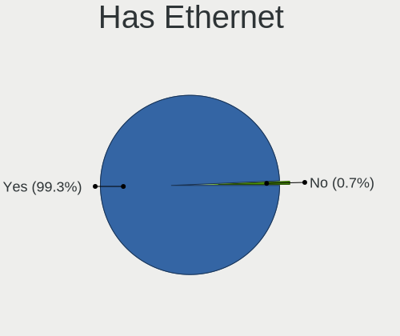

| Presented | Desktops | Percent |
|-----------|----------|---------|
| Yes       | 2916     | 99.39%  |
| No        | 18       | 0.61%   |

Has WiFi
--------

Has WiFi module

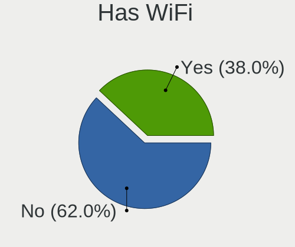

| Presented | Desktops | Percent |
|-----------|----------|---------|
| No        | 1836     | 61.53%  |
| Yes       | 1148     | 38.47%  |

Has Bluetooth
-------------

Has Bluetooth module

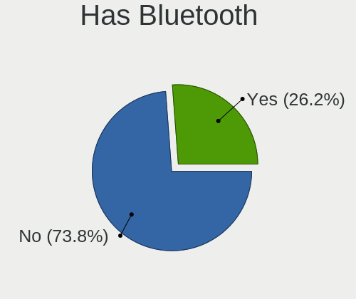

| Presented | Desktops | Percent |
|-----------|----------|---------|
| No        | 2222     | 74.74%  |
| Yes       | 751      | 25.26%  |

Location
--------

Country
-------

Geographic location (country)

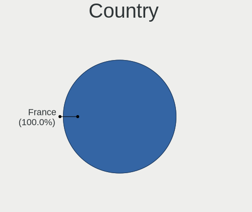

| Country | Desktops | Percent |
|---------|----------|---------|
| France  | 2934     | 100%    |

City
----

Geographic location (city)

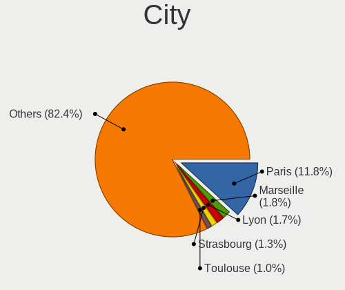

| City                 | Desktops | Percent |
|----------------------|----------|---------|
| Paris                | 383      | 12.2%   |
| Lyon                 | 57       | 1.82%   |
| Marseille            | 53       | 1.69%   |
| Strasbourg           | 43       | 1.37%   |
| Nantes               | 35       | 1.11%   |
| Toulouse             | 31       | 0.99%   |
| Roubaix              | 29       | 0.92%   |
| Nice                 | 27       | 0.86%   |
| Clichy-sous-Bois     | 25       | 0.8%    |
| Montpellier          | 24       | 0.76%   |
| Tours                | 20       | 0.64%   |
| Rennes               | 20       | 0.64%   |
| Bordeaux             | 20       | 0.64%   |
| Grenoble             | 19       | 0.61%   |
| Lille                | 17       | 0.54%   |
| Toulon               | 16       | 0.51%   |
| Nîmes               | 15       | 0.48%   |
| La Rochelle          | 15       | 0.48%   |
| Amiens               | 13       | 0.41%   |
| Poitiers             | 12       | 0.38%   |
| Pau                  | 11       | 0.35%   |
| Dijon                | 11       | 0.35%   |
| Brest                | 11       | 0.35%   |
| Aubervilliers        | 11       | 0.35%   |
| Niort                | 10       | 0.32%   |
| Limoges              | 10       | 0.32%   |
| Clermont-Ferrand     | 10       | 0.32%   |
| Vannes               | 9        | 0.29%   |
| Rouen                | 9        | 0.29%   |
| Perpignan            | 9        | 0.29%   |
| Caen                 | 9        | 0.29%   |
| Besançon            | 9        | 0.29%   |
| Argenteuil           | 9        | 0.29%   |
| Aix-en-Provence      | 9        | 0.29%   |
| Violes               | 8        | 0.25%   |
| Vélizy-Villacoublay | 8        | 0.25%   |
| Suresnes             | 8        | 0.25%   |
| Mieuxce              | 8        | 0.25%   |
| Metz                 | 8        | 0.25%   |
| Colomiers            | 8        | 0.25%   |

Drives
------

Drive Vendor
------------

Hard drive vendors

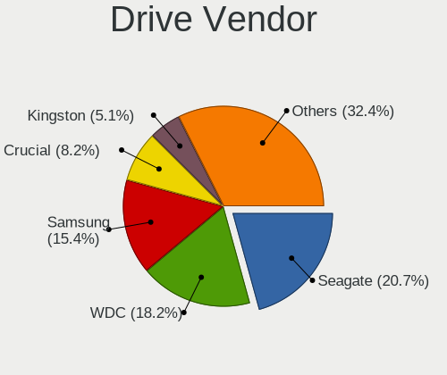

| Vendor                    | Desktops | Drives | Percent |
|---------------------------|----------|--------|---------|
| Seagate                   | 1158     | 1876   | 21.52%  |
| WDC                       | 1004     | 1686   | 18.65%  |
| Samsung Electronics       | 824      | 1421   | 15.31%  |
| Crucial                   | 435      | 638    | 8.08%   |
| Kingston                  | 277      | 344    | 5.15%   |
| Toshiba                   | 269      | 368    | 5%      |
| SanDisk                   | 195      | 252    | 3.62%   |
| Hitachi                   | 190      | 255    | 3.53%   |
| Maxtor                    | 93       | 120    | 1.73%   |
| PNY                       | 87       | 108    | 1.62%   |
| Intel                     | 72       | 90     | 1.34%   |
| Unknown                   | 62       | 91     | 1.15%   |
| HGST                      | 57       | 89     | 1.06%   |
| Phison                    | 48       | 64     | 0.89%   |
| Corsair                   | 46       | 52     | 0.85%   |
| OCZ                       | 41       | 54     | 0.76%   |
| LDLC                      | 40       | 65     | 0.74%   |
| China                     | 39       | 51     | 0.72%   |
| Micron/Crucial Technology | 33       | 47     | 0.61%   |
| SK hynix                  | 31       | 38     | 0.58%   |
| Transcend                 | 30       | 37     | 0.56%   |
| A-DATA Technology         | 22       | 25     | 0.41%   |
| SPCC                      | 21       | 30     | 0.39%   |
| Micron Technology         | 20       | 25     | 0.37%   |
| Gigabyte Technology       | 12       | 15     | 0.22%   |
| Emtec                     | 12       | 15     | 0.22%   |
| Intenso                   | 11       | 13     | 0.2%    |
| Hewlett-Packard           | 10       | 17     | 0.19%   |
| Unknown                   | 10       | 13     | 0.19%   |
| TEXTORM                   | 9        | 10     | 0.17%   |
| ASMT                      | 9        | 10     | 0.17%   |
| Silicon Motion            | 8        | 15     | 0.15%   |
| Patriot                   | 8        | 13     | 0.15%   |
| LITEONIT                  | 8        | 8      | 0.15%   |
| Fujitsu                   | 8        | 17     | 0.15%   |
| JMicron Technology        | 7        | 11     | 0.13%   |
| Phison Electronics        | 6        | 7      | 0.11%   |
| Magnetic Data             | 6        | 7      | 0.11%   |
| LITEON                    | 6        | 6      | 0.11%   |
| KingSpec                  | 6        | 8      | 0.11%   |

Drive Model
-----------

Hard drive models

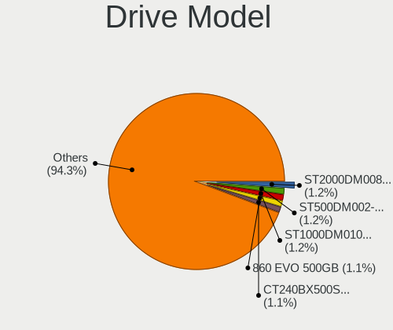

| Model                            | Desktops | Percent |
|----------------------------------|----------|---------|
| Seagate ST500DM002-1BD142 500GB  | 76       | 1.21%   |
| Seagate ST1000DM010-2EP102 1TB   | 76       | 1.21%   |
| Samsung SSD 860 EVO 500GB        | 75       | 1.2%    |
| Seagate ST2000DM008-2FR102 2TB   | 70       | 1.12%   |
| Crucial CT240BX500SSD1 240GB     | 65       | 1.04%   |
| Samsung SSD 850 EVO 250GB        | 64       | 1.02%   |
| Seagate ST2000DM001-1ER164 2TB   | 55       | 0.88%   |
| Seagate ST1000DM003-1ER162 1TB   | 54       | 0.86%   |
| Crucial CT500MX500SSD1 500GB     | 53       | 0.85%   |
| Samsung SSD 850 EVO 500GB        | 51       | 0.81%   |
| Seagate ST1000DM003-1CH162 1TB   | 50       | 0.8%    |
| Toshiba DT01ACA100 1TB           | 47       | 0.75%   |
| Seagate ST2000DM001-1CH164 2TB   | 47       | 0.75%   |
| Samsung SSD 860 EVO 1TB          | 43       | 0.69%   |
| Kingston SA400S37240G 240GB SSD  | 43       | 0.69%   |
| Samsung SSD 860 EVO 250GB        | 41       | 0.65%   |
| Crucial CT1000MX500SSD1 1TB      | 40       | 0.64%   |
| Seagate ST2000DM006-2DM164 2TB   | 39       | 0.62%   |
| Samsung NVMe SSD Drive 500GB     | 38       | 0.61%   |
| WDC WD10EZEX-08WN4A0 1TB         | 36       | 0.57%   |
| Samsung HD103SJ 1TB              | 35       | 0.56%   |
| Kingston SA400S37120G 120GB SSD  | 34       | 0.54%   |
| Crucial CT480BX500SSD1 480GB     | 34       | 0.54%   |
| Seagate ST3500418AS 500GB        | 32       | 0.51%   |
| Kingston SV300S37A120G 120GB SSD | 32       | 0.51%   |
| Unknown SD/MMC/MS PRO 64GB       | 31       | 0.49%   |
| Seagate ST4000DM004-2CV104 4TB   | 29       | 0.46%   |
| Samsung SSD 860 QVO 1TB          | 28       | 0.45%   |
| Seagate ST31000524AS 1TB         | 27       | 0.43%   |
| PNY CS900 120GB SSD              | 27       | 0.43%   |
| Kingston SA400S37480G 480GB SSD  | 27       | 0.43%   |
| WDC WD20EZRX-00D8PB0 2TB         | 26       | 0.42%   |
| PNY CS900 240GB SSD              | 26       | 0.42%   |
| Toshiba DT01ACA050 500GB         | 25       | 0.4%    |
| Samsung SSD 870 QVO 1TB          | 25       | 0.4%    |
| WDC WD20EZRZ-00Z5HB0 2TB         | 24       | 0.38%   |
| Toshiba HDWD110 1TB              | 24       | 0.38%   |
| Seagate ST31000528AS 1TB         | 23       | 0.37%   |
| Seagate ST1000DM003-1SB102 1TB   | 23       | 0.37%   |
| Samsung SSD 970 EVO Plus 500GB   | 23       | 0.37%   |

HDD Vendor
----------

Hard disk drive vendors

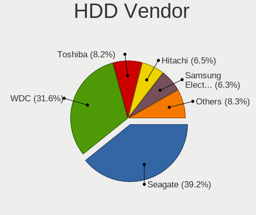

| Vendor              | Desktops | Drives | Percent |
|---------------------|----------|--------|---------|
| Seagate             | 1145     | 1834   | 39.08%  |
| WDC                 | 933      | 1561   | 31.84%  |
| Toshiba             | 247      | 330    | 8.43%   |
| Hitachi             | 190      | 255    | 6.48%   |
| Samsung Electronics | 184      | 271    | 6.28%   |
| Maxtor              | 93       | 120    | 3.17%   |
| HGST                | 57       | 89     | 1.95%   |
| Unknown             | 33       | 40     | 1.13%   |
| Fujitsu             | 8        | 17     | 0.27%   |
| Hewlett-Packard     | 7        | 13     | 0.24%   |
| ASMT                | 7        | 8      | 0.24%   |
| Magnetic Data       | 5        | 5      | 0.17%   |
| ASMT109x            | 3        | 4      | 0.1%    |
| USB3.0              | 2        | 2      | 0.07%   |
| LaCie               | 2        | 2      | 0.07%   |
| ASMedia             | 2        | 2      | 0.07%   |
| Apple               | 2        | 2      | 0.07%   |
| USB                 | 1        | 2      | 0.03%   |
| Storeva             | 1        | 1      | 0.03%   |
| RSH-319             | 1        | 1      | 0.03%   |
| QEMU                | 1        | 1      | 0.03%   |
| PHD 3.0             | 1        | 1      | 0.03%   |
| MDT                 | 1        | 1      | 0.03%   |
| MARVELL             | 1        | 1      | 0.03%   |
| Intenso             | 1        | 2      | 0.03%   |
| Inateck             | 1        | 1      | 0.03%   |
| H/W                 | 1        | 1      | 0.03%   |

SSD Vendor
----------

Solid state drive vendors

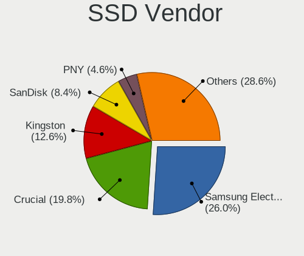

| Vendor              | Desktops | Drives | Percent |
|---------------------|----------|--------|---------|
| Samsung Electronics | 518      | 787    | 27.05%  |
| Crucial             | 388      | 564    | 20.26%  |
| Kingston            | 249      | 308    | 13%     |
| SanDisk             | 165      | 207    | 8.62%   |
| PNY                 | 82       | 99     | 4.28%   |
| WDC                 | 64       | 79     | 3.34%   |
| Intel               | 54       | 68     | 2.82%   |
| OCZ                 | 40       | 50     | 2.09%   |
| China               | 37       | 49     | 1.93%   |
| Transcend           | 29       | 36     | 1.51%   |
| Corsair             | 28       | 31     | 1.46%   |
| LDLC                | 25       | 32     | 1.31%   |
| SPCC                | 19       | 28     | 0.99%   |
| A-DATA Technology   | 18       | 21     | 0.94%   |
| SK hynix            | 17       | 22     | 0.89%   |
| Toshiba             | 16       | 24     | 0.84%   |
| Micron Technology   | 12       | 15     | 0.63%   |
| Emtec               | 10       | 12     | 0.52%   |
| Intenso             | 9        | 10     | 0.47%   |
| TEXTORM             | 8        | 9      | 0.42%   |
| Patriot             | 8        | 13     | 0.42%   |
| LITEONIT            | 8        | 8      | 0.42%   |
| Unknown             | 8        | 10     | 0.42%   |
| JMicron Technology  | 7        | 11     | 0.37%   |
| KingSpec            | 6        | 8      | 0.31%   |
| Verbatim            | 5        | 5      | 0.26%   |
| Plextor             | 5        | 5      | 0.26%   |
| LITEON              | 5        | 5      | 0.26%   |
| TO Exter            | 4        | 4      | 0.21%   |
| KingDian            | 4        | 6      | 0.21%   |
| Goodram             | 4        | 6      | 0.21%   |
| Gigabyte Technology | 4        | 6      | 0.21%   |
| GALAX               | 4        | 4      | 0.21%   |
| BAITITON            | 4        | 4      | 0.21%   |
| Apacer              | 4        | 4      | 0.21%   |
| TCSUNBOW            | 3        | 5      | 0.16%   |
| Seagate             | 3        | 3      | 0.16%   |
| Dogfish             | 3        | 6      | 0.16%   |
| Unknown             | 2        | 5      | 0.1%    |
| Integral            | 2        | 2      | 0.1%    |

Drive Kind
----------

HDD or SSD

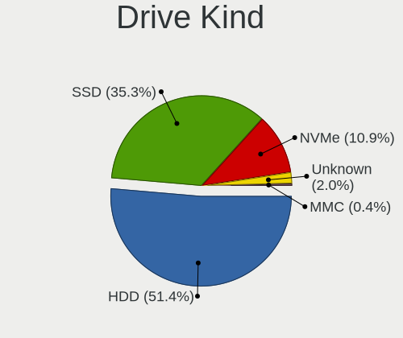

| Kind    | Desktops | Drives | Percent |
|---------|----------|--------|---------|
| HDD     | 2212     | 4567   | 49.92%  |
| SSD     | 1577     | 2608   | 35.59%  |
| NVMe    | 534      | 851    | 12.05%  |
| Unknown | 88       | 150    | 1.99%   |
| MMC     | 20       | 26     | 0.45%   |

Drive Connector
---------------

SATA, SAS, NVMe, etc.

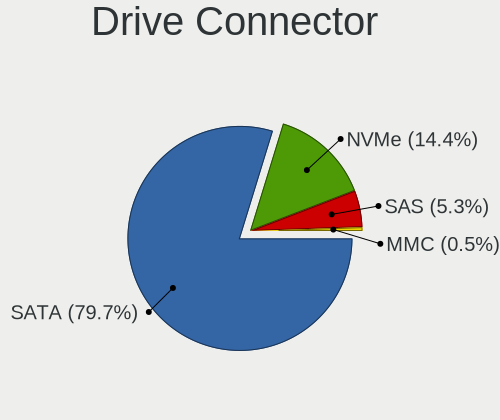

| Type | Desktops | Drives | Percent |
|------|----------|--------|---------|
| SATA | 2749     | 7017   | 78.79%  |
| NVMe | 530      | 840    | 15.19%  |
| SAS  | 190      | 319    | 5.45%   |
| MMC  | 20       | 26     | 0.57%   |

Drive Size
----------

Size of hard drive

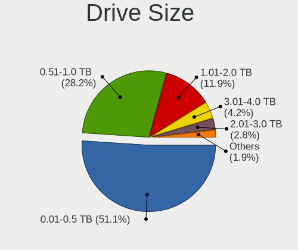

| Size in TB | Desktops | Drives | Percent |
|------------|----------|--------|---------|
| 0.01-0.5   | 2132     | 3943   | 51.35%  |
| 0.51-1.0   | 1155     | 1834   | 27.82%  |
| 1.01-2.0   | 487      | 802    | 11.73%  |
| 3.01-4.0   | 181      | 287    | 4.36%   |
| 2.01-3.0   | 118      | 177    | 2.84%   |
| 4.01-10.0  | 65       | 108    | 1.57%   |
| 10.01-20.0 | 14       | 24     | 0.34%   |

Space Total
-----------

Amount of disk space available on the file system

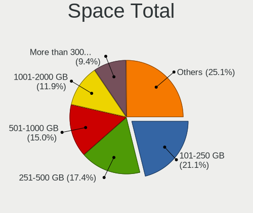

| Size in GB     | Desktops | Percent |
|----------------|----------|---------|
| 101-250        | 659      | 21.06%  |
| 251-500        | 542      | 17.32%  |
| 501-1000       | 472      | 15.08%  |
| 1001-2000      | 387      | 12.37%  |
| More than 3000 | 280      | 8.95%   |
| 1-20           | 250      | 7.99%   |
| 2001-3000      | 180      | 5.75%   |
| 51-100         | 142      | 4.54%   |
| Unknown        | 136      | 4.35%   |
| 21-50          | 81       | 2.59%   |

Space Used
----------

Amount of used disk space

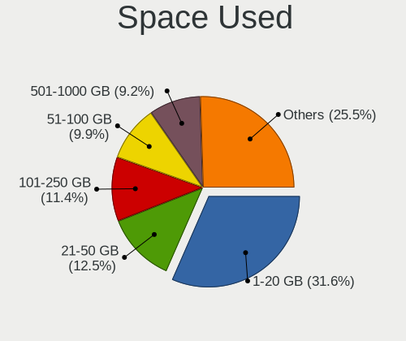

| Used GB        | Desktops | Percent |
|----------------|----------|---------|
| 1-20           | 1005     | 31.29%  |
| 21-50          | 400      | 12.45%  |
| 101-250        | 366      | 11.39%  |
| 51-100         | 322      | 10.02%  |
| 501-1000       | 298      | 9.28%   |
| 251-500        | 296      | 9.22%   |
| 1001-2000      | 222      | 6.91%   |
| Unknown        | 136      | 4.23%   |
| More than 3000 | 102      | 3.18%   |
| 2001-3000      | 64       | 1.99%   |
| 0              | 1        | 0.03%   |

Malfunc. Drives
---------------

Drive models with a malfunction

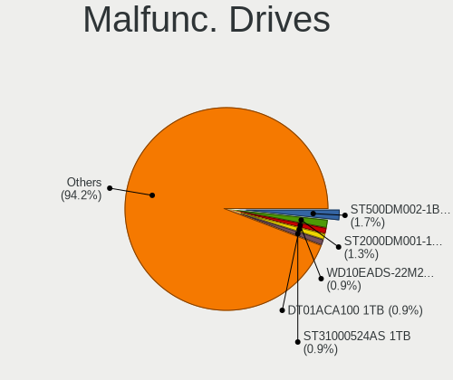

| Model                             | Desktops | Drives | Percent |
|-----------------------------------|----------|--------|---------|
| Seagate ST500DM002-1BD142 500GB   | 8        | 9      | 1.61%   |
| Seagate ST2000DM001-1CH164 2TB    | 6        | 7      | 1.21%   |
| WDC WD10EADS-22M2B0 1TB           | 5        | 5      | 1.01%   |
| Toshiba DT01ACA100 1TB            | 5        | 6      | 1.01%   |
| Seagate ST31000524AS 1TB          | 5        | 5      | 1.01%   |
| WDC WD5000AAKX-001CA0 500GB       | 4        | 5      | 0.8%    |
| WDC WD3200AAKS-00L9A0 320GB       | 4        | 4      | 0.8%    |
| WDC WD10EADS-00M2B0 1TB           | 4        | 6      | 0.8%    |
| Seagate ST3500320AS 500GB         | 4        | 4      | 0.8%    |
| Seagate ST31000528AS 1TB          | 4        | 4      | 0.8%    |
| Seagate ST1000DM003-1CH162 1TB    | 4        | 4      | 0.8%    |
| Samsung Electronics HD321KJ 320GB | 4        | 4      | 0.8%    |
| Samsung Electronics HD103SJ 1TB   | 4        | 5      | 0.8%    |
| Maxtor STM3500320AS 500GB         | 4        | 5      | 0.8%    |
| Kingston SV300S37A120G 120GB SSD  | 4        | 6      | 0.8%    |
| Crucial CT240M500SSD1 240GB       | 4        | 5      | 0.8%    |
| WDC WD6400AAKS-22A7B2 640GB       | 3        | 5      | 0.6%    |
| WDC WD5000AADS-00S9B0 500GB       | 3        | 3      | 0.6%    |
| WDC WD3200AAJS-08L7A0 320GB       | 3        | 3      | 0.6%    |
| WDC WD20PURZ-85GU6Y0 2TB          | 3        | 3      | 0.6%    |
| WDC WD20EARS-00MVWB0 2TB          | 3        | 3      | 0.6%    |
| Seagate ST9250315AS 250GB         | 3        | 5      | 0.6%    |
| Seagate ST3500418AS 500GB         | 3        | 3      | 0.6%    |
| Seagate ST3320820AS 320GB         | 3        | 3      | 0.6%    |
| Seagate ST3320418AS 320GB         | 3        | 3      | 0.6%    |
| Seagate ST3250310AS 250GB         | 3        | 3      | 0.6%    |
| Seagate ST3160815AS 160GB         | 3        | 3      | 0.6%    |
| Seagate ST3000DM001-1CH166 3TB    | 3        | 3      | 0.6%    |
| Seagate ST2000DM001-1ER164 2TB    | 3        | 3      | 0.6%    |
| Seagate ST1000DX001-1NS162 1TB    | 3        | 3      | 0.6%    |
| Seagate ST1000DM003-9YN162 1TB    | 3        | 3      | 0.6%    |
| Samsung Electronics HD502HJ 500GB | 3        | 3      | 0.6%    |
| Samsung Electronics HD103SI 1TB   | 3        | 3      | 0.6%    |
| Maxtor STM3250310AS 250GB         | 3        | 5      | 0.6%    |
| Maxtor 6B200M0 208GB              | 3        | 4      | 0.6%    |
| LDLC SSD 120GB                    | 3        | 3      | 0.6%    |
| Kingston SA400S37120G 120GB SSD   | 3        | 3      | 0.6%    |
| Intel SSDSC2CW120A3 120GB         | 3        | 3      | 0.6%    |
| Hitachi HDS721050CLA362 500GB     | 3        | 7      | 0.6%    |
| Hitachi HDS721010CLA332 1TB       | 3        | 5      | 0.6%    |

Malfunc. Drive Vendor
---------------------

Vendors of faulty drives

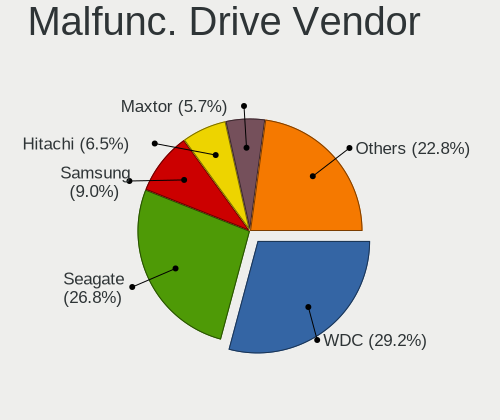

| Vendor              | Desktops | Drives | Percent |
|---------------------|----------|--------|---------|
| WDC                 | 141      | 175    | 29.01%  |
| Seagate             | 129      | 149    | 26.54%  |
| Samsung Electronics | 43       | 45     | 8.85%   |
| Hitachi             | 34       | 41     | 7%      |
| Maxtor              | 27       | 31     | 5.56%   |
| Crucial             | 19       | 22     | 3.91%   |
| Toshiba             | 16       | 22     | 3.29%   |
| Kingston            | 14       | 17     | 2.88%   |
| Intel               | 13       | 14     | 2.67%   |
| HGST                | 9        | 12     | 1.85%   |
| SanDisk             | 6        | 8      | 1.23%   |
| OCZ                 | 6        | 6      | 1.23%   |
| SK hynix            | 5        | 9      | 1.03%   |
| LDLC                | 4        | 4      | 0.82%   |
| A-DATA Technology   | 3        | 3      | 0.62%   |
| SPCC                | 2        | 2      | 0.41%   |
| LITEONIT            | 2        | 2      | 0.41%   |
| Fujitsu             | 2        | 2      | 0.41%   |
| Corsair             | 2        | 2      | 0.41%   |
| TEXTORM             | 1        | 1      | 0.21%   |
| OCZ-VERTEX          | 1        | 1      | 0.21%   |
| Micron Technology   | 1        | 1      | 0.21%   |
| KingSpec            | 1        | 1      | 0.21%   |
| INNOVATION IT       | 1        | 1      | 0.21%   |
| Hewlett-Packard     | 1        | 1      | 0.21%   |
| China               | 1        | 1      | 0.21%   |
| ASMT                | 1        | 1      | 0.21%   |
| Apacer              | 1        | 1      | 0.21%   |

Malfunc. HDD Vendor
-------------------

Vendors of faulty HDD drives

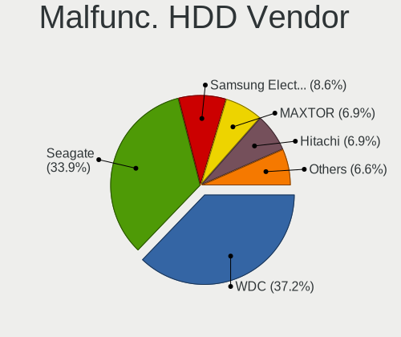

| Vendor              | Desktops | Drives | Percent |
|---------------------|----------|--------|---------|
| WDC                 | 139      | 173    | 35.55%  |
| Seagate             | 129      | 149    | 32.99%  |
| Hitachi             | 34       | 41     | 8.7%    |
| Samsung Electronics | 33       | 35     | 8.44%   |
| Maxtor              | 27       | 31     | 6.91%   |
| Toshiba             | 16       | 22     | 4.09%   |
| HGST                | 9        | 12     | 2.3%    |
| Fujitsu             | 2        | 2      | 0.51%   |
| Hewlett-Packard     | 1        | 1      | 0.26%   |
| ASMT                | 1        | 1      | 0.26%   |

Malfunc. Drive Kind
-------------------

Kinds of faulty drives

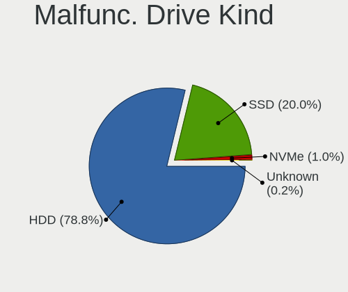

| Kind | Desktops | Drives | Percent |
|------|----------|--------|---------|
| HDD  | 350      | 467    | 79.01%  |
| SSD  | 89       | 104    | 20.09%  |
| NVMe | 4        | 4      | 0.9%    |

Failed Drives
-------------

Failed drive models

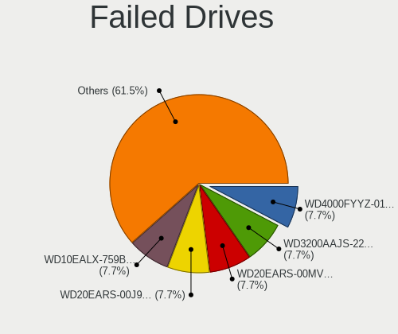

| Model                                            | Desktops | Drives | Percent |
|--------------------------------------------------|----------|--------|---------|
| WDC WD4000FYYZ-01UL1B2 4TB                       | 1        | 1      | 11.11%  |
| WDC WD20EARS-00J99B0 2TB                         | 1        | 2      | 11.11%  |
| WDC WD10EALX-759BA1 1TB                          | 1        | 1      | 11.11%  |
| Seagate ST3500418AS 500GB                        | 1        | 1      | 11.11%  |
| Seagate ST3250318AS 250GB                        | 1        | 1      | 11.11%  |
| Samsung Electronics MZ7LN512HAJQ-00000 512GB SSD | 1        | 2      | 11.11%  |
| Samsung Electronics HD753LJ 752GB                | 1        | 1      | 11.11%  |
| Samsung Electronics HD501LJ 500GB                | 1        | 1      | 11.11%  |
| Kingston SMS200S360G 64GB SSD                    | 1        | 1      | 11.11%  |

Failed Drive Vendor
-------------------

Failed drive vendors

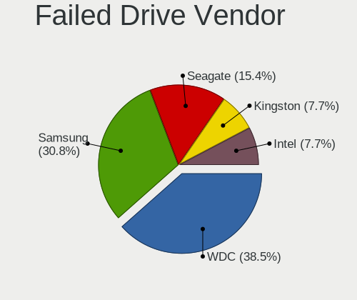

| Vendor              | Desktops | Drives | Percent |
|---------------------|----------|--------|---------|
| WDC                 | 3        | 4      | 33.33%  |
| Samsung Electronics | 3        | 4      | 33.33%  |
| Seagate             | 2        | 2      | 22.22%  |
| Kingston            | 1        | 1      | 11.11%  |

Drive Status
------------

Number of failed and malfunc. drives

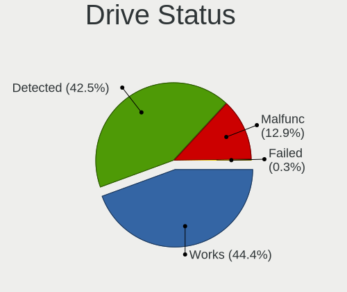

| Status   | Desktops | Drives | Percent |
|----------|----------|--------|---------|
| Works    | 1477     | 3388   | 43.76%  |
| Detected | 1461     | 4228   | 43.29%  |
| Malfunc  | 428      | 575    | 12.68%  |
| Failed   | 9        | 11     | 0.27%   |

Storage controller
------------------

Storage Vendor
--------------

Storage controller vendors

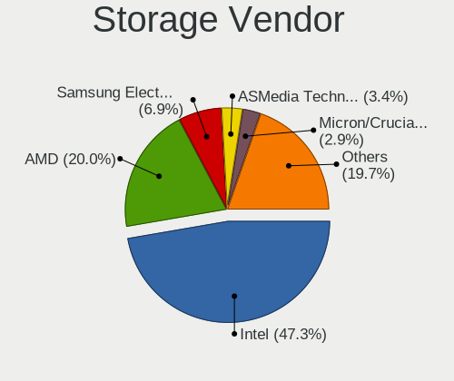

| Vendor                           | Desktops | Percent |
|----------------------------------|----------|---------|
| Intel                            | 1940     | 49.01%  |
| AMD                              | 818      | 20.67%  |
| Samsung Electronics              | 236      | 5.96%   |
| Marvell Technology Group         | 134      | 3.39%   |
| Nvidia                           | 132      | 3.34%   |
| ASMedia Technology               | 116      | 2.93%   |
| JMicron Technology               | 115      | 2.91%   |
| Micron/Crucial Technology        | 84       | 2.12%   |
| Phison Electronics               | 82       | 2.07%   |
| SanDisk                          | 71       | 1.79%   |
| VIA Technologies                 | 46       | 1.16%   |
| Kingston Technology Company      | 34       | 0.86%   |
| Silicon Image                    | 17       | 0.43%   |
| LSI Logic / Symbios Logic        | 15       | 0.38%   |
| SK hynix                         | 14       | 0.35%   |
| Micron Technology                | 14       | 0.35%   |
| Silicon Motion                   | 12       | 0.3%    |
| Toshiba America Info Systems     | 11       | 0.28%   |
| Broadcom / LSI                   | 11       | 0.28%   |
| Adaptec                          | 8        | 0.2%    |
| ADATA Technology                 | 7        | 0.18%   |
| Silicon Integrated Systems [SiS] | 6        | 0.15%   |
| Integrated Technology Express    | 6        | 0.15%   |
| Seagate Technology               | 4        | 0.1%    |
| Hewlett-Packard                  | 4        | 0.1%    |
| Realtek Semiconductor            | 3        | 0.08%   |
| KIOXIA                           | 3        | 0.08%   |
| Union Memory (Shenzhen)          | 2        | 0.05%   |
| Promise Technology               | 2        | 0.05%   |
| Lite-On Technology               | 2        | 0.05%   |
| ULi Electronics                  | 1        | 0.03%   |
| Transcend                        | 1        | 0.03%   |
| Tekram Technology                | 1        | 0.03%   |
| Shenzhen Longsys Electronics     | 1        | 0.03%   |
| Red Hat                          | 1        | 0.03%   |
| OCZ Technology Group             | 1        | 0.03%   |
| MAXIO Technology (Hangzhou)      | 1        | 0.03%   |
| Areca Technology                 | 1        | 0.03%   |
| 3ware                            | 1        | 0.03%   |

Storage Model
-------------

Storage controller models

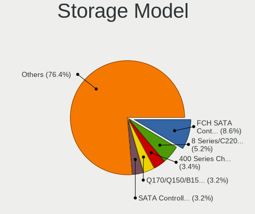

| Model                                                                                   | Desktops | Percent |
|-----------------------------------------------------------------------------------------|----------|---------|
| AMD FCH SATA Controller [AHCI mode]                                                     | 464      | 9.16%   |
| Intel 8 Series/C220 Series Chipset Family 6-port SATA Controller 1 [AHCI mode]          | 253      | 5%      |
| AMD 400 Series Chipset SATA Controller                                                  | 198      | 3.91%   |
| Intel 6 Series/C200 Series Chipset Family 6 port Desktop SATA AHCI Controller           | 166      | 3.28%   |
| Intel Q170/Q150/B150/H170/H110/Z170/CM236 Chipset SATA Controller [AHCI Mode]           | 153      | 3.02%   |
| Samsung NVMe SSD Controller SM981/PM981/PM983                                           | 146      | 2.88%   |
| Intel SATA Controller [RAID mode]                                                       | 144      | 2.84%   |
| Intel NM10/ICH7 Family SATA Controller [IDE mode]                                       | 141      | 2.78%   |
| Intel 7 Series/C210 Series Chipset Family 6-port SATA Controller [AHCI mode]            | 128      | 2.53%   |
| AMD SB7x0/SB8x0/SB9x0 IDE Controller                                                    | 122      | 2.41%   |
| AMD SB7x0/SB8x0/SB9x0 SATA Controller [AHCI mode]                                       | 113      | 2.23%   |
| Intel 200 Series PCH SATA controller [AHCI mode]                                        | 112      | 2.21%   |
| Intel 82801G (ICH7 Family) IDE Controller                                               | 108      | 2.13%   |
| ASMedia ASM1062 Serial ATA Controller                                                   | 106      | 2.09%   |
| Intel Cannon Lake PCH SATA AHCI Controller                                              | 94       | 1.86%   |
| AMD 500 Series Chipset SATA Controller                                                  | 85       | 1.68%   |
| Intel 9 Series Chipset Family SATA Controller [AHCI Mode]                               | 82       | 1.62%   |
| AMD SB7x0/SB8x0/SB9x0 SATA Controller [IDE mode]                                        | 81       | 1.6%    |
| Intel 6 Series/C200 Series Chipset Family Desktop SATA Controller (IDE mode, ports 4-5) | 72       | 1.42%   |
| Intel 6 Series/C200 Series Chipset Family Desktop SATA Controller (IDE mode, ports 0-3) | 72       | 1.42%   |
| Nvidia MCP61 SATA Controller                                                            | 69       | 1.36%   |
| JMicron JMB363 SATA/IDE Controller                                                      | 61       | 1.2%    |
| Nvidia MCP61 IDE                                                                        | 60       | 1.18%   |
| Intel 82801JI (ICH10 Family) 4 port SATA IDE Controller #1                              | 49       | 0.97%   |
| AMD FCH SATA Controller D                                                               | 48       | 0.95%   |
| Intel 82801JI (ICH10 Family) 2 port SATA IDE Controller #2                              | 47       | 0.93%   |
| Phison E12 NVMe Controller                                                              | 46       | 0.91%   |
| Intel 82801I (ICH9 Family) 2 port SATA Controller [IDE mode]                            | 43       | 0.85%   |
| Micron/Crucial P2 NVMe PCIe SSD                                                         | 41       | 0.81%   |
| Samsung NVMe SSD Controller SM961/PM961/SM963                                           | 40       | 0.79%   |
| Intel 82801JI (ICH10 Family) SATA AHCI Controller                                       | 40       | 0.79%   |
| Marvell Group 88SE6111/6121 SATA II / PATA Controller                                   | 34       | 0.67%   |
| Intel 5 Series/3400 Series Chipset 4 port SATA IDE Controller                           | 34       | 0.67%   |
| Intel 5 Series/3400 Series Chipset 2 port SATA IDE Controller                           | 34       | 0.67%   |
| AMD 300 Series Chipset SATA Controller                                                  | 34       | 0.67%   |
| Intel 500 Series Chipset Family SATA AHCI Controller                                    | 33       | 0.65%   |
| Intel 4 Series Chipset PT IDER Controller                                               | 33       | 0.65%   |
| Intel 82801IR/IO/IH (ICH9R/DO/DH) 4 port SATA Controller [IDE mode]                     | 30       | 0.59%   |
| Samsung NVMe SSD Controller 980                                                         | 28       | 0.55%   |
| Marvell Group 88SE9172 SATA 6Gb/s Controller                                            | 28       | 0.55%   |

Storage Kind
------------

Kind of storage controller (IDE, SATA, NVMe, SAS, ...)

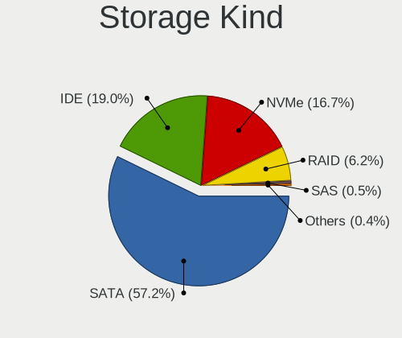

| Kind | Desktops | Percent |
|------|----------|---------|
| SATA | 2204     | 56.86%  |
| IDE  | 850      | 21.93%  |
| NVMe | 537      | 13.85%  |
| RAID | 250      | 6.45%   |
| SCSI | 18       | 0.46%   |
| SAS  | 17       | 0.44%   |

Processor
---------

CPU Vendor
----------

Processor vendors

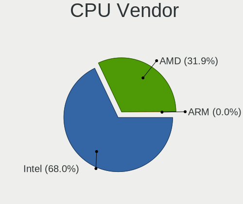

| Vendor                | Desktops | Percent |
|-----------------------|----------|---------|
| Intel                 | 1992     | 67.89%  |
| AMD                   | 938      | 31.97%  |
| CentaurHauls          | 2        | 0.07%   |
| Marvell Semiconductor | 1        | 0.03%   |
| ARM                   | 1        | 0.03%   |

CPU Model
---------

Processor models

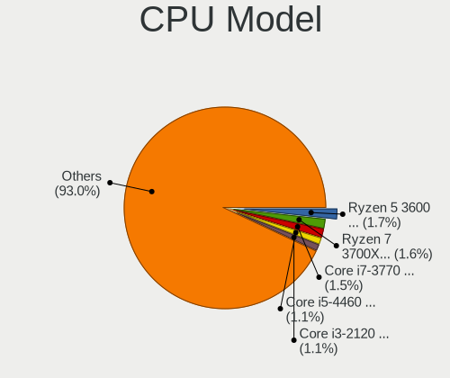

| Model                                       | Desktops | Percent |
|---------------------------------------------|----------|---------|
| AMD Ryzen 5 3600 6-Core Processor           | 51       | 1.73%   |
| AMD Ryzen 7 3700X 8-Core Processor          | 46       | 1.56%   |
| Intel Core i7-3770 CPU @ 3.40GHz            | 43       | 1.46%   |
| Intel Core i3-2120 CPU @ 3.30GHz            | 34       | 1.16%   |
| Intel Core i5-4460 CPU @ 3.20GHz            | 31       | 1.05%   |
| Intel Core 2 Duo CPU E8400 @ 3.00GHz        | 29       | 0.99%   |
| AMD Ryzen 9 3900X 12-Core Processor         | 29       | 0.99%   |
| Intel Core i7-4790K CPU @ 4.00GHz           | 28       | 0.95%   |
| Intel Core i5-2400 CPU @ 3.10GHz            | 28       | 0.95%   |
| AMD Ryzen 5 2600 Six-Core Processor         | 28       | 0.95%   |
| Intel Core i7-4790 CPU @ 3.60GHz            | 27       | 0.92%   |
| Intel Core i5-6500 CPU @ 3.20GHz            | 27       | 0.92%   |
| Intel Core i5-3570K CPU @ 3.40GHz           | 25       | 0.85%   |
| Intel Core i7-6700K CPU @ 4.00GHz           | 24       | 0.82%   |
| Intel Core i5-3470 CPU @ 3.20GHz            | 23       | 0.78%   |
| AMD Ryzen 5 5600X 6-Core Processor          | 23       | 0.78%   |
| Intel Core i5-2500K CPU @ 3.30GHz           | 22       | 0.75%   |
| Intel Core i5-8400 CPU @ 2.80GHz            | 21       | 0.71%   |
| Intel Pentium Dual-Core CPU E5300 @ 2.60GHz | 20       | 0.68%   |
| Intel Core i5-4670K CPU @ 3.40GHz           | 20       | 0.68%   |
| Intel Core i5-4570 CPU @ 3.20GHz            | 20       | 0.68%   |
| Intel Core 2 Quad CPU Q6600 @ 2.40GHz       | 20       | 0.68%   |
| AMD Ryzen 5 1600 Six-Core Processor         | 20       | 0.68%   |
| AMD FX-6300 Six-Core Processor              | 20       | 0.68%   |
| Intel Core i7-6700 CPU @ 3.40GHz            | 19       | 0.65%   |
| Intel Core i5-7400 CPU @ 3.00GHz            | 19       | 0.65%   |
| Intel Core i5-6400 CPU @ 2.70GHz            | 19       | 0.65%   |
| Intel Core 2 Duo CPU E7500 @ 2.93GHz        | 19       | 0.65%   |
| AMD Ryzen 7 2700X Eight-Core Processor      | 19       | 0.65%   |
| AMD FX-8350 Eight-Core Processor            | 19       | 0.65%   |
| Intel Core i7-4770K CPU @ 3.50GHz           | 18       | 0.61%   |
| Intel Core i7-4770 CPU @ 3.40GHz            | 18       | 0.61%   |
| Intel Core i3-4130 CPU @ 3.40GHz            | 18       | 0.61%   |
| Intel Core i3-2100 CPU @ 3.10GHz            | 18       | 0.61%   |
| AMD Ryzen 3 3200G with Radeon Vega Graphics | 18       | 0.61%   |
| AMD Athlon II X2 220 Processor              | 18       | 0.61%   |
| Intel Core i7-3770K CPU @ 3.50GHz           | 17       | 0.58%   |
| AMD Phenom II X4 955 Processor              | 17       | 0.58%   |
| Intel Core i7-2600 CPU @ 3.40GHz            | 16       | 0.54%   |
| Intel Core i5-9600K CPU @ 3.70GHz           | 16       | 0.54%   |

CPU Model Family
----------------

Processor model prefix

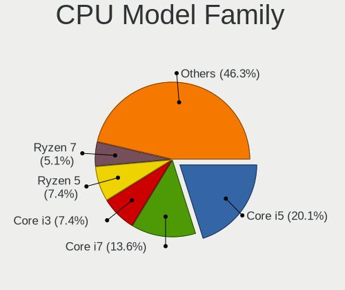

| Model                   | Desktops | Percent |
|-------------------------|----------|---------|
| Intel Core i5           | 587      | 19.96%  |
| Intel Core i7           | 403      | 13.7%   |
| Intel Core i3           | 219      | 7.45%   |
| AMD Ryzen 5             | 209      | 7.11%   |
| Intel Xeon              | 145      | 4.93%   |
| AMD Ryzen 7             | 143      | 4.86%   |
| Intel Core 2 Duo        | 107      | 3.64%   |
| Intel Pentium           | 94       | 3.2%    |
| Intel Core 2 Quad       | 85       | 2.89%   |
| AMD FX                  | 83       | 2.82%   |
| Intel Celeron           | 69       | 2.35%   |
| AMD Athlon II X2        | 59       | 2.01%   |
| Intel Pentium Dual-Core | 57       | 1.94%   |
| AMD Ryzen 9             | 57       | 1.94%   |
| AMD Ryzen 3             | 55       | 1.87%   |
| AMD Athlon 64 X2        | 46       | 1.56%   |
| Other                   | 45       | 1.53%   |
| AMD Phenom II X4        | 39       | 1.33%   |
| Intel Atom              | 37       | 1.26%   |
| Intel Pentium Dual      | 32       | 1.09%   |
| Intel Core 2            | 29       | 0.99%   |
| Intel Pentium 4         | 28       | 0.95%   |
| AMD A8                  | 28       | 0.95%   |
| AMD A4                  | 26       | 0.88%   |
| Intel Core i9           | 25       | 0.85%   |
| Intel Pentium D         | 18       | 0.61%   |
| AMD Athlon 64           | 18       | 0.61%   |
| AMD A6                  | 16       | 0.54%   |
| AMD Ryzen Threadripper  | 14       | 0.48%   |
| AMD Athlon II X4        | 14       | 0.48%   |
| Intel Pentium Gold      | 13       | 0.44%   |
| AMD Sempron             | 13       | 0.44%   |
| AMD Phenom II X6        | 12       | 0.41%   |
| AMD Athlon              | 11       | 0.37%   |
| AMD A10                 | 11       | 0.37%   |
| AMD Athlon Dual Core    | 9        | 0.31%   |
| AMD E                   | 8        | 0.27%   |
| AMD Athlon X4           | 7        | 0.24%   |
| AMD Athlon II X3        | 7        | 0.24%   |
| AMD Ryzen 5 PRO         | 6        | 0.2%    |

CPU Cores
---------

Number of processor cores

| Number  | Desktops | Percent |
|---------|----------|---------|
| 4       | 1223     | 41.49%  |
| 2       | 829      | 28.12%  |
| 6       | 375      | 12.72%  |
| 8       | 223      | 7.56%   |
| 1       | 108      | 3.66%   |
| 12      | 71       | 2.41%   |
| 3       | 44       | 1.49%   |
| 16      | 24       | 0.81%   |
| Unknown | 21       | 0.71%   |
| 10      | 14       | 0.47%   |
| 32      | 5        | 0.17%   |
| 24      | 4        | 0.14%   |
| 64      | 3        | 0.1%    |
| 20      | 3        | 0.1%    |
| 40      | 1        | 0.03%   |

CPU Sockets
-----------

Number of sockets

| Number | Desktops | Percent |
|--------|----------|---------|
| 1      | 2897     | 98.71%  |
| 2      | 37       | 1.26%   |
| 4      | 1        | 0.03%   |

CPU Threads
-----------

Threads per core (Hyper-Threading)

| Number  | Desktops | Percent |
|---------|----------|---------|
| 1       | 1480     | 50.22%  |
| 2       | 1446     | 49.07%  |
| Unknown | 21       | 0.71%   |

CPU Op-Modes
------------

CPU Operation Modes (32-bit, 64-bit)

| Op mode        | Desktops | Percent |
|----------------|----------|---------|
| 32-bit, 64-bit | 2887     | 98.2%   |
| Unknown        | 29       | 0.99%   |
| 32-bit         | 24       | 0.82%   |

CPU Microcode
-------------

Microcode number

| Number     | Desktops | Percent |
|------------|----------|---------|
| Unknown    | 553      | 18.2%   |
| 0x306c3    | 320      | 10.53%  |
| 0x206a7    | 194      | 6.38%   |
| 0x306a9    | 183      | 6.02%   |
| 0x1067a    | 160      | 5.26%   |
| 0x506e3    | 125      | 4.11%   |
| 0x906ea    | 82       | 2.7%    |
| 0x010000c8 | 81       | 2.67%   |
| 0x08701021 | 80       | 2.63%   |
| 0x906e9    | 70       | 2.3%    |
| 0x0800820d | 70       | 2.3%    |
| 0x08701013 | 49       | 1.61%   |
| 0x06000852 | 49       | 1.61%   |
| 0x6fd      | 44       | 1.45%   |
| 0x06001119 | 44       | 1.45%   |
| 0x106e5    | 40       | 1.32%   |
| 0x10676    | 33       | 1.09%   |
| 0x08108109 | 33       | 1.09%   |
| 0x6fb      | 30       | 0.99%   |
| 0x906ed    | 28       | 0.92%   |
| 0xa0653    | 27       | 0.89%   |
| 0x0a201016 | 26       | 0.86%   |
| 0xa0655    | 23       | 0.76%   |
| 0x106a5    | 23       | 0.76%   |
| 0x08001138 | 22       | 0.72%   |
| 0x306f2    | 21       | 0.69%   |
| 0x08001137 | 19       | 0.63%   |
| 0x206d7    | 18       | 0.59%   |
| 0xa0671    | 17       | 0.56%   |
| 0x10677    | 17       | 0.56%   |
| 0x906ec    | 15       | 0.49%   |
| 0x6f6      | 15       | 0.49%   |
| 0x20655    | 15       | 0.49%   |
| 0x0a201009 | 15       | 0.49%   |
| 0x08600106 | 14       | 0.46%   |
| 0x010000db | 14       | 0.46%   |
| 0x010000c7 | 14       | 0.46%   |
| 0x906eb    | 13       | 0.43%   |
| 0x206c2    | 13       | 0.43%   |
| 0x106ca    | 12       | 0.39%   |

CPU Microarch
-------------

Microarchitecture

| Name             | Desktops | Percent |
|------------------|----------|---------|
| Haswell          | 399      | 13.59%  |
| KabyLake         | 259      | 8.82%   |
| SandyBridge      | 239      | 8.14%   |
| Penryn           | 224      | 7.63%   |
| IvyBridge        | 209      | 7.12%   |
| Zen 2            | 191      | 6.5%    |
| Skylake          | 171      | 5.82%   |
| K10              | 156      | 5.31%   |
| Zen+             | 129      | 4.39%   |
| Piledriver       | 120      | 4.09%   |
| Core             | 113      | 3.85%   |
| Zen              | 93       | 3.17%   |
| K8 Hammer        | 85       | 2.89%   |
| Zen 3            | 81       | 2.76%   |
| Nehalem          | 78       | 2.66%   |
| CometLake        | 65       | 2.21%   |
| NetBurst         | 51       | 1.74%   |
| Westmere         | 44       | 1.5%    |
| Silvermont       | 27       | 0.92%   |
| Bonnell          | 26       | 0.89%   |
| Unknown          | 26       | 0.89%   |
| Broadwell        | 22       | 0.75%   |
| Excavator        | 15       | 0.51%   |
| Goldmont plus    | 14       | 0.48%   |
| K10 Llano        | 13       | 0.44%   |
| Icelake          | 13       | 0.44%   |
| Bobcat           | 13       | 0.44%   |
| Bulldozer        | 12       | 0.41%   |
| Alderlake Hybrid | 12       | 0.41%   |
| Steamroller      | 11       | 0.37%   |
| Puma             | 8        | 0.27%   |
| Goldmont         | 8        | 0.27%   |
| K6               | 4        | 0.14%   |
| Jaguar           | 4        | 0.14%   |
| Tremont          | 1        | 0.03%   |
| TigerLake        | 1        | 0.03%   |

Graphics
--------

GPU Vendor
----------

Vendors of graphics cards

| Vendor                                       | Desktops | Percent |
|----------------------------------------------|----------|---------|
| Nvidia                                       | 1417     | 45.2%   |
| Intel                                        | 841      | 26.83%  |
| AMD                                          | 835      | 26.63%  |
| Matrox Electronics Systems                   | 15       | 0.48%   |
| ASPEED Technology                            | 13       | 0.41%   |
| VIA Technologies                             | 6        | 0.19%   |
| Silicon Integrated Systems [SiS]             | 3        | 0.1%    |
| ATI Technologies                             | 2        | 0.06%   |
| XGI Technology (eXtreme Graphics Innovation) | 1        | 0.03%   |
| S3 Graphics                                  | 1        | 0.03%   |
| Red Hat                                      | 1        | 0.03%   |

GPU Model
---------

Graphics card models

| Model                                                                       | Desktops | Percent |
|-----------------------------------------------------------------------------|----------|---------|
| Intel Xeon E3-1200 v3/4th Gen Core Processor Integrated Graphics Controller | 165      | 5.11%   |
| Intel 2nd Generation Core Processor Family Integrated Graphics Controller   | 101      | 3.13%   |
| AMD Ellesmere [Radeon RX 470/480/570/570X/580/580X/590]                     | 88       | 2.73%   |
| Nvidia GK208B [GeForce GT 710]                                              | 84       | 2.6%    |
| Nvidia GP107 [GeForce GTX 1050 Ti]                                          | 70       | 2.17%   |
| Intel CoffeeLake-S GT2 [UHD Graphics 630]                                   | 66       | 2.04%   |
| Intel HD Graphics 530                                                       | 65       | 2.01%   |
| Intel 4 Series Chipset Integrated Graphics Controller                       | 65       | 2.01%   |
| Nvidia GT218 [GeForce 210]                                                  | 62       | 1.92%   |
| Intel Xeon E3-1200 v2/3rd Gen Core processor Graphics Controller            | 48       | 1.49%   |
| Nvidia GP108 [GeForce GT 1030]                                              | 46       | 1.43%   |
| Nvidia GP106 [GeForce GTX 1060 6GB]                                         | 46       | 1.43%   |
| Nvidia GM204 [GeForce GTX 970]                                              | 45       | 1.39%   |
| AMD Cedar [Radeon HD 5000/6000/7350/8350 Series]                            | 44       | 1.36%   |
| Nvidia GM206 [GeForce GTX 960]                                              | 39       | 1.21%   |
| Intel 4th Generation Core Processor Family Integrated Graphics Controller   | 38       | 1.18%   |
| Nvidia GF119 [GeForce GT 610]                                               | 36       | 1.12%   |
| Intel IvyBridge GT2 [HD Graphics 4000]                                      | 35       | 1.08%   |
| Nvidia GK208B [GeForce GT 730]                                              | 34       | 1.05%   |
| AMD Picasso/Raven 2 [Radeon Vega Series / Radeon Vega Mobile Series]        | 32       | 0.99%   |
| Intel HD Graphics 630                                                       | 30       | 0.93%   |
| Nvidia TU106 [GeForce RTX 2060 Rev. A]                                      | 28       | 0.87%   |
| Nvidia GP107 [GeForce GTX 1050]                                             | 27       | 0.84%   |
| AMD Navi 10 [Radeon RX 5600 OEM/5600 XT / 5700/5700 XT]                     | 27       | 0.84%   |
| Intel CometLake-S GT2 [UHD Graphics 630]                                    | 26       | 0.81%   |
| Nvidia GP104 [GeForce GTX 1070]                                             | 23       | 0.71%   |
| Intel 82G33/G31 Express Integrated Graphics Controller                      | 23       | 0.71%   |
| Nvidia GP104 [GeForce GTX 1080]                                             | 21       | 0.65%   |
| Nvidia GM107 [GeForce GTX 750 Ti]                                           | 21       | 0.65%   |
| AMD RS780L [Radeon 3000]                                                    | 21       | 0.65%   |
| AMD Caicos [Radeon HD 6450/7450/8450 / R5 230 OEM]                          | 21       | 0.65%   |
| Nvidia TU116 [GeForce GTX 1660 SUPER]                                       | 20       | 0.62%   |
| Nvidia GP106 [GeForce GTX 1060 3GB]                                         | 20       | 0.62%   |
| Nvidia GK106 [GeForce GTX 660]                                              | 20       | 0.62%   |
| AMD Renoir                                                                  | 20       | 0.62%   |
| AMD Raven Ridge [Radeon Vega Series / Radeon Vega Mobile Series]            | 20       | 0.62%   |
| Nvidia C61 [GeForce 6150SE nForce 430]                                      | 19       | 0.59%   |
| Nvidia TU117 [GeForce GTX 1650]                                             | 17       | 0.53%   |
| Nvidia GK104 [GeForce GTX 760]                                              | 17       | 0.53%   |
| AMD RV620 LE [Radeon HD 3450]                                               | 17       | 0.53%   |

GPU Combo
---------

Combinations of graphics cards

| Name                 | Desktops | Percent |
|----------------------|----------|---------|
| 1 x Nvidia           | 1330     | 44.63%  |
| 1 x AMD              | 745      | 25%     |
| 1 x Intel            | 689      | 23.12%  |
| Intel + Nvidia       | 54       | 1.81%   |
| 2 x AMD              | 43       | 1.44%   |
| AMD + Nvidia         | 24       | 0.81%   |
| Intel + AMD          | 23       | 0.77%   |
| 2 x Nvidia           | 18       | 0.6%    |
| 1 x Matrox           | 13       | 0.44%   |
| 1 x ASPEED           | 11       | 0.37%   |
| 1 x VIA              | 6        | 0.2%    |
| Other                | 5        | 0.17%   |
| 2 x Intel            | 4        | 0.13%   |
| 1 x SiS              | 3        | 0.1%    |
| 3 x AMD              | 2        | 0.07%   |
| 3 x Nvidia           | 1        | 0.03%   |
| 2 x AMD + 1 x Nvidia | 1        | 0.03%   |
| 1 x XGI              | 1        | 0.03%   |
| 1 x S3 Graphics      | 1        | 0.03%   |
| 1 x Red Hat          | 1        | 0.03%   |
| Nvidia + Matrox      | 1        | 0.03%   |
| Nvidia + ASPEED      | 1        | 0.03%   |
| Intel + 2 x Nvidia   | 1        | 0.03%   |
| Intel + 2 x AMD      | 1        | 0.03%   |
| AMD + ASPEED         | 1        | 0.03%   |

GPU Driver
----------

Free vs proprietary

| Driver      | Desktops | Percent |
|-------------|----------|---------|
| Free        | 2095     | 69.74%  |
| Proprietary | 755      | 25.13%  |
| Unknown     | 154      | 5.13%   |

GPU Memory
----------

Total video memory

| Size in GB | Desktops | Percent |
|------------|----------|---------|
| Unknown    | 1085     | 35.68%  |
| 1.01-2.0   | 469      | 15.42%  |
| 0.01-0.5   | 439      | 14.44%  |
| 0.51-1.0   | 404      | 13.29%  |
| 3.01-4.0   | 241      | 7.93%   |
| 7.01-8.0   | 191      | 6.28%   |
| 5.01-6.0   | 101      | 3.32%   |
| 8.01-16.0  | 61       | 2.01%   |
| 2.01-3.0   | 40       | 1.32%   |
| 16.01-24.0 | 6        | 0.2%    |
| 4.01-5.0   | 4        | 0.13%   |

Monitor
-------

Monitor Vendor
--------------

Monitor vendors

| Vendor               | Desktops | Percent |
|----------------------|----------|---------|
| Samsung Electronics  | 507      | 15.94%  |
| Iiyama               | 318      | 10%     |
| Dell                 | 273      | 8.58%   |
| Hewlett-Packard      | 245      | 7.7%    |
| Goldstar             | 223      | 7.01%   |
| Acer                 | 217      | 6.82%   |
| Ancor Communications | 193      | 6.07%   |
| Philips              | 170      | 5.34%   |
| AOC                  | 137      | 4.31%   |
| BenQ                 | 119      | 3.74%   |
| ViewSonic            | 76       | 2.39%   |
| ASUSTek Computer     | 44       | 1.38%   |
| Lenovo               | 41       | 1.29%   |
| Unknown              | 38       | 1.19%   |
| HannStar             | 33       | 1.04%   |
| Idek Iiyama          | 28       | 0.88%   |
| LG Electronics       | 27       | 0.85%   |
| Sony                 | 26       | 0.82%   |
| Packard Bell         | 25       | 0.79%   |
| NEC Computers        | 22       | 0.69%   |
| Eizo                 | 20       | 0.63%   |
| Vestel Elektronik    | 18       | 0.57%   |
| Medion               | 18       | 0.57%   |
| Hitachi              | 18       | 0.57%   |
| Fujitsu Siemens      | 17       | 0.53%   |
| Hyundai ImageQuest   | 15       | 0.47%   |
| SNC                  | 14       | 0.44%   |
| Denver               | 13       | 0.41%   |
| MSI                  | 11       | 0.35%   |
| Belinea              | 11       | 0.35%   |
| Toshiba              | 10       | 0.31%   |
| RS                   | 9        | 0.28%   |
| RTK                  | 8        | 0.25%   |
| Panasonic            | 8        | 0.25%   |
| NECCI                | 8        | 0.25%   |
| HKC                  | 8        | 0.25%   |
| Gigabyte Technology  | 7        | 0.22%   |
| Unknown              | 7        | 0.22%   |
| Plain Tree Systems   | 6        | 0.19%   |
| Vestel               | 5        | 0.16%   |

Monitor Model
-------------

Monitor models

| Model                                                                 | Desktops | Percent |
|-----------------------------------------------------------------------|----------|---------|
| Iiyama PLE2483H IVM6113 1920x1080 530x300mm 24.0-inch                 | 28       | 0.82%   |
| Samsung Electronics C27F390 SAM0D32 1920x1080 598x336mm 27.0-inch     | 20       | 0.59%   |
| Vestel Elektronik 40UHD_LCD_TV VES3700 3840x2160 890x500mm 40.2-inch  | 18       | 0.53%   |
| Samsung Electronics S24F350 SAM0D20 1920x1080 520x290mm 23.4-inch     | 18       | 0.53%   |
| Iiyama PL2283H IVM562E 1920x1080 496x292mm 22.7-inch                  | 13       | 0.38%   |
| ViewSonic VX2457 VSCB931 1920x1080 521x293mm 23.5-inch                | 12       | 0.35%   |
| Samsung Electronics S24D330 SAM0D92 1920x1080 531x299mm 24.0-inch     | 12       | 0.35%   |
| BenQ GW2270 BNQ78DB 1920x1080 480x270mm 21.7-inch                     | 11       | 0.32%   |
| Ancor Communications ASUS VS247 ACI249A 1920x1080 521x293mm 23.5-inch | 11       | 0.32%   |
| Samsung Electronics C24F390 SAM0D2C 1920x1080 521x293mm 23.5-inch     | 10       | 0.29%   |
| Iiyama PL2530H IVM6132 1920x1080 544x303mm 24.5-inch                  | 10       | 0.29%   |
| Iiyama PL2409HD IVM560C 1920x1080 520x290mm 23.4-inch                 | 10       | 0.29%   |
| Hewlett-Packard v220 HWP26FE 1680x1050 473x296mm 22.0-inch            | 10       | 0.29%   |
| Dell U2412M DELA07A 1920x1200 518x324mm 24.1-inch                     | 10       | 0.29%   |
| Samsung Electronics S22D300 SAM0B3F 1920x1080 477x268mm 21.5-inch     | 9        | 0.26%   |
| Iiyama PLX2783H IVM6611 1920x1080 598x336mm 27.0-inch                 | 9        | 0.26%   |
| Goldstar ULTRAWIDE GSM59F1 2560x1080 798x334mm 34.1-inch              | 9        | 0.26%   |
| AOC F22 AOC2200 1920x1080 476x268mm 21.5-inch                         | 9        | 0.26%   |
| AOC 24B1W AOC2401 1920x1080 521x293mm 23.5-inch                       | 9        | 0.26%   |
| Ancor Communications VE247 ACI2493 1920x1080 530x300mm 24.0-inch      | 9        | 0.26%   |
| Ancor Communications ASUS VS228 ACI22FD 1920x1080 476x268mm 21.5-inch | 9        | 0.26%   |
| Acer G246HL ACR02FF 1920x1080 531x299mm 24.0-inch                     | 9        | 0.26%   |
| Iiyama X2483/2481 IVM6128 1920x1080 527x296mm 23.8-inch               | 8        | 0.23%   |
| Iiyama PLB2403WS IVM5601 1920x1200 519x324mm 24.1-inch                | 8        | 0.23%   |
| AOC Q3279WG5B AOC3279 2560x1440 725x428mm 33.1-inch                   | 8        | 0.23%   |
| Ancor Communications VX238 ACI23C1 1920x1080 510x290mm 23.1-inch      | 8        | 0.23%   |
| Ancor Communications ASUS VW193D ACI19D5 1440x900 408x255mm 18.9-inch | 8        | 0.23%   |
| Samsung Electronics SyncMaster SAM0304 1680x1050 494x320mm 23.2-inch  | 7        | 0.21%   |
| Samsung Electronics LCD Monitor SAM0B60 1920x1080 887x500mm 40.1-inch | 7        | 0.21%   |
| Philips PHL 223V5 PHLC0CF 1920x1080 477x268mm 21.5-inch               | 7        | 0.21%   |
| Iiyama PL2776HD IVM6605 1920x1080 598x336mm 27.0-inch                 | 7        | 0.21%   |
| Iiyama PL2492H IVM612F 1920x1080 527x296mm 23.8-inch                  | 7        | 0.21%   |
| Iiyama PL2474H IVM6146 1920x1080 521x293mm 23.5-inch                  | 7        | 0.21%   |
| Hewlett-Packard S2231 HWP2905 1920x1080 477x268mm 21.5-inch           | 7        | 0.21%   |
| Hewlett-Packard 2309 HWP2821 1920x1080 510x287mm 23.0-inch            | 7        | 0.21%   |
| Goldstar W2234 GSM56B8 1680x1050 474x296mm 22.0-inch                  | 7        | 0.21%   |
| Dell P2214H DELA098 1920x1080 477x268mm 21.5-inch                     | 7        | 0.21%   |
| BenQ GW2765 BNQ78D6 2560x1440 597x336mm 27.0-inch                     | 7        | 0.21%   |
| AOC 27V2G5 AOC2702 1920x1080 598x336mm 27.0-inch                      | 7        | 0.21%   |
| Unknown                                                               | 7        | 0.21%   |

Monitor Resolution
------------------

Monitor screen resolution

| Resolution         | Desktops | Percent |
|--------------------|----------|---------|
| 1920x1080 (FHD)    | 1466     | 47.08%  |
| 1280x1024 (SXGA)   | 269      | 8.64%   |
| 1680x1050 (WSXGA+) | 268      | 8.61%   |
| 2560x1440 (QHD)    | 201      | 6.45%   |
| 3840x2160 (4K)     | 175      | 5.62%   |
| 1440x900 (WXGA+)   | 131      | 4.21%   |
| 1920x1200 (WUXGA)  | 116      | 3.73%   |
| Unknown            | 93       | 2.99%   |
| 1600x900 (HD+)     | 72       | 2.31%   |
| 1366x768 (WXGA)    | 48       | 1.54%   |
| 3840x1080          | 39       | 1.25%   |
| 1360x768           | 37       | 1.19%   |
| 3440x1440          | 29       | 0.93%   |
| 2560x1080          | 27       | 0.87%   |
| 1600x1200          | 24       | 0.77%   |
| 1024x768 (XGA)     | 18       | 0.58%   |
| 1920x540           | 8        | 0.26%   |
| 4480x1440          | 7        | 0.22%   |
| 3200x1080          | 7        | 0.22%   |
| 3600x1080          | 6        | 0.19%   |
| 2288x1287          | 5        | 0.16%   |
| 5760x1080          | 4        | 0.13%   |
| 3840x1600          | 4        | 0.13%   |
| 2560x1600          | 4        | 0.13%   |
| 1280x960           | 4        | 0.13%   |
| 5760x2160          | 3        | 0.1%    |
| 5760x1200          | 3        | 0.1%    |
| 2560x1024          | 3        | 0.1%    |
| 1280x768           | 3        | 0.1%    |
| 7680x2160          | 2        | 0.06%   |
| 3200x1200          | 2        | 0.06%   |
| 2960x1050          | 2        | 0.06%   |
| 2048x1152          | 2        | 0.06%   |
| 1280x720 (HD)      | 2        | 0.06%   |
| 720x480            | 1        | 0.03%   |
| 6720x2160          | 1        | 0.03%   |
| 6400x2160          | 1        | 0.03%   |
| 6400x1080          | 1        | 0.03%   |
| 5040x1080          | 1        | 0.03%   |
| 5040x1050          | 1        | 0.03%   |

Monitor Diagonal
----------------

Diagonal size in inches

| Inches  | Desktops | Percent |
|---------|----------|---------|
| 23      | 464      | 14.72%  |
| 24      | 443      | 14.05%  |
| 27      | 435      | 13.8%   |
| 21      | 358      | 11.35%  |
| Unknown | 317      | 10.05%  |
| 19      | 253      | 8.02%   |
| 22      | 189      | 5.99%   |
| 17      | 131      | 4.15%   |
| 20      | 111      | 3.52%   |
| 18      | 81       | 2.57%   |
| 31      | 69       | 2.19%   |
| 34      | 45       | 1.43%   |
| 84      | 37       | 1.17%   |
| 15      | 27       | 0.86%   |
| 25      | 26       | 0.82%   |
| 32      | 24       | 0.76%   |
| 72      | 22       | 0.7%    |
| 54      | 19       | 0.6%    |
| 33      | 15       | 0.48%   |
| 46      | 8        | 0.25%   |
| 65      | 7        | 0.22%   |
| 40      | 6        | 0.19%   |
| 26      | 6        | 0.19%   |
| 48      | 5        | 0.16%   |
| 42      | 5        | 0.16%   |
| 29      | 5        | 0.16%   |
| 12      | 5        | 0.16%   |
| 49      | 4        | 0.13%   |
| 16      | 4        | 0.13%   |
| 142     | 3        | 0.1%    |
| 52      | 3        | 0.1%    |
| 38      | 3        | 0.1%    |
| 37      | 3        | 0.1%    |
| 35      | 3        | 0.1%    |
| 28      | 3        | 0.1%    |
| 14      | 3        | 0.1%    |
| 43      | 2        | 0.06%   |
| 75      | 1        | 0.03%   |
| 60      | 1        | 0.03%   |
| 58      | 1        | 0.03%   |

Monitor Width
-------------

Physical width

| Width in mm    | Desktops | Percent |
|----------------|----------|---------|
| 501-600        | 1214     | 40.04%  |
| 401-500        | 833      | 27.47%  |
| Unknown        | 317      | 10.46%  |
| 351-400        | 160      | 5.28%   |
| 301-350        | 154      | 5.08%   |
| 601-700        | 124      | 4.09%   |
| 701-800        | 86       | 2.84%   |
| 1501-2000      | 60       | 1.98%   |
| 1001-1500      | 50       | 1.65%   |
| 801-900        | 16       | 0.53%   |
| 201-300        | 8        | 0.26%   |
| 901-1000       | 7        | 0.23%   |
| More than 2000 | 3        | 0.1%    |

Aspect Ratio
------------

Proportional relationship between the width and the height

| Ratio   | Desktops | Percent |
|---------|----------|---------|
| 16/9    | 1753     | 59.75%  |
| 16/10   | 484      | 16.5%   |
| Unknown | 284      | 9.68%   |
| 5/4     | 253      | 8.62%   |
| 21/9    | 55       | 1.87%   |
| 4/3     | 49       | 1.67%   |
| 3/2     | 27       | 0.92%   |
| 6/5     | 14       | 0.48%   |
| 32/9    | 7        | 0.24%   |
| 1.00    | 3        | 0.1%    |
| 11/10   | 2        | 0.07%   |
| 2.00    | 1        | 0.03%   |
| 1.03    | 1        | 0.03%   |
| 0.56    | 1        | 0.03%   |

Monitor Area
------------

Area in inch²

| Area in inch² | Desktops | Percent |
|----------------|----------|---------|
| 201-250        | 1164     | 37.84%  |
| 151-200        | 486      | 15.8%   |
| 301-350        | 442      | 14.37%  |
| Unknown        | 317      | 10.31%  |
| 251-300        | 169      | 5.49%   |
| 141-150        | 163      | 5.3%    |
| 351-500        | 155      | 5.04%   |
| More than 1000 | 98       | 3.19%   |
| 501-1000       | 38       | 1.24%   |
| 101-110        | 24       | 0.78%   |
| 131-140        | 6        | 0.2%    |
| 71-80          | 5        | 0.16%   |
| 121-130        | 4        | 0.13%   |
| 111-120        | 3        | 0.1%    |
| 81-90          | 2        | 0.07%   |

Pixel Density
-------------

Pixels per inch

| Density | Desktops | Percent |
|---------|----------|---------|
| 51-100  | 1918     | 65.46%  |
| 101-120 | 505      | 17.24%  |
| Unknown | 317      | 10.82%  |
| 121-160 | 87       | 2.97%   |
| 1-50    | 78       | 2.66%   |
| 161-240 | 25       | 0.85%   |

Multiple Monitors
-----------------

Total monitors connected

| Total | Desktops | Percent |
|-------|----------|---------|
| 1     | 2248     | 74.98%  |
| 2     | 514      | 17.14%  |
| 0     | 183      | 6.1%    |
| 3     | 51       | 1.7%    |
| 4     | 2        | 0.07%   |

Network
-------

Net Controller Vendor
---------------------

Controller vendors

| Vendor                           | Desktops | Percent |
|----------------------------------|----------|---------|
| Realtek Semiconductor            | 1775     | 43.78%  |
| Intel                            | 1087     | 26.81%  |
| Qualcomm Atheros                 | 301      | 7.42%   |
| Broadcom                         | 136      | 3.35%   |
| Nvidia                           | 100      | 2.47%   |
| TP-Link                          | 67       | 1.65%   |
| Marvell Technology Group         | 67       | 1.65%   |
| Ralink                           | 55       | 1.36%   |
| Ralink Technology                | 52       | 1.28%   |
| NetGear                          | 48       | 1.18%   |
| Broadcom Limited                 | 33       | 0.81%   |
| D-Link System                    | 32       | 0.79%   |
| Samsung Electronics              | 21       | 0.52%   |
| VIA Technologies                 | 20       | 0.49%   |
| D-Link                           | 19       | 0.47%   |
| Microsoft                        | 18       | 0.44%   |
| Aquantia                         | 17       | 0.42%   |
| MediaTek                         | 16       | 0.39%   |
| Belkin Components                | 16       | 0.39%   |
| Qualcomm Atheros Communications  | 12       | 0.3%    |
| ASIX Electronics                 | 11       | 0.27%   |
| Guillemot                        | 9        | 0.22%   |
| Xiaomi                           | 8        | 0.2%    |
| Huawei Technologies              | 8        | 0.2%    |
| Edimax Technology                | 8        | 0.2%    |
| ASUSTek Computer                 | 8        | 0.2%    |
| IMC Networks                     | 5        | 0.12%   |
| TRENDnet                         | 4        | 0.1%    |
| Silicon Integrated Systems [SiS] | 4        | 0.1%    |
| Sagem                            | 4        | 0.1%    |
| OnePlus Technology (Shenzhen)    | 4        | 0.1%    |
| JMicron Technology               | 4        | 0.1%    |
| STMicroelectronics               | 3        | 0.07%   |
| OPPO Electronics                 | 3        | 0.07%   |
| Motorola PCS                     | 3        | 0.07%   |
| Microchip Technology             | 3        | 0.07%   |
| Linksys                          | 3        | 0.07%   |
| Google                           | 3        | 0.07%   |
| Gemtek                           | 3        | 0.07%   |
| Arduino SA                       | 3        | 0.07%   |

Net Controller Model
--------------------

Controller models

| Model                                                             | Desktops | Percent |
|-------------------------------------------------------------------|----------|---------|
| Realtek RTL8111/8168/8411 PCI Express Gigabit Ethernet Controller | 1450     | 32.08%  |
| Intel I211 Gigabit Network Connection                             | 119      | 2.63%   |
| Intel Ethernet Connection (2) I219-V                              | 116      | 2.57%   |
| Realtek RTL8125 2.5GbE Controller                                 | 108      | 2.39%   |
| Intel Wi-Fi 6 AX200                                               | 102      | 2.26%   |
| Intel 82579LM Gigabit Network Connection (Lewisville)             | 102      | 2.26%   |
| Intel 82579V Gigabit Network Connection                           | 69       | 1.53%   |
| Intel Ethernet Connection I217-LM                                 | 68       | 1.5%    |
| Intel Ethernet Connection (7) I219-V                              | 56       | 1.24%   |
| Nvidia MCP61 Ethernet                                             | 51       | 1.13%   |
| Realtek RTL810xE PCI Express Fast Ethernet controller             | 49       | 1.08%   |
| Intel Ethernet Connection (2) I218-V                              | 46       | 1.02%   |
| Qualcomm Atheros Killer E220x Gigabit Ethernet Controller         | 45       | 1%      |
| Realtek RTL-8100/8101L/8139 PCI Fast Ethernet Adapter             | 39       | 0.86%   |
| Intel 82567LM-3 Gigabit Network Connection                        | 37       | 0.82%   |
| Marvell Group 88E8056 PCI-E Gigabit Ethernet Controller           | 36       | 0.8%    |
| Intel Ethernet Controller I225-V                                  | 36       | 0.8%    |
| Intel Ethernet Connection I217-V                                  | 36       | 0.8%    |
| Intel Ethernet Connection (2) I219-LM                             | 36       | 0.8%    |
| Intel Wireless-AC 9260                                            | 35       | 0.77%   |
| Intel 82574L Gigabit Network Connection                           | 35       | 0.77%   |
| Realtek RTL8188EUS 802.11n Wireless Network Adapter               | 32       | 0.71%   |
| Realtek RTL88x2bu [AC1200 Techkey]                                | 31       | 0.69%   |
| TP-Link TL-WN823N v2/v3 [Realtek RTL8192EU]                       | 29       | 0.64%   |
| Intel Dual Band Wireless-AC 3168NGW [Stone Peak]                  | 29       | 0.64%   |
| Qualcomm Atheros AR9485 Wireless Network Adapter                  | 26       | 0.58%   |
| Qualcomm Atheros AR9287 Wireless Network Adapter (PCI-Express)    | 26       | 0.58%   |
| Qualcomm Atheros AR8121/AR8113/AR8114 Gigabit or Fast Ethernet    | 26       | 0.58%   |
| Qualcomm Atheros AR9227 Wireless Network Adapter                  | 25       | 0.55%   |
| Realtek RTL8153 Gigabit Ethernet Adapter                          | 24       | 0.53%   |
| Ralink MT7601U Wireless Adapter                                   | 22       | 0.49%   |
| Qualcomm Atheros AR8151 v2.0 Gigabit Ethernet                     | 22       | 0.49%   |
| Intel I210 Gigabit Network Connection                             | 22       | 0.49%   |
| Realtek RTL8821AE 802.11ac PCIe Wireless Network Adapter          | 20       | 0.44%   |
| Realtek RTL8192EE PCIe Wireless Network Adapter                   | 20       | 0.44%   |
| Intel Wireless 3165                                               | 20       | 0.44%   |
| Intel Cannon Lake PCH CNVi WiFi                                   | 20       | 0.44%   |
| Intel Wireless 7260                                               | 19       | 0.42%   |
| Intel Ethernet Connection (7) I219-LM                             | 19       | 0.42%   |
| Samsung Galaxy series, misc. (tethering mode)                     | 18       | 0.4%    |

Wireless Vendor
---------------

Wireless vendors

| Vendor                                | Desktops | Percent |
|---------------------------------------|----------|---------|
| Intel                                 | 321      | 26.38%  |
| Realtek Semiconductor                 | 309      | 25.39%  |
| Qualcomm Atheros                      | 161      | 13.23%  |
| TP-Link                               | 67       | 5.51%   |
| Ralink                                | 55       | 4.52%   |
| Ralink Technology                     | 52       | 4.27%   |
| NetGear                               | 47       | 3.86%   |
| Broadcom                              | 47       | 3.86%   |
| D-Link                                | 19       | 1.56%   |
| Microsoft                             | 18       | 1.48%   |
| D-Link System                         | 16       | 1.31%   |
| Belkin Components                     | 16       | 1.31%   |
| Qualcomm Atheros Communications       | 12       | 0.99%   |
| MediaTek                              | 10       | 0.82%   |
| Guillemot                             | 9        | 0.74%   |
| Broadcom Limited                      | 9        | 0.74%   |
| Edimax Technology                     | 8        | 0.66%   |
| ASUSTek Computer                      | 8        | 0.66%   |
| IMC Networks                          | 5        | 0.41%   |
| TRENDnet                              | 4        | 0.33%   |
| Sagem                                 | 4        | 0.33%   |
| Marvell Technology Group              | 3        | 0.25%   |
| Gemtek                                | 3        | 0.25%   |
| Toshiba                               | 2        | 0.16%   |
| Linksys                               | 2        | 0.16%   |
| Fujitsu Siemens Computers             | 2        | 0.16%   |
| Accton Technology                     | 2        | 0.16%   |
| ZyDAS                                 | 1        | 0.08%   |
| Wilocity                              | 1        | 0.08%   |
| Tenda                                 | 1        | 0.08%   |
| Micro Star International              | 1        | 0.08%   |
| BUFFALO                               | 1        | 0.08%   |
| 802.11g Adapter [Linksys WUSB54GC v3] | 1        | 0.08%   |

Wireless Model
--------------

Wireless models

| Model                                                          | Desktops | Percent |
|----------------------------------------------------------------|----------|---------|
| Intel Wi-Fi 6 AX200                                            | 102      | 8.31%   |
| Intel Wireless-AC 9260                                         | 35       | 2.85%   |
| Realtek RTL8188EUS 802.11n Wireless Network Adapter            | 32       | 2.61%   |
| Realtek RTL88x2bu [AC1200 Techkey]                             | 31       | 2.52%   |
| TP-Link TL-WN823N v2/v3 [Realtek RTL8192EU]                    | 29       | 2.36%   |
| Intel Dual Band Wireless-AC 3168NGW [Stone Peak]               | 29       | 2.36%   |
| Qualcomm Atheros AR9485 Wireless Network Adapter               | 26       | 2.12%   |
| Qualcomm Atheros AR9287 Wireless Network Adapter (PCI-Express) | 26       | 2.12%   |
| Qualcomm Atheros AR9227 Wireless Network Adapter               | 25       | 2.04%   |
| Ralink MT7601U Wireless Adapter                                | 22       | 1.79%   |
| Realtek RTL8821AE 802.11ac PCIe Wireless Network Adapter       | 20       | 1.63%   |
| Realtek RTL8192EE PCIe Wireless Network Adapter                | 20       | 1.63%   |
| Intel Wireless 3165                                            | 20       | 1.63%   |
| Intel Cannon Lake PCH CNVi WiFi                                | 20       | 1.63%   |
| Intel Wireless 7260                                            | 19       | 1.55%   |
| Realtek 802.11ac NIC                                           | 18       | 1.47%   |
| Ralink RT3090 Wireless 802.11n 1T/1R PCIe                      | 18       | 1.47%   |
| Realtek RTL8192CU 802.11n WLAN Adapter                         | 17       | 1.38%   |
| Broadcom BCM4352 802.11ac Wireless Network Adapter             | 17       | 1.38%   |
| Realtek RTL8192EU 802.11b/g/n WLAN Adapter                     | 16       | 1.3%    |
| Realtek RTL8192CE PCIe Wireless Network Adapter                | 16       | 1.3%    |
| Intel Wireless 8260                                            | 14       | 1.14%   |
| Intel Wi-Fi 6 AX210/AX211/AX411 160MHz                         | 14       | 1.14%   |
| Realtek RTL8812AE 802.11ac PCIe Wireless Network Adapter       | 13       | 1.06%   |
| Realtek RTL8188EE Wireless Network Adapter                     | 13       | 1.06%   |
| Qualcomm Atheros QCA6174 802.11ac Wireless Network Adapter     | 13       | 1.06%   |
| Qualcomm Atheros AR5212/5213/2414 Wireless Network Adapter     | 13       | 1.06%   |
| Intel Wireless 7265                                            | 13       | 1.06%   |
| Broadcom BCM4360 802.11ac Wireless Network Adapter             | 13       | 1.06%   |
| Realtek RTL8821CE 802.11ac PCIe Wireless Network Adapter       | 12       | 0.98%   |
| Qualcomm Atheros AR9285 Wireless Network Adapter (PCI-Express) | 12       | 0.98%   |
| Realtek RTL8822BE 802.11a/b/g/n/ac WiFi adapter                | 11       | 0.9%    |
| Realtek RTL8188CUS 802.11n WLAN Adapter                        | 11       | 0.9%    |
| Qualcomm Atheros AR9462 Wireless Network Adapter               | 11       | 0.9%    |
| NetGear A6210                                                  | 11       | 0.9%    |
| Qualcomm Atheros AR9271 802.11n                                | 10       | 0.81%   |
| Intel Wireless 8265 / 8275                                     | 10       | 0.81%   |
| Intel Comet Lake PCH CNVi WiFi                                 | 10       | 0.81%   |
| Realtek RTL8191SU 802.11n WLAN Adapter                         | 9        | 0.73%   |
| Realtek RTL8188CE 802.11b/g/n WiFi Adapter                     | 9        | 0.73%   |

Ethernet Vendor
---------------

Ethernet vendors

| Vendor                            | Desktops | Percent |
|-----------------------------------|----------|---------|
| Realtek Semiconductor             | 1659     | 52.75%  |
| Intel                             | 906      | 28.81%  |
| Qualcomm Atheros                  | 154      | 4.9%    |
| Nvidia                            | 100      | 3.18%   |
| Broadcom                          | 89       | 2.83%   |
| Marvell Technology Group          | 64       | 2.03%   |
| Broadcom Limited                  | 24       | 0.76%   |
| Samsung Electronics               | 21       | 0.67%   |
| VIA Technologies                  | 18       | 0.57%   |
| Aquantia                          | 17       | 0.54%   |
| D-Link System                     | 16       | 0.51%   |
| ASIX Electronics                  | 11       | 0.35%   |
| Xiaomi                            | 8        | 0.25%   |
| Huawei Technologies               | 8        | 0.25%   |
| MediaTek                          | 5        | 0.16%   |
| OnePlus Technology (Shenzhen)     | 4        | 0.13%   |
| JMicron Technology                | 4        | 0.13%   |
| Silicon Integrated Systems [SiS]  | 3        | 0.1%    |
| OPPO Electronics                  | 3        | 0.1%    |
| Motorola PCS                      | 3        | 0.1%    |
| Google                            | 3        | 0.1%    |
| 3Com                              | 3        | 0.1%    |
| Qualcomm                          | 2        | 0.06%   |
| QLogic                            | 2        | 0.06%   |
| Mellanox Technologies             | 2        | 0.06%   |
| ICS Advent                        | 2        | 0.06%   |
| HTC (High Tech Computer)          | 2        | 0.06%   |
| Tehuti Networks                   | 1        | 0.03%   |
| Sundance Technology Inc / IC Plus | 1        | 0.03%   |
| Spreadtrum Communications         | 1        | 0.03%   |
| NetGear                           | 1        | 0.03%   |
| Netchip Technology                | 1        | 0.03%   |
| National Semiconductor            | 1        | 0.03%   |
| Linksys                           | 1        | 0.03%   |
| Intellon                          | 1        | 0.03%   |
| IBM                               | 1        | 0.03%   |
| Foxconn / Hon Hai                 | 1        | 0.03%   |
| DisplayLink                       | 1        | 0.03%   |
| AMD                               | 1        | 0.03%   |

Ethernet Model
--------------

Ethernet models

| Model                                                             | Desktops | Percent |
|-------------------------------------------------------------------|----------|---------|
| Realtek RTL8111/8168/8411 PCI Express Gigabit Ethernet Controller | 1450     | 44.59%  |
| Intel I211 Gigabit Network Connection                             | 119      | 3.66%   |
| Intel Ethernet Connection (2) I219-V                              | 116      | 3.57%   |
| Realtek RTL8125 2.5GbE Controller                                 | 108      | 3.32%   |
| Intel 82579LM Gigabit Network Connection (Lewisville)             | 102      | 3.14%   |
| Intel 82579V Gigabit Network Connection                           | 69       | 2.12%   |
| Intel Ethernet Connection I217-LM                                 | 68       | 2.09%   |
| Intel Ethernet Connection (7) I219-V                              | 56       | 1.72%   |
| Nvidia MCP61 Ethernet                                             | 51       | 1.57%   |
| Realtek RTL810xE PCI Express Fast Ethernet controller             | 49       | 1.51%   |
| Intel Ethernet Connection (2) I218-V                              | 46       | 1.41%   |
| Qualcomm Atheros Killer E220x Gigabit Ethernet Controller         | 45       | 1.38%   |
| Realtek RTL-8100/8101L/8139 PCI Fast Ethernet Adapter             | 39       | 1.2%    |
| Intel 82567LM-3 Gigabit Network Connection                        | 37       | 1.14%   |
| Marvell Group 88E8056 PCI-E Gigabit Ethernet Controller           | 36       | 1.11%   |
| Intel Ethernet Controller I225-V                                  | 36       | 1.11%   |
| Intel Ethernet Connection I217-V                                  | 36       | 1.11%   |
| Intel Ethernet Connection (2) I219-LM                             | 36       | 1.11%   |
| Intel 82574L Gigabit Network Connection                           | 35       | 1.08%   |
| Qualcomm Atheros AR8121/AR8113/AR8114 Gigabit or Fast Ethernet    | 26       | 0.8%    |
| Realtek RTL8153 Gigabit Ethernet Adapter                          | 24       | 0.74%   |
| Qualcomm Atheros AR8151 v2.0 Gigabit Ethernet                     | 22       | 0.68%   |
| Intel I210 Gigabit Network Connection                             | 22       | 0.68%   |
| Intel Ethernet Connection (7) I219-LM                             | 19       | 0.58%   |
| Samsung Galaxy series, misc. (tethering mode)                     | 18       | 0.55%   |
| VIA VT6102/VT6103 [Rhine-II]                                      | 16       | 0.49%   |
| Broadcom NetXtreme BCM5761 Gigabit Ethernet PCIe                  | 15       | 0.46%   |
| Realtek RTL8169 PCI Gigabit Ethernet Controller                   | 14       | 0.43%   |
| Qualcomm Atheros AR8161 Gigabit Ethernet                          | 13       | 0.4%    |
| D-Link System DGE-528T Gigabit Ethernet Adapter                   | 13       | 0.4%    |
| Broadcom NetXtreme BCM5754 Gigabit Ethernet PCI Express           | 13       | 0.4%    |
| Qualcomm Atheros AR8131 Gigabit Ethernet                          | 12       | 0.37%   |
| Marvell Group 88E8001 Gigabit Ethernet Controller                 | 12       | 0.37%   |
| Intel Ethernet Connection (5) I219-LM                             | 12       | 0.37%   |
| Realtek RTL-8110SC/8169SC Gigabit Ethernet                        | 11       | 0.34%   |
| Nvidia MCP77 Ethernet                                             | 11       | 0.34%   |
| Nvidia CK804 Ethernet Controller                                  | 11       | 0.34%   |
| Qualcomm Atheros Killer E2400 Gigabit Ethernet Controller         | 10       | 0.31%   |
| Marvell Group 88E8053 PCI-E Gigabit Ethernet Controller           | 10       | 0.31%   |
| Intel 82566DM-2 Gigabit Network Connection                        | 10       | 0.31%   |

Net Controller Kind
-------------------

Ethernet, WiFi or modem

| Kind     | Desktops | Percent |
|----------|----------|---------|
| Ethernet | 2916     | 71.07%  |
| WiFi     | 1148     | 27.98%  |
| Modem    | 30       | 0.73%   |
| Unknown  | 9        | 0.22%   |

Used Controller
---------------

Currently used network controller

| Kind     | Desktops | Percent |
|----------|----------|---------|
| Ethernet | 2446     | 79.86%  |
| WiFi     | 617      | 20.14%  |

NICs
----

Total network controllers on board

| Total | Desktops | Percent |
|-------|----------|---------|
| 1     | 1961     | 66.27%  |
| 2     | 871      | 29.44%  |
| 3     | 87       | 2.94%   |
| 0     | 21       | 0.71%   |
| 4     | 11       | 0.37%   |
| 5     | 5        | 0.17%   |
| 6     | 2        | 0.07%   |
| 8     | 1        | 0.03%   |

IPv6
----

IPv6 vs IPv4

| Used | Desktops | Percent |
|------|----------|---------|
| No   | 1939     | 64.12%  |
| Yes  | 1085     | 35.88%  |

Bluetooth
---------

Bluetooth Vendor
----------------

Controller vendors

| Vendor                          | Desktops | Percent |
|---------------------------------|----------|---------|
| Intel                           | 282      | 36.58%  |
| Cambridge Silicon Radio         | 229      | 29.7%   |
| ASUSTek Computer                | 63       | 8.17%   |
| Realtek Semiconductor           | 42       | 5.45%   |
| Broadcom                        | 36       | 4.67%   |
| IMC Networks                    | 29       | 3.76%   |
| Qualcomm Atheros Communications | 23       | 2.98%   |
| Belkin Components               | 14       | 1.82%   |
| Apple                           | 9        | 1.17%   |
| TP-Link                         | 8        | 1.04%   |
| MediaTek                        | 6        | 0.78%   |
| Lite-On Technology              | 5        | 0.65%   |
| Integrated System Solution      | 5        | 0.65%   |
| HTC (High Tech Computer)        | 3        | 0.39%   |
| Foxconn / Hon Hai               | 3        | 0.39%   |
| Realtek                         | 2        | 0.26%   |
| TRENDnet                        | 1        | 0.13%   |
| Toshiba                         | 1        | 0.13%   |
| Micro Star International        | 1        | 0.13%   |
| Logitech                        | 1        | 0.13%   |
| Kensington                      | 1        | 0.13%   |
| Fujitsu                         | 1        | 0.13%   |
| Dell                            | 1        | 0.13%   |
| D-Link System                   | 1        | 0.13%   |
| D-Link                          | 1        | 0.13%   |
| Creative Technology             | 1        | 0.13%   |
| Conwise Technology              | 1        | 0.13%   |
| Com One                         | 1        | 0.13%   |

Bluetooth Model
---------------

Controller models

| Model                                                                | Desktops | Percent |
|----------------------------------------------------------------------|----------|---------|
| Cambridge Silicon Radio Bluetooth Dongle (HCI mode)                  | 229      | 29.7%   |
| Intel AX200 Bluetooth                                                | 91       | 11.8%   |
| Intel Bluetooth wireless interface                                   | 68       | 8.82%   |
| Realtek Bluetooth Radio                                              | 34       | 4.41%   |
| Intel Wireless-AC 9260 Bluetooth Adapter                             | 34       | 4.41%   |
| Intel Wireless-AC 3168 Bluetooth                                     | 27       | 3.5%    |
| Intel Bluetooth 9460/9560 Jefferson Peak (JfP)                       | 23       | 2.98%   |
| Broadcom BCM20702A0 Bluetooth 4.0                                    | 21       | 2.72%   |
| IMC Networks Bluetooth Radio                                         | 19       | 2.46%   |
| ASUS Broadcom BCM20702A0 Bluetooth                                   | 18       | 2.33%   |
| Intel AX201 Bluetooth                                                | 17       | 2.2%    |
| Intel AX210 Bluetooth                                                | 13       | 1.69%   |
| Qualcomm Atheros AR3011 Bluetooth                                    | 12       | 1.56%   |
| ASUS Qualcomm Bluetooth 4.1                                          | 10       | 1.3%    |
| Belkin Components F8T065BF Mini Bluetooth 4.0 Adapter                | 9        | 1.17%   |
| ASUS Bluetooth Adapter                                               | 9        | 1.17%   |
| TP-Link UB500 Adapter                                                | 8        | 1.04%   |
| Realtek  Bluetooth 4.2 Adapter                                       | 8        | 1.04%   |
| ASUS Bluetooth Radio                                                 | 8        | 1.04%   |
| ASUS Bluetooth Device                                                | 8        | 1.04%   |
| ASUS BCM20702A0                                                      | 8        | 1.04%   |
| MediaTek Wireless_Device                                             | 6        | 0.78%   |
| Intel Centrino Bluetooth Wireless Transceiver                        | 5        | 0.65%   |
| IMC Networks Bluetooth Device                                        | 5        | 0.65%   |
| Qualcomm Atheros QCA61x4 Bluetooth 4.0                               | 4        | 0.52%   |
| Qualcomm Atheros Bluetooth USB Host Controller                       | 4        | 0.52%   |
| Integrated System Solution Bluetooth Device                          | 3        | 0.39%   |
| IMC Networks BCM20702A0                                              | 3        | 0.39%   |
| HTC (High Tech Computer) Vive Hub Bluetooth 4.1 (Broadcom BCM920703) | 3        | 0.39%   |
| Broadcom BCM92046DG-CL1ROM Bluetooth 2.1 Adapter                     | 3        | 0.39%   |
| Broadcom BCM2045 Bluetooth                                           | 3        | 0.39%   |
| Apple Built-in Bluetooth 2.0+EDR HCI                                 | 3        | 0.39%   |
| Apple Bluetooth USB Host Controller                                  | 3        | 0.39%   |
| Realtek Bluetooth Radio                                              | 2        | 0.26%   |
| Qualcomm Atheros  Bluetooth Device                                   | 2        | 0.26%   |
| Lite-On Qualcomm Atheros QCA9377 Bluetooth                           | 2        | 0.26%   |
| Intel Centrino Advanced-N 6230 Bluetooth adapter                     | 2        | 0.26%   |
| Intel Bluetooth Device                                               | 2        | 0.26%   |
| Integrated System Solution KY-BT100 Bluetooth Adapter                | 2        | 0.26%   |
| IMC Networks Bluetooth Module                                        | 2        | 0.26%   |

Sound
-----

Sound Vendor
------------

Sound card vendors

| Vendor                           | Desktops | Percent |
|----------------------------------|----------|---------|
| Intel                            | 1852     | 37%     |
| Nvidia                           | 1315     | 26.27%  |
| AMD                              | 1131     | 22.6%   |
| C-Media Electronics              | 126      | 2.52%   |
| Creative Labs                    | 72       | 1.44%   |
| Logitech                         | 69       | 1.38%   |
| VIA Technologies                 | 30       | 0.6%    |
| Texas Instruments                | 29       | 0.58%   |
| Corsair                          | 27       | 0.54%   |
| GN Netcom                        | 23       | 0.46%   |
| Kingston Technology              | 21       | 0.42%   |
| JMTek                            | 18       | 0.36%   |
| Focusrite-Novation               | 18       | 0.36%   |
| SteelSeries ApS                  | 16       | 0.32%   |
| Razer USA                        | 15       | 0.3%    |
| Plantronics                      | 15       | 0.3%    |
| Generalplus Technology           | 14       | 0.28%   |
| Sennheiser Communications        | 13       | 0.26%   |
| XMOS                             | 9        | 0.18%   |
| Creative Technology              | 8        | 0.16%   |
| ASUSTek Computer                 | 8        | 0.16%   |
| Ensoniq                          | 7        | 0.14%   |
| Sony                             | 6        | 0.12%   |
| Silicon Integrated Systems [SiS] | 6        | 0.12%   |
| RODE Microphones                 | 6        | 0.12%   |
| M-Audio                          | 6        | 0.12%   |
| BEHRINGER International          | 6        | 0.12%   |
| Turtle Beach                     | 5        | 0.1%    |
| Tenx Technology                  | 5        | 0.1%    |
| GYROCOM C&C                      | 5        | 0.1%    |
| DSEA A/S                         | 5        | 0.1%    |
| Yamaha                           | 4        | 0.08%   |
| Unknown                          | 4        | 0.08%   |
| Micro Star International         | 4        | 0.08%   |
| Medeli Electronics               | 4        | 0.08%   |
| AKAI Professional M.I.           | 4        | 0.08%   |
| ROCCAT                           | 3        | 0.06%   |
| Realtek Semiconductor            | 3        | 0.06%   |
| PreSonus Audio Electronics       | 3        | 0.06%   |
| Hewlett-Packard                  | 3        | 0.06%   |

Sound Model
-----------

Sound card models

| Model                                                                             | Desktops | Percent |
|-----------------------------------------------------------------------------------|----------|---------|
| Intel 8 Series/C220 Series Chipset High Definition Audio Controller               | 274      | 4.82%   |
| Intel 6 Series/C200 Series Chipset Family High Definition Audio Controller        | 242      | 4.26%   |
| AMD Starship/Matisse HD Audio Controller                                          | 226      | 3.97%   |
| AMD SBx00 Azalia (Intel HDA)                                                      | 203      | 3.57%   |
| Intel Xeon E3-1200 v3/4th Gen Core Processor HD Audio Controller                  | 188      | 3.31%   |
| Intel 100 Series/C230 Series Chipset Family HD Audio Controller                   | 162      | 2.85%   |
| Intel 7 Series/C216 Chipset Family High Definition Audio Controller               | 159      | 2.8%    |
| Intel NM10/ICH7 Family High Definition Audio Controller                           | 153      | 2.69%   |
| AMD Family 17h (Models 00h-0fh) HD Audio Controller                               | 153      | 2.69%   |
| Intel 200 Series PCH HD Audio                                                     | 132      | 2.32%   |
| Nvidia GK208 HDMI/DP Audio Controller                                             | 129      | 2.27%   |
| Nvidia GP107GL High Definition Audio Controller                                   | 121      | 2.13%   |
| AMD Family 17h/19h HD Audio Controller                                            | 106      | 1.86%   |
| Intel Cannon Lake PCH cAVS                                                        | 105      | 1.85%   |
| Nvidia High Definition Audio Controller                                           | 96       | 1.69%   |
| AMD FCH Azalia Controller                                                         | 91       | 1.6%    |
| Intel 9 Series Chipset Family HD Audio Controller                                 | 90       | 1.58%   |
| Intel 82801JI (ICH10 Family) HD Audio Controller                                  | 89       | 1.57%   |
| AMD Ellesmere HDMI Audio [Radeon RX 470/480 / 570/580/590]                        | 89       | 1.57%   |
| Nvidia GP106 High Definition Audio Controller                                     | 70       | 1.23%   |
| Nvidia MCP61 High Definition Audio                                                | 67       | 1.18%   |
| Intel 5 Series/3400 Series Chipset High Definition Audio                          | 67       | 1.18%   |
| Nvidia GP104 High Definition Audio Controller                                     | 62       | 1.09%   |
| Intel 82801I (ICH9 Family) HD Audio Controller                                    | 60       | 1.06%   |
| AMD Oland/Hainan/Cape Verde/Pitcairn HDMI Audio [Radeon HD 7000 Series]           | 59       | 1.04%   |
| Nvidia GF119 HDMI Audio Controller                                                | 58       | 1.02%   |
| Nvidia GK104 HDMI Audio Controller                                                | 54       | 0.95%   |
| Nvidia GM204 High Definition Audio Controller                                     | 52       | 0.91%   |
| AMD Raven/Raven2/Fenghuang HDMI/DP Audio Controller                               | 52       | 0.91%   |
| Nvidia GM107 High Definition Audio Controller [GeForce 940MX]                     | 51       | 0.9%    |
| Nvidia GF108 High Definition Audio Controller                                     | 51       | 0.9%    |
| Nvidia GM206 High Definition Audio Controller                                     | 49       | 0.86%   |
| Nvidia GK107 HDMI Audio Controller                                                | 49       | 0.86%   |
| Nvidia TU106 High Definition Audio Controller                                     | 47       | 0.83%   |
| Nvidia GP108 High Definition Audio Controller                                     | 46       | 0.81%   |
| Nvidia TU116 High Definition Audio Controller                                     | 45       | 0.79%   |
| AMD Cedar HDMI Audio [Radeon HD 5400/6300/7300 Series]                            | 45       | 0.79%   |
| AMD Caicos HDMI Audio [Radeon HD 6450 / 7450/8450/8490 OEM / R5 230/235/235X OEM] | 45       | 0.79%   |
| AMD Renoir Radeon High Definition Audio Controller                                | 40       | 0.7%    |
| AMD Navi 10 HDMI Audio                                                            | 39       | 0.69%   |

Memory
------

Memory Vendor
-------------

Memory module vendors

| Vendor              | Desktops | Percent |
|---------------------|----------|---------|
| Unknown             | 344      | 16.08%  |
| Kingston            | 329      | 15.38%  |
| Corsair             | 321      | 15.01%  |
| G.Skill             | 220      | 10.29%  |
| Samsung Electronics | 209      | 9.77%   |
| SK hynix            | 201      | 9.4%    |
| Crucial             | 179      | 8.37%   |
| Micron Technology   | 111      | 5.19%   |
| Nanya Technology    | 34       | 1.59%   |
| Elpida              | 20       | 0.94%   |
| Transcend           | 19       | 0.89%   |
| Ramaxel Technology  | 17       | 0.79%   |
| Team                | 13       | 0.61%   |
| Unknown (ABCD)      | 12       | 0.56%   |
| PNY                 | 12       | 0.56%   |
| A-DATA Technology   | 12       | 0.56%   |
| Unknown             | 11       | 0.51%   |
| Patriot             | 10       | 0.47%   |
| Unifosa             | 9        | 0.42%   |
| Qimonda             | 5        | 0.23%   |
| Unknown (0x0C97)    | 3        | 0.14%   |
| Timetec             | 3        | 0.14%   |
| OCZ                 | 3        | 0.14%   |
| Hewlett-Packard     | 3        | 0.14%   |
| Toshiba             | 2        | 0.09%   |
| TEXTORM             | 2        | 0.09%   |
| Swissbit            | 2        | 0.09%   |
| Ramos Technology    | 2        | 0.09%   |
| Lexar               | 2        | 0.09%   |
| Kllisre             | 2        | 0.09%   |
| Innodisk            | 2        | 0.09%   |
| Unknown (F301)      | 1        | 0.05%   |
| Unknown (07FB)      | 1        | 0.05%   |
| Thermaltake         | 1        | 0.05%   |
| Texas_Instrument    | 1        | 0.05%   |
| TakeMS              | 1        | 0.05%   |
| Silicon Power       | 1        | 0.05%   |
| Sesame              | 1        | 0.05%   |
| QEMU                | 1        | 0.05%   |
| Patriot Memory      | 1        | 0.05%   |

Memory Model
------------

Memory module models

| Model                                                        | Desktops | Percent |
|--------------------------------------------------------------|----------|---------|
| Corsair RAM CMK16GX4M2B3200C16 8GB DIMM DDR4 3600MT/s        | 27       | 1.15%   |
| Kingston RAM KHX1600C9D3/4GX 4GB DIMM DDR3 2400MT/s          | 19       | 0.81%   |
| SK hynix RAM HMT351U6CFR8C-PB 4096MB DIMM DDR3 1800MT/s      | 14       | 0.6%    |
| Corsair RAM CMK16GX4M2B3000C15 8GB DIMM DDR4 3200MT/s        | 14       | 0.6%    |
| Samsung RAM M378B5173DB0-CK0 4GB DIMM DDR3 1600MT/s          | 13       | 0.56%   |
| Kingston RAM KHX2666C16/8G 8GB DIMM DDR4 3466MT/s            | 13       | 0.56%   |
| Unknown RAM Module 4096MB DIMM 1333MT/s                      | 12       | 0.51%   |
| Unknown (ABCD) RAM 123456789012345678 4GB DIMM DDR4 2400MT/s | 12       | 0.51%   |
| G.Skill RAM F3-12800CL9-4GBXL 4GB DIMM DDR3 1867MT/s         | 12       | 0.51%   |
| SK hynix RAM HMA41GU6AFR8N-TF 8GB DIMM DDR4 2465MT/s         | 11       | 0.47%   |
| Unknown                                                      | 11       | 0.47%   |
| Unknown RAM Module 4GB DIMM 1333MT/s                         | 10       | 0.43%   |
| Unknown RAM Module 2048MB DIMM 1333MT/s                      | 10       | 0.43%   |
| Kingston RAM KHX1600C10D3/8G 8192MB DIMM DDR3 1600MT/s       | 10       | 0.43%   |
| G.Skill RAM F4-3000C16-8GISB 8GB DIMM DDR4 3200MT/s          | 10       | 0.43%   |
| Unknown RAM Module 2GB DIMM DDR2 800MT/s                     | 9        | 0.38%   |
| Micron RAM 8JTF51264AZ-1G6E1 4GB DIMM DDR3 1600MT/s          | 9        | 0.38%   |
| Kingston RAM KHX2133C14D4/4G 4GB DIMM DDR4 2933MT/s          | 9        | 0.38%   |
| Corsair RAM CMV4GX3M1A1333C9 4096MB DIMM DDR3 1600MT/s       | 9        | 0.38%   |
| Corsair RAM CMK16GX4M2D3000C16 8GB DIMM DDR4 3200MT/s        | 9        | 0.38%   |
| Unknown RAM Module 4096MB DIMM DDR 1333MT/s                  | 8        | 0.34%   |
| Unknown RAM Module 2GB DIMM 1333MT/s                         | 8        | 0.34%   |
| Unknown RAM Module 2048MB DIMM DDR2 800MT/s                  | 8        | 0.34%   |
| Unknown RAM Module 2048MB DIMM 800MT/s                       | 8        | 0.34%   |
| Unknown RAM Module 1024MB DIMM SDRAM                         | 8        | 0.34%   |
| SK hynix RAM HMT451U6BFR8A-PB 4GB DIMM DDR3 1648MT/s         | 8        | 0.34%   |
| SK hynix RAM HMT451U6AFR8C-PB 4GB DIMM DDR3 1600MT/s         | 8        | 0.34%   |
| Kingston RAM 99U5584-005.A00LF 4GB DIMM DDR3 1600MT/s        | 8        | 0.34%   |
| G.Skill RAM F4-3200C16-8GVKB 8GB DIMM DDR4 3866MT/s          | 8        | 0.34%   |
| Corsair RAM CMZ8GX3M2A1600C9 4GB DIMM DDR3 1600MT/s          | 8        | 0.34%   |
| Corsair RAM CMK16GX4M2E3200C16 8GB DIMM DDR4 3200MT/s        | 8        | 0.34%   |
| Unknown RAM Module 4GB DIMM DDR3 1333MT/s                    | 7        | 0.3%    |
| Unknown RAM Module 2GB DIMM 800MT/s                          | 7        | 0.3%    |
| Unknown RAM Module 2048MB DIMM DDR2 667MT/s                  | 7        | 0.3%    |
| Unknown RAM Module 1024MB DIMM DDR2 667MT/s                  | 7        | 0.3%    |
| SK hynix RAM HMA81GU6AFR8N-UH 8GB DIMM DDR4 2400MT/s         | 7        | 0.3%    |
| Samsung RAM M378B5673EH1-CH9 2GB DIMM DDR3 1333MT/s          | 7        | 0.3%    |
| Samsung RAM M378B5273DH0-CH9 4096MB DIMM DDR3 2133MT/s       | 7        | 0.3%    |
| Samsung RAM M378B5273CH0-CK0 4GB DIMM DDR3 2000MT/s          | 7        | 0.3%    |
| Samsung RAM M378B5173QH0-CK0 4GB DIMM DDR3 1600MT/s          | 7        | 0.3%    |

Memory Kind
-----------

Memory module kinds

| Kind    | Desktops | Percent |
|---------|----------|---------|
| DDR3    | 726      | 38.37%  |
| DDR4    | 719      | 38%     |
| DDR2    | 150      | 7.93%   |
| Unknown | 123      | 6.5%    |
| SDRAM   | 108      | 5.71%   |
| DDR     | 43       | 2.27%   |
| LPDDR4  | 15       | 0.79%   |
| DDR5    | 5        | 0.26%   |
| DRAM    | 2        | 0.11%   |
| RAM     | 1        | 0.05%   |

Memory Form Factor
------------------

Physical design of the memory module

| Name         | Desktops | Percent |
|--------------|----------|---------|
| DIMM         | 1747     | 94.48%  |
| SODIMM       | 91       | 4.92%   |
| RIMM         | 5        | 0.27%   |
| FB-DIMM      | 5        | 0.27%   |
| Row Of Chips | 1        | 0.05%   |

Memory Size
-----------

Memory module size

| Size  | Desktops | Percent |
|-------|----------|---------|
| 8192  | 684      | 33.11%  |
| 4096  | 604      | 29.24%  |
| 2048  | 356      | 17.23%  |
| 16384 | 218      | 10.55%  |
| 1024  | 149      | 7.21%   |
| 512   | 28       | 1.36%   |
| 32768 | 25       | 1.21%   |
| 256   | 2        | 0.1%    |

Memory Speed
------------

Memory module speed

| Speed   | Desktops | Percent |
|---------|----------|---------|
| 1600    | 405      | 19.61%  |
| 1333    | 254      | 12.3%   |
| 3200    | 167      | 8.09%   |
| 2400    | 133      | 6.44%   |
| 800     | 109      | 5.28%   |
| 2133    | 104      | 5.04%   |
| 3600    | 102      | 4.94%   |
| 2667    | 83       | 4.02%   |
| 667     | 74       | 3.58%   |
| 1867    | 55       | 2.66%   |
| 1066    | 52       | 2.52%   |
| Unknown | 48       | 2.32%   |
| 3000    | 35       | 1.69%   |
| 2666    | 33       | 1.6%    |
| 1866    | 32       | 1.55%   |
| 2933    | 31       | 1.5%    |
| 1800    | 30       | 1.45%   |
| 3466    | 28       | 1.36%   |
| 3400    | 22       | 1.07%   |
| 2800    | 18       | 0.87%   |
| 400     | 18       | 0.87%   |
| 3733    | 16       | 0.77%   |
| 1067    | 16       | 0.77%   |
| 533     | 16       | 0.77%   |
| 2048    | 14       | 0.68%   |
| 2465    | 11       | 0.53%   |
| 3800    | 10       | 0.48%   |
| 2000    | 10       | 0.48%   |
| 333     | 10       | 0.48%   |
| 1334    | 9        | 0.44%   |
| 3866    | 8        | 0.39%   |
| 1648    | 8        | 0.39%   |
| 1639    | 8        | 0.39%   |
| 3666    | 7        | 0.34%   |
| 3100    | 7        | 0.34%   |
| 49926   | 5        | 0.24%   |
| 3151    | 5        | 0.24%   |
| 2733    | 5        | 0.24%   |
| 2448    | 5        | 0.24%   |
| 3007    | 4        | 0.19%   |

Printers & scanners
-------------------

Printer Vendor
--------------

Printer device vendors

| Vendor              | Desktops | Percent |
|---------------------|----------|---------|
| Hewlett-Packard     | 84       | 45.9%   |
| Brother Industries  | 28       | 15.3%   |
| Canon               | 27       | 14.75%  |
| Samsung Electronics | 23       | 12.57%  |
| Seiko Epson         | 12       | 6.56%   |
| Prolific Technology | 3        | 1.64%   |
| Xerox               | 1        | 0.55%   |
| STMicroelectronics  | 1        | 0.55%   |
| Ricoh               | 1        | 0.55%   |
| QinHeng Electronics | 1        | 0.55%   |
| Kyocera             | 1        | 0.55%   |
| Apple               | 1        | 0.55%   |

Printer Model
-------------

Printer device models

| Model                                                      | Desktops | Percent |
|------------------------------------------------------------|----------|---------|
| Samsung M2070 Series                                       | 8        | 4.35%   |
| HP ENVY 4520 series                                        | 8        | 4.35%   |
| HP DeskJet 3630 series                                     | 6        | 3.26%   |
| HP ENVY Photo 6200 series                                  | 5        | 2.72%   |
| HP DeskJet 2700 series                                     | 5        | 2.72%   |
| HP DeskJet 3700 series                                     | 4        | 2.17%   |
| Canon PIXMA MG3600 Series                                  | 4        | 2.17%   |
| Brother HL-2030 Laser Printer                              | 4        | 2.17%   |
| Seiko Epson XP-243 245 247 Series                          | 3        | 1.63%   |
| Prolific PL2305 Parallel Port                              | 3        | 1.63%   |
| HP ENVY 5000 series                                        | 3        | 1.63%   |
| HP DeskJet Plus 4100 series                                | 3        | 1.63%   |
| HP Deskjet 3050A                                           | 3        | 1.63%   |
| Brother Printer                                            | 3        | 1.63%   |
| Seiko Epson XP-2100 Series                                 | 2        | 1.09%   |
| Samsung SCX-3400 Series                                    | 2        | 1.09%   |
| Samsung M2020 Series                                       | 2        | 1.09%   |
| Samsung CLX-3180 Series                                    | 2        | 1.09%   |
| Samsung CLX-3170 Series                                    | 2        | 1.09%   |
| HP OfficeJet 3830 series                                   | 2        | 1.09%   |
| HP DeskJet F4200 series                                    | 2        | 1.09%   |
| HP DeskJet 5550                                            | 2        | 1.09%   |
| HP Deskjet 3070 B611 series                                | 2        | 1.09%   |
| HP DeskJet 2620 All-in-One Printer                         | 2        | 1.09%   |
| HP Deskjet 1510                                            | 2        | 1.09%   |
| Canon TS5100 series                                        | 2        | 1.09%   |
| Canon iP7200 series                                        | 2        | 1.09%   |
| Brother MFC-L2710DW series                                 | 2        | 1.09%   |
| Brother HL-L2350DW series                                  | 2        | 1.09%   |
| Brother DCP-7055 scanner/printer                           | 2        | 1.09%   |
| Xerox ColorQube 8580DN                                     | 1        | 0.54%   |
| STMicroelectronics LED badge -- mini LED display -- 11x44  | 1        | 0.54%   |
| Seiko Epson XP-255 257 Series                              | 1        | 0.54%   |
| Seiko Epson WF-2510 Series                                 | 1        | 0.54%   |
| Seiko Epson TM-T20                                         | 1        | 0.54%   |
| Seiko Epson ME 320/330 Series [Stylus SX125]               | 1        | 0.54%   |
| Seiko Epson L3160 Series                                   | 1        | 0.54%   |
| Seiko Epson ET-4750 [WorkForce ET-4750 EcoTank All-in-One] | 1        | 0.54%   |
| Seiko Epson AcuLaser CX17NF                                | 1        | 0.54%   |
| Samsung SCX-3200 Series                                    | 1        | 0.54%   |

Scanner Vendor
--------------

Scanner device vendors

| Vendor          | Desktops | Percent |
|-----------------|----------|---------|
| Canon           | 42       | 66.67%  |
| Seiko Epson     | 12       | 19.05%  |
| Hewlett-Packard | 7        | 11.11%  |
| AGFA-Gevaert NV | 2        | 3.17%   |

Scanner Model
-------------

Scanner device models

| Model                                                         | Desktops | Percent |
|---------------------------------------------------------------|----------|---------|
| Canon CanoScan N1240U/LiDE 30                                 | 8        | 12.7%   |
| Canon CanoScan N670U/N676U/LiDE 20                            | 7        | 11.11%  |
| Canon CanoScan LIDE 25                                        | 6        | 9.52%   |
| Canon CanoScan LiDE 110                                       | 5        | 7.94%   |
| Seiko Epson GT-X770 [Perfection V500]                         | 4        | 6.35%   |
| Canon CanoScan LiDE 50/LiDE 35/LiDE 40                        | 3        | 4.76%   |
| Seiko Epson GT-F730 [GT-S630/Perfection V33/V330 Photo]       | 2        | 3.17%   |
| Seiko Epson GT-9800F [Perfection 3200]                        | 2        | 3.17%   |
| Canon CanoScan LiDE 60                                        | 2        | 3.17%   |
| Canon CanoScan LiDE 220                                       | 2        | 3.17%   |
| Canon CanoScan LiDE 210                                       | 2        | 3.17%   |
| Canon CanoScan LiDE 200                                       | 2        | 3.17%   |
| Seiko Epson GT-F600 [Perfection 4180]                         | 1        | 1.59%   |
| Seiko Epson GT-8700/GT-8700F [Perfection 1640SU/1640SU PHOTO] | 1        | 1.59%   |
| Seiko Epson GT-8200U/GT-8200UF [Perfection 1650/1650 PHOTO]   | 1        | 1.59%   |
| Seiko Epson GT-6600U [Perfection 610]                         | 1        | 1.59%   |
| HP ScanJet G4010                                              | 1        | 1.59%   |
| HP ScanJet 5200c                                              | 1        | 1.59%   |
| HP ScanJet 4570c                                              | 1        | 1.59%   |
| HP ScanJet 3570c                                              | 1        | 1.59%   |
| HP ScanJet 3500c                                              | 1        | 1.59%   |
| HP ScanJet 2300c                                              | 1        | 1.59%   |
| HP PSC 1200                                                   | 1        | 1.59%   |
| Canon CanoScan N650U/N656U                                    | 1        | 1.59%   |
| Canon CanoScan LiDE 120                                       | 1        | 1.59%   |
| Canon CanoScan 9000F Mark II                                  | 1        | 1.59%   |
| Canon CanoScan 4400F                                          | 1        | 1.59%   |
| Canon CanoScan 4200F                                          | 1        | 1.59%   |
| AGFA-Gevaert NV SnapScan e20                                  | 1        | 1.59%   |
| AGFA-Gevaert NV SnapScan 1212U (?)                            | 1        | 1.59%   |

Camera
------

Camera Vendor
-------------

Camera device vendors

| Vendor                        | Desktops | Percent |
|-------------------------------|----------|---------|
| Logitech                      | 242      | 44.4%   |
| Microsoft                     | 37       | 6.79%   |
| Microdia                      | 36       | 6.61%   |
| Samsung Electronics           | 23       | 4.22%   |
| Sunplus Innovation Technology | 19       | 3.49%   |
| Guillemot                     | 18       | 3.3%    |
| Chicony Electronics           | 14       | 2.57%   |
| Creative Technology           | 12       | 2.2%    |
| Realtek Semiconductor         | 10       | 1.83%   |
| ARC International             | 10       | 1.83%   |
| Sonix Technology              | 9        | 1.65%   |
| Hewlett-Packard               | 9        | 1.65%   |
| Generalplus Technology        | 9        | 1.65%   |
| Apple                         | 9        | 1.65%   |
| KYE Systems (Mouse Systems)   | 7        | 1.28%   |
| GEMBIRD                       | 7        | 1.28%   |
| HD 2MP WEBCAM                 | 5        | 0.92%   |
| Cubeternet                    | 5        | 0.92%   |
| Z-Star Microelectronics       | 4        | 0.73%   |
| AVerMedia Technologies        | 4        | 0.73%   |
| Arkmicro Technologies         | 4        | 0.73%   |
| WaveRider Communications      | 3        | 0.55%   |
| Sunplus IT                    | 3        | 0.55%   |
| Xiongmai                      | 2        | 0.37%   |
| Syntek                        | 2        | 0.37%   |
| Razer USA                     | 2        | 0.37%   |
| Philips (or NXP)              | 2        | 0.37%   |
| MacroSilicon                  | 2        | 0.37%   |
| Jieli Technology              | 2        | 0.37%   |
| IMC Networks                  | 2        | 0.37%   |
| Huawei Technologies           | 2        | 0.37%   |
| Genesys Logic                 | 2        | 0.37%   |
| Alcor Micro                   | 2        | 0.37%   |
| YGTek                         | 1        | 0.18%   |
| Yealink Network Technology    | 1        | 0.18%   |
| Xiaomi                        | 1        | 0.18%   |
| WCM_USB                       | 1        | 0.18%   |
| ViewSonic                     | 1        | 0.18%   |
| Valve Software                | 1        | 0.18%   |
| Unknown                       | 1        | 0.18%   |

Camera Model
------------

Camera device models

| Model                                             | Desktops | Percent |
|---------------------------------------------------|----------|---------|
| Logitech Webcam C270                              | 50       | 9.17%   |
| Logitech HD Pro Webcam C920                       | 26       | 4.77%   |
| Logitech HD Webcam C525                           | 25       | 4.59%   |
| Samsung Galaxy A5 (MTP)                           | 23       | 4.22%   |
| Logitech Webcam C310                              | 13       | 2.39%   |
| Logitech Webcam C170                              | 13       | 2.39%   |
| Logitech C922 Pro Stream Webcam                   | 13       | 2.39%   |
| Microsoft LifeCam HD-3000                         | 12       | 2.2%    |
| Microdia Webcam Vitade AF                         | 10       | 1.83%   |
| Microdia Camera                                   | 10       | 1.83%   |
| ARC International Camera                          | 10       | 1.83%   |
| Apple iPhone5/5C/5S/6                             | 9        | 1.65%   |
| Guillemot Hercules HD Twist                       | 8        | 1.47%   |
| Sonix USB Camera                                  | 7        | 1.28%   |
| Realtek Full HD webcam                            | 7        | 1.28%   |
| Microdia USB 2.0 Camera                           | 7        | 1.28%   |
| Logitech Logi 4K Stream Edition                   | 7        | 1.28%   |
| Logitech HD Webcam C910                           | 7        | 1.28%   |
| Logitech HD Webcam C615                           | 6        | 1.1%    |
| HP Webcam HD 4310                                 | 6        | 1.1%    |
| Guillemot Hercules Dualpix Exchange               | 6        | 1.1%    |
| Sunplus Full HD webcam                            | 5        | 0.92%   |
| Microsoft LifeCam Cinema                          | 5        | 0.92%   |
| Logitech Webcam Pro 9000                          | 5        | 0.92%   |
| Logitech Webcam C300                              | 5        | 0.92%   |
| Logitech StreamCam                                | 5        | 0.92%   |
| Logitech QuickCam Pro 5000                        | 5        | 0.92%   |
| Logitech C920 PRO HD Webcam                       | 5        | 0.92%   |
| Logitech BRIO Ultra HD Webcam                     | 5        | 0.92%   |
| KYE Systems (Mouse Systems) PC-LM1E Camera        | 5        | 0.92%   |
| HD 2MP WEBCAM HD 2MP WEBCAM                       | 5        | 0.92%   |
| Generalplus 808 Camera #9 (web-cam mode)          | 5        | 0.92%   |
| GEMBIRD Generic UVC 1.00 camera [AppoTech AX2311] | 5        | 0.92%   |
| Microsoft LifeCam VX-5000                         | 4        | 0.73%   |
| Microsoft LifeCam HD-5000                         | 4        | 0.73%   |
| Microdia Sonix USB 2.0 Camera                     | 4        | 0.73%   |
| Logitech Webcam C930e                             | 4        | 0.73%   |
| Logitech Webcam C250                              | 4        | 0.73%   |
| Logitech Webcam C200                              | 4        | 0.73%   |
| Logitech QuickCam Pro 9000                        | 4        | 0.73%   |

Security
--------

Fingerprint Vendor
------------------

Fingerprint sensor vendors

| Vendor                     | Desktops | Percent |
|----------------------------|----------|---------|
| Validity Sensors           | 1        | 20%     |
| Synaptics                  | 1        | 20%     |
| Shenzhen Goodix Technology | 1        | 20%     |
| Elan Microelectronics      | 1        | 20%     |
| AuthenTec                  | 1        | 20%     |

Fingerprint Model
-----------------

Fingerprint sensor models

| Model                                                       | Desktops | Percent |
|-------------------------------------------------------------|----------|---------|
| Validity Sensors Synaptics VFS7552 Touch Fingerprint Sensor | 1        | 20%     |
| Synaptics  WBDI Fingerprint Reader - USB 052                | 1        | 20%     |
| Shenzhen Goodix  Fingerprint Device                         | 1        | 20%     |
| Elan fingerprint sensor [FeinTech FPS00200]                 | 1        | 20%     |
| AuthenTec AES2501 Fingerprint Sensor                        | 1        | 20%     |

Chipcard Vendor
---------------

Chipcard module vendors

| Vendor                    | Desktops | Percent |
|---------------------------|----------|---------|
| Hewlett-Packard           | 4        | 18.18%  |
| Gemalto (was Gemplus)     | 4        | 18.18%  |
| SCM Microsystems          | 2        | 9.09%   |
| Chicony Electronics       | 2        | 9.09%   |
| Aladdin Knowledge Systems | 2        | 9.09%   |
| Yubico.com                | 1        | 4.55%   |
| ST-Ericsson               | 1        | 4.55%   |
| Realtek Semiconductor     | 1        | 4.55%   |
| Feitian Technologies      | 1        | 4.55%   |
| Clay Logic                | 1        | 4.55%   |
| Cherry                    | 1        | 4.55%   |
| Alcor Micro               | 1        | 4.55%   |
| Advanced Card Systems     | 1        | 4.55%   |

Chipcard Model
--------------

Chipcard module models

| Model                                                | Desktops | Percent |
|------------------------------------------------------|----------|---------|
| Hewlett-Packard SC Keyboard - Apollo (Liteon)        | 4        | 18.18%  |
| Gemalto (was Gemplus) GemPC Twin SmartCard Reader    | 3        | 13.64%  |
| Chicony Electronics HP Skylab USB Smartcard Keyboard | 2        | 9.09%   |
| Aladdin Knowledge Systems Token JC                   | 2        | 9.09%   |
| Yubico.com Yubikey 4/5 U2F+CCID                      | 1        | 4.55%   |
| ST-Ericsson Chipcard Reader                          | 1        | 4.55%   |
| SCM Microsystems SCR335 SmartCard Reader             | 1        | 4.55%   |
| SCM Microsystems CLOUD 2700 F Smart Card Reader      | 1        | 4.55%   |
| Realtek Semiconductor Smart Card Reader Interface    | 1        | 4.55%   |
| Gemalto (was Gemplus) GemPC Key SmartCard Reader     | 1        | 4.55%   |
| Feitian Technologies FT SCR310                       | 1        | 4.55%   |
| Clay Logic Nitrokey Pro                              | 1        | 4.55%   |
| Cherry Cherry GmbH CHERRY SECURE BOARD 1.0           | 1        | 4.55%   |
| Alcor Micro Watchdata W 1981                         | 1        | 4.55%   |
| Advanced Card Systems ACR122U                        | 1        | 4.55%   |

Unsupported
-----------

Unsupported Devices
-------------------

Total unsupported devices on board

| Total | Desktops | Percent |
|-------|----------|---------|
| 0     | 2558     | 85.41%  |
| 1     | 362      | 12.09%  |
| 2     | 56       | 1.87%   |
| 4     | 9        | 0.3%    |
| 3     | 7        | 0.23%   |
| 5     | 2        | 0.07%   |
| 9     | 1        | 0.03%   |

Unsupported Device Types
------------------------

Types of unsupported devices

| Type                     | Desktops | Percent |
|--------------------------|----------|---------|
| Graphics card            | 204      | 39.77%  |
| Net/wireless             | 103      | 20.08%  |
| Communication controller | 47       | 9.16%   |
| Unassigned class         | 40       | 7.8%    |
| Multimedia controller    | 23       | 4.48%   |
| Sound                    | 19       | 3.7%    |
| Bluetooth                | 12       | 2.34%   |
| Net/ethernet             | 10       | 1.95%   |
| Chipcard                 | 10       | 1.95%   |
| Camera                   | 8        | 1.56%   |
| Storage/raid             | 7        | 1.36%   |
| Network                  | 7        | 1.36%   |
| Card reader              | 5        | 0.97%   |
| Modem                    | 4        | 0.78%   |
| Firewire controller      | 4        | 0.78%   |
| Fingerprint reader       | 4        | 0.78%   |
| Storage/ide              | 3        | 0.58%   |
| Tv card                  | 2        | 0.39%   |
| Dvb card                 | 1        | 0.19%   |

