Linux in France - Tested Hardware & Statistics (Desktops)
---------------------------------------------------------

A project to collect tested hardware configurations for Linux in France.

Anyone can contribute to this report by the [hw-probe](https://github.com/linuxhw/hw-probe) tool:

    sudo -E hw-probe -all -upload

Please contribute! Especially if your hardware is rare.

Contents
--------

* [ Test Cases ](#test-cases)

* [ System ](#system)
  - [ OS                       ](#os)
  - [ OS Family                ](#os-family)
  - [ Kernel                   ](#kernel)
  - [ Kernel Family            ](#kernel-family)
  - [ Kernel Major Ver.        ](#kernel-major-ver)
  - [ Arch                     ](#arch)
  - [ DE                       ](#de)
  - [ Display Server           ](#display-server)
  - [ Display Manager          ](#display-manager)
  - [ OS Lang                  ](#os-lang)
  - [ Boot Mode                ](#boot-mode)
  - [ Filesystem               ](#filesystem)
  - [ Part. scheme             ](#part-scheme)
  - [ Dual Boot with Linux/BSD ](#dual-boot-with-linuxbsd)
  - [ Dual Boot (Win)          ](#dual-boot-win)

* [ Board ](#board)
  - [ Vendor                   ](#vendor)
  - [ Model                    ](#model)
  - [ Model Family             ](#model-family)
  - [ MFG Year                 ](#mfg-year)
  - [ Form Factor              ](#form-factor)
  - [ Secure Boot              ](#secure-boot)
  - [ Coreboot                 ](#coreboot)
  - [ RAM Size                 ](#ram-size)
  - [ RAM Used                 ](#ram-used)
  - [ Total Drives             ](#total-drives)
  - [ Has CD-ROM               ](#has-cd-rom)
  - [ Has Ethernet             ](#has-ethernet)
  - [ Has WiFi                 ](#has-wifi)
  - [ Has Bluetooth            ](#has-bluetooth)

* [ Location ](#location)
  - [ Country                  ](#country)
  - [ City                     ](#city)

* [ Drives ](#drives)
  - [ Drive Vendor             ](#drive-vendor)
  - [ Drive Model              ](#drive-model)
  - [ HDD Vendor               ](#hdd-vendor)
  - [ SSD Vendor               ](#ssd-vendor)
  - [ Drive Kind               ](#drive-kind)
  - [ Drive Connector          ](#drive-connector)
  - [ Drive Size               ](#drive-size)
  - [ Space Total              ](#space-total)
  - [ Space Used               ](#space-used)
  - [ Malfunc. Drives          ](#malfunc-drives)
  - [ Malfunc. Drive Vendor    ](#malfunc-drive-vendor)
  - [ Malfunc. HDD Vendor      ](#malfunc-hdd-vendor)
  - [ Malfunc. Drive Kind      ](#malfunc-drive-kind)
  - [ Failed Drives            ](#failed-drives)
  - [ Failed Drive Vendor      ](#failed-drive-vendor)
  - [ Drive Status             ](#drive-status)

* [ Storage controller ](#storage-controller)
  - [ Storage Vendor           ](#storage-vendor)
  - [ Storage Model            ](#storage-model)
  - [ Storage Kind             ](#storage-kind)

* [ Processor ](#processor)
  - [ CPU Vendor               ](#cpu-vendor)
  - [ CPU Model                ](#cpu-model)
  - [ CPU Model Family         ](#cpu-model-family)
  - [ CPU Cores                ](#cpu-cores)
  - [ CPU Sockets              ](#cpu-sockets)
  - [ CPU Threads              ](#cpu-threads)
  - [ CPU Op-Modes             ](#cpu-op-modes)
  - [ CPU Microcode            ](#cpu-microcode)
  - [ CPU Microarch            ](#cpu-microarch)

* [ Graphics ](#graphics)
  - [ GPU Vendor               ](#gpu-vendor)
  - [ GPU Model                ](#gpu-model)
  - [ GPU Combo                ](#gpu-combo)
  - [ GPU Driver               ](#gpu-driver)
  - [ GPU Memory               ](#gpu-memory)

* [ Monitor ](#monitor)
  - [ Monitor Vendor           ](#monitor-vendor)
  - [ Monitor Model            ](#monitor-model)
  - [ Monitor Resolution       ](#monitor-resolution)
  - [ Monitor Diagonal         ](#monitor-diagonal)
  - [ Monitor Width            ](#monitor-width)
  - [ Aspect Ratio             ](#aspect-ratio)
  - [ Monitor Area             ](#monitor-area)
  - [ Pixel Density            ](#pixel-density)
  - [ Multiple Monitors        ](#multiple-monitors)

* [ Network ](#network)
  - [ Net Controller Vendor    ](#net-controller-vendor)
  - [ Net Controller Model     ](#net-controller-model)
  - [ Wireless Vendor          ](#wireless-vendor)
  - [ Wireless Model           ](#wireless-model)
  - [ Ethernet Vendor          ](#ethernet-vendor)
  - [ Ethernet Model           ](#ethernet-model)
  - [ Net Controller Kind      ](#net-controller-kind)
  - [ Used Controller          ](#used-controller)
  - [ NICs                     ](#nics)
  - [ IPv6                     ](#ipv6)

* [ Bluetooth ](#bluetooth)
  - [ Bluetooth Vendor         ](#bluetooth-vendor)
  - [ Bluetooth Model          ](#bluetooth-model)

* [ Sound ](#sound)
  - [ Sound Vendor             ](#sound-vendor)
  - [ Sound Model              ](#sound-model)

* [ Memory ](#memory)
  - [ Memory Vendor            ](#memory-vendor)
  - [ Memory Model             ](#memory-model)
  - [ Memory Kind              ](#memory-kind)
  - [ Memory Form Factor       ](#memory-form-factor)
  - [ Memory Size              ](#memory-size)
  - [ Memory Speed             ](#memory-speed)

* [ Printers & scanners ](#printers--scanners)
  - [ Printer Vendor           ](#printer-vendor)
  - [ Printer Model            ](#printer-model)
  - [ Scanner Vendor           ](#scanner-vendor)
  - [ Scanner Model            ](#scanner-model)

* [ Camera ](#camera)
  - [ Camera Vendor            ](#camera-vendor)
  - [ Camera Model             ](#camera-model)

* [ Security ](#security)
  - [ Fingerprint Vendor       ](#fingerprint-vendor)
  - [ Fingerprint Model        ](#fingerprint-model)
  - [ Chipcard Vendor          ](#chipcard-vendor)
  - [ Chipcard Model           ](#chipcard-model)

* [ Unsupported ](#unsupported)
  - [ Unsupported Devices      ](#unsupported-devices)
  - [ Unsupported Device Types ](#unsupported-device-types)

Test Cases
----------

Total: 8924

| Vendor        | Model                       | Probe                                                      | Date         |
|---------------|-----------------------------|------------------------------------------------------------|--------------|
| ASUSTek       | TUF Gaming B450-PLUS II     | [3ca9faa9fd](https://linux-hardware.org/?probe=3ca9faa9fd) | Jan 03, 2026 |
| MSI           | PRO B650M-P                 | [e714c83b3a](https://linux-hardware.org/?probe=e714c83b3a) | Jan 03, 2026 |
| Dell          | 0HHV7N A00                  | [1ce8d9c3fd](https://linux-hardware.org/?probe=1ce8d9c3fd) | Jan 03, 2026 |
| ASRock        | B550 Taichi                 | [d9e4e8a238](https://linux-hardware.org/?probe=d9e4e8a238) | Jan 03, 2026 |
| Shuttle       | FS81                        | [204acb0e6e](https://linux-hardware.org/?probe=204acb0e6e) | Jan 03, 2026 |
| HP            | 1495                        | [50dfd57e41](https://linux-hardware.org/?probe=50dfd57e41) | Jan 03, 2026 |
| MSI           | B450 GAMING PLUS            | [45944d4aeb](https://linux-hardware.org/?probe=45944d4aeb) | Jan 03, 2026 |
| Gigabyte      | H97-HD3                     | [72a45285fb](https://linux-hardware.org/?probe=72a45285fb) | Jan 02, 2026 |
| Gigabyte      | AB350-Gaming 3-CF           | [1e1454f73b](https://linux-hardware.org/?probe=1e1454f73b) | Jan 02, 2026 |
| MSI           | Z87-G43                     | [0970170f58](https://linux-hardware.org/?probe=0970170f58) | Jan 02, 2026 |
| Lenovo        | 312A NOK                    | [1d06f13854](https://linux-hardware.org/?probe=1d06f13854) | Jan 02, 2026 |
| MSI           | MAG X570S TORPEDO MAX       | [4dca31393d](https://linux-hardware.org/?probe=4dca31393d) | Jan 01, 2026 |
| ASUSTek       | TUF Gaming B650M-E WIFI     | [2a38ee66da](https://linux-hardware.org/?probe=2a38ee66da) | Jan 01, 2026 |
| Lenovo        | 3141 SDK0J40697 WIN 3305... | [8111f9b49b](https://linux-hardware.org/?probe=8111f9b49b) | Jan 01, 2026 |
| Gigabyte      | B250M-DS3H-CF               | [0377551a1d](https://linux-hardware.org/?probe=0377551a1d) | Dec 31, 2025 |
| ASUSTek       | M4A87TD                     | [ab90b74abd](https://linux-hardware.org/?probe=ab90b74abd) | Dec 30, 2025 |
| ASUSTek       | TUF Gaming B650M-E WIFI     | [806dfa4eef](https://linux-hardware.org/?probe=806dfa4eef) | Dec 30, 2025 |
| Gigabyte      | B450 AORUS M                | [b6c60922ed](https://linux-hardware.org/?probe=b6c60922ed) | Dec 30, 2025 |
| ASUSTek       | STRIX Z270F GAMING          | [438c445499](https://linux-hardware.org/?probe=438c445499) | Dec 30, 2025 |
| Dell          | 0Y7WYT A00                  | [1a23749d47](https://linux-hardware.org/?probe=1a23749d47) | Dec 30, 2025 |
| Dell          | 0Y7WYT A00                  | [c4eb6f4152](https://linux-hardware.org/?probe=c4eb6f4152) | Dec 30, 2025 |
| Gigabyte      | X570S UD                    | [ab5ce06e60](https://linux-hardware.org/?probe=ab5ce06e60) | Dec 29, 2025 |
| Lenovo        | 7033EW4                     | [d00f32a20e](https://linux-hardware.org/?probe=d00f32a20e) | Dec 29, 2025 |
| ASRock        | H81M-HDS                    | [1228ab46c3](https://linux-hardware.org/?probe=1228ab46c3) | Dec 29, 2025 |
| ASUSTek       | TUF Gaming B650M-E WIFI     | [8ab6bf91d0](https://linux-hardware.org/?probe=8ab6bf91d0) | Dec 28, 2025 |
| MSI           | B760 GAMING PLUS WIFI       | [a1486a5221](https://linux-hardware.org/?probe=a1486a5221) | Dec 28, 2025 |
| ASUSTek       | B150-PLUS                   | [5e426e3ad4](https://linux-hardware.org/?probe=5e426e3ad4) | Dec 28, 2025 |
| MSI           | H87-G43                     | [83a380a0c6](https://linux-hardware.org/?probe=83a380a0c6) | Dec 28, 2025 |
| ASUSTek       | TUF Z390-PLUS GAMING        | [b80eae7f79](https://linux-hardware.org/?probe=b80eae7f79) | Dec 28, 2025 |
| ASUSTek       | TUF Z390-PLUS GAMING        | [76244cd497](https://linux-hardware.org/?probe=76244cd497) | Dec 28, 2025 |
| Dell          | 06D7TR A00                  | [c3d1e081e6](https://linux-hardware.org/?probe=c3d1e081e6) | Dec 26, 2025 |
| Gigabyte      | B450 I AORUS PRO WIFI-CF    | [0a524c856a](https://linux-hardware.org/?probe=0a524c856a) | Dec 26, 2025 |
| Gigabyte      | B450 I AORUS PRO WIFI-CF    | [5940015625](https://linux-hardware.org/?probe=5940015625) | Dec 26, 2025 |
| Gigabyte      | Z690 AORUS ELITE DDR4       | [20cd35f478](https://linux-hardware.org/?probe=20cd35f478) | Dec 26, 2025 |
| Pegatron      | Narra6                      | [076f17ae87](https://linux-hardware.org/?probe=076f17ae87) | Dec 25, 2025 |
| MSI           | A78M-E35 V2                 | [575f4b2dc3](https://linux-hardware.org/?probe=575f4b2dc3) | Dec 25, 2025 |
| Pegatron      | Narra6                      | [3c0ab5fb7e](https://linux-hardware.org/?probe=3c0ab5fb7e) | Dec 25, 2025 |
| ASUSTek       | M3N78-EM                    | [ccc9b64704](https://linux-hardware.org/?probe=ccc9b64704) | Dec 25, 2025 |
| MSI           | Z97 GAMING 5                | [e18e0bbd50](https://linux-hardware.org/?probe=e18e0bbd50) | Dec 25, 2025 |
| ASUSTek       | P7P55D                      | [54fcabe14f](https://linux-hardware.org/?probe=54fcabe14f) | Dec 25, 2025 |
| MSI           | H270 GAMING M3              | [6b84409bb6](https://linux-hardware.org/?probe=6b84409bb6) | Dec 24, 2025 |
| ASUSTek       | PRIME B850-PLUS             | [d8510441d9](https://linux-hardware.org/?probe=d8510441d9) | Dec 24, 2025 |
| ASRock        | X570 Pro4                   | [a51d463ce5](https://linux-hardware.org/?probe=a51d463ce5) | Dec 24, 2025 |
| MSI           | MPG B550 GAMING PLUS        | [780a9316a7](https://linux-hardware.org/?probe=780a9316a7) | Dec 23, 2025 |
| MSI           | B450M PRO-M2 MAX            | [5e81d492bc](https://linux-hardware.org/?probe=5e81d492bc) | Dec 23, 2025 |
| ASUSTek       | P5Q                         | [b885f5491e](https://linux-hardware.org/?probe=b885f5491e) | Dec 23, 2025 |
| Biostar       | B550MH                      | [2d5d0b4455](https://linux-hardware.org/?probe=2d5d0b4455) | Dec 23, 2025 |
| ASRock        | P67 Transformer             | [a14bc3ed00](https://linux-hardware.org/?probe=a14bc3ed00) | Dec 22, 2025 |
| Fujitsu       | D3601-A1 S26361-D3601-A1    | [df8d06614a](https://linux-hardware.org/?probe=df8d06614a) | Dec 22, 2025 |
| Gigabyte      | A320MA-M.2-CF               | [f0ccb46541](https://linux-hardware.org/?probe=f0ccb46541) | Dec 22, 2025 |
| Dell          | 0F6X5P A00                  | [27a84cbde9](https://linux-hardware.org/?probe=27a84cbde9) | Dec 22, 2025 |
| ASUSTek       | TUF Gaming X570-PLUS        | [d261487b63](https://linux-hardware.org/?probe=d261487b63) | Dec 22, 2025 |
| Intel         | D54250WYK H13922-303        | [968f5b03c0](https://linux-hardware.org/?probe=968f5b03c0) | Dec 21, 2025 |
| ASUSTek       | M5A78L-M LX V2              | [b555d275d6](https://linux-hardware.org/?probe=b555d275d6) | Dec 21, 2025 |
| ASRock        | FM2A55M-HD+                 | [eed46ebce5](https://linux-hardware.org/?probe=eed46ebce5) | Dec 21, 2025 |
| ASUSTek       | Maximus VII RANGER          | [ff20b7add1](https://linux-hardware.org/?probe=ff20b7add1) | Dec 21, 2025 |
| Win Elemen... | M6                          | [ed650a2a84](https://linux-hardware.org/?probe=ed650a2a84) | Dec 21, 2025 |
| ASUSTek       | TUF B450-PLUS GAMING        | [f64eb4d70f](https://linux-hardware.org/?probe=f64eb4d70f) | Dec 21, 2025 |
| Gigabyte      | Z790 EAGLE                  | [42e6ee2716](https://linux-hardware.org/?probe=42e6ee2716) | Dec 21, 2025 |
| MSI           | X470 GAMING PRO             | [5131d5f28a](https://linux-hardware.org/?probe=5131d5f28a) | Dec 21, 2025 |
| Dell          | 0D441T A03                  | [e16ce77649](https://linux-hardware.org/?probe=e16ce77649) | Dec 21, 2025 |
| Dell          | 006CX9 A02                  | [73153aff0f](https://linux-hardware.org/?probe=73153aff0f) | Dec 21, 2025 |
| Gigabyte      | B850 AORUS ELITE WIFI7      | [fa54d4d81f](https://linux-hardware.org/?probe=fa54d4d81f) | Dec 21, 2025 |
| Dell          | 0M017G A00                  | [eccf10eb31](https://linux-hardware.org/?probe=eccf10eb31) | Dec 20, 2025 |
| ASUSTek       | P5KPL-AM SE                 | [c33dc4cac5](https://linux-hardware.org/?probe=c33dc4cac5) | Dec 20, 2025 |
| Gigabyte      | 970A-DS3P                   | [0a26d95a63](https://linux-hardware.org/?probe=0a26d95a63) | Dec 20, 2025 |
| ASUSTek       | ROG STRIX B550-A GAMING     | [264fff5569](https://linux-hardware.org/?probe=264fff5569) | Dec 20, 2025 |
| ASUSTek       | PRIME Z270-P                | [7e214697a1](https://linux-hardware.org/?probe=7e214697a1) | Dec 20, 2025 |
| GEEKOM        | A7                          | [43063fab4b](https://linux-hardware.org/?probe=43063fab4b) | Dec 20, 2025 |
| Gigabyte      | X570 I AORUS PRO WIFI       | [26418de8bf](https://linux-hardware.org/?probe=26418de8bf) | Dec 20, 2025 |
| ASUSTek       | B85M-E                      | [4d0f3f6dff](https://linux-hardware.org/?probe=4d0f3f6dff) | Dec 19, 2025 |
| Gigabyte      | 970A-DS3P                   | [613e821a8e](https://linux-hardware.org/?probe=613e821a8e) | Dec 18, 2025 |
| Dell          | 0C3YXR A01                  | [380f2ec3d2](https://linux-hardware.org/?probe=380f2ec3d2) | Dec 18, 2025 |
| ASUSTek       | AM1M-A                      | [ddc38822e2](https://linux-hardware.org/?probe=ddc38822e2) | Dec 18, 2025 |
| ASUSTek       | P5KPL-AM SE                 | [fec883c788](https://linux-hardware.org/?probe=fec883c788) | Dec 18, 2025 |
| Gigabyte      | F2A78M-HD2                  | [cb634fe229](https://linux-hardware.org/?probe=cb634fe229) | Dec 18, 2025 |
| ASUSTek       | GRYPHON Z87                 | [19ffe3671c](https://linux-hardware.org/?probe=19ffe3671c) | Dec 18, 2025 |
| ASUSTek       | ROG STRIX X870E-E GAMING... | [087b7f31a1](https://linux-hardware.org/?probe=087b7f31a1) | Dec 18, 2025 |
| Intel         | D54250WYK H13922-303        | [7ed3d24054](https://linux-hardware.org/?probe=7ed3d24054) | Dec 17, 2025 |
| MSI           | B150M BAZOOKA               | [79a530c56f](https://linux-hardware.org/?probe=79a530c56f) | Dec 17, 2025 |
| Gigabyte      | X570S AERO G                | [76fe06b96b](https://linux-hardware.org/?probe=76fe06b96b) | Dec 16, 2025 |
| Unknown       | V1.0                        | [8dfcaf876d](https://linux-hardware.org/?probe=8dfcaf876d) | Dec 16, 2025 |
| Dell          | 0K1D6X A00                  | [288b97496a](https://linux-hardware.org/?probe=288b97496a) | Dec 16, 2025 |
| Foxconn       | 2ADA                        | [49fd8a8261](https://linux-hardware.org/?probe=49fd8a8261) | Dec 16, 2025 |
| ASUSTek       | ROG STRIX B550-A GAMING     | [54e9ac249c](https://linux-hardware.org/?probe=54e9ac249c) | Dec 15, 2025 |
| MSI           | X370 GAMING PRO CARBON      | [b4c78d3d08](https://linux-hardware.org/?probe=b4c78d3d08) | Dec 15, 2025 |
| MSI           | B460M PRO-VDH WIFI          | [9b21f76c38](https://linux-hardware.org/?probe=9b21f76c38) | Dec 15, 2025 |
| Intel         | D865GBF AAC25843-406        | [479b6048b9](https://linux-hardware.org/?probe=479b6048b9) | Dec 15, 2025 |
| ASUSTek       | TUF Gaming B760M-PLUS WI... | [8153701f40](https://linux-hardware.org/?probe=8153701f40) | Dec 15, 2025 |
| ASUSTek       | GRYPHON Z87                 | [74e36c15d6](https://linux-hardware.org/?probe=74e36c15d6) | Dec 15, 2025 |
| Gigabyte      | B450 AORUS ELITE            | [a484dcc81e](https://linux-hardware.org/?probe=a484dcc81e) | Dec 14, 2025 |
| ASUSTek       | ROG STRIX B550-F GAMING     | [640381dbb0](https://linux-hardware.org/?probe=640381dbb0) | Dec 14, 2025 |
| ASRock        | Z87 Extreme11/ac            | [fd9ef58584](https://linux-hardware.org/?probe=fd9ef58584) | Dec 14, 2025 |
| ASRock        | Z87 Extreme11/ac            | [05d091e42f](https://linux-hardware.org/?probe=05d091e42f) | Dec 14, 2025 |
| Foxconn       | 2ADA                        | [834be6c4ad](https://linux-hardware.org/?probe=834be6c4ad) | Dec 14, 2025 |
| Gigabyte      | B650 EAGLE AX               | [8bce745e5b](https://linux-hardware.org/?probe=8bce745e5b) | Dec 13, 2025 |
| Shenzhen M... | A5WSP                       | [3ef0633282](https://linux-hardware.org/?probe=3ef0633282) | Dec 13, 2025 |
| Biostar       | J1900NH3                    | [1e930d6b14](https://linux-hardware.org/?probe=1e930d6b14) | Dec 13, 2025 |
| Dell          | 04YP6J A01                  | [78576cd51c](https://linux-hardware.org/?probe=78576cd51c) | Dec 12, 2025 |
| Dell          | 0TDG4V A00                  | [f823041d88](https://linux-hardware.org/?probe=f823041d88) | Dec 12, 2025 |
| ASUSTek       | M2N68-AM Plus               | [70c1473b8d](https://linux-hardware.org/?probe=70c1473b8d) | Dec 11, 2025 |
| MSI           | H81M-P33                    | [1ec690e565](https://linux-hardware.org/?probe=1ec690e565) | Dec 11, 2025 |
| ASUSTek       | TUF B360-PLUS GAMING        | [c1983f571d](https://linux-hardware.org/?probe=c1983f571d) | Dec 11, 2025 |
| HP            | 304Ah                       | [71dfdb19f6](https://linux-hardware.org/?probe=71dfdb19f6) | Dec 11, 2025 |
| MSI           | PRO Z690-A DDR4             | [afc482d7df](https://linux-hardware.org/?probe=afc482d7df) | Dec 11, 2025 |
| MSI           | H81M-P33                    | [fd792017dd](https://linux-hardware.org/?probe=fd792017dd) | Dec 11, 2025 |
| ASUSTek       | ROG CROSSHAIR X870E HERO    | [6b6435d0a7](https://linux-hardware.org/?probe=6b6435d0a7) | Dec 11, 2025 |
| ASUSTek       | PRIME B850M-F               | [1d8d21ca70](https://linux-hardware.org/?probe=1d8d21ca70) | Dec 10, 2025 |
| ASUSTek       | PRIME Z270-P                | [eb2aaa32c3](https://linux-hardware.org/?probe=eb2aaa32c3) | Dec 10, 2025 |
| Gigabyte      | X570 AORUS ULTRA            | [427cb6ef7c](https://linux-hardware.org/?probe=427cb6ef7c) | Dec 10, 2025 |
| Red Hat       | RHEL RHEL-10.0.0 PC         | [60d8f0fb82](https://linux-hardware.org/?probe=60d8f0fb82) | Dec 10, 2025 |
| Dell          | 0D28YY A00                  | [05523e53ef](https://linux-hardware.org/?probe=05523e53ef) | Dec 10, 2025 |
| GMKtec        | NucBox K8 Plus              | [cbbb102322](https://linux-hardware.org/?probe=cbbb102322) | Dec 10, 2025 |
| Dell          | 0F6X5P A00                  | [42944bfde5](https://linux-hardware.org/?probe=42944bfde5) | Dec 10, 2025 |
| MSI           | Z87-G45 GAMING              | [3703bfe769](https://linux-hardware.org/?probe=3703bfe769) | Dec 08, 2025 |
| Dell          | 0X9M3X A03                  | [7ac2ad0c08](https://linux-hardware.org/?probe=7ac2ad0c08) | Dec 08, 2025 |
| ASUSTek       | TUF Gaming B650M-PLUS WI... | [cfb8d44b95](https://linux-hardware.org/?probe=cfb8d44b95) | Dec 08, 2025 |
| ASUSTek       | G11CD                       | [36a39c0343](https://linux-hardware.org/?probe=36a39c0343) | Dec 08, 2025 |
| Lenovo        | 7033EW4                     | [60017b764f](https://linux-hardware.org/?probe=60017b764f) | Dec 07, 2025 |
| MSI           | Z590-A PRO                  | [3933af73b6](https://linux-hardware.org/?probe=3933af73b6) | Dec 07, 2025 |
| Acer          | Predator PO3-620            | [a81d6498bc](https://linux-hardware.org/?probe=a81d6498bc) | Dec 07, 2025 |
| ASUSTek       | ROG STRIX B650E-I GAMING... | [6fce20963a](https://linux-hardware.org/?probe=6fce20963a) | Dec 07, 2025 |
| Gigabyte      | Z690 AORUS ELITE AX         | [509fe803ed](https://linux-hardware.org/?probe=509fe803ed) | Dec 07, 2025 |
| HP            | 895D                        | [8826bce55e](https://linux-hardware.org/?probe=8826bce55e) | Dec 07, 2025 |
| ASUSTek       | TUF Gaming B550-PLUS WIF... | [cb029ead59](https://linux-hardware.org/?probe=cb029ead59) | Dec 06, 2025 |
| ASUSTek       | P8Z77-I DELUXE/WD           | [c1e51f32ca](https://linux-hardware.org/?probe=c1e51f32ca) | Dec 06, 2025 |
| HP            | 895D                        | [4078eb0ae7](https://linux-hardware.org/?probe=4078eb0ae7) | Dec 06, 2025 |
| AZW           | Gemini T34                  | [5064a650fb](https://linux-hardware.org/?probe=5064a650fb) | Dec 06, 2025 |
| ASUSTek       | PRIME B650-PLUS             | [f30ec875b0](https://linux-hardware.org/?probe=f30ec875b0) | Dec 06, 2025 |
| ASRock        | X370 Taichi                 | [0e6fc09408](https://linux-hardware.org/?probe=0e6fc09408) | Dec 06, 2025 |
| Dell          | 0VRWRC A00                  | [83258aaf39](https://linux-hardware.org/?probe=83258aaf39) | Dec 06, 2025 |
| AOpen         | i77QMt-DS R1.02 55DE9100... | [667f020c77](https://linux-hardware.org/?probe=667f020c77) | Dec 06, 2025 |
| Gigabyte      | H97-HD3                     | [744eab22a5](https://linux-hardware.org/?probe=744eab22a5) | Dec 06, 2025 |
| ASRock        | B650 Pro RS                 | [5a8a5dcd5b](https://linux-hardware.org/?probe=5a8a5dcd5b) | Dec 06, 2025 |
| ASRock        | B650 Pro RS                 | [47fd578f71](https://linux-hardware.org/?probe=47fd578f71) | Dec 06, 2025 |
| Pegatron      | VIOLET                      | [70a90b22b1](https://linux-hardware.org/?probe=70a90b22b1) | Dec 06, 2025 |
| ASUSTek       | TUF Gaming H470-PRO         | [981b1be827](https://linux-hardware.org/?probe=981b1be827) | Dec 06, 2025 |
| Gigabyte      | H610M S2H V3 DDR4           | [a3d64d1b5c](https://linux-hardware.org/?probe=a3d64d1b5c) | Dec 06, 2025 |
| MSI           | B450M PRO-M2 MAX            | [e90d7b0917](https://linux-hardware.org/?probe=e90d7b0917) | Dec 06, 2025 |
| MSI           | A88XM-E35 V2                | [f550516192](https://linux-hardware.org/?probe=f550516192) | Dec 06, 2025 |
| Gigabyte      | B660 GAMING X DDR4          | [53215c5c23](https://linux-hardware.org/?probe=53215c5c23) | Dec 06, 2025 |
| MSI           | H110M ECO                   | [274116a7ad](https://linux-hardware.org/?probe=274116a7ad) | Dec 06, 2025 |
| ASUSTek       | TUF Gaming B550-PLUS        | [835662f9c8](https://linux-hardware.org/?probe=835662f9c8) | Dec 05, 2025 |
| ASUSTek       | M4A87TD                     | [2122ce3933](https://linux-hardware.org/?probe=2122ce3933) | Dec 05, 2025 |
| ASUSTek       | PRIME H310M-K               | [11b367d099](https://linux-hardware.org/?probe=11b367d099) | Dec 05, 2025 |
| MSI           | B550M PRO-VDH WIFI          | [7351af3d25](https://linux-hardware.org/?probe=7351af3d25) | Dec 05, 2025 |
| MSI           | A88XM-E35 V2                | [f3017661e5](https://linux-hardware.org/?probe=f3017661e5) | Dec 05, 2025 |
| Unknown       | Unknown                     | [b5090f8c5a](https://linux-hardware.org/?probe=b5090f8c5a) | Dec 05, 2025 |
| Acer          | Aspire XC-215               | [56982a074d](https://linux-hardware.org/?probe=56982a074d) | Dec 04, 2025 |
| ASUSTek       | G15DK                       | [b33abbfabd](https://linux-hardware.org/?probe=b33abbfabd) | Dec 04, 2025 |
| Dell          | 0VRWRC A00                  | [3a7bee249a](https://linux-hardware.org/?probe=3a7bee249a) | Dec 04, 2025 |
| Unknown       | Unknown                     | [9c634829d3](https://linux-hardware.org/?probe=9c634829d3) | Dec 04, 2025 |
| Gigabyte      | B450 AORUS ELITE            | [d2f015c4aa](https://linux-hardware.org/?probe=d2f015c4aa) | Dec 04, 2025 |
| Dell          | 0T2HR0 A02                  | [cf7b2799ec](https://linux-hardware.org/?probe=cf7b2799ec) | Dec 04, 2025 |
| Gigabyte      | X570 AORUS ELITE            | [d2ebe77bdf](https://linux-hardware.org/?probe=d2ebe77bdf) | Dec 03, 2025 |
| ASUSTek       | M2N68-AM Plus               | [c6152c4d96](https://linux-hardware.org/?probe=c6152c4d96) | Dec 03, 2025 |
| ASUSTek       | PRIME B360M-A               | [941313a156](https://linux-hardware.org/?probe=941313a156) | Dec 03, 2025 |
| MSI           | X370 GAMING PRO CARBON      | [85c53cbc79](https://linux-hardware.org/?probe=85c53cbc79) | Dec 03, 2025 |
| Packard Be... | IMEDIA S2185                | [8ed3dbfd0a](https://linux-hardware.org/?probe=8ed3dbfd0a) | Dec 03, 2025 |
| Gigabyte      | B650 EAGLE AX               | [accbb365cb](https://linux-hardware.org/?probe=accbb365cb) | Dec 01, 2025 |
| MSI           | PRO X870E-P WIFI            | [07d17c9333](https://linux-hardware.org/?probe=07d17c9333) | Dec 01, 2025 |
| MSI           | PRO X870E-P WIFI            | [c7fd0540ed](https://linux-hardware.org/?probe=c7fd0540ed) | Dec 01, 2025 |
| HP            | 8298                        | [abc53ac4f0](https://linux-hardware.org/?probe=abc53ac4f0) | Dec 01, 2025 |
| ASUSTek       | TUF Gaming A520M-PLUS WI... | [d1e9f61bbd](https://linux-hardware.org/?probe=d1e9f61bbd) | Dec 01, 2025 |
| Gigabyte      | B760M GAMING DDR4           | [433cbe164a](https://linux-hardware.org/?probe=433cbe164a) | Dec 01, 2025 |
| ASUSTek       | PRIME H770-PLUS             | [6886649d05](https://linux-hardware.org/?probe=6886649d05) | Dec 01, 2025 |
| ASUSTek       | ROG STRIX B850-I GAMING ... | [90319259f1](https://linux-hardware.org/?probe=90319259f1) | Dec 01, 2025 |
| Shenzhen M... | F7BFD                       | [8f366782d7](https://linux-hardware.org/?probe=8f366782d7) | Nov 30, 2025 |
| ASRock        | B365M-HDV                   | [5e56d1e238](https://linux-hardware.org/?probe=5e56d1e238) | Nov 30, 2025 |
| Gigabyte      | A520M DS3H V2               | [71ca339ec8](https://linux-hardware.org/?probe=71ca339ec8) | Nov 30, 2025 |
| HP            | 802F                        | [fd1d489eb7](https://linux-hardware.org/?probe=fd1d489eb7) | Nov 30, 2025 |
| Gigabyte      | B760 GAMING X AX            | [4c7cfc5af9](https://linux-hardware.org/?probe=4c7cfc5af9) | Nov 30, 2025 |
| Gigabyte      | B760 GAMING X AX            | [062fd44a44](https://linux-hardware.org/?probe=062fd44a44) | Nov 30, 2025 |
| Dell          | 0773VG A01                  | [5c33da3c09](https://linux-hardware.org/?probe=5c33da3c09) | Nov 30, 2025 |
| Lenovo        | 30D2 SDK0J40697 WIN 3305... | [be0843770f](https://linux-hardware.org/?probe=be0843770f) | Nov 30, 2025 |
| Dell          | 0V8WGR A01                  | [8852fe86e1](https://linux-hardware.org/?probe=8852fe86e1) | Nov 30, 2025 |
| MSI           | A78M-E35 V2                 | [efa8b8ec33](https://linux-hardware.org/?probe=efa8b8ec33) | Nov 30, 2025 |
| Acer          | RS780DV                     | [24a0eca58e](https://linux-hardware.org/?probe=24a0eca58e) | Nov 30, 2025 |
| Unknown       | Unknown                     | [dd1574f16a](https://linux-hardware.org/?probe=dd1574f16a) | Nov 29, 2025 |
| Gigabyte      | P67A-UD3-B3                 | [8b40f96128](https://linux-hardware.org/?probe=8b40f96128) | Nov 29, 2025 |
| HP            | 2B2C                        | [73bb0f4c49](https://linux-hardware.org/?probe=73bb0f4c49) | Nov 29, 2025 |
| Lenovo        | SHARKBAY NOK                | [c134460441](https://linux-hardware.org/?probe=c134460441) | Nov 29, 2025 |
| ASUSTek       | TUF Gaming X670E-PLUS       | [7c6ce50550](https://linux-hardware.org/?probe=7c6ce50550) | Nov 29, 2025 |
| Dell          | 0VGHXY A01                  | [56a6bba9ce](https://linux-hardware.org/?probe=56a6bba9ce) | Nov 29, 2025 |
| Dell          | 05XGC8 A00                  | [54c77ff5f9](https://linux-hardware.org/?probe=54c77ff5f9) | Nov 28, 2025 |
| Dell          | 0NV0M7 A02                  | [4c093c1c47](https://linux-hardware.org/?probe=4c093c1c47) | Nov 28, 2025 |
| Acer          | Nitro N50-600 V:1.1         | [5195d681b7](https://linux-hardware.org/?probe=5195d681b7) | Nov 28, 2025 |
| ASRock        | B650 Steel Legend WiFi      | [2b05ab93d0](https://linux-hardware.org/?probe=2b05ab93d0) | Nov 27, 2025 |
| MSI           | MEG X870E GODLIKE           | [1ad5c648bc](https://linux-hardware.org/?probe=1ad5c648bc) | Nov 27, 2025 |
| ASUSTek       | ProArt X870E-CREATOR WIF... | [4ee2371dd6](https://linux-hardware.org/?probe=4ee2371dd6) | Nov 27, 2025 |
| Gigabyte      | B450M DS3H-CF               | [0898761f92](https://linux-hardware.org/?probe=0898761f92) | Nov 27, 2025 |
| ASRock        | B85 Killer                  | [be962d0ffd](https://linux-hardware.org/?probe=be962d0ffd) | Nov 27, 2025 |
| Gigabyte      | B460M DS3H                  | [6365f441b3](https://linux-hardware.org/?probe=6365f441b3) | Nov 26, 2025 |
| Gigabyte      | B760 GAMING X AX            | [ec10f4ba63](https://linux-hardware.org/?probe=ec10f4ba63) | Nov 26, 2025 |
| ASUSTek       | GL10DH                      | [d60c92ff25](https://linux-hardware.org/?probe=d60c92ff25) | Nov 26, 2025 |
| Gigabyte      | H610M H V3 DDR4             | [5a3106ef0b](https://linux-hardware.org/?probe=5a3106ef0b) | Nov 26, 2025 |
| ASUSTek       | PRIME A520M-K               | [3fa999fb52](https://linux-hardware.org/?probe=3fa999fb52) | Nov 25, 2025 |
| ASUSTek       | ProArt Z790-CREATOR WIFI    | [43e62a7896](https://linux-hardware.org/?probe=43e62a7896) | Nov 25, 2025 |
| ASUSTek       | ROG STRIX B850-I GAMING ... | [33ccdacc58](https://linux-hardware.org/?probe=33ccdacc58) | Nov 25, 2025 |
| Intel         | H61                         | [90fd73df52](https://linux-hardware.org/?probe=90fd73df52) | Nov 25, 2025 |
| Gigabyte      | B550 AORUS ELITE V2         | [6a743a9d26](https://linux-hardware.org/?probe=6a743a9d26) | Nov 25, 2025 |
| ASUSTek       | PRIME B550-PLUS             | [136cd2a3bb](https://linux-hardware.org/?probe=136cd2a3bb) | Nov 25, 2025 |
| ASUSTek       | PRIME B550-PLUS             | [bc1c3782ce](https://linux-hardware.org/?probe=bc1c3782ce) | Nov 25, 2025 |
| Intel         | D945GCLF AAE27042-305       | [c3e87ae263](https://linux-hardware.org/?probe=c3e87ae263) | Nov 24, 2025 |
| Gigabyte      | Z590 UD AC                  | [b2c7c9a40b](https://linux-hardware.org/?probe=b2c7c9a40b) | Nov 24, 2025 |
| Gigabyte      | Z590 UD AC                  | [378adb3dd1](https://linux-hardware.org/?probe=378adb3dd1) | Nov 24, 2025 |
| Acer          | Veriton X2611G V1.0         | [4a5e975840](https://linux-hardware.org/?probe=4a5e975840) | Nov 24, 2025 |
| MSI           | B150M BAZOOKA               | [99b0b45976](https://linux-hardware.org/?probe=99b0b45976) | Nov 24, 2025 |
| Supermicro    | X8SAX                       | [f54e9df500](https://linux-hardware.org/?probe=f54e9df500) | Nov 23, 2025 |
| Unknown       | Unknown                     | [00933ed9dc](https://linux-hardware.org/?probe=00933ed9dc) | Nov 23, 2025 |
| HP            | 8298                        | [fc10390f81](https://linux-hardware.org/?probe=fc10390f81) | Nov 23, 2025 |
| HP            | 8298                        | [062e0dd58c](https://linux-hardware.org/?probe=062e0dd58c) | Nov 23, 2025 |
| Gigabyte      | GA-MA770T-UD3               | [afd22d278e](https://linux-hardware.org/?probe=afd22d278e) | Nov 23, 2025 |
| MSI           | MPG B550 GAMING PLUS        | [33ec39dd9d](https://linux-hardware.org/?probe=33ec39dd9d) | Nov 23, 2025 |
| Gigabyte      | GA-78LMT-USB3               | [f03327917f](https://linux-hardware.org/?probe=f03327917f) | Nov 22, 2025 |
| Gigabyte      | B150M-D3H-CF                | [132c56f729](https://linux-hardware.org/?probe=132c56f729) | Nov 22, 2025 |
| Dell          | 08NPPY A00                  | [b524926cdd](https://linux-hardware.org/?probe=b524926cdd) | Nov 21, 2025 |
| Dell          | 08NPPY A00                  | [592a9fda4d](https://linux-hardware.org/?probe=592a9fda4d) | Nov 21, 2025 |
| ASUSTek       | TUF Gaming B760-PLUS WIF... | [f853bbd9bf](https://linux-hardware.org/?probe=f853bbd9bf) | Nov 21, 2025 |
| Gigabyte      | GA-A75M-UD2H                | [6b3c745834](https://linux-hardware.org/?probe=6b3c745834) | Nov 21, 2025 |
| Lenovo        | 3141 SDK0J40700 WIN 3258... | [35686120a7](https://linux-hardware.org/?probe=35686120a7) | Nov 21, 2025 |
| Lenovo        | 3141 SDK0J40700 WIN 3258... | [992e875fb2](https://linux-hardware.org/?probe=992e875fb2) | Nov 21, 2025 |
| Gigabyte      | Z170X-Gaming 7              | [d0b3cb1571](https://linux-hardware.org/?probe=d0b3cb1571) | Nov 21, 2025 |
| ASUSTek       | H61M-E                      | [8382315c1f](https://linux-hardware.org/?probe=8382315c1f) | Nov 20, 2025 |
| Intel         | DP67BA AAG10219-300         | [3c960dbc26](https://linux-hardware.org/?probe=3c960dbc26) | Nov 20, 2025 |
| ASUSTek       | ROG STRIX B650E-I GAMING... | [f0601b969d](https://linux-hardware.org/?probe=f0601b969d) | Nov 20, 2025 |
| ASUSTek       | TUF Gaming B550-PLUS WIF... | [2426f5ea9d](https://linux-hardware.org/?probe=2426f5ea9d) | Nov 20, 2025 |
| Dell          | 0D4MD1 A00                  | [b691fc2880](https://linux-hardware.org/?probe=b691fc2880) | Nov 19, 2025 |
| Gigabyte      | Z170X-Ultra Gaming-CF       | [5b62ac1768](https://linux-hardware.org/?probe=5b62ac1768) | Nov 19, 2025 |
| Gigabyte      | B650 EAGLE AX               | [abcc0ac878](https://linux-hardware.org/?probe=abcc0ac878) | Nov 18, 2025 |
| ASUSTek       | PRIME X470-PRO              | [3c88336203](https://linux-hardware.org/?probe=3c88336203) | Nov 18, 2025 |
| Intel         | D865GBF AAC25843-406        | [1ba147b04d](https://linux-hardware.org/?probe=1ba147b04d) | Nov 18, 2025 |
| ASUSTek       | Z170-DELUXE                 | [5d261f7c7c](https://linux-hardware.org/?probe=5d261f7c7c) | Nov 18, 2025 |
| Shenzhen M... | F7BFC                       | [d99d182261](https://linux-hardware.org/?probe=d99d182261) | Nov 18, 2025 |
| MSI           | MEG X570S UNIFY-X MAX       | [06a92e6ea1](https://linux-hardware.org/?probe=06a92e6ea1) | Nov 18, 2025 |
| MSI           | B360M BAZOOKA               | [b0b7328c6c](https://linux-hardware.org/?probe=b0b7328c6c) | Nov 17, 2025 |
| Dell          | 06C1R0 A01                  | [d25dc5c8c6](https://linux-hardware.org/?probe=d25dc5c8c6) | Nov 17, 2025 |
| Gigabyte      | B760 DS3H AX                | [a46b3f7804](https://linux-hardware.org/?probe=a46b3f7804) | Nov 17, 2025 |
| MSI           | B550-A PRO                  | [51ecf54672](https://linux-hardware.org/?probe=51ecf54672) | Nov 16, 2025 |
| ASRock        | X58 Extreme3                | [547fd50c95](https://linux-hardware.org/?probe=547fd50c95) | Nov 16, 2025 |
| Foxconn       | CALI                        | [7028b06e2d](https://linux-hardware.org/?probe=7028b06e2d) | Nov 16, 2025 |
| Unknown       | Unknown                     | [cb05ef1a3c](https://linux-hardware.org/?probe=cb05ef1a3c) | Nov 16, 2025 |
| ASUSTek       | Rampage V EXTREME           | [29870a675d](https://linux-hardware.org/?probe=29870a675d) | Nov 16, 2025 |
| MSI           | MPG X570 GAMING EDGE WIF... | [fd68b94208](https://linux-hardware.org/?probe=fd68b94208) | Nov 16, 2025 |
| MSI           | B250M MORTAR                | [0baf9cb0a8](https://linux-hardware.org/?probe=0baf9cb0a8) | Nov 16, 2025 |
| MSI           | MAG B760 TOMAHAWK WIFI      | [3350c8e8da](https://linux-hardware.org/?probe=3350c8e8da) | Nov 16, 2025 |
| ASUSTek       | ROG Maximus Z690 HERO       | [8cf12829c5](https://linux-hardware.org/?probe=8cf12829c5) | Nov 15, 2025 |
| MSI           | B360 GAMING PLUS            | [e82bf682d1](https://linux-hardware.org/?probe=e82bf682d1) | Nov 15, 2025 |
| ASUSTek       | PRIME Z270-P                | [c56250ac34](https://linux-hardware.org/?probe=c56250ac34) | Nov 15, 2025 |
| Dell          | 0MGK50 A02                  | [dd12f53798](https://linux-hardware.org/?probe=dd12f53798) | Nov 15, 2025 |
| MSI           | MAG X870 TOMAHAWK WIFI      | [39d172fa5f](https://linux-hardware.org/?probe=39d172fa5f) | Nov 15, 2025 |
| Gigabyte      | B550 AORUS ELITE V2         | [6fa655907b](https://linux-hardware.org/?probe=6fa655907b) | Nov 15, 2025 |
| MSI           | MAG A520M VECTOR WIFI       | [d6329f334c](https://linux-hardware.org/?probe=d6329f334c) | Nov 15, 2025 |
| ASUSTek       | PRIME B550-PLUS             | [ba4d4612fa](https://linux-hardware.org/?probe=ba4d4612fa) | Nov 15, 2025 |
| MSI           | Z390-A PRO                  | [64ba8969eb](https://linux-hardware.org/?probe=64ba8969eb) | Nov 15, 2025 |
| ASUSTek       | ROG STRIX Z790-F GAMING ... | [ec88bdde5f](https://linux-hardware.org/?probe=ec88bdde5f) | Nov 15, 2025 |
| OEM           | B75                         | [cb8d963d81](https://linux-hardware.org/?probe=cb8d963d81) | Nov 14, 2025 |
| ASRock        | X870E Nova WiFi             | [ce97b190fd](https://linux-hardware.org/?probe=ce97b190fd) | Nov 14, 2025 |
| Unknown       | Unknown                     | [7fbb5b5b07](https://linux-hardware.org/?probe=7fbb5b5b07) | Nov 14, 2025 |
| Dell          | 0HN7XN A01                  | [efd2fa399b](https://linux-hardware.org/?probe=efd2fa399b) | Nov 14, 2025 |
| Unknown       | Unknown                     | [671306b183](https://linux-hardware.org/?probe=671306b183) | Nov 14, 2025 |
| ASUSTek       | ROG STRIX B350-F GAMING     | [bb0d5bad57](https://linux-hardware.org/?probe=bb0d5bad57) | Nov 14, 2025 |
| Gigabyte      | B850 EAGLE WIFI6E           | [ed6ce7f6b8](https://linux-hardware.org/?probe=ed6ce7f6b8) | Nov 14, 2025 |
| Lenovo        | 310C SDK0J40697 WIN 3305... | [34748b929b](https://linux-hardware.org/?probe=34748b929b) | Nov 12, 2025 |
| HP            | 82A1                        | [a8c17d812e](https://linux-hardware.org/?probe=a8c17d812e) | Nov 12, 2025 |
| HP            | 81B3                        | [dde4f0d8ce](https://linux-hardware.org/?probe=dde4f0d8ce) | Nov 12, 2025 |
| MSI           | A320M-A PRO MAX             | [69dd30a433](https://linux-hardware.org/?probe=69dd30a433) | Nov 11, 2025 |
| AZW           | SER V1                      | [18909b730c](https://linux-hardware.org/?probe=18909b730c) | Nov 11, 2025 |
| ASUSTek       | B85-PRO GAMER               | [708b85ef33](https://linux-hardware.org/?probe=708b85ef33) | Nov 11, 2025 |
| ASUSTek       | P7P55D-E                    | [275e178127](https://linux-hardware.org/?probe=275e178127) | Nov 11, 2025 |
| MSI           | Z77A-GD80                   | [045c98d53b](https://linux-hardware.org/?probe=045c98d53b) | Nov 11, 2025 |
| Shuttle       | FH81                        | [8d5005fdfb](https://linux-hardware.org/?probe=8d5005fdfb) | Nov 11, 2025 |
| Unknown       | 1.0                         | [df65951cec](https://linux-hardware.org/?probe=df65951cec) | Nov 11, 2025 |
| MSI           | MAG Z690 TOMAHAWK WIFI D... | [bd0a66b6e7](https://linux-hardware.org/?probe=bd0a66b6e7) | Nov 11, 2025 |
| ASUSTek       | TUF Gaming B550-PLUS WIF... | [9bdd454b3a](https://linux-hardware.org/?probe=9bdd454b3a) | Nov 11, 2025 |
| ASUSTek       | TUF Gaming B550-PLUS        | [eead43833f](https://linux-hardware.org/?probe=eead43833f) | Nov 10, 2025 |
| Gigabyte      | B660 DS3H DDR4              | [306a7ebe0a](https://linux-hardware.org/?probe=306a7ebe0a) | Nov 10, 2025 |
| MSI           | Indio                       | [2ccd149d57](https://linux-hardware.org/?probe=2ccd149d57) | Nov 10, 2025 |
| Dell          | 04YP6J A02                  | [dcdc6ac83d](https://linux-hardware.org/?probe=dcdc6ac83d) | Nov 10, 2025 |
| ASUSTek       | Z170 PRO GAMING             | [df31c9db42](https://linux-hardware.org/?probe=df31c9db42) | Nov 10, 2025 |
| ASUSTek       | TUF Gaming B550-PLUS        | [6aea8346ab](https://linux-hardware.org/?probe=6aea8346ab) | Nov 09, 2025 |
| MSI           | B760 GAMING PLUS WIFI       | [5db91642e9](https://linux-hardware.org/?probe=5db91642e9) | Nov 09, 2025 |
| ASUSTek       | H87-PRO                     | [ae932b8d86](https://linux-hardware.org/?probe=ae932b8d86) | Nov 09, 2025 |
| GEEKOM        | A5                          | [9121537da5](https://linux-hardware.org/?probe=9121537da5) | Nov 09, 2025 |
| MSI           | X670E GAMING PLUS WIFI      | [8eb48d2404](https://linux-hardware.org/?probe=8eb48d2404) | Nov 09, 2025 |
| Dell          | 0D4MD1 A00                  | [774d28cfdc](https://linux-hardware.org/?probe=774d28cfdc) | Nov 09, 2025 |
| MSI           | A320M-A PRO MAX             | [571d98b135](https://linux-hardware.org/?probe=571d98b135) | Nov 09, 2025 |
| Gigabyte      | GA-MA770T-UD3               | [194e41a8c4](https://linux-hardware.org/?probe=194e41a8c4) | Nov 09, 2025 |
| MSI           | B550M PRO-VDH WIFI          | [f37c4f0517](https://linux-hardware.org/?probe=f37c4f0517) | Nov 08, 2025 |
| MSI           | B550M PRO-VDH WIFI          | [ffb581ecee](https://linux-hardware.org/?probe=ffb581ecee) | Nov 08, 2025 |
| ASUSTek       | TUF Gaming X870-PLUS WIF... | [c4ce15fe85](https://linux-hardware.org/?probe=c4ce15fe85) | Nov 08, 2025 |
| Dell          | 0D4MD1 A00                  | [82c9f1c070](https://linux-hardware.org/?probe=82c9f1c070) | Nov 08, 2025 |
| MSI           | B450M PRO-VDH MAX           | [ac225928fc](https://linux-hardware.org/?probe=ac225928fc) | Nov 08, 2025 |
| ASUSTek       | TUF Gaming X870-PLUS WIF... | [6dfd08c7ed](https://linux-hardware.org/?probe=6dfd08c7ed) | Nov 08, 2025 |
| ASUSTek       | PRIME X370-PRO              | [a6ff13e362](https://linux-hardware.org/?probe=a6ff13e362) | Nov 08, 2025 |
| Pegatron      | 2AD5                        | [0c6a1cda4e](https://linux-hardware.org/?probe=0c6a1cda4e) | Nov 08, 2025 |
| ASUSTek       | P8H61-I LX R2.0             | [0e56c839d5](https://linux-hardware.org/?probe=0e56c839d5) | Nov 08, 2025 |
| MSI           | Z270 GAMING PRO CARBON      | [729fcabe42](https://linux-hardware.org/?probe=729fcabe42) | Nov 08, 2025 |
| ASUSTek       | PRIME Z490-A                | [be8398bed8](https://linux-hardware.org/?probe=be8398bed8) | Nov 08, 2025 |
| ASUSTek       | P8Z77-M PRO                 | [cd522218f6](https://linux-hardware.org/?probe=cd522218f6) | Nov 08, 2025 |
| MSI           | A320M-A PRO MAX             | [6de9811458](https://linux-hardware.org/?probe=6de9811458) | Nov 07, 2025 |
| Gigabyte      | B450 AORUS M                | [68804c6805](https://linux-hardware.org/?probe=68804c6805) | Nov 07, 2025 |
| MSI           | B150M MORTAR                | [b14946420c](https://linux-hardware.org/?probe=b14946420c) | Nov 07, 2025 |
| ASUSTek       | TUF Gaming B650-PLUS        | [8aaeaa257a](https://linux-hardware.org/?probe=8aaeaa257a) | Nov 07, 2025 |
| Fujitsu       | D3041-A1 S26361-D3041-A1    | [6c85817624](https://linux-hardware.org/?probe=6c85817624) | Nov 06, 2025 |
| MSI           | H97M-G43                    | [c88601f730](https://linux-hardware.org/?probe=c88601f730) | Nov 05, 2025 |
| Unknown       | 1.0                         | [88dcc1620a](https://linux-hardware.org/?probe=88dcc1620a) | Nov 05, 2025 |
| ASUSTek       | ROG CROSSHAIR X670E HERO    | [400cb20542](https://linux-hardware.org/?probe=400cb20542) | Nov 05, 2025 |
| Gigabyte      | H110M-S2H-CF                | [d5c45f4a6d](https://linux-hardware.org/?probe=d5c45f4a6d) | Nov 05, 2025 |
| MSI           | PRO Z790-S WIFI             | [151ee79fc4](https://linux-hardware.org/?probe=151ee79fc4) | Nov 04, 2025 |
| Gigabyte      | H110M-S2H-CF                | [25fba9250c](https://linux-hardware.org/?probe=25fba9250c) | Nov 04, 2025 |
| Intel         | X79                         | [bafbc55616](https://linux-hardware.org/?probe=bafbc55616) | Nov 04, 2025 |
| HP            | 8076                        | [c21cf45b8b](https://linux-hardware.org/?probe=c21cf45b8b) | Nov 04, 2025 |
| MSI           | B450M MORTAR MAX            | [b3f455e496](https://linux-hardware.org/?probe=b3f455e496) | Nov 04, 2025 |
| Dell          | 0Y2MRG A00                  | [46cee78ffb](https://linux-hardware.org/?probe=46cee78ffb) | Nov 04, 2025 |
| MSI           | Z77A-G43                    | [830f7ec089](https://linux-hardware.org/?probe=830f7ec089) | Nov 04, 2025 |
| ASUSTek       | H97-PLUS                    | [757913ee1e](https://linux-hardware.org/?probe=757913ee1e) | Nov 03, 2025 |
| Lenovo        | 3111 SDK0J40697 WIN 3305... | [c08c323907](https://linux-hardware.org/?probe=c08c323907) | Nov 03, 2025 |
| HC Technol... | HCAR6000-MI2                | [b7e5abde0b](https://linux-hardware.org/?probe=b7e5abde0b) | Nov 03, 2025 |
| Intel         | D33217GKE G76540-203        | [dc9465acb7](https://linux-hardware.org/?probe=dc9465acb7) | Nov 03, 2025 |
| ASUSTek       | PRIME X670-P WIFI           | [e41c7a916e](https://linux-hardware.org/?probe=e41c7a916e) | Nov 03, 2025 |
| ASUSTek       | H81M-PLUS                   | [743a3563fa](https://linux-hardware.org/?probe=743a3563fa) | Nov 03, 2025 |
| HP            | 3398                        | [feb703793a](https://linux-hardware.org/?probe=feb703793a) | Nov 02, 2025 |
| Lenovo        | 3111 SDK0J40697 WIN 3305... | [8d66987856](https://linux-hardware.org/?probe=8d66987856) | Nov 02, 2025 |
| ASUSTek       | P7P55D-E LX                 | [d436d4e7df](https://linux-hardware.org/?probe=d436d4e7df) | Nov 02, 2025 |
| Gigabyte      | GA-990FXA-UD5               | [eb2aafa3f5](https://linux-hardware.org/?probe=eb2aafa3f5) | Nov 02, 2025 |
| HP            | 8169                        | [6d16e07294](https://linux-hardware.org/?probe=6d16e07294) | Nov 01, 2025 |
| Lenovo        | MAHOBAY NOK                 | [0498d716ef](https://linux-hardware.org/?probe=0498d716ef) | Nov 01, 2025 |
| ASRock        | B760 Pro RS/D4              | [28b96b0713](https://linux-hardware.org/?probe=28b96b0713) | Nov 01, 2025 |
| G7-2011       | X79                         | [cb93f5ed68](https://linux-hardware.org/?probe=cb93f5ed68) | Nov 01, 2025 |
| MSI           | Z270 GAMING PRO CARBON      | [cfce6a2c46](https://linux-hardware.org/?probe=cfce6a2c46) | Nov 01, 2025 |
| MSI           | A320M-A PRO                 | [11493926d7](https://linux-hardware.org/?probe=11493926d7) | Nov 01, 2025 |
| Dell          | 0XHGV1 A00                  | [bd2333c46a](https://linux-hardware.org/?probe=bd2333c46a) | Nov 01, 2025 |
| Supermicro    | C2SBX                       | [d6bf8337f2](https://linux-hardware.org/?probe=d6bf8337f2) | Nov 01, 2025 |
| MSI           | B85M-P33 V2                 | [52e699bebb](https://linux-hardware.org/?probe=52e699bebb) | Oct 31, 2025 |
| Shuttle       | FH81                        | [3bc845d10e](https://linux-hardware.org/?probe=3bc845d10e) | Oct 31, 2025 |
| Dell          | OptiPlex 7010               | [0b57eab97b](https://linux-hardware.org/?probe=0b57eab97b) | Oct 31, 2025 |
| ASRock        | H61M-VG4                    | [63238a832e](https://linux-hardware.org/?probe=63238a832e) | Oct 31, 2025 |
| MSI           | MPG B550 GAMING PLUS        | [a6fefa0b1a](https://linux-hardware.org/?probe=a6fefa0b1a) | Oct 31, 2025 |
| ASUSTek       | P6T DELUXE V2               | [aec82c7fde](https://linux-hardware.org/?probe=aec82c7fde) | Oct 31, 2025 |
| Fujitsu       | D3230-A1 S26361-D3230-A1    | [8ee2c74361](https://linux-hardware.org/?probe=8ee2c74361) | Oct 31, 2025 |
| eMachines     | WMCP61M                     | [fa9046701c](https://linux-hardware.org/?probe=fa9046701c) | Oct 30, 2025 |
| MSI           | B450M PRO-VDH MAX           | [36bda0f769](https://linux-hardware.org/?probe=36bda0f769) | Oct 30, 2025 |
| HP            | 1998                        | [a4d535cd0c](https://linux-hardware.org/?probe=a4d535cd0c) | Oct 30, 2025 |
| Gigabyte      | B450M DS3H WIFI-CF          | [9754df04ba](https://linux-hardware.org/?probe=9754df04ba) | Oct 30, 2025 |
| ASUSTek       | ProArt X870E-CREATOR WIF... | [1505031e82](https://linux-hardware.org/?probe=1505031e82) | Oct 30, 2025 |
| MSI           | X670E GAMING PLUS WIFI      | [7158efcb19](https://linux-hardware.org/?probe=7158efcb19) | Oct 30, 2025 |
| ASUSTek       | PRIME X470-PRO              | [90390b3371](https://linux-hardware.org/?probe=90390b3371) | Oct 30, 2025 |
| ASUSTek       | H87-PRO                     | [dd8e4bdba4](https://linux-hardware.org/?probe=dd8e4bdba4) | Oct 29, 2025 |
| ASUSTek       | H87-PRO                     | [0b1e4ae4a2](https://linux-hardware.org/?probe=0b1e4ae4a2) | Oct 29, 2025 |
| MSI           | A320M-A PRO                 | [8096fdf5f2](https://linux-hardware.org/?probe=8096fdf5f2) | Oct 29, 2025 |
| MSI           | B360M BAZOOKA               | [2ebc600ea7](https://linux-hardware.org/?probe=2ebc600ea7) | Oct 29, 2025 |
| Gigabyte      | B450M GAMING                | [189ca3d6ec](https://linux-hardware.org/?probe=189ca3d6ec) | Oct 29, 2025 |
| Gigabyte      | 970A-DS3P                   | [2fb0ac22e9](https://linux-hardware.org/?probe=2fb0ac22e9) | Oct 29, 2025 |
| Acer          | Aspire TC-605               | [f31b0dd762](https://linux-hardware.org/?probe=f31b0dd762) | Oct 28, 2025 |
| Gigabyte      | A520M S2H                   | [f5d13872c5](https://linux-hardware.org/?probe=f5d13872c5) | Oct 28, 2025 |
| MSI           | MAG B550 TOMAHAWK MAX WI... | [339441c511](https://linux-hardware.org/?probe=339441c511) | Oct 28, 2025 |
| Acer          | EG43M                       | [0483fdbd66](https://linux-hardware.org/?probe=0483fdbd66) | Oct 28, 2025 |
| Gigabyte      | Z390 AORUS ELITE-CF         | [3bb44b39ca](https://linux-hardware.org/?probe=3bb44b39ca) | Oct 27, 2025 |
| Alienware     | 0C92D0 A00                  | [1fc97ce256](https://linux-hardware.org/?probe=1fc97ce256) | Oct 27, 2025 |
| HP            | 2B2C                        | [e815288f51](https://linux-hardware.org/?probe=e815288f51) | Oct 27, 2025 |
| Intel         | DX58SO AAE29331-703         | [8b31428887](https://linux-hardware.org/?probe=8b31428887) | Oct 27, 2025 |
| ASRock        | B450 Gaming K4              | [5ae0bf14d9](https://linux-hardware.org/?probe=5ae0bf14d9) | Oct 27, 2025 |
| ASRock        | B450 Gaming K4              | [97a6c51a7d](https://linux-hardware.org/?probe=97a6c51a7d) | Oct 27, 2025 |
| Shuttle       | FH81                        | [918ba2f1cf](https://linux-hardware.org/?probe=918ba2f1cf) | Oct 27, 2025 |
| ASUSTek       | H110M-K                     | [6373d63a08](https://linux-hardware.org/?probe=6373d63a08) | Oct 27, 2025 |
| MSI           | B85M-P33                    | [9652ae335f](https://linux-hardware.org/?probe=9652ae335f) | Oct 27, 2025 |
| Gigabyte      | B365M DS3H                  | [851c743004](https://linux-hardware.org/?probe=851c743004) | Oct 27, 2025 |
| HP            | 8704                        | [bf9b6bb0f9](https://linux-hardware.org/?probe=bf9b6bb0f9) | Oct 27, 2025 |
| MSI           | MPG Z490 GAMING PLUS        | [89061480b6](https://linux-hardware.org/?probe=89061480b6) | Oct 27, 2025 |
| ASUSTek       | PRIME Z490-P                | [9a5921cc32](https://linux-hardware.org/?probe=9a5921cc32) | Oct 26, 2025 |
| Gigabyte      | B460 HD3                    | [9ddbc8ad92](https://linux-hardware.org/?probe=9ddbc8ad92) | Oct 26, 2025 |
| ASUSTek       | Maximus VIII RANGER         | [c486b74649](https://linux-hardware.org/?probe=c486b74649) | Oct 26, 2025 |
| Acer          | Aspire M3985                | [200c2a06e1](https://linux-hardware.org/?probe=200c2a06e1) | Oct 26, 2025 |
| ASUSTek       | TUF Gaming B650-PLUS WIF... | [9f86163a9d](https://linux-hardware.org/?probe=9f86163a9d) | Oct 26, 2025 |
| ASUSTek       | ROG Maximus Z790 HERO       | [2778a3aa59](https://linux-hardware.org/?probe=2778a3aa59) | Oct 25, 2025 |
| Acer          | Aspire TC-605               | [2b9482d345](https://linux-hardware.org/?probe=2b9482d345) | Oct 25, 2025 |
| MSI           | B250M MORTAR                | [b5974b5ac9](https://linux-hardware.org/?probe=b5974b5ac9) | Oct 25, 2025 |
| Unknown       | Unknown                     | [5b2bf77379](https://linux-hardware.org/?probe=5b2bf77379) | Oct 25, 2025 |
| Foxconn       | 946 7MA Series              | [dcf36dc1e7](https://linux-hardware.org/?probe=dcf36dc1e7) | Oct 24, 2025 |
| Foxconn       | 946 7MA Series              | [2f835c7f03](https://linux-hardware.org/?probe=2f835c7f03) | Oct 24, 2025 |
| Acer          | Aspire TC-605               | [8d1d48dc7d](https://linux-hardware.org/?probe=8d1d48dc7d) | Oct 24, 2025 |
| Gigabyte      | B550M K                     | [f4f22bf7b8](https://linux-hardware.org/?probe=f4f22bf7b8) | Oct 24, 2025 |
| ASUSTek       | TUF Gaming A520M-PLUS WI... | [e0f85ea74f](https://linux-hardware.org/?probe=e0f85ea74f) | Oct 24, 2025 |
| ASUSTek       | TUF Gaming A520M-PLUS WI... | [a6d884a2bc](https://linux-hardware.org/?probe=a6d884a2bc) | Oct 23, 2025 |
| MSI           | Indio                       | [2d813ff615](https://linux-hardware.org/?probe=2d813ff615) | Oct 23, 2025 |
| MSI           | MPG B550I GAMING EDGE WI... | [45aa1cb613](https://linux-hardware.org/?probe=45aa1cb613) | Oct 23, 2025 |
| ASUSTek       | M5A78L-M LX3                | [215512acd7](https://linux-hardware.org/?probe=215512acd7) | Oct 23, 2025 |
| ASUSTek       | A88XM-E                     | [e72af27f3c](https://linux-hardware.org/?probe=e72af27f3c) | Oct 23, 2025 |
| ASUSTek       | TUF Gaming B650M-PLUS       | [5f7b011a0b](https://linux-hardware.org/?probe=5f7b011a0b) | Oct 22, 2025 |
| Dell          | 0RY007                      | [0ebfd19326](https://linux-hardware.org/?probe=0ebfd19326) | Oct 22, 2025 |
| ASUSTek       | TUF Gaming B650M-PLUS       | [ee7efd4e5d](https://linux-hardware.org/?probe=ee7efd4e5d) | Oct 22, 2025 |
| Pegatron      | Narra6                      | [f3d450c77a](https://linux-hardware.org/?probe=f3d450c77a) | Oct 22, 2025 |
| ASUSTek       | A88XM-E                     | [88d0743f04](https://linux-hardware.org/?probe=88d0743f04) | Oct 22, 2025 |
| Gigabyte      | GA-78LMT-USB3 SEx           | [85e53f329b](https://linux-hardware.org/?probe=85e53f329b) | Oct 22, 2025 |
| Gigabyte      | B550M K                     | [b8060f4696](https://linux-hardware.org/?probe=b8060f4696) | Oct 22, 2025 |
| Packard Be... | IMEDIA S2883                | [1823f466bc](https://linux-hardware.org/?probe=1823f466bc) | Oct 22, 2025 |
| Gigabyte      | B550M DS3H                  | [77c58c04ce](https://linux-hardware.org/?probe=77c58c04ce) | Oct 22, 2025 |
| MSI           | 760GA-P43                   | [1835db2549](https://linux-hardware.org/?probe=1835db2549) | Oct 22, 2025 |
| MSI           | 760GA-P43                   | [4845944971](https://linux-hardware.org/?probe=4845944971) | Oct 22, 2025 |
| ASUSTek       | PRIME B550M-K               | [47c8996687](https://linux-hardware.org/?probe=47c8996687) | Oct 21, 2025 |
| Gigabyte      | Z390 UD                     | [a19faf886f](https://linux-hardware.org/?probe=a19faf886f) | Oct 21, 2025 |
| MSI           | MPG B550I GAMING EDGE WI... | [f66cf3c27c](https://linux-hardware.org/?probe=f66cf3c27c) | Oct 21, 2025 |
| ASUSTek       | Q170M-C                     | [0f18c9ce37](https://linux-hardware.org/?probe=0f18c9ce37) | Oct 20, 2025 |
| HP            | 1906                        | [6eaefcd8bf](https://linux-hardware.org/?probe=6eaefcd8bf) | Oct 20, 2025 |
| ASUSTek       | Z97-AR                      | [5973dbc808](https://linux-hardware.org/?probe=5973dbc808) | Oct 20, 2025 |
| HP            | 198E                        | [8dfae8405a](https://linux-hardware.org/?probe=8dfae8405a) | Oct 19, 2025 |
| Dell          | 00V62H A01                  | [607abe9ff0](https://linux-hardware.org/?probe=607abe9ff0) | Oct 19, 2025 |
| MSI           | PRO Z690-P DDR4             | [95c5f63d6f](https://linux-hardware.org/?probe=95c5f63d6f) | Oct 19, 2025 |
| ASUSTek       | Z10PA-D8 Series             | [93f07b0589](https://linux-hardware.org/?probe=93f07b0589) | Oct 18, 2025 |
| ASUSTek       | ROG STRIX Z590-E GAMING ... | [398fa93970](https://linux-hardware.org/?probe=398fa93970) | Oct 18, 2025 |
| MSI           | MPG Z390 GAMING PLUS        | [2fde6f7447](https://linux-hardware.org/?probe=2fde6f7447) | Oct 18, 2025 |
| MSI           | Indio                       | [d314553688](https://linux-hardware.org/?probe=d314553688) | Oct 18, 2025 |
| MSI           | B550M PRO-VDH WIFI          | [593cd57744](https://linux-hardware.org/?probe=593cd57744) | Oct 18, 2025 |
| Unknown       | Unknown                     | [bb5b4a37cc](https://linux-hardware.org/?probe=bb5b4a37cc) | Oct 17, 2025 |
| Gigabyte      | Z77X-UD5H                   | [13c725d06c](https://linux-hardware.org/?probe=13c725d06c) | Oct 17, 2025 |
| ASUSTek       | Z10PA-D8 Series             | [2483946efb](https://linux-hardware.org/?probe=2483946efb) | Oct 17, 2025 |
| Gigabyte      | Z77X-UD5H                   | [993c850850](https://linux-hardware.org/?probe=993c850850) | Oct 17, 2025 |
| Gigabyte      | Z77X-UD5H                   | [4e78f3c202](https://linux-hardware.org/?probe=4e78f3c202) | Oct 17, 2025 |
| MSI           | MPG X570 GAMING EDGE WIF... | [57f38a2149](https://linux-hardware.org/?probe=57f38a2149) | Oct 17, 2025 |
| ASRock        | 990FX Extreme4              | [a75c6361d8](https://linux-hardware.org/?probe=a75c6361d8) | Oct 16, 2025 |
| Dell          | 0XHGV1 A01                  | [fa676b9f77](https://linux-hardware.org/?probe=fa676b9f77) | Oct 16, 2025 |
| Dell          | 085T9W A00                  | [2261030ded](https://linux-hardware.org/?probe=2261030ded) | Oct 16, 2025 |
| Gigabyte      | Z270-Gaming K3              | [1d10e19abb](https://linux-hardware.org/?probe=1d10e19abb) | Oct 15, 2025 |
| ASUSTek       | SABERTOOTH 990FX R2.0       | [fee76b3685](https://linux-hardware.org/?probe=fee76b3685) | Oct 15, 2025 |
| HP            | 83EF                        | [5e4df19619](https://linux-hardware.org/?probe=5e4df19619) | Oct 15, 2025 |
| Dell          | 0Y7WYT A00                  | [a998d01592](https://linux-hardware.org/?probe=a998d01592) | Oct 15, 2025 |
| Unknown       | Unknown                     | [c547dbb02f](https://linux-hardware.org/?probe=c547dbb02f) | Oct 15, 2025 |
| HP            | 2B5B                        | [f972c4b68b](https://linux-hardware.org/?probe=f972c4b68b) | Oct 15, 2025 |
| Dell          | 0PC5F7 A00                  | [ed9fdd57e7](https://linux-hardware.org/?probe=ed9fdd57e7) | Oct 14, 2025 |
| ASUSTek       | ROG STRIX Z370-E GAMING     | [77bbcbdea0](https://linux-hardware.org/?probe=77bbcbdea0) | Oct 14, 2025 |
| ASUSTek       | ProArt X870E-CREATOR WIF... | [787d281b2d](https://linux-hardware.org/?probe=787d281b2d) | Oct 14, 2025 |
| Dell          | 0DY62R A01                  | [76a2a71e6e](https://linux-hardware.org/?probe=76a2a71e6e) | Oct 14, 2025 |
| Gigabyte      | Z390 AORUS ELITE-CF         | [0c1a6bd889](https://linux-hardware.org/?probe=0c1a6bd889) | Oct 13, 2025 |
| ASUSTek       | ROG STRIX B760-A GAMING ... | [9410a8c863](https://linux-hardware.org/?probe=9410a8c863) | Oct 13, 2025 |
| Lenovo        | SHARKBAY NOK                | [4157d7ccde](https://linux-hardware.org/?probe=4157d7ccde) | Oct 13, 2025 |
| ASUSTek       | P7P55D-E                    | [37f95470f9](https://linux-hardware.org/?probe=37f95470f9) | Oct 13, 2025 |
| HP            | 8CF4                        | [634fc763fa](https://linux-hardware.org/?probe=634fc763fa) | Oct 13, 2025 |
| Packard Be... | WMCP78M                     | [5bcdcde379](https://linux-hardware.org/?probe=5bcdcde379) | Oct 12, 2025 |
| Dell          | 0WR7PY A01                  | [80df9cab4b](https://linux-hardware.org/?probe=80df9cab4b) | Oct 12, 2025 |
| ASUSTek       | BM2AD_D510MT_D310MT         | [daef30b321](https://linux-hardware.org/?probe=daef30b321) | Oct 12, 2025 |
| Gigabyte      | B650 EAGLE                  | [bf64a83175](https://linux-hardware.org/?probe=bf64a83175) | Oct 11, 2025 |
| MSI           | MPG Z390 GAMING PLUS        | [6ef3ad3fda](https://linux-hardware.org/?probe=6ef3ad3fda) | Oct 11, 2025 |
| Gigabyte      | B550M DS3H AC               | [cfe1a01603](https://linux-hardware.org/?probe=cfe1a01603) | Oct 11, 2025 |
| Shuttle       | FH67H                       | [5c53d4979a](https://linux-hardware.org/?probe=5c53d4979a) | Oct 11, 2025 |
| Gigabyte      | B450 AORUS ELITE            | [52e8bd8088](https://linux-hardware.org/?probe=52e8bd8088) | Oct 11, 2025 |
| Alienware     | 0XJKKD A00                  | [a6d045d9b3](https://linux-hardware.org/?probe=a6d045d9b3) | Oct 11, 2025 |
| ASRock        | B550M-ITX/ac                | [4393847c09](https://linux-hardware.org/?probe=4393847c09) | Oct 11, 2025 |
| ASRock        | X870 Pro RS WiFi            | [84639043ce](https://linux-hardware.org/?probe=84639043ce) | Oct 11, 2025 |
| HP            | 212A                        | [cbb44f4773](https://linux-hardware.org/?probe=cbb44f4773) | Oct 11, 2025 |
| ASRock        | FM2A88M Extreme4+           | [2bb3d2c065](https://linux-hardware.org/?probe=2bb3d2c065) | Oct 11, 2025 |
| ASUSTek       | P7P55D-E                    | [4c619e0674](https://linux-hardware.org/?probe=4c619e0674) | Oct 11, 2025 |
| HP            | 8056                        | [8779b06038](https://linux-hardware.org/?probe=8779b06038) | Oct 10, 2025 |
| MSI           | Z390-A PRO                  | [0d659fa29d](https://linux-hardware.org/?probe=0d659fa29d) | Oct 10, 2025 |
| Gigabyte      | B860 DS3H                   | [c12eb0d150](https://linux-hardware.org/?probe=c12eb0d150) | Oct 10, 2025 |
| Dell          | 0H0P0M A00                  | [7a9dce70eb](https://linux-hardware.org/?probe=7a9dce70eb) | Oct 10, 2025 |
| MSI           | MPG X570 GAMING PLUS        | [3de07a0986](https://linux-hardware.org/?probe=3de07a0986) | Oct 09, 2025 |
| Gigabyte      | 970A-DS3P                   | [e7bc1e07f9](https://linux-hardware.org/?probe=e7bc1e07f9) | Oct 09, 2025 |
| Gigabyte      | B365M H                     | [55f4af8563](https://linux-hardware.org/?probe=55f4af8563) | Oct 08, 2025 |
| ASUSTek       | PRIME B450M-A               | [0297840b50](https://linux-hardware.org/?probe=0297840b50) | Oct 08, 2025 |
| Packard Be... | MCP73                       | [238eb43b45](https://linux-hardware.org/?probe=238eb43b45) | Oct 07, 2025 |
| HP            | 212A                        | [19d03104a8](https://linux-hardware.org/?probe=19d03104a8) | Oct 07, 2025 |
| Gigabyte      | B75M-D2V                    | [b3c7164cc5](https://linux-hardware.org/?probe=b3c7164cc5) | Oct 07, 2025 |
| Dell          | 0D4MD1 A00                  | [d230d7c1f8](https://linux-hardware.org/?probe=d230d7c1f8) | Oct 07, 2025 |
| ASUSTek       | Z97-AR                      | [f05657c9f2](https://linux-hardware.org/?probe=f05657c9f2) | Oct 07, 2025 |
| MSI           | MPG B460I GAMING EDGE WI... | [027ae50887](https://linux-hardware.org/?probe=027ae50887) | Oct 06, 2025 |
| Gigabyte      | B550 GAMING X V2            | [00a664f804](https://linux-hardware.org/?probe=00a664f804) | Oct 05, 2025 |
| MSI           | PRO B760-P WIFI DDR4        | [300c0fd1d7](https://linux-hardware.org/?probe=300c0fd1d7) | Oct 05, 2025 |
| ASUSTek       | PRIME A320M-K               | [ba209d692d](https://linux-hardware.org/?probe=ba209d692d) | Oct 05, 2025 |
| Lenovo        | MAHOBAY 0C48431 PRO         | [ffdc8e5e83](https://linux-hardware.org/?probe=ffdc8e5e83) | Oct 05, 2025 |
| Lenovo        | NO DPK                      | [93f371349f](https://linux-hardware.org/?probe=93f371349f) | Oct 05, 2025 |
| ASUSTek       | Maximus VII HERO            | [6d367fe521](https://linux-hardware.org/?probe=6d367fe521) | Oct 05, 2025 |
| ASUSTek       | M4A79XTD EVO                | [4399e6ee6f](https://linux-hardware.org/?probe=4399e6ee6f) | Oct 04, 2025 |
| Gigabyte      | B550 AORUS ELITE V2         | [7e1aaaa587](https://linux-hardware.org/?probe=7e1aaaa587) | Oct 04, 2025 |
| MSI           | B85-G41 PC Mate             | [fc9a487a9c](https://linux-hardware.org/?probe=fc9a487a9c) | Oct 03, 2025 |
| ASUSTek       | P6T                         | [1c7c27c4dc](https://linux-hardware.org/?probe=1c7c27c4dc) | Oct 03, 2025 |
| Gigabyte      | H81M-S1                     | [dc5a39fd22](https://linux-hardware.org/?probe=dc5a39fd22) | Oct 02, 2025 |
| ASRock        | B450M Steel Legend          | [f0520b7456](https://linux-hardware.org/?probe=f0520b7456) | Oct 02, 2025 |
| Gigabyte      | B550M K                     | [edddaae564](https://linux-hardware.org/?probe=edddaae564) | Oct 02, 2025 |
| Gigabyte      | B550 GAMING X V2            | [5292ee1646](https://linux-hardware.org/?probe=5292ee1646) | Oct 02, 2025 |
| Gigabyte      | B550 GAMING X V2            | [601457b0eb](https://linux-hardware.org/?probe=601457b0eb) | Oct 02, 2025 |
| HP            | 18E7                        | [99ee0a97ed](https://linux-hardware.org/?probe=99ee0a97ed) | Oct 02, 2025 |
| Fujitsu       | D3161-A1 S26361-D3161-A1    | [1f6ab9c05b](https://linux-hardware.org/?probe=1f6ab9c05b) | Sep 30, 2025 |
| Intel         | D33217CK G76541-302         | [cafb1c345f](https://linux-hardware.org/?probe=cafb1c345f) | Sep 30, 2025 |
| MSI           | A520M PRO                   | [34d1219616](https://linux-hardware.org/?probe=34d1219616) | Sep 29, 2025 |
| ASUSTek       | Z97-A                       | [032df9bc6e](https://linux-hardware.org/?probe=032df9bc6e) | Sep 29, 2025 |
| ASUSTek       | ProArt B650-CREATOR         | [e82d1d6160](https://linux-hardware.org/?probe=e82d1d6160) | Sep 29, 2025 |
| Gigabyte      | Z390 AORUS PRO-CF           | [c148a8a1f0](https://linux-hardware.org/?probe=c148a8a1f0) | Sep 28, 2025 |
| ASRock        | B450 Gaming-ITX/ac          | [4d32ae8341](https://linux-hardware.org/?probe=4d32ae8341) | Sep 28, 2025 |
| ASUSTek       | TUF Gaming B560M-PLUS WI... | [8c07e426c3](https://linux-hardware.org/?probe=8c07e426c3) | Sep 28, 2025 |
| MSI           | B450M-A PRO MAX             | [0410f99986](https://linux-hardware.org/?probe=0410f99986) | Sep 28, 2025 |
| ASRock        | B450 Gaming-ITX/ac          | [c7531c6faf](https://linux-hardware.org/?probe=c7531c6faf) | Sep 27, 2025 |
| MSI           | H110M PRO-VD                | [77b20b893b](https://linux-hardware.org/?probe=77b20b893b) | Sep 27, 2025 |
| ASUSTek       | TUF Gaming B860M-PLUS       | [33f93da8de](https://linux-hardware.org/?probe=33f93da8de) | Sep 27, 2025 |
| ASUSTek       | SABERTOOTH Z97 MARK 1       | [23a99a476f](https://linux-hardware.org/?probe=23a99a476f) | Sep 27, 2025 |
| Dell          | 0KRC95 A00                  | [04fec7e29a](https://linux-hardware.org/?probe=04fec7e29a) | Sep 27, 2025 |
| Gigabyte      | A520M S2H                   | [0715314c0a](https://linux-hardware.org/?probe=0715314c0a) | Sep 26, 2025 |
| MSI           | PRO H610M-E DDR4            | [df87a2f410](https://linux-hardware.org/?probe=df87a2f410) | Sep 26, 2025 |
| MSI           | MPG B550 GAMING PLUS        | [7af7140aa5](https://linux-hardware.org/?probe=7af7140aa5) | Sep 25, 2025 |
| MSI           | MPG B550 GAMING PLUS        | [4b79870d6a](https://linux-hardware.org/?probe=4b79870d6a) | Sep 25, 2025 |
| Shenzhen M... | A5WSP                       | [82a824615e](https://linux-hardware.org/?probe=82a824615e) | Sep 24, 2025 |
| Shenzhen M... | A5WSP                       | [7ad92ee7ce](https://linux-hardware.org/?probe=7ad92ee7ce) | Sep 24, 2025 |
| Gigabyte      | A520M K V2                  | [3ea822a97c](https://linux-hardware.org/?probe=3ea822a97c) | Sep 24, 2025 |
| HP            | 8184 X4                     | [78de963a36](https://linux-hardware.org/?probe=78de963a36) | Sep 24, 2025 |
| ASUSTek       | M3A32-MVP DELUXE            | [ab208fddd9](https://linux-hardware.org/?probe=ab208fddd9) | Sep 24, 2025 |
| Gigabyte      | Z390 UD                     | [3b3ea8af9c](https://linux-hardware.org/?probe=3b3ea8af9c) | Sep 24, 2025 |
| Huanan        | X99-QD4 V0.1 693H           | [ec53896ca8](https://linux-hardware.org/?probe=ec53896ca8) | Sep 24, 2025 |
| Lenovo        | 3102 SDK0J40697 WIN 3305... | [1f1402d59f](https://linux-hardware.org/?probe=1f1402d59f) | Sep 23, 2025 |
| ASRock        | B850M Pro RS                | [e9163a3790](https://linux-hardware.org/?probe=e9163a3790) | Sep 23, 2025 |
| ASUSTek       | TUF Gaming B650-PLUS        | [428bae7225](https://linux-hardware.org/?probe=428bae7225) | Sep 23, 2025 |
| Gigabyte      | X870 EAGLE WIFI7            | [ff2cb46631](https://linux-hardware.org/?probe=ff2cb46631) | Sep 23, 2025 |
| ASRock        | B85M-HDS R2.0               | [94194144f8](https://linux-hardware.org/?probe=94194144f8) | Sep 22, 2025 |
| TianBei       | WTR PRO                     | [1755779cb6](https://linux-hardware.org/?probe=1755779cb6) | Sep 22, 2025 |
| ASUSTek       | TUF Gaming B650-PLUS        | [c75ef71976](https://linux-hardware.org/?probe=c75ef71976) | Sep 22, 2025 |
| ASUSTek       | Maximus VIII GENE           | [adc90a306c](https://linux-hardware.org/?probe=adc90a306c) | Sep 22, 2025 |
| ASUSTek       | ProArt X870E-CREATOR WIF... | [e81385f5b1](https://linux-hardware.org/?probe=e81385f5b1) | Sep 21, 2025 |
| Lenovo        | 3730 NOK                    | [f366bfb65c](https://linux-hardware.org/?probe=f366bfb65c) | Sep 21, 2025 |
| ASUSTek       | P6T                         | [1fbcfe45ac](https://linux-hardware.org/?probe=1fbcfe45ac) | Sep 21, 2025 |
| Gigabyte      | H81M-S1                     | [3ccb2fbe1f](https://linux-hardware.org/?probe=3ccb2fbe1f) | Sep 20, 2025 |
| HP            | 8053                        | [8eb9b82715](https://linux-hardware.org/?probe=8eb9b82715) | Sep 20, 2025 |
| Intel         | DN2820FYK H24582-204        | [e233d953a2](https://linux-hardware.org/?probe=e233d953a2) | Sep 20, 2025 |
| HP            | 198E                        | [cfe7648075](https://linux-hardware.org/?probe=cfe7648075) | Sep 20, 2025 |
| HP            | 158A                        | [7fb5c6f734](https://linux-hardware.org/?probe=7fb5c6f734) | Sep 20, 2025 |
| HP            | 158A                        | [9ce806a2e2](https://linux-hardware.org/?probe=9ce806a2e2) | Sep 20, 2025 |
| Acer          | FMCP7AM                     | [059e4535fd](https://linux-hardware.org/?probe=059e4535fd) | Sep 20, 2025 |
| MSI           | MPG X570 GAMING PLUS        | [5d4ccd7c92](https://linux-hardware.org/?probe=5d4ccd7c92) | Sep 19, 2025 |
| Gigabyte      | B550 AORUS ELITE AX V2      | [99e4614b93](https://linux-hardware.org/?probe=99e4614b93) | Sep 19, 2025 |
| ASUSTek       | PRIME B550-PLUS             | [904e540366](https://linux-hardware.org/?probe=904e540366) | Sep 19, 2025 |
| MSI           | MPG Z390 GAMING EDGE AC     | [08f301c11b](https://linux-hardware.org/?probe=08f301c11b) | Sep 19, 2025 |
| Dell          | 040DDP A01                  | [d8e37c426c](https://linux-hardware.org/?probe=d8e37c426c) | Sep 18, 2025 |
| ASUSTek       | P5Q3 DELUXE                 | [d22d249a11](https://linux-hardware.org/?probe=d22d249a11) | Sep 18, 2025 |
| ASUSTek       | TUF Gaming Z790-PLUS WIF... | [05444bffaa](https://linux-hardware.org/?probe=05444bffaa) | Sep 18, 2025 |
| Dell          | 040DDP A01                  | [1eb2f12777](https://linux-hardware.org/?probe=1eb2f12777) | Sep 18, 2025 |
| ASUSTek       | P5W DH Deluxe               | [c76ce15417](https://linux-hardware.org/?probe=c76ce15417) | Sep 18, 2025 |
| ASUSTek       | P5W DH Deluxe               | [be46ab977d](https://linux-hardware.org/?probe=be46ab977d) | Sep 18, 2025 |
| Gigabyte      | Z690 GAMING X DDR4          | [4ec1a7c31d](https://linux-hardware.org/?probe=4ec1a7c31d) | Sep 18, 2025 |
| HP            | 3033h                       | [b8cd3fdbaf](https://linux-hardware.org/?probe=b8cd3fdbaf) | Sep 17, 2025 |
| Gigabyte      | MZBSWPP-W13                 | [7c6ab42ff8](https://linux-hardware.org/?probe=7c6ab42ff8) | Sep 17, 2025 |
| MSI           | MAG Z790 TOMAHAWK MAX WI... | [64d66f87c4](https://linux-hardware.org/?probe=64d66f87c4) | Sep 17, 2025 |
| ASUSTek       | BM2AD_D510MT_D310MT         | [2a3ba79f8b](https://linux-hardware.org/?probe=2a3ba79f8b) | Sep 16, 2025 |
| GEEKOM        | A8                          | [ddeba6b124](https://linux-hardware.org/?probe=ddeba6b124) | Sep 15, 2025 |
| MSI           | X370 GAMING PLUS            | [ce74b4be79](https://linux-hardware.org/?probe=ce74b4be79) | Sep 15, 2025 |
| ASUSTek       | TUF Gaming X670E-PLUS WI... | [19e6103f2f](https://linux-hardware.org/?probe=19e6103f2f) | Sep 15, 2025 |
| Gigabyte      | Z170X-Ultra Gaming-CF       | [3f2fca08b4](https://linux-hardware.org/?probe=3f2fca08b4) | Sep 14, 2025 |
| Gigabyte      | B550 AORUS ELITE AX V2      | [576f305f16](https://linux-hardware.org/?probe=576f305f16) | Sep 14, 2025 |
| MSI           | PRO Z790-P WIFI             | [848aea98f9](https://linux-hardware.org/?probe=848aea98f9) | Sep 13, 2025 |
| Acer          | Veriton M2631 V:1.0         | [75e145da0e](https://linux-hardware.org/?probe=75e145da0e) | Sep 13, 2025 |
| Gigabyte      | B560M DS3H V2               | [59b896982a](https://linux-hardware.org/?probe=59b896982a) | Sep 13, 2025 |
| Gigabyte      | B560M DS3H V2               | [26714bfaa3](https://linux-hardware.org/?probe=26714bfaa3) | Sep 13, 2025 |
| MSI           | X570-A PRO                  | [6c421014ba](https://linux-hardware.org/?probe=6c421014ba) | Sep 13, 2025 |
| Gigabyte      | Z97X-Gaming 7               | [c75596ab5e](https://linux-hardware.org/?probe=c75596ab5e) | Sep 13, 2025 |
| MSI           | MAG B460 TOMAHAWK           | [91ba47c93d](https://linux-hardware.org/?probe=91ba47c93d) | Sep 13, 2025 |
| MSI           | MAG B460 TOMAHAWK           | [1570b5fd9b](https://linux-hardware.org/?probe=1570b5fd9b) | Sep 13, 2025 |
| ASRock        | Z790 PG-ITX/TB4             | [096bb2cfbb](https://linux-hardware.org/?probe=096bb2cfbb) | Sep 12, 2025 |
| ASUSTek       | P8Z77-V                     | [dc9bcd9317](https://linux-hardware.org/?probe=dc9bcd9317) | Sep 12, 2025 |
| GEEKOM        | A6                          | [4da9088fb1](https://linux-hardware.org/?probe=4da9088fb1) | Sep 12, 2025 |
| GEEKOM        | A6                          | [441113d820](https://linux-hardware.org/?probe=441113d820) | Sep 12, 2025 |
| MSI           | A68HM-P33 V2                | [e333ec10ef](https://linux-hardware.org/?probe=e333ec10ef) | Sep 12, 2025 |
| MSI           | A68HM-P33 V2                | [9b449c76a1](https://linux-hardware.org/?probe=9b449c76a1) | Sep 12, 2025 |
| ASRock        | Asustek Computer Inc        | [61114c8e42](https://linux-hardware.org/?probe=61114c8e42) | Sep 12, 2025 |
| ASUSTek       | TUF Gaming B650-PLUS        | [0414190d1c](https://linux-hardware.org/?probe=0414190d1c) | Sep 12, 2025 |
| Acer          | WMCP78M                     | [7845994173](https://linux-hardware.org/?probe=7845994173) | Sep 12, 2025 |
| HP            | 8184 X4                     | [e5c56cea44](https://linux-hardware.org/?probe=e5c56cea44) | Sep 11, 2025 |
| MSI           | MPG X570 GAMING PLUS        | [ee883d2f5a](https://linux-hardware.org/?probe=ee883d2f5a) | Sep 10, 2025 |
| Gigabyte      | A520M DS3H                  | [fd55c6a02e](https://linux-hardware.org/?probe=fd55c6a02e) | Sep 10, 2025 |
| HP            | 876C SMVB                   | [faa6bb4bdb](https://linux-hardware.org/?probe=faa6bb4bdb) | Sep 10, 2025 |
| Pegatron      | 2AAE                        | [de31720b1f](https://linux-hardware.org/?probe=de31720b1f) | Sep 09, 2025 |
| Shenzhen M... | F7BRC                       | [037e280e78](https://linux-hardware.org/?probe=037e280e78) | Sep 09, 2025 |
| ASUSTek       | M5A99X EVO R2.0             | [754e165821](https://linux-hardware.org/?probe=754e165821) | Sep 09, 2025 |
| Lenovo        | SHARKBAY SDK0E50510 WIN     | [7603ba38e9](https://linux-hardware.org/?probe=7603ba38e9) | Sep 09, 2025 |
| ASUSTek       | PRIME N100I-D D4            | [02ffea8362](https://linux-hardware.org/?probe=02ffea8362) | Sep 09, 2025 |
| Dell          | 08K0X7 A01                  | [1bb7513db3](https://linux-hardware.org/?probe=1bb7513db3) | Sep 08, 2025 |
| Gigabyte      | A520M DS3H V2               | [fbdd5e7822](https://linux-hardware.org/?probe=fbdd5e7822) | Sep 08, 2025 |
| Gigabyte      | A520M DS3H V2               | [fb031bb477](https://linux-hardware.org/?probe=fb031bb477) | Sep 08, 2025 |
| ASUSTek       | P6X58D-E                    | [dee501d353](https://linux-hardware.org/?probe=dee501d353) | Sep 08, 2025 |
| ASRock        | X570 Phantom Gaming 4       | [d10ea97af6](https://linux-hardware.org/?probe=d10ea97af6) | Sep 07, 2025 |
| HP            | 1495                        | [1b730db0b1](https://linux-hardware.org/?probe=1b730db0b1) | Sep 07, 2025 |
| MSI           | MS-7309                     | [5fba69df02](https://linux-hardware.org/?probe=5fba69df02) | Sep 07, 2025 |
| HP            | 198E                        | [7bc047fdf7](https://linux-hardware.org/?probe=7bc047fdf7) | Sep 07, 2025 |
| ASUSTek       | Z97-PRO                     | [6bf2414c3b](https://linux-hardware.org/?probe=6bf2414c3b) | Sep 07, 2025 |
| ASUSTek       | Z97-PRO                     | [f83b15944f](https://linux-hardware.org/?probe=f83b15944f) | Sep 07, 2025 |
| ASUSTek       | TUF B360-PRO GAMING         | [3200d4c1e6](https://linux-hardware.org/?probe=3200d4c1e6) | Sep 06, 2025 |
| ASUSTek       | PRIME A520M-K               | [722fd45b85](https://linux-hardware.org/?probe=722fd45b85) | Sep 06, 2025 |
| MSI           | Z370 GAMING PLUS            | [60ea4504dc](https://linux-hardware.org/?probe=60ea4504dc) | Sep 06, 2025 |
| MSI           | MPG X570 GAMING EDGE WIF... | [5d2906b4a2](https://linux-hardware.org/?probe=5d2906b4a2) | Sep 06, 2025 |
| MSI           | PRO B760-P WIFI DDR4        | [3ec30f8c33](https://linux-hardware.org/?probe=3ec30f8c33) | Sep 05, 2025 |
| HP            | 339B                        | [e72879e020](https://linux-hardware.org/?probe=e72879e020) | Sep 05, 2025 |
| MSI           | B150M BAZOOKA               | [ff12066182](https://linux-hardware.org/?probe=ff12066182) | Sep 04, 2025 |
| MSI           | B150M BAZOOKA               | [14c4540aa8](https://linux-hardware.org/?probe=14c4540aa8) | Sep 04, 2025 |
| HP            | 2820h                       | [d0530532d1](https://linux-hardware.org/?probe=d0530532d1) | Sep 04, 2025 |
| HP            | 1495                        | [ddeaaec5bc](https://linux-hardware.org/?probe=ddeaaec5bc) | Sep 04, 2025 |
| GEEKOM        | A8                          | [4d1f56c114](https://linux-hardware.org/?probe=4d1f56c114) | Sep 04, 2025 |
| GEEKOM        | A5                          | [f4340c7694](https://linux-hardware.org/?probe=f4340c7694) | Sep 04, 2025 |
| MSI           | X470 GAMING PLUS MAX        | [a0d190a594](https://linux-hardware.org/?probe=a0d190a594) | Sep 04, 2025 |
| MSI           | PRO B760-P WIFI DDR4        | [2e9a373a67](https://linux-hardware.org/?probe=2e9a373a67) | Sep 04, 2025 |
| MSI           | Z170A GAMING M7             | [19d5046052](https://linux-hardware.org/?probe=19d5046052) | Sep 04, 2025 |
| Dell          | 0F0TGN A00                  | [028e8ba4e0](https://linux-hardware.org/?probe=028e8ba4e0) | Sep 03, 2025 |
| Techvision    | TVI7309X B0                 | [02a19bbca5](https://linux-hardware.org/?probe=02a19bbca5) | Sep 03, 2025 |
| Unknown       | V1.0                        | [859e9dcd50](https://linux-hardware.org/?probe=859e9dcd50) | Sep 03, 2025 |
| Packard Be... | Veriton M275                | [640aef4f6c](https://linux-hardware.org/?probe=640aef4f6c) | Sep 02, 2025 |
| Packard Be... | Veriton M275                | [aea4088aef](https://linux-hardware.org/?probe=aea4088aef) | Sep 02, 2025 |
| ASUSTek       | TUF Gaming A620M-PLUS WI... | [42d9217191](https://linux-hardware.org/?probe=42d9217191) | Sep 02, 2025 |
| Gigabyte      | H310M H x.x                 | [5144817b64](https://linux-hardware.org/?probe=5144817b64) | Sep 01, 2025 |
| Acer          | Aspire XC-230               | [dcc0cfff2d](https://linux-hardware.org/?probe=dcc0cfff2d) | Aug 31, 2025 |
| MSI           | A520M PRO                   | [ef56f35f12](https://linux-hardware.org/?probe=ef56f35f12) | Aug 31, 2025 |
| GMKtec        | NucBox K6                   | [65b020d37c](https://linux-hardware.org/?probe=65b020d37c) | Aug 31, 2025 |
| Gigabyte      | X870 GAMING WIFI6           | [e85efddc3f](https://linux-hardware.org/?probe=e85efddc3f) | Aug 31, 2025 |
| ASUSTek       | P8Z68-V                     | [c73ff28cb4](https://linux-hardware.org/?probe=c73ff28cb4) | Aug 31, 2025 |
| Biostar       | B760MX2-E D4                | [0ca2898ce8](https://linux-hardware.org/?probe=0ca2898ce8) | Aug 31, 2025 |
| Gigabyte      | X870 AORUS ELITE WIFI7      | [15add01954](https://linux-hardware.org/?probe=15add01954) | Aug 30, 2025 |
| Dell          | 0F0TGN A00                  | [df4aec1d37](https://linux-hardware.org/?probe=df4aec1d37) | Aug 30, 2025 |
| MSI           | MPG X570S EDGE MAX WIFI     | [32a59bbcb6](https://linux-hardware.org/?probe=32a59bbcb6) | Aug 29, 2025 |
| Gigabyte      | X670E AORUS MASTER          | [810aa24533](https://linux-hardware.org/?probe=810aa24533) | Aug 29, 2025 |
| Dell          | 040DDP A01                  | [67b3c4f2a9](https://linux-hardware.org/?probe=67b3c4f2a9) | Aug 28, 2025 |
| Trigkey       | S6 V1.0                     | [e425f1f348](https://linux-hardware.org/?probe=e425f1f348) | Aug 28, 2025 |
| MSI           | MPG Z390 GAMING EDGE AC     | [3eb2312e8d](https://linux-hardware.org/?probe=3eb2312e8d) | Aug 27, 2025 |
| MSI           | MPG Z390 GAMING EDGE AC     | [a17dad98e6](https://linux-hardware.org/?probe=a17dad98e6) | Aug 27, 2025 |
| ASUSTek       | P5Q3 DELUXE                 | [ca9fe53725](https://linux-hardware.org/?probe=ca9fe53725) | Aug 27, 2025 |
| HP            | 8062                        | [4b8547fc86](https://linux-hardware.org/?probe=4b8547fc86) | Aug 26, 2025 |
| HP            | 085Ch                       | [a82edd9d86](https://linux-hardware.org/?probe=a82edd9d86) | Aug 26, 2025 |
| ASUSTek       | M3A78-EMH HDMI              | [0af3bc104b](https://linux-hardware.org/?probe=0af3bc104b) | Aug 26, 2025 |
| ASUSTek       | M3A78-EMH HDMI              | [3a2282e78f](https://linux-hardware.org/?probe=3a2282e78f) | Aug 26, 2025 |
| MSI           | B450 TOMAHAWK MAX           | [410cc5ea23](https://linux-hardware.org/?probe=410cc5ea23) | Aug 26, 2025 |
| ASUSTek       | Z97-K                       | [c11d10b91c](https://linux-hardware.org/?probe=c11d10b91c) | Aug 25, 2025 |
| ASRock Ind... | 4X4-8000 Series             | [0a7cb51d34](https://linux-hardware.org/?probe=0a7cb51d34) | Aug 25, 2025 |
| ASUSTek       | ROG STRIX B550-F GAMING     | [67be33e236](https://linux-hardware.org/?probe=67be33e236) | Aug 24, 2025 |
| ASRock Ind... | 4X4-8000 Series             | [b78ab9bd48](https://linux-hardware.org/?probe=b78ab9bd48) | Aug 24, 2025 |
| Foxconn       | 2AAF                        | [582bab2f44](https://linux-hardware.org/?probe=582bab2f44) | Aug 24, 2025 |
| MSI           | B850 GAMING PLUS WIFI       | [5f7feee15a](https://linux-hardware.org/?probe=5f7feee15a) | Aug 24, 2025 |
| Lenovo        | NO DPK                      | [4e07ccd310](https://linux-hardware.org/?probe=4e07ccd310) | Aug 24, 2025 |
| Gigabyte      | X79-UD3                     | [c2044ec1b7](https://linux-hardware.org/?probe=c2044ec1b7) | Aug 23, 2025 |
| MSI           | B860M GAMING PLUS WIFI      | [7de2d9dacc](https://linux-hardware.org/?probe=7de2d9dacc) | Aug 23, 2025 |
| Acer          | Aspire XC-230               | [138af184ce](https://linux-hardware.org/?probe=138af184ce) | Aug 23, 2025 |
| ASUSTek       | TUF Gaming B550-PLUS WIF... | [5b1a934117](https://linux-hardware.org/?probe=5b1a934117) | Aug 22, 2025 |
| Dell          | 0M5DCD A00                  | [004957b08b](https://linux-hardware.org/?probe=004957b08b) | Aug 22, 2025 |
| Dell          | 0M863N A01                  | [ab51507466](https://linux-hardware.org/?probe=ab51507466) | Aug 22, 2025 |
| ASUSTek       | TUF Gaming A620M-PLUS WI... | [0a148ef26e](https://linux-hardware.org/?probe=0a148ef26e) | Aug 21, 2025 |
| Unknown       | Unknown                     | [863e4c89dd](https://linux-hardware.org/?probe=863e4c89dd) | Aug 21, 2025 |
| MSI           | B85-G43 GAMING              | [db281c281d](https://linux-hardware.org/?probe=db281c281d) | Aug 21, 2025 |
| ASUSTek       | ROG STRIX X670E-F GAMING... | [8f4819576a](https://linux-hardware.org/?probe=8f4819576a) | Aug 20, 2025 |
| MSI           | MAG B650 TOMAHAWK WIFI      | [69be492fa2](https://linux-hardware.org/?probe=69be492fa2) | Aug 19, 2025 |
| MSI           | B450 TOMAHAWK MAX           | [5ecc675359](https://linux-hardware.org/?probe=5ecc675359) | Aug 19, 2025 |
| ASRock        | X570 Phantom Gaming 4       | [c3949e4b6f](https://linux-hardware.org/?probe=c3949e4b6f) | Aug 19, 2025 |
| Gigabyte      | Z390 GAMING X-CF            | [bdf0b8b705](https://linux-hardware.org/?probe=bdf0b8b705) | Aug 19, 2025 |
| Foxconn       | 2ABF                        | [516354aad7](https://linux-hardware.org/?probe=516354aad7) | Aug 19, 2025 |
| ASUSTek       | TUF Gaming B650-PLUS        | [dc1cc4ed88](https://linux-hardware.org/?probe=dc1cc4ed88) | Aug 19, 2025 |
| Intel         | DH55TC AAE70932-302         | [e66ee66d01](https://linux-hardware.org/?probe=e66ee66d01) | Aug 18, 2025 |
| ASUSTek       | PRIME B660-PLUS D4          | [1826829dfc](https://linux-hardware.org/?probe=1826829dfc) | Aug 18, 2025 |
| HP            | 8298                        | [0946c3dcd4](https://linux-hardware.org/?probe=0946c3dcd4) | Aug 18, 2025 |
| ASUSTek       | PRIME B550M-K               | [fb78e81791](https://linux-hardware.org/?probe=fb78e81791) | Aug 18, 2025 |
| MSI           | Z97 GAMING 5                | [62afbe4c04](https://linux-hardware.org/?probe=62afbe4c04) | Aug 18, 2025 |
| MSI           | Z97 GAMING 3                | [2f76a093ab](https://linux-hardware.org/?probe=2f76a093ab) | Aug 17, 2025 |
| Acer          | Aspire XC-705               | [830e58b245](https://linux-hardware.org/?probe=830e58b245) | Aug 17, 2025 |
| Gigabyte      | B760M GAMING X DDR4         | [2a0831a13f](https://linux-hardware.org/?probe=2a0831a13f) | Aug 17, 2025 |
| Gigabyte      | EG45M-UD2H                  | [2dd6ff4710](https://linux-hardware.org/?probe=2dd6ff4710) | Aug 16, 2025 |
| Dell          | 042P49 A00                  | [4cca1a586b](https://linux-hardware.org/?probe=4cca1a586b) | Aug 16, 2025 |
| MSI           | Z590 PLUS                   | [6a683a0c9f](https://linux-hardware.org/?probe=6a683a0c9f) | Aug 16, 2025 |
| Gigabyte      | B550M K                     | [b16a1cbbb2](https://linux-hardware.org/?probe=b16a1cbbb2) | Aug 16, 2025 |
| ASUSTek       | TUF Gaming B650-PLUS WIF... | [b16e1ee483](https://linux-hardware.org/?probe=b16e1ee483) | Aug 16, 2025 |
| ASUSTek       | TUF Gaming B650M-E WIFI     | [6037f0a85a](https://linux-hardware.org/?probe=6037f0a85a) | Aug 16, 2025 |
| CWWK          | CW-NAS-ADLN-K               | [6b7c5fd47f](https://linux-hardware.org/?probe=6b7c5fd47f) | Aug 16, 2025 |
| Gigabyte      | Z790 UD                     | [6a36a45e6a](https://linux-hardware.org/?probe=6a36a45e6a) | Aug 16, 2025 |
| Gigabyte      | P67A-UD3-B3                 | [b1fb33b4db](https://linux-hardware.org/?probe=b1fb33b4db) | Aug 15, 2025 |
| ASUSTek       | P8H67                       | [40813cb2d9](https://linux-hardware.org/?probe=40813cb2d9) | Aug 15, 2025 |
| MSI           | MAG X570 TOMAHAWK WIFI      | [63fe8b704d](https://linux-hardware.org/?probe=63fe8b704d) | Aug 15, 2025 |
| MSI           | PRO Z690-A DDR4             | [9292467376](https://linux-hardware.org/?probe=9292467376) | Aug 15, 2025 |
| Intel         | D510MO AAE76523-405         | [773c6f74fd](https://linux-hardware.org/?probe=773c6f74fd) | Aug 15, 2025 |
| AZW           | U59                         | [c073e5b1d7](https://linux-hardware.org/?probe=c073e5b1d7) | Aug 15, 2025 |
| MSI           | H310M PRO-VDH PLUS          | [c6e874c32d](https://linux-hardware.org/?probe=c6e874c32d) | Aug 15, 2025 |
| CWWK          | CW-NAS-ADLN-K               | [f15138a70b](https://linux-hardware.org/?probe=f15138a70b) | Aug 15, 2025 |
| HP            | 86D3                        | [99b93aeb1e](https://linux-hardware.org/?probe=99b93aeb1e) | Aug 14, 2025 |
| ASUSTek       | B150M-A                     | [a4c62955ee](https://linux-hardware.org/?probe=a4c62955ee) | Aug 14, 2025 |
| CWWK          | CW-NAS-ADLN-K               | [80f87099d1](https://linux-hardware.org/?probe=80f87099d1) | Aug 14, 2025 |
| MSI           | PRIME H510M-A               | [2d1419cf8b](https://linux-hardware.org/?probe=2d1419cf8b) | Aug 13, 2025 |
| ASUSTek       | G10CE                       | [16ca9827c3](https://linux-hardware.org/?probe=16ca9827c3) | Aug 13, 2025 |
| ASUSTek       | TUF Gaming X670E-PLUS WI... | [55d7b7ac88](https://linux-hardware.org/?probe=55d7b7ac88) | Aug 13, 2025 |
| MSI           | TRX40 PRO 10G               | [2ff7a24587](https://linux-hardware.org/?probe=2ff7a24587) | Aug 13, 2025 |
| ASUSTek       | X500MA                      | [dab47e0288](https://linux-hardware.org/?probe=dab47e0288) | Aug 13, 2025 |
| ASRock        | X570 Phantom Gaming 4       | [997854ce9f](https://linux-hardware.org/?probe=997854ce9f) | Aug 13, 2025 |
| ASUSTek       | ROG STRIX B650E-F GAMING... | [e82028585d](https://linux-hardware.org/?probe=e82028585d) | Aug 13, 2025 |
| HP            | 8056                        | [bb2a2c2023](https://linux-hardware.org/?probe=bb2a2c2023) | Aug 12, 2025 |
| ASUSTek       | ROG STRIX B450-F GAMING     | [9db9176637](https://linux-hardware.org/?probe=9db9176637) | Aug 12, 2025 |
| MSI           | B450 TOMAHAWK MAX           | [3c33d16acb](https://linux-hardware.org/?probe=3c33d16acb) | Aug 12, 2025 |
| ASUSTek       | ROG CROSSHAIR X870E HERO    | [8a432e20d6](https://linux-hardware.org/?probe=8a432e20d6) | Aug 11, 2025 |
| Lenovo        | 312A SDK0J40697 WIN 3305... | [832f7a5f80](https://linux-hardware.org/?probe=832f7a5f80) | Aug 11, 2025 |
| Gigabyte      | H110M-DS2-CF                | [11c233edd1](https://linux-hardware.org/?probe=11c233edd1) | Aug 11, 2025 |
| ASRock        | X370 Gaming K4              | [342bcbec10](https://linux-hardware.org/?probe=342bcbec10) | Aug 11, 2025 |
| ASUSTek       | Q170M2                      | [311a54c2a1](https://linux-hardware.org/?probe=311a54c2a1) | Aug 11, 2025 |
| ASUSTek       | Q170M2                      | [d098a7de45](https://linux-hardware.org/?probe=d098a7de45) | Aug 11, 2025 |
| Unknown       | Unknown                     | [f730d42c18](https://linux-hardware.org/?probe=f730d42c18) | Aug 11, 2025 |
| Intel         | D34010WYK H14771-303        | [5ba4b8621e](https://linux-hardware.org/?probe=5ba4b8621e) | Aug 11, 2025 |
| ASUSTek       | ROG STRIX X670E-A GAMING... | [080b48b8b7](https://linux-hardware.org/?probe=080b48b8b7) | Aug 11, 2025 |
| ASUSTek       | A_F_K31ADE                  | [74e0b4aa1a](https://linux-hardware.org/?probe=74e0b4aa1a) | Aug 10, 2025 |
| ASUSTek       | ROG STRIX Z790-F GAMING ... | [169b5ccc8f](https://linux-hardware.org/?probe=169b5ccc8f) | Aug 10, 2025 |
| ASUSTek       | ROG CROSSHAIR VIII DARK ... | [45e5ad865e](https://linux-hardware.org/?probe=45e5ad865e) | Aug 09, 2025 |
| HP            | 8056                        | [766daed99c](https://linux-hardware.org/?probe=766daed99c) | Aug 09, 2025 |
| Unknown       | Unknown                     | [e2ef79e5b1](https://linux-hardware.org/?probe=e2ef79e5b1) | Aug 09, 2025 |
| ASUSTek       | PRIME Z590-A                | [0b2f76c590](https://linux-hardware.org/?probe=0b2f76c590) | Aug 08, 2025 |
| ASUSTek       | H97M-E                      | [f5f07ca12d](https://linux-hardware.org/?probe=f5f07ca12d) | Aug 08, 2025 |
| MSI           | X470 GAMING PLUS            | [c38ace7cd5](https://linux-hardware.org/?probe=c38ace7cd5) | Aug 08, 2025 |
| Apple         | Mac-27AD2F918AE68F61 Mac... | [9eccd8eeb7](https://linux-hardware.org/?probe=9eccd8eeb7) | Aug 08, 2025 |
| ASUSTek       | H97M-E                      | [11858cf41c](https://linux-hardware.org/?probe=11858cf41c) | Aug 08, 2025 |
| MSI           | MPG X870E CARBON WIFI       | [d72e51ced4](https://linux-hardware.org/?probe=d72e51ced4) | Aug 08, 2025 |
| ASUSTek       | TUF Gaming B850-PLUS WIF... | [31d7399747](https://linux-hardware.org/?probe=31d7399747) | Aug 07, 2025 |
| ASRock        | H170A-X1                    | [ae095f69f4](https://linux-hardware.org/?probe=ae095f69f4) | Aug 07, 2025 |
| Gigabyte      | X870E AORUS ELITE WIFI7     | [68056cf5ad](https://linux-hardware.org/?probe=68056cf5ad) | Aug 06, 2025 |
| HP            | 8055                        | [6a10808d01](https://linux-hardware.org/?probe=6a10808d01) | Aug 06, 2025 |
| Fujitsu       | D3230-A1 S26361-D3230-A1    | [21782f136c](https://linux-hardware.org/?probe=21782f136c) | Aug 06, 2025 |
| Fujitsu       | D3230-A1 S26361-D3230-A1    | [5d0e6df338](https://linux-hardware.org/?probe=5d0e6df338) | Aug 06, 2025 |
| Gigabyte      | H310M H x.x                 | [8b477d1d19](https://linux-hardware.org/?probe=8b477d1d19) | Aug 05, 2025 |
| ASUSTek       | B85-PRO GAMER               | [cdf40d41eb](https://linux-hardware.org/?probe=cdf40d41eb) | Aug 05, 2025 |
| Dell          | 0NNNCT A01                  | [fddc9661e3](https://linux-hardware.org/?probe=fddc9661e3) | Aug 05, 2025 |
| Dell          | 0NNNCT A01                  | [feeb25255e](https://linux-hardware.org/?probe=feeb25255e) | Aug 05, 2025 |
| MSI           | PRO B850-S WIFI6E           | [1c1d1651be](https://linux-hardware.org/?probe=1c1d1651be) | Aug 05, 2025 |
| Unknown       | Unknown                     | [4f8510bb59](https://linux-hardware.org/?probe=4f8510bb59) | Aug 04, 2025 |
| Unknown       | Unknown                     | [09c1a1b148](https://linux-hardware.org/?probe=09c1a1b148) | Aug 04, 2025 |
| Gigabyte      | B660 DS3H AX DDR4           | [969f53d12a](https://linux-hardware.org/?probe=969f53d12a) | Aug 04, 2025 |
| MSI           | B350 PC MATE                | [be49b5fdc6](https://linux-hardware.org/?probe=be49b5fdc6) | Aug 03, 2025 |
| Gigabyte      | H61M-DS2                    | [c4308bb700](https://linux-hardware.org/?probe=c4308bb700) | Aug 02, 2025 |
| Lenovo        | ThinkCentre Edge71 1578E... | [3940555ce6](https://linux-hardware.org/?probe=3940555ce6) | Aug 02, 2025 |
| MSI           | B350 PC MATE                | [e4353cbfd5](https://linux-hardware.org/?probe=e4353cbfd5) | Aug 02, 2025 |
| GMKtec        | NucBox K8 Plus              | [78d52b1cf8](https://linux-hardware.org/?probe=78d52b1cf8) | Aug 02, 2025 |
| Gigabyte      | B550M DS3H                  | [063f71df31](https://linux-hardware.org/?probe=063f71df31) | Aug 02, 2025 |
| ASUSTek       | TUF Gaming B560-PLUS WIF... | [52b617c97f](https://linux-hardware.org/?probe=52b617c97f) | Aug 02, 2025 |
| ASUSTek       | P7P55D                      | [c0664fa729](https://linux-hardware.org/?probe=c0664fa729) | Aug 01, 2025 |
| ASUSTek       | TUF Gaming B550-PLUS        | [4b8db66db1](https://linux-hardware.org/?probe=4b8db66db1) | Aug 01, 2025 |
| MSI           | MAG B760 TOMAHAWK WIFI      | [ef517b24a2](https://linux-hardware.org/?probe=ef517b24a2) | Jul 31, 2025 |
| ASRock        | N68C-S UCC                  | [4c63601b90](https://linux-hardware.org/?probe=4c63601b90) | Jul 31, 2025 |
| Dell          | 0TP412                      | [f6ff39318c](https://linux-hardware.org/?probe=f6ff39318c) | Jul 31, 2025 |
| HP            | 805D                        | [ad39b7029f](https://linux-hardware.org/?probe=ad39b7029f) | Jul 31, 2025 |
| ASUSTek       | P5Q3                        | [3e4d842ec1](https://linux-hardware.org/?probe=3e4d842ec1) | Jul 30, 2025 |
| ASUSTek       | TUF Gaming B550-PLUS WIF... | [3f405b8140](https://linux-hardware.org/?probe=3f405b8140) | Jul 30, 2025 |
| ASUSTek       | P5Q3                        | [0bfc6b8076](https://linux-hardware.org/?probe=0bfc6b8076) | Jul 29, 2025 |
| ASUSTek       | M2N-VM HDMI                 | [e0f8bf4f4b](https://linux-hardware.org/?probe=e0f8bf4f4b) | Jul 29, 2025 |
| Fujitsu       | D2990-A1 S26361-D2990-A1    | [66ca1818d4](https://linux-hardware.org/?probe=66ca1818d4) | Jul 28, 2025 |
| Dell          | 073MMW A00                  | [2fdb6fa60f](https://linux-hardware.org/?probe=2fdb6fa60f) | Jul 28, 2025 |
| ASRock        | B85M Pro3                   | [4b3b20234f](https://linux-hardware.org/?probe=4b3b20234f) | Jul 28, 2025 |
| ASRock        | H67M-ITX/HT                 | [e2ee10d0fd](https://linux-hardware.org/?probe=e2ee10d0fd) | Jul 27, 2025 |
| Dell          | 0654JC A01                  | [4839531ad9](https://linux-hardware.org/?probe=4839531ad9) | Jul 27, 2025 |
| MSI           | MPG B550 GAMING PLUS        | [9874e195a6](https://linux-hardware.org/?probe=9874e195a6) | Jul 27, 2025 |
| Unknown       | Unknown                     | [9e445fbf1c](https://linux-hardware.org/?probe=9e445fbf1c) | Jul 26, 2025 |
| MACHINIST     | B85M-PRO V1.3               | [cd19a3cdfe](https://linux-hardware.org/?probe=cd19a3cdfe) | Jul 26, 2025 |
| ASRock        | B365 Pro4                   | [e2a9d74d22](https://linux-hardware.org/?probe=e2a9d74d22) | Jul 26, 2025 |
| Gigabyte      | Z590I VISION D              | [d342782d11](https://linux-hardware.org/?probe=d342782d11) | Jul 25, 2025 |
| Unknown       | Unknown                     | [1fa3a72671](https://linux-hardware.org/?probe=1fa3a72671) | Jul 22, 2025 |
| Fujitsu       | D3230-A1 S26361-D3230-A1    | [70f66ccba5](https://linux-hardware.org/?probe=70f66ccba5) | Jul 22, 2025 |
| Fujitsu       | D3230-A1 S26361-D3230-A1    | [10eb6cca09](https://linux-hardware.org/?probe=10eb6cca09) | Jul 22, 2025 |
| MSI           | B550-A PRO                  | [933f1f05cf](https://linux-hardware.org/?probe=933f1f05cf) | Jul 22, 2025 |
| Gigabyte      | H110M-DS2-CF                | [3d32f30b5a](https://linux-hardware.org/?probe=3d32f30b5a) | Jul 22, 2025 |
| Lenovo        | SHARKBAY SDK0J40705 WIN ... | [60e320c239](https://linux-hardware.org/?probe=60e320c239) | Jul 22, 2025 |
| Lenovo        | SHARKBAY SDK0J40705 WIN ... | [b936edfb7c](https://linux-hardware.org/?probe=b936edfb7c) | Jul 22, 2025 |
| Lenovo        | SHARKBAY SDK0E50510 WIN     | [77fe99811f](https://linux-hardware.org/?probe=77fe99811f) | Jul 21, 2025 |
| Dell          | 0CRH6C A00                  | [4566bc9af8](https://linux-hardware.org/?probe=4566bc9af8) | Jul 21, 2025 |
| ASRock        | H97 Killer                  | [245bafd788](https://linux-hardware.org/?probe=245bafd788) | Jul 20, 2025 |
| Gigabyte      | GA-MA770T-UD3               | [268141e96d](https://linux-hardware.org/?probe=268141e96d) | Jul 20, 2025 |
| ASUSTek       | TUF Gaming B650-PLUS        | [e2afc0a3ad](https://linux-hardware.org/?probe=e2afc0a3ad) | Jul 20, 2025 |
| Lenovo        | SHARKBAY SDK0E50510 PRO     | [6413f9429a](https://linux-hardware.org/?probe=6413f9429a) | Jul 20, 2025 |
| ASUSTek       | A55BM-K                     | [e1f7d09a43](https://linux-hardware.org/?probe=e1f7d09a43) | Jul 20, 2025 |
| ASUSTek       | ROG STRIX Z790-E GAMING ... | [c1b7626976](https://linux-hardware.org/?probe=c1b7626976) | Jul 19, 2025 |
| MSI           | B550-A PRO                  | [6747cc7a03](https://linux-hardware.org/?probe=6747cc7a03) | Jul 19, 2025 |
| HC Technol... | HCAR5000-MI                 | [42b749fa47](https://linux-hardware.org/?probe=42b749fa47) | Jul 19, 2025 |
| Lenovo        | SHARKBAY SDK0E50510 PRO     | [e16ffddb01](https://linux-hardware.org/?probe=e16ffddb01) | Jul 19, 2025 |
| ASUSTek       | PRIME Z690-P WIFI D4        | [3774f86b08](https://linux-hardware.org/?probe=3774f86b08) | Jul 19, 2025 |
| MSI           | Z590 PLUS                   | [38423334b9](https://linux-hardware.org/?probe=38423334b9) | Jul 19, 2025 |
| Gigabyte      | A520M DS3H                  | [a7f6fb3165](https://linux-hardware.org/?probe=a7f6fb3165) | Jul 18, 2025 |
| Gigabyte      | A520M DS3H                  | [390f5db3df](https://linux-hardware.org/?probe=390f5db3df) | Jul 18, 2025 |
| ASRock        | B650M Pro RS                | [f18a726275](https://linux-hardware.org/?probe=f18a726275) | Jul 18, 2025 |
| ASRock        | H61M-DG3/USB3               | [67fcdda733](https://linux-hardware.org/?probe=67fcdda733) | Jul 18, 2025 |
| Gigabyte      | 970A-DS3P FX                | [da29c23f34](https://linux-hardware.org/?probe=da29c23f34) | Jul 18, 2025 |
| MSI           | X570-A PRO                  | [a3995d869c](https://linux-hardware.org/?probe=a3995d869c) | Jul 18, 2025 |
| ASRock        | B650M Pro RS                | [f65fb14604](https://linux-hardware.org/?probe=f65fb14604) | Jul 18, 2025 |
| Dell          | 006CX9 A02                  | [15a4e950fe](https://linux-hardware.org/?probe=15a4e950fe) | Jul 18, 2025 |
| Fujitsu       | D3161-A1 S26361-D3161-A1    | [77fe087d1e](https://linux-hardware.org/?probe=77fe087d1e) | Jul 18, 2025 |
| ASUSTek       | ROG CROSSHAIR VIII HERO     | [21f41ef308](https://linux-hardware.org/?probe=21f41ef308) | Jul 17, 2025 |
| Foxconn       | 2ABF                        | [f8232cd979](https://linux-hardware.org/?probe=f8232cd979) | Jul 17, 2025 |
| HP            | 2175                        | [06a3e2527f](https://linux-hardware.org/?probe=06a3e2527f) | Jul 17, 2025 |
| Lenovo        | 318E NOK                    | [d5ac9fe3fc](https://linux-hardware.org/?probe=d5ac9fe3fc) | Jul 17, 2025 |
| ASUSTek       | TUF B450-PLUS GAMING        | [ccba524bbf](https://linux-hardware.org/?probe=ccba524bbf) | Jul 16, 2025 |
| ASUSTek       | TUF B450-PLUS GAMING        | [437b394480](https://linux-hardware.org/?probe=437b394480) | Jul 16, 2025 |
| ASUSTek       | ROG STRIX B550-F GAMING     | [ed132dc27b](https://linux-hardware.org/?probe=ed132dc27b) | Jul 16, 2025 |
| Dell          | 0Y7WYT A00                  | [0722cf4bd7](https://linux-hardware.org/?probe=0722cf4bd7) | Jul 16, 2025 |
| Gigabyte      | AB350M-Gaming 3-CF          | [9fd7bf820b](https://linux-hardware.org/?probe=9fd7bf820b) | Jul 16, 2025 |
| Dell          | 0Y7WYT A00                  | [e0cafc87cf](https://linux-hardware.org/?probe=e0cafc87cf) | Jul 16, 2025 |
| Lenovo        | SHARKBAY NOK                | [ba0c38f697](https://linux-hardware.org/?probe=ba0c38f697) | Jul 16, 2025 |
| ASUSTek       | PRIME X870-P                | [a5e47447c1](https://linux-hardware.org/?probe=a5e47447c1) | Jul 15, 2025 |
| Gigabyte      | B450M DS3H-CF               | [e29f85d5ff](https://linux-hardware.org/?probe=e29f85d5ff) | Jul 15, 2025 |
| Gigabyte      | B450M DS3H-CF               | [711900cd9d](https://linux-hardware.org/?probe=711900cd9d) | Jul 15, 2025 |
| MSI           | MAG B760 TOMAHAWK WIFI      | [dad8b035fc](https://linux-hardware.org/?probe=dad8b035fc) | Jul 15, 2025 |
| MSI           | MPG B650I EDGE WIFI         | [e2c490a2fc](https://linux-hardware.org/?probe=e2c490a2fc) | Jul 14, 2025 |
| ASUSTek       | K30BF_M32BF                 | [45759d92ae](https://linux-hardware.org/?probe=45759d92ae) | Jul 14, 2025 |
| Inventec      | D CLASS A02                 | [2e637a77c3](https://linux-hardware.org/?probe=2e637a77c3) | Jul 14, 2025 |
| MSI           | H61M-E33                    | [db8dfbcec5](https://linux-hardware.org/?probe=db8dfbcec5) | Jul 14, 2025 |
| MSI           | MAG B760 TOMAHAWK WIFI      | [499683028d](https://linux-hardware.org/?probe=499683028d) | Jul 14, 2025 |
| ASRock        | B450M Steel Legend          | [834b575ff6](https://linux-hardware.org/?probe=834b575ff6) | Jul 13, 2025 |
| MSI           | MAG X870 TOMAHAWK WIFI      | [80352b5a8c](https://linux-hardware.org/?probe=80352b5a8c) | Jul 13, 2025 |
| Gigabyte      | B450M DS3H-CF               | [67dbf88097](https://linux-hardware.org/?probe=67dbf88097) | Jul 13, 2025 |
| ASUSTek       | LEONITE                     | [eba0306219](https://linux-hardware.org/?probe=eba0306219) | Jul 13, 2025 |
| MSI           | MAG Z790 TOMAHAWK MAX WI... | [8494e92be1](https://linux-hardware.org/?probe=8494e92be1) | Jul 12, 2025 |
| ASUSTek       | TUF B450-PLUS GAMING        | [424394e00f](https://linux-hardware.org/?probe=424394e00f) | Jul 12, 2025 |
| Fujitsu       | D3161-A1 S26361-D3161-A1    | [ec03137ce5](https://linux-hardware.org/?probe=ec03137ce5) | Jul 12, 2025 |
| Dell          | 0NNNCT A01                  | [174ce48eb5](https://linux-hardware.org/?probe=174ce48eb5) | Jul 11, 2025 |
| MSI           | MPG Z390I GAMING EDGE AC    | [214859de4e](https://linux-hardware.org/?probe=214859de4e) | Jul 11, 2025 |
| Gigabyte      | B760M DS3H DDR4             | [b5b63fdc4d](https://linux-hardware.org/?probe=b5b63fdc4d) | Jul 11, 2025 |
| Acer          | Aspire M3985                | [3f86a02956](https://linux-hardware.org/?probe=3f86a02956) | Jul 10, 2025 |
| JGINYUE       | B650I Night Devil Ver:      | [aa8ee3804c](https://linux-hardware.org/?probe=aa8ee3804c) | Jul 09, 2025 |
| Gigabyte      | GB-BRR7H-4800               | [099f4d48c0](https://linux-hardware.org/?probe=099f4d48c0) | Jul 09, 2025 |
| Gigabyte      | GA-MA790X-DS4               | [fe37dd468a](https://linux-hardware.org/?probe=fe37dd468a) | Jul 09, 2025 |
| ASUSTek       | PRIME B550M-K               | [aa5694ca62](https://linux-hardware.org/?probe=aa5694ca62) | Jul 09, 2025 |
| ASUSTek       | PRIME B550M-K               | [24925d5a89](https://linux-hardware.org/?probe=24925d5a89) | Jul 09, 2025 |
| ASUSTek       | Pro WS TRX50-SAGE WIFI      | [9af509a468](https://linux-hardware.org/?probe=9af509a468) | Jul 08, 2025 |
| Gigabyte      | B850I AORUS PRO             | [0390135f05](https://linux-hardware.org/?probe=0390135f05) | Jul 08, 2025 |
| MSI           | MAG B660M MORTAR WIFI DD... | [0d7a9028bf](https://linux-hardware.org/?probe=0d7a9028bf) | Jul 07, 2025 |
| Unknown       | Unknown                     | [a0007a43e6](https://linux-hardware.org/?probe=a0007a43e6) | Jul 07, 2025 |
| HP            | 158B                        | [ffe4a8394f](https://linux-hardware.org/?probe=ffe4a8394f) | Jul 06, 2025 |
| ASUSTek       | ROG STRIX B450-I GAMING     | [d7051c8f15](https://linux-hardware.org/?probe=d7051c8f15) | Jul 06, 2025 |
| ASUSTek       | P8H77-V LE                  | [ab5e9e1f3f](https://linux-hardware.org/?probe=ab5e9e1f3f) | Jul 06, 2025 |
| Gigabyte      | F2A78M-HD2                  | [2624b12a33](https://linux-hardware.org/?probe=2624b12a33) | Jul 06, 2025 |
| ASUSTek       | P8H77-V LE                  | [0bbff37a8f](https://linux-hardware.org/?probe=0bbff37a8f) | Jul 06, 2025 |
| MSI           | MPG Z390 GAMING PRO CARB... | [d6e5c87fcc](https://linux-hardware.org/?probe=d6e5c87fcc) | Jul 06, 2025 |
| MSI           | MPG Z390 GAMING PRO CARB... | [8c77d465dd](https://linux-hardware.org/?probe=8c77d465dd) | Jul 06, 2025 |
| ASUSTek       | TUF B450-PLUS GAMING        | [04f240476a](https://linux-hardware.org/?probe=04f240476a) | Jul 06, 2025 |
| ASUSTek       | M4N68T-M-V2                 | [10a65174ce](https://linux-hardware.org/?probe=10a65174ce) | Jul 06, 2025 |
| ASUSTek       | PRIME H510M-K R2.0          | [f83ce2fafc](https://linux-hardware.org/?probe=f83ce2fafc) | Jul 06, 2025 |
| Gigabyte      | X870E AORUS ELITE WIFI7     | [15e505691b](https://linux-hardware.org/?probe=15e505691b) | Jul 05, 2025 |
| Dell          | 06JWJY A02                  | [65fbf7f0a8](https://linux-hardware.org/?probe=65fbf7f0a8) | Jul 04, 2025 |
| ASUSTek       | PRIME B760-PLUS D4          | [0d5593a069](https://linux-hardware.org/?probe=0d5593a069) | Jul 04, 2025 |
| Gigabyte      | X570 UD                     | [d7cf0bac38](https://linux-hardware.org/?probe=d7cf0bac38) | Jul 04, 2025 |
| Gigabyte      | Z390 GAMING X-CF            | [f4638e7923](https://linux-hardware.org/?probe=f4638e7923) | Jul 04, 2025 |
| Gigabyte      | Z390 GAMING SLI-CF          | [8491558d46](https://linux-hardware.org/?probe=8491558d46) | Jul 03, 2025 |
| Gigabyte      | B760 GAMING X AX            | [31d6778bbe](https://linux-hardware.org/?probe=31d6778bbe) | Jul 03, 2025 |
| Pegatron      | EVANS                       | [3a14b9fd08](https://linux-hardware.org/?probe=3a14b9fd08) | Jul 02, 2025 |
| Dell          | 02N3WF A01                  | [ac63bd591a](https://linux-hardware.org/?probe=ac63bd591a) | Jul 02, 2025 |
| ASUSTek       | TUF Gaming B650M-E WIFI     | [8c0a3513ae](https://linux-hardware.org/?probe=8c0a3513ae) | Jul 02, 2025 |
| Gigabyte      | B550 GAMING X V2            | [0d93ce4c4b](https://linux-hardware.org/?probe=0d93ce4c4b) | Jul 01, 2025 |
| Lenovo        | 3141 SDK0J40697 WIN 3305... | [c592afdf65](https://linux-hardware.org/?probe=c592afdf65) | Jul 01, 2025 |
| Pegatron      | 2AB5                        | [fb15ae179f](https://linux-hardware.org/?probe=fb15ae179f) | Jun 30, 2025 |
| Dell          | 0Y7WYT A00                  | [a51e140c89](https://linux-hardware.org/?probe=a51e140c89) | Jun 30, 2025 |
| ASUSTek       | PRIME H370-A                | [6edf37b318](https://linux-hardware.org/?probe=6edf37b318) | Jun 29, 2025 |
| NZXT          | N7 B550                     | [dd7aee4838](https://linux-hardware.org/?probe=dd7aee4838) | Jun 28, 2025 |
| ASUSTek       | Maximus VI FORMULA          | [1c59756e95](https://linux-hardware.org/?probe=1c59756e95) | Jun 28, 2025 |
| Acer          | Aspire XC-705               | [4add58a961](https://linux-hardware.org/?probe=4add58a961) | Jun 27, 2025 |
| Unknown       | Unknown                     | [35530a97f4](https://linux-hardware.org/?probe=35530a97f4) | Jun 27, 2025 |
| Lenovo        | 36C5 SDK0J40700 WIN 3258... | [ec63e287bc](https://linux-hardware.org/?probe=ec63e287bc) | Jun 26, 2025 |
| ASUSTek       | PRIME B550M-A WIFI II       | [04d9c3a570](https://linux-hardware.org/?probe=04d9c3a570) | Jun 26, 2025 |
| MSI           | X470 GAMING PLUS MAX        | [d8db2c6474](https://linux-hardware.org/?probe=d8db2c6474) | Jun 26, 2025 |
| ASUSTek       | ET2400IGTS                  | [b533c19657](https://linux-hardware.org/?probe=b533c19657) | Jun 26, 2025 |
| MSI           | Z97 GAMING 5                | [1747610bb6](https://linux-hardware.org/?probe=1747610bb6) | Jun 25, 2025 |
| Gigabyte      | Z97P-D3                     | [b884d10e15](https://linux-hardware.org/?probe=b884d10e15) | Jun 25, 2025 |
| ASRock        | B550 Steel Legend           | [a255c46bad](https://linux-hardware.org/?probe=a255c46bad) | Jun 25, 2025 |
| Gigabyte      | X670E AORUS MASTER          | [b9b6a790fc](https://linux-hardware.org/?probe=b9b6a790fc) | Jun 25, 2025 |
| ASUSTek       | P8H77-M PRO                 | [a0b231dcc2](https://linux-hardware.org/?probe=a0b231dcc2) | Jun 25, 2025 |
| Pegatron      | Benicia                     | [9ddbefac1d](https://linux-hardware.org/?probe=9ddbefac1d) | Jun 24, 2025 |
| ASUSTek       | PRIME X670E-PRO WIFI        | [854328258a](https://linux-hardware.org/?probe=854328258a) | Jun 24, 2025 |
| Dell          | 0VRWRC A00                  | [4d9eaa7cb1](https://linux-hardware.org/?probe=4d9eaa7cb1) | Jun 24, 2025 |
| Apple         | Mac-F60DEB81FF30ACF6 Mac... | [c1939b8d50](https://linux-hardware.org/?probe=c1939b8d50) | Jun 23, 2025 |
| MSI           | X470 GAMING PLUS MAX        | [90bcc018e4](https://linux-hardware.org/?probe=90bcc018e4) | Jun 23, 2025 |
| Dell          | 0YJPT1 A00                  | [c51c51e1b4](https://linux-hardware.org/?probe=c51c51e1b4) | Jun 23, 2025 |
| Dell          | 0X75JG A01                  | [4bf64d8f7c](https://linux-hardware.org/?probe=4bf64d8f7c) | Jun 23, 2025 |
| MSI           | B460M PRO                   | [6a360bf99a](https://linux-hardware.org/?probe=6a360bf99a) | Jun 22, 2025 |
| ASUSTek       | ROG STRIX X870-F GAMING ... | [f36130741c](https://linux-hardware.org/?probe=f36130741c) | Jun 22, 2025 |
| Shenzhen D... | MP20                        | [1296c2de32](https://linux-hardware.org/?probe=1296c2de32) | Jun 22, 2025 |
| HP            | 18E7                        | [8062a0acd3](https://linux-hardware.org/?probe=8062a0acd3) | Jun 21, 2025 |
| Gigabyte      | X870E AORUS ELITE WIFI7     | [bdb16128cc](https://linux-hardware.org/?probe=bdb16128cc) | Jun 21, 2025 |
| Intel         | DN2800MT AAG81515-900       | [f736498a92](https://linux-hardware.org/?probe=f736498a92) | Jun 21, 2025 |
| MSI           | Z390-A PRO                  | [cf5cda0142](https://linux-hardware.org/?probe=cf5cda0142) | Jun 21, 2025 |
| Huanan        | X99-F8D PLUS V1.4           | [caf88bfc43](https://linux-hardware.org/?probe=caf88bfc43) | Jun 21, 2025 |
| MSI           | MAG B760 TOMAHAWK WIFI      | [2378b386e2](https://linux-hardware.org/?probe=2378b386e2) | Jun 20, 2025 |
| ASRockRack    | EP2C612D16FM                | [a8c16dc5e7](https://linux-hardware.org/?probe=a8c16dc5e7) | Jun 20, 2025 |
| ASRockRack    | EP2C612D16FM                | [9469eaafd5](https://linux-hardware.org/?probe=9469eaafd5) | Jun 20, 2025 |
| ASUSTek       | PRIME Z390-A                | [2937f70724](https://linux-hardware.org/?probe=2937f70724) | Jun 20, 2025 |
| Gigabyte      | H310M S2H                   | [f532304ccf](https://linux-hardware.org/?probe=f532304ccf) | Jun 19, 2025 |
| ASRock        | H310CM-HDV                  | [3da6b6a1fe](https://linux-hardware.org/?probe=3da6b6a1fe) | Jun 19, 2025 |
| ASUSTek       | P6T DELUXE V2               | [90bf1ec264](https://linux-hardware.org/?probe=90bf1ec264) | Jun 19, 2025 |
| ASUSTek       | P6T DELUXE V2               | [ffc8b739e3](https://linux-hardware.org/?probe=ffc8b739e3) | Jun 19, 2025 |
| MSI           | MAG B560M BAZOOKA           | [8b901f2c01](https://linux-hardware.org/?probe=8b901f2c01) | Jun 18, 2025 |
| ASRock        | B650M PG Lightning          | [89e126badc](https://linux-hardware.org/?probe=89e126badc) | Jun 18, 2025 |
| Gigabyte      | B550 GAMING X V2            | [0404d0924a](https://linux-hardware.org/?probe=0404d0924a) | Jun 18, 2025 |
| MSI           | X470 GAMING PRO             | [2d0eb7bc9d](https://linux-hardware.org/?probe=2d0eb7bc9d) | Jun 17, 2025 |
| MSI           | MAG B550 TOMAHAWK           | [b5a1652f4e](https://linux-hardware.org/?probe=b5a1652f4e) | Jun 17, 2025 |
| HP            | 8596                        | [6415ce2094](https://linux-hardware.org/?probe=6415ce2094) | Jun 17, 2025 |
| ASUSTek       | TUF Gaming B650M-PLUS WI... | [57815e39c0](https://linux-hardware.org/?probe=57815e39c0) | Jun 16, 2025 |
| ASUSTek       | Z170 PRO GAMING             | [b5bc469126](https://linux-hardware.org/?probe=b5bc469126) | Jun 16, 2025 |
| ASUSTek       | ROG STRIX Z790-A GAMING ... | [8f17d426a5](https://linux-hardware.org/?probe=8f17d426a5) | Jun 15, 2025 |
| ASUSTek       | ROG STRIX Z790-A GAMING ... | [d84eb75021](https://linux-hardware.org/?probe=d84eb75021) | Jun 15, 2025 |
| Unknown       | Unknown                     | [2698bafa3f](https://linux-hardware.org/?probe=2698bafa3f) | Jun 15, 2025 |
| Gigabyte      | X870 EAGLE WIFI7            | [e66ad12414](https://linux-hardware.org/?probe=e66ad12414) | Jun 15, 2025 |
| Unknown       | Unknown                     | [ebdbc1bb18](https://linux-hardware.org/?probe=ebdbc1bb18) | Jun 15, 2025 |
| ASUSTek       | P8B75-M LE                  | [8bdc6247bf](https://linux-hardware.org/?probe=8bdc6247bf) | Jun 15, 2025 |
| Huanan        | X99-F8D PLUS V1.4           | [0026bbfd18](https://linux-hardware.org/?probe=0026bbfd18) | Jun 15, 2025 |
| MSI           | MPG X570 GAMING PLUS        | [aff78721b1](https://linux-hardware.org/?probe=aff78721b1) | Jun 14, 2025 |
| HP            | 3397                        | [9bd85e69ea](https://linux-hardware.org/?probe=9bd85e69ea) | Jun 13, 2025 |
| HP            | 8596                        | [90fa74adbb](https://linux-hardware.org/?probe=90fa74adbb) | Jun 13, 2025 |
| Gigabyte      | GA-A55M-S2HP                | [d544f3be41](https://linux-hardware.org/?probe=d544f3be41) | Jun 12, 2025 |
| Gigabyte      | GA-A55M-S2HP                | [0d09d2cba9](https://linux-hardware.org/?probe=0d09d2cba9) | Jun 12, 2025 |
| MSI           | Z97 GAMING 3                | [28a0fdafab](https://linux-hardware.org/?probe=28a0fdafab) | Jun 12, 2025 |
| Dell          | 0N4YC8 A00                  | [4b6bde1ee2](https://linux-hardware.org/?probe=4b6bde1ee2) | Jun 11, 2025 |
| Dell          | 0N4YC8 A00                  | [93196bf156](https://linux-hardware.org/?probe=93196bf156) | Jun 11, 2025 |
| Gigabyte      | 970A-DS3P FX                | [208f2ba6ea](https://linux-hardware.org/?probe=208f2ba6ea) | Jun 10, 2025 |
| MSI           | MPG X870E CARBON WIFI       | [28fcc995d5](https://linux-hardware.org/?probe=28fcc995d5) | Jun 10, 2025 |
| Gigabyte      | 970A-DS3P FX                | [f78236a2fa](https://linux-hardware.org/?probe=f78236a2fa) | Jun 10, 2025 |
| MSI           | PRO Z790-P WIFI             | [3cb93e7332](https://linux-hardware.org/?probe=3cb93e7332) | Jun 10, 2025 |
| HP            | 1494                        | [1a01ff15cc](https://linux-hardware.org/?probe=1a01ff15cc) | Jun 10, 2025 |
| ASUSTek       | PRIME Z270-K                | [2a0307035d](https://linux-hardware.org/?probe=2a0307035d) | Jun 09, 2025 |
| Gigabyte      | B550 GAMING X V2            | [1305e467fc](https://linux-hardware.org/?probe=1305e467fc) | Jun 09, 2025 |
| Gigabyte      | H110-D3A-CF                 | [026c5e0588](https://linux-hardware.org/?probe=026c5e0588) | Jun 08, 2025 |
| MSI           | B150 PC MATE                | [506e994fdd](https://linux-hardware.org/?probe=506e994fdd) | Jun 08, 2025 |
| MSI           | MAG B550 TOMAHAWK           | [45a6cfb759](https://linux-hardware.org/?probe=45a6cfb759) | Jun 08, 2025 |
| HP            | 83EF                        | [5e63507366](https://linux-hardware.org/?probe=5e63507366) | Jun 08, 2025 |
| HP            | 83EF                        | [7240f1ccea](https://linux-hardware.org/?probe=7240f1ccea) | Jun 08, 2025 |
| Gigabyte      | X570S UD                    | [270d7f22b6](https://linux-hardware.org/?probe=270d7f22b6) | Jun 08, 2025 |
| Gigabyte      | 970A-DS3P FX                | [3f8c929225](https://linux-hardware.org/?probe=3f8c929225) | Jun 08, 2025 |
| HP            | 3397                        | [3368f57a20](https://linux-hardware.org/?probe=3368f57a20) | Jun 08, 2025 |
| Gigabyte      | B360HD3                     | [628f932304](https://linux-hardware.org/?probe=628f932304) | Jun 07, 2025 |
| Gigabyte      | B360HD3                     | [2c7ce92dd7](https://linux-hardware.org/?probe=2c7ce92dd7) | Jun 07, 2025 |
| Gigabyte      | Z97P-D3                     | [4c3c6e6247](https://linux-hardware.org/?probe=4c3c6e6247) | Jun 07, 2025 |
| Gigabyte      | A620M S2H                   | [c589b8ce06](https://linux-hardware.org/?probe=c589b8ce06) | Jun 07, 2025 |
| ASUSTek       | PRIME B760-PLUS             | [42b6e7f621](https://linux-hardware.org/?probe=42b6e7f621) | Jun 07, 2025 |
| ASUSTek       | G20AJ                       | [923cb88ebd](https://linux-hardware.org/?probe=923cb88ebd) | Jun 07, 2025 |
| ASUSTek       | UN62                        | [3ca8333a5f](https://linux-hardware.org/?probe=3ca8333a5f) | Jun 06, 2025 |
| MSI           | B650 GAMING PLUS WIFI       | [69120196e6](https://linux-hardware.org/?probe=69120196e6) | Jun 06, 2025 |
| ASUSTek       | ROG STRIX X870-I GAMING ... | [addc8f954c](https://linux-hardware.org/?probe=addc8f954c) | Jun 06, 2025 |
| ASUSTek       | ROG STRIX B360-G GAMING     | [b9c9bb7cc0](https://linux-hardware.org/?probe=b9c9bb7cc0) | Jun 05, 2025 |
| Dell          | 0GXM1W A00                  | [b1c7accbb7](https://linux-hardware.org/?probe=b1c7accbb7) | Jun 05, 2025 |
| MSI           | Z370 PC PRO                 | [8d50bc1ce0](https://linux-hardware.org/?probe=8d50bc1ce0) | Jun 05, 2025 |
| ASUSTek       | PRIME A520M-A II            | [de7ccc86db](https://linux-hardware.org/?probe=de7ccc86db) | Jun 05, 2025 |
| ASUSTek       | H110M-K                     | [6c7497b695](https://linux-hardware.org/?probe=6c7497b695) | Jun 05, 2025 |
| ASUSTek       | P8P67 PRO                   | [f4b50f196d](https://linux-hardware.org/?probe=f4b50f196d) | Jun 05, 2025 |
| Gigabyte      | EX58-UD5                    | [701863f546](https://linux-hardware.org/?probe=701863f546) | Jun 05, 2025 |
| MSI           | MPG X570 GAMING PLUS        | [5bacb9fe62](https://linux-hardware.org/?probe=5bacb9fe62) | Jun 05, 2025 |
| Gigabyte      | Z390 AORUS ELITE-CF         | [a5a1063485](https://linux-hardware.org/?probe=a5a1063485) | Jun 05, 2025 |
| ASUSTek       | TUF Gaming B550-PLUS WIF... | [5875112785](https://linux-hardware.org/?probe=5875112785) | Jun 04, 2025 |
| ASRock        | Z890I Nova WiFi             | [88850a8261](https://linux-hardware.org/?probe=88850a8261) | Jun 04, 2025 |
| MSI           | MPG X570 GAMING EDGE WIF... | [e744e49f1f](https://linux-hardware.org/?probe=e744e49f1f) | Jun 04, 2025 |
| Dell          | 0HN7XN A01                  | [5f982ecb49](https://linux-hardware.org/?probe=5f982ecb49) | Jun 04, 2025 |
| HP            | 8433 11                     | [ca4d279c34](https://linux-hardware.org/?probe=ca4d279c34) | Jun 04, 2025 |
| HP            | 8433 11                     | [744027a00c](https://linux-hardware.org/?probe=744027a00c) | Jun 04, 2025 |
| MSI           | MPG X870E EDGE TI WIFI      | [c24389eeeb](https://linux-hardware.org/?probe=c24389eeeb) | Jun 03, 2025 |
| ASUSTek       | TUF Gaming B550-PLUS        | [2f6e756b8a](https://linux-hardware.org/?probe=2f6e756b8a) | Jun 03, 2025 |
| MSI           | 2A9C                        | [588bb89500](https://linux-hardware.org/?probe=588bb89500) | Jun 03, 2025 |
| MSI           | MAG X870 TOMAHAWK WIFI      | [eaa20cc614](https://linux-hardware.org/?probe=eaa20cc614) | Jun 02, 2025 |
| MSI           | X670E GAMING PLUS WIFI      | [330b28deda](https://linux-hardware.org/?probe=330b28deda) | Jun 02, 2025 |
| Essentiel ... | H61H2-LM3 V1.0              | [2b82d3d434](https://linux-hardware.org/?probe=2b82d3d434) | Jun 02, 2025 |
| ASUSTek       | TUF Gaming A520M-PLUS WI... | [ecfbc3875d](https://linux-hardware.org/?probe=ecfbc3875d) | Jun 01, 2025 |
| MSI           | MAG B550 TOMAHAWK           | [a138862557](https://linux-hardware.org/?probe=a138862557) | Jun 01, 2025 |
| HP            | 8298                        | [40178375f2](https://linux-hardware.org/?probe=40178375f2) | Jun 01, 2025 |
| HP            | 8298                        | [4b4b938c47](https://linux-hardware.org/?probe=4b4b938c47) | Jun 01, 2025 |
| MSI           | 970A-G43 PLUS               | [656caa3e03](https://linux-hardware.org/?probe=656caa3e03) | Jun 01, 2025 |
| Dell          | 0Y7WYT A00                  | [f6902a09fc](https://linux-hardware.org/?probe=f6902a09fc) | Jun 01, 2025 |
| Gigabyte      | Z97X-UD3H-CF                | [a429008d40](https://linux-hardware.org/?probe=a429008d40) | May 31, 2025 |
| Gigabyte      | B550M DS3H                  | [37170e073f](https://linux-hardware.org/?probe=37170e073f) | May 31, 2025 |
| MSI           | Z77A-G45                    | [064ff16c0b](https://linux-hardware.org/?probe=064ff16c0b) | May 31, 2025 |
| ASUSTek       | P6X58D-E                    | [65165158c5](https://linux-hardware.org/?probe=65165158c5) | May 31, 2025 |
| ASUSTek       | Z170 PRO GAMING/AURA        | [a50d833526](https://linux-hardware.org/?probe=a50d833526) | May 31, 2025 |
| ASUSTek       | ROG CROSSHAIR X670E HERO    | [8ac9c84047](https://linux-hardware.org/?probe=8ac9c84047) | May 31, 2025 |
| MSI           | X470 GAMING PRO             | [a6c26599a5](https://linux-hardware.org/?probe=a6c26599a5) | May 31, 2025 |
| MSI           | X470 GAMING PRO             | [c0a4d88607](https://linux-hardware.org/?probe=c0a4d88607) | May 31, 2025 |
| Unknown       | Unknown                     | [3a13b8f899](https://linux-hardware.org/?probe=3a13b8f899) | May 30, 2025 |
| ASUSTek       | Z77-A                       | [a9d21bbb81](https://linux-hardware.org/?probe=a9d21bbb81) | May 30, 2025 |
| ASUSTek       | PRIME B350M-A               | [d4adb22814](https://linux-hardware.org/?probe=d4adb22814) | May 30, 2025 |
| ASRock        | B550M Pro4                  | [41b35b8093](https://linux-hardware.org/?probe=41b35b8093) | May 30, 2025 |
| ASUSTek       | VC60                        | [158bba01b9](https://linux-hardware.org/?probe=158bba01b9) | May 30, 2025 |
| Gigabyte      | A320M-S2H-CF                | [5e6b0cf765](https://linux-hardware.org/?probe=5e6b0cf765) | May 30, 2025 |
| ECS           | Nettle2                     | [a8b59e9b24](https://linux-hardware.org/?probe=a8b59e9b24) | May 30, 2025 |
| Gigabyte      | B450M DS3H-CF               | [4ea72b8dae](https://linux-hardware.org/?probe=4ea72b8dae) | May 30, 2025 |
| Intel         | DN2820FYK H24582-204        | [ffbc30be18](https://linux-hardware.org/?probe=ffbc30be18) | May 30, 2025 |
| ASUSTek       | ROG STRIX B650E-I GAMING... | [93f0287e21](https://linux-hardware.org/?probe=93f0287e21) | May 30, 2025 |
| MSI           | B550M PRO-VDH WIFI          | [93d8e514f9](https://linux-hardware.org/?probe=93d8e514f9) | May 29, 2025 |
| ASRock        | X470 Master SLI             | [dbfb8a4bff](https://linux-hardware.org/?probe=dbfb8a4bff) | May 29, 2025 |
| Gigabyte      | Z68M-D2H                    | [fb49602c69](https://linux-hardware.org/?probe=fb49602c69) | May 29, 2025 |
| GEEKOM        | Mini IT13                   | [77f95fc5f1](https://linux-hardware.org/?probe=77f95fc5f1) | May 29, 2025 |
| Inventec      | D CLASS A02                 | [28b7965823](https://linux-hardware.org/?probe=28b7965823) | May 28, 2025 |
| Gigabyte      | A520M DS3H                  | [73dbca0e63](https://linux-hardware.org/?probe=73dbca0e63) | May 28, 2025 |
| Dell          | 0HD5W2 A01                  | [652673fb80](https://linux-hardware.org/?probe=652673fb80) | May 28, 2025 |
| Dell          | 0K240Y A02                  | [8f1ec741a0](https://linux-hardware.org/?probe=8f1ec741a0) | May 28, 2025 |
| Gigabyte      | H510M H V2                  | [c9d820d802](https://linux-hardware.org/?probe=c9d820d802) | May 28, 2025 |
| Gigabyte      | B550 AORUS PRO V2           | [0c4dd187d5](https://linux-hardware.org/?probe=0c4dd187d5) | May 28, 2025 |
| Dell          | 0K240Y A02                  | [c9c1fb73ae](https://linux-hardware.org/?probe=c9c1fb73ae) | May 28, 2025 |
| Gigabyte      | B450 AORUS ELITE V2         | [3f932ec078](https://linux-hardware.org/?probe=3f932ec078) | May 27, 2025 |
| ASUSTek       | SABERTOOTH 990FX R2.0       | [2051ef222f](https://linux-hardware.org/?probe=2051ef222f) | May 27, 2025 |
| Gigabyte      | B450 AORUS ELITE V2         | [5406781718](https://linux-hardware.org/?probe=5406781718) | May 27, 2025 |
| ASRock        | B450M Steel Legend          | [11e8c05339](https://linux-hardware.org/?probe=11e8c05339) | May 27, 2025 |
| MSI           | B450M-A PRO MAX II          | [030e42e55a](https://linux-hardware.org/?probe=030e42e55a) | May 27, 2025 |
| ASUSTek       | TUF Gaming B550-PLUS        | [a7b278c429](https://linux-hardware.org/?probe=a7b278c429) | May 26, 2025 |
| HP            | 859C                        | [9e5896882c](https://linux-hardware.org/?probe=9e5896882c) | May 26, 2025 |
| MSI           | B350 PC MATE                | [689a7d7000](https://linux-hardware.org/?probe=689a7d7000) | May 26, 2025 |
| HC            | HCAR357-MI V1.0             | [6b30d8e654](https://linux-hardware.org/?probe=6b30d8e654) | May 25, 2025 |
| Lenovo        | 3111 SDK0J40697 WIN 3305... | [22e6c019e6](https://linux-hardware.org/?probe=22e6c019e6) | May 25, 2025 |
| Dell          | 0JP3NX A03                  | [7404adcf26](https://linux-hardware.org/?probe=7404adcf26) | May 25, 2025 |
| ASUSTek       | M5A78L/USB3                 | [115cb15868](https://linux-hardware.org/?probe=115cb15868) | May 25, 2025 |
| MSI           | MAG B550 TOMAHAWK           | [9d820301d5](https://linux-hardware.org/?probe=9d820301d5) | May 25, 2025 |
| Gigabyte      | MJPLNBB-00                  | [c5877105ee](https://linux-hardware.org/?probe=c5877105ee) | May 24, 2025 |
| Lenovo        | SHARKBAY SDK0E50510 PRO     | [5a4b963cc6](https://linux-hardware.org/?probe=5a4b963cc6) | May 24, 2025 |
| Dell          | 0D24M8 A01                  | [b721d226da](https://linux-hardware.org/?probe=b721d226da) | May 24, 2025 |
| Gigabyte      | B550M DS3H                  | [4055617ff6](https://linux-hardware.org/?probe=4055617ff6) | May 24, 2025 |
| Optimized ... | KVM                         | [7a5e8bbb73](https://linux-hardware.org/?probe=7a5e8bbb73) | May 23, 2025 |
| MSI           | B850 GAMING PLUS WIFI       | [6726792730](https://linux-hardware.org/?probe=6726792730) | May 23, 2025 |
| ASUSTek       | TUF Gaming B550-PLUS        | [6a14ded3aa](https://linux-hardware.org/?probe=6a14ded3aa) | May 23, 2025 |
| Dell          | 0Y7WYT A00                  | [ebb1962166](https://linux-hardware.org/?probe=ebb1962166) | May 22, 2025 |
| ASUSTek       | PRIME Z270-P                | [5b3d6ddd51](https://linux-hardware.org/?probe=5b3d6ddd51) | May 22, 2025 |
| Gigabyte      | B450 AORUS M                | [161ee0edba](https://linux-hardware.org/?probe=161ee0edba) | May 22, 2025 |
| ASUSTek       | M5A78L-M/USB3               | [6330496b13](https://linux-hardware.org/?probe=6330496b13) | May 22, 2025 |

...

See full list of test cases in the file [Test_Cases.md](</Location/France/Desktop/Test_Cases.md>).

System
------

OS
--

Installed operating systems

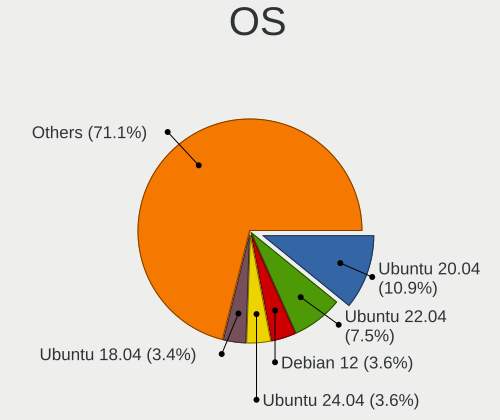

| Name               | Desktops | Percent |
|--------------------|----------|---------|
| Ubuntu 20.04       | 733      | 10.87%  |
| Ubuntu 22.04       | 503      | 7.46%   |
| Debian 12          | 246      | 3.65%   |
| Ubuntu 24.04       | 241      | 3.57%   |
| Ubuntu 18.04       | 226      | 3.35%   |
| OpenMandriva 4.2   | 193      | 2.86%   |
| Debian 11          | 179      | 2.65%   |
| OpenMandriva 4.3   | 148      | 2.19%   |
| Arch Rolling       | 145      | 2.15%   |
| Xubuntu 20.04      | 86       | 1.27%   |
| OpenMandriva 25.90 | 81       | 1.2%    |
| OpenMandriva 24.12 | 77       | 1.14%   |
| Zorin 17           | 75       | 1.11%   |
| OpenMandriva 23.08 | 75       | 1.11%   |
| Pop!_OS 22.04      | 72       | 1.07%   |
| Linux Mint 20.3    | 71       | 1.05%   |
| Linux Mint 22.1    | 70       | 1.04%   |
| OpenMandriva 23.01 | 69       | 1.02%   |
| Linux Mint 21.1    | 63       | 0.93%   |
| Linux Mint 22.2    | 59       | 0.87%   |
| Linux Mint 20.1    | 58       | 0.86%   |
| Debian 10          | 58       | 0.86%   |
| Debian 13          | 55       | 0.82%   |
| OpenMandriva 23.03 | 54       | 0.8%    |
| Zorin 16           | 51       | 0.76%   |
| Linux Mint 21.2    | 49       | 0.73%   |
| Kubuntu 22.04      | 48       | 0.71%   |
| Fedora 40          | 48       | 0.71%   |
| Manjaro            | 47       | 0.7%    |
| Xubuntu 22.04      | 46       | 0.68%   |
| Linux Mint 21.3    | 46       | 0.68%   |
| Linux Mint 20.2    | 44       | 0.65%   |
| Ubuntu 20.10       | 41       | 0.61%   |
| Ubuntu 21.10       | 40       | 0.59%   |
| Ubuntu 21.04       | 40       | 0.59%   |
| Fedora 42          | 40       | 0.59%   |
| Fedora 39          | 40       | 0.59%   |
| ArcoLinux Rolling  | 39       | 0.58%   |
| OpenMandriva 5.0   | 38       | 0.56%   |
| Linux Mint 19.3    | 38       | 0.56%   |

OS Family
---------

OS without a version

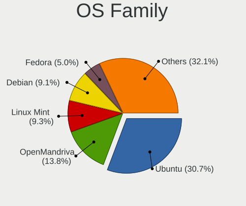

| Name             | Desktops | Percent |
|------------------|----------|---------|
| Ubuntu           | 1918     | 30.73%  |
| OpenMandriva     | 860      | 13.78%  |
| Linux Mint       | 578      | 9.26%   |
| Debian           | 571      | 9.15%   |
| Fedora           | 314      | 5.03%   |
| Xubuntu          | 206      | 3.3%    |
| Arch             | 178      | 2.85%   |
| Kubuntu          | 162      | 2.6%    |
| Zorin            | 159      | 2.55%   |
| Manjaro          | 132      | 2.11%   |
| Pop!_OS          | 120      | 1.92%   |
| ROSA             | 105      | 1.68%   |
| Ubuntu MATE      | 82       | 1.31%   |
| Lubuntu          | 73       | 1.17%   |
| Bazzite          | 66       | 1.06%   |
| KDE neon         | 58       | 0.93%   |
| Gentoo           | 56       | 0.9%    |
| Ubuntu Unity     | 53       | 0.85%   |
| openSUSE         | 48       | 0.77%   |
| ArcoLinux        | 39       | 0.62%   |
| Nobara           | 37       | 0.59%   |
| LMDE             | 37       | 0.59%   |
| Mageia           | 25       | 0.4%    |
| EndeavourOS      | 24       | 0.38%   |
| Elementary       | 24       | 0.38%   |
| Ubuntu Budgie    | 19       | 0.3%    |
| Devuan           | 19       | 0.3%    |
| Kali             | 17       | 0.27%   |
| BlackPanther     | 16       | 0.26%   |
| CentOS           | 15       | 0.24%   |
| CachyOS          | 15       | 0.24%   |
| SteamOS          | 14       | 0.22%   |
| MX               | 13       | 0.21%   |
| org.kde.Platform | 12       | 0.19%   |
| Ubuntu Studio    | 11       | 0.18%   |
| NixOS            | 11       | 0.18%   |
| Clear Linux      | 11       | 0.18%   |
| Garuda Linux     | 9        | 0.14%   |
| ChimeraOS        | 9        | 0.14%   |
| Endless          | 8        | 0.13%   |

Kernel
------

Version of the Linux kernel

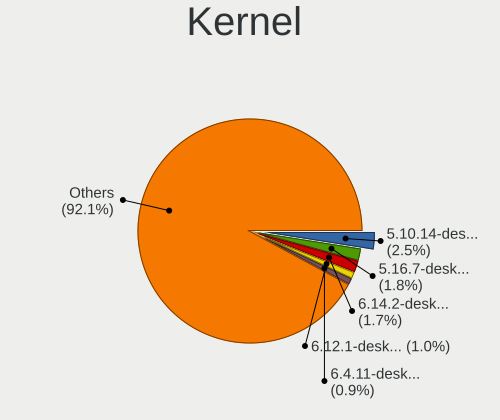

| Version                  | Desktops | Percent |
|--------------------------|----------|---------|
| 5.10.14-desktop-1omv4002 | 186      | 2.5%    |
| 5.16.7-desktop-1omv4003  | 131      | 1.76%   |
| 6.14.2-desktop-3omv2590  | 128      | 1.72%   |
| 6.12.1-desktop-1omv2490  | 73       | 0.98%   |
| 6.4.11-desktop-1omv2390  | 67       | 0.9%    |
| 6.1.1-desktop-1omv2290   | 62       | 0.83%   |
| 6.6.2-desktop-1omv2390   | 54       | 0.73%   |
| 6.2.6-desktop-1omv2390   | 50       | 0.67%   |
| 6.1.0-16-amd64           | 50       | 0.67%   |
| 5.4.0-58-generic         | 50       | 0.67%   |
| 6.8.0-51-generic         | 47       | 0.63%   |
| 6.14.0-33-generic        | 47       | 0.63%   |
| 5.4.0-42-generic         | 44       | 0.59%   |
| 5.15.0-56-generic        | 44       | 0.59%   |
| 6.8.0-40-generic         | 39       | 0.52%   |
| 5.15.0-52-generic        | 39       | 0.52%   |
| 6.1.0-27-amd64           | 38       | 0.51%   |
| 5.15.0-58-generic        | 36       | 0.48%   |
| 6.8.0-60-generic         | 35       | 0.47%   |
| 6.8.0-52-generic         | 35       | 0.47%   |
| 6.5.0-14-generic         | 35       | 0.47%   |
| 6.8.0-45-generic         | 32       | 0.43%   |
| 5.4.0-52-generic         | 32       | 0.43%   |
| 5.4.0-65-generic         | 31       | 0.42%   |
| 5.4.0-48-generic         | 31       | 0.42%   |
| 5.4.0-29-generic         | 30       | 0.4%    |
| 5.11.0-37-generic        | 30       | 0.4%    |
| 5.15.0-91-generic        | 29       | 0.39%   |
| 5.8.0-43-generic         | 28       | 0.38%   |
| 5.4.0-26-generic         | 28       | 0.38%   |
| 5.15.0-48-generic        | 28       | 0.38%   |
| 5.11.0-27-generic        | 28       | 0.38%   |
| 6.8.0-31-generic         | 27       | 0.36%   |
| 5.15.0-46-generic        | 27       | 0.36%   |
| 5.15.0-43-generic        | 27       | 0.36%   |
| 5.13.0-28-generic        | 27       | 0.36%   |
| 6.14.0-36-generic        | 26       | 0.35%   |
| 6.14.0-29-generic        | 26       | 0.35%   |
| 5.8.0-50-generic         | 26       | 0.35%   |
| 5.19.0-38-generic        | 26       | 0.35%   |

Kernel Family
-------------

Linux kernel without a distro release

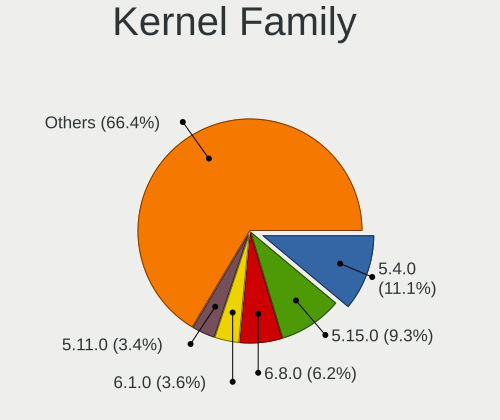

| Version | Desktops | Percent |
|---------|----------|---------|
| 5.4.0   | 772      | 11.06%  |
| 5.15.0  | 648      | 9.28%   |
| 6.8.0   | 432      | 6.19%   |
| 6.1.0   | 252      | 3.61%   |
| 5.11.0  | 239      | 3.42%   |
| 5.8.0   | 220      | 3.15%   |
| 4.15.0  | 212      | 3.04%   |
| 6.14.0  | 194      | 2.78%   |
| 5.10.14 | 188      | 2.69%   |
| 6.5.0   | 185      | 2.65%   |
| 5.13.0  | 179      | 2.56%   |
| 5.10.0  | 169      | 2.42%   |
| 5.19.0  | 161      | 2.31%   |
| 6.2.0   | 145      | 2.08%   |
| 6.14.2  | 136      | 1.95%   |
| 5.16.7  | 132      | 1.89%   |
| 5.3.0   | 104      | 1.49%   |
| 6.11.0  | 88       | 1.26%   |
| 6.12.1  | 81       | 1.16%   |
| 6.4.11  | 68       | 0.97%   |
| 6.1.1   | 66       | 0.95%   |
| 6.2.6   | 63       | 0.9%    |
| 4.18.0  | 61       | 0.87%   |
| 5.0.0   | 60       | 0.86%   |
| 6.6.2   | 59       | 0.85%   |
| 4.19.0  | 59       | 0.85%   |
| 6.17.7  | 23       | 0.33%   |
| 6.12.9  | 22       | 0.32%   |
| 6.12.48 | 22       | 0.32%   |
| 6.10.0  | 22       | 0.32%   |
| 5.16.13 | 20       | 0.29%   |
| 6.12.57 | 19       | 0.27%   |
| 4.9.20  | 19       | 0.27%   |
| 6.9.3   | 18       | 0.26%   |
| 6.15.9  | 17       | 0.24%   |
| 6.5.5   | 16       | 0.23%   |
| 4.9.60  | 16       | 0.23%   |
| 6.14.6  | 15       | 0.21%   |
| 4.4.0   | 15       | 0.21%   |
| 6.4.8   | 14       | 0.2%    |

Kernel Major Ver.
-----------------

Linux kernel major version

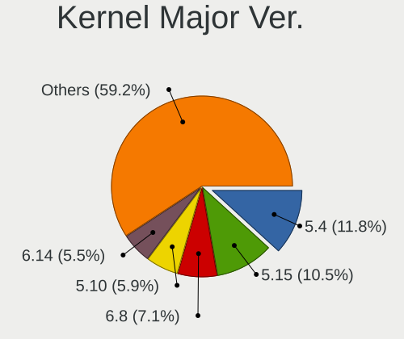

| Version | Desktops | Percent |
|---------|----------|---------|
| 5.4     | 813      | 11.79%  |
| 5.15    | 724      | 10.5%   |
| 6.8     | 487      | 7.06%   |
| 5.10    | 406      | 5.89%   |
| 6.14    | 382      | 5.54%   |
| 6.1     | 375      | 5.44%   |
| 5.11    | 280      | 4.06%   |
| 5.8     | 263      | 3.81%   |
| 6.2     | 251      | 3.64%   |
| 6.5     | 242      | 3.51%   |
| 6.12    | 242      | 3.51%   |
| 4.15    | 213      | 3.09%   |
| 5.13    | 212      | 3.07%   |
| 5.19    | 195      | 2.83%   |
| 5.16    | 186      | 2.7%    |
| 6.6     | 161      | 2.33%   |
| 6.11    | 136      | 1.97%   |
| 6.4     | 121      | 1.75%   |
| 5.3     | 120      | 1.74%   |
| 4.18    | 76       | 1.1%    |
| 6.17    | 70       | 1.02%   |
| 5.0     | 67       | 0.97%   |
| 4.19    | 66       | 0.96%   |
| 6.9     | 64       | 0.93%   |
| 4.9     | 63       | 0.91%   |
| 6.15    | 61       | 0.88%   |
| 6.10    | 58       | 0.84%   |
| 5.18    | 52       | 0.75%   |
| 6.0     | 49       | 0.71%   |
| 6.16    | 44       | 0.64%   |
| 6.13    | 43       | 0.62%   |
| 5.9     | 43       | 0.62%   |
| 5.14    | 42       | 0.61%   |
| 6.7     | 41       | 0.59%   |
| 5.17    | 40       | 0.58%   |
| 6.3     | 36       | 0.52%   |
| 5.6     | 29       | 0.42%   |
| 5.7     | 27       | 0.39%   |
| 5.12    | 27       | 0.39%   |
| 4.4     | 16       | 0.23%   |

Arch
----

OS architecture (x86_64, i586, etc.)

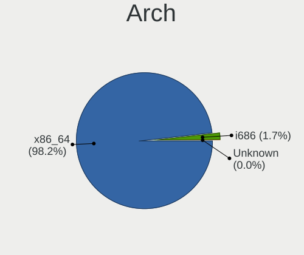

| Name    | Desktops | Percent |
|---------|----------|---------|
| x86_64  | 5905     | 98.2%   |
| i686    | 103      | 1.71%   |
| armv7l  | 3        | 0.05%   |
| ppc64le | 1        | 0.02%   |
| Unknown | 1        | 0.02%   |

DE
--

Desktop Environment

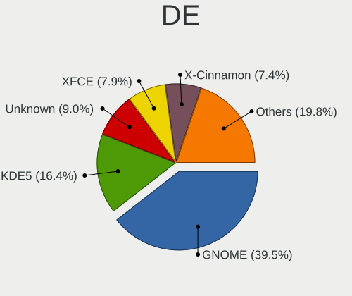

| Name              | Desktops | Percent |
|-------------------|----------|---------|
| GNOME             | 2504     | 39.49%  |
| KDE5              | 1041     | 16.42%  |
| Unknown           | 572      | 9.02%   |
| XFCE              | 500      | 7.89%   |
| X-Cinnamon        | 468      | 7.38%   |
| KDE6              | 463      | 7.3%    |
| MATE              | 230      | 3.63%   |
| LXQt              | 112      | 1.77%   |
| KDE4              | 70       | 1.1%    |
| KDE               | 68       | 1.07%   |
| Cinnamon          | 65       | 1.03%   |
| Unity             | 51       | 0.8%    |
| LXDE              | 27       | 0.43%   |
| Pantheon          | 26       | 0.41%   |
| Budgie            | 24       | 0.38%   |
| i3                | 21       | 0.33%   |
| Hyprland          | 19       | 0.3%    |
| GNOME Flashback   | 17       | 0.27%   |
| GNOME Classic     | 14       | 0.22%   |
| sway              | 5        | 0.08%   |
| Deepin            | 5        | 0.08%   |
| awesome           | 5        | 0.08%   |
| qtile             | 4        | 0.06%   |
| Openbox           | 3        | 0.05%   |
| ICEWM             | 3        | 0.05%   |
| COSMIC            | 3        | 0.05%   |
| bspwm             | 3        | 0.05%   |
| niri              | 2        | 0.03%   |
| GNUstep           | 2        | 0.03%   |
| fluxbox           | 2        | 0.03%   |
| ubuntu:pika:GNOME | 1        | 0.02%   |
| trinity           | 1        | 0.02%   |
| lightdm-xsession  | 1        | 0.02%   |
| INPT              | 1        | 0.02%   |
| i3-with-shmlog    | 1        | 0.02%   |
| Hypr              | 1        | 0.02%   |
| GNOME-Classic     | 1        | 0.02%   |
| Enlightenment     | 1        | 0.02%   |
| Endless:GNOME     | 1        | 0.02%   |
| DWM               | 1        | 0.02%   |

Display Server
--------------

X11 or Wayland

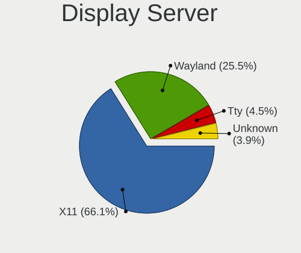

| Name    | Desktops | Percent |
|---------|----------|---------|
| X11     | 4155     | 66.12%  |
| Wayland | 1602     | 25.49%  |
| Tty     | 283      | 4.5%    |
| Unknown | 244      | 3.88%   |

Display Manager
---------------

SDDM, LightDM, etc.

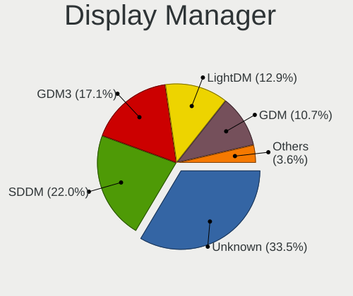

| Name    | Desktops | Percent |
|---------|----------|---------|
| Unknown | 2117     | 33.54%  |
| SDDM    | 1391     | 22.04%  |
| GDM3    | 1082     | 17.14%  |
| LightDM | 815      | 12.91%  |
| GDM     | 677      | 10.73%  |
| TDM     | 139      | 2.2%    |
| KDM     | 58       | 0.92%   |
| SLiM    | 12       | 0.19%   |
| Ly      | 5        | 0.08%   |
| LXDM    | 5        | 0.08%   |
| XDM     | 3        | 0.05%   |
| WDM     | 2        | 0.03%   |
| GREETD  | 2        | 0.03%   |
| NODM    | 1        | 0.02%   |
| LY-DM   | 1        | 0.02%   |
| LEMURS  | 1        | 0.02%   |
| EMPTTY  | 1        | 0.02%   |

OS Lang
-------

Language

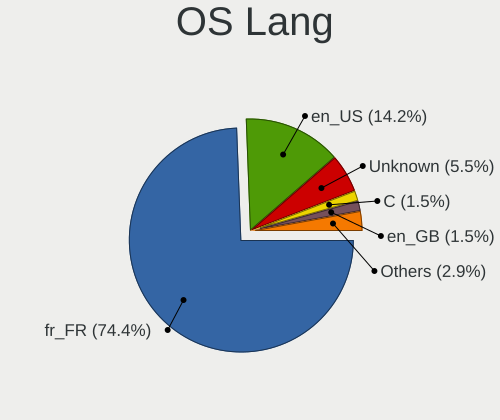

| Lang        | Desktops | Percent |
|-------------|----------|---------|
| fr_FR       | 4574     | 74.4%   |
| en_US       | 874      | 14.22%  |
| Unknown     | 341      | 5.55%   |
| C           | 92       | 1.5%    |
| en_GB       | 91       | 1.48%   |
| it_IT       | 37       | 0.6%    |
| de_DE       | 29       | 0.47%   |
| ru_RU       | 11       | 0.18%   |
| en_IE       | 10       | 0.16%   |
| C.UTF8      | 9        | 0.15%   |
| fr_CH       | 8        | 0.13%   |
| fr_BE       | 8        | 0.13%   |
| fr_CA       | 7        | 0.11%   |
| es_ES       | 7        | 0.11%   |
| pt_PT       | 6        | 0.1%    |
| POSIX       | 5        | 0.08%   |
| nl_NL       | 5        | 0.08%   |
| fr_FR.UTF8  | 4        | 0.07%   |
| en_DK       | 4        | 0.07%   |
| sv_SE       | 2        | 0.03%   |
| en_AU       | 2        | 0.03%   |
| ar_SA       | 2        | 0.03%   |
| sr_RS@latin | 1        | 0.02%   |
| sr_RS       | 1        | 0.02%   |
| ru_UA       | 1        | 0.02%   |
| ro_RO       | 1        | 0.02%   |
| pl_PL       | 1        | 0.02%   |
| nb_NO       | 1        | 0.02%   |
| fur_IT      | 1        | 0.02%   |
| fr_LU       | 1        | 0.02%   |
| fr_FR.utf-8 | 1        | 0.02%   |
| fi_FI       | 1        | 0.02%   |
| es_ES@euro  | 1        | 0.02%   |
| es_CO       | 1        | 0.02%   |
| es_BO       | 1        | 0.02%   |
| en_US.UTF8  | 1        | 0.02%   |
| en_US.utf-8 | 1        | 0.02%   |
| en_IE@euro  | 1        | 0.02%   |
| en_EN       | 1        | 0.02%   |
| en_AG       | 1        | 0.02%   |

Boot Mode
---------

EFI or BIOS

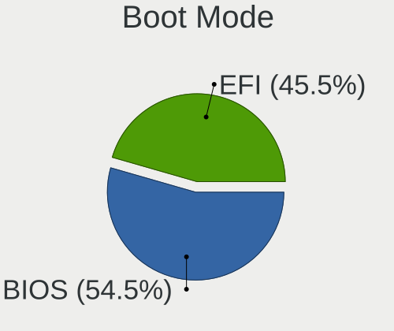

| Mode | Desktops | Percent |
|------|----------|---------|
| BIOS | 3352     | 54.45%  |
| EFI  | 2804     | 45.55%  |

Filesystem
----------

Type of filesystem

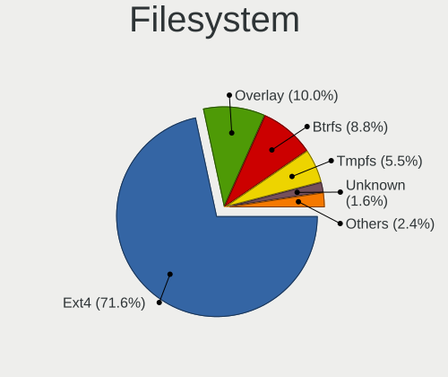

| Type     | Desktops | Percent |
|----------|----------|---------|
| Ext4     | 4479     | 71.64%  |
| Overlay  | 627      | 10.03%  |
| Btrfs    | 551      | 8.81%   |
| Tmpfs    | 343      | 5.49%   |
| Unknown  | 103      | 1.65%   |
| Xfs      | 78       | 1.25%   |
| Zfs      | 39       | 0.62%   |
| Ext3     | 12       | 0.19%   |
| F2fs     | 8        | 0.13%   |
| Ext2     | 6        | 0.1%    |
| Rootfs   | 3        | 0.05%   |
| Reiserfs | 2        | 0.03%   |
| Aufs     | 1        | 0.02%   |

Part. scheme
------------

Scheme of partitioning

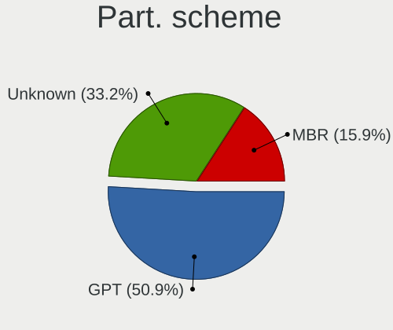

| Type    | Desktops | Percent |
|---------|----------|---------|
| GPT     | 3170     | 50.92%  |
| Unknown | 2068     | 33.22%  |
| MBR     | 988      | 15.87%  |

Dual Boot with Linux/BSD
------------------------

Hosting more than one Linux/BSD

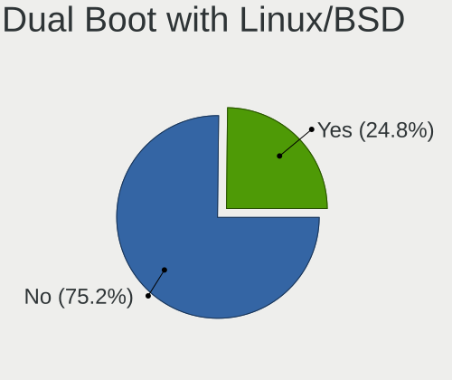

| Dual boot | Desktops | Percent |
|-----------|----------|---------|
| No        | 4666     | 75.17%  |
| Yes       | 1541     | 24.83%  |

Dual Boot (Win)
---------------

Hosting Linux and Windows

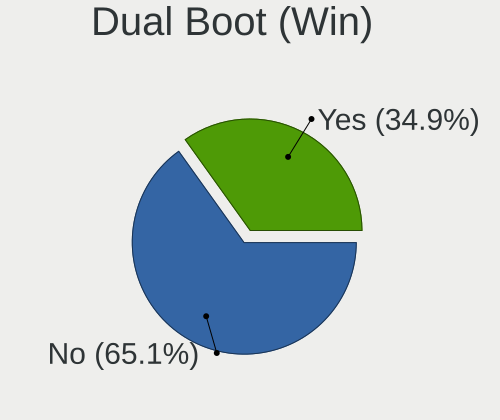

| Dual boot | Desktops | Percent |
|-----------|----------|---------|
| No        | 4019     | 65.12%  |
| Yes       | 2153     | 34.88%  |

Board
-----

Vendor
------

Motherboard manufacturer

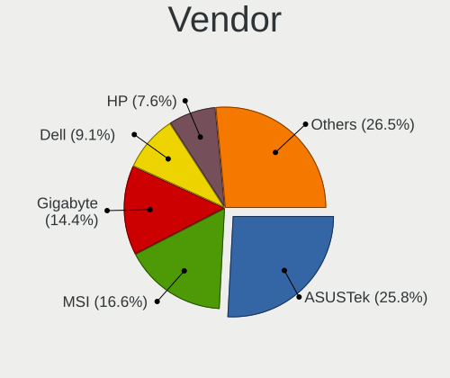

| Name                                 | Desktops | Percent |
|--------------------------------------|----------|---------|
| ASUSTek Computer                     | 1553     | 25.84%  |
| MSI                                  | 997      | 16.59%  |
| Gigabyte Technology                  | 863      | 14.36%  |
| Dell                                 | 544      | 9.05%   |
| Hewlett-Packard                      | 459      | 7.64%   |
| ASRock                               | 378      | 6.29%   |
| Lenovo                               | 256      | 4.26%   |
| Acer                                 | 140      | 2.33%   |
| Intel                                | 107      | 1.78%   |
| Unknown                              | 97       | 1.61%   |
| Pegatron                             | 68       | 1.13%   |
| Foxconn                              | 68       | 1.13%   |
| Fujitsu                              | 59       | 0.98%   |
| Packard Bell                         | 53       | 0.88%   |
| Shuttle                              | 27       | 0.45%   |
| AZW                                  | 27       | 0.45%   |
| eMachines                            | 24       | 0.4%    |
| Shenzhen Meigao Electronic Equipment | 22       | 0.37%   |
| Medion                               | 22       | 0.37%   |
| Supermicro                           | 19       | 0.32%   |
| ECS                                  | 18       | 0.3%    |
| Biostar                              | 17       | 0.28%   |
| GEEKOM                               | 13       | 0.22%   |
| Apple                                | 12       | 0.2%    |
| Alienware                            | 12       | 0.2%    |
| BESSTAR Tech                         | 11       | 0.18%   |
| ASRockRack                           | 11       | 0.18%   |
| OEM                                  | 9        | 0.15%   |
| Huanan                               | 9        | 0.15%   |
| AMI                                  | 9        | 0.15%   |
| MACHINIST                            | 6        | 0.1%    |
| HC Technology.                       | 5        | 0.08%   |
| ZOTAC                                | 4        | 0.07%   |
| NEC Computers                        | 4        | 0.07%   |
| Fujitsu Siemens                      | 4        | 0.07%   |
| GMKtec                               | 3        | 0.05%   |
| Gateway                              | 3        | 0.05%   |
| ABIT                                 | 3        | 0.05%   |
| Wistron                              | 2        | 0.03%   |
| TYAN Computer                        | 2        | 0.03%   |

Model
-----

Motherboard model

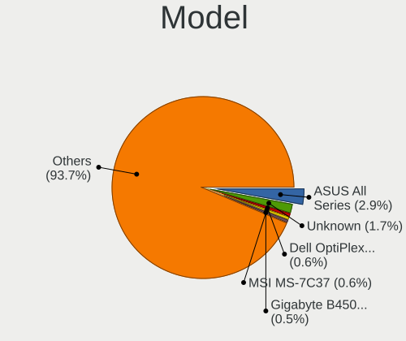

| Name                         | Desktops | Percent |
|------------------------------|----------|---------|
| ASUS All Series              | 173      | 2.88%   |
| Unknown                      | 101      | 1.68%   |
| Dell OptiPlex 7010           | 38       | 0.63%   |
| MSI MS-7C37                  | 35       | 0.58%   |
| Gigabyte B450M DS3H          | 33       | 0.55%   |
| Dell OptiPlex 9020           | 29       | 0.48%   |
| Dell OptiPlex 3020           | 29       | 0.48%   |
| MSI MS-7C91                  | 28       | 0.47%   |
| MSI MS-7C56                  | 27       | 0.45%   |
| Dell OptiPlex 390            | 27       | 0.45%   |
| ASUS TUF Gaming X570-PLUS    | 24       | 0.4%    |
| MSI MS-7816                  | 23       | 0.38%   |
| ASUS TUF Gaming B550-PLUS    | 21       | 0.35%   |
| MSI MS-7C02                  | 20       | 0.33%   |
| MSI MS-7817                  | 20       | 0.33%   |
| HP ProDesk 400 G2.5 SFF      | 20       | 0.33%   |
| Gigabyte B450 AORUS ELITE    | 20       | 0.33%   |
| ASUS PRIME A320M-K           | 20       | 0.33%   |
| MSI MS-7B79                  | 18       | 0.3%    |
| MSI MS-7A38                  | 18       | 0.3%    |
| HP Compaq Elite 8300 SFF     | 18       | 0.3%    |
| ASUS TUF B450-PLUS GAMING    | 18       | 0.3%    |
| ASUS PRIME B450M-A           | 18       | 0.3%    |
| MSI MS-7B86                  | 17       | 0.28%   |
| MSI MS-7758                  | 17       | 0.28%   |
| MSI MS-7C52                  | 16       | 0.27%   |
| HP Compaq 8200 Elite SFF PC  | 16       | 0.27%   |
| Gigabyte 970A-DS3P           | 16       | 0.27%   |
| ASUS ROG STRIX B550-F GAMING | 16       | 0.27%   |
| MSI MS-7B84                  | 15       | 0.25%   |
| MSI MS-7721                  | 15       | 0.25%   |
| MSI MS-7693                  | 15       | 0.25%   |
| Gigabyte B550 AORUS ELITE V2 | 15       | 0.25%   |
| Dell Precision T1700         | 15       | 0.25%   |
| Dell OptiPlex 7040           | 15       | 0.25%   |
| MSI MS-7821                  | 14       | 0.23%   |
| Dell OptiPlex 3050           | 14       | 0.23%   |
| Dell OptiPlex 3010           | 14       | 0.23%   |
| ASUS PRIME X470-PRO          | 14       | 0.23%   |
| ASUS P7P55D                  | 14       | 0.23%   |

Model Family
------------

Motherboard model prefix

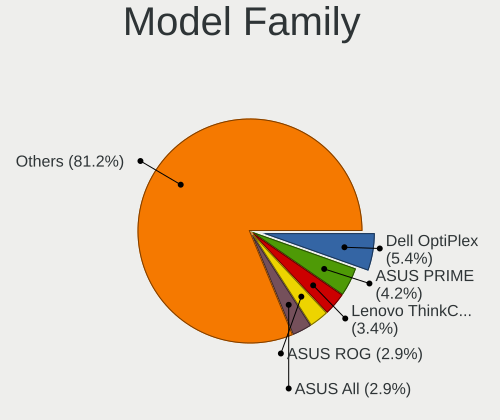

| Name                | Desktops | Percent |
|---------------------|----------|---------|
| Dell OptiPlex       | 326      | 5.43%   |
| ASUS PRIME          | 252      | 4.19%   |
| Lenovo ThinkCentre  | 203      | 3.38%   |
| ASUS ROG            | 173      | 2.88%   |
| ASUS All            | 173      | 2.88%   |
| ASUS TUF            | 161      | 2.68%   |
| Dell Precision      | 149      | 2.48%   |
| HP Compaq           | 128      | 2.13%   |
| Unknown             | 101      | 1.68%   |
| HP ProDesk          | 96       | 1.6%    |
| Acer Aspire         | 88       | 1.46%   |
| HP EliteDesk        | 54       | 0.9%    |
| Fujitsu ESPRIMO     | 51       | 0.85%   |
| Gigabyte B450       | 45       | 0.75%   |
| Packard Bell IMEDIA | 44       | 0.73%   |
| Gigabyte B450M      | 42       | 0.7%    |
| Gigabyte B550       | 41       | 0.68%   |
| Acer Veriton        | 36       | 0.6%    |
| MSI MS-7C37         | 35       | 0.58%   |
| ASUS P8Z77-V        | 33       | 0.55%   |
| Gigabyte X570       | 31       | 0.52%   |
| MSI MS-7C91         | 28       | 0.47%   |
| HP Pavilion         | 28       | 0.47%   |
| MSI MS-7C56         | 27       | 0.45%   |
| Gigabyte B550M      | 24       | 0.4%    |
| MSI MS-7816         | 23       | 0.38%   |
| Gigabyte Z390       | 22       | 0.37%   |
| Dell Inspiron       | 22       | 0.37%   |
| Gigabyte 970A-DS3P  | 21       | 0.35%   |
| MSI MS-7C02         | 20       | 0.33%   |
| MSI MS-7817         | 20       | 0.33%   |
| Lenovo ThinkStation | 20       | 0.33%   |
| ASUS P8Z68-V        | 20       | 0.33%   |
| ASUS P7P55D         | 20       | 0.33%   |
| ASUS M5A78L-M       | 20       | 0.33%   |
| Dell XPS            | 19       | 0.32%   |
| ASUS P8P67          | 19       | 0.32%   |
| ASRock X570         | 19       | 0.32%   |
| MSI MS-7B79         | 18       | 0.3%    |
| MSI MS-7A38         | 18       | 0.3%    |

MFG Year
--------

Motherboard manufacture year

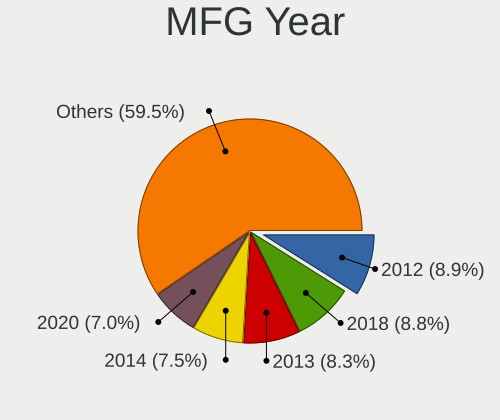

| Year    | Desktops | Percent |
|---------|----------|---------|
| 2012    | 537      | 8.94%   |
| 2018    | 527      | 8.77%   |
| 2013    | 497      | 8.27%   |
| 2014    | 448      | 7.46%   |
| 2020    | 422      | 7.02%   |
| 2011    | 382      | 6.36%   |
| 2019    | 367      | 6.11%   |
| 2015    | 344      | 5.72%   |
| 2010    | 308      | 5.13%   |
| 2009    | 297      | 4.94%   |
| 2017    | 294      | 4.89%   |
| 2021    | 286      | 4.76%   |
| 2016    | 252      | 4.19%   |
| 2008    | 217      | 3.61%   |
| 2022    | 208      | 3.46%   |
| 2023    | 186      | 3.1%    |
| 2007    | 135      | 2.25%   |
| 2024    | 118      | 1.96%   |
| 2006    | 86       | 1.43%   |
| 2005    | 36       | 0.6%    |
| 2025    | 34       | 0.57%   |
| 2004    | 10       | 0.17%   |
| 2003    | 10       | 0.17%   |
| Unknown | 5        | 0.08%   |
| 2001    | 2        | 0.03%   |
| 2002    | 1        | 0.02%   |

Form Factor
-----------

Physical design of the computer

| Name    | Desktops | Percent |
|---------|----------|---------|
| Desktop | 6009     | 100%    |

Secure Boot
-----------

Enabled or disabled

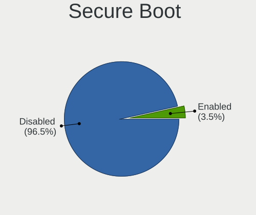

| State    | Desktops | Percent |
|----------|----------|---------|
| Disabled | 5814     | 96.48%  |
| Enabled  | 212      | 3.52%   |

Coreboot
--------

Have coreboot on board

| Used | Desktops | Percent |
|------|----------|---------|
| No   | 6006     | 99.95%  |
| Yes  | 3        | 0.05%   |

RAM Size
--------

Total RAM memory

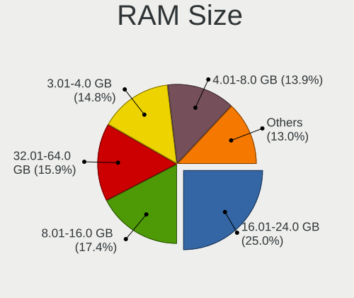

| Size in GB      | Desktops | Percent |
|-----------------|----------|---------|
| 16.01-24.0      | 1542     | 25%     |
| 8.01-16.0       | 1073     | 17.4%   |
| 32.01-64.0      | 978      | 15.86%  |
| 3.01-4.0        | 914      | 14.82%  |
| 4.01-8.0        | 858      | 13.91%  |
| 64.01-256.0     | 287      | 4.65%   |
| 24.01-32.0      | 243      | 3.94%   |
| 1.01-2.0        | 154      | 2.5%    |
| 2.01-3.0        | 74       | 1.2%    |
| 0.51-1.0        | 26       | 0.42%   |
| More than 256.0 | 9        | 0.15%   |
| Unknown         | 5        | 0.08%   |
| 0.01-0.5        | 4        | 0.06%   |

RAM Used
--------

Used RAM memory

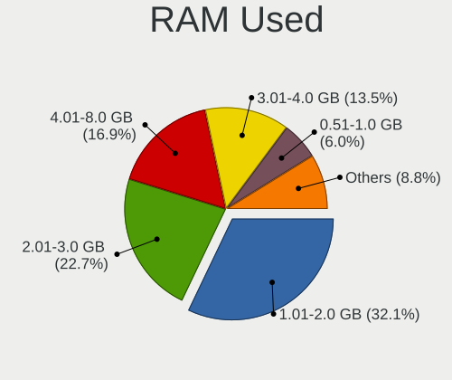

| Used GB     | Desktops | Percent |
|-------------|----------|---------|
| 1.01-2.0    | 2165     | 32.11%  |
| 2.01-3.0    | 1529     | 22.68%  |
| 4.01-8.0    | 1140     | 16.91%  |
| 3.01-4.0    | 910      | 13.5%   |
| 0.51-1.0    | 406      | 6.02%   |
| 8.01-16.0   | 369      | 5.47%   |
| 0.01-0.5    | 84       | 1.25%   |
| 16.01-24.0  | 68       | 1.01%   |
| 32.01-64.0  | 28       | 0.42%   |
| 24.01-32.0  | 27       | 0.4%    |
| 64.01-256.0 | 11       | 0.16%   |
| Unknown     | 6        | 0.09%   |

Total Drives
------------

Number of drives on board

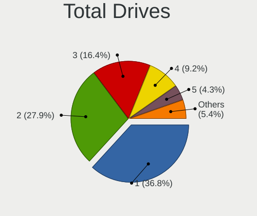

| Drives  | Desktops | Percent |
|---------|----------|---------|
| 1       | 2327     | 36.8%   |
| 2       | 1767     | 27.95%  |
| 3       | 1035     | 16.37%  |
| 4       | 581      | 9.19%   |
| 5       | 274      | 4.33%   |
| 6       | 143      | 2.26%   |
| 7       | 70       | 1.11%   |
| 0       | 45       | 0.71%   |
| 8       | 35       | 0.55%   |
| 9       | 18       | 0.28%   |
| 10      | 7        | 0.11%   |
| 14      | 4        | 0.06%   |
| 11      | 3        | 0.05%   |
| Unknown | 3        | 0.05%   |
| 13      | 2        | 0.03%   |
| 12      | 2        | 0.03%   |
| 25      | 1        | 0.02%   |
| 22      | 1        | 0.02%   |
| 21      | 1        | 0.02%   |
| 20      | 1        | 0.02%   |
| 19      | 1        | 0.02%   |
| 17      | 1        | 0.02%   |
| 15      | 1        | 0.02%   |

Has CD-ROM
----------

Has CD-ROM on board

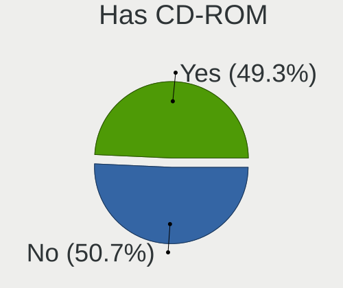

| Presented | Desktops | Percent |
|-----------|----------|---------|
| No        | 3099     | 50.72%  |
| Yes       | 3011     | 49.28%  |

Has Ethernet
------------

Has Ethernet on board

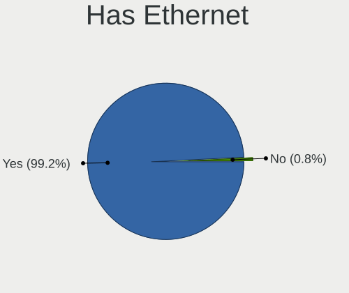

| Presented | Desktops | Percent |
|-----------|----------|---------|
| Yes       | 5962     | 99.22%  |
| No        | 47       | 0.78%   |

Has WiFi
--------

Has WiFi module

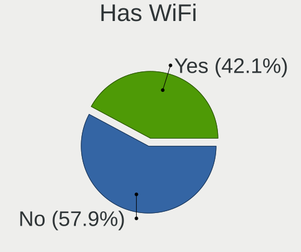

| Presented | Desktops | Percent |
|-----------|----------|---------|
| No        | 3541     | 57.85%  |
| Yes       | 2580     | 42.15%  |

Has Bluetooth
-------------

Has Bluetooth module

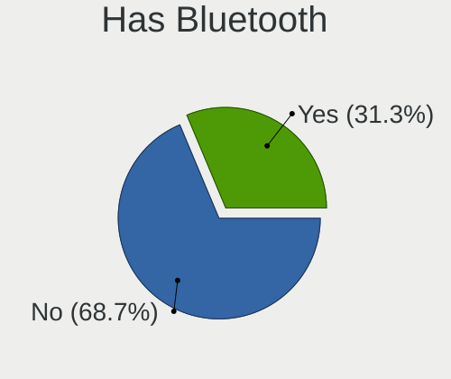

| Presented | Desktops | Percent |
|-----------|----------|---------|
| No        | 4193     | 68.68%  |
| Yes       | 1912     | 31.32%  |

Location
--------

Country
-------

Geographic location (country)

| Country | Desktops | Percent |
|---------|----------|---------|
| France  | 6009     | 100%    |

City
----

Geographic location (city)

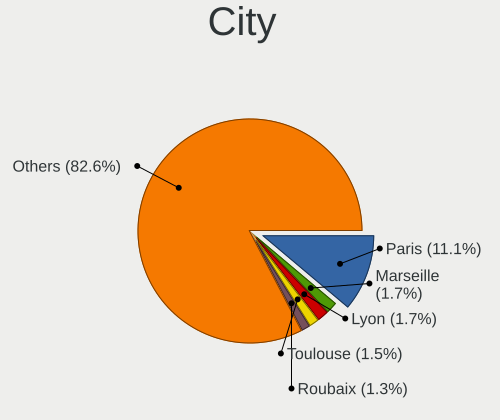

| City             | Desktops | Percent |
|------------------|----------|---------|
| Paris            | 729      | 11.13%  |
| Marseille        | 113      | 1.73%   |
| Lyon             | 112      | 1.71%   |
| Toulouse         | 97       | 1.48%   |
| Roubaix          | 85       | 1.3%    |
| Strasbourg       | 77       | 1.18%   |
| Nantes           | 65       | 0.99%   |
| Rosny-sous-Bois  | 63       | 0.96%   |
| Bagneux          | 57       | 0.87%   |
| Rennes           | 53       | 0.81%   |
| Montpellier      | 52       | 0.79%   |
| Nice             | 51       | 0.78%   |
| Grenoble         | 47       | 0.72%   |
| Bordeaux         | 45       | 0.69%   |
| Lille            | 40       | 0.61%   |
| Limoges          | 36       | 0.55%   |
| Tours            | 34       | 0.52%   |
| Poitiers         | 32       | 0.49%   |
| Clichy-sous-Bois | 31       | 0.47%   |
| Caen             | 29       | 0.44%   |
| Toulon           | 28       | 0.43%   |
| Brest            | 26       | 0.4%    |
| Nancy            | 23       | 0.35%   |
| Amiens           | 23       | 0.35%   |
| Nîmes           | 22       | 0.34%   |
| Dijon            | 22       | 0.34%   |
| Besançon        | 22       | 0.34%   |
| Aix-en-Provence  | 22       | 0.34%   |
| Saint-Nazaire    | 21       | 0.32%   |
| Clermont-Ferrand | 20       | 0.31%   |
| Valenciennes     | 19       | 0.29%   |
| Valence          | 19       | 0.29%   |
| Perpignan        | 19       | 0.29%   |
| Orléans         | 19       | 0.29%   |
| La Rochelle      | 19       | 0.29%   |
| Versailles       | 18       | 0.27%   |
| Saint-Denis      | 18       | 0.27%   |
| Metz             | 18       | 0.27%   |
| Sartrouville     | 17       | 0.26%   |
| Rouen            | 17       | 0.26%   |

Drives
------

Drive Vendor
------------

Hard drive vendors

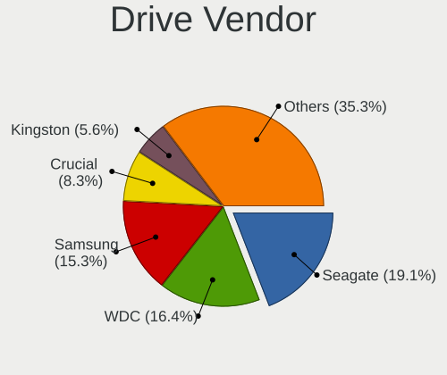

| Vendor                       | Desktops | Drives | Percent |
|------------------------------|----------|--------|---------|
| Seagate                      | 2175     | 3616   | 19.13%  |
| WDC                          | 1866     | 3246   | 16.41%  |
| Samsung Electronics          | 1740     | 3128   | 15.3%   |
| Crucial                      | 940      | 1412   | 8.27%   |
| Kingston                     | 635      | 850    | 5.59%   |
| Toshiba                      | 501      | 748    | 4.41%   |
| Sandisk                      | 488      | 662    | 4.29%   |
| Hitachi                      | 309      | 443    | 2.72%   |
| PNY                          | 213      | 298    | 1.87%   |
| Micron/Crucial Technology    | 182      | 278    | 1.6%    |
| Intel                        | 139      | 172    | 1.22%   |
| Maxtor                       | 136      | 186    | 1.2%    |
| Unknown                      | 118      | 207    | 1.04%   |
| HGST                         | 118      | 197    | 1.04%   |
| China                        | 111      | 152    | 0.98%   |
| Phison Electronics           | 105      | 152    | 0.92%   |
| Corsair                      | 87       | 115    | 0.77%   |
| Micron Technology            | 83       | 114    | 0.73%   |
| SPCC                         | 71       | 94     | 0.62%   |
| LDLC                         | 71       | 107    | 0.62%   |
| SK hynix                     | 67       | 80     | 0.59%   |
| OCZ                          | 65       | 83     | 0.57%   |
| Transcend                    | 64       | 77     | 0.56%   |
| Phison                       | 64       | 88     | 0.56%   |
| Kingston Technology Company  | 61       | 84     | 0.54%   |
| Emtec                        | 45       | 60     | 0.4%    |
| Silicon Motion               | 39       | 59     | 0.34%   |
| MAXIO Technology (Hangzhou)  | 39       | 48     | 0.34%   |
| A-DATA Technology            | 34       | 41     | 0.3%    |
| Lexar                        | 28       | 34     | 0.25%   |
| KingSpec                     | 27       | 31     | 0.24%   |
| Gigabyte Technology          | 27       | 31     | 0.24%   |
| JMicron Technology           | 26       | 37     | 0.23%   |
| Unknown                      | 25       | 29     | 0.22%   |
| Shenzhen Longsys Electronics | 24       | 28     | 0.21%   |
| Intenso                      | 24       | 30     | 0.21%   |
| ASMT                         | 24       | 36     | 0.21%   |
| Verbatim                     | 23       | 23     | 0.2%    |
| KIOXIA                       | 23       | 29     | 0.2%    |
| Patriot                      | 21       | 34     | 0.18%   |

Drive Model
-----------

Hard drive models

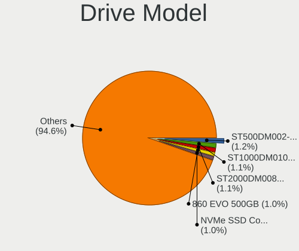

| Model                                              | Desktops | Percent |
|----------------------------------------------------|----------|---------|
| Seagate ST500DM002-1BD142 500GB                    | 165      | 1.24%   |
| Seagate ST1000DM010-2EP102 1TB                     | 153      | 1.15%   |
| Seagate ST2000DM008-2FR102 2TB                     | 141      | 1.06%   |
| Samsung SSD 860 EVO 500GB                          | 129      | 0.97%   |
| Samsung NVMe SSD Controller SM981/PM981/PM983 1TB  | 128      | 0.96%   |
| Crucial CT240BX500SSD1 240GB                       | 128      | 0.96%   |
| Samsung SSD 850 EVO 250GB                          | 114      | 0.85%   |
| Kingston SA400S37240G 240GB SSD                    | 113      | 0.85%   |
| Crucial CT500MX500SSD1 500GB                       | 113      | 0.85%   |
| Crucial CT1000MX500SSD1 1TB                        | 96       | 0.72%   |
| Micron/Crucial P2 NVMe PCIe SSD 2TB                | 93       | 0.7%    |
| Seagate ST2000DM001-1ER164 2TB                     | 91       | 0.68%   |
| Seagate ST1000DM003-1ER162 1TB                     | 89       | 0.67%   |
| Samsung SSD 850 EVO 500GB                          | 84       | 0.63%   |
| Samsung SSD 860 EVO 1TB                            | 83       | 0.62%   |
| Seagate ST2000DM001-1CH164 2TB                     | 82       | 0.61%   |
| Seagate ST1000DM003-1CH162 1TB                     | 81       | 0.61%   |
| Samsung NVMe SSD Controller PM9A1/PM9A3/980PRO 1TB | 81       | 0.61%   |
| Toshiba DT01ACA100 1TB                             | 77       | 0.58%   |
| Crucial CT480BX500SSD1 480GB                       | 76       | 0.57%   |
| Seagate ST4000DM004-2CV104 4TB                     | 75       | 0.56%   |
| Samsung SSD 870 QVO 1TB                            | 75       | 0.56%   |
| WDC WD10EZEX-08WN4A0 1TB                           | 72       | 0.54%   |
| Kingston SA400S37480G 480GB SSD                    | 72       | 0.54%   |
| Samsung SSD 860 EVO 250GB                          | 69       | 0.52%   |
| Seagate ST2000DM006-2DM164 2TB                     | 66       | 0.49%   |
| Crucial CT1000BX500SSD1 1TB                        | 65       | 0.49%   |
| Seagate ST1000DM003-1SB102 1TB                     | 59       | 0.44%   |
| Kingston SA400S37120G 120GB SSD                    | 59       | 0.44%   |
| Kingston SV300S37A120G 120GB SSD                   | 55       | 0.41%   |
| Seagate ST3500418AS 500GB                          | 53       | 0.4%    |
| Unknown SD/MMC/MS PRO 2GB                          | 52       | 0.39%   |
| Samsung SSD 870 EVO 500GB                          | 52       | 0.39%   |
| PNY CS900 120GB SSD                                | 50       | 0.37%   |
| PNY CS900 240GB SSD                                | 48       | 0.36%   |
| WDC WD20EZRZ-00Z5HB0 2TB                           | 47       | 0.35%   |
| Toshiba HDWD110 1TB                                | 47       | 0.35%   |
| Samsung HD103SJ 1TB                                | 47       | 0.35%   |
| Crucial CT2000MX500SSD1 2TB                        | 45       | 0.34%   |
| WDC WD20EZRX-00D8PB0 2TB                           | 44       | 0.33%   |

HDD Vendor
----------

Hard disk drive vendors

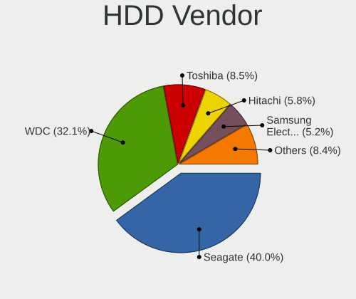

| Vendor              | Desktops | Drives | Percent |
|---------------------|----------|--------|---------|
| Seagate             | 2133     | 3516   | 39.95%  |
| WDC                 | 1716     | 2968   | 32.14%  |
| Toshiba             | 454      | 668    | 8.5%    |
| Hitachi             | 309      | 443    | 5.79%   |
| Samsung Electronics | 277      | 416    | 5.19%   |
| Maxtor              | 136      | 186    | 2.55%   |
| HGST                | 116      | 193    | 2.17%   |
| Unknown             | 57       | 69     | 1.07%   |
| JMicron Technology  | 16       | 26     | 0.3%    |
| Fujitsu             | 14       | 37     | 0.26%   |
| ASMT                | 14       | 21     | 0.26%   |
| Hewlett-Packard     | 13       | 32     | 0.24%   |
| Magnetic Data       | 8        | 8      | 0.15%   |
| USB3.0              | 7        | 7      | 0.13%   |
| TO Exter            | 6        | 6      | 0.11%   |
| Apple               | 6        | 6      | 0.11%   |
| Intenso             | 5        | 6      | 0.09%   |
| LaCie               | 4        | 4      | 0.07%   |
| Inateck             | 4        | 4      | 0.07%   |
| SABRENT             | 3        | 4      | 0.06%   |
| QEMU                | 3        | 5      | 0.06%   |
| MARVELL             | 3        | 6      | 0.06%   |
| External            | 3        | 3      | 0.06%   |
| ASMT109x            | 3        | 4      | 0.06%   |
| ASMedia             | 3        | 3      | 0.06%   |
| Initio              | 2        | 3      | 0.04%   |
| IB-AC703            | 2        | 2      | 0.04%   |
| HPE                 | 2        | 3      | 0.04%   |
| H/W                 | 2        | 22     | 0.04%   |
| China               | 2        | 2      | 0.04%   |
| USB                 | 1        | 3      | 0.02%   |
| Storeva             | 1        | 1      | 0.02%   |
| SSK                 | 1        | 1      | 0.02%   |
| SATAFIRM            | 1        | 1      | 0.02%   |
| RSH-319             | 1        | 1      | 0.02%   |
| OEM                 | 1        | 1      | 0.02%   |
| MDT                 | 1        | 1      | 0.02%   |
| LIO-ORG             | 1        | 1      | 0.02%   |
| ICY BOX             | 1        | 1      | 0.02%   |
| IBM/Hitachi         | 1        | 1      | 0.02%   |

SSD Vendor
----------

Solid state drive vendors

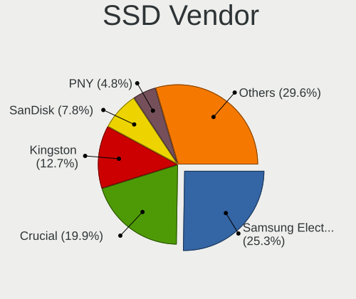

| Vendor              | Desktops | Drives | Percent |
|---------------------|----------|--------|---------|
| Samsung Electronics | 1044     | 1612   | 25.25%  |
| Crucial             | 823      | 1218   | 19.91%  |
| Kingston            | 526      | 692    | 12.72%  |
| SanDisk             | 322      | 406    | 7.79%   |
| PNY                 | 197      | 273    | 4.77%   |
| WDC                 | 142      | 185    | 3.43%   |
| China               | 108      | 149    | 2.61%   |
| Intel               | 97       | 119    | 2.35%   |
| SPCC                | 67       | 89     | 1.62%   |
| OCZ                 | 64       | 79     | 1.55%   |
| Transcend           | 59       | 72     | 1.43%   |
| Corsair             | 48       | 60     | 1.16%   |
| LDLC                | 44       | 53     | 1.06%   |
| Emtec               | 42       | 52     | 1.02%   |
| Micron Technology   | 35       | 49     | 0.85%   |
| SK hynix            | 29       | 37     | 0.7%    |
| A-DATA Technology   | 28       | 35     | 0.68%   |
| Toshiba             | 25       | 38     | 0.6%    |
| KingSpec            | 25       | 28     | 0.6%    |
| Verbatim            | 23       | 23     | 0.56%   |
| Patriot             | 19       | 32     | 0.46%   |
| Lexar               | 19       | 23     | 0.46%   |
| Intenso             | 18       | 23     | 0.44%   |
| TEXTORM             | 17       | 20     | 0.41%   |
| Unknown             | 17       | 20     | 0.41%   |
| LITEONIT            | 14       | 14     | 0.34%   |
| LITEON              | 12       | 12     | 0.29%   |
| Gigabyte Technology | 12       | 15     | 0.29%   |
| Seagate             | 11       | 13     | 0.27%   |
| SABRENT             | 11       | 11     | 0.27%   |
| Fanxiang            | 10       | 10     | 0.24%   |
| Integral            | 9        | 9      | 0.22%   |
| GALAX               | 9        | 9      | 0.22%   |
| ASMT                | 9        | 14     | 0.22%   |
| Plextor             | 8        | 8      | 0.19%   |
| Netac               | 8        | 8      | 0.19%   |
| XrayDisk            | 7        | 9      | 0.17%   |
| KingDian            | 7        | 11     | 0.17%   |
| Goodram             | 7        | 10     | 0.17%   |
| Apacer              | 7        | 7      | 0.17%   |

Drive Kind
----------

HDD or SSD

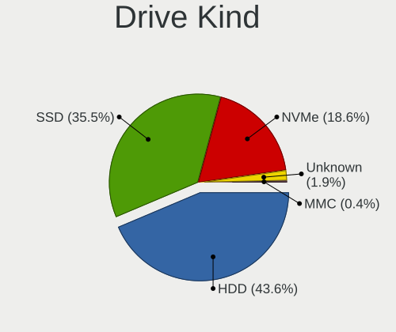

| Kind    | Desktops | Drives | Percent |
|---------|----------|--------|---------|
| HDD     | 4065     | 8698   | 43.63%  |
| SSD     | 3309     | 5753   | 35.52%  |
| NVMe    | 1733     | 3043   | 18.6%   |
| Unknown | 176      | 332    | 1.89%   |
| MMC     | 34       | 41     | 0.36%   |

Drive Connector
---------------

SATA, SAS, NVMe, etc.

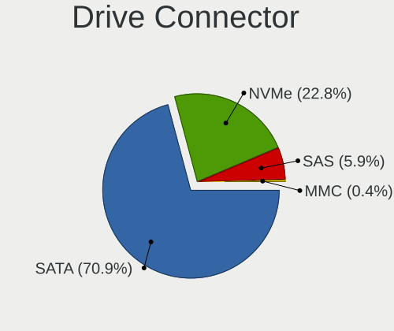

| Type | Desktops | Drives | Percent |
|------|----------|--------|---------|
| SATA | 5372     | 13997  | 70.86%  |
| NVMe | 1726     | 3017   | 22.77%  |
| SAS  | 449      | 812    | 5.92%   |
| MMC  | 34       | 41     | 0.45%   |

Drive Size
----------

Size of hard drive

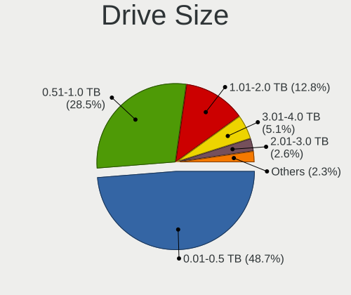

| Size in TB | Desktops | Drives | Percent |
|------------|----------|--------|---------|
| 0.01-0.5   | 3965     | 7369   | 48.75%  |
| 0.51-1.0   | 2318     | 3838   | 28.5%   |
| 1.01-2.0   | 1043     | 1764   | 12.82%  |
| 3.01-4.0   | 411      | 683    | 5.05%   |
| 2.01-3.0   | 212      | 367    | 2.61%   |
| 4.01-10.0  | 143      | 321    | 1.76%   |
| 10.01-20.0 | 39       | 104    | 0.48%   |
| 20.01-50.0 | 3        | 5      | 0.04%   |

Space Total
-----------

Amount of disk space available on the file system

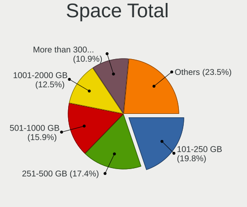

| Size in GB     | Desktops | Percent |
|----------------|----------|---------|
| 101-250        | 1285     | 19.82%  |
| 251-500        | 1131     | 17.44%  |
| 501-1000       | 1029     | 15.87%  |
| 1001-2000      | 811      | 12.51%  |
| More than 3000 | 706      | 10.89%  |
| 1-20           | 445      | 6.86%   |
| 2001-3000      | 396      | 6.11%   |
| Unknown        | 275      | 4.24%   |
| 51-100         | 263      | 4.06%   |
| 21-50          | 143      | 2.21%   |

Space Used
----------

Amount of used disk space

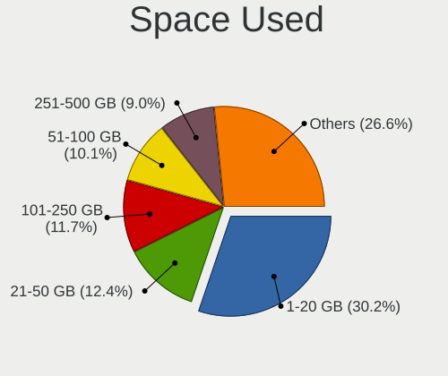

| Used GB        | Desktops | Percent |
|----------------|----------|---------|
| 1-20           | 2016     | 30.21%  |
| 21-50          | 828      | 12.41%  |
| 101-250        | 781      | 11.7%   |
| 51-100         | 672      | 10.07%  |
| 251-500        | 602      | 9.02%   |
| 501-1000       | 586      | 8.78%   |
| 1001-2000      | 470      | 7.04%   |
| Unknown        | 275      | 4.12%   |
| More than 3000 | 267      | 4%      |
| 2001-3000      | 165      | 2.47%   |
| 0              | 12       | 0.18%   |

Malfunc. Drives
---------------

Drive models with a malfunction

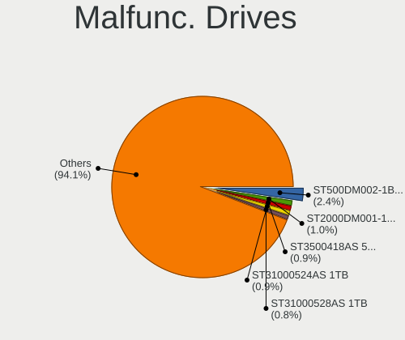

| Model                            | Desktops | Drives | Percent |
|----------------------------------|----------|--------|---------|
| Seagate ST500DM002-1BD142 500GB  | 27       | 29     | 2.36%   |
| Seagate ST2000DM001-1CH164 2TB   | 11       | 14     | 0.96%   |
| Seagate ST3500418AS 500GB        | 10       | 11     | 0.87%   |
| Seagate ST31000524AS 1TB         | 10       | 10     | 0.87%   |
| Seagate ST31000528AS 1TB         | 9        | 10     | 0.79%   |
| Seagate ST2000DM001-1ER164 2TB   | 9        | 17     | 0.79%   |
| Seagate ST1000DM010-2EP102 1TB   | 9        | 15     | 0.79%   |
| Seagate ST1000DM003-1CH162 1TB   | 9        | 9      | 0.79%   |
| Seagate ST3250310AS 250GB        | 8        | 8      | 0.7%    |
| Seagate ST2000DM008-2FR102 2TB   | 8        | 11     | 0.7%    |
| Kingston SV300S37A120G 120GB SSD | 8        | 10     | 0.7%    |
| WDC WD5000AAKX-001CA0 500GB      | 7        | 9      | 0.61%   |
| WDC WD20EFRX-68EUZN0 2TB         | 7        | 15     | 0.61%   |
| WDC WD10EADS-65L5B1 1TB          | 7        | 7      | 0.61%   |
| WDC WD10EADS-22M2B0 1TB          | 7        | 7      | 0.61%   |
| Toshiba DT01ACA100 1TB           | 7        | 8      | 0.61%   |
| Samsung Electronics HD103UJ 1TB  | 7        | 10     | 0.61%   |
| Samsung Electronics HD103SJ 1TB  | 7        | 8      | 0.61%   |
| Maxtor STM3250310AS 250GB        | 7        | 13     | 0.61%   |
| LDLC SSD 120GB                   | 7        | 7      | 0.61%   |
| Crucial CT240M500SSD1 240GB      | 7        | 8      | 0.61%   |
| Crucial CT128MX100SSD1 128GB     | 7        | 8      | 0.61%   |
| WDC WD6400AAKS-22A7B2 640GB      | 6        | 10     | 0.52%   |
| Seagate ST250DM000-1BD141 250GB  | 6        | 7      | 0.52%   |
| WDC WD5000AAKX-22ERMA0 500GB     | 5        | 6      | 0.44%   |
| WDC WD3200AAKS-00L9A0 320GB      | 5        | 5      | 0.44%   |
| WDC WD30EFRX-68EUZN0 3TB         | 5        | 11     | 0.44%   |
| WDC WD20EARX-00PASB0 2TB         | 5        | 5      | 0.44%   |
| WDC WD20EARS-00MVWB0 2TB         | 5        | 6      | 0.44%   |
| WDC WD10EZEX-21M2NA0 1TB         | 5        | 5      | 0.44%   |
| WDC WD10EARS-00Y5B1 1TB          | 5        | 7      | 0.44%   |
| WDC WD10EADS-00M2B0 1TB          | 5        | 7      | 0.44%   |
| WDC WD10EADS-00L5B1 1TB          | 5        | 8      | 0.44%   |
| WDC WD1002FAEX-00Z3A0 1TB        | 5        | 6      | 0.44%   |
| Seagate ST500LM021-1KJ152 500GB  | 5        | 7      | 0.44%   |
| Seagate ST3500320AS 500GB        | 5        | 5      | 0.44%   |
| Seagate ST3320820AS 320GB        | 5        | 5      | 0.44%   |
| Seagate ST2000DM006-2DM164 2TB   | 5        | 5      | 0.44%   |
| Seagate ST2000DM001-9YN164 2TB   | 5        | 6      | 0.44%   |
| Seagate ST1000DX001-1NS162 1TB   | 5        | 6      | 0.44%   |

Malfunc. Drive Vendor
---------------------

Vendors of faulty drives

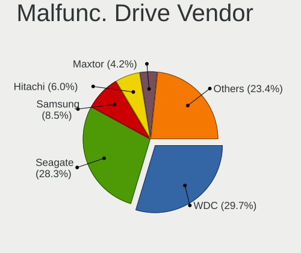

| Vendor                    | Desktops | Drives | Percent |
|---------------------------|----------|--------|---------|
| WDC                       | 325      | 427    | 29.65%  |
| Seagate                   | 310      | 383    | 28.28%  |
| Samsung Electronics       | 93       | 118    | 8.49%   |
| Hitachi                   | 66       | 87     | 6.02%   |
| Maxtor                    | 46       | 58     | 4.2%    |
| Crucial                   | 46       | 54     | 4.2%    |
| Toshiba                   | 35       | 55     | 3.19%   |
| Kingston                  | 32       | 39     | 2.92%   |
| Intel                     | 22       | 25     | 2.01%   |
| HGST                      | 21       | 25     | 1.92%   |
| SanDisk                   | 13       | 17     | 1.19%   |
| OCZ                       | 10       | 11     | 0.91%   |
| LDLC                      | 10       | 10     | 0.91%   |
| SK hynix                  | 7        | 11     | 0.64%   |
| China                     | 6        | 9      | 0.55%   |
| SPCC                      | 4        | 4      | 0.36%   |
| Micron Technology         | 4        | 4      | 0.36%   |
| A-DATA Technology         | 4        | 4      | 0.36%   |
| Corsair                   | 3        | 3      | 0.27%   |
| ASMT                      | 3        | 4      | 0.27%   |
| Transcend                 | 2        | 3      | 0.18%   |
| Netac                     | 2        | 2      | 0.18%   |
| Magnetic Data             | 2        | 2      | 0.18%   |
| LITEONIT                  | 2        | 2      | 0.18%   |
| Hewlett-Packard           | 2        | 2      | 0.18%   |
| Fujitsu                   | 2        | 2      | 0.18%   |
| Drevo                     | 2        | 2      | 0.18%   |
| X12                       | 1        | 1      | 0.09%   |
| VICKTER                   | 1        | 1      | 0.09%   |
| Verbatim                  | 1        | 1      | 0.09%   |
| TEXTORM                   | 1        | 1      | 0.09%   |
| SABRENT                   | 1        | 1      | 0.09%   |
| S3+                       | 1        | 1      | 0.09%   |
| Realtek Semiconductor     | 1        | 1      | 0.09%   |
| PNY                       | 1        | 1      | 0.09%   |
| Patriot                   | 1        | 1      | 0.09%   |
| OCZ-VERTEX                | 1        | 1      | 0.09%   |
| NGFF                      | 1        | 1      | 0.09%   |
| Micron/Crucial Technology | 1        | 1      | 0.09%   |
| KingSpec                  | 1        | 1      | 0.09%   |

Malfunc. HDD Vendor
-------------------

Vendors of faulty HDD drives

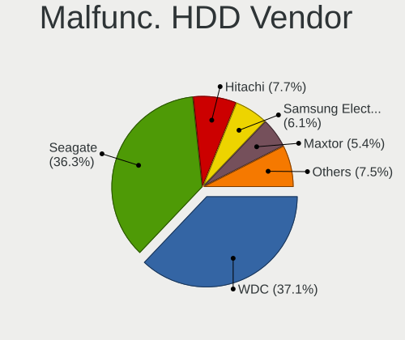

| Vendor              | Desktops | Drives | Percent |
|---------------------|----------|--------|---------|
| WDC                 | 317      | 417    | 37.08%  |
| Seagate             | 310      | 383    | 36.26%  |
| Hitachi             | 66       | 87     | 7.72%   |
| Samsung Electronics | 52       | 62     | 6.08%   |
| Maxtor              | 46       | 58     | 5.38%   |
| Toshiba             | 34       | 54     | 3.98%   |
| HGST                | 21       | 25     | 2.46%   |
| Magnetic Data       | 2        | 2      | 0.23%   |
| Hewlett-Packard     | 2        | 2      | 0.23%   |
| Fujitsu             | 2        | 2      | 0.23%   |
| ASMT                | 2        | 2      | 0.23%   |
| Inateck             | 1        | 1      | 0.12%   |

Malfunc. Drive Kind
-------------------

Kinds of faulty drives

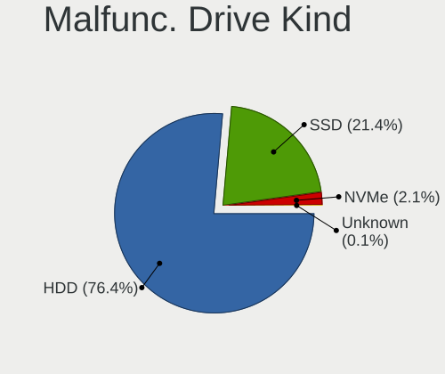

| Kind    | Desktops | Drives | Percent |
|---------|----------|--------|---------|
| HDD     | 764      | 1095   | 76.4%   |
| SSD     | 214      | 266    | 21.4%   |
| NVMe    | 21       | 26     | 2.1%    |
| Unknown | 1        | 2      | 0.1%    |

Failed Drives
-------------

Failed drive models

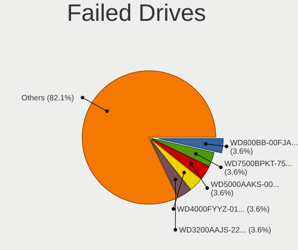

| Model                                                         | Desktops | Drives | Percent |
|---------------------------------------------------------------|----------|--------|---------|
| WDC WD800BB-00FJA0 80GB                                       | 1        | 1      | 3.57%   |
| WDC WD7500BPKT-75PK4T0 752GB                                  | 1        | 1      | 3.57%   |
| WDC WD5000AAKS-00UU3A0 500GB                                  | 1        | 1      | 3.57%   |
| WDC WD4000FYYZ-01UL1B2 4TB                                    | 1        | 1      | 3.57%   |
| WDC WD3200AAJS-22VWA0 320GB                                   | 1        | 1      | 3.57%   |
| WDC WD20EARS-00MVWB0 2TB                                      | 1        | 2      | 3.57%   |
| WDC WD20EARS-00J99B0 2TB                                      | 1        | 2      | 3.57%   |
| WDC WD1500HLFS-01G6U0 150GB                                   | 1        | 1      | 3.57%   |
| WDC WD10EALX-759BA1 1TB                                       | 1        | 1      | 3.57%   |
| Toshiba DT01ACA300 3TB                                        | 1        | 1      | 3.57%   |
| Seagate ST500LT012-1DG142 500GB                               | 1        | 3      | 3.57%   |
| Seagate ST3500418AS 500GB                                     | 1        | 1      | 3.57%   |
| Seagate ST3250318AS 250GB                                     | 1        | 1      | 3.57%   |
| Seagate ST2000DL003-9VT166 2TB                                | 1        | 1      | 3.57%   |
| Samsung Electronics SSD PM871 2.5 7mm 128GB                   | 1        | 1      | 3.57%   |
| Samsung Electronics SSD 980 1TB                               | 1        | 2      | 3.57%   |
| Samsung Electronics NVMe SSD Controller SM981/PM981/PM983 1TB | 1        | 1      | 3.57%   |
| Samsung Electronics MZ7LN512HAJQ-00000 512GB SSD              | 1        | 2      | 3.57%   |
| Samsung Electronics HD753LJ 752GB                             | 1        | 1      | 3.57%   |
| Samsung Electronics HD501LJ 500GB                             | 1        | 1      | 3.57%   |
| PNY CS1030 500GB SSD                                          | 1        | 1      | 3.57%   |
| Maxtor STM3320820AS 320GB                                     | 1        | 1      | 3.57%   |
| KIOXIA KXG60ZNV256G 256GB                                     | 1        | 1      | 3.57%   |
| Kingston SMS200S360G 64GB SSD                                 | 1        | 1      | 3.57%   |
| Intel SSDSC2KW256G8 256GB                                     | 1        | 1      | 3.57%   |
| Hitachi HTS723232L9A360 320GB                                 | 1        | 1      | 3.57%   |
| HGST HTS541010A9E680 1TB                                      | 1        | 1      | 3.57%   |
| Emtec X300 128GB                                              | 1        | 1      | 3.57%   |

Failed Drive Vendor
-------------------

Failed drive vendors

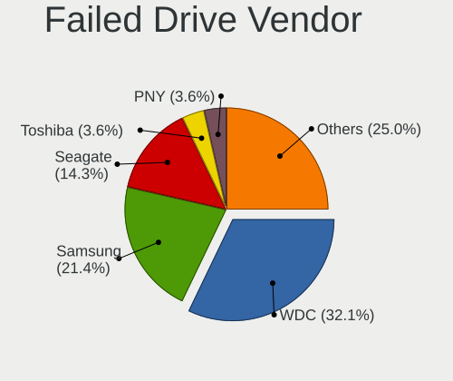

| Vendor              | Desktops | Drives | Percent |
|---------------------|----------|--------|---------|
| WDC                 | 9        | 11     | 32.14%  |
| Samsung Electronics | 6        | 8      | 21.43%  |
| Seagate             | 4        | 6      | 14.29%  |
| Toshiba             | 1        | 1      | 3.57%   |
| PNY                 | 1        | 1      | 3.57%   |
| Maxtor              | 1        | 1      | 3.57%   |
| KIOXIA              | 1        | 1      | 3.57%   |
| Kingston            | 1        | 1      | 3.57%   |
| Intel               | 1        | 1      | 3.57%   |
| Hitachi             | 1        | 1      | 3.57%   |
| HGST                | 1        | 1      | 3.57%   |
| Emtec               | 1        | 1      | 3.57%   |

Drive Status
------------

Number of failed and malfunc. drives

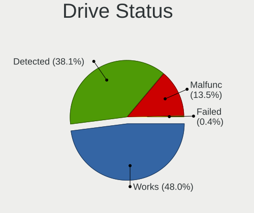

| Status   | Desktops | Drives | Percent |
|----------|----------|--------|---------|
| Works    | 3381     | 8380   | 47.98%  |
| Detected | 2687     | 8064   | 38.14%  |
| Malfunc  | 950      | 1389   | 13.48%  |
| Failed   | 28       | 34     | 0.4%    |

Storage controller
------------------

Storage Vendor
--------------

Storage controller vendors

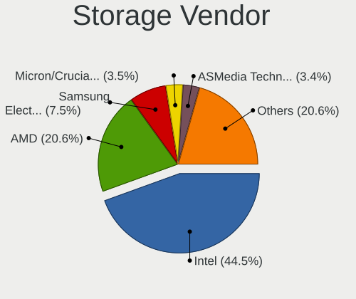

| Vendor                           | Desktops | Percent |
|----------------------------------|----------|---------|
| Intel                            | 3912     | 44.47%  |
| AMD                              | 1810     | 20.58%  |
| Samsung Electronics              | 657      | 7.47%   |
| Micron/Crucial Technology        | 306      | 3.48%   |
| ASMedia Technology               | 295      | 3.35%   |
| SanDisk                          | 247      | 2.81%   |
| Phison Electronics               | 232      | 2.64%   |
| Marvell Technology Group         | 213      | 2.42%   |
| JMicron Technology               | 192      | 2.18%   |
| Nvidia                           | 189      | 2.15%   |
| Kingston Technology Company      | 177      | 2.01%   |
| VIA Technologies                 | 64       | 0.73%   |
| Micron Technology                | 62       | 0.7%    |
| Silicon Motion                   | 51       | 0.58%   |
| MAXIO Technology (Hangzhou)      | 49       | 0.56%   |
| SK hynix                         | 38       | 0.43%   |
| Shenzhen Longsys Electronics     | 34       | 0.39%   |
| Toshiba America Info Systems     | 29       | 0.33%   |
| Broadcom / LSI                   | 27       | 0.31%   |
| Silicon Image                    | 25       | 0.28%   |
| LSI Logic / Symbios Logic        | 24       | 0.27%   |
| Seagate Technology               | 23       | 0.26%   |
| KIOXIA                           | 22       | 0.25%   |
| Realtek Semiconductor            | 17       | 0.19%   |
| ADATA Technology                 | 13       | 0.15%   |
| Adaptec                          | 12       | 0.14%   |
| Silicon Integrated Systems [SiS] | 9        | 0.1%    |
| Integrated Technology Express    | 9        | 0.1%    |
| Union Memory (Shenzhen)          | 5        | 0.06%   |
| Transcend                        | 5        | 0.06%   |
| TenaFe                           | 5        | 0.06%   |
| INNOGRIT                         | 5        | 0.06%   |
| Hewlett-Packard                  | 5        | 0.06%   |
| Biwin Storage Technology         | 4        | 0.05%   |
| Red Hat                          | 3        | 0.03%   |
| Promise Technology               | 3        | 0.03%   |
| Lite-On Technology               | 3        | 0.03%   |
| Hosin Global Electronics         | 3        | 0.03%   |
| Artop Electronic                 | 3        | 0.03%   |
| ULi Electronics                  | 2        | 0.02%   |

Storage Model
-------------

Storage controller models

| Model                                                                                   | Desktops | Percent |
|-----------------------------------------------------------------------------------------|----------|---------|
| AMD FCH SATA Controller [AHCI mode]                                                     | 837      | 7.81%   |
| Intel 8 Series/C220 Series Chipset Family 6-port SATA Controller 1 [AHCI mode]          | 546      | 5.1%    |
| AMD 400 Series Chipset SATA Controller                                                  | 344      | 3.21%   |
| Intel Q170/Q150/B150/H170/H110/Z170/CM236 Chipset SATA Controller [AHCI Mode]           | 330      | 3.08%   |
| AMD 500 Series Chipset SATA Controller                                                  | 323      | 3.01%   |
| Intel SATA Controller [RAID mode]                                                       | 318      | 2.97%   |
| Samsung NVMe SSD Controller SM981/PM981/PM983                                           | 316      | 2.95%   |
| Intel 6 Series/C200 Series Chipset Family 6 port Desktop SATA AHCI Controller           | 297      | 2.77%   |
| ASMedia ASM1061/ASM1062 Serial ATA Controller                                           | 257      | 2.4%    |
| Intel 7 Series/C210 Series Chipset Family 6-port SATA Controller [AHCI mode]            | 248      | 2.31%   |
| Intel 200 Series PCH SATA controller [AHCI mode]                                        | 236      | 2.2%    |
| Intel Cannon Lake PCH SATA AHCI Controller                                              | 214      | 2%      |
| Intel NM10/ICH7 Family SATA Controller [IDE mode]                                       | 201      | 1.88%   |
| AMD SB7x0/SB8x0/SB9x0 IDE Controller                                                    | 189      | 1.76%   |
| AMD SB7x0/SB8x0/SB9x0 SATA Controller [AHCI mode]                                       | 187      | 1.75%   |
| AMD 600 Series Chipset SATA Controller                                                  | 180      | 1.68%   |
| Micron/Crucial P2 [Nick P2] / P3 / P3 Plus NVMe PCIe SSD (DRAM-less)                    | 173      | 1.61%   |
| Intel 82801G (ICH7 Family) IDE Controller                                               | 160      | 1.49%   |
| Intel 9 Series Chipset Family SATA Controller [AHCI Mode]                               | 150      | 1.4%    |
| AMD SB7x0/SB8x0/SB9x0 SATA Controller [IDE mode]                                        | 130      | 1.21%   |
| Samsung NVMe SSD Controller PM9A1/PM9A3/980PRO                                          | 129      | 1.2%    |
| Intel 6 Series/C200 Series Chipset Family Desktop SATA Controller (IDE mode, ports 4-5) | 121      | 1.13%   |
| Intel 6 Series/C200 Series Chipset Family Desktop SATA Controller (IDE mode, ports 0-3) | 121      | 1.13%   |
| Phison E12 NVMe Controller                                                              | 113      | 1.05%   |
| JMicron JMB363 SATA/IDE Controller                                                      | 108      | 1.01%   |
| Intel Alder Lake-S PCH SATA Controller [AHCI Mode]                                      | 102      | 0.95%   |
| Samsung NVMe SSD Controller 980 (DRAM-less)                                             | 101      | 0.94%   |
| Nvidia MCP61 SATA Controller                                                            | 98       | 0.91%   |
| Intel 500 Series Chipset Family SATA AHCI Controller                                    | 95       | 0.89%   |
| AMD A320 Chipset SATA Controller [AHCI mode]                                            | 93       | 0.87%   |
| Intel 82801JI (ICH10 Family) 4 port SATA IDE Controller #1                              | 82       | 0.77%   |
| Nvidia MCP61 IDE                                                                        | 79       | 0.74%   |
| Intel Raptor Lake SATA AHCI Controller                                                  | 79       | 0.74%   |
| Intel 82801JI (ICH10 Family) 2 port SATA IDE Controller #2                              | 79       | 0.74%   |
| Samsung NVMe SSD Controller SM961/PM961/SM963                                           | 72       | 0.67%   |
| Intel 82801JI (ICH10 Family) SATA AHCI Controller                                       | 63       | 0.59%   |
| Intel Comet Lake SATA AHCI Controller                                                   | 62       | 0.58%   |
| Intel 82801I (ICH9 Family) 2 port SATA Controller [IDE mode]                            | 61       | 0.57%   |
| Samsung NVMe SSD Controller S4LV008[Pascal]                                             | 59       | 0.55%   |
| Intel 5 Series/3400 Series Chipset 4 port SATA IDE Controller                           | 55       | 0.51%   |

Storage Kind
------------

Kind of storage controller (IDE, SATA, NVMe, SAS, ...)

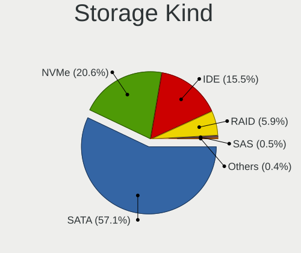

| Kind | Desktops | Percent |
|------|----------|---------|
| SATA | 4799     | 57.07%  |
| NVMe | 1734     | 20.62%  |
| IDE  | 1304     | 15.51%  |
| RAID | 498      | 5.92%   |
| SAS  | 44       | 0.52%   |
| SCSI | 30       | 0.36%   |

Processor
---------

CPU Vendor
----------

Processor vendors

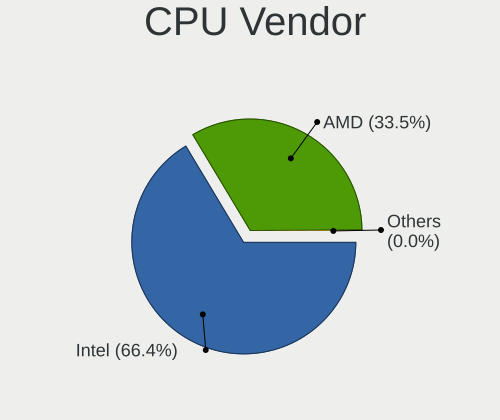

| Vendor                | Desktops | Percent |
|-----------------------|----------|---------|
| Intel                 | 3990     | 66.4%   |
| AMD                   | 2013     | 33.5%   |
| CentaurHauls          | 2        | 0.03%   |
| ARM                   | 2        | 0.03%   |
| Marvell Semiconductor | 1        | 0.02%   |
| CHRP IBM,8286-41A     | 1        | 0.02%   |

CPU Model
---------

Processor models

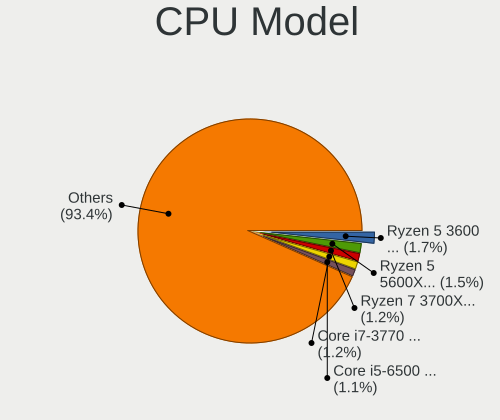

| Model                                       | Desktops | Percent |
|---------------------------------------------|----------|---------|
| AMD Ryzen 5 3600 6-Core Processor           | 104      | 1.72%   |
| AMD Ryzen 5 5600X 6-Core Processor          | 88       | 1.46%   |
| AMD Ryzen 7 3700X 8-Core Processor          | 73       | 1.21%   |
| Intel Core i7-3770 CPU @ 3.40GHz            | 71       | 1.18%   |
| Intel Core i5-6500 CPU @ 3.20GHz            | 65       | 1.08%   |
| Intel Core i5-4460 CPU @ 3.20GHz            | 60       | 0.99%   |
| AMD Ryzen 7 5800X 8-Core Processor          | 60       | 0.99%   |
| Intel Core i7-4790K CPU @ 4.00GHz           | 54       | 0.89%   |
| Intel Core i7-4790 CPU @ 3.60GHz            | 53       | 0.88%   |
| Intel Core i3-2120 CPU @ 3.30GHz            | 53       | 0.88%   |
| Intel Core i3-6100 CPU @ 3.70GHz            | 51       | 0.84%   |
| AMD Ryzen 5 2600 Six-Core Processor         | 51       | 0.84%   |
| Intel Core 2 Duo CPU E8400 @ 3.00GHz        | 48       | 0.79%   |
| Intel Core i5-2400 CPU @ 3.10GHz            | 47       | 0.78%   |
| Intel Core i7-6700K CPU @ 4.00GHz           | 46       | 0.76%   |
| Intel Core i5-3470 CPU @ 3.20GHz            | 46       | 0.76%   |
| AMD Ryzen 9 3900X 12-Core Processor         | 46       | 0.76%   |
| Intel Core i5-2500K CPU @ 3.30GHz           | 45       | 0.75%   |
| Intel Core i3-4130 CPU @ 3.40GHz            | 45       | 0.75%   |
| Intel Core i5-4570 CPU @ 3.20GHz            | 41       | 0.68%   |
| Intel Core i5-3570K CPU @ 3.40GHz           | 41       | 0.68%   |
| AMD Ryzen 9 5900X 12-Core Processor         | 41       | 0.68%   |
| Intel Core i7-6700 CPU @ 3.40GHz            | 39       | 0.65%   |
| Intel Core i7-8700 CPU @ 3.20GHz            | 36       | 0.6%    |
| AMD FX-8350 Eight-Core Processor            | 36       | 0.6%    |
| Intel Core i7-4770 CPU @ 3.40GHz            | 35       | 0.58%   |
| Intel Core i5-9600K CPU @ 3.70GHz           | 35       | 0.58%   |
| AMD Ryzen 7 2700X Eight-Core Processor      | 35       | 0.58%   |
| AMD Ryzen 5 5600G with Radeon Graphics      | 35       | 0.58%   |
| Intel Core i5-8400 CPU @ 2.80GHz            | 34       | 0.56%   |
| AMD FX-6300 Six-Core Processor              | 34       | 0.56%   |
| Intel Core i5-3570 CPU @ 3.40GHz            | 33       | 0.55%   |
| Intel Core i5-6400 CPU @ 2.70GHz            | 32       | 0.53%   |
| Intel Core i5-4670K CPU @ 3.40GHz           | 32       | 0.53%   |
| Intel Core i5-4590 CPU @ 3.30GHz            | 32       | 0.53%   |
| AMD Ryzen 5 1600 Six-Core Processor         | 32       | 0.53%   |
| Intel Pentium Dual-Core CPU E5300 @ 2.60GHz | 31       | 0.51%   |
| Intel Core i7-4770K CPU @ 3.50GHz           | 30       | 0.5%    |
| Intel Core i5-10400F CPU @ 2.90GHz          | 30       | 0.5%    |
| Intel Core i3-3220 CPU @ 3.30GHz            | 30       | 0.5%    |

CPU Model Family
----------------

Processor model prefix

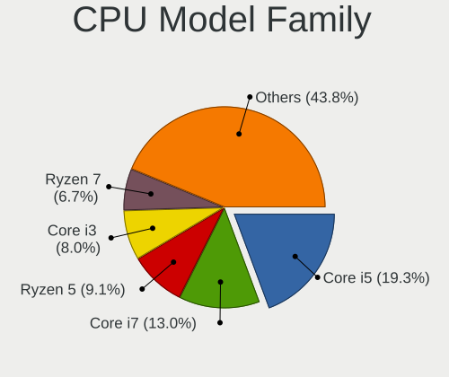

| Model                   | Desktops | Percent |
|-------------------------|----------|---------|
| Intel Core i5           | 1166     | 19.34%  |
| Intel Core i7           | 786      | 13.03%  |
| AMD Ryzen 5             | 549      | 9.1%    |
| Intel Core i3           | 485      | 8.04%   |
| AMD Ryzen 7             | 404      | 6.7%    |
| Other                   | 274      | 4.54%   |
| Intel Xeon              | 263      | 4.36%   |
| AMD Ryzen 9             | 217      | 3.6%    |
| Intel Pentium           | 182      | 3.02%   |
| Intel Celeron           | 167      | 2.77%   |
| Intel Core 2 Duo        | 164      | 2.72%   |
| AMD FX                  | 143      | 2.37%   |
| Intel Core 2 Quad       | 125      | 2.07%   |
| Intel Pentium Dual-Core | 90       | 1.49%   |
| AMD Athlon II X2        | 86       | 1.43%   |
| AMD Ryzen 3             | 84       | 1.39%   |
| AMD Athlon 64 X2        | 63       | 1.04%   |
| Intel Atom              | 62       | 1.03%   |
| Intel Core i9           | 56       | 0.93%   |
| AMD Phenom II X4        | 56       | 0.93%   |
| Intel Pentium Dual      | 41       | 0.68%   |
| AMD A8                  | 40       | 0.66%   |
| Intel Core 2            | 39       | 0.65%   |
| AMD A4                  | 37       | 0.61%   |
| Intel Pentium 4         | 33       | 0.55%   |
| Intel Pentium Gold      | 32       | 0.53%   |
| Intel Pentium D         | 27       | 0.45%   |
| AMD A10                 | 26       | 0.43%   |
| AMD Ryzen 5 PRO         | 24       | 0.4%    |
| AMD A6                  | 24       | 0.4%    |
| AMD Ryzen Threadripper  | 21       | 0.35%   |
| AMD Phenom II X6        | 21       | 0.35%   |
| AMD Athlon 64           | 21       | 0.35%   |
| AMD Athlon              | 21       | 0.35%   |
| AMD Sempron             | 18       | 0.3%    |
| AMD Athlon II X4        | 18       | 0.3%    |
| AMD E1                  | 16       | 0.27%   |
| AMD E                   | 15       | 0.25%   |
| AMD Athlon Dual Core    | 14       | 0.23%   |
| AMD Athlon X4           | 13       | 0.22%   |

CPU Cores
---------

Number of processor cores

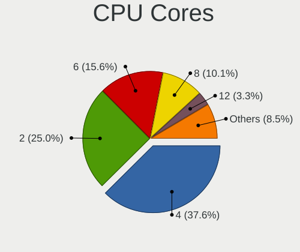

| Number  | Desktops | Percent |
|---------|----------|---------|
| 4       | 2271     | 37.57%  |
| 2       | 1510     | 24.98%  |
| 6       | 940      | 15.55%  |
| 8       | 612      | 10.12%  |
| 12      | 198      | 3.28%   |
| 1       | 153      | 2.53%   |
| 16      | 118      | 1.95%   |
| 3       | 63       | 1.04%   |
| 10      | 53       | 0.88%   |
| 14      | 36       | 0.6%    |
| 20      | 30       | 0.5%    |
| 24      | 23       | 0.38%   |
| Unknown | 22       | 0.36%   |
| 32      | 6        | 0.1%    |
| 64      | 3        | 0.05%   |
| 18      | 3        | 0.05%   |
| 40      | 2        | 0.03%   |
| 36      | 1        | 0.02%   |
| 5       | 1        | 0.02%   |

CPU Sockets
-----------

Number of sockets

| Number | Desktops | Percent |
|--------|----------|---------|
| 1      | 5938     | 98.79%  |
| 2      | 69       | 1.15%   |
| 4      | 2        | 0.03%   |
| 14     | 1        | 0.02%   |
| 0      | 1        | 0.02%   |

CPU Threads
-----------

Threads per core (Hyper-Threading)

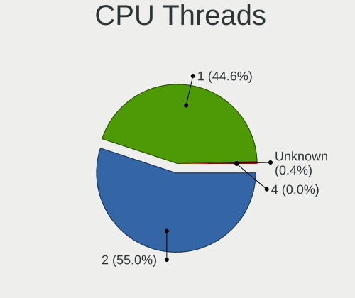

| Number  | Desktops | Percent |
|---------|----------|---------|
| 2       | 3325     | 55.05%  |
| 1       | 2691     | 44.55%  |
| Unknown | 22       | 0.36%   |
| 8       | 1        | 0.02%   |
| 4       | 1        | 0.02%   |

CPU Op-Modes
------------

CPU Operation Modes (32-bit, 64-bit)

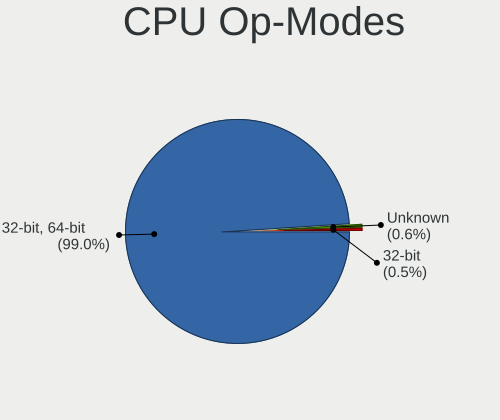

| Op mode        | Desktops | Percent |
|----------------|----------|---------|
| 32-bit, 64-bit | 5956     | 98.97%  |
| Unknown        | 34       | 0.56%   |
| 32-bit         | 28       | 0.47%   |

CPU Microcode
-------------

Microcode number

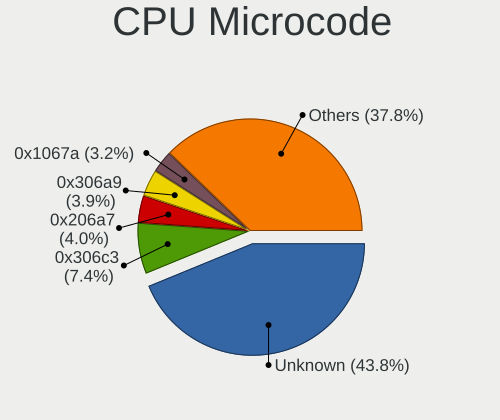

| Number     | Desktops | Percent |
|------------|----------|---------|
| Unknown    | 2770     | 43.8%   |
| 0x306c3    | 466      | 7.37%   |
| 0x206a7    | 250      | 3.95%   |
| 0x306a9    | 246      | 3.89%   |
| 0x1067a    | 202      | 3.19%   |
| 0x506e3    | 196      | 3.1%    |
| 0x906ea    | 120      | 1.9%    |
| 0x08701021 | 112      | 1.77%   |
| 0x010000c8 | 96       | 1.52%   |
| 0x906e9    | 92       | 1.45%   |
| 0x0800820d | 90       | 1.42%   |
| 0x06000852 | 61       | 0.96%   |
| 0x06001119 | 57       | 0.9%    |
| 0x08701013 | 54       | 0.85%   |
| 0x106e5    | 50       | 0.79%   |
| 0x6fd      | 48       | 0.76%   |
| 0x08108109 | 48       | 0.76%   |
| 0xa0653    | 42       | 0.66%   |
| 0x906ed    | 39       | 0.62%   |
| 0x10676    | 39       | 0.62%   |
| 0xa0655    | 38       | 0.6%    |
| 0x6fb      | 37       | 0.59%   |
| 0x0a201016 | 37       | 0.59%   |
| 0xa0671    | 32       | 0.51%   |
| 0x08001138 | 30       | 0.47%   |
| 0x106a5    | 29       | 0.46%   |
| 0x206d7    | 27       | 0.43%   |
| 0x306f2    | 26       | 0.41%   |
| 0x0a50000d | 26       | 0.41%   |
| 0x906eb    | 25       | 0.4%    |
| 0x0a20120a | 25       | 0.4%    |
| 0x90672    | 22       | 0.35%   |
| 0x08001137 | 22       | 0.35%   |
| 0x6f6      | 21       | 0.33%   |
| 0x10677    | 21       | 0.33%   |
| 0x0a601203 | 21       | 0.33%   |
| 0x0a201009 | 21       | 0.33%   |
| 0x08101016 | 21       | 0.33%   |
| 0x20655    | 20       | 0.32%   |
| 0x906ec    | 19       | 0.3%    |

CPU Microarch
-------------

Microarchitecture

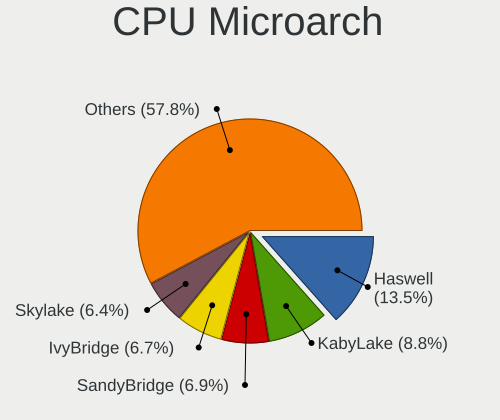

| Name             | Desktops | Percent |
|------------------|----------|---------|
| Haswell          | 812      | 13.45%  |
| KabyLake         | 533      | 8.83%   |
| SandyBridge      | 414      | 6.86%   |
| IvyBridge        | 405      | 6.71%   |
| Skylake          | 386      | 6.39%   |
| Zen 3            | 377      | 6.24%   |
| Unknown          | 359      | 5.95%   |
| Zen 2            | 358      | 5.93%   |
| Penryn           | 341      | 5.65%   |
| K10              | 235      | 3.89%   |
| Zen+             | 224      | 3.71%   |
| Piledriver       | 198      | 3.28%   |
| Core             | 158      | 2.62%   |
| CometLake        | 154      | 2.55%   |
| Zen              | 152      | 2.52%   |
| Nehalem          | 131      | 2.17%   |
| Alderlake Hybrid | 121      | 2%      |
| K8 Hammer        | 113      | 1.87%   |
| Westmere         | 80       | 1.33%   |
| NetBurst         | 67       | 1.11%   |
| Silvermont       | 49       | 0.81%   |
| Icelake          | 46       | 0.76%   |
| Bonnell          | 42       | 0.7%    |
| Broadwell        | 39       | 0.65%   |
| Gracemont        | 33       | 0.55%   |
| Steamroller      | 31       | 0.51%   |
| Excavator        | 29       | 0.48%   |
| Goldmont plus    | 26       | 0.43%   |
| Bobcat           | 23       | 0.38%   |
| Bulldozer        | 19       | 0.31%   |
| K10 Llano        | 16       | 0.27%   |
| Puma             | 15       | 0.25%   |
| Goldmont         | 15       | 0.25%   |
| Jaguar           | 13       | 0.22%   |
| Tremont          | 12       | 0.2%    |
| K6               | 4        | 0.07%   |
| Sapphire Rapids  | 3        | 0.05%   |
| TigerLake        | 2        | 0.03%   |
| Lunarlake Hybrid | 2        | 0.03%   |

Graphics
--------

GPU Vendor
----------

Vendors of graphics cards

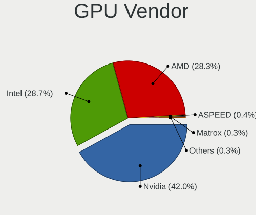

| Vendor                                       | Desktops | Percent |
|----------------------------------------------|----------|---------|
| Nvidia                                       | 2740     | 42.02%  |
| Intel                                        | 1874     | 28.74%  |
| AMD                                          | 1843     | 28.26%  |
| ASPEED Technology                            | 25       | 0.38%   |
| Matrox Electronics Systems                   | 17       | 0.26%   |
| VIA Technologies                             | 6        | 0.09%   |
| Silicon Integrated Systems [SiS]             | 5        | 0.08%   |
| Red Hat                                      | 3        | 0.05%   |
| ATI Technologies                             | 2        | 0.03%   |
| XGI Technology (eXtreme Graphics Innovation) | 1        | 0.02%   |
| Technical                                    | 1        | 0.02%   |
| S3 Graphics                                  | 1        | 0.02%   |
| Qualcomm Atheros                             | 1        | 0.02%   |
| 3DLabs                                       | 1        | 0.02%   |
| 3Dfx Interactive                             | 1        | 0.02%   |

GPU Model
---------

Graphics card models

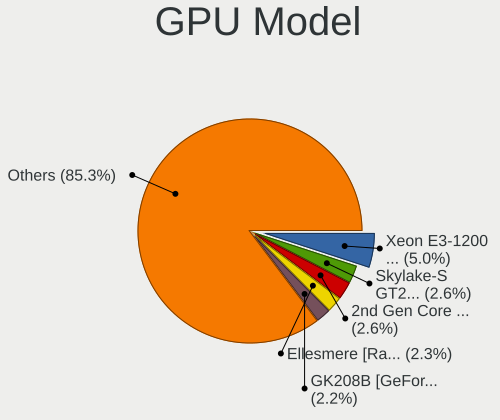

| Model                                                                       | Desktops | Percent |
|-----------------------------------------------------------------------------|----------|---------|
| Intel Xeon E3-1200 v3/4th Gen Core Processor Integrated Graphics Controller | 340      | 5.01%   |
| Intel Skylake-S GT2 [HD Graphics 530]                                       | 177      | 2.61%   |
| Intel 2nd Generation Core Processor Family Integrated Graphics Controller   | 177      | 2.61%   |
| AMD Ellesmere [Radeon RX 470/480/570/570X/580/580X/590]                     | 157      | 2.32%   |
| Nvidia GK208B [GeForce GT 710]                                              | 147      | 2.17%   |
| Intel CoffeeLake-S GT2 [UHD Graphics 630]                                   | 141      | 2.08%   |
| Nvidia GP107 [GeForce GTX 1050 Ti]                                          | 119      | 1.75%   |
| Intel Xeon E3-1200 v2/3rd Gen Core processor Graphics Controller            | 110      | 1.62%   |
| Intel 4 Series Chipset Integrated Graphics Controller                       | 102      | 1.5%    |
| Intel 4th Generation Core Processor Family Integrated Graphics Controller   | 101      | 1.49%   |
| AMD Raphael                                                                 | 98       | 1.45%   |
| Nvidia GT218 [GeForce 210]                                                  | 96       | 1.42%   |
| Nvidia GK208B [GeForce GT 730]                                              | 82       | 1.21%   |
| Nvidia GP108 [GeForce GT 1030]                                              | 80       | 1.18%   |
| Nvidia GP106 [GeForce GTX 1060 6GB]                                         | 80       | 1.18%   |
| Intel Kaby Lake-S GT2 [HD Graphics 630]                                     | 72       | 1.06%   |
| AMD Navi 23 [Radeon RX 6600/6600 XT/6600M]                                  | 71       | 1.05%   |
| AMD Cedar [Radeon HD 5000/6000/7350/8350 Series]                            | 71       | 1.05%   |
| Nvidia GM204 [GeForce GTX 970]                                              | 69       | 1.02%   |
| AMD Picasso/Raven 2 [Radeon Vega Series / Radeon Vega Mobile Series]        | 68       | 1%      |
| AMD Navi 22 [Radeon RX 6700/6700 XT/6750 XT / 6800M/6850M XT]               | 66       | 0.97%   |
| Nvidia GM206 [GeForce GTX 960]                                              | 64       | 0.94%   |
| Nvidia GF119 [GeForce GT 610]                                               | 62       | 0.91%   |
| Intel IvyBridge GT2 [HD Graphics 4000]                                      | 62       | 0.91%   |
| Intel CometLake-S GT2 [UHD Graphics 630]                                    | 57       | 0.84%   |
| Nvidia GP107 [GeForce GTX 1050]                                             | 56       | 0.83%   |
| AMD Cezanne [Radeon Vega Series / Radeon Vega Mobile Series]                | 56       | 0.83%   |
| Nvidia TU117 [GeForce GTX 1650]                                             | 55       | 0.81%   |
| Nvidia GP104 [GeForce GTX 1070]                                             | 53       | 0.78%   |
| Nvidia TU106 [GeForce RTX 2060 Rev. A]                                      | 48       | 0.71%   |
| Nvidia GA106 [GeForce RTX 3060 Lite Hash Rate]                              | 48       | 0.71%   |
| Nvidia TU116 [GeForce GTX 1660 SUPER]                                       | 47       | 0.69%   |
| AMD Navi 10 [Radeon RX 5600 OEM/5600 XT / 5700/5700 XT]                     | 45       | 0.66%   |
| AMD Granite Ridge [Radeon Graphics]                                         | 45       | 0.66%   |
| AMD Caicos [Radeon HD 6450/7450/8450 / R5 230 OEM]                          | 43       | 0.63%   |
| Nvidia GP104 [GeForce GTX 1080]                                             | 42       | 0.62%   |
| AMD Raven Ridge [Radeon Vega Series / Radeon Vega Mobile Series]            | 42       | 0.62%   |
| AMD Navi 21 [Radeon RX 6800/6800 XT / 6900 XT]                              | 42       | 0.62%   |
| Intel Alder Lake-S GT1 [UHD Graphics 770]                                   | 41       | 0.6%    |
| Nvidia GM107 [GeForce GTX 750 Ti]                                           | 38       | 0.56%   |

GPU Combo
---------

Combinations of graphics cards

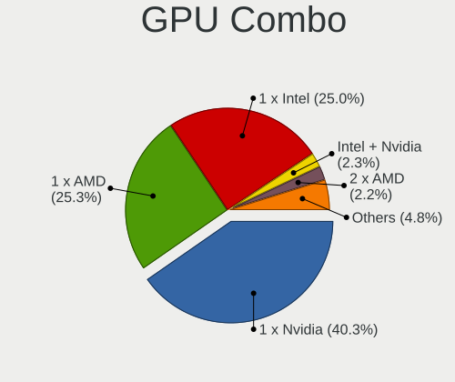

| Name                      | Desktops | Percent |
|---------------------------|----------|---------|
| 1 x Nvidia                | 2473     | 40.33%  |
| 1 x AMD                   | 1551     | 25.29%  |
| 1 x Intel                 | 1536     | 25.05%  |
| Intel + Nvidia            | 141      | 2.3%    |
| 2 x AMD                   | 135      | 2.2%    |
| AMD + Nvidia              | 110      | 1.79%   |
| Intel + AMD               | 52       | 0.85%   |
| 2 x Nvidia                | 32       | 0.52%   |
| 2 x Intel                 | 22       | 0.36%   |
| 1 x ASPEED                | 20       | 0.33%   |
| 1 x Matrox                | 15       | 0.24%   |
| Other                     | 9        | 0.15%   |
| 1 x VIA                   | 6        | 0.1%    |
| 1 x SiS                   | 5        | 0.08%   |
| AMD + ASPEED              | 4        | 0.07%   |
| 1 x Red Hat               | 3        | 0.05%   |
| Intel + 2 x Nvidia        | 3        | 0.05%   |
| 3 x AMD                   | 2        | 0.03%   |
| Intel + 2 x AMD           | 2        | 0.03%   |
| 3 x Nvidia                | 1        | 0.02%   |
| 2 x AMD + 1 x Nvidia      | 1        | 0.02%   |
| 2 x AMD + 1 x ASPEED      | 1        | 0.02%   |
| 2 x AMD + 1 x 3DLabs      | 1        | 0.02%   |
| 1 x XGI                   | 1        | 0.02%   |
| 1 x Technical             | 1        | 0.02%   |
| 1 x S3 Graphics           | 1        | 0.02%   |
| Nvidia + Matrox           | 1        | 0.02%   |
| Nvidia + ASPEED           | 1        | 0.02%   |
| Nvidia + 3Dfx Interactive | 1        | 0.02%   |
| AMD + 2 x Nvidia          | 1        | 0.02%   |

GPU Driver
----------

Free vs proprietary

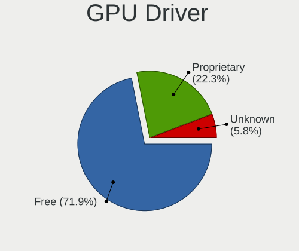

| Driver      | Desktops | Percent |
|-------------|----------|---------|
| Free        | 4434     | 71.9%   |
| Proprietary | 1373     | 22.26%  |
| Unknown     | 360      | 5.84%   |

GPU Memory
----------

Total video memory

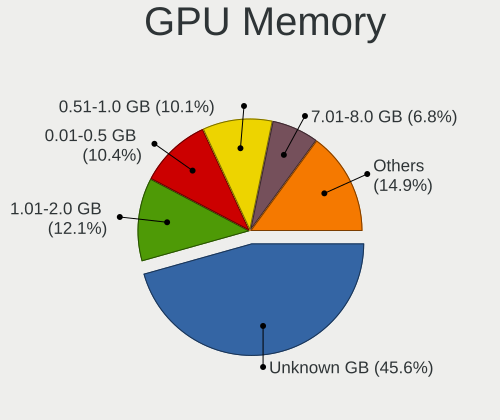

| Size in GB | Desktops | Percent |
|------------|----------|---------|
| Unknown    | 2866     | 45.64%  |
| 1.01-2.0   | 757      | 12.06%  |
| 0.01-0.5   | 653      | 10.4%   |
| 0.51-1.0   | 637      | 10.14%  |
| 7.01-8.0   | 429      | 6.83%   |
| 3.01-4.0   | 407      | 6.48%   |
| 8.01-16.0  | 243      | 3.87%   |
| 5.01-6.0   | 174      | 2.77%   |
| 2.01-3.0   | 62       | 0.99%   |
| 16.01-24.0 | 41       | 0.65%   |
| 4.01-5.0   | 8        | 0.13%   |
| 32.01-64.0 | 1        | 0.02%   |
| 24.01-32.0 | 1        | 0.02%   |

Monitor
-------

Monitor Vendor
--------------

Monitor vendors

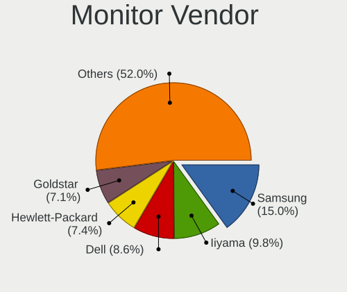

| Vendor               | Desktops | Percent |
|----------------------|----------|---------|
| Samsung Electronics  | 987      | 15.04%  |
| Iiyama               | 646      | 9.84%   |
| Dell                 | 562      | 8.56%   |
| Hewlett-Packard      | 488      | 7.44%   |
| Goldstar             | 468      | 7.13%   |
| Acer                 | 433      | 6.6%    |
| Philips              | 415      | 6.32%   |
| Ancor Communications | 343      | 5.23%   |
| AOC                  | 306      | 4.66%   |
| BenQ                 | 235      | 3.58%   |
| ASUSTek Computer     | 150      | 2.29%   |
| ViewSonic            | 143      | 2.18%   |
| Lenovo               | 97       | 1.48%   |
| Unknown              | 73       | 1.11%   |
| MSI                  | 57       | 0.87%   |
| HannStar             | 55       | 0.84%   |
| Sony                 | 51       | 0.78%   |
| Eizo                 | 50       | 0.76%   |
| Idek Iiyama          | 47       | 0.72%   |
| Packard Bell         | 43       | 0.66%   |
| HKC                  | 43       | 0.66%   |
| Vestel Elektronik    | 40       | 0.61%   |
| LG Electronics       | 39       | 0.59%   |
| NEC Computers        | 38       | 0.58%   |
| Fujitsu Siemens      | 35       | 0.53%   |
| Denver               | 33       | 0.5%    |
| Hitachi              | 30       | 0.46%   |
| Gigabyte Technology  | 28       | 0.43%   |
| SNC                  | 26       | 0.4%    |
| Medion               | 24       | 0.37%   |
| Panasonic            | 22       | 0.34%   |
| Hyundai ImageQuest   | 20       | 0.3%    |
| RTK                  | 19       | 0.29%   |
| Belinea              | 17       | 0.26%   |
| Toshiba              | 16       | 0.24%   |
| Unknown              | 14       | 0.21%   |
| NECCI                | 13       | 0.2%    |
| MiTAC                | 12       | 0.18%   |
| HUAWEI               | 12       | 0.18%   |
| RS                   | 11       | 0.17%   |

Monitor Model
-------------

Monitor models

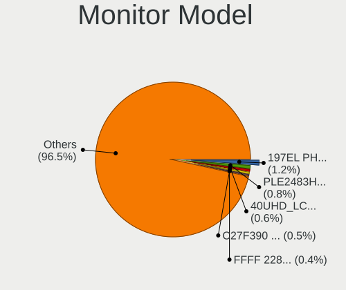

| Model                                                                 | Desktops | Percent |
|-----------------------------------------------------------------------|----------|---------|
| Philips 197EL PHLC08B 1366x768 410x230mm 18.5-inch                    | 81       | 1.16%   |
| Iiyama PLE2483H IVM6113 1920x1080 531x299mm 24.0-inch                 | 57       | 0.82%   |
| Vestel Elektronik 40UHD_LCD_TV VES3700 3840x2160 880x500mm 39.8-inch  | 40       | 0.57%   |
| Samsung Electronics C27F390 SAM0D32 1920x1080 598x336mm 27.0-inch     | 35       | 0.5%    |
| Unknown LCD Monitor FFFF 2288x1287 2550x2550mm 142.0-inch             | 29       | 0.42%   |
| AOC 27G2G4 AOC2702 1920x1080 598x336mm 27.0-inch                      | 29       | 0.42%   |
| Samsung Electronics S24F350 SAM0D20 1920x1080 521x293mm 23.5-inch     | 26       | 0.37%   |
| Samsung Electronics C24F390 SAM0D2C 1920x1080 521x293mm 23.5-inch     | 26       | 0.37%   |
| AOC 24B1W1 AOC2401 1920x1080 527x296mm 23.8-inch                      | 22       | 0.31%   |
| Samsung Electronics S24D330 SAM0D92 1920x1080 531x299mm 24.0-inch     | 21       | 0.3%    |
| Iiyama PLX2783H IVM6611 1920x1080 598x336mm 27.0-inch                 | 20       | 0.29%   |
| Iiyama PL2283H IVM562E 1920x1080 496x292mm 22.7-inch                  | 20       | 0.29%   |
| AOC 24G2W1G3 AOC2402 1920x1080 527x296mm 23.8-inch                    | 20       | 0.29%   |
| Ancor Communications ASUS VS247 ACI249A 1920x1080 521x293mm 23.5-inch | 20       | 0.29%   |
| Iiyama PL2530H IVM6132 1920x1080 544x303mm 24.5-inch                  | 18       | 0.26%   |
| Goldstar LG ULTRAWIDE GSM59F1 2560x1080 670x280mm 28.6-inch           | 18       | 0.26%   |
| ViewSonic VX2457 VSCB931 1920x1080 521x293mm 23.5-inch                | 17       | 0.24%   |
| BenQ GW2270 BNQ78DB 1920x1080 476x268mm 21.5-inch                     | 17       | 0.24%   |
| Acer G246HL ACR02FF 1920x1080 531x299mm 24.0-inch                     | 17       | 0.24%   |
| Iiyama PL2492H IVM612F 1920x1080 527x296mm 23.8-inch                  | 16       | 0.23%   |
| ASUSTek Computer VG27A AUS2722 2560x1440 597x336mm 27.0-inch          | 16       | 0.23%   |
| Samsung Electronics U28E590 SAM0C4D 3840x2160 607x345mm 27.5-inch     | 15       | 0.21%   |
| Iiyama X2483/2481 IVM6128 1920x1080 527x296mm 23.8-inch               | 15       | 0.21%   |
| Iiyama PL2409HD IVM560C 1920x1080 521x293mm 23.5-inch                 | 15       | 0.21%   |
| AOC Q3279WG5B AOC3279 2560x1440 725x428mm 33.1-inch                   | 15       | 0.21%   |
| AOC F22 AOC2200 1920x1080 476x268mm 21.5-inch                         | 15       | 0.21%   |
| Ancor Communications VE247 ACI2493 1920x1080 530x300mm 24.0-inch      | 15       | 0.21%   |
| Ancor Communications ASUS VP228 ACI22C3 1920x1080 476x268mm 21.5-inch | 15       | 0.21%   |
| Samsung Electronics S22F350 SAM0D1A 1920x1080 477x268mm 21.5-inch     | 14       | 0.2%    |
| Iiyama PLE2483H-DP IVM611E 1920x1080 531x299mm 24.0-inch              | 14       | 0.2%    |
| Iiyama PL2730H IVM663A 1920x1080 598x336mm 27.0-inch                  | 14       | 0.2%    |
| BenQ GW2480 BNQ78E7 1920x1080 527x296mm 23.8-inch                     | 14       | 0.2%    |
| Unknown                                                               | 14       | 0.2%    |
| Samsung Electronics S22D300 SAM0B3F 1920x1080 477x268mm 21.5-inch     | 13       | 0.19%   |
| Iiyama PLX2483H IVM6114 1920x1080 531x299mm 24.0-inch                 | 13       | 0.19%   |
| Iiyama PL2530H IVM6133 1920x1080 544x303mm 24.5-inch                  | 13       | 0.19%   |
| Samsung Electronics SyncMaster SAM0304 1680x1050 494x320mm 23.2-inch  | 12       | 0.17%   |
| Iiyama PLB2403WS IVM5601 1920x1200 519x324mm 24.1-inch                | 12       | 0.17%   |
| Iiyama PL2474H IVM6146 1920x1080 521x293mm 23.5-inch                  | 12       | 0.17%   |
| Goldstar LG IPS FULLHD GSM5AB8 1920x1080 480x270mm 21.7-inch          | 12       | 0.17%   |

Monitor Resolution
------------------

Monitor screen resolution

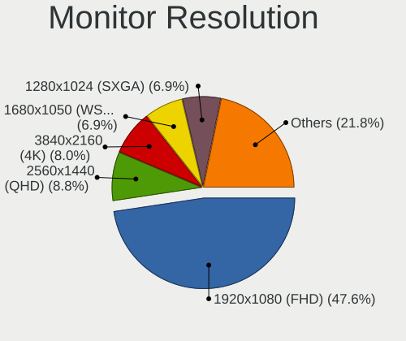

| Resolution         | Desktops | Percent |
|--------------------|----------|---------|
| 1920x1080 (FHD)    | 3018     | 47.63%  |
| 2560x1440 (QHD)    | 555      | 8.76%   |
| 3840x2160 (4K)     | 507      | 8%      |
| 1680x1050 (WSXGA+) | 439      | 6.93%   |
| 1280x1024 (SXGA)   | 435      | 6.87%   |
| 1440x900 (WXGA+)   | 203      | 3.2%    |
| 1920x1200 (WUXGA)  | 197      | 3.11%   |
| 1366x768 (WXGA)    | 173      | 2.73%   |
| 1600x900 (HD+)     | 126      | 1.99%   |
| Unknown            | 120      | 1.89%   |
| 3440x1440          | 111      | 1.75%   |
| 1360x768           | 66       | 1.04%   |
| 3840x1080          | 65       | 1.03%   |
| 2560x1080          | 63       | 0.99%   |
| 1600x1200          | 38       | 0.6%    |
| 2288x1287          | 31       | 0.49%   |
| 1024x768 (XGA)     | 28       | 0.44%   |
| 1920x540           | 21       | 0.33%   |
| 2560x1600          | 14       | 0.22%   |
| 3840x1600          | 12       | 0.19%   |
| 4480x1440          | 10       | 0.16%   |
| 3200x1080          | 8        | 0.13%   |
| 5760x1080          | 7        | 0.11%   |
| 3600x1080          | 6        | 0.09%   |
| 1280x720 (HD)      | 6        | 0.09%   |
| 2048x1152          | 4        | 0.06%   |
| 1280x960           | 4        | 0.06%   |
| 5760x2160          | 3        | 0.05%   |
| 5760x1200          | 3        | 0.05%   |
| 3200x1200          | 3        | 0.05%   |
| 2560x1397          | 3        | 0.05%   |
| 2560x1024          | 3        | 0.05%   |
| 1280x768           | 3        | 0.05%   |
| 7680x2160          | 2        | 0.03%   |
| 640x480            | 2        | 0.03%   |
| 3360x1050          | 2        | 0.03%   |
| 3280x1080          | 2        | 0.03%   |
| 3120x1050          | 2        | 0.03%   |
| 2960x1050          | 2        | 0.03%   |
| 2880x1440          | 2        | 0.03%   |

Monitor Diagonal
----------------

Diagonal size in inches

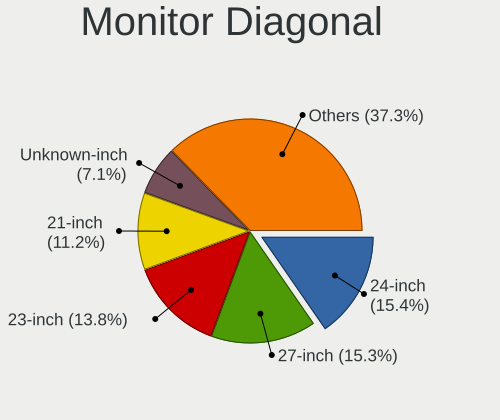

| Inches  | Desktops | Percent |
|---------|----------|---------|
| 24      | 1003     | 15.38%  |
| 27      | 995      | 15.25%  |
| 23      | 897      | 13.75%  |
| 21      | 728      | 11.16%  |
| Unknown | 466      | 7.14%   |
| 19      | 403      | 6.18%   |
| 22      | 303      | 4.65%   |
| 31      | 256      | 3.92%   |
| 18      | 231      | 3.54%   |
| 17      | 212      | 3.25%   |
| 20      | 190      | 2.91%   |
| 34      | 145      | 2.22%   |
| 84      | 92       | 1.41%   |
| 32      | 56       | 0.86%   |
| 25      | 54       | 0.83%   |
| 40      | 50       | 0.77%   |
| 72      | 46       | 0.71%   |
| 15      | 44       | 0.67%   |
| 54      | 39       | 0.6%    |
| 142     | 29       | 0.44%   |
| 33      | 24       | 0.37%   |
| 29      | 21       | 0.32%   |
| 65      | 20       | 0.31%   |
| 26      | 20       | 0.31%   |
| 48      | 18       | 0.28%   |
| 46      | 18       | 0.28%   |
| 42      | 15       | 0.23%   |
| 49      | 13       | 0.2%    |
| 52      | 12       | 0.18%   |
| 37      | 9        | 0.14%   |
| 35      | 9        | 0.14%   |
| 28      | 9        | 0.14%   |
| 12      | 9        | 0.14%   |
| 63      | 8        | 0.12%   |
| 43      | 8        | 0.12%   |
| 39      | 8        | 0.12%   |
| 16      | 8        | 0.12%   |
| 64      | 5        | 0.08%   |
| 57      | 5        | 0.08%   |
| 38      | 5        | 0.08%   |

Monitor Width
-------------

Physical width

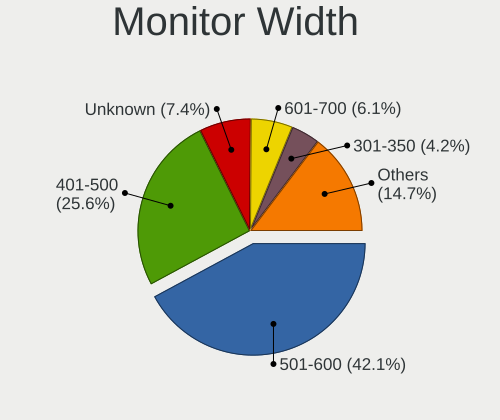

| Width in mm    | Desktops | Percent |
|----------------|----------|---------|
| 501-600        | 2639     | 42.12%  |
| 401-500        | 1601     | 25.55%  |
| Unknown        | 466      | 7.44%   |
| 601-700        | 380      | 6.07%   |
| 301-350        | 260      | 4.15%   |
| 351-400        | 241      | 3.85%   |
| 701-800        | 231      | 3.69%   |
| 1501-2000      | 148      | 2.36%   |
| 1001-1500      | 148      | 2.36%   |
| 801-900        | 83       | 1.32%   |
| More than 2000 | 29       | 0.46%   |
| 901-1000       | 23       | 0.37%   |
| 201-300        | 16       | 0.26%   |

Aspect Ratio
------------

Proportional relationship between the width and the height

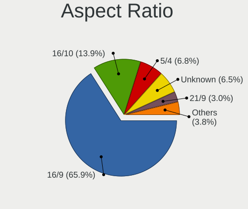

| Ratio   | Desktops | Percent |
|---------|----------|---------|
| 16/9    | 3948     | 65.93%  |
| 16/10   | 834      | 13.93%  |
| 5/4     | 408      | 6.81%   |
| Unknown | 390      | 6.51%   |
| 21/9    | 179      | 2.99%   |
| 4/3     | 81       | 1.35%   |
| 3/2     | 52       | 0.87%   |
| 32/9    | 31       | 0.52%   |
| 1.00    | 29       | 0.48%   |
| 6/5     | 22       | 0.37%   |
| 0.56    | 5        | 0.08%   |
| 2.00    | 2        | 0.03%   |
| 11/10   | 2        | 0.03%   |
| 1.03    | 2        | 0.03%   |
| 6.00    | 1        | 0.02%   |
| 0.89    | 1        | 0.02%   |
| 0.75    | 1        | 0.02%   |

Monitor Area
------------

Area in inch²

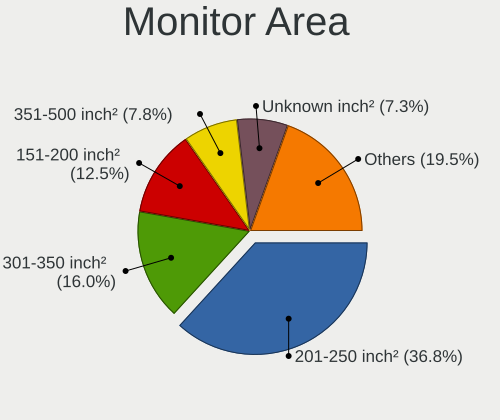

| Area in inch² | Desktops | Percent |
|----------------|----------|---------|
| 201-250        | 2335     | 36.78%  |
| 301-350        | 1017     | 16.02%  |
| 151-200        | 793      | 12.49%  |
| 351-500        | 498      | 7.84%   |
| Unknown        | 466      | 7.34%   |
| 141-150        | 372      | 5.86%   |
| 251-300        | 366      | 5.77%   |
| More than 1000 | 274      | 4.32%   |
| 501-1000       | 152      | 2.39%   |
| 101-110        | 38       | 0.6%    |
| 71-80          | 13       | 0.2%    |
| 111-120        | 8        | 0.13%   |
| 131-140        | 7        | 0.11%   |
| 121-130        | 5        | 0.08%   |
| 81-90          | 4        | 0.06%   |

Pixel Density
-------------

Pixels per inch

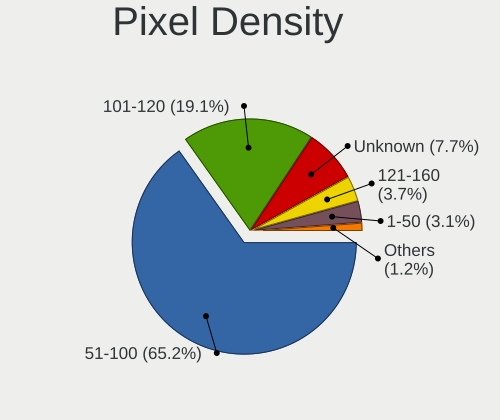

| Density | Desktops | Percent |
|---------|----------|---------|
| 51-100  | 3943     | 65.18%  |
| 101-120 | 1154     | 19.08%  |
| Unknown | 466      | 7.7%    |
| 121-160 | 225      | 3.72%   |
| 1-50    | 189      | 3.12%   |
| 161-240 | 72       | 1.19%   |

Multiple Monitors
-----------------

Total monitors connected

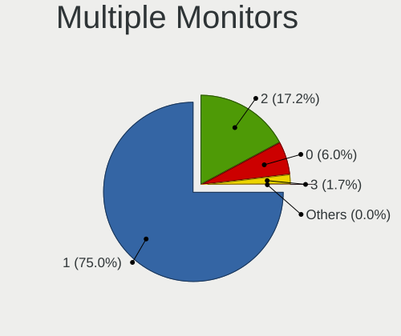

| Total | Desktops | Percent |
|-------|----------|---------|
| 1     | 4617     | 75.01%  |
| 2     | 1056     | 17.16%  |
| 0     | 367      | 5.96%   |
| 3     | 107      | 1.74%   |
| 4     | 7        | 0.11%   |
| 5     | 1        | 0.02%   |

Network
-------

Net Controller Vendor
---------------------

Controller vendors

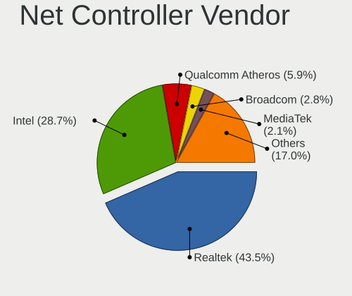

| Vendor                           | Desktops | Percent |
|----------------------------------|----------|---------|
| Realtek Semiconductor            | 3728     | 43.51%  |
| Intel                            | 2462     | 28.73%  |
| Qualcomm Atheros                 | 507      | 5.92%   |
| Broadcom                         | 236      | 2.75%   |
| MediaTek                         | 182      | 2.12%   |
| TP-Link                          | 169      | 1.97%   |
| Nvidia                           | 148      | 1.73%   |
| Ralink                           | 101      | 1.18%   |
| Marvell Technology Group         | 99       | 1.16%   |
| NetGear                          | 93       | 1.09%   |
| Ralink Technology                | 86       | 1%      |
| Aquantia                         | 66       | 0.77%   |
| D-Link System                    | 56       | 0.65%   |
| Samsung Electronics              | 54       | 0.63%   |
| Broadcom Limited                 | 51       | 0.6%    |
| Microsoft                        | 46       | 0.54%   |
| D-Link                           | 35       | 0.41%   |
| Belkin Components                | 27       | 0.32%   |
| ASIX Electronics                 | 25       | 0.29%   |
| VIA Technologies                 | 23       | 0.27%   |
| Qualcomm Atheros Communications  | 22       | 0.26%   |
| ASUSTek Computer                 | 21       | 0.25%   |
| Xiaomi                           | 20       | 0.23%   |
| Qualcomm Technologies            | 20       | 0.23%   |
| Google                           | 16       | 0.19%   |
| Huawei Technologies              | 15       | 0.18%   |
| Guillemot                        | 14       | 0.16%   |
| OPPO Electronics                 | 12       | 0.14%   |
| Qualcomm                         | 10       | 0.12%   |
| QinHeng Electronics              | 10       | 0.12%   |
| Edimax Technology                | 10       | 0.12%   |
| Mellanox Technologies            | 9        | 0.11%   |
| 3Com                             | 9        | 0.11%   |
| Sagem                            | 7        | 0.08%   |
| DisplayLink                      | 7        | 0.08%   |
| TRENDnet                         | 6        | 0.07%   |
| Silicon Integrated Systems [SiS] | 5        | 0.06%   |
| Sigma Designs                    | 5        | 0.06%   |
| Motorola PCS                     | 5        | 0.06%   |
| JMicron Technology               | 5        | 0.06%   |

Net Controller Model
--------------------

Controller models

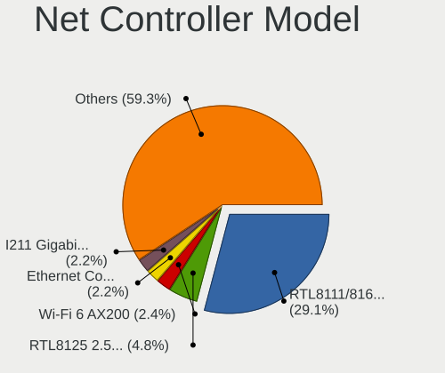

| Model                                                                  | Desktops | Percent |
|------------------------------------------------------------------------|----------|---------|
| Realtek RTL8111/8168/8211/8411 PCI Express Gigabit Ethernet Controller | 2820     | 29.1%   |
| Realtek RTL8125 2.5GbE Controller                                      | 466      | 4.81%   |
| Intel Wi-Fi 6 AX200                                                    | 232      | 2.39%   |
| Intel Ethernet Connection (2) I219-V                                   | 215      | 2.22%   |
| Intel I211 Gigabit Network Connection                                  | 214      | 2.21%   |
| Intel 82579LM Gigabit Network Connection (Lewisville)                  | 210      | 2.17%   |
| Intel Ethernet Controller I225-V                                       | 161      | 1.66%   |
| Intel Ethernet Connection I217-LM                                      | 152      | 1.57%   |
| Intel 82579V Gigabit Network Connection                                | 122      | 1.26%   |
| Intel Ethernet Connection (7) I219-V                                   | 121      | 1.25%   |
| Intel Wi-Fi 6E(802.11ax) AX210/AX1675* 2x2 [Typhoon Peak]              | 103      | 1.06%   |
| Intel Ethernet Connection (2) I219-LM                                  | 99       | 1.02%   |
| Realtek RTL810xE PCI Express Fast Ethernet controller                  | 93       | 0.96%   |
| Intel Ethernet Connection I217-V                                       | 92       | 0.95%   |
| Qualcomm Atheros Killer E220x Gigabit Ethernet Controller              | 80       | 0.83%   |
| Nvidia MCP61 Ethernet                                                  | 77       | 0.79%   |
| Realtek RTL88x2bu [AC1200 Techkey]                                     | 76       | 0.78%   |
| Intel Ethernet Connection (2) I218-V                                   | 74       | 0.76%   |
| Realtek RTL8821CE 802.11ac PCIe Wireless Network Adapter               | 67       | 0.69%   |
| Realtek RTL8188EUS 802.11n Wireless Network Adapter                    | 66       | 0.68%   |
| MediaTek MT7922 802.11ax PCI Express Wireless Network Adapter          | 65       | 0.67%   |
| Intel Wi-Fi 5(802.11ac) Wireless-AC 9x6x [Thunder Peak]                | 65       | 0.67%   |
| Realtek RTL-8100/8101L/8139 PCI Fast Ethernet Adapter                  | 63       | 0.65%   |
| Realtek RTL8153 Gigabit Ethernet Adapter                               | 59       | 0.61%   |
| Intel Ethernet Controller I226-V                                       | 59       | 0.61%   |
| TP-Link TL-WN823N v2/v3 [Realtek RTL8192EU]                            | 58       | 0.6%    |
| Realtek 802.11ac NIC                                                   | 58       | 0.6%    |
| Intel 82574L Gigabit Network Connection                                | 58       | 0.6%    |
| Intel Dual Band Wireless-AC 3168NGW [Stone Peak]                       | 57       | 0.59%   |
| Marvell Group 88E8056 PCI-E Gigabit Ethernet Controller                | 56       | 0.58%   |
| Intel 82567LM-3 Gigabit Network Connection                             | 54       | 0.56%   |
| Samsung Galaxy series, misc. (tethering mode)                          | 47       | 0.48%   |
| Intel 700 Series Chipset CNVi WiFi                                     | 45       | 0.46%   |
| MediaTek MT7921K (RZ608) Wi-Fi 6E 80MHz                                | 43       | 0.44%   |
| Intel I210 Gigabit Network Connection                                  | 43       | 0.44%   |
| Qualcomm Atheros AR9485 Wireless Network Adapter                       | 42       | 0.43%   |
| Realtek RTL8192EE PCIe Wireless Network Adapter                        | 40       | 0.41%   |
| Qualcomm Atheros AR9287 Wireless Network Adapter (PCI-Express)         | 40       | 0.41%   |
| Intel Wireless 7260                                                    | 40       | 0.41%   |
| Intel Ethernet Connection (7) I219-LM                                  | 40       | 0.41%   |

Wireless Vendor
---------------

Wireless vendors

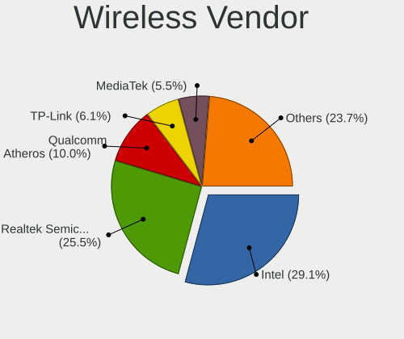

| Vendor                                | Desktops | Percent |
|---------------------------------------|----------|---------|
| Intel                                 | 799      | 29.15%  |
| Realtek Semiconductor                 | 699      | 25.5%   |
| Qualcomm Atheros                      | 275      | 10.03%  |
| TP-Link                               | 167      | 6.09%   |
| MediaTek                              | 151      | 5.51%   |
| Ralink                                | 101      | 3.68%   |
| NetGear                               | 91       | 3.32%   |
| Broadcom                              | 87       | 3.17%   |
| Ralink Technology                     | 86       | 3.14%   |
| Microsoft                             | 46       | 1.68%   |
| D-Link                                | 35       | 1.28%   |
| D-Link System                         | 32       | 1.17%   |
| Belkin Components                     | 27       | 0.99%   |
| Qualcomm Atheros Communications       | 22       | 0.8%    |
| ASUSTek Computer                      | 21       | 0.77%   |
| Broadcom Limited                      | 16       | 0.58%   |
| Guillemot                             | 14       | 0.51%   |
| Edimax Technology                     | 10       | 0.36%   |
| Sagem                                 | 7        | 0.26%   |
| TRENDnet                              | 6        | 0.22%   |
| IMC Networks                          | 5        | 0.18%   |
| Gemtek                                | 5        | 0.18%   |
| Tenda                                 | 4        | 0.15%   |
| Qualcomm Technologies                 | 4        | 0.15%   |
| Micro Star International              | 4        | 0.15%   |
| Marvell Technology Group              | 4        | 0.15%   |
| ZyDAS                                 | 3        | 0.11%   |
| Z-Com                                 | 3        | 0.11%   |
| Linksys                               | 3        | 0.11%   |
| Accton Technology                     | 3        | 0.11%   |
| Toshiba                               | 2        | 0.07%   |
| Realtek                               | 2        | 0.07%   |
| Fujitsu Siemens Computers             | 2        | 0.07%   |
| Yoctopuce Sarl                        | 1        | 0.04%   |
| Wilocity                              | 1        | 0.04%   |
| Wacom                                 | 1        | 0.04%   |
| BUFFALO                               | 1        | 0.04%   |
| 802.11g Adapter [Linksys WUSB54GC v3] | 1        | 0.04%   |

Wireless Model
--------------

Wireless models

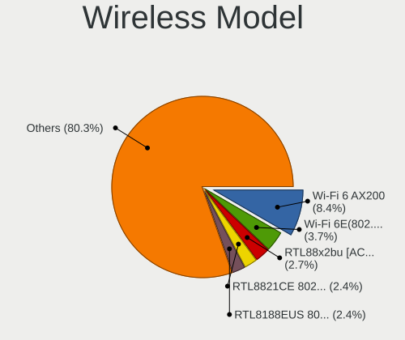

| Model                                                                | Desktops | Percent |
|----------------------------------------------------------------------|----------|---------|
| Intel Wi-Fi 6 AX200                                                  | 232      | 8.38%   |
| Intel Wi-Fi 6E(802.11ax) AX210/AX1675* 2x2 [Typhoon Peak]            | 103      | 3.72%   |
| Realtek RTL88x2bu [AC1200 Techkey]                                   | 76       | 2.75%   |
| Realtek RTL8821CE 802.11ac PCIe Wireless Network Adapter             | 67       | 2.42%   |
| Realtek RTL8188EUS 802.11n Wireless Network Adapter                  | 66       | 2.38%   |
| Intel Wi-Fi 5(802.11ac) Wireless-AC 9x6x [Thunder Peak]              | 65       | 2.35%   |
| TP-Link TL-WN823N v2/v3 [Realtek RTL8192EU]                          | 58       | 2.1%    |
| Realtek 802.11ac NIC                                                 | 58       | 2.1%    |
| Intel Dual Band Wireless-AC 3168NGW [Stone Peak]                     | 57       | 2.06%   |
| MediaTek MT7922 802.11ax PCI Express Wireless Network Adapter        | 53       | 1.91%   |
| Intel 700 Series Chipset CNVi WiFi                                   | 45       | 1.63%   |
| MediaTek MT7921K (RZ608) Wi-Fi 6E 80MHz                              | 43       | 1.55%   |
| Qualcomm Atheros AR9485 Wireless Network Adapter                     | 42       | 1.52%   |
| Realtek RTL8192EE PCIe Wireless Network Adapter                      | 40       | 1.45%   |
| Qualcomm Atheros AR9287 Wireless Network Adapter (PCI-Express)       | 40       | 1.45%   |
| Intel Wireless 7260                                                  | 40       | 1.45%   |
| Intel Wireless 7265                                                  | 39       | 1.41%   |
| Intel Wireless 3165                                                  | 37       | 1.34%   |
| Intel Cannon Lake PCH CNVi WiFi                                      | 37       | 1.34%   |
| Ralink MT7601U Wireless Adapter                                      | 34       | 1.23%   |
| Qualcomm Atheros AR9227 Wireless Network Adapter                     | 32       | 1.16%   |
| Realtek RTL8821AE 802.11ac PCIe Wireless Network Adapter             | 31       | 1.12%   |
| Realtek RTL8192CE PCIe Wireless Network Adapter                      | 31       | 1.12%   |
| Broadcom BCM4360 802.11ac Dual Band Wireless Network Adapter         | 30       | 1.08%   |
| Ralink RT3090 Wireless 802.11n 1T/1R PCIe                            | 29       | 1.05%   |
| TP-Link Archer T3U [Realtek RTL8812BU]                               | 28       | 1.01%   |
| Realtek RTL8192CU 802.11n WLAN Adapter                               | 27       | 0.98%   |
| Broadcom BCM4352 802.11ac Dual Band Wireless Network Adapter         | 27       | 0.98%   |
| Realtek RTL8812AE 802.11ac PCIe Wireless Network Adapter             | 26       | 0.94%   |
| Realtek RTL8192EU 802.11b/g/n WLAN Adapter                           | 26       | 0.94%   |
| Intel Wireless 8260                                                  | 26       | 0.94%   |
| Realtek RTL8188EE Wireless Network Adapter                           | 25       | 0.9%    |
| Microsoft Xbox Wireless Adapter for Windows                          | 24       | 0.87%   |
| NetGear A6210                                                        | 23       | 0.83%   |
| Realtek RTL8822CE 802.11ac PCIe Wireless Network Adapter             | 22       | 0.79%   |
| Qualcomm Atheros QCA9377 802.11ac Wireless Network Adapter           | 22       | 0.79%   |
| Qualcomm Atheros AR9462 Wireless Network Adapter                     | 22       | 0.79%   |
| MediaTek MT7921 802.11ax PCIe Wireless Network Adapter [Filogic 330] | 22       | 0.79%   |
| Intel Tiger Lake PCH CNVi WiFi                                       | 22       | 0.79%   |
| Qualcomm Atheros QCA6174 802.11ac Wireless Network Adapter           | 21       | 0.76%   |

Ethernet Vendor
---------------

Ethernet vendors

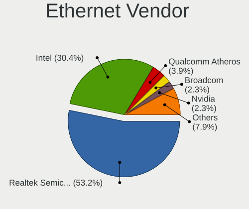

| Vendor                            | Desktops | Percent |
|-----------------------------------|----------|---------|
| Realtek Semiconductor             | 3486     | 53.2%   |
| Intel                             | 1994     | 30.43%  |
| Qualcomm Atheros                  | 256      | 3.91%   |
| Broadcom                          | 152      | 2.32%   |
| Nvidia                            | 148      | 2.26%   |
| Marvell Technology Group          | 95       | 1.45%   |
| Aquantia                          | 66       | 1.01%   |
| Samsung Electronics               | 54       | 0.82%   |
| Broadcom Limited                  | 35       | 0.53%   |
| MediaTek                          | 28       | 0.43%   |
| ASIX Electronics                  | 25       | 0.38%   |
| D-Link System                     | 24       | 0.37%   |
| VIA Technologies                  | 21       | 0.32%   |
| Xiaomi                            | 20       | 0.31%   |
| Qualcomm Technologies             | 16       | 0.24%   |
| Google                            | 16       | 0.24%   |
| Huawei Technologies               | 14       | 0.21%   |
| OPPO Electronics                  | 12       | 0.18%   |
| Qualcomm                          | 10       | 0.15%   |
| Mellanox Technologies             | 9        | 0.14%   |
| 3Com                              | 9        | 0.14%   |
| DisplayLink                       | 7        | 0.11%   |
| Motorola PCS                      | 5        | 0.08%   |
| JMicron Technology                | 5        | 0.08%   |
| Silicon Integrated Systems [SiS]  | 4        | 0.06%   |
| QLogic                            | 4        | 0.06%   |
| OnePlus Technology (Shenzhen)     | 4        | 0.06%   |
| ICS Advent                        | 3        | 0.05%   |
| HTC (High Tech Computer)          | 3        | 0.05%   |
| TP-Link                           | 2        | 0.03%   |
| Tehuti Networks                   | 2        | 0.03%   |
| NetGear                           | 2        | 0.03%   |
| Lenovo                            | 2        | 0.03%   |
| Xilinx                            | 1        | 0.02%   |
| Sundance Technology Inc / IC Plus | 1        | 0.02%   |
| Spreadtrum Communications         | 1        | 0.02%   |
| Seiko Epson                       | 1        | 0.02%   |
| Research In Motion                | 1        | 0.02%   |
| Nokia Mobile Phones               | 1        | 0.02%   |
| Netchip Technology                | 1        | 0.02%   |

Ethernet Model
--------------

Ethernet models

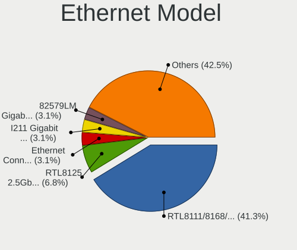

| Model                                                                          | Desktops | Percent |
|--------------------------------------------------------------------------------|----------|---------|
| Realtek RTL8111/8168/8211/8411 PCI Express Gigabit Ethernet Controller         | 2820     | 41.29%  |
| Realtek RTL8125 2.5GbE Controller                                              | 466      | 6.82%   |
| Intel Ethernet Connection (2) I219-V                                           | 215      | 3.15%   |
| Intel I211 Gigabit Network Connection                                          | 214      | 3.13%   |
| Intel 82579LM Gigabit Network Connection (Lewisville)                          | 210      | 3.07%   |
| Intel Ethernet Controller I225-V                                               | 161      | 2.36%   |
| Intel Ethernet Connection I217-LM                                              | 152      | 2.23%   |
| Intel 82579V Gigabit Network Connection                                        | 122      | 1.79%   |
| Intel Ethernet Connection (7) I219-V                                           | 121      | 1.77%   |
| Intel Ethernet Connection (2) I219-LM                                          | 99       | 1.45%   |
| Realtek RTL810xE PCI Express Fast Ethernet controller                          | 93       | 1.36%   |
| Intel Ethernet Connection I217-V                                               | 92       | 1.35%   |
| Qualcomm Atheros Killer E220x Gigabit Ethernet Controller                      | 80       | 1.17%   |
| Nvidia MCP61 Ethernet                                                          | 77       | 1.13%   |
| Intel Ethernet Connection (2) I218-V                                           | 74       | 1.08%   |
| Realtek RTL-8100/8101L/8139 PCI Fast Ethernet Adapter                          | 63       | 0.92%   |
| Realtek RTL8153 Gigabit Ethernet Adapter                                       | 59       | 0.86%   |
| Intel Ethernet Controller I226-V                                               | 59       | 0.86%   |
| Intel 82574L Gigabit Network Connection                                        | 58       | 0.85%   |
| Marvell Group 88E8056 PCI-E Gigabit Ethernet Controller                        | 56       | 0.82%   |
| Intel 82567LM-3 Gigabit Network Connection                                     | 54       | 0.79%   |
| Samsung Galaxy series, misc. (tethering mode)                                  | 47       | 0.69%   |
| Intel I210 Gigabit Network Connection                                          | 43       | 0.63%   |
| Intel Ethernet Connection (7) I219-LM                                          | 40       | 0.59%   |
| Qualcomm Atheros AR8151 v2.0 Gigabit Ethernet                                  | 35       | 0.51%   |
| Qualcomm Atheros AR8121/AR8113/AR8114 Gigabit or Fast Ethernet                 | 33       | 0.48%   |
| Broadcom NetXtreme BCM5761 Gigabit Ethernet PCIe                               | 30       | 0.44%   |
| Intel Ethernet Connection (5) I219-LM                                          | 28       | 0.41%   |
| Realtek RTL8126 5GbE Controller                                                | 26       | 0.38%   |
| Qualcomm Atheros AR8161 Gigabit Ethernet                                       | 25       | 0.37%   |
| Aquantia AQtion AQC107 NBase-T/IEEE 802.3an Ethernet Controller [Atlantic 10G] | 24       | 0.35%   |
| Qualcomm Atheros Killer E2400 Gigabit Ethernet Controller                      | 23       | 0.34%   |
| D-Link System DGE-528T Gigabit Ethernet Adapter                                | 21       | 0.31%   |
| ASIX AX88179 Gigabit Ethernet                                                  | 21       | 0.31%   |
| Nvidia MCP77 Ethernet                                                          | 20       | 0.29%   |
| Intel Ethernet Connection (17) I219-LM                                         | 20       | 0.29%   |
| Intel Ethernet Connection (11) I219-V                                          | 20       | 0.29%   |
| VIA VT6102/VT6103 [Rhine-II]                                                   | 19       | 0.28%   |
| Realtek RTL8111/8168/8411 PCI Express Gigabit Ethernet Controller              | 19       | 0.28%   |
| Realtek RTL8852BE PCIe 802.11ax Wireless Network Controller                    | 18       | 0.26%   |

Net Controller Kind
-------------------

Ethernet, WiFi or modem

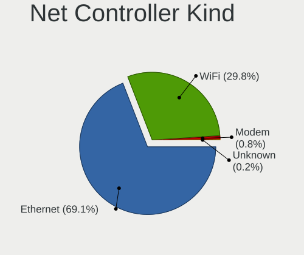

| Kind     | Desktops | Percent |
|----------|----------|---------|
| Ethernet | 5963     | 69.13%  |
| WiFi     | 2574     | 29.84%  |
| Modem    | 73       | 0.85%   |
| Unknown  | 16       | 0.19%   |

Used Controller
---------------

Currently used network controller

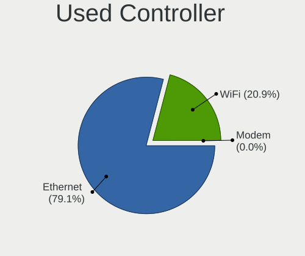

| Kind     | Desktops | Percent |
|----------|----------|---------|
| Ethernet | 4953     | 79.06%  |
| WiFi     | 1311     | 20.93%  |
| Modem    | 1        | 0.02%   |

NICs
----

Total network controllers on board

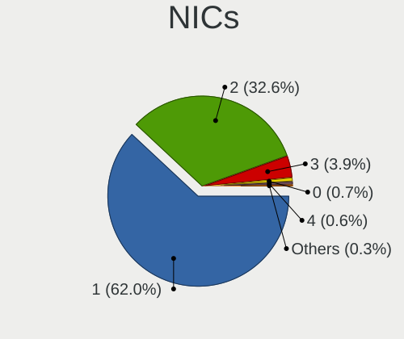

| Total | Desktops | Percent |
|-------|----------|---------|
| 1     | 3762     | 61.96%  |
| 2     | 1977     | 32.56%  |
| 3     | 237      | 3.9%    |
| 0     | 41       | 0.68%   |
| 4     | 35       | 0.58%   |
| 5     | 10       | 0.16%   |
| 7     | 4        | 0.07%   |
| 6     | 3        | 0.05%   |
| 10    | 1        | 0.02%   |
| 9     | 1        | 0.02%   |
| 8     | 1        | 0.02%   |

IPv6
----

IPv6 vs IPv4

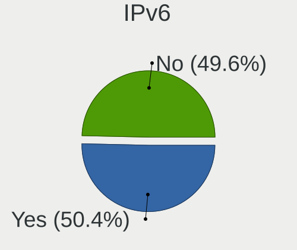

| Used | Desktops | Percent |
|------|----------|---------|
| Yes  | 3135     | 50.36%  |
| No   | 3090     | 49.64%  |

Bluetooth
---------

Bluetooth Vendor
----------------

Controller vendors

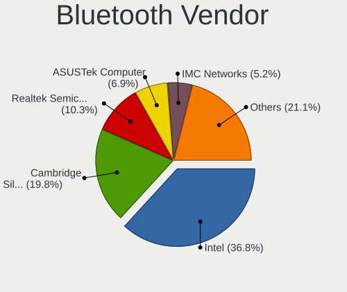

| Vendor                          | Desktops | Percent |
|---------------------------------|----------|---------|
| Intel                           | 728      | 36.82%  |
| Cambridge Silicon Radio         | 391      | 19.78%  |
| Realtek Semiconductor           | 203      | 10.27%  |
| ASUSTek Computer                | 136      | 6.88%   |
| IMC Networks                    | 102      | 5.16%   |
| MediaTek                        | 84       | 4.25%   |
| TP-Link                         | 66       | 3.34%   |
| Foxconn / Hon Hai               | 62       | 3.14%   |
| Broadcom                        | 53       | 2.68%   |
| Qualcomm Atheros Communications | 45       | 2.28%   |
| Belkin Components               | 25       | 1.26%   |
| Apple                           | 16       | 0.81%   |
| Lite-On Technology              | 14       | 0.71%   |
| Unknown                         | 9        | 0.46%   |
| Realtek                         | 8        | 0.4%    |
| Integrated System Solution      | 6        | 0.3%    |
| HTC (High Tech Computer)        | 5        | 0.25%   |
| Edimax Technology               | 4        | 0.2%    |
| Kensington                      | 2        | 0.1%    |
| Actions                         | 2        | 0.1%    |
| TRENDnet                        | 1        | 0.05%   |
| Toshiba                         | 1        | 0.05%   |
| Roper                           | 1        | 0.05%   |
| Ralink                          | 1        | 0.05%   |
| Micro Star International        | 1        | 0.05%   |
| Mercucys                        | 1        | 0.05%   |
| Marvell Semiconductor           | 1        | 0.05%   |
| Logitech                        | 1        | 0.05%   |
| Hewlett-Packard                 | 1        | 0.05%   |
| Fujitsu                         | 1        | 0.05%   |
| Dell                            | 1        | 0.05%   |
| D-Link System                   | 1        | 0.05%   |
| D-Link                          | 1        | 0.05%   |
| Creative Technology             | 1        | 0.05%   |
| Conwise Technology              | 1        | 0.05%   |
| Com One                         | 1        | 0.05%   |

Bluetooth Model
---------------

Controller models

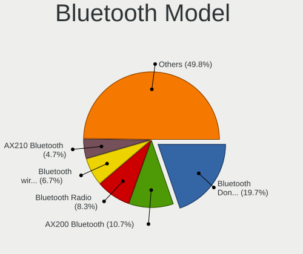

| Model                                                 | Desktops | Percent |
|-------------------------------------------------------|----------|---------|
| Cambridge Silicon Radio Bluetooth Dongle (HCI mode)   | 391      | 19.74%  |
| Intel AX200 Bluetooth                                 | 212      | 10.7%   |
| Realtek Bluetooth Radio                               | 165      | 8.33%   |
| Intel Bluetooth wireless interface                    | 133      | 6.71%   |
| Intel AX210 Bluetooth                                 | 94       | 4.75%   |
| MediaTek Wireless_Device                              | 84       | 4.24%   |
| TP-Link TP-T@- UB500 Adapter                          | 66       | 3.33%   |
| Intel AX201 Bluetooth                                 | 65       | 3.28%   |
| Intel Wireless-AC 9260 Bluetooth Adapter              | 62       | 3.13%   |
| Intel Wireless-AC 3168 Bluetooth                      | 54       | 2.73%   |
| Intel Bluetooth Device                                | 54       | 2.73%   |
| IMC Networks Bluetooth Radio                          | 52       | 2.62%   |
| Intel Bluetooth 9460/9560 Jefferson Peak (JfP)        | 46       | 2.32%   |
| ASUS Broadcom BCM20702A0 Bluetooth                    | 42       | 2.12%   |
| IMC Networks Wireless_Device                          | 33       | 1.67%   |
| Foxconn / Hon Hai Wireless_Device                     | 32       | 1.62%   |
| Foxconn / Hon Hai Bluetooth Device                    | 28       | 1.41%   |
| Broadcom BCM20702A0 Bluetooth 4.0                     | 28       | 1.41%   |
| ASUS ASUS USB-BT500                                   | 27       | 1.36%   |
| Realtek  Bluetooth 4.2 Adapter                        | 23       | 1.16%   |
| Qualcomm Atheros AR3011 Bluetooth                     | 20       | 1.01%   |
| ASUS Qualcomm Bluetooth 4.1                           | 17       | 0.86%   |
| ASUS Bluetooth Radio                                  | 16       | 0.81%   |
| ASUS Bluetooth Adapter                                | 15       | 0.76%   |
| Belkin Components F8T065BF Mini Bluetooth 4.0 Adapter | 13       | 0.66%   |
| Qualcomm Atheros  Bluetooth Device                    | 12       | 0.61%   |
| ASUS BCM20702A0                                       | 11       | 0.56%   |
| IMC Networks Bluetooth Device                         | 10       | 0.5%    |
| Intel Centrino Bluetooth Wireless Transceiver         | 9        | 0.45%   |
| Belkin Components Bluetooth Mini Dongle               | 9        | 0.45%   |
| Unknown                                               | 9        | 0.45%   |
| Realtek Bluetooth Radio                               | 8        | 0.4%    |
| Apple Bluetooth Host Controller                       | 7        | 0.35%   |
| Realtek Bluetooth 5.4 Radio                           | 6        | 0.3%    |
| Realtek Bluetooth 5.3 Radio                           | 6        | 0.3%    |
| Broadcom BCM2045 Bluetooth                            | 6        | 0.3%    |
| Qualcomm Atheros QCA61x4 Bluetooth 4.0                | 5        | 0.25%   |
| Qualcomm Atheros Bluetooth USB Host Controller        | 5        | 0.25%   |
| Lite-On Qualcomm Atheros QCA9377 Bluetooth            | 5        | 0.25%   |
| IMC Networks BCM20702A0                               | 5        | 0.25%   |

Sound
-----

Sound Vendor
------------

Sound card vendors

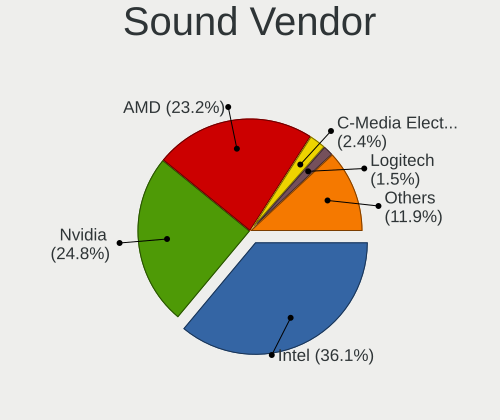

| Vendor                                       | Desktops | Percent |
|----------------------------------------------|----------|---------|
| Intel                                        | 3781     | 36.06%  |
| Nvidia                                       | 2601     | 24.81%  |
| AMD                                          | 2434     | 23.22%  |
| C-Media Electronics                          | 256      | 2.44%   |
| Logitech                                     | 160      | 1.53%   |
| Creative Labs                                | 119      | 1.14%   |
| ASUSTek Computer                             | 63       | 0.6%    |
| GN Netcom                                    | 58       | 0.55%   |
| Texas Instruments                            | 55       | 0.52%   |
| SteelSeries ApS                              | 52       | 0.5%    |
| Kingston Technology                          | 49       | 0.47%   |
| Corsair                                      | 46       | 0.44%   |
| VIA Technologies                             | 43       | 0.41%   |
| Focusrite-Novation                           | 43       | 0.41%   |
| Razer USA                                    | 39       | 0.37%   |
| Generalplus Technology                       | 39       | 0.37%   |
| Micro Star International                     | 38       | 0.36%   |
| JMTek                                        | 33       | 0.31%   |
| Plantronics                                  | 30       | 0.29%   |
| Zoran Co. Personal Media Division (Nogatech) | 28       | 0.27%   |
| DSEA A/S                                     | 23       | 0.22%   |
| Hewlett-Packard                              | 21       | 0.2%    |
| Creative Technology                          | 21       | 0.2%    |
| M-Audio                                      | 17       | 0.16%   |
| XMOS                                         | 16       | 0.15%   |
| Sony                                         | 16       | 0.15%   |
| RODE Microphones                             | 14       | 0.13%   |
| Tenx Technology                              | 13       | 0.12%   |
| Yamaha                                       | 12       | 0.11%   |
| Jieli Technology                             | 12       | 0.11%   |
| BEHRINGER International                      | 11       | 0.1%    |
| Realtek Semiconductor                        | 10       | 0.1%    |
| KTMicro                                      | 10       | 0.1%    |
| Silicon Integrated Systems [SiS]             | 9        | 0.09%   |
| Ensoniq                                      | 9        | 0.09%   |
| Medeli Electronics                           | 8        | 0.08%   |
| GYROCOM C&C                                  | 8        | 0.08%   |
| Dell                                         | 8        | 0.08%   |
| Blue Microphones                             | 8        | 0.08%   |
| PreSonus Audio Electronics                   | 7        | 0.07%   |

Sound Model
-----------

Sound card models

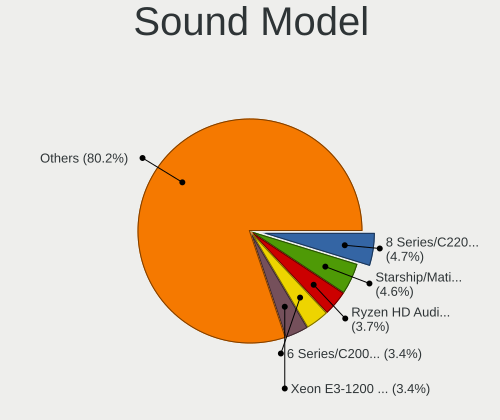

| Model                                                                             | Desktops | Percent |
|-----------------------------------------------------------------------------------|----------|---------|
| Intel 8 Series/C220 Series Chipset High Definition Audio Controller               | 581      | 4.75%   |
| AMD Starship/Matisse HD Audio Controller                                          | 558      | 4.56%   |
| AMD Ryzen HD Audio Controller                                                     | 453      | 3.7%    |
| Intel 6 Series/C200 Series Chipset Family High Definition Audio Controller        | 421      | 3.44%   |
| Intel Xeon E3-1200 v3/4th Gen Core Processor HD Audio Controller                  | 415      | 3.39%   |
| Intel 100 Series/C230 Series Chipset Family HD Audio Controller                   | 346      | 2.83%   |
| AMD SBx00 Azalia (Intel HDA)                                                      | 328      | 2.68%   |
| Intel 7 Series/C216 Chipset Family High Definition Audio Controller               | 306      | 2.5%    |
| Intel 200 Series PCH HD Audio                                                     | 275      | 2.25%   |
| Nvidia GK208 HDMI/DP Audio Controller                                             | 249      | 2.04%   |
| AMD Family 17h (Models 00h-0fh) HD Audio Controller                               | 238      | 1.95%   |
| Intel Cannon Lake PCH cAVS                                                        | 237      | 1.94%   |
| Intel NM10/ICH7 Family High Definition Audio Controller                           | 220      | 1.8%    |
| AMD Navi 21/23 HDMI/DP Audio Controller                                           | 219      | 1.79%   |
| Nvidia GP107GL High Definition Audio Controller                                   | 212      | 1.73%   |
| AMD Radeon High Definition Audio Controller                                       | 175      | 1.43%   |
| AMD Ellesmere HDMI Audio [Radeon RX 470/480 / 570/580/590]                        | 165      | 1.35%   |
| Intel 9 Series Chipset Family HD Audio Controller                                 | 163      | 1.33%   |
| AMD FCH Azalia Controller                                                         | 158      | 1.29%   |
| Intel 82801JI (ICH10 Family) HD Audio Controller                                  | 152      | 1.24%   |
| AMD Renoir/Cezanne HDMI/DP Audio Controller                                       | 151      | 1.23%   |
| Nvidia High Definition Audio Controller                                           | 147      | 1.2%    |
| Nvidia GP106 High Definition Audio Controller                                     | 128      | 1.05%   |
| Nvidia GP104 High Definition Audio Controller                                     | 124      | 1.01%   |
| Intel 5 Series/3400 Series Chipset High Definition Audio                          | 116      | 0.95%   |
| Nvidia GF119 HDMI Audio Controller                                                | 115      | 0.94%   |
| Nvidia GA104 High Definition Audio Controller                                     | 114      | 0.93%   |
| AMD Oland/Hainan/Cape Verde/Pitcairn HDMI Audio [Radeon HD 7000 Series]           | 111      | 0.91%   |
| AMD Raven/Raven2/Fenghuang HDMI/DP Audio Controller                               | 110      | 0.9%    |
| Nvidia TU116 High Definition Audio Controller                                     | 109      | 0.89%   |
| Intel Alder Lake-S HD Audio Controller                                            | 102      | 0.83%   |
| Intel 82801I (ICH9 Family) HD Audio Controller                                    | 95       | 0.78%   |
| AMD Navi 31 HDMI/DP Audio                                                         | 95       | 0.78%   |
| Nvidia MCP61 High Definition Audio                                                | 94       | 0.77%   |
| Nvidia TU106 High Definition Audio Controller                                     | 89       | 0.73%   |
| Nvidia GM107 High Definition Audio Controller [GeForce 940MX]                     | 88       | 0.72%   |
| AMD Caicos HDMI Audio [Radeon HD 6450 / 7450/8450/8490 OEM / R5 230/235/235X OEM] | 88       | 0.72%   |
| Nvidia GF108 High Definition Audio Controller                                     | 85       | 0.69%   |
| Nvidia GM204 High Definition Audio Controller                                     | 84       | 0.69%   |
| Nvidia GM206 High Definition Audio Controller                                     | 81       | 0.66%   |

Memory
------

Memory Vendor
-------------

Memory module vendors

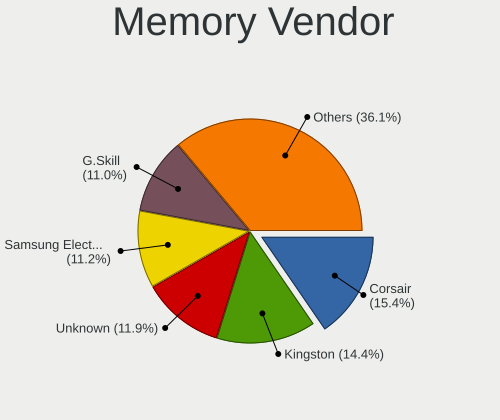

| Vendor              | Desktops | Percent |
|---------------------|----------|---------|
| Corsair             | 721      | 15.43%  |
| Kingston            | 672      | 14.38%  |
| Unknown             | 557      | 11.92%  |
| Samsung Electronics | 523      | 11.19%  |
| G.Skill             | 513      | 10.98%  |
| SK hynix            | 463      | 9.91%   |
| Crucial             | 415      | 8.88%   |
| Micron Technology   | 280      | 5.99%   |
| Nanya Technology    | 61       | 1.31%   |
| Unknown             | 48       | 1.03%   |
| Transcend           | 47       | 1.01%   |
| Ramaxel Technology  | 46       | 0.98%   |
| A-DATA Technology   | 40       | 0.86%   |
| Elpida              | 36       | 0.77%   |
| PNY                 | 22       | 0.47%   |
| Patriot             | 22       | 0.47%   |
| Unknown (ABCD)      | 20       | 0.43%   |
| Unifosa             | 18       | 0.39%   |
| Team                | 17       | 0.36%   |
| TEXTORM             | 15       | 0.32%   |
| Timetec             | 13       | 0.28%   |
| Unknown (0x0E9D)    | 10       | 0.21%   |
| Qimonda             | 9        | 0.19%   |
| Unknown (0x0C97)    | 8        | 0.17%   |
| Wodposit            | 5        | 0.11%   |
| KLEVV               | 4        | 0.09%   |
| Innodisk            | 4        | 0.09%   |
| Apacer              | 4        | 0.09%   |
| Toshiba             | 3        | 0.06%   |
| QEMU                | 3        | 0.06%   |
| OCZ                 | 3        | 0.06%   |
| Lexar               | 3        | 0.06%   |
| Kllisre             | 3        | 0.06%   |
| Hewlett-Packard     | 3        | 0.06%   |
| ASint Technology    | 3        | 0.06%   |
| Unknown (0x0B45)    | 2        | 0.04%   |
| Swissbit            | 2        | 0.04%   |
| Silicon Power       | 2        | 0.04%   |
| Ramos Technology    | 2        | 0.04%   |
| Patriot Memory      | 2        | 0.04%   |

Memory Model
------------

Memory module models

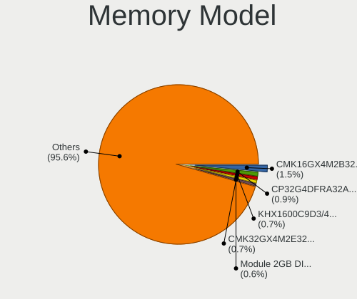

| Model                                                          | Desktops | Percent |
|----------------------------------------------------------------|----------|---------|
| Corsair RAM CMK16GX4M2B3200C16 8GB DIMM DDR4 3600MT/s          | 76       | 1.49%   |
| Unknown                                                        | 48       | 0.94%   |
| Kingston RAM KHX1600C9D3/4GX 4GB DIMM DDR3 1867MT/s            | 36       | 0.7%    |
| Corsair RAM CMK32GX4M2E3200C16 16GB DIMM DDR4 3600MT/s         | 36       | 0.7%    |
| Unknown RAM Module 2GB DIMM DDR2 800MT/s                       | 31       | 0.61%   |
| Samsung RAM M378B5173EB0-YK0 4GB DIMM DDR3 1600MT/s            | 30       | 0.59%   |
| G.Skill RAM F3-12800CL9-4GBXL 4GB DIMM DDR3 1867MT/s           | 29       | 0.57%   |
| SK hynix RAM HMT351U6CFR8C-PB 4GB DIMM DDR3 1800MT/s           | 28       | 0.55%   |
| SK hynix RAM HMT451U6BFR8A-PB 4GB DIMM DDR3 1600MT/s           | 27       | 0.53%   |
| Micron RAM 8JTF51264AZ-1G6E1 4GB DIMM DDR3 1600MT/s            | 27       | 0.53%   |
| Corsair RAM CMK16GX4M2E3200C16 8GB DIMM DDR4 3466MT/s          | 27       | 0.53%   |
| Kingston RAM KHX2666C16/8G 8GiB DIMM DDR4 3466MT/s             | 26       | 0.51%   |
| Corsair RAM CMK16GX4M2B3000C15 8GB DIMM DDR4 3600MT/s          | 26       | 0.51%   |
| Unknown RAM Module 4GB DIMM 1333MT/s                           | 24       | 0.47%   |
| Kingston RAM KHX1600C10D3/8G 8GB DIMM DDR3 2133MT/s            | 22       | 0.43%   |
| Kingston RAM KF3200C16D4/8GX 8GiB DIMM DDR4 3600MT/s           | 22       | 0.43%   |
| Unknown (ABCD) RAM 123456789012345678 2GB DIMM LPDDR4 2133MT/s | 20       | 0.39%   |
| SK hynix RAM HMT351U6EFR8C-PB 4GB DIMM DDR3 1600MT/s           | 19       | 0.37%   |
| Samsung RAM M378B5173QH0-CK0 4GB DIMM DDR3                     | 19       | 0.37%   |
| Samsung RAM M378B5173DB0-CK0 4096MB DIMM DDR3 1600MT/s         | 19       | 0.37%   |
| Corsair RAM CMV4GX3M1A1333C9 4GB DIMM DDR3 1600MT/s            | 19       | 0.37%   |
| G.Skill RAM F4-3200C16-8GIS 8GB DIMM DDR4 3600MT/s             | 18       | 0.35%   |
| G.Skill RAM F4-3000C16-8GISB 8GB DIMM DDR4 3200MT/s            | 18       | 0.35%   |
| Corsair RAM CMZ8GX3M2A1600C9 4GB DIMM SDRAM 1800MT/s           | 18       | 0.35%   |
| SK hynix RAM HMA81GU6AFR8N-UH 8GB DIMM DDR4 2400MT/s           | 17       | 0.33%   |
| G.Skill RAM F4-3200C16-8GVKB 8GB DIMM DDR4 4000MT/s            | 17       | 0.33%   |
| Corsair RAM CMK8GX4M1A2400C14 8GB DIMM DDR4 2800MT/s           | 16       | 0.31%   |
| Unknown RAM Module 4GB DIMM DDR3 1333MT/s                      | 15       | 0.29%   |
| Unknown RAM Module 2GB DIMM 1333MT/s                           | 15       | 0.29%   |
| SK hynix RAM HMT451U6AFR8C-PB 4GB DIMM DDR3 1600MT/s           | 15       | 0.29%   |
| Samsung RAM M378B5273DH0-CH9 4GB DIMM DDR3 2133MT/s            | 15       | 0.29%   |
| Samsung RAM M378A5244CB0-CRC 4GB DIMM DDR4 3066MT/s            | 15       | 0.29%   |
| Kingston RAM KHX2400C15/8G 8GB DIMM DDR4 3400MT/s              | 15       | 0.29%   |
| Kingston RAM KHX1866C10D3/8G 8GB DIMM DDR3 1867MT/s            | 15       | 0.29%   |
| G.Skill RAM F4-3200C16-16GVK 16GB DIMM DDR4 3600MT/s           | 15       | 0.29%   |
| Unknown RAM Module 8GB DIMM DDR3 1600MT/s                      | 14       | 0.27%   |
| SK hynix RAM HMA41GU6AFR8N-TF 8GB DIMM DDR4 2465MT/s           | 14       | 0.27%   |
| Samsung RAM M378B5273CH0-CK0 4GB DIMM DDR3 2000MT/s            | 14       | 0.27%   |
| Samsung RAM M378A1K43CB2-CTD 8GB DIMM DDR4 3266MT/s            | 14       | 0.27%   |
| Micron RAM 16JTF51264AZ-1G4M1 4GB DIMM DDR3 1333MT/s           | 14       | 0.27%   |

Memory Kind
-----------

Memory module kinds

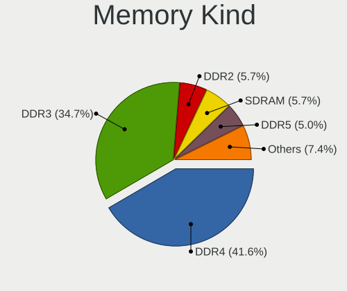

| Kind    | Desktops | Percent |
|---------|----------|---------|
| DDR4    | 1714     | 41.59%  |
| DDR3    | 1431     | 34.72%  |
| DDR2    | 235      | 5.7%    |
| SDRAM   | 234      | 5.68%   |
| DDR5    | 204      | 4.95%   |
| Unknown | 197      | 4.78%   |
| DDR     | 63       | 1.53%   |
| LPDDR4  | 26       | 0.63%   |
| DRAM    | 7        | 0.17%   |
| LPDDR5  | 5        | 0.12%   |
| RAM     | 4        | 0.1%    |
| LPDDR3  | 1        | 0.02%   |

Memory Form Factor
------------------

Physical design of the memory module

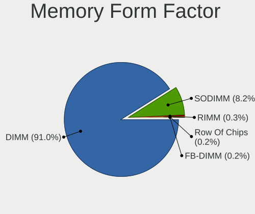

| Name         | Desktops | Percent |
|--------------|----------|---------|
| DIMM         | 3652     | 91.05%  |
| SODIMM       | 329      | 8.2%    |
| RIMM         | 14       | 0.35%   |
| Row Of Chips | 9        | 0.22%   |
| FB-DIMM      | 7        | 0.17%   |

Memory Size
-----------

Memory module size

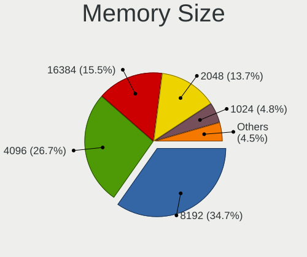

| Size  | Desktops | Percent |
|-------|----------|---------|
| 8192  | 1559     | 34.72%  |
| 4096  | 1200     | 26.73%  |
| 16384 | 698      | 15.55%  |
| 2048  | 616      | 13.72%  |
| 1024  | 216      | 4.81%   |
| 32768 | 139      | 3.1%    |
| 512   | 35       | 0.78%   |
| 49152 | 12       | 0.27%   |
| 65536 | 5        | 0.11%   |
| 256   | 3        | 0.07%   |
| 24576 | 2        | 0.04%   |
| 3072  | 2        | 0.04%   |
| 12288 | 1        | 0.02%   |
| 6144  | 1        | 0.02%   |
| 128   | 1        | 0.02%   |

Memory Speed
------------

Memory module speed

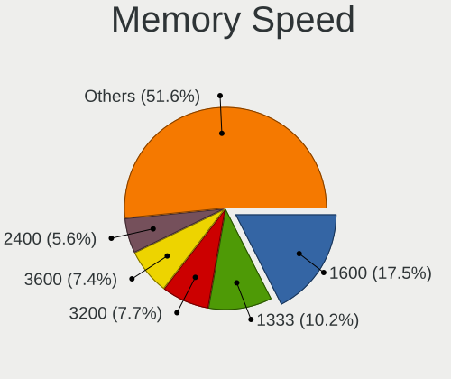

| Speed   | Desktops | Percent |
|---------|----------|---------|
| 1600    | 799      | 17.5%   |
| 1333    | 467      | 10.23%  |
| 3200    | 351      | 7.69%   |
| 3600    | 338      | 7.4%    |
| 2400    | 257      | 5.63%   |
| 2667    | 256      | 5.61%   |
| 2133    | 247      | 5.41%   |
| 800     | 167      | 3.66%   |
| 667     | 109      | 2.39%   |
| 1867    | 100      | 2.19%   |
| 1800    | 83       | 1.82%   |
| 1866    | 80       | 1.75%   |
| 1066    | 80       | 1.75%   |
| 2666    | 77       | 1.69%   |
| Unknown | 70       | 1.53%   |
| 6000    | 67       | 1.47%   |
| 3000    | 67       | 1.47%   |
| 3466    | 59       | 1.29%   |
| 3400    | 59       | 1.29%   |
| 3733    | 57       | 1.25%   |
| 3800    | 55       | 1.2%    |
| 5600    | 48       | 1.05%   |
| 4800    | 41       | 0.9%    |
| 2933    | 41       | 0.9%    |
| 2800    | 39       | 0.85%   |
| 1067    | 33       | 0.72%   |
| 4000    | 30       | 0.66%   |
| 2048    | 30       | 0.66%   |
| 400     | 28       | 0.61%   |
| 1648    | 24       | 0.53%   |
| 533     | 24       | 0.53%   |
| 3266    | 22       | 0.48%   |
| 1639    | 20       | 0.44%   |
| 3066    | 19       | 0.42%   |
| 2733    | 19       | 0.42%   |
| 2000    | 18       | 0.39%   |
| 3666    | 17       | 0.37%   |
| 6400    | 16       | 0.35%   |
| 333     | 15       | 0.33%   |
| 2465    | 14       | 0.31%   |

Printers & scanners
-------------------

Printer Vendor
--------------

Printer device vendors

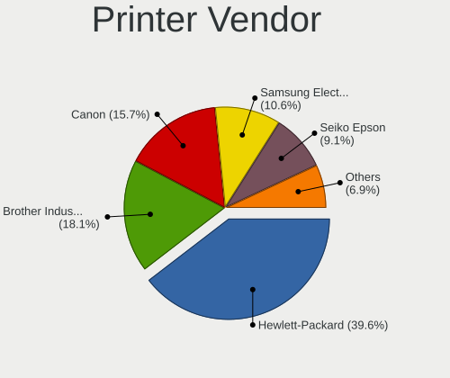

| Vendor                 | Desktops | Percent |
|------------------------|----------|---------|
| Hewlett-Packard        | 131      | 39.58%  |
| Brother Industries     | 60       | 18.13%  |
| Canon                  | 52       | 15.71%  |
| Samsung Electronics    | 35       | 10.57%  |
| Seiko Epson            | 30       | 9.06%   |
| Ricoh                  | 4        | 1.21%   |
| Prolific Technology    | 3        | 0.91%   |
| Lexmark International  | 3        | 0.91%   |
| QinHeng Electronics    | 2        | 0.6%    |
| Dymo-CoStar            | 2        | 0.6%    |
| Zebra Technologies     | 1        | 0.3%    |
| Xerox                  | 1        | 0.3%    |
| STMicroelectronics     | 1        | 0.3%    |
| Sagem                  | 1        | 0.3%    |
| Pantum                 | 1        | 0.3%    |
| Kyocera                | 1        | 0.3%    |
| Custom Engineering SPA | 1        | 0.3%    |
| BIXOLON                | 1        | 0.3%    |
| Apple                  | 1        | 0.3%    |

Printer Model
-------------

Printer device models

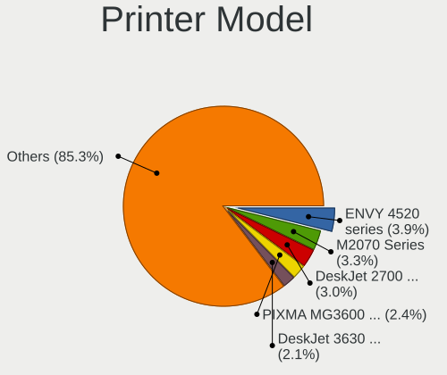

| Model                                | Desktops | Percent |
|--------------------------------------|----------|---------|
| HP ENVY 4520 series                  | 13       | 3.89%   |
| Samsung M2070 Series                 | 11       | 3.29%   |
| HP DeskJet 2700 series               | 10       | 2.99%   |
| Canon PIXMA MG3600 Series            | 8        | 2.4%    |
| HP DeskJet 3630 series               | 7        | 2.1%    |
| HP DeskJet 2600 series               | 7        | 2.1%    |
| HP ENVY Photo 6200 series            | 5        | 1.5%    |
| HP DeskJet 3700 series               | 5        | 1.5%    |
| Brother HL-2030 Laser Printer        | 5        | 1.5%    |
| Seiko Epson XP-2100 Series           | 4        | 1.2%    |
| HP OfficeJet 3830 series             | 4        | 1.2%    |
| HP ENVY 5540 series                  | 4        | 1.2%    |
| HP ENVY 5000 series                  | 4        | 1.2%    |
| HP Deskjet 3050A                     | 4        | 1.2%    |
| Seiko Epson XP-240 Series            | 3        | 0.9%    |
| Samsung SCX-3400 Series              | 3        | 0.9%    |
| Samsung ML-1660 Series               | 3        | 0.9%    |
| Samsung ML-1640 Series Laser Printer | 3        | 0.9%    |
| Samsung CLX-3170 Series              | 3        | 0.9%    |
| Prolific PL2305 Parallel Port        | 3        | 0.9%    |
| HP LaserJet 1200                     | 3        | 0.9%    |
| HP DeskJet Plus 4100 series          | 3        | 0.9%    |
| HP DeskJet F4200 series              | 3        | 0.9%    |
| HP DeskJet 2130 series               | 3        | 0.9%    |
| HP Deskjet 1510                      | 3        | 0.9%    |
| Canon MG5700 series                  | 3        | 0.9%    |
| Canon LiDE 400                       | 3        | 0.9%    |
| Canon iP7200 series                  | 3        | 0.9%    |
| Brother Printer                      | 3        | 0.9%    |
| Brother MFC-L2710DW series           | 3        | 0.9%    |
| Brother HL-L2375DW series            | 3        | 0.9%    |
| Brother DCP-7055 scanner/printer     | 3        | 0.9%    |
| Seiko Epson XP-2200 Series           | 2        | 0.6%    |
| Seiko Epson ET-2870 Series           | 2        | 0.6%    |
| Seiko Epson ET-2820 Series           | 2        | 0.6%    |
| Seiko Epson ET-2720 Series           | 2        | 0.6%    |
| Seiko Epson EPSON WF-2510 Series     | 2        | 0.6%    |
| Samsung ML-1630 Series               | 2        | 0.6%    |
| Samsung M2020 Series                 | 2        | 0.6%    |
| Samsung CLX-3180 Series              | 2        | 0.6%    |

Scanner Vendor
--------------

Scanner device vendors

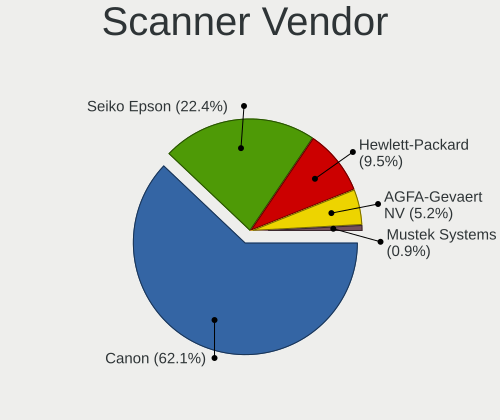

| Vendor          | Desktops | Percent |
|-----------------|----------|---------|
| Canon           | 72       | 62.07%  |
| Seiko Epson     | 26       | 22.41%  |
| Hewlett-Packard | 11       | 9.48%   |
| AGFA-Gevaert NV | 6        | 5.17%   |
| Mustek Systems  | 1        | 0.86%   |

Scanner Model
-------------

Scanner device models

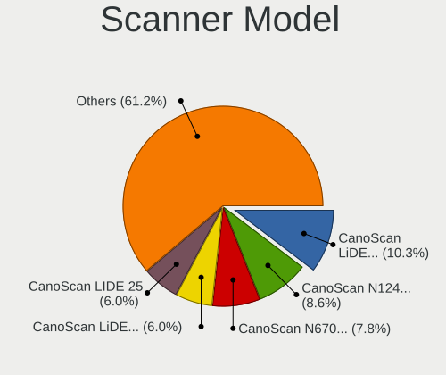

| Model                                                         | Desktops | Percent |
|---------------------------------------------------------------|----------|---------|
| Canon CanoScan LiDE 110                                       | 12       | 10.34%  |
| Canon CanoScan N1240U/LiDE 30                                 | 10       | 8.62%   |
| Canon CanoScan N670U/N676U/LiDE 20                            | 9        | 7.76%   |
| Canon CanoScan LIDE 25                                        | 7        | 6.03%   |
| Canon CanoScan LiDE 220                                       | 7        | 6.03%   |
| Seiko Epson GT-X770 [Perfection V500]                         | 4        | 3.45%   |
| Canon CanoScan LiDE 50/LiDE 35/LiDE 40                        | 4        | 3.45%   |
| Canon CanoScan LiDE 200                                       | 4        | 3.45%   |
| AGFA-Gevaert NV SnapScan e20                                  | 4        | 3.45%   |
| Seiko Epson GT-F730 [GT-S630/Perfection V33/V330 Photo]       | 3        | 2.59%   |
| Canon CanoScan N650U/N656U                                    | 3        | 2.59%   |
| Canon CanoScan LiDE 60                                        | 3        | 2.59%   |
| Canon CanoScan LiDE 210                                       | 3        | 2.59%   |
| Canon CanoScan LiDE 120                                       | 3        | 2.59%   |
| Seiko Epson Perfection V37/V370                               | 2        | 1.72%   |
| Seiko Epson GT-F720 [GT-S620/Perfection V30/V300 Photo]       | 2        | 1.72%   |
| Seiko Epson GT-F700 [Perfection V350]                         | 2        | 1.72%   |
| Seiko Epson GT-9800F [Perfection 3200]                        | 2        | 1.72%   |
| Seiko Epson GT-7700U [Perfection 1240U]                       | 2        | 1.72%   |
| Seiko Epson GT-6600U [Perfection 610]                         | 2        | 1.72%   |
| Canon CanoScan 4200F                                          | 2        | 1.72%   |
| Seiko Epson GT-X900 [Perfection V700/V750 Photo]              | 1        | 0.86%   |
| Seiko Epson GT-F650 [GT-S600/Perfection V10/V100]             | 1        | 0.86%   |
| Seiko Epson GT-F600 [Perfection 4180]                         | 1        | 0.86%   |
| Seiko Epson GT-8700/GT-8700F [Perfection 1640SU/1640SU PHOTO] | 1        | 0.86%   |
| Seiko Epson GT-8400UF [Perfection 1670/1670 PHOTO]            | 1        | 0.86%   |
| Seiko Epson GT-8300UF [Perfection 1660 PHOTO]                 | 1        | 0.86%   |
| Seiko Epson GT-8200U/GT-8200UF [Perfection 1650/1650 PHOTO]   | 1        | 0.86%   |
| Mustek Systems ScanExpress A3 USB                             | 1        | 0.86%   |
| HP ScanJet G4050                                              | 1        | 0.86%   |
| HP ScanJet G4010                                              | 1        | 0.86%   |
| HP ScanJet 7400c                                              | 1        | 0.86%   |
| HP ScanJet 5200c                                              | 1        | 0.86%   |
| HP ScanJet 4570c                                              | 1        | 0.86%   |
| HP ScanJet 4370                                               | 1        | 0.86%   |
| HP ScanJet 3570c                                              | 1        | 0.86%   |
| HP ScanJet 3500c                                              | 1        | 0.86%   |
| HP ScanJet 3400cse                                            | 1        | 0.86%   |
| HP ScanJet 2300c                                              | 1        | 0.86%   |
| HP PSC 1200                                                   | 1        | 0.86%   |

Camera
------

Camera Vendor
-------------

Camera device vendors

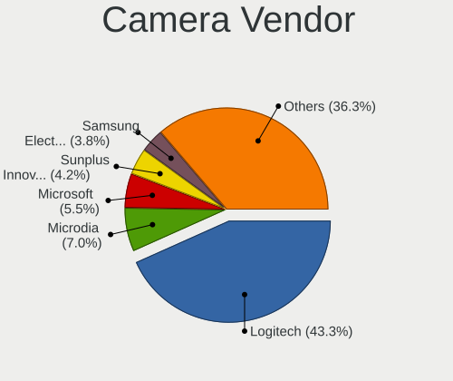

| Vendor                        | Desktops | Percent |
|-------------------------------|----------|---------|
| Logitech                      | 460      | 43.31%  |
| Microdia                      | 74       | 6.97%   |
| Microsoft                     | 58       | 5.46%   |
| Sunplus Innovation Technology | 45       | 4.24%   |
| Samsung Electronics           | 40       | 3.77%   |
| Guillemot                     | 29       | 2.73%   |
| Apple                         | 28       | 2.64%   |
| Chicony Electronics           | 26       | 2.45%   |
| ARC International             | 23       | 2.17%   |
| Realtek Semiconductor         | 19       | 1.79%   |
| Generalplus Technology        | 18       | 1.69%   |
| Creative Technology           | 16       | 1.51%   |
| Sonix Technology              | 13       | 1.22%   |
| KYE Systems (Mouse Systems)   | 10       | 0.94%   |
| Hewlett-Packard               | 10       | 0.94%   |
| WaveRider Communications      | 9        | 0.85%   |
| GEMBIRD                       | 9        | 0.85%   |
| Jieli Technology              | 8        | 0.75%   |
| Cubeternet                    | 8        | 0.75%   |
| Z-Star Microelectronics       | 7        | 0.66%   |
| webcam                        | 7        | 0.66%   |
| Razer USA                     | 7        | 0.66%   |
| MacroSilicon                  | 7        | 0.66%   |
| AVerMedia Technologies        | 7        | 0.66%   |
| Sunplus IT                    | 6        | 0.56%   |
| Arkmicro Technologies         | 6        | 0.56%   |
| Philips (or NXP)              | 5        | 0.47%   |
| Novatek Microelectronics      | 5        | 0.47%   |
| Trust                         | 4        | 0.38%   |
| SunplusIT                     | 4        | 0.38%   |
| Xiongmai                      | 3        | 0.28%   |
| Valve Software                | 3        | 0.28%   |
| Smartronix                    | 3        | 0.28%   |
| IMC Networks                  | 3        | 0.28%   |
| Huawei Technologies           | 3        | 0.28%   |
| eMeet                         | 3        | 0.28%   |
| Alcor Micro                   | 3        | 0.28%   |
| Tobii Technology AB           | 2        | 0.19%   |
| Syntek                        | 2        | 0.19%   |
| Quanta                        | 2        | 0.19%   |

Camera Model
------------

Camera device models

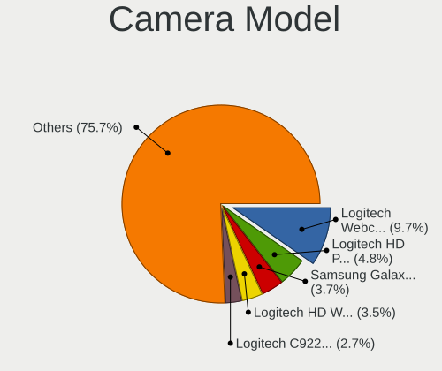

| Model                                    | Desktops | Percent |
|------------------------------------------|----------|---------|
| Logitech Webcam C270                     | 103      | 9.67%   |
| Logitech HD Pro Webcam C920              | 51       | 4.79%   |
| Samsung Galaxy series, misc. (MTP mode)  | 39       | 3.66%   |
| Logitech HD Webcam C525                  | 37       | 3.47%   |
| Logitech C922 Pro Stream Webcam          | 29       | 2.72%   |
| Apple iPhone 5/5C/5S/6/SE/7/8/X          | 28       | 2.63%   |
| Logitech Webcam C170                     | 25       | 2.35%   |
| Sunplus Full HD webcam                   | 22       | 2.07%   |
| ARC International Camera                 | 22       | 2.07%   |
| Microsoft LifeCam HD-3000                | 21       | 1.97%   |
| Microdia Webcam Vitade AF                | 21       | 1.97%   |
| Logitech C920 PRO HD Webcam              | 20       | 1.88%   |
| Microdia Camera                          | 18       | 1.69%   |
| Logitech Webcam C310                     | 18       | 1.69%   |
| Logitech StreamCam                       | 13       | 1.22%   |
| Guillemot Hercules HD Twist              | 12       | 1.13%   |
| Logitech Webcam C930e                    | 11       | 1.03%   |
| Logitech BRIO Ultra HD Webcam            | 11       | 1.03%   |
| Logitech BRIO 4K Stream Edition          | 11       | 1.03%   |
| Sonix USB Camera                         | 10       | 0.94%   |
| Microdia USB 2.0 Camera                  | 10       | 0.94%   |
| Logitech HD Webcam C910                  | 10       | 0.94%   |
| Realtek FULL HD 1080P Webcam             | 9        | 0.85%   |
| Logitech Webcam C210                     | 9        | 0.85%   |
| Logitech QuickCam Pro 9000               | 9        | 0.85%   |
| Generalplus GENERAL WEBCAM               | 9        | 0.85%   |
| Microdia Sonix USB 2.0 Camera            | 8        | 0.75%   |
| Microdia CyberTrack H7                   | 8        | 0.75%   |
| Logitech QuickCam Pro 5000               | 8        | 0.75%   |
| Logitech HD Webcam C615                  | 8        | 0.75%   |
| Logitech B525 HD Webcam                  | 8        | 0.75%   |
| Guillemot Hercules Dualpix Exchange      | 8        | 0.75%   |
| Generalplus 808 Camera #9 (web-cam mode) | 8        | 0.75%   |
| webcam webcam                            | 7        | 0.66%   |
| WaveRider USB 2.0 Camera                 | 7        | 0.66%   |
| Sunplus Aukey-PC-LM1E Camera             | 7        | 0.66%   |
| Microsoft LifeCam Cinema                 | 7        | 0.66%   |
| Logitech Webcam Pro 9000                 | 7        | 0.66%   |
| Logitech QuickCam Pro 4000               | 7        | 0.66%   |
| Jieli USB PHY 2.0                        | 7        | 0.66%   |

Security
--------

Fingerprint Vendor
------------------

Fingerprint sensor vendors

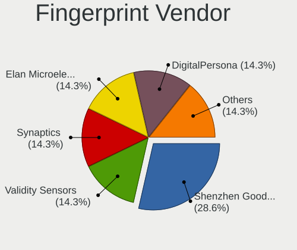

| Vendor                     | Desktops | Percent |
|----------------------------|----------|---------|
| Shenzhen Goodix Technology | 2        | 28.57%  |
| Validity Sensors           | 1        | 14.29%  |
| Synaptics                  | 1        | 14.29%  |
| Elan Microelectronics      | 1        | 14.29%  |
| DigitalPersona             | 1        | 14.29%  |
| AuthenTec                  | 1        | 14.29%  |

Fingerprint Model
-----------------

Fingerprint sensor models

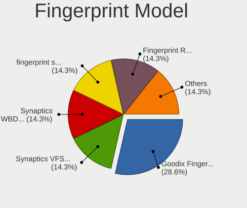

| Model                                                       | Desktops | Percent |
|-------------------------------------------------------------|----------|---------|
| Shenzhen Goodix  Fingerprint Device                         | 2        | 28.57%  |
| Validity Sensors Synaptics VFS7552 Touch Fingerprint Sensor | 1        | 14.29%  |
| Synaptics  WBDI Fingerprint Reader - USB 052                | 1        | 14.29%  |
| Elan fingerprint sensor [FeinTech FPS00200]                 | 1        | 14.29%  |
| DigitalPersona Fingerprint Reader                           | 1        | 14.29%  |
| AuthenTec AES2501 Fingerprint Sensor                        | 1        | 14.29%  |

Chipcard Vendor
---------------

Chipcard module vendors

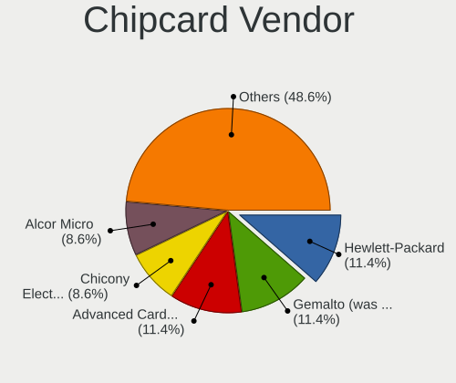

| Vendor                    | Desktops | Percent |
|---------------------------|----------|---------|
| Hewlett-Packard           | 4        | 11.43%  |
| Gemalto (was Gemplus)     | 4        | 11.43%  |
| Advanced Card Systems     | 4        | 11.43%  |
| Chicony Electronics       | 3        | 8.57%   |
| Alcor Micro               | 3        | 8.57%   |
| Yubico.com                | 2        | 5.71%   |
| SCM Microsystems          | 2        | 5.71%   |
| Realtek Semiconductor     | 2        | 5.71%   |
| CHERRY                    | 2        | 5.71%   |
| Aladdin Knowledge Systems | 2        | 5.71%   |
| ST-Ericsson               | 1        | 2.86%   |
| OmniKey                   | 1        | 2.86%   |
| Lenovo                    | 1        | 2.86%   |
| Jing-Mold Enterprise      | 1        | 2.86%   |
| Feitian Technologies      | 1        | 2.86%   |
| Clay Logic                | 1        | 2.86%   |
| Bit4id                    | 1        | 2.86%   |

Chipcard Model
--------------

Chipcard module models

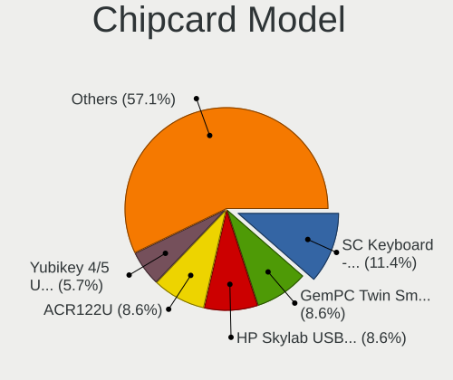

| Model                                                             | Desktops | Percent |
|-------------------------------------------------------------------|----------|---------|
| Hewlett-Packard SC Keyboard - Apollo (Liteon)                     | 4        | 11.43%  |
| Gemalto (was Gemplus) GemPC Twin SmartCard Reader                 | 3        | 8.57%   |
| Chicony Electronics HP Skylab USB Smartcard Keyboard              | 3        | 8.57%   |
| Advanced Card Systems ACR122U                                     | 3        | 8.57%   |
| Yubico.com Yubikey 4/5 U2F+CCID                                   | 2        | 5.71%   |
| Realtek Semiconductor Smart Card Reader Interface                 | 2        | 5.71%   |
| Alcor Micro AU9540 Smartcard Reader                               | 2        | 5.71%   |
| Aladdin Knowledge Systems Token JC                                | 2        | 5.71%   |
| ST-Ericsson Chipcard Reader                                       | 1        | 2.86%   |
| SCM Microsystems SCR335 SmartCard Reader                          | 1        | 2.86%   |
| SCM Microsystems CLOUD 2700 F Smart Card Reader                   | 1        | 2.86%   |
| OmniKey CardMan 3021 / 3121                                       | 1        | 2.86%   |
| Lenovo Smartcard Keyboard                                         | 1        | 2.86%   |
| Jing-Mold Enterprise HP USB Business Slim Smartcard CCID Keyboard | 1        | 2.86%   |
| Gemalto (was Gemplus) GemPC Key SmartCard Reader                  | 1        | 2.86%   |
| Feitian Technologies FT SCR310                                    | 1        | 2.86%   |
| Clay Logic Nitrokey Pro                                           | 1        | 2.86%   |
| CHERRY Smart Card Reader USB                                      | 1        | 2.86%   |
| Cherry SECURE BOARD 1.0                                           | 1        | 2.86%   |
| Bit4id miniLector EVO                                             | 1        | 2.86%   |
| Alcor Micro Watchdata W 1981                                      | 1        | 2.86%   |
| Advanced Card Systems ACR1252 Dual Reader                         | 1        | 2.86%   |

Unsupported
-----------

Unsupported Devices
-------------------

Total unsupported devices on board

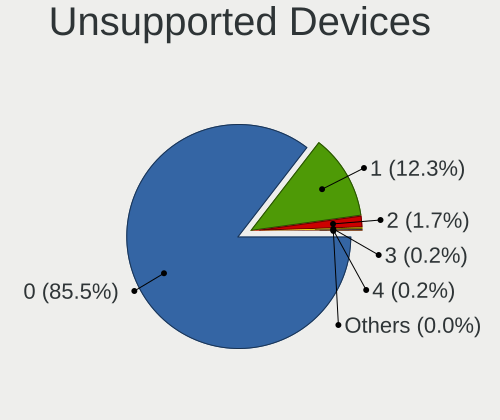

| Total | Desktops | Percent |
|-------|----------|---------|
| 0     | 5262     | 85.46%  |
| 1     | 760      | 12.34%  |
| 2     | 103      | 1.67%   |
| 3     | 15       | 0.24%   |
| 4     | 14       | 0.23%   |
| 5     | 2        | 0.03%   |
| 9     | 1        | 0.02%   |

Unsupported Device Types
------------------------

Types of unsupported devices

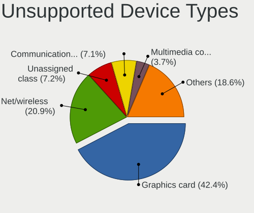

| Type                     | Desktops | Percent |
|--------------------------|----------|---------|
| Graphics card            | 433      | 42.37%  |
| Net/wireless             | 214      | 20.94%  |
| Unassigned class         | 74       | 7.24%   |
| Communication controller | 73       | 7.14%   |
| Multimedia controller    | 38       | 3.72%   |
| Sound                    | 37       | 3.62%   |
| Net/ethernet             | 29       | 2.84%   |
| Bluetooth                | 23       | 2.25%   |
| Camera                   | 21       | 2.05%   |
| Network                  | 16       | 1.57%   |
| Storage/raid             | 14       | 1.37%   |
| Chipcard                 | 12       | 1.17%   |
| Storage/ide              | 8        | 0.78%   |
| Card reader              | 7        | 0.68%   |
| Firewire controller      | 6        | 0.59%   |
| Modem                    | 5        | 0.49%   |
| Fingerprint reader       | 5        | 0.49%   |
| Dvb card                 | 4        | 0.39%   |
| Tv card                  | 2        | 0.2%    |
| Storage/ata              | 1        | 0.1%    |

