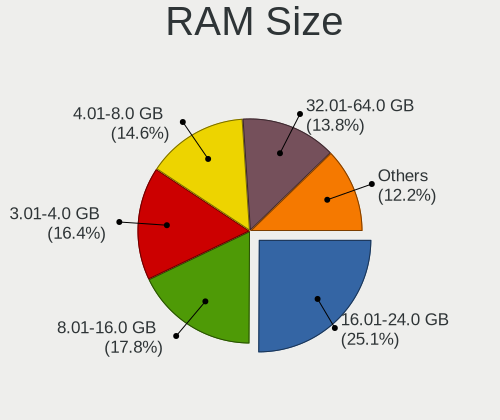
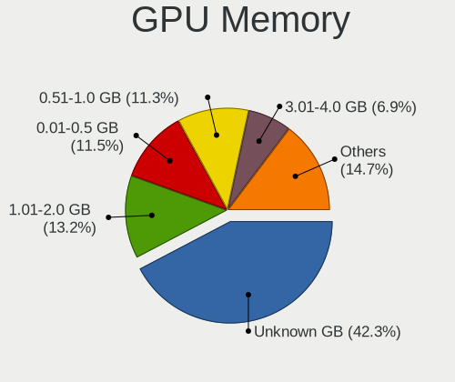
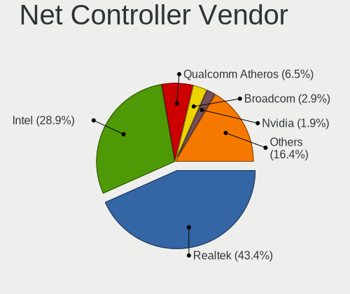
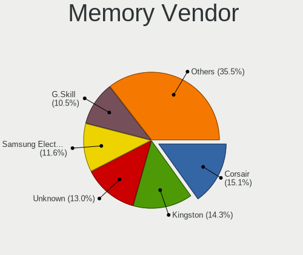
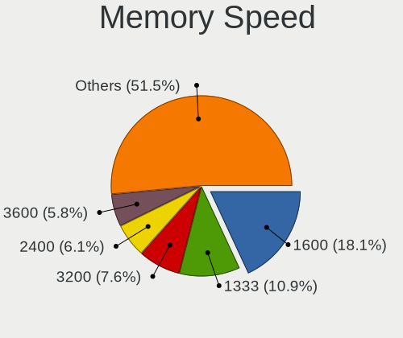
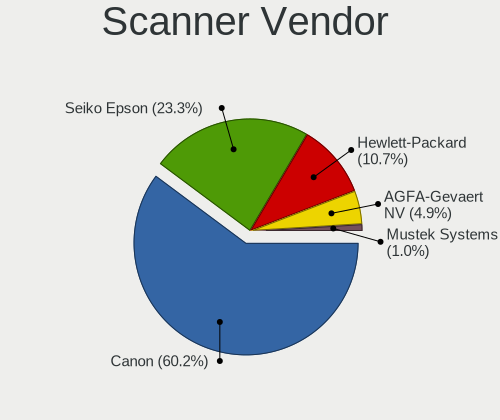
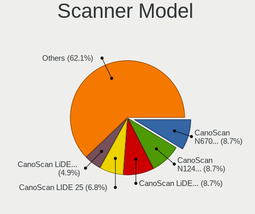

Linux in France - Tested Hardware & Statistics (Desktops)
---------------------------------------------------------

A project to collect tested hardware configurations for Linux in France.

Anyone can contribute to this report by the [hw-probe](https://github.com/linuxhw/hw-probe) tool:

    sudo -E hw-probe -all -upload

Please contribute! Especially if your hardware is rare.

Contents
--------

* [ Test Cases ](#test-cases)

* [ System ](#system)
  - [ OS                       ](#os)
  - [ OS Family                ](#os-family)
  - [ Kernel                   ](#kernel)
  - [ Kernel Family            ](#kernel-family)
  - [ Kernel Major Ver.        ](#kernel-major-ver)
  - [ Arch                     ](#arch)
  - [ DE                       ](#de)
  - [ Display Server           ](#display-server)
  - [ Display Manager          ](#display-manager)
  - [ OS Lang                  ](#os-lang)
  - [ Boot Mode                ](#boot-mode)
  - [ Filesystem               ](#filesystem)
  - [ Part. scheme             ](#part-scheme)
  - [ Dual Boot with Linux/BSD ](#dual-boot-with-linuxbsd)
  - [ Dual Boot (Win)          ](#dual-boot-win)

* [ Board ](#board)
  - [ Vendor                   ](#vendor)
  - [ Model                    ](#model)
  - [ Model Family             ](#model-family)
  - [ MFG Year                 ](#mfg-year)
  - [ Form Factor              ](#form-factor)
  - [ Secure Boot              ](#secure-boot)
  - [ Coreboot                 ](#coreboot)
  - [ RAM Size                 ](#ram-size)
  - [ RAM Used                 ](#ram-used)
  - [ Total Drives             ](#total-drives)
  - [ Has CD-ROM               ](#has-cd-rom)
  - [ Has Ethernet             ](#has-ethernet)
  - [ Has WiFi                 ](#has-wifi)
  - [ Has Bluetooth            ](#has-bluetooth)

* [ Location ](#location)
  - [ Country                  ](#country)
  - [ City                     ](#city)

* [ Drives ](#drives)
  - [ Drive Vendor             ](#drive-vendor)
  - [ Drive Model              ](#drive-model)
  - [ HDD Vendor               ](#hdd-vendor)
  - [ SSD Vendor               ](#ssd-vendor)
  - [ Drive Kind               ](#drive-kind)
  - [ Drive Connector          ](#drive-connector)
  - [ Drive Size               ](#drive-size)
  - [ Space Total              ](#space-total)
  - [ Space Used               ](#space-used)
  - [ Malfunc. Drives          ](#malfunc-drives)
  - [ Malfunc. Drive Vendor    ](#malfunc-drive-vendor)
  - [ Malfunc. HDD Vendor      ](#malfunc-hdd-vendor)
  - [ Malfunc. Drive Kind      ](#malfunc-drive-kind)
  - [ Failed Drives            ](#failed-drives)
  - [ Failed Drive Vendor      ](#failed-drive-vendor)
  - [ Drive Status             ](#drive-status)

* [ Storage controller ](#storage-controller)
  - [ Storage Vendor           ](#storage-vendor)
  - [ Storage Model            ](#storage-model)
  - [ Storage Kind             ](#storage-kind)

* [ Processor ](#processor)
  - [ CPU Vendor               ](#cpu-vendor)
  - [ CPU Model                ](#cpu-model)
  - [ CPU Model Family         ](#cpu-model-family)
  - [ CPU Cores                ](#cpu-cores)
  - [ CPU Sockets              ](#cpu-sockets)
  - [ CPU Threads              ](#cpu-threads)
  - [ CPU Op-Modes             ](#cpu-op-modes)
  - [ CPU Microcode            ](#cpu-microcode)
  - [ CPU Microarch            ](#cpu-microarch)

* [ Graphics ](#graphics)
  - [ GPU Vendor               ](#gpu-vendor)
  - [ GPU Model                ](#gpu-model)
  - [ GPU Combo                ](#gpu-combo)
  - [ GPU Driver               ](#gpu-driver)
  - [ GPU Memory               ](#gpu-memory)

* [ Monitor ](#monitor)
  - [ Monitor Vendor           ](#monitor-vendor)
  - [ Monitor Model            ](#monitor-model)
  - [ Monitor Resolution       ](#monitor-resolution)
  - [ Monitor Diagonal         ](#monitor-diagonal)
  - [ Monitor Width            ](#monitor-width)
  - [ Aspect Ratio             ](#aspect-ratio)
  - [ Monitor Area             ](#monitor-area)
  - [ Pixel Density            ](#pixel-density)
  - [ Multiple Monitors        ](#multiple-monitors)

* [ Network ](#network)
  - [ Net Controller Vendor    ](#net-controller-vendor)
  - [ Net Controller Model     ](#net-controller-model)
  - [ Wireless Vendor          ](#wireless-vendor)
  - [ Wireless Model           ](#wireless-model)
  - [ Ethernet Vendor          ](#ethernet-vendor)
  - [ Ethernet Model           ](#ethernet-model)
  - [ Net Controller Kind      ](#net-controller-kind)
  - [ Used Controller          ](#used-controller)
  - [ NICs                     ](#nics)
  - [ IPv6                     ](#ipv6)

* [ Bluetooth ](#bluetooth)
  - [ Bluetooth Vendor         ](#bluetooth-vendor)
  - [ Bluetooth Model          ](#bluetooth-model)

* [ Sound ](#sound)
  - [ Sound Vendor             ](#sound-vendor)
  - [ Sound Model              ](#sound-model)

* [ Memory ](#memory)
  - [ Memory Vendor            ](#memory-vendor)
  - [ Memory Model             ](#memory-model)
  - [ Memory Kind              ](#memory-kind)
  - [ Memory Form Factor       ](#memory-form-factor)
  - [ Memory Size              ](#memory-size)
  - [ Memory Speed             ](#memory-speed)

* [ Printers & scanners ](#printers--scanners)
  - [ Printer Vendor           ](#printer-vendor)
  - [ Printer Model            ](#printer-model)
  - [ Scanner Vendor           ](#scanner-vendor)
  - [ Scanner Model            ](#scanner-model)

* [ Camera ](#camera)
  - [ Camera Vendor            ](#camera-vendor)
  - [ Camera Model             ](#camera-model)

* [ Security ](#security)
  - [ Fingerprint Vendor       ](#fingerprint-vendor)
  - [ Fingerprint Model        ](#fingerprint-model)
  - [ Chipcard Vendor          ](#chipcard-vendor)
  - [ Chipcard Model           ](#chipcard-model)

* [ Unsupported ](#unsupported)
  - [ Unsupported Devices      ](#unsupported-devices)
  - [ Unsupported Device Types ](#unsupported-device-types)

Test Cases
----------

Total: 7315

| Vendor        | Model                       | Probe                                                      | Date         |
|---------------|-----------------------------|------------------------------------------------------------|--------------|
| ASRock        | B250 Gaming K4              | [dc5750e7fc](https://linux-hardware.org/?probe=dc5750e7fc) | Jan 06, 2025 |
| ASUSTek       | TUF Gaming X570-PLUS        | [fe84b3d431](https://linux-hardware.org/?probe=fe84b3d431) | Jan 05, 2025 |
| HP            | 8643 SMVB                   | [246d1f3f87](https://linux-hardware.org/?probe=246d1f3f87) | Jan 04, 2025 |
| ASUSTek       | PRIME B450M-A               | [e6a453b673](https://linux-hardware.org/?probe=e6a453b673) | Jan 04, 2025 |
| ASUSTek       | Maximus VIII RANGER         | [b536336740](https://linux-hardware.org/?probe=b536336740) | Jan 04, 2025 |
| MSI           | 990XA-GD55                  | [5d282c8edc](https://linux-hardware.org/?probe=5d282c8edc) | Jan 04, 2025 |
| ASRock        | 970 Pro3 R2.0               | [adb7b1fe9d](https://linux-hardware.org/?probe=adb7b1fe9d) | Jan 04, 2025 |
| ASUSTek       | P8H61-MX USB3               | [b3b2df2fe7](https://linux-hardware.org/?probe=b3b2df2fe7) | Jan 04, 2025 |
| ASUSTek       | P8H61-MX USB3               | [1600afa2eb](https://linux-hardware.org/?probe=1600afa2eb) | Jan 04, 2025 |
| Supermicro    | X7SPA-HF                    | [6239b93b09](https://linux-hardware.org/?probe=6239b93b09) | Jan 03, 2025 |
| ASUSTek       | PRIME Z270M-PLUS            | [32db9391d7](https://linux-hardware.org/?probe=32db9391d7) | Jan 03, 2025 |
| CWWK          | CW-AD4L-N V1                | [ed9e661757](https://linux-hardware.org/?probe=ed9e661757) | Jan 03, 2025 |
| Gigabyte      | X670E AORUS MASTER          | [903f395545](https://linux-hardware.org/?probe=903f395545) | Jan 03, 2025 |
| ASUSTek       | M5A97 R2.0                  | [7526506dc2](https://linux-hardware.org/?probe=7526506dc2) | Jan 03, 2025 |
| Dell          | 0Y7WYT A00                  | [3d1a88150a](https://linux-hardware.org/?probe=3d1a88150a) | Jan 02, 2025 |
| MSI           | MPG B550 GAMING PLUS        | [139667b28f](https://linux-hardware.org/?probe=139667b28f) | Jan 02, 2025 |
| ASUSTek       | P7P55D DELUXE               | [12d33ee44d](https://linux-hardware.org/?probe=12d33ee44d) | Jan 02, 2025 |
| ASUSTek       | M5A97 R2.0                  | [a15d70317f](https://linux-hardware.org/?probe=a15d70317f) | Jan 01, 2025 |
| Dell          | 0N4YC8 A00                  | [f722edf7a9](https://linux-hardware.org/?probe=f722edf7a9) | Jan 01, 2025 |
| Gigabyte      | Z790 UD AX                  | [64a970e671](https://linux-hardware.org/?probe=64a970e671) | Jan 01, 2025 |
| OEM           | B75 Ver:1.41                | [31c5df1f0f](https://linux-hardware.org/?probe=31c5df1f0f) | Jan 01, 2025 |
| Gigabyte      | B650 AORUS ELITE AX V2      | [00b2a8ffad](https://linux-hardware.org/?probe=00b2a8ffad) | Jan 01, 2025 |
| ASUSTek       | ROG STRIX Z390-F GAMING     | [558ed56269](https://linux-hardware.org/?probe=558ed56269) | Dec 31, 2024 |
| Foxconn       | 2ADA                        | [a56fc7e027](https://linux-hardware.org/?probe=a56fc7e027) | Dec 30, 2024 |
| HP            | 212B                        | [0bb6c8d253](https://linux-hardware.org/?probe=0bb6c8d253) | Dec 29, 2024 |
| MSI           | H97 PC Mate                 | [28a72759b6](https://linux-hardware.org/?probe=28a72759b6) | Dec 29, 2024 |
| Gigabyte      | B450M DS3H-CF               | [69968fade5](https://linux-hardware.org/?probe=69968fade5) | Dec 29, 2024 |
| HP            | 845A                        | [c79d5baf3e](https://linux-hardware.org/?probe=c79d5baf3e) | Dec 28, 2024 |
| ASUSTek       | M3A32-MVP DELUXE            | [94f08a5066](https://linux-hardware.org/?probe=94f08a5066) | Dec 28, 2024 |
| ASUSTek       | M5A78L-M LX3                | [9436b53810](https://linux-hardware.org/?probe=9436b53810) | Dec 28, 2024 |
| MSI           | MAG B660 TOMAHAWK WIFI D... | [84f3fb88dd](https://linux-hardware.org/?probe=84f3fb88dd) | Dec 28, 2024 |
| MSI           | P67A-C45                    | [fd4f26fc74](https://linux-hardware.org/?probe=fd4f26fc74) | Dec 28, 2024 |
| Pegatron      | 2AD5                        | [e539fa9b0b](https://linux-hardware.org/?probe=e539fa9b0b) | Dec 27, 2024 |
| ASUSTek       | ROG STRIX X870-I GAMING ... | [13514b4f65](https://linux-hardware.org/?probe=13514b4f65) | Dec 27, 2024 |
| ASRock        | AB350M Pro4                 | [e7ad6f1e08](https://linux-hardware.org/?probe=e7ad6f1e08) | Dec 27, 2024 |
| MSI           | X670E GAMING PLUS WIFI      | [0ff42c80a6](https://linux-hardware.org/?probe=0ff42c80a6) | Dec 26, 2024 |
| Gigabyte      | B560 HD3                    | [08b938f26e](https://linux-hardware.org/?probe=08b938f26e) | Dec 26, 2024 |
| HP            | 2B29                        | [2bacb97467](https://linux-hardware.org/?probe=2bacb97467) | Dec 26, 2024 |
| Gigabyte      | B650 GAMING X AX V2         | [c12274a13c](https://linux-hardware.org/?probe=c12274a13c) | Dec 26, 2024 |
| ASUSTek       | PRIME B550-PLUS             | [8c3e2b5020](https://linux-hardware.org/?probe=8c3e2b5020) | Dec 25, 2024 |
| Packard Be... | TBGM01                      | [68d8628be3](https://linux-hardware.org/?probe=68d8628be3) | Dec 25, 2024 |
| HP            | 82FF                        | [cfa3f49c26](https://linux-hardware.org/?probe=cfa3f49c26) | Dec 25, 2024 |
| ASUSTek       | PRIME H510M-K R2.0          | [9215a34e87](https://linux-hardware.org/?probe=9215a34e87) | Dec 25, 2024 |
| ASUSTek       | P8Z68-V PRO GEN3            | [cbf66f88d2](https://linux-hardware.org/?probe=cbf66f88d2) | Dec 24, 2024 |
| Gigabyte      | Z370P D3-CF                 | [9ea1b90178](https://linux-hardware.org/?probe=9ea1b90178) | Dec 23, 2024 |
| MSI           | C847IS-P33                  | [675e2d8c5d](https://linux-hardware.org/?probe=675e2d8c5d) | Dec 23, 2024 |
| Gigabyte      | B650 AORUS ELITE AX         | [31b0aab1bb](https://linux-hardware.org/?probe=31b0aab1bb) | Dec 23, 2024 |
| Dell          | 0KYWH7 A01                  | [86c6baedbe](https://linux-hardware.org/?probe=86c6baedbe) | Dec 23, 2024 |
| Dell          | 0KYWH7 A01                  | [ac3e1d624b](https://linux-hardware.org/?probe=ac3e1d624b) | Dec 23, 2024 |
| MSI           | PRO B760-P WIFI DDR4        | [59c289d5b9](https://linux-hardware.org/?probe=59c289d5b9) | Dec 22, 2024 |
| MSI           | MPG Z790 CARBON WIFI        | [510b37b7aa](https://linux-hardware.org/?probe=510b37b7aa) | Dec 22, 2024 |
| ASRock        | X570 Phantom Gaming 4       | [c0bbc9c576](https://linux-hardware.org/?probe=c0bbc9c576) | Dec 22, 2024 |
| MSI           | H110M PRO-D                 | [b7c9d31dff](https://linux-hardware.org/?probe=b7c9d31dff) | Dec 22, 2024 |
| ASUSTek       | P8P67 LE                    | [8e46f54d3c](https://linux-hardware.org/?probe=8e46f54d3c) | Dec 21, 2024 |
| Gigabyte      | H61M-S2P-B3                 | [ca83315819](https://linux-hardware.org/?probe=ca83315819) | Dec 21, 2024 |
| ASUSTek       | P8H61-MX USB3               | [c7fb48cd8b](https://linux-hardware.org/?probe=c7fb48cd8b) | Dec 21, 2024 |
| ASRock        | B450M Pro4 R2.0             | [10620ef914](https://linux-hardware.org/?probe=10620ef914) | Dec 20, 2024 |
| ASUSTek       | P6T                         | [de989023ba](https://linux-hardware.org/?probe=de989023ba) | Dec 20, 2024 |
| ASUSTek       | H61M-E                      | [f975c50855](https://linux-hardware.org/?probe=f975c50855) | Dec 20, 2024 |
| Shuttle       | FH270                       | [068d900b56](https://linux-hardware.org/?probe=068d900b56) | Dec 19, 2024 |
| ASUSTek       | ROG STRIX X570-F GAMING     | [373f51ec84](https://linux-hardware.org/?probe=373f51ec84) | Dec 19, 2024 |
| ASUSTek       | ET1620I                     | [961909e36f](https://linux-hardware.org/?probe=961909e36f) | Dec 19, 2024 |
| Gigabyte      | Z390 M GAMING-CF            | [1892d9c3bf](https://linux-hardware.org/?probe=1892d9c3bf) | Dec 19, 2024 |
| MSI           | MAG X670E TOMAHAWK WIFI     | [607a9aa50f](https://linux-hardware.org/?probe=607a9aa50f) | Dec 19, 2024 |
| ASUSTek       | P8Z77-V PRO                 | [4b3eb67e2e](https://linux-hardware.org/?probe=4b3eb67e2e) | Dec 19, 2024 |
| Packard Be... | TBGM01                      | [8fe4cbb492](https://linux-hardware.org/?probe=8fe4cbb492) | Dec 18, 2024 |
| MSI           | C847IS-P33                  | [d2837e1066](https://linux-hardware.org/?probe=d2837e1066) | Dec 18, 2024 |
| Gigabyte      | 970A-DS3P                   | [0cdac872bc](https://linux-hardware.org/?probe=0cdac872bc) | Dec 18, 2024 |
| Gigabyte      | Z77-D3H                     | [9a64691207](https://linux-hardware.org/?probe=9a64691207) | Dec 17, 2024 |
| HP            | 8643 SMVB                   | [9091764f7e](https://linux-hardware.org/?probe=9091764f7e) | Dec 17, 2024 |
| MSI           | Z370 GAMING PRO CARBON      | [3b9ab5404e](https://linux-hardware.org/?probe=3b9ab5404e) | Dec 17, 2024 |
| Lenovo        | 1064 SDK0T76530 WIN 3556... | [5913ca9ed8](https://linux-hardware.org/?probe=5913ca9ed8) | Dec 17, 2024 |
| ASUSTek       | ProArt X570-CREATOR WIFI    | [5bd1dbfa57](https://linux-hardware.org/?probe=5bd1dbfa57) | Dec 17, 2024 |
| GEEKOM        | A8                          | [821fae98e5](https://linux-hardware.org/?probe=821fae98e5) | Dec 17, 2024 |
| MSI           | H110M PRO-VD                | [3c491227b7](https://linux-hardware.org/?probe=3c491227b7) | Dec 16, 2024 |
| HP            | 198E                        | [7cedcbe8c0](https://linux-hardware.org/?probe=7cedcbe8c0) | Dec 16, 2024 |
| HP            | 198E                        | [9d254d2d2a](https://linux-hardware.org/?probe=9d254d2d2a) | Dec 16, 2024 |
| HP            | 83F3                        | [de8737ca72](https://linux-hardware.org/?probe=de8737ca72) | Dec 16, 2024 |
| HP            | 83F3                        | [e48e3c00d9](https://linux-hardware.org/?probe=e48e3c00d9) | Dec 16, 2024 |
| HP            | 859C                        | [e8bd962d37](https://linux-hardware.org/?probe=e8bd962d37) | Dec 16, 2024 |
| HP            | 83F3                        | [1c40aacec7](https://linux-hardware.org/?probe=1c40aacec7) | Dec 16, 2024 |
| ASUSTek       | P8Z68-V LX                  | [a91c4b26f6](https://linux-hardware.org/?probe=a91c4b26f6) | Dec 16, 2024 |
| HP            | 83F3                        | [ab0752e1fc](https://linux-hardware.org/?probe=ab0752e1fc) | Dec 16, 2024 |
| ASUSTek       | PRIME X570-P                | [a88e3b9b74](https://linux-hardware.org/?probe=a88e3b9b74) | Dec 16, 2024 |
| MSI           | MAG X870 TOMAHAWK WIFI      | [569b52f7b9](https://linux-hardware.org/?probe=569b52f7b9) | Dec 16, 2024 |
| MSI           | MAG X870 TOMAHAWK WIFI      | [bc81411e04](https://linux-hardware.org/?probe=bc81411e04) | Dec 16, 2024 |
| Unknown       | Unknown                     | [4aa185aae8](https://linux-hardware.org/?probe=4aa185aae8) | Dec 16, 2024 |
| AZW           | MINI S                      | [2fe134f22f](https://linux-hardware.org/?probe=2fe134f22f) | Dec 15, 2024 |
| ASUSTek       | PRIME A520M-K               | [4a1f51c600](https://linux-hardware.org/?probe=4a1f51c600) | Dec 15, 2024 |
| OEM           | B75 Ver:1.41                | [26fc19a77d](https://linux-hardware.org/?probe=26fc19a77d) | Dec 15, 2024 |
| MSI           | MPG X870E CARBON WIFI       | [f744e3d46f](https://linux-hardware.org/?probe=f744e3d46f) | Dec 15, 2024 |
| Gigabyte      | B450 AORUS ELITE V2         | [b24c0ed46d](https://linux-hardware.org/?probe=b24c0ed46d) | Dec 15, 2024 |
| MSI           | H81I                        | [8972ead70f](https://linux-hardware.org/?probe=8972ead70f) | Dec 15, 2024 |
| MSI           | MAG X870 TOMAHAWK WIFI      | [83ca588caa](https://linux-hardware.org/?probe=83ca588caa) | Dec 15, 2024 |
| MSI           | PRO Z790-P WIFI             | [2198d7f523](https://linux-hardware.org/?probe=2198d7f523) | Dec 15, 2024 |
| ASUSTek       | P7P55D                      | [4cf386124b](https://linux-hardware.org/?probe=4cf386124b) | Dec 14, 2024 |
| Unknown       | Unknown                     | [48bf121bc0](https://linux-hardware.org/?probe=48bf121bc0) | Dec 14, 2024 |
| ASRock        | X299 Taichi XE              | [23e15f73e6](https://linux-hardware.org/?probe=23e15f73e6) | Dec 14, 2024 |
| Dell          | 0WMJ54 A01                  | [5d62063d9e](https://linux-hardware.org/?probe=5d62063d9e) | Dec 13, 2024 |
| MSI           | Z87-G45 GAMING              | [f86b7a5624](https://linux-hardware.org/?probe=f86b7a5624) | Dec 12, 2024 |
| HP            | 2B47                        | [856b94c173](https://linux-hardware.org/?probe=856b94c173) | Dec 12, 2024 |
| Gigabyte      | B85M-D3H                    | [835a4f4d23](https://linux-hardware.org/?probe=835a4f4d23) | Dec 12, 2024 |
| Intel         | JSL MRD                     | [7e6f631d27](https://linux-hardware.org/?probe=7e6f631d27) | Dec 12, 2024 |
| Gigabyte      | B650 EAGLE AX               | [e7c8036b9d](https://linux-hardware.org/?probe=e7c8036b9d) | Dec 11, 2024 |
| Gigabyte      | B760 GAMING X DDR4          | [f56aac465c](https://linux-hardware.org/?probe=f56aac465c) | Dec 11, 2024 |
| Lenovo        | SHARKBAY SDK0E50510 WIN     | [bd997925b9](https://linux-hardware.org/?probe=bd997925b9) | Dec 11, 2024 |
| MSI           | MPG X870E CARBON WIFI       | [5dabd7ef60](https://linux-hardware.org/?probe=5dabd7ef60) | Dec 11, 2024 |
| ASUSTek       | TUF Gaming B460-PLUS        | [7aace976f0](https://linux-hardware.org/?probe=7aace976f0) | Dec 10, 2024 |
| MSI           | MPG Z690 FORCE WIFI         | [114c039a04](https://linux-hardware.org/?probe=114c039a04) | Dec 10, 2024 |
| Gigabyte      | GA-MA770T-UD3               | [12f7f54a9f](https://linux-hardware.org/?probe=12f7f54a9f) | Dec 09, 2024 |
| ASUSTek       | WS X299 SAGE/10G            | [314d35a1ae](https://linux-hardware.org/?probe=314d35a1ae) | Dec 09, 2024 |
| MSI           | MAG X870 TOMAHAWK WIFI      | [a1d466a8c2](https://linux-hardware.org/?probe=a1d466a8c2) | Dec 09, 2024 |
| Acer          | Veriton M4630G V:1.0        | [e53c39772b](https://linux-hardware.org/?probe=e53c39772b) | Dec 08, 2024 |
| ASUSTek       | STRIX B250F GAMING          | [aad04cbfa0](https://linux-hardware.org/?probe=aad04cbfa0) | Dec 08, 2024 |
| Gigabyte      | B550 GAMING X V2            | [b90a139240](https://linux-hardware.org/?probe=b90a139240) | Dec 07, 2024 |
| AZW           | MINI S                      | [cfba2893b1](https://linux-hardware.org/?probe=cfba2893b1) | Dec 07, 2024 |
| Dell          | 0K216C                      | [10ab4e790d](https://linux-hardware.org/?probe=10ab4e790d) | Dec 07, 2024 |
| MSI           | Z87-G45 GAMING              | [74ef542001](https://linux-hardware.org/?probe=74ef542001) | Dec 07, 2024 |
| Shenzhen M... | DRBAA                       | [fa3ca24355](https://linux-hardware.org/?probe=fa3ca24355) | Dec 07, 2024 |
| ASUSTek       | TUF Gaming B650M-E WIFI     | [dd5a713c21](https://linux-hardware.org/?probe=dd5a713c21) | Dec 07, 2024 |
| ASRock        | X570 Phantom Gaming 4       | [4b14a65ae5](https://linux-hardware.org/?probe=4b14a65ae5) | Dec 07, 2024 |
| ASUSTek       | TUF Gaming B650M-E WIFI     | [9aef334f00](https://linux-hardware.org/?probe=9aef334f00) | Dec 06, 2024 |
| Gigabyte      | B450 AORUS ELITE            | [b3206b45cc](https://linux-hardware.org/?probe=b3206b45cc) | Dec 06, 2024 |
| Dell          | 0YP806 A02                  | [e738237e89](https://linux-hardware.org/?probe=e738237e89) | Dec 04, 2024 |
| ASUSTek       | TUF Gaming Z790-PRO WIFI    | [7dd5e02873](https://linux-hardware.org/?probe=7dd5e02873) | Dec 04, 2024 |
| ASUSTek       | TUF Gaming X570-PLUS        | [cc3c1cb737](https://linux-hardware.org/?probe=cc3c1cb737) | Dec 03, 2024 |
| Gigabyte      | B550 GAMING X V2            | [3f6e18d4c5](https://linux-hardware.org/?probe=3f6e18d4c5) | Dec 03, 2024 |
| ASRock        | B550M Pro4                  | [b5d3d47608](https://linux-hardware.org/?probe=b5d3d47608) | Dec 03, 2024 |
| Dell          | 0D4MD1 A00                  | [7328972ec3](https://linux-hardware.org/?probe=7328972ec3) | Dec 02, 2024 |
| HP            | 339A                        | [c64449a47e](https://linux-hardware.org/?probe=c64449a47e) | Dec 02, 2024 |
| Dell          | 0NDYHG A01                  | [282527be25](https://linux-hardware.org/?probe=282527be25) | Dec 02, 2024 |
| Gigabyte      | B660 DS3H DDR4              | [2aaeb0eac6](https://linux-hardware.org/?probe=2aaeb0eac6) | Dec 02, 2024 |
| ASUSTek       | TUF Gaming X670E-PLUS WI... | [0065a1abc8](https://linux-hardware.org/?probe=0065a1abc8) | Dec 01, 2024 |
| Gigabyte      | 945P-S3                     | [7c7775d296](https://linux-hardware.org/?probe=7c7775d296) | Dec 01, 2024 |
| MSI           | H110M PRO-D                 | [b8889031de](https://linux-hardware.org/?probe=b8889031de) | Dec 01, 2024 |
| ASUSTek       | TUF Gaming B550-PLUS        | [d967f7baf8](https://linux-hardware.org/?probe=d967f7baf8) | Nov 30, 2024 |
| ASRock        | B550 Phantom Gaming 4       | [7312b4b954](https://linux-hardware.org/?probe=7312b4b954) | Nov 30, 2024 |
| MSI           | B450 GAMING PLUS            | [7cf713d1f4](https://linux-hardware.org/?probe=7cf713d1f4) | Nov 30, 2024 |
| ASUSTek       | B85-PRO GAMER               | [12dd784125](https://linux-hardware.org/?probe=12dd784125) | Nov 30, 2024 |
| Dell          | 02YYK5 A00                  | [96334059be](https://linux-hardware.org/?probe=96334059be) | Nov 30, 2024 |
| ASUSTek       | P8H61-MX USB3               | [3a4c49cacd](https://linux-hardware.org/?probe=3a4c49cacd) | Nov 30, 2024 |
| ASUSTek       | B85-PRO GAMER               | [fb51898c9a](https://linux-hardware.org/?probe=fb51898c9a) | Nov 29, 2024 |
| Intel         | DG41RQ AAE54511-205         | [2e5bbbe981](https://linux-hardware.org/?probe=2e5bbbe981) | Nov 29, 2024 |
| Dell          | 0DR845                      | [1b6afa334f](https://linux-hardware.org/?probe=1b6afa334f) | Nov 29, 2024 |
| Intel         | DG41RQ AAE54511-205         | [72ff611394](https://linux-hardware.org/?probe=72ff611394) | Nov 29, 2024 |
| Gigabyte      | MZBAYAP-00                  | [fb97ca86c6](https://linux-hardware.org/?probe=fb97ca86c6) | Nov 29, 2024 |
| Gigabyte      | B660 DS3H DDR4              | [e32e466199](https://linux-hardware.org/?probe=e32e466199) | Nov 29, 2024 |
| ASUSTek       | M4A79XTD EVO                | [462442fa72](https://linux-hardware.org/?probe=462442fa72) | Nov 28, 2024 |
| Gigabyte      | H81M-D2W                    | [c0db894e36](https://linux-hardware.org/?probe=c0db894e36) | Nov 28, 2024 |
| eMachines     | MCP61PM-GM                  | [ff18233236](https://linux-hardware.org/?probe=ff18233236) | Nov 27, 2024 |
| Shuttle       | XS35V3                      | [65cc0ee052](https://linux-hardware.org/?probe=65cc0ee052) | Nov 26, 2024 |
| ASRockRack    | X470D4U2-2T                 | [98e5a54764](https://linux-hardware.org/?probe=98e5a54764) | Nov 26, 2024 |
| AZW           | GK55                        | [89f2d40002](https://linux-hardware.org/?probe=89f2d40002) | Nov 26, 2024 |
| ASUSTek       | PRIME X670E-PRO WIFI        | [5820c49268](https://linux-hardware.org/?probe=5820c49268) | Nov 26, 2024 |
| ASRockRack    | X470D4U2-2T                 | [e4720d6a67](https://linux-hardware.org/?probe=e4720d6a67) | Nov 26, 2024 |
| Canonical     | LXD pc-q35-8.2              | [d237816bd5](https://linux-hardware.org/?probe=d237816bd5) | Nov 25, 2024 |
| HP            | 8298                        | [200f681617](https://linux-hardware.org/?probe=200f681617) | Nov 25, 2024 |
| ASRock        | A300M-STX                   | [07fe25b59a](https://linux-hardware.org/?probe=07fe25b59a) | Nov 25, 2024 |
| Lenovo        | 3111 SDK0J40697 WIN 3305... | [d734209cfe](https://linux-hardware.org/?probe=d734209cfe) | Nov 25, 2024 |
| Lenovo        | SKYBAY SDK0J40697 WIN 33... | [64b155aa9d](https://linux-hardware.org/?probe=64b155aa9d) | Nov 25, 2024 |
| ASRock        | Z590 Extreme                | [e644a531fa](https://linux-hardware.org/?probe=e644a531fa) | Nov 24, 2024 |
| ASRock        | Z87 Killer                  | [bc4880459e](https://linux-hardware.org/?probe=bc4880459e) | Nov 24, 2024 |
| Intel         | DN2800MT AAG23738-800       | [07e6f311c5](https://linux-hardware.org/?probe=07e6f311c5) | Nov 24, 2024 |
| MSI           | MPG X570 GAMING EDGE WIF... | [60acd12d71](https://linux-hardware.org/?probe=60acd12d71) | Nov 24, 2024 |
| HP            | 3047h                       | [69563862be](https://linux-hardware.org/?probe=69563862be) | Nov 24, 2024 |
| Gigabyte      | B360M D3H-CF                | [f24b6c8c5c](https://linux-hardware.org/?probe=f24b6c8c5c) | Nov 24, 2024 |
| Colorful T... | C.Z77 X5 V20                | [5883b61b95](https://linux-hardware.org/?probe=5883b61b95) | Nov 24, 2024 |
| MSI           | AM1M                        | [563eb1dd1a](https://linux-hardware.org/?probe=563eb1dd1a) | Nov 23, 2024 |
| MSI           | PRO B650M-A WIFI            | [ac5865ff7b](https://linux-hardware.org/?probe=ac5865ff7b) | Nov 22, 2024 |
| Optimized ... | KVM                         | [672aaf8ea5](https://linux-hardware.org/?probe=672aaf8ea5) | Nov 22, 2024 |
| Lenovo        | 30C0 SDK0J40697 WIN 3305... | [07b1deff4c](https://linux-hardware.org/?probe=07b1deff4c) | Nov 22, 2024 |
| Gigabyte      | B550 AORUS ELITE V2         | [499656f477](https://linux-hardware.org/?probe=499656f477) | Nov 22, 2024 |
| ASUSTek       | G20AJ                       | [0dbb1f0216](https://linux-hardware.org/?probe=0dbb1f0216) | Nov 21, 2024 |
| MSI           | PRO B760M-P                 | [a456280bbb](https://linux-hardware.org/?probe=a456280bbb) | Nov 21, 2024 |
| Dell          | 0Y7WYT A00                  | [b0d80c71d7](https://linux-hardware.org/?probe=b0d80c71d7) | Nov 21, 2024 |
| MSI           | PRO X670-P WIFI             | [9879b0bbdb](https://linux-hardware.org/?probe=9879b0bbdb) | Nov 21, 2024 |
| HC Technol... | HCAR5000-MI                 | [46f7ea754f](https://linux-hardware.org/?probe=46f7ea754f) | Nov 20, 2024 |
| ASUSTek       | TUF Gaming B760-PLUS WIF... | [d7dbe3d6fb](https://linux-hardware.org/?probe=d7dbe3d6fb) | Nov 19, 2024 |
| MSI           | MPG X670E CARBON WIFI       | [6d05aef0fe](https://linux-hardware.org/?probe=6d05aef0fe) | Nov 19, 2024 |
| ECS           | Nettle2                     | [7737c05bc3](https://linux-hardware.org/?probe=7737c05bc3) | Nov 19, 2024 |
| ASUSTek       | H81M-PLUS                   | [336352af0c](https://linux-hardware.org/?probe=336352af0c) | Nov 19, 2024 |
| Dell          | 0D4MD1 A00                  | [132e87f1ef](https://linux-hardware.org/?probe=132e87f1ef) | Nov 19, 2024 |
| MSI           | Z370 GAMING PLUS            | [796307b506](https://linux-hardware.org/?probe=796307b506) | Nov 18, 2024 |
| MSI           | Z490-A PRO                  | [54f7ac3651](https://linux-hardware.org/?probe=54f7ac3651) | Nov 18, 2024 |
| Lenovo        | SHARKBAY No DPK             | [d423593eab](https://linux-hardware.org/?probe=d423593eab) | Nov 18, 2024 |
| Lenovo        | SHARKBAY NOK                | [5607a6014f](https://linux-hardware.org/?probe=5607a6014f) | Nov 18, 2024 |
| Lenovo        | SHARKBAY NOK                | [cd39cecc53](https://linux-hardware.org/?probe=cd39cecc53) | Nov 18, 2024 |
| Lenovo        | SHARKBAY NOK                | [345015bb04](https://linux-hardware.org/?probe=345015bb04) | Nov 18, 2024 |
| Lenovo        | SHARKBAY NOK                | [3c358a844f](https://linux-hardware.org/?probe=3c358a844f) | Nov 18, 2024 |
| Lenovo        | SHARKBAY NOK                | [4845dc968a](https://linux-hardware.org/?probe=4845dc968a) | Nov 18, 2024 |
| Lenovo        | SHARKBAY NOK                | [254a0b1045](https://linux-hardware.org/?probe=254a0b1045) | Nov 18, 2024 |
| Lenovo        | SHARKBAY NOK                | [a0ab5a1443](https://linux-hardware.org/?probe=a0ab5a1443) | Nov 18, 2024 |
| Lenovo        | SHARKBAY NOK                | [be4331aad3](https://linux-hardware.org/?probe=be4331aad3) | Nov 18, 2024 |
| Lenovo        | SHARKBAY NOK                | [0f8c949253](https://linux-hardware.org/?probe=0f8c949253) | Nov 18, 2024 |
| Lenovo        | SHARKBAY NOK                | [7e6d9e73e9](https://linux-hardware.org/?probe=7e6d9e73e9) | Nov 18, 2024 |
| Lenovo        | SHARKBAY NOK                | [409fa9e45f](https://linux-hardware.org/?probe=409fa9e45f) | Nov 18, 2024 |
| Lenovo        | SHARKBAY NOK                | [9992074193](https://linux-hardware.org/?probe=9992074193) | Nov 18, 2024 |
| Lenovo        | SHARKBAY NOK                | [b2849c39bb](https://linux-hardware.org/?probe=b2849c39bb) | Nov 18, 2024 |
| Lenovo        | SHARKBAY NOK                | [a6b5e3235e](https://linux-hardware.org/?probe=a6b5e3235e) | Nov 18, 2024 |
| Lenovo        | SHARKBAY NOK                | [36e8d012bf](https://linux-hardware.org/?probe=36e8d012bf) | Nov 18, 2024 |
| Lenovo        | SHARKBAY NOK                | [6b3edeb928](https://linux-hardware.org/?probe=6b3edeb928) | Nov 18, 2024 |
| Lenovo        | SHARKBAY NOK                | [4dfbde3876](https://linux-hardware.org/?probe=4dfbde3876) | Nov 18, 2024 |
| Lenovo        | SHARKBAY NOK                | [65c5d8aef2](https://linux-hardware.org/?probe=65c5d8aef2) | Nov 18, 2024 |
| Lenovo        | SHARKBAY NOK                | [c247a3fc9c](https://linux-hardware.org/?probe=c247a3fc9c) | Nov 18, 2024 |
| Lenovo        | SHARKBAY NOK                | [524bb130f7](https://linux-hardware.org/?probe=524bb130f7) | Nov 18, 2024 |
| Lenovo        | SHARKBAY NOK                | [d89b07b12d](https://linux-hardware.org/?probe=d89b07b12d) | Nov 18, 2024 |
| ASRock        | X670E PG Lightning          | [c700d9e4c0](https://linux-hardware.org/?probe=c700d9e4c0) | Nov 17, 2024 |
| HP            | 2B38                        | [7e1ed6da46](https://linux-hardware.org/?probe=7e1ed6da46) | Nov 17, 2024 |
| ASUSTek       | M4A785TD-M EVO              | [dab12a66ec](https://linux-hardware.org/?probe=dab12a66ec) | Nov 17, 2024 |
| ASUSTek       | TUF Gaming X670E-PLUS       | [784e2dcbb8](https://linux-hardware.org/?probe=784e2dcbb8) | Nov 16, 2024 |
| Lenovo        | 0B98401 WIN                 | [4e618ec5fd](https://linux-hardware.org/?probe=4e618ec5fd) | Nov 16, 2024 |
| MSI           | MPG X670E CARBON WIFI       | [6caa94f61d](https://linux-hardware.org/?probe=6caa94f61d) | Nov 15, 2024 |
| Pegatron      | Eureka3                     | [66657932eb](https://linux-hardware.org/?probe=66657932eb) | Nov 15, 2024 |
| Dell          | 0200DY A02                  | [7a85e1e310](https://linux-hardware.org/?probe=7a85e1e310) | Nov 15, 2024 |
| MSI           | B85-G43 GAMING              | [c99693bf24](https://linux-hardware.org/?probe=c99693bf24) | Nov 15, 2024 |
| ASUSTek       | M4A79XTD EVO                | [dd8ebfc442](https://linux-hardware.org/?probe=dd8ebfc442) | Nov 15, 2024 |
| Dell          | 0HD5W2 A01                  | [a7c7d8ba31](https://linux-hardware.org/?probe=a7c7d8ba31) | Nov 14, 2024 |
| MSI           | B560M-A PRO                 | [9ae4131bec](https://linux-hardware.org/?probe=9ae4131bec) | Nov 14, 2024 |
| Dell          | 0NK5PH A00                  | [31a63822f9](https://linux-hardware.org/?probe=31a63822f9) | Nov 13, 2024 |
| HP            | 1589                        | [6ef0cdecf7](https://linux-hardware.org/?probe=6ef0cdecf7) | Nov 12, 2024 |
| Dell          | 0XPDFK A01                  | [b3aa73b7b8](https://linux-hardware.org/?probe=b3aa73b7b8) | Nov 12, 2024 |
| Lenovo        | 3102 SDK0J40705 WIN 3425... | [0d9fdeea1b](https://linux-hardware.org/?probe=0d9fdeea1b) | Nov 12, 2024 |
| Lenovo        | 3102 SDK0J40705 WIN 3425... | [4e28c59f13](https://linux-hardware.org/?probe=4e28c59f13) | Nov 12, 2024 |
| Lenovo        | 3102 SDK0J40705 WIN 3425... | [3f008e1bb5](https://linux-hardware.org/?probe=3f008e1bb5) | Nov 12, 2024 |
| ASUSTek       | M32CD4-K                    | [30b7bf8ac2](https://linux-hardware.org/?probe=30b7bf8ac2) | Nov 11, 2024 |
| MSI           | MPG B550 GAMING PLUS        | [ba4d76b3ca](https://linux-hardware.org/?probe=ba4d76b3ca) | Nov 11, 2024 |
| Lenovo        | SHARKBAY SDK0E50510 WIN     | [5d0ba04af3](https://linux-hardware.org/?probe=5d0ba04af3) | Nov 11, 2024 |
| Lenovo        | SHARKBAY SDK0E50510 WIN     | [40ece38dfe](https://linux-hardware.org/?probe=40ece38dfe) | Nov 11, 2024 |
| HP            | 3397                        | [99bd8ead0e](https://linux-hardware.org/?probe=99bd8ead0e) | Nov 11, 2024 |
| Lenovo        | 312A SDK0J40697 WIN 3305... | [73ff28022d](https://linux-hardware.org/?probe=73ff28022d) | Nov 11, 2024 |
| Shenzhen M... | RPBNB                       | [193910bb98](https://linux-hardware.org/?probe=193910bb98) | Nov 11, 2024 |
| ASUSTek       | Z170 PRO GAMING             | [e72fa9024e](https://linux-hardware.org/?probe=e72fa9024e) | Nov 10, 2024 |
| ASUSTek       | TUF B450-PLUS GAMING        | [d4a850d412](https://linux-hardware.org/?probe=d4a850d412) | Nov 10, 2024 |
| ASUSTek       | B85M-G                      | [83854ceaa7](https://linux-hardware.org/?probe=83854ceaa7) | Nov 10, 2024 |
| HP            | 8436                        | [d12b5fc880](https://linux-hardware.org/?probe=d12b5fc880) | Nov 10, 2024 |
| Gigabyte      | B450M DS3H WIFI-CF          | [9342753ae8](https://linux-hardware.org/?probe=9342753ae8) | Nov 10, 2024 |
| HP            | 1495                        | [5778238fb5](https://linux-hardware.org/?probe=5778238fb5) | Nov 09, 2024 |
| ASRock        | B550M-ITX/ac                | [ba1ad0fefc](https://linux-hardware.org/?probe=ba1ad0fefc) | Nov 09, 2024 |
| ASUSTek       | PRIME Z370-P II             | [edcee03147](https://linux-hardware.org/?probe=edcee03147) | Nov 09, 2024 |
| MSI           | MAG B550 TOMAHAWK MAX WI... | [6b414337bf](https://linux-hardware.org/?probe=6b414337bf) | Nov 09, 2024 |
| MSI           | MAG B550 TOMAHAWK MAX WI... | [f14289e584](https://linux-hardware.org/?probe=f14289e584) | Nov 09, 2024 |
| Acer          | H57M01                      | [2cdb2d965f](https://linux-hardware.org/?probe=2cdb2d965f) | Nov 08, 2024 |
| ASUSTek       | H81M-PLUS                   | [6eaa536f2d](https://linux-hardware.org/?probe=6eaa536f2d) | Nov 08, 2024 |
| Gigabyte      | B660 DS3H DDR4              | [f450b83e99](https://linux-hardware.org/?probe=f450b83e99) | Nov 08, 2024 |
| Unknown       | Unknown                     | [8d0bf1b519](https://linux-hardware.org/?probe=8d0bf1b519) | Nov 08, 2024 |
| ASUSTek       | ROG STRIX B550-F GAMING ... | [2234bd93cd](https://linux-hardware.org/?probe=2234bd93cd) | Nov 08, 2024 |
| ASRock        | B650M Pro RS WiFi           | [8dffd545ab](https://linux-hardware.org/?probe=8dffd545ab) | Nov 08, 2024 |
| Acer          | Aspire T3-710 V:1.1         | [366203bce9](https://linux-hardware.org/?probe=366203bce9) | Nov 07, 2024 |
| Gigabyte      | Z170-HD3P-CF                | [93d34614a7](https://linux-hardware.org/?probe=93d34614a7) | Nov 06, 2024 |
| HP            | 83EF                        | [728bd7ff86](https://linux-hardware.org/?probe=728bd7ff86) | Nov 06, 2024 |
| HP            | 1495                        | [b362515be5](https://linux-hardware.org/?probe=b362515be5) | Nov 06, 2024 |
| Intel         | H61 VW11                    | [2f2205188e](https://linux-hardware.org/?probe=2f2205188e) | Nov 06, 2024 |
| ASUSTek       | M2A-VM HDMI                 | [adf5ddf2a2](https://linux-hardware.org/?probe=adf5ddf2a2) | Nov 06, 2024 |
| HP            | 2B2C                        | [0847aa4536](https://linux-hardware.org/?probe=0847aa4536) | Nov 06, 2024 |
| Dell          | 0T10XW A02                  | [663596ec53](https://linux-hardware.org/?probe=663596ec53) | Nov 05, 2024 |
| Dell          | 04JGCK A00                  | [4267102b29](https://linux-hardware.org/?probe=4267102b29) | Nov 05, 2024 |
| Gigabyte      | B660 DS3H DDR4              | [98e6f66559](https://linux-hardware.org/?probe=98e6f66559) | Nov 05, 2024 |
| Gigabyte      | B550 VISION D               | [11e1ff56bd](https://linux-hardware.org/?probe=11e1ff56bd) | Nov 05, 2024 |
| Dell          | 0CRH6C A00                  | [a6827a3a38](https://linux-hardware.org/?probe=a6827a3a38) | Nov 04, 2024 |
| Dell          | 0T10XW A02                  | [f248927702](https://linux-hardware.org/?probe=f248927702) | Nov 04, 2024 |
| Acer          | Aspire X1700                | [772d91c939](https://linux-hardware.org/?probe=772d91c939) | Nov 04, 2024 |
| ASUSTek       | PRIME H310M-A R2.0          | [1647f2e7a2](https://linux-hardware.org/?probe=1647f2e7a2) | Nov 03, 2024 |
| ASUSTek       | M2A-VM HDMI                 | [5ca0b5da95](https://linux-hardware.org/?probe=5ca0b5da95) | Nov 02, 2024 |
| Lenovo        | SHARKBAY SDK0E50510 PRO     | [f4699e2430](https://linux-hardware.org/?probe=f4699e2430) | Nov 02, 2024 |
| MSI           | X470 GAMING PLUS MAX        | [4ecac441de](https://linux-hardware.org/?probe=4ecac441de) | Nov 02, 2024 |
| HP            | 1495                        | [00133664ce](https://linux-hardware.org/?probe=00133664ce) | Nov 02, 2024 |
| ASUSTek       | P6T                         | [43ad936378](https://linux-hardware.org/?probe=43ad936378) | Nov 01, 2024 |
| MSI           | X370 XPOWER GAMING TITAN... | [36275af64b](https://linux-hardware.org/?probe=36275af64b) | Nov 01, 2024 |
| Dell          | 0WJ772                      | [d6dc667160](https://linux-hardware.org/?probe=d6dc667160) | Nov 01, 2024 |
| ASUSTek       | TUF Gaming B450M-PRO S      | [747dc000aa](https://linux-hardware.org/?probe=747dc000aa) | Nov 01, 2024 |
| Gigabyte      | H81M-S2H                    | [84bdf7e626](https://linux-hardware.org/?probe=84bdf7e626) | Nov 01, 2024 |
| Gigabyte      | B660 DS3H DDR4              | [16f355b56f](https://linux-hardware.org/?probe=16f355b56f) | Nov 01, 2024 |
| Fujitsu       | D2990-A1 S26361-D2990-A1    | [c96eaa6d8d](https://linux-hardware.org/?probe=c96eaa6d8d) | Oct 31, 2024 |
| ASRock        | H81M-HDS                    | [aef95abb88](https://linux-hardware.org/?probe=aef95abb88) | Oct 31, 2024 |
| ASUSTek       | P5Q PRO TURBO               | [776c21bef3](https://linux-hardware.org/?probe=776c21bef3) | Oct 30, 2024 |
| Dell          | 0N826N A03                  | [0c1f187190](https://linux-hardware.org/?probe=0c1f187190) | Oct 29, 2024 |
| Dell          | 0N826N A03                  | [c3e4a08e65](https://linux-hardware.org/?probe=c3e4a08e65) | Oct 29, 2024 |
| MSI           | GF615M-P33 V2               | [2e9f9367e0](https://linux-hardware.org/?probe=2e9f9367e0) | Oct 29, 2024 |
| AZW           | U59                         | [0691e1bbb8](https://linux-hardware.org/?probe=0691e1bbb8) | Oct 29, 2024 |
| HP            | 3029h                       | [83bfbe4bbe](https://linux-hardware.org/?probe=83bfbe4bbe) | Oct 28, 2024 |
| Fujitsu       | D3313-F1 S26361-D3313-F1    | [c65be546ec](https://linux-hardware.org/?probe=c65be546ec) | Oct 28, 2024 |
| ASUSTek       | Z97-K                       | [8654f28086](https://linux-hardware.org/?probe=8654f28086) | Oct 28, 2024 |
| Gigabyte      | B550 AORUS ELITE V2         | [35db8c4932](https://linux-hardware.org/?probe=35db8c4932) | Oct 28, 2024 |
| Gigabyte      | B550M DS3H AC               | [a6e01cee58](https://linux-hardware.org/?probe=a6e01cee58) | Oct 28, 2024 |
| Acer          | Predator G5900              | [972eedb81e](https://linux-hardware.org/?probe=972eedb81e) | Oct 28, 2024 |
| ASUSTek       | M4A785TD-M EVO              | [83298d1f8c](https://linux-hardware.org/?probe=83298d1f8c) | Oct 27, 2024 |
| Foxconn       | 2ADA                        | [d5d1621fc4](https://linux-hardware.org/?probe=d5d1621fc4) | Oct 27, 2024 |
| Foxconn       | 2ADA                        | [162b68091d](https://linux-hardware.org/?probe=162b68091d) | Oct 27, 2024 |
| MSI           | CSM-H81M-P32                | [375a0a6487](https://linux-hardware.org/?probe=375a0a6487) | Oct 26, 2024 |
| Gigabyte      | GA-78LMT-USB3 SEx           | [890f59d74a](https://linux-hardware.org/?probe=890f59d74a) | Oct 26, 2024 |
| Intel         | X99-P4 V5.0                 | [81334985fd](https://linux-hardware.org/?probe=81334985fd) | Oct 26, 2024 |
| Gigabyte      | G41M-Combo                  | [4ddd0f69f1](https://linux-hardware.org/?probe=4ddd0f69f1) | Oct 26, 2024 |
| Gigabyte      | G41M-Combo                  | [0fb81a0008](https://linux-hardware.org/?probe=0fb81a0008) | Oct 26, 2024 |
| ASUSTek       | PRIME Z790-A WIFI           | [3096ec1041](https://linux-hardware.org/?probe=3096ec1041) | Oct 26, 2024 |
| Gigabyte      | H310MD2P-CF                 | [adeaead091](https://linux-hardware.org/?probe=adeaead091) | Oct 26, 2024 |
| MSI           | B550M PRO-VDH WIFI          | [4da1648423](https://linux-hardware.org/?probe=4da1648423) | Oct 26, 2024 |
| Acer          | H57M01                      | [686c4174f8](https://linux-hardware.org/?probe=686c4174f8) | Oct 26, 2024 |
| ASUSTek       | ROG STRIX B650E-I GAMING... | [7e5e06b77f](https://linux-hardware.org/?probe=7e5e06b77f) | Oct 24, 2024 |
| Gigabyte      | A520 AORUS ELITE            | [34c9c15a02](https://linux-hardware.org/?probe=34c9c15a02) | Oct 23, 2024 |
| ASRock        | B450M Steel Legend          | [ee7a3727e4](https://linux-hardware.org/?probe=ee7a3727e4) | Oct 23, 2024 |
| HP            | 3047h                       | [c91fa66cbc](https://linux-hardware.org/?probe=c91fa66cbc) | Oct 23, 2024 |
| HP            | 212B                        | [6369ec6e2a](https://linux-hardware.org/?probe=6369ec6e2a) | Oct 23, 2024 |
| ASUSTek       | ROG Maximus Z790 FORMULA    | [325eceb3a6](https://linux-hardware.org/?probe=325eceb3a6) | Oct 23, 2024 |
| Unknown       | Unknown                     | [3a8dff97c1](https://linux-hardware.org/?probe=3a8dff97c1) | Oct 23, 2024 |
| Medion        | MS-7616                     | [0c544180a0](https://linux-hardware.org/?probe=0c544180a0) | Oct 23, 2024 |
| ASUSTek       | ROG STRIX B650E-I GAMING... | [fb9eb23d2c](https://linux-hardware.org/?probe=fb9eb23d2c) | Oct 22, 2024 |
| Dell          | 0D4MD1 A02                  | [7ad6989e32](https://linux-hardware.org/?probe=7ad6989e32) | Oct 22, 2024 |
| Dell          | 0GXM1W A00                  | [7fda0af750](https://linux-hardware.org/?probe=7fda0af750) | Oct 22, 2024 |
| Dell          | 06X1TJ A00                  | [cefee0523c](https://linux-hardware.org/?probe=cefee0523c) | Oct 22, 2024 |
| HP            | 0A60h                       | [72abb7494d](https://linux-hardware.org/?probe=72abb7494d) | Oct 22, 2024 |
| Dell          | 0WR7PY A01                  | [c9ee515b39](https://linux-hardware.org/?probe=c9ee515b39) | Oct 22, 2024 |
| Gigabyte      | B550 AORUS ELITE V2         | [0f3d9053e1](https://linux-hardware.org/?probe=0f3d9053e1) | Oct 21, 2024 |
| Pegatron      | EVANS                       | [17c53eb7a7](https://linux-hardware.org/?probe=17c53eb7a7) | Oct 21, 2024 |
| ASUSTek       | Z170I PRO GAMING            | [47cfcdf17b](https://linux-hardware.org/?probe=47cfcdf17b) | Oct 21, 2024 |
| HP            | 0AECh D                     | [cdbc7f10c8](https://linux-hardware.org/?probe=cdbc7f10c8) | Oct 21, 2024 |
| MSI           | B550M PRO-VDH               | [07cdf58410](https://linux-hardware.org/?probe=07cdf58410) | Oct 21, 2024 |
| ASUSTek       | TUF Gaming B550M-PLUS       | [1c9e79aeac](https://linux-hardware.org/?probe=1c9e79aeac) | Oct 20, 2024 |
| Gigabyte      | Z77X-UD5H                   | [9e937521ab](https://linux-hardware.org/?probe=9e937521ab) | Oct 20, 2024 |
| Gigabyte      | A520M S2H                   | [20112b62da](https://linux-hardware.org/?probe=20112b62da) | Oct 20, 2024 |
| Fujitsu       | D2990-A1 S26361-D2990-A1    | [771cd1831b](https://linux-hardware.org/?probe=771cd1831b) | Oct 20, 2024 |
| ASUSTek       | Z170 PRO GAMING             | [80606a741e](https://linux-hardware.org/?probe=80606a741e) | Oct 20, 2024 |
| ASUSTek       | Z170 PRO GAMING             | [3139bdda01](https://linux-hardware.org/?probe=3139bdda01) | Oct 20, 2024 |
| MSI           | H67MA-E35                   | [a8bb205b61](https://linux-hardware.org/?probe=a8bb205b61) | Oct 20, 2024 |
| Gigabyte      | P35C-DS3R                   | [d486c0f3cc](https://linux-hardware.org/?probe=d486c0f3cc) | Oct 19, 2024 |
| MSI           | MAG B660 TOMAHAWK WIFI D... | [8ce384110b](https://linux-hardware.org/?probe=8ce384110b) | Oct 19, 2024 |
| Gigabyte      | B760 GAMING X DDR4          | [09ae8d26b0](https://linux-hardware.org/?probe=09ae8d26b0) | Oct 19, 2024 |
| ASRock        | B450 Gaming-ITX/ac          | [9f00fdfd6a](https://linux-hardware.org/?probe=9f00fdfd6a) | Oct 18, 2024 |
| Intel         | D510MO AAE76523-401         | [ef9733928f](https://linux-hardware.org/?probe=ef9733928f) | Oct 18, 2024 |
| ASUSTek       | TUF Gaming B760-PLUS WIF... | [34de8d3de4](https://linux-hardware.org/?probe=34de8d3de4) | Oct 18, 2024 |
| ZOTAC         | H67ITX-C-E 02/03/05         | [19badd34b0](https://linux-hardware.org/?probe=19badd34b0) | Oct 18, 2024 |
| ASUSTek       | M4A88T-I DELUXE             | [4160c3040f](https://linux-hardware.org/?probe=4160c3040f) | Oct 18, 2024 |
| ASUSTek       | SABERTOOTH X58              | [d4240e52c9](https://linux-hardware.org/?probe=d4240e52c9) | Oct 18, 2024 |
| Unknown       | Unknown                     | [638bf77d29](https://linux-hardware.org/?probe=638bf77d29) | Oct 18, 2024 |
| ZOTAC         | H67ITX-C-E 02/03/05         | [8dbae4a350](https://linux-hardware.org/?probe=8dbae4a350) | Oct 18, 2024 |
| Unknown       | Unknown                     | [7d0ffc9b7a](https://linux-hardware.org/?probe=7d0ffc9b7a) | Oct 18, 2024 |
| Dell          | 0773VG A00                  | [d98c5d96b3](https://linux-hardware.org/?probe=d98c5d96b3) | Oct 18, 2024 |
| Acer          | Predator G5900              | [b40304ed99](https://linux-hardware.org/?probe=b40304ed99) | Oct 17, 2024 |
| ASUSTek       | P5B-E Plus                  | [fe29886e0f](https://linux-hardware.org/?probe=fe29886e0f) | Oct 16, 2024 |
| Gigabyte      | H110M-S2H-CF                | [9599929595](https://linux-hardware.org/?probe=9599929595) | Oct 16, 2024 |
| OEM           | BTC B250                    | [3565cdebcc](https://linux-hardware.org/?probe=3565cdebcc) | Oct 16, 2024 |
| HP            | 212B                        | [68a15065c3](https://linux-hardware.org/?probe=68a15065c3) | Oct 15, 2024 |
| HP            | 1589                        | [4d2f3d8e0e](https://linux-hardware.org/?probe=4d2f3d8e0e) | Oct 15, 2024 |
| ASRock        | X570 Taichi                 | [b3b87cb7d2](https://linux-hardware.org/?probe=b3b87cb7d2) | Oct 15, 2024 |
| Dell          | 0GXM1W A00                  | [b9927d31ee](https://linux-hardware.org/?probe=b9927d31ee) | Oct 14, 2024 |
| ASUSTek       | TUF Gaming B760-PLUS WIF... | [2775a1237e](https://linux-hardware.org/?probe=2775a1237e) | Oct 14, 2024 |
| HP            | 83EF                        | [8f663818bd](https://linux-hardware.org/?probe=8f663818bd) | Oct 14, 2024 |
| ASRock        | Z370 Pro4                   | [8be5788f0f](https://linux-hardware.org/?probe=8be5788f0f) | Oct 14, 2024 |
| ASUSTek       | ROG STRIX B650E-F GAMING... | [4ab8dafc86](https://linux-hardware.org/?probe=4ab8dafc86) | Oct 14, 2024 |
| Dell          | 0CRH6C A00                  | [fefc9e5259](https://linux-hardware.org/?probe=fefc9e5259) | Oct 14, 2024 |
| ASRock        | H81M-GL                     | [b2e32093e3](https://linux-hardware.org/?probe=b2e32093e3) | Oct 14, 2024 |
| HP            | 1790                        | [4f639e54c8](https://linux-hardware.org/?probe=4f639e54c8) | Oct 13, 2024 |
| ASRock        | B450M Steel Legend          | [0615e499e7](https://linux-hardware.org/?probe=0615e499e7) | Oct 13, 2024 |
| ASUSTek       | ROG STRIX Z790-E GAMING ... | [75722e8358](https://linux-hardware.org/?probe=75722e8358) | Oct 12, 2024 |
| ASRock        | H310M-STX                   | [5594c931c3](https://linux-hardware.org/?probe=5594c931c3) | Oct 12, 2024 |
| ASUSTek       | M4N78-AM                    | [c6b776d706](https://linux-hardware.org/?probe=c6b776d706) | Oct 12, 2024 |
| eMachines     | EL1358                      | [ac5ee7bfaf](https://linux-hardware.org/?probe=ac5ee7bfaf) | Oct 12, 2024 |
| ASUSTek       | TUF Gaming B550-PLUS        | [1469fc65e2](https://linux-hardware.org/?probe=1469fc65e2) | Oct 11, 2024 |
| ASUSTek       | P5E                         | [cdbc95990e](https://linux-hardware.org/?probe=cdbc95990e) | Oct 11, 2024 |
| ASUSTek       | H87-PRO                     | [e4e1104b5f](https://linux-hardware.org/?probe=e4e1104b5f) | Oct 11, 2024 |
| MSI           | MPG Z390 GAMING EDGE AC     | [299ca005bc](https://linux-hardware.org/?probe=299ca005bc) | Oct 11, 2024 |
| HP            | 1495                        | [d2880502e1](https://linux-hardware.org/?probe=d2880502e1) | Oct 11, 2024 |
| MSI           | MPG Z390 GAMING EDGE AC     | [9565490550](https://linux-hardware.org/?probe=9565490550) | Oct 10, 2024 |
| ASRock        | H610M-HVS                   | [91361cad1e](https://linux-hardware.org/?probe=91361cad1e) | Oct 10, 2024 |
| Foxconn       | 2ADA                        | [1660f30544](https://linux-hardware.org/?probe=1660f30544) | Oct 10, 2024 |
| Foxconn       | 2ADA                        | [48ef106fef](https://linux-hardware.org/?probe=48ef106fef) | Oct 10, 2024 |
| HP            | 8298                        | [a6922b1c21](https://linux-hardware.org/?probe=a6922b1c21) | Oct 09, 2024 |
| ASUSTek       | ROG STRIX B550-I GAMING     | [bfa8131b20](https://linux-hardware.org/?probe=bfa8131b20) | Oct 09, 2024 |
| MSI           | MPG X570 GAMING EDGE WIF... | [7e05f315c3](https://linux-hardware.org/?probe=7e05f315c3) | Oct 09, 2024 |
| Gigabyte      | Z97-HD3                     | [2817a98190](https://linux-hardware.org/?probe=2817a98190) | Oct 08, 2024 |
| ASUSTek       | PRIME Z790-A WIFI           | [894858ac5a](https://linux-hardware.org/?probe=894858ac5a) | Oct 08, 2024 |
| ASUSTek       | ROG STRIX Z690-F GAMING ... | [a0ce848ae5](https://linux-hardware.org/?probe=a0ce848ae5) | Oct 07, 2024 |
| ASUSTek       | P6X58D-E                    | [254590d90b](https://linux-hardware.org/?probe=254590d90b) | Oct 07, 2024 |
| ASRock        | B450 Gaming-ITX/ac          | [8b17bc8bb6](https://linux-hardware.org/?probe=8b17bc8bb6) | Oct 07, 2024 |
| Gigabyte      | A520M DS3H                  | [e9ef6f096e](https://linux-hardware.org/?probe=e9ef6f096e) | Oct 06, 2024 |
| ASRock        | X570 Phantom Gaming 4       | [913039111a](https://linux-hardware.org/?probe=913039111a) | Oct 06, 2024 |
| Dell          | 09WH54 A01                  | [4063ff9f73](https://linux-hardware.org/?probe=4063ff9f73) | Oct 06, 2024 |
| HP            | 1790                        | [c367bc1ccd](https://linux-hardware.org/?probe=c367bc1ccd) | Oct 05, 2024 |
| MSI           | B450 TOMAHAWK MAX           | [c2fd95622e](https://linux-hardware.org/?probe=c2fd95622e) | Oct 04, 2024 |
| MACHINIST     | X99 PR9-H                   | [79d889bb1d](https://linux-hardware.org/?probe=79d889bb1d) | Oct 04, 2024 |
| Gigabyte      | B550 AORUS ELITE V2         | [d87ea88d4d](https://linux-hardware.org/?probe=d87ea88d4d) | Oct 04, 2024 |
| Intel         | B75                         | [925fba1f50](https://linux-hardware.org/?probe=925fba1f50) | Oct 04, 2024 |
| Shenzhen M... | F7BFC                       | [938cbca98c](https://linux-hardware.org/?probe=938cbca98c) | Oct 04, 2024 |
| Unknown       | Unknown                     | [d4ae2942e2](https://linux-hardware.org/?probe=d4ae2942e2) | Oct 03, 2024 |
| ASRock        | X570 Phantom Gaming 4       | [9d2d98c84b](https://linux-hardware.org/?probe=9d2d98c84b) | Oct 03, 2024 |
| Shenzhen M... | F7BFD                       | [d48e1b999f](https://linux-hardware.org/?probe=d48e1b999f) | Oct 03, 2024 |
| ASUSTek       | TUF Gaming X570-PLUS        | [846d4940ec](https://linux-hardware.org/?probe=846d4940ec) | Oct 02, 2024 |
| MSI           | B550-A PRO                  | [669ba8735c](https://linux-hardware.org/?probe=669ba8735c) | Oct 02, 2024 |
| Dell          | 06JWJY A02                  | [05d4e3a4a5](https://linux-hardware.org/?probe=05d4e3a4a5) | Oct 01, 2024 |
| Gigabyte      | AB350M-Gaming 3-CF          | [ecd1036622](https://linux-hardware.org/?probe=ecd1036622) | Oct 01, 2024 |
| Intel         | DH55HC AAE70933-503         | [0646285490](https://linux-hardware.org/?probe=0646285490) | Oct 01, 2024 |
| MSI           | MPG X570 GAMING EDGE WIF... | [acc768d69b](https://linux-hardware.org/?probe=acc768d69b) | Oct 01, 2024 |
| ASUSTek       | ROG STRIX Z690-F GAMING ... | [693a1a45df](https://linux-hardware.org/?probe=693a1a45df) | Oct 01, 2024 |
| Dell          | 0CXR46 A00                  | [407b847faa](https://linux-hardware.org/?probe=407b847faa) | Sep 30, 2024 |
| ASUSTek       | H97M-E                      | [fc605167a5](https://linux-hardware.org/?probe=fc605167a5) | Sep 29, 2024 |
| MSI           | MAG B550 TOMAHAWK           | [89b4b01658](https://linux-hardware.org/?probe=89b4b01658) | Sep 29, 2024 |
| Dell          | 00010C A00                  | [a15b935a41](https://linux-hardware.org/?probe=a15b935a41) | Sep 29, 2024 |
| ASUSTek       | PRIME H510M-E               | [0f55d51523](https://linux-hardware.org/?probe=0f55d51523) | Sep 29, 2024 |
| ASUSTek       | M3A32-MVP DELUXE            | [15f909de9d](https://linux-hardware.org/?probe=15f909de9d) | Sep 29, 2024 |
| ASUSTek       | P5Q TURBO                   | [da0e9cb3f1](https://linux-hardware.org/?probe=da0e9cb3f1) | Sep 28, 2024 |
| Gigabyte      | H170-HD3 DDR3-CF            | [921f2aac12](https://linux-hardware.org/?probe=921f2aac12) | Sep 28, 2024 |
| HP            | 8298                        | [deb5526d25](https://linux-hardware.org/?probe=deb5526d25) | Sep 27, 2024 |
| Dell          | 0F4Y1M A02                  | [906a276432](https://linux-hardware.org/?probe=906a276432) | Sep 27, 2024 |
| MSI           | PRO Z790-A MAX WIFI         | [ed54423315](https://linux-hardware.org/?probe=ed54423315) | Sep 26, 2024 |
| ASUSTek       | Z170 PRO GAMING             | [ad2908fcc0](https://linux-hardware.org/?probe=ad2908fcc0) | Sep 26, 2024 |
| Lenovo        | 3102 SDK0J40697 WIN 3305... | [b7d2db2ae0](https://linux-hardware.org/?probe=b7d2db2ae0) | Sep 24, 2024 |
| Gigabyte      | A520M DS3H                  | [c6bdcad339](https://linux-hardware.org/?probe=c6bdcad339) | Sep 23, 2024 |
| ASRock        | H81M-HDS                    | [fa8dec681d](https://linux-hardware.org/?probe=fa8dec681d) | Sep 23, 2024 |
| Lenovo        | 1064 SDK0T76530 WIN 3556... | [a3dd03a202](https://linux-hardware.org/?probe=a3dd03a202) | Sep 23, 2024 |
| ASUSTek       | M4A785TD-M EVO              | [0af8bbadf3](https://linux-hardware.org/?probe=0af8bbadf3) | Sep 23, 2024 |
| MSI           | B250M GAMING PRO            | [5438452424](https://linux-hardware.org/?probe=5438452424) | Sep 22, 2024 |
| ASUSTek       | G11CD-K                     | [98a0bd1025](https://linux-hardware.org/?probe=98a0bd1025) | Sep 22, 2024 |
| Pegatron      | 2AD5                        | [e49877988a](https://linux-hardware.org/?probe=e49877988a) | Sep 22, 2024 |
| Dell          | 0NV0M7 A01                  | [7339ef4fdb](https://linux-hardware.org/?probe=7339ef4fdb) | Sep 21, 2024 |
| Gigabyte      | H67MA-UD2H-B3               | [21b8f6e55c](https://linux-hardware.org/?probe=21b8f6e55c) | Sep 21, 2024 |
| HP            | 843C                        | [1192869981](https://linux-hardware.org/?probe=1192869981) | Sep 21, 2024 |
| Dell          | 02YYK5 A01                  | [d69cabfa34](https://linux-hardware.org/?probe=d69cabfa34) | Sep 21, 2024 |
| MSI           | 990FXA-GD80                 | [4e64b3d464](https://linux-hardware.org/?probe=4e64b3d464) | Sep 21, 2024 |
| Foxconn       | 2ADA                        | [09ddcff37c](https://linux-hardware.org/?probe=09ddcff37c) | Sep 21, 2024 |
| Foxconn       | 2ADA                        | [8a70dadf79](https://linux-hardware.org/?probe=8a70dadf79) | Sep 21, 2024 |
| MSI           | X670E GAMING PLUS WIFI      | [094c79bbc9](https://linux-hardware.org/?probe=094c79bbc9) | Sep 20, 2024 |
| Fujitsu       | D3432-A1 S26361-D3432-A1    | [ade05661f3](https://linux-hardware.org/?probe=ade05661f3) | Sep 20, 2024 |
| MSI           | GF615M-P33 V2               | [fd3c925f45](https://linux-hardware.org/?probe=fd3c925f45) | Sep 20, 2024 |
| ASUSTek       | P5KPL/1600                  | [d52196fa6e](https://linux-hardware.org/?probe=d52196fa6e) | Sep 19, 2024 |
| ASUSTek       | P5KPL/1600                  | [0dc1515e60](https://linux-hardware.org/?probe=0dc1515e60) | Sep 19, 2024 |
| ASUSTek       | CM6330_CM6630_CM6730_CM6... | [efc1cc9178](https://linux-hardware.org/?probe=efc1cc9178) | Sep 19, 2024 |
| MSI           | Boston                      | [072b260ade](https://linux-hardware.org/?probe=072b260ade) | Sep 17, 2024 |
| MSI           | Z97S SLI Krait Edition      | [a44bd15d85](https://linux-hardware.org/?probe=a44bd15d85) | Sep 17, 2024 |
| Dell          | 0GK35Y A00                  | [269c7d5656](https://linux-hardware.org/?probe=269c7d5656) | Sep 17, 2024 |
| Dell          | 08NPPY A00                  | [9446440397](https://linux-hardware.org/?probe=9446440397) | Sep 17, 2024 |
| Supermicro    | X7DCL                       | [4608495e14](https://linux-hardware.org/?probe=4608495e14) | Sep 17, 2024 |
| ASUSTek       | M5A97 R2.0                  | [ebd8e172d8](https://linux-hardware.org/?probe=ebd8e172d8) | Sep 17, 2024 |
| Shenzhen M... | AHBNB OEM                   | [e05f44099d](https://linux-hardware.org/?probe=e05f44099d) | Sep 16, 2024 |
| MSI           | Z97S SLI Krait Edition      | [f73ff9c739](https://linux-hardware.org/?probe=f73ff9c739) | Sep 16, 2024 |
| MSI           | 970 GAMING                  | [99543d3ecf](https://linux-hardware.org/?probe=99543d3ecf) | Sep 16, 2024 |
| ASUSTek       | PRIME H310I-PLUS R2.0       | [fda109a58b](https://linux-hardware.org/?probe=fda109a58b) | Sep 16, 2024 |
| ASRock        | X79 Extreme6                | [9d80286a36](https://linux-hardware.org/?probe=9d80286a36) | Sep 15, 2024 |
| Dell          | 08HPGT A01                  | [edbdf8e4a6](https://linux-hardware.org/?probe=edbdf8e4a6) | Sep 15, 2024 |
| ASRock        | H81M-HDS                    | [a8268c221a](https://linux-hardware.org/?probe=a8268c221a) | Sep 15, 2024 |
| ASUSTek       | TUF Gaming X570-PLUS        | [4d4fad6d57](https://linux-hardware.org/?probe=4d4fad6d57) | Sep 15, 2024 |
| ASRock        | H470M-ITX/ac                | [35122a1c9f](https://linux-hardware.org/?probe=35122a1c9f) | Sep 14, 2024 |
| MSI           | B550-A PRO                  | [0cbd62775a](https://linux-hardware.org/?probe=0cbd62775a) | Sep 13, 2024 |
| MSI           | B75MA-P45                   | [5f511858b7](https://linux-hardware.org/?probe=5f511858b7) | Sep 13, 2024 |
| MSI           | B75MA-P45                   | [2268718971](https://linux-hardware.org/?probe=2268718971) | Sep 13, 2024 |
| MSI           | Z170A GAMING PRO CARBON     | [fcaf7b80f3](https://linux-hardware.org/?probe=fcaf7b80f3) | Sep 13, 2024 |
| ASUSTek       | PRIME Z690-P WIFI D4        | [27b1519d8e](https://linux-hardware.org/?probe=27b1519d8e) | Sep 12, 2024 |
| Gigabyte      | B85M-D3H                    | [85a9d1959d](https://linux-hardware.org/?probe=85a9d1959d) | Sep 12, 2024 |
| MSI           | H67MA-E35                   | [33424b404e](https://linux-hardware.org/?probe=33424b404e) | Sep 12, 2024 |
| MSI           | H67MA-E35                   | [35a8550635](https://linux-hardware.org/?probe=35a8550635) | Sep 12, 2024 |
| MSI           | A520M PRO                   | [f5741e4d81](https://linux-hardware.org/?probe=f5741e4d81) | Sep 11, 2024 |
| ASUSTek       | H170-PRO                    | [fc3d6d8428](https://linux-hardware.org/?probe=fc3d6d8428) | Sep 11, 2024 |
| Gigabyte      | G31M-S2L                    | [100f4679db](https://linux-hardware.org/?probe=100f4679db) | Sep 11, 2024 |
| Acer          | Veriton X2631G V:1.0        | [5f85563123](https://linux-hardware.org/?probe=5f85563123) | Sep 11, 2024 |
| Gigabyte      | GB-BRR5H-4500               | [c322b9d66f](https://linux-hardware.org/?probe=c322b9d66f) | Sep 10, 2024 |
| ASUSTek       | PRIME B450M-A               | [82f7f9ae60](https://linux-hardware.org/?probe=82f7f9ae60) | Sep 10, 2024 |
| Dell          | 0PRR48 A00                  | [6ee8622eb4](https://linux-hardware.org/?probe=6ee8622eb4) | Sep 10, 2024 |
| Fujitsu       | D3513-A1 S26361-D3513-A1    | [6ff7186913](https://linux-hardware.org/?probe=6ff7186913) | Sep 09, 2024 |
| ASRock        | FM2A88M Extreme4+           | [ee49152981](https://linux-hardware.org/?probe=ee49152981) | Sep 09, 2024 |
| Fujitsu       | D3513-A1 S26361-D3513-A1    | [b86a0fbc7c](https://linux-hardware.org/?probe=b86a0fbc7c) | Sep 09, 2024 |
| HP            | 1825                        | [dad25ef0f2](https://linux-hardware.org/?probe=dad25ef0f2) | Sep 09, 2024 |
| MSI           | X570-A PRO                  | [b4e4aff7a4](https://linux-hardware.org/?probe=b4e4aff7a4) | Sep 08, 2024 |
| MSI           | MAG B365M MORTAR            | [9dccef7864](https://linux-hardware.org/?probe=9dccef7864) | Sep 08, 2024 |
| Intel         | DZ68DB AAG27985-101         | [2bb7aed3d1](https://linux-hardware.org/?probe=2bb7aed3d1) | Sep 08, 2024 |
| MSI           | P67A-GD55/2.0               | [5d28806f03](https://linux-hardware.org/?probe=5d28806f03) | Sep 08, 2024 |
| MSI           | P67A-GD55/2.0               | [ccbe9b5b93](https://linux-hardware.org/?probe=ccbe9b5b93) | Sep 08, 2024 |
| ASUSTek       | PRIME B650-PLUS             | [19a2d37f08](https://linux-hardware.org/?probe=19a2d37f08) | Sep 08, 2024 |
| ASUSTek       | M5A97 R2.0                  | [ba2f866270](https://linux-hardware.org/?probe=ba2f866270) | Sep 07, 2024 |
| Dell          | 0R230R A00                  | [3525ce2b96](https://linux-hardware.org/?probe=3525ce2b96) | Sep 06, 2024 |
| Gigabyte      | H97-HD3                     | [7ea9c91344](https://linux-hardware.org/?probe=7ea9c91344) | Sep 06, 2024 |
| eMachines     | EL1852                      | [5855f408ad](https://linux-hardware.org/?probe=5855f408ad) | Sep 06, 2024 |
| Gigabyte      | B85M-HD3 R4                 | [ca88901f71](https://linux-hardware.org/?probe=ca88901f71) | Sep 06, 2024 |
| Foxconn       | 2ABF                        | [bc89477644](https://linux-hardware.org/?probe=bc89477644) | Sep 06, 2024 |
| AZW           | MINI S 10                   | [52b8ad3e98](https://linux-hardware.org/?probe=52b8ad3e98) | Sep 06, 2024 |
| ASRock        | A320M Pro4                  | [9eaf0c1129](https://linux-hardware.org/?probe=9eaf0c1129) | Sep 06, 2024 |
| HP            | 198E                        | [46f98dc702](https://linux-hardware.org/?probe=46f98dc702) | Sep 05, 2024 |
| ASUSTek       | P8Z68-V LX                  | [9d86f13601](https://linux-hardware.org/?probe=9d86f13601) | Sep 05, 2024 |
| ASUSTek       | P6T SE                      | [42f319ff6b](https://linux-hardware.org/?probe=42f319ff6b) | Sep 05, 2024 |
| MSI           | X570-A PRO                  | [f1d2f44a0e](https://linux-hardware.org/?probe=f1d2f44a0e) | Sep 05, 2024 |
| Unknown       | Unknown                     | [efbfdc8ad3](https://linux-hardware.org/?probe=efbfdc8ad3) | Sep 05, 2024 |
| ASUSTek       | M4A88T-I DELUXE             | [970aae698a](https://linux-hardware.org/?probe=970aae698a) | Sep 05, 2024 |
| MSI           | B650M PROJECT ZERO          | [ca4eeb43e3](https://linux-hardware.org/?probe=ca4eeb43e3) | Sep 04, 2024 |
| Packard Be... | IMEDIA S2185                | [2881d2dd1c](https://linux-hardware.org/?probe=2881d2dd1c) | Sep 04, 2024 |
| ASUSTek       | Leonite2                    | [c3d5c40036](https://linux-hardware.org/?probe=c3d5c40036) | Sep 04, 2024 |
| Shenzhen M... | F7BAA                       | [344b53492e](https://linux-hardware.org/?probe=344b53492e) | Sep 04, 2024 |
| Shenzhen M... | F7BAA                       | [74a96a5530](https://linux-hardware.org/?probe=74a96a5530) | Sep 04, 2024 |
| HP            | 895D                        | [4a25595433](https://linux-hardware.org/?probe=4a25595433) | Sep 03, 2024 |
| ASUSTek       | ROG STRIX X570-E GAMING     | [a1cc07db50](https://linux-hardware.org/?probe=a1cc07db50) | Sep 03, 2024 |
| Dell          | 0WWJRX A00                  | [8c65767d6f](https://linux-hardware.org/?probe=8c65767d6f) | Sep 02, 2024 |
| MSI           | H87M-E35                    | [cacdb583e5](https://linux-hardware.org/?probe=cacdb583e5) | Sep 02, 2024 |
| ASUSTek       | M5A97 R2.0                  | [7ce9667960](https://linux-hardware.org/?probe=7ce9667960) | Sep 02, 2024 |
| Dell          | 06JWJY A02                  | [1d98773aa3](https://linux-hardware.org/?probe=1d98773aa3) | Sep 01, 2024 |
| ASUSTek       | M5A97 R2.0                  | [949ce28218](https://linux-hardware.org/?probe=949ce28218) | Sep 01, 2024 |
| ASRock        | 760GM-HDV                   | [5f7ac7c626](https://linux-hardware.org/?probe=5f7ac7c626) | Aug 31, 2024 |
| Gigabyte      | Z390 UD                     | [264bb56b6a](https://linux-hardware.org/?probe=264bb56b6a) | Aug 31, 2024 |
| Lenovo        | SHARKBAY SDK0E50510 PRO     | [89910d636e](https://linux-hardware.org/?probe=89910d636e) | Aug 31, 2024 |
| Lenovo        | SHARKBAY SDK0E50510 PRO     | [af2f92a36b](https://linux-hardware.org/?probe=af2f92a36b) | Aug 31, 2024 |
| ASRock        | H77M                        | [8fe761f03e](https://linux-hardware.org/?probe=8fe761f03e) | Aug 31, 2024 |
| ASRock        | H77M                        | [3774a101e1](https://linux-hardware.org/?probe=3774a101e1) | Aug 30, 2024 |
| MSI           | PRO B760M-A WIFI            | [620dbe0cd7](https://linux-hardware.org/?probe=620dbe0cd7) | Aug 29, 2024 |
| MSI           | MAG B660 TOMAHAWK WIFI D... | [6d51c6bd88](https://linux-hardware.org/?probe=6d51c6bd88) | Aug 28, 2024 |
| ASRock        | Z77E-ITX                    | [142d4baaa5](https://linux-hardware.org/?probe=142d4baaa5) | Aug 28, 2024 |
| Intel         | H61M-DS2                    | [3f2d8b11e5](https://linux-hardware.org/?probe=3f2d8b11e5) | Aug 28, 2024 |
| MSI           | H67MA-E35                   | [77b12d9e5a](https://linux-hardware.org/?probe=77b12d9e5a) | Aug 28, 2024 |
| Fujitsu       | D3230-A1 S26361-D3230-A1    | [267edf1f6d](https://linux-hardware.org/?probe=267edf1f6d) | Aug 28, 2024 |
| MSI           | 2A9C                        | [cfe8b04f49](https://linux-hardware.org/?probe=cfe8b04f49) | Aug 27, 2024 |
| MSI           | H87M-E35                    | [feb7af0093](https://linux-hardware.org/?probe=feb7af0093) | Aug 27, 2024 |
| ASUSTek       | P8H67-M PRO                 | [57af324c59](https://linux-hardware.org/?probe=57af324c59) | Aug 27, 2024 |
| MSI           | A320M-A PRO MAX             | [f63be7d365](https://linux-hardware.org/?probe=f63be7d365) | Aug 27, 2024 |
| Biostar       | A320MH                      | [55cf170dc9](https://linux-hardware.org/?probe=55cf170dc9) | Aug 27, 2024 |
| Dell          | 0XC7MM A01                  | [536b1c2c33](https://linux-hardware.org/?probe=536b1c2c33) | Aug 26, 2024 |
| Dell          | 0XC7MM A01                  | [a1d48ff04d](https://linux-hardware.org/?probe=a1d48ff04d) | Aug 26, 2024 |
| MSI           | X370 GAMING PRO CARBON      | [c8e6b2f118](https://linux-hardware.org/?probe=c8e6b2f118) | Aug 26, 2024 |
| Gigabyte      | H270-HD3-CF                 | [ce6b3ed94c](https://linux-hardware.org/?probe=ce6b3ed94c) | Aug 26, 2024 |
| Gigabyte      | H270-HD3-CF                 | [44ce5cb326](https://linux-hardware.org/?probe=44ce5cb326) | Aug 26, 2024 |
| Intel         | H81                         | [e992e65e68](https://linux-hardware.org/?probe=e992e65e68) | Aug 24, 2024 |
| HP            | 8169                        | [29c1080c2c](https://linux-hardware.org/?probe=29c1080c2c) | Aug 24, 2024 |
| ASUSTek       | Q170M-C                     | [75e3d67cd7](https://linux-hardware.org/?probe=75e3d67cd7) | Aug 24, 2024 |
| Dell          | 0NRKPK A01                  | [be51ab66e8](https://linux-hardware.org/?probe=be51ab66e8) | Aug 23, 2024 |
| ASRock        | B85M-HDS                    | [82de0e3b0a](https://linux-hardware.org/?probe=82de0e3b0a) | Aug 23, 2024 |
| MSI           | H170M PRO-VDH               | [b60f54fa36](https://linux-hardware.org/?probe=b60f54fa36) | Aug 23, 2024 |
| ASRockRack    | E3C246D4U2-2T               | [c0a760b1bf](https://linux-hardware.org/?probe=c0a760b1bf) | Aug 23, 2024 |
| TYAN Compu... | S5553GM2NR-2T-HE-B          | [81952b8f97](https://linux-hardware.org/?probe=81952b8f97) | Aug 23, 2024 |
| HP            | 8750                        | [bbe04d4396](https://linux-hardware.org/?probe=bbe04d4396) | Aug 22, 2024 |
| HP            | 8750                        | [50e4db2fe5](https://linux-hardware.org/?probe=50e4db2fe5) | Aug 22, 2024 |
| Gigabyte      | Z77X-UD5H                   | [67ebefbd7c](https://linux-hardware.org/?probe=67ebefbd7c) | Aug 22, 2024 |
| Gigabyte      | B550M DS3H                  | [6b4fd736fb](https://linux-hardware.org/?probe=6b4fd736fb) | Aug 22, 2024 |
| Gigabyte      | PH67-UD3-B3                 | [72aa6d3edf](https://linux-hardware.org/?probe=72aa6d3edf) | Aug 21, 2024 |
| ASUSTek       | P5B SE                      | [84d58daafa](https://linux-hardware.org/?probe=84d58daafa) | Aug 21, 2024 |
| ASUSTek       | ROG STRIX Z790-F GAMING ... | [054ebedd48](https://linux-hardware.org/?probe=054ebedd48) | Aug 21, 2024 |
| MSI           | B560M-A PRO                 | [8b14820055](https://linux-hardware.org/?probe=8b14820055) | Aug 21, 2024 |
| ASUSTek       | TUF Gaming B550-PLUS        | [f3fd3bd856](https://linux-hardware.org/?probe=f3fd3bd856) | Aug 20, 2024 |
| Gigabyte      | X670E AORUS MASTER          | [ae41bd8186](https://linux-hardware.org/?probe=ae41bd8186) | Aug 19, 2024 |
| Lenovo        | 30D9 SDK0J40697 WIN 3305... | [48f20ce29b](https://linux-hardware.org/?probe=48f20ce29b) | Aug 19, 2024 |
| ASRock        | H470M-ITX/ac                | [e1564d6119](https://linux-hardware.org/?probe=e1564d6119) | Aug 18, 2024 |
| ASRock        | H470M-ITX/ac                | [ec49c1c106](https://linux-hardware.org/?probe=ec49c1c106) | Aug 18, 2024 |
| ASRock        | H470M-ITX/ac                | [ab9be5a5b6](https://linux-hardware.org/?probe=ab9be5a5b6) | Aug 18, 2024 |
| ASUSTek       | H61M-K                      | [3370fab211](https://linux-hardware.org/?probe=3370fab211) | Aug 18, 2024 |
| ASUSTek       | PRO B460M-C                 | [d3e3078263](https://linux-hardware.org/?probe=d3e3078263) | Aug 18, 2024 |
| ASUSTek       | TUF B450-PLUS GAMING        | [dba395a587](https://linux-hardware.org/?probe=dba395a587) | Aug 17, 2024 |
| MSI           | B650M PROJECT ZERO          | [dd27c0e6c4](https://linux-hardware.org/?probe=dd27c0e6c4) | Aug 17, 2024 |
| Lenovo        | ThinkCentre Edge71 1577N... | [e94e38b1bd](https://linux-hardware.org/?probe=e94e38b1bd) | Aug 16, 2024 |
| Dell          | 09M8Y8 A01                  | [1833b2f22b](https://linux-hardware.org/?probe=1833b2f22b) | Aug 16, 2024 |
| ASUSTek       | P8Z68-V PRO GEN3            | [8479394280](https://linux-hardware.org/?probe=8479394280) | Aug 16, 2024 |
| Techvision    | TVI7309X B0                 | [5685155a60](https://linux-hardware.org/?probe=5685155a60) | Aug 16, 2024 |
| Techvision    | TVI7309X B0                 | [9285a26f03](https://linux-hardware.org/?probe=9285a26f03) | Aug 15, 2024 |
| ASUSTek       | H87-PRO                     | [2df8b23618](https://linux-hardware.org/?probe=2df8b23618) | Aug 15, 2024 |
| Gigabyte      | X670E AORUS MASTER          | [9830ef6ecb](https://linux-hardware.org/?probe=9830ef6ecb) | Aug 15, 2024 |
| MSI           | MPG B550 GAMING EDGE WIF... | [d1d78a1afa](https://linux-hardware.org/?probe=d1d78a1afa) | Aug 15, 2024 |
| Gigabyte      | Z170X-Gaming 7              | [c23e05c53f](https://linux-hardware.org/?probe=c23e05c53f) | Aug 14, 2024 |
| AZW           | MINI S 10                   | [ad35290a2c](https://linux-hardware.org/?probe=ad35290a2c) | Aug 13, 2024 |
| ASUSTek       | TUF Gaming X570-PLUS        | [5aa1d7c5fa](https://linux-hardware.org/?probe=5aa1d7c5fa) | Aug 13, 2024 |
| Lenovo        | SKYBAY SDK0J40697 WIN 33... | [062a1296cd](https://linux-hardware.org/?probe=062a1296cd) | Aug 13, 2024 |
| Shenzhen M... | F7BFC                       | [5202e04609](https://linux-hardware.org/?probe=5202e04609) | Aug 13, 2024 |
| ASRock        | H81 Pro BTC R2.0            | [1c832af752](https://linux-hardware.org/?probe=1c832af752) | Aug 12, 2024 |
| MSI           | PRO A620M-E                 | [89b83dcdb0](https://linux-hardware.org/?probe=89b83dcdb0) | Aug 12, 2024 |
| MSI           | Z390-A PRO                  | [8edc7601ac](https://linux-hardware.org/?probe=8edc7601ac) | Aug 12, 2024 |
| Dell          | 0T568R A00                  | [953c0ff2d7](https://linux-hardware.org/?probe=953c0ff2d7) | Aug 11, 2024 |
| ASRock        | AB350M Pro4                 | [282bd72789](https://linux-hardware.org/?probe=282bd72789) | Aug 11, 2024 |
| ASRock        | AB350M Pro4                 | [7b7f2b1030](https://linux-hardware.org/?probe=7b7f2b1030) | Aug 11, 2024 |
| ASUSTek       | B85-PRO GAMER               | [24346c7b11](https://linux-hardware.org/?probe=24346c7b11) | Aug 09, 2024 |
| ASUSTek       | PRIME B450M-A               | [7f92e4997b](https://linux-hardware.org/?probe=7f92e4997b) | Aug 09, 2024 |
| Gigabyte      | B550 AORUS ELITE V2         | [8eb87c85ea](https://linux-hardware.org/?probe=8eb87c85ea) | Aug 08, 2024 |
| MSI           | MPG Z790 CARBON WIFI        | [303252ad20](https://linux-hardware.org/?probe=303252ad20) | Aug 08, 2024 |
| ASRock        | B450M Steel Legend          | [48b9938f65](https://linux-hardware.org/?probe=48b9938f65) | Aug 08, 2024 |
| ASUSTek       | F2A85-M LE                  | [1e20eab5b3](https://linux-hardware.org/?probe=1e20eab5b3) | Aug 08, 2024 |
| MSI           | MPG Z790 CARBON WIFI        | [cd2f6affd1](https://linux-hardware.org/?probe=cd2f6affd1) | Aug 08, 2024 |
| ASUSTek       | SABERTOOTH 990FX R2.0       | [a79ffe6873](https://linux-hardware.org/?probe=a79ffe6873) | Aug 08, 2024 |
| ASUSTek       | TUF Gaming B650-PLUS        | [c7157b9ffa](https://linux-hardware.org/?probe=c7157b9ffa) | Aug 07, 2024 |
| MSI           | A320M-A PRO MAX             | [aebf9a0868](https://linux-hardware.org/?probe=aebf9a0868) | Aug 07, 2024 |
| ASUSTek       | P5KPL-AM                    | [8d933a6118](https://linux-hardware.org/?probe=8d933a6118) | Aug 06, 2024 |
| Gigabyte      | B550M AORUS ELITE           | [325fef0d45](https://linux-hardware.org/?probe=325fef0d45) | Aug 05, 2024 |
| Dell          | 0M5DCD A00                  | [8935a9e272](https://linux-hardware.org/?probe=8935a9e272) | Aug 05, 2024 |
| ASUSTek       | ROG STRIX B650-A GAMING ... | [70644ee75e](https://linux-hardware.org/?probe=70644ee75e) | Aug 05, 2024 |
| ASUSTek       | ROG STRIX B660-A GAMING ... | [dd39fefca8](https://linux-hardware.org/?probe=dd39fefca8) | Aug 05, 2024 |
| ASRock        | X570 Phantom Gaming 4       | [37623bdf05](https://linux-hardware.org/?probe=37623bdf05) | Aug 05, 2024 |
| ASUSTek       | A68HM-PLUS                  | [308a21f570](https://linux-hardware.org/?probe=308a21f570) | Aug 05, 2024 |
| Intel         | D33217GKE G76540-203        | [7542d875cf](https://linux-hardware.org/?probe=7542d875cf) | Aug 04, 2024 |
| MSI           | B650 GAMING PLUS WIFI       | [2e5068855b](https://linux-hardware.org/?probe=2e5068855b) | Aug 04, 2024 |
| ASRock        | B550M Pro4                  | [ac57850733](https://linux-hardware.org/?probe=ac57850733) | Aug 04, 2024 |
| ASRock        | Z270 Pro4                   | [5536db56f1](https://linux-hardware.org/?probe=5536db56f1) | Aug 04, 2024 |
| HP            | 1790                        | [8104bc2455](https://linux-hardware.org/?probe=8104bc2455) | Aug 03, 2024 |
| ASUSTek       | PRIME B650-PLUS             | [b84f2e45ff](https://linux-hardware.org/?probe=b84f2e45ff) | Aug 02, 2024 |
| Dell          | 042P49 A02                  | [7bcbf232f8](https://linux-hardware.org/?probe=7bcbf232f8) | Aug 01, 2024 |
| Acer          | Veriton X2631G V:1.0        | [01b16ebc48](https://linux-hardware.org/?probe=01b16ebc48) | Aug 01, 2024 |
| Acer          | Veriton X2631G V:1.0        | [49dcbe751f](https://linux-hardware.org/?probe=49dcbe751f) | Aug 01, 2024 |
| ASUSTek       | PRIME Z390M-PLUS            | [338e3a6bf5](https://linux-hardware.org/?probe=338e3a6bf5) | Aug 01, 2024 |
| HP            | 8298                        | [53f15432b4](https://linux-hardware.org/?probe=53f15432b4) | Aug 01, 2024 |
| ASUSTek       | PRIME B450M-A               | [f8b1d0c6eb](https://linux-hardware.org/?probe=f8b1d0c6eb) | Jul 31, 2024 |
| Gigabyte      | GA-970A-DS3                 | [11d4ef7df1](https://linux-hardware.org/?probe=11d4ef7df1) | Jul 31, 2024 |
| AZW           | U59                         | [bb7b03d0b9](https://linux-hardware.org/?probe=bb7b03d0b9) | Jul 30, 2024 |
| HP            | 18E5                        | [777dcc83de](https://linux-hardware.org/?probe=777dcc83de) | Jul 29, 2024 |
| ASUSTek       | P8H61-MX USB3               | [bb161d55df](https://linux-hardware.org/?probe=bb161d55df) | Jul 29, 2024 |
| AZW           | U59                         | [b534ff529e](https://linux-hardware.org/?probe=b534ff529e) | Jul 29, 2024 |
| Gigabyte      | B550M AORUS ELITE           | [0fd188eec7](https://linux-hardware.org/?probe=0fd188eec7) | Jul 29, 2024 |
| Gigabyte      | B550M AORUS ELITE           | [db921cc454](https://linux-hardware.org/?probe=db921cc454) | Jul 29, 2024 |
| Lenovo        | SKYBAY SDK0J40697 WIN 33... | [8e905466dc](https://linux-hardware.org/?probe=8e905466dc) | Jul 29, 2024 |
| ASUSTek       | PRIME H510M-E               | [653455978b](https://linux-hardware.org/?probe=653455978b) | Jul 29, 2024 |
| MSI           | H97M-G43                    | [c30c0ed332](https://linux-hardware.org/?probe=c30c0ed332) | Jul 28, 2024 |
| Gigabyte      | Z690 GAMING X DDR4          | [6068de6cf6](https://linux-hardware.org/?probe=6068de6cf6) | Jul 28, 2024 |
| ASRock        | FM2A75 Pro4                 | [2009f8f799](https://linux-hardware.org/?probe=2009f8f799) | Jul 27, 2024 |
| ASUSTek       | B85-PRO GAMER               | [8ba5d05428](https://linux-hardware.org/?probe=8ba5d05428) | Jul 26, 2024 |
| ASRock        | B550 Phantom Gaming-ITX/... | [973c8fa7ba](https://linux-hardware.org/?probe=973c8fa7ba) | Jul 26, 2024 |
| Dell          | 0YXT71 A01                  | [7b544b1ec6](https://linux-hardware.org/?probe=7b544b1ec6) | Jul 25, 2024 |
| Gigabyte      | H110M-S2H-CF                | [003298029a](https://linux-hardware.org/?probe=003298029a) | Jul 25, 2024 |
| MSI           | H410M-A PRO                 | [32d1bceee6](https://linux-hardware.org/?probe=32d1bceee6) | Jul 25, 2024 |
| ASUSTek       | B85M-G                      | [e34ef3a83c](https://linux-hardware.org/?probe=e34ef3a83c) | Jul 25, 2024 |
| MSI           | A320M PRO-VH PLUS           | [c16ffec501](https://linux-hardware.org/?probe=c16ffec501) | Jul 24, 2024 |
| MSI           | MAG B660 TOMAHAWK WIFI D... | [1105b6b49d](https://linux-hardware.org/?probe=1105b6b49d) | Jul 24, 2024 |
| HP            | 2AF7                        | [d00c713358](https://linux-hardware.org/?probe=d00c713358) | Jul 23, 2024 |
| Unknown       | Unknown                     | [dbab5a12cb](https://linux-hardware.org/?probe=dbab5a12cb) | Jul 23, 2024 |
| Dell          | 08NPPY A00                  | [0d196b15c3](https://linux-hardware.org/?probe=0d196b15c3) | Jul 23, 2024 |
| Foxconn       | 2ADA                        | [d4f1ae645a](https://linux-hardware.org/?probe=d4f1ae645a) | Jul 23, 2024 |
| HP            | 18E7                        | [fd11953bea](https://linux-hardware.org/?probe=fd11953bea) | Jul 23, 2024 |
| MSI           | H410M-A PRO                 | [bdfd7784ad](https://linux-hardware.org/?probe=bdfd7784ad) | Jul 22, 2024 |
| Lenovo        | SHARKBAY SDK0E50510 WIN     | [ad39fa2a96](https://linux-hardware.org/?probe=ad39fa2a96) | Jul 22, 2024 |
| AMI           | Intel                       | [871f9965d5](https://linux-hardware.org/?probe=871f9965d5) | Jul 22, 2024 |
| ASUSTek       | ROG STRIX B650-A GAMING ... | [e2c12f280f](https://linux-hardware.org/?probe=e2c12f280f) | Jul 22, 2024 |
| Gigabyte      | X570 AORUS PRO              | [d5fe1f0257](https://linux-hardware.org/?probe=d5fe1f0257) | Jul 21, 2024 |
| Gigabyte      | A320M-S2H-CF                | [182e4201e2](https://linux-hardware.org/?probe=182e4201e2) | Jul 21, 2024 |
| MSI           | A320M-A PRO                 | [5716aad561](https://linux-hardware.org/?probe=5716aad561) | Jul 21, 2024 |
| AZW           | MINI S 10                   | [ac1b338019](https://linux-hardware.org/?probe=ac1b338019) | Jul 20, 2024 |
| MSI           | MPG B550 GAMING EDGE WIF... | [798d35210d](https://linux-hardware.org/?probe=798d35210d) | Jul 20, 2024 |
| Foxconn       | 2ADA                        | [c49749d63c](https://linux-hardware.org/?probe=c49749d63c) | Jul 19, 2024 |
| ASUSTek       | PRIME B650-PLUS             | [6f8fcf391e](https://linux-hardware.org/?probe=6f8fcf391e) | Jul 19, 2024 |
| AZW           | MINI S 10                   | [4eb20ede92](https://linux-hardware.org/?probe=4eb20ede92) | Jul 19, 2024 |
| ASUSTek       | ROG STRIX X370-F GAMING     | [f5b280f950](https://linux-hardware.org/?probe=f5b280f950) | Jul 18, 2024 |
| Acer          | ERC410M                     | [cdc03ce164](https://linux-hardware.org/?probe=cdc03ce164) | Jul 18, 2024 |
| Pegatron      | 2A9A                        | [db3ddc3002](https://linux-hardware.org/?probe=db3ddc3002) | Jul 17, 2024 |
| HP            | 0A68h                       | [6a608ec580](https://linux-hardware.org/?probe=6a608ec580) | Jul 17, 2024 |
| ASUSTek       | TUF Gaming B550-PLUS        | [6607549265](https://linux-hardware.org/?probe=6607549265) | Jul 17, 2024 |
| ASRock        | Z68 Professional Gen3       | [e23d1f14d8](https://linux-hardware.org/?probe=e23d1f14d8) | Jul 17, 2024 |
| GEEKOM        | Mini IT13                   | [b54fbef43f](https://linux-hardware.org/?probe=b54fbef43f) | Jul 17, 2024 |
| Unknown       | Unknown                     | [929917505d](https://linux-hardware.org/?probe=929917505d) | Jul 17, 2024 |
| Gigabyte      | B450M DS3H-CF               | [4b5cc32e84](https://linux-hardware.org/?probe=4b5cc32e84) | Jul 17, 2024 |
| MSI           | X470 GAMING PLUS MAX        | [9a12e2dab8](https://linux-hardware.org/?probe=9a12e2dab8) | Jul 17, 2024 |
| ASUSTek       | P5Q-E                       | [6c7ea6b950](https://linux-hardware.org/?probe=6c7ea6b950) | Jul 16, 2024 |
| ASRock        | G41C-GS                     | [3d2e794882](https://linux-hardware.org/?probe=3d2e794882) | Jul 16, 2024 |
| Dell          | 0PC5F7 A01                  | [57944fa9c9](https://linux-hardware.org/?probe=57944fa9c9) | Jul 16, 2024 |
| ASRock        | X570 Phantom Gaming 4       | [2d123ad434](https://linux-hardware.org/?probe=2d123ad434) | Jul 16, 2024 |
| Dell          | 0M3F6C A01                  | [36ce3a98e6](https://linux-hardware.org/?probe=36ce3a98e6) | Jul 16, 2024 |
| ASUSTek       | TUF Z390-PRO GAMING         | [57a56b1501](https://linux-hardware.org/?probe=57a56b1501) | Jul 16, 2024 |
| Dell          | 0HY9JP A02                  | [1cb9127351](https://linux-hardware.org/?probe=1cb9127351) | Jul 16, 2024 |
| Dell          | 0HY9JP A02                  | [5c8822889f](https://linux-hardware.org/?probe=5c8822889f) | Jul 16, 2024 |
| ASRock        | H270M Pro4                  | [0098f75d27](https://linux-hardware.org/?probe=0098f75d27) | Jul 16, 2024 |
| Lenovo        | 0B98401 WIN                 | [f711cc08e2](https://linux-hardware.org/?probe=f711cc08e2) | Jul 16, 2024 |
| ASRock        | B650E PG Riptide WiFi       | [17c1969e02](https://linux-hardware.org/?probe=17c1969e02) | Jul 16, 2024 |
| Gigabyte      | Z390 GAMING X-CF            | [6b77669223](https://linux-hardware.org/?probe=6b77669223) | Jul 15, 2024 |
| HP            | 8266                        | [be8a065a36](https://linux-hardware.org/?probe=be8a065a36) | Jul 14, 2024 |
| ASUSTek       | P8Z68-V LX                  | [636e0f4a1b](https://linux-hardware.org/?probe=636e0f4a1b) | Jul 13, 2024 |
| HP            | 1495                        | [7d013a52c3](https://linux-hardware.org/?probe=7d013a52c3) | Jul 12, 2024 |
| MSI           | B450M-A PRO MAX             | [0574f76542](https://linux-hardware.org/?probe=0574f76542) | Jul 12, 2024 |
| MSI           | X370 GAMING PRO CARBON      | [6845870e28](https://linux-hardware.org/?probe=6845870e28) | Jul 12, 2024 |
| ASUSTek       | PRIME B550M-A WIFI II       | [b9b8467b56](https://linux-hardware.org/?probe=b9b8467b56) | Jul 12, 2024 |
| Dell          | 0M5DCD A00                  | [50d65a1e97](https://linux-hardware.org/?probe=50d65a1e97) | Jul 12, 2024 |
| Gigabyte      | X570 AORUS PRO              | [aa2811f152](https://linux-hardware.org/?probe=aa2811f152) | Jul 12, 2024 |
| ASUSTek       | PRIME Z490M-PLUS            | [766f38024b](https://linux-hardware.org/?probe=766f38024b) | Jul 11, 2024 |
| ASRock        | AM1B-ITX                    | [44cff7dc31](https://linux-hardware.org/?probe=44cff7dc31) | Jul 11, 2024 |
| Gigabyte      | B450 AORUS ELITE            | [675a9a3345](https://linux-hardware.org/?probe=675a9a3345) | Jul 10, 2024 |
| ASUSTek       | ROG Maximus X HERO          | [ae97d52156](https://linux-hardware.org/?probe=ae97d52156) | Jul 09, 2024 |
| ASUSTek       | Maximus VII RANGER          | [68fefa8dd5](https://linux-hardware.org/?probe=68fefa8dd5) | Jul 09, 2024 |
| HP            | 843B                        | [8ca933fc1e](https://linux-hardware.org/?probe=8ca933fc1e) | Jul 08, 2024 |
| MSI           | MAG B660 TOMAHAWK WIFI D... | [96bfdb8ed8](https://linux-hardware.org/?probe=96bfdb8ed8) | Jul 08, 2024 |
| Dell          | 0NK5PH A00                  | [a1c603ff9e](https://linux-hardware.org/?probe=a1c603ff9e) | Jul 08, 2024 |
| Packard Be... | IMEDIA S2870                | [23c39b238d](https://linux-hardware.org/?probe=23c39b238d) | Jul 07, 2024 |
| Packard Be... | IMEDIA S2870                | [f32fdd6616](https://linux-hardware.org/?probe=f32fdd6616) | Jul 07, 2024 |
| ASUSTek       | M5A97                       | [75ca326493](https://linux-hardware.org/?probe=75ca326493) | Jul 07, 2024 |
| ASUSTek       | P5GC-MX/1333                | [4830f98cba](https://linux-hardware.org/?probe=4830f98cba) | Jul 07, 2024 |
| ASUSTek       | P9X79                       | [a7b620dd59](https://linux-hardware.org/?probe=a7b620dd59) | Jul 07, 2024 |
| MSI           | B550-A PRO                  | [c45e8e3b04](https://linux-hardware.org/?probe=c45e8e3b04) | Jul 07, 2024 |
| ASUSTek       | TUF Gaming Z490-PLUS        | [5f75fa4cd8](https://linux-hardware.org/?probe=5f75fa4cd8) | Jul 06, 2024 |
| MSI           | MAG Z690 TOMAHAWK WIFI D... | [3e3b97b9d4](https://linux-hardware.org/?probe=3e3b97b9d4) | Jul 06, 2024 |
| Unknown       | Unknown                     | [e298a5c2b9](https://linux-hardware.org/?probe=e298a5c2b9) | Jul 06, 2024 |
| Lenovo        | SHARKBAY SDK0E50510 WIN     | [ffd23edb63](https://linux-hardware.org/?probe=ffd23edb63) | Jul 06, 2024 |
| Gigabyte      | B650M AORUS ELITE AX ICE    | [8316fd10b5](https://linux-hardware.org/?probe=8316fd10b5) | Jul 06, 2024 |
| HP            | 198E                        | [970689672a](https://linux-hardware.org/?probe=970689672a) | Jul 05, 2024 |
| MSI           | MPG B650 CARBON WIFI        | [dbafdb30ab](https://linux-hardware.org/?probe=dbafdb30ab) | Jul 05, 2024 |
| ASUSTek       | B85M-G                      | [c04bf86591](https://linux-hardware.org/?probe=c04bf86591) | Jul 05, 2024 |
| Packard Be... | IMEDIA S2870                | [c1420a2fb3](https://linux-hardware.org/?probe=c1420a2fb3) | Jul 05, 2024 |
| ASUSTek       | ROG CROSSHAIR X670E HERO    | [a603c07b6d](https://linux-hardware.org/?probe=a603c07b6d) | Jul 04, 2024 |
| ASRock        | X570 Taichi                 | [6c777ef35f](https://linux-hardware.org/?probe=6c777ef35f) | Jul 04, 2024 |
| ASUSTek       | ROG STRIX Z390-E GAMING     | [ac21a4b078](https://linux-hardware.org/?probe=ac21a4b078) | Jul 03, 2024 |
| ASUSTek       | ROG STRIX Z390-E GAMING     | [41bb3c062c](https://linux-hardware.org/?probe=41bb3c062c) | Jul 03, 2024 |
| ASRock        | P45XE                       | [9b77855682](https://linux-hardware.org/?probe=9b77855682) | Jul 03, 2024 |
| ASRock        | X570 Phantom Gaming 4       | [4ea75a38ec](https://linux-hardware.org/?probe=4ea75a38ec) | Jul 03, 2024 |
| HP            | 1495                        | [62fc6c25c5](https://linux-hardware.org/?probe=62fc6c25c5) | Jul 03, 2024 |
| ASRock        | Z68 Extreme4                | [ce642d9aec](https://linux-hardware.org/?probe=ce642d9aec) | Jul 03, 2024 |
| MSI           | PRO Z790-A MAX WIFI         | [0ea66d1873](https://linux-hardware.org/?probe=0ea66d1873) | Jul 02, 2024 |
| MSI           | PRO Z790-A MAX WIFI         | [95ddb741e8](https://linux-hardware.org/?probe=95ddb741e8) | Jul 02, 2024 |
| Gigabyte      | B460 HD3                    | [324898f64e](https://linux-hardware.org/?probe=324898f64e) | Jul 02, 2024 |
| ASUSTek       | ROG STRIX X570-E GAMING     | [c952e0bbd3](https://linux-hardware.org/?probe=c952e0bbd3) | Jul 02, 2024 |
| Dell          | 0VTKY7 A00                  | [c4e7ae2b86](https://linux-hardware.org/?probe=c4e7ae2b86) | Jul 02, 2024 |
| HP            | 1495                        | [cd196863f3](https://linux-hardware.org/?probe=cd196863f3) | Jul 02, 2024 |
| MSI           | B250 GAMING PRO CARBON      | [efa8931e9b](https://linux-hardware.org/?probe=efa8931e9b) | Jul 01, 2024 |
| MSI           | PRO Z790-P WIFI             | [7fcd6c5aae](https://linux-hardware.org/?probe=7fcd6c5aae) | Jul 01, 2024 |
| ASUSTek       | P8Z77-V LX2                 | [3d53620284](https://linux-hardware.org/?probe=3d53620284) | Jul 01, 2024 |
| Pegatron      | Benicia                     | [794c6e94ca](https://linux-hardware.org/?probe=794c6e94ca) | Jun 30, 2024 |
| Gigabyte      | Z790 UD                     | [9abd28b106](https://linux-hardware.org/?probe=9abd28b106) | Jun 30, 2024 |
| ASUSTek       | G20AJ                       | [9b564a9f2f](https://linux-hardware.org/?probe=9b564a9f2f) | Jun 29, 2024 |
| MSI           | PRO B650M-B                 | [624bc9d85a](https://linux-hardware.org/?probe=624bc9d85a) | Jun 29, 2024 |
| HP            | 1850                        | [b09fbce140](https://linux-hardware.org/?probe=b09fbce140) | Jun 29, 2024 |
| Fujitsu       | D3230-A1 S26361-D3230-A1    | [67a596e66d](https://linux-hardware.org/?probe=67a596e66d) | Jun 29, 2024 |
| HP            | 0A60h                       | [f74e8d763f](https://linux-hardware.org/?probe=f74e8d763f) | Jun 29, 2024 |
| MSI           | PRO B650M-B                 | [814e12e091](https://linux-hardware.org/?probe=814e12e091) | Jun 29, 2024 |
| HP            | 3029h                       | [5be522cd78](https://linux-hardware.org/?probe=5be522cd78) | Jun 28, 2024 |
| Dell          | 0CRH6C A00                  | [c5145c4ad9](https://linux-hardware.org/?probe=c5145c4ad9) | Jun 28, 2024 |
| Gigabyte      | B450M DS3H-CF               | [d68dbbb084](https://linux-hardware.org/?probe=d68dbbb084) | Jun 28, 2024 |
| MSI           | MPG X570S EDGE MAX WIFI     | [f723fea3e7](https://linux-hardware.org/?probe=f723fea3e7) | Jun 26, 2024 |
| Gigabyte      | B450 AORUS M                | [81b2c525ba](https://linux-hardware.org/?probe=81b2c525ba) | Jun 26, 2024 |
| ASUSTek       | PRIME B550-PLUS             | [d3672e758d](https://linux-hardware.org/?probe=d3672e758d) | Jun 25, 2024 |
| Dell          | 0VTKY7 A00                  | [61f6792355](https://linux-hardware.org/?probe=61f6792355) | Jun 25, 2024 |
| Dell          | 0VTKY7 A00                  | [be09b39701](https://linux-hardware.org/?probe=be09b39701) | Jun 25, 2024 |
| ASUSTek       | M5A97 R2.0                  | [04eff2c63f](https://linux-hardware.org/?probe=04eff2c63f) | Jun 24, 2024 |
| Shenzhen M... | F7BFC                       | [2d53674f3e](https://linux-hardware.org/?probe=2d53674f3e) | Jun 24, 2024 |
| Gigabyte      | A520I AC                    | [5172516093](https://linux-hardware.org/?probe=5172516093) | Jun 24, 2024 |
| ASUSTek       | M5A97 R2.0                  | [c6be85ff7c](https://linux-hardware.org/?probe=c6be85ff7c) | Jun 23, 2024 |
| ASUSTek       | TUF Gaming X570-PLUS        | [ceb19f4768](https://linux-hardware.org/?probe=ceb19f4768) | Jun 23, 2024 |
| ASUSTek       | P5N-E SLI                   | [ecc494f088](https://linux-hardware.org/?probe=ecc494f088) | Jun 22, 2024 |
| MSI           | G41M-P33 Combo              | [dd6b3518ed](https://linux-hardware.org/?probe=dd6b3518ed) | Jun 22, 2024 |
| ASUSTek       | ROG STRIX B550-I GAMING     | [cfe5b0afdb](https://linux-hardware.org/?probe=cfe5b0afdb) | Jun 22, 2024 |
| Pegatron      | NARRA5                      | [3f2465cb2f](https://linux-hardware.org/?probe=3f2465cb2f) | Jun 22, 2024 |
| ASUSTek       | M5A97 R2.0                  | [7da90462ec](https://linux-hardware.org/?probe=7da90462ec) | Jun 22, 2024 |
| MSI           | H97M-E35                    | [46a0e96695](https://linux-hardware.org/?probe=46a0e96695) | Jun 21, 2024 |
| ASRock        | Z790 PG Lightning           | [6bef2a2dda](https://linux-hardware.org/?probe=6bef2a2dda) | Jun 21, 2024 |
| MSI           | MAG B550 TOMAHAWK           | [55136c13d8](https://linux-hardware.org/?probe=55136c13d8) | Jun 20, 2024 |
| ASUSTek       | H97-PLUS                    | [c952319b16](https://linux-hardware.org/?probe=c952319b16) | Jun 20, 2024 |
| ASUSTek       | P8B75-M LE                  | [2c1ec0849b](https://linux-hardware.org/?probe=2c1ec0849b) | Jun 19, 2024 |
| ASUSTek       | P5G41T-M LE                 | [87a02df83d](https://linux-hardware.org/?probe=87a02df83d) | Jun 19, 2024 |
| ASRock        | H81M-HDS                    | [4de6c0fc18](https://linux-hardware.org/?probe=4de6c0fc18) | Jun 18, 2024 |
| ASUSTek       | P5P43TD PRO                 | [2d319649ba](https://linux-hardware.org/?probe=2d319649ba) | Jun 18, 2024 |
| Lenovo        | SKYBAY SDK0J40705 WIN 34... | [16e15084e4](https://linux-hardware.org/?probe=16e15084e4) | Jun 18, 2024 |
| Intel         | D54250WYK H13922-305        | [4ad2612e06](https://linux-hardware.org/?probe=4ad2612e06) | Jun 17, 2024 |
| Dell          | 04YP6J A01                  | [d198ff56ad](https://linux-hardware.org/?probe=d198ff56ad) | Jun 17, 2024 |
| HP            | 1495                        | [111b0060db](https://linux-hardware.org/?probe=111b0060db) | Jun 17, 2024 |
| Gigabyte      | X570 UD                     | [c5ba2fab9d](https://linux-hardware.org/?probe=c5ba2fab9d) | Jun 16, 2024 |
| Gigabyte      | B450 AORUS ELITE            | [93607eec3f](https://linux-hardware.org/?probe=93607eec3f) | Jun 16, 2024 |
| Shuttle       | NC03U                       | [8fafad6b95](https://linux-hardware.org/?probe=8fafad6b95) | Jun 16, 2024 |
| ASUSTek       | EB1037                      | [b138f78a44](https://linux-hardware.org/?probe=b138f78a44) | Jun 16, 2024 |
| HP            | 8643 SMVB                   | [21b770ac23](https://linux-hardware.org/?probe=21b770ac23) | Jun 15, 2024 |
| ASUSTek       | M5A97 LE R2.0               | [3cb9c14764](https://linux-hardware.org/?probe=3cb9c14764) | Jun 15, 2024 |
| ASUSTek       | Z87-PLUS                    | [f00bb15fed](https://linux-hardware.org/?probe=f00bb15fed) | Jun 15, 2024 |
| MSI           | A320M-A PRO MAX             | [12384a911e](https://linux-hardware.org/?probe=12384a911e) | Jun 15, 2024 |
| Dell          | 0NW6H5 A00                  | [3bef550041](https://linux-hardware.org/?probe=3bef550041) | Jun 15, 2024 |
| ASRock        | Z68 Professional Gen3       | [8bbc2abd20](https://linux-hardware.org/?probe=8bbc2abd20) | Jun 14, 2024 |
| Dell          | 0MWYPT A01                  | [5c3e286116](https://linux-hardware.org/?probe=5c3e286116) | Jun 14, 2024 |
| Dell          | 0W0CHX A00                  | [ae3c3ff1c4](https://linux-hardware.org/?probe=ae3c3ff1c4) | Jun 13, 2024 |
| Intel         | D54250WYK H13922-305        | [6c2d594571](https://linux-hardware.org/?probe=6c2d594571) | Jun 12, 2024 |
| Dell          | 04JGCK A01                  | [526e6f9dde](https://linux-hardware.org/?probe=526e6f9dde) | Jun 12, 2024 |
| Dell          | 04YP6J A01                  | [9912a29866](https://linux-hardware.org/?probe=9912a29866) | Jun 11, 2024 |
| ASUSTek       | X99-DELUXE                  | [b549d7630e](https://linux-hardware.org/?probe=b549d7630e) | Jun 11, 2024 |
| Gigabyte      | F2A88XM-D3H                 | [6f371f483d](https://linux-hardware.org/?probe=6f371f483d) | Jun 11, 2024 |
| ASUSTek       | P5P43TD PRO                 | [1c0f8d8ad8](https://linux-hardware.org/?probe=1c0f8d8ad8) | Jun 10, 2024 |
| MSI           | Indio                       | [e1d7cda7e1](https://linux-hardware.org/?probe=e1d7cda7e1) | Jun 09, 2024 |
| Unknown       | Unknown                     | [745011e719](https://linux-hardware.org/?probe=745011e719) | Jun 09, 2024 |
| ASUSTek       | ROG STRIX B660-A GAMING ... | [61bfab9fc6](https://linux-hardware.org/?probe=61bfab9fc6) | Jun 08, 2024 |
| ASUSTek       | PRIME B360-PLUS             | [6c9f4a70f4](https://linux-hardware.org/?probe=6c9f4a70f4) | Jun 08, 2024 |
| MSI           | Z87-G45 GAMING              | [d65968aab9](https://linux-hardware.org/?probe=d65968aab9) | Jun 08, 2024 |
| Fujitsu       | D3230-A1 S26361-D3230-A1    | [d9132580a7](https://linux-hardware.org/?probe=d9132580a7) | Jun 08, 2024 |
| Dell          | 0YXT71 A03                  | [5d6ff440ad](https://linux-hardware.org/?probe=5d6ff440ad) | Jun 08, 2024 |
| HP            | 8459                        | [a50a1ed6d1](https://linux-hardware.org/?probe=a50a1ed6d1) | Jun 07, 2024 |
| retsamarre... | 000-F4424Pro-FBA001-2000    | [915f637cfd](https://linux-hardware.org/?probe=915f637cfd) | Jun 07, 2024 |
| Dell          | 0773VG A00                  | [4874119f9a](https://linux-hardware.org/?probe=4874119f9a) | Jun 07, 2024 |
| Acer          | Veriton X2631G V:1.0        | [70d9ea892b](https://linux-hardware.org/?probe=70d9ea892b) | Jun 07, 2024 |
| Gigabyte      | GA-MA770T-UD3               | [2445a991d8](https://linux-hardware.org/?probe=2445a991d8) | Jun 06, 2024 |
| Gigabyte      | X99-Gaming 5                | [7476c00c8b](https://linux-hardware.org/?probe=7476c00c8b) | Jun 06, 2024 |
| Acer          | WMCP78M                     | [62ca09006a](https://linux-hardware.org/?probe=62ca09006a) | Jun 06, 2024 |
| ASUSTek       | Maximus IX EXTREME          | [e4506fcbc1](https://linux-hardware.org/?probe=e4506fcbc1) | Jun 05, 2024 |
| ASUSTek       | ROG STRIX B550-F GAMING     | [9ebb8a6b08](https://linux-hardware.org/?probe=9ebb8a6b08) | Jun 05, 2024 |
| Dell          | 0J584C A00                  | [de5163c060](https://linux-hardware.org/?probe=de5163c060) | Jun 05, 2024 |
| Dell          | 0J584C A00                  | [2546c25db4](https://linux-hardware.org/?probe=2546c25db4) | Jun 05, 2024 |
| Intel         | DCP847SKE G80890-105        | [3f42ca87a2](https://linux-hardware.org/?probe=3f42ca87a2) | Jun 05, 2024 |
| Dell          | 0M5DCD A00                  | [d953e5e81e](https://linux-hardware.org/?probe=d953e5e81e) | Jun 05, 2024 |
| HP            | 3047h                       | [f0e652167e](https://linux-hardware.org/?probe=f0e652167e) | Jun 04, 2024 |
| Gigabyte      | X570S AORUS PRO AX          | [a9388b1de5](https://linux-hardware.org/?probe=a9388b1de5) | Jun 04, 2024 |
| ASUSTek       | TUF Gaming X570-PLUS        | [502a526ae9](https://linux-hardware.org/?probe=502a526ae9) | Jun 03, 2024 |
| ASUSTek       | P8P67 PRO                   | [b2b7f56d5d](https://linux-hardware.org/?probe=b2b7f56d5d) | Jun 03, 2024 |
| Intel         | DH67CF AAG10215-201         | [56c76e67fc](https://linux-hardware.org/?probe=56c76e67fc) | Jun 02, 2024 |
| Gigabyte      | B360M DS3H                  | [833dd15bc4](https://linux-hardware.org/?probe=833dd15bc4) | Jun 02, 2024 |
| ASRock        | B450 Pro4 R2.0              | [f8ad181953](https://linux-hardware.org/?probe=f8ad181953) | Jun 02, 2024 |
| MSI           | X370 GAMING PRO CARBON      | [1551afaf66](https://linux-hardware.org/?probe=1551afaf66) | Jun 02, 2024 |
| HP            | 8061                        | [e5fc57bd4c](https://linux-hardware.org/?probe=e5fc57bd4c) | Jun 02, 2024 |
| Dell          | 0WR7PY A01                  | [ee5484cf0b](https://linux-hardware.org/?probe=ee5484cf0b) | Jun 02, 2024 |
| MSI           | B450M PRO-VDH MAX           | [b29da130f8](https://linux-hardware.org/?probe=b29da130f8) | Jun 01, 2024 |
| Dell          | 0XR1GT A00                  | [caccdbf77f](https://linux-hardware.org/?probe=caccdbf77f) | Jun 01, 2024 |
| HP            | 83F3                        | [5f0e3ba98f](https://linux-hardware.org/?probe=5f0e3ba98f) | May 30, 2024 |
| Lenovo        | 30D9 SDK0J40697 WIN 3305... | [6db04692fe](https://linux-hardware.org/?probe=6db04692fe) | May 30, 2024 |
| ASRock        | IMB-1223                    | [2e792ee572](https://linux-hardware.org/?probe=2e792ee572) | May 30, 2024 |
| MSI           | MPG X570S EDGE MAX WIFI     | [ecb6cec779](https://linux-hardware.org/?probe=ecb6cec779) | May 30, 2024 |
| HP            | 158A                        | [c0b9f5216e](https://linux-hardware.org/?probe=c0b9f5216e) | May 29, 2024 |
| ASRock        | B450 Pro4                   | [2c7477ec0f](https://linux-hardware.org/?probe=2c7477ec0f) | May 29, 2024 |
| Dell          | 09WH54 A00                  | [730274f8b8](https://linux-hardware.org/?probe=730274f8b8) | May 29, 2024 |
| Gigabyte      | 970A-DS3P FX                | [b4556c095c](https://linux-hardware.org/?probe=b4556c095c) | May 28, 2024 |
| HP            | 3646h                       | [0a7275483e](https://linux-hardware.org/?probe=0a7275483e) | May 28, 2024 |
| Dell          | 06X1TJ A00                  | [ecf96aec64](https://linux-hardware.org/?probe=ecf96aec64) | May 28, 2024 |
| ASUSTek       | Maximus IX EXTREME          | [1bb674726e](https://linux-hardware.org/?probe=1bb674726e) | May 28, 2024 |
| HP            | 83EF                        | [aace18f8e2](https://linux-hardware.org/?probe=aace18f8e2) | May 28, 2024 |
| Gigabyte      | A520I AC                    | [f043ddb98c](https://linux-hardware.org/?probe=f043ddb98c) | May 27, 2024 |
| Acer          | Aspire X1430                | [81afd0737e](https://linux-hardware.org/?probe=81afd0737e) | May 27, 2024 |
| Dell          | 042P49 A01                  | [153d7e94c8](https://linux-hardware.org/?probe=153d7e94c8) | May 27, 2024 |
| Dell          | 042P49 A01                  | [3351870e5d](https://linux-hardware.org/?probe=3351870e5d) | May 27, 2024 |
| Gigabyte      | B760 DS3H DDR4              | [6f84904cc3](https://linux-hardware.org/?probe=6f84904cc3) | May 27, 2024 |
| NZXT          | N5 Z690                     | [ae73e16999](https://linux-hardware.org/?probe=ae73e16999) | May 26, 2024 |
| Gigabyte      | Z170N-WIFI-CF               | [8d73edc646](https://linux-hardware.org/?probe=8d73edc646) | May 26, 2024 |
| MSI           | B450 GAMING PLUS MAX        | [9fdb3c37d5](https://linux-hardware.org/?probe=9fdb3c37d5) | May 26, 2024 |
| ASUSTek       | PRIME X570-P                | [e6b78f0ea7](https://linux-hardware.org/?probe=e6b78f0ea7) | May 26, 2024 |
| HP            | 3646h                       | [3aef0c73ec](https://linux-hardware.org/?probe=3aef0c73ec) | May 26, 2024 |
| Gigabyte      | Z77-D3H                     | [5835fb09ca](https://linux-hardware.org/?probe=5835fb09ca) | May 25, 2024 |
| HP            | 8350                        | [d825813f18](https://linux-hardware.org/?probe=d825813f18) | May 25, 2024 |
| Gigabyte      | GA-MA785GT-UD3H             | [1b8e69f133](https://linux-hardware.org/?probe=1b8e69f133) | May 25, 2024 |
| Dell          | 0M5DCD A00                  | [fbafae492c](https://linux-hardware.org/?probe=fbafae492c) | May 25, 2024 |
| ASRock        | P45XE                       | [2d8c85cc0f](https://linux-hardware.org/?probe=2d8c85cc0f) | May 24, 2024 |
| Dell          | 0FXD80 A00                  | [d72c59f363](https://linux-hardware.org/?probe=d72c59f363) | May 24, 2024 |
| Dell          | 0NW6H5 A00                  | [4fe80b4aa2](https://linux-hardware.org/?probe=4fe80b4aa2) | May 24, 2024 |
| ASUSTek       | M4A785TD-V EVO              | [8091379055](https://linux-hardware.org/?probe=8091379055) | May 23, 2024 |
| ASUSTek       | M4A785TD-V EVO              | [2746b03d90](https://linux-hardware.org/?probe=2746b03d90) | May 23, 2024 |
| Gigabyte      | A520I AC                    | [d818c81141](https://linux-hardware.org/?probe=d818c81141) | May 23, 2024 |
| HP            | 870C                        | [1500e3d5fd](https://linux-hardware.org/?probe=1500e3d5fd) | May 23, 2024 |
| ASUSTek       | PRIME X570-PRO              | [06ba5497c4](https://linux-hardware.org/?probe=06ba5497c4) | May 23, 2024 |
| ASUSTek       | PRIME B560M-K               | [851990b87e](https://linux-hardware.org/?probe=851990b87e) | May 23, 2024 |
| HP            | 2B47                        | [fdbde4861c](https://linux-hardware.org/?probe=fdbde4861c) | May 22, 2024 |
| HP            | 2B47                        | [077374e081](https://linux-hardware.org/?probe=077374e081) | May 22, 2024 |
| Packard Be... | PT890-8237A                 | [150aa2b8e8](https://linux-hardware.org/?probe=150aa2b8e8) | May 22, 2024 |
| Gigabyte      | 970A-DS3                    | [53c1909363](https://linux-hardware.org/?probe=53c1909363) | May 21, 2024 |
| HP            | 198E                        | [45515734cb](https://linux-hardware.org/?probe=45515734cb) | May 21, 2024 |
| MSI           | Indio                       | [eb6d32dec2](https://linux-hardware.org/?probe=eb6d32dec2) | May 21, 2024 |
| ASUSTek       | TUF Gaming X570-PLUS        | [5c6677adb4](https://linux-hardware.org/?probe=5c6677adb4) | May 20, 2024 |
| Biostar       | A68N-2100E                  | [d751496ef5](https://linux-hardware.org/?probe=d751496ef5) | May 19, 2024 |
| Gigabyte      | Z790 UD                     | [0b38a608c3](https://linux-hardware.org/?probe=0b38a608c3) | May 19, 2024 |
| Gigabyte      | B85M-D3H                    | [07870d5c5d](https://linux-hardware.org/?probe=07870d5c5d) | May 19, 2024 |
| ASUSTek       | P5Q SE2                     | [a4ccdacc0c](https://linux-hardware.org/?probe=a4ccdacc0c) | May 18, 2024 |
| GEEKOM        | Mini IT13                   | [3c75176de7](https://linux-hardware.org/?probe=3c75176de7) | May 18, 2024 |
| MSI           | H110M PRO-D                 | [c2771b496d](https://linux-hardware.org/?probe=c2771b496d) | May 18, 2024 |
| Unknown       | Unknown                     | [97777a7c27](https://linux-hardware.org/?probe=97777a7c27) | May 17, 2024 |
| Gigabyte      | H81M-D2V                    | [1ef9ae3ae6](https://linux-hardware.org/?probe=1ef9ae3ae6) | May 16, 2024 |
| Seco          | C40 C                       | [1411019357](https://linux-hardware.org/?probe=1411019357) | May 16, 2024 |
| Seco          | C40 C                       | [defdd53b72](https://linux-hardware.org/?probe=defdd53b72) | May 16, 2024 |
| MSI           | A520M-A PRO                 | [dcdcd2b609](https://linux-hardware.org/?probe=dcdcd2b609) | May 16, 2024 |
| Shenzhen M... | TH80                        | [96d5790161](https://linux-hardware.org/?probe=96d5790161) | May 15, 2024 |
| ASRock        | 890GX Pro3                  | [24eb48fe3d](https://linux-hardware.org/?probe=24eb48fe3d) | May 15, 2024 |
| ASUSTek       | Z97-PRO GAMER               | [b01148eb40](https://linux-hardware.org/?probe=b01148eb40) | May 15, 2024 |
| Gigabyte      | Z690 AORUS ELITE DDR4       | [3acf7ef9b5](https://linux-hardware.org/?probe=3acf7ef9b5) | May 14, 2024 |
| ASRock        | J3455-ITX                   | [77147f78ee](https://linux-hardware.org/?probe=77147f78ee) | May 14, 2024 |
| Gigabyte      | Z390 GAMING X-CF            | [fd9c22d07c](https://linux-hardware.org/?probe=fd9c22d07c) | May 14, 2024 |
| HP            | 8653 A                      | [aead08b219](https://linux-hardware.org/?probe=aead08b219) | May 14, 2024 |
| HP            | 805D                        | [dfa2b57895](https://linux-hardware.org/?probe=dfa2b57895) | May 14, 2024 |
| Dell          | 02YYK5 A00                  | [c2dfd9b7e2](https://linux-hardware.org/?probe=c2dfd9b7e2) | May 14, 2024 |
| ASRock        | IMB-1223                    | [d989874502](https://linux-hardware.org/?probe=d989874502) | May 14, 2024 |
| ASRock        | IMB-191                     | [d6bf6406de](https://linux-hardware.org/?probe=d6bf6406de) | May 14, 2024 |
| ASRock        | IMB-1223                    | [e2e13734a0](https://linux-hardware.org/?probe=e2e13734a0) | May 14, 2024 |
| Fujitsu       | D3230-A1 S26361-D3230-A1    | [f92d0dae39](https://linux-hardware.org/?probe=f92d0dae39) | May 14, 2024 |
| Acer          | Veriton X2631G V:1.0        | [6d51235bd1](https://linux-hardware.org/?probe=6d51235bd1) | May 14, 2024 |
| MSI           | B450 GAMING PLUS MAX        | [f0dea17f6e](https://linux-hardware.org/?probe=f0dea17f6e) | May 13, 2024 |
| MSI           | MAG B660 TOMAHAWK WIFI D... | [532847aed4](https://linux-hardware.org/?probe=532847aed4) | May 13, 2024 |
| Unknown       | Unknown                     | [2b22860572](https://linux-hardware.org/?probe=2b22860572) | May 13, 2024 |
| Unknown       | Unknown                     | [2edfa40715](https://linux-hardware.org/?probe=2edfa40715) | May 13, 2024 |
| Gigabyte      | B560 HD3                    | [979500102f](https://linux-hardware.org/?probe=979500102f) | May 13, 2024 |
| ASUSTek       | ROG STRIX X570-F GAMING     | [892fb9a184](https://linux-hardware.org/?probe=892fb9a184) | May 13, 2024 |
| Intel         | DH61WW AAG23116-203         | [ab1d09f221](https://linux-hardware.org/?probe=ab1d09f221) | May 12, 2024 |
| Shenzhen M... | AHWSA                       | [19f474bae1](https://linux-hardware.org/?probe=19f474bae1) | May 12, 2024 |
| ASRock        | B550M Steel Legend          | [53da11d176](https://linux-hardware.org/?probe=53da11d176) | May 12, 2024 |
| Intel         | DX79SR AAG57199-200         | [78074b25db](https://linux-hardware.org/?probe=78074b25db) | May 11, 2024 |
| Gigabyte      | B660 DS3H DDR4              | [0d7ebb9e36](https://linux-hardware.org/?probe=0d7ebb9e36) | May 11, 2024 |
| Fujitsu       | D3221-A1 S26361-D3221-A1    | [a01c9d654b](https://linux-hardware.org/?probe=a01c9d654b) | May 11, 2024 |
| Gigabyte      | X570S AERO G                | [f20636cd97](https://linux-hardware.org/?probe=f20636cd97) | May 11, 2024 |
| HP            | 8299                        | [f8aa326863](https://linux-hardware.org/?probe=f8aa326863) | May 11, 2024 |
| HP            | 8299                        | [20ecceae5e](https://linux-hardware.org/?probe=20ecceae5e) | May 11, 2024 |
| Erying        | tgl                         | [f16c3082ce](https://linux-hardware.org/?probe=f16c3082ce) | May 11, 2024 |
| ASUSTek       | P5Q SE2                     | [0a49b531a8](https://linux-hardware.org/?probe=0a49b531a8) | May 10, 2024 |
| ASUSTek       | H87-PRO                     | [fb958f35d6](https://linux-hardware.org/?probe=fb958f35d6) | May 10, 2024 |
| ASUSTek       | TUF Gaming B550-PLUS        | [e0cb5549df](https://linux-hardware.org/?probe=e0cb5549df) | May 10, 2024 |
| Gigabyte      | B660 DS3H DDR4              | [4791aea575](https://linux-hardware.org/?probe=4791aea575) | May 10, 2024 |
| ASRock        | B550M Steel Legend          | [e48ddd3829](https://linux-hardware.org/?probe=e48ddd3829) | May 10, 2024 |
| ASRock        | X570 Phantom Gaming 4       | [15ad4f82f2](https://linux-hardware.org/?probe=15ad4f82f2) | May 10, 2024 |
| Shenzhen M... | F6BFC                       | [0c87a84ce2](https://linux-hardware.org/?probe=0c87a84ce2) | May 10, 2024 |
| ASUSTek       | PRIME Z690-P D4             | [8b42c49814](https://linux-hardware.org/?probe=8b42c49814) | May 10, 2024 |
| Dell          | 0NC2VH A01                  | [7b5ed35817](https://linux-hardware.org/?probe=7b5ed35817) | May 10, 2024 |
| Gigabyte      | B550M AORUS ELITE           | [7b6f52d80d](https://linux-hardware.org/?probe=7b6f52d80d) | May 10, 2024 |
| Gigabyte      | B550M AORUS ELITE           | [15a3aa2281](https://linux-hardware.org/?probe=15a3aa2281) | May 10, 2024 |
| MSI           | PRO B650M-A WIFI            | [c5f27e5e7b](https://linux-hardware.org/?probe=c5f27e5e7b) | May 09, 2024 |
| Acer          | Veriton X2631G V:1.0        | [221cf17e59](https://linux-hardware.org/?probe=221cf17e59) | May 08, 2024 |
| Gigabyte      | Z170N-WIFI-CF               | [7a88f50508](https://linux-hardware.org/?probe=7a88f50508) | May 08, 2024 |
| Gigabyte      | Z170N-WIFI-CF               | [6143f9e1aa](https://linux-hardware.org/?probe=6143f9e1aa) | May 08, 2024 |
| ASUSTek       | LEONITE                     | [a50f5f9e3a](https://linux-hardware.org/?probe=a50f5f9e3a) | May 08, 2024 |
| ASUSTek       | PRIME X470-PRO              | [c9bee8e35a](https://linux-hardware.org/?probe=c9bee8e35a) | May 08, 2024 |
| Unknown       | Unknown                     | [07a1876fd0](https://linux-hardware.org/?probe=07a1876fd0) | May 08, 2024 |
| ASUSTek       | P5Q SE2                     | [cf126cd087](https://linux-hardware.org/?probe=cf126cd087) | May 08, 2024 |
| ECS           | Nettle2                     | [af1b3ee348](https://linux-hardware.org/?probe=af1b3ee348) | May 07, 2024 |
| MSI           | MAG B660 TOMAHAWK WIFI D... | [5a5f459292](https://linux-hardware.org/?probe=5a5f459292) | May 06, 2024 |
| ASUSTek       | P9X79                       | [dd0d50c3bf](https://linux-hardware.org/?probe=dd0d50c3bf) | May 06, 2024 |
| Pegatron      | 2AC3                        | [3bc44b080d](https://linux-hardware.org/?probe=3bc44b080d) | May 06, 2024 |
| Dell          | 0NW6H5 A00                  | [3fafaee792](https://linux-hardware.org/?probe=3fafaee792) | May 05, 2024 |
| Supermicro    | X7DCL                       | [9644da40a4](https://linux-hardware.org/?probe=9644da40a4) | May 05, 2024 |
| Dell          | 0NW6H5 A00                  | [ed934b8b61](https://linux-hardware.org/?probe=ed934b8b61) | May 05, 2024 |
| Gigabyte      | B560 HD3                    | [dfe7ad1035](https://linux-hardware.org/?probe=dfe7ad1035) | May 04, 2024 |
| Packard Be... | IMEDIA S3840                | [52543a4786](https://linux-hardware.org/?probe=52543a4786) | May 04, 2024 |
| ASRock        | Z590M-ITX/ax                | [bd54fbe980](https://linux-hardware.org/?probe=bd54fbe980) | May 04, 2024 |
| Gigabyte      | GA-78LMT-USB3               | [4b675ff584](https://linux-hardware.org/?probe=4b675ff584) | May 04, 2024 |
| Dell          | 03NVJ6 A01                  | [d2f91d8ce7](https://linux-hardware.org/?probe=d2f91d8ce7) | May 03, 2024 |
| BESSTAR Te... | UM250 V1.0                  | [e8072c717d](https://linux-hardware.org/?probe=e8072c717d) | May 03, 2024 |
| Dell          | 0X231R A01                  | [27d20c0bf3](https://linux-hardware.org/?probe=27d20c0bf3) | May 02, 2024 |
| ASRock        | H170M-ITX/ac                | [856a303262](https://linux-hardware.org/?probe=856a303262) | May 02, 2024 |
| MSI           | MAG B650 TOMAHAWK WIFI      | [63daec1367](https://linux-hardware.org/?probe=63daec1367) | May 02, 2024 |
| MSI           | MS-7204                     | [5d3f1b6a58](https://linux-hardware.org/?probe=5d3f1b6a58) | May 01, 2024 |
| HP            | 2AF7                        | [9c65c2ddec](https://linux-hardware.org/?probe=9c65c2ddec) | May 01, 2024 |
| ASUSTek       | TUF Gaming Z690-PLUS WIF... | [e0847e949c](https://linux-hardware.org/?probe=e0847e949c) | May 01, 2024 |
| HP            | 2AF7                        | [b38ae0f0de](https://linux-hardware.org/?probe=b38ae0f0de) | May 01, 2024 |
| ASUSTek       | TUF Gaming X570-PLUS        | [1f2b64a2d2](https://linux-hardware.org/?probe=1f2b64a2d2) | May 01, 2024 |
| Packard Be... | IMEDIA S2185                | [47d64869d6](https://linux-hardware.org/?probe=47d64869d6) | Apr 30, 2024 |
| ASUSTek       | CG8480                      | [7567b12c01](https://linux-hardware.org/?probe=7567b12c01) | Apr 30, 2024 |
| Gigabyte      | AB350-Gaming 3-CF           | [c4d5dca0ad](https://linux-hardware.org/?probe=c4d5dca0ad) | Apr 30, 2024 |
| MSI           | MAG B550M MORTAR            | [b1197903be](https://linux-hardware.org/?probe=b1197903be) | Apr 30, 2024 |
| Minix         | NEO Z83-4A                  | [60faf42ed9](https://linux-hardware.org/?probe=60faf42ed9) | Apr 29, 2024 |
| ASUSTek       | H81M-P PLUS                 | [e3c17dccb5](https://linux-hardware.org/?probe=e3c17dccb5) | Apr 29, 2024 |
| ASUSTek       | P5Q SE2                     | [6cbd8c5f1b](https://linux-hardware.org/?probe=6cbd8c5f1b) | Apr 28, 2024 |
| Dell          | 096JG8 A00                  | [499c9724bd](https://linux-hardware.org/?probe=499c9724bd) | Apr 28, 2024 |
| ASUSTek       | A8NE-FM                     | [dbabd85077](https://linux-hardware.org/?probe=dbabd85077) | Apr 28, 2024 |
| ASUSTek       | G20AJ                       | [d314388bb1](https://linux-hardware.org/?probe=d314388bb1) | Apr 28, 2024 |
| Acer          | Aspire X1700                | [8bf1981482](https://linux-hardware.org/?probe=8bf1981482) | Apr 27, 2024 |
| Dell          | 096JG8 A01                  | [5848ea3def](https://linux-hardware.org/?probe=5848ea3def) | Apr 27, 2024 |
| Gigabyte      | B560 HD3                    | [2e0ebe37ab](https://linux-hardware.org/?probe=2e0ebe37ab) | Apr 27, 2024 |
| ASUSTek       | PRIME B450M-A               | [f658c7fdf6](https://linux-hardware.org/?probe=f658c7fdf6) | Apr 27, 2024 |
| ASUSTek       | M5A97                       | [ba034c6e1b](https://linux-hardware.org/?probe=ba034c6e1b) | Apr 27, 2024 |
| ASUSTek       | ROG STRIX B650E-E GAMING... | [46b14746fc](https://linux-hardware.org/?probe=46b14746fc) | Apr 26, 2024 |
| ASUSTek       | ROG STRIX X670E-A GAMING... | [9a4a6cdc15](https://linux-hardware.org/?probe=9a4a6cdc15) | Apr 25, 2024 |
| ECS           | Nettle                      | [ca8eb0919a](https://linux-hardware.org/?probe=ca8eb0919a) | Apr 25, 2024 |
| ECS           | Nettle                      | [47a4f75a79](https://linux-hardware.org/?probe=47a4f75a79) | Apr 25, 2024 |
| ASUSTek       | ROG STRIX Z370-E GAMING     | [3ed49ed1c3](https://linux-hardware.org/?probe=3ed49ed1c3) | Apr 24, 2024 |
| MSI           | Z370-A PRO                  | [46add129fe](https://linux-hardware.org/?probe=46add129fe) | Apr 24, 2024 |
| Dell          | 08NPPY A00                  | [8e54a2234f](https://linux-hardware.org/?probe=8e54a2234f) | Apr 24, 2024 |
| Dell          | 0NNNCT A01                  | [c448c1be35](https://linux-hardware.org/?probe=c448c1be35) | Apr 23, 2024 |
| ASUSTek       | TUF Gaming B550M-PLUS       | [d57b51f491](https://linux-hardware.org/?probe=d57b51f491) | Apr 22, 2024 |
| Acer          | RS780DV                     | [2fd4cf8e84](https://linux-hardware.org/?probe=2fd4cf8e84) | Apr 21, 2024 |
| ASUSTek       | TUF Gaming X570-PLUS        | [2c617e212d](https://linux-hardware.org/?probe=2c617e212d) | Apr 21, 2024 |
| Intel         | DH55HC AAE70933-503         | [54e6f2958d](https://linux-hardware.org/?probe=54e6f2958d) | Apr 21, 2024 |
| MSI           | MPG X570 GAMING EDGE WIF... | [a2b7475561](https://linux-hardware.org/?probe=a2b7475561) | Apr 21, 2024 |
| MSI           | B75MA-P45                   | [d52757e003](https://linux-hardware.org/?probe=d52757e003) | Apr 21, 2024 |
| ASUSTek       | P7P55D                      | [3bd8026fda](https://linux-hardware.org/?probe=3bd8026fda) | Apr 21, 2024 |
| HP            | ProLiant MicroServer Gen... | [e44ef3501a](https://linux-hardware.org/?probe=e44ef3501a) | Apr 21, 2024 |
| ASUSTek       | G20AJ                       | [0b3321dc98](https://linux-hardware.org/?probe=0b3321dc98) | Apr 21, 2024 |
| ASUSTek       | P8H61-M LX                  | [96710be28c](https://linux-hardware.org/?probe=96710be28c) | Apr 20, 2024 |
| ASUSTek       | TUF Gaming Z690-PLUS WIF... | [a1f1d3f4a0](https://linux-hardware.org/?probe=a1f1d3f4a0) | Apr 20, 2024 |
| ASRock        | X570 Phantom Gaming 4       | [95c911346e](https://linux-hardware.org/?probe=95c911346e) | Apr 20, 2024 |
| HP            | 8184 X4                     | [e110e13968](https://linux-hardware.org/?probe=e110e13968) | Apr 19, 2024 |
| Dell          | 08NPPY A00                  | [36e7d8d2b8](https://linux-hardware.org/?probe=36e7d8d2b8) | Apr 19, 2024 |
| Fujitsu       | D3517-A1 S26361-D3517-A1    | [faac8a47c7](https://linux-hardware.org/?probe=faac8a47c7) | Apr 19, 2024 |
| Lenovo        | SHARKBAY NO DPK             | [5da21e8599](https://linux-hardware.org/?probe=5da21e8599) | Apr 19, 2024 |
| MSI           | B450 GAMING PLUS            | [7f84bae081](https://linux-hardware.org/?probe=7f84bae081) | Apr 18, 2024 |
| Fujitsu       | D3403-A1 S26361-D3403-A1    | [05c7db4b10](https://linux-hardware.org/?probe=05c7db4b10) | Apr 18, 2024 |
| Dell          | 0Y958C A00                  | [88a0060933](https://linux-hardware.org/?probe=88a0060933) | Apr 18, 2024 |
| ASUSTek       | P9X79                       | [3f587bf3dd](https://linux-hardware.org/?probe=3f587bf3dd) | Apr 18, 2024 |
| HP            | 1998                        | [ae4e73aa97](https://linux-hardware.org/?probe=ae4e73aa97) | Apr 17, 2024 |
| Pegatron      | Narra6                      | [fb336cac9b](https://linux-hardware.org/?probe=fb336cac9b) | Apr 17, 2024 |
| HP            | 83E7                        | [f643b7fe0c](https://linux-hardware.org/?probe=f643b7fe0c) | Apr 17, 2024 |
| HP            | 83E7                        | [0ae274b680](https://linux-hardware.org/?probe=0ae274b680) | Apr 17, 2024 |
| Dell          | 0D28YY A03                  | [0332c27e2c](https://linux-hardware.org/?probe=0332c27e2c) | Apr 16, 2024 |
| MSI           | MAG Z790 TOMAHAWK WIFI      | [2dc0b12567](https://linux-hardware.org/?probe=2dc0b12567) | Apr 16, 2024 |
| Foxconn       | 2AB1h                       | [9681c7f433](https://linux-hardware.org/?probe=9681c7f433) | Apr 16, 2024 |
| Lenovo        | 0B98401 WIN                 | [4fa3e985a9](https://linux-hardware.org/?probe=4fa3e985a9) | Apr 15, 2024 |
| Lenovo        | 30BE SDK0J40705 WIN 3425... | [bfacfe1e0f](https://linux-hardware.org/?probe=bfacfe1e0f) | Apr 15, 2024 |
| Dell          | 0D28YY A00                  | [c1bd4e2de3](https://linux-hardware.org/?probe=c1bd4e2de3) | Apr 14, 2024 |
| HP            | 805D                        | [f3b0ef4a3b](https://linux-hardware.org/?probe=f3b0ef4a3b) | Apr 14, 2024 |
| Lenovo        | Win8 Pro DPK TPG            | [c6fd918c6e](https://linux-hardware.org/?probe=c6fd918c6e) | Apr 14, 2024 |
| ASUSTek       | PRIME X670-P                | [121abdd671](https://linux-hardware.org/?probe=121abdd671) | Apr 14, 2024 |
| MSI           | B450 GAMING PLUS            | [fe95b1e7e7](https://linux-hardware.org/?probe=fe95b1e7e7) | Apr 13, 2024 |
| MSI           | MAG B460M MORTAR            | [175185cdad](https://linux-hardware.org/?probe=175185cdad) | Apr 12, 2024 |
| Fujitsu       | D3600-A1 S26361-D3600-A1    | [4f86a9d176](https://linux-hardware.org/?probe=4f86a9d176) | Apr 12, 2024 |
| ASUSTek       | H97M-E                      | [431b3ef7f6](https://linux-hardware.org/?probe=431b3ef7f6) | Apr 11, 2024 |
| Gigabyte      | B550 AORUS ELITE V2         | [cfca756ef5](https://linux-hardware.org/?probe=cfca756ef5) | Apr 11, 2024 |
| ASUSTek       | PRIME Z270-A                | [44d8afa05f](https://linux-hardware.org/?probe=44d8afa05f) | Apr 11, 2024 |
| ASUSTek       | PRIME A320M-K               | [79ea757db1](https://linux-hardware.org/?probe=79ea757db1) | Apr 10, 2024 |
| ASUSTek       | ROG STRIX B550-I GAMING     | [09d22d5711](https://linux-hardware.org/?probe=09d22d5711) | Apr 10, 2024 |
| HP            | 18E7                        | [06187ec68b](https://linux-hardware.org/?probe=06187ec68b) | Apr 09, 2024 |
| Shenzhen M... | F7BFD                       | [98e43e8de4](https://linux-hardware.org/?probe=98e43e8de4) | Apr 09, 2024 |
| MSI           | B85-G43 GAMING              | [2bb4a429e0](https://linux-hardware.org/?probe=2bb4a429e0) | Apr 09, 2024 |
| HP            | 339A                        | [e7fb50b1c8](https://linux-hardware.org/?probe=e7fb50b1c8) | Apr 09, 2024 |
| MSI           | PRO B760-P WIFI DDR4        | [313d012a75](https://linux-hardware.org/?probe=313d012a75) | Apr 09, 2024 |
| MSI           | B450M-A PRO MAX             | [6f8f2695ef](https://linux-hardware.org/?probe=6f8f2695ef) | Apr 08, 2024 |
| Acer          | Veriton X2631G V:1.0        | [a55fdfb7ab](https://linux-hardware.org/?probe=a55fdfb7ab) | Apr 08, 2024 |
| MSI           | Z87-GD65 GAMING             | [af8d94ff13](https://linux-hardware.org/?probe=af8d94ff13) | Apr 07, 2024 |
| Gigabyte      | P55A-UD3                    | [c7ceab8c20](https://linux-hardware.org/?probe=c7ceab8c20) | Apr 07, 2024 |
| MSI           | A78M-E35                    | [48d55373b4](https://linux-hardware.org/?probe=48d55373b4) | Apr 07, 2024 |
| MSI           | H510M-A PRO                 | [06ae4e1c3a](https://linux-hardware.org/?probe=06ae4e1c3a) | Apr 07, 2024 |
| ASUSTek       | M4A785TD-V EVO              | [96ba97f920](https://linux-hardware.org/?probe=96ba97f920) | Apr 07, 2024 |
| MSI           | MPG Z390 GAMING PLUS        | [52a45ea839](https://linux-hardware.org/?probe=52a45ea839) | Apr 06, 2024 |
| ASUSTek       | P8Z77-V LK                  | [1b5139bc55](https://linux-hardware.org/?probe=1b5139bc55) | Apr 06, 2024 |
| Unknown       | Unknown                     | [0f08ac20fe](https://linux-hardware.org/?probe=0f08ac20fe) | Apr 06, 2024 |
| ASUSTek       | P8H61-M LX                  | [6479db032f](https://linux-hardware.org/?probe=6479db032f) | Apr 06, 2024 |
| MSI           | A78M-E35                    | [bcf25c6ef5](https://linux-hardware.org/?probe=bcf25c6ef5) | Apr 06, 2024 |
| ASUSTek       | Z170-A                      | [30127a97b5](https://linux-hardware.org/?probe=30127a97b5) | Apr 06, 2024 |
| MSI           | CSM-H81M-P32                | [d564057957](https://linux-hardware.org/?probe=d564057957) | Apr 06, 2024 |
| ASRock        | B550 Extreme4               | [40f3fcd90e](https://linux-hardware.org/?probe=40f3fcd90e) | Apr 06, 2024 |
| MSI           | Z270-A PRO                  | [3ea83c119a](https://linux-hardware.org/?probe=3ea83c119a) | Apr 05, 2024 |
| ASUSTek       | H97M-E                      | [3b51eeae68](https://linux-hardware.org/?probe=3b51eeae68) | Apr 04, 2024 |
| Dell          | 0773VG A00                  | [9d4ec0043b](https://linux-hardware.org/?probe=9d4ec0043b) | Apr 04, 2024 |
| Dell          | 0773VG A00                  | [f6762c2218](https://linux-hardware.org/?probe=f6762c2218) | Apr 04, 2024 |
| MSI           | B550M PRO-VDH WIFI          | [071d177bf5](https://linux-hardware.org/?probe=071d177bf5) | Apr 04, 2024 |
| ASUSTek       | ROG CROSSHAIR VIII HERO     | [8946117fdf](https://linux-hardware.org/?probe=8946117fdf) | Apr 04, 2024 |
| Fujitsu       | D3041-A1 S26361-D3041-A1    | [fec7c15063](https://linux-hardware.org/?probe=fec7c15063) | Apr 03, 2024 |
| Unknown       | 1.0                         | [a9918419c7](https://linux-hardware.org/?probe=a9918419c7) | Apr 03, 2024 |
| MSI           | A78M-E35                    | [0e59aae215](https://linux-hardware.org/?probe=0e59aae215) | Apr 03, 2024 |
| ASUSTek       | PRIME A320M-K               | [542543f41c](https://linux-hardware.org/?probe=542543f41c) | Apr 03, 2024 |
| ASUSTek       | PRIME A320M-K               | [2a31339386](https://linux-hardware.org/?probe=2a31339386) | Apr 03, 2024 |
| ASRock        | B650M-H/M.2+                | [38f4136e38](https://linux-hardware.org/?probe=38f4136e38) | Apr 03, 2024 |

...

See full list of test cases in the file [Test_Cases.md](</Location/France/Desktop/Test_Cases.md>).

System
------

OS
--

Installed operating systems

| Name               | Desktops | Percent |
|--------------------|----------|---------|
| Ubuntu 20.04       | 721      | 13.16%  |
| Ubuntu 22.04       | 480      | 8.76%   |
| Ubuntu 18.04       | 223      | 4.07%   |
| Debian 12          | 193      | 3.52%   |
| OpenMandriva 4.2   | 189      | 3.45%   |
| Debian 11          | 176      | 3.21%   |
| OpenMandriva 4.3   | 148      | 2.7%    |
| Arch Rolling       | 103      | 1.88%   |
| Ubuntu 24.04       | 91       | 1.66%   |
| Xubuntu 20.04      | 83       | 1.52%   |
| OpenMandriva 23.08 | 75       | 1.37%   |
| Linux Mint 20.3    | 71       | 1.3%    |
| OpenMandriva 23.01 | 69       | 1.26%   |
| Linux Mint 21.1    | 63       | 1.15%   |
| Linux Mint 20.1    | 58       | 1.06%   |
| Debian 10          | 58       | 1.06%   |
| Pop!_OS 22.04      | 56       | 1.02%   |
| OpenMandriva 23.03 | 53       | 0.97%   |
| Zorin 16           | 50       | 0.91%   |
| Linux Mint 21.2    | 47       | 0.86%   |
| Kubuntu 22.04      | 45       | 0.82%   |
| Fedora 40          | 45       | 0.82%   |
| Linux Mint 20.2    | 44       | 0.8%    |
| Manjaro            | 43       | 0.78%   |
| Xubuntu 22.04      | 42       | 0.77%   |
| Ubuntu 20.10       | 41       | 0.75%   |
| Ubuntu 21.10       | 40       | 0.73%   |
| Ubuntu 21.04       | 40       | 0.73%   |
| Fedora 39          | 39       | 0.71%   |
| ArcoLinux Rolling  | 39       | 0.71%   |
| Linux Mint 19.3    | 38       | 0.69%   |
| Arch               | 37       | 0.68%   |
| Zorin 17           | 36       | 0.66%   |
| Linux Mint 21.3    | 36       | 0.66%   |
| Kubuntu 20.04      | 36       | 0.66%   |
| Linux Mint 21      | 35       | 0.64%   |
| Linux Mint 20      | 35       | 0.64%   |
| Fedora 33          | 35       | 0.64%   |
| OpenMandriva 5.0   | 33       | 0.6%    |
| Ubuntu 23.04       | 32       | 0.58%   |

OS Family
---------

OS without a version

| Name          | Desktops | Percent |
|---------------|----------|---------|
| Ubuntu        | 1714     | 33.73%  |
| OpenMandriva  | 628      | 12.36%  |
| Debian        | 462      | 9.09%   |
| Linux Mint    | 429      | 8.44%   |
| Fedora        | 246      | 4.84%   |
| Xubuntu       | 182      | 3.58%   |
| Arch          | 136      | 2.68%   |
| Kubuntu       | 134      | 2.64%   |
| Manjaro       | 121      | 2.38%   |
| Zorin         | 103      | 2.03%   |
| Pop!_OS       | 102      | 2.01%   |
| ROSA          | 99       | 1.95%   |
| Ubuntu MATE   | 71       | 1.4%    |
| Lubuntu       | 63       | 1.24%   |
| Ubuntu Unity  | 52       | 1.02%   |
| KDE neon      | 52       | 1.02%   |
| Gentoo        | 45       | 0.89%   |
| openSUSE      | 40       | 0.79%   |
| ArcoLinux     | 39       | 0.77%   |
| Nobara        | 27       | 0.53%   |
| LMDE          | 25       | 0.49%   |
| Mageia        | 22       | 0.43%   |
| EndeavourOS   | 21       | 0.41%   |
| Elementary    | 21       | 0.41%   |
| Ubuntu Budgie | 16       | 0.31%   |
| BlackPanther  | 16       | 0.31%   |
| Kali          | 15       | 0.3%    |
| Devuan        | 15       | 0.3%    |
| CentOS        | 15       | 0.3%    |
| MX            | 12       | 0.24%   |
| Ubuntu Studio | 11       | 0.22%   |
| Clear Linux   | 11       | 0.22%   |
| SteamOS       | 9        | 0.18%   |
| Bazzite       | 9        | 0.18%   |
| Endless       | 8        | 0.16%   |
| Xero          | 7        | 0.14%   |
| ChimeraOS     | 7        | 0.14%   |
| Artix         | 7        | 0.14%   |
| Garuda Linux  | 6        | 0.12%   |
| Trisquel      | 5        | 0.1%    |

Kernel
------

Version of the Linux kernel

| Version                  | Desktops | Percent |
|--------------------------|----------|---------|
| 5.10.14-desktop-1omv4002 | 182      | 3%      |
| 5.16.7-desktop-1omv4003  | 131      | 2.16%   |
| 6.4.11-desktop-1omv2390  | 67       | 1.11%   |
| 6.1.1-desktop-1omv2290   | 62       | 1.02%   |
| 6.1.0-16-amd64           | 50       | 0.83%   |
| 5.4.0-58-generic         | 50       | 0.83%   |
| 6.6.2-desktop-1omv2390   | 49       | 0.81%   |
| 6.2.6-desktop-1omv2390   | 49       | 0.81%   |
| 5.4.0-42-generic         | 44       | 0.73%   |
| 5.15.0-56-generic        | 43       | 0.71%   |
| 5.15.0-52-generic        | 39       | 0.64%   |
| 6.1.0-27-amd64           | 38       | 0.63%   |
| 5.15.0-58-generic        | 36       | 0.59%   |
| 6.5.0-14-generic         | 35       | 0.58%   |
| 6.8.0-40-generic         | 34       | 0.56%   |
| 6.8.0-45-generic         | 32       | 0.53%   |
| 5.4.0-52-generic         | 32       | 0.53%   |
| 5.4.0-65-generic         | 31       | 0.51%   |
| 5.4.0-48-generic         | 31       | 0.51%   |
| 5.4.0-29-generic         | 30       | 0.5%    |
| 5.11.0-37-generic        | 30       | 0.5%    |
| 5.15.0-91-generic        | 29       | 0.48%   |
| 5.8.0-43-generic         | 28       | 0.46%   |
| 5.4.0-26-generic         | 28       | 0.46%   |
| 5.15.0-48-generic        | 28       | 0.46%   |
| 5.11.0-27-generic        | 28       | 0.46%   |
| 5.15.0-46-generic        | 27       | 0.45%   |
| 5.15.0-43-generic        | 27       | 0.45%   |
| 5.13.0-28-generic        | 27       | 0.45%   |
| 5.8.0-50-generic         | 26       | 0.43%   |
| 5.19.0-38-generic        | 26       | 0.43%   |
| 6.8.0-31-generic         | 25       | 0.41%   |
| 6.5.0-26-generic         | 25       | 0.41%   |
| 6.2.0-37-generic         | 25       | 0.41%   |
| 5.4.0-54-generic         | 25       | 0.41%   |
| 5.13.0-39-generic        | 25       | 0.41%   |
| 6.2.0-26-generic         | 23       | 0.38%   |
| 5.11.0-38-generic        | 23       | 0.38%   |
| 6.5.0-35-generic         | 22       | 0.36%   |
| 6.8.0-48-generic         | 21       | 0.35%   |

Kernel Family
-------------

Linux kernel without a distro release

| Version | Desktops | Percent |
|---------|----------|---------|
| 5.4.0   | 769      | 13.56%  |
| 5.15.0  | 609      | 10.74%  |
| 5.11.0  | 239      | 4.21%   |
| 5.8.0   | 220      | 3.88%   |
| 4.15.0  | 210      | 3.7%    |
| 6.8.0   | 199      | 3.51%   |
| 6.1.0   | 199      | 3.51%   |
| 5.10.14 | 184      | 3.24%   |
| 6.5.0   | 183      | 3.23%   |
| 5.13.0  | 179      | 3.16%   |
| 5.10.0  | 165      | 2.91%   |
| 5.19.0  | 161      | 2.84%   |
| 6.2.0   | 145      | 2.56%   |
| 5.16.7  | 132      | 2.33%   |
| 5.3.0   | 104      | 1.83%   |
| 6.4.11  | 68       | 1.2%    |
| 6.1.1   | 66       | 1.16%   |
| 6.2.6   | 62       | 1.09%   |
| 4.18.0  | 61       | 1.08%   |
| 5.0.0   | 60       | 1.06%   |
| 4.19.0  | 59       | 1.04%   |
| 6.6.2   | 54       | 0.95%   |
| 6.12.1  | 21       | 0.37%   |
| 6.10.0  | 20       | 0.35%   |
| 5.16.13 | 20       | 0.35%   |
| 4.9.20  | 19       | 0.34%   |
| 6.11.0  | 18       | 0.32%   |
| 6.5.5   | 16       | 0.28%   |
| 4.9.60  | 16       | 0.28%   |
| 4.4.0   | 15       | 0.26%   |
| 6.9.3   | 14       | 0.25%   |
| 6.4.8   | 14       | 0.25%   |
| 5.18.0  | 14       | 0.25%   |
| 5.11.12 | 14       | 0.25%   |
| 4.18.16 | 14       | 0.25%   |
| 6.6.10  | 13       | 0.23%   |
| 6.0.0   | 13       | 0.23%   |
| 5.18.12 | 13       | 0.23%   |
| 5.12.4  | 13       | 0.23%   |
| 6.9.7   | 11       | 0.19%   |

Kernel Major Ver.
-----------------

Linux kernel major version

| Version | Desktops | Percent |
|---------|----------|---------|
| 5.4     | 810      | 14.45%  |
| 5.15    | 685      | 12.22%  |
| 5.10    | 398      | 7.1%    |
| 6.1     | 321      | 5.73%   |
| 5.11    | 280      | 5%      |
| 5.8     | 263      | 4.69%   |
| 6.2     | 250      | 4.46%   |
| 6.8     | 249      | 4.44%   |
| 6.5     | 240      | 4.28%   |
| 5.13    | 212      | 3.78%   |
| 4.15    | 211      | 3.77%   |
| 5.19    | 195      | 3.48%   |
| 5.16    | 186      | 3.32%   |
| 6.6     | 136      | 2.43%   |
| 5.3     | 120      | 2.14%   |
| 6.4     | 116      | 2.07%   |
| 4.18    | 76       | 1.36%   |
| 5.0     | 67       | 1.2%    |
| 4.19    | 66       | 1.18%   |
| 4.9     | 63       | 1.12%   |
| 6.9     | 59       | 1.05%   |
| 6.11    | 59       | 1.05%   |
| 6.10    | 54       | 0.96%   |
| 5.18    | 52       | 0.93%   |
| 6.0     | 49       | 0.87%   |
| 5.9     | 43       | 0.77%   |
| 5.17    | 39       | 0.7%    |
| 5.14    | 39       | 0.7%    |
| 6.7     | 38       | 0.68%   |
| 6.3     | 35       | 0.62%   |
| 6.12    | 32       | 0.57%   |
| 5.6     | 29       | 0.52%   |
| 5.7     | 27       | 0.48%   |
| 5.12    | 27       | 0.48%   |
| 4.4     | 16       | 0.29%   |
| 5.5     | 15       | 0.27%   |
| 4.1     | 14       | 0.25%   |
| 3.10    | 10       | 0.18%   |
| 4.20    | 5        | 0.09%   |
| 4.12    | 4        | 0.07%   |

Arch
----

OS architecture (x86_64, i586, etc.)

| Name    | Desktops | Percent |
|---------|----------|---------|
| x86_64  | 4793     | 97.88%  |
| i686    | 101      | 2.06%   |
| armv7l  | 2        | 0.04%   |
| Unknown | 1        | 0.02%   |

DE
--

Desktop Environment

| Name              | Desktops | Percent |
|-------------------|----------|---------|
| GNOME             | 2126     | 41.31%  |
| KDE5              | 994      | 19.31%  |
| Unknown           | 527      | 10.24%  |
| XFCE              | 427      | 8.3%    |
| X-Cinnamon        | 337      | 6.55%   |
| MATE              | 197      | 3.83%   |
| LXQt              | 92       | 1.79%   |
| KDE6              | 69       | 1.34%   |
| KDE4              | 63       | 1.22%   |
| KDE               | 54       | 1.05%   |
| Cinnamon          | 54       | 1.05%   |
| Unity             | 50       | 0.97%   |
| Pantheon          | 23       | 0.45%   |
| LXDE              | 22       | 0.43%   |
| Budgie            | 20       | 0.39%   |
| i3                | 18       | 0.35%   |
| GNOME Flashback   | 17       | 0.33%   |
| GNOME Classic     | 12       | 0.23%   |
| Hyprland          | 9        | 0.17%   |
| Deepin            | 5        | 0.1%    |
| sway              | 4        | 0.08%   |
| qtile             | 4        | 0.08%   |
| awesome           | 4        | 0.08%   |
| bspwm             | 3        | 0.06%   |
| icewm             | 2        | 0.04%   |
| fluxbox           | 2        | 0.04%   |
| ubuntu:pika:GNOME | 1        | 0.02%   |
| trinity           | 1        | 0.02%   |
| Openbox           | 1        | 0.02%   |
| INPT              | 1        | 0.02%   |
| i3-with-shmlog    | 1        | 0.02%   |
| Hypr              | 1        | 0.02%   |
| GNUstep           | 1        | 0.02%   |
| GNOME-Classic     | 1        | 0.02%   |
| Enlightenment     | 1        | 0.02%   |
| Endless:GNOME     | 1        | 0.02%   |
| DWM               | 1        | 0.02%   |
| chadwm            | 1        | 0.02%   |

Display Server
--------------

X11 or Wayland

| Name    | Desktops | Percent |
|---------|----------|---------|
| X11     | 3564     | 69.77%  |
| Wayland | 1106     | 21.65%  |
| Tty     | 222      | 4.35%   |
| Unknown | 216      | 4.23%   |

Display Manager
---------------

SDDM, LightDM, etc.

| Name    | Desktops | Percent |
|---------|----------|---------|
| Unknown | 1734     | 33.68%  |
| SDDM    | 1057     | 20.53%  |
| GDM3    | 869      | 16.88%  |
| LightDM | 643      | 12.49%  |
| GDM     | 623      | 12.1%   |
| TDM     | 139      | 2.7%    |
| KDM     | 58       | 1.13%   |
| SLiM    | 10       | 0.19%   |
| Ly      | 5        | 0.1%    |
| LXDM    | 3        | 0.06%   |
| XDM     | 2        | 0.04%   |
| WDM     | 2        | 0.04%   |
| NODM    | 1        | 0.02%   |
| LEMURS  | 1        | 0.02%   |
| GREETD  | 1        | 0.02%   |
| EMPTTY  | 1        | 0.02%   |

OS Lang
-------

Language

| Lang        | Desktops | Percent |
|-------------|----------|---------|
| fr_FR       | 3726     | 74.36%  |
| en_US       | 683      | 13.63%  |
| Unknown     | 335      | 6.69%   |
| en_GB       | 71       | 1.42%   |
| C           | 69       | 1.38%   |
| de_DE       | 23       | 0.46%   |
| it_IT       | 18       | 0.36%   |
| ru_RU       | 9        | 0.18%   |
| es_ES       | 7        | 0.14%   |
| en_IE       | 7        | 0.14%   |
| fr_CH       | 6        | 0.12%   |
| C.UTF8      | 6        | 0.12%   |
| pt_PT       | 5        | 0.1%    |
| nl_NL       | 5        | 0.1%    |
| fr_CA       | 5        | 0.1%    |
| fr_BE       | 4        | 0.08%   |
| en_DK       | 4        | 0.08%   |
| POSIX       | 3        | 0.06%   |
| sv_SE       | 2        | 0.04%   |
| fr_FR.UTF8  | 2        | 0.04%   |
| en_AU       | 2        | 0.04%   |
| ar_SA       | 2        | 0.04%   |
| sr_RS@latin | 1        | 0.02%   |
| sr_RS       | 1        | 0.02%   |
| ru_UA       | 1        | 0.02%   |
| pl_PL       | 1        | 0.02%   |
| nb_NO       | 1        | 0.02%   |
| fur_IT      | 1        | 0.02%   |
| fr_LU       | 1        | 0.02%   |
| fr_FR.utf-8 | 1        | 0.02%   |
| fi_FI       | 1        | 0.02%   |
| es_ES@euro  | 1        | 0.02%   |
| es_BO       | 1        | 0.02%   |
| en_US.utf-8 | 1        | 0.02%   |
| en_IE@euro  | 1        | 0.02%   |
| en_EN       | 1        | 0.02%   |
| en_AG       | 1        | 0.02%   |
| en          | 1        | 0.02%   |
| cs_CZ       | 1        | 0.02%   |

Boot Mode
---------

EFI or BIOS

| Mode | Desktops | Percent |
|------|----------|---------|
| BIOS | 2777     | 55.44%  |
| EFI  | 2232     | 44.56%  |

Filesystem
----------

Type of filesystem

| Type     | Desktops | Percent |
|----------|----------|---------|
| Ext4     | 3753     | 73.67%  |
| Overlay  | 508      | 9.97%   |
| Btrfs    | 367      | 7.2%    |
| Tmpfs    | 237      | 4.65%   |
| Unknown  | 101      | 1.98%   |
| Xfs      | 68       | 1.33%   |
| Zfs      | 35       | 0.69%   |
| Ext3     | 8        | 0.16%   |
| F2fs     | 7        | 0.14%   |
| Ext2     | 6        | 0.12%   |
| Reiserfs | 2        | 0.04%   |
| Rootfs   | 1        | 0.02%   |
| Aufs     | 1        | 0.02%   |

Part. scheme
------------

Scheme of partitioning

| Type    | Desktops | Percent |
|---------|----------|---------|
| GPT     | 2450     | 48.24%  |
| Unknown | 1733     | 34.12%  |
| MBR     | 896      | 17.64%  |

Dual Boot with Linux/BSD
------------------------

Hosting more than one Linux/BSD

| Dual boot | Desktops | Percent |
|-----------|----------|---------|
| No        | 3781     | 74.84%  |
| Yes       | 1271     | 25.16%  |

Dual Boot (Win)
---------------

Hosting Linux and Windows

| Dual boot | Desktops | Percent |
|-----------|----------|---------|
| No        | 3237     | 64.34%  |
| Yes       | 1794     | 35.66%  |

Board
-----

Vendor
------

Motherboard manufacturer

| Name                                 | Desktops | Percent |
|--------------------------------------|----------|---------|
| ASUSTek Computer                     | 1264     | 25.83%  |
| MSI                                  | 787      | 16.08%  |
| Gigabyte Technology                  | 682      | 13.94%  |
| Dell                                 | 450      | 9.2%    |
| Hewlett-Packard                      | 397      | 8.11%   |
| ASRock                               | 317      | 6.48%   |
| Lenovo                               | 223      | 4.56%   |
| Acer                                 | 114      | 2.33%   |
| Intel                                | 89       | 1.82%   |
| Unknown                              | 69       | 1.41%   |
| Foxconn                              | 62       | 1.27%   |
| Pegatron                             | 57       | 1.16%   |
| Packard Bell                         | 48       | 0.98%   |
| Fujitsu                              | 48       | 0.98%   |
| Shuttle                              | 25       | 0.51%   |
| AZW                                  | 25       | 0.51%   |
| eMachines                            | 22       | 0.45%   |
| Medion                               | 21       | 0.43%   |
| Supermicro                           | 17       | 0.35%   |
| ECS                                  | 17       | 0.35%   |
| Shenzhen Meigao Electronic Equipment | 14       | 0.29%   |
| Biostar                              | 12       | 0.25%   |
| Apple                                | 10       | 0.2%    |
| ASRockRack                           | 9        | 0.18%   |
| AMI                                  | 8        | 0.16%   |
| Alienware                            | 8        | 0.16%   |
| OEM                                  | 7        | 0.14%   |
| BESSTAR Tech                         | 7        | 0.14%   |
| Huanan                               | 5        | 0.1%    |
| ZOTAC                                | 4        | 0.08%   |
| NEC Computers                        | 4        | 0.08%   |
| GEEKOM                               | 4        | 0.08%   |
| Fujitsu Siemens                      | 4        | 0.08%   |
| MACHINIST                            | 3        | 0.06%   |
| Gateway                              | 3        | 0.06%   |
| ABIT                                 | 3        | 0.06%   |
| Wistron                              | 2        | 0.04%   |
| TYAN Computer                        | 2        | 0.04%   |
| Online Labs                          | 2        | 0.04%   |
| Minix                                | 2        | 0.04%   |

Model
-----

Motherboard model

| Name                              | Desktops | Percent |
|-----------------------------------|----------|---------|
| ASUS All Series                   | 150      | 3.07%   |
| Unknown                           | 72       | 1.47%   |
| Gigabyte B450M DS3H               | 31       | 0.63%   |
| Dell OptiPlex 7010                | 29       | 0.59%   |
| MSI MS-7C37                       | 26       | 0.53%   |
| Dell OptiPlex 9020                | 25       | 0.51%   |
| Dell OptiPlex 390                 | 25       | 0.51%   |
| ASUS TUF Gaming X570-PLUS         | 22       | 0.45%   |
| MSI MS-7C91                       | 21       | 0.43%   |
| Dell OptiPlex 3020                | 21       | 0.43%   |
| HP ProDesk 400 G2.5 SFF           | 20       | 0.41%   |
| MSI MS-7816                       | 19       | 0.39%   |
| ASUS PRIME A320M-K                | 19       | 0.39%   |
| MSI MS-7C56                       | 18       | 0.37%   |
| MSI MS-7C02                       | 17       | 0.35%   |
| HP Compaq 8200 Elite SFF PC       | 16       | 0.33%   |
| Gigabyte B450 AORUS ELITE         | 16       | 0.33%   |
| ASUS TUF Gaming B550-PLUS         | 16       | 0.33%   |
| ASUS PRIME B450M-A                | 16       | 0.33%   |
| MSI MS-7B86                       | 15       | 0.31%   |
| MSI MS-7B79                       | 15       | 0.31%   |
| MSI MS-7A38                       | 15       | 0.31%   |
| MSI MS-7817                       | 15       | 0.31%   |
| HP Compaq Elite 8300 SFF          | 15       | 0.31%   |
| MSI MS-7758                       | 14       | 0.29%   |
| MSI MS-7693                       | 14       | 0.29%   |
| Gigabyte 970A-DS3P                | 14       | 0.29%   |
| ASUS TUF B450-PLUS GAMING         | 14       | 0.29%   |
| MSI MS-7721                       | 13       | 0.27%   |
| Dell OptiPlex 3010                | 13       | 0.27%   |
| MSI MS-7821                       | 12       | 0.25%   |
| Dell Precision T1700              | 12       | 0.25%   |
| Dell OptiPlex 7040                | 12       | 0.25%   |
| ASUS PRIME X470-PRO               | 12       | 0.25%   |
| ASUS P7P55D                       | 12       | 0.25%   |
| MSI MS-7C52                       | 11       | 0.22%   |
| MSI MS-7B84                       | 11       | 0.22%   |
| MSI MS-7A32                       | 11       | 0.22%   |
| MSI MS-7850                       | 11       | 0.22%   |
| Lenovo ThinkCentre M73 10AXS11800 | 11       | 0.22%   |

Model Family
------------

Motherboard model prefix

| Name                | Desktops | Percent |
|---------------------|----------|---------|
| Dell OptiPlex       | 265      | 5.42%   |
| ASUS PRIME          | 203      | 4.15%   |
| Lenovo ThinkCentre  | 176      | 3.6%    |
| ASUS All            | 150      | 3.07%   |
| Dell Precision      | 128      | 2.62%   |
| ASUS ROG            | 121      | 2.47%   |
| HP Compaq           | 115      | 2.35%   |
| ASUS TUF            | 108      | 2.21%   |
| HP ProDesk          | 81       | 1.66%   |
| Unknown             | 72       | 1.47%   |
| Acer Aspire         | 70       | 1.43%   |
| HP EliteDesk        | 45       | 0.92%   |
| Fujitsu ESPRIMO     | 41       | 0.84%   |
| Packard Bell IMEDIA | 39       | 0.8%    |
| Gigabyte B450M      | 39       | 0.8%    |
| Gigabyte B450       | 33       | 0.67%   |
| ASUS P8Z77-V        | 31       | 0.63%   |
| Acer Veriton        | 31       | 0.63%   |
| Gigabyte B550       | 29       | 0.59%   |
| MSI MS-7C37         | 26       | 0.53%   |
| HP Pavilion         | 24       | 0.49%   |
| Gigabyte X570       | 23       | 0.47%   |
| MSI MS-7C91         | 21       | 0.43%   |
| Dell Inspiron       | 21       | 0.43%   |
| MSI MS-7816         | 19       | 0.39%   |
| Lenovo ThinkStation | 19       | 0.39%   |
| MSI MS-7C56         | 18       | 0.37%   |
| ASUS P8P67          | 18       | 0.37%   |
| ASUS P7P55D         | 18       | 0.37%   |
| ASRock X570         | 18       | 0.37%   |
| MSI MS-7C02         | 17       | 0.35%   |
| Gigabyte Z390       | 17       | 0.35%   |
| ASUS P8Z68-V        | 17       | 0.35%   |
| ASUS P8H61-M        | 17       | 0.35%   |
| ASUS M5A78L-M       | 17       | 0.35%   |
| ASUS Maximus        | 16       | 0.33%   |
| ASUS M5A97          | 16       | 0.33%   |
| MSI MS-7B86         | 15       | 0.31%   |
| MSI MS-7B79         | 15       | 0.31%   |
| MSI MS-7A38         | 15       | 0.31%   |

MFG Year
--------

Motherboard manufacture year

| Year    | Desktops | Percent |
|---------|----------|---------|
| 2012    | 462      | 9.44%   |
| 2018    | 453      | 9.26%   |
| 2013    | 409      | 8.36%   |
| 2014    | 372      | 7.6%    |
| 2011    | 337      | 6.89%   |
| 2020    | 336      | 6.87%   |
| 2019    | 301      | 6.15%   |
| 2010    | 274      | 5.6%    |
| 2009    | 269      | 5.5%    |
| 2015    | 264      | 5.4%    |
| 2017    | 259      | 5.29%   |
| 2021    | 219      | 4.48%   |
| 2016    | 215      | 4.39%   |
| 2008    | 192      | 3.92%   |
| 2007    | 125      | 2.55%   |
| 2022    | 120      | 2.45%   |
| 2023    | 116      | 2.37%   |
| 2006    | 80       | 1.63%   |
| 2005    | 36       | 0.74%   |
| 2024    | 30       | 0.61%   |
| 2004    | 10       | 0.2%    |
| 2003    | 8        | 0.16%   |
| Unknown | 3        | 0.06%   |
| 2001    | 2        | 0.04%   |
| 2002    | 1        | 0.02%   |

Form Factor
-----------

Physical design of the computer

| Name    | Desktops | Percent |
|---------|----------|---------|
| Desktop | 4893     | 100%    |

Secure Boot
-----------

Enabled or disabled

| State    | Desktops | Percent |
|----------|----------|---------|
| Disabled | 4743     | 96.7%   |
| Enabled  | 162      | 3.3%    |

Coreboot
--------

Have coreboot on board

| Used | Desktops | Percent |
|------|----------|---------|
| No   | 4891     | 99.96%  |
| Yes  | 2        | 0.04%   |

RAM Size
--------

Total RAM memory

| Size in GB      | Desktops | Percent |
|-----------------|----------|---------|
| 16.01-24.0      | 1259     | 25.08%  |
| 8.01-16.0       | 895      | 17.83%  |
| 3.01-4.0        | 823      | 16.39%  |
| 4.01-8.0        | 735      | 14.64%  |
| 32.01-64.0      | 694      | 13.82%  |
| 64.01-256.0     | 199      | 3.96%   |
| 24.01-32.0      | 163      | 3.25%   |
| 1.01-2.0        | 147      | 2.93%   |
| 2.01-3.0        | 68       | 1.35%   |
| 0.51-1.0        | 24       | 0.48%   |
| More than 256.0 | 5        | 0.1%    |
| Unknown         | 5        | 0.1%    |
| 0.01-0.5        | 3        | 0.06%   |

RAM Used
--------

Used RAM memory

| Used GB     | Desktops | Percent |
|-------------|----------|---------|
| 1.01-2.0    | 1889     | 34.37%  |
| 2.01-3.0    | 1230     | 22.38%  |
| 4.01-8.0    | 868      | 15.79%  |
| 3.01-4.0    | 701      | 12.75%  |
| 0.51-1.0    | 366      | 6.66%   |
| 8.01-16.0   | 267      | 4.86%   |
| 0.01-0.5    | 74       | 1.35%   |
| 16.01-24.0  | 53       | 0.96%   |
| 32.01-64.0  | 22       | 0.4%    |
| 24.01-32.0  | 14       | 0.25%   |
| 64.01-256.0 | 6        | 0.11%   |
| Unknown     | 6        | 0.11%   |

Total Drives
------------

Number of drives on board

| Drives  | Desktops | Percent |
|---------|----------|---------|
| 1       | 1942     | 37.71%  |
| 2       | 1424     | 27.65%  |
| 3       | 848      | 16.47%  |
| 4       | 456      | 8.85%   |
| 5       | 212      | 4.12%   |
| 6       | 115      | 2.23%   |
| 7       | 53       | 1.03%   |
| 0       | 36       | 0.7%    |
| 8       | 28       | 0.54%   |
| 9       | 16       | 0.31%   |
| 14      | 3        | 0.06%   |
| 11      | 3        | 0.06%   |
| 10      | 3        | 0.06%   |
| Unknown | 3        | 0.06%   |
| 13      | 2        | 0.04%   |
| 25      | 1        | 0.02%   |
| 22      | 1        | 0.02%   |
| 21      | 1        | 0.02%   |
| 20      | 1        | 0.02%   |
| 17      | 1        | 0.02%   |
| 12      | 1        | 0.02%   |

Has CD-ROM
----------

Has CD-ROM on board

| Presented | Desktops | Percent |
|-----------|----------|---------|
| Yes       | 2619     | 52.67%  |
| No        | 2353     | 47.33%  |

Has Ethernet
------------

Has Ethernet on board

| Presented | Desktops | Percent |
|-----------|----------|---------|
| Yes       | 4862     | 99.37%  |
| No        | 31       | 0.63%   |

Has WiFi
--------

Has WiFi module

| Presented | Desktops | Percent |
|-----------|----------|---------|
| No        | 2982     | 59.83%  |
| Yes       | 2002     | 40.17%  |

Has Bluetooth
-------------

Has Bluetooth module

| Presented | Desktops | Percent |
|-----------|----------|---------|
| No        | 3552     | 71.45%  |
| Yes       | 1419     | 28.55%  |

Location
--------

Country
-------

Geographic location (country)

| Country | Desktops | Percent |
|---------|----------|---------|
| France  | 4893     | 100%    |

City
----

Geographic location (city)

| City             | Desktops | Percent |
|------------------|----------|---------|
| Paris            | 601      | 11.3%   |
| Roubaix          | 83       | 1.56%   |
| Marseille        | 82       | 1.54%   |
| Lyon             | 82       | 1.54%   |
| Toulouse         | 70       | 1.32%   |
| Strasbourg       | 67       | 1.26%   |
| Bagneux          | 55       | 1.03%   |
| Nantes           | 51       | 0.96%   |
| Montpellier      | 42       | 0.79%   |
| Rennes           | 41       | 0.77%   |
| Grenoble         | 41       | 0.77%   |
| Nice             | 39       | 0.73%   |
| Bordeaux         | 36       | 0.68%   |
| Lille            | 30       | 0.56%   |
| Tours            | 29       | 0.55%   |
| Clichy-sous-Bois | 28       | 0.53%   |
| Poitiers         | 27       | 0.51%   |
| Caen             | 27       | 0.51%   |
| Rosny-sous-Bois  | 26       | 0.49%   |
| Toulon           | 22       | 0.41%   |
| Limoges          | 22       | 0.41%   |
| Besanon        | 20       | 0.38%   |
| Perpignan        | 18       | 0.34%   |
| Nmes           | 18       | 0.34%   |
| La Rochelle      | 18       | 0.34%   |
| Dijon            | 18       | 0.34%   |
| Brest            | 18       | 0.34%   |
| Aix-en-Provence  | 18       | 0.34%   |
| Valenciennes     | 17       | 0.32%   |
| Nancy            | 17       | 0.32%   |
| Orlans         | 16       | 0.3%    |
| Clermont-Ferrand | 16       | 0.3%    |
| Argenteuil       | 16       | 0.3%    |
| Versailles       | 15       | 0.28%   |
| Sartrouville     | 15       | 0.28%   |
| Saint-Nazaire    | 15       | 0.28%   |
| Pau              | 15       | 0.28%   |
| Amiens           | 15       | 0.28%   |
| Valence          | 14       | 0.26%   |
| Rouen            | 14       | 0.26%   |

Drives
------

Drive Vendor
------------

Hard drive vendors

| Vendor                      | Desktops | Drives | Percent |
|-----------------------------|----------|--------|---------|
| Seagate                     | 1827     | 3010   | 20.01%  |
| WDC                         | 1579     | 2767   | 17.29%  |
| Samsung Electronics         | 1405     | 2532   | 15.39%  |
| Crucial                     | 744      | 1117   | 8.15%   |
| Kingston                    | 505      | 662    | 5.53%   |
| Toshiba                     | 416      | 603    | 4.56%   |
| SanDisk                     | 368      | 494    | 4.03%   |
| Hitachi                     | 270      | 392    | 2.96%   |
| PNY                         | 156      | 213    | 1.71%   |
| Maxtor                      | 126      | 168    | 1.38%   |
| Intel                       | 118      | 147    | 1.29%   |
| Unknown                     | 101      | 176    | 1.11%   |
| HGST                        | 101      | 172    | 1.11%   |
| Micron/Crucial Technology   | 97       | 154    | 1.06%   |
| China                       | 90       | 117    | 0.99%   |
| Corsair                     | 71       | 91     | 0.78%   |
| LDLC                        | 65       | 100    | 0.71%   |
| Phison Electronics          | 61       | 89     | 0.67%   |
| Phison                      | 61       | 83     | 0.67%   |
| SPCC                        | 56       | 76     | 0.61%   |
| OCZ                         | 55       | 71     | 0.6%    |
| SK hynix                    | 51       | 61     | 0.56%   |
| Transcend                   | 50       | 62     | 0.55%   |
| Micron Technology           | 47       | 66     | 0.51%   |
| Emtec                       | 35       | 46     | 0.38%   |
| Silicon Motion              | 31       | 46     | 0.34%   |
| Kingston Technology Company | 30       | 35     | 0.33%   |
| A-DATA Technology           | 30       | 34     | 0.33%   |
| Gigabyte Technology         | 22       | 25     | 0.24%   |
| Intenso                     | 20       | 26     | 0.22%   |
| Unknown                     | 20       | 24     | 0.22%   |
| Verbatim                    | 19       | 19     | 0.21%   |
| ASMT                        | 19       | 26     | 0.21%   |
| MAXIO Technology (Hangzhou) | 18       | 21     | 0.2%    |
| JMicron Technology          | 17       | 28     | 0.19%   |
| Hewlett-Packard             | 17       | 60     | 0.19%   |
| TEXTORM                     | 16       | 18     | 0.18%   |
| KIOXIA                      | 15       | 20     | 0.16%   |
| LITEONIT                    | 14       | 14     | 0.15%   |
| Lexar                       | 14       | 14     | 0.15%   |

Drive Model
-----------

Hard drive models

| Model                                                | Desktops | Percent |
|------------------------------------------------------|----------|---------|
| Seagate ST500DM002-1BD142 500GB                      | 138      | 1.29%   |
| Seagate ST2000DM008-2FR102 2TB                       | 117      | 1.09%   |
| Seagate ST1000DM010-2EP102 1TB                       | 115      | 1.07%   |
| Samsung SSD 860 EVO 500GB                            | 113      | 1.05%   |
| Crucial CT240BX500SSD1 240GB                         | 107      | 1%      |
| Crucial CT500MX500SSD1 500GB                         | 94       | 0.88%   |
| Samsung SSD 850 EVO 250GB                            | 91       | 0.85%   |
| Kingston SA400S37240G 240GB SSD                      | 91       | 0.85%   |
| Samsung NVMe SSD Controller SM981/PM981/PM983 512GB  | 85       | 0.79%   |
| Seagate ST2000DM001-1ER164 2TB                       | 81       | 0.76%   |
| Seagate ST1000DM003-1ER162 1TB                       | 77       | 0.72%   |
| Samsung SSD 850 EVO 500GB                            | 77       | 0.72%   |
| Seagate ST2000DM001-1CH164 2TB                       | 71       | 0.66%   |
| Crucial CT1000MX500SSD1 1TB                          | 71       | 0.66%   |
| Seagate ST1000DM003-1CH162 1TB                       | 70       | 0.65%   |
| Samsung SSD 860 EVO 1TB                              | 67       | 0.63%   |
| Toshiba DT01ACA100 1TB                               | 65       | 0.61%   |
| Crucial CT480BX500SSD1 480GB                         | 62       | 0.58%   |
| Samsung SSD 870 QVO 1TB                              | 61       | 0.57%   |
| Seagate ST4000DM004-2CV104 4TB                       | 60       | 0.56%   |
| Samsung SSD 860 EVO 250GB                            | 58       | 0.54%   |
| Seagate ST2000DM006-2DM164 2TB                       | 56       | 0.52%   |
| Kingston SA400S37480G 480GB SSD                      | 56       | 0.52%   |
| WDC WD10EZEX-08WN4A0 1TB                             | 53       | 0.49%   |
| Seagate ST1000DM003-1SB102 1TB                       | 51       | 0.48%   |
| Micron/Crucial P2 NVMe PCIe SSD 500GB                | 51       | 0.48%   |
| Kingston SA400S37120G 120GB SSD                      | 51       | 0.48%   |
| Seagate ST3500418AS 500GB                            | 50       | 0.47%   |
| Kingston SV300S37A120G 120GB SSD                     | 49       | 0.46%   |
| Samsung NVMe SSD Controller PM9A1/PM9A3/980PRO 512GB | 47       | 0.44%   |
| Crucial CT1000BX500SSD1 1TB                          | 45       | 0.42%   |
| Unknown SD/MMC/MS PRO 128GB                          | 44       | 0.41%   |
| PNY CS900 120GB SSD                                  | 44       | 0.41%   |
| Samsung HD103SJ 1TB                                  | 43       | 0.4%    |
| WDC WD20EZRX-00D8PB0 2TB                             | 40       | 0.37%   |
| Toshiba HDWD110 1TB                                  | 40       | 0.37%   |
| PNY CS900 240GB SSD                                  | 40       | 0.37%   |
| WDC WD20EZRZ-00Z5HB0 2TB                             | 38       | 0.35%   |
| Samsung NVMe SSD Drive 500GB                         | 38       | 0.35%   |
| Seagate ST31000524AS 1TB                             | 37       | 0.35%   |

HDD Vendor
----------

Hard disk drive vendors

| Vendor              | Desktops | Drives | Percent |
|---------------------|----------|--------|---------|
| Seagate             | 1794     | 2936   | 39.51%  |
| WDC                 | 1457     | 2543   | 32.09%  |
| Toshiba             | 380      | 547    | 8.37%   |
| Hitachi             | 270      | 392    | 5.95%   |
| Samsung Electronics | 249      | 375    | 5.48%   |
| Maxtor              | 126      | 168    | 2.77%   |
| HGST                | 99       | 168    | 2.18%   |
| Unknown             | 48       | 57     | 1.06%   |
| ASMT                | 15       | 21     | 0.33%   |
| JMicron Technology  | 13       | 23     | 0.29%   |
| Hewlett-Packard     | 13       | 32     | 0.29%   |
| SABRENT             | 12       | 12     | 0.26%   |
| Fujitsu             | 11       | 21     | 0.24%   |
| Magnetic Data       | 6        | 6      | 0.13%   |
| TO Exter            | 5        | 5      | 0.11%   |
| Apple               | 5        | 5      | 0.11%   |
| Inateck             | 4        | 4      | 0.09%   |
| LaCie               | 3        | 3      | 0.07%   |
| External            | 3        | 3      | 0.07%   |
| ASMT109x            | 3        | 4      | 0.07%   |
| ASMedia             | 3        | 3      | 0.07%   |
| QEMU                | 2        | 4      | 0.04%   |
| MARVELL             | 2        | 2      | 0.04%   |
| Intenso             | 2        | 3      | 0.04%   |
| Initio              | 2        | 3      | 0.04%   |
| H/W                 | 2        | 19     | 0.04%   |
| USB                 | 1        | 3      | 0.02%   |
| Storeva             | 1        | 1      | 0.02%   |
| RSH-319             | 1        | 1      | 0.02%   |
| MDT                 | 1        | 1      | 0.02%   |
| LIO-ORG             | 1        | 1      | 0.02%   |
| ICY BOX             | 1        | 1      | 0.02%   |
| IBM/Hitachi         | 1        | 1      | 0.02%   |
| IB-AC703            | 1        | 1      | 0.02%   |
| HGST HTS            | 1        | 1      | 0.02%   |
| ExcelStor           | 1        | 1      | 0.02%   |
| Dell                | 1        | 1      | 0.02%   |
| Unknown             | 1        | 1      | 0.02%   |

SSD Vendor
----------

Solid state drive vendors

| Vendor              | Desktops | Drives | Percent |
|---------------------|----------|--------|---------|
| Samsung Electronics | 868      | 1347   | 26.18%  |
| Crucial             | 652      | 963    | 19.66%  |
| Kingston            | 428      | 558    | 12.91%  |
| SanDisk             | 281      | 354    | 8.47%   |
| PNY                 | 145      | 197    | 4.37%   |
| WDC                 | 111      | 141    | 3.35%   |
| China               | 89       | 116    | 2.68%   |
| Intel               | 83       | 102    | 2.5%    |
| OCZ                 | 54       | 67     | 1.63%   |
| SPCC                | 52       | 71     | 1.57%   |
| Transcend           | 46       | 58     | 1.39%   |
| LDLC                | 40       | 48     | 1.21%   |
| Corsair             | 38       | 47     | 1.15%   |
| Emtec               | 32       | 39     | 0.97%   |
| Micron Technology   | 27       | 39     | 0.81%   |
| SK hynix            | 25       | 32     | 0.75%   |
| A-DATA Technology   | 25       | 29     | 0.75%   |
| Toshiba             | 21       | 30     | 0.63%   |
| Verbatim            | 19       | 19     | 0.57%   |
| Intenso             | 15       | 20     | 0.45%   |
| Unknown             | 15       | 18     | 0.45%   |
| TEXTORM             | 14       | 16     | 0.42%   |
| LITEONIT            | 14       | 14     | 0.42%   |
| KingSpec            | 13       | 16     | 0.39%   |
| Patriot             | 11       | 18     | 0.33%   |
| LITEON              | 11       | 11     | 0.33%   |
| Gigabyte Technology | 9        | 11     | 0.27%   |
| Lexar               | 8        | 8      | 0.24%   |
| KingDian            | 7        | 11     | 0.21%   |
| GOODRAM             | 7        | 10     | 0.21%   |
| Apacer              | 7        | 7      | 0.21%   |
| USB3.0              | 6        | 6      | 0.18%   |
| Plextor             | 6        | 6      | 0.18%   |
| Fanxiang            | 6        | 6      | 0.18%   |
| XrayDisk            | 5        | 5      | 0.15%   |
| Seagate             | 5        | 5      | 0.15%   |
| Netac               | 5        | 5      | 0.15%   |
| Integral            | 5        | 5      | 0.15%   |
| GALAX               | 5        | 5      | 0.15%   |
| sobetter            | 4        | 8      | 0.12%   |

Drive Kind
----------

HDD or SSD

| Kind    | Desktops | Drives | Percent |
|---------|----------|--------|---------|
| HDD     | 3441     | 7373   | 45.87%  |
| SSD     | 2688     | 4605   | 35.84%  |
| NVMe    | 1196     | 2067   | 15.94%  |
| Unknown | 145      | 278    | 1.93%   |
| MMC     | 31       | 38     | 0.41%   |

Drive Connector
---------------

SATA, SAS, NVMe, etc.

| Type | Desktops | Drives | Percent |
|------|----------|--------|---------|
| SATA | 4461     | 11625  | 73.77%  |
| NVMe | 1192     | 2047   | 19.71%  |
| SAS  | 363      | 651    | 6%      |
| MMC  | 31       | 38     | 0.51%   |

Drive Size
----------

Size of hard drive

| Size in TB | Desktops | Drives | Percent |
|------------|----------|--------|---------|
| 0.01-0.5   | 3355     | 6273   | 49.96%  |
| 0.51-1.0   | 1894     | 3154   | 28.21%  |
| 1.01-2.0   | 806      | 1385   | 12%     |
| 3.01-4.0   | 316      | 530    | 4.71%   |
| 2.01-3.0   | 180      | 303    | 2.68%   |
| 4.01-10.0  | 126      | 253    | 1.88%   |
| 10.01-20.0 | 38       | 80     | 0.57%   |

Space Total
-----------

Amount of disk space available on the file system

| Size in GB     | Desktops | Percent |
|----------------|----------|---------|
| 101-250        | 1084     | 20.52%  |
| 251-500        | 938      | 17.76%  |
| 501-1000       | 838      | 15.86%  |
| 1001-2000      | 643      | 12.17%  |
| More than 3000 | 528      | 9.99%   |
| 1-20           | 390      | 7.38%   |
| 2001-3000      | 305      | 5.77%   |
| 51-100         | 227      | 4.3%    |
| Unknown        | 207      | 3.92%   |
| 21-50          | 123      | 2.33%   |

Space Used
----------

Amount of used disk space

| Used GB        | Desktops | Percent |
|----------------|----------|---------|
| 1-20           | 1711     | 31.49%  |
| 21-50          | 679      | 12.5%   |
| 101-250        | 626      | 11.52%  |
| 51-100         | 545      | 10.03%  |
| 251-500        | 494      | 9.09%   |
| 501-1000       | 473      | 8.71%   |
| 1001-2000      | 345      | 6.35%   |
| More than 3000 | 211      | 3.88%   |
| Unknown        | 207      | 3.81%   |
| 2001-3000      | 137      | 2.52%   |
| 0              | 5        | 0.09%   |

Malfunc. Drives
---------------

Drive models with a malfunction

| Model                               | Desktops | Drives | Percent |
|-------------------------------------|----------|--------|---------|
| Seagate ST500DM002-1BD142 500GB     | 21       | 23     | 2.2%    |
| Seagate ST2000DM001-1CH164 2TB      | 10       | 12     | 1.05%   |
| Seagate ST3500418AS 500GB           | 9        | 10     | 0.94%   |
| Seagate ST31000524AS 1TB            | 9        | 9      | 0.94%   |
| Seagate ST2000DM001-1ER164 2TB      | 9        | 17     | 0.94%   |
| Seagate ST31000528AS 1TB            | 8        | 9      | 0.84%   |
| Kingston SV300S37A120G 120GB SSD    | 8        | 10     | 0.84%   |
| WDC WD5000AAKX-001CA0 500GB         | 7        | 9      | 0.73%   |
| WDC WD10EADS-22M2B0 1TB             | 7        | 7      | 0.73%   |
| Seagate ST3250310AS 250GB           | 7        | 7      | 0.73%   |
| Samsung Electronics HD103UJ 1TB     | 7        | 10     | 0.73%   |
| Samsung Electronics HD103SJ 1TB     | 7        | 8      | 0.73%   |
| Crucial CT240M500SSD1 240GB         | 7        | 8      | 0.73%   |
| WDC WD10EADS-65L5B1 1TB             | 6        | 6      | 0.63%   |
| Toshiba DT01ACA100 1TB              | 6        | 7      | 0.63%   |
| Seagate ST1000DM010-2EP102 1TB      | 6        | 9      | 0.63%   |
| Maxtor STM3250310AS 250GB           | 6        | 10     | 0.63%   |
| LDLC SSD 120GB                      | 6        | 6      | 0.63%   |
| WDC WD6400AAKS-22A7B2 640GB         | 5        | 9      | 0.52%   |
| WDC WD5000AAKX-22ERMA0 500GB        | 5        | 6      | 0.52%   |
| WDC WD30EFRX-68EUZN0 3TB            | 5        | 11     | 0.52%   |
| WDC WD20EFRX-68EUZN0 2TB            | 5        | 8      | 0.52%   |
| WDC WD10EZEX-21M2NA0 1TB            | 5        | 5      | 0.52%   |
| WDC WD10EARS-00Y5B1 1TB             | 5        | 7      | 0.52%   |
| WDC WD10EADS-00M2B0 1TB             | 5        | 7      | 0.52%   |
| Seagate ST3500320AS 500GB           | 5        | 5      | 0.52%   |
| Seagate ST3320820AS 320GB           | 5        | 5      | 0.52%   |
| Seagate ST250DM000-1BD141 250GB     | 5        | 5      | 0.52%   |
| Seagate ST2000DM008-2FR102 2TB      | 5        | 6      | 0.52%   |
| Seagate ST2000DM001-9YN164 2TB      | 5        | 6      | 0.52%   |
| Seagate ST1000DX001-1NS162 1TB      | 5        | 6      | 0.52%   |
| Seagate ST1000DM003-1CH162 1TB      | 5        | 5      | 0.52%   |
| Samsung Electronics SSD 870 EVO 1TB | 5        | 5      | 0.52%   |
| Samsung Electronics HD321KJ 320GB   | 5        | 5      | 0.52%   |
| Maxtor STM3500320AS 500GB           | 5        | 6      | 0.52%   |
| Maxtor 6V160E0 160GB                | 5        | 5      | 0.52%   |
| Intel SSDSC2CW120A3 120GB           | 5        | 5      | 0.52%   |
| Crucial CT128MX100SSD1 128GB        | 5        | 6      | 0.52%   |
| WDC WD5000AAKX-00ERMA0 500GB        | 4        | 5      | 0.42%   |
| WDC WD3200AAKS-00L9A0 320GB         | 4        | 4      | 0.42%   |

Malfunc. Drive Vendor
---------------------

Vendors of faulty drives

| Vendor                | Desktops | Drives | Percent |
|-----------------------|----------|--------|---------|
| WDC                   | 266      | 348    | 29.13%  |
| Seagate               | 258      | 322    | 28.26%  |
| Samsung Electronics   | 81       | 104    | 8.87%   |
| Hitachi               | 53       | 71     | 5.81%   |
| Maxtor                | 44       | 52     | 4.82%   |
| Crucial               | 36       | 42     | 3.94%   |
| Toshiba               | 32       | 42     | 3.5%    |
| Kingston              | 26       | 32     | 2.85%   |
| Intel                 | 18       | 21     | 1.97%   |
| HGST                  | 17       | 21     | 1.86%   |
| SanDisk               | 10       | 14     | 1.1%    |
| OCZ                   | 10       | 11     | 1.1%    |
| LDLC                  | 9        | 9      | 0.99%   |
| SK hynix              | 5        | 9      | 0.55%   |
| China                 | 5        | 8      | 0.55%   |
| SPCC                  | 4        | 4      | 0.44%   |
| A-DATA Technology     | 4        | 4      | 0.44%   |
| Micron Technology     | 3        | 3      | 0.33%   |
| ASMT                  | 3        | 4      | 0.33%   |
| Netac                 | 2        | 2      | 0.22%   |
| LITEONIT              | 2        | 2      | 0.22%   |
| Hewlett-Packard       | 2        | 2      | 0.22%   |
| Fujitsu               | 2        | 2      | 0.22%   |
| Corsair               | 2        | 2      | 0.22%   |
| X12                   | 1        | 1      | 0.11%   |
| Verbatim              | 1        | 1      | 0.11%   |
| Transcend             | 1        | 2      | 0.11%   |
| TEXTORM               | 1        | 1      | 0.11%   |
| SABRENT               | 1        | 1      | 0.11%   |
| Realtek Semiconductor | 1        | 1      | 0.11%   |
| PNY                   | 1        | 1      | 0.11%   |
| Patriot               | 1        | 1      | 0.11%   |
| OCZ-VERTEX            | 1        | 1      | 0.11%   |
| NGFF                  | 1        | 1      | 0.11%   |
| Magnetic Data         | 1        | 1      | 0.11%   |
| KingSpec              | 1        | 1      | 0.11%   |
| JMicron Technology    | 1        | 2      | 0.11%   |
| INNOVATION IT         | 1        | 1      | 0.11%   |
| Inateck               | 1        | 1      | 0.11%   |
| Hikvision             | 1        | 1      | 0.11%   |

Malfunc. HDD Vendor
-------------------

Vendors of faulty HDD drives

| Vendor              | Desktops | Drives | Percent |
|---------------------|----------|--------|---------|
| WDC                 | 261      | 343    | 36.2%   |
| Seagate             | 258      | 322    | 35.78%  |
| Hitachi             | 53       | 71     | 7.35%   |
| Samsung Electronics | 47       | 57     | 6.52%   |
| Maxtor              | 44       | 52     | 6.1%    |
| Toshiba             | 31       | 41     | 4.3%    |
| HGST                | 17       | 21     | 2.36%   |
| ASMT                | 3        | 4      | 0.42%   |
| Hewlett-Packard     | 2        | 2      | 0.28%   |
| Fujitsu             | 2        | 2      | 0.28%   |
| SABRENT             | 1        | 1      | 0.14%   |
| Magnetic Data       | 1        | 1      | 0.14%   |
| Inateck             | 1        | 1      | 0.14%   |

Malfunc. Drive Kind
-------------------

Kinds of faulty drives

| Kind    | Desktops | Drives | Percent |
|---------|----------|--------|---------|
| HDD     | 640      | 918    | 77.11%  |
| SSD     | 173      | 217    | 20.84%  |
| NVMe    | 16       | 18     | 1.93%   |
| Unknown | 1        | 2      | 0.12%   |

Failed Drives
-------------

Failed drive models

| Model                                            | Desktops | Drives | Percent |
|--------------------------------------------------|----------|--------|---------|
| WDC WD800BB-00FJA0 80GB                          | 1        | 1      | 4.55%   |
| WDC WD7500BPKT-75PK4T0 752GB                     | 1        | 1      | 4.55%   |
| WDC WD4000FYYZ-01UL1B2 4TB                       | 1        | 1      | 4.55%   |
| WDC WD3200AAJS-22VWA0 320GB                      | 1        | 1      | 4.55%   |
| WDC WD20EARS-00MVWB0 2TB                         | 1        | 2      | 4.55%   |
| WDC WD20EARS-00J99B0 2TB                         | 1        | 2      | 4.55%   |
| WDC WD1500HLFS-01G6U0 150GB                      | 1        | 1      | 4.55%   |
| WDC WD10EALX-759BA1 1TB                          | 1        | 1      | 4.55%   |
| Seagate ST500LT012-1DG142 500GB                  | 1        | 3      | 4.55%   |
| Seagate ST3500418AS 500GB                        | 1        | 1      | 4.55%   |
| Seagate ST3250318AS 250GB                        | 1        | 1      | 4.55%   |
| Seagate ST2000DL003-9VT166 2TB                   | 1        | 1      | 4.55%   |
| Samsung Electronics SSD PM871 2.5 7mm 128GB      | 1        | 1      | 4.55%   |
| Samsung Electronics SSD 980 1TB                  | 1        | 2      | 4.55%   |
| Samsung Electronics MZ7LN512HAJQ-00000 512GB SSD | 1        | 2      | 4.55%   |
| Samsung Electronics HD753LJ 752GB                | 1        | 1      | 4.55%   |
| Samsung Electronics HD501LJ 500GB                | 1        | 1      | 4.55%   |
| Maxtor STM3320820AS 320GB                        | 1        | 1      | 4.55%   |
| KIOXIA KXG60ZNV256G 256GB                        | 1        | 1      | 4.55%   |
| Kingston SMS200S360G 64GB SSD                    | 1        | 1      | 4.55%   |
| Intel SSDSC2KW256G8 256GB                        | 1        | 1      | 4.55%   |
| Hitachi HTS723232L9A360 320GB                    | 1        | 1      | 4.55%   |

Failed Drive Vendor
-------------------

Failed drive vendors

| Vendor              | Desktops | Drives | Percent |
|---------------------|----------|--------|---------|
| WDC                 | 8        | 10     | 36.36%  |
| Samsung Electronics | 5        | 7      | 22.73%  |
| Seagate             | 4        | 6      | 18.18%  |
| Maxtor              | 1        | 1      | 4.55%   |
| KIOXIA              | 1        | 1      | 4.55%   |
| Kingston            | 1        | 1      | 4.55%   |
| Intel               | 1        | 1      | 4.55%   |
| Hitachi             | 1        | 1      | 4.55%   |

Drive Status
------------

Number of failed and malfunc. drives

| Status   | Desktops | Drives | Percent |
|----------|----------|--------|---------|
| Works    | 2743     | 6645   | 47.64%  |
| Detected | 2204     | 6533   | 38.28%  |
| Malfunc  | 789      | 1155   | 13.7%   |
| Failed   | 22       | 28     | 0.38%   |

Storage controller
------------------

Storage Vendor
--------------

Storage controller vendors

| Vendor                           | Desktops | Percent |
|----------------------------------|----------|---------|
| Intel                            | 3274     | 47.28%  |
| AMD                              | 1382     | 19.96%  |
| Samsung Electronics              | 476      | 6.87%   |
| ASMedia Technology               | 233      | 3.37%   |
| Micron/Crucial Technology        | 198      | 2.86%   |
| Marvell Technology Group         | 183      | 2.64%   |
| Phison Electronics               | 169      | 2.44%   |
| Nvidia                           | 169      | 2.44%   |
| JMicron Technology               | 168      | 2.43%   |
| SanDisk                          | 156      | 2.25%   |
| Kingston Technology Company      | 110      | 1.59%   |
| VIA Technologies                 | 61       | 0.88%   |
| Silicon Motion                   | 40       | 0.58%   |
| Micron Technology                | 31       | 0.45%   |
| SK hynix                         | 26       | 0.38%   |
| Silicon Image                    | 24       | 0.35%   |
| Toshiba America Info Systems     | 23       | 0.33%   |
| LSI Logic / Symbios Logic        | 23       | 0.33%   |
| MAXIO Technology (Hangzhou)      | 22       | 0.32%   |
| Broadcom / LSI                   | 20       | 0.29%   |
| Shenzhen Longsys Electronics     | 19       | 0.27%   |
| Seagate Technology               | 18       | 0.26%   |
| KIOXIA                           | 12       | 0.17%   |
| Realtek Semiconductor            | 11       | 0.16%   |
| ADATA Technology                 | 11       | 0.16%   |
| Adaptec                          | 11       | 0.16%   |
| Silicon Integrated Systems [SiS] | 9        | 0.13%   |
| Integrated Technology Express    | 8        | 0.12%   |
| Hewlett-Packard                  | 5        | 0.07%   |
| Union Memory (Shenzhen)          | 4        | 0.06%   |
| Transcend                        | 4        | 0.06%   |
| Promise Technology               | 3        | 0.04%   |
| ULi Electronics                  | 2        | 0.03%   |
| Solidigm                         | 2        | 0.03%   |
| Red Hat                          | 2        | 0.03%   |
| Netac Technology                 | 2        | 0.03%   |
| Lite-On Technology               | 2        | 0.03%   |
| Hosin Global Electronics         | 2        | 0.03%   |
| Artop Electronic                 | 2        | 0.03%   |
| TenaFe                           | 1        | 0.01%   |

Storage Model
-------------

Storage controller models

| Model                                                                                   | Desktops | Percent |
|-----------------------------------------------------------------------------------------|----------|---------|
| AMD FCH SATA Controller [AHCI mode]                                                     | 704      | 8.24%   |
| Intel 8 Series/C220 Series Chipset Family 6-port SATA Controller 1 [AHCI mode]          | 455      | 5.32%   |
| AMD 400 Series Chipset SATA Controller                                                  | 281      | 3.29%   |
| Intel Q170/Q150/B150/H170/H110/Z170/CM236 Chipset SATA Controller [AHCI Mode]           | 274      | 3.21%   |
| Intel SATA Controller [RAID mode]                                                       | 263      | 3.08%   |
| Intel 6 Series/C200 Series Chipset Family 6 port Desktop SATA AHCI Controller           | 263      | 3.08%   |
| Samsung NVMe SSD Controller SM981/PM981/PM983                                           | 258      | 3.02%   |
| AMD 500 Series Chipset SATA Controller                                                  | 212      | 2.48%   |
| Intel 7 Series/C210 Series Chipset Family 6-port SATA Controller [AHCI mode]            | 204      | 2.39%   |
| ASMedia ASM1061/ASM1062 Serial ATA Controller                                           | 204      | 2.39%   |
| Intel 200 Series PCH SATA controller [AHCI mode]                                        | 201      | 2.35%   |
| Intel NM10/ICH7 Family SATA Controller [IDE mode]                                       | 188      | 2.2%    |
| Intel Cannon Lake PCH SATA AHCI Controller                                              | 173      | 2.02%   |
| AMD SB7x0/SB8x0/SB9x0 IDE Controller                                                    | 164      | 1.92%   |
| AMD SB7x0/SB8x0/SB9x0 SATA Controller [AHCI mode]                                       | 162      | 1.9%    |
| Intel 82801G (ICH7 Family) IDE Controller                                               | 147      | 1.72%   |
| Intel 9 Series Chipset Family SATA Controller [AHCI Mode]                               | 125      | 1.46%   |
| Micron/Crucial P2 [Nick P2] / P3 / P3 Plus NVMe PCIe SSD (DRAM-less)                    | 117      | 1.37%   |
| AMD SB7x0/SB8x0/SB9x0 SATA Controller [IDE mode]                                        | 111      | 1.3%    |
| Intel 6 Series/C200 Series Chipset Family Desktop SATA Controller (IDE mode, ports 4-5) | 108      | 1.26%   |
| Intel 6 Series/C200 Series Chipset Family Desktop SATA Controller (IDE mode, ports 0-3) | 108      | 1.26%   |
| JMicron JMB363 SATA/IDE Controller                                                      | 97       | 1.14%   |
| Phison E12 NVMe Controller                                                              | 89       | 1.04%   |
| Samsung NVMe SSD Controller PM9A1/PM9A3/980PRO                                          | 87       | 1.02%   |
| Nvidia MCP61 SATA Controller                                                            | 87       | 1.02%   |
| Intel 500 Series Chipset Family SATA AHCI Controller                                    | 82       | 0.96%   |
| AMD A320 Chipset SATA Controller [AHCI mode]                                            | 80       | 0.94%   |
| Samsung NVMe SSD Controller 980 (DRAM-less)                                             | 79       | 0.92%   |
| AMD 600 Series Chipset SATA Controller                                                  | 74       | 0.87%   |
| Intel Alder Lake-S PCH SATA Controller [AHCI Mode]                                      | 72       | 0.84%   |
| Nvidia MCP61 IDE                                                                        | 71       | 0.83%   |
| Intel 82801JI (ICH10 Family) 4 port SATA IDE Controller #1                              | 71       | 0.83%   |
| Intel 82801JI (ICH10 Family) 2 port SATA IDE Controller #2                              | 68       | 0.8%    |
| Intel 82801JI (ICH10 Family) SATA AHCI Controller                                       | 58       | 0.68%   |
| Samsung NVMe SSD Controller SM961/PM961/SM963                                           | 57       | 0.67%   |
| Intel 82801I (ICH9 Family) 2 port SATA Controller [IDE mode]                            | 57       | 0.67%   |
| Intel 5 Series/3400 Series Chipset 4 port SATA IDE Controller                           | 51       | 0.6%    |
| Intel 5 Series/3400 Series Chipset 2 port SATA IDE Controller                           | 51       | 0.6%    |
| Intel C600/X79 series chipset 6-Port SATA AHCI Controller                               | 47       | 0.55%   |
| Intel Comet Lake SATA AHCI Controller                                                   | 46       | 0.54%   |

Storage Kind
------------

Kind of storage controller (IDE, SATA, NVMe, SAS, ...)

| Kind | Desktops | Percent |
|------|----------|---------|
| SATA | 3842     | 57.4%   |
| NVMe | 1200     | 17.93%  |
| IDE  | 1180     | 17.63%  |
| RAID | 409      | 6.11%   |
| SAS  | 35       | 0.52%   |
| SCSI | 27       | 0.4%    |

Processor
---------

CPU Vendor
----------

Processor vendors

| Vendor                | Desktops | Percent |
|-----------------------|----------|---------|
| Intel                 | 3348     | 68.42%  |
| AMD                   | 1541     | 31.49%  |
| CentaurHauls          | 2        | 0.04%   |
| Marvell Semiconductor | 1        | 0.02%   |
| ARM                   | 1        | 0.02%   |

CPU Model
---------

Processor models

| Model                                       | Desktops | Percent |
|---------------------------------------------|----------|---------|
| AMD Ryzen 5 3600 6-Core Processor           | 84       | 1.71%   |
| AMD Ryzen 7 3700X 8-Core Processor          | 64       | 1.3%    |
| Intel Core i7-3770 CPU @ 3.40GHz            | 60       | 1.22%   |
| AMD Ryzen 5 5600X 6-Core Processor          | 58       | 1.18%   |
| Intel Core i5-6500 CPU @ 3.20GHz            | 54       | 1.1%    |
| Intel Core i5-4460 CPU @ 3.20GHz            | 51       | 1.04%   |
| Intel Core i3-2120 CPU @ 3.30GHz            | 48       | 0.98%   |
| Intel Core i3-6100 CPU @ 3.70GHz            | 47       | 0.96%   |
| Intel Core 2 Duo CPU E8400 @ 3.00GHz        | 43       | 0.87%   |
| AMD Ryzen 5 2600 Six-Core Processor         | 43       | 0.87%   |
| Intel Core i7-4790K CPU @ 4.00GHz           | 42       | 0.85%   |
| AMD Ryzen 7 5800X 8-Core Processor          | 42       | 0.85%   |
| Intel Core i7-4790 CPU @ 3.60GHz            | 41       | 0.83%   |
| Intel Core i5-2400 CPU @ 3.10GHz            | 40       | 0.81%   |
| AMD Ryzen 9 3900X 12-Core Processor         | 40       | 0.81%   |
| Intel Core i5-3470 CPU @ 3.20GHz            | 39       | 0.79%   |
| Intel Core i5-2500K CPU @ 3.30GHz           | 39       | 0.79%   |
| Intel Core i3-4130 CPU @ 3.40GHz            | 38       | 0.77%   |
| Intel Core i7-6700K CPU @ 4.00GHz           | 36       | 0.73%   |
| Intel Core i5-3570K CPU @ 3.40GHz           | 36       | 0.73%   |
| Intel Core i5-4570 CPU @ 3.20GHz            | 33       | 0.67%   |
| AMD FX-8350 Eight-Core Processor            | 33       | 0.67%   |
| AMD Ryzen 9 5900X 12-Core Processor         | 32       | 0.65%   |
| Intel Pentium Dual-Core CPU E5300 @ 2.60GHz | 30       | 0.61%   |
| Intel Core i7-8700 CPU @ 3.20GHz            | 30       | 0.61%   |
| Intel Core i7-6700 CPU @ 3.40GHz            | 30       | 0.61%   |
| Intel Core i5-4670K CPU @ 3.40GHz           | 30       | 0.61%   |
| Intel Core i5-8400 CPU @ 2.80GHz            | 29       | 0.59%   |
| Intel Core i5-4590 CPU @ 3.30GHz            | 29       | 0.59%   |
| AMD FX-6300 Six-Core Processor              | 29       | 0.59%   |
| Intel Core 2 Quad CPU Q6600 @ 2.40GHz       | 28       | 0.57%   |
| AMD Ryzen 5 1600 Six-Core Processor         | 28       | 0.57%   |
| Intel Core i7-4770 CPU @ 3.40GHz            | 27       | 0.55%   |
| Intel Core i5-9600K CPU @ 3.70GHz           | 27       | 0.55%   |
| Intel Core i7-7700 CPU @ 3.60GHz            | 26       | 0.53%   |
| Intel Core i5-2500 CPU @ 3.30GHz            | 26       | 0.53%   |
| Intel Core i5-6400 CPU @ 2.70GHz            | 25       | 0.51%   |
| Intel Core i5-3570 CPU @ 3.40GHz            | 25       | 0.51%   |
| Intel Core i3-2100 CPU @ 3.10GHz            | 25       | 0.51%   |
| Intel Core i5-7400 CPU @ 3.00GHz            | 24       | 0.49%   |

CPU Model Family
----------------

Processor model prefix

| Model                   | Desktops | Percent |
|-------------------------|----------|---------|
| Intel Core i5           | 976      | 19.87%  |
| Intel Core i7           | 634      | 12.9%   |
| Intel Core i3           | 414      | 8.43%   |
| AMD Ryzen 5             | 402      | 8.18%   |
| AMD Ryzen 7             | 268      | 5.45%   |
| Intel Xeon              | 233      | 4.74%   |
| Other                   | 178      | 3.62%   |
| Intel Pentium           | 157      | 3.2%    |
| Intel Core 2 Duo        | 152      | 3.09%   |
| AMD Ryzen 9             | 145      | 2.95%   |
| Intel Celeron           | 144      | 2.93%   |
| AMD FX                  | 123      | 2.5%    |
| Intel Core 2 Quad       | 115      | 2.34%   |
| Intel Pentium Dual-Core | 82       | 1.67%   |
| AMD Athlon II X2        | 74       | 1.51%   |
| AMD Ryzen 3             | 70       | 1.42%   |
| Intel Atom              | 58       | 1.18%   |
| AMD Athlon 64 X2        | 58       | 1.18%   |
| Intel Core i9           | 48       | 0.98%   |
| AMD Phenom II X4        | 48       | 0.98%   |
| Intel Pentium Dual      | 40       | 0.81%   |
| Intel Core 2            | 37       | 0.75%   |
| AMD A8                  | 34       | 0.69%   |
| AMD A4                  | 33       | 0.67%   |
| Intel Pentium 4         | 31       | 0.63%   |
| Intel Pentium Gold      | 30       | 0.61%   |
| Intel Pentium D         | 26       | 0.53%   |
| AMD A10                 | 23       | 0.47%   |
| AMD A6                  | 22       | 0.45%   |
| AMD Ryzen 5 PRO         | 20       | 0.41%   |
| AMD Athlon 64           | 20       | 0.41%   |
| AMD Athlon              | 19       | 0.39%   |
| AMD Ryzen Threadripper  | 18       | 0.37%   |
| AMD Phenom II X6        | 18       | 0.37%   |
| AMD Athlon II X4        | 17       | 0.35%   |
| AMD Sempron             | 16       | 0.33%   |
| AMD E1                  | 13       | 0.26%   |
| AMD E                   | 13       | 0.26%   |
| AMD Athlon X4           | 11       | 0.22%   |
| AMD Athlon Dual Core    | 11       | 0.22%   |

CPU Cores
---------

Number of processor cores

| Number  | Desktops | Percent |
|---------|----------|---------|
| 4       | 1905     | 38.68%  |
| 2       | 1334     | 27.09%  |
| 6       | 717      | 14.56%  |
| 8       | 427      | 8.67%   |
| 12      | 148      | 3.01%   |
| 1       | 141      | 2.86%   |
| 16      | 75       | 1.52%   |
| 3       | 61       | 1.24%   |
| 10      | 36       | 0.73%   |
| Unknown | 22       | 0.45%   |
| 14      | 20       | 0.41%   |
| 24      | 14       | 0.28%   |
| 20      | 12       | 0.24%   |
| 32      | 6        | 0.12%   |
| 64      | 3        | 0.06%   |
| 40      | 2        | 0.04%   |
| 18      | 1        | 0.02%   |
| 5       | 1        | 0.02%   |

CPU Sockets
-----------

Number of sockets

| Number | Desktops | Percent |
|--------|----------|---------|
| 1      | 4831     | 98.69%  |
| 2      | 62       | 1.27%   |
| 4      | 1        | 0.02%   |
| 0      | 1        | 0.02%   |

CPU Threads
-----------

Threads per core (Hyper-Threading)

| Number  | Desktops | Percent |
|---------|----------|---------|
| 2       | 2616     | 53.16%  |
| 1       | 2282     | 46.37%  |
| Unknown | 22       | 0.45%   |
| 4       | 1        | 0.02%   |

CPU Op-Modes
------------

CPU Operation Modes (32-bit, 64-bit)

| Op mode        | Desktops | Percent |
|----------------|----------|---------|
| 32-bit, 64-bit | 4844     | 98.82%  |
| Unknown        | 32       | 0.65%   |
| 32-bit         | 26       | 0.53%   |

CPU Microcode
-------------

Microcode number

| Number     | Desktops | Percent |
|------------|----------|---------|
| Unknown    | 1695     | 32.88%  |
| 0x306c3    | 459      | 8.9%    |
| 0x206a7    | 244      | 4.73%   |
| 0x306a9    | 237      | 4.6%    |
| 0x1067a    | 199      | 3.86%   |
| 0x506e3    | 186      | 3.61%   |
| 0x906ea    | 116      | 2.25%   |
| 0x08701021 | 111      | 2.15%   |
| 0x010000c8 | 93       | 1.8%    |
| 0x906e9    | 90       | 1.75%   |
| 0x0800820d | 90       | 1.75%   |
| 0x06000852 | 60       | 1.16%   |
| 0x06001119 | 56       | 1.09%   |
| 0x08701013 | 54       | 1.05%   |
| 0x106e5    | 50       | 0.97%   |
| 0x6fd      | 48       | 0.93%   |
| 0x08108109 | 47       | 0.91%   |
| 0xa0653    | 41       | 0.8%    |
| 0x10676    | 39       | 0.76%   |
| 0x906ed    | 38       | 0.74%   |
| 0xa0655    | 37       | 0.72%   |
| 0x6fb      | 37       | 0.72%   |
| 0x0a201016 | 36       | 0.7%    |
| 0xa0671    | 31       | 0.6%    |
| 0x106a5    | 29       | 0.56%   |
| 0x08001138 | 29       | 0.56%   |
| 0x306f2    | 26       | 0.5%    |
| 0x206d7    | 26       | 0.5%    |
| 0x0a20120a | 25       | 0.48%   |
| 0x0a50000d | 24       | 0.47%   |
| 0x906eb    | 22       | 0.43%   |
| 0x08001137 | 22       | 0.43%   |
| 0x10677    | 21       | 0.41%   |
| 0x0a601203 | 21       | 0.41%   |
| 0x0a201009 | 21       | 0.41%   |
| 0x08101016 | 21       | 0.41%   |
| 0x6f6      | 20       | 0.39%   |
| 0x20655    | 20       | 0.39%   |
| 0x90672    | 19       | 0.37%   |
| 0x906ec    | 18       | 0.35%   |

CPU Microarch
-------------

Microarchitecture

| Name             | Desktops | Percent |
|------------------|----------|---------|
| Haswell          | 678      | 13.79%  |
| KabyLake         | 445      | 9.05%   |
| SandyBridge      | 369      | 7.51%   |
| IvyBridge        | 338      | 6.88%   |
| Skylake          | 317      | 6.45%   |
| Penryn           | 314      | 6.39%   |
| Zen 2            | 300      | 6.1%    |
| Zen 3            | 244      | 4.96%   |
| K10              | 202      | 4.11%   |
| Zen+             | 184      | 3.74%   |
| Piledriver       | 175      | 3.56%   |
| Unknown          | 170      | 3.46%   |
| Core             | 151      | 3.07%   |
| CometLake        | 129      | 2.62%   |
| Zen              | 128      | 2.6%    |
| Nehalem          | 116      | 2.36%   |
| K8 Hammer        | 104      | 2.12%   |
| Alderlake Hybrid | 71       | 1.44%   |
| Westmere         | 69       | 1.4%    |
| NetBurst         | 64       | 1.3%    |
| Icelake          | 42       | 0.85%   |
| Silvermont       | 41       | 0.83%   |
| Bonnell          | 38       | 0.77%   |
| Broadwell        | 35       | 0.71%   |
| Excavator        | 29       | 0.59%   |
| Goldmont plus    | 23       | 0.47%   |
| Steamroller      | 21       | 0.43%   |
| Bobcat           | 19       | 0.39%   |
| Gracemont        | 16       | 0.33%   |
| Bulldozer        | 15       | 0.31%   |
| K10 Llano        | 14       | 0.28%   |
| Goldmont         | 13       | 0.26%   |
| Puma             | 12       | 0.24%   |
| Tremont          | 11       | 0.22%   |
| Jaguar           | 11       | 0.22%   |
| K6               | 4        | 0.08%   |
| TigerLake        | 2        | 0.04%   |
| Sapphire Rapids  | 1        | 0.02%   |

Graphics
--------

GPU Vendor
----------

Vendors of graphics cards

| Vendor                                       | Desktops | Percent |
|----------------------------------------------|----------|---------|
| Nvidia                                       | 2225     | 42.24%  |
| Intel                                        | 1565     | 29.71%  |
| AMD                                          | 1419     | 26.94%  |
| ASPEED Technology                            | 22       | 0.42%   |
| Matrox Electronics Systems                   | 17       | 0.32%   |
| VIA Technologies                             | 6        | 0.11%   |
| Silicon Integrated Systems [SiS]             | 5        | 0.09%   |
| Red Hat                                      | 2        | 0.04%   |
| ATI Technologies                             | 2        | 0.04%   |
| XGI Technology (eXtreme Graphics Innovation) | 1        | 0.02%   |
| S3 Graphics                                  | 1        | 0.02%   |
| 3DLabs                                       | 1        | 0.02%   |
| 3Dfx Interactive                             | 1        | 0.02%   |

GPU Model
---------

Graphics card models

| Model                                                                       | Desktops | Percent |
|-----------------------------------------------------------------------------|----------|---------|
| Intel Xeon E3-1200 v3/4th Gen Core Processor Integrated Graphics Controller | 294      | 5.39%   |
| Intel 2nd Generation Core Processor Family Integrated Graphics Controller   | 157      | 2.88%   |
| Intel HD Graphics 530                                                       | 147      | 2.7%    |
| Intel CoffeeLake-S GT2 [UHD Graphics 630]                                   | 121      | 2.22%   |
| AMD Ellesmere [Radeon RX 470/480/570/570X/580/580X/590]                     | 121      | 2.22%   |
| Nvidia GK208B [GeForce GT 710]                                              | 120      | 2.2%    |
| Nvidia GP107 [GeForce GTX 1050 Ti]                                          | 104      | 1.91%   |
| Intel 4 Series Chipset Integrated Graphics Controller                       | 92       | 1.69%   |
| Intel Xeon E3-1200 v2/3rd Gen Core processor Graphics Controller            | 89       | 1.63%   |
| Nvidia GT218 [GeForce 210]                                                  | 88       | 1.61%   |
| Intel 4th Generation Core Processor Family Integrated Graphics Controller   | 82       | 1.5%    |
| Nvidia GK208B [GeForce GT 730]                                              | 71       | 1.3%    |
| AMD Cedar [Radeon HD 5000/6000/7350/8350 Series]                            | 68       | 1.25%   |
| Nvidia GP106 [GeForce GTX 1060 6GB]                                         | 65       | 1.19%   |
| Nvidia GP108 [GeForce GT 1030]                                              | 63       | 1.16%   |
| Nvidia GM204 [GeForce GTX 970]                                              | 61       | 1.12%   |
| Intel HD Graphics 630                                                       | 60       | 1.1%    |
| Nvidia GM206 [GeForce GTX 960]                                              | 56       | 1.03%   |
| Intel IvyBridge GT2 [HD Graphics 4000]                                      | 54       | 0.99%   |
| AMD Raphael                                                                 | 54       | 0.99%   |
| Nvidia GF119 [GeForce GT 610]                                               | 51       | 0.94%   |
| Nvidia TU117 [GeForce GTX 1650]                                             | 50       | 0.92%   |
| Intel CometLake-S GT2 [UHD Graphics 630]                                    | 50       | 0.92%   |
| AMD Picasso/Raven 2 [Radeon Vega Series / Radeon Vega Mobile Series]        | 50       | 0.92%   |
| AMD Navi 22 [Radeon RX 6700/6700 XT/6750 XT / 6800M/6850M XT]               | 49       | 0.9%    |
| AMD Navi 23 [Radeon RX 6600/6600 XT/6600M]                                  | 44       | 0.81%   |
| Nvidia GP107 [GeForce GTX 1050]                                             | 41       | 0.75%   |
| AMD Navi 10 [Radeon RX 5600 OEM/5600 XT / 5700/5700 XT]                     | 41       | 0.75%   |
| Nvidia TU106 [GeForce RTX 2060 Rev. A]                                      | 39       | 0.72%   |
| Nvidia TU116 [GeForce GTX 1660 SUPER]                                       | 36       | 0.66%   |
| Nvidia GP104 [GeForce GTX 1070]                                             | 36       | 0.66%   |
| AMD Caicos [Radeon HD 6450/7450/8450 / R5 230 OEM]                          | 36       | 0.66%   |
| Nvidia GP104 [GeForce GTX 1080]                                             | 35       | 0.64%   |
| AMD Raven Ridge [Radeon Vega Series / Radeon Vega Mobile Series]            | 35       | 0.64%   |
| Nvidia GM107 [GeForce GTX 750 Ti]                                           | 34       | 0.62%   |
| AMD Navi 21 [Radeon RX 6800/6800 XT / 6900 XT]                              | 34       | 0.62%   |
| Nvidia GP106 [GeForce GTX 1060 3GB]                                         | 32       | 0.59%   |
| AMD Cezanne [Radeon Vega Series / Radeon Vega Mobile Series]                | 32       | 0.59%   |
| AMD Renoir [Radeon Vega Series / Radeon Vega Mobile Series]                 | 31       | 0.57%   |
| Nvidia GA106 [GeForce RTX 3060 Lite Hash Rate]                              | 30       | 0.55%   |

GPU Combo
---------

Combinations of graphics cards

| Name                      | Desktops | Percent |
|---------------------------|----------|---------|
| 1 x Nvidia                | 2054     | 41.15%  |
| 1 x Intel                 | 1304     | 26.12%  |
| 1 x AMD                   | 1233     | 24.7%   |
| Intel + Nvidia            | 99       | 1.98%   |
| 2 x AMD                   | 86       | 1.72%   |
| AMD + Nvidia              | 60       | 1.2%    |
| Intel + AMD               | 43       | 0.86%   |
| 2 x Nvidia                | 28       | 0.56%   |
| 1 x ASPEED                | 18       | 0.36%   |
| 2 x Intel                 | 16       | 0.32%   |
| 1 x Matrox                | 15       | 0.3%    |
| Other                     | 7        | 0.14%   |
| 1 x VIA                   | 6        | 0.12%   |
| 1 x SiS                   | 5        | 0.1%    |
| AMD + ASPEED              | 3        | 0.06%   |
| 3 x AMD                   | 2        | 0.04%   |
| 1 x Red Hat               | 2        | 0.04%   |
| 3 x Nvidia                | 1        | 0.02%   |
| 2 x AMD + 1 x Nvidia      | 1        | 0.02%   |
| 2 x AMD + 1 x ASPEED      | 1        | 0.02%   |
| 2 x AMD + 1 x 3DLabs      | 1        | 0.02%   |
| 1 x XGI                   | 1        | 0.02%   |
| 1 x S3 Graphics           | 1        | 0.02%   |
| Nvidia + Matrox           | 1        | 0.02%   |
| Nvidia + ASPEED           | 1        | 0.02%   |
| Nvidia + 3Dfx Interactive | 1        | 0.02%   |
| Intel + 2 x Nvidia        | 1        | 0.02%   |
| Intel + 2 x AMD           | 1        | 0.02%   |

GPU Driver
----------

Free vs proprietary

| Driver      | Desktops | Percent |
|-------------|----------|---------|
| Free        | 3586     | 71.48%  |
| Proprietary | 1162     | 23.16%  |
| Unknown     | 269      | 5.36%   |

GPU Memory
----------

Total video memory

| Size in GB | Desktops | Percent |
|------------|----------|---------|
| Unknown    | 2160     | 42.3%   |
| 1.01-2.0   | 674      | 13.2%   |
| 0.01-0.5   | 588      | 11.52%  |
| 0.51-1.0   | 579      | 11.34%  |
| 3.01-4.0   | 354      | 6.93%   |
| 7.01-8.0   | 341      | 6.68%   |
| 8.01-16.0  | 170      | 3.33%   |
| 5.01-6.0   | 152      | 2.98%   |
| 2.01-3.0   | 53       | 1.04%   |
| 16.01-24.0 | 27       | 0.53%   |
| 4.01-5.0   | 7        | 0.14%   |
| 32.01-64.0 | 1        | 0.02%   |

Monitor
-------

Monitor Vendor
--------------

Monitor vendors

| Vendor               | Desktops | Percent |
|----------------------|----------|---------|
| Samsung Electronics  | 795      | 14.96%  |
| Iiyama               | 516      | 9.71%   |
| Dell                 | 468      | 8.81%   |
| Hewlett-Packard      | 415      | 7.81%   |
| Philips              | 375      | 7.06%   |
| Goldstar             | 358      | 6.74%   |
| Acer                 | 355      | 6.68%   |
| Ancor Communications | 283      | 5.32%   |
| AOC                  | 231      | 4.35%   |
| BenQ                 | 189      | 3.56%   |
| ViewSonic            | 112      | 2.11%   |
| ASUSTek Computer     | 100      | 1.88%   |
| Lenovo               | 81       | 1.52%   |
| Unknown              | 59       | 1.11%   |
| HannStar             | 47       | 0.88%   |
| Sony                 | 44       | 0.83%   |
| Packard Bell         | 41       | 0.77%   |
| Eizo                 | 41       | 0.77%   |
| Idek Iiyama          | 40       | 0.75%   |
| LG Electronics       | 36       | 0.68%   |
| Vestel Elektronik    | 33       | 0.62%   |
| HKC                  | 32       | 0.6%    |
| NEC Computers        | 31       | 0.58%   |
| Hitachi              | 28       | 0.53%   |
| Fujitsu Siemens      | 28       | 0.53%   |
| Denver               | 28       | 0.53%   |
| MSI                  | 25       | 0.47%   |
| SNC                  | 23       | 0.43%   |
| Medion               | 22       | 0.41%   |
| Gigabyte Technology  | 20       | 0.38%   |
| Hyundai ImageQuest   | 18       | 0.34%   |
| Panasonic            | 15       | 0.28%   |
| Belinea              | 14       | 0.26%   |
| Toshiba              | 13       | 0.24%   |
| RTK                  | 12       | 0.23%   |
| Unknown              | 12       | 0.23%   |
| RS                   | 11       | 0.21%   |
| Plain Tree Systems   | 11       | 0.21%   |
| NECCI                | 11       | 0.21%   |
| MiTAC                | 10       | 0.19%   |

Monitor Model
-------------

Monitor models

| Model                                                                 | Desktops | Percent |
|-----------------------------------------------------------------------|----------|---------|
| Philips 197EL PHLC08B 1366x768 410x230mm 18.5-inch                    | 81       | 1.43%   |
| Iiyama PLE2483H IVM6113 1920x1080 530x300mm 24.0-inch                 | 48       | 0.85%   |
| Vestel Elektronik 49FHD_LCD_TV VES3700 1920x1080 1280x720mm 57.8-inch | 33       | 0.58%   |
| Samsung Electronics C27F390 SAM0D32 1920x1080 600x340mm 27.2-inch     | 29       | 0.51%   |
| Samsung Electronics S24F350 SAM0D20 1920x1080 521x293mm 23.5-inch     | 24       | 0.42%   |
| Samsung Electronics C24F390 SAM0D2C 1920x1080 521x293mm 23.5-inch     | 21       | 0.37%   |
| Samsung Electronics S24D330 SAM0D92 1920x1080 531x299mm 24.0-inch     | 19       | 0.34%   |
| Iiyama PL2283H IVM562E 1920x1080 480x270mm 21.7-inch                  | 19       | 0.34%   |
| Unknown LCD Monitor FFFF 2288x1287 2550x2550mm 142.0-inch             | 17       | 0.3%    |
| AOC 24B1W1 AOC2401 1920x1080 527x296mm 23.8-inch                      | 17       | 0.3%    |
| ViewSonic VX2457 VSCB931 1920x1080 521x293mm 23.5-inch                | 16       | 0.28%   |
| BenQ GW2270 BNQ78DB 1920x1080 476x268mm 21.5-inch                     | 16       | 0.28%   |
| Acer G246HL ACR02FF 1920x1080 531x299mm 24.0-inch                     | 16       | 0.28%   |
| Iiyama PLX2783H IVM6611 1920x1080 598x336mm 27.0-inch                 | 15       | 0.26%   |
| AOC Q27G2WG4 AOC2702 2560x1440 597x336mm 27.0-inch                    | 15       | 0.26%   |
| Ancor Communications ASUS VS247 ACI249A 1920x1080 521x293mm 23.5-inch | 15       | 0.26%   |
| Iiyama PL2492H IVM612F 1920x1080 527x296mm 23.8-inch                  | 14       | 0.25%   |
| Goldstar ULTRAWIDE GSM59F1 2560x1080 677x290mm 29.0-inch              | 14       | 0.25%   |
| Ancor Communications VE247 ACI2493 1920x1080 531x299mm 24.0-inch      | 14       | 0.25%   |
| Iiyama PL2530H IVM6132 1920x1080 544x303mm 24.5-inch                  | 13       | 0.23%   |
| Iiyama PL2409HD IVM560C 1920x1080 521x293mm 23.5-inch                 | 13       | 0.23%   |
| AOC Q3279WG5B AOC3279 2560x1440 725x428mm 33.1-inch                   | 13       | 0.23%   |
| Samsung Electronics U28E590 SAM0C4D 3840x2160 607x345mm 27.5-inch     | 12       | 0.21%   |
| Iiyama PL2730H IVM663A 1920x1080 598x336mm 27.0-inch                  | 12       | 0.21%   |
| Dell U2412M DELA07A 1920x1200 518x324mm 24.1-inch                     | 12       | 0.21%   |
| AOC 24G2W1G5 AOC2402 1920x1080 527x296mm 23.8-inch                    | 12       | 0.21%   |
| Unknown                                                               | 12       | 0.21%   |
| Samsung Electronics SyncMaster SAM0304 1680x1050 494x320mm 23.2-inch  | 11       | 0.19%   |
| Iiyama X2483/2481 IVM6128 1920x1080 527x296mm 23.8-inch               | 11       | 0.19%   |
| Iiyama PL2776HD IVM6605 1920x1080 598x336mm 27.0-inch                 | 11       | 0.19%   |
| Hewlett-Packard v220 HWP26FE 1680x1050 473x296mm 22.0-inch            | 11       | 0.19%   |
| AOC F22 AOC2200 1920x1080 476x268mm 21.5-inch                         | 11       | 0.19%   |
| Ancor Communications VX238 ACI23C1 1920x1080 510x290mm 23.1-inch      | 11       | 0.19%   |
| Ancor Communications ASUS VP228 ACI22C3 1920x1080 476x268mm 21.5-inch | 11       | 0.19%   |
| Samsung Electronics S22D300 SAM0B3F 1920x1080 477x268mm 21.5-inch     | 10       | 0.18%   |
| Philips PHL 223V5 PHLC0CF 1920x1080 480x270mm 21.7-inch               | 10       | 0.18%   |
| Iiyama PLE2483H-DP IVM611E 1920x1080 531x299mm 24.0-inch              | 10       | 0.18%   |
| Iiyama PL2530H IVM6133 1920x1080 544x303mm 24.5-inch                  | 10       | 0.18%   |
| Iiyama PL2474H IVM6146 1920x1080 521x293mm 23.5-inch                  | 10       | 0.18%   |
| HKC '' HKC2160 1920x1080 360x270mm 17.7-inch                          | 10       | 0.18%   |

Monitor Resolution
------------------

Monitor screen resolution

| Resolution         | Desktops | Percent |
|--------------------|----------|---------|
| 1920x1080 (FHD)    | 2455     | 47.59%  |
| 2560x1440 (QHD)    | 397      | 7.7%    |
| 1680x1050 (WSXGA+) | 385      | 7.46%   |
| 1280x1024 (SXGA)   | 379      | 7.35%   |
| 3840x2160 (4K)     | 372      | 7.21%   |
| 1440x900 (WXGA+)   | 188      | 3.64%   |
| 1920x1200 (WUXGA)  | 166      | 3.22%   |
| 1366x768 (WXGA)    | 158      | 3.06%   |
| Unknown            | 111      | 2.15%   |
| 1600x900 (HD+)     | 106      | 2.05%   |
| 3440x1440          | 74       | 1.43%   |
| 1360x768           | 57       | 1.1%    |
| 3840x1080          | 52       | 1.01%   |
| 2560x1080          | 48       | 0.93%   |
| 1600x1200          | 34       | 0.66%   |
| 1024x768 (XGA)     | 25       | 0.48%   |
| 2288x1287          | 19       | 0.37%   |
| 1920x540           | 13       | 0.25%   |
| 2560x1600          | 12       | 0.23%   |
| 3840x1600          | 9        | 0.17%   |
| 5760x1080          | 7        | 0.14%   |
| 4480x1440          | 7        | 0.14%   |
| 3200x1080          | 7        | 0.14%   |
| 3600x1080          | 6        | 0.12%   |
| 2048x1152          | 4        | 0.08%   |
| 1280x960           | 4        | 0.08%   |
| 1280x720 (HD)      | 4        | 0.08%   |
| 5760x2160          | 3        | 0.06%   |
| 5760x1200          | 3        | 0.06%   |
| 3200x1200          | 3        | 0.06%   |
| 2560x1024          | 3        | 0.06%   |
| 1280x768           | 3        | 0.06%   |
| 7680x2160          | 2        | 0.04%   |
| 640x480            | 2        | 0.04%   |
| 3360x1050          | 2        | 0.04%   |
| 3280x1080          | 2        | 0.04%   |
| 3120x1050          | 2        | 0.04%   |
| 2960x1050          | 2        | 0.04%   |
| 2880x1440          | 2        | 0.04%   |
| 720x480            | 1        | 0.02%   |

Monitor Diagonal
----------------

Diagonal size in inches

| Inches  | Desktops | Percent |
|---------|----------|---------|
| 24      | 800      | 15.13%  |
| 23      | 752      | 14.22%  |
| 27      | 747      | 14.13%  |
| 21      | 608      | 11.5%   |
| Unknown | 419      | 7.92%   |
| 19      | 355      | 6.71%   |
| 22      | 259      | 4.9%    |
| 18      | 211      | 3.99%   |
| 17      | 184      | 3.48%   |
| 31      | 170      | 3.21%   |
| 20      | 160      | 3.03%   |
| 34      | 99       | 1.87%   |
| 84      | 73       | 1.38%   |
| 32      | 45       | 0.85%   |
| 25      | 44       | 0.83%   |
| 40      | 39       | 0.74%   |
| 72      | 36       | 0.68%   |
| 15      | 36       | 0.68%   |
| 54      | 31       | 0.59%   |
| 33      | 21       | 0.4%    |
| 142     | 17       | 0.32%   |
| 29      | 15       | 0.28%   |
| 65      | 14       | 0.26%   |
| 46      | 14       | 0.26%   |
| 48      | 13       | 0.25%   |
| 52      | 11       | 0.21%   |
| 26      | 10       | 0.19%   |
| 42      | 9        | 0.17%   |
| 12      | 9        | 0.17%   |
| 49      | 7        | 0.13%   |
| 37      | 7        | 0.13%   |
| 35      | 7        | 0.13%   |
| 39      | 6        | 0.11%   |
| 28      | 6        | 0.11%   |
| 16      | 6        | 0.11%   |
| 64      | 5        | 0.09%   |
| 43      | 5        | 0.09%   |
| 38      | 5        | 0.09%   |
| 36      | 4        | 0.08%   |
| 14      | 4        | 0.08%   |

Monitor Width
-------------

Physical width

| Width in mm    | Desktops | Percent |
|----------------|----------|---------|
| 501-600        | 2092     | 41.15%  |
| 401-500        | 1374     | 27.03%  |
| Unknown        | 419      | 8.24%   |
| 601-700        | 267      | 5.25%   |
| 301-350        | 224      | 4.41%   |
| 351-400        | 205      | 4.03%   |
| 701-800        | 171      | 3.36%   |
| 1501-2000      | 116      | 2.28%   |
| 1001-1500      | 107      | 2.1%    |
| 801-900        | 64       | 1.26%   |
| More than 2000 | 17       | 0.33%   |
| 201-300        | 14       | 0.28%   |
| 901-1000       | 14       | 0.28%   |

Aspect Ratio
------------

Proportional relationship between the width and the height

| Ratio   | Desktops | Percent |
|---------|----------|---------|
| 16/9    | 3149     | 64.52%  |
| 16/10   | 715      | 14.65%  |
| Unknown | 359      | 7.36%   |
| 5/4     | 353      | 7.23%   |
| 21/9    | 124      | 2.54%   |
| 4/3     | 71       | 1.45%   |
| 3/2     | 45       | 0.92%   |
| 6/5     | 21       | 0.43%   |
| 1.00    | 17       | 0.35%   |
| 32/9    | 16       | 0.33%   |
| 0.56    | 3        | 0.06%   |
| 2.00    | 2        | 0.04%   |
| 11/10   | 2        | 0.04%   |
| 1.03    | 2        | 0.04%   |
| 6.00    | 1        | 0.02%   |
| 0.75    | 1        | 0.02%   |

Monitor Area
------------

Area in inch

| Area in inch | Desktops | Percent |
|----------------|----------|---------|
| 201-250        | 1935     | 37.66%  |
| 301-350        | 762      | 14.83%  |
| 151-200        | 688      | 13.39%  |
| Unknown        | 419      | 8.15%   |
| 351-500        | 344      | 6.7%    |
| 141-150        | 329      | 6.4%    |
| 251-300        | 283      | 5.51%   |
| More than 1000 | 208      | 4.05%   |
| 501-1000       | 109      | 2.12%   |
| 101-110        | 31       | 0.6%    |
| 71-80          | 11       | 0.21%   |
| 131-140        | 7        | 0.14%   |
| 111-120        | 5        | 0.1%    |
| 121-130        | 4        | 0.08%   |
| 81-90          | 3        | 0.06%   |

Pixel Density
-------------

Pixels per inch

| Density | Desktops | Percent |
|---------|----------|---------|
| 51-100  | 3222     | 65.71%  |
| 101-120 | 906      | 18.48%  |
| Unknown | 419      | 8.55%   |
| 121-160 | 172      | 3.51%   |
| 1-50    | 138      | 2.81%   |
| 161-240 | 46       | 0.94%   |

Multiple Monitors
-----------------

Total monitors connected

| Total | Desktops | Percent |
|-------|----------|---------|
| 1     | 3765     | 75.15%  |
| 2     | 850      | 16.97%  |
| 0     | 304      | 6.07%   |
| 3     | 86       | 1.72%   |
| 4     | 5        | 0.1%    |

Network
-------

Net Controller Vendor
---------------------

Controller vendors

| Vendor                           | Desktops | Percent |
|----------------------------------|----------|---------|
| Realtek Semiconductor            | 2973     | 43.36%  |
| Intel                            | 1982     | 28.9%   |
| Qualcomm Atheros                 | 444      | 6.48%   |
| Broadcom                         | 202      | 2.95%   |
| Nvidia                           | 129      | 1.88%   |
| TP-Link                          | 119      | 1.74%   |
| MediaTek                         | 99       | 1.44%   |
| Marvell Technology Group         | 85       | 1.24%   |
| NetGear                          | 81       | 1.18%   |
| Ralink                           | 80       | 1.17%   |
| Ralink Technology                | 72       | 1.05%   |
| D-Link System                    | 46       | 0.67%   |
| Broadcom Limited                 | 46       | 0.67%   |
| Aquantia                         | 42       | 0.61%   |
| Samsung Electronics              | 37       | 0.54%   |
| D-Link                           | 31       | 0.45%   |
| Microsoft                        | 30       | 0.44%   |
| Belkin Components                | 23       | 0.34%   |
| VIA Technologies                 | 22       | 0.32%   |
| ASIX Electronics                 | 20       | 0.29%   |
| Qualcomm Atheros Communications  | 19       | 0.28%   |
| Xiaomi                           | 18       | 0.26%   |
| ASUSTek Computer                 | 18       | 0.26%   |
| Huawei Technologies              | 13       | 0.19%   |
| Guillemot                        | 13       | 0.19%   |
| Google                           | 13       | 0.19%   |
| Edimax Technology                | 10       | 0.15%   |
| Qualcomm                         | 8        | 0.12%   |
| OPPO Electronics                 | 8        | 0.12%   |
| Sagem                            | 6        | 0.09%   |
| Qualcomm Technologies            | 6        | 0.09%   |
| 3Com                             | 6        | 0.09%   |
| TRENDnet                         | 5        | 0.07%   |
| Silicon Integrated Systems [SiS] | 5        | 0.07%   |
| Motorola PCS                     | 5        | 0.07%   |
| JMicron Technology               | 5        | 0.07%   |
| IMC Networks                     | 5        | 0.07%   |
| Gemtek                           | 5        | 0.07%   |
| Arduino SA                       | 5        | 0.07%   |
| STMicroelectronics               | 4        | 0.06%   |

Net Controller Model
--------------------

Controller models

| Model                                                                  | Desktops | Percent |
|------------------------------------------------------------------------|----------|---------|
| Realtek RTL8111/8168/8211/8411 PCI Express Gigabit Ethernet Controller | 2320     | 30.04%  |
| Realtek RTL8125 2.5GbE Controller                                      | 288      | 3.73%   |
| Intel Wi-Fi 6 AX200                                                    | 190      | 2.46%   |
| Intel I211 Gigabit Network Connection                                  | 182      | 2.36%   |
| Intel Ethernet Connection (2) I219-V                                   | 182      | 2.36%   |
| Intel 82579LM Gigabit Network Connection (Lewisville)                  | 180      | 2.33%   |
| Intel Ethernet Connection I217-LM                                      | 128      | 1.66%   |
| Intel Ethernet Controller I225-V                                       | 112      | 1.45%   |
| Intel 82579V Gigabit Network Connection                                | 107      | 1.39%   |
| Intel Ethernet Connection (7) I219-V                                   | 99       | 1.28%   |
| Intel Ethernet Connection (2) I219-LM                                  | 84       | 1.09%   |
| Realtek RTL810xE PCI Express Fast Ethernet controller                  | 82       | 1.06%   |
| Intel Ethernet Connection I217-V                                       | 79       | 1.02%   |
| Nvidia MCP61 Ethernet                                                  | 67       | 0.87%   |
| Qualcomm Atheros Killer E220x Gigabit Ethernet Controller              | 65       | 0.84%   |
| Intel Ethernet Connection (2) I218-V                                   | 64       | 0.83%   |
| Realtek RTL88x2bu [AC1200 Techkey]                                     | 62       | 0.8%    |
| Intel Wi-Fi 6E(802.11ax) AX210/AX1675* 2x2 [Typhoon Peak]              | 60       | 0.78%   |
| Realtek RTL-8100/8101L/8139 PCI Fast Ethernet Adapter                  | 59       | 0.76%   |
| Realtek RTL8188EUS 802.11n Wireless Network Adapter                    | 56       | 0.73%   |
| Realtek 802.11ac NIC                                                   | 51       | 0.66%   |
| Marvell Group 88E8056 PCI-E Gigabit Ethernet Controller                | 51       | 0.66%   |
| Intel Wi-Fi 5(802.11ac) Wireless-AC 9x6x [Thunder Peak]                | 49       | 0.63%   |
| Intel 82567LM-3 Gigabit Network Connection                             | 49       | 0.63%   |
| Intel 82574L Gigabit Network Connection                                | 47       | 0.61%   |
| TP-Link TL-WN823N v2/v3 [Realtek RTL8192EU]                            | 45       | 0.58%   |
| Intel Dual Band Wireless-AC 3168NGW [Stone Peak]                       | 45       | 0.58%   |
| Realtek RTL8153 Gigabit Ethernet Adapter                               | 44       | 0.57%   |
| Realtek RTL8821CE 802.11ac PCIe Wireless Network Adapter               | 41       | 0.53%   |
| Qualcomm Atheros AR9485 Wireless Network Adapter                       | 37       | 0.48%   |
| Intel I210 Gigabit Network Connection                                  | 37       | 0.48%   |
| Qualcomm Atheros AR9287 Wireless Network Adapter (PCI-Express)         | 35       | 0.45%   |
| Qualcomm Atheros AR8151 v2.0 Gigabit Ethernet                          | 35       | 0.45%   |
| Intel Wireless 3165                                                    | 35       | 0.45%   |
| Realtek RTL8192EE PCIe Wireless Network Adapter                        | 34       | 0.44%   |
| Intel Ethernet Connection (7) I219-LM                                  | 33       | 0.43%   |
| Qualcomm Atheros AR8121/AR8113/AR8114 Gigabit or Fast Ethernet         | 32       | 0.41%   |
| Samsung Galaxy series, misc. (tethering mode)                          | 31       | 0.4%    |
| MediaTek MT7922 802.11ax PCI Express Wireless Network Adapter          | 31       | 0.4%    |
| MediaTek MT7921K (RZ608) Wi-Fi 6E 80MHz                                | 31       | 0.4%    |

Wireless Vendor
---------------

Wireless vendors

| Vendor                                | Desktops | Percent |
|---------------------------------------|----------|---------|
| Intel                                 | 602      | 28.25%  |
| Realtek Semiconductor                 | 560      | 26.28%  |
| Qualcomm Atheros                      | 242      | 11.36%  |
| TP-Link                               | 117      | 5.49%   |
| Ralink                                | 80       | 3.75%   |
| NetGear                               | 80       | 3.75%   |
| MediaTek                              | 76       | 3.57%   |
| Ralink Technology                     | 72       | 3.38%   |
| Broadcom                              | 66       | 3.1%    |
| D-Link                                | 31       | 1.45%   |
| Microsoft                             | 30       | 1.41%   |
| D-Link System                         | 24       | 1.13%   |
| Belkin Components                     | 23       | 1.08%   |
| Qualcomm Atheros Communications       | 19       | 0.89%   |
| ASUSTek Computer                      | 18       | 0.84%   |
| Guillemot                             | 13       | 0.61%   |
| Broadcom Limited                      | 13       | 0.61%   |
| Edimax Technology                     | 10       | 0.47%   |
| Sagem                                 | 6        | 0.28%   |
| Qualcomm Technologies                 | 6        | 0.28%   |
| TRENDnet                              | 5        | 0.23%   |
| IMC Networks                          | 5        | 0.23%   |
| Gemtek                                | 5        | 0.23%   |
| ZyDAS                                 | 3        | 0.14%   |
| Z-Com                                 | 3        | 0.14%   |
| Tenda                                 | 3        | 0.14%   |
| Marvell Technology Group              | 3        | 0.14%   |
| Toshiba                               | 2        | 0.09%   |
| Realtek                               | 2        | 0.09%   |
| Linksys                               | 2        | 0.09%   |
| Fujitsu Siemens Computers             | 2        | 0.09%   |
| Accton Technology                     | 2        | 0.09%   |
| Yoctopuce Sarl                        | 1        | 0.05%   |
| Wilocity                              | 1        | 0.05%   |
| Wacom                                 | 1        | 0.05%   |
| Micro Star International              | 1        | 0.05%   |
| BUFFALO                               | 1        | 0.05%   |
| 802.11g Adapter [Linksys WUSB54GC v3] | 1        | 0.05%   |

Wireless Model
--------------

Wireless models

| Model                                                          | Desktops | Percent |
|----------------------------------------------------------------|----------|---------|
| Intel Wi-Fi 6 AX200                                            | 190      | 8.84%   |
| Realtek RTL88x2bu [AC1200 Techkey]                             | 62       | 2.88%   |
| Intel Wi-Fi 6E(802.11ax) AX210/AX1675* 2x2 [Typhoon Peak]      | 60       | 2.79%   |
| Realtek RTL8188EUS 802.11n Wireless Network Adapter            | 56       | 2.6%    |
| Realtek 802.11ac NIC                                           | 51       | 2.37%   |
| Intel Wi-Fi 5(802.11ac) Wireless-AC 9x6x [Thunder Peak]        | 49       | 2.28%   |
| TP-Link TL-WN823N v2/v3 [Realtek RTL8192EU]                    | 45       | 2.09%   |
| Intel Dual Band Wireless-AC 3168NGW [Stone Peak]               | 45       | 2.09%   |
| Realtek RTL8821CE 802.11ac PCIe Wireless Network Adapter       | 41       | 1.91%   |
| Qualcomm Atheros AR9485 Wireless Network Adapter               | 37       | 1.72%   |
| Qualcomm Atheros AR9287 Wireless Network Adapter (PCI-Express) | 35       | 1.63%   |
| Intel Wireless 3165                                            | 35       | 1.63%   |
| Realtek RTL8192EE PCIe Wireless Network Adapter                | 34       | 1.58%   |
| MediaTek MT7921K (RZ608) Wi-Fi 6E 80MHz                        | 31       | 1.44%   |
| Qualcomm Atheros AR9227 Wireless Network Adapter               | 30       | 1.4%    |
| Intel Wireless 7265                                            | 30       | 1.4%    |
| Intel Wireless 7260                                            | 30       | 1.4%    |
| Intel Cannon Lake PCH CNVi WiFi                                | 30       | 1.4%    |
| Realtek RTL8821AE 802.11ac PCIe Wireless Network Adapter       | 27       | 1.26%   |
| Ralink MT7601U Wireless Adapter                                | 27       | 1.26%   |
| Realtek RTL8192CU 802.11n WLAN Adapter                         | 24       | 1.12%   |
| Realtek RTL8192CE PCIe Wireless Network Adapter                | 24       | 1.12%   |
| Ralink RT3090 Wireless 802.11n 1T/1R PCIe                      | 24       | 1.12%   |
| Realtek RTL8812AE 802.11ac PCIe Wireless Network Adapter       | 23       | 1.07%   |
| Realtek RTL8188EE Wireless Network Adapter                     | 23       | 1.07%   |
| Intel Wireless 8260                                            | 23       | 1.07%   |
| Realtek RTL8192EU 802.11b/g/n WLAN Adapter                     | 22       | 1.02%   |
| Qualcomm Atheros QCA6174 802.11ac Wireless Network Adapter     | 21       | 0.98%   |
| MediaTek MT7922 802.11ax PCI Express Wireless Network Adapter  | 21       | 0.98%   |
| Broadcom BCM4352 802.11ac Dual Band Wireless Network Adapter   | 21       | 0.98%   |
| NetGear A6210                                                  | 20       | 0.93%   |
| Intel Alder Lake-S PCH CNVi WiFi                               | 20       | 0.93%   |
| Broadcom BCM4360 802.11ac Dual Band Wireless Network Adapter   | 20       | 0.93%   |
| Microsoft Xbox Wireless Adapter for Windows                    | 19       | 0.88%   |
| Qualcomm Atheros AR9462 Wireless Network Adapter               | 18       | 0.84%   |
| Intel Raptor Lake-S PCH CNVi WiFi                              | 18       | 0.84%   |
| TP-Link Archer T3U [Realtek RTL8812BU]                         | 17       | 0.79%   |
| Realtek RTL8822BE 802.11a/b/g/n/ac WiFi adapter                | 17       | 0.79%   |
| Intel Tiger Lake PCH CNVi WiFi                                 | 17       | 0.79%   |
| Realtek RTL8188CUS 802.11n WLAN Adapter                        | 16       | 0.74%   |

Ethernet Vendor
---------------

Ethernet vendors

| Vendor                            | Desktops | Percent |
|-----------------------------------|----------|---------|
| Realtek Semiconductor             | 2773     | 52.36%  |
| Intel                             | 1641     | 30.99%  |
| Qualcomm Atheros                  | 224      | 4.23%   |
| Broadcom                          | 137      | 2.59%   |
| Nvidia                            | 129      | 2.44%   |
| Marvell Technology Group          | 82       | 1.55%   |
| Aquantia                          | 42       | 0.79%   |
| Broadcom Limited                  | 33       | 0.62%   |
| Samsung Electronics               | 31       | 0.59%   |
| D-Link System                     | 22       | 0.42%   |
| VIA Technologies                  | 20       | 0.38%   |
| MediaTek                          | 20       | 0.38%   |
| ASIX Electronics                  | 20       | 0.38%   |
| Xiaomi                            | 18       | 0.34%   |
| Huawei Technologies               | 13       | 0.25%   |
| Google                            | 11       | 0.21%   |
| Qualcomm                          | 8        | 0.15%   |
| OPPO Electronics                  | 8        | 0.15%   |
| 3Com                              | 6        | 0.11%   |
| Motorola PCS                      | 5        | 0.09%   |
| JMicron Technology                | 5        | 0.09%   |
| Silicon Integrated Systems [SiS]  | 4        | 0.08%   |
| QLogic                            | 4        | 0.08%   |
| OnePlus Technology (Shenzhen)     | 4        | 0.08%   |
| Mellanox Technologies             | 4        | 0.08%   |
| ICS Advent                        | 3        | 0.06%   |
| HTC (High Tech Computer)          | 3        | 0.06%   |
| DisplayLink                       | 3        | 0.06%   |
| TP-Link                           | 2        | 0.04%   |
| Tehuti Networks                   | 2        | 0.04%   |
| Xilinx                            | 1        | 0.02%   |
| Sundance Technology Inc / IC Plus | 1        | 0.02%   |
| Spreadtrum Communications         | 1        | 0.02%   |
| Seiko Epson                       | 1        | 0.02%   |
| NetGear                           | 1        | 0.02%   |
| Netchip Technology                | 1        | 0.02%   |
| National Semiconductor            | 1        | 0.02%   |
| MYRICOM                           | 1        | 0.02%   |
| Linksys                           | 1        | 0.02%   |
| Lenovo                            | 1        | 0.02%   |

Ethernet Model
--------------

Ethernet models

| Model                                                                          | Desktops | Percent |
|--------------------------------------------------------------------------------|----------|---------|
| Realtek RTL8111/8168/8211/8411 PCI Express Gigabit Ethernet Controller         | 2320     | 42.23%  |
| Realtek RTL8125 2.5GbE Controller                                              | 288      | 5.24%   |
| Intel I211 Gigabit Network Connection                                          | 182      | 3.31%   |
| Intel Ethernet Connection (2) I219-V                                           | 182      | 3.31%   |
| Intel 82579LM Gigabit Network Connection (Lewisville)                          | 180      | 3.28%   |
| Intel Ethernet Connection I217-LM                                              | 128      | 2.33%   |
| Intel Ethernet Controller I225-V                                               | 112      | 2.04%   |
| Intel 82579V Gigabit Network Connection                                        | 107      | 1.95%   |
| Intel Ethernet Connection (7) I219-V                                           | 99       | 1.8%    |
| Intel Ethernet Connection (2) I219-LM                                          | 84       | 1.53%   |
| Realtek RTL810xE PCI Express Fast Ethernet controller                          | 82       | 1.49%   |
| Intel Ethernet Connection I217-V                                               | 79       | 1.44%   |
| Nvidia MCP61 Ethernet                                                          | 67       | 1.22%   |
| Qualcomm Atheros Killer E220x Gigabit Ethernet Controller                      | 65       | 1.18%   |
| Intel Ethernet Connection (2) I218-V                                           | 64       | 1.16%   |
| Realtek RTL-8100/8101L/8139 PCI Fast Ethernet Adapter                          | 59       | 1.07%   |
| Marvell Group 88E8056 PCI-E Gigabit Ethernet Controller                        | 51       | 0.93%   |
| Intel 82567LM-3 Gigabit Network Connection                                     | 49       | 0.89%   |
| Intel 82574L Gigabit Network Connection                                        | 47       | 0.86%   |
| Realtek RTL8153 Gigabit Ethernet Adapter                                       | 44       | 0.8%    |
| Intel I210 Gigabit Network Connection                                          | 37       | 0.67%   |
| Qualcomm Atheros AR8151 v2.0 Gigabit Ethernet                                  | 35       | 0.64%   |
| Intel Ethernet Connection (7) I219-LM                                          | 33       | 0.6%    |
| Qualcomm Atheros AR8121/AR8113/AR8114 Gigabit or Fast Ethernet                 | 32       | 0.58%   |
| Samsung Galaxy series, misc. (tethering mode)                                  | 31       | 0.56%   |
| Broadcom NetXtreme BCM5761 Gigabit Ethernet PCIe                               | 28       | 0.51%   |
| Intel Ethernet Controller I226-V                                               | 22       | 0.4%    |
| Intel Ethernet Connection (5) I219-LM                                          | 22       | 0.4%    |
| Qualcomm Atheros AR8161 Gigabit Ethernet                                       | 21       | 0.38%   |
| D-Link System DGE-528T Gigabit Ethernet Adapter                                | 19       | 0.35%   |
| Aquantia AQtion AQC107 NBase-T/IEEE 802.3an Ethernet Controller [Atlantic 10G] | 19       | 0.35%   |
| VIA VT6102/VT6103 [Rhine-II]                                                   | 18       | 0.33%   |
| Realtek RTL8111/8168/8411 PCI Express Gigabit Ethernet Controller              | 17       | 0.31%   |
| Realtek RTL-8110SC/8169SC Gigabit Ethernet                                     | 17       | 0.31%   |
| Broadcom NetXtreme BCM5754 Gigabit Ethernet PCI Express                        | 17       | 0.31%   |
| Qualcomm Atheros Killer E2400 Gigabit Ethernet Controller                      | 16       | 0.29%   |
| Intel Ethernet Connection (17) I219-LM                                         | 16       | 0.29%   |
| Intel Ethernet Connection (11) I219-V                                          | 16       | 0.29%   |
| Broadcom NetXtreme BCM5764M Gigabit Ethernet PCIe                              | 16       | 0.29%   |
| ASIX AX88179 Gigabit Ethernet                                                  | 16       | 0.29%   |

Net Controller Kind
-------------------

Ethernet, WiFi or modem

| Kind     | Desktops | Percent |
|----------|----------|---------|
| Ethernet | 4861     | 70.11%  |
| WiFi     | 1997     | 28.8%   |
| Modem    | 61       | 0.88%   |
| Unknown  | 14       | 0.2%    |

Used Controller
---------------

Currently used network controller

| Kind     | Desktops | Percent |
|----------|----------|---------|
| Ethernet | 4065     | 79.64%  |
| WiFi     | 1039     | 20.36%  |

NICs
----

Total network controllers on board

| Total | Desktops | Percent |
|-------|----------|---------|
| 1     | 3177     | 64.25%  |
| 2     | 1519     | 30.72%  |
| 3     | 176      | 3.56%   |
| 0     | 34       | 0.69%   |
| 4     | 23       | 0.47%   |
| 5     | 9        | 0.18%   |
| 7     | 3        | 0.06%   |
| 6     | 2        | 0.04%   |
| 9     | 1        | 0.02%   |
| 8     | 1        | 0.02%   |

IPv6
----

IPv6 vs IPv4

| Used | Desktops | Percent |
|------|----------|---------|
| No   | 2734     | 53.96%  |
| Yes  | 2333     | 46.04%  |

Bluetooth
---------

Bluetooth Vendor
----------------

Controller vendors

| Vendor                          | Desktops | Percent |
|---------------------------------|----------|---------|
| Intel                           | 541      | 37%     |
| Cambridge Silicon Radio         | 345      | 23.6%   |
| Realtek Semiconductor           | 132      | 9.03%   |
| ASUSTek Computer                | 109      | 7.46%   |
| IMC Networks                    | 58       | 3.97%   |
| MediaTek                        | 50       | 3.42%   |
| Broadcom                        | 47       | 3.21%   |
| TP-Link                         | 36       | 2.46%   |
| Qualcomm Atheros Communications | 36       | 2.46%   |
| Foxconn / Hon Hai               | 25       | 1.71%   |
| Belkin Components               | 22       | 1.5%    |
| Apple                           | 14       | 0.96%   |
| Lite-On Technology              | 11       | 0.75%   |
| Realtek                         | 5        | 0.34%   |
| Integrated System Solution      | 5        | 0.34%   |
| HTC (High Tech Computer)        | 4        | 0.27%   |
| Edimax Technology               | 3        | 0.21%   |
| Kensington                      | 2        | 0.14%   |
| Actions                         | 2        | 0.14%   |
| TRENDnet                        | 1        | 0.07%   |
| Toshiba                         | 1        | 0.07%   |
| Roper                           | 1        | 0.07%   |
| Ralink                          | 1        | 0.07%   |
| Micro Star International        | 1        | 0.07%   |
| Marvell Semiconductor           | 1        | 0.07%   |
| Logitech                        | 1        | 0.07%   |
| Fujitsu                         | 1        | 0.07%   |
| Dell                            | 1        | 0.07%   |
| D-Link System                   | 1        | 0.07%   |
| D-Link                          | 1        | 0.07%   |
| Creative Technology             | 1        | 0.07%   |
| Conwise Technology              | 1        | 0.07%   |
| Com One                         | 1        | 0.07%   |
| Unknown                         | 1        | 0.07%   |

Bluetooth Model
---------------

Controller models

| Model                                                                | Desktops | Percent |
|----------------------------------------------------------------------|----------|---------|
| Cambridge Silicon Radio Bluetooth Dongle (HCI mode)                  | 345      | 23.58%  |
| Intel AX200 Bluetooth                                                | 172      | 11.76%  |
| Intel Bluetooth wireless interface                                   | 113      | 7.72%   |
| Realtek Bluetooth Radio                                              | 106      | 7.25%   |
| Intel AX210 Bluetooth                                                | 52       | 3.55%   |
| MediaTek Wireless_Device                                             | 50       | 3.42%   |
| Intel Wireless-AC 9260 Bluetooth Adapter                             | 48       | 3.28%   |
| Intel AX201 Bluetooth                                                | 45       | 3.08%   |
| Intel Wireless-AC 3168 Bluetooth                                     | 43       | 2.94%   |
| TP-Link TP-Link Bluetooth USB Adapter                                | 36       | 2.46%   |
| Intel Bluetooth 9460/9560 Jefferson Peak (JfP)                       | 36       | 2.46%   |
| ASUS Broadcom BCM20702A0 Bluetooth                                   | 34       | 2.32%   |
| IMC Networks Bluetooth Radio                                         | 32       | 2.19%   |
| Broadcom BCM20702A0 Bluetooth 4.0                                    | 24       | 1.64%   |
| Intel AX211 Bluetooth                                                | 23       | 1.57%   |
| ASUS ASUS USB-BT500                                                  | 20       | 1.37%   |
| Realtek  Bluetooth 4.2 Adapter                                       | 19       | 1.3%    |
| Qualcomm Atheros AR3011 Bluetooth                                    | 18       | 1.23%   |
| ASUS Qualcomm Bluetooth 4.1                                          | 17       | 1.16%   |
| ASUS Bluetooth Radio                                                 | 13       | 0.89%   |
| Foxconn / Hon Hai Wireless_Device                                    | 12       | 0.82%   |
| Foxconn / Hon Hai Bluetooth Device                                   | 12       | 0.82%   |
| Belkin Components F8T065BF Mini Bluetooth 4.0 Adapter                | 12       | 0.82%   |
| IMC Networks Wireless_Device                                         | 11       | 0.75%   |
| ASUS Bluetooth Adapter                                               | 11       | 0.75%   |
| IMC Networks Bluetooth Device                                        | 9        | 0.62%   |
| ASUS BCM20702A0                                                      | 9        | 0.62%   |
| Belkin Components Bluetooth Mini Dongle                              | 7        | 0.48%   |
| Qualcomm Atheros  Bluetooth Device                                   | 6        | 0.41%   |
| Intel Centrino Bluetooth Wireless Transceiver                        | 6        | 0.41%   |
| Realtek Bluetooth Radio                                              | 5        | 0.34%   |
| Qualcomm Atheros QCA61x4 Bluetooth 4.0                               | 5        | 0.34%   |
| Lite-On Qualcomm Atheros QCA9377 Bluetooth                           | 5        | 0.34%   |
| Broadcom BCM2045 Bluetooth                                           | 5        | 0.34%   |
| Apple Bluetooth Host Controller                                      | 5        | 0.34%   |
| Qualcomm Atheros Bluetooth USB Host Controller                       | 4        | 0.27%   |
| IMC Networks BCM20702A0                                              | 4        | 0.27%   |
| HTC (High Tech Computer) Vive Hub Bluetooth 4.1 (Broadcom BCM920703) | 4        | 0.27%   |
| Broadcom BCM92046DG-CL1ROM Bluetooth 2.1 Adapter                     | 4        | 0.27%   |
| Apple Built-in Bluetooth 2.0+EDR HCI                                 | 4        | 0.27%   |

Sound
-----

Sound Vendor
------------

Sound card vendors

| Vendor                                       | Desktops | Percent |
|----------------------------------------------|----------|---------|
| Intel                                        | 3150     | 37.58%  |
| Nvidia                                       | 2096     | 25%     |
| AMD                                          | 1889     | 22.53%  |
| C-Media Electronics                          | 203      | 2.42%   |
| Logitech                                     | 122      | 1.46%   |
| Creative Labs                                | 107      | 1.28%   |
| Texas Instruments                            | 46       | 0.55%   |
| Kingston Technology                          | 42       | 0.5%    |
| VIA Technologies                             | 40       | 0.48%   |
| GN Netcom                                    | 38       | 0.45%   |
| Focusrite-Novation                           | 37       | 0.44%   |
| Corsair                                      | 37       | 0.44%   |
| ASUSTek Computer                             | 34       | 0.41%   |
| Generalplus Technology                       | 29       | 0.35%   |
| SteelSeries ApS                              | 28       | 0.33%   |
| JMTek                                        | 26       | 0.31%   |
| Razer USA                                    | 25       | 0.3%    |
| Plantronics                                  | 25       | 0.3%    |
| Micro Star International                     | 21       | 0.25%   |
| DSEA A/S                                     | 16       | 0.19%   |
| Creative Technology                          | 16       | 0.19%   |
| Zoran Co. Personal Media Division (Nogatech) | 13       | 0.16%   |
| XMOS                                         | 13       | 0.16%   |
| M-Audio                                      | 13       | 0.16%   |
| Tenx Technology                              | 10       | 0.12%   |
| RODE Microphones                             | 10       | 0.12%   |
| Hewlett-Packard                              | 10       | 0.12%   |
| Silicon Integrated Systems [SiS]             | 9        | 0.11%   |
| KTMicro                                      | 9        | 0.11%   |
| Ensoniq                                      | 9        | 0.11%   |
| BEHRINGER International                      | 9        | 0.11%   |
| Sony                                         | 8        | 0.1%    |
| Sennheiser Communications                    | 8        | 0.1%    |
| Realtek Semiconductor                        | 8        | 0.1%    |
| Yamaha                                       | 7        | 0.08%   |
| PreSonus Audio Electronics                   | 7        | 0.08%   |
| Medeli Electronics                           | 7        | 0.08%   |
| GYROCOM C&C                                  | 7        | 0.08%   |
| Turtle Beach                                 | 6        | 0.07%   |
| Dell                                         | 6        | 0.07%   |

Sound Model
-----------

Sound card models

| Model                                                                             | Desktops | Percent |
|-----------------------------------------------------------------------------------|----------|---------|
| Intel 8 Series/C220 Series Chipset High Definition Audio Controller               | 485      | 5.01%   |
| AMD Starship/Matisse HD Audio Controller                                          | 419      | 4.33%   |
| Intel 6 Series/C200 Series Chipset Family High Definition Audio Controller        | 372      | 3.84%   |
| Intel Xeon E3-1200 v3/4th Gen Core Processor HD Audio Controller                  | 353      | 3.65%   |
| Intel 100 Series/C230 Series Chipset Family HD Audio Controller                   | 285      | 2.94%   |
| AMD SBx00 Azalia (Intel HDA)                                                      | 282      | 2.91%   |
| AMD Family 17h/19h/1ah HD Audio Controller                                        | 273      | 2.82%   |
| Intel 7 Series/C216 Chipset Family High Definition Audio Controller               | 253      | 2.61%   |
| Intel 200 Series PCH HD Audio                                                     | 231      | 2.39%   |
| Nvidia GK208 HDMI/DP Audio Controller                                             | 205      | 2.12%   |
| Intel NM10/ICH7 Family High Definition Audio Controller                           | 203      | 2.1%    |
| AMD Family 17h (Models 00h-0fh) HD Audio Controller                               | 203      | 2.1%    |
| Intel Cannon Lake PCH cAVS                                                        | 193      | 1.99%   |
| Nvidia GP107GL High Definition Audio Controller                                   | 179      | 1.85%   |
| AMD Navi 21/23 HDMI/DP Audio Controller                                           | 148      | 1.53%   |
| Intel 9 Series Chipset Family HD Audio Controller                                 | 137      | 1.41%   |
| Nvidia High Definition Audio Controller                                           | 135      | 1.39%   |
| Intel 82801JI (ICH10 Family) HD Audio Controller                                  | 134      | 1.38%   |
| AMD FCH Azalia Controller                                                         | 133      | 1.37%   |
| AMD Ellesmere HDMI Audio [Radeon RX 470/480 / 570/580/590]                        | 127      | 1.31%   |
| Nvidia GP106 High Definition Audio Controller                                     | 106      | 1.09%   |
| Intel 5 Series/3400 Series Chipset High Definition Audio                          | 103      | 1.06%   |
| AMD Renoir Radeon High Definition Audio Controller                                | 101      | 1.04%   |
| Nvidia GP104 High Definition Audio Controller                                     | 96       | 0.99%   |
| AMD Oland/Hainan/Cape Verde/Pitcairn HDMI Audio [Radeon HD 7000 Series]           | 95       | 0.98%   |
| Nvidia GF119 HDMI Audio Controller                                                | 90       | 0.93%   |
| Intel 82801I (ICH9 Family) HD Audio Controller                                    | 88       | 0.91%   |
| Nvidia TU116 High Definition Audio Controller                                     | 87       | 0.9%    |
| AMD Raven/Raven2/Fenghuang HDMI/DP Audio Controller                               | 85       | 0.88%   |
| Nvidia MCP61 High Definition Audio                                                | 83       | 0.86%   |
| Nvidia GF108 High Definition Audio Controller                                     | 79       | 0.82%   |
| Nvidia GA104 High Definition Audio Controller                                     | 78       | 0.81%   |
| Nvidia GM107 High Definition Audio Controller [GeForce 940MX]                     | 76       | 0.78%   |
| Nvidia GM206 High Definition Audio Controller                                     | 73       | 0.75%   |
| AMD Cedar HDMI Audio [Radeon HD 5400/6300/7300 Series]                            | 73       | 0.75%   |
| AMD Caicos HDMI Audio [Radeon HD 6450 / 7450/8450/8490 OEM / R5 230/235/235X OEM] | 72       | 0.74%   |
| Nvidia TU106 High Definition Audio Controller                                     | 71       | 0.73%   |
| Nvidia GM204 High Definition Audio Controller                                     | 71       | 0.73%   |
| Nvidia GK104 HDMI Audio Controller                                                | 71       | 0.73%   |
| Intel Alder Lake-S HD Audio Controller                                            | 70       | 0.72%   |

Memory
------

Memory Vendor
-------------

Memory module vendors

| Vendor              | Desktops | Percent |
|---------------------|----------|---------|
| Corsair             | 581      | 15.12%  |
| Kingston            | 548      | 14.26%  |
| Unknown             | 501      | 13.04%  |
| Samsung Electronics | 445      | 11.58%  |
| G.Skill             | 402      | 10.46%  |
| SK hynix            | 386      | 10.05%  |
| Crucial             | 334      | 8.69%   |
| Micron Technology   | 228      | 5.93%   |
| Nanya Technology    | 53       | 1.38%   |
| Ramaxel Technology  | 40       | 1.04%   |
| Transcend           | 37       | 0.96%   |
| Elpida              | 34       | 0.88%   |
| A-DATA Technology   | 30       | 0.78%   |
| Unknown             | 29       | 0.75%   |
| PNY                 | 19       | 0.49%   |
| Unifosa             | 17       | 0.44%   |
| Team                | 17       | 0.44%   |
| Patriot             | 17       | 0.44%   |
| Unknown (ABCD)      | 16       | 0.42%   |
| Timetec             | 10       | 0.26%   |
| TEXTORM             | 9        | 0.23%   |
| Unknown (0x0C97)    | 7        | 0.18%   |
| Qimonda             | 7        | 0.18%   |
| Unknown (0x0E9D)    | 4        | 0.1%    |
| Innodisk            | 4        | 0.1%    |
| Toshiba             | 3        | 0.08%   |
| OCZ                 | 3        | 0.08%   |
| Kllisre             | 3        | 0.08%   |
| KLEVV               | 3        | 0.08%   |
| Hewlett-Packard     | 3        | 0.08%   |
| ASint Technology    | 3        | 0.08%   |
| Wodposit            | 2        | 0.05%   |
| Swissbit            | 2        | 0.05%   |
| Silicon Power       | 2        | 0.05%   |
| Ramos Technology    | 2        | 0.05%   |
| QEMU                | 2        | 0.05%   |
| Patriot Memory      | 2        | 0.05%   |
| Lexar               | 2        | 0.05%   |
| H                   | 2        | 0.05%   |
| Apacer              | 2        | 0.05%   |

Memory Model
------------

Memory module models

| Model                                                        | Desktops | Percent |
|--------------------------------------------------------------|----------|---------|
| Corsair RAM CMK16GX4M2B3200C16 8GB DIMM DDR4 3600MT/s        | 60       | 1.43%   |
| Kingston RAM KHX1600C9D3/4GX 4GB DIMM DDR3 1800MT/s          | 31       | 0.74%   |
| Unknown                                                      | 29       | 0.69%   |
| Samsung RAM M378B5173EB0-YK0 4GB DIMM DDR3 1600MT/s          | 26       | 0.62%   |
| Unknown RAM Module 2GB DIMM DDR2 800MT/s                     | 25       | 0.59%   |
| G.Skill RAM F3-12800CL9-4GBXL 4GB DIMM DDR3 1867MT/s         | 25       | 0.59%   |
| Corsair RAM CMK32GX4M2E3200C16 16GB DIMM DDR4 3534MT/s       | 25       | 0.59%   |
| Micron RAM 8JTF51264AZ-1G6E1 4GB DIMM 1600MT/s               | 23       | 0.55%   |
| SK hynix RAM HMT451U6BFR8A-PB 4GB DIMM DDR3 1600MT/s         | 22       | 0.52%   |
| Corsair RAM CMK16GX4M2E3200C16 8GB DIMM DDR4 3466MT/s        | 22       | 0.52%   |
| Corsair RAM CMK16GX4M2B3000C15 8GB DIMM DDR4 3600MT/s        | 22       | 0.52%   |
| SK hynix RAM HMT351U6CFR8C-PB 4GB DIMM DDR3 1800MT/s         | 21       | 0.5%    |
| Unknown RAM Module 4GB DIMM 1333MT/s                         | 19       | 0.45%   |
| Samsung RAM M378B5173DB0-CK0 4096MB DIMM DDR3 1600MT/s       | 19       | 0.45%   |
| Kingston RAM KHX2666C16/8G 8GB DIMM DDR4 3466MT/s            | 19       | 0.45%   |
| Samsung RAM M378B5173QH0-CK0 4GB DIMM DDR3 1600MT/s          | 17       | 0.4%    |
| Kingston RAM KHX1600C10D3/8G 8GB DIMM DDR3 1600MT/s          | 17       | 0.4%    |
| Unknown (ABCD) RAM 123456789012345678 2GB DIMM DDR3 2400MT/s | 16       | 0.38%   |
| G.Skill RAM F4-3000C16-8GISB 8GB DIMM DDR4 3200MT/s          | 16       | 0.38%   |
| Corsair RAM CMV4GX3M1A1333C9 4GB DIMM DDR3 1600MT/s          | 16       | 0.38%   |
| SK hynix RAM HMA81GU6AFR8N-UH 8GB DIMM DDR4 2400MT/s         | 15       | 0.36%   |
| Corsair RAM CMZ8GX3M2A1600C9 4GB DIMM DDR3 1800MT/s          | 15       | 0.36%   |
| SK hynix RAM HMT351U6EFR8C-PB 4GB DIMM DDR3 1600MT/s         | 14       | 0.33%   |
| Samsung RAM M378A5244CB0-CRC 4GB DIMM DDR4 3066MT/s          | 14       | 0.33%   |
| Kingston RAM KF3200C16D4/8GX 8GB DIMM DDR4 3600MT/s          | 14       | 0.33%   |
| G.Skill RAM F4-3200C16-8GVKB 8GB DIMM DDR4 4000MT/s          | 14       | 0.33%   |
| G.Skill RAM F4-3200C16-16GVK 16GB DIMM DDR4 3600MT/s         | 14       | 0.33%   |
| SK hynix RAM HMA41GU6AFR8N-TF 8GB DIMM DDR4 2465MT/s         | 13       | 0.31%   |
| Samsung RAM M378B5273DH0-CH9 4GB DIMM DDR3 2133MT/s          | 13       | 0.31%   |
| Samsung RAM M378B5273CH0-CK0 4GB DIMM DDR3 2000MT/s          | 13       | 0.31%   |
| Kingston RAM KHX2400C15/8G 8GB DIMM DDR4 3400MT/s            | 13       | 0.31%   |
| Kingston RAM KHX2133C14D4/4G 4GB DIMM DDR4 2933MT/s          | 13       | 0.31%   |
| G.Skill RAM F4-3200C16-8GIS 8GB DIMM DDR4 3200MT/s           | 13       | 0.31%   |
| Corsair RAM CMV8GX4M1A2133C15 8GB DIMM DDR4 2733MT/s         | 13       | 0.31%   |
| Corsair RAM CMK8GX4M1A2400C14 8GB DIMM DDR4 2800MT/s         | 13       | 0.31%   |
| Unknown RAM Module 4096MB DIMM 1333MT/s                      | 12       | 0.29%   |
| Unknown RAM Module 2GB DIMM 1333MT/s                         | 12       | 0.29%   |
| SK hynix RAM HMT451U6AFR8C-PB 4GB DIMM DDR3 1600MT/s         | 12       | 0.29%   |
| SK hynix RAM HMT41GS6BFR8A-PB 8GB SODIMM DDR3 1600MT/s       | 12       | 0.29%   |
| Kingston RAM KHX3200C16D4/8GX 8GB DIMM DDR4 3733MT/s         | 12       | 0.29%   |

Memory Kind
-----------

Memory module kinds

| Kind    | Desktops | Percent |
|---------|----------|---------|
| DDR4    | 1387     | 41.11%  |
| DDR3    | 1243     | 36.84%  |
| DDR2    | 207      | 6.14%   |
| SDRAM   | 174      | 5.16%   |
| Unknown | 174      | 5.16%   |
| DDR5    | 97       | 2.87%   |
| DDR     | 57       | 1.69%   |
| LPDDR4  | 22       | 0.65%   |
| DRAM    | 7        | 0.21%   |
| LPDDR5  | 3        | 0.09%   |
| RAM     | 2        | 0.06%   |
| LPDDR3  | 1        | 0.03%   |

Memory Form Factor
------------------

Physical design of the memory module

| Name         | Desktops | Percent |
|--------------|----------|---------|
| DIMM         | 3021     | 91.8%   |
| SODIMM       | 244      | 7.41%   |
| RIMM         | 12       | 0.36%   |
| Row Of Chips | 7        | 0.21%   |
| FB-DIMM      | 7        | 0.21%   |

Memory Size
-----------

Memory module size

| Size  | Desktops | Percent |
|-------|----------|---------|
| 8192  | 1253     | 33.89%  |
| 4096  | 1048     | 28.35%  |
| 2048  | 553      | 14.96%  |
| 16384 | 509      | 13.77%  |
| 1024  | 199      | 5.38%   |
| 32768 | 93       | 2.52%   |
| 512   | 34       | 0.92%   |
| 256   | 3        | 0.08%   |
| 65536 | 1        | 0.03%   |
| 49152 | 1        | 0.03%   |
| 24576 | 1        | 0.03%   |
| 12288 | 1        | 0.03%   |
| 6144  | 1        | 0.03%   |

Memory Speed
------------

Memory module speed

| Speed   | Desktops | Percent |
|---------|----------|---------|
| 1600    | 677      | 18.08%  |
| 1333    | 408      | 10.9%   |
| 3200    | 285      | 7.61%   |
| 2400    | 229      | 6.12%   |
| 3600    | 218      | 5.82%   |
| 2667    | 200      | 5.34%   |
| 2133    | 194      | 5.18%   |
| 800     | 153      | 4.09%   |
| 667     | 101      | 2.7%    |
| 1867    | 98       | 2.62%   |
| 1800    | 72       | 1.92%   |
| 1066    | 72       | 1.92%   |
| 1866    | 67       | 1.79%   |
| Unknown | 64       | 1.71%   |
| 2666    | 61       | 1.63%   |
| 3000    | 59       | 1.58%   |
| 2933    | 51       | 1.36%   |
| 3466    | 45       | 1.2%    |
| 3400    | 44       | 1.18%   |
| 3800    | 40       | 1.07%   |
| 3733    | 36       | 0.96%   |
| 2800    | 33       | 0.88%   |
| 4800    | 31       | 0.83%   |
| 1067    | 29       | 0.77%   |
| 400     | 28       | 0.75%   |
| 3534    | 25       | 0.67%   |
| 2048    | 24       | 0.64%   |
| 5600    | 22       | 0.59%   |
| 533     | 22       | 0.59%   |
| 6000    | 21       | 0.56%   |
| 4000    | 21       | 0.56%   |
| 1648    | 20       | 0.53%   |
| 3066    | 18       | 0.48%   |
| 2000    | 17       | 0.45%   |
| 1639    | 17       | 0.45%   |
| 3666    | 16       | 0.43%   |
| 2733    | 15       | 0.4%    |
| 3266    | 14       | 0.37%   |
| 2465    | 13       | 0.35%   |
| 1334    | 13       | 0.35%   |

Printers & scanners
-------------------

Printer Vendor
--------------

Printer device vendors

| Vendor                 | Desktops | Percent |
|------------------------|----------|---------|
| Hewlett-Packard        | 119      | 41.75%  |
| Brother Industries     | 50       | 17.54%  |
| Canon                  | 45       | 15.79%  |
| Samsung Electronics    | 33       | 11.58%  |
| Seiko Epson            | 20       | 7.02%   |
| Ricoh                  | 4        | 1.4%    |
| Prolific Technology    | 3        | 1.05%   |
| QinHeng Electronics    | 2        | 0.7%    |
| Lexmark International  | 2        | 0.7%    |
| Xerox                  | 1        | 0.35%   |
| STMicroelectronics     | 1        | 0.35%   |
| Pantum                 | 1        | 0.35%   |
| Kyocera                | 1        | 0.35%   |
| Custom Engineering SPA | 1        | 0.35%   |
| BIXOLON                | 1        | 0.35%   |
| Apple                  | 1        | 0.35%   |

Printer Model
-------------

Printer device models

| Model                                | Desktops | Percent |
|--------------------------------------|----------|---------|
| HP ENVY 4520 series                  | 11       | 3.82%   |
| Samsung M2070 Series                 | 9        | 3.13%   |
| HP DeskJet 2700 series               | 7        | 2.43%   |
| HP DeskJet 3630 series               | 6        | 2.08%   |
| HP DeskJet 2620 All-in-One Printer   | 6        | 2.08%   |
| Canon PIXMA MG3600 Series            | 6        | 2.08%   |
| HP ENVY Photo 6200 series            | 5        | 1.74%   |
| Brother HL-2030 Laser Printer        | 5        | 1.74%   |
| HP OfficeJet 3830 series             | 4        | 1.39%   |
| HP ENVY 5540 series                  | 4        | 1.39%   |
| HP ENVY 5000 series                  | 4        | 1.39%   |
| HP DeskJet 3700 series               | 4        | 1.39%   |
| HP Deskjet 3050A                     | 4        | 1.39%   |
| Seiko Epson XP-243 245 247 Series    | 3        | 1.04%   |
| Seiko Epson XP-2100 Series           | 3        | 1.04%   |
| Samsung SCX-3400 Series              | 3        | 1.04%   |
| Samsung ML-1660 Series               | 3        | 1.04%   |
| Samsung ML-1640 Series Laser Printer | 3        | 1.04%   |
| Samsung CLX-3170 Series              | 3        | 1.04%   |
| Prolific PL2305 Parallel Port        | 3        | 1.04%   |
| HP LaserJet 1200                     | 3        | 1.04%   |
| HP DeskJet Plus 4100 series          | 3        | 1.04%   |
| HP DeskJet F4200 series              | 3        | 1.04%   |
| HP DeskJet 2130 series               | 3        | 1.04%   |
| HP Deskjet 1510                      | 3        | 1.04%   |
| Canon LiDE 400                       | 3        | 1.04%   |
| Canon iP7200 series                  | 3        | 1.04%   |
| Brother Printer                      | 3        | 1.04%   |
| Brother MFC-L2710DW series           | 3        | 1.04%   |
| Brother HL-L2375DW series            | 3        | 1.04%   |
| Brother DCP-7055 scanner/printer     | 3        | 1.04%   |
| Seiko Epson ET-2820 Series           | 2        | 0.69%   |
| Seiko Epson EPSON WF-2510 Series     | 2        | 0.69%   |
| Samsung ML-1630 Series               | 2        | 0.69%   |
| Samsung M2020 Series                 | 2        | 0.69%   |
| Samsung CLX-3180 Series              | 2        | 0.69%   |
| Ricoh SP 213w                        | 2        | 0.69%   |
| QinHeng CH340S                       | 2        | 0.69%   |
| HP Printing Support                  | 2        | 0.69%   |
| HP OfficeJet 5200 series             | 2        | 0.69%   |

Scanner Vendor
--------------

Scanner device vendors

| Vendor          | Desktops | Percent |
|-----------------|----------|---------|
| Canon           | 62       | 60.19%  |
| Seiko Epson     | 24       | 23.3%   |
| Hewlett-Packard | 11       | 10.68%  |
| AGFA-Gevaert NV | 5        | 4.85%   |
| Mustek Systems  | 1        | 0.97%   |

Scanner Model
-------------

Scanner device models

| Model                                                         | Desktops | Percent |
|---------------------------------------------------------------|----------|---------|
| Canon CanoScan N670U/N676U/LiDE 20                            | 9        | 8.74%   |
| Canon CanoScan N1240U/LiDE 30                                 | 9        | 8.74%   |
| Canon CanoScan LiDE 110                                       | 9        | 8.74%   |
| Canon CanoScan LIDE 25                                        | 7        | 6.8%    |
| Canon CanoScan LiDE 220                                       | 5        | 4.85%   |
| Seiko Epson GT-X770 [Perfection V500]                         | 4        | 3.88%   |
| Canon CanoScan LiDE 50/LiDE 35/LiDE 40                        | 4        | 3.88%   |
| Canon CanoScan LiDE 60                                        | 3        | 2.91%   |
| Canon CanoScan LiDE 200                                       | 3        | 2.91%   |
| Canon CanoScan LiDE 120                                       | 3        | 2.91%   |
| AGFA-Gevaert NV SnapScan e20                                  | 3        | 2.91%   |
| Seiko Epson Perfection V37/V370                               | 2        | 1.94%   |
| Seiko Epson GT-F730 [GT-S630/Perfection V33/V330 Photo]       | 2        | 1.94%   |
| Seiko Epson GT-F720 [GT-S620/Perfection V30/V300 Photo]       | 2        | 1.94%   |
| Seiko Epson GT-F700 [Perfection V350]                         | 2        | 1.94%   |
| Seiko Epson GT-9800F [Perfection 3200]                        | 2        | 1.94%   |
| Seiko Epson GT-7700U [Perfection 1240U]                       | 2        | 1.94%   |
| Seiko Epson GT-6600U [Perfection 610]                         | 2        | 1.94%   |
| Canon CanoScan N650U/N656U                                    | 2        | 1.94%   |
| Canon CanoScan LiDE 210                                       | 2        | 1.94%   |
| Canon CanoScan 4200F                                          | 2        | 1.94%   |
| Seiko Epson GT-F650 [GT-S600/Perfection V10/V100]             | 1        | 0.97%   |
| Seiko Epson GT-F600 [Perfection 4180]                         | 1        | 0.97%   |
| Seiko Epson GT-8700/GT-8700F [Perfection 1640SU/1640SU PHOTO] | 1        | 0.97%   |
| Seiko Epson GT-8400UF [Perfection 1670/1670 PHOTO]            | 1        | 0.97%   |
| Seiko Epson GT-8300UF [Perfection 1660 PHOTO]                 | 1        | 0.97%   |
| Seiko Epson GT-8200U/GT-8200UF [Perfection 1650/1650 PHOTO]   | 1        | 0.97%   |
| Mustek Systems ScanExpress A3 USB                             | 1        | 0.97%   |
| HP ScanJet G4050                                              | 1        | 0.97%   |
| HP ScanJet G4010                                              | 1        | 0.97%   |
| HP ScanJet 7400c                                              | 1        | 0.97%   |
| HP ScanJet 5200c                                              | 1        | 0.97%   |
| HP ScanJet 4570c                                              | 1        | 0.97%   |
| HP ScanJet 4370                                               | 1        | 0.97%   |
| HP ScanJet 3570c                                              | 1        | 0.97%   |
| HP ScanJet 3500c                                              | 1        | 0.97%   |
| HP ScanJet 3400cse                                            | 1        | 0.97%   |
| HP ScanJet 2300c                                              | 1        | 0.97%   |
| HP PSC 1200                                                   | 1        | 0.97%   |
| Canon CanoScan LiDE 70                                        | 1        | 0.97%   |

Camera
------

Camera Vendor
-------------

Camera device vendors

| Vendor                                 | Desktops | Percent |
|----------------------------------------|----------|---------|
| Logitech                               | 372      | 43.41%  |
| Microdia                               | 57       | 6.65%   |
| Microsoft                              | 47       | 5.48%   |
| Samsung Electronics                    | 37       | 4.32%   |
| Sunplus Innovation Technology          | 34       | 3.97%   |
| Guillemot                              | 29       | 3.38%   |
| Chicony Electronics                    | 22       | 2.57%   |
| Apple                                  | 20       | 2.33%   |
| ARC International                      | 19       | 2.22%   |
| Realtek Semiconductor                  | 17       | 1.98%   |
| Creative Technology                    | 14       | 1.63%   |
| Sonix Technology                       | 13       | 1.52%   |
| Generalplus Technology                 | 13       | 1.52%   |
| KYE Systems (Mouse Systems)            | 10       | 1.17%   |
| Hewlett-Packard                        | 9        | 1.05%   |
| GEMBIRD                                | 9        | 1.05%   |
| WaveRider Communications               | 8        | 0.93%   |
| Cubeternet                             | 7        | 0.82%   |
| 2M UVC CAMERA                          | 7        | 0.82%   |
| Z-Star Microelectronics                | 6        | 0.7%    |
| Sunplus IT                             | 6        | 0.7%    |
| Jieli Technology                       | 6        | 0.7%    |
| Arkmicro Technologies                  | 6        | 0.7%    |
| Razer USA                              | 5        | 0.58%   |
| AVerMedia Technologies                 | 5        | 0.58%   |
| Novatek Microelectronics               | 4        | 0.47%   |
| Xiongmai                               | 3        | 0.35%   |
| Trust                                  | 3        | 0.35%   |
| Philips (or NXP)                       | 3        | 0.35%   |
| MacroSilicon                           | 3        | 0.35%   |
| Huawei Technologies                    | 3        | 0.35%   |
| Tobii Technology AB                    | 2        | 0.23%   |
| Syntek                                 | 2        | 0.23%   |
| SunplusIT                              | 2        | 0.23%   |
| Smartronix                             | 2        | 0.23%   |
| Oculus VR                              | 2        | 0.23%   |
| lihappe8                               | 2        | 0.23%   |
| IMC Networks                           | 2        | 0.23%   |
| Genesys Logic                          | 2        | 0.23%   |
| Cheng Uei Precision Industry (Foxlink) | 2        | 0.23%   |

Camera Model
------------

Camera device models

| Model                                             | Desktops | Percent |
|---------------------------------------------------|----------|---------|
| Logitech Webcam C270                              | 88       | 10.26%  |
| Logitech HD Pro Webcam C920                       | 58       | 6.76%   |
| Samsung Galaxy series, misc. (MTP mode)           | 37       | 4.31%   |
| Logitech HD Webcam C525                           | 31       | 3.61%   |
| Logitech Webcam C170                              | 21       | 2.45%   |
| Apple iPhone 5/5C/5S/6/SE/7/8/X/XR                | 20       | 2.33%   |
| Logitech C922 Pro Stream Webcam                   | 19       | 2.21%   |
| Microsoft LifeCam HD-3000                         | 18       | 2.1%    |
| ARC International Camera                          | 18       | 2.1%    |
| Microdia Webcam Vitade AF                         | 17       | 1.98%   |
| Logitech Webcam C310                              | 16       | 1.86%   |
| Sunplus Full HD webcam                            | 14       | 1.63%   |
| Microdia Camera                                   | 14       | 1.63%   |
| Guillemot Hercules HD Twist                       | 12       | 1.4%    |
| Sonix HDF Webcam USB                              | 10       | 1.17%   |
| Logitech BRIO 4K Stream Edition                   | 10       | 1.17%   |
| Microdia USB 2.0 Camera                           | 9        | 1.05%   |
| Logitech Webcam C930e                             | 9        | 1.05%   |
| Logitech HD Webcam C910                           | 9        | 1.05%   |
| Logitech StreamCam                                | 8        | 0.93%   |
| Logitech HD Webcam C615                           | 8        | 0.93%   |
| Logitech BRIO Ultra HD Webcam                     | 8        | 0.93%   |
| Guillemot Hercules Dualpix Exchange               | 8        | 0.93%   |
| Generalplus 808 Camera #9 (web-cam mode)          | 8        | 0.93%   |
| Realtek FULL HD 1080P Webcam                      | 7        | 0.82%   |
| Microdia Sonix USB 2.0 Camera                     | 7        | 0.82%   |
| Logitech QuickCam Pro 9000                        | 7        | 0.82%   |
| Logitech QuickCam Pro 5000                        | 7        | 0.82%   |
| Logitech B525 HD Webcam                           | 7        | 0.82%   |
| 2M UVC CAMERA NexiGo N60 FHD Webcam               | 7        | 0.82%   |
| WaveRider USB 2.0 Camera                          | 6        | 0.7%    |
| Sunplus USB Camera                                | 6        | 0.7%    |
| Microsoft LifeCam VX-5000                         | 6        | 0.7%    |
| Logitech Webcam C300                              | 6        | 0.7%    |
| Logitech QuickCam Pro 4000                        | 6        | 0.7%    |
| KYE Systems (Mouse Systems) PC-LM1E Camera        | 6        | 0.7%    |
| HP Webcam HD 4310                                 | 6        | 0.7%    |
| GEMBIRD Generic UVC 1.00 camera [AppoTech AX2311] | 6        | 0.7%    |
| Arkmicro USB2.0 PC CAMERA                         | 6        | 0.7%    |
| Sunplus IT AUKEY PC-LM1 USB Camera                | 5        | 0.58%   |

Security
--------

Fingerprint Vendor
------------------

Fingerprint sensor vendors

| Vendor                     | Desktops | Percent |
|----------------------------|----------|---------|
| Shenzhen Goodix Technology | 2        | 33.33%  |
| Validity Sensors           | 1        | 16.67%  |
| Synaptics                  | 1        | 16.67%  |
| Elan Microelectronics      | 1        | 16.67%  |
| AuthenTec                  | 1        | 16.67%  |

Fingerprint Model
-----------------

Fingerprint sensor models

| Model                                                       | Desktops | Percent |
|-------------------------------------------------------------|----------|---------|
| Shenzhen Goodix  Fingerprint Device                         | 2        | 33.33%  |
| Validity Sensors Synaptics VFS7552 Touch Fingerprint Sensor | 1        | 16.67%  |
| Synaptics  WBDI Fingerprint Reader - USB 052                | 1        | 16.67%  |
| Elan fingerprint sensor [FeinTech FPS00200]                 | 1        | 16.67%  |
| AuthenTec AES2501 Fingerprint Sensor                        | 1        | 16.67%  |

Chipcard Vendor
---------------

Chipcard module vendors

| Vendor                    | Desktops | Percent |
|---------------------------|----------|---------|
| Hewlett-Packard           | 4        | 12.5%   |
| Gemalto (was Gemplus)     | 4        | 12.5%   |
| Advanced Card Systems     | 4        | 12.5%   |
| Alcor Micro               | 3        | 9.38%   |
| Yubico.com                | 2        | 6.25%   |
| SCM Microsystems          | 2        | 6.25%   |
| Realtek Semiconductor     | 2        | 6.25%   |
| Chicony Electronics       | 2        | 6.25%   |
| Aladdin Knowledge Systems | 2        | 6.25%   |
| ST-Ericsson               | 1        | 3.13%   |
| Lenovo                    | 1        | 3.13%   |
| Jing-Mold Enterprise      | 1        | 3.13%   |
| Feitian Technologies      | 1        | 3.13%   |
| Clay Logic                | 1        | 3.13%   |
| Cherry                    | 1        | 3.13%   |
| Bit4id                    | 1        | 3.13%   |

Chipcard Model
--------------

Chipcard module models

| Model                                                             | Desktops | Percent |
|-------------------------------------------------------------------|----------|---------|
| Hewlett-Packard SC Keyboard - Apollo (Liteon)                     | 4        | 12.5%   |
| Gemalto (was Gemplus) GemPC Twin SmartCard Reader                 | 3        | 9.38%   |
| Advanced Card Systems ACR122U                                     | 3        | 9.38%   |
| Yubico.com Yubikey 4/5 U2F+CCID                                   | 2        | 6.25%   |
| Realtek Semiconductor Smart Card Reader Interface                 | 2        | 6.25%   |
| Chicony Electronics HP Skylab USB Smartcard Keyboard              | 2        | 6.25%   |
| Alcor Micro AU9540 Smartcard Reader                               | 2        | 6.25%   |
| Aladdin Knowledge Systems Token JC                                | 2        | 6.25%   |
| ST-Ericsson Chipcard Reader                                       | 1        | 3.13%   |
| SCM Microsystems SCR335 SmartCard Reader                          | 1        | 3.13%   |
| SCM Microsystems CLOUD 2700 F Smart Card Reader                   | 1        | 3.13%   |
| Lenovo Smartcard Keyboard                                         | 1        | 3.13%   |
| Jing-Mold Enterprise HP USB Business Slim Smartcard CCID Keyboard | 1        | 3.13%   |
| Gemalto (was Gemplus) GemPC Key SmartCard Reader                  | 1        | 3.13%   |
| Feitian Technologies FT SCR310                                    | 1        | 3.13%   |
| Clay Logic Nitrokey Pro                                           | 1        | 3.13%   |
| Cherry Cherry GmbH CHERRY SECURE BOARD 1.0                        | 1        | 3.13%   |
| Bit4id miniLector EVO                                             | 1        | 3.13%   |
| Alcor Micro Watchdata W 1981                                      | 1        | 3.13%   |
| Advanced Card Systems ACR1252 Dual Reader                         | 1        | 3.13%   |

Unsupported
-----------

Unsupported Devices
-------------------

Total unsupported devices on board

| Total | Desktops | Percent |
|-------|----------|---------|
| 0     | 4259     | 84.99%  |
| 1     | 636      | 12.69%  |
| 2     | 87       | 1.74%   |
| 4     | 13       | 0.26%   |
| 3     | 13       | 0.26%   |
| 5     | 2        | 0.04%   |
| 9     | 1        | 0.02%   |

Unsupported Device Types
------------------------

Types of unsupported devices

| Type                     | Desktops | Percent |
|--------------------------|----------|---------|
| Graphics card            | 379      | 44.12%  |
| Net/wireless             | 166      | 19.32%  |
| Communication controller | 64       | 7.45%   |
| Unassigned class         | 63       | 7.33%   |
| Multimedia controller    | 35       | 4.07%   |
| Sound                    | 31       | 3.61%   |
| Net/ethernet             | 23       | 2.68%   |
| Bluetooth                | 18       | 2.1%    |
| Camera                   | 17       | 1.98%   |
| Network                  | 12       | 1.4%    |
| Chipcard                 | 12       | 1.4%    |
| Storage/raid             | 8        | 0.93%   |
| Storage/ide              | 7        | 0.81%   |
| Firewire controller      | 6        | 0.7%    |
| Card reader              | 6        | 0.7%    |
| Modem                    | 4        | 0.47%   |
| Fingerprint reader       | 4        | 0.47%   |
| Tv card                  | 2        | 0.23%   |
| Dvb card                 | 2        | 0.23%   |

