Linux in France - Tested Hardware & Statistics (Desktops)
---------------------------------------------------------

A project to collect tested hardware configurations for Linux in France.

Anyone can contribute to this report by the [hw-probe](https://github.com/linuxhw/hw-probe) tool:

    sudo -E hw-probe -all -upload

Please contribute! Especially if your hardware is rare.

Contents
--------

* [ Test Cases ](#test-cases)

* [ System ](#system)
  - [ OS                       ](#os)
  - [ OS Family                ](#os-family)
  - [ Kernel                   ](#kernel)
  - [ Kernel Family            ](#kernel-family)
  - [ Kernel Major Ver.        ](#kernel-major-ver)
  - [ Arch                     ](#arch)
  - [ DE                       ](#de)
  - [ Display Server           ](#display-server)
  - [ Display Manager          ](#display-manager)
  - [ OS Lang                  ](#os-lang)
  - [ Boot Mode                ](#boot-mode)
  - [ Filesystem               ](#filesystem)
  - [ Part. scheme             ](#part-scheme)
  - [ Dual Boot with Linux/BSD ](#dual-boot-with-linuxbsd)
  - [ Dual Boot (Win)          ](#dual-boot-win)

* [ Board ](#board)
  - [ Vendor                   ](#vendor)
  - [ Model                    ](#model)
  - [ Model Family             ](#model-family)
  - [ MFG Year                 ](#mfg-year)
  - [ Form Factor              ](#form-factor)
  - [ Secure Boot              ](#secure-boot)
  - [ Coreboot                 ](#coreboot)
  - [ RAM Size                 ](#ram-size)
  - [ RAM Used                 ](#ram-used)
  - [ Total Drives             ](#total-drives)
  - [ Has CD-ROM               ](#has-cd-rom)
  - [ Has Ethernet             ](#has-ethernet)
  - [ Has WiFi                 ](#has-wifi)
  - [ Has Bluetooth            ](#has-bluetooth)

* [ Location ](#location)
  - [ Country                  ](#country)
  - [ City                     ](#city)

* [ Drives ](#drives)
  - [ Drive Vendor             ](#drive-vendor)
  - [ Drive Model              ](#drive-model)
  - [ HDD Vendor               ](#hdd-vendor)
  - [ SSD Vendor               ](#ssd-vendor)
  - [ Drive Kind               ](#drive-kind)
  - [ Drive Connector          ](#drive-connector)
  - [ Drive Size               ](#drive-size)
  - [ Space Total              ](#space-total)
  - [ Space Used               ](#space-used)
  - [ Malfunc. Drives          ](#malfunc-drives)
  - [ Malfunc. Drive Vendor    ](#malfunc-drive-vendor)
  - [ Malfunc. HDD Vendor      ](#malfunc-hdd-vendor)
  - [ Malfunc. Drive Kind      ](#malfunc-drive-kind)
  - [ Failed Drives            ](#failed-drives)
  - [ Failed Drive Vendor      ](#failed-drive-vendor)
  - [ Drive Status             ](#drive-status)

* [ Storage controller ](#storage-controller)
  - [ Storage Vendor           ](#storage-vendor)
  - [ Storage Model            ](#storage-model)
  - [ Storage Kind             ](#storage-kind)

* [ Processor ](#processor)
  - [ CPU Vendor               ](#cpu-vendor)
  - [ CPU Model                ](#cpu-model)
  - [ CPU Model Family         ](#cpu-model-family)
  - [ CPU Cores                ](#cpu-cores)
  - [ CPU Sockets              ](#cpu-sockets)
  - [ CPU Threads              ](#cpu-threads)
  - [ CPU Op-Modes             ](#cpu-op-modes)
  - [ CPU Microcode            ](#cpu-microcode)
  - [ CPU Microarch            ](#cpu-microarch)

* [ Graphics ](#graphics)
  - [ GPU Vendor               ](#gpu-vendor)
  - [ GPU Model                ](#gpu-model)
  - [ GPU Combo                ](#gpu-combo)
  - [ GPU Driver               ](#gpu-driver)
  - [ GPU Memory               ](#gpu-memory)

* [ Monitor ](#monitor)
  - [ Monitor Vendor           ](#monitor-vendor)
  - [ Monitor Model            ](#monitor-model)
  - [ Monitor Resolution       ](#monitor-resolution)
  - [ Monitor Diagonal         ](#monitor-diagonal)
  - [ Monitor Width            ](#monitor-width)
  - [ Aspect Ratio             ](#aspect-ratio)
  - [ Monitor Area             ](#monitor-area)
  - [ Pixel Density            ](#pixel-density)
  - [ Multiple Monitors        ](#multiple-monitors)

* [ Network ](#network)
  - [ Net Controller Vendor    ](#net-controller-vendor)
  - [ Net Controller Model     ](#net-controller-model)
  - [ Wireless Vendor          ](#wireless-vendor)
  - [ Wireless Model           ](#wireless-model)
  - [ Ethernet Vendor          ](#ethernet-vendor)
  - [ Ethernet Model           ](#ethernet-model)
  - [ Net Controller Kind      ](#net-controller-kind)
  - [ Used Controller          ](#used-controller)
  - [ NICs                     ](#nics)
  - [ IPv6                     ](#ipv6)

* [ Bluetooth ](#bluetooth)
  - [ Bluetooth Vendor         ](#bluetooth-vendor)
  - [ Bluetooth Model          ](#bluetooth-model)

* [ Sound ](#sound)
  - [ Sound Vendor             ](#sound-vendor)
  - [ Sound Model              ](#sound-model)

* [ Memory ](#memory)
  - [ Memory Vendor            ](#memory-vendor)
  - [ Memory Model             ](#memory-model)
  - [ Memory Kind              ](#memory-kind)
  - [ Memory Form Factor       ](#memory-form-factor)
  - [ Memory Size              ](#memory-size)
  - [ Memory Speed             ](#memory-speed)

* [ Printers & scanners ](#printers--scanners)
  - [ Printer Vendor           ](#printer-vendor)
  - [ Printer Model            ](#printer-model)
  - [ Scanner Vendor           ](#scanner-vendor)
  - [ Scanner Model            ](#scanner-model)

* [ Camera ](#camera)
  - [ Camera Vendor            ](#camera-vendor)
  - [ Camera Model             ](#camera-model)

* [ Security ](#security)
  - [ Fingerprint Vendor       ](#fingerprint-vendor)
  - [ Fingerprint Model        ](#fingerprint-model)
  - [ Chipcard Vendor          ](#chipcard-vendor)
  - [ Chipcard Model           ](#chipcard-model)

* [ Unsupported ](#unsupported)
  - [ Unsupported Devices      ](#unsupported-devices)
  - [ Unsupported Device Types ](#unsupported-device-types)

Test Cases
----------

Total: 5435

| Vendor        | Model                       | Probe                                                      | Date         |
|---------------|-----------------------------|------------------------------------------------------------|--------------|
| MSI           | B360M GAMING PLUS           | [1faaa87b61](https://linux-hardware.org/?probe=1faaa87b61) | Sep 07, 2023 |
| ASUSTek       | PRIME Z390M-PLUS            | [f98e7f20ca](https://linux-hardware.org/?probe=f98e7f20ca) | Sep 06, 2023 |
| ASUSTek       | Z97-K                       | [849ecb3c82](https://linux-hardware.org/?probe=849ecb3c82) | Sep 06, 2023 |
| Gigabyte      | A320M-S2H-CF                | [03e260aff4](https://linux-hardware.org/?probe=03e260aff4) | Sep 06, 2023 |
| Gigabyte      | B550 AORUS ELITE V2         | [c890510220](https://linux-hardware.org/?probe=c890510220) | Sep 06, 2023 |
| Dell          | 0NK5PH A01                  | [49e0ac3e09](https://linux-hardware.org/?probe=49e0ac3e09) | Sep 06, 2023 |
| HP            | 844C                        | [6f4911cda7](https://linux-hardware.org/?probe=6f4911cda7) | Sep 06, 2023 |
| MSI           | B550M PRO-VDH WIFI          | [51202f2fd7](https://linux-hardware.org/?probe=51202f2fd7) | Sep 06, 2023 |
| ASRock        | X570 Taichi                 | [6515c97b89](https://linux-hardware.org/?probe=6515c97b89) | Sep 05, 2023 |
| ASUSTek       | ROG STRIX B550-I GAMING     | [23f0f9321c](https://linux-hardware.org/?probe=23f0f9321c) | Sep 05, 2023 |
| ASUSTek       | GD30CI                      | [f1c877be0e](https://linux-hardware.org/?probe=f1c877be0e) | Sep 05, 2023 |
| Gigabyte      | X299 AORUS Ultra Gaming-... | [77c07d0f70](https://linux-hardware.org/?probe=77c07d0f70) | Sep 05, 2023 |
| Gigabyte      | X299 AORUS Ultra Gaming-... | [a0aaf4be5d](https://linux-hardware.org/?probe=a0aaf4be5d) | Sep 05, 2023 |
| Fujitsu       | D2990-A3 S26361-D2990-A3    | [59b9a21678](https://linux-hardware.org/?probe=59b9a21678) | Sep 04, 2023 |
| ASUSTek       | Pro H510M-C                 | [ea823862a6](https://linux-hardware.org/?probe=ea823862a6) | Sep 04, 2023 |
| HP            | 198E                        | [7f57cfbacc](https://linux-hardware.org/?probe=7f57cfbacc) | Sep 04, 2023 |
| Fujitsu       | D3400-A1 S26361-D3400-A1    | [49e3c842c1](https://linux-hardware.org/?probe=49e3c842c1) | Sep 04, 2023 |
| Gigabyte      | B360HD3                     | [1242798344](https://linux-hardware.org/?probe=1242798344) | Sep 04, 2023 |
| ASUSTek       | VM42                        | [2869496e53](https://linux-hardware.org/?probe=2869496e53) | Sep 04, 2023 |
| Gigabyte      | H87-D3H-CF                  | [9918661e50](https://linux-hardware.org/?probe=9918661e50) | Sep 04, 2023 |
| Lenovo        | Dory CRB                    | [9bacefd984](https://linux-hardware.org/?probe=9bacefd984) | Sep 04, 2023 |
| HP            | 8298                        | [49d5421cb5](https://linux-hardware.org/?probe=49d5421cb5) | Sep 03, 2023 |
| ASUSTek       | A88XM-PLUS                  | [16eb26e2bc](https://linux-hardware.org/?probe=16eb26e2bc) | Sep 03, 2023 |
| Dell          | 0GK35Y A00                  | [d785138af0](https://linux-hardware.org/?probe=d785138af0) | Sep 03, 2023 |
| ASUSTek       | PRIME X470-PRO              | [976846f5c4](https://linux-hardware.org/?probe=976846f5c4) | Sep 03, 2023 |
| ASUSTek       | ROG STRIX X670E-A GAMING... | [ca5351b378](https://linux-hardware.org/?probe=ca5351b378) | Sep 03, 2023 |
| MSI           | PRO X670-P WIFI             | [174cff0e19](https://linux-hardware.org/?probe=174cff0e19) | Sep 02, 2023 |
| MSI           | B450M MORTAR MAX            | [b161a13302](https://linux-hardware.org/?probe=b161a13302) | Sep 02, 2023 |
| HP            | 2B2C                        | [a24d61a0f4](https://linux-hardware.org/?probe=a24d61a0f4) | Sep 02, 2023 |
| Lenovo        | SDK0E50510 WIN              | [84cd7c1a93](https://linux-hardware.org/?probe=84cd7c1a93) | Sep 02, 2023 |
| ASUSTek       | Z97-A                       | [b9d50bc865](https://linux-hardware.org/?probe=b9d50bc865) | Sep 02, 2023 |
| Dell          | 04YP6J A02                  | [02c6b100f0](https://linux-hardware.org/?probe=02c6b100f0) | Sep 02, 2023 |
| HP            | 198E                        | [3f3cb2e64c](https://linux-hardware.org/?probe=3f3cb2e64c) | Sep 02, 2023 |
| Intel         | DN2820FYK H24582-204        | [6decc4abdd](https://linux-hardware.org/?probe=6decc4abdd) | Sep 01, 2023 |
| Acer          | Veriton M4610G              | [a5e1bdfce5](https://linux-hardware.org/?probe=a5e1bdfce5) | Sep 01, 2023 |
| MSI           | A320M PRO-M2 V2             | [35a0110255](https://linux-hardware.org/?probe=35a0110255) | Sep 01, 2023 |
| Lenovo        | 36EE SDK0J40700 WIN 3258... | [0075af1992](https://linux-hardware.org/?probe=0075af1992) | Sep 01, 2023 |
| AZW           | U59                         | [4cca42eeb3](https://linux-hardware.org/?probe=4cca42eeb3) | Sep 01, 2023 |
| Gigabyte      | X58A-UD3R                   | [8ee240ba0b](https://linux-hardware.org/?probe=8ee240ba0b) | Sep 01, 2023 |
| ASUSTek       | H110M-A/M.2                 | [6010a74736](https://linux-hardware.org/?probe=6010a74736) | Sep 01, 2023 |
| MSI           | Z87-G45 GAMING              | [ce1e538f59](https://linux-hardware.org/?probe=ce1e538f59) | Sep 01, 2023 |
| Shenzhen M... | F6BFC                       | [c5fc2337ec](https://linux-hardware.org/?probe=c5fc2337ec) | Aug 31, 2023 |
| ASUSTek       | TUF Z390-PRO GAMING         | [b1571fcf3b](https://linux-hardware.org/?probe=b1571fcf3b) | Aug 31, 2023 |
| Dell          | 0M5DCD A00                  | [dbc3edd473](https://linux-hardware.org/?probe=dbc3edd473) | Aug 31, 2023 |
| ASUSTek       | P5N-E SLI                   | [04688c03ea](https://linux-hardware.org/?probe=04688c03ea) | Aug 31, 2023 |
| MSI           | X470 GAMING PRO             | [408707e9e6](https://linux-hardware.org/?probe=408707e9e6) | Aug 31, 2023 |
| MSI           | X470 GAMING PRO             | [b00577f6ea](https://linux-hardware.org/?probe=b00577f6ea) | Aug 31, 2023 |
| ASUSTek       | P8Z68-V LX                  | [7de2ff1052](https://linux-hardware.org/?probe=7de2ff1052) | Aug 30, 2023 |
| Alienware     | 0PGRP5 A02                  | [9a95d4ab16](https://linux-hardware.org/?probe=9a95d4ab16) | Aug 30, 2023 |
| ASUSTek       | M5A99X EVO R2.0             | [a65c8bb631](https://linux-hardware.org/?probe=a65c8bb631) | Aug 30, 2023 |
| ASUSTek       | A88XM-E/USB                 | [376615315b](https://linux-hardware.org/?probe=376615315b) | Aug 30, 2023 |
| HP            | 876C SMVB                   | [246cb7a1ca](https://linux-hardware.org/?probe=246cb7a1ca) | Aug 30, 2023 |
| Gigabyte      | Z77-D3H                     | [b61285544c](https://linux-hardware.org/?probe=b61285544c) | Aug 30, 2023 |
| HP            | 83EE                        | [d558afff67](https://linux-hardware.org/?probe=d558afff67) | Aug 29, 2023 |
| MSI           | MAG B550 TORPEDO            | [7ac77b7bac](https://linux-hardware.org/?probe=7ac77b7bac) | Aug 28, 2023 |
| ASUSTek       | ROG STRIX Z590-F GAMING ... | [d2caf1942c](https://linux-hardware.org/?probe=d2caf1942c) | Aug 28, 2023 |
| ASUSTek       | P5Q                         | [8b814da79a](https://linux-hardware.org/?probe=8b814da79a) | Aug 28, 2023 |
| ASUSTek       | PRIME B360-PLUS             | [f54073855c](https://linux-hardware.org/?probe=f54073855c) | Aug 28, 2023 |
| ASUSTek       | PRIME B360-PLUS             | [4bcfe8de49](https://linux-hardware.org/?probe=4bcfe8de49) | Aug 28, 2023 |
| HP            | 83EF                        | [05c3bcb04f](https://linux-hardware.org/?probe=05c3bcb04f) | Aug 28, 2023 |
| ASUSTek       | Maximus VII RANGER          | [79803f8898](https://linux-hardware.org/?probe=79803f8898) | Aug 28, 2023 |
| ASUSTek       | SABERTOOTH 990FX R2.0       | [22d4876142](https://linux-hardware.org/?probe=22d4876142) | Aug 28, 2023 |
| Gigabyte      | Z170X-Gaming 3              | [60fddabe34](https://linux-hardware.org/?probe=60fddabe34) | Aug 28, 2023 |
| Dell          | 06X1TJ A00                  | [450512bee1](https://linux-hardware.org/?probe=450512bee1) | Aug 27, 2023 |
| ASUSTek       | PRIME A320M-K               | [9a571d0670](https://linux-hardware.org/?probe=9a571d0670) | Aug 27, 2023 |
| ASUSTek       | Z97-PRO                     | [033aa63d16](https://linux-hardware.org/?probe=033aa63d16) | Aug 27, 2023 |
| ASUSTek       | Z97-PRO                     | [e5600a4d2f](https://linux-hardware.org/?probe=e5600a4d2f) | Aug 27, 2023 |
| HP            | 1495                        | [86b148e011](https://linux-hardware.org/?probe=86b148e011) | Aug 26, 2023 |
| ASUSTek       | Z10PE-D8 WS                 | [206043f3a7](https://linux-hardware.org/?probe=206043f3a7) | Aug 26, 2023 |
| Lenovo        | SHARKBAY SDK0E50510 PRO     | [6a38c0266f](https://linux-hardware.org/?probe=6a38c0266f) | Aug 26, 2023 |
| MSI           | H510M-A PRO                 | [0620b43b6a](https://linux-hardware.org/?probe=0620b43b6a) | Aug 26, 2023 |
| MSI           | B150 GAMING M3              | [5a1ef4b710](https://linux-hardware.org/?probe=5a1ef4b710) | Aug 25, 2023 |
| ASUSTek       | P8Z68-V LE                  | [5457261ab6](https://linux-hardware.org/?probe=5457261ab6) | Aug 25, 2023 |
| ASUSTek       | M32CD4-K                    | [2a4c3a0031](https://linux-hardware.org/?probe=2a4c3a0031) | Aug 25, 2023 |
| Acer          | Aspire XC-705               | [abb2a529c7](https://linux-hardware.org/?probe=abb2a529c7) | Aug 24, 2023 |
| Acer          | Aspire XC-705               | [1e42c10a2f](https://linux-hardware.org/?probe=1e42c10a2f) | Aug 24, 2023 |
| Gigabyte      | F2A88XM-D3H                 | [6486781183](https://linux-hardware.org/?probe=6486781183) | Aug 24, 2023 |
| Acer          | Aspire XC-780               | [e154995d9e](https://linux-hardware.org/?probe=e154995d9e) | Aug 24, 2023 |
| Lenovo        | 103D SDK0J40697 WIN 3305... | [18fdc0c2a2](https://linux-hardware.org/?probe=18fdc0c2a2) | Aug 24, 2023 |
| Dell          | 0T7D40 A00                  | [85e74676ed](https://linux-hardware.org/?probe=85e74676ed) | Aug 24, 2023 |
| ASUSTek       | M5A99X EVO R2.0             | [bc15f84b8c](https://linux-hardware.org/?probe=bc15f84b8c) | Aug 24, 2023 |
| ASUSTek       | P7H55-USB3                  | [86ca529583](https://linux-hardware.org/?probe=86ca529583) | Aug 23, 2023 |
| ASUSTek       | Q170M2                      | [a3de2e9813](https://linux-hardware.org/?probe=a3de2e9813) | Aug 23, 2023 |
| HP            | 870C                        | [e0f1f3de1f](https://linux-hardware.org/?probe=e0f1f3de1f) | Aug 23, 2023 |
| Intel         | DZ77BH-55K AAG39008-400     | [30c81f585a](https://linux-hardware.org/?probe=30c81f585a) | Aug 23, 2023 |
| Dell          | 0NK5PH A01                  | [3a15964324](https://linux-hardware.org/?probe=3a15964324) | Aug 23, 2023 |
| Dell          | 0NK5PH A00                  | [e0770fc916](https://linux-hardware.org/?probe=e0770fc916) | Aug 23, 2023 |
| Dell          | 0NK5PH A00                  | [7ab825e697](https://linux-hardware.org/?probe=7ab825e697) | Aug 23, 2023 |
| MSI           | A320M-A PRO                 | [c5ea9af7cd](https://linux-hardware.org/?probe=c5ea9af7cd) | Aug 23, 2023 |
| Gigabyte      | M68M-S2P                    | [25729bd4f8](https://linux-hardware.org/?probe=25729bd4f8) | Aug 23, 2023 |
| ASUSTek       | PRIME A320M-K               | [824c7b257e](https://linux-hardware.org/?probe=824c7b257e) | Aug 23, 2023 |
| Dell          | 0M858N A01                  | [f8f62c1afb](https://linux-hardware.org/?probe=f8f62c1afb) | Aug 23, 2023 |
| ASUSTek       | ROG CROSSHAIR VI HERO       | [9d10830c14](https://linux-hardware.org/?probe=9d10830c14) | Aug 20, 2023 |
| MSI           | PRO X670-P WIFI             | [0887b2e549](https://linux-hardware.org/?probe=0887b2e549) | Aug 20, 2023 |
| Gigabyte      | GA-N680SLI-DQ6              | [0838a31aaf](https://linux-hardware.org/?probe=0838a31aaf) | Aug 19, 2023 |
| Gigabyte      | G31M-S2L                    | [5768055184](https://linux-hardware.org/?probe=5768055184) | Aug 19, 2023 |
| ASUSTek       | B85M-G                      | [c8eaccabf2](https://linux-hardware.org/?probe=c8eaccabf2) | Aug 18, 2023 |
| ASUSTek       | STRIX Z270E GAMING          | [e5b049be3a](https://linux-hardware.org/?probe=e5b049be3a) | Aug 18, 2023 |
| Gigabyte      | B560 HD3                    | [3dfc4104a4](https://linux-hardware.org/?probe=3dfc4104a4) | Aug 18, 2023 |
| Gigabyte      | H77N-WIFI                   | [687a84cc8b](https://linux-hardware.org/?probe=687a84cc8b) | Aug 18, 2023 |
| Gigabyte      | Z77X-UD5H                   | [63a0a35452](https://linux-hardware.org/?probe=63a0a35452) | Aug 18, 2023 |
| ASUSTek       | Z97-PRO                     | [607356bb8f](https://linux-hardware.org/?probe=607356bb8f) | Aug 17, 2023 |
| MSI           | B450 TOMAHAWK MAX           | [4368fbfada](https://linux-hardware.org/?probe=4368fbfada) | Aug 17, 2023 |
| MSI           | Z87-GD65 GAMING             | [7c09135f98](https://linux-hardware.org/?probe=7c09135f98) | Aug 17, 2023 |
| Unknown       | Unknown                     | [6b82ccd639](https://linux-hardware.org/?probe=6b82ccd639) | Aug 17, 2023 |
| MSI           | H310M PRO-M2 PLUS           | [e4fe24b00a](https://linux-hardware.org/?probe=e4fe24b00a) | Aug 16, 2023 |
| ASUSTek       | PRIME B360M-D               | [cf1c4e8c82](https://linux-hardware.org/?probe=cf1c4e8c82) | Aug 16, 2023 |
| Apple         | Mac-F221BEC8                | [2db998a2ca](https://linux-hardware.org/?probe=2db998a2ca) | Aug 16, 2023 |
| Acer          | EM61SM/EM61PM               | [428f134de7](https://linux-hardware.org/?probe=428f134de7) | Aug 15, 2023 |
| ASUSTek       | TUF Gaming B450M-PRO II     | [6e7b731daa](https://linux-hardware.org/?probe=6e7b731daa) | Aug 15, 2023 |
| Gigabyte      | B450M DS3H-CF               | [ec0576c5aa](https://linux-hardware.org/?probe=ec0576c5aa) | Aug 15, 2023 |
| Dell          | 0GX297                      | [0fa81b620e](https://linux-hardware.org/?probe=0fa81b620e) | Aug 14, 2023 |
| AK3V          | 1.0                         | [02b6f071a6](https://linux-hardware.org/?probe=02b6f071a6) | Aug 14, 2023 |
| HP            | 21F5 0A                     | [7a8b1ea89a](https://linux-hardware.org/?probe=7a8b1ea89a) | Aug 14, 2023 |
| Gigabyte      | F2A55M-HD2                  | [bed2e58bf4](https://linux-hardware.org/?probe=bed2e58bf4) | Aug 14, 2023 |
| Gigabyte      | H61N-D2V                    | [19259c73ab](https://linux-hardware.org/?probe=19259c73ab) | Aug 14, 2023 |
| Lenovo        | 30D9 SDK0J40697 WIN 3305... | [7e47b7128b](https://linux-hardware.org/?probe=7e47b7128b) | Aug 13, 2023 |
| MSI           | H310M PRO-VDH PLUS          | [e2fe66aca4](https://linux-hardware.org/?probe=e2fe66aca4) | Aug 13, 2023 |
| HP            | 8643 SMVB                   | [2832e701f2](https://linux-hardware.org/?probe=2832e701f2) | Aug 12, 2023 |
| Fujitsu       | D2990-A1 S26361-D2990-A1    | [ae7ae594f1](https://linux-hardware.org/?probe=ae7ae594f1) | Aug 12, 2023 |
| Gigabyte      | B550 GAMING X V2            | [1f4aa5bf97](https://linux-hardware.org/?probe=1f4aa5bf97) | Aug 12, 2023 |
| Gigabyte      | M720-US3                    | [222bc02e4f](https://linux-hardware.org/?probe=222bc02e4f) | Aug 11, 2023 |
| Gigabyte      | B450 AORUS M                | [f4a323eb82](https://linux-hardware.org/?probe=f4a323eb82) | Aug 11, 2023 |
| MSI           | MPG X570 GAMING PRO CARB... | [f711709f3f](https://linux-hardware.org/?probe=f711709f3f) | Aug 11, 2023 |
| MSI           | H410M-A PRO                 | [de3739c2a5](https://linux-hardware.org/?probe=de3739c2a5) | Aug 11, 2023 |
| HP            | 18E7                        | [ff27f888f0](https://linux-hardware.org/?probe=ff27f888f0) | Aug 10, 2023 |
| Gigabyte      | H61M-D2H-USB3               | [0028486d9d](https://linux-hardware.org/?probe=0028486d9d) | Aug 10, 2023 |
| Gigabyte      | B560M DS3H                  | [96d3419a5f](https://linux-hardware.org/?probe=96d3419a5f) | Aug 10, 2023 |
| MSI           | MPG X570 GAMING PRO CARB... | [0521e62bf9](https://linux-hardware.org/?probe=0521e62bf9) | Aug 10, 2023 |
| MSI           | MPG X570 GAMING PRO CARB... | [198fcb1fc2](https://linux-hardware.org/?probe=198fcb1fc2) | Aug 10, 2023 |
| MSI           | Z590-A PRO                  | [4448c9f2e1](https://linux-hardware.org/?probe=4448c9f2e1) | Aug 09, 2023 |
| MSI           | Z590-A PRO                  | [6e1d11025a](https://linux-hardware.org/?probe=6e1d11025a) | Aug 09, 2023 |
| MSI           | Z97-G45 GAMING              | [65d491c109](https://linux-hardware.org/?probe=65d491c109) | Aug 09, 2023 |
| Intel         | DQ77KB AAG40294-401         | [3a761b76d6](https://linux-hardware.org/?probe=3a761b76d6) | Aug 09, 2023 |
| ASUSTek       | ROG CROSSHAIR VIII DARK ... | [0cf2ab49c0](https://linux-hardware.org/?probe=0cf2ab49c0) | Aug 09, 2023 |
| Dell          | 040DDP A00                  | [13d99d66da](https://linux-hardware.org/?probe=13d99d66da) | Aug 09, 2023 |
| Shuttle       | XS35V3                      | [ced8776e4d](https://linux-hardware.org/?probe=ced8776e4d) | Aug 09, 2023 |
| Dell          | 08HPGT A01                  | [273e794a99](https://linux-hardware.org/?probe=273e794a99) | Aug 09, 2023 |
| MSI           | MPG B550I GAMING EDGE WI... | [ee7bcf8fe1](https://linux-hardware.org/?probe=ee7bcf8fe1) | Aug 08, 2023 |
| ASUSTek       | P5LD2-SE                    | [04d19635d5](https://linux-hardware.org/?probe=04d19635d5) | Aug 08, 2023 |
| ASUSTek       | P5LD2-SE                    | [671a686166](https://linux-hardware.org/?probe=671a686166) | Aug 08, 2023 |
| Dell          | 0NK5PH A01                  | [eb06b6713d](https://linux-hardware.org/?probe=eb06b6713d) | Aug 08, 2023 |
| MSI           | B450 GAMING PLUS MAX        | [d9c999ffa3](https://linux-hardware.org/?probe=d9c999ffa3) | Aug 08, 2023 |
| Fujitsu       | D2990-A1 S26361-D2990-A1    | [c48e0220d8](https://linux-hardware.org/?probe=c48e0220d8) | Aug 08, 2023 |
| Intel         | D33217GKE G76540-203        | [fa0fbda262](https://linux-hardware.org/?probe=fa0fbda262) | Aug 08, 2023 |
| Dell          | 0GWHMW A03                  | [ce5dea2bc6](https://linux-hardware.org/?probe=ce5dea2bc6) | Aug 08, 2023 |
| Dell          | 0GWHMW A03                  | [1ba2de9148](https://linux-hardware.org/?probe=1ba2de9148) | Aug 08, 2023 |
| Intel         | D33217GKE G76540-203        | [f75916b7c7](https://linux-hardware.org/?probe=f75916b7c7) | Aug 08, 2023 |
| Dell          | 08HPGT A01                  | [616f6ba289](https://linux-hardware.org/?probe=616f6ba289) | Aug 08, 2023 |
| Gigabyte      | H610M S2H DDR4              | [ff4ead4bd3](https://linux-hardware.org/?probe=ff4ead4bd3) | Aug 08, 2023 |
| Gigabyte      | B550 AORUS ELITE V2         | [ef73e2e520](https://linux-hardware.org/?probe=ef73e2e520) | Aug 07, 2023 |
| MSI           | B450 GAMING PLUS MAX        | [c04ac90ce8](https://linux-hardware.org/?probe=c04ac90ce8) | Aug 07, 2023 |
| ASUSTek       | P5N-E SLI                   | [d552e347f5](https://linux-hardware.org/?probe=d552e347f5) | Aug 07, 2023 |
| MSI           | Z97 GAMING 5                | [d076b394d9](https://linux-hardware.org/?probe=d076b394d9) | Aug 06, 2023 |
| Dell          | 0WMJ54 A01                  | [7f6aa0ed0c](https://linux-hardware.org/?probe=7f6aa0ed0c) | Aug 06, 2023 |
| MSI           | H310M PRO-D                 | [201844f73e](https://linux-hardware.org/?probe=201844f73e) | Aug 06, 2023 |
| Foxconn       | 2AAF                        | [e0b2d4efb6](https://linux-hardware.org/?probe=e0b2d4efb6) | Aug 06, 2023 |
| ASUSTek       | PRIME B550M-A WIFI II       | [7a15d18c93](https://linux-hardware.org/?probe=7a15d18c93) | Aug 06, 2023 |
| ASRock        | Z75 Pro3                    | [597461a5ac](https://linux-hardware.org/?probe=597461a5ac) | Aug 06, 2023 |
| Dell          | 02YYK5 A01                  | [5796ca55ef](https://linux-hardware.org/?probe=5796ca55ef) | Aug 06, 2023 |
| HP            | 1791                        | [4a89aab3d6](https://linux-hardware.org/?probe=4a89aab3d6) | Aug 05, 2023 |
| ASUSTek       | Z87-PRO                     | [9d39447e43](https://linux-hardware.org/?probe=9d39447e43) | Aug 05, 2023 |
| ASUSTek       | PRIME Z270-K                | [838f543301](https://linux-hardware.org/?probe=838f543301) | Aug 04, 2023 |
| ASUSTek       | PRIME Z270-K                | [1b9b10c938](https://linux-hardware.org/?probe=1b9b10c938) | Aug 04, 2023 |
| ASUSTek       | P5B-Deluxe                  | [122ba504c1](https://linux-hardware.org/?probe=122ba504c1) | Aug 04, 2023 |
| MSI           | PRO X670-P WIFI             | [cd0d64a16a](https://linux-hardware.org/?probe=cd0d64a16a) | Aug 03, 2023 |
| MSI           | Z97 GAMING 3                | [caac03a431](https://linux-hardware.org/?probe=caac03a431) | Aug 03, 2023 |
| MSI           | 760GM-P23                   | [c9e70623fc](https://linux-hardware.org/?probe=c9e70623fc) | Aug 02, 2023 |
| Intel         | DH67BL AAG10189-211         | [db043e1572](https://linux-hardware.org/?probe=db043e1572) | Aug 02, 2023 |
| Fujitsu       | D3402-A1 S26361-D3402-A1    | [5cbdefa7c5](https://linux-hardware.org/?probe=5cbdefa7c5) | Aug 02, 2023 |
| Pegatron      | Benicia                     | [5db4c563c6](https://linux-hardware.org/?probe=5db4c563c6) | Aug 01, 2023 |
| Gigabyte      | B550 GAMING X V2            | [8353d48977](https://linux-hardware.org/?probe=8353d48977) | Aug 01, 2023 |
| Gigabyte      | B550 AORUS PRO V2           | [abe7173905](https://linux-hardware.org/?probe=abe7173905) | Aug 01, 2023 |
| HP            | 1496                        | [24863488f0](https://linux-hardware.org/?probe=24863488f0) | Aug 01, 2023 |
| ASUSTek       | PRIME B550M-A               | [c7f6e64888](https://linux-hardware.org/?probe=c7f6e64888) | Jul 31, 2023 |
| ASUSTek       | TUF Gaming X570-PLUS        | [4e4e6cd3eb](https://linux-hardware.org/?probe=4e4e6cd3eb) | Jul 31, 2023 |
| Unknown       | Unknown                     | [11d7923fa3](https://linux-hardware.org/?probe=11d7923fa3) | Jul 31, 2023 |
| ASUSTek       | P6T SE                      | [aead9f82b2](https://linux-hardware.org/?probe=aead9f82b2) | Jul 31, 2023 |
| ASUSTek       | P6T SE                      | [9e8f131101](https://linux-hardware.org/?probe=9e8f131101) | Jul 31, 2023 |
| Shuttle       | XS35V3                      | [52c5dda710](https://linux-hardware.org/?probe=52c5dda710) | Jul 31, 2023 |
| Intel         | DH67BL AAG10189-211         | [33ac97b0c6](https://linux-hardware.org/?probe=33ac97b0c6) | Jul 30, 2023 |
| Gigabyte      | X58A-UD7                    | [98759e7a12](https://linux-hardware.org/?probe=98759e7a12) | Jul 30, 2023 |
| Gigabyte      | Z170X-Gaming 3              | [3bbfa332c0](https://linux-hardware.org/?probe=3bbfa332c0) | Jul 30, 2023 |
| ASRock        | B650M PG Riptide            | [9f95c471d0](https://linux-hardware.org/?probe=9f95c471d0) | Jul 30, 2023 |
| Lenovo        | 0C48431 WIN                 | [4e0d5538b2](https://linux-hardware.org/?probe=4e0d5538b2) | Jul 30, 2023 |
| ASUSTek       | P5G41C-M LX                 | [18f28e3fb6](https://linux-hardware.org/?probe=18f28e3fb6) | Jul 29, 2023 |
| Pegatron      | EVANS                       | [323d6a7283](https://linux-hardware.org/?probe=323d6a7283) | Jul 29, 2023 |
| Intel         | D33217GKE G76540-203        | [d551e6904d](https://linux-hardware.org/?probe=d551e6904d) | Jul 29, 2023 |
| Shuttle       | XS35V3                      | [1753d8ab39](https://linux-hardware.org/?probe=1753d8ab39) | Jul 29, 2023 |
| MSI           | MPG B550I GAMING EDGE WI... | [5473e8bab9](https://linux-hardware.org/?probe=5473e8bab9) | Jul 28, 2023 |
| MSI           | X370 GAMING PRO CARBON      | [d4774401e3](https://linux-hardware.org/?probe=d4774401e3) | Jul 28, 2023 |
| MSI           | X370 GAMING PRO CARBON      | [45c79840cc](https://linux-hardware.org/?probe=45c79840cc) | Jul 28, 2023 |
| Pegatron      | 2A99                        | [068f8c77fd](https://linux-hardware.org/?probe=068f8c77fd) | Jul 27, 2023 |
| ASUSTek       | PRIME X370-PRO              | [75dec2a4a4](https://linux-hardware.org/?probe=75dec2a4a4) | Jul 27, 2023 |
| Intel         | D33217GKE G76540-203        | [b4089ed499](https://linux-hardware.org/?probe=b4089ed499) | Jul 26, 2023 |
| Cincoze       | DS-1300.00.001              | [e359107d20](https://linux-hardware.org/?probe=e359107d20) | Jul 26, 2023 |
| Cincoze       | DS-1300.00.001              | [01309bf370](https://linux-hardware.org/?probe=01309bf370) | Jul 26, 2023 |
| Gigabyte      | X570 UD                     | [c693096b39](https://linux-hardware.org/?probe=c693096b39) | Jul 26, 2023 |
| Gigabyte      | F2A88XM-D3H                 | [86e9608516](https://linux-hardware.org/?probe=86e9608516) | Jul 25, 2023 |
| Dell          | 0M5DCD A00                  | [f03fba3891](https://linux-hardware.org/?probe=f03fba3891) | Jul 25, 2023 |
| Gigabyte      | B365M H                     | [12902831a7](https://linux-hardware.org/?probe=12902831a7) | Jul 25, 2023 |
| MSI           | Z77A-GD65                   | [4df7cd69af](https://linux-hardware.org/?probe=4df7cd69af) | Jul 25, 2023 |
| Pegatron      | Benicia                     | [ad8b67f72e](https://linux-hardware.org/?probe=ad8b67f72e) | Jul 24, 2023 |
| Unknown       | 1.2                         | [b18dd168dd](https://linux-hardware.org/?probe=b18dd168dd) | Jul 24, 2023 |
| MSI           | X370 GAMING PRO CARBON      | [f6c6668305](https://linux-hardware.org/?probe=f6c6668305) | Jul 23, 2023 |
| ASUSTek       | CROSSHAIR VI HERO           | [567693892b](https://linux-hardware.org/?probe=567693892b) | Jul 23, 2023 |
| ASUSTek       | PRIME X570-P                | [c052f51a67](https://linux-hardware.org/?probe=c052f51a67) | Jul 23, 2023 |
| Gigabyte      | P67A-UD3-B3                 | [26e7657871](https://linux-hardware.org/?probe=26e7657871) | Jul 23, 2023 |
| ASRock        | B560M Pro4                  | [881853b4dc](https://linux-hardware.org/?probe=881853b4dc) | Jul 23, 2023 |
| ASRock        | 4X4-4000 Series             | [d95040e760](https://linux-hardware.org/?probe=d95040e760) | Jul 23, 2023 |
| ASUSTek       | Q170M2                      | [f3435d221b](https://linux-hardware.org/?probe=f3435d221b) | Jul 21, 2023 |
| ASUSTek       | H110S2                      | [3e43d97432](https://linux-hardware.org/?probe=3e43d97432) | Jul 21, 2023 |
| Fujitsu       | D3313-A1 S26361-D3313-A1    | [97edd15b78](https://linux-hardware.org/?probe=97edd15b78) | Jul 21, 2023 |
| Dell          | 0D28YY A01                  | [6b01835487](https://linux-hardware.org/?probe=6b01835487) | Jul 20, 2023 |
| MSI           | A88XM-E35 V2                | [7ab6252e08](https://linux-hardware.org/?probe=7ab6252e08) | Jul 19, 2023 |
| Dell          | 0XC7MM A00                  | [8d7dd80fa4](https://linux-hardware.org/?probe=8d7dd80fa4) | Jul 19, 2023 |
| ASUSTek       | PRIME X370-PRO              | [158ce24cd5](https://linux-hardware.org/?probe=158ce24cd5) | Jul 19, 2023 |
| ASUSTek       | PRIME Z390-A                | [94856d413f](https://linux-hardware.org/?probe=94856d413f) | Jul 19, 2023 |
| HP            | 3047h                       | [a45f598a92](https://linux-hardware.org/?probe=a45f598a92) | Jul 18, 2023 |
| ASRock        | H370M Pro4                  | [7682b57f64](https://linux-hardware.org/?probe=7682b57f64) | Jul 18, 2023 |
| ASUSTek       | Z87-C                       | [5324c1542f](https://linux-hardware.org/?probe=5324c1542f) | Jul 18, 2023 |
| ASUSTek       | ROG STRIX Z370-E GAMING     | [25aef4eda4](https://linux-hardware.org/?probe=25aef4eda4) | Jul 18, 2023 |
| HP            | 3047h                       | [614b6a73e0](https://linux-hardware.org/?probe=614b6a73e0) | Jul 17, 2023 |
| Acer          | TDPS05 R3700                | [78a7951688](https://linux-hardware.org/?probe=78a7951688) | Jul 17, 2023 |
| ASRock        | X570 Phantom Gaming 4       | [fb1a31ec95](https://linux-hardware.org/?probe=fb1a31ec95) | Jul 16, 2023 |
| ASUSTek       | Z87-EXPERT                  | [1e8eeb8513](https://linux-hardware.org/?probe=1e8eeb8513) | Jul 16, 2023 |
| ASUSTek       | Z87-EXPERT                  | [8efa3cf99d](https://linux-hardware.org/?probe=8efa3cf99d) | Jul 16, 2023 |
| GEEKOM        | Mini IT 8                   | [4754a5fc1b](https://linux-hardware.org/?probe=4754a5fc1b) | Jul 16, 2023 |
| Gigabyte      | Z690 GAMING X DDR4          | [7fe3a6b5b2](https://linux-hardware.org/?probe=7fe3a6b5b2) | Jul 16, 2023 |
| Lenovo        | 30BE SDK0J40697 WIN 3305... | [9161db3013](https://linux-hardware.org/?probe=9161db3013) | Jul 15, 2023 |
| ASUSTek       | Z87-C                       | [33e96d6f34](https://linux-hardware.org/?probe=33e96d6f34) | Jul 15, 2023 |
| Gigabyte      | H81M-HD3                    | [4a6f56c54a](https://linux-hardware.org/?probe=4a6f56c54a) | Jul 15, 2023 |
| MSI           | Z590-A PRO                  | [8c4fe85b51](https://linux-hardware.org/?probe=8c4fe85b51) | Jul 15, 2023 |
| MSI           | MPG X570 GAMING PRO CARB... | [2be21e12f5](https://linux-hardware.org/?probe=2be21e12f5) | Jul 14, 2023 |
| Gigabyte      | H510M H                     | [8771f0ddd0](https://linux-hardware.org/?probe=8771f0ddd0) | Jul 14, 2023 |
| ASUSTek       | M5A78L LE                   | [5e2e7e4f4b](https://linux-hardware.org/?probe=5e2e7e4f4b) | Jul 14, 2023 |
| MSI           | X370 GAMING PRO CARBON      | [87a3354fc2](https://linux-hardware.org/?probe=87a3354fc2) | Jul 13, 2023 |
| ASUSTek       | P8Z68-V LX                  | [7c9bb65c6a](https://linux-hardware.org/?probe=7c9bb65c6a) | Jul 13, 2023 |
| ASUSTek       | P8Z68-V LX                  | [3795772e96](https://linux-hardware.org/?probe=3795772e96) | Jul 13, 2023 |
| HP            | 1495                        | [fdbc0b7f33](https://linux-hardware.org/?probe=fdbc0b7f33) | Jul 13, 2023 |
| ASUSTek       | ROG STRIX B650E-E GAMING... | [4875c100c1](https://linux-hardware.org/?probe=4875c100c1) | Jul 12, 2023 |
| Dell          | 0T10XW A01                  | [51cf410b69](https://linux-hardware.org/?probe=51cf410b69) | Jul 12, 2023 |
| ASUSTek       | M5A78L-M LX V2              | [ce55d97846](https://linux-hardware.org/?probe=ce55d97846) | Jul 12, 2023 |
| Apple         | Mac-F42C88C8 Proto1         | [493d7a5ab7](https://linux-hardware.org/?probe=493d7a5ab7) | Jul 12, 2023 |
| MSI           | H81M-P32                    | [2bf59485a6](https://linux-hardware.org/?probe=2bf59485a6) | Jul 12, 2023 |
| Fujitsu       | D3230-A1 S26361-D3230-A1    | [c81c5855d4](https://linux-hardware.org/?probe=c81c5855d4) | Jul 11, 2023 |
| Unknown       | 1.0                         | [73e4a885a4](https://linux-hardware.org/?probe=73e4a885a4) | Jul 11, 2023 |
| Dell          | 048DY8 A00                  | [66c586dfe4](https://linux-hardware.org/?probe=66c586dfe4) | Jul 11, 2023 |
| Foxconn       | 2ABF                        | [0cc7523fc4](https://linux-hardware.org/?probe=0cc7523fc4) | Jul 10, 2023 |
| MSI           | MPG X570 GAMING PLUS        | [c09e539c94](https://linux-hardware.org/?probe=c09e539c94) | Jul 09, 2023 |
| Gigabyte      | B450 I AORUS PRO WIFI-CF    | [2d5d457159](https://linux-hardware.org/?probe=2d5d457159) | Jul 09, 2023 |
| ASRock        | B650 PG Lightning           | [86c4d26a95](https://linux-hardware.org/?probe=86c4d26a95) | Jul 09, 2023 |
| HP            | 3048h                       | [99232ecd53](https://linux-hardware.org/?probe=99232ecd53) | Jul 09, 2023 |
| Gigabyte      | H410M S2H V2                | [dfc7f7a309](https://linux-hardware.org/?probe=dfc7f7a309) | Jul 09, 2023 |
| Gigabyte      | B450M DS3H-CF               | [144cb029ba](https://linux-hardware.org/?probe=144cb029ba) | Jul 08, 2023 |
| Dell          | 0V8WGR A00                  | [89e81df1b9](https://linux-hardware.org/?probe=89e81df1b9) | Jul 08, 2023 |
| Dell          | 0V8WGR A00                  | [0eaaaced27](https://linux-hardware.org/?probe=0eaaaced27) | Jul 08, 2023 |
| Dell          | 0V8WGR A00                  | [a208acb623](https://linux-hardware.org/?probe=a208acb623) | Jul 08, 2023 |
| Dell          | 096JG8 A01                  | [3bf9689ee5](https://linux-hardware.org/?probe=3bf9689ee5) | Jul 08, 2023 |
| HP            | 3399                        | [432d638098](https://linux-hardware.org/?probe=432d638098) | Jul 08, 2023 |
| ASUSTek       | P8B75-M                     | [1cc2699f88](https://linux-hardware.org/?probe=1cc2699f88) | Jul 08, 2023 |
| ASRock        | Z370 Professional Gaming... | [9101223f5e](https://linux-hardware.org/?probe=9101223f5e) | Jul 07, 2023 |
| Gigabyte      | Z170-HD3P-CF                | [6afd29fd20](https://linux-hardware.org/?probe=6afd29fd20) | Jul 06, 2023 |
| MSI           | Indio                       | [b61c090b7e](https://linux-hardware.org/?probe=b61c090b7e) | Jul 05, 2023 |
| Gigabyte      | Z87-D3HP-CF                 | [7502eb638e](https://linux-hardware.org/?probe=7502eb638e) | Jul 04, 2023 |
| HP            | 83EF                        | [5f850e2bc1](https://linux-hardware.org/?probe=5f850e2bc1) | Jul 04, 2023 |
| Dell          | 0KYWH7 A00                  | [0c16b66976](https://linux-hardware.org/?probe=0c16b66976) | Jul 04, 2023 |
| Intel         | X79-SERVER V1.1             | [b3f63a5b2b](https://linux-hardware.org/?probe=b3f63a5b2b) | Jul 04, 2023 |
| HP            | 1791                        | [64fdea845b](https://linux-hardware.org/?probe=64fdea845b) | Jul 03, 2023 |
| ASRock        | P67 Performance             | [5abbfdce39](https://linux-hardware.org/?probe=5abbfdce39) | Jul 02, 2023 |
| Gigabyte      | B550 AORUS ELITE V2         | [7429ccb00c](https://linux-hardware.org/?probe=7429ccb00c) | Jul 01, 2023 |
| ASUSTek       | P5E Deluxe                  | [895759fa79](https://linux-hardware.org/?probe=895759fa79) | Jul 01, 2023 |
| ASUSTek       | ROG STRIX B660-F GAMING ... | [4f7a6ff110](https://linux-hardware.org/?probe=4f7a6ff110) | Jul 01, 2023 |
| Gigabyte      | B760M DS3H AX DDR4          | [0d3ecc7c44](https://linux-hardware.org/?probe=0d3ecc7c44) | Jun 30, 2023 |
| Gigabyte      | B550M AORUS PRO             | [08d14942e4](https://linux-hardware.org/?probe=08d14942e4) | Jun 30, 2023 |
| ASUSTek       | ROG CROSSHAIR VI HERO       | [6a4f9f32d6](https://linux-hardware.org/?probe=6a4f9f32d6) | Jun 30, 2023 |
| ASUSTek       | P8H67-V                     | [afe93b44f3](https://linux-hardware.org/?probe=afe93b44f3) | Jun 30, 2023 |
| ASUSTek       | PRIME X370-PRO              | [6c7621fe04](https://linux-hardware.org/?probe=6c7621fe04) | Jun 29, 2023 |
| ASUSTek       | PRIME Z270-A                | [171e61b165](https://linux-hardware.org/?probe=171e61b165) | Jun 29, 2023 |
| MSI           | MAG Z390 TOMAHAWK           | [49f05e412e](https://linux-hardware.org/?probe=49f05e412e) | Jun 28, 2023 |
| MSI           | MAG Z390 TOMAHAWK           | [5c049dc792](https://linux-hardware.org/?probe=5c049dc792) | Jun 28, 2023 |
| ASUSTek       | M4N78                       | [03e5d24ba1](https://linux-hardware.org/?probe=03e5d24ba1) | Jun 28, 2023 |
| ASRock        | Z75 Pro3                    | [cb40f5d060](https://linux-hardware.org/?probe=cb40f5d060) | Jun 28, 2023 |
| ASRock        | Z75 Pro3                    | [13ac46e7fb](https://linux-hardware.org/?probe=13ac46e7fb) | Jun 28, 2023 |
| MSI           | H81M-P32                    | [c0c2f3ba48](https://linux-hardware.org/?probe=c0c2f3ba48) | Jun 28, 2023 |
| MSI           | H81M-P32                    | [75cbcde6b8](https://linux-hardware.org/?probe=75cbcde6b8) | Jun 28, 2023 |
| ASUSTek       | P8Z77-V                     | [177c923e5a](https://linux-hardware.org/?probe=177c923e5a) | Jun 27, 2023 |
| Unknown       | T3 MRD                      | [7478cd5b81](https://linux-hardware.org/?probe=7478cd5b81) | Jun 27, 2023 |
| Intel         | DN2820FYK H24582-204        | [f296b651e4](https://linux-hardware.org/?probe=f296b651e4) | Jun 27, 2023 |
| ASRock        | X570 Phantom Gaming 4       | [309cb87000](https://linux-hardware.org/?probe=309cb87000) | Jun 26, 2023 |
| Lenovo        | ThinkCentre M91p 7033A1G    | [a3ca410b6a](https://linux-hardware.org/?probe=a3ca410b6a) | Jun 26, 2023 |
| ASUSTek       | PRIME A320M-K               | [3505659de8](https://linux-hardware.org/?probe=3505659de8) | Jun 25, 2023 |
| Dell          | 0J3C2F A00                  | [96184db86b](https://linux-hardware.org/?probe=96184db86b) | Jun 25, 2023 |
| ASUSTek       | P5Q-PRO                     | [eb8a9d675b](https://linux-hardware.org/?probe=eb8a9d675b) | Jun 25, 2023 |
| HP            | 8055                        | [7fac5a1354](https://linux-hardware.org/?probe=7fac5a1354) | Jun 24, 2023 |
| ASRock        | B85 Pro4                    | [f42da342bc](https://linux-hardware.org/?probe=f42da342bc) | Jun 24, 2023 |
| Intel         | DH55HC AAE70933-503         | [8dab0b7f0d](https://linux-hardware.org/?probe=8dab0b7f0d) | Jun 24, 2023 |
| HP            | 1496                        | [9d4549de6c](https://linux-hardware.org/?probe=9d4549de6c) | Jun 24, 2023 |
| ASRockRack    | X470D4U2-2T                 | [4a11a4190a](https://linux-hardware.org/?probe=4a11a4190a) | Jun 23, 2023 |
| ASRock        | X570 Phantom Gaming 4       | [83eb8cda4a](https://linux-hardware.org/?probe=83eb8cda4a) | Jun 23, 2023 |
| Acer          | WG43M                       | [b3eae58854](https://linux-hardware.org/?probe=b3eae58854) | Jun 22, 2023 |
| Lenovo        | SHARKBAY SDK0E50510 WIN     | [0a065bce17](https://linux-hardware.org/?probe=0a065bce17) | Jun 22, 2023 |
| Dell          | 0NKW6Y A01                  | [def5a35ba4](https://linux-hardware.org/?probe=def5a35ba4) | Jun 21, 2023 |
| Gigabyte      | Z490 GAMING X               | [596a01e7a5](https://linux-hardware.org/?probe=596a01e7a5) | Jun 21, 2023 |
| Gigabyte      | B450 AORUS ELITE V2         | [004f9be7a7](https://linux-hardware.org/?probe=004f9be7a7) | Jun 21, 2023 |
| Dell          | 09KPNV A01                  | [ff224b2f9d](https://linux-hardware.org/?probe=ff224b2f9d) | Jun 21, 2023 |
| Dell          | 09KPNV A01                  | [acbd33c5c8](https://linux-hardware.org/?probe=acbd33c5c8) | Jun 21, 2023 |
| ASUSTek       | PRIME X470-PRO              | [f1acdd3081](https://linux-hardware.org/?probe=f1acdd3081) | Jun 20, 2023 |
| ASUSTek       | Maximus VI HERO             | [ec5318fcd1](https://linux-hardware.org/?probe=ec5318fcd1) | Jun 20, 2023 |
| Dell          | 0VHRW1 A03                  | [f077d9dc8f](https://linux-hardware.org/?probe=f077d9dc8f) | Jun 20, 2023 |
| ASUSTek       | ROG STRIX B550-F GAMING     | [5a51d4431b](https://linux-hardware.org/?probe=5a51d4431b) | Jun 20, 2023 |
| Gigabyte      | Z790 AORUS ELITE AX         | [d9d8f74eca](https://linux-hardware.org/?probe=d9d8f74eca) | Jun 19, 2023 |
| Gigabyte      | Z690 GAMING X DDR4          | [257c60290f](https://linux-hardware.org/?probe=257c60290f) | Jun 19, 2023 |
| HP            | 1497                        | [a922d11f63](https://linux-hardware.org/?probe=a922d11f63) | Jun 19, 2023 |
| Gigabyte      | Z690 GAMING X DDR4          | [fcec0ed2a4](https://linux-hardware.org/?probe=fcec0ed2a4) | Jun 19, 2023 |
| ASUSTek       | Maximus VI HERO             | [fcbe9b509b](https://linux-hardware.org/?probe=fcbe9b509b) | Jun 18, 2023 |
| Lenovo        | 30D9 SDK0J40697 WIN 3305... | [02de076b1c](https://linux-hardware.org/?probe=02de076b1c) | Jun 18, 2023 |
| HP            | 2820h                       | [b6d16a685f](https://linux-hardware.org/?probe=b6d16a685f) | Jun 17, 2023 |
| Gigabyte      | H81M-S2H                    | [7a3f7dcd73](https://linux-hardware.org/?probe=7a3f7dcd73) | Jun 17, 2023 |
| Dell          | 0P301D A00                  | [91bec0952f](https://linux-hardware.org/?probe=91bec0952f) | Jun 17, 2023 |
| Gigabyte      | B450M DS3H-CF               | [3c45e54fd2](https://linux-hardware.org/?probe=3c45e54fd2) | Jun 17, 2023 |
| Intel         | DQ77KB AAG81483-500         | [f06eae8b41](https://linux-hardware.org/?probe=f06eae8b41) | Jun 17, 2023 |
| ASUSTek       | P5K Premium                 | [dddb2b8bdf](https://linux-hardware.org/?probe=dddb2b8bdf) | Jun 17, 2023 |
| ASUSTek       | PRIME X570-P                | [1f5163e415](https://linux-hardware.org/?probe=1f5163e415) | Jun 16, 2023 |
| Unknown       | Unknown                     | [f94cf27a96](https://linux-hardware.org/?probe=f94cf27a96) | Jun 15, 2023 |
| Gigabyte      | B360N WIFI-CF               | [d517ea1435](https://linux-hardware.org/?probe=d517ea1435) | Jun 15, 2023 |
| ASRock        | X470 Master SLI             | [448a3cf6b1](https://linux-hardware.org/?probe=448a3cf6b1) | Jun 15, 2023 |
| ASUSTek       | P6T DELUXE V2               | [887bfc11d5](https://linux-hardware.org/?probe=887bfc11d5) | Jun 14, 2023 |
| Dell          | 0WMJ54 A01                  | [04f1fdc3c9](https://linux-hardware.org/?probe=04f1fdc3c9) | Jun 14, 2023 |
| ASUSTek       | P8B75-M LE                  | [2bc004d4b4](https://linux-hardware.org/?probe=2bc004d4b4) | Jun 14, 2023 |
| MSI           | Z77A-G45                    | [db1a941e2c](https://linux-hardware.org/?probe=db1a941e2c) | Jun 13, 2023 |
| ASRock        | X570 Phantom Gaming 4       | [0f19266aaf](https://linux-hardware.org/?probe=0f19266aaf) | Jun 13, 2023 |
| Gigabyte      | G41M-Combo                  | [a22e7ac3ea](https://linux-hardware.org/?probe=a22e7ac3ea) | Jun 13, 2023 |
| Gigabyte      | GA-A75M-D2H                 | [b870560cb8](https://linux-hardware.org/?probe=b870560cb8) | Jun 12, 2023 |
| Biostar       | A520MH                      | [70760c5e70](https://linux-hardware.org/?probe=70760c5e70) | Jun 12, 2023 |
| Supermicro    | X9DAi                       | [07f73cff06](https://linux-hardware.org/?probe=07f73cff06) | Jun 12, 2023 |
| MSI           | B450M PRO-VDH MAX           | [c433d533f0](https://linux-hardware.org/?probe=c433d533f0) | Jun 11, 2023 |
| ASUSTek       | H110M-PLUS                  | [c544318b46](https://linux-hardware.org/?probe=c544318b46) | Jun 11, 2023 |
| ASUSTek       | V-P5G43 R1.04G              | [e2400bfebe](https://linux-hardware.org/?probe=e2400bfebe) | Jun 11, 2023 |
| ASUSTek       | PRIME X370-PRO              | [008148f553](https://linux-hardware.org/?probe=008148f553) | Jun 11, 2023 |
| HP            | 8643 SMVB                   | [db301ecd59](https://linux-hardware.org/?probe=db301ecd59) | Jun 11, 2023 |
| Acer          | Veriton X2631G V:1.0        | [99f3070065](https://linux-hardware.org/?probe=99f3070065) | Jun 11, 2023 |
| ASUSTek       | M5A78L/USB3                 | [81e4b3fe5c](https://linux-hardware.org/?probe=81e4b3fe5c) | Jun 10, 2023 |
| ASUSTek       | M5A78L/USB3                 | [b5aee5a0a1](https://linux-hardware.org/?probe=b5aee5a0a1) | Jun 10, 2023 |
| Pegatron      | Benicia                     | [c57fee6ea0](https://linux-hardware.org/?probe=c57fee6ea0) | Jun 10, 2023 |
| ASUSTek       | TUF Gaming X570-PLUS        | [0eae3567d9](https://linux-hardware.org/?probe=0eae3567d9) | Jun 10, 2023 |
| HP            | 339B                        | [bc6de07e07](https://linux-hardware.org/?probe=bc6de07e07) | Jun 09, 2023 |
| ASUSTek       | PRIME X370-PRO              | [77145a587d](https://linux-hardware.org/?probe=77145a587d) | Jun 09, 2023 |
| Gigabyte      | X570 UD                     | [98a10d2fd9](https://linux-hardware.org/?probe=98a10d2fd9) | Jun 08, 2023 |
| Dell          | 0GY6Y8 A02                  | [65f988a0c3](https://linux-hardware.org/?probe=65f988a0c3) | Jun 08, 2023 |
| AZW           | SEi                         | [399b4a7add](https://linux-hardware.org/?probe=399b4a7add) | Jun 08, 2023 |
| Unknown       | Unknown                     | [2c3b00b1ae](https://linux-hardware.org/?probe=2c3b00b1ae) | Jun 08, 2023 |
| Gigabyte      | GA-A75M-D2H                 | [f78a07f792](https://linux-hardware.org/?probe=f78a07f792) | Jun 08, 2023 |
| Techvision    | TVI7309X B0                 | [57b238a5ff](https://linux-hardware.org/?probe=57b238a5ff) | Jun 08, 2023 |
| Gigabyte      | B550M AORUS ELITE           | [87f789c059](https://linux-hardware.org/?probe=87f789c059) | Jun 07, 2023 |
| MSI           | A88XM-E35                   | [efe1285363](https://linux-hardware.org/?probe=efe1285363) | Jun 07, 2023 |
| HP            | 8169                        | [45543e5040](https://linux-hardware.org/?probe=45543e5040) | Jun 07, 2023 |
| ASUSTek       | ROG STRIX B550-A GAMING     | [933978a1ae](https://linux-hardware.org/?probe=933978a1ae) | Jun 07, 2023 |
| ASUSTek       | PRIME B360-PLUS             | [8b82994313](https://linux-hardware.org/?probe=8b82994313) | Jun 07, 2023 |
| ASUSTek       | H97M-E                      | [97140e9688](https://linux-hardware.org/?probe=97140e9688) | Jun 07, 2023 |
| Lenovo        | Kabini CRB 31900058 STD     | [8f3282c700](https://linux-hardware.org/?probe=8f3282c700) | Jun 06, 2023 |
| MSI           | B85-G43 GAMING              | [326a620bbd](https://linux-hardware.org/?probe=326a620bbd) | Jun 06, 2023 |
| MSI           | B85-G43 GAMING              | [9cfd61dae7](https://linux-hardware.org/?probe=9cfd61dae7) | Jun 06, 2023 |
| ASRock        | G41M-GS3                    | [f8789775fe](https://linux-hardware.org/?probe=f8789775fe) | Jun 05, 2023 |
| Intel         | DE3815TYKH H26998-402       | [d2f97c16e9](https://linux-hardware.org/?probe=d2f97c16e9) | Jun 05, 2023 |
| Dell          | 0DF42J A00                  | [c68dff0dd7](https://linux-hardware.org/?probe=c68dff0dd7) | Jun 05, 2023 |
| Gigabyte      | F2A55M-DS2                  | [74b01a9071](https://linux-hardware.org/?probe=74b01a9071) | Jun 05, 2023 |
| HP            | 1850                        | [bddc14be8b](https://linux-hardware.org/?probe=bddc14be8b) | Jun 05, 2023 |
| Intel         | DH55HC AAE70933-503         | [b3d5e112eb](https://linux-hardware.org/?probe=b3d5e112eb) | Jun 04, 2023 |
| MSI           | H81M-P32                    | [f2423b3ef9](https://linux-hardware.org/?probe=f2423b3ef9) | Jun 04, 2023 |
| MSI           | H81M-P32                    | [f1d0b1d487](https://linux-hardware.org/?probe=f1d0b1d487) | Jun 04, 2023 |
| Acer          | Aspire TC-705               | [8aa3bc4947](https://linux-hardware.org/?probe=8aa3bc4947) | Jun 03, 2023 |
| MSI           | H97M-G43                    | [6bd1b61977](https://linux-hardware.org/?probe=6bd1b61977) | Jun 03, 2023 |
| Gigabyte      | B650M GAMING X AX           | [610ba5871f](https://linux-hardware.org/?probe=610ba5871f) | Jun 03, 2023 |
| Acer          | Aspire X3950                | [82aa882647](https://linux-hardware.org/?probe=82aa882647) | Jun 02, 2023 |
| ASRockRack    | X470D4U2-2T                 | [43901d3db7](https://linux-hardware.org/?probe=43901d3db7) | Jun 02, 2023 |
| ECS           | Nettle2                     | [6fe297e475](https://linux-hardware.org/?probe=6fe297e475) | Jun 02, 2023 |
| Acer          | Aspire X3950                | [1c7f0f7567](https://linux-hardware.org/?probe=1c7f0f7567) | Jun 02, 2023 |
| HP            | 802E                        | [1837c96bfd](https://linux-hardware.org/?probe=1837c96bfd) | Jun 02, 2023 |
| MSI           | H81M-E34                    | [26362cac22](https://linux-hardware.org/?probe=26362cac22) | Jun 02, 2023 |
| Gigabyte      | GA-78LMT-USB3               | [def2c6020b](https://linux-hardware.org/?probe=def2c6020b) | Jun 01, 2023 |
| MSI           | H81M-E34                    | [9f04387a7c](https://linux-hardware.org/?probe=9f04387a7c) | Jun 01, 2023 |
| MSI           | H510M-A PRO                 | [f517c1893a](https://linux-hardware.org/?probe=f517c1893a) | Jun 01, 2023 |
| HP            | 18E5                        | [9d89c3065b](https://linux-hardware.org/?probe=9d89c3065b) | Jun 01, 2023 |
| MSI           | H510M-A PRO                 | [8557cd4efa](https://linux-hardware.org/?probe=8557cd4efa) | Jun 01, 2023 |
| Supermicro    | X12STD-F                    | [8511ce89ad](https://linux-hardware.org/?probe=8511ce89ad) | Jun 01, 2023 |
| Gigabyte      | B550M AORUS ELITE           | [9faf2de183](https://linux-hardware.org/?probe=9faf2de183) | Jun 01, 2023 |
| MSI           | B85M-G43                    | [38fb05719a](https://linux-hardware.org/?probe=38fb05719a) | May 31, 2023 |
| ASRock        | X570 Phantom Gaming 4       | [6c3655186f](https://linux-hardware.org/?probe=6c3655186f) | May 31, 2023 |
| ASUSTek       | P4S8L                       | [c26269028e](https://linux-hardware.org/?probe=c26269028e) | May 30, 2023 |
| Cincoze       | 1.0.01.001                  | [1552e93368](https://linux-hardware.org/?probe=1552e93368) | May 30, 2023 |
| MSI           | H55M-ED55                   | [a89bdc8ec0](https://linux-hardware.org/?probe=a89bdc8ec0) | May 30, 2023 |
| HP            | 0B54h D                     | [c7813156eb](https://linux-hardware.org/?probe=c7813156eb) | May 30, 2023 |
| ASUSTek       | PRIME Z370-P                | [afb02cee29](https://linux-hardware.org/?probe=afb02cee29) | May 29, 2023 |
| MSI           | Z170A MPOWER GAMING TITA... | [0e9239c5f7](https://linux-hardware.org/?probe=0e9239c5f7) | May 29, 2023 |
| Gigabyte      | H410M H                     | [7a52f09646](https://linux-hardware.org/?probe=7a52f09646) | May 29, 2023 |
| ASUSTek       | SABERTOOTH 990FX R2.0       | [a46f523ea2](https://linux-hardware.org/?probe=a46f523ea2) | May 29, 2023 |
| MSI           | A320M-A PRO                 | [88f3c7f5e5](https://linux-hardware.org/?probe=88f3c7f5e5) | May 29, 2023 |
| ASUSTek       | H81M-C                      | [ece00aac41](https://linux-hardware.org/?probe=ece00aac41) | May 29, 2023 |
| Dell          | 048DY8 A01                  | [9bfe61714e](https://linux-hardware.org/?probe=9bfe61714e) | May 28, 2023 |
| ASRock        | Z370 Professional Gaming... | [f7d00f30cb](https://linux-hardware.org/?probe=f7d00f30cb) | May 28, 2023 |
| ASUSTek       | ROG CROSSHAIR VIII DARK ... | [7af2cff4d7](https://linux-hardware.org/?probe=7af2cff4d7) | May 27, 2023 |
| ASUSTek       | TUF Z390-PRO GAMING         | [449d13baa5](https://linux-hardware.org/?probe=449d13baa5) | May 27, 2023 |
| Gigabyte      | GA-MA785GMT-UD2H            | [7d4df58daf](https://linux-hardware.org/?probe=7d4df58daf) | May 27, 2023 |
| MSI           | H55M-ED55                   | [61e1fc3841](https://linux-hardware.org/?probe=61e1fc3841) | May 27, 2023 |
| Dell          | 0TP406                      | [c7300f35f4](https://linux-hardware.org/?probe=c7300f35f4) | May 26, 2023 |
| ASRock        | X300M-STX                   | [c3af0f3242](https://linux-hardware.org/?probe=c3af0f3242) | May 26, 2023 |
| Dell          | 0NDYHG A01                  | [07be92d6f3](https://linux-hardware.org/?probe=07be92d6f3) | May 26, 2023 |
| ASUSTek       | P4S8L                       | [75096a0d55](https://linux-hardware.org/?probe=75096a0d55) | May 25, 2023 |
| ASRock        | H61M-VG4                    | [4a6c3586fa](https://linux-hardware.org/?probe=4a6c3586fa) | May 25, 2023 |
| Foxconn       | 2ABF                        | [a764ae9f3c](https://linux-hardware.org/?probe=a764ae9f3c) | May 25, 2023 |
| Acer          | EG31M R01-A4                | [447645dad3](https://linux-hardware.org/?probe=447645dad3) | May 25, 2023 |
| Foxconn       | 2ABF                        | [9fbeb26e54](https://linux-hardware.org/?probe=9fbeb26e54) | May 24, 2023 |
| HP            | 1496                        | [2edc574902](https://linux-hardware.org/?probe=2edc574902) | May 24, 2023 |
| Gigabyte      | GA-MA785GMT-UD2H            | [8fd8cdb823](https://linux-hardware.org/?probe=8fd8cdb823) | May 24, 2023 |
| Lenovo        | 318E SDK0L22692 WIN 3792... | [5fb6f16a6d](https://linux-hardware.org/?probe=5fb6f16a6d) | May 24, 2023 |
| ASRock        | E350M1                      | [d366f5f318](https://linux-hardware.org/?probe=d366f5f318) | May 24, 2023 |
| Lenovo        | SHARKBAY SDK0E50510 WIN     | [5837575ac6](https://linux-hardware.org/?probe=5837575ac6) | May 23, 2023 |
| Lenovo        | SHARKBAY SDK0E50510 WIN     | [dc47e13a60](https://linux-hardware.org/?probe=dc47e13a60) | May 23, 2023 |
| ASUSTek       | TUF Gaming B550-PLUS        | [4e817c1abf](https://linux-hardware.org/?probe=4e817c1abf) | May 23, 2023 |
| ASRock        | E350M1                      | [1debe3dcdf](https://linux-hardware.org/?probe=1debe3dcdf) | May 23, 2023 |
| MSI           | H81M-E34                    | [4247f30888](https://linux-hardware.org/?probe=4247f30888) | May 23, 2023 |
| Unknown       | Unknown                     | [977cf42905](https://linux-hardware.org/?probe=977cf42905) | May 23, 2023 |
| HP            | 1791                        | [7fa95d1b7b](https://linux-hardware.org/?probe=7fa95d1b7b) | May 22, 2023 |
| ASRock        | B450 Steel Legend           | [012c721256](https://linux-hardware.org/?probe=012c721256) | May 22, 2023 |
| Gigabyte      | B450M DS3H-CF               | [2b2367f9b1](https://linux-hardware.org/?probe=2b2367f9b1) | May 22, 2023 |
| MSI           | PRO Z690-A DDR4             | [b3fb445705](https://linux-hardware.org/?probe=b3fb445705) | May 22, 2023 |
| Dell          | 0PC5F7 A03                  | [8b4b66a085](https://linux-hardware.org/?probe=8b4b66a085) | May 22, 2023 |
| HP            | 1589                        | [a7d56849a5](https://linux-hardware.org/?probe=a7d56849a5) | May 22, 2023 |
| Lenovo        | 3753 NOK                    | [f2971c14a7](https://linux-hardware.org/?probe=f2971c14a7) | May 21, 2023 |
| Gigabyte      | B450M H                     | [9db5706bfc](https://linux-hardware.org/?probe=9db5706bfc) | May 21, 2023 |
| ASRock        | B550M Phantom Gaming 4      | [31c946c569](https://linux-hardware.org/?probe=31c946c569) | May 21, 2023 |
| Gigabyte      | Z490I AORUS ULTRA           | [14e978a000](https://linux-hardware.org/?probe=14e978a000) | May 20, 2023 |
| ASUSTek       | P8Z77-V                     | [b38a68e146](https://linux-hardware.org/?probe=b38a68e146) | May 20, 2023 |
| MSI           | H97M-G43                    | [2e31a2b7e0](https://linux-hardware.org/?probe=2e31a2b7e0) | May 20, 2023 |
| Pegatron      | Benicia                     | [24fc512198](https://linux-hardware.org/?probe=24fc512198) | May 19, 2023 |
| ASUSTek       | PRIME B450-PLUS             | [9f1830f264](https://linux-hardware.org/?probe=9f1830f264) | May 19, 2023 |
| ASUSTek       | TUF Gaming Z490-PLUS        | [52bfbb69ee](https://linux-hardware.org/?probe=52bfbb69ee) | May 19, 2023 |
| ASUSTek       | TUF Gaming Z490-PLUS        | [6d04bdb08d](https://linux-hardware.org/?probe=6d04bdb08d) | May 19, 2023 |
| Gigabyte      | H55M-USB3                   | [bb5b5bd73c](https://linux-hardware.org/?probe=bb5b5bd73c) | May 19, 2023 |
| Pegatron      | Benicia                     | [6bb420fe9a](https://linux-hardware.org/?probe=6bb420fe9a) | May 19, 2023 |
| ASUSTek       | PRIME B450-PLUS             | [d8d391a609](https://linux-hardware.org/?probe=d8d391a609) | May 18, 2023 |
| Packard Be... | PT890-8237A                 | [b15e7cc105](https://linux-hardware.org/?probe=b15e7cc105) | May 18, 2023 |
| Gigabyte      | B550 AORUS ELITE AX V2      | [c09d32ebc2](https://linux-hardware.org/?probe=c09d32ebc2) | May 18, 2023 |
| ASUSTek       | P5KPL-SE                    | [2914e5278a](https://linux-hardware.org/?probe=2914e5278a) | May 18, 2023 |
| ASUSTek       | M4A77TD                     | [ccd791a9d4](https://linux-hardware.org/?probe=ccd791a9d4) | May 18, 2023 |
| Gateway       | DS10G                       | [556a92e56a](https://linux-hardware.org/?probe=556a92e56a) | May 18, 2023 |
| Pegatron      | Benicia                     | [8d49889e39](https://linux-hardware.org/?probe=8d49889e39) | May 18, 2023 |
| Gigabyte      | B560 HD3                    | [2a6dcbf826](https://linux-hardware.org/?probe=2a6dcbf826) | May 17, 2023 |
| ASUSTek       | PRIME B365-PLUS             | [d43fc4e5b9](https://linux-hardware.org/?probe=d43fc4e5b9) | May 17, 2023 |
| ASUSTek       | PRIME B350-PLUS             | [863f20642f](https://linux-hardware.org/?probe=863f20642f) | May 17, 2023 |
| ASUSTek       | B150-PLUS                   | [41b19667a8](https://linux-hardware.org/?probe=41b19667a8) | May 17, 2023 |
| ASRock        | A300M-STX                   | [b06c75ac5e](https://linux-hardware.org/?probe=b06c75ac5e) | May 16, 2023 |
| Gigabyte      | B450 AORUS ELITE            | [4529ae76bb](https://linux-hardware.org/?probe=4529ae76bb) | May 15, 2023 |
| MSI           | PRO B760M-A WIFI DDR4       | [6a8a2f481e](https://linux-hardware.org/?probe=6a8a2f481e) | May 15, 2023 |
| ASUSTek       | M5A88-V EVO                 | [02da78340f](https://linux-hardware.org/?probe=02da78340f) | May 15, 2023 |
| HP            | 8436                        | [ae94b377fd](https://linux-hardware.org/?probe=ae94b377fd) | May 15, 2023 |
| Gigabyte      | Z77X-D3H                    | [2e2744285f](https://linux-hardware.org/?probe=2e2744285f) | May 15, 2023 |
| HP            | 3397                        | [c6f97f09f1](https://linux-hardware.org/?probe=c6f97f09f1) | May 13, 2023 |
| ASUSTek       | P5N-E SLI                   | [56783f77b9](https://linux-hardware.org/?probe=56783f77b9) | May 13, 2023 |
| Fujitsu       | D3011-A1 S26361-D3011-A1    | [ede664c4ca](https://linux-hardware.org/?probe=ede664c4ca) | May 13, 2023 |
| Fujitsu       | D3011-A1 S26361-D3011-A1    | [4849aadd59](https://linux-hardware.org/?probe=4849aadd59) | May 13, 2023 |
| MSI           | MAG B550M BAZOOKA           | [ef9c6905f1](https://linux-hardware.org/?probe=ef9c6905f1) | May 13, 2023 |
| MSI           | MAG B550M BAZOOKA           | [bfff1b604f](https://linux-hardware.org/?probe=bfff1b604f) | May 13, 2023 |
| ASUSTek       | GL10CS                      | [270c5658e6](https://linux-hardware.org/?probe=270c5658e6) | May 13, 2023 |
| Dell          | 0D883F A05                  | [99e782e805](https://linux-hardware.org/?probe=99e782e805) | May 13, 2023 |
| Gigabyte      | X570S AORUS PRO AX          | [30bda7d8cb](https://linux-hardware.org/?probe=30bda7d8cb) | May 12, 2023 |
| ASUSTek       | P5B-Deluxe                  | [87edc3a632](https://linux-hardware.org/?probe=87edc3a632) | May 12, 2023 |
| Dell          | 04YP6J A02                  | [aec2bbbb46](https://linux-hardware.org/?probe=aec2bbbb46) | May 11, 2023 |
| Gigabyte      | B550 AORUS ELITE V2         | [64159d4a10](https://linux-hardware.org/?probe=64159d4a10) | May 11, 2023 |
| Gigabyte      | B550 AORUS ELITE V2         | [68caa87cfd](https://linux-hardware.org/?probe=68caa87cfd) | May 11, 2023 |
| Dell          | 09M8Y8 A01                  | [6131eb37d1](https://linux-hardware.org/?probe=6131eb37d1) | May 11, 2023 |
| ASRockRack    | X470D4U2-2T                 | [25b993b097](https://linux-hardware.org/?probe=25b993b097) | May 10, 2023 |
| ASUSTek       | PRIME Z370-P II             | [4d84deed6b](https://linux-hardware.org/?probe=4d84deed6b) | May 09, 2023 |
| ASUSTek       | ROG STRIX B650E-F GAMING... | [dc1db599ea](https://linux-hardware.org/?probe=dc1db599ea) | May 09, 2023 |
| MSI           | B85-G43                     | [461e3ed4bc](https://linux-hardware.org/?probe=461e3ed4bc) | May 09, 2023 |
| Gigabyte      | F2A78M-HD2                  | [0a758d5a5d](https://linux-hardware.org/?probe=0a758d5a5d) | May 08, 2023 |
| Dell          | 0XCR8D A02                  | [5bc5ccdcad](https://linux-hardware.org/?probe=5bc5ccdcad) | May 08, 2023 |
| ASUSTek       | TUF Gaming X570-PLUS        | [4e424e0ad2](https://linux-hardware.org/?probe=4e424e0ad2) | May 08, 2023 |
| Dell          | 0T656F A01                  | [94294c8cf0](https://linux-hardware.org/?probe=94294c8cf0) | May 08, 2023 |
| HP            | 3031h                       | [dc7b257f83](https://linux-hardware.org/?probe=dc7b257f83) | May 08, 2023 |
| ASUSTek       | P5Q SE2                     | [c7d1eac585](https://linux-hardware.org/?probe=c7d1eac585) | May 07, 2023 |
| Lenovo        | MAHOBAY NO DPK              | [0fa7cb39ce](https://linux-hardware.org/?probe=0fa7cb39ce) | May 07, 2023 |
| ASRock        | X570 Phantom Gaming X       | [4681975f9d](https://linux-hardware.org/?probe=4681975f9d) | May 07, 2023 |
| Shuttle       | FZ77                        | [e4a71bcb2d](https://linux-hardware.org/?probe=e4a71bcb2d) | May 07, 2023 |
| Intel         | WADE-8076-ST-WMS            | [ae71682181](https://linux-hardware.org/?probe=ae71682181) | May 06, 2023 |
| HP            | 1589                        | [dd3e55b423](https://linux-hardware.org/?probe=dd3e55b423) | May 05, 2023 |
| Dell          | 0PU052                      | [03c6b8486e](https://linux-hardware.org/?probe=03c6b8486e) | May 05, 2023 |
| Gigabyte      | B550 GAMING X V2            | [11a0e59867](https://linux-hardware.org/?probe=11a0e59867) | May 04, 2023 |
| Acer          | Aspire X1430                | [4bdb74f57e](https://linux-hardware.org/?probe=4bdb74f57e) | May 04, 2023 |
| ASUSTek       | Z170I PRO GAMING            | [da8be5a40f](https://linux-hardware.org/?probe=da8be5a40f) | May 04, 2023 |
| Acer          | H57M01                      | [affe73e1a5](https://linux-hardware.org/?probe=affe73e1a5) | May 03, 2023 |
| Gigabyte      | GA-78LMT-S2P                | [456582ed94](https://linux-hardware.org/?probe=456582ed94) | May 03, 2023 |
| Gigabyte      | P55A-UD3                    | [c338210639](https://linux-hardware.org/?probe=c338210639) | May 03, 2023 |
| Gigabyte      | X670E AORUS MASTER          | [f115308631](https://linux-hardware.org/?probe=f115308631) | May 03, 2023 |
| ASUSTek       | TUF B450-PLUS GAMING        | [ee33a17baa](https://linux-hardware.org/?probe=ee33a17baa) | May 02, 2023 |
| HP            | 2AFB                        | [a2d8494867](https://linux-hardware.org/?probe=a2d8494867) | May 01, 2023 |
| MSI           | A320M-A PRO MAX             | [6bfbb6bee6](https://linux-hardware.org/?probe=6bfbb6bee6) | May 01, 2023 |
| ASRock        | H61M-VS                     | [4946cab965](https://linux-hardware.org/?probe=4946cab965) | May 01, 2023 |
| Intel         | DG41RQ AAE54511-203         | [4eb2bc6e88](https://linux-hardware.org/?probe=4eb2bc6e88) | May 01, 2023 |
| ASUSTek       | P8Z77-V DELUXE              | [2fd44c38fd](https://linux-hardware.org/?probe=2fd44c38fd) | May 01, 2023 |
| MSI           | B85-G43 GAMING              | [0d041ed447](https://linux-hardware.org/?probe=0d041ed447) | May 01, 2023 |
| MSI           | X99A GAMING 7               | [dfb285267c](https://linux-hardware.org/?probe=dfb285267c) | May 01, 2023 |
| MSI           | Z77A-G43                    | [02c2bfee54](https://linux-hardware.org/?probe=02c2bfee54) | May 01, 2023 |
| MSI           | IONA                        | [966ec83038](https://linux-hardware.org/?probe=966ec83038) | Apr 30, 2023 |
| Pegatron      | NARRA5                      | [4c8bb5eff0](https://linux-hardware.org/?probe=4c8bb5eff0) | Apr 30, 2023 |
| Lenovo        | 370A SDK0J40700 WIN 3258... | [9a1d443928](https://linux-hardware.org/?probe=9a1d443928) | Apr 30, 2023 |
| ASUSTek       | TUF Gaming B460M-PLUS       | [8cb7a3612c](https://linux-hardware.org/?probe=8cb7a3612c) | Apr 30, 2023 |
| Gigabyte      | B660 GAMING X DDR4          | [c203c197b7](https://linux-hardware.org/?probe=c203c197b7) | Apr 29, 2023 |
| ASUSTek       | PRIME X470-PRO              | [244cfe88a4](https://linux-hardware.org/?probe=244cfe88a4) | Apr 29, 2023 |
| MSI           | H310M PRO-M2 PLUS           | [815dd8e866](https://linux-hardware.org/?probe=815dd8e866) | Apr 28, 2023 |
| MSI           | PRO X670-P WIFI             | [266688994a](https://linux-hardware.org/?probe=266688994a) | Apr 28, 2023 |
| MSI           | PRO X670-P WIFI             | [af0663fd52](https://linux-hardware.org/?probe=af0663fd52) | Apr 28, 2023 |
| ASUSTek       | P5Q                         | [6daa7002c8](https://linux-hardware.org/?probe=6daa7002c8) | Apr 27, 2023 |
| ASUSTek       | Z97-P                       | [8d94344086](https://linux-hardware.org/?probe=8d94344086) | Apr 26, 2023 |
| Lenovo        | SHARKBAY NOK                | [e694779b17](https://linux-hardware.org/?probe=e694779b17) | Apr 26, 2023 |
| Lenovo        | SHARKBAY NOK                | [1e07e42dd3](https://linux-hardware.org/?probe=1e07e42dd3) | Apr 26, 2023 |
| MSI           | MPG B550I GAMING EDGE WI... | [474c43577f](https://linux-hardware.org/?probe=474c43577f) | Apr 26, 2023 |
| ASUSTek       | P8H67-M                     | [7bed835979](https://linux-hardware.org/?probe=7bed835979) | Apr 26, 2023 |
| HP            | 1825                        | [5a26051aec](https://linux-hardware.org/?probe=5a26051aec) | Apr 26, 2023 |
| ASUSTek       | P8H61-M LX3 PLUS R2.0       | [a89604dccd](https://linux-hardware.org/?probe=a89604dccd) | Apr 26, 2023 |
| MSI           | H110M PRO-VD                | [d9decf6f0a](https://linux-hardware.org/?probe=d9decf6f0a) | Apr 26, 2023 |
| ASUSTek       | PRIME B660-PLUS D4          | [a343d9158a](https://linux-hardware.org/?probe=a343d9158a) | Apr 26, 2023 |
| ASRock        | G31M-S                      | [98c2b2c382](https://linux-hardware.org/?probe=98c2b2c382) | Apr 25, 2023 |
| ASUSTek       | PRIME X570-P                | [290f3ebad7](https://linux-hardware.org/?probe=290f3ebad7) | Apr 25, 2023 |
| Gigabyte      | P55-UD3                     | [cb8885f205](https://linux-hardware.org/?probe=cb8885f205) | Apr 25, 2023 |
| Gigabyte      | P55-UD3                     | [cacc141f4f](https://linux-hardware.org/?probe=cacc141f4f) | Apr 25, 2023 |
| Lenovo        | 103D SDK0J40697 WIN 3305... | [f82b3152d0](https://linux-hardware.org/?probe=f82b3152d0) | Apr 25, 2023 |
| ASUSTek       | PRIME B550M-A               | [e4c737a64d](https://linux-hardware.org/?probe=e4c737a64d) | Apr 25, 2023 |
| MSI           | H110M ECO                   | [bfa2b17374](https://linux-hardware.org/?probe=bfa2b17374) | Apr 24, 2023 |
| ASUSTek       | PRIME Z590-P                | [ebe492b020](https://linux-hardware.org/?probe=ebe492b020) | Apr 24, 2023 |
| Gigabyte      | Z97-D3H-CF                  | [a62e386eae](https://linux-hardware.org/?probe=a62e386eae) | Apr 24, 2023 |
| G7-2011       | X79                         | [5070a0a7a7](https://linux-hardware.org/?probe=5070a0a7a7) | Apr 24, 2023 |
| Dell          | 0VHRW1 A03                  | [6316886f98](https://linux-hardware.org/?probe=6316886f98) | Apr 24, 2023 |
| MSI           | B450M PRO-VDH PLUS          | [5e6b796278](https://linux-hardware.org/?probe=5e6b796278) | Apr 24, 2023 |
| Gigabyte      | Z97-D3H-CF                  | [bd9d832f72](https://linux-hardware.org/?probe=bd9d832f72) | Apr 23, 2023 |
| Gigabyte      | Z97P-D3                     | [5da4c37f75](https://linux-hardware.org/?probe=5da4c37f75) | Apr 23, 2023 |
| Shuttle       | DS20U                       | [2e8e79b5ff](https://linux-hardware.org/?probe=2e8e79b5ff) | Apr 23, 2023 |
| HP            | 845A                        | [41a0cad635](https://linux-hardware.org/?probe=41a0cad635) | Apr 23, 2023 |
| Gigabyte      | B550 VISION D-P             | [ccb49b32a0](https://linux-hardware.org/?probe=ccb49b32a0) | Apr 23, 2023 |
| Gigabyte      | B550 VISION D-P             | [2651f47f8c](https://linux-hardware.org/?probe=2651f47f8c) | Apr 23, 2023 |
| MSI           | X370 GAMING PLUS            | [5d61deb4d4](https://linux-hardware.org/?probe=5d61deb4d4) | Apr 23, 2023 |
| Gigabyte      | B760M GAMING X AX DDR4      | [a68d32d442](https://linux-hardware.org/?probe=a68d32d442) | Apr 23, 2023 |
| Gigabyte      | EP45-UD3                    | [5d45f63468](https://linux-hardware.org/?probe=5d45f63468) | Apr 22, 2023 |
| Dell          | 0CRH6C A00                  | [cbb78e1785](https://linux-hardware.org/?probe=cbb78e1785) | Apr 22, 2023 |
| Gigabyte      | Z390 UD                     | [c9e17ad011](https://linux-hardware.org/?probe=c9e17ad011) | Apr 22, 2023 |
| MSI           | X399 SLI PLUS               | [ebb44ab29d](https://linux-hardware.org/?probe=ebb44ab29d) | Apr 22, 2023 |
| ASUSTek       | M5A97 R2.0                  | [90e0cff0ad](https://linux-hardware.org/?probe=90e0cff0ad) | Apr 22, 2023 |
| ASUSTek       | PRIME X570-P                | [f23eeda727](https://linux-hardware.org/?probe=f23eeda727) | Apr 22, 2023 |
| Gigabyte      | EX58-UD5                    | [1ffb09ff2a](https://linux-hardware.org/?probe=1ffb09ff2a) | Apr 22, 2023 |
| Medion        | MS-7621                     | [efb8293786](https://linux-hardware.org/?probe=efb8293786) | Apr 21, 2023 |
| Intel         | D54250WYK H13922-305        | [a7ef0d6dad](https://linux-hardware.org/?probe=a7ef0d6dad) | Apr 21, 2023 |
| ASUSTek       | K30AD_M31AD_M51AD_M32AD     | [fd91075868](https://linux-hardware.org/?probe=fd91075868) | Apr 21, 2023 |
| MSI           | MAG Z390 TOMAHAWK           | [9f81660d12](https://linux-hardware.org/?probe=9f81660d12) | Apr 20, 2023 |
| Gigabyte      | H61M-DS2                    | [8c43353ee9](https://linux-hardware.org/?probe=8c43353ee9) | Apr 20, 2023 |
| Lenovo        | ThinkCentre M90p 3282B5G    | [9741f7bd1e](https://linux-hardware.org/?probe=9741f7bd1e) | Apr 20, 2023 |
| ASUSTek       | PRIME X570-PRO              | [6ea882bacb](https://linux-hardware.org/?probe=6ea882bacb) | Apr 20, 2023 |
| Gigabyte      | B550 GAMING X               | [a815ec2fa2](https://linux-hardware.org/?probe=a815ec2fa2) | Apr 19, 2023 |
| Gigabyte      | Z97-HD3                     | [8b560b455e](https://linux-hardware.org/?probe=8b560b455e) | Apr 19, 2023 |
| Dell          | 0NDYHG A01                  | [64ea7a1e04](https://linux-hardware.org/?probe=64ea7a1e04) | Apr 19, 2023 |
| HP            | 8906 SMVB                   | [65eb0fa6be](https://linux-hardware.org/?probe=65eb0fa6be) | Apr 19, 2023 |
| Intel         | D510MO AAE76523-401         | [cf5c07a318](https://linux-hardware.org/?probe=cf5c07a318) | Apr 19, 2023 |
| ZOTAC         | H67ITX-C-E 02/03/05         | [27131cb048](https://linux-hardware.org/?probe=27131cb048) | Apr 19, 2023 |
| Unknown       | Unknown                     | [bac14fb22e](https://linux-hardware.org/?probe=bac14fb22e) | Apr 19, 2023 |
| ASUSTek       | SABERTOOTH X58              | [270e47ceb8](https://linux-hardware.org/?probe=270e47ceb8) | Apr 19, 2023 |
| HP            | 1825                        | [5c637a9ef6](https://linux-hardware.org/?probe=5c637a9ef6) | Apr 18, 2023 |
| HP            | 18E7                        | [ef0b00cf80](https://linux-hardware.org/?probe=ef0b00cf80) | Apr 17, 2023 |
| ASUSTek       | P4C800-E                    | [4521f2b9b4](https://linux-hardware.org/?probe=4521f2b9b4) | Apr 17, 2023 |
| ASUSTek       | TUF Z390-PRO GAMING         | [64e06d7111](https://linux-hardware.org/?probe=64e06d7111) | Apr 17, 2023 |
| ASUSTek       | P5Q DELUXE                  | [ebd62c0513](https://linux-hardware.org/?probe=ebd62c0513) | Apr 16, 2023 |
| ASUSTek       | M5A97 EVO R2.0              | [7820a9b7bc](https://linux-hardware.org/?probe=7820a9b7bc) | Apr 16, 2023 |
| Gigabyte      | Z170-Gaming K3              | [c31465c0a1](https://linux-hardware.org/?probe=c31465c0a1) | Apr 16, 2023 |
| Gigabyte      | B550 AORUS ELITE V2         | [fec4fc20a6](https://linux-hardware.org/?probe=fec4fc20a6) | Apr 16, 2023 |
| eMachines     | E945GCU                     | [4e6aa4be24](https://linux-hardware.org/?probe=4e6aa4be24) | Apr 16, 2023 |
| MSI           | PRO H610M-B DDR4            | [65b2e4afa9](https://linux-hardware.org/?probe=65b2e4afa9) | Apr 16, 2023 |
| Dell          | 0TP412                      | [7491d6d66d](https://linux-hardware.org/?probe=7491d6d66d) | Apr 16, 2023 |
| ASRock        | B560M Pro4                  | [af72ecc689](https://linux-hardware.org/?probe=af72ecc689) | Apr 16, 2023 |
| Dell          | 0TP412                      | [c5f0ba736e](https://linux-hardware.org/?probe=c5f0ba736e) | Apr 16, 2023 |
| MSI           | B150A GAMING PRO            | [26432a7622](https://linux-hardware.org/?probe=26432a7622) | Apr 16, 2023 |
| HP            | 83E2                        | [af01123687](https://linux-hardware.org/?probe=af01123687) | Apr 15, 2023 |
| HP            | 83E2                        | [f5052291a4](https://linux-hardware.org/?probe=f5052291a4) | Apr 15, 2023 |
| HP            | 2B4B                        | [9103ce1fce](https://linux-hardware.org/?probe=9103ce1fce) | Apr 14, 2023 |
| Gigabyte      | B550 AORUS ELITE V2         | [e5b11f4136](https://linux-hardware.org/?probe=e5b11f4136) | Apr 14, 2023 |
| Gigabyte      | P55-UD3R                    | [5e8538987d](https://linux-hardware.org/?probe=5e8538987d) | Apr 14, 2023 |
| Lenovo        | 3098 SDK0J40705 WIN         | [9ab9baf194](https://linux-hardware.org/?probe=9ab9baf194) | Apr 14, 2023 |
| MSI           | H310M PRO-M2 PLUS           | [30d6d32fc1](https://linux-hardware.org/?probe=30d6d32fc1) | Apr 13, 2023 |
| ASUSTek       | M5A97 EVO R2.0              | [70e0ac9475](https://linux-hardware.org/?probe=70e0ac9475) | Apr 13, 2023 |
| ASRock        | H410M-HVS R2.0              | [7f388965d7](https://linux-hardware.org/?probe=7f388965d7) | Apr 13, 2023 |
| Gigabyte      | B460M DS3H V2               | [4e09a1cd3e](https://linux-hardware.org/?probe=4e09a1cd3e) | Apr 13, 2023 |
| Gigabyte      | GA-78LMT-S2P                | [d79266b94f](https://linux-hardware.org/?probe=d79266b94f) | Apr 13, 2023 |
| Lenovo        | MAHOBAY                     | [527e436d2b](https://linux-hardware.org/?probe=527e436d2b) | Apr 12, 2023 |
| ASRock        | Z97M Pro4                   | [d98390c8a7](https://linux-hardware.org/?probe=d98390c8a7) | Apr 12, 2023 |
| Lenovo        | 3098 SDK0E50510 WIN         | [0d8eb6aa86](https://linux-hardware.org/?probe=0d8eb6aa86) | Apr 12, 2023 |
| ASUSTek       | PRIME B650M-A WIFI          | [796f3afe73](https://linux-hardware.org/?probe=796f3afe73) | Apr 12, 2023 |
| Dell          | 0XHGV1 A00                  | [6cbdeb350e](https://linux-hardware.org/?probe=6cbdeb350e) | Apr 12, 2023 |
| Intel         | D33217GKE G76540-203        | [c07a4d67ca](https://linux-hardware.org/?probe=c07a4d67ca) | Apr 12, 2023 |
| Unknown       | SKYBAY                      | [9cd0292459](https://linux-hardware.org/?probe=9cd0292459) | Apr 12, 2023 |
| Gigabyte      | X570S UD                    | [2d599510b8](https://linux-hardware.org/?probe=2d599510b8) | Apr 12, 2023 |
| HP            | 2AF7                        | [e9621d5a9c](https://linux-hardware.org/?probe=e9621d5a9c) | Apr 11, 2023 |
| HP            | 2AF7                        | [b187733415](https://linux-hardware.org/?probe=b187733415) | Apr 11, 2023 |
| HP            | 8298                        | [ccde341ebf](https://linux-hardware.org/?probe=ccde341ebf) | Apr 11, 2023 |
| HP            | 8298                        | [bab1bd2943](https://linux-hardware.org/?probe=bab1bd2943) | Apr 11, 2023 |
| ASRock        | B85M-HDS R2.0               | [24bdbac13a](https://linux-hardware.org/?probe=24bdbac13a) | Apr 11, 2023 |
| Gigabyte      | X570 AORUS ELITE            | [c31f7b3b5c](https://linux-hardware.org/?probe=c31f7b3b5c) | Apr 10, 2023 |
| Gigabyte      | B550 AORUS ELITE V2         | [35f953cfe0](https://linux-hardware.org/?probe=35f953cfe0) | Apr 10, 2023 |
| Dell          | 0F6X5P A00                  | [ab53417291](https://linux-hardware.org/?probe=ab53417291) | Apr 10, 2023 |
| ASUSTek       | P5KPL-AM SE                 | [979e7ab8f3](https://linux-hardware.org/?probe=979e7ab8f3) | Apr 10, 2023 |
| Gigabyte      | H61M-D2-B3                  | [bf18b5af69](https://linux-hardware.org/?probe=bf18b5af69) | Apr 10, 2023 |
| Dell          | 0TTDMJ A00                  | [2b039ea053](https://linux-hardware.org/?probe=2b039ea053) | Apr 09, 2023 |
| MSI           | A320M PRO-VD PLUS           | [709cc4af2c](https://linux-hardware.org/?probe=709cc4af2c) | Apr 09, 2023 |
| ASUSTek       | P8H61-M LE/USB3             | [0f364f6e82](https://linux-hardware.org/?probe=0f364f6e82) | Apr 09, 2023 |
| Gigabyte      | B450M H                     | [7806838777](https://linux-hardware.org/?probe=7806838777) | Apr 09, 2023 |
| Lenovo        | SHARKBAY SDK0E50510 WIN     | [d01569c067](https://linux-hardware.org/?probe=d01569c067) | Apr 08, 2023 |
| Fujitsu       | D3603-A1 S26361-D3603-A1    | [9cd5518f53](https://linux-hardware.org/?probe=9cd5518f53) | Apr 08, 2023 |
| MSI           | B85-G43                     | [49c7de9ea6](https://linux-hardware.org/?probe=49c7de9ea6) | Apr 08, 2023 |
| ASRock        | X79 Extreme6                | [2b3f00ac79](https://linux-hardware.org/?probe=2b3f00ac79) | Apr 08, 2023 |
| Fujitsu       | D3128-A1 S26361-D3128-A1    | [64b9978ed0](https://linux-hardware.org/?probe=64b9978ed0) | Apr 06, 2023 |
| QTQD          | Unknown                     | [5cb163c75a](https://linux-hardware.org/?probe=5cb163c75a) | Apr 06, 2023 |
| ASRock        | H61M-DGS                    | [e2dd28ca36](https://linux-hardware.org/?probe=e2dd28ca36) | Apr 06, 2023 |
| Dell          | 0F5C5X A00                  | [0e0a176bf8](https://linux-hardware.org/?probe=0e0a176bf8) | Apr 06, 2023 |
| ASUSTek       | H97M-E                      | [4d639304bf](https://linux-hardware.org/?probe=4d639304bf) | Apr 05, 2023 |
| HP            | 84FD                        | [7e80c3baf0](https://linux-hardware.org/?probe=7e80c3baf0) | Apr 05, 2023 |
| MSI           | B75MA-E33                   | [eb35e0beff](https://linux-hardware.org/?probe=eb35e0beff) | Apr 05, 2023 |
| MSI           | B75MA-E33                   | [d89431372f](https://linux-hardware.org/?probe=d89431372f) | Apr 05, 2023 |
| Gigabyte      | 970-GAMING                  | [6ec3c125d5](https://linux-hardware.org/?probe=6ec3c125d5) | Apr 05, 2023 |
| Gigabyte      | B450 AORUS PRO-CF           | [b5106f816a](https://linux-hardware.org/?probe=b5106f816a) | Apr 04, 2023 |
| MSI           | H110M ECO                   | [983153c81e](https://linux-hardware.org/?probe=983153c81e) | Apr 04, 2023 |
| ASRock        | A320M-DVS R3.0              | [518d9bcac3](https://linux-hardware.org/?probe=518d9bcac3) | Apr 04, 2023 |
| MSI           | MAG B560M MORTAR            | [bbb597effc](https://linux-hardware.org/?probe=bbb597effc) | Apr 04, 2023 |
| Gigabyte      | B560M AORUS ELITE           | [e6b864d24e](https://linux-hardware.org/?probe=e6b864d24e) | Apr 03, 2023 |
| ASUSTek       | M5A97 R2.0                  | [248ef68079](https://linux-hardware.org/?probe=248ef68079) | Apr 03, 2023 |
| MSI           | 760GM-P23                   | [7c446415d8](https://linux-hardware.org/?probe=7c446415d8) | Apr 03, 2023 |
| Dell          | 07N90W A02                  | [fd992821e0](https://linux-hardware.org/?probe=fd992821e0) | Apr 03, 2023 |
| Intel         | DG41TY AAE47335-302         | [ecd1f451f0](https://linux-hardware.org/?probe=ecd1f451f0) | Apr 03, 2023 |
| ASRock        | G31M-S                      | [70f35c82f1](https://linux-hardware.org/?probe=70f35c82f1) | Apr 03, 2023 |
| Intel         | DN2820FYK H24582-204        | [ed4e86ebbb](https://linux-hardware.org/?probe=ed4e86ebbb) | Apr 03, 2023 |
| HP            | 1905                        | [2044e303ea](https://linux-hardware.org/?probe=2044e303ea) | Apr 02, 2023 |
| MSI           | A88XM-E35                   | [fb40e13d92](https://linux-hardware.org/?probe=fb40e13d92) | Apr 02, 2023 |
| ASUSTek       | Z97-K                       | [d56ea84c5f](https://linux-hardware.org/?probe=d56ea84c5f) | Apr 02, 2023 |
| Dell          | 0D883F A04                  | [5bdaaa0d23](https://linux-hardware.org/?probe=5bdaaa0d23) | Apr 02, 2023 |
| ASRock        | FM2A88X+ Killer             | [e1c055e8dc](https://linux-hardware.org/?probe=e1c055e8dc) | Apr 02, 2023 |
| Acer          | Veriton X2632G V:1.0        | [f5eafafc96](https://linux-hardware.org/?probe=f5eafafc96) | Apr 02, 2023 |
| Gigabyte      | Z77P-D3                     | [e97e71fc7a](https://linux-hardware.org/?probe=e97e71fc7a) | Apr 02, 2023 |
| Gigabyte      | Z77P-D3                     | [f96e01d74d](https://linux-hardware.org/?probe=f96e01d74d) | Apr 01, 2023 |
| Dell          | 040DDP A00                  | [0771f1547e](https://linux-hardware.org/?probe=0771f1547e) | Apr 01, 2023 |
| Acer          | RS880M05                    | [bddd902030](https://linux-hardware.org/?probe=bddd902030) | Apr 01, 2023 |
| Acer          | Aspire X3400                | [093b0a0239](https://linux-hardware.org/?probe=093b0a0239) | Apr 01, 2023 |
| Lenovo        | SHARKBAY SDK0E50510 WIN     | [79ef948789](https://linux-hardware.org/?probe=79ef948789) | Apr 01, 2023 |
| Gigabyte      | B150M-D2V DDR3-CF           | [35bae3b94d](https://linux-hardware.org/?probe=35bae3b94d) | Apr 01, 2023 |
| ASUSTek       | PRIME B350M-A               | [f8afb163dc](https://linux-hardware.org/?probe=f8afb163dc) | Apr 01, 2023 |
| MSI           | H97M-G43                    | [b93caf26e4](https://linux-hardware.org/?probe=b93caf26e4) | Apr 01, 2023 |
| Gigabyte      | B150M-D2V DDR3-CF           | [3599b8e875](https://linux-hardware.org/?probe=3599b8e875) | Mar 31, 2023 |
| MSI           | B450 TOMAHAWK MAX           | [d79127e48c](https://linux-hardware.org/?probe=d79127e48c) | Mar 31, 2023 |
| ASUSTek       | P8Z77-V                     | [498726ce78](https://linux-hardware.org/?probe=498726ce78) | Mar 31, 2023 |
| ASUSTek       | M4A88TD-V EVO/USB3          | [624d23335b](https://linux-hardware.org/?probe=624d23335b) | Mar 31, 2023 |
| MSI           | X470 GAMING PLUS MAX        | [d6b6c88578](https://linux-hardware.org/?probe=d6b6c88578) | Mar 31, 2023 |
| MSI           | X470 GAMING PLUS MAX        | [704145641e](https://linux-hardware.org/?probe=704145641e) | Mar 31, 2023 |
| Foxconn       | 2ABF                        | [8daf4bf0a5](https://linux-hardware.org/?probe=8daf4bf0a5) | Mar 30, 2023 |
| MSI           | A320M PRO-VD PLUS           | [9e43a17d1a](https://linux-hardware.org/?probe=9e43a17d1a) | Mar 30, 2023 |
| ASRock        | FM2A88X Extreme6+           | [ad1392d8c0](https://linux-hardware.org/?probe=ad1392d8c0) | Mar 30, 2023 |
| Lenovo        | SHARKBAY SDK0E50510 WIN     | [76e09994d0](https://linux-hardware.org/?probe=76e09994d0) | Mar 30, 2023 |
| Packard Be... | MCP73PV                     | [2082d90602](https://linux-hardware.org/?probe=2082d90602) | Mar 30, 2023 |
| ASUSTek       | ROG STRIX B660-F GAMING ... | [de5bf4239c](https://linux-hardware.org/?probe=de5bf4239c) | Mar 30, 2023 |
| HP            | 82B4                        | [0829a64947](https://linux-hardware.org/?probe=0829a64947) | Mar 30, 2023 |
| ASUSTek       | TUF Gaming X570-PRO WIFI... | [cfe80f22f8](https://linux-hardware.org/?probe=cfe80f22f8) | Mar 30, 2023 |
| ASUSTek       | M5A97                       | [4d12d122e1](https://linux-hardware.org/?probe=4d12d122e1) | Mar 30, 2023 |
| Shuttle       | FH170                       | [0fa0f1ab72](https://linux-hardware.org/?probe=0fa0f1ab72) | Mar 30, 2023 |
| ASRockRack    | X470D4U2-2T                 | [38e3ecfb84](https://linux-hardware.org/?probe=38e3ecfb84) | Mar 29, 2023 |
| ASUSTek       | Q170M2                      | [8808e457a1](https://linux-hardware.org/?probe=8808e457a1) | Mar 29, 2023 |
| ASUSTek       | ROG STRIX B660-F GAMING ... | [dadeec8815](https://linux-hardware.org/?probe=dadeec8815) | Mar 29, 2023 |
| ASRock        | X470 Master SLI             | [e4d56ca8c8](https://linux-hardware.org/?probe=e4d56ca8c8) | Mar 28, 2023 |
| ASRock        | H61M-DG3/USB3               | [6e7b188568](https://linux-hardware.org/?probe=6e7b188568) | Mar 28, 2023 |
| HP            | 0A60h                       | [6ad65f4f2b](https://linux-hardware.org/?probe=6ad65f4f2b) | Mar 28, 2023 |
| MSI           | B85-G43                     | [3dac8c76c2](https://linux-hardware.org/?probe=3dac8c76c2) | Mar 28, 2023 |
| Lenovo        | 36D9 SDK0J40700 WIN 3258... | [16db0eb166](https://linux-hardware.org/?probe=16db0eb166) | Mar 28, 2023 |
| Dell          | 0WR7PY A01                  | [5f0453caf8](https://linux-hardware.org/?probe=5f0453caf8) | Mar 28, 2023 |
| ASRock        | G31M-S                      | [4ad324790c](https://linux-hardware.org/?probe=4ad324790c) | Mar 28, 2023 |
| ASRock        | G31M-S                      | [225f122e05](https://linux-hardware.org/?probe=225f122e05) | Mar 28, 2023 |
| HP            | 1497                        | [94c6f8a63a](https://linux-hardware.org/?probe=94c6f8a63a) | Mar 27, 2023 |
| Gigabyte      | WRX80-SU8                   | [88c24f7e44](https://linux-hardware.org/?probe=88c24f7e44) | Mar 27, 2023 |
| Dell          | 0G919G A00                  | [139207e1a7](https://linux-hardware.org/?probe=139207e1a7) | Mar 27, 2023 |
| ASUSTek       | M5A97 R2.0                  | [d56f48b9d1](https://linux-hardware.org/?probe=d56f48b9d1) | Mar 27, 2023 |
| Lenovo        | SHARKBAY SDK0E50510 WIN     | [ebed945eae](https://linux-hardware.org/?probe=ebed945eae) | Mar 27, 2023 |
| Lenovo        | SHARKBAY SDK0E50510 WIN     | [fd16b858df](https://linux-hardware.org/?probe=fd16b858df) | Mar 27, 2023 |
| ASUSTek       | P8H61-M LE                  | [e834f14d64](https://linux-hardware.org/?probe=e834f14d64) | Mar 27, 2023 |
| HP            | ProLiant ML350 G5           | [b0000fc633](https://linux-hardware.org/?probe=b0000fc633) | Mar 26, 2023 |
| Packard Be... | MCP73PV                     | [87d1fd7511](https://linux-hardware.org/?probe=87d1fd7511) | Mar 26, 2023 |
| Wistron       | ProLiant ML110 G6           | [2e14ac2984](https://linux-hardware.org/?probe=2e14ac2984) | Mar 26, 2023 |
| Dell          | 0VHRW1 A03                  | [9aa3215de8](https://linux-hardware.org/?probe=9aa3215de8) | Mar 26, 2023 |
| ASUSTek       | PRIME H510M-K               | [54e2f18738](https://linux-hardware.org/?probe=54e2f18738) | Mar 26, 2023 |
| Dell          | 0VHRW1 A03                  | [129c2be9aa](https://linux-hardware.org/?probe=129c2be9aa) | Mar 26, 2023 |
| Lenovo        | 36F7 SDK0J40700 WIN 3258... | [e6219e18b1](https://linux-hardware.org/?probe=e6219e18b1) | Mar 25, 2023 |
| Dell          | 0654JC A01                  | [3771b8bf2e](https://linux-hardware.org/?probe=3771b8bf2e) | Mar 25, 2023 |
| ASUSTek       | P5B-Deluxe                  | [3d8b7a6d89](https://linux-hardware.org/?probe=3d8b7a6d89) | Mar 25, 2023 |
| ASUSTek       | H97-PLUS                    | [30d5652df2](https://linux-hardware.org/?probe=30d5652df2) | Mar 25, 2023 |
| Gigabyte      | B150M-D2V DDR3-CF           | [276aa0b036](https://linux-hardware.org/?probe=276aa0b036) | Mar 25, 2023 |
| Dell          | 00V62H A00                  | [34d3fc12b2](https://linux-hardware.org/?probe=34d3fc12b2) | Mar 25, 2023 |
| Dell          | 00V62H A00                  | [f7aaf1dcd0](https://linux-hardware.org/?probe=f7aaf1dcd0) | Mar 25, 2023 |
| ASUSTek       | PRIME B550M-A               | [623f5742ab](https://linux-hardware.org/?probe=623f5742ab) | Mar 25, 2023 |
| Gigabyte      | GA-890FXA-UD5               | [5fccdb098d](https://linux-hardware.org/?probe=5fccdb098d) | Mar 24, 2023 |
| Lenovo        | SDK0E50519 WIN              | [2fb6bb5874](https://linux-hardware.org/?probe=2fb6bb5874) | Mar 24, 2023 |
| Dell          | 0NK5PH A00                  | [f76bc64ee4](https://linux-hardware.org/?probe=f76bc64ee4) | Mar 24, 2023 |
| ASUSTek       | PRIME X470-PRO              | [8af246641b](https://linux-hardware.org/?probe=8af246641b) | Mar 24, 2023 |
| ASUSTek       | PRIME Z590M-PLUS            | [0027308e3d](https://linux-hardware.org/?probe=0027308e3d) | Mar 23, 2023 |
| HP            | 3048h                       | [8cee790d83](https://linux-hardware.org/?probe=8cee790d83) | Mar 23, 2023 |
| HP            | 1905                        | [7bccc34bf4](https://linux-hardware.org/?probe=7bccc34bf4) | Mar 23, 2023 |
| ASUSTek       | ROG Rampage VI EXTREME O... | [d5afcaf7a1](https://linux-hardware.org/?probe=d5afcaf7a1) | Mar 22, 2023 |
| AZW           | GK35                        | [bd935978b7](https://linux-hardware.org/?probe=bd935978b7) | Mar 22, 2023 |
| Dell          | 0HHV7N A00                  | [7b10e71784](https://linux-hardware.org/?probe=7b10e71784) | Mar 22, 2023 |
| MSI           | Z77A-GD80                   | [bcb120034c](https://linux-hardware.org/?probe=bcb120034c) | Mar 21, 2023 |
| Lenovo        | SHARKBAY SDK0E50510 WIN     | [57a69bcf57](https://linux-hardware.org/?probe=57a69bcf57) | Mar 21, 2023 |
| HP            | 21F5                        | [865a85e5bc](https://linux-hardware.org/?probe=865a85e5bc) | Mar 20, 2023 |
| MSI           | H310M PRO-VD                | [1b98d965e7](https://linux-hardware.org/?probe=1b98d965e7) | Mar 20, 2023 |
| ASUSTek       | PRIME Z370-P II             | [3b81f87409](https://linux-hardware.org/?probe=3b81f87409) | Mar 20, 2023 |
| ASUSTek       | M3A78-EMH HDMI              | [0aa8c2bf55](https://linux-hardware.org/?probe=0aa8c2bf55) | Mar 20, 2023 |
| ASUSTek       | ROG STRIX B660-F GAMING ... | [b5d9053f1c](https://linux-hardware.org/?probe=b5d9053f1c) | Mar 19, 2023 |
| ASUSTek       | ROG STRIX B660-F GAMING ... | [660ae0f7ed](https://linux-hardware.org/?probe=660ae0f7ed) | Mar 19, 2023 |
| Lenovo        | Bantry CRB 31900058 STD     | [bbe02b925a](https://linux-hardware.org/?probe=bbe02b925a) | Mar 19, 2023 |
| Lenovo        | Bantry CRB 31900058 STD     | [d376f92f8d](https://linux-hardware.org/?probe=d376f92f8d) | Mar 19, 2023 |
| Gigabyte      | Z77X-UD5H                   | [dc0a9ba834](https://linux-hardware.org/?probe=dc0a9ba834) | Mar 19, 2023 |
| Lenovo        | SHARKBAY SDK0E50510 WIN     | [1e96b578fa](https://linux-hardware.org/?probe=1e96b578fa) | Mar 18, 2023 |
| ASUSTek       | F2A85-M PRO                 | [5e3e1f990b](https://linux-hardware.org/?probe=5e3e1f990b) | Mar 18, 2023 |
| MSI           | MAG X570 TOMAHAWK WIFI      | [0e6f572d41](https://linux-hardware.org/?probe=0e6f572d41) | Mar 18, 2023 |
| Gigabyte      | G41MT-D3                    | [9a4ac88209](https://linux-hardware.org/?probe=9a4ac88209) | Mar 17, 2023 |
| Gigabyte      | AX370-Gaming 5              | [97d434b3b5](https://linux-hardware.org/?probe=97d434b3b5) | Mar 16, 2023 |
| HP            | 158A                        | [4a023a55d8](https://linux-hardware.org/?probe=4a023a55d8) | Mar 16, 2023 |
| Gigabyte      | AX370-Gaming 5              | [dd101b4b05](https://linux-hardware.org/?probe=dd101b4b05) | Mar 16, 2023 |
| Gigabyte      | F2A68HM-DS2                 | [293b961af2](https://linux-hardware.org/?probe=293b961af2) | Mar 16, 2023 |
| Gigabyte      | F2A88XM-D3H                 | [c7a98e4c15](https://linux-hardware.org/?probe=c7a98e4c15) | Mar 16, 2023 |
| ASUSTek       | M5A97 R2.0                  | [526e33e980](https://linux-hardware.org/?probe=526e33e980) | Mar 15, 2023 |
| Gigabyte      | Z77P-D3                     | [34ad3eb730](https://linux-hardware.org/?probe=34ad3eb730) | Mar 15, 2023 |
| Gigabyte      | Z77P-D3                     | [06c53ecdec](https://linux-hardware.org/?probe=06c53ecdec) | Mar 15, 2023 |
| MSI           | H510M-A PRO                 | [92c35e8f43](https://linux-hardware.org/?probe=92c35e8f43) | Mar 15, 2023 |
| MSI           | FM2-A55M-E33                | [d6106fe9e3](https://linux-hardware.org/?probe=d6106fe9e3) | Mar 14, 2023 |
| ASUSTek       | M5A97 R2.0                  | [2f69480899](https://linux-hardware.org/?probe=2f69480899) | Mar 14, 2023 |
| Packard Be... | IMEDIA S3840                | [b54abceafe](https://linux-hardware.org/?probe=b54abceafe) | Mar 14, 2023 |
| HP            | 339A                        | [3110e1b98c](https://linux-hardware.org/?probe=3110e1b98c) | Mar 14, 2023 |
| MSI           | MAG X570 TOMAHAWK WIFI      | [49737df106](https://linux-hardware.org/?probe=49737df106) | Mar 14, 2023 |
| Foxconn       | 2AAF                        | [6d5e3ffeed](https://linux-hardware.org/?probe=6d5e3ffeed) | Mar 13, 2023 |
| MSI           | B85-G43                     | [7e9ce07cb8](https://linux-hardware.org/?probe=7e9ce07cb8) | Mar 13, 2023 |
| MSI           | B85-G43                     | [9a9a70ade3](https://linux-hardware.org/?probe=9a9a70ade3) | Mar 13, 2023 |
| ASUSTek       | PRIME A320M-K               | [e259b3e70a](https://linux-hardware.org/?probe=e259b3e70a) | Mar 12, 2023 |
| HP            | 339A                        | [fa78907d67](https://linux-hardware.org/?probe=fa78907d67) | Mar 12, 2023 |
| ASUSTek       | TUF Gaming Z690-PLUS D4     | [053e36ef52](https://linux-hardware.org/?probe=053e36ef52) | Mar 12, 2023 |
| MSI           | MAG B660M BAZOOKA DDR4      | [cb1be19cd3](https://linux-hardware.org/?probe=cb1be19cd3) | Mar 11, 2023 |
| MSI           | Z77A-GD80                   | [28e364aa1a](https://linux-hardware.org/?probe=28e364aa1a) | Mar 11, 2023 |
| MSI           | Z77A-GD80                   | [932497a278](https://linux-hardware.org/?probe=932497a278) | Mar 11, 2023 |
| ASUSTek       | ROG STRIX Z390-E GAMING     | [ef3ba694a9](https://linux-hardware.org/?probe=ef3ba694a9) | Mar 11, 2023 |
| MSI           | B85-G43                     | [47ac638c2e](https://linux-hardware.org/?probe=47ac638c2e) | Mar 11, 2023 |
| Dell          | 0T10XW A00                  | [a47baaadde](https://linux-hardware.org/?probe=a47baaadde) | Mar 11, 2023 |
| HP            | 212B                        | [0ea1ad02f7](https://linux-hardware.org/?probe=0ea1ad02f7) | Mar 11, 2023 |
| Intel         | DH55HC AAE70933-503         | [4d1f3745ac](https://linux-hardware.org/?probe=4d1f3745ac) | Mar 10, 2023 |
| Intel         | DH55HC AAE70933-503         | [46160d5ef3](https://linux-hardware.org/?probe=46160d5ef3) | Mar 10, 2023 |
| Gigabyte      | A320M-H-CF                  | [d519ac8d3e](https://linux-hardware.org/?probe=d519ac8d3e) | Mar 09, 2023 |
| MSI           | Z77A-GD80                   | [3b63adee43](https://linux-hardware.org/?probe=3b63adee43) | Mar 09, 2023 |
| MSI           | Z77A-GD80                   | [f447b1afca](https://linux-hardware.org/?probe=f447b1afca) | Mar 09, 2023 |
| Pegatron      | 2AB5                        | [7e36ff0272](https://linux-hardware.org/?probe=7e36ff0272) | Mar 08, 2023 |
| ASUSTek       | PRIME X570-P                | [588a008ee1](https://linux-hardware.org/?probe=588a008ee1) | Mar 08, 2023 |
| ASUSTek       | H110M-K                     | [f69aaa84ed](https://linux-hardware.org/?probe=f69aaa84ed) | Mar 08, 2023 |
| MSI           | PRO B760M-A WIFI DDR4       | [cea86809fd](https://linux-hardware.org/?probe=cea86809fd) | Mar 08, 2023 |
| Dell          | 0T10XW A00                  | [fd255666fc](https://linux-hardware.org/?probe=fd255666fc) | Mar 08, 2023 |
| Intel         | D33217GKE G76540-203        | [f18444c5dd](https://linux-hardware.org/?probe=f18444c5dd) | Mar 08, 2023 |
| Fujitsu       | D2679-B1 S26361-D2679-Bx... | [79459b8b4b](https://linux-hardware.org/?probe=79459b8b4b) | Mar 08, 2023 |
| Lenovo        | 3102 SDK0K13476 WIN 3306... | [b1a69ac03b](https://linux-hardware.org/?probe=b1a69ac03b) | Mar 08, 2023 |
| MSI           | A320M PRO-VD PLUS           | [85e83db4dc](https://linux-hardware.org/?probe=85e83db4dc) | Mar 08, 2023 |
| Packard Be... | IXTREME M5850               | [60b6ba7904](https://linux-hardware.org/?probe=60b6ba7904) | Mar 07, 2023 |
| Pegatron      | 2AD5                        | [3356f97e00](https://linux-hardware.org/?probe=3356f97e00) | Mar 06, 2023 |
| ASUSTek       | Z97-A                       | [6bc7428949](https://linux-hardware.org/?probe=6bc7428949) | Mar 06, 2023 |
| ASUSTek       | SABERTOOTH 990FX R2.0       | [98f8bd8557](https://linux-hardware.org/?probe=98f8bd8557) | Mar 06, 2023 |
| ASUSTek       | PRIME A320M-K               | [38cb86265f](https://linux-hardware.org/?probe=38cb86265f) | Mar 06, 2023 |
| Dell          | 048DY8 A00                  | [2ae03ba26f](https://linux-hardware.org/?probe=2ae03ba26f) | Mar 06, 2023 |
| MSI           | PRO B760M-A WIFI DDR4       | [39187f7b13](https://linux-hardware.org/?probe=39187f7b13) | Mar 06, 2023 |
| Gigabyte      | Z68X-UD3-B3                 | [f2be73745e](https://linux-hardware.org/?probe=f2be73745e) | Mar 06, 2023 |
| MSI           | MPG B550I GAMING EDGE WI... | [e6421e9301](https://linux-hardware.org/?probe=e6421e9301) | Mar 06, 2023 |
| MSI           | PRO B760M-A WIFI DDR4       | [06bb73cbaa](https://linux-hardware.org/?probe=06bb73cbaa) | Mar 05, 2023 |
| Packard Be... | FIH57                       | [06cd872d9b](https://linux-hardware.org/?probe=06cd872d9b) | Mar 05, 2023 |
| Gigabyte      | MZBAYAP-00                  | [b090a8b795](https://linux-hardware.org/?probe=b090a8b795) | Mar 05, 2023 |
| Medion        | MS-7800                     | [980dc395c7](https://linux-hardware.org/?probe=980dc395c7) | Mar 05, 2023 |
| Medion        | MS-7800                     | [80b8165141](https://linux-hardware.org/?probe=80b8165141) | Mar 05, 2023 |
| ASUSTek       | P8P67                       | [70ee1f3c06](https://linux-hardware.org/?probe=70ee1f3c06) | Mar 04, 2023 |
| Intel         | DH55HC AAE70933-503         | [e038320969](https://linux-hardware.org/?probe=e038320969) | Mar 04, 2023 |
| MSI           | B450M-A PRO MAX             | [bd65553838](https://linux-hardware.org/?probe=bd65553838) | Mar 04, 2023 |
| Pegatron      | 2AD5                        | [86b939ac1a](https://linux-hardware.org/?probe=86b939ac1a) | Mar 03, 2023 |
| ASUSTek       | STRIX H270I GAMING          | [2ff7fe6634](https://linux-hardware.org/?probe=2ff7fe6634) | Mar 03, 2023 |
| Lenovo        | Annapurna CRB NOK           | [5316a545d0](https://linux-hardware.org/?probe=5316a545d0) | Mar 03, 2023 |
| Foxconn       | 2A8C                        | [1cf53baf99](https://linux-hardware.org/?probe=1cf53baf99) | Mar 03, 2023 |
| ASUSTek       | TUF Z390-PRO GAMING         | [3908191101](https://linux-hardware.org/?probe=3908191101) | Mar 03, 2023 |
| ASUSTek       | Z97-PRO GAMER               | [1da5b61697](https://linux-hardware.org/?probe=1da5b61697) | Mar 02, 2023 |
| Foxconn       | 2ABF                        | [f9213f29ca](https://linux-hardware.org/?probe=f9213f29ca) | Mar 01, 2023 |
| Packard Be... | IMEDIA S3840                | [d0ce638961](https://linux-hardware.org/?probe=d0ce638961) | Mar 01, 2023 |
| ASRock        | B650E PG Riptide WiFi       | [a637650ff7](https://linux-hardware.org/?probe=a637650ff7) | Mar 01, 2023 |
| MSI           | MAG B365M MORTAR            | [26f53549dd](https://linux-hardware.org/?probe=26f53549dd) | Feb 28, 2023 |
| Acer          | Aspire X3995                | [eccac5b752](https://linux-hardware.org/?probe=eccac5b752) | Feb 28, 2023 |
| ASUSTek       | P8H61-M LX3 PLUS R2.0       | [2b434f0b1d](https://linux-hardware.org/?probe=2b434f0b1d) | Feb 28, 2023 |
| MSI           | A320M PRO-VD PLUS           | [6677ab11b2](https://linux-hardware.org/?probe=6677ab11b2) | Feb 28, 2023 |
| ASUSTek       | CM6870                      | [e338b721af](https://linux-hardware.org/?probe=e338b721af) | Feb 28, 2023 |
| ASRockRack    | X470D4U2-2T                 | [4d3d5e02a1](https://linux-hardware.org/?probe=4d3d5e02a1) | Feb 28, 2023 |
| MSI           | A320M PRO-M2 V2             | [0264556bba](https://linux-hardware.org/?probe=0264556bba) | Feb 28, 2023 |
| HP            | 3047h                       | [db6be92c4f](https://linux-hardware.org/?probe=db6be92c4f) | Feb 27, 2023 |
| ASUSTek       | Z10PE-D16 WS                | [dd74cb518b](https://linux-hardware.org/?probe=dd74cb518b) | Feb 27, 2023 |
| Unknown       | Unknown                     | [1a407f82b9](https://linux-hardware.org/?probe=1a407f82b9) | Feb 27, 2023 |
| ASRock        | A320M-HDV R4.0              | [37d2aab670](https://linux-hardware.org/?probe=37d2aab670) | Feb 27, 2023 |
| MSI           | Z270 PC MATE                | [6ef23fd12a](https://linux-hardware.org/?probe=6ef23fd12a) | Feb 26, 2023 |
| ASUSTek       | PRIME B350M-A               | [4cd492ee3e](https://linux-hardware.org/?probe=4cd492ee3e) | Feb 26, 2023 |
| ASRock        | B85 Pro4                    | [0b4daba4fb](https://linux-hardware.org/?probe=0b4daba4fb) | Feb 26, 2023 |
| Foxconn       | 2ABF                        | [ead0312777](https://linux-hardware.org/?probe=ead0312777) | Feb 26, 2023 |
| ASUSTek       | PRIME B350M-A               | [9471b0f763](https://linux-hardware.org/?probe=9471b0f763) | Feb 26, 2023 |
| ASRock        | AB350 Pro4                  | [887241ec59](https://linux-hardware.org/?probe=887241ec59) | Feb 26, 2023 |
| MSI           | MPG X570 GAMING PLUS        | [724039adf2](https://linux-hardware.org/?probe=724039adf2) | Feb 26, 2023 |
| Pegatron      | 2AD5                        | [0f487c3a2a](https://linux-hardware.org/?probe=0f487c3a2a) | Feb 26, 2023 |
| MSI           | A320M PRO-VD PLUS           | [bd6c07d84d](https://linux-hardware.org/?probe=bd6c07d84d) | Feb 26, 2023 |
| HP            | 3398                        | [5e7ae4c866](https://linux-hardware.org/?probe=5e7ae4c866) | Feb 25, 2023 |
| HP            | 18E7                        | [7b52dfac52](https://linux-hardware.org/?probe=7b52dfac52) | Feb 25, 2023 |
| HP            | 3047h                       | [8f7d5acf1f](https://linux-hardware.org/?probe=8f7d5acf1f) | Feb 25, 2023 |
| Pegatron      | 2AD5                        | [4c68f5ea84](https://linux-hardware.org/?probe=4c68f5ea84) | Feb 25, 2023 |
| MSI           | B360M PRO-VH                | [fad0bd20e1](https://linux-hardware.org/?probe=fad0bd20e1) | Feb 24, 2023 |
| Dell          | 0VRWRC A00                  | [7089ab33b3](https://linux-hardware.org/?probe=7089ab33b3) | Feb 24, 2023 |
| ASRock        | X370 Professional Gaming    | [cff46cb07b](https://linux-hardware.org/?probe=cff46cb07b) | Feb 24, 2023 |
| MSI           | Z87M GAMING                 | [0603accd89](https://linux-hardware.org/?probe=0603accd89) | Feb 24, 2023 |
| MSI           | X370 GAMING PLUS            | [4d45d5880b](https://linux-hardware.org/?probe=4d45d5880b) | Feb 23, 2023 |
| ASUSTek       | H97M-PLUS                   | [f82cea1be8](https://linux-hardware.org/?probe=f82cea1be8) | Feb 23, 2023 |
| T-bao         | MINI PC                     | [68ba9fc610](https://linux-hardware.org/?probe=68ba9fc610) | Feb 23, 2023 |
| MSI           | B550M PRO-VDH WIFI          | [ce8874cff4](https://linux-hardware.org/?probe=ce8874cff4) | Feb 22, 2023 |
| AZW           | U59                         | [9289537f45](https://linux-hardware.org/?probe=9289537f45) | Feb 22, 2023 |
| ASRockRack    | X470D4U2-2T                 | [9d233c96b5](https://linux-hardware.org/?probe=9d233c96b5) | Feb 22, 2023 |
| ASUSTek       | A_F_K20CE                   | [2dffc350dd](https://linux-hardware.org/?probe=2dffc350dd) | Feb 22, 2023 |
| Gigabyte      | H81M-S2PV                   | [ad365efca1](https://linux-hardware.org/?probe=ad365efca1) | Feb 22, 2023 |
| Foxconn       | Lucknow                     | [3ca9a4f66e](https://linux-hardware.org/?probe=3ca9a4f66e) | Feb 22, 2023 |
| Gigabyte      | B360 AORUS GAMING 3 WIFI... | [1d2132b142](https://linux-hardware.org/?probe=1d2132b142) | Feb 22, 2023 |
| ASUSTek       | G11CD                       | [4fc47f45be](https://linux-hardware.org/?probe=4fc47f45be) | Feb 21, 2023 |
| MSI           | B85-G43                     | [62273631b2](https://linux-hardware.org/?probe=62273631b2) | Feb 21, 2023 |
| MSI           | Z170A XPOWER GAMING TITA... | [b644019f77](https://linux-hardware.org/?probe=b644019f77) | Feb 21, 2023 |
| ASUSTek       | PRIME B450M-A               | [8c97a04c10](https://linux-hardware.org/?probe=8c97a04c10) | Feb 21, 2023 |
| Pegatron      | 2A73h                       | [835743de83](https://linux-hardware.org/?probe=835743de83) | Feb 21, 2023 |
| Gigabyte      | B450 AORUS ELITE            | [c61a513a81](https://linux-hardware.org/?probe=c61a513a81) | Feb 20, 2023 |
| Lenovo        | 30BC SDK0J40697 WIN 3305... | [2a403bdb2b](https://linux-hardware.org/?probe=2a403bdb2b) | Feb 20, 2023 |
| Gigabyte      | 945P-S3                     | [2cdcb107ab](https://linux-hardware.org/?probe=2cdcb107ab) | Feb 20, 2023 |
| ASRock        | H81M-HDS R2.0               | [32b47345a6](https://linux-hardware.org/?probe=32b47345a6) | Feb 20, 2023 |
| ASUSTek       | SABERTOOTH X99              | [422b14d8d7](https://linux-hardware.org/?probe=422b14d8d7) | Feb 19, 2023 |
| Gigabyte      | X570S AORUS ELITE AX        | [7e45218236](https://linux-hardware.org/?probe=7e45218236) | Feb 19, 2023 |
| ASUSTek       | G10AC                       | [8a367bb885](https://linux-hardware.org/?probe=8a367bb885) | Feb 19, 2023 |
| ASUSTek       | STRIX X99 GAMING            | [8dd1992835](https://linux-hardware.org/?probe=8dd1992835) | Feb 18, 2023 |
| IP3 Tech      | Cherry Trail CR             | [0ff2dc2202](https://linux-hardware.org/?probe=0ff2dc2202) | Feb 17, 2023 |
| Gigabyte      | Z590 AORUS ELITE AX         | [8da7f7cbdc](https://linux-hardware.org/?probe=8da7f7cbdc) | Feb 17, 2023 |
| MSI           | MS-7267                     | [0b89f039c1](https://linux-hardware.org/?probe=0b89f039c1) | Feb 17, 2023 |
| Lenovo        | 312A SDK0J40697 WIN 3305... | [4a3d5fee69](https://linux-hardware.org/?probe=4a3d5fee69) | Feb 17, 2023 |
| Acer          | Veriton M4610G              | [7c5f2f584e](https://linux-hardware.org/?probe=7c5f2f584e) | Feb 17, 2023 |
| MSI           | MPG B550I GAMING EDGE WI... | [078d55d158](https://linux-hardware.org/?probe=078d55d158) | Feb 16, 2023 |
| MSI           | H61M-E33                    | [f0c902ce04](https://linux-hardware.org/?probe=f0c902ce04) | Feb 16, 2023 |
| Gigabyte      | F2A78M-HD2                  | [9f9cc6f9e2](https://linux-hardware.org/?probe=9f9cc6f9e2) | Feb 16, 2023 |
| MSI           | X370 GAMING PRO CARBON      | [e1bbf14222](https://linux-hardware.org/?probe=e1bbf14222) | Feb 16, 2023 |
| MSI           | X370 GAMING PRO CARBON      | [ba96494c0f](https://linux-hardware.org/?probe=ba96494c0f) | Feb 16, 2023 |
| MSI           | MAG B550 TOMAHAWK           | [e8dc5253a3](https://linux-hardware.org/?probe=e8dc5253a3) | Feb 15, 2023 |
| Dell          | 0NK5PH A00                  | [5455b577db](https://linux-hardware.org/?probe=5455b577db) | Feb 15, 2023 |
| Supermicro    | X7DCL                       | [49e545591c](https://linux-hardware.org/?probe=49e545591c) | Feb 15, 2023 |
| ASUSTek       | PRIME Z590-V                | [4d00371a70](https://linux-hardware.org/?probe=4d00371a70) | Feb 15, 2023 |
| ASUSTek       | PRIME Z690-P WIFI           | [b30e6a84c8](https://linux-hardware.org/?probe=b30e6a84c8) | Feb 14, 2023 |
| HP            | 805D                        | [217784712c](https://linux-hardware.org/?probe=217784712c) | Feb 14, 2023 |
| ASUSTek       | TUF Gaming B550-PLUS        | [5d2153f4f2](https://linux-hardware.org/?probe=5d2153f4f2) | Feb 14, 2023 |
| Lenovo        | 30BE SDK0K17763 WIN 1801... | [837c0bcb6a](https://linux-hardware.org/?probe=837c0bcb6a) | Feb 14, 2023 |
| Gigabyte      | H87-D3H-CF                  | [2914a1866d](https://linux-hardware.org/?probe=2914a1866d) | Feb 14, 2023 |
| Lenovo        | SHARKBAY NOK                | [4ccd4c2da2](https://linux-hardware.org/?probe=4ccd4c2da2) | Feb 14, 2023 |
| ASUSTek       | Z170-A                      | [6cf7a75c9e](https://linux-hardware.org/?probe=6cf7a75c9e) | Feb 13, 2023 |
| MSI           | MS-B9181                    | [a155bc9fc3](https://linux-hardware.org/?probe=a155bc9fc3) | Feb 13, 2023 |
| ASRock        | E350M1                      | [ac69adceb6](https://linux-hardware.org/?probe=ac69adceb6) | Feb 13, 2023 |
| MSI           | B450M MORTAR                | [5b93510482](https://linux-hardware.org/?probe=5b93510482) | Feb 13, 2023 |
| Gigabyte      | X299 AORUS Gaming 3 Pro-... | [24d20958ab](https://linux-hardware.org/?probe=24d20958ab) | Feb 13, 2023 |
| MSI           | B450M PRO-M2 MAX            | [2032f6e202](https://linux-hardware.org/?probe=2032f6e202) | Feb 13, 2023 |
| Dell          | 0KWVT8 A03                  | [eec95070bb](https://linux-hardware.org/?probe=eec95070bb) | Feb 13, 2023 |
| Lenovo        | 36C8 SDK0J40700 WIN 3258... | [68db95ee9b](https://linux-hardware.org/?probe=68db95ee9b) | Feb 12, 2023 |
| ASUSTek       | M5A99X EVO R2.0             | [a74e071a54](https://linux-hardware.org/?probe=a74e071a54) | Feb 12, 2023 |
| Dell          | 0WMJ54 A01                  | [350850e668](https://linux-hardware.org/?probe=350850e668) | Feb 11, 2023 |
| ASUSTek       | Pro WS X570-ACE             | [127e027611](https://linux-hardware.org/?probe=127e027611) | Feb 10, 2023 |
| Gigabyte      | H77N-WIFI                   | [756bc1fc3b](https://linux-hardware.org/?probe=756bc1fc3b) | Feb 10, 2023 |
| Gigabyte      | H77N-WIFI                   | [769b226f8e](https://linux-hardware.org/?probe=769b226f8e) | Feb 10, 2023 |
| Gigabyte      | B365M H                     | [fca49121d5](https://linux-hardware.org/?probe=fca49121d5) | Feb 09, 2023 |
| Supermicro    | X9DAi                       | [546ea7c2e8](https://linux-hardware.org/?probe=546ea7c2e8) | Feb 09, 2023 |
| ASUSTek       | Z97-K                       | [afaaed1c36](https://linux-hardware.org/?probe=afaaed1c36) | Feb 09, 2023 |
| ASRock        | B550 Pro4                   | [9d947022b0](https://linux-hardware.org/?probe=9d947022b0) | Feb 09, 2023 |
| Packard Be... | IMEDIA S3840                | [cc92542e21](https://linux-hardware.org/?probe=cc92542e21) | Feb 08, 2023 |
| Dell          | 0NC2VH A01                  | [85ab2e4223](https://linux-hardware.org/?probe=85ab2e4223) | Feb 08, 2023 |
| Packard Be... | IMEDIA S3840                | [190d8c3b40](https://linux-hardware.org/?probe=190d8c3b40) | Feb 08, 2023 |
| ASUSTek       | H81-PLUS                    | [c01a8b01f0](https://linux-hardware.org/?probe=c01a8b01f0) | Feb 08, 2023 |
| ASUSTek       | PRIME X399-A                | [22ba7d722f](https://linux-hardware.org/?probe=22ba7d722f) | Feb 07, 2023 |
| Dell          | 0T568R A00                  | [b4cafb34f7](https://linux-hardware.org/?probe=b4cafb34f7) | Feb 07, 2023 |
| Dell          | 0HHV7N A00                  | [e67a1c86b7](https://linux-hardware.org/?probe=e67a1c86b7) | Feb 07, 2023 |
| Dell          | 0HD5W2 A01                  | [02260ca8b3](https://linux-hardware.org/?probe=02260ca8b3) | Feb 06, 2023 |
| Dell          | 06JWJY A00                  | [9745edaf8e](https://linux-hardware.org/?probe=9745edaf8e) | Feb 06, 2023 |
| ASUSTek       | M5A78L-M LX3                | [6519e2ca2f](https://linux-hardware.org/?probe=6519e2ca2f) | Feb 06, 2023 |
| Dell          | 0TTDMJ A00                  | [0bd327136a](https://linux-hardware.org/?probe=0bd327136a) | Feb 06, 2023 |
| MSI           | PRO H610M-B DDR4            | [6217fdc070](https://linux-hardware.org/?probe=6217fdc070) | Feb 06, 2023 |
| HP            | 0A64h                       | [40ef639345](https://linux-hardware.org/?probe=40ef639345) | Feb 05, 2023 |
| Dell          | 0TTDMJ A00                  | [6dd8a1b58a](https://linux-hardware.org/?probe=6dd8a1b58a) | Feb 05, 2023 |
| MSI           | B250M PRO-VDH               | [b8675ca2ee](https://linux-hardware.org/?probe=b8675ca2ee) | Feb 05, 2023 |
| Gigabyte      | B150M-D2V DDR3-CF           | [bc0593280c](https://linux-hardware.org/?probe=bc0593280c) | Feb 05, 2023 |
| ASUSTek       | H87M-PLUS                   | [99dc5ad30d](https://linux-hardware.org/?probe=99dc5ad30d) | Feb 05, 2023 |
| ASUSTek       | P5V-VM DH                   | [9d090675b1](https://linux-hardware.org/?probe=9d090675b1) | Feb 05, 2023 |
| ASUSTek       | B75M-PLUS                   | [d2981f72e6](https://linux-hardware.org/?probe=d2981f72e6) | Feb 05, 2023 |
| MSI           | A320M PRO-M2                | [3fa2ac81f2](https://linux-hardware.org/?probe=3fa2ac81f2) | Feb 05, 2023 |
| HP            | 3396                        | [96a3376aa0](https://linux-hardware.org/?probe=96a3376aa0) | Feb 05, 2023 |
| Dell          | 0D4MD1 A00                  | [7198c3d131](https://linux-hardware.org/?probe=7198c3d131) | Feb 05, 2023 |
| ASUSTek       | Basswood                    | [7de223a121](https://linux-hardware.org/?probe=7de223a121) | Feb 04, 2023 |
| HP            | 1589                        | [7b3a0cf51b](https://linux-hardware.org/?probe=7b3a0cf51b) | Feb 04, 2023 |
| Gigabyte      | B150M-D2V DDR3-CF           | [e12e1d2598](https://linux-hardware.org/?probe=e12e1d2598) | Feb 04, 2023 |
| ASUSTek       | PRIME X570-P                | [a8dcc6b4c1](https://linux-hardware.org/?probe=a8dcc6b4c1) | Feb 03, 2023 |
| Intel         | D33217GKE G76540-203        | [0f43f169d1](https://linux-hardware.org/?probe=0f43f169d1) | Feb 03, 2023 |
| ASUSTek       | P8P67 PRO                   | [49d8a19239](https://linux-hardware.org/?probe=49d8a19239) | Feb 03, 2023 |
| Dell          | 05WNJ2 A02                  | [4619f572c5](https://linux-hardware.org/?probe=4619f572c5) | Feb 03, 2023 |
| ASRock        | FM2A88X Extreme4+           | [9f812fe2a7](https://linux-hardware.org/?probe=9f812fe2a7) | Feb 02, 2023 |
| ASUSTek       | TUF Gaming B550-PLUS        | [795ee67158](https://linux-hardware.org/?probe=795ee67158) | Feb 02, 2023 |
| Gigabyte      | Z170XP-SLI-CF               | [1fddf279a5](https://linux-hardware.org/?probe=1fddf279a5) | Feb 02, 2023 |
| MSI           | H110M PRO-VD                | [b35d6e3a08](https://linux-hardware.org/?probe=b35d6e3a08) | Feb 02, 2023 |
| MSI           | H110M PRO-VD                | [cc717bffbe](https://linux-hardware.org/?probe=cc717bffbe) | Feb 02, 2023 |
| Lenovo        | MAHOBAY Win8 STD MM DPK ... | [203e3fe693](https://linux-hardware.org/?probe=203e3fe693) | Feb 01, 2023 |
| ASUSTek       | K8N-DL                      | [dde5c844f2](https://linux-hardware.org/?probe=dde5c844f2) | Feb 01, 2023 |
| Gigabyte      | GA-MA770T-UD3               | [4644d239d7](https://linux-hardware.org/?probe=4644d239d7) | Feb 01, 2023 |
| MSI           | A520M-A PRO                 | [f7a88d0dea](https://linux-hardware.org/?probe=f7a88d0dea) | Feb 01, 2023 |
| ASRock        | X570 Pro4                   | [81b19ff917](https://linux-hardware.org/?probe=81b19ff917) | Feb 01, 2023 |
| Dell          | 0XHGV1 A00                  | [05a6fd1857](https://linux-hardware.org/?probe=05a6fd1857) | Jan 31, 2023 |
| ASUSTek       | Z97-PRO GAMER               | [9ce51b923e](https://linux-hardware.org/?probe=9ce51b923e) | Jan 31, 2023 |
| Lenovo        | 36C8 SDK0J40700 WIN 3258... | [01c7dbecde](https://linux-hardware.org/?probe=01c7dbecde) | Jan 31, 2023 |
| ASRock        | X570 Pro4                   | [37999411ed](https://linux-hardware.org/?probe=37999411ed) | Jan 31, 2023 |
| ASUSTek       | CROSSHAIR V FORMULA-Z       | [32dfb5ebe2](https://linux-hardware.org/?probe=32dfb5ebe2) | Jan 31, 2023 |
| Dell          | 0TP412                      | [5db177340d](https://linux-hardware.org/?probe=5db177340d) | Jan 30, 2023 |
| MSI           | 970 GAMING                  | [7bc39da7c1](https://linux-hardware.org/?probe=7bc39da7c1) | Jan 30, 2023 |
| Lenovo        | 36C8 SDK0J40700 WIN 3258... | [529b411b46](https://linux-hardware.org/?probe=529b411b46) | Jan 30, 2023 |
| ASUSTek       | E3 PRO GAMING V5            | [b7917146d8](https://linux-hardware.org/?probe=b7917146d8) | Jan 30, 2023 |
| ASUSTek       | ROG STRIX Z390-E GAMING     | [7983249b4c](https://linux-hardware.org/?probe=7983249b4c) | Jan 30, 2023 |
| HP            | 0A64h                       | [da7b36ad47](https://linux-hardware.org/?probe=da7b36ad47) | Jan 30, 2023 |
| ASUSTek       | ROG STRIX B550-F GAMING     | [4fb612b680](https://linux-hardware.org/?probe=4fb612b680) | Jan 29, 2023 |
| MSI           | MPG B550I GAMING EDGE MA... | [ff186606cd](https://linux-hardware.org/?probe=ff186606cd) | Jan 29, 2023 |
| Gigabyte      | Z170XP-SLI-CF               | [b9a38b7494](https://linux-hardware.org/?probe=b9a38b7494) | Jan 29, 2023 |
| Dell          | 0F8098                      | [d6066c739e](https://linux-hardware.org/?probe=d6066c739e) | Jan 28, 2023 |
| ASUSTek       | Z97-K                       | [e3f865cd20](https://linux-hardware.org/?probe=e3f865cd20) | Jan 28, 2023 |
| ASUSTek       | Pro WS X570-ACE             | [6e55ab69b8](https://linux-hardware.org/?probe=6e55ab69b8) | Jan 28, 2023 |
| Lenovo        | NO DPK                      | [0abc762f30](https://linux-hardware.org/?probe=0abc762f30) | Jan 28, 2023 |
| Gigabyte      | B660M GAMING DDR4           | [c7fc79b5f1](https://linux-hardware.org/?probe=c7fc79b5f1) | Jan 28, 2023 |
| MSI           | H410M PRO                   | [d8c1dc4e25](https://linux-hardware.org/?probe=d8c1dc4e25) | Jan 28, 2023 |
| MSI           | H410M PRO                   | [72f5a735fb](https://linux-hardware.org/?probe=72f5a735fb) | Jan 28, 2023 |
| Medion        | H61H2-LM3                   | [e9d671848c](https://linux-hardware.org/?probe=e9d671848c) | Jan 27, 2023 |
| Acer          | Aspire X1700                | [beab94f1ee](https://linux-hardware.org/?probe=beab94f1ee) | Jan 27, 2023 |
| Gigabyte      | H310M S2H                   | [6aa78b855a](https://linux-hardware.org/?probe=6aa78b855a) | Jan 27, 2023 |
| Gigabyte      | Z87-D3HP-CF                 | [812c00440c](https://linux-hardware.org/?probe=812c00440c) | Jan 26, 2023 |
| HP            | 805D                        | [b1996094a9](https://linux-hardware.org/?probe=b1996094a9) | Jan 26, 2023 |
| ASUSTek       | PRIME X370-A                | [b1371b8883](https://linux-hardware.org/?probe=b1371b8883) | Jan 26, 2023 |
| Gigabyte      | EX38-DS4                    | [4d5b828cfc](https://linux-hardware.org/?probe=4d5b828cfc) | Jan 25, 2023 |
| HP            | 1495                        | [d600418bf6](https://linux-hardware.org/?probe=d600418bf6) | Jan 25, 2023 |
| MSI           | MS-7032                     | [7b481f4c8c](https://linux-hardware.org/?probe=7b481f4c8c) | Jan 25, 2023 |
| Intel         | B75                         | [20853a8c8d](https://linux-hardware.org/?probe=20853a8c8d) | Jan 25, 2023 |
| MSI           | H110M GAMING                | [2622dcb32e](https://linux-hardware.org/?probe=2622dcb32e) | Jan 25, 2023 |
| Dell          | 0NK5PH A00                  | [fc7e90e419](https://linux-hardware.org/?probe=fc7e90e419) | Jan 25, 2023 |
| Gigabyte      | B550 AORUS ELITE AX         | [026efbc485](https://linux-hardware.org/?probe=026efbc485) | Jan 25, 2023 |
| Gigabyte      | B550 AORUS ELITE AX         | [184de230c5](https://linux-hardware.org/?probe=184de230c5) | Jan 25, 2023 |
| MSI           | B350M MORTAR                | [1c843535db](https://linux-hardware.org/?probe=1c843535db) | Jan 24, 2023 |
| ASUSTek       | PRIME B450M-A               | [da95f58140](https://linux-hardware.org/?probe=da95f58140) | Jan 23, 2023 |
| Fujitsu       | D3233-A1 S26361-D3233-A1    | [8b280b4152](https://linux-hardware.org/?probe=8b280b4152) | Jan 23, 2023 |
| Dell          | 0NNNCT A01                  | [b80dda96de](https://linux-hardware.org/?probe=b80dda96de) | Jan 23, 2023 |
| MSI           | MS-7388                     | [4d5146a81f](https://linux-hardware.org/?probe=4d5146a81f) | Jan 22, 2023 |
| MSI           | H81M-E34                    | [c11041ba13](https://linux-hardware.org/?probe=c11041ba13) | Jan 22, 2023 |
| ASUSTek       | Z97-K                       | [1261e08a8a](https://linux-hardware.org/?probe=1261e08a8a) | Jan 22, 2023 |
| Shenzhen M... | F6BFC                       | [21f62b0eac](https://linux-hardware.org/?probe=21f62b0eac) | Jan 21, 2023 |
| Lenovo        | 30C0 SDK0J40697 WIN 3305... | [f6f1f5e32b](https://linux-hardware.org/?probe=f6f1f5e32b) | Jan 21, 2023 |
| ASUSTek       | TUF Gaming B560M-E          | [0bbafaf9fe](https://linux-hardware.org/?probe=0bbafaf9fe) | Jan 21, 2023 |
| ASUSTek       | TUF Z390-PLUS GAMING        | [0f3a750cdc](https://linux-hardware.org/?probe=0f3a750cdc) | Jan 21, 2023 |
| ASRock        | B550M Pro4                  | [22b030cc5c](https://linux-hardware.org/?probe=22b030cc5c) | Jan 21, 2023 |
| Gigabyte      | B150M-D2V DDR3-CF           | [69bf20ee28](https://linux-hardware.org/?probe=69bf20ee28) | Jan 21, 2023 |
| MSI           | Z490-A PRO                  | [0a3fe4cb00](https://linux-hardware.org/?probe=0a3fe4cb00) | Jan 21, 2023 |
| Gigabyte      | B150M-D2V DDR3-CF           | [dfd88e113a](https://linux-hardware.org/?probe=dfd88e113a) | Jan 21, 2023 |
| Gigabyte      | B550M AORUS ELITE           | [7a067fe264](https://linux-hardware.org/?probe=7a067fe264) | Jan 21, 2023 |
| Gigabyte      | B550 GAMING X V2            | [f1d22db1d7](https://linux-hardware.org/?probe=f1d22db1d7) | Jan 21, 2023 |
| ASUSTek       | PRIME Z390M-PLUS            | [6134837cfe](https://linux-hardware.org/?probe=6134837cfe) | Jan 21, 2023 |
| ASUSTek       | P5QL PRO                    | [9f700f7e19](https://linux-hardware.org/?probe=9f700f7e19) | Jan 21, 2023 |
| ASUSTek       | PRIME B450-PLUS             | [e3525b1f86](https://linux-hardware.org/?probe=e3525b1f86) | Jan 21, 2023 |
| ASUSTek       | P8Z68-V LX                  | [49f0bb23ea](https://linux-hardware.org/?probe=49f0bb23ea) | Jan 20, 2023 |
| ASRock        | A520M-HDVP/DASH             | [72421e0506](https://linux-hardware.org/?probe=72421e0506) | Jan 20, 2023 |
| Gigabyte      | Z590 UD AC                  | [91dea34a76](https://linux-hardware.org/?probe=91dea34a76) | Jan 20, 2023 |
| Dell          | 0KJCC5 A00                  | [08502cda27](https://linux-hardware.org/?probe=08502cda27) | Jan 20, 2023 |
| Lenovo        | 3642 SDK0J40700 WIN 3258... | [bb1826bf63](https://linux-hardware.org/?probe=bb1826bf63) | Jan 20, 2023 |
| Gigabyte      | M61PME-S2                   | [110d9cb0f9](https://linux-hardware.org/?probe=110d9cb0f9) | Jan 20, 2023 |
| Gigabyte      | H310M S2H                   | [57a7b7d914](https://linux-hardware.org/?probe=57a7b7d914) | Jan 20, 2023 |
| Lenovo        | 7033EW4                     | [fd4303de2e](https://linux-hardware.org/?probe=fd4303de2e) | Jan 20, 2023 |
| ASUSTek       | PRIME B365M-A               | [c08f2e5961](https://linux-hardware.org/?probe=c08f2e5961) | Jan 19, 2023 |
| ASUSTek       | PRIME B350M-A               | [6f50700657](https://linux-hardware.org/?probe=6f50700657) | Jan 19, 2023 |
| MSI           | H110M PRO-VD                | [e000402b1c](https://linux-hardware.org/?probe=e000402b1c) | Jan 19, 2023 |
| MSI           | H110M PRO-VD                | [79e6461b99](https://linux-hardware.org/?probe=79e6461b99) | Jan 19, 2023 |
| MSI           | X570-A PRO                  | [9c0b3ef63b](https://linux-hardware.org/?probe=9c0b3ef63b) | Jan 19, 2023 |
| ASUSTek       | PRIME B250M-A               | [d2ecbd7302](https://linux-hardware.org/?probe=d2ecbd7302) | Jan 18, 2023 |
| ASUSTek       | PRIME Z270-A                | [8e511beda6](https://linux-hardware.org/?probe=8e511beda6) | Jan 18, 2023 |
| Lenovo        | 7033EW4                     | [df0d8cd728](https://linux-hardware.org/?probe=df0d8cd728) | Jan 18, 2023 |
| Gigabyte      | H77-D3H                     | [15da5de3ae](https://linux-hardware.org/?probe=15da5de3ae) | Jan 18, 2023 |
| Lenovo        | 314F SDK0J40697 WIN 3305... | [f7efc3545d](https://linux-hardware.org/?probe=f7efc3545d) | Jan 18, 2023 |
| MSI           | H310M PRO-M2                | [6bdc0bc1c7](https://linux-hardware.org/?probe=6bdc0bc1c7) | Jan 17, 2023 |
| ASUSTek       | PRIME Z270-A                | [ad9172f4a9](https://linux-hardware.org/?probe=ad9172f4a9) | Jan 17, 2023 |
| MSI           | A320M-A PRO MAX             | [5a0f8a7ea6](https://linux-hardware.org/?probe=5a0f8a7ea6) | Jan 17, 2023 |
| Gigabyte      | Z170-HD3P-CF                | [851c4f03fc](https://linux-hardware.org/?probe=851c4f03fc) | Jan 17, 2023 |
| Fujitsu       | D3230-A1 S26361-D3230-A1    | [6c3aa30aa8](https://linux-hardware.org/?probe=6c3aa30aa8) | Jan 17, 2023 |
| Gigabyte      | Z270X-Ultra Gaming-CF       | [41839ed038](https://linux-hardware.org/?probe=41839ed038) | Jan 17, 2023 |
| Dell          | 01D4TT A00                  | [509404e50f](https://linux-hardware.org/?probe=509404e50f) | Jan 17, 2023 |
| Dell          | 0HHV7N A00                  | [8e4a061e95](https://linux-hardware.org/?probe=8e4a061e95) | Jan 16, 2023 |
| Lenovo        | 3102 SDK0K13476 WIN 3306... | [fd843f48f5](https://linux-hardware.org/?probe=fd843f48f5) | Jan 16, 2023 |
| ASUSTek       | PRIME Z270-A                | [8bdec78777](https://linux-hardware.org/?probe=8bdec78777) | Jan 16, 2023 |

...

See full list of test cases in the file [Test_Cases.md](</Location/France/Desktop/Test_Cases.md>).

System
------

OS
--

Installed operating systems

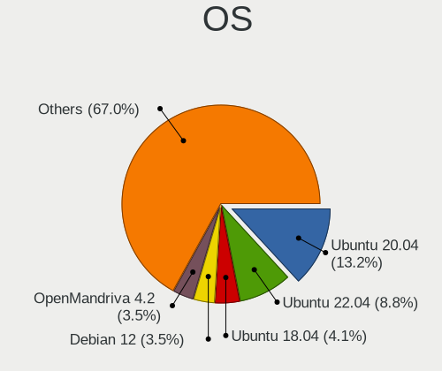

| Name               | Desktops | Percent |
|--------------------|----------|---------|
| Ubuntu 20.04       | 679      | 16.84%  |
| Ubuntu 22.04       | 274      | 6.8%    |
| Ubuntu 18.04       | 222      | 5.51%   |
| OpenMandriva 4.2   | 184      | 4.56%   |
| Debian 11          | 160      | 3.97%   |
| OpenMandriva 4.3   | 143      | 3.55%   |
| Xubuntu 20.04      | 79       | 1.96%   |
| Arch Rolling       | 69       | 1.71%   |
| OpenMandriva 23.01 | 67       | 1.66%   |
| Linux Mint 20.3    | 65       | 1.61%   |
| Linux Mint 20.1    | 58       | 1.44%   |
| Debian 10          | 58       | 1.44%   |
| Linux Mint 21.1    | 56       | 1.39%   |
| OpenMandriva 23.03 | 49       | 1.22%   |
| Linux Mint 20.2    | 43       | 1.07%   |
| Ubuntu 20.10       | 41       | 1.02%   |
| Ubuntu 21.04       | 40       | 0.99%   |
| Ubuntu 21.10       | 39       | 0.97%   |
| Linux Mint 19.3    | 37       | 0.92%   |
| Arch               | 37       | 0.92%   |
| Manjaro            | 36       | 0.89%   |
| Kubuntu 20.04      | 36       | 0.89%   |
| Zorin 16           | 35       | 0.87%   |
| Fedora 33          | 35       | 0.87%   |
| Pop!_OS 22.04      | 33       | 0.82%   |
| Linux Mint 20      | 33       | 0.82%   |
| Fedora 35          | 32       | 0.79%   |
| Linux Mint 21      | 31       | 0.77%   |
| KDE neon 20.04     | 31       | 0.77%   |
| Ubuntu 19.04       | 29       | 0.72%   |
| ArcoLinux Rolling  | 27       | 0.67%   |
| Ubuntu 19.10       | 26       | 0.64%   |
| Lubuntu 20.04      | 26       | 0.64%   |
| Kubuntu 22.04      | 26       | 0.64%   |
| Xubuntu 18.04      | 25       | 0.62%   |
| Ubuntu MATE 20.04  | 25       | 0.62%   |
| OpenMandriva 4.50  | 25       | 0.62%   |
| Xubuntu 22.04      | 24       | 0.6%    |
| Ubuntu 23.04       | 24       | 0.6%    |
| Fedora 36          | 24       | 0.6%    |

OS Family
---------

OS without a version

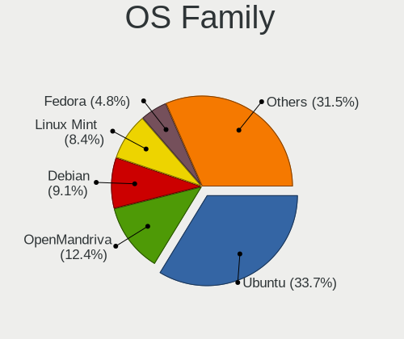

| Name          | Desktops | Percent |
|---------------|----------|---------|
| Ubuntu        | 1375     | 36.39%  |
| OpenMandriva  | 479      | 12.68%  |
| Linux Mint    | 327      | 8.65%   |
| Debian        | 255      | 6.75%   |
| Xubuntu       | 151      | 4%      |
| Fedora        | 151      | 4%      |
| Arch          | 102      | 2.7%    |
| Manjaro       | 101      | 2.67%   |
| ROSA          | 94       | 2.49%   |
| Kubuntu       | 86       | 2.28%   |
| Pop!_OS       | 80       | 2.12%   |
| Ubuntu MATE   | 56       | 1.48%   |
| Zorin         | 52       | 1.38%   |
| Lubuntu       | 51       | 1.35%   |
| Ubuntu Unity  | 46       | 1.22%   |
| KDE neon      | 42       | 1.11%   |
| Gentoo        | 28       | 0.74%   |
| ArcoLinux     | 27       | 0.71%   |
| openSUSE      | 25       | 0.66%   |
| LMDE          | 18       | 0.48%   |
| Mageia        | 17       | 0.45%   |
| Ubuntu Budgie | 16       | 0.42%   |
| EndeavourOS   | 16       | 0.42%   |
| Elementary    | 16       | 0.42%   |
| BlackPanther  | 16       | 0.42%   |
| CentOS        | 15       | 0.4%    |
| Nobara        | 14       | 0.37%   |
| Kali          | 12       | 0.32%   |
| Clear Linux   | 11       | 0.29%   |
| Ubuntu Studio | 10       | 0.26%   |
| Devuan        | 10       | 0.26%   |
| Endless       | 7        | 0.19%   |
| Artix         | 7        | 0.19%   |
| SteamOS       | 6        | 0.16%   |
| MX            | 6        | 0.16%   |
| LinuxFX       | 5        | 0.13%   |
| Trisquel      | 4        | 0.11%   |
| Sparky        | 3        | 0.08%   |
| Solus         | 3        | 0.08%   |
| Garuda Linux  | 3        | 0.08%   |

Kernel
------

Version of the Linux kernel

| Version                  | Desktops | Percent |
|--------------------------|----------|---------|
| 5.10.14-desktop-1omv4002 | 177      | 3.96%   |
| 5.16.7-desktop-1omv4003  | 126      | 2.82%   |
| 6.1.1-desktop-1omv2290   | 60       | 1.34%   |
| 5.4.0-58-generic         | 50       | 1.12%   |
| 6.2.6-desktop-1omv2390   | 45       | 1.01%   |
| 5.4.0-42-generic         | 44       | 0.98%   |
| 5.15.0-56-generic        | 43       | 0.96%   |
| 5.15.0-52-generic        | 39       | 0.87%   |
| 5.15.0-58-generic        | 35       | 0.78%   |
| 5.4.0-65-generic         | 31       | 0.69%   |
| 5.4.0-48-generic         | 31       | 0.69%   |
| 5.4.0-52-generic         | 30       | 0.67%   |
| 5.4.0-29-generic         | 30       | 0.67%   |
| 5.11.0-37-generic        | 30       | 0.67%   |
| 5.11.0-27-generic        | 29       | 0.65%   |
| 5.4.0-26-generic         | 28       | 0.63%   |
| 5.15.0-48-generic        | 28       | 0.63%   |
| 5.8.0-43-generic         | 27       | 0.6%    |
| 5.15.0-46-generic        | 27       | 0.6%    |
| 5.15.0-43-generic        | 27       | 0.6%    |
| 5.13.0-28-generic        | 27       | 0.6%    |
| 5.8.0-50-generic         | 26       | 0.58%   |
| 5.19.0-38-generic        | 26       | 0.58%   |
| 5.13.0-39-generic        | 26       | 0.58%   |
| 5.4.0-54-generic         | 25       | 0.56%   |
| 5.11.0-38-generic        | 23       | 0.51%   |
| 5.4.0-81-generic         | 21       | 0.47%   |
| 5.15.0-47-generic        | 21       | 0.47%   |
| 5.8.0-48-generic         | 20       | 0.45%   |
| 5.4.0-74-generic         | 20       | 0.45%   |
| 5.19.0-35-generic        | 20       | 0.45%   |
| 5.11.0-40-generic        | 20       | 0.45%   |
| 5.8.0-44-generic         | 19       | 0.43%   |
| 5.4.0-91-generic         | 19       | 0.43%   |
| 5.4.0-73-generic         | 19       | 0.43%   |
| 5.4.0-70-generic         | 19       | 0.43%   |
| 5.4.0-37-generic         | 19       | 0.43%   |
| 5.11.0-41-generic        | 19       | 0.43%   |
| 6.4.11-desktop-1omv2390  | 18       | 0.4%    |
| 5.4.0-72-generic         | 18       | 0.4%    |

Kernel Family
-------------

Linux kernel without a distro release

| Version | Desktops | Percent |
|---------|----------|---------|
| 5.4.0   | 743      | 17.82%  |
| 5.15.0  | 429      | 10.29%  |
| 5.11.0  | 238      | 5.71%   |
| 5.8.0   | 219      | 5.25%   |
| 4.15.0  | 207      | 4.97%   |
| 5.13.0  | 179      | 4.29%   |
| 5.10.14 | 179      | 4.29%   |
| 5.19.0  | 159      | 3.81%   |
| 5.10.0  | 152      | 3.65%   |
| 5.16.7  | 128      | 3.07%   |
| 5.3.0   | 104      | 2.49%   |
| 6.1.1   | 64       | 1.54%   |
| 5.0.0   | 60       | 1.44%   |
| 4.19.0  | 59       | 1.42%   |
| 4.18.0  | 59       | 1.42%   |
| 6.2.6   | 57       | 1.37%   |
| 6.2.0   | 49       | 1.18%   |
| 6.1.0   | 20       | 0.48%   |
| 6.4.11  | 19       | 0.46%   |
| 5.16.13 | 19       | 0.46%   |
| 4.9.20  | 19       | 0.46%   |
| 4.9.60  | 16       | 0.38%   |
| 5.18.0  | 14       | 0.34%   |
| 5.11.12 | 14       | 0.34%   |
| 4.4.0   | 14       | 0.34%   |
| 4.18.16 | 14       | 0.34%   |
| 6.0.0   | 13       | 0.31%   |
| 5.18.12 | 13       | 0.31%   |
| 5.12.4  | 13       | 0.31%   |
| 5.4.32  | 11       | 0.26%   |
| 6.0.12  | 10       | 0.24%   |
| 5.17.5  | 10       | 0.24%   |
| 3.10.0  | 10       | 0.24%   |
| 6.2.11  | 9        | 0.22%   |
| 5.19.12 | 9        | 0.22%   |
| 5.14.0  | 9        | 0.22%   |
| 6.4.8   | 8        | 0.19%   |
| 5.9.16  | 8        | 0.19%   |
| 5.9.0   | 8        | 0.19%   |
| 5.8.16  | 7        | 0.17%   |

Kernel Major Ver.
-----------------

Linux kernel major version

| Version | Desktops | Percent |
|---------|----------|---------|
| 5.4     | 784      | 19.03%  |
| 5.15    | 501      | 12.16%  |
| 5.10    | 378      | 9.17%   |
| 5.11    | 278      | 6.75%   |
| 5.8     | 261      | 6.33%   |
| 5.13    | 213      | 5.17%   |
| 4.15    | 208      | 5.05%   |
| 5.19    | 193      | 4.68%   |
| 5.16    | 181      | 4.39%   |
| 6.2     | 144      | 3.5%    |
| 6.1     | 127      | 3.08%   |
| 5.3     | 120      | 2.91%   |
| 4.18    | 74       | 1.8%    |
| 5.0     | 67       | 1.63%   |
| 4.19    | 66       | 1.6%    |
| 4.9     | 63       | 1.53%   |
| 5.18    | 52       | 1.26%   |
| 6.4     | 51       | 1.24%   |
| 6.0     | 48       | 1.17%   |
| 5.9     | 43       | 1.04%   |
| 5.17    | 39       | 0.95%   |
| 5.14    | 34       | 0.83%   |
| 6.3     | 32       | 0.78%   |
| 5.6     | 29       | 0.7%    |
| 5.7     | 27       | 0.66%   |
| 5.12    | 27       | 0.66%   |
| 5.5     | 15       | 0.36%   |
| 4.4     | 15       | 0.36%   |
| 4.1     | 13       | 0.32%   |
| 3.10    | 10       | 0.24%   |
| 6.5     | 5        | 0.12%   |
| 4.20    | 5        | 0.12%   |
| 4.12    | 4        | 0.1%    |
| 5.2     | 3        | 0.07%   |
| 4.14    | 3        | 0.07%   |
| 5.1     | 2        | 0.05%   |
| 4.8     | 2        | 0.05%   |
| 4.13    | 2        | 0.05%   |
| 2.6     | 1        | 0.02%   |

Arch
----

OS architecture (x86_64, i586, etc.)

| Name   | Desktops | Percent |
|--------|----------|---------|
| x86_64 | 3548     | 97.26%  |
| i686   | 98       | 2.69%   |
| armv7l | 2        | 0.05%   |

DE
--

Desktop Environment

| Name              | Desktops | Percent |
|-------------------|----------|---------|
| GNOME             | 1535     | 40.24%  |
| KDE5              | 763      | 20%     |
| Unknown           | 406      | 10.64%  |
| XFCE              | 332      | 8.7%    |
| X-Cinnamon        | 254      | 6.66%   |
| MATE              | 152      | 3.98%   |
| LXQt              | 64       | 1.68%   |
| KDE4              | 61       | 1.6%    |
| KDE               | 50       | 1.31%   |
| Unity             | 46       | 1.21%   |
| Cinnamon          | 40       | 1.05%   |
| Budgie            | 19       | 0.5%    |
| Pantheon          | 18       | 0.47%   |
| LXDE              | 18       | 0.47%   |
| i3                | 11       | 0.29%   |
| GNOME Flashback   | 8        | 0.21%   |
| GNOME Classic     | 8        | 0.21%   |
| qtile             | 4        | 0.1%    |
| Deepin            | 4        | 0.1%    |
| bspwm             | 3        | 0.08%   |
| sway              | 2        | 0.05%   |
| ICEWM             | 2        | 0.05%   |
| Hyprland          | 2        | 0.05%   |
| awesome           | 2        | 0.05%   |
| ubuntu:pika:GNOME | 1        | 0.03%   |
| trinity           | 1        | 0.03%   |
| Openbox           | 1        | 0.03%   |
| LeftWM            | 1        | 0.03%   |
| INPT              | 1        | 0.03%   |
| Hypr              | 1        | 0.03%   |
| GNUstep           | 1        | 0.03%   |
| fluxbox           | 1        | 0.03%   |
| Enlightenment     | 1        | 0.03%   |
| DWM               | 1        | 0.03%   |
| chadwm            | 1        | 0.03%   |

Display Server
--------------

X11 or Wayland

| Name    | Desktops | Percent |
|---------|----------|---------|
| X11     | 2954     | 78.56%  |
| Wayland | 471      | 12.53%  |
| Unknown | 174      | 4.63%   |
| Tty     | 161      | 4.28%   |

Display Manager
---------------

SDDM, LightDM, etc.

| Name    | Desktops | Percent |
|---------|----------|---------|
| Unknown | 1418     | 37.12%  |
| SDDM    | 767      | 20.08%  |
| GDM     | 541      | 14.16%  |
| GDM3    | 442      | 11.57%  |
| LightDM | 439      | 11.49%  |
| TDM     | 139      | 3.64%   |
| KDM     | 58       | 1.52%   |
| SLiM    | 5        | 0.13%   |
| Ly      | 5        | 0.13%   |
| XDM     | 2        | 0.05%   |
| LXDM    | 2        | 0.05%   |
| WDM     | 1        | 0.03%   |
| NODM    | 1        | 0.03%   |

OS Lang
-------

Language

| Lang        | Desktops | Percent |
|-------------|----------|---------|
| fr_FR       | 2718     | 72.79%  |
| en_US       | 511      | 13.69%  |
| Unknown     | 324      | 8.68%   |
| en_GB       | 55       | 1.47%   |
| C           | 43       | 1.15%   |
| de_DE       | 15       | 0.4%    |
| ru_RU       | 9        | 0.24%   |
| en_IE       | 7        | 0.19%   |
| pt_PT       | 5        | 0.13%   |
| nl_NL       | 5        | 0.13%   |
| es_ES       | 5        | 0.13%   |
| fr_CA       | 4        | 0.11%   |
| it_IT       | 3        | 0.08%   |
| fr_CH       | 3        | 0.08%   |
| en_DK       | 3        | 0.08%   |
| C.UTF8      | 3        | 0.08%   |
| sv_SE       | 2        | 0.05%   |
| fr_FR.UTF8  | 2        | 0.05%   |
| fr_BE       | 2        | 0.05%   |
| sr_RS@latin | 1        | 0.03%   |
| sr_RS       | 1        | 0.03%   |
| ru_UA       | 1        | 0.03%   |
| POSIX       | 1        | 0.03%   |
| nb_NO       | 1        | 0.03%   |
| fr_LU       | 1        | 0.03%   |
| fr_FR.utf-8 | 1        | 0.03%   |
| fi_FI       | 1        | 0.03%   |
| es_ES@euro  | 1        | 0.03%   |
| es_BO       | 1        | 0.03%   |
| en_US.utf-8 | 1        | 0.03%   |
| en_EN       | 1        | 0.03%   |
| en_AU       | 1        | 0.03%   |
| en_AG       | 1        | 0.03%   |
| ar_SA       | 1        | 0.03%   |

Boot Mode
---------

EFI or BIOS

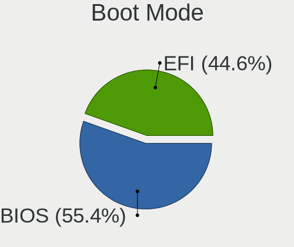

| Mode | Desktops | Percent |
|------|----------|---------|
| BIOS | 2168     | 58.22%  |
| EFI  | 1556     | 41.78%  |

Filesystem
----------

Type of filesystem

| Type     | Desktops | Percent |
|----------|----------|---------|
| Ext4     | 2893     | 76.64%  |
| Overlay  | 425      | 11.26%  |
| Btrfs    | 212      | 5.62%   |
| Unknown  | 97       | 2.57%   |
| Tmpfs    | 53       | 1.4%    |
| Xfs      | 49       | 1.3%    |
| Zfs      | 28       | 0.74%   |
| Ext2     | 6        | 0.16%   |
| Ext3     | 5        | 0.13%   |
| F2fs     | 3        | 0.08%   |
| Reiserfs | 2        | 0.05%   |
| Rootfs   | 1        | 0.03%   |
| Aufs     | 1        | 0.03%   |

Part. scheme
------------

Scheme of partitioning

| Type    | Desktops | Percent |
|---------|----------|---------|
| GPT     | 1553     | 41.17%  |
| Unknown | 1477     | 39.16%  |
| MBR     | 742      | 19.67%  |

Dual Boot with Linux/BSD
------------------------

Hosting more than one Linux/BSD

| Dual boot | Desktops | Percent |
|-----------|----------|---------|
| No        | 2761     | 73.61%  |
| Yes       | 990      | 26.39%  |

Dual Boot (Win)
---------------

Hosting Linux and Windows

| Dual boot | Desktops | Percent |
|-----------|----------|---------|
| No        | 2369     | 63.31%  |
| Yes       | 1373     | 36.69%  |

Board
-----

Vendor
------

Motherboard manufacturer

| Name                                 | Desktops | Percent |
|--------------------------------------|----------|---------|
| ASUSTek Computer                     | 998      | 27.37%  |
| MSI                                  | 595      | 16.32%  |
| Gigabyte Technology                  | 540      | 14.81%  |
| Dell                                 | 342      | 9.38%   |
| Hewlett-Packard                      | 261      | 7.16%   |
| ASRock                               | 226      | 6.2%    |
| Lenovo                               | 125      | 3.43%   |
| Acer                                 | 87       | 2.39%   |
| Intel                                | 64       | 1.76%   |
| Foxconn                              | 52       | 1.43%   |
| Pegatron                             | 45       | 1.23%   |
| Unknown                              | 43       | 1.18%   |
| Packard Bell                         | 38       | 1.04%   |
| Fujitsu                              | 29       | 0.8%    |
| Medion                               | 20       | 0.55%   |
| Shuttle                              | 17       | 0.47%   |
| eMachines                            | 17       | 0.47%   |
| Supermicro                           | 15       | 0.41%   |
| ECS                                  | 14       | 0.38%   |
| AZW                                  | 12       | 0.33%   |
| Apple                                | 9        | 0.25%   |
| Biostar                              | 8        | 0.22%   |
| Alienware                            | 7        | 0.19%   |
| ASRockRack                           | 6        | 0.16%   |
| AMI                                  | 6        | 0.16%   |
| ZOTAC                                | 4        | 0.11%   |
| NEC Computers                        | 4        | 0.11%   |
| Huanan                               | 4        | 0.11%   |
| Fujitsu Siemens                      | 4        | 0.11%   |
| BESSTAR Tech                         | 4        | 0.11%   |
| OEM                                  | 3        | 0.08%   |
| Gateway                              | 3        | 0.08%   |
| ABIT                                 | 3        | 0.08%   |
| Wistron                              | 2        | 0.05%   |
| Shenzhen Meigao Electronic Equipment | 2        | 0.05%   |
| ICP / iEi                            | 2        | 0.05%   |
| Cincoze                              | 2        | 0.05%   |
| WinFast                              | 1        | 0.03%   |
| Vorke                                | 1        | 0.03%   |
| TYAN Computer                        | 1        | 0.03%   |

Model
-----

Motherboard model

| Name                        | Desktops | Percent |
|-----------------------------|----------|---------|
| ASUS All Series             | 131      | 3.59%   |
| Unknown                     | 46       | 1.26%   |
| Gigabyte B450M DS3H         | 29       | 0.8%    |
| Dell OptiPlex 390           | 23       | 0.63%   |
| Dell OptiPlex 7010          | 21       | 0.58%   |
| Dell OptiPlex 9020          | 20       | 0.55%   |
| ASUS PRIME A320M-K          | 18       | 0.49%   |
| MSI MS-7C91                 | 17       | 0.47%   |
| MSI MS-7816                 | 17       | 0.47%   |
| Dell OptiPlex 3020          | 16       | 0.44%   |
| MSI MS-7C37                 | 15       | 0.41%   |
| MSI MS-7C02                 | 15       | 0.41%   |
| MSI MS-7817                 | 14       | 0.38%   |
| MSI MS-7758                 | 13       | 0.36%   |
| HP Compaq Elite 8300 SFF    | 13       | 0.36%   |
| Gigabyte B450 AORUS ELITE   | 13       | 0.36%   |
| Gigabyte 970A-DS3P          | 13       | 0.36%   |
| ASUS TUF Gaming X570-PLUS   | 13       | 0.36%   |
| MSI MS-7B79                 | 12       | 0.33%   |
| MSI MS-7A38                 | 12       | 0.33%   |
| MSI MS-7693                 | 12       | 0.33%   |
| ASUS PRIME X470-PRO         | 12       | 0.33%   |
| ASUS PRIME B450M-A          | 12       | 0.33%   |
| MSI MS-7B86                 | 11       | 0.3%    |
| MSI MS-7721                 | 11       | 0.3%    |
| MSI MS-7B84                 | 10       | 0.27%   |
| MSI MS-7821                 | 10       | 0.27%   |
| HP Compaq 8200 Elite SFF PC | 10       | 0.27%   |
| Dell OptiPlex 3010          | 10       | 0.27%   |
| ASUS P8Z77-V                | 10       | 0.27%   |
| MSI MS-7A32                 | 9        | 0.25%   |
| MSI MS-7850                 | 9        | 0.25%   |
| Gigabyte G41M-Combo         | 9        | 0.25%   |
| Dell Precision T1700        | 9        | 0.25%   |
| ASUS TUF Gaming B550-PLUS   | 9        | 0.25%   |
| ASUS TUF B450-PLUS GAMING   | 9        | 0.25%   |
| ASUS P7P55D                 | 9        | 0.25%   |
| ASRock B450M Pro4           | 9        | 0.25%   |
| MSI MS-7B89                 | 8        | 0.22%   |
| MSI MS-7A34                 | 8        | 0.22%   |

Model Family
------------

Motherboard model prefix

| Name                | Desktops | Percent |
|---------------------|----------|---------|
| Dell OptiPlex       | 198      | 5.43%   |
| ASUS PRIME          | 159      | 4.36%   |
| ASUS All            | 131      | 3.59%   |
| Dell Precision      | 99       | 2.72%   |
| Lenovo ThinkCentre  | 92       | 2.52%   |
| HP Compaq           | 89       | 2.44%   |
| ASUS ROG            | 82       | 2.25%   |
| ASUS TUF            | 68       | 1.87%   |
| Acer Aspire         | 53       | 1.45%   |
| Unknown             | 46       | 1.26%   |
| Gigabyte B450M      | 35       | 0.96%   |
| HP ProDesk          | 32       | 0.88%   |
| HP EliteDesk        | 31       | 0.85%   |
| Packard Bell IMEDIA | 30       | 0.82%   |
| Gigabyte B450       | 27       | 0.74%   |
| ASUS P8Z77-V        | 26       | 0.71%   |
| Fujitsu ESPRIMO     | 23       | 0.63%   |
| Acer Veriton        | 23       | 0.63%   |
| Gigabyte B550       | 20       | 0.55%   |
| Gigabyte X570       | 19       | 0.52%   |
| MSI MS-7C91         | 17       | 0.47%   |
| MSI MS-7816         | 17       | 0.47%   |
| HP Pavilion         | 17       | 0.47%   |
| MSI MS-7C37         | 15       | 0.41%   |
| MSI MS-7C02         | 15       | 0.41%   |
| Dell Inspiron       | 15       | 0.41%   |
| ASUS P8P67          | 15       | 0.41%   |
| ASUS P8H61-M        | 15       | 0.41%   |
| MSI MS-7817         | 14       | 0.38%   |
| HP ProLiant         | 14       | 0.38%   |
| Gigabyte 970A-DS3P  | 14       | 0.38%   |
| ASUS P7P55D         | 14       | 0.38%   |
| MSI MS-7758         | 13       | 0.36%   |
| Gigabyte Z390       | 13       | 0.36%   |
| ASUS M5A97          | 13       | 0.36%   |
| ASUS M5A78L-M       | 13       | 0.36%   |
| ASRock B450M        | 13       | 0.36%   |
| MSI MS-7B79         | 12       | 0.33%   |
| MSI MS-7A38         | 12       | 0.33%   |
| MSI MS-7693         | 12       | 0.33%   |

MFG Year
--------

Motherboard manufacture year

| Year    | Desktops | Percent |
|---------|----------|---------|
| 2018    | 367      | 10.07%  |
| 2012    | 347      | 9.52%   |
| 2013    | 335      | 9.19%   |
| 2011    | 277      | 7.6%    |
| 2014    | 261      | 7.16%   |
| 2020    | 238      | 6.53%   |
| 2010    | 228      | 6.25%   |
| 2019    | 227      | 6.23%   |
| 2009    | 214      | 5.87%   |
| 2015    | 193      | 5.29%   |
| 2017    | 192      | 5.27%   |
| 2008    | 172      | 4.72%   |
| 2016    | 154      | 4.22%   |
| 2021    | 150      | 4.11%   |
| 2007    | 103      | 2.83%   |
| 2006    | 70       | 1.92%   |
| 2022    | 52       | 1.43%   |
| 2005    | 32       | 0.88%   |
| 2023    | 11       | 0.3%    |
| 2004    | 9        | 0.25%   |
| 2003    | 8        | 0.22%   |
| Unknown | 3        | 0.08%   |
| 2001    | 2        | 0.05%   |
| 2002    | 1        | 0.03%   |

Form Factor
-----------

Physical design of the computer

| Name    | Desktops | Percent |
|---------|----------|---------|
| Desktop | 3646     | 100%    |

Secure Boot
-----------

Enabled or disabled

| State    | Desktops | Percent |
|----------|----------|---------|
| Disabled | 3541     | 96.91%  |
| Enabled  | 113      | 3.09%   |

Coreboot
--------

Have coreboot on board

| Used | Desktops | Percent |
|------|----------|---------|
| No   | 3645     | 99.97%  |
| Yes  | 1        | 0.03%   |

RAM Size
--------

Total RAM memory

| Size in GB      | Desktops | Percent |
|-----------------|----------|---------|
| 16.01-24.0      | 941      | 25.22%  |
| 8.01-16.0       | 730      | 19.57%  |
| 3.01-4.0        | 639      | 17.13%  |
| 4.01-8.0        | 541      | 14.5%   |
| 32.01-64.0      | 448      | 12.01%  |
| 1.01-2.0        | 130      | 3.48%   |
| 64.01-256.0     | 120      | 3.22%   |
| 24.01-32.0      | 95       | 2.55%   |
| 2.01-3.0        | 55       | 1.47%   |
| 0.51-1.0        | 23       | 0.62%   |
| More than 256.0 | 3        | 0.08%   |
| 0.01-0.5        | 3        | 0.08%   |
| Unknown         | 3        | 0.08%   |

RAM Used
--------

Used RAM memory

| Used GB     | Desktops | Percent |
|-------------|----------|---------|
| 1.01-2.0    | 1459     | 35.91%  |
| 2.01-3.0    | 914      | 22.5%   |
| 4.01-8.0    | 593      | 14.6%   |
| 3.01-4.0    | 493      | 12.13%  |
| 0.51-1.0    | 302      | 7.43%   |
| 8.01-16.0   | 171      | 4.21%   |
| 0.01-0.5    | 65       | 1.6%    |
| 16.01-24.0  | 38       | 0.94%   |
| 32.01-64.0  | 12       | 0.3%    |
| 24.01-32.0  | 9        | 0.22%   |
| Unknown     | 4        | 0.1%    |
| 64.01-256.0 | 3        | 0.07%   |

Total Drives
------------

Number of drives on board

| Drives  | Desktops | Percent |
|---------|----------|---------|
| 1       | 1410     | 36.95%  |
| 2       | 1064     | 27.88%  |
| 3       | 642      | 16.82%  |
| 4       | 349      | 9.15%   |
| 5       | 155      | 4.06%   |
| 6       | 86       | 2.25%   |
| 7       | 41       | 1.07%   |
| 0       | 31       | 0.81%   |
| 8       | 15       | 0.39%   |
| 9       | 10       | 0.26%   |
| Unknown | 3        | 0.08%   |
| 13      | 2        | 0.05%   |
| 11      | 2        | 0.05%   |
| 25      | 1        | 0.03%   |
| 22      | 1        | 0.03%   |
| 21      | 1        | 0.03%   |
| 17      | 1        | 0.03%   |
| 14      | 1        | 0.03%   |
| 10      | 1        | 0.03%   |

Has CD-ROM
----------

Has CD-ROM on board

| Presented | Desktops | Percent |
|-----------|----------|---------|
| Yes       | 2053     | 55.41%  |
| No        | 1652     | 44.59%  |

Has Ethernet
------------

Has Ethernet on board

| Presented | Desktops | Percent |
|-----------|----------|---------|
| Yes       | 3622     | 99.34%  |
| No        | 24       | 0.66%   |

Has WiFi
--------

Has WiFi module

| Presented | Desktops | Percent |
|-----------|----------|---------|
| No        | 2284     | 61.61%  |
| Yes       | 1423     | 38.39%  |

Has Bluetooth
-------------

Has Bluetooth module

| Presented | Desktops | Percent |
|-----------|----------|---------|
| No        | 2733     | 73.81%  |
| Yes       | 970      | 26.19%  |

Location
--------

Country
-------

Geographic location (country)

| Country | Desktops | Percent |
|---------|----------|---------|
| France  | 3646     | 100%    |

City
----

Geographic location (city)

| City             | Desktops | Percent |
|------------------|----------|---------|
| Paris            | 460      | 11.64%  |
| Marseille        | 71       | 1.8%    |
| Lyon             | 68       | 1.72%   |
| Strasbourg       | 49       | 1.24%   |
| Toulouse         | 42       | 1.06%   |
| Nantes           | 39       | 0.99%   |
| Roubaix          | 35       | 0.89%   |
| Nice             | 33       | 0.84%   |
| Montpellier      | 33       | 0.84%   |
| Rennes           | 30       | 0.76%   |
| Bordeaux         | 29       | 0.73%   |
| Clichy-sous-Bois | 27       | 0.68%   |
| Grenoble         | 26       | 0.66%   |
| Tours            | 23       | 0.58%   |
| Lille            | 21       | 0.53%   |
| Caen             | 19       | 0.48%   |
| Poitiers         | 18       | 0.46%   |
| La Rochelle      | 17       | 0.43%   |
| Toulon           | 16       | 0.4%    |
| Nmes           | 15       | 0.38%   |
| Dijon            | 14       | 0.35%   |
| Amiens           | 14       | 0.35%   |
| Perpignan        | 13       | 0.33%   |
| Limoges          | 13       | 0.33%   |
| Versailles       | 12       | 0.3%    |
| Saint-Nazaire    | 12       | 0.3%    |
| Rouen            | 12       | 0.3%    |
| Pau              | 12       | 0.3%    |
| Aubervilliers    | 12       | 0.3%    |
| Aix-en-Provence  | 12       | 0.3%    |
| Vannes           | 11       | 0.28%   |
| Valenciennes     | 11       | 0.28%   |
| Valence          | 11       | 0.28%   |
| Rosny-sous-Bois  | 11       | 0.28%   |
| Nancy            | 11       | 0.28%   |
| Colomiers        | 11       | 0.28%   |
| Clermont-Ferrand | 11       | 0.28%   |
| Brest            | 11       | 0.28%   |
| Besanon        | 11       | 0.28%   |
| Argenteuil       | 11       | 0.28%   |

Drives
------

Drive Vendor
------------

Hard drive vendors

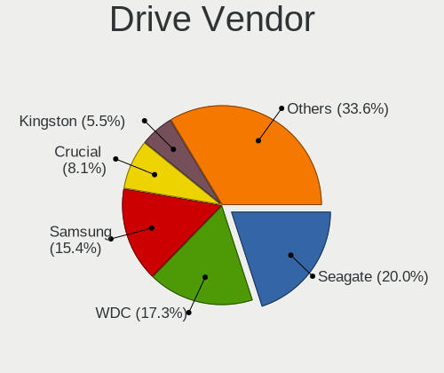

| Vendor                      | Desktops | Drives | Percent |
|-----------------------------|----------|--------|---------|
| Seagate                     | 1416     | 2312   | 20.89%  |
| WDC                         | 1235     | 2116   | 18.22%  |
| Samsung Electronics         | 1044     | 1813   | 15.4%   |
| Crucial                     | 552      | 816    | 8.14%   |
| Kingston                    | 349      | 450    | 5.15%   |
| Toshiba                     | 321      | 449    | 4.74%   |
| SanDisk                     | 261      | 354    | 3.85%   |
| Hitachi                     | 220      | 308    | 3.25%   |
| PNY                         | 120      | 154    | 1.77%   |
| Maxtor                      | 110      | 144    | 1.62%   |
| Intel                       | 94       | 119    | 1.39%   |
| Unknown                     | 81       | 122    | 1.2%    |
| HGST                        | 69       | 111    | 1.02%   |
| China                       | 62       | 78     | 0.91%   |
| Phison                      | 55       | 72     | 0.81%   |
| Corsair                     | 54       | 64     | 0.8%    |
| LDLC                        | 52       | 80     | 0.77%   |
| Micron/Crucial Technology   | 46       | 69     | 0.68%   |
| OCZ                         | 45       | 60     | 0.66%   |
| Transcend                   | 37       | 47     | 0.55%   |
| SK hynix                    | 35       | 44     | 0.52%   |
| SPCC                        | 33       | 46     | 0.49%   |
| Micron Technology           | 29       | 37     | 0.43%   |
| A-DATA Technology           | 27       | 30     | 0.4%    |
| Phison Electronics          | 23       | 33     | 0.34%   |
| Emtec                       | 21       | 28     | 0.31%   |
| Gigabyte Technology         | 19       | 22     | 0.28%   |
| Intenso                     | 15       | 18     | 0.22%   |
| Silicon Motion              | 14       | 23     | 0.21%   |
| Hewlett-Packard             | 13       | 52     | 0.19%   |
| ASMT                        | 13       | 17     | 0.19%   |
| Unknown                     | 12       | 16     | 0.18%   |
| TEXTORM                     | 11       | 13     | 0.16%   |
| LITEONIT                    | 11       | 11     | 0.16%   |
| JMicron Technology          | 11       | 21     | 0.16%   |
| Kingston Technology Company | 10       | 10     | 0.15%   |
| Fujitsu                     | 10       | 20     | 0.15%   |
| Patriot                     | 8        | 14     | 0.12%   |
| LITEON                      | 8        | 8      | 0.12%   |
| KingSpec                    | 8        | 10     | 0.12%   |

Drive Model
-----------

Hard drive models

| Model                                               | Desktops | Percent |
|-----------------------------------------------------|----------|---------|
| Seagate ST500DM002-1BD142 500GB                     | 91       | 1.15%   |
| Seagate ST2000DM008-2FR102 2TB                      | 90       | 1.13%   |
| Seagate ST1000DM010-2EP102 1TB                      | 89       | 1.12%   |
| Samsung SSD 860 EVO 500GB                           | 89       | 1.12%   |
| Crucial CT240BX500SSD1 240GB                        | 84       | 1.06%   |
| Seagate ST2000DM001-1ER164 2TB                      | 70       | 0.88%   |
| Crucial CT500MX500SSD1 500GB                        | 69       | 0.87%   |
| Seagate ST1000DM003-1ER162 1TB                      | 68       | 0.86%   |
| Samsung SSD 850 EVO 250GB                           | 68       | 0.86%   |
| Seagate ST1000DM003-1CH162 1TB                      | 62       | 0.78%   |
| Kingston SA400S37240G 240GB SSD                     | 62       | 0.78%   |
| Samsung SSD 850 EVO 500GB                           | 61       | 0.77%   |
| Seagate ST2000DM001-1CH164 2TB                      | 59       | 0.74%   |
| Toshiba DT01ACA100 1TB                              | 55       | 0.69%   |
| Crucial CT1000MX500SSD1 1TB                         | 52       | 0.66%   |
| Samsung SSD 860 EVO 250GB                           | 49       | 0.62%   |
| Samsung SSD 860 EVO 1TB                             | 49       | 0.62%   |
| Seagate ST4000DM004-2CV104 4TB                      | 45       | 0.57%   |
| Crucial CT480BX500SSD1 480GB                        | 45       | 0.57%   |
| Seagate ST2000DM006-2DM164 2TB                      | 42       | 0.53%   |
| Kingston SA400S37120G 120GB SSD                     | 42       | 0.53%   |
| WDC WD10EZEX-08WN4A0 1TB                            | 39       | 0.49%   |
| Seagate ST3500418AS 500GB                           | 39       | 0.49%   |
| Samsung HD103SJ 1TB                                 | 39       | 0.49%   |
| PNY CS900 120GB SSD                                 | 39       | 0.49%   |
| Samsung NVMe SSD Drive 500GB                        | 38       | 0.48%   |
| Kingston SV300S37A120G 120GB SSD                    | 38       | 0.48%   |
| Unknown SD/MMC/MS PRO 1GB                           | 37       | 0.47%   |
| Kingston SA400S37480G 480GB SSD                     | 35       | 0.44%   |
| WDC WD20EZRX-00D8PB0 2TB                            | 34       | 0.43%   |
| PNY CS900 240GB SSD                                 | 33       | 0.42%   |
| Samsung NVMe SSD Controller SM981/PM981/PM983 500GB | 32       | 0.4%    |
| Seagate ST1000DM003-1SB102 1TB                      | 31       | 0.39%   |
| Samsung SSD 870 QVO 1TB                             | 31       | 0.39%   |
| Seagate ST31000524AS 1TB                            | 30       | 0.38%   |
| WDC WD20EZRZ-00Z5HB0 2TB                            | 29       | 0.37%   |
| Toshiba HDWD110 1TB                                 | 29       | 0.37%   |
| Samsung SSD 860 QVO 1TB                             | 29       | 0.37%   |
| Samsung HD103UJ 1TB                                 | 29       | 0.37%   |
| WDC WD10EZEX-00BN5A0 1TB                            | 28       | 0.35%   |

HDD Vendor
----------

Hard disk drive vendors

| Vendor              | Desktops | Drives | Percent |
|---------------------|----------|--------|---------|
| Seagate             | 1395     | 2258   | 39.19%  |
| WDC                 | 1140     | 1945   | 32.02%  |
| Toshiba             | 295      | 407    | 8.29%   |
| Samsung Electronics | 221      | 327    | 6.21%   |
| Hitachi             | 220      | 308    | 6.18%   |
| Maxtor              | 110      | 144    | 3.09%   |
| HGST                | 68       | 109    | 1.91%   |
| Unknown             | 40       | 48     | 1.12%   |
| Fujitsu             | 10       | 20     | 0.28%   |
| Hewlett-Packard     | 9        | 24     | 0.25%   |
| SABRENT             | 7        | 7      | 0.2%    |
| ASMT                | 6        | 8      | 0.17%   |
| Magnetic Data       | 5        | 5      | 0.14%   |
| USB3.0              | 3        | 3      | 0.08%   |
| LaCie               | 3        | 3      | 0.08%   |
| Inateck             | 3        | 3      | 0.08%   |
| ASMT109x            | 3        | 4      | 0.08%   |
| Apple               | 3        | 3      | 0.08%   |
| Initio              | 2        | 2      | 0.06%   |
| H/W                 | 2        | 16     | 0.06%   |
| ASMedia             | 2        | 2      | 0.06%   |
| USB                 | 1        | 3      | 0.03%   |
| Storeva             | 1        | 1      | 0.03%   |
| RSH-319             | 1        | 1      | 0.03%   |
| QEMU                | 1        | 1      | 0.03%   |
| PHD 3.0             | 1        | 1      | 0.03%   |
| MDT                 | 1        | 1      | 0.03%   |
| MARVELL             | 1        | 1      | 0.03%   |
| JMicron Technology  | 1        | 6      | 0.03%   |
| Intenso             | 1        | 2      | 0.03%   |
| IB-AC703            | 1        | 1      | 0.03%   |
| External            | 1        | 1      | 0.03%   |
| ExcelStor           | 1        | 1      | 0.03%   |
| Unknown             | 1        | 1      | 0.03%   |

SSD Vendor
----------

Solid state drive vendors

| Vendor              | Desktops | Drives | Percent |
|---------------------|----------|--------|---------|
| Samsung Electronics | 642      | 990    | 26.28%  |
| Crucial             | 488      | 712    | 19.98%  |
| Kingston            | 312      | 403    | 12.77%  |
| SanDisk             | 212      | 267    | 8.68%   |
| PNY                 | 112      | 142    | 4.58%   |
| WDC                 | 86       | 107    | 3.52%   |
| Intel               | 66       | 84     | 2.7%    |
| China               | 62       | 78     | 2.54%   |
| OCZ                 | 44       | 56     | 1.8%    |
| Transcend           | 36       | 46     | 1.47%   |
| LDLC                | 34       | 42     | 1.39%   |
| Corsair             | 31       | 34     | 1.27%   |
| SPCC                | 30       | 43     | 1.23%   |
| A-DATA Technology   | 22       | 25     | 0.9%    |
| Micron Technology   | 20       | 26     | 0.82%   |
| SK hynix            | 19       | 26     | 0.78%   |
| Emtec               | 19       | 23     | 0.78%   |
| Toshiba             | 18       | 26     | 0.74%   |
| LITEONIT            | 11       | 11     | 0.45%   |
| Intenso             | 11       | 13     | 0.45%   |
| TEXTORM             | 10       | 12     | 0.41%   |
| JMicron Technology  | 9        | 14     | 0.37%   |
| Patriot             | 8        | 14     | 0.33%   |
| KingSpec            | 8        | 10     | 0.33%   |
| Gigabyte Technology | 8        | 10     | 0.33%   |
| Verbatim            | 7        | 7      | 0.29%   |
| LITEON              | 7        | 7      | 0.29%   |
| Unknown             | 7        | 10     | 0.29%   |
| Plextor             | 6        | 6      | 0.25%   |
| ASMT                | 6        | 8      | 0.25%   |
| KingDian            | 5        | 9      | 0.2%    |
| Goodram             | 5        | 7      | 0.2%    |
| GALAX               | 5        | 5      | 0.2%    |
| TO Exter            | 4        | 4      | 0.16%   |
| Seagate             | 4        | 4      | 0.16%   |
| Integral            | 4        | 4      | 0.16%   |
| BAITITON            | 4        | 4      | 0.16%   |
| Apacer              | 4        | 4      | 0.16%   |
| TCSUNBOW            | 3        | 6      | 0.12%   |
| PNY CS90            | 3        | 3      | 0.12%   |

Drive Kind
----------

HDD or SSD

| Kind    | Desktops | Drives | Percent |
|---------|----------|--------|---------|
| HDD     | 2673     | 5667   | 48.25%  |
| SSD     | 1988     | 3367   | 35.88%  |
| NVMe    | 742      | 1222   | 13.39%  |
| Unknown | 111      | 207    | 2%      |
| MMC     | 26       | 32     | 0.47%   |

Drive Connector
---------------

SATA, SAS, NVMe, etc.

| Type | Desktops | Drives | Percent |
|------|----------|--------|---------|
| SATA | 3383     | 8790   | 76.8%   |
| NVMe | 740      | 1212   | 16.8%   |
| SAS  | 256      | 461    | 5.81%   |
| MMC  | 26       | 32     | 0.59%   |

Drive Size
----------

Size of hard drive

| Size in TB | Desktops | Drives | Percent |
|------------|----------|--------|---------|
| 0.01-0.5   | 2598     | 4836   | 50.79%  |
| 0.51-1.0   | 1425     | 2379   | 27.86%  |
| 1.01-2.0   | 641      | 1043   | 12.53%  |
| 3.01-4.0   | 217      | 355    | 4.24%   |
| 2.01-3.0   | 144      | 239    | 2.82%   |
| 4.01-10.0  | 74       | 139    | 1.45%   |
| 10.01-20.0 | 16       | 43     | 0.31%   |

Space Total
-----------

Amount of disk space available on the file system

| Size in GB     | Desktops | Percent |
|----------------|----------|---------|
| 101-250        | 827      | 21.1%   |
| 251-500        | 678      | 17.3%   |
| 501-1000       | 593      | 15.13%  |
| 1001-2000      | 470      | 11.99%  |
| More than 3000 | 369      | 9.41%   |
| 1-20           | 319      | 8.14%   |
| 2001-3000      | 217      | 5.54%   |
| Unknown        | 177      | 4.52%   |
| 51-100         | 172      | 4.39%   |
| 21-50          | 98       | 2.5%    |

Space Used
----------

Amount of used disk space

| Used GB        | Desktops | Percent |
|----------------|----------|---------|
| 1-20           | 1256     | 31.29%  |
| 21-50          | 498      | 12.41%  |
| 101-250        | 464      | 11.56%  |
| 51-100         | 402      | 10.01%  |
| 251-500        | 370      | 9.22%   |
| 501-1000       | 359      | 8.94%   |
| 1001-2000      | 258      | 6.43%   |
| Unknown        | 177      | 4.41%   |
| More than 3000 | 141      | 3.51%   |
| 2001-3000      | 88       | 2.19%   |
| 0              | 1        | 0.02%   |

Malfunc. Drives
---------------

Drive models with a malfunction

| Model                             | Desktops | Drives | Percent |
|-----------------------------------|----------|--------|---------|
| Seagate ST500DM002-1BD142 500GB   | 13       | 14     | 1.84%   |
| Seagate ST2000DM001-1ER164 2TB    | 8        | 11     | 1.13%   |
| Seagate ST2000DM001-1CH164 2TB    | 8        | 9      | 1.13%   |
| Seagate ST31000528AS 1TB          | 7        | 7      | 0.99%   |
| Samsung Electronics HD103SJ 1TB   | 7        | 8      | 0.99%   |
| WDC WD10EADS-22M2B0 1TB           | 6        | 6      | 0.85%   |
| Seagate ST3250310AS 250GB         | 6        | 6      | 0.85%   |
| Seagate ST31000524AS 1TB          | 6        | 6      | 0.85%   |
| Crucial CT240M500SSD1 240GB       | 6        | 7      | 0.85%   |
| WDC WD6400AAKS-22A7B2 640GB       | 5        | 8      | 0.71%   |
| WDC WD10EARS-00Y5B1 1TB           | 5        | 6      | 0.71%   |
| WDC WD10EADS-65L5B1 1TB           | 5        | 5      | 0.71%   |
| WDC WD10EADS-00M2B0 1TB           | 5        | 7      | 0.71%   |
| Toshiba DT01ACA100 1TB            | 5        | 6      | 0.71%   |
| Seagate ST3500418AS 500GB         | 5        | 5      | 0.71%   |
| Seagate ST3320820AS 320GB         | 5        | 5      | 0.71%   |
| Samsung Electronics HD103UJ 1TB   | 5        | 7      | 0.71%   |
| Maxtor 6V160E0 160GB              | 5        | 5      | 0.71%   |
| LDLC SSD 120GB                    | 5        | 5      | 0.71%   |
| WDC WD5000AAKX-00ERMA0 500GB      | 4        | 5      | 0.57%   |
| WDC WD5000AAKX-001CA0 500GB       | 4        | 5      | 0.57%   |
| WDC WD3200AAKS-00L9A0 320GB       | 4        | 4      | 0.57%   |
| WDC WD10EZEX-21M2NA0 1TB          | 4        | 4      | 0.57%   |
| WDC WD1002FAEX-00Z3A0 1TB         | 4        | 5      | 0.57%   |
| Seagate ST3500320AS 500GB         | 4        | 4      | 0.57%   |
| Seagate ST250DM000-1BD141 250GB   | 4        | 4      | 0.57%   |
| Seagate ST2000DM001-9YN164 2TB    | 4        | 4      | 0.57%   |
| Seagate ST1000DM003-9YN162 1TB    | 4        | 5      | 0.57%   |
| Seagate ST1000DM003-1CH162 1TB    | 4        | 4      | 0.57%   |
| Samsung Electronics HD321KJ 320GB | 4        | 4      | 0.57%   |
| Samsung Electronics HD103SI 1TB   | 4        | 4      | 0.57%   |
| Maxtor STM3500320AS 500GB         | 4        | 5      | 0.57%   |
| Maxtor STM3250310AS 250GB         | 4        | 7      | 0.57%   |
| Kingston SV300S37A120G 120GB SSD  | 4        | 6      | 0.57%   |
| Hitachi HDS721010CLA332 1TB       | 4        | 7      | 0.57%   |
| Crucial CT275MX300SSD1 275GB      | 4        | 5      | 0.57%   |
| Crucial CT128MX100SSD1 128GB      | 4        | 4      | 0.57%   |
| WDC WD5000AAKX-22ERMA0 500GB      | 3        | 4      | 0.42%   |
| WDC WD5000AADS-00S9B0 500GB       | 3        | 3      | 0.42%   |
| WDC WD3200AAJS-08L7A0 320GB       | 3        | 3      | 0.42%   |

Malfunc. Drive Vendor
---------------------

Vendors of faulty drives

| Vendor              | Desktops | Drives | Percent |
|---------------------|----------|--------|---------|
| WDC                 | 201      | 255    | 29.69%  |
| Seagate             | 187      | 222    | 27.62%  |
| Samsung Electronics | 57       | 68     | 8.42%   |
| Hitachi             | 41       | 51     | 6.06%   |
| Maxtor              | 38       | 43     | 5.61%   |
| Crucial             | 28       | 32     | 4.14%   |
| Toshiba             | 23       | 30     | 3.4%    |
| Kingston            | 18       | 23     | 2.66%   |
| Intel               | 15       | 18     | 2.22%   |
| SanDisk             | 10       | 12     | 1.48%   |
| HGST                | 10       | 13     | 1.48%   |
| OCZ                 | 8        | 9      | 1.18%   |
| LDLC                | 7        | 7      | 1.03%   |
| SK hynix            | 5        | 9      | 0.74%   |
| China               | 3        | 3      | 0.44%   |
| A-DATA Technology   | 3        | 3      | 0.44%   |
| SPCC                | 2        | 2      | 0.3%    |
| Micron Technology   | 2        | 2      | 0.3%    |
| LITEONIT            | 2        | 2      | 0.3%    |
| Hewlett-Packard     | 2        | 2      | 0.3%    |
| Fujitsu             | 2        | 2      | 0.3%    |
| Corsair             | 2        | 2      | 0.3%    |
| Transcend           | 1        | 2      | 0.15%   |
| TEXTORM             | 1        | 1      | 0.15%   |
| SABRENT             | 1        | 1      | 0.15%   |
| OCZ-VERTEX          | 1        | 1      | 0.15%   |
| Netac               | 1        | 1      | 0.15%   |
| KingSpec            | 1        | 1      | 0.15%   |
| JMicron Technology  | 1        | 1      | 0.15%   |
| INNOVATION IT       | 1        | 1      | 0.15%   |
| ASMT                | 1        | 1      | 0.15%   |
| Apacer              | 1        | 1      | 0.15%   |
| 2.5"                | 1        | 4      | 0.15%   |

Malfunc. HDD Vendor
-------------------

Vendors of faulty HDD drives

| Vendor              | Desktops | Drives | Percent |
|---------------------|----------|--------|---------|
| WDC                 | 197      | 251    | 36.28%  |
| Seagate             | 187      | 222    | 34.44%  |
| Samsung Electronics | 42       | 49     | 7.73%   |
| Hitachi             | 41       | 51     | 7.55%   |
| Maxtor              | 38       | 43     | 7%      |
| Toshiba             | 22       | 29     | 4.05%   |
| HGST                | 10       | 13     | 1.84%   |
| Hewlett-Packard     | 2        | 2      | 0.37%   |
| Fujitsu             | 2        | 2      | 0.37%   |
| SABRENT             | 1        | 1      | 0.18%   |
| ASMT                | 1        | 1      | 0.18%   |

Malfunc. Drive Kind
-------------------

Kinds of faulty drives

| Kind    | Desktops | Drives | Percent |
|---------|----------|--------|---------|
| HDD     | 479      | 664    | 78.4%   |
| SSD     | 125      | 154    | 20.46%  |
| NVMe    | 6        | 6      | 0.98%   |
| Unknown | 1        | 1      | 0.16%   |

Failed Drives
-------------

Failed drive models

| Model                                            | Desktops | Drives | Percent |
|--------------------------------------------------|----------|--------|---------|
| WDC WD800BB-00FJA0 80GB                          | 1        | 1      | 7.14%   |
| WDC WD4000FYYZ-01UL1B2 4TB                       | 1        | 1      | 7.14%   |
| WDC WD3200AAJS-22VWA0 320GB                      | 1        | 1      | 7.14%   |
| WDC WD20EARS-00MVWB0 2TB                         | 1        | 2      | 7.14%   |
| WDC WD20EARS-00J99B0 2TB                         | 1        | 2      | 7.14%   |
| WDC WD10EALX-759BA1 1TB                          | 1        | 1      | 7.14%   |
| Seagate ST3500418AS 500GB                        | 1        | 1      | 7.14%   |
| Seagate ST3250318AS 250GB                        | 1        | 1      | 7.14%   |
| Samsung Electronics SSD PM871 2.5 7mm 128GB      | 1        | 1      | 7.14%   |
| Samsung Electronics MZ7LN512HAJQ-00000 512GB SSD | 1        | 2      | 7.14%   |
| Samsung Electronics HD753LJ 752GB                | 1        | 1      | 7.14%   |
| Samsung Electronics HD501LJ 500GB                | 1        | 1      | 7.14%   |
| Kingston SMS200S360G 64GB SSD                    | 1        | 1      | 7.14%   |
| Intel SSDSC2KW256G8 256GB                        | 1        | 1      | 7.14%   |

Failed Drive Vendor
-------------------

Failed drive vendors

| Vendor              | Desktops | Drives | Percent |
|---------------------|----------|--------|---------|
| WDC                 | 6        | 8      | 42.86%  |
| Samsung Electronics | 4        | 5      | 28.57%  |
| Seagate             | 2        | 2      | 14.29%  |
| Kingston            | 1        | 1      | 7.14%   |
| Intel               | 1        | 1      | 7.14%   |

Drive Status
------------

Number of failed and malfunc. drives

| Status   | Desktops | Drives | Percent |
|----------|----------|--------|---------|
| Works    | 1940     | 4637   | 45.53%  |
| Detected | 1722     | 5016   | 40.41%  |
| Malfunc  | 585      | 825    | 13.73%  |
| Failed   | 14       | 17     | 0.33%   |

Storage controller
------------------

Storage Vendor
--------------

Storage controller vendors

| Vendor                           | Desktops | Percent |
|----------------------------------|----------|---------|
| Intel                            | 2434     | 48.48%  |
| AMD                              | 1017     | 20.25%  |
| Samsung Electronics              | 317      | 6.31%   |
| ASMedia Technology               | 162      | 3.23%   |
| Marvell Technology Group         | 156      | 3.11%   |
| Nvidia                           | 147      | 2.93%   |
| JMicron Technology               | 137      | 2.73%   |
| Micron/Crucial Technology        | 114      | 2.27%   |
| Phison Electronics               | 113      | 2.25%   |
| SanDisk                          | 105      | 2.09%   |
| VIA Technologies                 | 54       | 1.08%   |
| Kingston Technology Company      | 51       | 1.02%   |
| Silicon Image                    | 21       | 0.42%   |
| Silicon Motion                   | 20       | 0.4%    |
| LSI Logic / Symbios Logic        | 19       | 0.38%   |
| Micron Technology                | 17       | 0.34%   |
| Broadcom / LSI                   | 17       | 0.34%   |
| SK hynix                         | 16       | 0.32%   |
| Toshiba America Info Systems     | 15       | 0.3%    |
| Seagate Technology               | 12       | 0.24%   |
| ADATA Technology                 | 10       | 0.2%    |
| Adaptec                          | 9        | 0.18%   |
| Silicon Integrated Systems [SiS] | 8        | 0.16%   |
| Integrated Technology Express    | 7        | 0.14%   |
| Realtek Semiconductor            | 6        | 0.12%   |
| Shenzhen Longsys Electronics     | 5        | 0.1%    |
| KIOXIA                           | 5        | 0.1%    |
| Hewlett-Packard                  | 5        | 0.1%    |
| Promise Technology               | 3        | 0.06%   |
| MAXIO Technology (Hangzhou)      | 3        | 0.06%   |
| Union Memory (Shenzhen)          | 2        | 0.04%   |
| Solidigm                         | 2        | 0.04%   |
| Lite-On Technology               | 2        | 0.04%   |
| ULi Electronics                  | 1        | 0.02%   |
| Transcend                        | 1        | 0.02%   |
| Tekram Technology                | 1        | 0.02%   |
| Red Hat                          | 1        | 0.02%   |
| OCZ Technology Group             | 1        | 0.02%   |
| Netac Technology                 | 1        | 0.02%   |
| INNOGRIT                         | 1        | 0.02%   |

Storage Model
-------------

Storage controller models

| Model                                                                                   | Desktops | Percent |
|-----------------------------------------------------------------------------------------|----------|---------|
| AMD FCH SATA Controller [AHCI mode]                                                     | 573      | 9.05%   |
| Intel 8 Series/C220 Series Chipset Family 6-port SATA Controller 1 [AHCI mode]          | 309      | 4.88%   |
| AMD 400 Series Chipset SATA Controller                                                  | 227      | 3.58%   |
| Intel 6 Series/C200 Series Chipset Family 6 port Desktop SATA AHCI Controller           | 204      | 3.22%   |
| Intel Q170/Q150/B150/H170/H110/Z170/CM236 Chipset SATA Controller [AHCI Mode]           | 196      | 3.09%   |
| Samsung NVMe SSD Controller SM981/PM981/PM983                                           | 186      | 2.94%   |
| Intel SATA Controller [RAID mode]                                                       | 175      | 2.76%   |
| Intel NM10/ICH7 Family SATA Controller [IDE mode]                                       | 161      | 2.54%   |
| Intel 7 Series/C210 Series Chipset Family 6-port SATA Controller [AHCI mode]            | 161      | 2.54%   |
| ASMedia ASM1062 Serial ATA Controller                                                   | 144      | 2.27%   |
| Intel 200 Series PCH SATA controller [AHCI mode]                                        | 139      | 2.19%   |
| AMD SB7x0/SB8x0/SB9x0 IDE Controller                                                    | 138      | 2.18%   |
| AMD SB7x0/SB8x0/SB9x0 SATA Controller [AHCI mode]                                       | 134      | 2.12%   |
| AMD 500 Series Chipset SATA Controller                                                  | 129      | 2.04%   |
| Intel 82801G (ICH7 Family) IDE Controller                                               | 124      | 1.96%   |
| Intel Cannon Lake PCH SATA AHCI Controller                                              | 123      | 1.94%   |
| Intel 9 Series Chipset Family SATA Controller [AHCI Mode]                               | 106      | 1.67%   |
| AMD SB7x0/SB8x0/SB9x0 SATA Controller [IDE mode]                                        | 92       | 1.45%   |
| Intel 6 Series/C200 Series Chipset Family Desktop SATA Controller (IDE mode, ports 4-5) | 87       | 1.37%   |
| Intel 6 Series/C200 Series Chipset Family Desktop SATA Controller (IDE mode, ports 0-3) | 87       | 1.37%   |
| JMicron JMB363 SATA/IDE Controller                                                      | 77       | 1.22%   |
| Nvidia MCP61 SATA Controller                                                            | 75       | 1.18%   |
| Phison E12 NVMe Controller                                                              | 64       | 1.01%   |
| Nvidia MCP61 IDE                                                                        | 64       | 1.01%   |
| AMD FCH SATA Controller D                                                               | 63       | 0.99%   |
| Micron/Crucial P2 [Nick P2] / P3 / P3 Plus NVMe PCIe SSD (DRAM-less)                    | 60       | 0.95%   |
| Intel 82801JI (ICH10 Family) 4 port SATA IDE Controller #1                              | 60       | 0.95%   |
| Intel 82801JI (ICH10 Family) 2 port SATA IDE Controller #2                              | 57       | 0.9%    |
| Intel 500 Series Chipset Family SATA AHCI Controller                                    | 57       | 0.9%    |
| Intel 82801JI (ICH10 Family) SATA AHCI Controller                                       | 49       | 0.77%   |
| Intel 82801I (ICH9 Family) 2 port SATA Controller [IDE mode]                            | 49       | 0.77%   |
| Samsung NVMe SSD Controller 980                                                         | 47       | 0.74%   |
| Samsung NVMe SSD Controller SM961/PM961/SM963                                           | 44       | 0.69%   |
| Intel 5 Series/3400 Series Chipset 4 port SATA IDE Controller                           | 41       | 0.65%   |
| Intel 5 Series/3400 Series Chipset 2 port SATA IDE Controller                           | 41       | 0.65%   |
| Marvell Group 88SE6111/6121 SATA II / PATA Controller                                   | 40       | 0.63%   |
| Samsung NVMe SSD Controller PM9A1/PM9A3/980PRO                                          | 39       | 0.62%   |
| AMD 300 Series Chipset SATA Controller                                                  | 37       | 0.58%   |
| Intel 4 Series Chipset PT IDER Controller                                               | 36       | 0.57%   |
| Intel 82801IR/IO/IH (ICH9R/DO/DH) 4 port SATA Controller [IDE mode]                     | 35       | 0.55%   |

Storage Kind
------------

Kind of storage controller (IDE, SATA, NVMe, SAS, ...)

| Kind | Desktops | Percent |
|------|----------|---------|
| SATA | 2779     | 56.89%  |
| IDE  | 1001     | 20.49%  |
| NVMe | 748      | 15.31%  |
| RAID | 309      | 6.33%   |
| SAS  | 26       | 0.53%   |
| SCSI | 22       | 0.45%   |

Processor
---------

CPU Vendor
----------

Processor vendors

| Vendor                | Desktops | Percent |
|-----------------------|----------|---------|
| Intel                 | 2494     | 68.4%   |
| AMD                   | 1148     | 31.49%  |
| CentaurHauls          | 2        | 0.05%   |
| Marvell Semiconductor | 1        | 0.03%   |
| ARM                   | 1        | 0.03%   |

CPU Model
---------

Processor models

| Model                                       | Desktops | Percent |
|---------------------------------------------|----------|---------|
| AMD Ryzen 5 3600 6-Core Processor           | 65       | 1.77%   |
| AMD Ryzen 7 3700X 8-Core Processor          | 53       | 1.45%   |
| Intel Core i7-3770 CPU @ 3.40GHz            | 49       | 1.34%   |
| Intel Core i3-2120 CPU @ 3.30GHz            | 40       | 1.09%   |
| Intel Core i5-4460 CPU @ 3.20GHz            | 39       | 1.06%   |
| Intel Core i7-4790K CPU @ 4.00GHz           | 36       | 0.98%   |
| Intel Core i5-6500 CPU @ 3.20GHz            | 36       | 0.98%   |
| AMD Ryzen 5 5600X 6-Core Processor          | 36       | 0.98%   |
| AMD Ryzen 5 2600 Six-Core Processor         | 36       | 0.98%   |
| Intel Core i7-4790 CPU @ 3.60GHz            | 34       | 0.93%   |
| Intel Core 2 Duo CPU E8400 @ 3.00GHz        | 33       | 0.9%    |
| Intel Core i5-3470 CPU @ 3.20GHz            | 32       | 0.87%   |
| Intel Core i5-2400 CPU @ 3.10GHz            | 32       | 0.87%   |
| AMD Ryzen 9 3900X 12-Core Processor         | 32       | 0.87%   |
| Intel Core i5-2500K CPU @ 3.30GHz           | 31       | 0.85%   |
| Intel Core i5-3570K CPU @ 3.40GHz           | 29       | 0.79%   |
| AMD FX-8350 Eight-Core Processor            | 28       | 0.76%   |
| Intel Core i7-6700K CPU @ 4.00GHz           | 26       | 0.71%   |
| Intel Core i5-8400 CPU @ 2.80GHz            | 25       | 0.68%   |
| Intel Core i5-4570 CPU @ 3.20GHz            | 25       | 0.68%   |
| AMD Ryzen 7 5800X 8-Core Processor          | 25       | 0.68%   |
| Intel Pentium Dual-Core CPU E5300 @ 2.60GHz | 24       | 0.66%   |
| Intel Core i7-4770 CPU @ 3.40GHz            | 24       | 0.66%   |
| Intel Core 2 Quad CPU Q6600 @ 2.40GHz       | 24       | 0.66%   |
| Intel Core i7-6700 CPU @ 3.40GHz            | 23       | 0.63%   |
| Intel Core i5-4590 CPU @ 3.30GHz            | 23       | 0.63%   |
| Intel Core i7-8700 CPU @ 3.20GHz            | 22       | 0.6%    |
| Intel Core i5-6400 CPU @ 2.70GHz            | 22       | 0.6%    |
| Intel Core i5-4670K CPU @ 3.40GHz           | 22       | 0.6%    |
| Intel Core i3-4130 CPU @ 3.40GHz            | 22       | 0.6%    |
| AMD Ryzen 7 2700X Eight-Core Processor      | 22       | 0.6%    |
| AMD Ryzen 5 1600 Six-Core Processor         | 22       | 0.6%    |
| AMD FX-6300 Six-Core Processor              | 22       | 0.6%    |
| Intel Core i5-7400 CPU @ 3.00GHz            | 21       | 0.57%   |
| Intel Core 2 Duo CPU E7500 @ 2.93GHz        | 21       | 0.57%   |
| AMD Ryzen 5 3400G with Radeon Vega Graphics | 21       | 0.57%   |
| Intel Core i7-7700 CPU @ 3.60GHz            | 20       | 0.55%   |
| Intel Core i7-3770K CPU @ 3.50GHz           | 20       | 0.55%   |
| Intel Core i7-2600 CPU @ 3.40GHz            | 20       | 0.55%   |
| Intel Core i5-4690K CPU @ 3.50GHz           | 20       | 0.55%   |

CPU Model Family
----------------

Processor model prefix

| Model                   | Desktops | Percent |
|-------------------------|----------|---------|
| Intel Core i5           | 748      | 20.44%  |
| Intel Core i7           | 498      | 13.61%  |
| AMD Ryzen 5             | 284      | 7.76%   |
| Intel Core i3           | 272      | 7.43%   |
| Intel Xeon              | 185      | 5.05%   |
| AMD Ryzen 7             | 185      | 5.05%   |
| Intel Core 2 Duo        | 127      | 3.47%   |
| Intel Pentium           | 105      | 2.87%   |
| Intel Core 2 Quad       | 100      | 2.73%   |
| AMD FX                  | 98       | 2.68%   |
| Intel Celeron           | 96       | 2.62%   |
| Other                   | 85       | 2.32%   |
| AMD Ryzen 9             | 74       | 2.02%   |
| Intel Pentium Dual-Core | 66       | 1.8%    |
| AMD Athlon II X2        | 64       | 1.75%   |
| AMD Ryzen 3             | 60       | 1.64%   |
| AMD Athlon 64 X2        | 52       | 1.42%   |
| Intel Atom              | 51       | 1.39%   |
| AMD Phenom II X4        | 42       | 1.15%   |
| Intel Pentium Dual      | 34       | 0.93%   |
| Intel Core 2            | 32       | 0.87%   |
| AMD A8                  | 32       | 0.87%   |
| Intel Pentium 4         | 30       | 0.82%   |
| Intel Core i9           | 30       | 0.82%   |
| AMD A4                  | 29       | 0.79%   |
| Intel Pentium D         | 21       | 0.57%   |
| AMD A6                  | 21       | 0.57%   |
| Intel Pentium Gold      | 19       | 0.52%   |
| AMD Athlon 64           | 18       | 0.49%   |
| AMD Ryzen Threadripper  | 17       | 0.46%   |
| AMD A10                 | 17       | 0.46%   |
| AMD Athlon II X4        | 16       | 0.44%   |
| AMD Sempron             | 15       | 0.41%   |
| AMD Phenom II X6        | 14       | 0.38%   |
| AMD Athlon              | 13       | 0.36%   |
| AMD E                   | 10       | 0.27%   |
| AMD Ryzen 5 PRO         | 9        | 0.25%   |
| AMD Athlon X4           | 9        | 0.25%   |
| AMD Athlon Dual Core    | 9        | 0.25%   |
| AMD Athlon II X3        | 8        | 0.22%   |

CPU Cores
---------

Number of processor cores

| Number  | Desktops | Percent |
|---------|----------|---------|
| 4       | 1511     | 41.18%  |
| 2       | 990      | 26.98%  |
| 6       | 508      | 13.85%  |
| 8       | 292      | 7.96%   |
| 1       | 128      | 3.49%   |
| 12      | 91       | 2.48%   |
| 3       | 51       | 1.39%   |
| 16      | 37       | 1.01%   |
| Unknown | 21       | 0.57%   |
| 10      | 18       | 0.49%   |
| 32      | 6        | 0.16%   |
| 24      | 4        | 0.11%   |
| 20      | 4        | 0.11%   |
| 14      | 4        | 0.11%   |
| 64      | 3        | 0.08%   |
| 40      | 1        | 0.03%   |

CPU Sockets
-----------

Number of sockets

| Number | Desktops | Percent |
|--------|----------|---------|
| 1      | 3592     | 98.49%  |
| 2      | 53       | 1.45%   |
| 4      | 1        | 0.03%   |
| 0      | 1        | 0.03%   |

CPU Threads
-----------

Threads per core (Hyper-Threading)

| Number  | Desktops | Percent |
|---------|----------|---------|
| 2       | 1858     | 50.67%  |
| 1       | 1787     | 48.73%  |
| Unknown | 21       | 0.57%   |
| 4       | 1        | 0.03%   |

CPU Op-Modes
------------

CPU Operation Modes (32-bit, 64-bit)

| Op mode        | Desktops | Percent |
|----------------|----------|---------|
| 32-bit, 64-bit | 3599     | 98.49%  |
| Unknown        | 29       | 0.79%   |
| 32-bit         | 26       | 0.71%   |

CPU Microcode
-------------

Microcode number

| Number     | Desktops | Percent |
|------------|----------|---------|
| Unknown    | 811      | 21.34%  |
| 0x306c3    | 376      | 9.89%   |
| 0x206a7    | 226      | 5.95%   |
| 0x306a9    | 211      | 5.55%   |
| 0x1067a    | 184      | 4.84%   |
| 0x506e3    | 149      | 3.92%   |
| 0x906ea    | 106      | 2.79%   |
| 0x08701021 | 102      | 2.68%   |
| 0x010000c8 | 88       | 2.32%   |
| 0x906e9    | 83       | 2.18%   |
| 0x0800820d | 81       | 2.13%   |
| 0x06000852 | 55       | 1.45%   |
| 0x08701013 | 51       | 1.34%   |
| 0x06001119 | 51       | 1.34%   |
| 0x6fd      | 46       | 1.21%   |
| 0x106e5    | 46       | 1.21%   |
| 0x08108109 | 42       | 1.1%    |
| 0x10676    | 37       | 0.97%   |
| 0xa0653    | 35       | 0.92%   |
| 0x0a201016 | 35       | 0.92%   |
| 0x6fb      | 34       | 0.89%   |
| 0x906ed    | 33       | 0.87%   |
| 0xa0655    | 29       | 0.76%   |
| 0xa0671    | 28       | 0.74%   |
| 0x106a5    | 28       | 0.74%   |
| 0x306f2    | 26       | 0.68%   |
| 0x08001138 | 26       | 0.68%   |
| 0x206d7    | 23       | 0.61%   |
| 0x08001137 | 21       | 0.55%   |
| 0x10677    | 20       | 0.53%   |
| 0x906ec    | 18       | 0.47%   |
| 0x6f6      | 18       | 0.47%   |
| 0x20655    | 18       | 0.47%   |
| 0x0a201009 | 17       | 0.45%   |
| 0x906eb    | 16       | 0.42%   |
| 0x90672    | 16       | 0.42%   |
| 0x0a50000d | 16       | 0.42%   |
| 0x0a20120a | 16       | 0.42%   |
| 0x08101016 | 16       | 0.42%   |
| 0x010000c7 | 16       | 0.42%   |

CPU Microarch
-------------

Microarchitecture

| Name             | Desktops | Percent |
|------------------|----------|---------|
| Haswell          | 497      | 13.59%  |
| KabyLake         | 333      | 9.11%   |
| SandyBridge      | 295      | 8.07%   |
| Penryn           | 265      | 7.25%   |
| IvyBridge        | 261      | 7.14%   |
| Zen 2            | 232      | 6.34%   |
| Skylake          | 212      | 5.8%    |
| K10              | 173      | 4.73%   |
| Zen+             | 161      | 4.4%    |
| Piledriver       | 143      | 3.91%   |
| Zen 3            | 130      | 3.55%   |
| Core             | 129      | 3.53%   |
| Zen              | 106      | 2.9%    |
| Nehalem          | 94       | 2.57%   |
| K8 Hammer        | 94       | 2.57%   |
| CometLake        | 89       | 2.43%   |
| NetBurst         | 57       | 1.56%   |
| Westmere         | 56       | 1.53%   |
| Unknown          | 50       | 1.37%   |
| Bonnell          | 35       | 0.96%   |
| Silvermont       | 33       | 0.9%    |
| Icelake          | 27       | 0.74%   |
| Broadwell        | 27       | 0.74%   |
| Alderlake Hybrid | 25       | 0.68%   |
| Excavator        | 21       | 0.57%   |
| Steamroller      | 17       | 0.46%   |
| Goldmont plus    | 16       | 0.44%   |
| Bobcat           | 15       | 0.41%   |
| K10 Llano        | 14       | 0.38%   |
| Bulldozer        | 13       | 0.36%   |
| Goldmont         | 11       | 0.3%    |
| Puma             | 9        | 0.25%   |
| Jaguar           | 6        | 0.16%   |
| Tremont          | 5        | 0.14%   |
| K6               | 4        | 0.11%   |
| TigerLake        | 1        | 0.03%   |
| Gracemont        | 1        | 0.03%   |

Graphics
--------

GPU Vendor
----------

Vendors of graphics cards

| Vendor                                       | Desktops | Percent |
|----------------------------------------------|----------|---------|
| Nvidia                                       | 1726     | 44.18%  |
| Intel                                        | 1077     | 27.57%  |
| AMD                                          | 1056     | 27.03%  |
| Matrox Electronics Systems                   | 16       | 0.41%   |
| ASPEED Technology                            | 16       | 0.41%   |
| VIA Technologies                             | 6        | 0.15%   |
| Silicon Integrated Systems [SiS]             | 5        | 0.13%   |
| ATI Technologies                             | 2        | 0.05%   |
| XGI Technology (eXtreme Graphics Innovation) | 1        | 0.03%   |
| S3 Graphics                                  | 1        | 0.03%   |
| Red Hat                                      | 1        | 0.03%   |

GPU Model
---------

Graphics card models

| Model                                                                       | Desktops | Percent |
|-----------------------------------------------------------------------------|----------|---------|
| Intel Xeon E3-1200 v3/4th Gen Core Processor Integrated Graphics Controller | 208      | 5.17%   |
| Intel 2nd Generation Core Processor Family Integrated Graphics Controller   | 122      | 3.03%   |
| AMD Ellesmere [Radeon RX 470/480/570/570X/580/580X/590]                     | 105      | 2.61%   |
| Nvidia GK208B [GeForce GT 710]                                              | 101      | 2.51%   |
| Intel CoffeeLake-S GT2 [UHD Graphics 630]                                   | 88       | 2.19%   |
| Nvidia GP107 [GeForce GTX 1050 Ti]                                          | 86       | 2.14%   |
| Intel HD Graphics 530                                                       | 86       | 2.14%   |
| Intel 4 Series Chipset Integrated Graphics Controller                       | 76       | 1.89%   |
| Nvidia GT218 [GeForce 210]                                                  | 70       | 1.74%   |
| Intel Xeon E3-1200 v2/3rd Gen Core processor Graphics Controller            | 66       | 1.64%   |
| Nvidia GP108 [GeForce GT 1030]                                              | 56       | 1.39%   |
| AMD Cedar [Radeon HD 5000/6000/7350/8350 Series]                            | 56       | 1.39%   |
| Nvidia GP106 [GeForce GTX 1060 6GB]                                         | 54       | 1.34%   |
| Nvidia GM204 [GeForce GTX 970]                                              | 51       | 1.27%   |
| Nvidia GK208B [GeForce GT 730]                                              | 50       | 1.24%   |
| Nvidia GM206 [GeForce GTX 960]                                              | 46       | 1.14%   |
| Intel 4th Generation Core Processor Family Integrated Graphics Controller   | 46       | 1.14%   |
| Intel HD Graphics 630                                                       | 44       | 1.09%   |
| Nvidia GF119 [GeForce GT 610]                                               | 43       | 1.07%   |
| Intel IvyBridge GT2 [HD Graphics 4000]                                      | 43       | 1.07%   |
| AMD Picasso/Raven 2 [Radeon Vega Series / Radeon Vega Mobile Series]        | 43       | 1.07%   |
| Nvidia GP107 [GeForce GTX 1050]                                             | 33       | 0.82%   |
| Nvidia TU106 [GeForce RTX 2060 Rev. A]                                      | 32       | 0.79%   |
| Intel CometLake-S GT2 [UHD Graphics 630]                                    | 32       | 0.79%   |
| AMD Navi 10 [Radeon RX 5600 OEM/5600 XT / 5700/5700 XT]                     | 32       | 0.79%   |
| Nvidia TU117 [GeForce GTX 1650]                                             | 30       | 0.74%   |
| Nvidia GP104 [GeForce GTX 1080]                                             | 27       | 0.67%   |
| Nvidia GP104 [GeForce GTX 1070]                                             | 27       | 0.67%   |
| Nvidia GM107 [GeForce GTX 750 Ti]                                           | 27       | 0.67%   |
| Nvidia TU116 [GeForce GTX 1660 SUPER]                                       | 26       | 0.65%   |
| Intel 82G33/G31 Express Integrated Graphics Controller                      | 26       | 0.65%   |
| AMD Navi 23 [Radeon RX 6600/6600 XT/6600M]                                  | 26       | 0.65%   |
| AMD Caicos [Radeon HD 6450/7450/8450 / R5 230 OEM]                          | 26       | 0.65%   |
| AMD Raven Ridge [Radeon Vega Series / Radeon Vega Mobile Series]            | 25       | 0.62%   |
| Nvidia GP106 [GeForce GTX 1060 3GB]                                         | 24       | 0.6%    |
| AMD Renoir                                                                  | 24       | 0.6%    |
| Nvidia GK106 [GeForce GTX 660]                                              | 23       | 0.57%   |
| AMD RS780L [Radeon 3000]                                                    | 23       | 0.57%   |
| AMD Navi 22 [Radeon RX 6700/6700 XT/6750 XT / 6800M/6850M XT]               | 23       | 0.57%   |
| AMD Juniper XT [Radeon HD 5770]                                             | 22       | 0.55%   |

GPU Combo
---------

Combinations of graphics cards

| Name                 | Desktops | Percent |
|----------------------|----------|---------|
| 1 x Nvidia           | 1612     | 43.43%  |
| 1 x AMD              | 939      | 25.3%   |
| 1 x Intel            | 886      | 23.87%  |
| Intel + Nvidia       | 70       | 1.89%   |
| 2 x AMD              | 53       | 1.43%   |
| AMD + Nvidia         | 35       | 0.94%   |
| Intel + AMD          | 30       | 0.81%   |
| 2 x Nvidia           | 22       | 0.59%   |
| 1 x Matrox           | 14       | 0.38%   |
| 1 x ASPEED           | 13       | 0.35%   |
| 2 x Intel            | 9        | 0.24%   |
| 1 x VIA              | 6        | 0.16%   |
| Other                | 5        | 0.13%   |
| 1 x SiS              | 5        | 0.13%   |
| 3 x AMD              | 2        | 0.05%   |
| 3 x Nvidia           | 1        | 0.03%   |
| 2 x AMD + 1 x Nvidia | 1        | 0.03%   |
| 2 x AMD + 1 x ASPEED | 1        | 0.03%   |
| 1 x XGI              | 1        | 0.03%   |
| 1 x S3 Graphics      | 1        | 0.03%   |
| 1 x Red Hat          | 1        | 0.03%   |
| Nvidia + Matrox      | 1        | 0.03%   |
| Nvidia + ASPEED      | 1        | 0.03%   |
| Intel + 2 x Nvidia   | 1        | 0.03%   |
| Intel + 2 x AMD      | 1        | 0.03%   |
| AMD + ASPEED         | 1        | 0.03%   |

GPU Driver
----------

Free vs proprietary

| Driver      | Desktops | Percent |
|-------------|----------|---------|
| Free        | 2649     | 70.87%  |
| Proprietary | 889      | 23.78%  |
| Unknown     | 200      | 5.35%   |

GPU Memory
----------

Total video memory

| Size in GB | Desktops | Percent |
|------------|----------|---------|
| Unknown    | 1411     | 37.3%   |
| 1.01-2.0   | 568      | 15.01%  |
| 0.01-0.5   | 491      | 12.98%  |
| 0.51-1.0   | 490      | 12.95%  |
| 3.01-4.0   | 287      | 7.59%   |
| 7.01-8.0   | 250      | 6.61%   |
| 5.01-6.0   | 124      | 3.28%   |
| 8.01-16.0  | 97       | 2.56%   |
| 2.01-3.0   | 47       | 1.24%   |
| 16.01-24.0 | 13       | 0.34%   |
| 4.01-5.0   | 5        | 0.13%   |

Monitor
-------

Monitor Vendor
--------------

Monitor vendors

| Vendor               | Desktops | Percent |
|----------------------|----------|---------|
| Samsung Electronics  | 612      | 15.53%  |
| Iiyama               | 397      | 10.08%  |
| Dell                 | 333      | 8.45%   |
| Hewlett-Packard      | 314      | 7.97%   |
| Acer                 | 268      | 6.8%    |
| Goldstar             | 264      | 6.7%    |
| Ancor Communications | 231      | 5.86%   |
| Philips              | 218      | 5.53%   |
| AOC                  | 177      | 4.49%   |
| BenQ                 | 152      | 3.86%   |
| ViewSonic            | 90       | 2.28%   |
| ASUSTek Computer     | 65       | 1.65%   |
| Lenovo               | 56       | 1.42%   |
| Unknown              | 45       | 1.14%   |
| Idek Iiyama          | 36       | 0.91%   |
| HannStar             | 36       | 0.91%   |
| Sony                 | 35       | 0.89%   |
| LG Electronics       | 33       | 0.84%   |
| Packard Bell         | 32       | 0.81%   |
| NEC Computers        | 26       | 0.66%   |
| Eizo                 | 25       | 0.63%   |
| Vestel Elektronik    | 22       | 0.56%   |
| Hitachi              | 20       | 0.51%   |
| Denver               | 20       | 0.51%   |
| Fujitsu Siemens      | 19       | 0.48%   |
| Medion               | 18       | 0.46%   |
| HKC                  | 18       | 0.46%   |
| SNC                  | 17       | 0.43%   |
| MSI                  | 17       | 0.43%   |
| Hyundai ImageQuest   | 15       | 0.38%   |
| Toshiba              | 12       | 0.3%    |
| Belinea              | 11       | 0.28%   |
| Unknown              | 11       | 0.28%   |
| RTK                  | 10       | 0.25%   |
| RS                   | 10       | 0.25%   |
| NECCI                | 10       | 0.25%   |
| Panasonic            | 9        | 0.23%   |
| Gigabyte Technology  | 9        | 0.23%   |
| Plain Tree Systems   | 8        | 0.2%    |
| Apple                | 7        | 0.18%   |

Monitor Model
-------------

Monitor models

| Model                                                                 | Desktops | Percent |
|-----------------------------------------------------------------------|----------|---------|
| Iiyama PLE2483H IVM6113 1920x1080 531x299mm 24.0-inch                 | 37       | 0.88%   |
| Vestel Elektronik 40W_LCD_TV VES3700 1920x540                         | 22       | 0.52%   |
| Samsung Electronics C27F390 SAM0D32 1920x1080 598x336mm 27.0-inch     | 22       | 0.52%   |
| Samsung Electronics S24F350 SAM0D20 1920x1080 521x293mm 23.5-inch     | 19       | 0.45%   |
| Samsung Electronics S24D330 SAM0D92 1920x1080 531x299mm 24.0-inch     | 16       | 0.38%   |
| Iiyama PL2283H IVM562E 1920x1080 496x292mm 22.7-inch                  | 16       | 0.38%   |
| BenQ GW2270 BNQ78DB 1920x1080 476x268mm 21.5-inch                     | 15       | 0.36%   |
| ViewSonic VX2457 VSCB931 1920x1080 521x293mm 23.5-inch                | 14       | 0.33%   |
| Samsung Electronics C24F390 SAM0D2C 1920x1080 521x293mm 23.5-inch     | 13       | 0.31%   |
| Iiyama PL2409HD IVM560C 1920x1080 521x293mm 23.5-inch                 | 13       | 0.31%   |
| Ancor Communications ASUS VS247 ACI249A 1920x1080 521x293mm 23.5-inch | 13       | 0.31%   |
| Iiyama PLX2783H IVM6611 1920x1080 598x336mm 27.0-inch                 | 12       | 0.28%   |
| AOC 27G2WG3 AOC2702 1920x1080 598x336mm 27.0-inch                     | 12       | 0.28%   |
| AOC 24B1W1 AOC2401 1920x1080 527x296mm 23.8-inch                      | 12       | 0.28%   |
| Iiyama PL2530H IVM6132 1920x1080 544x303mm 24.5-inch                  | 11       | 0.26%   |
| Goldstar ULTRAWIDE GSM59F1 2560x1080 673x284mm 28.8-inch              | 11       | 0.26%   |
| AOC F22 AOC2200 1920x1080 476x268mm 21.5-inch                         | 11       | 0.26%   |
| Acer G246HL ACR02FF 1920x1080 531x299mm 24.0-inch                     | 11       | 0.26%   |
| Unknown                                                               | 11       | 0.26%   |
| Samsung Electronics S22D300 SAM0B3F 1920x1080 477x268mm 21.5-inch     | 10       | 0.24%   |
| Philips PHL 223V5 PHLC0CF 1920x1080 477x268mm 21.5-inch               | 10       | 0.24%   |
| Iiyama PL2530H IVM6133 1920x1080 544x303mm 24.5-inch                  | 10       | 0.24%   |
| Iiyama PL2492H IVM612F 1920x1080 527x296mm 23.8-inch                  | 10       | 0.24%   |
| Hewlett-Packard v220 HWP26FE 1680x1050 473x296mm 22.0-inch            | 10       | 0.24%   |
| Dell U2412M DELA07A 1920x1200 518x324mm 24.1-inch                     | 10       | 0.24%   |
| Ancor Communications VX238 ACI23C1 1920x1080 510x290mm 23.1-inch      | 10       | 0.24%   |
| Ancor Communications VE247 ACI2493 1920x1080 531x299mm 24.0-inch      | 10       | 0.24%   |
| Samsung Electronics SyncMaster SAM0304 1680x1050 494x320mm 23.2-inch  | 9        | 0.21%   |
| Iiyama X2483/2481 IVM6128 1920x1080 527x296mm 23.8-inch               | 9        | 0.21%   |
| Iiyama PLX2483H IVM6114 1920x1080 531x299mm 24.0-inch                 | 9        | 0.21%   |
| Iiyama PLB2403WS IVM5601 1920x1200 519x324mm 24.1-inch                | 9        | 0.21%   |
| AOC Q3279WG5B AOC3279 2560x1440 725x428mm 33.1-inch                   | 9        | 0.21%   |
| Ancor Communications ASUS VS228 ACI22FD 1920x1080 476x268mm 21.5-inch | 9        | 0.21%   |
| Unknown LCD Monitor FFFF 2288x1287 2550x2550mm 142.0-inch             | 8        | 0.19%   |
| Samsung Electronics U28E590 SAM0C4D 3840x2160 607x345mm 27.5-inch     | 8        | 0.19%   |
| Philips PHL 243V7 PHLC155 1920x1080 527x296mm 23.8-inch               | 8        | 0.19%   |
| Iiyama PL2776HD IVM6605 1920x1080 598x336mm 27.0-inch                 | 8        | 0.19%   |
| Iiyama PL2730H IVM663A 1920x1080 598x336mm 27.0-inch                  | 8        | 0.19%   |
| HKC '' HKC2160 1920x1080 360x270mm 17.7-inch                          | 8        | 0.19%   |
| Hewlett-Packard vs17e HWP2647 1280x1024 337x270mm 17.0-inch           | 8        | 0.19%   |

Monitor Resolution
------------------

Monitor screen resolution

| Resolution         | Desktops | Percent |
|--------------------|----------|---------|
| 1920x1080 (FHD)    | 1836     | 47.81%  |
| 1280x1024 (SXGA)   | 317      | 8.26%   |
| 1680x1050 (WSXGA+) | 313      | 8.15%   |
| 2560x1440 (QHD)    | 262      | 6.82%   |
| 3840x2160 (4K)     | 238      | 6.2%    |
| 1440x900 (WXGA+)   | 155      | 4.04%   |
| 1920x1200 (WUXGA)  | 137      | 3.57%   |
| Unknown            | 104      | 2.71%   |
| 1600x900 (HD+)     | 86       | 2.24%   |
| 1366x768 (WXGA)    | 57       | 1.48%   |
| 1360x768           | 49       | 1.28%   |
| 3840x1080          | 46       | 1.2%    |
| 3440x1440          | 41       | 1.07%   |
| 2560x1080          | 36       | 0.94%   |
| 1600x1200          | 25       | 0.65%   |
| 1024x768 (XGA)     | 19       | 0.49%   |
| 2288x1287          | 10       | 0.26%   |
| 1920x540           | 9        | 0.23%   |
| 4480x1440          | 7        | 0.18%   |
| 3200x1080          | 7        | 0.18%   |
| 3840x1600          | 6        | 0.16%   |
| 3600x1080          | 6        | 0.16%   |
| 2560x1600          | 6        | 0.16%   |
| 5760x1080          | 5        | 0.13%   |
| 1280x960           | 4        | 0.1%    |
| 5760x2160          | 3        | 0.08%   |
| 5760x1200          | 3        | 0.08%   |
| 2560x1024          | 3        | 0.08%   |
| 2048x1152          | 3        | 0.08%   |
| 1280x768           | 3        | 0.08%   |
| 1280x720 (HD)      | 3        | 0.08%   |
| 7680x2160          | 2        | 0.05%   |
| 3360x1050          | 2        | 0.05%   |
| 3280x1080          | 2        | 0.05%   |
| 3200x1200          | 2        | 0.05%   |
| 3120x1050          | 2        | 0.05%   |
| 2960x1050          | 2        | 0.05%   |
| 720x480            | 1        | 0.03%   |
| 6720x2160          | 1        | 0.03%   |
| 6400x2160          | 1        | 0.03%   |

Monitor Diagonal
----------------

Diagonal size in inches

| Inches  | Desktops | Percent |
|---------|----------|---------|
| 23      | 584      | 14.91%  |
| 24      | 571      | 14.58%  |
| 27      | 534      | 13.64%  |
| 21      | 452      | 11.54%  |
| Unknown | 370      | 9.45%   |
| 19      | 295      | 7.53%   |
| 22      | 205      | 5.23%   |
| 17      | 162      | 4.14%   |
| 20      | 132      | 3.37%   |
| 18      | 97       | 2.48%   |
| 31      | 96       | 2.45%   |
| 34      | 61       | 1.56%   |
| 84      | 45       | 1.15%   |
| 25      | 32       | 0.82%   |
| 40      | 31       | 0.79%   |
| 32      | 31       | 0.79%   |
| 15      | 29       | 0.74%   |
| 72      | 28       | 0.72%   |
| 54      | 19       | 0.49%   |
| 33      | 17       | 0.43%   |
| 65      | 10       | 0.26%   |
| 46      | 10       | 0.26%   |
| 29      | 10       | 0.26%   |
| 48      | 9        | 0.23%   |
| 142     | 8        | 0.2%    |
| 12      | 8        | 0.2%    |
| 42      | 7        | 0.18%   |
| 26      | 7        | 0.18%   |
| 35      | 6        | 0.15%   |
| 52      | 5        | 0.13%   |
| 38      | 5        | 0.13%   |
| 36      | 5        | 0.13%   |
| 49      | 4        | 0.1%    |
| 39      | 4        | 0.1%    |
| 37      | 4        | 0.1%    |
| 16      | 4        | 0.1%    |
| 14      | 4        | 0.1%    |
| 28      | 3        | 0.08%   |
| 58      | 2        | 0.05%   |
| 47      | 2        | 0.05%   |

Monitor Width
-------------

Physical width

| Width in mm    | Desktops | Percent |
|----------------|----------|---------|
| 501-600        | 1531     | 40.63%  |
| 401-500        | 1000     | 26.54%  |
| Unknown        | 370      | 9.82%   |
| 301-350        | 184      | 4.88%   |
| 351-400        | 182      | 4.83%   |
| 601-700        | 170      | 4.51%   |
| 701-800        | 115      | 3.05%   |
| 1501-2000      | 74       | 1.96%   |
| 1001-1500      | 65       | 1.73%   |
| 801-900        | 50       | 1.33%   |
| 201-300        | 11       | 0.29%   |
| More than 2000 | 8        | 0.21%   |
| 901-1000       | 8        | 0.21%   |

Aspect Ratio
------------

Proportional relationship between the width and the height

| Ratio   | Desktops | Percent |
|---------|----------|---------|
| 16/9    | 2220     | 61.17%  |
| 16/10   | 571      | 15.73%  |
| Unknown | 324      | 8.93%   |
| 5/4     | 295      | 8.13%   |
| 21/9    | 77       | 2.12%   |
| 4/3     | 63       | 1.74%   |
| 3/2     | 37       | 1.02%   |
| 6/5     | 18       | 0.5%    |
| 32/9    | 11       | 0.3%    |
| 1.00    | 8        | 0.22%   |
| 11/10   | 2        | 0.06%   |
| 2.00    | 1        | 0.03%   |
| 1.03    | 1        | 0.03%   |
| 0.56    | 1        | 0.03%   |

Monitor Area
------------

Area in inch

| Area in inch | Desktops | Percent |
|----------------|----------|---------|
| 201-250        | 1453     | 38.15%  |
| 151-200        | 566      | 14.86%  |
| 301-350        | 544      | 14.28%  |
| Unknown        | 370      | 9.71%   |
| 351-500        | 212      | 5.57%   |
| 251-300        | 209      | 5.49%   |
| 141-150        | 200      | 5.25%   |
| More than 1000 | 125      | 3.28%   |
| 501-1000       | 81       | 2.13%   |
| 101-110        | 25       | 0.66%   |
| 71-80          | 8        | 0.21%   |
| 131-140        | 5        | 0.13%   |
| 121-130        | 4        | 0.11%   |
| 111-120        | 4        | 0.11%   |
| 81-90          | 3        | 0.08%   |

Pixel Density
-------------

Pixels per inch

| Density | Desktops | Percent |
|---------|----------|---------|
| 51-100  | 2372     | 65.25%  |
| 101-120 | 641      | 17.63%  |
| Unknown | 370      | 10.18%  |
| 121-160 | 122      | 3.36%   |
| 1-50    | 96       | 2.64%   |
| 161-240 | 34       | 0.94%   |

Multiple Monitors
-----------------

Total monitors connected

| Total | Desktops | Percent |
|-------|----------|---------|
| 1     | 2781     | 74.58%  |
| 2     | 648      | 17.38%  |
| 0     | 234      | 6.28%   |
| 3     | 63       | 1.69%   |
| 4     | 3        | 0.08%   |

Network
-------

Net Controller Vendor
---------------------

Controller vendors

| Vendor                           | Desktops | Percent |
|----------------------------------|----------|---------|
| Realtek Semiconductor            | 2196     | 43.55%  |
| Intel                            | 1403     | 27.83%  |
| Qualcomm Atheros                 | 355      | 7.04%   |
| Broadcom                         | 163      | 3.23%   |
| Nvidia                           | 110      | 2.18%   |
| TP-Link                          | 80       | 1.59%   |
| Marvell Technology Group         | 74       | 1.47%   |
| Ralink                           | 64       | 1.27%   |
| Ralink Technology                | 62       | 1.23%   |
| NetGear                          | 59       | 1.17%   |
| Broadcom Limited                 | 38       | 0.75%   |
| D-Link System                    | 37       | 0.73%   |
| MediaTek                         | 35       | 0.69%   |
| Samsung Electronics              | 25       | 0.5%    |
| Microsoft                        | 23       | 0.46%   |
| D-Link                           | 23       | 0.46%   |
| Aquantia                         | 23       | 0.46%   |
| VIA Technologies                 | 22       | 0.44%   |
| Belkin Components                | 19       | 0.38%   |
| Qualcomm Atheros Communications  | 17       | 0.34%   |
| ASIX Electronics                 | 15       | 0.3%    |
| Guillemot                        | 13       | 0.26%   |
| Xiaomi                           | 12       | 0.24%   |
| ASUSTek Computer                 | 11       | 0.22%   |
| Huawei Technologies              | 9        | 0.18%   |
| Edimax Technology                | 8        | 0.16%   |
| Google                           | 7        | 0.14%   |
| TRENDnet                         | 5        | 0.1%    |
| Qualcomm                         | 5        | 0.1%    |
| OPPO Electronics                 | 5        | 0.1%    |
| IMC Networks                     | 5        | 0.1%    |
| 3Com                             | 5        | 0.1%    |
| Silicon Integrated Systems [SiS] | 4        | 0.08%   |
| Sagem                            | 4        | 0.08%   |
| OnePlus Technology (Shenzhen)    | 4        | 0.08%   |
| Motorola PCS                     | 4        | 0.08%   |
| JMicron Technology               | 4        | 0.08%   |
| Gemtek                           | 4        | 0.08%   |
| Tenda                            | 3        | 0.06%   |
| STMicroelectronics               | 3        | 0.06%   |

Net Controller Model
--------------------

Controller models

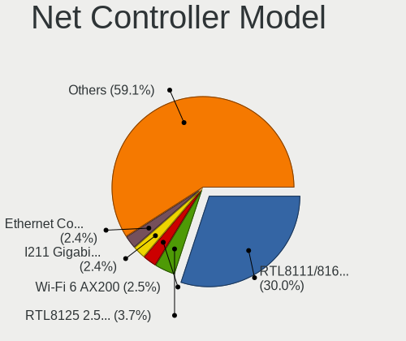

| Model                                                             | Desktops | Percent |
|-------------------------------------------------------------------|----------|---------|
| Realtek RTL8111/8168/8411 PCI Express Gigabit Ethernet Controller | 1779     | 31.53%  |
| Realtek RTL8125 2.5GbE Controller                                 | 154      | 2.73%   |
| Intel I211 Gigabit Network Connection                             | 144      | 2.55%   |
| Intel Ethernet Connection (2) I219-V                              | 137      | 2.43%   |
| Intel 82579LM Gigabit Network Connection (Lewisville)             | 135      | 2.39%   |
| Intel Wi-Fi 6 AX200                                               | 134      | 2.37%   |
| Intel Ethernet Connection I217-LM                                 | 92       | 1.63%   |
| Intel 82579V Gigabit Network Connection                           | 81       | 1.44%   |
| Intel Ethernet Connection (7) I219-V                              | 70       | 1.24%   |
| Realtek RTL810xE PCI Express Fast Ethernet controller             | 61       | 1.08%   |
| Intel Ethernet Controller I225-V                                  | 57       | 1.01%   |
| Qualcomm Atheros Killer E220x Gigabit Ethernet Controller         | 56       | 0.99%   |
| Nvidia MCP61 Ethernet                                             | 56       | 0.99%   |
| Intel Ethernet Connection (2) I218-V                              | 56       | 0.99%   |
| Intel Ethernet Connection (2) I219-LM                             | 54       | 0.96%   |
| Realtek RTL-8100/8101L/8139 PCI Fast Ethernet Adapter             | 50       | 0.89%   |
| Intel Ethernet Connection I217-V                                  | 46       | 0.82%   |
| Realtek RTL8188EUS 802.11n Wireless Network Adapter               | 43       | 0.76%   |
| Marvell Group 88E8056 PCI-E Gigabit Ethernet Controller           | 43       | 0.76%   |
| Intel Wireless-AC 9260                                            | 41       | 0.73%   |
| Intel 82574L Gigabit Network Connection                           | 40       | 0.71%   |
| Intel 82567LM-3 Gigabit Network Connection                        | 40       | 0.71%   |
| Realtek RTL88x2bu [AC1200 Techkey]                                | 39       | 0.69%   |
| Intel Dual Band Wireless-AC 3168NGW [Stone Peak]                  | 33       | 0.58%   |
| Realtek RTL8153 Gigabit Ethernet Adapter                          | 31       | 0.55%   |
| TP-Link TL-WN823N v2/v3 [Realtek RTL8192EU]                       | 30       | 0.53%   |
| Qualcomm Atheros AR8121/AR8113/AR8114 Gigabit or Fast Ethernet    | 30       | 0.53%   |
| Qualcomm Atheros AR9485 Wireless Network Adapter                  | 29       | 0.51%   |
| Qualcomm Atheros AR9287 Wireless Network Adapter (PCI-Express)    | 29       | 0.51%   |
| Intel I210 Gigabit Network Connection                             | 29       | 0.51%   |
| Qualcomm Atheros AR8151 v2.0 Gigabit Ethernet                     | 28       | 0.5%    |
| Realtek 802.11ac NIC                                              | 27       | 0.48%   |
| Intel Ethernet Connection (7) I219-LM                             | 27       | 0.48%   |
| Intel Cannon Lake PCH CNVi WiFi                                   | 27       | 0.48%   |
| Qualcomm Atheros AR9227 Wireless Network Adapter                  | 26       | 0.46%   |
| Intel Wireless 3165                                               | 26       | 0.46%   |
| Realtek RTL8192EE PCIe Wireless Network Adapter                   | 25       | 0.44%   |
| Ralink MT7601U Wireless Adapter                                   | 25       | 0.44%   |
| Intel Wi-Fi 6 AX210/AX211/AX411 160MHz                            | 25       | 0.44%   |
| Intel Wireless 7260                                               | 24       | 0.43%   |

Wireless Vendor
---------------

Wireless vendors

| Vendor                                | Desktops | Percent |
|---------------------------------------|----------|---------|
| Intel                                 | 411      | 27.22%  |
| Realtek Semiconductor                 | 390      | 25.83%  |
| Qualcomm Atheros                      | 183      | 12.12%  |
| TP-Link                               | 79       | 5.23%   |
| Ralink                                | 64       | 4.24%   |
| Ralink Technology                     | 62       | 4.11%   |
| NetGear                               | 58       | 3.84%   |
| Broadcom                              | 52       | 3.44%   |
| MediaTek                              | 28       | 1.85%   |
| Microsoft                             | 23       | 1.52%   |
| D-Link                                | 23       | 1.52%   |
| Belkin Components                     | 19       | 1.26%   |
| D-Link System                         | 18       | 1.19%   |
| Qualcomm Atheros Communications       | 17       | 1.13%   |
| Guillemot                             | 13       | 0.86%   |
| ASUSTek Computer                      | 11       | 0.73%   |
| Broadcom Limited                      | 10       | 0.66%   |
| Edimax Technology                     | 8        | 0.53%   |
| TRENDnet                              | 5        | 0.33%   |
| IMC Networks                          | 5        | 0.33%   |
| Sagem                                 | 4        | 0.26%   |
| Gemtek                                | 4        | 0.26%   |
| Tenda                                 | 3        | 0.2%    |
| Marvell Technology Group              | 3        | 0.2%    |
| ZyDAS                                 | 2        | 0.13%   |
| Toshiba                               | 2        | 0.13%   |
| Linksys                               | 2        | 0.13%   |
| Fujitsu Siemens Computers             | 2        | 0.13%   |
| Accton Technology                     | 2        | 0.13%   |
| Z-Com                                 | 1        | 0.07%   |
| Yoctopuce Sarl                        | 1        | 0.07%   |
| Wilocity                              | 1        | 0.07%   |
| Wacom                                 | 1        | 0.07%   |
| Micro Star International              | 1        | 0.07%   |
| BUFFALO                               | 1        | 0.07%   |
| 802.11g Adapter [Linksys WUSB54GC v3] | 1        | 0.07%   |

Wireless Model
--------------

Wireless models

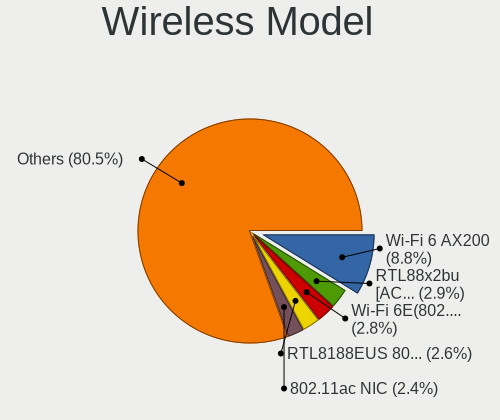

| Model                                                          | Desktops | Percent |
|----------------------------------------------------------------|----------|---------|
| Intel Wi-Fi 6 AX200                                            | 134      | 8.79%   |
| Realtek RTL8188EUS 802.11n Wireless Network Adapter            | 43       | 2.82%   |
| Intel Wireless-AC 9260                                         | 41       | 2.69%   |
| Realtek RTL88x2bu [AC1200 Techkey]                             | 39       | 2.56%   |
| Intel Dual Band Wireless-AC 3168NGW [Stone Peak]               | 33       | 2.17%   |
| TP-Link TL-WN823N v2/v3 [Realtek RTL8192EU]                    | 30       | 1.97%   |
| Qualcomm Atheros AR9485 Wireless Network Adapter               | 29       | 1.9%    |
| Qualcomm Atheros AR9287 Wireless Network Adapter (PCI-Express) | 29       | 1.9%    |
| Realtek 802.11ac NIC                                           | 27       | 1.77%   |
| Intel Cannon Lake PCH CNVi WiFi                                | 27       | 1.77%   |
| Qualcomm Atheros AR9227 Wireless Network Adapter               | 26       | 1.71%   |
| Intel Wireless 3165                                            | 26       | 1.71%   |
| Realtek RTL8192EE PCIe Wireless Network Adapter                | 25       | 1.64%   |
| Ralink MT7601U Wireless Adapter                                | 25       | 1.64%   |
| Intel Wi-Fi 6 AX210/AX211/AX411 160MHz                         | 25       | 1.64%   |
| Intel Wireless 7260                                            | 24       | 1.57%   |
| Realtek RTL8821CE 802.11ac PCIe Wireless Network Adapter       | 23       | 1.51%   |
| Realtek RTL8821AE 802.11ac PCIe Wireless Network Adapter       | 21       | 1.38%   |
| Realtek RTL8192EU 802.11b/g/n WLAN Adapter                     | 21       | 1.38%   |
| Realtek RTL8192CU 802.11n WLAN Adapter                         | 20       | 1.31%   |
| Intel Wireless 7265                                            | 20       | 1.31%   |
| Ralink RT3090 Wireless 802.11n 1T/1R PCIe                      | 19       | 1.25%   |
| Broadcom BCM4352 802.11ac Wireless Network Adapter             | 18       | 1.18%   |
| Realtek RTL8192CE PCIe Wireless Network Adapter                | 17       | 1.12%   |
| Realtek RTL8188EE Wireless Network Adapter                     | 16       | 1.05%   |
| Qualcomm Atheros QCA6174 802.11ac Wireless Network Adapter     | 16       | 1.05%   |
| Realtek RTL8812AE 802.11ac PCIe Wireless Network Adapter       | 15       | 0.98%   |
| Realtek RTL8188CUS 802.11n WLAN Adapter                        | 15       | 0.98%   |
| MediaTek MT7921K (RZ608) Wi-Fi 6E 80MHz                        | 15       | 0.98%   |
| Intel Wireless 8260                                            | 15       | 0.98%   |
| Realtek RTL8822BE 802.11a/b/g/n/ac WiFi adapter                | 14       | 0.92%   |
| Qualcomm Atheros AR9271 802.11n                                | 14       | 0.92%   |
| Broadcom BCM4360 802.11ac Wireless Network Adapter             | 14       | 0.92%   |
| Qualcomm Atheros AR5212/5213/2414 Wireless Network Adapter     | 13       | 0.85%   |
| NetGear A6210                                                  | 13       | 0.85%   |
| Realtek RTL8191SU 802.11n WLAN Adapter                         | 12       | 0.79%   |
| Qualcomm Atheros AR9462 Wireless Network Adapter               | 12       | 0.79%   |
| Qualcomm Atheros AR9285 Wireless Network Adapter (PCI-Express) | 12       | 0.79%   |
| NetGear WNA3100M(v1) Wireless-N 300 [Realtek RTL8192CU]        | 12       | 0.79%   |
| TP-Link Archer T3U [Realtek RTL8812BU]                         | 11       | 0.72%   |

Ethernet Vendor
---------------

Ethernet vendors

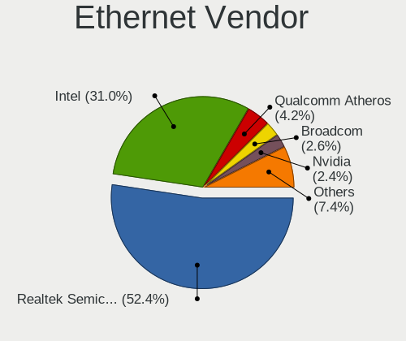

| Vendor                            | Desktops | Percent |
|-----------------------------------|----------|---------|
| Realtek Semiconductor             | 2053     | 52.24%  |
| Intel                             | 1171     | 29.8%   |
| Qualcomm Atheros                  | 189      | 4.81%   |
| Broadcom                          | 111      | 2.82%   |
| Nvidia                            | 110      | 2.8%    |
| Marvell Technology Group          | 71       | 1.81%   |
| Broadcom Limited                  | 28       | 0.71%   |
| Samsung Electronics               | 25       | 0.64%   |
| Aquantia                          | 23       | 0.59%   |
| VIA Technologies                  | 20       | 0.51%   |
| D-Link System                     | 19       | 0.48%   |
| ASIX Electronics                  | 15       | 0.38%   |
| Xiaomi                            | 12       | 0.31%   |
| Huawei Technologies               | 9        | 0.23%   |
| Google                            | 7        | 0.18%   |
| MediaTek                          | 6        | 0.15%   |
| Qualcomm                          | 5        | 0.13%   |
| OPPO Electronics                  | 5        | 0.13%   |
| 3Com                              | 5        | 0.13%   |
| OnePlus Technology (Shenzhen)     | 4        | 0.1%    |
| Motorola PCS                      | 4        | 0.1%    |
| JMicron Technology                | 4        | 0.1%    |
| Silicon Integrated Systems [SiS]  | 3        | 0.08%   |
| QLogic                            | 3        | 0.08%   |
| Mellanox Technologies             | 3        | 0.08%   |
| ICS Advent                        | 3        | 0.08%   |
| HTC (High Tech Computer)          | 3        | 0.08%   |
| DisplayLink                       | 2        | 0.05%   |
| Xilinx                            | 1        | 0.03%   |
| TP-Link                           | 1        | 0.03%   |
| Tehuti Networks                   | 1        | 0.03%   |
| Sundance Technology Inc / IC Plus | 1        | 0.03%   |
| Spreadtrum Communications         | 1        | 0.03%   |
| NetGear                           | 1        | 0.03%   |
| Netchip Technology                | 1        | 0.03%   |
| National Semiconductor            | 1        | 0.03%   |
| MYRICOM                           | 1        | 0.03%   |
| Linksys                           | 1        | 0.03%   |
| Lenovo                            | 1        | 0.03%   |
| Intellon                          | 1        | 0.03%   |

Ethernet Model
--------------

Ethernet models

| Model                                                             | Desktops | Percent |
|-------------------------------------------------------------------|----------|---------|
| Realtek RTL8111/8168/8411 PCI Express Gigabit Ethernet Controller | 1779     | 43.68%  |
| Realtek RTL8125 2.5GbE Controller                                 | 154      | 3.78%   |
| Intel I211 Gigabit Network Connection                             | 144      | 3.54%   |
| Intel Ethernet Connection (2) I219-V                              | 137      | 3.36%   |
| Intel 82579LM Gigabit Network Connection (Lewisville)             | 135      | 3.31%   |
| Intel Ethernet Connection I217-LM                                 | 92       | 2.26%   |
| Intel 82579V Gigabit Network Connection                           | 81       | 1.99%   |
| Intel Ethernet Connection (7) I219-V                              | 70       | 1.72%   |
| Realtek RTL810xE PCI Express Fast Ethernet controller             | 61       | 1.5%    |
| Intel Ethernet Controller I225-V                                  | 57       | 1.4%    |
| Qualcomm Atheros Killer E220x Gigabit Ethernet Controller         | 56       | 1.37%   |
| Nvidia MCP61 Ethernet                                             | 56       | 1.37%   |
| Intel Ethernet Connection (2) I218-V                              | 56       | 1.37%   |
| Intel Ethernet Connection (2) I219-LM                             | 54       | 1.33%   |
| Realtek RTL-8100/8101L/8139 PCI Fast Ethernet Adapter             | 50       | 1.23%   |
| Intel Ethernet Connection I217-V                                  | 46       | 1.13%   |
| Marvell Group 88E8056 PCI-E Gigabit Ethernet Controller           | 43       | 1.06%   |
| Intel 82574L Gigabit Network Connection                           | 40       | 0.98%   |
| Intel 82567LM-3 Gigabit Network Connection                        | 40       | 0.98%   |
| Realtek RTL8153 Gigabit Ethernet Adapter                          | 31       | 0.76%   |
| Qualcomm Atheros AR8121/AR8113/AR8114 Gigabit or Fast Ethernet    | 30       | 0.74%   |
| Intel I210 Gigabit Network Connection                             | 29       | 0.71%   |
| Qualcomm Atheros AR8151 v2.0 Gigabit Ethernet                     | 28       | 0.69%   |
| Intel Ethernet Connection (7) I219-LM                             | 27       | 0.66%   |
| Broadcom NetXtreme BCM5761 Gigabit Ethernet PCIe                  | 23       | 0.56%   |
| Samsung Galaxy series, misc. (tethering mode)                     | 21       | 0.52%   |
| Qualcomm Atheros AR8161 Gigabit Ethernet                          | 19       | 0.47%   |
| VIA VT6102/VT6103 [Rhine-II]                                      | 18       | 0.44%   |
| Intel Ethernet Connection (5) I219-LM                             | 17       | 0.42%   |
| D-Link System DGE-528T Gigabit Ethernet Adapter                   | 16       | 0.39%   |
| Broadcom NetXtreme BCM5754 Gigabit Ethernet PCI Express           | 16       | 0.39%   |
| Realtek RTL8169 PCI Gigabit Ethernet Controller                   | 14       | 0.34%   |
| Marvell Group 88E8001 Gigabit Ethernet Controller                 | 14       | 0.34%   |
| Realtek RTL-8110SC/8169SC Gigabit Ethernet                        | 13       | 0.32%   |
| Qualcomm Atheros Killer E2400 Gigabit Ethernet Controller         | 13       | 0.32%   |
| Intel 82566DM-2 Gigabit Network Connection                        | 13       | 0.32%   |
| ASIX AX88179 Gigabit Ethernet                                     | 13       | 0.32%   |
| Qualcomm Atheros AR8131 Gigabit Ethernet                          | 12       | 0.29%   |
| Nvidia MCP77 Ethernet                                             | 12       | 0.29%   |
| Broadcom NetXtreme BCM5764M Gigabit Ethernet PCIe                 | 12       | 0.29%   |

Net Controller Kind
-------------------

Ethernet, WiFi or modem

| Kind     | Desktops | Percent |
|----------|----------|---------|
| Ethernet | 3622     | 71.22%  |
| WiFi     | 1419     | 27.9%   |
| Modem    | 36       | 0.71%   |
| Unknown  | 9        | 0.18%   |

Used Controller
---------------

Currently used network controller

| Kind     | Desktops | Percent |
|----------|----------|---------|
| Ethernet | 3048     | 80.11%  |
| WiFi     | 757      | 19.89%  |

NICs
----

Total network controllers on board

| Total | Desktops | Percent |
|-------|----------|---------|
| 1     | 2433     | 66.1%   |
| 2     | 1081     | 29.37%  |
| 3     | 111      | 3.02%   |
| 0     | 25       | 0.68%   |
| 4     | 17       | 0.46%   |
| 5     | 7        | 0.19%   |
| 7     | 3        | 0.08%   |
| 6     | 2        | 0.05%   |
| 9     | 1        | 0.03%   |
| 8     | 1        | 0.03%   |

IPv6
----

IPv6 vs IPv4

| Used | Desktops | Percent |
|------|----------|---------|
| No   | 2253     | 59.86%  |
| Yes  | 1511     | 40.14%  |

Bluetooth
---------

Bluetooth Vendor
----------------

Controller vendors

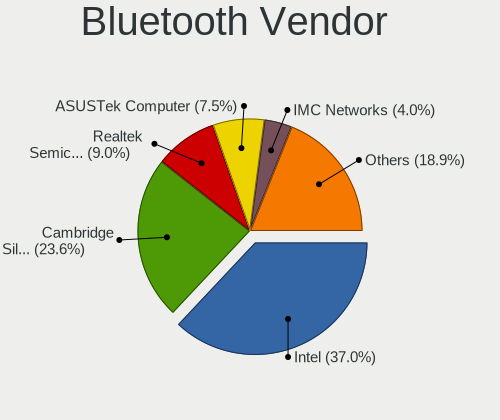

| Vendor                          | Desktops | Percent |
|---------------------------------|----------|---------|
| Intel                           | 365      | 36.54%  |
| Cambridge Silicon Radio         | 279      | 27.93%  |
| ASUSTek Computer                | 80       | 8.01%   |
| Realtek Semiconductor           | 69       | 6.91%   |
| Broadcom                        | 41       | 4.1%    |
| IMC Networks                    | 36       | 3.6%    |
| Qualcomm Atheros Communications | 27       | 2.7%    |
| Belkin Components               | 20       | 2%      |
| TP-Link                         | 18       | 1.8%    |
| MediaTek                        | 16       | 1.6%    |
| Apple                           | 12       | 1.2%    |
| Lite-On Technology              | 6        | 0.6%    |
| Foxconn / Hon Hai               | 6        | 0.6%    |
| Integrated System Solution      | 5        | 0.5%    |
| HTC (High Tech Computer)        | 3        | 0.3%    |
| Realtek                         | 2        | 0.2%    |
| TRENDnet                        | 1        | 0.1%    |
| Toshiba                         | 1        | 0.1%    |
| Roper                           | 1        | 0.1%    |
| Micro Star International        | 1        | 0.1%    |
| Logitech                        | 1        | 0.1%    |
| Kensington                      | 1        | 0.1%    |
| Fujitsu                         | 1        | 0.1%    |
| Edimax Technology               | 1        | 0.1%    |
| Dell                            | 1        | 0.1%    |
| D-Link System                   | 1        | 0.1%    |
| D-Link                          | 1        | 0.1%    |
| Creative Technology             | 1        | 0.1%    |
| Conwise Technology              | 1        | 0.1%    |
| Com One                         | 1        | 0.1%    |

Bluetooth Model
---------------

Controller models

| Model                                                                | Desktops | Percent |
|----------------------------------------------------------------------|----------|---------|
| Cambridge Silicon Radio Bluetooth Dongle (HCI mode)                  | 279      | 27.93%  |
| Intel AX200 Bluetooth                                                | 119      | 11.91%  |
| Intel Bluetooth wireless interface                                   | 85       | 8.51%   |
| Realtek Bluetooth Radio                                              | 56       | 5.61%   |
| Intel Wireless-AC 9260 Bluetooth Adapter                             | 40       | 4%      |
| Intel Bluetooth Device                                               | 37       | 3.7%    |
| Intel Bluetooth 9460/9560 Jefferson Peak (JfP)                       | 32       | 3.2%    |
| ASUS Broadcom BCM20702A0 Bluetooth                                   | 24       | 2.4%    |
| Intel AX210 Bluetooth                                                | 23       | 2.3%    |
| Broadcom BCM20702A0 Bluetooth 4.0                                    | 23       | 2.3%    |
| IMC Networks Bluetooth Radio                                         | 22       | 2.2%    |
| Intel AX201 Bluetooth                                                | 21       | 2.1%    |
| TP-Link UB5A Adapter                                                 | 18       | 1.8%    |
| MediaTek Wireless_Device                                             | 16       | 1.6%    |
| Qualcomm Atheros AR3011 Bluetooth                                    | 14       | 1.4%    |
| Realtek  Bluetooth 4.2 Adapter                                       | 13       | 1.3%    |
| ASUS Qualcomm Bluetooth 4.1                                          | 13       | 1.3%    |
| ASUS Bluetooth Radio                                                 | 11       | 1.1%    |
| Belkin Components F8T065BF Mini Bluetooth 4.0 Adapter                | 10       | 1%      |
| ASUS Bluetooth Adapter                                               | 10       | 1%      |
| ASUS ASUS USB-BT500                                                  | 10       | 1%      |
| ASUS BCM20702A0                                                      | 8        | 0.8%    |
| Belkin Components Bluetooth Mini Dongle                              | 7        | 0.7%    |
| Intel Centrino Bluetooth Wireless Transceiver                        | 6        | 0.6%    |
| IMC Networks Bluetooth Device                                        | 6        | 0.6%    |
| Qualcomm Atheros  Bluetooth Device                                   | 4        | 0.4%    |
| Qualcomm Atheros QCA61x4 Bluetooth 4.0                               | 4        | 0.4%    |
| Qualcomm Atheros Bluetooth USB Host Controller                       | 4        | 0.4%    |
| Broadcom BCM2045 Bluetooth                                           | 4        | 0.4%    |
| Apple Built-in Bluetooth 2.0+EDR HCI                                 | 4        | 0.4%    |
| Integrated System Solution Bluetooth Device                          | 3        | 0.3%    |
| IMC Networks Wireless_Device                                         | 3        | 0.3%    |
| IMC Networks BCM20702A0                                              | 3        | 0.3%    |
| HTC (High Tech Computer) Vive Hub Bluetooth 4.1 (Broadcom BCM920703) | 3        | 0.3%    |
| Broadcom BCM92046DG-CL1ROM Bluetooth 2.1 Adapter                     | 3        | 0.3%    |
| Apple Bluetooth Host Controller                                      | 3        | 0.3%    |
| Apple Bluetooth HCI                                                  | 3        | 0.3%    |
| Realtek Bluetooth Radio                                              | 2        | 0.2%    |
| Lite-On Qualcomm Atheros QCA9377 Bluetooth                           | 2        | 0.2%    |
| Intel Centrino Advanced-N 6230 Bluetooth adapter                     | 2        | 0.2%    |

Sound
-----

Sound Vendor
------------

Sound card vendors

| Vendor                           | Desktops | Percent |
|----------------------------------|----------|---------|
| Intel                            | 2331     | 37.24%  |
| Nvidia                           | 1605     | 25.64%  |
| AMD                              | 1415     | 22.61%  |
| C-Media Electronics              | 154      | 2.46%   |
| Logitech                         | 87       | 1.39%   |
| Creative Labs                    | 85       | 1.36%   |
| VIA Technologies                 | 36       | 0.58%   |
| Texas Instruments                | 36       | 0.58%   |
| Kingston Technology              | 33       | 0.53%   |
| Corsair                          | 31       | 0.5%    |
| GN Netcom                        | 29       | 0.46%   |
| Focusrite-Novation               | 28       | 0.45%   |
| JMTek                            | 21       | 0.34%   |
| Generalplus Technology           | 21       | 0.34%   |
| SteelSeries ApS                  | 20       | 0.32%   |
| Razer USA                        | 20       | 0.32%   |
| ASUSTek Computer                 | 18       | 0.29%   |
| Sennheiser Communications        | 17       | 0.27%   |
| Plantronics                      | 16       | 0.26%   |
| XMOS                             | 11       | 0.18%   |
| M-Audio                          | 11       | 0.18%   |
| Creative Technology              | 11       | 0.18%   |
| Silicon Integrated Systems [SiS] | 8        | 0.13%   |
| Ensoniq                          | 8        | 0.13%   |
| Tenx Technology                  | 7        | 0.11%   |
| Micro Star International         | 7        | 0.11%   |
| BEHRINGER International          | 7        | 0.11%   |
| Yamaha                           | 6        | 0.1%    |
| Turtle Beach                     | 6        | 0.1%    |
| Sony                             | 6        | 0.1%    |
| RODE Microphones                 | 6        | 0.1%    |
| GYROCOM C&C                      | 6        | 0.1%    |
| PreSonus Audio Electronics       | 5        | 0.08%   |
| AKAI Professional M.I.           | 5        | 0.08%   |
| Realtek Semiconductor            | 4        | 0.06%   |
| Medeli Electronics               | 4        | 0.06%   |
| KTMicro                          | 4        | 0.06%   |
| Hewlett-Packard                  | 4        | 0.06%   |
| FiiO Electronics Technology      | 4        | 0.06%   |
| Dell                             | 4        | 0.06%   |

Sound Model
-----------

Sound card models

| Model                                                                             | Desktops | Percent |
|-----------------------------------------------------------------------------------|----------|---------|
| Intel 8 Series/C220 Series Chipset High Definition Audio Controller               | 337      | 4.72%   |
| Intel 6 Series/C200 Series Chipset Family High Definition Audio Controller        | 294      | 4.12%   |
| AMD Starship/Matisse HD Audio Controller                                          | 291      | 4.08%   |
| Intel Xeon E3-1200 v3/4th Gen Core Processor HD Audio Controller                  | 235      | 3.29%   |
| AMD SBx00 Azalia (Intel HDA)                                                      | 235      | 3.29%   |
| Intel 100 Series/C230 Series Chipset Family HD Audio Controller                   | 206      | 2.89%   |
| Intel 7 Series/C216 Chipset Family High Definition Audio Controller               | 202      | 2.83%   |
| AMD Family 17h (Models 00h-0fh) HD Audio Controller                               | 179      | 2.51%   |
| Intel NM10/ICH7 Family High Definition Audio Controller                           | 174      | 2.44%   |
| Nvidia GK208 HDMI/DP Audio Controller                                             | 163      | 2.28%   |
| Intel 200 Series PCH HD Audio                                                     | 162      | 2.27%   |
| AMD Family 17h/19h HD Audio Controller                                            | 150      | 2.1%    |
| Nvidia GP107GL High Definition Audio Controller                                   | 146      | 2.05%   |
| Intel Cannon Lake PCH cAVS                                                        | 137      | 1.92%   |
| Intel 9 Series Chipset Family HD Audio Controller                                 | 116      | 1.63%   |
| Intel 82801JI (ICH10 Family) HD Audio Controller                                  | 112      | 1.57%   |
| AMD FCH Azalia Controller                                                         | 112      | 1.57%   |
| Nvidia High Definition Audio Controller                                           | 108      | 1.51%   |
| AMD Ellesmere HDMI Audio [Radeon RX 470/480 / 570/580/590]                        | 108      | 1.51%   |
| Nvidia GP106 High Definition Audio Controller                                     | 84       | 1.18%   |
| Intel 5 Series/3400 Series Chipset High Definition Audio                          | 82       | 1.15%   |
| AMD Oland/Hainan/Cape Verde/Pitcairn HDMI Audio [Radeon HD 7000 Series]           | 82       | 1.15%   |
| AMD Navi 21/23 HDMI/DP Audio Controller                                           | 76       | 1.06%   |
| Nvidia GP104 High Definition Audio Controller                                     | 75       | 1.05%   |
| Nvidia GF119 HDMI Audio Controller                                                | 74       | 1.04%   |
| Intel 82801I (ICH9 Family) HD Audio Controller                                    | 73       | 1.02%   |
| Nvidia MCP61 High Definition Audio                                                | 72       | 1.01%   |
| AMD Raven/Raven2/Fenghuang HDMI/DP Audio Controller                               | 68       | 0.95%   |
| Nvidia GF108 High Definition Audio Controller                                     | 63       | 0.88%   |
| Nvidia GM107 High Definition Audio Controller [GeForce 940MX]                     | 62       | 0.87%   |
| Nvidia GK104 HDMI Audio Controller                                                | 61       | 0.85%   |
| AMD Renoir Radeon High Definition Audio Controller                                | 61       | 0.85%   |
| Nvidia TU116 High Definition Audio Controller                                     | 60       | 0.84%   |
| Nvidia GM204 High Definition Audio Controller                                     | 59       | 0.83%   |
| Nvidia GM206 High Definition Audio Controller                                     | 58       | 0.81%   |
| AMD Cedar HDMI Audio [Radeon HD 5400/6300/7300 Series]                            | 58       | 0.81%   |
| Nvidia TU106 High Definition Audio Controller                                     | 56       | 0.78%   |
| Nvidia GP108 High Definition Audio Controller                                     | 56       | 0.78%   |
| AMD Caicos HDMI Audio [Radeon HD 6450 / 7450/8450/8490 OEM / R5 230/235/235X OEM] | 56       | 0.78%   |
| Nvidia GK107 HDMI Audio Controller                                                | 54       | 0.76%   |

Memory
------

Memory Vendor
-------------

Memory module vendors

| Vendor              | Desktops | Percent |
|---------------------|----------|---------|
| Unknown             | 419      | 15.18%  |
| Corsair             | 409      | 14.82%  |
| Kingston            | 406      | 14.71%  |
| G.Skill             | 290      | 10.51%  |
| Samsung Electronics | 284      | 10.29%  |
| SK hynix            | 262      | 9.49%   |
| Crucial             | 251      | 9.09%   |
| Micron Technology   | 155      | 5.62%   |
| Nanya Technology    | 42       | 1.52%   |
| Ramaxel Technology  | 25       | 0.91%   |
| Elpida              | 25       | 0.91%   |
| Transcend           | 23       | 0.83%   |
| A-DATA Technology   | 18       | 0.65%   |
| Unknown             | 15       | 0.54%   |
| Unknown (ABCD)      | 14       | 0.51%   |
| Team                | 14       | 0.51%   |
| Unifosa             | 13       | 0.47%   |
| PNY                 | 13       | 0.47%   |
| Patriot             | 13       | 0.47%   |
| Unknown (0x0C97)    | 6        | 0.22%   |
| Timetec             | 5        | 0.18%   |
| Qimonda             | 5        | 0.18%   |
| TEXTORM             | 3        | 0.11%   |
| OCZ                 | 3        | 0.11%   |
| Innodisk            | 3        | 0.11%   |
| Hewlett-Packard     | 3        | 0.11%   |
| ASint Technology    | 3        | 0.11%   |
| Toshiba             | 2        | 0.07%   |
| Swissbit            | 2        | 0.07%   |
| Ramos Technology    | 2        | 0.07%   |
| Lexar               | 2        | 0.07%   |
| Kllisre             | 2        | 0.07%   |
| Wodposit            | 1        | 0.04%   |
| Unknown (F301)      | 1        | 0.04%   |
| Unknown (AB)        | 1        | 0.04%   |
| Unknown (0x0C26)    | 1        | 0.04%   |
| Unknown (07FB)      | 1        | 0.04%   |
| Thermaltake         | 1        | 0.04%   |
| Texas_Instrument    | 1        | 0.04%   |
| TakeMS              | 1        | 0.04%   |

Memory Model
------------

Memory module models

| Model                                                          | Desktops | Percent |
|----------------------------------------------------------------|----------|---------|
| Corsair RAM CMK16GX4M2B3200C16 8GB DIMM DDR4 3600MT/s          | 40       | 1.32%   |
| Kingston RAM KHX1600C9D3/4GX 4GB DIMM DDR3 1600MT/s            | 23       | 0.76%   |
| G.Skill RAM F3-12800CL9-4GBXL 4GB DIMM DDR3 1867MT/s           | 21       | 0.69%   |
| SK hynix RAM HMT351U6CFR8C-PB 4GB DIMM DDR3 1800MT/s           | 18       | 0.59%   |
| Unknown RAM Module 2GB DIMM DDR2 800MT/s                       | 16       | 0.53%   |
| Samsung RAM M378B5173DB0-CK0 4GB DIMM DDR3 1600MT/s            | 16       | 0.53%   |
| Corsair RAM CMK16GX4M2B3000C15 8GB DIMM DDR4 3533MT/s          | 16       | 0.53%   |
| Unknown RAM Module 4GB DIMM 1333MT/s                           | 15       | 0.5%    |
| Corsair RAM CMK16GX4M2E3200C16 8GB DIMM DDR4 3200MT/s          | 15       | 0.5%    |
| Unknown                                                        | 15       | 0.5%    |
| Unknown (ABCD) RAM 123456789012345678 2GB DIMM LPDDR4 2400MT/s | 14       | 0.46%   |
| Micron RAM 8JTF51264AZ-1G6E1 4GB DIMM DDR3 1600MT/s            | 14       | 0.46%   |
| Kingston RAM KHX2666C16/8G 8GB DIMM DDR4 3466MT/s              | 14       | 0.46%   |
| Kingston RAM KHX1600C10D3/8G 4GB DIMM DDR3 1600MT/s            | 14       | 0.46%   |
| Corsair RAM CMZ8GX3M2A1600C9 4096MB DIMM DDR3 1800MT/s         | 13       | 0.43%   |
| Unknown RAM Module 4096MB DIMM 1333MT/s                        | 12       | 0.4%    |
| SK hynix RAM HMA41GU6AFR8N-TF 8GB DIMM DDR4 2465MT/s           | 12       | 0.4%    |
| Samsung RAM M378B5173QH0-CK0 4GB DIMM DDR3 1600MT/s            | 12       | 0.4%    |
| G.Skill RAM F4-3000C16-8GISB 8GB DIMM DDR4 3200MT/s            | 12       | 0.4%    |
| Corsair RAM CMK32GX4M2E3200C16 16GB DIMM DDR4 3534MT/s         | 12       | 0.4%    |
| Unknown RAM Module 2GB DIMM 1333MT/s                           | 11       | 0.36%   |
| Unknown RAM Module 2048MB DIMM 1333MT/s                        | 11       | 0.36%   |
| Kingston RAM KHX1866C10D3/8G 8GB DIMM DDR3 2133MT/s            | 11       | 0.36%   |
| Corsair RAM CMV4GX3M1A1333C9 4GB DIMM DDR3 1600MT/s            | 11       | 0.36%   |
| Unknown RAM Module 2048MB DIMM DDR2 800MT/s                    | 10       | 0.33%   |
| SK hynix RAM HMT451U6BFR8A-PB 4GB DIMM DDR3 1648MT/s           | 10       | 0.33%   |
| Samsung RAM M378B5273CH0-CK0 4GB DIMM DDR3 2000MT/s            | 10       | 0.33%   |
| Kingston RAM KHX2400C15/8G 8GB DIMM DDR4 3400MT/s              | 10       | 0.33%   |
| Kingston RAM KHX2133C14D4/4G 4GB DIMM DDR4 2933MT/s            | 10       | 0.33%   |
| G.Skill RAM F4-3200C16-8GVKB 8192MB DIMM DDR4 3866MT/s         | 10       | 0.33%   |
| Corsair RAM CMK16GX4M2A2666C16 8GB DIMM DDR4 3400MT/s          | 10       | 0.33%   |
| Unknown RAM Module 2GB DIMM 800MT/s                            | 9        | 0.3%    |
| Unknown RAM Module 1024MB DIMM SDRAM                           | 9        | 0.3%    |
| SK hynix RAM HMA81GU6AFR8N-UH 8192MB DIMM DDR4 2400MT/s        | 9        | 0.3%    |
| Samsung RAM M378B5273DH0-CH9 4GB DIMM DDR3 2133MT/s            | 9        | 0.3%    |
| Samsung RAM M378B5173EB0-YK0 4GB DIMM DDR3 1600MT/s            | 9        | 0.3%    |
| Kingston RAM KHX1600C10D3/4G 4GB DIMM DDR3 1600MT/s            | 9        | 0.3%    |
| Kingston RAM 99U5584-005.A00LF 4GB DIMM DDR3 1600MT/s          | 9        | 0.3%    |
| G.Skill RAM F4-3200C16-16GVK 16384MB DIMM DDR4 3600MT/s        | 9        | 0.3%    |
| Corsair RAM CMK16GX4M2Z3200C16 8GB DIMM DDR4 3200MT/s          | 9        | 0.3%    |

Memory Kind
-----------

Memory module kinds

| Kind    | Desktops | Percent |
|---------|----------|---------|
| DDR4    | 965      | 39.47%  |
| DDR3    | 927      | 37.91%  |
| DDR2    | 177      | 7.24%   |
| Unknown | 152      | 6.22%   |
| SDRAM   | 139      | 5.69%   |
| DDR     | 47       | 1.92%   |
| LPDDR4  | 18       | 0.74%   |
| DDR5    | 13       | 0.53%   |
| DRAM    | 5        | 0.2%    |
| RAM     | 1        | 0.04%   |
| LPDDR3  | 1        | 0.04%   |

Memory Form Factor
------------------

Physical design of the memory module

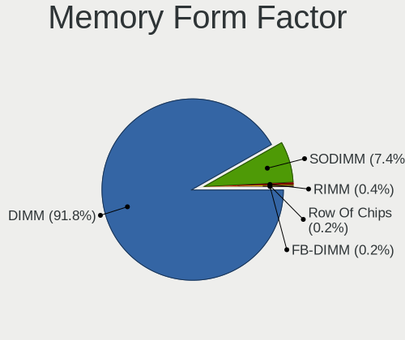

| Name         | Desktops | Percent |
|--------------|----------|---------|
| DIMM         | 2234     | 93.59%  |
| SODIMM       | 133      | 5.57%   |
| RIMM         | 11       | 0.46%   |
| FB-DIMM      | 7        | 0.29%   |
| Row Of Chips | 2        | 0.08%   |

Memory Size
-----------

Memory module size

| Size  | Desktops | Percent |
|-------|----------|---------|
| 8192  | 907      | 33.92%  |
| 4096  | 781      | 29.21%  |
| 2048  | 449      | 16.79%  |
| 16384 | 298      | 11.14%  |
| 1024  | 169      | 6.32%   |
| 32768 | 39       | 1.46%   |
| 512   | 29       | 1.08%   |
| 256   | 2        | 0.07%   |

Memory Speed
------------

Memory module speed

| Speed   | Desktops | Percent |
|---------|----------|---------|
| 1600    | 494      | 18.36%  |
| 1333    | 316      | 11.74%  |
| 3200    | 201      | 7.47%   |
| 2400    | 167      | 6.21%   |
| 3600    | 134      | 4.98%   |
| 2667    | 134      | 4.98%   |
| 2133    | 133      | 4.94%   |
| 800     | 131      | 4.87%   |
| 667     | 84       | 3.12%   |
| 1867    | 77       | 2.86%   |
| 1066    | 62       | 2.3%    |
| 1800    | 57       | 2.12%   |
| Unknown | 54       | 2.01%   |
| 1866    | 49       | 1.82%   |
| 3000    | 47       | 1.75%   |
| 2666    | 41       | 1.52%   |
| 2933    | 40       | 1.49%   |
| 3400    | 39       | 1.45%   |
| 400     | 24       | 0.89%   |
| 2800    | 23       | 0.85%   |
| 1067    | 22       | 0.82%   |
| 2048    | 20       | 0.74%   |
| 3800    | 18       | 0.67%   |
| 3733    | 18       | 0.67%   |
| 3533    | 18       | 0.67%   |
| 533     | 18       | 0.67%   |
| 3466    | 17       | 0.63%   |
| 3666    | 15       | 0.56%   |
| 3266    | 14       | 0.52%   |
| 2000    | 14       | 0.52%   |
| 3534    | 12       | 0.45%   |
| 2465    | 12       | 0.45%   |
| 1334    | 11       | 0.41%   |
| 3866    | 10       | 0.37%   |
| 1648    | 10       | 0.37%   |
| 1639    | 10       | 0.37%   |
| 333     | 10       | 0.37%   |
| 3100    | 9        | 0.33%   |
| 2733    | 9        | 0.33%   |
| 1331    | 8        | 0.3%    |

Printers & scanners
-------------------

Printer Vendor
--------------

Printer device vendors

| Vendor                | Desktops | Percent |
|-----------------------|----------|---------|
| Hewlett-Packard       | 98       | 43.75%  |
| Brother Industries    | 39       | 17.41%  |
| Canon                 | 31       | 13.84%  |
| Samsung Electronics   | 30       | 13.39%  |
| Seiko Epson           | 14       | 6.25%   |
| Prolific Technology   | 3        | 1.34%   |
| Ricoh                 | 2        | 0.89%   |
| Lexmark International | 2        | 0.89%   |
| Xerox                 | 1        | 0.45%   |
| STMicroelectronics    | 1        | 0.45%   |
| QinHeng Electronics   | 1        | 0.45%   |
| Kyocera               | 1        | 0.45%   |
| Apple                 | 1        | 0.45%   |

Printer Model
-------------

Printer device models

| Model                                | Desktops | Percent |
|--------------------------------------|----------|---------|
| Samsung M2070 Series                 | 8        | 3.56%   |
| HP ENVY 4520 series                  | 8        | 3.56%   |
| HP DeskJet 3630 series               | 6        | 2.67%   |
| HP DeskJet 2700 series               | 6        | 2.67%   |
| HP ENVY Photo 6200 series            | 5        | 2.22%   |
| HP DeskJet 2600 series               | 5        | 2.22%   |
| HP OfficeJet 3830 series             | 4        | 1.78%   |
| HP ENVY 5000 series                  | 4        | 1.78%   |
| HP DeskJet 3700 series               | 4        | 1.78%   |
| Canon PIXMA MG3600 Series            | 4        | 1.78%   |
| Brother HL-2030 Laser Printer        | 4        | 1.78%   |
| Seiko Epson XP-240 Series            | 3        | 1.33%   |
| Samsung ML-1640 Series Laser Printer | 3        | 1.33%   |
| Samsung CLX-3170 Series              | 3        | 1.33%   |
| Prolific PL2305 Parallel Port        | 3        | 1.33%   |
| HP DeskJet Plus 4100 series          | 3        | 1.33%   |
| HP DeskJet F4200 series              | 3        | 1.33%   |
| HP Deskjet 3050A                     | 3        | 1.33%   |
| Brother Printer                      | 3        | 1.33%   |
| Brother DCP-7055 scanner/printer     | 3        | 1.33%   |
| Seiko Epson XP-2100 Series           | 2        | 0.89%   |
| Samsung SCX-3400 Series              | 2        | 0.89%   |
| Samsung ML-1660 Series               | 2        | 0.89%   |
| Samsung ML-1630 Series               | 2        | 0.89%   |
| Samsung M2020 Series                 | 2        | 0.89%   |
| Samsung CLX-3180 Series              | 2        | 0.89%   |
| HP LaserJet 1200                     | 2        | 0.89%   |
| HP ENVY 5540 series                  | 2        | 0.89%   |
| HP DeskJet 5550                      | 2        | 0.89%   |
| HP Deskjet 3070 B611 series          | 2        | 0.89%   |
| HP DeskJet 2130 series               | 2        | 0.89%   |
| HP Deskjet 1510                      | 2        | 0.89%   |
| Canon TS5100 series                  | 2        | 0.89%   |
| Canon LiDE 400                       | 2        | 0.89%   |
| Canon iP7200 series                  | 2        | 0.89%   |
| Brother MFC-L2710DW series           | 2        | 0.89%   |
| Brother MFC-9330CDW                  | 2        | 0.89%   |
| Brother HL-L2375DW series            | 2        | 0.89%   |
| Brother HL-L2350DW series            | 2        | 0.89%   |
| Xerox ColorQube 8580DN               | 1        | 0.44%   |

Scanner Vendor
--------------

Scanner device vendors

| Vendor          | Desktops | Percent |
|-----------------|----------|---------|
| Canon           | 51       | 63.75%  |
| Seiko Epson     | 18       | 22.5%   |
| Hewlett-Packard | 7        | 8.75%   |
| AGFA-Gevaert NV | 4        | 5%      |

Scanner Model
-------------

Scanner device models

| Model                                                         | Desktops | Percent |
|---------------------------------------------------------------|----------|---------|
| Canon CanoScan N670U/N676U/LiDE 20                            | 8        | 10%     |
| Canon CanoScan N1240U/LiDE 30                                 | 8        | 10%     |
| Canon CanoScan LiDE 110                                       | 7        | 8.75%   |
| Canon CanoScan LIDE 25                                        | 6        | 7.5%    |
| Seiko Epson GT-X770 [Perfection V500]                         | 4        | 5%      |
| Canon CanoScan LiDE 60                                        | 3        | 3.75%   |
| Canon CanoScan LiDE 50/LiDE 35/LiDE 40                        | 3        | 3.75%   |
| Canon CanoScan LiDE 200                                       | 3        | 3.75%   |
| AGFA-Gevaert NV SnapScan e20                                  | 3        | 3.75%   |
| Seiko Epson GT-F730 [GT-S630/Perfection V33/V330 Photo]       | 2        | 2.5%    |
| Seiko Epson GT-F700 [Perfection V350]                         | 2        | 2.5%    |
| Seiko Epson GT-9800F [Perfection 3200]                        | 2        | 2.5%    |
| Seiko Epson GT-6600U [Perfection 610]                         | 2        | 2.5%    |
| Canon CanoScan LiDE 220                                       | 2        | 2.5%    |
| Canon CanoScan LiDE 210                                       | 2        | 2.5%    |
| Canon CanoScan LiDE 120                                       | 2        | 2.5%    |
| Canon CanoScan 4200F                                          | 2        | 2.5%    |
| Seiko Epson GT-F720 [GT-S620/Perfection V30/V300 Photo]       | 1        | 1.25%   |
| Seiko Epson GT-F650 [GT-S600/Perfection V10/V100]             | 1        | 1.25%   |
| Seiko Epson GT-F600 [Perfection 4180]                         | 1        | 1.25%   |
| Seiko Epson GT-8700/GT-8700F [Perfection 1640SU/1640SU PHOTO] | 1        | 1.25%   |
| Seiko Epson GT-8400UF [Perfection 1670/1670 PHOTO]            | 1        | 1.25%   |
| Seiko Epson GT-8200U/GT-8200UF [Perfection 1650/1650 PHOTO]   | 1        | 1.25%   |
| HP ScanJet G4010                                              | 1        | 1.25%   |
| HP ScanJet 5200c                                              | 1        | 1.25%   |
| HP ScanJet 4570c                                              | 1        | 1.25%   |
| HP ScanJet 3570c                                              | 1        | 1.25%   |
| HP ScanJet 3500c                                              | 1        | 1.25%   |
| HP ScanJet 2300c                                              | 1        | 1.25%   |
| HP PSC 1200                                                   | 1        | 1.25%   |
| Canon CanoScan N650U/N656U                                    | 1        | 1.25%   |
| Canon CanoScan LiDE 70                                        | 1        | 1.25%   |
| Canon CanoScan LiDE 100                                       | 1        | 1.25%   |
| Canon CanoScan 9000F Mark II                                  | 1        | 1.25%   |
| Canon CanoScan 4400F                                          | 1        | 1.25%   |
| AGFA-Gevaert NV SnapScan 1212U (?)                            | 1        | 1.25%   |

Camera
------

Camera Vendor
-------------

Camera device vendors

| Vendor                        | Desktops | Percent |
|-------------------------------|----------|---------|
| Logitech                      | 303      | 45.16%  |
| Microdia                      | 43       | 6.41%   |
| Microsoft                     | 41       | 6.11%   |
| Samsung Electronics           | 30       | 4.47%   |
| Sunplus Innovation Technology | 25       | 3.73%   |
| Guillemot                     | 22       | 3.28%   |
| Chicony Electronics           | 16       | 2.38%   |
| ARC International             | 14       | 2.09%   |
| Creative Technology           | 13       | 1.94%   |
| Apple                         | 13       | 1.94%   |
| Realtek Semiconductor         | 12       | 1.79%   |
| Generalplus Technology        | 11       | 1.64%   |
| Sonix Technology              | 10       | 1.49%   |
| Hewlett-Packard               | 9        | 1.34%   |
| KYE Systems (Mouse Systems)   | 8        | 1.19%   |
| GEMBIRD                       | 8        | 1.19%   |
| Cubeternet                    | 6        | 0.89%   |
| 2M UVC CAMERA                 | 6        | 0.89%   |
| Z-Star Microelectronics       | 5        | 0.75%   |
| WaveRider Communications      | 5        | 0.75%   |
| Sunplus IT                    | 5        | 0.75%   |
| AVerMedia Technologies        | 5        | 0.75%   |
| Arkmicro Technologies         | 4        | 0.6%    |
| Trust                         | 3        | 0.45%   |
| Jieli Technology              | 3        | 0.45%   |
| Huawei Technologies           | 3        | 0.45%   |
| Xiongmai                      | 2        | 0.3%    |
| Syntek                        | 2        | 0.3%    |
| Razer USA                     | 2        | 0.3%    |
| Philips (or NXP)              | 2        | 0.3%    |
| Novatek Microelectronics      | 2        | 0.3%    |
| MacroSilicon                  | 2        | 0.3%    |
| IMC Networks                  | 2        | 0.3%    |
| Genesys Logic                 | 2        | 0.3%    |
| Alcor Micro                   | 2        | 0.3%    |
| YGTek                         | 1        | 0.15%   |
| Yealink Network Technology    | 1        | 0.15%   |
| Xiaomi                        | 1        | 0.15%   |
| WCM_USB                       | 1        | 0.15%   |
| ViewSonic                     | 1        | 0.15%   |

Camera Model
------------

Camera device models

| Model                                             | Desktops | Percent |
|---------------------------------------------------|----------|---------|
| Logitech Webcam C270                              | 68       | 10.13%  |
| Logitech HD Pro Webcam C920                       | 43       | 6.41%   |
| Samsung Galaxy series, misc. (MTP mode)           | 30       | 4.47%   |
| Logitech HD Webcam C525                           | 28       | 4.17%   |
| Logitech Webcam C170                              | 17       | 2.53%   |
| Logitech C922 Pro Stream Webcam                   | 15       | 2.24%   |
| Microsoft LifeCam HD-3000                         | 14       | 2.09%   |
| Logitech Webcam C310                              | 13       | 1.94%   |
| ARC International Camera                          | 13       | 1.94%   |
| Apple iPhone 5/5C/5S/6/SE/7/8/X                   | 13       | 1.94%   |
| Microdia Webcam Vitade AF                         | 11       | 1.64%   |
| Microdia Camera                                   | 11       | 1.64%   |
| Guillemot Hercules HD Twist                       | 9        | 1.34%   |
| Sonix HDF Webcam USB                              | 8        | 1.19%   |
| Logitech StreamCam                                | 8        | 1.19%   |
| Logitech HD Webcam C910                           | 8        | 1.19%   |
| Logitech BRIO Ultra HD Webcam                     | 8        | 1.19%   |
| Sunplus papalook AF 925                           | 7        | 1.04%   |
| Realtek FULL HD 1080P Webcam                      | 7        | 1.04%   |
| Microdia Sonix USB 2.0 Camera                     | 7        | 1.04%   |
| Logitech QuickCam Pro 5000                        | 7        | 1.04%   |
| Logitech BRIO 4K Stream Edition                   | 7        | 1.04%   |
| Microsoft LifeCam VX-5000                         | 6        | 0.89%   |
| Logitech Webcam C300                              | 6        | 0.89%   |
| Logitech QuickCam Pro 4000                        | 6        | 0.89%   |
| Logitech HD Webcam C615                           | 6        | 0.89%   |
| Logitech B525 HD Webcam                           | 6        | 0.89%   |
| KYE Systems (Mouse Systems) Genius Webcam         | 6        | 0.89%   |
| HP Webcam HD 4310                                 | 6        | 0.89%   |
| Guillemot Hercules Dualpix Exchange               | 6        | 0.89%   |
| Generalplus 808 Camera                            | 6        | 0.89%   |
| GEMBIRD Generic UVC 1.00 camera [AppoTech AX2311] | 6        | 0.89%   |
| 2M UVC CAMERA Web Camera                          | 6        | 0.89%   |
| WaveRider USB 2.0 Camera                          | 5        | 0.75%   |
| Sunplus IT AUKEY PC-LM1 USB Camera                | 5        | 0.75%   |
| Sunplus FHD Camera Microphone                     | 5        | 0.75%   |
| Microsoft LifeCam Cinema                          | 5        | 0.75%   |
| Logitech Webcam Pro 9000                          | 5        | 0.75%   |
| Logitech Webcam C930e                             | 5        | 0.75%   |
| Logitech Webcam C250                              | 5        | 0.75%   |

Security
--------

Fingerprint Vendor
------------------

Fingerprint sensor vendors

| Vendor                     | Desktops | Percent |
|----------------------------|----------|---------|
| Validity Sensors           | 1        | 20%     |
| Synaptics                  | 1        | 20%     |
| Shenzhen Goodix Technology | 1        | 20%     |
| Elan Microelectronics      | 1        | 20%     |
| AuthenTec                  | 1        | 20%     |

Fingerprint Model
-----------------

Fingerprint sensor models

| Model                                                       | Desktops | Percent |
|-------------------------------------------------------------|----------|---------|
| Validity Sensors Synaptics VFS7552 Touch Fingerprint Sensor | 1        | 20%     |
| Synaptics  WBDI Fingerprint Reader - USB 052                | 1        | 20%     |
| Shenzhen Goodix  Fingerprint Device                         | 1        | 20%     |
| Elan fingerprint sensor [FeinTech FPS00200]                 | 1        | 20%     |
| AuthenTec AES2501 Fingerprint Sensor                        | 1        | 20%     |

Chipcard Vendor
---------------

Chipcard module vendors

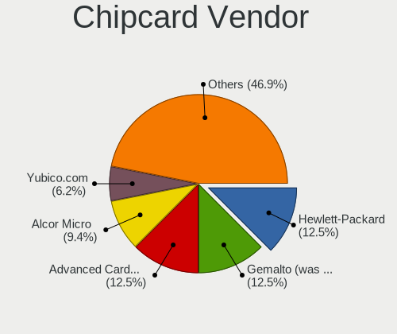

| Vendor                    | Desktops | Percent |
|---------------------------|----------|---------|
| Hewlett-Packard           | 4        | 16.67%  |
| Gemalto (was Gemplus)     | 4        | 16.67%  |
| SCM Microsystems          | 2        | 8.33%   |
| Realtek Semiconductor     | 2        | 8.33%   |
| Chicony Electronics       | 2        | 8.33%   |
| Aladdin Knowledge Systems | 2        | 8.33%   |
| Yubico.com                | 1        | 4.17%   |
| ST-Ericsson               | 1        | 4.17%   |
| Jing-Mold Enterprise      | 1        | 4.17%   |
| Feitian Technologies      | 1        | 4.17%   |
| Clay Logic                | 1        | 4.17%   |
| Cherry                    | 1        | 4.17%   |
| Alcor Micro               | 1        | 4.17%   |
| Advanced Card Systems     | 1        | 4.17%   |

Chipcard Model
--------------

Chipcard module models

| Model                                                             | Desktops | Percent |
|-------------------------------------------------------------------|----------|---------|
| Hewlett-Packard SC Keyboard - Apollo (Liteon)                     | 4        | 16.67%  |
| Gemalto (was Gemplus) GemPC Twin SmartCard Reader                 | 3        | 12.5%   |
| Realtek Semiconductor Smart Card Reader Interface                 | 2        | 8.33%   |
| Chicony Electronics HP Skylab USB Smartcard Keyboard              | 2        | 8.33%   |
| Aladdin Knowledge Systems Token JC                                | 2        | 8.33%   |
| Yubico.com Yubikey 4/5 U2F+CCID                                   | 1        | 4.17%   |
| ST-Ericsson Chipcard Reader                                       | 1        | 4.17%   |
| SCM Microsystems SCR335 SmartCard Reader                          | 1        | 4.17%   |
| SCM Microsystems CLOUD 2700 F Smart Card Reader                   | 1        | 4.17%   |
| Jing-Mold Enterprise HP USB Business Slim Smartcard CCID Keyboard | 1        | 4.17%   |
| Gemalto (was Gemplus) GemPC Key SmartCard Reader                  | 1        | 4.17%   |
| Feitian Technologies FT SCR310                                    | 1        | 4.17%   |
| Clay Logic Nitrokey Pro                                           | 1        | 4.17%   |
| Cherry Cherry GmbH CHERRY SECURE BOARD 1.0                        | 1        | 4.17%   |
| Alcor Micro Watchdata W 1981                                      | 1        | 4.17%   |
| Advanced Card Systems ACR122U                                     | 1        | 4.17%   |

Unsupported
-----------

Unsupported Devices
-------------------

Total unsupported devices on board

| Total | Desktops | Percent |
|-------|----------|---------|
| 0     | 3176     | 85.26%  |
| 1     | 455      | 12.21%  |
| 2     | 72       | 1.93%   |
| 4     | 11       | 0.3%    |
| 3     | 8        | 0.21%   |
| 5     | 2        | 0.05%   |
| 9     | 1        | 0.03%   |

Unsupported Device Types
------------------------

Types of unsupported devices

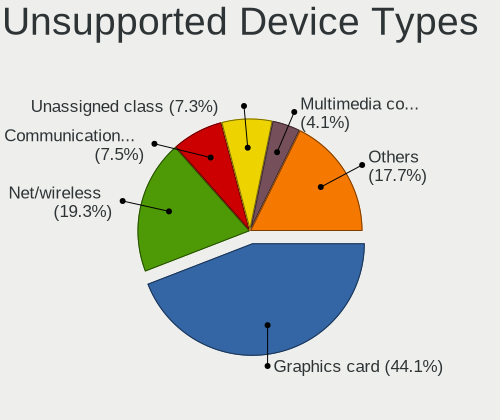

| Type                     | Desktops | Percent |
|--------------------------|----------|---------|
| Graphics card            | 262      | 41%     |
| Net/wireless             | 124      | 19.41%  |
| Communication controller | 54       | 8.45%   |
| Unassigned class         | 53       | 8.29%   |
| Multimedia controller    | 30       | 4.69%   |
| Sound                    | 24       | 3.76%   |
| Net/ethernet             | 14       | 2.19%   |
| Bluetooth                | 14       | 2.19%   |
| Camera                   | 12       | 1.88%   |
| Chipcard                 | 10       | 1.56%   |
| Network                  | 9        | 1.41%   |
| Storage/raid             | 7        | 1.1%    |
| Storage/ide              | 5        | 0.78%   |
| Firewire controller      | 5        | 0.78%   |
| Card reader              | 5        | 0.78%   |
| Modem                    | 4        | 0.63%   |
| Fingerprint reader       | 4        | 0.63%   |
| Tv card                  | 2        | 0.31%   |
| Dvb card                 | 1        | 0.16%   |

