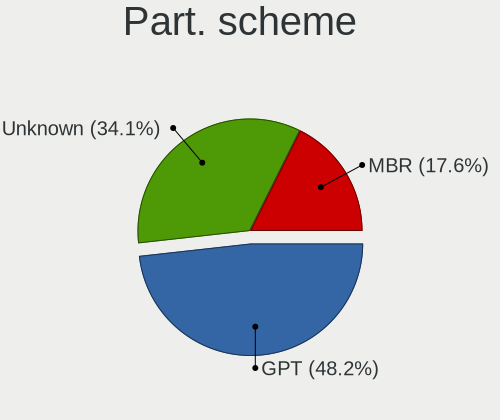
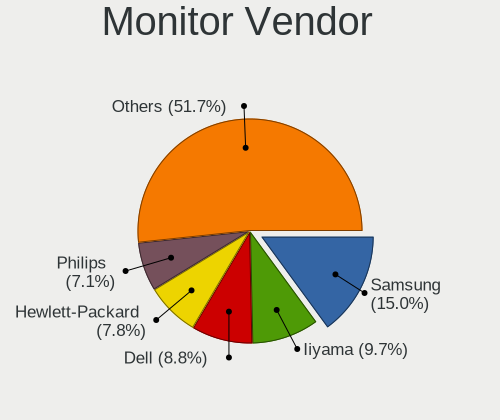

Linux in France - Tested Hardware & Statistics (Desktops)
---------------------------------------------------------

A project to collect tested hardware configurations for Linux in France.

Anyone can contribute to this report by the [hw-probe](https://github.com/linuxhw/hw-probe) tool:

    sudo -E hw-probe -all -upload

Please contribute! Especially if your hardware is rare.

Contents
--------

* [ Test Cases ](#test-cases)

* [ System ](#system)
  - [ OS                       ](#os)
  - [ OS Family                ](#os-family)
  - [ Kernel                   ](#kernel)
  - [ Kernel Family            ](#kernel-family)
  - [ Kernel Major Ver.        ](#kernel-major-ver)
  - [ Arch                     ](#arch)
  - [ DE                       ](#de)
  - [ Display Server           ](#display-server)
  - [ Display Manager          ](#display-manager)
  - [ OS Lang                  ](#os-lang)
  - [ Boot Mode                ](#boot-mode)
  - [ Filesystem               ](#filesystem)
  - [ Part. scheme             ](#part-scheme)
  - [ Dual Boot with Linux/BSD ](#dual-boot-with-linuxbsd)
  - [ Dual Boot (Win)          ](#dual-boot-win)

* [ Board ](#board)
  - [ Vendor                   ](#vendor)
  - [ Model                    ](#model)
  - [ Model Family             ](#model-family)
  - [ MFG Year                 ](#mfg-year)
  - [ Form Factor              ](#form-factor)
  - [ Secure Boot              ](#secure-boot)
  - [ Coreboot                 ](#coreboot)
  - [ RAM Size                 ](#ram-size)
  - [ RAM Used                 ](#ram-used)
  - [ Total Drives             ](#total-drives)
  - [ Has CD-ROM               ](#has-cd-rom)
  - [ Has Ethernet             ](#has-ethernet)
  - [ Has WiFi                 ](#has-wifi)
  - [ Has Bluetooth            ](#has-bluetooth)

* [ Location ](#location)
  - [ Country                  ](#country)
  - [ City                     ](#city)

* [ Drives ](#drives)
  - [ Drive Vendor             ](#drive-vendor)
  - [ Drive Model              ](#drive-model)
  - [ HDD Vendor               ](#hdd-vendor)
  - [ SSD Vendor               ](#ssd-vendor)
  - [ Drive Kind               ](#drive-kind)
  - [ Drive Connector          ](#drive-connector)
  - [ Drive Size               ](#drive-size)
  - [ Space Total              ](#space-total)
  - [ Space Used               ](#space-used)
  - [ Malfunc. Drives          ](#malfunc-drives)
  - [ Malfunc. Drive Vendor    ](#malfunc-drive-vendor)
  - [ Malfunc. HDD Vendor      ](#malfunc-hdd-vendor)
  - [ Malfunc. Drive Kind      ](#malfunc-drive-kind)
  - [ Failed Drives            ](#failed-drives)
  - [ Failed Drive Vendor      ](#failed-drive-vendor)
  - [ Drive Status             ](#drive-status)

* [ Storage controller ](#storage-controller)
  - [ Storage Vendor           ](#storage-vendor)
  - [ Storage Model            ](#storage-model)
  - [ Storage Kind             ](#storage-kind)

* [ Processor ](#processor)
  - [ CPU Vendor               ](#cpu-vendor)
  - [ CPU Model                ](#cpu-model)
  - [ CPU Model Family         ](#cpu-model-family)
  - [ CPU Cores                ](#cpu-cores)
  - [ CPU Sockets              ](#cpu-sockets)
  - [ CPU Threads              ](#cpu-threads)
  - [ CPU Op-Modes             ](#cpu-op-modes)
  - [ CPU Microcode            ](#cpu-microcode)
  - [ CPU Microarch            ](#cpu-microarch)

* [ Graphics ](#graphics)
  - [ GPU Vendor               ](#gpu-vendor)
  - [ GPU Model                ](#gpu-model)
  - [ GPU Combo                ](#gpu-combo)
  - [ GPU Driver               ](#gpu-driver)
  - [ GPU Memory               ](#gpu-memory)

* [ Monitor ](#monitor)
  - [ Monitor Vendor           ](#monitor-vendor)
  - [ Monitor Model            ](#monitor-model)
  - [ Monitor Resolution       ](#monitor-resolution)
  - [ Monitor Diagonal         ](#monitor-diagonal)
  - [ Monitor Width            ](#monitor-width)
  - [ Aspect Ratio             ](#aspect-ratio)
  - [ Monitor Area             ](#monitor-area)
  - [ Pixel Density            ](#pixel-density)
  - [ Multiple Monitors        ](#multiple-monitors)

* [ Network ](#network)
  - [ Net Controller Vendor    ](#net-controller-vendor)
  - [ Net Controller Model     ](#net-controller-model)
  - [ Wireless Vendor          ](#wireless-vendor)
  - [ Wireless Model           ](#wireless-model)
  - [ Ethernet Vendor          ](#ethernet-vendor)
  - [ Ethernet Model           ](#ethernet-model)
  - [ Net Controller Kind      ](#net-controller-kind)
  - [ Used Controller          ](#used-controller)
  - [ NICs                     ](#nics)
  - [ IPv6                     ](#ipv6)

* [ Bluetooth ](#bluetooth)
  - [ Bluetooth Vendor         ](#bluetooth-vendor)
  - [ Bluetooth Model          ](#bluetooth-model)

* [ Sound ](#sound)
  - [ Sound Vendor             ](#sound-vendor)
  - [ Sound Model              ](#sound-model)

* [ Memory ](#memory)
  - [ Memory Vendor            ](#memory-vendor)
  - [ Memory Model             ](#memory-model)
  - [ Memory Kind              ](#memory-kind)
  - [ Memory Form Factor       ](#memory-form-factor)
  - [ Memory Size              ](#memory-size)
  - [ Memory Speed             ](#memory-speed)

* [ Printers & scanners ](#printers--scanners)
  - [ Printer Vendor           ](#printer-vendor)
  - [ Printer Model            ](#printer-model)
  - [ Scanner Vendor           ](#scanner-vendor)
  - [ Scanner Model            ](#scanner-model)

* [ Camera ](#camera)
  - [ Camera Vendor            ](#camera-vendor)
  - [ Camera Model             ](#camera-model)

* [ Security ](#security)
  - [ Fingerprint Vendor       ](#fingerprint-vendor)
  - [ Fingerprint Model        ](#fingerprint-model)
  - [ Chipcard Vendor          ](#chipcard-vendor)
  - [ Chipcard Model           ](#chipcard-model)

* [ Unsupported ](#unsupported)
  - [ Unsupported Devices      ](#unsupported-devices)
  - [ Unsupported Device Types ](#unsupported-device-types)

Test Cases
----------

Total: 3876

| Vendor        | Model                       | Probe                                                      | Date         |
|---------------|-----------------------------|------------------------------------------------------------|--------------|
| ASUSTek       | TUF Gaming B450-PLUS II     | [efc46d8d23](https://linux-hardware.org/?probe=efc46d8d23) | Sep 01, 2022 |
| MSI           | MAG X570S TORPEDO MAX       | [d98546fd95](https://linux-hardware.org/?probe=d98546fd95) | Aug 31, 2022 |
| MSI           | MPG B550I GAMING EDGE WI... | [aacd965d80](https://linux-hardware.org/?probe=aacd965d80) | Aug 31, 2022 |
| MSI           | MPG B550I GAMING EDGE WI... | [c5547cac7c](https://linux-hardware.org/?probe=c5547cac7c) | Aug 31, 2022 |
| MSI           | MPG B550I GAMING EDGE WI... | [e5c7462ead](https://linux-hardware.org/?probe=e5c7462ead) | Aug 31, 2022 |
| HP            | 83E0                        | [af9b15b8e7](https://linux-hardware.org/?probe=af9b15b8e7) | Aug 31, 2022 |
| ASUSTek       | Z97-A                       | [1e70cd86f6](https://linux-hardware.org/?probe=1e70cd86f6) | Aug 31, 2022 |
| Dell          | 040DDP A00                  | [09ffe165d3](https://linux-hardware.org/?probe=09ffe165d3) | Aug 30, 2022 |
| MSI           | MPG B550I GAMING EDGE WI... | [e770273b10](https://linux-hardware.org/?probe=e770273b10) | Aug 30, 2022 |
| ASUSTek       | P8P67 PRO                   | [aa43ab7091](https://linux-hardware.org/?probe=aa43ab7091) | Aug 29, 2022 |
| ASUSTek       | P8P67 PRO                   | [4882cfb195](https://linux-hardware.org/?probe=4882cfb195) | Aug 29, 2022 |
| MSI           | B250M PRO-VD                | [d462e3b9d0](https://linux-hardware.org/?probe=d462e3b9d0) | Aug 29, 2022 |
| MSI           | H310M PRO-M2 PLUS           | [a561fb6354](https://linux-hardware.org/?probe=a561fb6354) | Aug 29, 2022 |
| Lenovo        | MAHOBAY NO DPK              | [2d013c60ed](https://linux-hardware.org/?probe=2d013c60ed) | Aug 29, 2022 |
| MSI           | MAG B550 TORPEDO            | [58f0ba95c3](https://linux-hardware.org/?probe=58f0ba95c3) | Aug 29, 2022 |
| Gigabyte      | GA-MA790FXT-UD5P            | [e692fe97cb](https://linux-hardware.org/?probe=e692fe97cb) | Aug 28, 2022 |
| Medion        | B460H6-EM                   | [91371e505d](https://linux-hardware.org/?probe=91371e505d) | Aug 28, 2022 |
| Gigabyte      | B450 AORUS ELITE            | [859b3cb78a](https://linux-hardware.org/?probe=859b3cb78a) | Aug 28, 2022 |
| Gigabyte      | G41M-Combo                  | [353da69160](https://linux-hardware.org/?probe=353da69160) | Aug 26, 2022 |
| Intel         | X79G V2.x                   | [8418a8e83c](https://linux-hardware.org/?probe=8418a8e83c) | Aug 26, 2022 |
| Intel         | X79G V2.x                   | [2a3114af33](https://linux-hardware.org/?probe=2a3114af33) | Aug 26, 2022 |
| Foxconn       | 2ABF                        | [46efca142c](https://linux-hardware.org/?probe=46efca142c) | Aug 26, 2022 |
| HP            | 18E5                        | [9196bf639b](https://linux-hardware.org/?probe=9196bf639b) | Aug 26, 2022 |
| Lenovo        | 7033EW4                     | [54417ae55f](https://linux-hardware.org/?probe=54417ae55f) | Aug 26, 2022 |
| Packard Be... | IMEDIA S1300                | [4b8f3feaa7](https://linux-hardware.org/?probe=4b8f3feaa7) | Aug 25, 2022 |
| Dell          | 0RJ290                      | [ca82162ed5](https://linux-hardware.org/?probe=ca82162ed5) | Aug 25, 2022 |
| Acer          | Aspire XC-710 V:1.1         | [0b76e0f97d](https://linux-hardware.org/?probe=0b76e0f97d) | Aug 25, 2022 |
| ASUSTek       | UN62                        | [49fcd1324f](https://linux-hardware.org/?probe=49fcd1324f) | Aug 25, 2022 |
| ASUSTek       | PRIME X570-PRO              | [663509c999](https://linux-hardware.org/?probe=663509c999) | Aug 24, 2022 |
| ASUSTek       | PRIME X570-PRO              | [2b7d1d59a1](https://linux-hardware.org/?probe=2b7d1d59a1) | Aug 24, 2022 |
| HP            | 21D0                        | [1bd58d519c](https://linux-hardware.org/?probe=1bd58d519c) | Aug 24, 2022 |
| Gigabyte      | A320M-H-CF                  | [476ca6c833](https://linux-hardware.org/?probe=476ca6c833) | Aug 24, 2022 |
| Dell          | 0MWYPT A02                  | [017af6f58d](https://linux-hardware.org/?probe=017af6f58d) | Aug 23, 2022 |
| HP            | 3397                        | [335f59c96f](https://linux-hardware.org/?probe=335f59c96f) | Aug 22, 2022 |
| Biostar       | H81MHV3 5.0                 | [161cae6726](https://linux-hardware.org/?probe=161cae6726) | Aug 22, 2022 |
| ASRock        | A320M-HDV R4.0              | [82481d6225](https://linux-hardware.org/?probe=82481d6225) | Aug 22, 2022 |
| ASRock        | A520M-HVS                   | [842ad7d4d2](https://linux-hardware.org/?probe=842ad7d4d2) | Aug 22, 2022 |
| ASUSTek       | Z87-C                       | [8de83c544f](https://linux-hardware.org/?probe=8de83c544f) | Aug 21, 2022 |
| Foxconn       | 2ABF                        | [3eed86b908](https://linux-hardware.org/?probe=3eed86b908) | Aug 21, 2022 |
| Packard Be... | PT890-8237A                 | [36a4120390](https://linux-hardware.org/?probe=36a4120390) | Aug 20, 2022 |
| ASUSTek       | TUF B350M-PLUS GAMING       | [b2ac87cffc](https://linux-hardware.org/?probe=b2ac87cffc) | Aug 20, 2022 |
| MSI           | MAG X570S TORPEDO MAX       | [d5e91a17b8](https://linux-hardware.org/?probe=d5e91a17b8) | Aug 20, 2022 |
| HP            | 805D                        | [6748d722e7](https://linux-hardware.org/?probe=6748d722e7) | Aug 19, 2022 |
| HP            | 1497                        | [580e1a6efe](https://linux-hardware.org/?probe=580e1a6efe) | Aug 19, 2022 |
| Acer          | Veriton X2631G V:1.0        | [de98920808](https://linux-hardware.org/?probe=de98920808) | Aug 18, 2022 |
| Intel         | D54250WYK H13922-302        | [ba78bd360c](https://linux-hardware.org/?probe=ba78bd360c) | Aug 18, 2022 |
| eMachines     | ET1350                      | [96e9f7aba7](https://linux-hardware.org/?probe=96e9f7aba7) | Aug 18, 2022 |
| Foxconn       | 2ADA                        | [015ccc4b06](https://linux-hardware.org/?probe=015ccc4b06) | Aug 18, 2022 |
| Dell          | 0FDY5C A00                  | [4cd1658b87](https://linux-hardware.org/?probe=4cd1658b87) | Aug 17, 2022 |
| MSI           | X470 GAMING PRO             | [b648d56b04](https://linux-hardware.org/?probe=b648d56b04) | Aug 17, 2022 |
| Dell          | 00V62H A01                  | [34b4c61308](https://linux-hardware.org/?probe=34b4c61308) | Aug 17, 2022 |
| Gigabyte      | B85M-D3PH                   | [a5ed221478](https://linux-hardware.org/?probe=a5ed221478) | Aug 17, 2022 |
| Dell          | 0YXT71 A00                  | [def7e10c65](https://linux-hardware.org/?probe=def7e10c65) | Aug 17, 2022 |
| Acer          | Veriton X2631G V:1.0        | [a7af0ea5e7](https://linux-hardware.org/?probe=a7af0ea5e7) | Aug 17, 2022 |
| MSI           | H170M PRO-VDH               | [4d7aa09763](https://linux-hardware.org/?probe=4d7aa09763) | Aug 16, 2022 |
| ASUSTek       | TUF Gaming B450-PLUS II     | [dd98185972](https://linux-hardware.org/?probe=dd98185972) | Aug 16, 2022 |
| Dell          | 0T656F A01                  | [ec4014a549](https://linux-hardware.org/?probe=ec4014a549) | Aug 16, 2022 |
| Lenovo        | 370A SDK0J40700 WIN 3258... | [ed6155d213](https://linux-hardware.org/?probe=ed6155d213) | Aug 16, 2022 |
| Dell          | 0GM819                      | [f7745d3d3a](https://linux-hardware.org/?probe=f7745d3d3a) | Aug 16, 2022 |
| ASRock        | X470 Master SLI             | [ce62975b20](https://linux-hardware.org/?probe=ce62975b20) | Aug 15, 2022 |
| Gigabyte      | B75M-D3V                    | [cdea2e0afd](https://linux-hardware.org/?probe=cdea2e0afd) | Aug 15, 2022 |
| Gigabyte      | B75M-D3V                    | [87f8cc8553](https://linux-hardware.org/?probe=87f8cc8553) | Aug 15, 2022 |
| MSI           | A320M-A PRO MAX             | [bf211d4e64](https://linux-hardware.org/?probe=bf211d4e64) | Aug 15, 2022 |
| Gigabyte      | B450M H                     | [a16dfdfe7b](https://linux-hardware.org/?probe=a16dfdfe7b) | Aug 15, 2022 |
| ASUSTek       | P7P55D                      | [cd43fbf16a](https://linux-hardware.org/?probe=cd43fbf16a) | Aug 15, 2022 |
| ASUSTek       | TUF Gaming X570-PLUS        | [53429d945b](https://linux-hardware.org/?probe=53429d945b) | Aug 15, 2022 |
| ASUSTek       | Z170 PRO GAMING             | [3d2bd6d842](https://linux-hardware.org/?probe=3d2bd6d842) | Aug 15, 2022 |
| HP            | 0B4Ch D                     | [deaaa5c32c](https://linux-hardware.org/?probe=deaaa5c32c) | Aug 15, 2022 |
| Gigabyte      | B460 AORUS PRO AC           | [ab9e6d26d6](https://linux-hardware.org/?probe=ab9e6d26d6) | Aug 14, 2022 |
| Gigabyte      | H97N-WIFI                   | [966a3e1593](https://linux-hardware.org/?probe=966a3e1593) | Aug 13, 2022 |
| ASRock        | H61M-DGS                    | [50b7221c5a](https://linux-hardware.org/?probe=50b7221c5a) | Aug 12, 2022 |
| ASUSTek       | ROG STRIX B550-F GAMING     | [8c792d555c](https://linux-hardware.org/?probe=8c792d555c) | Aug 12, 2022 |
| Gigabyte      | H370 HD3-CF                 | [3d93d807ca](https://linux-hardware.org/?probe=3d93d807ca) | Aug 12, 2022 |
| MSI           | Z87-G45 GAMING              | [2f541727e1](https://linux-hardware.org/?probe=2f541727e1) | Aug 12, 2022 |
| ASUSTek       | PRIME A320M-K               | [1f75df3828](https://linux-hardware.org/?probe=1f75df3828) | Aug 12, 2022 |
| ASRock        | Z97M Pro4                   | [245d189a61](https://linux-hardware.org/?probe=245d189a61) | Aug 11, 2022 |
| Gigabyte      | H370 AORUS GAMING 3 WIFI... | [d2f7a86fd8](https://linux-hardware.org/?probe=d2f7a86fd8) | Aug 11, 2022 |
| ASRock        | H61M/U3S3                   | [be0d853621](https://linux-hardware.org/?probe=be0d853621) | Aug 11, 2022 |
| Gigabyte      | B450M DS3H V2               | [33dc68fe04](https://linux-hardware.org/?probe=33dc68fe04) | Aug 11, 2022 |
| Vorke         | V1 Plus                     | [a31728f53e](https://linux-hardware.org/?probe=a31728f53e) | Aug 10, 2022 |
| Lenovo        | SHARKBAY NOK                | [9a77cf2f22](https://linux-hardware.org/?probe=9a77cf2f22) | Aug 10, 2022 |
| eMachines     | Veriton V2110               | [3492540d77](https://linux-hardware.org/?probe=3492540d77) | Aug 09, 2022 |
| MSI           | MPG X570S EDGE MAX WIFI     | [346b22a42e](https://linux-hardware.org/?probe=346b22a42e) | Aug 09, 2022 |
| ASRock        | G41M-VS3                    | [16a2e0ab5d](https://linux-hardware.org/?probe=16a2e0ab5d) | Aug 09, 2022 |
| MSI           | MPG B550I GAMING EDGE WI... | [77396822d3](https://linux-hardware.org/?probe=77396822d3) | Aug 09, 2022 |
| MSI           | MAG B550 TOMAHAWK           | [1713317338](https://linux-hardware.org/?probe=1713317338) | Aug 09, 2022 |
| Lenovo        | Bantry CRB NOK              | [fbeb21c99a](https://linux-hardware.org/?probe=fbeb21c99a) | Aug 09, 2022 |
| Foxconn       | 2ABF                        | [89d9f69018](https://linux-hardware.org/?probe=89d9f69018) | Aug 09, 2022 |
| Lenovo        | SHARKBAY NOK                | [c9bb066a9b](https://linux-hardware.org/?probe=c9bb066a9b) | Aug 08, 2022 |
| Lenovo        | SHARKBAY NOK                | [7bc9d5090f](https://linux-hardware.org/?probe=7bc9d5090f) | Aug 08, 2022 |
| ASUSTek       | G20AJ                       | [613f8a0c36](https://linux-hardware.org/?probe=613f8a0c36) | Aug 08, 2022 |
| Foxconn       | 2ABF                        | [ee62b165ef](https://linux-hardware.org/?probe=ee62b165ef) | Aug 08, 2022 |
| ASUSTek       | PRIME A320M-K               | [40808a05c1](https://linux-hardware.org/?probe=40808a05c1) | Aug 07, 2022 |
| Foxconn       | 2ABF                        | [bfa218709f](https://linux-hardware.org/?probe=bfa218709f) | Aug 07, 2022 |
| Gigabyte      | H370 AORUS GAMING 3 WIFI... | [6eac3041ec](https://linux-hardware.org/?probe=6eac3041ec) | Aug 07, 2022 |
| Gigabyte      | F2A78M-HD2                  | [64b08b679f](https://linux-hardware.org/?probe=64b08b679f) | Aug 05, 2022 |
| MSI           | MPG B550I GAMING EDGE WI... | [255c2dd960](https://linux-hardware.org/?probe=255c2dd960) | Aug 05, 2022 |
| MSI           | MAG B460M BAZOOKA           | [85037ebcb0](https://linux-hardware.org/?probe=85037ebcb0) | Aug 05, 2022 |
| ASUSTek       | ROG Maximus XI HERO         | [d725206bff](https://linux-hardware.org/?probe=d725206bff) | Aug 04, 2022 |
| ASUSTek       | P5N-E SLI                   | [237c4a2367](https://linux-hardware.org/?probe=237c4a2367) | Aug 04, 2022 |
| Dell          | 0HGFJM A00                  | [b1011ae242](https://linux-hardware.org/?probe=b1011ae242) | Aug 04, 2022 |
| MSI           | Z170A GAMING M5             | [37ccdc4cf7](https://linux-hardware.org/?probe=37ccdc4cf7) | Aug 04, 2022 |
| Lenovo        | SDK0E50510 WIN              | [e43f32d47e](https://linux-hardware.org/?probe=e43f32d47e) | Aug 04, 2022 |
| ASRock        | G41M-VS3                    | [16c2b30680](https://linux-hardware.org/?probe=16c2b30680) | Aug 04, 2022 |
| MSI           | 970 GAMING                  | [5eee2883a9](https://linux-hardware.org/?probe=5eee2883a9) | Aug 04, 2022 |
| ASUSTek       | P6T                         | [978f8623ff](https://linux-hardware.org/?probe=978f8623ff) | Aug 03, 2022 |
| Foxconn       | 2ADA                        | [81b60bd487](https://linux-hardware.org/?probe=81b60bd487) | Aug 03, 2022 |
| ASRock        | NUC-8265U                   | [32b0ae0f97](https://linux-hardware.org/?probe=32b0ae0f97) | Aug 03, 2022 |
| Supermicro    | X7DCL                       | [4b841e9401](https://linux-hardware.org/?probe=4b841e9401) | Aug 03, 2022 |
| Dell          | 0KW626                      | [629c1c7800](https://linux-hardware.org/?probe=629c1c7800) | Aug 03, 2022 |
| Acer          | Veriton X2631G V:1.0        | [182bfa1039](https://linux-hardware.org/?probe=182bfa1039) | Aug 02, 2022 |
| Lenovo        | SHARKBAY NOK                | [7f574acfee](https://linux-hardware.org/?probe=7f574acfee) | Aug 02, 2022 |
| ASUSTek       | Z87-EXPERT                  | [f513bdb1f5](https://linux-hardware.org/?probe=f513bdb1f5) | Aug 02, 2022 |
| ASUSTek       | Z87-EXPERT                  | [ec9385b488](https://linux-hardware.org/?probe=ec9385b488) | Aug 02, 2022 |
| MSI           | Z97 GAMING 5                | [d2c534d06f](https://linux-hardware.org/?probe=d2c534d06f) | Aug 02, 2022 |
| Acer          | EM61SM/EM61PM               | [1a35a6d7dc](https://linux-hardware.org/?probe=1a35a6d7dc) | Aug 02, 2022 |
| Lenovo        | 314F SDK0Q40112 WIN 3305... | [e906976bea](https://linux-hardware.org/?probe=e906976bea) | Aug 02, 2022 |
| Acer          | Veriton X2631G V:1.0        | [e63e46c5a4](https://linux-hardware.org/?probe=e63e46c5a4) | Aug 02, 2022 |
| Gigabyte      | G1.SNIPER B7-CF             | [83e4b444ae](https://linux-hardware.org/?probe=83e4b444ae) | Aug 01, 2022 |
| Gigabyte      | G1.SNIPER B7-CF             | [4e335cb7ce](https://linux-hardware.org/?probe=4e335cb7ce) | Aug 01, 2022 |
| Gigabyte      | H87-HD3                     | [daaf600950](https://linux-hardware.org/?probe=daaf600950) | Aug 01, 2022 |
| MSI           | MAG B550 TOMAHAWK           | [0d7342cca0](https://linux-hardware.org/?probe=0d7342cca0) | Aug 01, 2022 |
| ASUSTek       | Z170-A                      | [5f41623898](https://linux-hardware.org/?probe=5f41623898) | Aug 01, 2022 |
| MSI           | Z490-A PRO                  | [054fdc9187](https://linux-hardware.org/?probe=054fdc9187) | Jul 31, 2022 |
| MSI           | A68HM-E33 V2                | [86af6982c5](https://linux-hardware.org/?probe=86af6982c5) | Jul 30, 2022 |
| ASUSTek       | P5P43TD PRO                 | [7325fb8135](https://linux-hardware.org/?probe=7325fb8135) | Jul 30, 2022 |
| Gigabyte      | AB350-Gaming 3-CF           | [bc1c5d997f](https://linux-hardware.org/?probe=bc1c5d997f) | Jul 30, 2022 |
| ASUSTek       | TUF Gaming X570-PLUS        | [9ea9e6f737](https://linux-hardware.org/?probe=9ea9e6f737) | Jul 30, 2022 |
| ASUSTek       | TUF Gaming X570-PLUS        | [c2e42e1cbb](https://linux-hardware.org/?probe=c2e42e1cbb) | Jul 30, 2022 |
| Gigabyte      | G41M-Combo                  | [3ec038d45b](https://linux-hardware.org/?probe=3ec038d45b) | Jul 30, 2022 |
| MSI           | MPG B550I GAMING EDGE WI... | [efa02942f2](https://linux-hardware.org/?probe=efa02942f2) | Jul 29, 2022 |
| ASUSTek       | B85M-E/DASH                 | [2ebbaa4052](https://linux-hardware.org/?probe=2ebbaa4052) | Jul 29, 2022 |
| HP            | 339A                        | [fa0d80162a](https://linux-hardware.org/?probe=fa0d80162a) | Jul 29, 2022 |
| Dell          | 0W0CHX A00                  | [be7cc4f033](https://linux-hardware.org/?probe=be7cc4f033) | Jul 29, 2022 |
| Intel         | SHARKBAY                    | [bd5b812271](https://linux-hardware.org/?probe=bd5b812271) | Jul 29, 2022 |
| Acer          | Veriton M4610G              | [00ec5bea11](https://linux-hardware.org/?probe=00ec5bea11) | Jul 29, 2022 |
| ASUSTek       | TUF Gaming B550-PLUS        | [2953cb274f](https://linux-hardware.org/?probe=2953cb274f) | Jul 28, 2022 |
| ASUSTek       | H81M-PLUS                   | [db534130d2](https://linux-hardware.org/?probe=db534130d2) | Jul 28, 2022 |
| HP            | 21F5                        | [27cf2d6a42](https://linux-hardware.org/?probe=27cf2d6a42) | Jul 28, 2022 |
| Gigabyte      | Z77-D3H                     | [2d3706b78b](https://linux-hardware.org/?probe=2d3706b78b) | Jul 28, 2022 |
| HP            | 8860 A                      | [10dc51c925](https://linux-hardware.org/?probe=10dc51c925) | Jul 28, 2022 |
| HP            | ProLiant MicroServer        | [8104eee56e](https://linux-hardware.org/?probe=8104eee56e) | Jul 28, 2022 |
| Gigabyte      | A520M DS3H                  | [900a5b4f7f](https://linux-hardware.org/?probe=900a5b4f7f) | Jul 28, 2022 |
| ASUSTek       | P7P55D                      | [0c9828e226](https://linux-hardware.org/?probe=0c9828e226) | Jul 28, 2022 |
| MSI           | B250M PRO-VDH               | [737604edb6](https://linux-hardware.org/?probe=737604edb6) | Jul 28, 2022 |
| Intel         | DH61AG AAG23736-505         | [7fd3a18899](https://linux-hardware.org/?probe=7fd3a18899) | Jul 28, 2022 |
| MSI           | B450M PRO-M2 MAX            | [ab8af10726](https://linux-hardware.org/?probe=ab8af10726) | Jul 28, 2022 |
| HP            | 3048h                       | [01d1b1e99a](https://linux-hardware.org/?probe=01d1b1e99a) | Jul 28, 2022 |
| MSI           | H110I PRO                   | [1dcc4b694a](https://linux-hardware.org/?probe=1dcc4b694a) | Jul 28, 2022 |
| ASUSTek       | PRIME X470-PRO              | [ce5af45a80](https://linux-hardware.org/?probe=ce5af45a80) | Jul 28, 2022 |
| ASUSTek       | GRYPHON Z87                 | [73b9d340d2](https://linux-hardware.org/?probe=73b9d340d2) | Jul 28, 2022 |
| HP            | 1495                        | [e5f22db975](https://linux-hardware.org/?probe=e5f22db975) | Jul 28, 2022 |
| MSI           | X370 GAMING PLUS            | [a39ccd24ff](https://linux-hardware.org/?probe=a39ccd24ff) | Jul 27, 2022 |
| Dell          | 09KPNV A00                  | [610282a0e6](https://linux-hardware.org/?probe=610282a0e6) | Jul 27, 2022 |
| Pegatron      | 2A94h                       | [3a92c9c971](https://linux-hardware.org/?probe=3a92c9c971) | Jul 27, 2022 |
| MSI           | MPG X570S EDGE MAX WIFI     | [29780cf747](https://linux-hardware.org/?probe=29780cf747) | Jul 27, 2022 |
| ASUSTek       | TUF Gaming B550-PLUS        | [ed58dd6bb4](https://linux-hardware.org/?probe=ed58dd6bb4) | Jul 27, 2022 |
| ASUSTek       | H61-PLUS                    | [fd45d5c31b](https://linux-hardware.org/?probe=fd45d5c31b) | Jul 27, 2022 |
| Gigabyte      | H470M DS3H                  | [5f90ec9763](https://linux-hardware.org/?probe=5f90ec9763) | Jul 27, 2022 |
| Dell          | 0C27VV A03                  | [c1c4edd1e5](https://linux-hardware.org/?probe=c1c4edd1e5) | Jul 26, 2022 |
| ASRock        | H510M-HDV/M.2               | [e7672c215b](https://linux-hardware.org/?probe=e7672c215b) | Jul 26, 2022 |
| Gigabyte      | X570 AORUS ULTRA            | [af32973765](https://linux-hardware.org/?probe=af32973765) | Jul 26, 2022 |
| HP            | 870C                        | [b88964a379](https://linux-hardware.org/?probe=b88964a379) | Jul 26, 2022 |
| ASUSTek       | AT5NM10T-I                  | [9738c4bebc](https://linux-hardware.org/?probe=9738c4bebc) | Jul 26, 2022 |
| ASRock        | H81M-HDS                    | [5a42337e2b](https://linux-hardware.org/?probe=5a42337e2b) | Jul 22, 2022 |
| HP            | 0A68h                       | [cc4b39e6d0](https://linux-hardware.org/?probe=cc4b39e6d0) | Jul 22, 2022 |
| ASRock        | H81M-HDS                    | [ba68702925](https://linux-hardware.org/?probe=ba68702925) | Jul 22, 2022 |
| Gigabyte      | H370 AORUS GAMING 3 WIFI... | [b08505b90e](https://linux-hardware.org/?probe=b08505b90e) | Jul 21, 2022 |
| Dell          | 0KJCC5 A00                  | [4eec45d964](https://linux-hardware.org/?probe=4eec45d964) | Jul 21, 2022 |
| HP            | 0B4Ch D                     | [15e71f4f03](https://linux-hardware.org/?probe=15e71f4f03) | Jul 21, 2022 |
| Dell          | 0HD5W2 A01                  | [e2eca7122c](https://linux-hardware.org/?probe=e2eca7122c) | Jul 21, 2022 |
| Lenovo        | 1.0                         | [e520e716cf](https://linux-hardware.org/?probe=e520e716cf) | Jul 21, 2022 |
| ASRock        | B550 Extreme4               | [226924706f](https://linux-hardware.org/?probe=226924706f) | Jul 20, 2022 |
| MSI           | MPG X570S EDGE MAX WIFI     | [f7678fb134](https://linux-hardware.org/?probe=f7678fb134) | Jul 20, 2022 |
| MSI           | PRO B660M-A DDR4            | [ba0058e96e](https://linux-hardware.org/?probe=ba0058e96e) | Jul 20, 2022 |
| Gigabyte      | Z590M                       | [b173d6beaa](https://linux-hardware.org/?probe=b173d6beaa) | Jul 20, 2022 |
| ASUSTek       | P8Z68-V LX                  | [0de7d2f427](https://linux-hardware.org/?probe=0de7d2f427) | Jul 20, 2022 |
| Gigabyte      | H61M-S2PV                   | [44b9b405c2](https://linux-hardware.org/?probe=44b9b405c2) | Jul 20, 2022 |
| MSI           | MPG X570S EDGE MAX WIFI     | [fdc7518bfd](https://linux-hardware.org/?probe=fdc7518bfd) | Jul 19, 2022 |
| Gigabyte      | B150M-D3H-CF                | [65fb347b62](https://linux-hardware.org/?probe=65fb347b62) | Jul 19, 2022 |
| Lenovo        | 370A SDK0J40700 WIN 3258... | [2c81e24a1a](https://linux-hardware.org/?probe=2c81e24a1a) | Jul 19, 2022 |
| Lenovo        | 370A SDK0J40700 WIN 3258... | [290d973b31](https://linux-hardware.org/?probe=290d973b31) | Jul 19, 2022 |
| MSI           | B75MA-P45                   | [89af63cf6f](https://linux-hardware.org/?probe=89af63cf6f) | Jul 19, 2022 |
| ASUSTek       | TUF Gaming Z690-PLUS D4     | [dc94f6ef14](https://linux-hardware.org/?probe=dc94f6ef14) | Jul 17, 2022 |
| Gigabyte      | B75M-D3H                    | [1c0d0a79d1](https://linux-hardware.org/?probe=1c0d0a79d1) | Jul 17, 2022 |
| Gigabyte      | F2A78M-DS2                  | [00a709911c](https://linux-hardware.org/?probe=00a709911c) | Jul 17, 2022 |
| MSI           | MPG B550I GAMING EDGE WI... | [d3a4952274](https://linux-hardware.org/?probe=d3a4952274) | Jul 15, 2022 |
| MSI           | MPG B550I GAMING EDGE WI... | [047f24d3e3](https://linux-hardware.org/?probe=047f24d3e3) | Jul 15, 2022 |
| Lenovo        | 7033EW4                     | [e471fc8ecd](https://linux-hardware.org/?probe=e471fc8ecd) | Jul 15, 2022 |
| MSI           | Z170A GAMING M5             | [16d2d7469b](https://linux-hardware.org/?probe=16d2d7469b) | Jul 15, 2022 |
| Dell          | 0MFHTR A00                  | [2ba698429a](https://linux-hardware.org/?probe=2ba698429a) | Jul 14, 2022 |
| MSI           | G41M-P28                    | [8bd39aa164](https://linux-hardware.org/?probe=8bd39aa164) | Jul 14, 2022 |
| ASRock        | X570 Taichi                 | [98ffa2e8b0](https://linux-hardware.org/?probe=98ffa2e8b0) | Jul 13, 2022 |
| Gigabyte      | M68M-S2P                    | [7096026beb](https://linux-hardware.org/?probe=7096026beb) | Jul 13, 2022 |
| Intel         | DH55TC AAE70932-303         | [0005417882](https://linux-hardware.org/?probe=0005417882) | Jul 13, 2022 |
| ASRock        | B550 Extreme4               | [6106db3d9a](https://linux-hardware.org/?probe=6106db3d9a) | Jul 12, 2022 |
| MSI           | MPG X570S EDGE MAX WIFI     | [fafb6deae6](https://linux-hardware.org/?probe=fafb6deae6) | Jul 12, 2022 |
| Gigabyte      | GA-MA785GM-US2H             | [8a5a5a0987](https://linux-hardware.org/?probe=8a5a5a0987) | Jul 12, 2022 |
| MSI           | MAG X570S TORPEDO MAX       | [80de38308d](https://linux-hardware.org/?probe=80de38308d) | Jul 11, 2022 |
| MSI           | H97M-G43                    | [c8b2844540](https://linux-hardware.org/?probe=c8b2844540) | Jul 11, 2022 |
| ASUSTek       | H61M-C                      | [1ff5597164](https://linux-hardware.org/?probe=1ff5597164) | Jul 11, 2022 |
| Gigabyte      | GA-A75-UD4H                 | [eba82e4b87](https://linux-hardware.org/?probe=eba82e4b87) | Jul 10, 2022 |
| Gigabyte      | EP45-UD3                    | [195c60abeb](https://linux-hardware.org/?probe=195c60abeb) | Jul 08, 2022 |
| Gigabyte      | M68M-S2P                    | [ab2da6e00c](https://linux-hardware.org/?probe=ab2da6e00c) | Jul 08, 2022 |
| Gigabyte      | M68M-S2P                    | [b4bfeb947f](https://linux-hardware.org/?probe=b4bfeb947f) | Jul 08, 2022 |
| MSI           | Z590-A PRO                  | [45155c9045](https://linux-hardware.org/?probe=45155c9045) | Jul 07, 2022 |
| ASUSTek       | TUF Gaming X570-PLUS        | [8b1d9534ff](https://linux-hardware.org/?probe=8b1d9534ff) | Jul 07, 2022 |
| MSI           | Z590-A PRO                  | [2685bc5f4f](https://linux-hardware.org/?probe=2685bc5f4f) | Jul 07, 2022 |
| ASUSTek       | STRIX Z270F GAMING          | [758112a61d](https://linux-hardware.org/?probe=758112a61d) | Jul 07, 2022 |
| Gigabyte      | Z170XP-SLI-CF               | [36546bd458](https://linux-hardware.org/?probe=36546bd458) | Jul 06, 2022 |
| Gigabyte      | Z170XP-SLI-CF               | [b523713f83](https://linux-hardware.org/?probe=b523713f83) | Jul 06, 2022 |
| HP            | 870C                        | [17993cf668](https://linux-hardware.org/?probe=17993cf668) | Jul 06, 2022 |
| Gigabyte      | H77N-WIFI                   | [dc12f11117](https://linux-hardware.org/?probe=dc12f11117) | Jul 05, 2022 |
| Gigabyte      | H110M-S2H-CF                | [e400d050db](https://linux-hardware.org/?probe=e400d050db) | Jul 05, 2022 |
| Gigabyte      | G41M-ES2L                   | [d1aa8fe23d](https://linux-hardware.org/?probe=d1aa8fe23d) | Jul 05, 2022 |
| ASUSTek       | H97-PLUS                    | [07a45bcfef](https://linux-hardware.org/?probe=07a45bcfef) | Jul 04, 2022 |
| ASUSTek       | TUF Gaming B560-PLUS WIF... | [fa17eccd81](https://linux-hardware.org/?probe=fa17eccd81) | Jul 04, 2022 |
| Gigabyte      | B550 AORUS ELITE V2         | [2cabe9acd0](https://linux-hardware.org/?probe=2cabe9acd0) | Jul 03, 2022 |
| Dell          | 0MFHTR A00                  | [2967b54913](https://linux-hardware.org/?probe=2967b54913) | Jul 03, 2022 |
| MSI           | PRO B660M-A DDR4            | [7b470f27d3](https://linux-hardware.org/?probe=7b470f27d3) | Jul 03, 2022 |
| Intel         | DP55KG AAE47218-404         | [aaa7656f44](https://linux-hardware.org/?probe=aaa7656f44) | Jul 03, 2022 |
| ASUSTek       | P5K-VM                      | [ad9d0f9183](https://linux-hardware.org/?probe=ad9d0f9183) | Jul 02, 2022 |
| MSI           | MPG X570S EDGE MAX WIFI     | [7d5d5c1a7e](https://linux-hardware.org/?probe=7d5d5c1a7e) | Jul 02, 2022 |
| MSI           | MPG B550I GAMING EDGE WI... | [1e952feb96](https://linux-hardware.org/?probe=1e952feb96) | Jul 02, 2022 |
| ASUSTek       | H97-PLUS                    | [85de5cfaff](https://linux-hardware.org/?probe=85de5cfaff) | Jul 02, 2022 |
| HP            | 212B                        | [bd8ef053fd](https://linux-hardware.org/?probe=bd8ef053fd) | Jul 02, 2022 |
| MSI           | MPG B550I GAMING EDGE WI... | [ddd3132e39](https://linux-hardware.org/?probe=ddd3132e39) | Jul 02, 2022 |
| Gigabyte      | X470 AORUS ULTRA GAMING-... | [3633eb51d4](https://linux-hardware.org/?probe=3633eb51d4) | Jul 01, 2022 |
| Dell          | 0NRKPK A02                  | [c483bc3c81](https://linux-hardware.org/?probe=c483bc3c81) | Jul 01, 2022 |
| Dell          | 06NWYK A01                  | [91408af847](https://linux-hardware.org/?probe=91408af847) | Jul 01, 2022 |
| Gigabyte      | H81M-S2PH                   | [cc62a478ac](https://linux-hardware.org/?probe=cc62a478ac) | Jul 01, 2022 |
| Dell          | 0MFHTR A00                  | [bb4d1c2872](https://linux-hardware.org/?probe=bb4d1c2872) | Jul 01, 2022 |
| Unknown       | Unknown                     | [1de34d9bf9](https://linux-hardware.org/?probe=1de34d9bf9) | Jun 30, 2022 |
| MACHINIST     | X99-RS9 V2.0                | [0924d664a1](https://linux-hardware.org/?probe=0924d664a1) | Jun 30, 2022 |
| Gigabyte      | B450 AORUS ELITE            | [7287dd0ad5](https://linux-hardware.org/?probe=7287dd0ad5) | Jun 30, 2022 |
| Gigabyte      | B450 AORUS ELITE            | [3c478faa0c](https://linux-hardware.org/?probe=3c478faa0c) | Jun 30, 2022 |
| MSI           | MPG Z390I GAMING EDGE AC    | [389293962a](https://linux-hardware.org/?probe=389293962a) | Jun 29, 2022 |
| ASUSTek       | B85M-E                      | [2423d184c0](https://linux-hardware.org/?probe=2423d184c0) | Jun 29, 2022 |
| MSI           | B450M PRO-VDH MAX           | [f01192b57e](https://linux-hardware.org/?probe=f01192b57e) | Jun 29, 2022 |
| MSI           | H110M GAMING                | [e33051cbd0](https://linux-hardware.org/?probe=e33051cbd0) | Jun 28, 2022 |
| Dell          | 0NRKPK A01                  | [dca04c3b5b](https://linux-hardware.org/?probe=dca04c3b5b) | Jun 28, 2022 |
| Dell          | 0NRKPK A01                  | [2af61a0a3c](https://linux-hardware.org/?probe=2af61a0a3c) | Jun 28, 2022 |
| ASUSTek       | PRIME B450-PLUS             | [f2f78497e6](https://linux-hardware.org/?probe=f2f78497e6) | Jun 28, 2022 |
| ASUSTek       | PRIME B450M-K               | [441cba3212](https://linux-hardware.org/?probe=441cba3212) | Jun 27, 2022 |
| ASUSTek       | TUF Gaming B550M-E WIFI     | [e3fcc67ecc](https://linux-hardware.org/?probe=e3fcc67ecc) | Jun 26, 2022 |
| MSI           | 760GM-P23                   | [ff0f44e63c](https://linux-hardware.org/?probe=ff0f44e63c) | Jun 26, 2022 |
| MSI           | B450M PRO-M2                | [516abfbea1](https://linux-hardware.org/?probe=516abfbea1) | Jun 26, 2022 |
| Dell          | 0VRWRC A00                  | [fe159bf237](https://linux-hardware.org/?probe=fe159bf237) | Jun 26, 2022 |
| Minix         | NEO Z83-4 V1.1              | [4fd5881226](https://linux-hardware.org/?probe=4fd5881226) | Jun 26, 2022 |
| Minix         | NEO Z83-4 V1.1              | [01e2541b47](https://linux-hardware.org/?probe=01e2541b47) | Jun 26, 2022 |
| Dell          | 088DT1 A01                  | [6b2aa6c257](https://linux-hardware.org/?probe=6b2aa6c257) | Jun 26, 2022 |
| ASUSTek       | P8Z68-V LX                  | [5935ab812a](https://linux-hardware.org/?probe=5935ab812a) | Jun 26, 2022 |
| Dell          | 088DT1 A01                  | [dae78cdc9e](https://linux-hardware.org/?probe=dae78cdc9e) | Jun 26, 2022 |
| Maxtang       | FP30 V1.0                   | [6d86a132d4](https://linux-hardware.org/?probe=6d86a132d4) | Jun 26, 2022 |
| ASUSTek       | ROG STRIX Z370-G GAMING     | [519e378380](https://linux-hardware.org/?probe=519e378380) | Jun 25, 2022 |
| MSI           | Z97 GAMING 5                | [473a0abca4](https://linux-hardware.org/?probe=473a0abca4) | Jun 25, 2022 |
| MSI           | H61MA-E35                   | [697fc8150b](https://linux-hardware.org/?probe=697fc8150b) | Jun 25, 2022 |
| BESSTAR Te... | HM90                        | [e8a4e37cc6](https://linux-hardware.org/?probe=e8a4e37cc6) | Jun 25, 2022 |
| MSI           | H61MA-E35                   | [46a7f113c9](https://linux-hardware.org/?probe=46a7f113c9) | Jun 25, 2022 |
| ASUSTek       | PRIME X570-P                | [fc1716de1f](https://linux-hardware.org/?probe=fc1716de1f) | Jun 24, 2022 |
| ASUSTek       | PRIME X570-P                | [785ec99ee8](https://linux-hardware.org/?probe=785ec99ee8) | Jun 24, 2022 |
| Dell          | 0KW626                      | [ceb37aeba1](https://linux-hardware.org/?probe=ceb37aeba1) | Jun 24, 2022 |
| Intel         | D33217GKE G76540-203        | [9bc1116d3a](https://linux-hardware.org/?probe=9bc1116d3a) | Jun 24, 2022 |
| ASUSTek       | Z97-A                       | [17840d3ad6](https://linux-hardware.org/?probe=17840d3ad6) | Jun 23, 2022 |
| MSI           | X570-A PRO                  | [f23e2ad2eb](https://linux-hardware.org/?probe=f23e2ad2eb) | Jun 23, 2022 |
| ASUSTek       | H61M-K                      | [1a568c2e5f](https://linux-hardware.org/?probe=1a568c2e5f) | Jun 23, 2022 |
| ASUSTek       | STRIX Z270F GAMING          | [d5d735e981](https://linux-hardware.org/?probe=d5d735e981) | Jun 22, 2022 |
| ASUSTek       | H61-PLUS                    | [3e7e83322b](https://linux-hardware.org/?probe=3e7e83322b) | Jun 22, 2022 |
| Dell          | 0G919G A00                  | [753f0bf2a8](https://linux-hardware.org/?probe=753f0bf2a8) | Jun 21, 2022 |
| Dell          | 0C7195                      | [de1b3a50c4](https://linux-hardware.org/?probe=de1b3a50c4) | Jun 21, 2022 |
| Dell          | 0C7195                      | [849bd15857](https://linux-hardware.org/?probe=849bd15857) | Jun 21, 2022 |
| ASUSTek       | P8Z68-V LE                  | [5aa18e7ef9](https://linux-hardware.org/?probe=5aa18e7ef9) | Jun 20, 2022 |
| MSI           | X370 XPOWER GAMING TITAN... | [4e9034764b](https://linux-hardware.org/?probe=4e9034764b) | Jun 20, 2022 |
| ASUSTek       | X99-A                       | [b4635a7e21](https://linux-hardware.org/?probe=b4635a7e21) | Jun 20, 2022 |
| ASUSTek       | TUF Gaming X570-PLUS        | [4879f19d4a](https://linux-hardware.org/?probe=4879f19d4a) | Jun 20, 2022 |
| ASRock        | X470 Master SLI             | [42b74b0907](https://linux-hardware.org/?probe=42b74b0907) | Jun 19, 2022 |
| Gigabyte      | Z590 AORUS ELITE AX         | [3d4d492e9d](https://linux-hardware.org/?probe=3d4d492e9d) | Jun 19, 2022 |
| Gigabyte      | Z590 AORUS ELITE AX         | [8cff182bbf](https://linux-hardware.org/?probe=8cff182bbf) | Jun 19, 2022 |
| ASRock        | H55M                        | [980af488d9](https://linux-hardware.org/?probe=980af488d9) | Jun 19, 2022 |
| MSI           | B450 TOMAHAWK MAX           | [19199f4c55](https://linux-hardware.org/?probe=19199f4c55) | Jun 19, 2022 |
| Gigabyte      | Z87X-UD3H-CF                | [4c91d4b394](https://linux-hardware.org/?probe=4c91d4b394) | Jun 19, 2022 |
| Gigabyte      | Z87X-UD3H-CF                | [571829be67](https://linux-hardware.org/?probe=571829be67) | Jun 19, 2022 |
| ASUSTek       | Q170M2                      | [76f5dd0027](https://linux-hardware.org/?probe=76f5dd0027) | Jun 18, 2022 |
| ASUSTek       | Q170M2                      | [32713d6759](https://linux-hardware.org/?probe=32713d6759) | Jun 18, 2022 |
| HP            | 1790                        | [5162585f07](https://linux-hardware.org/?probe=5162585f07) | Jun 18, 2022 |
| HP            | 843B                        | [b0e1ab726c](https://linux-hardware.org/?probe=b0e1ab726c) | Jun 18, 2022 |
| Lenovo        | ThinkCentre M71e 5033AR1    | [dd0f797f78](https://linux-hardware.org/?probe=dd0f797f78) | Jun 17, 2022 |
| ASUSTek       | TUF Gaming B550M-PLUS       | [e048d9df09](https://linux-hardware.org/?probe=e048d9df09) | Jun 17, 2022 |
| Dell          | 0KRC95 A00                  | [c47403b875](https://linux-hardware.org/?probe=c47403b875) | Jun 17, 2022 |
| Gigabyte      | X399 AORUS Gaming 7         | [b9de371265](https://linux-hardware.org/?probe=b9de371265) | Jun 17, 2022 |
| Gigabyte      | X399 AORUS Gaming 7         | [d987e4522e](https://linux-hardware.org/?probe=d987e4522e) | Jun 17, 2022 |
| Lenovo        | SHARKBAY SDK0E50510 WIN     | [13d8bcbf2d](https://linux-hardware.org/?probe=13d8bcbf2d) | Jun 16, 2022 |
| MSI           | B450M PRO-M2 MAX            | [f005c585bd](https://linux-hardware.org/?probe=f005c585bd) | Jun 16, 2022 |
| Dell          | 0C7195                      | [fd059539b2](https://linux-hardware.org/?probe=fd059539b2) | Jun 16, 2022 |
| Dell          | 0C7195                      | [192423f74c](https://linux-hardware.org/?probe=192423f74c) | Jun 16, 2022 |
| Unknown       | Unknown                     | [87eb57392c](https://linux-hardware.org/?probe=87eb57392c) | Jun 16, 2022 |
| ASUSTek       | PRIME Z390-A                | [e156236584](https://linux-hardware.org/?probe=e156236584) | Jun 16, 2022 |
| MSI           | Z77A-G43                    | [ead05322dd](https://linux-hardware.org/?probe=ead05322dd) | Jun 15, 2022 |
| HP            | 18E7                        | [664241d366](https://linux-hardware.org/?probe=664241d366) | Jun 15, 2022 |
| ASUSTek       | TUF B360M-PLUS GAMING       | [88104c621b](https://linux-hardware.org/?probe=88104c621b) | Jun 15, 2022 |
| Lenovo        | SHARKBAY NOK                | [ef09475b7c](https://linux-hardware.org/?probe=ef09475b7c) | Jun 14, 2022 |
| HP            | 83E1                        | [2c365ffc9b](https://linux-hardware.org/?probe=2c365ffc9b) | Jun 14, 2022 |
| ASUSTek       | P8Z68-V GEN3                | [863fc6a3bd](https://linux-hardware.org/?probe=863fc6a3bd) | Jun 14, 2022 |
| Gigabyte      | Z87X-UD3H-CF                | [aeb975478b](https://linux-hardware.org/?probe=aeb975478b) | Jun 14, 2022 |
| Lenovo        | SHARKBAY NOK                | [f0ea730ac9](https://linux-hardware.org/?probe=f0ea730ac9) | Jun 14, 2022 |
| Packard Be... | MCP73                       | [0542e4233e](https://linux-hardware.org/?probe=0542e4233e) | Jun 14, 2022 |
| ASRock        | B85M-HDS                    | [c85e275160](https://linux-hardware.org/?probe=c85e275160) | Jun 14, 2022 |
| Lenovo        | SHARKBAY NOK                | [e66e451439](https://linux-hardware.org/?probe=e66e451439) | Jun 14, 2022 |
| Pegatron      | Benicia                     | [393861cd07](https://linux-hardware.org/?probe=393861cd07) | Jun 13, 2022 |
| Acer          | Veriton X2631G V:1.0        | [8f7cca461c](https://linux-hardware.org/?probe=8f7cca461c) | Jun 13, 2022 |
| MSI           | MS-7360                     | [fe6f5deaa0](https://linux-hardware.org/?probe=fe6f5deaa0) | Jun 13, 2022 |
| Unknown       | 1.0                         | [8c8f612260](https://linux-hardware.org/?probe=8c8f612260) | Jun 13, 2022 |
| MSI           | MS-7360                     | [df15dd80d4](https://linux-hardware.org/?probe=df15dd80d4) | Jun 12, 2022 |
| Acer          | Aspire TC-391               | [0925911d72](https://linux-hardware.org/?probe=0925911d72) | Jun 12, 2022 |
| ASUSTek       | H170M-PLUS                  | [416fd6d121](https://linux-hardware.org/?probe=416fd6d121) | Jun 11, 2022 |
| ASUSTek       | SABERTOOTH X58              | [4cc4a7c1b3](https://linux-hardware.org/?probe=4cc4a7c1b3) | Jun 11, 2022 |
| ASUSTek       | SABERTOOTH X58              | [25a8936801](https://linux-hardware.org/?probe=25a8936801) | Jun 11, 2022 |
| Gigabyte      | F2A88XM-D3H                 | [6818c8dc03](https://linux-hardware.org/?probe=6818c8dc03) | Jun 11, 2022 |
| Acer          | Veriton X2631G V:1.0        | [943f097be0](https://linux-hardware.org/?probe=943f097be0) | Jun 11, 2022 |
| ASUSTek       | PRIME X570-P                | [1e73a95e9e](https://linux-hardware.org/?probe=1e73a95e9e) | Jun 10, 2022 |
| ASUSTek       | M5A97 PLUS                  | [668b715efd](https://linux-hardware.org/?probe=668b715efd) | Jun 10, 2022 |
| Dell          | 0HV8FN A01                  | [33d201cb1d](https://linux-hardware.org/?probe=33d201cb1d) | Jun 10, 2022 |
| MSI           | H97 GAMING 3                | [839bbee3fa](https://linux-hardware.org/?probe=839bbee3fa) | Jun 10, 2022 |
| MSI           | H310M PRO-VDH PLUS          | [a40e002fc4](https://linux-hardware.org/?probe=a40e002fc4) | Jun 09, 2022 |
| Lenovo        | ThinkCentre M58p 9965A5G    | [35ee376f8a](https://linux-hardware.org/?probe=35ee376f8a) | Jun 09, 2022 |
| Dell          | 06JWJY A01                  | [d4675eb5c0](https://linux-hardware.org/?probe=d4675eb5c0) | Jun 09, 2022 |
| Dell          | 0XCR8D A03                  | [08cc695028](https://linux-hardware.org/?probe=08cc695028) | Jun 09, 2022 |
| ASUSTek       | ROG STRIX B360-I GAMING     | [1b4307a298](https://linux-hardware.org/?probe=1b4307a298) | Jun 09, 2022 |
| Gigabyte      | H97-HD3                     | [7f48bb6a8a](https://linux-hardware.org/?probe=7f48bb6a8a) | Jun 08, 2022 |
| ASRock        | N68C-S UCC                  | [ca2987cf23](https://linux-hardware.org/?probe=ca2987cf23) | Jun 08, 2022 |
| ASUSTek       | ROG STRIX Z390-E GAMING     | [44aa7de1c8](https://linux-hardware.org/?probe=44aa7de1c8) | Jun 08, 2022 |
| HP            | ProLiant ML350 G6           | [e0769abb37](https://linux-hardware.org/?probe=e0769abb37) | Jun 08, 2022 |
| ASUSTek       | ProArt X570-CREATOR WIFI    | [35b29ccf1d](https://linux-hardware.org/?probe=35b29ccf1d) | Jun 08, 2022 |
| Gigabyte      | A520M DS3H                  | [e12c11bc94](https://linux-hardware.org/?probe=e12c11bc94) | Jun 08, 2022 |
| Acer          | Veriton X2631G V:1.0        | [0c5963ea95](https://linux-hardware.org/?probe=0c5963ea95) | Jun 07, 2022 |
| Acer          | WG43M                       | [dc4b41b107](https://linux-hardware.org/?probe=dc4b41b107) | Jun 07, 2022 |
| Dell          | 040DDP A01                  | [94cce73a9d](https://linux-hardware.org/?probe=94cce73a9d) | Jun 07, 2022 |
| Lenovo        | 103D SDK0J40697 WIN 3305... | [03c6ee002e](https://linux-hardware.org/?probe=03c6ee002e) | Jun 07, 2022 |
| Shuttle       | FL10J                       | [8c27549c9e](https://linux-hardware.org/?probe=8c27549c9e) | Jun 07, 2022 |
| MSI           | A55M-P33                    | [7b11750186](https://linux-hardware.org/?probe=7b11750186) | Jun 06, 2022 |
| ASRock        | X470 Master SLI             | [eb62d09265](https://linux-hardware.org/?probe=eb62d09265) | Jun 05, 2022 |
| HP            | 2B29                        | [2915ed219f](https://linux-hardware.org/?probe=2915ed219f) | Jun 05, 2022 |
| MSI           | A320M-A PRO                 | [488a6e3259](https://linux-hardware.org/?probe=488a6e3259) | Jun 05, 2022 |
| HP            | 81B4                        | [011cceca53](https://linux-hardware.org/?probe=011cceca53) | Jun 05, 2022 |
| Gigabyte      | H110M-S2H-CF                | [7ccdf657a0](https://linux-hardware.org/?probe=7ccdf657a0) | Jun 04, 2022 |
| HP            | 81B4                        | [cbcdcf9d37](https://linux-hardware.org/?probe=cbcdcf9d37) | Jun 04, 2022 |
| ASUSTek       | PRIME A320M-A               | [b610820278](https://linux-hardware.org/?probe=b610820278) | Jun 03, 2022 |
| MSI           | MPG Z390I GAMING EDGE AC    | [a31e1dac27](https://linux-hardware.org/?probe=a31e1dac27) | Jun 03, 2022 |
| Dell          | 00V62H A01                  | [20544feb00](https://linux-hardware.org/?probe=20544feb00) | Jun 03, 2022 |
| ASUSTek       | ROG CROSSHAIR VIII HERO     | [35ff0536a6](https://linux-hardware.org/?probe=35ff0536a6) | Jun 02, 2022 |
| HP            | 0AE4h                       | [da9e188e92](https://linux-hardware.org/?probe=da9e188e92) | Jun 01, 2022 |
| MSI           | MPG Z390I GAMING EDGE AC    | [db32f9ad3e](https://linux-hardware.org/?probe=db32f9ad3e) | Jun 01, 2022 |
| Gigabyte      | B450M DS3H-CF               | [3a7e7b471a](https://linux-hardware.org/?probe=3a7e7b471a) | Jun 01, 2022 |
| Lenovo        | 3148 SDK0K13476 WIN 3306... | [5723328e24](https://linux-hardware.org/?probe=5723328e24) | May 31, 2022 |
| ASRock        | N68C-GS4 FX                 | [d7db5b0968](https://linux-hardware.org/?probe=d7db5b0968) | May 30, 2022 |
| Gigabyte      | Z87X-UD3H-CF                | [b0e96de917](https://linux-hardware.org/?probe=b0e96de917) | May 30, 2022 |
| Gigabyte      | Z87X-UD3H-CF                | [b4f73129a2](https://linux-hardware.org/?probe=b4f73129a2) | May 30, 2022 |
| Gigabyte      | X570 UD                     | [627604d5dc](https://linux-hardware.org/?probe=627604d5dc) | May 29, 2022 |
| ASRock        | B85M-HDS                    | [54a1e6b445](https://linux-hardware.org/?probe=54a1e6b445) | May 29, 2022 |
| Gigabyte      | Z87X-UD3H-CF                | [c1dd2cf1be](https://linux-hardware.org/?probe=c1dd2cf1be) | May 29, 2022 |
| Gigabyte      | Z87X-UD3H-CF                | [0df520da7e](https://linux-hardware.org/?probe=0df520da7e) | May 29, 2022 |
| Shuttle       | FS81                        | [756f86d9fc](https://linux-hardware.org/?probe=756f86d9fc) | May 28, 2022 |
| Acer          | Veriton X2631G V:1.0        | [3c144d36f0](https://linux-hardware.org/?probe=3c144d36f0) | May 28, 2022 |
| ASUSTek       | H110M-K                     | [9ff7306bbd](https://linux-hardware.org/?probe=9ff7306bbd) | May 28, 2022 |
| Gigabyte      | B450M DS3H-CF               | [ed9c55ffc6](https://linux-hardware.org/?probe=ed9c55ffc6) | May 28, 2022 |
| Acer          | Veriton X2631G V:1.0        | [26e26a3995](https://linux-hardware.org/?probe=26e26a3995) | May 28, 2022 |
| MSI           | B450 TOMAHAWK               | [2651c1881a](https://linux-hardware.org/?probe=2651c1881a) | May 27, 2022 |
| ASRock        | N68C-GS4 FX                 | [e78421dc9f](https://linux-hardware.org/?probe=e78421dc9f) | May 27, 2022 |
| Dell          | 0YJPT1 A00                  | [b122151e55](https://linux-hardware.org/?probe=b122151e55) | May 27, 2022 |
| ASUSTek       | P8H61                       | [0145453c1a](https://linux-hardware.org/?probe=0145453c1a) | May 27, 2022 |
| Fujitsu Si... | D2840-A1 S26361-D2840-A1    | [a9d7621b8d](https://linux-hardware.org/?probe=a9d7621b8d) | May 26, 2022 |
| MSI           | X370 GAMING PLUS            | [2f96ea6c22](https://linux-hardware.org/?probe=2f96ea6c22) | May 26, 2022 |
| ASUSTek       | PRIME X570-P                | [3774c9e6e6](https://linux-hardware.org/?probe=3774c9e6e6) | May 26, 2022 |
| MSI           | MPG B550I GAMING EDGE WI... | [740aeb1dff](https://linux-hardware.org/?probe=740aeb1dff) | May 26, 2022 |
| ASUSTek       | PRIME X470-PRO              | [496399846f](https://linux-hardware.org/?probe=496399846f) | May 26, 2022 |
| MSI           | A320M-A PRO MAX             | [f1ccdbbba4](https://linux-hardware.org/?probe=f1ccdbbba4) | May 26, 2022 |
| Gigabyte      | F2A78M-HD2                  | [fc9dd3db05](https://linux-hardware.org/?probe=fc9dd3db05) | May 26, 2022 |
| ASUSTek       | PRIME X570-P                | [f52de609a0](https://linux-hardware.org/?probe=f52de609a0) | May 26, 2022 |
| Gigabyte      | B450M H                     | [9c3f88c494](https://linux-hardware.org/?probe=9c3f88c494) | May 25, 2022 |
| MSI           | MPG B550I GAMING EDGE WI... | [44386f8bae](https://linux-hardware.org/?probe=44386f8bae) | May 25, 2022 |
| ASUSTek       | P8Z77-M                     | [6e2da39201](https://linux-hardware.org/?probe=6e2da39201) | May 25, 2022 |
| Pegatron      | 2A94                        | [0b4773f876](https://linux-hardware.org/?probe=0b4773f876) | May 25, 2022 |
| Lenovo        | MAHOBAY NOK                 | [aa8d9cb3b9](https://linux-hardware.org/?probe=aa8d9cb3b9) | May 25, 2022 |
| Packard Be... | IMEDIA S3840                | [d102437a6f](https://linux-hardware.org/?probe=d102437a6f) | May 25, 2022 |
| ASUSTek       | M4N68T-M-V2                 | [e317246d50](https://linux-hardware.org/?probe=e317246d50) | May 24, 2022 |
| Shuttle       | FH170                       | [2645369ebc](https://linux-hardware.org/?probe=2645369ebc) | May 24, 2022 |
| HP            | 83EE                        | [dba7684d63](https://linux-hardware.org/?probe=dba7684d63) | May 24, 2022 |
| ASRock        | H470M-ITX/ac                | [181f7decc6](https://linux-hardware.org/?probe=181f7decc6) | May 24, 2022 |
| ASRockRack    | E3C232D2I                   | [0442460b97](https://linux-hardware.org/?probe=0442460b97) | May 24, 2022 |
| Gigabyte      | 970A-DS3P                   | [23d890ffc6](https://linux-hardware.org/?probe=23d890ffc6) | May 23, 2022 |
| Shuttle       | FS110                       | [d1147263be](https://linux-hardware.org/?probe=d1147263be) | May 23, 2022 |
| ASUSTek       | H61M-C                      | [4b17ea4a7f](https://linux-hardware.org/?probe=4b17ea4a7f) | May 23, 2022 |
| Dell          | 0F6X5P A00                  | [506150769b](https://linux-hardware.org/?probe=506150769b) | May 23, 2022 |
| ASUSTek       | ROG Maximus XII FORMULA     | [685e1fb0e9](https://linux-hardware.org/?probe=685e1fb0e9) | May 22, 2022 |
| MSI           | MPG B550 GAMING EDGE WIF... | [3e34ce179d](https://linux-hardware.org/?probe=3e34ce179d) | May 22, 2022 |
| Gigabyte      | TRX40 AORUS PRO WIFI        | [0c144ce08f](https://linux-hardware.org/?probe=0c144ce08f) | May 22, 2022 |
| ASUSTek       | ROG Maximus XII FORMULA     | [d702284a55](https://linux-hardware.org/?probe=d702284a55) | May 22, 2022 |
| Intel         | D33217GKE G76540-203        | [306d3e6caf](https://linux-hardware.org/?probe=306d3e6caf) | May 22, 2022 |
| Shuttle       | FS110                       | [4845946b59](https://linux-hardware.org/?probe=4845946b59) | May 22, 2022 |
| MSI           | H97M-G43                    | [3869b1146e](https://linux-hardware.org/?probe=3869b1146e) | May 22, 2022 |
| ASUSTek       | P7P55D-E PRO                | [dfa1010543](https://linux-hardware.org/?probe=dfa1010543) | May 21, 2022 |
| Gigabyte      | Z77P-D3                     | [fc0a2b2595](https://linux-hardware.org/?probe=fc0a2b2595) | May 21, 2022 |
| MSI           | B450-A PRO MAX              | [0fe6809527](https://linux-hardware.org/?probe=0fe6809527) | May 20, 2022 |
| MSI           | MAG Z490 TOMAHAWK           | [a21b574411](https://linux-hardware.org/?probe=a21b574411) | May 20, 2022 |
| ASUSTek       | Maximus III Formula         | [866cd3e9f6](https://linux-hardware.org/?probe=866cd3e9f6) | May 20, 2022 |
| ASUSTek       | Z87-DELUXE                  | [bcd22d5d0e](https://linux-hardware.org/?probe=bcd22d5d0e) | May 20, 2022 |
| Gigabyte      | GA-78LMT-S2P                | [73fdd642c6](https://linux-hardware.org/?probe=73fdd642c6) | May 19, 2022 |
| ASUSTek       | TUF Gaming B450-PLUS II     | [6a9166ca20](https://linux-hardware.org/?probe=6a9166ca20) | May 19, 2022 |
| MSI           | H110M PRO-VD                | [5c61e35792](https://linux-hardware.org/?probe=5c61e35792) | May 19, 2022 |
| MSI           | MAG B560M MORTAR WIFI       | [4e7e663f39](https://linux-hardware.org/?probe=4e7e663f39) | May 19, 2022 |
| ASUSTek       | Z97-C                       | [11968efbc5](https://linux-hardware.org/?probe=11968efbc5) | May 19, 2022 |
| ASRock        | B560M Pro4                  | [ba3b29db98](https://linux-hardware.org/?probe=ba3b29db98) | May 18, 2022 |
| ASUSTek       | PRIME B450M-K               | [54f3323bd2](https://linux-hardware.org/?probe=54f3323bd2) | May 18, 2022 |
| MSI           | B350M MORTAR                | [fd66fd9a5a](https://linux-hardware.org/?probe=fd66fd9a5a) | May 18, 2022 |
| ASUSTek       | P8Z68-V PRO GEN3            | [8a6fc346c5](https://linux-hardware.org/?probe=8a6fc346c5) | May 18, 2022 |
| ASUSTek       | PRIME B450M-K               | [1dba88e243](https://linux-hardware.org/?probe=1dba88e243) | May 18, 2022 |
| Apple         | Mac-F221BEC8                | [92c20deb50](https://linux-hardware.org/?probe=92c20deb50) | May 17, 2022 |
| Gigabyte      | B75N                        | [b3e561590b](https://linux-hardware.org/?probe=b3e561590b) | May 17, 2022 |
| ASUSTek       | PRIME Z690M-PLUS D4         | [818ee286b7](https://linux-hardware.org/?probe=818ee286b7) | May 17, 2022 |
| Pegatron      | 2A94                        | [c54b357993](https://linux-hardware.org/?probe=c54b357993) | May 16, 2022 |
| Dell          | 0GTK4K A02                  | [fba6de28d9](https://linux-hardware.org/?probe=fba6de28d9) | May 16, 2022 |
| ASUSTek       | K30AD_M31AD_M51AD_M32AD     | [efe02f8593](https://linux-hardware.org/?probe=efe02f8593) | May 16, 2022 |
| ASUSTek       | H110T                       | [e1d711b496](https://linux-hardware.org/?probe=e1d711b496) | May 16, 2022 |
| Lenovo        | 3168 NOK                    | [273ebcdba6](https://linux-hardware.org/?probe=273ebcdba6) | May 15, 2022 |
| MSI           | MEG X570 UNIFY              | [4d00452dcb](https://linux-hardware.org/?probe=4d00452dcb) | May 15, 2022 |
| Gigabyte      | PH67A-D3-B3                 | [e819cbe6f7](https://linux-hardware.org/?probe=e819cbe6f7) | May 15, 2022 |
| ASUSTek       | H170M-PLUS                  | [c1f5cb662f](https://linux-hardware.org/?probe=c1f5cb662f) | May 15, 2022 |
| Gigabyte      | PH67A-D3-B3                 | [a292b16ff7](https://linux-hardware.org/?probe=a292b16ff7) | May 14, 2022 |
| Dell          | 0JGM7F A00                  | [49bb61d936](https://linux-hardware.org/?probe=49bb61d936) | May 14, 2022 |
| MSI           | MPG B550 GAMING PLUS        | [3112931a28](https://linux-hardware.org/?probe=3112931a28) | May 14, 2022 |
| Dell          | 0JGM7F A00                  | [1f5b1d9c0a](https://linux-hardware.org/?probe=1f5b1d9c0a) | May 14, 2022 |
| MSI           | 970 GAMING                  | [bb9d221b00](https://linux-hardware.org/?probe=bb9d221b00) | May 14, 2022 |
| Gigabyte      | P55-UD3R                    | [638e77ebd8](https://linux-hardware.org/?probe=638e77ebd8) | May 13, 2022 |
| Acer          | Veriton M670G               | [a583d3a342](https://linux-hardware.org/?probe=a583d3a342) | May 13, 2022 |
| ASUSTek       | F1A75-M LE                  | [823a7381c9](https://linux-hardware.org/?probe=823a7381c9) | May 13, 2022 |
| MSI           | B450M MORTAR TITANIUM       | [b03899e10b](https://linux-hardware.org/?probe=b03899e10b) | May 13, 2022 |
| ASUSTek       | F1A75-M LE                  | [d7733a6d5e](https://linux-hardware.org/?probe=d7733a6d5e) | May 13, 2022 |
| Shuttle       | FH170                       | [9a5b55b35c](https://linux-hardware.org/?probe=9a5b55b35c) | May 13, 2022 |
| MSI           | Z97 GAMING 5                | [e395176aad](https://linux-hardware.org/?probe=e395176aad) | May 13, 2022 |
| ASUSTek       | PRIME A320M-K               | [a0a6e09b95](https://linux-hardware.org/?probe=a0a6e09b95) | May 13, 2022 |
| ASUSTek       | TUF Gaming B550-PLUS        | [bf4afe4481](https://linux-hardware.org/?probe=bf4afe4481) | May 12, 2022 |
| Lenovo        | SHARKBAY NOK                | [7923c29010](https://linux-hardware.org/?probe=7923c29010) | May 11, 2022 |
| MSI           | X370 GAMING PRO CARBON      | [b1d977cd69](https://linux-hardware.org/?probe=b1d977cd69) | May 11, 2022 |
| Dell          | 0DR845                      | [ab501b0efe](https://linux-hardware.org/?probe=ab501b0efe) | May 10, 2022 |
| MSI           | B360 GAMING PLUS            | [4591877807](https://linux-hardware.org/?probe=4591877807) | May 10, 2022 |
| MSI           | X370 GAMING PRO CARBON      | [c8eccf75df](https://linux-hardware.org/?probe=c8eccf75df) | May 09, 2022 |
| MSI           | X370 GAMING PRO CARBON      | [ca1de5c6ae](https://linux-hardware.org/?probe=ca1de5c6ae) | May 09, 2022 |
| Gigabyte      | X570 UD                     | [20c66a91ff](https://linux-hardware.org/?probe=20c66a91ff) | May 09, 2022 |
| MSI           | 760GM-P34                   | [85bea22dfe](https://linux-hardware.org/?probe=85bea22dfe) | May 09, 2022 |
| ASUSTek       | Z87-A                       | [ecff4161ad](https://linux-hardware.org/?probe=ecff4161ad) | May 08, 2022 |
| ASUSTek       | TUF Gaming B560-PLUS WIF... | [8f09cb9a0e](https://linux-hardware.org/?probe=8f09cb9a0e) | May 08, 2022 |
| Pegatron      | Eureka3                     | [e383533179](https://linux-hardware.org/?probe=e383533179) | May 08, 2022 |
| Packard Be... | 1.XX                        | [d06b70fd87](https://linux-hardware.org/?probe=d06b70fd87) | May 08, 2022 |
| Packard Be... | 1.XX                        | [9f3bfe5333](https://linux-hardware.org/?probe=9f3bfe5333) | May 08, 2022 |
| ASUSTek       | TUF X470-PLUS GAMING        | [dc9b228486](https://linux-hardware.org/?probe=dc9b228486) | May 08, 2022 |
| ASUSTek       | SABERTOOTH X58              | [c276639676](https://linux-hardware.org/?probe=c276639676) | May 08, 2022 |
| ASUSTek       | P8H77-V LE                  | [acf562b58b](https://linux-hardware.org/?probe=acf562b58b) | May 08, 2022 |
| ASUSTek       | P8H77-V LE                  | [1a3e2da376](https://linux-hardware.org/?probe=1a3e2da376) | May 08, 2022 |
| ASUSTek       | SABERTOOTH X58              | [3aa3223913](https://linux-hardware.org/?probe=3aa3223913) | May 07, 2022 |
| Acer          | F690GVM                     | [4883e77b23](https://linux-hardware.org/?probe=4883e77b23) | May 07, 2022 |
| HP            | 1495                        | [4b63b733be](https://linux-hardware.org/?probe=4b63b733be) | May 06, 2022 |
| MSI           | B450 TOMAHAWK MAX II        | [216b5bc826](https://linux-hardware.org/?probe=216b5bc826) | May 06, 2022 |
| MSI           | B450 TOMAHAWK MAX II        | [54046196e9](https://linux-hardware.org/?probe=54046196e9) | May 06, 2022 |
| Dell          | 0GK35Y A00                  | [0be64397bb](https://linux-hardware.org/?probe=0be64397bb) | May 06, 2022 |
| ASUSTek       | EB1501P                     | [f1d427d32b](https://linux-hardware.org/?probe=f1d427d32b) | May 06, 2022 |
| HP            | 1495                        | [c845f7b657](https://linux-hardware.org/?probe=c845f7b657) | May 05, 2022 |
| ASUSTek       | TUF Gaming B450-PLUS II     | [d0a7dbb1e0](https://linux-hardware.org/?probe=d0a7dbb1e0) | May 04, 2022 |
| ASUSTek       | PRIME B360-PLUS             | [4ce66ff579](https://linux-hardware.org/?probe=4ce66ff579) | May 04, 2022 |
| MSI           | H97M-G43                    | [498fd4cdca](https://linux-hardware.org/?probe=498fd4cdca) | May 03, 2022 |
| MSI           | H97 GAMING 3                | [c3694433d0](https://linux-hardware.org/?probe=c3694433d0) | May 03, 2022 |
| Lenovo        | ThinkCentre M57e 6176A13    | [c920b52ec3](https://linux-hardware.org/?probe=c920b52ec3) | May 02, 2022 |
| MSI           | B450I GAMING PLUS AC        | [c0ef0738b5](https://linux-hardware.org/?probe=c0ef0738b5) | May 02, 2022 |
| ASUSTek       | TUF Gaming B550-PLUS        | [04c7c1f7f4](https://linux-hardware.org/?probe=04c7c1f7f4) | May 02, 2022 |
| ASUSTek       | PRIME B450M-A               | [fac138a25c](https://linux-hardware.org/?probe=fac138a25c) | May 02, 2022 |
| ASUSTek       | F1A75-M LE                  | [93232d0716](https://linux-hardware.org/?probe=93232d0716) | May 01, 2022 |
| Gigabyte      | H61M-DS2 x.x                | [463e99eb8c](https://linux-hardware.org/?probe=463e99eb8c) | Apr 30, 2022 |
| ASUSTek       | TUF Gaming X570-PLUS        | [22008db28a](https://linux-hardware.org/?probe=22008db28a) | Apr 30, 2022 |
| ASRock        | B550 Extreme4               | [7a90a198f5](https://linux-hardware.org/?probe=7a90a198f5) | Apr 30, 2022 |
| ASUSTek       | P8H61-M                     | [942f86f88a](https://linux-hardware.org/?probe=942f86f88a) | Apr 30, 2022 |
| ASRock        | B550 Extreme4               | [75362e2061](https://linux-hardware.org/?probe=75362e2061) | Apr 30, 2022 |
| Gigabyte      | 990FXA-UD3                  | [9b128bc47e](https://linux-hardware.org/?probe=9b128bc47e) | Apr 30, 2022 |
| ASUSTek       | ROG STRIX X570-E GAMING     | [970d30df6d](https://linux-hardware.org/?probe=970d30df6d) | Apr 29, 2022 |
| ASUSTek       | M5A97 LE R2.0               | [686f4acac4](https://linux-hardware.org/?probe=686f4acac4) | Apr 29, 2022 |
| ASUSTek       | B150 PRO GAMING D3          | [e258d71e2e](https://linux-hardware.org/?probe=e258d71e2e) | Apr 29, 2022 |
| Foxconn       | 2A8C                        | [eb747a3063](https://linux-hardware.org/?probe=eb747a3063) | Apr 29, 2022 |
| Dell          | 08NPPY A00                  | [6c4d2173a5](https://linux-hardware.org/?probe=6c4d2173a5) | Apr 27, 2022 |
| ASRock        | B550 Extreme4               | [a7061bdb08](https://linux-hardware.org/?probe=a7061bdb08) | Apr 27, 2022 |
| ASUSTek       | TUF Gaming B450-PLUS II     | [f06ce3d416](https://linux-hardware.org/?probe=f06ce3d416) | Apr 27, 2022 |
| Gigabyte      | B560M DS3H V2               | [4854a84496](https://linux-hardware.org/?probe=4854a84496) | Apr 27, 2022 |
| ASRock        | B550 Extreme4               | [fcd8a2962e](https://linux-hardware.org/?probe=fcd8a2962e) | Apr 26, 2022 |
| ASUSTek       | P6T DELUXE V2               | [0e266b4987](https://linux-hardware.org/?probe=0e266b4987) | Apr 25, 2022 |
| MSI           | MEG X570 ACE                | [6807da5804](https://linux-hardware.org/?probe=6807da5804) | Apr 25, 2022 |
| ASUSTek       | G20AJ                       | [ed023008e4](https://linux-hardware.org/?probe=ed023008e4) | Apr 25, 2022 |
| ASUSTek       | P5KPL-AM EPU                | [71c83c7998](https://linux-hardware.org/?probe=71c83c7998) | Apr 25, 2022 |
| MSI           | MEG X570 ACE                | [e558893ff0](https://linux-hardware.org/?probe=e558893ff0) | Apr 25, 2022 |
| MSI           | MEG B550 UNIFY              | [3cf3319591](https://linux-hardware.org/?probe=3cf3319591) | Apr 25, 2022 |
| Gigabyte      | G41M-Combo                  | [5bfd7adb54](https://linux-hardware.org/?probe=5bfd7adb54) | Apr 24, 2022 |
| MSI           | MAG B550 TOMAHAWK           | [3f1d42f10f](https://linux-hardware.org/?probe=3f1d42f10f) | Apr 24, 2022 |
| ASUSTek       | B85M-E                      | [31572b098d](https://linux-hardware.org/?probe=31572b098d) | Apr 24, 2022 |
| HP            | 2820h                       | [3918640e67](https://linux-hardware.org/?probe=3918640e67) | Apr 23, 2022 |
| Gigabyte      | X470 AORUS ULTRA GAMING-... | [31ff0c4c22](https://linux-hardware.org/?probe=31ff0c4c22) | Apr 23, 2022 |
| Pegatron      | IPPPV-D3G                   | [2eea78768b](https://linux-hardware.org/?probe=2eea78768b) | Apr 23, 2022 |
| Gigabyte      | Z390 M GAMING-CF            | [929f99800a](https://linux-hardware.org/?probe=929f99800a) | Apr 23, 2022 |
| MSI           | P67A-GD65                   | [ff96b12477](https://linux-hardware.org/?probe=ff96b12477) | Apr 23, 2022 |
| AMI           | Cherry Trail Tablet         | [a2179e3116](https://linux-hardware.org/?probe=a2179e3116) | Apr 22, 2022 |
| MSI           | Z77A-G43                    | [e0729e8375](https://linux-hardware.org/?probe=e0729e8375) | Apr 22, 2022 |
| ASUSTek       | P5QC                        | [63f53fd6cb](https://linux-hardware.org/?probe=63f53fd6cb) | Apr 22, 2022 |
| Pegatron      | EVANS                       | [118f512619](https://linux-hardware.org/?probe=118f512619) | Apr 21, 2022 |
| Acer          | Nitro N50-600 V:1.1         | [15332404e6](https://linux-hardware.org/?probe=15332404e6) | Apr 21, 2022 |
| Acer          | Nitro N50-600 V:1.1         | [b272388aa6](https://linux-hardware.org/?probe=b272388aa6) | Apr 21, 2022 |
| Dell          | 040DDP A01                  | [0830bf0a35](https://linux-hardware.org/?probe=0830bf0a35) | Apr 20, 2022 |
| MSI           | H110M PRO-VD PLUS           | [37d0f0bb74](https://linux-hardware.org/?probe=37d0f0bb74) | Apr 20, 2022 |
| ASUSTek       | Leonite2                    | [e8813012dd](https://linux-hardware.org/?probe=e8813012dd) | Apr 19, 2022 |
| Gigabyte      | H170-HD3-CF                 | [cebf5b3135](https://linux-hardware.org/?probe=cebf5b3135) | Apr 17, 2022 |
| HP            | 18E5                        | [211d35a24b](https://linux-hardware.org/?probe=211d35a24b) | Apr 17, 2022 |
| Intel         | DH61BE AAG14062-206         | [4816f51374](https://linux-hardware.org/?probe=4816f51374) | Apr 17, 2022 |
| MSI           | MPG B550I GAMING EDGE WI... | [7afe8794c5](https://linux-hardware.org/?probe=7afe8794c5) | Apr 16, 2022 |
| ASUSTek       | G20AJ                       | [f83ee2cc17](https://linux-hardware.org/?probe=f83ee2cc17) | Apr 16, 2022 |
| ASUSTek       | G20AJ                       | [eef3c69fcd](https://linux-hardware.org/?probe=eef3c69fcd) | Apr 16, 2022 |
| MSI           | MAG B550M MORTAR WIFI       | [eae3d7f803](https://linux-hardware.org/?probe=eae3d7f803) | Apr 15, 2022 |
| Dell          | 0M5DCD A00                  | [8da74b67c8](https://linux-hardware.org/?probe=8da74b67c8) | Apr 15, 2022 |
| ASUSTek       | Z97-K/USB                   | [16aaadda77](https://linux-hardware.org/?probe=16aaadda77) | Apr 14, 2022 |
| BESSTAR Te... | HM80                        | [80b368187a](https://linux-hardware.org/?probe=80b368187a) | Apr 14, 2022 |
| MSI           | Z390-A PRO                  | [a642b9ec3a](https://linux-hardware.org/?probe=a642b9ec3a) | Apr 14, 2022 |
| ASUSTek       | P8P67 LE                    | [84abfd3112](https://linux-hardware.org/?probe=84abfd3112) | Apr 14, 2022 |
| MSI           | MAG B550M MORTAR WIFI       | [191880e24b](https://linux-hardware.org/?probe=191880e24b) | Apr 14, 2022 |
| MSI           | B150M PRO-VD D3             | [84bd94d672](https://linux-hardware.org/?probe=84bd94d672) | Apr 13, 2022 |
| Gigabyte      | Z97X-Gaming 3               | [5d45d7b3f7](https://linux-hardware.org/?probe=5d45d7b3f7) | Apr 13, 2022 |
| Gigabyte      | Z97X-UD3H-CF                | [a676bf83eb](https://linux-hardware.org/?probe=a676bf83eb) | Apr 13, 2022 |
| ASUSTek       | ROG STRIX Z390-E GAMING     | [392f621ca6](https://linux-hardware.org/?probe=392f621ca6) | Apr 13, 2022 |
| ASRock        | B550 Extreme4               | [f74831788b](https://linux-hardware.org/?probe=f74831788b) | Apr 13, 2022 |
| MSI           | MPG B550 GAMING PLUS        | [fe40f7c199](https://linux-hardware.org/?probe=fe40f7c199) | Apr 13, 2022 |
| HP            | 3648h                       | [fef6cf4c12](https://linux-hardware.org/?probe=fef6cf4c12) | Apr 13, 2022 |
| MSI           | X470 GAMING PRO             | [1ba8ee75be](https://linux-hardware.org/?probe=1ba8ee75be) | Apr 13, 2022 |
| ASUSTek       | H97-PLUS                    | [234fd15d56](https://linux-hardware.org/?probe=234fd15d56) | Apr 13, 2022 |
| Pegatron      | 2AD5                        | [3a1253ff97](https://linux-hardware.org/?probe=3a1253ff97) | Apr 13, 2022 |
| ASUSTek       | H81M-A                      | [9d42acb7dc](https://linux-hardware.org/?probe=9d42acb7dc) | Apr 13, 2022 |
| Gigabyte      | H87M-D3H                    | [f638f9b557](https://linux-hardware.org/?probe=f638f9b557) | Apr 13, 2022 |
| Dell          | 0YXT71 A01                  | [682a5bc6cc](https://linux-hardware.org/?probe=682a5bc6cc) | Apr 13, 2022 |
| Gigabyte      | B560M DS3H V2               | [175d1ee5ad](https://linux-hardware.org/?probe=175d1ee5ad) | Apr 12, 2022 |
| Gigabyte      | X570 AORUS PRO              | [7819bdfd17](https://linux-hardware.org/?probe=7819bdfd17) | Apr 12, 2022 |
| MSI           | H510M-A PRO                 | [fdb4e581a9](https://linux-hardware.org/?probe=fdb4e581a9) | Apr 11, 2022 |
| ASUSTek       | PRIME Z270-A                | [c31ef29891](https://linux-hardware.org/?probe=c31ef29891) | Apr 11, 2022 |
| Lenovo        | 312A SDK0J40697 WIN 3305... | [2a33f087e6](https://linux-hardware.org/?probe=2a33f087e6) | Apr 11, 2022 |
| Lenovo        | 312A SDK0J40697 WIN 3305... | [05b9ec80c6](https://linux-hardware.org/?probe=05b9ec80c6) | Apr 11, 2022 |
| Jetway        | 1.0                         | [dbfff94911](https://linux-hardware.org/?probe=dbfff94911) | Apr 10, 2022 |
| Dell          | 0200DY A00                  | [38488f5c3a](https://linux-hardware.org/?probe=38488f5c3a) | Apr 10, 2022 |
| HP            | 3048h                       | [c55f6bc20c](https://linux-hardware.org/?probe=c55f6bc20c) | Apr 10, 2022 |
| HP            | 1998                        | [28dcd611cc](https://linux-hardware.org/?probe=28dcd611cc) | Apr 10, 2022 |
| ASUSTek       | H110I-PLUS                  | [e367ac99ce](https://linux-hardware.org/?probe=e367ac99ce) | Apr 10, 2022 |
| ASRock        | Z87 Pro4                    | [03ee27c2ea](https://linux-hardware.org/?probe=03ee27c2ea) | Apr 09, 2022 |
| ASUSTek       | PRIME B450-PLUS             | [48c13b2a02](https://linux-hardware.org/?probe=48c13b2a02) | Apr 09, 2022 |
| ASUSTek       | P7P55-M                     | [dd609f533b](https://linux-hardware.org/?probe=dd609f533b) | Apr 09, 2022 |
| MSI           | X370 XPOWER GAMING TITAN... | [2db23c062e](https://linux-hardware.org/?probe=2db23c062e) | Apr 08, 2022 |
| Gigabyte      | F2A88XM-D3H                 | [7305c4d766](https://linux-hardware.org/?probe=7305c4d766) | Apr 08, 2022 |
| ASUSTek       | ROG STRIX Z490-I GAMING     | [3cfcaa0d11](https://linux-hardware.org/?probe=3cfcaa0d11) | Apr 08, 2022 |
| HP            | 82F2 A01                    | [6eb23290be](https://linux-hardware.org/?probe=6eb23290be) | Apr 08, 2022 |
| MSI           | Z77A-GD65                   | [030e3f6ea9](https://linux-hardware.org/?probe=030e3f6ea9) | Apr 07, 2022 |
| ASUSTek       | STRIKER II FORMULA          | [5dfea21930](https://linux-hardware.org/?probe=5dfea21930) | Apr 07, 2022 |
| ASUSTek       | STRIKER II FORMULA          | [040990b3fc](https://linux-hardware.org/?probe=040990b3fc) | Apr 07, 2022 |
| Gigabyte      | F2A88XM-D3H                 | [e50ab269b2](https://linux-hardware.org/?probe=e50ab269b2) | Apr 06, 2022 |
| MSI           | Z370-A PRO                  | [c4f0f0573c](https://linux-hardware.org/?probe=c4f0f0573c) | Apr 06, 2022 |
| Dell          | 0Y2MRG A00                  | [d764d51af9](https://linux-hardware.org/?probe=d764d51af9) | Apr 06, 2022 |
| Gigabyte      | F2A88XM-D3H                 | [05e3166f60](https://linux-hardware.org/?probe=05e3166f60) | Apr 06, 2022 |
| Dell          | 0M5DCD A00                  | [209a69c333](https://linux-hardware.org/?probe=209a69c333) | Apr 06, 2022 |
| ASUSTek       | A8N-VM CSM                  | [eac824e348](https://linux-hardware.org/?probe=eac824e348) | Apr 06, 2022 |
| Gigabyte      | X570 AORUS PRO              | [fe22c5530c](https://linux-hardware.org/?probe=fe22c5530c) | Apr 05, 2022 |
| ASUSTek       | TUF X470-PLUS GAMING        | [f98a0cf73b](https://linux-hardware.org/?probe=f98a0cf73b) | Apr 05, 2022 |
| Dell          | 0T656F A02                  | [260c2183c2](https://linux-hardware.org/?probe=260c2183c2) | Apr 04, 2022 |
| Dell          | 0DR845                      | [26a919fc82](https://linux-hardware.org/?probe=26a919fc82) | Apr 04, 2022 |
| Packard Be... | IMEDIA S2110A               | [b8bf871708](https://linux-hardware.org/?probe=b8bf871708) | Apr 04, 2022 |
| Gigabyte      | Z590 UD AC                  | [ddd9e641ee](https://linux-hardware.org/?probe=ddd9e641ee) | Apr 04, 2022 |
| MSI           | P45 Neo-F                   | [8f1c621674](https://linux-hardware.org/?probe=8f1c621674) | Apr 04, 2022 |
| ASUSTek       | PRIME B250M-K               | [cc6c7d17d9](https://linux-hardware.org/?probe=cc6c7d17d9) | Apr 03, 2022 |
| Packard Be... | Cuba MS-7301                | [1a89e021cd](https://linux-hardware.org/?probe=1a89e021cd) | Apr 03, 2022 |
| Acer          | Aspire X1700                | [dd39a6a660](https://linux-hardware.org/?probe=dd39a6a660) | Apr 03, 2022 |
| Acer          | Predator G3-605             | [7e8eef4976](https://linux-hardware.org/?probe=7e8eef4976) | Apr 03, 2022 |
| HP            | 18E5                        | [3474ce6335](https://linux-hardware.org/?probe=3474ce6335) | Apr 02, 2022 |
| ASRock        | B85M-HDS R2.0               | [9a446ac5fd](https://linux-hardware.org/?probe=9a446ac5fd) | Apr 02, 2022 |
| ASRock        | B560M Pro4                  | [5a4174b74d](https://linux-hardware.org/?probe=5a4174b74d) | Apr 02, 2022 |
| Pegatron      | 2A73h                       | [1aff91c424](https://linux-hardware.org/?probe=1aff91c424) | Apr 02, 2022 |
| Gigabyte      | X570 UD                     | [860fedd7f0](https://linux-hardware.org/?probe=860fedd7f0) | Apr 01, 2022 |
| Dell          | 06JWJY A01                  | [afe97da13d](https://linux-hardware.org/?probe=afe97da13d) | Apr 01, 2022 |
| ASUSTek       | B85M-E                      | [b81a77ca49](https://linux-hardware.org/?probe=b81a77ca49) | Apr 01, 2022 |
| MSI           | B85-G43 GAMING              | [70574c396b](https://linux-hardware.org/?probe=70574c396b) | Mar 31, 2022 |
| ASUSTek       | PRIME Z690-P WIFI D4        | [ec4c49e5b2](https://linux-hardware.org/?probe=ec4c49e5b2) | Mar 31, 2022 |
| Gigabyte      | Z390 AORUS ULTRA-CF         | [ff4a7768d2](https://linux-hardware.org/?probe=ff4a7768d2) | Mar 31, 2022 |
| ASUSTek       | PRIME Z270-A                | [e8bc504167](https://linux-hardware.org/?probe=e8bc504167) | Mar 30, 2022 |
| ASUSTek       | PRIME X470-PRO              | [3cd8bdb60c](https://linux-hardware.org/?probe=3cd8bdb60c) | Mar 30, 2022 |
| Dell          | 0KV3RP A00                  | [7b36bbe047](https://linux-hardware.org/?probe=7b36bbe047) | Mar 30, 2022 |
| ASUSTek       | NCL-DS                      | [e078564242](https://linux-hardware.org/?probe=e078564242) | Mar 30, 2022 |
| Gigabyte      | F2A88XM-D3H                 | [2491111c9d](https://linux-hardware.org/?probe=2491111c9d) | Mar 30, 2022 |
| Intel         | D33217GKE G76540-203        | [d178add858](https://linux-hardware.org/?probe=d178add858) | Mar 29, 2022 |
| Gigabyte      | GA-78LMT-USB3 SEx           | [2955e87822](https://linux-hardware.org/?probe=2955e87822) | Mar 29, 2022 |
| Lenovo        | 0C48431 PRO                 | [5376a37772](https://linux-hardware.org/?probe=5376a37772) | Mar 28, 2022 |
| ASUSTek       | ROG STRIX B550-E GAMING     | [3d9b292e29](https://linux-hardware.org/?probe=3d9b292e29) | Mar 28, 2022 |
| Gigabyte      | A520M S2H                   | [eb0a725911](https://linux-hardware.org/?probe=eb0a725911) | Mar 28, 2022 |
| Gigabyte      | F2A78M-HD2                  | [1991a3f990](https://linux-hardware.org/?probe=1991a3f990) | Mar 28, 2022 |
| ASUSTek       | P5Q-PRO                     | [c5d26f3dc7](https://linux-hardware.org/?probe=c5d26f3dc7) | Mar 27, 2022 |
| ASUSTek       | P5Q-PRO                     | [53da8c0cdf](https://linux-hardware.org/?probe=53da8c0cdf) | Mar 27, 2022 |
| ASUSTek       | M5A78L-M PLUS/USB3          | [3ed10cce06](https://linux-hardware.org/?probe=3ed10cce06) | Mar 27, 2022 |
| Dell          | 0D24M8 A01                  | [60b0ea7dd1](https://linux-hardware.org/?probe=60b0ea7dd1) | Mar 26, 2022 |
| MSI           | MPG B550I GAMING EDGE WI... | [90299bc344](https://linux-hardware.org/?probe=90299bc344) | Mar 26, 2022 |
| Alienware     | 0R3FWM A00                  | [46a5c111c3](https://linux-hardware.org/?probe=46a5c111c3) | Mar 25, 2022 |
| Dell          | 0JP3NX A01                  | [60eeaf871f](https://linux-hardware.org/?probe=60eeaf871f) | Mar 25, 2022 |
| ASRock        | N68C-S UCC                  | [da1fd40737](https://linux-hardware.org/?probe=da1fd40737) | Mar 24, 2022 |
| ASUSTek       | TUF B450-PLUS GAMING        | [93014492bd](https://linux-hardware.org/?probe=93014492bd) | Mar 24, 2022 |
| Intel         | DH61BE AAG14062-206         | [08a352b1d2](https://linux-hardware.org/?probe=08a352b1d2) | Mar 24, 2022 |
| Lenovo        | SHARKBAY SDK0E50510 WIN     | [9da89c589d](https://linux-hardware.org/?probe=9da89c589d) | Mar 24, 2022 |
| ASRock        | H110M-HDV R3.0              | [5409f0281e](https://linux-hardware.org/?probe=5409f0281e) | Mar 24, 2022 |
| MSI           | H310M PRO-VDH PLUS          | [f7248b112d](https://linux-hardware.org/?probe=f7248b112d) | Mar 24, 2022 |
| MSI           | H310M PRO-VDH PLUS          | [0e85a5ee68](https://linux-hardware.org/?probe=0e85a5ee68) | Mar 24, 2022 |
| Dell          | 0Y7WYT A00                  | [2376c46c04](https://linux-hardware.org/?probe=2376c46c04) | Mar 23, 2022 |
| Lenovo        | SHARKBAY SDK0E50510 WIN     | [7a02e1b55c](https://linux-hardware.org/?probe=7a02e1b55c) | Mar 22, 2022 |
| ASRock        | X370 Killer SLI             | [8f2239d221](https://linux-hardware.org/?probe=8f2239d221) | Mar 22, 2022 |
| ASUSTek       | A88XM-A                     | [052225ab9a](https://linux-hardware.org/?probe=052225ab9a) | Mar 22, 2022 |
| MSI           | B450M BAZOOKA MAX WIFI      | [747e4d92cf](https://linux-hardware.org/?probe=747e4d92cf) | Mar 21, 2022 |
| MSI           | MPG B550I GAMING EDGE WI... | [279bb03666](https://linux-hardware.org/?probe=279bb03666) | Mar 21, 2022 |
| ASUSTek       | PRIME Z370-P                | [a5937e694a](https://linux-hardware.org/?probe=a5937e694a) | Mar 20, 2022 |
| Lenovo        | 3140 SDK0J40700 WIN 3258... | [8ab51e0212](https://linux-hardware.org/?probe=8ab51e0212) | Mar 20, 2022 |
| MSI           | B560M PRO-VDH               | [b171a344f7](https://linux-hardware.org/?probe=b171a344f7) | Mar 20, 2022 |
| ASRock        | A55M-HVS                    | [b10a9e37bb](https://linux-hardware.org/?probe=b10a9e37bb) | Mar 19, 2022 |
| ASUSTek       | H110I-PLUS                  | [6a83a88b15](https://linux-hardware.org/?probe=6a83a88b15) | Mar 19, 2022 |
| ASUSTek       | P7P55D LE                   | [df99604e73](https://linux-hardware.org/?probe=df99604e73) | Mar 19, 2022 |
| Unknown       | X79-P3                      | [df0d4ee1a9](https://linux-hardware.org/?probe=df0d4ee1a9) | Mar 19, 2022 |
| Unknown       | X79-P3                      | [ab104fe8c0](https://linux-hardware.org/?probe=ab104fe8c0) | Mar 19, 2022 |
| Dell          | 08HPGT A01                  | [30ecdb0b0e](https://linux-hardware.org/?probe=30ecdb0b0e) | Mar 19, 2022 |
| Dell          | 040DDP A01                  | [4cf633a014](https://linux-hardware.org/?probe=4cf633a014) | Mar 18, 2022 |
| HP            | 81B3                        | [1924290221](https://linux-hardware.org/?probe=1924290221) | Mar 17, 2022 |
| Dell          | 06JWJY A01                  | [55cad08f99](https://linux-hardware.org/?probe=55cad08f99) | Mar 17, 2022 |
| MSI           | H110M GAMING                | [d15ac7e6d5](https://linux-hardware.org/?probe=d15ac7e6d5) | Mar 16, 2022 |
| Dell          | 06JWJY A01                  | [562922f633](https://linux-hardware.org/?probe=562922f633) | Mar 15, 2022 |
| MSI           | G31TM-P35                   | [47bfa2ee49](https://linux-hardware.org/?probe=47bfa2ee49) | Mar 14, 2022 |
| ASUSTek       | M5A78L-M/USB3               | [34c10545c2](https://linux-hardware.org/?probe=34c10545c2) | Mar 14, 2022 |
| Dell          | OptiPlex 980                | [14cf2b23f7](https://linux-hardware.org/?probe=14cf2b23f7) | Mar 14, 2022 |
| ASRock        | B450 Gaming-ITX/ac          | [b0d2c76aa3](https://linux-hardware.org/?probe=b0d2c76aa3) | Mar 13, 2022 |
| HP            | 2AFB                        | [38a1e87f23](https://linux-hardware.org/?probe=38a1e87f23) | Mar 13, 2022 |
| ASUSTek       | H170M-PLUS                  | [ed2262d433](https://linux-hardware.org/?probe=ed2262d433) | Mar 13, 2022 |
| ASRock        | Q1900M                      | [44eb8c4b87](https://linux-hardware.org/?probe=44eb8c4b87) | Mar 13, 2022 |
| Lenovo        | ThinkCentre M58e 7491B1G    | [4464b6adb3](https://linux-hardware.org/?probe=4464b6adb3) | Mar 13, 2022 |
| Gigabyte      | GA-MA770-UD3                | [7092d99cc8](https://linux-hardware.org/?probe=7092d99cc8) | Mar 13, 2022 |
| ASRock        | B450 Gaming-ITX/ac          | [668a2b2bdb](https://linux-hardware.org/?probe=668a2b2bdb) | Mar 13, 2022 |
| ASRock        | B85M-ITX                    | [252e96684a](https://linux-hardware.org/?probe=252e96684a) | Mar 13, 2022 |
| ASUSTek       | SABERTOOTH P67              | [2ee9a56044](https://linux-hardware.org/?probe=2ee9a56044) | Mar 12, 2022 |
| MSI           | MPG B550I GAMING EDGE WI... | [29a5d5b8f2](https://linux-hardware.org/?probe=29a5d5b8f2) | Mar 12, 2022 |
| Foxconn       | 2AAF                        | [5160788fcc](https://linux-hardware.org/?probe=5160788fcc) | Mar 11, 2022 |
| MSI           | MPG B550I GAMING EDGE WI... | [32676b1a27](https://linux-hardware.org/?probe=32676b1a27) | Mar 11, 2022 |
| HP            | 1495                        | [65180550c1](https://linux-hardware.org/?probe=65180550c1) | Mar 11, 2022 |
| ASUSTek       | PRIME Z370-P                | [7a11ca484c](https://linux-hardware.org/?probe=7a11ca484c) | Mar 10, 2022 |
| ASRock        | N68C-S UCC                  | [28e6a0766d](https://linux-hardware.org/?probe=28e6a0766d) | Mar 09, 2022 |
| ASRock        | N68C-S UCC                  | [8e6ae6265b](https://linux-hardware.org/?probe=8e6ae6265b) | Mar 09, 2022 |
| ASUSTek       | SABERTOOTH P67              | [8e6dca57f5](https://linux-hardware.org/?probe=8e6dca57f5) | Mar 08, 2022 |
| EVGA          | X58 SLI FTW3 Tylersburg     | [4946a1c5b0](https://linux-hardware.org/?probe=4946a1c5b0) | Mar 07, 2022 |
| EVGA          | X58 SLI FTW3 Tylersburg     | [f68258a39f](https://linux-hardware.org/?probe=f68258a39f) | Mar 07, 2022 |
| ASUSTek       | P5QPL-AM                    | [5c6c47dafa](https://linux-hardware.org/?probe=5c6c47dafa) | Mar 07, 2022 |
| Foxconn       | 2A8C                        | [9bcfd85a21](https://linux-hardware.org/?probe=9bcfd85a21) | Mar 07, 2022 |
| MSI           | B450M MORTAR                | [f0f74fc82a](https://linux-hardware.org/?probe=f0f74fc82a) | Mar 07, 2022 |
| HP            | 1589                        | [88876808e9](https://linux-hardware.org/?probe=88876808e9) | Mar 05, 2022 |
| Dell          | 0G5GJ6 A03                  | [66f88a032f](https://linux-hardware.org/?probe=66f88a032f) | Mar 05, 2022 |
| MSI           | B450M MORTAR                | [1fb41e944f](https://linux-hardware.org/?probe=1fb41e944f) | Mar 05, 2022 |
| ASUSTek       | P8H61-M LE/USB3             | [7e772f422e](https://linux-hardware.org/?probe=7e772f422e) | Mar 05, 2022 |
| Lenovo        | MAHOBAY                     | [b05aa15bb2](https://linux-hardware.org/?probe=b05aa15bb2) | Mar 04, 2022 |
| ASUSTek       | P8H61-M LE/USB3             | [ebcfbc4212](https://linux-hardware.org/?probe=ebcfbc4212) | Mar 04, 2022 |
| HP            | 805D                        | [2a09665009](https://linux-hardware.org/?probe=2a09665009) | Mar 02, 2022 |
| ASUSTek       | PRIME B450M-A               | [eb61ea7985](https://linux-hardware.org/?probe=eb61ea7985) | Mar 02, 2022 |
| HP            | 212B                        | [c183489268](https://linux-hardware.org/?probe=c183489268) | Mar 01, 2022 |
| MSI           | H81M-E34                    | [563e906e47](https://linux-hardware.org/?probe=563e906e47) | Mar 01, 2022 |
| ASRock        | B450M Pro4                  | [469f1aa208](https://linux-hardware.org/?probe=469f1aa208) | Feb 27, 2022 |
| Lenovo        | NO DPK                      | [a720d5bcaf](https://linux-hardware.org/?probe=a720d5bcaf) | Feb 27, 2022 |
| ASUSTek       | ROG STRIX B550-F GAMING     | [4f0307c6be](https://linux-hardware.org/?probe=4f0307c6be) | Feb 26, 2022 |
| Foxconn       | 2ADA                        | [fe3763eb05](https://linux-hardware.org/?probe=fe3763eb05) | Feb 26, 2022 |
| Gigabyte      | G41M-ES2H                   | [b3d54bc211](https://linux-hardware.org/?probe=b3d54bc211) | Feb 26, 2022 |
| ASRock        | Z87 Extreme9/ac             | [09664674b6](https://linux-hardware.org/?probe=09664674b6) | Feb 25, 2022 |
| Acer          | Aspire X3990                | [65a154d7fd](https://linux-hardware.org/?probe=65a154d7fd) | Feb 25, 2022 |
| HP            | 3397                        | [96bb93ffa4](https://linux-hardware.org/?probe=96bb93ffa4) | Feb 25, 2022 |
| Gigabyte      | B450M DS3H-CF               | [2ffdc9f169](https://linux-hardware.org/?probe=2ffdc9f169) | Feb 25, 2022 |
| Pegatron      | Narra6                      | [ad9a06f14d](https://linux-hardware.org/?probe=ad9a06f14d) | Feb 25, 2022 |
| MSI           | KA780G                      | [f6bc0eda57](https://linux-hardware.org/?probe=f6bc0eda57) | Feb 25, 2022 |
| MSI           | MAG B550M MORTAR WIFI       | [f2a6491fc3](https://linux-hardware.org/?probe=f2a6491fc3) | Feb 24, 2022 |
| MSI           | MPG B550 GAMING EDGE WIF... | [bca185ed94](https://linux-hardware.org/?probe=bca185ed94) | Feb 24, 2022 |
| ASUSTek       | TUF Gaming B550-PLUS        | [69ac34390b](https://linux-hardware.org/?probe=69ac34390b) | Feb 24, 2022 |
| Gigabyte      | H97N-WIFI                   | [06aa2ee2d6](https://linux-hardware.org/?probe=06aa2ee2d6) | Feb 24, 2022 |
| Dell          | 0GDG8Y A00                  | [2d0234e231](https://linux-hardware.org/?probe=2d0234e231) | Feb 24, 2022 |
| MSI           | A320M GAMING PRO            | [9cc531a056](https://linux-hardware.org/?probe=9cc531a056) | Feb 24, 2022 |
| ASUSTek       | ROG STRIX B550-E GAMING     | [487957580f](https://linux-hardware.org/?probe=487957580f) | Feb 24, 2022 |
| Unknown       | TB-4000                     | [70155eb876](https://linux-hardware.org/?probe=70155eb876) | Feb 24, 2022 |
| ASUSTek       | PRIME Z390M-PLUS            | [544dbac379](https://linux-hardware.org/?probe=544dbac379) | Feb 23, 2022 |
| MSI           | G41M-P25                    | [c8ebea2807](https://linux-hardware.org/?probe=c8ebea2807) | Feb 23, 2022 |
| ASUSTek       | PRIME X570-P                | [9bef02ada7](https://linux-hardware.org/?probe=9bef02ada7) | Feb 22, 2022 |
| MSI           | B450 GAMING PLUS MAX        | [c31bdc38a5](https://linux-hardware.org/?probe=c31bdc38a5) | Feb 22, 2022 |
| MSI           | MAG B550 TOMAHAWK           | [4fb61ea315](https://linux-hardware.org/?probe=4fb61ea315) | Feb 22, 2022 |
| Gigabyte      | Z77-D3H                     | [a0d52488b2](https://linux-hardware.org/?probe=a0d52488b2) | Feb 22, 2022 |
| ASUSTek       | PRIME X570-P                | [177c3db384](https://linux-hardware.org/?probe=177c3db384) | Feb 21, 2022 |
| Gigabyte      | GA-990XA-UD3                | [d24cd3d1e1](https://linux-hardware.org/?probe=d24cd3d1e1) | Feb 21, 2022 |
| MSI           | B450M PRO-VDH MAX           | [f4ded8b967](https://linux-hardware.org/?probe=f4ded8b967) | Feb 20, 2022 |
| Gigabyte      | B360N WIFI-CF               | [6fd8316a53](https://linux-hardware.org/?probe=6fd8316a53) | Feb 20, 2022 |
| ASRock        | X570 Steel Legend           | [c8f8294a07](https://linux-hardware.org/?probe=c8f8294a07) | Feb 20, 2022 |
| Gigabyte      | B460 HD3                    | [ceeb703cf4](https://linux-hardware.org/?probe=ceeb703cf4) | Feb 20, 2022 |
| ASUSTek       | PRIME X370-PRO              | [cd61ef5a5d](https://linux-hardware.org/?probe=cd61ef5a5d) | Feb 20, 2022 |
| ASRock        | M3A UCC                     | [eaa75fb3f4](https://linux-hardware.org/?probe=eaa75fb3f4) | Feb 20, 2022 |
| ASRock        | M3A UCC                     | [ce306a4c86](https://linux-hardware.org/?probe=ce306a4c86) | Feb 20, 2022 |
| MSI           | H61M-P31/W8                 | [d91667374d](https://linux-hardware.org/?probe=d91667374d) | Feb 20, 2022 |
| ASUSTek       | PRIME B450-PLUS             | [c5fc2ff073](https://linux-hardware.org/?probe=c5fc2ff073) | Feb 20, 2022 |
| Intel         | CRESCENTBAY                 | [281c863152](https://linux-hardware.org/?probe=281c863152) | Feb 20, 2022 |
| MSI           | MPG B550I GAMING EDGE WI... | [090e6be6c1](https://linux-hardware.org/?probe=090e6be6c1) | Feb 19, 2022 |
| ASUSTek       | PRIME B350-PLUS             | [e4f6077e95](https://linux-hardware.org/?probe=e4f6077e95) | Feb 19, 2022 |
| ASUSTek       | Z97-A                       | [f5a62e4392](https://linux-hardware.org/?probe=f5a62e4392) | Feb 19, 2022 |
| Huanan        | X99-F8 V2.0                 | [23c722f6cf](https://linux-hardware.org/?probe=23c722f6cf) | Feb 18, 2022 |
| Lenovo        | ThinkCentre xxx 7090A17     | [f46ff370b9](https://linux-hardware.org/?probe=f46ff370b9) | Feb 17, 2022 |
| Gigabyte      | H81M-HD3                    | [fe34b72551](https://linux-hardware.org/?probe=fe34b72551) | Feb 17, 2022 |
| MSI           | B450 TOMAHAWK MAX           | [740ff0ffcc](https://linux-hardware.org/?probe=740ff0ffcc) | Feb 17, 2022 |
| Huanan        | X99-F8 V2.0                 | [f4fec6a5be](https://linux-hardware.org/?probe=f4fec6a5be) | Feb 17, 2022 |
| Pegatron      | Narra6                      | [712b5069b6](https://linux-hardware.org/?probe=712b5069b6) | Feb 17, 2022 |
| ASUSTek       | PRIME Z590-A                | [6beda6e2da](https://linux-hardware.org/?probe=6beda6e2da) | Feb 16, 2022 |
| ASUSTek       | ROG STRIX Z370-G GAMING     | [a74d65bfe6](https://linux-hardware.org/?probe=a74d65bfe6) | Feb 16, 2022 |
| ASUSTek       | TUF X470-PLUS GAMING        | [9773bc9c72](https://linux-hardware.org/?probe=9773bc9c72) | Feb 16, 2022 |
| ASUSTek       | NCL-DS                      | [6b6f1e1dbd](https://linux-hardware.org/?probe=6b6f1e1dbd) | Feb 16, 2022 |
| MSI           | MPG B550I GAMING EDGE WI... | [3bdbe20aed](https://linux-hardware.org/?probe=3bdbe20aed) | Feb 16, 2022 |
| MSI           | B450-A PRO MAX              | [538072f18d](https://linux-hardware.org/?probe=538072f18d) | Feb 16, 2022 |
| Gigabyte      | Z690 GAMING X DDR4          | [e91478dbc2](https://linux-hardware.org/?probe=e91478dbc2) | Feb 16, 2022 |
| AZW           | U59                         | [f3eee45bda](https://linux-hardware.org/?probe=f3eee45bda) | Feb 16, 2022 |
| Fujitsu       | D3041-A1 S26361-D3041-A1    | [4bc183685a](https://linux-hardware.org/?probe=4bc183685a) | Feb 16, 2022 |
| Lenovo        | ThinkCentre M58p 7630A38    | [5317cf122d](https://linux-hardware.org/?probe=5317cf122d) | Feb 15, 2022 |
| ASUSTek       | P7H55-M PRO                 | [a3ebde02ae](https://linux-hardware.org/?probe=a3ebde02ae) | Feb 15, 2022 |
| ASRock        | 970M Pro3                   | [9f10f0a7a0](https://linux-hardware.org/?probe=9f10f0a7a0) | Feb 15, 2022 |
| MSI           | MS-7204                     | [5f95f68df7](https://linux-hardware.org/?probe=5f95f68df7) | Feb 15, 2022 |
| MSI           | 970A-G46                    | [36ec26d9e5](https://linux-hardware.org/?probe=36ec26d9e5) | Feb 15, 2022 |
| Dell          | 0JP3NX A01                  | [b7696b0129](https://linux-hardware.org/?probe=b7696b0129) | Feb 14, 2022 |
| Dell          | 0JP3NX A01                  | [504bb820fe](https://linux-hardware.org/?probe=504bb820fe) | Feb 14, 2022 |
| Dell          | 0KWVT8 A03                  | [8112bfd058](https://linux-hardware.org/?probe=8112bfd058) | Feb 14, 2022 |
| ASUSTek       | Z170-A                      | [046f5cdbd7](https://linux-hardware.org/?probe=046f5cdbd7) | Feb 14, 2022 |
| Biostar       | H81MHV3 5.0                 | [c70891d986](https://linux-hardware.org/?probe=c70891d986) | Feb 14, 2022 |
| ASRock        | A320M-HDV R4.0              | [27e20ff1d8](https://linux-hardware.org/?probe=27e20ff1d8) | Feb 14, 2022 |
| Gigabyte      | Z87X-D3H-CF                 | [ba5c642fd0](https://linux-hardware.org/?probe=ba5c642fd0) | Feb 14, 2022 |
| HP            | 1791                        | [2e6f278aca](https://linux-hardware.org/?probe=2e6f278aca) | Feb 14, 2022 |
| ASUSTek       | PRIME Z590-A                | [825734953d](https://linux-hardware.org/?probe=825734953d) | Feb 13, 2022 |
| MSI           | Z97 GAMING 5                | [fa15ba7f8a](https://linux-hardware.org/?probe=fa15ba7f8a) | Feb 13, 2022 |
| MSI           | H61M-E33                    | [86bdb696b0](https://linux-hardware.org/?probe=86bdb696b0) | Feb 13, 2022 |
| HP            | 805D                        | [db88b9cb70](https://linux-hardware.org/?probe=db88b9cb70) | Feb 13, 2022 |
| ASUSTek       | TUF B450-PLUS GAMING        | [d2a90294b3](https://linux-hardware.org/?probe=d2a90294b3) | Feb 13, 2022 |
| ASUSTek       | ROG STRIX Z390-F GAMING     | [ee8d1e4b48](https://linux-hardware.org/?probe=ee8d1e4b48) | Feb 13, 2022 |
| ASUSTek       | ROG STRIX Z390-F GAMING     | [7a511b44b6](https://linux-hardware.org/?probe=7a511b44b6) | Feb 12, 2022 |
| MSI           | G31TM-P21                   | [d9dbe1d02f](https://linux-hardware.org/?probe=d9dbe1d02f) | Feb 11, 2022 |
| Gigabyte      | G41M-Combo                  | [a72979e0f8](https://linux-hardware.org/?probe=a72979e0f8) | Feb 11, 2022 |
| Foxconn       | 2A8C                        | [9dc9075c9b](https://linux-hardware.org/?probe=9dc9075c9b) | Feb 11, 2022 |
| ASRock        | H110M-HDV R3.0              | [b18b1304b6](https://linux-hardware.org/?probe=b18b1304b6) | Feb 11, 2022 |
| Gigabyte      | B250M-DS3H-CF               | [41452f28a6](https://linux-hardware.org/?probe=41452f28a6) | Feb 11, 2022 |
| ASUSTek       | P5QC                        | [82f706b315](https://linux-hardware.org/?probe=82f706b315) | Feb 11, 2022 |
| Dell          | 06NWYK A00                  | [a4654ee182](https://linux-hardware.org/?probe=a4654ee182) | Feb 11, 2022 |
| Dell          | 0D24M8 A01                  | [a45da375c0](https://linux-hardware.org/?probe=a45da375c0) | Feb 11, 2022 |
| Unknown       | Unknown                     | [f8ea6734a8](https://linux-hardware.org/?probe=f8ea6734a8) | Feb 11, 2022 |
| Acer          | EG43M                       | [9d294230e4](https://linux-hardware.org/?probe=9d294230e4) | Feb 10, 2022 |
| MSI           | Z370 GAMING PLUS            | [f0de0b509f](https://linux-hardware.org/?probe=f0de0b509f) | Feb 10, 2022 |
| MSI           | MAG B550 TOMAHAWK           | [aaff820712](https://linux-hardware.org/?probe=aaff820712) | Feb 09, 2022 |
| ECS           | Livermore8                  | [e400ebae28](https://linux-hardware.org/?probe=e400ebae28) | Feb 09, 2022 |
| Fujitsu Si... | G31T-M2 V3.02               | [acfc17126b](https://linux-hardware.org/?probe=acfc17126b) | Feb 09, 2022 |
| ASUSTek       | Z170-A                      | [aa66dba98f](https://linux-hardware.org/?probe=aa66dba98f) | Feb 09, 2022 |
| ASUSTek       | TUF Gaming X570-PLUS        | [a752207fe2](https://linux-hardware.org/?probe=a752207fe2) | Feb 09, 2022 |
| MSI           | B450M PRO-VDH MAX           | [c3ad47497a](https://linux-hardware.org/?probe=c3ad47497a) | Feb 09, 2022 |
| HP            | 158B                        | [1884efdb3d](https://linux-hardware.org/?probe=1884efdb3d) | Feb 09, 2022 |
| HP            | 3397                        | [b5bf60705d](https://linux-hardware.org/?probe=b5bf60705d) | Feb 09, 2022 |
| HP            | 8053                        | [d197acb85f](https://linux-hardware.org/?probe=d197acb85f) | Feb 08, 2022 |
| Dell          | 0HX555                      | [f8c149fc7c](https://linux-hardware.org/?probe=f8c149fc7c) | Feb 08, 2022 |
| ASUSTek       | P5W DH Deluxe               | [7c3fa0c43b](https://linux-hardware.org/?probe=7c3fa0c43b) | Feb 08, 2022 |
| Gigabyte      | B365 M AORUS ELITE-CF       | [3c0edffcbd](https://linux-hardware.org/?probe=3c0edffcbd) | Feb 08, 2022 |
| ASUSTek       | TUF Gaming B450-PLUS II     | [10fa8a5f53](https://linux-hardware.org/?probe=10fa8a5f53) | Feb 08, 2022 |
| MSI           | B550-A PRO                  | [a7c60ed07d](https://linux-hardware.org/?probe=a7c60ed07d) | Feb 08, 2022 |
| MSI           | Z370 GAMING PLUS            | [08e26250a7](https://linux-hardware.org/?probe=08e26250a7) | Feb 08, 2022 |
| Gigabyte      | H81M-D2V                    | [fb079a5d70](https://linux-hardware.org/?probe=fb079a5d70) | Feb 08, 2022 |
| Gigabyte      | H81M-D2V                    | [99626fa6fd](https://linux-hardware.org/?probe=99626fa6fd) | Feb 08, 2022 |
| ASUSTek       | T-P5G31A                    | [87ad84da68](https://linux-hardware.org/?probe=87ad84da68) | Feb 07, 2022 |
| Dell          | 0K240Y A01                  | [e76acf08bd](https://linux-hardware.org/?probe=e76acf08bd) | Feb 07, 2022 |
| ASRock        | P67 Extreme4 Gen3           | [3a7e065d08](https://linux-hardware.org/?probe=3a7e065d08) | Feb 07, 2022 |
| HP            | 3397                        | [1f567723ba](https://linux-hardware.org/?probe=1f567723ba) | Feb 07, 2022 |
| HP            | 802F                        | [d581c9200c](https://linux-hardware.org/?probe=d581c9200c) | Feb 07, 2022 |
| ASUSTek       | K30AD_M31AD_M51AD_M32AD     | [0b667cb9f8](https://linux-hardware.org/?probe=0b667cb9f8) | Feb 07, 2022 |
| Lenovo        | 3102 SDK0K13476 WIN 3306... | [10be720f0d](https://linux-hardware.org/?probe=10be720f0d) | Feb 07, 2022 |
| ASUSTek       | Z170-P D3                   | [4146cd6bcb](https://linux-hardware.org/?probe=4146cd6bcb) | Feb 07, 2022 |
| ASRock        | P67 Performance             | [4bed91b4a7](https://linux-hardware.org/?probe=4bed91b4a7) | Feb 07, 2022 |
| ASUSTek       | PRIME B250M-K               | [72f22c503d](https://linux-hardware.org/?probe=72f22c503d) | Feb 07, 2022 |
| ASUSTek       | M4A88TD-V EVO/USB3          | [3326f61a1d](https://linux-hardware.org/?probe=3326f61a1d) | Feb 06, 2022 |
| MSI           | MPG X570 GAMING PRO CARB... | [972365b3d4](https://linux-hardware.org/?probe=972365b3d4) | Feb 06, 2022 |
| HP            | 8053                        | [0327caabc3](https://linux-hardware.org/?probe=0327caabc3) | Feb 06, 2022 |
| MSI           | Z170A XPOWER GAMING TITA... | [f7d707147c](https://linux-hardware.org/?probe=f7d707147c) | Feb 06, 2022 |
| MSI           | B450-A PRO MAX              | [830c0232b6](https://linux-hardware.org/?probe=830c0232b6) | Feb 06, 2022 |
| ASUSTek       | P8Z68-V LX                  | [5f2710fb3a](https://linux-hardware.org/?probe=5f2710fb3a) | Feb 05, 2022 |
| BESSTAR Te... | HM50                        | [4a771cafbd](https://linux-hardware.org/?probe=4a771cafbd) | Feb 05, 2022 |
| Dell          | 0Y2K8N A01                  | [e3922aecf0](https://linux-hardware.org/?probe=e3922aecf0) | Feb 04, 2022 |
| Intel         | DH67VR AAG27177-201         | [554a5bc8bb](https://linux-hardware.org/?probe=554a5bc8bb) | Feb 04, 2022 |
| MSI           | MAG B550M MORTAR            | [06714fad25](https://linux-hardware.org/?probe=06714fad25) | Feb 03, 2022 |
| HP            | 1495                        | [b5cb1ae686](https://linux-hardware.org/?probe=b5cb1ae686) | Feb 03, 2022 |
| MSI           | B450M MORTAR                | [a2fbd7d84e](https://linux-hardware.org/?probe=a2fbd7d84e) | Feb 03, 2022 |
| MSI           | MS-7309                     | [75c2bc30ee](https://linux-hardware.org/?probe=75c2bc30ee) | Feb 03, 2022 |
| Gigabyte      | GB-BRR7H-4800               | [dca1097e4a](https://linux-hardware.org/?probe=dca1097e4a) | Feb 02, 2022 |
| ASUSTek       | Z97-C                       | [160b2468d6](https://linux-hardware.org/?probe=160b2468d6) | Feb 02, 2022 |
| Unknown       | GB01                        | [3b894ab0d8](https://linux-hardware.org/?probe=3b894ab0d8) | Feb 02, 2022 |
| ASRock        | G41M-VS3                    | [825356bf6c](https://linux-hardware.org/?probe=825356bf6c) | Feb 02, 2022 |
| ASUSTek       | Z97-C                       | [b7abddb5e1](https://linux-hardware.org/?probe=b7abddb5e1) | Feb 02, 2022 |
| Dell          | 0Y7WYT A00                  | [f7cf8b586e](https://linux-hardware.org/?probe=f7cf8b586e) | Feb 01, 2022 |
| MSI           | MPG B550 GAMING PLUS        | [d424a8e145](https://linux-hardware.org/?probe=d424a8e145) | Feb 01, 2022 |
| MSI           | MPG B550 GAMING PLUS        | [89dbe92caf](https://linux-hardware.org/?probe=89dbe92caf) | Feb 01, 2022 |
| Dell          | 08K0X7 A00                  | [8a390406ca](https://linux-hardware.org/?probe=8a390406ca) | Feb 01, 2022 |
| HP            | 805D                        | [19295e5827](https://linux-hardware.org/?probe=19295e5827) | Feb 01, 2022 |
| ASUSTek       | H110I-PLUS                  | [ebeaf681e3](https://linux-hardware.org/?probe=ebeaf681e3) | Feb 01, 2022 |
| Intel         | DH67GD AAG10206-208         | [512d94c497](https://linux-hardware.org/?probe=512d94c497) | Jan 31, 2022 |
| ASUSTek       | PRIME B350-PLUS             | [00314992e5](https://linux-hardware.org/?probe=00314992e5) | Jan 31, 2022 |
| HP            | 3031h                       | [6d72e2608a](https://linux-hardware.org/?probe=6d72e2608a) | Jan 31, 2022 |
| HP            | 3031h                       | [dcda450860](https://linux-hardware.org/?probe=dcda450860) | Jan 31, 2022 |
| HP            | 18E7                        | [2e3af3e4c6](https://linux-hardware.org/?probe=2e3af3e4c6) | Jan 31, 2022 |
| Packard Be... | IMEDIA S2291                | [02485b0d91](https://linux-hardware.org/?probe=02485b0d91) | Jan 30, 2022 |
| ASRock        | N68C-S                      | [a53e0201fe](https://linux-hardware.org/?probe=a53e0201fe) | Jan 30, 2022 |
| MSI           | Z97 GAMING 5                | [26005d669e](https://linux-hardware.org/?probe=26005d669e) | Jan 29, 2022 |
| ASUSTek       | T-P5G31A                    | [fb83efdcef](https://linux-hardware.org/?probe=fb83efdcef) | Jan 29, 2022 |
| BESSTAR Te... | HM50                        | [d144b3e6f3](https://linux-hardware.org/?probe=d144b3e6f3) | Jan 29, 2022 |
| ASRock        | FM2A88X+ Killer             | [efc653778b](https://linux-hardware.org/?probe=efc653778b) | Jan 29, 2022 |
| ASUSTek       | Berkeley                    | [a4a0a9e165](https://linux-hardware.org/?probe=a4a0a9e165) | Jan 27, 2022 |
| ASUSTek       | M2R-FVM                     | [17fd122470](https://linux-hardware.org/?probe=17fd122470) | Jan 27, 2022 |
| MSI           | H110M GAMING                | [71c6952d90](https://linux-hardware.org/?probe=71c6952d90) | Jan 27, 2022 |
| Gigabyte      | H81M-DS2                    | [c0328d5402](https://linux-hardware.org/?probe=c0328d5402) | Jan 27, 2022 |
| ASUSTek       | P7P55D-E PRO                | [7daa77d5ba](https://linux-hardware.org/?probe=7daa77d5ba) | Jan 27, 2022 |
| Jetway        | 1.0                         | [49169b21a3](https://linux-hardware.org/?probe=49169b21a3) | Jan 27, 2022 |
| Gigabyte      | X570 AORUS ULTRA            | [f867a4e327](https://linux-hardware.org/?probe=f867a4e327) | Jan 26, 2022 |
| Gigabyte      | H61M-DS2                    | [e800b95c58](https://linux-hardware.org/?probe=e800b95c58) | Jan 26, 2022 |
| Medion        | H110H4-CM2                  | [8574d37f58](https://linux-hardware.org/?probe=8574d37f58) | Jan 25, 2022 |
| ASUSTek       | PRIME H310I-PLUS R2.0       | [ab4d7bb5c0](https://linux-hardware.org/?probe=ab4d7bb5c0) | Jan 24, 2022 |
| Dell          | 051FJ8 A00                  | [4248fcfd47](https://linux-hardware.org/?probe=4248fcfd47) | Jan 24, 2022 |
| ASUSTek       | A88XM-E/USB                 | [5133eb5fcd](https://linux-hardware.org/?probe=5133eb5fcd) | Jan 24, 2022 |
| Gigabyte      | A320M-S2H-CF                | [fcde789242](https://linux-hardware.org/?probe=fcde789242) | Jan 24, 2022 |
| Gigabyte      | F2A88XM-HD3P                | [0cd1cb73e3](https://linux-hardware.org/?probe=0cd1cb73e3) | Jan 24, 2022 |
| HP            | 2ADC                        | [39d0f275b9](https://linux-hardware.org/?probe=39d0f275b9) | Jan 23, 2022 |
| ASRock        | B550 Extreme4               | [a6e7a03b85](https://linux-hardware.org/?probe=a6e7a03b85) | Jan 23, 2022 |
| Intel         | DG965MQ AAD37419-302        | [0c7117815f](https://linux-hardware.org/?probe=0c7117815f) | Jan 23, 2022 |
| Online Lab... | SR 42                       | [e3037eb087](https://linux-hardware.org/?probe=e3037eb087) | Jan 22, 2022 |
| Gigabyte      | H310M S2H x.x               | [9e14e04f7f](https://linux-hardware.org/?probe=9e14e04f7f) | Jan 22, 2022 |
| ASUSTek       | ROG STRIX B560-I GAMING ... | [012cafbe22](https://linux-hardware.org/?probe=012cafbe22) | Jan 22, 2022 |
| ECS           | CDC-I                       | [b37fc67319](https://linux-hardware.org/?probe=b37fc67319) | Jan 22, 2022 |
| ASUSTek       | PRIME B360M-A               | [3825d7e113](https://linux-hardware.org/?probe=3825d7e113) | Jan 22, 2022 |
| ASUSTek       | EB1501P                     | [bd43e4b748](https://linux-hardware.org/?probe=bd43e4b748) | Jan 22, 2022 |
| ASUSTek       | EB1501P                     | [fec419577b](https://linux-hardware.org/?probe=fec419577b) | Jan 22, 2022 |
| Gigabyte      | GB-BRR7H-4800               | [992e0c224c](https://linux-hardware.org/?probe=992e0c224c) | Jan 22, 2022 |
| ASUSTek       | TUF B450-PLUS GAMING        | [52e78b26c2](https://linux-hardware.org/?probe=52e78b26c2) | Jan 21, 2022 |
| ASUSTek       | P8H67-M EVO                 | [515ba182ff](https://linux-hardware.org/?probe=515ba182ff) | Jan 21, 2022 |
| ASUSTek       | M2N-E SLI                   | [bac342fc0f](https://linux-hardware.org/?probe=bac342fc0f) | Jan 21, 2022 |
| ASRock        | N68C-GS FX                  | [7023fd83fc](https://linux-hardware.org/?probe=7023fd83fc) | Jan 21, 2022 |
| Gigabyte      | A320M-S2H-CF                | [dd92029684](https://linux-hardware.org/?probe=dd92029684) | Jan 21, 2022 |
| HP            | 18E7                        | [e2c42c2813](https://linux-hardware.org/?probe=e2c42c2813) | Jan 21, 2022 |
| ASUSTek       | Maximus VI HERO             | [2bdeafa547](https://linux-hardware.org/?probe=2bdeafa547) | Jan 21, 2022 |
| Acer          | WMCP78M                     | [96428e77d6](https://linux-hardware.org/?probe=96428e77d6) | Jan 20, 2022 |
| Lenovo        | ThinkCentre A70 7099A5G     | [db3da2bd92](https://linux-hardware.org/?probe=db3da2bd92) | Jan 20, 2022 |
| Hardkernel    | ODROID-H2                   | [8571d32884](https://linux-hardware.org/?probe=8571d32884) | Jan 20, 2022 |
| ASUSTek       | Z97-C                       | [d777f4e71b](https://linux-hardware.org/?probe=d777f4e71b) | Jan 20, 2022 |
| Dell          | 09WH54 A00                  | [7a4a69082a](https://linux-hardware.org/?probe=7a4a69082a) | Jan 19, 2022 |
| Gigabyte      | AB350M-Gaming 3-CF          | [bddb19b4e9](https://linux-hardware.org/?probe=bddb19b4e9) | Jan 19, 2022 |
| MSI           | A68HM-E33 V2                | [c17caa5493](https://linux-hardware.org/?probe=c17caa5493) | Jan 19, 2022 |
| ASUSTek       | ROG STRIX B550-F GAMING     | [0fdf95e1d5](https://linux-hardware.org/?probe=0fdf95e1d5) | Jan 18, 2022 |
| Alienware     | 2                           | [e149bdddfa](https://linux-hardware.org/?probe=e149bdddfa) | Jan 18, 2022 |
| ASUSTek       | TUF Gaming X570-PLUS        | [5cccda3e40](https://linux-hardware.org/?probe=5cccda3e40) | Jan 18, 2022 |
| ASRock        | B450M Pro4                  | [556d0fb884](https://linux-hardware.org/?probe=556d0fb884) | Jan 18, 2022 |
| ASRock        | B450M Pro4                  | [5232d69014](https://linux-hardware.org/?probe=5232d69014) | Jan 18, 2022 |
| ASUSTek       | PRIME X470-PRO              | [24fedcca0a](https://linux-hardware.org/?probe=24fedcca0a) | Jan 18, 2022 |
| Gigabyte      | A320MA-M.2-CF               | [3dacdab227](https://linux-hardware.org/?probe=3dacdab227) | Jan 17, 2022 |
| Foxconn       | 2ABF                        | [54a4320a98](https://linux-hardware.org/?probe=54a4320a98) | Jan 16, 2022 |
| ASUSTek       | PRIME B250-PLUS             | [6a024b63f0](https://linux-hardware.org/?probe=6a024b63f0) | Jan 16, 2022 |
| Dell          | 040DDP A01                  | [4eca922a4c](https://linux-hardware.org/?probe=4eca922a4c) | Jan 15, 2022 |
| MSI           | B85I                        | [dc1862e477](https://linux-hardware.org/?probe=dc1862e477) | Jan 15, 2022 |
| ASUSTek       | P5QL PRO                    | [18abe058ad](https://linux-hardware.org/?probe=18abe058ad) | Jan 15, 2022 |
| HP            | 1998                        | [7849d3e43a](https://linux-hardware.org/?probe=7849d3e43a) | Jan 15, 2022 |
| Gigabyte      | B450M DS3H-CF               | [671180553c](https://linux-hardware.org/?probe=671180553c) | Jan 14, 2022 |
| ASUSTek       | PRIME A320M-K               | [d93c0f1e9c](https://linux-hardware.org/?probe=d93c0f1e9c) | Jan 14, 2022 |
| Lenovo        | ThinkCentre A70 7099A5G     | [78902354bb](https://linux-hardware.org/?probe=78902354bb) | Jan 14, 2022 |
| ASUSTek       | Maximus IV GENE-Z           | [e1d5a4a319](https://linux-hardware.org/?probe=e1d5a4a319) | Jan 14, 2022 |
| ASUSTek       | G20AJ                       | [2289107616](https://linux-hardware.org/?probe=2289107616) | Jan 14, 2022 |
| MSI           | MS-7255                     | [bf4604061a](https://linux-hardware.org/?probe=bf4604061a) | Jan 14, 2022 |
| ASUSTek       | Z97-AR                      | [3ed202b80d](https://linux-hardware.org/?probe=3ed202b80d) | Jan 13, 2022 |
| Dell          | 0KWVT8 A00                  | [c4a3e67da7](https://linux-hardware.org/?probe=c4a3e67da7) | Jan 13, 2022 |
| Dell          | 0TT708 A01                  | [805a0e93cb](https://linux-hardware.org/?probe=805a0e93cb) | Jan 13, 2022 |
| MSI           | GF615M-P33                  | [b214018b58](https://linux-hardware.org/?probe=b214018b58) | Jan 12, 2022 |
| Lenovo        | ThinkCentre M58e 7491B1G    | [568741947f](https://linux-hardware.org/?probe=568741947f) | Jan 12, 2022 |
| MSI           | B350M PRO-VDH               | [29b6159e9c](https://linux-hardware.org/?probe=29b6159e9c) | Jan 12, 2022 |
| Gigabyte      | B550 AORUS PRO AC           | [1bc317c3e4](https://linux-hardware.org/?probe=1bc317c3e4) | Jan 12, 2022 |
| ASRock        | Z77 Pro3                    | [fd49163d5c](https://linux-hardware.org/?probe=fd49163d5c) | Jan 12, 2022 |
| Gigabyte      | A320M-S2H-CF                | [4c24369bb7](https://linux-hardware.org/?probe=4c24369bb7) | Jan 11, 2022 |
| ASUSTek       | M4A88T-M/USB3               | [14d1da1771](https://linux-hardware.org/?probe=14d1da1771) | Jan 11, 2022 |
| Intel         | DQ77KB AAG81483-500         | [86eec4d66c](https://linux-hardware.org/?probe=86eec4d66c) | Jan 11, 2022 |
| Intel         | DQ77KB AAG81483-500         | [ee451ffe45](https://linux-hardware.org/?probe=ee451ffe45) | Jan 11, 2022 |
| Dell          | 048DY8 A01                  | [a7e349dead](https://linux-hardware.org/?probe=a7e349dead) | Jan 10, 2022 |
| ASUSTek       | TUF Gaming X570-PLUS        | [c973caf482](https://linux-hardware.org/?probe=c973caf482) | Jan 10, 2022 |
| ASUSTek       | H81-GAMER                   | [e123597c40](https://linux-hardware.org/?probe=e123597c40) | Jan 09, 2022 |
| HP            | 18E7                        | [0a1687e6fa](https://linux-hardware.org/?probe=0a1687e6fa) | Jan 09, 2022 |
| Fujitsu       | D3230-A1 S26361-D3230-A1    | [7f94c66f93](https://linux-hardware.org/?probe=7f94c66f93) | Jan 09, 2022 |
| Gigabyte      | F2A88XM-D3H                 | [02fe041d02](https://linux-hardware.org/?probe=02fe041d02) | Jan 09, 2022 |
| ASUSTek       | PRIME Z690-P WIFI D4        | [1cbc81e5c2](https://linux-hardware.org/?probe=1cbc81e5c2) | Jan 09, 2022 |
| Lenovo        | ThinkCentre M58e 7491B1G    | [a77218c72c](https://linux-hardware.org/?probe=a77218c72c) | Jan 09, 2022 |
| MSI           | B450M BAZOOKA MAX WIFI      | [6cb48fa647](https://linux-hardware.org/?probe=6cb48fa647) | Jan 08, 2022 |
| ASUSTek       | ROG STRIX B560-I GAMING ... | [c290fc6fc3](https://linux-hardware.org/?probe=c290fc6fc3) | Jan 08, 2022 |
| Gigabyte      | F2A88XM-D3H                 | [8875c8251a](https://linux-hardware.org/?probe=8875c8251a) | Jan 08, 2022 |
| MSI           | Z170A GAMING M3             | [19ec6b28dd](https://linux-hardware.org/?probe=19ec6b28dd) | Jan 07, 2022 |
| ASUSTek       | ROG STRIX Z490-I GAMING     | [c3a0a425f9](https://linux-hardware.org/?probe=c3a0a425f9) | Jan 07, 2022 |
| ASUSTek       | ROG STRIX Z490-I GAMING     | [ea4bdf8279](https://linux-hardware.org/?probe=ea4bdf8279) | Jan 06, 2022 |
| HP            | 18E7                        | [b9844ec9ca](https://linux-hardware.org/?probe=b9844ec9ca) | Jan 06, 2022 |
| Gigabyte      | M57SLI-S4                   | [ec63d82626](https://linux-hardware.org/?probe=ec63d82626) | Jan 05, 2022 |
| ASUSTek       | M5A78L-M/USB3               | [7a0e13a7c1](https://linux-hardware.org/?probe=7a0e13a7c1) | Jan 05, 2022 |
| MSI           | B550M-A PRO                 | [40770f71e7](https://linux-hardware.org/?probe=40770f71e7) | Jan 05, 2022 |
| HP            | 1791                        | [74122badef](https://linux-hardware.org/?probe=74122badef) | Jan 04, 2022 |
| Intel         | DG965MQ AAD37419-302        | [1792f6a645](https://linux-hardware.org/?probe=1792f6a645) | Jan 04, 2022 |
| Dell          | 0MWYPT A01                  | [59421d72cc](https://linux-hardware.org/?probe=59421d72cc) | Jan 03, 2022 |
| Gigabyte      | Z390 AORUS PRO WIFI-CF      | [608b8edfd4](https://linux-hardware.org/?probe=608b8edfd4) | Jan 03, 2022 |
| Gigabyte      | Z390 AORUS PRO WIFI-CF      | [157c5615eb](https://linux-hardware.org/?probe=157c5615eb) | Jan 03, 2022 |
| ASUSTek       | P5Q-PRO                     | [960b50cf61](https://linux-hardware.org/?probe=960b50cf61) | Jan 03, 2022 |
| ASUSTek       | Z97-C                       | [acdca2de8b](https://linux-hardware.org/?probe=acdca2de8b) | Jan 03, 2022 |
| ASUSTek       | PRIME A320M-K               | [9d1d46c08a](https://linux-hardware.org/?probe=9d1d46c08a) | Jan 02, 2022 |
| MSI           | MAG Z490 TOMAHAWK           | [8de00c21aa](https://linux-hardware.org/?probe=8de00c21aa) | Jan 01, 2022 |
| ASRock        | 870iCafe R2.0               | [f67cc91b2e](https://linux-hardware.org/?probe=f67cc91b2e) | Dec 31, 2021 |
| ASUSTek       | P5K-E                       | [f1c3532217](https://linux-hardware.org/?probe=f1c3532217) | Dec 31, 2021 |
| Pegatron      | E66                         | [6646bf482c](https://linux-hardware.org/?probe=6646bf482c) | Dec 31, 2021 |
| ASUSTek       | STRIX X99 GAMING            | [f7f99c478d](https://linux-hardware.org/?probe=f7f99c478d) | Dec 31, 2021 |
| ASUSTek       | PRIME B450M-A               | [58cb628601](https://linux-hardware.org/?probe=58cb628601) | Dec 31, 2021 |
| HP            | 1589                        | [d123a8de64](https://linux-hardware.org/?probe=d123a8de64) | Dec 30, 2021 |
| ASUSTek       | PRIME Z690-P WIFI           | [428d5b007d](https://linux-hardware.org/?probe=428d5b007d) | Dec 30, 2021 |
| Pegatron      | 2A73                        | [7bd7b908f5](https://linux-hardware.org/?probe=7bd7b908f5) | Dec 29, 2021 |
| MSI           | P45 Neo-F                   | [438c7c7ab9](https://linux-hardware.org/?probe=438c7c7ab9) | Dec 27, 2021 |
| Packard Be... | MCP73VT-PM                  | [c4f47dca10](https://linux-hardware.org/?probe=c4f47dca10) | Dec 27, 2021 |
| ASUSTek       | TUF X470-PLUS GAMING        | [f9a93f6a5e](https://linux-hardware.org/?probe=f9a93f6a5e) | Dec 27, 2021 |
| ASUSTek       | M3N78-EMH HDMI              | [9c23b50b11](https://linux-hardware.org/?probe=9c23b50b11) | Dec 26, 2021 |
| Gigabyte      | H67MA-UD2H-B3               | [e32af6a3de](https://linux-hardware.org/?probe=e32af6a3de) | Dec 26, 2021 |
| MSI           | Z170A GAMING M3             | [44aaf06363](https://linux-hardware.org/?probe=44aaf06363) | Dec 26, 2021 |
| ASRock        | Z690M-ITX/ax                | [0a35834719](https://linux-hardware.org/?probe=0a35834719) | Dec 26, 2021 |
| Lenovo        | SHARKBAY NOK                | [2a7c56982c](https://linux-hardware.org/?probe=2a7c56982c) | Dec 26, 2021 |
| ASRock        | Z690M-ITX/ax                | [fcc19136e0](https://linux-hardware.org/?probe=fcc19136e0) | Dec 26, 2021 |
| JGINYUE       | X99-D8 Server V1.0          | [d1548e5cd1](https://linux-hardware.org/?probe=d1548e5cd1) | Dec 25, 2021 |
| MSI           | MS-7255                     | [8bb001fa61](https://linux-hardware.org/?probe=8bb001fa61) | Dec 25, 2021 |
| Lenovo        | SHARKBAY SDK0E50510 WIN     | [6c2dae2ca3](https://linux-hardware.org/?probe=6c2dae2ca3) | Dec 25, 2021 |
| Gigabyte      | B150M-HD3-CF                | [1f8dbcbdc7](https://linux-hardware.org/?probe=1f8dbcbdc7) | Dec 24, 2021 |
| ASUSTek       | ROG CROSSHAIR VIII HERO     | [1e9acda341](https://linux-hardware.org/?probe=1e9acda341) | Dec 24, 2021 |
| Gigabyte      | B150M-HD3-CF                | [8b9eeb5990](https://linux-hardware.org/?probe=8b9eeb5990) | Dec 24, 2021 |
| ASUSTek       | TUF Gaming Z690-PLUS WIF... | [26b64d67a9](https://linux-hardware.org/?probe=26b64d67a9) | Dec 24, 2021 |
| ASUSTek       | TUF Gaming Z690-PLUS WIF... | [04bcdd10e9](https://linux-hardware.org/?probe=04bcdd10e9) | Dec 24, 2021 |
| MSI           | MAG B550 TOMAHAWK           | [adf33163a2](https://linux-hardware.org/?probe=adf33163a2) | Dec 24, 2021 |
| ASUSTek       | A8N5X                       | [4786d6b56c](https://linux-hardware.org/?probe=4786d6b56c) | Dec 24, 2021 |
| Packard Be... | IXTREME M5850               | [27a73b1bee](https://linux-hardware.org/?probe=27a73b1bee) | Dec 23, 2021 |
| MSI           | Z590-A PRO                  | [4b20c43b53](https://linux-hardware.org/?probe=4b20c43b53) | Dec 22, 2021 |
| Intel         | DH67BL AAG10189-213         | [5fa9087a0f](https://linux-hardware.org/?probe=5fa9087a0f) | Dec 22, 2021 |
| HP            | 2B47                        | [64a4b36df8](https://linux-hardware.org/?probe=64a4b36df8) | Dec 22, 2021 |
| MSI           | P67A-GD65                   | [125fa6f8fe](https://linux-hardware.org/?probe=125fa6f8fe) | Dec 22, 2021 |
| ASUSTek       | H81M-C                      | [f0e03ffaed](https://linux-hardware.org/?probe=f0e03ffaed) | Dec 22, 2021 |
| ASUSTek       | F1A75-V EVO                 | [fa17fae5a5](https://linux-hardware.org/?probe=fa17fae5a5) | Dec 22, 2021 |
| ASUSTek       | PRIME Z590-A                | [7d5af78d9b](https://linux-hardware.org/?probe=7d5af78d9b) | Dec 21, 2021 |
| ASUSTek       | Z97-A                       | [1d27772094](https://linux-hardware.org/?probe=1d27772094) | Dec 21, 2021 |
| Gigabyte      | B150M-D3H-CF                | [22f2f5c84b](https://linux-hardware.org/?probe=22f2f5c84b) | Dec 21, 2021 |
| ASUSTek       | ROG ZENITH EXTREME          | [e3d82aebbe](https://linux-hardware.org/?probe=e3d82aebbe) | Dec 20, 2021 |
| ASUSTek       | M5A99X EVO R2.0             | [9813973b1b](https://linux-hardware.org/?probe=9813973b1b) | Dec 20, 2021 |
| Dell          | 0NDYHG A01                  | [093e7e5784](https://linux-hardware.org/?probe=093e7e5784) | Dec 20, 2021 |
| ASUSTek       | PRIME Z390-P                | [499419ee06](https://linux-hardware.org/?probe=499419ee06) | Dec 20, 2021 |
| ASUSTek       | PRIME H310M-R R2.0          | [32340d057e](https://linux-hardware.org/?probe=32340d057e) | Dec 20, 2021 |
| Gigabyte      | H110M-S2H-CF                | [c64c369808](https://linux-hardware.org/?probe=c64c369808) | Dec 19, 2021 |
| ASUSTek       | CM6330_CM6630_CM6730_CM6... | [f86ed2049c](https://linux-hardware.org/?probe=f86ed2049c) | Dec 19, 2021 |
| MSI           | MPG Z490 GAMING PLUS        | [2089bb7833](https://linux-hardware.org/?probe=2089bb7833) | Dec 19, 2021 |
| MSI           | 2A9C                        | [0e6220a2e6](https://linux-hardware.org/?probe=0e6220a2e6) | Dec 18, 2021 |
| Gigabyte      | H370 HD3-CF                 | [2497b24eda](https://linux-hardware.org/?probe=2497b24eda) | Dec 18, 2021 |
| ASUSTek       | ROG STRIX X570-E GAMING     | [ac70723f1b](https://linux-hardware.org/?probe=ac70723f1b) | Dec 18, 2021 |
| Lenovo        | ThinkCentre M57e 9489W1U    | [ba5156ef68](https://linux-hardware.org/?probe=ba5156ef68) | Dec 17, 2021 |
| ASUSTek       | P8H61-M LE                  | [b8be0cdaef](https://linux-hardware.org/?probe=b8be0cdaef) | Dec 17, 2021 |
| HP            | 0A00h                       | [56585a2839](https://linux-hardware.org/?probe=56585a2839) | Dec 17, 2021 |
| MSI           | MPG Z490 GAMING PLUS        | [e498196491](https://linux-hardware.org/?probe=e498196491) | Dec 16, 2021 |
| MSI           | 2AE0                        | [f40b9dbbbe](https://linux-hardware.org/?probe=f40b9dbbbe) | Dec 16, 2021 |
| Dell          | 0Y2MRG A00                  | [dfb598a85c](https://linux-hardware.org/?probe=dfb598a85c) | Dec 16, 2021 |
| HP            | 18E7                        | [c600f1f2bb](https://linux-hardware.org/?probe=c600f1f2bb) | Dec 15, 2021 |
| ASUSTek       | H81-GAMER                   | [74658e6a83](https://linux-hardware.org/?probe=74658e6a83) | Dec 15, 2021 |
| ASUSTek       | Q170M2                      | [83811b886e](https://linux-hardware.org/?probe=83811b886e) | Dec 15, 2021 |
| Unknown       | CN700-8237                  | [c55be123a1](https://linux-hardware.org/?probe=c55be123a1) | Dec 15, 2021 |
| Acer          | Aspire XC-704               | [598246c9fd](https://linux-hardware.org/?probe=598246c9fd) | Dec 15, 2021 |
| ASUSTek       | P8B75-M LX                  | [4575aea29e](https://linux-hardware.org/?probe=4575aea29e) | Dec 14, 2021 |
| Gigabyte      | AB350-Gaming-CF             | [705efd4d1a](https://linux-hardware.org/?probe=705efd4d1a) | Dec 14, 2021 |
| ASUSTek       | STRIX Z270E GAMING          | [a3dd0b366d](https://linux-hardware.org/?probe=a3dd0b366d) | Dec 13, 2021 |
| ASUSTek       | PRIME H410M-A               | [fb0903d979](https://linux-hardware.org/?probe=fb0903d979) | Dec 13, 2021 |
| Dell          | 0T656F A02                  | [c6fcad51e9](https://linux-hardware.org/?probe=c6fcad51e9) | Dec 13, 2021 |
| ASRock        | B560M Pro4                  | [f03914de42](https://linux-hardware.org/?probe=f03914de42) | Dec 13, 2021 |
| ASUSTek       | PRIME B360M-K               | [abb6a94373](https://linux-hardware.org/?probe=abb6a94373) | Dec 12, 2021 |
| ASRock        | H310M-STX                   | [96a7160cee](https://linux-hardware.org/?probe=96a7160cee) | Dec 11, 2021 |
| ASRock        | H310M-STX                   | [f40860a3ed](https://linux-hardware.org/?probe=f40860a3ed) | Dec 11, 2021 |
| Gigabyte      | X470 AORUS ULTRA GAMING-... | [9c363da2d7](https://linux-hardware.org/?probe=9c363da2d7) | Dec 11, 2021 |
| ASUSTek       | M5A78L-M LX3                | [92d870bb08](https://linux-hardware.org/?probe=92d870bb08) | Dec 11, 2021 |
| Gigabyte      | AB350-Gaming-CF             | [4b61220ac3](https://linux-hardware.org/?probe=4b61220ac3) | Dec 11, 2021 |
| ASUSTek       | H81M-PLUS                   | [7ffe169cf9](https://linux-hardware.org/?probe=7ffe169cf9) | Dec 10, 2021 |
| HP            | 3048h                       | [b583a7dd31](https://linux-hardware.org/?probe=b583a7dd31) | Dec 09, 2021 |
| MSI           | Z87-G45 GAMING              | [1a012f2f1f](https://linux-hardware.org/?probe=1a012f2f1f) | Dec 09, 2021 |
| ASRock        | B560M Pro4                  | [ca363e419b](https://linux-hardware.org/?probe=ca363e419b) | Dec 09, 2021 |
| MSI           | 970 GAMING                  | [1a5b0a8d39](https://linux-hardware.org/?probe=1a5b0a8d39) | Dec 09, 2021 |
| MSI           | 970 GAMING                  | [f4d8f580dc](https://linux-hardware.org/?probe=f4d8f580dc) | Dec 09, 2021 |
| Gigabyte      | 945GCM-S2L                  | [a253c74be5](https://linux-hardware.org/?probe=a253c74be5) | Dec 08, 2021 |
| ASUSTek       | P8H61-M LX R2.0             | [d16919abc9](https://linux-hardware.org/?probe=d16919abc9) | Dec 08, 2021 |
| Acer          | M945G                       | [5c72066083](https://linux-hardware.org/?probe=5c72066083) | Dec 08, 2021 |
| Gigabyte      | B550 AORUS ELITE V2         | [0bd9e5cc80](https://linux-hardware.org/?probe=0bd9e5cc80) | Dec 08, 2021 |
| Dell          | 0HGFJM A00                  | [db1f27a7c7](https://linux-hardware.org/?probe=db1f27a7c7) | Dec 08, 2021 |
| Dell          | 0HGFJM A00                  | [1a392b6f38](https://linux-hardware.org/?probe=1a392b6f38) | Dec 08, 2021 |
| ECS           | Nettle2                     | [bb67b27e67](https://linux-hardware.org/?probe=bb67b27e67) | Dec 07, 2021 |
| ASRock        | Z370M Pro4                  | [ade1f1db1a](https://linux-hardware.org/?probe=ade1f1db1a) | Dec 07, 2021 |
| ASUSTek       | P5Q-PRO                     | [b31cb16e0b](https://linux-hardware.org/?probe=b31cb16e0b) | Dec 07, 2021 |
| Apple         | Mac-F221BEC8                | [94181f0230](https://linux-hardware.org/?probe=94181f0230) | Dec 07, 2021 |
| ASUSTek       | P5Q-PRO                     | [873bcda612](https://linux-hardware.org/?probe=873bcda612) | Dec 06, 2021 |
| Foxconn       | 2AAF                        | [db9d51686c](https://linux-hardware.org/?probe=db9d51686c) | Dec 06, 2021 |
| Gigabyte      | Z390 AORUS PRO-CF           | [a323c197dc](https://linux-hardware.org/?probe=a323c197dc) | Dec 05, 2021 |
| HP            | 1587h                       | [aaa0c74349](https://linux-hardware.org/?probe=aaa0c74349) | Dec 04, 2021 |
| ASUSTek       | M2N68-AM Plus               | [e9b454a745](https://linux-hardware.org/?probe=e9b454a745) | Dec 04, 2021 |
| Packard Be... | PT890-8237A                 | [47f9bd515f](https://linux-hardware.org/?probe=47f9bd515f) | Dec 04, 2021 |
| Packard Be... | PT890-8237A                 | [300819afb3](https://linux-hardware.org/?probe=300819afb3) | Dec 04, 2021 |
| Dell          | 0G254H A00                  | [11897b38da](https://linux-hardware.org/?probe=11897b38da) | Dec 03, 2021 |
| Gigabyte      | Z590 VISION G               | [51e33fc095](https://linux-hardware.org/?probe=51e33fc095) | Dec 03, 2021 |
| Dell          | 09WH54 A00                  | [27eb39e7f9](https://linux-hardware.org/?probe=27eb39e7f9) | Dec 03, 2021 |
| Acer          | F672CR R01-A4               | [ee1bc7199e](https://linux-hardware.org/?probe=ee1bc7199e) | Dec 03, 2021 |
| MSI           | B450M-A PRO MAX             | [17a6983b50](https://linux-hardware.org/?probe=17a6983b50) | Dec 03, 2021 |
| ASUSTek       | M2N68-AM Plus               | [b096d0494e](https://linux-hardware.org/?probe=b096d0494e) | Dec 02, 2021 |
| Huanan        | X99-F8 V2.0                 | [039bbca776](https://linux-hardware.org/?probe=039bbca776) | Dec 02, 2021 |
| ASUSTek       | A55BM-E                     | [9596c8e51d](https://linux-hardware.org/?probe=9596c8e51d) | Dec 02, 2021 |
| ASUSTek       | ROG STRIX B560-A GAMING ... | [859bf9eacb](https://linux-hardware.org/?probe=859bf9eacb) | Dec 02, 2021 |
| ASUSTek       | H81M-A                      | [50acb69e6e](https://linux-hardware.org/?probe=50acb69e6e) | Dec 02, 2021 |
| ASUSTek       | P8Z77-V LX                  | [c9ed75dd92](https://linux-hardware.org/?probe=c9ed75dd92) | Dec 02, 2021 |
| MSI           | B550M-A PRO                 | [052c17dd21](https://linux-hardware.org/?probe=052c17dd21) | Dec 01, 2021 |
| Gigabyte      | B75-D3V                     | [c6885625b9](https://linux-hardware.org/?probe=c6885625b9) | Dec 01, 2021 |
| ASUSTek       | TUF Gaming B550M-PLUS       | [0a3e70b938](https://linux-hardware.org/?probe=0a3e70b938) | Dec 01, 2021 |
| Dell          | 0RY007                      | [814e4720d3](https://linux-hardware.org/?probe=814e4720d3) | Nov 30, 2021 |
| ASUSTek       | M2N                         | [8f674fd086](https://linux-hardware.org/?probe=8f674fd086) | Nov 30, 2021 |
| ASUSTek       | ROG STRIX B560-A GAMING ... | [cab4a8d09e](https://linux-hardware.org/?probe=cab4a8d09e) | Nov 30, 2021 |
| ASUSTek       | H81M-PLUS                   | [6d6caad964](https://linux-hardware.org/?probe=6d6caad964) | Nov 29, 2021 |
| ASUSTek       | Z10PE-D16 WS                | [3188aa78c9](https://linux-hardware.org/?probe=3188aa78c9) | Nov 29, 2021 |
| ASUSTek       | P8P67 PRO                   | [c3b84208ce](https://linux-hardware.org/?probe=c3b84208ce) | Nov 29, 2021 |
| ASRock        | FM2A78M-DG3+                | [72dfdf487b](https://linux-hardware.org/?probe=72dfdf487b) | Nov 29, 2021 |
| Pegatron      | 2A99                        | [dcbf9d1032](https://linux-hardware.org/?probe=dcbf9d1032) | Nov 28, 2021 |
| Intel         | X79G V2.x                   | [a04ccc0b10](https://linux-hardware.org/?probe=a04ccc0b10) | Nov 28, 2021 |
| MSI           | P45 Neo-F                   | [8e6e31f42c](https://linux-hardware.org/?probe=8e6e31f42c) | Nov 28, 2021 |
| Pegatron      | 2A99                        | [bae15d38f8](https://linux-hardware.org/?probe=bae15d38f8) | Nov 28, 2021 |
| ASUSTek       | P8Z77-V LX                  | [d47afa3352](https://linux-hardware.org/?probe=d47afa3352) | Nov 27, 2021 |
| ASUSTek       | M3A32-MVP DELUXE            | [2b259d6d47](https://linux-hardware.org/?probe=2b259d6d47) | Nov 27, 2021 |
| ASUSTek       | P8H67-M PRO                 | [5c3b79adb4](https://linux-hardware.org/?probe=5c3b79adb4) | Nov 27, 2021 |
| ASUSTek       | P8H67-M PRO                 | [691afaf7d0](https://linux-hardware.org/?probe=691afaf7d0) | Nov 27, 2021 |
| MSI           | MPG Z490 GAMING PLUS        | [46a63cf369](https://linux-hardware.org/?probe=46a63cf369) | Nov 27, 2021 |
| MSI           | MPG Z490 GAMING PLUS        | [d8109a1195](https://linux-hardware.org/?probe=d8109a1195) | Nov 27, 2021 |
| Dell          | 0M5DCD A00                  | [53441b22f8](https://linux-hardware.org/?probe=53441b22f8) | Nov 27, 2021 |
| ASUSTek       | P8Z77-V                     | [9ceba48554](https://linux-hardware.org/?probe=9ceba48554) | Nov 26, 2021 |
| ASUSTek       | P8Z77-V                     | [a8c5a39f21](https://linux-hardware.org/?probe=a8c5a39f21) | Nov 26, 2021 |
| Gigabyte      | GA-990FXA-UD3               | [20e8f6655f](https://linux-hardware.org/?probe=20e8f6655f) | Nov 26, 2021 |
| MSI           | H81M-P33                    | [3d2583b1f1](https://linux-hardware.org/?probe=3d2583b1f1) | Nov 26, 2021 |
| HP            | 3646h                       | [096733a0fa](https://linux-hardware.org/?probe=096733a0fa) | Nov 25, 2021 |
| ASUSTek       | PRIME Z390-P                | [457371fa9a](https://linux-hardware.org/?probe=457371fa9a) | Nov 25, 2021 |
| HP            | 3646h                       | [36b1e0c879](https://linux-hardware.org/?probe=36b1e0c879) | Nov 25, 2021 |
| ASUSTek       | PRIME B360-PLUS             | [515b608f63](https://linux-hardware.org/?probe=515b608f63) | Nov 25, 2021 |
| Dell          | 0G254H A00                  | [2e6c744703](https://linux-hardware.org/?probe=2e6c744703) | Nov 24, 2021 |
| Fujitsu       | D2990-A1 S26361-D2990-A1    | [2ebf5505af](https://linux-hardware.org/?probe=2ebf5505af) | Nov 24, 2021 |
| Gigabyte      | H87N-WIFI                   | [90c2875d6d](https://linux-hardware.org/?probe=90c2875d6d) | Nov 24, 2021 |
| ASUSTek       | STRIX Z270F GAMING          | [148f8b6de1](https://linux-hardware.org/?probe=148f8b6de1) | Nov 24, 2021 |
| ASUSTek       | STRIX Z270F GAMING          | [021d70dbf2](https://linux-hardware.org/?probe=021d70dbf2) | Nov 24, 2021 |
| ASUSTek       | P8P67 DELUXE                | [f3453925e5](https://linux-hardware.org/?probe=f3453925e5) | Nov 23, 2021 |
| ASUSTek       | Z97-A                       | [856ecc2b70](https://linux-hardware.org/?probe=856ecc2b70) | Nov 23, 2021 |
| Gigabyte      | B450M DS3H-CF               | [f5cadf9b2e](https://linux-hardware.org/?probe=f5cadf9b2e) | Nov 23, 2021 |
| ASUSTek       | PRIME B365M-K               | [523372b197](https://linux-hardware.org/?probe=523372b197) | Nov 23, 2021 |
| MSI           | MS-7030                     | [dc2b0207b3](https://linux-hardware.org/?probe=dc2b0207b3) | Nov 23, 2021 |
| Gigabyte      | H61N-USB3                   | [83e388363c](https://linux-hardware.org/?probe=83e388363c) | Nov 23, 2021 |
| ASRock        | FM2A88X+ Killer             | [2b2b399b41](https://linux-hardware.org/?probe=2b2b399b41) | Nov 23, 2021 |
| Dell          | 0PC5F7 A03                  | [5ee25c6894](https://linux-hardware.org/?probe=5ee25c6894) | Nov 23, 2021 |
| Dell          | 0PC5F7 A03                  | [7995f7e3a8](https://linux-hardware.org/?probe=7995f7e3a8) | Nov 23, 2021 |
| Dell          | 0TP412                      | [f759f2084b](https://linux-hardware.org/?probe=f759f2084b) | Nov 22, 2021 |
| ASRock        | FM2A78M-HD+ R2.0            | [a518c0d17a](https://linux-hardware.org/?probe=a518c0d17a) | Nov 21, 2021 |
| ASUSTek       | ROG STRIX B460-F GAMING     | [c10736a15e](https://linux-hardware.org/?probe=c10736a15e) | Nov 21, 2021 |
| Dell          | 0TP412                      | [a162484e1f](https://linux-hardware.org/?probe=a162484e1f) | Nov 21, 2021 |
| Unknown       | Intel X79                   | [b272698078](https://linux-hardware.org/?probe=b272698078) | Nov 21, 2021 |
| Gigabyte      | B450M GAMING                | [2355c29da1](https://linux-hardware.org/?probe=2355c29da1) | Nov 21, 2021 |
| ASUSTek       | PRIME B360-PLUS             | [8c90375658](https://linux-hardware.org/?probe=8c90375658) | Nov 20, 2021 |
| Dell          | 014GRG A02                  | [c23455dd49](https://linux-hardware.org/?probe=c23455dd49) | Nov 20, 2021 |
| ASUSTek       | M52AD_M12AD_A_F_K31AD       | [a13103a9ad](https://linux-hardware.org/?probe=a13103a9ad) | Nov 20, 2021 |
| MSI           | B360 GAMING PLUS            | [abb51a9107](https://linux-hardware.org/?probe=abb51a9107) | Nov 20, 2021 |
| ASUSTek       | PRIME B360-PLUS             | [a385b829b0](https://linux-hardware.org/?probe=a385b829b0) | Nov 20, 2021 |
| ASUSTek       | ROG STRIX Z590-F GAMING ... | [bd795eb1c2](https://linux-hardware.org/?probe=bd795eb1c2) | Nov 19, 2021 |
| Dell          | 0R230R A00                  | [ed396bc8af](https://linux-hardware.org/?probe=ed396bc8af) | Nov 19, 2021 |
| Gigabyte      | B85M-D3H                    | [7119b7f25b](https://linux-hardware.org/?probe=7119b7f25b) | Nov 19, 2021 |
| ASUSTek       | Z97M-PLUS                   | [b63110a5f3](https://linux-hardware.org/?probe=b63110a5f3) | Nov 19, 2021 |
| ECS           | H81H3-M3                    | [019a8bc90a](https://linux-hardware.org/?probe=019a8bc90a) | Nov 19, 2021 |
| OEM           | Unknown                     | [fe641f4c72](https://linux-hardware.org/?probe=fe641f4c72) | Nov 19, 2021 |
| OEM           | Unknown                     | [793c116a8d](https://linux-hardware.org/?probe=793c116a8d) | Nov 19, 2021 |
| HP            | 82F2                        | [864b1b1731](https://linux-hardware.org/?probe=864b1b1731) | Nov 18, 2021 |
| ASUSTek       | Z87-A                       | [906510b2cd](https://linux-hardware.org/?probe=906510b2cd) | Nov 18, 2021 |
| ASUSTek       | ROG STRIX B460-F GAMING     | [483c332cbf](https://linux-hardware.org/?probe=483c332cbf) | Nov 18, 2021 |
| HP            | 3397                        | [7a9bd82ef2](https://linux-hardware.org/?probe=7a9bd82ef2) | Nov 18, 2021 |
| ASUSTek       | TUF Gaming X570-PLUS        | [2dc50bf90a](https://linux-hardware.org/?probe=2dc50bf90a) | Nov 18, 2021 |
| HP            | 8599                        | [4103117abb](https://linux-hardware.org/?probe=4103117abb) | Nov 18, 2021 |
| Intel         | DQ45CB AAE30148-207         | [37c8f0eb6b](https://linux-hardware.org/?probe=37c8f0eb6b) | Nov 18, 2021 |
| ASUSTek       | TUF X470-PLUS GAMING        | [589cb14b9f](https://linux-hardware.org/?probe=589cb14b9f) | Nov 18, 2021 |
| Unknown       | Unknown                     | [f6332ae0c5](https://linux-hardware.org/?probe=f6332ae0c5) | Nov 17, 2021 |
| MSI           | Z97-G45 GAMING              | [fc7a1caa36](https://linux-hardware.org/?probe=fc7a1caa36) | Nov 17, 2021 |
| ASRock        | X470 Master SLI             | [c48f95d233](https://linux-hardware.org/?probe=c48f95d233) | Nov 17, 2021 |
| ASUSTek       | Z87-A                       | [6f2c01d947](https://linux-hardware.org/?probe=6f2c01d947) | Nov 16, 2021 |
| ASUSTek       | H97-PLUS                    | [ed3c10b44f](https://linux-hardware.org/?probe=ed3c10b44f) | Nov 16, 2021 |
| ASUSTek       | X99-E                       | [c8deed9ea3](https://linux-hardware.org/?probe=c8deed9ea3) | Nov 16, 2021 |
| MSI           | MPG B550 GAMING PLUS        | [e4375ff53a](https://linux-hardware.org/?probe=e4375ff53a) | Nov 16, 2021 |
| MSI           | MPG B550 GAMING PLUS        | [b8aa4af077](https://linux-hardware.org/?probe=b8aa4af077) | Nov 16, 2021 |
| ASUSTek       | P5Q                         | [f544ee5b12](https://linux-hardware.org/?probe=f544ee5b12) | Nov 16, 2021 |
| Gigabyte      | H87N-WIFI                   | [cc51562a6c](https://linux-hardware.org/?probe=cc51562a6c) | Nov 16, 2021 |
| HP            | 3397                        | [be170ea3c0](https://linux-hardware.org/?probe=be170ea3c0) | Nov 15, 2021 |
| HP            | 3397                        | [33500b1506](https://linux-hardware.org/?probe=33500b1506) | Nov 15, 2021 |
| ASRock        | K8Upgrade-VM800             | [082a3abfd7](https://linux-hardware.org/?probe=082a3abfd7) | Nov 15, 2021 |
| ASUSTek       | P5KPL/1600                  | [16fc189abd](https://linux-hardware.org/?probe=16fc189abd) | Nov 15, 2021 |
| Gigabyte      | Z77X-D3H                    | [be03431631](https://linux-hardware.org/?probe=be03431631) | Nov 15, 2021 |
| Lenovo        | ThinkCentre A70z 1165AEG    | [0e36428c44](https://linux-hardware.org/?probe=0e36428c44) | Nov 14, 2021 |
| Gigabyte      | H87M-D3H                    | [2d14af5192](https://linux-hardware.org/?probe=2d14af5192) | Nov 14, 2021 |
| MSI           | B350 PC MATE                | [e8420e53fd](https://linux-hardware.org/?probe=e8420e53fd) | Nov 14, 2021 |
| HPE           | ProLiant MicroServer Gen... | [1c302d3d99](https://linux-hardware.org/?probe=1c302d3d99) | Nov 14, 2021 |
| ASUSTek       | A88XM-A                     | [b30ab99344](https://linux-hardware.org/?probe=b30ab99344) | Nov 14, 2021 |
| HP            | 0B4Ch D                     | [c5bd8d37eb](https://linux-hardware.org/?probe=c5bd8d37eb) | Nov 13, 2021 |
| Gigabyte      | F2A88XM-D3H                 | [43cad93f6f](https://linux-hardware.org/?probe=43cad93f6f) | Nov 13, 2021 |
| MSI           | E3M WORKSTATION V5          | [8defc9a3ab](https://linux-hardware.org/?probe=8defc9a3ab) | Nov 13, 2021 |
| MSI           | E3M WORKSTATION V5          | [d46343ea4b](https://linux-hardware.org/?probe=d46343ea4b) | Nov 13, 2021 |
| Acer          | RS780DV                     | [415847f244](https://linux-hardware.org/?probe=415847f244) | Nov 13, 2021 |
| Gigabyte      | H97M-HD3                    | [c8d9d803dc](https://linux-hardware.org/?probe=c8d9d803dc) | Nov 13, 2021 |
| Intel         | DN2800MT AAG81515-900       | [9c80fda1da](https://linux-hardware.org/?probe=9c80fda1da) | Nov 13, 2021 |
| Acer          | RS780DV                     | [610927f2e1](https://linux-hardware.org/?probe=610927f2e1) | Nov 12, 2021 |
| ASUSTek       | P8Z77-V LE                  | [4662796030](https://linux-hardware.org/?probe=4662796030) | Nov 12, 2021 |
| ASRock        | Z97E-ITX/ac                 | [b6d11ec1ba](https://linux-hardware.org/?probe=b6d11ec1ba) | Nov 11, 2021 |
| ASRock        | X470 Master SLI             | [7058d85808](https://linux-hardware.org/?probe=7058d85808) | Nov 11, 2021 |
| Acer          | Aspire X3995                | [351c694ae4](https://linux-hardware.org/?probe=351c694ae4) | Nov 11, 2021 |
| Dell          | 0M5DCD A00                  | [afe9c5ca6f](https://linux-hardware.org/?probe=afe9c5ca6f) | Nov 10, 2021 |
| ASUSTek       | K30AD_M31AD_M51AD_M32AD     | [36e64b8256](https://linux-hardware.org/?probe=36e64b8256) | Nov 10, 2021 |
| Huanan        | X99-F8 V2.0                 | [7463b38c9c](https://linux-hardware.org/?probe=7463b38c9c) | Nov 10, 2021 |
| ASUSTek       | ROG STRIX B460-F GAMING     | [81726142d7](https://linux-hardware.org/?probe=81726142d7) | Nov 10, 2021 |
| ASUSTek       | PRIME Z490-P                | [c25ef7b482](https://linux-hardware.org/?probe=c25ef7b482) | Nov 08, 2021 |
| ASUSTek       | TUF B450-PLUS GAMING        | [0ef80f43bb](https://linux-hardware.org/?probe=0ef80f43bb) | Nov 08, 2021 |
| ASRock        | G31M-S                      | [2ff442af20](https://linux-hardware.org/?probe=2ff442af20) | Nov 08, 2021 |
| MSI           | X370 GAMING PLUS            | [f04a2bdf6e](https://linux-hardware.org/?probe=f04a2bdf6e) | Nov 07, 2021 |
| Dell          | 0M5DCD A00                  | [637bbc0c25](https://linux-hardware.org/?probe=637bbc0c25) | Nov 07, 2021 |
| ASUSTek       | H87-PLUS                    | [a699d4683c](https://linux-hardware.org/?probe=a699d4683c) | Nov 07, 2021 |
| ASRock        | B450M Pro4                  | [1fb0114a05](https://linux-hardware.org/?probe=1fb0114a05) | Nov 07, 2021 |
| Pegatron      | EVANS                       | [00cdced4d4](https://linux-hardware.org/?probe=00cdced4d4) | Nov 06, 2021 |
| Gigabyte      | B450 I AORUS PRO WIFI-CF    | [d7e365ed4b](https://linux-hardware.org/?probe=d7e365ed4b) | Nov 06, 2021 |
| Gigabyte      | B450M DS3H-CF               | [4b112de56d](https://linux-hardware.org/?probe=4b112de56d) | Nov 06, 2021 |
| Lenovo        | SHARKBAY No DPK             | [92be8f6c8b](https://linux-hardware.org/?probe=92be8f6c8b) | Nov 06, 2021 |
| MSI           | MEG X570 UNIFY              | [37685b5198](https://linux-hardware.org/?probe=37685b5198) | Nov 06, 2021 |
| ASUSTek       | P8Z77-V LX                  | [2297044b3a](https://linux-hardware.org/?probe=2297044b3a) | Nov 06, 2021 |
| Intel         | BTC-T37                     | [7c29416d55](https://linux-hardware.org/?probe=7c29416d55) | Nov 04, 2021 |
| HP            | ProLiant ML110 G7           | [2c91f2a607](https://linux-hardware.org/?probe=2c91f2a607) | Nov 04, 2021 |
| ASUSTek       | Z97-K                       | [3164be18f3](https://linux-hardware.org/?probe=3164be18f3) | Nov 04, 2021 |
| MSI           | B150 PC MATE                | [3fdd2f72ac](https://linux-hardware.org/?probe=3fdd2f72ac) | Nov 04, 2021 |
| Gigabyte      | B150M-D3H-CF                | [f5ef935897](https://linux-hardware.org/?probe=f5ef935897) | Nov 04, 2021 |
| HP            | 8860 A                      | [567271f7e7](https://linux-hardware.org/?probe=567271f7e7) | Nov 03, 2021 |
| HP            | 8860 A                      | [2176b7b19a](https://linux-hardware.org/?probe=2176b7b19a) | Nov 03, 2021 |
| Dell          | 0NK5PH A01                  | [817c2b6d6b](https://linux-hardware.org/?probe=817c2b6d6b) | Nov 03, 2021 |
| Gigabyte      | H61M-S1                     | [772accc103](https://linux-hardware.org/?probe=772accc103) | Nov 03, 2021 |
| Gigabyte      | H61M-S1                     | [a601cc3ed9](https://linux-hardware.org/?probe=a601cc3ed9) | Nov 03, 2021 |
| ASUSTek       | Z87M-PLUS                   | [c26ea680eb](https://linux-hardware.org/?probe=c26ea680eb) | Nov 03, 2021 |
| Gigabyte      | F2A88XM-D3H                 | [b20a9e2eb0](https://linux-hardware.org/?probe=b20a9e2eb0) | Nov 03, 2021 |
| MSI           | A88XM-E35                   | [c8d4d0f9c5](https://linux-hardware.org/?probe=c8d4d0f9c5) | Nov 03, 2021 |
| MSI           | A88XM-E35                   | [7079674844](https://linux-hardware.org/?probe=7079674844) | Nov 03, 2021 |
| ASUSTek       | EB1501P                     | [b4407d37ce](https://linux-hardware.org/?probe=b4407d37ce) | Nov 03, 2021 |
| Biostar       | A68MD PRO                   | [19a6612e0a](https://linux-hardware.org/?probe=19a6612e0a) | Nov 03, 2021 |
| Foxconn       | 2AA9h                       | [92ec7d0070](https://linux-hardware.org/?probe=92ec7d0070) | Nov 03, 2021 |
| HP            | 8860 A                      | [7c3c80b113](https://linux-hardware.org/?probe=7c3c80b113) | Nov 02, 2021 |
| Biostar       | A68MD PRO                   | [417cbcba6a](https://linux-hardware.org/?probe=417cbcba6a) | Nov 02, 2021 |
| Dell          | 0KP561                      | [e0c7723977](https://linux-hardware.org/?probe=e0c7723977) | Nov 02, 2021 |
| Dell          | 09WH54 A01                  | [71b3674e8c](https://linux-hardware.org/?probe=71b3674e8c) | Nov 02, 2021 |
| Dell          | 0KP561                      | [904f09d033](https://linux-hardware.org/?probe=904f09d033) | Nov 02, 2021 |
| Gigabyte      | M61PM-S2                    | [ed3a73a8a0](https://linux-hardware.org/?probe=ed3a73a8a0) | Nov 02, 2021 |
| Medion        | MS-7728                     | [564ffdab3d](https://linux-hardware.org/?probe=564ffdab3d) | Nov 02, 2021 |
| ASUSTek       | P7P55D                      | [1a1f3c42e0](https://linux-hardware.org/?probe=1a1f3c42e0) | Nov 01, 2021 |
| Pegatron      | 2AF0                        | [cffe6f5469](https://linux-hardware.org/?probe=cffe6f5469) | Nov 01, 2021 |
| Dell          | 0PC5F7 A03                  | [7599b9831d](https://linux-hardware.org/?probe=7599b9831d) | Nov 01, 2021 |
| HP            | 21D0                        | [040c7efa45](https://linux-hardware.org/?probe=040c7efa45) | Nov 01, 2021 |
| Intel         | BTC-T37                     | [a8f544c7d1](https://linux-hardware.org/?probe=a8f544c7d1) | Nov 01, 2021 |
| Unknown       | Unknown                     | [7983497985](https://linux-hardware.org/?probe=7983497985) | Oct 31, 2021 |
| Unknown       | Unknown                     | [75cc8a67e9](https://linux-hardware.org/?probe=75cc8a67e9) | Oct 31, 2021 |
| MSI           | Z170-A PRO                  | [77006702f8](https://linux-hardware.org/?probe=77006702f8) | Oct 31, 2021 |
| ASUSTek       | M5A78L/USB3                 | [6ca4f46d1b](https://linux-hardware.org/?probe=6ca4f46d1b) | Oct 31, 2021 |
| MSI           | Z97-G45 GAMING              | [e9cd437617](https://linux-hardware.org/?probe=e9cd437617) | Oct 31, 2021 |
| Dell          | 0PC5F7 A03                  | [e04a41fc30](https://linux-hardware.org/?probe=e04a41fc30) | Oct 31, 2021 |
| ASUSTek       | M2N-E SLI                   | [f9bff20c4d](https://linux-hardware.org/?probe=f9bff20c4d) | Oct 31, 2021 |
| ASUSTek       | M2N-E SLI                   | [03db91ce41](https://linux-hardware.org/?probe=03db91ce41) | Oct 31, 2021 |
| HP            | 1587h                       | [2aeea457fd](https://linux-hardware.org/?probe=2aeea457fd) | Oct 31, 2021 |
| Gigabyte      | B450M DS3H-CF               | [70a2909c2d](https://linux-hardware.org/?probe=70a2909c2d) | Oct 31, 2021 |
| Gigabyte      | B450M DS3H-CF               | [01a8d30d48](https://linux-hardware.org/?probe=01a8d30d48) | Oct 31, 2021 |
| Dell          | 0YXT71 A02                  | [e1b966b80d](https://linux-hardware.org/?probe=e1b966b80d) | Oct 30, 2021 |
| Dell          | 0PC5F7 A03                  | [d4c089bc2f](https://linux-hardware.org/?probe=d4c089bc2f) | Oct 30, 2021 |
| Dell          | 08WKV3 A00                  | [827cb9a77a](https://linux-hardware.org/?probe=827cb9a77a) | Oct 30, 2021 |
| Gigabyte      | H110M-S2H-CF                | [fbaa649304](https://linux-hardware.org/?probe=fbaa649304) | Oct 30, 2021 |
| Dell          | 0YXT71 A02                  | [d220ec0b0b](https://linux-hardware.org/?probe=d220ec0b0b) | Oct 29, 2021 |
| ASUSTek       | M2N-MX SE                   | [91fe7919be](https://linux-hardware.org/?probe=91fe7919be) | Oct 29, 2021 |
| HP            | ProLiant ML350 G6           | [9753f223e2](https://linux-hardware.org/?probe=9753f223e2) | Oct 29, 2021 |
| HP            | ProLiant ML350 G6           | [b38eec0fcb](https://linux-hardware.org/?probe=b38eec0fcb) | Oct 29, 2021 |
| HP            | ProLiant ML350 G6           | [afa2c8eed0](https://linux-hardware.org/?probe=afa2c8eed0) | Oct 29, 2021 |
| Dell          | 0C3YXR A00                  | [3fbbe71d21](https://linux-hardware.org/?probe=3fbbe71d21) | Oct 28, 2021 |
| ASRock        | B550M Steel Legend          | [df8ab9effb](https://linux-hardware.org/?probe=df8ab9effb) | Oct 28, 2021 |
| HP            | 0AECh D                     | [15a01d5e13](https://linux-hardware.org/?probe=15a01d5e13) | Oct 28, 2021 |
| Pegatron      | EVANS                       | [30143b0cb7](https://linux-hardware.org/?probe=30143b0cb7) | Oct 28, 2021 |
| ASUSTek       | ROG STRIX X570-E GAMING     | [03af7df5b2](https://linux-hardware.org/?probe=03af7df5b2) | Oct 28, 2021 |
| ASRock        | AB350 Gaming-ITX/ac         | [c7798ba8d3](https://linux-hardware.org/?probe=c7798ba8d3) | Oct 28, 2021 |
| ASUSTek       | TUF B450-PLUS GAMING        | [c198141a8e](https://linux-hardware.org/?probe=c198141a8e) | Oct 28, 2021 |
| ASRock        | G31M-GS                     | [17892fbf03](https://linux-hardware.org/?probe=17892fbf03) | Oct 27, 2021 |
| ASRock        | G31M-GS                     | [25e9cd546b](https://linux-hardware.org/?probe=25e9cd546b) | Oct 27, 2021 |
| Foxconn       | 2ABF                        | [380d5ab9f0](https://linux-hardware.org/?probe=380d5ab9f0) | Oct 27, 2021 |
| ASUSTek       | Z87-A                       | [36e2c969b8](https://linux-hardware.org/?probe=36e2c969b8) | Oct 26, 2021 |
| MSI           | B85-G41 PC Mate             | [90659e6a34](https://linux-hardware.org/?probe=90659e6a34) | Oct 26, 2021 |
| Dell          | 0M5DCD A00                  | [f7ee091ae1](https://linux-hardware.org/?probe=f7ee091ae1) | Oct 26, 2021 |
| ASUSTek       | ROG STRIX Z370-F GAMING     | [05766074d7](https://linux-hardware.org/?probe=05766074d7) | Oct 26, 2021 |
| MSI           | MS-7309                     | [72f1e0a452](https://linux-hardware.org/?probe=72f1e0a452) | Oct 25, 2021 |
| Fujitsu       | D3041-A1 S26361-D3041-A1    | [3134454d4f](https://linux-hardware.org/?probe=3134454d4f) | Oct 24, 2021 |
| MSI           | MPG Z490 GAMING PLUS        | [487d0f0e12](https://linux-hardware.org/?probe=487d0f0e12) | Oct 24, 2021 |
| Fujitsu       | D3041-A1 S26361-D3041-A1    | [eb97afcaa6](https://linux-hardware.org/?probe=eb97afcaa6) | Oct 24, 2021 |
| HP            | 3047h                       | [06668ade73](https://linux-hardware.org/?probe=06668ade73) | Oct 23, 2021 |
| Pegatron      | 2AB5                        | [2590ec6a56](https://linux-hardware.org/?probe=2590ec6a56) | Oct 23, 2021 |
| MSI           | B450 GAMING PLUS MAX        | [879759ba36](https://linux-hardware.org/?probe=879759ba36) | Oct 23, 2021 |
| Gigabyte      | F2A88X-D3H                  | [0fca47e3eb](https://linux-hardware.org/?probe=0fca47e3eb) | Oct 22, 2021 |
| MSI           | Z97 GAMING 5                | [0273030434](https://linux-hardware.org/?probe=0273030434) | Oct 22, 2021 |
| Dell          | 0KP561                      | [08bbb7d29e](https://linux-hardware.org/?probe=08bbb7d29e) | Oct 22, 2021 |
| Gigabyte      | H510M H                     | [4b2e1ddc09](https://linux-hardware.org/?probe=4b2e1ddc09) | Oct 22, 2021 |
| MSI           | B450M PRO-VDH MAX           | [11f7ec8b16](https://linux-hardware.org/?probe=11f7ec8b16) | Oct 21, 2021 |
| ICP / iEi     | SA58 V1.01                  | [bca4498e5d](https://linux-hardware.org/?probe=bca4498e5d) | Oct 21, 2021 |
| Dell          | 0GDG8Y A00                  | [a4bf9808a8](https://linux-hardware.org/?probe=a4bf9808a8) | Oct 21, 2021 |
| ASRock        | E350M1                      | [84353af140](https://linux-hardware.org/?probe=84353af140) | Oct 21, 2021 |
| Gigabyte      | F2A88X-D3H                  | [df8210558e](https://linux-hardware.org/?probe=df8210558e) | Oct 21, 2021 |
| Lenovo        | SHARKBAY SDK0E50510 WIN     | [a79f5ef1cf](https://linux-hardware.org/?probe=a79f5ef1cf) | Oct 20, 2021 |
| ASUSTek       | TUF Gaming B450-PLUS II     | [a29fc046a6](https://linux-hardware.org/?probe=a29fc046a6) | Oct 20, 2021 |
| ASRock        | TRX40 Creator               | [8789f3f1e1](https://linux-hardware.org/?probe=8789f3f1e1) | Oct 20, 2021 |
| MSI           | H97M-G43                    | [48617be8f2](https://linux-hardware.org/?probe=48617be8f2) | Oct 20, 2021 |
| ASUSTek       | ROG STRIX Z370-E GAMING     | [de600dc6cc](https://linux-hardware.org/?probe=de600dc6cc) | Oct 20, 2021 |
| ASUSTek       | P8Z77-V PRO                 | [1276c2e404](https://linux-hardware.org/?probe=1276c2e404) | Oct 20, 2021 |
| ASRock        | H81M-HDS R2.0               | [33159aa42b](https://linux-hardware.org/?probe=33159aa42b) | Oct 19, 2021 |
| ASUSTek       | TUF B450-PLUS GAMING        | [1db051798c](https://linux-hardware.org/?probe=1db051798c) | Oct 19, 2021 |
| ASUSTek       | P8Z77-V                     | [e59d042da2](https://linux-hardware.org/?probe=e59d042da2) | Oct 19, 2021 |
| Fujitsu       | D3162-A1 S26361-D3162-A1    | [28e2302e29](https://linux-hardware.org/?probe=28e2302e29) | Oct 19, 2021 |
| MSI           | 760GM-P23                   | [9e2d96b5b6](https://linux-hardware.org/?probe=9e2d96b5b6) | Oct 19, 2021 |
| MSI           | H55M-E33                    | [4b6fa6fd54](https://linux-hardware.org/?probe=4b6fa6fd54) | Oct 19, 2021 |
| ASRock        | Z87 Extreme4                | [2ec87a3f6f](https://linux-hardware.org/?probe=2ec87a3f6f) | Oct 18, 2021 |
| Gigabyte      | M61PME-S2                   | [7076f55128](https://linux-hardware.org/?probe=7076f55128) | Oct 18, 2021 |
| Packard Be... | IXTREME M5850               | [68136b417b](https://linux-hardware.org/?probe=68136b417b) | Oct 18, 2021 |
| Gigabyte      | B450 AORUS ELITE            | [90fe8a952c](https://linux-hardware.org/?probe=90fe8a952c) | Oct 18, 2021 |
| Shuttle       | FS87                        | [f0bcf2111a](https://linux-hardware.org/?probe=f0bcf2111a) | Oct 18, 2021 |
| Gigabyte      | B550M DS3H                  | [6178b450ad](https://linux-hardware.org/?probe=6178b450ad) | Oct 17, 2021 |
| ASRock        | B560M-HDV                   | [200bfff8ba](https://linux-hardware.org/?probe=200bfff8ba) | Oct 17, 2021 |
| ASUSTek       | M5A97 EVO R2.0              | [a1796c4f09](https://linux-hardware.org/?probe=a1796c4f09) | Oct 17, 2021 |
| Gigabyte      | F2A78M-HD2                  | [4f34393ca6](https://linux-hardware.org/?probe=4f34393ca6) | Oct 17, 2021 |
| Gigabyte      | X570 GAMING X               | [dd8260abf9](https://linux-hardware.org/?probe=dd8260abf9) | Oct 16, 2021 |
| ASUSTek       | PRIME B450M-A               | [80c959f7ca](https://linux-hardware.org/?probe=80c959f7ca) | Oct 15, 2021 |
| Pegatron      | Eureka3                     | [6499d1cf77](https://linux-hardware.org/?probe=6499d1cf77) | Oct 15, 2021 |
| Pegatron      | Eureka3                     | [a456734f94](https://linux-hardware.org/?probe=a456734f94) | Oct 15, 2021 |
| MSI           | H97 GUARD-PRO               | [b0879e4a90](https://linux-hardware.org/?probe=b0879e4a90) | Oct 15, 2021 |
| Gigabyte      | GA-870A-UD3                 | [b967c1cfc5](https://linux-hardware.org/?probe=b967c1cfc5) | Oct 15, 2021 |
| ASUSTek       | F2A85-M PRO                 | [f90d8850f9](https://linux-hardware.org/?probe=f90d8850f9) | Oct 15, 2021 |
| Gigabyte      | B450 I AORUS PRO WIFI-CF    | [a528c3b507](https://linux-hardware.org/?probe=a528c3b507) | Oct 15, 2021 |
| Gigabyte      | H61M-S2PV                   | [d54d095b0d](https://linux-hardware.org/?probe=d54d095b0d) | Oct 15, 2021 |
| Dell          | 0N4YC8 A00                  | [1a94195ddb](https://linux-hardware.org/?probe=1a94195ddb) | Oct 15, 2021 |
| Unknown       | X79-P3                      | [a6e06b8cba](https://linux-hardware.org/?probe=a6e06b8cba) | Oct 15, 2021 |
| HP            | 3047h                       | [3555f36d18](https://linux-hardware.org/?probe=3555f36d18) | Oct 14, 2021 |
| HP            | 3047h                       | [1c853f239e](https://linux-hardware.org/?probe=1c853f239e) | Oct 14, 2021 |
| Gigabyte      | X570 AORUS PRO              | [31e1bbbea1](https://linux-hardware.org/?probe=31e1bbbea1) | Oct 14, 2021 |
| Gigabyte      | B450 AORUS ELITE            | [77dff3a32a](https://linux-hardware.org/?probe=77dff3a32a) | Oct 14, 2021 |
| ASUSTek       | PRIME B450M-A               | [0b5ca0df4e](https://linux-hardware.org/?probe=0b5ca0df4e) | Oct 14, 2021 |
| ASUSTek       | K30AD_M31AD_M51AD_M32AD     | [a99608bc0c](https://linux-hardware.org/?probe=a99608bc0c) | Oct 13, 2021 |
| MSI           | 970 GAMING                  | [a9928ec3dc](https://linux-hardware.org/?probe=a9928ec3dc) | Oct 13, 2021 |
| ASRock        | AB350M-HDV                  | [1d2c20267a](https://linux-hardware.org/?probe=1d2c20267a) | Oct 13, 2021 |
| Gigabyte      | B450 AORUS ELITE V2         | [b3c4471f54](https://linux-hardware.org/?probe=b3c4471f54) | Oct 13, 2021 |
| MSI           | B350 TOMAHAWK               | [41379ff58a](https://linux-hardware.org/?probe=41379ff58a) | Oct 13, 2021 |
| MSI           | NF520T-C35                  | [277af949b6](https://linux-hardware.org/?probe=277af949b6) | Oct 12, 2021 |
| MSI           | NF520T-C35                  | [ed9520268a](https://linux-hardware.org/?probe=ed9520268a) | Oct 12, 2021 |
| Dell          | 0PC5F7 A03                  | [10b4482e0f](https://linux-hardware.org/?probe=10b4482e0f) | Oct 12, 2021 |
| Gigabyte      | B450 AORUS ELITE V2         | [35417a9b1f](https://linux-hardware.org/?probe=35417a9b1f) | Oct 12, 2021 |
| MSI           | MPG Z490 GAMING PLUS        | [59f755658e](https://linux-hardware.org/?probe=59f755658e) | Oct 12, 2021 |
| MSI           | MAG X570 TOMAHAWK WIFI      | [d36ac446bd](https://linux-hardware.org/?probe=d36ac446bd) | Oct 12, 2021 |
| MSI           | MAG X570 TOMAHAWK WIFI      | [a972779ddc](https://linux-hardware.org/?probe=a972779ddc) | Oct 12, 2021 |
| ASUSTek       | PRIME B450M-A               | [138c57899f](https://linux-hardware.org/?probe=138c57899f) | Oct 11, 2021 |
| Dell          | 0215PR A02                  | [d9e5820db2](https://linux-hardware.org/?probe=d9e5820db2) | Oct 11, 2021 |
| MSI           | MPG Z490 GAMING PLUS        | [46f9cbae92](https://linux-hardware.org/?probe=46f9cbae92) | Oct 11, 2021 |
| ASUSTek       | Z87-A                       | [b905f9c827](https://linux-hardware.org/?probe=b905f9c827) | Oct 10, 2021 |
| ASUSTek       | F2A85-M PRO                 | [b52a51beee](https://linux-hardware.org/?probe=b52a51beee) | Oct 09, 2021 |
| Intel         | DQ77KB AAG81483-500         | [e686032cff](https://linux-hardware.org/?probe=e686032cff) | Oct 09, 2021 |
| Intel         | DQ77KB AAG81483-500         | [0705a7ff76](https://linux-hardware.org/?probe=0705a7ff76) | Oct 09, 2021 |
| Gigabyte      | M61PME-S2P                  | [6e233bce65](https://linux-hardware.org/?probe=6e233bce65) | Oct 09, 2021 |
| Medion        | H81H3-EM2 H81EM2W08.309     | [7f0cdb7424](https://linux-hardware.org/?probe=7f0cdb7424) | Oct 09, 2021 |
| ASUSTek       | PRIME B450M-A               | [f62701cf54](https://linux-hardware.org/?probe=f62701cf54) | Oct 09, 2021 |
| ASUSTek       | PRIME H410M-K               | [a4da124d05](https://linux-hardware.org/?probe=a4da124d05) | Oct 08, 2021 |
| Gigabyte      | B450 AORUS ELITE V2         | [8068b5b456](https://linux-hardware.org/?probe=8068b5b456) | Oct 08, 2021 |
| Gigabyte      | B450M DS3H-CF               | [cb7bf65b6c](https://linux-hardware.org/?probe=cb7bf65b6c) | Oct 08, 2021 |
| Foxconn       | 2AAF                        | [65e2eaccd6](https://linux-hardware.org/?probe=65e2eaccd6) | Oct 08, 2021 |
| ASUSTek       | P7P55D                      | [85e49e67ca](https://linux-hardware.org/?probe=85e49e67ca) | Oct 08, 2021 |
| Packard Be... | IMEDIA S3710                | [0e30e16dd6](https://linux-hardware.org/?probe=0e30e16dd6) | Oct 07, 2021 |
| MSI           | Z97-G45 GAMING              | [0d11725312](https://linux-hardware.org/?probe=0d11725312) | Oct 07, 2021 |
| Acer          | M945G                       | [d7bc24b484](https://linux-hardware.org/?probe=d7bc24b484) | Oct 07, 2021 |
| ASUSTek       | P5K                         | [e65f644073](https://linux-hardware.org/?probe=e65f644073) | Oct 07, 2021 |
| ASUSTek       | P5W DH Deluxe               | [3a064bdf05](https://linux-hardware.org/?probe=3a064bdf05) | Oct 07, 2021 |
| MSI           | B360M PRO-VH                | [e472116ccb](https://linux-hardware.org/?probe=e472116ccb) | Oct 07, 2021 |
| ASUSTek       | P8Z77-V LX                  | [d2defec478](https://linux-hardware.org/?probe=d2defec478) | Oct 07, 2021 |
| ASUSTek       | P8Z77-V LX                  | [6a5240a6cf](https://linux-hardware.org/?probe=6a5240a6cf) | Oct 07, 2021 |
| ASUSTek       | P8H77-V LE                  | [673f49386c](https://linux-hardware.org/?probe=673f49386c) | Oct 06, 2021 |
| Lenovo        | ThinkCentre M81 5049RE9     | [1360830bab](https://linux-hardware.org/?probe=1360830bab) | Oct 06, 2021 |
| MSI           | MS-9A45 0A                  | [04afb3d9fe](https://linux-hardware.org/?probe=04afb3d9fe) | Oct 06, 2021 |
| HP            | ProLiant MicroServer Gen... | [ebdea9d0f5](https://linux-hardware.org/?probe=ebdea9d0f5) | Oct 06, 2021 |
| Dell          | 0PC5F7 A03                  | [ff4e1fdb3a](https://linux-hardware.org/?probe=ff4e1fdb3a) | Oct 06, 2021 |
| Gigabyte      | B550I AORUS PRO AX          | [46552d08f3](https://linux-hardware.org/?probe=46552d08f3) | Oct 06, 2021 |
| ASUSTek       | P7H55-M SI                  | [704043deab](https://linux-hardware.org/?probe=704043deab) | Oct 06, 2021 |
| Dell          | 0T2HR0 A00                  | [dc55f173fe](https://linux-hardware.org/?probe=dc55f173fe) | Oct 05, 2021 |
| MSI           | A320M-A PRO MAX             | [6639f1cf4f](https://linux-hardware.org/?probe=6639f1cf4f) | Oct 05, 2021 |
| Lenovo        | ThinkCentre A55 92658HG     | [edc1f2768d](https://linux-hardware.org/?probe=edc1f2768d) | Oct 05, 2021 |
| Fujitsu       | D2990-A3 S26361-D2990-A3    | [ff6c577d9b](https://linux-hardware.org/?probe=ff6c577d9b) | Oct 05, 2021 |
| HP            | 21D0                        | [ba6cce80cb](https://linux-hardware.org/?probe=ba6cce80cb) | Oct 05, 2021 |
| MSI           | MS-9A45 0A                  | [658cbe1d32](https://linux-hardware.org/?probe=658cbe1d32) | Oct 05, 2021 |
| Lenovo        | 312A SDK0L22692 WIN 3306... | [5d1781625e](https://linux-hardware.org/?probe=5d1781625e) | Oct 05, 2021 |
| ASUSTek       | Rampage IV EXTREME          | [04ad8f47dc](https://linux-hardware.org/?probe=04ad8f47dc) | Oct 05, 2021 |
| Gigabyte      | B550I AORUS PRO AX          | [46a61c0976](https://linux-hardware.org/?probe=46a61c0976) | Oct 05, 2021 |
| ASUSTek       | P5G41T-M LX                 | [41aef7dc51](https://linux-hardware.org/?probe=41aef7dc51) | Oct 05, 2021 |
| Dell          | 0CRH6C A02                  | [9289bbcd3e](https://linux-hardware.org/?probe=9289bbcd3e) | Oct 04, 2021 |
| MSI           | H55M-ED55                   | [032097d2f5](https://linux-hardware.org/?probe=032097d2f5) | Oct 03, 2021 |
| ASUSTek       | TUF Gaming B560M-PLUS       | [de0f051658](https://linux-hardware.org/?probe=de0f051658) | Oct 02, 2021 |
| ASUSTek       | P5QPL-AM                    | [feb4da8218](https://linux-hardware.org/?probe=feb4da8218) | Oct 02, 2021 |
| Lenovo        | ThinkCentre A70z 1165AEG    | [a10065fd78](https://linux-hardware.org/?probe=a10065fd78) | Oct 02, 2021 |
| MSI           | B85-G43                     | [1dde7a0e87](https://linux-hardware.org/?probe=1dde7a0e87) | Oct 02, 2021 |
| MSI           | Z370 PC PRO                 | [b3f32a59be](https://linux-hardware.org/?probe=b3f32a59be) | Oct 02, 2021 |
| Gigabyte      | B450 AORUS ELITE V2         | [3108ebc19b](https://linux-hardware.org/?probe=3108ebc19b) | Oct 02, 2021 |
| Dell          | 06JWJY A01                  | [13718f9c0b](https://linux-hardware.org/?probe=13718f9c0b) | Oct 01, 2021 |
| Lenovo        | 103D SDK0Q40112 WIN 3305... | [e78610af87](https://linux-hardware.org/?probe=e78610af87) | Oct 01, 2021 |
| Lenovo        | 103D SDK0Q40112 WIN 3305... | [21a915ab04](https://linux-hardware.org/?probe=21a915ab04) | Oct 01, 2021 |
| Acer          | RS780DV                     | [5b85dd12e6](https://linux-hardware.org/?probe=5b85dd12e6) | Oct 01, 2021 |
| Gigabyte      | M68SM-S2L                   | [9bea72de00](https://linux-hardware.org/?probe=9bea72de00) | Sep 30, 2021 |
| Gigabyte      | M68SM-S2L                   | [66d1af2e80](https://linux-hardware.org/?probe=66d1af2e80) | Sep 30, 2021 |
| ASUSTek       | M4A785TD-M EVO              | [0228a60cde](https://linux-hardware.org/?probe=0228a60cde) | Sep 29, 2021 |
| ASUSTek       | K30AD_M31AD_M51AD_M32AD     | [9b7ef00b29](https://linux-hardware.org/?probe=9b7ef00b29) | Sep 29, 2021 |
| ASUSTek       | K30AD_M31AD_M51AD_M32AD     | [e48cd88acc](https://linux-hardware.org/?probe=e48cd88acc) | Sep 29, 2021 |
| Gigabyte      | H67A-USB3-B3                | [9440c234ae](https://linux-hardware.org/?probe=9440c234ae) | Sep 28, 2021 |
| ASUSTek       | M4A785TD-V EVO              | [c21eff0d32](https://linux-hardware.org/?probe=c21eff0d32) | Sep 28, 2021 |
| Dell          | 0F373D A00                  | [24954bd6cf](https://linux-hardware.org/?probe=24954bd6cf) | Sep 28, 2021 |
| Dell          | 0GXM1W A00                  | [57b3b27a47](https://linux-hardware.org/?probe=57b3b27a47) | Sep 28, 2021 |
| HP            | 1497                        | [1d45c925f0](https://linux-hardware.org/?probe=1d45c925f0) | Sep 27, 2021 |
| eMachines     | EL1352                      | [2d5f9a7733](https://linux-hardware.org/?probe=2d5f9a7733) | Sep 27, 2021 |
| HP            | 212B                        | [b49e0ae670](https://linux-hardware.org/?probe=b49e0ae670) | Sep 27, 2021 |
| ASUSTek       | P8P67 DELUXE                | [33216e0982](https://linux-hardware.org/?probe=33216e0982) | Sep 26, 2021 |
| ASUSTek       | P5Q-E                       | [39df7a70f9](https://linux-hardware.org/?probe=39df7a70f9) | Sep 26, 2021 |
| Gigabyte      | B250M-DS3H-CF               | [6949d5b908](https://linux-hardware.org/?probe=6949d5b908) | Sep 26, 2021 |
| MSI           | MAG B550 TOMAHAWK           | [b95cc329ed](https://linux-hardware.org/?probe=b95cc329ed) | Sep 26, 2021 |
| Dell          | 0RW199                      | [fb15e813cd](https://linux-hardware.org/?probe=fb15e813cd) | Sep 25, 2021 |
| ASUSTek       | M4A78LT-M-LE                | [cc524fa15a](https://linux-hardware.org/?probe=cc524fa15a) | Sep 25, 2021 |
| ASUSTek       | M4A78LT-M-LE                | [4c89eda70c](https://linux-hardware.org/?probe=4c89eda70c) | Sep 25, 2021 |
| HP            | 8860 A                      | [f3e67793a1](https://linux-hardware.org/?probe=f3e67793a1) | Sep 25, 2021 |
| ASUSTek       | ROG STRIX B450-F GAMING     | [f8428d002d](https://linux-hardware.org/?probe=f8428d002d) | Sep 24, 2021 |
| Gigabyte      | H67A-USB3-B3                | [0aab60dbc8](https://linux-hardware.org/?probe=0aab60dbc8) | Sep 24, 2021 |
| Dell          | 0C27VV A01                  | [189c6b9bd1](https://linux-hardware.org/?probe=189c6b9bd1) | Sep 23, 2021 |
| MSI           | B460M PRO-VDH WIFI          | [03b0290469](https://linux-hardware.org/?probe=03b0290469) | Sep 23, 2021 |
| MSI           | B460M PRO-VDH WIFI          | [b4cf3f9692](https://linux-hardware.org/?probe=b4cf3f9692) | Sep 23, 2021 |
| Gigabyte      | H97-HD3                     | [bb4f678d57](https://linux-hardware.org/?probe=bb4f678d57) | Sep 23, 2021 |
| ASUSTek       | PRIME B460-PLUS             | [d76a8245a5](https://linux-hardware.org/?probe=d76a8245a5) | Sep 22, 2021 |
| MSI           | B460M PRO-VDH WIFI          | [72bba35083](https://linux-hardware.org/?probe=72bba35083) | Sep 22, 2021 |
| AZW           | L55                         | [1b49e20e8a](https://linux-hardware.org/?probe=1b49e20e8a) | Sep 22, 2021 |
| Gigabyte      | H67A-USB3-B3                | [772b49f342](https://linux-hardware.org/?probe=772b49f342) | Sep 21, 2021 |
| Gigabyte      | H110M-S2H-CF                | [05eab7ef4b](https://linux-hardware.org/?probe=05eab7ef4b) | Sep 21, 2021 |
| MSI           | MAG B550M MORTAR WIFI       | [577bc6cd1a](https://linux-hardware.org/?probe=577bc6cd1a) | Sep 21, 2021 |
| ASUSTek       | Z170-A                      | [323169caf9](https://linux-hardware.org/?probe=323169caf9) | Sep 21, 2021 |
| eMachines     | EL1850                      | [a70c7ba20f](https://linux-hardware.org/?probe=a70c7ba20f) | Sep 21, 2021 |
| Gigabyte      | X570 AORUS ELITE            | [1e7a40ebdb](https://linux-hardware.org/?probe=1e7a40ebdb) | Sep 20, 2021 |
| MSI           | H410M-A PRO                 | [6395502a0b](https://linux-hardware.org/?probe=6395502a0b) | Sep 20, 2021 |
| ASRock        | Z68 Extreme4 Gen3           | [7891bfd540](https://linux-hardware.org/?probe=7891bfd540) | Sep 20, 2021 |
| ASUSTek       | PRIME A520M-K               | [68c27a546a](https://linux-hardware.org/?probe=68c27a546a) | Sep 20, 2021 |
| HP            | 225E                        | [eadad0eb90](https://linux-hardware.org/?probe=eadad0eb90) | Sep 19, 2021 |
| ASUSTek       | B85M-G                      | [9f31d3090b](https://linux-hardware.org/?probe=9f31d3090b) | Sep 19, 2021 |
| Gigabyte      | A520M S2H                   | [1db5fc32c3](https://linux-hardware.org/?probe=1db5fc32c3) | Sep 18, 2021 |
| ASUSTek       | P8P67                       | [8c1582c3ed](https://linux-hardware.org/?probe=8c1582c3ed) | Sep 18, 2021 |
| HP            | 3397                        | [2055aedbe2](https://linux-hardware.org/?probe=2055aedbe2) | Sep 17, 2021 |
| Acer          | RS740DVF                    | [4c36d6b364](https://linux-hardware.org/?probe=4c36d6b364) | Sep 17, 2021 |
| MSI           | MAG X570 TOMAHAWK WIFI      | [0e308c5ece](https://linux-hardware.org/?probe=0e308c5ece) | Sep 17, 2021 |
| ASUSTek       | M4A79XTD EVO                | [babdb2f68a](https://linux-hardware.org/?probe=babdb2f68a) | Sep 17, 2021 |
| Foxconn       | 2AAF                        | [be2ce05253](https://linux-hardware.org/?probe=be2ce05253) | Sep 17, 2021 |
| Gigabyte      | G41M-Combo                  | [0941fe8cc4](https://linux-hardware.org/?probe=0941fe8cc4) | Sep 16, 2021 |
| ASUSTek       | P8Z77-V LK                  | [203e58b1d1](https://linux-hardware.org/?probe=203e58b1d1) | Sep 16, 2021 |
| MSI           | B85-G43 GAMING              | [da6e58ed2a](https://linux-hardware.org/?probe=da6e58ed2a) | Sep 16, 2021 |
| Foxconn       | 2AAF                        | [ca0b3e0add](https://linux-hardware.org/?probe=ca0b3e0add) | Sep 15, 2021 |
| Dell          | 0Y7WYT A00                  | [e4278d3243](https://linux-hardware.org/?probe=e4278d3243) | Sep 15, 2021 |
| Lenovo        | 30D9 SDK0J40697 WIN 3305... | [e880de0931](https://linux-hardware.org/?probe=e880de0931) | Sep 15, 2021 |
| ASUSTek       | P6T WS PRO                  | [6054cd43f4](https://linux-hardware.org/?probe=6054cd43f4) | Sep 14, 2021 |
| ASUSTek       | PRIME B460-PLUS             | [67361acb38](https://linux-hardware.org/?probe=67361acb38) | Sep 14, 2021 |
| ASUSTek       | PRIME B460-PLUS             | [f7cc010076](https://linux-hardware.org/?probe=f7cc010076) | Sep 14, 2021 |
| MSI           | MAG B550M BAZOOKA           | [6ddab6806e](https://linux-hardware.org/?probe=6ddab6806e) | Sep 14, 2021 |
| MSI           | MAG B550M BAZOOKA           | [72352cd62b](https://linux-hardware.org/?probe=72352cd62b) | Sep 14, 2021 |
| ASUSTek       | P5Q                         | [cb4997020a](https://linux-hardware.org/?probe=cb4997020a) | Sep 14, 2021 |
| ASUSTek       | Leonite2                    | [be99559571](https://linux-hardware.org/?probe=be99559571) | Sep 12, 2021 |
| ASUSTek       | M32CD_A_F_K20CD_K31CD       | [cf7cbe9ec0](https://linux-hardware.org/?probe=cf7cbe9ec0) | Sep 12, 2021 |
| Foxconn       | 2ABF                        | [b86d7ca102](https://linux-hardware.org/?probe=b86d7ca102) | Sep 12, 2021 |
| Gigabyte      | B450 AORUS ELITE V2         | [10cc07f1c3](https://linux-hardware.org/?probe=10cc07f1c3) | Sep 12, 2021 |
| HP            | 8704                        | [b26e444f12](https://linux-hardware.org/?probe=b26e444f12) | Sep 12, 2021 |
| Gigabyte      | B150M-D3H-CF                | [d13739db96](https://linux-hardware.org/?probe=d13739db96) | Sep 11, 2021 |
| Dell          | 0GDG8Y A00                  | [70e6485466](https://linux-hardware.org/?probe=70e6485466) | Sep 11, 2021 |
| ASRock        | B450 Gaming K4              | [356430d4ae](https://linux-hardware.org/?probe=356430d4ae) | Sep 11, 2021 |
| HP            | 83EE                        | [2a014fbea5](https://linux-hardware.org/?probe=2a014fbea5) | Sep 11, 2021 |
| MSI           | X99A TOMAHAWK               | [8a1c74b101](https://linux-hardware.org/?probe=8a1c74b101) | Sep 10, 2021 |
| Dell          | 0M5DCD A00                  | [f4c9642d6f](https://linux-hardware.org/?probe=f4c9642d6f) | Sep 10, 2021 |
| Gigabyte      | Z87MX-D3H-CF                | [f979017fa9](https://linux-hardware.org/?probe=f979017fa9) | Sep 09, 2021 |
| ASUSTek       | M3N18L T-M3N8200            | [bd8410bceb](https://linux-hardware.org/?probe=bd8410bceb) | Sep 09, 2021 |
| Dell          | 0JP3NX A00                  | [4fc7d3730e](https://linux-hardware.org/?probe=4fc7d3730e) | Sep 09, 2021 |
| Dell          | 0TP412                      | [25b9af915a](https://linux-hardware.org/?probe=25b9af915a) | Sep 09, 2021 |
| Gigabyte      | X79-UD3                     | [2bcb651e8f](https://linux-hardware.org/?probe=2bcb651e8f) | Sep 09, 2021 |
| HP            | 339A                        | [7430a62153](https://linux-hardware.org/?probe=7430a62153) | Sep 09, 2021 |
| ASUSTek       | H81-PLUS                    | [4a0b05a3cd](https://linux-hardware.org/?probe=4a0b05a3cd) | Sep 09, 2021 |
| Gigabyte      | GA-880GM-USB3               | [969bf56907](https://linux-hardware.org/?probe=969bf56907) | Sep 09, 2021 |
| MSI           | B360 GAMING PLUS            | [41d1a4f015](https://linux-hardware.org/?probe=41d1a4f015) | Sep 09, 2021 |
| Lenovo        | SHARKBAY SDK0E50510 WIN     | [8909b2d9b7](https://linux-hardware.org/?probe=8909b2d9b7) | Sep 08, 2021 |
| Dell          | 03NVJ6 A01                  | [64435431ed](https://linux-hardware.org/?probe=64435431ed) | Sep 08, 2021 |
| Dell          | 0NNNCT A01                  | [db2503f46f](https://linux-hardware.org/?probe=db2503f46f) | Sep 07, 2021 |
| Dell          | 0M5DCD A00                  | [89f806e02f](https://linux-hardware.org/?probe=89f806e02f) | Sep 07, 2021 |
| Lenovo        | ThinkCentre M58e 7491B1G    | [85afc4a99b](https://linux-hardware.org/?probe=85afc4a99b) | Sep 07, 2021 |
| ASRock        | Z370M Pro4                  | [17c9df42cd](https://linux-hardware.org/?probe=17c9df42cd) | Sep 07, 2021 |
| ASRock        | Z370M Pro4                  | [01d203a7af](https://linux-hardware.org/?probe=01d203a7af) | Sep 07, 2021 |
| ASUSTek       | P7P55-M                     | [5c6513527b](https://linux-hardware.org/?probe=5c6513527b) | Sep 07, 2021 |
| Dell          | 0M5DCD A00                  | [ddee404146](https://linux-hardware.org/?probe=ddee404146) | Sep 07, 2021 |
| ASUSTek       | P8Z77-V LE PLUS             | [867b1f5318](https://linux-hardware.org/?probe=867b1f5318) | Sep 07, 2021 |
| ASUSTek       | P5KPL-AM EPU                | [4025c96223](https://linux-hardware.org/?probe=4025c96223) | Sep 06, 2021 |
| ASUSTek       | P5KPL-AM EPU                | [7eda37e31d](https://linux-hardware.org/?probe=7eda37e31d) | Sep 06, 2021 |
| Gigabyte      | GA-970A-D3                  | [42e5ea780a](https://linux-hardware.org/?probe=42e5ea780a) | Sep 06, 2021 |
| Dell          | 0C7195                      | [5e8cb420ea](https://linux-hardware.org/?probe=5e8cb420ea) | Sep 06, 2021 |
| MSI           | B450M PRO-M2 MAX            | [c40909a574](https://linux-hardware.org/?probe=c40909a574) | Sep 06, 2021 |
| Huanan        | X99-F8                      | [c1441fa5dc](https://linux-hardware.org/?probe=c1441fa5dc) | Sep 06, 2021 |
| Gigabyte      | H61M-D2H-USB3               | [57e1ed1142](https://linux-hardware.org/?probe=57e1ed1142) | Sep 05, 2021 |
| ASUSTek       | P8Z77-M                     | [475b67a609](https://linux-hardware.org/?probe=475b67a609) | Sep 05, 2021 |
| HP            | ProLiant MicroServer        | [69ca9e90ae](https://linux-hardware.org/?probe=69ca9e90ae) | Sep 05, 2021 |
| ASUSTek       | M4A88TD-M EVO               | [64875f65a3](https://linux-hardware.org/?probe=64875f65a3) | Sep 05, 2021 |
| HP            | 3029h                       | [9c52ec1eb2](https://linux-hardware.org/?probe=9c52ec1eb2) | Sep 04, 2021 |
| Apple         | Mac-F42C88C8 Proto1         | [b52a9fd947](https://linux-hardware.org/?probe=b52a9fd947) | Sep 03, 2021 |
| ASUSTek       | P5Q                         | [036dfd91e1](https://linux-hardware.org/?probe=036dfd91e1) | Sep 03, 2021 |
| Fujitsu       | D2990-A1 S26361-D2990-A1    | [ee76fbd8e5](https://linux-hardware.org/?probe=ee76fbd8e5) | Sep 03, 2021 |
| Gigabyte      | 945P-S3                     | [823bc68829](https://linux-hardware.org/?probe=823bc68829) | Sep 02, 2021 |
| MSI           | TRX40 PRO WIFI              | [d337b01cb3](https://linux-hardware.org/?probe=d337b01cb3) | Sep 02, 2021 |
| ASUSTek       | P9X79                       | [d432591188](https://linux-hardware.org/?probe=d432591188) | Sep 01, 2021 |
| Dell          | 0RY007                      | [52d47340f2](https://linux-hardware.org/?probe=52d47340f2) | Sep 01, 2021 |
| ASUSTek       | Leonite2                    | [c331557969](https://linux-hardware.org/?probe=c331557969) | Sep 01, 2021 |
| Dell          | 0N4YC8 A00                  | [7e7b3b3b91](https://linux-hardware.org/?probe=7e7b3b3b91) | Aug 31, 2021 |
| Dell          | 0J37VM A01                  | [2505115dc2](https://linux-hardware.org/?probe=2505115dc2) | Aug 31, 2021 |
| Dell          | 0RW199                      | [caec671180](https://linux-hardware.org/?probe=caec671180) | Aug 31, 2021 |
| Biostar       | A320MH                      | [ad30d85752](https://linux-hardware.org/?probe=ad30d85752) | Aug 31, 2021 |
| ASUSTek       | P5Q-E                       | [997ce785b2](https://linux-hardware.org/?probe=997ce785b2) | Aug 31, 2021 |
| ASUSTek       | P7H55-M SI                  | [462a181df0](https://linux-hardware.org/?probe=462a181df0) | Aug 30, 2021 |
| Intel         | D54250WYK H13922-303        | [33f0fb6241](https://linux-hardware.org/?probe=33f0fb6241) | Aug 30, 2021 |
| MSI           | MAG B460M MORTAR            | [6fa1f56407](https://linux-hardware.org/?probe=6fa1f56407) | Aug 30, 2021 |
| ASRock        | B550 Extreme4               | [07024d83ca](https://linux-hardware.org/?probe=07024d83ca) | Aug 30, 2021 |
| ASUSTek       | P7H55-M SI                  | [2f9f7d43ad](https://linux-hardware.org/?probe=2f9f7d43ad) | Aug 30, 2021 |
| Foxconn       | 2ABF                        | [967db93155](https://linux-hardware.org/?probe=967db93155) | Aug 30, 2021 |
| MSI           | MAG B550 TOMAHAWK           | [bbe1424130](https://linux-hardware.org/?probe=bbe1424130) | Aug 30, 2021 |
| Gigabyte      | A520M S2H                   | [1c95ab3662](https://linux-hardware.org/?probe=1c95ab3662) | Aug 29, 2021 |
| ASUSTek       | P8Z77-M PRO                 | [c0d2217f9a](https://linux-hardware.org/?probe=c0d2217f9a) | Aug 29, 2021 |
| ASUSTek       | P8Z77-M PRO                 | [85e89b83a0](https://linux-hardware.org/?probe=85e89b83a0) | Aug 29, 2021 |
| Gigabyte      | EP43-DS3                    | [0eaf518e06](https://linux-hardware.org/?probe=0eaf518e06) | Aug 29, 2021 |
| Gigabyte      | X570 AORUS PRO              | [445afafc69](https://linux-hardware.org/?probe=445afafc69) | Aug 29, 2021 |
| Gigabyte      | Z77-DS3H                    | [e06775bbd6](https://linux-hardware.org/?probe=e06775bbd6) | Aug 29, 2021 |
| Apple         | Mac-F42C88C8 Proto1         | [05ad6628c6](https://linux-hardware.org/?probe=05ad6628c6) | Aug 29, 2021 |
| MSI           | MEG X570 UNIFY              | [cf5f33a843](https://linux-hardware.org/?probe=cf5f33a843) | Aug 28, 2021 |
| ASRock        | H470 Steel Legend           | [d11755c374](https://linux-hardware.org/?probe=d11755c374) | Aug 28, 2021 |
| Unknown       | Unknown                     | [22dcd2395a](https://linux-hardware.org/?probe=22dcd2395a) | Aug 28, 2021 |
| ASUSTek       | ROG STRIX B550-F GAMING     | [614ac09d36](https://linux-hardware.org/?probe=614ac09d36) | Aug 28, 2021 |
| Jetway        | 1.0                         | [9c4b8ad466](https://linux-hardware.org/?probe=9c4b8ad466) | Aug 28, 2021 |
| MSI           | 2A9C                        | [57601d98f3](https://linux-hardware.org/?probe=57601d98f3) | Aug 28, 2021 |
| Gigabyte      | H61M-S2PV                   | [d2997c25fd](https://linux-hardware.org/?probe=d2997c25fd) | Aug 28, 2021 |
| MSI           | X570-A PRO                  | [830bfb129f](https://linux-hardware.org/?probe=830bfb129f) | Aug 27, 2021 |
| Packard Be... | MCP73VT-PM                  | [c9ed90c1a7](https://linux-hardware.org/?probe=c9ed90c1a7) | Aug 27, 2021 |
| HP            | 1497                        | [172fbe6a53](https://linux-hardware.org/?probe=172fbe6a53) | Aug 27, 2021 |
| ASUSTek       | P5QPL-VM EPU                | [a951328dee](https://linux-hardware.org/?probe=a951328dee) | Aug 27, 2021 |
| ASUSTek       | P6X58D-E                    | [b15958b9c4](https://linux-hardware.org/?probe=b15958b9c4) | Aug 27, 2021 |
| ASUSTek       | ROG STRIX TRX40-E GAMING    | [afd5f8b9b1](https://linux-hardware.org/?probe=afd5f8b9b1) | Aug 27, 2021 |
| ASUSTek       | P6X58D-E                    | [126fd385c1](https://linux-hardware.org/?probe=126fd385c1) | Aug 27, 2021 |
| MSI           | 2A9C                        | [61ba0e79da](https://linux-hardware.org/?probe=61ba0e79da) | Aug 26, 2021 |
| Lenovo        | SHARKBAY SDK0E50512 STD     | [aa1a98a9d6](https://linux-hardware.org/?probe=aa1a98a9d6) | Aug 25, 2021 |
| ASUSTek       | P7P55D DELUXE               | [179854811e](https://linux-hardware.org/?probe=179854811e) | Aug 24, 2021 |
| ASUSTek       | P7P55D DELUXE               | [ae12ab4c17](https://linux-hardware.org/?probe=ae12ab4c17) | Aug 24, 2021 |
| ASUSTek       | PRIME A320M-K               | [847e7f4c1a](https://linux-hardware.org/?probe=847e7f4c1a) | Aug 23, 2021 |
| MSI           | 2A9C                        | [14712a07fb](https://linux-hardware.org/?probe=14712a07fb) | Aug 23, 2021 |
| Lenovo        | MAHOBAY NO DPK              | [e3c59baa2e](https://linux-hardware.org/?probe=e3c59baa2e) | Aug 23, 2021 |
| Gigabyte      | B450M DS3H-CF               | [f128b4ee5a](https://linux-hardware.org/?probe=f128b4ee5a) | Aug 23, 2021 |
| Acer          | RS780DV                     | [57b9f12c78](https://linux-hardware.org/?probe=57b9f12c78) | Aug 23, 2021 |
| Dell          | 0T656F A02                  | [7115ffee65](https://linux-hardware.org/?probe=7115ffee65) | Aug 22, 2021 |
| MSI           | 2A9C                        | [198ebeb6c8](https://linux-hardware.org/?probe=198ebeb6c8) | Aug 22, 2021 |
| HP            | ProLiant ML350 G6           | [d89bfcf1f9](https://linux-hardware.org/?probe=d89bfcf1f9) | Aug 22, 2021 |
| ASUSTek       | ROG STRIX B550-F GAMING     | [edc2f605d1](https://linux-hardware.org/?probe=edc2f605d1) | Aug 21, 2021 |
| ASUSTek       | Z87-EXPERT                  | [df9d84a892](https://linux-hardware.org/?probe=df9d84a892) | Aug 21, 2021 |
| MSI           | MS-B1711                    | [e7f26dd76d](https://linux-hardware.org/?probe=e7f26dd76d) | Aug 21, 2021 |
| ASUSTek       | P5VD2-VM SE                 | [be5f9f33d4](https://linux-hardware.org/?probe=be5f9f33d4) | Aug 21, 2021 |
| ASUSTek       | PRIME Z590-A                | [56700e09b7](https://linux-hardware.org/?probe=56700e09b7) | Aug 20, 2021 |
| ASUSTek       | AT5IONT-I                   | [19d0290990](https://linux-hardware.org/?probe=19d0290990) | Aug 20, 2021 |
| ASUSTek       | AT5IONT-I                   | [cddc530d88](https://linux-hardware.org/?probe=cddc530d88) | Aug 20, 2021 |
| Dell          | 0Y2K8N A01                  | [6b0fd02c91](https://linux-hardware.org/?probe=6b0fd02c91) | Aug 20, 2021 |
| MSI           | MEG X570 UNIFY              | [c4800a930a](https://linux-hardware.org/?probe=c4800a930a) | Aug 20, 2021 |
| HP            | 339A                        | [57d5bbd1e4](https://linux-hardware.org/?probe=57d5bbd1e4) | Aug 19, 2021 |
| Dell          | 0T2HR0 A00                  | [5190965eeb](https://linux-hardware.org/?probe=5190965eeb) | Aug 19, 2021 |
| ASUSTek       | P8H77-V LE                  | [dffd5d1df7](https://linux-hardware.org/?probe=dffd5d1df7) | Aug 19, 2021 |
| ASUSTek       | D520MT_D520SF_D320MT        | [5fb844180b](https://linux-hardware.org/?probe=5fb844180b) | Aug 19, 2021 |
| Gigabyte      | P55-USB3                    | [5e6a1d1926](https://linux-hardware.org/?probe=5e6a1d1926) | Aug 19, 2021 |
| Gigabyte      | F2A75M-D3H                  | [2c092a6adf](https://linux-hardware.org/?probe=2c092a6adf) | Aug 19, 2021 |
| MSI           | IONA                        | [750db2f0df](https://linux-hardware.org/?probe=750db2f0df) | Aug 18, 2021 |
| ASUSTek       | TUF Gaming X570-PRO         | [2dbf8d3544](https://linux-hardware.org/?probe=2dbf8d3544) | Aug 18, 2021 |
| ASUSTek       | A_F_K31DA_K31DAG_K20DA      | [02cd855bbb](https://linux-hardware.org/?probe=02cd855bbb) | Aug 17, 2021 |
| ASRock        | Z390 Phantom Gaming 4S      | [1524eec7a5](https://linux-hardware.org/?probe=1524eec7a5) | Aug 17, 2021 |
| Fujitsu Si... | D2840-A1 S26361-D2840-A1    | [7911fbd6a6](https://linux-hardware.org/?probe=7911fbd6a6) | Aug 17, 2021 |
| ASUSTek       | M51AC                       | [a4ea667732](https://linux-hardware.org/?probe=a4ea667732) | Aug 16, 2021 |
| Gigabyte      | Z97-D3H-CF                  | [64bc2deef1](https://linux-hardware.org/?probe=64bc2deef1) | Aug 16, 2021 |
| Gigabyte      | Z97-D3H-CF                  | [8e11283bd3](https://linux-hardware.org/?probe=8e11283bd3) | Aug 16, 2021 |
| ASUSTek       | Basswood                    | [f42051fa02](https://linux-hardware.org/?probe=f42051fa02) | Aug 15, 2021 |
| HP            | 3048h                       | [6c142e320c](https://linux-hardware.org/?probe=6c142e320c) | Aug 15, 2021 |
| Acer          | RS780DV                     | [994fc23020](https://linux-hardware.org/?probe=994fc23020) | Aug 15, 2021 |
| ASUSTek       | P8H61-M LX3 PLUS R2.0       | [9ab4399f8c](https://linux-hardware.org/?probe=9ab4399f8c) | Aug 15, 2021 |
| ASUSTek       | P8H67                       | [7c1b975d25](https://linux-hardware.org/?probe=7c1b975d25) | Aug 15, 2021 |
| Gigabyte      | F2A88XM-HD3                 | [b178612e9f](https://linux-hardware.org/?probe=b178612e9f) | Aug 14, 2021 |
| Gigabyte      | F2A88XM-HD3                 | [28b07ead33](https://linux-hardware.org/?probe=28b07ead33) | Aug 14, 2021 |
| MSI           | B450 TOMAHAWK MAX           | [2e16baa112](https://linux-hardware.org/?probe=2e16baa112) | Aug 14, 2021 |
| ASUSTek       | Maximus VI HERO             | [ee8e577b6b](https://linux-hardware.org/?probe=ee8e577b6b) | Aug 14, 2021 |
| ASUSTek       | PRIME A320M-K               | [47857ab024](https://linux-hardware.org/?probe=47857ab024) | Aug 14, 2021 |
| ASUSTek       | K30AD_M31AD_M51AD_M32AD     | [a19e04efad](https://linux-hardware.org/?probe=a19e04efad) | Aug 13, 2021 |
| Acer          | RS780DV                     | [465919d85b](https://linux-hardware.org/?probe=465919d85b) | Aug 13, 2021 |
| Gigabyte      | 970A-UD3P                   | [1993cb18b6](https://linux-hardware.org/?probe=1993cb18b6) | Aug 13, 2021 |
| HP            | 8169                        | [44501c3c18](https://linux-hardware.org/?probe=44501c3c18) | Aug 13, 2021 |
| Gigabyte      | Z68MA-D2H-B3                | [bf398306f4](https://linux-hardware.org/?probe=bf398306f4) | Aug 12, 2021 |
| Acer          | Veriton X2631G V:1.0        | [d0db0c37b0](https://linux-hardware.org/?probe=d0db0c37b0) | Aug 12, 2021 |
| Dell          | 0YJPT1 A00                  | [38822c9ed8](https://linux-hardware.org/?probe=38822c9ed8) | Aug 12, 2021 |
| MSI           | A88X-G41 PC Mate            | [709aac26c8](https://linux-hardware.org/?probe=709aac26c8) | Aug 12, 2021 |
| ASUSTek       | Z87-PLUS                    | [0b4420c0ff](https://linux-hardware.org/?probe=0b4420c0ff) | Aug 11, 2021 |
| Dell          | 0YJPT1 A00                  | [df38ee9c55](https://linux-hardware.org/?probe=df38ee9c55) | Aug 11, 2021 |
| Gigabyte      | B550M DS3H                  | [6776a424d5](https://linux-hardware.org/?probe=6776a424d5) | Aug 11, 2021 |
| Dell          | 0XGF09 A00                  | [b57ba5741a](https://linux-hardware.org/?probe=b57ba5741a) | Aug 10, 2021 |
| Gigabyte      | AB350M-Gaming 3-CF          | [b8f7efb815](https://linux-hardware.org/?probe=b8f7efb815) | Aug 08, 2021 |
| ASUSTek       | G30AB                       | [007bbb69a3](https://linux-hardware.org/?probe=007bbb69a3) | Aug 07, 2021 |
| ASUSTek       | PRIME A320M-K               | [742ad08c3b](https://linux-hardware.org/?probe=742ad08c3b) | Aug 07, 2021 |
| ASUSTek       | P8P67-M PRO                 | [704ffb4b81](https://linux-hardware.org/?probe=704ffb4b81) | Aug 07, 2021 |
| ASUSTek       | G30AB                       | [22783d1f62](https://linux-hardware.org/?probe=22783d1f62) | Aug 07, 2021 |
| ASRock        | H470M-HDV/M.2               | [8be0194bc4](https://linux-hardware.org/?probe=8be0194bc4) | Aug 07, 2021 |
| ASUSTek       | P5K WS                      | [87db1e85e8](https://linux-hardware.org/?probe=87db1e85e8) | Aug 07, 2021 |
| Gigabyte      | GA-880GM-UD2H               | [b6e23e4857](https://linux-hardware.org/?probe=b6e23e4857) | Aug 07, 2021 |
| Gigabyte      | H110M-S2H-CF                | [1f0997ab64](https://linux-hardware.org/?probe=1f0997ab64) | Aug 07, 2021 |
| Acer          | Veriton X2631G V:1.0        | [7306d11e16](https://linux-hardware.org/?probe=7306d11e16) | Aug 06, 2021 |
| Shuttle       | FS81                        | [43e13eac00](https://linux-hardware.org/?probe=43e13eac00) | Aug 05, 2021 |
| Gigabyte      | G41M-Combo                  | [fcab34ee40](https://linux-hardware.org/?probe=fcab34ee40) | Aug 05, 2021 |
| Gigabyte      | X58A-UD3R                   | [a8d0a3efc9](https://linux-hardware.org/?probe=a8d0a3efc9) | Aug 05, 2021 |
| ASUSTek       | M5A78L-M LX3                | [8dedf936cf](https://linux-hardware.org/?probe=8dedf936cf) | Aug 05, 2021 |
| Gigabyte      | B150M-D2V-CF                | [ec022c7698](https://linux-hardware.org/?probe=ec022c7698) | Aug 04, 2021 |
| ASUSTek       | M5A99X EVO R2.0             | [8ac108e44f](https://linux-hardware.org/?probe=8ac108e44f) | Aug 04, 2021 |
| Gigabyte      | H61M-S1                     | [1b395c03b8](https://linux-hardware.org/?probe=1b395c03b8) | Aug 04, 2021 |
| ASUSTek       | P5K PRO                     | [8de53a9490](https://linux-hardware.org/?probe=8de53a9490) | Aug 04, 2021 |
| ASUSTek       | P5K PRO                     | [ec6ce0a80c](https://linux-hardware.org/?probe=ec6ce0a80c) | Aug 04, 2021 |
| Gigabyte      | H61M-S1                     | [035d920e95](https://linux-hardware.org/?probe=035d920e95) | Aug 03, 2021 |
| ASUSTek       | B150M-A/M.2                 | [1a69f31e56](https://linux-hardware.org/?probe=1a69f31e56) | Aug 03, 2021 |
| Gigabyte      | B450 AORUS ELITE            | [c2e803dd7e](https://linux-hardware.org/?probe=c2e803dd7e) | Aug 02, 2021 |
| ASUSTek       | P7P55D                      | [c62d162396](https://linux-hardware.org/?probe=c62d162396) | Aug 02, 2021 |
| HP            | 3047h                       | [18889349d1](https://linux-hardware.org/?probe=18889349d1) | Aug 02, 2021 |
| ASRock        | B550M-HDV                   | [74709057b7](https://linux-hardware.org/?probe=74709057b7) | Aug 02, 2021 |
| ASUSTek       | M5A78L-M LX3                | [89f51fb222](https://linux-hardware.org/?probe=89f51fb222) | Aug 01, 2021 |
| ASUSTek       | M5A78L-M LX3                | [1a815befe7](https://linux-hardware.org/?probe=1a815befe7) | Aug 01, 2021 |
| ASUSTek       | P6T DELUXE V2               | [51a1b8132e](https://linux-hardware.org/?probe=51a1b8132e) | Aug 01, 2021 |
| HP            | 1494                        | [23fed64f63](https://linux-hardware.org/?probe=23fed64f63) | Aug 01, 2021 |
| ASRock        | N68C-S UCC                  | [2c67644e4c](https://linux-hardware.org/?probe=2c67644e4c) | Aug 01, 2021 |
| ASRock        | 760GM-HDV                   | [279fa91266](https://linux-hardware.org/?probe=279fa91266) | Aug 01, 2021 |
| Intel         | DQ45CB AAE30148-207         | [d78c495dd8](https://linux-hardware.org/?probe=d78c495dd8) | Jul 31, 2021 |
| HP            | 1494                        | [1e2880ae34](https://linux-hardware.org/?probe=1e2880ae34) | Jul 31, 2021 |
| ASUSTek       | PRIME B450M-A               | [1f46414a9c](https://linux-hardware.org/?probe=1f46414a9c) | Jul 31, 2021 |
| ASRock        | N68C-S UCC                  | [3b4a485e30](https://linux-hardware.org/?probe=3b4a485e30) | Jul 31, 2021 |
| Dell          | 08HPGT A01                  | [0b25532f6b](https://linux-hardware.org/?probe=0b25532f6b) | Jul 30, 2021 |
| ASUSTek       | P7P55D                      | [cd96dbf86a](https://linux-hardware.org/?probe=cd96dbf86a) | Jul 30, 2021 |
| ASUSTek       | P5G41T-M LX3                | [7c3d5f062e](https://linux-hardware.org/?probe=7c3d5f062e) | Jul 30, 2021 |
| Gigabyte      | M720-US3                    | [869cada120](https://linux-hardware.org/?probe=869cada120) | Jul 30, 2021 |
| ASUSTek       | K30AD_M31AD_M51AD_M32AD     | [bc9a454567](https://linux-hardware.org/?probe=bc9a454567) | Jul 28, 2021 |
| Shuttle       | FX79R                       | [6ceba6fc67](https://linux-hardware.org/?probe=6ceba6fc67) | Jul 28, 2021 |
| ASUSTek       | ROG STRIX B550-I GAMING     | [e1a5d3e001](https://linux-hardware.org/?probe=e1a5d3e001) | Jul 27, 2021 |
| ASUSTek       | G11CD                       | [d9180fa6f0](https://linux-hardware.org/?probe=d9180fa6f0) | Jul 27, 2021 |
| ASUSTek       | M4A785D-M PRO               | [467d107518](https://linux-hardware.org/?probe=467d107518) | Jul 27, 2021 |
| ASUSTek       | Z87-A                       | [b417b06648](https://linux-hardware.org/?probe=b417b06648) | Jul 27, 2021 |
| Dell          | 0WMJ54 A01                  | [b24fc8e5f2](https://linux-hardware.org/?probe=b24fc8e5f2) | Jul 27, 2021 |
| ASUSTek       | Z87-A                       | [214326666c](https://linux-hardware.org/?probe=214326666c) | Jul 26, 2021 |
| ASUSTek       | Z87-A                       | [b2eca29d6c](https://linux-hardware.org/?probe=b2eca29d6c) | Jul 26, 2021 |
| ASUSTek       | Z97-K                       | [588c5ca9f6](https://linux-hardware.org/?probe=588c5ca9f6) | Jul 26, 2021 |
| ASUSTek       | Z97-K                       | [d7369d7eb4](https://linux-hardware.org/?probe=d7369d7eb4) | Jul 26, 2021 |
| ASUSTek       | Z97-P                       | [ef88333344](https://linux-hardware.org/?probe=ef88333344) | Jul 26, 2021 |
| Gigabyte      | H110M-S2H-CF                | [11c5d6c6d0](https://linux-hardware.org/?probe=11c5d6c6d0) | Jul 25, 2021 |
| Supermicro    | A1SA2-2750FA                | [de408d6408](https://linux-hardware.org/?probe=de408d6408) | Jul 25, 2021 |
| ASUSTek       | PRIME B450M-A               | [558e1369e9](https://linux-hardware.org/?probe=558e1369e9) | Jul 25, 2021 |
| ASUSTek       | PRIME B450-PLUS             | [acc53aae10](https://linux-hardware.org/?probe=acc53aae10) | Jul 25, 2021 |
| Intel         | DN2800MT AAG23738-600       | [37b38d65e6](https://linux-hardware.org/?probe=37b38d65e6) | Jul 25, 2021 |
| MSI           | B450M MORTAR MAX            | [abe81b8f00](https://linux-hardware.org/?probe=abe81b8f00) | Jul 25, 2021 |
| ASUSTek       | K30AD_M31AD_M51AD_M32AD     | [d8bbd9a390](https://linux-hardware.org/?probe=d8bbd9a390) | Jul 25, 2021 |
| ASUSTek       | K30AD_M31AD_M51AD_M32AD     | [fcc85782f6](https://linux-hardware.org/?probe=fcc85782f6) | Jul 25, 2021 |
| Protectli     | FW6                         | [0efef10e76](https://linux-hardware.org/?probe=0efef10e76) | Jul 25, 2021 |
| ASUSTek       | ROG STRIX Z390-F GAMING     | [dd3347639f](https://linux-hardware.org/?probe=dd3347639f) | Jul 25, 2021 |
| Gigabyte      | X570 I AORUS PRO WIFI       | [f7c4474b4d](https://linux-hardware.org/?probe=f7c4474b4d) | Jul 25, 2021 |
| Intel         | DG965SS AAD41678-307        | [d3f38dbf63](https://linux-hardware.org/?probe=d3f38dbf63) | Jul 24, 2021 |
| ASUSTek       | P7P55D                      | [b983e48d71](https://linux-hardware.org/?probe=b983e48d71) | Jul 24, 2021 |
| ASUSTek       | TUF X470-PLUS GAMING        | [61aa66455b](https://linux-hardware.org/?probe=61aa66455b) | Jul 23, 2021 |
| AZW           | Gemini T34-M                | [ae05dd2fac](https://linux-hardware.org/?probe=ae05dd2fac) | Jul 23, 2021 |
| ASUSTek       | B85M-E                      | [fe84eda758](https://linux-hardware.org/?probe=fe84eda758) | Jul 23, 2021 |
| Gigabyte      | H110M-S2H-CF                | [18951b50fd](https://linux-hardware.org/?probe=18951b50fd) | Jul 23, 2021 |
| ASUSTek       | P7P55D                      | [2335f32be7](https://linux-hardware.org/?probe=2335f32be7) | Jul 22, 2021 |
| Dell          | 00V62H A01                  | [1e19b61594](https://linux-hardware.org/?probe=1e19b61594) | Jul 22, 2021 |
| Gigabyte      | H87M-D3H                    | [176a2484a2](https://linux-hardware.org/?probe=176a2484a2) | Jul 22, 2021 |
| Supermicro    | X8STi                       | [bb4e8a2c68](https://linux-hardware.org/?probe=bb4e8a2c68) | Jul 21, 2021 |
| Dell          | 0FM586                      | [0282db3729](https://linux-hardware.org/?probe=0282db3729) | Jul 21, 2021 |
| HP            | 876C SMVB                   | [4048e5035d](https://linux-hardware.org/?probe=4048e5035d) | Jul 21, 2021 |
| HP            | 83E1                        | [977631dbb5](https://linux-hardware.org/?probe=977631dbb5) | Jul 20, 2021 |
| ASRock        | B550 Extreme4               | [9a73f63205](https://linux-hardware.org/?probe=9a73f63205) | Jul 20, 2021 |
| AMI           | Cherry Trail CR             | [a27b2da2b9](https://linux-hardware.org/?probe=a27b2da2b9) | Jul 20, 2021 |
| MSI           | B450M PRO-VDH MAX           | [ba992e4651](https://linux-hardware.org/?probe=ba992e4651) | Jul 20, 2021 |
| Unknown       | Unknown                     | [8cfcc66d8c](https://linux-hardware.org/?probe=8cfcc66d8c) | Jul 20, 2021 |
| ASRock        | B85M-HDS                    | [9104b94412](https://linux-hardware.org/?probe=9104b94412) | Jul 19, 2021 |
| ASRock        | B85M-HDS                    | [cafe2c46f1](https://linux-hardware.org/?probe=cafe2c46f1) | Jul 19, 2021 |
| Dell          | 0TP412                      | [8788d078a0](https://linux-hardware.org/?probe=8788d078a0) | Jul 19, 2021 |
| MSI           | X370 GAMING PRO CARBON      | [2f617f0199](https://linux-hardware.org/?probe=2f617f0199) | Jul 19, 2021 |
| ASUSTek       | P8Z68-V                     | [1a60e02aa9](https://linux-hardware.org/?probe=1a60e02aa9) | Jul 19, 2021 |
| Gigabyte      | B450M DS3H-CF               | [8e540a6dfa](https://linux-hardware.org/?probe=8e540a6dfa) | Jul 19, 2021 |
| MSI           | H81M-P33                    | [8db8179a0e](https://linux-hardware.org/?probe=8db8179a0e) | Jul 19, 2021 |
| Gigabyte      | B450 AORUS ELITE V2         | [55114a067a](https://linux-hardware.org/?probe=55114a067a) | Jul 18, 2021 |
| ASUSTek       | H81M-K                      | [07e568874b](https://linux-hardware.org/?probe=07e568874b) | Jul 18, 2021 |
| MSI           | Z97-G55 SLI                 | [066f6ad76f](https://linux-hardware.org/?probe=066f6ad76f) | Jul 18, 2021 |
| Packard Be... | FMCP7AM                     | [78890894da](https://linux-hardware.org/?probe=78890894da) | Jul 18, 2021 |
| MSI           | Z97 GAMING 3                | [fb4d52b3b2](https://linux-hardware.org/?probe=fb4d52b3b2) | Jul 18, 2021 |
| Pegatron      | 2AB6                        | [b790271fac](https://linux-hardware.org/?probe=b790271fac) | Jul 18, 2021 |
| ASUSTek       | Puffer                      | [70d79984df](https://linux-hardware.org/?probe=70d79984df) | Jul 18, 2021 |
| ASUSTek       | Maximus VIII RANGER         | [3cc44e771e](https://linux-hardware.org/?probe=3cc44e771e) | Jul 17, 2021 |
| ASUSTek       | Z77-A                       | [cda477a3d2](https://linux-hardware.org/?probe=cda477a3d2) | Jul 17, 2021 |
| Dell          | 0VNP2H A00                  | [167ec81986](https://linux-hardware.org/?probe=167ec81986) | Jul 17, 2021 |
| ASUSTek       | Z170 PRO GAMING             | [4a94a55c2d](https://linux-hardware.org/?probe=4a94a55c2d) | Jul 16, 2021 |
| Gigabyte      | GA-970A-DS3                 | [809d9eba8e](https://linux-hardware.org/?probe=809d9eba8e) | Jul 16, 2021 |
| eMachines     | WMCP61M                     | [93d91a0c0f](https://linux-hardware.org/?probe=93d91a0c0f) | Jul 16, 2021 |
| ASUSTek       | M4A785TD-V EVO              | [b833818421](https://linux-hardware.org/?probe=b833818421) | Jul 15, 2021 |
| Packard Be... | Cuba MS-7301                | [c3ac2909b9](https://linux-hardware.org/?probe=c3ac2909b9) | Jul 15, 2021 |
| ASUSTek       | P5Q TURBO                   | [571e42bf60](https://linux-hardware.org/?probe=571e42bf60) | Jul 15, 2021 |
| Packard Be... | FMCP7AM                     | [c880ee37db](https://linux-hardware.org/?probe=c880ee37db) | Jul 15, 2021 |
| Pegatron      | 2A94                        | [01258441ad](https://linux-hardware.org/?probe=01258441ad) | Jul 15, 2021 |
| Gigabyte      | PH67-DS3-B3                 | [1a9eb0a199](https://linux-hardware.org/?probe=1a9eb0a199) | Jul 15, 2021 |
| ASUSTek       | M3A-H/HDMI                  | [6c97b09b3f](https://linux-hardware.org/?probe=6c97b09b3f) | Jul 14, 2021 |
| ASUSTek       | PRIME Z390M-PLUS            | [1f4a85bedb](https://linux-hardware.org/?probe=1f4a85bedb) | Jul 14, 2021 |
| ASUSTek       | V-P8H67E                    | [e0ff38374e](https://linux-hardware.org/?probe=e0ff38374e) | Jul 13, 2021 |
| ASUSTek       | PRIME A320M-K               | [cf2ad5ad23](https://linux-hardware.org/?probe=cf2ad5ad23) | Jul 13, 2021 |
| MSI           | Z87-GD65 GAMING             | [39de069b11](https://linux-hardware.org/?probe=39de069b11) | Jul 13, 2021 |
| Packard Be... | FMCP7AM                     | [ccb422130e](https://linux-hardware.org/?probe=ccb422130e) | Jul 13, 2021 |
| ASRock        | B450M-HDV R4.0              | [8f7899c59a](https://linux-hardware.org/?probe=8f7899c59a) | Jul 12, 2021 |
| MSI           | H310M PRO-M2 PLUS           | [e2b0276cb9](https://linux-hardware.org/?probe=e2b0276cb9) | Jul 11, 2021 |
| Pegatron      | Eureka3                     | [fa59bdf986](https://linux-hardware.org/?probe=fa59bdf986) | Jul 10, 2021 |
| Huanan        | X99-F8 V2.0                 | [776f848ccd](https://linux-hardware.org/?probe=776f848ccd) | Jul 09, 2021 |
| Gigabyte      | H110M-S2H-CF                | [e0f1466068](https://linux-hardware.org/?probe=e0f1466068) | Jul 09, 2021 |
| Fujitsu       | D3062-A1 S26361-D3062-A1    | [36ef771a7b](https://linux-hardware.org/?probe=36ef771a7b) | Jul 09, 2021 |
| Shuttle       | FH61V                       | [57e978bf7e](https://linux-hardware.org/?probe=57e978bf7e) | Jul 09, 2021 |
| Packard Be... | 1.0                         | [23fcbae626](https://linux-hardware.org/?probe=23fcbae626) | Jul 07, 2021 |
| ASRock        | Z170 Pro4/D3                | [073c40fe0a](https://linux-hardware.org/?probe=073c40fe0a) | Jul 07, 2021 |
| MSI           | J1900I                      | [31b65c37c9](https://linux-hardware.org/?probe=31b65c37c9) | Jul 07, 2021 |
| ASUSTek       | M5A97 R2.0                  | [4bbd7fe568](https://linux-hardware.org/?probe=4bbd7fe568) | Jul 06, 2021 |
| Gigabyte      | H110M-S2V-CF                | [e0356ccd8b](https://linux-hardware.org/?probe=e0356ccd8b) | Jul 06, 2021 |
| ASUSTek       | P8H61-M LE                  | [456048c8ee](https://linux-hardware.org/?probe=456048c8ee) | Jul 06, 2021 |
| ASRock        | G41M-VS3                    | [8378aedbc0](https://linux-hardware.org/?probe=8378aedbc0) | Jul 06, 2021 |
| Unknown       | Unknown                     | [43c34f1818](https://linux-hardware.org/?probe=43c34f1818) | Jul 06, 2021 |
| MSI           | MAG Z490 TOMAHAWK           | [55996ad01c](https://linux-hardware.org/?probe=55996ad01c) | Jul 05, 2021 |
| HP            | 158A                        | [73f7cd0409](https://linux-hardware.org/?probe=73f7cd0409) | Jul 05, 2021 |
| ASUSTek       | PRIME A320M-K               | [a44525ea2d](https://linux-hardware.org/?probe=a44525ea2d) | Jul 05, 2021 |
| Gigabyte      | B450M DS3H-CF               | [21de58e8c0](https://linux-hardware.org/?probe=21de58e8c0) | Jul 05, 2021 |
| Dell          | 0T10XW A00                  | [38235d3567](https://linux-hardware.org/?probe=38235d3567) | Jul 05, 2021 |
| Alienware     | 0N4R4N A00                  | [9219336156](https://linux-hardware.org/?probe=9219336156) | Jul 04, 2021 |
| ASRock        | B450M Pro4                  | [0a99c9a4b8](https://linux-hardware.org/?probe=0a99c9a4b8) | Jul 04, 2021 |
| ASUSTek       | M4A89GTD-PRO                | [86220cd206](https://linux-hardware.org/?probe=86220cd206) | Jul 03, 2021 |
| Dell          | 0XGF09 A00                  | [cdb7bd832e](https://linux-hardware.org/?probe=cdb7bd832e) | Jul 03, 2021 |
| Gigabyte      | F2A78M-HD2                  | [7974efd1a4](https://linux-hardware.org/?probe=7974efd1a4) | Jul 03, 2021 |
| MSI           | B450I GAMING PLUS AC        | [f3c078e87b](https://linux-hardware.org/?probe=f3c078e87b) | Jul 03, 2021 |
| HP            | 2215                        | [fdcb579a89](https://linux-hardware.org/?probe=fdcb579a89) | Jul 02, 2021 |
| Acer          | Aspire TC-780               | [db439f45a3](https://linux-hardware.org/?probe=db439f45a3) | Jul 02, 2021 |
| Dell          | 09KPNV A01                  | [a3f3f1e1c0](https://linux-hardware.org/?probe=a3f3f1e1c0) | Jul 02, 2021 |
| HP            | 0B4Ch D                     | [4970123f28](https://linux-hardware.org/?probe=4970123f28) | Jul 01, 2021 |
| Dell          | 0GDG8Y A00                  | [b74d40229a](https://linux-hardware.org/?probe=b74d40229a) | Jul 01, 2021 |
| Dell          | 0KWVT8 A00                  | [485d9a5869](https://linux-hardware.org/?probe=485d9a5869) | Jul 01, 2021 |
| Gigabyte      | B450 AORUS ELITE            | [cbda299075](https://linux-hardware.org/?probe=cbda299075) | Jul 01, 2021 |
| HP            | 2B2C                        | [a032901252](https://linux-hardware.org/?probe=a032901252) | Jul 01, 2021 |
| HP            | 3397                        | [85b6ea31ba](https://linux-hardware.org/?probe=85b6ea31ba) | Jun 30, 2021 |
| ASUSTek       | H97-PRO                     | [bd9090c48a](https://linux-hardware.org/?probe=bd9090c48a) | Jun 30, 2021 |
| ASUSTek       | P8P67 PRO                   | [795164c4e3](https://linux-hardware.org/?probe=795164c4e3) | Jun 29, 2021 |
| ASUSTek       | Z170-P D3                   | [a0a2c651ab](https://linux-hardware.org/?probe=a0a2c651ab) | Jun 29, 2021 |
| ASUSTek       | PRIME Z390-P                | [e99b341cf4](https://linux-hardware.org/?probe=e99b341cf4) | Jun 29, 2021 |
| MSI           | Z97-G55 SLI                 | [4ae1c51612](https://linux-hardware.org/?probe=4ae1c51612) | Jun 28, 2021 |
| Lenovo        | SHARKBAY SDK0E50510 WIN     | [c382d2c54e](https://linux-hardware.org/?probe=c382d2c54e) | Jun 27, 2021 |
| ASUSTek       | Basswood                    | [daf1b9da91](https://linux-hardware.org/?probe=daf1b9da91) | Jun 27, 2021 |
| HP            | 1850                        | [1c89bb4a9d](https://linux-hardware.org/?probe=1c89bb4a9d) | Jun 27, 2021 |
| Lenovo        | SHARKBAY SDK0E50510 WIN     | [adca4503e7](https://linux-hardware.org/?probe=adca4503e7) | Jun 27, 2021 |
| ASUSTek       | TUF Gaming B550M-PLUS       | [1e4e8c8638](https://linux-hardware.org/?probe=1e4e8c8638) | Jun 27, 2021 |
| Gigabyte      | F2A88XM-DS2                 | [88f3b44a11](https://linux-hardware.org/?probe=88f3b44a11) | Jun 27, 2021 |
| Gigabyte      | X570 I AORUS PRO WIFI       | [ada772c932](https://linux-hardware.org/?probe=ada772c932) | Jun 27, 2021 |
| HP            | 8436                        | [617d5e50fd](https://linux-hardware.org/?probe=617d5e50fd) | Jun 27, 2021 |
| ASUSTek       | ROG STRIX Z390-F GAMING     | [783cc8aa8e](https://linux-hardware.org/?probe=783cc8aa8e) | Jun 26, 2021 |
| ASUSTek       | ROG STRIX Z390-E GAMING     | [048336bb59](https://linux-hardware.org/?probe=048336bb59) | Jun 26, 2021 |
| ASUSTek       | ROG STRIX Z390-E GAMING     | [598db879ae](https://linux-hardware.org/?probe=598db879ae) | Jun 25, 2021 |
| ASRock        | X300M-STX                   | [e4de52b465](https://linux-hardware.org/?probe=e4de52b465) | Jun 25, 2021 |
| MSI           | B450M MORTAR TITANIUM       | [dcb1437824](https://linux-hardware.org/?probe=dcb1437824) | Jun 24, 2021 |
| ASRock        | P67 Extreme4 Gen3           | [3389bd71ff](https://linux-hardware.org/?probe=3389bd71ff) | Jun 24, 2021 |
| Intel         | DH67BL AAG10189-213         | [76f6756df6](https://linux-hardware.org/?probe=76f6756df6) | Jun 23, 2021 |
| Dell          | 0F6X5P A00                  | [a08f695bff](https://linux-hardware.org/?probe=a08f695bff) | Jun 23, 2021 |
| OEM           | B250B                       | [76ea6ec5b6](https://linux-hardware.org/?probe=76ea6ec5b6) | Jun 22, 2021 |
| MSI           | X470 GAMING PLUS MAX        | [a347deb07c](https://linux-hardware.org/?probe=a347deb07c) | Jun 22, 2021 |
| HP            | 8459                        | [410e67ab9f](https://linux-hardware.org/?probe=410e67ab9f) | Jun 22, 2021 |
| OEM           | B250B                       | [cadd03edf3](https://linux-hardware.org/?probe=cadd03edf3) | Jun 21, 2021 |
| Unknown       | x.x                         | [a3eb153848](https://linux-hardware.org/?probe=a3eb153848) | Jun 21, 2021 |
| ASUSTek       | P8P67 PRO                   | [825bd96378](https://linux-hardware.org/?probe=825bd96378) | Jun 21, 2021 |
| Gigabyte      | AB350M-Gaming 3-CF          | [08fc06c75e](https://linux-hardware.org/?probe=08fc06c75e) | Jun 20, 2021 |
| HP            | 81B3                        | [18282dbba2](https://linux-hardware.org/?probe=18282dbba2) | Jun 20, 2021 |
| ASUSTek       | M5A78L-M PLUS/USB3          | [31458f96c8](https://linux-hardware.org/?probe=31458f96c8) | Jun 19, 2021 |
| MSI           | B85-G43                     | [4749868a2f](https://linux-hardware.org/?probe=4749868a2f) | Jun 19, 2021 |
| MSI           | B450M MORTAR MAX            | [33ffb80782](https://linux-hardware.org/?probe=33ffb80782) | Jun 19, 2021 |
| MSI           | Z77A-G43 GAMING             | [e5da744b7b](https://linux-hardware.org/?probe=e5da744b7b) | Jun 19, 2021 |
| ASUSTek       | H81M-PLUS                   | [76eecb7492](https://linux-hardware.org/?probe=76eecb7492) | Jun 18, 2021 |
| Gigabyte      | Z77-DS3H                    | [7047d636dd](https://linux-hardware.org/?probe=7047d636dd) | Jun 18, 2021 |
| Gigabyte      | B560M DS3H                  | [a9673cbf80](https://linux-hardware.org/?probe=a9673cbf80) | Jun 18, 2021 |
| Dell          | 0YXT71 A03                  | [a9b0958bdf](https://linux-hardware.org/?probe=a9b0958bdf) | Jun 17, 2021 |
| eMachines     | EL1352                      | [79e34b0adc](https://linux-hardware.org/?probe=79e34b0adc) | Jun 16, 2021 |
| eMachines     | EL1352                      | [f175ae71f2](https://linux-hardware.org/?probe=f175ae71f2) | Jun 16, 2021 |
| Gigabyte      | B450 AORUS ELITE V2         | [becb0bd4e6](https://linux-hardware.org/?probe=becb0bd4e6) | Jun 16, 2021 |
| Dell          | 0F6X5P A00                  | [4f957170f1](https://linux-hardware.org/?probe=4f957170f1) | Jun 16, 2021 |
| Dell          | 0F6X5P A00                  | [9b0c004cd8](https://linux-hardware.org/?probe=9b0c004cd8) | Jun 16, 2021 |
| Dell          | 0WR7PY A02                  | [fb27aaebe4](https://linux-hardware.org/?probe=fb27aaebe4) | Jun 15, 2021 |
| Foxconn       | 2ADA                        | [7227747abd](https://linux-hardware.org/?probe=7227747abd) | Jun 15, 2021 |
| MSI           | IONA                        | [a78e4a4750](https://linux-hardware.org/?probe=a78e4a4750) | Jun 15, 2021 |
| HP            | 3048h                       | [df1677f5da](https://linux-hardware.org/?probe=df1677f5da) | Jun 14, 2021 |
| ASUSTek       | F2A55-M LK                  | [40ba16d0f3](https://linux-hardware.org/?probe=40ba16d0f3) | Jun 13, 2021 |
| Gigabyte      | M68MT-S2                    | [b7b83eed19](https://linux-hardware.org/?probe=b7b83eed19) | Jun 12, 2021 |
| Unknown       | X79-P3                      | [8c01718379](https://linux-hardware.org/?probe=8c01718379) | Jun 12, 2021 |
| ASUSTek       | STRIX Z270E GAMING          | [704bf0bba3](https://linux-hardware.org/?probe=704bf0bba3) | Jun 12, 2021 |
| Gigabyte      | Z97MX-Gaming 5              | [2dcbc551cd](https://linux-hardware.org/?probe=2dcbc551cd) | Jun 12, 2021 |
| Gigabyte      | Z97MX-Gaming 5              | [fe086dcd5a](https://linux-hardware.org/?probe=fe086dcd5a) | Jun 12, 2021 |
| Gigabyte      | Z87M-D3H                    | [32905a1e6b](https://linux-hardware.org/?probe=32905a1e6b) | Jun 11, 2021 |
| MSI           | X370 GAMING PRO CARBON      | [4342f2eefd](https://linux-hardware.org/?probe=4342f2eefd) | Jun 11, 2021 |
| Gigabyte      | B150M-D3H-CF                | [93f4681a87](https://linux-hardware.org/?probe=93f4681a87) | Jun 10, 2021 |
| Dell          | 05WNJ2 A03                  | [e477ab6481](https://linux-hardware.org/?probe=e477ab6481) | Jun 10, 2021 |
| HP            | 843B                        | [95015678e1](https://linux-hardware.org/?probe=95015678e1) | Jun 09, 2021 |
| Acer          | Aspire XC600 v1.0           | [5ab9e6db96](https://linux-hardware.org/?probe=5ab9e6db96) | Jun 09, 2021 |
| Gigabyte      | MKLP7AP-00                  | [e0ae1815ed](https://linux-hardware.org/?probe=e0ae1815ed) | Jun 09, 2021 |
| Acer          | Aspire TC-605               | [128ff95aec](https://linux-hardware.org/?probe=128ff95aec) | Jun 09, 2021 |
| MSI           | B85-G43                     | [f520908586](https://linux-hardware.org/?probe=f520908586) | Jun 09, 2021 |
| Dell          | 0MWYPT A01                  | [fb7b10919d](https://linux-hardware.org/?probe=fb7b10919d) | Jun 09, 2021 |
| Gigabyte      | GA-880GM-D2H                | [cea39bff8b](https://linux-hardware.org/?probe=cea39bff8b) | Jun 09, 2021 |
| MSI           | X570-A PRO                  | [deea5f0b30](https://linux-hardware.org/?probe=deea5f0b30) | Jun 09, 2021 |
| ASRock        | B250M Pro4                  | [a3fd36f3a1](https://linux-hardware.org/?probe=a3fd36f3a1) | Jun 08, 2021 |
| HP            | 3397                        | [883f6f07e7](https://linux-hardware.org/?probe=883f6f07e7) | Jun 08, 2021 |
| ASUSTek       | P8Z77-V DELUXE              | [de2648c81a](https://linux-hardware.org/?probe=de2648c81a) | Jun 08, 2021 |
| ASUSTek       | P5G41T-M LX                 | [796b91b965](https://linux-hardware.org/?probe=796b91b965) | Jun 07, 2021 |
| MSI           | G41M-P26                    | [d5ae433d94](https://linux-hardware.org/?probe=d5ae433d94) | Jun 07, 2021 |
| MSI           | G41M-P26                    | [813f207c6c](https://linux-hardware.org/?probe=813f207c6c) | Jun 07, 2021 |
| Dell          | 0R790T A00                  | [2a1a642f42](https://linux-hardware.org/?probe=2a1a642f42) | Jun 06, 2021 |
| ASRock        | 880GM-LE FX                 | [a8cfccf8c9](https://linux-hardware.org/?probe=a8cfccf8c9) | Jun 06, 2021 |
| ASUSTek       | A8V Deluxe                  | [b38568681e](https://linux-hardware.org/?probe=b38568681e) | Jun 05, 2021 |
| NEC Comput... | SiS650                      | [a787298bdb](https://linux-hardware.org/?probe=a787298bdb) | Jun 05, 2021 |
| Intel         | DQ45CB AAE30148-207         | [eb1a429c65](https://linux-hardware.org/?probe=eb1a429c65) | Jun 05, 2021 |
| Intel         | DQ45CB AAE30148-207         | [344336e673](https://linux-hardware.org/?probe=344336e673) | Jun 05, 2021 |
| eMachines     | EL1352                      | [c543977660](https://linux-hardware.org/?probe=c543977660) | Jun 05, 2021 |
| Foxconn       | 2ABF                        | [11b7eb9f82](https://linux-hardware.org/?probe=11b7eb9f82) | Jun 05, 2021 |
| Pegatron      | 2AE3                        | [4be451ab41](https://linux-hardware.org/?probe=4be451ab41) | Jun 05, 2021 |
| ASUSTek       | P7P55D                      | [a45bf395ca](https://linux-hardware.org/?probe=a45bf395ca) | Jun 04, 2021 |
| ASUSTek       | 2A73h                       | [22c772be67](https://linux-hardware.org/?probe=22c772be67) | Jun 04, 2021 |
| ASUSTek       | ROG STRIX Z390-F GAMING     | [a580ef9f5c](https://linux-hardware.org/?probe=a580ef9f5c) | Jun 04, 2021 |
| ASRock        | B450M Pro4-F                | [90a9ee81f6](https://linux-hardware.org/?probe=90a9ee81f6) | Jun 04, 2021 |
| HP            | 0AE8h                       | [c2210f9f53](https://linux-hardware.org/?probe=c2210f9f53) | Jun 04, 2021 |
| Dell          | Precision T3610             | [14cd659d3d](https://linux-hardware.org/?probe=14cd659d3d) | Jun 04, 2021 |
| ASUSTek       | PRIME Z390-P                | [c0e0de26cb](https://linux-hardware.org/?probe=c0e0de26cb) | Jun 04, 2021 |
| ASUSTek       | H97-PRO                     | [dddc29e546](https://linux-hardware.org/?probe=dddc29e546) | Jun 03, 2021 |
| ASUSTek       | H97-PRO                     | [f6cbadb237](https://linux-hardware.org/?probe=f6cbadb237) | Jun 03, 2021 |
| Gigabyte      | PH67-DS3-B3                 | [5d98d7b3a5](https://linux-hardware.org/?probe=5d98d7b3a5) | Jun 03, 2021 |
| ASUSTek       | X99-E                       | [63b320d482](https://linux-hardware.org/?probe=63b320d482) | Jun 03, 2021 |
| Packard Be... | IMEDIA S2110A               | [34a921fd71](https://linux-hardware.org/?probe=34a921fd71) | Jun 03, 2021 |
| ASRock        | 760GM-HDV                   | [7da2b7b1bb](https://linux-hardware.org/?probe=7da2b7b1bb) | Jun 03, 2021 |
| MSI           | B85-G41 PC Mate             | [ce4078a2fb](https://linux-hardware.org/?probe=ce4078a2fb) | Jun 02, 2021 |
| HP            | 1495                        | [6bcbd544ee](https://linux-hardware.org/?probe=6bcbd544ee) | Jun 02, 2021 |
| Gigabyte      | B450 AORUS ELITE            | [40545ef53f](https://linux-hardware.org/?probe=40545ef53f) | Jun 02, 2021 |
| Gigabyte      | B450 AORUS ELITE            | [f4ce6e2f6a](https://linux-hardware.org/?probe=f4ce6e2f6a) | Jun 02, 2021 |
| ASUSTek       | H81M-PLUS                   | [59f96992d1](https://linux-hardware.org/?probe=59f96992d1) | Jun 01, 2021 |
| ASUSTek       | PRIME Z270-A                | [b477237e52](https://linux-hardware.org/?probe=b477237e52) | Jun 01, 2021 |
| ASUSTek       | PRIME Z390-P                | [75cd860063](https://linux-hardware.org/?probe=75cd860063) | Jun 01, 2021 |
| Gigabyte      | 990XA-UD3                   | [77fcb9cf4a](https://linux-hardware.org/?probe=77fcb9cf4a) | Jun 01, 2021 |
| Gigabyte      | B450 AORUS ELITE V2         | [ee70388997](https://linux-hardware.org/?probe=ee70388997) | May 31, 2021 |
| ASUSTek       | H97M-E                      | [0d40daa834](https://linux-hardware.org/?probe=0d40daa834) | May 31, 2021 |
| Medion        | MS-7616                     | [c3730db7dd](https://linux-hardware.org/?probe=c3730db7dd) | May 31, 2021 |
| Lenovo        | 3102 NOK                    | [3d1a8cffc3](https://linux-hardware.org/?probe=3d1a8cffc3) | May 31, 2021 |
| Dell          | 00V62H A01                  | [0fc3abdb1c](https://linux-hardware.org/?probe=0fc3abdb1c) | May 31, 2021 |
| ASUSTek       | P5B-Deluxe                  | [926229be87](https://linux-hardware.org/?probe=926229be87) | May 31, 2021 |
| MSI           | H170 GAMING M3              | [8b15965a17](https://linux-hardware.org/?probe=8b15965a17) | May 30, 2021 |
| ASRock        | A520M-ITX/ac                | [cef790f685](https://linux-hardware.org/?probe=cef790f685) | May 29, 2021 |
| MSI           | Z170M MORTAR                | [8502ea76c6](https://linux-hardware.org/?probe=8502ea76c6) | May 29, 2021 |
| Gigabyte      | B75M-D3H                    | [f55f5434e6](https://linux-hardware.org/?probe=f55f5434e6) | May 29, 2021 |
| Gigabyte      | B75M-D3H                    | [3f196ad923](https://linux-hardware.org/?probe=3f196ad923) | May 29, 2021 |
| MSI           | Z170M MORTAR                | [ec7a65fcba](https://linux-hardware.org/?probe=ec7a65fcba) | May 29, 2021 |
| MSI           | B350 PC MATE                | [d640900b8a](https://linux-hardware.org/?probe=d640900b8a) | May 29, 2021 |
| MSI           | B350 PC MATE                | [f7942b9c3e](https://linux-hardware.org/?probe=f7942b9c3e) | May 29, 2021 |
| MSI           | B450I GAMING PLUS AC        | [d03d2796a0](https://linux-hardware.org/?probe=d03d2796a0) | May 29, 2021 |
| MSI           | B450I GAMING PLUS AC        | [200072e2a7](https://linux-hardware.org/?probe=200072e2a7) | May 29, 2021 |
| Gigabyte      | G41M-Combo                  | [bd17f8fbd9](https://linux-hardware.org/?probe=bd17f8fbd9) | May 29, 2021 |
| ASUSTek       | GL12CX                      | [d95dd524bc](https://linux-hardware.org/?probe=d95dd524bc) | May 28, 2021 |
| ASUSTek       | PRIME Z390-P                | [243cdc0172](https://linux-hardware.org/?probe=243cdc0172) | May 28, 2021 |
| Shuttle       | FS81                        | [5a326e0155](https://linux-hardware.org/?probe=5a326e0155) | May 27, 2021 |
| ASUSTek       | P7P55D                      | [73fab078b8](https://linux-hardware.org/?probe=73fab078b8) | May 27, 2021 |
| ASUSTek       | P7P55D                      | [345ff7d041](https://linux-hardware.org/?probe=345ff7d041) | May 27, 2021 |
| Gigabyte      | M4HM87P-00                  | [08b08dc8d9](https://linux-hardware.org/?probe=08b08dc8d9) | May 27, 2021 |
| ASUSTek       | PRIME Z390-P                | [9f58a0f0bf](https://linux-hardware.org/?probe=9f58a0f0bf) | May 26, 2021 |
| ASUSTek       | H81I-PLUS                   | [8ca4919b3c](https://linux-hardware.org/?probe=8ca4919b3c) | May 26, 2021 |
| Gigabyte      | GA-MA785GM-US2H             | [775e4d5b91](https://linux-hardware.org/?probe=775e4d5b91) | May 26, 2021 |
| ASUSTek       | H170M-E D3                  | [3814a57318](https://linux-hardware.org/?probe=3814a57318) | May 26, 2021 |
| HP            | 3397                        | [de611cdb9f](https://linux-hardware.org/?probe=de611cdb9f) | May 26, 2021 |
| ASUSTek       | STRIX H270I GAMING          | [5989c34ed4](https://linux-hardware.org/?probe=5989c34ed4) | May 25, 2021 |
| Packard Be... | MCP73PV                     | [212fd0c495](https://linux-hardware.org/?probe=212fd0c495) | May 25, 2021 |
| ASRock        | H110M-ITX/ac                | [f03f0287f4](https://linux-hardware.org/?probe=f03f0287f4) | May 24, 2021 |
| MSI           | H310M PRO-M2 PLUS           | [123b35c040](https://linux-hardware.org/?probe=123b35c040) | May 24, 2021 |
| ASUSTek       | ROG STRIX Z390-F GAMING     | [18a85dba7a](https://linux-hardware.org/?probe=18a85dba7a) | May 24, 2021 |
| ASUSTek       | PRIME X570-PRO              | [ff5199d25c](https://linux-hardware.org/?probe=ff5199d25c) | May 24, 2021 |
| ASUSTek       | M4N68T V2                   | [21992da49b](https://linux-hardware.org/?probe=21992da49b) | May 23, 2021 |
| AZW           | AP35                        | [7c30c0c3ca](https://linux-hardware.org/?probe=7c30c0c3ca) | May 22, 2021 |
| Foxconn       | 2ADA                        | [26ad7625f4](https://linux-hardware.org/?probe=26ad7625f4) | May 22, 2021 |
| Gigabyte      | G41MT-S2                    | [0b430ac76e](https://linux-hardware.org/?probe=0b430ac76e) | May 22, 2021 |
| Alienware     | 0PGRP5 A01                  | [54c021054a](https://linux-hardware.org/?probe=54c021054a) | May 21, 2021 |
| ASUSTek       | P8H61-I LX/RM/SI            | [67cc04ed57](https://linux-hardware.org/?probe=67cc04ed57) | May 21, 2021 |
| ASUSTek       | M5A99X EVO R2.0             | [3579e0c2c1](https://linux-hardware.org/?probe=3579e0c2c1) | May 21, 2021 |
| Gigabyte      | F2A88XM-DS2                 | [91962c3998](https://linux-hardware.org/?probe=91962c3998) | May 20, 2021 |
| Unknown       | Unknown                     | [1713150242](https://linux-hardware.org/?probe=1713150242) | May 20, 2021 |
| Gigabyte      | F2A88XM-DS2                 | [83945bef1b](https://linux-hardware.org/?probe=83945bef1b) | May 19, 2021 |
| Gigabyte      | B450M DS3H-CF               | [5bd94422d2](https://linux-hardware.org/?probe=5bd94422d2) | May 19, 2021 |
| ASUSTek       | Z87-C                       | [90f950c23b](https://linux-hardware.org/?probe=90f950c23b) | May 19, 2021 |
| ASUSTek       | V-P8H67E                    | [e8f0220bba](https://linux-hardware.org/?probe=e8f0220bba) | May 19, 2021 |
| ASUSTek       | ROG STRIX X570-E GAMING     | [fec75a202e](https://linux-hardware.org/?probe=fec75a202e) | May 19, 2021 |
| Gigabyte      | Z87X-UD5H-CF                | [a2454fcd1f](https://linux-hardware.org/?probe=a2454fcd1f) | May 19, 2021 |
| Gigabyte      | G41MT-S2                    | [11bc06ce52](https://linux-hardware.org/?probe=11bc06ce52) | May 19, 2021 |
| MSI           | MEG X299 CREATION           | [c9ec042c96](https://linux-hardware.org/?probe=c9ec042c96) | May 19, 2021 |
| ASUSTek       | H81-PLUS                    | [fcc92ae0ad](https://linux-hardware.org/?probe=fcc92ae0ad) | May 19, 2021 |
| Foxconn       | 2ADA                        | [c1932872e1](https://linux-hardware.org/?probe=c1932872e1) | May 18, 2021 |
| Acer          | C-AXC-605                   | [7f9d35f468](https://linux-hardware.org/?probe=7f9d35f468) | May 18, 2021 |
| HP            | 3047h                       | [6ef9869544](https://linux-hardware.org/?probe=6ef9869544) | May 18, 2021 |
| ASRock        | B550 Extreme4               | [38fe00e843](https://linux-hardware.org/?probe=38fe00e843) | May 18, 2021 |
| ASRock        | B550 Extreme4               | [6c7317e728](https://linux-hardware.org/?probe=6c7317e728) | May 18, 2021 |
| MSI           | Z97 GAMING 3                | [cb9d4b0462](https://linux-hardware.org/?probe=cb9d4b0462) | May 18, 2021 |
| Gigabyte      | 970A-DS3P                   | [ff7e2b9ffd](https://linux-hardware.org/?probe=ff7e2b9ffd) | May 17, 2021 |
| Dell          | 0VHRW1 A03                  | [1ac850d5b7](https://linux-hardware.org/?probe=1ac850d5b7) | May 17, 2021 |
| Gigabyte      | G33M-S2                     | [d0dd5188ee](https://linux-hardware.org/?probe=d0dd5188ee) | May 16, 2021 |
| Lenovo        | Dory CRB                    | [03488bcb96](https://linux-hardware.org/?probe=03488bcb96) | May 16, 2021 |
| Acer          | RS780DV                     | [891ec8399c](https://linux-hardware.org/?probe=891ec8399c) | May 15, 2021 |
| ASUSTek       | PRIME B450-PLUS             | [dec38c20c6](https://linux-hardware.org/?probe=dec38c20c6) | May 15, 2021 |
| ASUSTek       | PRIME Z390-P                | [00a90e02e9](https://linux-hardware.org/?probe=00a90e02e9) | May 15, 2021 |
| ASUSTek       | F2A55-M LE                  | [c21ee50e9e](https://linux-hardware.org/?probe=c21ee50e9e) | May 15, 2021 |
| Gigabyte      | PH67-DS3-B3                 | [0179ef402f](https://linux-hardware.org/?probe=0179ef402f) | May 15, 2021 |
| Gigabyte      | 970A-DS3P                   | [93ce6f702d](https://linux-hardware.org/?probe=93ce6f702d) | May 15, 2021 |
| ASUSTek       | PRIME B250M-K               | [09b5a12bde](https://linux-hardware.org/?probe=09b5a12bde) | May 15, 2021 |
| Lenovo        | XXXX 2222222                | [97391ddd40](https://linux-hardware.org/?probe=97391ddd40) | May 14, 2021 |
| HP            | 2B2C                        | [7358e30bef](https://linux-hardware.org/?probe=7358e30bef) | May 14, 2021 |
| ASUSTek       | H170I-PRO                   | [ee52a7df5c](https://linux-hardware.org/?probe=ee52a7df5c) | May 14, 2021 |
| ASUSTek       | H170I-PRO                   | [743878c784](https://linux-hardware.org/?probe=743878c784) | May 14, 2021 |
| ASUSTek       | PRIME H310T R2.0            | [a9ce752f06](https://linux-hardware.org/?probe=a9ce752f06) | May 14, 2021 |
| ASUSTek       | NCL-DS                      | [c6ef12178f](https://linux-hardware.org/?probe=c6ef12178f) | May 14, 2021 |
| MSI           | GF615M-P33 V2               | [6f22f99f9f](https://linux-hardware.org/?probe=6f22f99f9f) | May 14, 2021 |
| MSI           | H61M-E33                    | [23d2285e8a](https://linux-hardware.org/?probe=23d2285e8a) | May 13, 2021 |
| ASUSTek       | PRIME B450-PLUS             | [bbefe7273f](https://linux-hardware.org/?probe=bbefe7273f) | May 13, 2021 |
| Gigabyte      | PH67-DS3-B3                 | [a5ac6bf1e0](https://linux-hardware.org/?probe=a5ac6bf1e0) | May 13, 2021 |
| ASUSTek       | P8H61-M LX R2.0             | [b925797f6d](https://linux-hardware.org/?probe=b925797f6d) | May 12, 2021 |
| Gigabyte      | PH67-DS3-B3                 | [acebfd2f44](https://linux-hardware.org/?probe=acebfd2f44) | May 12, 2021 |
| MSI           | MAG X570 TOMAHAWK WIFI      | [bb658b6811](https://linux-hardware.org/?probe=bb658b6811) | May 10, 2021 |
| MSI           | H61MA-E35                   | [54ca4978d0](https://linux-hardware.org/?probe=54ca4978d0) | May 10, 2021 |
| Acer          | RS780DV                     | [ccaa0d800f](https://linux-hardware.org/?probe=ccaa0d800f) | May 10, 2021 |
| Dell          | 0D6H9T A03                  | [48ec3c90d2](https://linux-hardware.org/?probe=48ec3c90d2) | May 09, 2021 |
| MSI           | A68HM-P33 V2                | [4dc951c5ed](https://linux-hardware.org/?probe=4dc951c5ed) | May 09, 2021 |
| ASUSTek       | P8H67-M                     | [f769807d6d](https://linux-hardware.org/?probe=f769807d6d) | May 08, 2021 |
| ASRock        | B450M Steel Legend          | [7f812a2df5](https://linux-hardware.org/?probe=7f812a2df5) | May 08, 2021 |
| HP            | 09F8h                       | [88de1576e5](https://linux-hardware.org/?probe=88de1576e5) | May 08, 2021 |
| MSI           | A320M BAZOOKA               | [567b2fa307](https://linux-hardware.org/?probe=567b2fa307) | May 08, 2021 |
| ASUSTek       | M5A99X EVO                  | [b9c914324d](https://linux-hardware.org/?probe=b9c914324d) | May 07, 2021 |
| ASRock        | X570 Taichi                 | [a0c245e667](https://linux-hardware.org/?probe=a0c245e667) | May 07, 2021 |
| Lenovo        | ThinkCentre A70z 1165AEG    | [96e6c99f83](https://linux-hardware.org/?probe=96e6c99f83) | May 07, 2021 |
| Gigabyte      | H55M-D2H                    | [3f02dd61e1](https://linux-hardware.org/?probe=3f02dd61e1) | May 07, 2021 |
| HP            | 09F8h                       | [9d6ad317f4](https://linux-hardware.org/?probe=9d6ad317f4) | May 07, 2021 |
| Dell          | 0N4YC8 A00                  | [68cf0770aa](https://linux-hardware.org/?probe=68cf0770aa) | May 06, 2021 |
| ASRock        | N68C-S UCC                  | [6655939154](https://linux-hardware.org/?probe=6655939154) | May 06, 2021 |
| MSI           | H110M PRO-VD                | [86167086f7](https://linux-hardware.org/?probe=86167086f7) | May 06, 2021 |
| ASRock        | Z87 Extreme9/ac             | [7275134ee3](https://linux-hardware.org/?probe=7275134ee3) | May 05, 2021 |
| Dell          | 0NC2VH A01                  | [23c98ab77c](https://linux-hardware.org/?probe=23c98ab77c) | May 04, 2021 |
| Intel         | DN2800MT AAG81515-900       | [ac8e827d44](https://linux-hardware.org/?probe=ac8e827d44) | May 04, 2021 |
| MSI           | B350I PRO AC                | [db10576980](https://linux-hardware.org/?probe=db10576980) | May 04, 2021 |
| ASUSTek       | M4A79XTD EVO                | [4bf4556f96](https://linux-hardware.org/?probe=4bf4556f96) | May 03, 2021 |
| ASUSTek       | M4A785TD-M EVO              | [6509f2af70](https://linux-hardware.org/?probe=6509f2af70) | May 03, 2021 |
| ASUSTek       | PRIME Z590-A                | [efdac3411b](https://linux-hardware.org/?probe=efdac3411b) | May 03, 2021 |
| HP            | 198E                        | [396de7f15d](https://linux-hardware.org/?probe=396de7f15d) | May 03, 2021 |
| ASRock        | 960GC-GS FX                 | [8d4dbb05c3](https://linux-hardware.org/?probe=8d4dbb05c3) | May 03, 2021 |
| MSI           | Z77A-G43 GAMING             | [cdfa14b0cd](https://linux-hardware.org/?probe=cdfa14b0cd) | May 03, 2021 |
| ASUSTek       | PRIME H410I-PLUS            | [fd65650f77](https://linux-hardware.org/?probe=fd65650f77) | May 02, 2021 |
| MSI           | H67MA-E35                   | [1b86c3e879](https://linux-hardware.org/?probe=1b86c3e879) | May 02, 2021 |
| ASUSTek       | Maximus VIII RANGER         | [41d3825923](https://linux-hardware.org/?probe=41d3825923) | May 02, 2021 |
| ASUSTek       | M5A97 LE R2.0               | [62c1d1c377](https://linux-hardware.org/?probe=62c1d1c377) | May 02, 2021 |
| ASUSTek       | Maximus VIII RANGER         | [67d4f3b674](https://linux-hardware.org/?probe=67d4f3b674) | May 02, 2021 |
| MSI           | B75A-G43                    | [e024b40c46](https://linux-hardware.org/?probe=e024b40c46) | May 01, 2021 |
| Dell          | 040DDP A01                  | [09afa10520](https://linux-hardware.org/?probe=09afa10520) | May 01, 2021 |
| MSI           | B450-A PRO MAX              | [973aaf91ee](https://linux-hardware.org/?probe=973aaf91ee) | May 01, 2021 |
| MSI           | P35 Platinum                | [ae45ab5c00](https://linux-hardware.org/?probe=ae45ab5c00) | May 01, 2021 |
| MSI           | P35 Platinum                | [d4353cc43f](https://linux-hardware.org/?probe=d4353cc43f) | May 01, 2021 |
| HP            | 158A                        | [2fac0fa486](https://linux-hardware.org/?probe=2fac0fa486) | May 01, 2021 |
| Gigabyte      | GA-A75M-UD2H                | [978057058a](https://linux-hardware.org/?probe=978057058a) | May 01, 2021 |
| ASUSTek       | P6T SE                      | [a2fb8f6b18](https://linux-hardware.org/?probe=a2fb8f6b18) | May 01, 2021 |
| Dell          | 0D28YY A03                  | [0408dbd954](https://linux-hardware.org/?probe=0408dbd954) | Apr 30, 2021 |
| HP            | 18E5                        | [8c8ed10c09](https://linux-hardware.org/?probe=8c8ed10c09) | Apr 30, 2021 |
| Pegatron      | 2AB6                        | [56ed9fd483](https://linux-hardware.org/?probe=56ed9fd483) | Apr 30, 2021 |
| ASUSTek       | X79-DELUXE                  | [54c1a7c393](https://linux-hardware.org/?probe=54c1a7c393) | Apr 30, 2021 |
| Unknown       | X79-P3                      | [9ceaa2839b](https://linux-hardware.org/?probe=9ceaa2839b) | Apr 30, 2021 |
| ASUSTek       | PRIME X570-PRO              | [88b8ca6dbe](https://linux-hardware.org/?probe=88b8ca6dbe) | Apr 30, 2021 |
| ASUSTek       | PRIME X570-PRO              | [be1a846088](https://linux-hardware.org/?probe=be1a846088) | Apr 30, 2021 |
| ASUSTek       | P5GC-MX/1333                | [9088160499](https://linux-hardware.org/?probe=9088160499) | Apr 30, 2021 |
| ASUSTek       | P5GC-MX/1333                | [7feaa72545](https://linux-hardware.org/?probe=7feaa72545) | Apr 30, 2021 |
| Gigabyte      | Z87-D3HP-CF                 | [a93721363c](https://linux-hardware.org/?probe=a93721363c) | Apr 29, 2021 |
| Gigabyte      | Z87-D3HP-CF                 | [780cd0596c](https://linux-hardware.org/?probe=780cd0596c) | Apr 28, 2021 |
| HP            | 2B36                        | [6458f2da90](https://linux-hardware.org/?probe=6458f2da90) | Apr 28, 2021 |
| Gigabyte      | GA-A75-UD4H                 | [7a9cf3fd0c](https://linux-hardware.org/?probe=7a9cf3fd0c) | Apr 28, 2021 |
| Gigabyte      | H170-HD3-CF                 | [2ffdc89c2a](https://linux-hardware.org/?probe=2ffdc89c2a) | Apr 28, 2021 |
| Gigabyte      | Z390 GAMING SLI-CF          | [50f8ddb45c](https://linux-hardware.org/?probe=50f8ddb45c) | Apr 28, 2021 |
| ASRock        | H81 Pro BTC R2.0            | [7fd75986b4](https://linux-hardware.org/?probe=7fd75986b4) | Apr 28, 2021 |
| MSI           | B450M-A PRO MAX             | [40f6803170](https://linux-hardware.org/?probe=40f6803170) | Apr 28, 2021 |
| Lenovo        | ThinkCentre A70z 1165AEG    | [728347c38c](https://linux-hardware.org/?probe=728347c38c) | Apr 27, 2021 |
| Packard Be... | IMEDIA S1350                | [781d544a3e](https://linux-hardware.org/?probe=781d544a3e) | Apr 27, 2021 |
| MSI           | B350M GAMING PRO            | [1a70d53d57](https://linux-hardware.org/?probe=1a70d53d57) | Apr 27, 2021 |
| Dell          | 0GN6JF A01                  | [80e68a5c66](https://linux-hardware.org/?probe=80e68a5c66) | Apr 27, 2021 |
| Foxconn       | 2ADA                        | [5c97427daa](https://linux-hardware.org/?probe=5c97427daa) | Apr 26, 2021 |
| Foxconn       | 2ADA                        | [048d6f18a3](https://linux-hardware.org/?probe=048d6f18a3) | Apr 26, 2021 |
| HP            | 18E7                        | [1300ea6a53](https://linux-hardware.org/?probe=1300ea6a53) | Apr 26, 2021 |
| Lenovo        | 36EE SDK0J40700 WIN 3258... | [16aa72ef55](https://linux-hardware.org/?probe=16aa72ef55) | Apr 26, 2021 |
| Gigabyte      | H61M-USB3V                  | [a3a8c3f6d6](https://linux-hardware.org/?probe=a3a8c3f6d6) | Apr 26, 2021 |
| Dell          | 0M5DCD A00                  | [6c6ddd36c9](https://linux-hardware.org/?probe=6c6ddd36c9) | Apr 26, 2021 |
| MSI           | Boston                      | [5cca21c281](https://linux-hardware.org/?probe=5cca21c281) | Apr 26, 2021 |
| Acer          | FC51GM                      | [ace5e495f5](https://linux-hardware.org/?probe=ace5e495f5) | Apr 26, 2021 |
| ASUSTek       | P8Z77-M                     | [8495ecf36e](https://linux-hardware.org/?probe=8495ecf36e) | Apr 26, 2021 |
| ASUSTek       | H81M-PLUS                   | [c35521c972](https://linux-hardware.org/?probe=c35521c972) | Apr 26, 2021 |
| ASUSTek       | P5Q DELUXE                  | [145106a409](https://linux-hardware.org/?probe=145106a409) | Apr 25, 2021 |
| ASUSTek       | P8H77-M LE                  | [289b0a89c0](https://linux-hardware.org/?probe=289b0a89c0) | Apr 25, 2021 |
| Lenovo        | 30BE SDK0K17763 WIN 1801... | [0f8266989e](https://linux-hardware.org/?probe=0f8266989e) | Apr 24, 2021 |
| AMI           | Cherry Trail CR             | [df3ffa30c9](https://linux-hardware.org/?probe=df3ffa30c9) | Apr 24, 2021 |
| ASUSTek       | P6X58D-E                    | [5a1a9434a2](https://linux-hardware.org/?probe=5a1a9434a2) | Apr 24, 2021 |
| ASUSTek       | VC66                        | [6158b04856](https://linux-hardware.org/?probe=6158b04856) | Apr 24, 2021 |
| Unknown       | Unknown                     | [160f692db0](https://linux-hardware.org/?probe=160f692db0) | Apr 23, 2021 |
| Gigabyte      | G31M-ES2L                   | [84b9adcb37](https://linux-hardware.org/?probe=84b9adcb37) | Apr 23, 2021 |
| MSI           | MPG Z390 GAMING PLUS        | [efce67d492](https://linux-hardware.org/?probe=efce67d492) | Apr 22, 2021 |
| ASUSTek       | SABERTOOTH 990FX R2.0       | [e707b18e13](https://linux-hardware.org/?probe=e707b18e13) | Apr 22, 2021 |
| ASUSTek       | ROG Maximus X HERO          | [95caa8f42f](https://linux-hardware.org/?probe=95caa8f42f) | Apr 21, 2021 |
| ASUSTek       | H81T                        | [162aebd4db](https://linux-hardware.org/?probe=162aebd4db) | Apr 20, 2021 |
| ASUSTek       | ROG STRIX Z370-G GAMING     | [f456137399](https://linux-hardware.org/?probe=f456137399) | Apr 20, 2021 |
| Gigabyte      | B85M-D3H                    | [1bcff94731](https://linux-hardware.org/?probe=1bcff94731) | Apr 20, 2021 |
| ASUSTek       | ROG Maximus X HERO          | [3a850efa15](https://linux-hardware.org/?probe=3a850efa15) | Apr 20, 2021 |
| ASUSTek       | P5Q DELUXE                  | [8ab143ec6b](https://linux-hardware.org/?probe=8ab143ec6b) | Apr 20, 2021 |
| MSI           | X370 GAMING PRO CARBON      | [a7510be467](https://linux-hardware.org/?probe=a7510be467) | Apr 20, 2021 |
| MSI           | X370 GAMING PRO CARBON      | [b34f45f6f4](https://linux-hardware.org/?probe=b34f45f6f4) | Apr 20, 2021 |
| MSI           | X370 GAMING PRO CARBON      | [f87f88a5c4](https://linux-hardware.org/?probe=f87f88a5c4) | Apr 20, 2021 |
| MSI           | 770-G45                     | [85ebceeb24](https://linux-hardware.org/?probe=85ebceeb24) | Apr 20, 2021 |
| Acer          | Aspire M5910                | [6db90c645b](https://linux-hardware.org/?probe=6db90c645b) | Apr 19, 2021 |
| ASUSTek       | K30AD_M31AD_M51AD_M32AD     | [cf4d5786e5](https://linux-hardware.org/?probe=cf4d5786e5) | Apr 19, 2021 |
| HP            | 158A                        | [8e149f0d98](https://linux-hardware.org/?probe=8e149f0d98) | Apr 18, 2021 |
| Acer          | Aspire XC600 v1.0           | [19db7f16f4](https://linux-hardware.org/?probe=19db7f16f4) | Apr 18, 2021 |
| Lenovo        | ThinkCentre A70z 1165AEG    | [2fb025fbba](https://linux-hardware.org/?probe=2fb025fbba) | Apr 18, 2021 |
| Dell          | 0KRC95 A03                  | [61da77da82](https://linux-hardware.org/?probe=61da77da82) | Apr 18, 2021 |
| ASRock        | B550 Extreme4               | [c49e659e03](https://linux-hardware.org/?probe=c49e659e03) | Apr 17, 2021 |
| ASRock        | B550 Extreme4               | [a221421eba](https://linux-hardware.org/?probe=a221421eba) | Apr 17, 2021 |
| MSI           | 760GM-P34                   | [3973833aaa](https://linux-hardware.org/?probe=3973833aaa) | Apr 17, 2021 |
| ASUSTek       | G11CD                       | [2c36061530](https://linux-hardware.org/?probe=2c36061530) | Apr 17, 2021 |
| MSI           | X470 GAMING PRO             | [a47e1c40ec](https://linux-hardware.org/?probe=a47e1c40ec) | Apr 17, 2021 |
| ASUSTek       | M2N68-VM                    | [611ca83c61](https://linux-hardware.org/?probe=611ca83c61) | Apr 17, 2021 |
| ASUSTek       | M2N68-VM                    | [cc3fcf1a7e](https://linux-hardware.org/?probe=cc3fcf1a7e) | Apr 17, 2021 |
| ASUSTek       | M52AD_M12AD_A_F_K31AD       | [289a9d70d9](https://linux-hardware.org/?probe=289a9d70d9) | Apr 17, 2021 |
| Acer          | F690GVM                     | [0cc39aaf3a](https://linux-hardware.org/?probe=0cc39aaf3a) | Apr 17, 2021 |
| Gigabyte      | H170-HD3-CF                 | [f103eefd66](https://linux-hardware.org/?probe=f103eefd66) | Apr 17, 2021 |
| Gigabyte      | Z390 GAMING SLI-CF          | [e802fc9ff5](https://linux-hardware.org/?probe=e802fc9ff5) | Apr 17, 2021 |
| Acer          | F690GVM                     | [4929b0e708](https://linux-hardware.org/?probe=4929b0e708) | Apr 16, 2021 |
| ASRock        | G41M-VS3                    | [22a1791862](https://linux-hardware.org/?probe=22a1791862) | Apr 16, 2021 |
| Gigabyte      | AX370-Gaming K3             | [edf7620418](https://linux-hardware.org/?probe=edf7620418) | Apr 16, 2021 |
| ASUSTek       | Z170-P                      | [9b7d4d668c](https://linux-hardware.org/?probe=9b7d4d668c) | Apr 16, 2021 |
| ASUSTek       | B85M-G                      | [d25ec1d53c](https://linux-hardware.org/?probe=d25ec1d53c) | Apr 14, 2021 |
| ASUSTek       | P8H67-M PRO                 | [afadb6e29d](https://linux-hardware.org/?probe=afadb6e29d) | Apr 14, 2021 |
| ASUSTek       | P8H67-M PRO                 | [1f2927f37e](https://linux-hardware.org/?probe=1f2927f37e) | Apr 14, 2021 |
| ASUSTek       | P5Q-PRO                     | [dfa626566e](https://linux-hardware.org/?probe=dfa626566e) | Apr 14, 2021 |
| Gigabyte      | B450 AORUS ELITE            | [8e6097fc59](https://linux-hardware.org/?probe=8e6097fc59) | Apr 14, 2021 |
| ASUSTek       | K30AD_M31AD_M51AD_M32AD     | [5dfd466b51](https://linux-hardware.org/?probe=5dfd466b51) | Apr 13, 2021 |
| ASRock        | X79 Extreme4-M              | [80d1c14a8c](https://linux-hardware.org/?probe=80d1c14a8c) | Apr 13, 2021 |
| ASUSTek       | H170I-PRO                   | [62d1af2caf](https://linux-hardware.org/?probe=62d1af2caf) | Apr 13, 2021 |
| ASUSTek       | ROG STRIX X570-E GAMING     | [f219a8eaaa](https://linux-hardware.org/?probe=f219a8eaaa) | Apr 12, 2021 |
| ASUSTek       | P5Q-PRO                     | [5a020eec30](https://linux-hardware.org/?probe=5a020eec30) | Apr 12, 2021 |
| ASUSTek       | P8Z68-V PRO GEN3            | [824778b869](https://linux-hardware.org/?probe=824778b869) | Apr 12, 2021 |
| ASUSTek       | STRIX H270F GAMING          | [db9b0573be](https://linux-hardware.org/?probe=db9b0573be) | Apr 12, 2021 |
| Packard Be... | FMP55                       | [f6854b9e96](https://linux-hardware.org/?probe=f6854b9e96) | Apr 11, 2021 |
| Lenovo        | 0B98401 PRO                 | [a96caef923](https://linux-hardware.org/?probe=a96caef923) | Apr 11, 2021 |
| ASUSTek       | M4A79XTD EVO                | [d76708221f](https://linux-hardware.org/?probe=d76708221f) | Apr 11, 2021 |
| ASUSTek       | P8P67                       | [71000e5ea9](https://linux-hardware.org/?probe=71000e5ea9) | Apr 11, 2021 |
| ASUSTek       | P8H77-M                     | [b58618df73](https://linux-hardware.org/?probe=b58618df73) | Apr 11, 2021 |
| ASRock        | B550M-HDV                   | [72d0111934](https://linux-hardware.org/?probe=72d0111934) | Apr 11, 2021 |
| Gigabyte      | B150M-D3H-CF                | [b904f5b89c](https://linux-hardware.org/?probe=b904f5b89c) | Apr 11, 2021 |
| Gigabyte      | Z68P-DS3                    | [1a27d885fc](https://linux-hardware.org/?probe=1a27d885fc) | Apr 10, 2021 |
| Acer          | RS880M05                    | [0b8b3991a7](https://linux-hardware.org/?probe=0b8b3991a7) | Apr 10, 2021 |
| MSI           | B250M BAZOOKA               | [12b526716f](https://linux-hardware.org/?probe=12b526716f) | Apr 10, 2021 |
| MSI           | B250M BAZOOKA               | [a2302afc9e](https://linux-hardware.org/?probe=a2302afc9e) | Apr 10, 2021 |
| MSI           | B360 GAMING PLUS            | [a9178f9852](https://linux-hardware.org/?probe=a9178f9852) | Apr 10, 2021 |
| ASRock        | C2550D4I                    | [c881809c02](https://linux-hardware.org/?probe=c881809c02) | Apr 09, 2021 |
| ASRockRack    | E3C232D2I                   | [5f8788ee08](https://linux-hardware.org/?probe=5f8788ee08) | Apr 09, 2021 |
| ASUSTek       | PRIME H270M-PLUS            | [07427b8218](https://linux-hardware.org/?probe=07427b8218) | Apr 09, 2021 |
| ASUSTek       | P5VD2-VM SE                 | [922a324d57](https://linux-hardware.org/?probe=922a324d57) | Apr 09, 2021 |
| ASRock        | X370 Gaming X               | [ec2915656d](https://linux-hardware.org/?probe=ec2915656d) | Apr 09, 2021 |
| Gigabyte      | H97-HD3                     | [6e7b795b09](https://linux-hardware.org/?probe=6e7b795b09) | Apr 09, 2021 |
| Gigabyte      | B450M DS3H-CF               | [a551f985b0](https://linux-hardware.org/?probe=a551f985b0) | Apr 09, 2021 |
| ASUSTek       | Maximus VII HERO            | [f1bdcd63e8](https://linux-hardware.org/?probe=f1bdcd63e8) | Apr 09, 2021 |
| Lenovo        | 0C48431 PRO                 | [168c88c35b](https://linux-hardware.org/?probe=168c88c35b) | Apr 08, 2021 |
| DFI           | LP BI P45-T2S Elite         | [01f0babd70](https://linux-hardware.org/?probe=01f0babd70) | Apr 08, 2021 |
| HP            | EG157AA-ABF m1260.fr        | [cf4f87aefd](https://linux-hardware.org/?probe=cf4f87aefd) | Apr 08, 2021 |
| ASUSTek       | P7P55D-E                    | [d4dbcd3245](https://linux-hardware.org/?probe=d4dbcd3245) | Apr 07, 2021 |
| MSI           | B85M-G43                    | [8e88c039f1](https://linux-hardware.org/?probe=8e88c039f1) | Apr 07, 2021 |
| Gigabyte      | B550 GAMING X V2            | [fb80233da7](https://linux-hardware.org/?probe=fb80233da7) | Apr 07, 2021 |
| Packard Be... | FMP55                       | [7f9d9db2ee](https://linux-hardware.org/?probe=7f9d9db2ee) | Apr 07, 2021 |
| MSI           | AMETHYST-M                  | [e47db7138d](https://linux-hardware.org/?probe=e47db7138d) | Apr 07, 2021 |
| MSI           | AMETHYST-M                  | [d54c5d4ba2](https://linux-hardware.org/?probe=d54c5d4ba2) | Apr 07, 2021 |
| HP            | 8436                        | [8295cec05d](https://linux-hardware.org/?probe=8295cec05d) | Apr 07, 2021 |
| Medion        | H81H3-EM2                   | [706b7cc962](https://linux-hardware.org/?probe=706b7cc962) | Apr 06, 2021 |
| ASUSTek       | K30AD_M31AD_M51AD_M32AD     | [0bf3eb12ef](https://linux-hardware.org/?probe=0bf3eb12ef) | Apr 06, 2021 |
| Medion        | H81H3-EM2                   | [5b83bdb517](https://linux-hardware.org/?probe=5b83bdb517) | Apr 06, 2021 |
| Gigabyte      | 990FXA-UD3                  | [4b6b54b926](https://linux-hardware.org/?probe=4b6b54b926) | Apr 06, 2021 |
| Fujitsu       | D3221-A1 S26361-D3221-A1    | [39524d8c7a](https://linux-hardware.org/?probe=39524d8c7a) | Apr 05, 2021 |
| Gigabyte      | B450M DS3H-CF               | [657c0505c5](https://linux-hardware.org/?probe=657c0505c5) | Apr 05, 2021 |
| MSI           | B250 PC MATE                | [1a150fa4c7](https://linux-hardware.org/?probe=1a150fa4c7) | Apr 05, 2021 |
| MSI           | B350 PC MATE                | [ca96bbf9e2](https://linux-hardware.org/?probe=ca96bbf9e2) | Apr 05, 2021 |
| ASUSTek       | F1A75-I DELUXE              | [277aed7ed9](https://linux-hardware.org/?probe=277aed7ed9) | Apr 05, 2021 |
| MSI           | MAG X570 TOMAHAWK WIFI      | [5c152c9fde](https://linux-hardware.org/?probe=5c152c9fde) | Apr 05, 2021 |
| ASUSTek       | M4N68T-M-LE-V2              | [b5253eecf6](https://linux-hardware.org/?probe=b5253eecf6) | Apr 05, 2021 |
| ASUSTek       | Z170-P                      | [74ad9c69c1](https://linux-hardware.org/?probe=74ad9c69c1) | Apr 04, 2021 |
| ASUSTek       | K30AD_M31AD_M51AD_M32AD     | [e9d704007f](https://linux-hardware.org/?probe=e9d704007f) | Apr 04, 2021 |
| ASUSTek       | P5LD2EB2-DHS                | [4089d0f836](https://linux-hardware.org/?probe=4089d0f836) | Apr 04, 2021 |
| Unknown       | Unknown                     | [d38419f785](https://linux-hardware.org/?probe=d38419f785) | Apr 04, 2021 |
| Acer          | Aspire X1430                | [b8683aa93c](https://linux-hardware.org/?probe=b8683aa93c) | Apr 04, 2021 |
| Gigabyte      | 990FXA-UD3                  | [1adca5c963](https://linux-hardware.org/?probe=1adca5c963) | Apr 03, 2021 |
| ASUSTek       | B150I PRO GAMING/AURA       | [b33866b71b](https://linux-hardware.org/?probe=b33866b71b) | Apr 03, 2021 |
| Pegatron      | EVANS                       | [662adb3d96](https://linux-hardware.org/?probe=662adb3d96) | Apr 03, 2021 |
| Biostar       | H81MHV3                     | [3064c65330](https://linux-hardware.org/?probe=3064c65330) | Apr 03, 2021 |
| Foxconn       | 2ABF                        | [9414f40cf2](https://linux-hardware.org/?probe=9414f40cf2) | Apr 03, 2021 |
| ASUSTek       | PRIME B450M-A               | [3bf53bc518](https://linux-hardware.org/?probe=3bf53bc518) | Apr 03, 2021 |
| Gigabyte      | 990FXA-UD3                  | [327a4888d5](https://linux-hardware.org/?probe=327a4888d5) | Apr 03, 2021 |
| Acer          | RS780DV                     | [42ed33d902](https://linux-hardware.org/?probe=42ed33d902) | Apr 03, 2021 |
| Dell          | 0M5DCD A00                  | [0eaf54f4f5](https://linux-hardware.org/?probe=0eaf54f4f5) | Apr 03, 2021 |
| Dell          | 0M5DCD A00                  | [51543dbb4d](https://linux-hardware.org/?probe=51543dbb4d) | Apr 03, 2021 |
| Gigabyte      | F2A88XM-D3H                 | [e0a4eeb793](https://linux-hardware.org/?probe=e0a4eeb793) | Apr 02, 2021 |
| Unknown       | Intel X79                   | [ce5e0bdd78](https://linux-hardware.org/?probe=ce5e0bdd78) | Apr 02, 2021 |
| ASUSTek       | PRIME Z390-A                | [06a465012b](https://linux-hardware.org/?probe=06a465012b) | Apr 02, 2021 |
| ASUSTek       | P8Z77-V LX                  | [da7dc5e5b9](https://linux-hardware.org/?probe=da7dc5e5b9) | Apr 02, 2021 |
| Gigabyte      | AB350M-D3H-CF               | [7f7f35810e](https://linux-hardware.org/?probe=7f7f35810e) | Apr 01, 2021 |
| Dell          | 0N4YC8 A00                  | [abbb037f1e](https://linux-hardware.org/?probe=abbb037f1e) | Apr 01, 2021 |
| Intel         | Q3XXG4-P V1.0               | [cfa6090469](https://linux-hardware.org/?probe=cfa6090469) | Apr 01, 2021 |
| ASUSTek       | B85-PLUS                    | [f6ac5358d0](https://linux-hardware.org/?probe=f6ac5358d0) | Mar 30, 2021 |
| Foxconn       | 2ABF                        | [f8ca1b001a](https://linux-hardware.org/?probe=f8ca1b001a) | Mar 30, 2021 |
| Dell          | 042P49 A01                  | [d6c9390744](https://linux-hardware.org/?probe=d6c9390744) | Mar 30, 2021 |
| ASRock        | FM2A68M-DG3+                | [25661235c9](https://linux-hardware.org/?probe=25661235c9) | Mar 30, 2021 |
| ASUSTek       | Z97I-PLUS                   | [161ae9e17a](https://linux-hardware.org/?probe=161ae9e17a) | Mar 29, 2021 |
| Intel         | H81                         | [daf9bd8edd](https://linux-hardware.org/?probe=daf9bd8edd) | Mar 29, 2021 |
| ASUSTek       | PRIME Z390M-PLUS            | [56de90095b](https://linux-hardware.org/?probe=56de90095b) | Mar 29, 2021 |
| HP            | 81B3                        | [b24942946b](https://linux-hardware.org/?probe=b24942946b) | Mar 28, 2021 |
| ASUSTek       | ROG STRIX X570-E GAMING     | [feff198a8c](https://linux-hardware.org/?probe=feff198a8c) | Mar 28, 2021 |
| MSI           | MAG B550 TOMAHAWK           | [3370936d2f](https://linux-hardware.org/?probe=3370936d2f) | Mar 28, 2021 |
| HP            | 18E5                        | [15dc965007](https://linux-hardware.org/?probe=15dc965007) | Mar 28, 2021 |
| ASUSTek       | M4A79T Deluxe               | [96b81659fd](https://linux-hardware.org/?probe=96b81659fd) | Mar 28, 2021 |
| ASUSTek       | M4N68T-M-LE-V2              | [92223923ad](https://linux-hardware.org/?probe=92223923ad) | Mar 28, 2021 |
| ASUSTek       | B85M-G                      | [91155409dd](https://linux-hardware.org/?probe=91155409dd) | Mar 27, 2021 |
| eMachines     | EL1850                      | [7c2d95778c](https://linux-hardware.org/?probe=7c2d95778c) | Mar 27, 2021 |
| Gigabyte      | G31M-ES2L                   | [ef10beafcc](https://linux-hardware.org/?probe=ef10beafcc) | Mar 27, 2021 |
| Gigabyte      | H310MD2P-CF                 | [9faf0b355d](https://linux-hardware.org/?probe=9faf0b355d) | Mar 26, 2021 |
| ASRock        | H310M-STX                   | [419277b830](https://linux-hardware.org/?probe=419277b830) | Mar 26, 2021 |
| ASUSTek       | P8Z68 DELUXE                | [8ce30ac5a9](https://linux-hardware.org/?probe=8ce30ac5a9) | Mar 26, 2021 |
| Gigabyte      | Z77-D3H                     | [6ab1c423db](https://linux-hardware.org/?probe=6ab1c423db) | Mar 25, 2021 |
| ASRock        | A320M-HDV R3.0              | [a2ad3de5d8](https://linux-hardware.org/?probe=a2ad3de5d8) | Mar 25, 2021 |
| Gigabyte      | M61PME-S2P                  | [246f71ebbb](https://linux-hardware.org/?probe=246f71ebbb) | Mar 25, 2021 |
| Gigabyte      | M61PME-S2P                  | [e03dc458e6](https://linux-hardware.org/?probe=e03dc458e6) | Mar 25, 2021 |
| HP            | 3647h                       | [8f736cdc0f](https://linux-hardware.org/?probe=8f736cdc0f) | Mar 25, 2021 |
| HP            | 3647h                       | [32da606fb2](https://linux-hardware.org/?probe=32da606fb2) | Mar 25, 2021 |
| ASUSTek       | M4A785TD-M EVO              | [07db300210](https://linux-hardware.org/?probe=07db300210) | Mar 25, 2021 |
| Lenovo        | 36EE SDK0J40700 WIN 3258... | [cc06351c8c](https://linux-hardware.org/?probe=cc06351c8c) | Mar 24, 2021 |
| Acer          | ERC410M                     | [de264500c8](https://linux-hardware.org/?probe=de264500c8) | Mar 24, 2021 |
| ASUSTek       | PRIME A320M-K               | [2b381b3421](https://linux-hardware.org/?probe=2b381b3421) | Mar 24, 2021 |
| MSI           | B450M-A PRO MAX             | [c349eb2cce](https://linux-hardware.org/?probe=c349eb2cce) | Mar 23, 2021 |
| Gigabyte      | X570 UD                     | [b728548810](https://linux-hardware.org/?probe=b728548810) | Mar 23, 2021 |
| HP            | 0A9Ch                       | [d06786a41f](https://linux-hardware.org/?probe=d06786a41f) | Mar 23, 2021 |
| MSI           | Z370-A PRO                  | [5bfda75d00](https://linux-hardware.org/?probe=5bfda75d00) | Mar 23, 2021 |
| Gigabyte      | Z97X-Gaming 3               | [56e94aaad4](https://linux-hardware.org/?probe=56e94aaad4) | Mar 23, 2021 |
| ASUSTek       | M4A79T Deluxe               | [584de972f5](https://linux-hardware.org/?probe=584de972f5) | Mar 22, 2021 |
| Dell          | 05XGC8 A01                  | [1f7a0c0323](https://linux-hardware.org/?probe=1f7a0c0323) | Mar 22, 2021 |
| Dell          | 0CT103 A02                  | [05386eb1aa](https://linux-hardware.org/?probe=05386eb1aa) | Mar 22, 2021 |
| Lenovo        | SHARKBAY NOK                | [e9b0291347](https://linux-hardware.org/?probe=e9b0291347) | Mar 21, 2021 |
| HP            | 8459                        | [b7ac3b44df](https://linux-hardware.org/?probe=b7ac3b44df) | Mar 21, 2021 |
| ASUSTek       | P5KPL-AM SE                 | [90f988bead](https://linux-hardware.org/?probe=90f988bead) | Mar 21, 2021 |
| Unknown       | Unknown                     | [733b8d0260](https://linux-hardware.org/?probe=733b8d0260) | Mar 21, 2021 |
| MSI           | B250M BAZOOKA               | [eb39723fc7](https://linux-hardware.org/?probe=eb39723fc7) | Mar 21, 2021 |
| MSI           | H310M PRO-D                 | [b723b19a29](https://linux-hardware.org/?probe=b723b19a29) | Mar 21, 2021 |
| ASUSTek       | ROG STRIX B450-F GAMING     | [36cb237d6b](https://linux-hardware.org/?probe=36cb237d6b) | Mar 21, 2021 |
| Acer          | FMCP7AM                     | [547c1bf7d7](https://linux-hardware.org/?probe=547c1bf7d7) | Mar 20, 2021 |
| ASUSTek       | G20AJ                       | [5f7b0e03c9](https://linux-hardware.org/?probe=5f7b0e03c9) | Mar 20, 2021 |
| ASUSTek       | H81M-K                      | [be20eafb4f](https://linux-hardware.org/?probe=be20eafb4f) | Mar 20, 2021 |
| Acer          | FMCP7AM                     | [52c74b2b51](https://linux-hardware.org/?probe=52c74b2b51) | Mar 20, 2021 |
| ASUSTek       | P8P67                       | [76bec8b2dc](https://linux-hardware.org/?probe=76bec8b2dc) | Mar 20, 2021 |
| HP            | 1497                        | [d35a7eef80](https://linux-hardware.org/?probe=d35a7eef80) | Mar 19, 2021 |
| MSI           | MS-7996                     | [5e207ad4fb](https://linux-hardware.org/?probe=5e207ad4fb) | Mar 19, 2021 |
| Gigabyte      | H87-HD3                     | [290838c751](https://linux-hardware.org/?probe=290838c751) | Mar 19, 2021 |
| Gigabyte      | Z390 AORUS PRO-CF           | [b16be4f4fc](https://linux-hardware.org/?probe=b16be4f4fc) | Mar 19, 2021 |
| Intel         | DB85FL AAG89861-203         | [5dbbeea263](https://linux-hardware.org/?probe=5dbbeea263) | Mar 19, 2021 |
| ASUSTek       | H81M-K                      | [0dd442a763](https://linux-hardware.org/?probe=0dd442a763) | Mar 19, 2021 |
| Pegatron      | EVANS                       | [18ef9299ba](https://linux-hardware.org/?probe=18ef9299ba) | Mar 18, 2021 |
| Pegatron      | EVANS                       | [b30a6e5dc9](https://linux-hardware.org/?probe=b30a6e5dc9) | Mar 18, 2021 |
| MSI           | B85M-P33                    | [740062dd8a](https://linux-hardware.org/?probe=740062dd8a) | Mar 18, 2021 |
| MSI           | B85M-P33                    | [e6c45eff18](https://linux-hardware.org/?probe=e6c45eff18) | Mar 18, 2021 |
| ASUSTek       | ROG STRIX B450-F GAMING     | [ff60a699b7](https://linux-hardware.org/?probe=ff60a699b7) | Mar 18, 2021 |
| Pegatron      | 2AD5                        | [ef50e4ba3b](https://linux-hardware.org/?probe=ef50e4ba3b) | Mar 17, 2021 |
| Lenovo        | 312A SDK0J40697 WIN 3305... | [feb788ccac](https://linux-hardware.org/?probe=feb788ccac) | Mar 17, 2021 |
| Dell          | 0C27VV A01                  | [709d149da0](https://linux-hardware.org/?probe=709d149da0) | Mar 17, 2021 |
| Gigabyte      | GA-990XA-UD3                | [baa382cc01](https://linux-hardware.org/?probe=baa382cc01) | Mar 17, 2021 |
| ASUSTek       | M5A99X EVO                  | [55aa9109dd](https://linux-hardware.org/?probe=55aa9109dd) | Mar 17, 2021 |
| MSI           | MS-7267                     | [9ef4729cf8](https://linux-hardware.org/?probe=9ef4729cf8) | Mar 17, 2021 |
| Gigabyte      | B450M DS3H-CF               | [3b6feef3b9](https://linux-hardware.org/?probe=3b6feef3b9) | Mar 16, 2021 |
| ASUSTek       | M32CD4-K                    | [4e742c32dd](https://linux-hardware.org/?probe=4e742c32dd) | Mar 16, 2021 |
| MSI           | MS-7267                     | [f9ddf39632](https://linux-hardware.org/?probe=f9ddf39632) | Mar 16, 2021 |
| MSI           | 970 GAMING                  | [9b2db98a8d](https://linux-hardware.org/?probe=9b2db98a8d) | Mar 16, 2021 |
| HP            | 2B17                        | [753cbbeb9e](https://linux-hardware.org/?probe=753cbbeb9e) | Mar 16, 2021 |
| HP            | 0B4Ch D                     | [0ea968b326](https://linux-hardware.org/?probe=0ea968b326) | Mar 16, 2021 |
| ASUSTek       | K30AD_M31AD_M51AD_M32AD     | [e0d52f745d](https://linux-hardware.org/?probe=e0d52f745d) | Mar 16, 2021 |
| Gigabyte      | Z77-D3H                     | [e1ce24306b](https://linux-hardware.org/?probe=e1ce24306b) | Mar 15, 2021 |
| Lenovo        | 7033EW4                     | [56afa5dc8a](https://linux-hardware.org/?probe=56afa5dc8a) | Mar 15, 2021 |
| Medion        | H61H2-LM3 V1.0              | [baec6f54e0](https://linux-hardware.org/?probe=baec6f54e0) | Mar 14, 2021 |
| MSI           | A320M-A PRO                 | [d900771dcf](https://linux-hardware.org/?probe=d900771dcf) | Mar 14, 2021 |
| ASUSTek       | Z97-A                       | [0cc10a7f8b](https://linux-hardware.org/?probe=0cc10a7f8b) | Mar 14, 2021 |
| MSI           | B85M-G43                    | [7df1054145](https://linux-hardware.org/?probe=7df1054145) | Mar 14, 2021 |
| Lenovo        | ThinkCentre M57e 6176A13    | [ea3b0d4216](https://linux-hardware.org/?probe=ea3b0d4216) | Mar 13, 2021 |
| ASUSTek       | H81-GAMER                   | [dfff897d6f](https://linux-hardware.org/?probe=dfff897d6f) | Mar 13, 2021 |
| Dell          | 0T656F A02                  | [708eb1bf51](https://linux-hardware.org/?probe=708eb1bf51) | Mar 13, 2021 |
| ASRock        | N68C-S UCC                  | [64bc9346ba](https://linux-hardware.org/?probe=64bc9346ba) | Mar 13, 2021 |
| HP            | 18E7                        | [76536f1bd8](https://linux-hardware.org/?probe=76536f1bd8) | Mar 13, 2021 |
| ASRock        | N68C-S UCC                  | [b71c4bb3c1](https://linux-hardware.org/?probe=b71c4bb3c1) | Mar 13, 2021 |
| ASUSTek       | K30AD_M31AD_M51AD_M32AD     | [6b9d8f4c2c](https://linux-hardware.org/?probe=6b9d8f4c2c) | Mar 12, 2021 |
| MSI           | N3150I ECO                  | [ec0dd2e662](https://linux-hardware.org/?probe=ec0dd2e662) | Mar 12, 2021 |
| Dell          | 0T656F A02                  | [cc36a18a02](https://linux-hardware.org/?probe=cc36a18a02) | Mar 12, 2021 |
| Acer          | Aspire TC-780               | [5ac5e5625a](https://linux-hardware.org/?probe=5ac5e5625a) | Mar 12, 2021 |
| Intel         | DG965MQ AAD37419-302        | [2c5b191c86](https://linux-hardware.org/?probe=2c5b191c86) | Mar 11, 2021 |
| ASUSTek       | PRIME H310M-D R2.0          | [5f4e258cd5](https://linux-hardware.org/?probe=5f4e258cd5) | Mar 11, 2021 |
| Dell          | 00F82W A00                  | [25490e8c8c](https://linux-hardware.org/?probe=25490e8c8c) | Mar 11, 2021 |
| ASUSTek       | F2A85-M PRO                 | [97801fdc79](https://linux-hardware.org/?probe=97801fdc79) | Mar 11, 2021 |
| ASRock        | B550 Extreme4               | [79444a2f75](https://linux-hardware.org/?probe=79444a2f75) | Mar 11, 2021 |
| ASUSTek       | ROG STRIX H470-I GAMING     | [f8503ecc3b](https://linux-hardware.org/?probe=f8503ecc3b) | Mar 10, 2021 |
| ASUSTek       | PRIME A320M-K               | [2cb2416ff0](https://linux-hardware.org/?probe=2cb2416ff0) | Mar 10, 2021 |
| ASUSTek       | WS X299 SAGE                | [946940365a](https://linux-hardware.org/?probe=946940365a) | Mar 10, 2021 |
| ASUSTek       | H170M-PLUS                  | [b758883250](https://linux-hardware.org/?probe=b758883250) | Mar 10, 2021 |
| MSI           | 970 GAMING                  | [d3f85484f5](https://linux-hardware.org/?probe=d3f85484f5) | Mar 10, 2021 |
| ASRock        | B550 Extreme4               | [93620deb05](https://linux-hardware.org/?probe=93620deb05) | Mar 10, 2021 |
| ASUSTek       | PRIME X570-PRO              | [1b9a963c0f](https://linux-hardware.org/?probe=1b9a963c0f) | Mar 09, 2021 |
| MSI           | MAG B550 TOMAHAWK           | [d4787d1161](https://linux-hardware.org/?probe=d4787d1161) | Mar 09, 2021 |
| HP            | 829D                        | [df5bbf7aac](https://linux-hardware.org/?probe=df5bbf7aac) | Mar 09, 2021 |
| Gigabyte      | H61M-D2-B3                  | [15e03f68a5](https://linux-hardware.org/?probe=15e03f68a5) | Mar 09, 2021 |
| ASUSTek       | P8Z77-V                     | [f5c0ec7927](https://linux-hardware.org/?probe=f5c0ec7927) | Mar 09, 2021 |
| Gigabyte      | H61M-D2-B3                  | [dfefa43e04](https://linux-hardware.org/?probe=dfefa43e04) | Mar 09, 2021 |
| Dell          | 0HN7XN A01                  | [3b5f8120f4](https://linux-hardware.org/?probe=3b5f8120f4) | Mar 09, 2021 |
| HP            | 3048h                       | [224f7775f2](https://linux-hardware.org/?probe=224f7775f2) | Mar 09, 2021 |
| ASUSTek       | VM65N-K                     | [bdd6d645ed](https://linux-hardware.org/?probe=bdd6d645ed) | Mar 08, 2021 |
| MSI           | B85M-P33                    | [e7d2bb8e63](https://linux-hardware.org/?probe=e7d2bb8e63) | Mar 08, 2021 |
| ASUSTek       | PRIME Z390-P                | [accdafb993](https://linux-hardware.org/?probe=accdafb993) | Mar 08, 2021 |
| Intel         | DG965MQ AAD37419-302        | [e444e349b6](https://linux-hardware.org/?probe=e444e349b6) | Mar 08, 2021 |
| Acer          | Aspire XC600 v1.0           | [c1d72b6a7f](https://linux-hardware.org/?probe=c1d72b6a7f) | Mar 07, 2021 |
| HP            | 21D0                        | [db2894295c](https://linux-hardware.org/?probe=db2894295c) | Mar 06, 2021 |
| MSI           | MS-9A45 0A                  | [150912bfbf](https://linux-hardware.org/?probe=150912bfbf) | Mar 06, 2021 |
| Gigabyte      | Z77-DS3H                    | [cb029f9aab](https://linux-hardware.org/?probe=cb029f9aab) | Mar 06, 2021 |
| HP            | 339A                        | [548165b4ab](https://linux-hardware.org/?probe=548165b4ab) | Mar 06, 2021 |
| Gigabyte      | X570 AORUS PRO              | [5c86fc01aa](https://linux-hardware.org/?probe=5c86fc01aa) | Mar 06, 2021 |
| ASUSTek       | B150I PRO GAMING/AURA       | [df0e387c4e](https://linux-hardware.org/?probe=df0e387c4e) | Mar 06, 2021 |
| ASUSTek       | H97M-E                      | [9fc11777e5](https://linux-hardware.org/?probe=9fc11777e5) | Mar 06, 2021 |
| MSI           | B450M PRO-VDH MAX           | [79e6e8bbfc](https://linux-hardware.org/?probe=79e6e8bbfc) | Mar 06, 2021 |
| MSI           | B450M PRO-VDH MAX           | [7e8aa7dc5a](https://linux-hardware.org/?probe=7e8aa7dc5a) | Mar 06, 2021 |
| Dell          | 0D6H9T A01                  | [e773c4a2ec](https://linux-hardware.org/?probe=e773c4a2ec) | Mar 05, 2021 |
| MSI           | Z170-A PRO                  | [ba76d096ed](https://linux-hardware.org/?probe=ba76d096ed) | Mar 04, 2021 |
| Intel         | DG31PR AAD97573-301         | [09e15a8c00](https://linux-hardware.org/?probe=09e15a8c00) | Mar 04, 2021 |
| HP            | 8298                        | [c647523900](https://linux-hardware.org/?probe=c647523900) | Mar 04, 2021 |
| ASUSTek       | ROG STRIX X570-E GAMING     | [c0daa56232](https://linux-hardware.org/?probe=c0daa56232) | Mar 04, 2021 |
| HP            | 2B2C                        | [20c11c9bbc](https://linux-hardware.org/?probe=20c11c9bbc) | Mar 04, 2021 |
| ASUSTek       | PRIME B450M-A               | [1870d9ac0b](https://linux-hardware.org/?probe=1870d9ac0b) | Mar 04, 2021 |
| Pegatron      | Benicia                     | [bcb6a9c668](https://linux-hardware.org/?probe=bcb6a9c668) | Mar 03, 2021 |
| ASUSTek       | PRIME B450M-A               | [d33f35d012](https://linux-hardware.org/?probe=d33f35d012) | Mar 03, 2021 |
| Lenovo        | 3111 SDK0J40697 WIN 3305... | [35aa198b7a](https://linux-hardware.org/?probe=35aa198b7a) | Mar 03, 2021 |
| MSI           | X470 GAMING PRO CARBON      | [27aaf0c4ba](https://linux-hardware.org/?probe=27aaf0c4ba) | Mar 03, 2021 |
| ASUSTek       | B85-PLUS                    | [4cc8774bf3](https://linux-hardware.org/?probe=4cc8774bf3) | Mar 02, 2021 |
| Dell          | 0Y2K8N A00                  | [eca9b9b213](https://linux-hardware.org/?probe=eca9b9b213) | Mar 02, 2021 |
| Unknown       | Unknown                     | [76c81058cd](https://linux-hardware.org/?probe=76c81058cd) | Mar 02, 2021 |
| ASUSTek       | CM6330_CM6630_CM6730_CM6... | [f2eed042d9](https://linux-hardware.org/?probe=f2eed042d9) | Mar 02, 2021 |
| ASUSTek       | CM6330_CM6630_CM6730_CM6... | [7c1ac98fc7](https://linux-hardware.org/?probe=7c1ac98fc7) | Mar 02, 2021 |
| ASRock        | G41M-VS3                    | [587becd063](https://linux-hardware.org/?probe=587becd063) | Mar 02, 2021 |
| Lenovo        | SHARKBAY SDK0E50510 WIN     | [84a1cebdd5](https://linux-hardware.org/?probe=84a1cebdd5) | Mar 01, 2021 |
| ASUSTek       | P8Z68-V LX                  | [2281ed2750](https://linux-hardware.org/?probe=2281ed2750) | Mar 01, 2021 |
| Lenovo        | SHARKBAY SDK0E50510 WIN     | [f3ed2d4804](https://linux-hardware.org/?probe=f3ed2d4804) | Mar 01, 2021 |
| Dell          | 0215PR A02                  | [f96f352657](https://linux-hardware.org/?probe=f96f352657) | Mar 01, 2021 |
| Pegatron      | E60                         | [c8e4e068f4](https://linux-hardware.org/?probe=c8e4e068f4) | Mar 01, 2021 |
| ASUSTek       | WS X299 SAGE                | [ca676f22c8](https://linux-hardware.org/?probe=ca676f22c8) | Mar 01, 2021 |
| ASUSTek       | G11CD                       | [00f5bdbdfb](https://linux-hardware.org/?probe=00f5bdbdfb) | Mar 01, 2021 |
| ASUSTek       | WS X299 SAGE                | [3430cf6bf1](https://linux-hardware.org/?probe=3430cf6bf1) | Mar 01, 2021 |
| ASUSTek       | PRIME Z390-P                | [6cc823cf63](https://linux-hardware.org/?probe=6cc823cf63) | Feb 28, 2021 |
| MSI           | H61M-P22                    | [2b1f47c25e](https://linux-hardware.org/?probe=2b1f47c25e) | Feb 28, 2021 |
| Lenovo        | 7033EW4                     | [ac9f74f328](https://linux-hardware.org/?probe=ac9f74f328) | Feb 28, 2021 |
| ASUSTek       | X99-PRO                     | [ac965855ba](https://linux-hardware.org/?probe=ac965855ba) | Feb 28, 2021 |
| Gigabyte      | Z68P-DS3                    | [3d57c5be17](https://linux-hardware.org/?probe=3d57c5be17) | Feb 27, 2021 |
| MSI           | MPG Z490 GAMING PLUS        | [36543664dc](https://linux-hardware.org/?probe=36543664dc) | Feb 27, 2021 |
| Lenovo        | ThinkCentre M90 5485WFL     | [47fadb4fa4](https://linux-hardware.org/?probe=47fadb4fa4) | Feb 27, 2021 |
| ASRock        | A320M-HDV R4.0              | [9057e2fabf](https://linux-hardware.org/?probe=9057e2fabf) | Feb 27, 2021 |
| Gigabyte      | G41MT-D3V                   | [ed1976fefc](https://linux-hardware.org/?probe=ed1976fefc) | Feb 27, 2021 |
| Lenovo        | ThinkCentre M58p 6234WAV    | [05a9547b85](https://linux-hardware.org/?probe=05a9547b85) | Feb 26, 2021 |
| MSI           | MPG Z490 GAMING PLUS        | [6becd1cb83](https://linux-hardware.org/?probe=6becd1cb83) | Feb 26, 2021 |
| ASRock        | A320M-HDV R3.0              | [f8fa93e318](https://linux-hardware.org/?probe=f8fa93e318) | Feb 26, 2021 |
| LIVEFAN       | Unknown                     | [a95f919120](https://linux-hardware.org/?probe=a95f919120) | Feb 25, 2021 |
| MSI           | X470 GAMING PLUS MAX        | [1772e8a594](https://linux-hardware.org/?probe=1772e8a594) | Feb 25, 2021 |
| MSI           | X470 GAMING PLUS MAX        | [09ccd98cfb](https://linux-hardware.org/?probe=09ccd98cfb) | Feb 25, 2021 |
| MSI           | Z87-G41 PC Mate             | [4a6cc7a165](https://linux-hardware.org/?probe=4a6cc7a165) | Feb 25, 2021 |
| Intel         | DN2800MT AAG23738-801       | [ed8bf69f6b](https://linux-hardware.org/?probe=ed8bf69f6b) | Feb 25, 2021 |
| Gigabyte      | H81M-S2PV                   | [dc2800f15c](https://linux-hardware.org/?probe=dc2800f15c) | Feb 24, 2021 |
| ASUSTek       | P9X79 PRO                   | [52da1c28e5](https://linux-hardware.org/?probe=52da1c28e5) | Feb 24, 2021 |
| Dell          | 0NK5PH A00                  | [3f81389dd6](https://linux-hardware.org/?probe=3f81389dd6) | Feb 24, 2021 |
| ASUSTek       | PRIME Z390M-PLUS            | [b8499efd63](https://linux-hardware.org/?probe=b8499efd63) | Feb 24, 2021 |
| ASRock        | ION3D-HT                    | [0d58be2193](https://linux-hardware.org/?probe=0d58be2193) | Feb 24, 2021 |
| ASUSTek       | ROG STRIX H470-I GAMING     | [c096245d55](https://linux-hardware.org/?probe=c096245d55) | Feb 23, 2021 |
| MSI           | Z490-A PRO                  | [9aec3aa69a](https://linux-hardware.org/?probe=9aec3aa69a) | Feb 23, 2021 |
| ASUSTek       | P5Q-PRO                     | [b59eb35b59](https://linux-hardware.org/?probe=b59eb35b59) | Feb 23, 2021 |
| HP            | 0A9Ch                       | [564d09fb7e](https://linux-hardware.org/?probe=564d09fb7e) | Feb 22, 2021 |
| Shuttle       | B10IE01                     | [33f0017dbd](https://linux-hardware.org/?probe=33f0017dbd) | Feb 22, 2021 |
| Shuttle       | B10IE01                     | [33babdfb03](https://linux-hardware.org/?probe=33babdfb03) | Feb 22, 2021 |
| Foxconn       | 2ACA                        | [4f062f3285](https://linux-hardware.org/?probe=4f062f3285) | Feb 22, 2021 |
| ASUSTek       | PRIME Z390-P                | [fce5467293](https://linux-hardware.org/?probe=fce5467293) | Feb 21, 2021 |
| MSI           | MPG X570 GAMING PLUS        | [ee63c3542d](https://linux-hardware.org/?probe=ee63c3542d) | Feb 21, 2021 |
| MSI           | MPG X570 GAMING PLUS        | [ba6d173e12](https://linux-hardware.org/?probe=ba6d173e12) | Feb 21, 2021 |
| ASUSTek       | P8H67-M                     | [45bd552a86](https://linux-hardware.org/?probe=45bd552a86) | Feb 21, 2021 |
| ASUSTek       | M4A88TD-V EVO/USB3          | [1382e76c47](https://linux-hardware.org/?probe=1382e76c47) | Feb 21, 2021 |
| ASUSTek       | H170M-PLUS                  | [38aba8dfe7](https://linux-hardware.org/?probe=38aba8dfe7) | Feb 20, 2021 |
| MSI           | P35 Platinum                | [f482c78051](https://linux-hardware.org/?probe=f482c78051) | Feb 20, 2021 |
| MSI           | P35 Platinum                | [ce07ef3087](https://linux-hardware.org/?probe=ce07ef3087) | Feb 20, 2021 |
| Medion        | H67H2-EM                    | [80d0c1b135](https://linux-hardware.org/?probe=80d0c1b135) | Feb 20, 2021 |
| ASUSTek       | P5QL PRO                    | [6f9495b8b9](https://linux-hardware.org/?probe=6f9495b8b9) | Feb 19, 2021 |
| ASUSTek       | ROG STRIX H470-I GAMING     | [f747681c25](https://linux-hardware.org/?probe=f747681c25) | Feb 19, 2021 |
| ASRock        | M3A UCC                     | [714da9501f](https://linux-hardware.org/?probe=714da9501f) | Feb 19, 2021 |
| Gigabyte      | B450M DS3H-CF               | [7ee61faff8](https://linux-hardware.org/?probe=7ee61faff8) | Feb 19, 2021 |
| HP            | 3048h                       | [a4e16b612f](https://linux-hardware.org/?probe=a4e16b612f) | Feb 18, 2021 |
| ASUSTek       | P8H61-M LE                  | [9ccf7e2078](https://linux-hardware.org/?probe=9ccf7e2078) | Feb 18, 2021 |
| MSI           | X470 GAMING PLUS            | [51e50d143a](https://linux-hardware.org/?probe=51e50d143a) | Feb 18, 2021 |
| eMachines     | WMCP61M                     | [087382e171](https://linux-hardware.org/?probe=087382e171) | Feb 18, 2021 |
| MSI           | B150M PRO-VDH               | [71e634cfe2](https://linux-hardware.org/?probe=71e634cfe2) | Feb 18, 2021 |
| eMachines     | WMCP61M                     | [a1a77aa715](https://linux-hardware.org/?probe=a1a77aa715) | Feb 18, 2021 |
| ASRock        | N68C-S UCC                  | [c2ab8a3196](https://linux-hardware.org/?probe=c2ab8a3196) | Feb 18, 2021 |
| Lenovo        | SHARKBAY NOK                | [2792d5d293](https://linux-hardware.org/?probe=2792d5d293) | Feb 18, 2021 |
| ASRockRack    | EPYCD8-2T                   | [4c4ad9ebe5](https://linux-hardware.org/?probe=4c4ad9ebe5) | Feb 18, 2021 |
| Unknown       | XH61X000.100                | [029de8905d](https://linux-hardware.org/?probe=029de8905d) | Feb 17, 2021 |
| MSI           | H81M-P33                    | [bfa8d32e2c](https://linux-hardware.org/?probe=bfa8d32e2c) | Feb 17, 2021 |
| Pegatron      | Eureka3                     | [e72dd7a211](https://linux-hardware.org/?probe=e72dd7a211) | Feb 17, 2021 |
| ASUSTek       | NCL-DS                      | [8b8ae89ab9](https://linux-hardware.org/?probe=8b8ae89ab9) | Feb 17, 2021 |
| MSI           | Z490-A PRO                  | [a621945145](https://linux-hardware.org/?probe=a621945145) | Feb 17, 2021 |
| ASUSTek       | M5A88-V EVO                 | [af794c7302](https://linux-hardware.org/?probe=af794c7302) | Feb 17, 2021 |
| MSI           | X570-A PRO                  | [a11127fa47](https://linux-hardware.org/?probe=a11127fa47) | Feb 16, 2021 |
| ASUSTek       | PRIME Z390M-PLUS            | [5ad5e7c0b8](https://linux-hardware.org/?probe=5ad5e7c0b8) | Feb 16, 2021 |
| ASUSTek       | TUF Gaming B550-PLUS        | [65b32aa4a5](https://linux-hardware.org/?probe=65b32aa4a5) | Feb 16, 2021 |
| Supermicro    | X10SDE-DF                   | [ed9d9f347d](https://linux-hardware.org/?probe=ed9d9f347d) | Feb 16, 2021 |
| ASRock        | G41M-VS3                    | [ffc4840176](https://linux-hardware.org/?probe=ffc4840176) | Feb 15, 2021 |
| ASUSTek       | EB1501G                     | [0d0d8b9925](https://linux-hardware.org/?probe=0d0d8b9925) | Feb 15, 2021 |
| ASUSTek       | TUF Gaming X570-PLUS        | [02647a095d](https://linux-hardware.org/?probe=02647a095d) | Feb 15, 2021 |
| ASUSTek       | M4A785TD-M EVO              | [73cd08b5d2](https://linux-hardware.org/?probe=73cd08b5d2) | Feb 15, 2021 |
| Gigabyte      | MKLP7AP-00                  | [7cfbb0a2c7](https://linux-hardware.org/?probe=7cfbb0a2c7) | Feb 15, 2021 |
| ASUSTek       | H170M-PLUS                  | [51137990d6](https://linux-hardware.org/?probe=51137990d6) | Feb 15, 2021 |
| MSI           | G31TM-P35                   | [f78793e217](https://linux-hardware.org/?probe=f78793e217) | Feb 15, 2021 |
| MSI           | B550M PRO-VDH WIFI          | [284fb17dcc](https://linux-hardware.org/?probe=284fb17dcc) | Feb 15, 2021 |
| MSI           | X370 GAMING PLUS            | [26f4437015](https://linux-hardware.org/?probe=26f4437015) | Feb 14, 2021 |
| HP            | 18E4                        | [6c8bac2b52](https://linux-hardware.org/?probe=6c8bac2b52) | Feb 14, 2021 |
| MSI           | B360 GAMING PLUS            | [28fd708d1e](https://linux-hardware.org/?probe=28fd708d1e) | Feb 14, 2021 |
| MSI           | H61M-P22                    | [969861d9dd](https://linux-hardware.org/?probe=969861d9dd) | Feb 14, 2021 |
| Acer          | WG43M                       | [09d469f1fc](https://linux-hardware.org/?probe=09d469f1fc) | Feb 14, 2021 |
| ASUSTek       | P5Q                         | [8e1c4c322c](https://linux-hardware.org/?probe=8e1c4c322c) | Feb 14, 2021 |
| ASUSTek       | PRIME Z390-P                | [cdd0998f7c](https://linux-hardware.org/?probe=cdd0998f7c) | Feb 14, 2021 |
| ASUSTek       | A_F_K20CE                   | [771c050533](https://linux-hardware.org/?probe=771c050533) | Feb 14, 2021 |
| ASUSTek       | M5A99X EVO                  | [26169a65ed](https://linux-hardware.org/?probe=26169a65ed) | Feb 13, 2021 |
| ASRock        | Z97E-ITX/ac                 | [f4551a22fd](https://linux-hardware.org/?probe=f4551a22fd) | Feb 13, 2021 |
| Lenovo        | ThinkCentre M57 6075G4G     | [634bd29e96](https://linux-hardware.org/?probe=634bd29e96) | Feb 13, 2021 |
| Foxconn       | 2ADA                        | [e331704c31](https://linux-hardware.org/?probe=e331704c31) | Feb 13, 2021 |
| MSI           | A320M PRO-VD/S              | [cfb6d7e271](https://linux-hardware.org/?probe=cfb6d7e271) | Feb 13, 2021 |
| Gigabyte      | H270-HD3-CF                 | [839d302e65](https://linux-hardware.org/?probe=839d302e65) | Feb 13, 2021 |
| HP            | 0A9Ch                       | [1b4df379f5](https://linux-hardware.org/?probe=1b4df379f5) | Feb 13, 2021 |
| HP            | 8767 A                      | [06b6693f47](https://linux-hardware.org/?probe=06b6693f47) | Feb 13, 2021 |
| ASUSTek       | G10AC                       | [45b762a0d1](https://linux-hardware.org/?probe=45b762a0d1) | Feb 13, 2021 |
| ASUSTek       | Z170 PRO GAMING             | [99b31bd894](https://linux-hardware.org/?probe=99b31bd894) | Feb 13, 2021 |
| MSI           | A320M PRO-VD PLUS           | [24a9ae34ed](https://linux-hardware.org/?probe=24a9ae34ed) | Feb 13, 2021 |
| MSI           | P67A-GD65                   | [bf080c8ec0](https://linux-hardware.org/?probe=bf080c8ec0) | Feb 13, 2021 |
| MSI           | 2A9C                        | [7ea18b68f6](https://linux-hardware.org/?probe=7ea18b68f6) | Feb 13, 2021 |
| HP            | 18E7                        | [a96bf65645](https://linux-hardware.org/?probe=a96bf65645) | Feb 13, 2021 |
| Fujitsu       | D2990-A1 S26361-D2990-A1    | [51060f5181](https://linux-hardware.org/?probe=51060f5181) | Feb 13, 2021 |
| HP            | 2B17                        | [d3bef43185](https://linux-hardware.org/?probe=d3bef43185) | Feb 13, 2021 |
| Gigabyte      | Z97P-D3                     | [89c2eed11c](https://linux-hardware.org/?probe=89c2eed11c) | Feb 13, 2021 |
| ASRock        | H55M Pro                    | [5aa415f427](https://linux-hardware.org/?probe=5aa415f427) | Feb 13, 2021 |
| ASUSTek       | PRIME Z390-P                | [f4ee71d37f](https://linux-hardware.org/?probe=f4ee71d37f) | Feb 12, 2021 |
| MSI           | Z370 GAMING PRO CARBON A... | [96ee622b51](https://linux-hardware.org/?probe=96ee622b51) | Feb 12, 2021 |
| ASRock        | G41M-VS3                    | [dde8e71738](https://linux-hardware.org/?probe=dde8e71738) | Feb 12, 2021 |
| Foxconn       | 2ABF                        | [8ec8f1ce75](https://linux-hardware.org/?probe=8ec8f1ce75) | Feb 11, 2021 |
| ASUSTek       | M4N78                       | [0684df7966](https://linux-hardware.org/?probe=0684df7966) | Feb 10, 2021 |
| ASUSTek       | M5A99X EVO                  | [e5b3c2f659](https://linux-hardware.org/?probe=e5b3c2f659) | Feb 10, 2021 |
| Fujitsu       | D3162-C1 S26361-D3162-C1    | [c0ccb5e573](https://linux-hardware.org/?probe=c0ccb5e573) | Feb 10, 2021 |
| MSI           | B85M GAMING                 | [bd107eb4ae](https://linux-hardware.org/?probe=bd107eb4ae) | Feb 10, 2021 |
| ASRock        | P43DE                       | [270e1435b9](https://linux-hardware.org/?probe=270e1435b9) | Feb 10, 2021 |
| MSI           | A68HM-E33 V2                | [b74bbac7ff](https://linux-hardware.org/?probe=b74bbac7ff) | Feb 10, 2021 |
| HP            | 1791                        | [9fdc347ed0](https://linux-hardware.org/?probe=9fdc347ed0) | Feb 10, 2021 |
| MSI           | A320M-A PRO                 | [2c29fdbbea](https://linux-hardware.org/?probe=2c29fdbbea) | Feb 09, 2021 |
| HP            | 3397                        | [fdeb1e2688](https://linux-hardware.org/?probe=fdeb1e2688) | Feb 09, 2021 |
| Gigabyte      | MZBAYAB-00                  | [fa48450d71](https://linux-hardware.org/?probe=fa48450d71) | Feb 09, 2021 |
| ASUSTek       | P8P67 PRO                   | [bbff698cb8](https://linux-hardware.org/?probe=bbff698cb8) | Feb 09, 2021 |
| ASUSTek       | M5A99X EVO                  | [da403b7294](https://linux-hardware.org/?probe=da403b7294) | Feb 08, 2021 |
| HP            | 3397                        | [566a75a85a](https://linux-hardware.org/?probe=566a75a85a) | Feb 08, 2021 |
| Gigabyte      | B85M-HD3                    | [d4efd5185b](https://linux-hardware.org/?probe=d4efd5185b) | Feb 08, 2021 |
| MSI           | H81M-E34                    | [b6308af2c4](https://linux-hardware.org/?probe=b6308af2c4) | Feb 07, 2021 |
| ASUSTek       | P8Z77-V                     | [d165244f3b](https://linux-hardware.org/?probe=d165244f3b) | Feb 07, 2021 |
| Gigabyte      | Z270X-Ultra Gaming-CF       | [7d178db676](https://linux-hardware.org/?probe=7d178db676) | Feb 07, 2021 |
| Dell          | 0GWHMW A00                  | [dc30f3885a](https://linux-hardware.org/?probe=dc30f3885a) | Feb 07, 2021 |
| ASRock        | FM2A88X+ Killer             | [0abbad91f6](https://linux-hardware.org/?probe=0abbad91f6) | Feb 07, 2021 |
| HP            | 18E5                        | [f78d266260](https://linux-hardware.org/?probe=f78d266260) | Feb 06, 2021 |
| ASRock        | A320M-HDV R3.0              | [698b1c6ea7](https://linux-hardware.org/?probe=698b1c6ea7) | Feb 05, 2021 |
| HP            | 2B47                        | [8ac1dd6ec7](https://linux-hardware.org/?probe=8ac1dd6ec7) | Feb 05, 2021 |
| HP            | 18E5                        | [1e1e2ef32b](https://linux-hardware.org/?probe=1e1e2ef32b) | Feb 05, 2021 |
| MSI           | B360 GAMING PLUS            | [b027c83f03](https://linux-hardware.org/?probe=b027c83f03) | Feb 05, 2021 |
| MSI           | Z87-G55                     | [c1fc6c783a](https://linux-hardware.org/?probe=c1fc6c783a) | Feb 05, 2021 |
| ASUSTek       | P8H61-M LE                  | [5b0f2901d7](https://linux-hardware.org/?probe=5b0f2901d7) | Feb 04, 2021 |
| Gigabyte      | X570 AORUS PRO              | [7308a74269](https://linux-hardware.org/?probe=7308a74269) | Feb 04, 2021 |
| Gigabyte      | X570 AORUS PRO              | [88fda16ddd](https://linux-hardware.org/?probe=88fda16ddd) | Feb 04, 2021 |
| ASUSTek       | H97M-E                      | [e5f083fe5b](https://linux-hardware.org/?probe=e5f083fe5b) | Feb 04, 2021 |
| MSI           | B550M-A PRO                 | [b80ad03112](https://linux-hardware.org/?probe=b80ad03112) | Feb 04, 2021 |
| ASUSTek       | H97M-E                      | [afacc90df0](https://linux-hardware.org/?probe=afacc90df0) | Feb 03, 2021 |
| MSI           | A320M-A PRO MAX             | [1db8d5c272](https://linux-hardware.org/?probe=1db8d5c272) | Feb 03, 2021 |
| MSI           | 09AC                        | [aeccfacb66](https://linux-hardware.org/?probe=aeccfacb66) | Feb 03, 2021 |
| Foxconn       | 2ABF                        | [0d7d8c22d1](https://linux-hardware.org/?probe=0d7d8c22d1) | Feb 03, 2021 |
| ASUSTek       | M4A89GTD-PRO/USB3           | [e2723fb2bc](https://linux-hardware.org/?probe=e2723fb2bc) | Feb 03, 2021 |
| MSI           | B360 GAMING PLUS            | [82ff70f30b](https://linux-hardware.org/?probe=82ff70f30b) | Feb 02, 2021 |
| HP            | 81B4                        | [724be02ff9](https://linux-hardware.org/?probe=724be02ff9) | Feb 02, 2021 |
| MSI           | B450-A PRO MAX              | [09e9a6932e](https://linux-hardware.org/?probe=09e9a6932e) | Feb 01, 2021 |
| Biostar       | H61MGV3                     | [d3391d7b84](https://linux-hardware.org/?probe=d3391d7b84) | Feb 01, 2021 |
| Acer          | EG43M                       | [d6e0e0433a](https://linux-hardware.org/?probe=d6e0e0433a) | Jan 31, 2021 |
| Acer          | EG43M                       | [f6a7e2df44](https://linux-hardware.org/?probe=f6a7e2df44) | Jan 31, 2021 |
| Fujitsu       | D3061-A1 S26361-D3061-A1    | [770bab0deb](https://linux-hardware.org/?probe=770bab0deb) | Jan 31, 2021 |
| MSI           | H310M PRO-M2 PLUS           | [bbab610ec1](https://linux-hardware.org/?probe=bbab610ec1) | Jan 31, 2021 |
| Packard Be... | IMEDIA S3840                | [c0a7dff96d](https://linux-hardware.org/?probe=c0a7dff96d) | Jan 31, 2021 |
| Dell          | 0GXM1W A01                  | [720c314129](https://linux-hardware.org/?probe=720c314129) | Jan 30, 2021 |
| Dell          | 0GXM1W A02                  | [fdca13ca28](https://linux-hardware.org/?probe=fdca13ca28) | Jan 30, 2021 |
| ASUSTek       | ROG STRIX X570-I GAMING     | [7463bd6a6f](https://linux-hardware.org/?probe=7463bd6a6f) | Jan 30, 2021 |
| HP            | 3048h                       | [59c1560e00](https://linux-hardware.org/?probe=59c1560e00) | Jan 30, 2021 |
| Acer          | G31                         | [fb84e1d152](https://linux-hardware.org/?probe=fb84e1d152) | Jan 30, 2021 |
| Gigabyte      | G41M-Combo                  | [9e34adfe39](https://linux-hardware.org/?probe=9e34adfe39) | Jan 30, 2021 |
| MSI           | Z77A-G43                    | [9989c5e243](https://linux-hardware.org/?probe=9989c5e243) | Jan 29, 2021 |
| MSI           | H81I                        | [b6f9ee5a69](https://linux-hardware.org/?probe=b6f9ee5a69) | Jan 29, 2021 |
| ASRock        | G41M-GS3                    | [ff64931372](https://linux-hardware.org/?probe=ff64931372) | Jan 29, 2021 |
| Gigabyte      | F2A68HM-D3H                 | [654bd5e92a](https://linux-hardware.org/?probe=654bd5e92a) | Jan 29, 2021 |
| MSI           | B85M-P32                    | [fa2a80e3ac](https://linux-hardware.org/?probe=fa2a80e3ac) | Jan 28, 2021 |
| HP            | 3397                        | [c453dbbdca](https://linux-hardware.org/?probe=c453dbbdca) | Jan 28, 2021 |
| ASUSTek       | M4A785TD-M EVO              | [ae84fab12c](https://linux-hardware.org/?probe=ae84fab12c) | Jan 27, 2021 |
| HP            | 18E5                        | [2a72f13e4c](https://linux-hardware.org/?probe=2a72f13e4c) | Jan 27, 2021 |
| Gigabyte      | P35-DS3R                    | [4a38c1273c](https://linux-hardware.org/?probe=4a38c1273c) | Jan 26, 2021 |
| MSI           | 970 GAMING                  | [956123e813](https://linux-hardware.org/?probe=956123e813) | Jan 26, 2021 |
| ASRock        | AM1B-ITX                    | [946862c0ec](https://linux-hardware.org/?probe=946862c0ec) | Jan 26, 2021 |
| ASUSTek       | P8Z77-V LK                  | [285d66a0b4](https://linux-hardware.org/?probe=285d66a0b4) | Jan 26, 2021 |
| ASRock        | X470 Master SLI             | [36eaf717e9](https://linux-hardware.org/?probe=36eaf717e9) | Jan 26, 2021 |
| MSI           | Z77A-G43                    | [de631d6f63](https://linux-hardware.org/?probe=de631d6f63) | Jan 26, 2021 |
| ASUSTek       | P8Z77-V LK                  | [59b1524664](https://linux-hardware.org/?probe=59b1524664) | Jan 26, 2021 |
| ASRock        | AB350M Pro4                 | [2da6d3600f](https://linux-hardware.org/?probe=2da6d3600f) | Jan 26, 2021 |
| ASUSTek       | Leonite2                    | [c42ebccd34](https://linux-hardware.org/?probe=c42ebccd34) | Jan 26, 2021 |
| MSI           | B250M PRO-VDH               | [1cb17df2b9](https://linux-hardware.org/?probe=1cb17df2b9) | Jan 25, 2021 |
| Dell          | 0N4YC8 A00                  | [438fa28cf8](https://linux-hardware.org/?probe=438fa28cf8) | Jan 25, 2021 |
| ASRock        | X470 Master SLI             | [b1be9375c0](https://linux-hardware.org/?probe=b1be9375c0) | Jan 24, 2021 |
| MSI           | A320M PRO-VD PLUS           | [a120019247](https://linux-hardware.org/?probe=a120019247) | Jan 24, 2021 |
| ASUSTek       | B85M-E                      | [264e9402a9](https://linux-hardware.org/?probe=264e9402a9) | Jan 24, 2021 |
| Gigabyte      | GA-MA770-DS3                | [c9af16a580](https://linux-hardware.org/?probe=c9af16a580) | Jan 24, 2021 |
| ASUSTek       | Z87-A                       | [92b6c1388f](https://linux-hardware.org/?probe=92b6c1388f) | Jan 24, 2021 |
| ASUSTek       | K30BF_M32BF_A_F_K31BF       | [f8fdb6f4b3](https://linux-hardware.org/?probe=f8fdb6f4b3) | Jan 24, 2021 |
| ASUSTek       | B85M-E                      | [b53745e607](https://linux-hardware.org/?probe=b53745e607) | Jan 23, 2021 |
| Gigabyte      | 970A-DS3P                   | [1c542b4230](https://linux-hardware.org/?probe=1c542b4230) | Jan 23, 2021 |
| Gigabyte      | 970A-DS3P                   | [afc08fba5e](https://linux-hardware.org/?probe=afc08fba5e) | Jan 23, 2021 |
| MSI           | B85-G43                     | [4955170f6b](https://linux-hardware.org/?probe=4955170f6b) | Jan 23, 2021 |
| HP            | 0A9Ch                       | [f5196be361](https://linux-hardware.org/?probe=f5196be361) | Jan 23, 2021 |
| Lenovo        | ThinkCentre M57 6075G4G     | [caf2e445a4](https://linux-hardware.org/?probe=caf2e445a4) | Jan 22, 2021 |
| MSI           | 2A9C                        | [93a0c5aab7](https://linux-hardware.org/?probe=93a0c5aab7) | Jan 22, 2021 |
| Dell          | 048DY8 A00                  | [3936ca09db](https://linux-hardware.org/?probe=3936ca09db) | Jan 22, 2021 |
| MSI           | 970A-G43 PLUS               | [a2dea9d333](https://linux-hardware.org/?probe=a2dea9d333) | Jan 22, 2021 |
| ASUSTek       | VC66                        | [7bf78ca6ac](https://linux-hardware.org/?probe=7bf78ca6ac) | Jan 22, 2021 |
| ASUSTek       | Z97-PRO GAMER               | [79ea9e0ea5](https://linux-hardware.org/?probe=79ea9e0ea5) | Jan 21, 2021 |
| ASUSTek       | TUF B450-PRO GAMING         | [4a71b6426d](https://linux-hardware.org/?probe=4a71b6426d) | Jan 21, 2021 |
| Medion        | MS-7728                     | [9775cd1138](https://linux-hardware.org/?probe=9775cd1138) | Jan 21, 2021 |
| Dell          | 0M5DCD A00                  | [b587c1f043](https://linux-hardware.org/?probe=b587c1f043) | Jan 21, 2021 |
| ASUSTek       | VC66                        | [4027d37d47](https://linux-hardware.org/?probe=4027d37d47) | Jan 20, 2021 |
| Dell          | 0TP412                      | [8af2d76163](https://linux-hardware.org/?probe=8af2d76163) | Jan 20, 2021 |
| Dell          | 0TP412                      | [7b20443f95](https://linux-hardware.org/?probe=7b20443f95) | Jan 20, 2021 |
| MSI           | Z87-GD65 GAMING             | [d11a961070](https://linux-hardware.org/?probe=d11a961070) | Jan 20, 2021 |
| Intel         | DG31GL AAE33912-200         | [14491b53d7](https://linux-hardware.org/?probe=14491b53d7) | Jan 20, 2021 |
| Dell          | 0K216C                      | [524206eff9](https://linux-hardware.org/?probe=524206eff9) | Jan 20, 2021 |
| MSI           | B150 GAMING M3              | [5d5f4f790e](https://linux-hardware.org/?probe=5d5f4f790e) | Jan 19, 2021 |
| Dell          | 0RW199                      | [b1fb29a33e](https://linux-hardware.org/?probe=b1fb29a33e) | Jan 19, 2021 |
| ASUSTek       | P8B75-M LX                  | [b12380d932](https://linux-hardware.org/?probe=b12380d932) | Jan 19, 2021 |
| Unknown       | Unknown                     | [4e23983c80](https://linux-hardware.org/?probe=4e23983c80) | Jan 19, 2021 |
| ASUSTek       | P8Z77-V DELUXE              | [79397b3de7](https://linux-hardware.org/?probe=79397b3de7) | Jan 19, 2021 |
| ASUSTek       | Z87-C                       | [2320c57e92](https://linux-hardware.org/?probe=2320c57e92) | Jan 19, 2021 |
| ECS           | Nettle2                     | [a6bdef0e24](https://linux-hardware.org/?probe=a6bdef0e24) | Jan 19, 2021 |
| ECS           | Nettle2                     | [73dd2e0deb](https://linux-hardware.org/?probe=73dd2e0deb) | Jan 19, 2021 |
| ASUSTek       | TUF X470-PLUS GAMING        | [c765adbbfc](https://linux-hardware.org/?probe=c765adbbfc) | Jan 18, 2021 |
| ASUSTek       | ROG STRIX Z370-G GAMING     | [879d1df75b](https://linux-hardware.org/?probe=879d1df75b) | Jan 18, 2021 |
| HP            | ProLiant MicroServer        | [708c73fa1d](https://linux-hardware.org/?probe=708c73fa1d) | Jan 17, 2021 |
| Acer          | G31                         | [981b782758](https://linux-hardware.org/?probe=981b782758) | Jan 17, 2021 |
| HP            | 18E5                        | [5af2f3397e](https://linux-hardware.org/?probe=5af2f3397e) | Jan 17, 2021 |
| Gigabyte      | M61PME-S2P                  | [119ad3e83d](https://linux-hardware.org/?probe=119ad3e83d) | Jan 17, 2021 |
| ASUSTek       | P5QD TURBO                  | [3819b82e2f](https://linux-hardware.org/?probe=3819b82e2f) | Jan 17, 2021 |
| ASRock        | A320M-HDV R3.0              | [ff70c56774](https://linux-hardware.org/?probe=ff70c56774) | Jan 16, 2021 |
| ASUSTek       | P8B75-M LX PLUS             | [c53595bd26](https://linux-hardware.org/?probe=c53595bd26) | Jan 16, 2021 |
| HP            | 0984h                       | [5bb1bf036f](https://linux-hardware.org/?probe=5bb1bf036f) | Jan 16, 2021 |
| Gigabyte      | M61PME-S2P                  | [fd53599f24](https://linux-hardware.org/?probe=fd53599f24) | Jan 16, 2021 |
| MSI           | B350 TOMAHAWK               | [f62df1e7ef](https://linux-hardware.org/?probe=f62df1e7ef) | Jan 15, 2021 |
| Dell          | 0KC9NP A00                  | [19f4f5baff](https://linux-hardware.org/?probe=19f4f5baff) | Jan 15, 2021 |
| ASRock        | TRX40 Taichi                | [a770b03db4](https://linux-hardware.org/?probe=a770b03db4) | Jan 15, 2021 |
| MSI           | MEG X299 CREATION           | [589f688e41](https://linux-hardware.org/?probe=589f688e41) | Jan 15, 2021 |
| Dell          | 0KC9NP A00                  | [7a92eb4a8b](https://linux-hardware.org/?probe=7a92eb4a8b) | Jan 15, 2021 |
| Gigabyte      | G41M-Combo                  | [07f6f9f8fe](https://linux-hardware.org/?probe=07f6f9f8fe) | Jan 14, 2021 |
| ASUSTek       | PRIME X470-PRO              | [396227c9b5](https://linux-hardware.org/?probe=396227c9b5) | Jan 14, 2021 |
| MSI           | MPG B550I GAMING EDGE WI... | [c43ddfd32a](https://linux-hardware.org/?probe=c43ddfd32a) | Jan 13, 2021 |
| ASUSTek       | P8Z77-V LX                  | [f631333cfc](https://linux-hardware.org/?probe=f631333cfc) | Jan 13, 2021 |
| MSI           | Z370-A PRO                  | [08f7698393](https://linux-hardware.org/?probe=08f7698393) | Jan 13, 2021 |
| Foxconn       | 2ADA                        | [f51f89648e](https://linux-hardware.org/?probe=f51f89648e) | Jan 13, 2021 |
| ASRock        | B450 Gaming-ITX/ac          | [4f66c556fa](https://linux-hardware.org/?probe=4f66c556fa) | Jan 13, 2021 |
| ASRock        | B450 Gaming-ITX/ac          | [04b6596686](https://linux-hardware.org/?probe=04b6596686) | Jan 13, 2021 |
| Gigabyte      | X570 AORUS ELITE            | [404b2c3391](https://linux-hardware.org/?probe=404b2c3391) | Jan 12, 2021 |
| MSI           | GF615M-P33 V2               | [62cb79908f](https://linux-hardware.org/?probe=62cb79908f) | Jan 12, 2021 |
| Alienware     | 06G6JW A00                  | [992089d02a](https://linux-hardware.org/?probe=992089d02a) | Jan 12, 2021 |
| Lenovo        | Annapurna CRB NOK           | [312134ec25](https://linux-hardware.org/?probe=312134ec25) | Jan 12, 2021 |
| MSI           | X299 TOMAHAWK AC            | [fcca7cb78a](https://linux-hardware.org/?probe=fcca7cb78a) | Jan 12, 2021 |
| ASUSTek       | M4N68T V2                   | [1823efd2b1](https://linux-hardware.org/?probe=1823efd2b1) | Jan 12, 2021 |
| Lenovo        | Annapurna CRB NOK           | [bc287e5f8c](https://linux-hardware.org/?probe=bc287e5f8c) | Jan 11, 2021 |
| ASUSTek       | Maximus VIII HERO ALPHA     | [4f903969f9](https://linux-hardware.org/?probe=4f903969f9) | Jan 11, 2021 |
| ASUSTek       | PRIME B450M-A               | [98a4f93ad6](https://linux-hardware.org/?probe=98a4f93ad6) | Jan 11, 2021 |
| ECS           | Nettle2                     | [53d1c62d82](https://linux-hardware.org/?probe=53d1c62d82) | Jan 10, 2021 |
| HP            | 0A9Ch                       | [b2525701f2](https://linux-hardware.org/?probe=b2525701f2) | Jan 10, 2021 |
| HP            | 0A9Ch                       | [aadfc20149](https://linux-hardware.org/?probe=aadfc20149) | Jan 10, 2021 |
| Dell          | 0M5DCD A00                  | [50d8726c6d](https://linux-hardware.org/?probe=50d8726c6d) | Jan 09, 2021 |
| Gigabyte      | Z97-D3H-CF                  | [8b429c0f9a](https://linux-hardware.org/?probe=8b429c0f9a) | Jan 09, 2021 |
| ASUSTek       | M2N32-SLI DELUXE            | [84531dd458](https://linux-hardware.org/?probe=84531dd458) | Jan 09, 2021 |
| Medion        | MS-7621                     | [70cf4c2f6b](https://linux-hardware.org/?probe=70cf4c2f6b) | Jan 09, 2021 |
| ASUSTek       | Z87-A                       | [b01e929f22](https://linux-hardware.org/?probe=b01e929f22) | Jan 08, 2021 |
| ASUSTek       | H87I-PLUS                   | [be0f998823](https://linux-hardware.org/?probe=be0f998823) | Jan 08, 2021 |
| MSI           | 970A-G43                    | [cd6d9a5ae8](https://linux-hardware.org/?probe=cd6d9a5ae8) | Jan 08, 2021 |
| ASUSTek       | G11CD                       | [145a13d355](https://linux-hardware.org/?probe=145a13d355) | Jan 07, 2021 |
| ASUSTek       | G11CD                       | [dc70a6fae2](https://linux-hardware.org/?probe=dc70a6fae2) | Jan 07, 2021 |
| MSI           | G41M-P26                    | [2b503c1c1d](https://linux-hardware.org/?probe=2b503c1c1d) | Jan 07, 2021 |
| ASUSTek       | P5LD2-VM SE                 | [71eec0354c](https://linux-hardware.org/?probe=71eec0354c) | Jan 07, 2021 |
| ASUSTek       | PRIME B460M-A               | [b1d4490951](https://linux-hardware.org/?probe=b1d4490951) | Jan 07, 2021 |
| ASUSTek       | Z170-P                      | [b554d17cb0](https://linux-hardware.org/?probe=b554d17cb0) | Jan 07, 2021 |
| ASUSTek       | P7H55-M                     | [cdcd41e8ef](https://linux-hardware.org/?probe=cdcd41e8ef) | Jan 06, 2021 |
| Dell          | 0XCR8D A03                  | [35167a79e9](https://linux-hardware.org/?probe=35167a79e9) | Jan 05, 2021 |
| Gigabyte      | Z270X-Gaming K5             | [03674e2272](https://linux-hardware.org/?probe=03674e2272) | Jan 05, 2021 |
| MSI           | B150 GAMING M3              | [000a2f3003](https://linux-hardware.org/?probe=000a2f3003) | Jan 05, 2021 |
| ASUSTek       | M5A97 R2.0                  | [831f1db9fd](https://linux-hardware.org/?probe=831f1db9fd) | Jan 05, 2021 |
| ASUSTek       | M5A97 R2.0                  | [3b17cae83b](https://linux-hardware.org/?probe=3b17cae83b) | Jan 05, 2021 |
| Dell          | 0XCR8D A03                  | [46e1cf3c69](https://linux-hardware.org/?probe=46e1cf3c69) | Jan 05, 2021 |
| Dell          | 0P301D A00                  | [8d9f83f819](https://linux-hardware.org/?probe=8d9f83f819) | Jan 05, 2021 |
| Gigabyte      | H61M-S2PV                   | [e921311031](https://linux-hardware.org/?probe=e921311031) | Jan 05, 2021 |
| MSI           | B150M MORTAR                | [467cca1579](https://linux-hardware.org/?probe=467cca1579) | Jan 04, 2021 |
| ASUSTek       | TUF Gaming B460-PLUS        | [58de9ef8f5](https://linux-hardware.org/?probe=58de9ef8f5) | Jan 04, 2021 |
| Gigabyte      | Z390 AORUS PRO WIFI-CF      | [e15d96307d](https://linux-hardware.org/?probe=e15d96307d) | Jan 04, 2021 |
| ASRock        | X299 Extreme4               | [6781dcc071](https://linux-hardware.org/?probe=6781dcc071) | Jan 04, 2021 |
| ASUSTek       | Yale                        | [1e963acac1](https://linux-hardware.org/?probe=1e963acac1) | Jan 03, 2021 |
| ASUSTek       | Yale                        | [8545be8a2f](https://linux-hardware.org/?probe=8545be8a2f) | Jan 03, 2021 |
| Supermicro    | X10SBA-LA                   | [b463b2c6c6](https://linux-hardware.org/?probe=b463b2c6c6) | Jan 03, 2021 |
| ASUSTek       | P8B75-M LX PLUS             | [32f6fedd00](https://linux-hardware.org/?probe=32f6fedd00) | Jan 03, 2021 |
| ASUSTek       | PRIME X470-PRO              | [393d398d58](https://linux-hardware.org/?probe=393d398d58) | Jan 03, 2021 |
| Gigabyte      | B450 AORUS PRO-CF           | [1b172621ff](https://linux-hardware.org/?probe=1b172621ff) | Jan 03, 2021 |
| ASUSTek       | Z87-WS                      | [fb15222989](https://linux-hardware.org/?probe=fb15222989) | Jan 03, 2021 |
| Shuttle       | FX79R                       | [7399beda06](https://linux-hardware.org/?probe=7399beda06) | Jan 03, 2021 |
| ASUSTek       | TUF X470-PLUS GAMING        | [d4b2a29860](https://linux-hardware.org/?probe=d4b2a29860) | Jan 03, 2021 |
| ASUSTek       | TUF X470-PLUS GAMING        | [7b4723037b](https://linux-hardware.org/?probe=7b4723037b) | Jan 03, 2021 |
| MSI           | Z370-A PRO                  | [ad133ca098](https://linux-hardware.org/?probe=ad133ca098) | Jan 02, 2021 |
| ASUSTek       | DIRETTO                     | [ab742e4cf2](https://linux-hardware.org/?probe=ab742e4cf2) | Jan 02, 2021 |
| Lenovo        | SHARKBAY SDK0J40700 WIN     | [3e269ade23](https://linux-hardware.org/?probe=3e269ade23) | Jan 02, 2021 |
| ASUSTek       | P5N73-AM                    | [946a105451](https://linux-hardware.org/?probe=946a105451) | Jan 02, 2021 |
| Acer          | Aspire X3400                | [da9e0d0bb4](https://linux-hardware.org/?probe=da9e0d0bb4) | Jan 02, 2021 |
| MSI           | H310M PRO-M2                | [d3ae82193a](https://linux-hardware.org/?probe=d3ae82193a) | Jan 02, 2021 |
| ASRock        | X470 Master SLI             | [f2c8ec14c7](https://linux-hardware.org/?probe=f2c8ec14c7) | Jan 02, 2021 |
| Gigabyte      | GA-MA790XT-UD4P             | [c1e497d477](https://linux-hardware.org/?probe=c1e497d477) | Jan 01, 2021 |
| ASRock        | ConRoe1333-D667             | [08418bc872](https://linux-hardware.org/?probe=08418bc872) | Jan 01, 2021 |
| ASUSTek       | P5K-VM                      | [f30318eb9d](https://linux-hardware.org/?probe=f30318eb9d) | Dec 31, 2020 |
| ASUSTek       | P8Z68-V PRO GEN3            | [52174c15fa](https://linux-hardware.org/?probe=52174c15fa) | Dec 31, 2020 |
| MSI           | MPG X570 GAMING PLUS        | [ca40fca827](https://linux-hardware.org/?probe=ca40fca827) | Dec 31, 2020 |
| Gigabyte      | B550 AORUS ELITE            | [128d487aed](https://linux-hardware.org/?probe=128d487aed) | Dec 31, 2020 |
| ASUSTek       | PRIME Z390-P                | [2c0474607a](https://linux-hardware.org/?probe=2c0474607a) | Dec 30, 2020 |
| Gigabyte      | H67M-D2-B3                  | [7bfcdf7a25](https://linux-hardware.org/?probe=7bfcdf7a25) | Dec 30, 2020 |
| Gigabyte      | H77M-D3H                    | [3484414f66](https://linux-hardware.org/?probe=3484414f66) | Dec 30, 2020 |
| ASUSTek       | P7P55D-E                    | [2655172fc1](https://linux-hardware.org/?probe=2655172fc1) | Dec 29, 2020 |
| ASUSTek       | P5N73-AM                    | [47d2381c33](https://linux-hardware.org/?probe=47d2381c33) | Dec 29, 2020 |
| MSI           | B85-G43                     | [b4ff0916e6](https://linux-hardware.org/?probe=b4ff0916e6) | Dec 29, 2020 |
| HP            | 18E7                        | [45466acec1](https://linux-hardware.org/?probe=45466acec1) | Dec 29, 2020 |
| ASUSTek       | P8Z68-V PRO GEN3            | [6c082cea20](https://linux-hardware.org/?probe=6c082cea20) | Dec 29, 2020 |
| ASUSTek       | PRIME A320M-K               | [92477de1b5](https://linux-hardware.org/?probe=92477de1b5) | Dec 28, 2020 |
| ASRock        | AB350 Pro4                  | [2fdfa7f06e](https://linux-hardware.org/?probe=2fdfa7f06e) | Dec 28, 2020 |
| MSI           | IONA                        | [491d3cfb92](https://linux-hardware.org/?probe=491d3cfb92) | Dec 28, 2020 |
| ASRock        | ConRoe945G-DVI              | [c80d106ccc](https://linux-hardware.org/?probe=c80d106ccc) | Dec 28, 2020 |
| ASRock        | B450M Pro4                  | [68b993ebcf](https://linux-hardware.org/?probe=68b993ebcf) | Dec 28, 2020 |
| ASUSTek       | P5Q-PRO                     | [237ca98302](https://linux-hardware.org/?probe=237ca98302) | Dec 28, 2020 |
| ASUSTek       | P5Q-PRO                     | [e9352b65c9](https://linux-hardware.org/?probe=e9352b65c9) | Dec 27, 2020 |
| ASUSTek       | X99-E                       | [2747a0f22f](https://linux-hardware.org/?probe=2747a0f22f) | Dec 27, 2020 |
| Gigabyte      | 970A-DS3P                   | [30e511203c](https://linux-hardware.org/?probe=30e511203c) | Dec 26, 2020 |
| ASRock        | B365M-HDV                   | [2e88b8f00b](https://linux-hardware.org/?probe=2e88b8f00b) | Dec 25, 2020 |
| MSI           | 2AE0                        | [57d0f5bc7e](https://linux-hardware.org/?probe=57d0f5bc7e) | Dec 25, 2020 |
| ASUSTek       | M4A87TD/USB3                | [e0d1e76f11](https://linux-hardware.org/?probe=e0d1e76f11) | Dec 25, 2020 |
| Acer          | RS780DV                     | [78c1d5a37b](https://linux-hardware.org/?probe=78c1d5a37b) | Dec 25, 2020 |
| ASUSTek       | P7P55D-E                    | [b762dffefb](https://linux-hardware.org/?probe=b762dffefb) | Dec 25, 2020 |
| Acer          | RS780DV                     | [f5547eeb84](https://linux-hardware.org/?probe=f5547eeb84) | Dec 24, 2020 |
| MSI           | B85-G43 GAMING              | [d9523e89f8](https://linux-hardware.org/?probe=d9523e89f8) | Dec 23, 2020 |
| MSI           | Z87 MPOWER MAX              | [5db0b2dedf](https://linux-hardware.org/?probe=5db0b2dedf) | Dec 23, 2020 |
| ASUSTek       | Hematite-XL                 | [36cfdc4d8d](https://linux-hardware.org/?probe=36cfdc4d8d) | Dec 23, 2020 |
| ASUSTek       | ROG ZENITH EXTREME          | [5fd86e8c94](https://linux-hardware.org/?probe=5fd86e8c94) | Dec 22, 2020 |
| HP            | 8055                        | [fff0e236bb](https://linux-hardware.org/?probe=fff0e236bb) | Dec 21, 2020 |
| ASUSTek       | Z97-DELUXE/USB              | [002ae66585](https://linux-hardware.org/?probe=002ae66585) | Dec 21, 2020 |
| ASUSTek       | Z97-DELUXE/USB              | [9058a3fea9](https://linux-hardware.org/?probe=9058a3fea9) | Dec 21, 2020 |
| Gigabyte      | F2A78M-HD2                  | [e30f78c281](https://linux-hardware.org/?probe=e30f78c281) | Dec 20, 2020 |
| MSI           | 2A9C                        | [63d54bffba](https://linux-hardware.org/?probe=63d54bffba) | Dec 20, 2020 |
| MSI           | 2A9C                        | [e1816a5176](https://linux-hardware.org/?probe=e1816a5176) | Dec 20, 2020 |
| ICP / iEi     | B202 V1.0                   | [820146d4e8](https://linux-hardware.org/?probe=820146d4e8) | Dec 19, 2020 |
| ASUSTek       | PRIME B460-PLUS             | [44a1e79c16](https://linux-hardware.org/?probe=44a1e79c16) | Dec 19, 2020 |
| ASUSTek       | Maximus VIII HERO           | [5e78716779](https://linux-hardware.org/?probe=5e78716779) | Dec 19, 2020 |
| ASUSTek       | Maximus VIII HERO           | [26e22bb193](https://linux-hardware.org/?probe=26e22bb193) | Dec 19, 2020 |
| ASUSTek       | PRIME Z370-P                | [35365be0e8](https://linux-hardware.org/?probe=35365be0e8) | Dec 19, 2020 |
| ASUSTek       | H81M-PLUS                   | [ccb3c7aa09](https://linux-hardware.org/?probe=ccb3c7aa09) | Dec 19, 2020 |
| ASRock        | A320M-HDV R3.0              | [38f82ecb34](https://linux-hardware.org/?probe=38f82ecb34) | Dec 19, 2020 |
| Dell          | 0T656F A02                  | [67a2963aa5](https://linux-hardware.org/?probe=67a2963aa5) | Dec 19, 2020 |
| ASRock        | A320M-HDV R3.0              | [a09c3ee698](https://linux-hardware.org/?probe=a09c3ee698) | Dec 18, 2020 |
| ASUSTek       | P7P55D LE                   | [1ab565d87b](https://linux-hardware.org/?probe=1ab565d87b) | Dec 18, 2020 |
| Acer          | Veriton M430G               | [b125029d45](https://linux-hardware.org/?probe=b125029d45) | Dec 18, 2020 |
| Dell          | 0FM586                      | [288f7e8f18](https://linux-hardware.org/?probe=288f7e8f18) | Dec 17, 2020 |
| Dell          | 0FM586                      | [776ae2e62c](https://linux-hardware.org/?probe=776ae2e62c) | Dec 17, 2020 |
| MSI           | X470 GAMING PRO CARBON      | [a2eed5653d](https://linux-hardware.org/?probe=a2eed5653d) | Dec 17, 2020 |
| Acer          | Aspire X1430                | [6c7210f22c](https://linux-hardware.org/?probe=6c7210f22c) | Dec 17, 2020 |
| Lenovo        | SHARKBAY SDK0J40700 WIN     | [8d5568e7d2](https://linux-hardware.org/?probe=8d5568e7d2) | Dec 17, 2020 |
| Unknown       | MYIR YA157C v2 www.myir-... | [ff25232143](https://linux-hardware.org/?probe=ff25232143) | Dec 16, 2020 |
| Unknown       | MYIR YA157C v2 www.myir-... | [05c9576d64](https://linux-hardware.org/?probe=05c9576d64) | Dec 16, 2020 |
| ASUSTek       | P8P67-M PRO                 | [0cb935df85](https://linux-hardware.org/?probe=0cb935df85) | Dec 16, 2020 |
| ASRock        | G41M-GS3                    | [817f2de699](https://linux-hardware.org/?probe=817f2de699) | Dec 15, 2020 |
| Gigabyte      | GA-73PVM-S2H                | [dae0780e65](https://linux-hardware.org/?probe=dae0780e65) | Dec 15, 2020 |
| Dell          | 0TP412                      | [4ff2139b87](https://linux-hardware.org/?probe=4ff2139b87) | Dec 14, 2020 |
| ASUSTek       | PRIME X570-P                | [381bdcb158](https://linux-hardware.org/?probe=381bdcb158) | Dec 14, 2020 |
| Lenovo        | NOK                         | [a25c051ec2](https://linux-hardware.org/?probe=a25c051ec2) | Dec 14, 2020 |
| ASRock        | G41M-GS3                    | [fa58ed983b](https://linux-hardware.org/?probe=fa58ed983b) | Dec 14, 2020 |
| ASUSTek       | P5Q DELUXE                  | [8f04033a84](https://linux-hardware.org/?probe=8f04033a84) | Dec 12, 2020 |
| ASUSTek       | P5Q DELUXE                  | [27f5bfbeaa](https://linux-hardware.org/?probe=27f5bfbeaa) | Dec 12, 2020 |
| Gigabyte      | 970A-DS3P                   | [5c2ae1fa13](https://linux-hardware.org/?probe=5c2ae1fa13) | Dec 12, 2020 |
| Dell          | 0GDG8Y A00                  | [a829a2256d](https://linux-hardware.org/?probe=a829a2256d) | Dec 12, 2020 |
| HP            | 8056                        | [79fd2c8837](https://linux-hardware.org/?probe=79fd2c8837) | Dec 12, 2020 |
| Acer          | Aspire TC-780               | [5da324cd52](https://linux-hardware.org/?probe=5da324cd52) | Dec 12, 2020 |
| Gigabyte      | B450M DS3H-CF               | [72fb2b557f](https://linux-hardware.org/?probe=72fb2b557f) | Dec 11, 2020 |
| Acer          | Aspire TC-780               | [8126dfd770](https://linux-hardware.org/?probe=8126dfd770) | Dec 11, 2020 |
| ASUSTek       | P5KPL-AM SE                 | [e067c79090](https://linux-hardware.org/?probe=e067c79090) | Dec 11, 2020 |
| Dell          | 0T10XW A01                  | [06f2ce6684](https://linux-hardware.org/?probe=06f2ce6684) | Dec 10, 2020 |
| ASUSTek       | P8P67-M PRO                 | [4ded133d99](https://linux-hardware.org/?probe=4ded133d99) | Dec 10, 2020 |
| Gigabyte      | X570 AORUS ELITE            | [210226a341](https://linux-hardware.org/?probe=210226a341) | Dec 09, 2020 |
| Dell          | 0RW199                      | [ade3fa6dae](https://linux-hardware.org/?probe=ade3fa6dae) | Dec 09, 2020 |
| ASUSTek       | P8H61-M LX R2.0             | [cd8dd46823](https://linux-hardware.org/?probe=cd8dd46823) | Dec 08, 2020 |
| ASUSTek       | P8H61-M LX R2.0             | [4f0145ca57](https://linux-hardware.org/?probe=4f0145ca57) | Dec 08, 2020 |
| ASUSTek       | PRIME A320M-K               | [f2d47c30b4](https://linux-hardware.org/?probe=f2d47c30b4) | Dec 08, 2020 |
| MSI           | X570-A PRO                  | [de6ddf0b90](https://linux-hardware.org/?probe=de6ddf0b90) | Dec 08, 2020 |
| ASUSTek       | TUF X470-PLUS GAMING        | [00dc0236a1](https://linux-hardware.org/?probe=00dc0236a1) | Dec 07, 2020 |
| Gigabyte      | H110M-S2H-CF                | [54986a0bb4](https://linux-hardware.org/?probe=54986a0bb4) | Dec 07, 2020 |
| ASUSTek       | G20CB                       | [c7ac7d0761](https://linux-hardware.org/?probe=c7ac7d0761) | Dec 07, 2020 |
| ASUSTek       | Z170M-PLUS                  | [768553fba0](https://linux-hardware.org/?probe=768553fba0) | Dec 07, 2020 |
| MSI           | GF615M-P33 V2               | [7ba0606c23](https://linux-hardware.org/?probe=7ba0606c23) | Dec 06, 2020 |
| Dell          | 04YP6J A02                  | [6c15ba650c](https://linux-hardware.org/?probe=6c15ba650c) | Dec 06, 2020 |
| Huanan        | X79 V6.11                   | [c53c474f35](https://linux-hardware.org/?probe=c53c474f35) | Dec 06, 2020 |
| Huanan        | X79 V6.11                   | [2c9d9bc82d](https://linux-hardware.org/?probe=2c9d9bc82d) | Dec 06, 2020 |
| ASUSTek       | P5KPL-CM                    | [3a51799fd7](https://linux-hardware.org/?probe=3a51799fd7) | Dec 06, 2020 |
| Gigabyte      | X570 AORUS PRO              | [7d793f9f11](https://linux-hardware.org/?probe=7d793f9f11) | Dec 05, 2020 |
| MSI           | X299 RAIDER                 | [339ac5d6bd](https://linux-hardware.org/?probe=339ac5d6bd) | Dec 04, 2020 |
| ASRock        | G41M-VS3                    | [db0ce92bc9](https://linux-hardware.org/?probe=db0ce92bc9) | Dec 04, 2020 |
| MSI           | Z77A-GD65                   | [da3b838497](https://linux-hardware.org/?probe=da3b838497) | Dec 04, 2020 |
| Medion        | MS-7748                     | [21baf67750](https://linux-hardware.org/?probe=21baf67750) | Dec 03, 2020 |
| ASUSTek       | EMERY                       | [1b9cd9a176](https://linux-hardware.org/?probe=1b9cd9a176) | Dec 03, 2020 |
| ASUSTek       | PRIME B250-PRO              | [04507586ba](https://linux-hardware.org/?probe=04507586ba) | Dec 02, 2020 |
| MSI           | Z87-GD65 GAMING             | [2a74484bc4](https://linux-hardware.org/?probe=2a74484bc4) | Dec 02, 2020 |
| MSI           | X370 GAMING PLUS            | [51b746b135](https://linux-hardware.org/?probe=51b746b135) | Dec 01, 2020 |
| MSI           | X370 GAMING PLUS            | [6895936b8a](https://linux-hardware.org/?probe=6895936b8a) | Dec 01, 2020 |
| Pegatron      | Benicia                     | [3c85925a65](https://linux-hardware.org/?probe=3c85925a65) | Nov 30, 2020 |
| MSI           | H67MA-E35                   | [74c694fc3d](https://linux-hardware.org/?probe=74c694fc3d) | Nov 30, 2020 |
| MSI           | MS-7387                     | [c0b3272c7c](https://linux-hardware.org/?probe=c0b3272c7c) | Nov 29, 2020 |
| HP            | 1905                        | [ffe5e00d8d](https://linux-hardware.org/?probe=ffe5e00d8d) | Nov 29, 2020 |
| ASRock        | X99 Extreme3                | [feac9fa302](https://linux-hardware.org/?probe=feac9fa302) | Nov 29, 2020 |
| ASUSTek       | SABERTOOTH X58              | [3f8230ea85](https://linux-hardware.org/?probe=3f8230ea85) | Nov 29, 2020 |
| eMachines     | EL1352                      | [b7646b7bf3](https://linux-hardware.org/?probe=b7646b7bf3) | Nov 29, 2020 |
| ASUSTek       | E45M1-I DELUXE              | [6e93d9d1b3](https://linux-hardware.org/?probe=6e93d9d1b3) | Nov 29, 2020 |
| MSI           | B350M PRO-VDH               | [28b680c91d](https://linux-hardware.org/?probe=28b680c91d) | Nov 29, 2020 |
| ASUSTek       | P8H77-V LE                  | [6b2618079e](https://linux-hardware.org/?probe=6b2618079e) | Nov 28, 2020 |
| Gigabyte      | B450M DS3H-CF               | [341ccb93dd](https://linux-hardware.org/?probe=341ccb93dd) | Nov 28, 2020 |
| ASUSTek       | ROG CROSSHAIR VII HERO      | [78d68d35d8](https://linux-hardware.org/?probe=78d68d35d8) | Nov 26, 2020 |
| ASUSTek       | M52AD_M12AD_A_F_K31AD       | [a00037e95a](https://linux-hardware.org/?probe=a00037e95a) | Nov 25, 2020 |
| eMachines     | WMCP61M                     | [a62a5a1516](https://linux-hardware.org/?probe=a62a5a1516) | Nov 25, 2020 |
| HP            | 1998                        | [15adb8196e](https://linux-hardware.org/?probe=15adb8196e) | Nov 24, 2020 |
| MSI           | GF615M-P33 V2               | [a930c4cd46](https://linux-hardware.org/?probe=a930c4cd46) | Nov 24, 2020 |
| MSI           | 2A9C                        | [6f612dd213](https://linux-hardware.org/?probe=6f612dd213) | Nov 23, 2020 |
| Gigabyte      | X570 AORUS ELITE            | [58a2cd4ba7](https://linux-hardware.org/?probe=58a2cd4ba7) | Nov 23, 2020 |
| Dell          | 0WMJ54 A01                  | [06e21fbf57](https://linux-hardware.org/?probe=06e21fbf57) | Nov 23, 2020 |
| Dell          | 0MM599                      | [23519a176b](https://linux-hardware.org/?probe=23519a176b) | Nov 22, 2020 |
| NEC Comput... | MS-7168                     | [540d992720](https://linux-hardware.org/?probe=540d992720) | Nov 22, 2020 |
| Gigabyte      | MZBSWAP-K4                  | [88fb429442](https://linux-hardware.org/?probe=88fb429442) | Nov 22, 2020 |
| Lenovo        | SHARKBAY SDK0J40700 WIN     | [0669393dce](https://linux-hardware.org/?probe=0669393dce) | Nov 22, 2020 |
| MSI           | FM2-A85XA-G65               | [417f1ef75c](https://linux-hardware.org/?probe=417f1ef75c) | Nov 22, 2020 |
| Lenovo        | SHARKBAY SDK0J40700 WIN     | [cca920fc98](https://linux-hardware.org/?probe=cca920fc98) | Nov 22, 2020 |
| MSI           | B350I PRO AC                | [a6b5a62743](https://linux-hardware.org/?probe=a6b5a62743) | Nov 22, 2020 |
| ASUSTek       | Z97-A-USB31                 | [8bbc1a2d1c](https://linux-hardware.org/?probe=8bbc1a2d1c) | Nov 22, 2020 |
| ASUSTek       | M5A78L                      | [e91e823d16](https://linux-hardware.org/?probe=e91e823d16) | Nov 22, 2020 |
| Dell          | 0M863N A00                  | [4676fa7a39](https://linux-hardware.org/?probe=4676fa7a39) | Nov 22, 2020 |
| Dell          | 0M863N A00                  | [6fdaecb973](https://linux-hardware.org/?probe=6fdaecb973) | Nov 22, 2020 |
| Gigabyte      | X570 AORUS ELITE            | [8865abb1b9](https://linux-hardware.org/?probe=8865abb1b9) | Nov 22, 2020 |
| ASRock        | AB350M Pro4-F               | [1c9e345bc2](https://linux-hardware.org/?probe=1c9e345bc2) | Nov 21, 2020 |
| ECS           | GeForce6100PM-M2            | [ff1cc0b0b7](https://linux-hardware.org/?probe=ff1cc0b0b7) | Nov 21, 2020 |
| Medion        | MS-7728                     | [de2d34055b](https://linux-hardware.org/?probe=de2d34055b) | Nov 21, 2020 |
| ASRock        | X470 Master SLI             | [e0de72e9a0](https://linux-hardware.org/?probe=e0de72e9a0) | Nov 21, 2020 |
| HP            | 1905                        | [a9a5a13cdb](https://linux-hardware.org/?probe=a9a5a13cdb) | Nov 21, 2020 |
| MSI           | B350 PC MATE                | [9935ba7ce5](https://linux-hardware.org/?probe=9935ba7ce5) | Nov 21, 2020 |
| ASUSTek       | M52AD_M12AD_A_F_K31AD       | [49224bd7f8](https://linux-hardware.org/?probe=49224bd7f8) | Nov 21, 2020 |
| ASUSTek       | Z170 PRO GAMING             | [bb354951ac](https://linux-hardware.org/?probe=bb354951ac) | Nov 20, 2020 |
| Fujitsu       | D3162-C1 S26361-D3162-C1    | [0df60470f2](https://linux-hardware.org/?probe=0df60470f2) | Nov 20, 2020 |
| Foxconn       | 2ADA                        | [4735a99b91](https://linux-hardware.org/?probe=4735a99b91) | Nov 20, 2020 |
| Foxconn       | 2ADA                        | [52b337443a](https://linux-hardware.org/?probe=52b337443a) | Nov 20, 2020 |
| Foxconn       | VL280U Proto1               | [9713f73f82](https://linux-hardware.org/?probe=9713f73f82) | Nov 20, 2020 |
| Foxconn       | VL280U Proto1               | [7e7bfd0b6b](https://linux-hardware.org/?probe=7e7bfd0b6b) | Nov 20, 2020 |
| Gigabyte      | H110M-S2H-CF                | [8bd52edc17](https://linux-hardware.org/?probe=8bd52edc17) | Nov 20, 2020 |
| Gigabyte      | Z97P-D3                     | [f494295959](https://linux-hardware.org/?probe=f494295959) | Nov 19, 2020 |
| Dell          | 048DY8 A01                  | [206fc66c5c](https://linux-hardware.org/?probe=206fc66c5c) | Nov 19, 2020 |
| ASRock        | B450 Gaming K4              | [fda16d7876](https://linux-hardware.org/?probe=fda16d7876) | Nov 19, 2020 |
| Acer          | Veriton L4630G V:1.0        | [5c0c180c3e](https://linux-hardware.org/?probe=5c0c180c3e) | Nov 18, 2020 |
| Gigabyte      | G33M-S2                     | [9a6775f827](https://linux-hardware.org/?probe=9a6775f827) | Nov 18, 2020 |
| Gigabyte      | B450M DS3H-CF               | [1e55cf875e](https://linux-hardware.org/?probe=1e55cf875e) | Nov 18, 2020 |
| ASRock        | B450 Gaming K4              | [fffa4cf39b](https://linux-hardware.org/?probe=fffa4cf39b) | Nov 18, 2020 |
| HP            | 805D                        | [285309d0e6](https://linux-hardware.org/?probe=285309d0e6) | Nov 16, 2020 |
| Gigabyte      | B450M DS3H-CF               | [cef5c1f659](https://linux-hardware.org/?probe=cef5c1f659) | Nov 16, 2020 |
| ASUSTek       | B85-PLUS                    | [2c7971cfaa](https://linux-hardware.org/?probe=2c7971cfaa) | Nov 16, 2020 |
| ASUSTek       | M4A88TD-M EVO               | [f1412d02b3](https://linux-hardware.org/?probe=f1412d02b3) | Nov 16, 2020 |
| ASUSTek       | M4A88TD-M EVO               | [5ae5cfc312](https://linux-hardware.org/?probe=5ae5cfc312) | Nov 16, 2020 |
| Dell          | 0F6X5P A00                  | [c5ed241b08](https://linux-hardware.org/?probe=c5ed241b08) | Nov 16, 2020 |
| ASUSTek       | Leonite2                    | [2b1962317c](https://linux-hardware.org/?probe=2b1962317c) | Nov 16, 2020 |
| Acer          | Aspire X3990                | [b1260bb70f](https://linux-hardware.org/?probe=b1260bb70f) | Nov 16, 2020 |
| ASUSTek       | Leonite2                    | [625266db10](https://linux-hardware.org/?probe=625266db10) | Nov 16, 2020 |
| Medion        | Cattle24 1M                 | [d43c71c240](https://linux-hardware.org/?probe=d43c71c240) | Nov 16, 2020 |
| Acer          | Aspire TC-780               | [0b4d7fef93](https://linux-hardware.org/?probe=0b4d7fef93) | Nov 15, 2020 |
| ICP / iEi     | B202 V1.0                   | [41c7e0250e](https://linux-hardware.org/?probe=41c7e0250e) | Nov 15, 2020 |
| ASUSTek       | NCCH-DL                     | [ed6ebd1f7d](https://linux-hardware.org/?probe=ed6ebd1f7d) | Nov 15, 2020 |
| Gigabyte      | B450 AORUS M                | [af8d47e3e4](https://linux-hardware.org/?probe=af8d47e3e4) | Nov 15, 2020 |
| HP            | 18E5                        | [9da8cd466f](https://linux-hardware.org/?probe=9da8cd466f) | Nov 15, 2020 |
| ASUSTek       | PRIME B360-PLUS             | [dadbc2f1d7](https://linux-hardware.org/?probe=dadbc2f1d7) | Nov 15, 2020 |
| Dell          | 0MH415                      | [e34d3ddcd3](https://linux-hardware.org/?probe=e34d3ddcd3) | Nov 14, 2020 |
| Gigabyte      | 990FXA-UD3                  | [3ff589a01e](https://linux-hardware.org/?probe=3ff589a01e) | Nov 13, 2020 |
| ASRock        | A320M Pro4                  | [b2a79c11d8](https://linux-hardware.org/?probe=b2a79c11d8) | Nov 13, 2020 |
| Gateway       | DT55                        | [b661d61fa1](https://linux-hardware.org/?probe=b661d61fa1) | Nov 13, 2020 |
| MSI           | Z77A-G45                    | [f3741b744f](https://linux-hardware.org/?probe=f3741b744f) | Nov 13, 2020 |
| MSI           | P45-C51                     | [7b15cb83c2](https://linux-hardware.org/?probe=7b15cb83c2) | Nov 13, 2020 |
| Gigabyte      | Z170XP-SLI-CF               | [c440448133](https://linux-hardware.org/?probe=c440448133) | Nov 12, 2020 |
| ASUSTek       | P8Z77-V                     | [d8ea72913e](https://linux-hardware.org/?probe=d8ea72913e) | Nov 12, 2020 |
| MSI           | IONA                        | [641321013b](https://linux-hardware.org/?probe=641321013b) | Nov 12, 2020 |
| MSI           | Z77A-GD65                   | [ec5dc55eee](https://linux-hardware.org/?probe=ec5dc55eee) | Nov 12, 2020 |
| MSI           | IONA                        | [de8a1e2219](https://linux-hardware.org/?probe=de8a1e2219) | Nov 12, 2020 |
| ASUSTek       | A8N-SLI DELUXE              | [c16c928715](https://linux-hardware.org/?probe=c16c928715) | Nov 12, 2020 |
| Gigabyte      | P35-DS3R                    | [15abd6a7a8](https://linux-hardware.org/?probe=15abd6a7a8) | Nov 12, 2020 |
| ASRock        | G41M-VS3                    | [8c58b0ab33](https://linux-hardware.org/?probe=8c58b0ab33) | Nov 11, 2020 |
| ASUSTek       | PRIME A320M-K               | [6f875042da](https://linux-hardware.org/?probe=6f875042da) | Nov 11, 2020 |
| ASUSTek       | Maximus VIII HERO           | [93c156a472](https://linux-hardware.org/?probe=93c156a472) | Nov 11, 2020 |
| ASRock        | B550M-ITX/ac                | [f38bf2204e](https://linux-hardware.org/?probe=f38bf2204e) | Nov 11, 2020 |
| ASRock        | Z370M-ITX/ac                | [41f557e471](https://linux-hardware.org/?probe=41f557e471) | Nov 11, 2020 |
| Gigabyte      | 970A-DS3P                   | [927e9227f3](https://linux-hardware.org/?probe=927e9227f3) | Nov 11, 2020 |
| MSI           | B450 GAMING PLUS            | [aee4bc71f3](https://linux-hardware.org/?probe=aee4bc71f3) | Nov 10, 2020 |
| HP            | 18E5                        | [cb560d2290](https://linux-hardware.org/?probe=cb560d2290) | Nov 10, 2020 |
| MSI           | X470 GAMING PLUS MAX        | [899d0241cd](https://linux-hardware.org/?probe=899d0241cd) | Nov 09, 2020 |
| HP            | 8459                        | [930627db04](https://linux-hardware.org/?probe=930627db04) | Nov 08, 2020 |
| Gigabyte      | 970A-DS3P                   | [e60de252d1](https://linux-hardware.org/?probe=e60de252d1) | Nov 07, 2020 |
| Gigabyte      | B85M-D3H                    | [cdd1a3be02](https://linux-hardware.org/?probe=cdd1a3be02) | Nov 07, 2020 |
| Dell          | 0KP561                      | [04c5cfb3aa](https://linux-hardware.org/?probe=04c5cfb3aa) | Nov 07, 2020 |
| Dell          | 0TP412                      | [ca6e39eeb9](https://linux-hardware.org/?probe=ca6e39eeb9) | Nov 07, 2020 |
| Gigabyte      | P55A-UD3R                   | [85263f2c12](https://linux-hardware.org/?probe=85263f2c12) | Nov 07, 2020 |
| ASUSTek       | P5Q-PRO                     | [435c7df04c](https://linux-hardware.org/?probe=435c7df04c) | Nov 07, 2020 |
| ASUSTek       | A8N-SLI Premium             | [f2bab5cd08](https://linux-hardware.org/?probe=f2bab5cd08) | Nov 07, 2020 |
| ASUSTek       | Z170-K                      | [80cac509cd](https://linux-hardware.org/?probe=80cac509cd) | Nov 06, 2020 |
| Lenovo        | ThinkCentre M90 5485WFL     | [e57019aa03](https://linux-hardware.org/?probe=e57019aa03) | Nov 06, 2020 |
| Acer          | Aspire X1430                | [f85cca62c6](https://linux-hardware.org/?probe=f85cca62c6) | Nov 05, 2020 |
| ASUSTek       | M4N98TD EVO                 | [6c7624949a](https://linux-hardware.org/?probe=6c7624949a) | Nov 05, 2020 |
| Dell          | 0TDG4V A00                  | [7bcf7e8ada](https://linux-hardware.org/?probe=7bcf7e8ada) | Nov 05, 2020 |
| ASRock        | FM2A88X+ Killer             | [51a4e59bff](https://linux-hardware.org/?probe=51a4e59bff) | Nov 05, 2020 |
| Gigabyte      | H110M-S2H-CF                | [3c00fc3ec5](https://linux-hardware.org/?probe=3c00fc3ec5) | Nov 05, 2020 |
| HP            | 845A                        | [07a03c62c8](https://linux-hardware.org/?probe=07a03c62c8) | Nov 05, 2020 |
| HP            | 845A                        | [30bac157d5](https://linux-hardware.org/?probe=30bac157d5) | Nov 05, 2020 |
| Gigabyte      | P55A-UD3                    | [3d4bf2864e](https://linux-hardware.org/?probe=3d4bf2864e) | Nov 04, 2020 |
| MSI           | B250M PRO-VDH               | [262aa524ea](https://linux-hardware.org/?probe=262aa524ea) | Nov 04, 2020 |
| HP            | 8436                        | [94e092d727](https://linux-hardware.org/?probe=94e092d727) | Nov 04, 2020 |
| Gigabyte      | GA-K8N-SLi                  | [944775d347](https://linux-hardware.org/?probe=944775d347) | Nov 03, 2020 |
| ASUSTek       | PRIME B450M-A               | [71733fbf6f](https://linux-hardware.org/?probe=71733fbf6f) | Nov 03, 2020 |
| MSI           | B450 TOMAHAWK MAX           | [476ecabe25](https://linux-hardware.org/?probe=476ecabe25) | Nov 03, 2020 |
| Gigabyte      | Z77X-UP5 TH-CF              | [f58d2eb476](https://linux-hardware.org/?probe=f58d2eb476) | Nov 03, 2020 |
| HP            | PX591AA-ABF w5046.fr        | [577c409ce7](https://linux-hardware.org/?probe=577c409ce7) | Nov 02, 2020 |
| Medion        | H81H3-EM2                   | [fb68163ab1](https://linux-hardware.org/?probe=fb68163ab1) | Nov 02, 2020 |
| ASRock        | G41M-VS3                    | [4792113587](https://linux-hardware.org/?probe=4792113587) | Nov 02, 2020 |
| MSI           | B75A-G41                    | [cc006c2cf2](https://linux-hardware.org/?probe=cc006c2cf2) | Nov 02, 2020 |
| Gigabyte      | F2A78M-DS2                  | [ffa7fd26a5](https://linux-hardware.org/?probe=ffa7fd26a5) | Nov 01, 2020 |
| Gigabyte      | GA-880GM-UD2H               | [2fe3e165eb](https://linux-hardware.org/?probe=2fe3e165eb) | Oct 31, 2020 |
| ASUSTek       | ROG STRIX B450-F GAMING     | [07081ea2ef](https://linux-hardware.org/?probe=07081ea2ef) | Oct 31, 2020 |
| MSI           | Z87 MPOWER MAX              | [c4f4df2ec5](https://linux-hardware.org/?probe=c4f4df2ec5) | Oct 31, 2020 |
| Pegatron      | Narra6                      | [85fb4a9535](https://linux-hardware.org/?probe=85fb4a9535) | Oct 30, 2020 |
| MSI           | MPG B550I GAMING EDGE WI... | [a225772655](https://linux-hardware.org/?probe=a225772655) | Oct 30, 2020 |
| Gigabyte      | X570 GAMING X               | [cdd915b358](https://linux-hardware.org/?probe=cdd915b358) | Oct 30, 2020 |
| MSI           | B250I GAMING PRO AC         | [bbfbcdc505](https://linux-hardware.org/?probe=bbfbcdc505) | Oct 30, 2020 |
| MSI           | 2A9C                        | [468654bc97](https://linux-hardware.org/?probe=468654bc97) | Oct 30, 2020 |
| ASUSTek       | P5B-PLUS Series             | [e6506fe0a4](https://linux-hardware.org/?probe=e6506fe0a4) | Oct 30, 2020 |
| ASRock        | B450M Steel Legend          | [d67299180d](https://linux-hardware.org/?probe=d67299180d) | Oct 30, 2020 |
| ASUSTek       | P5B-PLUS Series             | [45d470edbf](https://linux-hardware.org/?probe=45d470edbf) | Oct 30, 2020 |
| MSI           | Z270 SLI                    | [f8adb0fcd7](https://linux-hardware.org/?probe=f8adb0fcd7) | Oct 29, 2020 |
| ASRock        | A320M-HDV R3.0              | [6599258a10](https://linux-hardware.org/?probe=6599258a10) | Oct 29, 2020 |
| MSI           | Z87 MPOWER MAX              | [beeb97510d](https://linux-hardware.org/?probe=beeb97510d) | Oct 29, 2020 |
| ASUSTek       | H81M-PLUS                   | [81d7477f57](https://linux-hardware.org/?probe=81d7477f57) | Oct 29, 2020 |
| ASUSTek       | Maximus V GENE              | [253b5aba98](https://linux-hardware.org/?probe=253b5aba98) | Oct 29, 2020 |
| MSI           | Z270 PC MATE                | [8a4a642906](https://linux-hardware.org/?probe=8a4a642906) | Oct 28, 2020 |
| eMachines     | WMCP61M                     | [86ee279d47](https://linux-hardware.org/?probe=86ee279d47) | Oct 27, 2020 |
| HP            | 8455                        | [0671b6f4da](https://linux-hardware.org/?probe=0671b6f4da) | Oct 27, 2020 |
| ASUSTek       | P7P55D-E                    | [56203fe528](https://linux-hardware.org/?probe=56203fe528) | Oct 27, 2020 |
| Lenovo        | 7Y45CTO1WW                  | [97cb93281b](https://linux-hardware.org/?probe=97cb93281b) | Oct 27, 2020 |
| HP            | 8455                        | [e37d606b6b](https://linux-hardware.org/?probe=e37d606b6b) | Oct 26, 2020 |
| MSI           | H97 PC Mate                 | [7d2833c2f9](https://linux-hardware.org/?probe=7d2833c2f9) | Oct 25, 2020 |
| Intel         | DP67BG AAG10491-307         | [eb0f8ebda9](https://linux-hardware.org/?probe=eb0f8ebda9) | Oct 25, 2020 |
| Intel         | DP67BG AAG10491-307         | [eac3ee0282](https://linux-hardware.org/?probe=eac3ee0282) | Oct 24, 2020 |
| Pegatron      | 2A94                        | [bbca9f3f38](https://linux-hardware.org/?probe=bbca9f3f38) | Oct 24, 2020 |
| Pegatron      | 2A94                        | [37af6edb96](https://linux-hardware.org/?probe=37af6edb96) | Oct 24, 2020 |
| ASUSTek       | SABERTOOTH X58              | [ebfe736036](https://linux-hardware.org/?probe=ebfe736036) | Oct 23, 2020 |
| ASUSTek       | PRIME A320M-K               | [3c2d2515cd](https://linux-hardware.org/?probe=3c2d2515cd) | Oct 23, 2020 |
| ASRock        | G41C-GS                     | [0dc964b3c0](https://linux-hardware.org/?probe=0dc964b3c0) | Oct 23, 2020 |
| ASRock        | G41C-GS                     | [43ffb45024](https://linux-hardware.org/?probe=43ffb45024) | Oct 23, 2020 |
| MSI           | A320M PRO-VD/S V2           | [30ea0e0ae1](https://linux-hardware.org/?probe=30ea0e0ae1) | Oct 23, 2020 |
| Dell          | 0Y2K8N A00                  | [09848e9b64](https://linux-hardware.org/?probe=09848e9b64) | Oct 21, 2020 |
| Dell          | 0Y2K8N A00                  | [1453c9a529](https://linux-hardware.org/?probe=1453c9a529) | Oct 21, 2020 |
| ASUSTek       | H87M-PRO                    | [f624a97989](https://linux-hardware.org/?probe=f624a97989) | Oct 21, 2020 |
| HP            | 8436                        | [4445219a59](https://linux-hardware.org/?probe=4445219a59) | Oct 20, 2020 |
| MSI           | B450 TOMAHAWK MAX           | [c4af7339cb](https://linux-hardware.org/?probe=c4af7339cb) | Oct 20, 2020 |
| Dell          | 0GN6JF A01                  | [9933622af0](https://linux-hardware.org/?probe=9933622af0) | Oct 20, 2020 |
| Dell          | 0GN6JF A01                  | [b5b4c17e52](https://linux-hardware.org/?probe=b5b4c17e52) | Oct 20, 2020 |
| Medion        | H81H3-EM2                   | [036cb30b41](https://linux-hardware.org/?probe=036cb30b41) | Oct 19, 2020 |
| HP            | 0A5Ch                       | [ea9111fddf](https://linux-hardware.org/?probe=ea9111fddf) | Oct 19, 2020 |
| HP            | 0A5Ch                       | [2d9232cb5e](https://linux-hardware.org/?probe=2d9232cb5e) | Oct 18, 2020 |
| Intel         | DH67CF AAG10215-207         | [bdad9ec53e](https://linux-hardware.org/?probe=bdad9ec53e) | Oct 18, 2020 |
| Gigabyte      | Z87-D3HP-CF                 | [ba30541ce8](https://linux-hardware.org/?probe=ba30541ce8) | Oct 17, 2020 |
| Gigabyte      | 970A-DS3P                   | [497d123503](https://linux-hardware.org/?probe=497d123503) | Oct 17, 2020 |
| Gigabyte      | 970A-DS3P                   | [3ee2376d82](https://linux-hardware.org/?probe=3ee2376d82) | Oct 17, 2020 |
| ASRock        | G41M-VS3                    | [ec67326e58](https://linux-hardware.org/?probe=ec67326e58) | Oct 17, 2020 |
| HP            | 805F                        | [253d13c796](https://linux-hardware.org/?probe=253d13c796) | Oct 16, 2020 |
| Gigabyte      | H81M-HD3                    | [8717143fd2](https://linux-hardware.org/?probe=8717143fd2) | Oct 15, 2020 |
| Intel         | DN2800MT AAG81515-900       | [bce81e5e09](https://linux-hardware.org/?probe=bce81e5e09) | Oct 14, 2020 |
| Intel         | DN2800MT AAG81515-900       | [e02177cc6b](https://linux-hardware.org/?probe=e02177cc6b) | Oct 14, 2020 |
| ASRock        | A320M-HDV R4.0              | [753273ae7d](https://linux-hardware.org/?probe=753273ae7d) | Oct 14, 2020 |
| MSI           | MPG X570 GAMING EDGE WIF... | [11affeff47](https://linux-hardware.org/?probe=11affeff47) | Oct 14, 2020 |
| Gigabyte      | B450 AORUS M                | [2bbb556fce](https://linux-hardware.org/?probe=2bbb556fce) | Oct 14, 2020 |
| Acer          | F690GVM                     | [ddd4875afc](https://linux-hardware.org/?probe=ddd4875afc) | Oct 14, 2020 |
| Acer          | Aspire X3400                | [4f32e6a1ff](https://linux-hardware.org/?probe=4f32e6a1ff) | Oct 13, 2020 |
| ASRock        | B85 Anniversary             | [556e5734b2](https://linux-hardware.org/?probe=556e5734b2) | Oct 13, 2020 |
| Intel         | D34010WYB H14771-304        | [45610fc866](https://linux-hardware.org/?probe=45610fc866) | Oct 13, 2020 |
| ASUSTek       | M4A785TD-V EVO              | [a81dcdea30](https://linux-hardware.org/?probe=a81dcdea30) | Oct 13, 2020 |
| MSI           | MPG X570 GAMING PLUS        | [32d5a3fc79](https://linux-hardware.org/?probe=32d5a3fc79) | Oct 13, 2020 |
| Dell          | 06NWYK A00                  | [2ccb5912f9](https://linux-hardware.org/?probe=2ccb5912f9) | Oct 12, 2020 |
| ASUSTek       | P5QL-E                      | [ddbfba67ab](https://linux-hardware.org/?probe=ddbfba67ab) | Oct 12, 2020 |
| ASUSTek       | X99-A/USB                   | [312aff2ed7](https://linux-hardware.org/?probe=312aff2ed7) | Oct 12, 2020 |
| ASUSTek       | TUF Gaming X570-PLUS        | [eed7ced527](https://linux-hardware.org/?probe=eed7ced527) | Oct 11, 2020 |
| ASUSTek       | TUF Gaming X570-PLUS        | [9c37b1dfff](https://linux-hardware.org/?probe=9c37b1dfff) | Oct 11, 2020 |
| MSI           | H97M-E35                    | [583794cac0](https://linux-hardware.org/?probe=583794cac0) | Oct 10, 2020 |
| MSI           | B250M PRO-VDH               | [9394b5714e](https://linux-hardware.org/?probe=9394b5714e) | Oct 10, 2020 |
| Medion        | MS-7681                     | [9eadfdb4d0](https://linux-hardware.org/?probe=9eadfdb4d0) | Oct 09, 2020 |
| Acer          | Aspire X3400                | [d3e4761754](https://linux-hardware.org/?probe=d3e4761754) | Oct 09, 2020 |
| Foxconn       | 2ABF                        | [2c77c76b2b](https://linux-hardware.org/?probe=2c77c76b2b) | Oct 09, 2020 |
| Pegatron      | Narra6                      | [ae8fcaeb4c](https://linux-hardware.org/?probe=ae8fcaeb4c) | Oct 09, 2020 |
| Dell          | 040DDP A01                  | [19dcddc1fe](https://linux-hardware.org/?probe=19dcddc1fe) | Oct 09, 2020 |
| ASRock        | FM2A88M-HD+                 | [a77811a56d](https://linux-hardware.org/?probe=a77811a56d) | Oct 09, 2020 |
| ASUSTek       | P1801                       | [dc14d61e5f](https://linux-hardware.org/?probe=dc14d61e5f) | Oct 09, 2020 |
| Intel         | DH67VR AAG27177-201         | [5b097d2b44](https://linux-hardware.org/?probe=5b097d2b44) | Oct 09, 2020 |
| ASUSTek       | Z87-A                       | [7e99ba9f73](https://linux-hardware.org/?probe=7e99ba9f73) | Oct 08, 2020 |
| MSI           | 970 GAMING                  | [ba80d79115](https://linux-hardware.org/?probe=ba80d79115) | Oct 07, 2020 |
| ASUSTek       | TUF Gaming X570-PLUS        | [1220e3f380](https://linux-hardware.org/?probe=1220e3f380) | Oct 07, 2020 |
| ASUSTek       | Z87-A                       | [2d408481fe](https://linux-hardware.org/?probe=2d408481fe) | Oct 07, 2020 |
| MSI           | Z77A-G43                    | [cf1c8121f9](https://linux-hardware.org/?probe=cf1c8121f9) | Oct 07, 2020 |
| MSI           | Z87-GD65 GAMING             | [d986be730d](https://linux-hardware.org/?probe=d986be730d) | Oct 06, 2020 |
| ASUSTek       | P8Z68-V PRO GEN3            | [e957d20716](https://linux-hardware.org/?probe=e957d20716) | Oct 06, 2020 |
| ASUSTek       | P8Z68-V PRO GEN3            | [44e2e9b579](https://linux-hardware.org/?probe=44e2e9b579) | Oct 06, 2020 |
| Gigabyte      | X570 GAMING X               | [1d28040300](https://linux-hardware.org/?probe=1d28040300) | Oct 05, 2020 |
| MSI           | Z77A-G41                    | [188aee1ef2](https://linux-hardware.org/?probe=188aee1ef2) | Oct 05, 2020 |
| ASRock        | A320M-HDV R3.0              | [c4ccc34194](https://linux-hardware.org/?probe=c4ccc34194) | Oct 05, 2020 |
| ASUSTek       | TUF Gaming X570-PLUS        | [38f25ef4a4](https://linux-hardware.org/?probe=38f25ef4a4) | Oct 04, 2020 |
| ASUSTek       | P5Q-PRO                     | [6c08d1ce47](https://linux-hardware.org/?probe=6c08d1ce47) | Oct 04, 2020 |
| HP            | 339A                        | [92af508797](https://linux-hardware.org/?probe=92af508797) | Oct 04, 2020 |
| ASUSTek       | ET2221I-B85                 | [bed3d173a3](https://linux-hardware.org/?probe=bed3d173a3) | Oct 03, 2020 |
| Gigabyte      | G31M-S2L                    | [d3956958c8](https://linux-hardware.org/?probe=d3956958c8) | Oct 03, 2020 |
| Acer          | Aspire XC-830               | [f4a16946cf](https://linux-hardware.org/?probe=f4a16946cf) | Oct 03, 2020 |
| ASUSTek       | P8H67                       | [da384f423d](https://linux-hardware.org/?probe=da384f423d) | Oct 02, 2020 |
| MSI           | Z87-GD65 GAMING             | [689c105058](https://linux-hardware.org/?probe=689c105058) | Oct 02, 2020 |
| MSI           | X399 SLI PLUS               | [1eda24a79d](https://linux-hardware.org/?probe=1eda24a79d) | Oct 02, 2020 |
| ASUSTek       | PRIME B350-PLUS             | [7677555e7a](https://linux-hardware.org/?probe=7677555e7a) | Oct 01, 2020 |
| ASUSTek       | TUF B450-PLUS GAMING        | [c5e4327934](https://linux-hardware.org/?probe=c5e4327934) | Oct 01, 2020 |
| AZW           | AP35                        | [f061d53d82](https://linux-hardware.org/?probe=f061d53d82) | Oct 01, 2020 |
| ASUSTek       | ET2221I-B85                 | [9cb36ac60f](https://linux-hardware.org/?probe=9cb36ac60f) | Oct 01, 2020 |
| ASRock        | FM2A88M-HD+                 | [94f8834aad](https://linux-hardware.org/?probe=94f8834aad) | Oct 01, 2020 |
| MSI           | B450M PRO-M2 V2             | [818f9519dc](https://linux-hardware.org/?probe=818f9519dc) | Oct 01, 2020 |
| ASUSTek       | TUF Gaming X570-PLUS        | [3e4e76ba74](https://linux-hardware.org/?probe=3e4e76ba74) | Sep 30, 2020 |
| ASUSTek       | P5K                         | [c3b03a40db](https://linux-hardware.org/?probe=c3b03a40db) | Sep 30, 2020 |
| Gigabyte      | H97N-WIFI                   | [1c88f1efcd](https://linux-hardware.org/?probe=1c88f1efcd) | Sep 29, 2020 |
| MSI           | C847IS-P33                  | [316f66e76c](https://linux-hardware.org/?probe=316f66e76c) | Sep 29, 2020 |
| MSI           | Z270 GAMING PRO CARBON      | [f8258cf616](https://linux-hardware.org/?probe=f8258cf616) | Sep 28, 2020 |
| MSI           | Z270 GAMING PRO CARBON      | [5c87fbeabf](https://linux-hardware.org/?probe=5c87fbeabf) | Sep 28, 2020 |
| ASRock        | X570 Pro4                   | [559f9c9d14](https://linux-hardware.org/?probe=559f9c9d14) | Sep 28, 2020 |
| Acer          | Aspire TC-780               | [fe6ee985a5](https://linux-hardware.org/?probe=fe6ee985a5) | Sep 28, 2020 |
| ASUSTek       | Maximus VIII FORMULA        | [1fb5365014](https://linux-hardware.org/?probe=1fb5365014) | Sep 28, 2020 |
| Gigabyte      | Z370 AORUS Ultra Gaming-... | [c0dddfdadc](https://linux-hardware.org/?probe=c0dddfdadc) | Sep 27, 2020 |
| ASUSTek       | STRIX X99 GAMING            | [3d370043c6](https://linux-hardware.org/?probe=3d370043c6) | Sep 26, 2020 |
| HP            | 843F                        | [a1563ed731](https://linux-hardware.org/?probe=a1563ed731) | Sep 25, 2020 |
| HP            | 81C3                        | [354ceb04d4](https://linux-hardware.org/?probe=354ceb04d4) | Sep 25, 2020 |
| ASUSTek       | STRIX X99 GAMING            | [cac9e0576f](https://linux-hardware.org/?probe=cac9e0576f) | Sep 24, 2020 |
| ASRock        | G41M-GS3                    | [52aeb5fa3b](https://linux-hardware.org/?probe=52aeb5fa3b) | Sep 24, 2020 |
| Pegatron      | 2AF0                        | [c38ae69c79](https://linux-hardware.org/?probe=c38ae69c79) | Sep 24, 2020 |
| Dell          | 02K9CR A01                  | [c2e31c7ce8](https://linux-hardware.org/?probe=c2e31c7ce8) | Sep 24, 2020 |
| Dell          | 0F6X5P A00                  | [a1cbd8f918](https://linux-hardware.org/?probe=a1cbd8f918) | Sep 23, 2020 |
| ASUSTek       | M4A785TD-M EVO              | [276d93eddf](https://linux-hardware.org/?probe=276d93eddf) | Sep 23, 2020 |
| ASUSTek       | M4A785TD-M EVO              | [019fcca808](https://linux-hardware.org/?probe=019fcca808) | Sep 22, 2020 |
| Dell          | 0F6X5P A00                  | [0b548f3a3f](https://linux-hardware.org/?probe=0b548f3a3f) | Sep 22, 2020 |
| ASRock        | A320M-HDV R3.0              | [5e9a974b53](https://linux-hardware.org/?probe=5e9a974b53) | Sep 21, 2020 |
| ASRock        | A320M-HDV R3.0              | [7c00255c2f](https://linux-hardware.org/?probe=7c00255c2f) | Sep 21, 2020 |
| ASUSTek       | STRIX Z270E GAMING          | [dc11756a9e](https://linux-hardware.org/?probe=dc11756a9e) | Sep 21, 2020 |
| ASUSTek       | PRIME X470-PRO              | [6cdbdb17ef](https://linux-hardware.org/?probe=6cdbdb17ef) | Sep 21, 2020 |
| MSI           | MPG Z390 GAMING EDGE AC     | [de8040f8f2](https://linux-hardware.org/?probe=de8040f8f2) | Sep 20, 2020 |
| ASUSTek       | M2N68-AM Plus               | [7f8e568705](https://linux-hardware.org/?probe=7f8e568705) | Sep 20, 2020 |
| ASUSTek       | P8H61-MX USB3               | [2def8c0128](https://linux-hardware.org/?probe=2def8c0128) | Sep 19, 2020 |
| ASUSTek       | PRIME A320M-K               | [824fc83ef8](https://linux-hardware.org/?probe=824fc83ef8) | Sep 18, 2020 |
| Gigabyte      | Z390 M GAMING-CF            | [e08a1d60e8](https://linux-hardware.org/?probe=e08a1d60e8) | Sep 18, 2020 |
| ASRock        | A320M-HDV R3.0              | [70911dd742](https://linux-hardware.org/?probe=70911dd742) | Sep 18, 2020 |
| Dell          | 06NWYK A00                  | [02ffd06512](https://linux-hardware.org/?probe=02ffd06512) | Sep 16, 2020 |
| HP            | 0A64h                       | [f329c9fbec](https://linux-hardware.org/?probe=f329c9fbec) | Sep 16, 2020 |
| ASUSTek       | H81M-C                      | [b062c35766](https://linux-hardware.org/?probe=b062c35766) | Sep 16, 2020 |
| OEM           | Kabylake JHS62N             | [e8de401182](https://linux-hardware.org/?probe=e8de401182) | Sep 16, 2020 |
| Foxconn       | 2AAF                        | [b435a34320](https://linux-hardware.org/?probe=b435a34320) | Sep 15, 2020 |
| Dell          | 0XJ8C4 A00                  | [4c6f76d2e4](https://linux-hardware.org/?probe=4c6f76d2e4) | Sep 15, 2020 |
| ASUSTek       | STRIX X99 GAMING            | [d22f9784a7](https://linux-hardware.org/?probe=d22f9784a7) | Sep 14, 2020 |
| ASUSTek       | H87-PLUS                    | [dfba4f1752](https://linux-hardware.org/?probe=dfba4f1752) | Sep 14, 2020 |
| ASUSTek       | G11CD                       | [962d52b690](https://linux-hardware.org/?probe=962d52b690) | Sep 14, 2020 |
| ASUSTek       | G11CD                       | [a663586db5](https://linux-hardware.org/?probe=a663586db5) | Sep 14, 2020 |
| ASRock        | A300M-STX                   | [e44fe51292](https://linux-hardware.org/?probe=e44fe51292) | Sep 13, 2020 |
| ASRock        | A300M-STX                   | [7365686a0b](https://linux-hardware.org/?probe=7365686a0b) | Sep 13, 2020 |
| ASRock        | A320M-HDV R3.0              | [c9cdefc34c](https://linux-hardware.org/?probe=c9cdefc34c) | Sep 13, 2020 |
| Gigabyte      | H77-DS3H                    | [65dd1fb23a](https://linux-hardware.org/?probe=65dd1fb23a) | Sep 13, 2020 |
| ASRock        | A320M-HDV R3.0              | [d33962bb92](https://linux-hardware.org/?probe=d33962bb92) | Sep 13, 2020 |
| ASUSTek       | P5LD2-Deluxe                | [0c5611fcc9](https://linux-hardware.org/?probe=0c5611fcc9) | Sep 12, 2020 |
| ASUSTek       | P5LD2                       | [924fc4be69](https://linux-hardware.org/?probe=924fc4be69) | Sep 12, 2020 |
| ASUSTek       | P7P55D-E LX                 | [c58648ff5c](https://linux-hardware.org/?probe=c58648ff5c) | Sep 12, 2020 |
| ASRock        | B450M Pro4-F                | [5ff85a124a](https://linux-hardware.org/?probe=5ff85a124a) | Sep 12, 2020 |
| HP            | 158A                        | [721bc97aa8](https://linux-hardware.org/?probe=721bc97aa8) | Sep 11, 2020 |
| ASRock        | X470 Master SLI             | [9968dc910c](https://linux-hardware.org/?probe=9968dc910c) | Sep 10, 2020 |
| ASRock        | X470 Master SLI             | [2ae445db73](https://linux-hardware.org/?probe=2ae445db73) | Sep 10, 2020 |
| MSI           | B450 TOMAHAWK MAX           | [d8d560feb2](https://linux-hardware.org/?probe=d8d560feb2) | Sep 09, 2020 |
| ASRock        | G41M-VS3                    | [618e865492](https://linux-hardware.org/?probe=618e865492) | Sep 09, 2020 |
| ASUSTek       | PRIME X470-PRO              | [a4973bc555](https://linux-hardware.org/?probe=a4973bc555) | Sep 09, 2020 |
| MSI           | MS-7358 Fab D               | [1927a0da3f](https://linux-hardware.org/?probe=1927a0da3f) | Sep 09, 2020 |
| HP            | 82F2                        | [b0a2f3a18c](https://linux-hardware.org/?probe=b0a2f3a18c) | Sep 09, 2020 |
| Gigabyte      | Z390 M GAMING-CF            | [8f6a0c6345](https://linux-hardware.org/?probe=8f6a0c6345) | Sep 08, 2020 |
| ASUSTek       | H87-PLUS                    | [ad2897518b](https://linux-hardware.org/?probe=ad2897518b) | Sep 08, 2020 |
| ASUSTek       | P5K                         | [ce6dc8bcd9](https://linux-hardware.org/?probe=ce6dc8bcd9) | Sep 08, 2020 |
| MSI           | Boston                      | [f29a79fd9d](https://linux-hardware.org/?probe=f29a79fd9d) | Sep 08, 2020 |
| MSI           | B450M MORTAR MAX            | [72e57dd8ad](https://linux-hardware.org/?probe=72e57dd8ad) | Sep 07, 2020 |
| ASUSTek       | EB1501P                     | [6f97b62a32](https://linux-hardware.org/?probe=6f97b62a32) | Sep 07, 2020 |
| ASUSTek       | P5LD2EB2-DHS                | [3c62df51c9](https://linux-hardware.org/?probe=3c62df51c9) | Sep 07, 2020 |
| MSI           | X370 GAMING PRO CARBON      | [2cb82dda4a](https://linux-hardware.org/?probe=2cb82dda4a) | Sep 06, 2020 |
| ASUSTek       | ROG STRIX Z390-E GAMING     | [968094fc1f](https://linux-hardware.org/?probe=968094fc1f) | Sep 06, 2020 |
| ASRock        | A320M-HDV R3.0              | [447cfb5f92](https://linux-hardware.org/?probe=447cfb5f92) | Sep 06, 2020 |
| AZW           | AP35                        | [57c2508765](https://linux-hardware.org/?probe=57c2508765) | Sep 06, 2020 |
| MSI           | MPG X570 GAMING PRO CARB... | [b4cb07b4d6](https://linux-hardware.org/?probe=b4cb07b4d6) | Sep 05, 2020 |
| ASUSTek       | Z170-A                      | [543b18512b](https://linux-hardware.org/?probe=543b18512b) | Sep 05, 2020 |
| MSI           | Z87M GAMING                 | [bbbf80a444](https://linux-hardware.org/?probe=bbbf80a444) | Sep 05, 2020 |
| Gigabyte      | H81M-DS2V                   | [1e5936fd20](https://linux-hardware.org/?probe=1e5936fd20) | Sep 05, 2020 |
| ASUSTek       | H87-PLUS                    | [1602fc1f70](https://linux-hardware.org/?probe=1602fc1f70) | Sep 04, 2020 |
| ASUSTek       | P8Z77-V LK                  | [2a5b8ffdcc](https://linux-hardware.org/?probe=2a5b8ffdcc) | Sep 04, 2020 |
| ASUSTek       | H87-PLUS                    | [e28e4f4e11](https://linux-hardware.org/?probe=e28e4f4e11) | Sep 04, 2020 |
| MSI           | Z77A-G45                    | [278850fdd4](https://linux-hardware.org/?probe=278850fdd4) | Sep 04, 2020 |
| ASUSTek       | TUF B450-PLUS GAMING        | [5c361a6bab](https://linux-hardware.org/?probe=5c361a6bab) | Sep 03, 2020 |
| MSI           | B450 TOMAHAWK MAX           | [fcf2bff910](https://linux-hardware.org/?probe=fcf2bff910) | Sep 03, 2020 |
| ASUSTek       | PRIME X470-PRO              | [4e517ea925](https://linux-hardware.org/?probe=4e517ea925) | Sep 03, 2020 |
| Gigabyte      | B450M DS3H-CF               | [ecd644b602](https://linux-hardware.org/?probe=ecd644b602) | Sep 03, 2020 |
| ASUSTek       | PRIME X570-PRO              | [518f7c6e38](https://linux-hardware.org/?probe=518f7c6e38) | Sep 03, 2020 |
| eMachines     | EL1350                      | [3574107a8b](https://linux-hardware.org/?probe=3574107a8b) | Sep 03, 2020 |
| ASRock        | X470 Master SLI             | [03bcf3b1fd](https://linux-hardware.org/?probe=03bcf3b1fd) | Sep 02, 2020 |
| Gigabyte      | AB350M-D3H-CF               | [23dadc00da](https://linux-hardware.org/?probe=23dadc00da) | Sep 02, 2020 |
| Gigabyte      | Z170-Gaming K3-CF           | [f70636a60c](https://linux-hardware.org/?probe=f70636a60c) | Sep 02, 2020 |
| Packard Be... | MCP73VT-PM                  | [70c5fec502](https://linux-hardware.org/?probe=70c5fec502) | Sep 02, 2020 |
| ASRock        | M3A UCC                     | [43182d8754](https://linux-hardware.org/?probe=43182d8754) | Sep 01, 2020 |
| ASRock        | M3A UCC                     | [50908c43f9](https://linux-hardware.org/?probe=50908c43f9) | Sep 01, 2020 |
| MSI           | 09AC                        | [7821db3244](https://linux-hardware.org/?probe=7821db3244) | Aug 31, 2020 |
| MSI           | 09AC                        | [d8cf9f6b2a](https://linux-hardware.org/?probe=d8cf9f6b2a) | Aug 31, 2020 |
| Supermicro    | X10SDE-DF                   | [7b5daea34a](https://linux-hardware.org/?probe=7b5daea34a) | Aug 31, 2020 |
| Gigabyte      | P35-DS3P                    | [bdbeeeb9ae](https://linux-hardware.org/?probe=bdbeeeb9ae) | Aug 31, 2020 |
| Gigabyte      | P55-UD3R                    | [1764692beb](https://linux-hardware.org/?probe=1764692beb) | Aug 30, 2020 |
| ASUSTek       | M2A-VM HDMI                 | [0655d3194c](https://linux-hardware.org/?probe=0655d3194c) | Aug 30, 2020 |
| MSI           | X399 SLI PLUS               | [7ad15ff9ac](https://linux-hardware.org/?probe=7ad15ff9ac) | Aug 30, 2020 |
| MSI           | X399 SLI PLUS               | [0141de1e81](https://linux-hardware.org/?probe=0141de1e81) | Aug 30, 2020 |
| MSI           | MS-6734                     | [6a988dac6b](https://linux-hardware.org/?probe=6a988dac6b) | Aug 30, 2020 |
| MSI           | MS-6734                     | [424e1dd60f](https://linux-hardware.org/?probe=424e1dd60f) | Aug 30, 2020 |
| ASUSTek       | Z170 PRO GAMING             | [9cd23540a3](https://linux-hardware.org/?probe=9cd23540a3) | Aug 30, 2020 |
| ASUSTek       | P5N32-SLI-Deluxe            | [a63b6d0082](https://linux-hardware.org/?probe=a63b6d0082) | Aug 30, 2020 |
| ASRock        | FM2A55M-DGS R2.0            | [daa3dc52bc](https://linux-hardware.org/?probe=daa3dc52bc) | Aug 30, 2020 |
| eMachines     | E945GCU                     | [03b4fe8b2b](https://linux-hardware.org/?probe=03b4fe8b2b) | Aug 29, 2020 |
| HP            | 085Ch                       | [52ea9cfc53](https://linux-hardware.org/?probe=52ea9cfc53) | Aug 29, 2020 |
| NEC Comput... | K8M800-8237                 | [a21a5ca94c](https://linux-hardware.org/?probe=a21a5ca94c) | Aug 29, 2020 |
| ASUSTek       | P5N32-SLI-Deluxe            | [e44cdadbf5](https://linux-hardware.org/?probe=e44cdadbf5) | Aug 29, 2020 |
| MSI           | MS-7253                     | [92d7b3789d](https://linux-hardware.org/?probe=92d7b3789d) | Aug 29, 2020 |
| Lenovo        | 7033EW4                     | [c072a212c4](https://linux-hardware.org/?probe=c072a212c4) | Aug 28, 2020 |
| Lenovo        | 7033EW4                     | [fea8f87952](https://linux-hardware.org/?probe=fea8f87952) | Aug 28, 2020 |
| ASUSTek       | H81M-PLUS                   | [63476b75a7](https://linux-hardware.org/?probe=63476b75a7) | Aug 28, 2020 |
| Dell          | 0TP412                      | [6e9ad5bc68](https://linux-hardware.org/?probe=6e9ad5bc68) | Aug 27, 2020 |
| Dell          | 0GXM1W A00                  | [0cbd7a74b1](https://linux-hardware.org/?probe=0cbd7a74b1) | Aug 27, 2020 |
| MSI           | MPG X570 GAMING PLUS        | [e803cc1161](https://linux-hardware.org/?probe=e803cc1161) | Aug 26, 2020 |
| ASRock        | 960GC-GS FX                 | [8f55f4b8db](https://linux-hardware.org/?probe=8f55f4b8db) | Aug 26, 2020 |
| ASUSTek       | X99-E                       | [c3e2a36b7e](https://linux-hardware.org/?probe=c3e2a36b7e) | Aug 25, 2020 |
| Fujitsu       | D3164-A1 S26361-D3164-A1    | [5b809ddcc4](https://linux-hardware.org/?probe=5b809ddcc4) | Aug 25, 2020 |
| MSI           | Z97 PC Mate                 | [3a5ed56860](https://linux-hardware.org/?probe=3a5ed56860) | Aug 25, 2020 |
| Dell          | 0TP412                      | [52a77ff93b](https://linux-hardware.org/?probe=52a77ff93b) | Aug 22, 2020 |
| ASUSTek       | PRIME Z390-P                | [4889be0d7d](https://linux-hardware.org/?probe=4889be0d7d) | Aug 22, 2020 |
| Gigabyte      | B150M-D3H-CF                | [0caa9b7dee](https://linux-hardware.org/?probe=0caa9b7dee) | Aug 21, 2020 |
| Foxconn       | G31M/G31M-S FAB:1.2         | [df1e984f0f](https://linux-hardware.org/?probe=df1e984f0f) | Aug 21, 2020 |
| MSI           | B450 GAMING PLUS            | [ecb0e5f754](https://linux-hardware.org/?probe=ecb0e5f754) | Aug 20, 2020 |
| ASRock        | A320M-HDV R3.0              | [c43450f7fc](https://linux-hardware.org/?probe=c43450f7fc) | Aug 20, 2020 |
| ASRock        | B550M-HDV                   | [4b960750cd](https://linux-hardware.org/?probe=4b960750cd) | Aug 20, 2020 |
| ASRock        | X570 Taichi                 | [b486cc8b6a](https://linux-hardware.org/?probe=b486cc8b6a) | Aug 19, 2020 |
| MSI           | MPG X570 GAMING PLUS        | [d26057f87c](https://linux-hardware.org/?probe=d26057f87c) | Aug 19, 2020 |
| Gigabyte      | 970-GAMING                  | [79a539bc40](https://linux-hardware.org/?probe=79a539bc40) | Aug 18, 2020 |
| MSI           | MS-7030                     | [078a4e11bd](https://linux-hardware.org/?probe=078a4e11bd) | Aug 17, 2020 |
| ASUSTek       | ROG STRIX X570-F GAMING     | [84ecbaf643](https://linux-hardware.org/?probe=84ecbaf643) | Aug 17, 2020 |
| Dell          | 0T10XW A01                  | [5187bc61f2](https://linux-hardware.org/?probe=5187bc61f2) | Aug 17, 2020 |
| Acer          | Aspire X3400                | [063550dc21](https://linux-hardware.org/?probe=063550dc21) | Aug 16, 2020 |
| MSI           | E350DM-E33                  | [67f718b80b](https://linux-hardware.org/?probe=67f718b80b) | Aug 16, 2020 |
| MSI           | E350DM-E33                  | [df8f51adcb](https://linux-hardware.org/?probe=df8f51adcb) | Aug 16, 2020 |
| MSI           | 2A9C                        | [57304d839a](https://linux-hardware.org/?probe=57304d839a) | Aug 15, 2020 |
| ASUSTek       | STRIX X99 GAMING            | [2340ff1559](https://linux-hardware.org/?probe=2340ff1559) | Aug 15, 2020 |
| Unknown       | Unknown                     | [028f9bfeb1](https://linux-hardware.org/?probe=028f9bfeb1) | Aug 14, 2020 |
| Pegatron      | Benicia                     | [84f49f849f](https://linux-hardware.org/?probe=84f49f849f) | Aug 14, 2020 |
| MSI           | MS-7358 Fab D               | [7f70838329](https://linux-hardware.org/?probe=7f70838329) | Aug 14, 2020 |
| Gigabyte      | Z390 UD                     | [93334a69b9](https://linux-hardware.org/?probe=93334a69b9) | Aug 13, 2020 |
| ASUSTek       | ROG STRIX Z390-E GAMING     | [155a16e518](https://linux-hardware.org/?probe=155a16e518) | Aug 13, 2020 |
| ASUSTek       | M4A785TD-V EVO              | [b7833315dc](https://linux-hardware.org/?probe=b7833315dc) | Aug 12, 2020 |
| ASRock        | B450M Pro4                  | [27573f027c](https://linux-hardware.org/?probe=27573f027c) | Aug 12, 2020 |
| Gigabyte      | P55A-UD3                    | [7e704ff8b0](https://linux-hardware.org/?probe=7e704ff8b0) | Aug 12, 2020 |
| ASUSTek       | STRIX X99 GAMING            | [b41b2a06a8](https://linux-hardware.org/?probe=b41b2a06a8) | Aug 12, 2020 |
| ASUSTek       | P5L1394                     | [b456897a28](https://linux-hardware.org/?probe=b456897a28) | Aug 11, 2020 |
| ASUSTek       | H87-PLUS                    | [86e2176cdc](https://linux-hardware.org/?probe=86e2176cdc) | Aug 11, 2020 |
| Intel         | D945GPM AAD21423-104        | [bce3fdf194](https://linux-hardware.org/?probe=bce3fdf194) | Aug 11, 2020 |
| Lenovo        | Dory CRB                    | [665867f7e0](https://linux-hardware.org/?probe=665867f7e0) | Aug 11, 2020 |
| ASRock        | A320M-HDV R4.0              | [a00f58a226](https://linux-hardware.org/?probe=a00f58a226) | Aug 11, 2020 |
| ASRock        | P5B-DE                      | [cbf7725f45](https://linux-hardware.org/?probe=cbf7725f45) | Aug 10, 2020 |
| MSI           | MPG X570 GAMING PLUS        | [750d3cf532](https://linux-hardware.org/?probe=750d3cf532) | Aug 09, 2020 |
| MSI           | MAG B550 TOMAHAWK           | [269aea18a3](https://linux-hardware.org/?probe=269aea18a3) | Aug 09, 2020 |
| Gigabyte      | 990XA-UD3                   | [d331c2376e](https://linux-hardware.org/?probe=d331c2376e) | Aug 09, 2020 |
| Gigabyte      | Z170X-UD3-CF                | [8e36441dd9](https://linux-hardware.org/?probe=8e36441dd9) | Aug 08, 2020 |
| ASUSTek       | H81M-PLUS                   | [e8afd895ba](https://linux-hardware.org/?probe=e8afd895ba) | Aug 08, 2020 |
| ASUSTek       | PRIME X570-PRO              | [e5f24075e5](https://linux-hardware.org/?probe=e5f24075e5) | Aug 07, 2020 |
| ASRock        | B250 Pro4                   | [47d59124d7](https://linux-hardware.org/?probe=47d59124d7) | Aug 06, 2020 |
| ASUSTek       | PRIME X370-PRO              | [428884bb0f](https://linux-hardware.org/?probe=428884bb0f) | Aug 05, 2020 |
| ASUSTek       | P6X58D-E                    | [5c731d7021](https://linux-hardware.org/?probe=5c731d7021) | Aug 04, 2020 |
| Gigabyte      | Z77-D3H                     | [05331a0b70](https://linux-hardware.org/?probe=05331a0b70) | Aug 04, 2020 |
| Foxconn       | 2AAF                        | [a25e0e6b85](https://linux-hardware.org/?probe=a25e0e6b85) | Aug 03, 2020 |
| ASRock        | A320M-HDV R3.0              | [b2700d8f83](https://linux-hardware.org/?probe=b2700d8f83) | Aug 03, 2020 |
| ASUSTek       | PRIME Z390-P                | [66421b347c](https://linux-hardware.org/?probe=66421b347c) | Aug 03, 2020 |
| ASUSTek       | P7P55D-E                    | [0696b02afe](https://linux-hardware.org/?probe=0696b02afe) | Aug 03, 2020 |
| Lenovo        | ThinkCentre M91p 7033A1G    | [39140e5995](https://linux-hardware.org/?probe=39140e5995) | Aug 02, 2020 |
| Gigabyte      | P55A-UD6                    | [037ea98d32](https://linux-hardware.org/?probe=037ea98d32) | Aug 02, 2020 |
| ASUSTek       | P4C800-E                    | [b5d4f4918e](https://linux-hardware.org/?probe=b5d4f4918e) | Aug 02, 2020 |
| Gigabyte      | P55A-UD6                    | [b9af67fb9c](https://linux-hardware.org/?probe=b9af67fb9c) | Aug 02, 2020 |
| Gigabyte      | B450 AORUS ELITE            | [ff5143e508](https://linux-hardware.org/?probe=ff5143e508) | Aug 02, 2020 |
| HP            | 2B17                        | [15d7c9cae9](https://linux-hardware.org/?probe=15d7c9cae9) | Aug 02, 2020 |
| HP            | 3648h                       | [214629da03](https://linux-hardware.org/?probe=214629da03) | Aug 01, 2020 |
| MSI           | B250M PRO-VDH               | [8edb27c14d](https://linux-hardware.org/?probe=8edb27c14d) | Aug 01, 2020 |
| MSI           | B450M PRO-VDH MAX           | [03cc0d2162](https://linux-hardware.org/?probe=03cc0d2162) | Jul 31, 2020 |
| ASUSTek       | PRIME B550M-A               | [622146a38f](https://linux-hardware.org/?probe=622146a38f) | Jul 30, 2020 |
| Unknown       | Unknown                     | [a41923bfa1](https://linux-hardware.org/?probe=a41923bfa1) | Jul 30, 2020 |
| Gigabyte      | B450 I AORUS PRO WIFI-CF    | [094e4854f8](https://linux-hardware.org/?probe=094e4854f8) | Jul 28, 2020 |
| ASUSTek       | PRIME X370-PRO              | [28b5b22bd3](https://linux-hardware.org/?probe=28b5b22bd3) | Jul 27, 2020 |
| ASUSTek       | PRIME A320M-K               | [23ca2ea865](https://linux-hardware.org/?probe=23ca2ea865) | Jul 26, 2020 |
| ASUSTek       | PRIME A320M-K               | [5a8b71cd17](https://linux-hardware.org/?probe=5a8b71cd17) | Jul 26, 2020 |
| ASUSTek       | P5L1394                     | [1bba8815b0](https://linux-hardware.org/?probe=1bba8815b0) | Jul 26, 2020 |
| ASRock        | G41C-GS R2.0                | [7743adb004](https://linux-hardware.org/?probe=7743adb004) | Jul 24, 2020 |
| MSI           | B450I GAMING PLUS AC        | [8d0197924b](https://linux-hardware.org/?probe=8d0197924b) | Jul 23, 2020 |
| Dell          | 0C7195                      | [41b14ef5af](https://linux-hardware.org/?probe=41b14ef5af) | Jul 19, 2020 |
| ASRock        | A320M-HDV R3.0              | [44c0bfe456](https://linux-hardware.org/?probe=44c0bfe456) | Jul 19, 2020 |
| Lenovo        | MAHOBAY Win8 STD MM DPK ... | [3434e8ac4d](https://linux-hardware.org/?probe=3434e8ac4d) | Jul 19, 2020 |
| Gigabyte      | M68MT-D3P                   | [49fde2499f](https://linux-hardware.org/?probe=49fde2499f) | Jul 18, 2020 |
| Gigabyte      | M68MT-D3P                   | [5ea27e2813](https://linux-hardware.org/?probe=5ea27e2813) | Jul 18, 2020 |
| Gigabyte      | M85M-US2H                   | [80ed31b99d](https://linux-hardware.org/?probe=80ed31b99d) | Jul 17, 2020 |
| MSI           | 2A9C                        | [bd4169b6ec](https://linux-hardware.org/?probe=bd4169b6ec) | Jul 17, 2020 |
| MSI           | MPG X570 GAMING PLUS        | [49edf6c88a](https://linux-hardware.org/?probe=49edf6c88a) | Jul 17, 2020 |
| SiYW          | S200 Series                 | [ad04ac201a](https://linux-hardware.org/?probe=ad04ac201a) | Jul 16, 2020 |
| ASUSTek       | P6T DELUXE V2               | [51c75756c0](https://linux-hardware.org/?probe=51c75756c0) | Jul 15, 2020 |
| Gigabyte      | A320MA-M.2-CF               | [28930e29cd](https://linux-hardware.org/?probe=28930e29cd) | Jul 13, 2020 |
| ASRock        | G41M-VS3                    | [5efac1c0f4](https://linux-hardware.org/?probe=5efac1c0f4) | Jul 12, 2020 |
| ASUSTek       | Rampage III GENE            | [0f64324b26](https://linux-hardware.org/?probe=0f64324b26) | Jul 12, 2020 |
| Pegatron      | 2A73h                       | [da5a273c8e](https://linux-hardware.org/?probe=da5a273c8e) | Jul 11, 2020 |
| Pegatron      | 2A73h                       | [e170c0def5](https://linux-hardware.org/?probe=e170c0def5) | Jul 11, 2020 |
| Gigabyte      | B450M DS3H-CF               | [e6a4eb5bef](https://linux-hardware.org/?probe=e6a4eb5bef) | Jul 11, 2020 |
| HP            | ProLiant ML310e Gen8 v2     | [47fc5beaf4](https://linux-hardware.org/?probe=47fc5beaf4) | Jul 10, 2020 |
| ASUSTek       | Z97-P                       | [7b8567fe01](https://linux-hardware.org/?probe=7b8567fe01) | Jul 09, 2020 |
| Gigabyte      | GA-MA78LMT-S2               | [2917dd7cc8](https://linux-hardware.org/?probe=2917dd7cc8) | Jul 08, 2020 |
| Dell          | 0F6X5P A00                  | [39f78be0f7](https://linux-hardware.org/?probe=39f78be0f7) | Jul 08, 2020 |
| ASUSTek       | PRIME Z390-P                | [e70d8ca32d](https://linux-hardware.org/?probe=e70d8ca32d) | Jul 08, 2020 |
| ASUSTek       | P8H61-I                     | [2c0d7e8c7a](https://linux-hardware.org/?probe=2c0d7e8c7a) | Jul 07, 2020 |
| Gigabyte      | H61M-S2PV                   | [3b240b1ef9](https://linux-hardware.org/?probe=3b240b1ef9) | Jul 06, 2020 |
| AMI           | Cherry Trail CR             | [8e383dbfe6](https://linux-hardware.org/?probe=8e383dbfe6) | Jul 06, 2020 |
| ASUSTek       | P6T DELUXE V2               | [a82dabe8d8](https://linux-hardware.org/?probe=a82dabe8d8) | Jul 05, 2020 |
| Packard Be... | MCP73VT-PM                  | [662254b22c](https://linux-hardware.org/?probe=662254b22c) | Jul 05, 2020 |
| AMI           | Cherry Trail CR             | [849543b5cc](https://linux-hardware.org/?probe=849543b5cc) | Jul 04, 2020 |
| ASUSTek       | A8N-SLI Premium             | [28e261b751](https://linux-hardware.org/?probe=28e261b751) | Jul 04, 2020 |
| Gigabyte      | G31M-S2L                    | [324058062b](https://linux-hardware.org/?probe=324058062b) | Jul 03, 2020 |
| Gigabyte      | H87M-HD3                    | [7ce48e526b](https://linux-hardware.org/?probe=7ce48e526b) | Jul 02, 2020 |
| ASUSTek       | TUF X299 MARK 1             | [5a6a88b473](https://linux-hardware.org/?probe=5a6a88b473) | Jul 02, 2020 |
| Intel         | D510MO AAE76523-403         | [e8214f2da1](https://linux-hardware.org/?probe=e8214f2da1) | Jul 01, 2020 |
| ASRock        | B85M DASH/OL R2.0           | [8edc5e23ae](https://linux-hardware.org/?probe=8edc5e23ae) | Jul 01, 2020 |
| ASUSTek       | P8B75-V                     | [45d662a3eb](https://linux-hardware.org/?probe=45d662a3eb) | Jul 01, 2020 |
| ASUSTek       | PRIME B450M-A               | [086cfa3f2a](https://linux-hardware.org/?probe=086cfa3f2a) | Jul 01, 2020 |
| ASUSTek       | PRIME B450M-A               | [990010134c](https://linux-hardware.org/?probe=990010134c) | Jul 01, 2020 |
| ASUSTek       | EB1501P                     | [451ede4dd5](https://linux-hardware.org/?probe=451ede4dd5) | Jul 01, 2020 |
| ASUSTek       | P5LD2EB2-DHS                | [66d4b86237](https://linux-hardware.org/?probe=66d4b86237) | Jul 01, 2020 |
| MSI           | H97 PC Mate                 | [f913833d11](https://linux-hardware.org/?probe=f913833d11) | Jun 30, 2020 |
| ASUSTek       | PRIME Z370-P II             | [4b339632a7](https://linux-hardware.org/?probe=4b339632a7) | Jun 30, 2020 |
| MSI           | Z97 PC Mate                 | [ec882b1fc4](https://linux-hardware.org/?probe=ec882b1fc4) | Jun 30, 2020 |
| MSI           | 2A9C                        | [f4dc9fb10d](https://linux-hardware.org/?probe=f4dc9fb10d) | Jun 29, 2020 |
| MSI           | GF615M-P33 V2               | [3d5ceb6580](https://linux-hardware.org/?probe=3d5ceb6580) | Jun 29, 2020 |
| ASUSTek       | M5A99X EVO R2.0             | [c402db8d9b](https://linux-hardware.org/?probe=c402db8d9b) | Jun 28, 2020 |

...

See full list of test cases in the file [Test_Cases.md](</Location/France/Desktop/Test_Cases.md>).

System
------

OS
--

Installed operating systems

| Name                         | Desktops | Percent |
|------------------------------|----------|---------|
| Ubuntu 20.04                 | 632      | 22.14%  |
| Ubuntu 18.04                 | 220      | 7.71%   |
| OpenMandriva 4.2             | 173      | 6.06%   |
| OpenMandriva 4.3             | 90       | 3.15%   |
| Debian 11                    | 78       | 2.73%   |
| Xubuntu 20.04                | 71       | 2.49%   |
| Ubuntu 22.04                 | 58       | 2.03%   |
| Linux Mint 20.1              | 57       | 2%      |
| Debian 10                    | 57       | 2%      |
| Linux Mint 20.3              | 50       | 1.75%   |
| Arch Rolling                 | 48       | 1.68%   |
| Ubuntu 20.10                 | 43       | 1.51%   |
| Ubuntu 21.04                 | 40       | 1.4%    |
| Ubuntu 21.10                 | 39       | 1.37%   |
| Linux Mint 20.2              | 39       | 1.37%   |
| Linux Mint 19.3              | 36       | 1.26%   |
| Kubuntu 20.04                | 36       | 1.26%   |
| Arch                         | 36       | 1.26%   |
| Fedora 33                    | 35       | 1.23%   |
| Linux Mint 20                | 31       | 1.09%   |
| Ubuntu 19.04                 | 29       | 1.02%   |
| KDE neon 20.04               | 29       | 1.02%   |
| Ubuntu 19.10                 | 27       | 0.95%   |
| Fedora 35                    | 27       | 0.95%   |
| Ubuntu 16.04                 | 24       | 0.84%   |
| Fedora 32                    | 24       | 0.84%   |
| Fedora 34                    | 23       | 0.81%   |
| Xubuntu 18.04                | 22       | 0.77%   |
| ROSA R11                     | 22       | 0.77%   |
| ROSA R10                     | 22       | 0.77%   |
| Manjaro                      | 22       | 0.77%   |
| ROSA R9                      | 21       | 0.74%   |
| Pop!_OS 21.04                | 20       | 0.7%    |
| Ubuntu MATE 20.04            | 19       | 0.67%   |
| ROSA R11.1                   | 19       | 0.67%   |
| Lubuntu 20.04                | 19       | 0.67%   |
| Ubuntu 18.10                 | 18       | 0.63%   |
| Zorin 16                     | 15       | 0.53%   |
| Zorin 15                     | 15       | 0.53%   |
| Fedora 36                    | 15       | 0.53%   |
| ROSA R8.1                    | 14       | 0.49%   |
| Pop!_OS 20.04                | 13       | 0.46%   |
| OpenMandriva 4.50            | 13       | 0.46%   |
| Fedora 31                    | 13       | 0.46%   |
| ArcoLinux Rolling            | 13       | 0.46%   |
| Debian Testing               | 12       | 0.42%   |
| Pop!_OS 20.10                | 11       | 0.39%   |
| Mageia 8                     | 11       | 0.39%   |
| LMDE 4                       | 11       | 0.39%   |
| Linux Mint 19.2              | 11       | 0.39%   |
| Debian Unstable              | 11       | 0.39%   |
| BlackPanther 18.1            | 11       | 0.39%   |
| Pop!_OS 22.04                | 10       | 0.35%   |
| openSUSE Tumbleweed-XXXXXXXX | 10       | 0.35%   |
| Gentoo 2.7                   | 10       | 0.35%   |
| Xubuntu 22.04                | 9        | 0.32%   |
| Ubuntu Studio 20.04          | 9        | 0.32%   |
| Pop!_OS 21.10                | 9        | 0.32%   |
| OpenMandriva 4.90            | 9        | 0.32%   |
| Elementary 6.1               | 9        | 0.32%   |

OS Family
---------

OS without a version

| Name             | Desktops | Percent |
|------------------|----------|---------|
| Ubuntu           | 1089     | 40.3%   |
| OpenMandriva     | 289      | 10.7%   |
| Linux Mint       | 220      | 8.14%   |
| Debian           | 156      | 5.77%   |
| Xubuntu          | 120      | 4.44%   |
| Fedora           | 109      | 4.03%   |
| ROSA             | 91       | 3.37%   |
| Arch             | 82       | 3.03%   |
| Manjaro          | 74       | 2.74%   |
| Kubuntu          | 62       | 2.29%   |
| Pop!_OS          | 58       | 2.15%   |
| Ubuntu MATE      | 37       | 1.37%   |
| Zorin            | 32       | 1.18%   |
| KDE neon         | 31       | 1.15%   |
| Lubuntu          | 29       | 1.07%   |
| openSUSE         | 19       | 0.7%    |
| Gentoo           | 18       | 0.67%   |
| Ubuntu Budgie    | 14       | 0.52%   |
| Mageia           | 13       | 0.48%   |
| LMDE             | 13       | 0.48%   |
| Elementary       | 13       | 0.48%   |
| BlackPanther     | 13       | 0.48%   |
| ArcoLinux        | 13       | 0.48%   |
| CentOS           | 12       | 0.44%   |
| Clear Linux      | 10       | 0.37%   |
| Ubuntu Studio    | 9        | 0.33%   |
| EndeavourOS      | 8        | 0.3%    |
| Endless          | 7        | 0.26%   |
| Artix            | 7        | 0.26%   |
| Devuan           | 6        | 0.22%   |
| Kali             | 5        | 0.19%   |
| Trisquel         | 4        | 0.15%   |
| MX               | 4        | 0.15%   |
| Solus            | 3        | 0.11%   |
| Nobara           | 3        | 0.11%   |
| LinuxFX          | 3        | 0.11%   |
| Void Linux       | 2        | 0.07%   |
| UbuntuDDE        | 2        | 0.07%   |
| SteamOS          | 2        | 0.07%   |
| Slackware        | 2        | 0.07%   |
| Parrot           | 2        | 0.07%   |
| Linux Lite       | 2        | 0.07%   |
| Garuda Linux     | 2        | 0.07%   |
| antergos         | 2        | 0.07%   |
| Sparky           | 1        | 0.04%   |
| Scientific       | 1        | 0.04%   |
| Rocky Linux      | 1        | 0.04%   |
| Q4OS             | 1        | 0.04%   |
| Pardus           | 1        | 0.04%   |
| org.kde.Platform | 1        | 0.04%   |
| Kaisen           | 1        | 0.04%   |
| Generic          | 1        | 0.04%   |
| Bluestar Linux   | 1        | 0.04%   |
| antiX            | 1        | 0.04%   |

Kernel
------

Version of the Linux kernel

| Version                         | Desktops | Percent |
|---------------------------------|----------|---------|
| 5.10.14-desktop-1omv4002        | 166      | 5.24%   |
| 5.16.7-desktop-1omv4003         | 86       | 2.72%   |
| 5.4.0-58-generic                | 50       | 1.58%   |
| 5.4.0-42-generic                | 44       | 1.39%   |
| 5.4.0-65-generic                | 31       | 0.98%   |
| 5.4.0-48-generic                | 31       | 0.98%   |
| 5.4.0-52-generic                | 30       | 0.95%   |
| 5.4.0-29-generic                | 30       | 0.95%   |
| 5.11.0-37-generic               | 30       | 0.95%   |
| 5.13.0-28-generic               | 27       | 0.85%   |
| 5.11.0-27-generic               | 27       | 0.85%   |
| 5.8.0-50-generic                | 26       | 0.82%   |
| 5.8.0-43-generic                | 26       | 0.82%   |
| 5.13.0-39-generic               | 26       | 0.82%   |
| 5.4.0-54-generic                | 25       | 0.79%   |
| 5.4.0-26-generic                | 25       | 0.79%   |
| 5.11.0-38-generic               | 23       | 0.73%   |
| 5.15.0-46-generic               | 22       | 0.7%    |
| 5.4.0-81-generic                | 21       | 0.66%   |
| 5.8.0-48-generic                | 20       | 0.63%   |
| 5.4.0-74-generic                | 20       | 0.63%   |
| 5.11.0-40-generic               | 20       | 0.63%   |
| 5.8.0-44-generic                | 19       | 0.6%    |
| 5.4.0-91-generic                | 19       | 0.6%    |
| 5.4.0-73-generic                | 19       | 0.6%    |
| 5.4.0-70-generic                | 19       | 0.6%    |
| 5.4.0-37-generic                | 19       | 0.6%    |
| 5.11.0-41-generic               | 19       | 0.6%    |
| 5.4.0-72-generic                | 18       | 0.57%   |
| 5.4.0-66-generic                | 18       | 0.57%   |
| 5.15.0-43-generic               | 18       | 0.57%   |
| 5.8.0-59-generic                | 17       | 0.54%   |
| 5.4.0-53-generic                | 17       | 0.54%   |
| 5.13.0-27-generic               | 17       | 0.54%   |
| 5.11.0-43-generic               | 17       | 0.54%   |
| 5.8.0-53-generic                | 16       | 0.51%   |
| 5.4.0-31-generic                | 16       | 0.51%   |
| 5.3.0-42-generic                | 16       | 0.51%   |
| 5.8.0-63-generic                | 15       | 0.47%   |
| 5.4.0-80-generic                | 15       | 0.47%   |
| 5.13.0-40-generic               | 15       | 0.47%   |
| 5.10.0-8-amd64                  | 15       | 0.47%   |
| 5.11.0-34-generic               | 14       | 0.44%   |
| 4.9.60-nrj-desktop-1rosa-x86_64 | 14       | 0.44%   |
| 4.9.20-nrj-desktop-1rosa-x86_64 | 14       | 0.44%   |
| 5.8.0-41-generic                | 13       | 0.41%   |
| 5.4.0-77-generic                | 13       | 0.41%   |
| 5.15.0-41-generic               | 13       | 0.41%   |
| 5.4.0-99-generic                | 12       | 0.38%   |
| 5.4.0-90-generic                | 12       | 0.38%   |
| 5.4.0-109-generic               | 12       | 0.38%   |
| 5.15.0-33-generic               | 12       | 0.38%   |
| 5.12.4-desktop-1omv4050         | 12       | 0.38%   |
| 5.11.0-25-generic               | 12       | 0.38%   |
| 4.18.0-25-generic               | 12       | 0.38%   |
| 5.4.0-89-generic                | 11       | 0.35%   |
| 5.4.0-47-generic                | 11       | 0.35%   |
| 5.4.0-33-generic                | 11       | 0.35%   |
| 5.4.0-100-generic               | 11       | 0.35%   |
| 5.3.0-46-generic                | 11       | 0.35%   |

Kernel Family
-------------

Linux kernel without a distro release

| Version | Desktops | Percent |
|---------|----------|---------|
| 5.4.0   | 684      | 23.17%  |
| 5.11.0  | 233      | 7.89%   |
| 5.8.0   | 216      | 7.32%   |
| 4.15.0  | 197      | 6.67%   |
| 5.13.0  | 172      | 5.83%   |
| 5.10.14 | 168      | 5.69%   |
| 5.15.0  | 105      | 3.56%   |
| 5.3.0   | 104      | 3.52%   |
| 5.16.7  | 88       | 2.98%   |
| 5.10.0  | 82       | 2.78%   |
| 5.0.0   | 60       | 2.03%   |
| 4.19.0  | 58       | 1.96%   |
| 4.18.0  | 58       | 1.96%   |
| 4.9.20  | 19       | 0.64%   |
| 4.9.60  | 16       | 0.54%   |
| 5.12.4  | 13       | 0.44%   |
| 5.4.32  | 11       | 0.37%   |
| 5.18.12 | 11       | 0.37%   |
| 5.11.12 | 11       | 0.37%   |
| 4.4.0   | 11       | 0.37%   |
| 4.18.16 | 11       | 0.37%   |
| 5.18.0  | 10       | 0.34%   |
| 5.17.5  | 9        | 0.3%    |
| 5.9.16  | 8        | 0.27%   |
| 5.9.0   | 8        | 0.27%   |
| 5.8.16  | 7        | 0.24%   |
| 5.6.19  | 7        | 0.24%   |
| 5.14.14 | 7        | 0.24%   |
| 5.13.19 | 7        | 0.24%   |
| 5.13.13 | 7        | 0.24%   |
| 5.13.12 | 7        | 0.24%   |
| 3.10.0  | 7        | 0.24%   |
| 5.7.0   | 6        | 0.2%    |
| 4.9.9   | 6        | 0.2%    |
| 4.9.0   | 6        | 0.2%    |
| 4.1.38  | 6        | 0.2%    |
| 5.9.8   | 5        | 0.17%   |
| 5.9.1   | 5        | 0.17%   |
| 5.8.15  | 5        | 0.17%   |
| 5.8.11  | 5        | 0.17%   |
| 5.7.15  | 5        | 0.17%   |
| 5.3.18  | 5        | 0.17%   |
| 5.17.15 | 5        | 0.17%   |
| 5.16.16 | 5        | 0.17%   |
| 5.16.11 | 5        | 0.17%   |
| 5.16.0  | 5        | 0.17%   |
| 5.15.28 | 5        | 0.17%   |
| 5.15.11 | 5        | 0.17%   |
| 5.14.0  | 5        | 0.17%   |
| 4.9.155 | 5        | 0.17%   |
| 4.1.34  | 5        | 0.17%   |
| 5.9.11  | 4        | 0.14%   |
| 5.8.5   | 4        | 0.14%   |
| 5.8.18  | 4        | 0.14%   |
| 5.6.0   | 4        | 0.14%   |
| 5.5.7   | 4        | 0.14%   |
| 5.4.83  | 4        | 0.14%   |
| 5.18.5  | 4        | 0.14%   |
| 5.18.10 | 4        | 0.14%   |
| 5.17.9  | 4        | 0.14%   |

Kernel Major Ver.
-----------------

Linux kernel major version

| Version | Desktops | Percent |
|---------|----------|---------|
| 5.4     | 725      | 24.85%  |
| 5.10    | 293      | 10.04%  |
| 5.11    | 270      | 9.25%   |
| 5.8     | 258      | 8.84%   |
| 5.13    | 206      | 7.06%   |
| 4.15    | 198      | 6.79%   |
| 5.15    | 152      | 5.21%   |
| 5.16    | 128      | 4.39%   |
| 5.3     | 118      | 4.04%   |
| 4.18    | 70       | 2.4%    |
| 5.0     | 67       | 2.3%    |
| 4.19    | 65       | 2.23%   |
| 4.9     | 62       | 2.12%   |
| 5.18    | 45       | 1.54%   |
| 5.9     | 42       | 1.44%   |
| 5.17    | 37       | 1.27%   |
| 5.6     | 29       | 0.99%   |
| 5.14    | 28       | 0.96%   |
| 5.7     | 27       | 0.93%   |
| 5.12    | 27       | 0.93%   |
| 5.5     | 15       | 0.51%   |
| 4.1     | 13       | 0.45%   |
| 4.4     | 12       | 0.41%   |
| 3.10    | 7        | 0.24%   |
| 4.20    | 5        | 0.17%   |
| 4.12    | 4        | 0.14%   |
| 5.2     | 3        | 0.1%    |
| 4.14    | 3        | 0.1%    |
| 5.19    | 2        | 0.07%   |
| 5.1     | 2        | 0.07%   |
| 4.8     | 2        | 0.07%   |
| 4.13    | 2        | 0.07%   |
| 2.6     | 1        | 0.03%   |

Arch
----

OS architecture (x86_64, i586, etc.)

| Name   | Desktops | Percent |
|--------|----------|---------|
| x86_64 | 2523     | 96.41%  |
| i686   | 92       | 3.52%   |
| armv7l | 2        | 0.08%   |

DE
--

Desktop Environment

| Name            | Desktops | Percent |
|-----------------|----------|---------|
| GNOME           | 1121     | 41.03%  |
| KDE5            | 482      | 17.64%  |
| Unknown         | 329      | 12.04%  |
| XFCE            | 243      | 8.89%   |
| X-Cinnamon      | 169      | 6.19%   |
| MATE            | 103      | 3.77%   |
| KDE4            | 59       | 2.16%   |
| KDE             | 49       | 1.79%   |
| Unity           | 41       | 1.5%    |
| LXQt            | 30       | 1.1%    |
| Cinnamon        | 25       | 0.92%   |
| Budgie          | 16       | 0.59%   |
| Pantheon        | 13       | 0.48%   |
| LXDE            | 12       | 0.44%   |
| i3              | 9        | 0.33%   |
| GNOME Flashback | 6        | 0.22%   |
| GNOME Classic   | 6        | 0.22%   |
| Deepin          | 3        | 0.11%   |
| bspwm           | 3        | 0.11%   |
| qtile           | 2        | 0.07%   |
| awesome         | 2        | 0.07%   |
| trinity         | 1        | 0.04%   |
| sway            | 1        | 0.04%   |
| Openbox         | 1        | 0.04%   |
| LeftWM          | 1        | 0.04%   |
| ICEWM           | 1        | 0.04%   |
| GNUstep         | 1        | 0.04%   |
| fluxbox         | 1        | 0.04%   |
| Enlightenment   | 1        | 0.04%   |
| DWM             | 1        | 0.04%   |

Display Server
--------------

X11 or Wayland

| Name    | Desktops | Percent |
|---------|----------|---------|
| X11     | 2241     | 83.53%  |
| Wayland | 200      | 7.45%   |
| Unknown | 150      | 5.59%   |
| Tty     | 92       | 3.43%   |

Display Manager
---------------

SDDM, LightDM, etc.

| Name    | Desktops | Percent |
|---------|----------|---------|
| Unknown | 1173     | 42.94%  |
| SDDM    | 494      | 18.08%  |
| GDM     | 443      | 16.22%  |
| LightDM | 239      | 8.75%   |
| GDM3    | 171      | 6.26%   |
| TDM     | 144      | 5.27%   |
| KDM     | 58       | 2.12%   |
| Ly      | 4        | 0.15%   |
| SLiM    | 3        | 0.11%   |
| XDM     | 1        | 0.04%   |
| WDM     | 1        | 0.04%   |
| NODM    | 1        | 0.04%   |

OS Lang
-------

Language

| Lang        | Desktops | Percent |
|-------------|----------|---------|
| fr_FR       | 1886     | 70.58%  |
| en_US       | 353      | 13.21%  |
| Unknown     | 310      | 11.6%   |
| en_GB       | 35       | 1.31%   |
| C           | 31       | 1.16%   |
| de_DE       | 10       | 0.37%   |
| ru_RU       | 7        | 0.26%   |
| nl_NL       | 5        | 0.19%   |
| es_ES       | 5        | 0.19%   |
| pt_PT       | 4        | 0.15%   |
| fr_CA       | 3        | 0.11%   |
| C.UTF8      | 3        | 0.11%   |
| sv_SE       | 2        | 0.07%   |
| it_IT       | 2        | 0.07%   |
| fr_FR.UTF8  | 2        | 0.07%   |
| fr_BE       | 2        | 0.07%   |
| en_DK       | 2        | 0.07%   |
| sr_RS@latin | 1        | 0.04%   |
| sr_RS       | 1        | 0.04%   |
| ru_UA       | 1        | 0.04%   |
| POSIX       | 1        | 0.04%   |
| fr_LU       | 1        | 0.04%   |
| fr_CH       | 1        | 0.04%   |
| en_US.utf-8 | 1        | 0.04%   |
| en_IE       | 1        | 0.04%   |
| en_EN       | 1        | 0.04%   |
| en_AG       | 1        | 0.04%   |

Boot Mode
---------

EFI or BIOS

| Mode | Desktops | Percent |
|------|----------|---------|
| BIOS | 1624     | 60.94%  |
| EFI  | 1041     | 39.06%  |

Filesystem
----------

Type of filesystem

| Type     | Desktops | Percent |
|----------|----------|---------|
| Ext4     | 2101     | 78.48%  |
| Overlay  | 285      | 10.65%  |
| Btrfs    | 121      | 4.52%   |
| Unknown  | 97       | 3.62%   |
| Xfs      | 39       | 1.46%   |
| Zfs      | 18       | 0.67%   |
| Ext3     | 5        | 0.19%   |
| Ext2     | 5        | 0.19%   |
| F2fs     | 2        | 0.07%   |
| Tmpfs    | 1        | 0.04%   |
| Rootfs   | 1        | 0.04%   |
| Reiserfs | 1        | 0.04%   |
| Aufs     | 1        | 0.04%   |

Part. scheme
------------

Scheme of partitioning

| Type    | Desktops | Percent |
|---------|----------|---------|
| Unknown | 1273     | 47.52%  |
| GPT     | 888      | 33.15%  |
| MBR     | 518      | 19.34%  |

Dual Boot with Linux/BSD
------------------------

Hosting more than one Linux/BSD

| Dual boot | Desktops | Percent |
|-----------|----------|---------|
| No        | 1970     | 73.7%   |
| Yes       | 703      | 26.3%   |

Dual Boot (Win)
---------------

Hosting Linux and Windows

| Dual boot | Desktops | Percent |
|-----------|----------|---------|
| No        | 1686     | 62.82%  |
| Yes       | 998      | 37.18%  |

Board
-----

Vendor
------

Motherboard manufacturer

| Name                        | Desktops | Percent |
|-----------------------------|----------|---------|
| ASUSTek Computer            | 750      | 28.68%  |
| MSI                         | 444      | 16.98%  |
| Gigabyte Technology         | 368      | 14.07%  |
| Dell                        | 224      | 8.57%   |
| Hewlett-Packard             | 176      | 6.73%   |
| ASRock                      | 170      | 6.5%    |
| Lenovo                      | 75       | 2.87%   |
| Acer                        | 61       | 2.33%   |
| Intel                       | 46       | 1.76%   |
| Foxconn                     | 38       | 1.45%   |
| Pegatron                    | 37       | 1.41%   |
| Packard Bell                | 29       | 1.11%   |
| Unknown                     | 27       | 1.03%   |
| Fujitsu                     | 16       | 0.61%   |
| Medion                      | 15       | 0.57%   |
| eMachines                   | 15       | 0.57%   |
| Supermicro                  | 13       | 0.5%    |
| ECS                         | 13       | 0.5%    |
| Shuttle                     | 12       | 0.46%   |
| Apple                       | 7        | 0.27%   |
| Biostar                     | 6        | 0.23%   |
| AZW                         | 6        | 0.23%   |
| AMI                         | 6        | 0.23%   |
| Alienware                   | 6        | 0.23%   |
| NEC Computers               | 4        | 0.15%   |
| Huanan                      | 4        | 0.15%   |
| Fujitsu Siemens             | 4        | 0.15%   |
| ASRockRack                  | 4        | 0.15%   |
| OEM                         | 3        | 0.11%   |
| BESSTAR Tech                | 3        | 0.11%   |
| ABIT                        | 3        | 0.11%   |
| ZOTAC                       | 2        | 0.08%   |
| ICP / iEi                   | 2        | 0.08%   |
| Gateway                     | 2        | 0.08%   |
| Wistron                     | 1        | 0.04%   |
| WinFast                     | 1        | 0.04%   |
| Vorke                       | 1        | 0.04%   |
| TYAN Computer               | 1        | 0.04%   |
| TECO Electric and Machinery | 1        | 0.04%   |
| SiYW                        | 1        | 0.04%   |
| Sapphire                    | 1        | 0.04%   |
| Protectli                   | 1        | 0.04%   |
| PCP                         | 1        | 0.04%   |
| Online Labs                 | 1        | 0.04%   |
| Minix                       | 1        | 0.04%   |
| Maxtang                     | 1        | 0.04%   |
| MACHINIST                   | 1        | 0.04%   |
| LIVEFAN                     | 1        | 0.04%   |
| Kontron                     | 1        | 0.04%   |
| JGINYUE                     | 1        | 0.04%   |
| Jetway                      | 1        | 0.04%   |
| HPE                         | 1        | 0.04%   |
| Hardkernel                  | 1        | 0.04%   |
| EVGA                        | 1        | 0.04%   |
| DFI                         | 1        | 0.04%   |
| Compaq                      | 1        | 0.04%   |
| American Megatrends         | 1        | 0.04%   |
| AMD                         | 1        | 0.04%   |

Model
-----

Motherboard model

| Name                         | Desktops | Percent |
|------------------------------|----------|---------|
| ASUS All Series              | 102      | 3.9%    |
| Unknown                      | 29       | 1.11%   |
| Gigabyte B450M DS3H          | 21       | 0.8%    |
| Dell OptiPlex 390            | 16       | 0.61%   |
| Dell OptiPlex 9020           | 15       | 0.57%   |
| MSI MS-7C91                  | 14       | 0.54%   |
| ASUS PRIME A320M-K           | 14       | 0.54%   |
| Dell OptiPlex 7010           | 13       | 0.5%    |
| MSI MS-7C02                  | 11       | 0.42%   |
| MSI MS-7816                  | 11       | 0.42%   |
| Dell OptiPlex 3020           | 11       | 0.42%   |
| MSI MS-7C37                  | 10       | 0.38%   |
| MSI MS-7B79                  | 10       | 0.38%   |
| MSI MS-7A38                  | 10       | 0.38%   |
| MSI MS-7758                  | 10       | 0.38%   |
| MSI MS-7693                  | 10       | 0.38%   |
| HP Compaq Elite 8300 SFF     | 10       | 0.38%   |
| ASUS PRIME X470-PRO          | 10       | 0.38%   |
| MSI MS-7850                  | 9        | 0.34%   |
| MSI MS-7817                  | 9        | 0.34%   |
| Gigabyte 970A-DS3P           | 9        | 0.34%   |
| ASUS TUF Gaming X570-PLUS    | 9        | 0.34%   |
| ASUS PRIME B450M-A           | 9        | 0.34%   |
| ASUS P7P55D                  | 9        | 0.34%   |
| ASRock B450M Pro4            | 9        | 0.34%   |
| MSI MS-7B86                  | 8        | 0.31%   |
| MSI MS-7821                  | 8        | 0.31%   |
| HP Compaq 8200 Elite SFF PC  | 8        | 0.31%   |
| Gigabyte G41M-Combo          | 8        | 0.31%   |
| ASUS TUF B450-PLUS GAMING    | 8        | 0.31%   |
| MSI MS-7B84                  | 7        | 0.27%   |
| MSI MS-7A34                  | 7        | 0.27%   |
| MSI MS-7597                  | 7        | 0.27%   |
| eMachines EL1352             | 7        | 0.27%   |
| ASUS ROG STRIX X570-E GAMING | 7        | 0.27%   |
| MSI MS-7B89                  | 6        | 0.23%   |
| MSI MS-7A32                  | 6        | 0.23%   |
| MSI MS-7721                  | 6        | 0.23%   |
| Gigabyte B450 AORUS ELITE    | 6        | 0.23%   |
| Gigabyte 990FXA-UD3          | 6        | 0.23%   |
| Dell Precision Tower 3620    | 6        | 0.23%   |
| Dell OptiPlex 780            | 6        | 0.23%   |
| Dell OptiPlex 3050           | 6        | 0.23%   |
| ASUS Z170-A                  | 6        | 0.23%   |
| ASUS PRIME Z390-P            | 6        | 0.23%   |
| ASUS P8Z77-V                 | 6        | 0.23%   |
| ASUS P5Q-PRO                 | 6        | 0.23%   |
| Supermicro X8STi             | 5        | 0.19%   |
| MSI MS-7C94                  | 5        | 0.19%   |
| MSI MS-7C75                  | 5        | 0.19%   |
| MSI MS-7C56                  | 5        | 0.19%   |
| MSI MS-7C35                  | 5        | 0.19%   |
| MSI MS-7A70                  | 5        | 0.19%   |
| MSI MS-7A40                  | 5        | 0.19%   |
| MSI MS-7924                  | 5        | 0.19%   |
| MSI MS-7917                  | 5        | 0.19%   |
| MSI MS-7680                  | 5        | 0.19%   |
| MSI G5320fr                  | 5        | 0.19%   |
| HP Z400 Workstation          | 5        | 0.19%   |
| HP ProDesk 600 G1 SFF        | 5        | 0.19%   |

Model Family
------------

Motherboard model prefix

| Name                | Desktops | Percent |
|---------------------|----------|---------|
| Dell OptiPlex       | 129      | 4.93%   |
| ASUS PRIME          | 103      | 3.94%   |
| ASUS All            | 102      | 3.9%    |
| HP Compaq           | 61       | 2.33%   |
| Lenovo ThinkCentre  | 59       | 2.26%   |
| Dell Precision      | 59       | 2.26%   |
| ASUS ROG            | 57       | 2.18%   |
| ASUS TUF            | 48       | 1.84%   |
| Acer Aspire         | 37       | 1.41%   |
| Unknown             | 29       | 1.11%   |
| Gigabyte B450M      | 26       | 0.99%   |
| Packard Bell IMEDIA | 22       | 0.84%   |
| HP ProDesk          | 22       | 0.84%   |
| HP EliteDesk        | 20       | 0.76%   |
| ASUS P8Z77-V        | 18       | 0.69%   |
| Gigabyte X570       | 17       | 0.65%   |
| Acer Veriton        | 16       | 0.61%   |
| MSI MS-7C91         | 14       | 0.54%   |
| Gigabyte B450       | 14       | 0.54%   |
| Fujitsu ESPRIMO     | 14       | 0.54%   |
| ASUS P7P55D         | 14       | 0.54%   |
| Dell Inspiron       | 13       | 0.5%    |
| ASRock B450M        | 13       | 0.5%    |
| HP ProLiant         | 12       | 0.46%   |
| ASUS P8P67          | 12       | 0.46%   |
| ASUS P8H61-M        | 12       | 0.46%   |
| MSI MS-7C02         | 11       | 0.42%   |
| MSI MS-7816         | 11       | 0.42%   |
| ASUS Maximus        | 11       | 0.42%   |
| MSI MS-7C37         | 10       | 0.38%   |
| MSI MS-7B79         | 10       | 0.38%   |
| MSI MS-7A38         | 10       | 0.38%   |
| MSI MS-7758         | 10       | 0.38%   |
| MSI MS-7693         | 10       | 0.38%   |
| Gigabyte Z390       | 10       | 0.38%   |
| Dell XPS            | 10       | 0.38%   |
| MSI MS-7850         | 9        | 0.34%   |
| MSI MS-7817         | 9        | 0.34%   |
| HP Pavilion         | 9        | 0.34%   |
| Gigabyte 970A-DS3P  | 9        | 0.34%   |
| ASUS STRIX          | 9        | 0.34%   |
| ASUS P6T            | 9        | 0.34%   |
| ASUS M5A97          | 9        | 0.34%   |
| ASUS M5A78L-M       | 9        | 0.34%   |
| MSI MS-7B86         | 8        | 0.31%   |
| MSI MS-7821         | 8        | 0.31%   |
| Gigabyte G41M-Combo | 8        | 0.31%   |
| Foxconn Pro         | 8        | 0.31%   |
| ASUS SABERTOOTH     | 8        | 0.31%   |
| ASUS P8Z68-V        | 8        | 0.31%   |
| ASUS P5Q            | 8        | 0.31%   |
| ASUS P5K            | 8        | 0.31%   |
| MSI MS-7B84         | 7        | 0.27%   |
| MSI MS-7A34         | 7        | 0.27%   |
| MSI MS-7597         | 7        | 0.27%   |
| eMachines EL1352    | 7        | 0.27%   |
| ASUS P7P55D-E       | 7        | 0.27%   |
| MSI MS-7B89         | 6        | 0.23%   |
| MSI MS-7A32         | 6        | 0.23%   |
| MSI MS-7721         | 6        | 0.23%   |

MFG Year
--------

Motherboard manufacture year

| Year    | Desktops | Percent |
|---------|----------|---------|
| 2018    | 273      | 10.44%  |
| 2013    | 250      | 9.56%   |
| 2012    | 230      | 8.8%    |
| 2011    | 202      | 7.72%   |
| 2014    | 188      | 7.19%   |
| 2010    | 182      | 6.96%   |
| 2009    | 174      | 6.65%   |
| 2019    | 168      | 6.42%   |
| 2020    | 152      | 5.81%   |
| 2017    | 149      | 5.7%    |
| 2008    | 137      | 5.24%   |
| 2015    | 134      | 5.12%   |
| 2016    | 108      | 4.13%   |
| 2007    | 93       | 3.56%   |
| 2021    | 73       | 2.79%   |
| 2006    | 51       | 1.95%   |
| 2005    | 29       | 1.11%   |
| 2004    | 9        | 0.34%   |
| 2003    | 5        | 0.19%   |
| 2022    | 3        | 0.11%   |
| Unknown | 3        | 0.11%   |
| 2002    | 1        | 0.04%   |
| 2001    | 1        | 0.04%   |

Form Factor
-----------

Physical design of the computer

| Name    | Desktops | Percent |
|---------|----------|---------|
| Desktop | 2615     | 100%    |

Secure Boot
-----------

Enabled or disabled

| State    | Desktops | Percent |
|----------|----------|---------|
| Disabled | 2547     | 97.18%  |
| Enabled  | 74       | 2.82%   |

Coreboot
--------

Have coreboot on board

| Used | Desktops | Percent |
|------|----------|---------|
| No   | 2614     | 99.96%  |
| Yes  | 1        | 0.04%   |

RAM Size
--------

Total RAM memory

| Size in GB      | Desktops | Percent |
|-----------------|----------|---------|
| 16.01-24.0      | 661      | 24.82%  |
| 8.01-16.0       | 547      | 20.54%  |
| 3.01-4.0        | 492      | 18.48%  |
| 4.01-8.0        | 385      | 14.46%  |
| 32.01-64.0      | 275      | 10.33%  |
| 1.01-2.0        | 105      | 3.94%   |
| 64.01-256.0     | 72       | 2.7%    |
| 24.01-32.0      | 59       | 2.22%   |
| 2.01-3.0        | 42       | 1.58%   |
| 0.51-1.0        | 18       | 0.68%   |
| 0.01-0.5        | 3        | 0.11%   |
| Unknown         | 3        | 0.11%   |
| More than 256.0 | 1        | 0.04%   |

RAM Used
--------

Used RAM memory

| Used GB     | Desktops | Percent |
|-------------|----------|---------|
| 1.01-2.0    | 1080     | 37.47%  |
| 2.01-3.0    | 631      | 21.89%  |
| 4.01-8.0    | 401      | 13.91%  |
| 3.01-4.0    | 342      | 11.87%  |
| 0.51-1.0    | 235      | 8.15%   |
| 8.01-16.0   | 107      | 3.71%   |
| 0.01-0.5    | 48       | 1.67%   |
| 16.01-24.0  | 22       | 0.76%   |
| 32.01-64.0  | 8        | 0.28%   |
| Unknown     | 4        | 0.14%   |
| 24.01-32.0  | 3        | 0.1%    |
| 64.01-256.0 | 1        | 0.03%   |

Total Drives
------------

Number of drives on board

| Drives  | Desktops | Percent |
|---------|----------|---------|
| 1       | 999      | 36.63%  |
| 2       | 781      | 28.64%  |
| 3       | 458      | 16.8%   |
| 4       | 252      | 9.24%   |
| 5       | 117      | 4.29%   |
| 6       | 52       | 1.91%   |
| 0       | 25       | 0.92%   |
| 7       | 24       | 0.88%   |
| 8       | 8        | 0.29%   |
| 9       | 5        | 0.18%   |
| Unknown | 3        | 0.11%   |
| 22      | 1        | 0.04%   |
| 14      | 1        | 0.04%   |
| 11      | 1        | 0.04%   |

Has CD-ROM
----------

Has CD-ROM on board

| Presented | Desktops | Percent |
|-----------|----------|---------|
| Yes       | 1542     | 58.06%  |
| No        | 1114     | 41.94%  |

Has Ethernet
------------

Has Ethernet on board

| Presented | Desktops | Percent |
|-----------|----------|---------|
| Yes       | 2598     | 99.35%  |
| No        | 17       | 0.65%   |

Has WiFi
--------

Has WiFi module

| Presented | Desktops | Percent |
|-----------|----------|---------|
| No        | 1652     | 62.15%  |
| Yes       | 1006     | 37.85%  |

Has Bluetooth
-------------

Has Bluetooth module

| Presented | Desktops | Percent |
|-----------|----------|---------|
| No        | 2003     | 75.7%   |
| Yes       | 643      | 24.3%   |

Location
--------

Country
-------

Geographic location (country)

| Country | Desktops | Percent |
|---------|----------|---------|
| France  | 2615     | 100%    |

City
----

Geographic location (city)

| City                   | Desktops | Percent |
|------------------------|----------|---------|
| Paris                  | 351      | 12.56%  |
| Lyon                   | 51       | 1.83%   |
| Marseille              | 47       | 1.68%   |
| Strasbourg             | 39       | 1.4%    |
| Toulouse               | 31       | 1.11%   |
| Nantes                 | 31       | 1.11%   |
| Nice                   | 27       | 0.97%   |
| Clichy-sous-Bois       | 23       | 0.82%   |
| Roubaix                | 22       | 0.79%   |
| Montpellier            | 22       | 0.79%   |
| Tours                  | 19       | 0.68%   |
| Grenoble               | 17       | 0.61%   |
| Rennes                 | 15       | 0.54%   |
| Bordeaux               | 15       | 0.54%   |
| Toulon                 | 14       | 0.5%    |
| Lille                  | 14       | 0.5%    |
| La Rochelle            | 14       | 0.5%    |
| Nmes                 | 13       | 0.47%   |
| Amiens                 | 13       | 0.47%   |
| Niort                  | 10       | 0.36%   |
| Dijon                  | 10       | 0.36%   |
| Clermont-Ferrand       | 10       | 0.36%   |
| Vannes                 | 9        | 0.32%   |
| Poitiers               | 9        | 0.32%   |
| Perpignan              | 9        | 0.32%   |
| Pau                    | 9        | 0.32%   |
| Brest                  | 9        | 0.32%   |
| Argenteuil             | 9        | 0.32%   |
| Violes                 | 8        | 0.29%   |
| Rouen                  | 8        | 0.29%   |
| Metz                   | 8        | 0.29%   |
| Limoges                | 8        | 0.29%   |
| Colomiers              | 8        | 0.29%   |
| Chartres               | 8        | 0.29%   |
| Besanon              | 8        | 0.29%   |
| Aubervilliers          | 8        | 0.29%   |
| Angers                 | 8        | 0.29%   |
| Aix-en-Provence        | 8        | 0.29%   |
| Versailles             | 7        | 0.25%   |
| Saint-Maur-des-Fosss | 7        | 0.25%   |
| Rueil-Malmaison        | 7        | 0.25%   |
| Rosny-sous-Bois        | 7        | 0.25%   |
| Mieuxc               | 7        | 0.25%   |
| Caen                   | 7        | 0.25%   |
| Boulogne-Billancourt   | 7        | 0.25%   |
| Villeurbanne           | 6        | 0.21%   |
| Vlizy-Villacoublay   | 6        | 0.21%   |
| Varades                | 6        | 0.21%   |
| Valence                | 6        | 0.21%   |
| Tournefeuille          | 6        | 0.21%   |
| Thionville             | 6        | 0.21%   |
| Suresnes               | 6        | 0.21%   |
| Pontault-Combault      | 6        | 0.21%   |
| Orlans               | 6        | 0.21%   |
| Nancy                  | 6        | 0.21%   |
| Marange-Silvange       | 6        | 0.21%   |
| Houilles               | 6        | 0.21%   |
| Corbeil-Essonnes       | 6        | 0.21%   |
| Saint-Nazaire          | 5        | 0.18%   |
| Saint-Denis            | 5        | 0.18%   |

Drives
------

Drive Vendor
------------

Hard drive vendors

| Vendor                    | Desktops | Drives | Percent |
|---------------------------|----------|--------|---------|
| Seagate                   | 1035     | 1693   | 21.59%  |
| WDC                       | 898      | 1500   | 18.73%  |
| Samsung Electronics       | 747      | 1276   | 15.58%  |
| Crucial                   | 386      | 572    | 8.05%   |
| Kingston                  | 254      | 315    | 5.3%    |
| Toshiba                   | 235      | 322    | 4.9%    |
| SanDisk                   | 167      | 215    | 3.48%   |
| Hitachi                   | 166      | 219    | 3.46%   |
| Maxtor                    | 88       | 113    | 1.84%   |
| PNY                       | 77       | 97     | 1.61%   |
| Intel                     | 65       | 82     | 1.36%   |
| HGST                      | 52       | 83     | 1.08%   |
| Unknown                   | 51       | 75     | 1.06%   |
| Phison                    | 46       | 62     | 0.96%   |
| Corsair                   | 42       | 47     | 0.88%   |
| LDLC                      | 40       | 64     | 0.83%   |
| OCZ                       | 39       | 52     | 0.81%   |
| China                     | 33       | 45     | 0.69%   |
| Transcend                 | 29       | 34     | 0.6%    |
| SK hynix                  | 24       | 30     | 0.5%    |
| Micron/Crucial Technology | 23       | 32     | 0.48%   |
| A-DATA Technology         | 20       | 23     | 0.42%   |
| SPCC                      | 19       | 26     | 0.4%    |
| Micron Technology         | 13       | 18     | 0.27%   |
| Gigabyte Technology       | 11       | 14     | 0.23%   |
| Intenso                   | 10       | 11     | 0.21%   |
| Hewlett-Packard           | 9        | 16     | 0.19%   |
| Unknown                   | 9        | 11     | 0.19%   |
| TEXTORM                   | 8        | 8      | 0.17%   |
| Silicon Motion            | 8        | 14     | 0.17%   |
| Fujitsu                   | 8        | 17     | 0.17%   |
| EMTEC                     | 8        | 11     | 0.17%   |
| Patriot                   | 7        | 12     | 0.15%   |
| LITEONIT                  | 7        | 7      | 0.15%   |
| ASMT                      | 7        | 7      | 0.15%   |
| Magnetic Data             | 6        | 7      | 0.13%   |
| JMicron Technology        | 6        | 9      | 0.13%   |
| SABRENT                   | 5        | 5      | 0.1%    |
| LaCie                     | 5        | 6      | 0.1%    |
| KingSpec                  | 5        | 7      | 0.1%    |
| GALAX                     | 5        | 5      | 0.1%    |
| Verbatim                  | 4        | 4      | 0.08%   |
| TO Exter                  | 4        | 4      | 0.08%   |
| Plextor                   | 4        | 4      | 0.08%   |
| LITEON                    | 4        | 4      | 0.08%   |
| KIOXIA                    | 4        | 6      | 0.08%   |
| KingDian                  | 4        | 6      | 0.08%   |
| Goodram                   | 4        | 6      | 0.08%   |
| ASMT109x                  | 4        | 5      | 0.08%   |
| Apple                     | 4        | 4      | 0.08%   |
| Apacer                    | 4        | 4      | 0.08%   |
| XPG                       | 3        | 6      | 0.06%   |
| TCSUNBOW                  | 3        | 5      | 0.06%   |
| Dogfish                   | 3        | 4      | 0.06%   |
| BAITITON                  | 3        | 3      | 0.06%   |
| Realtek Semiconductor     | 2        | 2      | 0.04%   |
| Realtek                   | 2        | 2      | 0.04%   |
| MaxDigital                | 2        | 3      | 0.04%   |
| Lexar                     | 2        | 2      | 0.04%   |
| Leven                     | 2        | 2      | 0.04%   |

Drive Model
-----------

Hard drive models

| Model                            | Desktops | Percent |
|----------------------------------|----------|---------|
| Seagate ST1000DM010-2EP102 1TB   | 69       | 1.24%   |
| Samsung SSD 860 EVO 500GB        | 68       | 1.22%   |
| Seagate ST500DM002-1BD142 500GB  | 67       | 1.2%    |
| Seagate ST2000DM008-2FR102 2TB   | 65       | 1.17%   |
| Samsung SSD 850 EVO 250GB        | 58       | 1.04%   |
| Crucial CT240BX500SSD1 240GB     | 57       | 1.02%   |
| Crucial CT500MX500SSD1 500GB     | 51       | 0.92%   |
| Seagate ST2000DM001-1ER164 2TB   | 49       | 0.88%   |
| Seagate ST1000DM003-1ER162 1TB   | 47       | 0.84%   |
| Toshiba DT01ACA100 1TB           | 44       | 0.79%   |
| Seagate ST1000DM003-1CH162 1TB   | 44       | 0.79%   |
| Samsung SSD 850 EVO 500GB        | 44       | 0.79%   |
| Seagate ST2000DM001-1CH164 2TB   | 42       | 0.75%   |
| Samsung SSD 860 EVO 250GB        | 39       | 0.7%    |
| Kingston SA400S37240G 240GB SSD  | 39       | 0.7%    |
| Samsung NVMe SSD Drive 500GB     | 38       | 0.68%   |
| Samsung SSD 860 EVO 1TB          | 36       | 0.65%   |
| Crucial CT1000MX500SSD1 1TB      | 34       | 0.61%   |
| Kingston SA400S37120G 120GB SSD  | 33       | 0.59%   |
| Seagate ST2000DM006-2DM164 2TB   | 32       | 0.57%   |
| Kingston SV300S37A120G 120GB SSD | 32       | 0.57%   |
| WDC WD10EZEX-08WN4A0 1TB         | 31       | 0.56%   |
| Seagate ST3500418AS 500GB        | 31       | 0.56%   |
| Samsung HD103SJ 1TB              | 31       | 0.56%   |
| Crucial CT480BX500SSD1 480GB     | 30       | 0.54%   |
| Unknown SD/MMC/MS PRO 128GB      | 26       | 0.47%   |
| Samsung SSD 860 QVO 1TB          | 25       | 0.45%   |
| PNY CS900 240GB SSD              | 25       | 0.45%   |
| WDC WD20EZRX-00D8PB0 2TB         | 24       | 0.43%   |
| Seagate ST31000524AS 1TB         | 24       | 0.43%   |
| PNY CS900 120GB SSD              | 24       | 0.43%   |
| Kingston SA400S37480G 480GB SSD  | 24       | 0.43%   |
| Seagate ST4000DM004-2CV104 4TB   | 23       | 0.41%   |
| Samsung SSD 870 QVO 1TB          | 23       | 0.41%   |
| Toshiba DT01ACA050 500GB         | 22       | 0.4%    |
| WDC WD20EZRZ-00Z5HB0 2TB         | 21       | 0.38%   |
| Toshiba HDWD120 2TB              | 21       | 0.38%   |
| Seagate ST31000528AS 1TB         | 21       | 0.38%   |
| Samsung SSD 970 EVO Plus 500GB   | 21       | 0.38%   |
| Samsung SSD 840 EVO 250GB        | 21       | 0.38%   |
| Samsung HD103UJ 1TB              | 21       | 0.38%   |
| WDC WD10EZEX-00BN5A0 1TB         | 20       | 0.36%   |
| Toshiba HDWD110 1TB              | 20       | 0.36%   |
| Samsung SSD 850 PRO 256GB        | 20       | 0.36%   |
| WDC WD10EZEX-08M2NA0 1TB         | 18       | 0.32%   |
| Seagate ST2000DL003-9VT166 2TB   | 18       | 0.32%   |
| Seagate ST1000DM003-1SB102 1TB   | 18       | 0.32%   |
| Seagate ST3500413AS 500GB        | 17       | 0.31%   |
| Samsung NVMe SSD Drive 250GB     | 17       | 0.31%   |
| Toshiba DT01ACA200 2TB           | 16       | 0.29%   |
| Seagate ST1000DM003-9YN162 1TB   | 16       | 0.29%   |
| Seagate ST1000DM003-1SB10C 1TB   | 16       | 0.29%   |
| Seagate ST3160815AS 160GB        | 15       | 0.27%   |
| Seagate Expansion 500GB          | 15       | 0.27%   |
| SanDisk SDSSDA240G 240GB         | 15       | 0.27%   |
| Hitachi HDS721010CLA332 1TB      | 15       | 0.27%   |
| Crucial M4-CT128M4SSD2 128GB     | 15       | 0.27%   |
| WDC WD5000AAKX-00ERMA0 500GB     | 14       | 0.25%   |
| Seagate ST4000VN008-2DR166 4TB   | 14       | 0.25%   |
| Seagate ST3320820AS 320GB        | 14       | 0.25%   |

HDD Vendor
----------

Hard disk drive vendors

| Vendor              | Desktops | Drives | Percent |
|---------------------|----------|--------|---------|
| Seagate             | 1026     | 1658   | 38.92%  |
| WDC                 | 839      | 1393   | 31.83%  |
| Toshiba             | 216      | 289    | 8.19%   |
| Samsung Electronics | 172      | 254    | 6.53%   |
| Hitachi             | 166      | 219    | 6.3%    |
| Maxtor              | 88       | 113    | 3.34%   |
| HGST                | 52       | 83     | 1.97%   |
| Unknown             | 28       | 34     | 1.06%   |
| Fujitsu             | 8        | 17     | 0.3%    |
| Hewlett-Packard     | 7        | 13     | 0.27%   |
| ASMT                | 6        | 6      | 0.23%   |
| SABRENT             | 5        | 5      | 0.19%   |
| Magnetic Data       | 5        | 5      | 0.19%   |
| ASMT109x            | 3        | 4      | 0.11%   |
| LaCie               | 2        | 2      | 0.08%   |
| ASMedia             | 2        | 4      | 0.08%   |
| Apple               | 2        | 2      | 0.08%   |
| USB3.0              | 1        | 1      | 0.04%   |
| USB                 | 1        | 1      | 0.04%   |
| Storeva             | 1        | 1      | 0.04%   |
| RSH-319             | 1        | 1      | 0.04%   |
| PHD 3.0             | 1        | 1      | 0.04%   |
| MDT                 | 1        | 1      | 0.04%   |
| MARVELL             | 1        | 1      | 0.04%   |
| Intenso             | 1        | 1      | 0.04%   |
| H/W                 | 1        | 1      | 0.04%   |

SSD Vendor
----------

Solid state drive vendors

| Vendor              | Desktops | Drives | Percent |
|---------------------|----------|--------|---------|
| Samsung Electronics | 466      | 701    | 27.3%   |
| Crucial             | 344      | 507    | 20.15%  |
| Kingston            | 230      | 283    | 13.47%  |
| SanDisk             | 144      | 183    | 8.44%   |
| PNY                 | 72       | 88     | 4.22%   |
| WDC                 | 56       | 69     | 3.28%   |
| Intel               | 49       | 62     | 2.87%   |
| OCZ                 | 38       | 48     | 2.23%   |
| China               | 32       | 44     | 1.87%   |
| Transcend           | 28       | 33     | 1.64%   |
| Corsair             | 26       | 28     | 1.52%   |
| LDLC                | 25       | 31     | 1.46%   |
| SPCC                | 17       | 24     | 1%      |
| A-DATA Technology   | 16       | 19     | 0.94%   |
| Toshiba             | 15       | 22     | 0.88%   |
| SK hynix            | 13       | 18     | 0.76%   |
| Micron Technology   | 8        | 11     | 0.47%   |
| Intenso             | 8        | 9      | 0.47%   |
| TEXTORM             | 7        | 7      | 0.41%   |
| Patriot             | 7        | 12     | 0.41%   |
| LITEONIT            | 7        | 7      | 0.41%   |
| Emtec               | 7        | 9      | 0.41%   |
| JMicron Technology  | 6        | 9      | 0.35%   |
| Unknown             | 6        | 7      | 0.35%   |
| KingSpec            | 5        | 7      | 0.29%   |
| Verbatim            | 4        | 4      | 0.23%   |
| TO Exter            | 4        | 4      | 0.23%   |
| Plextor             | 4        | 4      | 0.23%   |
| KingDian            | 4        | 6      | 0.23%   |
| Goodram             | 4        | 6      | 0.23%   |
| GALAX               | 4        | 4      | 0.23%   |
| Apacer              | 4        | 4      | 0.23%   |
| LITEON              | 3        | 3      | 0.18%   |
| Gigabyte Technology | 3        | 5      | 0.18%   |
| Dogfish             | 3        | 4      | 0.18%   |
| BAITITON            | 3        | 3      | 0.18%   |
| Unknown             | 2        | 5      | 0.12%   |
| TCSUNBOW            | 2        | 4      | 0.12%   |
| Seagate             | 2        | 2      | 0.12%   |
| Integral            | 2        | 2      | 0.12%   |
| Apple               | 2        | 2      | 0.12%   |
| Vaseky              | 1        | 1      | 0.06%   |
| TYPEC 1T            | 1        | 1      | 0.06%   |
| Team                | 1        | 1      | 0.06%   |
| StoreJet            | 1        | 1      | 0.06%   |
| SPCC Sol            | 1        | 1      | 0.06%   |
| QUMOX               | 1        | 1      | 0.06%   |
| PNY CS90            | 1        | 1      | 0.06%   |
| Pioneer             | 1        | 2      | 0.06%   |
| Phison              | 1        | 1      | 0.06%   |
| ORTIAL              | 1        | 1      | 0.06%   |
| OCZ-VERTEX          | 1        | 1      | 0.06%   |
| Netac               | 1        | 1      | 0.06%   |
| Lexar               | 1        | 1      | 0.06%   |
| Leven               | 1        | 1      | 0.06%   |
| INNOVATION IT       | 1        | 1      | 0.06%   |
| Innodisk            | 1        | 1      | 0.06%   |
| Inateck             | 1        | 1      | 0.06%   |
| Hoodisk             | 1        | 1      | 0.06%   |
| Gost                | 1        | 1      | 0.06%   |

Drive Kind
----------

HDD or SSD

| Kind    | Desktops | Drives | Percent |
|---------|----------|--------|---------|
| HDD     | 1988     | 4110   | 50.55%  |
| SSD     | 1395     | 2327   | 35.47%  |
| NVMe    | 456      | 721    | 11.59%  |
| Unknown | 78       | 135    | 1.98%   |
| MMC     | 16       | 21     | 0.41%   |

Drive Connector
---------------

SATA, SAS, NVMe, etc.

| Type | Desktops | Drives | Percent |
|------|----------|--------|---------|
| SATA | 2455     | 6303   | 79.45%  |
| NVMe | 456      | 718    | 14.76%  |
| SAS  | 163      | 272    | 5.28%   |
| MMC  | 16       | 21     | 0.52%   |

Drive Size
----------

Size of hard drive

| Size in TB | Desktops | Drives | Percent |
|------------|----------|--------|---------|
| 0.01-0.5   | 1909     | 3593   | 51.82%  |
| 0.51-1.0   | 1026     | 1635   | 27.85%  |
| 1.01-2.0   | 443      | 719    | 12.02%  |
| 3.01-4.0   | 145      | 235    | 3.94%   |
| 2.01-3.0   | 107      | 158    | 2.9%    |
| 4.01-10.0  | 47       | 87     | 1.28%   |
| 10.01-20.0 | 7        | 10     | 0.19%   |

Space Total
-----------

Amount of disk space available on the file system

| Size in GB     | Desktops | Percent |
|----------------|----------|---------|
| 101-250        | 601      | 21.54%  |
| 251-500        | 480      | 17.2%   |
| 501-1000       | 422      | 15.13%  |
| 1001-2000      | 335      | 12.01%  |
| More than 3000 | 255      | 9.14%   |
| 1-20           | 220      | 7.89%   |
| 2001-3000      | 158      | 5.66%   |
| 51-100         | 124      | 4.44%   |
| Unknown        | 118      | 4.23%   |
| 21-50          | 77       | 2.76%   |

Space Used
----------

Amount of used disk space

| Used GB        | Desktops | Percent |
|----------------|----------|---------|
| 1-20           | 909      | 31.68%  |
| 21-50          | 355      | 12.37%  |
| 101-250        | 328      | 11.43%  |
| 51-100         | 289      | 10.07%  |
| 501-1000       | 261      | 9.1%    |
| 251-500        | 259      | 9.03%   |
| 1001-2000      | 198      | 6.9%    |
| Unknown        | 118      | 4.11%   |
| More than 3000 | 91       | 3.17%   |
| 2001-3000      | 61       | 2.13%   |

Malfunc. Drives
---------------

Drive models with a malfunction

| Model                             | Desktops | Drives | Percent |
|-----------------------------------|----------|--------|---------|
| Seagate ST500DM002-1BD142 500GB   | 7        | 8      | 1.62%   |
| Seagate ST31000524AS 1TB          | 5        | 5      | 1.15%   |
| WDC WD5000AAKX-001CA0 500GB       | 4        | 4      | 0.92%   |
| WDC WD10EADS-00M2B0 1TB           | 4        | 6      | 0.92%   |
| Toshiba DT01ACA100 1TB            | 4        | 5      | 0.92%   |
| Seagate ST3500320AS 500GB         | 4        | 4      | 0.92%   |
| Seagate ST1000DM003-1CH162 1TB    | 4        | 4      | 0.92%   |
| Samsung Electronics HD321KJ 320GB | 4        | 4      | 0.92%   |
| Samsung Electronics HD103SJ 1TB   | 4        | 5      | 0.92%   |
| Kingston SV300S37A120G 120GB SSD  | 4        | 6      | 0.92%   |
| WDC WD6400AAKS-22A7B2 640GB       | 3        | 5      | 0.69%   |
| WDC WD5000AADS-00S9B0 500GB       | 3        | 3      | 0.69%   |
| WDC WD3200AAKS-00L9A0 320GB       | 3        | 3      | 0.69%   |
| WDC WD3200AAJS-08L7A0 320GB       | 3        | 3      | 0.69%   |
| WDC WD20PURZ-85GU6Y0 2TB          | 3        | 3      | 0.69%   |
| WDC WD20EARS-00MVWB0 2TB          | 3        | 3      | 0.69%   |
| WDC WD10EADS-22M2B0 1TB           | 3        | 3      | 0.69%   |
| Seagate ST9250315AS 250GB         | 3        | 5      | 0.69%   |
| Seagate ST3500418AS 500GB         | 3        | 3      | 0.69%   |
| Seagate ST3320820AS 320GB         | 3        | 3      | 0.69%   |
| Seagate ST3320418AS 320GB         | 3        | 3      | 0.69%   |
| Seagate ST3160815AS 160GB         | 3        | 3      | 0.69%   |
| Seagate ST31000528AS 1TB          | 3        | 3      | 0.69%   |
| Seagate ST3000DM001-1CH166 3TB    | 3        | 3      | 0.69%   |
| Seagate ST2000DM001-1ER164 2TB    | 3        | 3      | 0.69%   |
| Seagate ST2000DM001-1CH164 2TB    | 3        | 4      | 0.69%   |
| Seagate ST1000DX001-1NS162 1TB    | 3        | 3      | 0.69%   |
| Seagate ST1000DM003-9YN162 1TB    | 3        | 3      | 0.69%   |
| Samsung Electronics HD502HJ 500GB | 3        | 3      | 0.69%   |
| Maxtor STM3500320AS 500GB         | 3        | 4      | 0.69%   |
| Maxtor STM3250310AS 250GB         | 3        | 5      | 0.69%   |
| LDLC SSD 120GB                    | 3        | 3      | 0.69%   |
| Kingston SA400S37120G 120GB SSD   | 3        | 3      | 0.69%   |
| Hitachi HDS721050CLA362 500GB     | 3        | 7      | 0.69%   |
| Hitachi HDS721010CLA332 1TB       | 3        | 5      | 0.69%   |
| Crucial CT275MX300SSD1 275GB      | 3        | 4      | 0.69%   |
| WDC WD5000AAKX-00ERMA0 500GB      | 2        | 2      | 0.46%   |
| WDC WD5000AAKS-65YGA0 500GB       | 2        | 2      | 0.46%   |
| WDC WD3200AAJS-22B4A0 320GB       | 2        | 2      | 0.46%   |
| WDC WD30EZRX-00DC0B0 3TB          | 2        | 2      | 0.46%   |
| WDC WD30EFRX-68AX9N0 3TB          | 2        | 5      | 0.46%   |
| WDC WD2500AAKX-753CA1 250GB       | 2        | 2      | 0.46%   |
| WDC WD1600AAJS-60B4A0 160GB       | 2        | 3      | 0.46%   |
| WDC WD10EZEX-60ZF5A0 1TB          | 2        | 2      | 0.46%   |
| WDC WD10EZEX-60WN4A0 1TB          | 2        | 2      | 0.46%   |
| WDC WD10EZEX-21M2NA0 1TB          | 2        | 2      | 0.46%   |
| WDC WD10EZEX-00RKKA0 1TB          | 2        | 2      | 0.46%   |
| WDC WD10EARS-00Y5B1 1TB           | 2        | 3      | 0.46%   |
| WDC WD10EALX-009BA0 1TB           | 2        | 2      | 0.46%   |
| WDC WD10EADS-65L5B1 1TB           | 2        | 2      | 0.46%   |
| WDC WD10EADS-00L5B1 1TB           | 2        | 2      | 0.46%   |
| WDC WD1003FZEX-00MK2A0 1TB        | 2        | 3      | 0.46%   |
| WDC WD1002FAEX-00Z3A0 1TB         | 2        | 3      | 0.46%   |
| WDC WD1002FAEX-00Y9A0 1TB         | 2        | 3      | 0.46%   |
| Toshiba MK6465GSX 640GB           | 2        | 2      | 0.46%   |
| Toshiba DT01ACA050 500GB          | 2        | 2      | 0.46%   |
| Seagate STM3500418AS 499GB        | 2        | 3      | 0.46%   |
| Seagate ST500LM021-1KJ152 500GB   | 2        | 2      | 0.46%   |
| Seagate ST380815AS 80GB           | 2        | 2      | 0.46%   |
| Seagate ST3500413AS 500GB         | 2        | 3      | 0.46%   |

Malfunc. Drive Vendor
---------------------

Vendors of faulty drives

| Vendor              | Desktops | Drives | Percent |
|---------------------|----------|--------|---------|
| WDC                 | 126      | 155    | 29.72%  |
| Seagate             | 112      | 129    | 26.42%  |
| Samsung Electronics | 38       | 40     | 8.96%   |
| Hitachi             | 25       | 32     | 5.9%    |
| Maxtor              | 24       | 28     | 5.66%   |
| Crucial             | 15       | 18     | 3.54%   |
| Toshiba             | 14       | 20     | 3.3%    |
| Kingston            | 14       | 17     | 3.3%    |
| Intel               | 11       | 12     | 2.59%   |
| HGST                | 8        | 11     | 1.89%   |
| OCZ                 | 6        | 6      | 1.42%   |
| SK hynix            | 5        | 9      | 1.18%   |
| LDLC                | 4        | 4      | 0.94%   |
| SanDisk             | 3        | 5      | 0.71%   |
| A-DATA Technology   | 3        | 3      | 0.71%   |
| SPCC                | 2        | 2      | 0.47%   |
| LITEONIT            | 2        | 2      | 0.47%   |
| Fujitsu             | 2        | 2      | 0.47%   |
| TEXTORM             | 1        | 1      | 0.24%   |
| OCZ-VERTEX          | 1        | 1      | 0.24%   |
| Micron Technology   | 1        | 1      | 0.24%   |
| KingSpec            | 1        | 1      | 0.24%   |
| INNOVATION IT       | 1        | 1      | 0.24%   |
| Hewlett-Packard     | 1        | 1      | 0.24%   |
| Corsair             | 1        | 1      | 0.24%   |
| China               | 1        | 1      | 0.24%   |
| ASMT                | 1        | 1      | 0.24%   |
| Apacer              | 1        | 1      | 0.24%   |

Malfunc. HDD Vendor
-------------------

Vendors of faulty HDD drives

| Vendor              | Desktops | Drives | Percent |
|---------------------|----------|--------|---------|
| WDC                 | 125      | 154    | 36.55%  |
| Seagate             | 112      | 129    | 32.75%  |
| Samsung Electronics | 30       | 32     | 8.77%   |
| Hitachi             | 25       | 32     | 7.31%   |
| Maxtor              | 24       | 28     | 7.02%   |
| Toshiba             | 14       | 20     | 4.09%   |
| HGST                | 8        | 11     | 2.34%   |
| Fujitsu             | 2        | 2      | 0.58%   |
| Hewlett-Packard     | 1        | 1      | 0.29%   |
| ASMT                | 1        | 1      | 0.29%   |

Malfunc. Drive Kind
-------------------

Kinds of faulty drives

| Kind | Desktops | Drives | Percent |
|------|----------|--------|---------|
| HDD  | 305      | 410    | 79.22%  |
| SSD  | 77       | 92     | 20%     |
| NVMe | 3        | 3      | 0.78%   |

Failed Drives
-------------

Failed drive models

| Model                                            | Desktops | Drives | Percent |
|--------------------------------------------------|----------|--------|---------|
| WDC WD4000FYYZ-01UL1B2 4TB                       | 1        | 1      | 11.11%  |
| WDC WD20EARS-00J99B0 2TB                         | 1        | 1      | 11.11%  |
| WDC WD10EALX-759BA1 1TB                          | 1        | 1      | 11.11%  |
| Seagate ST3500418AS 500GB                        | 1        | 1      | 11.11%  |
| Seagate ST3250318AS 250GB                        | 1        | 1      | 11.11%  |
| Samsung Electronics MZ7LN512HAJQ-00000 512GB SSD | 1        | 2      | 11.11%  |
| Samsung Electronics HD753LJ 752GB                | 1        | 1      | 11.11%  |
| Samsung Electronics HD501LJ 500GB                | 1        | 1      | 11.11%  |
| Kingston SMS200S360G 64GB SSD                    | 1        | 1      | 11.11%  |

Failed Drive Vendor
-------------------

Failed drive vendors

| Vendor              | Desktops | Drives | Percent |
|---------------------|----------|--------|---------|
| WDC                 | 3        | 3      | 33.33%  |
| Samsung Electronics | 3        | 4      | 33.33%  |
| Seagate             | 2        | 2      | 22.22%  |
| Kingston            | 1        | 1      | 11.11%  |

Drive Status
------------

Number of failed and malfunc. drives

| Status   | Desktops | Drives | Percent |
|----------|----------|--------|---------|
| Detected | 1347     | 3870   | 45.02%  |
| Works    | 1264     | 2929   | 42.25%  |
| Malfunc  | 372      | 505    | 12.43%  |
| Failed   | 9        | 10     | 0.3%    |

Storage controller
------------------

Storage Vendor
--------------

Storage controller vendors

| Vendor                           | Desktops | Percent |
|----------------------------------|----------|---------|
| Intel                            | 1723     | 48.82%  |
| AMD                              | 722      | 20.46%  |
| Samsung Electronics              | 213      | 6.04%   |
| Nvidia                           | 128      | 3.63%   |
| Marvell Technology Group         | 128      | 3.63%   |
| JMicron Technology               | 113      | 3.2%    |
| ASMedia Technology               | 101      | 2.86%   |
| Phison Electronics               | 72       | 2.04%   |
| Micron/Crucial Technology        | 70       | 1.98%   |
| SanDisk                          | 56       | 1.59%   |
| VIA Technologies                 | 45       | 1.28%   |
| Kingston Technology Company      | 29       | 0.82%   |
| Silicon Image                    | 17       | 0.48%   |
| Silicon Motion                   | 12       | 0.34%   |
| LSI Logic / Symbios Logic        | 12       | 0.34%   |
| SK hynix                         | 11       | 0.31%   |
| Micron Technology                | 10       | 0.28%   |
| Toshiba America Info Systems     | 9        | 0.26%   |
| Broadcom / LSI                   | 8        | 0.23%   |
| Adaptec                          | 7        | 0.2%    |
| Silicon Integrated Systems [SiS] | 6        | 0.17%   |
| Integrated Technology Express    | 6        | 0.17%   |
| ADATA Technology                 | 6        | 0.17%   |
| Hewlett-Packard                  | 4        | 0.11%   |
| Realtek Semiconductor            | 3        | 0.09%   |
| KIOXIA                           | 3        | 0.09%   |
| Seagate Technology               | 2        | 0.06%   |
| Promise Technology               | 2        | 0.06%   |
| Lite-On Technology               | 2        | 0.06%   |
| Unknown                          | 1        | 0.03%   |
| Union Memory (Shenzhen)          | 1        | 0.03%   |
| ULi Electronics                  | 1        | 0.03%   |
| Tekram Technology                | 1        | 0.03%   |
| Shenzhen Longsys Electronics     | 1        | 0.03%   |
| OCZ Technology Group             | 1        | 0.03%   |
| MAXIO Technology (Hangzhou)      | 1        | 0.03%   |
| Areca Technology                 | 1        | 0.03%   |
| 3ware                            | 1        | 0.03%   |

Storage Model
-------------

Storage controller models

| Model                                                                                   | Desktops | Percent |
|-----------------------------------------------------------------------------------------|----------|---------|
| AMD FCH SATA Controller [AHCI mode]                                                     | 419      | 9.24%   |
| Intel 8 Series/C220 Series Chipset Family 6-port SATA Controller 1 [AHCI mode]          | 234      | 5.16%   |
| AMD 400 Series Chipset SATA Controller                                                  | 172      | 3.79%   |
| Intel 6 Series/C200 Series Chipset Family 6 port Desktop SATA AHCI Controller           | 141      | 3.11%   |
| Intel Q170/Q150/B150/H170/H110/Z170/CM236 Chipset SATA Controller [AHCI Mode]           | 138      | 3.04%   |
| Samsung NVMe SSD Controller SM981/PM981/PM983                                           | 134      | 2.95%   |
| Intel NM10/ICH7 Family SATA Controller [IDE mode]                                       | 133      | 2.93%   |
| Intel SATA Controller [RAID mode]                                                       | 127      | 2.8%    |
| AMD SB7x0/SB8x0/SB9x0 IDE Controller                                                    | 106      | 2.34%   |
| Intel 7 Series/C210 Series Chipset Family 6-port SATA Controller [AHCI mode]            | 104      | 2.29%   |
| Intel 82801G (ICH7 Family) IDE Controller                                               | 102      | 2.25%   |
| AMD SB7x0/SB8x0/SB9x0 SATA Controller [AHCI mode]                                       | 101      | 2.23%   |
| Intel 200 Series PCH SATA controller [AHCI mode]                                        | 99       | 2.18%   |
| ASMedia ASM1062 Serial ATA Controller                                                   | 91       | 2.01%   |
| Intel Cannon Lake PCH SATA AHCI Controller                                              | 81       | 1.79%   |
| Intel 9 Series Chipset Family SATA Controller [AHCI Mode]                               | 77       | 1.7%    |
| AMD SB7x0/SB8x0/SB9x0 SATA Controller [IDE mode]                                        | 70       | 1.54%   |
| AMD 500 Series Chipset SATA Controller                                                  | 70       | 1.54%   |
| Nvidia MCP61 SATA Controller                                                            | 67       | 1.48%   |
| Intel 6 Series/C200 Series Chipset Family Desktop SATA Controller (IDE mode, ports 4-5) | 66       | 1.46%   |
| Intel 6 Series/C200 Series Chipset Family Desktop SATA Controller (IDE mode, ports 0-3) | 66       | 1.46%   |
| JMicron JMB363 SATA/IDE Controller                                                      | 60       | 1.32%   |
| Nvidia MCP61 IDE                                                                        | 58       | 1.28%   |
| Intel 82801JI (ICH10 Family) 4 port SATA IDE Controller #1                              | 47       | 1.04%   |
| AMD FCH SATA Controller D                                                               | 47       | 1.04%   |
| Intel 82801JI (ICH10 Family) 2 port SATA IDE Controller #2                              | 45       | 0.99%   |
| Phison E12 NVMe Controller                                                              | 43       | 0.95%   |
| Intel 82801I (ICH9 Family) 2 port SATA Controller [IDE mode]                            | 42       | 0.93%   |
| Samsung NVMe SSD Controller SM961/PM961/SM963                                           | 38       | 0.84%   |
| Intel 82801JI (ICH10 Family) SATA AHCI Controller                                       | 37       | 0.82%   |
| Micron/Crucial P2 NVMe PCIe SSD                                                         | 35       | 0.77%   |
| Marvell Group 88SE6111/6121 SATA II / PATA Controller                                   | 33       | 0.73%   |
| Intel 5 Series/3400 Series Chipset 4 port SATA IDE Controller                           | 33       | 0.73%   |
| Intel 5 Series/3400 Series Chipset 2 port SATA IDE Controller                           | 33       | 0.73%   |
| Intel 4 Series Chipset PT IDER Controller                                               | 30       | 0.66%   |
| Intel 82801IR/IO/IH (ICH9R/DO/DH) 4 port SATA Controller [IDE mode]                     | 29       | 0.64%   |
| AMD 300 Series Chipset SATA Controller                                                  | 29       | 0.64%   |
| Marvell Group 88SE9172 SATA 6Gb/s Controller                                            | 26       | 0.57%   |
| Intel 500 Series Chipset Family SATA AHCI Controller                                    | 26       | 0.57%   |
| Micron/Crucial P1 NVMe PCIe SSD                                                         | 25       | 0.55%   |
| JMicron JMB362 SATA Controller                                                          | 25       | 0.55%   |
| Intel C600/X79 series chipset 6-Port SATA AHCI Controller                               | 25       | 0.55%   |
| Samsung NVMe SSD Controller 980                                                         | 24       | 0.53%   |
| Intel 5 Series/3400 Series Chipset 6 port SATA AHCI Controller                          | 24       | 0.53%   |
| VIA VT82C586A/B/VT82C686/A/B/VT823x/A/C PIPC Bus Master IDE                             | 22       | 0.49%   |
| Intel Comet Lake SATA AHCI Controller                                                   | 21       | 0.46%   |
| Intel 82801JD/DO (ICH10 Family) SATA AHCI Controller                                    | 21       | 0.46%   |
| Intel C610/X99 series chipset 6-Port SATA Controller [AHCI mode]                        | 20       | 0.44%   |
| Phison E16 PCIe4 NVMe Controller                                                        | 19       | 0.42%   |
| Intel NM10/ICH7 Family SATA Controller [AHCI mode]                                      | 19       | 0.42%   |
| Intel C610/X99 series chipset sSATA Controller [AHCI mode]                              | 19       | 0.42%   |
| Intel 7 Series/C210 Series Chipset Family 4-port SATA Controller [IDE mode]             | 19       | 0.42%   |
| Intel 7 Series/C210 Series Chipset Family 2-port SATA Controller [IDE mode]             | 19       | 0.42%   |
| Kingston Company A2000 NVMe SSD                                                         | 18       | 0.4%    |
| JMicron JMB368 IDE controller                                                           | 18       | 0.4%    |
| AMD FCH IDE Controller                                                                  | 18       | 0.4%    |
| VIA VT6415 PATA IDE Host Controller                                                     | 17       | 0.37%   |
| Samsung NVMe SSD Controller PM9A1/PM9A3/980PRO                                          | 17       | 0.37%   |
| Intel 400 Series Chipset Family SATA AHCI Controller                                    | 17       | 0.37%   |
| SanDisk WD Black 2018/SN750 / PC SN720 NVMe SSD                                         | 16       | 0.35%   |

Storage Kind
------------

Kind of storage controller (IDE, SATA, NVMe, SAS, ...)

| Kind | Desktops | Percent |
|------|----------|---------|
| SATA | 1935     | 56.4%   |
| IDE  | 787      | 22.94%  |
| NVMe | 463      | 13.49%  |
| RAID | 218      | 6.35%   |
| SAS  | 14       | 0.41%   |
| SCSI | 14       | 0.41%   |

Processor
---------

CPU Vendor
----------

Processor vendors

| Vendor                | Desktops | Percent |
|-----------------------|----------|---------|
| Intel                 | 1773     | 67.8%   |
| AMD                   | 838      | 32.05%  |
| CentaurHauls          | 2        | 0.08%   |
| Marvell Semiconductor | 1        | 0.04%   |
| ARM                   | 1        | 0.04%   |

CPU Model
---------

Processor models

| Model                                       | Desktops | Percent |
|---------------------------------------------|----------|---------|
| AMD Ryzen 5 3600 6-Core Processor           | 43       | 1.64%   |
| AMD Ryzen 7 3700X 8-Core Processor          | 40       | 1.53%   |
| Intel Core i7-3770 CPU @ 3.40GHz            | 38       | 1.45%   |
| Intel Core i5-4460 CPU @ 3.20GHz            | 29       | 1.11%   |
| Intel Core 2 Duo CPU E8400 @ 3.00GHz        | 29       | 1.11%   |
| Intel Core i7-4790K CPU @ 4.00GHz           | 28       | 1.07%   |
| Intel Core i3-2120 CPU @ 3.30GHz            | 27       | 1.03%   |
| AMD Ryzen 5 2600 Six-Core Processor         | 27       | 1.03%   |
| Intel Core i7-4790 CPU @ 3.60GHz            | 26       | 0.99%   |
| Intel Core i5-2400 CPU @ 3.10GHz            | 26       | 0.99%   |
| Intel Core i5-6500 CPU @ 3.20GHz            | 25       | 0.95%   |
| AMD Ryzen 9 3900X 12-Core Processor         | 24       | 0.92%   |
| Intel Core i5-2500K CPU @ 3.30GHz           | 22       | 0.84%   |
| Intel Core i5-3570K CPU @ 3.40GHz           | 21       | 0.8%    |
| Intel Core i7-6700K CPU @ 4.00GHz           | 20       | 0.76%   |
| Intel Core i5-4570 CPU @ 3.20GHz            | 20       | 0.76%   |
| Intel Core i5-6400 CPU @ 2.70GHz            | 19       | 0.72%   |
| Intel Core i5-4670K CPU @ 3.40GHz           | 19       | 0.72%   |
| Intel Core i5-3470 CPU @ 3.20GHz            | 19       | 0.72%   |
| AMD Ryzen 5 5600X 6-Core Processor          | 19       | 0.72%   |
| Intel Pentium Dual-Core CPU E5300 @ 2.60GHz | 18       | 0.69%   |
| Intel Core i7-6700 CPU @ 3.40GHz            | 18       | 0.69%   |
| Intel Core i5-8400 CPU @ 2.80GHz            | 18       | 0.69%   |
| Intel Core 2 Duo CPU E7500 @ 2.93GHz        | 18       | 0.69%   |
| AMD Ryzen 7 2700X Eight-Core Processor      | 18       | 0.69%   |
| AMD Athlon II X2 220 Processor              | 18       | 0.69%   |
| Intel Core i7-4770K CPU @ 3.50GHz           | 17       | 0.65%   |
| Intel Core i7-4770 CPU @ 3.40GHz            | 17       | 0.65%   |
| Intel Core 2 Quad CPU Q6600 @ 2.40GHz       | 17       | 0.65%   |
| AMD Phenom II X4 955 Processor              | 17       | 0.65%   |
| Intel Core i5-7400 CPU @ 3.00GHz            | 16       | 0.61%   |
| Intel Core i5-4590 CPU @ 3.30GHz            | 16       | 0.61%   |
| Intel Core i3-4130 CPU @ 3.40GHz            | 16       | 0.61%   |
| AMD Ryzen 5 1600 Six-Core Processor         | 16       | 0.61%   |
| AMD FX-6300 Six-Core Processor              | 16       | 0.61%   |
| Intel Core i7-3770K CPU @ 3.50GHz           | 15       | 0.57%   |
| AMD Ryzen 5 3400G with Radeon Vega Graphics | 15       | 0.57%   |
| Intel Core i7-2600 CPU @ 3.40GHz            | 14       | 0.53%   |
| Intel Core i7 CPU 860 @ 2.80GHz             | 14       | 0.53%   |
| Intel Core i5-2500 CPU @ 3.30GHz            | 14       | 0.53%   |
| Intel Core i3-6100 CPU @ 3.70GHz            | 14       | 0.53%   |
| AMD Ryzen 7 5800X 8-Core Processor          | 14       | 0.53%   |
| AMD FX-8350 Eight-Core Processor            | 14       | 0.53%   |
| AMD Athlon II X2 250 Processor              | 14       | 0.53%   |
| Intel Core i7-8700 CPU @ 3.20GHz            | 13       | 0.5%    |
| Intel Core i7-7700 CPU @ 3.60GHz            | 13       | 0.5%    |
| Intel Core i5-9600K CPU @ 3.70GHz           | 13       | 0.5%    |
| Intel Core i3-2100 CPU @ 3.10GHz            | 13       | 0.5%    |
| Intel Core 2 Quad CPU Q8200 @ 2.33GHz       | 13       | 0.5%    |
| AMD Ryzen 7 2700 Eight-Core Processor       | 13       | 0.5%    |
| AMD Ryzen 5 2600X Six-Core Processor        | 13       | 0.5%    |
| AMD Ryzen 3 3200G with Radeon Vega Graphics | 13       | 0.5%    |
| Intel Pentium Dual CPU E2180 @ 2.00GHz      | 12       | 0.46%   |
| Intel Pentium CPU G3220 @ 3.00GHz           | 12       | 0.46%   |
| Intel Core i7-7700K CPU @ 4.20GHz           | 12       | 0.46%   |
| Intel Core i7-2600K CPU @ 3.40GHz           | 12       | 0.46%   |
| Intel Core i5-6600K CPU @ 3.50GHz           | 12       | 0.46%   |
| Intel Core i5-4690K CPU @ 3.50GHz           | 12       | 0.46%   |
| Intel Core i5-4440 CPU @ 3.10GHz            | 12       | 0.46%   |
| Intel Core i5-10400F CPU @ 2.90GHz          | 12       | 0.46%   |

CPU Model Family
----------------

Processor model prefix

| Model                   | Desktops | Percent |
|-------------------------|----------|---------|
| Intel Core i5           | 524      | 20%     |
| Intel Core i7           | 370      | 14.12%  |
| Intel Core i3           | 184      | 7.02%   |
| AMD Ryzen 5             | 183      | 6.98%   |
| AMD Ryzen 7             | 126      | 4.81%   |
| Intel Xeon              | 123      | 4.69%   |
| Intel Core 2 Duo        | 103      | 3.93%   |
| Intel Pentium           | 84       | 3.21%   |
| Intel Core 2 Quad       | 80       | 3.05%   |
| AMD FX                  | 69       | 2.63%   |
| AMD Athlon II X2        | 57       | 2.18%   |
| Intel Celeron           | 53       | 2.02%   |
| Intel Pentium Dual-Core | 52       | 1.98%   |
| AMD Ryzen 3             | 49       | 1.87%   |
| AMD Ryzen 9             | 47       | 1.79%   |
| AMD Athlon 64 X2        | 44       | 1.68%   |
| AMD Phenom II X4        | 37       | 1.41%   |
| Intel Atom              | 33       | 1.26%   |
| Intel Pentium Dual      | 32       | 1.22%   |
| Other                   | 29       | 1.11%   |
| Intel Core 2            | 29       | 1.11%   |
| Intel Pentium 4         | 27       | 1.03%   |
| AMD A4                  | 25       | 0.95%   |
| AMD A8                  | 23       | 0.88%   |
| Intel Core i9           | 22       | 0.84%   |
| AMD Athlon 64           | 18       | 0.69%   |
| Intel Pentium D         | 16       | 0.61%   |
| Intel Pentium Gold      | 13       | 0.5%    |
| AMD Ryzen Threadripper  | 13       | 0.5%    |
| AMD Sempron             | 12       | 0.46%   |
| AMD Athlon II X4        | 12       | 0.46%   |
| AMD A6                  | 12       | 0.46%   |
| AMD Phenom II X6        | 11       | 0.42%   |
| AMD Athlon              | 11       | 0.42%   |
| AMD A10                 | 10       | 0.38%   |
| AMD Athlon Dual Core    | 9        | 0.34%   |
| AMD E                   | 8        | 0.31%   |
| AMD Athlon X4           | 7        | 0.27%   |
| AMD Ryzen 5 PRO         | 6        | 0.23%   |
| AMD E1                  | 6        | 0.23%   |
| AMD Phenom II X2        | 5        | 0.19%   |
| AMD Phenom              | 5        | 0.19%   |
| AMD Athlon II X3        | 5        | 0.19%   |
| Intel Genuine           | 4        | 0.15%   |
| AMD Turion II Neo       | 4        | 0.15%   |
| AMD E2                  | 4        | 0.15%   |
| AMD Ryzen 7 PRO         | 3        | 0.11%   |
| AMD Athlon II           | 3        | 0.11%   |
| AMD Ryzen 3 PRO         | 2        | 0.08%   |
| AMD Phenom II X3        | 2        | 0.08%   |
| AMD Dual Core Opteron   | 2        | 0.08%   |
| AMD Athlon XP           | 2        | 0.08%   |
| AMD Athlon X2           | 2        | 0.08%   |
| Intel Xeon Bronze       | 1        | 0.04%   |
| Intel Pentium Silver    | 1        | 0.04%   |
| CentaurHauls VIA Nano   | 1        | 0.04%   |
| CentaurHauls VIA C7     | 1        | 0.04%   |
| AMD Ryzen Embedded      | 1        | 0.04%   |
| AMD EPYC                | 1        | 0.04%   |
| AMD Athlon Neo X2       | 1        | 0.04%   |

CPU Cores
---------

Number of processor cores

| Number  | Desktops | Percent |
|---------|----------|---------|
| 4       | 1100     | 41.86%  |
| 2       | 754      | 28.69%  |
| 6       | 322      | 12.25%  |
| 8       | 195      | 7.42%   |
| 1       | 100      | 3.81%   |
| 12      | 60       | 2.28%   |
| 3       | 35       | 1.33%   |
| Unknown | 21       | 0.8%    |
| 16      | 16       | 0.61%   |
| 10      | 12       | 0.46%   |
| 32      | 5        | 0.19%   |
| 64      | 3        | 0.11%   |
| 24      | 2        | 0.08%   |
| 20      | 2        | 0.08%   |
| 40      | 1        | 0.04%   |

CPU Sockets
-----------

Number of sockets

| Number | Desktops | Percent |
|--------|----------|---------|
| 1      | 2587     | 98.89%  |
| 2      | 29       | 1.11%   |

CPU Threads
-----------

Threads per core (Hyper-Threading)

| Number  | Desktops | Percent |
|---------|----------|---------|
| 1       | 1339     | 50.99%  |
| 2       | 1266     | 48.21%  |
| Unknown | 21       | 0.8%    |

CPU Op-Modes
------------

CPU Operation Modes (32-bit, 64-bit)

| Op mode        | Desktops | Percent |
|----------------|----------|---------|
| 32-bit, 64-bit | 2569     | 98.02%  |
| Unknown        | 29       | 1.11%   |
| 32-bit         | 23       | 0.88%   |

CPU Microcode
-------------

Microcode number

| Number     | Desktops | Percent |
|------------|----------|---------|
| Unknown    | 476      | 17.6%   |
| 0x306c3    | 301      | 11.13%  |
| 0x206a7    | 170      | 6.28%   |
| 0x306a9    | 154      | 5.69%   |
| 0x1067a    | 150      | 5.55%   |
| 0x506e3    | 114      | 4.21%   |
| 0x010000c8 | 73       | 2.7%    |
| 0x08701021 | 70       | 2.59%   |
| 0x906ea    | 69       | 2.55%   |
| 0x0800820d | 66       | 2.44%   |
| 0x906e9    | 65       | 2.4%    |
| 0x08701013 | 44       | 1.63%   |
| 0x06000852 | 43       | 1.59%   |
| 0x6fd      | 42       | 1.55%   |
| 0x106e5    | 39       | 1.44%   |
| 0x06001119 | 38       | 1.4%    |
| 0x10676    | 32       | 1.18%   |
| 0x08108109 | 28       | 1.04%   |
| 0x6fb      | 27       | 1%      |
| 0xa0653    | 24       | 0.89%   |
| 0x906ed    | 24       | 0.89%   |
| 0x0a201016 | 23       | 0.85%   |
| 0x08001138 | 22       | 0.81%   |
| 0x106a5    | 21       | 0.78%   |
| 0xa0655    | 19       | 0.7%    |
| 0x306f2    | 19       | 0.7%    |
| 0x08001137 | 19       | 0.7%    |
| 0x10677    | 17       | 0.63%   |
| 0x6f6      | 15       | 0.55%   |
| 0x206d7    | 15       | 0.55%   |
| 0x010000db | 14       | 0.52%   |
| 0x010000c7 | 14       | 0.52%   |
| 0xa0671    | 13       | 0.48%   |
| 0x906ec    | 13       | 0.48%   |
| 0x906eb    | 13       | 0.48%   |
| 0x206c2    | 13       | 0.48%   |
| 0x20655    | 13       | 0.48%   |
| 0x0a201009 | 13       | 0.48%   |
| 0x08600106 | 13       | 0.48%   |
| 0x6f2      | 11       | 0.41%   |
| 0x0810100b | 11       | 0.41%   |
| 0x03000027 | 11       | 0.41%   |
| 0x406f1    | 10       | 0.37%   |
| 0x106ca    | 10       | 0.37%   |
| 0x0a50000c | 10       | 0.37%   |
| 0x08101016 | 10       | 0.37%   |
| 0x20652    | 9        | 0.33%   |
| 0x010000dc | 9        | 0.33%   |
| 0xf43      | 8        | 0.3%    |
| 0x406c4    | 8        | 0.3%    |
| 0x306e4    | 8        | 0.3%    |
| 0x0800820b | 8        | 0.3%    |
| 0x0600063e | 8        | 0.3%    |
| 0x05000119 | 8        | 0.3%    |
| 0x50654    | 7        | 0.26%   |
| 0x40651    | 7        | 0.26%   |
| 0x30678    | 7        | 0.26%   |
| 0x07030105 | 7        | 0.26%   |
| 0x06003106 | 7        | 0.26%   |
| 0x010000b6 | 7        | 0.26%   |

CPU Microarch
-------------

Microarchitecture

| Name             | Desktops | Percent |
|------------------|----------|---------|
| Haswell          | 368      | 14.06%  |
| KabyLake         | 228      | 8.71%   |
| Penryn           | 213      | 8.14%   |
| SandyBridge      | 208      | 7.95%   |
| IvyBridge        | 175      | 6.69%   |
| Zen 2            | 167      | 6.38%   |
| Skylake          | 150      | 5.73%   |
| K10              | 144      | 5.5%    |
| Zen+             | 118      | 4.51%   |
| Core             | 108      | 4.13%   |
| Piledriver       | 101      | 3.86%   |
| Zen              | 84       | 3.21%   |
| K8 Hammer        | 83       | 3.17%   |
| Nehalem          | 74       | 2.83%   |
| Zen 3            | 66       | 2.52%   |
| CometLake        | 55       | 2.1%    |
| NetBurst         | 46       | 1.76%   |
| Westmere         | 39       | 1.49%   |
| Silvermont       | 24       | 0.92%   |
| Bonnell          | 22       | 0.84%   |
| Broadwell        | 20       | 0.76%   |
| Unknown          | 18       | 0.69%   |
| Excavator        | 13       | 0.5%    |
| Bobcat           | 13       | 0.5%    |
| K10 Llano        | 12       | 0.46%   |
| Bulldozer        | 11       | 0.42%   |
| Steamroller      | 10       | 0.38%   |
| Icelake          | 10       | 0.38%   |
| Goldmont plus    | 9        | 0.34%   |
| Puma             | 7        | 0.27%   |
| Goldmont         | 7        | 0.27%   |
| Alderlake Hybrid | 5        | 0.19%   |
| K6               | 4        | 0.15%   |
| Jaguar           | 4        | 0.15%   |
| Tremont          | 1        | 0.04%   |

Graphics
--------

GPU Vendor
----------

Vendors of graphics cards

| Vendor                                       | Desktops | Percent |
|----------------------------------------------|----------|---------|
| Nvidia                                       | 1262     | 45.23%  |
| AMD                                          | 759      | 27.2%   |
| Intel                                        | 730      | 26.16%  |
| Matrox Electronics Systems                   | 14       | 0.5%    |
| ASPEED Technology                            | 12       | 0.43%   |
| VIA Technologies                             | 6        | 0.22%   |
| Silicon Integrated Systems [SiS]             | 3        | 0.11%   |
| ATI Technologies                             | 2        | 0.07%   |
| XGI Technology (eXtreme Graphics Innovation) | 1        | 0.04%   |
| S3 Graphics                                  | 1        | 0.04%   |

GPU Model
---------

Graphics card models

| Model                                                                                    | Desktops | Percent |
|------------------------------------------------------------------------------------------|----------|---------|
| Intel Xeon E3-1200 v3/4th Gen Core Processor Integrated Graphics Controller              | 157      | 5.46%   |
| Intel 2nd Generation Core Processor Family Integrated Graphics Controller                | 86       | 2.99%   |
| AMD Ellesmere [Radeon RX 470/480/570/570X/580/580X/590]                                  | 82       | 2.85%   |
| Nvidia GK208B [GeForce GT 710]                                                           | 72       | 2.51%   |
| Nvidia GP107 [GeForce GTX 1050 Ti]                                                       | 68       | 2.37%   |
| Intel HD Graphics 530                                                                    | 61       | 2.12%   |
| Intel 4 Series Chipset Integrated Graphics Controller                                    | 58       | 2.02%   |
| Intel CoffeeLake-S GT2 [UHD Graphics 630]                                                | 56       | 1.95%   |
| Nvidia GT218 [GeForce 210]                                                               | 54       | 1.88%   |
| Nvidia GP106 [GeForce GTX 1060 6GB]                                                      | 42       | 1.46%   |
| Nvidia GM204 [GeForce GTX 970]                                                           | 42       | 1.46%   |
| AMD Cedar [Radeon HD 5000/6000/7350/8350 Series]                                         | 41       | 1.43%   |
| Nvidia GP108 [GeForce GT 1030]                                                           | 40       | 1.39%   |
| Intel Xeon E3-1200 v2/3rd Gen Core processor Graphics Controller                         | 35       | 1.22%   |
| Nvidia GM206 [GeForce GTX 960]                                                           | 34       | 1.18%   |
| Nvidia GF119 [GeForce GT 610]                                                            | 32       | 1.11%   |
| Intel 4th Generation Core Processor Family Integrated Graphics Controller                | 30       | 1.04%   |
| Nvidia GK208B [GeForce GT 730]                                                           | 29       | 1.01%   |
| Intel IvyBridge GT2 [HD Graphics 4000]                                                   | 27       | 0.94%   |
| Intel HD Graphics 630                                                                    | 27       | 0.94%   |
| AMD Picasso/Raven 2 [Radeon Vega Series / Radeon Vega Mobile Series]                     | 27       | 0.94%   |
| Nvidia TU106 [GeForce RTX 2060 Rev. A]                                                   | 26       | 0.9%    |
| AMD Navi 10 [Radeon RX 5600 OEM/5600 XT / 5700/5700 XT]                                  | 26       | 0.9%    |
| Nvidia GP104 [GeForce GTX 1070]                                                          | 22       | 0.77%   |
| Intel CometLake-S GT2 [UHD Graphics 630]                                                 | 22       | 0.77%   |
| Intel 82G33/G31 Express Integrated Graphics Controller                                   | 22       | 0.77%   |
| AMD RS780L [Radeon 3000]                                                                 | 21       | 0.73%   |
| Nvidia GP107 [GeForce GTX 1050]                                                          | 20       | 0.7%    |
| Nvidia GM107 [GeForce GTX 750 Ti]                                                        | 20       | 0.7%    |
| AMD Renoir                                                                               | 20       | 0.7%    |
| Nvidia GP106 [GeForce GTX 1060 3GB]                                                      | 19       | 0.66%   |
| Nvidia GP104 [GeForce GTX 1080]                                                          | 19       | 0.66%   |
| AMD Caicos [Radeon HD 6450/7450/8450 / R5 230 OEM]                                       | 19       | 0.66%   |
| Nvidia C61 [GeForce 6150SE nForce 430]                                                   | 18       | 0.63%   |
| AMD Raven Ridge [Radeon Vega Series / Radeon Vega Mobile Series]                         | 18       | 0.63%   |
| AMD RV620 LE [Radeon HD 3450]                                                            | 17       | 0.59%   |
| Nvidia GK106 [GeForce GTX 660]                                                           | 16       | 0.56%   |
| Nvidia GK104 [GeForce GTX 760]                                                           | 16       | 0.56%   |
| AMD Juniper XT [Radeon HD 5770]                                                          | 16       | 0.56%   |
| Nvidia TU117 [GeForce GTX 1650]                                                          | 15       | 0.52%   |
| Nvidia GP104 [GeForce GTX 1070 Ti]                                                       | 15       | 0.52%   |
| Nvidia TU116 [GeForce GTX 1660 SUPER]                                                    | 14       | 0.49%   |
| Nvidia GP102 [GeForce GTX 1080 Ti]                                                       | 14       | 0.49%   |
| Nvidia GK107 [GeForce GTX 650]                                                           | 14       | 0.49%   |
| Nvidia G98 [GeForce 8400 GS Rev. 2]                                                      | 14       | 0.49%   |
| AMD RV730 PRO [Radeon HD 4650]                                                           | 14       | 0.49%   |
| Nvidia GT216 [GeForce GT 220]                                                            | 13       | 0.45%   |
| Intel Atom/Celeron/Pentium Processor x5-E8000/J3xxx/N3xxx Integrated Graphics Controller | 13       | 0.45%   |
| Nvidia TU116 [GeForce GTX 1650 SUPER]                                                    | 12       | 0.42%   |
| Nvidia GP107GL [Quadro P400]                                                             | 12       | 0.42%   |
| Nvidia G94 [GeForce 9600 GT]                                                             | 12       | 0.42%   |
| ASPEED Technology ASPEED Graphics Family                                                 | 12       | 0.42%   |
| AMD Vega 10 XL/XT [Radeon RX Vega 56/64]                                                 | 12       | 0.42%   |
| AMD RS880 [Radeon HD 4250]                                                               | 12       | 0.42%   |
| AMD Cezanne                                                                              | 12       | 0.42%   |
| Nvidia TU104 [GeForce RTX 2070 SUPER]                                                    | 11       | 0.38%   |
| Nvidia G96C [GeForce 9500 GT]                                                            | 11       | 0.38%   |
| Intel 82945G/GZ Integrated Graphics Controller                                           | 11       | 0.38%   |
| AMD Navi 14 [Radeon RX 5500/5500M / Pro 5500M]                                           | 11       | 0.38%   |
| Nvidia GK104 [GeForce GTX 770]                                                           | 10       | 0.35%   |

GPU Combo
---------

Combinations of graphics cards

| Name                 | Desktops | Percent |
|----------------------|----------|---------|
| 1 x Nvidia           | 1187     | 44.66%  |
| 1 x AMD              | 676      | 25.43%  |
| 1 x Intel            | 601      | 22.61%  |
| Intel + Nvidia       | 47       | 1.77%   |
| 2 x AMD              | 41       | 1.54%   |
| AMD + Nvidia         | 23       | 0.87%   |
| Intel + AMD          | 21       | 0.79%   |
| 2 x Nvidia           | 15       | 0.56%   |
| 1 x Matrox           | 12       | 0.45%   |
| 1 x ASPEED           | 10       | 0.38%   |
| 1 x VIA              | 6        | 0.23%   |
| Other                | 5        | 0.19%   |
| 1 x SiS              | 3        | 0.11%   |
| 2 x Intel            | 2        | 0.08%   |
| 3 x Nvidia           | 1        | 0.04%   |
| 3 x AMD              | 1        | 0.04%   |
| 2 x AMD + 1 x Nvidia | 1        | 0.04%   |
| 1 x XGI              | 1        | 0.04%   |
| 1 x S3 Graphics      | 1        | 0.04%   |
| Nvidia + Matrox      | 1        | 0.04%   |
| Nvidia + ASPEED      | 1        | 0.04%   |
| Intel + 2 x Nvidia   | 1        | 0.04%   |
| AMD + ASPEED         | 1        | 0.04%   |

GPU Driver
----------

Free vs proprietary

| Driver      | Desktops | Percent |
|-------------|----------|---------|
| Free        | 1860     | 69.53%  |
| Proprietary | 683      | 25.53%  |
| Unknown     | 132      | 4.93%   |

GPU Memory
----------

Total video memory

| Size in GB | Desktops | Percent |
|------------|----------|---------|
| Unknown    | 919      | 33.99%  |
| 1.01-2.0   | 418      | 15.46%  |
| 0.01-0.5   | 415      | 15.35%  |
| 0.51-1.0   | 368      | 13.61%  |
| 3.01-4.0   | 225      | 8.32%   |
| 7.01-8.0   | 176      | 6.51%   |
| 5.01-6.0   | 91       | 3.37%   |
| 8.01-16.0  | 49       | 1.81%   |
| 2.01-3.0   | 36       | 1.33%   |
| 16.01-24.0 | 4        | 0.15%   |
| 4.01-5.0   | 3        | 0.11%   |

Monitor
-------

Monitor Vendor
--------------

Monitor vendors

| Vendor                  | Desktops | Percent |
|-------------------------|----------|---------|
| Samsung Electronics     | 451      | 15.8%   |
| Iiyama                  | 278      | 9.74%   |
| Dell                    | 248      | 8.69%   |
| Hewlett-Packard         | 219      | 7.67%   |
| Acer                    | 202      | 7.08%   |
| Goldstar                | 198      | 6.94%   |
| Ancor Communications    | 177      | 6.2%    |
| Philips                 | 155      | 5.43%   |
| AOC                     | 121      | 4.24%   |
| BenQ                    | 103      | 3.61%   |
| ViewSonic               | 65       | 2.28%   |
| ASUSTek Computer        | 42       | 1.47%   |
| Unknown                 | 36       | 1.26%   |
| Lenovo                  | 32       | 1.12%   |
| HannStar                | 29       | 1.02%   |
| Idek Iiyama             | 27       | 0.95%   |
| Packard Bell            | 25       | 0.88%   |
| LG Electronics          | 25       | 0.88%   |
| Sony                    | 23       | 0.81%   |
| NEC Computers           | 20       | 0.7%    |
| Vestel Elektronik       | 18       | 0.63%   |
| Hitachi                 | 18       | 0.63%   |
| Medion                  | 17       | 0.6%    |
| Eizo                    | 17       | 0.6%    |
| Fujitsu Siemens         | 16       | 0.56%   |
| Hyundai ImageQuest      | 13       | 0.46%   |
| Denver                  | 12       | 0.42%   |
| SNC                     | 10       | 0.35%   |
| Belinea                 | 10       | 0.35%   |
| Toshiba                 | 9        | 0.32%   |
| MSI                     | 9        | 0.32%   |
| Panasonic               | 8        | 0.28%   |
| RTK                     | 7        | 0.25%   |
| RS                      | 7        | 0.25%   |
| NECCI                   | 7        | 0.25%   |
| HKC                     | 7        | 0.25%   |
| Unknown                 | 6        | 0.21%   |
| Plain Tree Systems      | 5        | 0.18%   |
| NUL                     | 5        | 0.18%   |
| HPN                     | 5        | 0.18%   |
| Gigabyte Technology     | 5        | 0.18%   |
| Vestel                  | 4        | 0.14%   |
| SENSY                   | 4        | 0.14%   |
| RIS                     | 4        | 0.14%   |
| Onkyo                   | 4        | 0.14%   |
| OEM                     | 4        | 0.14%   |
| Lite-On                 | 4        | 0.14%   |
| LG Display              | 4        | 0.14%   |
| Lenovo Group Limited    | 4        | 0.14%   |
| GDH                     | 4        | 0.14%   |
| CHR                     | 4        | 0.14%   |
| Chi Mei Optoelectronics | 4        | 0.14%   |
| Apple                   | 4        | 0.14%   |
| ___                     | 3        | 0.11%   |
| Sharp                   | 3        | 0.11%   |
| NTS                     | 3        | 0.11%   |
| MiTAC                   | 3        | 0.11%   |
| Microstep               | 3        | 0.11%   |
| LaCie                   | 3        | 0.11%   |
| Jean                    | 3        | 0.11%   |

Monitor Model
-------------

Monitor models

| Model                                                                  | Desktops | Percent |
|------------------------------------------------------------------------|----------|---------|
| Iiyama PLE2483H IVM6113 1920x1080 531x299mm 24.0-inch                  | 24       | 0.79%   |
| Samsung Electronics C27F390 SAM0D32 1920x1080 600x340mm 27.2-inch      | 19       | 0.62%   |
| Vestel Elektronik 50UHD_LCD_TV VES3700 3840x2160 1872x1053mm 84.6-inch | 18       | 0.59%   |
| Samsung Electronics S24F350 SAM0D20 1920x1080 521x293mm 23.5-inch      | 15       | 0.49%   |
| Iiyama PLE2283H IVM562E 1920x1080 477x268mm 21.5-inch                  | 12       | 0.39%   |
| Iiyama PL2530H IVM6132 1920x1080 540x300mm 24.3-inch                   | 10       | 0.33%   |
| Ancor Communications ASUS VS247 ACI249A 1920x1080 521x293mm 23.5-inch  | 10       | 0.33%   |
| ViewSonic VX2457 VSCB931 1920x1080 521x293mm 23.5-inch                 | 9        | 0.29%   |
| Samsung Electronics S24D330 SAM0D92 1920x1080 531x299mm 24.0-inch      | 9        | 0.29%   |
| Samsung Electronics C24F390 SAM0D2C 1920x1080 520x290mm 23.4-inch      | 9        | 0.29%   |
| Iiyama PLX2783H IVM6611 1920x1080 598x336mm 27.0-inch                  | 9        | 0.29%   |
| AOC 24B1W1 AOC2401 1920x1080 527x296mm 23.8-inch                       | 9        | 0.29%   |
| AOC 2200W AOC2200 1920x1080 476x268mm 21.5-inch                        | 9        | 0.29%   |
| Ancor Communications VE247 ACI2493 1920x1080 531x299mm 24.0-inch       | 9        | 0.29%   |
| Acer G246HL ACR02FF 1920x1080 530x300mm 24.0-inch                      | 9        | 0.29%   |
| Samsung Electronics S22D300 SAM0B3F 1920x1080 477x268mm 21.5-inch      | 8        | 0.26%   |
| Iiyama PLB2403WS IVM5601 1920x1200 520x330mm 24.2-inch                 | 8        | 0.26%   |
| Hewlett-Packard v220 HWP26FE 1680x1050 473x296mm 22.0-inch             | 8        | 0.26%   |
| Goldstar ULTRAWIDE GSM59F1 2560x1080 673x284mm 28.8-inch               | 8        | 0.26%   |
| Dell U2412M DELA07A 1920x1200 518x324mm 24.1-inch                      | 8        | 0.26%   |
| BenQ GW2270 BNQ78DB 1920x1080 476x268mm 21.5-inch                      | 8        | 0.26%   |
| Ancor Communications VX238 ACI23C1 1920x1080 510x290mm 23.1-inch       | 8        | 0.26%   |
| Philips PHL 223V5 PHLC0CF 1920x1080 477x268mm 21.5-inch                | 7        | 0.23%   |
| Iiyama X2483/2481 IVM6128 1920x1080 527x296mm 23.8-inch                | 7        | 0.23%   |
| Iiyama PL2492H IVM612F 1920x1080 527x296mm 23.8-inch                   | 7        | 0.23%   |
| Iiyama PL2474H IVM6146 1920x1080 521x293mm 23.5-inch                   | 7        | 0.23%   |
| Iiyama PL2409HD IVM560C 1920x1080 521x293mm 23.5-inch                  | 7        | 0.23%   |
| Hewlett-Packard S2231 HWP2905 1920x1080 477x268mm 21.5-inch            | 7        | 0.23%   |
| Hewlett-Packard 2309 HWP2821 1920x1080 510x287mm 23.0-inch             | 7        | 0.23%   |
| Dell P2214H DELA098 1920x1080 477x268mm 21.5-inch                      | 7        | 0.23%   |
| BenQ GW2765 BNQ78D6 2560x1440 597x336mm 27.0-inch                      | 7        | 0.23%   |
| Ancor Communications ASUS VW193D ACI19D5 1440x900 408x255mm 18.9-inch  | 7        | 0.23%   |
| Ancor Communications ASUS VS228 ACI22FD 1920x1080 476x268mm 21.5-inch  | 7        | 0.23%   |
| Samsung Electronics LCD Monitor SAM0B60 1920x1080 887x500mm 40.1-inch  | 6        | 0.2%    |
| Iiyama PLE2403WS IVM5604 1920x1200 519x324mm 24.1-inch                 | 6        | 0.2%    |
| Iiyama PL2776HD IVM6605 1920x1080 598x336mm 27.0-inch                  | 6        | 0.2%    |
| Iiyama PL2530H IVM6133 1920x1080 544x303mm 24.5-inch                   | 6        | 0.2%    |
| Hewlett-Packard w1907 HWP26A2 1440x900 408x255mm 18.9-inch             | 6        | 0.2%    |
| Goldstar W2234 GSM56B8 1680x1050 474x296mm 22.0-inch                   | 6        | 0.2%    |
| Goldstar IPS235 GSM587D 1920x1080 510x290mm 23.1-inch                  | 6        | 0.2%    |
| AOC Q3279WG5B AOC3279 2560x1440 725x428mm 33.1-inch                    | 6        | 0.2%    |
| AOC 27G2G4 AOC2702 1920x1080 598x336mm 27.0-inch                       | 6        | 0.2%    |
| Acer AL1916W ACRAD52 1440x900 408x255mm 18.9-inch                      | 6        | 0.2%    |
| Unknown                                                                | 6        | 0.2%    |
| SNC PHOTO 190V SNC1850 1366x768 409x230mm 18.5-inch                    | 5        | 0.16%   |
| Samsung Electronics SyncMaster SAM034D 1280x1024 376x301mm 19.0-inch   | 5        | 0.16%   |
| Samsung Electronics SyncMaster SAM0304 1680x1050 494x320mm 23.2-inch   | 5        | 0.16%   |
| Samsung Electronics SyncMaster SAM01B7 1280x1024 338x270mm 17.0-inch   | 5        | 0.16%   |
| Samsung Electronics SyncMaster SAM011F 1280x1024 376x301mm 19.0-inch   | 5        | 0.16%   |
| Samsung Electronics S27B350 SAM08DC 1920x1080 598x336mm 27.0-inch      | 5        | 0.16%   |
| Samsung Electronics S24D390 SAM0B65 1920x1080 520x290mm 23.4-inch      | 5        | 0.16%   |
| Samsung Electronics S22F350 SAM0D1A 1920x1080 480x270mm 21.7-inch      | 5        | 0.16%   |
| Philips PHL 273V5 PHLC0D2 1920x1080 598x336mm 27.0-inch                | 5        | 0.16%   |
| Philips PHL 243V7 PHLC155 1920x1080 527x296mm 23.8-inch                | 5        | 0.16%   |
| Philips LCD Monitor FTV 1920x1080                                      | 5        | 0.16%   |
| NUL LCD Monitor NUL0001 1280x1024 338x270mm 17.0-inch                  | 5        | 0.16%   |
| Iiyama PLE2483H-DP IVM611E 1920x1080 531x299mm 24.0-inch               | 5        | 0.16%   |
| Iiyama PL2791Q IVM6646 2560x1440 597x336mm 27.0-inch                   | 5        | 0.16%   |
| Iiyama PL2780H IVM6609 1920x1080 600x340mm 27.2-inch                   | 5        | 0.16%   |
| Iiyama PL2773H IVM660A 1920x1080 598x336mm 27.0-inch                   | 5        | 0.16%   |

Monitor Resolution
------------------

Monitor screen resolution

| Resolution         | Desktops | Percent |
|--------------------|----------|---------|
| 1920x1080 (FHD)    | 1302     | 46.7%   |
| 1280x1024 (SXGA)   | 244      | 8.75%   |
| 1680x1050 (WSXGA+) | 243      | 8.72%   |
| 2560x1440 (QHD)    | 182      | 6.53%   |
| 3840x2160 (4K)     | 148      | 5.31%   |
| 1440x900 (WXGA+)   | 117      | 4.2%    |
| 1920x1200 (WUXGA)  | 104      | 3.73%   |
| Unknown            | 90       | 3.23%   |
| 1600x900 (HD+)     | 66       | 2.37%   |
| 1366x768 (WXGA)    | 46       | 1.65%   |
| 3840x1080          | 35       | 1.26%   |
| 1360x768           | 31       | 1.11%   |
| 3440x1440          | 24       | 0.86%   |
| 1600x1200          | 23       | 0.82%   |
| 2560x1080          | 22       | 0.79%   |
| 1024x768 (XGA)     | 18       | 0.65%   |
| 4480x1440          | 7        | 0.25%   |
| 3200x1080          | 7        | 0.25%   |
| 1920x540           | 7        | 0.25%   |
| 3600x1080          | 5        | 0.18%   |
| 5760x1080          | 4        | 0.14%   |
| 3840x1600          | 4        | 0.14%   |
| 1280x960           | 4        | 0.14%   |
| 5760x2160          | 3        | 0.11%   |
| 5760x1200          | 3        | 0.11%   |
| 2560x1024          | 3        | 0.11%   |
| 2288x1287          | 3        | 0.11%   |
| 1280x768           | 3        | 0.11%   |
| 7680x2160          | 2        | 0.07%   |
| 3200x1200          | 2        | 0.07%   |
| 2960x1050          | 2        | 0.07%   |
| 2560x1600          | 2        | 0.07%   |
| 2048x1152          | 2        | 0.07%   |
| 1280x720 (HD)      | 2        | 0.07%   |
| 720x480            | 1        | 0.04%   |
| 6720x2160          | 1        | 0.04%   |
| 6400x2160          | 1        | 0.04%   |
| 6400x1080          | 1        | 0.04%   |
| 5040x1080          | 1        | 0.04%   |
| 4880x1080          | 1        | 0.04%   |
| 4480x1600          | 1        | 0.04%   |
| 4240x1440          | 1        | 0.04%   |
| 4160x1440          | 1        | 0.04%   |
| 4096x2160          | 1        | 0.04%   |
| 3840x1440          | 1        | 0.04%   |
| 3840x1200          | 1        | 0.04%   |
| 3520x1200          | 1        | 0.04%   |
| 3360x1200          | 1        | 0.04%   |
| 3360x1050          | 1        | 0.04%   |
| 3280x1080          | 1        | 0.04%   |
| 3280x1050          | 1        | 0.04%   |
| 3120x1050          | 1        | 0.04%   |
| 3046x1050          | 1        | 0.04%   |
| 2944x1080          | 1        | 0.04%   |
| 2880x1200          | 1        | 0.04%   |
| 2704x1050          | 1        | 0.04%   |
| 2464x900           | 1        | 0.04%   |
| 2304x768           | 1        | 0.04%   |
| 2200x1650          | 1        | 0.04%   |
| 1920x2100          | 1        | 0.04%   |

Monitor Diagonal
----------------

Diagonal size in inches

| Inches  | Desktops | Percent |
|---------|----------|---------|
| 23      | 418      | 14.82%  |
| 24      | 391      | 13.86%  |
| 27      | 378      | 13.4%   |
| 21      | 321      | 11.38%  |
| Unknown | 296      | 10.49%  |
| 19      | 224      | 7.94%   |
| 22      | 169      | 5.99%   |
| 17      | 123      | 4.36%   |
| 20      | 105      | 3.72%   |
| 18      | 75       | 2.66%   |
| 31      | 57       | 2.02%   |
| 34      | 37       | 1.31%   |
| 84      | 34       | 1.21%   |
| 15      | 27       | 0.96%   |
| 32      | 23       | 0.82%   |
| 72      | 22       | 0.78%   |
| 25      | 20       | 0.71%   |
| 54      | 17       | 0.6%    |
| 33      | 12       | 0.43%   |
| 65      | 8        | 0.28%   |
| 40      | 8        | 0.28%   |
| 46      | 7        | 0.25%   |
| 26      | 5        | 0.18%   |
| 12      | 5        | 0.18%   |
| 29      | 4        | 0.14%   |
| 16      | 4        | 0.14%   |
| 52      | 3        | 0.11%   |
| 49      | 3        | 0.11%   |
| 42      | 3        | 0.11%   |
| 37      | 3        | 0.11%   |
| 35      | 3        | 0.11%   |
| 14      | 3        | 0.11%   |
| 142     | 2        | 0.07%   |
| 48      | 2        | 0.07%   |
| 43      | 2        | 0.07%   |
| 28      | 2        | 0.07%   |
| 60      | 1        | 0.04%   |
| 47      | 1        | 0.04%   |
| 39      | 1        | 0.04%   |
| 38      | 1        | 0.04%   |
| 30      | 1        | 0.04%   |

Monitor Width
-------------

Physical width

| Width in mm    | Desktops | Percent |
|----------------|----------|---------|
| 501-600        | 1067     | 39.37%  |
| 401-500        | 752      | 27.75%  |
| Unknown        | 296      | 10.92%  |
| 301-350        | 146      | 5.39%   |
| 351-400        | 143      | 5.28%   |
| 601-700        | 105      | 3.87%   |
| 701-800        | 72       | 2.66%   |
| 1501-2000      | 56       | 2.07%   |
| 1001-1500      | 42       | 1.55%   |
| 801-900        | 16       | 0.59%   |
| 201-300        | 8        | 0.3%    |
| 901-1000       | 5        | 0.18%   |
| More than 2000 | 2        | 0.07%   |

Aspect Ratio
------------

Proportional relationship between the width and the height

| Ratio   | Desktops | Percent |
|---------|----------|---------|
| 16/9    | 1552     | 59.24%  |
| 16/10   | 430      | 16.41%  |
| Unknown | 270      | 10.31%  |
| 5/4     | 230      | 8.78%   |
| 4/3     | 48       | 1.83%   |
| 21/9    | 46       | 1.76%   |
| 3/2     | 24       | 0.92%   |
| 6/5     | 11       | 0.42%   |
| 32/9    | 4        | 0.15%   |
| 11/10   | 2        | 0.08%   |
| 1.00    | 2        | 0.08%   |
| 1.03    | 1        | 0.04%   |

Monitor Area
------------

Area in inch

| Area in inch | Desktops | Percent |
|----------------|----------|---------|
| 201-250        | 1041     | 37.83%  |
| 151-200        | 439      | 15.95%  |
| 301-350        | 385      | 13.99%  |
| Unknown        | 296      | 10.76%  |
| 141-150        | 153      | 5.56%   |
| 251-300        | 145      | 5.27%   |
| 351-500        | 130      | 4.72%   |
| More than 1000 | 88       | 3.2%    |
| 501-1000       | 31       | 1.13%   |
| 101-110        | 24       | 0.87%   |
| 131-140        | 6        | 0.22%   |
| 71-80          | 5        | 0.18%   |
| 121-130        | 4        | 0.15%   |
| 111-120        | 3        | 0.11%   |
| 81-90          | 2        | 0.07%   |

Pixel Density
-------------

Pixels per inch

| Density | Desktops | Percent |
|---------|----------|---------|
| 51-100  | 1702     | 65.04%  |
| 101-120 | 453      | 17.31%  |
| Unknown | 296      | 11.31%  |
| 121-160 | 78       | 2.98%   |
| 1-50    | 68       | 2.6%    |
| 161-240 | 20       | 0.76%   |

Multiple Monitors
-----------------

Total monitors connected

| Total | Desktops | Percent |
|-------|----------|---------|
| 1     | 2000     | 74.96%  |
| 2     | 466      | 17.47%  |
| 0     | 155      | 5.81%   |
| 3     | 45       | 1.69%   |
| 4     | 2        | 0.07%   |

Network
-------

Net Controller Vendor
---------------------

Controller vendors

| Vendor                            | Desktops | Percent |
|-----------------------------------|----------|---------|
| Realtek Semiconductor             | 1573     | 43.49%  |
| Intel                             | 957      | 26.46%  |
| Qualcomm Atheros                  | 273      | 7.55%   |
| Broadcom                          | 119      | 3.29%   |
| Nvidia                            | 97       | 2.68%   |
| Marvell Technology Group          | 64       | 1.77%   |
| TP-Link                           | 60       | 1.66%   |
| Ralink                            | 52       | 1.44%   |
| Ralink Technology                 | 50       | 1.38%   |
| NetGear                           | 44       | 1.22%   |
| D-Link System                     | 30       | 0.83%   |
| Broadcom Limited                  | 30       | 0.83%   |
| VIA Technologies                  | 20       | 0.55%   |
| Samsung Electronics               | 19       | 0.53%   |
| D-Link                            | 18       | 0.5%    |
| Microsoft                         | 17       | 0.47%   |
| Belkin Components                 | 14       | 0.39%   |
| Aquantia                          | 14       | 0.39%   |
| MediaTek                          | 12       | 0.33%   |
| Qualcomm Atheros Communications   | 9        | 0.25%   |
| Guillemot                         | 9        | 0.25%   |
| ASIX Electronics                  | 9        | 0.25%   |
| Huawei Technologies               | 8        | 0.22%   |
| Edimax Technology                 | 7        | 0.19%   |
| ASUSTek Computer                  | 7        | 0.19%   |
| Xiaomi                            | 6        | 0.17%   |
| IMC Networks                      | 5        | 0.14%   |
| TRENDnet                          | 4        | 0.11%   |
| Silicon Integrated Systems [SiS]  | 4        | 0.11%   |
| Sagem                             | 4        | 0.11%   |
| STMicroelectronics                | 3        | 0.08%   |
| OnePlus Technology (Shenzhen)     | 3        | 0.08%   |
| Microchip Technology              | 3        | 0.08%   |
| Linksys                           | 3        | 0.08%   |
| JMicron Technology                | 3        | 0.08%   |
| Google                            | 3        | 0.08%   |
| Gemtek                            | 3        | 0.08%   |
| Arduino SA                        | 3        | 0.08%   |
| 3Com                              | 3        | 0.08%   |
| Toshiba                           | 2        | 0.06%   |
| Realtek                           | 2        | 0.06%   |
| Qualcomm                          | 2        | 0.06%   |
| QLogic                            | 2        | 0.06%   |
| Pulse-Eight                       | 2        | 0.06%   |
| Motorola PCS                      | 2        | 0.06%   |
| Metrologic Instruments            | 2        | 0.06%   |
| LSI                               | 2        | 0.06%   |
| Intersil                          | 2        | 0.06%   |
| ICS Advent                        | 2        | 0.06%   |
| HTC (High Tech Computer)          | 2        | 0.06%   |
| Fujitsu Siemens Computers         | 2        | 0.06%   |
| Accton Technology                 | 2        | 0.06%   |
| ZyDAS                             | 1        | 0.03%   |
| Wilocity                          | 1        | 0.03%   |
| Unknown                           | 1        | 0.03%   |
| Texas Instruments                 | 1        | 0.03%   |
| Tehuti Networks                   | 1        | 0.03%   |
| Sundance Technology Inc / IC Plus | 1        | 0.03%   |
| Sigma Designs                     | 1        | 0.03%   |
| RetroFreak PCB                    | 1        | 0.03%   |

Net Controller Model
--------------------

Controller models

| Model                                                             | Desktops | Percent |
|-------------------------------------------------------------------|----------|---------|
| Realtek RTL8111/8168/8411 PCI Express Gigabit Ethernet Controller | 1281     | 31.9%   |
| Intel I211 Gigabit Network Connection                             | 108      | 2.69%   |
| Intel Ethernet Connection (2) I219-V                              | 106      | 2.64%   |
| Realtek RTL8125 2.5GbE Controller                                 | 95       | 2.37%   |
| Intel Wi-Fi 6 AX200                                               | 88       | 2.19%   |
| Intel 82579LM Gigabit Network Connection (Lewisville)             | 83       | 2.07%   |
| Intel 82579V Gigabit Network Connection                           | 62       | 1.54%   |
| Intel Ethernet Connection I217-LM                                 | 60       | 1.49%   |
| Intel Ethernet Connection (7) I219-V                              | 51       | 1.27%   |
| Nvidia MCP61 Ethernet                                             | 50       | 1.25%   |
| Realtek RTL810xE PCI Express Fast Ethernet controller             | 47       | 1.17%   |
| Intel Ethernet Connection (2) I218-V                              | 43       | 1.07%   |
| Qualcomm Atheros Killer E220x Gigabit Ethernet Controller         | 41       | 1.02%   |
| Realtek RTL-8100/8101L/8139 PCI Fast Ethernet Adapter             | 37       | 0.92%   |
| Marvell Group 88E8056 PCI-E Gigabit Ethernet Controller           | 35       | 0.87%   |
| Intel Ethernet Connection I217-V                                  | 34       | 0.85%   |
| Intel 82574L Gigabit Network Connection                           | 34       | 0.85%   |
| Intel 82567LM-3 Gigabit Network Connection                        | 34       | 0.85%   |
| Intel Ethernet Connection (2) I219-LM                             | 32       | 0.8%    |
| Realtek RTL8188EUS 802.11n Wireless Network Adapter               | 29       | 0.72%   |
| Intel Wireless-AC 9260                                            | 28       | 0.7%    |
| Intel Dual Band Wireless-AC 3168NGW [Stone Peak]                  | 27       | 0.67%   |
| TP-Link TL-WN823N v2/v3 [Realtek RTL8192EU]                       | 26       | 0.65%   |
| Qualcomm Atheros AR8121/AR8113/AR8114 Gigabit or Fast Ethernet    | 25       | 0.62%   |
| Intel Ethernet Controller I225-V                                  | 25       | 0.62%   |
| Realtek RTL88x2bu [AC1200 Techkey]                                | 23       | 0.57%   |
| Qualcomm Atheros AR9227 Wireless Network Adapter                  | 23       | 0.57%   |
| Qualcomm Atheros AR9485 Wireless Network Adapter                  | 22       | 0.55%   |
| Qualcomm Atheros AR9287 Wireless Network Adapter (PCI-Express)    | 22       | 0.55%   |
| Qualcomm Atheros AR8151 v2.0 Gigabit Ethernet                     | 22       | 0.55%   |
| Realtek RTL8153 Gigabit Ethernet Adapter                          | 21       | 0.52%   |
| Ralink MT7601U Wireless Adapter                                   | 20       | 0.5%    |
| Realtek RTL8821AE 802.11ac PCIe Wireless Network Adapter          | 18       | 0.45%   |
| Realtek RTL8192EE PCIe Wireless Network Adapter                   | 18       | 0.45%   |
| Ralink RT3090 Wireless 802.11n 1T/1R PCIe                         | 18       | 0.45%   |
| Intel I210 Gigabit Network Connection                             | 18       | 0.45%   |
| Samsung Galaxy series, misc. (tethering mode)                     | 17       | 0.42%   |
| Realtek 802.11ac NIC                                              | 17       | 0.42%   |
| Intel Wireless 3165                                               | 17       | 0.42%   |
| VIA VT6102/VT6103 [Rhine-II]                                      | 16       | 0.4%    |
| Realtek RTL8192CU 802.11n WLAN Adapter                            | 16       | 0.4%    |
| Intel Ethernet Connection (7) I219-LM                             | 16       | 0.4%    |
| Intel Cannon Lake PCH CNVi WiFi                                   | 16       | 0.4%    |
| Broadcom BCM4352 802.11ac Wireless Network Adapter                | 16       | 0.4%    |
| Realtek RTL8192EU 802.11b/g/n WLAN Adapter                        | 15       | 0.37%   |
| Realtek RTL8169 PCI Gigabit Ethernet Controller                   | 14       | 0.35%   |
| Intel Wireless 8260                                               | 14       | 0.35%   |
| Intel Wireless 7260                                               | 14       | 0.35%   |
| Qualcomm Atheros AR8161 Gigabit Ethernet                          | 13       | 0.32%   |
| D-Link System DGE-528T Gigabit Ethernet Adapter                   | 13       | 0.32%   |
| Realtek RTL8192CE PCIe Wireless Network Adapter                   | 12       | 0.3%    |
| Qualcomm Atheros QCA6174 802.11ac Wireless Network Adapter        | 12       | 0.3%    |
| Qualcomm Atheros AR8131 Gigabit Ethernet                          | 12       | 0.3%    |
| Qualcomm Atheros AR5212/5213/2414 Wireless Network Adapter        | 12       | 0.3%    |
| Marvell Group 88E8001 Gigabit Ethernet Controller                 | 12       | 0.3%    |
| Realtek RTL8812AE 802.11ac PCIe Wireless Network Adapter          | 11       | 0.27%   |
| Realtek RTL8188EE Wireless Network Adapter                        | 11       | 0.27%   |
| Realtek RTL8188CUS 802.11n WLAN Adapter                           | 11       | 0.27%   |
| Nvidia MCP77 Ethernet                                             | 11       | 0.27%   |
| Nvidia CK804 Ethernet Controller                                  | 11       | 0.27%   |

Wireless Vendor
---------------

Wireless vendors

| Vendor                                | Desktops | Percent |
|---------------------------------------|----------|---------|
| Intel                                 | 269      | 25.23%  |
| Realtek Semiconductor                 | 268      | 25.14%  |
| Qualcomm Atheros                      | 139      | 13.04%  |
| TP-Link                               | 60       | 5.63%   |
| Ralink                                | 52       | 4.88%   |
| Ralink Technology                     | 50       | 4.69%   |
| NetGear                               | 43       | 4.03%   |
| Broadcom                              | 42       | 3.94%   |
| D-Link                                | 18       | 1.69%   |
| Microsoft                             | 17       | 1.59%   |
| D-Link System                         | 14       | 1.31%   |
| Belkin Components                     | 14       | 1.31%   |
| Qualcomm Atheros Communications       | 9        | 0.84%   |
| Guillemot                             | 9        | 0.84%   |
| Broadcom Limited                      | 9        | 0.84%   |
| Edimax Technology                     | 7        | 0.66%   |
| ASUSTek Computer                      | 7        | 0.66%   |
| MediaTek                              | 6        | 0.56%   |
| IMC Networks                          | 5        | 0.47%   |
| TRENDnet                              | 4        | 0.38%   |
| Sagem                                 | 4        | 0.38%   |
| Gemtek                                | 3        | 0.28%   |
| Toshiba                               | 2        | 0.19%   |
| Realtek                               | 2        | 0.19%   |
| Marvell Technology Group              | 2        | 0.19%   |
| Linksys                               | 2        | 0.19%   |
| Fujitsu Siemens Computers             | 2        | 0.19%   |
| Accton Technology                     | 2        | 0.19%   |
| ZyDAS                                 | 1        | 0.09%   |
| Wilocity                              | 1        | 0.09%   |
| Micro Star International              | 1        | 0.09%   |
| BUFFALO                               | 1        | 0.09%   |
| 802.11g Adapter [Linksys WUSB54GC v3] | 1        | 0.09%   |

Wireless Model
--------------

Wireless models

| Model                                                                                         | Desktops | Percent |
|-----------------------------------------------------------------------------------------------|----------|---------|
| Intel Wi-Fi 6 AX200                                                                           | 88       | 8.18%   |
| Realtek RTL8188EUS 802.11n Wireless Network Adapter                                           | 29       | 2.7%    |
| Intel Wireless-AC 9260                                                                        | 28       | 2.6%    |
| Intel Dual Band Wireless-AC 3168NGW [Stone Peak]                                              | 27       | 2.51%   |
| TP-Link TL-WN823N v2/v3 [Realtek RTL8192EU]                                                   | 26       | 2.42%   |
| Realtek RTL88x2bu [AC1200 Techkey]                                                            | 23       | 2.14%   |
| Qualcomm Atheros AR9227 Wireless Network Adapter                                              | 23       | 2.14%   |
| Qualcomm Atheros AR9485 Wireless Network Adapter                                              | 22       | 2.04%   |
| Qualcomm Atheros AR9287 Wireless Network Adapter (PCI-Express)                                | 22       | 2.04%   |
| Ralink MT7601U Wireless Adapter                                                               | 20       | 1.86%   |
| Realtek RTL8821AE 802.11ac PCIe Wireless Network Adapter                                      | 18       | 1.67%   |
| Realtek RTL8192EE PCIe Wireless Network Adapter                                               | 18       | 1.67%   |
| Ralink RT3090 Wireless 802.11n 1T/1R PCIe                                                     | 18       | 1.67%   |
| Realtek 802.11ac NIC                                                                          | 17       | 1.58%   |
| Intel Wireless 3165                                                                           | 17       | 1.58%   |
| Realtek RTL8192CU 802.11n WLAN Adapter                                                        | 16       | 1.49%   |
| Intel Cannon Lake PCH CNVi WiFi                                                               | 16       | 1.49%   |
| Broadcom BCM4352 802.11ac Wireless Network Adapter                                            | 16       | 1.49%   |
| Realtek RTL8192EU 802.11b/g/n WLAN Adapter                                                    | 15       | 1.39%   |
| Intel Wireless 8260                                                                           | 14       | 1.3%    |
| Intel Wireless 7260                                                                           | 14       | 1.3%    |
| Realtek RTL8192CE PCIe Wireless Network Adapter                                               | 12       | 1.12%   |
| Qualcomm Atheros QCA6174 802.11ac Wireless Network Adapter                                    | 12       | 1.12%   |
| Qualcomm Atheros AR5212/5213/2414 Wireless Network Adapter                                    | 12       | 1.12%   |
| Realtek RTL8812AE 802.11ac PCIe Wireless Network Adapter                                      | 11       | 1.02%   |
| Realtek RTL8188EE Wireless Network Adapter                                                    | 11       | 1.02%   |
| Realtek RTL8188CUS 802.11n WLAN Adapter                                                       | 11       | 1.02%   |
| Qualcomm Atheros AR9462 Wireless Network Adapter                                              | 10       | 0.93%   |
| NetGear A6210                                                                                 | 10       | 0.93%   |
| Intel Wi-Fi 6 AX210/AX211/AX411 160MHz                                                        | 10       | 0.93%   |
| Broadcom BCM4360 802.11ac Wireless Network Adapter                                            | 10       | 0.93%   |
| Realtek RTL8822BE 802.11a/b/g/n/ac WiFi adapter                                               | 9        | 0.84%   |
| Realtek RTL8191SU 802.11n WLAN Adapter                                                        | 9        | 0.84%   |
| Realtek RTL8187 Wireless Adapter                                                              | 9        | 0.84%   |
| Ralink RT5370 Wireless Adapter                                                                | 9        | 0.84%   |
| Intel Wireless 8265 / 8275                                                                    | 9        | 0.84%   |
| Intel Comet Lake PCH CNVi WiFi                                                                | 9        | 0.84%   |
| Realtek RTL8821CE 802.11ac PCIe Wireless Network Adapter                                      | 8        | 0.74%   |
| Realtek RTL8188CE 802.11b/g/n WiFi Adapter                                                    | 8        | 0.74%   |
| Qualcomm Atheros AR9285 Wireless Network Adapter (PCI-Express)                                | 8        | 0.74%   |
| NetGear WNA3100M(v1) Wireless-N 300 [Realtek RTL8192CU]                                       | 8        | 0.74%   |
| NetGear WG111v3 54 Mbps Wireless [realtek RTL8187B]                                           | 8        | 0.74%   |
| Microsoft XBOX ACC                                                                            | 8        | 0.74%   |
| Intel Wireless 7265                                                                           | 8        | 0.74%   |
| TP-Link Archer T3U [Realtek RTL8812BU]                                                        | 7        | 0.65%   |
| Realtek RTL8723BE PCIe Wireless Network Adapter                                               | 7        | 0.65%   |
| Qualcomm Atheros AR9271 802.11n                                                               | 7        | 0.65%   |
| Qualcomm Atheros AR922X Wireless Network Adapter                                              | 7        | 0.65%   |
| Microsoft Xbox 360 Wireless Adapter                                                           | 7        | 0.65%   |
| TP-Link TL-WN722N v2                                                                          | 6        | 0.56%   |
| Realtek RTL-8185 IEEE 802.11a/b/g Wireless LAN Controller                                     | 6        | 0.56%   |
| Ralink RT2870/RT3070 Wireless Adapter                                                         | 6        | 0.56%   |
| Ralink RT5390R 802.11bgn PCIe Wireless Network Adapter                                        | 6        | 0.56%   |
| Ralink RT2790 Wireless 802.11n 1T/2R PCIe                                                     | 6        | 0.56%   |
| Ralink RT2561/RT61 802.11g PCI                                                                | 6        | 0.56%   |
| Intel Tiger Lake PCH CNVi WiFi                                                                | 6        | 0.56%   |
| Belkin Components F7D2102 802.11n N300 Micro Wireless Adapter v3000 [Realtek RTL8192CU]       | 6        | 0.56%   |
| TP-Link 802.11ac WLAN Adapter                                                                 | 5        | 0.46%   |
| Realtek RTL8188SU 802.11n WLAN Adapter                                                        | 5        | 0.46%   |
| Realtek Realtek 8812AU/8821AU 802.11ac WLAN Adapter [USB Wireless Dual-Band Adapter 2.4/5Ghz] | 5        | 0.46%   |

Ethernet Vendor
---------------

Ethernet vendors

| Vendor                            | Desktops | Percent |
|-----------------------------------|----------|---------|
| Realtek Semiconductor             | 1471     | 52.39%  |
| Intel                             | 800      | 28.49%  |
| Qualcomm Atheros                  | 148      | 5.27%   |
| Nvidia                            | 97       | 3.45%   |
| Broadcom                          | 77       | 2.74%   |
| Marvell Technology Group          | 62       | 2.21%   |
| Broadcom Limited                  | 21       | 0.75%   |
| Samsung Electronics               | 19       | 0.68%   |
| VIA Technologies                  | 18       | 0.64%   |
| D-Link System                     | 16       | 0.57%   |
| Aquantia                          | 14       | 0.5%    |
| ASIX Electronics                  | 9        | 0.32%   |
| Huawei Technologies               | 8        | 0.28%   |
| Xiaomi                            | 6        | 0.21%   |
| MediaTek                          | 5        | 0.18%   |
| Silicon Integrated Systems [SiS]  | 3        | 0.11%   |
| OnePlus Technology (Shenzhen)     | 3        | 0.11%   |
| JMicron Technology                | 3        | 0.11%   |
| Google                            | 3        | 0.11%   |
| 3Com                              | 3        | 0.11%   |
| Qualcomm                          | 2        | 0.07%   |
| QLogic                            | 2        | 0.07%   |
| Motorola PCS                      | 2        | 0.07%   |
| ICS Advent                        | 2        | 0.07%   |
| HTC (High Tech Computer)          | 2        | 0.07%   |
| Tehuti Networks                   | 1        | 0.04%   |
| Sundance Technology Inc / IC Plus | 1        | 0.04%   |
| NetGear                           | 1        | 0.04%   |
| Netchip Technology                | 1        | 0.04%   |
| National Semiconductor            | 1        | 0.04%   |
| Mellanox Technologies             | 1        | 0.04%   |
| Linksys                           | 1        | 0.04%   |
| Intellon                          | 1        | 0.04%   |
| IBM                               | 1        | 0.04%   |
| Foxconn / Hon Hai                 | 1        | 0.04%   |
| DisplayLink                       | 1        | 0.04%   |
| AMD                               | 1        | 0.04%   |

Ethernet Model
--------------

Ethernet models

| Model                                                             | Desktops | Percent |
|-------------------------------------------------------------------|----------|---------|
| Realtek RTL8111/8168/8411 PCI Express Gigabit Ethernet Controller | 1281     | 44.11%  |
| Intel I211 Gigabit Network Connection                             | 108      | 3.72%   |
| Intel Ethernet Connection (2) I219-V                              | 106      | 3.65%   |
| Realtek RTL8125 2.5GbE Controller                                 | 95       | 3.27%   |
| Intel 82579LM Gigabit Network Connection (Lewisville)             | 83       | 2.86%   |
| Intel 82579V Gigabit Network Connection                           | 62       | 2.13%   |
| Intel Ethernet Connection I217-LM                                 | 60       | 2.07%   |
| Intel Ethernet Connection (7) I219-V                              | 51       | 1.76%   |
| Nvidia MCP61 Ethernet                                             | 50       | 1.72%   |
| Realtek RTL810xE PCI Express Fast Ethernet controller             | 47       | 1.62%   |
| Intel Ethernet Connection (2) I218-V                              | 43       | 1.48%   |
| Qualcomm Atheros Killer E220x Gigabit Ethernet Controller         | 41       | 1.41%   |
| Realtek RTL-8100/8101L/8139 PCI Fast Ethernet Adapter             | 37       | 1.27%   |
| Marvell Group 88E8056 PCI-E Gigabit Ethernet Controller           | 35       | 1.21%   |
| Intel Ethernet Connection I217-V                                  | 34       | 1.17%   |
| Intel 82574L Gigabit Network Connection                           | 34       | 1.17%   |
| Intel 82567LM-3 Gigabit Network Connection                        | 34       | 1.17%   |
| Intel Ethernet Connection (2) I219-LM                             | 32       | 1.1%    |
| Qualcomm Atheros AR8121/AR8113/AR8114 Gigabit or Fast Ethernet    | 25       | 0.86%   |
| Intel Ethernet Controller I225-V                                  | 25       | 0.86%   |
| Qualcomm Atheros AR8151 v2.0 Gigabit Ethernet                     | 22       | 0.76%   |
| Realtek RTL8153 Gigabit Ethernet Adapter                          | 21       | 0.72%   |
| Intel I210 Gigabit Network Connection                             | 18       | 0.62%   |
| Samsung Galaxy series, misc. (tethering mode)                     | 17       | 0.59%   |
| VIA VT6102/VT6103 [Rhine-II]                                      | 16       | 0.55%   |
| Intel Ethernet Connection (7) I219-LM                             | 16       | 0.55%   |
| Realtek RTL8169 PCI Gigabit Ethernet Controller                   | 14       | 0.48%   |
| Qualcomm Atheros AR8161 Gigabit Ethernet                          | 13       | 0.45%   |
| D-Link System DGE-528T Gigabit Ethernet Adapter                   | 13       | 0.45%   |
| Qualcomm Atheros AR8131 Gigabit Ethernet                          | 12       | 0.41%   |
| Marvell Group 88E8001 Gigabit Ethernet Controller                 | 12       | 0.41%   |
| Nvidia MCP77 Ethernet                                             | 11       | 0.38%   |
| Nvidia CK804 Ethernet Controller                                  | 11       | 0.38%   |
| Broadcom NetXtreme BCM5761 Gigabit Ethernet PCIe                  | 11       | 0.38%   |
| Broadcom NetXtreme BCM5754 Gigabit Ethernet PCI Express           | 11       | 0.38%   |
| Realtek RTL-8110SC/8169SC Gigabit Ethernet                        | 10       | 0.34%   |
| Qualcomm Atheros Killer E2400 Gigabit Ethernet Controller         | 10       | 0.34%   |
| Marvell Group 88E8053 PCI-E Gigabit Ethernet Controller           | 10       | 0.34%   |
| Intel 82566DM-2 Gigabit Network Connection                        | 10       | 0.34%   |
| Qualcomm Atheros Attansic L1 Gigabit Ethernet                     | 9        | 0.31%   |
| Nvidia MCP73 Ethernet                                             | 9        | 0.31%   |
| Intel Ethernet Connection (5) I219-LM                             | 9        | 0.31%   |
| Aquantia AQC107 NBase-T/IEEE 802.3bz Ethernet Controller [AQtion] | 9        | 0.31%   |
| Intel NM10/ICH7 Family LAN Controller                             | 8        | 0.28%   |
| Broadcom NetXtreme BCM5764M Gigabit Ethernet PCIe                 | 8        | 0.28%   |
| Broadcom NetLink BCM5784M Gigabit Ethernet PCIe                   | 8        | 0.28%   |
| ASIX AX88179 Gigabit Ethernet                                     | 8        | 0.28%   |
| Marvell Group 88E8071 PCI-E Gigabit Ethernet Controller           | 7        | 0.24%   |
| Intel Ethernet Connection (11) I219-V                             | 7        | 0.24%   |
| Intel 82567V-2 Gigabit Network Connection                         | 7        | 0.24%   |
| Qualcomm Atheros Killer E2500 Gigabit Ethernet Controller         | 6        | 0.21%   |
| Intel 82599ES 10-Gigabit SFI/SFP+ Network Connection              | 6        | 0.21%   |
| Intel 82562V-2 10/100 Network Connection                          | 6        | 0.21%   |
| Huawei JNY-LX1                                                    | 6        | 0.21%   |
| Broadcom NetLink BCM57780 Gigabit Ethernet PCIe                   | 6        | 0.21%   |
| Xiaomi Mi/Redmi series (RNDIS)                                    | 5        | 0.17%   |
| Nvidia MCP55 Ethernet                                             | 5        | 0.17%   |
| Intel I350 Gigabit Network Connection                             | 5        | 0.17%   |
| Intel Ethernet Connection I218-V                                  | 5        | 0.17%   |
| Intel Ethernet Connection (2) I218-LM                             | 5        | 0.17%   |

Net Controller Kind
-------------------

Ethernet, WiFi or modem

| Kind     | Desktops | Percent |
|----------|----------|---------|
| Ethernet | 2598     | 71.39%  |
| WiFi     | 1006     | 27.64%  |
| Modem    | 28       | 0.77%   |
| Unknown  | 7        | 0.19%   |

Used Controller
---------------

Currently used network controller

| Kind     | Desktops | Percent |
|----------|----------|---------|
| Ethernet | 2185     | 79.98%  |
| WiFi     | 547      | 20.02%  |

NICs
----

Total network controllers on board

| Total | Desktops | Percent |
|-------|----------|---------|
| 1     | 1764     | 66.92%  |
| 2     | 755      | 28.64%  |
| 3     | 81       | 3.07%   |
| 0     | 19       | 0.72%   |
| 4     | 9        | 0.34%   |
| 5     | 5        | 0.19%   |
| 6     | 2        | 0.08%   |
| 8     | 1        | 0.04%   |

IPv6
----

IPv6 vs IPv4

| Used | Desktops | Percent |
|------|----------|---------|
| No   | 1803     | 66.93%  |
| Yes  | 891      | 33.07%  |

Bluetooth
---------

Bluetooth Vendor
----------------

Controller vendors

| Vendor                          | Desktops | Percent |
|---------------------------------|----------|---------|
| Intel                           | 235      | 35.5%   |
| Cambridge Silicon Radio         | 203      | 30.66%  |
| ASUSTek Computer                | 59       | 8.91%   |
| Realtek Semiconductor           | 33       | 4.98%   |
| Broadcom                        | 33       | 4.98%   |
| IMC Networks                    | 24       | 3.63%   |
| Qualcomm Atheros Communications | 21       | 3.17%   |
| Belkin Components               | 13       | 1.96%   |
| Apple                           | 9        | 1.36%   |
| TP-Link                         | 5        | 0.76%   |
| Integrated System Solution      | 4        | 0.6%    |
| Lite-On Technology              | 3        | 0.45%   |
| HTC (High Tech Computer)        | 3        | 0.45%   |
| Foxconn / Hon Hai               | 3        | 0.45%   |
| Realtek                         | 2        | 0.3%    |
| MediaTek                        | 2        | 0.3%    |
| TRENDnet                        | 1        | 0.15%   |
| Micro Star International        | 1        | 0.15%   |
| Logitech                        | 1        | 0.15%   |
| Kensington                      | 1        | 0.15%   |
| Fujitsu                         | 1        | 0.15%   |
| Dell                            | 1        | 0.15%   |
| D-Link System                   | 1        | 0.15%   |
| Creative Technology             | 1        | 0.15%   |
| Conwise Technology              | 1        | 0.15%   |
| Com One                         | 1        | 0.15%   |

Bluetooth Model
---------------

Controller models

| Model                                                                | Desktops | Percent |
|----------------------------------------------------------------------|----------|---------|
| Cambridge Silicon Radio Bluetooth Dongle (HCI mode)                  | 203      | 30.66%  |
| Intel AX200 Bluetooth                                                | 79       | 11.93%  |
| Intel Bluetooth wireless interface                                   | 56       | 8.46%   |
| Realtek Bluetooth Radio                                              | 27       | 4.08%   |
| Intel Wireless-AC 9260 Bluetooth Adapter                             | 26       | 3.93%   |
| Intel Wireless-AC 3168 Bluetooth                                     | 25       | 3.78%   |
| Broadcom BCM20702A0 Bluetooth 4.0                                    | 19       | 2.87%   |
| Intel Bluetooth 9460/9560 Jefferson Peak (JfP)                       | 18       | 2.72%   |
| ASUS Broadcom BCM20702A0 Bluetooth                                   | 17       | 2.57%   |
| IMC Networks Bluetooth Radio                                         | 16       | 2.42%   |
| Intel AX201 Bluetooth                                                | 14       | 2.11%   |
| Qualcomm Atheros AR3011 Bluetooth                                    | 11       | 1.66%   |
| ASUS Qualcomm Bluetooth 4.1                                          | 10       | 1.51%   |
| Intel AX210 Bluetooth                                                | 9        | 1.36%   |
| ASUS Bluetooth Adapter                                               | 9        | 1.36%   |
| Belkin Components F8T065BF Mini Bluetooth 4.0 Adapter                | 8        | 1.21%   |
| ASUS Bluetooth Radio                                                 | 8        | 1.21%   |
| ASUS BCM20702A0                                                      | 8        | 1.21%   |
| Realtek  Bluetooth 4.2 Adapter                                       | 6        | 0.91%   |
| TP-Link UB500 Adapter                                                | 5        | 0.76%   |
| Intel Centrino Bluetooth Wireless Transceiver                        | 5        | 0.76%   |
| ASUS ASUS USB-BT500                                                  | 5        | 0.76%   |
| Qualcomm Atheros Bluetooth USB Host Controller                       | 4        | 0.6%    |
| Qualcomm Atheros QCA61x4 Bluetooth 4.0                               | 3        | 0.45%   |
| IMC Networks Bluetooth Device                                        | 3        | 0.45%   |
| IMC Networks BCM20702A0                                              | 3        | 0.45%   |
| HTC (High Tech Computer) Vive Hub Bluetooth 4.1 (Broadcom BCM920703) | 3        | 0.45%   |
| Broadcom BCM92046DG-CL1ROM Bluetooth 2.1 Adapter                     | 3        | 0.45%   |
| Broadcom BCM2045 Bluetooth                                           | 3        | 0.45%   |
| Apple Built-in Bluetooth 2.0+EDR HCI                                 | 3        | 0.45%   |
| Apple Bluetooth USB Host Controller                                  | 3        | 0.45%   |
| Realtek Bluetooth Radio                                              | 2        | 0.3%    |
| Qualcomm Atheros  Bluetooth Device                                   | 2        | 0.3%    |
| MediaTek Wireless_Device                                             | 2        | 0.3%    |
| Intel Centrino Advanced-N 6230 Bluetooth adapter                     | 2        | 0.3%    |
| Integrated System Solution KY-BT100 Bluetooth Adapter                | 2        | 0.3%    |
| Integrated System Solution Bluetooth Device                          | 2        | 0.3%    |
| IMC Networks Bluetooth Module                                        | 2        | 0.3%    |
| Foxconn / Hon Hai Bluetooth Device                                   | 2        | 0.3%    |
| Broadcom HP Bluetooth Module                                         | 2        | 0.3%    |
| Belkin Components Bluetooth Mini Dongle                              | 2        | 0.3%    |
| ASUS Bluetooth Device                                                | 2        | 0.3%    |
| Apple Bluetooth HCI                                                  | 2        | 0.3%    |
| TRENDnet TBW-108UB USB Adapter                                       | 1        | 0.15%   |
| Qualcomm Atheros AR9462 Bluetooth                                    | 1        | 0.15%   |
| Micro Star International Bluetooth Device                            | 1        | 0.15%   |
| Logitech Bluetooth wireless hub                                      | 1        | 0.15%   |
| Lite-On Qualcomm Atheros QCA9377 Bluetooth                           | 1        | 0.15%   |
| Lite-On Broadcom BCM43142A0 Bluetooth Device                         | 1        | 0.15%   |
| Lite-On Bluetooth Device                                             | 1        | 0.15%   |
| Kensington Bluetooth EDR Dongle                                      | 1        | 0.15%   |
| Intel Bluetooth Device                                               | 1        | 0.15%   |
| Fujitsu Bluetooth Device                                             | 1        | 0.15%   |
| Foxconn / Hon Hai Bluetooth USB Host Controller                      | 1        | 0.15%   |
| Dell Wireless 365 Bluetooth                                          | 1        | 0.15%   |
| D-Link System DBT-122 Bluetooth                                      | 1        | 0.15%   |
| Creative Bluetooth Audio W2                                          | 1        | 0.15%   |
| Conwise CW6622                                                       | 1        | 0.15%   |
| Com One Bluetooth Device                                             | 1        | 0.15%   |
| Broadcom Bluetooth dongle                                            | 1        | 0.15%   |

Sound
-----

Sound Vendor
------------

Sound card vendors

| Vendor                                       | Desktops | Percent |
|----------------------------------------------|----------|---------|
| Intel                                        | 1641     | 36.85%  |
| Nvidia                                       | 1168     | 26.23%  |
| AMD                                          | 1015     | 22.79%  |
| C-Media Electronics                          | 110      | 2.47%   |
| Creative Labs                                | 68       | 1.53%   |
| Logitech                                     | 63       | 1.41%   |
| VIA Technologies                             | 28       | 0.63%   |
| Texas Instruments                            | 26       | 0.58%   |
| GN Netcom                                    | 21       | 0.47%   |
| Corsair                                      | 21       | 0.47%   |
| Sennheiser Communications                    | 18       | 0.4%    |
| Kingston Technology                          | 18       | 0.4%    |
| JMTek                                        | 17       | 0.38%   |
| Focusrite-Novation                           | 16       | 0.36%   |
| Razer USA                                    | 15       | 0.34%   |
| Plantronics                                  | 15       | 0.34%   |
| SteelSeries ApS                              | 14       | 0.31%   |
| Generalplus Technology                       | 14       | 0.31%   |
| Creative Technology                          | 8        | 0.18%   |
| XMOS                                         | 7        | 0.16%   |
| Silicon Integrated Systems [SiS]             | 6        | 0.13%   |
| ASUSTek Computer                             | 6        | 0.13%   |
| Turtle Beach                                 | 5        | 0.11%   |
| Tenx Technology                              | 5        | 0.11%   |
| Sony                                         | 5        | 0.11%   |
| M-Audio                                      | 5        | 0.11%   |
| Ensoniq                                      | 5        | 0.11%   |
| BEHRINGER International                      | 5        | 0.11%   |
| Yamaha                                       | 4        | 0.09%   |
| Unknown                                      | 4        | 0.09%   |
| RODE Microphones                             | 4        | 0.09%   |
| Medeli Electronics                           | 4        | 0.09%   |
| GYROCOM C&C                                  | 4        | 0.09%   |
| Micro Star International                     | 3        | 0.07%   |
| Guillemot                                    | 3        | 0.07%   |
| Dell                                         | 3        | 0.07%   |
| Bose                                         | 3        | 0.07%   |
| Audio-Technica                               | 3        | 0.07%   |
| AKAI Professional M.I.                       | 3        | 0.07%   |
| TerraTec Electronic                          | 2        | 0.04%   |
| SAVITECH                                     | 2        | 0.04%   |
| Roland                                       | 2        | 0.04%   |
| ROCCAT                                       | 2        | 0.04%   |
| Realtek Semiconductor                        | 2        | 0.04%   |
| PreSonus Audio Electronics                   | 2        | 0.04%   |
| Native Instruments                           | 2        | 0.04%   |
| KORG                                         | 2        | 0.04%   |
| Hewlett-Packard                              | 2        | 0.04%   |
| Giga-Byte Technology                         | 2        | 0.04%   |
| FiiO Electronics Technology                  | 2        | 0.04%   |
| Cooler Master                                | 2        | 0.04%   |
| Cambridge Silicon Radio                      | 2        | 0.04%   |
| Blue Microphones                             | 2        | 0.04%   |
| ATI Technologies                             | 2        | 0.04%   |
| Astro Gaming                                 | 2        | 0.04%   |
| Alesis                                       | 2        | 0.04%   |
| Zoran Co. Personal Media Division (Nogatech) | 1        | 0.02%   |
| ZOOM                                         | 1        | 0.02%   |
| Xilinx                                       | 1        | 0.02%   |
| www.hirestech.com 2013 Rev 1.3               | 1        | 0.02%   |

Sound Model
-----------

Sound card models

| Model                                                                             | Desktops | Percent |
|-----------------------------------------------------------------------------------|----------|---------|
| Intel 8 Series/C220 Series Chipset High Definition Audio Controller               | 251      | 4.96%   |
| Intel 6 Series/C200 Series Chipset Family High Definition Audio Controller        | 212      | 4.19%   |
| AMD Starship/Matisse HD Audio Controller                                          | 196      | 3.87%   |
| AMD SBx00 Azalia (Intel HDA)                                                      | 180      | 3.55%   |
| Intel Xeon E3-1200 v3/4th Gen Core Processor HD Audio Controller                  | 175      | 3.46%   |
| Intel 100 Series/C230 Series Chipset Family HD Audio Controller                   | 148      | 2.92%   |
| Intel NM10/ICH7 Family High Definition Audio Controller                           | 144      | 2.84%   |
| AMD Family 17h (Models 00h-0fh) HD Audio Controller                               | 141      | 2.78%   |
| Intel 7 Series/C216 Chipset Family High Definition Audio Controller               | 131      | 2.59%   |
| Intel 200 Series PCH HD Audio                                                     | 115      | 2.27%   |
| Nvidia GK208 HDMI/DP Audio Controller                                             | 111      | 2.19%   |
| Nvidia GP107GL High Definition Audio Controller                                   | 109      | 2.15%   |
| Intel Cannon Lake PCH cAVS                                                        | 89       | 1.76%   |
| AMD Family 17h/19h HD Audio Controller                                            | 89       | 1.76%   |
| Intel 9 Series Chipset Family HD Audio Controller                                 | 85       | 1.68%   |
| Nvidia High Definition Audio Controller                                           | 84       | 1.66%   |
| AMD Ellesmere HDMI Audio [Radeon RX 470/480 / 570/580/590]                        | 83       | 1.64%   |
| Intel 82801JI (ICH10 Family) HD Audio Controller                                  | 82       | 1.62%   |
| AMD FCH Azalia Controller                                                         | 82       | 1.62%   |
| Nvidia MCP61 High Definition Audio                                                | 65       | 1.28%   |
| Nvidia GP106 High Definition Audio Controller                                     | 64       | 1.26%   |
| Intel 5 Series/3400 Series Chipset High Definition Audio                          | 62       | 1.22%   |
| Nvidia GP104 High Definition Audio Controller                                     | 59       | 1.17%   |
| Intel 82801I (ICH9 Family) HD Audio Controller                                    | 58       | 1.15%   |
| AMD Oland/Hainan/Cape Verde/Pitcairn HDMI Audio [Radeon HD 7000 Series]           | 54       | 1.07%   |
| Nvidia GF119 HDMI Audio Controller                                                | 52       | 1.03%   |
| Nvidia GM204 High Definition Audio Controller                                     | 49       | 0.97%   |
| Nvidia GK104 HDMI Audio Controller                                                | 49       | 0.97%   |
| Nvidia GM107 High Definition Audio Controller [GeForce 940MX]                     | 47       | 0.93%   |
| Nvidia GF108 High Definition Audio Controller                                     | 45       | 0.89%   |
| AMD Raven/Raven2/Fenghuang HDMI/DP Audio Controller                               | 45       | 0.89%   |
| Nvidia GM206 High Definition Audio Controller                                     | 44       | 0.87%   |
| AMD Cedar HDMI Audio [Radeon HD 5400/6300/7300 Series]                            | 43       | 0.85%   |
| Nvidia TU106 High Definition Audio Controller                                     | 41       | 0.81%   |
| Nvidia GP108 High Definition Audio Controller                                     | 40       | 0.79%   |
| Nvidia GK107 HDMI Audio Controller                                                | 40       | 0.79%   |
| AMD Caicos HDMI Audio [Radeon HD 6450 / 7450/8450/8490 OEM / R5 230/235/235X OEM] | 39       | 0.77%   |
| AMD Navi 10 HDMI Audio                                                            | 38       | 0.75%   |
| AMD RV710/730 HDMI Audio [Radeon HD 4000 series]                                  | 36       | 0.71%   |
| Intel 82801JD/DO (ICH10 Family) HD Audio Controller                               | 35       | 0.69%   |
| Nvidia TU116 High Definition Audio Controller                                     | 34       | 0.67%   |
| AMD Renoir Radeon High Definition Audio Controller                                | 34       | 0.67%   |
| Nvidia TU104 HD Audio Controller                                                  | 33       | 0.65%   |
| AMD Baffin HDMI/DP Audio [Radeon RX 550 640SP / RX 560/560X]                      | 30       | 0.59%   |
| Intel C610/X99 series chipset HD Audio Controller                                 | 29       | 0.57%   |
| Nvidia GK106 HDMI Audio Controller                                                | 27       | 0.53%   |
| Intel C600/X79 series chipset High Definition Audio Controller                    | 27       | 0.53%   |
| Intel Comet Lake PCH cAVS                                                         | 25       | 0.49%   |
| C-Media Electronics Audio Adapter (Unitek Y-247A)                                 | 22       | 0.43%   |
| AMD Navi 21/23 HDMI/DP Audio Controller                                           | 22       | 0.43%   |
| Creative Labs Sound Core3D [Sound Blaster Recon3D / Z-Series]                     | 21       | 0.41%   |
| C-Media Electronics CMI8788 [Oxygen HD Audio]                                     | 21       | 0.41%   |
| AMD Juniper HDMI Audio [Radeon HD 5700 Series]                                    | 21       | 0.41%   |
| Nvidia GA104 High Definition Audio Controller                                     | 20       | 0.39%   |
| Intel Comet Lake PCH-V cAVS                                                       | 20       | 0.39%   |
| AMD Turks HDMI Audio [Radeon HD 6500/6600 / 6700M Series]                         | 20       | 0.39%   |
| Nvidia GA102 High Definition Audio Controller                                     | 19       | 0.38%   |
| AMD Trinity HDMI Audio Controller                                                 | 19       | 0.38%   |
| Nvidia GT216 HDMI Audio Controller                                                | 18       | 0.36%   |
| Intel Tiger Lake-H HD Audio Controller                                            | 17       | 0.34%   |

Memory
------

Memory Vendor
-------------

Memory module vendors

| Vendor              | Desktops | Percent |
|---------------------|----------|---------|
| Unknown             | 319      | 17.09%  |
| Kingston            | 284      | 15.21%  |
| Corsair             | 279      | 14.94%  |
| G.Skill             | 201      | 10.77%  |
| Samsung Electronics | 177      | 9.48%   |
| SK hynix            | 167      | 8.94%   |
| Crucial             | 162      | 8.68%   |
| Micron Technology   | 93       | 4.98%   |
| Nanya Technology    | 31       | 1.66%   |
| Elpida              | 16       | 0.86%   |
| Transcend           | 14       | 0.75%   |
| Team                | 12       | 0.64%   |
| Ramaxel Technology  | 12       | 0.64%   |
| A-DATA Technology   | 11       | 0.59%   |
| PNY                 | 10       | 0.54%   |
| Patriot             | 9        | 0.48%   |
| Unknown (ABCD)      | 8        | 0.43%   |
| Unifosa             | 8        | 0.43%   |
| Unknown             | 8        | 0.43%   |
| Qimonda             | 5        | 0.27%   |
| Timetec             | 3        | 0.16%   |
| OCZ                 | 3        | 0.16%   |
| Unknown (0x0C97)    | 2        | 0.11%   |
| Toshiba             | 2        | 0.11%   |
| Swissbit            | 2        | 0.11%   |
| Kllisre             | 2        | 0.11%   |
| Innodisk            | 2        | 0.11%   |
| Hewlett-Packard     | 2        | 0.11%   |
| Unknown (07FB)      | 1        | 0.05%   |
| TEXTORM             | 1        | 0.05%   |
| Texas_Instrument    | 1        | 0.05%   |
| TakeMS              | 1        | 0.05%   |
| Silicon Power       | 1        | 0.05%   |
| Sesame              | 1        | 0.05%   |
| Ramos Technology    | 1        | 0.05%   |
| Patriot Memory      | 1        | 0.05%   |
| M                   | 1        | 0.05%   |
| Lexar               | 1        | 0.05%   |
| Kreton              | 1        | 0.05%   |
| KLEVV               | 1        | 0.05%   |
| Infineon            | 1        | 0.05%   |
| HPE                 | 1        | 0.05%   |
| H                   | 1        | 0.05%   |
| GeIL                | 1        | 0.05%   |
| Exceleram           | 1        | 0.05%   |
| Axiom               | 1        | 0.05%   |
| Avant               | 1        | 0.05%   |
| Atermiter           | 1        | 0.05%   |
| ASint Technology    | 1        | 0.05%   |
| Apacer              | 1        | 0.05%   |
| A Force             | 1        | 0.05%   |

Memory Model
------------

Memory module models

| Model                                                        | Desktops | Percent |
|--------------------------------------------------------------|----------|---------|
| Corsair RAM CMK16GX4M2B3200C16 8GB DIMM DDR4 3600MT/s        | 21       | 1.03%   |
| Kingston RAM KHX1600C9D3/4GX 4GB DIMM DDR3 2400MT/s          | 16       | 0.78%   |
| Samsung RAM M378B5173DB0-CK0 4GB DIMM DDR3 1600MT/s          | 13       | 0.64%   |
| Corsair RAM CMK16GX4M2B3000C15 8GB DIMM DDR4 3000MT/s        | 13       | 0.64%   |
| Unknown RAM Module 4096MB DIMM 1333MT/s                      | 12       | 0.59%   |
| Kingston RAM KHX2666C16/8G 8GB DIMM DDR4 3466MT/s            | 12       | 0.59%   |
| G.Skill RAM F3-12800CL9-4GBXL 4GB DIMM DDR3 1867MT/s         | 12       | 0.59%   |
| Unknown RAM Module 2048MB DIMM 1333MT/s                      | 10       | 0.49%   |
| SK hynix RAM HMT351U6CFR8C-PB 4GB DIMM DDR3 1800MT/s         | 10       | 0.49%   |
| Unknown RAM Module 4GB DIMM 1333MT/s                         | 9        | 0.44%   |
| SK hynix RAM HMT451U6BFR8A-PB 4GB DIMM DDR3 1600MT/s         | 9        | 0.44%   |
| Kingston RAM KHX1600C10D3/8G 8GB DIMM DDR3 1600MT/s          | 9        | 0.44%   |
| G.Skill RAM F4-3000C16-8GISB 8GB DIMM DDR4 3200MT/s          | 9        | 0.44%   |
| Unknown RAM Module 4096MB DIMM DDR 1333MT/s                  | 8        | 0.39%   |
| Unknown RAM Module 2048MB DIMM DDR2 800MT/s                  | 8        | 0.39%   |
| Unknown RAM Module 2048MB DIMM 800MT/s                       | 8        | 0.39%   |
| Unknown RAM Module 1024MB DIMM SDRAM                         | 8        | 0.39%   |
| Unknown (ABCD) RAM 123456789012345678 1GB DIMM DDR3 2400MT/s | 8        | 0.39%   |
| SK hynix RAM HMA41GU6AFR8N-TF 8192MB DIMM DDR4 2465MT/s      | 8        | 0.39%   |
| Kingston RAM KHX2133C14D4/4G 4GB DIMM DDR4 2933MT/s          | 8        | 0.39%   |
| G.Skill RAM F4-3200C16-8GVKB 8GB DIMM DDR4 3200MT/s          | 8        | 0.39%   |
| Corsair RAM CMK16GX4M2D3000C16 8GB DIMM DDR4 3200MT/s        | 8        | 0.39%   |
| Unknown                                                      | 8        | 0.39%   |
| Unknown RAM Module 4GB DIMM DDR3 1333MT/s                    | 7        | 0.34%   |
| Unknown RAM Module 2GB DIMM DDR2 800MT/s                     | 7        | 0.34%   |
| Unknown RAM Module 2GB DIMM 800MT/s                          | 7        | 0.34%   |
| Unknown RAM Module 2048MB DIMM DDR2 667MT/s                  | 7        | 0.34%   |
| Unknown RAM Module 1024MB DIMM DDR2 667MT/s                  | 7        | 0.34%   |
| SK hynix RAM HMT451U6AFR8C-PB 4GB DIMM DDR3                  | 7        | 0.34%   |
| Kingston RAM KHX1866C10D3/8G 8GB DIMM DDR3 1867MT/s          | 7        | 0.34%   |
| Corsair RAM CMZ8GX3M2A1600C9 4096MB DIMM DDR3 1600MT/s       | 7        | 0.34%   |
| Corsair RAM CMV4GX3M1A1333C9 4096MB DIMM DDR3 1600MT/s       | 7        | 0.34%   |
| Corsair RAM CMK16GX4M2Z3200C16 8192MB DIMM DDR4 3200MT/s     | 7        | 0.34%   |
| Corsair RAM CMK16GX4M2E3200C16 8GB DIMM DDR4 3200MT/s        | 7        | 0.34%   |
| Unknown RAM Module 2GB DIMM 1333MT/s                         | 6        | 0.29%   |
| Unknown RAM Module 1024MB DIMM DDR2                          | 6        | 0.29%   |
| Unknown RAM Module 1024MB DIMM                               | 6        | 0.29%   |
| SK hynix RAM HYMP112U64CP8-S6 1GB DIMM DDR 800MT/s           | 6        | 0.29%   |
| SK hynix RAM HMT351U6EFR8C-PB 4GB DIMM DDR3 1800MT/s         | 6        | 0.29%   |
| Samsung RAM M378B5673EH1-CH9 2GB DIMM DDR3 1333MT/s          | 6        | 0.29%   |
| Samsung RAM M378B5273CH0-CK0 4096MB DIMM DDR3 2000MT/s       | 6        | 0.29%   |
| Samsung RAM M3 78T5663EH3-CF7 2GB DIMM DDR2 800MT/s          | 6        | 0.29%   |
| Micron RAM 8JTF51264AZ-1G6E1 4096MB DIMM DDR3 1600MT/s       | 6        | 0.29%   |
| Kingston RAM KHX2400C15/8G 8GB DIMM DDR4 2933MT/s            | 6        | 0.29%   |
| Kingston RAM 99U5584-005.A00LF 4GB DIMM DDR3 1600MT/s        | 6        | 0.29%   |
| G.Skill RAM F4-3200C16-16GVK 16GB DIMM DDR4 3600MT/s         | 6        | 0.29%   |
| Elpida RAM EBJ21UE8BDF0-DJ-F 2GB DIMM DDR3 1333MT/s          | 6        | 0.29%   |
| Crucial RAM CT51264BD160B.C16F 4GB DIMM DDR3 1600MT/s        | 6        | 0.29%   |
| Corsair RAM CMX8GX3M2A1600C9 4GB DIMM DDR3 1800MT/s          | 6        | 0.29%   |
| Corsair RAM CMW16GX4M2C3200C16 8GB DIMM DDR4 3266MT/s        | 6        | 0.29%   |
| Corsair RAM CMK8GX4M1D3000C16 8GB DIMM DDR4 3200MT/s         | 6        | 0.29%   |
| Corsair RAM CMK8GX4M1A2400C14 8192MB DIMM DDR4 2800MT/s      | 6        | 0.29%   |
| Corsair RAM CMK32GX4M2A2666C16 16384MB DIMM DDR4 3100MT/s    | 6        | 0.29%   |
| Corsair RAM CMK16GX4M2A2666C16 8GB DIMM DDR4 3200MT/s        | 6        | 0.29%   |
| Corsair RAM CMK16GX4M2A2400C16 8GB DIMM DDR4 2933MT/s        | 6        | 0.29%   |
| Unknown RAM Module 8GB DIMM 1333MT/s                         | 5        | 0.24%   |
| Unknown RAM Module 4096MB DIMM 1600MT/s                      | 5        | 0.24%   |
| Unknown RAM Module 2GB DIMM SDRAM                            | 5        | 0.24%   |
| Unknown RAM Module 2048MB DIMM SDRAM                         | 5        | 0.24%   |
| Unknown RAM Module 2048MB DIMM DDR3 1066MT/s                 | 5        | 0.24%   |

Memory Kind
-----------

Memory module kinds

| Kind    | Desktops | Percent |
|---------|----------|---------|
| DDR4    | 625      | 37.9%   |
| DDR3    | 622      | 37.72%  |
| DDR2    | 136      | 8.25%   |
| Unknown | 116      | 7.03%   |
| SDRAM   | 96       | 5.82%   |
| DDR     | 42       | 2.55%   |
| LPDDR4  | 10       | 0.61%   |
| DRAM    | 2        | 0.12%   |

Memory Form Factor
------------------

Physical design of the memory module

| Name    | Desktops | Percent |
|---------|----------|---------|
| DIMM    | 1526     | 94.72%  |
| SODIMM  | 76       | 4.72%   |
| FB-DIMM | 5        | 0.31%   |
| RIMM    | 4        | 0.25%   |

Memory Size
-----------

Memory module size

| Size  | Desktops | Percent |
|-------|----------|---------|
| 8192  | 585      | 32.36%  |
| 4096  | 530      | 29.31%  |
| 2048  | 321      | 17.75%  |
| 16384 | 184      | 10.18%  |
| 1024  | 139      | 7.69%   |
| 512   | 28       | 1.55%   |
| 32768 | 19       | 1.05%   |
| 256   | 2        | 0.11%   |

Memory Speed
------------

Memory module speed

| Speed   | Desktops | Percent |
|---------|----------|---------|
| 1600    | 342      | 19.07%  |
| 1333    | 230      | 12.83%  |
| 3200    | 156      | 8.7%    |
| 2400    | 118      | 6.58%   |
| 800     | 103      | 5.74%   |
| 2133    | 93       | 5.19%   |
| 3600    | 86       | 4.8%    |
| 2667    | 80       | 4.46%   |
| 667     | 67       | 3.74%   |
| 1066    | 51       | 2.84%   |
| 1867    | 46       | 2.57%   |
| Unknown | 44       | 2.45%   |
| 3466    | 34       | 1.9%    |
| 3000    | 30       | 1.67%   |
| 2933    | 28       | 1.56%   |
| 2666    | 26       | 1.45%   |
| 1866    | 24       | 1.34%   |
| 1800    | 24       | 1.34%   |
| 400     | 18       | 1%      |
| 2800    | 14       | 0.78%   |
| 1067    | 14       | 0.78%   |
| 2048    | 12       | 0.67%   |
| 533     | 12       | 0.67%   |
| 333     | 10       | 0.56%   |
| 3800    | 8        | 0.45%   |
| 3733    | 8        | 0.45%   |
| 3400    | 8        | 0.45%   |
| 3266    | 8        | 0.45%   |
| 2465    | 8        | 0.45%   |
| 2000    | 8        | 0.45%   |
| 1639    | 8        | 0.45%   |
| 1334    | 8        | 0.45%   |
| 3100    | 6        | 0.33%   |
| 3151    | 5        | 0.28%   |
| 1400    | 5        | 0.28%   |
| 49926   | 4        | 0.22%   |
| 3007    | 4        | 0.22%   |
| 2733    | 4        | 0.22%   |
| 3666    | 3        | 0.17%   |
| 2473    | 3        | 0.17%   |
| 266     | 3        | 0.17%   |
| 52217   | 2        | 0.11%   |
| 4333    | 2        | 0.11%   |
| 3500    | 2        | 0.11%   |
| 3334    | 2        | 0.11%   |
| 3333    | 2        | 0.11%   |
| 3066    | 2        | 0.11%   |
| 2200    | 2        | 0.11%   |
| 2134    | 2        | 0.11%   |
| 4800    | 1        | 0.06%   |
| 4266    | 1        | 0.06%   |
| 4000    | 1        | 0.06%   |
| 3533    | 1        | 0.06%   |
| 3001    | 1        | 0.06%   |
| 2747    | 1        | 0.06%   |
| 2448    | 1        | 0.06%   |
| 2197    | 1        | 0.06%   |
| 2187    | 1        | 0.06%   |
| 1872    | 1        | 0.06%   |
| 880     | 1        | 0.06%   |

Printers & scanners
-------------------

Printer Vendor
--------------

Printer device vendors

| Vendor              | Desktops | Percent |
|---------------------|----------|---------|
| Hewlett-Packard     | 80       | 48.19%  |
| Canon               | 24       | 14.46%  |
| Brother Industries  | 23       | 13.86%  |
| Samsung Electronics | 20       | 12.05%  |
| Seiko Epson         | 11       | 6.63%   |
| Prolific Technology | 3        | 1.81%   |
| Xerox               | 1        | 0.6%    |
| STMicroelectronics  | 1        | 0.6%    |
| Ricoh               | 1        | 0.6%    |
| QinHeng Electronics | 1        | 0.6%    |
| Kyocera             | 1        | 0.6%    |

Printer Model
-------------

Printer device models

| Model                                                      | Desktops | Percent |
|------------------------------------------------------------|----------|---------|
| HP ENVY 4520 series                                        | 7        | 4.19%   |
| HP DeskJet 3630 series                                     | 6        | 3.59%   |
| Samsung M2070 Series                                       | 5        | 2.99%   |
| HP ENVY Photo 6200 series                                  | 5        | 2.99%   |
| HP DeskJet 2700 series                                     | 5        | 2.99%   |
| HP DeskJet 3700 series                                     | 4        | 2.4%    |
| Canon PIXMA MG3600 Series                                  | 4        | 2.4%    |
| Seiko Epson XP-243 245 247 Series                          | 3        | 1.8%    |
| Prolific PL2305 Parallel Port                              | 3        | 1.8%    |
| HP ENVY 5000 series                                        | 3        | 1.8%    |
| HP DeskJet Plus 4100 series                                | 3        | 1.8%    |
| HP Deskjet 3050A                                           | 3        | 1.8%    |
| Brother Printer                                            | 3        | 1.8%    |
| Brother HL-2030 Laser Printer                              | 3        | 1.8%    |
| Seiko Epson XP-2100 Series                                 | 2        | 1.2%    |
| Samsung SCX-3400 Series                                    | 2        | 1.2%    |
| Samsung M2020 Series                                       | 2        | 1.2%    |
| Samsung CLX-3180 Series                                    | 2        | 1.2%    |
| Samsung CLX-3170 Series                                    | 2        | 1.2%    |
| HP OfficeJet 3830 series                                   | 2        | 1.2%    |
| HP DeskJet F4200 series                                    | 2        | 1.2%    |
| HP DeskJet 5550                                            | 2        | 1.2%    |
| HP Deskjet 3070 B611 series                                | 2        | 1.2%    |
| HP DeskJet 2620 All-in-One Printer                         | 2        | 1.2%    |
| HP Deskjet 1510                                            | 2        | 1.2%    |
| Canon iP7200 series                                        | 2        | 1.2%    |
| Brother MFC-L2710DW series                                 | 2        | 1.2%    |
| Brother HL-L2350DW series                                  | 2        | 1.2%    |
| Xerox ColorQube 8580DN                                     | 1        | 0.6%    |
| STMicroelectronics LED badge -- mini LED display -- 11x44  | 1        | 0.6%    |
| Seiko Epson XP-255 257 Series                              | 1        | 0.6%    |
| Seiko Epson WF-2510 Series                                 | 1        | 0.6%    |
| Seiko Epson ME 320/330 Series [Stylus SX125]               | 1        | 0.6%    |
| Seiko Epson ET-4750 [WorkForce ET-4750 EcoTank All-in-One] | 1        | 0.6%    |
| Seiko Epson ET-2720 Series                                 | 1        | 0.6%    |
| Seiko Epson AcuLaser CX17NF                                | 1        | 0.6%    |
| Samsung SCX-3200 Series                                    | 1        | 0.6%    |
| Samsung ML-216x Series Laser Printer                       | 1        | 0.6%    |
| Samsung ML-1660 Series                                     | 1        | 0.6%    |
| Samsung ML-1630 Series                                     | 1        | 0.6%    |
| Samsung M288x Series                                       | 1        | 0.6%    |
| Samsung CLP-300 Series                                     | 1        | 0.6%    |
| Samsung C48x Series Color Laser Multifunction Printer      | 1        | 0.6%    |
| Ricoh SP 211                                               | 1        | 0.6%    |
| QinHeng CH340S                                             | 1        | 0.6%    |
| Kyocera FS-1370DN                                          | 1        | 0.6%    |
| HP Printing Support                                        | 1        | 0.6%    |
| HP Officejet Pro 8100                                      | 1        | 0.6%    |
| HP OfficeJet Pro 6960                                      | 1        | 0.6%    |
| HP OfficeJet Pro 69                                        | 1        | 0.6%    |
| HP OfficeJet 8010 series                                   | 1        | 0.6%    |
| HP OfficeJet 5200 series                                   | 1        | 0.6%    |
| HP Officejet 4500 G510n-z                                  | 1        | 0.6%    |
| HP LaserJet Pro M12w                                       | 1        | 0.6%    |
| HP LaserJet P2055 series                                   | 1        | 0.6%    |
| HP LaserJet P2014                                          | 1        | 0.6%    |
| HP LaserJet M203-M206                                      | 1        | 0.6%    |
| HP LaserJet 400 M401dne                                    | 1        | 0.6%    |
| HP LaserJet 200 colorMFP M276nw                            | 1        | 0.6%    |
| HP LaserJet 1200                                           | 1        | 0.6%    |

Scanner Vendor
--------------

Scanner device vendors

| Vendor          | Desktops | Percent |
|-----------------|----------|---------|
| Canon           | 40       | 67.8%   |
| Seiko Epson     | 10       | 16.95%  |
| Hewlett-Packard | 7        | 11.86%  |
| AGFA-Gevaert NV | 2        | 3.39%   |

Scanner Model
-------------

Scanner device models

| Model                                                         | Desktops | Percent |
|---------------------------------------------------------------|----------|---------|
| Canon CanoScan N1240U/LiDE 30                                 | 8        | 13.56%  |
| Canon CanoScan N670U/N676U/LiDE 20                            | 6        | 10.17%  |
| Canon CanoScan LIDE 25                                        | 5        | 8.47%   |
| Canon CanoScan LiDE 110                                       | 5        | 8.47%   |
| Seiko Epson GT-X770 [Perfection V500]                         | 4        | 6.78%   |
| Canon CanoScan LiDE 50/LiDE 35/LiDE 40                        | 3        | 5.08%   |
| Seiko Epson GT-F730 [GT-S630/Perfection V33/V330 Photo]       | 2        | 3.39%   |
| Canon CanoScan LiDE 60                                        | 2        | 3.39%   |
| Canon CanoScan LiDE 220                                       | 2        | 3.39%   |
| Canon CanoScan LiDE 210                                       | 2        | 3.39%   |
| Canon CanoScan LiDE 200                                       | 2        | 3.39%   |
| Seiko Epson GT-F600 [Perfection 4180]                         | 1        | 1.69%   |
| Seiko Epson GT-9800F [Perfection 3200]                        | 1        | 1.69%   |
| Seiko Epson GT-8700/GT-8700F [Perfection 1640SU/1640SU PHOTO] | 1        | 1.69%   |
| Seiko Epson GT-8200U/GT-8200UF [Perfection 1650/1650 PHOTO]   | 1        | 1.69%   |
| HP ScanJet G4010                                              | 1        | 1.69%   |
| HP ScanJet 5200c                                              | 1        | 1.69%   |
| HP ScanJet 4570c                                              | 1        | 1.69%   |
| HP ScanJet 3570c                                              | 1        | 1.69%   |
| HP ScanJet 3500c                                              | 1        | 1.69%   |
| HP ScanJet 2300c                                              | 1        | 1.69%   |
| HP PSC 1200                                                   | 1        | 1.69%   |
| Canon CanoScan N650U/N656U                                    | 1        | 1.69%   |
| Canon CanoScan LiDE 120                                       | 1        | 1.69%   |
| Canon CanoScan 9000F Mark II                                  | 1        | 1.69%   |
| Canon CanoScan 4400F                                          | 1        | 1.69%   |
| Canon CanoScan 4200F                                          | 1        | 1.69%   |
| AGFA-Gevaert NV SnapScan e20                                  | 1        | 1.69%   |
| AGFA-Gevaert NV SnapScan 1212U (?)                            | 1        | 1.69%   |

Camera
------

Camera Vendor
-------------

Camera device vendors

| Vendor                        | Desktops | Percent |
|-------------------------------|----------|---------|
| Logitech                      | 217      | 45.02%  |
| Microsoft                     | 34       | 7.05%   |
| Microdia                      | 29       | 6.02%   |
| Samsung Electronics           | 22       | 4.56%   |
| Sunplus Innovation Technology | 15       | 3.11%   |
| Guillemot                     | 15       | 3.11%   |
| Chicony Electronics           | 12       | 2.49%   |
| Realtek Semiconductor         | 10       | 2.07%   |
| ARC International             | 10       | 2.07%   |
| Sonix Technology              | 9        | 1.87%   |
| Generalplus Technology        | 9        | 1.87%   |
| Creative Technology           | 9        | 1.87%   |
| Hewlett-Packard               | 8        | 1.66%   |
| Apple                         | 8        | 1.66%   |
| GEMBIRD                       | 7        | 1.45%   |
| KYE Systems (Mouse Systems)   | 6        | 1.24%   |
| webcam                        | 5        | 1.04%   |
| Cubeternet                    | 5        | 1.04%   |
| Arkmicro Technologies         | 4        | 0.83%   |
| WaveRider Communications      | 3        | 0.62%   |
| Sunplus IT                    | 3        | 0.62%   |
| AVerMedia Technologies        | 3        | 0.62%   |
| Z-Star Microelectronics       | 2        | 0.41%   |
| Razer USA                     | 2        | 0.41%   |
| Philips (or NXP)              | 2        | 0.41%   |
| MacroSilicon                  | 2        | 0.41%   |
| Jieli Technology              | 2        | 0.41%   |
| Huawei Technologies           | 2        | 0.41%   |
| Genesys Logic                 | 2        | 0.41%   |
| Alcor Micro                   | 2        | 0.41%   |
| YGTek                         | 1        | 0.21%   |
| Yealink Network Technology    | 1        | 0.21%   |
| Xiongmai                      | 1        | 0.21%   |
| Xiaomi                        | 1        | 0.21%   |
| WCM_USB                       | 1        | 0.21%   |
| Valve Software                | 1        | 0.21%   |
| Unknown                       | 1        | 0.21%   |
| Trust                         | 1        | 0.21%   |
| Teslong Camera                | 1        | 0.21%   |
| Syntek                        | 1        | 0.21%   |
| Suyin                         | 1        | 0.21%   |
| SJ-180517-N                   | 1        | 0.21%   |
| Silicon Motion                | 1        | 0.21%   |
| SHENZHEN AONI ELECTRONIC      | 1        | 0.21%   |
| Sanyo Electric                | 1        | 0.21%   |
| PrehKeyTec                    | 1        | 0.21%   |
| Novatel Wireless              | 1        | 0.21%   |
| Nokia Mobile Phones           | 1        | 0.21%   |
| Linux Foundation              | 1        | 0.21%   |
| Canon                         | 1        | 0.21%   |
| Brother Industries            | 1        | 0.21%   |
| Aveo Technology               | 1        | 0.21%   |
| 4K USB CAMERA                 | 1        | 0.21%   |

Camera Model
------------

Camera device models

| Model                                             | Desktops | Percent |
|---------------------------------------------------|----------|---------|
| Logitech Webcam C270                              | 48       | 9.96%   |
| Logitech HD Pro Webcam C920                       | 25       | 5.19%   |
| Samsung Galaxy series, misc. (MTP mode)           | 22       | 4.56%   |
| Logitech HD Webcam C525                           | 22       | 4.56%   |
| Logitech Webcam C170                              | 12       | 2.49%   |
| Microsoft LifeCam HD-3000                         | 11       | 2.28%   |
| Logitech Webcam C310                              | 10       | 2.07%   |
| Logitech C922 Pro Stream Webcam                   | 10       | 2.07%   |
| ARC International Camera                          | 10       | 2.07%   |
| Microdia Camera                                   | 8        | 1.66%   |
| Apple iPhone 5/5C/5S/6/SE                         | 8        | 1.66%   |
| Sonix HDF Webcam USB                              | 7        | 1.45%   |
| Realtek FULL HD 1080P Webcam                      | 7        | 1.45%   |
| Microdia Webcam Vitade AF                         | 7        | 1.45%   |
| Guillemot Hercules HD Twist                       | 7        | 1.45%   |
| Microdia USB 2.0 Camera                           | 6        | 1.24%   |
| Logitech HD Webcam C910                           | 6        | 1.24%   |
| Logitech HD Webcam C615                           | 6        | 1.24%   |
| webcam webcam                                     | 5        | 1.04%   |
| Microsoft LifeCam Cinema                          | 5        | 1.04%   |
| Logitech Webcam C300                              | 5        | 1.04%   |
| Logitech StreamCam                                | 5        | 1.04%   |
| Logitech BRIO Ultra HD Webcam                     | 5        | 1.04%   |
| HP Webcam HD 4310                                 | 5        | 1.04%   |
| Guillemot Hercules Dualpix Exchange               | 5        | 1.04%   |
| Generalplus 808 Camera #9 (web-cam mode)          | 5        | 1.04%   |
| GEMBIRD Generic UVC 1.00 camera [AppoTech AX2311] | 5        | 1.04%   |
| Sunplus Full HD webcam                            | 4        | 0.83%   |
| Microsoft LifeCam VX-5000                         | 4        | 0.83%   |
| Microdia Sonix USB 2.0 Camera                     | 4        | 0.83%   |
| Logitech Webcam Pro 9000                          | 4        | 0.83%   |
| Logitech Webcam C930e                             | 4        | 0.83%   |
| Logitech Webcam C200                              | 4        | 0.83%   |
| Logitech QuickCam Pro 9000                        | 4        | 0.83%   |
| Logitech QuickCam Pro 4000                        | 4        | 0.83%   |
| Logitech Logi 4K Stream Edition                   | 4        | 0.83%   |
| Logitech B525 HD Webcam                           | 4        | 0.83%   |
| KYE Systems (Mouse Systems) PC-LM1E Camera        | 4        | 0.83%   |
| Generalplus GENERAL WEBCAM                        | 4        | 0.83%   |
| Cubeternet USB2.0 Camera                          | 4        | 0.83%   |
| Arkmicro USB2.0 PC CAMERA                         | 4        | 0.83%   |
| WaveRider USB 2.0 Camera                          | 3        | 0.62%   |
| Sunplus IT AUKEY PC-LM1 USB Camera                | 3        | 0.62%   |
| Sunplus Canyon CNS-CWC5 Webcam                    | 3        | 0.62%   |
| Microsoft LifeCam HD-5000                         | 3        | 0.62%   |
| Microdia Integrated Camera                        | 3        | 0.62%   |
| Logitech Webcam C210                              | 3        | 0.62%   |
| Logitech QuickCam Pro 5000                        | 3        | 0.62%   |
| Logitech Logitech Webcam C100                     | 3        | 0.62%   |
| Logitech C920 PRO HD Webcam                       | 3        | 0.62%   |
| HP Webcam HD 2300                                 | 3        | 0.62%   |
| Sunplus 5Mega Webcam                              | 2        | 0.41%   |
| Razer USA Gaming Webcam [Kiyo]                    | 2        | 0.41%   |
| Microsoft Xbox NUI Camera                         | 2        | 0.41%   |
| Microsoft Microsoft LifeCam VX-5500             | 2        | 0.41%   |
| Microsoft LifeCam VX-2000                         | 2        | 0.41%   |
| Logitech Webcam C250                              | 2        | 0.41%   |
| Jieli USB PHY 2.0                                 | 2        | 0.41%   |
| Huawei UVC Camera                                 | 2        | 0.41%   |
| Guillemot Hercules HD Sunset                      | 2        | 0.41%   |

Security
--------

Fingerprint Vendor
------------------

Fingerprint sensor vendors

| Vendor                     | Desktops | Percent |
|----------------------------|----------|---------|
| Validity Sensors           | 1        | 20%     |
| Synaptics                  | 1        | 20%     |
| Shenzhen Goodix Technology | 1        | 20%     |
| Elan Microelectronics      | 1        | 20%     |
| AuthenTec                  | 1        | 20%     |

Fingerprint Model
-----------------

Fingerprint sensor models

| Model                                                       | Desktops | Percent |
|-------------------------------------------------------------|----------|---------|
| Validity Sensors Synaptics VFS7552 Touch Fingerprint Sensor | 1        | 20%     |
| Synaptics  WBDI Fingerprint Reader - USB 052                | 1        | 20%     |
| Shenzhen Goodix  Fingerprint Device                         | 1        | 20%     |
| Elan fingerprint sensor [FeinTech FPS00200]                 | 1        | 20%     |
| AuthenTec AES2501 Fingerprint Sensor                        | 1        | 20%     |

Chipcard Vendor
---------------

Chipcard module vendors

| Vendor                    | Desktops | Percent |
|---------------------------|----------|---------|
| Hewlett-Packard           | 4        | 20%     |
| Gemalto (was Gemplus)     | 4        | 20%     |
| SCM Microsystems          | 2        | 10%     |
| Yubico.com                | 1        | 5%      |
| ST-Ericsson               | 1        | 5%      |
| Realtek Semiconductor     | 1        | 5%      |
| Feitian Technologies      | 1        | 5%      |
| Clay Logic                | 1        | 5%      |
| Chicony Electronics       | 1        | 5%      |
| Cherry                    | 1        | 5%      |
| Alcor Micro               | 1        | 5%      |
| Aladdin Knowledge Systems | 1        | 5%      |
| Advanced Card Systems     | 1        | 5%      |

Chipcard Model
--------------

Chipcard module models

| Model                                                | Desktops | Percent |
|------------------------------------------------------|----------|---------|
| Hewlett-Packard SC Keyboard - Apollo (Liteon)        | 4        | 20%     |
| Gemalto (was Gemplus) GemPC Twin SmartCard Reader    | 3        | 15%     |
| Yubico.com Yubikey 4 U2F+CCID                        | 1        | 5%      |
| ST-Ericsson Chipcard Reader                          | 1        | 5%      |
| SCM Microsystems SCR335 SmartCard Reader             | 1        | 5%      |
| SCM Microsystems CLOUD 2700 F Smart Card Reader      | 1        | 5%      |
| Realtek Semiconductor Smart Card Reader Interface    | 1        | 5%      |
| Gemalto (was Gemplus) GemPC Key SmartCard Reader     | 1        | 5%      |
| Feitian Technologies FT SCR310                       | 1        | 5%      |
| Clay Logic Nitrokey Pro                              | 1        | 5%      |
| Chicony Electronics HP Skylab USB Smartcard Keyboard | 1        | 5%      |
| Cherry Cherry GmbH CHERRY SECURE BOARD 1.0           | 1        | 5%      |
| Alcor Micro Watchdata W 1981                         | 1        | 5%      |
| Aladdin Knowledge Systems Token JC                   | 1        | 5%      |
| Advanced Card Systems ACR122U                        | 1        | 5%      |

Unsupported
-----------

Unsupported Devices
-------------------

Total unsupported devices on board

| Total | Desktops | Percent |
|-------|----------|---------|
| 0     | 2297     | 86.03%  |
| 1     | 307      | 11.5%   |
| 2     | 50       | 1.87%   |
| 4     | 8        | 0.3%    |
| 3     | 5        | 0.19%   |
| 5     | 2        | 0.07%   |
| 9     | 1        | 0.04%   |

Unsupported Device Types
------------------------

Types of unsupported devices

| Type                     | Desktops | Percent |
|--------------------------|----------|---------|
| Graphics card            | 169      | 38.67%  |
| Net/wireless             | 88       | 20.14%  |
| Communication controller | 42       | 9.61%   |
| Unassigned class         | 35       | 8.01%   |
| Multimedia controller    | 20       | 4.58%   |
| Sound                    | 18       | 4.12%   |
| Bluetooth                | 10       | 2.29%   |
| Net/ethernet             | 9        | 2.06%   |
| Chipcard                 | 9        | 2.06%   |
| Camera                   | 6        | 1.37%   |
| Storage/raid             | 5        | 1.14%   |
| Network                  | 5        | 1.14%   |
| Card reader              | 5        | 1.14%   |
| Modem                    | 4        | 0.92%   |
| Firewire controller      | 4        | 0.92%   |
| Fingerprint reader       | 4        | 0.92%   |
| Storage/ide              | 3        | 0.69%   |
| Tv card                  | 1        | 0.23%   |

