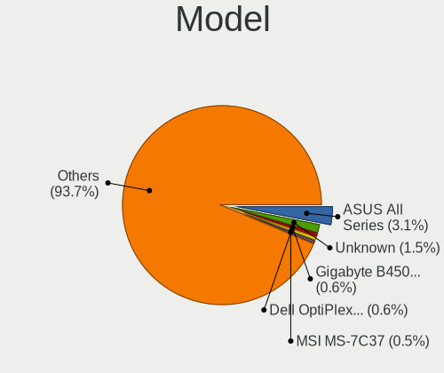
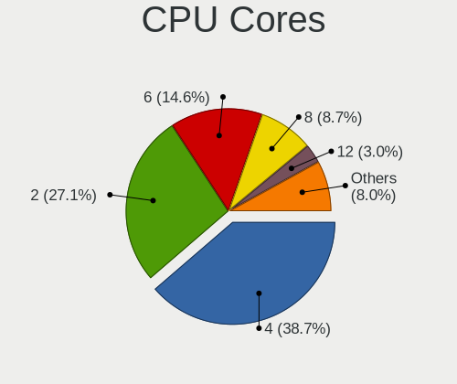
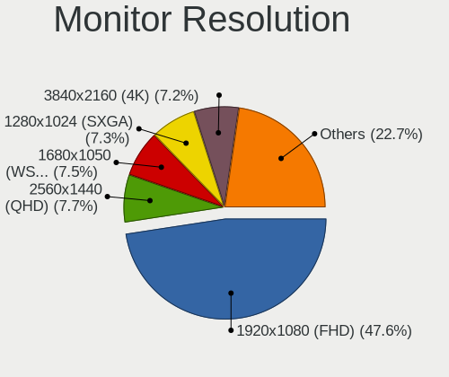
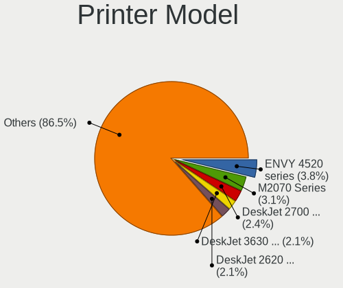

Linux in France - Tested Hardware & Statistics (Desktops)
---------------------------------------------------------

A project to collect tested hardware configurations for Linux in France.

Anyone can contribute to this report by the [hw-probe](https://github.com/linuxhw/hw-probe) tool:

    sudo -E hw-probe -all -upload

Please contribute! Especially if your hardware is rare.

Contents
--------

* [ Test Cases ](#test-cases)

* [ System ](#system)
  - [ OS                       ](#os)
  - [ OS Family                ](#os-family)
  - [ Kernel                   ](#kernel)
  - [ Kernel Family            ](#kernel-family)
  - [ Kernel Major Ver.        ](#kernel-major-ver)
  - [ Arch                     ](#arch)
  - [ DE                       ](#de)
  - [ Display Server           ](#display-server)
  - [ Display Manager          ](#display-manager)
  - [ OS Lang                  ](#os-lang)
  - [ Boot Mode                ](#boot-mode)
  - [ Filesystem               ](#filesystem)
  - [ Part. scheme             ](#part-scheme)
  - [ Dual Boot with Linux/BSD ](#dual-boot-with-linuxbsd)
  - [ Dual Boot (Win)          ](#dual-boot-win)

* [ Board ](#board)
  - [ Vendor                   ](#vendor)
  - [ Model                    ](#model)
  - [ Model Family             ](#model-family)
  - [ MFG Year                 ](#mfg-year)
  - [ Form Factor              ](#form-factor)
  - [ Secure Boot              ](#secure-boot)
  - [ Coreboot                 ](#coreboot)
  - [ RAM Size                 ](#ram-size)
  - [ RAM Used                 ](#ram-used)
  - [ Total Drives             ](#total-drives)
  - [ Has CD-ROM               ](#has-cd-rom)
  - [ Has Ethernet             ](#has-ethernet)
  - [ Has WiFi                 ](#has-wifi)
  - [ Has Bluetooth            ](#has-bluetooth)

* [ Location ](#location)
  - [ Country                  ](#country)
  - [ City                     ](#city)

* [ Drives ](#drives)
  - [ Drive Vendor             ](#drive-vendor)
  - [ Drive Model              ](#drive-model)
  - [ HDD Vendor               ](#hdd-vendor)
  - [ SSD Vendor               ](#ssd-vendor)
  - [ Drive Kind               ](#drive-kind)
  - [ Drive Connector          ](#drive-connector)
  - [ Drive Size               ](#drive-size)
  - [ Space Total              ](#space-total)
  - [ Space Used               ](#space-used)
  - [ Malfunc. Drives          ](#malfunc-drives)
  - [ Malfunc. Drive Vendor    ](#malfunc-drive-vendor)
  - [ Malfunc. HDD Vendor      ](#malfunc-hdd-vendor)
  - [ Malfunc. Drive Kind      ](#malfunc-drive-kind)
  - [ Failed Drives            ](#failed-drives)
  - [ Failed Drive Vendor      ](#failed-drive-vendor)
  - [ Drive Status             ](#drive-status)

* [ Storage controller ](#storage-controller)
  - [ Storage Vendor           ](#storage-vendor)
  - [ Storage Model            ](#storage-model)
  - [ Storage Kind             ](#storage-kind)

* [ Processor ](#processor)
  - [ CPU Vendor               ](#cpu-vendor)
  - [ CPU Model                ](#cpu-model)
  - [ CPU Model Family         ](#cpu-model-family)
  - [ CPU Cores                ](#cpu-cores)
  - [ CPU Sockets              ](#cpu-sockets)
  - [ CPU Threads              ](#cpu-threads)
  - [ CPU Op-Modes             ](#cpu-op-modes)
  - [ CPU Microcode            ](#cpu-microcode)
  - [ CPU Microarch            ](#cpu-microarch)

* [ Graphics ](#graphics)
  - [ GPU Vendor               ](#gpu-vendor)
  - [ GPU Model                ](#gpu-model)
  - [ GPU Combo                ](#gpu-combo)
  - [ GPU Driver               ](#gpu-driver)
  - [ GPU Memory               ](#gpu-memory)

* [ Monitor ](#monitor)
  - [ Monitor Vendor           ](#monitor-vendor)
  - [ Monitor Model            ](#monitor-model)
  - [ Monitor Resolution       ](#monitor-resolution)
  - [ Monitor Diagonal         ](#monitor-diagonal)
  - [ Monitor Width            ](#monitor-width)
  - [ Aspect Ratio             ](#aspect-ratio)
  - [ Monitor Area             ](#monitor-area)
  - [ Pixel Density            ](#pixel-density)
  - [ Multiple Monitors        ](#multiple-monitors)

* [ Network ](#network)
  - [ Net Controller Vendor    ](#net-controller-vendor)
  - [ Net Controller Model     ](#net-controller-model)
  - [ Wireless Vendor          ](#wireless-vendor)
  - [ Wireless Model           ](#wireless-model)
  - [ Ethernet Vendor          ](#ethernet-vendor)
  - [ Ethernet Model           ](#ethernet-model)
  - [ Net Controller Kind      ](#net-controller-kind)
  - [ Used Controller          ](#used-controller)
  - [ NICs                     ](#nics)
  - [ IPv6                     ](#ipv6)

* [ Bluetooth ](#bluetooth)
  - [ Bluetooth Vendor         ](#bluetooth-vendor)
  - [ Bluetooth Model          ](#bluetooth-model)

* [ Sound ](#sound)
  - [ Sound Vendor             ](#sound-vendor)
  - [ Sound Model              ](#sound-model)

* [ Memory ](#memory)
  - [ Memory Vendor            ](#memory-vendor)
  - [ Memory Model             ](#memory-model)
  - [ Memory Kind              ](#memory-kind)
  - [ Memory Form Factor       ](#memory-form-factor)
  - [ Memory Size              ](#memory-size)
  - [ Memory Speed             ](#memory-speed)

* [ Printers & scanners ](#printers--scanners)
  - [ Printer Vendor           ](#printer-vendor)
  - [ Printer Model            ](#printer-model)
  - [ Scanner Vendor           ](#scanner-vendor)
  - [ Scanner Model            ](#scanner-model)

* [ Camera ](#camera)
  - [ Camera Vendor            ](#camera-vendor)
  - [ Camera Model             ](#camera-model)

* [ Security ](#security)
  - [ Fingerprint Vendor       ](#fingerprint-vendor)
  - [ Fingerprint Model        ](#fingerprint-model)
  - [ Chipcard Vendor          ](#chipcard-vendor)
  - [ Chipcard Model           ](#chipcard-model)

* [ Unsupported ](#unsupported)
  - [ Unsupported Devices      ](#unsupported-devices)
  - [ Unsupported Device Types ](#unsupported-device-types)

Test Cases
----------

Total: 3986

| Vendor        | Model                       | Probe                                                      | Date         |
|---------------|-----------------------------|------------------------------------------------------------|--------------|
| MSI           | B360I GMAING PRO AC         | [bbdf7b4f77](https://linux-hardware.org/?probe=bbdf7b4f77) | Oct 01, 2022 |
| Unknown       | X79-P3                      | [9269fd5ff4](https://linux-hardware.org/?probe=9269fd5ff4) | Oct 01, 2022 |
| HP            | 0B4Ch D                     | [1b409fc1f6](https://linux-hardware.org/?probe=1b409fc1f6) | Oct 01, 2022 |
| HP            | 0B4Ch D                     | [ccc7fe3103](https://linux-hardware.org/?probe=ccc7fe3103) | Oct 01, 2022 |
| Lenovo        | SHARKBAY SDK0E50510 PRO     | [cb5d0d1945](https://linux-hardware.org/?probe=cb5d0d1945) | Oct 01, 2022 |
| Dell          | 0RW203                      | [c8a408311d](https://linux-hardware.org/?probe=c8a408311d) | Oct 01, 2022 |
| Lenovo        | SHARKBAY SDK0E50510 PRO     | [3af0c5cc5f](https://linux-hardware.org/?probe=3af0c5cc5f) | Oct 01, 2022 |
| Gigabyte      | B450 AORUS ELITE            | [dda857d7e6](https://linux-hardware.org/?probe=dda857d7e6) | Oct 01, 2022 |
| MSI           | MPG X570S EDGE MAX WIFI     | [d3d117cf14](https://linux-hardware.org/?probe=d3d117cf14) | Oct 01, 2022 |
| MSI           | X470 GAMING PRO             | [53e99a8ce6](https://linux-hardware.org/?probe=53e99a8ce6) | Oct 01, 2022 |
| ASUSTek       | PRIME B450-PLUS             | [db15c7b708](https://linux-hardware.org/?probe=db15c7b708) | Oct 01, 2022 |
| MSI           | Z270-A PRO                  | [6f96dc34e2](https://linux-hardware.org/?probe=6f96dc34e2) | Oct 01, 2022 |
| ASUSTek       | B75M-A                      | [cbeab03cbd](https://linux-hardware.org/?probe=cbeab03cbd) | Oct 01, 2022 |
| ASUSTek       | M5A78L-M LX                 | [d967f57569](https://linux-hardware.org/?probe=d967f57569) | Oct 01, 2022 |
| Shuttle       | FS35V4                      | [e38fd71e40](https://linux-hardware.org/?probe=e38fd71e40) | Oct 01, 2022 |
| Pegatron      | 2A94                        | [6425f7a434](https://linux-hardware.org/?probe=6425f7a434) | Sep 30, 2022 |
| Gigabyte      | G41M-Combo                  | [aa49a31777](https://linux-hardware.org/?probe=aa49a31777) | Sep 30, 2022 |
| ASRock        | X470 Master SLI             | [47c190b6e9](https://linux-hardware.org/?probe=47c190b6e9) | Sep 30, 2022 |
| Gigabyte      | B75M-D3H                    | [a7d5bbb754](https://linux-hardware.org/?probe=a7d5bbb754) | Sep 29, 2022 |
| Gigabyte      | B75M-D3H                    | [5f261094bf](https://linux-hardware.org/?probe=5f261094bf) | Sep 29, 2022 |
| Acer          | Predator G6-710             | [12fd4575f7](https://linux-hardware.org/?probe=12fd4575f7) | Sep 29, 2022 |
| ASUSTek       | P8P67                       | [1ad22cf7a8](https://linux-hardware.org/?probe=1ad22cf7a8) | Sep 28, 2022 |
| Gigabyte      | B450 I AORUS PRO WIFI-CF    | [d5185ee60b](https://linux-hardware.org/?probe=d5185ee60b) | Sep 28, 2022 |
| ASUSTek       | PRIME B450M-K               | [262a244d81](https://linux-hardware.org/?probe=262a244d81) | Sep 28, 2022 |
| MSI           | MPG X570 GAMING EDGE WIF... | [30507c8461](https://linux-hardware.org/?probe=30507c8461) | Sep 27, 2022 |
| Lenovo        | ThinkStation S30 056839G    | [427d10a5ca](https://linux-hardware.org/?probe=427d10a5ca) | Sep 27, 2022 |
| Dell          | 0M5DCD A00                  | [5168af6134](https://linux-hardware.org/?probe=5168af6134) | Sep 27, 2022 |
| Dell          | 0WN7Y6 A01                  | [356dc77824](https://linux-hardware.org/?probe=356dc77824) | Sep 27, 2022 |
| MSI           | X570-A PRO                  | [8e872a0556](https://linux-hardware.org/?probe=8e872a0556) | Sep 27, 2022 |
| HP            | 0A60h                       | [ccb90a4b31](https://linux-hardware.org/?probe=ccb90a4b31) | Sep 27, 2022 |
| Gigabyte      | 970A-DS3P                   | [202e51c5d3](https://linux-hardware.org/?probe=202e51c5d3) | Sep 26, 2022 |
| Dell          | 082WXT A01                  | [7b1ea76e92](https://linux-hardware.org/?probe=7b1ea76e92) | Sep 26, 2022 |
| Dell          | 082WXT A01                  | [7c4445ad04](https://linux-hardware.org/?probe=7c4445ad04) | Sep 26, 2022 |
| Gigabyte      | B75M-D3V                    | [291b07ce5f](https://linux-hardware.org/?probe=291b07ce5f) | Sep 26, 2022 |
| MSI           | C847IS-P33                  | [9b2205d329](https://linux-hardware.org/?probe=9b2205d329) | Sep 25, 2022 |
| ASUSTek       | TUF Gaming B560-PLUS WIF... | [56c982050d](https://linux-hardware.org/?probe=56c982050d) | Sep 25, 2022 |
| ASUSTek       | PRIME B350-PLUS             | [53c469011c](https://linux-hardware.org/?probe=53c469011c) | Sep 25, 2022 |
| ASUSTek       | ROG STRIX B550-E GAMING     | [c6c3ce5c04](https://linux-hardware.org/?probe=c6c3ce5c04) | Sep 25, 2022 |
| ASUSTek       | Rampage V EDITION 10        | [c65cbf84dc](https://linux-hardware.org/?probe=c65cbf84dc) | Sep 25, 2022 |
| ASUSTek       | G10AJ                       | [bf77a2476d](https://linux-hardware.org/?probe=bf77a2476d) | Sep 25, 2022 |
| Dell          | 0C7195                      | [9711ab00d7](https://linux-hardware.org/?probe=9711ab00d7) | Sep 24, 2022 |
| Foxconn       | 2ADA                        | [8a734f0799](https://linux-hardware.org/?probe=8a734f0799) | Sep 24, 2022 |
| ASUSTek       | P5QPL-VM EPU                | [8a4819f23d](https://linux-hardware.org/?probe=8a4819f23d) | Sep 23, 2022 |
| Gigabyte      | X570S AORUS ELITE AX        | [1553f6266c](https://linux-hardware.org/?probe=1553f6266c) | Sep 23, 2022 |
| ASUSTek       | TUF Gaming B560-PLUS WIF... | [7d69f0c6c6](https://linux-hardware.org/?probe=7d69f0c6c6) | Sep 23, 2022 |
| ASUSTek       | PRIME Z390-A                | [5e4d865987](https://linux-hardware.org/?probe=5e4d865987) | Sep 21, 2022 |
| ASUSTek       | PRIME B360-PLUS             | [49b3253936](https://linux-hardware.org/?probe=49b3253936) | Sep 21, 2022 |
| MSI           | H81M-P33                    | [108817dc0f](https://linux-hardware.org/?probe=108817dc0f) | Sep 21, 2022 |
| Dell          | 042P49 A02                  | [180561f253](https://linux-hardware.org/?probe=180561f253) | Sep 20, 2022 |
| ASRock        | X470 Master SLI             | [3c8fefe578](https://linux-hardware.org/?probe=3c8fefe578) | Sep 20, 2022 |
| ASRock        | X470 Master SLI             | [1975320cad](https://linux-hardware.org/?probe=1975320cad) | Sep 20, 2022 |
| Dell          | 040DDP A01                  | [635c6895e1](https://linux-hardware.org/?probe=635c6895e1) | Sep 20, 2022 |
| Lenovo        | 3728 SDK0R32862 WIN 3258... | [d78d85bde3](https://linux-hardware.org/?probe=d78d85bde3) | Sep 20, 2022 |
| Gigabyte      | B450 AORUS ELITE            | [bb0b1764e0](https://linux-hardware.org/?probe=bb0b1764e0) | Sep 19, 2022 |
| Dell          | 0XC837                      | [94ad27e346](https://linux-hardware.org/?probe=94ad27e346) | Sep 19, 2022 |
| ASUSTek       | TUF Gaming X570-PLUS        | [a06139b33d](https://linux-hardware.org/?probe=a06139b33d) | Sep 17, 2022 |
| ASUSTek       | P8Z77-V                     | [3ace24ebfc](https://linux-hardware.org/?probe=3ace24ebfc) | Sep 16, 2022 |
| Foxconn       | 2ADA                        | [b136916fb3](https://linux-hardware.org/?probe=b136916fb3) | Sep 16, 2022 |
| Dell          | 0NC2VH A01                  | [cba8ef504c](https://linux-hardware.org/?probe=cba8ef504c) | Sep 16, 2022 |
| Gigabyte      | B450M DS3H-CF               | [c99c4f9785](https://linux-hardware.org/?probe=c99c4f9785) | Sep 15, 2022 |
| MSI           | MPG B550I GAMING EDGE WI... | [a803a04b1f](https://linux-hardware.org/?probe=a803a04b1f) | Sep 15, 2022 |
| MSI           | MPG B550I GAMING EDGE WI... | [50f0cfbfad](https://linux-hardware.org/?probe=50f0cfbfad) | Sep 15, 2022 |
| Gigabyte      | B560M DS3H V2               | [af4b9d7add](https://linux-hardware.org/?probe=af4b9d7add) | Sep 14, 2022 |
| HP            | 1496                        | [cb6033fc21](https://linux-hardware.org/?probe=cb6033fc21) | Sep 14, 2022 |
| HP            | 81C5 MVB                    | [e274dcadcd](https://linux-hardware.org/?probe=e274dcadcd) | Sep 14, 2022 |
| Gigabyte      | Z590 UD AC                  | [8774a8312b](https://linux-hardware.org/?probe=8774a8312b) | Sep 13, 2022 |
| MSI           | PRESTIGE X570 CREATION      | [5e67e25052](https://linux-hardware.org/?probe=5e67e25052) | Sep 13, 2022 |
| ASUSTek       | ROG STRIX B550-I GAMING     | [cacc85ca2e](https://linux-hardware.org/?probe=cacc85ca2e) | Sep 13, 2022 |
| ASUSTek       | ROG STRIX B550-I GAMING     | [0c6d5b57dd](https://linux-hardware.org/?probe=0c6d5b57dd) | Sep 13, 2022 |
| ASUSTek       | ROG STRIX B550-E GAMING     | [7fb82d496f](https://linux-hardware.org/?probe=7fb82d496f) | Sep 12, 2022 |
| Dell          | 0H8052                      | [1ade497706](https://linux-hardware.org/?probe=1ade497706) | Sep 12, 2022 |
| ASUSTek       | ROG STRIX Z690-F GAMING ... | [d2ed0e3000](https://linux-hardware.org/?probe=d2ed0e3000) | Sep 12, 2022 |
| Dell          | 0VD92X A00                  | [2b699a677b](https://linux-hardware.org/?probe=2b699a677b) | Sep 11, 2022 |
| Foxconn       | 2ADA                        | [1b43b0d291](https://linux-hardware.org/?probe=1b43b0d291) | Sep 11, 2022 |
| ASUSTek       | Z170-A                      | [66c2198f48](https://linux-hardware.org/?probe=66c2198f48) | Sep 10, 2022 |
| ASUSTek       | PRIME H270-PRO              | [4ad8216bf8](https://linux-hardware.org/?probe=4ad8216bf8) | Sep 10, 2022 |
| ASUSTek       | PRIME H270-PRO              | [bfaebac5d4](https://linux-hardware.org/?probe=bfaebac5d4) | Sep 10, 2022 |
| Dell          | 0J3C2F A00                  | [40c43aff10](https://linux-hardware.org/?probe=40c43aff10) | Sep 10, 2022 |
| ASUSTek       | TUF Gaming B460M-PLUS       | [cd84312899](https://linux-hardware.org/?probe=cd84312899) | Sep 09, 2022 |
| Dell          | 0C7195                      | [728b74ef0c](https://linux-hardware.org/?probe=728b74ef0c) | Sep 09, 2022 |
| MSI           | Z77A-G45                    | [e26581d20e](https://linux-hardware.org/?probe=e26581d20e) | Sep 09, 2022 |
| MSI           | B450I GAMING PLUS AC        | [acbb191061](https://linux-hardware.org/?probe=acbb191061) | Sep 09, 2022 |
| Packard Be... | IMEDIA S2883                | [c4fe9ee6f0](https://linux-hardware.org/?probe=c4fe9ee6f0) | Sep 08, 2022 |
| ASUSTek       | PRIME B460M-A               | [c89a7d5488](https://linux-hardware.org/?probe=c89a7d5488) | Sep 07, 2022 |
| Dell          | 0JCTF8 A00                  | [7a0145000a](https://linux-hardware.org/?probe=7a0145000a) | Sep 07, 2022 |
| ASUSTek       | X99-E WS                    | [fcf815d38f](https://linux-hardware.org/?probe=fcf815d38f) | Sep 07, 2022 |
| ASUSTek       | PRIME H370-PLUS             | [14a3a316d5](https://linux-hardware.org/?probe=14a3a316d5) | Sep 07, 2022 |
| Gigabyte      | B450M DS3H-CF               | [0efcfb2037](https://linux-hardware.org/?probe=0efcfb2037) | Sep 07, 2022 |
| MSI           | MS-7387                     | [1f49477abf](https://linux-hardware.org/?probe=1f49477abf) | Sep 06, 2022 |
| ASUSTek       | G20AJ                       | [7e1557713a](https://linux-hardware.org/?probe=7e1557713a) | Sep 06, 2022 |
| HP            | 843B                        | [55206c17b9](https://linux-hardware.org/?probe=55206c17b9) | Sep 06, 2022 |
| Unknown       | SKYBAY                      | [6098d39f63](https://linux-hardware.org/?probe=6098d39f63) | Sep 05, 2022 |
| Gigabyte      | 990FXA-UD3                  | [a132b449e4](https://linux-hardware.org/?probe=a132b449e4) | Sep 05, 2022 |
| Dell          | 06JWJY A00                  | [a5f1112e93](https://linux-hardware.org/?probe=a5f1112e93) | Sep 05, 2022 |
| Dell          | 06FW8P A00                  | [6023e5aa76](https://linux-hardware.org/?probe=6023e5aa76) | Sep 05, 2022 |
| ASUSTek       | PRIME X570-P                | [6810a0954f](https://linux-hardware.org/?probe=6810a0954f) | Sep 05, 2022 |
| ASUSTek       | H81M-PLUS                   | [2d99107aa6](https://linux-hardware.org/?probe=2d99107aa6) | Sep 05, 2022 |
| ASUSTek       | PRIME H270M-PLUS            | [668995f3ff](https://linux-hardware.org/?probe=668995f3ff) | Sep 04, 2022 |
| ASUSTek       | PRIME X570-P                | [57e1ced53d](https://linux-hardware.org/?probe=57e1ced53d) | Sep 04, 2022 |
| ASUSTek       | PRIME X570-P                | [b704a0ae67](https://linux-hardware.org/?probe=b704a0ae67) | Sep 04, 2022 |
| ASUSTek       | PRIME X570-P                | [5065144435](https://linux-hardware.org/?probe=5065144435) | Sep 04, 2022 |
| HP            | 3397                        | [c66c292876](https://linux-hardware.org/?probe=c66c292876) | Sep 04, 2022 |
| ASRock        | 760GM-HDV                   | [ebf696b876](https://linux-hardware.org/?probe=ebf696b876) | Sep 03, 2022 |
| MSI           | H510M-A PRO                 | [eb29524a90](https://linux-hardware.org/?probe=eb29524a90) | Sep 03, 2022 |
| ASRock        | Z97 Pro3                    | [7ec410bfe6](https://linux-hardware.org/?probe=7ec410bfe6) | Sep 03, 2022 |
| Gigabyte      | B450M DS3H-CF               | [5f37e7a618](https://linux-hardware.org/?probe=5f37e7a618) | Sep 03, 2022 |
| HP            | 18E4                        | [c58c0043cb](https://linux-hardware.org/?probe=c58c0043cb) | Sep 03, 2022 |
| ASUSTek       | ROG Maximus XI FORMULA      | [b765d1e662](https://linux-hardware.org/?probe=b765d1e662) | Sep 02, 2022 |
| Gigabyte      | B85M-HD3                    | [4f4717cb85](https://linux-hardware.org/?probe=4f4717cb85) | Sep 02, 2022 |
| Gigabyte      | B550 GAMING X V2            | [756431d18d](https://linux-hardware.org/?probe=756431d18d) | Sep 02, 2022 |
| ASUSTek       | TUF Gaming B450-PLUS II     | [efc46d8d23](https://linux-hardware.org/?probe=efc46d8d23) | Sep 01, 2022 |
| MSI           | MAG X570S TORPEDO MAX       | [d98546fd95](https://linux-hardware.org/?probe=d98546fd95) | Aug 31, 2022 |
| MSI           | MPG B550I GAMING EDGE WI... | [aacd965d80](https://linux-hardware.org/?probe=aacd965d80) | Aug 31, 2022 |
| MSI           | MPG B550I GAMING EDGE WI... | [c5547cac7c](https://linux-hardware.org/?probe=c5547cac7c) | Aug 31, 2022 |
| MSI           | MPG B550I GAMING EDGE WI... | [e5c7462ead](https://linux-hardware.org/?probe=e5c7462ead) | Aug 31, 2022 |
| HP            | 83E0                        | [af9b15b8e7](https://linux-hardware.org/?probe=af9b15b8e7) | Aug 31, 2022 |
| ASUSTek       | Z97-A                       | [1e70cd86f6](https://linux-hardware.org/?probe=1e70cd86f6) | Aug 31, 2022 |
| Dell          | 040DDP A00                  | [09ffe165d3](https://linux-hardware.org/?probe=09ffe165d3) | Aug 30, 2022 |
| MSI           | MPG B550I GAMING EDGE WI... | [e770273b10](https://linux-hardware.org/?probe=e770273b10) | Aug 30, 2022 |
| ASUSTek       | P8P67 PRO                   | [aa43ab7091](https://linux-hardware.org/?probe=aa43ab7091) | Aug 29, 2022 |
| ASUSTek       | P8P67 PRO                   | [4882cfb195](https://linux-hardware.org/?probe=4882cfb195) | Aug 29, 2022 |
| MSI           | B250M PRO-VD                | [d462e3b9d0](https://linux-hardware.org/?probe=d462e3b9d0) | Aug 29, 2022 |
| MSI           | H310M PRO-M2 PLUS           | [a561fb6354](https://linux-hardware.org/?probe=a561fb6354) | Aug 29, 2022 |
| Lenovo        | MAHOBAY NO DPK              | [2d013c60ed](https://linux-hardware.org/?probe=2d013c60ed) | Aug 29, 2022 |
| MSI           | MAG B550 TORPEDO            | [58f0ba95c3](https://linux-hardware.org/?probe=58f0ba95c3) | Aug 29, 2022 |
| Gigabyte      | GA-MA790FXT-UD5P            | [e692fe97cb](https://linux-hardware.org/?probe=e692fe97cb) | Aug 28, 2022 |
| Medion        | B460H6-EM                   | [91371e505d](https://linux-hardware.org/?probe=91371e505d) | Aug 28, 2022 |
| Gigabyte      | B450 AORUS ELITE            | [859b3cb78a](https://linux-hardware.org/?probe=859b3cb78a) | Aug 28, 2022 |
| Gigabyte      | G41M-Combo                  | [353da69160](https://linux-hardware.org/?probe=353da69160) | Aug 26, 2022 |
| Intel         | X79G V2.x                   | [8418a8e83c](https://linux-hardware.org/?probe=8418a8e83c) | Aug 26, 2022 |
| Intel         | X79G V2.x                   | [2a3114af33](https://linux-hardware.org/?probe=2a3114af33) | Aug 26, 2022 |
| Foxconn       | 2ABF                        | [46efca142c](https://linux-hardware.org/?probe=46efca142c) | Aug 26, 2022 |
| HP            | 18E5                        | [9196bf639b](https://linux-hardware.org/?probe=9196bf639b) | Aug 26, 2022 |
| Lenovo        | 7033EW4                     | [54417ae55f](https://linux-hardware.org/?probe=54417ae55f) | Aug 26, 2022 |
| Packard Be... | IMEDIA S1300                | [4b8f3feaa7](https://linux-hardware.org/?probe=4b8f3feaa7) | Aug 25, 2022 |
| Dell          | 0RJ290                      | [ca82162ed5](https://linux-hardware.org/?probe=ca82162ed5) | Aug 25, 2022 |
| Acer          | Aspire XC-710 V:1.1         | [0b76e0f97d](https://linux-hardware.org/?probe=0b76e0f97d) | Aug 25, 2022 |
| ASUSTek       | UN62                        | [49fcd1324f](https://linux-hardware.org/?probe=49fcd1324f) | Aug 25, 2022 |
| ASUSTek       | PRIME X570-PRO              | [663509c999](https://linux-hardware.org/?probe=663509c999) | Aug 24, 2022 |
| ASUSTek       | PRIME X570-PRO              | [2b7d1d59a1](https://linux-hardware.org/?probe=2b7d1d59a1) | Aug 24, 2022 |
| HP            | 21D0                        | [1bd58d519c](https://linux-hardware.org/?probe=1bd58d519c) | Aug 24, 2022 |
| Gigabyte      | A320M-H-CF                  | [476ca6c833](https://linux-hardware.org/?probe=476ca6c833) | Aug 24, 2022 |
| Dell          | 0MWYPT A02                  | [017af6f58d](https://linux-hardware.org/?probe=017af6f58d) | Aug 23, 2022 |
| HP            | 3397                        | [335f59c96f](https://linux-hardware.org/?probe=335f59c96f) | Aug 22, 2022 |
| Biostar       | H81MHV3 5.0                 | [161cae6726](https://linux-hardware.org/?probe=161cae6726) | Aug 22, 2022 |
| ASRock        | A320M-HDV R4.0              | [82481d6225](https://linux-hardware.org/?probe=82481d6225) | Aug 22, 2022 |
| ASRock        | A520M-HVS                   | [842ad7d4d2](https://linux-hardware.org/?probe=842ad7d4d2) | Aug 22, 2022 |
| ASUSTek       | Z87-C                       | [8de83c544f](https://linux-hardware.org/?probe=8de83c544f) | Aug 21, 2022 |
| Foxconn       | 2ABF                        | [3eed86b908](https://linux-hardware.org/?probe=3eed86b908) | Aug 21, 2022 |
| Packard Be... | PT890-8237A                 | [36a4120390](https://linux-hardware.org/?probe=36a4120390) | Aug 20, 2022 |
| ASUSTek       | TUF B350M-PLUS GAMING       | [b2ac87cffc](https://linux-hardware.org/?probe=b2ac87cffc) | Aug 20, 2022 |
| MSI           | MAG X570S TORPEDO MAX       | [d5e91a17b8](https://linux-hardware.org/?probe=d5e91a17b8) | Aug 20, 2022 |
| HP            | 805D                        | [6748d722e7](https://linux-hardware.org/?probe=6748d722e7) | Aug 19, 2022 |
| HP            | 1497                        | [580e1a6efe](https://linux-hardware.org/?probe=580e1a6efe) | Aug 19, 2022 |
| Acer          | Veriton X2631G V:1.0        | [de98920808](https://linux-hardware.org/?probe=de98920808) | Aug 18, 2022 |
| Intel         | D54250WYK H13922-302        | [ba78bd360c](https://linux-hardware.org/?probe=ba78bd360c) | Aug 18, 2022 |
| eMachines     | ET1350                      | [96e9f7aba7](https://linux-hardware.org/?probe=96e9f7aba7) | Aug 18, 2022 |
| Foxconn       | 2ADA                        | [015ccc4b06](https://linux-hardware.org/?probe=015ccc4b06) | Aug 18, 2022 |
| Dell          | 0FDY5C A00                  | [4cd1658b87](https://linux-hardware.org/?probe=4cd1658b87) | Aug 17, 2022 |
| MSI           | X470 GAMING PRO             | [b648d56b04](https://linux-hardware.org/?probe=b648d56b04) | Aug 17, 2022 |
| Dell          | 00V62H A01                  | [34b4c61308](https://linux-hardware.org/?probe=34b4c61308) | Aug 17, 2022 |
| Gigabyte      | B85M-D3PH                   | [a5ed221478](https://linux-hardware.org/?probe=a5ed221478) | Aug 17, 2022 |
| Dell          | 0YXT71 A00                  | [def7e10c65](https://linux-hardware.org/?probe=def7e10c65) | Aug 17, 2022 |
| Acer          | Veriton X2631G V:1.0        | [a7af0ea5e7](https://linux-hardware.org/?probe=a7af0ea5e7) | Aug 17, 2022 |
| MSI           | H170M PRO-VDH               | [4d7aa09763](https://linux-hardware.org/?probe=4d7aa09763) | Aug 16, 2022 |
| ASUSTek       | TUF Gaming B450-PLUS II     | [dd98185972](https://linux-hardware.org/?probe=dd98185972) | Aug 16, 2022 |
| Dell          | 0T656F A01                  | [ec4014a549](https://linux-hardware.org/?probe=ec4014a549) | Aug 16, 2022 |
| Lenovo        | 370A SDK0J40700 WIN 3258... | [ed6155d213](https://linux-hardware.org/?probe=ed6155d213) | Aug 16, 2022 |
| Dell          | 0GM819                      | [f7745d3d3a](https://linux-hardware.org/?probe=f7745d3d3a) | Aug 16, 2022 |
| ASRock        | X470 Master SLI             | [ce62975b20](https://linux-hardware.org/?probe=ce62975b20) | Aug 15, 2022 |
| Gigabyte      | B75M-D3V                    | [cdea2e0afd](https://linux-hardware.org/?probe=cdea2e0afd) | Aug 15, 2022 |
| Gigabyte      | B75M-D3V                    | [87f8cc8553](https://linux-hardware.org/?probe=87f8cc8553) | Aug 15, 2022 |
| MSI           | A320M-A PRO MAX             | [bf211d4e64](https://linux-hardware.org/?probe=bf211d4e64) | Aug 15, 2022 |
| Gigabyte      | B450M H                     | [a16dfdfe7b](https://linux-hardware.org/?probe=a16dfdfe7b) | Aug 15, 2022 |
| ASUSTek       | P7P55D                      | [cd43fbf16a](https://linux-hardware.org/?probe=cd43fbf16a) | Aug 15, 2022 |
| ASUSTek       | TUF Gaming X570-PLUS        | [53429d945b](https://linux-hardware.org/?probe=53429d945b) | Aug 15, 2022 |
| ASUSTek       | Z170 PRO GAMING             | [3d2bd6d842](https://linux-hardware.org/?probe=3d2bd6d842) | Aug 15, 2022 |
| HP            | 0B4Ch D                     | [deaaa5c32c](https://linux-hardware.org/?probe=deaaa5c32c) | Aug 15, 2022 |
| Gigabyte      | B460 AORUS PRO AC           | [ab9e6d26d6](https://linux-hardware.org/?probe=ab9e6d26d6) | Aug 14, 2022 |
| Gigabyte      | H97N-WIFI                   | [966a3e1593](https://linux-hardware.org/?probe=966a3e1593) | Aug 13, 2022 |
| ASRock        | H61M-DGS                    | [50b7221c5a](https://linux-hardware.org/?probe=50b7221c5a) | Aug 12, 2022 |
| ASUSTek       | ROG STRIX B550-F GAMING     | [8c792d555c](https://linux-hardware.org/?probe=8c792d555c) | Aug 12, 2022 |
| Gigabyte      | H370 HD3-CF                 | [3d93d807ca](https://linux-hardware.org/?probe=3d93d807ca) | Aug 12, 2022 |
| MSI           | Z87-G45 GAMING              | [2f541727e1](https://linux-hardware.org/?probe=2f541727e1) | Aug 12, 2022 |
| ASUSTek       | PRIME A320M-K               | [1f75df3828](https://linux-hardware.org/?probe=1f75df3828) | Aug 12, 2022 |
| ASRock        | Z97M Pro4                   | [245d189a61](https://linux-hardware.org/?probe=245d189a61) | Aug 11, 2022 |
| Gigabyte      | H370 AORUS GAMING 3 WIFI... | [d2f7a86fd8](https://linux-hardware.org/?probe=d2f7a86fd8) | Aug 11, 2022 |
| ASRock        | H61M/U3S3                   | [be0d853621](https://linux-hardware.org/?probe=be0d853621) | Aug 11, 2022 |
| Gigabyte      | B450M DS3H V2               | [33dc68fe04](https://linux-hardware.org/?probe=33dc68fe04) | Aug 11, 2022 |
| Vorke         | V1 Plus                     | [a31728f53e](https://linux-hardware.org/?probe=a31728f53e) | Aug 10, 2022 |
| Lenovo        | SHARKBAY NOK                | [9a77cf2f22](https://linux-hardware.org/?probe=9a77cf2f22) | Aug 10, 2022 |
| eMachines     | Veriton V2110               | [3492540d77](https://linux-hardware.org/?probe=3492540d77) | Aug 09, 2022 |
| MSI           | MPG X570S EDGE MAX WIFI     | [346b22a42e](https://linux-hardware.org/?probe=346b22a42e) | Aug 09, 2022 |
| ASRock        | G41M-VS3                    | [16a2e0ab5d](https://linux-hardware.org/?probe=16a2e0ab5d) | Aug 09, 2022 |
| MSI           | MPG B550I GAMING EDGE WI... | [77396822d3](https://linux-hardware.org/?probe=77396822d3) | Aug 09, 2022 |
| MSI           | MAG B550 TOMAHAWK           | [1713317338](https://linux-hardware.org/?probe=1713317338) | Aug 09, 2022 |
| Lenovo        | Bantry CRB NOK              | [fbeb21c99a](https://linux-hardware.org/?probe=fbeb21c99a) | Aug 09, 2022 |
| Foxconn       | 2ABF                        | [89d9f69018](https://linux-hardware.org/?probe=89d9f69018) | Aug 09, 2022 |
| Lenovo        | SHARKBAY NOK                | [c9bb066a9b](https://linux-hardware.org/?probe=c9bb066a9b) | Aug 08, 2022 |
| Lenovo        | SHARKBAY NOK                | [7bc9d5090f](https://linux-hardware.org/?probe=7bc9d5090f) | Aug 08, 2022 |
| ASUSTek       | G20AJ                       | [613f8a0c36](https://linux-hardware.org/?probe=613f8a0c36) | Aug 08, 2022 |
| Foxconn       | 2ABF                        | [ee62b165ef](https://linux-hardware.org/?probe=ee62b165ef) | Aug 08, 2022 |
| ASUSTek       | PRIME A320M-K               | [40808a05c1](https://linux-hardware.org/?probe=40808a05c1) | Aug 07, 2022 |
| Foxconn       | 2ABF                        | [bfa218709f](https://linux-hardware.org/?probe=bfa218709f) | Aug 07, 2022 |
| Gigabyte      | H370 AORUS GAMING 3 WIFI... | [6eac3041ec](https://linux-hardware.org/?probe=6eac3041ec) | Aug 07, 2022 |
| Gigabyte      | F2A78M-HD2                  | [64b08b679f](https://linux-hardware.org/?probe=64b08b679f) | Aug 05, 2022 |
| MSI           | MPG B550I GAMING EDGE WI... | [255c2dd960](https://linux-hardware.org/?probe=255c2dd960) | Aug 05, 2022 |
| MSI           | MAG B460M BAZOOKA           | [85037ebcb0](https://linux-hardware.org/?probe=85037ebcb0) | Aug 05, 2022 |
| ASUSTek       | ROG Maximus XI HERO         | [d725206bff](https://linux-hardware.org/?probe=d725206bff) | Aug 04, 2022 |
| ASUSTek       | P5N-E SLI                   | [237c4a2367](https://linux-hardware.org/?probe=237c4a2367) | Aug 04, 2022 |
| Dell          | 0HGFJM A00                  | [b1011ae242](https://linux-hardware.org/?probe=b1011ae242) | Aug 04, 2022 |
| MSI           | Z170A GAMING M5             | [37ccdc4cf7](https://linux-hardware.org/?probe=37ccdc4cf7) | Aug 04, 2022 |
| Lenovo        | SDK0E50510 WIN              | [e43f32d47e](https://linux-hardware.org/?probe=e43f32d47e) | Aug 04, 2022 |
| ASRock        | G41M-VS3                    | [16c2b30680](https://linux-hardware.org/?probe=16c2b30680) | Aug 04, 2022 |
| MSI           | 970 GAMING                  | [5eee2883a9](https://linux-hardware.org/?probe=5eee2883a9) | Aug 04, 2022 |
| ASUSTek       | P6T                         | [978f8623ff](https://linux-hardware.org/?probe=978f8623ff) | Aug 03, 2022 |
| Foxconn       | 2ADA                        | [81b60bd487](https://linux-hardware.org/?probe=81b60bd487) | Aug 03, 2022 |
| ASRock        | NUC-8265U                   | [32b0ae0f97](https://linux-hardware.org/?probe=32b0ae0f97) | Aug 03, 2022 |
| Supermicro    | X7DCL                       | [4b841e9401](https://linux-hardware.org/?probe=4b841e9401) | Aug 03, 2022 |
| Dell          | 0KW626                      | [629c1c7800](https://linux-hardware.org/?probe=629c1c7800) | Aug 03, 2022 |
| Acer          | Veriton X2631G V:1.0        | [182bfa1039](https://linux-hardware.org/?probe=182bfa1039) | Aug 02, 2022 |
| Lenovo        | SHARKBAY NOK                | [7f574acfee](https://linux-hardware.org/?probe=7f574acfee) | Aug 02, 2022 |
| ASUSTek       | Z87-EXPERT                  | [f513bdb1f5](https://linux-hardware.org/?probe=f513bdb1f5) | Aug 02, 2022 |
| ASUSTek       | Z87-EXPERT                  | [ec9385b488](https://linux-hardware.org/?probe=ec9385b488) | Aug 02, 2022 |
| MSI           | Z97 GAMING 5                | [d2c534d06f](https://linux-hardware.org/?probe=d2c534d06f) | Aug 02, 2022 |
| Acer          | EM61SM/EM61PM               | [1a35a6d7dc](https://linux-hardware.org/?probe=1a35a6d7dc) | Aug 02, 2022 |
| Lenovo        | 314F SDK0Q40112 WIN 3305... | [e906976bea](https://linux-hardware.org/?probe=e906976bea) | Aug 02, 2022 |
| Acer          | Veriton X2631G V:1.0        | [e63e46c5a4](https://linux-hardware.org/?probe=e63e46c5a4) | Aug 02, 2022 |
| Gigabyte      | G1.SNIPER B7-CF             | [83e4b444ae](https://linux-hardware.org/?probe=83e4b444ae) | Aug 01, 2022 |
| Gigabyte      | G1.SNIPER B7-CF             | [4e335cb7ce](https://linux-hardware.org/?probe=4e335cb7ce) | Aug 01, 2022 |
| Gigabyte      | H87-HD3                     | [daaf600950](https://linux-hardware.org/?probe=daaf600950) | Aug 01, 2022 |
| MSI           | MAG B550 TOMAHAWK           | [0d7342cca0](https://linux-hardware.org/?probe=0d7342cca0) | Aug 01, 2022 |
| ASUSTek       | Z170-A                      | [5f41623898](https://linux-hardware.org/?probe=5f41623898) | Aug 01, 2022 |
| MSI           | Z490-A PRO                  | [054fdc9187](https://linux-hardware.org/?probe=054fdc9187) | Jul 31, 2022 |
| MSI           | A68HM-E33 V2                | [86af6982c5](https://linux-hardware.org/?probe=86af6982c5) | Jul 30, 2022 |
| ASUSTek       | P5P43TD PRO                 | [7325fb8135](https://linux-hardware.org/?probe=7325fb8135) | Jul 30, 2022 |
| Gigabyte      | AB350-Gaming 3-CF           | [bc1c5d997f](https://linux-hardware.org/?probe=bc1c5d997f) | Jul 30, 2022 |
| ASUSTek       | TUF Gaming X570-PLUS        | [9ea9e6f737](https://linux-hardware.org/?probe=9ea9e6f737) | Jul 30, 2022 |
| ASUSTek       | TUF Gaming X570-PLUS        | [c2e42e1cbb](https://linux-hardware.org/?probe=c2e42e1cbb) | Jul 30, 2022 |
| Gigabyte      | G41M-Combo                  | [3ec038d45b](https://linux-hardware.org/?probe=3ec038d45b) | Jul 30, 2022 |
| MSI           | MPG B550I GAMING EDGE WI... | [efa02942f2](https://linux-hardware.org/?probe=efa02942f2) | Jul 29, 2022 |
| ASUSTek       | B85M-E/DASH                 | [2ebbaa4052](https://linux-hardware.org/?probe=2ebbaa4052) | Jul 29, 2022 |
| HP            | 339A                        | [fa0d80162a](https://linux-hardware.org/?probe=fa0d80162a) | Jul 29, 2022 |
| Dell          | 0W0CHX A00                  | [be7cc4f033](https://linux-hardware.org/?probe=be7cc4f033) | Jul 29, 2022 |
| Intel         | SHARKBAY                    | [bd5b812271](https://linux-hardware.org/?probe=bd5b812271) | Jul 29, 2022 |
| Acer          | Veriton M4610G              | [00ec5bea11](https://linux-hardware.org/?probe=00ec5bea11) | Jul 29, 2022 |
| ASUSTek       | TUF Gaming B550-PLUS        | [2953cb274f](https://linux-hardware.org/?probe=2953cb274f) | Jul 28, 2022 |
| ASUSTek       | H81M-PLUS                   | [db534130d2](https://linux-hardware.org/?probe=db534130d2) | Jul 28, 2022 |
| HP            | 21F5                        | [27cf2d6a42](https://linux-hardware.org/?probe=27cf2d6a42) | Jul 28, 2022 |
| Gigabyte      | Z77-D3H                     | [2d3706b78b](https://linux-hardware.org/?probe=2d3706b78b) | Jul 28, 2022 |
| HP            | 8860 A                      | [10dc51c925](https://linux-hardware.org/?probe=10dc51c925) | Jul 28, 2022 |
| HP            | ProLiant MicroServer        | [8104eee56e](https://linux-hardware.org/?probe=8104eee56e) | Jul 28, 2022 |
| Gigabyte      | A520M DS3H                  | [900a5b4f7f](https://linux-hardware.org/?probe=900a5b4f7f) | Jul 28, 2022 |
| ASUSTek       | P7P55D                      | [0c9828e226](https://linux-hardware.org/?probe=0c9828e226) | Jul 28, 2022 |
| MSI           | B250M PRO-VDH               | [737604edb6](https://linux-hardware.org/?probe=737604edb6) | Jul 28, 2022 |
| Intel         | DH61AG AAG23736-505         | [7fd3a18899](https://linux-hardware.org/?probe=7fd3a18899) | Jul 28, 2022 |
| MSI           | B450M PRO-M2 MAX            | [ab8af10726](https://linux-hardware.org/?probe=ab8af10726) | Jul 28, 2022 |
| HP            | 3048h                       | [01d1b1e99a](https://linux-hardware.org/?probe=01d1b1e99a) | Jul 28, 2022 |
| MSI           | H110I PRO                   | [1dcc4b694a](https://linux-hardware.org/?probe=1dcc4b694a) | Jul 28, 2022 |
| ASUSTek       | PRIME X470-PRO              | [ce5af45a80](https://linux-hardware.org/?probe=ce5af45a80) | Jul 28, 2022 |
| ASUSTek       | GRYPHON Z87                 | [73b9d340d2](https://linux-hardware.org/?probe=73b9d340d2) | Jul 28, 2022 |
| HP            | 1495                        | [e5f22db975](https://linux-hardware.org/?probe=e5f22db975) | Jul 28, 2022 |
| MSI           | X370 GAMING PLUS            | [a39ccd24ff](https://linux-hardware.org/?probe=a39ccd24ff) | Jul 27, 2022 |
| Dell          | 09KPNV A00                  | [610282a0e6](https://linux-hardware.org/?probe=610282a0e6) | Jul 27, 2022 |
| Pegatron      | 2A94h                       | [3a92c9c971](https://linux-hardware.org/?probe=3a92c9c971) | Jul 27, 2022 |
| MSI           | MPG X570S EDGE MAX WIFI     | [29780cf747](https://linux-hardware.org/?probe=29780cf747) | Jul 27, 2022 |
| ASUSTek       | TUF Gaming B550-PLUS        | [ed58dd6bb4](https://linux-hardware.org/?probe=ed58dd6bb4) | Jul 27, 2022 |
| ASUSTek       | H61-PLUS                    | [fd45d5c31b](https://linux-hardware.org/?probe=fd45d5c31b) | Jul 27, 2022 |
| Gigabyte      | H470M DS3H                  | [5f90ec9763](https://linux-hardware.org/?probe=5f90ec9763) | Jul 27, 2022 |
| Dell          | 0C27VV A03                  | [c1c4edd1e5](https://linux-hardware.org/?probe=c1c4edd1e5) | Jul 26, 2022 |
| ASRock        | H510M-HDV/M.2               | [e7672c215b](https://linux-hardware.org/?probe=e7672c215b) | Jul 26, 2022 |
| Gigabyte      | X570 AORUS ULTRA            | [af32973765](https://linux-hardware.org/?probe=af32973765) | Jul 26, 2022 |
| HP            | 870C                        | [b88964a379](https://linux-hardware.org/?probe=b88964a379) | Jul 26, 2022 |
| ASUSTek       | AT5NM10T-I                  | [9738c4bebc](https://linux-hardware.org/?probe=9738c4bebc) | Jul 26, 2022 |
| ASRock        | H81M-HDS                    | [5a42337e2b](https://linux-hardware.org/?probe=5a42337e2b) | Jul 22, 2022 |
| HP            | 0A68h                       | [cc4b39e6d0](https://linux-hardware.org/?probe=cc4b39e6d0) | Jul 22, 2022 |
| ASRock        | H81M-HDS                    | [ba68702925](https://linux-hardware.org/?probe=ba68702925) | Jul 22, 2022 |
| Gigabyte      | H370 AORUS GAMING 3 WIFI... | [b08505b90e](https://linux-hardware.org/?probe=b08505b90e) | Jul 21, 2022 |
| Dell          | 0KJCC5 A00                  | [4eec45d964](https://linux-hardware.org/?probe=4eec45d964) | Jul 21, 2022 |
| HP            | 0B4Ch D                     | [15e71f4f03](https://linux-hardware.org/?probe=15e71f4f03) | Jul 21, 2022 |
| Dell          | 0HD5W2 A01                  | [e2eca7122c](https://linux-hardware.org/?probe=e2eca7122c) | Jul 21, 2022 |
| Lenovo        | 1.0                         | [e520e716cf](https://linux-hardware.org/?probe=e520e716cf) | Jul 21, 2022 |
| ASRock        | B550 Extreme4               | [226924706f](https://linux-hardware.org/?probe=226924706f) | Jul 20, 2022 |
| MSI           | MPG X570S EDGE MAX WIFI     | [f7678fb134](https://linux-hardware.org/?probe=f7678fb134) | Jul 20, 2022 |
| MSI           | PRO B660M-A DDR4            | [ba0058e96e](https://linux-hardware.org/?probe=ba0058e96e) | Jul 20, 2022 |
| Gigabyte      | Z590M                       | [b173d6beaa](https://linux-hardware.org/?probe=b173d6beaa) | Jul 20, 2022 |
| ASUSTek       | P8Z68-V LX                  | [0de7d2f427](https://linux-hardware.org/?probe=0de7d2f427) | Jul 20, 2022 |
| Gigabyte      | H61M-S2PV                   | [44b9b405c2](https://linux-hardware.org/?probe=44b9b405c2) | Jul 20, 2022 |
| MSI           | MPG X570S EDGE MAX WIFI     | [fdc7518bfd](https://linux-hardware.org/?probe=fdc7518bfd) | Jul 19, 2022 |
| Gigabyte      | B150M-D3H-CF                | [65fb347b62](https://linux-hardware.org/?probe=65fb347b62) | Jul 19, 2022 |
| Lenovo        | 370A SDK0J40700 WIN 3258... | [2c81e24a1a](https://linux-hardware.org/?probe=2c81e24a1a) | Jul 19, 2022 |
| Lenovo        | 370A SDK0J40700 WIN 3258... | [290d973b31](https://linux-hardware.org/?probe=290d973b31) | Jul 19, 2022 |
| MSI           | B75MA-P45                   | [89af63cf6f](https://linux-hardware.org/?probe=89af63cf6f) | Jul 19, 2022 |
| ASUSTek       | TUF Gaming Z690-PLUS D4     | [dc94f6ef14](https://linux-hardware.org/?probe=dc94f6ef14) | Jul 17, 2022 |
| Gigabyte      | B75M-D3H                    | [1c0d0a79d1](https://linux-hardware.org/?probe=1c0d0a79d1) | Jul 17, 2022 |
| Gigabyte      | F2A78M-DS2                  | [00a709911c](https://linux-hardware.org/?probe=00a709911c) | Jul 17, 2022 |
| MSI           | MPG B550I GAMING EDGE WI... | [d3a4952274](https://linux-hardware.org/?probe=d3a4952274) | Jul 15, 2022 |
| MSI           | MPG B550I GAMING EDGE WI... | [047f24d3e3](https://linux-hardware.org/?probe=047f24d3e3) | Jul 15, 2022 |
| Lenovo        | 7033EW4                     | [e471fc8ecd](https://linux-hardware.org/?probe=e471fc8ecd) | Jul 15, 2022 |
| MSI           | Z170A GAMING M5             | [16d2d7469b](https://linux-hardware.org/?probe=16d2d7469b) | Jul 15, 2022 |
| Dell          | 0MFHTR A00                  | [2ba698429a](https://linux-hardware.org/?probe=2ba698429a) | Jul 14, 2022 |
| MSI           | G41M-P28                    | [8bd39aa164](https://linux-hardware.org/?probe=8bd39aa164) | Jul 14, 2022 |
| ASRock        | X570 Taichi                 | [98ffa2e8b0](https://linux-hardware.org/?probe=98ffa2e8b0) | Jul 13, 2022 |
| Gigabyte      | M68M-S2P                    | [7096026beb](https://linux-hardware.org/?probe=7096026beb) | Jul 13, 2022 |
| Intel         | DH55TC AAE70932-303         | [0005417882](https://linux-hardware.org/?probe=0005417882) | Jul 13, 2022 |
| ASRock        | B550 Extreme4               | [6106db3d9a](https://linux-hardware.org/?probe=6106db3d9a) | Jul 12, 2022 |
| MSI           | MPG X570S EDGE MAX WIFI     | [fafb6deae6](https://linux-hardware.org/?probe=fafb6deae6) | Jul 12, 2022 |
| Gigabyte      | GA-MA785GM-US2H             | [8a5a5a0987](https://linux-hardware.org/?probe=8a5a5a0987) | Jul 12, 2022 |
| MSI           | MAG X570S TORPEDO MAX       | [80de38308d](https://linux-hardware.org/?probe=80de38308d) | Jul 11, 2022 |
| MSI           | H97M-G43                    | [c8b2844540](https://linux-hardware.org/?probe=c8b2844540) | Jul 11, 2022 |
| ASUSTek       | H61M-C                      | [1ff5597164](https://linux-hardware.org/?probe=1ff5597164) | Jul 11, 2022 |
| Gigabyte      | GA-A75-UD4H                 | [eba82e4b87](https://linux-hardware.org/?probe=eba82e4b87) | Jul 10, 2022 |
| Gigabyte      | EP45-UD3                    | [195c60abeb](https://linux-hardware.org/?probe=195c60abeb) | Jul 08, 2022 |
| Gigabyte      | M68M-S2P                    | [ab2da6e00c](https://linux-hardware.org/?probe=ab2da6e00c) | Jul 08, 2022 |
| Gigabyte      | M68M-S2P                    | [b4bfeb947f](https://linux-hardware.org/?probe=b4bfeb947f) | Jul 08, 2022 |
| MSI           | Z590-A PRO                  | [45155c9045](https://linux-hardware.org/?probe=45155c9045) | Jul 07, 2022 |
| ASUSTek       | TUF Gaming X570-PLUS        | [8b1d9534ff](https://linux-hardware.org/?probe=8b1d9534ff) | Jul 07, 2022 |
| MSI           | Z590-A PRO                  | [2685bc5f4f](https://linux-hardware.org/?probe=2685bc5f4f) | Jul 07, 2022 |
| ASUSTek       | STRIX Z270F GAMING          | [758112a61d](https://linux-hardware.org/?probe=758112a61d) | Jul 07, 2022 |
| Gigabyte      | Z170XP-SLI-CF               | [36546bd458](https://linux-hardware.org/?probe=36546bd458) | Jul 06, 2022 |
| Gigabyte      | Z170XP-SLI-CF               | [b523713f83](https://linux-hardware.org/?probe=b523713f83) | Jul 06, 2022 |
| HP            | 870C                        | [17993cf668](https://linux-hardware.org/?probe=17993cf668) | Jul 06, 2022 |
| Gigabyte      | H77N-WIFI                   | [dc12f11117](https://linux-hardware.org/?probe=dc12f11117) | Jul 05, 2022 |
| Gigabyte      | H110M-S2H-CF                | [e400d050db](https://linux-hardware.org/?probe=e400d050db) | Jul 05, 2022 |
| Gigabyte      | G41M-ES2L                   | [d1aa8fe23d](https://linux-hardware.org/?probe=d1aa8fe23d) | Jul 05, 2022 |
| ASUSTek       | H97-PLUS                    | [07a45bcfef](https://linux-hardware.org/?probe=07a45bcfef) | Jul 04, 2022 |
| ASUSTek       | TUF Gaming B560-PLUS WIF... | [fa17eccd81](https://linux-hardware.org/?probe=fa17eccd81) | Jul 04, 2022 |
| Gigabyte      | B550 AORUS ELITE V2         | [2cabe9acd0](https://linux-hardware.org/?probe=2cabe9acd0) | Jul 03, 2022 |
| Dell          | 0MFHTR A00                  | [2967b54913](https://linux-hardware.org/?probe=2967b54913) | Jul 03, 2022 |
| MSI           | PRO B660M-A DDR4            | [7b470f27d3](https://linux-hardware.org/?probe=7b470f27d3) | Jul 03, 2022 |
| Intel         | DP55KG AAE47218-404         | [aaa7656f44](https://linux-hardware.org/?probe=aaa7656f44) | Jul 03, 2022 |
| ASUSTek       | P5K-VM                      | [ad9d0f9183](https://linux-hardware.org/?probe=ad9d0f9183) | Jul 02, 2022 |
| MSI           | MPG X570S EDGE MAX WIFI     | [7d5d5c1a7e](https://linux-hardware.org/?probe=7d5d5c1a7e) | Jul 02, 2022 |
| MSI           | MPG B550I GAMING EDGE WI... | [1e952feb96](https://linux-hardware.org/?probe=1e952feb96) | Jul 02, 2022 |
| ASUSTek       | H97-PLUS                    | [85de5cfaff](https://linux-hardware.org/?probe=85de5cfaff) | Jul 02, 2022 |
| HP            | 212B                        | [bd8ef053fd](https://linux-hardware.org/?probe=bd8ef053fd) | Jul 02, 2022 |
| MSI           | MPG B550I GAMING EDGE WI... | [ddd3132e39](https://linux-hardware.org/?probe=ddd3132e39) | Jul 02, 2022 |
| Gigabyte      | X470 AORUS ULTRA GAMING-... | [3633eb51d4](https://linux-hardware.org/?probe=3633eb51d4) | Jul 01, 2022 |
| Dell          | 0NRKPK A02                  | [c483bc3c81](https://linux-hardware.org/?probe=c483bc3c81) | Jul 01, 2022 |
| Dell          | 06NWYK A01                  | [91408af847](https://linux-hardware.org/?probe=91408af847) | Jul 01, 2022 |
| Gigabyte      | H81M-S2PH                   | [cc62a478ac](https://linux-hardware.org/?probe=cc62a478ac) | Jul 01, 2022 |
| Dell          | 0MFHTR A00                  | [bb4d1c2872](https://linux-hardware.org/?probe=bb4d1c2872) | Jul 01, 2022 |
| Unknown       | Unknown                     | [1de34d9bf9](https://linux-hardware.org/?probe=1de34d9bf9) | Jun 30, 2022 |
| MACHINIST     | X99-RS9 V2.0                | [0924d664a1](https://linux-hardware.org/?probe=0924d664a1) | Jun 30, 2022 |
| Gigabyte      | B450 AORUS ELITE            | [7287dd0ad5](https://linux-hardware.org/?probe=7287dd0ad5) | Jun 30, 2022 |
| Gigabyte      | B450 AORUS ELITE            | [3c478faa0c](https://linux-hardware.org/?probe=3c478faa0c) | Jun 30, 2022 |
| MSI           | MPG Z390I GAMING EDGE AC    | [389293962a](https://linux-hardware.org/?probe=389293962a) | Jun 29, 2022 |
| ASUSTek       | B85M-E                      | [2423d184c0](https://linux-hardware.org/?probe=2423d184c0) | Jun 29, 2022 |
| MSI           | B450M PRO-VDH MAX           | [f01192b57e](https://linux-hardware.org/?probe=f01192b57e) | Jun 29, 2022 |
| MSI           | H110M GAMING                | [e33051cbd0](https://linux-hardware.org/?probe=e33051cbd0) | Jun 28, 2022 |
| Dell          | 0NRKPK A01                  | [dca04c3b5b](https://linux-hardware.org/?probe=dca04c3b5b) | Jun 28, 2022 |
| Dell          | 0NRKPK A01                  | [2af61a0a3c](https://linux-hardware.org/?probe=2af61a0a3c) | Jun 28, 2022 |
| ASUSTek       | PRIME B450-PLUS             | [f2f78497e6](https://linux-hardware.org/?probe=f2f78497e6) | Jun 28, 2022 |
| ASUSTek       | PRIME B450M-K               | [441cba3212](https://linux-hardware.org/?probe=441cba3212) | Jun 27, 2022 |
| ASUSTek       | TUF Gaming B550M-E WIFI     | [e3fcc67ecc](https://linux-hardware.org/?probe=e3fcc67ecc) | Jun 26, 2022 |
| MSI           | 760GM-P23                   | [ff0f44e63c](https://linux-hardware.org/?probe=ff0f44e63c) | Jun 26, 2022 |
| MSI           | B450M PRO-M2                | [516abfbea1](https://linux-hardware.org/?probe=516abfbea1) | Jun 26, 2022 |
| Dell          | 0VRWRC A00                  | [fe159bf237](https://linux-hardware.org/?probe=fe159bf237) | Jun 26, 2022 |
| Minix         | NEO Z83-4 V1.1              | [4fd5881226](https://linux-hardware.org/?probe=4fd5881226) | Jun 26, 2022 |
| Minix         | NEO Z83-4 V1.1              | [01e2541b47](https://linux-hardware.org/?probe=01e2541b47) | Jun 26, 2022 |
| Dell          | 088DT1 A01                  | [6b2aa6c257](https://linux-hardware.org/?probe=6b2aa6c257) | Jun 26, 2022 |
| ASUSTek       | P8Z68-V LX                  | [5935ab812a](https://linux-hardware.org/?probe=5935ab812a) | Jun 26, 2022 |
| Dell          | 088DT1 A01                  | [dae78cdc9e](https://linux-hardware.org/?probe=dae78cdc9e) | Jun 26, 2022 |
| Maxtang       | FP30 V1.0                   | [6d86a132d4](https://linux-hardware.org/?probe=6d86a132d4) | Jun 26, 2022 |
| ASUSTek       | ROG STRIX Z370-G GAMING     | [519e378380](https://linux-hardware.org/?probe=519e378380) | Jun 25, 2022 |
| MSI           | Z97 GAMING 5                | [473a0abca4](https://linux-hardware.org/?probe=473a0abca4) | Jun 25, 2022 |
| MSI           | H61MA-E35                   | [697fc8150b](https://linux-hardware.org/?probe=697fc8150b) | Jun 25, 2022 |
| BESSTAR Te... | HM90                        | [e8a4e37cc6](https://linux-hardware.org/?probe=e8a4e37cc6) | Jun 25, 2022 |
| MSI           | H61MA-E35                   | [46a7f113c9](https://linux-hardware.org/?probe=46a7f113c9) | Jun 25, 2022 |
| ASUSTek       | PRIME X570-P                | [fc1716de1f](https://linux-hardware.org/?probe=fc1716de1f) | Jun 24, 2022 |
| ASUSTek       | PRIME X570-P                | [785ec99ee8](https://linux-hardware.org/?probe=785ec99ee8) | Jun 24, 2022 |
| Dell          | 0KW626                      | [ceb37aeba1](https://linux-hardware.org/?probe=ceb37aeba1) | Jun 24, 2022 |
| Intel         | D33217GKE G76540-203        | [9bc1116d3a](https://linux-hardware.org/?probe=9bc1116d3a) | Jun 24, 2022 |
| ASUSTek       | Z97-A                       | [17840d3ad6](https://linux-hardware.org/?probe=17840d3ad6) | Jun 23, 2022 |
| MSI           | X570-A PRO                  | [f23e2ad2eb](https://linux-hardware.org/?probe=f23e2ad2eb) | Jun 23, 2022 |
| ASUSTek       | H61M-K                      | [1a568c2e5f](https://linux-hardware.org/?probe=1a568c2e5f) | Jun 23, 2022 |
| ASUSTek       | STRIX Z270F GAMING          | [d5d735e981](https://linux-hardware.org/?probe=d5d735e981) | Jun 22, 2022 |
| ASUSTek       | H61-PLUS                    | [3e7e83322b](https://linux-hardware.org/?probe=3e7e83322b) | Jun 22, 2022 |
| Dell          | 0G919G A00                  | [753f0bf2a8](https://linux-hardware.org/?probe=753f0bf2a8) | Jun 21, 2022 |
| Dell          | 0C7195                      | [de1b3a50c4](https://linux-hardware.org/?probe=de1b3a50c4) | Jun 21, 2022 |
| Dell          | 0C7195                      | [849bd15857](https://linux-hardware.org/?probe=849bd15857) | Jun 21, 2022 |
| ASUSTek       | P8Z68-V LE                  | [5aa18e7ef9](https://linux-hardware.org/?probe=5aa18e7ef9) | Jun 20, 2022 |
| MSI           | X370 XPOWER GAMING TITAN... | [4e9034764b](https://linux-hardware.org/?probe=4e9034764b) | Jun 20, 2022 |
| ASUSTek       | X99-A                       | [b4635a7e21](https://linux-hardware.org/?probe=b4635a7e21) | Jun 20, 2022 |
| ASUSTek       | TUF Gaming X570-PLUS        | [4879f19d4a](https://linux-hardware.org/?probe=4879f19d4a) | Jun 20, 2022 |
| ASRock        | X470 Master SLI             | [42b74b0907](https://linux-hardware.org/?probe=42b74b0907) | Jun 19, 2022 |
| Gigabyte      | Z590 AORUS ELITE AX         | [3d4d492e9d](https://linux-hardware.org/?probe=3d4d492e9d) | Jun 19, 2022 |
| Gigabyte      | Z590 AORUS ELITE AX         | [8cff182bbf](https://linux-hardware.org/?probe=8cff182bbf) | Jun 19, 2022 |
| ASRock        | H55M                        | [980af488d9](https://linux-hardware.org/?probe=980af488d9) | Jun 19, 2022 |
| MSI           | B450 TOMAHAWK MAX           | [19199f4c55](https://linux-hardware.org/?probe=19199f4c55) | Jun 19, 2022 |
| Gigabyte      | Z87X-UD3H-CF                | [4c91d4b394](https://linux-hardware.org/?probe=4c91d4b394) | Jun 19, 2022 |
| Gigabyte      | Z87X-UD3H-CF                | [571829be67](https://linux-hardware.org/?probe=571829be67) | Jun 19, 2022 |
| ASUSTek       | Q170M2                      | [76f5dd0027](https://linux-hardware.org/?probe=76f5dd0027) | Jun 18, 2022 |
| ASUSTek       | Q170M2                      | [32713d6759](https://linux-hardware.org/?probe=32713d6759) | Jun 18, 2022 |
| HP            | 1790                        | [5162585f07](https://linux-hardware.org/?probe=5162585f07) | Jun 18, 2022 |
| HP            | 843B                        | [b0e1ab726c](https://linux-hardware.org/?probe=b0e1ab726c) | Jun 18, 2022 |
| Lenovo        | ThinkCentre M71e 5033AR1    | [dd0f797f78](https://linux-hardware.org/?probe=dd0f797f78) | Jun 17, 2022 |
| ASUSTek       | TUF Gaming B550M-PLUS       | [e048d9df09](https://linux-hardware.org/?probe=e048d9df09) | Jun 17, 2022 |
| Dell          | 0KRC95 A00                  | [c47403b875](https://linux-hardware.org/?probe=c47403b875) | Jun 17, 2022 |
| Gigabyte      | X399 AORUS Gaming 7         | [b9de371265](https://linux-hardware.org/?probe=b9de371265) | Jun 17, 2022 |
| Gigabyte      | X399 AORUS Gaming 7         | [d987e4522e](https://linux-hardware.org/?probe=d987e4522e) | Jun 17, 2022 |
| Lenovo        | SHARKBAY SDK0E50510 WIN     | [13d8bcbf2d](https://linux-hardware.org/?probe=13d8bcbf2d) | Jun 16, 2022 |
| MSI           | B450M PRO-M2 MAX            | [f005c585bd](https://linux-hardware.org/?probe=f005c585bd) | Jun 16, 2022 |
| Dell          | 0C7195                      | [fd059539b2](https://linux-hardware.org/?probe=fd059539b2) | Jun 16, 2022 |
| Dell          | 0C7195                      | [192423f74c](https://linux-hardware.org/?probe=192423f74c) | Jun 16, 2022 |
| Unknown       | Unknown                     | [87eb57392c](https://linux-hardware.org/?probe=87eb57392c) | Jun 16, 2022 |
| ASUSTek       | PRIME Z390-A                | [e156236584](https://linux-hardware.org/?probe=e156236584) | Jun 16, 2022 |
| MSI           | Z77A-G43                    | [ead05322dd](https://linux-hardware.org/?probe=ead05322dd) | Jun 15, 2022 |
| HP            | 18E7                        | [664241d366](https://linux-hardware.org/?probe=664241d366) | Jun 15, 2022 |
| ASUSTek       | TUF B360M-PLUS GAMING       | [88104c621b](https://linux-hardware.org/?probe=88104c621b) | Jun 15, 2022 |
| Lenovo        | SHARKBAY NOK                | [ef09475b7c](https://linux-hardware.org/?probe=ef09475b7c) | Jun 14, 2022 |
| HP            | 83E1                        | [2c365ffc9b](https://linux-hardware.org/?probe=2c365ffc9b) | Jun 14, 2022 |
| ASUSTek       | P8Z68-V GEN3                | [863fc6a3bd](https://linux-hardware.org/?probe=863fc6a3bd) | Jun 14, 2022 |
| Gigabyte      | Z87X-UD3H-CF                | [aeb975478b](https://linux-hardware.org/?probe=aeb975478b) | Jun 14, 2022 |
| Lenovo        | SHARKBAY NOK                | [f0ea730ac9](https://linux-hardware.org/?probe=f0ea730ac9) | Jun 14, 2022 |
| Packard Be... | MCP73                       | [0542e4233e](https://linux-hardware.org/?probe=0542e4233e) | Jun 14, 2022 |
| ASRock        | B85M-HDS                    | [c85e275160](https://linux-hardware.org/?probe=c85e275160) | Jun 14, 2022 |
| Lenovo        | SHARKBAY NOK                | [e66e451439](https://linux-hardware.org/?probe=e66e451439) | Jun 14, 2022 |
| Pegatron      | Benicia                     | [393861cd07](https://linux-hardware.org/?probe=393861cd07) | Jun 13, 2022 |
| Acer          | Veriton X2631G V:1.0        | [8f7cca461c](https://linux-hardware.org/?probe=8f7cca461c) | Jun 13, 2022 |
| MSI           | MS-7360                     | [fe6f5deaa0](https://linux-hardware.org/?probe=fe6f5deaa0) | Jun 13, 2022 |
| Unknown       | 1.0                         | [8c8f612260](https://linux-hardware.org/?probe=8c8f612260) | Jun 13, 2022 |
| MSI           | MS-7360                     | [df15dd80d4](https://linux-hardware.org/?probe=df15dd80d4) | Jun 12, 2022 |
| Acer          | Aspire TC-391               | [0925911d72](https://linux-hardware.org/?probe=0925911d72) | Jun 12, 2022 |
| ASUSTek       | H170M-PLUS                  | [416fd6d121](https://linux-hardware.org/?probe=416fd6d121) | Jun 11, 2022 |
| ASUSTek       | SABERTOOTH X58              | [4cc4a7c1b3](https://linux-hardware.org/?probe=4cc4a7c1b3) | Jun 11, 2022 |
| ASUSTek       | SABERTOOTH X58              | [25a8936801](https://linux-hardware.org/?probe=25a8936801) | Jun 11, 2022 |
| Gigabyte      | F2A88XM-D3H                 | [6818c8dc03](https://linux-hardware.org/?probe=6818c8dc03) | Jun 11, 2022 |
| Acer          | Veriton X2631G V:1.0        | [943f097be0](https://linux-hardware.org/?probe=943f097be0) | Jun 11, 2022 |
| ASUSTek       | PRIME X570-P                | [1e73a95e9e](https://linux-hardware.org/?probe=1e73a95e9e) | Jun 10, 2022 |
| ASUSTek       | M5A97 PLUS                  | [668b715efd](https://linux-hardware.org/?probe=668b715efd) | Jun 10, 2022 |
| Dell          | 0HV8FN A01                  | [33d201cb1d](https://linux-hardware.org/?probe=33d201cb1d) | Jun 10, 2022 |
| MSI           | H97 GAMING 3                | [839bbee3fa](https://linux-hardware.org/?probe=839bbee3fa) | Jun 10, 2022 |
| MSI           | H310M PRO-VDH PLUS          | [a40e002fc4](https://linux-hardware.org/?probe=a40e002fc4) | Jun 09, 2022 |
| Lenovo        | ThinkCentre M58p 9965A5G    | [35ee376f8a](https://linux-hardware.org/?probe=35ee376f8a) | Jun 09, 2022 |
| Dell          | 06JWJY A01                  | [d4675eb5c0](https://linux-hardware.org/?probe=d4675eb5c0) | Jun 09, 2022 |
| Dell          | 0XCR8D A03                  | [08cc695028](https://linux-hardware.org/?probe=08cc695028) | Jun 09, 2022 |
| ASUSTek       | ROG STRIX B360-I GAMING     | [1b4307a298](https://linux-hardware.org/?probe=1b4307a298) | Jun 09, 2022 |
| Gigabyte      | H97-HD3                     | [7f48bb6a8a](https://linux-hardware.org/?probe=7f48bb6a8a) | Jun 08, 2022 |
| ASRock        | N68C-S UCC                  | [ca2987cf23](https://linux-hardware.org/?probe=ca2987cf23) | Jun 08, 2022 |
| ASUSTek       | ROG STRIX Z390-E GAMING     | [44aa7de1c8](https://linux-hardware.org/?probe=44aa7de1c8) | Jun 08, 2022 |
| HP            | ProLiant ML350 G6           | [e0769abb37](https://linux-hardware.org/?probe=e0769abb37) | Jun 08, 2022 |
| ASUSTek       | ProArt X570-CREATOR WIFI    | [35b29ccf1d](https://linux-hardware.org/?probe=35b29ccf1d) | Jun 08, 2022 |
| Gigabyte      | A520M DS3H                  | [e12c11bc94](https://linux-hardware.org/?probe=e12c11bc94) | Jun 08, 2022 |
| Acer          | Veriton X2631G V:1.0        | [0c5963ea95](https://linux-hardware.org/?probe=0c5963ea95) | Jun 07, 2022 |
| Acer          | WG43M                       | [dc4b41b107](https://linux-hardware.org/?probe=dc4b41b107) | Jun 07, 2022 |
| Dell          | 040DDP A01                  | [94cce73a9d](https://linux-hardware.org/?probe=94cce73a9d) | Jun 07, 2022 |
| Lenovo        | 103D SDK0J40697 WIN 3305... | [03c6ee002e](https://linux-hardware.org/?probe=03c6ee002e) | Jun 07, 2022 |
| Shuttle       | FL10J                       | [8c27549c9e](https://linux-hardware.org/?probe=8c27549c9e) | Jun 07, 2022 |
| MSI           | A55M-P33                    | [7b11750186](https://linux-hardware.org/?probe=7b11750186) | Jun 06, 2022 |
| ASRock        | X470 Master SLI             | [eb62d09265](https://linux-hardware.org/?probe=eb62d09265) | Jun 05, 2022 |
| HP            | 2B29                        | [2915ed219f](https://linux-hardware.org/?probe=2915ed219f) | Jun 05, 2022 |
| MSI           | A320M-A PRO                 | [488a6e3259](https://linux-hardware.org/?probe=488a6e3259) | Jun 05, 2022 |
| HP            | 81B4                        | [011cceca53](https://linux-hardware.org/?probe=011cceca53) | Jun 05, 2022 |
| Gigabyte      | H110M-S2H-CF                | [7ccdf657a0](https://linux-hardware.org/?probe=7ccdf657a0) | Jun 04, 2022 |
| HP            | 81B4                        | [cbcdcf9d37](https://linux-hardware.org/?probe=cbcdcf9d37) | Jun 04, 2022 |
| ASUSTek       | PRIME A320M-A               | [b610820278](https://linux-hardware.org/?probe=b610820278) | Jun 03, 2022 |
| MSI           | MPG Z390I GAMING EDGE AC    | [a31e1dac27](https://linux-hardware.org/?probe=a31e1dac27) | Jun 03, 2022 |
| Dell          | 00V62H A01                  | [20544feb00](https://linux-hardware.org/?probe=20544feb00) | Jun 03, 2022 |
| ASUSTek       | ROG CROSSHAIR VIII HERO     | [35ff0536a6](https://linux-hardware.org/?probe=35ff0536a6) | Jun 02, 2022 |
| HP            | 0AE4h                       | [da9e188e92](https://linux-hardware.org/?probe=da9e188e92) | Jun 01, 2022 |
| MSI           | MPG Z390I GAMING EDGE AC    | [db32f9ad3e](https://linux-hardware.org/?probe=db32f9ad3e) | Jun 01, 2022 |
| Gigabyte      | B450M DS3H-CF               | [3a7e7b471a](https://linux-hardware.org/?probe=3a7e7b471a) | Jun 01, 2022 |
| Lenovo        | 3148 SDK0K13476 WIN 3306... | [5723328e24](https://linux-hardware.org/?probe=5723328e24) | May 31, 2022 |
| ASRock        | N68C-GS4 FX                 | [d7db5b0968](https://linux-hardware.org/?probe=d7db5b0968) | May 30, 2022 |
| Gigabyte      | Z87X-UD3H-CF                | [b0e96de917](https://linux-hardware.org/?probe=b0e96de917) | May 30, 2022 |
| Gigabyte      | Z87X-UD3H-CF                | [b4f73129a2](https://linux-hardware.org/?probe=b4f73129a2) | May 30, 2022 |
| Gigabyte      | X570 UD                     | [627604d5dc](https://linux-hardware.org/?probe=627604d5dc) | May 29, 2022 |
| ASRock        | B85M-HDS                    | [54a1e6b445](https://linux-hardware.org/?probe=54a1e6b445) | May 29, 2022 |
| Gigabyte      | Z87X-UD3H-CF                | [c1dd2cf1be](https://linux-hardware.org/?probe=c1dd2cf1be) | May 29, 2022 |
| Gigabyte      | Z87X-UD3H-CF                | [0df520da7e](https://linux-hardware.org/?probe=0df520da7e) | May 29, 2022 |
| Shuttle       | FS81                        | [756f86d9fc](https://linux-hardware.org/?probe=756f86d9fc) | May 28, 2022 |
| Acer          | Veriton X2631G V:1.0        | [3c144d36f0](https://linux-hardware.org/?probe=3c144d36f0) | May 28, 2022 |
| ASUSTek       | H110M-K                     | [9ff7306bbd](https://linux-hardware.org/?probe=9ff7306bbd) | May 28, 2022 |
| Gigabyte      | B450M DS3H-CF               | [ed9c55ffc6](https://linux-hardware.org/?probe=ed9c55ffc6) | May 28, 2022 |
| Acer          | Veriton X2631G V:1.0        | [26e26a3995](https://linux-hardware.org/?probe=26e26a3995) | May 28, 2022 |
| MSI           | B450 TOMAHAWK               | [2651c1881a](https://linux-hardware.org/?probe=2651c1881a) | May 27, 2022 |
| ASRock        | N68C-GS4 FX                 | [e78421dc9f](https://linux-hardware.org/?probe=e78421dc9f) | May 27, 2022 |
| Dell          | 0YJPT1 A00                  | [b122151e55](https://linux-hardware.org/?probe=b122151e55) | May 27, 2022 |
| ASUSTek       | P8H61                       | [0145453c1a](https://linux-hardware.org/?probe=0145453c1a) | May 27, 2022 |
| Fujitsu Si... | D2840-A1 S26361-D2840-A1    | [a9d7621b8d](https://linux-hardware.org/?probe=a9d7621b8d) | May 26, 2022 |
| MSI           | X370 GAMING PLUS            | [2f96ea6c22](https://linux-hardware.org/?probe=2f96ea6c22) | May 26, 2022 |
| ASUSTek       | PRIME X570-P                | [3774c9e6e6](https://linux-hardware.org/?probe=3774c9e6e6) | May 26, 2022 |
| MSI           | MPG B550I GAMING EDGE WI... | [740aeb1dff](https://linux-hardware.org/?probe=740aeb1dff) | May 26, 2022 |
| ASUSTek       | PRIME X470-PRO              | [496399846f](https://linux-hardware.org/?probe=496399846f) | May 26, 2022 |
| MSI           | A320M-A PRO MAX             | [f1ccdbbba4](https://linux-hardware.org/?probe=f1ccdbbba4) | May 26, 2022 |
| Gigabyte      | F2A78M-HD2                  | [fc9dd3db05](https://linux-hardware.org/?probe=fc9dd3db05) | May 26, 2022 |
| ASUSTek       | PRIME X570-P                | [f52de609a0](https://linux-hardware.org/?probe=f52de609a0) | May 26, 2022 |
| Gigabyte      | B450M H                     | [9c3f88c494](https://linux-hardware.org/?probe=9c3f88c494) | May 25, 2022 |
| MSI           | MPG B550I GAMING EDGE WI... | [44386f8bae](https://linux-hardware.org/?probe=44386f8bae) | May 25, 2022 |
| ASUSTek       | P8Z77-M                     | [6e2da39201](https://linux-hardware.org/?probe=6e2da39201) | May 25, 2022 |
| Pegatron      | 2A94                        | [0b4773f876](https://linux-hardware.org/?probe=0b4773f876) | May 25, 2022 |
| Lenovo        | MAHOBAY NOK                 | [aa8d9cb3b9](https://linux-hardware.org/?probe=aa8d9cb3b9) | May 25, 2022 |
| Packard Be... | IMEDIA S3840                | [d102437a6f](https://linux-hardware.org/?probe=d102437a6f) | May 25, 2022 |
| ASUSTek       | M4N68T-M-V2                 | [e317246d50](https://linux-hardware.org/?probe=e317246d50) | May 24, 2022 |
| Shuttle       | FH170                       | [2645369ebc](https://linux-hardware.org/?probe=2645369ebc) | May 24, 2022 |
| HP            | 83EE                        | [dba7684d63](https://linux-hardware.org/?probe=dba7684d63) | May 24, 2022 |
| ASRock        | H470M-ITX/ac                | [181f7decc6](https://linux-hardware.org/?probe=181f7decc6) | May 24, 2022 |
| ASRockRack    | E3C232D2I                   | [0442460b97](https://linux-hardware.org/?probe=0442460b97) | May 24, 2022 |
| Gigabyte      | 970A-DS3P                   | [23d890ffc6](https://linux-hardware.org/?probe=23d890ffc6) | May 23, 2022 |
| Shuttle       | FS110                       | [d1147263be](https://linux-hardware.org/?probe=d1147263be) | May 23, 2022 |
| ASUSTek       | H61M-C                      | [4b17ea4a7f](https://linux-hardware.org/?probe=4b17ea4a7f) | May 23, 2022 |
| Dell          | 0F6X5P A00                  | [506150769b](https://linux-hardware.org/?probe=506150769b) | May 23, 2022 |
| ASUSTek       | ROG Maximus XII FORMULA     | [685e1fb0e9](https://linux-hardware.org/?probe=685e1fb0e9) | May 22, 2022 |
| MSI           | MPG B550 GAMING EDGE WIF... | [3e34ce179d](https://linux-hardware.org/?probe=3e34ce179d) | May 22, 2022 |
| Gigabyte      | TRX40 AORUS PRO WIFI        | [0c144ce08f](https://linux-hardware.org/?probe=0c144ce08f) | May 22, 2022 |
| ASUSTek       | ROG Maximus XII FORMULA     | [d702284a55](https://linux-hardware.org/?probe=d702284a55) | May 22, 2022 |
| Intel         | D33217GKE G76540-203        | [306d3e6caf](https://linux-hardware.org/?probe=306d3e6caf) | May 22, 2022 |
| Shuttle       | FS110                       | [4845946b59](https://linux-hardware.org/?probe=4845946b59) | May 22, 2022 |
| MSI           | H97M-G43                    | [3869b1146e](https://linux-hardware.org/?probe=3869b1146e) | May 22, 2022 |
| ASUSTek       | P7P55D-E PRO                | [dfa1010543](https://linux-hardware.org/?probe=dfa1010543) | May 21, 2022 |
| Gigabyte      | Z77P-D3                     | [fc0a2b2595](https://linux-hardware.org/?probe=fc0a2b2595) | May 21, 2022 |
| MSI           | B450-A PRO MAX              | [0fe6809527](https://linux-hardware.org/?probe=0fe6809527) | May 20, 2022 |
| MSI           | MAG Z490 TOMAHAWK           | [a21b574411](https://linux-hardware.org/?probe=a21b574411) | May 20, 2022 |
| ASUSTek       | Maximus III Formula         | [866cd3e9f6](https://linux-hardware.org/?probe=866cd3e9f6) | May 20, 2022 |
| ASUSTek       | Z87-DELUXE                  | [bcd22d5d0e](https://linux-hardware.org/?probe=bcd22d5d0e) | May 20, 2022 |
| Gigabyte      | GA-78LMT-S2P                | [73fdd642c6](https://linux-hardware.org/?probe=73fdd642c6) | May 19, 2022 |
| ASUSTek       | TUF Gaming B450-PLUS II     | [6a9166ca20](https://linux-hardware.org/?probe=6a9166ca20) | May 19, 2022 |
| MSI           | H110M PRO-VD                | [5c61e35792](https://linux-hardware.org/?probe=5c61e35792) | May 19, 2022 |
| MSI           | MAG B560M MORTAR WIFI       | [4e7e663f39](https://linux-hardware.org/?probe=4e7e663f39) | May 19, 2022 |
| ASUSTek       | Z97-C                       | [11968efbc5](https://linux-hardware.org/?probe=11968efbc5) | May 19, 2022 |
| ASRock        | B560M Pro4                  | [ba3b29db98](https://linux-hardware.org/?probe=ba3b29db98) | May 18, 2022 |
| ASUSTek       | PRIME B450M-K               | [54f3323bd2](https://linux-hardware.org/?probe=54f3323bd2) | May 18, 2022 |
| MSI           | B350M MORTAR                | [fd66fd9a5a](https://linux-hardware.org/?probe=fd66fd9a5a) | May 18, 2022 |
| ASUSTek       | P8Z68-V PRO GEN3            | [8a6fc346c5](https://linux-hardware.org/?probe=8a6fc346c5) | May 18, 2022 |
| ASUSTek       | PRIME B450M-K               | [1dba88e243](https://linux-hardware.org/?probe=1dba88e243) | May 18, 2022 |
| Apple         | Mac-F221BEC8                | [92c20deb50](https://linux-hardware.org/?probe=92c20deb50) | May 17, 2022 |
| Gigabyte      | B75N                        | [b3e561590b](https://linux-hardware.org/?probe=b3e561590b) | May 17, 2022 |
| ASUSTek       | PRIME Z690M-PLUS D4         | [818ee286b7](https://linux-hardware.org/?probe=818ee286b7) | May 17, 2022 |
| Pegatron      | 2A94                        | [c54b357993](https://linux-hardware.org/?probe=c54b357993) | May 16, 2022 |
| Dell          | 0GTK4K A02                  | [fba6de28d9](https://linux-hardware.org/?probe=fba6de28d9) | May 16, 2022 |
| ASUSTek       | K30AD_M31AD_M51AD_M32AD     | [efe02f8593](https://linux-hardware.org/?probe=efe02f8593) | May 16, 2022 |
| ASUSTek       | H110T                       | [e1d711b496](https://linux-hardware.org/?probe=e1d711b496) | May 16, 2022 |
| Lenovo        | 3168 NOK                    | [273ebcdba6](https://linux-hardware.org/?probe=273ebcdba6) | May 15, 2022 |
| MSI           | MEG X570 UNIFY              | [4d00452dcb](https://linux-hardware.org/?probe=4d00452dcb) | May 15, 2022 |
| Gigabyte      | PH67A-D3-B3                 | [e819cbe6f7](https://linux-hardware.org/?probe=e819cbe6f7) | May 15, 2022 |
| ASUSTek       | H170M-PLUS                  | [c1f5cb662f](https://linux-hardware.org/?probe=c1f5cb662f) | May 15, 2022 |
| Gigabyte      | PH67A-D3-B3                 | [a292b16ff7](https://linux-hardware.org/?probe=a292b16ff7) | May 14, 2022 |
| Dell          | 0JGM7F A00                  | [49bb61d936](https://linux-hardware.org/?probe=49bb61d936) | May 14, 2022 |
| MSI           | MPG B550 GAMING PLUS        | [3112931a28](https://linux-hardware.org/?probe=3112931a28) | May 14, 2022 |
| Dell          | 0JGM7F A00                  | [1f5b1d9c0a](https://linux-hardware.org/?probe=1f5b1d9c0a) | May 14, 2022 |
| MSI           | 970 GAMING                  | [bb9d221b00](https://linux-hardware.org/?probe=bb9d221b00) | May 14, 2022 |
| Gigabyte      | P55-UD3R                    | [638e77ebd8](https://linux-hardware.org/?probe=638e77ebd8) | May 13, 2022 |
| Acer          | Veriton M670G               | [a583d3a342](https://linux-hardware.org/?probe=a583d3a342) | May 13, 2022 |
| ASUSTek       | F1A75-M LE                  | [823a7381c9](https://linux-hardware.org/?probe=823a7381c9) | May 13, 2022 |
| MSI           | B450M MORTAR TITANIUM       | [b03899e10b](https://linux-hardware.org/?probe=b03899e10b) | May 13, 2022 |
| ASUSTek       | F1A75-M LE                  | [d7733a6d5e](https://linux-hardware.org/?probe=d7733a6d5e) | May 13, 2022 |
| Shuttle       | FH170                       | [9a5b55b35c](https://linux-hardware.org/?probe=9a5b55b35c) | May 13, 2022 |
| MSI           | Z97 GAMING 5                | [e395176aad](https://linux-hardware.org/?probe=e395176aad) | May 13, 2022 |
| ASUSTek       | PRIME A320M-K               | [a0a6e09b95](https://linux-hardware.org/?probe=a0a6e09b95) | May 13, 2022 |
| ASUSTek       | TUF Gaming B550-PLUS        | [bf4afe4481](https://linux-hardware.org/?probe=bf4afe4481) | May 12, 2022 |
| Lenovo        | SHARKBAY NOK                | [7923c29010](https://linux-hardware.org/?probe=7923c29010) | May 11, 2022 |
| MSI           | X370 GAMING PRO CARBON      | [b1d977cd69](https://linux-hardware.org/?probe=b1d977cd69) | May 11, 2022 |
| Dell          | 0DR845                      | [ab501b0efe](https://linux-hardware.org/?probe=ab501b0efe) | May 10, 2022 |
| MSI           | B360 GAMING PLUS            | [4591877807](https://linux-hardware.org/?probe=4591877807) | May 10, 2022 |
| MSI           | X370 GAMING PRO CARBON      | [c8eccf75df](https://linux-hardware.org/?probe=c8eccf75df) | May 09, 2022 |
| MSI           | X370 GAMING PRO CARBON      | [ca1de5c6ae](https://linux-hardware.org/?probe=ca1de5c6ae) | May 09, 2022 |
| Gigabyte      | X570 UD                     | [20c66a91ff](https://linux-hardware.org/?probe=20c66a91ff) | May 09, 2022 |
| MSI           | 760GM-P34                   | [85bea22dfe](https://linux-hardware.org/?probe=85bea22dfe) | May 09, 2022 |
| ASUSTek       | Z87-A                       | [ecff4161ad](https://linux-hardware.org/?probe=ecff4161ad) | May 08, 2022 |
| ASUSTek       | TUF Gaming B560-PLUS WIF... | [8f09cb9a0e](https://linux-hardware.org/?probe=8f09cb9a0e) | May 08, 2022 |
| Pegatron      | Eureka3                     | [e383533179](https://linux-hardware.org/?probe=e383533179) | May 08, 2022 |
| Packard Be... | 1.XX                        | [d06b70fd87](https://linux-hardware.org/?probe=d06b70fd87) | May 08, 2022 |
| Packard Be... | 1.XX                        | [9f3bfe5333](https://linux-hardware.org/?probe=9f3bfe5333) | May 08, 2022 |
| ASUSTek       | TUF X470-PLUS GAMING        | [dc9b228486](https://linux-hardware.org/?probe=dc9b228486) | May 08, 2022 |
| ASUSTek       | SABERTOOTH X58              | [c276639676](https://linux-hardware.org/?probe=c276639676) | May 08, 2022 |
| ASUSTek       | P8H77-V LE                  | [acf562b58b](https://linux-hardware.org/?probe=acf562b58b) | May 08, 2022 |
| ASUSTek       | P8H77-V LE                  | [1a3e2da376](https://linux-hardware.org/?probe=1a3e2da376) | May 08, 2022 |
| ASUSTek       | SABERTOOTH X58              | [3aa3223913](https://linux-hardware.org/?probe=3aa3223913) | May 07, 2022 |
| Acer          | F690GVM                     | [4883e77b23](https://linux-hardware.org/?probe=4883e77b23) | May 07, 2022 |
| HP            | 1495                        | [4b63b733be](https://linux-hardware.org/?probe=4b63b733be) | May 06, 2022 |
| MSI           | B450 TOMAHAWK MAX II        | [216b5bc826](https://linux-hardware.org/?probe=216b5bc826) | May 06, 2022 |
| MSI           | B450 TOMAHAWK MAX II        | [54046196e9](https://linux-hardware.org/?probe=54046196e9) | May 06, 2022 |
| Dell          | 0GK35Y A00                  | [0be64397bb](https://linux-hardware.org/?probe=0be64397bb) | May 06, 2022 |
| ASUSTek       | EB1501P                     | [f1d427d32b](https://linux-hardware.org/?probe=f1d427d32b) | May 06, 2022 |
| HP            | 1495                        | [c845f7b657](https://linux-hardware.org/?probe=c845f7b657) | May 05, 2022 |
| ASUSTek       | TUF Gaming B450-PLUS II     | [d0a7dbb1e0](https://linux-hardware.org/?probe=d0a7dbb1e0) | May 04, 2022 |
| ASUSTek       | PRIME B360-PLUS             | [4ce66ff579](https://linux-hardware.org/?probe=4ce66ff579) | May 04, 2022 |
| MSI           | H97M-G43                    | [498fd4cdca](https://linux-hardware.org/?probe=498fd4cdca) | May 03, 2022 |
| MSI           | H97 GAMING 3                | [c3694433d0](https://linux-hardware.org/?probe=c3694433d0) | May 03, 2022 |
| Lenovo        | ThinkCentre M57e 6176A13    | [c920b52ec3](https://linux-hardware.org/?probe=c920b52ec3) | May 02, 2022 |
| MSI           | B450I GAMING PLUS AC        | [c0ef0738b5](https://linux-hardware.org/?probe=c0ef0738b5) | May 02, 2022 |
| ASUSTek       | TUF Gaming B550-PLUS        | [04c7c1f7f4](https://linux-hardware.org/?probe=04c7c1f7f4) | May 02, 2022 |
| ASUSTek       | PRIME B450M-A               | [fac138a25c](https://linux-hardware.org/?probe=fac138a25c) | May 02, 2022 |
| ASUSTek       | F1A75-M LE                  | [93232d0716](https://linux-hardware.org/?probe=93232d0716) | May 01, 2022 |
| Gigabyte      | H61M-DS2 x.x                | [463e99eb8c](https://linux-hardware.org/?probe=463e99eb8c) | Apr 30, 2022 |
| ASUSTek       | TUF Gaming X570-PLUS        | [22008db28a](https://linux-hardware.org/?probe=22008db28a) | Apr 30, 2022 |
| ASRock        | B550 Extreme4               | [7a90a198f5](https://linux-hardware.org/?probe=7a90a198f5) | Apr 30, 2022 |
| ASUSTek       | P8H61-M                     | [942f86f88a](https://linux-hardware.org/?probe=942f86f88a) | Apr 30, 2022 |
| ASRock        | B550 Extreme4               | [75362e2061](https://linux-hardware.org/?probe=75362e2061) | Apr 30, 2022 |
| Gigabyte      | 990FXA-UD3                  | [9b128bc47e](https://linux-hardware.org/?probe=9b128bc47e) | Apr 30, 2022 |
| ASUSTek       | ROG STRIX X570-E GAMING     | [970d30df6d](https://linux-hardware.org/?probe=970d30df6d) | Apr 29, 2022 |
| ASUSTek       | M5A97 LE R2.0               | [686f4acac4](https://linux-hardware.org/?probe=686f4acac4) | Apr 29, 2022 |
| ASUSTek       | B150 PRO GAMING D3          | [e258d71e2e](https://linux-hardware.org/?probe=e258d71e2e) | Apr 29, 2022 |
| Foxconn       | 2A8C                        | [eb747a3063](https://linux-hardware.org/?probe=eb747a3063) | Apr 29, 2022 |
| Dell          | 08NPPY A00                  | [6c4d2173a5](https://linux-hardware.org/?probe=6c4d2173a5) | Apr 27, 2022 |
| ASRock        | B550 Extreme4               | [a7061bdb08](https://linux-hardware.org/?probe=a7061bdb08) | Apr 27, 2022 |
| ASUSTek       | TUF Gaming B450-PLUS II     | [f06ce3d416](https://linux-hardware.org/?probe=f06ce3d416) | Apr 27, 2022 |
| Gigabyte      | B560M DS3H V2               | [4854a84496](https://linux-hardware.org/?probe=4854a84496) | Apr 27, 2022 |
| ASRock        | B550 Extreme4               | [fcd8a2962e](https://linux-hardware.org/?probe=fcd8a2962e) | Apr 26, 2022 |
| ASUSTek       | P6T DELUXE V2               | [0e266b4987](https://linux-hardware.org/?probe=0e266b4987) | Apr 25, 2022 |
| MSI           | MEG X570 ACE                | [6807da5804](https://linux-hardware.org/?probe=6807da5804) | Apr 25, 2022 |
| ASUSTek       | G20AJ                       | [ed023008e4](https://linux-hardware.org/?probe=ed023008e4) | Apr 25, 2022 |
| ASUSTek       | P5KPL-AM EPU                | [71c83c7998](https://linux-hardware.org/?probe=71c83c7998) | Apr 25, 2022 |
| MSI           | MEG X570 ACE                | [e558893ff0](https://linux-hardware.org/?probe=e558893ff0) | Apr 25, 2022 |
| MSI           | MEG B550 UNIFY              | [3cf3319591](https://linux-hardware.org/?probe=3cf3319591) | Apr 25, 2022 |
| Gigabyte      | G41M-Combo                  | [5bfd7adb54](https://linux-hardware.org/?probe=5bfd7adb54) | Apr 24, 2022 |
| MSI           | MAG B550 TOMAHAWK           | [3f1d42f10f](https://linux-hardware.org/?probe=3f1d42f10f) | Apr 24, 2022 |
| ASUSTek       | B85M-E                      | [31572b098d](https://linux-hardware.org/?probe=31572b098d) | Apr 24, 2022 |
| HP            | 2820h                       | [3918640e67](https://linux-hardware.org/?probe=3918640e67) | Apr 23, 2022 |
| Gigabyte      | X470 AORUS ULTRA GAMING-... | [31ff0c4c22](https://linux-hardware.org/?probe=31ff0c4c22) | Apr 23, 2022 |
| Pegatron      | IPPPV-D3G                   | [2eea78768b](https://linux-hardware.org/?probe=2eea78768b) | Apr 23, 2022 |
| Gigabyte      | Z390 M GAMING-CF            | [929f99800a](https://linux-hardware.org/?probe=929f99800a) | Apr 23, 2022 |
| MSI           | P67A-GD65                   | [ff96b12477](https://linux-hardware.org/?probe=ff96b12477) | Apr 23, 2022 |
| AMI           | Cherry Trail Tablet         | [a2179e3116](https://linux-hardware.org/?probe=a2179e3116) | Apr 22, 2022 |
| MSI           | Z77A-G43                    | [e0729e8375](https://linux-hardware.org/?probe=e0729e8375) | Apr 22, 2022 |
| ASUSTek       | P5QC                        | [63f53fd6cb](https://linux-hardware.org/?probe=63f53fd6cb) | Apr 22, 2022 |
| Pegatron      | EVANS                       | [118f512619](https://linux-hardware.org/?probe=118f512619) | Apr 21, 2022 |
| Acer          | Nitro N50-600 V:1.1         | [15332404e6](https://linux-hardware.org/?probe=15332404e6) | Apr 21, 2022 |
| Acer          | Nitro N50-600 V:1.1         | [b272388aa6](https://linux-hardware.org/?probe=b272388aa6) | Apr 21, 2022 |
| Dell          | 040DDP A01                  | [0830bf0a35](https://linux-hardware.org/?probe=0830bf0a35) | Apr 20, 2022 |
| MSI           | H110M PRO-VD PLUS           | [37d0f0bb74](https://linux-hardware.org/?probe=37d0f0bb74) | Apr 20, 2022 |
| ASUSTek       | Leonite2                    | [e8813012dd](https://linux-hardware.org/?probe=e8813012dd) | Apr 19, 2022 |
| Gigabyte      | H170-HD3-CF                 | [cebf5b3135](https://linux-hardware.org/?probe=cebf5b3135) | Apr 17, 2022 |
| HP            | 18E5                        | [211d35a24b](https://linux-hardware.org/?probe=211d35a24b) | Apr 17, 2022 |
| Intel         | DH61BE AAG14062-206         | [4816f51374](https://linux-hardware.org/?probe=4816f51374) | Apr 17, 2022 |
| MSI           | MPG B550I GAMING EDGE WI... | [7afe8794c5](https://linux-hardware.org/?probe=7afe8794c5) | Apr 16, 2022 |
| ASUSTek       | G20AJ                       | [f83ee2cc17](https://linux-hardware.org/?probe=f83ee2cc17) | Apr 16, 2022 |
| ASUSTek       | G20AJ                       | [eef3c69fcd](https://linux-hardware.org/?probe=eef3c69fcd) | Apr 16, 2022 |
| MSI           | MAG B550M MORTAR WIFI       | [eae3d7f803](https://linux-hardware.org/?probe=eae3d7f803) | Apr 15, 2022 |
| Dell          | 0M5DCD A00                  | [8da74b67c8](https://linux-hardware.org/?probe=8da74b67c8) | Apr 15, 2022 |
| ASUSTek       | Z97-K/USB                   | [16aaadda77](https://linux-hardware.org/?probe=16aaadda77) | Apr 14, 2022 |
| BESSTAR Te... | HM80                        | [80b368187a](https://linux-hardware.org/?probe=80b368187a) | Apr 14, 2022 |
| MSI           | Z390-A PRO                  | [a642b9ec3a](https://linux-hardware.org/?probe=a642b9ec3a) | Apr 14, 2022 |
| ASUSTek       | P8P67 LE                    | [84abfd3112](https://linux-hardware.org/?probe=84abfd3112) | Apr 14, 2022 |
| MSI           | MAG B550M MORTAR WIFI       | [191880e24b](https://linux-hardware.org/?probe=191880e24b) | Apr 14, 2022 |
| MSI           | B150M PRO-VD D3             | [84bd94d672](https://linux-hardware.org/?probe=84bd94d672) | Apr 13, 2022 |
| Gigabyte      | Z97X-Gaming 3               | [5d45d7b3f7](https://linux-hardware.org/?probe=5d45d7b3f7) | Apr 13, 2022 |
| Gigabyte      | Z97X-UD3H-CF                | [a676bf83eb](https://linux-hardware.org/?probe=a676bf83eb) | Apr 13, 2022 |
| ASUSTek       | ROG STRIX Z390-E GAMING     | [392f621ca6](https://linux-hardware.org/?probe=392f621ca6) | Apr 13, 2022 |
| ASRock        | B550 Extreme4               | [f74831788b](https://linux-hardware.org/?probe=f74831788b) | Apr 13, 2022 |
| MSI           | MPG B550 GAMING PLUS        | [fe40f7c199](https://linux-hardware.org/?probe=fe40f7c199) | Apr 13, 2022 |
| HP            | 3648h                       | [fef6cf4c12](https://linux-hardware.org/?probe=fef6cf4c12) | Apr 13, 2022 |
| MSI           | X470 GAMING PRO             | [1ba8ee75be](https://linux-hardware.org/?probe=1ba8ee75be) | Apr 13, 2022 |
| ASUSTek       | H97-PLUS                    | [234fd15d56](https://linux-hardware.org/?probe=234fd15d56) | Apr 13, 2022 |
| Pegatron      | 2AD5                        | [3a1253ff97](https://linux-hardware.org/?probe=3a1253ff97) | Apr 13, 2022 |
| ASUSTek       | H81M-A                      | [9d42acb7dc](https://linux-hardware.org/?probe=9d42acb7dc) | Apr 13, 2022 |
| Gigabyte      | H87M-D3H                    | [f638f9b557](https://linux-hardware.org/?probe=f638f9b557) | Apr 13, 2022 |
| Dell          | 0YXT71 A01                  | [682a5bc6cc](https://linux-hardware.org/?probe=682a5bc6cc) | Apr 13, 2022 |
| Gigabyte      | B560M DS3H V2               | [175d1ee5ad](https://linux-hardware.org/?probe=175d1ee5ad) | Apr 12, 2022 |
| Gigabyte      | X570 AORUS PRO              | [7819bdfd17](https://linux-hardware.org/?probe=7819bdfd17) | Apr 12, 2022 |
| MSI           | H510M-A PRO                 | [fdb4e581a9](https://linux-hardware.org/?probe=fdb4e581a9) | Apr 11, 2022 |
| ASUSTek       | PRIME Z270-A                | [c31ef29891](https://linux-hardware.org/?probe=c31ef29891) | Apr 11, 2022 |
| Lenovo        | 312A SDK0J40697 WIN 3305... | [2a33f087e6](https://linux-hardware.org/?probe=2a33f087e6) | Apr 11, 2022 |
| Lenovo        | 312A SDK0J40697 WIN 3305... | [05b9ec80c6](https://linux-hardware.org/?probe=05b9ec80c6) | Apr 11, 2022 |
| Jetway        | 1.0                         | [dbfff94911](https://linux-hardware.org/?probe=dbfff94911) | Apr 10, 2022 |
| Dell          | 0200DY A00                  | [38488f5c3a](https://linux-hardware.org/?probe=38488f5c3a) | Apr 10, 2022 |
| HP            | 3048h                       | [c55f6bc20c](https://linux-hardware.org/?probe=c55f6bc20c) | Apr 10, 2022 |
| HP            | 1998                        | [28dcd611cc](https://linux-hardware.org/?probe=28dcd611cc) | Apr 10, 2022 |
| ASUSTek       | H110I-PLUS                  | [e367ac99ce](https://linux-hardware.org/?probe=e367ac99ce) | Apr 10, 2022 |
| ASRock        | Z87 Pro4                    | [03ee27c2ea](https://linux-hardware.org/?probe=03ee27c2ea) | Apr 09, 2022 |
| ASUSTek       | PRIME B450-PLUS             | [48c13b2a02](https://linux-hardware.org/?probe=48c13b2a02) | Apr 09, 2022 |
| ASUSTek       | P7P55-M                     | [dd609f533b](https://linux-hardware.org/?probe=dd609f533b) | Apr 09, 2022 |
| MSI           | X370 XPOWER GAMING TITAN... | [2db23c062e](https://linux-hardware.org/?probe=2db23c062e) | Apr 08, 2022 |
| Gigabyte      | F2A88XM-D3H                 | [7305c4d766](https://linux-hardware.org/?probe=7305c4d766) | Apr 08, 2022 |
| ASUSTek       | ROG STRIX Z490-I GAMING     | [3cfcaa0d11](https://linux-hardware.org/?probe=3cfcaa0d11) | Apr 08, 2022 |
| HP            | 82F2 A01                    | [6eb23290be](https://linux-hardware.org/?probe=6eb23290be) | Apr 08, 2022 |
| MSI           | Z77A-GD65                   | [030e3f6ea9](https://linux-hardware.org/?probe=030e3f6ea9) | Apr 07, 2022 |
| ASUSTek       | STRIKER II FORMULA          | [5dfea21930](https://linux-hardware.org/?probe=5dfea21930) | Apr 07, 2022 |
| ASUSTek       | STRIKER II FORMULA          | [040990b3fc](https://linux-hardware.org/?probe=040990b3fc) | Apr 07, 2022 |
| Gigabyte      | F2A88XM-D3H                 | [e50ab269b2](https://linux-hardware.org/?probe=e50ab269b2) | Apr 06, 2022 |
| MSI           | Z370-A PRO                  | [c4f0f0573c](https://linux-hardware.org/?probe=c4f0f0573c) | Apr 06, 2022 |
| Dell          | 0Y2MRG A00                  | [d764d51af9](https://linux-hardware.org/?probe=d764d51af9) | Apr 06, 2022 |
| Gigabyte      | F2A88XM-D3H                 | [05e3166f60](https://linux-hardware.org/?probe=05e3166f60) | Apr 06, 2022 |
| Dell          | 0M5DCD A00                  | [209a69c333](https://linux-hardware.org/?probe=209a69c333) | Apr 06, 2022 |
| ASUSTek       | A8N-VM CSM                  | [eac824e348](https://linux-hardware.org/?probe=eac824e348) | Apr 06, 2022 |
| Gigabyte      | X570 AORUS PRO              | [fe22c5530c](https://linux-hardware.org/?probe=fe22c5530c) | Apr 05, 2022 |
| ASUSTek       | TUF X470-PLUS GAMING        | [f98a0cf73b](https://linux-hardware.org/?probe=f98a0cf73b) | Apr 05, 2022 |
| Dell          | 0T656F A02                  | [260c2183c2](https://linux-hardware.org/?probe=260c2183c2) | Apr 04, 2022 |
| Dell          | 0DR845                      | [26a919fc82](https://linux-hardware.org/?probe=26a919fc82) | Apr 04, 2022 |
| Packard Be... | IMEDIA S2110A               | [b8bf871708](https://linux-hardware.org/?probe=b8bf871708) | Apr 04, 2022 |
| Gigabyte      | Z590 UD AC                  | [ddd9e641ee](https://linux-hardware.org/?probe=ddd9e641ee) | Apr 04, 2022 |
| MSI           | P45 Neo-F                   | [8f1c621674](https://linux-hardware.org/?probe=8f1c621674) | Apr 04, 2022 |
| ASUSTek       | PRIME B250M-K               | [cc6c7d17d9](https://linux-hardware.org/?probe=cc6c7d17d9) | Apr 03, 2022 |
| Packard Be... | Cuba MS-7301                | [1a89e021cd](https://linux-hardware.org/?probe=1a89e021cd) | Apr 03, 2022 |
| Acer          | Aspire X1700                | [dd39a6a660](https://linux-hardware.org/?probe=dd39a6a660) | Apr 03, 2022 |
| Acer          | Predator G3-605             | [7e8eef4976](https://linux-hardware.org/?probe=7e8eef4976) | Apr 03, 2022 |
| HP            | 18E5                        | [3474ce6335](https://linux-hardware.org/?probe=3474ce6335) | Apr 02, 2022 |
| ASRock        | B85M-HDS R2.0               | [9a446ac5fd](https://linux-hardware.org/?probe=9a446ac5fd) | Apr 02, 2022 |
| ASRock        | B560M Pro4                  | [5a4174b74d](https://linux-hardware.org/?probe=5a4174b74d) | Apr 02, 2022 |
| Pegatron      | 2A73h                       | [1aff91c424](https://linux-hardware.org/?probe=1aff91c424) | Apr 02, 2022 |
| Gigabyte      | X570 UD                     | [860fedd7f0](https://linux-hardware.org/?probe=860fedd7f0) | Apr 01, 2022 |
| Dell          | 06JWJY A01                  | [afe97da13d](https://linux-hardware.org/?probe=afe97da13d) | Apr 01, 2022 |
| ASUSTek       | B85M-E                      | [b81a77ca49](https://linux-hardware.org/?probe=b81a77ca49) | Apr 01, 2022 |
| MSI           | B85-G43 GAMING              | [70574c396b](https://linux-hardware.org/?probe=70574c396b) | Mar 31, 2022 |
| ASUSTek       | PRIME Z690-P WIFI D4        | [ec4c49e5b2](https://linux-hardware.org/?probe=ec4c49e5b2) | Mar 31, 2022 |
| Gigabyte      | Z390 AORUS ULTRA-CF         | [ff4a7768d2](https://linux-hardware.org/?probe=ff4a7768d2) | Mar 31, 2022 |
| ASUSTek       | PRIME Z270-A                | [e8bc504167](https://linux-hardware.org/?probe=e8bc504167) | Mar 30, 2022 |
| ASUSTek       | PRIME X470-PRO              | [3cd8bdb60c](https://linux-hardware.org/?probe=3cd8bdb60c) | Mar 30, 2022 |
| Dell          | 0KV3RP A00                  | [7b36bbe047](https://linux-hardware.org/?probe=7b36bbe047) | Mar 30, 2022 |
| ASUSTek       | NCL-DS                      | [e078564242](https://linux-hardware.org/?probe=e078564242) | Mar 30, 2022 |
| Gigabyte      | F2A88XM-D3H                 | [2491111c9d](https://linux-hardware.org/?probe=2491111c9d) | Mar 30, 2022 |
| Intel         | D33217GKE G76540-203        | [d178add858](https://linux-hardware.org/?probe=d178add858) | Mar 29, 2022 |
| Gigabyte      | GA-78LMT-USB3 SEx           | [2955e87822](https://linux-hardware.org/?probe=2955e87822) | Mar 29, 2022 |
| Lenovo        | 0C48431 PRO                 | [5376a37772](https://linux-hardware.org/?probe=5376a37772) | Mar 28, 2022 |
| ASUSTek       | ROG STRIX B550-E GAMING     | [3d9b292e29](https://linux-hardware.org/?probe=3d9b292e29) | Mar 28, 2022 |
| Gigabyte      | A520M S2H                   | [eb0a725911](https://linux-hardware.org/?probe=eb0a725911) | Mar 28, 2022 |
| Gigabyte      | F2A78M-HD2                  | [1991a3f990](https://linux-hardware.org/?probe=1991a3f990) | Mar 28, 2022 |
| ASUSTek       | P5Q-PRO                     | [c5d26f3dc7](https://linux-hardware.org/?probe=c5d26f3dc7) | Mar 27, 2022 |
| ASUSTek       | P5Q-PRO                     | [53da8c0cdf](https://linux-hardware.org/?probe=53da8c0cdf) | Mar 27, 2022 |
| ASUSTek       | M5A78L-M PLUS/USB3          | [3ed10cce06](https://linux-hardware.org/?probe=3ed10cce06) | Mar 27, 2022 |
| Dell          | 0D24M8 A01                  | [60b0ea7dd1](https://linux-hardware.org/?probe=60b0ea7dd1) | Mar 26, 2022 |
| MSI           | MPG B550I GAMING EDGE WI... | [90299bc344](https://linux-hardware.org/?probe=90299bc344) | Mar 26, 2022 |
| Alienware     | 0R3FWM A00                  | [46a5c111c3](https://linux-hardware.org/?probe=46a5c111c3) | Mar 25, 2022 |
| Dell          | 0JP3NX A01                  | [60eeaf871f](https://linux-hardware.org/?probe=60eeaf871f) | Mar 25, 2022 |
| ASRock        | N68C-S UCC                  | [da1fd40737](https://linux-hardware.org/?probe=da1fd40737) | Mar 24, 2022 |
| ASUSTek       | TUF B450-PLUS GAMING        | [93014492bd](https://linux-hardware.org/?probe=93014492bd) | Mar 24, 2022 |
| Intel         | DH61BE AAG14062-206         | [08a352b1d2](https://linux-hardware.org/?probe=08a352b1d2) | Mar 24, 2022 |
| Lenovo        | SHARKBAY SDK0E50510 WIN     | [9da89c589d](https://linux-hardware.org/?probe=9da89c589d) | Mar 24, 2022 |
| ASRock        | H110M-HDV R3.0              | [5409f0281e](https://linux-hardware.org/?probe=5409f0281e) | Mar 24, 2022 |
| MSI           | H310M PRO-VDH PLUS          | [f7248b112d](https://linux-hardware.org/?probe=f7248b112d) | Mar 24, 2022 |
| MSI           | H310M PRO-VDH PLUS          | [0e85a5ee68](https://linux-hardware.org/?probe=0e85a5ee68) | Mar 24, 2022 |
| Dell          | 0Y7WYT A00                  | [2376c46c04](https://linux-hardware.org/?probe=2376c46c04) | Mar 23, 2022 |
| Lenovo        | SHARKBAY SDK0E50510 WIN     | [7a02e1b55c](https://linux-hardware.org/?probe=7a02e1b55c) | Mar 22, 2022 |
| ASRock        | X370 Killer SLI             | [8f2239d221](https://linux-hardware.org/?probe=8f2239d221) | Mar 22, 2022 |
| ASUSTek       | A88XM-A                     | [052225ab9a](https://linux-hardware.org/?probe=052225ab9a) | Mar 22, 2022 |
| MSI           | B450M BAZOOKA MAX WIFI      | [747e4d92cf](https://linux-hardware.org/?probe=747e4d92cf) | Mar 21, 2022 |
| MSI           | MPG B550I GAMING EDGE WI... | [279bb03666](https://linux-hardware.org/?probe=279bb03666) | Mar 21, 2022 |
| ASUSTek       | PRIME Z370-P                | [a5937e694a](https://linux-hardware.org/?probe=a5937e694a) | Mar 20, 2022 |
| Lenovo        | 3140 SDK0J40700 WIN 3258... | [8ab51e0212](https://linux-hardware.org/?probe=8ab51e0212) | Mar 20, 2022 |
| MSI           | B560M PRO-VDH               | [b171a344f7](https://linux-hardware.org/?probe=b171a344f7) | Mar 20, 2022 |
| ASRock        | A55M-HVS                    | [b10a9e37bb](https://linux-hardware.org/?probe=b10a9e37bb) | Mar 19, 2022 |
| ASUSTek       | H110I-PLUS                  | [6a83a88b15](https://linux-hardware.org/?probe=6a83a88b15) | Mar 19, 2022 |
| ASUSTek       | P7P55D LE                   | [df99604e73](https://linux-hardware.org/?probe=df99604e73) | Mar 19, 2022 |
| Unknown       | X79-P3                      | [df0d4ee1a9](https://linux-hardware.org/?probe=df0d4ee1a9) | Mar 19, 2022 |
| Unknown       | X79-P3                      | [ab104fe8c0](https://linux-hardware.org/?probe=ab104fe8c0) | Mar 19, 2022 |
| Dell          | 08HPGT A01                  | [30ecdb0b0e](https://linux-hardware.org/?probe=30ecdb0b0e) | Mar 19, 2022 |
| Dell          | 040DDP A01                  | [4cf633a014](https://linux-hardware.org/?probe=4cf633a014) | Mar 18, 2022 |
| HP            | 81B3                        | [1924290221](https://linux-hardware.org/?probe=1924290221) | Mar 17, 2022 |
| Dell          | 06JWJY A01                  | [55cad08f99](https://linux-hardware.org/?probe=55cad08f99) | Mar 17, 2022 |
| MSI           | H110M GAMING                | [d15ac7e6d5](https://linux-hardware.org/?probe=d15ac7e6d5) | Mar 16, 2022 |
| Dell          | 06JWJY A01                  | [562922f633](https://linux-hardware.org/?probe=562922f633) | Mar 15, 2022 |
| MSI           | G31TM-P35                   | [47bfa2ee49](https://linux-hardware.org/?probe=47bfa2ee49) | Mar 14, 2022 |
| ASUSTek       | M5A78L-M/USB3               | [34c10545c2](https://linux-hardware.org/?probe=34c10545c2) | Mar 14, 2022 |
| Dell          | OptiPlex 980                | [14cf2b23f7](https://linux-hardware.org/?probe=14cf2b23f7) | Mar 14, 2022 |
| ASRock        | B450 Gaming-ITX/ac          | [b0d2c76aa3](https://linux-hardware.org/?probe=b0d2c76aa3) | Mar 13, 2022 |
| HP            | 2AFB                        | [38a1e87f23](https://linux-hardware.org/?probe=38a1e87f23) | Mar 13, 2022 |
| ASUSTek       | H170M-PLUS                  | [ed2262d433](https://linux-hardware.org/?probe=ed2262d433) | Mar 13, 2022 |
| ASRock        | Q1900M                      | [44eb8c4b87](https://linux-hardware.org/?probe=44eb8c4b87) | Mar 13, 2022 |
| Lenovo        | ThinkCentre M58e 7491B1G    | [4464b6adb3](https://linux-hardware.org/?probe=4464b6adb3) | Mar 13, 2022 |
| Gigabyte      | GA-MA770-UD3                | [7092d99cc8](https://linux-hardware.org/?probe=7092d99cc8) | Mar 13, 2022 |
| ASRock        | B450 Gaming-ITX/ac          | [668a2b2bdb](https://linux-hardware.org/?probe=668a2b2bdb) | Mar 13, 2022 |
| ASRock        | B85M-ITX                    | [252e96684a](https://linux-hardware.org/?probe=252e96684a) | Mar 13, 2022 |
| ASUSTek       | SABERTOOTH P67              | [2ee9a56044](https://linux-hardware.org/?probe=2ee9a56044) | Mar 12, 2022 |
| MSI           | MPG B550I GAMING EDGE WI... | [29a5d5b8f2](https://linux-hardware.org/?probe=29a5d5b8f2) | Mar 12, 2022 |
| Foxconn       | 2AAF                        | [5160788fcc](https://linux-hardware.org/?probe=5160788fcc) | Mar 11, 2022 |
| MSI           | MPG B550I GAMING EDGE WI... | [32676b1a27](https://linux-hardware.org/?probe=32676b1a27) | Mar 11, 2022 |
| HP            | 1495                        | [65180550c1](https://linux-hardware.org/?probe=65180550c1) | Mar 11, 2022 |
| ASUSTek       | PRIME Z370-P                | [7a11ca484c](https://linux-hardware.org/?probe=7a11ca484c) | Mar 10, 2022 |
| ASRock        | N68C-S UCC                  | [28e6a0766d](https://linux-hardware.org/?probe=28e6a0766d) | Mar 09, 2022 |
| ASRock        | N68C-S UCC                  | [8e6ae6265b](https://linux-hardware.org/?probe=8e6ae6265b) | Mar 09, 2022 |
| ASUSTek       | SABERTOOTH P67              | [8e6dca57f5](https://linux-hardware.org/?probe=8e6dca57f5) | Mar 08, 2022 |
| EVGA          | X58 SLI FTW3 Tylersburg     | [4946a1c5b0](https://linux-hardware.org/?probe=4946a1c5b0) | Mar 07, 2022 |
| EVGA          | X58 SLI FTW3 Tylersburg     | [f68258a39f](https://linux-hardware.org/?probe=f68258a39f) | Mar 07, 2022 |
| ASUSTek       | P5QPL-AM                    | [5c6c47dafa](https://linux-hardware.org/?probe=5c6c47dafa) | Mar 07, 2022 |
| Foxconn       | 2A8C                        | [9bcfd85a21](https://linux-hardware.org/?probe=9bcfd85a21) | Mar 07, 2022 |
| MSI           | B450M MORTAR                | [f0f74fc82a](https://linux-hardware.org/?probe=f0f74fc82a) | Mar 07, 2022 |
| HP            | 1589                        | [88876808e9](https://linux-hardware.org/?probe=88876808e9) | Mar 05, 2022 |
| Dell          | 0G5GJ6 A03                  | [66f88a032f](https://linux-hardware.org/?probe=66f88a032f) | Mar 05, 2022 |
| MSI           | B450M MORTAR                | [1fb41e944f](https://linux-hardware.org/?probe=1fb41e944f) | Mar 05, 2022 |
| ASUSTek       | P8H61-M LE/USB3             | [7e772f422e](https://linux-hardware.org/?probe=7e772f422e) | Mar 05, 2022 |
| Lenovo        | MAHOBAY                     | [b05aa15bb2](https://linux-hardware.org/?probe=b05aa15bb2) | Mar 04, 2022 |
| ASUSTek       | P8H61-M LE/USB3             | [ebcfbc4212](https://linux-hardware.org/?probe=ebcfbc4212) | Mar 04, 2022 |
| HP            | 805D                        | [2a09665009](https://linux-hardware.org/?probe=2a09665009) | Mar 02, 2022 |
| ASUSTek       | PRIME B450M-A               | [eb61ea7985](https://linux-hardware.org/?probe=eb61ea7985) | Mar 02, 2022 |
| HP            | 212B                        | [c183489268](https://linux-hardware.org/?probe=c183489268) | Mar 01, 2022 |
| MSI           | H81M-E34                    | [563e906e47](https://linux-hardware.org/?probe=563e906e47) | Mar 01, 2022 |
| ASRock        | B450M Pro4                  | [469f1aa208](https://linux-hardware.org/?probe=469f1aa208) | Feb 27, 2022 |
| Lenovo        | NO DPK                      | [a720d5bcaf](https://linux-hardware.org/?probe=a720d5bcaf) | Feb 27, 2022 |
| ASUSTek       | ROG STRIX B550-F GAMING     | [4f0307c6be](https://linux-hardware.org/?probe=4f0307c6be) | Feb 26, 2022 |
| Foxconn       | 2ADA                        | [fe3763eb05](https://linux-hardware.org/?probe=fe3763eb05) | Feb 26, 2022 |
| Gigabyte      | G41M-ES2H                   | [b3d54bc211](https://linux-hardware.org/?probe=b3d54bc211) | Feb 26, 2022 |
| ASRock        | Z87 Extreme9/ac             | [09664674b6](https://linux-hardware.org/?probe=09664674b6) | Feb 25, 2022 |
| Acer          | Aspire X3990                | [65a154d7fd](https://linux-hardware.org/?probe=65a154d7fd) | Feb 25, 2022 |
| HP            | 3397                        | [96bb93ffa4](https://linux-hardware.org/?probe=96bb93ffa4) | Feb 25, 2022 |
| Gigabyte      | B450M DS3H-CF               | [2ffdc9f169](https://linux-hardware.org/?probe=2ffdc9f169) | Feb 25, 2022 |
| Pegatron      | Narra6                      | [ad9a06f14d](https://linux-hardware.org/?probe=ad9a06f14d) | Feb 25, 2022 |
| MSI           | KA780G                      | [f6bc0eda57](https://linux-hardware.org/?probe=f6bc0eda57) | Feb 25, 2022 |
| MSI           | MAG B550M MORTAR WIFI       | [f2a6491fc3](https://linux-hardware.org/?probe=f2a6491fc3) | Feb 24, 2022 |
| MSI           | MPG B550 GAMING EDGE WIF... | [bca185ed94](https://linux-hardware.org/?probe=bca185ed94) | Feb 24, 2022 |
| ASUSTek       | TUF Gaming B550-PLUS        | [69ac34390b](https://linux-hardware.org/?probe=69ac34390b) | Feb 24, 2022 |
| Gigabyte      | H97N-WIFI                   | [06aa2ee2d6](https://linux-hardware.org/?probe=06aa2ee2d6) | Feb 24, 2022 |
| Dell          | 0GDG8Y A00                  | [2d0234e231](https://linux-hardware.org/?probe=2d0234e231) | Feb 24, 2022 |
| MSI           | A320M GAMING PRO            | [9cc531a056](https://linux-hardware.org/?probe=9cc531a056) | Feb 24, 2022 |
| ASUSTek       | ROG STRIX B550-E GAMING     | [487957580f](https://linux-hardware.org/?probe=487957580f) | Feb 24, 2022 |
| Unknown       | TB-4000                     | [70155eb876](https://linux-hardware.org/?probe=70155eb876) | Feb 24, 2022 |
| ASUSTek       | PRIME Z390M-PLUS            | [544dbac379](https://linux-hardware.org/?probe=544dbac379) | Feb 23, 2022 |
| MSI           | G41M-P25                    | [c8ebea2807](https://linux-hardware.org/?probe=c8ebea2807) | Feb 23, 2022 |
| ASUSTek       | PRIME X570-P                | [9bef02ada7](https://linux-hardware.org/?probe=9bef02ada7) | Feb 22, 2022 |
| MSI           | B450 GAMING PLUS MAX        | [c31bdc38a5](https://linux-hardware.org/?probe=c31bdc38a5) | Feb 22, 2022 |
| MSI           | MAG B550 TOMAHAWK           | [4fb61ea315](https://linux-hardware.org/?probe=4fb61ea315) | Feb 22, 2022 |
| Gigabyte      | Z77-D3H                     | [a0d52488b2](https://linux-hardware.org/?probe=a0d52488b2) | Feb 22, 2022 |
| ASUSTek       | PRIME X570-P                | [177c3db384](https://linux-hardware.org/?probe=177c3db384) | Feb 21, 2022 |
| Gigabyte      | GA-990XA-UD3                | [d24cd3d1e1](https://linux-hardware.org/?probe=d24cd3d1e1) | Feb 21, 2022 |
| MSI           | B450M PRO-VDH MAX           | [f4ded8b967](https://linux-hardware.org/?probe=f4ded8b967) | Feb 20, 2022 |
| Gigabyte      | B360N WIFI-CF               | [6fd8316a53](https://linux-hardware.org/?probe=6fd8316a53) | Feb 20, 2022 |
| ASRock        | X570 Steel Legend           | [c8f8294a07](https://linux-hardware.org/?probe=c8f8294a07) | Feb 20, 2022 |
| Gigabyte      | B460 HD3                    | [ceeb703cf4](https://linux-hardware.org/?probe=ceeb703cf4) | Feb 20, 2022 |
| ASUSTek       | PRIME X370-PRO              | [cd61ef5a5d](https://linux-hardware.org/?probe=cd61ef5a5d) | Feb 20, 2022 |
| ASRock        | M3A UCC                     | [eaa75fb3f4](https://linux-hardware.org/?probe=eaa75fb3f4) | Feb 20, 2022 |
| ASRock        | M3A UCC                     | [ce306a4c86](https://linux-hardware.org/?probe=ce306a4c86) | Feb 20, 2022 |
| MSI           | H61M-P31/W8                 | [d91667374d](https://linux-hardware.org/?probe=d91667374d) | Feb 20, 2022 |
| ASUSTek       | PRIME B450-PLUS             | [c5fc2ff073](https://linux-hardware.org/?probe=c5fc2ff073) | Feb 20, 2022 |
| Intel         | CRESCENTBAY                 | [281c863152](https://linux-hardware.org/?probe=281c863152) | Feb 20, 2022 |
| MSI           | MPG B550I GAMING EDGE WI... | [090e6be6c1](https://linux-hardware.org/?probe=090e6be6c1) | Feb 19, 2022 |
| ASUSTek       | PRIME B350-PLUS             | [e4f6077e95](https://linux-hardware.org/?probe=e4f6077e95) | Feb 19, 2022 |
| ASUSTek       | Z97-A                       | [f5a62e4392](https://linux-hardware.org/?probe=f5a62e4392) | Feb 19, 2022 |
| Huanan        | X99-F8 V2.0                 | [23c722f6cf](https://linux-hardware.org/?probe=23c722f6cf) | Feb 18, 2022 |
| Lenovo        | ThinkCentre xxx 7090A17     | [f46ff370b9](https://linux-hardware.org/?probe=f46ff370b9) | Feb 17, 2022 |
| Gigabyte      | H81M-HD3                    | [fe34b72551](https://linux-hardware.org/?probe=fe34b72551) | Feb 17, 2022 |
| MSI           | B450 TOMAHAWK MAX           | [740ff0ffcc](https://linux-hardware.org/?probe=740ff0ffcc) | Feb 17, 2022 |
| Huanan        | X99-F8 V2.0                 | [f4fec6a5be](https://linux-hardware.org/?probe=f4fec6a5be) | Feb 17, 2022 |
| Pegatron      | Narra6                      | [712b5069b6](https://linux-hardware.org/?probe=712b5069b6) | Feb 17, 2022 |
| ASUSTek       | PRIME Z590-A                | [6beda6e2da](https://linux-hardware.org/?probe=6beda6e2da) | Feb 16, 2022 |
| ASUSTek       | ROG STRIX Z370-G GAMING     | [a74d65bfe6](https://linux-hardware.org/?probe=a74d65bfe6) | Feb 16, 2022 |
| ASUSTek       | TUF X470-PLUS GAMING        | [9773bc9c72](https://linux-hardware.org/?probe=9773bc9c72) | Feb 16, 2022 |
| ASUSTek       | NCL-DS                      | [6b6f1e1dbd](https://linux-hardware.org/?probe=6b6f1e1dbd) | Feb 16, 2022 |
| MSI           | MPG B550I GAMING EDGE WI... | [3bdbe20aed](https://linux-hardware.org/?probe=3bdbe20aed) | Feb 16, 2022 |
| MSI           | B450-A PRO MAX              | [538072f18d](https://linux-hardware.org/?probe=538072f18d) | Feb 16, 2022 |
| Gigabyte      | Z690 GAMING X DDR4          | [e91478dbc2](https://linux-hardware.org/?probe=e91478dbc2) | Feb 16, 2022 |
| AZW           | U59                         | [f3eee45bda](https://linux-hardware.org/?probe=f3eee45bda) | Feb 16, 2022 |
| Fujitsu       | D3041-A1 S26361-D3041-A1    | [4bc183685a](https://linux-hardware.org/?probe=4bc183685a) | Feb 16, 2022 |
| Lenovo        | ThinkCentre M58p 7630A38    | [5317cf122d](https://linux-hardware.org/?probe=5317cf122d) | Feb 15, 2022 |
| ASUSTek       | P7H55-M PRO                 | [a3ebde02ae](https://linux-hardware.org/?probe=a3ebde02ae) | Feb 15, 2022 |
| ASRock        | 970M Pro3                   | [9f10f0a7a0](https://linux-hardware.org/?probe=9f10f0a7a0) | Feb 15, 2022 |
| MSI           | MS-7204                     | [5f95f68df7](https://linux-hardware.org/?probe=5f95f68df7) | Feb 15, 2022 |
| MSI           | 970A-G46                    | [36ec26d9e5](https://linux-hardware.org/?probe=36ec26d9e5) | Feb 15, 2022 |
| Dell          | 0JP3NX A01                  | [b7696b0129](https://linux-hardware.org/?probe=b7696b0129) | Feb 14, 2022 |
| Dell          | 0JP3NX A01                  | [504bb820fe](https://linux-hardware.org/?probe=504bb820fe) | Feb 14, 2022 |
| Dell          | 0KWVT8 A03                  | [8112bfd058](https://linux-hardware.org/?probe=8112bfd058) | Feb 14, 2022 |
| ASUSTek       | Z170-A                      | [046f5cdbd7](https://linux-hardware.org/?probe=046f5cdbd7) | Feb 14, 2022 |
| Biostar       | H81MHV3 5.0                 | [c70891d986](https://linux-hardware.org/?probe=c70891d986) | Feb 14, 2022 |
| ASRock        | A320M-HDV R4.0              | [27e20ff1d8](https://linux-hardware.org/?probe=27e20ff1d8) | Feb 14, 2022 |
| Gigabyte      | Z87X-D3H-CF                 | [ba5c642fd0](https://linux-hardware.org/?probe=ba5c642fd0) | Feb 14, 2022 |
| HP            | 1791                        | [2e6f278aca](https://linux-hardware.org/?probe=2e6f278aca) | Feb 14, 2022 |
| ASUSTek       | PRIME Z590-A                | [825734953d](https://linux-hardware.org/?probe=825734953d) | Feb 13, 2022 |
| MSI           | Z97 GAMING 5                | [fa15ba7f8a](https://linux-hardware.org/?probe=fa15ba7f8a) | Feb 13, 2022 |
| MSI           | H61M-E33                    | [86bdb696b0](https://linux-hardware.org/?probe=86bdb696b0) | Feb 13, 2022 |
| HP            | 805D                        | [db88b9cb70](https://linux-hardware.org/?probe=db88b9cb70) | Feb 13, 2022 |
| ASUSTek       | TUF B450-PLUS GAMING        | [d2a90294b3](https://linux-hardware.org/?probe=d2a90294b3) | Feb 13, 2022 |
| ASUSTek       | ROG STRIX Z390-F GAMING     | [ee8d1e4b48](https://linux-hardware.org/?probe=ee8d1e4b48) | Feb 13, 2022 |
| ASUSTek       | ROG STRIX Z390-F GAMING     | [7a511b44b6](https://linux-hardware.org/?probe=7a511b44b6) | Feb 12, 2022 |
| MSI           | G31TM-P21                   | [d9dbe1d02f](https://linux-hardware.org/?probe=d9dbe1d02f) | Feb 11, 2022 |
| Gigabyte      | G41M-Combo                  | [a72979e0f8](https://linux-hardware.org/?probe=a72979e0f8) | Feb 11, 2022 |
| Foxconn       | 2A8C                        | [9dc9075c9b](https://linux-hardware.org/?probe=9dc9075c9b) | Feb 11, 2022 |
| ASRock        | H110M-HDV R3.0              | [b18b1304b6](https://linux-hardware.org/?probe=b18b1304b6) | Feb 11, 2022 |
| Gigabyte      | B250M-DS3H-CF               | [41452f28a6](https://linux-hardware.org/?probe=41452f28a6) | Feb 11, 2022 |
| ASUSTek       | P5QC                        | [82f706b315](https://linux-hardware.org/?probe=82f706b315) | Feb 11, 2022 |
| Dell          | 06NWYK A00                  | [a4654ee182](https://linux-hardware.org/?probe=a4654ee182) | Feb 11, 2022 |
| Dell          | 0D24M8 A01                  | [a45da375c0](https://linux-hardware.org/?probe=a45da375c0) | Feb 11, 2022 |
| Unknown       | Unknown                     | [f8ea6734a8](https://linux-hardware.org/?probe=f8ea6734a8) | Feb 11, 2022 |
| Acer          | EG43M                       | [9d294230e4](https://linux-hardware.org/?probe=9d294230e4) | Feb 10, 2022 |
| MSI           | Z370 GAMING PLUS            | [f0de0b509f](https://linux-hardware.org/?probe=f0de0b509f) | Feb 10, 2022 |
| MSI           | MAG B550 TOMAHAWK           | [aaff820712](https://linux-hardware.org/?probe=aaff820712) | Feb 09, 2022 |
| ECS           | Livermore8                  | [e400ebae28](https://linux-hardware.org/?probe=e400ebae28) | Feb 09, 2022 |
| Fujitsu Si... | G31T-M2 V3.02               | [acfc17126b](https://linux-hardware.org/?probe=acfc17126b) | Feb 09, 2022 |
| ASUSTek       | Z170-A                      | [aa66dba98f](https://linux-hardware.org/?probe=aa66dba98f) | Feb 09, 2022 |
| ASUSTek       | TUF Gaming X570-PLUS        | [a752207fe2](https://linux-hardware.org/?probe=a752207fe2) | Feb 09, 2022 |
| MSI           | B450M PRO-VDH MAX           | [c3ad47497a](https://linux-hardware.org/?probe=c3ad47497a) | Feb 09, 2022 |
| HP            | 158B                        | [1884efdb3d](https://linux-hardware.org/?probe=1884efdb3d) | Feb 09, 2022 |
| HP            | 3397                        | [b5bf60705d](https://linux-hardware.org/?probe=b5bf60705d) | Feb 09, 2022 |
| HP            | 8053                        | [d197acb85f](https://linux-hardware.org/?probe=d197acb85f) | Feb 08, 2022 |
| Dell          | 0HX555                      | [f8c149fc7c](https://linux-hardware.org/?probe=f8c149fc7c) | Feb 08, 2022 |
| ASUSTek       | P5W DH Deluxe               | [7c3fa0c43b](https://linux-hardware.org/?probe=7c3fa0c43b) | Feb 08, 2022 |
| Gigabyte      | B365 M AORUS ELITE-CF       | [3c0edffcbd](https://linux-hardware.org/?probe=3c0edffcbd) | Feb 08, 2022 |
| ASUSTek       | TUF Gaming B450-PLUS II     | [10fa8a5f53](https://linux-hardware.org/?probe=10fa8a5f53) | Feb 08, 2022 |
| MSI           | B550-A PRO                  | [a7c60ed07d](https://linux-hardware.org/?probe=a7c60ed07d) | Feb 08, 2022 |
| MSI           | Z370 GAMING PLUS            | [08e26250a7](https://linux-hardware.org/?probe=08e26250a7) | Feb 08, 2022 |
| Gigabyte      | H81M-D2V                    | [fb079a5d70](https://linux-hardware.org/?probe=fb079a5d70) | Feb 08, 2022 |
| Gigabyte      | H81M-D2V                    | [99626fa6fd](https://linux-hardware.org/?probe=99626fa6fd) | Feb 08, 2022 |
| ASUSTek       | T-P5G31A                    | [87ad84da68](https://linux-hardware.org/?probe=87ad84da68) | Feb 07, 2022 |
| Dell          | 0K240Y A01                  | [e76acf08bd](https://linux-hardware.org/?probe=e76acf08bd) | Feb 07, 2022 |
| ASRock        | P67 Extreme4 Gen3           | [3a7e065d08](https://linux-hardware.org/?probe=3a7e065d08) | Feb 07, 2022 |
| HP            | 3397                        | [1f567723ba](https://linux-hardware.org/?probe=1f567723ba) | Feb 07, 2022 |
| HP            | 802F                        | [d581c9200c](https://linux-hardware.org/?probe=d581c9200c) | Feb 07, 2022 |
| ASUSTek       | K30AD_M31AD_M51AD_M32AD     | [0b667cb9f8](https://linux-hardware.org/?probe=0b667cb9f8) | Feb 07, 2022 |
| Lenovo        | 3102 SDK0K13476 WIN 3306... | [10be720f0d](https://linux-hardware.org/?probe=10be720f0d) | Feb 07, 2022 |
| ASUSTek       | Z170-P D3                   | [4146cd6bcb](https://linux-hardware.org/?probe=4146cd6bcb) | Feb 07, 2022 |
| ASRock        | P67 Performance             | [4bed91b4a7](https://linux-hardware.org/?probe=4bed91b4a7) | Feb 07, 2022 |
| ASUSTek       | PRIME B250M-K               | [72f22c503d](https://linux-hardware.org/?probe=72f22c503d) | Feb 07, 2022 |
| ASUSTek       | M4A88TD-V EVO/USB3          | [3326f61a1d](https://linux-hardware.org/?probe=3326f61a1d) | Feb 06, 2022 |
| MSI           | MPG X570 GAMING PRO CARB... | [972365b3d4](https://linux-hardware.org/?probe=972365b3d4) | Feb 06, 2022 |
| HP            | 8053                        | [0327caabc3](https://linux-hardware.org/?probe=0327caabc3) | Feb 06, 2022 |
| MSI           | Z170A XPOWER GAMING TITA... | [f7d707147c](https://linux-hardware.org/?probe=f7d707147c) | Feb 06, 2022 |
| MSI           | B450-A PRO MAX              | [830c0232b6](https://linux-hardware.org/?probe=830c0232b6) | Feb 06, 2022 |
| ASUSTek       | P8Z68-V LX                  | [5f2710fb3a](https://linux-hardware.org/?probe=5f2710fb3a) | Feb 05, 2022 |
| BESSTAR Te... | HM50                        | [4a771cafbd](https://linux-hardware.org/?probe=4a771cafbd) | Feb 05, 2022 |
| Dell          | 0Y2K8N A01                  | [e3922aecf0](https://linux-hardware.org/?probe=e3922aecf0) | Feb 04, 2022 |
| Intel         | DH67VR AAG27177-201         | [554a5bc8bb](https://linux-hardware.org/?probe=554a5bc8bb) | Feb 04, 2022 |
| MSI           | MAG B550M MORTAR            | [06714fad25](https://linux-hardware.org/?probe=06714fad25) | Feb 03, 2022 |
| HP            | 1495                        | [b5cb1ae686](https://linux-hardware.org/?probe=b5cb1ae686) | Feb 03, 2022 |
| MSI           | B450M MORTAR                | [a2fbd7d84e](https://linux-hardware.org/?probe=a2fbd7d84e) | Feb 03, 2022 |
| MSI           | MS-7309                     | [75c2bc30ee](https://linux-hardware.org/?probe=75c2bc30ee) | Feb 03, 2022 |
| Gigabyte      | GB-BRR7H-4800               | [dca1097e4a](https://linux-hardware.org/?probe=dca1097e4a) | Feb 02, 2022 |
| ASUSTek       | Z97-C                       | [160b2468d6](https://linux-hardware.org/?probe=160b2468d6) | Feb 02, 2022 |
| Unknown       | GB01                        | [3b894ab0d8](https://linux-hardware.org/?probe=3b894ab0d8) | Feb 02, 2022 |
| ASRock        | G41M-VS3                    | [825356bf6c](https://linux-hardware.org/?probe=825356bf6c) | Feb 02, 2022 |
| ASUSTek       | Z97-C                       | [b7abddb5e1](https://linux-hardware.org/?probe=b7abddb5e1) | Feb 02, 2022 |
| Dell          | 0Y7WYT A00                  | [f7cf8b586e](https://linux-hardware.org/?probe=f7cf8b586e) | Feb 01, 2022 |
| MSI           | MPG B550 GAMING PLUS        | [d424a8e145](https://linux-hardware.org/?probe=d424a8e145) | Feb 01, 2022 |
| MSI           | MPG B550 GAMING PLUS        | [89dbe92caf](https://linux-hardware.org/?probe=89dbe92caf) | Feb 01, 2022 |
| Dell          | 08K0X7 A00                  | [8a390406ca](https://linux-hardware.org/?probe=8a390406ca) | Feb 01, 2022 |
| HP            | 805D                        | [19295e5827](https://linux-hardware.org/?probe=19295e5827) | Feb 01, 2022 |
| ASUSTek       | H110I-PLUS                  | [ebeaf681e3](https://linux-hardware.org/?probe=ebeaf681e3) | Feb 01, 2022 |
| Intel         | DH67GD AAG10206-208         | [512d94c497](https://linux-hardware.org/?probe=512d94c497) | Jan 31, 2022 |
| ASUSTek       | PRIME B350-PLUS             | [00314992e5](https://linux-hardware.org/?probe=00314992e5) | Jan 31, 2022 |
| HP            | 3031h                       | [6d72e2608a](https://linux-hardware.org/?probe=6d72e2608a) | Jan 31, 2022 |
| HP            | 3031h                       | [dcda450860](https://linux-hardware.org/?probe=dcda450860) | Jan 31, 2022 |
| HP            | 18E7                        | [2e3af3e4c6](https://linux-hardware.org/?probe=2e3af3e4c6) | Jan 31, 2022 |
| Packard Be... | IMEDIA S2291                | [02485b0d91](https://linux-hardware.org/?probe=02485b0d91) | Jan 30, 2022 |
| ASRock        | N68C-S                      | [a53e0201fe](https://linux-hardware.org/?probe=a53e0201fe) | Jan 30, 2022 |
| MSI           | Z97 GAMING 5                | [26005d669e](https://linux-hardware.org/?probe=26005d669e) | Jan 29, 2022 |
| ASUSTek       | T-P5G31A                    | [fb83efdcef](https://linux-hardware.org/?probe=fb83efdcef) | Jan 29, 2022 |
| BESSTAR Te... | HM50                        | [d144b3e6f3](https://linux-hardware.org/?probe=d144b3e6f3) | Jan 29, 2022 |
| ASRock        | FM2A88X+ Killer             | [efc653778b](https://linux-hardware.org/?probe=efc653778b) | Jan 29, 2022 |
| ASUSTek       | Berkeley                    | [a4a0a9e165](https://linux-hardware.org/?probe=a4a0a9e165) | Jan 27, 2022 |
| ASUSTek       | M2R-FVM                     | [17fd122470](https://linux-hardware.org/?probe=17fd122470) | Jan 27, 2022 |
| MSI           | H110M GAMING                | [71c6952d90](https://linux-hardware.org/?probe=71c6952d90) | Jan 27, 2022 |
| Gigabyte      | H81M-DS2                    | [c0328d5402](https://linux-hardware.org/?probe=c0328d5402) | Jan 27, 2022 |
| ASUSTek       | P7P55D-E PRO                | [7daa77d5ba](https://linux-hardware.org/?probe=7daa77d5ba) | Jan 27, 2022 |
| Jetway        | 1.0                         | [49169b21a3](https://linux-hardware.org/?probe=49169b21a3) | Jan 27, 2022 |
| Gigabyte      | X570 AORUS ULTRA            | [f867a4e327](https://linux-hardware.org/?probe=f867a4e327) | Jan 26, 2022 |
| Gigabyte      | H61M-DS2                    | [e800b95c58](https://linux-hardware.org/?probe=e800b95c58) | Jan 26, 2022 |
| Medion        | H110H4-CM2                  | [8574d37f58](https://linux-hardware.org/?probe=8574d37f58) | Jan 25, 2022 |
| ASUSTek       | PRIME H310I-PLUS R2.0       | [ab4d7bb5c0](https://linux-hardware.org/?probe=ab4d7bb5c0) | Jan 24, 2022 |
| Dell          | 051FJ8 A00                  | [4248fcfd47](https://linux-hardware.org/?probe=4248fcfd47) | Jan 24, 2022 |
| ASUSTek       | A88XM-E/USB                 | [5133eb5fcd](https://linux-hardware.org/?probe=5133eb5fcd) | Jan 24, 2022 |
| Gigabyte      | A320M-S2H-CF                | [fcde789242](https://linux-hardware.org/?probe=fcde789242) | Jan 24, 2022 |
| Gigabyte      | F2A88XM-HD3P                | [0cd1cb73e3](https://linux-hardware.org/?probe=0cd1cb73e3) | Jan 24, 2022 |
| HP            | 2ADC                        | [39d0f275b9](https://linux-hardware.org/?probe=39d0f275b9) | Jan 23, 2022 |
| ASRock        | B550 Extreme4               | [a6e7a03b85](https://linux-hardware.org/?probe=a6e7a03b85) | Jan 23, 2022 |
| Intel         | DG965MQ AAD37419-302        | [0c7117815f](https://linux-hardware.org/?probe=0c7117815f) | Jan 23, 2022 |
| Online Lab... | SR 42                       | [e3037eb087](https://linux-hardware.org/?probe=e3037eb087) | Jan 22, 2022 |
| Gigabyte      | H310M S2H x.x               | [9e14e04f7f](https://linux-hardware.org/?probe=9e14e04f7f) | Jan 22, 2022 |
| ASUSTek       | ROG STRIX B560-I GAMING ... | [012cafbe22](https://linux-hardware.org/?probe=012cafbe22) | Jan 22, 2022 |
| ECS           | CDC-I                       | [b37fc67319](https://linux-hardware.org/?probe=b37fc67319) | Jan 22, 2022 |
| ASUSTek       | PRIME B360M-A               | [3825d7e113](https://linux-hardware.org/?probe=3825d7e113) | Jan 22, 2022 |
| ASUSTek       | EB1501P                     | [bd43e4b748](https://linux-hardware.org/?probe=bd43e4b748) | Jan 22, 2022 |
| ASUSTek       | EB1501P                     | [fec419577b](https://linux-hardware.org/?probe=fec419577b) | Jan 22, 2022 |
| Gigabyte      | GB-BRR7H-4800               | [992e0c224c](https://linux-hardware.org/?probe=992e0c224c) | Jan 22, 2022 |
| ASUSTek       | TUF B450-PLUS GAMING        | [52e78b26c2](https://linux-hardware.org/?probe=52e78b26c2) | Jan 21, 2022 |
| ASUSTek       | P8H67-M EVO                 | [515ba182ff](https://linux-hardware.org/?probe=515ba182ff) | Jan 21, 2022 |
| ASUSTek       | M2N-E SLI                   | [bac342fc0f](https://linux-hardware.org/?probe=bac342fc0f) | Jan 21, 2022 |
| ASRock        | N68C-GS FX                  | [7023fd83fc](https://linux-hardware.org/?probe=7023fd83fc) | Jan 21, 2022 |
| Gigabyte      | A320M-S2H-CF                | [dd92029684](https://linux-hardware.org/?probe=dd92029684) | Jan 21, 2022 |
| HP            | 18E7                        | [e2c42c2813](https://linux-hardware.org/?probe=e2c42c2813) | Jan 21, 2022 |
| ASUSTek       | Maximus VI HERO             | [2bdeafa547](https://linux-hardware.org/?probe=2bdeafa547) | Jan 21, 2022 |
| Acer          | WMCP78M                     | [96428e77d6](https://linux-hardware.org/?probe=96428e77d6) | Jan 20, 2022 |
| Lenovo        | ThinkCentre A70 7099A5G     | [db3da2bd92](https://linux-hardware.org/?probe=db3da2bd92) | Jan 20, 2022 |
| Hardkernel    | ODROID-H2                   | [8571d32884](https://linux-hardware.org/?probe=8571d32884) | Jan 20, 2022 |
| ASUSTek       | Z97-C                       | [d777f4e71b](https://linux-hardware.org/?probe=d777f4e71b) | Jan 20, 2022 |
| Dell          | 09WH54 A00                  | [7a4a69082a](https://linux-hardware.org/?probe=7a4a69082a) | Jan 19, 2022 |
| Gigabyte      | AB350M-Gaming 3-CF          | [bddb19b4e9](https://linux-hardware.org/?probe=bddb19b4e9) | Jan 19, 2022 |
| MSI           | A68HM-E33 V2                | [c17caa5493](https://linux-hardware.org/?probe=c17caa5493) | Jan 19, 2022 |
| ASUSTek       | ROG STRIX B550-F GAMING     | [0fdf95e1d5](https://linux-hardware.org/?probe=0fdf95e1d5) | Jan 18, 2022 |
| Alienware     | 2                           | [e149bdddfa](https://linux-hardware.org/?probe=e149bdddfa) | Jan 18, 2022 |
| ASUSTek       | TUF Gaming X570-PLUS        | [5cccda3e40](https://linux-hardware.org/?probe=5cccda3e40) | Jan 18, 2022 |
| ASRock        | B450M Pro4                  | [556d0fb884](https://linux-hardware.org/?probe=556d0fb884) | Jan 18, 2022 |
| ASRock        | B450M Pro4                  | [5232d69014](https://linux-hardware.org/?probe=5232d69014) | Jan 18, 2022 |
| ASUSTek       | PRIME X470-PRO              | [24fedcca0a](https://linux-hardware.org/?probe=24fedcca0a) | Jan 18, 2022 |
| Gigabyte      | A320MA-M.2-CF               | [3dacdab227](https://linux-hardware.org/?probe=3dacdab227) | Jan 17, 2022 |
| Foxconn       | 2ABF                        | [54a4320a98](https://linux-hardware.org/?probe=54a4320a98) | Jan 16, 2022 |
| ASUSTek       | PRIME B250-PLUS             | [6a024b63f0](https://linux-hardware.org/?probe=6a024b63f0) | Jan 16, 2022 |
| Dell          | 040DDP A01                  | [4eca922a4c](https://linux-hardware.org/?probe=4eca922a4c) | Jan 15, 2022 |
| MSI           | B85I                        | [dc1862e477](https://linux-hardware.org/?probe=dc1862e477) | Jan 15, 2022 |
| ASUSTek       | P5QL PRO                    | [18abe058ad](https://linux-hardware.org/?probe=18abe058ad) | Jan 15, 2022 |
| HP            | 1998                        | [7849d3e43a](https://linux-hardware.org/?probe=7849d3e43a) | Jan 15, 2022 |
| Gigabyte      | B450M DS3H-CF               | [671180553c](https://linux-hardware.org/?probe=671180553c) | Jan 14, 2022 |
| ASUSTek       | PRIME A320M-K               | [d93c0f1e9c](https://linux-hardware.org/?probe=d93c0f1e9c) | Jan 14, 2022 |
| Lenovo        | ThinkCentre A70 7099A5G     | [78902354bb](https://linux-hardware.org/?probe=78902354bb) | Jan 14, 2022 |
| ASUSTek       | Maximus IV GENE-Z           | [e1d5a4a319](https://linux-hardware.org/?probe=e1d5a4a319) | Jan 14, 2022 |
| ASUSTek       | G20AJ                       | [2289107616](https://linux-hardware.org/?probe=2289107616) | Jan 14, 2022 |
| MSI           | MS-7255                     | [bf4604061a](https://linux-hardware.org/?probe=bf4604061a) | Jan 14, 2022 |
| ASUSTek       | Z97-AR                      | [3ed202b80d](https://linux-hardware.org/?probe=3ed202b80d) | Jan 13, 2022 |
| Dell          | 0KWVT8 A00                  | [c4a3e67da7](https://linux-hardware.org/?probe=c4a3e67da7) | Jan 13, 2022 |
| Dell          | 0TT708 A01                  | [805a0e93cb](https://linux-hardware.org/?probe=805a0e93cb) | Jan 13, 2022 |
| MSI           | GF615M-P33                  | [b214018b58](https://linux-hardware.org/?probe=b214018b58) | Jan 12, 2022 |
| Lenovo        | ThinkCentre M58e 7491B1G    | [568741947f](https://linux-hardware.org/?probe=568741947f) | Jan 12, 2022 |
| MSI           | B350M PRO-VDH               | [29b6159e9c](https://linux-hardware.org/?probe=29b6159e9c) | Jan 12, 2022 |
| Gigabyte      | B550 AORUS PRO AC           | [1bc317c3e4](https://linux-hardware.org/?probe=1bc317c3e4) | Jan 12, 2022 |
| ASRock        | Z77 Pro3                    | [fd49163d5c](https://linux-hardware.org/?probe=fd49163d5c) | Jan 12, 2022 |
| Gigabyte      | A320M-S2H-CF                | [4c24369bb7](https://linux-hardware.org/?probe=4c24369bb7) | Jan 11, 2022 |
| ASUSTek       | M4A88T-M/USB3               | [14d1da1771](https://linux-hardware.org/?probe=14d1da1771) | Jan 11, 2022 |
| Intel         | DQ77KB AAG81483-500         | [86eec4d66c](https://linux-hardware.org/?probe=86eec4d66c) | Jan 11, 2022 |
| Intel         | DQ77KB AAG81483-500         | [ee451ffe45](https://linux-hardware.org/?probe=ee451ffe45) | Jan 11, 2022 |
| Dell          | 048DY8 A01                  | [a7e349dead](https://linux-hardware.org/?probe=a7e349dead) | Jan 10, 2022 |
| ASUSTek       | TUF Gaming X570-PLUS        | [c973caf482](https://linux-hardware.org/?probe=c973caf482) | Jan 10, 2022 |
| ASUSTek       | H81-GAMER                   | [e123597c40](https://linux-hardware.org/?probe=e123597c40) | Jan 09, 2022 |
| HP            | 18E7                        | [0a1687e6fa](https://linux-hardware.org/?probe=0a1687e6fa) | Jan 09, 2022 |
| Fujitsu       | D3230-A1 S26361-D3230-A1    | [7f94c66f93](https://linux-hardware.org/?probe=7f94c66f93) | Jan 09, 2022 |
| Gigabyte      | F2A88XM-D3H                 | [02fe041d02](https://linux-hardware.org/?probe=02fe041d02) | Jan 09, 2022 |

...

See full list of test cases in the file [Test_Cases.md](</Location/France/Desktop/Test_Cases.md>).

System
------

OS
--

Installed operating systems

| Name               | Desktops | Percent |
|--------------------|----------|---------|
| Ubuntu 20.04       | 626      | 21.31%  |
| Ubuntu 18.04       | 214      | 7.29%   |
| OpenMandriva 4.2   | 173      | 5.89%   |
| OpenMandriva 4.3   | 95       | 3.23%   |
| Debian 11          | 84       | 2.86%   |
| Xubuntu 20.04      | 71       | 2.42%   |
| Ubuntu 22.04       | 71       | 2.42%   |
| Linux Mint 20.1    | 58       | 1.97%   |
| Debian 10          | 57       | 1.94%   |
| Linux Mint 20.3    | 51       | 1.74%   |
| Arch Rolling       | 50       | 1.7%    |
| Ubuntu 20.10       | 41       | 1.4%    |
| Ubuntu 21.04       | 40       | 1.36%   |
| Ubuntu 21.10       | 39       | 1.33%   |
| Linux Mint 20.2    | 39       | 1.33%   |
| Arch               | 37       | 1.26%   |
| Linux Mint 19.3    | 36       | 1.23%   |
| Kubuntu 20.04      | 36       | 1.23%   |
| Fedora 33          | 35       | 1.19%   |
| Linux Mint 20      | 32       | 1.09%   |
| Ubuntu 19.04       | 29       | 0.99%   |
| KDE neon 20.04     | 29       | 0.99%   |
| Fedora 35          | 27       | 0.92%   |
| Ubuntu 19.10       | 26       | 0.89%   |
| Manjaro            | 24       | 0.82%   |
| Fedora 32          | 24       | 0.82%   |
| Fedora 34          | 23       | 0.78%   |
| Xubuntu 18.04      | 22       | 0.75%   |
| ROSA R11           | 22       | 0.75%   |
| ROSA R10           | 22       | 0.75%   |
| ROSA R9            | 21       | 0.72%   |
| Ubuntu MATE 20.04  | 20       | 0.68%   |
| Pop!_OS 21.04      | 20       | 0.68%   |
| ROSA R11.1         | 19       | 0.65%   |
| Lubuntu 20.04      | 19       | 0.65%   |
| Ubuntu 18.10       | 18       | 0.61%   |
| Fedora 36          | 18       | 0.61%   |
| Zorin 16           | 16       | 0.54%   |
| Ubuntu Unity 20.04 | 16       | 0.54%   |
| Zorin 15           | 15       | 0.51%   |

OS Family
---------

OS without a version

| Name          | Desktops | Percent |
|---------------|----------|---------|
| Ubuntu        | 1079     | 38.81%  |
| OpenMandriva  | 298      | 10.72%  |
| Linux Mint    | 228      | 8.2%    |
| Debian        | 162      | 5.83%   |
| Xubuntu       | 121      | 4.35%   |
| Fedora        | 112      | 4.03%   |
| ROSA          | 91       | 3.27%   |
| Arch          | 85       | 3.06%   |
| Manjaro       | 77       | 2.77%   |
| Kubuntu       | 63       | 2.27%   |
| Pop!_OS       | 61       | 2.19%   |
| Ubuntu MATE   | 40       | 1.44%   |
| Ubuntu Unity  | 39       | 1.4%    |
| Zorin         | 33       | 1.19%   |
| Lubuntu       | 31       | 1.12%   |
| KDE neon      | 31       | 1.12%   |
| openSUSE      | 19       | 0.68%   |
| Gentoo        | 18       | 0.65%   |
| LMDE          | 15       | 0.54%   |
| Ubuntu Budgie | 14       | 0.5%    |
| Mageia        | 14       | 0.5%    |
| ArcoLinux     | 14       | 0.5%    |
| Elementary    | 13       | 0.47%   |
| BlackPanther  | 13       | 0.47%   |
| CentOS        | 12       | 0.43%   |
| Clear Linux   | 10       | 0.36%   |
| Ubuntu Studio | 9        | 0.32%   |
| EndeavourOS   | 8        | 0.29%   |
| Endless       | 7        | 0.25%   |
| Artix         | 7        | 0.25%   |
| Devuan        | 6        | 0.22%   |
| Kali          | 5        | 0.18%   |
| Trisquel      | 4        | 0.14%   |
| MX            | 4        | 0.14%   |
| SteamOS       | 3        | 0.11%   |
| Solus         | 3        | 0.11%   |
| Nobara        | 3        | 0.11%   |
| LinuxFX       | 3        | 0.11%   |
| Void Linux    | 2        | 0.07%   |
| UbuntuDDE     | 2        | 0.07%   |

Kernel
------

Version of the Linux kernel

| Version                  | Desktops | Percent |
|--------------------------|----------|---------|
| 5.10.14-desktop-1omv4002 | 166      | 5.1%    |
| 5.16.7-desktop-1omv4003  | 91       | 2.79%   |
| 5.4.0-58-generic         | 50       | 1.54%   |
| 5.4.0-42-generic         | 44       | 1.35%   |
| 5.4.0-65-generic         | 31       | 0.95%   |
| 5.4.0-48-generic         | 31       | 0.95%   |
| 5.4.0-52-generic         | 30       | 0.92%   |
| 5.4.0-29-generic         | 30       | 0.92%   |
| 5.11.0-37-generic        | 30       | 0.92%   |
| 5.15.0-46-generic        | 28       | 0.86%   |
| 5.13.0-28-generic        | 27       | 0.83%   |
| 5.11.0-27-generic        | 27       | 0.83%   |
| 5.8.0-50-generic         | 26       | 0.8%    |
| 5.8.0-43-generic         | 26       | 0.8%    |
| 5.4.0-26-generic         | 26       | 0.8%    |
| 5.13.0-39-generic        | 26       | 0.8%    |
| 5.4.0-54-generic         | 25       | 0.77%   |
| 5.11.0-38-generic        | 23       | 0.71%   |
| 5.4.0-81-generic         | 21       | 0.64%   |
| 5.8.0-48-generic         | 20       | 0.61%   |
| 5.4.0-74-generic         | 20       | 0.61%   |
| 5.11.0-40-generic        | 20       | 0.61%   |
| 5.8.0-44-generic         | 19       | 0.58%   |
| 5.4.0-91-generic         | 19       | 0.58%   |
| 5.4.0-73-generic         | 19       | 0.58%   |
| 5.4.0-70-generic         | 19       | 0.58%   |
| 5.4.0-37-generic         | 19       | 0.58%   |
| 5.11.0-41-generic        | 19       | 0.58%   |
| 5.4.0-72-generic         | 18       | 0.55%   |
| 5.4.0-66-generic         | 18       | 0.55%   |
| 5.15.0-43-generic        | 18       | 0.55%   |
| 5.11.0-43-generic        | 18       | 0.55%   |
| 5.8.0-59-generic         | 17       | 0.52%   |
| 5.4.0-53-generic         | 17       | 0.52%   |
| 5.15.0-47-generic        | 17       | 0.52%   |
| 5.13.0-27-generic        | 17       | 0.52%   |
| 5.8.0-53-generic         | 16       | 0.49%   |
| 5.4.0-31-generic         | 16       | 0.49%   |
| 5.3.0-42-generic         | 16       | 0.49%   |
| 5.15.0-48-generic        | 16       | 0.49%   |

Kernel Family
-------------

Linux kernel without a distro release

| Version | Desktops | Percent |
|---------|----------|---------|
| 5.4.0   | 690      | 22.7%   |
| 5.11.0  | 234      | 7.7%    |
| 5.8.0   | 216      | 7.11%   |
| 4.15.0  | 198      | 6.52%   |
| 5.13.0  | 175      | 5.76%   |
| 5.10.14 | 168      | 5.53%   |
| 5.15.0  | 139      | 4.57%   |
| 5.3.0   | 104      | 3.42%   |
| 5.16.7  | 93       | 3.06%   |
| 5.10.0  | 88       | 2.9%    |
| 5.0.0   | 60       | 1.97%   |
| 4.19.0  | 58       | 1.91%   |
| 4.18.0  | 58       | 1.91%   |
| 4.9.20  | 19       | 0.63%   |
| 4.9.60  | 16       | 0.53%   |
| 5.18.0  | 14       | 0.46%   |
| 5.18.12 | 13       | 0.43%   |
| 5.12.4  | 13       | 0.43%   |
| 5.4.32  | 11       | 0.36%   |
| 5.11.12 | 11       | 0.36%   |
| 4.4.0   | 11       | 0.36%   |
| 4.18.16 | 11       | 0.36%   |
| 5.17.5  | 9        | 0.3%    |
| 5.9.16  | 8        | 0.26%   |
| 5.9.0   | 8        | 0.26%   |
| 5.8.16  | 7        | 0.23%   |
| 5.6.19  | 7        | 0.23%   |
| 5.14.14 | 7        | 0.23%   |
| 5.13.19 | 7        | 0.23%   |
| 5.13.13 | 7        | 0.23%   |
| 5.13.12 | 7        | 0.23%   |
| 3.10.0  | 7        | 0.23%   |
| 5.7.0   | 6        | 0.2%    |
| 5.14.0  | 6        | 0.2%    |
| 4.9.9   | 6        | 0.2%    |
| 4.9.0   | 6        | 0.2%    |
| 4.1.38  | 6        | 0.2%    |
| 5.9.8   | 5        | 0.16%   |
| 5.9.1   | 5        | 0.16%   |
| 5.8.15  | 5        | 0.16%   |

Kernel Major Ver.
-----------------

Linux kernel major version

| Version | Desktops | Percent |
|---------|----------|---------|
| 5.4     | 731      | 24.34%  |
| 5.10    | 299      | 9.96%   |
| 5.11    | 271      | 9.02%   |
| 5.8     | 258      | 8.59%   |
| 5.13    | 209      | 6.96%   |
| 4.15    | 199      | 6.63%   |
| 5.15    | 191      | 6.36%   |
| 5.16    | 133      | 4.43%   |
| 5.3     | 118      | 3.93%   |
| 4.18    | 70       | 2.33%   |
| 5.0     | 67       | 2.23%   |
| 4.19    | 65       | 2.16%   |
| 4.9     | 62       | 2.06%   |
| 5.18    | 52       | 1.73%   |
| 5.9     | 42       | 1.4%    |
| 5.17    | 37       | 1.23%   |
| 5.6     | 29       | 0.97%   |
| 5.14    | 29       | 0.97%   |
| 5.7     | 27       | 0.9%    |
| 5.12    | 27       | 0.9%    |
| 5.19    | 18       | 0.6%    |
| 5.5     | 15       | 0.5%    |
| 4.1     | 13       | 0.43%   |
| 4.4     | 12       | 0.4%    |
| 3.10    | 7        | 0.23%   |
| 4.20    | 5        | 0.17%   |
| 4.12    | 4        | 0.13%   |
| 5.2     | 3        | 0.1%    |
| 4.14    | 3        | 0.1%    |
| 5.1     | 2        | 0.07%   |
| 4.8     | 2        | 0.07%   |
| 4.13    | 2        | 0.07%   |
| 2.6     | 1        | 0.03%   |

Arch
----

OS architecture (x86_64, i586, etc.)

| Name   | Desktops | Percent |
|--------|----------|---------|
| x86_64 | 2596     | 96.51%  |
| i686   | 92       | 3.42%   |
| armv7l | 2        | 0.07%   |

DE
--

Desktop Environment

| Name            | Desktops | Percent |
|-----------------|----------|---------|
| GNOME           | 1153     | 41.08%  |
| KDE5            | 498      | 17.74%  |
| Unknown         | 335      | 11.93%  |
| XFCE            | 248      | 8.84%   |
| X-Cinnamon      | 177      | 6.31%   |
| MATE            | 108      | 3.85%   |
| KDE4            | 59       | 2.1%    |
| KDE             | 49       | 1.75%   |
| Unity           | 39       | 1.39%   |
| LXQt            | 32       | 1.14%   |
| Cinnamon        | 26       | 0.93%   |
| Budgie          | 16       | 0.57%   |
| Pantheon        | 14       | 0.5%    |
| LXDE            | 12       | 0.43%   |
| i3              | 10       | 0.36%   |
| GNOME Flashback | 6        | 0.21%   |
| GNOME Classic   | 6        | 0.21%   |
| Deepin          | 3        | 0.11%   |
| bspwm           | 3        | 0.11%   |
| qtile           | 2        | 0.07%   |
| awesome         | 2        | 0.07%   |
| trinity         | 1        | 0.04%   |
| sway            | 1        | 0.04%   |
| Openbox         | 1        | 0.04%   |
| LeftWM          | 1        | 0.04%   |
| ICEWM           | 1        | 0.04%   |
| GNUstep         | 1        | 0.04%   |
| fluxbox         | 1        | 0.04%   |
| Enlightenment   | 1        | 0.04%   |
| DWM             | 1        | 0.04%   |

Display Server
--------------

X11 or Wayland

| Name    | Desktops | Percent |
|---------|----------|---------|
| X11     | 2297     | 83.22%  |
| Wayland | 214      | 7.75%   |
| Unknown | 153      | 5.54%   |
| Tty     | 96       | 3.48%   |

Display Manager
---------------

SDDM, LightDM, etc.

| Name    | Desktops | Percent |
|---------|----------|---------|
| Unknown | 1195     | 42.54%  |
| SDDM    | 506      | 18.01%  |
| GDM     | 451      | 16.06%  |
| LightDM | 259      | 9.22%   |
| GDM3    | 191      | 6.8%    |
| TDM     | 139      | 4.95%   |
| KDM     | 58       | 2.06%   |
| Ly      | 4        | 0.14%   |
| SLiM    | 3        | 0.11%   |
| XDM     | 1        | 0.04%   |
| WDM     | 1        | 0.04%   |
| NODM    | 1        | 0.04%   |

OS Lang
-------

Language

| Lang        | Desktops | Percent |
|-------------|----------|---------|
| fr_FR       | 1945     | 70.8%   |
| en_US       | 362      | 13.18%  |
| Unknown     | 313      | 11.39%  |
| en_GB       | 36       | 1.31%   |
| C           | 31       | 1.13%   |
| de_DE       | 10       | 0.36%   |
| ru_RU       | 7        | 0.25%   |
| nl_NL       | 5        | 0.18%   |
| es_ES       | 5        | 0.18%   |
| pt_PT       | 4        | 0.15%   |
| fr_CA       | 3        | 0.11%   |
| C.UTF8      | 3        | 0.11%   |
| sv_SE       | 2        | 0.07%   |
| it_IT       | 2        | 0.07%   |
| fr_FR.UTF8  | 2        | 0.07%   |
| fr_BE       | 2        | 0.07%   |
| en_IE       | 2        | 0.07%   |
| en_DK       | 2        | 0.07%   |
| sr_RS@latin | 1        | 0.04%   |
| sr_RS       | 1        | 0.04%   |
| ru_UA       | 1        | 0.04%   |
| POSIX       | 1        | 0.04%   |
| fr_LU       | 1        | 0.04%   |
| fr_FR.utf-8 | 1        | 0.04%   |
| fr_CH       | 1        | 0.04%   |
| en_US.utf-8 | 1        | 0.04%   |
| en_EN       | 1        | 0.04%   |
| en_AG       | 1        | 0.04%   |
| ar_SA       | 1        | 0.04%   |

Boot Mode
---------

EFI or BIOS

| Mode | Desktops | Percent |
|------|----------|---------|
| BIOS | 1658     | 60.51%  |
| EFI  | 1082     | 39.49%  |

Filesystem
----------

Type of filesystem

| Type     | Desktops | Percent |
|----------|----------|---------|
| Ext4     | 2158     | 78.47%  |
| Overlay  | 294      | 10.69%  |
| Btrfs    | 126      | 4.58%   |
| Unknown  | 97       | 3.53%   |
| Xfs      | 39       | 1.42%   |
| Zfs      | 19       | 0.69%   |
| Ext3     | 5        | 0.18%   |
| Ext2     | 5        | 0.18%   |
| Reiserfs | 2        | 0.07%   |
| F2fs     | 2        | 0.07%   |
| Tmpfs    | 1        | 0.04%   |
| Rootfs   | 1        | 0.04%   |
| Aufs     | 1        | 0.04%   |

Part. scheme
------------

Scheme of partitioning

| Type    | Desktops | Percent |
|---------|----------|---------|
| Unknown | 1298     | 47.13%  |
| GPT     | 924      | 33.55%  |
| MBR     | 532      | 19.32%  |

Dual Boot with Linux/BSD
------------------------

Hosting more than one Linux/BSD

| Dual boot | Desktops | Percent |
|-----------|----------|---------|
| No        | 2029     | 73.89%  |
| Yes       | 717      | 26.11%  |

Dual Boot (Win)
---------------

Hosting Linux and Windows

| Dual boot | Desktops | Percent |
|-----------|----------|---------|
| No        | 1739     | 63.05%  |
| Yes       | 1019     | 36.95%  |

Board
-----

Vendor
------

Motherboard manufacturer

| Name                        | Desktops | Percent |
|-----------------------------|----------|---------|
| ASUSTek Computer            | 773      | 28.76%  |
| MSI                         | 452      | 16.82%  |
| Gigabyte Technology         | 380      | 14.14%  |
| Dell                        | 237      | 8.82%   |
| Hewlett-Packard             | 183      | 6.81%   |
| ASRock                      | 171      | 6.36%   |
| Lenovo                      | 78       | 2.9%    |
| Acer                        | 62       | 2.31%   |
| Intel                       | 46       | 1.71%   |
| Foxconn                     | 40       | 1.49%   |
| Pegatron                    | 37       | 1.38%   |
| Packard Bell                | 30       | 1.12%   |
| Unknown                     | 28       | 1.04%   |
| Fujitsu                     | 16       | 0.6%    |
| Medion                      | 15       | 0.56%   |
| eMachines                   | 15       | 0.56%   |
| Supermicro                  | 13       | 0.48%   |
| Shuttle                     | 13       | 0.48%   |
| ECS                         | 13       | 0.48%   |
| Apple                       | 7        | 0.26%   |
| Biostar                     | 6        | 0.22%   |
| AZW                         | 6        | 0.22%   |
| AMI                         | 6        | 0.22%   |
| Alienware                   | 6        | 0.22%   |
| NEC Computers               | 4        | 0.15%   |
| Huanan                      | 4        | 0.15%   |
| Fujitsu Siemens             | 4        | 0.15%   |
| ASRockRack                  | 4        | 0.15%   |
| OEM                         | 3        | 0.11%   |
| BESSTAR Tech                | 3        | 0.11%   |
| ABIT                        | 3        | 0.11%   |
| ZOTAC                       | 2        | 0.07%   |
| ICP / iEi                   | 2        | 0.07%   |
| Gateway                     | 2        | 0.07%   |
| Wistron                     | 1        | 0.04%   |
| WinFast                     | 1        | 0.04%   |
| Vorke                       | 1        | 0.04%   |
| TYAN Computer               | 1        | 0.04%   |
| TECO Electric and Machinery | 1        | 0.04%   |
| SiYW                        | 1        | 0.04%   |

Model
-----

Motherboard model

| Name                         | Desktops | Percent |
|------------------------------|----------|---------|
| ASUS All Series              | 105      | 3.91%   |
| Unknown                      | 30       | 1.12%   |
| Gigabyte B450M DS3H          | 24       | 0.89%   |
| Dell OptiPlex 390            | 17       | 0.63%   |
| Dell OptiPlex 9020           | 15       | 0.56%   |
| MSI MS-7C91                  | 14       | 0.52%   |
| ASUS PRIME A320M-K           | 14       | 0.52%   |
| Dell OptiPlex 7010           | 13       | 0.48%   |
| MSI MS-7C37                  | 12       | 0.45%   |
| MSI MS-7C02                  | 11       | 0.41%   |
| MSI MS-7816                  | 11       | 0.41%   |
| HP Compaq Elite 8300 SFF     | 11       | 0.41%   |
| Dell OptiPlex 3020           | 11       | 0.41%   |
| MSI MS-7B79                  | 10       | 0.37%   |
| MSI MS-7A38                  | 10       | 0.37%   |
| MSI MS-7758                  | 10       | 0.37%   |
| MSI MS-7693                  | 10       | 0.37%   |
| Gigabyte 970A-DS3P           | 10       | 0.37%   |
| ASUS TUF Gaming X570-PLUS    | 10       | 0.37%   |
| ASUS PRIME X470-PRO          | 10       | 0.37%   |
| MSI MS-7850                  | 9        | 0.33%   |
| MSI MS-7817                  | 9        | 0.33%   |
| ASUS PRIME B450M-A           | 9        | 0.33%   |
| ASUS P7P55D                  | 9        | 0.33%   |
| ASRock B450M Pro4            | 9        | 0.33%   |
| MSI MS-7B86                  | 8        | 0.3%    |
| MSI MS-7821                  | 8        | 0.3%    |
| HP Compaq 8200 Elite SFF PC  | 8        | 0.3%    |
| Gigabyte G41M-Combo          | 8        | 0.3%    |
| ASUS TUF B450-PLUS GAMING    | 8        | 0.3%    |
| MSI MS-7B84                  | 7        | 0.26%   |
| MSI MS-7A34                  | 7        | 0.26%   |
| MSI MS-7597                  | 7        | 0.26%   |
| Gigabyte B450 AORUS ELITE    | 7        | 0.26%   |
| Gigabyte 990FXA-UD3          | 7        | 0.26%   |
| eMachines EL1352             | 7        | 0.26%   |
| ASUS Z170-A                  | 7        | 0.26%   |
| ASUS ROG STRIX X570-E GAMING | 7        | 0.26%   |
| ASUS P8Z77-V                 | 7        | 0.26%   |
| MSI MS-7B89                  | 6        | 0.22%   |

Model Family
------------

Motherboard model prefix

| Name                | Desktops | Percent |
|---------------------|----------|---------|
| Dell OptiPlex       | 135      | 5.02%   |
| ASUS PRIME          | 109      | 4.06%   |
| ASUS All            | 105      | 3.91%   |
| Dell Precision      | 65       | 2.42%   |
| HP Compaq           | 64       | 2.38%   |
| Lenovo ThinkCentre  | 60       | 2.23%   |
| ASUS ROG            | 60       | 2.23%   |
| ASUS TUF            | 51       | 1.9%    |
| Acer Aspire         | 37       | 1.38%   |
| Unknown             | 30       | 1.12%   |
| Gigabyte B450M      | 29       | 1.08%   |
| Packard Bell IMEDIA | 23       | 0.86%   |
| HP ProDesk          | 22       | 0.82%   |
| HP EliteDesk        | 21       | 0.78%   |
| ASUS P8Z77-V        | 19       | 0.71%   |
| Gigabyte X570       | 17       | 0.63%   |
| Gigabyte B450       | 16       | 0.6%    |
| Acer Veriton        | 16       | 0.6%    |
| MSI MS-7C91         | 14       | 0.52%   |
| Fujitsu ESPRIMO     | 14       | 0.52%   |
| ASUS P7P55D         | 14       | 0.52%   |
| Dell Inspiron       | 13       | 0.48%   |
| ASUS P8P67          | 13       | 0.48%   |
| ASRock B450M        | 13       | 0.48%   |
| MSI MS-7C37         | 12       | 0.45%   |
| HP ProLiant         | 12       | 0.45%   |
| ASUS P8H61-M        | 12       | 0.45%   |
| MSI MS-7C02         | 11       | 0.41%   |
| MSI MS-7816         | 11       | 0.41%   |
| ASUS Maximus        | 11       | 0.41%   |
| MSI MS-7B79         | 10       | 0.37%   |
| MSI MS-7A38         | 10       | 0.37%   |
| MSI MS-7758         | 10       | 0.37%   |
| MSI MS-7693         | 10       | 0.37%   |
| HP Pavilion         | 10       | 0.37%   |
| Gigabyte Z390       | 10       | 0.37%   |
| Gigabyte 970A-DS3P  | 10       | 0.37%   |
| Dell XPS            | 10       | 0.37%   |
| ASUS M5A78L-M       | 10       | 0.37%   |
| MSI MS-7850         | 9        | 0.33%   |

MFG Year
--------

Motherboard manufacture year

| Year    | Desktops | Percent |
|---------|----------|---------|
| 2018    | 286      | 10.64%  |
| 2013    | 259      | 9.64%   |
| 2012    | 238      | 8.85%   |
| 2011    | 206      | 7.66%   |
| 2014    | 192      | 7.14%   |
| 2010    | 184      | 6.85%   |
| 2009    | 175      | 6.51%   |
| 2019    | 172      | 6.4%    |
| 2020    | 159      | 5.92%   |
| 2017    | 152      | 5.65%   |
| 2015    | 139      | 5.17%   |
| 2008    | 137      | 5.1%    |
| 2016    | 110      | 4.09%   |
| 2007    | 92       | 3.42%   |
| 2021    | 81       | 3.01%   |
| 2006    | 54       | 2.01%   |
| 2005    | 30       | 1.12%   |
| 2004    | 9        | 0.33%   |
| 2003    | 5        | 0.19%   |
| 2022    | 3        | 0.11%   |
| Unknown | 3        | 0.11%   |
| 2002    | 1        | 0.04%   |
| 2001    | 1        | 0.04%   |

Form Factor
-----------

Physical design of the computer

| Name    | Desktops | Percent |
|---------|----------|---------|
| Desktop | 2688     | 100%    |

Secure Boot
-----------

Enabled or disabled

| State    | Desktops | Percent |
|----------|----------|---------|
| Disabled | 2616     | 97.1%   |
| Enabled  | 78       | 2.9%    |

Coreboot
--------

Have coreboot on board

| Used | Desktops | Percent |
|------|----------|---------|
| No   | 2687     | 99.96%  |
| Yes  | 1        | 0.04%   |

RAM Size
--------

Total RAM memory

| Size in GB      | Desktops | Percent |
|-----------------|----------|---------|
| 16.01-24.0      | 686      | 25.07%  |
| 8.01-16.0       | 557      | 20.36%  |
| 3.01-4.0        | 502      | 18.35%  |
| 4.01-8.0        | 391      | 14.29%  |
| 32.01-64.0      | 288      | 10.53%  |
| 1.01-2.0        | 106      | 3.87%   |
| 64.01-256.0     | 78       | 2.85%   |
| 24.01-32.0      | 61       | 2.23%   |
| 2.01-3.0        | 42       | 1.54%   |
| 0.51-1.0        | 18       | 0.66%   |
| 0.01-0.5        | 3        | 0.11%   |
| Unknown         | 3        | 0.11%   |
| More than 256.0 | 1        | 0.04%   |

RAM Used
--------

Used RAM memory

| Used GB     | Desktops | Percent |
|-------------|----------|---------|
| 1.01-2.0    | 1105     | 37.28%  |
| 2.01-3.0    | 650      | 21.93%  |
| 4.01-8.0    | 415      | 14%     |
| 3.01-4.0    | 352      | 11.88%  |
| 0.51-1.0    | 240      | 8.1%    |
| 8.01-16.0   | 112      | 3.78%   |
| 0.01-0.5    | 48       | 1.62%   |
| 16.01-24.0  | 24       | 0.81%   |
| 32.01-64.0  | 8        | 0.27%   |
| 24.01-32.0  | 5        | 0.17%   |
| Unknown     | 4        | 0.13%   |
| 64.01-256.0 | 1        | 0.03%   |

Total Drives
------------

Number of drives on board

| Drives  | Desktops | Percent |
|---------|----------|---------|
| 1       | 1027     | 36.65%  |
| 2       | 799      | 28.52%  |
| 3       | 475      | 16.95%  |
| 4       | 259      | 9.24%   |
| 5       | 119      | 4.25%   |
| 6       | 53       | 1.89%   |
| 7       | 25       | 0.89%   |
| 0       | 25       | 0.89%   |
| 8       | 9        | 0.32%   |
| 9       | 5        | 0.18%   |
| Unknown | 3        | 0.11%   |
| 22      | 1        | 0.04%   |
| 14      | 1        | 0.04%   |
| 11      | 1        | 0.04%   |

Has CD-ROM
----------

Has CD-ROM on board

| Presented | Desktops | Percent |
|-----------|----------|---------|
| Yes       | 1570     | 57.51%  |
| No        | 1160     | 42.49%  |

Has Ethernet
------------

Has Ethernet on board

| Presented | Desktops | Percent |
|-----------|----------|---------|
| Yes       | 2671     | 99.37%  |
| No        | 17       | 0.63%   |

Has WiFi
--------

Has WiFi module

| Presented | Desktops | Percent |
|-----------|----------|---------|
| No        | 1690     | 61.84%  |
| Yes       | 1043     | 38.16%  |

Has Bluetooth
-------------

Has Bluetooth module

| Presented | Desktops | Percent |
|-----------|----------|---------|
| No        | 2046     | 75.19%  |
| Yes       | 675      | 24.81%  |

Location
--------

Country
-------

Geographic location (country)

| Country | Desktops | Percent |
|---------|----------|---------|
| France  | 2688     | 100%    |

City
----

Geographic location (city)

| City             | Desktops | Percent |
|------------------|----------|---------|
| Paris            | 360      | 12.5%   |
| Lyon             | 51       | 1.77%   |
| Marseille        | 49       | 1.7%    |
| Strasbourg       | 42       | 1.46%   |
| Nantes           | 32       | 1.11%   |
| Toulouse         | 31       | 1.08%   |
| Nice             | 27       | 0.94%   |
| Clichy-sous-Bois | 24       | 0.83%   |
| Roubaix          | 23       | 0.8%    |
| Montpellier      | 23       | 0.8%    |
| Tours            | 20       | 0.69%   |
| Grenoble         | 18       | 0.63%   |
| Rennes           | 17       | 0.59%   |
| Bordeaux         | 17       | 0.59%   |
| Lille            | 15       | 0.52%   |
| Toulon           | 14       | 0.49%   |
| La Rochelle      | 14       | 0.49%   |
| Nmes           | 13       | 0.45%   |
| Amiens           | 13       | 0.45%   |
| Niort            | 10       | 0.35%   |
| Limoges          | 10       | 0.35%   |
| Dijon            | 10       | 0.35%   |
| Clermont-Ferrand | 10       | 0.35%   |
| Vannes           | 9        | 0.31%   |
| Poitiers         | 9        | 0.31%   |
| Perpignan        | 9        | 0.31%   |
| Pau              | 9        | 0.31%   |
| Brest            | 9        | 0.31%   |
| Aubervilliers    | 9        | 0.31%   |
| Argenteuil       | 9        | 0.31%   |
| Aix-en-Provence  | 9        | 0.31%   |
| Violes           | 8        | 0.28%   |
| Rouen            | 8        | 0.28%   |
| Metz             | 8        | 0.28%   |
| Colomiers        | 8        | 0.28%   |
| Chartres         | 8        | 0.28%   |
| Besanon        | 8        | 0.28%   |
| Angers           | 8        | 0.28%   |
| Villeurbanne     | 7        | 0.24%   |
| Versailles       | 7        | 0.24%   |

Drives
------

Drive Vendor
------------

Hard drive vendors

| Vendor                    | Desktops | Drives | Percent |
|---------------------------|----------|--------|---------|
| Seagate                   | 1063     | 1734   | 21.57%  |
| WDC                       | 924      | 1545   | 18.75%  |
| Samsung Electronics       | 766      | 1318   | 15.55%  |
| Crucial                   | 396      | 587    | 8.04%   |
| Kingston                  | 261      | 323    | 5.3%    |
| Toshiba                   | 242      | 332    | 4.91%   |
| SanDisk                   | 171      | 221    | 3.47%   |
| Hitachi                   | 170      | 229    | 3.45%   |
| Maxtor                    | 88       | 114    | 1.79%   |
| PNY                       | 78       | 98     | 1.58%   |
| Intel                     | 66       | 83     | 1.34%   |
| Unknown                   | 54       | 80     | 1.1%    |
| HGST                      | 52       | 83     | 1.06%   |
| Phison                    | 46       | 62     | 0.93%   |
| Corsair                   | 42       | 47     | 0.85%   |
| LDLC                      | 40       | 64     | 0.81%   |
| OCZ                       | 39       | 52     | 0.79%   |
| China                     | 34       | 46     | 0.69%   |
| Transcend                 | 30       | 36     | 0.61%   |
| SK hynix                  | 25       | 31     | 0.51%   |
| Micron/Crucial Technology | 25       | 35     | 0.51%   |
| A-DATA Technology         | 20       | 23     | 0.41%   |
| SPCC                      | 19       | 26     | 0.39%   |
| Micron Technology         | 15       | 20     | 0.3%    |
| Gigabyte Technology       | 11       | 14     | 0.22%   |
| Intenso                   | 10       | 11     | 0.2%    |
| TEXTORM                   | 9        | 10     | 0.18%   |
| Hewlett-Packard           | 9        | 16     | 0.18%   |
| Emtec                     | 9        | 12     | 0.18%   |
| Unknown                   | 9        | 11     | 0.18%   |
| Silicon Motion            | 8        | 15     | 0.16%   |
| LITEONIT                  | 8        | 8      | 0.16%   |
| Fujitsu                   | 8        | 17     | 0.16%   |
| ASMT                      | 8        | 9      | 0.16%   |
| Patriot                   | 7        | 12     | 0.14%   |
| Magnetic Data             | 6        | 7      | 0.12%   |
| JMicron Technology        | 6        | 9      | 0.12%   |
| Verbatim                  | 5        | 5      | 0.1%    |
| SABRENT                   | 5        | 5      | 0.1%    |
| LITEON                    | 5        | 5      | 0.1%    |

Drive Model
-----------

Hard drive models

| Model                            | Desktops | Percent |
|----------------------------------|----------|---------|
| Samsung SSD 860 EVO 500GB        | 71       | 1.24%   |
| Seagate ST1000DM010-2EP102 1TB   | 69       | 1.2%    |
| Seagate ST500DM002-1BD142 500GB  | 68       | 1.19%   |
| Seagate ST2000DM008-2FR102 2TB   | 68       | 1.19%   |
| Samsung SSD 850 EVO 250GB        | 60       | 1.05%   |
| Crucial CT240BX500SSD1 240GB     | 59       | 1.03%   |
| Seagate ST2000DM001-1ER164 2TB   | 51       | 0.89%   |
| Crucial CT500MX500SSD1 500GB     | 51       | 0.89%   |
| Seagate ST1000DM003-1ER162 1TB   | 49       | 0.86%   |
| Samsung SSD 850 EVO 500GB        | 47       | 0.82%   |
| Seagate ST1000DM003-1CH162 1TB   | 45       | 0.79%   |
| Toshiba DT01ACA100 1TB           | 44       | 0.77%   |
| Seagate ST2000DM001-1CH164 2TB   | 43       | 0.75%   |
| Kingston SA400S37240G 240GB SSD  | 41       | 0.72%   |
| Samsung SSD 860 EVO 250GB        | 39       | 0.68%   |
| Samsung SSD 860 EVO 1TB          | 38       | 0.66%   |
| Samsung NVMe SSD Drive 500GB     | 38       | 0.66%   |
| Seagate ST2000DM006-2DM164 2TB   | 35       | 0.61%   |
| Crucial CT1000MX500SSD1 1TB      | 34       | 0.59%   |
| Kingston SA400S37120G 120GB SSD  | 33       | 0.58%   |
| WDC WD10EZEX-08WN4A0 1TB         | 32       | 0.56%   |
| Kingston SV300S37A120G 120GB SSD | 32       | 0.56%   |
| Seagate ST3500418AS 500GB        | 31       | 0.54%   |
| Samsung HD103SJ 1TB              | 31       | 0.54%   |
| Crucial CT480BX500SSD1 480GB     | 31       | 0.54%   |
| Unknown SD/MMC/MS PRO 2GB        | 27       | 0.47%   |
| Samsung SSD 860 QVO 1TB          | 26       | 0.45%   |
| PNY CS900 240GB SSD              | 26       | 0.45%   |
| Kingston SA400S37480G 480GB SSD  | 26       | 0.45%   |
| WDC WD20EZRX-00D8PB0 2TB         | 24       | 0.42%   |
| Seagate ST4000DM004-2CV104 4TB   | 24       | 0.42%   |
| Seagate ST31000524AS 1TB         | 24       | 0.42%   |
| Samsung SSD 870 QVO 1TB          | 24       | 0.42%   |
| PNY CS900 120GB SSD              | 24       | 0.42%   |
| WDC WD20EZRZ-00Z5HB0 2TB         | 22       | 0.38%   |
| Toshiba DT01ACA050 500GB         | 22       | 0.38%   |
| Samsung SSD 970 EVO Plus 500GB   | 22       | 0.38%   |
| Samsung HD103UJ 1TB              | 22       | 0.38%   |
| Toshiba HDWD120 2TB              | 21       | 0.37%   |
| Seagate ST31000528AS 1TB         | 21       | 0.37%   |

HDD Vendor
----------

Hard disk drive vendors

| Vendor              | Desktops | Drives | Percent |
|---------------------|----------|--------|---------|
| Seagate             | 1053     | 1696   | 39.09%  |
| WDC                 | 862      | 1433   | 32%     |
| Toshiba             | 222      | 298    | 8.24%   |
| Samsung Electronics | 173      | 256    | 6.42%   |
| Hitachi             | 170      | 229    | 6.31%   |
| Maxtor              | 88       | 114    | 3.27%   |
| HGST                | 52       | 83     | 1.93%   |
| Unknown             | 29       | 35     | 1.08%   |
| Fujitsu             | 8        | 17     | 0.3%    |
| Hewlett-Packard     | 7        | 13     | 0.26%   |
| Magnetic Data       | 5        | 5      | 0.19%   |
| ASMT                | 4        | 5      | 0.15%   |
| ASMT109x            | 3        | 4      | 0.11%   |
| USB3.0              | 2        | 2      | 0.07%   |
| LaCie               | 2        | 2      | 0.07%   |
| ASMedia             | 2        | 2      | 0.07%   |
| Apple               | 2        | 2      | 0.07%   |
| USB                 | 1        | 1      | 0.04%   |
| Storeva             | 1        | 1      | 0.04%   |
| SATAFIRM            | 1        | 1      | 0.04%   |
| RSH-319             | 1        | 1      | 0.04%   |
| PHD 3.0             | 1        | 1      | 0.04%   |
| MDT                 | 1        | 1      | 0.04%   |
| MARVELL             | 1        | 1      | 0.04%   |
| Intenso             | 1        | 1      | 0.04%   |
| Inateck             | 1        | 1      | 0.04%   |
| H/W                 | 1        | 1      | 0.04%   |

SSD Vendor
----------

Solid state drive vendors

| Vendor              | Desktops | Drives | Percent |
|---------------------|----------|--------|---------|
| Samsung Electronics | 482      | 724    | 27.54%  |
| Crucial             | 352      | 519    | 20.11%  |
| Kingston            | 236      | 290    | 13.49%  |
| SanDisk             | 147      | 187    | 8.4%    |
| PNY                 | 73       | 89     | 4.17%   |
| WDC                 | 58       | 71     | 3.31%   |
| Intel               | 49       | 62     | 2.8%    |
| OCZ                 | 38       | 48     | 2.17%   |
| China               | 33       | 45     | 1.89%   |
| Transcend           | 29       | 35     | 1.66%   |
| Corsair             | 26       | 28     | 1.49%   |
| LDLC                | 25       | 31     | 1.43%   |
| SPCC                | 17       | 24     | 0.97%   |
| Toshiba             | 16       | 23     | 0.91%   |
| A-DATA Technology   | 16       | 19     | 0.91%   |
| SK hynix            | 13       | 18     | 0.74%   |
| Micron Technology   | 9        | 12     | 0.51%   |
| TEXTORM             | 8        | 9      | 0.46%   |
| LITEONIT            | 8        | 8      | 0.46%   |
| Intenso             | 8        | 9      | 0.46%   |
| Emtec               | 8        | 10     | 0.46%   |
| Patriot             | 7        | 12     | 0.4%    |
| Unknown             | 6        | 7      | 0.34%   |
| Verbatim            | 5        | 5      | 0.29%   |
| KingSpec            | 5        | 7      | 0.29%   |
| TO Exter            | 4        | 4      | 0.23%   |
| Plextor             | 4        | 4      | 0.23%   |
| LITEON              | 4        | 4      | 0.23%   |
| KingDian            | 4        | 6      | 0.23%   |
| Goodram             | 4        | 6      | 0.23%   |
| GALAX               | 4        | 4      | 0.23%   |
| ASMT                | 4        | 4      | 0.23%   |
| Apacer              | 4        | 4      | 0.23%   |
| TCSUNBOW            | 3        | 5      | 0.17%   |
| Gigabyte Technology | 3        | 5      | 0.17%   |
| Dogfish             | 3        | 5      | 0.17%   |
| BAITITON            | 3        | 3      | 0.17%   |
| Unknown             | 2        | 5      | 0.11%   |
| Seagate             | 2        | 2      | 0.11%   |
| Integral            | 2        | 2      | 0.11%   |

Drive Kind
----------

HDD or SSD

| Kind    | Desktops | Drives | Percent |
|---------|----------|--------|---------|
| HDD     | 2038     | 4206   | 50.25%  |
| SSD     | 1436     | 2385   | 35.4%   |
| NVMe    | 484      | 776    | 11.93%  |
| Unknown | 81       | 140    | 2%      |
| MMC     | 17       | 22     | 0.42%   |

Drive Connector
---------------

SATA, SAS, NVMe, etc.

| Type | Desktops | Drives | Percent |
|------|----------|--------|---------|
| SATA | 2518     | 6461   | 79.08%  |
| NVMe | 477      | 758    | 14.98%  |
| SAS  | 172      | 288    | 5.4%    |
| MMC  | 17       | 22     | 0.53%   |

Drive Size
----------

Size of hard drive

| Size in TB | Desktops | Drives | Percent |
|------------|----------|--------|---------|
| 0.01-0.5   | 1954     | 3648   | 51.62%  |
| 0.51-1.0   | 1056     | 1691   | 27.9%   |
| 1.01-2.0   | 464      | 756    | 12.26%  |
| 3.01-4.0   | 144      | 233    | 3.8%    |
| 2.01-3.0   | 109      | 160    | 2.88%   |
| 4.01-10.0  | 50       | 91     | 1.32%   |
| 10.01-20.0 | 8        | 12     | 0.21%   |

Space Total
-----------

Amount of disk space available on the file system

| Size in GB     | Desktops | Percent |
|----------------|----------|---------|
| 101-250        | 612      | 21.34%  |
| 251-500        | 498      | 17.36%  |
| 501-1000       | 435      | 15.17%  |
| 1001-2000      | 343      | 11.96%  |
| More than 3000 | 262      | 9.14%   |
| 1-20           | 225      | 7.85%   |
| 2001-3000      | 165      | 5.75%   |
| 51-100         | 127      | 4.43%   |
| Unknown        | 124      | 4.32%   |
| 21-50          | 77       | 2.68%   |

Space Used
----------

Amount of used disk space

| Used GB        | Desktops | Percent |
|----------------|----------|---------|
| 1-20           | 929      | 31.5%   |
| 21-50          | 365      | 12.38%  |
| 101-250        | 338      | 11.46%  |
| 51-100         | 299      | 10.14%  |
| 501-1000       | 267      | 9.05%   |
| 251-500        | 266      | 9.02%   |
| 1001-2000      | 205      | 6.95%   |
| Unknown        | 124      | 4.2%    |
| More than 3000 | 95       | 3.22%   |
| 2001-3000      | 61       | 2.07%   |

Malfunc. Drives
---------------

Drive models with a malfunction

| Model                             | Desktops | Drives | Percent |
|-----------------------------------|----------|--------|---------|
| Seagate ST500DM002-1BD142 500GB   | 7        | 8      | 1.58%   |
| Seagate ST31000524AS 1TB          | 5        | 5      | 1.13%   |
| WDC WD5000AAKX-001CA0 500GB       | 4        | 4      | 0.9%    |
| WDC WD10EADS-22M2B0 1TB           | 4        | 4      | 0.9%    |
| WDC WD10EADS-00M2B0 1TB           | 4        | 6      | 0.9%    |
| Toshiba DT01ACA100 1TB            | 4        | 5      | 0.9%    |
| Seagate ST3500320AS 500GB         | 4        | 4      | 0.9%    |
| Seagate ST2000DM001-1CH164 2TB    | 4        | 5      | 0.9%    |
| Seagate ST1000DM003-1CH162 1TB    | 4        | 4      | 0.9%    |
| Samsung Electronics HD321KJ 320GB | 4        | 4      | 0.9%    |
| Samsung Electronics HD103SJ 1TB   | 4        | 5      | 0.9%    |
| Kingston SV300S37A120G 120GB SSD  | 4        | 6      | 0.9%    |
| WDC WD6400AAKS-22A7B2 640GB       | 3        | 5      | 0.68%   |
| WDC WD5000AADS-00S9B0 500GB       | 3        | 3      | 0.68%   |
| WDC WD3200AAKS-00L9A0 320GB       | 3        | 3      | 0.68%   |
| WDC WD3200AAJS-08L7A0 320GB       | 3        | 3      | 0.68%   |
| WDC WD20PURZ-85GU6Y0 2TB          | 3        | 3      | 0.68%   |
| WDC WD20EARS-00MVWB0 2TB          | 3        | 3      | 0.68%   |
| Seagate ST9250315AS 250GB         | 3        | 5      | 0.68%   |
| Seagate ST3500418AS 500GB         | 3        | 3      | 0.68%   |
| Seagate ST3320820AS 320GB         | 3        | 3      | 0.68%   |
| Seagate ST3320418AS 320GB         | 3        | 3      | 0.68%   |
| Seagate ST3160815AS 160GB         | 3        | 3      | 0.68%   |
| Seagate ST31000528AS 1TB          | 3        | 3      | 0.68%   |
| Seagate ST3000DM001-1CH166 3TB    | 3        | 3      | 0.68%   |
| Seagate ST2000DM001-1ER164 2TB    | 3        | 3      | 0.68%   |
| Seagate ST1000DX001-1NS162 1TB    | 3        | 3      | 0.68%   |
| Seagate ST1000DM003-9YN162 1TB    | 3        | 3      | 0.68%   |
| Samsung Electronics HD502HJ 500GB | 3        | 3      | 0.68%   |
| Maxtor STM3500320AS 500GB         | 3        | 4      | 0.68%   |
| Maxtor STM3250310AS 250GB         | 3        | 5      | 0.68%   |
| LDLC SSD 120GB                    | 3        | 3      | 0.68%   |
| Kingston SA400S37120G 120GB SSD   | 3        | 3      | 0.68%   |
| Hitachi HDS721050CLA362 500GB     | 3        | 7      | 0.68%   |
| Hitachi HDS721010CLA332 1TB       | 3        | 5      | 0.68%   |
| Crucial CT275MX300SSD1 275GB      | 3        | 4      | 0.68%   |
| WDC WD5000AAKX-00ERMA0 500GB      | 2        | 2      | 0.45%   |
| WDC WD5000AAKS-65YGA0 500GB       | 2        | 2      | 0.45%   |
| WDC WD3200AAJS-22B4A0 320GB       | 2        | 2      | 0.45%   |
| WDC WD30EZRX-00DC0B0 3TB          | 2        | 2      | 0.45%   |

Malfunc. Drive Vendor
---------------------

Vendors of faulty drives

| Vendor              | Desktops | Drives | Percent |
|---------------------|----------|--------|---------|
| WDC                 | 130      | 160    | 29.89%  |
| Seagate             | 115      | 132    | 26.44%  |
| Samsung Electronics | 38       | 40     | 8.74%   |
| Hitachi             | 28       | 35     | 6.44%   |
| Maxtor              | 24       | 28     | 5.52%   |
| Toshiba             | 15       | 21     | 3.45%   |
| Crucial             | 15       | 18     | 3.45%   |
| Kingston            | 14       | 17     | 3.22%   |
| Intel               | 11       | 12     | 2.53%   |
| HGST                | 8        | 11     | 1.84%   |
| OCZ                 | 6        | 6      | 1.38%   |
| SK hynix            | 5        | 9      | 1.15%   |
| LDLC                | 4        | 4      | 0.92%   |
| SanDisk             | 3        | 5      | 0.69%   |
| A-DATA Technology   | 3        | 3      | 0.69%   |
| SPCC                | 2        | 2      | 0.46%   |
| LITEONIT            | 2        | 2      | 0.46%   |
| Fujitsu             | 2        | 2      | 0.46%   |
| TEXTORM             | 1        | 1      | 0.23%   |
| OCZ-VERTEX          | 1        | 1      | 0.23%   |
| Micron Technology   | 1        | 1      | 0.23%   |
| KingSpec            | 1        | 1      | 0.23%   |
| INNOVATION IT       | 1        | 1      | 0.23%   |
| Hewlett-Packard     | 1        | 1      | 0.23%   |
| Corsair             | 1        | 1      | 0.23%   |
| China               | 1        | 1      | 0.23%   |
| ASMT                | 1        | 1      | 0.23%   |
| Apacer              | 1        | 1      | 0.23%   |

Malfunc. HDD Vendor
-------------------

Vendors of faulty HDD drives

| Vendor              | Desktops | Drives | Percent |
|---------------------|----------|--------|---------|
| WDC                 | 129      | 159    | 36.54%  |
| Seagate             | 115      | 132    | 32.58%  |
| Samsung Electronics | 30       | 32     | 8.5%    |
| Hitachi             | 28       | 35     | 7.93%   |
| Maxtor              | 24       | 28     | 6.8%    |
| Toshiba             | 15       | 21     | 4.25%   |
| HGST                | 8        | 11     | 2.27%   |
| Fujitsu             | 2        | 2      | 0.57%   |
| Hewlett-Packard     | 1        | 1      | 0.28%   |
| ASMT                | 1        | 1      | 0.28%   |

Malfunc. Drive Kind
-------------------

Kinds of faulty drives

| Kind | Desktops | Drives | Percent |
|------|----------|--------|---------|
| HDD  | 315      | 422    | 79.75%  |
| SSD  | 77       | 92     | 19.49%  |
| NVMe | 3        | 3      | 0.76%   |

Failed Drives
-------------

Failed drive models

| Model                                            | Desktops | Drives | Percent |
|--------------------------------------------------|----------|--------|---------|
| WDC WD4000FYYZ-01UL1B2 4TB                       | 1        | 1      | 11.11%  |
| WDC WD20EARS-00J99B0 2TB                         | 1        | 1      | 11.11%  |
| WDC WD10EALX-759BA1 1TB                          | 1        | 1      | 11.11%  |
| Seagate ST3500418AS 500GB                        | 1        | 1      | 11.11%  |
| Seagate ST3250318AS 250GB                        | 1        | 1      | 11.11%  |
| Samsung Electronics MZ7LN512HAJQ-00000 512GB SSD | 1        | 2      | 11.11%  |
| Samsung Electronics HD753LJ 752GB                | 1        | 1      | 11.11%  |
| Samsung Electronics HD501LJ 500GB                | 1        | 1      | 11.11%  |
| Kingston SMS200S360G 64GB SSD                    | 1        | 1      | 11.11%  |

Failed Drive Vendor
-------------------

Failed drive vendors

| Vendor              | Desktops | Drives | Percent |
|---------------------|----------|--------|---------|
| WDC                 | 3        | 3      | 33.33%  |
| Samsung Electronics | 3        | 4      | 33.33%  |
| Seagate             | 2        | 2      | 22.22%  |
| Kingston            | 1        | 1      | 11.11%  |

Drive Status
------------

Number of failed and malfunc. drives

| Status   | Desktops | Drives | Percent |
|----------|----------|--------|---------|
| Detected | 1375     | 3964   | 44.72%  |
| Works    | 1309     | 3038   | 42.57%  |
| Malfunc  | 382      | 517    | 12.42%  |
| Failed   | 9        | 10     | 0.29%   |

Storage controller
------------------

Storage Vendor
--------------

Storage controller vendors

| Vendor                           | Desktops | Percent |
|----------------------------------|----------|---------|
| Intel                            | 1777     | 48.9%   |
| AMD                              | 740      | 20.36%  |
| Samsung Electronics              | 219      | 6.03%   |
| Marvell Technology Group         | 130      | 3.58%   |
| Nvidia                           | 128      | 3.52%   |
| JMicron Technology               | 113      | 3.11%   |
| ASMedia Technology               | 107      | 2.94%   |
| Micron/Crucial Technology        | 74       | 2.04%   |
| Phison Electronics               | 73       | 2.01%   |
| SanDisk                          | 60       | 1.65%   |
| VIA Technologies                 | 45       | 1.24%   |
| Kingston Technology Company      | 31       | 0.85%   |
| Silicon Image                    | 17       | 0.47%   |
| LSI Logic / Symbios Logic        | 14       | 0.39%   |
| SK hynix                         | 12       | 0.33%   |
| Silicon Motion                   | 12       | 0.33%   |
| Micron Technology                | 11       | 0.3%    |
| Toshiba America Info Systems     | 9        | 0.25%   |
| Broadcom / LSI                   | 9        | 0.25%   |
| ADATA Technology                 | 7        | 0.19%   |
| Adaptec                          | 7        | 0.19%   |
| Silicon Integrated Systems [SiS] | 6        | 0.17%   |
| Integrated Technology Express    | 6        | 0.17%   |
| Hewlett-Packard                  | 4        | 0.11%   |
| Seagate Technology               | 3        | 0.08%   |
| Realtek Semiconductor            | 3        | 0.08%   |
| KIOXIA                           | 3        | 0.08%   |
| Union Memory (Shenzhen)          | 2        | 0.06%   |
| Promise Technology               | 2        | 0.06%   |
| Lite-On Technology               | 2        | 0.06%   |
| ULi Electronics                  | 1        | 0.03%   |
| Transcend                        | 1        | 0.03%   |
| Tekram Technology                | 1        | 0.03%   |
| Shenzhen Longsys Electronics     | 1        | 0.03%   |
| OCZ Technology Group             | 1        | 0.03%   |
| MAXIO Technology (Hangzhou)      | 1        | 0.03%   |
| Areca Technology                 | 1        | 0.03%   |
| 3ware                            | 1        | 0.03%   |

Storage Model
-------------

Storage controller models

| Model                                                                                   | Desktops | Percent |
|-----------------------------------------------------------------------------------------|----------|---------|
| AMD FCH SATA Controller [AHCI mode]                                                     | 430      | 9.22%   |
| Intel 8 Series/C220 Series Chipset Family 6-port SATA Controller 1 [AHCI mode]          | 238      | 5.11%   |
| AMD 400 Series Chipset SATA Controller                                                  | 178      | 3.82%   |
| Intel 6 Series/C200 Series Chipset Family 6 port Desktop SATA AHCI Controller           | 146      | 3.13%   |
| Intel Q170/Q150/B150/H170/H110/Z170/CM236 Chipset SATA Controller [AHCI Mode]           | 140      | 3%      |
| Samsung NVMe SSD Controller SM981/PM981/PM983                                           | 138      | 2.96%   |
| Intel NM10/ICH7 Family SATA Controller [IDE mode]                                       | 135      | 2.9%    |
| Intel SATA Controller [RAID mode]                                                       | 133      | 2.85%   |
| Intel 7 Series/C210 Series Chipset Family 6-port SATA Controller [AHCI mode]            | 109      | 2.34%   |
| AMD SB7x0/SB8x0/SB9x0 IDE Controller                                                    | 108      | 2.32%   |
| Intel 82801G (ICH7 Family) IDE Controller                                               | 104      | 2.23%   |
| AMD SB7x0/SB8x0/SB9x0 SATA Controller [AHCI mode]                                       | 103      | 2.21%   |
| Intel 200 Series PCH SATA controller [AHCI mode]                                        | 100      | 2.15%   |
| ASMedia ASM1062 Serial ATA Controller                                                   | 97       | 2.08%   |
| Intel Cannon Lake PCH SATA AHCI Controller                                              | 86       | 1.84%   |
| Intel 9 Series Chipset Family SATA Controller [AHCI Mode]                               | 78       | 1.67%   |
| AMD 500 Series Chipset SATA Controller                                                  | 73       | 1.57%   |
| AMD SB7x0/SB8x0/SB9x0 SATA Controller [IDE mode]                                        | 71       | 1.52%   |
| Intel 6 Series/C200 Series Chipset Family Desktop SATA Controller (IDE mode, ports 4-5) | 68       | 1.46%   |
| Intel 6 Series/C200 Series Chipset Family Desktop SATA Controller (IDE mode, ports 0-3) | 68       | 1.46%   |
| Nvidia MCP61 SATA Controller                                                            | 67       | 1.44%   |
| JMicron JMB363 SATA/IDE Controller                                                      | 60       | 1.29%   |
| Nvidia MCP61 IDE                                                                        | 58       | 1.24%   |
| Intel 82801JI (ICH10 Family) 4 port SATA IDE Controller #1                              | 47       | 1.01%   |
| AMD FCH SATA Controller D                                                               | 47       | 1.01%   |
| Intel 82801JI (ICH10 Family) 2 port SATA IDE Controller #2                              | 45       | 0.97%   |
| Phison E12 NVMe Controller                                                              | 43       | 0.92%   |
| Intel 82801I (ICH9 Family) 2 port SATA Controller [IDE mode]                            | 42       | 0.9%    |
| Samsung NVMe SSD Controller SM961/PM961/SM963                                           | 38       | 0.82%   |
| Intel 82801JI (ICH10 Family) SATA AHCI Controller                                       | 38       | 0.82%   |
| Micron/Crucial P2 NVMe PCIe SSD                                                         | 37       | 0.79%   |
| Marvell Group 88SE6111/6121 SATA II / PATA Controller                                   | 33       | 0.71%   |
| Intel 5 Series/3400 Series Chipset 4 port SATA IDE Controller                           | 33       | 0.71%   |
| Intel 5 Series/3400 Series Chipset 2 port SATA IDE Controller                           | 33       | 0.71%   |
| Intel 4 Series Chipset PT IDER Controller                                               | 30       | 0.64%   |
| AMD 300 Series Chipset SATA Controller                                                  | 30       | 0.64%   |
| Intel 82801IR/IO/IH (ICH9R/DO/DH) 4 port SATA Controller [IDE mode]                     | 29       | 0.62%   |
| Marvell Group 88SE9172 SATA 6Gb/s Controller                                            | 28       | 0.6%    |
| Intel 500 Series Chipset Family SATA AHCI Controller                                    | 28       | 0.6%    |
| Intel C600/X79 series chipset 6-Port SATA AHCI Controller                               | 27       | 0.58%   |

Storage Kind
------------

Kind of storage controller (IDE, SATA, NVMe, SAS, ...)

| Kind | Desktops | Percent |
|------|----------|---------|
| SATA | 1993     | 56.43%  |
| IDE  | 795      | 22.51%  |
| NVMe | 484      | 13.7%   |
| RAID | 229      | 6.48%   |
| SCSI | 16       | 0.45%   |
| SAS  | 15       | 0.42%   |

Processor
---------

CPU Vendor
----------

Processor vendors

| Vendor                | Desktops | Percent |
|-----------------------|----------|---------|
| Intel                 | 1828     | 68.01%  |
| AMD                   | 856      | 31.85%  |
| CentaurHauls          | 2        | 0.07%   |
| Marvell Semiconductor | 1        | 0.04%   |
| ARM                   | 1        | 0.04%   |

CPU Model
---------

Processor models

| Model                                       | Desktops | Percent |
|---------------------------------------------|----------|---------|
| AMD Ryzen 5 3600 6-Core Processor           | 46       | 1.71%   |
| AMD Ryzen 7 3700X 8-Core Processor          | 42       | 1.56%   |
| Intel Core i7-3770 CPU @ 3.40GHz            | 38       | 1.41%   |
| Intel Core i5-4460 CPU @ 3.20GHz            | 30       | 1.11%   |
| Intel Core 2 Duo CPU E8400 @ 3.00GHz        | 29       | 1.08%   |
| Intel Core i7-4790K CPU @ 4.00GHz           | 28       | 1.04%   |
| Intel Core i3-2120 CPU @ 3.30GHz            | 28       | 1.04%   |
| AMD Ryzen 5 2600 Six-Core Processor         | 27       | 1%      |
| Intel Core i7-4790 CPU @ 3.60GHz            | 26       | 0.96%   |
| Intel Core i5-2400 CPU @ 3.10GHz            | 26       | 0.96%   |
| AMD Ryzen 9 3900X 12-Core Processor         | 26       | 0.96%   |
| Intel Core i5-6500 CPU @ 3.20GHz            | 25       | 0.93%   |
| Intel Core i5-3570K CPU @ 3.40GHz           | 23       | 0.85%   |
| Intel Core i7-6700K CPU @ 4.00GHz           | 22       | 0.82%   |
| Intel Core i5-2500K CPU @ 3.30GHz           | 22       | 0.82%   |
| AMD Ryzen 5 5600X 6-Core Processor          | 21       | 0.78%   |
| Intel Core i5-8400 CPU @ 2.80GHz            | 20       | 0.74%   |
| Intel Core i5-4670K CPU @ 3.40GHz           | 20       | 0.74%   |
| Intel Core i5-4570 CPU @ 3.20GHz            | 20       | 0.74%   |
| Intel Core i5-3470 CPU @ 3.20GHz            | 20       | 0.74%   |
| Intel Core i7-6700 CPU @ 3.40GHz            | 19       | 0.7%    |
| Intel Core i5-6400 CPU @ 2.70GHz            | 19       | 0.7%    |
| Intel Pentium Dual-Core CPU E5300 @ 2.60GHz | 18       | 0.67%   |
| Intel Core 2 Duo CPU E7500 @ 2.93GHz        | 18       | 0.67%   |
| AMD Ryzen 7 2700X Eight-Core Processor      | 18       | 0.67%   |
| AMD Ryzen 5 1600 Six-Core Processor         | 18       | 0.67%   |
| AMD Athlon II X2 220 Processor              | 18       | 0.67%   |
| Intel Core i7-4770K CPU @ 3.50GHz           | 17       | 0.63%   |
| Intel Core i7-4770 CPU @ 3.40GHz            | 17       | 0.63%   |
| Intel Core 2 Quad CPU Q6600 @ 2.40GHz       | 17       | 0.63%   |
| AMD Phenom II X4 955 Processor              | 17       | 0.63%   |
| Intel Core i7-3770K CPU @ 3.50GHz           | 16       | 0.59%   |
| Intel Core i5-7400 CPU @ 3.00GHz            | 16       | 0.59%   |
| Intel Core i5-4590 CPU @ 3.30GHz            | 16       | 0.59%   |
| Intel Core i3-4130 CPU @ 3.40GHz            | 16       | 0.59%   |
| AMD FX-8350 Eight-Core Processor            | 16       | 0.59%   |
| AMD FX-6300 Six-Core Processor              | 16       | 0.59%   |
| Intel Core i7-7700 CPU @ 3.60GHz            | 15       | 0.56%   |
| Intel Core i7-2600 CPU @ 3.40GHz            | 15       | 0.56%   |
| AMD Ryzen 5 3400G with Radeon Vega Graphics | 15       | 0.56%   |

CPU Model Family
----------------

Processor model prefix

| Model                   | Desktops | Percent |
|-------------------------|----------|---------|
| Intel Core i5           | 537      | 19.93%  |
| Intel Core i7           | 382      | 14.18%  |
| AMD Ryzen 5             | 192      | 7.13%   |
| Intel Core i3           | 191      | 7.09%   |
| Intel Xeon              | 133      | 4.94%   |
| AMD Ryzen 7             | 129      | 4.79%   |
| Intel Core 2 Duo        | 104      | 3.86%   |
| Intel Pentium           | 86       | 3.19%   |
| Intel Core 2 Quad       | 80       | 2.97%   |
| AMD FX                  | 72       | 2.67%   |
| Intel Celeron           | 58       | 2.15%   |
| AMD Athlon II X2        | 58       | 2.15%   |
| Intel Pentium Dual-Core | 53       | 1.97%   |
| AMD Ryzen 3             | 50       | 1.86%   |
| AMD Ryzen 9             | 49       | 1.82%   |
| AMD Athlon 64 X2        | 44       | 1.63%   |
| AMD Phenom II X4        | 37       | 1.37%   |
| Intel Atom              | 33       | 1.22%   |
| Other                   | 32       | 1.19%   |
| Intel Pentium Dual      | 32       | 1.19%   |
| Intel Core 2            | 29       | 1.08%   |
| Intel Pentium 4         | 28       | 1.04%   |
| AMD A4                  | 25       | 0.93%   |
| AMD A8                  | 23       | 0.85%   |
| Intel Core i9           | 22       | 0.82%   |
| AMD Athlon 64           | 18       | 0.67%   |
| Intel Pentium D         | 16       | 0.59%   |
| Intel Pentium Gold      | 13       | 0.48%   |
| AMD Ryzen Threadripper  | 13       | 0.48%   |
| AMD Sempron             | 12       | 0.45%   |
| AMD Athlon II X4        | 12       | 0.45%   |
| AMD A6                  | 12       | 0.45%   |
| AMD Phenom II X6        | 11       | 0.41%   |
| AMD Athlon              | 11       | 0.41%   |
| AMD A10                 | 10       | 0.37%   |
| AMD Athlon Dual Core    | 9        | 0.33%   |
| AMD E                   | 8        | 0.3%    |
| AMD Athlon X4           | 7        | 0.26%   |
| AMD Ryzen 5 PRO         | 6        | 0.22%   |
| AMD E1                  | 6        | 0.22%   |

CPU Cores
---------

Number of processor cores

| Number  | Desktops | Percent |
|---------|----------|---------|
| 4       | 1127     | 41.73%  |
| 2       | 770      | 28.51%  |
| 6       | 339      | 12.55%  |
| 8       | 202      | 7.48%   |
| 1       | 101      | 3.74%   |
| 12      | 63       | 2.33%   |
| 3       | 35       | 1.3%    |
| Unknown | 21       | 0.78%   |
| 16      | 18       | 0.67%   |
| 10      | 12       | 0.44%   |
| 32      | 5        | 0.19%   |
| 64      | 3        | 0.11%   |
| 24      | 2        | 0.07%   |
| 20      | 2        | 0.07%   |
| 40      | 1        | 0.04%   |

CPU Sockets
-----------

Number of sockets

| Number | Desktops | Percent |
|--------|----------|---------|
| 1      | 2656     | 98.77%  |
| 2      | 33       | 1.23%   |

CPU Threads
-----------

Threads per core (Hyper-Threading)

| Number  | Desktops | Percent |
|---------|----------|---------|
| 1       | 1369     | 50.7%   |
| 2       | 1310     | 48.52%  |
| Unknown | 21       | 0.78%   |

CPU Op-Modes
------------

CPU Operation Modes (32-bit, 64-bit)

| Op mode        | Desktops | Percent |
|----------------|----------|---------|
| 32-bit, 64-bit | 2642     | 98.07%  |
| Unknown        | 29       | 1.08%   |
| 32-bit         | 23       | 0.85%   |

CPU Microcode
-------------

Microcode number

| Number     | Desktops | Percent |
|------------|----------|---------|
| Unknown    | 494      | 17.77%  |
| 0x306c3    | 304      | 10.94%  |
| 0x206a7    | 174      | 6.26%   |
| 0x306a9    | 161      | 5.79%   |
| 0x1067a    | 152      | 5.47%   |
| 0x506e3    | 116      | 4.17%   |
| 0x08701021 | 74       | 2.66%   |
| 0x010000c8 | 74       | 2.66%   |
| 0x906ea    | 73       | 2.63%   |
| 0x906e9    | 66       | 2.37%   |
| 0x0800820d | 66       | 2.37%   |
| 0x08701013 | 46       | 1.65%   |
| 0x06000852 | 45       | 1.62%   |
| 0x6fd      | 43       | 1.55%   |
| 0x106e5    | 39       | 1.4%    |
| 0x06001119 | 38       | 1.37%   |
| 0x10676    | 32       | 1.15%   |
| 0x08108109 | 29       | 1.04%   |
| 0x6fb      | 27       | 0.97%   |
| 0xa0653    | 26       | 0.94%   |
| 0x906ed    | 24       | 0.86%   |
| 0x0a201016 | 24       | 0.86%   |
| 0x106a5    | 22       | 0.79%   |
| 0x08001138 | 22       | 0.79%   |
| 0xa0655    | 20       | 0.72%   |
| 0x306f2    | 20       | 0.72%   |
| 0x08001137 | 19       | 0.68%   |
| 0x206d7    | 17       | 0.61%   |
| 0x10677    | 17       | 0.61%   |
| 0xa0671    | 15       | 0.54%   |
| 0x6f6      | 15       | 0.54%   |
| 0x906ec    | 14       | 0.5%    |
| 0x0a201009 | 14       | 0.5%    |
| 0x08600106 | 14       | 0.5%    |
| 0x010000db | 14       | 0.5%    |
| 0x010000c7 | 14       | 0.5%    |
| 0x906eb    | 13       | 0.47%   |
| 0x206c2    | 13       | 0.47%   |
| 0x20655    | 13       | 0.47%   |
| 0x6f2      | 11       | 0.4%    |

CPU Microarch
-------------

Microarchitecture

| Name             | Desktops | Percent |
|------------------|----------|---------|
| Haswell          | 375      | 13.94%  |
| KabyLake         | 238      | 8.84%   |
| SandyBridge      | 216      | 8.03%   |
| Penryn           | 215      | 7.99%   |
| IvyBridge        | 183      | 6.8%    |
| Zen 2            | 175      | 6.5%    |
| Skylake          | 155      | 5.76%   |
| K10              | 145      | 5.39%   |
| Zen+             | 121      | 4.5%    |
| Core             | 109      | 4.05%   |
| Piledriver       | 104      | 3.86%   |
| Zen              | 85       | 3.16%   |
| K8 Hammer        | 83       | 3.08%   |
| Nehalem          | 75       | 2.79%   |
| Zen 3            | 69       | 2.56%   |
| CometLake        | 59       | 2.19%   |
| NetBurst         | 48       | 1.78%   |
| Westmere         | 40       | 1.49%   |
| Silvermont       | 26       | 0.97%   |
| Bonnell          | 22       | 0.82%   |
| Broadwell        | 21       | 0.78%   |
| Unknown          | 20       | 0.74%   |
| Excavator        | 13       | 0.48%   |
| Bobcat           | 13       | 0.48%   |
| K10 Llano        | 12       | 0.45%   |
| Icelake          | 11       | 0.41%   |
| Bulldozer        | 11       | 0.41%   |
| Steamroller      | 10       | 0.37%   |
| Goldmont plus    | 9        | 0.33%   |
| Puma             | 7        | 0.26%   |
| Goldmont         | 7        | 0.26%   |
| Alderlake Hybrid | 5        | 0.19%   |
| K6               | 4        | 0.15%   |
| Jaguar           | 4        | 0.15%   |
| Tremont          | 1        | 0.04%   |

Graphics
--------

GPU Vendor
----------

Vendors of graphics cards

| Vendor                                       | Desktops | Percent |
|----------------------------------------------|----------|---------|
| Nvidia                                       | 1300     | 45.31%  |
| AMD                                          | 774      | 26.98%  |
| Intel                                        | 756      | 26.35%  |
| Matrox Electronics Systems                   | 14       | 0.49%   |
| ASPEED Technology                            | 12       | 0.42%   |
| VIA Technologies                             | 6        | 0.21%   |
| Silicon Integrated Systems [SiS]             | 3        | 0.1%    |
| ATI Technologies                             | 2        | 0.07%   |
| XGI Technology (eXtreme Graphics Innovation) | 1        | 0.03%   |
| S3 Graphics                                  | 1        | 0.03%   |

GPU Model
---------

Graphics card models

| Model                                                                       | Desktops | Percent |
|-----------------------------------------------------------------------------|----------|---------|
| Intel Xeon E3-1200 v3/4th Gen Core Processor Integrated Graphics Controller | 159      | 5.38%   |
| Intel 2nd Generation Core Processor Family Integrated Graphics Controller   | 90       | 3.04%   |
| AMD Ellesmere [Radeon RX 470/480/570/570X/580/580X/590]                     | 86       | 2.91%   |
| Nvidia GK208B [GeForce GT 710]                                              | 75       | 2.54%   |
| Nvidia GP107 [GeForce GTX 1050 Ti]                                          | 68       | 2.3%    |
| Intel HD Graphics 530                                                       | 61       | 2.06%   |
| Intel CoffeeLake-S GT2 [UHD Graphics 630]                                   | 61       | 2.06%   |
| Intel 4 Series Chipset Integrated Graphics Controller                       | 59       | 2%      |
| Nvidia GT218 [GeForce 210]                                                  | 54       | 1.83%   |
| Nvidia GP106 [GeForce GTX 1060 6GB]                                         | 44       | 1.49%   |
| Nvidia GM204 [GeForce GTX 970]                                              | 43       | 1.45%   |
| Nvidia GP108 [GeForce GT 1030]                                              | 41       | 1.39%   |
| AMD Cedar [Radeon HD 5000/6000/7350/8350 Series]                            | 41       | 1.39%   |
| Nvidia GM206 [GeForce GTX 960]                                              | 37       | 1.25%   |
| Intel Xeon E3-1200 v2/3rd Gen Core processor Graphics Controller            | 36       | 1.22%   |
| Nvidia GF119 [GeForce GT 610]                                               | 33       | 1.12%   |
| Intel 4th Generation Core Processor Family Integrated Graphics Controller   | 31       | 1.05%   |
| Nvidia GK208B [GeForce GT 730]                                              | 30       | 1.01%   |
| Intel IvyBridge GT2 [HD Graphics 4000]                                      | 29       | 0.98%   |
| Intel HD Graphics 630                                                       | 28       | 0.95%   |
| AMD Picasso/Raven 2 [Radeon Vega Series / Radeon Vega Mobile Series]        | 28       | 0.95%   |
| Nvidia TU106 [GeForce RTX 2060 Rev. A]                                      | 26       | 0.88%   |
| AMD Navi 10 [Radeon RX 5600 OEM/5600 XT / 5700/5700 XT]                     | 26       | 0.88%   |
| Intel CometLake-S GT2 [UHD Graphics 630]                                    | 25       | 0.85%   |
| Nvidia GP104 [GeForce GTX 1070]                                             | 22       | 0.74%   |
| Intel 82G33/G31 Express Integrated Graphics Controller                      | 22       | 0.74%   |
| Nvidia GP107 [GeForce GTX 1050]                                             | 21       | 0.71%   |
| AMD RS780L [Radeon 3000]                                                    | 21       | 0.71%   |
| Nvidia GP106 [GeForce GTX 1060 3GB]                                         | 20       | 0.68%   |
| Nvidia GP104 [GeForce GTX 1080]                                             | 20       | 0.68%   |
| Nvidia GM107 [GeForce GTX 750 Ti]                                           | 20       | 0.68%   |
| AMD Renoir                                                                  | 20       | 0.68%   |
| AMD Caicos [Radeon HD 6450/7450/8450 / R5 230 OEM]                          | 19       | 0.64%   |
| Nvidia C61 [GeForce 6150SE nForce 430]                                      | 18       | 0.61%   |
| AMD Raven Ridge [Radeon Vega Series / Radeon Vega Mobile Series]            | 18       | 0.61%   |
| Nvidia TU116 [GeForce GTX 1660 SUPER]                                       | 17       | 0.58%   |
| AMD RV620 LE [Radeon HD 3450]                                               | 17       | 0.58%   |
| Nvidia GK106 [GeForce GTX 660]                                              | 16       | 0.54%   |
| Nvidia GK104 [GeForce GTX 760]                                              | 16       | 0.54%   |
| AMD Juniper XT [Radeon HD 5770]                                             | 16       | 0.54%   |

GPU Combo
---------

Combinations of graphics cards

| Name                 | Desktops | Percent |
|----------------------|----------|---------|
| 1 x Nvidia           | 1221     | 44.69%  |
| 1 x AMD              | 690      | 25.26%  |
| 1 x Intel            | 622      | 22.77%  |
| Intel + Nvidia       | 49       | 1.79%   |
| 2 x AMD              | 41       | 1.5%    |
| AMD + Nvidia         | 23       | 0.84%   |
| Intel + AMD          | 22       | 0.81%   |
| 2 x Nvidia           | 17       | 0.62%   |
| 1 x Matrox           | 12       | 0.44%   |
| 1 x ASPEED           | 10       | 0.37%   |
| 1 x VIA              | 6        | 0.22%   |
| Other                | 5        | 0.18%   |
| 1 x SiS              | 3        | 0.11%   |
| 2 x Intel            | 2        | 0.07%   |
| 3 x Nvidia           | 1        | 0.04%   |
| 3 x AMD              | 1        | 0.04%   |
| 2 x AMD + 1 x Nvidia | 1        | 0.04%   |
| 1 x XGI              | 1        | 0.04%   |
| 1 x S3 Graphics      | 1        | 0.04%   |
| Nvidia + Matrox      | 1        | 0.04%   |
| Nvidia + ASPEED      | 1        | 0.04%   |
| Intel + 2 x Nvidia   | 1        | 0.04%   |
| AMD + ASPEED         | 1        | 0.04%   |

GPU Driver
----------

Free vs proprietary

| Driver      | Desktops | Percent |
|-------------|----------|---------|
| Free        | 1906     | 69.26%  |
| Proprietary | 707      | 25.69%  |
| Unknown     | 139      | 5.05%   |

GPU Memory
----------

Total video memory

| Size in GB | Desktops | Percent |
|------------|----------|---------|
| Unknown    | 955      | 34.3%   |
| 1.01-2.0   | 431      | 15.48%  |
| 0.01-0.5   | 419      | 15.05%  |
| 0.51-1.0   | 371      | 13.33%  |
| 3.01-4.0   | 230      | 8.26%   |
| 7.01-8.0   | 180      | 6.47%   |
| 5.01-6.0   | 97       | 3.48%   |
| 8.01-16.0  | 53       | 1.9%    |
| 2.01-3.0   | 38       | 1.36%   |
| 16.01-24.0 | 6        | 0.22%   |
| 4.01-5.0   | 4        | 0.14%   |

Monitor
-------

Monitor Vendor
--------------

Monitor vendors

| Vendor               | Desktops | Percent |
|----------------------|----------|---------|
| Samsung Electronics  | 465      | 15.86%  |
| Iiyama               | 286      | 9.75%   |
| Dell                 | 255      | 8.7%    |
| Hewlett-Packard      | 229      | 7.81%   |
| Acer                 | 205      | 6.99%   |
| Goldstar             | 202      | 6.89%   |
| Ancor Communications | 179      | 6.11%   |
| Philips              | 156      | 5.32%   |
| AOC                  | 127      | 4.33%   |
| BenQ                 | 105      | 3.58%   |
| ViewSonic            | 68       | 2.32%   |
| ASUSTek Computer     | 42       | 1.43%   |
| Unknown              | 36       | 1.23%   |
| Lenovo               | 34       | 1.16%   |
| HannStar             | 30       | 1.02%   |
| LG Electronics       | 27       | 0.92%   |
| Idek Iiyama          | 27       | 0.92%   |
| Packard Bell         | 25       | 0.85%   |
| Sony                 | 24       | 0.82%   |
| NEC Computers        | 20       | 0.68%   |
| Vestel Elektronik    | 18       | 0.61%   |
| Hitachi              | 18       | 0.61%   |
| Medion               | 17       | 0.58%   |
| Eizo                 | 17       | 0.58%   |
| Fujitsu Siemens      | 16       | 0.55%   |
| Hyundai ImageQuest   | 13       | 0.44%   |
| Denver               | 12       | 0.41%   |
| MSI                  | 11       | 0.38%   |
| Toshiba              | 10       | 0.34%   |
| SNC                  | 10       | 0.34%   |
| Belinea              | 10       | 0.34%   |
| Panasonic            | 8        | 0.27%   |
| RTK                  | 7        | 0.24%   |
| RS                   | 7        | 0.24%   |
| NECCI                | 7        | 0.24%   |
| HKC                  | 7        | 0.24%   |
| Unknown              | 7        | 0.24%   |
| Plain Tree Systems   | 6        | 0.2%    |
| NUL                  | 5        | 0.17%   |
| HPN                  | 5        | 0.17%   |

Monitor Model
-------------

Monitor models

| Model                                                                 | Desktops | Percent |
|-----------------------------------------------------------------------|----------|---------|
| Iiyama PLE2483H IVM6113 1920x1080 531x299mm 24.0-inch                 | 25       | 0.8%    |
| Samsung Electronics C27F390 SAM0D32 1920x1080 600x340mm 27.2-inch     | 20       | 0.64%   |
| Vestel Elektronik 24W_LCD_TV VES3700 1920x1080 706x398mm 31.9-inch    | 18       | 0.57%   |
| Samsung Electronics S24F350 SAM0D20 1920x1080 521x293mm 23.5-inch     | 16       | 0.51%   |
| Iiyama PL2283H IVM562E 1920x1080 496x292mm 22.7-inch                  | 13       | 0.41%   |
| Iiyama PL2530H IVM6132 1920x1080 540x300mm 24.3-inch                  | 10       | 0.32%   |
| Hewlett-Packard v220 HWP26FE 1680x1050 473x296mm 22.0-inch            | 10       | 0.32%   |
| Ancor Communications ASUS VS247 ACI249A 1920x1080 521x293mm 23.5-inch | 10       | 0.32%   |
| ViewSonic VX2457 VSCB931 1920x1080 521x293mm 23.5-inch                | 9        | 0.29%   |
| Samsung Electronics S24D330 SAM0D92 1920x1080 531x299mm 24.0-inch     | 9        | 0.29%   |
| Samsung Electronics C24F390 SAM0D2C 1920x1080 521x293mm 23.5-inch     | 9        | 0.29%   |
| Iiyama PLX2783H IVM6611 1920x1080 598x336mm 27.0-inch                 | 9        | 0.29%   |
| AOC F22 AOC2200 1920x1080 476x268mm 21.5-inch                         | 9        | 0.29%   |
| AOC 24P1X AOC2401 1920x1200 518x324mm 24.1-inch                       | 9        | 0.29%   |
| Ancor Communications VE247 ACI2493 1920x1080 531x299mm 24.0-inch      | 9        | 0.29%   |
| Acer G246HL ACR02FF 1920x1080 531x299mm 24.0-inch                     | 9        | 0.29%   |
| Samsung Electronics S22D300 SAM0B3F 1920x1080 477x268mm 21.5-inch     | 8        | 0.25%   |
| Iiyama PLB2403WS IVM5601 1920x1200 520x330mm 24.2-inch                | 8        | 0.25%   |
| Iiyama PL2409HD IVM560C 1920x1080 521x293mm 23.5-inch                 | 8        | 0.25%   |
| Goldstar ULTRAWIDE GSM59F1 2560x1080 673x284mm 28.8-inch              | 8        | 0.25%   |
| Dell U2412M DELA07A 1920x1200 518x324mm 24.1-inch                     | 8        | 0.25%   |
| BenQ GW2270 BNQ78DB 1920x1080 476x268mm 21.5-inch                     | 8        | 0.25%   |
| Ancor Communications VX238 ACI23C1 1920x1080 510x290mm 23.1-inch      | 8        | 0.25%   |
| Philips PHL 223V5 PHLC0CF 1920x1080 477x268mm 21.5-inch               | 7        | 0.22%   |
| Iiyama X2483/2481 IVM6128 1920x1080 527x296mm 23.8-inch               | 7        | 0.22%   |
| Iiyama PL2492H IVM612F 1920x1080 527x296mm 23.8-inch                  | 7        | 0.22%   |
| Iiyama PL2474H IVM6146 1920x1080 521x293mm 23.5-inch                  | 7        | 0.22%   |
| Hewlett-Packard S2231 HWP2905 1920x1080 477x268mm 21.5-inch           | 7        | 0.22%   |
| Hewlett-Packard 2309 HWP2821 1920x1080 510x287mm 23.0-inch            | 7        | 0.22%   |
| Dell P2214H DELA098 1920x1080 477x268mm 21.5-inch                     | 7        | 0.22%   |
| BenQ GW2765 BNQ78D6 2560x1440 597x336mm 27.0-inch                     | 7        | 0.22%   |
| AOC Q3279WG5B AOC3279 2560x1440 725x428mm 33.1-inch                   | 7        | 0.22%   |
| AOC 27G2G3 AOC2702 1920x1080 598x336mm 27.0-inch                      | 7        | 0.22%   |
| Ancor Communications ASUS VW193D ACI19D5 1440x900 408x255mm 18.9-inch | 7        | 0.22%   |
| Ancor Communications ASUS VS228 ACI22FD 1920x1080 476x268mm 21.5-inch | 7        | 0.22%   |
| Unknown                                                               | 7        | 0.22%   |
| Samsung Electronics SyncMaster SAM0304 1680x1050 494x320mm 23.2-inch  | 6        | 0.19%   |
| Samsung Electronics LCD Monitor SAM0B60 1920x1080 887x500mm 40.1-inch | 6        | 0.19%   |
| Iiyama PLE2403WS IVM5604 1920x1200 519x324mm 24.1-inch                | 6        | 0.19%   |
| Iiyama PL2776HD IVM6605 1920x1080 598x336mm 27.0-inch                 | 6        | 0.19%   |

Monitor Resolution
------------------

Monitor screen resolution

| Resolution         | Desktops | Percent |
|--------------------|----------|---------|
| 1920x1080 (FHD)    | 1338     | 46.7%   |
| 1680x1050 (WSXGA+) | 251      | 8.76%   |
| 1280x1024 (SXGA)   | 249      | 8.69%   |
| 2560x1440 (QHD)    | 188      | 6.56%   |
| 3840x2160 (4K)     | 154      | 5.38%   |
| 1440x900 (WXGA+)   | 123      | 4.29%   |
| 1920x1200 (WUXGA)  | 104      | 3.63%   |
| Unknown            | 91       | 3.18%   |
| 1600x900 (HD+)     | 66       | 2.3%    |
| 1366x768 (WXGA)    | 46       | 1.61%   |
| 3840x1080          | 36       | 1.26%   |
| 1360x768           | 33       | 1.15%   |
| 3440x1440          | 25       | 0.87%   |
| 2560x1080          | 24       | 0.84%   |
| 1600x1200          | 23       | 0.8%    |
| 1024x768 (XGA)     | 18       | 0.63%   |
| 4480x1440          | 7        | 0.24%   |
| 3200x1080          | 7        | 0.24%   |
| 1920x540           | 7        | 0.24%   |
| 3600x1080          | 5        | 0.17%   |
| 5760x1080          | 4        | 0.14%   |
| 3840x1600          | 4        | 0.14%   |
| 1280x960           | 4        | 0.14%   |
| 5760x2160          | 3        | 0.1%    |
| 5760x1200          | 3        | 0.1%    |
| 2560x1600          | 3        | 0.1%    |
| 2560x1024          | 3        | 0.1%    |
| 2288x1287          | 3        | 0.1%    |
| 1280x768           | 3        | 0.1%    |
| 7680x2160          | 2        | 0.07%   |
| 3200x1200          | 2        | 0.07%   |
| 2960x1050          | 2        | 0.07%   |
| 2048x1152          | 2        | 0.07%   |
| 1280x720 (HD)      | 2        | 0.07%   |
| 720x480            | 1        | 0.03%   |
| 6720x2160          | 1        | 0.03%   |
| 6400x2160          | 1        | 0.03%   |
| 6400x1080          | 1        | 0.03%   |
| 5040x1080          | 1        | 0.03%   |
| 5040x1050          | 1        | 0.03%   |

Monitor Diagonal
----------------

Diagonal size in inches

| Inches  | Desktops | Percent |
|---------|----------|---------|
| 23      | 426      | 14.68%  |
| 24      | 402      | 13.85%  |
| 27      | 395      | 13.61%  |
| 21      | 324      | 11.16%  |
| Unknown | 308      | 10.61%  |
| 19      | 230      | 7.93%   |
| 22      | 176      | 6.06%   |
| 17      | 126      | 4.34%   |
| 20      | 105      | 3.62%   |
| 18      | 77       | 2.65%   |
| 31      | 60       | 2.07%   |
| 34      | 39       | 1.34%   |
| 84      | 34       | 1.17%   |
| 15      | 27       | 0.93%   |
| 32      | 23       | 0.79%   |
| 72      | 22       | 0.76%   |
| 25      | 21       | 0.72%   |
| 54      | 17       | 0.59%   |
| 33      | 13       | 0.45%   |
| 46      | 8        | 0.28%   |
| 40      | 8        | 0.28%   |
| 65      | 7        | 0.24%   |
| 26      | 6        | 0.21%   |
| 29      | 5        | 0.17%   |
| 12      | 5        | 0.17%   |
| 42      | 4        | 0.14%   |
| 16      | 4        | 0.14%   |
| 52      | 3        | 0.1%    |
| 49      | 3        | 0.1%    |
| 48      | 3        | 0.1%    |
| 37      | 3        | 0.1%    |
| 35      | 3        | 0.1%    |
| 14      | 3        | 0.1%    |
| 142     | 2        | 0.07%   |
| 43      | 2        | 0.07%   |
| 28      | 2        | 0.07%   |
| 75      | 1        | 0.03%   |
| 60      | 1        | 0.03%   |
| 47      | 1        | 0.03%   |
| 39      | 1        | 0.03%   |

Monitor Width
-------------

Physical width

| Width in mm    | Desktops | Percent |
|----------------|----------|---------|
| 501-600        | 1100     | 39.48%  |
| 401-500        | 766      | 27.49%  |
| Unknown        | 308      | 11.06%  |
| 301-350        | 149      | 5.35%   |
| 351-400        | 146      | 5.24%   |
| 601-700        | 110      | 3.95%   |
| 701-800        | 75       | 2.69%   |
| 1501-2000      | 57       | 2.05%   |
| 1001-1500      | 43       | 1.54%   |
| 801-900        | 16       | 0.57%   |
| 201-300        | 8        | 0.29%   |
| 901-1000       | 6        | 0.22%   |
| More than 2000 | 2        | 0.07%   |

Aspect Ratio
------------

Proportional relationship between the width and the height

| Ratio   | Desktops | Percent |
|---------|----------|---------|
| 16/9    | 1597     | 59.24%  |
| 16/10   | 444      | 16.47%  |
| Unknown | 277      | 10.27%  |
| 5/4     | 234      | 8.68%   |
| 4/3     | 48       | 1.78%   |
| 21/9    | 48       | 1.78%   |
| 3/2     | 25       | 0.93%   |
| 6/5     | 12       | 0.45%   |
| 32/9    | 5        | 0.19%   |
| 11/10   | 2        | 0.07%   |
| 1.00    | 2        | 0.07%   |
| 2.00    | 1        | 0.04%   |
| 1.03    | 1        | 0.04%   |

Monitor Area
------------

Area in inch

| Area in inch | Desktops | Percent |
|----------------|----------|---------|
| 201-250        | 1066     | 37.65%  |
| 151-200        | 448      | 15.82%  |
| 301-350        | 402      | 14.2%   |
| Unknown        | 308      | 10.88%  |
| 141-150        | 156      | 5.51%   |
| 251-300        | 148      | 5.23%   |
| 351-500        | 137      | 4.84%   |
| More than 1000 | 88       | 3.11%   |
| 501-1000       | 34       | 1.2%    |
| 101-110        | 24       | 0.85%   |
| 131-140        | 6        | 0.21%   |
| 71-80          | 5        | 0.18%   |
| 121-130        | 4        | 0.14%   |
| 111-120        | 3        | 0.11%   |
| 81-90          | 2        | 0.07%   |

Pixel Density
-------------

Pixels per inch

| Density | Desktops | Percent |
|---------|----------|---------|
| 51-100  | 1754     | 65.08%  |
| 101-120 | 464      | 17.22%  |
| Unknown | 308      | 11.43%  |
| 121-160 | 80       | 2.97%   |
| 1-50    | 69       | 2.56%   |
| 161-240 | 20       | 0.74%   |

Multiple Monitors
-----------------

Total monitors connected

| Total | Desktops | Percent |
|-------|----------|---------|
| 1     | 2051     | 74.77%  |
| 2     | 481      | 17.54%  |
| 0     | 163      | 5.94%   |
| 3     | 46       | 1.68%   |
| 4     | 2        | 0.07%   |

Network
-------

Net Controller Vendor
---------------------

Controller vendors

| Vendor                           | Desktops | Percent |
|----------------------------------|----------|---------|
| Realtek Semiconductor            | 1616     | 43.44%  |
| Intel                            | 993      | 26.69%  |
| Qualcomm Atheros                 | 277      | 7.45%   |
| Broadcom                         | 125      | 3.36%   |
| Nvidia                           | 97       | 2.61%   |
| Marvell Technology Group         | 65       | 1.75%   |
| TP-Link                          | 62       | 1.67%   |
| Ralink                           | 52       | 1.4%    |
| Ralink Technology                | 50       | 1.34%   |
| NetGear                          | 45       | 1.21%   |
| Broadcom Limited                 | 31       | 0.83%   |
| D-Link System                    | 30       | 0.81%   |
| VIA Technologies                 | 20       | 0.54%   |
| Samsung Electronics              | 19       | 0.51%   |
| D-Link                           | 18       | 0.48%   |
| Microsoft                        | 17       | 0.46%   |
| Aquantia                         | 16       | 0.43%   |
| Belkin Components                | 14       | 0.38%   |
| MediaTek                         | 13       | 0.35%   |
| Qualcomm Atheros Communications  | 11       | 0.3%    |
| ASIX Electronics                 | 10       | 0.27%   |
| Guillemot                        | 9        | 0.24%   |
| Huawei Technologies              | 8        | 0.22%   |
| ASUSTek Computer                 | 8        | 0.22%   |
| Edimax Technology                | 7        | 0.19%   |
| Xiaomi                           | 6        | 0.16%   |
| IMC Networks                     | 5        | 0.13%   |
| TRENDnet                         | 4        | 0.11%   |
| Silicon Integrated Systems [SiS] | 4        | 0.11%   |
| Sagem                            | 4        | 0.11%   |
| OnePlus Technology (Shenzhen)    | 4        | 0.11%   |
| STMicroelectronics               | 3        | 0.08%   |
| Microchip Technology             | 3        | 0.08%   |
| Linksys                          | 3        | 0.08%   |
| JMicron Technology               | 3        | 0.08%   |
| Google                           | 3        | 0.08%   |
| Gemtek                           | 3        | 0.08%   |
| Arduino SA                       | 3        | 0.08%   |
| 3Com                             | 3        | 0.08%   |
| Toshiba                          | 2        | 0.05%   |

Net Controller Model
--------------------

Controller models

| Model                                                             | Desktops | Percent |
|-------------------------------------------------------------------|----------|---------|
| Realtek RTL8111/8168/8411 PCI Express Gigabit Ethernet Controller | 1318     | 31.85%  |
| Intel I211 Gigabit Network Connection                             | 111      | 2.68%   |
| Intel Ethernet Connection (2) I219-V                              | 109      | 2.63%   |
| Realtek RTL8125 2.5GbE Controller                                 | 98       | 2.37%   |
| Intel Wi-Fi 6 AX200                                               | 93       | 2.25%   |
| Intel 82579LM Gigabit Network Connection (Lewisville)             | 89       | 2.15%   |
| Intel 82579V Gigabit Network Connection                           | 63       | 1.52%   |
| Intel Ethernet Connection I217-LM                                 | 61       | 1.47%   |
| Intel Ethernet Connection (7) I219-V                              | 52       | 1.26%   |
| Nvidia MCP61 Ethernet                                             | 50       | 1.21%   |
| Realtek RTL810xE PCI Express Fast Ethernet controller             | 47       | 1.14%   |
| Intel Ethernet Connection (2) I218-V                              | 45       | 1.09%   |
| Realtek 802.11ac NIC                                              | 42       | 1.01%   |
| Qualcomm Atheros Killer E220x Gigabit Ethernet Controller         | 41       | 0.99%   |
| Realtek RTL-8100/8101L/8139 PCI Fast Ethernet Adapter             | 37       | 0.89%   |
| Marvell Group 88E8056 PCI-E Gigabit Ethernet Controller           | 35       | 0.85%   |
| Intel Ethernet Connection I217-V                                  | 35       | 0.85%   |
| Intel Ethernet Connection (2) I219-LM                             | 34       | 0.82%   |
| Intel 82574L Gigabit Network Connection                           | 34       | 0.82%   |
| Intel 82567LM-3 Gigabit Network Connection                        | 34       | 0.82%   |
| Intel Wireless-AC 9260                                            | 31       | 0.75%   |
| Realtek RTL8188EUS 802.11n Wireless Network Adapter               | 29       | 0.7%    |
| Intel Dual Band Wireless-AC 3168NGW [Stone Peak]                  | 28       | 0.68%   |
| TP-Link TL-WN823N v2/v3 [Realtek RTL8192EU]                       | 27       | 0.65%   |
| Intel Ethernet Controller I225-V                                  | 27       | 0.65%   |
| Qualcomm Atheros AR8121/AR8113/AR8114 Gigabit or Fast Ethernet    | 26       | 0.63%   |
| Qualcomm Atheros AR9485 Wireless Network Adapter                  | 23       | 0.56%   |
| Qualcomm Atheros AR9287 Wireless Network Adapter (PCI-Express)    | 23       | 0.56%   |
| Qualcomm Atheros AR9227 Wireless Network Adapter                  | 23       | 0.56%   |
| Qualcomm Atheros AR8151 v2.0 Gigabit Ethernet                     | 22       | 0.53%   |
| Realtek RTL8153 Gigabit Ethernet Adapter                          | 21       | 0.51%   |
| Ralink MT7601U Wireless Adapter                                   | 20       | 0.48%   |
| Intel I210 Gigabit Network Connection                             | 20       | 0.48%   |
| Realtek RTL8821AE 802.11ac PCIe Wireless Network Adapter          | 19       | 0.46%   |
| Realtek RTL8192EE PCIe Wireless Network Adapter                   | 18       | 0.43%   |
| Ralink RT3090 Wireless 802.11n 1T/1R PCIe                         | 18       | 0.43%   |
| Intel Wireless 3165                                               | 18       | 0.43%   |
| Intel Cannon Lake PCH CNVi WiFi                                   | 18       | 0.43%   |
| Samsung Galaxy series, misc. (tethering mode)                     | 17       | 0.41%   |
| Realtek RTL8192CU 802.11n WLAN Adapter                            | 17       | 0.41%   |

Wireless Vendor
---------------

Wireless vendors

| Vendor                                | Desktops | Percent |
|---------------------------------------|----------|---------|
| Intel                                 | 288      | 26.04%  |
| Realtek Semiconductor                 | 277      | 25.05%  |
| Qualcomm Atheros                      | 142      | 12.84%  |
| TP-Link                               | 62       | 5.61%   |
| Ralink                                | 52       | 4.7%    |
| Ralink Technology                     | 50       | 4.52%   |
| NetGear                               | 44       | 3.98%   |
| Broadcom                              | 44       | 3.98%   |
| D-Link                                | 18       | 1.63%   |
| Microsoft                             | 17       | 1.54%   |
| D-Link System                         | 14       | 1.27%   |
| Belkin Components                     | 14       | 1.27%   |
| Qualcomm Atheros Communications       | 11       | 0.99%   |
| Guillemot                             | 9        | 0.81%   |
| Broadcom Limited                      | 9        | 0.81%   |
| ASUSTek Computer                      | 8        | 0.72%   |
| MediaTek                              | 7        | 0.63%   |
| Edimax Technology                     | 7        | 0.63%   |
| IMC Networks                          | 5        | 0.45%   |
| TRENDnet                              | 4        | 0.36%   |
| Sagem                                 | 4        | 0.36%   |
| Marvell Technology Group              | 3        | 0.27%   |
| Gemtek                                | 3        | 0.27%   |
| Toshiba                               | 2        | 0.18%   |
| Linksys                               | 2        | 0.18%   |
| Fujitsu Siemens Computers             | 2        | 0.18%   |
| Accton Technology                     | 2        | 0.18%   |
| ZyDAS                                 | 1        | 0.09%   |
| Wilocity                              | 1        | 0.09%   |
| Tenda                                 | 1        | 0.09%   |
| Micro Star International              | 1        | 0.09%   |
| BUFFALO                               | 1        | 0.09%   |
| 802.11g Adapter [Linksys WUSB54GC v3] | 1        | 0.09%   |

Wireless Model
--------------

Wireless models

| Model                                                          | Desktops | Percent |
|----------------------------------------------------------------|----------|---------|
| Intel Wi-Fi 6 AX200                                            | 93       | 8.34%   |
| Realtek 802.11ac NIC                                           | 42       | 3.77%   |
| Intel Wireless-AC 9260                                         | 31       | 2.78%   |
| Realtek RTL8188EUS 802.11n Wireless Network Adapter            | 29       | 2.6%    |
| Intel Dual Band Wireless-AC 3168NGW [Stone Peak]               | 28       | 2.51%   |
| TP-Link TL-WN823N v2/v3 [Realtek RTL8192EU]                    | 27       | 2.42%   |
| Qualcomm Atheros AR9485 Wireless Network Adapter               | 23       | 2.06%   |
| Qualcomm Atheros AR9287 Wireless Network Adapter (PCI-Express) | 23       | 2.06%   |
| Qualcomm Atheros AR9227 Wireless Network Adapter               | 23       | 2.06%   |
| Ralink MT7601U Wireless Adapter                                | 20       | 1.79%   |
| Realtek RTL8821AE 802.11ac PCIe Wireless Network Adapter       | 19       | 1.7%    |
| Realtek RTL8192EE PCIe Wireless Network Adapter                | 18       | 1.61%   |
| Ralink RT3090 Wireless 802.11n 1T/1R PCIe                      | 18       | 1.61%   |
| Intel Wireless 3165                                            | 18       | 1.61%   |
| Intel Cannon Lake PCH CNVi WiFi                                | 18       | 1.61%   |
| Realtek RTL8192CU 802.11n WLAN Adapter                         | 17       | 1.52%   |
| Broadcom BCM4352 802.11ac Wireless Network Adapter             | 17       | 1.52%   |
| Realtek RTL8192EU 802.11b/g/n WLAN Adapter                     | 15       | 1.35%   |
| Intel Wireless 7260                                            | 15       | 1.35%   |
| Intel Wireless 8260                                            | 14       | 1.26%   |
| Realtek RTL8192CE PCIe Wireless Network Adapter                | 13       | 1.17%   |
| Qualcomm Atheros QCA6174 802.11ac Wireless Network Adapter     | 13       | 1.17%   |
| Realtek RTL8812AE 802.11ac PCIe Wireless Network Adapter       | 12       | 1.08%   |
| Realtek RTL8188EE Wireless Network Adapter                     | 12       | 1.08%   |
| Qualcomm Atheros AR5212/5213/2414 Wireless Network Adapter     | 12       | 1.08%   |
| Intel Wi-Fi 6 AX210/AX211/AX411 160MHz                         | 12       | 1.08%   |
| Realtek RTL8188CUS 802.11n WLAN Adapter                        | 11       | 0.99%   |
| Broadcom BCM4360 802.11ac Wireless Network Adapter             | 11       | 0.99%   |
| Realtek RTL8822BE 802.11a/b/g/n/ac WiFi adapter                | 10       | 0.9%    |
| Qualcomm Atheros AR9462 Wireless Network Adapter               | 10       | 0.9%    |
| NetGear A6210                                                  | 10       | 0.9%    |
| Realtek RTL8191SU 802.11n WLAN Adapter                         | 9        | 0.81%   |
| Realtek RTL8187 Wireless Adapter                               | 9        | 0.81%   |
| Ralink RT5370 Wireless Adapter                                 | 9        | 0.81%   |
| Qualcomm Atheros AR9271 802.11n                                | 9        | 0.81%   |
| Intel Wireless 8265 / 8275                                     | 9        | 0.81%   |
| Intel Wireless 7265                                            | 9        | 0.81%   |
| Intel Comet Lake PCH CNVi WiFi                                 | 9        | 0.81%   |
| Realtek RTL8821CE 802.11ac PCIe Wireless Network Adapter       | 8        | 0.72%   |
| Realtek RTL8188CE 802.11b/g/n WiFi Adapter                     | 8        | 0.72%   |

Ethernet Vendor
---------------

Ethernet vendors

| Vendor                            | Desktops | Percent |
|-----------------------------------|----------|---------|
| Realtek Semiconductor             | 1511     | 52.36%  |
| Intel                             | 827      | 28.66%  |
| Qualcomm Atheros                  | 149      | 5.16%   |
| Nvidia                            | 97       | 3.36%   |
| Broadcom                          | 81       | 2.81%   |
| Marvell Technology Group          | 62       | 2.15%   |
| Broadcom Limited                  | 22       | 0.76%   |
| Samsung Electronics               | 19       | 0.66%   |
| VIA Technologies                  | 18       | 0.62%   |
| D-Link System                     | 16       | 0.55%   |
| Aquantia                          | 16       | 0.55%   |
| ASIX Electronics                  | 10       | 0.35%   |
| Huawei Technologies               | 8        | 0.28%   |
| Xiaomi                            | 6        | 0.21%   |
| MediaTek                          | 5        | 0.17%   |
| OnePlus Technology (Shenzhen)     | 4        | 0.14%   |
| Silicon Integrated Systems [SiS]  | 3        | 0.1%    |
| JMicron Technology                | 3        | 0.1%    |
| Google                            | 3        | 0.1%    |
| 3Com                              | 3        | 0.1%    |
| Qualcomm                          | 2        | 0.07%   |
| QLogic                            | 2        | 0.07%   |
| Motorola PCS                      | 2        | 0.07%   |
| Mellanox Technologies             | 2        | 0.07%   |
| ICS Advent                        | 2        | 0.07%   |
| HTC (High Tech Computer)          | 2        | 0.07%   |
| Tehuti Networks                   | 1        | 0.03%   |
| Sundance Technology Inc / IC Plus | 1        | 0.03%   |
| NetGear                           | 1        | 0.03%   |
| Netchip Technology                | 1        | 0.03%   |
| National Semiconductor            | 1        | 0.03%   |
| Linksys                           | 1        | 0.03%   |
| Intellon                          | 1        | 0.03%   |
| IBM                               | 1        | 0.03%   |
| Foxconn / Hon Hai                 | 1        | 0.03%   |
| DisplayLink                       | 1        | 0.03%   |
| AMD                               | 1        | 0.03%   |

Ethernet Model
--------------

Ethernet models

| Model                                                             | Desktops | Percent |
|-------------------------------------------------------------------|----------|---------|
| Realtek RTL8111/8168/8411 PCI Express Gigabit Ethernet Controller | 1318     | 44.14%  |
| Intel I211 Gigabit Network Connection                             | 111      | 3.72%   |
| Intel Ethernet Connection (2) I219-V                              | 109      | 3.65%   |
| Realtek RTL8125 2.5GbE Controller                                 | 98       | 3.28%   |
| Intel 82579LM Gigabit Network Connection (Lewisville)             | 89       | 2.98%   |
| Intel 82579V Gigabit Network Connection                           | 63       | 2.11%   |
| Intel Ethernet Connection I217-LM                                 | 61       | 2.04%   |
| Intel Ethernet Connection (7) I219-V                              | 52       | 1.74%   |
| Nvidia MCP61 Ethernet                                             | 50       | 1.67%   |
| Realtek RTL810xE PCI Express Fast Ethernet controller             | 47       | 1.57%   |
| Intel Ethernet Connection (2) I218-V                              | 45       | 1.51%   |
| Qualcomm Atheros Killer E220x Gigabit Ethernet Controller         | 41       | 1.37%   |
| Realtek RTL-8100/8101L/8139 PCI Fast Ethernet Adapter             | 37       | 1.24%   |
| Marvell Group 88E8056 PCI-E Gigabit Ethernet Controller           | 35       | 1.17%   |
| Intel Ethernet Connection I217-V                                  | 35       | 1.17%   |
| Intel Ethernet Connection (2) I219-LM                             | 34       | 1.14%   |
| Intel 82574L Gigabit Network Connection                           | 34       | 1.14%   |
| Intel 82567LM-3 Gigabit Network Connection                        | 34       | 1.14%   |
| Intel Ethernet Controller I225-V                                  | 27       | 0.9%    |
| Qualcomm Atheros AR8121/AR8113/AR8114 Gigabit or Fast Ethernet    | 26       | 0.87%   |
| Qualcomm Atheros AR8151 v2.0 Gigabit Ethernet                     | 22       | 0.74%   |
| Realtek RTL8153 Gigabit Ethernet Adapter                          | 21       | 0.7%    |
| Intel I210 Gigabit Network Connection                             | 20       | 0.67%   |
| Samsung Galaxy series, misc. (tethering mode)                     | 17       | 0.57%   |
| Intel Ethernet Connection (7) I219-LM                             | 17       | 0.57%   |
| VIA VT6102/VT6103 [Rhine-II]                                      | 16       | 0.54%   |
| Realtek RTL8169 PCI Gigabit Ethernet Controller                   | 14       | 0.47%   |
| Qualcomm Atheros AR8161 Gigabit Ethernet                          | 13       | 0.44%   |
| D-Link System DGE-528T Gigabit Ethernet Adapter                   | 13       | 0.44%   |
| Qualcomm Atheros AR8131 Gigabit Ethernet                          | 12       | 0.4%    |
| Marvell Group 88E8001 Gigabit Ethernet Controller                 | 12       | 0.4%    |
| Broadcom NetXtreme BCM5761 Gigabit Ethernet PCIe                  | 12       | 0.4%    |
| Broadcom NetXtreme BCM5754 Gigabit Ethernet PCI Express           | 12       | 0.4%    |
| Nvidia MCP77 Ethernet                                             | 11       | 0.37%   |
| Nvidia CK804 Ethernet Controller                                  | 11       | 0.37%   |
| Realtek RTL-8110SC/8169SC Gigabit Ethernet                        | 10       | 0.33%   |
| Qualcomm Atheros Killer E2400 Gigabit Ethernet Controller         | 10       | 0.33%   |
| Marvell Group 88E8053 PCI-E Gigabit Ethernet Controller           | 10       | 0.33%   |
| Intel Ethernet Connection (5) I219-LM                             | 10       | 0.33%   |
| Intel 82566DM-2 Gigabit Network Connection                        | 10       | 0.33%   |

Net Controller Kind
-------------------

Ethernet, WiFi or modem

| Kind     | Desktops | Percent |
|----------|----------|---------|
| Ethernet | 2671     | 71.23%  |
| WiFi     | 1043     | 27.81%  |
| Modem    | 29       | 0.77%   |
| Unknown  | 7        | 0.19%   |

Used Controller
---------------

Currently used network controller

| Kind     | Desktops | Percent |
|----------|----------|---------|
| Ethernet | 2243     | 79.85%  |
| WiFi     | 566      | 20.15%  |

NICs
----

Total network controllers on board

| Total | Desktops | Percent |
|-------|----------|---------|
| 1     | 1804     | 66.57%  |
| 2     | 785      | 28.97%  |
| 3     | 83       | 3.06%   |
| 0     | 19       | 0.7%    |
| 4     | 11       | 0.41%   |
| 5     | 5        | 0.18%   |
| 6     | 2        | 0.07%   |
| 8     | 1        | 0.04%   |

IPv6
----

IPv6 vs IPv4

| Used | Desktops | Percent |
|------|----------|---------|
| No   | 1832     | 66.11%  |
| Yes  | 939      | 33.89%  |

Bluetooth
---------

Bluetooth Vendor
----------------

Controller vendors

| Vendor                          | Desktops | Percent |
|---------------------------------|----------|---------|
| Intel                           | 253      | 36.46%  |
| Cambridge Silicon Radio         | 208      | 29.97%  |
| ASUSTek Computer                | 60       | 8.65%   |
| Realtek Semiconductor           | 35       | 5.04%   |
| Broadcom                        | 34       | 4.9%    |
| IMC Networks                    | 25       | 3.6%    |
| Qualcomm Atheros Communications | 23       | 3.31%   |
| Belkin Components               | 13       | 1.87%   |
| Apple                           | 9        | 1.3%    |
| TP-Link                         | 5        | 0.72%   |
| Integrated System Solution      | 4        | 0.58%   |
| MediaTek                        | 3        | 0.43%   |
| Lite-On Technology              | 3        | 0.43%   |
| HTC (High Tech Computer)        | 3        | 0.43%   |
| Foxconn / Hon Hai               | 3        | 0.43%   |
| Realtek                         | 2        | 0.29%   |
| TRENDnet                        | 1        | 0.14%   |
| Micro Star International        | 1        | 0.14%   |
| Logitech                        | 1        | 0.14%   |
| Kensington                      | 1        | 0.14%   |
| Fujitsu                         | 1        | 0.14%   |
| Dell                            | 1        | 0.14%   |
| D-Link System                   | 1        | 0.14%   |
| D-Link                          | 1        | 0.14%   |
| Creative Technology             | 1        | 0.14%   |
| Conwise Technology              | 1        | 0.14%   |
| Com One                         | 1        | 0.14%   |

Bluetooth Model
---------------

Controller models

| Model                                                                | Desktops | Percent |
|----------------------------------------------------------------------|----------|---------|
| Cambridge Silicon Radio Bluetooth Dongle (HCI mode)                  | 208      | 29.97%  |
| Intel AX200 Bluetooth                                                | 84       | 12.1%   |
| Intel Bluetooth wireless interface                                   | 59       | 8.5%    |
| Intel Wireless-AC 9260 Bluetooth Adapter                             | 29       | 4.18%   |
| Realtek Bluetooth Radio                                              | 28       | 4.03%   |
| Intel Wireless-AC 3168 Bluetooth                                     | 26       | 3.75%   |
| Intel Bluetooth 9460/9560 Jefferson Peak (JfP)                       | 21       | 3.03%   |
| Broadcom BCM20702A0 Bluetooth 4.0                                    | 20       | 2.88%   |
| IMC Networks Bluetooth Radio                                         | 17       | 2.45%   |
| ASUS Broadcom BCM20702A0 Bluetooth                                   | 17       | 2.45%   |
| Intel AX201 Bluetooth                                                | 15       | 2.16%   |
| Qualcomm Atheros AR3011 Bluetooth                                    | 12       | 1.73%   |
| Intel AX210 Bluetooth                                                | 11       | 1.59%   |
| ASUS Qualcomm Bluetooth 4.1                                          | 10       | 1.44%   |
| ASUS Bluetooth Adapter                                               | 9        | 1.3%    |
| Belkin Components F8T065BF Mini Bluetooth 4.0 Adapter                | 8        | 1.15%   |
| ASUS Bluetooth Radio                                                 | 8        | 1.15%   |
| ASUS BCM20702A0                                                      | 8        | 1.15%   |
| Realtek  Bluetooth 4.2 Adapter                                       | 7        | 1.01%   |
| TP-Link UB500 Adapter                                                | 5        | 0.72%   |
| Intel Centrino Bluetooth Wireless Transceiver                        | 5        | 0.72%   |
| ASUS ASUS USB-BT500                                                  | 5        | 0.72%   |
| Qualcomm Atheros QCA61x4 Bluetooth 4.0                               | 4        | 0.58%   |
| Qualcomm Atheros Bluetooth USB Host Controller                       | 4        | 0.58%   |
| MediaTek Wireless_Device                                             | 3        | 0.43%   |
| IMC Networks Bluetooth Device                                        | 3        | 0.43%   |
| IMC Networks BCM20702A0                                              | 3        | 0.43%   |
| HTC (High Tech Computer) Vive Hub Bluetooth 4.1 (Broadcom BCM920703) | 3        | 0.43%   |
| Broadcom BCM92046DG-CL1ROM Bluetooth 2.1 Adapter                     | 3        | 0.43%   |
| Broadcom BCM2045 Bluetooth                                           | 3        | 0.43%   |
| Apple Built-in Bluetooth 2.0+EDR HCI                                 | 3        | 0.43%   |
| Apple Bluetooth USB Host Controller                                  | 3        | 0.43%   |
| Realtek Bluetooth Radio                                              | 2        | 0.29%   |
| Qualcomm Atheros  Bluetooth Device                                   | 2        | 0.29%   |
| Intel Centrino Advanced-N 6230 Bluetooth adapter                     | 2        | 0.29%   |
| Integrated System Solution KY-BT100 Bluetooth Adapter                | 2        | 0.29%   |
| Integrated System Solution Bluetooth Device                          | 2        | 0.29%   |
| IMC Networks Bluetooth Module                                        | 2        | 0.29%   |
| Foxconn / Hon Hai Bluetooth Device                                   | 2        | 0.29%   |
| Broadcom HP Bluetooth Module                                         | 2        | 0.29%   |

Sound
-----

Sound Vendor
------------

Sound card vendors

| Vendor                           | Desktops | Percent |
|----------------------------------|----------|---------|
| Intel                            | 1694     | 36.95%  |
| Nvidia                           | 1204     | 26.26%  |
| AMD                              | 1038     | 22.64%  |
| C-Media Electronics              | 115      | 2.51%   |
| Creative Labs                    | 69       | 1.5%    |
| Logitech                         | 65       | 1.42%   |
| VIA Technologies                 | 28       | 0.61%   |
| Texas Instruments                | 26       | 0.57%   |
| Corsair                          | 23       | 0.5%    |
| GN Netcom                        | 22       | 0.48%   |
| Kingston Technology              | 18       | 0.39%   |
| JMTek                            | 17       | 0.37%   |
| Focusrite-Novation               | 16       | 0.35%   |
| SteelSeries ApS                  | 15       | 0.33%   |
| Razer USA                        | 15       | 0.33%   |
| Plantronics                      | 15       | 0.33%   |
| Generalplus Technology           | 14       | 0.31%   |
| Sennheiser Communications        | 9        | 0.2%    |
| DSEA A/S                         | 9        | 0.2%    |
| XMOS                             | 8        | 0.17%   |
| Creative Technology              | 8        | 0.17%   |
| ASUSTek Computer                 | 7        | 0.15%   |
| Silicon Integrated Systems [SiS] | 6        | 0.13%   |
| Ensoniq                          | 6        | 0.13%   |
| Turtle Beach                     | 5        | 0.11%   |
| Tenx Technology                  | 5        | 0.11%   |
| Sony                             | 5        | 0.11%   |
| M-Audio                          | 5        | 0.11%   |
| BEHRINGER International          | 5        | 0.11%   |
| Yamaha                           | 4        | 0.09%   |
| Unknown                          | 4        | 0.09%   |
| RODE Microphones                 | 4        | 0.09%   |
| Medeli Electronics               | 4        | 0.09%   |
| GYROCOM C&C                      | 4        | 0.09%   |
| Realtek Semiconductor            | 3        | 0.07%   |
| PreSonus Audio Electronics       | 3        | 0.07%   |
| Micro Star International         | 3        | 0.07%   |
| Guillemot                        | 3        | 0.07%   |
| Dell                             | 3        | 0.07%   |
| Bose                             | 3        | 0.07%   |

Sound Model
-----------

Sound card models

| Model                                                                             | Desktops | Percent |
|-----------------------------------------------------------------------------------|----------|---------|
| Intel 8 Series/C220 Series Chipset High Definition Audio Controller               | 255      | 4.89%   |
| Intel 6 Series/C200 Series Chipset Family High Definition Audio Controller        | 219      | 4.2%    |
| AMD Starship/Matisse HD Audio Controller                                          | 205      | 3.93%   |
| AMD SBx00 Azalia (Intel HDA)                                                      | 183      | 3.51%   |
| Intel Xeon E3-1200 v3/4th Gen Core Processor HD Audio Controller                  | 177      | 3.4%    |
| Intel 100 Series/C230 Series Chipset Family HD Audio Controller                   | 150      | 2.88%   |
| Intel NM10/ICH7 Family High Definition Audio Controller                           | 145      | 2.78%   |
| AMD Family 17h (Models 00h-0fh) HD Audio Controller                               | 144      | 2.76%   |
| Intel 7 Series/C216 Chipset Family High Definition Audio Controller               | 136      | 2.61%   |
| Intel 200 Series PCH HD Audio                                                     | 120      | 2.3%    |
| Nvidia GK208 HDMI/DP Audio Controller                                             | 115      | 2.21%   |
| Nvidia GP107GL High Definition Audio Controller                                   | 112      | 2.15%   |
| Intel Cannon Lake PCH cAVS                                                        | 95       | 1.82%   |
| AMD Family 17h/19h HD Audio Controller                                            | 92       | 1.77%   |
| Intel 9 Series Chipset Family HD Audio Controller                                 | 87       | 1.67%   |
| AMD Ellesmere HDMI Audio [Radeon RX 470/480 / 570/580/590]                        | 87       | 1.67%   |
| Nvidia High Definition Audio Controller                                           | 84       | 1.61%   |
| Intel 82801JI (ICH10 Family) HD Audio Controller                                  | 84       | 1.61%   |
| AMD FCH Azalia Controller                                                         | 82       | 1.57%   |
| Nvidia GP106 High Definition Audio Controller                                     | 68       | 1.3%    |
| Nvidia MCP61 High Definition Audio                                                | 65       | 1.25%   |
| Intel 5 Series/3400 Series Chipset High Definition Audio                          | 62       | 1.19%   |
| Nvidia GP104 High Definition Audio Controller                                     | 60       | 1.15%   |
| Intel 82801I (ICH9 Family) HD Audio Controller                                    | 58       | 1.11%   |
| AMD Oland/Hainan/Cape Verde/Pitcairn HDMI Audio [Radeon HD 7000 Series]           | 54       | 1.04%   |
| Nvidia GF119 HDMI Audio Controller                                                | 53       | 1.02%   |
| Nvidia GK104 HDMI Audio Controller                                                | 51       | 0.98%   |
| Nvidia GM204 High Definition Audio Controller                                     | 50       | 0.96%   |
| Nvidia GM107 High Definition Audio Controller [GeForce 940MX]                     | 49       | 0.94%   |
| Nvidia GM206 High Definition Audio Controller                                     | 47       | 0.9%    |
| Nvidia GF108 High Definition Audio Controller                                     | 46       | 0.88%   |
| AMD Raven/Raven2/Fenghuang HDMI/DP Audio Controller                               | 46       | 0.88%   |
| AMD Cedar HDMI Audio [Radeon HD 5400/6300/7300 Series]                            | 43       | 0.83%   |
| Nvidia TU106 High Definition Audio Controller                                     | 41       | 0.79%   |
| Nvidia GP108 High Definition Audio Controller                                     | 41       | 0.79%   |
| Nvidia GK107 HDMI Audio Controller                                                | 41       | 0.79%   |
| AMD Caicos HDMI Audio [Radeon HD 6450 / 7450/8450/8490 OEM / R5 230/235/235X OEM] | 40       | 0.77%   |
| AMD Navi 10 HDMI Audio                                                            | 38       | 0.73%   |
| Nvidia TU116 High Definition Audio Controller                                     | 37       | 0.71%   |
| Nvidia TU104 HD Audio Controller                                                  | 36       | 0.69%   |

Memory
------

Memory Vendor
-------------

Memory module vendors

| Vendor              | Desktops | Percent |
|---------------------|----------|---------|
| Unknown             | 323      | 16.73%  |
| Corsair             | 290      | 15.02%  |
| Kingston            | 289      | 14.97%  |
| G.Skill             | 206      | 10.67%  |
| Samsung Electronics | 187      | 9.68%   |
| SK hynix            | 178      | 9.22%   |
| Crucial             | 169      | 8.75%   |
| Micron Technology   | 96       | 4.97%   |
| Nanya Technology    | 32       | 1.66%   |
| Elpida              | 17       | 0.88%   |
| Transcend           | 15       | 0.78%   |
| Team                | 12       | 0.62%   |
| Ramaxel Technology  | 12       | 0.62%   |
| PNY                 | 12       | 0.62%   |
| A-DATA Technology   | 11       | 0.57%   |
| Patriot             | 9        | 0.47%   |
| Unknown (ABCD)      | 8        | 0.41%   |
| Unifosa             | 8        | 0.41%   |
| Unknown             | 8        | 0.41%   |
| Qimonda             | 5        | 0.26%   |
| Unknown (0x0C97)    | 3        | 0.16%   |
| Timetec             | 3        | 0.16%   |
| OCZ                 | 3        | 0.16%   |
| Toshiba             | 2        | 0.1%    |
| Swissbit            | 2        | 0.1%    |
| Kllisre             | 2        | 0.1%    |
| Innodisk            | 2        | 0.1%    |
| Hewlett-Packard     | 2        | 0.1%    |
| Unknown (07FB)      | 1        | 0.05%   |
| TEXTORM             | 1        | 0.05%   |
| Texas_Instrument    | 1        | 0.05%   |
| TakeMS              | 1        | 0.05%   |
| Silicon Power       | 1        | 0.05%   |
| Sesame              | 1        | 0.05%   |
| Ramos Technology    | 1        | 0.05%   |
| Patriot Memory      | 1        | 0.05%   |
| M                   | 1        | 0.05%   |
| Lexar               | 1        | 0.05%   |
| Kreton              | 1        | 0.05%   |
| KLEVV               | 1        | 0.05%   |

Memory Model
------------

Memory module models

| Model                                                           | Desktops | Percent |
|-----------------------------------------------------------------|----------|---------|
| Corsair RAM CMK16GX4M2B3200C16 8GB DIMM DDR4 3600MT/s           | 22       | 1.04%   |
| Kingston RAM KHX1600C9D3/4GX 4GB DIMM DDR3 2400MT/s             | 16       | 0.76%   |
| Corsair RAM CMK16GX4M2B3000C15 8GB DIMM DDR4 3200MT/s           | 14       | 0.66%   |
| Samsung RAM M378B5173DB0-CK0 4GB DIMM DDR3 1600MT/s             | 13       | 0.61%   |
| Unknown RAM Module 4096MB DIMM 1333MT/s                         | 12       | 0.57%   |
| Kingston RAM KHX2666C16/8G 8GB DIMM DDR4 3466MT/s               | 12       | 0.57%   |
| G.Skill RAM F3-12800CL9-4GBXL 4GB DIMM DDR3 1867MT/s            | 12       | 0.57%   |
| SK hynix RAM HMT351U6CFR8C-PB 4GB DIMM DDR3 1800MT/s            | 11       | 0.52%   |
| Unknown RAM Module 4GB DIMM 1333MT/s                            | 10       | 0.47%   |
| Unknown RAM Module 2048MB DIMM 1333MT/s                         | 10       | 0.47%   |
| SK hynix RAM HMT451U6BFR8A-PB 4GB DIMM DDR3 1600MT/s            | 10       | 0.47%   |
| SK hynix RAM HMA41GU6AFR8N-TF 8GB DIMM DDR4 2465MT/s            | 10       | 0.47%   |
| Kingston RAM KHX2133C14D4/4G 4GB DIMM DDR4 2933MT/s             | 9        | 0.42%   |
| Kingston RAM KHX1600C10D3/8G 8GB DIMM DDR3 1600MT/s             | 9        | 0.42%   |
| G.Skill RAM F4-3000C16-8GISB 8GB DIMM DDR4 3200MT/s             | 9        | 0.42%   |
| Unknown RAM Module 4096MB DIMM DDR 1333MT/s                     | 8        | 0.38%   |
| Unknown RAM Module 2GB DIMM DDR2 800MT/s                        | 8        | 0.38%   |
| Unknown RAM Module 2048MB DIMM DDR2 800MT/s                     | 8        | 0.38%   |
| Unknown RAM Module 2048MB DIMM 800MT/s                          | 8        | 0.38%   |
| Unknown RAM Module 1024MB DIMM SDRAM                            | 8        | 0.38%   |
| Unknown (ABCD) RAM 123456789012345678 2048MB DIMM DDR3 2133MT/s | 8        | 0.38%   |
| G.Skill RAM F4-3200C16-8GVKB 8GB DIMM DDR4 3200MT/s             | 8        | 0.38%   |
| Corsair RAM CMK16GX4M2D3000C16 8GB DIMM DDR4 3200MT/s           | 8        | 0.38%   |
| Unknown                                                         | 8        | 0.38%   |
| Unknown RAM Module 4GB DIMM DDR3 1333MT/s                       | 7        | 0.33%   |
| Unknown RAM Module 2GB DIMM 800MT/s                             | 7        | 0.33%   |
| Unknown RAM Module 2048MB DIMM DDR2 667MT/s                     | 7        | 0.33%   |
| Unknown RAM Module 1024MB DIMM DDR2 667MT/s                     | 7        | 0.33%   |
| SK hynix RAM HMT451U6AFR8C-PB 4GB DIMM DDR3 1600MT/s            | 7        | 0.33%   |
| Micron RAM 8JTF51264AZ-1G6E1 4GB DIMM DDR3 1600MT/s             | 7        | 0.33%   |
| Kingston RAM KHX1866C10D3/8G 8GB DIMM DDR3 2133MT/s             | 7        | 0.33%   |
| G.Skill RAM F4-3200C16-16GVK 16GB DIMM DDR4 3600MT/s            | 7        | 0.33%   |
| Corsair RAM CMZ8GX3M2A1600C9 4096MB DIMM DDR3 1600MT/s          | 7        | 0.33%   |
| Corsair RAM CMV4GX3M1A1333C9 4GB DIMM DDR3 1600MT/s             | 7        | 0.33%   |
| Corsair RAM CMK16GX4M2Z3200C16 8192MB DIMM DDR4 3200MT/s        | 7        | 0.33%   |
| Corsair RAM CMK16GX4M2E3200C16 8GB DIMM DDR4 3200MT/s           | 7        | 0.33%   |
| Unknown RAM Module 2GB DIMM 1333MT/s                            | 6        | 0.28%   |
| Unknown RAM Module 1024MB DIMM DDR2                             | 6        | 0.28%   |
| Unknown RAM Module 1024MB DIMM                                  | 6        | 0.28%   |
| SK hynix RAM HYMP112U64CP8-S6 1GB DIMM DDR 800MT/s              | 6        | 0.28%   |

Memory Kind
-----------

Memory module kinds

| Kind    | Desktops | Percent |
|---------|----------|---------|
| DDR4    | 652      | 38.29%  |
| DDR3    | 640      | 37.58%  |
| DDR2    | 139      | 8.16%   |
| Unknown | 119      | 6.99%   |
| SDRAM   | 98       | 5.75%   |
| DDR     | 43       | 2.52%   |
| LPDDR4  | 10       | 0.59%   |
| DRAM    | 2        | 0.12%   |

Memory Form Factor
------------------

Physical design of the memory module

| Name    | Desktops | Percent |
|---------|----------|---------|
| DIMM    | 1575     | 94.71%  |
| SODIMM  | 79       | 4.75%   |
| FB-DIMM | 5        | 0.3%    |
| RIMM    | 4        | 0.24%   |

Memory Size
-----------

Memory module size

| Size  | Desktops | Percent |
|-------|----------|---------|
| 8192  | 616      | 33.01%  |
| 4096  | 539      | 28.89%  |
| 2048  | 330      | 17.68%  |
| 16384 | 191      | 10.24%  |
| 1024  | 140      | 7.5%    |
| 512   | 28       | 1.5%    |
| 32768 | 20       | 1.07%   |
| 256   | 2        | 0.11%   |

Memory Speed
------------

Memory module speed

| Speed   | Desktops | Percent |
|---------|----------|---------|
| 1600    | 354      | 19.1%   |
| 1333    | 239      | 12.9%   |
| 3200    | 154      | 8.31%   |
| 2400    | 118      | 6.37%   |
| 800     | 104      | 5.61%   |
| 2133    | 94       | 5.07%   |
| 3600    | 89       | 4.8%    |
| 2667    | 82       | 4.43%   |
| 667     | 69       | 3.72%   |
| 1066    | 50       | 2.7%    |
| 1867    | 47       | 2.54%   |
| Unknown | 44       | 2.37%   |
| 3466    | 35       | 1.89%   |
| 3000    | 34       | 1.83%   |
| 2933    | 32       | 1.73%   |
| 2666    | 27       | 1.46%   |
| 1800    | 25       | 1.35%   |
| 1866    | 24       | 1.3%    |
| 400     | 18       | 0.97%   |
| 1067    | 15       | 0.81%   |
| 3400    | 14       | 0.76%   |
| 2800    | 14       | 0.76%   |
| 533     | 13       | 0.7%    |
| 2048    | 12       | 0.65%   |
| 2465    | 10       | 0.54%   |
| 333     | 10       | 0.54%   |
| 3266    | 9        | 0.49%   |
| 3800    | 8        | 0.43%   |
| 3733    | 8        | 0.43%   |
| 2000    | 8        | 0.43%   |
| 1639    | 8        | 0.43%   |
| 1334    | 8        | 0.43%   |
| 3100    | 7        | 0.38%   |
| 3666    | 6        | 0.32%   |
| 3151    | 5        | 0.27%   |
| 1400    | 5        | 0.27%   |
| 49926   | 4        | 0.22%   |
| 3007    | 4        | 0.22%   |
| 2733    | 4        | 0.22%   |
| 2473    | 3        | 0.16%   |

Printers & scanners
-------------------

Printer Vendor
--------------

Printer device vendors

| Vendor              | Desktops | Percent |
|---------------------|----------|---------|
| Hewlett-Packard     | 81       | 48.21%  |
| Canon               | 24       | 14.29%  |
| Brother Industries  | 24       | 14.29%  |
| Samsung Electronics | 20       | 11.9%   |
| Seiko Epson         | 11       | 6.55%   |
| Prolific Technology | 3        | 1.79%   |
| Xerox               | 1        | 0.6%    |
| STMicroelectronics  | 1        | 0.6%    |
| Ricoh               | 1        | 0.6%    |
| QinHeng Electronics | 1        | 0.6%    |
| Kyocera             | 1        | 0.6%    |

Printer Model
-------------

Printer device models

| Model                                                      | Desktops | Percent |
|------------------------------------------------------------|----------|---------|
| HP ENVY 4520 series                                        | 7        | 4.14%   |
| HP DeskJet 3630 series                                     | 6        | 3.55%   |
| Samsung M2070 Series                                       | 5        | 2.96%   |
| HP ENVY Photo 6200 series                                  | 5        | 2.96%   |
| HP DeskJet 2700 series                                     | 5        | 2.96%   |
| HP DeskJet 3700 series                                     | 4        | 2.37%   |
| Canon PIXMA MG3600 Series                                  | 4        | 2.37%   |
| Seiko Epson XP-243 245 247 Series                          | 3        | 1.78%   |
| Prolific PL2305 Parallel Port                              | 3        | 1.78%   |
| HP ENVY 5000 series                                        | 3        | 1.78%   |
| HP DeskJet Plus 4100 series                                | 3        | 1.78%   |
| HP Deskjet 3050A                                           | 3        | 1.78%   |
| Brother Printer                                            | 3        | 1.78%   |
| Brother HL-2030 Laser Printer                              | 3        | 1.78%   |
| Seiko Epson XP-2100 Series                                 | 2        | 1.18%   |
| Samsung SCX-3400 Series                                    | 2        | 1.18%   |
| Samsung M2020 Series                                       | 2        | 1.18%   |
| Samsung CLX-3180 Series                                    | 2        | 1.18%   |
| Samsung CLX-3170 Series                                    | 2        | 1.18%   |
| HP OfficeJet 3830 series                                   | 2        | 1.18%   |
| HP DeskJet F4200 series                                    | 2        | 1.18%   |
| HP DeskJet 5550                                            | 2        | 1.18%   |
| HP Deskjet 3070 B611 series                                | 2        | 1.18%   |
| HP DeskJet 2620 All-in-One Printer                         | 2        | 1.18%   |
| HP Deskjet 1510                                            | 2        | 1.18%   |
| Canon iP7200 series                                        | 2        | 1.18%   |
| Brother MFC-L2710DW series                                 | 2        | 1.18%   |
| Brother HL-L2350DW series                                  | 2        | 1.18%   |
| Brother DCP-7055 scanner/printer                           | 2        | 1.18%   |
| Xerox ColorQube 8580DN                                     | 1        | 0.59%   |
| STMicroelectronics LED badge -- mini LED display -- 11x44  | 1        | 0.59%   |
| Seiko Epson XP-255 257 Series                              | 1        | 0.59%   |
| Seiko Epson WF-2510 Series                                 | 1        | 0.59%   |
| Seiko Epson ME 320/330 Series [Stylus SX125]               | 1        | 0.59%   |
| Seiko Epson L3160 Series                                   | 1        | 0.59%   |
| Seiko Epson ET-4750 [WorkForce ET-4750 EcoTank All-in-One] | 1        | 0.59%   |
| Seiko Epson AcuLaser CX17NF                                | 1        | 0.59%   |
| Samsung SCX-3200 Series                                    | 1        | 0.59%   |
| Samsung ML-216x Series Laser Printer                       | 1        | 0.59%   |
| Samsung ML-1660 Series                                     | 1        | 0.59%   |

Scanner Vendor
--------------

Scanner device vendors

| Vendor          | Desktops | Percent |
|-----------------|----------|---------|
| Canon           | 41       | 68.33%  |
| Seiko Epson     | 10       | 16.67%  |
| Hewlett-Packard | 7        | 11.67%  |
| AGFA-Gevaert NV | 2        | 3.33%   |

Scanner Model
-------------

Scanner device models

| Model                                                         | Desktops | Percent |
|---------------------------------------------------------------|----------|---------|
| Canon CanoScan N1240U/LiDE 30                                 | 8        | 13.33%  |
| Canon CanoScan N670U/N676U/LiDE 20                            | 7        | 11.67%  |
| Canon CanoScan LIDE 25                                        | 5        | 8.33%   |
| Canon CanoScan LiDE 110                                       | 5        | 8.33%   |
| Seiko Epson GT-X770 [Perfection V500]                         | 4        | 6.67%   |
| Canon CanoScan LiDE 50/LiDE 35/LiDE 40                        | 3        | 5%      |
| Seiko Epson GT-F730 [GT-S630/Perfection V33/V330 Photo]       | 2        | 3.33%   |
| Canon CanoScan LiDE 60                                        | 2        | 3.33%   |
| Canon CanoScan LiDE 220                                       | 2        | 3.33%   |
| Canon CanoScan LiDE 210                                       | 2        | 3.33%   |
| Canon CanoScan LiDE 200                                       | 2        | 3.33%   |
| Seiko Epson GT-F600 [Perfection 4180]                         | 1        | 1.67%   |
| Seiko Epson GT-9800F [Perfection 3200]                        | 1        | 1.67%   |
| Seiko Epson GT-8700/GT-8700F [Perfection 1640SU/1640SU PHOTO] | 1        | 1.67%   |
| Seiko Epson GT-8200U/GT-8200UF [Perfection 1650/1650 PHOTO]   | 1        | 1.67%   |
| HP ScanJet G4010                                              | 1        | 1.67%   |
| HP ScanJet 5200c                                              | 1        | 1.67%   |
| HP ScanJet 4570c                                              | 1        | 1.67%   |
| HP ScanJet 3570c                                              | 1        | 1.67%   |
| HP ScanJet 3500c                                              | 1        | 1.67%   |
| HP ScanJet 2300c                                              | 1        | 1.67%   |
| HP PSC 1200                                                   | 1        | 1.67%   |
| Canon CanoScan N650U/N656U                                    | 1        | 1.67%   |
| Canon CanoScan LiDE 120                                       | 1        | 1.67%   |
| Canon CanoScan 9000F Mark II                                  | 1        | 1.67%   |
| Canon CanoScan 4400F                                          | 1        | 1.67%   |
| Canon CanoScan 4200F                                          | 1        | 1.67%   |
| AGFA-Gevaert NV SnapScan e20                                  | 1        | 1.67%   |
| AGFA-Gevaert NV SnapScan 1212U (?)                            | 1        | 1.67%   |

Camera
------

Camera Vendor
-------------

Camera device vendors

| Vendor                        | Desktops | Percent |
|-------------------------------|----------|---------|
| Logitech                      | 220      | 44.99%  |
| Microsoft                     | 34       | 6.95%   |
| Microdia                      | 30       | 6.13%   |
| Samsung Electronics           | 22       | 4.5%    |
| Sunplus Innovation Technology | 17       | 3.48%   |
| Guillemot                     | 15       | 3.07%   |
| Chicony Electronics           | 12       | 2.45%   |
| Realtek Semiconductor         | 10       | 2.04%   |
| ARC International             | 10       | 2.04%   |
| Sonix Technology              | 9        | 1.84%   |
| Generalplus Technology        | 9        | 1.84%   |
| Creative Technology           | 9        | 1.84%   |
| Hewlett-Packard               | 8        | 1.64%   |
| Apple                         | 8        | 1.64%   |
| GEMBIRD                       | 7        | 1.43%   |
| KYE Systems (Mouse Systems)   | 6        | 1.23%   |
| Cubeternet                    | 5        | 1.02%   |
| 2M UVC CAMERA                 | 5        | 1.02%   |
| Arkmicro Technologies         | 4        | 0.82%   |
| WaveRider Communications      | 3        | 0.61%   |
| Sunplus IT                    | 3        | 0.61%   |
| AVerMedia Technologies        | 3        | 0.61%   |
| Z-Star Microelectronics       | 2        | 0.41%   |
| Razer USA                     | 2        | 0.41%   |
| Philips (or NXP)              | 2        | 0.41%   |
| MacroSilicon                  | 2        | 0.41%   |
| Jieli Technology              | 2        | 0.41%   |
| Huawei Technologies           | 2        | 0.41%   |
| Genesys Logic                 | 2        | 0.41%   |
| Alcor Micro                   | 2        | 0.41%   |
| YGTek                         | 1        | 0.2%    |
| Yealink Network Technology    | 1        | 0.2%    |
| Xiongmai                      | 1        | 0.2%    |
| Xiaomi                        | 1        | 0.2%    |
| WCM_USB                       | 1        | 0.2%    |
| Valve Software                | 1        | 0.2%    |
| Unknown                       | 1        | 0.2%    |
| Trust                         | 1        | 0.2%    |
| Teslong Camera                | 1        | 0.2%    |
| Syntek                        | 1        | 0.2%    |

Camera Model
------------

Camera device models

| Model                                             | Desktops | Percent |
|---------------------------------------------------|----------|---------|
| Logitech Webcam C270                              | 48       | 9.82%   |
| Logitech HD Pro Webcam C920                       | 25       | 5.11%   |
| Samsung Galaxy A5 (MTP)                           | 22       | 4.5%    |
| Logitech HD Webcam C525                           | 22       | 4.5%    |
| Logitech Webcam C170                              | 12       | 2.45%   |
| Microsoft LifeCam HD-3000                         | 11       | 2.25%   |
| Logitech Webcam C310                              | 11       | 2.25%   |
| Logitech C922 Pro Stream Webcam                   | 10       | 2.04%   |
| ARC International Camera                          | 10       | 2.04%   |
| Microdia Webcam Vitade AF                         | 8        | 1.64%   |
| Microdia Camera                                   | 8        | 1.64%   |
| Apple iPhone5/5C/5S/6                             | 8        | 1.64%   |
| Sonix USB Camera                                  | 7        | 1.43%   |
| Realtek FULL HD 1080P Webcam                      | 7        | 1.43%   |
| Logitech HD Webcam C910                           | 7        | 1.43%   |
| Guillemot Hercules HD Twist                       | 7        | 1.43%   |
| Logitech HD Webcam C615                           | 6        | 1.23%   |
| Sunplus PAPALOOK_229AF                            | 5        | 1.02%   |
| Microsoft LifeCam Cinema                          | 5        | 1.02%   |
| Logitech Webcam Pro 9000                          | 5        | 1.02%   |
| Logitech Webcam C300                              | 5        | 1.02%   |
| Logitech StreamCam                                | 5        | 1.02%   |
| Logitech BRIO Ultra HD Webcam                     | 5        | 1.02%   |
| HP Webcam HD 4310                                 | 5        | 1.02%   |
| Guillemot Hercules Dualpix Exchange               | 5        | 1.02%   |
| Generalplus 808 Camera #9 (web-cam mode)          | 5        | 1.02%   |
| GEMBIRD Generic UVC 1.00 camera [AppoTech AX2311] | 5        | 1.02%   |
| 2M UVC CAMERA NexiGo N60 FHD Webcam               | 5        | 1.02%   |
| Microsoft LifeCam VX-5000                         | 4        | 0.82%   |
| Microdia Sonix USB 2.0 Camera                     | 4        | 0.82%   |
| Logitech Webcam C930e                             | 4        | 0.82%   |
| Logitech Webcam C200                              | 4        | 0.82%   |
| Logitech QuickCam Pro 9000                        | 4        | 0.82%   |
| Logitech QuickCam Pro 4000                        | 4        | 0.82%   |
| Logitech BRIO 4K Stream Edition                   | 4        | 0.82%   |
| Logitech B525 HD Webcam                           | 4        | 0.82%   |
| KYE Systems (Mouse Systems) PC-LM1E Camera        | 4        | 0.82%   |
| Generalplus GENERAL WEBCAM                        | 4        | 0.82%   |
| Cubeternet USB2.0 Camera                          | 4        | 0.82%   |
| Arkmicro USB2.0 PC CAMERA                         | 4        | 0.82%   |

Security
--------

Fingerprint Vendor
------------------

Fingerprint sensor vendors

| Vendor                     | Desktops | Percent |
|----------------------------|----------|---------|
| Validity Sensors           | 1        | 20%     |
| Synaptics                  | 1        | 20%     |
| Shenzhen Goodix Technology | 1        | 20%     |
| Elan Microelectronics      | 1        | 20%     |
| AuthenTec                  | 1        | 20%     |

Fingerprint Model
-----------------

Fingerprint sensor models

| Model                                                       | Desktops | Percent |
|-------------------------------------------------------------|----------|---------|
| Validity Sensors Synaptics VFS7552 Touch Fingerprint Sensor | 1        | 20%     |
| Synaptics  WBDI Fingerprint Reader - USB 052                | 1        | 20%     |
| Shenzhen Goodix  Fingerprint Device                         | 1        | 20%     |
| Elan fingerprint sensor [FeinTech FPS00200]                 | 1        | 20%     |
| AuthenTec AES2501 Fingerprint Sensor                        | 1        | 20%     |

Chipcard Vendor
---------------

Chipcard module vendors

| Vendor                    | Desktops | Percent |
|---------------------------|----------|---------|
| Hewlett-Packard           | 4        | 19.05%  |
| Gemalto (was Gemplus)     | 4        | 19.05%  |
| SCM Microsystems          | 2        | 9.52%   |
| Chicony Electronics       | 2        | 9.52%   |
| Yubico.com                | 1        | 4.76%   |
| ST-Ericsson               | 1        | 4.76%   |
| Realtek Semiconductor     | 1        | 4.76%   |
| Feitian Technologies      | 1        | 4.76%   |
| Clay Logic                | 1        | 4.76%   |
| Cherry                    | 1        | 4.76%   |
| Alcor Micro               | 1        | 4.76%   |
| Aladdin Knowledge Systems | 1        | 4.76%   |
| Advanced Card Systems     | 1        | 4.76%   |

Chipcard Model
--------------

Chipcard module models

| Model                                                | Desktops | Percent |
|------------------------------------------------------|----------|---------|
| Hewlett-Packard SC Keyboard - Apollo (Liteon)        | 4        | 19.05%  |
| Gemalto (was Gemplus) GemPC Twin SmartCard Reader    | 3        | 14.29%  |
| Chicony Electronics HP Skylab USB Smartcard Keyboard | 2        | 9.52%   |
| Yubico.com Yubikey 4/5 U2F+CCID                      | 1        | 4.76%   |
| ST-Ericsson Chipcard Reader                          | 1        | 4.76%   |
| SCM Microsystems SCR335 SmartCard Reader             | 1        | 4.76%   |
| SCM Microsystems CLOUD 2700 F Smart Card Reader      | 1        | 4.76%   |
| Realtek Semiconductor Smart Card Reader Interface    | 1        | 4.76%   |
| Gemalto (was Gemplus) GemPC Key SmartCard Reader     | 1        | 4.76%   |
| Feitian Technologies FT SCR310                       | 1        | 4.76%   |
| Clay Logic Nitrokey Pro                              | 1        | 4.76%   |
| Cherry Cherry GmbH CHERRY SECURE BOARD 1.0           | 1        | 4.76%   |
| Alcor Micro Watchdata W 1981                         | 1        | 4.76%   |
| Aladdin Knowledge Systems Token JC                   | 1        | 4.76%   |
| Advanced Card Systems ACR122U                        | 1        | 4.76%   |

Unsupported
-----------

Unsupported Devices
-------------------

Total unsupported devices on board

| Total | Desktops | Percent |
|-------|----------|---------|
| 0     | 2355     | 85.76%  |
| 1     | 323      | 11.76%  |
| 2     | 52       | 1.89%   |
| 4     | 8        | 0.29%   |
| 3     | 5        | 0.18%   |
| 5     | 2        | 0.07%   |
| 9     | 1        | 0.04%   |

Unsupported Device Types
------------------------

Types of unsupported devices

| Type                     | Desktops | Percent |
|--------------------------|----------|---------|
| Graphics card            | 179      | 39.25%  |
| Net/wireless             | 90       | 19.74%  |
| Communication controller | 44       | 9.65%   |
| Unassigned class         | 38       | 8.33%   |
| Multimedia controller    | 20       | 4.39%   |
| Sound                    | 18       | 3.95%   |
| Bluetooth                | 10       | 2.19%   |
| Net/ethernet             | 9        | 1.97%   |
| Chipcard                 | 9        | 1.97%   |
| Storage/raid             | 6        | 1.32%   |
| Network                  | 6        | 1.32%   |
| Camera                   | 6        | 1.32%   |
| Card reader              | 5        | 1.1%    |
| Modem                    | 4        | 0.88%   |
| Firewire controller      | 4        | 0.88%   |
| Fingerprint reader       | 4        | 0.88%   |
| Storage/ide              | 3        | 0.66%   |
| Tv card                  | 1        | 0.22%   |

