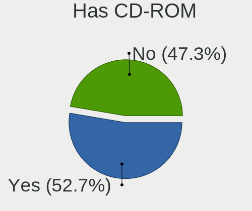
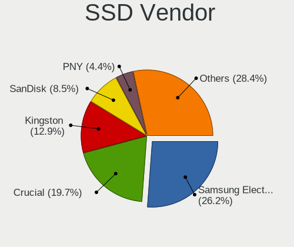
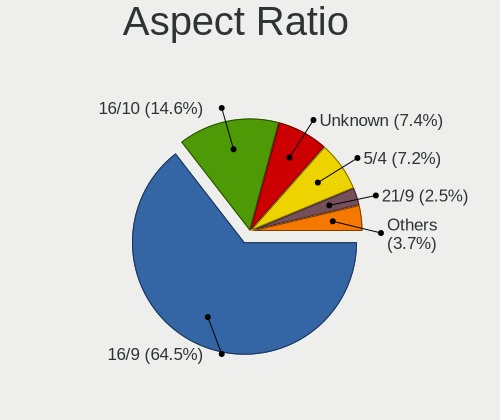
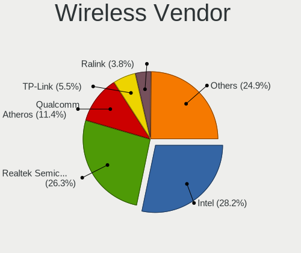
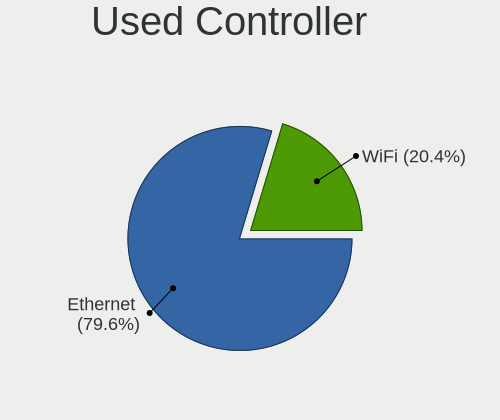
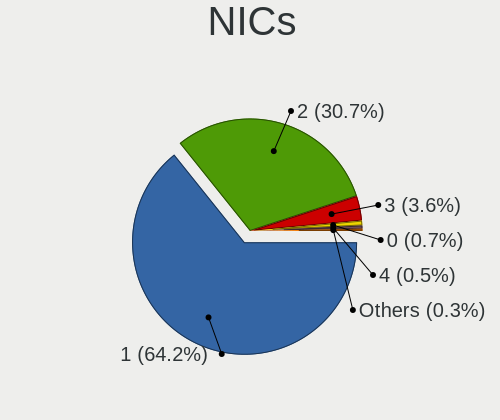

Linux in France - Tested Hardware & Statistics (Desktops)
---------------------------------------------------------

A project to collect tested hardware configurations for Linux in France.

Anyone can contribute to this report by the [hw-probe](https://github.com/linuxhw/hw-probe) tool:

    sudo -E hw-probe -all -upload

Please contribute! Especially if your hardware is rare.

Contents
--------

* [ Test Cases ](#test-cases)

* [ System ](#system)
  - [ OS                       ](#os)
  - [ OS Family                ](#os-family)
  - [ Kernel                   ](#kernel)
  - [ Kernel Family            ](#kernel-family)
  - [ Kernel Major Ver.        ](#kernel-major-ver)
  - [ Arch                     ](#arch)
  - [ DE                       ](#de)
  - [ Display Server           ](#display-server)
  - [ Display Manager          ](#display-manager)
  - [ OS Lang                  ](#os-lang)
  - [ Boot Mode                ](#boot-mode)
  - [ Filesystem               ](#filesystem)
  - [ Part. scheme             ](#part-scheme)
  - [ Dual Boot with Linux/BSD ](#dual-boot-with-linuxbsd)
  - [ Dual Boot (Win)          ](#dual-boot-win)

* [ Board ](#board)
  - [ Vendor                   ](#vendor)
  - [ Model                    ](#model)
  - [ Model Family             ](#model-family)
  - [ MFG Year                 ](#mfg-year)
  - [ Form Factor              ](#form-factor)
  - [ Secure Boot              ](#secure-boot)
  - [ Coreboot                 ](#coreboot)
  - [ RAM Size                 ](#ram-size)
  - [ RAM Used                 ](#ram-used)
  - [ Total Drives             ](#total-drives)
  - [ Has CD-ROM               ](#has-cd-rom)
  - [ Has Ethernet             ](#has-ethernet)
  - [ Has WiFi                 ](#has-wifi)
  - [ Has Bluetooth            ](#has-bluetooth)

* [ Location ](#location)
  - [ Country                  ](#country)
  - [ City                     ](#city)

* [ Drives ](#drives)
  - [ Drive Vendor             ](#drive-vendor)
  - [ Drive Model              ](#drive-model)
  - [ HDD Vendor               ](#hdd-vendor)
  - [ SSD Vendor               ](#ssd-vendor)
  - [ Drive Kind               ](#drive-kind)
  - [ Drive Connector          ](#drive-connector)
  - [ Drive Size               ](#drive-size)
  - [ Space Total              ](#space-total)
  - [ Space Used               ](#space-used)
  - [ Malfunc. Drives          ](#malfunc-drives)
  - [ Malfunc. Drive Vendor    ](#malfunc-drive-vendor)
  - [ Malfunc. HDD Vendor      ](#malfunc-hdd-vendor)
  - [ Malfunc. Drive Kind      ](#malfunc-drive-kind)
  - [ Failed Drives            ](#failed-drives)
  - [ Failed Drive Vendor      ](#failed-drive-vendor)
  - [ Drive Status             ](#drive-status)

* [ Storage controller ](#storage-controller)
  - [ Storage Vendor           ](#storage-vendor)
  - [ Storage Model            ](#storage-model)
  - [ Storage Kind             ](#storage-kind)

* [ Processor ](#processor)
  - [ CPU Vendor               ](#cpu-vendor)
  - [ CPU Model                ](#cpu-model)
  - [ CPU Model Family         ](#cpu-model-family)
  - [ CPU Cores                ](#cpu-cores)
  - [ CPU Sockets              ](#cpu-sockets)
  - [ CPU Threads              ](#cpu-threads)
  - [ CPU Op-Modes             ](#cpu-op-modes)
  - [ CPU Microcode            ](#cpu-microcode)
  - [ CPU Microarch            ](#cpu-microarch)

* [ Graphics ](#graphics)
  - [ GPU Vendor               ](#gpu-vendor)
  - [ GPU Model                ](#gpu-model)
  - [ GPU Combo                ](#gpu-combo)
  - [ GPU Driver               ](#gpu-driver)
  - [ GPU Memory               ](#gpu-memory)

* [ Monitor ](#monitor)
  - [ Monitor Vendor           ](#monitor-vendor)
  - [ Monitor Model            ](#monitor-model)
  - [ Monitor Resolution       ](#monitor-resolution)
  - [ Monitor Diagonal         ](#monitor-diagonal)
  - [ Monitor Width            ](#monitor-width)
  - [ Aspect Ratio             ](#aspect-ratio)
  - [ Monitor Area             ](#monitor-area)
  - [ Pixel Density            ](#pixel-density)
  - [ Multiple Monitors        ](#multiple-monitors)

* [ Network ](#network)
  - [ Net Controller Vendor    ](#net-controller-vendor)
  - [ Net Controller Model     ](#net-controller-model)
  - [ Wireless Vendor          ](#wireless-vendor)
  - [ Wireless Model           ](#wireless-model)
  - [ Ethernet Vendor          ](#ethernet-vendor)
  - [ Ethernet Model           ](#ethernet-model)
  - [ Net Controller Kind      ](#net-controller-kind)
  - [ Used Controller          ](#used-controller)
  - [ NICs                     ](#nics)
  - [ IPv6                     ](#ipv6)

* [ Bluetooth ](#bluetooth)
  - [ Bluetooth Vendor         ](#bluetooth-vendor)
  - [ Bluetooth Model          ](#bluetooth-model)

* [ Sound ](#sound)
  - [ Sound Vendor             ](#sound-vendor)
  - [ Sound Model              ](#sound-model)

* [ Memory ](#memory)
  - [ Memory Vendor            ](#memory-vendor)
  - [ Memory Model             ](#memory-model)
  - [ Memory Kind              ](#memory-kind)
  - [ Memory Form Factor       ](#memory-form-factor)
  - [ Memory Size              ](#memory-size)
  - [ Memory Speed             ](#memory-speed)

* [ Printers & scanners ](#printers--scanners)
  - [ Printer Vendor           ](#printer-vendor)
  - [ Printer Model            ](#printer-model)
  - [ Scanner Vendor           ](#scanner-vendor)
  - [ Scanner Model            ](#scanner-model)

* [ Camera ](#camera)
  - [ Camera Vendor            ](#camera-vendor)
  - [ Camera Model             ](#camera-model)

* [ Security ](#security)
  - [ Fingerprint Vendor       ](#fingerprint-vendor)
  - [ Fingerprint Model        ](#fingerprint-model)
  - [ Chipcard Vendor          ](#chipcard-vendor)
  - [ Chipcard Model           ](#chipcard-model)

* [ Unsupported ](#unsupported)
  - [ Unsupported Devices      ](#unsupported-devices)
  - [ Unsupported Device Types ](#unsupported-device-types)

Test Cases
----------

Total: 5916

| Vendor        | Model                       | Probe                                                      | Date         |
|---------------|-----------------------------|------------------------------------------------------------|--------------|
| MSI           | Z77A-G43                    | [b33c14ee42](https://linux-hardware.org/?probe=b33c14ee42) | Jan 02, 2024 |
| Gigabyte      | Z790 AERO G                 | [121de16d3b](https://linux-hardware.org/?probe=121de16d3b) | Jan 01, 2024 |
| Gigabyte      | Z790 AERO G                 | [2ad2af0de5](https://linux-hardware.org/?probe=2ad2af0de5) | Jan 01, 2024 |
| Gigabyte      | X58A-UD3R                   | [757bac1cef](https://linux-hardware.org/?probe=757bac1cef) | Jan 01, 2024 |
| ASUSTek       | M5A99X EVO R2.0             | [aedbae5d00](https://linux-hardware.org/?probe=aedbae5d00) | Jan 01, 2024 |
| Gigabyte      | A320M-S2H-CF                | [ac00eb404d](https://linux-hardware.org/?probe=ac00eb404d) | Jan 01, 2024 |
| Gigabyte      | H97N-WIFI                   | [eb47ce9900](https://linux-hardware.org/?probe=eb47ce9900) | Jan 01, 2024 |
| ASRock        | H97M Pro4                   | [3955acda3d](https://linux-hardware.org/?probe=3955acda3d) | Dec 31, 2023 |
| Gigabyte      | B660 DS3H DDR4              | [3cb3c98a92](https://linux-hardware.org/?probe=3cb3c98a92) | Dec 31, 2023 |
| OEM           | G41 775 ICH7 8712           | [bfb91f354b](https://linux-hardware.org/?probe=bfb91f354b) | Dec 31, 2023 |
| HP            | 2AF7                        | [8bae22b1aa](https://linux-hardware.org/?probe=8bae22b1aa) | Dec 31, 2023 |
| MSI           | MPG B550 GAMING PLUS        | [d0b71859f2](https://linux-hardware.org/?probe=d0b71859f2) | Dec 31, 2023 |
| MSI           | B85M-G43                    | [16b0ff5ec7](https://linux-hardware.org/?probe=16b0ff5ec7) | Dec 30, 2023 |
| ASUSTek       | PRIME B660-PLUS D4          | [0e7bbb6dea](https://linux-hardware.org/?probe=0e7bbb6dea) | Dec 30, 2023 |
| HP            | 1495                        | [48d0ae2bf5](https://linux-hardware.org/?probe=48d0ae2bf5) | Dec 30, 2023 |
| ASRock        | Z68 Professional Gen3       | [730262494e](https://linux-hardware.org/?probe=730262494e) | Dec 29, 2023 |
| ASRock        | B250M-HDV                   | [c6c27e51ca](https://linux-hardware.org/?probe=c6c27e51ca) | Dec 28, 2023 |
| ASRock        | H97M Pro4                   | [6069654b2c](https://linux-hardware.org/?probe=6069654b2c) | Dec 28, 2023 |
| Dell          | 054KM3 A01                  | [1d078128fe](https://linux-hardware.org/?probe=1d078128fe) | Dec 28, 2023 |
| Gigabyte      | AB350M-Gaming 3-CF          | [550c477d53](https://linux-hardware.org/?probe=550c477d53) | Dec 28, 2023 |
| MSI           | PRO A620M-E                 | [b2e410ff06](https://linux-hardware.org/?probe=b2e410ff06) | Dec 28, 2023 |
| Gigabyte      | B660 DS3H DDR4              | [3b68c7809f](https://linux-hardware.org/?probe=3b68c7809f) | Dec 27, 2023 |
| Packard Be... | MCP73T-AD                   | [c7d9006760](https://linux-hardware.org/?probe=c7d9006760) | Dec 27, 2023 |
| MSI           | H110M PRO-VD                | [86eb28c296](https://linux-hardware.org/?probe=86eb28c296) | Dec 27, 2023 |
| MSI           | G31TM-P21                   | [c80f741175](https://linux-hardware.org/?probe=c80f741175) | Dec 26, 2023 |
| MSI           | MAG B560M BAZOOKA           | [64d1814f82](https://linux-hardware.org/?probe=64d1814f82) | Dec 26, 2023 |
| Gigabyte      | A520M K V2                  | [4bd90e2bd6](https://linux-hardware.org/?probe=4bd90e2bd6) | Dec 26, 2023 |
| Pegatron      | Eureka3                     | [0dfc8b6795](https://linux-hardware.org/?probe=0dfc8b6795) | Dec 25, 2023 |
| Acer          | Veriton X2631G V:1.0        | [7522238d8b](https://linux-hardware.org/?probe=7522238d8b) | Dec 25, 2023 |
| MSI           | A68HM-P33 V2                | [4f11205fd5](https://linux-hardware.org/?probe=4f11205fd5) | Dec 25, 2023 |
| ASRock        | H61DEL                      | [932b2c50eb](https://linux-hardware.org/?probe=932b2c50eb) | Dec 24, 2023 |
| MSI           | PRO B650-S WIFI             | [c084478d6e](https://linux-hardware.org/?probe=c084478d6e) | Dec 24, 2023 |
| Acer          | Veriton X2631G V:1.0        | [a57f2ee15f](https://linux-hardware.org/?probe=a57f2ee15f) | Dec 23, 2023 |
| ASRock        | H310CM-HDV/M.2              | [76d95ab75c](https://linux-hardware.org/?probe=76d95ab75c) | Dec 23, 2023 |
| Dell          | 0WMJ54 A01                  | [ac0b6ab055](https://linux-hardware.org/?probe=ac0b6ab055) | Dec 23, 2023 |
| Lenovo        | NOK                         | [35841ab3ed](https://linux-hardware.org/?probe=35841ab3ed) | Dec 23, 2023 |
| MSI           | A88XM-E35                   | [dce385e94b](https://linux-hardware.org/?probe=dce385e94b) | Dec 23, 2023 |
| ASRock        | Z370 Professional Gaming... | [d46814af3c](https://linux-hardware.org/?probe=d46814af3c) | Dec 23, 2023 |
| ASUSTek       | PRIME B450-PLUS             | [c9bee45423](https://linux-hardware.org/?probe=c9bee45423) | Dec 22, 2023 |
| MSI           | B450M PRO-VDH MAX           | [851dce0b14](https://linux-hardware.org/?probe=851dce0b14) | Dec 22, 2023 |
| MSI           | X570-A PRO                  | [27a132c185](https://linux-hardware.org/?probe=27a132c185) | Dec 22, 2023 |
| Lenovo        | SHARKBAY SDK0E50510 WIN     | [0bc1c80333](https://linux-hardware.org/?probe=0bc1c80333) | Dec 21, 2023 |
| Acer          | Aspire XC-1760              | [ac3910a453](https://linux-hardware.org/?probe=ac3910a453) | Dec 21, 2023 |
| Gigabyte      | B550 GAMING X V2            | [ce4bc6f455](https://linux-hardware.org/?probe=ce4bc6f455) | Dec 21, 2023 |
| Dell          | 0NKW6Y A02                  | [d41c926291](https://linux-hardware.org/?probe=d41c926291) | Dec 21, 2023 |
| ASRock        | Z77 Pro4                    | [d8d81bc3e2](https://linux-hardware.org/?probe=d8d81bc3e2) | Dec 21, 2023 |
| Acer          | Veriton X2631G V:1.0        | [8116f31329](https://linux-hardware.org/?probe=8116f31329) | Dec 21, 2023 |
| HP            | 805D                        | [6768e6fc48](https://linux-hardware.org/?probe=6768e6fc48) | Dec 20, 2023 |
| Gigabyte      | H81M-DS2                    | [1da522781e](https://linux-hardware.org/?probe=1da522781e) | Dec 20, 2023 |
| ASUSTek       | Z97-PRO                     | [917d636ff9](https://linux-hardware.org/?probe=917d636ff9) | Dec 20, 2023 |
| Gigabyte      | A520M DS3H V2               | [3ba51c21e8](https://linux-hardware.org/?probe=3ba51c21e8) | Dec 20, 2023 |
| ASUSTek       | ROG STRIX B550-F GAMING     | [84530cb3ca](https://linux-hardware.org/?probe=84530cb3ca) | Dec 20, 2023 |
| Gigabyte      | GA-MA78LMT-US2H             | [a1f4076586](https://linux-hardware.org/?probe=a1f4076586) | Dec 19, 2023 |
| ASRock        | X670E PG Lightning          | [c41952876f](https://linux-hardware.org/?probe=c41952876f) | Dec 19, 2023 |
| Lenovo        | 30BE SDK0J40697 WIN 3305... | [9b8d8ec134](https://linux-hardware.org/?probe=9b8d8ec134) | Dec 19, 2023 |
| Lenovo        | MAHOBAY NOK                 | [7fe77a3476](https://linux-hardware.org/?probe=7fe77a3476) | Dec 19, 2023 |
| Lenovo        | 30BE SDK0J40705 WIN 3425... | [65b6d3dcc0](https://linux-hardware.org/?probe=65b6d3dcc0) | Dec 19, 2023 |
| Lenovo        | 30BE SDK0J40705 WIN 3425... | [ab5bffcf0a](https://linux-hardware.org/?probe=ab5bffcf0a) | Dec 19, 2023 |
| Lenovo        | SHARKBAY 0B98401 PRO        | [9f3471e435](https://linux-hardware.org/?probe=9f3471e435) | Dec 19, 2023 |
| Lenovo        | SKYBAY SDK0J40705 WIN 34... | [752a59a0cc](https://linux-hardware.org/?probe=752a59a0cc) | Dec 19, 2023 |
| Lenovo        | SHARKBAY SDK0E50510 WIN     | [bff7dced45](https://linux-hardware.org/?probe=bff7dced45) | Dec 19, 2023 |
| Fujitsu       | D3221-A1 S26361-D3221-A1    | [843515c201](https://linux-hardware.org/?probe=843515c201) | Dec 19, 2023 |
| Lenovo        | SHARKBAY 0B98401 PRO        | [993b9536cf](https://linux-hardware.org/?probe=993b9536cf) | Dec 19, 2023 |
| Lenovo        | 30BE SDK0J40705 WIN 3425... | [782dad2128](https://linux-hardware.org/?probe=782dad2128) | Dec 19, 2023 |
| MSI           | X570-A PRO                  | [3cf8d970f8](https://linux-hardware.org/?probe=3cf8d970f8) | Dec 19, 2023 |
| Packard Be... | Veriton M275                | [2263820deb](https://linux-hardware.org/?probe=2263820deb) | Dec 18, 2023 |
| ASUSTek       | ROG CROSSHAIR VIII DARK ... | [ce269919cd](https://linux-hardware.org/?probe=ce269919cd) | Dec 18, 2023 |
| Dell          | 0NC2VH A01                  | [5976f16a69](https://linux-hardware.org/?probe=5976f16a69) | Dec 18, 2023 |
| MSI           | MPG Z390 GAMING PLUS        | [d56dcc35b9](https://linux-hardware.org/?probe=d56dcc35b9) | Dec 18, 2023 |
| ASUSTek       | PRIME H310I-PLUS R2.0       | [1e1b811e8b](https://linux-hardware.org/?probe=1e1b811e8b) | Dec 18, 2023 |
| ASUSTek       | P8H61                       | [e0b9ef0f5e](https://linux-hardware.org/?probe=e0b9ef0f5e) | Dec 18, 2023 |
| ASUSTek       | P8H61                       | [e83b933182](https://linux-hardware.org/?probe=e83b933182) | Dec 18, 2023 |
| ASUSTek       | P4P800-VM                   | [8fb6faae11](https://linux-hardware.org/?probe=8fb6faae11) | Dec 17, 2023 |
| Fujitsu       | D3230-A1 S26361-D3230-A1    | [447fb33261](https://linux-hardware.org/?probe=447fb33261) | Dec 17, 2023 |
| Dell          | 06X1TJ A00                  | [b9738c48b0](https://linux-hardware.org/?probe=b9738c48b0) | Dec 17, 2023 |
| ASUSTek       | PRIME A320M-K               | [1f0e0f04f8](https://linux-hardware.org/?probe=1f0e0f04f8) | Dec 17, 2023 |
| Foxconn       | 2ABF                        | [907abd30c7](https://linux-hardware.org/?probe=907abd30c7) | Dec 17, 2023 |
| MSI           | MAG B550 TOMAHAWK           | [5c8981cf69](https://linux-hardware.org/?probe=5c8981cf69) | Dec 17, 2023 |
| Shenzhen M... | TH80                        | [1ad9ee524d](https://linux-hardware.org/?probe=1ad9ee524d) | Dec 16, 2023 |
| ASRock        | Z77 Pro4                    | [15ce6626f3](https://linux-hardware.org/?probe=15ce6626f3) | Dec 16, 2023 |
| ASUSTek       | Z97-PRO                     | [383682bb1f](https://linux-hardware.org/?probe=383682bb1f) | Dec 16, 2023 |
| Acer          | EG43M                       | [62c8e8acf8](https://linux-hardware.org/?probe=62c8e8acf8) | Dec 16, 2023 |
| ASUSTek       | Z97-PRO                     | [a0e9f7ca57](https://linux-hardware.org/?probe=a0e9f7ca57) | Dec 16, 2023 |
| Gigabyte      | B660 DS3H DDR4              | [51a1a58859](https://linux-hardware.org/?probe=51a1a58859) | Dec 16, 2023 |
| Gigabyte      | 970-GAMING                  | [f1f6a55f9c](https://linux-hardware.org/?probe=f1f6a55f9c) | Dec 16, 2023 |
| Gigabyte      | 970-GAMING                  | [8b6e7627f9](https://linux-hardware.org/?probe=8b6e7627f9) | Dec 16, 2023 |
| TECHNOPC      | NANO 5                      | [3ac9d2eb32](https://linux-hardware.org/?probe=3ac9d2eb32) | Dec 14, 2023 |
| HP            | 8463                        | [0d01616e1c](https://linux-hardware.org/?probe=0d01616e1c) | Dec 14, 2023 |
| Fujitsu       | D3432-A1 S26361-D3432-A1    | [742681b576](https://linux-hardware.org/?probe=742681b576) | Dec 14, 2023 |
| Gigabyte      | A320M-S2H-CF                | [eddc4eec8d](https://linux-hardware.org/?probe=eddc4eec8d) | Dec 14, 2023 |
| Fujitsu       | D3432-A1 S26361-D3432-A1    | [72cd581273](https://linux-hardware.org/?probe=72cd581273) | Dec 14, 2023 |
| HP            | 3047h                       | [d7d067e46c](https://linux-hardware.org/?probe=d7d067e46c) | Dec 14, 2023 |
| HP            | 83EF                        | [e2a7a03e4c](https://linux-hardware.org/?probe=e2a7a03e4c) | Dec 13, 2023 |
| HP            | 83EF                        | [d5d568c47c](https://linux-hardware.org/?probe=d5d568c47c) | Dec 13, 2023 |
| TECHNOPC      | NANO 5                      | [5b9044ceb2](https://linux-hardware.org/?probe=5b9044ceb2) | Dec 12, 2023 |
| Acer          | Veriton M4630G V:1.0        | [91ec51ebf5](https://linux-hardware.org/?probe=91ec51ebf5) | Dec 12, 2023 |
| ASRock        | B760M PG Riptide            | [30e068aaca](https://linux-hardware.org/?probe=30e068aaca) | Dec 12, 2023 |
| ASUSTek       | PRIME Z370-P II             | [9311323293](https://linux-hardware.org/?probe=9311323293) | Dec 11, 2023 |
| Acer          | WG43M                       | [b1fcb17dea](https://linux-hardware.org/?probe=b1fcb17dea) | Dec 11, 2023 |
| Lenovo        | 3102 SDK0J40705 WIN 3425... | [e3afd2e002](https://linux-hardware.org/?probe=e3afd2e002) | Dec 11, 2023 |
| Lenovo        | 3102 SDK0J40705 WIN 3425... | [656bfe20f4](https://linux-hardware.org/?probe=656bfe20f4) | Dec 11, 2023 |
| Lenovo        | 3102 SDK0J40705 WIN 3425... | [b1c994920c](https://linux-hardware.org/?probe=b1c994920c) | Dec 11, 2023 |
| Lenovo        | 312A SDK0J40697 WIN 3305... | [cc7c14dd72](https://linux-hardware.org/?probe=cc7c14dd72) | Dec 11, 2023 |
| Lenovo        | 312A SDK0J40697 WIN 3305... | [b7c06bf365](https://linux-hardware.org/?probe=b7c06bf365) | Dec 11, 2023 |
| Lenovo        | 3102 SDK0J40705 WIN 3425... | [8badd81a74](https://linux-hardware.org/?probe=8badd81a74) | Dec 11, 2023 |
| Lenovo        | 312A SDK0J40697 WIN 3305... | [448dc8ed72](https://linux-hardware.org/?probe=448dc8ed72) | Dec 11, 2023 |
| Lenovo        | 312A SDK0J40697 WIN 3305... | [472c013f53](https://linux-hardware.org/?probe=472c013f53) | Dec 11, 2023 |
| Lenovo        | 3102 SDK0J40705 WIN 3425... | [8cb24408c9](https://linux-hardware.org/?probe=8cb24408c9) | Dec 11, 2023 |
| Lenovo        | 3102 SDK0J40705 WIN 3425... | [df2e9cf858](https://linux-hardware.org/?probe=df2e9cf858) | Dec 11, 2023 |
| Lenovo        | 3102 SDK0J40705 WIN 3425... | [c8d223020d](https://linux-hardware.org/?probe=c8d223020d) | Dec 11, 2023 |
| Lenovo        | 3102 SDK0J40705 WIN 3425... | [70364f28ab](https://linux-hardware.org/?probe=70364f28ab) | Dec 11, 2023 |
| ASUSTek       | ROG STRIX B550-F GAMING     | [473e3f7093](https://linux-hardware.org/?probe=473e3f7093) | Dec 11, 2023 |
| Lenovo        | 3140 SDK0J40697 WIN 3305... | [d5500a3830](https://linux-hardware.org/?probe=d5500a3830) | Dec 11, 2023 |
| Intel         | DZ77SL-50K AAG55115-300     | [29590179a8](https://linux-hardware.org/?probe=29590179a8) | Dec 11, 2023 |
| Gigabyte      | B660 DS3H DDR4              | [ad9ec5bc5b](https://linux-hardware.org/?probe=ad9ec5bc5b) | Dec 10, 2023 |
| Fujitsu       | D3230-A1 S26361-D3230-A1    | [62b99b4cdd](https://linux-hardware.org/?probe=62b99b4cdd) | Dec 10, 2023 |
| Fujitsu       | D3230-A1 S26361-D3230-A1    | [dd9345ea7d](https://linux-hardware.org/?probe=dd9345ea7d) | Dec 10, 2023 |
| Dell          | 0TP406                      | [1b81a10a36](https://linux-hardware.org/?probe=1b81a10a36) | Dec 10, 2023 |
| ASRock        | B560M Pro4                  | [b85850b4c2](https://linux-hardware.org/?probe=b85850b4c2) | Dec 10, 2023 |
| HP            | 2B29                        | [6fb328f58e](https://linux-hardware.org/?probe=6fb328f58e) | Dec 10, 2023 |
| Acer          | Veriton X2631G V:1.0        | [1465cf0eac](https://linux-hardware.org/?probe=1465cf0eac) | Dec 09, 2023 |
| Intel         | DZ77SL-50K AAG55115-300     | [c1d93cb6b2](https://linux-hardware.org/?probe=c1d93cb6b2) | Dec 09, 2023 |
| ASUSTek       | PRIME A320M-K               | [237110c8c0](https://linux-hardware.org/?probe=237110c8c0) | Dec 09, 2023 |
| MSI           | H110M GAMING                | [c1f16cd93f](https://linux-hardware.org/?probe=c1f16cd93f) | Dec 09, 2023 |
| ASUSTek       | PRIME B760M-A WIFI          | [968b8ae2d9](https://linux-hardware.org/?probe=968b8ae2d9) | Dec 08, 2023 |
| Shenzhen M... | F6BFC                       | [67371c6af4](https://linux-hardware.org/?probe=67371c6af4) | Dec 08, 2023 |
| ASUSTek       | PRIME Z370-P II             | [85cd0d0c3d](https://linux-hardware.org/?probe=85cd0d0c3d) | Dec 08, 2023 |
| MSI           | B550-A PRO                  | [cc2b6e8b40](https://linux-hardware.org/?probe=cc2b6e8b40) | Dec 08, 2023 |
| ASUSTek       | Rampage III Extreme         | [d4d934c9be](https://linux-hardware.org/?probe=d4d934c9be) | Dec 08, 2023 |
| Lenovo        | SHARKBAY 0B98401 WIN        | [56eae53402](https://linux-hardware.org/?probe=56eae53402) | Dec 08, 2023 |
| Gigabyte      | Z790 AERO G                 | [783eeb6b56](https://linux-hardware.org/?probe=783eeb6b56) | Dec 08, 2023 |
| MSI           | 2A9C                        | [f7229302d9](https://linux-hardware.org/?probe=f7229302d9) | Dec 08, 2023 |
| MSI           | 2A9C                        | [8b9c64bc7a](https://linux-hardware.org/?probe=8b9c64bc7a) | Dec 08, 2023 |
| Lenovo        | SHARKBAY 0B98401 WIN        | [16b14ad0a7](https://linux-hardware.org/?probe=16b14ad0a7) | Dec 07, 2023 |
| HP            | 843B                        | [27527dbb19](https://linux-hardware.org/?probe=27527dbb19) | Dec 07, 2023 |
| Gigabyte      | B550M DS3H                  | [650771c55d](https://linux-hardware.org/?probe=650771c55d) | Dec 07, 2023 |
| Unknown       | Unknown                     | [1dd3b89bd1](https://linux-hardware.org/?probe=1dd3b89bd1) | Dec 07, 2023 |
| ASUSTek       | TUF Gaming X570-PLUS        | [39a966c6da](https://linux-hardware.org/?probe=39a966c6da) | Dec 07, 2023 |
| Lenovo        | ThinkCentre M81 5049P14     | [c847e2e0c2](https://linux-hardware.org/?probe=c847e2e0c2) | Dec 06, 2023 |
| Gigabyte      | Z790 AERO G                 | [e49aeaf1a8](https://linux-hardware.org/?probe=e49aeaf1a8) | Dec 06, 2023 |
| Intel         | STK1AW32SC H91596-302       | [9dbc61e045](https://linux-hardware.org/?probe=9dbc61e045) | Dec 05, 2023 |
| ASRock        | B550M PG Riptide            | [6132709ecd](https://linux-hardware.org/?probe=6132709ecd) | Dec 05, 2023 |
| Acer          | Veriton X2631G V:1.0        | [022c234330](https://linux-hardware.org/?probe=022c234330) | Dec 05, 2023 |
| Gigabyte      | X99-UD4-CF                  | [fa5609e17d](https://linux-hardware.org/?probe=fa5609e17d) | Dec 04, 2023 |
| Fujitsu       | D3230-A1 S26361-D3230-A1    | [a66e59470c](https://linux-hardware.org/?probe=a66e59470c) | Dec 04, 2023 |
| ASUSTek       | Z97-P                       | [c4e675a705](https://linux-hardware.org/?probe=c4e675a705) | Dec 03, 2023 |
| Acer          | Aspire X1430                | [e4fa6a217d](https://linux-hardware.org/?probe=e4fa6a217d) | Dec 03, 2023 |
| Foxconn       | 2A8C                        | [651f26ea2e](https://linux-hardware.org/?probe=651f26ea2e) | Dec 03, 2023 |
| Dell          | 05XGC8 A01                  | [619cda09d0](https://linux-hardware.org/?probe=619cda09d0) | Dec 03, 2023 |
| HP            | 0B54h D                     | [bffc586a45](https://linux-hardware.org/?probe=bffc586a45) | Dec 02, 2023 |
| ASUSTek       | PRIME Z390M-PLUS            | [0fbb7ed910](https://linux-hardware.org/?probe=0fbb7ed910) | Dec 02, 2023 |
| Gigabyte      | H81M-S2H                    | [8dd5a975f9](https://linux-hardware.org/?probe=8dd5a975f9) | Dec 02, 2023 |
| MSI           | H81M-P33                    | [3c745928bb](https://linux-hardware.org/?probe=3c745928bb) | Dec 02, 2023 |
| ASUSTek       | P7P55D-E                    | [8d95019eec](https://linux-hardware.org/?probe=8d95019eec) | Dec 01, 2023 |
| MSI           | X470 GAMING PRO CARBON      | [f44c7e37a0](https://linux-hardware.org/?probe=f44c7e37a0) | Dec 01, 2023 |
| HP            | 0A80h                       | [5e6a479e17](https://linux-hardware.org/?probe=5e6a479e17) | Dec 01, 2023 |
| ASUSTek       | M5A78L-M LX3                | [41ae74c0ef](https://linux-hardware.org/?probe=41ae74c0ef) | Dec 01, 2023 |
| Gigabyte      | B150M-D2V DDR3-CF           | [fc87fb1112](https://linux-hardware.org/?probe=fc87fb1112) | Dec 01, 2023 |
| Unknown       | Unknown                     | [cd167c532c](https://linux-hardware.org/?probe=cd167c532c) | Dec 01, 2023 |
| ASRock        | 970 Extreme4                | [4ab4cd31f3](https://linux-hardware.org/?probe=4ab4cd31f3) | Nov 30, 2023 |
| Dell          | 0PRR48 A01                  | [0942eb512e](https://linux-hardware.org/?probe=0942eb512e) | Nov 30, 2023 |
| Dell          | 0YXT71 A01                  | [73fb774b15](https://linux-hardware.org/?probe=73fb774b15) | Nov 30, 2023 |
| HP            | 8860 A                      | [997e48505b](https://linux-hardware.org/?probe=997e48505b) | Nov 30, 2023 |
| ASUSTek       | P8H61-MX USB3               | [c464dd98f8](https://linux-hardware.org/?probe=c464dd98f8) | Nov 29, 2023 |
| HP            | 8860 A                      | [ce6ad4189c](https://linux-hardware.org/?probe=ce6ad4189c) | Nov 29, 2023 |
| ASUSTek       | P8H61-MX USB3               | [49ff7bc16f](https://linux-hardware.org/?probe=49ff7bc16f) | Nov 29, 2023 |
| Acer          | Veriton X2631G V:1.0        | [32c908c896](https://linux-hardware.org/?probe=32c908c896) | Nov 29, 2023 |
| ASUSTek       | P7P55D-E PRO                | [6fe23dd80e](https://linux-hardware.org/?probe=6fe23dd80e) | Nov 28, 2023 |
| Gigabyte      | B450 AORUS ELITE            | [c93b09ccf3](https://linux-hardware.org/?probe=c93b09ccf3) | Nov 28, 2023 |
| MSI           | A88XM-E35                   | [c12fd28b60](https://linux-hardware.org/?probe=c12fd28b60) | Nov 28, 2023 |
| HP            | 2B3C                        | [022f87f538](https://linux-hardware.org/?probe=022f87f538) | Nov 28, 2023 |
| Gigabyte      | B660M DS3H AX DDR4          | [2c6159430a](https://linux-hardware.org/?probe=2c6159430a) | Nov 28, 2023 |
| Gigabyte      | Z590 UD AC                  | [416fbc3923](https://linux-hardware.org/?probe=416fbc3923) | Nov 28, 2023 |
| ASRock        | Z370 Professional Gaming... | [92354a1a90](https://linux-hardware.org/?probe=92354a1a90) | Nov 28, 2023 |
| ASUSTek       | ROG STRIX B650E-I GAMING... | [7077c34a71](https://linux-hardware.org/?probe=7077c34a71) | Nov 27, 2023 |
| Lenovo        | ThinkCentre M58p 6137A1G    | [fafec0e338](https://linux-hardware.org/?probe=fafec0e338) | Nov 27, 2023 |
| Acer          | Veriton X2632G V:1.0        | [0c50fc3c6f](https://linux-hardware.org/?probe=0c50fc3c6f) | Nov 27, 2023 |
| ASUSTek       | ROG STRIX B560-I GAMING ... | [42fe7e0273](https://linux-hardware.org/?probe=42fe7e0273) | Nov 27, 2023 |
| ASUSTek       | ROG STRIX B560-I GAMING ... | [55eda30366](https://linux-hardware.org/?probe=55eda30366) | Nov 27, 2023 |
| Gigabyte      | B450M DS3H-CF               | [5d7a20cf12](https://linux-hardware.org/?probe=5d7a20cf12) | Nov 27, 2023 |
| ASUSTek       | Maximus VIII FORMULA        | [a39fba5394](https://linux-hardware.org/?probe=a39fba5394) | Nov 27, 2023 |
| Dell          | 05XGC8 A01                  | [08a2ba3613](https://linux-hardware.org/?probe=08a2ba3613) | Nov 27, 2023 |
| Acer          | Aspire M5400                | [f0e15f3802](https://linux-hardware.org/?probe=f0e15f3802) | Nov 27, 2023 |
| Lenovo        | SHARKBAY NO DPK             | [c38359c001](https://linux-hardware.org/?probe=c38359c001) | Nov 26, 2023 |
| Foxconn       | 2ABF                        | [875c5eb0aa](https://linux-hardware.org/?probe=875c5eb0aa) | Nov 26, 2023 |
| ASUSTek       | TUF B450M-PLUS GAMING       | [9c4c337fe9](https://linux-hardware.org/?probe=9c4c337fe9) | Nov 25, 2023 |
| Lenovo        | SHARKBAY NO DPK             | [b25d3c281d](https://linux-hardware.org/?probe=b25d3c281d) | Nov 25, 2023 |
| ASUSTek       | TUF Gaming X570-PLUS        | [a727d2b744](https://linux-hardware.org/?probe=a727d2b744) | Nov 25, 2023 |
| MSI           | B250M PRO-VD                | [d3697eee2c](https://linux-hardware.org/?probe=d3697eee2c) | Nov 24, 2023 |
| Gigabyte      | Z590 UD AC                  | [5ae0c22a32](https://linux-hardware.org/?probe=5ae0c22a32) | Nov 24, 2023 |
| MSI           | H510I PRO WIFI              | [e7d054d239](https://linux-hardware.org/?probe=e7d054d239) | Nov 24, 2023 |
| MSI           | H510I PRO WIFI              | [a56bfd4a49](https://linux-hardware.org/?probe=a56bfd4a49) | Nov 24, 2023 |
| MSI           | H510I PRO WIFI              | [ffc6733484](https://linux-hardware.org/?probe=ffc6733484) | Nov 24, 2023 |
| ASUSTek       | TUF B450-PLUS GAMING        | [c24820ad94](https://linux-hardware.org/?probe=c24820ad94) | Nov 24, 2023 |
| ASUSTek       | PRIME A520M-K               | [83c2b87d3c](https://linux-hardware.org/?probe=83c2b87d3c) | Nov 24, 2023 |
| Dell          | 0M5DCD A00                  | [78748bcf50](https://linux-hardware.org/?probe=78748bcf50) | Nov 24, 2023 |
| MSI           | Z87-G41 PC Mate             | [a56a424940](https://linux-hardware.org/?probe=a56a424940) | Nov 24, 2023 |
| Dell          | 08NPPY A00                  | [c0c9296b6b](https://linux-hardware.org/?probe=c0c9296b6b) | Nov 23, 2023 |
| Gigabyte      | B450 AORUS ELITE            | [298883c961](https://linux-hardware.org/?probe=298883c961) | Nov 23, 2023 |
| eMachines     | EL1358                      | [f22b0b98c3](https://linux-hardware.org/?probe=f22b0b98c3) | Nov 23, 2023 |
| ASUSTek       | TUF Gaming X570-PLUS        | [70c262ab30](https://linux-hardware.org/?probe=70c262ab30) | Nov 23, 2023 |
| ASUSTek       | H81T                        | [fa69af34be](https://linux-hardware.org/?probe=fa69af34be) | Nov 23, 2023 |
| Fujitsu       | D2990-A2 S26361-D2990-A2    | [67293d8013](https://linux-hardware.org/?probe=67293d8013) | Nov 22, 2023 |
| ASRock        | AB350 Pro4                  | [eff446af17](https://linux-hardware.org/?probe=eff446af17) | Nov 22, 2023 |
| Biostar       | H81MHV3 5.0                 | [3643a6597c](https://linux-hardware.org/?probe=3643a6597c) | Nov 22, 2023 |
| ASRock        | A520M-HVS                   | [b240b18174](https://linux-hardware.org/?probe=b240b18174) | Nov 22, 2023 |
| ASRock        | A320M-HDV R4.0              | [794cc91e17](https://linux-hardware.org/?probe=794cc91e17) | Nov 22, 2023 |
| Lenovo        | ThinkCentre M90p 3282B5G    | [6269daf388](https://linux-hardware.org/?probe=6269daf388) | Nov 22, 2023 |
| Unknown       | Unknown                     | [34559c1aa3](https://linux-hardware.org/?probe=34559c1aa3) | Nov 22, 2023 |
| Gigabyte      | GB-BRR3H-4300               | [5850b8f7b8](https://linux-hardware.org/?probe=5850b8f7b8) | Nov 22, 2023 |
| MSI           | A320M-A PRO MAX             | [9f22b27f2f](https://linux-hardware.org/?probe=9f22b27f2f) | Nov 21, 2023 |
| ASRock        | B650M Pro RS                | [d5c721e44b](https://linux-hardware.org/?probe=d5c721e44b) | Nov 20, 2023 |
| ASUSTek       | PRIME A320M-K               | [b29d72095f](https://linux-hardware.org/?probe=b29d72095f) | Nov 20, 2023 |
| MSI           | MPG X570 GAMING PLUS        | [6e37b34a47](https://linux-hardware.org/?probe=6e37b34a47) | Nov 20, 2023 |
| Gigabyte      | F2A88XM-HD3                 | [d5a1fce5c0](https://linux-hardware.org/?probe=d5a1fce5c0) | Nov 19, 2023 |
| Gigabyte      | Z270X-Ultra Gaming-CF       | [cbc624285e](https://linux-hardware.org/?probe=cbc624285e) | Nov 19, 2023 |
| Fujitsu       | D3500-A1 S26361-D3500-A1    | [86881fc519](https://linux-hardware.org/?probe=86881fc519) | Nov 19, 2023 |
| Intel         | HM570                       | [d266b38bab](https://linux-hardware.org/?probe=d266b38bab) | Nov 19, 2023 |
| Acer          | Veriton X2631G V:1.0        | [cac6e2da21](https://linux-hardware.org/?probe=cac6e2da21) | Nov 18, 2023 |
| Dell          | 0WMJ54 A00                  | [1fcea24296](https://linux-hardware.org/?probe=1fcea24296) | Nov 18, 2023 |
| Intel         | JSL MRD                     | [fe873e258e](https://linux-hardware.org/?probe=fe873e258e) | Nov 18, 2023 |
| Intel         | JSL MRD                     | [f25d22654a](https://linux-hardware.org/?probe=f25d22654a) | Nov 18, 2023 |
| ASUSTek       | PRIME A320M-K               | [7adb8abf2c](https://linux-hardware.org/?probe=7adb8abf2c) | Nov 17, 2023 |
| MSI           | MPG X570 GAMING EDGE WIF... | [a8ac01af3d](https://linux-hardware.org/?probe=a8ac01af3d) | Nov 17, 2023 |
| Lenovo        | SHARKBAY NOK                | [d087235304](https://linux-hardware.org/?probe=d087235304) | Nov 17, 2023 |
| ASUSTek       | P5SD2-VM                    | [8fa21e29e3](https://linux-hardware.org/?probe=8fa21e29e3) | Nov 17, 2023 |
| MSI           | B75MA-P45                   | [6401616423](https://linux-hardware.org/?probe=6401616423) | Nov 16, 2023 |
| Unknown       | T100                        | [298b8f8764](https://linux-hardware.org/?probe=298b8f8764) | Nov 16, 2023 |
| Gigabyte      | X570 UD                     | [2902bc3e9f](https://linux-hardware.org/?probe=2902bc3e9f) | Nov 15, 2023 |
| MSI           | Z370 PC PRO                 | [e9e98d1041](https://linux-hardware.org/?probe=e9e98d1041) | Nov 14, 2023 |
| Unknown       | Unknown                     | [90f5f3a274](https://linux-hardware.org/?probe=90f5f3a274) | Nov 14, 2023 |
| MSI           | MPG B550I GAMING EDGE WI... | [c15516679b](https://linux-hardware.org/?probe=c15516679b) | Nov 14, 2023 |
| MSI           | MAG B460M MORTAR WIFI       | [0342a78240](https://linux-hardware.org/?probe=0342a78240) | Nov 13, 2023 |
| ASUSTek       | ROG STRIX B760-I GAMING ... | [8f52e4ab47](https://linux-hardware.org/?probe=8f52e4ab47) | Nov 13, 2023 |
| ASRock        | C226 WS                     | [7be296e07e](https://linux-hardware.org/?probe=7be296e07e) | Nov 12, 2023 |
| Lenovo        | SHARKBAY SDK0E50510 PRO     | [cd6a15e082](https://linux-hardware.org/?probe=cd6a15e082) | Nov 12, 2023 |
| Acer          | Aspire X3950                | [b5f08e00c9](https://linux-hardware.org/?probe=b5f08e00c9) | Nov 12, 2023 |
| MSI           | B350 TOMAHAWK ARCTIC        | [cccbd25b73](https://linux-hardware.org/?probe=cccbd25b73) | Nov 12, 2023 |
| ASUSTek       | P8Z77-V DELUXE              | [d61e9c84e5](https://linux-hardware.org/?probe=d61e9c84e5) | Nov 12, 2023 |
| MSI           | X470 GAMING PLUS MAX        | [0029d3638f](https://linux-hardware.org/?probe=0029d3638f) | Nov 12, 2023 |
| ASUSTek       | P8Z77-V                     | [5fcc1a42c3](https://linux-hardware.org/?probe=5fcc1a42c3) | Nov 11, 2023 |
| ASUSTek       | P8H67-I DELUXE              | [2e8ed5d14f](https://linux-hardware.org/?probe=2e8ed5d14f) | Nov 11, 2023 |
| Lenovo        | 318E SDK0J40697 WIN 3305... | [947bd85c63](https://linux-hardware.org/?probe=947bd85c63) | Nov 10, 2023 |
| ASUSTek       | P7H55-M                     | [cee33b1be4](https://linux-hardware.org/?probe=cee33b1be4) | Nov 10, 2023 |
| Lenovo        | ThinkCentre M71e 5033A21    | [61d14476fe](https://linux-hardware.org/?probe=61d14476fe) | Nov 09, 2023 |
| Dell          | 0C96W1 A03                  | [e33b75f1f2](https://linux-hardware.org/?probe=e33b75f1f2) | Nov 08, 2023 |
| Gigabyte      | H110M-S2H-CF                | [10f68961cf](https://linux-hardware.org/?probe=10f68961cf) | Nov 08, 2023 |
| MSI           | MAG B660M MORTAR            | [a8c3434f4e](https://linux-hardware.org/?probe=a8c3434f4e) | Nov 07, 2023 |
| Lenovo        | SHARKBAY NOK                | [8ab4453aad](https://linux-hardware.org/?probe=8ab4453aad) | Nov 07, 2023 |
| Foxconn       | 2AAF                        | [fc483856a6](https://linux-hardware.org/?probe=fc483856a6) | Nov 07, 2023 |
| Acer          | Veriton X2631G V:1.0        | [8c4cb5939b](https://linux-hardware.org/?probe=8c4cb5939b) | Nov 07, 2023 |
| ASUSTek       | P8Z68-V PRO GEN3            | [50747bc510](https://linux-hardware.org/?probe=50747bc510) | Nov 06, 2023 |
| ASUSTek       | ROG Maximus XI HERO         | [a642f476da](https://linux-hardware.org/?probe=a642f476da) | Nov 06, 2023 |
| ASUSTek       | PRIME Z270-A                | [725ce23e28](https://linux-hardware.org/?probe=725ce23e28) | Nov 06, 2023 |
| Shuttle       | XS35V3                      | [0c51d541de](https://linux-hardware.org/?probe=0c51d541de) | Nov 06, 2023 |
| Dell          | 0WMJ54 A01                  | [5cff6ffdfc](https://linux-hardware.org/?probe=5cff6ffdfc) | Nov 05, 2023 |
| HP            | 1497                        | [734abf0595](https://linux-hardware.org/?probe=734abf0595) | Nov 05, 2023 |
| HP            | 802F                        | [8fe557cc85](https://linux-hardware.org/?probe=8fe557cc85) | Nov 05, 2023 |
| Lenovo        | SHARKBAY 0B98401 PRO        | [7152c7ed2c](https://linux-hardware.org/?probe=7152c7ed2c) | Nov 05, 2023 |
| ASRock        | A320M Pro4-F                | [7dab52cd8c](https://linux-hardware.org/?probe=7dab52cd8c) | Nov 05, 2023 |
| MSI           | H110I PRO                   | [c335c71c4b](https://linux-hardware.org/?probe=c335c71c4b) | Nov 05, 2023 |
| Lenovo        | SHARKBAY 0B98401 PRO        | [8841ab599e](https://linux-hardware.org/?probe=8841ab599e) | Nov 04, 2023 |
| Dell          | 0W0CHX A00                  | [3ed37b3d70](https://linux-hardware.org/?probe=3ed37b3d70) | Nov 04, 2023 |
| ASUSTek       | TUF Gaming B650-PLUS WIF... | [d35fc5aa78](https://linux-hardware.org/?probe=d35fc5aa78) | Nov 03, 2023 |
| Dell          | 0427JK A00                  | [ac631c05bc](https://linux-hardware.org/?probe=ac631c05bc) | Nov 03, 2023 |
| MSI           | MPG B550 GAMING PLUS        | [b58b97e74a](https://linux-hardware.org/?probe=b58b97e74a) | Nov 02, 2023 |
| Biostar       | B250MHC                     | [528c04a30a](https://linux-hardware.org/?probe=528c04a30a) | Nov 02, 2023 |
| ASUSTek       | TUF Gaming B650-PLUS WIF... | [9a5c45e54b](https://linux-hardware.org/?probe=9a5c45e54b) | Nov 02, 2023 |
| ASUSTek       | M52AD_M12AD                 | [a75715ee4a](https://linux-hardware.org/?probe=a75715ee4a) | Nov 01, 2023 |
| ASUSTek       | P5K PRO                     | [00af1ea679](https://linux-hardware.org/?probe=00af1ea679) | Nov 01, 2023 |
| MSI           | MAG Z390 TOMAHAWK           | [a31e5e0862](https://linux-hardware.org/?probe=a31e5e0862) | Nov 01, 2023 |
| ASUSTek       | PRIME A320M-K               | [4881df8aec](https://linux-hardware.org/?probe=4881df8aec) | Nov 01, 2023 |
| MSI           | A320M PRO-M2 V2             | [3b667e2123](https://linux-hardware.org/?probe=3b667e2123) | Oct 31, 2023 |
| MSI           | B85-G43 GAMING              | [5d218dd764](https://linux-hardware.org/?probe=5d218dd764) | Oct 31, 2023 |
| Pegatron      | EVANS                       | [3ea2a80843](https://linux-hardware.org/?probe=3ea2a80843) | Oct 31, 2023 |
| Pegatron      | EVANS                       | [52c3eeea68](https://linux-hardware.org/?probe=52c3eeea68) | Oct 31, 2023 |
| Gigabyte      | GA-970A-D3                  | [38ae588910](https://linux-hardware.org/?probe=38ae588910) | Oct 30, 2023 |
| ASRock        | FM2A88X+ Killer             | [2310075f2d](https://linux-hardware.org/?probe=2310075f2d) | Oct 30, 2023 |
| MSI           | B85-G43 GAMING              | [fa91d8044f](https://linux-hardware.org/?probe=fa91d8044f) | Oct 30, 2023 |
| Acer          | Veriton X2631G V:1.0        | [c2c4828db8](https://linux-hardware.org/?probe=c2c4828db8) | Oct 30, 2023 |
| Gigabyte      | B450M DS3H-CF               | [e18680d1f4](https://linux-hardware.org/?probe=e18680d1f4) | Oct 29, 2023 |
| Dell          | 02YYK5 A00                  | [bda6b9ff10](https://linux-hardware.org/?probe=bda6b9ff10) | Oct 29, 2023 |
| ASUSTek       | P7P55-M                     | [3fa8a23f12](https://linux-hardware.org/?probe=3fa8a23f12) | Oct 29, 2023 |
| MSI           | X299 TOMAHAWK AC            | [b878ce40e7](https://linux-hardware.org/?probe=b878ce40e7) | Oct 29, 2023 |
| MSI           | X570-A PRO                  | [b6f56d4f6c](https://linux-hardware.org/?probe=b6f56d4f6c) | Oct 29, 2023 |
| ASRock        | Z370 Professional Gaming... | [f589e0c914](https://linux-hardware.org/?probe=f589e0c914) | Oct 28, 2023 |
| MSI           | B360 GAMING PLUS            | [bb17f05c7f](https://linux-hardware.org/?probe=bb17f05c7f) | Oct 28, 2023 |
| HP            | 8053                        | [352cc1bad8](https://linux-hardware.org/?probe=352cc1bad8) | Oct 28, 2023 |
| HP            | 8053                        | [25f2c6e830](https://linux-hardware.org/?probe=25f2c6e830) | Oct 28, 2023 |
| ASUSTek       | ProArt B650-CREATOR         | [fdb96441a0](https://linux-hardware.org/?probe=fdb96441a0) | Oct 27, 2023 |
| ASUSTek       | ProArt B650-CREATOR         | [dde83d5de1](https://linux-hardware.org/?probe=dde83d5de1) | Oct 27, 2023 |
| Lenovo        | SHARKBAY SDK0E50510 WIN     | [880bf38f49](https://linux-hardware.org/?probe=880bf38f49) | Oct 27, 2023 |
| HP            | 339A                        | [d0deadc097](https://linux-hardware.org/?probe=d0deadc097) | Oct 27, 2023 |
| ASUSTek       | H110M-A                     | [a58f65d857](https://linux-hardware.org/?probe=a58f65d857) | Oct 27, 2023 |
| Gigabyte      | H97-D3H-CF                  | [e248fcb770](https://linux-hardware.org/?probe=e248fcb770) | Oct 27, 2023 |
| ASUSTek       | ROG CROSSHAIR VIII HERO     | [f7c6d6e17e](https://linux-hardware.org/?probe=f7c6d6e17e) | Oct 27, 2023 |
| ASUSTek       | P8P67 PRO                   | [a1916cc782](https://linux-hardware.org/?probe=a1916cc782) | Oct 26, 2023 |
| LattePanda    | Sigma                       | [d287cf2d8a](https://linux-hardware.org/?probe=d287cf2d8a) | Oct 26, 2023 |
| MSI           | MAG Z390 TOMAHAWK           | [0a305499ef](https://linux-hardware.org/?probe=0a305499ef) | Oct 26, 2023 |
| Dell          | 06D7TR A00                  | [a7097bd7f1](https://linux-hardware.org/?probe=a7097bd7f1) | Oct 26, 2023 |
| Lenovo        | SHARKBAY NOK                | [67021475e9](https://linux-hardware.org/?probe=67021475e9) | Oct 26, 2023 |
| HP            | 212B                        | [714373878e](https://linux-hardware.org/?probe=714373878e) | Oct 24, 2023 |
| ASUSTek       | PRIME A320M-K               | [d09253d43a](https://linux-hardware.org/?probe=d09253d43a) | Oct 24, 2023 |
| Gigabyte      | B450M DS3H-CF               | [9b0be83ecc](https://linux-hardware.org/?probe=9b0be83ecc) | Oct 24, 2023 |
| Gigabyte      | B550 AORUS ELITE V2         | [3daca4912e](https://linux-hardware.org/?probe=3daca4912e) | Oct 24, 2023 |
| Dell          | 0R790T A00                  | [905555c7d5](https://linux-hardware.org/?probe=905555c7d5) | Oct 23, 2023 |
| Dell          | 0R790T A00                  | [5f6d67d67e](https://linux-hardware.org/?probe=5f6d67d67e) | Oct 23, 2023 |
| Acer          | WG43M                       | [0580e7ab1b](https://linux-hardware.org/?probe=0580e7ab1b) | Oct 23, 2023 |
| Unknown       | Unknown                     | [95d6dab241](https://linux-hardware.org/?probe=95d6dab241) | Oct 23, 2023 |
| Trigkey       | Green G5                    | [a0cb634fc5](https://linux-hardware.org/?probe=a0cb634fc5) | Oct 22, 2023 |
| Gigabyte      | B550M DS3H                  | [8bfba005ad](https://linux-hardware.org/?probe=8bfba005ad) | Oct 22, 2023 |
| Gigabyte      | B550M DS3H                  | [6677da99ae](https://linux-hardware.org/?probe=6677da99ae) | Oct 22, 2023 |
| Gigabyte      | B450M DS3H-CF               | [b6df3ae720](https://linux-hardware.org/?probe=b6df3ae720) | Oct 22, 2023 |
| ASUSTek       | P8H67                       | [5e8558b08d](https://linux-hardware.org/?probe=5e8558b08d) | Oct 22, 2023 |
| Acer          | Veriton X2631G V:1.0        | [22402b17d1](https://linux-hardware.org/?probe=22402b17d1) | Oct 21, 2023 |
| ASUSTek       | ROG STRIX B550-F GAMING     | [9d3213958f](https://linux-hardware.org/?probe=9d3213958f) | Oct 21, 2023 |
| Gigabyte      | B450M DS3H-CF               | [30d9002099](https://linux-hardware.org/?probe=30d9002099) | Oct 21, 2023 |
| HP            | 09F0h                       | [97710d8f02](https://linux-hardware.org/?probe=97710d8f02) | Oct 21, 2023 |
| ASUSTek       | P9X79                       | [3df64c6ee4](https://linux-hardware.org/?probe=3df64c6ee4) | Oct 21, 2023 |
| MACHINIST     | X99-RS9 V2.0                | [2fb0ec8fa2](https://linux-hardware.org/?probe=2fb0ec8fa2) | Oct 21, 2023 |
| AZW           | SER V1                      | [60f9b9fdd9](https://linux-hardware.org/?probe=60f9b9fdd9) | Oct 21, 2023 |
| Lenovo        | SHARKBAY NOK                | [cb8d8311e7](https://linux-hardware.org/?probe=cb8d8311e7) | Oct 20, 2023 |
| Gigabyte      | B550 AORUS MASTER           | [4d1d3bb840](https://linux-hardware.org/?probe=4d1d3bb840) | Oct 19, 2023 |
| Gigabyte      | B660M DS3H DDR4             | [82633fd1ef](https://linux-hardware.org/?probe=82633fd1ef) | Oct 19, 2023 |
| ASUSTek       | PRIME B660-PLUS D4          | [b677f99638](https://linux-hardware.org/?probe=b677f99638) | Oct 19, 2023 |
| HP            | 1496                        | [c0c1d4b920](https://linux-hardware.org/?probe=c0c1d4b920) | Oct 19, 2023 |
| MSI           | Z590-A PRO                  | [804682ff68](https://linux-hardware.org/?probe=804682ff68) | Oct 19, 2023 |
| MSI           | B450 TOMAHAWK               | [911d7f21e7](https://linux-hardware.org/?probe=911d7f21e7) | Oct 18, 2023 |
| Lenovo        | SHARKBAY 0B98401 PRO        | [6e81d4f878](https://linux-hardware.org/?probe=6e81d4f878) | Oct 18, 2023 |
| ASUSTek       | PRIME Z370-P                | [aa01fa43ac](https://linux-hardware.org/?probe=aa01fa43ac) | Oct 18, 2023 |
| Fujitsu       | D3603-A1 S26361-D3603-A1    | [793ba23be0](https://linux-hardware.org/?probe=793ba23be0) | Oct 18, 2023 |
| MSI           | H77MA-G43                   | [b741ca0ecc](https://linux-hardware.org/?probe=b741ca0ecc) | Oct 18, 2023 |
| Lenovo        | SHARKBAY NOK                | [15064c45a9](https://linux-hardware.org/?probe=15064c45a9) | Oct 17, 2023 |
| Dell          | 0GK35Y A00                  | [99aded4434](https://linux-hardware.org/?probe=99aded4434) | Oct 17, 2023 |
| ASRock        | B560M Pro4                  | [77690da2b6](https://linux-hardware.org/?probe=77690da2b6) | Oct 17, 2023 |
| ASUSTek       | UN42                        | [53267f9960](https://linux-hardware.org/?probe=53267f9960) | Oct 17, 2023 |
| Foxconn       | 2ABF                        | [cf4a419a07](https://linux-hardware.org/?probe=cf4a419a07) | Oct 17, 2023 |
| ASRock        | A320M-HDV R3.0              | [95642179a1](https://linux-hardware.org/?probe=95642179a1) | Oct 16, 2023 |
| Dell          | 0CRH6C A00                  | [861e34ac85](https://linux-hardware.org/?probe=861e34ac85) | Oct 16, 2023 |
| MACHINIST     | X99-MR9A PRO MAX V1.2       | [abace10ada](https://linux-hardware.org/?probe=abace10ada) | Oct 16, 2023 |
| MSI           | Z97A GAMING 7               | [8af7152ba5](https://linux-hardware.org/?probe=8af7152ba5) | Oct 16, 2023 |
| Gigabyte      | B450M DS3H-CF               | [f12bcba44c](https://linux-hardware.org/?probe=f12bcba44c) | Oct 16, 2023 |
| HP            | 0AE4h                       | [a31dd4463f](https://linux-hardware.org/?probe=a31dd4463f) | Oct 16, 2023 |
| HP            | 0AE4h                       | [4ebaa677df](https://linux-hardware.org/?probe=4ebaa677df) | Oct 16, 2023 |
| HP            | 18E5                        | [d869fcd6dc](https://linux-hardware.org/?probe=d869fcd6dc) | Oct 16, 2023 |
| Dell          | 0HN7XN A01                  | [6ca94363be](https://linux-hardware.org/?probe=6ca94363be) | Oct 15, 2023 |
| Dell          | 0HN7XN A01                  | [de23701ea4](https://linux-hardware.org/?probe=de23701ea4) | Oct 15, 2023 |
| MSI           | MAG B460M MORTAR WIFI       | [dd3eca03df](https://linux-hardware.org/?probe=dd3eca03df) | Oct 15, 2023 |
| Gigabyte      | B760 GAMING X DDR4          | [1f718e54bf](https://linux-hardware.org/?probe=1f718e54bf) | Oct 15, 2023 |
| ASUSTek       | P5Q PRO TURBO               | [16a117accb](https://linux-hardware.org/?probe=16a117accb) | Oct 15, 2023 |
| Intel         | DN2820FYK H24582-204        | [721e07849a](https://linux-hardware.org/?probe=721e07849a) | Oct 14, 2023 |
| Dell          | 0F5C5X A00                  | [78e96592c1](https://linux-hardware.org/?probe=78e96592c1) | Oct 14, 2023 |
| Unknown       | Unknown                     | [b45f1baf7a](https://linux-hardware.org/?probe=b45f1baf7a) | Oct 14, 2023 |
| BESSTAR Te... | UM250 V1.0                  | [b4697a227f](https://linux-hardware.org/?probe=b4697a227f) | Oct 14, 2023 |
| ASUSTek       | PRIME Z370-P                | [c8c0c21213](https://linux-hardware.org/?probe=c8c0c21213) | Oct 14, 2023 |
| Lenovo        | 30FD SDK0J40697 WIN 3305... | [0e5e9d0e0f](https://linux-hardware.org/?probe=0e5e9d0e0f) | Oct 14, 2023 |
| ASUSTek       | P9X79                       | [93898c0a2b](https://linux-hardware.org/?probe=93898c0a2b) | Oct 13, 2023 |
| Gigabyte      | GA-880GMA-UD2H              | [2da1e6091f](https://linux-hardware.org/?probe=2da1e6091f) | Oct 13, 2023 |
| HP            | 1495                        | [e524318d58](https://linux-hardware.org/?probe=e524318d58) | Oct 13, 2023 |
| Dell          | 0HN7XN A00                  | [d4a17eb118](https://linux-hardware.org/?probe=d4a17eb118) | Oct 13, 2023 |
| MSI           | B85-G43                     | [8684995c92](https://linux-hardware.org/?probe=8684995c92) | Oct 13, 2023 |
| Lenovo        | SHARKBAY SDK0E50510 WIN     | [2c2a10deb9](https://linux-hardware.org/?probe=2c2a10deb9) | Oct 12, 2023 |
| ASUSTek       | G11CD                       | [32a4a9380e](https://linux-hardware.org/?probe=32a4a9380e) | Oct 12, 2023 |
| Gigabyte      | GA-880GMA-UD2H              | [17b8025f8d](https://linux-hardware.org/?probe=17b8025f8d) | Oct 11, 2023 |
| Gigabyte      | MC12-LE0-00 01000100        | [c95171af54](https://linux-hardware.org/?probe=c95171af54) | Oct 11, 2023 |
| Online Lab... | SR 42                       | [905b8dc78b](https://linux-hardware.org/?probe=905b8dc78b) | Oct 11, 2023 |
| ASUSTek       | H61M-K                      | [77ff5b185a](https://linux-hardware.org/?probe=77ff5b185a) | Oct 11, 2023 |
| Gigabyte      | F2A78M-HD2                  | [4e83b42f8d](https://linux-hardware.org/?probe=4e83b42f8d) | Oct 11, 2023 |
| Intel         | JSL MRD                     | [52918e7bbc](https://linux-hardware.org/?probe=52918e7bbc) | Oct 10, 2023 |
| ASUSTek       | TUF Gaming A620M-PLUS WI... | [15d9d16ec9](https://linux-hardware.org/?probe=15d9d16ec9) | Oct 09, 2023 |
| Gigabyte      | H270-HD3-CF                 | [8c6732798b](https://linux-hardware.org/?probe=8c6732798b) | Oct 09, 2023 |
| Pegatron      | Benicia                     | [895d65cd9b](https://linux-hardware.org/?probe=895d65cd9b) | Oct 08, 2023 |
| MSI           | MPG B550I GAMING EDGE WI... | [26708ac497](https://linux-hardware.org/?probe=26708ac497) | Oct 08, 2023 |
| Shuttle       | FS110                       | [cd7c40ed57](https://linux-hardware.org/?probe=cd7c40ed57) | Oct 08, 2023 |
| Gigabyte      | F2A78M-HD2                  | [e9b2c833e0](https://linux-hardware.org/?probe=e9b2c833e0) | Oct 08, 2023 |
| HP            | 212B                        | [faa56daf1d](https://linux-hardware.org/?probe=faa56daf1d) | Oct 07, 2023 |
| Dell          | 0GK35Y A00                  | [47987fd9dd](https://linux-hardware.org/?probe=47987fd9dd) | Oct 07, 2023 |
| Dell          | 0M5DCD A00                  | [30d2522c95](https://linux-hardware.org/?probe=30d2522c95) | Oct 07, 2023 |
| ASRock        | N68C-GS FX                  | [cfafd2008d](https://linux-hardware.org/?probe=cfafd2008d) | Oct 07, 2023 |
| MSI           | 09AC                        | [f70ac0139f](https://linux-hardware.org/?probe=f70ac0139f) | Oct 07, 2023 |
| Lenovo        | 361A SDK0J40700 WIN 3258... | [9dcc3f1734](https://linux-hardware.org/?probe=9dcc3f1734) | Oct 07, 2023 |
| Dell          | 0XJ5V0 A01                  | [db35d96d14](https://linux-hardware.org/?probe=db35d96d14) | Oct 06, 2023 |
| Lenovo        | ThinkCentre xxx 7090A17     | [669bc2a016](https://linux-hardware.org/?probe=669bc2a016) | Oct 06, 2023 |
| Dell          | 0NK5PH A01                  | [abf0015687](https://linux-hardware.org/?probe=abf0015687) | Oct 06, 2023 |
| Foxconn       | 2ABF                        | [887c13dff8](https://linux-hardware.org/?probe=887c13dff8) | Oct 06, 2023 |
| Foxconn       | 2ABF                        | [5bd11bbd69](https://linux-hardware.org/?probe=5bd11bbd69) | Oct 06, 2023 |
| ASRock        | X470 Master SLI             | [b44384b1ba](https://linux-hardware.org/?probe=b44384b1ba) | Oct 05, 2023 |
| HP            | 18E5                        | [653e855c90](https://linux-hardware.org/?probe=653e855c90) | Oct 05, 2023 |
| Dell          | 0GXM1W A00                  | [529f4a7005](https://linux-hardware.org/?probe=529f4a7005) | Oct 04, 2023 |
| Dell          | 0G785M A00                  | [8edd52e89c](https://linux-hardware.org/?probe=8edd52e89c) | Oct 04, 2023 |
| Lenovo        | 3708 SDK0T76465 WIN 3422... | [d1efe97f1a](https://linux-hardware.org/?probe=d1efe97f1a) | Oct 04, 2023 |
| HP            | 3396                        | [e83b1b4945](https://linux-hardware.org/?probe=e83b1b4945) | Oct 03, 2023 |
| Gigabyte      | A320M-S2H-CF                | [ae9334124d](https://linux-hardware.org/?probe=ae9334124d) | Oct 03, 2023 |
| Gigabyte      | B550M S2H                   | [92cf4d1df2](https://linux-hardware.org/?probe=92cf4d1df2) | Oct 03, 2023 |
| Gigabyte      | B550M S2H                   | [d7efd8ecaa](https://linux-hardware.org/?probe=d7efd8ecaa) | Oct 03, 2023 |
| HP            | 83EF                        | [fc4526b206](https://linux-hardware.org/?probe=fc4526b206) | Oct 03, 2023 |
| Gigabyte      | B760 GAMING X DDR4          | [d7108a55e5](https://linux-hardware.org/?probe=d7108a55e5) | Oct 02, 2023 |
| ASRock        | J4105-ITX                   | [f4d4b23c31](https://linux-hardware.org/?probe=f4d4b23c31) | Oct 02, 2023 |
| HP            | 81C5 MVB                    | [ccdf9d0cfa](https://linux-hardware.org/?probe=ccdf9d0cfa) | Oct 02, 2023 |
| Dell          | 0NDYHG A01                  | [c84e2b4e06](https://linux-hardware.org/?probe=c84e2b4e06) | Oct 02, 2023 |
| ASUSTek       | PRIME B660-PLUS D4          | [ff0e651b1b](https://linux-hardware.org/?probe=ff0e651b1b) | Oct 01, 2023 |
| ASUSTek       | P5Q SE2                     | [df644adbab](https://linux-hardware.org/?probe=df644adbab) | Oct 01, 2023 |
| ASUSTek       | P5Q SE2                     | [2ccade9ad8](https://linux-hardware.org/?probe=2ccade9ad8) | Oct 01, 2023 |
| ASRock        | J4105-ITX                   | [ee4a3e4056](https://linux-hardware.org/?probe=ee4a3e4056) | Oct 01, 2023 |
| HP            | 8055                        | [260bebafcd](https://linux-hardware.org/?probe=260bebafcd) | Oct 01, 2023 |
| HP            | 18E5                        | [1f3e02bd3e](https://linux-hardware.org/?probe=1f3e02bd3e) | Oct 01, 2023 |
| Dell          | 0X8DXD A00                  | [a44e0088f6](https://linux-hardware.org/?probe=a44e0088f6) | Oct 01, 2023 |
| ASRock        | X570 Taichi                 | [7a670fe0ef](https://linux-hardware.org/?probe=7a670fe0ef) | Sep 30, 2023 |
| MSI           | PRO B660M-A DDR4            | [a7683dc02d](https://linux-hardware.org/?probe=a7683dc02d) | Sep 30, 2023 |
| Dell          | 0P301D A00                  | [99587baa3d](https://linux-hardware.org/?probe=99587baa3d) | Sep 30, 2023 |
| Dell          | 0Y958C A00                  | [95bf9d14db](https://linux-hardware.org/?probe=95bf9d14db) | Sep 30, 2023 |
| MSI           | MPG Z390 GAMING EDGE AC     | [5705bf79ad](https://linux-hardware.org/?probe=5705bf79ad) | Sep 30, 2023 |
| Dell          | 0PRR48 A00                  | [52fd06666a](https://linux-hardware.org/?probe=52fd06666a) | Sep 29, 2023 |
| Intel         | H110D4-P1                   | [ccedaaab02](https://linux-hardware.org/?probe=ccedaaab02) | Sep 29, 2023 |
| ASUSTek       | EB1501P                     | [df48fa7e96](https://linux-hardware.org/?probe=df48fa7e96) | Sep 29, 2023 |
| MSI           | H97M-G43                    | [b74346acb3](https://linux-hardware.org/?probe=b74346acb3) | Sep 28, 2023 |
| ASUSTek       | M2N-E SLI                   | [2a5937c5e5](https://linux-hardware.org/?probe=2a5937c5e5) | Sep 28, 2023 |
| Unknown       | Unknown                     | [995b6fba4d](https://linux-hardware.org/?probe=995b6fba4d) | Sep 28, 2023 |
| ASUSTek       | PRIME B365M-A               | [76937ddbce](https://linux-hardware.org/?probe=76937ddbce) | Sep 28, 2023 |
| HP            | 2B35                        | [2f63f14724](https://linux-hardware.org/?probe=2f63f14724) | Sep 28, 2023 |
| MSI           | Z97 PC Mate                 | [15a7321226](https://linux-hardware.org/?probe=15a7321226) | Sep 27, 2023 |
| MSI           | Z97 PC Mate                 | [18bf7cff74](https://linux-hardware.org/?probe=18bf7cff74) | Sep 27, 2023 |
| ASUSTek       | TUF X470-PLUS GAMING        | [e54490e96a](https://linux-hardware.org/?probe=e54490e96a) | Sep 27, 2023 |
| ASUSTek       | TUF X470-PLUS GAMING        | [2f574aa287](https://linux-hardware.org/?probe=2f574aa287) | Sep 27, 2023 |
| AZW           | Green G2                    | [cb9b97f24b](https://linux-hardware.org/?probe=cb9b97f24b) | Sep 26, 2023 |
| Supermicro    | X10SDE-DF                   | [c2ba80af3b](https://linux-hardware.org/?probe=c2ba80af3b) | Sep 26, 2023 |
| ASUSTek       | G10DK                       | [882b029219](https://linux-hardware.org/?probe=882b029219) | Sep 25, 2023 |
| Pegatron      | EVANS                       | [b9347254b0](https://linux-hardware.org/?probe=b9347254b0) | Sep 25, 2023 |
| Supermicro    | X10SDE-DF                   | [fb93d199f3](https://linux-hardware.org/?probe=fb93d199f3) | Sep 25, 2023 |
| ASUSTek       | ProArt X670E-CREATOR WIF... | [c3e942a9e9](https://linux-hardware.org/?probe=c3e942a9e9) | Sep 24, 2023 |
| ASUSTek       | ProArt X670E-CREATOR WIF... | [7ecb558538](https://linux-hardware.org/?probe=7ecb558538) | Sep 24, 2023 |
| Supermicro    | X10SDE-DF                   | [b0297cff82](https://linux-hardware.org/?probe=b0297cff82) | Sep 24, 2023 |
| Fujitsu       | D2990-A1 S26361-D2990-A1    | [19757abbb8](https://linux-hardware.org/?probe=19757abbb8) | Sep 23, 2023 |
| HP            | 2B2C                        | [79ccf62c55](https://linux-hardware.org/?probe=79ccf62c55) | Sep 23, 2023 |
| Acer          | Aspire TC-895 V:1.0         | [6f3c1fed91](https://linux-hardware.org/?probe=6f3c1fed91) | Sep 23, 2023 |
| Gigabyte      | B450M DS3H-CF               | [898219c64a](https://linux-hardware.org/?probe=898219c64a) | Sep 23, 2023 |
| ASUSTek       | P5G41T-M LX                 | [988711772b](https://linux-hardware.org/?probe=988711772b) | Sep 22, 2023 |
| HP            | 8643 SMVB                   | [913927a01a](https://linux-hardware.org/?probe=913927a01a) | Sep 22, 2023 |
| ASUSTek       | Z87-A                       | [97747fb973](https://linux-hardware.org/?probe=97747fb973) | Sep 21, 2023 |
| HP            | 3047h                       | [cb19fdc589](https://linux-hardware.org/?probe=cb19fdc589) | Sep 21, 2023 |
| ASUSTek       | P8Z77-M PRO                 | [6fd5940c85](https://linux-hardware.org/?probe=6fd5940c85) | Sep 21, 2023 |
| Unknown       | Unknown                     | [742bffa5fe](https://linux-hardware.org/?probe=742bffa5fe) | Sep 20, 2023 |
| Dell          | 0NK5PH A01                  | [eb3f293f98](https://linux-hardware.org/?probe=eb3f293f98) | Sep 20, 2023 |
| HP            | 212B                        | [f961d48c51](https://linux-hardware.org/?probe=f961d48c51) | Sep 20, 2023 |
| ASUSTek       | Q170M2                      | [962ed87784](https://linux-hardware.org/?probe=962ed87784) | Sep 20, 2023 |
| Gigabyte      | B760M GAMING X AX DDR4      | [07f641459d](https://linux-hardware.org/?probe=07f641459d) | Sep 20, 2023 |
| Dell          | 09KPNV A01                  | [4ce81f3886](https://linux-hardware.org/?probe=4ce81f3886) | Sep 20, 2023 |
| BESSTAR Te... | HM90                        | [bbb35ce98b](https://linux-hardware.org/?probe=bbb35ce98b) | Sep 20, 2023 |
| HP            | 212B                        | [1d71ef5e64](https://linux-hardware.org/?probe=1d71ef5e64) | Sep 19, 2023 |
| MSI           | A320M-A PRO MAX             | [411b34f287](https://linux-hardware.org/?probe=411b34f287) | Sep 19, 2023 |
| Gigabyte      | B550 AORUS ELITE V2         | [c7ab5c00f8](https://linux-hardware.org/?probe=c7ab5c00f8) | Sep 19, 2023 |
| Gigabyte      | A320M-S2H-CF                | [717867b71c](https://linux-hardware.org/?probe=717867b71c) | Sep 19, 2023 |
| ASUSTek       | M5A78L-M LX3                | [25d66d7f8a](https://linux-hardware.org/?probe=25d66d7f8a) | Sep 19, 2023 |
| MSI           | H61M-P22                    | [4c32887473](https://linux-hardware.org/?probe=4c32887473) | Sep 18, 2023 |
| Dell          | 0M863N A01                  | [ef0a92ec76](https://linux-hardware.org/?probe=ef0a92ec76) | Sep 17, 2023 |
| HP            | 212B                        | [a041c8b5a9](https://linux-hardware.org/?probe=a041c8b5a9) | Sep 17, 2023 |
| ASUSTek       | Pro H510M-C                 | [aff784bd75](https://linux-hardware.org/?probe=aff784bd75) | Sep 16, 2023 |
| HP            | 3647h                       | [89c406366a](https://linux-hardware.org/?probe=89c406366a) | Sep 16, 2023 |
| Gigabyte      | H55M-UD2H                   | [a95113f868](https://linux-hardware.org/?probe=a95113f868) | Sep 16, 2023 |
| Intel         | DX79SI AAG28808-602         | [2ccc7fc308](https://linux-hardware.org/?probe=2ccc7fc308) | Sep 16, 2023 |
| ASUSTek       | PRIME X670-P                | [76d6f570a8](https://linux-hardware.org/?probe=76d6f570a8) | Sep 16, 2023 |
| Lenovo        | SHARKBAY SDK0E50510 PRO     | [02bd43e898](https://linux-hardware.org/?probe=02bd43e898) | Sep 15, 2023 |
| Dell          | OptiPlex 7010               | [37edc6416e](https://linux-hardware.org/?probe=37edc6416e) | Sep 14, 2023 |
| MSI           | PRO B660M-B DDR4            | [9463a6f106](https://linux-hardware.org/?probe=9463a6f106) | Sep 14, 2023 |
| MSI           | B85-G43 GAMING              | [44d14cb672](https://linux-hardware.org/?probe=44d14cb672) | Sep 14, 2023 |
| Gigabyte      | Z97X-SOC-CF                 | [9c86fc8235](https://linux-hardware.org/?probe=9c86fc8235) | Sep 14, 2023 |
| Packard Be... | MCP73                       | [b47efcac04](https://linux-hardware.org/?probe=b47efcac04) | Sep 13, 2023 |
| AZW           | MINI S 10                   | [f6bc099f62](https://linux-hardware.org/?probe=f6bc099f62) | Sep 13, 2023 |
| MSI           | B450M PRO-VDH               | [c06182cc86](https://linux-hardware.org/?probe=c06182cc86) | Sep 12, 2023 |
| ASUSTek       | PRIME Z390M-PLUS            | [515cb66794](https://linux-hardware.org/?probe=515cb66794) | Sep 10, 2023 |
| Gigabyte      | B650 AORUS PRO AX           | [b771d7b475](https://linux-hardware.org/?probe=b771d7b475) | Sep 10, 2023 |
| Gigabyte      | B650 AORUS PRO AX           | [6002a35e23](https://linux-hardware.org/?probe=6002a35e23) | Sep 10, 2023 |
| MSI           | 2A9C                        | [2416e50c09](https://linux-hardware.org/?probe=2416e50c09) | Sep 10, 2023 |
| Intel         | DQ77KB AAG81483-500         | [a6ddf1199e](https://linux-hardware.org/?probe=a6ddf1199e) | Sep 09, 2023 |
| Intel         | DQ77KB AAG81483-500         | [4dccf2a41d](https://linux-hardware.org/?probe=4dccf2a41d) | Sep 09, 2023 |
| Gigabyte      | GA-MA770T-UD3               | [7e478d179a](https://linux-hardware.org/?probe=7e478d179a) | Sep 09, 2023 |
| ASUSTek       | ROG STRIX B550-F GAMING     | [3f937bad2e](https://linux-hardware.org/?probe=3f937bad2e) | Sep 09, 2023 |
| Lenovo        | SHARKBAY SDK0E50510 PRO     | [72bc6278d3](https://linux-hardware.org/?probe=72bc6278d3) | Sep 09, 2023 |
| Intel         | DN2820FYK H24582-204        | [625b62078a](https://linux-hardware.org/?probe=625b62078a) | Sep 09, 2023 |
| Intel         | DN2820FYK H24582-204        | [440c9854ff](https://linux-hardware.org/?probe=440c9854ff) | Sep 09, 2023 |
| Gigabyte      | B550 AORUS ELITE V2         | [81c167f9f9](https://linux-hardware.org/?probe=81c167f9f9) | Sep 08, 2023 |
| MSI           | B360M GAMING PLUS           | [1faaa87b61](https://linux-hardware.org/?probe=1faaa87b61) | Sep 07, 2023 |
| ASUSTek       | PRIME Z390M-PLUS            | [f98e7f20ca](https://linux-hardware.org/?probe=f98e7f20ca) | Sep 06, 2023 |
| ASUSTek       | Z97-K                       | [849ecb3c82](https://linux-hardware.org/?probe=849ecb3c82) | Sep 06, 2023 |
| Gigabyte      | A320M-S2H-CF                | [03e260aff4](https://linux-hardware.org/?probe=03e260aff4) | Sep 06, 2023 |
| Gigabyte      | B550 AORUS ELITE V2         | [c890510220](https://linux-hardware.org/?probe=c890510220) | Sep 06, 2023 |
| Dell          | 0NK5PH A01                  | [49e0ac3e09](https://linux-hardware.org/?probe=49e0ac3e09) | Sep 06, 2023 |
| HP            | 844C                        | [6f4911cda7](https://linux-hardware.org/?probe=6f4911cda7) | Sep 06, 2023 |
| MSI           | B550M PRO-VDH WIFI          | [51202f2fd7](https://linux-hardware.org/?probe=51202f2fd7) | Sep 06, 2023 |
| ASRock        | X570 Taichi                 | [6515c97b89](https://linux-hardware.org/?probe=6515c97b89) | Sep 05, 2023 |
| ASUSTek       | ROG STRIX B550-I GAMING     | [23f0f9321c](https://linux-hardware.org/?probe=23f0f9321c) | Sep 05, 2023 |
| ASUSTek       | GD30CI                      | [f1c877be0e](https://linux-hardware.org/?probe=f1c877be0e) | Sep 05, 2023 |
| Gigabyte      | X299 AORUS Ultra Gaming-... | [77c07d0f70](https://linux-hardware.org/?probe=77c07d0f70) | Sep 05, 2023 |
| Gigabyte      | X299 AORUS Ultra Gaming-... | [a0aaf4be5d](https://linux-hardware.org/?probe=a0aaf4be5d) | Sep 05, 2023 |
| Fujitsu       | D2990-A3 S26361-D2990-A3    | [59b9a21678](https://linux-hardware.org/?probe=59b9a21678) | Sep 04, 2023 |
| ASUSTek       | Pro H510M-C                 | [ea823862a6](https://linux-hardware.org/?probe=ea823862a6) | Sep 04, 2023 |
| HP            | 198E                        | [7f57cfbacc](https://linux-hardware.org/?probe=7f57cfbacc) | Sep 04, 2023 |
| Fujitsu       | D3400-A1 S26361-D3400-A1    | [49e3c842c1](https://linux-hardware.org/?probe=49e3c842c1) | Sep 04, 2023 |
| Gigabyte      | B360HD3                     | [1242798344](https://linux-hardware.org/?probe=1242798344) | Sep 04, 2023 |
| ASUSTek       | VM42                        | [2869496e53](https://linux-hardware.org/?probe=2869496e53) | Sep 04, 2023 |
| Gigabyte      | H87-D3H-CF                  | [9918661e50](https://linux-hardware.org/?probe=9918661e50) | Sep 04, 2023 |
| Lenovo        | Dory CRB                    | [9bacefd984](https://linux-hardware.org/?probe=9bacefd984) | Sep 04, 2023 |
| HP            | 8298                        | [49d5421cb5](https://linux-hardware.org/?probe=49d5421cb5) | Sep 03, 2023 |
| ASUSTek       | A88XM-PLUS                  | [16eb26e2bc](https://linux-hardware.org/?probe=16eb26e2bc) | Sep 03, 2023 |
| Dell          | 0GK35Y A00                  | [d785138af0](https://linux-hardware.org/?probe=d785138af0) | Sep 03, 2023 |
| ASUSTek       | PRIME X470-PRO              | [976846f5c4](https://linux-hardware.org/?probe=976846f5c4) | Sep 03, 2023 |
| ASUSTek       | ROG STRIX X670E-A GAMING... | [ca5351b378](https://linux-hardware.org/?probe=ca5351b378) | Sep 03, 2023 |
| MSI           | PRO X670-P WIFI             | [174cff0e19](https://linux-hardware.org/?probe=174cff0e19) | Sep 02, 2023 |
| MSI           | B450M MORTAR MAX            | [b161a13302](https://linux-hardware.org/?probe=b161a13302) | Sep 02, 2023 |
| HP            | 2B2C                        | [a24d61a0f4](https://linux-hardware.org/?probe=a24d61a0f4) | Sep 02, 2023 |
| Lenovo        | SDK0E50510 WIN              | [84cd7c1a93](https://linux-hardware.org/?probe=84cd7c1a93) | Sep 02, 2023 |
| ASUSTek       | Z97-A                       | [b9d50bc865](https://linux-hardware.org/?probe=b9d50bc865) | Sep 02, 2023 |
| Dell          | 04YP6J A02                  | [02c6b100f0](https://linux-hardware.org/?probe=02c6b100f0) | Sep 02, 2023 |
| HP            | 198E                        | [3f3cb2e64c](https://linux-hardware.org/?probe=3f3cb2e64c) | Sep 02, 2023 |
| Intel         | DN2820FYK H24582-204        | [6decc4abdd](https://linux-hardware.org/?probe=6decc4abdd) | Sep 01, 2023 |
| Acer          | Veriton M4610G              | [a5e1bdfce5](https://linux-hardware.org/?probe=a5e1bdfce5) | Sep 01, 2023 |
| MSI           | A320M PRO-M2 V2             | [35a0110255](https://linux-hardware.org/?probe=35a0110255) | Sep 01, 2023 |
| Lenovo        | 36EE SDK0J40700 WIN 3258... | [0075af1992](https://linux-hardware.org/?probe=0075af1992) | Sep 01, 2023 |
| AZW           | U59                         | [4cca42eeb3](https://linux-hardware.org/?probe=4cca42eeb3) | Sep 01, 2023 |
| Gigabyte      | X58A-UD3R                   | [8ee240ba0b](https://linux-hardware.org/?probe=8ee240ba0b) | Sep 01, 2023 |
| ASUSTek       | H110M-A/M.2                 | [6010a74736](https://linux-hardware.org/?probe=6010a74736) | Sep 01, 2023 |
| MSI           | Z87-G45 GAMING              | [ce1e538f59](https://linux-hardware.org/?probe=ce1e538f59) | Sep 01, 2023 |
| Shenzhen M... | F6BFC                       | [c5fc2337ec](https://linux-hardware.org/?probe=c5fc2337ec) | Aug 31, 2023 |
| ASUSTek       | TUF Z390-PRO GAMING         | [b1571fcf3b](https://linux-hardware.org/?probe=b1571fcf3b) | Aug 31, 2023 |
| Dell          | 0M5DCD A00                  | [dbc3edd473](https://linux-hardware.org/?probe=dbc3edd473) | Aug 31, 2023 |
| ASUSTek       | P5N-E SLI                   | [04688c03ea](https://linux-hardware.org/?probe=04688c03ea) | Aug 31, 2023 |
| MSI           | X470 GAMING PRO             | [408707e9e6](https://linux-hardware.org/?probe=408707e9e6) | Aug 31, 2023 |
| MSI           | X470 GAMING PRO             | [b00577f6ea](https://linux-hardware.org/?probe=b00577f6ea) | Aug 31, 2023 |
| ASUSTek       | P8Z68-V LX                  | [7de2ff1052](https://linux-hardware.org/?probe=7de2ff1052) | Aug 30, 2023 |
| Alienware     | 0PGRP5 A02                  | [9a95d4ab16](https://linux-hardware.org/?probe=9a95d4ab16) | Aug 30, 2023 |
| ASUSTek       | M5A99X EVO R2.0             | [a65c8bb631](https://linux-hardware.org/?probe=a65c8bb631) | Aug 30, 2023 |
| ASUSTek       | A88XM-E/USB                 | [376615315b](https://linux-hardware.org/?probe=376615315b) | Aug 30, 2023 |
| HP            | 876C SMVB                   | [246cb7a1ca](https://linux-hardware.org/?probe=246cb7a1ca) | Aug 30, 2023 |
| Gigabyte      | Z77-D3H                     | [b61285544c](https://linux-hardware.org/?probe=b61285544c) | Aug 30, 2023 |
| HP            | 83EE                        | [d558afff67](https://linux-hardware.org/?probe=d558afff67) | Aug 29, 2023 |
| MSI           | MAG B550 TORPEDO            | [7ac77b7bac](https://linux-hardware.org/?probe=7ac77b7bac) | Aug 28, 2023 |
| ASUSTek       | ROG STRIX Z590-F GAMING ... | [d2caf1942c](https://linux-hardware.org/?probe=d2caf1942c) | Aug 28, 2023 |
| ASUSTek       | P5Q                         | [8b814da79a](https://linux-hardware.org/?probe=8b814da79a) | Aug 28, 2023 |
| ASUSTek       | PRIME B360-PLUS             | [f54073855c](https://linux-hardware.org/?probe=f54073855c) | Aug 28, 2023 |
| ASUSTek       | PRIME B360-PLUS             | [4bcfe8de49](https://linux-hardware.org/?probe=4bcfe8de49) | Aug 28, 2023 |
| HP            | 83EF                        | [05c3bcb04f](https://linux-hardware.org/?probe=05c3bcb04f) | Aug 28, 2023 |
| ASUSTek       | Maximus VII RANGER          | [79803f8898](https://linux-hardware.org/?probe=79803f8898) | Aug 28, 2023 |
| ASUSTek       | SABERTOOTH 990FX R2.0       | [22d4876142](https://linux-hardware.org/?probe=22d4876142) | Aug 28, 2023 |
| Gigabyte      | Z170X-Gaming 3              | [60fddabe34](https://linux-hardware.org/?probe=60fddabe34) | Aug 28, 2023 |
| Dell          | 06X1TJ A00                  | [450512bee1](https://linux-hardware.org/?probe=450512bee1) | Aug 27, 2023 |
| ASUSTek       | PRIME A320M-K               | [9a571d0670](https://linux-hardware.org/?probe=9a571d0670) | Aug 27, 2023 |
| ASUSTek       | Z97-PRO                     | [033aa63d16](https://linux-hardware.org/?probe=033aa63d16) | Aug 27, 2023 |
| ASUSTek       | Z97-PRO                     | [e5600a4d2f](https://linux-hardware.org/?probe=e5600a4d2f) | Aug 27, 2023 |
| HP            | 1495                        | [86b148e011](https://linux-hardware.org/?probe=86b148e011) | Aug 26, 2023 |
| ASUSTek       | Z10PE-D8 WS                 | [206043f3a7](https://linux-hardware.org/?probe=206043f3a7) | Aug 26, 2023 |
| Lenovo        | SHARKBAY SDK0E50510 PRO     | [6a38c0266f](https://linux-hardware.org/?probe=6a38c0266f) | Aug 26, 2023 |
| MSI           | H510M-A PRO                 | [0620b43b6a](https://linux-hardware.org/?probe=0620b43b6a) | Aug 26, 2023 |
| MSI           | B150 GAMING M3              | [5a1ef4b710](https://linux-hardware.org/?probe=5a1ef4b710) | Aug 25, 2023 |
| ASUSTek       | P8Z68-V LE                  | [5457261ab6](https://linux-hardware.org/?probe=5457261ab6) | Aug 25, 2023 |
| ASUSTek       | M32CD4-K                    | [2a4c3a0031](https://linux-hardware.org/?probe=2a4c3a0031) | Aug 25, 2023 |
| Acer          | Aspire XC-705               | [abb2a529c7](https://linux-hardware.org/?probe=abb2a529c7) | Aug 24, 2023 |
| Acer          | Aspire XC-705               | [1e42c10a2f](https://linux-hardware.org/?probe=1e42c10a2f) | Aug 24, 2023 |
| Gigabyte      | F2A88XM-D3H                 | [6486781183](https://linux-hardware.org/?probe=6486781183) | Aug 24, 2023 |
| Acer          | Aspire XC-780               | [e154995d9e](https://linux-hardware.org/?probe=e154995d9e) | Aug 24, 2023 |
| Lenovo        | 103D SDK0J40697 WIN 3305... | [18fdc0c2a2](https://linux-hardware.org/?probe=18fdc0c2a2) | Aug 24, 2023 |
| Dell          | 0T7D40 A00                  | [85e74676ed](https://linux-hardware.org/?probe=85e74676ed) | Aug 24, 2023 |
| ASUSTek       | M5A99X EVO R2.0             | [bc15f84b8c](https://linux-hardware.org/?probe=bc15f84b8c) | Aug 24, 2023 |
| ASUSTek       | P7H55-USB3                  | [86ca529583](https://linux-hardware.org/?probe=86ca529583) | Aug 23, 2023 |
| ASUSTek       | Q170M2                      | [a3de2e9813](https://linux-hardware.org/?probe=a3de2e9813) | Aug 23, 2023 |
| HP            | 870C                        | [e0f1f3de1f](https://linux-hardware.org/?probe=e0f1f3de1f) | Aug 23, 2023 |
| Intel         | DZ77BH-55K AAG39008-400     | [30c81f585a](https://linux-hardware.org/?probe=30c81f585a) | Aug 23, 2023 |
| Dell          | 0NK5PH A01                  | [3a15964324](https://linux-hardware.org/?probe=3a15964324) | Aug 23, 2023 |
| Dell          | 0NK5PH A00                  | [e0770fc916](https://linux-hardware.org/?probe=e0770fc916) | Aug 23, 2023 |
| Dell          | 0NK5PH A00                  | [7ab825e697](https://linux-hardware.org/?probe=7ab825e697) | Aug 23, 2023 |
| MSI           | A320M-A PRO                 | [c5ea9af7cd](https://linux-hardware.org/?probe=c5ea9af7cd) | Aug 23, 2023 |
| Gigabyte      | M68M-S2P                    | [25729bd4f8](https://linux-hardware.org/?probe=25729bd4f8) | Aug 23, 2023 |
| ASUSTek       | PRIME A320M-K               | [824c7b257e](https://linux-hardware.org/?probe=824c7b257e) | Aug 23, 2023 |
| Dell          | 0M858N A01                  | [f8f62c1afb](https://linux-hardware.org/?probe=f8f62c1afb) | Aug 23, 2023 |
| ASUSTek       | ROG CROSSHAIR VI HERO       | [9d10830c14](https://linux-hardware.org/?probe=9d10830c14) | Aug 20, 2023 |
| MSI           | PRO X670-P WIFI             | [0887b2e549](https://linux-hardware.org/?probe=0887b2e549) | Aug 20, 2023 |
| Gigabyte      | GA-N680SLI-DQ6              | [0838a31aaf](https://linux-hardware.org/?probe=0838a31aaf) | Aug 19, 2023 |
| Gigabyte      | G31M-S2L                    | [5768055184](https://linux-hardware.org/?probe=5768055184) | Aug 19, 2023 |
| ASUSTek       | B85M-G                      | [c8eaccabf2](https://linux-hardware.org/?probe=c8eaccabf2) | Aug 18, 2023 |
| ASUSTek       | STRIX Z270E GAMING          | [e5b049be3a](https://linux-hardware.org/?probe=e5b049be3a) | Aug 18, 2023 |
| Gigabyte      | B560 HD3                    | [3dfc4104a4](https://linux-hardware.org/?probe=3dfc4104a4) | Aug 18, 2023 |
| Gigabyte      | H77N-WIFI                   | [687a84cc8b](https://linux-hardware.org/?probe=687a84cc8b) | Aug 18, 2023 |
| Gigabyte      | Z77X-UD5H                   | [63a0a35452](https://linux-hardware.org/?probe=63a0a35452) | Aug 18, 2023 |
| ASUSTek       | Z97-PRO                     | [607356bb8f](https://linux-hardware.org/?probe=607356bb8f) | Aug 17, 2023 |
| MSI           | B450 TOMAHAWK MAX           | [4368fbfada](https://linux-hardware.org/?probe=4368fbfada) | Aug 17, 2023 |
| MSI           | Z87-GD65 GAMING             | [7c09135f98](https://linux-hardware.org/?probe=7c09135f98) | Aug 17, 2023 |
| Unknown       | Unknown                     | [6b82ccd639](https://linux-hardware.org/?probe=6b82ccd639) | Aug 17, 2023 |
| MSI           | H310M PRO-M2 PLUS           | [e4fe24b00a](https://linux-hardware.org/?probe=e4fe24b00a) | Aug 16, 2023 |
| ASUSTek       | PRIME B360M-D               | [cf1c4e8c82](https://linux-hardware.org/?probe=cf1c4e8c82) | Aug 16, 2023 |
| Apple         | Mac-F221BEC8                | [2db998a2ca](https://linux-hardware.org/?probe=2db998a2ca) | Aug 16, 2023 |
| Acer          | EM61SM/EM61PM               | [428f134de7](https://linux-hardware.org/?probe=428f134de7) | Aug 15, 2023 |
| ASUSTek       | TUF Gaming B450M-PRO II     | [6e7b731daa](https://linux-hardware.org/?probe=6e7b731daa) | Aug 15, 2023 |
| Gigabyte      | B450M DS3H-CF               | [ec0576c5aa](https://linux-hardware.org/?probe=ec0576c5aa) | Aug 15, 2023 |
| Dell          | 0GX297                      | [0fa81b620e](https://linux-hardware.org/?probe=0fa81b620e) | Aug 14, 2023 |
| AK3V          | 1.0                         | [02b6f071a6](https://linux-hardware.org/?probe=02b6f071a6) | Aug 14, 2023 |
| HP            | 21F5 0A                     | [7a8b1ea89a](https://linux-hardware.org/?probe=7a8b1ea89a) | Aug 14, 2023 |
| Gigabyte      | F2A55M-HD2                  | [bed2e58bf4](https://linux-hardware.org/?probe=bed2e58bf4) | Aug 14, 2023 |
| Gigabyte      | H61N-D2V                    | [19259c73ab](https://linux-hardware.org/?probe=19259c73ab) | Aug 14, 2023 |
| Lenovo        | 30D9 SDK0J40697 WIN 3305... | [7e47b7128b](https://linux-hardware.org/?probe=7e47b7128b) | Aug 13, 2023 |
| MSI           | H310M PRO-VDH PLUS          | [e2fe66aca4](https://linux-hardware.org/?probe=e2fe66aca4) | Aug 13, 2023 |
| HP            | 8643 SMVB                   | [2832e701f2](https://linux-hardware.org/?probe=2832e701f2) | Aug 12, 2023 |
| Fujitsu       | D2990-A1 S26361-D2990-A1    | [ae7ae594f1](https://linux-hardware.org/?probe=ae7ae594f1) | Aug 12, 2023 |
| Gigabyte      | B550 GAMING X V2            | [1f4aa5bf97](https://linux-hardware.org/?probe=1f4aa5bf97) | Aug 12, 2023 |
| Gigabyte      | M720-US3                    | [222bc02e4f](https://linux-hardware.org/?probe=222bc02e4f) | Aug 11, 2023 |
| Gigabyte      | B450 AORUS M                | [f4a323eb82](https://linux-hardware.org/?probe=f4a323eb82) | Aug 11, 2023 |
| MSI           | MPG X570 GAMING PRO CARB... | [f711709f3f](https://linux-hardware.org/?probe=f711709f3f) | Aug 11, 2023 |
| MSI           | H410M-A PRO                 | [de3739c2a5](https://linux-hardware.org/?probe=de3739c2a5) | Aug 11, 2023 |
| HP            | 18E7                        | [ff27f888f0](https://linux-hardware.org/?probe=ff27f888f0) | Aug 10, 2023 |
| Gigabyte      | H61M-D2H-USB3               | [0028486d9d](https://linux-hardware.org/?probe=0028486d9d) | Aug 10, 2023 |
| Gigabyte      | B560M DS3H                  | [96d3419a5f](https://linux-hardware.org/?probe=96d3419a5f) | Aug 10, 2023 |
| MSI           | MPG X570 GAMING PRO CARB... | [0521e62bf9](https://linux-hardware.org/?probe=0521e62bf9) | Aug 10, 2023 |
| MSI           | MPG X570 GAMING PRO CARB... | [198fcb1fc2](https://linux-hardware.org/?probe=198fcb1fc2) | Aug 10, 2023 |
| MSI           | Z590-A PRO                  | [4448c9f2e1](https://linux-hardware.org/?probe=4448c9f2e1) | Aug 09, 2023 |
| MSI           | Z590-A PRO                  | [6e1d11025a](https://linux-hardware.org/?probe=6e1d11025a) | Aug 09, 2023 |
| MSI           | Z97-G45 GAMING              | [65d491c109](https://linux-hardware.org/?probe=65d491c109) | Aug 09, 2023 |
| Intel         | DQ77KB AAG40294-401         | [3a761b76d6](https://linux-hardware.org/?probe=3a761b76d6) | Aug 09, 2023 |
| ASUSTek       | ROG CROSSHAIR VIII DARK ... | [0cf2ab49c0](https://linux-hardware.org/?probe=0cf2ab49c0) | Aug 09, 2023 |
| Dell          | 040DDP A00                  | [13d99d66da](https://linux-hardware.org/?probe=13d99d66da) | Aug 09, 2023 |
| Shuttle       | XS35V3                      | [ced8776e4d](https://linux-hardware.org/?probe=ced8776e4d) | Aug 09, 2023 |
| Dell          | 08HPGT A01                  | [273e794a99](https://linux-hardware.org/?probe=273e794a99) | Aug 09, 2023 |
| MSI           | MPG B550I GAMING EDGE WI... | [ee7bcf8fe1](https://linux-hardware.org/?probe=ee7bcf8fe1) | Aug 08, 2023 |
| ASUSTek       | P5LD2-SE                    | [04d19635d5](https://linux-hardware.org/?probe=04d19635d5) | Aug 08, 2023 |
| ASUSTek       | P5LD2-SE                    | [671a686166](https://linux-hardware.org/?probe=671a686166) | Aug 08, 2023 |
| Dell          | 0NK5PH A01                  | [eb06b6713d](https://linux-hardware.org/?probe=eb06b6713d) | Aug 08, 2023 |
| MSI           | B450 GAMING PLUS MAX        | [d9c999ffa3](https://linux-hardware.org/?probe=d9c999ffa3) | Aug 08, 2023 |
| Fujitsu       | D2990-A1 S26361-D2990-A1    | [c48e0220d8](https://linux-hardware.org/?probe=c48e0220d8) | Aug 08, 2023 |
| Intel         | D33217GKE G76540-203        | [fa0fbda262](https://linux-hardware.org/?probe=fa0fbda262) | Aug 08, 2023 |
| Dell          | 0GWHMW A03                  | [ce5dea2bc6](https://linux-hardware.org/?probe=ce5dea2bc6) | Aug 08, 2023 |
| Dell          | 0GWHMW A03                  | [1ba2de9148](https://linux-hardware.org/?probe=1ba2de9148) | Aug 08, 2023 |
| Intel         | D33217GKE G76540-203        | [f75916b7c7](https://linux-hardware.org/?probe=f75916b7c7) | Aug 08, 2023 |
| Dell          | 08HPGT A01                  | [616f6ba289](https://linux-hardware.org/?probe=616f6ba289) | Aug 08, 2023 |
| Gigabyte      | H610M S2H DDR4              | [ff4ead4bd3](https://linux-hardware.org/?probe=ff4ead4bd3) | Aug 08, 2023 |
| Gigabyte      | B550 AORUS ELITE V2         | [ef73e2e520](https://linux-hardware.org/?probe=ef73e2e520) | Aug 07, 2023 |
| MSI           | B450 GAMING PLUS MAX        | [c04ac90ce8](https://linux-hardware.org/?probe=c04ac90ce8) | Aug 07, 2023 |
| ASUSTek       | P5N-E SLI                   | [d552e347f5](https://linux-hardware.org/?probe=d552e347f5) | Aug 07, 2023 |
| MSI           | Z97 GAMING 5                | [d076b394d9](https://linux-hardware.org/?probe=d076b394d9) | Aug 06, 2023 |
| Dell          | 0WMJ54 A01                  | [7f6aa0ed0c](https://linux-hardware.org/?probe=7f6aa0ed0c) | Aug 06, 2023 |
| MSI           | H310M PRO-D                 | [201844f73e](https://linux-hardware.org/?probe=201844f73e) | Aug 06, 2023 |
| Foxconn       | 2AAF                        | [e0b2d4efb6](https://linux-hardware.org/?probe=e0b2d4efb6) | Aug 06, 2023 |
| ASUSTek       | PRIME B550M-A WIFI II       | [7a15d18c93](https://linux-hardware.org/?probe=7a15d18c93) | Aug 06, 2023 |
| ASRock        | Z75 Pro3                    | [597461a5ac](https://linux-hardware.org/?probe=597461a5ac) | Aug 06, 2023 |
| Dell          | 02YYK5 A01                  | [5796ca55ef](https://linux-hardware.org/?probe=5796ca55ef) | Aug 06, 2023 |
| HP            | 1791                        | [4a89aab3d6](https://linux-hardware.org/?probe=4a89aab3d6) | Aug 05, 2023 |
| ASUSTek       | Z87-PRO                     | [9d39447e43](https://linux-hardware.org/?probe=9d39447e43) | Aug 05, 2023 |
| ASUSTek       | PRIME Z270-K                | [838f543301](https://linux-hardware.org/?probe=838f543301) | Aug 04, 2023 |
| ASUSTek       | PRIME Z270-K                | [1b9b10c938](https://linux-hardware.org/?probe=1b9b10c938) | Aug 04, 2023 |
| ASUSTek       | P5B-Deluxe                  | [122ba504c1](https://linux-hardware.org/?probe=122ba504c1) | Aug 04, 2023 |
| MSI           | PRO X670-P WIFI             | [cd0d64a16a](https://linux-hardware.org/?probe=cd0d64a16a) | Aug 03, 2023 |
| MSI           | Z97 GAMING 3                | [caac03a431](https://linux-hardware.org/?probe=caac03a431) | Aug 03, 2023 |
| MSI           | 760GM-P23                   | [c9e70623fc](https://linux-hardware.org/?probe=c9e70623fc) | Aug 02, 2023 |
| Intel         | DH67BL AAG10189-211         | [db043e1572](https://linux-hardware.org/?probe=db043e1572) | Aug 02, 2023 |
| Fujitsu       | D3402-A1 S26361-D3402-A1    | [5cbdefa7c5](https://linux-hardware.org/?probe=5cbdefa7c5) | Aug 02, 2023 |
| Pegatron      | Benicia                     | [5db4c563c6](https://linux-hardware.org/?probe=5db4c563c6) | Aug 01, 2023 |
| Gigabyte      | B550 GAMING X V2            | [8353d48977](https://linux-hardware.org/?probe=8353d48977) | Aug 01, 2023 |
| Gigabyte      | B550 AORUS PRO V2           | [abe7173905](https://linux-hardware.org/?probe=abe7173905) | Aug 01, 2023 |
| HP            | 1496                        | [24863488f0](https://linux-hardware.org/?probe=24863488f0) | Aug 01, 2023 |
| ASUSTek       | PRIME B550M-A               | [c7f6e64888](https://linux-hardware.org/?probe=c7f6e64888) | Jul 31, 2023 |
| ASUSTek       | TUF Gaming X570-PLUS        | [4e4e6cd3eb](https://linux-hardware.org/?probe=4e4e6cd3eb) | Jul 31, 2023 |
| Unknown       | Unknown                     | [11d7923fa3](https://linux-hardware.org/?probe=11d7923fa3) | Jul 31, 2023 |
| ASUSTek       | P6T SE                      | [aead9f82b2](https://linux-hardware.org/?probe=aead9f82b2) | Jul 31, 2023 |
| ASUSTek       | P6T SE                      | [9e8f131101](https://linux-hardware.org/?probe=9e8f131101) | Jul 31, 2023 |
| Shuttle       | XS35V3                      | [52c5dda710](https://linux-hardware.org/?probe=52c5dda710) | Jul 31, 2023 |
| Intel         | DH67BL AAG10189-211         | [33ac97b0c6](https://linux-hardware.org/?probe=33ac97b0c6) | Jul 30, 2023 |
| Gigabyte      | X58A-UD7                    | [98759e7a12](https://linux-hardware.org/?probe=98759e7a12) | Jul 30, 2023 |
| Gigabyte      | Z170X-Gaming 3              | [3bbfa332c0](https://linux-hardware.org/?probe=3bbfa332c0) | Jul 30, 2023 |
| ASRock        | B650M PG Riptide            | [9f95c471d0](https://linux-hardware.org/?probe=9f95c471d0) | Jul 30, 2023 |
| Lenovo        | 0C48431 WIN                 | [4e0d5538b2](https://linux-hardware.org/?probe=4e0d5538b2) | Jul 30, 2023 |
| ASUSTek       | P5G41C-M LX                 | [18f28e3fb6](https://linux-hardware.org/?probe=18f28e3fb6) | Jul 29, 2023 |
| Pegatron      | EVANS                       | [323d6a7283](https://linux-hardware.org/?probe=323d6a7283) | Jul 29, 2023 |
| Intel         | D33217GKE G76540-203        | [d551e6904d](https://linux-hardware.org/?probe=d551e6904d) | Jul 29, 2023 |
| Shuttle       | XS35V3                      | [1753d8ab39](https://linux-hardware.org/?probe=1753d8ab39) | Jul 29, 2023 |
| MSI           | MPG B550I GAMING EDGE WI... | [5473e8bab9](https://linux-hardware.org/?probe=5473e8bab9) | Jul 28, 2023 |
| MSI           | X370 GAMING PRO CARBON      | [d4774401e3](https://linux-hardware.org/?probe=d4774401e3) | Jul 28, 2023 |
| MSI           | X370 GAMING PRO CARBON      | [45c79840cc](https://linux-hardware.org/?probe=45c79840cc) | Jul 28, 2023 |
| Pegatron      | 2A99                        | [068f8c77fd](https://linux-hardware.org/?probe=068f8c77fd) | Jul 27, 2023 |
| ASUSTek       | PRIME X370-PRO              | [75dec2a4a4](https://linux-hardware.org/?probe=75dec2a4a4) | Jul 27, 2023 |
| Intel         | D33217GKE G76540-203        | [b4089ed499](https://linux-hardware.org/?probe=b4089ed499) | Jul 26, 2023 |
| Cincoze       | DS-1300.00.001              | [e359107d20](https://linux-hardware.org/?probe=e359107d20) | Jul 26, 2023 |
| Cincoze       | DS-1300.00.001              | [01309bf370](https://linux-hardware.org/?probe=01309bf370) | Jul 26, 2023 |
| Gigabyte      | X570 UD                     | [c693096b39](https://linux-hardware.org/?probe=c693096b39) | Jul 26, 2023 |
| Gigabyte      | F2A88XM-D3H                 | [86e9608516](https://linux-hardware.org/?probe=86e9608516) | Jul 25, 2023 |
| Dell          | 0M5DCD A00                  | [f03fba3891](https://linux-hardware.org/?probe=f03fba3891) | Jul 25, 2023 |
| Gigabyte      | B365M H                     | [12902831a7](https://linux-hardware.org/?probe=12902831a7) | Jul 25, 2023 |
| MSI           | Z77A-GD65                   | [4df7cd69af](https://linux-hardware.org/?probe=4df7cd69af) | Jul 25, 2023 |
| Pegatron      | Benicia                     | [ad8b67f72e](https://linux-hardware.org/?probe=ad8b67f72e) | Jul 24, 2023 |
| Unknown       | 1.2                         | [b18dd168dd](https://linux-hardware.org/?probe=b18dd168dd) | Jul 24, 2023 |
| MSI           | X370 GAMING PRO CARBON      | [f6c6668305](https://linux-hardware.org/?probe=f6c6668305) | Jul 23, 2023 |
| ASUSTek       | CROSSHAIR VI HERO           | [567693892b](https://linux-hardware.org/?probe=567693892b) | Jul 23, 2023 |
| ASUSTek       | PRIME X570-P                | [c052f51a67](https://linux-hardware.org/?probe=c052f51a67) | Jul 23, 2023 |
| Gigabyte      | P67A-UD3-B3                 | [26e7657871](https://linux-hardware.org/?probe=26e7657871) | Jul 23, 2023 |
| ASRock        | B560M Pro4                  | [881853b4dc](https://linux-hardware.org/?probe=881853b4dc) | Jul 23, 2023 |
| ASRock        | 4X4-4000 Series             | [d95040e760](https://linux-hardware.org/?probe=d95040e760) | Jul 23, 2023 |
| ASUSTek       | Q170M2                      | [f3435d221b](https://linux-hardware.org/?probe=f3435d221b) | Jul 21, 2023 |
| ASUSTek       | H110S2                      | [3e43d97432](https://linux-hardware.org/?probe=3e43d97432) | Jul 21, 2023 |
| Fujitsu       | D3313-A1 S26361-D3313-A1    | [97edd15b78](https://linux-hardware.org/?probe=97edd15b78) | Jul 21, 2023 |
| Dell          | 0D28YY A01                  | [6b01835487](https://linux-hardware.org/?probe=6b01835487) | Jul 20, 2023 |
| MSI           | A88XM-E35 V2                | [7ab6252e08](https://linux-hardware.org/?probe=7ab6252e08) | Jul 19, 2023 |
| Dell          | 0XC7MM A00                  | [8d7dd80fa4](https://linux-hardware.org/?probe=8d7dd80fa4) | Jul 19, 2023 |
| ASUSTek       | PRIME X370-PRO              | [158ce24cd5](https://linux-hardware.org/?probe=158ce24cd5) | Jul 19, 2023 |
| ASUSTek       | PRIME Z390-A                | [94856d413f](https://linux-hardware.org/?probe=94856d413f) | Jul 19, 2023 |
| HP            | 3047h                       | [a45f598a92](https://linux-hardware.org/?probe=a45f598a92) | Jul 18, 2023 |
| ASRock        | H370M Pro4                  | [7682b57f64](https://linux-hardware.org/?probe=7682b57f64) | Jul 18, 2023 |
| ASUSTek       | Z87-C                       | [5324c1542f](https://linux-hardware.org/?probe=5324c1542f) | Jul 18, 2023 |
| ASUSTek       | ROG STRIX Z370-E GAMING     | [25aef4eda4](https://linux-hardware.org/?probe=25aef4eda4) | Jul 18, 2023 |
| HP            | 3047h                       | [614b6a73e0](https://linux-hardware.org/?probe=614b6a73e0) | Jul 17, 2023 |
| Acer          | TDPS05 R3700                | [78a7951688](https://linux-hardware.org/?probe=78a7951688) | Jul 17, 2023 |
| ASRock        | X570 Phantom Gaming 4       | [fb1a31ec95](https://linux-hardware.org/?probe=fb1a31ec95) | Jul 16, 2023 |
| ASUSTek       | Z87-EXPERT                  | [1e8eeb8513](https://linux-hardware.org/?probe=1e8eeb8513) | Jul 16, 2023 |
| ASUSTek       | Z87-EXPERT                  | [8efa3cf99d](https://linux-hardware.org/?probe=8efa3cf99d) | Jul 16, 2023 |
| GEEKOM        | Mini IT 8                   | [4754a5fc1b](https://linux-hardware.org/?probe=4754a5fc1b) | Jul 16, 2023 |
| Gigabyte      | Z690 GAMING X DDR4          | [7fe3a6b5b2](https://linux-hardware.org/?probe=7fe3a6b5b2) | Jul 16, 2023 |
| Lenovo        | 30BE SDK0J40697 WIN 3305... | [9161db3013](https://linux-hardware.org/?probe=9161db3013) | Jul 15, 2023 |
| ASUSTek       | Z87-C                       | [33e96d6f34](https://linux-hardware.org/?probe=33e96d6f34) | Jul 15, 2023 |
| Gigabyte      | H81M-HD3                    | [4a6f56c54a](https://linux-hardware.org/?probe=4a6f56c54a) | Jul 15, 2023 |
| MSI           | Z590-A PRO                  | [8c4fe85b51](https://linux-hardware.org/?probe=8c4fe85b51) | Jul 15, 2023 |
| MSI           | MPG X570 GAMING PRO CARB... | [2be21e12f5](https://linux-hardware.org/?probe=2be21e12f5) | Jul 14, 2023 |
| Gigabyte      | H510M H                     | [8771f0ddd0](https://linux-hardware.org/?probe=8771f0ddd0) | Jul 14, 2023 |
| ASUSTek       | M5A78L LE                   | [5e2e7e4f4b](https://linux-hardware.org/?probe=5e2e7e4f4b) | Jul 14, 2023 |
| MSI           | X370 GAMING PRO CARBON      | [87a3354fc2](https://linux-hardware.org/?probe=87a3354fc2) | Jul 13, 2023 |
| ASUSTek       | P8Z68-V LX                  | [7c9bb65c6a](https://linux-hardware.org/?probe=7c9bb65c6a) | Jul 13, 2023 |
| ASUSTek       | P8Z68-V LX                  | [3795772e96](https://linux-hardware.org/?probe=3795772e96) | Jul 13, 2023 |
| HP            | 1495                        | [fdbc0b7f33](https://linux-hardware.org/?probe=fdbc0b7f33) | Jul 13, 2023 |
| ASUSTek       | ROG STRIX B650E-E GAMING... | [4875c100c1](https://linux-hardware.org/?probe=4875c100c1) | Jul 12, 2023 |
| Dell          | 0T10XW A01                  | [51cf410b69](https://linux-hardware.org/?probe=51cf410b69) | Jul 12, 2023 |
| ASUSTek       | M5A78L-M LX V2              | [ce55d97846](https://linux-hardware.org/?probe=ce55d97846) | Jul 12, 2023 |
| Apple         | Mac-F42C88C8 Proto1         | [493d7a5ab7](https://linux-hardware.org/?probe=493d7a5ab7) | Jul 12, 2023 |
| MSI           | H81M-P32                    | [2bf59485a6](https://linux-hardware.org/?probe=2bf59485a6) | Jul 12, 2023 |
| Fujitsu       | D3230-A1 S26361-D3230-A1    | [c81c5855d4](https://linux-hardware.org/?probe=c81c5855d4) | Jul 11, 2023 |
| Unknown       | 1.0                         | [73e4a885a4](https://linux-hardware.org/?probe=73e4a885a4) | Jul 11, 2023 |
| Dell          | 048DY8 A00                  | [66c586dfe4](https://linux-hardware.org/?probe=66c586dfe4) | Jul 11, 2023 |
| Foxconn       | 2ABF                        | [0cc7523fc4](https://linux-hardware.org/?probe=0cc7523fc4) | Jul 10, 2023 |
| MSI           | MPG X570 GAMING PLUS        | [c09e539c94](https://linux-hardware.org/?probe=c09e539c94) | Jul 09, 2023 |
| Gigabyte      | B450 I AORUS PRO WIFI-CF    | [2d5d457159](https://linux-hardware.org/?probe=2d5d457159) | Jul 09, 2023 |
| ASRock        | B650 PG Lightning           | [86c4d26a95](https://linux-hardware.org/?probe=86c4d26a95) | Jul 09, 2023 |
| HP            | 3048h                       | [99232ecd53](https://linux-hardware.org/?probe=99232ecd53) | Jul 09, 2023 |
| Gigabyte      | H410M S2H V2                | [dfc7f7a309](https://linux-hardware.org/?probe=dfc7f7a309) | Jul 09, 2023 |
| Gigabyte      | B450M DS3H-CF               | [144cb029ba](https://linux-hardware.org/?probe=144cb029ba) | Jul 08, 2023 |
| Dell          | 0V8WGR A00                  | [89e81df1b9](https://linux-hardware.org/?probe=89e81df1b9) | Jul 08, 2023 |
| Dell          | 0V8WGR A00                  | [0eaaaced27](https://linux-hardware.org/?probe=0eaaaced27) | Jul 08, 2023 |
| Dell          | 0V8WGR A00                  | [a208acb623](https://linux-hardware.org/?probe=a208acb623) | Jul 08, 2023 |
| Dell          | 096JG8 A01                  | [3bf9689ee5](https://linux-hardware.org/?probe=3bf9689ee5) | Jul 08, 2023 |
| HP            | 3399                        | [432d638098](https://linux-hardware.org/?probe=432d638098) | Jul 08, 2023 |
| ASUSTek       | P8B75-M                     | [1cc2699f88](https://linux-hardware.org/?probe=1cc2699f88) | Jul 08, 2023 |
| ASRock        | Z370 Professional Gaming... | [9101223f5e](https://linux-hardware.org/?probe=9101223f5e) | Jul 07, 2023 |
| Gigabyte      | Z170-HD3P-CF                | [6afd29fd20](https://linux-hardware.org/?probe=6afd29fd20) | Jul 06, 2023 |
| MSI           | Indio                       | [b61c090b7e](https://linux-hardware.org/?probe=b61c090b7e) | Jul 05, 2023 |
| Gigabyte      | Z87-D3HP-CF                 | [7502eb638e](https://linux-hardware.org/?probe=7502eb638e) | Jul 04, 2023 |
| HP            | 83EF                        | [5f850e2bc1](https://linux-hardware.org/?probe=5f850e2bc1) | Jul 04, 2023 |
| Dell          | 0KYWH7 A00                  | [0c16b66976](https://linux-hardware.org/?probe=0c16b66976) | Jul 04, 2023 |
| Intel         | X79-SERVER V1.1             | [b3f63a5b2b](https://linux-hardware.org/?probe=b3f63a5b2b) | Jul 04, 2023 |
| HP            | 1791                        | [64fdea845b](https://linux-hardware.org/?probe=64fdea845b) | Jul 03, 2023 |
| ASRock        | P67 Performance             | [5abbfdce39](https://linux-hardware.org/?probe=5abbfdce39) | Jul 02, 2023 |
| Gigabyte      | B550 AORUS ELITE V2         | [7429ccb00c](https://linux-hardware.org/?probe=7429ccb00c) | Jul 01, 2023 |
| ASUSTek       | P5E Deluxe                  | [895759fa79](https://linux-hardware.org/?probe=895759fa79) | Jul 01, 2023 |
| ASUSTek       | ROG STRIX B660-F GAMING ... | [4f7a6ff110](https://linux-hardware.org/?probe=4f7a6ff110) | Jul 01, 2023 |
| Gigabyte      | B760M DS3H AX DDR4          | [0d3ecc7c44](https://linux-hardware.org/?probe=0d3ecc7c44) | Jun 30, 2023 |
| Gigabyte      | B550M AORUS PRO             | [08d14942e4](https://linux-hardware.org/?probe=08d14942e4) | Jun 30, 2023 |
| ASUSTek       | ROG CROSSHAIR VI HERO       | [6a4f9f32d6](https://linux-hardware.org/?probe=6a4f9f32d6) | Jun 30, 2023 |
| ASUSTek       | P8H67-V                     | [afe93b44f3](https://linux-hardware.org/?probe=afe93b44f3) | Jun 30, 2023 |
| ASUSTek       | PRIME X370-PRO              | [6c7621fe04](https://linux-hardware.org/?probe=6c7621fe04) | Jun 29, 2023 |
| ASUSTek       | PRIME Z270-A                | [171e61b165](https://linux-hardware.org/?probe=171e61b165) | Jun 29, 2023 |
| MSI           | MAG Z390 TOMAHAWK           | [49f05e412e](https://linux-hardware.org/?probe=49f05e412e) | Jun 28, 2023 |
| MSI           | MAG Z390 TOMAHAWK           | [5c049dc792](https://linux-hardware.org/?probe=5c049dc792) | Jun 28, 2023 |
| ASUSTek       | M4N78                       | [03e5d24ba1](https://linux-hardware.org/?probe=03e5d24ba1) | Jun 28, 2023 |
| ASRock        | Z75 Pro3                    | [cb40f5d060](https://linux-hardware.org/?probe=cb40f5d060) | Jun 28, 2023 |
| ASRock        | Z75 Pro3                    | [13ac46e7fb](https://linux-hardware.org/?probe=13ac46e7fb) | Jun 28, 2023 |
| MSI           | H81M-P32                    | [c0c2f3ba48](https://linux-hardware.org/?probe=c0c2f3ba48) | Jun 28, 2023 |
| MSI           | H81M-P32                    | [75cbcde6b8](https://linux-hardware.org/?probe=75cbcde6b8) | Jun 28, 2023 |
| ASUSTek       | P8Z77-V                     | [177c923e5a](https://linux-hardware.org/?probe=177c923e5a) | Jun 27, 2023 |
| Unknown       | T3 MRD                      | [7478cd5b81](https://linux-hardware.org/?probe=7478cd5b81) | Jun 27, 2023 |
| Intel         | DN2820FYK H24582-204        | [f296b651e4](https://linux-hardware.org/?probe=f296b651e4) | Jun 27, 2023 |
| ASRock        | X570 Phantom Gaming 4       | [309cb87000](https://linux-hardware.org/?probe=309cb87000) | Jun 26, 2023 |
| Lenovo        | ThinkCentre M91p 7033A1G    | [a3ca410b6a](https://linux-hardware.org/?probe=a3ca410b6a) | Jun 26, 2023 |
| ASUSTek       | PRIME A320M-K               | [3505659de8](https://linux-hardware.org/?probe=3505659de8) | Jun 25, 2023 |
| Dell          | 0J3C2F A00                  | [96184db86b](https://linux-hardware.org/?probe=96184db86b) | Jun 25, 2023 |
| ASUSTek       | P5Q-PRO                     | [eb8a9d675b](https://linux-hardware.org/?probe=eb8a9d675b) | Jun 25, 2023 |
| HP            | 8055                        | [7fac5a1354](https://linux-hardware.org/?probe=7fac5a1354) | Jun 24, 2023 |
| ASRock        | B85 Pro4                    | [f42da342bc](https://linux-hardware.org/?probe=f42da342bc) | Jun 24, 2023 |
| Intel         | DH55HC AAE70933-503         | [8dab0b7f0d](https://linux-hardware.org/?probe=8dab0b7f0d) | Jun 24, 2023 |
| HP            | 1496                        | [9d4549de6c](https://linux-hardware.org/?probe=9d4549de6c) | Jun 24, 2023 |
| ASRockRack    | X470D4U2-2T                 | [4a11a4190a](https://linux-hardware.org/?probe=4a11a4190a) | Jun 23, 2023 |
| ASRock        | X570 Phantom Gaming 4       | [83eb8cda4a](https://linux-hardware.org/?probe=83eb8cda4a) | Jun 23, 2023 |
| Acer          | WG43M                       | [b3eae58854](https://linux-hardware.org/?probe=b3eae58854) | Jun 22, 2023 |
| Lenovo        | SHARKBAY SDK0E50510 WIN     | [0a065bce17](https://linux-hardware.org/?probe=0a065bce17) | Jun 22, 2023 |
| Dell          | 0NKW6Y A01                  | [def5a35ba4](https://linux-hardware.org/?probe=def5a35ba4) | Jun 21, 2023 |
| Gigabyte      | Z490 GAMING X               | [596a01e7a5](https://linux-hardware.org/?probe=596a01e7a5) | Jun 21, 2023 |
| Gigabyte      | B450 AORUS ELITE V2         | [004f9be7a7](https://linux-hardware.org/?probe=004f9be7a7) | Jun 21, 2023 |
| Dell          | 09KPNV A01                  | [ff224b2f9d](https://linux-hardware.org/?probe=ff224b2f9d) | Jun 21, 2023 |
| Dell          | 09KPNV A01                  | [acbd33c5c8](https://linux-hardware.org/?probe=acbd33c5c8) | Jun 21, 2023 |
| ASUSTek       | PRIME X470-PRO              | [f1acdd3081](https://linux-hardware.org/?probe=f1acdd3081) | Jun 20, 2023 |
| ASUSTek       | Maximus VI HERO             | [ec5318fcd1](https://linux-hardware.org/?probe=ec5318fcd1) | Jun 20, 2023 |
| Dell          | 0VHRW1 A03                  | [f077d9dc8f](https://linux-hardware.org/?probe=f077d9dc8f) | Jun 20, 2023 |
| ASUSTek       | ROG STRIX B550-F GAMING     | [5a51d4431b](https://linux-hardware.org/?probe=5a51d4431b) | Jun 20, 2023 |
| Gigabyte      | Z790 AORUS ELITE AX         | [d9d8f74eca](https://linux-hardware.org/?probe=d9d8f74eca) | Jun 19, 2023 |
| Gigabyte      | Z690 GAMING X DDR4          | [257c60290f](https://linux-hardware.org/?probe=257c60290f) | Jun 19, 2023 |
| HP            | 1497                        | [a922d11f63](https://linux-hardware.org/?probe=a922d11f63) | Jun 19, 2023 |
| Gigabyte      | Z690 GAMING X DDR4          | [fcec0ed2a4](https://linux-hardware.org/?probe=fcec0ed2a4) | Jun 19, 2023 |
| ASUSTek       | Maximus VI HERO             | [fcbe9b509b](https://linux-hardware.org/?probe=fcbe9b509b) | Jun 18, 2023 |
| Lenovo        | 30D9 SDK0J40697 WIN 3305... | [02de076b1c](https://linux-hardware.org/?probe=02de076b1c) | Jun 18, 2023 |
| HP            | 2820h                       | [b6d16a685f](https://linux-hardware.org/?probe=b6d16a685f) | Jun 17, 2023 |
| Gigabyte      | H81M-S2H                    | [7a3f7dcd73](https://linux-hardware.org/?probe=7a3f7dcd73) | Jun 17, 2023 |
| Dell          | 0P301D A00                  | [91bec0952f](https://linux-hardware.org/?probe=91bec0952f) | Jun 17, 2023 |
| Gigabyte      | B450M DS3H-CF               | [3c45e54fd2](https://linux-hardware.org/?probe=3c45e54fd2) | Jun 17, 2023 |
| Intel         | DQ77KB AAG81483-500         | [f06eae8b41](https://linux-hardware.org/?probe=f06eae8b41) | Jun 17, 2023 |
| ASUSTek       | P5K Premium                 | [dddb2b8bdf](https://linux-hardware.org/?probe=dddb2b8bdf) | Jun 17, 2023 |
| ASUSTek       | PRIME X570-P                | [1f5163e415](https://linux-hardware.org/?probe=1f5163e415) | Jun 16, 2023 |
| Unknown       | Unknown                     | [f94cf27a96](https://linux-hardware.org/?probe=f94cf27a96) | Jun 15, 2023 |
| Gigabyte      | B360N WIFI-CF               | [d517ea1435](https://linux-hardware.org/?probe=d517ea1435) | Jun 15, 2023 |
| ASRock        | X470 Master SLI             | [448a3cf6b1](https://linux-hardware.org/?probe=448a3cf6b1) | Jun 15, 2023 |
| ASUSTek       | P6T DELUXE V2               | [887bfc11d5](https://linux-hardware.org/?probe=887bfc11d5) | Jun 14, 2023 |
| Dell          | 0WMJ54 A01                  | [04f1fdc3c9](https://linux-hardware.org/?probe=04f1fdc3c9) | Jun 14, 2023 |
| ASUSTek       | P8B75-M LE                  | [2bc004d4b4](https://linux-hardware.org/?probe=2bc004d4b4) | Jun 14, 2023 |
| MSI           | Z77A-G45                    | [db1a941e2c](https://linux-hardware.org/?probe=db1a941e2c) | Jun 13, 2023 |
| ASRock        | X570 Phantom Gaming 4       | [0f19266aaf](https://linux-hardware.org/?probe=0f19266aaf) | Jun 13, 2023 |
| Gigabyte      | G41M-Combo                  | [a22e7ac3ea](https://linux-hardware.org/?probe=a22e7ac3ea) | Jun 13, 2023 |
| Gigabyte      | GA-A75M-D2H                 | [b870560cb8](https://linux-hardware.org/?probe=b870560cb8) | Jun 12, 2023 |
| Biostar       | A520MH                      | [70760c5e70](https://linux-hardware.org/?probe=70760c5e70) | Jun 12, 2023 |
| Supermicro    | X9DAi                       | [07f73cff06](https://linux-hardware.org/?probe=07f73cff06) | Jun 12, 2023 |
| MSI           | B450M PRO-VDH MAX           | [c433d533f0](https://linux-hardware.org/?probe=c433d533f0) | Jun 11, 2023 |
| ASUSTek       | H110M-PLUS                  | [c544318b46](https://linux-hardware.org/?probe=c544318b46) | Jun 11, 2023 |
| ASUSTek       | V-P5G43 R1.04G              | [e2400bfebe](https://linux-hardware.org/?probe=e2400bfebe) | Jun 11, 2023 |
| ASUSTek       | PRIME X370-PRO              | [008148f553](https://linux-hardware.org/?probe=008148f553) | Jun 11, 2023 |
| HP            | 8643 SMVB                   | [db301ecd59](https://linux-hardware.org/?probe=db301ecd59) | Jun 11, 2023 |
| Acer          | Veriton X2631G V:1.0        | [99f3070065](https://linux-hardware.org/?probe=99f3070065) | Jun 11, 2023 |
| ASUSTek       | M5A78L/USB3                 | [81e4b3fe5c](https://linux-hardware.org/?probe=81e4b3fe5c) | Jun 10, 2023 |
| ASUSTek       | M5A78L/USB3                 | [b5aee5a0a1](https://linux-hardware.org/?probe=b5aee5a0a1) | Jun 10, 2023 |
| Pegatron      | Benicia                     | [c57fee6ea0](https://linux-hardware.org/?probe=c57fee6ea0) | Jun 10, 2023 |
| ASUSTek       | TUF Gaming X570-PLUS        | [0eae3567d9](https://linux-hardware.org/?probe=0eae3567d9) | Jun 10, 2023 |
| HP            | 339B                        | [bc6de07e07](https://linux-hardware.org/?probe=bc6de07e07) | Jun 09, 2023 |
| ASUSTek       | PRIME X370-PRO              | [77145a587d](https://linux-hardware.org/?probe=77145a587d) | Jun 09, 2023 |
| Gigabyte      | X570 UD                     | [98a10d2fd9](https://linux-hardware.org/?probe=98a10d2fd9) | Jun 08, 2023 |
| Dell          | 0GY6Y8 A02                  | [65f988a0c3](https://linux-hardware.org/?probe=65f988a0c3) | Jun 08, 2023 |
| AZW           | SEi                         | [399b4a7add](https://linux-hardware.org/?probe=399b4a7add) | Jun 08, 2023 |
| Unknown       | Unknown                     | [2c3b00b1ae](https://linux-hardware.org/?probe=2c3b00b1ae) | Jun 08, 2023 |
| Gigabyte      | GA-A75M-D2H                 | [f78a07f792](https://linux-hardware.org/?probe=f78a07f792) | Jun 08, 2023 |
| Techvision    | TVI7309X B0                 | [57b238a5ff](https://linux-hardware.org/?probe=57b238a5ff) | Jun 08, 2023 |
| Gigabyte      | B550M AORUS ELITE           | [87f789c059](https://linux-hardware.org/?probe=87f789c059) | Jun 07, 2023 |
| MSI           | A88XM-E35                   | [efe1285363](https://linux-hardware.org/?probe=efe1285363) | Jun 07, 2023 |
| HP            | 8169                        | [45543e5040](https://linux-hardware.org/?probe=45543e5040) | Jun 07, 2023 |
| ASUSTek       | ROG STRIX B550-A GAMING     | [933978a1ae](https://linux-hardware.org/?probe=933978a1ae) | Jun 07, 2023 |
| ASUSTek       | PRIME B360-PLUS             | [8b82994313](https://linux-hardware.org/?probe=8b82994313) | Jun 07, 2023 |
| ASUSTek       | H97M-E                      | [97140e9688](https://linux-hardware.org/?probe=97140e9688) | Jun 07, 2023 |
| Lenovo        | Kabini CRB 31900058 STD     | [8f3282c700](https://linux-hardware.org/?probe=8f3282c700) | Jun 06, 2023 |
| MSI           | B85-G43 GAMING              | [326a620bbd](https://linux-hardware.org/?probe=326a620bbd) | Jun 06, 2023 |
| MSI           | B85-G43 GAMING              | [9cfd61dae7](https://linux-hardware.org/?probe=9cfd61dae7) | Jun 06, 2023 |
| ASRock        | G41M-GS3                    | [f8789775fe](https://linux-hardware.org/?probe=f8789775fe) | Jun 05, 2023 |
| Intel         | DE3815TYKH H26998-402       | [d2f97c16e9](https://linux-hardware.org/?probe=d2f97c16e9) | Jun 05, 2023 |
| Dell          | 0DF42J A00                  | [c68dff0dd7](https://linux-hardware.org/?probe=c68dff0dd7) | Jun 05, 2023 |
| Gigabyte      | F2A55M-DS2                  | [74b01a9071](https://linux-hardware.org/?probe=74b01a9071) | Jun 05, 2023 |
| HP            | 1850                        | [bddc14be8b](https://linux-hardware.org/?probe=bddc14be8b) | Jun 05, 2023 |
| Intel         | DH55HC AAE70933-503         | [b3d5e112eb](https://linux-hardware.org/?probe=b3d5e112eb) | Jun 04, 2023 |
| MSI           | H81M-P32                    | [f2423b3ef9](https://linux-hardware.org/?probe=f2423b3ef9) | Jun 04, 2023 |
| MSI           | H81M-P32                    | [f1d0b1d487](https://linux-hardware.org/?probe=f1d0b1d487) | Jun 04, 2023 |
| Acer          | Aspire TC-705               | [8aa3bc4947](https://linux-hardware.org/?probe=8aa3bc4947) | Jun 03, 2023 |
| MSI           | H97M-G43                    | [6bd1b61977](https://linux-hardware.org/?probe=6bd1b61977) | Jun 03, 2023 |
| Gigabyte      | B650M GAMING X AX           | [610ba5871f](https://linux-hardware.org/?probe=610ba5871f) | Jun 03, 2023 |
| Acer          | Aspire X3950                | [82aa882647](https://linux-hardware.org/?probe=82aa882647) | Jun 02, 2023 |
| ASRockRack    | X470D4U2-2T                 | [43901d3db7](https://linux-hardware.org/?probe=43901d3db7) | Jun 02, 2023 |
| ECS           | Nettle2                     | [6fe297e475](https://linux-hardware.org/?probe=6fe297e475) | Jun 02, 2023 |
| Acer          | Aspire X3950                | [1c7f0f7567](https://linux-hardware.org/?probe=1c7f0f7567) | Jun 02, 2023 |
| HP            | 802E                        | [1837c96bfd](https://linux-hardware.org/?probe=1837c96bfd) | Jun 02, 2023 |
| MSI           | H81M-E34                    | [26362cac22](https://linux-hardware.org/?probe=26362cac22) | Jun 02, 2023 |
| Gigabyte      | GA-78LMT-USB3               | [def2c6020b](https://linux-hardware.org/?probe=def2c6020b) | Jun 01, 2023 |
| MSI           | H81M-E34                    | [9f04387a7c](https://linux-hardware.org/?probe=9f04387a7c) | Jun 01, 2023 |
| MSI           | H510M-A PRO                 | [f517c1893a](https://linux-hardware.org/?probe=f517c1893a) | Jun 01, 2023 |
| HP            | 18E5                        | [9d89c3065b](https://linux-hardware.org/?probe=9d89c3065b) | Jun 01, 2023 |
| MSI           | H510M-A PRO                 | [8557cd4efa](https://linux-hardware.org/?probe=8557cd4efa) | Jun 01, 2023 |
| Supermicro    | X12STD-F                    | [8511ce89ad](https://linux-hardware.org/?probe=8511ce89ad) | Jun 01, 2023 |
| Gigabyte      | B550M AORUS ELITE           | [9faf2de183](https://linux-hardware.org/?probe=9faf2de183) | Jun 01, 2023 |
| MSI           | B85M-G43                    | [38fb05719a](https://linux-hardware.org/?probe=38fb05719a) | May 31, 2023 |
| ASRock        | X570 Phantom Gaming 4       | [6c3655186f](https://linux-hardware.org/?probe=6c3655186f) | May 31, 2023 |
| ASUSTek       | P4S8L                       | [c26269028e](https://linux-hardware.org/?probe=c26269028e) | May 30, 2023 |
| Cincoze       | 1.0.01.001                  | [1552e93368](https://linux-hardware.org/?probe=1552e93368) | May 30, 2023 |
| MSI           | H55M-ED55                   | [a89bdc8ec0](https://linux-hardware.org/?probe=a89bdc8ec0) | May 30, 2023 |
| HP            | 0B54h D                     | [c7813156eb](https://linux-hardware.org/?probe=c7813156eb) | May 30, 2023 |
| ASUSTek       | PRIME Z370-P                | [afb02cee29](https://linux-hardware.org/?probe=afb02cee29) | May 29, 2023 |
| MSI           | Z170A MPOWER GAMING TITA... | [0e9239c5f7](https://linux-hardware.org/?probe=0e9239c5f7) | May 29, 2023 |
| Gigabyte      | H410M H                     | [7a52f09646](https://linux-hardware.org/?probe=7a52f09646) | May 29, 2023 |
| ASUSTek       | SABERTOOTH 990FX R2.0       | [a46f523ea2](https://linux-hardware.org/?probe=a46f523ea2) | May 29, 2023 |
| MSI           | A320M-A PRO                 | [88f3c7f5e5](https://linux-hardware.org/?probe=88f3c7f5e5) | May 29, 2023 |
| ASUSTek       | H81M-C                      | [ece00aac41](https://linux-hardware.org/?probe=ece00aac41) | May 29, 2023 |
| Dell          | 048DY8 A01                  | [9bfe61714e](https://linux-hardware.org/?probe=9bfe61714e) | May 28, 2023 |
| ASRock        | Z370 Professional Gaming... | [f7d00f30cb](https://linux-hardware.org/?probe=f7d00f30cb) | May 28, 2023 |
| ASUSTek       | ROG CROSSHAIR VIII DARK ... | [7af2cff4d7](https://linux-hardware.org/?probe=7af2cff4d7) | May 27, 2023 |
| ASUSTek       | TUF Z390-PRO GAMING         | [449d13baa5](https://linux-hardware.org/?probe=449d13baa5) | May 27, 2023 |
| Gigabyte      | GA-MA785GMT-UD2H            | [7d4df58daf](https://linux-hardware.org/?probe=7d4df58daf) | May 27, 2023 |
| MSI           | H55M-ED55                   | [61e1fc3841](https://linux-hardware.org/?probe=61e1fc3841) | May 27, 2023 |
| Dell          | 0TP406                      | [c7300f35f4](https://linux-hardware.org/?probe=c7300f35f4) | May 26, 2023 |
| ASRock        | X300M-STX                   | [c3af0f3242](https://linux-hardware.org/?probe=c3af0f3242) | May 26, 2023 |
| Dell          | 0NDYHG A01                  | [07be92d6f3](https://linux-hardware.org/?probe=07be92d6f3) | May 26, 2023 |
| ASUSTek       | P4S8L                       | [75096a0d55](https://linux-hardware.org/?probe=75096a0d55) | May 25, 2023 |
| ASRock        | H61M-VG4                    | [4a6c3586fa](https://linux-hardware.org/?probe=4a6c3586fa) | May 25, 2023 |
| Foxconn       | 2ABF                        | [a764ae9f3c](https://linux-hardware.org/?probe=a764ae9f3c) | May 25, 2023 |
| Acer          | EG31M R01-A4                | [447645dad3](https://linux-hardware.org/?probe=447645dad3) | May 25, 2023 |
| Foxconn       | 2ABF                        | [9fbeb26e54](https://linux-hardware.org/?probe=9fbeb26e54) | May 24, 2023 |
| HP            | 1496                        | [2edc574902](https://linux-hardware.org/?probe=2edc574902) | May 24, 2023 |
| Gigabyte      | GA-MA785GMT-UD2H            | [8fd8cdb823](https://linux-hardware.org/?probe=8fd8cdb823) | May 24, 2023 |
| Lenovo        | 318E SDK0L22692 WIN 3792... | [5fb6f16a6d](https://linux-hardware.org/?probe=5fb6f16a6d) | May 24, 2023 |
| ASRock        | E350M1                      | [d366f5f318](https://linux-hardware.org/?probe=d366f5f318) | May 24, 2023 |
| Lenovo        | SHARKBAY SDK0E50510 WIN     | [5837575ac6](https://linux-hardware.org/?probe=5837575ac6) | May 23, 2023 |
| Lenovo        | SHARKBAY SDK0E50510 WIN     | [dc47e13a60](https://linux-hardware.org/?probe=dc47e13a60) | May 23, 2023 |
| ASUSTek       | TUF Gaming B550-PLUS        | [4e817c1abf](https://linux-hardware.org/?probe=4e817c1abf) | May 23, 2023 |
| ASRock        | E350M1                      | [1debe3dcdf](https://linux-hardware.org/?probe=1debe3dcdf) | May 23, 2023 |
| MSI           | H81M-E34                    | [4247f30888](https://linux-hardware.org/?probe=4247f30888) | May 23, 2023 |
| Unknown       | Unknown                     | [977cf42905](https://linux-hardware.org/?probe=977cf42905) | May 23, 2023 |
| HP            | 1791                        | [7fa95d1b7b](https://linux-hardware.org/?probe=7fa95d1b7b) | May 22, 2023 |
| ASRock        | B450 Steel Legend           | [012c721256](https://linux-hardware.org/?probe=012c721256) | May 22, 2023 |
| Gigabyte      | B450M DS3H-CF               | [2b2367f9b1](https://linux-hardware.org/?probe=2b2367f9b1) | May 22, 2023 |
| MSI           | PRO Z690-A DDR4             | [b3fb445705](https://linux-hardware.org/?probe=b3fb445705) | May 22, 2023 |
| Dell          | 0PC5F7 A03                  | [8b4b66a085](https://linux-hardware.org/?probe=8b4b66a085) | May 22, 2023 |
| HP            | 1589                        | [a7d56849a5](https://linux-hardware.org/?probe=a7d56849a5) | May 22, 2023 |
| Lenovo        | 3753 NOK                    | [f2971c14a7](https://linux-hardware.org/?probe=f2971c14a7) | May 21, 2023 |
| Gigabyte      | B450M H                     | [9db5706bfc](https://linux-hardware.org/?probe=9db5706bfc) | May 21, 2023 |
| ASRock        | B550M Phantom Gaming 4      | [31c946c569](https://linux-hardware.org/?probe=31c946c569) | May 21, 2023 |
| Gigabyte      | Z490I AORUS ULTRA           | [14e978a000](https://linux-hardware.org/?probe=14e978a000) | May 20, 2023 |
| ASUSTek       | P8Z77-V                     | [b38a68e146](https://linux-hardware.org/?probe=b38a68e146) | May 20, 2023 |
| MSI           | H97M-G43                    | [2e31a2b7e0](https://linux-hardware.org/?probe=2e31a2b7e0) | May 20, 2023 |
| Pegatron      | Benicia                     | [24fc512198](https://linux-hardware.org/?probe=24fc512198) | May 19, 2023 |
| ASUSTek       | PRIME B450-PLUS             | [9f1830f264](https://linux-hardware.org/?probe=9f1830f264) | May 19, 2023 |
| ASUSTek       | TUF Gaming Z490-PLUS        | [52bfbb69ee](https://linux-hardware.org/?probe=52bfbb69ee) | May 19, 2023 |
| ASUSTek       | TUF Gaming Z490-PLUS        | [6d04bdb08d](https://linux-hardware.org/?probe=6d04bdb08d) | May 19, 2023 |
| Gigabyte      | H55M-USB3                   | [bb5b5bd73c](https://linux-hardware.org/?probe=bb5b5bd73c) | May 19, 2023 |
| Pegatron      | Benicia                     | [6bb420fe9a](https://linux-hardware.org/?probe=6bb420fe9a) | May 19, 2023 |
| ASUSTek       | PRIME B450-PLUS             | [d8d391a609](https://linux-hardware.org/?probe=d8d391a609) | May 18, 2023 |
| Packard Be... | PT890-8237A                 | [b15e7cc105](https://linux-hardware.org/?probe=b15e7cc105) | May 18, 2023 |
| Gigabyte      | B550 AORUS ELITE AX V2      | [c09d32ebc2](https://linux-hardware.org/?probe=c09d32ebc2) | May 18, 2023 |
| ASUSTek       | P5KPL-SE                    | [2914e5278a](https://linux-hardware.org/?probe=2914e5278a) | May 18, 2023 |
| ASUSTek       | M4A77TD                     | [ccd791a9d4](https://linux-hardware.org/?probe=ccd791a9d4) | May 18, 2023 |
| Gateway       | DS10G                       | [556a92e56a](https://linux-hardware.org/?probe=556a92e56a) | May 18, 2023 |
| Pegatron      | Benicia                     | [8d49889e39](https://linux-hardware.org/?probe=8d49889e39) | May 18, 2023 |
| Gigabyte      | B560 HD3                    | [2a6dcbf826](https://linux-hardware.org/?probe=2a6dcbf826) | May 17, 2023 |
| ASUSTek       | PRIME B365-PLUS             | [d43fc4e5b9](https://linux-hardware.org/?probe=d43fc4e5b9) | May 17, 2023 |
| ASUSTek       | PRIME B350-PLUS             | [863f20642f](https://linux-hardware.org/?probe=863f20642f) | May 17, 2023 |
| ASUSTek       | B150-PLUS                   | [41b19667a8](https://linux-hardware.org/?probe=41b19667a8) | May 17, 2023 |
| ASRock        | A300M-STX                   | [b06c75ac5e](https://linux-hardware.org/?probe=b06c75ac5e) | May 16, 2023 |
| Gigabyte      | B450 AORUS ELITE            | [4529ae76bb](https://linux-hardware.org/?probe=4529ae76bb) | May 15, 2023 |
| MSI           | PRO B760M-A WIFI DDR4       | [6a8a2f481e](https://linux-hardware.org/?probe=6a8a2f481e) | May 15, 2023 |
| ASUSTek       | M5A88-V EVO                 | [02da78340f](https://linux-hardware.org/?probe=02da78340f) | May 15, 2023 |
| HP            | 8436                        | [ae94b377fd](https://linux-hardware.org/?probe=ae94b377fd) | May 15, 2023 |
| Gigabyte      | Z77X-D3H                    | [2e2744285f](https://linux-hardware.org/?probe=2e2744285f) | May 15, 2023 |
| HP            | 3397                        | [c6f97f09f1](https://linux-hardware.org/?probe=c6f97f09f1) | May 13, 2023 |
| ASUSTek       | P5N-E SLI                   | [56783f77b9](https://linux-hardware.org/?probe=56783f77b9) | May 13, 2023 |
| Fujitsu       | D3011-A1 S26361-D3011-A1    | [ede664c4ca](https://linux-hardware.org/?probe=ede664c4ca) | May 13, 2023 |
| Fujitsu       | D3011-A1 S26361-D3011-A1    | [4849aadd59](https://linux-hardware.org/?probe=4849aadd59) | May 13, 2023 |
| MSI           | MAG B550M BAZOOKA           | [ef9c6905f1](https://linux-hardware.org/?probe=ef9c6905f1) | May 13, 2023 |
| MSI           | MAG B550M BAZOOKA           | [bfff1b604f](https://linux-hardware.org/?probe=bfff1b604f) | May 13, 2023 |
| ASUSTek       | GL10CS                      | [270c5658e6](https://linux-hardware.org/?probe=270c5658e6) | May 13, 2023 |
| Dell          | 0D883F A05                  | [99e782e805](https://linux-hardware.org/?probe=99e782e805) | May 13, 2023 |
| Gigabyte      | X570S AORUS PRO AX          | [30bda7d8cb](https://linux-hardware.org/?probe=30bda7d8cb) | May 12, 2023 |
| ASUSTek       | P5B-Deluxe                  | [87edc3a632](https://linux-hardware.org/?probe=87edc3a632) | May 12, 2023 |
| Dell          | 04YP6J A02                  | [aec2bbbb46](https://linux-hardware.org/?probe=aec2bbbb46) | May 11, 2023 |
| Gigabyte      | B550 AORUS ELITE V2         | [64159d4a10](https://linux-hardware.org/?probe=64159d4a10) | May 11, 2023 |
| Gigabyte      | B550 AORUS ELITE V2         | [68caa87cfd](https://linux-hardware.org/?probe=68caa87cfd) | May 11, 2023 |
| Dell          | 09M8Y8 A01                  | [6131eb37d1](https://linux-hardware.org/?probe=6131eb37d1) | May 11, 2023 |
| ASRockRack    | X470D4U2-2T                 | [25b993b097](https://linux-hardware.org/?probe=25b993b097) | May 10, 2023 |
| ASUSTek       | PRIME Z370-P II             | [4d84deed6b](https://linux-hardware.org/?probe=4d84deed6b) | May 09, 2023 |
| ASUSTek       | ROG STRIX B650E-F GAMING... | [dc1db599ea](https://linux-hardware.org/?probe=dc1db599ea) | May 09, 2023 |
| MSI           | B85-G43                     | [461e3ed4bc](https://linux-hardware.org/?probe=461e3ed4bc) | May 09, 2023 |
| Gigabyte      | F2A78M-HD2                  | [0a758d5a5d](https://linux-hardware.org/?probe=0a758d5a5d) | May 08, 2023 |
| Dell          | 0XCR8D A02                  | [5bc5ccdcad](https://linux-hardware.org/?probe=5bc5ccdcad) | May 08, 2023 |
| ASUSTek       | TUF Gaming X570-PLUS        | [4e424e0ad2](https://linux-hardware.org/?probe=4e424e0ad2) | May 08, 2023 |
| Dell          | 0T656F A01                  | [94294c8cf0](https://linux-hardware.org/?probe=94294c8cf0) | May 08, 2023 |
| HP            | 3031h                       | [dc7b257f83](https://linux-hardware.org/?probe=dc7b257f83) | May 08, 2023 |
| ASUSTek       | P5Q SE2                     | [c7d1eac585](https://linux-hardware.org/?probe=c7d1eac585) | May 07, 2023 |
| Lenovo        | MAHOBAY NO DPK              | [0fa7cb39ce](https://linux-hardware.org/?probe=0fa7cb39ce) | May 07, 2023 |
| ASRock        | X570 Phantom Gaming X       | [4681975f9d](https://linux-hardware.org/?probe=4681975f9d) | May 07, 2023 |
| Shuttle       | FZ77                        | [e4a71bcb2d](https://linux-hardware.org/?probe=e4a71bcb2d) | May 07, 2023 |
| Intel         | WADE-8076-ST-WMS            | [ae71682181](https://linux-hardware.org/?probe=ae71682181) | May 06, 2023 |
| HP            | 1589                        | [dd3e55b423](https://linux-hardware.org/?probe=dd3e55b423) | May 05, 2023 |
| Dell          | 0PU052                      | [03c6b8486e](https://linux-hardware.org/?probe=03c6b8486e) | May 05, 2023 |
| Gigabyte      | B550 GAMING X V2            | [11a0e59867](https://linux-hardware.org/?probe=11a0e59867) | May 04, 2023 |
| Acer          | Aspire X1430                | [4bdb74f57e](https://linux-hardware.org/?probe=4bdb74f57e) | May 04, 2023 |
| ASUSTek       | Z170I PRO GAMING            | [da8be5a40f](https://linux-hardware.org/?probe=da8be5a40f) | May 04, 2023 |
| Acer          | H57M01                      | [affe73e1a5](https://linux-hardware.org/?probe=affe73e1a5) | May 03, 2023 |
| Gigabyte      | GA-78LMT-S2P                | [456582ed94](https://linux-hardware.org/?probe=456582ed94) | May 03, 2023 |
| Gigabyte      | P55A-UD3                    | [c338210639](https://linux-hardware.org/?probe=c338210639) | May 03, 2023 |
| Gigabyte      | X670E AORUS MASTER          | [f115308631](https://linux-hardware.org/?probe=f115308631) | May 03, 2023 |
| ASUSTek       | TUF B450-PLUS GAMING        | [ee33a17baa](https://linux-hardware.org/?probe=ee33a17baa) | May 02, 2023 |
| HP            | 2AFB                        | [a2d8494867](https://linux-hardware.org/?probe=a2d8494867) | May 01, 2023 |
| MSI           | A320M-A PRO MAX             | [6bfbb6bee6](https://linux-hardware.org/?probe=6bfbb6bee6) | May 01, 2023 |
| ASRock        | H61M-VS                     | [4946cab965](https://linux-hardware.org/?probe=4946cab965) | May 01, 2023 |
| Intel         | DG41RQ AAE54511-203         | [4eb2bc6e88](https://linux-hardware.org/?probe=4eb2bc6e88) | May 01, 2023 |
| ASUSTek       | P8Z77-V DELUXE              | [2fd44c38fd](https://linux-hardware.org/?probe=2fd44c38fd) | May 01, 2023 |
| MSI           | B85-G43 GAMING              | [0d041ed447](https://linux-hardware.org/?probe=0d041ed447) | May 01, 2023 |
| MSI           | X99A GAMING 7               | [dfb285267c](https://linux-hardware.org/?probe=dfb285267c) | May 01, 2023 |
| MSI           | Z77A-G43                    | [02c2bfee54](https://linux-hardware.org/?probe=02c2bfee54) | May 01, 2023 |
| MSI           | IONA                        | [966ec83038](https://linux-hardware.org/?probe=966ec83038) | Apr 30, 2023 |
| Pegatron      | NARRA5                      | [4c8bb5eff0](https://linux-hardware.org/?probe=4c8bb5eff0) | Apr 30, 2023 |
| Lenovo        | 370A SDK0J40700 WIN 3258... | [9a1d443928](https://linux-hardware.org/?probe=9a1d443928) | Apr 30, 2023 |
| ASUSTek       | TUF Gaming B460M-PLUS       | [8cb7a3612c](https://linux-hardware.org/?probe=8cb7a3612c) | Apr 30, 2023 |
| Gigabyte      | B660 GAMING X DDR4          | [c203c197b7](https://linux-hardware.org/?probe=c203c197b7) | Apr 29, 2023 |
| ASUSTek       | PRIME X470-PRO              | [244cfe88a4](https://linux-hardware.org/?probe=244cfe88a4) | Apr 29, 2023 |
| MSI           | H310M PRO-M2 PLUS           | [815dd8e866](https://linux-hardware.org/?probe=815dd8e866) | Apr 28, 2023 |
| MSI           | PRO X670-P WIFI             | [266688994a](https://linux-hardware.org/?probe=266688994a) | Apr 28, 2023 |
| MSI           | PRO X670-P WIFI             | [af0663fd52](https://linux-hardware.org/?probe=af0663fd52) | Apr 28, 2023 |
| ASUSTek       | P5Q                         | [6daa7002c8](https://linux-hardware.org/?probe=6daa7002c8) | Apr 27, 2023 |
| ASUSTek       | Z97-P                       | [8d94344086](https://linux-hardware.org/?probe=8d94344086) | Apr 26, 2023 |
| Lenovo        | SHARKBAY NOK                | [e694779b17](https://linux-hardware.org/?probe=e694779b17) | Apr 26, 2023 |
| Lenovo        | SHARKBAY NOK                | [1e07e42dd3](https://linux-hardware.org/?probe=1e07e42dd3) | Apr 26, 2023 |
| MSI           | MPG B550I GAMING EDGE WI... | [474c43577f](https://linux-hardware.org/?probe=474c43577f) | Apr 26, 2023 |
| ASUSTek       | P8H67-M                     | [7bed835979](https://linux-hardware.org/?probe=7bed835979) | Apr 26, 2023 |
| HP            | 1825                        | [5a26051aec](https://linux-hardware.org/?probe=5a26051aec) | Apr 26, 2023 |

...

See full list of test cases in the file [Test_Cases.md](</Location/France/Desktop/Test_Cases.md>).

System
------

OS
--

Installed operating systems

| Name               | Desktops | Percent |
|--------------------|----------|---------|
| Ubuntu 20.04       | 696      | 15.87%  |
| Ubuntu 22.04       | 347      | 7.91%   |
| Ubuntu 18.04       | 222      | 5.06%   |
| OpenMandriva 4.2   | 185      | 4.22%   |
| Debian 11          | 162      | 3.69%   |
| OpenMandriva 4.3   | 146      | 3.33%   |
| Xubuntu 20.04      | 80       | 1.82%   |
| Arch Rolling       | 76       | 1.73%   |
| OpenMandriva 23.01 | 68       | 1.55%   |
| Linux Mint 20.3    | 66       | 1.5%    |
| Linux Mint 21.1    | 59       | 1.35%   |
| Linux Mint 20.1    | 58       | 1.32%   |
| Debian 10          | 58       | 1.32%   |
| OpenMandriva 23.03 | 51       | 1.16%   |
| OpenMandriva 23.08 | 46       | 1.05%   |
| Linux Mint 20.2    | 44       | 1%      |
| Zorin 16           | 43       | 0.98%   |
| Ubuntu 20.10       | 41       | 0.93%   |
| Linux Mint 21.2    | 41       | 0.93%   |
| Debian 12          | 41       | 0.93%   |
| Ubuntu 21.04       | 40       | 0.91%   |
| Manjaro            | 40       | 0.91%   |
| Ubuntu 21.10       | 39       | 0.89%   |
| Linux Mint 19.3    | 37       | 0.84%   |
| Arch               | 37       | 0.84%   |
| Pop!_OS 22.04      | 36       | 0.82%   |
| Kubuntu 20.04      | 36       | 0.82%   |
| Fedora 33          | 35       | 0.8%    |
| Linux Mint 20      | 33       | 0.75%   |
| Fedora 35          | 32       | 0.73%   |
| Ubuntu 23.04       | 31       | 0.71%   |
| Linux Mint 21      | 31       | 0.71%   |
| Kubuntu 22.04      | 31       | 0.71%   |
| KDE neon 20.04     | 31       | 0.71%   |
| ArcoLinux Rolling  | 30       | 0.68%   |
| Ubuntu 19.04       | 29       | 0.66%   |
| Xubuntu 22.04      | 27       | 0.62%   |
| Xubuntu 18.04      | 26       | 0.59%   |
| Ubuntu 19.10       | 26       | 0.59%   |
| Lubuntu 20.04      | 26       | 0.59%   |

OS Family
---------

OS without a version

| Name          | Desktops | Percent |
|---------------|----------|---------|
| Ubuntu        | 1472     | 36.04%  |
| OpenMandriva  | 522      | 12.78%  |
| Linux Mint    | 355      | 8.69%   |
| Debian        | 288      | 7.05%   |
| Fedora        | 161      | 3.94%   |
| Xubuntu       | 156      | 3.82%   |
| Manjaro       | 110      | 2.69%   |
| Arch          | 109      | 2.67%   |
| Kubuntu       | 99       | 2.42%   |
| ROSA          | 95       | 2.33%   |
| Pop!_OS       | 83       | 2.03%   |
| Zorin         | 61       | 1.49%   |
| Ubuntu MATE   | 58       | 1.42%   |
| Lubuntu       | 53       | 1.3%    |
| Ubuntu Unity  | 46       | 1.13%   |
| KDE neon      | 44       | 1.08%   |
| Gentoo        | 33       | 0.81%   |
| ArcoLinux     | 30       | 0.73%   |
| openSUSE      | 29       | 0.71%   |
| LMDE          | 21       | 0.51%   |
| Mageia        | 19       | 0.47%   |
| EndeavourOS   | 19       | 0.47%   |
| Nobara        | 17       | 0.42%   |
| Ubuntu Budgie | 16       | 0.39%   |
| Elementary    | 16       | 0.39%   |
| BlackPanther  | 16       | 0.39%   |
| CentOS        | 15       | 0.37%   |
| Kali          | 12       | 0.29%   |
| Ubuntu Studio | 11       | 0.27%   |
| Devuan        | 11       | 0.27%   |
| Clear Linux   | 11       | 0.27%   |
| MX            | 8        | 0.2%    |
| SteamOS       | 7        | 0.17%   |
| Endless       | 7        | 0.17%   |
| Artix         | 7        | 0.17%   |
| LinuxFX       | 5        | 0.12%   |
| Garuda Linux  | 5        | 0.12%   |
| Xero          | 4        | 0.1%    |
| Trisquel      | 4        | 0.1%    |
| Sparky        | 4        | 0.1%    |

Kernel
------

Version of the Linux kernel

| Version                  | Desktops | Percent |
|--------------------------|----------|---------|
| 5.10.14-desktop-1omv4002 | 178      | 3.66%   |
| 5.16.7-desktop-1omv4003  | 129      | 2.65%   |
| 6.1.1-desktop-1omv2290   | 61       | 1.26%   |
| 5.4.0-58-generic         | 50       | 1.03%   |
| 6.2.6-desktop-1omv2390   | 47       | 0.97%   |
| 5.4.0-42-generic         | 44       | 0.91%   |
| 5.15.0-56-generic        | 43       | 0.88%   |
| 6.4.11-desktop-1omv2390  | 41       | 0.84%   |
| 5.15.0-52-generic        | 39       | 0.8%    |
| 5.15.0-58-generic        | 35       | 0.72%   |
| 5.4.0-52-generic         | 32       | 0.66%   |
| 5.4.0-65-generic         | 31       | 0.64%   |
| 5.4.0-48-generic         | 31       | 0.64%   |
| 5.4.0-29-generic         | 30       | 0.62%   |
| 5.11.0-37-generic        | 30       | 0.62%   |
| 5.11.0-27-generic        | 29       | 0.6%    |
| 5.4.0-26-generic         | 28       | 0.58%   |
| 5.15.0-48-generic        | 28       | 0.58%   |
| 5.15.0-43-generic        | 28       | 0.58%   |
| 5.8.0-43-generic         | 27       | 0.56%   |
| 5.15.0-46-generic        | 27       | 0.56%   |
| 5.13.0-28-generic        | 27       | 0.56%   |
| 5.8.0-50-generic         | 26       | 0.53%   |
| 5.19.0-38-generic        | 26       | 0.53%   |
| 5.13.0-39-generic        | 26       | 0.53%   |
| 5.4.0-54-generic         | 25       | 0.51%   |
| 6.2.0-37-generic         | 23       | 0.47%   |
| 5.11.0-38-generic        | 23       | 0.47%   |
| 5.4.0-81-generic         | 21       | 0.43%   |
| 5.15.0-47-generic        | 21       | 0.43%   |
| 6.2.0-26-generic         | 20       | 0.41%   |
| 5.8.0-48-generic         | 20       | 0.41%   |
| 5.4.0-74-generic         | 20       | 0.41%   |
| 5.19.0-35-generic        | 20       | 0.41%   |
| 5.11.0-40-generic        | 20       | 0.41%   |
| 5.8.0-44-generic         | 19       | 0.39%   |
| 5.4.0-91-generic         | 19       | 0.39%   |
| 5.4.0-73-generic         | 19       | 0.39%   |
| 5.4.0-70-generic         | 19       | 0.39%   |
| 5.4.0-37-generic         | 19       | 0.39%   |

Kernel Family
-------------

Linux kernel without a distro release

| Version | Desktops | Percent |
|---------|----------|---------|
| 5.4.0   | 749      | 16.53%  |
| 5.15.0  | 494      | 10.9%   |
| 5.11.0  | 238      | 5.25%   |
| 5.8.0   | 219      | 4.83%   |
| 4.15.0  | 207      | 4.57%   |
| 5.10.14 | 180      | 3.97%   |
| 5.13.0  | 179      | 3.95%   |
| 5.19.0  | 160      | 3.53%   |
| 5.10.0  | 152      | 3.35%   |
| 6.2.0   | 132      | 2.91%   |
| 5.16.7  | 131      | 2.89%   |
| 5.3.0   | 104      | 2.3%    |
| 6.1.1   | 65       | 1.43%   |
| 5.0.0   | 60       | 1.32%   |
| 6.2.6   | 59       | 1.3%    |
| 4.19.0  | 59       | 1.3%    |
| 4.18.0  | 59       | 1.3%    |
| 6.1.0   | 52       | 1.15%   |
| 6.4.11  | 42       | 0.93%   |
| 6.5.0   | 34       | 0.75%   |
| 5.16.13 | 19       | 0.42%   |
| 4.9.20  | 19       | 0.42%   |
| 6.6.2   | 16       | 0.35%   |
| 4.9.60  | 16       | 0.35%   |
| 6.5.5   | 14       | 0.31%   |
| 5.18.0  | 14       | 0.31%   |
| 5.11.12 | 14       | 0.31%   |
| 4.4.0   | 14       | 0.31%   |
| 4.18.16 | 14       | 0.31%   |
| 6.0.0   | 13       | 0.29%   |
| 5.18.12 | 13       | 0.29%   |
| 5.12.4  | 13       | 0.29%   |
| 6.4.8   | 11       | 0.24%   |
| 5.4.32  | 11       | 0.24%   |
| 6.0.12  | 10       | 0.22%   |
| 5.17.5  | 10       | 0.22%   |
| 5.14.0  | 10       | 0.22%   |
| 3.10.0  | 10       | 0.22%   |
| 6.2.11  | 9        | 0.2%    |
| 5.19.12 | 9        | 0.2%    |

Kernel Major Ver.
-----------------

Linux kernel major version

| Version | Desktops | Percent |
|---------|----------|---------|
| 5.4     | 790      | 17.64%  |
| 5.15    | 567      | 12.66%  |
| 5.10    | 379      | 8.46%   |
| 5.11    | 278      | 6.21%   |
| 5.8     | 261      | 5.83%   |
| 6.2     | 233      | 5.2%    |
| 5.13    | 213      | 4.76%   |
| 4.15    | 208      | 4.64%   |
| 5.19    | 194      | 4.33%   |
| 5.16    | 184      | 4.11%   |
| 6.1     | 168      | 3.75%   |
| 5.3     | 120      | 2.68%   |
| 6.4     | 84       | 1.88%   |
| 6.5     | 79       | 1.76%   |
| 4.18    | 74       | 1.65%   |
| 5.0     | 67       | 1.5%    |
| 4.19    | 66       | 1.47%   |
| 4.9     | 64       | 1.43%   |
| 5.18    | 52       | 1.16%   |
| 6.0     | 48       | 1.07%   |
| 5.9     | 43       | 0.96%   |
| 6.6     | 39       | 0.87%   |
| 5.17    | 39       | 0.87%   |
| 5.14    | 37       | 0.83%   |
| 6.3     | 33       | 0.74%   |
| 5.6     | 29       | 0.65%   |
| 5.7     | 27       | 0.6%    |
| 5.12    | 27       | 0.6%    |
| 5.5     | 15       | 0.33%   |
| 4.4     | 15       | 0.33%   |
| 4.1     | 13       | 0.29%   |
| 3.10    | 10       | 0.22%   |
| 4.20    | 5        | 0.11%   |
| 4.12    | 4        | 0.09%   |
| 5.2     | 3        | 0.07%   |
| 4.14    | 3        | 0.07%   |
| 5.1     | 2        | 0.04%   |
| 4.8     | 2        | 0.04%   |
| 4.13    | 2        | 0.04%   |
| 2.6     | 1        | 0.02%   |

Arch
----

OS architecture (x86_64, i586, etc.)

| Name   | Desktops | Percent |
|--------|----------|---------|
| x86_64 | 3839     | 97.44%  |
| i686   | 99       | 2.51%   |
| armv7l | 2        | 0.05%   |

DE
--

Desktop Environment

| Name              | Desktops | Percent |
|-------------------|----------|---------|
| GNOME             | 1666     | 40.45%  |
| KDE5              | 850      | 20.64%  |
| Unknown           | 426      | 10.34%  |
| XFCE              | 350      | 8.5%    |
| X-Cinnamon        | 276      | 6.7%    |
| MATE              | 163      | 3.96%   |
| LXQt              | 69       | 1.68%   |
| KDE4              | 61       | 1.48%   |
| KDE               | 50       | 1.21%   |
| Unity             | 46       | 1.12%   |
| Cinnamon          | 42       | 1.02%   |
| Budgie            | 19       | 0.46%   |
| Pantheon          | 18       | 0.44%   |
| LXDE              | 18       | 0.44%   |
| i3                | 13       | 0.32%   |
| GNOME Flashback   | 9        | 0.22%   |
| GNOME Classic     | 9        | 0.22%   |
| Hyprland          | 5        | 0.12%   |
| Deepin            | 5        | 0.12%   |
| qtile             | 4        | 0.1%    |
| bspwm             | 3        | 0.07%   |
| sway              | 2        | 0.05%   |
| ICEWM             | 2        | 0.05%   |
| awesome           | 2        | 0.05%   |
| ubuntu:pika:GNOME | 1        | 0.02%   |
| trinity           | 1        | 0.02%   |
| Openbox           | 1        | 0.02%   |
| LeftWM            | 1        | 0.02%   |
| INPT              | 1        | 0.02%   |
| Hypr              | 1        | 0.02%   |
| GNUstep           | 1        | 0.02%   |
| fluxbox           | 1        | 0.02%   |
| Enlightenment     | 1        | 0.02%   |
| DWM               | 1        | 0.02%   |
| chadwm            | 1        | 0.02%   |

Display Server
--------------

X11 or Wayland

| Name    | Desktops | Percent |
|---------|----------|---------|
| X11     | 3099     | 75.79%  |
| Wayland | 624      | 15.26%  |
| Unknown | 186      | 4.55%   |
| Tty     | 180      | 4.4%    |

Display Manager
---------------

SDDM, LightDM, etc.

| Name    | Desktops | Percent |
|---------|----------|---------|
| Unknown | 1488     | 35.99%  |
| SDDM    | 849      | 20.53%  |
| GDM     | 560      | 13.54%  |
| GDM3    | 542      | 13.11%  |
| LightDM | 479      | 11.58%  |
| TDM     | 139      | 3.36%   |
| KDM     | 58       | 1.4%    |
| SLiM    | 7        | 0.17%   |
| Ly      | 5        | 0.12%   |
| XDM     | 2        | 0.05%   |
| LXDM    | 2        | 0.05%   |
| WDM     | 1        | 0.02%   |
| NODM    | 1        | 0.02%   |
| LEMURS  | 1        | 0.02%   |
| EMPTTY  | 1        | 0.02%   |

OS Lang
-------

Language

| Lang        | Desktops | Percent |
|-------------|----------|---------|
| fr_FR       | 2956     | 73.26%  |
| en_US       | 554      | 13.73%  |
| Unknown     | 328      | 8.13%   |
| en_GB       | 57       | 1.41%   |
| C           | 48       | 1.19%   |
| de_DE       | 18       | 0.45%   |
| ru_RU       | 9        | 0.22%   |
| en_IE       | 7        | 0.17%   |
| pt_PT       | 5        | 0.12%   |
| nl_NL       | 5        | 0.12%   |
| es_ES       | 5        | 0.12%   |
| it_IT       | 4        | 0.1%    |
| fr_CA       | 4        | 0.1%    |
| C.UTF8      | 4        | 0.1%    |
| fr_CH       | 3        | 0.07%   |
| fr_BE       | 3        | 0.07%   |
| en_DK       | 3        | 0.07%   |
| sv_SE       | 2        | 0.05%   |
| fr_FR.UTF8  | 2        | 0.05%   |
| sr_RS@latin | 1        | 0.02%   |
| sr_RS       | 1        | 0.02%   |
| ru_UA       | 1        | 0.02%   |
| POSIX       | 1        | 0.02%   |
| nb_NO       | 1        | 0.02%   |
| fr_LU       | 1        | 0.02%   |
| fr_FR.utf-8 | 1        | 0.02%   |
| fi_FI       | 1        | 0.02%   |
| es_ES@euro  | 1        | 0.02%   |
| es_BO       | 1        | 0.02%   |
| en_US.utf-8 | 1        | 0.02%   |
| en_IE@euro  | 1        | 0.02%   |
| en_EN       | 1        | 0.02%   |
| en_AU       | 1        | 0.02%   |
| en_AG       | 1        | 0.02%   |
| en          | 1        | 0.02%   |
| cs_CZ       | 1        | 0.02%   |
| ar_SA       | 1        | 0.02%   |

Boot Mode
---------

EFI or BIOS

| Mode | Desktops | Percent |
|------|----------|---------|
| BIOS | 2315     | 57.4%   |
| EFI  | 1718     | 42.6%   |

Filesystem
----------

Type of filesystem

| Type     | Desktops | Percent |
|----------|----------|---------|
| Ext4     | 3106     | 75.87%  |
| Overlay  | 443      | 10.82%  |
| Btrfs    | 239      | 5.84%   |
| Tmpfs    | 102      | 2.49%   |
| Unknown  | 100      | 2.44%   |
| Xfs      | 52       | 1.27%   |
| Zfs      | 28       | 0.68%   |
| F2fs     | 7        | 0.17%   |
| Ext3     | 7        | 0.17%   |
| Ext2     | 6        | 0.15%   |
| Reiserfs | 2        | 0.05%   |
| Rootfs   | 1        | 0.02%   |
| Aufs     | 1        | 0.02%   |

Part. scheme
------------

Scheme of partitioning

| Type    | Desktops | Percent |
|---------|----------|---------|
| GPT     | 1769     | 43.34%  |
| Unknown | 1533     | 37.56%  |
| MBR     | 780      | 19.11%  |

Dual Boot with Linux/BSD
------------------------

Hosting more than one Linux/BSD

| Dual boot | Desktops | Percent |
|-----------|----------|---------|
| No        | 3007     | 74.01%  |
| Yes       | 1056     | 25.99%  |

Dual Boot (Win)
---------------

Hosting Linux and Windows

| Dual boot | Desktops | Percent |
|-----------|----------|---------|
| No        | 2568     | 63.53%  |
| Yes       | 1474     | 36.47%  |

Board
-----

Vendor
------

Motherboard manufacturer

| Name                                 | Desktops | Percent |
|--------------------------------------|----------|---------|
| ASUSTek Computer                     | 1053     | 26.74%  |
| MSI                                  | 638      | 16.2%   |
| Gigabyte Technology                  | 572      | 14.53%  |
| Dell                                 | 370      | 9.4%    |
| Hewlett-Packard                      | 288      | 7.31%   |
| ASRock                               | 244      | 6.2%    |
| Lenovo                               | 160      | 4.06%   |
| Acer                                 | 97       | 2.46%   |
| Intel                                | 71       | 1.8%    |
| Foxconn                              | 54       | 1.37%   |
| Unknown                              | 51       | 1.3%    |
| Pegatron                             | 48       | 1.22%   |
| Packard Bell                         | 41       | 1.04%   |
| Fujitsu                              | 34       | 0.86%   |
| Medion                               | 20       | 0.51%   |
| Shuttle                              | 18       | 0.46%   |
| eMachines                            | 18       | 0.46%   |
| Supermicro                           | 16       | 0.41%   |
| AZW                                  | 15       | 0.38%   |
| ECS                                  | 14       | 0.36%   |
| Biostar                              | 9        | 0.23%   |
| Apple                                | 9        | 0.23%   |
| Alienware                            | 7        | 0.18%   |
| BESSTAR Tech                         | 6        | 0.15%   |
| ASRockRack                           | 6        | 0.15%   |
| AMI                                  | 6        | 0.15%   |
| ZOTAC                                | 4        | 0.1%    |
| OEM                                  | 4        | 0.1%    |
| NEC Computers                        | 4        | 0.1%    |
| Huanan                               | 4        | 0.1%    |
| Fujitsu Siemens                      | 4        | 0.1%    |
| Shenzhen Meigao Electronic Equipment | 3        | 0.08%   |
| Gateway                              | 3        | 0.08%   |
| ABIT                                 | 3        | 0.08%   |
| Wistron                              | 2        | 0.05%   |
| Online Labs                          | 2        | 0.05%   |
| MACHINIST                            | 2        | 0.05%   |
| ICP / iEi                            | 2        | 0.05%   |
| Cincoze                              | 2        | 0.05%   |
| WinFast                              | 1        | 0.03%   |

Model
-----

Motherboard model

| Name                        | Desktops | Percent |
|-----------------------------|----------|---------|
| ASUS All Series             | 134      | 3.4%    |
| Unknown                     | 54       | 1.37%   |
| Gigabyte B450M DS3H         | 30       | 0.76%   |
| Dell OptiPlex 7010          | 23       | 0.58%   |
| Dell OptiPlex 390           | 23       | 0.58%   |
| Dell OptiPlex 9020          | 21       | 0.53%   |
| MSI MS-7C37                 | 18       | 0.46%   |
| Dell OptiPlex 3020          | 18       | 0.46%   |
| ASUS PRIME A320M-K          | 18       | 0.46%   |
| MSI MS-7C91                 | 17       | 0.43%   |
| MSI MS-7816                 | 17       | 0.43%   |
| MSI MS-7C02                 | 16       | 0.41%   |
| MSI MS-7817                 | 15       | 0.38%   |
| MSI MS-7A38                 | 14       | 0.36%   |
| MSI MS-7758                 | 14       | 0.36%   |
| Gigabyte B450 AORUS ELITE   | 14       | 0.36%   |
| ASUS TUF Gaming X570-PLUS   | 14       | 0.36%   |
| MSI MS-7B79                 | 13       | 0.33%   |
| HP Compaq Elite 8300 SFF    | 13       | 0.33%   |
| Gigabyte 970A-DS3P          | 13       | 0.33%   |
| MSI MS-7693                 | 12       | 0.3%    |
| HP Compaq 8200 Elite SFF PC | 12       | 0.3%    |
| ASUS PRIME X470-PRO         | 12       | 0.3%    |
| ASUS PRIME B450M-A          | 12       | 0.3%    |
| MSI MS-7B86                 | 11       | 0.28%   |
| MSI MS-7B84                 | 11       | 0.28%   |
| MSI MS-7721                 | 11       | 0.28%   |
| ASUS P8Z77-V                | 11       | 0.28%   |
| MSI MS-7C56                 | 10       | 0.25%   |
| MSI MS-7850                 | 10       | 0.25%   |
| MSI MS-7821                 | 10       | 0.25%   |
| Dell OptiPlex 3010          | 10       | 0.25%   |
| ASUS TUF B450-PLUS GAMING   | 10       | 0.25%   |
| MSI MS-7A34                 | 9        | 0.23%   |
| MSI MS-7A32                 | 9        | 0.23%   |
| MSI MS-7924                 | 9        | 0.23%   |
| Gigabyte G41M-Combo         | 9        | 0.23%   |
| Dell Precision T1700        | 9        | 0.23%   |
| Dell OptiPlex 760           | 9        | 0.23%   |
| ASUS TUF Gaming B550-PLUS   | 9        | 0.23%   |

Model Family
------------

Motherboard model prefix

| Name                | Desktops | Percent |
|---------------------|----------|---------|
| Dell OptiPlex       | 218      | 5.54%   |
| ASUS PRIME          | 169      | 4.29%   |
| ASUS All            | 134      | 3.4%    |
| Lenovo ThinkCentre  | 122      | 3.1%    |
| Dell Precision      | 103      | 2.62%   |
| HP Compaq           | 98       | 2.49%   |
| ASUS ROG            | 91       | 2.31%   |
| ASUS TUF            | 72       | 1.83%   |
| Acer Aspire         | 61       | 1.55%   |
| Unknown             | 54       | 1.37%   |
| Gigabyte B450M      | 36       | 0.91%   |
| HP EliteDesk        | 34       | 0.86%   |
| Packard Bell IMEDIA | 33       | 0.84%   |
| HP ProDesk          | 33       | 0.84%   |
| Gigabyte B450       | 28       | 0.71%   |
| Fujitsu ESPRIMO     | 28       | 0.71%   |
| ASUS P8Z77-V        | 28       | 0.71%   |
| Acer Veriton        | 25       | 0.63%   |
| Gigabyte B550       | 22       | 0.56%   |
| Gigabyte X570       | 20       | 0.51%   |
| HP Pavilion         | 19       | 0.48%   |
| MSI MS-7C37         | 18       | 0.46%   |
| MSI MS-7C91         | 17       | 0.43%   |
| MSI MS-7816         | 17       | 0.43%   |
| MSI MS-7C02         | 16       | 0.41%   |
| ASUS P8P67          | 16       | 0.41%   |
| MSI MS-7817         | 15       | 0.38%   |
| Dell Inspiron       | 15       | 0.38%   |
| ASUS P8H61-M        | 15       | 0.38%   |
| ASUS M5A78L-M       | 15       | 0.38%   |
| MSI MS-7A38         | 14       | 0.36%   |
| MSI MS-7758         | 14       | 0.36%   |
| HP ProLiant         | 14       | 0.36%   |
| Gigabyte 970A-DS3P  | 14       | 0.36%   |
| ASUS P7P55D         | 14       | 0.36%   |
| MSI MS-7B79         | 13       | 0.33%   |
| Lenovo IdeaCentre   | 13       | 0.33%   |
| Gigabyte Z390       | 13       | 0.33%   |
| Dell XPS            | 13       | 0.33%   |
| ASUS P8Z68-V        | 13       | 0.33%   |

MFG Year
--------

Motherboard manufacture year

| Year    | Desktops | Percent |
|---------|----------|---------|
| 2018    | 392      | 9.95%   |
| 2012    | 368      | 9.34%   |
| 2013    | 348      | 8.84%   |
| 2011    | 292      | 7.41%   |
| 2014    | 289      | 7.34%   |
| 2020    | 254      | 6.45%   |
| 2019    | 242      | 6.15%   |
| 2010    | 241      | 6.12%   |
| 2009    | 231      | 5.87%   |
| 2017    | 213      | 5.41%   |
| 2015    | 206      | 5.23%   |
| 2008    | 178      | 4.52%   |
| 2021    | 171      | 4.34%   |
| 2016    | 169      | 4.29%   |
| 2007    | 106      | 2.69%   |
| 2006    | 72       | 1.83%   |
| 2022    | 71       | 1.8%    |
| 2023    | 38       | 0.96%   |
| 2005    | 33       | 0.84%   |
| 2004    | 10       | 0.25%   |
| 2003    | 8        | 0.2%    |
| Unknown | 3        | 0.08%   |
| 2001    | 2        | 0.05%   |
| 2002    | 1        | 0.03%   |

Form Factor
-----------

Physical design of the computer

| Name    | Desktops | Percent |
|---------|----------|---------|
| Desktop | 3938     | 100%    |

Secure Boot
-----------

Enabled or disabled

| State    | Desktops | Percent |
|----------|----------|---------|
| Disabled | 3826     | 96.93%  |
| Enabled  | 121      | 3.07%   |

Coreboot
--------

Have coreboot on board

| Used | Desktops | Percent |
|------|----------|---------|
| No   | 3937     | 99.97%  |
| Yes  | 1        | 0.03%   |

RAM Size
--------

Total RAM memory

| Size in GB      | Desktops | Percent |
|-----------------|----------|---------|
| 16.01-24.0      | 1015     | 25.16%  |
| 8.01-16.0       | 766      | 18.99%  |
| 3.01-4.0        | 685      | 16.98%  |
| 4.01-8.0        | 602      | 14.92%  |
| 32.01-64.0      | 492      | 12.2%   |
| 64.01-256.0     | 137      | 3.4%    |
| 1.01-2.0        | 134      | 3.32%   |
| 24.01-32.0      | 112      | 2.78%   |
| 2.01-3.0        | 58       | 1.44%   |
| 0.51-1.0        | 23       | 0.57%   |
| Unknown         | 4        | 0.1%    |
| More than 256.0 | 3        | 0.07%   |
| 0.01-0.5        | 3        | 0.07%   |

RAM Used
--------

Used RAM memory

| Used GB     | Desktops | Percent |
|-------------|----------|---------|
| 1.01-2.0    | 1575     | 35.75%  |
| 2.01-3.0    | 996      | 22.61%  |
| 4.01-8.0    | 649      | 14.73%  |
| 3.01-4.0    | 534      | 12.12%  |
| 0.51-1.0    | 316      | 7.17%   |
| 8.01-16.0   | 195      | 4.43%   |
| 0.01-0.5    | 70       | 1.59%   |
| 16.01-24.0  | 41       | 0.93%   |
| 32.01-64.0  | 12       | 0.27%   |
| 24.01-32.0  | 9        | 0.2%    |
| Unknown     | 5        | 0.11%   |
| 64.01-256.0 | 4        | 0.09%   |

Total Drives
------------

Number of drives on board

| Drives  | Desktops | Percent |
|---------|----------|---------|
| 1       | 1545     | 37.37%  |
| 2       | 1158     | 28.01%  |
| 3       | 676      | 16.35%  |
| 4       | 369      | 8.93%   |
| 5       | 167      | 4.04%   |
| 6       | 97       | 2.35%   |
| 7       | 45       | 1.09%   |
| 0       | 33       | 0.8%    |
| 8       | 19       | 0.46%   |
| 9       | 12       | 0.29%   |
| Unknown | 3        | 0.07%   |
| 13      | 2        | 0.05%   |
| 11      | 2        | 0.05%   |
| 25      | 1        | 0.02%   |
| 22      | 1        | 0.02%   |
| 21      | 1        | 0.02%   |
| 17      | 1        | 0.02%   |
| 14      | 1        | 0.02%   |
| 10      | 1        | 0.02%   |

Has CD-ROM
----------

Has CD-ROM on board

| Presented | Desktops | Percent |
|-----------|----------|---------|
| Yes       | 2204     | 55.06%  |
| No        | 1799     | 44.94%  |

Has Ethernet
------------

Has Ethernet on board

| Presented | Desktops | Percent |
|-----------|----------|---------|
| Yes       | 3911     | 99.31%  |
| No        | 27       | 0.69%   |

Has WiFi
--------

Has WiFi module

| Presented | Desktops | Percent |
|-----------|----------|---------|
| No        | 2440     | 60.89%  |
| Yes       | 1567     | 39.11%  |

Has Bluetooth
-------------

Has Bluetooth module

| Presented | Desktops | Percent |
|-----------|----------|---------|
| No        | 2925     | 73.13%  |
| Yes       | 1075     | 26.88%  |

Location
--------

Country
-------

Geographic location (country)

| Country | Desktops | Percent |
|---------|----------|---------|
| France  | 3938     | 100%    |

City
----

Geographic location (city)

| City             | Desktops | Percent |
|------------------|----------|---------|
| Paris            | 496      | 11.59%  |
| Marseille        | 74       | 1.73%   |
| Lyon             | 71       | 1.66%   |
| Roubaix          | 55       | 1.29%   |
| Strasbourg       | 50       | 1.17%   |
| Toulouse         | 46       | 1.08%   |
| Nantes           | 43       | 1%      |
| Nice             | 35       | 0.82%   |
| Rennes           | 34       | 0.79%   |
| Montpellier      | 34       | 0.79%   |
| Bordeaux         | 30       | 0.7%    |
| Grenoble         | 29       | 0.68%   |
| Clichy-sous-Bois | 27       | 0.63%   |
| Tours            | 24       | 0.56%   |
| Lille            | 24       | 0.56%   |
| Caen             | 24       | 0.56%   |
| Poitiers         | 21       | 0.49%   |
| Toulon           | 17       | 0.4%    |
| Limoges          | 17       | 0.4%    |
| La Rochelle      | 17       | 0.4%    |
| Valenciennes     | 15       | 0.35%   |
| Nmes           | 15       | 0.35%   |
| Dijon            | 15       | 0.35%   |
| Besanon        | 15       | 0.35%   |
| Amiens           | 15       | 0.35%   |
| Pau              | 14       | 0.33%   |
| Rosny-sous-Bois  | 13       | 0.3%    |
| Perpignan        | 13       | 0.3%    |
| Argenteuil       | 13       | 0.3%    |
| Aix-en-Provence  | 13       | 0.3%    |
| Versailles       | 12       | 0.28%   |
| Valence          | 12       | 0.28%   |
| Saint-Nazaire    | 12       | 0.28%   |
| Rouen            | 12       | 0.28%   |
| Metz             | 12       | 0.28%   |
| Colomiers        | 12       | 0.28%   |
| Aubervilliers    | 12       | 0.28%   |
| Vannes           | 11       | 0.26%   |
| Tourcoing        | 11       | 0.26%   |
| Orlans         | 11       | 0.26%   |

Drives
------

Drive Vendor
------------

Hard drive vendors

| Vendor                      | Desktops | Drives | Percent |
|-----------------------------|----------|--------|---------|
| Seagate                     | 1517     | 2479   | 20.74%  |
| WDC                         | 1328     | 2279   | 18.15%  |
| Samsung Electronics         | 1123     | 1996   | 15.35%  |
| Crucial                     | 601      | 892    | 8.22%   |
| Kingston                    | 376      | 484    | 5.14%   |
| Toshiba                     | 342      | 485    | 4.68%   |
| SanDisk                     | 282      | 385    | 3.86%   |
| Hitachi                     | 233      | 328    | 3.19%   |
| PNY                         | 129      | 167    | 1.76%   |
| Maxtor                      | 113      | 149    | 1.54%   |
| Intel                       | 97       | 124    | 1.33%   |
| Unknown                     | 87       | 134    | 1.19%   |
| HGST                        | 76       | 125    | 1.04%   |
| China                       | 72       | 92     | 0.98%   |
| Corsair                     | 59       | 70     | 0.81%   |
| Phison                      | 56       | 74     | 0.77%   |
| Micron/Crucial Technology   | 56       | 91     | 0.77%   |
| LDLC                        | 56       | 87     | 0.77%   |
| OCZ                         | 48       | 64     | 0.66%   |
| SK hynix                    | 39       | 48     | 0.53%   |
| Transcend                   | 37       | 49     | 0.51%   |
| SPCC                        | 36       | 50     | 0.49%   |
| Micron Technology           | 31       | 41     | 0.42%   |
| Phison Electronics          | 29       | 45     | 0.4%    |
| A-DATA Technology           | 27       | 31     | 0.37%   |
| Emtec                       | 25       | 33     | 0.34%   |
| Gigabyte Technology         | 20       | 23     | 0.27%   |
| Silicon Motion              | 19       | 29     | 0.26%   |
| Intenso                     | 17       | 20     | 0.23%   |
| Unknown                     | 14       | 18     | 0.19%   |
| Hewlett-Packard             | 13       | 52     | 0.18%   |
| ASMT                        | 13       | 17     | 0.18%   |
| Kingston Technology Company | 12       | 12     | 0.16%   |
| JMicron Technology          | 12       | 23     | 0.16%   |
| TEXTORM                     | 11       | 13     | 0.15%   |
| Patriot                     | 11       | 17     | 0.15%   |
| LITEONIT                    | 11       | 11     | 0.15%   |
| KingSpec                    | 10       | 12     | 0.14%   |
| Fujitsu                     | 10       | 20     | 0.14%   |
| Verbatim                    | 9        | 9      | 0.12%   |

Drive Model
-----------

Hard drive models

| Model                                               | Desktops | Percent |
|-----------------------------------------------------|----------|---------|
| Seagate ST2000DM008-2FR102 2TB                      | 98       | 1.14%   |
| Seagate ST500DM002-1BD142 500GB                     | 97       | 1.13%   |
| Samsung SSD 860 EVO 500GB                           | 97       | 1.13%   |
| Seagate ST1000DM010-2EP102 1TB                      | 94       | 1.1%    |
| Crucial CT240BX500SSD1 240GB                        | 90       | 1.05%   |
| Crucial CT500MX500SSD1 500GB                        | 79       | 0.92%   |
| Seagate ST2000DM001-1ER164 2TB                      | 75       | 0.87%   |
| Samsung SSD 850 EVO 250GB                           | 73       | 0.85%   |
| Seagate ST1000DM003-1ER162 1TB                      | 69       | 0.8%    |
| Kingston SA400S37240G 240GB SSD                     | 68       | 0.79%   |
| Samsung SSD 850 EVO 500GB                           | 66       | 0.77%   |
| Seagate ST1000DM003-1CH162 1TB                      | 63       | 0.73%   |
| Seagate ST2000DM001-1CH164 2TB                      | 61       | 0.71%   |
| Toshiba DT01ACA100 1TB                              | 57       | 0.66%   |
| Crucial CT1000MX500SSD1 1TB                         | 57       | 0.66%   |
| Samsung SSD 860 EVO 1TB                             | 53       | 0.62%   |
| Samsung SSD 860 EVO 250GB                           | 50       | 0.58%   |
| Seagate ST4000DM004-2CV104 4TB                      | 49       | 0.57%   |
| Crucial CT480BX500SSD1 480GB                        | 49       | 0.57%   |
| WDC WD10EZEX-08WN4A0 1TB                            | 46       | 0.54%   |
| Seagate ST2000DM006-2DM164 2TB                      | 46       | 0.54%   |
| Seagate ST1000DM003-1SB102 1TB                      | 46       | 0.54%   |
| Samsung NVMe SSD Controller SM981/PM981/PM983 512GB | 46       | 0.54%   |
| Kingston SA400S37120G 120GB SSD                     | 43       | 0.5%    |
| Seagate ST3500418AS 500GB                           | 42       | 0.49%   |
| PNY CS900 120GB SSD                                 | 41       | 0.48%   |
| Samsung SSD 870 QVO 1TB                             | 40       | 0.47%   |
| Samsung HD103SJ 1TB                                 | 40       | 0.47%   |
| Kingston SV300S37A120G 120GB SSD                    | 39       | 0.45%   |
| Unknown SD/MMC/MS PRO 512GB                         | 38       | 0.44%   |
| Samsung NVMe SSD Drive 500GB                        | 38       | 0.44%   |
| Kingston SA400S37480G 480GB SSD                     | 37       | 0.43%   |
| WDC WD20EZRX-00D8PB0 2TB                            | 36       | 0.42%   |
| PNY CS900 240GB SSD                                 | 36       | 0.42%   |
| WDC WD20EZRZ-00Z5HB0 2TB                            | 33       | 0.38%   |
| Seagate ST31000524AS 1TB                            | 33       | 0.38%   |
| Toshiba HDWD110 1TB                                 | 32       | 0.37%   |
| Seagate ST31000528AS 1TB                            | 29       | 0.34%   |
| Samsung SSD 860 QVO 1TB                             | 29       | 0.34%   |
| Samsung SSD 840 EVO 250GB                           | 29       | 0.34%   |

HDD Vendor
----------

Hard disk drive vendors

| Vendor              | Desktops | Drives | Percent |
|---------------------|----------|--------|---------|
| Seagate             | 1491     | 2419   | 39.32%  |
| WDC                 | 1222     | 2089   | 32.23%  |
| Toshiba             | 315      | 442    | 8.31%   |
| Hitachi             | 233      | 328    | 6.14%   |
| Samsung Electronics | 226      | 335    | 5.96%   |
| Maxtor              | 113      | 149    | 2.98%   |
| HGST                | 75       | 123    | 1.98%   |
| Unknown             | 42       | 50     | 1.11%   |
| Fujitsu             | 10       | 20     | 0.26%   |
| Hewlett-Packard     | 9        | 24     | 0.24%   |
| SABRENT             | 7        | 7      | 0.18%   |
| Magnetic Data       | 6        | 6      | 0.16%   |
| ASMT                | 5        | 7      | 0.13%   |
| TO Exter            | 4        | 4      | 0.11%   |
| USB3.0              | 3        | 3      | 0.08%   |
| LaCie               | 3        | 3      | 0.08%   |
| Inateck             | 3        | 3      | 0.08%   |
| ASMT109x            | 3        | 4      | 0.08%   |
| Apple               | 3        | 3      | 0.08%   |
| Intenso             | 2        | 3      | 0.05%   |
| Initio              | 2        | 2      | 0.05%   |
| H/W                 | 2        | 19     | 0.05%   |
| USB                 | 1        | 3      | 0.03%   |
| Storeva             | 1        | 1      | 0.03%   |
| StoreJet            | 1        | 1      | 0.03%   |
| RSH-319             | 1        | 1      | 0.03%   |
| QEMU                | 1        | 1      | 0.03%   |
| MDT                 | 1        | 1      | 0.03%   |
| MARVELL             | 1        | 1      | 0.03%   |
| JMicron Technology  | 1        | 6      | 0.03%   |
| IB-AC703            | 1        | 1      | 0.03%   |
| HGST HTS            | 1        | 1      | 0.03%   |
| External            | 1        | 1      | 0.03%   |
| ExcelStor           | 1        | 1      | 0.03%   |
| Unknown             | 1        | 1      | 0.03%   |

SSD Vendor
----------

Solid state drive vendors

| Vendor              | Desktops | Drives | Percent |
|---------------------|----------|--------|---------|
| Samsung Electronics | 697      | 1091   | 26.32%  |
| Crucial             | 529      | 773    | 19.98%  |
| Kingston            | 333      | 429    | 12.58%  |
| SanDisk             | 227      | 290    | 8.57%   |
| PNY                 | 121      | 155    | 4.57%   |
| WDC                 | 94       | 119    | 3.55%   |
| China               | 72       | 92     | 2.72%   |
| Intel               | 68       | 86     | 2.57%   |
| OCZ                 | 47       | 60     | 1.77%   |
| Transcend           | 36       | 48     | 1.36%   |
| LDLC                | 35       | 43     | 1.32%   |
| SPCC                | 33       | 46     | 1.25%   |
| Corsair             | 33       | 37     | 1.25%   |
| Emtec               | 23       | 28     | 0.87%   |
| A-DATA Technology   | 22       | 26     | 0.83%   |
| SK hynix            | 21       | 28     | 0.79%   |
| Micron Technology   | 21       | 29     | 0.79%   |
| Toshiba             | 19       | 27     | 0.72%   |
| Intenso             | 12       | 14     | 0.45%   |
| LITEONIT            | 11       | 11     | 0.42%   |
| TEXTORM             | 10       | 12     | 0.38%   |
| Patriot             | 10       | 16     | 0.38%   |
| KingSpec            | 10       | 12     | 0.38%   |
| JMicron Technology  | 10       | 15     | 0.38%   |
| Verbatim            | 9        | 9      | 0.34%   |
| Unknown             | 9        | 12     | 0.34%   |
| Gigabyte Technology | 8        | 10     | 0.3%    |
| LITEON              | 7        | 7      | 0.26%   |
| ASMT                | 7        | 9      | 0.26%   |
| Plextor             | 6        | 6      | 0.23%   |
| KingDian            | 6        | 10     | 0.23%   |
| GOODRAM             | 6        | 8      | 0.23%   |
| Integral            | 5        | 5      | 0.19%   |
| GALAX               | 5        | 5      | 0.19%   |
| ASMedia             | 5        | 7      | 0.19%   |
| Apacer              | 5        | 5      | 0.19%   |
| Seagate             | 4        | 4      | 0.15%   |
| BAITITON            | 4        | 4      | 0.15%   |
| TCSUNBOW            | 3        | 6      | 0.11%   |
| PNY CS90            | 3        | 3      | 0.11%   |

Drive Kind
----------

HDD or SSD

| Kind    | Desktops | Drives | Percent |
|---------|----------|--------|---------|
| HDD     | 2853     | 6063   | 47.62%  |
| SSD     | 2153     | 3672   | 35.94%  |
| NVMe    | 836      | 1406   | 13.95%  |
| Unknown | 121      | 226    | 2.02%   |
| MMC     | 28       | 34     | 0.47%   |

Drive Connector
---------------

SATA, SAS, NVMe, etc.

| Type | Desktops | Drives | Percent |
|------|----------|--------|---------|
| SATA | 3639     | 9470   | 76.1%   |
| NVMe | 834      | 1398   | 17.44%  |
| SAS  | 281      | 499    | 5.88%   |
| MMC  | 28       | 34     | 0.59%   |

Drive Size
----------

Size of hard drive

| Size in TB | Desktops | Drives | Percent |
|------------|----------|--------|---------|
| 0.01-0.5   | 2737     | 5115   | 49.83%  |
| 0.51-1.0   | 1570     | 2628   | 28.58%  |
| 1.01-2.0   | 694      | 1153   | 12.63%  |
| 3.01-4.0   | 244      | 396    | 4.44%   |
| 2.01-3.0   | 149      | 251    | 2.71%   |
| 4.01-10.0  | 83       | 148    | 1.51%   |
| 10.01-20.0 | 16       | 44     | 0.29%   |

Space Total
-----------

Amount of disk space available on the file system

| Size in GB     | Desktops | Percent |
|----------------|----------|---------|
| 101-250        | 897      | 21.12%  |
| 251-500        | 730      | 17.19%  |
| 501-1000       | 654      | 15.4%   |
| 1001-2000      | 505      | 11.89%  |
| More than 3000 | 404      | 9.51%   |
| 1-20           | 333      | 7.84%   |
| 2001-3000      | 236      | 5.56%   |
| 51-100         | 191      | 4.5%    |
| Unknown        | 190      | 4.47%   |
| 21-50          | 107      | 2.52%   |

Space Used
----------

Amount of used disk space

| Used GB        | Desktops | Percent |
|----------------|----------|---------|
| 1-20           | 1364     | 31.37%  |
| 21-50          | 545      | 12.53%  |
| 101-250        | 506      | 11.64%  |
| 51-100         | 441      | 10.14%  |
| 251-500        | 391      | 8.99%   |
| 501-1000       | 381      | 8.76%   |
| 1001-2000      | 279      | 6.42%   |
| Unknown        | 190      | 4.37%   |
| More than 3000 | 151      | 3.47%   |
| 2001-3000      | 98       | 2.25%   |
| 0              | 2        | 0.05%   |

Malfunc. Drives
---------------

Drive models with a malfunction

| Model                             | Desktops | Drives | Percent |
|-----------------------------------|----------|--------|---------|
| Seagate ST500DM002-1BD142 500GB   | 13       | 14     | 1.69%   |
| Seagate ST31000524AS 1TB          | 8        | 8      | 1.04%   |
| Seagate ST2000DM001-1ER164 2TB    | 8        | 13     | 1.04%   |
| Seagate ST2000DM001-1CH164 2TB    | 8        | 9      | 1.04%   |
| Seagate ST3500418AS 500GB         | 7        | 8      | 0.91%   |
| Seagate ST31000528AS 1TB          | 7        | 8      | 0.91%   |
| Samsung Electronics HD103SJ 1TB   | 7        | 8      | 0.91%   |
| Crucial CT240M500SSD1 240GB       | 7        | 8      | 0.91%   |
| WDC WD10EADS-65L5B1 1TB           | 6        | 6      | 0.78%   |
| WDC WD10EADS-22M2B0 1TB           | 6        | 6      | 0.78%   |
| Seagate ST3250310AS 250GB         | 6        | 6      | 0.78%   |
| WDC WD6400AAKS-22A7B2 640GB       | 5        | 9      | 0.65%   |
| WDC WD10EARS-00Y5B1 1TB           | 5        | 6      | 0.65%   |
| WDC WD10EADS-00M2B0 1TB           | 5        | 7      | 0.65%   |
| Toshiba DT01ACA100 1TB            | 5        | 6      | 0.65%   |
| Seagate ST3500320AS 500GB         | 5        | 5      | 0.65%   |
| Seagate ST3320820AS 320GB         | 5        | 5      | 0.65%   |
| Seagate ST250DM000-1BD141 250GB   | 5        | 5      | 0.65%   |
| Samsung Electronics HD103UJ 1TB   | 5        | 7      | 0.65%   |
| Maxtor 6V160E0 160GB              | 5        | 5      | 0.65%   |
| LDLC SSD 120GB                    | 5        | 5      | 0.65%   |
| Kingston SV300S37A120G 120GB SSD  | 5        | 7      | 0.65%   |
| WDC WD5000AAKX-22ERMA0 500GB      | 4        | 5      | 0.52%   |
| WDC WD5000AAKX-00ERMA0 500GB      | 4        | 5      | 0.52%   |
| WDC WD5000AAKX-001CA0 500GB       | 4        | 6      | 0.52%   |
| WDC WD3200AAKS-00L9A0 320GB       | 4        | 4      | 0.52%   |
| WDC WD30EFRX-68EUZN0 3TB          | 4        | 8      | 0.52%   |
| WDC WD10EZEX-21M2NA0 1TB          | 4        | 4      | 0.52%   |
| WDC WD1002FAEX-00Z3A0 1TB         | 4        | 5      | 0.52%   |
| Seagate ST500LM021-1KJ152 500GB   | 4        | 6      | 0.52%   |
| Seagate ST2000DM006-2DM164 2TB    | 4        | 4      | 0.52%   |
| Seagate ST2000DM001-9YN164 2TB    | 4        | 4      | 0.52%   |
| Seagate ST1000DM003-9YN162 1TB    | 4        | 5      | 0.52%   |
| Seagate ST1000DM003-1CH162 1TB    | 4        | 4      | 0.52%   |
| Samsung Electronics HD321KJ 320GB | 4        | 4      | 0.52%   |
| Samsung Electronics HD103SI 1TB   | 4        | 4      | 0.52%   |
| Maxtor STM3500320AS 500GB         | 4        | 5      | 0.52%   |
| Maxtor STM3250310AS 250GB         | 4        | 8      | 0.52%   |
| Maxtor 6B200M0 208GB              | 4        | 5      | 0.52%   |
| Intel SSDSC2CW120A3 120GB         | 4        | 4      | 0.52%   |

Malfunc. Drive Vendor
---------------------

Vendors of faulty drives

| Vendor                | Desktops | Drives | Percent |
|-----------------------|----------|--------|---------|
| WDC                   | 222      | 287    | 30.16%  |
| Seagate               | 205      | 249    | 27.85%  |
| Samsung Electronics   | 61       | 75     | 8.29%   |
| Hitachi               | 43       | 55     | 5.84%   |
| Maxtor                | 39       | 45     | 5.3%    |
| Crucial               | 29       | 33     | 3.94%   |
| Toshiba               | 24       | 31     | 3.26%   |
| Kingston              | 19       | 24     | 2.58%   |
| Intel                 | 16       | 19     | 2.17%   |
| HGST                  | 12       | 15     | 1.63%   |
| SanDisk               | 10       | 13     | 1.36%   |
| OCZ                   | 9        | 10     | 1.22%   |
| LDLC                  | 8        | 8      | 1.09%   |
| SK hynix              | 5        | 9      | 0.68%   |
| Micron Technology     | 3        | 3      | 0.41%   |
| China                 | 3        | 3      | 0.41%   |
| A-DATA Technology     | 3        | 3      | 0.41%   |
| SPCC                  | 2        | 2      | 0.27%   |
| LITEONIT              | 2        | 2      | 0.27%   |
| Hewlett-Packard       | 2        | 2      | 0.27%   |
| Fujitsu               | 2        | 2      | 0.27%   |
| Corsair               | 2        | 2      | 0.27%   |
| Transcend             | 1        | 2      | 0.14%   |
| TEXTORM               | 1        | 1      | 0.14%   |
| SABRENT               | 1        | 1      | 0.14%   |
| Realtek Semiconductor | 1        | 1      | 0.14%   |
| Patriot               | 1        | 1      | 0.14%   |
| OCZ-VERTEX            | 1        | 1      | 0.14%   |
| Netac                 | 1        | 1      | 0.14%   |
| Magnetic Data         | 1        | 1      | 0.14%   |
| KingSpec              | 1        | 1      | 0.14%   |
| JMicron Technology    | 1        | 2      | 0.14%   |
| INNOVATION IT         | 1        | 1      | 0.14%   |
| EXRAM                 | 1        | 1      | 0.14%   |
| ASMT                  | 1        | 1      | 0.14%   |
| Apacer                | 1        | 1      | 0.14%   |
| 2.5"                  | 1        | 4      | 0.14%   |

Malfunc. HDD Vendor
-------------------

Vendors of faulty HDD drives

| Vendor              | Desktops | Drives | Percent |
|---------------------|----------|--------|---------|
| WDC                 | 218      | 283    | 37.01%  |
| Seagate             | 205      | 249    | 34.8%   |
| Samsung Electronics | 43       | 51     | 7.3%    |
| Hitachi             | 43       | 55     | 7.3%    |
| Maxtor              | 39       | 45     | 6.62%   |
| Toshiba             | 23       | 30     | 3.9%    |
| HGST                | 12       | 15     | 2.04%   |
| Hewlett-Packard     | 2        | 2      | 0.34%   |
| Fujitsu             | 2        | 2      | 0.34%   |
| SABRENT             | 1        | 1      | 0.17%   |
| Magnetic Data       | 1        | 1      | 0.17%   |

Malfunc. Drive Kind
-------------------

Kinds of faulty drives

| Kind    | Desktops | Drives | Percent |
|---------|----------|--------|---------|
| HDD     | 521      | 734    | 78.23%  |
| SSD     | 134      | 166    | 20.12%  |
| NVMe    | 10       | 10     | 1.5%    |
| Unknown | 1        | 2      | 0.15%   |

Failed Drives
-------------

Failed drive models

| Model                                            | Desktops | Drives | Percent |
|--------------------------------------------------|----------|--------|---------|
| WDC WD800BB-00FJA0 80GB                          | 1        | 1      | 5.88%   |
| WDC WD7500BPKT-75PK4T0 752GB                     | 1        | 1      | 5.88%   |
| WDC WD4000FYYZ-01UL1B2 4TB                       | 1        | 1      | 5.88%   |
| WDC WD3200AAJS-22VWA0 320GB                      | 1        | 1      | 5.88%   |
| WDC WD20EARS-00MVWB0 2TB                         | 1        | 2      | 5.88%   |
| WDC WD20EARS-00J99B0 2TB                         | 1        | 2      | 5.88%   |
| WDC WD10EALX-759BA1 1TB                          | 1        | 1      | 5.88%   |
| Seagate ST3500418AS 500GB                        | 1        | 1      | 5.88%   |
| Seagate ST3250318AS 250GB                        | 1        | 1      | 5.88%   |
| Samsung Electronics SSD PM871 2.5 7mm 128GB      | 1        | 1      | 5.88%   |
| Samsung Electronics SSD 980 1TB                  | 1        | 2      | 5.88%   |
| Samsung Electronics MZ7LN512HAJQ-00000 512GB SSD | 1        | 2      | 5.88%   |
| Samsung Electronics HD753LJ 752GB                | 1        | 1      | 5.88%   |
| Samsung Electronics HD501LJ 500GB                | 1        | 1      | 5.88%   |
| Maxtor STM3320820AS 320GB                        | 1        | 1      | 5.88%   |
| Kingston SMS200S360G 64GB SSD                    | 1        | 1      | 5.88%   |
| Intel SSDSC2KW256G8 256GB                        | 1        | 1      | 5.88%   |

Failed Drive Vendor
-------------------

Failed drive vendors

| Vendor              | Desktops | Drives | Percent |
|---------------------|----------|--------|---------|
| WDC                 | 7        | 9      | 41.18%  |
| Samsung Electronics | 5        | 7      | 29.41%  |
| Seagate             | 2        | 2      | 11.76%  |
| Maxtor              | 1        | 1      | 5.88%   |
| Kingston            | 1        | 1      | 5.88%   |
| Intel               | 1        | 1      | 5.88%   |

Drive Status
------------

Number of failed and malfunc. drives

| Status   | Desktops | Drives | Percent |
|----------|----------|--------|---------|
| Works    | 2131     | 5107   | 46.15%  |
| Detected | 1834     | 5361   | 39.71%  |
| Malfunc  | 636      | 912    | 13.77%  |
| Failed   | 17       | 21     | 0.37%   |

Storage controller
------------------

Storage Vendor
--------------

Storage controller vendors

| Vendor                           | Desktops | Percent |
|----------------------------------|----------|---------|
| Intel                            | 2642     | 48.39%  |
| AMD                              | 1092     | 20%     |
| Samsung Electronics              | 352      | 6.45%   |
| ASMedia Technology               | 179      | 3.28%   |
| Marvell Technology Group         | 165      | 3.02%   |
| Nvidia                           | 152      | 2.78%   |
| JMicron Technology               | 147      | 2.69%   |
| Micron/Crucial Technology        | 133      | 2.44%   |
| Phison Electronics               | 122      | 2.23%   |
| SanDisk                          | 115      | 2.11%   |
| VIA Technologies                 | 59       | 1.08%   |
| Kingston Technology Company      | 59       | 1.08%   |
| Silicon Motion                   | 27       | 0.49%   |
| Silicon Image                    | 22       | 0.4%    |
| LSI Logic / Symbios Logic        | 20       | 0.37%   |
| SK hynix                         | 18       | 0.33%   |
| Micron Technology                | 18       | 0.33%   |
| Broadcom / LSI                   | 18       | 0.33%   |
| Toshiba America Info Systems     | 16       | 0.29%   |
| Seagate Technology               | 13       | 0.24%   |
| ADATA Technology                 | 10       | 0.18%   |
| Adaptec                          | 10       | 0.18%   |
| Silicon Integrated Systems [SiS] | 9        | 0.16%   |
| Realtek Semiconductor            | 9        | 0.16%   |
| MAXIO Technology (Hangzhou)      | 7        | 0.13%   |
| Integrated Technology Express    | 7        | 0.13%   |
| Shenzhen Longsys Electronics     | 6        | 0.11%   |
| KIOXIA                           | 6        | 0.11%   |
| Hewlett-Packard                  | 5        | 0.09%   |
| Union Memory (Shenzhen)          | 4        | 0.07%   |
| Promise Technology               | 3        | 0.05%   |
| Solidigm                         | 2        | 0.04%   |
| Lite-On Technology               | 2        | 0.04%   |
| ULi Electronics                  | 1        | 0.02%   |
| Transcend                        | 1        | 0.02%   |
| Tekram Technology                | 1        | 0.02%   |
| Red Hat                          | 1        | 0.02%   |
| OCZ Technology Group             | 1        | 0.02%   |
| Netac Technology                 | 1        | 0.02%   |
| INNOGRIT                         | 1        | 0.02%   |

Storage Model
-------------

Storage controller models

| Model                                                                                   | Desktops | Percent |
|-----------------------------------------------------------------------------------------|----------|---------|
| AMD FCH SATA Controller [AHCI mode]                                                     | 614      | 8.97%   |
| Intel 8 Series/C220 Series Chipset Family 6-port SATA Controller 1 [AHCI mode]          | 337      | 4.92%   |
| AMD 400 Series Chipset SATA Controller                                                  | 237      | 3.46%   |
| Intel 6 Series/C200 Series Chipset Family 6 port Desktop SATA AHCI Controller           | 216      | 3.16%   |
| Intel Q170/Q150/B150/H170/H110/Z170/CM236 Chipset SATA Controller [AHCI Mode]           | 214      | 3.13%   |
| Samsung NVMe SSD Controller SM981/PM981/PM983                                           | 203      | 2.97%   |
| Intel SATA Controller [RAID mode]                                                       | 190      | 2.78%   |
| Intel 7 Series/C210 Series Chipset Family 6-port SATA Controller [AHCI mode]            | 173      | 2.53%   |
| Intel NM10/ICH7 Family SATA Controller [IDE mode]                                       | 168      | 2.45%   |
| ASMedia ASM1062 Serial ATA Controller                                                   | 159      | 2.32%   |
| Intel 200 Series PCH SATA controller [AHCI mode]                                        | 158      | 2.31%   |
| AMD 500 Series Chipset SATA Controller                                                  | 146      | 2.13%   |
| AMD SB7x0/SB8x0/SB9x0 IDE Controller                                                    | 145      | 2.12%   |
| AMD SB7x0/SB8x0/SB9x0 SATA Controller [AHCI mode]                                       | 139      | 2.03%   |
| Intel Cannon Lake PCH SATA AHCI Controller                                              | 136      | 1.99%   |
| Intel 82801G (ICH7 Family) IDE Controller                                               | 129      | 1.88%   |
| Intel 9 Series Chipset Family SATA Controller [AHCI Mode]                               | 112      | 1.64%   |
| AMD SB7x0/SB8x0/SB9x0 SATA Controller [IDE mode]                                        | 97       | 1.42%   |
| Intel 6 Series/C200 Series Chipset Family Desktop SATA Controller (IDE mode, ports 4-5) | 93       | 1.36%   |
| Intel 6 Series/C200 Series Chipset Family Desktop SATA Controller (IDE mode, ports 0-3) | 93       | 1.36%   |
| JMicron JMB363 SATA/IDE Controller                                                      | 82       | 1.2%    |
| Nvidia MCP61 SATA Controller                                                            | 77       | 1.12%   |
| Micron/Crucial P2 [Nick P2] / P3 / P3 Plus NVMe PCIe SSD (DRAM-less)                    | 74       | 1.08%   |
| Phison E12 NVMe Controller                                                              | 69       | 1.01%   |
| AMD FCH SATA Controller D                                                               | 69       | 1.01%   |
| Intel 500 Series Chipset Family SATA AHCI Controller                                    | 66       | 0.96%   |
| Nvidia MCP61 IDE                                                                        | 65       | 0.95%   |
| Intel 82801JI (ICH10 Family) 4 port SATA IDE Controller #1                              | 63       | 0.92%   |
| Intel 82801JI (ICH10 Family) 2 port SATA IDE Controller #2                              | 60       | 0.88%   |
| Samsung NVMe SSD Controller 980 (DRAM-less)                                             | 57       | 0.83%   |
| Intel 82801JI (ICH10 Family) SATA AHCI Controller                                       | 52       | 0.76%   |
| Samsung NVMe SSD Controller PM9A1/PM9A3/980PRO                                          | 51       | 0.74%   |
| Intel 82801I (ICH9 Family) 2 port SATA Controller [IDE mode]                            | 51       | 0.74%   |
| Samsung NVMe SSD Controller SM961/PM961/SM963                                           | 46       | 0.67%   |
| Intel Alder Lake-S PCH SATA Controller [AHCI Mode]                                      | 44       | 0.64%   |
| Intel 5 Series/3400 Series Chipset 4 port SATA IDE Controller                           | 44       | 0.64%   |
| Intel 5 Series/3400 Series Chipset 2 port SATA IDE Controller                           | 44       | 0.64%   |
| Intel 4 Series Chipset PT IDER Controller                                               | 41       | 0.6%    |
| Marvell Group 88SE6111/6121 SATA II / PATA Controller                                   | 40       | 0.58%   |
| AMD 300 Series Chipset SATA Controller                                                  | 40       | 0.58%   |

Storage Kind
------------

Kind of storage controller (IDE, SATA, NVMe, SAS, ...)

| Kind | Desktops | Percent |
|------|----------|---------|
| SATA | 3024     | 57.12%  |
| IDE  | 1048     | 19.8%   |
| NVMe | 842      | 15.9%   |
| RAID | 330      | 6.23%   |
| SAS  | 27       | 0.51%   |
| SCSI | 23       | 0.43%   |

Processor
---------

CPU Vendor
----------

Processor vendors

| Vendor                | Desktops | Percent |
|-----------------------|----------|---------|
| Intel                 | 2707     | 68.74%  |
| AMD                   | 1227     | 31.16%  |
| CentaurHauls          | 2        | 0.05%   |
| Marvell Semiconductor | 1        | 0.03%   |
| ARM                   | 1        | 0.03%   |

CPU Model
---------

Processor models

| Model                                       | Desktops | Percent |
|---------------------------------------------|----------|---------|
| AMD Ryzen 5 3600 6-Core Processor           | 68       | 1.72%   |
| AMD Ryzen 7 3700X 8-Core Processor          | 53       | 1.34%   |
| Intel Core i7-3770 CPU @ 3.40GHz            | 50       | 1.26%   |
| Intel Core i5-4460 CPU @ 3.20GHz            | 41       | 1.04%   |
| Intel Core i3-2120 CPU @ 3.30GHz            | 41       | 1.04%   |
| Intel Core i5-6500 CPU @ 3.20GHz            | 40       | 1.01%   |
| Intel Core i7-4790K CPU @ 4.00GHz           | 39       | 0.99%   |
| Intel Core i7-4790 CPU @ 3.60GHz            | 39       | 0.99%   |
| AMD Ryzen 5 5600X 6-Core Processor          | 39       | 0.99%   |
| Intel Core 2 Duo CPU E8400 @ 3.00GHz        | 38       | 0.96%   |
| AMD Ryzen 5 2600 Six-Core Processor         | 37       | 0.93%   |
| Intel Core i3-6100 CPU @ 3.70GHz            | 35       | 0.88%   |
| Intel Core i5-2400 CPU @ 3.10GHz            | 34       | 0.86%   |
| AMD Ryzen 9 3900X 12-Core Processor         | 34       | 0.86%   |
| Intel Core i5-3570K CPU @ 3.40GHz           | 33       | 0.83%   |
| Intel Core i5-3470 CPU @ 3.20GHz            | 33       | 0.83%   |
| Intel Core i5-2500K CPU @ 3.30GHz           | 32       | 0.81%   |
| Intel Pentium Dual-Core CPU E5300 @ 2.60GHz | 28       | 0.71%   |
| Intel Core i7-8700 CPU @ 3.20GHz            | 28       | 0.71%   |
| AMD FX-8350 Eight-Core Processor            | 28       | 0.71%   |
| Intel Core i7-6700K CPU @ 4.00GHz           | 27       | 0.68%   |
| Intel Core i5-4570 CPU @ 3.20GHz            | 27       | 0.68%   |
| AMD Ryzen 7 5800X 8-Core Processor          | 27       | 0.68%   |
| Intel Core i7-4770 CPU @ 3.40GHz            | 26       | 0.66%   |
| Intel Core i5-8400 CPU @ 2.80GHz            | 26       | 0.66%   |
| Intel Core 2 Quad CPU Q6600 @ 2.40GHz       | 26       | 0.66%   |
| Intel Core i7-6700 CPU @ 3.40GHz            | 23       | 0.58%   |
| Intel Core i5-4590 CPU @ 3.30GHz            | 23       | 0.58%   |
| Intel Core i5-2500 CPU @ 3.30GHz            | 23       | 0.58%   |
| Intel Core i3-4130 CPU @ 3.40GHz            | 23       | 0.58%   |
| AMD Ryzen 7 2700X Eight-Core Processor      | 23       | 0.58%   |
| AMD Ryzen 5 1600 Six-Core Processor         | 23       | 0.58%   |
| AMD FX-6300 Six-Core Processor              | 23       | 0.58%   |
| Intel Core i7-7700 CPU @ 3.60GHz            | 22       | 0.56%   |
| Intel Core i5-9600K CPU @ 3.70GHz           | 22       | 0.56%   |
| Intel Core i5-6400 CPU @ 2.70GHz            | 22       | 0.56%   |
| Intel Core i5-4690K CPU @ 3.50GHz           | 22       | 0.56%   |
| Intel Core i5-4670K CPU @ 3.40GHz           | 22       | 0.56%   |
| AMD Ryzen 5 3400G with Radeon Vega Graphics | 22       | 0.56%   |
| Intel Core i7-2600 CPU @ 3.40GHz            | 21       | 0.53%   |

CPU Model Family
----------------

Processor model prefix

| Model                   | Desktops | Percent |
|-------------------------|----------|---------|
| Intel Core i5           | 792      | 20.04%  |
| Intel Core i7           | 531      | 13.43%  |
| Intel Core i3           | 306      | 7.74%   |
| AMD Ryzen 5             | 304      | 7.69%   |
| Intel Xeon              | 199      | 5.03%   |
| AMD Ryzen 7             | 198      | 5.01%   |
| Intel Core 2 Duo        | 135      | 3.42%   |
| Intel Pentium           | 116      | 2.93%   |
| Other                   | 115      | 2.91%   |
| Intel Celeron           | 109      | 2.76%   |
| Intel Core 2 Quad       | 106      | 2.68%   |
| AMD FX                  | 102      | 2.58%   |
| AMD Ryzen 9             | 87       | 2.2%    |
| Intel Pentium Dual-Core | 73       | 1.85%   |
| AMD Athlon II X2        | 68       | 1.72%   |
| AMD Ryzen 3             | 66       | 1.67%   |
| Intel Atom              | 53       | 1.34%   |
| AMD Athlon 64 X2        | 53       | 1.34%   |
| AMD Phenom II X4        | 43       | 1.09%   |
| Intel Core i9           | 36       | 0.91%   |
| Intel Pentium Dual      | 34       | 0.86%   |
| AMD A8                  | 33       | 0.83%   |
| Intel Pentium 4         | 32       | 0.81%   |
| Intel Core 2            | 32       | 0.81%   |
| AMD A4                  | 30       | 0.76%   |
| Intel Pentium Gold      | 22       | 0.56%   |
| Intel Pentium D         | 22       | 0.56%   |
| AMD A6                  | 22       | 0.56%   |
| AMD Athlon 64           | 19       | 0.48%   |
| AMD A10                 | 19       | 0.48%   |
| AMD Ryzen Threadripper  | 17       | 0.43%   |
| AMD Phenom II X6        | 16       | 0.4%    |
| AMD Athlon II X4        | 16       | 0.4%    |
| AMD Sempron             | 15       | 0.38%   |
| AMD Ryzen 5 PRO         | 13       | 0.33%   |
| AMD Athlon              | 13       | 0.33%   |
| AMD E                   | 11       | 0.28%   |
| AMD Athlon X4           | 9        | 0.23%   |
| AMD Athlon Dual Core    | 9        | 0.23%   |
| AMD E1                  | 8        | 0.2%    |

CPU Cores
---------

Number of processor cores

| Number  | Desktops | Percent |
|---------|----------|---------|
| 4       | 1611     | 40.64%  |
| 2       | 1073     | 27.07%  |
| 6       | 558      | 14.08%  |
| 8       | 314      | 7.92%   |
| 1       | 133      | 3.36%   |
| 12      | 101      | 2.55%   |
| 3       | 52       | 1.31%   |
| 16      | 46       | 1.16%   |
| 10      | 25       | 0.63%   |
| Unknown | 22       | 0.55%   |
| 14      | 9        | 0.23%   |
| 32      | 6        | 0.15%   |
| 24      | 6        | 0.15%   |
| 20      | 4        | 0.1%    |
| 64      | 3        | 0.08%   |
| 40      | 1        | 0.03%   |

CPU Sockets
-----------

Number of sockets

| Number | Desktops | Percent |
|--------|----------|---------|
| 1      | 3883     | 98.58%  |
| 2      | 54       | 1.37%   |
| 4      | 1        | 0.03%   |
| 0      | 1        | 0.03%   |

CPU Threads
-----------

Threads per core (Hyper-Threading)

| Number  | Desktops | Percent |
|---------|----------|---------|
| 2       | 2032     | 51.33%  |
| 1       | 1904     | 48.09%  |
| Unknown | 22       | 0.56%   |
| 4       | 1        | 0.03%   |

CPU Op-Modes
------------

CPU Operation Modes (32-bit, 64-bit)

| Op mode        | Desktops | Percent |
|----------------|----------|---------|
| 32-bit, 64-bit | 3890     | 98.58%  |
| Unknown        | 30       | 0.76%   |
| 32-bit         | 26       | 0.66%   |

CPU Microcode
-------------

Microcode number

| Number     | Desktops | Percent |
|------------|----------|---------|
| Unknown    | 998      | 24.19%  |
| 0x306c3    | 392      | 9.5%    |
| 0x206a7    | 230      | 5.58%   |
| 0x306a9    | 218      | 5.28%   |
| 0x1067a    | 191      | 4.63%   |
| 0x506e3    | 158      | 3.83%   |
| 0x906ea    | 109      | 2.64%   |
| 0x08701021 | 104      | 2.52%   |
| 0x010000c8 | 92       | 2.23%   |
| 0x906e9    | 85       | 2.06%   |
| 0x0800820d | 84       | 2.04%   |
| 0x06000852 | 55       | 1.33%   |
| 0x08701013 | 53       | 1.28%   |
| 0x06001119 | 52       | 1.26%   |
| 0x106e5    | 48       | 1.16%   |
| 0x6fd      | 46       | 1.12%   |
| 0x08108109 | 44       | 1.07%   |
| 0x10676    | 37       | 0.9%    |
| 0xa0653    | 36       | 0.87%   |
| 0x6fb      | 35       | 0.85%   |
| 0x0a201016 | 35       | 0.85%   |
| 0xa0655    | 34       | 0.82%   |
| 0x906ed    | 33       | 0.8%    |
| 0xa0671    | 29       | 0.7%    |
| 0x106a5    | 29       | 0.7%    |
| 0x306f2    | 26       | 0.63%   |
| 0x08001138 | 26       | 0.63%   |
| 0x206d7    | 23       | 0.56%   |
| 0x08001137 | 21       | 0.51%   |
| 0x10677    | 20       | 0.48%   |
| 0x0a20120a | 20       | 0.48%   |
| 0x20655    | 19       | 0.46%   |
| 0x08101016 | 19       | 0.46%   |
| 0x906ec    | 18       | 0.44%   |
| 0x6f6      | 18       | 0.44%   |
| 0x0a50000d | 18       | 0.44%   |
| 0x906eb    | 17       | 0.41%   |
| 0x0a601203 | 17       | 0.41%   |
| 0x0a201009 | 17       | 0.41%   |
| 0x90672    | 16       | 0.39%   |

CPU Microarch
-------------

Microarchitecture

| Name             | Desktops | Percent |
|------------------|----------|---------|
| Haswell          | 535      | 13.53%  |
| KabyLake         | 359      | 9.08%   |
| SandyBridge      | 314      | 7.94%   |
| Penryn           | 284      | 7.18%   |
| IvyBridge        | 275      | 6.95%   |
| Zen 2            | 246      | 6.22%   |
| Skylake          | 241      | 6.09%   |
| K10              | 180      | 4.55%   |
| Zen+             | 168      | 4.25%   |
| Zen 3            | 149      | 3.77%   |
| Piledriver       | 148      | 3.74%   |
| Core             | 132      | 3.34%   |
| Zen              | 112      | 2.83%   |
| Nehalem          | 100      | 2.53%   |
| CometLake        | 98       | 2.48%   |
| K8 Hammer        | 96       | 2.43%   |
| Unknown          | 72       | 1.82%   |
| Westmere         | 60       | 1.52%   |
| NetBurst         | 60       | 1.52%   |
| Alderlake Hybrid | 39       | 0.99%   |
| Silvermont       | 36       | 0.91%   |
| Bonnell          | 35       | 0.88%   |
| Icelake          | 34       | 0.86%   |
| Broadwell        | 31       | 0.78%   |
| Excavator        | 24       | 0.61%   |
| Goldmont plus    | 19       | 0.48%   |
| Steamroller      | 18       | 0.46%   |
| Bobcat           | 16       | 0.4%    |
| Bulldozer        | 15       | 0.38%   |
| K10 Llano        | 14       | 0.35%   |
| Goldmont         | 11       | 0.28%   |
| Puma             | 10       | 0.25%   |
| Tremont          | 8        | 0.2%    |
| Jaguar           | 6        | 0.15%   |
| Gracemont        | 5        | 0.13%   |
| K6               | 4        | 0.1%    |
| TigerLake        | 1        | 0.03%   |

Graphics
--------

GPU Vendor
----------

Vendors of graphics cards

| Vendor                                       | Desktops | Percent |
|----------------------------------------------|----------|---------|
| Nvidia                                       | 1840     | 43.51%  |
| Intel                                        | 1199     | 28.35%  |
| AMD                                          | 1141     | 26.98%  |
| ASPEED Technology                            | 17       | 0.4%    |
| Matrox Electronics Systems                   | 16       | 0.38%   |
| VIA Technologies                             | 6        | 0.14%   |
| Silicon Integrated Systems [SiS]             | 5        | 0.12%   |
| ATI Technologies                             | 2        | 0.05%   |
| XGI Technology (eXtreme Graphics Innovation) | 1        | 0.02%   |
| S3 Graphics                                  | 1        | 0.02%   |
| Red Hat                                      | 1        | 0.02%   |

GPU Model
---------

Graphics card models

| Model                                                                       | Desktops | Percent |
|-----------------------------------------------------------------------------|----------|---------|
| Intel Xeon E3-1200 v3/4th Gen Core Processor Integrated Graphics Controller | 223      | 5.11%   |
| Intel 2nd Generation Core Processor Family Integrated Graphics Controller   | 132      | 3.02%   |
| AMD Ellesmere [Radeon RX 470/480/570/570X/580/580X/590]                     | 111      | 2.54%   |
| Nvidia GK208B [GeForce GT 710]                                              | 108      | 2.47%   |
| Intel HD Graphics 530                                                       | 108      | 2.47%   |
| Intel CoffeeLake-S GT2 [UHD Graphics 630]                                   | 99       | 2.27%   |
| Nvidia GP107 [GeForce GTX 1050 Ti]                                          | 89       | 2.04%   |
| Intel 4 Series Chipset Integrated Graphics Controller                       | 83       | 1.9%    |
| Nvidia GT218 [GeForce 210]                                                  | 74       | 1.7%    |
| Intel Xeon E3-1200 v2/3rd Gen Core processor Graphics Controller            | 72       | 1.65%   |
| AMD Cedar [Radeon HD 5000/6000/7350/8350 Series]                            | 59       | 1.35%   |
| Nvidia GP108 [GeForce GT 1030]                                              | 58       | 1.33%   |
| Nvidia GK208B [GeForce GT 730]                                              | 57       | 1.31%   |
| Nvidia GP106 [GeForce GTX 1060 6GB]                                         | 55       | 1.26%   |
| Nvidia GM204 [GeForce GTX 970]                                              | 53       | 1.21%   |
| Intel 4th Generation Core Processor Family Integrated Graphics Controller   | 51       | 1.17%   |
| Nvidia GM206 [GeForce GTX 960]                                              | 48       | 1.1%    |
| Intel HD Graphics 630                                                       | 48       | 1.1%    |
| Nvidia GF119 [GeForce GT 610]                                               | 46       | 1.05%   |
| AMD Picasso/Raven 2 [Radeon Vega Series / Radeon Vega Mobile Series]        | 46       | 1.05%   |
| Intel IvyBridge GT2 [HD Graphics 4000]                                      | 44       | 1.01%   |
| Nvidia GP107 [GeForce GTX 1050]                                             | 36       | 0.82%   |
| Nvidia TU117 [GeForce GTX 1650]                                             | 35       | 0.8%    |
| Intel CometLake-S GT2 [UHD Graphics 630]                                    | 34       | 0.78%   |
| Nvidia TU106 [GeForce RTX 2060 Rev. A]                                      | 33       | 0.76%   |
| AMD Navi 10 [Radeon RX 5600 OEM/5600 XT / 5700/5700 XT]                     | 32       | 0.73%   |
| Nvidia GP104 [GeForce GTX 1070]                                             | 30       | 0.69%   |
| Nvidia GP104 [GeForce GTX 1080]                                             | 29       | 0.66%   |
| AMD Raven Ridge [Radeon Vega Series / Radeon Vega Mobile Series]            | 29       | 0.66%   |
| AMD Caicos [Radeon HD 6450/7450/8450 / R5 230 OEM]                          | 29       | 0.66%   |
| Nvidia GM107 [GeForce GTX 750 Ti]                                           | 28       | 0.64%   |
| AMD Navi 22 [Radeon RX 6700/6700 XT/6750 XT / 6800M/6850M XT]               | 28       | 0.64%   |
| Nvidia TU116 [GeForce GTX 1660 SUPER]                                       | 27       | 0.62%   |
| AMD Renoir [Radeon RX Vega 6 (Ryzen 4000/5000 Mobile Series)]               | 27       | 0.62%   |
| Nvidia GP106 [GeForce GTX 1060 3GB]                                         | 26       | 0.6%    |
| Intel 82G33/G31 Express Integrated Graphics Controller                      | 26       | 0.6%    |
| AMD Navi 23 [Radeon RX 6600/6600 XT/6600M]                                  | 26       | 0.6%    |
| Nvidia GA106 [GeForce RTX 3060 Lite Hash Rate]                              | 25       | 0.57%   |
| AMD RS780L [Radeon 3000]                                                    | 25       | 0.57%   |
| AMD Raphael                                                                 | 24       | 0.55%   |

GPU Combo
---------

Combinations of graphics cards

| Name                 | Desktops | Percent |
|----------------------|----------|---------|
| 1 x Nvidia           | 1710     | 42.61%  |
| 1 x AMD              | 1006     | 25.07%  |
| 1 x Intel            | 985      | 24.55%  |
| Intel + Nvidia       | 81       | 2.02%   |
| 2 x AMD              | 61       | 1.52%   |
| AMD + Nvidia         | 40       | 1%      |
| Intel + AMD          | 35       | 0.87%   |
| 2 x Nvidia           | 23       | 0.57%   |
| 1 x Matrox           | 14       | 0.35%   |
| 1 x ASPEED           | 14       | 0.35%   |
| 2 x Intel            | 13       | 0.32%   |
| Other                | 7        | 0.17%   |
| 1 x VIA              | 6        | 0.15%   |
| 1 x SiS              | 5        | 0.12%   |
| 3 x AMD              | 2        | 0.05%   |
| 3 x Nvidia           | 1        | 0.02%   |
| 2 x AMD + 1 x Nvidia | 1        | 0.02%   |
| 2 x AMD + 1 x ASPEED | 1        | 0.02%   |
| 1 x XGI              | 1        | 0.02%   |
| 1 x S3 Graphics      | 1        | 0.02%   |
| 1 x Red Hat          | 1        | 0.02%   |
| Nvidia + Matrox      | 1        | 0.02%   |
| Nvidia + ASPEED      | 1        | 0.02%   |
| Intel + 2 x Nvidia   | 1        | 0.02%   |
| Intel + 2 x AMD      | 1        | 0.02%   |
| AMD + ASPEED         | 1        | 0.02%   |

GPU Driver
----------

Free vs proprietary

| Driver      | Desktops | Percent |
|-------------|----------|---------|
| Free        | 2876     | 71.22%  |
| Proprietary | 951      | 23.55%  |
| Unknown     | 211      | 5.23%   |

GPU Memory
----------

Total video memory

| Size in GB | Desktops | Percent |
|------------|----------|---------|
| Unknown    | 1573     | 38.38%  |
| 1.01-2.0   | 598      | 14.59%  |
| 0.01-0.5   | 518      | 12.64%  |
| 0.51-1.0   | 515      | 12.57%  |
| 3.01-4.0   | 301      | 7.35%   |
| 7.01-8.0   | 271      | 6.61%   |
| 5.01-6.0   | 127      | 3.1%    |
| 8.01-16.0  | 118      | 2.88%   |
| 2.01-3.0   | 50       | 1.22%   |
| 16.01-24.0 | 20       | 0.49%   |
| 4.01-5.0   | 7        | 0.17%   |

Monitor
-------

Monitor Vendor
--------------

Monitor vendors

| Vendor               | Desktops | Percent |
|----------------------|----------|---------|
| Samsung Electronics  | 652      | 15.33%  |
| Iiyama               | 428      | 10.06%  |
| Dell                 | 370      | 8.7%    |
| Hewlett-Packard      | 327      | 7.69%   |
| Acer                 | 291      | 6.84%   |
| Goldstar             | 286      | 6.72%   |
| Philips              | 255      | 6%      |
| Ancor Communications | 246      | 5.78%   |
| AOC                  | 187      | 4.4%    |
| BenQ                 | 158      | 3.72%   |
| ViewSonic            | 97       | 2.28%   |
| ASUSTek Computer     | 74       | 1.74%   |
| Lenovo               | 59       | 1.39%   |
| Unknown              | 48       | 1.13%   |
| Sony                 | 38       | 0.89%   |
| Idek Iiyama          | 37       | 0.87%   |
| HannStar             | 37       | 0.87%   |
| Packard Bell         | 33       | 0.78%   |
| LG Electronics       | 33       | 0.78%   |
| NEC Computers        | 27       | 0.63%   |
| Eizo                 | 26       | 0.61%   |
| Vestel Elektronik    | 24       | 0.56%   |
| Fujitsu Siemens      | 23       | 0.54%   |
| Denver               | 23       | 0.54%   |
| HKC                  | 21       | 0.49%   |
| MSI                  | 20       | 0.47%   |
| Hitachi              | 20       | 0.47%   |
| Medion               | 19       | 0.45%   |
| SNC                  | 17       | 0.4%    |
| Hyundai ImageQuest   | 16       | 0.38%   |
| Gigabyte Technology  | 13       | 0.31%   |
| Toshiba              | 12       | 0.28%   |
| NECCI                | 11       | 0.26%   |
| Belinea              | 11       | 0.26%   |
| Unknown              | 11       | 0.26%   |
| RTK                  | 10       | 0.24%   |
| RS                   | 10       | 0.24%   |
| Plain Tree Systems   | 9        | 0.21%   |
| Panasonic            | 9        | 0.21%   |
| MiTAC                | 7        | 0.16%   |

Monitor Model
-------------

Monitor models

| Model                                                                  | Desktops | Percent |
|------------------------------------------------------------------------|----------|---------|
| Iiyama PLE2483H IVM6113 1920x1080 531x299mm 24.0-inch                  | 41       | 0.9%    |
| Vestel Elektronik 55UHD_LCD_TV VES3700 3840x2160 1872x1053mm 84.6-inch | 24       | 0.53%   |
| Samsung Electronics C27F390 SAM0D32 1920x1080 598x336mm 27.0-inch      | 22       | 0.48%   |
| Samsung Electronics S24F350 SAM0D20 1920x1080 521x293mm 23.5-inch      | 19       | 0.42%   |
| Philips 197EL PHLC08B 1366x768 410x230mm 18.5-inch                     | 19       | 0.42%   |
| Samsung Electronics S24D330 SAM0D92 1920x1080 531x299mm 24.0-inch      | 17       | 0.37%   |
| Samsung Electronics C24F390 SAM0D2C 1920x1080 521x293mm 23.5-inch      | 17       | 0.37%   |
| Iiyama PLE2283H IVM562E 1920x1080 477x268mm 21.5-inch                  | 16       | 0.35%   |
| ViewSonic VX2457 VSCB931 1920x1080 521x293mm 23.5-inch                 | 15       | 0.33%   |
| BenQ GW2270 BNQ78DB 1920x1080 476x268mm 21.5-inch                      | 15       | 0.33%   |
| Iiyama PLX2783H IVM6611 1920x1080 598x336mm 27.0-inch                  | 14       | 0.31%   |
| Iiyama PL2409HD IVM560C 1920x1080 521x293mm 23.5-inch                  | 13       | 0.29%   |
| AOC 27G2G4 AOC2702 1920x1080 598x336mm 27.0-inch                       | 13       | 0.29%   |
| AOC 24B1W AOC2401 1920x1080 521x293mm 23.5-inch                        | 13       | 0.29%   |
| Ancor Communications ASUS VS247 ACI249A 1920x1080 521x293mm 23.5-inch  | 13       | 0.29%   |
| Iiyama PL2530H IVM6132 1920x1080 544x303mm 24.5-inch                   | 12       | 0.26%   |
| Acer G246HL ACR02FF 1920x1080 531x299mm 24.0-inch                      | 12       | 0.26%   |
| Unknown LCD Monitor FFFF 2288x1287 2550x2550mm 142.0-inch              | 11       | 0.24%   |
| Iiyama PL2492H IVM612F 1920x1080 527x296mm 23.8-inch                   | 11       | 0.24%   |
| Goldstar ULTRAWIDE GSM59F1 2560x1080 673x284mm 28.8-inch               | 11       | 0.24%   |
| Dell U2412M DELA07A 1920x1200 520x320mm 24.0-inch                      | 11       | 0.24%   |
| AOC Q3279WG5B AOC3279 2560x1440 725x428mm 33.1-inch                    | 11       | 0.24%   |
| AOC 2200W AOC2200 1920x1080 476x268mm 21.5-inch                        | 11       | 0.24%   |
| Ancor Communications VX238 ACI23C1 1920x1080 510x290mm 23.1-inch       | 11       | 0.24%   |
| Unknown                                                                | 11       | 0.24%   |
| Samsung Electronics S22D300 SAM0B3F 1920x1080 477x268mm 21.5-inch      | 10       | 0.22%   |
| Philips PHL 223V5 PHLC0CF 1920x1080 480x270mm 21.7-inch                | 10       | 0.22%   |
| Iiyama X2483/2481 IVM6128 1920x1080 527x296mm 23.8-inch                | 10       | 0.22%   |
| Iiyama PL2530H IVM6133 1920x1080 544x303mm 24.5-inch                   | 10       | 0.22%   |
| Hewlett-Packard v220 HWP26FE 1680x1050 473x296mm 22.0-inch             | 10       | 0.22%   |
| Ancor Communications VE247 ACI2493 1920x1080 531x299mm 24.0-inch       | 10       | 0.22%   |
| Samsung Electronics SyncMaster SAM0304 1680x1050 494x320mm 23.2-inch   | 9        | 0.2%    |
| Iiyama PLX2483H IVM6114 1920x1080 530x300mm 24.0-inch                  | 9        | 0.2%    |
| Iiyama PLB2403WS IVM5601 1920x1200 519x324mm 24.1-inch                 | 9        | 0.2%    |
| Iiyama PL2776HD IVM6605 1920x1080 598x336mm 27.0-inch                  | 9        | 0.2%    |
| Iiyama PL2730H IVM663A 1920x1080 598x336mm 27.0-inch                   | 9        | 0.2%    |
| Ancor Communications ASUS VW193D ACI19D5 1440x900 408x255mm 18.9-inch  | 9        | 0.2%    |
| Ancor Communications ASUS VS228 ACI22FD 1920x1080 480x270mm 21.7-inch  | 9        | 0.2%    |
| Ancor Communications ASUS VP228 ACI22C3 1920x1080 476x268mm 21.5-inch  | 9        | 0.2%    |
| Samsung Electronics U28E590 SAM0C4D 3840x2160 610x350mm 27.7-inch      | 8        | 0.18%   |

Monitor Resolution
------------------

Monitor screen resolution

| Resolution         | Desktops | Percent |
|--------------------|----------|---------|
| 1920x1080 (FHD)    | 1988     | 47.95%  |
| 1280x1024 (SXGA)   | 335      | 8.08%   |
| 1680x1050 (WSXGA+) | 331      | 7.98%   |
| 2560x1440 (QHD)    | 291      | 7.02%   |
| 3840x2160 (4K)     | 264      | 6.37%   |
| 1440x900 (WXGA+)   | 159      | 3.84%   |
| 1920x1200 (WUXGA)  | 142      | 3.42%   |
| Unknown            | 104      | 2.51%   |
| 1600x900 (HD+)     | 90       | 2.17%   |
| 1366x768 (WXGA)    | 77       | 1.86%   |
| 1360x768           | 52       | 1.25%   |
| 3840x1080          | 48       | 1.16%   |
| 3440x1440          | 46       | 1.11%   |
| 2560x1080          | 40       | 0.96%   |
| 1600x1200          | 29       | 0.7%    |
| 1024x768 (XGA)     | 20       | 0.48%   |
| 2288x1287          | 13       | 0.31%   |
| 2560x1600          | 12       | 0.29%   |
| 1920x540           | 10       | 0.24%   |
| 4480x1440          | 7        | 0.17%   |
| 3200x1080          | 7        | 0.17%   |
| 3840x1600          | 6        | 0.14%   |
| 3600x1080          | 6        | 0.14%   |
| 5760x1080          | 5        | 0.12%   |
| 1280x960           | 4        | 0.1%    |
| 5760x2160          | 3        | 0.07%   |
| 5760x1200          | 3        | 0.07%   |
| 2560x1024          | 3        | 0.07%   |
| 2048x1152          | 3        | 0.07%   |
| 1280x768           | 3        | 0.07%   |
| 1280x720 (HD)      | 3        | 0.07%   |
| 7680x2160          | 2        | 0.05%   |
| 3360x1050          | 2        | 0.05%   |
| 3280x1080          | 2        | 0.05%   |
| 3200x1200          | 2        | 0.05%   |
| 3120x1050          | 2        | 0.05%   |
| 2960x1050          | 2        | 0.05%   |
| 720x480            | 1        | 0.02%   |
| 6720x2160          | 1        | 0.02%   |
| 6400x2160          | 1        | 0.02%   |

Monitor Diagonal
----------------

Diagonal size in inches

| Inches  | Desktops | Percent |
|---------|----------|---------|
| 23      | 634      | 14.97%  |
| 24      | 619      | 14.62%  |
| 27      | 578      | 13.65%  |
| 21      | 491      | 11.6%   |
| Unknown | 384      | 9.07%   |
| 19      | 303      | 7.16%   |
| 22      | 218      | 5.15%   |
| 17      | 173      | 4.09%   |
| 20      | 143      | 3.38%   |
| 18      | 119      | 2.81%   |
| 31      | 110      | 2.6%    |
| 34      | 64       | 1.51%   |
| 84      | 51       | 1.2%    |
| 25      | 33       | 0.78%   |
| 40      | 32       | 0.76%   |
| 32      | 32       | 0.76%   |
| 15      | 31       | 0.73%   |
| 72      | 30       | 0.71%   |
| 54      | 21       | 0.5%    |
| 33      | 19       | 0.45%   |
| 29      | 15       | 0.35%   |
| 65      | 12       | 0.28%   |
| 48      | 12       | 0.28%   |
| 142     | 11       | 0.26%   |
| 46      | 10       | 0.24%   |
| 26      | 9        | 0.21%   |
| 12      | 8        | 0.19%   |
| 52      | 7        | 0.17%   |
| 42      | 7        | 0.17%   |
| 35      | 6        | 0.14%   |
| 39      | 5        | 0.12%   |
| 38      | 5        | 0.12%   |
| 36      | 5        | 0.12%   |
| 16      | 5        | 0.12%   |
| 49      | 4        | 0.09%   |
| 37      | 4        | 0.09%   |
| 28      | 4        | 0.09%   |
| 14      | 4        | 0.09%   |
| 63      | 2        | 0.05%   |
| 58      | 2        | 0.05%   |

Monitor Width
-------------

Physical width

| Width in mm    | Desktops | Percent |
|----------------|----------|---------|
| 501-600        | 1665     | 40.85%  |
| 401-500        | 1084     | 26.59%  |
| Unknown        | 384      | 9.42%   |
| 301-350        | 199      | 4.88%   |
| 601-700        | 193      | 4.74%   |
| 351-400        | 188      | 4.61%   |
| 701-800        | 121      | 2.97%   |
| 1501-2000      | 82       | 2.01%   |
| 1001-1500      | 77       | 1.89%   |
| 801-900        | 52       | 1.28%   |
| 201-300        | 12       | 0.29%   |
| More than 2000 | 11       | 0.27%   |
| 901-1000       | 8        | 0.2%    |

Aspect Ratio
------------

Proportional relationship between the width and the height

| Ratio   | Desktops | Percent |
|---------|----------|---------|
| 16/9    | 2439     | 62.14%  |
| 16/10   | 601      | 15.31%  |
| Unknown | 335      | 8.54%   |
| 5/4     | 310      | 7.9%    |
| 21/9    | 84       | 2.14%   |
| 4/3     | 68       | 1.73%   |
| 3/2     | 37       | 0.94%   |
| 6/5     | 20       | 0.51%   |
| 32/9    | 13       | 0.33%   |
| 1.00    | 11       | 0.28%   |
| 11/10   | 2        | 0.05%   |
| 0.56    | 2        | 0.05%   |
| 2.00    | 1        | 0.03%   |
| 1.03    | 1        | 0.03%   |
| 0.75    | 1        | 0.03%   |

Monitor Area
------------

Area in inch

| Area in inch | Desktops | Percent |
|----------------|----------|---------|
| 201-250        | 1573     | 38.23%  |
| 151-200        | 596      | 14.48%  |
| 301-350        | 592      | 14.39%  |
| Unknown        | 384      | 9.33%   |
| 351-500        | 234      | 5.69%   |
| 141-150        | 231      | 5.61%   |
| 251-300        | 221      | 5.37%   |
| More than 1000 | 145      | 3.52%   |
| 501-1000       | 86       | 2.09%   |
| 101-110        | 27       | 0.66%   |
| 71-80          | 9        | 0.22%   |
| 131-140        | 6        | 0.15%   |
| 121-130        | 4        | 0.1%    |
| 111-120        | 4        | 0.1%    |
| 81-90          | 3        | 0.07%   |

Pixel Density
-------------

Pixels per inch

| Density | Desktops | Percent |
|---------|----------|---------|
| 51-100  | 2567     | 65.27%  |
| 101-120 | 698      | 17.75%  |
| Unknown | 384      | 9.76%   |
| 121-160 | 138      | 3.51%   |
| 1-50    | 108      | 2.75%   |
| 161-240 | 38       | 0.97%   |

Multiple Monitors
-----------------

Total monitors connected

| Total | Desktops | Percent |
|-------|----------|---------|
| 1     | 3026     | 75.09%  |
| 2     | 680      | 16.87%  |
| 0     | 250      | 6.2%    |
| 3     | 69       | 1.71%   |
| 4     | 5        | 0.12%   |

Network
-------

Net Controller Vendor
---------------------

Controller vendors

| Vendor                           | Desktops | Percent |
|----------------------------------|----------|---------|
| Realtek Semiconductor            | 2385     | 43.62%  |
| Intel                            | 1541     | 28.18%  |
| Qualcomm Atheros                 | 373      | 6.82%   |
| Broadcom                         | 175      | 3.2%    |
| Nvidia                           | 115      | 2.1%    |
| TP-Link                          | 88       | 1.61%   |
| Marvell Technology Group         | 75       | 1.37%   |
| NetGear                          | 69       | 1.26%   |
| Ralink                           | 67       | 1.23%   |
| Ralink Technology                | 63       | 1.15%   |
| MediaTek                         | 44       | 0.8%    |
| Broadcom Limited                 | 41       | 0.75%   |
| D-Link System                    | 40       | 0.73%   |
| Samsung Electronics              | 27       | 0.49%   |
| Aquantia                         | 27       | 0.49%   |
| Microsoft                        | 24       | 0.44%   |
| D-Link                           | 24       | 0.44%   |
| VIA Technologies                 | 22       | 0.4%    |
| Belkin Components                | 22       | 0.4%    |
| Qualcomm Atheros Communications  | 18       | 0.33%   |
| ASIX Electronics                 | 16       | 0.29%   |
| Xiaomi                           | 13       | 0.24%   |
| Guillemot                        | 13       | 0.24%   |
| ASUSTek Computer                 | 12       | 0.22%   |
| Google                           | 11       | 0.2%    |
| Huawei Technologies              | 10       | 0.18%   |
| Edimax Technology                | 8        | 0.15%   |
| Qualcomm                         | 6        | 0.11%   |
| TRENDnet                         | 5        | 0.09%   |
| Silicon Integrated Systems [SiS] | 5        | 0.09%   |
| OPPO Electronics                 | 5        | 0.09%   |
| IMC Networks                     | 5        | 0.09%   |
| 3Com                             | 5        | 0.09%   |
| Sagem                            | 4        | 0.07%   |
| OnePlus Technology (Shenzhen)    | 4        | 0.07%   |
| Motorola PCS                     | 4        | 0.07%   |
| JMicron Technology               | 4        | 0.07%   |
| Gemtek                           | 4        | 0.07%   |
| Tenda                            | 3        | 0.05%   |
| STMicroelectronics               | 3        | 0.05%   |

Net Controller Model
--------------------

Controller models

| Model                                                             | Desktops | Percent |
|-------------------------------------------------------------------|----------|---------|
| Realtek RTL8111/8168/8411 PCI Express Gigabit Ethernet Controller | 1911     | 31.23%  |
| Realtek RTL8125 2.5GbE Controller                                 | 186      | 3.04%   |
| Intel Wi-Fi 6 AX200                                               | 147      | 2.4%    |
| Intel I211 Gigabit Network Connection                             | 147      | 2.4%    |
| Intel 82579LM Gigabit Network Connection (Lewisville)             | 147      | 2.4%    |
| Intel Ethernet Connection (2) I219-V                              | 144      | 2.35%   |
| Intel Ethernet Connection I217-LM                                 | 100      | 1.63%   |
| Intel 82579V Gigabit Network Connection                           | 87       | 1.42%   |
| Intel Ethernet Connection (7) I219-V                              | 79       | 1.29%   |
| Intel Ethernet Controller I225-V                                  | 69       | 1.13%   |
| Realtek RTL810xE PCI Express Fast Ethernet controller             | 66       | 1.08%   |
| Intel Ethernet Connection (2) I219-LM                             | 65       | 1.06%   |
| Intel Ethernet Connection (2) I218-V                              | 59       | 0.96%   |
| Nvidia MCP61 Ethernet                                             | 58       | 0.95%   |
| Qualcomm Atheros Killer E220x Gigabit Ethernet Controller         | 57       | 0.93%   |
| Realtek RTL-8100/8101L/8139 PCI Fast Ethernet Adapter             | 53       | 0.87%   |
| Intel Ethernet Connection I217-V                                  | 53       | 0.87%   |
| Realtek RTL88x2bu [AC1200 Techkey]                                | 47       | 0.77%   |
| Realtek RTL8188EUS 802.11n Wireless Network Adapter               | 45       | 0.74%   |
| Intel 82567LM-3 Gigabit Network Connection                        | 45       | 0.74%   |
| Marvell Group 88E8056 PCI-E Gigabit Ethernet Controller           | 44       | 0.72%   |
| Intel Wireless-AC 9260                                            | 43       | 0.7%    |
| Intel 82574L Gigabit Network Connection                           | 41       | 0.67%   |
| Realtek RTL8153 Gigabit Ethernet Adapter                          | 36       | 0.59%   |
| Intel Dual Band Wireless-AC 3168NGW [Stone Peak]                  | 34       | 0.56%   |
| Intel Wi-Fi 6 AX210/AX211/AX411 160MHz                            | 33       | 0.54%   |
| TP-Link TL-WN823N v2/v3 [Realtek RTL8192EU]                       | 32       | 0.52%   |
| Qualcomm Atheros AR9287 Wireless Network Adapter (PCI-Express)    | 32       | 0.52%   |
| Intel I210 Gigabit Network Connection                             | 32       | 0.52%   |
| Qualcomm Atheros AR9485 Wireless Network Adapter                  | 31       | 0.51%   |
| Qualcomm Atheros AR8121/AR8113/AR8114 Gigabit or Fast Ethernet    | 31       | 0.51%   |
| Realtek RTL8821CE 802.11ac PCIe Wireless Network Adapter          | 29       | 0.47%   |
| Realtek 802.11ac NIC                                              | 29       | 0.47%   |
| Intel Ethernet Connection (7) I219-LM                             | 29       | 0.47%   |
| Qualcomm Atheros AR8151 v2.0 Gigabit Ethernet                     | 28       | 0.46%   |
| Intel Wireless 3165                                               | 28       | 0.46%   |
| Intel Cannon Lake PCH CNVi WiFi                                   | 28       | 0.46%   |
| Realtek RTL8192EE PCIe Wireless Network Adapter                   | 26       | 0.42%   |
| Qualcomm Atheros AR9227 Wireless Network Adapter                  | 26       | 0.42%   |
| Intel Wireless 7260                                               | 26       | 0.42%   |

Wireless Vendor
---------------

Wireless vendors

| Vendor                                | Desktops | Percent |
|---------------------------------------|----------|---------|
| Intel                                 | 460      | 27.73%  |
| Realtek Semiconductor                 | 432      | 26.04%  |
| Qualcomm Atheros                      | 197      | 11.87%  |
| TP-Link                               | 87       | 5.24%   |
| NetGear                               | 68       | 4.1%    |
| Ralink                                | 67       | 4.04%   |
| Ralink Technology                     | 63       | 3.8%    |
| Broadcom                              | 55       | 3.32%   |
| MediaTek                              | 36       | 2.17%   |
| Microsoft                             | 24       | 1.45%   |
| D-Link                                | 24       | 1.45%   |
| Belkin Components                     | 22       | 1.33%   |
| D-Link System                         | 20       | 1.21%   |
| Qualcomm Atheros Communications       | 18       | 1.08%   |
| Guillemot                             | 13       | 0.78%   |
| Broadcom Limited                      | 12       | 0.72%   |
| ASUSTek Computer                      | 12       | 0.72%   |
| Edimax Technology                     | 8        | 0.48%   |
| TRENDnet                              | 5        | 0.3%    |
| IMC Networks                          | 5        | 0.3%    |
| Sagem                                 | 4        | 0.24%   |
| Gemtek                                | 4        | 0.24%   |
| Tenda                                 | 3        | 0.18%   |
| Marvell Technology Group              | 3        | 0.18%   |
| ZyDAS                                 | 2        | 0.12%   |
| Toshiba                               | 2        | 0.12%   |
| Linksys                               | 2        | 0.12%   |
| Fujitsu Siemens Computers             | 2        | 0.12%   |
| Accton Technology                     | 2        | 0.12%   |
| Z-Com                                 | 1        | 0.06%   |
| Yoctopuce Sarl                        | 1        | 0.06%   |
| Wilocity                              | 1        | 0.06%   |
| Wacom                                 | 1        | 0.06%   |
| Micro Star International              | 1        | 0.06%   |
| BUFFALO                               | 1        | 0.06%   |
| 802.11g Adapter [Linksys WUSB54GC v3] | 1        | 0.06%   |

Wireless Model
--------------

Wireless models

| Model                                                          | Desktops | Percent |
|----------------------------------------------------------------|----------|---------|
| Intel Wi-Fi 6 AX200                                            | 147      | 8.78%   |
| Realtek RTL88x2bu [AC1200 Techkey]                             | 47       | 2.81%   |
| Realtek RTL8188EUS 802.11n Wireless Network Adapter            | 45       | 2.69%   |
| Intel Wireless-AC 9260                                         | 43       | 2.57%   |
| Intel Dual Band Wireless-AC 3168NGW [Stone Peak]               | 34       | 2.03%   |
| Intel Wi-Fi 6 AX210/AX211/AX411 160MHz                         | 33       | 1.97%   |
| TP-Link TL-WN823N v2/v3 [Realtek RTL8192EU]                    | 32       | 1.91%   |
| Qualcomm Atheros AR9287 Wireless Network Adapter (PCI-Express) | 32       | 1.91%   |
| Qualcomm Atheros AR9485 Wireless Network Adapter               | 31       | 1.85%   |
| Realtek RTL8821CE 802.11ac PCIe Wireless Network Adapter       | 29       | 1.73%   |
| Realtek 802.11ac NIC                                           | 29       | 1.73%   |
| Intel Wireless 3165                                            | 28       | 1.67%   |
| Intel Cannon Lake PCH CNVi WiFi                                | 28       | 1.67%   |
| Realtek RTL8192EE PCIe Wireless Network Adapter                | 26       | 1.55%   |
| Qualcomm Atheros AR9227 Wireless Network Adapter               | 26       | 1.55%   |
| Intel Wireless 7260                                            | 26       | 1.55%   |
| Ralink MT7601U Wireless Adapter                                | 25       | 1.49%   |
| Intel Wireless 7265                                            | 24       | 1.43%   |
| Realtek RTL8821AE 802.11ac PCIe Wireless Network Adapter       | 23       | 1.37%   |
| Realtek RTL8192EU 802.11b/g/n WLAN Adapter                     | 21       | 1.25%   |
| Realtek RTL8192CU 802.11n WLAN Adapter                         | 20       | 1.19%   |
| Realtek RTL8188EE Wireless Network Adapter                     | 20       | 1.19%   |
| Ralink RT3090 Wireless 802.11n 1T/1R PCIe                      | 20       | 1.19%   |
| Broadcom BCM4352 802.11ac Dual Band Wireless Network Adapter   | 19       | 1.14%   |
| Realtek RTL8812AE 802.11ac PCIe Wireless Network Adapter       | 18       | 1.08%   |
| Realtek RTL8192CE PCIe Wireless Network Adapter                | 18       | 1.08%   |
| Qualcomm Atheros QCA6174 802.11ac Wireless Network Adapter     | 17       | 1.02%   |
| MediaTek MT7921K (RZ608) Wi-Fi 6E 80MHz                        | 17       | 1.02%   |
| Realtek RTL8188CUS 802.11n WLAN Adapter                        | 16       | 0.96%   |
| Qualcomm Atheros AR9271 802.11n                                | 15       | 0.9%    |
| NetGear WNA3100M(v1) Wireless-N 300 [Realtek RTL8192CU]        | 15       | 0.9%    |
| Intel Wireless 8260                                            | 15       | 0.9%    |
| Intel Tiger Lake PCH CNVi WiFi                                 | 15       | 0.9%    |
| Broadcom BCM4360 802.11ac Dual Band Wireless Network Adapter   | 15       | 0.9%    |
| TP-Link Archer T3U [Realtek RTL8812BU]                         | 14       | 0.84%   |
| Realtek RTL8822BE 802.11a/b/g/n/ac WiFi adapter                | 14       | 0.84%   |
| Qualcomm Atheros AR5212/5213/2414 Wireless Network Adapter     | 14       | 0.84%   |
| Qualcomm Atheros AR9285 Wireless Network Adapter (PCI-Express) | 13       | 0.78%   |
| NetGear A6210                                                  | 13       | 0.78%   |
| Realtek RTL8191SU 802.11n WLAN Adapter                         | 12       | 0.72%   |

Ethernet Vendor
---------------

Ethernet vendors

| Vendor                            | Desktops | Percent |
|-----------------------------------|----------|---------|
| Realtek Semiconductor             | 2229     | 52.56%  |
| Intel                             | 1273     | 30.02%  |
| Qualcomm Atheros                  | 193      | 4.55%   |
| Broadcom                          | 120      | 2.83%   |
| Nvidia                            | 115      | 2.71%   |
| Marvell Technology Group          | 72       | 1.7%    |
| Broadcom Limited                  | 29       | 0.68%   |
| Aquantia                          | 27       | 0.64%   |
| Samsung Electronics               | 22       | 0.52%   |
| VIA Technologies                  | 20       | 0.47%   |
| D-Link System                     | 20       | 0.47%   |
| ASIX Electronics                  | 16       | 0.38%   |
| Xiaomi                            | 13       | 0.31%   |
| Google                            | 11       | 0.26%   |
| Huawei Technologies               | 10       | 0.24%   |
| MediaTek                          | 7        | 0.17%   |
| Qualcomm                          | 6        | 0.14%   |
| OPPO Electronics                  | 5        | 0.12%   |
| 3Com                              | 5        | 0.12%   |
| Silicon Integrated Systems [SiS]  | 4        | 0.09%   |
| OnePlus Technology (Shenzhen)     | 4        | 0.09%   |
| Motorola PCS                      | 4        | 0.09%   |
| JMicron Technology                | 4        | 0.09%   |
| QLogic                            | 3        | 0.07%   |
| Mellanox Technologies             | 3        | 0.07%   |
| ICS Advent                        | 3        | 0.07%   |
| HTC (High Tech Computer)          | 3        | 0.07%   |
| DisplayLink                       | 3        | 0.07%   |
| Xilinx                            | 1        | 0.02%   |
| TP-Link                           | 1        | 0.02%   |
| Tehuti Networks                   | 1        | 0.02%   |
| Sundance Technology Inc / IC Plus | 1        | 0.02%   |
| Spreadtrum Communications         | 1        | 0.02%   |
| NetGear                           | 1        | 0.02%   |
| Netchip Technology                | 1        | 0.02%   |
| National Semiconductor            | 1        | 0.02%   |
| MYRICOM                           | 1        | 0.02%   |
| Linksys                           | 1        | 0.02%   |
| Lenovo                            | 1        | 0.02%   |
| Intellon                          | 1        | 0.02%   |

Ethernet Model
--------------

Ethernet models

| Model                                                             | Desktops | Percent |
|-------------------------------------------------------------------|----------|---------|
| Realtek RTL8111/8168/8411 PCI Express Gigabit Ethernet Controller | 1911     | 43.52%  |
| Realtek RTL8125 2.5GbE Controller                                 | 186      | 4.24%   |
| Intel I211 Gigabit Network Connection                             | 147      | 3.35%   |
| Intel 82579LM Gigabit Network Connection (Lewisville)             | 147      | 3.35%   |
| Intel Ethernet Connection (2) I219-V                              | 144      | 3.28%   |
| Intel Ethernet Connection I217-LM                                 | 100      | 2.28%   |
| Intel 82579V Gigabit Network Connection                           | 87       | 1.98%   |
| Intel Ethernet Connection (7) I219-V                              | 79       | 1.8%    |
| Intel Ethernet Controller I225-V                                  | 69       | 1.57%   |
| Realtek RTL810xE PCI Express Fast Ethernet controller             | 66       | 1.5%    |
| Intel Ethernet Connection (2) I219-LM                             | 65       | 1.48%   |
| Intel Ethernet Connection (2) I218-V                              | 59       | 1.34%   |
| Nvidia MCP61 Ethernet                                             | 58       | 1.32%   |
| Qualcomm Atheros Killer E220x Gigabit Ethernet Controller         | 57       | 1.3%    |
| Realtek RTL-8100/8101L/8139 PCI Fast Ethernet Adapter             | 53       | 1.21%   |
| Intel Ethernet Connection I217-V                                  | 53       | 1.21%   |
| Intel 82567LM-3 Gigabit Network Connection                        | 45       | 1.02%   |
| Marvell Group 88E8056 PCI-E Gigabit Ethernet Controller           | 44       | 1%      |
| Intel 82574L Gigabit Network Connection                           | 41       | 0.93%   |
| Realtek RTL8153 Gigabit Ethernet Adapter                          | 36       | 0.82%   |
| Intel I210 Gigabit Network Connection                             | 32       | 0.73%   |
| Qualcomm Atheros AR8121/AR8113/AR8114 Gigabit or Fast Ethernet    | 31       | 0.71%   |
| Intel Ethernet Connection (7) I219-LM                             | 29       | 0.66%   |
| Qualcomm Atheros AR8151 v2.0 Gigabit Ethernet                     | 28       | 0.64%   |
| Broadcom NetXtreme BCM5761 Gigabit Ethernet PCIe                  | 24       | 0.55%   |
| Samsung Galaxy series, misc. (tethering mode)                     | 22       | 0.5%    |
| Qualcomm Atheros AR8161 Gigabit Ethernet                          | 19       | 0.43%   |
| VIA VT6102/VT6103 [Rhine-II]                                      | 18       | 0.41%   |
| Intel Ethernet Connection (5) I219-LM                             | 18       | 0.41%   |
| D-Link System DGE-528T Gigabit Ethernet Adapter                   | 17       | 0.39%   |
| Broadcom NetXtreme BCM5754 Gigabit Ethernet PCI Express           | 16       | 0.36%   |
| Realtek RTL8169 PCI Gigabit Ethernet Controller                   | 14       | 0.32%   |
| Marvell Group 88E8001 Gigabit Ethernet Controller                 | 14       | 0.32%   |
| Broadcom NetXtreme BCM5764M Gigabit Ethernet PCIe                 | 14       | 0.32%   |
| Aquantia AQC107 NBase-T/IEEE 802.3bz Ethernet Controller [AQtion] | 14       | 0.32%   |
| Realtek RTL-8110SC/8169SC Gigabit Ethernet                        | 13       | 0.3%    |
| Qualcomm Atheros Killer E2400 Gigabit Ethernet Controller         | 13       | 0.3%    |
| Nvidia MCP73 Ethernet                                             | 13       | 0.3%    |
| Intel 82566DM-2 Gigabit Network Connection                        | 13       | 0.3%    |
| ASIX AX88179 Gigabit Ethernet                                     | 13       | 0.3%    |

Net Controller Kind
-------------------

Ethernet, WiFi or modem

| Kind     | Desktops | Percent |
|----------|----------|---------|
| Ethernet | 3911     | 70.76%  |
| WiFi     | 1563     | 28.28%  |
| Modem    | 43       | 0.78%   |
| Unknown  | 10       | 0.18%   |

Used Controller
---------------

Currently used network controller

| Kind     | Desktops | Percent |
|----------|----------|---------|
| Ethernet | 3279     | 79.68%  |
| WiFi     | 836      | 20.32%  |

NICs
----

Total network controllers on board

| Total | Desktops | Percent |
|-------|----------|---------|
| 1     | 2615     | 65.74%  |
| 2     | 1177     | 29.59%  |
| 3     | 127      | 3.19%   |
| 0     | 27       | 0.68%   |
| 4     | 18       | 0.45%   |
| 5     | 7        | 0.18%   |
| 7     | 3        | 0.08%   |
| 6     | 2        | 0.05%   |
| 9     | 1        | 0.03%   |
| 8     | 1        | 0.03%   |

IPv6
----

IPv6 vs IPv4

| Used | Desktops | Percent |
|------|----------|---------|
| No   | 2366     | 58.12%  |
| Yes  | 1705     | 41.88%  |

Bluetooth
---------

Bluetooth Vendor
----------------

Controller vendors

| Vendor                          | Desktops | Percent |
|---------------------------------|----------|---------|
| Intel                           | 411      | 37.09%  |
| Cambridge Silicon Radio         | 295      | 26.62%  |
| Realtek Semiconductor           | 87       | 7.85%   |
| ASUSTek Computer                | 82       | 7.4%    |
| Broadcom                        | 47       | 4.24%   |
| IMC Networks                    | 42       | 3.79%   |
| Qualcomm Atheros Communications | 29       | 2.62%   |
| TP-Link                         | 20       | 1.81%   |
| Belkin Components               | 20       | 1.81%   |
| MediaTek                        | 18       | 1.62%   |
| Apple                           | 12       | 1.08%   |
| Lite-On Technology              | 9        | 0.81%   |
| Foxconn / Hon Hai               | 8        | 0.72%   |
| Integrated System Solution      | 5        | 0.45%   |
| Realtek                         | 4        | 0.36%   |
| HTC (High Tech Computer)        | 3        | 0.27%   |
| Kensington                      | 2        | 0.18%   |
| TRENDnet                        | 1        | 0.09%   |
| Toshiba                         | 1        | 0.09%   |
| Roper                           | 1        | 0.09%   |
| Micro Star International        | 1        | 0.09%   |
| Marvell Semiconductor           | 1        | 0.09%   |
| Logitech                        | 1        | 0.09%   |
| Fujitsu                         | 1        | 0.09%   |
| Edimax Technology               | 1        | 0.09%   |
| Dell                            | 1        | 0.09%   |
| D-Link System                   | 1        | 0.09%   |
| D-Link                          | 1        | 0.09%   |
| Creative Technology             | 1        | 0.09%   |
| Conwise Technology              | 1        | 0.09%   |
| Com One                         | 1        | 0.09%   |

Bluetooth Model
---------------

Controller models

| Model                                                                | Desktops | Percent |
|----------------------------------------------------------------------|----------|---------|
| Cambridge Silicon Radio Bluetooth Dongle (HCI mode)                  | 295      | 26.62%  |
| Intel AX200 Bluetooth                                                | 132      | 11.91%  |
| Intel Bluetooth wireless interface                                   | 95       | 8.57%   |
| Realtek Bluetooth Radio                                              | 68       | 6.14%   |
| Intel Wireless-AC 9260 Bluetooth Adapter                             | 42       | 3.79%   |
| Intel Bluetooth Device                                               | 39       | 3.52%   |
| Intel Bluetooth 9460/9560 Jefferson Peak (JfP)                       | 34       | 3.07%   |
| Intel Wireless-AC 3168 Bluetooth                                     | 32       | 2.89%   |
| Intel AX210 Bluetooth                                                | 29       | 2.62%   |
| ASUS Broadcom BCM20702A0 Bluetooth                                   | 27       | 2.44%   |
| IMC Networks Bluetooth Radio                                         | 26       | 2.35%   |
| Broadcom BCM20702A0 Bluetooth 4.0                                    | 24       | 2.17%   |
| TP-Link UB500 Adapter                                                | 20       | 1.81%   |
| MediaTek Wireless_Device                                             | 18       | 1.62%   |
| Qualcomm Atheros AR3011 Bluetooth                                    | 16       | 1.44%   |
| Realtek  Bluetooth 4.2 Adapter                                       | 14       | 1.26%   |
| ASUS Qualcomm Bluetooth 4.1                                          | 14       | 1.26%   |
| ASUS Bluetooth Device                                                | 13       | 1.17%   |
| ASUS Bluetooth Radio                                                 | 11       | 0.99%   |
| ASUS Bluetooth Adapter                                               | 11       | 0.99%   |
| Belkin Components F8T065BF Mini Bluetooth 4.0 Adapter                | 10       | 0.9%    |
| Belkin Components Bluetooth Mini Dongle                              | 7        | 0.63%   |
| Intel Centrino Bluetooth Wireless Transceiver                        | 6        | 0.54%   |
| IMC Networks Bluetooth Device                                        | 6        | 0.54%   |
| Broadcom BCM20702A0                                                  | 5        | 0.45%   |
| Realtek Bluetooth 5.1 Radio                                          | 4        | 0.36%   |
| Realtek Bluetooth Radio                                              | 4        | 0.36%   |
| Qualcomm Atheros  Bluetooth Device                                   | 4        | 0.36%   |
| Qualcomm Atheros QCA61x4 Bluetooth 4.0                               | 4        | 0.36%   |
| Qualcomm Atheros Bluetooth USB Host Controller                       | 4        | 0.36%   |
| Lite-On Qualcomm Atheros QCA9377 Bluetooth                           | 4        | 0.36%   |
| IMC Networks Wireless_Device                                         | 4        | 0.36%   |
| IMC Networks BCM20702A0                                              | 4        | 0.36%   |
| Foxconn / Hon Hai Wireless_Device                                    | 4        | 0.36%   |
| Broadcom BCM2045 Bluetooth                                           | 4        | 0.36%   |
| ASUS BCM20702A0                                                      | 4        | 0.36%   |
| Apple Built-in Bluetooth 2.0+EDR HCI                                 | 4        | 0.36%   |
| Apple Bluetooth USB Host Controller                                  | 4        | 0.36%   |
| Integrated System Solution Bluetooth Device                          | 3        | 0.27%   |
| HTC (High Tech Computer) Vive Hub Bluetooth 4.1 (Broadcom BCM920703) | 3        | 0.27%   |

Sound
-----

Sound Vendor
------------

Sound card vendors

| Vendor                                       | Desktops | Percent |
|----------------------------------------------|----------|---------|
| Intel                                        | 2531     | 37.54%  |
| Nvidia                                       | 1715     | 25.43%  |
| AMD                                          | 1519     | 22.53%  |
| C-Media Electronics                          | 161      | 2.39%   |
| Creative Labs                                | 95       | 1.41%   |
| Logitech                                     | 92       | 1.36%   |
| Texas Instruments                            | 41       | 0.61%   |
| VIA Technologies                             | 37       | 0.55%   |
| Kingston Technology                          | 35       | 0.52%   |
| Corsair                                      | 32       | 0.47%   |
| GN Netcom                                    | 30       | 0.44%   |
| Focusrite-Novation                           | 28       | 0.42%   |
| JMTek                                        | 23       | 0.34%   |
| Generalplus Technology                       | 22       | 0.33%   |
| Razer USA                                    | 21       | 0.31%   |
| SteelSeries ApS                              | 20       | 0.3%    |
| ASUSTek Computer                             | 19       | 0.28%   |
| Plantronics                                  | 18       | 0.27%   |
| DSEA A/S                                     | 13       | 0.19%   |
| Creative Technology                          | 13       | 0.19%   |
| XMOS                                         | 12       | 0.18%   |
| M-Audio                                      | 11       | 0.16%   |
| Silicon Integrated Systems [SiS]             | 9        | 0.13%   |
| Ensoniq                                      | 9        | 0.13%   |
| Sennheiser Communications                    | 8        | 0.12%   |
| RODE Microphones                             | 8        | 0.12%   |
| BEHRINGER International                      | 8        | 0.12%   |
| Yamaha                                       | 7        | 0.1%    |
| Tenx Technology                              | 7        | 0.1%    |
| Micro Star International                     | 7        | 0.1%    |
| Zoran Co. Personal Media Division (Nogatech) | 6        | 0.09%   |
| Turtle Beach                                 | 6        | 0.09%   |
| Sony                                         | 6        | 0.09%   |
| Medeli Electronics                           | 6        | 0.09%   |
| GYROCOM C&C                                  | 6        | 0.09%   |
| Dell                                         | 6        | 0.09%   |
| AKAI Professional M.I.                       | 6        | 0.09%   |
| Realtek Semiconductor                        | 5        | 0.07%   |
| PreSonus Audio Electronics                   | 5        | 0.07%   |
| KTMicro                                      | 5        | 0.07%   |

Sound Model
-----------

Sound card models

| Model                                                                             | Desktops | Percent |
|-----------------------------------------------------------------------------------|----------|---------|
| Intel 8 Series/C220 Series Chipset High Definition Audio Controller               | 364      | 4.72%   |
| Intel 6 Series/C200 Series Chipset Family High Definition Audio Controller        | 313      | 4.06%   |
| AMD Starship/Matisse HD Audio Controller                                          | 310      | 4.02%   |
| Intel Xeon E3-1200 v3/4th Gen Core Processor HD Audio Controller                  | 254      | 3.29%   |
| AMD SBx00 Azalia (Intel HDA)                                                      | 245      | 3.18%   |
| Intel 100 Series/C230 Series Chipset Family HD Audio Controller                   | 224      | 2.9%    |
| Intel 7 Series/C216 Chipset Family High Definition Audio Controller               | 214      | 2.77%   |
| Intel 200 Series PCH HD Audio                                                     | 184      | 2.39%   |
| AMD Family 17h (Models 00h-0fh) HD Audio Controller                               | 184      | 2.39%   |
| Intel NM10/ICH7 Family High Definition Audio Controller                           | 180      | 2.33%   |
| AMD Family 17h/19h HD Audio Controller                                            | 179      | 2.32%   |
| Nvidia GK208 HDMI/DP Audio Controller                                             | 177      | 2.29%   |
| Nvidia GP107GL High Definition Audio Controller                                   | 156      | 2.02%   |
| Intel Cannon Lake PCH cAVS                                                        | 150      | 1.94%   |
| Intel 9 Series Chipset Family HD Audio Controller                                 | 124      | 1.61%   |
| Intel 82801JI (ICH10 Family) HD Audio Controller                                  | 119      | 1.54%   |
| AMD FCH Azalia Controller                                                         | 117      | 1.52%   |
| Nvidia High Definition Audio Controller                                           | 116      | 1.5%    |
| AMD Ellesmere HDMI Audio [Radeon RX 470/480 / 570/580/590]                        | 116      | 1.5%    |
| Nvidia GP106 High Definition Audio Controller                                     | 89       | 1.15%   |
| Intel 5 Series/3400 Series Chipset High Definition Audio                          | 88       | 1.14%   |
| AMD Oland/Hainan/Cape Verde/Pitcairn HDMI Audio [Radeon HD 7000 Series]           | 85       | 1.1%    |
| AMD Navi 21/23 HDMI/DP Audio Controller                                           | 84       | 1.09%   |
| Nvidia GP104 High Definition Audio Controller                                     | 81       | 1.05%   |
| Nvidia GF119 HDMI Audio Controller                                                | 77       | 1%      |
| Intel 82801I (ICH9 Family) HD Audio Controller                                    | 76       | 0.99%   |
| AMD Raven/Raven2/Fenghuang HDMI/DP Audio Controller                               | 75       | 0.97%   |
| Nvidia MCP61 High Definition Audio                                                | 74       | 0.96%   |
| AMD Renoir Radeon High Definition Audio Controller                                | 72       | 0.93%   |
| Nvidia GF108 High Definition Audio Controller                                     | 68       | 0.88%   |
| Nvidia GM107 High Definition Audio Controller [GeForce 940MX]                     | 64       | 0.83%   |
| Nvidia GK104 HDMI Audio Controller                                                | 64       | 0.83%   |
| Nvidia TU116 High Definition Audio Controller                                     | 63       | 0.82%   |
| Nvidia GM206 High Definition Audio Controller                                     | 63       | 0.82%   |
| Nvidia GM204 High Definition Audio Controller                                     | 62       | 0.8%    |
| AMD Cedar HDMI Audio [Radeon HD 5400/6300/7300 Series]                            | 61       | 0.79%   |
| AMD Caicos HDMI Audio [Radeon HD 6450 / 7450/8450/8490 OEM / R5 230/235/235X OEM] | 60       | 0.78%   |
| Nvidia TU106 High Definition Audio Controller                                     | 58       | 0.75%   |
| Nvidia GP108 High Definition Audio Controller                                     | 58       | 0.75%   |
| Nvidia GK107 HDMI Audio Controller                                                | 56       | 0.73%   |

Memory
------

Memory Vendor
-------------

Memory module vendors

| Vendor              | Desktops | Percent |
|---------------------|----------|---------|
| Corsair             | 448      | 14.78%  |
| Kingston            | 439      | 14.48%  |
| Unknown             | 438      | 14.45%  |
| Samsung Electronics | 335      | 11.05%  |
| G.Skill             | 314      | 10.36%  |
| SK hynix            | 294      | 9.7%    |
| Crucial             | 271      | 8.94%   |
| Micron Technology   | 177      | 5.84%   |
| Nanya Technology    | 45       | 1.48%   |
| Ramaxel Technology  | 29       | 0.96%   |
| Transcend           | 26       | 0.86%   |
| Elpida              | 25       | 0.82%   |
| A-DATA Technology   | 20       | 0.66%   |
| Unknown             | 18       | 0.59%   |
| Unifosa             | 17       | 0.56%   |
| Unknown (ABCD)      | 15       | 0.49%   |
| Team                | 15       | 0.49%   |
| Patriot             | 14       | 0.46%   |
| PNY                 | 13       | 0.43%   |
| Unknown (0x0C97)    | 6        | 0.2%    |
| Qimonda             | 6        | 0.2%    |
| Timetec             | 5        | 0.16%   |
| TEXTORM             | 4        | 0.13%   |
| Innodisk            | 4        | 0.13%   |
| OCZ                 | 3        | 0.1%    |
| Kllisre             | 3        | 0.1%    |
| Hewlett-Packard     | 3        | 0.1%    |
| ASint Technology    | 3        | 0.1%    |
| Toshiba             | 2        | 0.07%   |
| Swissbit            | 2        | 0.07%   |
| Silicon Power       | 2        | 0.07%   |
| Ramos Technology    | 2        | 0.07%   |
| Patriot Memory      | 2        | 0.07%   |
| Lexar               | 2        | 0.07%   |
| KLEVV               | 2        | 0.07%   |
| Apacer              | 2        | 0.07%   |
| Wodposit            | 1        | 0.03%   |
| Unknown (F301)      | 1        | 0.03%   |
| Unknown (AB)        | 1        | 0.03%   |
| Unknown (0x0E9D)    | 1        | 0.03%   |

Memory Model
------------

Memory module models

| Model                                                          | Desktops | Percent |
|----------------------------------------------------------------|----------|---------|
| Corsair RAM CMK16GX4M2B3200C16 8GB DIMM DDR4 3600MT/s          | 48       | 1.44%   |
| Kingston RAM KHX1600C9D3/4GX 4096MB DIMM DDR3 1600MT/s         | 25       | 0.75%   |
| G.Skill RAM F3-12800CL9-4GBXL 4GB DIMM DDR3 1867MT/s           | 22       | 0.66%   |
| SK hynix RAM HMT351U6CFR8C-PB 4GB DIMM DDR3 1800MT/s           | 18       | 0.54%   |
| Unknown                                                        | 18       | 0.54%   |
| Samsung RAM M378B5173DB0-CK0 4GB DIMM DDR3 1600MT/s            | 17       | 0.51%   |
| Corsair RAM CMK16GX4M2B3000C15 8GB DIMM DDR4 3533MT/s          | 17       | 0.51%   |
| Unknown RAM Module 2GB DIMM DDR2 800MT/s                       | 16       | 0.48%   |
| Micron RAM 8JTF51264AZ-1G6E1 4GB DIMM DDR3 1600MT/s            | 16       | 0.48%   |
| Kingston RAM KHX2666C16/8G 8GB DIMM DDR4 3466MT/s              | 16       | 0.48%   |
| Corsair RAM CMK16GX4M2E3200C16 8GB DIMM DDR4 3200MT/s          | 16       | 0.48%   |
| Unknown RAM Module 4GB DIMM 1333MT/s                           | 15       | 0.45%   |
| Unknown (ABCD) RAM 123456789012345678 2GB DIMM LPDDR4 2400MT/s | 15       | 0.45%   |
| Samsung RAM M378B5173QH0-CK0 4GB DIMM DDR3 1600MT/s            | 15       | 0.45%   |
| Corsair RAM CMK32GX4M2E3200C16 16GB DIMM DDR4 3534MT/s         | 15       | 0.45%   |
| SK hynix RAM HMT451U6BFR8A-PB 4GB DIMM DDR3 1600MT/s           | 14       | 0.42%   |
| Kingston RAM KHX1600C10D3/8G 8GB DIMM DDR3 1648MT/s            | 14       | 0.42%   |
| Corsair RAM CMZ8GX3M2A1600C9 4GB DIMM DDR3 1800MT/s            | 13       | 0.39%   |
| Unknown RAM Module 4096MB DIMM 1333MT/s                        | 12       | 0.36%   |
| Unknown RAM Module 2GB DIMM 1333MT/s                           | 12       | 0.36%   |
| SK hynix RAM HMA41GU6AFR8N-TF 8GB DIMM DDR4 2465MT/s           | 12       | 0.36%   |
| Kingston RAM KHX2400C15/8G 8GB DIMM DDR4 3400MT/s              | 12       | 0.36%   |
| G.Skill RAM F4-3000C16-8GISB 8192MB DIMM DDR4 3200MT/s         | 12       | 0.36%   |
| Corsair RAM CMV4GX3M1A1333C9 4GB DIMM DDR3 1600MT/s            | 12       | 0.36%   |
| Unknown RAM Module 2048MB DIMM 1333MT/s                        | 11       | 0.33%   |
| Kingston RAM KHX1866C10D3/8G 8GB DIMM DDR3 2133MT/s            | 11       | 0.33%   |
| G.Skill RAM F4-3200C16-8GVKB 8GB DIMM DDR4 3866MT/s            | 11       | 0.33%   |
| Unknown RAM Module 2048MB DIMM DDR2 800MT/s                    | 10       | 0.3%    |
| SK hynix RAM HMT351U6EFR8C-PB 4GB DIMM DDR3 1800MT/s           | 10       | 0.3%    |
| SK hynix RAM HMT125U6TFR8C-H9 2GB DIMM DDR3 1333MT/s           | 10       | 0.3%    |
| SK hynix RAM HMA81GU6AFR8N-UH 8192MB DIMM DDR4 2400MT/s        | 10       | 0.3%    |
| Samsung RAM M378B5273CH0-CK0 4GB DIMM DDR3 2000MT/s            | 10       | 0.3%    |
| Samsung RAM M378A5244CB0-CRC 4GB DIMM DDR4 3066MT/s            | 10       | 0.3%    |
| Kingston RAM KHX3200C16D4/8GX 8GB DIMM DDR4 3733MT/s           | 10       | 0.3%    |
| Kingston RAM KHX2133C14D4/4G 4GB DIMM DDR4 2933MT/s            | 10       | 0.3%    |
| G.Skill RAM F4-3200C16-16GVK 16GB DIMM DDR4 3600MT/s           | 10       | 0.3%    |
| Corsair RAM CMK16GX4M2D3000C16 8GB DIMM DDR4 3200MT/s          | 10       | 0.3%    |
| Corsair RAM CMK16GX4M2A2666C16 8GB DIMM DDR4 3400MT/s          | 10       | 0.3%    |
| Unknown RAM Module 4GB DIMM DDR3 1333MT/s                      | 9        | 0.27%   |
| Unknown RAM Module 2GB DIMM 800MT/s                            | 9        | 0.27%   |

Memory Kind
-----------

Memory module kinds

| Kind    | Desktops | Percent |
|---------|----------|---------|
| DDR4    | 1076     | 40.22%  |
| DDR3    | 995      | 37.2%   |
| DDR2    | 186      | 6.95%   |
| Unknown | 159      | 5.94%   |
| SDRAM   | 149      | 5.57%   |
| DDR     | 49       | 1.83%   |
| DDR5    | 29       | 1.08%   |
| LPDDR4  | 21       | 0.79%   |
| DRAM    | 6        | 0.22%   |
| LPDDR5  | 3        | 0.11%   |
| RAM     | 1        | 0.04%   |
| LPDDR3  | 1        | 0.04%   |

Memory Form Factor
------------------

Physical design of the memory module

| Name         | Desktops | Percent |
|--------------|----------|---------|
| DIMM         | 2432     | 93.14%  |
| SODIMM       | 154      | 5.9%    |
| RIMM         | 11       | 0.42%   |
| Row Of Chips | 7        | 0.27%   |
| FB-DIMM      | 7        | 0.27%   |

Memory Size
-----------

Memory module size

| Size  | Desktops | Percent |
|-------|----------|---------|
| 8192  | 990      | 33.82%  |
| 4096  | 854      | 29.18%  |
| 2048  | 486      | 16.6%   |
| 16384 | 332      | 11.34%  |
| 1024  | 177      | 6.05%   |
| 32768 | 53       | 1.81%   |
| 512   | 31       | 1.06%   |
| 256   | 3        | 0.1%    |
| 6144  | 1        | 0.03%   |

Memory Speed
------------

Memory module speed

| Speed   | Desktops | Percent |
|---------|----------|---------|
| 1600    | 533      | 18.04%  |
| 1333    | 342      | 11.57%  |
| 3200    | 222      | 7.51%   |
| 2400    | 181      | 6.13%   |
| 2667    | 146      | 4.94%   |
| 3600    | 145      | 4.91%   |
| 2133    | 142      | 4.81%   |
| 800     | 137      | 4.64%   |
| 667     | 90       | 3.05%   |
| 1867    | 83       | 2.81%   |
| 1066    | 66       | 2.23%   |
| 1800    | 61       | 2.06%   |
| Unknown | 55       | 1.86%   |
| 2666    | 52       | 1.76%   |
| 1866    | 52       | 1.76%   |
| 3000    | 49       | 1.66%   |
| 2933    | 48       | 1.62%   |
| 3400    | 47       | 1.59%   |
| 3733    | 30       | 1.02%   |
| 400     | 26       | 0.88%   |
| 2800    | 25       | 0.85%   |
| 1067    | 23       | 0.78%   |
| 2048    | 22       | 0.74%   |
| 3800    | 21       | 0.71%   |
| 533     | 20       | 0.68%   |
| 3533    | 19       | 0.64%   |
| 3466    | 19       | 0.64%   |
| 3666    | 15       | 0.51%   |
| 3534    | 15       | 0.51%   |
| 2000    | 14       | 0.47%   |
| 1648    | 14       | 0.47%   |
| 3266    | 13       | 0.44%   |
| 4800    | 12       | 0.41%   |
| 2465    | 12       | 0.41%   |
| 1639    | 12       | 0.41%   |
| 1334    | 12       | 0.41%   |
| 3866    | 11       | 0.37%   |
| 3066    | 11       | 0.37%   |
| 2733    | 11       | 0.37%   |
| 333     | 11       | 0.37%   |

Printers & scanners
-------------------

Printer Vendor
--------------

Printer device vendors

| Vendor                | Desktops | Percent |
|-----------------------|----------|---------|
| Hewlett-Packard       | 105      | 43.21%  |
| Brother Industries    | 43       | 17.7%   |
| Canon                 | 37       | 15.23%  |
| Samsung Electronics   | 30       | 12.35%  |
| Seiko Epson           | 14       | 5.76%   |
| Ricoh                 | 3        | 1.23%   |
| Prolific Technology   | 3        | 1.23%   |
| Lexmark International | 2        | 0.82%   |
| Xerox                 | 1        | 0.41%   |
| STMicroelectronics    | 1        | 0.41%   |
| QinHeng Electronics   | 1        | 0.41%   |
| Pantum                | 1        | 0.41%   |
| Kyocera               | 1        | 0.41%   |
| Apple                 | 1        | 0.41%   |

Printer Model
-------------

Printer device models

| Model                                | Desktops | Percent |
|--------------------------------------|----------|---------|
| HP ENVY 4520 series                  | 10       | 4.1%    |
| Samsung M2070 Series                 | 8        | 3.28%   |
| HP DeskJet 3630 series               | 6        | 2.46%   |
| HP DeskJet 2700 series               | 6        | 2.46%   |
| Canon PIXMA MG3600 Series            | 6        | 2.46%   |
| HP ENVY Photo 6200 series            | 5        | 2.05%   |
| HP DeskJet 2600 series               | 5        | 2.05%   |
| Brother HL-2030 Laser Printer        | 5        | 2.05%   |
| HP OfficeJet 3830 series             | 4        | 1.64%   |
| HP ENVY 5000 series                  | 4        | 1.64%   |
| HP DeskJet 3700 series               | 4        | 1.64%   |
| HP Deskjet 3050A                     | 4        | 1.64%   |
| Seiko Epson XP-240 Series            | 3        | 1.23%   |
| Samsung ML-1640 Series Laser Printer | 3        | 1.23%   |
| Samsung CLX-3170 Series              | 3        | 1.23%   |
| Prolific PL2305 Parallel Port        | 3        | 1.23%   |
| HP ENVY 5540 series                  | 3        | 1.23%   |
| HP DeskJet Plus 4100 series          | 3        | 1.23%   |
| HP DeskJet F4200 series              | 3        | 1.23%   |
| Brother Printer                      | 3        | 1.23%   |
| Brother DCP-7055 scanner/printer     | 3        | 1.23%   |
| Seiko Epson XP-2100 Series           | 2        | 0.82%   |
| Samsung SCX-3400 Series              | 2        | 0.82%   |
| Samsung ML-1660 Series               | 2        | 0.82%   |
| Samsung ML-1630 Series               | 2        | 0.82%   |
| Samsung M2020 Series                 | 2        | 0.82%   |
| Samsung CLX-3180 Series              | 2        | 0.82%   |
| HP LaserJet 1200                     | 2        | 0.82%   |
| HP DeskJet 5550                      | 2        | 0.82%   |
| HP Deskjet 3070 B611 series          | 2        | 0.82%   |
| HP DeskJet 2130 series               | 2        | 0.82%   |
| HP Deskjet 1510                      | 2        | 0.82%   |
| Canon TS5100 series                  | 2        | 0.82%   |
| Canon LiDE 400                       | 2        | 0.82%   |
| Canon iP7200 series                  | 2        | 0.82%   |
| Brother MFC-L2710DW series           | 2        | 0.82%   |
| Brother MFC-9330CDW                  | 2        | 0.82%   |
| Brother HL-L2375DW series            | 2        | 0.82%   |
| Brother HL-L2350DW series            | 2        | 0.82%   |
| Brother DCP-L2530DW series           | 2        | 0.82%   |

Scanner Vendor
--------------

Scanner device vendors

| Vendor          | Desktops | Percent |
|-----------------|----------|---------|
| Canon           | 55       | 63.95%  |
| Seiko Epson     | 18       | 20.93%  |
| Hewlett-Packard | 8        | 9.3%    |
| AGFA-Gevaert NV | 5        | 5.81%   |

Scanner Model
-------------

Scanner device models

| Model                                                         | Desktops | Percent |
|---------------------------------------------------------------|----------|---------|
| Canon CanoScan N670U/N676U/LiDE 20                            | 8        | 9.3%    |
| Canon CanoScan N1240U/LiDE 30                                 | 8        | 9.3%    |
| Canon CanoScan LIDE 25                                        | 7        | 8.14%   |
| Canon CanoScan LiDE 110                                       | 7        | 8.14%   |
| Seiko Epson GT-X770 [Perfection V500]                         | 4        | 4.65%   |
| Canon CanoScan LiDE 50/LiDE 35/LiDE 40                        | 4        | 4.65%   |
| Canon CanoScan LiDE 60                                        | 3        | 3.49%   |
| Canon CanoScan LiDE 220                                       | 3        | 3.49%   |
| Canon CanoScan LiDE 200                                       | 3        | 3.49%   |
| AGFA-Gevaert NV SnapScan e20                                  | 3        | 3.49%   |
| Seiko Epson GT-F730 [GT-S630/Perfection V33/V330 Photo]       | 2        | 2.33%   |
| Seiko Epson GT-F700 [Perfection V350]                         | 2        | 2.33%   |
| Seiko Epson GT-9800F [Perfection 3200]                        | 2        | 2.33%   |
| Seiko Epson GT-6600U [Perfection 610]                         | 2        | 2.33%   |
| Canon CanoScan N650U/N656U                                    | 2        | 2.33%   |
| Canon CanoScan LiDE 210                                       | 2        | 2.33%   |
| Canon CanoScan LiDE 120                                       | 2        | 2.33%   |
| Canon CanoScan 4200F                                          | 2        | 2.33%   |
| Seiko Epson GT-F720 [GT-S620/Perfection V30/V300 Photo]       | 1        | 1.16%   |
| Seiko Epson GT-F650 [GT-S600/Perfection V10/V100]             | 1        | 1.16%   |
| Seiko Epson GT-F600 [Perfection 4180]                         | 1        | 1.16%   |
| Seiko Epson GT-8700/GT-8700F [Perfection 1640SU/1640SU PHOTO] | 1        | 1.16%   |
| Seiko Epson GT-8400UF [Perfection 1670/1670 PHOTO]            | 1        | 1.16%   |
| Seiko Epson GT-8200U/GT-8200UF [Perfection 1650/1650 PHOTO]   | 1        | 1.16%   |
| HP ScanJet G4050                                              | 1        | 1.16%   |
| HP ScanJet G4010                                              | 1        | 1.16%   |
| HP ScanJet 5200c                                              | 1        | 1.16%   |
| HP ScanJet 4570c                                              | 1        | 1.16%   |
| HP ScanJet 3570c                                              | 1        | 1.16%   |
| HP ScanJet 3500c                                              | 1        | 1.16%   |
| HP ScanJet 2300c                                              | 1        | 1.16%   |
| HP PSC 1200                                                   | 1        | 1.16%   |
| Canon CanoScan LiDE 70                                        | 1        | 1.16%   |
| Canon CanoScan LiDE 100                                       | 1        | 1.16%   |
| Canon CanoScan 9000F Mark II                                  | 1        | 1.16%   |
| Canon CanoScan 4400F                                          | 1        | 1.16%   |
| AGFA-Gevaert NV SnapScan 1236U                                | 1        | 1.16%   |
| AGFA-Gevaert NV SnapScan 1212U (?)                            | 1        | 1.16%   |

Camera
------

Camera Vendor
-------------

Camera device vendors

| Vendor                                 | Desktops | Percent |
|----------------------------------------|----------|---------|
| Logitech                               | 320      | 44.76%  |
| Microdia                               | 47       | 6.57%   |
| Microsoft                              | 44       | 6.15%   |
| Samsung Electronics                    | 32       | 4.48%   |
| Sunplus Innovation Technology          | 27       | 3.78%   |
| Guillemot                              | 23       | 3.22%   |
| Chicony Electronics                    | 19       | 2.66%   |
| ARC International                      | 15       | 2.1%    |
| Creative Technology                    | 14       | 1.96%   |
| Apple                                  | 14       | 1.96%   |
| Realtek Semiconductor                  | 12       | 1.68%   |
| Generalplus Technology                 | 11       | 1.54%   |
| Sonix Technology                       | 10       | 1.4%    |
| Hewlett-Packard                        | 9        | 1.26%   |
| KYE Systems (Mouse Systems)            | 8        | 1.12%   |
| GEMBIRD                                | 8        | 1.12%   |
| Creality 3D Technology                 | 7        | 0.98%   |
| Z-Star Microelectronics                | 6        | 0.84%   |
| WaveRider Communications               | 6        | 0.84%   |
| Cubeternet                             | 6        | 0.84%   |
| Sunplus IT                             | 5        | 0.7%    |
| AVerMedia Technologies                 | 5        | 0.7%    |
| Arkmicro Technologies                  | 4        | 0.56%   |
| Trust                                  | 3        | 0.42%   |
| Razer USA                              | 3        | 0.42%   |
| MacroSilicon                           | 3        | 0.42%   |
| Jieli Technology                       | 3        | 0.42%   |
| Huawei Technologies                    | 3        | 0.42%   |
| Xiongmai                               | 2        | 0.28%   |
| Tobii Technology AB                    | 2        | 0.28%   |
| Syntek                                 | 2        | 0.28%   |
| Philips (or NXP)                       | 2        | 0.28%   |
| Novatek Microelectronics               | 2        | 0.28%   |
| IMC Networks                           | 2        | 0.28%   |
| Genesys Logic                          | 2        | 0.28%   |
| Cheng Uei Precision Industry (Foxlink) | 2        | 0.28%   |
| Alcor Micro                            | 2        | 0.28%   |
| YGTek                                  | 1        | 0.14%   |
| Yealink Network Technology             | 1        | 0.14%   |
| Xiaomi                                 | 1        | 0.14%   |

Camera Model
------------

Camera device models

| Model                                             | Desktops | Percent |
|---------------------------------------------------|----------|---------|
| Logitech Webcam C270                              | 74       | 10.35%  |
| Logitech HD Pro Webcam C920                       | 34       | 4.76%   |
| Samsung Galaxy series, misc. (MTP mode)           | 32       | 4.48%   |
| Logitech HD Webcam C525                           | 28       | 3.92%   |
| Logitech Webcam C170                              | 20       | 2.8%    |
| Microsoft LifeCam HD-3000                         | 16       | 2.24%   |
| Logitech C922 Pro Stream Webcam                   | 16       | 2.24%   |
| Microdia Webcam Vitade AF                         | 14       | 1.96%   |
| ARC International Camera                          | 14       | 1.96%   |
| Apple iPhone 5/5C/5S/6/SE                         | 14       | 1.96%   |
| Logitech Webcam C310                              | 13       | 1.82%   |
| Microdia Camera                                   | 11       | 1.54%   |
| Logitech C920 PRO HD Webcam                       | 11       | 1.54%   |
| Logitech HD Webcam C910                           | 9        | 1.26%   |
| Guillemot Hercules HD Twist                       | 9        | 1.26%   |
| Sunplus WEBCAM ESSENTIELB W1                      | 8        | 1.12%   |
| Sonix USB Camera                                  | 8        | 1.12%   |
| Logitech StreamCam                                | 8        | 1.12%   |
| Logitech BRIO Ultra HD Webcam                     | 8        | 1.12%   |
| Logitech BRIO 4K Stream Edition                   | 8        | 1.12%   |
| Realtek Full HD webcam                            | 7        | 0.98%   |
| Microdia USB 2.0 Camera                           | 7        | 0.98%   |
| Microdia Sonix USB 2.0 Camera                     | 7        | 0.98%   |
| Logitech Webcam C930e                             | 7        | 0.98%   |
| Logitech QuickCam Pro 5000                        | 7        | 0.98%   |
| Logitech HD Webcam C615                           | 7        | 0.98%   |
| Creality 3D CREALITY CAM                          | 7        | 0.98%   |
| Microsoft LifeCam VX-5000                         | 6        | 0.84%   |
| Logitech Webcam C300                              | 6        | 0.84%   |
| Logitech QuickCam Pro 4000                        | 6        | 0.84%   |
| Logitech B525 HD Webcam                           | 6        | 0.84%   |
| KYE Systems (Mouse Systems) Genius Webcam         | 6        | 0.84%   |
| HP HP Webcam HD 4310                              | 6        | 0.84%   |
| Guillemot Hercules Dualpix Exchange               | 6        | 0.84%   |
| Generalplus 808 Camera #9 (web-cam mode)          | 6        | 0.84%   |
| GEMBIRD Generic UVC 1.00 camera [AppoTech AX2311] | 6        | 0.84%   |
| WaveRider USB 2.0 Camera                          | 5        | 0.7%    |
| Sunplus IT AUKEY PC-LM1 USB Camera                | 5        | 0.7%    |
| Sunplus Integrated_Webcam_HD                      | 5        | 0.7%    |
| Microsoft LifeCam Cinema                          | 5        | 0.7%    |

Security
--------

Fingerprint Vendor
------------------

Fingerprint sensor vendors

| Vendor                     | Desktops | Percent |
|----------------------------|----------|---------|
| Validity Sensors           | 1        | 20%     |
| Synaptics                  | 1        | 20%     |
| Shenzhen Goodix Technology | 1        | 20%     |
| Elan Microelectronics      | 1        | 20%     |
| AuthenTec                  | 1        | 20%     |

Fingerprint Model
-----------------

Fingerprint sensor models

| Model                                                       | Desktops | Percent |
|-------------------------------------------------------------|----------|---------|
| Validity Sensors Synaptics VFS7552 Touch Fingerprint Sensor | 1        | 20%     |
| Synaptics  WBDI Fingerprint Reader - USB 052                | 1        | 20%     |
| Shenzhen Goodix  Fingerprint Device                         | 1        | 20%     |
| Elan fingerprint sensor [FeinTech FPS00200]                 | 1        | 20%     |
| AuthenTec AES2501 Fingerprint Sensor                        | 1        | 20%     |

Chipcard Vendor
---------------

Chipcard module vendors

| Vendor                    | Desktops | Percent |
|---------------------------|----------|---------|
| Hewlett-Packard           | 4        | 16.67%  |
| Gemalto (was Gemplus)     | 4        | 16.67%  |
| SCM Microsystems          | 2        | 8.33%   |
| Realtek Semiconductor     | 2        | 8.33%   |
| Chicony Electronics       | 2        | 8.33%   |
| Aladdin Knowledge Systems | 2        | 8.33%   |
| Yubico.com                | 1        | 4.17%   |
| ST-Ericsson               | 1        | 4.17%   |
| Jing-Mold Enterprise      | 1        | 4.17%   |
| Feitian Technologies      | 1        | 4.17%   |
| Clay Logic                | 1        | 4.17%   |
| Cherry                    | 1        | 4.17%   |
| Alcor Micro               | 1        | 4.17%   |
| Advanced Card Systems     | 1        | 4.17%   |

Chipcard Model
--------------

Chipcard module models

| Model                                                             | Desktops | Percent |
|-------------------------------------------------------------------|----------|---------|
| Hewlett-Packard SC Keyboard - Apollo (Liteon)                     | 4        | 16.67%  |
| Gemalto (was Gemplus) GemPC Twin SmartCard Reader                 | 3        | 12.5%   |
| Realtek Semiconductor Smart Card Reader Interface                 | 2        | 8.33%   |
| Chicony Electronics HP Skylab USB Smartcard Keyboard              | 2        | 8.33%   |
| Aladdin Knowledge Systems Token JC                                | 2        | 8.33%   |
| Yubico.com Yubikey 4/5 U2F+CCID                                   | 1        | 4.17%   |
| ST-Ericsson Chipcard Reader                                       | 1        | 4.17%   |
| SCM Microsystems SCR335 SmartCard Reader                          | 1        | 4.17%   |
| SCM Microsystems CLOUD 2700 F Smart Card Reader                   | 1        | 4.17%   |
| Jing-Mold Enterprise HP USB Business Slim Smartcard CCID Keyboard | 1        | 4.17%   |
| Gemalto (was Gemplus) GemPC Key SmartCard Reader                  | 1        | 4.17%   |
| Feitian Technologies FT SCR310                                    | 1        | 4.17%   |
| Clay Logic Nitrokey Pro                                           | 1        | 4.17%   |
| Cherry Cherry GmbH CHERRY SECURE BOARD 1.0                        | 1        | 4.17%   |
| Alcor Micro Watchdata W 1981                                      | 1        | 4.17%   |
| Advanced Card Systems ACR122U                                     | 1        | 4.17%   |

Unsupported
-----------

Unsupported Devices
-------------------

Total unsupported devices on board

| Total | Desktops | Percent |
|-------|----------|---------|
| 0     | 3434     | 85.25%  |
| 1     | 497      | 12.34%  |
| 2     | 72       | 1.79%   |
| 3     | 12       | 0.3%    |
| 4     | 11       | 0.27%   |
| 9     | 1        | 0.02%   |
| 5     | 1        | 0.02%   |

Unsupported Device Types
------------------------

Types of unsupported devices

| Type                     | Desktops | Percent |
|--------------------------|----------|---------|
| Graphics card            | 281      | 40.96%  |
| Net/wireless             | 137      | 19.97%  |
| Unassigned class         | 56       | 8.16%   |
| Communication controller | 56       | 8.16%   |
| Multimedia controller    | 33       | 4.81%   |
| Sound                    | 27       | 3.94%   |
| Net/ethernet             | 15       | 2.19%   |
| Camera                   | 14       | 2.04%   |
| Bluetooth                | 14       | 2.04%   |
| Chipcard                 | 10       | 1.46%   |
| Network                  | 9        | 1.31%   |
| Storage/raid             | 7        | 1.02%   |
| Storage/ide              | 6        | 0.87%   |
| Firewire controller      | 5        | 0.73%   |
| Card reader              | 5        | 0.73%   |
| Modem                    | 4        | 0.58%   |
| Fingerprint reader       | 4        | 0.58%   |
| Tv card                  | 2        | 0.29%   |
| Dvb card                 | 1        | 0.15%   |

