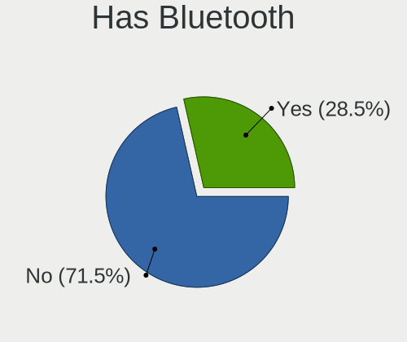
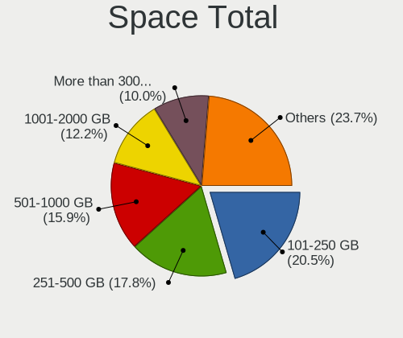
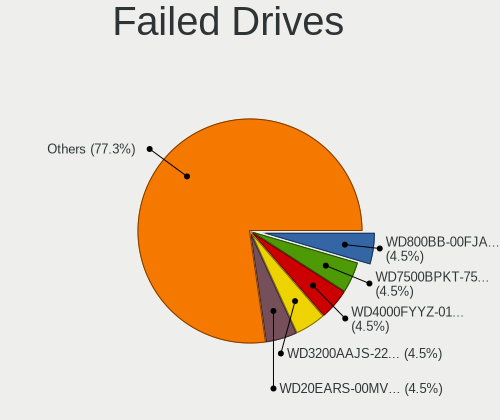
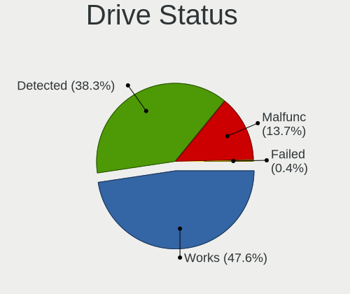
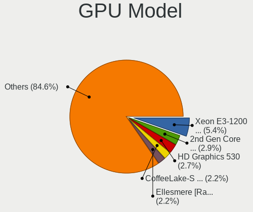
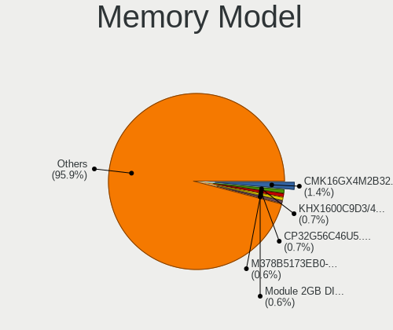
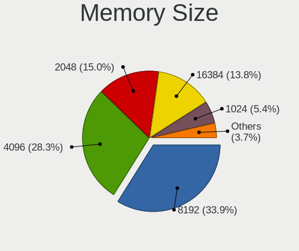

Linux in France - Tested Hardware & Statistics (Desktops)
---------------------------------------------------------

A project to collect tested hardware configurations for Linux in France.

Anyone can contribute to this report by the [hw-probe](https://github.com/linuxhw/hw-probe) tool:

    sudo -E hw-probe -all -upload

Please contribute! Especially if your hardware is rare.

Contents
--------

* [ Test Cases ](#test-cases)

* [ System ](#system)
  - [ OS                       ](#os)
  - [ OS Family                ](#os-family)
  - [ Kernel                   ](#kernel)
  - [ Kernel Family            ](#kernel-family)
  - [ Kernel Major Ver.        ](#kernel-major-ver)
  - [ Arch                     ](#arch)
  - [ DE                       ](#de)
  - [ Display Server           ](#display-server)
  - [ Display Manager          ](#display-manager)
  - [ OS Lang                  ](#os-lang)
  - [ Boot Mode                ](#boot-mode)
  - [ Filesystem               ](#filesystem)
  - [ Part. scheme             ](#part-scheme)
  - [ Dual Boot with Linux/BSD ](#dual-boot-with-linuxbsd)
  - [ Dual Boot (Win)          ](#dual-boot-win)

* [ Board ](#board)
  - [ Vendor                   ](#vendor)
  - [ Model                    ](#model)
  - [ Model Family             ](#model-family)
  - [ MFG Year                 ](#mfg-year)
  - [ Form Factor              ](#form-factor)
  - [ Secure Boot              ](#secure-boot)
  - [ Coreboot                 ](#coreboot)
  - [ RAM Size                 ](#ram-size)
  - [ RAM Used                 ](#ram-used)
  - [ Total Drives             ](#total-drives)
  - [ Has CD-ROM               ](#has-cd-rom)
  - [ Has Ethernet             ](#has-ethernet)
  - [ Has WiFi                 ](#has-wifi)
  - [ Has Bluetooth            ](#has-bluetooth)

* [ Location ](#location)
  - [ Country                  ](#country)
  - [ City                     ](#city)

* [ Drives ](#drives)
  - [ Drive Vendor             ](#drive-vendor)
  - [ Drive Model              ](#drive-model)
  - [ HDD Vendor               ](#hdd-vendor)
  - [ SSD Vendor               ](#ssd-vendor)
  - [ Drive Kind               ](#drive-kind)
  - [ Drive Connector          ](#drive-connector)
  - [ Drive Size               ](#drive-size)
  - [ Space Total              ](#space-total)
  - [ Space Used               ](#space-used)
  - [ Malfunc. Drives          ](#malfunc-drives)
  - [ Malfunc. Drive Vendor    ](#malfunc-drive-vendor)
  - [ Malfunc. HDD Vendor      ](#malfunc-hdd-vendor)
  - [ Malfunc. Drive Kind      ](#malfunc-drive-kind)
  - [ Failed Drives            ](#failed-drives)
  - [ Failed Drive Vendor      ](#failed-drive-vendor)
  - [ Drive Status             ](#drive-status)

* [ Storage controller ](#storage-controller)
  - [ Storage Vendor           ](#storage-vendor)
  - [ Storage Model            ](#storage-model)
  - [ Storage Kind             ](#storage-kind)

* [ Processor ](#processor)
  - [ CPU Vendor               ](#cpu-vendor)
  - [ CPU Model                ](#cpu-model)
  - [ CPU Model Family         ](#cpu-model-family)
  - [ CPU Cores                ](#cpu-cores)
  - [ CPU Sockets              ](#cpu-sockets)
  - [ CPU Threads              ](#cpu-threads)
  - [ CPU Op-Modes             ](#cpu-op-modes)
  - [ CPU Microcode            ](#cpu-microcode)
  - [ CPU Microarch            ](#cpu-microarch)

* [ Graphics ](#graphics)
  - [ GPU Vendor               ](#gpu-vendor)
  - [ GPU Model                ](#gpu-model)
  - [ GPU Combo                ](#gpu-combo)
  - [ GPU Driver               ](#gpu-driver)
  - [ GPU Memory               ](#gpu-memory)

* [ Monitor ](#monitor)
  - [ Monitor Vendor           ](#monitor-vendor)
  - [ Monitor Model            ](#monitor-model)
  - [ Monitor Resolution       ](#monitor-resolution)
  - [ Monitor Diagonal         ](#monitor-diagonal)
  - [ Monitor Width            ](#monitor-width)
  - [ Aspect Ratio             ](#aspect-ratio)
  - [ Monitor Area             ](#monitor-area)
  - [ Pixel Density            ](#pixel-density)
  - [ Multiple Monitors        ](#multiple-monitors)

* [ Network ](#network)
  - [ Net Controller Vendor    ](#net-controller-vendor)
  - [ Net Controller Model     ](#net-controller-model)
  - [ Wireless Vendor          ](#wireless-vendor)
  - [ Wireless Model           ](#wireless-model)
  - [ Ethernet Vendor          ](#ethernet-vendor)
  - [ Ethernet Model           ](#ethernet-model)
  - [ Net Controller Kind      ](#net-controller-kind)
  - [ Used Controller          ](#used-controller)
  - [ NICs                     ](#nics)
  - [ IPv6                     ](#ipv6)

* [ Bluetooth ](#bluetooth)
  - [ Bluetooth Vendor         ](#bluetooth-vendor)
  - [ Bluetooth Model          ](#bluetooth-model)

* [ Sound ](#sound)
  - [ Sound Vendor             ](#sound-vendor)
  - [ Sound Model              ](#sound-model)

* [ Memory ](#memory)
  - [ Memory Vendor            ](#memory-vendor)
  - [ Memory Model             ](#memory-model)
  - [ Memory Kind              ](#memory-kind)
  - [ Memory Form Factor       ](#memory-form-factor)
  - [ Memory Size              ](#memory-size)
  - [ Memory Speed             ](#memory-speed)

* [ Printers & scanners ](#printers--scanners)
  - [ Printer Vendor           ](#printer-vendor)
  - [ Printer Model            ](#printer-model)
  - [ Scanner Vendor           ](#scanner-vendor)
  - [ Scanner Model            ](#scanner-model)

* [ Camera ](#camera)
  - [ Camera Vendor            ](#camera-vendor)
  - [ Camera Model             ](#camera-model)

* [ Security ](#security)
  - [ Fingerprint Vendor       ](#fingerprint-vendor)
  - [ Fingerprint Model        ](#fingerprint-model)
  - [ Chipcard Vendor          ](#chipcard-vendor)
  - [ Chipcard Model           ](#chipcard-model)

* [ Unsupported ](#unsupported)
  - [ Unsupported Devices      ](#unsupported-devices)
  - [ Unsupported Device Types ](#unsupported-device-types)

Test Cases
----------

Total: 4644

| Vendor        | Model                       | Probe                                                      | Date         |
|---------------|-----------------------------|------------------------------------------------------------|--------------|
| ASRock        | B650E PG Riptide WiFi       | [a637650ff7](https://linux-hardware.org/?probe=a637650ff7) | Mar 01, 2023 |
| MSI           | MAG B365M MORTAR            | [26f53549dd](https://linux-hardware.org/?probe=26f53549dd) | Feb 28, 2023 |
| Acer          | Aspire X3995                | [eccac5b752](https://linux-hardware.org/?probe=eccac5b752) | Feb 28, 2023 |
| ASUSTek       | P8H61-M LX3 PLUS R2.0       | [2b434f0b1d](https://linux-hardware.org/?probe=2b434f0b1d) | Feb 28, 2023 |
| MSI           | A320M PRO-VD PLUS           | [6677ab11b2](https://linux-hardware.org/?probe=6677ab11b2) | Feb 28, 2023 |
| ASUSTek       | CM6870                      | [e338b721af](https://linux-hardware.org/?probe=e338b721af) | Feb 28, 2023 |
| ASRockRack    | X470D4U2-2T                 | [4d3d5e02a1](https://linux-hardware.org/?probe=4d3d5e02a1) | Feb 28, 2023 |
| MSI           | A320M PRO-M2 V2             | [0264556bba](https://linux-hardware.org/?probe=0264556bba) | Feb 28, 2023 |
| HP            | 3047h                       | [db6be92c4f](https://linux-hardware.org/?probe=db6be92c4f) | Feb 27, 2023 |
| ASUSTek       | Z10PE-D16 WS                | [dd74cb518b](https://linux-hardware.org/?probe=dd74cb518b) | Feb 27, 2023 |
| Unknown       | Unknown                     | [1a407f82b9](https://linux-hardware.org/?probe=1a407f82b9) | Feb 27, 2023 |
| ASRock        | A320M-HDV R4.0              | [37d2aab670](https://linux-hardware.org/?probe=37d2aab670) | Feb 27, 2023 |
| ASUSTek       | PRIME B350M-A               | [4cd492ee3e](https://linux-hardware.org/?probe=4cd492ee3e) | Feb 26, 2023 |
| ASRock        | B85 Pro4                    | [0b4daba4fb](https://linux-hardware.org/?probe=0b4daba4fb) | Feb 26, 2023 |
| Foxconn       | 2ABF                        | [ead0312777](https://linux-hardware.org/?probe=ead0312777) | Feb 26, 2023 |
| ASUSTek       | PRIME B350M-A               | [9471b0f763](https://linux-hardware.org/?probe=9471b0f763) | Feb 26, 2023 |
| ASRock        | AB350 Pro4                  | [887241ec59](https://linux-hardware.org/?probe=887241ec59) | Feb 26, 2023 |
| MSI           | MPG X570 GAMING PLUS        | [724039adf2](https://linux-hardware.org/?probe=724039adf2) | Feb 26, 2023 |
| Pegatron      | 2AD5                        | [0f487c3a2a](https://linux-hardware.org/?probe=0f487c3a2a) | Feb 26, 2023 |
| MSI           | A320M PRO-VD PLUS           | [bd6c07d84d](https://linux-hardware.org/?probe=bd6c07d84d) | Feb 26, 2023 |
| HP            | 3398                        | [5e7ae4c866](https://linux-hardware.org/?probe=5e7ae4c866) | Feb 25, 2023 |
| HP            | 18E7                        | [7b52dfac52](https://linux-hardware.org/?probe=7b52dfac52) | Feb 25, 2023 |
| HP            | 3047h                       | [8f7d5acf1f](https://linux-hardware.org/?probe=8f7d5acf1f) | Feb 25, 2023 |
| Pegatron      | 2AD5                        | [4c68f5ea84](https://linux-hardware.org/?probe=4c68f5ea84) | Feb 25, 2023 |
| MSI           | B360M PRO-VH                | [fad0bd20e1](https://linux-hardware.org/?probe=fad0bd20e1) | Feb 24, 2023 |
| Dell          | 0VRWRC A00                  | [7089ab33b3](https://linux-hardware.org/?probe=7089ab33b3) | Feb 24, 2023 |
| ASRock        | X370 Professional Gaming    | [cff46cb07b](https://linux-hardware.org/?probe=cff46cb07b) | Feb 24, 2023 |
| MSI           | Z87M GAMING                 | [0603accd89](https://linux-hardware.org/?probe=0603accd89) | Feb 24, 2023 |
| MSI           | X370 GAMING PLUS            | [4d45d5880b](https://linux-hardware.org/?probe=4d45d5880b) | Feb 23, 2023 |
| ASUSTek       | H97M-PLUS                   | [f82cea1be8](https://linux-hardware.org/?probe=f82cea1be8) | Feb 23, 2023 |
| T-bao         | MINI PC                     | [68ba9fc610](https://linux-hardware.org/?probe=68ba9fc610) | Feb 23, 2023 |
| MSI           | B550M PRO-VDH WIFI          | [ce8874cff4](https://linux-hardware.org/?probe=ce8874cff4) | Feb 22, 2023 |
| AZW           | U59                         | [9289537f45](https://linux-hardware.org/?probe=9289537f45) | Feb 22, 2023 |
| ASRockRack    | X470D4U2-2T                 | [9d233c96b5](https://linux-hardware.org/?probe=9d233c96b5) | Feb 22, 2023 |
| ASUSTek       | A_F_K20CE                   | [2dffc350dd](https://linux-hardware.org/?probe=2dffc350dd) | Feb 22, 2023 |
| Gigabyte      | H81M-S2PV                   | [ad365efca1](https://linux-hardware.org/?probe=ad365efca1) | Feb 22, 2023 |
| Foxconn       | Lucknow                     | [3ca9a4f66e](https://linux-hardware.org/?probe=3ca9a4f66e) | Feb 22, 2023 |
| Gigabyte      | B360 AORUS GAMING 3 WIFI... | [1d2132b142](https://linux-hardware.org/?probe=1d2132b142) | Feb 22, 2023 |
| ASUSTek       | G11CD                       | [4fc47f45be](https://linux-hardware.org/?probe=4fc47f45be) | Feb 21, 2023 |
| MSI           | B85-G43                     | [62273631b2](https://linux-hardware.org/?probe=62273631b2) | Feb 21, 2023 |
| MSI           | Z170A XPOWER GAMING TITA... | [b644019f77](https://linux-hardware.org/?probe=b644019f77) | Feb 21, 2023 |
| ASUSTek       | PRIME B450M-A               | [8c97a04c10](https://linux-hardware.org/?probe=8c97a04c10) | Feb 21, 2023 |
| Pegatron      | 2A73h                       | [835743de83](https://linux-hardware.org/?probe=835743de83) | Feb 21, 2023 |
| Gigabyte      | B450 AORUS ELITE            | [c61a513a81](https://linux-hardware.org/?probe=c61a513a81) | Feb 20, 2023 |
| Lenovo        | 30BC SDK0J40697 WIN 3305... | [2a403bdb2b](https://linux-hardware.org/?probe=2a403bdb2b) | Feb 20, 2023 |
| Gigabyte      | 945P-S3                     | [2cdcb107ab](https://linux-hardware.org/?probe=2cdcb107ab) | Feb 20, 2023 |
| ASRock        | H81M-HDS R2.0               | [32b47345a6](https://linux-hardware.org/?probe=32b47345a6) | Feb 20, 2023 |
| ASUSTek       | SABERTOOTH X99              | [422b14d8d7](https://linux-hardware.org/?probe=422b14d8d7) | Feb 19, 2023 |
| Gigabyte      | X570S AORUS ELITE AX        | [7e45218236](https://linux-hardware.org/?probe=7e45218236) | Feb 19, 2023 |
| ASUSTek       | G10AC                       | [8a367bb885](https://linux-hardware.org/?probe=8a367bb885) | Feb 19, 2023 |
| ASUSTek       | STRIX X99 GAMING            | [8dd1992835](https://linux-hardware.org/?probe=8dd1992835) | Feb 18, 2023 |
| IP3 Tech      | Cherry Trail CR             | [0ff2dc2202](https://linux-hardware.org/?probe=0ff2dc2202) | Feb 17, 2023 |
| Gigabyte      | Z590 AORUS ELITE AX         | [8da7f7cbdc](https://linux-hardware.org/?probe=8da7f7cbdc) | Feb 17, 2023 |
| MSI           | MS-7267                     | [0b89f039c1](https://linux-hardware.org/?probe=0b89f039c1) | Feb 17, 2023 |
| Lenovo        | 312A SDK0J40697 WIN 3305... | [4a3d5fee69](https://linux-hardware.org/?probe=4a3d5fee69) | Feb 17, 2023 |
| Acer          | Veriton M4610G              | [7c5f2f584e](https://linux-hardware.org/?probe=7c5f2f584e) | Feb 17, 2023 |
| MSI           | MPG B550I GAMING EDGE WI... | [078d55d158](https://linux-hardware.org/?probe=078d55d158) | Feb 16, 2023 |
| MSI           | H61M-E33                    | [f0c902ce04](https://linux-hardware.org/?probe=f0c902ce04) | Feb 16, 2023 |
| Gigabyte      | F2A78M-HD2                  | [9f9cc6f9e2](https://linux-hardware.org/?probe=9f9cc6f9e2) | Feb 16, 2023 |
| MSI           | X370 GAMING PRO CARBON      | [e1bbf14222](https://linux-hardware.org/?probe=e1bbf14222) | Feb 16, 2023 |
| MSI           | X370 GAMING PRO CARBON      | [ba96494c0f](https://linux-hardware.org/?probe=ba96494c0f) | Feb 16, 2023 |
| MSI           | MAG B550 TOMAHAWK           | [e8dc5253a3](https://linux-hardware.org/?probe=e8dc5253a3) | Feb 15, 2023 |
| Dell          | 0NK5PH A00                  | [5455b577db](https://linux-hardware.org/?probe=5455b577db) | Feb 15, 2023 |
| Supermicro    | X7DCL                       | [49e545591c](https://linux-hardware.org/?probe=49e545591c) | Feb 15, 2023 |
| ASUSTek       | PRIME Z590-V                | [4d00371a70](https://linux-hardware.org/?probe=4d00371a70) | Feb 15, 2023 |
| ASUSTek       | PRIME Z690-P WIFI           | [b30e6a84c8](https://linux-hardware.org/?probe=b30e6a84c8) | Feb 14, 2023 |
| HP            | 805D                        | [217784712c](https://linux-hardware.org/?probe=217784712c) | Feb 14, 2023 |
| ASUSTek       | TUF Gaming B550-PLUS        | [5d2153f4f2](https://linux-hardware.org/?probe=5d2153f4f2) | Feb 14, 2023 |
| Lenovo        | 30BE SDK0K17763 WIN 1801... | [837c0bcb6a](https://linux-hardware.org/?probe=837c0bcb6a) | Feb 14, 2023 |
| Gigabyte      | H87-D3H-CF                  | [2914a1866d](https://linux-hardware.org/?probe=2914a1866d) | Feb 14, 2023 |
| Lenovo        | SHARKBAY NOK                | [4ccd4c2da2](https://linux-hardware.org/?probe=4ccd4c2da2) | Feb 14, 2023 |
| ASUSTek       | Z170-A                      | [6cf7a75c9e](https://linux-hardware.org/?probe=6cf7a75c9e) | Feb 13, 2023 |
| MSI           | MS-B9181                    | [a155bc9fc3](https://linux-hardware.org/?probe=a155bc9fc3) | Feb 13, 2023 |
| ASRock        | E350M1                      | [ac69adceb6](https://linux-hardware.org/?probe=ac69adceb6) | Feb 13, 2023 |
| MSI           | B450M MORTAR                | [5b93510482](https://linux-hardware.org/?probe=5b93510482) | Feb 13, 2023 |
| Gigabyte      | X299 AORUS Gaming 3 Pro-... | [24d20958ab](https://linux-hardware.org/?probe=24d20958ab) | Feb 13, 2023 |
| MSI           | B450M PRO-M2 MAX            | [2032f6e202](https://linux-hardware.org/?probe=2032f6e202) | Feb 13, 2023 |
| Dell          | 0KWVT8 A03                  | [eec95070bb](https://linux-hardware.org/?probe=eec95070bb) | Feb 13, 2023 |
| Lenovo        | 36C8 SDK0J40700 WIN 3258... | [68db95ee9b](https://linux-hardware.org/?probe=68db95ee9b) | Feb 12, 2023 |
| ASUSTek       | M5A99X EVO R2.0             | [a74e071a54](https://linux-hardware.org/?probe=a74e071a54) | Feb 12, 2023 |
| Dell          | 0WMJ54 A01                  | [350850e668](https://linux-hardware.org/?probe=350850e668) | Feb 11, 2023 |
| ASUSTek       | Pro WS X570-ACE             | [127e027611](https://linux-hardware.org/?probe=127e027611) | Feb 10, 2023 |
| Gigabyte      | H77N-WIFI                   | [756bc1fc3b](https://linux-hardware.org/?probe=756bc1fc3b) | Feb 10, 2023 |
| Gigabyte      | H77N-WIFI                   | [769b226f8e](https://linux-hardware.org/?probe=769b226f8e) | Feb 10, 2023 |
| Gigabyte      | B365M H                     | [fca49121d5](https://linux-hardware.org/?probe=fca49121d5) | Feb 09, 2023 |
| Supermicro    | X9DAi                       | [546ea7c2e8](https://linux-hardware.org/?probe=546ea7c2e8) | Feb 09, 2023 |
| ASUSTek       | Z97-K                       | [afaaed1c36](https://linux-hardware.org/?probe=afaaed1c36) | Feb 09, 2023 |
| ASRock        | B550 Pro4                   | [9d947022b0](https://linux-hardware.org/?probe=9d947022b0) | Feb 09, 2023 |
| Packard Be... | IMEDIA S3840                | [cc92542e21](https://linux-hardware.org/?probe=cc92542e21) | Feb 08, 2023 |
| Dell          | 0NC2VH A01                  | [85ab2e4223](https://linux-hardware.org/?probe=85ab2e4223) | Feb 08, 2023 |
| Packard Be... | IMEDIA S3840                | [190d8c3b40](https://linux-hardware.org/?probe=190d8c3b40) | Feb 08, 2023 |
| ASUSTek       | H81-PLUS                    | [c01a8b01f0](https://linux-hardware.org/?probe=c01a8b01f0) | Feb 08, 2023 |
| ASUSTek       | PRIME X399-A                | [22ba7d722f](https://linux-hardware.org/?probe=22ba7d722f) | Feb 07, 2023 |
| Dell          | 0T568R A00                  | [b4cafb34f7](https://linux-hardware.org/?probe=b4cafb34f7) | Feb 07, 2023 |
| Dell          | 0HHV7N A00                  | [e67a1c86b7](https://linux-hardware.org/?probe=e67a1c86b7) | Feb 07, 2023 |
| Dell          | 0HD5W2 A01                  | [02260ca8b3](https://linux-hardware.org/?probe=02260ca8b3) | Feb 06, 2023 |
| Dell          | 06JWJY A00                  | [9745edaf8e](https://linux-hardware.org/?probe=9745edaf8e) | Feb 06, 2023 |
| ASUSTek       | M5A78L-M LX3                | [6519e2ca2f](https://linux-hardware.org/?probe=6519e2ca2f) | Feb 06, 2023 |
| Dell          | 0TTDMJ A00                  | [0bd327136a](https://linux-hardware.org/?probe=0bd327136a) | Feb 06, 2023 |
| MSI           | PRO H610M-B DDR4            | [6217fdc070](https://linux-hardware.org/?probe=6217fdc070) | Feb 06, 2023 |
| HP            | 0A64h                       | [40ef639345](https://linux-hardware.org/?probe=40ef639345) | Feb 05, 2023 |
| Dell          | 0TTDMJ A00                  | [6dd8a1b58a](https://linux-hardware.org/?probe=6dd8a1b58a) | Feb 05, 2023 |
| MSI           | B250M PRO-VDH               | [b8675ca2ee](https://linux-hardware.org/?probe=b8675ca2ee) | Feb 05, 2023 |
| Gigabyte      | B150M-D2V DDR3-CF           | [bc0593280c](https://linux-hardware.org/?probe=bc0593280c) | Feb 05, 2023 |
| ASUSTek       | H87M-PLUS                   | [99dc5ad30d](https://linux-hardware.org/?probe=99dc5ad30d) | Feb 05, 2023 |
| ASUSTek       | P5V-VM DH                   | [9d090675b1](https://linux-hardware.org/?probe=9d090675b1) | Feb 05, 2023 |
| ASUSTek       | B75M-PLUS                   | [d2981f72e6](https://linux-hardware.org/?probe=d2981f72e6) | Feb 05, 2023 |
| MSI           | A320M PRO-M2                | [3fa2ac81f2](https://linux-hardware.org/?probe=3fa2ac81f2) | Feb 05, 2023 |
| HP            | 3396                        | [96a3376aa0](https://linux-hardware.org/?probe=96a3376aa0) | Feb 05, 2023 |
| Dell          | 0D4MD1 A00                  | [7198c3d131](https://linux-hardware.org/?probe=7198c3d131) | Feb 05, 2023 |
| ASUSTek       | Basswood                    | [7de223a121](https://linux-hardware.org/?probe=7de223a121) | Feb 04, 2023 |
| HP            | 1589                        | [7b3a0cf51b](https://linux-hardware.org/?probe=7b3a0cf51b) | Feb 04, 2023 |
| Gigabyte      | B150M-D2V DDR3-CF           | [e12e1d2598](https://linux-hardware.org/?probe=e12e1d2598) | Feb 04, 2023 |
| ASUSTek       | PRIME X570-P                | [a8dcc6b4c1](https://linux-hardware.org/?probe=a8dcc6b4c1) | Feb 03, 2023 |
| Intel         | D33217GKE G76540-203        | [0f43f169d1](https://linux-hardware.org/?probe=0f43f169d1) | Feb 03, 2023 |
| ASUSTek       | P8P67 PRO                   | [49d8a19239](https://linux-hardware.org/?probe=49d8a19239) | Feb 03, 2023 |
| Dell          | 05WNJ2 A02                  | [4619f572c5](https://linux-hardware.org/?probe=4619f572c5) | Feb 03, 2023 |
| ASRock        | FM2A88X Extreme4+           | [9f812fe2a7](https://linux-hardware.org/?probe=9f812fe2a7) | Feb 02, 2023 |
| ASUSTek       | TUF Gaming B550-PLUS        | [795ee67158](https://linux-hardware.org/?probe=795ee67158) | Feb 02, 2023 |
| Gigabyte      | Z170XP-SLI-CF               | [1fddf279a5](https://linux-hardware.org/?probe=1fddf279a5) | Feb 02, 2023 |
| MSI           | H110M PRO-VD                | [b35d6e3a08](https://linux-hardware.org/?probe=b35d6e3a08) | Feb 02, 2023 |
| MSI           | H110M PRO-VD                | [cc717bffbe](https://linux-hardware.org/?probe=cc717bffbe) | Feb 02, 2023 |
| Lenovo        | MAHOBAY Win8 STD MM DPK ... | [203e3fe693](https://linux-hardware.org/?probe=203e3fe693) | Feb 01, 2023 |
| ASUSTek       | K8N-DL                      | [dde5c844f2](https://linux-hardware.org/?probe=dde5c844f2) | Feb 01, 2023 |
| Gigabyte      | GA-MA770T-UD3               | [4644d239d7](https://linux-hardware.org/?probe=4644d239d7) | Feb 01, 2023 |
| MSI           | A520M-A PRO                 | [f7a88d0dea](https://linux-hardware.org/?probe=f7a88d0dea) | Feb 01, 2023 |
| ASRock        | X570 Pro4                   | [81b19ff917](https://linux-hardware.org/?probe=81b19ff917) | Feb 01, 2023 |
| Dell          | 0XHGV1 A00                  | [05a6fd1857](https://linux-hardware.org/?probe=05a6fd1857) | Jan 31, 2023 |
| ASUSTek       | Z97-PRO GAMER               | [9ce51b923e](https://linux-hardware.org/?probe=9ce51b923e) | Jan 31, 2023 |
| Lenovo        | 36C8 SDK0J40700 WIN 3258... | [01c7dbecde](https://linux-hardware.org/?probe=01c7dbecde) | Jan 31, 2023 |
| ASRock        | X570 Pro4                   | [37999411ed](https://linux-hardware.org/?probe=37999411ed) | Jan 31, 2023 |
| ASUSTek       | CROSSHAIR V FORMULA-Z       | [32dfb5ebe2](https://linux-hardware.org/?probe=32dfb5ebe2) | Jan 31, 2023 |
| Dell          | 0TP412                      | [5db177340d](https://linux-hardware.org/?probe=5db177340d) | Jan 30, 2023 |
| MSI           | 970 GAMING                  | [7bc39da7c1](https://linux-hardware.org/?probe=7bc39da7c1) | Jan 30, 2023 |
| Lenovo        | 36C8 SDK0J40700 WIN 3258... | [529b411b46](https://linux-hardware.org/?probe=529b411b46) | Jan 30, 2023 |
| ASUSTek       | E3 PRO GAMING V5            | [b7917146d8](https://linux-hardware.org/?probe=b7917146d8) | Jan 30, 2023 |
| ASUSTek       | ROG STRIX Z390-E GAMING     | [7983249b4c](https://linux-hardware.org/?probe=7983249b4c) | Jan 30, 2023 |
| HP            | 0A64h                       | [da7b36ad47](https://linux-hardware.org/?probe=da7b36ad47) | Jan 30, 2023 |
| ASUSTek       | ROG STRIX B550-F GAMING     | [4fb612b680](https://linux-hardware.org/?probe=4fb612b680) | Jan 29, 2023 |
| MSI           | MPG B550I GAMING EDGE MA... | [ff186606cd](https://linux-hardware.org/?probe=ff186606cd) | Jan 29, 2023 |
| Gigabyte      | Z170XP-SLI-CF               | [b9a38b7494](https://linux-hardware.org/?probe=b9a38b7494) | Jan 29, 2023 |
| Dell          | 0F8098                      | [d6066c739e](https://linux-hardware.org/?probe=d6066c739e) | Jan 28, 2023 |
| ASUSTek       | Z97-K                       | [e3f865cd20](https://linux-hardware.org/?probe=e3f865cd20) | Jan 28, 2023 |
| ASUSTek       | Pro WS X570-ACE             | [6e55ab69b8](https://linux-hardware.org/?probe=6e55ab69b8) | Jan 28, 2023 |
| Lenovo        | NO DPK                      | [0abc762f30](https://linux-hardware.org/?probe=0abc762f30) | Jan 28, 2023 |
| Gigabyte      | B660M GAMING DDR4           | [c7fc79b5f1](https://linux-hardware.org/?probe=c7fc79b5f1) | Jan 28, 2023 |
| MSI           | H410M PRO                   | [d8c1dc4e25](https://linux-hardware.org/?probe=d8c1dc4e25) | Jan 28, 2023 |
| MSI           | H410M PRO                   | [72f5a735fb](https://linux-hardware.org/?probe=72f5a735fb) | Jan 28, 2023 |
| Medion        | H61H2-LM3                   | [e9d671848c](https://linux-hardware.org/?probe=e9d671848c) | Jan 27, 2023 |
| Acer          | Aspire X1700                | [beab94f1ee](https://linux-hardware.org/?probe=beab94f1ee) | Jan 27, 2023 |
| Gigabyte      | H310M S2H                   | [6aa78b855a](https://linux-hardware.org/?probe=6aa78b855a) | Jan 27, 2023 |
| Gigabyte      | Z87-D3HP-CF                 | [812c00440c](https://linux-hardware.org/?probe=812c00440c) | Jan 26, 2023 |
| HP            | 805D                        | [b1996094a9](https://linux-hardware.org/?probe=b1996094a9) | Jan 26, 2023 |
| ASUSTek       | PRIME X370-A                | [b1371b8883](https://linux-hardware.org/?probe=b1371b8883) | Jan 26, 2023 |
| Gigabyte      | EX38-DS4                    | [4d5b828cfc](https://linux-hardware.org/?probe=4d5b828cfc) | Jan 25, 2023 |
| HP            | 1495                        | [d600418bf6](https://linux-hardware.org/?probe=d600418bf6) | Jan 25, 2023 |
| MSI           | MS-7032                     | [7b481f4c8c](https://linux-hardware.org/?probe=7b481f4c8c) | Jan 25, 2023 |
| Intel         | B75                         | [20853a8c8d](https://linux-hardware.org/?probe=20853a8c8d) | Jan 25, 2023 |
| MSI           | H110M GAMING                | [2622dcb32e](https://linux-hardware.org/?probe=2622dcb32e) | Jan 25, 2023 |
| Dell          | 0NK5PH A00                  | [fc7e90e419](https://linux-hardware.org/?probe=fc7e90e419) | Jan 25, 2023 |
| Gigabyte      | B550 AORUS ELITE AX         | [026efbc485](https://linux-hardware.org/?probe=026efbc485) | Jan 25, 2023 |
| Gigabyte      | B550 AORUS ELITE AX         | [184de230c5](https://linux-hardware.org/?probe=184de230c5) | Jan 25, 2023 |
| MSI           | B350M MORTAR                | [1c843535db](https://linux-hardware.org/?probe=1c843535db) | Jan 24, 2023 |
| ASUSTek       | PRIME B450M-A               | [da95f58140](https://linux-hardware.org/?probe=da95f58140) | Jan 23, 2023 |
| Fujitsu       | D3233-A1 S26361-D3233-A1    | [8b280b4152](https://linux-hardware.org/?probe=8b280b4152) | Jan 23, 2023 |
| Dell          | 0NNNCT A01                  | [b80dda96de](https://linux-hardware.org/?probe=b80dda96de) | Jan 23, 2023 |
| MSI           | MS-7388                     | [4d5146a81f](https://linux-hardware.org/?probe=4d5146a81f) | Jan 22, 2023 |
| MSI           | H81M-E34                    | [c11041ba13](https://linux-hardware.org/?probe=c11041ba13) | Jan 22, 2023 |
| ASUSTek       | Z97-K                       | [1261e08a8a](https://linux-hardware.org/?probe=1261e08a8a) | Jan 22, 2023 |
| Shenzhen M... | F6BFC                       | [21f62b0eac](https://linux-hardware.org/?probe=21f62b0eac) | Jan 21, 2023 |
| Lenovo        | 30C0 SDK0J40697 WIN 3305... | [f6f1f5e32b](https://linux-hardware.org/?probe=f6f1f5e32b) | Jan 21, 2023 |
| ASUSTek       | TUF Gaming B560M-E          | [0bbafaf9fe](https://linux-hardware.org/?probe=0bbafaf9fe) | Jan 21, 2023 |
| ASUSTek       | TUF Z390-PLUS GAMING        | [0f3a750cdc](https://linux-hardware.org/?probe=0f3a750cdc) | Jan 21, 2023 |
| ASRock        | B550M Pro4                  | [22b030cc5c](https://linux-hardware.org/?probe=22b030cc5c) | Jan 21, 2023 |
| Gigabyte      | B150M-D2V DDR3-CF           | [69bf20ee28](https://linux-hardware.org/?probe=69bf20ee28) | Jan 21, 2023 |
| MSI           | Z490-A PRO                  | [0a3fe4cb00](https://linux-hardware.org/?probe=0a3fe4cb00) | Jan 21, 2023 |
| Gigabyte      | B150M-D2V DDR3-CF           | [dfd88e113a](https://linux-hardware.org/?probe=dfd88e113a) | Jan 21, 2023 |
| Gigabyte      | B550M AORUS ELITE           | [7a067fe264](https://linux-hardware.org/?probe=7a067fe264) | Jan 21, 2023 |
| Gigabyte      | B550 GAMING X V2            | [f1d22db1d7](https://linux-hardware.org/?probe=f1d22db1d7) | Jan 21, 2023 |
| ASUSTek       | PRIME Z390M-PLUS            | [6134837cfe](https://linux-hardware.org/?probe=6134837cfe) | Jan 21, 2023 |
| ASUSTek       | P5QL PRO                    | [9f700f7e19](https://linux-hardware.org/?probe=9f700f7e19) | Jan 21, 2023 |
| ASUSTek       | PRIME B450-PLUS             | [e3525b1f86](https://linux-hardware.org/?probe=e3525b1f86) | Jan 21, 2023 |
| ASUSTek       | P8Z68-V LX                  | [49f0bb23ea](https://linux-hardware.org/?probe=49f0bb23ea) | Jan 20, 2023 |
| ASRock        | A520M-HDVP/DASH             | [72421e0506](https://linux-hardware.org/?probe=72421e0506) | Jan 20, 2023 |
| Gigabyte      | Z590 UD AC                  | [91dea34a76](https://linux-hardware.org/?probe=91dea34a76) | Jan 20, 2023 |
| Dell          | 0KJCC5 A00                  | [08502cda27](https://linux-hardware.org/?probe=08502cda27) | Jan 20, 2023 |
| Lenovo        | 3642 SDK0J40700 WIN 3258... | [bb1826bf63](https://linux-hardware.org/?probe=bb1826bf63) | Jan 20, 2023 |
| Gigabyte      | M61PME-S2                   | [110d9cb0f9](https://linux-hardware.org/?probe=110d9cb0f9) | Jan 20, 2023 |
| Gigabyte      | H310M S2H                   | [57a7b7d914](https://linux-hardware.org/?probe=57a7b7d914) | Jan 20, 2023 |
| Lenovo        | 7033EW4                     | [fd4303de2e](https://linux-hardware.org/?probe=fd4303de2e) | Jan 20, 2023 |
| ASUSTek       | PRIME B365M-A               | [c08f2e5961](https://linux-hardware.org/?probe=c08f2e5961) | Jan 19, 2023 |
| ASUSTek       | PRIME B350M-A               | [6f50700657](https://linux-hardware.org/?probe=6f50700657) | Jan 19, 2023 |
| MSI           | H110M PRO-VD                | [e000402b1c](https://linux-hardware.org/?probe=e000402b1c) | Jan 19, 2023 |
| MSI           | H110M PRO-VD                | [79e6461b99](https://linux-hardware.org/?probe=79e6461b99) | Jan 19, 2023 |
| MSI           | X570-A PRO                  | [9c0b3ef63b](https://linux-hardware.org/?probe=9c0b3ef63b) | Jan 19, 2023 |
| ASUSTek       | PRIME B250M-A               | [d2ecbd7302](https://linux-hardware.org/?probe=d2ecbd7302) | Jan 18, 2023 |
| ASUSTek       | PRIME Z270-A                | [8e511beda6](https://linux-hardware.org/?probe=8e511beda6) | Jan 18, 2023 |
| Lenovo        | 7033EW4                     | [df0d8cd728](https://linux-hardware.org/?probe=df0d8cd728) | Jan 18, 2023 |
| Gigabyte      | H77-D3H                     | [15da5de3ae](https://linux-hardware.org/?probe=15da5de3ae) | Jan 18, 2023 |
| Lenovo        | 314F SDK0J40697 WIN 3305... | [f7efc3545d](https://linux-hardware.org/?probe=f7efc3545d) | Jan 18, 2023 |
| MSI           | H310M PRO-M2                | [6bdc0bc1c7](https://linux-hardware.org/?probe=6bdc0bc1c7) | Jan 17, 2023 |
| ASUSTek       | PRIME Z270-A                | [ad9172f4a9](https://linux-hardware.org/?probe=ad9172f4a9) | Jan 17, 2023 |
| MSI           | A320M-A PRO MAX             | [5a0f8a7ea6](https://linux-hardware.org/?probe=5a0f8a7ea6) | Jan 17, 2023 |
| Gigabyte      | Z170-HD3P-CF                | [851c4f03fc](https://linux-hardware.org/?probe=851c4f03fc) | Jan 17, 2023 |
| Fujitsu       | D3230-A1 S26361-D3230-A1    | [6c3aa30aa8](https://linux-hardware.org/?probe=6c3aa30aa8) | Jan 17, 2023 |
| Gigabyte      | Z270X-Ultra Gaming-CF       | [41839ed038](https://linux-hardware.org/?probe=41839ed038) | Jan 17, 2023 |
| Dell          | 01D4TT A00                  | [509404e50f](https://linux-hardware.org/?probe=509404e50f) | Jan 17, 2023 |
| Dell          | 0HHV7N A00                  | [8e4a061e95](https://linux-hardware.org/?probe=8e4a061e95) | Jan 16, 2023 |
| Lenovo        | 3102 SDK0K13476 WIN 3306... | [fd843f48f5](https://linux-hardware.org/?probe=fd843f48f5) | Jan 16, 2023 |
| ASUSTek       | PRIME Z270-A                | [8bdec78777](https://linux-hardware.org/?probe=8bdec78777) | Jan 16, 2023 |
| MSI           | H61M-P20                    | [bf79928a7a](https://linux-hardware.org/?probe=bf79928a7a) | Jan 16, 2023 |
| ASRock        | FM2A88X+ Killer             | [ce91a77f1c](https://linux-hardware.org/?probe=ce91a77f1c) | Jan 16, 2023 |
| MSI           | B450 TOMAHAWK MAX           | [3b4a530695](https://linux-hardware.org/?probe=3b4a530695) | Jan 15, 2023 |
| MSI           | MAG B560M MORTAR            | [45da89106d](https://linux-hardware.org/?probe=45da89106d) | Jan 15, 2023 |
| Dell          | 0M863N A01                  | [4d7e5c21fc](https://linux-hardware.org/?probe=4d7e5c21fc) | Jan 15, 2023 |
| Gigabyte      | B550M AORUS PRO             | [0b375cb78b](https://linux-hardware.org/?probe=0b375cb78b) | Jan 14, 2023 |
| Gigabyte      | H55M-UD2H                   | [a14f62fa30](https://linux-hardware.org/?probe=a14f62fa30) | Jan 14, 2023 |
| ASUSTek       | PRIME X570-P                | [32026c5c05](https://linux-hardware.org/?probe=32026c5c05) | Jan 14, 2023 |
| Lenovo        | 30D2 SDK0J40697 WIN 3305... | [67d3d3c57a](https://linux-hardware.org/?probe=67d3d3c57a) | Jan 14, 2023 |
| Gigabyte      | B450 AORUS ELITE            | [9774dee993](https://linux-hardware.org/?probe=9774dee993) | Jan 14, 2023 |
| Gigabyte      | Z77-D3H                     | [d09a603b10](https://linux-hardware.org/?probe=d09a603b10) | Jan 14, 2023 |
| HP            | 8054                        | [faf1c97cea](https://linux-hardware.org/?probe=faf1c97cea) | Jan 14, 2023 |
| MSI           | MPG Z390 GAMING EDGE AC     | [1a25eeba6f](https://linux-hardware.org/?probe=1a25eeba6f) | Jan 14, 2023 |
| Gigabyte      | H310M S2H                   | [04381152c2](https://linux-hardware.org/?probe=04381152c2) | Jan 14, 2023 |
| Gigabyte      | H310M S2H                   | [a153e6f458](https://linux-hardware.org/?probe=a153e6f458) | Jan 14, 2023 |
| ASUSTek       | TUF B450-PLUS GAMING        | [ed18454667](https://linux-hardware.org/?probe=ed18454667) | Jan 14, 2023 |
| Gigabyte      | B550M DS3H                  | [5de8333ea3](https://linux-hardware.org/?probe=5de8333ea3) | Jan 14, 2023 |
| Dell          | 0M5DCD A00                  | [f6e2ab2124](https://linux-hardware.org/?probe=f6e2ab2124) | Jan 13, 2023 |
| Gigabyte      | Z390 AORUS ELITE-CF         | [a399f30ea9](https://linux-hardware.org/?probe=a399f30ea9) | Jan 13, 2023 |
| Dell          | 0M5DCD A00                  | [83bed4df76](https://linux-hardware.org/?probe=83bed4df76) | Jan 13, 2023 |
| HC            | HCAR357-MI V1.0             | [516f1ed052](https://linux-hardware.org/?probe=516f1ed052) | Jan 13, 2023 |
| ASUSTek       | P8Z77-V LK                  | [f954b55a5c](https://linux-hardware.org/?probe=f954b55a5c) | Jan 13, 2023 |
| ASUSTek       | TUF Gaming B550-PLUS        | [c331071e8a](https://linux-hardware.org/?probe=c331071e8a) | Jan 13, 2023 |
| ASUSTek       | H110S2                      | [d783389831](https://linux-hardware.org/?probe=d783389831) | Jan 13, 2023 |
| Gigabyte      | H310M S2H                   | [9aec47cbf0](https://linux-hardware.org/?probe=9aec47cbf0) | Jan 12, 2023 |
| HP            | 21EF                        | [0d5e3a9354](https://linux-hardware.org/?probe=0d5e3a9354) | Jan 12, 2023 |
| Gigabyte      | H310M S2H                   | [b3cccc4043](https://linux-hardware.org/?probe=b3cccc4043) | Jan 12, 2023 |
| HP            | 21EF                        | [cdeab03273](https://linux-hardware.org/?probe=cdeab03273) | Jan 12, 2023 |
| Intel         | DN2800MT AAG81515-900       | [546f31d89f](https://linux-hardware.org/?probe=546f31d89f) | Jan 12, 2023 |
| ASUSTek       | PRIME Z690M-PLUS D4         | [4687ae7d43](https://linux-hardware.org/?probe=4687ae7d43) | Jan 12, 2023 |
| ASUSTek       | TUF Gaming X570-PLUS        | [190d9b58b8](https://linux-hardware.org/?probe=190d9b58b8) | Jan 12, 2023 |
| ASUSTek       | P8H77-M PRO                 | [24461e4b9f](https://linux-hardware.org/?probe=24461e4b9f) | Jan 12, 2023 |
| ASRock        | ION3D-HT                    | [48707e3794](https://linux-hardware.org/?probe=48707e3794) | Jan 12, 2023 |
| ASUSTek       | ROG STRIX Z370-G GAMING     | [d92a983612](https://linux-hardware.org/?probe=d92a983612) | Jan 12, 2023 |
| ASUSTek       | M5A78L LE                   | [ea76077171](https://linux-hardware.org/?probe=ea76077171) | Jan 11, 2023 |
| Intel         | DQ77KB AAG81483-500         | [0e8844064e](https://linux-hardware.org/?probe=0e8844064e) | Jan 11, 2023 |
| Intel         | JSL MRD                     | [d1b9dbaae0](https://linux-hardware.org/?probe=d1b9dbaae0) | Jan 11, 2023 |
| Gigabyte      | Z390 AORUS ELITE-CF         | [ff44388b68](https://linux-hardware.org/?probe=ff44388b68) | Jan 11, 2023 |
| Dell          | 0M5DCD A00                  | [4f6e8d1ac5](https://linux-hardware.org/?probe=4f6e8d1ac5) | Jan 10, 2023 |
| ASUSTek       | PRIME Z390M-PLUS            | [b0475049e8](https://linux-hardware.org/?probe=b0475049e8) | Jan 10, 2023 |
| ASUSTek       | M5A78L LE                   | [0b9c1c2841](https://linux-hardware.org/?probe=0b9c1c2841) | Jan 09, 2023 |
| ASUSTek       | ROG CROSSHAIR VIII DARK ... | [1f77d36501](https://linux-hardware.org/?probe=1f77d36501) | Jan 09, 2023 |
| Gigabyte      | B560I AORUS PRO AX          | [bd760b375b](https://linux-hardware.org/?probe=bd760b375b) | Jan 09, 2023 |
| ASUSTek       | Z97M-PLUS                   | [6746287398](https://linux-hardware.org/?probe=6746287398) | Jan 09, 2023 |
| HP            | 802F                        | [1dd3655605](https://linux-hardware.org/?probe=1dd3655605) | Jan 09, 2023 |
| Gigabyte      | B550 GAMING X V2            | [e64cca399f](https://linux-hardware.org/?probe=e64cca399f) | Jan 09, 2023 |
| Gigabyte      | Z77-D3H                     | [8d02a61d53](https://linux-hardware.org/?probe=8d02a61d53) | Jan 09, 2023 |
| HP            | 0A98h                       | [a26fc3d5f4](https://linux-hardware.org/?probe=a26fc3d5f4) | Jan 08, 2023 |
| MSI           | B450M MORTAR MAX            | [474907a53e](https://linux-hardware.org/?probe=474907a53e) | Jan 08, 2023 |
| Lenovo        | MAHOBAY NO DPK              | [df436102d6](https://linux-hardware.org/?probe=df436102d6) | Jan 08, 2023 |
| MSI           | 990XA-GD55                  | [b4525a8431](https://linux-hardware.org/?probe=b4525a8431) | Jan 08, 2023 |
| Gigabyte      | B550M DS3H                  | [faf4eff378](https://linux-hardware.org/?probe=faf4eff378) | Jan 08, 2023 |
| MSI           | MPG B550 GAMING PLUS        | [a763320a37](https://linux-hardware.org/?probe=a763320a37) | Jan 08, 2023 |
| ASUSTek       | P8Z68-V LX                  | [f090331efa](https://linux-hardware.org/?probe=f090331efa) | Jan 07, 2023 |
| ASUSTek       | P7P55D                      | [d6f1a60435](https://linux-hardware.org/?probe=d6f1a60435) | Jan 07, 2023 |
| Gigabyte      | H310M S2H                   | [1530f96142](https://linux-hardware.org/?probe=1530f96142) | Jan 07, 2023 |
| Pegatron      | Eureka3                     | [c3aacdc606](https://linux-hardware.org/?probe=c3aacdc606) | Jan 07, 2023 |
| MSI           | PRO B660M-B DDR4            | [cceab9ef33](https://linux-hardware.org/?probe=cceab9ef33) | Jan 07, 2023 |
| Dell          | 04MFRM A02                  | [7b29154637](https://linux-hardware.org/?probe=7b29154637) | Jan 07, 2023 |
| Dell          | 042P49 A00                  | [91c410b89a](https://linux-hardware.org/?probe=91c410b89a) | Jan 07, 2023 |
| ASRock        | X470 Master SLI             | [c138f9159c](https://linux-hardware.org/?probe=c138f9159c) | Jan 07, 2023 |
| Acer          | Aspire XC-885 V:1.1         | [3a51845b72](https://linux-hardware.org/?probe=3a51845b72) | Jan 07, 2023 |
| ASUSTek       | M5A99X EVO                  | [d4111f62a5](https://linux-hardware.org/?probe=d4111f62a5) | Jan 07, 2023 |
| MSI           | H510M-A PRO                 | [38bc046bdd](https://linux-hardware.org/?probe=38bc046bdd) | Jan 07, 2023 |
| Gigabyte      | B450 AORUS ELITE V2         | [7fd8978322](https://linux-hardware.org/?probe=7fd8978322) | Jan 06, 2023 |
| ASRock        | H370M Pro4                  | [69d73f2269](https://linux-hardware.org/?probe=69d73f2269) | Jan 06, 2023 |
| MSI           | MEG Z490 UNIFY              | [cb25b352e0](https://linux-hardware.org/?probe=cb25b352e0) | Jan 06, 2023 |
| Gigabyte      | Z87X-D3H-CF                 | [a4b5bc192d](https://linux-hardware.org/?probe=a4b5bc192d) | Jan 06, 2023 |
| ASRock        | FM2A78 Pro4+                | [a2038e788c](https://linux-hardware.org/?probe=a2038e788c) | Jan 05, 2023 |
| HP            | 3397                        | [ef794d730d](https://linux-hardware.org/?probe=ef794d730d) | Jan 05, 2023 |
| ASUSTek       | ROG STRIX Z690-G GAMING ... | [0ae0a8d91b](https://linux-hardware.org/?probe=0ae0a8d91b) | Jan 05, 2023 |
| ASUSTek       | G20AJ                       | [9be7e0b11f](https://linux-hardware.org/?probe=9be7e0b11f) | Jan 05, 2023 |
| HP            | 8055                        | [5f51faab6e](https://linux-hardware.org/?probe=5f51faab6e) | Jan 05, 2023 |
| Dell          | 0XHGV1 A00                  | [84b31ee7de](https://linux-hardware.org/?probe=84b31ee7de) | Jan 05, 2023 |
| MSI           | MPG Z390 GAMING EDGE AC     | [03f117a662](https://linux-hardware.org/?probe=03f117a662) | Jan 05, 2023 |
| MSI           | MPG Z390 GAMING EDGE AC     | [4ff5066793](https://linux-hardware.org/?probe=4ff5066793) | Jan 05, 2023 |
| Dell          | 0TP412                      | [b608bcbdcf](https://linux-hardware.org/?probe=b608bcbdcf) | Jan 04, 2023 |
| MSI           | 970 GAMING                  | [7931ef67b2](https://linux-hardware.org/?probe=7931ef67b2) | Jan 04, 2023 |
| ASUSTek       | ROG CROSSHAIR VIII DARK ... | [113e1b51b7](https://linux-hardware.org/?probe=113e1b51b7) | Jan 04, 2023 |
| Dell          | 042P49 A00                  | [192e7fac1d](https://linux-hardware.org/?probe=192e7fac1d) | Jan 03, 2023 |
| ASUSTek       | PRIME B560M-A               | [f560abfd7f](https://linux-hardware.org/?probe=f560abfd7f) | Jan 03, 2023 |
| ASUSTek       | Berkeley                    | [746d7be693](https://linux-hardware.org/?probe=746d7be693) | Jan 03, 2023 |
| HP            | 339A                        | [c35711cb53](https://linux-hardware.org/?probe=c35711cb53) | Jan 03, 2023 |
| HP            | 339A                        | [2a4cb6de27](https://linux-hardware.org/?probe=2a4cb6de27) | Jan 03, 2023 |
| ASUSTek       | ROG STRIX Z690-G GAMING ... | [7c98c0b00d](https://linux-hardware.org/?probe=7c98c0b00d) | Jan 02, 2023 |
| MSI           | 970 GAMING                  | [1fa699405c](https://linux-hardware.org/?probe=1fa699405c) | Jan 02, 2023 |
| Dell          | 0WMJ54 A01                  | [c6feaa89a0](https://linux-hardware.org/?probe=c6feaa89a0) | Jan 01, 2023 |
| Lenovo        | SHARKBAY NOK                | [7c72451666](https://linux-hardware.org/?probe=7c72451666) | Jan 01, 2023 |
| Gigabyte      | B365 HD3                    | [195240c264](https://linux-hardware.org/?probe=195240c264) | Jan 01, 2023 |
| Foxconn       | 2ACA                        | [505262a4b1](https://linux-hardware.org/?probe=505262a4b1) | Jan 01, 2023 |
| ASUSTek       | PRIME B250M-K               | [9db6f0fda7](https://linux-hardware.org/?probe=9db6f0fda7) | Dec 31, 2022 |
| ASRock        | B550 Steel Legend           | [8705e10ac6](https://linux-hardware.org/?probe=8705e10ac6) | Dec 31, 2022 |
| Gigabyte      | GA-78LMT-USB3               | [6de26a316e](https://linux-hardware.org/?probe=6de26a316e) | Dec 30, 2022 |
| MSI           | H61M-P22                    | [23b5356c0a](https://linux-hardware.org/?probe=23b5356c0a) | Dec 30, 2022 |
| ASRock        | 960GM-GS3 FX                | [1d8b5f0509](https://linux-hardware.org/?probe=1d8b5f0509) | Dec 30, 2022 |
| ASUSTek       | PRIME B450M-A II            | [0842d26251](https://linux-hardware.org/?probe=0842d26251) | Dec 30, 2022 |
| ASUSTek       | PRIME B450M-A II            | [d91b55f9f1](https://linux-hardware.org/?probe=d91b55f9f1) | Dec 30, 2022 |
| Gigabyte      | B450M DS3H-CF               | [47f838ca34](https://linux-hardware.org/?probe=47f838ca34) | Dec 30, 2022 |
| Gigabyte      | Z490I AORUS ULTRA           | [6cf8d26754](https://linux-hardware.org/?probe=6cf8d26754) | Dec 30, 2022 |
| Acer          | Aspire X3960                | [f045d61192](https://linux-hardware.org/?probe=f045d61192) | Dec 29, 2022 |
| Acer          | Aspire X3960                | [75e053c90f](https://linux-hardware.org/?probe=75e053c90f) | Dec 29, 2022 |
| Dell          | 0T10XW A01                  | [8b16a66b73](https://linux-hardware.org/?probe=8b16a66b73) | Dec 29, 2022 |
| ASRock        | H61M-ITX                    | [0ee8e9bb5b](https://linux-hardware.org/?probe=0ee8e9bb5b) | Dec 28, 2022 |
| Dell          | 0YXT71 A01                  | [ed5e31a6bc](https://linux-hardware.org/?probe=ed5e31a6bc) | Dec 28, 2022 |
| ASUSTek       | PRIME B360M-K               | [48f161dfc8](https://linux-hardware.org/?probe=48f161dfc8) | Dec 27, 2022 |
| MSI           | MPG Z390 GAMING EDGE AC     | [31f25029c1](https://linux-hardware.org/?probe=31f25029c1) | Dec 27, 2022 |
| Gigabyte      | 970-GAMING                  | [4a2d0b56d6](https://linux-hardware.org/?probe=4a2d0b56d6) | Dec 27, 2022 |
| Gigabyte      | Z690 AORUS MASTER           | [ebf2a443c2](https://linux-hardware.org/?probe=ebf2a443c2) | Dec 26, 2022 |
| Acer          | Veriton NBU                 | [cca454d1bd](https://linux-hardware.org/?probe=cca454d1bd) | Dec 26, 2022 |
| Gigabyte      | 970-GAMING                  | [9df04c213d](https://linux-hardware.org/?probe=9df04c213d) | Dec 26, 2022 |
| HP            | 2AF7                        | [96344d97ba](https://linux-hardware.org/?probe=96344d97ba) | Dec 26, 2022 |
| Dell          | 0MN1TX A02                  | [513af674c0](https://linux-hardware.org/?probe=513af674c0) | Dec 25, 2022 |
| Gigabyte      | B450 AORUS ELITE            | [d66772a936](https://linux-hardware.org/?probe=d66772a936) | Dec 25, 2022 |
| ASUSTek       | PRIME A320M-K               | [1762f53462](https://linux-hardware.org/?probe=1762f53462) | Dec 25, 2022 |
| Gigabyte      | 970-GAMING                  | [ef0c06d132](https://linux-hardware.org/?probe=ef0c06d132) | Dec 25, 2022 |
| Gigabyte      | 970-GAMING                  | [9de3d146ff](https://linux-hardware.org/?probe=9de3d146ff) | Dec 25, 2022 |
| ASUSTek       | TUF Gaming B550M-PLUS       | [8df9791e32](https://linux-hardware.org/?probe=8df9791e32) | Dec 24, 2022 |
| Dell          | 0J3C2F A00                  | [f993ebb9ed](https://linux-hardware.org/?probe=f993ebb9ed) | Dec 23, 2022 |
| ASRock        | H270 Pro4                   | [548ba72d05](https://linux-hardware.org/?probe=548ba72d05) | Dec 23, 2022 |
| ASRock        | A320M-HDV R4.0              | [41ec48c0e5](https://linux-hardware.org/?probe=41ec48c0e5) | Dec 23, 2022 |
| MSI           | MPG Z390 GAMING PRO CARB... | [841b610817](https://linux-hardware.org/?probe=841b610817) | Dec 23, 2022 |
| ASUSTek       | PRIME B450M-A               | [360e473cf9](https://linux-hardware.org/?probe=360e473cf9) | Dec 22, 2022 |
| Dell          | 0YJPT1 A00                  | [f78b9b1a90](https://linux-hardware.org/?probe=f78b9b1a90) | Dec 22, 2022 |
| Acer          | Predator PO3-600 V:1.1      | [4a49555de6](https://linux-hardware.org/?probe=4a49555de6) | Dec 22, 2022 |
| Acer          | Predator PO3-600 V:1.1      | [8cb7f41543](https://linux-hardware.org/?probe=8cb7f41543) | Dec 22, 2022 |
| Gigabyte      | Z490I AORUS ULTRA           | [de140c1edd](https://linux-hardware.org/?probe=de140c1edd) | Dec 22, 2022 |
| HP            | 81C9                        | [cb40ddba01](https://linux-hardware.org/?probe=cb40ddba01) | Dec 22, 2022 |
| Dell          | 0T10XW A02                  | [f39488c597](https://linux-hardware.org/?probe=f39488c597) | Dec 21, 2022 |
| MSI           | H97M-G43                    | [a34bd69442](https://linux-hardware.org/?probe=a34bd69442) | Dec 21, 2022 |
| Dell          | 0T10XW A02                  | [0243df6ce4](https://linux-hardware.org/?probe=0243df6ce4) | Dec 21, 2022 |
| Acer          | ERC410M                     | [e25233896a](https://linux-hardware.org/?probe=e25233896a) | Dec 21, 2022 |
| Gigabyte      | H170M-DS3H-CF               | [714dafad38](https://linux-hardware.org/?probe=714dafad38) | Dec 21, 2022 |
| MSI           | MAG B560M MORTAR            | [9b1e668d0a](https://linux-hardware.org/?probe=9b1e668d0a) | Dec 21, 2022 |
| HP            | ProLiant MicroServer Gen... | [57182d09ed](https://linux-hardware.org/?probe=57182d09ed) | Dec 21, 2022 |
| Gigabyte      | B450M DS3H-CF               | [827c7f9bd3](https://linux-hardware.org/?probe=827c7f9bd3) | Dec 21, 2022 |
| Gigabyte      | H61M-USB3V                  | [3161a64c4b](https://linux-hardware.org/?probe=3161a64c4b) | Dec 19, 2022 |
| MSI           | MPG B550I GAMING EDGE WI... | [1e7aff6742](https://linux-hardware.org/?probe=1e7aff6742) | Dec 19, 2022 |
| Lenovo        | ThinkCentre M70E 0830W4E    | [199c8776ef](https://linux-hardware.org/?probe=199c8776ef) | Dec 18, 2022 |
| MSI           | Z87M GAMING                 | [bf27014217](https://linux-hardware.org/?probe=bf27014217) | Dec 18, 2022 |
| Gigabyte      | H310M S2H                   | [ed996739df](https://linux-hardware.org/?probe=ed996739df) | Dec 18, 2022 |
| Packard Be... | PT890-8237A                 | [bb9e8d2cd7](https://linux-hardware.org/?probe=bb9e8d2cd7) | Dec 17, 2022 |
| Gigabyte      | F2A55M-DS2                  | [a38c2f49be](https://linux-hardware.org/?probe=a38c2f49be) | Dec 17, 2022 |
| MSI           | X370 GAMING PLUS            | [893af38c43](https://linux-hardware.org/?probe=893af38c43) | Dec 16, 2022 |
| Dell          | 0M5DCD A00                  | [f58cc5bcba](https://linux-hardware.org/?probe=f58cc5bcba) | Dec 16, 2022 |
| Gigabyte      | H310M S2H                   | [2c008886c6](https://linux-hardware.org/?probe=2c008886c6) | Dec 16, 2022 |
| ZOTAC         | ION                         | [f02f6b8382](https://linux-hardware.org/?probe=f02f6b8382) | Dec 15, 2022 |
| Lenovo        | 364F SDK0J40700 WIN 3258... | [ffe60f958c](https://linux-hardware.org/?probe=ffe60f958c) | Dec 15, 2022 |
| ASRock        | FM2A78 Pro4+                | [51ea57e65f](https://linux-hardware.org/?probe=51ea57e65f) | Dec 15, 2022 |
| HP            | 2AFB                        | [4c57ea0ee7](https://linux-hardware.org/?probe=4c57ea0ee7) | Dec 15, 2022 |
| ASRock        | H310CM-HDV                  | [8f21b4e9c9](https://linux-hardware.org/?probe=8f21b4e9c9) | Dec 14, 2022 |
| ASRock        | H310CM-HDV                  | [b3c5f73f5a](https://linux-hardware.org/?probe=b3c5f73f5a) | Dec 14, 2022 |
| ASRock        | FM2A78 Pro4+                | [cb63c9ad7f](https://linux-hardware.org/?probe=cb63c9ad7f) | Dec 14, 2022 |
| Dell          | 0H8367                      | [7fff4bfffc](https://linux-hardware.org/?probe=7fff4bfffc) | Dec 14, 2022 |
| Gigabyte      | GA-970A-D3                  | [9bc1aec0dc](https://linux-hardware.org/?probe=9bc1aec0dc) | Dec 14, 2022 |
| Optimized ... | KVM                         | [d62625a751](https://linux-hardware.org/?probe=d62625a751) | Dec 13, 2022 |
| ASUSTek       | A88XM-A                     | [64176404e2](https://linux-hardware.org/?probe=64176404e2) | Dec 13, 2022 |
| HP            | 304Ah                       | [d8b600f39e](https://linux-hardware.org/?probe=d8b600f39e) | Dec 13, 2022 |
| Intel         | DH61AG AAG23736-505         | [352a377398](https://linux-hardware.org/?probe=352a377398) | Dec 13, 2022 |
| MSI           | MAG B660 TOMAHAWK WIFI      | [1beb5ff3c4](https://linux-hardware.org/?probe=1beb5ff3c4) | Dec 13, 2022 |
| Medion        | H61H2-LM3                   | [af98dc76b3](https://linux-hardware.org/?probe=af98dc76b3) | Dec 12, 2022 |
| Gigabyte      | H77N-WIFI                   | [9704c6b7c4](https://linux-hardware.org/?probe=9704c6b7c4) | Dec 12, 2022 |
| ASUSTek       | PRIME B350M-A               | [349781adbb](https://linux-hardware.org/?probe=349781adbb) | Dec 12, 2022 |
| Gigabyte      | B550M DS3H                  | [8370a57760](https://linux-hardware.org/?probe=8370a57760) | Dec 12, 2022 |
| ASUSTek       | PRIME B350M-A               | [25e5e8d887](https://linux-hardware.org/?probe=25e5e8d887) | Dec 11, 2022 |
| MSI           | B350 TOMAHAWK               | [0ce6563922](https://linux-hardware.org/?probe=0ce6563922) | Dec 11, 2022 |
| Dell          | 0Y5DDC A00                  | [22f4cdc5d7](https://linux-hardware.org/?probe=22f4cdc5d7) | Dec 11, 2022 |
| MSI           | H81M-E34                    | [a9cc317647](https://linux-hardware.org/?probe=a9cc317647) | Dec 11, 2022 |
| ASRock        | X79 Extreme6                | [8ef84e95c1](https://linux-hardware.org/?probe=8ef84e95c1) | Dec 11, 2022 |
| ASUSTek       | H81I-PLUS                   | [b252b33238](https://linux-hardware.org/?probe=b252b33238) | Dec 11, 2022 |
| Gigabyte      | B150M-D2V DDR3-CF           | [9d689be2ab](https://linux-hardware.org/?probe=9d689be2ab) | Dec 11, 2022 |
| AZW           | Gemini T45                  | [e0b5dab1b4](https://linux-hardware.org/?probe=e0b5dab1b4) | Dec 11, 2022 |
| AZW           | Gemini T45                  | [d169b1be26](https://linux-hardware.org/?probe=d169b1be26) | Dec 11, 2022 |
| ASUSTek       | PRIME B550M-A               | [05f65af47e](https://linux-hardware.org/?probe=05f65af47e) | Dec 10, 2022 |
| Gigabyte      | B550M DS3H                  | [6dd02812db](https://linux-hardware.org/?probe=6dd02812db) | Dec 10, 2022 |
| ASUSTek       | P8Z77-V LX                  | [5625437112](https://linux-hardware.org/?probe=5625437112) | Dec 10, 2022 |
| ASUSTek       | PRIME X570-P                | [6466139b57](https://linux-hardware.org/?probe=6466139b57) | Dec 10, 2022 |
| ASUSTek       | P8Z77-V LX                  | [363ac45af6](https://linux-hardware.org/?probe=363ac45af6) | Dec 10, 2022 |
| MSI           | H97M-G43                    | [c62f2a0b49](https://linux-hardware.org/?probe=c62f2a0b49) | Dec 10, 2022 |
| ASUSTek       | PRIME B550-PLUS             | [a80714c4ec](https://linux-hardware.org/?probe=a80714c4ec) | Dec 09, 2022 |
| ASRock        | X570 Pro4                   | [347fc5c7ec](https://linux-hardware.org/?probe=347fc5c7ec) | Dec 09, 2022 |
| MSI           | 970 GAMING                  | [6269ce6b15](https://linux-hardware.org/?probe=6269ce6b15) | Dec 08, 2022 |
| ASUSTek       | ROG STRIX Z370-E GAMING     | [19986ba651](https://linux-hardware.org/?probe=19986ba651) | Dec 08, 2022 |
| ASUSTek       | P8Z77-V LX                  | [1a61a83764](https://linux-hardware.org/?probe=1a61a83764) | Dec 08, 2022 |
| MSI           | 760GM-P23                   | [29337f7359](https://linux-hardware.org/?probe=29337f7359) | Dec 08, 2022 |
| HP            | 339A                        | [64e1121397](https://linux-hardware.org/?probe=64e1121397) | Dec 08, 2022 |
| ASUSTek       | F2A55                       | [a8ed6d4071](https://linux-hardware.org/?probe=a8ed6d4071) | Dec 08, 2022 |
| MSI           | H97M-G43                    | [53754acfcb](https://linux-hardware.org/?probe=53754acfcb) | Dec 08, 2022 |
| Gigabyte      | B360N WIFI-CF               | [5abfdbdcba](https://linux-hardware.org/?probe=5abfdbdcba) | Dec 07, 2022 |
| MSI           | X399 SLI PLUS               | [c97bfe2139](https://linux-hardware.org/?probe=c97bfe2139) | Dec 07, 2022 |
| AZW           | U59                         | [ba4e2d8f5d](https://linux-hardware.org/?probe=ba4e2d8f5d) | Dec 07, 2022 |
| Foxconn       | 2ABF                        | [90af9a1be5](https://linux-hardware.org/?probe=90af9a1be5) | Dec 06, 2022 |
| Fujitsu       | D3498-A1 S26361-D3498-A1    | [03cd265cef](https://linux-hardware.org/?probe=03cd265cef) | Dec 05, 2022 |
| MSI           | B450 TOMAHAWK MAX           | [f11d4ebe40](https://linux-hardware.org/?probe=f11d4ebe40) | Dec 05, 2022 |
| Dell          | 0T10XW A00                  | [d6f876fa52](https://linux-hardware.org/?probe=d6f876fa52) | Dec 05, 2022 |
| ASUSTek       | A_F_K31AN                   | [440d9055ff](https://linux-hardware.org/?probe=440d9055ff) | Dec 05, 2022 |
| ASRock        | B450 Pro4                   | [f96de923f4](https://linux-hardware.org/?probe=f96de923f4) | Dec 05, 2022 |
| ASUSTek       | ROG STRIX B550-I GAMING     | [b7b2f976e8](https://linux-hardware.org/?probe=b7b2f976e8) | Dec 05, 2022 |
| Acer          | Veriton X2631G V:1.0        | [363d58e88d](https://linux-hardware.org/?probe=363d58e88d) | Dec 05, 2022 |
| Acer          | Veriton X2631G V:1.0        | [f8607ccc53](https://linux-hardware.org/?probe=f8607ccc53) | Dec 05, 2022 |
| Dell          | 0M863N A01                  | [ee8183087b](https://linux-hardware.org/?probe=ee8183087b) | Dec 04, 2022 |
| Dell          | 0TDG4V A01                  | [1129691459](https://linux-hardware.org/?probe=1129691459) | Dec 04, 2022 |
| Unknown       | Unknown                     | [a89e9e55cb](https://linux-hardware.org/?probe=a89e9e55cb) | Dec 04, 2022 |
| ASUSTek       | TUF Gaming Z690-PLUS WIF... | [db7cd6f0dc](https://linux-hardware.org/?probe=db7cd6f0dc) | Dec 04, 2022 |
| Lenovo        | Win8 Pro DPK TPG            | [1dbda8e648](https://linux-hardware.org/?probe=1dbda8e648) | Dec 04, 2022 |
| ASUSTek       | LEUCITE3                    | [4f28bb5933](https://linux-hardware.org/?probe=4f28bb5933) | Dec 04, 2022 |
| HP            | 339A                        | [91ed08d2a9](https://linux-hardware.org/?probe=91ed08d2a9) | Dec 04, 2022 |
| MSI           | MAG B560M MORTAR            | [1725274555](https://linux-hardware.org/?probe=1725274555) | Dec 03, 2022 |
| Lenovo        | SHARKBAY NOK                | [c7cf7a1604](https://linux-hardware.org/?probe=c7cf7a1604) | Dec 03, 2022 |
| Lenovo        | SHARKBAY NOK                | [67c278b32e](https://linux-hardware.org/?probe=67c278b32e) | Dec 03, 2022 |
| Gigabyte      | GA-880GM-UD2H               | [f6bb91c588](https://linux-hardware.org/?probe=f6bb91c588) | Dec 03, 2022 |
| ASUSTek       | ET1610PT                    | [d8b1840336](https://linux-hardware.org/?probe=d8b1840336) | Dec 03, 2022 |
| MSI           | MPG B550 GAMING PLUS        | [6c05e05a15](https://linux-hardware.org/?probe=6c05e05a15) | Dec 03, 2022 |
| ASRock        | G41C-GS R2.0                | [87b13a5112](https://linux-hardware.org/?probe=87b13a5112) | Dec 02, 2022 |
| ASRock        | G41C-GS R2.0                | [82c0eb6155](https://linux-hardware.org/?probe=82c0eb6155) | Dec 02, 2022 |
| Acer          | Aspire XC-705               | [86a503df2a](https://linux-hardware.org/?probe=86a503df2a) | Dec 01, 2022 |
| Gigabyte      | B450M DS3H-CF               | [5e7bc65683](https://linux-hardware.org/?probe=5e7bc65683) | Dec 01, 2022 |
| ASUSTek       | A88XM-A                     | [f883ed1fd1](https://linux-hardware.org/?probe=f883ed1fd1) | Dec 01, 2022 |
| Gigabyte      | H170-HD3-CF                 | [1d293c6d72](https://linux-hardware.org/?probe=1d293c6d72) | Nov 30, 2022 |
| ASUSTek       | Z97-A                       | [da1400c491](https://linux-hardware.org/?probe=da1400c491) | Nov 30, 2022 |
| Foxconn       | 2ABF                        | [09a9309a2a](https://linux-hardware.org/?probe=09a9309a2a) | Nov 30, 2022 |
| MSI           | Z370 GAMING PLUS            | [bd1c91dba9](https://linux-hardware.org/?probe=bd1c91dba9) | Nov 30, 2022 |
| Foxconn       | 2ABF                        | [b585d891a8](https://linux-hardware.org/?probe=b585d891a8) | Nov 30, 2022 |
| ASRock        | FM2A78 Pro4+                | [7eae5fad47](https://linux-hardware.org/?probe=7eae5fad47) | Nov 29, 2022 |
| Intel         | DH67BL AAG10189-213         | [11252af398](https://linux-hardware.org/?probe=11252af398) | Nov 28, 2022 |
| Dell          | 0NK5PH A00                  | [d889c3c50a](https://linux-hardware.org/?probe=d889c3c50a) | Nov 28, 2022 |
| Dell          | 0773VG A00                  | [a21b1834c2](https://linux-hardware.org/?probe=a21b1834c2) | Nov 28, 2022 |
| Dell          | 0773VG A00                  | [04125afb72](https://linux-hardware.org/?probe=04125afb72) | Nov 28, 2022 |
| ASRock        | FM2A78 Pro4+                | [908283c378](https://linux-hardware.org/?probe=908283c378) | Nov 28, 2022 |
| ASUSTek       | SABERTOOTH 990FX R2.0       | [bc515374ae](https://linux-hardware.org/?probe=bc515374ae) | Nov 27, 2022 |
| Dell          | 05XGC8 A00                  | [e0e0efb9be](https://linux-hardware.org/?probe=e0e0efb9be) | Nov 27, 2022 |
| ASUSTek       | TUF Gaming X570-PLUS        | [7cb4ad7428](https://linux-hardware.org/?probe=7cb4ad7428) | Nov 27, 2022 |
| Gigabyte      | B450M DS3H-CF               | [54d005e599](https://linux-hardware.org/?probe=54d005e599) | Nov 27, 2022 |
| ASUSTek       | P7P55D-E LX                 | [8b913d5510](https://linux-hardware.org/?probe=8b913d5510) | Nov 26, 2022 |
| ASUSTek       | SABERTOOTH 990FX R2.0       | [02b1483a02](https://linux-hardware.org/?probe=02b1483a02) | Nov 26, 2022 |
| Dell          | 04MFRM A02                  | [43239e45b1](https://linux-hardware.org/?probe=43239e45b1) | Nov 26, 2022 |
| ASUSTek       | Z97-A                       | [9163dc4b5d](https://linux-hardware.org/?probe=9163dc4b5d) | Nov 26, 2022 |
| Dell          | 05XGC8 A00                  | [6ea1a60122](https://linux-hardware.org/?probe=6ea1a60122) | Nov 26, 2022 |
| ASUSTek       | P8B75-M LX PLUS             | [7948a35f59](https://linux-hardware.org/?probe=7948a35f59) | Nov 25, 2022 |
| Gigabyte      | 970A-DS3P                   | [2787600567](https://linux-hardware.org/?probe=2787600567) | Nov 25, 2022 |
| Intel         | BTC-T37                     | [f52a08ae38](https://linux-hardware.org/?probe=f52a08ae38) | Nov 25, 2022 |
| MSI           | 970 GAMING                  | [de56ed9d3f](https://linux-hardware.org/?probe=de56ed9d3f) | Nov 25, 2022 |
| Gigabyte      | G1.SNIPER B7-CF             | [c53295ce70](https://linux-hardware.org/?probe=c53295ce70) | Nov 25, 2022 |
| ASUSTek       | ROG STRIX Z790-E GAMING ... | [97ede0876f](https://linux-hardware.org/?probe=97ede0876f) | Nov 25, 2022 |
| ASUSTek       | ROG STRIX Z790-E GAMING ... | [1817579f89](https://linux-hardware.org/?probe=1817579f89) | Nov 25, 2022 |
| Lenovo        | ThinkCentre A70 7099A5G     | [dad5599996](https://linux-hardware.org/?probe=dad5599996) | Nov 24, 2022 |
| HP            | 0AE8h                       | [c49d643fae](https://linux-hardware.org/?probe=c49d643fae) | Nov 24, 2022 |
| MSI           | B75A-G43                    | [7f635dae7f](https://linux-hardware.org/?probe=7f635dae7f) | Nov 24, 2022 |
| Unknown       | Unknown                     | [0904a442f0](https://linux-hardware.org/?probe=0904a442f0) | Nov 24, 2022 |
| Gigabyte      | H97-HD3                     | [7c2db201dc](https://linux-hardware.org/?probe=7c2db201dc) | Nov 24, 2022 |
| MSI           | MAG B550 TORPEDO            | [ca3bcfa403](https://linux-hardware.org/?probe=ca3bcfa403) | Nov 23, 2022 |
| ASUSTek       | PRIME B550-PLUS             | [b0e5869f2d](https://linux-hardware.org/?probe=b0e5869f2d) | Nov 23, 2022 |
| Acer          | FIH57                       | [008bcadcd9](https://linux-hardware.org/?probe=008bcadcd9) | Nov 23, 2022 |
| MSI           | H61M-E33                    | [d0277334cf](https://linux-hardware.org/?probe=d0277334cf) | Nov 23, 2022 |
| Gigabyte      | B650M DS3H                  | [fc9449798a](https://linux-hardware.org/?probe=fc9449798a) | Nov 23, 2022 |
| ASUSTek       | H81M2                       | [f06b4252d7](https://linux-hardware.org/?probe=f06b4252d7) | Nov 22, 2022 |
| Gigabyte      | GA-MA770T-UD3               | [29b92290e8](https://linux-hardware.org/?probe=29b92290e8) | Nov 22, 2022 |
| Acer          | Veriton X2631G V:1.0        | [af2a85dd3c](https://linux-hardware.org/?probe=af2a85dd3c) | Nov 22, 2022 |
| Dell          | 0GY6Y8 A02                  | [8789b14e39](https://linux-hardware.org/?probe=8789b14e39) | Nov 21, 2022 |
| HP            | 8184 X4                     | [f38ad9d963](https://linux-hardware.org/?probe=f38ad9d963) | Nov 21, 2022 |
| ASUSTek       | V-P5G43 R1.04G              | [b400ca5e29](https://linux-hardware.org/?probe=b400ca5e29) | Nov 21, 2022 |
| MSI           | MAG B560M MORTAR            | [18a3c1f2bf](https://linux-hardware.org/?probe=18a3c1f2bf) | Nov 21, 2022 |
| HP            | 3399                        | [bce6df1ffb](https://linux-hardware.org/?probe=bce6df1ffb) | Nov 21, 2022 |
| ASUSTek       | F1A55-M LE                  | [f2120128c1](https://linux-hardware.org/?probe=f2120128c1) | Nov 21, 2022 |
| MSI           | A68HM-E33 V2                | [a93dbf13df](https://linux-hardware.org/?probe=a93dbf13df) | Nov 21, 2022 |
| MSI           | A68HM-E33 V2                | [50ca61403f](https://linux-hardware.org/?probe=50ca61403f) | Nov 21, 2022 |
| Acer          | FIH57                       | [70bcc47286](https://linux-hardware.org/?probe=70bcc47286) | Nov 21, 2022 |
| Acer          | Veriton X2631G V:1.0        | [df71eef5cb](https://linux-hardware.org/?probe=df71eef5cb) | Nov 21, 2022 |
| Acer          | Veriton N4640G              | [a7984c4a95](https://linux-hardware.org/?probe=a7984c4a95) | Nov 20, 2022 |
| HP            | 339A                        | [f5f01373e9](https://linux-hardware.org/?probe=f5f01373e9) | Nov 20, 2022 |
| ASRock        | 990FX Extreme3              | [84b8daa5c4](https://linux-hardware.org/?probe=84b8daa5c4) | Nov 20, 2022 |
| MSI           | X299 RAIDER                 | [544b8ae2b7](https://linux-hardware.org/?probe=544b8ae2b7) | Nov 19, 2022 |
| Gigabyte      | 970A-DS3P                   | [fc7b21bd04](https://linux-hardware.org/?probe=fc7b21bd04) | Nov 18, 2022 |
| ASUSTek       | K30AD_M31AD_M51AD_M32AD     | [a0495a1ea1](https://linux-hardware.org/?probe=a0495a1ea1) | Nov 18, 2022 |
| HP            | 8643 SMVB                   | [3556ffb814](https://linux-hardware.org/?probe=3556ffb814) | Nov 18, 2022 |
| Dell          | 0Y7WYT A00                  | [d5306443e9](https://linux-hardware.org/?probe=d5306443e9) | Nov 18, 2022 |
| Dell          | 0773VG A00                  | [754a16b847](https://linux-hardware.org/?probe=754a16b847) | Nov 18, 2022 |
| Dell          | 0Y7WYT A00                  | [516b201857](https://linux-hardware.org/?probe=516b201857) | Nov 18, 2022 |
| Dell          | 04MFRM A02                  | [677ab8eb16](https://linux-hardware.org/?probe=677ab8eb16) | Nov 16, 2022 |
| ASUSTek       | H81M-A                      | [ff63827781](https://linux-hardware.org/?probe=ff63827781) | Nov 15, 2022 |
| MSI           | PRO H610M-B DDR4            | [5ffe9844bd](https://linux-hardware.org/?probe=5ffe9844bd) | Nov 15, 2022 |
| ASUSTek       | P5QL-ASUS-SE                | [6dd2bbbe51](https://linux-hardware.org/?probe=6dd2bbbe51) | Nov 15, 2022 |
| ASUSTek       | K30AD_M31AD_M51AD_M32AD     | [21ea41871f](https://linux-hardware.org/?probe=21ea41871f) | Nov 14, 2022 |
| ASUSTek       | P8Z77-V PRO                 | [7bf6427590](https://linux-hardware.org/?probe=7bf6427590) | Nov 14, 2022 |
| Gigabyte      | H97-HD3                     | [8a2f5e3f03](https://linux-hardware.org/?probe=8a2f5e3f03) | Nov 14, 2022 |
| Gigabyte      | H97-HD3                     | [b99ae215e4](https://linux-hardware.org/?probe=b99ae215e4) | Nov 14, 2022 |
| ASUSTek       | M5A78L-M/USB3               | [851afe02f6](https://linux-hardware.org/?probe=851afe02f6) | Nov 13, 2022 |
| Gigabyte      | B550 AORUS ELITE V2         | [71c62efbb1](https://linux-hardware.org/?probe=71c62efbb1) | Nov 13, 2022 |
| Foxconn       | 2ADA                        | [4ddae3c3a0](https://linux-hardware.org/?probe=4ddae3c3a0) | Nov 13, 2022 |
| Gigabyte      | B150M-D3H-CF                | [3b46bafe87](https://linux-hardware.org/?probe=3b46bafe87) | Nov 13, 2022 |
| MSI           | H97 GUARD-PRO               | [3ea9d7a74a](https://linux-hardware.org/?probe=3ea9d7a74a) | Nov 13, 2022 |
| ASUSTek       | M2NPV-VM                    | [db28f53298](https://linux-hardware.org/?probe=db28f53298) | Nov 12, 2022 |
| ASUSTek       | P7P55D-E LX                 | [cef5f6aa9f](https://linux-hardware.org/?probe=cef5f6aa9f) | Nov 12, 2022 |
| Intel         | DQ77KB AAG81483-500         | [eceaef0c0c](https://linux-hardware.org/?probe=eceaef0c0c) | Nov 12, 2022 |
| Biostar       | A70MD PRO                   | [8c9796cb09](https://linux-hardware.org/?probe=8c9796cb09) | Nov 12, 2022 |
| MSI           | B75MA-P45                   | [3db5e45a80](https://linux-hardware.org/?probe=3db5e45a80) | Nov 12, 2022 |
| Lenovo        | SDK0E50510 WIN              | [d77bd1633c](https://linux-hardware.org/?probe=d77bd1633c) | Nov 11, 2022 |
| MSI           | B75A-G43                    | [75822f5ac0](https://linux-hardware.org/?probe=75822f5ac0) | Nov 11, 2022 |
| Gigabyte      | H410M S2H V3                | [2172ca7325](https://linux-hardware.org/?probe=2172ca7325) | Nov 11, 2022 |
| Dell          | 0D441T A00                  | [8825499c05](https://linux-hardware.org/?probe=8825499c05) | Nov 11, 2022 |
| ASUSTek       | Benicia                     | [03ce113379](https://linux-hardware.org/?probe=03ce113379) | Nov 11, 2022 |
| ASUSTek       | EB1501P                     | [0664261b3a](https://linux-hardware.org/?probe=0664261b3a) | Nov 11, 2022 |
| ASUSTek       | EB1501P                     | [ad47bcfb8b](https://linux-hardware.org/?probe=ad47bcfb8b) | Nov 11, 2022 |
| ASUSTek       | X99-DELUXE                  | [a1243611f4](https://linux-hardware.org/?probe=a1243611f4) | Nov 11, 2022 |
| Dell          | 0NNNCT A01                  | [472bcb70c1](https://linux-hardware.org/?probe=472bcb70c1) | Nov 10, 2022 |
| ASUSTek       | X99-DELUXE                  | [784b2e30e1](https://linux-hardware.org/?probe=784b2e30e1) | Nov 10, 2022 |
| Dell          | 04YP6J A02                  | [6a3833051e](https://linux-hardware.org/?probe=6a3833051e) | Nov 10, 2022 |
| Gigabyte      | Z690 GAMING X DDR4          | [ddbdf3da0f](https://linux-hardware.org/?probe=ddbdf3da0f) | Nov 10, 2022 |
| Acer          | RS880M05                    | [cb216f090c](https://linux-hardware.org/?probe=cb216f090c) | Nov 09, 2022 |
| Gigabyte      | GA-MA770T-UD3               | [6e773a6bf0](https://linux-hardware.org/?probe=6e773a6bf0) | Nov 09, 2022 |
| ASUSTek       | B150M-C                     | [d2dd725b2e](https://linux-hardware.org/?probe=d2dd725b2e) | Nov 09, 2022 |
| BESSTAR Te... | TH50                        | [9e0784517f](https://linux-hardware.org/?probe=9e0784517f) | Nov 09, 2022 |
| Acer          | Aspire XC600 v1.0           | [9eddda7671](https://linux-hardware.org/?probe=9eddda7671) | Nov 09, 2022 |
| Gigabyte      | B450 AORUS ELITE            | [08be836975](https://linux-hardware.org/?probe=08be836975) | Nov 08, 2022 |
| MSI           | MAG B560M MORTAR            | [d06c10f1cf](https://linux-hardware.org/?probe=d06c10f1cf) | Nov 08, 2022 |
| MSI           | 970 GAMING                  | [d2ab3af437](https://linux-hardware.org/?probe=d2ab3af437) | Nov 08, 2022 |
| MSI           | PRO H610M-B DDR4            | [377df38ed7](https://linux-hardware.org/?probe=377df38ed7) | Nov 08, 2022 |
| MSI           | X370 GAMING PRO CARBON      | [2796faab6c](https://linux-hardware.org/?probe=2796faab6c) | Nov 08, 2022 |
| MSI           | MAG B560M MORTAR            | [5fe681b53d](https://linux-hardware.org/?probe=5fe681b53d) | Nov 07, 2022 |
| Unknown       | Unknown                     | [dc375c11c7](https://linux-hardware.org/?probe=dc375c11c7) | Nov 07, 2022 |
| Gigabyte      | X670 GAMING X AX            | [1a96ebec7a](https://linux-hardware.org/?probe=1a96ebec7a) | Nov 07, 2022 |
| Dell          | 0N826N A03                  | [2126bcff1e](https://linux-hardware.org/?probe=2126bcff1e) | Nov 06, 2022 |
| Acer          | Aspire XC600 v1.0           | [440f3f42f9](https://linux-hardware.org/?probe=440f3f42f9) | Nov 06, 2022 |
| ASUSTek       | PRO H410T                   | [66a809ab24](https://linux-hardware.org/?probe=66a809ab24) | Nov 05, 2022 |
| ASUSTek       | P7P55D-E LX                 | [2a79c24ee2](https://linux-hardware.org/?probe=2a79c24ee2) | Nov 05, 2022 |
| HP            | 83E9                        | [837b4320c1](https://linux-hardware.org/?probe=837b4320c1) | Nov 05, 2022 |
| ASUSTek       | K30AD_M31AD_M51AD_M32AD     | [ffb4ff83fd](https://linux-hardware.org/?probe=ffb4ff83fd) | Nov 05, 2022 |
| Foxconn       | 2ABF                        | [75884710cd](https://linux-hardware.org/?probe=75884710cd) | Nov 04, 2022 |
| Gigabyte      | H97-HD3                     | [bb8dbe6d52](https://linux-hardware.org/?probe=bb8dbe6d52) | Nov 04, 2022 |
| MSI           | MPG X570 GAMING PRO CARB... | [acb00ae29c](https://linux-hardware.org/?probe=acb00ae29c) | Nov 03, 2022 |
| MSI           | MAG B560M MORTAR            | [82a755ae03](https://linux-hardware.org/?probe=82a755ae03) | Nov 03, 2022 |
| Intel         | D33217GKE G76540-203        | [eb15ca5b98](https://linux-hardware.org/?probe=eb15ca5b98) | Nov 03, 2022 |
| ASUSTek       | K30AD_M31AD_M51AD_M32AD     | [5ace066925](https://linux-hardware.org/?probe=5ace066925) | Nov 03, 2022 |
| ASUSTek       | P8Z77-V                     | [adb4579fb7](https://linux-hardware.org/?probe=adb4579fb7) | Nov 03, 2022 |
| Intel         | D33217GKE G76540-203        | [20824af437](https://linux-hardware.org/?probe=20824af437) | Nov 03, 2022 |
| Gigabyte      | Z390 UD                     | [c54743b7e8](https://linux-hardware.org/?probe=c54743b7e8) | Nov 02, 2022 |
| Gigabyte      | Z390 UD                     | [24a3f977bf](https://linux-hardware.org/?probe=24a3f977bf) | Nov 02, 2022 |
| Dell          | 0JGM7F A00                  | [28f4800b2b](https://linux-hardware.org/?probe=28f4800b2b) | Nov 02, 2022 |
| Gigabyte      | 970A-DS3P                   | [65231808f8](https://linux-hardware.org/?probe=65231808f8) | Nov 02, 2022 |
| Dell          | 0XR1GT A00                  | [8f551aaa52](https://linux-hardware.org/?probe=8f551aaa52) | Nov 01, 2022 |
| Dell          | 03NVJ6 A03                  | [adebd09dc4](https://linux-hardware.org/?probe=adebd09dc4) | Oct 31, 2022 |
| ASRock        | B560M Pro4                  | [865aef7529](https://linux-hardware.org/?probe=865aef7529) | Oct 31, 2022 |
| ASUSTek       | P7P55D-E PRO                | [1e0daee604](https://linux-hardware.org/?probe=1e0daee604) | Oct 30, 2022 |
| Foxconn       | 2ABF                        | [ad558f1150](https://linux-hardware.org/?probe=ad558f1150) | Oct 30, 2022 |
| HP            | 158B                        | [9c02b7fe58](https://linux-hardware.org/?probe=9c02b7fe58) | Oct 30, 2022 |
| Intel         | D33217GKE G76540-203        | [95238cc6e8](https://linux-hardware.org/?probe=95238cc6e8) | Oct 30, 2022 |
| Intel         | D33217GKE G76540-203        | [51a91ba41f](https://linux-hardware.org/?probe=51a91ba41f) | Oct 30, 2022 |
| Foxconn       | 2ADA                        | [16815dacc1](https://linux-hardware.org/?probe=16815dacc1) | Oct 29, 2022 |
| HP            | 8653 A                      | [bc1f3b445b](https://linux-hardware.org/?probe=bc1f3b445b) | Oct 28, 2022 |
| Dell          | 02M8NY A01                  | [47c0e65f02](https://linux-hardware.org/?probe=47c0e65f02) | Oct 28, 2022 |
| Dell          | 0XHGV1 A00                  | [8fad928e72](https://linux-hardware.org/?probe=8fad928e72) | Oct 28, 2022 |
| Intel         | D33217GKE G76540-203        | [2501d67199](https://linux-hardware.org/?probe=2501d67199) | Oct 28, 2022 |
| Intel         | D33217GKE G76540-203        | [9827bdf3f6](https://linux-hardware.org/?probe=9827bdf3f6) | Oct 28, 2022 |
| Lenovo        | MAHOBAY NOK                 | [267b0a3f94](https://linux-hardware.org/?probe=267b0a3f94) | Oct 28, 2022 |
| ASUSTek       | ET2700I                     | [ce0d0e61eb](https://linux-hardware.org/?probe=ce0d0e61eb) | Oct 28, 2022 |
| MSI           | B85-G43                     | [48ac016cd9](https://linux-hardware.org/?probe=48ac016cd9) | Oct 27, 2022 |
| Gigabyte      | B85M-D3V-A                  | [055062356e](https://linux-hardware.org/?probe=055062356e) | Oct 25, 2022 |
| Gigabyte      | B450 I AORUS PRO WIFI-CF    | [4e2d4383c0](https://linux-hardware.org/?probe=4e2d4383c0) | Oct 25, 2022 |
| ASUSTek       | PRIME X570-PRO              | [3ab5922ddf](https://linux-hardware.org/?probe=3ab5922ddf) | Oct 25, 2022 |
| ASUSTek       | TUF Z390-PRO GAMING         | [2c4d63c9b2](https://linux-hardware.org/?probe=2c4d63c9b2) | Oct 24, 2022 |
| ASUSTek       | PRIME B350-PLUS             | [544988df6e](https://linux-hardware.org/?probe=544988df6e) | Oct 24, 2022 |
| Dell          | 0GX297                      | [a047bbd7a0](https://linux-hardware.org/?probe=a047bbd7a0) | Oct 24, 2022 |
| ASUSTek       | PRIME H510M-K               | [af2163c4dd](https://linux-hardware.org/?probe=af2163c4dd) | Oct 24, 2022 |
| HP            | 8055                        | [624dddbaec](https://linux-hardware.org/?probe=624dddbaec) | Oct 24, 2022 |
| Dell          | 0J3C2F A00                  | [d165241883](https://linux-hardware.org/?probe=d165241883) | Oct 24, 2022 |
| ASRock        | P45TS                       | [484f63b830](https://linux-hardware.org/?probe=484f63b830) | Oct 24, 2022 |
| Gigabyte      | Z390 UD                     | [17adb9ee1e](https://linux-hardware.org/?probe=17adb9ee1e) | Oct 23, 2022 |
| ASUSTek       | ROG STRIX B550-I GAMING     | [50b6612f7d](https://linux-hardware.org/?probe=50b6612f7d) | Oct 23, 2022 |
| HP            | 805D                        | [916b6f09ac](https://linux-hardware.org/?probe=916b6f09ac) | Oct 23, 2022 |
| HP            | 8055                        | [27793140bf](https://linux-hardware.org/?probe=27793140bf) | Oct 23, 2022 |
| ASUSTek       | PRIME X670-P WIFI           | [e2d21dcb54](https://linux-hardware.org/?probe=e2d21dcb54) | Oct 23, 2022 |
| MSI           | MAG Z690 TORPEDO            | [381a618ea5](https://linux-hardware.org/?probe=381a618ea5) | Oct 22, 2022 |
| ASUSTek       | TUF Gaming B560-PLUS WIF... | [312828c6a3](https://linux-hardware.org/?probe=312828c6a3) | Oct 22, 2022 |
| ASUSTek       | ROG STRIX B450-F GAMING     | [77463ad1d7](https://linux-hardware.org/?probe=77463ad1d7) | Oct 21, 2022 |
| MSI           | H310M PRO-M2 PLUS           | [85bbd08363](https://linux-hardware.org/?probe=85bbd08363) | Oct 21, 2022 |
| Gigabyte      | GA-790FXTA-UD5              | [78218a5b63](https://linux-hardware.org/?probe=78218a5b63) | Oct 21, 2022 |
| Gigabyte      | B150M-D3H-CF                | [3d5bfd2ba5](https://linux-hardware.org/?probe=3d5bfd2ba5) | Oct 21, 2022 |
| ASUSTek       | M32CD4-K                    | [0b5131c630](https://linux-hardware.org/?probe=0b5131c630) | Oct 21, 2022 |
| Unknown       | Unknown                     | [26c773d138](https://linux-hardware.org/?probe=26c773d138) | Oct 21, 2022 |
| MSI           | H81M-P33                    | [4bc1726059](https://linux-hardware.org/?probe=4bc1726059) | Oct 21, 2022 |
| ASUSTek       | PRIME H310M-R R2.0          | [d575515de3](https://linux-hardware.org/?probe=d575515de3) | Oct 20, 2022 |
| MSI           | B450M MORTAR MAX            | [02643d35a4](https://linux-hardware.org/?probe=02643d35a4) | Oct 20, 2022 |
| Acer          | Aspire XC-705               | [535cc5230e](https://linux-hardware.org/?probe=535cc5230e) | Oct 20, 2022 |
| ASUSTek       | ROG Maximus XI FORMULA      | [13830a8b2b](https://linux-hardware.org/?probe=13830a8b2b) | Oct 20, 2022 |
| Acer          | Veriton X2631G V:1.0        | [4becf50dac](https://linux-hardware.org/?probe=4becf50dac) | Oct 19, 2022 |
| ASUSTek       | PRIME B360-PLUS             | [cd36bb86da](https://linux-hardware.org/?probe=cd36bb86da) | Oct 19, 2022 |
| Dell          | 0CRH6C A00                  | [457122aa94](https://linux-hardware.org/?probe=457122aa94) | Oct 19, 2022 |
| ASUSTek       | P8B75-M LX                  | [b97b4b3d9a](https://linux-hardware.org/?probe=b97b4b3d9a) | Oct 19, 2022 |
| ASUSTek       | P8B75-M LX                  | [827927ddce](https://linux-hardware.org/?probe=827927ddce) | Oct 19, 2022 |
| ASRock        | 970 Extreme3                | [23f7ae20e3](https://linux-hardware.org/?probe=23f7ae20e3) | Oct 19, 2022 |
| Dell          | 0Y7WYT A00                  | [285952dd76](https://linux-hardware.org/?probe=285952dd76) | Oct 19, 2022 |
| HP            | 1905                        | [34b81558fc](https://linux-hardware.org/?probe=34b81558fc) | Oct 19, 2022 |
| Gigabyte      | 970A-DS3P FX                | [e0c8c2fe15](https://linux-hardware.org/?probe=e0c8c2fe15) | Oct 18, 2022 |
| MSI           | H61M-E33                    | [7591f8fa5f](https://linux-hardware.org/?probe=7591f8fa5f) | Oct 18, 2022 |
| HP            | 1905                        | [37cd2f3dc2](https://linux-hardware.org/?probe=37cd2f3dc2) | Oct 18, 2022 |
| MSI           | B450 GAMING PLUS MAX        | [aa5b8fb98e](https://linux-hardware.org/?probe=aa5b8fb98e) | Oct 18, 2022 |
| ASRock        | H310M-STX                   | [56f9a169fa](https://linux-hardware.org/?probe=56f9a169fa) | Oct 18, 2022 |
| MSI           | B450 TOMAHAWK MAX           | [db3ce64578](https://linux-hardware.org/?probe=db3ce64578) | Oct 18, 2022 |
| MSI           | B450 TOMAHAWK MAX           | [621cca0fca](https://linux-hardware.org/?probe=621cca0fca) | Oct 18, 2022 |
| ASUSTek       | TUF Gaming B460-PLUS        | [5823a0c5d0](https://linux-hardware.org/?probe=5823a0c5d0) | Oct 18, 2022 |
| Gigabyte      | B450M DS3H-CF               | [e61760eab3](https://linux-hardware.org/?probe=e61760eab3) | Oct 18, 2022 |
| MSI           | H310M PRO-VD PLUS           | [359822ae5f](https://linux-hardware.org/?probe=359822ae5f) | Oct 17, 2022 |
| Gigabyte      | 970A-D3                     | [9f5d48a7c6](https://linux-hardware.org/?probe=9f5d48a7c6) | Oct 17, 2022 |
| MSI           | B250M PRO-VD                | [28d9942c9f](https://linux-hardware.org/?probe=28d9942c9f) | Oct 17, 2022 |
| HP            | 1850                        | [eda9bb7861](https://linux-hardware.org/?probe=eda9bb7861) | Oct 15, 2022 |
| Gigabyte      | B450M DS3H-CF               | [6e45f7ecd7](https://linux-hardware.org/?probe=6e45f7ecd7) | Oct 15, 2022 |
| Lenovo        | SHARKBAY SDK0E50510 PRO     | [5038f48b66](https://linux-hardware.org/?probe=5038f48b66) | Oct 15, 2022 |
| ASUSTek       | PRIME B560-PLUS             | [1a0ed356d7](https://linux-hardware.org/?probe=1a0ed356d7) | Oct 15, 2022 |
| Lenovo        | SDK0E50510 WIN              | [3f3d531577](https://linux-hardware.org/?probe=3f3d531577) | Oct 15, 2022 |
| ASRock        | J5040-ITX                   | [aee52607f0](https://linux-hardware.org/?probe=aee52607f0) | Oct 14, 2022 |
| Medion        | MS-7797                     | [c6174b67dd](https://linux-hardware.org/?probe=c6174b67dd) | Oct 14, 2022 |
| ASRockRack    | X470D4U2-2T                 | [ebada4e791](https://linux-hardware.org/?probe=ebada4e791) | Oct 14, 2022 |
| Dell          | 0N4YC8 A00                  | [85766540b3](https://linux-hardware.org/?probe=85766540b3) | Oct 14, 2022 |
| Dell          | 0GY6Y8 A01                  | [06e46e98b4](https://linux-hardware.org/?probe=06e46e98b4) | Oct 14, 2022 |
| Pegatron      | 2A94                        | [038d49b359](https://linux-hardware.org/?probe=038d49b359) | Oct 13, 2022 |
| Unknown       | Unknown                     | [8a680cbcbe](https://linux-hardware.org/?probe=8a680cbcbe) | Oct 13, 2022 |
| MSI           | Z87 XPOWER                  | [5e73f5004a](https://linux-hardware.org/?probe=5e73f5004a) | Oct 13, 2022 |
| Lenovo        | ThinkCentre M71e 3167B28    | [0cfbd3c2fc](https://linux-hardware.org/?probe=0cfbd3c2fc) | Oct 13, 2022 |
| ASRock        | B550 Phantom Gaming-ITX/... | [679af656c1](https://linux-hardware.org/?probe=679af656c1) | Oct 13, 2022 |
| MSI           | B360I GMAING PRO AC         | [2584a31610](https://linux-hardware.org/?probe=2584a31610) | Oct 12, 2022 |
| ASUSTek       | PRIME B660M-A D4            | [f1fcb66794](https://linux-hardware.org/?probe=f1fcb66794) | Oct 12, 2022 |
| ASRock        | B550M Phantom Gaming 4      | [9744660229](https://linux-hardware.org/?probe=9744660229) | Oct 12, 2022 |
| Acer          | EM61SM/EM61PM               | [191540e7bc](https://linux-hardware.org/?probe=191540e7bc) | Oct 12, 2022 |
| eMachines     | EL1352                      | [ff2899db03](https://linux-hardware.org/?probe=ff2899db03) | Oct 11, 2022 |
| ASUSTek       | M32CD4-K                    | [0e8ec5b69d](https://linux-hardware.org/?probe=0e8ec5b69d) | Oct 11, 2022 |
| Dell          | 0T656F A01                  | [1680fa50c0](https://linux-hardware.org/?probe=1680fa50c0) | Oct 11, 2022 |
| Lenovo        | SHARKBAY SDK0E50510 PRO     | [cbadb49ecd](https://linux-hardware.org/?probe=cbadb49ecd) | Oct 11, 2022 |
| Foxconn       | 2ABF                        | [33c86327c4](https://linux-hardware.org/?probe=33c86327c4) | Oct 11, 2022 |
| Lenovo        | ThinkCentre M58 7359WES     | [1c00ee45c1](https://linux-hardware.org/?probe=1c00ee45c1) | Oct 11, 2022 |
| eMachines     | EL1352                      | [805958ae53](https://linux-hardware.org/?probe=805958ae53) | Oct 11, 2022 |
| ASUSTek       | ROG STRIX Z390-F GAMING     | [3341f329c9](https://linux-hardware.org/?probe=3341f329c9) | Oct 11, 2022 |
| ASRock        | G41C-GS R2.0                | [92ab2501ea](https://linux-hardware.org/?probe=92ab2501ea) | Oct 11, 2022 |
| Acer          | Aspire XC-230               | [d213bca85f](https://linux-hardware.org/?probe=d213bca85f) | Oct 10, 2022 |
| Acer          | EM61SM/EM61PM               | [fb2dd76511](https://linux-hardware.org/?probe=fb2dd76511) | Oct 10, 2022 |
| AOpen         | D1007 0BBA                  | [b3597a7cbc](https://linux-hardware.org/?probe=b3597a7cbc) | Oct 10, 2022 |
| Lenovo        | Dory CRB                    | [33ae78632a](https://linux-hardware.org/?probe=33ae78632a) | Oct 09, 2022 |
| ASUSTek       | P8H77-M PRO                 | [ec2b212e33](https://linux-hardware.org/?probe=ec2b212e33) | Oct 09, 2022 |
| Unknown       | Unknown                     | [fef2c17618](https://linux-hardware.org/?probe=fef2c17618) | Oct 09, 2022 |
| Acer          | EM61SM/EM61PM               | [58d2cda88f](https://linux-hardware.org/?probe=58d2cda88f) | Oct 08, 2022 |
| Lenovo        | SHARKBAY SDK0E50510 PRO     | [72f51c852d](https://linux-hardware.org/?probe=72f51c852d) | Oct 08, 2022 |
| Lenovo        | SDK0E50510 WIN              | [8f1aa49dc2](https://linux-hardware.org/?probe=8f1aa49dc2) | Oct 08, 2022 |
| Lenovo        | ThinkCentre M71z 1741A7G    | [805de67dc2](https://linux-hardware.org/?probe=805de67dc2) | Oct 08, 2022 |
| Lenovo        | ThinkCentre M71z 1741A7G    | [900d02c2ab](https://linux-hardware.org/?probe=900d02c2ab) | Oct 08, 2022 |
| Lenovo        | SHARKBAY SDK0E50510 PRO     | [ac8df9496c](https://linux-hardware.org/?probe=ac8df9496c) | Oct 08, 2022 |
| HP            | 3396                        | [c5924b78db](https://linux-hardware.org/?probe=c5924b78db) | Oct 08, 2022 |
| MSI           | H81M-E34                    | [154cb109bf](https://linux-hardware.org/?probe=154cb109bf) | Oct 08, 2022 |
| ASRockRack    | X470D4U2-2T                 | [5b543dbd16](https://linux-hardware.org/?probe=5b543dbd16) | Oct 08, 2022 |
| ASUSTek       | ROG STRIX B450-F GAMING ... | [9525ea0de3](https://linux-hardware.org/?probe=9525ea0de3) | Oct 07, 2022 |
| Gigabyte      | B450M DS3H-CF               | [c1c51b96ef](https://linux-hardware.org/?probe=c1c51b96ef) | Oct 06, 2022 |
| HP            | 3398                        | [c70e10b68b](https://linux-hardware.org/?probe=c70e10b68b) | Oct 06, 2022 |
| Gigabyte      | H87M-D3H                    | [8b9d7f32d1](https://linux-hardware.org/?probe=8b9d7f32d1) | Oct 06, 2022 |
| ASUSTek       | PRIME B450M-K II            | [1bf20fe68c](https://linux-hardware.org/?probe=1bf20fe68c) | Oct 05, 2022 |
| ASUSTek       | PRIME B450-PLUS             | [85eb59fc6d](https://linux-hardware.org/?probe=85eb59fc6d) | Oct 05, 2022 |
| MSI           | MPG X570S EDGE MAX WIFI     | [3a644dd82f](https://linux-hardware.org/?probe=3a644dd82f) | Oct 04, 2022 |
| ASUSTek       | G15DK                       | [3c8be02775](https://linux-hardware.org/?probe=3c8be02775) | Oct 04, 2022 |
| ASUSTek       | G15DK                       | [76a03b7071](https://linux-hardware.org/?probe=76a03b7071) | Oct 03, 2022 |
| Dell          | 0NDYHG A01                  | [a43be6f15b](https://linux-hardware.org/?probe=a43be6f15b) | Oct 03, 2022 |
| MSI           | B450M PRO-M2                | [4af26bb39b](https://linux-hardware.org/?probe=4af26bb39b) | Oct 03, 2022 |
| Dell          | 0CRH6C A00                  | [72bd267fdc](https://linux-hardware.org/?probe=72bd267fdc) | Oct 03, 2022 |
| Dell          | 0Y7WYT A00                  | [2209533c27](https://linux-hardware.org/?probe=2209533c27) | Oct 03, 2022 |
| ASUSTek       | TUF Gaming B560-PLUS WIF... | [48e867fba8](https://linux-hardware.org/?probe=48e867fba8) | Oct 02, 2022 |
| ASUSTek       | M4A78LT-LE                  | [3ff1278fbe](https://linux-hardware.org/?probe=3ff1278fbe) | Oct 02, 2022 |
| Acer          | Aspire XC-705               | [73aab58eda](https://linux-hardware.org/?probe=73aab58eda) | Oct 02, 2022 |
| ASUSTek       | PRIME B560-PLUS             | [ee5752ed3f](https://linux-hardware.org/?probe=ee5752ed3f) | Oct 02, 2022 |
| Gigabyte      | B450 AORUS ELITE            | [6121fee541](https://linux-hardware.org/?probe=6121fee541) | Oct 02, 2022 |
| ASUSTek       | P8Z77-V LX2                 | [e513ef6b84](https://linux-hardware.org/?probe=e513ef6b84) | Oct 02, 2022 |
| ASUSTek       | M32CD4-K                    | [dd34ecfa95](https://linux-hardware.org/?probe=dd34ecfa95) | Oct 02, 2022 |
| ASUSTek       | M32CD4-K                    | [cbddf3b882](https://linux-hardware.org/?probe=cbddf3b882) | Oct 02, 2022 |
| MSI           | X370 GAMING PRO CARBON      | [e1043db8cf](https://linux-hardware.org/?probe=e1043db8cf) | Oct 02, 2022 |
| MSI           | B360I GMAING PRO AC         | [bbdf7b4f77](https://linux-hardware.org/?probe=bbdf7b4f77) | Oct 01, 2022 |
| Unknown       | X79-P3                      | [9269fd5ff4](https://linux-hardware.org/?probe=9269fd5ff4) | Oct 01, 2022 |
| HP            | 0B4Ch D                     | [1b409fc1f6](https://linux-hardware.org/?probe=1b409fc1f6) | Oct 01, 2022 |
| HP            | 0B4Ch D                     | [ccc7fe3103](https://linux-hardware.org/?probe=ccc7fe3103) | Oct 01, 2022 |
| Lenovo        | SHARKBAY SDK0E50510 PRO     | [cb5d0d1945](https://linux-hardware.org/?probe=cb5d0d1945) | Oct 01, 2022 |
| Dell          | 0RW203                      | [c8a408311d](https://linux-hardware.org/?probe=c8a408311d) | Oct 01, 2022 |
| Lenovo        | SHARKBAY SDK0E50510 PRO     | [3af0c5cc5f](https://linux-hardware.org/?probe=3af0c5cc5f) | Oct 01, 2022 |
| Gigabyte      | B450 AORUS ELITE            | [dda857d7e6](https://linux-hardware.org/?probe=dda857d7e6) | Oct 01, 2022 |
| MSI           | X470 GAMING PRO             | [53e99a8ce6](https://linux-hardware.org/?probe=53e99a8ce6) | Oct 01, 2022 |
| ASUSTek       | PRIME B450-PLUS             | [db15c7b708](https://linux-hardware.org/?probe=db15c7b708) | Oct 01, 2022 |
| MSI           | Z270-A PRO                  | [6f96dc34e2](https://linux-hardware.org/?probe=6f96dc34e2) | Oct 01, 2022 |
| ASUSTek       | B75M-A                      | [cbeab03cbd](https://linux-hardware.org/?probe=cbeab03cbd) | Oct 01, 2022 |
| ASUSTek       | M5A78L-M LX                 | [d967f57569](https://linux-hardware.org/?probe=d967f57569) | Oct 01, 2022 |
| Shuttle       | FS35V4                      | [e38fd71e40](https://linux-hardware.org/?probe=e38fd71e40) | Oct 01, 2022 |
| Pegatron      | 2A94                        | [6425f7a434](https://linux-hardware.org/?probe=6425f7a434) | Sep 30, 2022 |
| Gigabyte      | G41M-Combo                  | [aa49a31777](https://linux-hardware.org/?probe=aa49a31777) | Sep 30, 2022 |
| ASRock        | X470 Master SLI             | [47c190b6e9](https://linux-hardware.org/?probe=47c190b6e9) | Sep 30, 2022 |
| Gigabyte      | B75M-D3H                    | [a7d5bbb754](https://linux-hardware.org/?probe=a7d5bbb754) | Sep 29, 2022 |
| Gigabyte      | B75M-D3H                    | [5f261094bf](https://linux-hardware.org/?probe=5f261094bf) | Sep 29, 2022 |
| Acer          | Predator G6-710             | [12fd4575f7](https://linux-hardware.org/?probe=12fd4575f7) | Sep 29, 2022 |
| ASUSTek       | P8P67                       | [1ad22cf7a8](https://linux-hardware.org/?probe=1ad22cf7a8) | Sep 28, 2022 |
| Gigabyte      | B450 I AORUS PRO WIFI-CF    | [d5185ee60b](https://linux-hardware.org/?probe=d5185ee60b) | Sep 28, 2022 |
| ASUSTek       | PRIME B450M-K               | [262a244d81](https://linux-hardware.org/?probe=262a244d81) | Sep 28, 2022 |
| MSI           | MPG X570 GAMING EDGE WIF... | [30507c8461](https://linux-hardware.org/?probe=30507c8461) | Sep 27, 2022 |
| Lenovo        | ThinkStation S30 056839G    | [427d10a5ca](https://linux-hardware.org/?probe=427d10a5ca) | Sep 27, 2022 |
| Dell          | 0M5DCD A00                  | [5168af6134](https://linux-hardware.org/?probe=5168af6134) | Sep 27, 2022 |
| Dell          | 0WN7Y6 A01                  | [356dc77824](https://linux-hardware.org/?probe=356dc77824) | Sep 27, 2022 |
| MSI           | X570-A PRO                  | [8e872a0556](https://linux-hardware.org/?probe=8e872a0556) | Sep 27, 2022 |
| HP            | 0A60h                       | [ccb90a4b31](https://linux-hardware.org/?probe=ccb90a4b31) | Sep 27, 2022 |
| Gigabyte      | 970A-DS3P                   | [202e51c5d3](https://linux-hardware.org/?probe=202e51c5d3) | Sep 26, 2022 |
| Dell          | 082WXT A01                  | [7b1ea76e92](https://linux-hardware.org/?probe=7b1ea76e92) | Sep 26, 2022 |
| Dell          | 082WXT A01                  | [7c4445ad04](https://linux-hardware.org/?probe=7c4445ad04) | Sep 26, 2022 |
| Gigabyte      | B75M-D3V                    | [291b07ce5f](https://linux-hardware.org/?probe=291b07ce5f) | Sep 26, 2022 |
| MSI           | C847IS-P33                  | [9b2205d329](https://linux-hardware.org/?probe=9b2205d329) | Sep 25, 2022 |
| ASUSTek       | PRIME B350-PLUS             | [53c469011c](https://linux-hardware.org/?probe=53c469011c) | Sep 25, 2022 |
| ASUSTek       | ROG STRIX B550-E GAMING     | [c6c3ce5c04](https://linux-hardware.org/?probe=c6c3ce5c04) | Sep 25, 2022 |
| ASUSTek       | Rampage V EDITION 10        | [c65cbf84dc](https://linux-hardware.org/?probe=c65cbf84dc) | Sep 25, 2022 |
| ASUSTek       | G10AJ                       | [bf77a2476d](https://linux-hardware.org/?probe=bf77a2476d) | Sep 25, 2022 |
| Dell          | 0C7195                      | [9711ab00d7](https://linux-hardware.org/?probe=9711ab00d7) | Sep 24, 2022 |
| Foxconn       | 2ADA                        | [8a734f0799](https://linux-hardware.org/?probe=8a734f0799) | Sep 24, 2022 |
| ASUSTek       | P5QPL-VM EPU                | [8a4819f23d](https://linux-hardware.org/?probe=8a4819f23d) | Sep 23, 2022 |
| Gigabyte      | X570S AORUS ELITE AX        | [1553f6266c](https://linux-hardware.org/?probe=1553f6266c) | Sep 23, 2022 |
| ASUSTek       | TUF Gaming B560-PLUS WIF... | [7d69f0c6c6](https://linux-hardware.org/?probe=7d69f0c6c6) | Sep 23, 2022 |
| ASUSTek       | PRIME Z390-A                | [5e4d865987](https://linux-hardware.org/?probe=5e4d865987) | Sep 21, 2022 |
| ASUSTek       | PRIME B360-PLUS             | [49b3253936](https://linux-hardware.org/?probe=49b3253936) | Sep 21, 2022 |
| MSI           | H81M-P33                    | [108817dc0f](https://linux-hardware.org/?probe=108817dc0f) | Sep 21, 2022 |
| Dell          | 042P49 A02                  | [180561f253](https://linux-hardware.org/?probe=180561f253) | Sep 20, 2022 |
| ASRock        | X470 Master SLI             | [3c8fefe578](https://linux-hardware.org/?probe=3c8fefe578) | Sep 20, 2022 |
| ASRock        | X470 Master SLI             | [1975320cad](https://linux-hardware.org/?probe=1975320cad) | Sep 20, 2022 |
| Dell          | 040DDP A01                  | [635c6895e1](https://linux-hardware.org/?probe=635c6895e1) | Sep 20, 2022 |
| Lenovo        | 3728 SDK0R32862 WIN 3258... | [d78d85bde3](https://linux-hardware.org/?probe=d78d85bde3) | Sep 20, 2022 |
| Gigabyte      | B450 AORUS ELITE            | [bb0b1764e0](https://linux-hardware.org/?probe=bb0b1764e0) | Sep 19, 2022 |
| Dell          | 0XC837                      | [94ad27e346](https://linux-hardware.org/?probe=94ad27e346) | Sep 19, 2022 |
| ASUSTek       | TUF Gaming X570-PLUS        | [a06139b33d](https://linux-hardware.org/?probe=a06139b33d) | Sep 17, 2022 |
| ASUSTek       | P8Z77-V                     | [3ace24ebfc](https://linux-hardware.org/?probe=3ace24ebfc) | Sep 16, 2022 |
| Foxconn       | 2ADA                        | [b136916fb3](https://linux-hardware.org/?probe=b136916fb3) | Sep 16, 2022 |
| Dell          | 0NC2VH A01                  | [cba8ef504c](https://linux-hardware.org/?probe=cba8ef504c) | Sep 16, 2022 |
| Gigabyte      | B450M DS3H-CF               | [c99c4f9785](https://linux-hardware.org/?probe=c99c4f9785) | Sep 15, 2022 |
| MSI           | MPG B550I GAMING EDGE WI... | [a803a04b1f](https://linux-hardware.org/?probe=a803a04b1f) | Sep 15, 2022 |
| MSI           | MPG B550I GAMING EDGE WI... | [50f0cfbfad](https://linux-hardware.org/?probe=50f0cfbfad) | Sep 15, 2022 |
| Gigabyte      | B560M DS3H V2               | [af4b9d7add](https://linux-hardware.org/?probe=af4b9d7add) | Sep 14, 2022 |
| HP            | 1496                        | [cb6033fc21](https://linux-hardware.org/?probe=cb6033fc21) | Sep 14, 2022 |
| HP            | 81C5 MVB                    | [e274dcadcd](https://linux-hardware.org/?probe=e274dcadcd) | Sep 14, 2022 |
| Gigabyte      | Z590 UD AC                  | [8774a8312b](https://linux-hardware.org/?probe=8774a8312b) | Sep 13, 2022 |
| MSI           | PRESTIGE X570 CREATION      | [5e67e25052](https://linux-hardware.org/?probe=5e67e25052) | Sep 13, 2022 |
| ASUSTek       | ROG STRIX B550-I GAMING     | [cacc85ca2e](https://linux-hardware.org/?probe=cacc85ca2e) | Sep 13, 2022 |
| ASUSTek       | ROG STRIX B550-I GAMING     | [0c6d5b57dd](https://linux-hardware.org/?probe=0c6d5b57dd) | Sep 13, 2022 |
| ASUSTek       | ROG STRIX B550-E GAMING     | [7fb82d496f](https://linux-hardware.org/?probe=7fb82d496f) | Sep 12, 2022 |
| Dell          | 0H8052                      | [1ade497706](https://linux-hardware.org/?probe=1ade497706) | Sep 12, 2022 |
| ASUSTek       | ROG STRIX Z690-F GAMING ... | [d2ed0e3000](https://linux-hardware.org/?probe=d2ed0e3000) | Sep 12, 2022 |
| Dell          | 0VD92X A00                  | [2b699a677b](https://linux-hardware.org/?probe=2b699a677b) | Sep 11, 2022 |
| Foxconn       | 2ADA                        | [1b43b0d291](https://linux-hardware.org/?probe=1b43b0d291) | Sep 11, 2022 |
| ASUSTek       | Z170-A                      | [66c2198f48](https://linux-hardware.org/?probe=66c2198f48) | Sep 10, 2022 |
| ASUSTek       | PRIME H270-PRO              | [4ad8216bf8](https://linux-hardware.org/?probe=4ad8216bf8) | Sep 10, 2022 |
| ASUSTek       | PRIME H270-PRO              | [bfaebac5d4](https://linux-hardware.org/?probe=bfaebac5d4) | Sep 10, 2022 |
| Dell          | 0J3C2F A00                  | [40c43aff10](https://linux-hardware.org/?probe=40c43aff10) | Sep 10, 2022 |
| ASUSTek       | TUF Gaming B460M-PLUS       | [cd84312899](https://linux-hardware.org/?probe=cd84312899) | Sep 09, 2022 |
| Dell          | 0C7195                      | [728b74ef0c](https://linux-hardware.org/?probe=728b74ef0c) | Sep 09, 2022 |
| MSI           | Z77A-G45                    | [e26581d20e](https://linux-hardware.org/?probe=e26581d20e) | Sep 09, 2022 |
| MSI           | B450I GAMING PLUS AC        | [acbb191061](https://linux-hardware.org/?probe=acbb191061) | Sep 09, 2022 |
| Packard Be... | IMEDIA S2883                | [c4fe9ee6f0](https://linux-hardware.org/?probe=c4fe9ee6f0) | Sep 08, 2022 |
| ASUSTek       | PRIME B460M-A               | [c89a7d5488](https://linux-hardware.org/?probe=c89a7d5488) | Sep 07, 2022 |
| Dell          | 0JCTF8 A00                  | [7a0145000a](https://linux-hardware.org/?probe=7a0145000a) | Sep 07, 2022 |
| ASUSTek       | X99-E WS                    | [fcf815d38f](https://linux-hardware.org/?probe=fcf815d38f) | Sep 07, 2022 |
| ASUSTek       | PRIME H370-PLUS             | [14a3a316d5](https://linux-hardware.org/?probe=14a3a316d5) | Sep 07, 2022 |
| Gigabyte      | B450M DS3H-CF               | [0efcfb2037](https://linux-hardware.org/?probe=0efcfb2037) | Sep 07, 2022 |
| MSI           | MS-7387                     | [1f49477abf](https://linux-hardware.org/?probe=1f49477abf) | Sep 06, 2022 |
| ASUSTek       | G20AJ                       | [7e1557713a](https://linux-hardware.org/?probe=7e1557713a) | Sep 06, 2022 |
| HP            | 843B                        | [55206c17b9](https://linux-hardware.org/?probe=55206c17b9) | Sep 06, 2022 |
| Unknown       | SKYBAY                      | [6098d39f63](https://linux-hardware.org/?probe=6098d39f63) | Sep 05, 2022 |
| Gigabyte      | 990FXA-UD3                  | [a132b449e4](https://linux-hardware.org/?probe=a132b449e4) | Sep 05, 2022 |
| Dell          | 06JWJY A00                  | [a5f1112e93](https://linux-hardware.org/?probe=a5f1112e93) | Sep 05, 2022 |
| Dell          | 06FW8P A00                  | [6023e5aa76](https://linux-hardware.org/?probe=6023e5aa76) | Sep 05, 2022 |
| ASUSTek       | PRIME X570-P                | [6810a0954f](https://linux-hardware.org/?probe=6810a0954f) | Sep 05, 2022 |
| ASUSTek       | H81M-PLUS                   | [2d99107aa6](https://linux-hardware.org/?probe=2d99107aa6) | Sep 05, 2022 |
| ASUSTek       | PRIME H270M-PLUS            | [668995f3ff](https://linux-hardware.org/?probe=668995f3ff) | Sep 04, 2022 |
| ASUSTek       | PRIME X570-P                | [57e1ced53d](https://linux-hardware.org/?probe=57e1ced53d) | Sep 04, 2022 |
| ASUSTek       | PRIME X570-P                | [b704a0ae67](https://linux-hardware.org/?probe=b704a0ae67) | Sep 04, 2022 |
| ASUSTek       | PRIME X570-P                | [5065144435](https://linux-hardware.org/?probe=5065144435) | Sep 04, 2022 |
| HP            | 3397                        | [c66c292876](https://linux-hardware.org/?probe=c66c292876) | Sep 04, 2022 |
| ASRock        | 760GM-HDV                   | [ebf696b876](https://linux-hardware.org/?probe=ebf696b876) | Sep 03, 2022 |
| MSI           | H510M-A PRO                 | [eb29524a90](https://linux-hardware.org/?probe=eb29524a90) | Sep 03, 2022 |
| ASRock        | Z97 Pro3                    | [7ec410bfe6](https://linux-hardware.org/?probe=7ec410bfe6) | Sep 03, 2022 |
| Gigabyte      | B450M DS3H-CF               | [5f37e7a618](https://linux-hardware.org/?probe=5f37e7a618) | Sep 03, 2022 |
| HP            | 18E4                        | [c58c0043cb](https://linux-hardware.org/?probe=c58c0043cb) | Sep 03, 2022 |
| ASUSTek       | ROG Maximus XI FORMULA      | [b765d1e662](https://linux-hardware.org/?probe=b765d1e662) | Sep 02, 2022 |
| Gigabyte      | B85M-HD3                    | [4f4717cb85](https://linux-hardware.org/?probe=4f4717cb85) | Sep 02, 2022 |
| Gigabyte      | B550 GAMING X V2            | [756431d18d](https://linux-hardware.org/?probe=756431d18d) | Sep 02, 2022 |
| ASUSTek       | TUF Gaming B450-PLUS II     | [efc46d8d23](https://linux-hardware.org/?probe=efc46d8d23) | Sep 01, 2022 |
| MSI           | MAG X570S TORPEDO MAX       | [d98546fd95](https://linux-hardware.org/?probe=d98546fd95) | Aug 31, 2022 |
| MSI           | MPG B550I GAMING EDGE WI... | [aacd965d80](https://linux-hardware.org/?probe=aacd965d80) | Aug 31, 2022 |
| MSI           | MPG B550I GAMING EDGE WI... | [c5547cac7c](https://linux-hardware.org/?probe=c5547cac7c) | Aug 31, 2022 |
| HP            | 83E0                        | [af9b15b8e7](https://linux-hardware.org/?probe=af9b15b8e7) | Aug 31, 2022 |
| ASUSTek       | Z97-A                       | [1e70cd86f6](https://linux-hardware.org/?probe=1e70cd86f6) | Aug 31, 2022 |
| Dell          | 040DDP A00                  | [09ffe165d3](https://linux-hardware.org/?probe=09ffe165d3) | Aug 30, 2022 |
| MSI           | MPG B550I GAMING EDGE WI... | [e770273b10](https://linux-hardware.org/?probe=e770273b10) | Aug 30, 2022 |
| ASUSTek       | P8P67 PRO                   | [aa43ab7091](https://linux-hardware.org/?probe=aa43ab7091) | Aug 29, 2022 |
| ASUSTek       | P8P67 PRO                   | [4882cfb195](https://linux-hardware.org/?probe=4882cfb195) | Aug 29, 2022 |
| MSI           | B250M PRO-VD                | [d462e3b9d0](https://linux-hardware.org/?probe=d462e3b9d0) | Aug 29, 2022 |
| MSI           | H310M PRO-M2 PLUS           | [a561fb6354](https://linux-hardware.org/?probe=a561fb6354) | Aug 29, 2022 |
| Lenovo        | MAHOBAY NO DPK              | [2d013c60ed](https://linux-hardware.org/?probe=2d013c60ed) | Aug 29, 2022 |
| MSI           | MAG B550 TORPEDO            | [58f0ba95c3](https://linux-hardware.org/?probe=58f0ba95c3) | Aug 29, 2022 |
| Gigabyte      | GA-MA790FXT-UD5P            | [e692fe97cb](https://linux-hardware.org/?probe=e692fe97cb) | Aug 28, 2022 |
| Medion        | B460H6-EM                   | [91371e505d](https://linux-hardware.org/?probe=91371e505d) | Aug 28, 2022 |
| Gigabyte      | B450 AORUS ELITE            | [859b3cb78a](https://linux-hardware.org/?probe=859b3cb78a) | Aug 28, 2022 |
| Gigabyte      | G41M-Combo                  | [353da69160](https://linux-hardware.org/?probe=353da69160) | Aug 26, 2022 |
| Intel         | X79G V2.x                   | [8418a8e83c](https://linux-hardware.org/?probe=8418a8e83c) | Aug 26, 2022 |
| Foxconn       | 2ABF                        | [46efca142c](https://linux-hardware.org/?probe=46efca142c) | Aug 26, 2022 |
| HP            | 18E5                        | [9196bf639b](https://linux-hardware.org/?probe=9196bf639b) | Aug 26, 2022 |
| Lenovo        | 7033EW4                     | [54417ae55f](https://linux-hardware.org/?probe=54417ae55f) | Aug 26, 2022 |
| Packard Be... | IMEDIA S1300                | [4b8f3feaa7](https://linux-hardware.org/?probe=4b8f3feaa7) | Aug 25, 2022 |
| Dell          | 0RJ290                      | [ca82162ed5](https://linux-hardware.org/?probe=ca82162ed5) | Aug 25, 2022 |
| Acer          | Aspire XC-710 V:1.1         | [0b76e0f97d](https://linux-hardware.org/?probe=0b76e0f97d) | Aug 25, 2022 |
| ASUSTek       | UN62                        | [49fcd1324f](https://linux-hardware.org/?probe=49fcd1324f) | Aug 25, 2022 |
| ASUSTek       | PRIME X570-PRO              | [663509c999](https://linux-hardware.org/?probe=663509c999) | Aug 24, 2022 |
| ASUSTek       | PRIME X570-PRO              | [2b7d1d59a1](https://linux-hardware.org/?probe=2b7d1d59a1) | Aug 24, 2022 |
| HP            | 21D0                        | [1bd58d519c](https://linux-hardware.org/?probe=1bd58d519c) | Aug 24, 2022 |
| Gigabyte      | A320M-H-CF                  | [476ca6c833](https://linux-hardware.org/?probe=476ca6c833) | Aug 24, 2022 |
| Dell          | 0MWYPT A02                  | [017af6f58d](https://linux-hardware.org/?probe=017af6f58d) | Aug 23, 2022 |
| HP            | 3397                        | [335f59c96f](https://linux-hardware.org/?probe=335f59c96f) | Aug 22, 2022 |
| Biostar       | H81MHV3 5.0                 | [161cae6726](https://linux-hardware.org/?probe=161cae6726) | Aug 22, 2022 |
| ASRock        | A320M-HDV R4.0              | [82481d6225](https://linux-hardware.org/?probe=82481d6225) | Aug 22, 2022 |
| ASRock        | A520M-HVS                   | [842ad7d4d2](https://linux-hardware.org/?probe=842ad7d4d2) | Aug 22, 2022 |
| ASUSTek       | Z87-C                       | [8de83c544f](https://linux-hardware.org/?probe=8de83c544f) | Aug 21, 2022 |
| Foxconn       | 2ABF                        | [3eed86b908](https://linux-hardware.org/?probe=3eed86b908) | Aug 21, 2022 |
| Packard Be... | PT890-8237A                 | [36a4120390](https://linux-hardware.org/?probe=36a4120390) | Aug 20, 2022 |
| ASUSTek       | TUF B350M-PLUS GAMING       | [b2ac87cffc](https://linux-hardware.org/?probe=b2ac87cffc) | Aug 20, 2022 |
| MSI           | MAG X570S TORPEDO MAX       | [d5e91a17b8](https://linux-hardware.org/?probe=d5e91a17b8) | Aug 20, 2022 |
| HP            | 1497                        | [580e1a6efe](https://linux-hardware.org/?probe=580e1a6efe) | Aug 19, 2022 |
| Acer          | Veriton X2631G V:1.0        | [de98920808](https://linux-hardware.org/?probe=de98920808) | Aug 18, 2022 |
| Intel         | D54250WYK H13922-302        | [ba78bd360c](https://linux-hardware.org/?probe=ba78bd360c) | Aug 18, 2022 |
| eMachines     | ET1350                      | [96e9f7aba7](https://linux-hardware.org/?probe=96e9f7aba7) | Aug 18, 2022 |
| Foxconn       | 2ADA                        | [015ccc4b06](https://linux-hardware.org/?probe=015ccc4b06) | Aug 18, 2022 |
| Dell          | 0FDY5C A00                  | [4cd1658b87](https://linux-hardware.org/?probe=4cd1658b87) | Aug 17, 2022 |
| MSI           | X470 GAMING PRO             | [b648d56b04](https://linux-hardware.org/?probe=b648d56b04) | Aug 17, 2022 |
| Dell          | 00V62H A01                  | [34b4c61308](https://linux-hardware.org/?probe=34b4c61308) | Aug 17, 2022 |
| Gigabyte      | B85M-D3PH                   | [a5ed221478](https://linux-hardware.org/?probe=a5ed221478) | Aug 17, 2022 |
| Dell          | 0YXT71 A00                  | [def7e10c65](https://linux-hardware.org/?probe=def7e10c65) | Aug 17, 2022 |
| Acer          | Veriton X2631G V:1.0        | [a7af0ea5e7](https://linux-hardware.org/?probe=a7af0ea5e7) | Aug 17, 2022 |
| MSI           | H170M PRO-VDH               | [4d7aa09763](https://linux-hardware.org/?probe=4d7aa09763) | Aug 16, 2022 |
| ASUSTek       | TUF Gaming B450-PLUS II     | [dd98185972](https://linux-hardware.org/?probe=dd98185972) | Aug 16, 2022 |
| Dell          | 0T656F A01                  | [ec4014a549](https://linux-hardware.org/?probe=ec4014a549) | Aug 16, 2022 |
| Lenovo        | 370A SDK0J40700 WIN 3258... | [ed6155d213](https://linux-hardware.org/?probe=ed6155d213) | Aug 16, 2022 |
| Dell          | 0GM819                      | [f7745d3d3a](https://linux-hardware.org/?probe=f7745d3d3a) | Aug 16, 2022 |
| ASRock        | X470 Master SLI             | [ce62975b20](https://linux-hardware.org/?probe=ce62975b20) | Aug 15, 2022 |
| Gigabyte      | B75M-D3V                    | [87f8cc8553](https://linux-hardware.org/?probe=87f8cc8553) | Aug 15, 2022 |
| MSI           | A320M-A PRO MAX             | [bf211d4e64](https://linux-hardware.org/?probe=bf211d4e64) | Aug 15, 2022 |
| Gigabyte      | B450M H                     | [a16dfdfe7b](https://linux-hardware.org/?probe=a16dfdfe7b) | Aug 15, 2022 |
| ASUSTek       | P7P55D                      | [cd43fbf16a](https://linux-hardware.org/?probe=cd43fbf16a) | Aug 15, 2022 |
| ASUSTek       | TUF Gaming X570-PLUS        | [53429d945b](https://linux-hardware.org/?probe=53429d945b) | Aug 15, 2022 |
| ASUSTek       | Z170 PRO GAMING             | [3d2bd6d842](https://linux-hardware.org/?probe=3d2bd6d842) | Aug 15, 2022 |
| HP            | 0B4Ch D                     | [deaaa5c32c](https://linux-hardware.org/?probe=deaaa5c32c) | Aug 15, 2022 |
| Gigabyte      | B460 AORUS PRO AC           | [ab9e6d26d6](https://linux-hardware.org/?probe=ab9e6d26d6) | Aug 14, 2022 |
| Gigabyte      | H97N-WIFI                   | [966a3e1593](https://linux-hardware.org/?probe=966a3e1593) | Aug 13, 2022 |
| ASRock        | H61M-DGS                    | [50b7221c5a](https://linux-hardware.org/?probe=50b7221c5a) | Aug 12, 2022 |
| ASUSTek       | ROG STRIX B550-F GAMING     | [8c792d555c](https://linux-hardware.org/?probe=8c792d555c) | Aug 12, 2022 |
| Gigabyte      | H370 HD3-CF                 | [3d93d807ca](https://linux-hardware.org/?probe=3d93d807ca) | Aug 12, 2022 |
| MSI           | Z87-G45 GAMING              | [2f541727e1](https://linux-hardware.org/?probe=2f541727e1) | Aug 12, 2022 |
| ASUSTek       | PRIME A320M-K               | [1f75df3828](https://linux-hardware.org/?probe=1f75df3828) | Aug 12, 2022 |
| ASRock        | Z97M Pro4                   | [245d189a61](https://linux-hardware.org/?probe=245d189a61) | Aug 11, 2022 |
| Gigabyte      | H370 AORUS GAMING 3 WIFI... | [d2f7a86fd8](https://linux-hardware.org/?probe=d2f7a86fd8) | Aug 11, 2022 |
| ASRock        | H61M/U3S3                   | [be0d853621](https://linux-hardware.org/?probe=be0d853621) | Aug 11, 2022 |
| Gigabyte      | B450M DS3H V2               | [33dc68fe04](https://linux-hardware.org/?probe=33dc68fe04) | Aug 11, 2022 |
| Vorke         | V1 Plus                     | [a31728f53e](https://linux-hardware.org/?probe=a31728f53e) | Aug 10, 2022 |
| Lenovo        | SHARKBAY NOK                | [9a77cf2f22](https://linux-hardware.org/?probe=9a77cf2f22) | Aug 10, 2022 |
| eMachines     | Veriton V2110               | [3492540d77](https://linux-hardware.org/?probe=3492540d77) | Aug 09, 2022 |
| MSI           | MPG X570S EDGE MAX WIFI     | [346b22a42e](https://linux-hardware.org/?probe=346b22a42e) | Aug 09, 2022 |
| ASRock        | G41M-VS3                    | [16a2e0ab5d](https://linux-hardware.org/?probe=16a2e0ab5d) | Aug 09, 2022 |
| MSI           | MPG B550I GAMING EDGE WI... | [77396822d3](https://linux-hardware.org/?probe=77396822d3) | Aug 09, 2022 |
| MSI           | MAG B550 TOMAHAWK           | [1713317338](https://linux-hardware.org/?probe=1713317338) | Aug 09, 2022 |
| Lenovo        | Bantry CRB NOK              | [fbeb21c99a](https://linux-hardware.org/?probe=fbeb21c99a) | Aug 09, 2022 |
| Foxconn       | 2ABF                        | [89d9f69018](https://linux-hardware.org/?probe=89d9f69018) | Aug 09, 2022 |
| Lenovo        | SHARKBAY NOK                | [c9bb066a9b](https://linux-hardware.org/?probe=c9bb066a9b) | Aug 08, 2022 |
| Lenovo        | SHARKBAY NOK                | [7bc9d5090f](https://linux-hardware.org/?probe=7bc9d5090f) | Aug 08, 2022 |
| ASUSTek       | G20AJ                       | [613f8a0c36](https://linux-hardware.org/?probe=613f8a0c36) | Aug 08, 2022 |
| Foxconn       | 2ABF                        | [ee62b165ef](https://linux-hardware.org/?probe=ee62b165ef) | Aug 08, 2022 |
| ASUSTek       | PRIME A320M-K               | [40808a05c1](https://linux-hardware.org/?probe=40808a05c1) | Aug 07, 2022 |
| Foxconn       | 2ABF                        | [bfa218709f](https://linux-hardware.org/?probe=bfa218709f) | Aug 07, 2022 |
| Gigabyte      | H370 AORUS GAMING 3 WIFI... | [6eac3041ec](https://linux-hardware.org/?probe=6eac3041ec) | Aug 07, 2022 |
| Gigabyte      | F2A78M-HD2                  | [64b08b679f](https://linux-hardware.org/?probe=64b08b679f) | Aug 05, 2022 |
| MSI           | MPG B550I GAMING EDGE WI... | [255c2dd960](https://linux-hardware.org/?probe=255c2dd960) | Aug 05, 2022 |
| MSI           | MAG B460M BAZOOKA           | [85037ebcb0](https://linux-hardware.org/?probe=85037ebcb0) | Aug 05, 2022 |
| ASUSTek       | ROG Maximus XI HERO         | [d725206bff](https://linux-hardware.org/?probe=d725206bff) | Aug 04, 2022 |
| ASUSTek       | P5N-E SLI                   | [237c4a2367](https://linux-hardware.org/?probe=237c4a2367) | Aug 04, 2022 |
| Dell          | 0HGFJM A00                  | [b1011ae242](https://linux-hardware.org/?probe=b1011ae242) | Aug 04, 2022 |
| MSI           | Z170A GAMING M5             | [37ccdc4cf7](https://linux-hardware.org/?probe=37ccdc4cf7) | Aug 04, 2022 |
| Lenovo        | SDK0E50510 WIN              | [e43f32d47e](https://linux-hardware.org/?probe=e43f32d47e) | Aug 04, 2022 |
| ASRock        | G41M-VS3                    | [16c2b30680](https://linux-hardware.org/?probe=16c2b30680) | Aug 04, 2022 |
| MSI           | 970 GAMING                  | [5eee2883a9](https://linux-hardware.org/?probe=5eee2883a9) | Aug 04, 2022 |
| ASUSTek       | P6T                         | [978f8623ff](https://linux-hardware.org/?probe=978f8623ff) | Aug 03, 2022 |
| Foxconn       | 2ADA                        | [81b60bd487](https://linux-hardware.org/?probe=81b60bd487) | Aug 03, 2022 |
| ASRock        | NUC-8265U                   | [32b0ae0f97](https://linux-hardware.org/?probe=32b0ae0f97) | Aug 03, 2022 |
| Supermicro    | X7DCL                       | [4b841e9401](https://linux-hardware.org/?probe=4b841e9401) | Aug 03, 2022 |
| Dell          | 0KW626                      | [629c1c7800](https://linux-hardware.org/?probe=629c1c7800) | Aug 03, 2022 |
| Acer          | Veriton X2631G V:1.0        | [182bfa1039](https://linux-hardware.org/?probe=182bfa1039) | Aug 02, 2022 |
| Lenovo        | SHARKBAY NOK                | [7f574acfee](https://linux-hardware.org/?probe=7f574acfee) | Aug 02, 2022 |
| ASUSTek       | Z87-EXPERT                  | [f513bdb1f5](https://linux-hardware.org/?probe=f513bdb1f5) | Aug 02, 2022 |
| ASUSTek       | Z87-EXPERT                  | [ec9385b488](https://linux-hardware.org/?probe=ec9385b488) | Aug 02, 2022 |
| MSI           | Z97 GAMING 5                | [d2c534d06f](https://linux-hardware.org/?probe=d2c534d06f) | Aug 02, 2022 |
| Acer          | EM61SM/EM61PM               | [1a35a6d7dc](https://linux-hardware.org/?probe=1a35a6d7dc) | Aug 02, 2022 |
| Lenovo        | 314F SDK0Q40112 WIN 3305... | [e906976bea](https://linux-hardware.org/?probe=e906976bea) | Aug 02, 2022 |
| Acer          | Veriton X2631G V:1.0        | [e63e46c5a4](https://linux-hardware.org/?probe=e63e46c5a4) | Aug 02, 2022 |
| Gigabyte      | G1.SNIPER B7-CF             | [83e4b444ae](https://linux-hardware.org/?probe=83e4b444ae) | Aug 01, 2022 |
| Gigabyte      | G1.SNIPER B7-CF             | [4e335cb7ce](https://linux-hardware.org/?probe=4e335cb7ce) | Aug 01, 2022 |
| Gigabyte      | H87-HD3                     | [daaf600950](https://linux-hardware.org/?probe=daaf600950) | Aug 01, 2022 |
| MSI           | MAG B550 TOMAHAWK           | [0d7342cca0](https://linux-hardware.org/?probe=0d7342cca0) | Aug 01, 2022 |
| ASUSTek       | Z170-A                      | [5f41623898](https://linux-hardware.org/?probe=5f41623898) | Aug 01, 2022 |
| MSI           | Z490-A PRO                  | [054fdc9187](https://linux-hardware.org/?probe=054fdc9187) | Jul 31, 2022 |
| MSI           | A68HM-E33 V2                | [86af6982c5](https://linux-hardware.org/?probe=86af6982c5) | Jul 30, 2022 |
| ASUSTek       | P5P43TD PRO                 | [7325fb8135](https://linux-hardware.org/?probe=7325fb8135) | Jul 30, 2022 |
| Gigabyte      | AB350-Gaming 3-CF           | [bc1c5d997f](https://linux-hardware.org/?probe=bc1c5d997f) | Jul 30, 2022 |
| ASUSTek       | TUF Gaming X570-PLUS        | [9ea9e6f737](https://linux-hardware.org/?probe=9ea9e6f737) | Jul 30, 2022 |
| Gigabyte      | G41M-Combo                  | [3ec038d45b](https://linux-hardware.org/?probe=3ec038d45b) | Jul 30, 2022 |
| MSI           | MPG B550I GAMING EDGE WI... | [efa02942f2](https://linux-hardware.org/?probe=efa02942f2) | Jul 29, 2022 |
| ASUSTek       | B85M-E/DASH                 | [2ebbaa4052](https://linux-hardware.org/?probe=2ebbaa4052) | Jul 29, 2022 |
| HP            | 339A                        | [fa0d80162a](https://linux-hardware.org/?probe=fa0d80162a) | Jul 29, 2022 |
| Dell          | 0W0CHX A00                  | [be7cc4f033](https://linux-hardware.org/?probe=be7cc4f033) | Jul 29, 2022 |
| Intel         | SHARKBAY                    | [bd5b812271](https://linux-hardware.org/?probe=bd5b812271) | Jul 29, 2022 |
| Acer          | Veriton M4610G              | [00ec5bea11](https://linux-hardware.org/?probe=00ec5bea11) | Jul 29, 2022 |
| ASUSTek       | TUF Gaming B550-PLUS        | [2953cb274f](https://linux-hardware.org/?probe=2953cb274f) | Jul 28, 2022 |
| ASUSTek       | H81M-PLUS                   | [db534130d2](https://linux-hardware.org/?probe=db534130d2) | Jul 28, 2022 |
| HP            | 21F5                        | [27cf2d6a42](https://linux-hardware.org/?probe=27cf2d6a42) | Jul 28, 2022 |
| Gigabyte      | Z77-D3H                     | [2d3706b78b](https://linux-hardware.org/?probe=2d3706b78b) | Jul 28, 2022 |
| HP            | 8860 A                      | [10dc51c925](https://linux-hardware.org/?probe=10dc51c925) | Jul 28, 2022 |
| HP            | ProLiant MicroServer        | [8104eee56e](https://linux-hardware.org/?probe=8104eee56e) | Jul 28, 2022 |
| Gigabyte      | A520M DS3H                  | [900a5b4f7f](https://linux-hardware.org/?probe=900a5b4f7f) | Jul 28, 2022 |
| ASUSTek       | P7P55D                      | [0c9828e226](https://linux-hardware.org/?probe=0c9828e226) | Jul 28, 2022 |
| MSI           | B250M PRO-VDH               | [737604edb6](https://linux-hardware.org/?probe=737604edb6) | Jul 28, 2022 |
| Intel         | DH61AG AAG23736-505         | [7fd3a18899](https://linux-hardware.org/?probe=7fd3a18899) | Jul 28, 2022 |
| MSI           | B450M PRO-M2 MAX            | [ab8af10726](https://linux-hardware.org/?probe=ab8af10726) | Jul 28, 2022 |
| HP            | 3048h                       | [01d1b1e99a](https://linux-hardware.org/?probe=01d1b1e99a) | Jul 28, 2022 |
| MSI           | H110I PRO                   | [1dcc4b694a](https://linux-hardware.org/?probe=1dcc4b694a) | Jul 28, 2022 |
| ASUSTek       | PRIME X470-PRO              | [ce5af45a80](https://linux-hardware.org/?probe=ce5af45a80) | Jul 28, 2022 |
| ASUSTek       | GRYPHON Z87                 | [73b9d340d2](https://linux-hardware.org/?probe=73b9d340d2) | Jul 28, 2022 |
| HP            | 1495                        | [e5f22db975](https://linux-hardware.org/?probe=e5f22db975) | Jul 28, 2022 |
| MSI           | X370 GAMING PLUS            | [a39ccd24ff](https://linux-hardware.org/?probe=a39ccd24ff) | Jul 27, 2022 |
| Dell          | 09KPNV A00                  | [610282a0e6](https://linux-hardware.org/?probe=610282a0e6) | Jul 27, 2022 |
| Pegatron      | 2A94h                       | [3a92c9c971](https://linux-hardware.org/?probe=3a92c9c971) | Jul 27, 2022 |
| MSI           | MPG X570S EDGE MAX WIFI     | [29780cf747](https://linux-hardware.org/?probe=29780cf747) | Jul 27, 2022 |
| ASUSTek       | TUF Gaming B550-PLUS        | [ed58dd6bb4](https://linux-hardware.org/?probe=ed58dd6bb4) | Jul 27, 2022 |
| ASUSTek       | H61-PLUS                    | [fd45d5c31b](https://linux-hardware.org/?probe=fd45d5c31b) | Jul 27, 2022 |
| Gigabyte      | H470M DS3H                  | [5f90ec9763](https://linux-hardware.org/?probe=5f90ec9763) | Jul 27, 2022 |
| Dell          | 0C27VV A03                  | [c1c4edd1e5](https://linux-hardware.org/?probe=c1c4edd1e5) | Jul 26, 2022 |
| ASRock        | H510M-HDV/M.2               | [e7672c215b](https://linux-hardware.org/?probe=e7672c215b) | Jul 26, 2022 |
| Gigabyte      | X570 AORUS ULTRA            | [af32973765](https://linux-hardware.org/?probe=af32973765) | Jul 26, 2022 |
| HP            | 870C                        | [b88964a379](https://linux-hardware.org/?probe=b88964a379) | Jul 26, 2022 |
| ASUSTek       | AT5NM10T-I                  | [9738c4bebc](https://linux-hardware.org/?probe=9738c4bebc) | Jul 26, 2022 |
| ASRock        | H81M-HDS                    | [5a42337e2b](https://linux-hardware.org/?probe=5a42337e2b) | Jul 22, 2022 |
| HP            | 0A68h                       | [cc4b39e6d0](https://linux-hardware.org/?probe=cc4b39e6d0) | Jul 22, 2022 |
| ASRock        | H81M-HDS                    | [ba68702925](https://linux-hardware.org/?probe=ba68702925) | Jul 22, 2022 |
| Gigabyte      | H370 AORUS GAMING 3 WIFI... | [b08505b90e](https://linux-hardware.org/?probe=b08505b90e) | Jul 21, 2022 |
| Dell          | 0KJCC5 A00                  | [4eec45d964](https://linux-hardware.org/?probe=4eec45d964) | Jul 21, 2022 |
| HP            | 0B4Ch D                     | [15e71f4f03](https://linux-hardware.org/?probe=15e71f4f03) | Jul 21, 2022 |
| Dell          | 0HD5W2 A01                  | [e2eca7122c](https://linux-hardware.org/?probe=e2eca7122c) | Jul 21, 2022 |
| Lenovo        | 1.0                         | [e520e716cf](https://linux-hardware.org/?probe=e520e716cf) | Jul 21, 2022 |
| ASRock        | B550 Extreme4               | [226924706f](https://linux-hardware.org/?probe=226924706f) | Jul 20, 2022 |
| MSI           | PRO B660M-A DDR4            | [ba0058e96e](https://linux-hardware.org/?probe=ba0058e96e) | Jul 20, 2022 |
| Gigabyte      | Z590M                       | [b173d6beaa](https://linux-hardware.org/?probe=b173d6beaa) | Jul 20, 2022 |
| ASUSTek       | P8Z68-V LX                  | [0de7d2f427](https://linux-hardware.org/?probe=0de7d2f427) | Jul 20, 2022 |
| Gigabyte      | H61M-S2PV                   | [44b9b405c2](https://linux-hardware.org/?probe=44b9b405c2) | Jul 20, 2022 |
| MSI           | MPG X570S EDGE MAX WIFI     | [fdc7518bfd](https://linux-hardware.org/?probe=fdc7518bfd) | Jul 19, 2022 |
| Gigabyte      | B150M-D3H-CF                | [65fb347b62](https://linux-hardware.org/?probe=65fb347b62) | Jul 19, 2022 |
| Lenovo        | 370A SDK0J40700 WIN 3258... | [290d973b31](https://linux-hardware.org/?probe=290d973b31) | Jul 19, 2022 |
| MSI           | B75MA-P45                   | [89af63cf6f](https://linux-hardware.org/?probe=89af63cf6f) | Jul 19, 2022 |
| ASUSTek       | TUF Gaming Z690-PLUS D4     | [dc94f6ef14](https://linux-hardware.org/?probe=dc94f6ef14) | Jul 17, 2022 |
| Gigabyte      | B75M-D3H                    | [1c0d0a79d1](https://linux-hardware.org/?probe=1c0d0a79d1) | Jul 17, 2022 |
| Gigabyte      | F2A78M-DS2                  | [00a709911c](https://linux-hardware.org/?probe=00a709911c) | Jul 17, 2022 |
| MSI           | MPG B550I GAMING EDGE WI... | [d3a4952274](https://linux-hardware.org/?probe=d3a4952274) | Jul 15, 2022 |
| MSI           | MPG B550I GAMING EDGE WI... | [047f24d3e3](https://linux-hardware.org/?probe=047f24d3e3) | Jul 15, 2022 |
| Lenovo        | 7033EW4                     | [e471fc8ecd](https://linux-hardware.org/?probe=e471fc8ecd) | Jul 15, 2022 |
| MSI           | Z170A GAMING M5             | [16d2d7469b](https://linux-hardware.org/?probe=16d2d7469b) | Jul 15, 2022 |
| Dell          | 0MFHTR A00                  | [2ba698429a](https://linux-hardware.org/?probe=2ba698429a) | Jul 14, 2022 |
| MSI           | G41M-P28                    | [8bd39aa164](https://linux-hardware.org/?probe=8bd39aa164) | Jul 14, 2022 |
| ASRock        | X570 Taichi                 | [98ffa2e8b0](https://linux-hardware.org/?probe=98ffa2e8b0) | Jul 13, 2022 |
| Gigabyte      | M68M-S2P                    | [7096026beb](https://linux-hardware.org/?probe=7096026beb) | Jul 13, 2022 |
| Intel         | DH55TC AAE70932-303         | [0005417882](https://linux-hardware.org/?probe=0005417882) | Jul 13, 2022 |
| ASRock        | B550 Extreme4               | [6106db3d9a](https://linux-hardware.org/?probe=6106db3d9a) | Jul 12, 2022 |
| MSI           | MPG X570S EDGE MAX WIFI     | [fafb6deae6](https://linux-hardware.org/?probe=fafb6deae6) | Jul 12, 2022 |
| Gigabyte      | GA-MA785GM-US2H             | [8a5a5a0987](https://linux-hardware.org/?probe=8a5a5a0987) | Jul 12, 2022 |
| MSI           | MAG X570S TORPEDO MAX       | [80de38308d](https://linux-hardware.org/?probe=80de38308d) | Jul 11, 2022 |
| MSI           | H97M-G43                    | [c8b2844540](https://linux-hardware.org/?probe=c8b2844540) | Jul 11, 2022 |
| ASUSTek       | H61M-C                      | [1ff5597164](https://linux-hardware.org/?probe=1ff5597164) | Jul 11, 2022 |
| Gigabyte      | GA-A75-UD4H                 | [eba82e4b87](https://linux-hardware.org/?probe=eba82e4b87) | Jul 10, 2022 |
| Gigabyte      | EP45-UD3                    | [195c60abeb](https://linux-hardware.org/?probe=195c60abeb) | Jul 08, 2022 |
| Gigabyte      | M68M-S2P                    | [b4bfeb947f](https://linux-hardware.org/?probe=b4bfeb947f) | Jul 08, 2022 |
| MSI           | Z590-A PRO                  | [45155c9045](https://linux-hardware.org/?probe=45155c9045) | Jul 07, 2022 |
| ASUSTek       | TUF Gaming X570-PLUS        | [8b1d9534ff](https://linux-hardware.org/?probe=8b1d9534ff) | Jul 07, 2022 |
| MSI           | Z590-A PRO                  | [2685bc5f4f](https://linux-hardware.org/?probe=2685bc5f4f) | Jul 07, 2022 |
| ASUSTek       | STRIX Z270F GAMING          | [758112a61d](https://linux-hardware.org/?probe=758112a61d) | Jul 07, 2022 |
| Gigabyte      | Z170XP-SLI-CF               | [36546bd458](https://linux-hardware.org/?probe=36546bd458) | Jul 06, 2022 |
| Gigabyte      | Z170XP-SLI-CF               | [b523713f83](https://linux-hardware.org/?probe=b523713f83) | Jul 06, 2022 |
| HP            | 870C                        | [17993cf668](https://linux-hardware.org/?probe=17993cf668) | Jul 06, 2022 |
| Gigabyte      | H77N-WIFI                   | [dc12f11117](https://linux-hardware.org/?probe=dc12f11117) | Jul 05, 2022 |
| Gigabyte      | H110M-S2H-CF                | [e400d050db](https://linux-hardware.org/?probe=e400d050db) | Jul 05, 2022 |
| Gigabyte      | G41M-ES2L                   | [d1aa8fe23d](https://linux-hardware.org/?probe=d1aa8fe23d) | Jul 05, 2022 |
| ASUSTek       | H97-PLUS                    | [07a45bcfef](https://linux-hardware.org/?probe=07a45bcfef) | Jul 04, 2022 |
| ASUSTek       | TUF Gaming B560-PLUS WIF... | [fa17eccd81](https://linux-hardware.org/?probe=fa17eccd81) | Jul 04, 2022 |
| Gigabyte      | B550 AORUS ELITE V2         | [2cabe9acd0](https://linux-hardware.org/?probe=2cabe9acd0) | Jul 03, 2022 |
| MSI           | PRO B660M-A DDR4            | [7b470f27d3](https://linux-hardware.org/?probe=7b470f27d3) | Jul 03, 2022 |
| Intel         | DP55KG AAE47218-404         | [aaa7656f44](https://linux-hardware.org/?probe=aaa7656f44) | Jul 03, 2022 |
| ASUSTek       | P5K-VM                      | [ad9d0f9183](https://linux-hardware.org/?probe=ad9d0f9183) | Jul 02, 2022 |
| MSI           | MPG X570S EDGE MAX WIFI     | [7d5d5c1a7e](https://linux-hardware.org/?probe=7d5d5c1a7e) | Jul 02, 2022 |
| MSI           | MPG B550I GAMING EDGE WI... | [1e952feb96](https://linux-hardware.org/?probe=1e952feb96) | Jul 02, 2022 |

...

See full list of test cases in the file [Test_Cases.md](</Location/France/Desktop/Test_Cases.md>).

System
------

OS
--

Installed operating systems

| Name               | Desktops | Percent |
|--------------------|----------|---------|
| Ubuntu 20.04       | 658      | 19.14%  |
| Ubuntu 18.04       | 217      | 6.31%   |
| OpenMandriva 4.2   | 176      | 5.12%   |
| Ubuntu 22.04       | 162      | 4.71%   |
| OpenMandriva 4.3   | 133      | 3.87%   |
| Debian 11          | 117      | 3.4%    |
| Xubuntu 20.04      | 76       | 2.21%   |
| Arch Rolling       | 59       | 1.72%   |
| Linux Mint 20.3    | 58       | 1.69%   |
| Linux Mint 20.1    | 58       | 1.69%   |
| OpenMandriva 23.01 | 57       | 1.66%   |
| Debian 10          | 57       | 1.66%   |
| Linux Mint 20.2    | 42       | 1.22%   |
| Ubuntu 20.10       | 41       | 1.19%   |
| Ubuntu 21.04       | 40       | 1.16%   |
| Ubuntu 21.10       | 39       | 1.13%   |
| Arch               | 37       | 1.08%   |
| Linux Mint 19.3    | 36       | 1.05%   |
| Kubuntu 20.04      | 36       | 1.05%   |
| Fedora 33          | 35       | 1.02%   |
| Linux Mint 20      | 33       | 0.96%   |
| Fedora 35          | 32       | 0.93%   |
| KDE neon 20.04     | 31       | 0.9%    |
| Manjaro            | 30       | 0.87%   |
| Linux Mint 21      | 30       | 0.87%   |
| Ubuntu 19.04       | 29       | 0.84%   |
| Ubuntu 19.10       | 26       | 0.76%   |
| Xubuntu 18.04      | 25       | 0.73%   |
| OpenMandriva 4.50  | 25       | 0.73%   |
| Ubuntu MATE 20.04  | 24       | 0.7%    |
| Fedora 32          | 24       | 0.7%    |
| Zorin 16           | 23       | 0.67%   |
| Lubuntu 20.04      | 23       | 0.67%   |
| Fedora 34          | 23       | 0.67%   |
| ROSA R11           | 22       | 0.64%   |
| ROSA R10           | 22       | 0.64%   |
| Pop!_OS 22.04      | 22       | 0.64%   |
| Fedora 36          | 22       | 0.64%   |
| ROSA R9            | 21       | 0.61%   |
| Pop!_OS 21.04      | 20       | 0.58%   |

OS Family
---------

OS without a version

| Name          | Desktops | Percent |
|---------------|----------|---------|
| Ubuntu        | 1213     | 37.46%  |
| OpenMandriva  | 395      | 12.2%   |
| Linux Mint    | 271      | 8.37%   |
| Debian        | 200      | 6.18%   |
| Xubuntu       | 138      | 4.26%   |
| Fedora        | 130      | 4.01%   |
| ROSA          | 94       | 2.9%    |
| Arch          | 92       | 2.84%   |
| Manjaro       | 87       | 2.69%   |
| Kubuntu       | 76       | 2.35%   |
| Pop!_OS       | 69       | 2.13%   |
| Ubuntu MATE   | 47       | 1.45%   |
| Lubuntu       | 43       | 1.33%   |
| Ubuntu Unity  | 42       | 1.3%    |
| Zorin         | 40       | 1.24%   |
| KDE neon      | 35       | 1.08%   |
| openSUSE      | 22       | 0.68%   |
| Gentoo        | 22       | 0.68%   |
| ArcoLinux     | 19       | 0.59%   |
| Ubuntu Budgie | 16       | 0.49%   |
| LMDE          | 16       | 0.49%   |
| Elementary    | 15       | 0.46%   |
| Mageia        | 14       | 0.43%   |
| CentOS        | 14       | 0.43%   |
| BlackPanther  | 13       | 0.4%    |
| EndeavourOS   | 11       | 0.34%   |
| Clear Linux   | 11       | 0.34%   |
| Ubuntu Studio | 10       | 0.31%   |
| Kali          | 8        | 0.25%   |
| Nobara        | 7        | 0.22%   |
| Endless       | 7        | 0.22%   |
| Artix         | 7        | 0.22%   |
| Devuan        | 6        | 0.19%   |
| SteamOS       | 5        | 0.15%   |
| MX            | 5        | 0.15%   |
| Trisquel      | 4        | 0.12%   |
| Sparky        | 3        | 0.09%   |
| Solus         | 3        | 0.09%   |
| LinuxFX       | 3        | 0.09%   |
| Void Linux    | 2        | 0.06%   |

Kernel
------

Version of the Linux kernel

| Version                  | Desktops | Percent |
|--------------------------|----------|---------|
| 5.10.14-desktop-1omv4002 | 169      | 4.44%   |
| 5.16.7-desktop-1omv4003  | 121      | 3.18%   |
| 6.1.1-desktop-1omv2290   | 52       | 1.37%   |
| 5.4.0-58-generic         | 50       | 1.31%   |
| 5.4.0-42-generic         | 44       | 1.16%   |
| 5.15.0-56-generic        | 42       | 1.1%    |
| 5.15.0-52-generic        | 39       | 1.03%   |
| 5.4.0-65-generic         | 31       | 0.81%   |
| 5.4.0-48-generic         | 31       | 0.81%   |
| 5.15.0-58-generic        | 31       | 0.81%   |
| 5.4.0-52-generic         | 30       | 0.79%   |
| 5.4.0-29-generic         | 30       | 0.79%   |
| 5.11.0-37-generic        | 30       | 0.79%   |
| 5.4.0-26-generic         | 28       | 0.74%   |
| 5.15.0-48-generic        | 28       | 0.74%   |
| 5.11.0-27-generic        | 28       | 0.74%   |
| 5.8.0-43-generic         | 27       | 0.71%   |
| 5.15.0-46-generic        | 27       | 0.71%   |
| 5.15.0-43-generic        | 27       | 0.71%   |
| 5.13.0-28-generic        | 27       | 0.71%   |
| 5.8.0-50-generic         | 26       | 0.68%   |
| 5.13.0-39-generic        | 26       | 0.68%   |
| 5.4.0-54-generic         | 25       | 0.66%   |
| 5.11.0-38-generic        | 23       | 0.6%    |
| 5.4.0-81-generic         | 21       | 0.55%   |
| 5.15.0-47-generic        | 21       | 0.55%   |
| 5.8.0-48-generic         | 20       | 0.53%   |
| 5.4.0-74-generic         | 20       | 0.53%   |
| 5.11.0-40-generic        | 20       | 0.53%   |
| 5.8.0-44-generic         | 19       | 0.5%    |
| 5.4.0-91-generic         | 19       | 0.5%    |
| 5.4.0-73-generic         | 19       | 0.5%    |
| 5.4.0-70-generic         | 19       | 0.5%    |
| 5.4.0-37-generic         | 19       | 0.5%    |
| 5.11.0-41-generic        | 19       | 0.5%    |
| 5.4.0-72-generic         | 18       | 0.47%   |
| 5.4.0-66-generic         | 18       | 0.47%   |
| 5.11.0-43-generic        | 18       | 0.47%   |
| 5.8.0-59-generic         | 17       | 0.45%   |
| 5.4.0-53-generic         | 17       | 0.45%   |

Kernel Family
-------------

Linux kernel without a distro release

| Version | Desktops | Percent |
|---------|----------|---------|
| 5.4.0   | 724      | 20.39%  |
| 5.15.0  | 322      | 9.07%   |
| 5.11.0  | 236      | 6.65%   |
| 5.8.0   | 218      | 6.14%   |
| 4.15.0  | 201      | 5.66%   |
| 5.13.0  | 179      | 5.04%   |
| 5.10.14 | 171      | 4.82%   |
| 5.16.7  | 123      | 3.46%   |
| 5.10.0  | 118      | 3.32%   |
| 5.3.0   | 104      | 2.93%   |
| 5.0.0   | 60       | 1.69%   |
| 4.18.0  | 59       | 1.66%   |
| 4.19.0  | 58       | 1.63%   |
| 6.1.1   | 56       | 1.58%   |
| 5.19.0  | 43       | 1.21%   |
| 4.9.20  | 19       | 0.54%   |
| 4.9.60  | 16       | 0.45%   |
| 5.18.0  | 14       | 0.39%   |
| 5.18.12 | 13       | 0.37%   |
| 5.12.4  | 13       | 0.37%   |
| 5.11.12 | 13       | 0.37%   |
| 4.4.0   | 13       | 0.37%   |
| 6.0.0   | 11       | 0.31%   |
| 5.4.32  | 11       | 0.31%   |
| 5.16.13 | 11       | 0.31%   |
| 4.18.16 | 11       | 0.31%   |
| 6.0.12  | 9        | 0.25%   |
| 5.19.12 | 9        | 0.25%   |
| 5.17.5  | 9        | 0.25%   |
| 3.10.0  | 9        | 0.25%   |
| 5.9.16  | 8        | 0.23%   |
| 5.9.0   | 8        | 0.23%   |
| 5.8.16  | 7        | 0.2%    |
| 5.6.19  | 7        | 0.2%    |
| 5.14.14 | 7        | 0.2%    |
| 5.14.0  | 7        | 0.2%    |
| 5.13.19 | 7        | 0.2%    |
| 5.13.13 | 7        | 0.2%    |
| 5.13.12 | 7        | 0.2%    |
| 5.9.1   | 6        | 0.17%   |

Kernel Major Ver.
-----------------

Linux kernel major version

| Version | Desktops | Percent |
|---------|----------|---------|
| 5.4     | 765      | 21.79%  |
| 5.15    | 382      | 10.88%  |
| 5.10    | 337      | 9.6%    |
| 5.11    | 275      | 7.83%   |
| 5.8     | 260      | 7.41%   |
| 5.13    | 213      | 6.07%   |
| 4.15    | 202      | 5.75%   |
| 5.16    | 172      | 4.9%    |
| 5.3     | 119      | 3.39%   |
| 6.1     | 80       | 2.28%   |
| 5.19    | 75       | 2.14%   |
| 4.18    | 71       | 2.02%   |
| 5.0     | 67       | 1.91%   |
| 4.19    | 65       | 1.85%   |
| 4.9     | 62       | 1.77%   |
| 5.18    | 52       | 1.48%   |
| 6.0     | 44       | 1.25%   |
| 5.9     | 43       | 1.23%   |
| 5.17    | 38       | 1.08%   |
| 5.14    | 31       | 0.88%   |
| 5.6     | 29       | 0.83%   |
| 5.7     | 27       | 0.77%   |
| 5.12    | 27       | 0.77%   |
| 5.5     | 15       | 0.43%   |
| 4.4     | 14       | 0.4%    |
| 4.1     | 13       | 0.37%   |
| 3.10    | 9        | 0.26%   |
| 4.20    | 5        | 0.14%   |
| 4.12    | 4        | 0.11%   |
| 5.2     | 3        | 0.09%   |
| 4.14    | 3        | 0.09%   |
| 5.1     | 2        | 0.06%   |
| 4.8     | 2        | 0.06%   |
| 4.13    | 2        | 0.06%   |
| 6.2     | 1        | 0.03%   |
| 2.6     | 1        | 0.03%   |

Arch
----

OS architecture (x86_64, i586, etc.)

| Name   | Desktops | Percent |
|--------|----------|---------|
| x86_64 | 3038     | 96.94%  |
| i686   | 94       | 3%      |
| armv7l | 2        | 0.06%   |

DE
--

Desktop Environment

| Name            | Desktops | Percent |
|-----------------|----------|---------|
| GNOME           | 1314     | 40.22%  |
| KDE5            | 635      | 19.44%  |
| Unknown         | 363      | 11.11%  |
| XFCE            | 282      | 8.63%   |
| X-Cinnamon      | 209      | 6.4%    |
| MATE            | 129      | 3.95%   |
| KDE4            | 60       | 1.84%   |
| KDE             | 50       | 1.53%   |
| LXQt            | 48       | 1.47%   |
| Unity           | 42       | 1.29%   |
| Cinnamon        | 36       | 1.1%    |
| Budgie          | 19       | 0.58%   |
| Pantheon        | 17       | 0.52%   |
| LXDE            | 15       | 0.46%   |
| i3              | 11       | 0.34%   |
| GNOME Flashback | 8        | 0.24%   |
| GNOME Classic   | 7        | 0.21%   |
| qtile           | 4        | 0.12%   |
| Deepin          | 3        | 0.09%   |
| bspwm           | 3        | 0.09%   |
| sway            | 2        | 0.06%   |
| awesome         | 2        | 0.06%   |
| trinity         | 1        | 0.03%   |
| Openbox         | 1        | 0.03%   |
| LeftWM          | 1        | 0.03%   |
| ICEWM           | 1        | 0.03%   |
| GNUstep         | 1        | 0.03%   |
| fluxbox         | 1        | 0.03%   |
| Enlightenment   | 1        | 0.03%   |
| DWM             | 1        | 0.03%   |

Display Server
--------------

X11 or Wayland

| Name    | Desktops | Percent |
|---------|----------|---------|
| X11     | 2626     | 81.58%  |
| Wayland | 310      | 9.63%   |
| Unknown | 162      | 5.03%   |
| Tty     | 121      | 3.76%   |

Display Manager
---------------

SDDM, LightDM, etc.

| Name    | Desktops | Percent |
|---------|----------|---------|
| Unknown | 1278     | 39.03%  |
| SDDM    | 639      | 19.52%  |
| GDM     | 494      | 15.09%  |
| LightDM | 353      | 10.78%  |
| GDM3    | 300      | 9.16%   |
| TDM     | 139      | 4.25%   |
| KDM     | 58       | 1.77%   |
| Ly      | 5        | 0.15%   |
| SLiM    | 3        | 0.09%   |
| XDM     | 2        | 0.06%   |
| WDM     | 1        | 0.03%   |
| NODM    | 1        | 0.03%   |
| LXDM    | 1        | 0.03%   |

OS Lang
-------

Language

| Lang        | Desktops | Percent |
|-------------|----------|---------|
| fr_FR       | 2301     | 71.97%  |
| en_US       | 429      | 13.42%  |
| Unknown     | 315      | 9.85%   |
| en_GB       | 45       | 1.41%   |
| C           | 36       | 1.13%   |
| de_DE       | 12       | 0.38%   |
| ru_RU       | 9        | 0.28%   |
| nl_NL       | 5        | 0.16%   |
| es_ES       | 5        | 0.16%   |
| pt_PT       | 4        | 0.13%   |
| it_IT       | 3        | 0.09%   |
| fr_CH       | 3        | 0.09%   |
| fr_CA       | 3        | 0.09%   |
| C.UTF8      | 3        | 0.09%   |
| sv_SE       | 2        | 0.06%   |
| fr_FR.UTF8  | 2        | 0.06%   |
| fr_BE       | 2        | 0.06%   |
| en_IE       | 2        | 0.06%   |
| en_DK       | 2        | 0.06%   |
| sr_RS@latin | 1        | 0.03%   |
| sr_RS       | 1        | 0.03%   |
| ru_UA       | 1        | 0.03%   |
| POSIX       | 1        | 0.03%   |
| fr_LU       | 1        | 0.03%   |
| fr_FR.utf-8 | 1        | 0.03%   |
| fi_FI       | 1        | 0.03%   |
| es_ES@euro  | 1        | 0.03%   |
| es_BO       | 1        | 0.03%   |
| en_US.utf-8 | 1        | 0.03%   |
| en_EN       | 1        | 0.03%   |
| en_AU       | 1        | 0.03%   |
| en_AG       | 1        | 0.03%   |
| ar_SA       | 1        | 0.03%   |

Boot Mode
---------

EFI or BIOS

| Mode | Desktops | Percent |
|------|----------|---------|
| BIOS | 1890     | 59.15%  |
| EFI  | 1305     | 40.85%  |

Filesystem
----------

Type of filesystem

| Type     | Desktops | Percent |
|----------|----------|---------|
| Ext4     | 2500     | 77.81%  |
| Overlay  | 371      | 11.55%  |
| Btrfs    | 163      | 5.07%   |
| Unknown  | 97       | 3.02%   |
| Xfs      | 42       | 1.31%   |
| Zfs      | 21       | 0.65%   |
| Ext2     | 6        | 0.19%   |
| Ext3     | 5        | 0.16%   |
| F2fs     | 3        | 0.09%   |
| Reiserfs | 2        | 0.06%   |
| Tmpfs    | 1        | 0.03%   |
| Rootfs   | 1        | 0.03%   |
| Aufs     | 1        | 0.03%   |

Part. scheme
------------

Scheme of partitioning

| Type    | Desktops | Percent |
|---------|----------|---------|
| Unknown | 1367     | 42.39%  |
| GPT     | 1218     | 37.77%  |
| MBR     | 640      | 19.84%  |

Dual Boot with Linux/BSD
------------------------

Hosting more than one Linux/BSD

| Dual boot | Desktops | Percent |
|-----------|----------|---------|
| No        | 2356     | 73.51%  |
| Yes       | 849      | 26.49%  |

Dual Boot (Win)
---------------

Hosting Linux and Windows

| Dual boot | Desktops | Percent |
|-----------|----------|---------|
| No        | 2020     | 62.89%  |
| Yes       | 1192     | 37.11%  |

Board
-----

Vendor
------

Motherboard manufacturer

| Name                        | Desktops | Percent |
|-----------------------------|----------|---------|
| ASUSTek Computer            | 884      | 28.22%  |
| MSI                         | 522      | 16.67%  |
| Gigabyte Technology         | 448      | 14.3%   |
| Dell                        | 293      | 9.36%   |
| Hewlett-Packard             | 214      | 6.83%   |
| ASRock                      | 200      | 6.39%   |
| Lenovo                      | 100      | 3.19%   |
| Acer                        | 74       | 2.36%   |
| Intel                       | 52       | 1.66%   |
| Foxconn                     | 47       | 1.5%    |
| Pegatron                    | 40       | 1.28%   |
| Unknown                     | 34       | 1.09%   |
| Packard Bell                | 32       | 1.02%   |
| Fujitsu                     | 19       | 0.61%   |
| Medion                      | 18       | 0.57%   |
| eMachines                   | 16       | 0.51%   |
| Supermicro                  | 14       | 0.45%   |
| Shuttle                     | 13       | 0.42%   |
| ECS                         | 13       | 0.42%   |
| AZW                         | 9        | 0.29%   |
| Biostar                     | 7        | 0.22%   |
| Apple                       | 7        | 0.22%   |
| AMI                         | 6        | 0.19%   |
| Alienware                   | 6        | 0.19%   |
| ASRockRack                  | 5        | 0.16%   |
| NEC Computers               | 4        | 0.13%   |
| Huanan                      | 4        | 0.13%   |
| Fujitsu Siemens             | 4        | 0.13%   |
| BESSTAR Tech                | 4        | 0.13%   |
| ZOTAC                       | 3        | 0.1%    |
| OEM                         | 3        | 0.1%    |
| ABIT                        | 3        | 0.1%    |
| ICP / iEi                   | 2        | 0.06%   |
| Gateway                     | 2        | 0.06%   |
| Wistron                     | 1        | 0.03%   |
| WinFast                     | 1        | 0.03%   |
| Vorke                       | 1        | 0.03%   |
| TYAN Computer               | 1        | 0.03%   |
| TECO Electric and Machinery | 1        | 0.03%   |
| T-bao                       | 1        | 0.03%   |

Model
-----

Motherboard model

| Name                        | Desktops | Percent |
|-----------------------------|----------|---------|
| ASUS All Series             | 116      | 3.7%    |
| Unknown                     | 36       | 1.15%   |
| Gigabyte B450M DS3H         | 29       | 0.93%   |
| Dell OptiPlex 390           | 20       | 0.64%   |
| Dell OptiPlex 7010          | 18       | 0.57%   |
| MSI MS-7C91                 | 16       | 0.51%   |
| Dell OptiPlex 9020          | 16       | 0.51%   |
| ASUS PRIME A320M-K          | 15       | 0.48%   |
| MSI MS-7C37                 | 14       | 0.45%   |
| MSI MS-7C02                 | 14       | 0.45%   |
| MSI MS-7817                 | 13       | 0.42%   |
| MSI MS-7816                 | 13       | 0.42%   |
| Gigabyte 970A-DS3P          | 13       | 0.42%   |
| Dell OptiPlex 3020          | 13       | 0.42%   |
| MSI MS-7758                 | 12       | 0.38%   |
| MSI MS-7693                 | 12       | 0.38%   |
| HP Compaq Elite 8300 SFF    | 12       | 0.38%   |
| Gigabyte B450 AORUS ELITE   | 12       | 0.38%   |
| ASUS PRIME B450M-A          | 12       | 0.38%   |
| ASUS TUF Gaming X570-PLUS   | 11       | 0.35%   |
| MSI MS-7B79                 | 10       | 0.32%   |
| MSI MS-7A38                 | 10       | 0.32%   |
| ASUS PRIME X470-PRO         | 10       | 0.32%   |
| MSI MS-7B86                 | 9        | 0.29%   |
| MSI MS-7B84                 | 9        | 0.29%   |
| MSI MS-7850                 | 9        | 0.29%   |
| HP Compaq 8200 Elite SFF PC | 9        | 0.29%   |
| Dell OptiPlex 3010          | 9        | 0.29%   |
| ASUS P7P55D                 | 9        | 0.29%   |
| ASRock B450M Pro4           | 9        | 0.29%   |
| MSI MS-7B89                 | 8        | 0.26%   |
| MSI MS-7A34                 | 8        | 0.26%   |
| MSI MS-7A32                 | 8        | 0.26%   |
| MSI MS-7821                 | 8        | 0.26%   |
| Gigabyte G41M-Combo         | 8        | 0.26%   |
| eMachines EL1352            | 8        | 0.26%   |
| ASUS TUF Gaming B550-PLUS   | 8        | 0.26%   |
| ASUS TUF B450-PLUS GAMING   | 8        | 0.26%   |
| ASUS P8Z77-V                | 8        | 0.26%   |
| MSI MS-7C56                 | 7        | 0.22%   |

Model Family
------------

Motherboard model prefix

| Name                | Desktops | Percent |
|---------------------|----------|---------|
| Dell OptiPlex       | 172      | 5.49%   |
| ASUS PRIME          | 136      | 4.34%   |
| ASUS All            | 116      | 3.7%    |
| Dell Precision      | 80       | 2.55%   |
| HP Compaq           | 77       | 2.46%   |
| Lenovo ThinkCentre  | 75       | 2.39%   |
| ASUS ROG            | 70       | 2.23%   |
| ASUS TUF            | 61       | 1.95%   |
| Acer Aspire         | 44       | 1.4%    |
| Unknown             | 36       | 1.15%   |
| Gigabyte B450M      | 34       | 1.09%   |
| Packard Bell IMEDIA | 25       | 0.8%    |
| HP EliteDesk        | 24       | 0.77%   |
| ASUS P8Z77-V        | 24       | 0.77%   |
| HP ProDesk          | 23       | 0.73%   |
| Gigabyte B450       | 22       | 0.7%    |
| Acer Veriton        | 19       | 0.61%   |
| Gigabyte X570       | 17       | 0.54%   |
| MSI MS-7C91         | 16       | 0.51%   |
| Fujitsu ESPRIMO     | 16       | 0.51%   |
| Dell Inspiron       | 15       | 0.48%   |
| MSI MS-7C37         | 14       | 0.45%   |
| MSI MS-7C02         | 14       | 0.45%   |
| Gigabyte 970A-DS3P  | 14       | 0.45%   |
| ASUS P8P67          | 14       | 0.45%   |
| ASUS P7P55D         | 14       | 0.45%   |
| MSI MS-7817         | 13       | 0.42%   |
| MSI MS-7816         | 13       | 0.42%   |
| HP ProLiant         | 13       | 0.42%   |
| HP Pavilion         | 13       | 0.42%   |
| ASUS P8H61-M        | 13       | 0.42%   |
| ASRock B450M        | 13       | 0.42%   |
| MSI MS-7758         | 12       | 0.38%   |
| MSI MS-7693         | 12       | 0.38%   |
| Gigabyte Z390       | 12       | 0.38%   |
| ASUS M5A78L-M       | 12       | 0.38%   |
| Dell XPS            | 11       | 0.35%   |
| ASUS Maximus        | 11       | 0.35%   |
| MSI MS-7B79         | 10       | 0.32%   |
| MSI MS-7A38         | 10       | 0.32%   |

MFG Year
--------

Motherboard manufacture year

| Year    | Desktops | Percent |
|---------|----------|---------|
| 2018    | 331      | 10.57%  |
| 2012    | 302      | 9.64%   |
| 2013    | 292      | 9.32%   |
| 2011    | 231      | 7.38%   |
| 2014    | 216      | 6.9%    |
| 2010    | 199      | 6.35%   |
| 2019    | 198      | 6.32%   |
| 2020    | 197      | 6.29%   |
| 2009    | 190      | 6.07%   |
| 2017    | 177      | 5.65%   |
| 2015    | 167      | 5.33%   |
| 2008    | 152      | 4.85%   |
| 2016    | 129      | 4.12%   |
| 2021    | 112      | 3.58%   |
| 2007    | 96       | 3.07%   |
| 2006    | 63       | 2.01%   |
| 2005    | 32       | 1.02%   |
| 2022    | 28       | 0.89%   |
| 2004    | 9        | 0.29%   |
| 2003    | 5        | 0.16%   |
| Unknown | 3        | 0.1%    |
| 2001    | 2        | 0.06%   |
| 2002    | 1        | 0.03%   |

Form Factor
-----------

Physical design of the computer

| Name    | Desktops | Percent |
|---------|----------|---------|
| Desktop | 3132     | 100%    |

Secure Boot
-----------

Enabled or disabled

| State    | Desktops | Percent |
|----------|----------|---------|
| Disabled | 3049     | 97.13%  |
| Enabled  | 90       | 2.87%   |

Coreboot
--------

Have coreboot on board

| Used | Desktops | Percent |
|------|----------|---------|
| No   | 3131     | 99.97%  |
| Yes  | 1        | 0.03%   |

RAM Size
--------

Total RAM memory

| Size in GB      | Desktops | Percent |
|-----------------|----------|---------|
| 16.01-24.0      | 808      | 25.28%  |
| 8.01-16.0       | 648      | 20.28%  |
| 3.01-4.0        | 572      | 17.9%   |
| 4.01-8.0        | 450      | 14.08%  |
| 32.01-64.0      | 361      | 11.3%   |
| 1.01-2.0        | 117      | 3.66%   |
| 64.01-256.0     | 93       | 2.91%   |
| 24.01-32.0      | 74       | 2.32%   |
| 2.01-3.0        | 45       | 1.41%   |
| 0.51-1.0        | 20       | 0.63%   |
| 0.01-0.5        | 3        | 0.09%   |
| Unknown         | 3        | 0.09%   |
| More than 256.0 | 2        | 0.06%   |

RAM Used
--------

Used RAM memory

| Used GB     | Desktops | Percent |
|-------------|----------|---------|
| 1.01-2.0    | 1288     | 37.11%  |
| 2.01-3.0    | 765      | 22.04%  |
| 4.01-8.0    | 490      | 14.12%  |
| 3.01-4.0    | 419      | 12.07%  |
| 0.51-1.0    | 268      | 7.72%   |
| 8.01-16.0   | 141      | 4.06%   |
| 0.01-0.5    | 52       | 1.5%    |
| 16.01-24.0  | 29       | 0.84%   |
| 32.01-64.0  | 8        | 0.23%   |
| 24.01-32.0  | 6        | 0.17%   |
| Unknown     | 4        | 0.12%   |
| 64.01-256.0 | 1        | 0.03%   |

Total Drives
------------

Number of drives on board

| Drives  | Desktops | Percent |
|---------|----------|---------|
| 1       | 1206     | 36.9%   |
| 2       | 929      | 28.43%  |
| 3       | 551      | 16.86%  |
| 4       | 298      | 9.12%   |
| 5       | 136      | 4.16%   |
| 6       | 64       | 1.96%   |
| 7       | 33       | 1.01%   |
| 0       | 26       | 0.8%    |
| 8       | 12       | 0.37%   |
| 9       | 5        | 0.15%   |
| Unknown | 3        | 0.09%   |
| 22      | 1        | 0.03%   |
| 21      | 1        | 0.03%   |
| 17      | 1        | 0.03%   |
| 14      | 1        | 0.03%   |
| 11      | 1        | 0.03%   |

Has CD-ROM
----------

Has CD-ROM on board

| Presented | Desktops | Percent |
|-----------|----------|---------|
| Yes       | 1803     | 56.68%  |
| No        | 1378     | 43.32%  |

Has Ethernet
------------

Has Ethernet on board

| Presented | Desktops | Percent |
|-----------|----------|---------|
| Yes       | 3113     | 99.39%  |
| No        | 19       | 0.61%   |

Has WiFi
--------

Has WiFi module

| Presented | Desktops | Percent |
|-----------|----------|---------|
| No        | 1964     | 61.63%  |
| Yes       | 1223     | 38.37%  |

Has Bluetooth
-------------

Has Bluetooth module

| Presented | Desktops | Percent |
|-----------|----------|---------|
| No        | 2366     | 74.5%   |
| Yes       | 810      | 25.5%   |

Location
--------

Country
-------

Geographic location (country)

| Country | Desktops | Percent |
|---------|----------|---------|
| France  | 3132     | 100%    |

City
----

Geographic location (city)

| City                 | Desktops | Percent |
|----------------------|----------|---------|
| Paris                | 402      | 11.95%  |
| Marseille            | 60       | 1.78%   |
| Lyon                 | 58       | 1.72%   |
| Strasbourg           | 44       | 1.31%   |
| Nantes               | 35       | 1.04%   |
| Toulouse             | 34       | 1.01%   |
| Roubaix              | 32       | 0.95%   |
| Nice                 | 30       | 0.89%   |
| Montpellier          | 26       | 0.77%   |
| Clichy-sous-Bois     | 26       | 0.77%   |
| Tours                | 22       | 0.65%   |
| Rennes               | 22       | 0.65%   |
| Grenoble             | 22       | 0.65%   |
| Bordeaux             | 20       | 0.59%   |
| Lille                | 17       | 0.51%   |
| Toulon               | 16       | 0.48%   |
| Nmes               | 15       | 0.45%   |
| La Rochelle          | 15       | 0.45%   |
| Brest                | 13       | 0.39%   |
| Amiens               | 13       | 0.39%   |
| Poitiers             | 12       | 0.36%   |
| Aubervilliers        | 12       | 0.36%   |
| Rouen                | 11       | 0.33%   |
| Pau                  | 11       | 0.33%   |
| Limoges              | 11       | 0.33%   |
| Dijon                | 11       | 0.33%   |
| Perpignan            | 10       | 0.3%    |
| Niort                | 10       | 0.3%    |
| Colomiers            | 10       | 0.3%    |
| Clermont-Ferrand     | 10       | 0.3%    |
| Caen                 | 10       | 0.3%    |
| Argenteuil           | 10       | 0.3%    |
| Angers               | 10       | 0.3%    |
| Aix-en-Provence      | 10       | 0.3%    |
| Vannes               | 9        | 0.27%   |
| Besanon            | 9        | 0.27%   |
| Violes               | 8        | 0.24%   |
| Versailles           | 8        | 0.24%   |
| Vlizy-Villacoublay | 8        | 0.24%   |
| Valence              | 8        | 0.24%   |

Drives
------

Drive Vendor
------------

Hard drive vendors

| Vendor                    | Desktops | Drives | Percent |
|---------------------------|----------|--------|---------|
| Seagate                   | 1233     | 2010   | 21.35%  |
| WDC                       | 1061     | 1798   | 18.38%  |
| Samsung Electronics       | 884      | 1518   | 15.31%  |
| Crucial                   | 471      | 689    | 8.16%   |
| Kingston                  | 302      | 377    | 5.23%   |
| Toshiba                   | 277      | 391    | 4.8%    |
| SanDisk                   | 214      | 281    | 3.71%   |
| Hitachi                   | 201      | 275    | 3.48%   |
| Maxtor                    | 100      | 128    | 1.73%   |
| PNY                       | 97       | 124    | 1.68%   |
| Intel                     | 81       | 99     | 1.4%    |
| Unknown                   | 68       | 97     | 1.18%   |
| HGST                      | 61       | 98     | 1.06%   |
| Phison                    | 51       | 67     | 0.88%   |
| China                     | 49       | 62     | 0.85%   |
| Corsair                   | 48       | 56     | 0.83%   |
| LDLC                      | 46       | 72     | 0.8%    |
| OCZ                       | 41       | 55     | 0.71%   |
| SK hynix                  | 34       | 42     | 0.59%   |
| Micron/Crucial Technology | 33       | 49     | 0.57%   |
| Transcend                 | 30       | 37     | 0.52%   |
| Micron Technology         | 23       | 29     | 0.4%    |
| A-DATA Technology         | 23       | 26     | 0.4%    |
| SPCC                      | 22       | 31     | 0.38%   |
| Gigabyte Technology       | 14       | 17     | 0.24%   |
| Emtec                     | 14       | 17     | 0.24%   |
| Intenso                   | 11       | 13     | 0.19%   |
| Hewlett-Packard           | 11       | 18     | 0.19%   |
| ASMT                      | 11       | 12     | 0.19%   |
| TEXTORM                   | 10       | 11     | 0.17%   |
| Silicon Motion            | 10       | 17     | 0.17%   |
| Phison Electronics        | 10       | 13     | 0.17%   |
| LITEONIT                  | 10       | 10     | 0.17%   |
| Fujitsu                   | 9        | 18     | 0.16%   |
| Unknown                   | 9        | 13     | 0.16%   |
| Patriot                   | 8        | 13     | 0.14%   |
| JMicron Technology        | 7        | 11     | 0.12%   |
| Plextor                   | 6        | 6      | 0.1%    |
| Magnetic Data             | 6        | 7      | 0.1%    |
| LITEON                    | 6        | 6      | 0.1%    |

Drive Model
-----------

Hard drive models

| Model                            | Desktops | Percent |
|----------------------------------|----------|---------|
| Seagate ST500DM002-1BD142 500GB  | 81       | 1.2%    |
| Seagate ST2000DM008-2FR102 2TB   | 79       | 1.17%   |
| Seagate ST1000DM010-2EP102 1TB   | 79       | 1.17%   |
| Samsung SSD 860 EVO 500GB        | 78       | 1.16%   |
| Crucial CT240BX500SSD1 240GB     | 71       | 1.05%   |
| Samsung SSD 850 EVO 250GB        | 67       | 0.99%   |
| Seagate ST2000DM001-1ER164 2TB   | 60       | 0.89%   |
| Crucial CT500MX500SSD1 500GB     | 58       | 0.86%   |
| Seagate ST1000DM003-1ER162 1TB   | 55       | 0.82%   |
| Samsung SSD 850 EVO 500GB        | 55       | 0.82%   |
| Seagate ST1000DM003-1CH162 1TB   | 52       | 0.77%   |
| Toshiba DT01ACA100 1TB           | 49       | 0.73%   |
| Seagate ST2000DM001-1CH164 2TB   | 49       | 0.73%   |
| Kingston SA400S37240G 240GB SSD  | 49       | 0.73%   |
| Crucial CT1000MX500SSD1 1TB      | 45       | 0.67%   |
| Samsung SSD 860 EVO 250GB        | 44       | 0.65%   |
| Samsung SSD 860 EVO 1TB          | 44       | 0.65%   |
| Seagate ST2000DM006-2DM164 2TB   | 40       | 0.59%   |
| Samsung NVMe SSD Drive 500GB     | 38       | 0.56%   |
| WDC WD10EZEX-08WN4A0 1TB         | 37       | 0.55%   |
| Samsung HD103SJ 1TB              | 37       | 0.55%   |
| Kingston SA400S37120G 120GB SSD  | 37       | 0.55%   |
| Seagate ST4000DM004-2CV104 4TB   | 36       | 0.53%   |
| Crucial CT480BX500SSD1 480GB     | 36       | 0.53%   |
| Kingston SV300S37A120G 120GB SSD | 34       | 0.5%    |
| Unknown SD/MMC/MS PRO 16GB       | 33       | 0.49%   |
| Seagate ST3500418AS 500GB        | 33       | 0.49%   |
| PNY CS900 120GB SSD              | 32       | 0.48%   |
| Kingston SA400S37480G 480GB SSD  | 29       | 0.43%   |
| WDC WD20EZRX-00D8PB0 2TB         | 28       | 0.42%   |
| Seagate ST31000524AS 1TB         | 28       | 0.42%   |
| Samsung SSD 860 QVO 1TB          | 28       | 0.42%   |
| PNY CS900 240GB SSD              | 27       | 0.4%    |
| Toshiba HDWD110 1TB              | 26       | 0.39%   |
| Toshiba DT01ACA050 500GB         | 26       | 0.39%   |
| Seagate ST1000DM003-1SB102 1TB   | 26       | 0.39%   |
| Samsung SSD 970 EVO Plus 500GB   | 26       | 0.39%   |
| Samsung SSD 870 QVO 1TB          | 26       | 0.39%   |
| WDC WD20EZRZ-00Z5HB0 2TB         | 25       | 0.37%   |
| Seagate ST31000528AS 1TB         | 25       | 0.37%   |

HDD Vendor
----------

Hard disk drive vendors

| Vendor              | Desktops | Drives | Percent |
|---------------------|----------|--------|---------|
| Seagate             | 1219     | 1967   | 39.22%  |
| WDC                 | 981      | 1659   | 31.56%  |
| Toshiba             | 255      | 353    | 8.2%    |
| Hitachi             | 201      | 275    | 6.47%   |
| Samsung Electronics | 195      | 286    | 6.27%   |
| Maxtor              | 100      | 128    | 3.22%   |
| HGST                | 60       | 96     | 1.93%   |
| Unknown             | 36       | 43     | 1.16%   |
| Fujitsu             | 9        | 18     | 0.29%   |
| Hewlett-Packard     | 8        | 14     | 0.26%   |
| JMicron Technology  | 7        | 11     | 0.23%   |
| SABRENT             | 5        | 5      | 0.16%   |
| Magnetic Data       | 5        | 5      | 0.16%   |
| ASMT                | 5        | 6      | 0.16%   |
| USB3.0              | 3        | 3      | 0.1%    |
| ASMT109x            | 3        | 4      | 0.1%    |
| LaCie               | 2        | 2      | 0.06%   |
| ASMedia             | 2        | 2      | 0.06%   |
| Apple               | 2        | 2      | 0.06%   |
| USB                 | 1        | 2      | 0.03%   |
| Storeva             | 1        | 1      | 0.03%   |
| RSH-319             | 1        | 1      | 0.03%   |
| QEMU                | 1        | 1      | 0.03%   |
| PHD 3.0             | 1        | 1      | 0.03%   |
| MDT                 | 1        | 1      | 0.03%   |
| MARVELL             | 1        | 1      | 0.03%   |
| Intenso             | 1        | 2      | 0.03%   |
| H/W                 | 1        | 1      | 0.03%   |
| ExcelStor           | 1        | 1      | 0.03%   |

SSD Vendor
----------

Solid state drive vendors

| Vendor              | Desktops | Drives | Percent |
|---------------------|----------|--------|---------|
| Samsung Electronics | 556      | 838    | 26.91%  |
| Crucial             | 417      | 607    | 20.18%  |
| Kingston            | 270      | 336    | 13.07%  |
| SanDisk             | 175      | 220    | 8.47%   |
| PNY                 | 92       | 115    | 4.45%   |
| WDC                 | 73       | 88     | 3.53%   |
| Intel               | 59       | 73     | 2.86%   |
| China               | 47       | 60     | 2.27%   |
| OCZ                 | 40       | 51     | 1.94%   |
| Transcend           | 29       | 36     | 1.4%    |
| LDLC                | 28       | 35     | 1.36%   |
| Corsair             | 28       | 31     | 1.36%   |
| SPCC                | 20       | 29     | 0.97%   |
| SK hynix            | 19       | 25     | 0.92%   |
| A-DATA Technology   | 19       | 22     | 0.92%   |
| Toshiba             | 16       | 24     | 0.77%   |
| Micron Technology   | 14       | 18     | 0.68%   |
| Emtec               | 11       | 13     | 0.53%   |
| LITEONIT            | 10       | 10     | 0.48%   |
| TEXTORM             | 9        | 10     | 0.44%   |
| Intenso             | 9        | 10     | 0.44%   |
| Patriot             | 8        | 13     | 0.39%   |
| Unknown             | 7        | 10     | 0.34%   |
| Plextor             | 6        | 6      | 0.29%   |
| KingSpec            | 6        | 8      | 0.29%   |
| Verbatim            | 5        | 5      | 0.24%   |
| LITEON              | 5        | 5      | 0.24%   |
| KingDian            | 5        | 9      | 0.24%   |
| Goodram             | 5        | 7      | 0.24%   |
| ASMT                | 5        | 5      | 0.24%   |
| TO Exter            | 4        | 4      | 0.19%   |
| Gigabyte Technology | 4        | 6      | 0.19%   |
| GALAX               | 4        | 4      | 0.19%   |
| BAITITON            | 4        | 4      | 0.19%   |
| Apacer              | 4        | 4      | 0.19%   |
| TCSUNBOW            | 3        | 5      | 0.15%   |
| Seagate             | 3        | 3      | 0.15%   |
| Integral            | 3        | 3      | 0.15%   |
| Dogfish             | 3        | 6      | 0.15%   |
| Unknown             | 2        | 5      | 0.1%    |

Drive Kind
----------

HDD or SSD

| Kind    | Desktops | Drives | Percent |
|---------|----------|--------|---------|
| HDD     | 2344     | 4891   | 49.41%  |
| SSD     | 1693     | 2805   | 35.69%  |
| NVMe    | 593      | 949    | 12.5%   |
| Unknown | 91       | 155    | 1.92%   |
| MMC     | 23       | 29     | 0.48%   |

Drive Connector
---------------

SATA, SAS, NVMe, etc.

| Type | Desktops | Drives | Percent |
|------|----------|--------|---------|
| SATA | 2931     | 7522   | 78.16%  |
| NVMe | 592      | 942    | 15.79%  |
| SAS  | 204      | 336    | 5.44%   |
| MMC  | 23       | 29     | 0.61%   |

Drive Size
----------

Size of hard drive

| Size in TB | Desktops | Drives | Percent |
|------------|----------|--------|---------|
| 0.01-0.5   | 2259     | 4200   | 51.14%  |
| 0.51-1.0   | 1241     | 2011   | 28.1%   |
| 1.01-2.0   | 526      | 848    | 11.91%  |
| 3.01-4.0   | 178      | 283    | 4.03%   |
| 2.01-3.0   | 127      | 191    | 2.88%   |
| 4.01-10.0  | 73       | 127    | 1.65%   |
| 10.01-20.0 | 13       | 36     | 0.29%   |

Space Total
-----------

Amount of disk space available on the file system

| Size in GB     | Desktops | Percent |
|----------------|----------|---------|
| 101-250        | 700      | 20.92%  |
| 251-500        | 583      | 17.42%  |
| 501-1000       | 498      | 14.88%  |
| 1001-2000      | 413      | 12.34%  |
| More than 3000 | 297      | 8.88%   |
| 1-20           | 283      | 8.46%   |
| 2001-3000      | 190      | 5.68%   |
| 51-100         | 148      | 4.42%   |
| Unknown        | 148      | 4.42%   |
| 21-50          | 86       | 2.57%   |

Space Used
----------

Amount of used disk space

| Used GB        | Desktops | Percent |
|----------------|----------|---------|
| 1-20           | 1096     | 31.88%  |
| 21-50          | 421      | 12.25%  |
| 101-250        | 398      | 11.58%  |
| 51-100         | 337      | 9.8%    |
| 501-1000       | 324      | 9.42%   |
| 251-500        | 308      | 8.96%   |
| 1001-2000      | 227      | 6.6%    |
| Unknown        | 148      | 4.3%    |
| More than 3000 | 107      | 3.11%   |
| 2001-3000      | 71       | 2.07%   |
| 0              | 1        | 0.03%   |

Malfunc. Drives
---------------

Drive models with a malfunction

| Model                             | Desktops | Drives | Percent |
|-----------------------------------|----------|--------|---------|
| Seagate ST500DM002-1BD142 500GB   | 10       | 11     | 1.78%   |
| Seagate ST2000DM001-1CH164 2TB    | 7        | 8      | 1.24%   |
| Seagate ST31000524AS 1TB          | 6        | 6      | 1.07%   |
| Samsung Electronics HD103SJ 1TB   | 6        | 7      | 1.07%   |
| WDC WD10EADS-22M2B0 1TB           | 5        | 5      | 0.89%   |
| Toshiba DT01ACA100 1TB            | 5        | 6      | 0.89%   |
| Seagate ST31000528AS 1TB          | 5        | 5      | 0.89%   |
| WDC WD6400AAKS-22A7B2 640GB       | 4        | 6      | 0.71%   |
| WDC WD5000AAKX-001CA0 500GB       | 4        | 5      | 0.71%   |
| WDC WD3200AAKS-00L9A0 320GB       | 4        | 4      | 0.71%   |
| WDC WD10EADS-65L5B1 1TB           | 4        | 4      | 0.71%   |
| WDC WD10EADS-00M2B0 1TB           | 4        | 6      | 0.71%   |
| Seagate ST3500320AS 500GB         | 4        | 4      | 0.71%   |
| Seagate ST3250310AS 250GB         | 4        | 4      | 0.71%   |
| Seagate ST2000DM001-1ER164 2TB    | 4        | 4      | 0.71%   |
| Seagate ST1000DM003-9YN162 1TB    | 4        | 5      | 0.71%   |
| Seagate ST1000DM003-1CH162 1TB    | 4        | 4      | 0.71%   |
| Samsung Electronics HD321KJ 320GB | 4        | 4      | 0.71%   |
| Samsung Electronics HD103UJ 1TB   | 4        | 5      | 0.71%   |
| Maxtor STM3500320AS 500GB         | 4        | 5      | 0.71%   |
| Maxtor STM3250310AS 250GB         | 4        | 6      | 0.71%   |
| LDLC SSD 120GB                    | 4        | 4      | 0.71%   |
| Kingston SV300S37A120G 120GB SSD  | 4        | 6      | 0.71%   |
| Hitachi HDS721010CLA332 1TB       | 4        | 6      | 0.71%   |
| Crucial CT240M500SSD1 240GB       | 4        | 5      | 0.71%   |
| WDC WD5000AADS-00S9B0 500GB       | 3        | 3      | 0.53%   |
| WDC WD3200AAJS-08L7A0 320GB       | 3        | 3      | 0.53%   |
| WDC WD20PURZ-85GU6Y0 2TB          | 3        | 3      | 0.53%   |
| WDC WD20EARS-00MVWB0 2TB          | 3        | 4      | 0.53%   |
| WDC WD10EARS-00Y5B1 1TB           | 3        | 4      | 0.53%   |
| WDC WD10EADS-00L5B1 1TB           | 3        | 3      | 0.53%   |
| WDC WD1002FAEX-00Z3A0 1TB         | 3        | 4      | 0.53%   |
| WDC WD1002FAEX-00Y9A0 1TB         | 3        | 5      | 0.53%   |
| Seagate ST9250315AS 250GB         | 3        | 5      | 0.53%   |
| Seagate ST500LM021-1KJ152 500GB   | 3        | 3      | 0.53%   |
| Seagate ST3500418AS 500GB         | 3        | 3      | 0.53%   |
| Seagate ST3320820AS 320GB         | 3        | 3      | 0.53%   |
| Seagate ST3320418AS 320GB         | 3        | 3      | 0.53%   |
| Seagate ST3160815AS 160GB         | 3        | 3      | 0.53%   |
| Seagate ST3000DM001-1CH166 3TB    | 3        | 3      | 0.53%   |

Malfunc. Drive Vendor
---------------------

Vendors of faulty drives

| Vendor              | Desktops | Drives | Percent |
|---------------------|----------|--------|---------|
| WDC                 | 160      | 202    | 29.36%  |
| Seagate             | 146      | 171    | 26.79%  |
| Samsung Electronics | 49       | 53     | 8.99%   |
| Hitachi             | 39       | 46     | 7.16%   |
| Maxtor              | 32       | 36     | 5.87%   |
| Crucial             | 19       | 22     | 3.49%   |
| Kingston            | 17       | 20     | 3.12%   |
| Toshiba             | 16       | 23     | 2.94%   |
| Intel               | 13       | 14     | 2.39%   |
| HGST                | 9        | 12     | 1.65%   |
| SanDisk             | 6        | 8      | 1.1%    |
| OCZ                 | 6        | 7      | 1.1%    |
| SK hynix            | 5        | 9      | 0.92%   |
| LDLC                | 5        | 5      | 0.92%   |
| A-DATA Technology   | 3        | 3      | 0.55%   |
| SPCC                | 2        | 2      | 0.37%   |
| LITEONIT            | 2        | 2      | 0.37%   |
| Hewlett-Packard     | 2        | 2      | 0.37%   |
| Fujitsu             | 2        | 2      | 0.37%   |
| Corsair             | 2        | 2      | 0.37%   |
| China               | 2        | 2      | 0.37%   |
| TEXTORM             | 1        | 1      | 0.18%   |
| OCZ-VERTEX          | 1        | 1      | 0.18%   |
| Netac               | 1        | 1      | 0.18%   |
| Micron Technology   | 1        | 1      | 0.18%   |
| KingSpec            | 1        | 1      | 0.18%   |
| INNOVATION IT       | 1        | 1      | 0.18%   |
| ASMT                | 1        | 1      | 0.18%   |
| Apacer              | 1        | 1      | 0.18%   |

Malfunc. HDD Vendor
-------------------

Vendors of faulty HDD drives

| Vendor              | Desktops | Drives | Percent |
|---------------------|----------|--------|---------|
| WDC                 | 157      | 199    | 35.52%  |
| Seagate             | 146      | 171    | 33.03%  |
| Hitachi             | 39       | 46     | 8.82%   |
| Samsung Electronics | 38       | 42     | 8.6%    |
| Maxtor              | 32       | 36     | 7.24%   |
| Toshiba             | 16       | 23     | 3.62%   |
| HGST                | 9        | 12     | 2.04%   |
| Hewlett-Packard     | 2        | 2      | 0.45%   |
| Fujitsu             | 2        | 2      | 0.45%   |
| ASMT                | 1        | 1      | 0.23%   |

Malfunc. Drive Kind
-------------------

Kinds of faulty drives

| Kind | Desktops | Drives | Percent |
|------|----------|--------|---------|
| HDD  | 390      | 534    | 79.43%  |
| SSD  | 96       | 112    | 19.55%  |
| NVMe | 5        | 5      | 1.02%   |

Failed Drives
-------------

Failed drive models

| Model                                            | Desktops | Drives | Percent |
|--------------------------------------------------|----------|--------|---------|
| WDC WD4000FYYZ-01UL1B2 4TB                       | 1        | 1      | 11.11%  |
| WDC WD20EARS-00J99B0 2TB                         | 1        | 2      | 11.11%  |
| WDC WD10EALX-759BA1 1TB                          | 1        | 1      | 11.11%  |
| Seagate ST3500418AS 500GB                        | 1        | 1      | 11.11%  |
| Seagate ST3250318AS 250GB                        | 1        | 1      | 11.11%  |
| Samsung Electronics MZ7LN512HAJQ-00000 512GB SSD | 1        | 2      | 11.11%  |
| Samsung Electronics HD753LJ 752GB                | 1        | 1      | 11.11%  |
| Samsung Electronics HD501LJ 500GB                | 1        | 1      | 11.11%  |
| Kingston SMS200S360G 64GB SSD                    | 1        | 1      | 11.11%  |

Failed Drive Vendor
-------------------

Failed drive vendors

| Vendor              | Desktops | Drives | Percent |
|---------------------|----------|--------|---------|
| WDC                 | 3        | 4      | 33.33%  |
| Samsung Electronics | 3        | 4      | 33.33%  |
| Seagate             | 2        | 2      | 22.22%  |
| Kingston            | 1        | 1      | 11.11%  |

Drive Status
------------

Number of failed and malfunc. drives

| Status   | Desktops | Drives | Percent |
|----------|----------|--------|---------|
| Works    | 1616     | 3743   | 44.63%  |
| Detected | 1521     | 4424   | 42%     |
| Malfunc  | 475      | 651    | 13.12%  |
| Failed   | 9        | 11     | 0.25%   |

Storage controller
------------------

Storage Vendor
--------------

Storage controller vendors

| Vendor                           | Desktops | Percent |
|----------------------------------|----------|---------|
| Intel                            | 2074     | 48.85%  |
| AMD                              | 876      | 20.63%  |
| Samsung Electronics              | 254      | 5.98%   |
| Marvell Technology Group         | 139      | 3.27%   |
| Nvidia                           | 135      | 3.18%   |
| ASMedia Technology               | 127      | 2.99%   |
| JMicron Technology               | 120      | 2.83%   |
| Phison Electronics               | 91       | 2.14%   |
| Micron/Crucial Technology        | 90       | 2.12%   |
| SanDisk                          | 83       | 1.95%   |
| VIA Technologies                 | 48       | 1.13%   |
| Kingston Technology Company      | 41       | 0.97%   |
| Silicon Image                    | 18       | 0.42%   |
| Silicon Motion                   | 16       | 0.38%   |
| Micron Technology                | 16       | 0.38%   |
| SK hynix                         | 15       | 0.35%   |
| LSI Logic / Symbios Logic        | 15       | 0.35%   |
| Broadcom / LSI                   | 13       | 0.31%   |
| Toshiba America Info Systems     | 11       | 0.26%   |
| Adaptec                          | 9        | 0.21%   |
| Silicon Integrated Systems [SiS] | 7        | 0.16%   |
| ADATA Technology                 | 7        | 0.16%   |
| Integrated Technology Express    | 6        | 0.14%   |
| Seagate Technology               | 5        | 0.12%   |
| Shenzhen Longsys Electronics     | 4        | 0.09%   |
| Hewlett-Packard                  | 4        | 0.09%   |
| Realtek Semiconductor            | 3        | 0.07%   |
| KIOXIA                           | 3        | 0.07%   |
| Union Memory (Shenzhen)          | 2        | 0.05%   |
| Promise Technology               | 2        | 0.05%   |
| MAXIO Technology (Hangzhou)      | 2        | 0.05%   |
| Lite-On Technology               | 2        | 0.05%   |
| ULi Electronics                  | 1        | 0.02%   |
| Transcend                        | 1        | 0.02%   |
| Tekram Technology                | 1        | 0.02%   |
| Red Hat                          | 1        | 0.02%   |
| OCZ Technology Group             | 1        | 0.02%   |
| Netac Technology                 | 1        | 0.02%   |
| Areca Technology                 | 1        | 0.02%   |
| 3ware                            | 1        | 0.02%   |

Storage Model
-------------

Storage controller models

| Model                                                                                   | Desktops | Percent |
|-----------------------------------------------------------------------------------------|----------|---------|
| AMD FCH SATA Controller [AHCI mode]                                                     | 492      | 9.09%   |
| Intel 8 Series/C220 Series Chipset Family 6-port SATA Controller 1 [AHCI mode]          | 266      | 4.91%   |
| AMD 400 Series Chipset SATA Controller                                                  | 205      | 3.79%   |
| Intel 6 Series/C200 Series Chipset Family 6 port Desktop SATA AHCI Controller           | 175      | 3.23%   |
| Intel Q170/Q150/B150/H170/H110/Z170/CM236 Chipset SATA Controller [AHCI Mode]           | 168      | 3.1%    |
| Samsung NVMe SSD Controller SM981/PM981/PM983                                           | 156      | 2.88%   |
| Intel SATA Controller [RAID mode]                                                       | 153      | 2.83%   |
| Intel NM10/ICH7 Family SATA Controller [IDE mode]                                       | 145      | 2.68%   |
| Intel 7 Series/C210 Series Chipset Family 6-port SATA Controller [AHCI mode]            | 137      | 2.53%   |
| AMD SB7x0/SB8x0/SB9x0 IDE Controller                                                    | 126      | 2.33%   |
| Intel 200 Series PCH SATA controller [AHCI mode]                                        | 121      | 2.23%   |
| AMD SB7x0/SB8x0/SB9x0 SATA Controller [AHCI mode]                                       | 117      | 2.16%   |
| ASMedia ASM1062 Serial ATA Controller                                                   | 116      | 2.14%   |
| Intel 82801G (ICH7 Family) IDE Controller                                               | 111      | 2.05%   |
| Intel Cannon Lake PCH SATA AHCI Controller                                              | 106      | 1.96%   |
| AMD 500 Series Chipset SATA Controller                                                  | 102      | 1.88%   |
| Intel 9 Series Chipset Family SATA Controller [AHCI Mode]                               | 88       | 1.63%   |
| AMD SB7x0/SB8x0/SB9x0 SATA Controller [IDE mode]                                        | 85       | 1.57%   |
| Intel 6 Series/C200 Series Chipset Family Desktop SATA Controller (IDE mode, ports 4-5) | 76       | 1.4%    |
| Intel 6 Series/C200 Series Chipset Family Desktop SATA Controller (IDE mode, ports 0-3) | 76       | 1.4%    |
| Nvidia MCP61 SATA Controller                                                            | 70       | 1.29%   |
| JMicron JMB363 SATA/IDE Controller                                                      | 63       | 1.16%   |
| Nvidia MCP61 IDE                                                                        | 61       | 1.13%   |
| AMD FCH SATA Controller D                                                               | 53       | 0.98%   |
| Intel 82801JI (ICH10 Family) 4 port SATA IDE Controller #1                              | 50       | 0.92%   |
| Phison E12 NVMe Controller                                                              | 49       | 0.9%    |
| Intel 82801JI (ICH10 Family) 2 port SATA IDE Controller #2                              | 47       | 0.87%   |
| Intel 82801I (ICH9 Family) 2 port SATA Controller [IDE mode]                            | 46       | 0.85%   |
| Micron/Crucial P2 NVMe PCIe SSD                                                         | 45       | 0.83%   |
| Samsung NVMe SSD Controller SM961/PM961/SM963                                           | 41       | 0.76%   |
| Intel 82801JI (ICH10 Family) SATA AHCI Controller                                       | 41       | 0.76%   |
| Intel 500 Series Chipset Family SATA AHCI Controller                                    | 40       | 0.74%   |
| Intel 5 Series/3400 Series Chipset 4 port SATA IDE Controller                           | 36       | 0.66%   |
| Intel 5 Series/3400 Series Chipset 2 port SATA IDE Controller                           | 36       | 0.66%   |
| AMD 300 Series Chipset SATA Controller                                                  | 35       | 0.65%   |
| Marvell Group 88SE6111/6121 SATA II / PATA Controller                                   | 34       | 0.63%   |
| Samsung NVMe SSD Controller 980                                                         | 33       | 0.61%   |
| Intel 82801IR/IO/IH (ICH9R/DO/DH) 4 port SATA Controller [IDE mode]                     | 33       | 0.61%   |
| Intel 4 Series Chipset PT IDER Controller                                               | 33       | 0.61%   |
| Marvell Group 88SE9172 SATA 6Gb/s Controller                                            | 29       | 0.54%   |

Storage Kind
------------

Kind of storage controller (IDE, SATA, NVMe, SAS, ...)

| Kind | Desktops | Percent |
|------|----------|---------|
| SATA | 2365     | 56.84%  |
| IDE  | 890      | 21.39%  |
| NVMe | 599      | 14.4%   |
| RAID | 268      | 6.44%   |
| SAS  | 20       | 0.48%   |
| SCSI | 19       | 0.46%   |

Processor
---------

CPU Vendor
----------

Processor vendors

| Vendor                | Desktops | Percent |
|-----------------------|----------|---------|
| Intel                 | 2129     | 67.98%  |
| AMD                   | 999      | 31.9%   |
| CentaurHauls          | 2        | 0.06%   |
| Marvell Semiconductor | 1        | 0.03%   |
| ARM                   | 1        | 0.03%   |

CPU Model
---------

Processor models

| Model                                       | Desktops | Percent |
|---------------------------------------------|----------|---------|
| AMD Ryzen 5 3600 6-Core Processor           | 55       | 1.75%   |
| AMD Ryzen 7 3700X 8-Core Processor          | 49       | 1.56%   |
| Intel Core i7-3770 CPU @ 3.40GHz            | 45       | 1.43%   |
| Intel Core i3-2120 CPU @ 3.30GHz            | 34       | 1.08%   |
| Intel Core i5-6500 CPU @ 3.20GHz            | 32       | 1.02%   |
| Intel Core i5-4460 CPU @ 3.20GHz            | 31       | 0.99%   |
| Intel Core i7-4790K CPU @ 4.00GHz           | 30       | 0.95%   |
| Intel Core 2 Duo CPU E8400 @ 3.00GHz        | 30       | 0.95%   |
| AMD Ryzen 9 3900X 12-Core Processor         | 30       | 0.95%   |
| Intel Core i7-4790 CPU @ 3.60GHz            | 29       | 0.92%   |
| Intel Core i5-2400 CPU @ 3.10GHz            | 29       | 0.92%   |
| AMD Ryzen 5 5600X 6-Core Processor          | 29       | 0.92%   |
| AMD Ryzen 5 2600 Six-Core Processor         | 28       | 0.89%   |
| Intel Core i5-3570K CPU @ 3.40GHz           | 25       | 0.8%    |
| Intel Core i7-6700K CPU @ 4.00GHz           | 24       | 0.76%   |
| Intel Core i5-8400 CPU @ 2.80GHz            | 24       | 0.76%   |
| Intel Core i5-3470 CPU @ 3.20GHz            | 24       | 0.76%   |
| Intel Core i5-2500K CPU @ 3.30GHz           | 24       | 0.76%   |
| AMD FX-8350 Eight-Core Processor            | 23       | 0.73%   |
| Intel Core i5-4570 CPU @ 3.20GHz            | 21       | 0.67%   |
| Intel Core i3-4130 CPU @ 3.40GHz            | 21       | 0.67%   |
| Intel Core 2 Quad CPU Q6600 @ 2.40GHz       | 21       | 0.67%   |
| AMD Ryzen 5 1600 Six-Core Processor         | 21       | 0.67%   |
| Intel Pentium Dual-Core CPU E5300 @ 2.60GHz | 20       | 0.64%   |
| Intel Core i7-4770 CPU @ 3.40GHz            | 20       | 0.64%   |
| Intel Core i5-6400 CPU @ 2.70GHz            | 20       | 0.64%   |
| Intel Core i5-4670K CPU @ 3.40GHz           | 20       | 0.64%   |
| Intel Core 2 Duo CPU E7500 @ 2.93GHz        | 20       | 0.64%   |
| AMD Ryzen 7 2700X Eight-Core Processor      | 20       | 0.64%   |
| AMD FX-6300 Six-Core Processor              | 20       | 0.64%   |
| Intel Core i7-6700 CPU @ 3.40GHz            | 19       | 0.6%    |
| Intel Core i5-7400 CPU @ 3.00GHz            | 19       | 0.6%    |
| AMD Ryzen 7 5800X 8-Core Processor          | 19       | 0.6%    |
| Intel Core i7-4770K CPU @ 3.50GHz           | 18       | 0.57%   |
| Intel Core i7-3770K CPU @ 3.50GHz           | 18       | 0.57%   |
| Intel Core i5-9600K CPU @ 3.70GHz           | 18       | 0.57%   |
| Intel Core i3-2100 CPU @ 3.10GHz            | 18       | 0.57%   |
| AMD Ryzen 3 3200G with Radeon Vega Graphics | 18       | 0.57%   |
| AMD Athlon II X2 220 Processor              | 18       | 0.57%   |
| Intel Core i7-2600 CPU @ 3.40GHz            | 17       | 0.54%   |

CPU Model Family
----------------

Processor model prefix

| Model                   | Desktops | Percent |
|-------------------------|----------|---------|
| Intel Core i5           | 632      | 20.12%  |
| Intel Core i7           | 427      | 13.59%  |
| Intel Core i3           | 234      | 7.45%   |
| AMD Ryzen 5             | 233      | 7.42%   |
| AMD Ryzen 7             | 160      | 5.09%   |
| Intel Xeon              | 155      | 4.93%   |
| Intel Core 2 Duo        | 113      | 3.6%    |
| Intel Pentium           | 97       | 3.09%   |
| AMD FX                  | 89       | 2.83%   |
| Intel Core 2 Quad       | 88       | 2.8%    |
| Intel Celeron           | 77       | 2.45%   |
| AMD Ryzen 9             | 60       | 1.91%   |
| AMD Athlon II X2        | 60       | 1.91%   |
| Other                   | 57       | 1.81%   |
| Intel Pentium Dual-Core | 57       | 1.81%   |
| AMD Ryzen 3             | 56       | 1.78%   |
| AMD Athlon 64 X2        | 47       | 1.5%    |
| Intel Atom              | 41       | 1.31%   |
| AMD Phenom II X4        | 39       | 1.24%   |
| Intel Pentium Dual      | 34       | 1.08%   |
| Intel Core 2            | 32       | 1.02%   |
| AMD A8                  | 29       | 0.92%   |
| Intel Pentium 4         | 28       | 0.89%   |
| Intel Core i9           | 26       | 0.83%   |
| AMD A4                  | 26       | 0.83%   |
| Intel Pentium D         | 20       | 0.64%   |
| AMD Athlon 64           | 18       | 0.57%   |
| AMD A6                  | 16       | 0.51%   |
| AMD Ryzen Threadripper  | 15       | 0.48%   |
| Intel Pentium Gold      | 14       | 0.45%   |
| AMD Sempron             | 14       | 0.45%   |
| AMD Athlon II X4        | 14       | 0.45%   |
| AMD Phenom II X6        | 12       | 0.38%   |
| AMD Athlon              | 11       | 0.35%   |
| AMD A10                 | 11       | 0.35%   |
| AMD E                   | 9        | 0.29%   |
| AMD Athlon Dual Core    | 9        | 0.29%   |
| AMD Athlon X4           | 8        | 0.25%   |
| AMD Athlon II X3        | 7        | 0.22%   |
| AMD Ryzen 5 PRO         | 6        | 0.19%   |

CPU Cores
---------

Number of processor cores

| Number  | Desktops | Percent |
|---------|----------|---------|
| 4       | 1294     | 41.12%  |
| 2       | 875      | 27.8%   |
| 6       | 418      | 13.28%  |
| 8       | 248      | 7.88%   |
| 1       | 112      | 3.56%   |
| 12      | 75       | 2.38%   |
| 3       | 45       | 1.43%   |
| 16      | 27       | 0.86%   |
| Unknown | 21       | 0.67%   |
| 10      | 15       | 0.48%   |
| 32      | 6        | 0.19%   |
| 24      | 4        | 0.13%   |
| 64      | 3        | 0.1%    |
| 20      | 3        | 0.1%    |
| 40      | 1        | 0.03%   |

CPU Sockets
-----------

Number of sockets

| Number | Desktops | Percent |
|--------|----------|---------|
| 1      | 3091     | 98.66%  |
| 2      | 41       | 1.31%   |
| 4      | 1        | 0.03%   |

CPU Threads
-----------

Threads per core (Hyper-Threading)

| Number  | Desktops | Percent |
|---------|----------|---------|
| 1       | 1564     | 49.71%  |
| 2       | 1560     | 49.59%  |
| Unknown | 21       | 0.67%   |
| 4       | 1        | 0.03%   |

CPU Op-Modes
------------

CPU Operation Modes (32-bit, 64-bit)

| Op mode        | Desktops | Percent |
|----------------|----------|---------|
| 32-bit, 64-bit | 3086     | 98.31%  |
| Unknown        | 29       | 0.92%   |
| 32-bit         | 24       | 0.76%   |

CPU Microcode
-------------

Microcode number

| Number     | Desktops | Percent |
|------------|----------|---------|
| Unknown    | 596      | 18.37%  |
| 0x306c3    | 334      | 10.29%  |
| 0x206a7    | 203      | 6.26%   |
| 0x306a9    | 197      | 6.07%   |
| 0x1067a    | 166      | 5.12%   |
| 0x506e3    | 136      | 4.19%   |
| 0x906ea    | 93       | 2.87%   |
| 0x08701021 | 89       | 2.74%   |
| 0x010000c8 | 81       | 2.5%    |
| 0x906e9    | 76       | 2.34%   |
| 0x0800820d | 74       | 2.28%   |
| 0x06000852 | 51       | 1.57%   |
| 0x08701013 | 49       | 1.51%   |
| 0x6fd      | 44       | 1.36%   |
| 0x06001119 | 44       | 1.36%   |
| 0x106e5    | 40       | 1.23%   |
| 0x10676    | 35       | 1.08%   |
| 0x08108109 | 35       | 1.08%   |
| 0x6fb      | 32       | 0.99%   |
| 0x906ed    | 31       | 0.96%   |
| 0x0a201016 | 29       | 0.89%   |
| 0xa0653    | 28       | 0.86%   |
| 0xa0655    | 27       | 0.83%   |
| 0x08001138 | 25       | 0.77%   |
| 0x306f2    | 24       | 0.74%   |
| 0x106a5    | 23       | 0.71%   |
| 0xa0671    | 21       | 0.65%   |
| 0x206d7    | 19       | 0.59%   |
| 0x08001137 | 19       | 0.59%   |
| 0x906ec    | 18       | 0.55%   |
| 0x6f6      | 18       | 0.55%   |
| 0x10677    | 17       | 0.52%   |
| 0x20655    | 16       | 0.49%   |
| 0x0a201009 | 16       | 0.49%   |
| 0x906eb    | 15       | 0.46%   |
| 0x08600106 | 15       | 0.46%   |
| 0x010000c7 | 15       | 0.46%   |
| 0x08101016 | 14       | 0.43%   |
| 0x010000db | 14       | 0.43%   |
| 0x90672    | 13       | 0.4%    |

CPU Microarch
-------------

Microarchitecture

| Name             | Desktops | Percent |
|------------------|----------|---------|
| Haswell          | 422      | 13.45%  |
| KabyLake         | 286      | 9.12%   |
| SandyBridge      | 251      | 8%      |
| Penryn           | 232      | 7.4%    |
| IvyBridge        | 226      | 7.2%    |
| Zen 2            | 203      | 6.47%   |
| Skylake          | 187      | 5.96%   |
| K10              | 158      | 5.04%   |
| Zen+             | 139      | 4.43%   |
| Piledriver       | 126      | 4.02%   |
| Core             | 120      | 3.83%   |
| Zen              | 99       | 3.16%   |
| Zen 3            | 98       | 3.12%   |
| K8 Hammer        | 89       | 2.84%   |
| Nehalem          | 79       | 2.52%   |
| CometLake        | 71       | 2.26%   |
| NetBurst         | 53       | 1.69%   |
| Westmere         | 45       | 1.43%   |
| Unknown          | 30       | 0.96%   |
| Bonnell          | 29       | 0.92%   |
| Silvermont       | 28       | 0.89%   |
| Broadwell        | 22       | 0.7%    |
| Alderlake Hybrid | 17       | 0.54%   |
| Icelake          | 16       | 0.51%   |
| Excavator        | 16       | 0.51%   |
| Goldmont plus    | 14       | 0.45%   |
| Bobcat           | 14       | 0.45%   |
| K10 Llano        | 13       | 0.41%   |
| Steamroller      | 12       | 0.38%   |
| Bulldozer        | 12       | 0.38%   |
| Puma             | 9        | 0.29%   |
| Goldmont         | 9        | 0.29%   |
| K6               | 4        | 0.13%   |
| Jaguar           | 4        | 0.13%   |
| Tremont          | 3        | 0.1%    |
| TigerLake        | 1        | 0.03%   |

Graphics
--------

GPU Vendor
----------

Vendors of graphics cards

| Vendor                                       | Desktops | Percent |
|----------------------------------------------|----------|---------|
| Nvidia                                       | 1508     | 45.04%  |
| Intel                                        | 905      | 27.03%  |
| AMD                                          | 892      | 26.64%  |
| Matrox Electronics Systems                   | 15       | 0.45%   |
| ASPEED Technology                            | 13       | 0.39%   |
| VIA Technologies                             | 6        | 0.18%   |
| Silicon Integrated Systems [SiS]             | 4        | 0.12%   |
| ATI Technologies                             | 2        | 0.06%   |
| XGI Technology (eXtreme Graphics Innovation) | 1        | 0.03%   |
| S3 Graphics                                  | 1        | 0.03%   |
| Red Hat                                      | 1        | 0.03%   |

GPU Model
---------

Graphics card models

| Model                                                                       | Desktops | Percent |
|-----------------------------------------------------------------------------|----------|---------|
| Intel Xeon E3-1200 v3/4th Gen Core Processor Integrated Graphics Controller | 174      | 5.04%   |
| Intel 2nd Generation Core Processor Family Integrated Graphics Controller   | 107      | 3.1%    |
| AMD Ellesmere [Radeon RX 470/480/570/570X/580/580X/590]                     | 93       | 2.7%    |
| Nvidia GK208B [GeForce GT 710]                                              | 87       | 2.52%   |
| Nvidia GP107 [GeForce GTX 1050 Ti]                                          | 78       | 2.26%   |
| Intel CoffeeLake-S GT2 [UHD Graphics 630]                                   | 76       | 2.2%    |
| Intel HD Graphics 530                                                       | 75       | 2.17%   |
| Intel 4 Series Chipset Integrated Graphics Controller                       | 66       | 1.91%   |
| Nvidia GT218 [GeForce 210]                                                  | 63       | 1.83%   |
| Intel Xeon E3-1200 v2/3rd Gen Core processor Graphics Controller            | 56       | 1.62%   |
| Nvidia GP108 [GeForce GT 1030]                                              | 49       | 1.42%   |
| Nvidia GP106 [GeForce GTX 1060 6GB]                                         | 48       | 1.39%   |
| AMD Cedar [Radeon HD 5000/6000/7350/8350 Series]                            | 46       | 1.33%   |
| Nvidia GM204 [GeForce GTX 970]                                              | 45       | 1.3%    |
| Nvidia GM206 [GeForce GTX 960]                                              | 42       | 1.22%   |
| Nvidia GK208B [GeForce GT 730]                                              | 41       | 1.19%   |
| Intel 4th Generation Core Processor Family Integrated Graphics Controller   | 41       | 1.19%   |
| Nvidia GF119 [GeForce GT 610]                                               | 38       | 1.1%    |
| Intel IvyBridge GT2 [HD Graphics 4000]                                      | 35       | 1.01%   |
| AMD Picasso/Raven 2 [Radeon Vega Series / Radeon Vega Mobile Series]        | 35       | 1.01%   |
| Intel HD Graphics 630                                                       | 32       | 0.93%   |
| Nvidia TU106 [GeForce RTX 2060 Rev. A]                                      | 30       | 0.87%   |
| Nvidia GP107 [GeForce GTX 1050]                                             | 29       | 0.84%   |
| AMD Navi 10 [Radeon RX 5600 OEM/5600 XT / 5700/5700 XT]                     | 29       | 0.84%   |
| Intel CometLake-S GT2 [UHD Graphics 630]                                    | 27       | 0.78%   |
| Nvidia GM107 [GeForce GTX 750 Ti]                                           | 25       | 0.72%   |
| Intel 82G33/G31 Express Integrated Graphics Controller                      | 24       | 0.7%    |
| Nvidia TU117 [GeForce GTX 1650]                                             | 23       | 0.67%   |
| Nvidia TU116 [GeForce GTX 1660 SUPER]                                       | 23       | 0.67%   |
| Nvidia GP104 [GeForce GTX 1070]                                             | 23       | 0.67%   |
| AMD Caicos [Radeon HD 6450/7450/8450 / R5 230 OEM]                          | 23       | 0.67%   |
| AMD Raven Ridge [Radeon Vega Series / Radeon Vega Mobile Series]            | 22       | 0.64%   |
| Nvidia GP104 [GeForce GTX 1080]                                             | 21       | 0.61%   |
| Nvidia GK106 [GeForce GTX 660]                                              | 21       | 0.61%   |
| AMD RS780L [Radeon 3000]                                                    | 21       | 0.61%   |
| Nvidia GP106 [GeForce GTX 1060 3GB]                                         | 20       | 0.58%   |
| Nvidia C61 [GeForce 6150SE nForce 430]                                      | 20       | 0.58%   |
| AMD Renoir                                                                  | 20       | 0.58%   |
| AMD Navi 23 [Radeon RX 6600/6600 XT/6600M]                                  | 19       | 0.55%   |
| Nvidia GK104 [GeForce GTX 760]                                              | 18       | 0.52%   |

GPU Combo
---------

Combinations of graphics cards

| Name                 | Desktops | Percent |
|----------------------|----------|---------|
| 1 x Nvidia           | 1414     | 44.4%   |
| 1 x AMD              | 798      | 25.05%  |
| 1 x Intel            | 743      | 23.33%  |
| Intel + Nvidia       | 60       | 1.88%   |
| 2 x AMD              | 46       | 1.44%   |
| AMD + Nvidia         | 25       | 0.78%   |
| Intel + AMD          | 23       | 0.72%   |
| 2 x Nvidia           | 20       | 0.63%   |
| 1 x Matrox           | 13       | 0.41%   |
| 1 x ASPEED           | 11       | 0.35%   |
| 1 x VIA              | 6        | 0.19%   |
| Other                | 5        | 0.16%   |
| 2 x Intel            | 5        | 0.16%   |
| 1 x SiS              | 4        | 0.13%   |
| 3 x AMD              | 2        | 0.06%   |
| 3 x Nvidia           | 1        | 0.03%   |
| 2 x AMD + 1 x Nvidia | 1        | 0.03%   |
| 1 x XGI              | 1        | 0.03%   |
| 1 x S3 Graphics      | 1        | 0.03%   |
| 1 x Red Hat          | 1        | 0.03%   |
| Nvidia + Matrox      | 1        | 0.03%   |
| Nvidia + ASPEED      | 1        | 0.03%   |
| Intel + 2 x Nvidia   | 1        | 0.03%   |
| Intel + 2 x AMD      | 1        | 0.03%   |
| AMD + ASPEED         | 1        | 0.03%   |

GPU Driver
----------

Free vs proprietary

| Driver      | Desktops | Percent |
|-------------|----------|---------|
| Free        | 2257     | 70.33%  |
| Proprietary | 787      | 24.52%  |
| Unknown     | 165      | 5.14%   |

GPU Memory
----------

Total video memory

| Size in GB | Desktops | Percent |
|------------|----------|---------|
| Unknown    | 1169     | 35.99%  |
| 1.01-2.0   | 504      | 15.52%  |
| 0.01-0.5   | 451      | 13.89%  |
| 0.51-1.0   | 424      | 13.05%  |
| 3.01-4.0   | 257      | 7.91%   |
| 7.01-8.0   | 210      | 6.47%   |
| 5.01-6.0   | 108      | 3.33%   |
| 8.01-16.0  | 71       | 2.19%   |
| 2.01-3.0   | 42       | 1.29%   |
| 16.01-24.0 | 7        | 0.22%   |
| 4.01-5.0   | 5        | 0.15%   |

Monitor
-------

Monitor Vendor
--------------

Monitor vendors

| Vendor               | Desktops | Percent |
|----------------------|----------|---------|
| Samsung Electronics  | 544      | 15.97%  |
| Iiyama               | 340      | 9.98%   |
| Dell                 | 297      | 8.72%   |
| Hewlett-Packard      | 266      | 7.81%   |
| Goldstar             | 237      | 6.96%   |
| Acer                 | 230      | 6.75%   |
| Ancor Communications | 202      | 5.93%   |
| Philips              | 187      | 5.49%   |
| AOC                  | 149      | 4.37%   |
| BenQ                 | 128      | 3.76%   |
| ViewSonic            | 78       | 2.29%   |
| ASUSTek Computer     | 52       | 1.53%   |
| Lenovo               | 45       | 1.32%   |
| Unknown              | 39       | 1.14%   |
| HannStar             | 33       | 0.97%   |
| Idek Iiyama          | 31       | 0.91%   |
| Sony                 | 30       | 0.88%   |
| LG Electronics       | 29       | 0.85%   |
| Packard Bell         | 27       | 0.79%   |
| NEC Computers        | 22       | 0.65%   |
| Eizo                 | 21       | 0.62%   |
| Hitachi              | 19       | 0.56%   |
| Vestel Elektronik    | 18       | 0.53%   |
| Medion               | 18       | 0.53%   |
| Fujitsu Siemens      | 17       | 0.5%    |
| SNC                  | 15       | 0.44%   |
| Hyundai ImageQuest   | 15       | 0.44%   |
| Denver               | 15       | 0.44%   |
| MSI                  | 13       | 0.38%   |
| HKC                  | 11       | 0.32%   |
| Belinea              | 11       | 0.32%   |
| Toshiba              | 10       | 0.29%   |
| NECCI                | 10       | 0.29%   |
| RS                   | 9        | 0.26%   |
| RTK                  | 8        | 0.23%   |
| Panasonic            | 8        | 0.23%   |
| Unknown              | 8        | 0.23%   |
| Plain Tree Systems   | 7        | 0.21%   |
| Gigabyte Technology  | 7        | 0.21%   |
| Apple                | 6        | 0.18%   |

Monitor Model
-------------

Monitor models

| Model                                                                 | Desktops | Percent |
|-----------------------------------------------------------------------|----------|---------|
| Iiyama PLE2483H IVM6113 1920x1080 531x299mm 24.0-inch                 | 29       | 0.79%   |
| Samsung Electronics C27F390 SAM0D32 1920x1080 598x336mm 27.0-inch     | 22       | 0.6%    |
| Samsung Electronics S24F350 SAM0D20 1920x1080 521x293mm 23.5-inch     | 19       | 0.52%   |
| Vestel Elektronik 42 FHD_LCD-TV VES3700 1920x540                      | 18       | 0.49%   |
| Samsung Electronics S24D330 SAM0D92 1920x1080 531x299mm 24.0-inch     | 15       | 0.41%   |
| Iiyama PL2283H IVM562E 1920x1080 496x292mm 22.7-inch                  | 14       | 0.38%   |
| Samsung Electronics C24F390 SAM0D2C 1920x1080 521x293mm 23.5-inch     | 13       | 0.36%   |
| ViewSonic VX2457 VSCB931 1920x1080 521x293mm 23.5-inch                | 12       | 0.33%   |
| Ancor Communications ASUS VS247 ACI249A 1920x1080 521x293mm 23.5-inch | 12       | 0.33%   |
| BenQ GW2270 BNQ78DB 1920x1080 476x268mm 21.5-inch                     | 11       | 0.3%    |
| Iiyama PLX2783H IVM6611 1920x1080 598x336mm 27.0-inch                 | 10       | 0.27%   |
| Iiyama PL2530H IVM6132 1920x1080 544x303mm 24.5-inch                  | 10       | 0.27%   |
| Iiyama PL2409HD IVM560C 1920x1080 521x293mm 23.5-inch                 | 10       | 0.27%   |
| Hewlett-Packard v220 HWP26FE 1680x1050 473x296mm 22.0-inch            | 10       | 0.27%   |
| Dell U2412M DELA07A 1920x1200 518x324mm 24.1-inch                     | 10       | 0.27%   |
| AOC 27G2G4 AOC2702 1920x1080 598x336mm 27.0-inch                      | 10       | 0.27%   |
| AOC 24G1WG4 AOC2401 1920x1080 521x293mm 23.5-inch                     | 10       | 0.27%   |
| Samsung Electronics S22D300 SAM0B3F 1920x1080 477x268mm 21.5-inch     | 9        | 0.25%   |
| Goldstar ULTRAWIDE GSM59F1 2560x1080 798x334mm 34.1-inch              | 9        | 0.25%   |
| AOC e22t AOC2200 1920x1080 477x268mm 21.5-inch                        | 9        | 0.25%   |
| Ancor Communications VE247 ACI2493 1920x1080 531x299mm 24.0-inch      | 9        | 0.25%   |
| Ancor Communications ASUS VS228 ACI22FD 1920x1080 476x268mm 21.5-inch | 9        | 0.25%   |
| Acer G246HL ACR02FF 1920x1080 531x299mm 24.0-inch                     | 9        | 0.25%   |
| Samsung Electronics SyncMaster SAM0304 1680x1050 494x320mm 23.2-inch  | 8        | 0.22%   |
| Philips PHL 223V5 PHLC0CF 1920x1080 477x268mm 21.5-inch               | 8        | 0.22%   |
| Iiyama X2483/2481 IVM6128 1920x1080 527x296mm 23.8-inch               | 8        | 0.22%   |
| Iiyama PLB2403WS IVM5601 1920x1200 519x324mm 24.1-inch                | 8        | 0.22%   |
| Iiyama PL2776HD IVM6605 1920x1080 598x336mm 27.0-inch                 | 8        | 0.22%   |
| AOC Q3279WG5B AOC3279 2560x1440 725x428mm 33.1-inch                   | 8        | 0.22%   |
| Ancor Communications VX238 ACI23C1 1920x1080 510x290mm 23.1-inch      | 8        | 0.22%   |
| Ancor Communications ASUS VW193D ACI19D5 1440x900 408x255mm 18.9-inch | 8        | 0.22%   |
| Unknown                                                               | 8        | 0.22%   |
| Samsung Electronics LCD Monitor SAM0B60 1920x1080 887x500mm 40.1-inch | 7        | 0.19%   |
| Iiyama PL2492H IVM612F 1920x1080 527x296mm 23.8-inch                  | 7        | 0.19%   |
| Iiyama PL2474H IVM6146 1920x1080 521x293mm 23.5-inch                  | 7        | 0.19%   |
| Hewlett-Packard w1907 HWP26A2 1440x900 408x255mm 18.9-inch            | 7        | 0.19%   |
| Hewlett-Packard S2231 HWP2905 1920x1080 477x268mm 21.5-inch           | 7        | 0.19%   |
| Hewlett-Packard 2309 HWP2821 1920x1080 510x287mm 23.0-inch            | 7        | 0.19%   |
| Goldstar W2234 GSM56B8 1680x1050 474x296mm 22.0-inch                  | 7        | 0.19%   |
| Dell P2214H DELA098 1920x1080 477x268mm 21.5-inch                     | 7        | 0.19%   |

Monitor Resolution
------------------

Monitor screen resolution

| Resolution         | Desktops | Percent |
|--------------------|----------|---------|
| 1920x1080 (FHD)    | 1573     | 47.22%  |
| 1280x1024 (SXGA)   | 284      | 8.53%   |
| 1680x1050 (WSXGA+) | 277      | 8.32%   |
| 2560x1440 (QHD)    | 220      | 6.6%    |
| 3840x2160 (4K)     | 196      | 5.88%   |
| 1440x900 (WXGA+)   | 141      | 4.23%   |
| 1920x1200 (WUXGA)  | 123      | 3.69%   |
| Unknown            | 96       | 2.88%   |
| 1600x900 (HD+)     | 75       | 2.25%   |
| 1366x768 (WXGA)    | 51       | 1.53%   |
| 3840x1080          | 42       | 1.26%   |
| 1360x768           | 41       | 1.23%   |
| 3440x1440          | 33       | 0.99%   |
| 2560x1080          | 28       | 0.84%   |
| 1600x1200          | 25       | 0.75%   |
| 1024x768 (XGA)     | 18       | 0.54%   |
| 1920x540           | 8        | 0.24%   |
| 4480x1440          | 7        | 0.21%   |
| 3200x1080          | 7        | 0.21%   |
| 3840x1600          | 6        | 0.18%   |
| 3600x1080          | 6        | 0.18%   |
| 2288x1287          | 6        | 0.18%   |
| 5760x1080          | 5        | 0.15%   |
| 2560x1600          | 5        | 0.15%   |
| 1280x960           | 4        | 0.12%   |
| 5760x2160          | 3        | 0.09%   |
| 5760x1200          | 3        | 0.09%   |
| 2560x1024          | 3        | 0.09%   |
| 1280x768           | 3        | 0.09%   |
| 1280x720 (HD)      | 3        | 0.09%   |
| 7680x2160          | 2        | 0.06%   |
| 3200x1200          | 2        | 0.06%   |
| 3120x1050          | 2        | 0.06%   |
| 2960x1050          | 2        | 0.06%   |
| 2048x1152          | 2        | 0.06%   |
| 720x480            | 1        | 0.03%   |
| 6720x2160          | 1        | 0.03%   |
| 6400x2160          | 1        | 0.03%   |
| 6400x1080          | 1        | 0.03%   |
| 5040x1080          | 1        | 0.03%   |

Monitor Diagonal
----------------

Diagonal size in inches

| Inches  | Desktops | Percent |
|---------|----------|---------|
| 23      | 495      | 14.66%  |
| 24      | 476      | 14.1%   |
| 27      | 455      | 13.48%  |
| 21      | 390      | 11.55%  |
| Unknown | 328      | 9.72%   |
| 19      | 268      | 7.94%   |
| 22      | 193      | 5.72%   |
| 17      | 142      | 4.21%   |
| 20      | 114      | 3.38%   |
| 18      | 88       | 2.61%   |
| 31      | 77       | 2.28%   |
| 34      | 50       | 1.48%   |
| 84      | 39       | 1.16%   |
| 25      | 30       | 0.89%   |
| 40      | 29       | 0.86%   |
| 15      | 28       | 0.83%   |
| 32      | 26       | 0.77%   |
| 72      | 23       | 0.68%   |
| 54      | 20       | 0.59%   |
| 33      | 15       | 0.44%   |
| 46      | 8        | 0.24%   |
| 65      | 7        | 0.21%   |
| 48      | 6        | 0.18%   |
| 29      | 6        | 0.18%   |
| 26      | 6        | 0.18%   |
| 42      | 5        | 0.15%   |
| 12      | 5        | 0.15%   |
| 142     | 4        | 0.12%   |
| 52      | 4        | 0.12%   |
| 49      | 4        | 0.12%   |
| 38      | 4        | 0.12%   |
| 37      | 4        | 0.12%   |
| 16      | 4        | 0.12%   |
| 39      | 3        | 0.09%   |
| 35      | 3        | 0.09%   |
| 28      | 3        | 0.09%   |
| 14      | 3        | 0.09%   |
| 43      | 2        | 0.06%   |
| 36      | 2        | 0.06%   |
| 75      | 1        | 0.03%   |

Monitor Width
-------------

Physical width

| Width in mm    | Desktops | Percent |
|----------------|----------|---------|
| 501-600        | 1289     | 39.69%  |
| 401-500        | 887      | 27.31%  |
| Unknown        | 328      | 10.1%   |
| 351-400        | 169      | 5.2%    |
| 301-350        | 163      | 5.02%   |
| 601-700        | 140      | 4.31%   |
| 701-800        | 94       | 2.89%   |
| 1501-2000      | 63       | 1.94%   |
| 1001-1500      | 53       | 1.63%   |
| 801-900        | 43       | 1.32%   |
| 201-300        | 8        | 0.25%   |
| 901-1000       | 7        | 0.22%   |
| More than 2000 | 4        | 0.12%   |

Aspect Ratio
------------

Proportional relationship between the width and the height

| Ratio   | Desktops | Percent |
|---------|----------|---------|
| 16/9    | 1891     | 60.24%  |
| 16/10   | 512      | 16.31%  |
| Unknown | 294      | 9.37%   |
| 5/4     | 263      | 8.38%   |
| 21/9    | 61       | 1.94%   |
| 4/3     | 53       | 1.69%   |
| 3/2     | 30       | 0.96%   |
| 6/5     | 18       | 0.57%   |
| 32/9    | 8        | 0.25%   |
| 1.00    | 4        | 0.13%   |
| 11/10   | 2        | 0.06%   |
| 2.00    | 1        | 0.03%   |
| 1.03    | 1        | 0.03%   |
| 0.56    | 1        | 0.03%   |

Monitor Area
------------

Area in inch

| Area in inch | Desktops | Percent |
|----------------|----------|---------|
| 201-250        | 1243     | 37.78%  |
| 151-200        | 512      | 15.56%  |
| 301-350        | 462      | 14.04%  |
| Unknown        | 328      | 9.97%   |
| 251-300        | 182      | 5.53%   |
| 141-150        | 175      | 5.32%   |
| 351-500        | 171      | 5.2%    |
| More than 1000 | 104      | 3.16%   |
| 501-1000       | 67       | 2.04%   |
| 101-110        | 24       | 0.73%   |
| 131-140        | 7        | 0.21%   |
| 71-80          | 5        | 0.15%   |
| 121-130        | 4        | 0.12%   |
| 111-120        | 4        | 0.12%   |
| 81-90          | 2        | 0.06%   |

Pixel Density
-------------

Pixels per inch

| Density | Desktops | Percent |
|---------|----------|---------|
| 51-100  | 2053     | 65.3%   |
| 101-120 | 548      | 17.43%  |
| Unknown | 328      | 10.43%  |
| 121-160 | 101      | 3.21%   |
| 1-50    | 83       | 2.64%   |
| 161-240 | 31       | 0.99%   |

Multiple Monitors
-----------------

Total monitors connected

| Total | Desktops | Percent |
|-------|----------|---------|
| 1     | 2400     | 74.98%  |
| 2     | 553      | 17.28%  |
| 0     | 193      | 6.03%   |
| 3     | 53       | 1.66%   |
| 4     | 2        | 0.06%   |

Network
-------

Net Controller Vendor
---------------------

Controller vendors

| Vendor                           | Desktops | Percent |
|----------------------------------|----------|---------|
| Realtek Semiconductor            | 1896     | 43.86%  |
| Intel                            | 1177     | 27.23%  |
| Qualcomm Atheros                 | 312      | 7.22%   |
| Broadcom                         | 146      | 3.38%   |
| Nvidia                           | 102      | 2.36%   |
| TP-Link                          | 69       | 1.6%    |
| Marvell Technology Group         | 67       | 1.55%   |
| Ralink                           | 58       | 1.34%   |
| Ralink Technology                | 55       | 1.27%   |
| NetGear                          | 49       | 1.13%   |
| Broadcom Limited                 | 34       | 0.79%   |
| D-Link System                    | 33       | 0.76%   |
| VIA Technologies                 | 22       | 0.51%   |
| Samsung Electronics              | 21       | 0.49%   |
| MediaTek                         | 20       | 0.46%   |
| Microsoft                        | 19       | 0.44%   |
| D-Link                           | 19       | 0.44%   |
| Aquantia                         | 19       | 0.44%   |
| Belkin Components                | 18       | 0.42%   |
| Qualcomm Atheros Communications  | 13       | 0.3%    |
| ASIX Electronics                 | 12       | 0.28%   |
| Guillemot                        | 9        | 0.21%   |
| Xiaomi                           | 8        | 0.19%   |
| Huawei Technologies              | 8        | 0.19%   |
| Edimax Technology                | 8        | 0.19%   |
| ASUSTek Computer                 | 8        | 0.19%   |
| IMC Networks                     | 5        | 0.12%   |
| TRENDnet                         | 4        | 0.09%   |
| Silicon Integrated Systems [SiS] | 4        | 0.09%   |
| Sagem                            | 4        | 0.09%   |
| OnePlus Technology (Shenzhen)    | 4        | 0.09%   |
| JMicron Technology               | 4        | 0.09%   |
| Gemtek                           | 4        | 0.09%   |
| 3Com                             | 4        | 0.09%   |
| STMicroelectronics               | 3        | 0.07%   |
| Qualcomm                         | 3        | 0.07%   |
| OPPO                             | 3        | 0.07%   |
| Motorola PCS                     | 3        | 0.07%   |
| Microchip Technology             | 3        | 0.07%   |
| Linksys                          | 3        | 0.07%   |

Net Controller Model
--------------------

Controller models

| Model                                                             | Desktops | Percent |
|-------------------------------------------------------------------|----------|---------|
| Realtek RTL8111/8168/8411 PCI Express Gigabit Ethernet Controller | 1538     | 31.89%  |
| Realtek RTL8125 2.5GbE Controller                                 | 124      | 2.57%   |
| Intel I211 Gigabit Network Connection                             | 123      | 2.55%   |
| Intel Ethernet Connection (2) I219-V                              | 123      | 2.55%   |
| Intel Wi-Fi 6 AX200                                               | 112      | 2.32%   |
| Intel 82579LM Gigabit Network Connection (Lewisville)             | 109      | 2.26%   |
| Intel Ethernet Connection I217-LM                                 | 72       | 1.49%   |
| Intel 82579V Gigabit Network Connection                           | 71       | 1.47%   |
| Intel Ethernet Connection (7) I219-V                              | 65       | 1.35%   |
| Realtek RTL810xE PCI Express Fast Ethernet controller             | 53       | 1.1%    |
| Nvidia MCP61 Ethernet                                             | 52       | 1.08%   |
| Intel Ethernet Connection (2) I218-V                              | 50       | 1.04%   |
| Qualcomm Atheros Killer E220x Gigabit Ethernet Controller         | 46       | 0.95%   |
| Intel Ethernet Connection (2) I219-LM                             | 45       | 0.93%   |
| Intel Ethernet Controller I225-V                                  | 41       | 0.85%   |
| Realtek RTL-8100/8101L/8139 PCI Fast Ethernet Adapter             | 40       | 0.83%   |
| Intel Ethernet Connection I217-V                                  | 39       | 0.81%   |
| Intel 82567LM-3 Gigabit Network Connection                        | 38       | 0.79%   |
| Marvell Group 88E8056 PCI-E Gigabit Ethernet Controller           | 36       | 0.75%   |
| Intel 82574L Gigabit Network Connection                           | 36       | 0.75%   |
| Realtek RTL8188EUS 802.11n Wireless Network Adapter               | 35       | 0.73%   |
| Intel Wireless-AC 9260                                            | 35       | 0.73%   |
| Realtek RTL88x2bu [AC1200 Techkey]                                | 34       | 0.7%    |
| Intel Dual Band Wireless-AC 3168NGW [Stone Peak]                  | 30       | 0.62%   |
| TP-Link TL-WN823N v2/v3 [Realtek RTL8192EU]                       | 29       | 0.6%    |
| Realtek RTL8153 Gigabit Ethernet Adapter                          | 27       | 0.56%   |
| Qualcomm Atheros AR8121/AR8113/AR8114 Gigabit or Fast Ethernet    | 27       | 0.56%   |
| Qualcomm Atheros AR9485 Wireless Network Adapter                  | 26       | 0.54%   |
| Qualcomm Atheros AR9287 Wireless Network Adapter (PCI-Express)    | 26       | 0.54%   |
| Intel Cannon Lake PCH CNVi WiFi                                   | 26       | 0.54%   |
| Qualcomm Atheros AR9227 Wireless Network Adapter                  | 25       | 0.52%   |
| Realtek 802.11ac NIC                                              | 23       | 0.48%   |
| Intel Ethernet Connection (7) I219-LM                             | 23       | 0.48%   |
| Realtek RTL8192EE PCIe Wireless Network Adapter                   | 22       | 0.46%   |
| Ralink MT7601U Wireless Adapter                                   | 22       | 0.46%   |
| Qualcomm Atheros AR8151 v2.0 Gigabit Ethernet                     | 22       | 0.46%   |
| Intel Wireless 7260                                               | 22       | 0.46%   |
| Intel Wireless 3165                                               | 22       | 0.46%   |
| Intel I210 Gigabit Network Connection                             | 22       | 0.46%   |
| Realtek RTL8821AE 802.11ac PCIe Wireless Network Adapter          | 20       | 0.41%   |

Wireless Vendor
---------------

Wireless vendors

| Vendor                                | Desktops | Percent |
|---------------------------------------|----------|---------|
| Intel                                 | 351      | 27.1%   |
| Realtek Semiconductor                 | 334      | 25.79%  |
| Qualcomm Atheros                      | 164      | 12.66%  |
| TP-Link                               | 69       | 5.33%   |
| Ralink                                | 58       | 4.48%   |
| Ralink Technology                     | 55       | 4.25%   |
| NetGear                               | 48       | 3.71%   |
| Broadcom                              | 48       | 3.71%   |
| Microsoft                             | 19       | 1.47%   |
| D-Link                                | 19       | 1.47%   |
| Belkin Components                     | 18       | 1.39%   |
| D-Link System                         | 16       | 1.24%   |
| MediaTek                              | 14       | 1.08%   |
| Qualcomm Atheros Communications       | 13       | 1%      |
| Guillemot                             | 9        | 0.69%   |
| Broadcom Limited                      | 9        | 0.69%   |
| Edimax Technology                     | 8        | 0.62%   |
| ASUSTek Computer                      | 8        | 0.62%   |
| IMC Networks                          | 5        | 0.39%   |
| TRENDnet                              | 4        | 0.31%   |
| Sagem                                 | 4        | 0.31%   |
| Gemtek                                | 4        | 0.31%   |
| Marvell Technology Group              | 3        | 0.23%   |
| Toshiba                               | 2        | 0.15%   |
| Linksys                               | 2        | 0.15%   |
| Fujitsu Siemens Computers             | 2        | 0.15%   |
| Accton Technology                     | 2        | 0.15%   |
| ZyDAS                                 | 1        | 0.08%   |
| Z-Com                                 | 1        | 0.08%   |
| Wilocity                              | 1        | 0.08%   |
| Tenda                                 | 1        | 0.08%   |
| Micro Star International              | 1        | 0.08%   |
| BUFFALO                               | 1        | 0.08%   |
| 802.11g Adapter [Linksys WUSB54GC v3] | 1        | 0.08%   |

Wireless Model
--------------

Wireless models

| Model                                                          | Desktops | Percent |
|----------------------------------------------------------------|----------|---------|
| Intel Wi-Fi 6 AX200                                            | 112      | 8.57%   |
| Realtek RTL8188EUS 802.11n Wireless Network Adapter            | 35       | 2.68%   |
| Intel Wireless-AC 9260                                         | 35       | 2.68%   |
| Realtek RTL88x2bu [AC1200 Techkey]                             | 34       | 2.6%    |
| Intel Dual Band Wireless-AC 3168NGW [Stone Peak]               | 30       | 2.3%    |
| TP-Link TL-WN823N v2/v3 [Realtek RTL8192EU]                    | 29       | 2.22%   |
| Qualcomm Atheros AR9485 Wireless Network Adapter               | 26       | 1.99%   |
| Qualcomm Atheros AR9287 Wireless Network Adapter (PCI-Express) | 26       | 1.99%   |
| Intel Cannon Lake PCH CNVi WiFi                                | 26       | 1.99%   |
| Qualcomm Atheros AR9227 Wireless Network Adapter               | 25       | 1.91%   |
| Realtek 802.11ac NIC                                           | 23       | 1.76%   |
| Realtek RTL8192EE PCIe Wireless Network Adapter                | 22       | 1.68%   |
| Ralink MT7601U Wireless Adapter                                | 22       | 1.68%   |
| Intel Wireless 7260                                            | 22       | 1.68%   |
| Intel Wireless 3165                                            | 22       | 1.68%   |
| Realtek RTL8821AE 802.11ac PCIe Wireless Network Adapter       | 20       | 1.53%   |
| Realtek RTL8192CU 802.11n WLAN Adapter                         | 18       | 1.38%   |
| Ralink RT3090 Wireless 802.11n 1T/1R PCIe                      | 18       | 1.38%   |
| Realtek RTL8192EU 802.11b/g/n WLAN Adapter                     | 17       | 1.3%    |
| Broadcom BCM4352 802.11ac Wireless Network Adapter             | 17       | 1.3%    |
| Realtek RTL8192CE PCIe Wireless Network Adapter                | 16       | 1.22%   |
| Realtek RTL8821CE 802.11ac PCIe Wireless Network Adapter       | 15       | 1.15%   |
| Intel Wireless 7265                                            | 15       | 1.15%   |
| Intel Wi-Fi 6 AX210/AX211/AX411 160MHz                         | 15       | 1.15%   |
| Realtek RTL8812AE 802.11ac PCIe Wireless Network Adapter       | 14       | 1.07%   |
| Realtek RTL8188EE Wireless Network Adapter                     | 14       | 1.07%   |
| Intel Wireless 8260                                            | 14       | 1.07%   |
| Broadcom BCM4360 802.11ac Wireless Network Adapter             | 14       | 1.07%   |
| Realtek RTL8188CUS 802.11n WLAN Adapter                        | 13       | 0.99%   |
| Qualcomm Atheros QCA6174 802.11ac Wireless Network Adapter     | 13       | 0.99%   |
| Qualcomm Atheros AR5212/5213/2414 Wireless Network Adapter     | 13       | 0.99%   |
| Realtek RTL8822BE 802.11a/b/g/n/ac WiFi adapter                | 12       | 0.92%   |
| Realtek RTL8191SU 802.11n WLAN Adapter                         | 12       | 0.92%   |
| Qualcomm Atheros AR9462 Wireless Network Adapter               | 12       | 0.92%   |
| Qualcomm Atheros AR9285 Wireless Network Adapter (PCI-Express) | 12       | 0.92%   |
| Qualcomm Atheros AR9271 802.11n                                | 11       | 0.84%   |
| NetGear A6210                                                  | 11       | 0.84%   |
| Intel Comet Lake PCH CNVi WiFi                                 | 11       | 0.84%   |
| Realtek RTL8188CE 802.11b/g/n WiFi Adapter                     | 10       | 0.77%   |
| Realtek RTL8187 Wireless Adapter                               | 10       | 0.77%   |

Ethernet Vendor
---------------

Ethernet vendors

| Vendor                            | Desktops | Percent |
|-----------------------------------|----------|---------|
| Realtek Semiconductor             | 1769     | 52.62%  |
| Intel                             | 980      | 29.15%  |
| Qualcomm Atheros                  | 162      | 4.82%   |
| Nvidia                            | 102      | 3.03%   |
| Broadcom                          | 98       | 2.91%   |
| Marvell Technology Group          | 64       | 1.9%    |
| Broadcom Limited                  | 25       | 0.74%   |
| Samsung Electronics               | 21       | 0.62%   |
| VIA Technologies                  | 20       | 0.59%   |
| Aquantia                          | 19       | 0.57%   |
| D-Link System                     | 17       | 0.51%   |
| ASIX Electronics                  | 12       | 0.36%   |
| Xiaomi                            | 8        | 0.24%   |
| Huawei Technologies               | 8        | 0.24%   |
| MediaTek                          | 5        | 0.15%   |
| OnePlus Technology (Shenzhen)     | 4        | 0.12%   |
| JMicron Technology                | 4        | 0.12%   |
| 3Com                              | 4        | 0.12%   |
| Silicon Integrated Systems [SiS]  | 3        | 0.09%   |
| Qualcomm                          | 3        | 0.09%   |
| OPPO                              | 3        | 0.09%   |
| Motorola PCS                      | 3        | 0.09%   |
| HTC (High Tech Computer)          | 3        | 0.09%   |
| Google                            | 3        | 0.09%   |
| QLogic                            | 2        | 0.06%   |
| Mellanox Technologies             | 2        | 0.06%   |
| ICS Advent                        | 2        | 0.06%   |
| DisplayLink                       | 2        | 0.06%   |
| Tehuti Networks                   | 1        | 0.03%   |
| Sundance Technology Inc / IC Plus | 1        | 0.03%   |
| Spreadtrum Communications         | 1        | 0.03%   |
| NetGear                           | 1        | 0.03%   |
| Netchip Technology                | 1        | 0.03%   |
| National Semiconductor            | 1        | 0.03%   |
| MYRICOM                           | 1        | 0.03%   |
| Linksys                           | 1        | 0.03%   |
| Lenovo                            | 1        | 0.03%   |
| Intellon                          | 1        | 0.03%   |
| IBM                               | 1        | 0.03%   |
| Foxconn / Hon Hai                 | 1        | 0.03%   |

Ethernet Model
--------------

Ethernet models

| Model                                                             | Desktops | Percent |
|-------------------------------------------------------------------|----------|---------|
| Realtek RTL8111/8168/8411 PCI Express Gigabit Ethernet Controller | 1538     | 44.27%  |
| Realtek RTL8125 2.5GbE Controller                                 | 124      | 3.57%   |
| Intel I211 Gigabit Network Connection                             | 123      | 3.54%   |
| Intel Ethernet Connection (2) I219-V                              | 123      | 3.54%   |
| Intel 82579LM Gigabit Network Connection (Lewisville)             | 109      | 3.14%   |
| Intel Ethernet Connection I217-LM                                 | 72       | 2.07%   |
| Intel 82579V Gigabit Network Connection                           | 71       | 2.04%   |
| Intel Ethernet Connection (7) I219-V                              | 65       | 1.87%   |
| Realtek RTL810xE PCI Express Fast Ethernet controller             | 53       | 1.53%   |
| Nvidia MCP61 Ethernet                                             | 52       | 1.5%    |
| Intel Ethernet Connection (2) I218-V                              | 50       | 1.44%   |
| Qualcomm Atheros Killer E220x Gigabit Ethernet Controller         | 46       | 1.32%   |
| Intel Ethernet Connection (2) I219-LM                             | 45       | 1.3%    |
| Intel Ethernet Controller I225-V                                  | 41       | 1.18%   |
| Realtek RTL-8100/8101L/8139 PCI Fast Ethernet Adapter             | 40       | 1.15%   |
| Intel Ethernet Connection I217-V                                  | 39       | 1.12%   |
| Intel 82567LM-3 Gigabit Network Connection                        | 38       | 1.09%   |
| Marvell Group 88E8056 PCI-E Gigabit Ethernet Controller           | 36       | 1.04%   |
| Intel 82574L Gigabit Network Connection                           | 36       | 1.04%   |
| Realtek RTL8153 Gigabit Ethernet Adapter                          | 27       | 0.78%   |
| Qualcomm Atheros AR8121/AR8113/AR8114 Gigabit or Fast Ethernet    | 27       | 0.78%   |
| Intel Ethernet Connection (7) I219-LM                             | 23       | 0.66%   |
| Qualcomm Atheros AR8151 v2.0 Gigabit Ethernet                     | 22       | 0.63%   |
| Intel I210 Gigabit Network Connection                             | 22       | 0.63%   |
| VIA VT6102/VT6103 [Rhine-II]                                      | 18       | 0.52%   |
| Samsung Galaxy series, misc. (tethering mode)                     | 18       | 0.52%   |
| Broadcom NetXtreme BCM5761 Gigabit Ethernet PCIe                  | 18       | 0.52%   |
| Qualcomm Atheros AR8161 Gigabit Ethernet                          | 17       | 0.49%   |
| Broadcom NetXtreme BCM5754 Gigabit Ethernet PCI Express           | 15       | 0.43%   |
| Realtek RTL8169 PCI Gigabit Ethernet Controller                   | 14       | 0.4%    |
| Intel Ethernet Connection (5) I219-LM                             | 14       | 0.4%    |
| D-Link System DGE-528T Gigabit Ethernet Adapter                   | 14       | 0.4%    |
| Qualcomm Atheros AR8131 Gigabit Ethernet                          | 12       | 0.35%   |
| Marvell Group 88E8001 Gigabit Ethernet Controller                 | 12       | 0.35%   |
| Realtek RTL-8110SC/8169SC Gigabit Ethernet                        | 11       | 0.32%   |
| Nvidia MCP77 Ethernet                                             | 11       | 0.32%   |
| Nvidia CK804 Ethernet Controller                                  | 11       | 0.32%   |
| Qualcomm Atheros Killer E2400 Gigabit Ethernet Controller         | 10       | 0.29%   |
| Nvidia MCP73 Ethernet                                             | 10       | 0.29%   |
| Marvell Group 88E8053 PCI-E Gigabit Ethernet Controller           | 10       | 0.29%   |

Net Controller Kind
-------------------

Ethernet, WiFi or modem

| Kind     | Desktops | Percent |
|----------|----------|---------|
| Ethernet | 3113     | 71.15%  |
| WiFi     | 1221     | 27.91%  |
| Modem    | 32       | 0.73%   |
| Unknown  | 9        | 0.21%   |

Used Controller
---------------

Currently used network controller

| Kind     | Desktops | Percent |
|----------|----------|---------|
| Ethernet | 2621     | 80.25%  |
| WiFi     | 645      | 19.75%  |

NICs
----

Total network controllers on board

| Total | Desktops | Percent |
|-------|----------|---------|
| 1     | 2102     | 66.43%  |
| 2     | 928      | 29.33%  |
| 3     | 94       | 2.97%   |
| 0     | 21       | 0.66%   |
| 4     | 11       | 0.35%   |
| 5     | 5        | 0.16%   |
| 6     | 2        | 0.06%   |
| 8     | 1        | 0.03%   |

IPv6
----

IPv6 vs IPv4

| Used | Desktops | Percent |
|------|----------|---------|
| No   | 2020     | 62.52%  |
| Yes  | 1211     | 37.48%  |

Bluetooth
---------

Bluetooth Vendor
----------------

Controller vendors

| Vendor                          | Desktops | Percent |
|---------------------------------|----------|---------|
| Intel                           | 309      | 37.18%  |
| Cambridge Silicon Radio         | 243      | 29.24%  |
| ASUSTek Computer                | 68       | 8.18%   |
| Realtek Semiconductor           | 48       | 5.78%   |
| Broadcom                        | 38       | 4.57%   |
| IMC Networks                    | 29       | 3.49%   |
| Qualcomm Atheros Communications | 24       | 2.89%   |
| Belkin Components               | 15       | 1.81%   |
| TP-Link                         | 9        | 1.08%   |
| MediaTek                        | 9        | 1.08%   |
| Apple                           | 9        | 1.08%   |
| Lite-On Technology              | 5        | 0.6%    |
| Integrated System Solution      | 5        | 0.6%    |
| HTC (High Tech Computer)        | 3        | 0.36%   |
| Foxconn / Hon Hai               | 3        | 0.36%   |
| Realtek                         | 2        | 0.24%   |
| TRENDnet                        | 1        | 0.12%   |
| Toshiba                         | 1        | 0.12%   |
| Micro Star International        | 1        | 0.12%   |
| Logitech                        | 1        | 0.12%   |
| Kensington                      | 1        | 0.12%   |
| Fujitsu                         | 1        | 0.12%   |
| Dell                            | 1        | 0.12%   |
| D-Link System                   | 1        | 0.12%   |
| D-Link                          | 1        | 0.12%   |
| Creative Technology             | 1        | 0.12%   |
| Conwise Technology              | 1        | 0.12%   |
| Com One                         | 1        | 0.12%   |

Bluetooth Model
---------------

Controller models

| Model                                                                | Desktops | Percent |
|----------------------------------------------------------------------|----------|---------|
| Cambridge Silicon Radio Bluetooth Dongle (HCI mode)                  | 243      | 29.24%  |
| Intel AX200 Bluetooth                                                | 99       | 11.91%  |
| Intel Bluetooth wireless interface                                   | 74       | 8.9%    |
| Realtek Bluetooth Radio                                              | 40       | 4.81%   |
| Intel Wireless-AC 9260 Bluetooth Adapter                             | 34       | 4.09%   |
| Intel Bluetooth 9460/9560 Jefferson Peak (JfP)                       | 30       | 3.61%   |
| Intel Wireless-AC 3168 Bluetooth                                     | 28       | 3.37%   |
| Broadcom BCM20702A0 Bluetooth 4.0                                    | 21       | 2.53%   |
| Intel AX201 Bluetooth                                                | 20       | 2.41%   |
| ASUS Broadcom BCM20702A0 Bluetooth                                   | 20       | 2.41%   |
| IMC Networks Bluetooth Radio                                         | 19       | 2.29%   |
| Qualcomm Atheros AR3011 Bluetooth                                    | 13       | 1.56%   |
| Intel AX210 Bluetooth                                                | 13       | 1.56%   |
| ASUS Qualcomm Bluetooth 4.1                                          | 10       | 1.2%    |
| ASUS Bluetooth Adapter                                               | 10       | 1.2%    |
| TP-Link TPuLink UB500 Adapter                                        | 9        | 1.08%   |
| MediaTek Wireless_Device                                             | 9        | 1.08%   |
| Belkin Components F8T065BF Mini Bluetooth 4.0 Adapter                | 9        | 1.08%   |
| ASUS Bluetooth Radio                                                 | 9        | 1.08%   |
| Realtek  Bluetooth 4.2 Adapter                                       | 8        | 0.96%   |
| ASUS BCM20702A0                                                      | 8        | 0.96%   |
| ASUS ASUS USB-BT500                                                  | 7        | 0.84%   |
| Intel Centrino Bluetooth Wireless Transceiver                        | 6        | 0.72%   |
| IMC Networks Bluetooth Device                                        | 5        | 0.6%    |
| Qualcomm Atheros QCA61x4 Bluetooth 4.0                               | 4        | 0.48%   |
| Qualcomm Atheros Bluetooth USB Host Controller                       | 4        | 0.48%   |
| Intel Bluetooth Device                                               | 3        | 0.36%   |
| Integrated System Solution Bluetooth Device                          | 3        | 0.36%   |
| IMC Networks BCM20702A0                                              | 3        | 0.36%   |
| HTC (High Tech Computer) Vive Hub Bluetooth 4.1 (Broadcom BCM920703) | 3        | 0.36%   |
| Broadcom BCM92046DG-CL1ROM Bluetooth 2.1 Adapter                     | 3        | 0.36%   |
| Broadcom BCM2045 Bluetooth                                           | 3        | 0.36%   |
| Belkin Components Bluetooth Mini Dongle                              | 3        | 0.36%   |
| Apple Built-in Bluetooth 2.0+EDR HCI                                 | 3        | 0.36%   |
| Apple Bluetooth USB Host Controller                                  | 3        | 0.36%   |
| Realtek Bluetooth Radio                                              | 2        | 0.24%   |
| Qualcomm Atheros  Bluetooth Device                                   | 2        | 0.24%   |
| Lite-On Qualcomm Atheros QCA9377 Bluetooth                           | 2        | 0.24%   |
| Intel Centrino Advanced-N 6230 Bluetooth adapter                     | 2        | 0.24%   |
| Integrated System Solution KY-BT100 Bluetooth Adapter                | 2        | 0.24%   |

Sound
-----

Sound Vendor
------------

Sound card vendors

| Vendor                           | Desktops | Percent |
|----------------------------------|----------|---------|
| Intel                            | 1983     | 37.02%  |
| Nvidia                           | 1400     | 26.13%  |
| AMD                              | 1210     | 22.59%  |
| C-Media Electronics              | 130      | 2.43%   |
| Logitech                         | 75       | 1.4%    |
| Creative Labs                    | 75       | 1.4%    |
| VIA Technologies                 | 32       | 0.6%    |
| Texas Instruments                | 31       | 0.58%   |
| Corsair                          | 29       | 0.54%   |
| GN Netcom                        | 26       | 0.49%   |
| Kingston Technology              | 23       | 0.43%   |
| Focusrite-Novation               | 21       | 0.39%   |
| JMTek                            | 19       | 0.35%   |
| SteelSeries ApS                  | 17       | 0.32%   |
| Razer USA                        | 16       | 0.3%    |
| Plantronics                      | 16       | 0.3%    |
| Generalplus Technology           | 16       | 0.3%    |
| Sennheiser Communications        | 12       | 0.22%   |
| ASUSTek Computer                 | 11       | 0.21%   |
| XMOS                             | 10       | 0.19%   |
| Creative Technology              | 8        | 0.15%   |
| Silicon Integrated Systems [SiS] | 7        | 0.13%   |
| Ensoniq                          | 7        | 0.13%   |
| DSEA A/S                         | 7        | 0.13%   |
| BEHRINGER International          | 7        | 0.13%   |
| Tenx Technology                  | 6        | 0.11%   |
| Sony                             | 6        | 0.11%   |
| RODE Microphones                 | 6        | 0.11%   |
| M-Audio                          | 6        | 0.11%   |
| Turtle Beach                     | 5        | 0.09%   |
| Micro Star International         | 5        | 0.09%   |
| GYROCOM C&C                      | 5        | 0.09%   |
| Yamaha                           | 4        | 0.07%   |
| Unknown                          | 4        | 0.07%   |
| PreSonus Audio Electronics       | 4        | 0.07%   |
| Medeli Electronics               | 4        | 0.07%   |
| Dell                             | 4        | 0.07%   |
| Alesis                           | 4        | 0.07%   |
| AKAI Professional M.I.           | 4        | 0.07%   |
| Trust                            | 3        | 0.06%   |

Sound Model
-----------

Sound card models

| Model                                                                             | Desktops | Percent |
|-----------------------------------------------------------------------------------|----------|---------|
| Intel 8 Series/C220 Series Chipset High Definition Audio Controller               | 287      | 4.71%   |
| Intel 6 Series/C200 Series Chipset Family High Definition Audio Controller        | 255      | 4.19%   |
| AMD Starship/Matisse HD Audio Controller                                          | 247      | 4.06%   |
| AMD SBx00 Azalia (Intel HDA)                                                      | 213      | 3.5%    |
| Intel Xeon E3-1200 v3/4th Gen Core Processor HD Audio Controller                  | 199      | 3.27%   |
| Intel 100 Series/C230 Series Chipset Family HD Audio Controller                   | 177      | 2.91%   |
| Intel 7 Series/C216 Chipset Family High Definition Audio Controller               | 173      | 2.84%   |
| AMD Family 17h (Models 00h-0fh) HD Audio Controller                               | 164      | 2.69%   |
| Intel NM10/ICH7 Family High Definition Audio Controller                           | 156      | 2.56%   |
| Intel 200 Series PCH HD Audio                                                     | 143      | 2.35%   |
| Nvidia GK208 HDMI/DP Audio Controller                                             | 140      | 2.3%    |
| Nvidia GP107GL High Definition Audio Controller                                   | 133      | 2.18%   |
| Intel Cannon Lake PCH cAVS                                                        | 121      | 1.99%   |
| AMD Family 17h/19h HD Audio Controller                                            | 118      | 1.94%   |
| Nvidia High Definition Audio Controller                                           | 98       | 1.61%   |
| Intel 9 Series Chipset Family HD Audio Controller                                 | 96       | 1.58%   |
| AMD FCH Azalia Controller                                                         | 94       | 1.54%   |
| AMD Ellesmere HDMI Audio [Radeon RX 470/480 / 570/580/590]                        | 94       | 1.54%   |
| Intel 82801JI (ICH10 Family) HD Audio Controller                                  | 91       | 1.49%   |
| Nvidia GP106 High Definition Audio Controller                                     | 74       | 1.22%   |
| Intel 5 Series/3400 Series Chipset High Definition Audio                          | 69       | 1.13%   |
| Nvidia MCP61 High Definition Audio                                                | 68       | 1.12%   |
| Intel 82801I (ICH9 Family) HD Audio Controller                                    | 65       | 1.07%   |
| AMD Oland/Hainan/Cape Verde/Pitcairn HDMI Audio [Radeon HD 7000 Series]           | 65       | 1.07%   |
| Nvidia GP104 High Definition Audio Controller                                     | 62       | 1.02%   |
| Nvidia GF119 HDMI Audio Controller                                                | 62       | 1.02%   |
| Nvidia GK104 HDMI Audio Controller                                                | 57       | 0.94%   |
| AMD Raven/Raven2/Fenghuang HDMI/DP Audio Controller                               | 57       | 0.94%   |
| Nvidia GM107 High Definition Audio Controller [GeForce 940MX]                     | 55       | 0.9%    |
| Nvidia GM206 High Definition Audio Controller                                     | 54       | 0.89%   |
| Nvidia GF108 High Definition Audio Controller                                     | 54       | 0.89%   |
| Nvidia GM204 High Definition Audio Controller                                     | 52       | 0.85%   |
| Nvidia TU106 High Definition Audio Controller                                     | 50       | 0.82%   |
| AMD Caicos HDMI Audio [Radeon HD 6450 / 7450/8450/8490 OEM / R5 230/235/235X OEM] | 50       | 0.82%   |
| Nvidia TU116 High Definition Audio Controller                                     | 49       | 0.8%    |
| Nvidia GP108 High Definition Audio Controller                                     | 49       | 0.8%    |
| Nvidia GK107 HDMI Audio Controller                                                | 49       | 0.8%    |
| AMD Navi 21/23 HDMI/DP Audio Controller                                           | 48       | 0.79%   |
| AMD Cedar HDMI Audio [Radeon HD 5400/6300/7300 Series]                            | 47       | 0.77%   |
| AMD Renoir Radeon High Definition Audio Controller                                | 46       | 0.76%   |

Memory
------

Memory Vendor
-------------

Memory module vendors

| Vendor              | Desktops | Percent |
|---------------------|----------|---------|
| Unknown             | 359      | 15.47%  |
| Kingston            | 359      | 15.47%  |
| Corsair             | 338      | 14.57%  |
| G.Skill             | 247      | 10.65%  |
| Samsung Electronics | 229      | 9.87%   |
| SK hynix            | 217      | 9.35%   |
| Crucial             | 199      | 8.58%   |
| Micron Technology   | 124      | 5.34%   |
| Nanya Technology    | 37       | 1.59%   |
| Transcend           | 21       | 0.91%   |
| Ramaxel Technology  | 21       | 0.91%   |
| Elpida              | 20       | 0.86%   |
| A-DATA Technology   | 14       | 0.6%    |
| Unknown             | 14       | 0.6%    |
| Team                | 13       | 0.56%   |
| Unknown (ABCD)      | 12       | 0.52%   |
| PNY                 | 12       | 0.52%   |
| Unifosa             | 11       | 0.47%   |
| Patriot             | 10       | 0.43%   |
| Unknown (0x0C97)    | 5        | 0.22%   |
| Qimonda             | 5        | 0.22%   |
| Timetec             | 4        | 0.17%   |
| TEXTORM             | 3        | 0.13%   |
| OCZ                 | 3        | 0.13%   |
| Hewlett-Packard     | 3        | 0.13%   |
| ASint Technology    | 3        | 0.13%   |
| Toshiba             | 2        | 0.09%   |
| Swissbit            | 2        | 0.09%   |
| Ramos Technology    | 2        | 0.09%   |
| Lexar               | 2        | 0.09%   |
| Kllisre             | 2        | 0.09%   |
| Innodisk            | 2        | 0.09%   |
| Unknown (F301)      | 1        | 0.04%   |
| Unknown (07FB)      | 1        | 0.04%   |
| Thermaltake         | 1        | 0.04%   |
| Texas_Instrument    | 1        | 0.04%   |
| TakeMS              | 1        | 0.04%   |
| Silicon Power       | 1        | 0.04%   |
| Sesame              | 1        | 0.04%   |
| QEMU                | 1        | 0.04%   |

Memory Model
------------

Memory module models

| Model                                                          | Desktops | Percent |
|----------------------------------------------------------------|----------|---------|
| Corsair RAM CMK16GX4M2B3200C16 8GB DIMM DDR4 3600MT/s          | 30       | 1.18%   |
| Kingston RAM KHX1600C9D3/4GX 4GB DIMM DDR3 1600MT/s            | 21       | 0.83%   |
| G.Skill RAM F3-12800CL9-4GBXL 4GB DIMM DDR3 1867MT/s           | 16       | 0.63%   |
| SK hynix RAM HMT351U6CFR8C-PB 4GB DIMM DDR3 1800MT/s           | 15       | 0.59%   |
| Corsair RAM CMK16GX4M2B3000C15 8GB DIMM DDR4 3200MT/s          | 15       | 0.59%   |
| Unknown                                                        | 14       | 0.55%   |
| Samsung RAM M378B5173DB0-CK0 4096MB DIMM DDR3 1600MT/s         | 13       | 0.51%   |
| Kingston RAM KHX2666C16/8G 8GB DIMM DDR4 3466MT/s              | 13       | 0.51%   |
| Unknown RAM Module 4096MB DIMM 1333MT/s                        | 12       | 0.47%   |
| Unknown (ABCD) RAM 123456789012345678 2GB DIMM LPDDR4 2400MT/s | 12       | 0.47%   |
| SK hynix RAM HMA41GU6AFR8N-TF 8GB DIMM DDR4 2465MT/s           | 12       | 0.47%   |
| Kingston RAM KHX1866C10D3/8G 8GB DIMM DDR3 2133MT/s            | 11       | 0.43%   |
| G.Skill RAM F4-3000C16-8GISB 8GB DIMM DDR4 3200MT/s            | 11       | 0.43%   |
| Unknown RAM Module 4GB DIMM 1333MT/s                           | 10       | 0.39%   |
| Unknown RAM Module 2048MB DIMM 1333MT/s                        | 10       | 0.39%   |
| Micron RAM 8JTF51264AZ-1G6E1 4GB DIMM DDR3 1600MT/s            | 10       | 0.39%   |
| Kingston RAM KHX1600C10D3/8G 8GB DIMM DDR3 1600MT/s            | 10       | 0.39%   |
| G.Skill RAM F4-3200C16-8GVKB 8GB DIMM DDR4 3866MT/s            | 10       | 0.39%   |
| Corsair RAM CMK16GX4M2E3200C16 8GB DIMM DDR4 3200MT/s          | 10       | 0.39%   |
| Unknown RAM Module 2GB DIMM DDR2 800MT/s                       | 9        | 0.35%   |
| Unknown RAM Module 1024MB DIMM SDRAM                           | 9        | 0.35%   |
| Kingston RAM KHX2400C15/8G 8GB DIMM DDR4 3400MT/s              | 9        | 0.35%   |
| Kingston RAM KHX2133C14D4/4G 4GB DIMM DDR4 2933MT/s            | 9        | 0.35%   |
| Corsair RAM CMZ8GX3M2A1600C9 4GB DIMM DDR3 1600MT/s            | 9        | 0.35%   |
| Corsair RAM CMV4GX3M1A1333C9 4GB DIMM DDR3 1600MT/s            | 9        | 0.35%   |
| Corsair RAM CMK16GX4M2D3000C16 8GB DIMM DDR4 3200MT/s          | 9        | 0.35%   |
| Unknown RAM Module 4096MB DIMM DDR 1333MT/s                    | 8        | 0.31%   |
| Unknown RAM Module 2GB DIMM 800MT/s                            | 8        | 0.31%   |
| Unknown RAM Module 2GB DIMM 1333MT/s                           | 8        | 0.31%   |
| Unknown RAM Module 2048MB DIMM DDR2 800MT/s                    | 8        | 0.31%   |
| Unknown RAM Module 2048MB DIMM 800MT/s                         | 8        | 0.31%   |
| SK hynix RAM HMT451U6BFR8A-PB 4GB DIMM DDR3 1648MT/s           | 8        | 0.31%   |
| SK hynix RAM HMT451U6AFR8C-PB 4096MB DIMM DDR3 1600MT/s        | 8        | 0.31%   |
| SK hynix RAM HMA81GU6AFR8N-UH 8GB DIMM DDR4 2400MT/s           | 8        | 0.31%   |
| Samsung RAM M378B5273DH0-CH9 4096MB DIMM DDR3 2133MT/s         | 8        | 0.31%   |
| Samsung RAM M378B5173QH0-CK0 4GB DIMM DDR3 1600MT/s            | 8        | 0.31%   |
| Kingston RAM 99U5584-005.A00LF 4096MB DIMM DDR3 1600MT/s       | 8        | 0.31%   |
| G.Skill RAM F4-3200C16-16GVK 16GB DIMM DDR4 3600MT/s           | 8        | 0.31%   |
| Corsair RAM CMK16GX4M2A2666C16 8GB DIMM DDR4 3400MT/s          | 8        | 0.31%   |
| Unknown RAM Module 4GB DIMM DDR3 1333MT/s                      | 7        | 0.28%   |

Memory Kind
-----------

Memory module kinds

| Kind    | Desktops | Percent |
|---------|----------|---------|
| DDR4    | 806      | 39.32%  |
| DDR3    | 772      | 37.66%  |
| DDR2    | 157      | 7.66%   |
| Unknown | 128      | 6.24%   |
| SDRAM   | 116      | 5.66%   |
| DDR     | 45       | 2.2%    |
| LPDDR4  | 16       | 0.78%   |
| DDR5    | 7        | 0.34%   |
| DRAM    | 2        | 0.1%    |
| RAM     | 1        | 0.05%   |

Memory Form Factor
------------------

Physical design of the memory module

| Name         | Desktops | Percent |
|--------------|----------|---------|
| DIMM         | 1887     | 94.16%  |
| SODIMM       | 102      | 5.09%   |
| RIMM         | 7        | 0.35%   |
| FB-DIMM      | 6        | 0.3%    |
| Row Of Chips | 2        | 0.1%    |

Memory Size
-----------

Memory module size

| Size  | Desktops | Percent |
|-------|----------|---------|
| 8192  | 761      | 33.88%  |
| 4096  | 650      | 28.94%  |
| 2048  | 379      | 16.87%  |
| 16384 | 238      | 10.6%   |
| 1024  | 159      | 7.08%   |
| 32768 | 29       | 1.29%   |
| 512   | 28       | 1.25%   |
| 256   | 2        | 0.09%   |

Memory Speed
------------

Memory module speed

| Speed   | Desktops | Percent |
|---------|----------|---------|
| 1600    | 422      | 18.78%  |
| 1333    | 268      | 11.93%  |
| 3200    | 164      | 7.3%    |
| 2400    | 147      | 6.54%   |
| 2133    | 115      | 5.12%   |
| 800     | 115      | 5.12%   |
| 3600    | 108      | 4.81%   |
| 2667    | 105      | 4.67%   |
| 667     | 78       | 3.47%   |
| 1867    | 61       | 2.71%   |
| 1066    | 54       | 2.4%    |
| Unknown | 49       | 2.18%   |
| 3000    | 40       | 1.78%   |
| 1866    | 38       | 1.69%   |
| 2933    | 35       | 1.56%   |
| 2666    | 34       | 1.51%   |
| 3400    | 33       | 1.47%   |
| 1800    | 31       | 1.38%   |
| 3466    | 29       | 1.29%   |
| 400     | 20       | 0.89%   |
| 2800    | 18       | 0.8%    |
| 533     | 18       | 0.8%    |
| 3733    | 17       | 0.76%   |
| 3800    | 16       | 0.71%   |
| 2048    | 16       | 0.71%   |
| 1067    | 16       | 0.71%   |
| 3666    | 13       | 0.58%   |
| 2465    | 12       | 0.53%   |
| 3266    | 11       | 0.49%   |
| 3866    | 10       | 0.45%   |
| 2000    | 10       | 0.45%   |
| 333     | 10       | 0.45%   |
| 1639    | 9        | 0.4%    |
| 1334    | 9        | 0.4%    |
| 1648    | 8        | 0.36%   |
| 3100    | 7        | 0.31%   |
| 49926   | 6        | 0.27%   |
| 3534    | 6        | 0.27%   |
| 2733    | 6        | 0.27%   |
| 3151    | 5        | 0.22%   |

Printers & scanners
-------------------

Printer Vendor
--------------

Printer device vendors

| Vendor                | Desktops | Percent |
|-----------------------|----------|---------|
| Hewlett-Packard       | 87       | 45.55%  |
| Canon                 | 29       | 15.18%  |
| Brother Industries    | 29       | 15.18%  |
| Samsung Electronics   | 24       | 12.57%  |
| Seiko Epson           | 12       | 6.28%   |
| Prolific Technology   | 3        | 1.57%   |
| Xerox                 | 1        | 0.52%   |
| STMicroelectronics    | 1        | 0.52%   |
| Ricoh                 | 1        | 0.52%   |
| QinHeng Electronics   | 1        | 0.52%   |
| Lexmark International | 1        | 0.52%   |
| Kyocera               | 1        | 0.52%   |
| Apple                 | 1        | 0.52%   |

Printer Model
-------------

Printer device models

| Model                                                      | Desktops | Percent |
|------------------------------------------------------------|----------|---------|
| Samsung M2070 Series                                       | 8        | 4.17%   |
| HP ENVY 4520 series                                        | 8        | 4.17%   |
| HP DeskJet 3630 series                                     | 6        | 3.13%   |
| HP ENVY Photo 6200 series                                  | 5        | 2.6%    |
| HP DeskJet 2700 series                                     | 5        | 2.6%    |
| HP ENVY 5000 series                                        | 4        | 2.08%   |
| HP DeskJet 3700 series                                     | 4        | 2.08%   |
| Canon PIXMA MG3600 Series                                  | 4        | 2.08%   |
| Brother HL-2030 Laser Printer                              | 4        | 2.08%   |
| Seiko Epson XP-243 245 247 Series                          | 3        | 1.56%   |
| Prolific PL2305 Parallel Port                              | 3        | 1.56%   |
| HP DeskJet Plus 4100 series                                | 3        | 1.56%   |
| HP Deskjet 3050A                                           | 3        | 1.56%   |
| HP DeskJet 2620 All-in-One Printer                         | 3        | 1.56%   |
| Brother Printer                                            | 3        | 1.56%   |
| Seiko Epson XP-2100 Series                                 | 2        | 1.04%   |
| Samsung SCX-3400 Series                                    | 2        | 1.04%   |
| Samsung M2020 Series                                       | 2        | 1.04%   |
| Samsung CLX-3180 Series                                    | 2        | 1.04%   |
| Samsung CLX-3170 Series                                    | 2        | 1.04%   |
| HP OfficeJet 3830 series                                   | 2        | 1.04%   |
| HP DeskJet F4200 series                                    | 2        | 1.04%   |
| HP DeskJet 5550                                            | 2        | 1.04%   |
| HP Deskjet 3070 B611 series                                | 2        | 1.04%   |
| HP Deskjet 1510                                            | 2        | 1.04%   |
| Canon TS5100 series                                        | 2        | 1.04%   |
| Canon iP7200 series                                        | 2        | 1.04%   |
| Brother MFC-L2710DW series                                 | 2        | 1.04%   |
| Brother HL-L2350DW series                                  | 2        | 1.04%   |
| Brother DCP-7055 scanner/printer                           | 2        | 1.04%   |
| Xerox ColorQube 8580DN                                     | 1        | 0.52%   |
| STMicroelectronics LED badge -- mini LED display -- 11x44  | 1        | 0.52%   |
| Seiko Epson XP-255 257 Series                              | 1        | 0.52%   |
| Seiko Epson WF-2510 Series                                 | 1        | 0.52%   |
| Seiko Epson Thermal Receipt Printer [TM-T20]               | 1        | 0.52%   |
| Seiko Epson ME 320/330 Series [Stylus SX125]               | 1        | 0.52%   |
| Seiko Epson ET-4750 [WorkForce ET-4750 EcoTank All-in-One] | 1        | 0.52%   |
| Seiko Epson ET-2720 Series                                 | 1        | 0.52%   |
| Seiko Epson AcuLaser CX17NF                                | 1        | 0.52%   |
| Samsung SCX-3200 Series                                    | 1        | 0.52%   |

Scanner Vendor
--------------

Scanner device vendors

| Vendor          | Desktops | Percent |
|-----------------|----------|---------|
| Canon           | 45       | 64.29%  |
| Seiko Epson     | 15       | 21.43%  |
| Hewlett-Packard | 7        | 10%     |
| AGFA-Gevaert NV | 3        | 4.29%   |

Scanner Model
-------------

Scanner device models

| Model                                                         | Desktops | Percent |
|---------------------------------------------------------------|----------|---------|
| Canon CanoScan N1240U/LiDE 30                                 | 8        | 11.43%  |
| Canon CanoScan N670U/N676U/LiDE 20                            | 7        | 10%     |
| Canon CanoScan LIDE 25                                        | 6        | 8.57%   |
| Canon CanoScan LiDE 110                                       | 6        | 8.57%   |
| Seiko Epson GT-X770 [Perfection V500]                         | 4        | 5.71%   |
| Canon CanoScan LiDE 50/LiDE 35/LiDE 40                        | 3        | 4.29%   |
| Canon CanoScan LiDE 200                                       | 3        | 4.29%   |
| Seiko Epson GT-F730 [GT-S630/Perfection V33/V330 Photo]       | 2        | 2.86%   |
| Seiko Epson GT-9800F [Perfection 3200]                        | 2        | 2.86%   |
| Seiko Epson GT-6600U [Perfection 610]                         | 2        | 2.86%   |
| Canon CanoScan LiDE 60                                        | 2        | 2.86%   |
| Canon CanoScan LiDE 220                                       | 2        | 2.86%   |
| Canon CanoScan LiDE 210                                       | 2        | 2.86%   |
| AGFA-Gevaert NV SnapScan e20                                  | 2        | 2.86%   |
| Seiko Epson GT-F700 [Perfection V350]                         | 1        | 1.43%   |
| Seiko Epson GT-F600 [Perfection 4180]                         | 1        | 1.43%   |
| Seiko Epson GT-8700/GT-8700F [Perfection 1640SU/1640SU PHOTO] | 1        | 1.43%   |
| Seiko Epson GT-8400UF [Perfection 1670/1670 PHOTO]            | 1        | 1.43%   |
| Seiko Epson GT-8200U/GT-8200UF [Perfection 1650/1650 PHOTO]   | 1        | 1.43%   |
| HP ScanJet G4010                                              | 1        | 1.43%   |
| HP ScanJet 5200c                                              | 1        | 1.43%   |
| HP ScanJet 4570c                                              | 1        | 1.43%   |
| HP ScanJet 3570c                                              | 1        | 1.43%   |
| HP ScanJet 3500c                                              | 1        | 1.43%   |
| HP ScanJet 2300c                                              | 1        | 1.43%   |
| HP PSC 1200                                                   | 1        | 1.43%   |
| Canon CanoScan N650U/N656U                                    | 1        | 1.43%   |
| Canon CanoScan LiDE 70                                        | 1        | 1.43%   |
| Canon CanoScan LiDE 120                                       | 1        | 1.43%   |
| Canon CanoScan 9000F Mark II                                  | 1        | 1.43%   |
| Canon CanoScan 4400F                                          | 1        | 1.43%   |
| Canon CanoScan 4200F                                          | 1        | 1.43%   |
| AGFA-Gevaert NV SnapScan 1212U (?)                            | 1        | 1.43%   |

Camera
------

Camera Vendor
-------------

Camera device vendors

| Vendor                        | Desktops | Percent |
|-------------------------------|----------|---------|
| Logitech                      | 264      | 45.21%  |
| Microdia                      | 41       | 7.02%   |
| Microsoft                     | 37       | 6.34%   |
| Samsung Electronics           | 26       | 4.45%   |
| Guillemot                     | 21       | 3.6%    |
| Sunplus Innovation Technology | 19       | 3.25%   |
| Chicony Electronics           | 14       | 2.4%    |
| Creative Technology           | 12       | 2.05%   |
| Realtek Semiconductor         | 10       | 1.71%   |
| ARC International             | 10       | 1.71%   |
| Sonix Technology              | 9        | 1.54%   |
| Hewlett-Packard               | 9        | 1.54%   |
| Generalplus Technology        | 9        | 1.54%   |
| Apple                         | 9        | 1.54%   |
| GEMBIRD                       | 8        | 1.37%   |
| KYE Systems (Mouse Systems)   | 7        | 1.2%    |
| Cubeternet                    | 5        | 0.86%   |
| 2M UVC CAMERA                 | 5        | 0.86%   |
| Z-Star Microelectronics       | 4        | 0.68%   |
| Sunplus IT                    | 4        | 0.68%   |
| AVerMedia Technologies        | 4        | 0.68%   |
| Arkmicro Technologies         | 4        | 0.68%   |
| WaveRider Communications      | 3        | 0.51%   |
| Jieli Technology              | 3        | 0.51%   |
| Xiongmai                      | 2        | 0.34%   |
| Syntek                        | 2        | 0.34%   |
| Razer USA                     | 2        | 0.34%   |
| Philips (or NXP)              | 2        | 0.34%   |
| MacroSilicon                  | 2        | 0.34%   |
| IMC Networks                  | 2        | 0.34%   |
| Huawei Technologies           | 2        | 0.34%   |
| Genesys Logic                 | 2        | 0.34%   |
| Alcor Micro                   | 2        | 0.34%   |
| YGTek                         | 1        | 0.17%   |
| Yealink Network Technology    | 1        | 0.17%   |
| Xiaomi                        | 1        | 0.17%   |
| WCM_USB                       | 1        | 0.17%   |
| ViewSonic                     | 1        | 0.17%   |
| Valve Software                | 1        | 0.17%   |
| Unknown                       | 1        | 0.17%   |

Camera Model
------------

Camera device models

| Model                                             | Desktops | Percent |
|---------------------------------------------------|----------|---------|
| Logitech Webcam C270                              | 57       | 9.76%   |
| Logitech HD Pro Webcam C920                       | 28       | 4.79%   |
| Samsung Galaxy A5 (MTP)                           | 26       | 4.45%   |
| Logitech HD Webcam C525                           | 26       | 4.45%   |
| Logitech Webcam C170                              | 15       | 2.57%   |
| Logitech Webcam C310                              | 13       | 2.23%   |
| Logitech C922 Pro Stream Webcam                   | 13       | 2.23%   |
| Microsoft LifeCam HD-3000                         | 12       | 2.05%   |
| Microdia Camera                                   | 11       | 1.88%   |
| Microdia Webcam Vitade AF                         | 10       | 1.71%   |
| ARC International Camera                          | 10       | 1.71%   |
| Guillemot Hercules HD Twist                       | 9        | 1.54%   |
| Apple iPhone 5/5C/5S/6/SE                         | 9        | 1.54%   |
| Logitech C920 PRO HD Webcam                       | 8        | 1.37%   |
| Sonix USB Camera                                  | 7        | 1.2%    |
| Realtek FULL HD 1080P Webcam                      | 7        | 1.2%    |
| Logitech HD Webcam C910                           | 7        | 1.2%    |
| Logitech BRIO 4K Stream Edition                   | 7        | 1.2%    |
| Microdia USB 2.0 Camera                           | 6        | 1.03%   |
| Microdia Sonix USB 2.0 Camera                     | 6        | 1.03%   |
| Logitech Webcam C300                              | 6        | 1.03%   |
| Logitech StreamCam                                | 6        | 1.03%   |
| Logitech HD Webcam C615                           | 6        | 1.03%   |
| Logitech BRIO Ultra HD Webcam                     | 6        | 1.03%   |
| HP Webcam HD 4310                                 | 6        | 1.03%   |
| Guillemot Hercules Dualpix Exchange               | 6        | 1.03%   |
| GEMBIRD Generic UVC 1.00 camera [AppoTech AX2311] | 6        | 1.03%   |
| Sunplus Full HD webcam                            | 5        | 0.86%   |
| Microsoft LifeCam Cinema                          | 5        | 0.86%   |
| Logitech Webcam Pro 9000                          | 5        | 0.86%   |
| Logitech Webcam C250                              | 5        | 0.86%   |
| Logitech QuickCam Pro 9000                        | 5        | 0.86%   |
| Logitech QuickCam Pro 5000                        | 5        | 0.86%   |
| Logitech QuickCam Pro 4000                        | 5        | 0.86%   |
| KYE Systems (Mouse Systems) PC-LM1E Camera        | 5        | 0.86%   |
| Generalplus 808 Camera                            | 5        | 0.86%   |
| 2M UVC CAMERA NexiGo N660 FHD Webcam              | 5        | 0.86%   |
| Sunplus IT AUKEY PC-LM1 USB Camera                | 4        | 0.68%   |
| Microsoft LifeCam VX-5000                         | 4        | 0.68%   |
| Microsoft LifeCam HD-5000                         | 4        | 0.68%   |

Security
--------

Fingerprint Vendor
------------------

Fingerprint sensor vendors

| Vendor                     | Desktops | Percent |
|----------------------------|----------|---------|
| Validity Sensors           | 1        | 20%     |
| Synaptics                  | 1        | 20%     |
| Shenzhen Goodix Technology | 1        | 20%     |
| Elan Microelectronics      | 1        | 20%     |
| AuthenTec                  | 1        | 20%     |

Fingerprint Model
-----------------

Fingerprint sensor models

| Model                                                       | Desktops | Percent |
|-------------------------------------------------------------|----------|---------|
| Validity Sensors Synaptics VFS7552 Touch Fingerprint Sensor | 1        | 20%     |
| Synaptics  WBDI Fingerprint Reader - USB 052                | 1        | 20%     |
| Shenzhen Goodix  Fingerprint Device                         | 1        | 20%     |
| Elan fingerprint sensor [FeinTech FPS00200]                 | 1        | 20%     |
| AuthenTec AES2501 Fingerprint Sensor                        | 1        | 20%     |

Chipcard Vendor
---------------

Chipcard module vendors

| Vendor                    | Desktops | Percent |
|---------------------------|----------|---------|
| Hewlett-Packard           | 4        | 18.18%  |
| Gemalto (was Gemplus)     | 4        | 18.18%  |
| SCM Microsystems          | 2        | 9.09%   |
| Chicony Electronics       | 2        | 9.09%   |
| Aladdin Knowledge Systems | 2        | 9.09%   |
| Yubico.com                | 1        | 4.55%   |
| ST-Ericsson               | 1        | 4.55%   |
| Realtek Semiconductor     | 1        | 4.55%   |
| Feitian Technologies      | 1        | 4.55%   |
| Clay Logic                | 1        | 4.55%   |
| Cherry                    | 1        | 4.55%   |
| Alcor Micro               | 1        | 4.55%   |
| Advanced Card Systems     | 1        | 4.55%   |

Chipcard Model
--------------

Chipcard module models

| Model                                                | Desktops | Percent |
|------------------------------------------------------|----------|---------|
| Hewlett-Packard SC Keyboard - Apollo (Liteon)        | 4        | 18.18%  |
| Gemalto (was Gemplus) GemPC Twin SmartCard Reader    | 3        | 13.64%  |
| Chicony Electronics HP Skylab USB Smartcard Keyboard | 2        | 9.09%   |
| Aladdin Knowledge Systems Token JC                   | 2        | 9.09%   |
| Yubico.com Yubikey 4 U2F+CCID                        | 1        | 4.55%   |
| ST-Ericsson Chipcard Reader                          | 1        | 4.55%   |
| SCM Microsystems SCR335 SmartCard Reader             | 1        | 4.55%   |
| SCM Microsystems CLOUD 2700 F Smart Card Reader      | 1        | 4.55%   |
| Realtek Semiconductor Smart Card Reader Interface    | 1        | 4.55%   |
| Gemalto (was Gemplus) GemPC Key SmartCard Reader     | 1        | 4.55%   |
| Feitian Technologies FT SCR310                       | 1        | 4.55%   |
| Clay Logic Nitrokey Pro                              | 1        | 4.55%   |
| Cherry Cherry GmbH CHERRY SECURE BOARD 1.0           | 1        | 4.55%   |
| Alcor Micro Watchdata W 1981                         | 1        | 4.55%   |
| Advanced Card Systems ACR122U                        | 1        | 4.55%   |

Unsupported
-----------

Unsupported Devices
-------------------

Total unsupported devices on board

| Total | Desktops | Percent |
|-------|----------|---------|
| 0     | 2733     | 85.35%  |
| 1     | 388      | 12.12%  |
| 2     | 61       | 1.91%   |
| 4     | 10       | 0.31%   |
| 3     | 7        | 0.22%   |
| 5     | 2        | 0.06%   |
| 9     | 1        | 0.03%   |

Unsupported Device Types
------------------------

Types of unsupported devices

| Type                     | Desktops | Percent |
|--------------------------|----------|---------|
| Graphics card            | 218      | 39.56%  |
| Net/wireless             | 109      | 19.78%  |
| Communication controller | 50       | 9.07%   |
| Unassigned class         | 46       | 8.35%   |
| Multimedia controller    | 25       | 4.54%   |
| Sound                    | 21       | 3.81%   |
| Bluetooth                | 13       | 2.36%   |
| Net/ethernet             | 11       | 2%      |
| Chipcard                 | 10       | 1.81%   |
| Camera                   | 9        | 1.63%   |
| Storage/raid             | 7        | 1.27%   |
| Network                  | 7        | 1.27%   |
| Firewire controller      | 5        | 0.91%   |
| Card reader              | 5        | 0.91%   |
| Storage/ide              | 4        | 0.73%   |
| Modem                    | 4        | 0.73%   |
| Fingerprint reader       | 4        | 0.73%   |
| Tv card                  | 2        | 0.36%   |
| Dvb card                 | 1        | 0.18%   |

