Linux in France - Tested Hardware & Statistics (Notebooks)
----------------------------------------------------------

A project to collect tested hardware configurations for Linux in France.

Anyone can contribute to this report by the [hw-probe](https://github.com/linuxhw/hw-probe) tool:

    sudo -E hw-probe -all -upload

Please contribute! Especially if your hardware is rare.

Contents
--------

* [ Test Cases ](#test-cases)

* [ System ](#system)
  - [ OS                       ](#os)
  - [ OS Family                ](#os-family)
  - [ Kernel                   ](#kernel)
  - [ Kernel Family            ](#kernel-family)
  - [ Kernel Major Ver.        ](#kernel-major-ver)
  - [ Arch                     ](#arch)
  - [ DE                       ](#de)
  - [ Display Server           ](#display-server)
  - [ Display Manager          ](#display-manager)
  - [ OS Lang                  ](#os-lang)
  - [ Boot Mode                ](#boot-mode)
  - [ Filesystem               ](#filesystem)
  - [ Part. scheme             ](#part-scheme)
  - [ Dual Boot with Linux/BSD ](#dual-boot-with-linuxbsd)
  - [ Dual Boot (Win)          ](#dual-boot-win)

* [ Board ](#board)
  - [ Vendor                   ](#vendor)
  - [ Model                    ](#model)
  - [ Model Family             ](#model-family)
  - [ MFG Year                 ](#mfg-year)
  - [ Form Factor              ](#form-factor)
  - [ Secure Boot              ](#secure-boot)
  - [ Coreboot                 ](#coreboot)
  - [ RAM Size                 ](#ram-size)
  - [ RAM Used                 ](#ram-used)
  - [ Total Drives             ](#total-drives)
  - [ Has CD-ROM               ](#has-cd-rom)
  - [ Has Ethernet             ](#has-ethernet)
  - [ Has WiFi                 ](#has-wifi)
  - [ Has Bluetooth            ](#has-bluetooth)

* [ Location ](#location)
  - [ Country                  ](#country)
  - [ City                     ](#city)

* [ Drives ](#drives)
  - [ Drive Vendor             ](#drive-vendor)
  - [ Drive Model              ](#drive-model)
  - [ HDD Vendor               ](#hdd-vendor)
  - [ SSD Vendor               ](#ssd-vendor)
  - [ Drive Kind               ](#drive-kind)
  - [ Drive Connector          ](#drive-connector)
  - [ Drive Size               ](#drive-size)
  - [ Space Total              ](#space-total)
  - [ Space Used               ](#space-used)
  - [ Malfunc. Drives          ](#malfunc-drives)
  - [ Malfunc. Drive Vendor    ](#malfunc-drive-vendor)
  - [ Malfunc. HDD Vendor      ](#malfunc-hdd-vendor)
  - [ Malfunc. Drive Kind      ](#malfunc-drive-kind)
  - [ Failed Drives            ](#failed-drives)
  - [ Failed Drive Vendor      ](#failed-drive-vendor)
  - [ Drive Status             ](#drive-status)

* [ Storage controller ](#storage-controller)
  - [ Storage Vendor           ](#storage-vendor)
  - [ Storage Model            ](#storage-model)
  - [ Storage Kind             ](#storage-kind)

* [ Processor ](#processor)
  - [ CPU Vendor               ](#cpu-vendor)
  - [ CPU Model                ](#cpu-model)
  - [ CPU Model Family         ](#cpu-model-family)
  - [ CPU Cores                ](#cpu-cores)
  - [ CPU Sockets              ](#cpu-sockets)
  - [ CPU Threads              ](#cpu-threads)
  - [ CPU Op-Modes             ](#cpu-op-modes)
  - [ CPU Microcode            ](#cpu-microcode)
  - [ CPU Microarch            ](#cpu-microarch)

* [ Graphics ](#graphics)
  - [ GPU Vendor               ](#gpu-vendor)
  - [ GPU Model                ](#gpu-model)
  - [ GPU Combo                ](#gpu-combo)
  - [ GPU Driver               ](#gpu-driver)
  - [ GPU Memory               ](#gpu-memory)

* [ Monitor ](#monitor)
  - [ Monitor Vendor           ](#monitor-vendor)
  - [ Monitor Model            ](#monitor-model)
  - [ Monitor Resolution       ](#monitor-resolution)
  - [ Monitor Diagonal         ](#monitor-diagonal)
  - [ Monitor Width            ](#monitor-width)
  - [ Aspect Ratio             ](#aspect-ratio)
  - [ Monitor Area             ](#monitor-area)
  - [ Pixel Density            ](#pixel-density)
  - [ Multiple Monitors        ](#multiple-monitors)

* [ Network ](#network)
  - [ Net Controller Vendor    ](#net-controller-vendor)
  - [ Net Controller Model     ](#net-controller-model)
  - [ Wireless Vendor          ](#wireless-vendor)
  - [ Wireless Model           ](#wireless-model)
  - [ Ethernet Vendor          ](#ethernet-vendor)
  - [ Ethernet Model           ](#ethernet-model)
  - [ Net Controller Kind      ](#net-controller-kind)
  - [ Used Controller          ](#used-controller)
  - [ NICs                     ](#nics)
  - [ IPv6                     ](#ipv6)

* [ Bluetooth ](#bluetooth)
  - [ Bluetooth Vendor         ](#bluetooth-vendor)
  - [ Bluetooth Model          ](#bluetooth-model)

* [ Sound ](#sound)
  - [ Sound Vendor             ](#sound-vendor)
  - [ Sound Model              ](#sound-model)

* [ Memory ](#memory)
  - [ Memory Vendor            ](#memory-vendor)
  - [ Memory Model             ](#memory-model)
  - [ Memory Kind              ](#memory-kind)
  - [ Memory Form Factor       ](#memory-form-factor)
  - [ Memory Size              ](#memory-size)
  - [ Memory Speed             ](#memory-speed)

* [ Printers & scanners ](#printers--scanners)
  - [ Printer Vendor           ](#printer-vendor)
  - [ Printer Model            ](#printer-model)
  - [ Scanner Vendor           ](#scanner-vendor)
  - [ Scanner Model            ](#scanner-model)

* [ Camera ](#camera)
  - [ Camera Vendor            ](#camera-vendor)
  - [ Camera Model             ](#camera-model)

* [ Security ](#security)
  - [ Fingerprint Vendor       ](#fingerprint-vendor)
  - [ Fingerprint Model        ](#fingerprint-model)
  - [ Chipcard Vendor          ](#chipcard-vendor)
  - [ Chipcard Model           ](#chipcard-model)

* [ Unsupported ](#unsupported)
  - [ Unsupported Devices      ](#unsupported-devices)
  - [ Unsupported Device Types ](#unsupported-device-types)

Test Cases
----------

Total: 6124

| Vendor        | Model                       | Probe                                                      | Date         |
|---------------|-----------------------------|------------------------------------------------------------|--------------|
| HP            | Pavilion dv6                | [30ec83dbd4](https://linux-hardware.org/?probe=30ec83dbd4) | Dec 31, 2022 |
| Lenovo        | ThinkPad T14 Gen 1 20UDC... | [ac397dc318](https://linux-hardware.org/?probe=ac397dc318) | Dec 31, 2022 |
| Acer          | Aspire A514-54              | [5775c77a91](https://linux-hardware.org/?probe=5775c77a91) | Dec 31, 2022 |
| HP            | Laptop 17-cn1xxx            | [dde4bcd574](https://linux-hardware.org/?probe=dde4bcd574) | Dec 30, 2022 |
| Lenovo        | Y520-15IKBN 80WK            | [d44828a455](https://linux-hardware.org/?probe=d44828a455) | Dec 30, 2022 |
| Lenovo        | ThinkPad L15 Gen 1 20U8S... | [afa28ba4f3](https://linux-hardware.org/?probe=afa28ba4f3) | Dec 30, 2022 |
| Lenovo        | Y520-15IKBN 80WK            | [43f808e1e4](https://linux-hardware.org/?probe=43f808e1e4) | Dec 30, 2022 |
| Lenovo        | ThinkPad X1 Carbon Gen 8... | [80abf89bc6](https://linux-hardware.org/?probe=80abf89bc6) | Dec 30, 2022 |
| Acer          | Nitro AN515-57              | [b0bfa9530a](https://linux-hardware.org/?probe=b0bfa9530a) | Dec 29, 2022 |
| ASUSTek       | VivoBook_ASUSLaptop X515... | [ce66958f69](https://linux-hardware.org/?probe=ce66958f69) | Dec 29, 2022 |
| ASUSTek       | G1                          | [1f8e426f96](https://linux-hardware.org/?probe=1f8e426f96) | Dec 29, 2022 |
| Toshiba       | Satellite C870-13V          | [5ad370d470](https://linux-hardware.org/?probe=5ad370d470) | Dec 29, 2022 |
| Acer          | Aspire 4820TG               | [77721c13c4](https://linux-hardware.org/?probe=77721c13c4) | Dec 29, 2022 |
| ASUSTek       | GL553VD                     | [9c4eab8774](https://linux-hardware.org/?probe=9c4eab8774) | Dec 29, 2022 |
| HP            | Pavilion 17                 | [4a8c3f4014](https://linux-hardware.org/?probe=4a8c3f4014) | Dec 29, 2022 |
| Shenzhen W... | TANK56                      | [4cd3e6c8e4](https://linux-hardware.org/?probe=4cd3e6c8e4) | Dec 29, 2022 |
| Lenovo        | G50-70 20351                | [6ece20ec58](https://linux-hardware.org/?probe=6ece20ec58) | Dec 29, 2022 |
| Lenovo        | ThinkPad X1 Carbon 6th 2... | [499c91958a](https://linux-hardware.org/?probe=499c91958a) | Dec 29, 2022 |
| HP            | Pavilion Laptop 15-eg0xx... | [b915fc0d47](https://linux-hardware.org/?probe=b915fc0d47) | Dec 28, 2022 |
| ASUSTek       | Zenbook UM5302TA_UM5302T... | [74c1f3a4c2](https://linux-hardware.org/?probe=74c1f3a4c2) | Dec 28, 2022 |
| ASUSTek       | X555BP                      | [6ddc84aa0d](https://linux-hardware.org/?probe=6ddc84aa0d) | Dec 28, 2022 |
| Toshiba       | Satellite C55-C             | [2966924363](https://linux-hardware.org/?probe=2966924363) | Dec 28, 2022 |
| Toshiba       | Satellite C55-C             | [f3e27d230f](https://linux-hardware.org/?probe=f3e27d230f) | Dec 28, 2022 |
| Toshiba       | PORTEGE Z30T-A              | [cab72e8a11](https://linux-hardware.org/?probe=cab72e8a11) | Dec 28, 2022 |
| Dell          | G3 3500                     | [78e803b44e](https://linux-hardware.org/?probe=78e803b44e) | Dec 28, 2022 |
| MSI           | GE62 2QC                    | [dbd69d70ac](https://linux-hardware.org/?probe=dbd69d70ac) | Dec 27, 2022 |
| MSI           | GP62 7QF                    | [3db82bd91e](https://linux-hardware.org/?probe=3db82bd91e) | Dec 27, 2022 |
| ASUSTek       | G56JR                       | [3acee33976](https://linux-hardware.org/?probe=3acee33976) | Dec 27, 2022 |
| Acer          | Aspire SW3-013              | [04286c0e93](https://linux-hardware.org/?probe=04286c0e93) | Dec 27, 2022 |
| Dell          | Inspiron 5579               | [6fbb0cbd09](https://linux-hardware.org/?probe=6fbb0cbd09) | Dec 27, 2022 |
| Dell          | Inspiron 5579               | [838cda532a](https://linux-hardware.org/?probe=838cda532a) | Dec 27, 2022 |
| Notebook      | L14xMU                      | [7644bc65e2](https://linux-hardware.org/?probe=7644bc65e2) | Dec 27, 2022 |
| Acer          | Nitro AN515-57              | [8ecb7e11b3](https://linux-hardware.org/?probe=8ecb7e11b3) | Dec 26, 2022 |
| Dell          | Inspiron 1012               | [3dd6b8a416](https://linux-hardware.org/?probe=3dd6b8a416) | Dec 26, 2022 |
| Acer          | Swift SF314-43              | [f7c9b3538e](https://linux-hardware.org/?probe=f7c9b3538e) | Dec 26, 2022 |
| HUAWEI        | BOHK-WAX9X                  | [6703f01cfc](https://linux-hardware.org/?probe=6703f01cfc) | Dec 26, 2022 |
| ASUSTek       | K61IC                       | [4c34b8d5a1](https://linux-hardware.org/?probe=4c34b8d5a1) | Dec 26, 2022 |
| Lenovo        | Legion 5 15IAH7H 82RB       | [e47f890444](https://linux-hardware.org/?probe=e47f890444) | Dec 26, 2022 |
| Lenovo        | Legion 5 15IAH7H 82RB       | [c288ade12d](https://linux-hardware.org/?probe=c288ade12d) | Dec 26, 2022 |
| Lenovo        | ThinkPad X250 20CLS1UB00    | [fc8b2899fa](https://linux-hardware.org/?probe=fc8b2899fa) | Dec 25, 2022 |
| MSI           | CR700                       | [92b97fec48](https://linux-hardware.org/?probe=92b97fec48) | Dec 25, 2022 |
| MSI           | CR700                       | [df25c10894](https://linux-hardware.org/?probe=df25c10894) | Dec 25, 2022 |
| HP            | ProBook 450 G1              | [5497596ef1](https://linux-hardware.org/?probe=5497596ef1) | Dec 25, 2022 |
| HONOR         | BOD-WXX9                    | [894521b876](https://linux-hardware.org/?probe=894521b876) | Dec 25, 2022 |
| HP            | ProBook 450 G1              | [26c346f0ab](https://linux-hardware.org/?probe=26c346f0ab) | Dec 25, 2022 |
| Lenovo        | ThinkPad T470 W10DG 20JN... | [08af6df0dd](https://linux-hardware.org/?probe=08af6df0dd) | Dec 25, 2022 |
| HP            | ENVY 17                     | [f3458ee7d5](https://linux-hardware.org/?probe=f3458ee7d5) | Dec 25, 2022 |
| HP            | ENVY Notebook               | [16af8b4da3](https://linux-hardware.org/?probe=16af8b4da3) | Dec 25, 2022 |
| Lenovo        | ThinkPad L530 24781P9       | [fd8de03405](https://linux-hardware.org/?probe=fd8de03405) | Dec 25, 2022 |
| Lenovo        | Yoga 2 13 20344             | [9d8bce4c41](https://linux-hardware.org/?probe=9d8bce4c41) | Dec 25, 2022 |
| Lenovo        | ThinkPad X220 4291UUC       | [6307be520e](https://linux-hardware.org/?probe=6307be520e) | Dec 25, 2022 |
| ASUSTek       | VivoBook_ASUSLaptop X513... | [a1f4999c28](https://linux-hardware.org/?probe=a1f4999c28) | Dec 25, 2022 |
| Toshiba       | Satellite C650              | [89b85889f9](https://linux-hardware.org/?probe=89b85889f9) | Dec 25, 2022 |
| ASUSTek       | G751JT                      | [16e989ff99](https://linux-hardware.org/?probe=16e989ff99) | Dec 25, 2022 |
| HP            | Laptop 15-bw0xx             | [42221f61fb](https://linux-hardware.org/?probe=42221f61fb) | Dec 25, 2022 |
| Dell          | XPS 15 9510                 | [6c809c224c](https://linux-hardware.org/?probe=6c809c224c) | Dec 24, 2022 |
| ASUSTek       | VivoBook_ASUSLaptop X513... | [2b71327126](https://linux-hardware.org/?probe=2b71327126) | Dec 24, 2022 |
| Lenovo        | ThinkPad T470s 20HGS0AY0... | [28e67f37bc](https://linux-hardware.org/?probe=28e67f37bc) | Dec 24, 2022 |
| ASUSTek       | ROG Zephyrus G14 GA401QE... | [dab48b870c](https://linux-hardware.org/?probe=dab48b870c) | Dec 23, 2022 |
| HP            | Pavilion 17                 | [0adc0d708b](https://linux-hardware.org/?probe=0adc0d708b) | Dec 23, 2022 |
| ASUSTek       | VivoBook_ASUSLaptop X513... | [0d1532282f](https://linux-hardware.org/?probe=0d1532282f) | Dec 23, 2022 |
| Acer          | E1-510                      | [463c668d4e](https://linux-hardware.org/?probe=463c668d4e) | Dec 23, 2022 |
| ASUSTek       | ASUS TUF Dash F15 FX516P... | [97749ab6b4](https://linux-hardware.org/?probe=97749ab6b4) | Dec 23, 2022 |
| Acer          | TravelMate 7730             | [8d166266b9](https://linux-hardware.org/?probe=8d166266b9) | Dec 23, 2022 |
| Framework     | Laptop (12th Gen Intel C... | [e2e9b14a43](https://linux-hardware.org/?probe=e2e9b14a43) | Dec 23, 2022 |
| Acer          | Aspire E5-575G              | [bc197d71d8](https://linux-hardware.org/?probe=bc197d71d8) | Dec 23, 2022 |
| Danew         | Dbook 131                   | [25dbe464cd](https://linux-hardware.org/?probe=25dbe464cd) | Dec 23, 2022 |
| HP            | ProBook 440 G7              | [33a03f23cc](https://linux-hardware.org/?probe=33a03f23cc) | Dec 23, 2022 |
| Dell          | Inspiron 1546               | [7812af7998](https://linux-hardware.org/?probe=7812af7998) | Dec 23, 2022 |
| Unknown       | Unknown                     | [f9c4fecaf4](https://linux-hardware.org/?probe=f9c4fecaf4) | Dec 23, 2022 |
| Unknown       | Unknown                     | [3832db2827](https://linux-hardware.org/?probe=3832db2827) | Dec 23, 2022 |
| Lenovo        | IdeaPad 700-17ISK 80RV      | [59bf9e85bf](https://linux-hardware.org/?probe=59bf9e85bf) | Dec 22, 2022 |
| HP            | Pavilion 17                 | [65dcf1eead](https://linux-hardware.org/?probe=65dcf1eead) | Dec 22, 2022 |
| ASUSTek       | X555LF                      | [bed000b293](https://linux-hardware.org/?probe=bed000b293) | Dec 22, 2022 |
| ASUSTek       | Zenbook UX3402ZA_UX3402Z... | [5bbf457036](https://linux-hardware.org/?probe=5bbf457036) | Dec 22, 2022 |
| ASUSTek       | 1015BXO                     | [7cce9a65ec](https://linux-hardware.org/?probe=7cce9a65ec) | Dec 22, 2022 |
| ASUSTek       | Zenbook UX3402ZA_UX3402Z... | [be01b942ed](https://linux-hardware.org/?probe=be01b942ed) | Dec 22, 2022 |
| Lenovo        | IdeaPad 5 15IAL7 82SF       | [16cae3015a](https://linux-hardware.org/?probe=16cae3015a) | Dec 21, 2022 |
| Lenovo        | ThinkPad T14 Gen 3 21AHC... | [28013105ef](https://linux-hardware.org/?probe=28013105ef) | Dec 21, 2022 |
| Lenovo        | IdeaPad S145-15API 81UT     | [6ec5c4fc19](https://linux-hardware.org/?probe=6ec5c4fc19) | Dec 21, 2022 |
| Lenovo        | ThinkPad T14 Gen 1 20UD0... | [47ac3ac319](https://linux-hardware.org/?probe=47ac3ac319) | Dec 21, 2022 |
| HP            | Laptop 15s-eq1xxx           | [fd0cb86f82](https://linux-hardware.org/?probe=fd0cb86f82) | Dec 21, 2022 |
| ASUSTek       | VivoBook S14 X411UF         | [894f0ab5df](https://linux-hardware.org/?probe=894f0ab5df) | Dec 21, 2022 |
| Acer          | Aspire 7730ZG               | [bf9325456e](https://linux-hardware.org/?probe=bf9325456e) | Dec 20, 2022 |
| MSI           | GS73VR 7RF                  | [7f37920146](https://linux-hardware.org/?probe=7f37920146) | Dec 20, 2022 |
| Lenovo        | ThinkPad P14s Gen 1 20Y1... | [c0f4dfeb74](https://linux-hardware.org/?probe=c0f4dfeb74) | Dec 20, 2022 |
| Timi          | TM1701                      | [49f0865503](https://linux-hardware.org/?probe=49f0865503) | Dec 20, 2022 |
| Acer          | TravelMate 7730             | [8078925015](https://linux-hardware.org/?probe=8078925015) | Dec 20, 2022 |
| LG Electro... | 17Z90P-G.AA56F              | [fa43417151](https://linux-hardware.org/?probe=fa43417151) | Dec 19, 2022 |
| ASUSTek       | S551LN                      | [df4a754b5d](https://linux-hardware.org/?probe=df4a754b5d) | Dec 19, 2022 |
| ASUSTek       | X75VC                       | [a16ed79c3d](https://linux-hardware.org/?probe=a16ed79c3d) | Dec 19, 2022 |
| ASUSTek       | X550MD                      | [16f09c5918](https://linux-hardware.org/?probe=16f09c5918) | Dec 19, 2022 |
| Dell          | Inspiron 7720               | [f29071b4a8](https://linux-hardware.org/?probe=f29071b4a8) | Dec 18, 2022 |
| HP            | ProBook 4720s               | [cd684d5dbe](https://linux-hardware.org/?probe=cd684d5dbe) | Dec 18, 2022 |
| Lenovo        | Legion 5 Pro 16IAH7H 82R... | [e0f5a5db4c](https://linux-hardware.org/?probe=e0f5a5db4c) | Dec 18, 2022 |
| HP            | EliteBook 850 G3            | [72eccc0663](https://linux-hardware.org/?probe=72eccc0663) | Dec 18, 2022 |
| ASUSTek       | VivoBook_ASUSLaptop X570... | [83887c3224](https://linux-hardware.org/?probe=83887c3224) | Dec 18, 2022 |
| HUAWEI        | BOD-WXX9                    | [7895ac3dc1](https://linux-hardware.org/?probe=7895ac3dc1) | Dec 17, 2022 |
| Lenovo        | Legion 5 Pro 16IAH7H 82R... | [f15a27fd5e](https://linux-hardware.org/?probe=f15a27fd5e) | Dec 17, 2022 |
| Acer          | Aspire A317-51K             | [b02c6dccc2](https://linux-hardware.org/?probe=b02c6dccc2) | Dec 17, 2022 |
| HP            | EliteBook Folio 1040 G3     | [278cdcd567](https://linux-hardware.org/?probe=278cdcd567) | Dec 17, 2022 |
| Toshiba       | Satellite C50D-A-12M        | [fa522940dd](https://linux-hardware.org/?probe=fa522940dd) | Dec 17, 2022 |
| Lenovo        | ThinkPad X1 Carbon Gen 9... | [1e2531fdf1](https://linux-hardware.org/?probe=1e2531fdf1) | Dec 17, 2022 |
| Notebook      | W65_67SZ                    | [770c00f7d9](https://linux-hardware.org/?probe=770c00f7d9) | Dec 17, 2022 |
| HP            | Notebook                    | [844d855f78](https://linux-hardware.org/?probe=844d855f78) | Dec 17, 2022 |
| HP            | EliteBook 840 G4            | [25b640f2ed](https://linux-hardware.org/?probe=25b640f2ed) | Dec 16, 2022 |
| Lenovo        | ThinkPad X1 Carbon Gen 9... | [db670caadd](https://linux-hardware.org/?probe=db670caadd) | Dec 16, 2022 |
| Dell          | XPS 13 9380                 | [719f489e01](https://linux-hardware.org/?probe=719f489e01) | Dec 15, 2022 |
| Fujitsu       | LIFEBOOK E734               | [ff5206e8e0](https://linux-hardware.org/?probe=ff5206e8e0) | Dec 15, 2022 |
| Dell          | Latitude E6430              | [1da4bd3e02](https://linux-hardware.org/?probe=1da4bd3e02) | Dec 15, 2022 |
| HP            | Presario CQ62               | [fce21eae2c](https://linux-hardware.org/?probe=fce21eae2c) | Dec 15, 2022 |
| Samsung       | RV410/RV510/S3510/E3510     | [31bf14c8d8](https://linux-hardware.org/?probe=31bf14c8d8) | Dec 15, 2022 |
| Toshiba       | Satellite Pro L300          | [6db5b50a6b](https://linux-hardware.org/?probe=6db5b50a6b) | Dec 14, 2022 |
| Apple         | MacBookPro5,4               | [902c809015](https://linux-hardware.org/?probe=902c809015) | Dec 14, 2022 |
| HP            | EliteBook 850 G8 Noteboo... | [db7a82e46c](https://linux-hardware.org/?probe=db7a82e46c) | Dec 14, 2022 |
| Toshiba       | PORTEGE R830                | [0d5af64ca4](https://linux-hardware.org/?probe=0d5af64ca4) | Dec 14, 2022 |
| Dell          | Latitude E7450              | [196b96ea5e](https://linux-hardware.org/?probe=196b96ea5e) | Dec 14, 2022 |
| ASUSTek       | X705UAP                     | [8080afc7d4](https://linux-hardware.org/?probe=8080afc7d4) | Dec 13, 2022 |
| Acer          | Nitro AN517-54              | [3896296ad1](https://linux-hardware.org/?probe=3896296ad1) | Dec 12, 2022 |
| Acer          | Aspire A515-56              | [5437de2b1b](https://linux-hardware.org/?probe=5437de2b1b) | Dec 12, 2022 |
| HP            | ProBook 6570b               | [a6b67497a1](https://linux-hardware.org/?probe=a6b67497a1) | Dec 12, 2022 |
| Dell          | XPS 13 9380                 | [665b87269c](https://linux-hardware.org/?probe=665b87269c) | Dec 12, 2022 |
| ASUSTek       | ROG Strix G713RM_G713RM     | [48e21506f4](https://linux-hardware.org/?probe=48e21506f4) | Dec 11, 2022 |
| Lenovo        | ThinkPad P15 Gen 2i 20YR... | [257e692fa4](https://linux-hardware.org/?probe=257e692fa4) | Dec 11, 2022 |
| TUXEDO        | Pulse 15 Gen1               | [f803c32eae](https://linux-hardware.org/?probe=f803c32eae) | Dec 11, 2022 |
| ASUSTek       | X75VD                       | [5cdd66c849](https://linux-hardware.org/?probe=5cdd66c849) | Dec 11, 2022 |
| Lenovo        | IdeaPad 320-17AST 80XW      | [474f4f4c43](https://linux-hardware.org/?probe=474f4f4c43) | Dec 11, 2022 |
| ASUSTek       | X75VD                       | [624ea43f9d](https://linux-hardware.org/?probe=624ea43f9d) | Dec 11, 2022 |
| Dell          | Latitude E7240              | [591f0ad589](https://linux-hardware.org/?probe=591f0ad589) | Dec 11, 2022 |
| ASUSTek       | X751SA                      | [2da53106a0](https://linux-hardware.org/?probe=2da53106a0) | Dec 11, 2022 |
| Alienware     | m17 R2                      | [76a2c6b1ca](https://linux-hardware.org/?probe=76a2c6b1ca) | Dec 11, 2022 |
| ASUSTek       | X751SA                      | [36b3666998](https://linux-hardware.org/?probe=36b3666998) | Dec 10, 2022 |
| Dell          | Latitude E7240              | [e0aca47e1b](https://linux-hardware.org/?probe=e0aca47e1b) | Dec 10, 2022 |
| Acer          | Aspire E5-573G              | [ec1e8e146a](https://linux-hardware.org/?probe=ec1e8e146a) | Dec 10, 2022 |
| HP            | EliteBook 840 G1            | [350102190e](https://linux-hardware.org/?probe=350102190e) | Dec 10, 2022 |
| HP            | EliteBook 840 G1            | [688e981eee](https://linux-hardware.org/?probe=688e981eee) | Dec 10, 2022 |
| Dell          | Precision 5550              | [ad172b99ad](https://linux-hardware.org/?probe=ad172b99ad) | Dec 10, 2022 |
| Dell          | XPS 17 9700                 | [0426545e91](https://linux-hardware.org/?probe=0426545e91) | Dec 10, 2022 |
| ASUSTek       | ASUS TUF Gaming A15 FA50... | [26e2759694](https://linux-hardware.org/?probe=26e2759694) | Dec 10, 2022 |
| Valve         | Jupiter                     | [1e314d59ee](https://linux-hardware.org/?probe=1e314d59ee) | Dec 09, 2022 |
| Lenovo        | ThinkPad P15v Gen 1 20TQ... | [91b65d2fa1](https://linux-hardware.org/?probe=91b65d2fa1) | Dec 09, 2022 |
| MSI           | GS73VR 7RF                  | [31aa44b519](https://linux-hardware.org/?probe=31aa44b519) | Dec 09, 2022 |
| Toshiba       | Satellite L500              | [3258bb06ef](https://linux-hardware.org/?probe=3258bb06ef) | Dec 08, 2022 |
| HP            | Pavilion Notebook           | [8cc721f649](https://linux-hardware.org/?probe=8cc721f649) | Dec 08, 2022 |
| Dell          | Precision 7720              | [5e8014cc1b](https://linux-hardware.org/?probe=5e8014cc1b) | Dec 08, 2022 |
| HP            | x360 310 G1 PC              | [297806eac9](https://linux-hardware.org/?probe=297806eac9) | Dec 08, 2022 |
| Lenovo        | ThinkPad T420 4236PZ0       | [603c3b47a9](https://linux-hardware.org/?probe=603c3b47a9) | Dec 08, 2022 |
| ASUSTek       | K55VD                       | [469f0a1d1f](https://linux-hardware.org/?probe=469f0a1d1f) | Dec 07, 2022 |
| Lenovo        | V15 G2 ITL 82KB             | [bf8647ecdc](https://linux-hardware.org/?probe=bf8647ecdc) | Dec 07, 2022 |
| Lenovo        | V15 G2 ITL 82KB             | [dfc7911df2](https://linux-hardware.org/?probe=dfc7911df2) | Dec 07, 2022 |
| HP            | ZBook 15 G6                 | [57a9a5fbf8](https://linux-hardware.org/?probe=57a9a5fbf8) | Dec 07, 2022 |
| Lenovo        | ThinkPad P14s Gen 1 20Y1... | [82d49749a2](https://linux-hardware.org/?probe=82d49749a2) | Dec 07, 2022 |
| Dell          | Latitude E6410              | [0c768fd820](https://linux-hardware.org/?probe=0c768fd820) | Dec 07, 2022 |
| BESSTAR Te... | U820                        | [ea466e46b1](https://linux-hardware.org/?probe=ea466e46b1) | Dec 07, 2022 |
| HP            | Compaq 6910p                | [10b301f77e](https://linux-hardware.org/?probe=10b301f77e) | Dec 07, 2022 |
| Dell          | Inspiron 7720               | [180d05d4c1](https://linux-hardware.org/?probe=180d05d4c1) | Dec 06, 2022 |
| Acer          | Aspire E5-772               | [35c8c05d6c](https://linux-hardware.org/?probe=35c8c05d6c) | Dec 06, 2022 |
| ASUSTek       | ZenBook UX450FDX_UX480FD    | [ebf5cc9d6e](https://linux-hardware.org/?probe=ebf5cc9d6e) | Dec 06, 2022 |
| HP            | ZBook Firefly 14 inch G8... | [fccbb1fcec](https://linux-hardware.org/?probe=fccbb1fcec) | Dec 06, 2022 |
| HP            | EliteBook 2570p             | [fc7d866c16](https://linux-hardware.org/?probe=fc7d866c16) | Dec 06, 2022 |
| Lenovo        | ThinkPad L14 Gen 2a 20X6... | [1f1c509e41](https://linux-hardware.org/?probe=1f1c509e41) | Dec 06, 2022 |
| Lenovo        | ThinkPad T450s 20BWS2KM0... | [792c537a38](https://linux-hardware.org/?probe=792c537a38) | Dec 06, 2022 |
| HP            | EliteBook 840 G8 Noteboo... | [eaf904a47a](https://linux-hardware.org/?probe=eaf904a47a) | Dec 06, 2022 |
| ASUSTek       | K70IO                       | [193053a6ef](https://linux-hardware.org/?probe=193053a6ef) | Dec 05, 2022 |
| Lenovo        | ThinkPad L470 W10DG 20JV... | [5b72cdbdb8](https://linux-hardware.org/?probe=5b72cdbdb8) | Dec 05, 2022 |
| Apple         | MacBookPro5,4               | [bd98ec1bcb](https://linux-hardware.org/?probe=bd98ec1bcb) | Dec 05, 2022 |
| Dell          | Inspiron 5502               | [311215d00b](https://linux-hardware.org/?probe=311215d00b) | Dec 05, 2022 |
| Lenovo        | Yoga Slim 9 14ITL5 82D1     | [f90956a720](https://linux-hardware.org/?probe=f90956a720) | Dec 05, 2022 |
| eMachines     | E520 V1.06                  | [0ef424fa9b](https://linux-hardware.org/?probe=0ef424fa9b) | Dec 05, 2022 |
| Dell          | G3 3500                     | [5b23644904](https://linux-hardware.org/?probe=5b23644904) | Dec 05, 2022 |
| Lenovo        | ThinkPad P51 20HJS16Q0K     | [3dfd18754f](https://linux-hardware.org/?probe=3dfd18754f) | Dec 05, 2022 |
| HUAWEI        | BOD-WXX9                    | [3027fc2c2f](https://linux-hardware.org/?probe=3027fc2c2f) | Dec 05, 2022 |
| HUAWEI        | BOD-WXX9                    | [a07d55ca40](https://linux-hardware.org/?probe=a07d55ca40) | Dec 05, 2022 |
| HUAWEI        | CREM-WXX9                   | [535444f416](https://linux-hardware.org/?probe=535444f416) | Dec 05, 2022 |
| HP            | x360 310 G1 PC              | [b15b39727b](https://linux-hardware.org/?probe=b15b39727b) | Dec 04, 2022 |
| Sony          | VPCEL2S1E                   | [0c98b9d570](https://linux-hardware.org/?probe=0c98b9d570) | Dec 04, 2022 |
| HUAWEI        | KLVL-WXX9                   | [7687bdc111](https://linux-hardware.org/?probe=7687bdc111) | Dec 04, 2022 |
| Acer          | Aspire VN7-572G             | [2147d11bad](https://linux-hardware.org/?probe=2147d11bad) | Dec 04, 2022 |
| Acer          | Aspire VN7-572G             | [5a456d1825](https://linux-hardware.org/?probe=5a456d1825) | Dec 04, 2022 |
| ASUSTek       | K53SD                       | [dbaf532969](https://linux-hardware.org/?probe=dbaf532969) | Dec 04, 2022 |
| Dell          | Latitude E5510              | [6027856ab6](https://linux-hardware.org/?probe=6027856ab6) | Dec 03, 2022 |
| HP            | Laptop 15s-fr2xxx           | [623e794238](https://linux-hardware.org/?probe=623e794238) | Dec 03, 2022 |
| Lenovo        | ThinkPad T440p 20AWS17N0... | [716a6802ca](https://linux-hardware.org/?probe=716a6802ca) | Dec 03, 2022 |
| Fujitsu       | CELSIUS H720                | [a7eacb37c5](https://linux-hardware.org/?probe=a7eacb37c5) | Dec 03, 2022 |
| ASUSTek       | K70IO                       | [179ce76921](https://linux-hardware.org/?probe=179ce76921) | Dec 02, 2022 |
| HP            | Stream Notebook             | [dc16cc5c95](https://linux-hardware.org/?probe=dc16cc5c95) | Dec 02, 2022 |
| Lenovo        | IdeaPad 100-15IBY 80MJ      | [78f2f440eb](https://linux-hardware.org/?probe=78f2f440eb) | Dec 02, 2022 |
| Valve         | Jupiter                     | [f54147a5ba](https://linux-hardware.org/?probe=f54147a5ba) | Dec 02, 2022 |
| HP            | EliteBook 865 16 inch G9... | [33b77409e5](https://linux-hardware.org/?probe=33b77409e5) | Dec 02, 2022 |
| HP            | Notebook                    | [c42eef153d](https://linux-hardware.org/?probe=c42eef153d) | Dec 02, 2022 |
| Dell          | Inspiron 16 5625            | [6e1523c2e8](https://linux-hardware.org/?probe=6e1523c2e8) | Dec 02, 2022 |
| Valve         | Jupiter                     | [4f32d4f1c2](https://linux-hardware.org/?probe=4f32d4f1c2) | Dec 02, 2022 |
| HP            | ProBook 6570b               | [be8f757095](https://linux-hardware.org/?probe=be8f757095) | Dec 02, 2022 |
| HP            | ProBook 6570b               | [1e40d6a94b](https://linux-hardware.org/?probe=1e40d6a94b) | Dec 02, 2022 |
| ASUSTek       | ROG Strix G731GU_G731GU     | [38ce706249](https://linux-hardware.org/?probe=38ce706249) | Dec 02, 2022 |
| ASUSTek       | ROG Strix G731GU_G731GU     | [546f2b82c9](https://linux-hardware.org/?probe=546f2b82c9) | Dec 02, 2022 |
| ASUSTek       | ROG Strix G731GU_G731GU     | [000d536e95](https://linux-hardware.org/?probe=000d536e95) | Dec 02, 2022 |
| ASUSTek       | VivoBook_ASUSLaptop X512... | [c19e5b9f4b](https://linux-hardware.org/?probe=c19e5b9f4b) | Dec 02, 2022 |
| HP            | 250 G8 Notebook PC          | [ed3886b135](https://linux-hardware.org/?probe=ed3886b135) | Dec 02, 2022 |
| Lenovo        | ThinkPad T61 6463WAP        | [e11baa0e49](https://linux-hardware.org/?probe=e11baa0e49) | Dec 02, 2022 |
| AZW           | SEi                         | [3cd2f7f657](https://linux-hardware.org/?probe=3cd2f7f657) | Dec 01, 2022 |
| Samsung       | R540/R538/SA41/E452         | [afad3c8828](https://linux-hardware.org/?probe=afad3c8828) | Dec 01, 2022 |
| HP            | 250 G7 Notebook PC          | [1002df8858](https://linux-hardware.org/?probe=1002df8858) | Dec 01, 2022 |
| Samsung       | 930XED                      | [38584fa129](https://linux-hardware.org/?probe=38584fa129) | Dec 01, 2022 |
| Dell          | Precision 5540              | [030dbd45f0](https://linux-hardware.org/?probe=030dbd45f0) | Dec 01, 2022 |
| ASUSTek       | S551LN                      | [b21b106fdf](https://linux-hardware.org/?probe=b21b106fdf) | Dec 01, 2022 |
| HP            | EliteBook 840 G3            | [e17d8c1694](https://linux-hardware.org/?probe=e17d8c1694) | Nov 30, 2022 |
| HUAWEI        | NBLK-WAX9X                  | [183243daeb](https://linux-hardware.org/?probe=183243daeb) | Nov 30, 2022 |
| Packard Be... | EasyNote TE69CXP            | [919275eb73](https://linux-hardware.org/?probe=919275eb73) | Nov 30, 2022 |
| HP            | ZBook 15v G5                | [aabc35ae2a](https://linux-hardware.org/?probe=aabc35ae2a) | Nov 30, 2022 |
| ASUSTek       | E403SA                      | [d3a1f181d5](https://linux-hardware.org/?probe=d3a1f181d5) | Nov 30, 2022 |
| Lenovo        | G70-80 80FF                 | [022ce8e2c8](https://linux-hardware.org/?probe=022ce8e2c8) | Nov 29, 2022 |
| HP            | Pavilion 17                 | [431ce9bd18](https://linux-hardware.org/?probe=431ce9bd18) | Nov 29, 2022 |
| Dell          | Latitude E6410              | [d7abefea4b](https://linux-hardware.org/?probe=d7abefea4b) | Nov 29, 2022 |
| Dell          | Latitude E6410              | [bac3e8c250](https://linux-hardware.org/?probe=bac3e8c250) | Nov 29, 2022 |
| Dell          | Latitude 5330               | [b8d907f2e8](https://linux-hardware.org/?probe=b8d907f2e8) | Nov 29, 2022 |
| MSI           | GT60                        | [07557bed1b](https://linux-hardware.org/?probe=07557bed1b) | Nov 29, 2022 |
| Dell          | Inspiron 16 5625            | [50912d5fa9](https://linux-hardware.org/?probe=50912d5fa9) | Nov 29, 2022 |
| HUAWEI        | NBD-WXX9                    | [e9932df850](https://linux-hardware.org/?probe=e9932df850) | Nov 29, 2022 |
| HUAWEI        | NBD-WXX9                    | [179ff76e75](https://linux-hardware.org/?probe=179ff76e75) | Nov 29, 2022 |
| Dell          | Latitude 7490               | [8934413cf0](https://linux-hardware.org/?probe=8934413cf0) | Nov 29, 2022 |
| Dell          | System Vostro 3750          | [ed88e2ae0c](https://linux-hardware.org/?probe=ed88e2ae0c) | Nov 29, 2022 |
| Thomson       | N17V3C8WH512                | [b89cd0328a](https://linux-hardware.org/?probe=b89cd0328a) | Nov 29, 2022 |
| Razer         | Blade Stealth               | [e182c3c739](https://linux-hardware.org/?probe=e182c3c739) | Nov 29, 2022 |
| ASUSTek       | K70IO                       | [f91b4cdb61](https://linux-hardware.org/?probe=f91b4cdb61) | Nov 29, 2022 |
| HP            | EliteBook 8460p             | [ffe997080f](https://linux-hardware.org/?probe=ffe997080f) | Nov 28, 2022 |
| Lenovo        | G50-80 80E5                 | [1387bf11ea](https://linux-hardware.org/?probe=1387bf11ea) | Nov 28, 2022 |
| Dell          | Inspiron 16 5625            | [22da2f8729](https://linux-hardware.org/?probe=22da2f8729) | Nov 28, 2022 |
| ASUSTek       | X756UVK                     | [4745940cf9](https://linux-hardware.org/?probe=4745940cf9) | Nov 28, 2022 |
| ASUSTek       | K70IO                       | [4eabf9a0d4](https://linux-hardware.org/?probe=4eabf9a0d4) | Nov 28, 2022 |
| Lenovo        | ThinkPad T450 20BUS03J00    | [8423f90db0](https://linux-hardware.org/?probe=8423f90db0) | Nov 27, 2022 |
| Dell          | Latitude E6230              | [f3536b80de](https://linux-hardware.org/?probe=f3536b80de) | Nov 27, 2022 |
| Dell          | Latitude E6230              | [dbaae2beb7](https://linux-hardware.org/?probe=dbaae2beb7) | Nov 27, 2022 |
| Lenovo        | ThinkBook 14 G2 ITL 20VD    | [2d1a576ee6](https://linux-hardware.org/?probe=2d1a576ee6) | Nov 27, 2022 |
| HP            | Compaq Presario CQ60        | [1f521f98cb](https://linux-hardware.org/?probe=1f521f98cb) | Nov 27, 2022 |
| Dell          | Studio 1558                 | [bc76adb105](https://linux-hardware.org/?probe=bc76adb105) | Nov 27, 2022 |
| Dell          | Studio 1558                 | [43438ab851](https://linux-hardware.org/?probe=43438ab851) | Nov 27, 2022 |
| Jumper        | EZbook                      | [a93aa75e5f](https://linux-hardware.org/?probe=a93aa75e5f) | Nov 27, 2022 |
| Panasonic     | CF-19AHN3BFF                | [a5989143a8](https://linux-hardware.org/?probe=a5989143a8) | Nov 26, 2022 |
| ASUSTek       | 1002HA                      | [15d5eb998d](https://linux-hardware.org/?probe=15d5eb998d) | Nov 26, 2022 |
| Dell          | Latitude 7310               | [46ed677d40](https://linux-hardware.org/?probe=46ed677d40) | Nov 26, 2022 |
| ASUSTek       | ZenBook UX450FDX_UX480FD    | [694d1d5e96](https://linux-hardware.org/?probe=694d1d5e96) | Nov 26, 2022 |
| MSI           | GL62M 7RDX                  | [1aa67b30d4](https://linux-hardware.org/?probe=1aa67b30d4) | Nov 26, 2022 |
| Dell          | Inspiron MP061              | [d70d7496df](https://linux-hardware.org/?probe=d70d7496df) | Nov 26, 2022 |
| Dell          | Latitude E7240              | [634ebb2a88](https://linux-hardware.org/?probe=634ebb2a88) | Nov 25, 2022 |
| HP            | Pavilion 15                 | [b294971fc6](https://linux-hardware.org/?probe=b294971fc6) | Nov 25, 2022 |
| ASUSTek       | X555YI                      | [2626d57c13](https://linux-hardware.org/?probe=2626d57c13) | Nov 25, 2022 |
| Dell          | Latitude 7310               | [0f9c2a5623](https://linux-hardware.org/?probe=0f9c2a5623) | Nov 25, 2022 |
| Panasonic     | CF-19AHN3BFF                | [bfd184ea5c](https://linux-hardware.org/?probe=bfd184ea5c) | Nov 25, 2022 |
| HP            | ProBook 640 G8 Notebook ... | [ce586530e4](https://linux-hardware.org/?probe=ce586530e4) | Nov 24, 2022 |
| Dell          | Latitude 7310               | [d7448aaff8](https://linux-hardware.org/?probe=d7448aaff8) | Nov 24, 2022 |
| Acer          | Aspire ES1-523              | [333d3583b1](https://linux-hardware.org/?probe=333d3583b1) | Nov 24, 2022 |
| Lenovo        | ThinkPad X1 Nano Gen 2 2... | [4b6212908f](https://linux-hardware.org/?probe=4b6212908f) | Nov 24, 2022 |
| Lenovo        | ThinkPad X1 Nano Gen 2 2... | [69c89370b7](https://linux-hardware.org/?probe=69c89370b7) | Nov 24, 2022 |
| Lenovo        | ThinkPad E14 Gen 2 20TA0... | [a4512e8a71](https://linux-hardware.org/?probe=a4512e8a71) | Nov 24, 2022 |
| Dell          | Latitude E6500              | [73d607f9e1](https://linux-hardware.org/?probe=73d607f9e1) | Nov 24, 2022 |
| Dell          | Latitude 7310               | [836fbd119c](https://linux-hardware.org/?probe=836fbd119c) | Nov 24, 2022 |
| ASUSTek       | ASUS TUF Gaming A17 FA70... | [9e1f0c4898](https://linux-hardware.org/?probe=9e1f0c4898) | Nov 24, 2022 |
| ASUSTek       | VivoBook_ASUSLaptop E410... | [ef378a135b](https://linux-hardware.org/?probe=ef378a135b) | Nov 24, 2022 |
| Acer          | Aspire A315-54K             | [12f19e4fbe](https://linux-hardware.org/?probe=12f19e4fbe) | Nov 23, 2022 |
| ASUSTek       | K70IJ                       | [8df764e624](https://linux-hardware.org/?probe=8df764e624) | Nov 23, 2022 |
| MSI           | Modern 14 C12M              | [51088606f5](https://linux-hardware.org/?probe=51088606f5) | Nov 23, 2022 |
| Lenovo        | ThinkPad X1 Carbon 4th 2... | [f1d8974d71](https://linux-hardware.org/?probe=f1d8974d71) | Nov 23, 2022 |
| Unknown       | Unknown                     | [c119fbb804](https://linux-hardware.org/?probe=c119fbb804) | Nov 22, 2022 |
| Lenovo        | ThinkPad P14s Gen 3 21AK... | [96205eb8d4](https://linux-hardware.org/?probe=96205eb8d4) | Nov 22, 2022 |
| Lenovo        | ThinkPad P14s Gen 3 21AK... | [97571585cd](https://linux-hardware.org/?probe=97571585cd) | Nov 22, 2022 |
| Acer          | Aspire A515-57              | [4692ce22fb](https://linux-hardware.org/?probe=4692ce22fb) | Nov 22, 2022 |
| Acer          | Aspire A515-57              | [cb82f6d418](https://linux-hardware.org/?probe=cb82f6d418) | Nov 22, 2022 |
| HP            | ENVY dv6                    | [0d28d09c70](https://linux-hardware.org/?probe=0d28d09c70) | Nov 22, 2022 |
| Dell          | Latitude E6520              | [1801edca03](https://linux-hardware.org/?probe=1801edca03) | Nov 22, 2022 |
| HP            | ProBook 450 G1              | [c8d71bb807](https://linux-hardware.org/?probe=c8d71bb807) | Nov 22, 2022 |
| Timi          | TM1612                      | [abd08d53c7](https://linux-hardware.org/?probe=abd08d53c7) | Nov 22, 2022 |
| Lenovo        | ThinkPad P14s Gen 1 20Y1... | [54d3eed278](https://linux-hardware.org/?probe=54d3eed278) | Nov 21, 2022 |
| Dell          | Precision 5510              | [63c0b8aa0c](https://linux-hardware.org/?probe=63c0b8aa0c) | Nov 21, 2022 |
| Lenovo        | IdeaPad Slim 1-14AST-05 ... | [c3048ea26d](https://linux-hardware.org/?probe=c3048ea26d) | Nov 21, 2022 |
| HP            | Pavilion Notebook           | [9599fd68a9](https://linux-hardware.org/?probe=9599fd68a9) | Nov 21, 2022 |
| Unknown       | Unknown                     | [5a06cde126](https://linux-hardware.org/?probe=5a06cde126) | Nov 20, 2022 |
| Acer          | Aspire ES1-711G             | [8852f94b38](https://linux-hardware.org/?probe=8852f94b38) | Nov 20, 2022 |
| ASUSTek       | ZenBook UX325EA_UX325EA     | [eb43c3d5c0](https://linux-hardware.org/?probe=eb43c3d5c0) | Nov 20, 2022 |
| ASUSTek       | ZenBook UX325EA_UX325EA     | [6a51b20cd4](https://linux-hardware.org/?probe=6a51b20cd4) | Nov 19, 2022 |
| HP            | EliteBook 840 G2            | [6c896ef17e](https://linux-hardware.org/?probe=6c896ef17e) | Nov 19, 2022 |
| HP            | Pavilion g7                 | [fae1d08109](https://linux-hardware.org/?probe=fae1d08109) | Nov 19, 2022 |
| Google        | Rammus                      | [23ed7badd5](https://linux-hardware.org/?probe=23ed7badd5) | Nov 19, 2022 |
| Dell          | Latitude 7410               | [ce222880fe](https://linux-hardware.org/?probe=ce222880fe) | Nov 18, 2022 |
| HP            | EliteBook 840 G3            | [a5151a0db4](https://linux-hardware.org/?probe=a5151a0db4) | Nov 18, 2022 |
| Dell          | Latitude 7300               | [5ff7502b3e](https://linux-hardware.org/?probe=5ff7502b3e) | Nov 18, 2022 |
| Dell          | Latitude 7310               | [525543a3dc](https://linux-hardware.org/?probe=525543a3dc) | Nov 18, 2022 |
| Dell          | Latitude 7300               | [5c7f8f6d8c](https://linux-hardware.org/?probe=5c7f8f6d8c) | Nov 18, 2022 |
| HP            | Pavilion 17                 | [ab34ec642d](https://linux-hardware.org/?probe=ab34ec642d) | Nov 18, 2022 |
| Dynabook      | TECRA A50-J                 | [c0ae8746e0](https://linux-hardware.org/?probe=c0ae8746e0) | Nov 18, 2022 |
| ASUSTek       | Zenbook UM5302TA_UM5302T... | [94bd888b25](https://linux-hardware.org/?probe=94bd888b25) | Nov 18, 2022 |
| Acer          | Aspire S5-371               | [6274604555](https://linux-hardware.org/?probe=6274604555) | Nov 18, 2022 |
| Acer          | Swift SF314-42              | [12e2119f1c](https://linux-hardware.org/?probe=12e2119f1c) | Nov 18, 2022 |
| Dell          | Latitude 5520               | [72bcc12409](https://linux-hardware.org/?probe=72bcc12409) | Nov 18, 2022 |
| Dell          | Latitude 5490               | [70b8fb5e89](https://linux-hardware.org/?probe=70b8fb5e89) | Nov 18, 2022 |
| ASUSTek       | ZenBook UX333FN_UX333FN     | [88336d65e7](https://linux-hardware.org/?probe=88336d65e7) | Nov 17, 2022 |
| Dynabook E... | PORTABLECD2021              | [17a064a3c3](https://linux-hardware.org/?probe=17a064a3c3) | Nov 17, 2022 |
| MSI           | Prestige 14 A12SC           | [008c444627](https://linux-hardware.org/?probe=008c444627) | Nov 17, 2022 |
| HP            | EliteBook 840 G3            | [cd753ace10](https://linux-hardware.org/?probe=cd753ace10) | Nov 17, 2022 |
| Apple         | MacBookAir7,2               | [6901439af7](https://linux-hardware.org/?probe=6901439af7) | Nov 17, 2022 |
| HP            | 245 G8 Notebook PC          | [4d4f9a0e10](https://linux-hardware.org/?probe=4d4f9a0e10) | Nov 17, 2022 |
| Dell          | Latitude 7300               | [462f090e8c](https://linux-hardware.org/?probe=462f090e8c) | Nov 17, 2022 |
| Dell          | Latitude 7380               | [c34f569e5a](https://linux-hardware.org/?probe=c34f569e5a) | Nov 17, 2022 |
| Dell          | Latitude 7380               | [ff8bc9f174](https://linux-hardware.org/?probe=ff8bc9f174) | Nov 17, 2022 |
| HP            | ZBook 14 G2                 | [c084bd4b99](https://linux-hardware.org/?probe=c084bd4b99) | Nov 17, 2022 |
| HP            | ZBook 14 G2                 | [e687234452](https://linux-hardware.org/?probe=e687234452) | Nov 17, 2022 |
| Dynabook E... | PORTABLECD2021              | [5d138b93b6](https://linux-hardware.org/?probe=5d138b93b6) | Nov 16, 2022 |
| Dell          | Inspiron 13 5310            | [3c9865d86e](https://linux-hardware.org/?probe=3c9865d86e) | Nov 16, 2022 |
| MSI           | Katana GF76 11UC            | [24ba2f8b12](https://linux-hardware.org/?probe=24ba2f8b12) | Nov 16, 2022 |
| ASUSTek       | T100TA                      | [3d49b98878](https://linux-hardware.org/?probe=3d49b98878) | Nov 16, 2022 |
| HUAWEI        | HLYL-WXX9                   | [f863546b0f](https://linux-hardware.org/?probe=f863546b0f) | Nov 16, 2022 |
| Google        | Rammus                      | [ef0f440314](https://linux-hardware.org/?probe=ef0f440314) | Nov 16, 2022 |
| AMI           | Intel                       | [36327e3aca](https://linux-hardware.org/?probe=36327e3aca) | Nov 16, 2022 |
| HP            | Notebook                    | [d40f2df5a8](https://linux-hardware.org/?probe=d40f2df5a8) | Nov 16, 2022 |
| HP            | 250 G6 Notebook PC          | [439fe62e2e](https://linux-hardware.org/?probe=439fe62e2e) | Nov 15, 2022 |
| LDLC          | SPC-N                       | [acec489419](https://linux-hardware.org/?probe=acec489419) | Nov 15, 2022 |
| HP            | Pavilion 17                 | [de4e2c6446](https://linux-hardware.org/?probe=de4e2c6446) | Nov 15, 2022 |
| Acer          | Aspire E5-722               | [7e26ae7fe8](https://linux-hardware.org/?probe=7e26ae7fe8) | Nov 14, 2022 |
| Lenovo        | ThinkPad T470s W10DG 20J... | [298f1bd357](https://linux-hardware.org/?probe=298f1bd357) | Nov 14, 2022 |
| Lenovo        | IdeaPad 320-17AST 80XW      | [d8e3815f50](https://linux-hardware.org/?probe=d8e3815f50) | Nov 14, 2022 |
| HP            | Pavilion Gaming Laptop 1... | [f532c6bdb1](https://linux-hardware.org/?probe=f532c6bdb1) | Nov 13, 2022 |
| HP            | Pavilion Gaming Laptop 1... | [2dddaa52cd](https://linux-hardware.org/?probe=2dddaa52cd) | Nov 13, 2022 |
| Dell          | Vostro 3578                 | [1fa1c16736](https://linux-hardware.org/?probe=1fa1c16736) | Nov 13, 2022 |
| UNOWHY        | Y13G012S4EI                 | [9a214b41ec](https://linux-hardware.org/?probe=9a214b41ec) | Nov 13, 2022 |
| Alienware     | M17xR4                      | [9dbd88c02e](https://linux-hardware.org/?probe=9dbd88c02e) | Nov 13, 2022 |
| UNOWHY        | Y13G012S4EI                 | [51a7b4fca7](https://linux-hardware.org/?probe=51a7b4fca7) | Nov 12, 2022 |
| Lenovo        | Yoga 2 13 20344             | [deb10be02b](https://linux-hardware.org/?probe=deb10be02b) | Nov 12, 2022 |
| Lenovo        | ThinkPad P14s Gen 1 20Y1... | [904b7c0e89](https://linux-hardware.org/?probe=904b7c0e89) | Nov 12, 2022 |
| ASUSTek       | ASUS TUF Gaming F15 FX50... | [0e3e3c885a](https://linux-hardware.org/?probe=0e3e3c885a) | Nov 11, 2022 |
| ASUSTek       | ASUS TUF Gaming F15 FX50... | [2421b6c5a4](https://linux-hardware.org/?probe=2421b6c5a4) | Nov 11, 2022 |
| Dell          | Inspiron 3543               | [227f62cdb9](https://linux-hardware.org/?probe=227f62cdb9) | Nov 11, 2022 |
| HP            | Pavilion Gaming Laptop 1... | [332cc61ddc](https://linux-hardware.org/?probe=332cc61ddc) | Nov 11, 2022 |
| SHENZHEN Y... | A8S PRO                     | [354471ab24](https://linux-hardware.org/?probe=354471ab24) | Nov 10, 2022 |
| Lenovo        | ThinkPad T460 20FMS06V00    | [1fa4637d27](https://linux-hardware.org/?probe=1fa4637d27) | Nov 10, 2022 |
| Lenovo        | ThinkBook 15 G2 ITL 20VE    | [b9f262d40b](https://linux-hardware.org/?probe=b9f262d40b) | Nov 10, 2022 |
| ASUSTek       | ROG Strix G531GV_G531GV     | [cd4796484a](https://linux-hardware.org/?probe=cd4796484a) | Nov 10, 2022 |
| HP            | EliteBook 840 G5            | [e281a0277b](https://linux-hardware.org/?probe=e281a0277b) | Nov 10, 2022 |
| MSI           | GS75 Stealth 10SE           | [a13f6196b6](https://linux-hardware.org/?probe=a13f6196b6) | Nov 10, 2022 |
| MSI           | GS75 Stealth 10SE           | [eaed1093a4](https://linux-hardware.org/?probe=eaed1093a4) | Nov 10, 2022 |
| ASUSTek       | ASUS TUF Gaming F17 FX70... | [e77f7ce44e](https://linux-hardware.org/?probe=e77f7ce44e) | Nov 09, 2022 |
| Gigabyte      | Sabre 15                    | [1edede0895](https://linux-hardware.org/?probe=1edede0895) | Nov 09, 2022 |
| SHENZHEN Y... | A8S PRO                     | [e6b195843f](https://linux-hardware.org/?probe=e6b195843f) | Nov 09, 2022 |
| Dell          | Precision 5540              | [2d459a448d](https://linux-hardware.org/?probe=2d459a448d) | Nov 09, 2022 |
| Dell          | Latitude 5420               | [2eba4932bf](https://linux-hardware.org/?probe=2eba4932bf) | Nov 09, 2022 |
| TUXEDO        | Pulse 15 Gen1               | [97ed2f1140](https://linux-hardware.org/?probe=97ed2f1140) | Nov 09, 2022 |
| Lenovo        | IdeaPad 110-17ACL 80UM      | [0a1efcf166](https://linux-hardware.org/?probe=0a1efcf166) | Nov 08, 2022 |
| Lenovo        | ThinkPad P14s Gen 2a 21A... | [1cca3aa247](https://linux-hardware.org/?probe=1cca3aa247) | Nov 08, 2022 |
| ASUSTek       | VivoBook E14 E402WAS        | [9fe97ad66f](https://linux-hardware.org/?probe=9fe97ad66f) | Nov 08, 2022 |
| HP            | Laptop 14s-dq2xxx           | [6c277d54f9](https://linux-hardware.org/?probe=6c277d54f9) | Nov 07, 2022 |
| ASUSTek       | K55VD                       | [d8a78ad824](https://linux-hardware.org/?probe=d8a78ad824) | Nov 07, 2022 |
| TUXEDO        | Pulse 15 Gen2               | [f0c2157642](https://linux-hardware.org/?probe=f0c2157642) | Nov 07, 2022 |
| Thomson       | N17V3C8WH512                | [f13487a2f3](https://linux-hardware.org/?probe=f13487a2f3) | Nov 07, 2022 |
| HP            | EliteBook 8470p             | [e94c6ad334](https://linux-hardware.org/?probe=e94c6ad334) | Nov 07, 2022 |
| HP            | Laptop 14s-dq2xxx           | [29fd694ada](https://linux-hardware.org/?probe=29fd694ada) | Nov 07, 2022 |
| Dell          | G3 3500                     | [d3ae8a9d72](https://linux-hardware.org/?probe=d3ae8a9d72) | Nov 07, 2022 |
| Acer          | Nitro AN515-52              | [cbfa344eaa](https://linux-hardware.org/?probe=cbfa344eaa) | Nov 07, 2022 |
| Dell          | Latitude E5540              | [f2420e40cd](https://linux-hardware.org/?probe=f2420e40cd) | Nov 06, 2022 |
| Dell          | Latitude E5540              | [2456786404](https://linux-hardware.org/?probe=2456786404) | Nov 06, 2022 |
| Lenovo        | IdeaPad 320-17AST 80XW      | [08c701b06d](https://linux-hardware.org/?probe=08c701b06d) | Nov 06, 2022 |
| Dell          | Latitude E7470              | [1bd39e96d2](https://linux-hardware.org/?probe=1bd39e96d2) | Nov 06, 2022 |
| HP            | Unknown                     | [fe07901ad1](https://linux-hardware.org/?probe=fe07901ad1) | Nov 06, 2022 |
| HP            | Unknown                     | [495b046a6b](https://linux-hardware.org/?probe=495b046a6b) | Nov 06, 2022 |
| Timi          | Xiaomi Book Pro 16 2022     | [d1bcd9dd18](https://linux-hardware.org/?probe=d1bcd9dd18) | Nov 06, 2022 |
| Timi          | Xiaomi Book Pro 16 2022     | [2c0e88be3e](https://linux-hardware.org/?probe=2c0e88be3e) | Nov 06, 2022 |
| Thomson       | N17V3C8WH512                | [58d6a21b17](https://linux-hardware.org/?probe=58d6a21b17) | Nov 06, 2022 |
| HP            | EliteBook Folio 1040 G1     | [f2d6eec645](https://linux-hardware.org/?probe=f2d6eec645) | Nov 06, 2022 |
| Samsung       | 350V5C/351V5C/3540VC/344... | [7e97bace0c](https://linux-hardware.org/?probe=7e97bace0c) | Nov 06, 2022 |
| ASUSTek       | VivoBook_ASUSLaptop E203... | [d793aac21d](https://linux-hardware.org/?probe=d793aac21d) | Nov 06, 2022 |
| Dell          | Latitude E6520              | [9593951427](https://linux-hardware.org/?probe=9593951427) | Nov 06, 2022 |
| Dell          | Latitude E6520              | [53eedbde1f](https://linux-hardware.org/?probe=53eedbde1f) | Nov 06, 2022 |
| Thomson       | NEO14A-4SL128               | [5f6993914c](https://linux-hardware.org/?probe=5f6993914c) | Nov 05, 2022 |
| ASUSTek       | UX303UA                     | [0df719375b](https://linux-hardware.org/?probe=0df719375b) | Nov 05, 2022 |
| ASUSTek       | X756UWK                     | [2d165dd7b0](https://linux-hardware.org/?probe=2d165dd7b0) | Nov 05, 2022 |
| ASUSTek       | UX303UA                     | [751669286c](https://linux-hardware.org/?probe=751669286c) | Nov 05, 2022 |
| ASUSTek       | X756UWK                     | [b89c7882f3](https://linux-hardware.org/?probe=b89c7882f3) | Nov 05, 2022 |
| Lenovo        | ThinkPad E570 20H50078FR    | [156f337a82](https://linux-hardware.org/?probe=156f337a82) | Nov 05, 2022 |
| Lenovo        | ThinkPad X270 20HN0014FR    | [94abd977de](https://linux-hardware.org/?probe=94abd977de) | Nov 04, 2022 |
| ASUSTek       | X556URK                     | [c26a3705d3](https://linux-hardware.org/?probe=c26a3705d3) | Nov 04, 2022 |
| HP            | ProBook 6470b               | [78aa59a89a](https://linux-hardware.org/?probe=78aa59a89a) | Nov 04, 2022 |
| HP            | Laptop 15s-eq1xxx           | [8fdaec6b5a](https://linux-hardware.org/?probe=8fdaec6b5a) | Nov 04, 2022 |
| HUAWEI        | KLVL-WXX9                   | [17bac11f6f](https://linux-hardware.org/?probe=17bac11f6f) | Nov 04, 2022 |
| HP            | 470 G7 Notebook PC          | [ae68dc3b2d](https://linux-hardware.org/?probe=ae68dc3b2d) | Nov 04, 2022 |
| UNOWHY        | Y13G011S4EI                 | [da784a5c82](https://linux-hardware.org/?probe=da784a5c82) | Nov 04, 2022 |
| Notebook      | NL40_50GU                   | [c74ffe668a](https://linux-hardware.org/?probe=c74ffe668a) | Nov 03, 2022 |
| Notebook      | NL40_50GU                   | [b3001401db](https://linux-hardware.org/?probe=b3001401db) | Nov 03, 2022 |
| HP            | ProBook 6470b               | [ea7c42479d](https://linux-hardware.org/?probe=ea7c42479d) | Nov 03, 2022 |
| TUXEDO        | InfinityBook Pro 14 Gen6    | [7e09b1e9bd](https://linux-hardware.org/?probe=7e09b1e9bd) | Nov 03, 2022 |
| Fujitsu Si... | AMILO Li3710                | [ce4f615c70](https://linux-hardware.org/?probe=ce4f615c70) | Nov 03, 2022 |
| HP            | EliteBook 840 G2            | [a189602082](https://linux-hardware.org/?probe=a189602082) | Nov 03, 2022 |
| Acer          | Swift SF314-57              | [8ab3b70362](https://linux-hardware.org/?probe=8ab3b70362) | Nov 03, 2022 |
| Lenovo        | IdeaPad Y700-15ISK 80NV     | [fe4a007f99](https://linux-hardware.org/?probe=fe4a007f99) | Nov 03, 2022 |
| HP            | EliteBook 8470p             | [d754cc7217](https://linux-hardware.org/?probe=d754cc7217) | Nov 03, 2022 |
| Lenovo        | IdeaPad 120S-14IAP 81A5     | [dfe209bf08](https://linux-hardware.org/?probe=dfe209bf08) | Nov 03, 2022 |
| Dell          | G15 5511                    | [6965880757](https://linux-hardware.org/?probe=6965880757) | Nov 02, 2022 |
| HP            | Laptop 15-db0xxx            | [14184ac3d9](https://linux-hardware.org/?probe=14184ac3d9) | Nov 02, 2022 |
| Toshiba       | Satellite C70D-A            | [7a421ed810](https://linux-hardware.org/?probe=7a421ed810) | Nov 02, 2022 |
| Toshiba       | Satellite C70D-A            | [d82227846b](https://linux-hardware.org/?probe=d82227846b) | Nov 02, 2022 |
| Dell          | G3 3500                     | [c595a16f59](https://linux-hardware.org/?probe=c595a16f59) | Nov 02, 2022 |
| Dell          | Latitude 5420               | [679fbcb14f](https://linux-hardware.org/?probe=679fbcb14f) | Nov 02, 2022 |
| Lenovo        | IdeaPad 320-17AST 80XW      | [9fa0489d64](https://linux-hardware.org/?probe=9fa0489d64) | Nov 01, 2022 |
| Lenovo        | IdeaPad 320-17AST 80XW      | [411a5da53c](https://linux-hardware.org/?probe=411a5da53c) | Nov 01, 2022 |
| Acer          | Swift SF314-42              | [6a0d7d5f39](https://linux-hardware.org/?probe=6a0d7d5f39) | Nov 01, 2022 |
| HP            | Pavilion dv5                | [fb23cec1a6](https://linux-hardware.org/?probe=fb23cec1a6) | Nov 01, 2022 |
| Toshiba       | Satellite C70D-B            | [ccf4e200fb](https://linux-hardware.org/?probe=ccf4e200fb) | Nov 01, 2022 |
| Valve         | Jupiter                     | [cf9998e9b9](https://linux-hardware.org/?probe=cf9998e9b9) | Nov 01, 2022 |
| ASUSTek       | S551LN                      | [67e15a659d](https://linux-hardware.org/?probe=67e15a659d) | Oct 31, 2022 |
| Valve         | Jupiter                     | [9d237f0d30](https://linux-hardware.org/?probe=9d237f0d30) | Oct 31, 2022 |
| Acer          | Swift SF314-54              | [71cf98e6e8](https://linux-hardware.org/?probe=71cf98e6e8) | Oct 31, 2022 |
| HP            | Compaq nc6320 (EV073AV)     | [b73f359ded](https://linux-hardware.org/?probe=b73f359ded) | Oct 31, 2022 |
| Acer          | Extensa 5635Z               | [35ce596e08](https://linux-hardware.org/?probe=35ce596e08) | Oct 31, 2022 |
| Dell          | Latitude E5500              | [c64399793c](https://linux-hardware.org/?probe=c64399793c) | Oct 31, 2022 |
| HP            | Compaq Presario CQ71        | [ea057ea9b9](https://linux-hardware.org/?probe=ea057ea9b9) | Oct 31, 2022 |
| Lenovo        | ThinkPad T16 Gen 1 21BVC... | [ce59648f62](https://linux-hardware.org/?probe=ce59648f62) | Oct 31, 2022 |
| HUAWEI        | BOHK-WAX9X                  | [e993af2670](https://linux-hardware.org/?probe=e993af2670) | Oct 31, 2022 |
| Acer          | Aspire E5-573G              | [acfa0d90d6](https://linux-hardware.org/?probe=acfa0d90d6) | Oct 31, 2022 |
| Lenovo        | ThinkPad X270 20HN0014FR    | [d6fc7c48a1](https://linux-hardware.org/?probe=d6fc7c48a1) | Oct 30, 2022 |
| Lenovo        | ThinkPad T16 Gen 1 21BVC... | [e8a1f8f6bf](https://linux-hardware.org/?probe=e8a1f8f6bf) | Oct 30, 2022 |
| ASUSTek       | G74Sx                       | [c24c24ab27](https://linux-hardware.org/?probe=c24c24ab27) | Oct 30, 2022 |
| Dell          | XPS L322X                   | [cacebfe41e](https://linux-hardware.org/?probe=cacebfe41e) | Oct 30, 2022 |
| Samsung       | RV410/RV510/S3510/E3510     | [d4552d84d5](https://linux-hardware.org/?probe=d4552d84d5) | Oct 30, 2022 |
| Acer          | Swift SF314-42              | [6873e5b579](https://linux-hardware.org/?probe=6873e5b579) | Oct 30, 2022 |
| Valve         | Jupiter                     | [d4c562a178](https://linux-hardware.org/?probe=d4c562a178) | Oct 30, 2022 |
| Acer          | Swift SF314-42              | [da1b668449](https://linux-hardware.org/?probe=da1b668449) | Oct 30, 2022 |
| ASUSTek       | E200HA                      | [18ca81370b](https://linux-hardware.org/?probe=18ca81370b) | Oct 29, 2022 |
| ASUSTek       | E200HA                      | [0a95698cb6](https://linux-hardware.org/?probe=0a95698cb6) | Oct 29, 2022 |
| HP            | Compaq 615                  | [ae90fa3742](https://linux-hardware.org/?probe=ae90fa3742) | Oct 29, 2022 |
| HP            | OMEN by Laptop              | [610be75cca](https://linux-hardware.org/?probe=610be75cca) | Oct 29, 2022 |
| ASUSTek       | X751NV                      | [9ef2717db0](https://linux-hardware.org/?probe=9ef2717db0) | Oct 29, 2022 |
| IP3 Tech      | AP1                         | [0562a6a46d](https://linux-hardware.org/?probe=0562a6a46d) | Oct 28, 2022 |
| Notebook      | NV4xPZ                      | [86e7370778](https://linux-hardware.org/?probe=86e7370778) | Oct 28, 2022 |
| IP3 Tech      | AP1                         | [2a9c0ff1c5](https://linux-hardware.org/?probe=2a9c0ff1c5) | Oct 28, 2022 |
| Lenovo        | ThinkPad T560 20FHCTO1WW    | [05ff2d32fa](https://linux-hardware.org/?probe=05ff2d32fa) | Oct 28, 2022 |
| Lenovo        | ThinkPad T560 20FHCTO1WW    | [403a99d8b2](https://linux-hardware.org/?probe=403a99d8b2) | Oct 28, 2022 |
| Lenovo        | ThinkPad P15 Gen 2i 20YR... | [0c6a68368c](https://linux-hardware.org/?probe=0c6a68368c) | Oct 27, 2022 |
| ASUSTek       | N501VW                      | [07f7d43f09](https://linux-hardware.org/?probe=07f7d43f09) | Oct 27, 2022 |
| Acer          | Extensa 2509                | [a27b3d38a9](https://linux-hardware.org/?probe=a27b3d38a9) | Oct 27, 2022 |
| Alienware     | m17 R4                      | [14770101cf](https://linux-hardware.org/?probe=14770101cf) | Oct 27, 2022 |
| Acer          | Swift SF314-42              | [8c9d6eb128](https://linux-hardware.org/?probe=8c9d6eb128) | Oct 27, 2022 |
| Dell          | Latitude 5310               | [10b8371dbd](https://linux-hardware.org/?probe=10b8371dbd) | Oct 27, 2022 |
| Acer          | Swift SF314-42              | [6aaeaf667c](https://linux-hardware.org/?probe=6aaeaf667c) | Oct 27, 2022 |
| ASUSTek       | ASUS EXPERTBOOK B1400CEP... | [9564d50ef8](https://linux-hardware.org/?probe=9564d50ef8) | Oct 27, 2022 |
| Acer          | Swift SF314-512             | [951c734c1b](https://linux-hardware.org/?probe=951c734c1b) | Oct 27, 2022 |
| Valve         | Jupiter                     | [088235cbff](https://linux-hardware.org/?probe=088235cbff) | Oct 26, 2022 |
| Dell          | Precision 7560              | [c82d6a32a5](https://linux-hardware.org/?probe=c82d6a32a5) | Oct 26, 2022 |
| Dell          | XPS 13 9305                 | [6062baa35c](https://linux-hardware.org/?probe=6062baa35c) | Oct 26, 2022 |
| Lenovo        | IdeaPad 3 15ADA05 81W1      | [34be38a48b](https://linux-hardware.org/?probe=34be38a48b) | Oct 26, 2022 |
| Toshiba       | Satellite C660              | [6b0380ea4c](https://linux-hardware.org/?probe=6b0380ea4c) | Oct 26, 2022 |
| ASUSTek       | GL753VD                     | [08b067d2cf](https://linux-hardware.org/?probe=08b067d2cf) | Oct 25, 2022 |
| ASUSTek       | ZenBook UX333FN_UX333FN     | [a128f79c0a](https://linux-hardware.org/?probe=a128f79c0a) | Oct 25, 2022 |
| ASUSTek       | VivoBook E14 E402WAS        | [eadb224c05](https://linux-hardware.org/?probe=eadb224c05) | Oct 25, 2022 |
| Dell          | Inspiron 7737               | [727b48a339](https://linux-hardware.org/?probe=727b48a339) | Oct 25, 2022 |
| Lenovo        | ThinkBook 15 G3 ACL 21A4    | [8f246bccb1](https://linux-hardware.org/?probe=8f246bccb1) | Oct 25, 2022 |
| Lenovo        | ThinkBook 15 G3 ACL 21A4    | [bc5adf7f4b](https://linux-hardware.org/?probe=bc5adf7f4b) | Oct 25, 2022 |
| Valve         | Jupiter                     | [6ed87cbcfb](https://linux-hardware.org/?probe=6ed87cbcfb) | Oct 25, 2022 |
| ASUSTek       | ZenBook UX333FN_UX333FN     | [ec7f3834d1](https://linux-hardware.org/?probe=ec7f3834d1) | Oct 25, 2022 |
| Toshiba       | Satellite A505              | [41dafcbfb9](https://linux-hardware.org/?probe=41dafcbfb9) | Oct 25, 2022 |
| Lenovo        | ThinkPad P16s Gen 1 21CK... | [814da05eec](https://linux-hardware.org/?probe=814da05eec) | Oct 25, 2022 |
| Lenovo        | G50-45 80MQ                 | [1c6d041ce2](https://linux-hardware.org/?probe=1c6d041ce2) | Oct 25, 2022 |
| Valve         | Jupiter                     | [fe664e172e](https://linux-hardware.org/?probe=fe664e172e) | Oct 24, 2022 |
| Dell          | Studio 1737                 | [d6e17c05b2](https://linux-hardware.org/?probe=d6e17c05b2) | Oct 24, 2022 |
| Packard Be... | H17HV                       | [2e94cfdd84](https://linux-hardware.org/?probe=2e94cfdd84) | Oct 24, 2022 |
| MSI           | Pulse GL76 12UEK            | [bb06dc4756](https://linux-hardware.org/?probe=bb06dc4756) | Oct 24, 2022 |
| Toshiba       | Satellite C660              | [646b07cc4c](https://linux-hardware.org/?probe=646b07cc4c) | Oct 24, 2022 |
| Packard Be... | EasyNote ENTE70BH           | [2135a5aed7](https://linux-hardware.org/?probe=2135a5aed7) | Oct 23, 2022 |
| Sony          | VGN-SZ3XP_C                 | [72f83141a0](https://linux-hardware.org/?probe=72f83141a0) | Oct 23, 2022 |
| Dell          | Inspiron 5567               | [42280c6145](https://linux-hardware.org/?probe=42280c6145) | Oct 23, 2022 |
| Dell          | Precision 7750              | [dd51bb7ccd](https://linux-hardware.org/?probe=dd51bb7ccd) | Oct 23, 2022 |
| Lenovo        | ThinkPad X240 20AMS01M00    | [2f1c7b7716](https://linux-hardware.org/?probe=2f1c7b7716) | Oct 23, 2022 |
| Dell          | Latitude E6510              | [73cd1082f8](https://linux-hardware.org/?probe=73cd1082f8) | Oct 22, 2022 |
| Dell          | Latitude 5420               | [dd9b95a216](https://linux-hardware.org/?probe=dd9b95a216) | Oct 22, 2022 |
| Acer          | TravelMate P256-M           | [7ca952de68](https://linux-hardware.org/?probe=7ca952de68) | Oct 22, 2022 |
| ASUSTek       | ZenBook UX534FAC_UX534FA    | [928997f65c](https://linux-hardware.org/?probe=928997f65c) | Oct 22, 2022 |
| Dell          | Latitude E6520              | [88af6c857c](https://linux-hardware.org/?probe=88af6c857c) | Oct 22, 2022 |
| Dell          | Latitude E6520              | [246517ceab](https://linux-hardware.org/?probe=246517ceab) | Oct 22, 2022 |
| Lenovo        | IdeaPad 3 15ALC6 82KU       | [57bfd1e0e9](https://linux-hardware.org/?probe=57bfd1e0e9) | Oct 22, 2022 |
| HP            | ProBook 6550b               | [cc300bedc8](https://linux-hardware.org/?probe=cc300bedc8) | Oct 21, 2022 |
| Lenovo        | ThinkPad T16 Gen 1 21CHC... | [a22e54462c](https://linux-hardware.org/?probe=a22e54462c) | Oct 21, 2022 |
| HP            | Stream Notebook             | [685271f268](https://linux-hardware.org/?probe=685271f268) | Oct 21, 2022 |
| Lenovo        | IdeaPad 120S-14IAP 81A5     | [45d7e6a1aa](https://linux-hardware.org/?probe=45d7e6a1aa) | Oct 21, 2022 |
| MAXDATA       | obook2-1                    | [c7e03dae2f](https://linux-hardware.org/?probe=c7e03dae2f) | Oct 21, 2022 |
| Radxa         | ROCK Pi X v1.4              | [133d713246](https://linux-hardware.org/?probe=133d713246) | Oct 21, 2022 |
| Lenovo        | ThinkPad R61 8935AC7        | [94d73589fc](https://linux-hardware.org/?probe=94d73589fc) | Oct 21, 2022 |
| HP            | EliteBook 830 G8 Noteboo... | [47ca27793e](https://linux-hardware.org/?probe=47ca27793e) | Oct 21, 2022 |
| HP            | Pavilion Gaming Laptop 1... | [7acb5493d7](https://linux-hardware.org/?probe=7acb5493d7) | Oct 21, 2022 |
| MAXDATA       | obook2-1                    | [0f73d884ff](https://linux-hardware.org/?probe=0f73d884ff) | Oct 21, 2022 |
| ASUSTek       | G75VW                       | [194959e65e](https://linux-hardware.org/?probe=194959e65e) | Oct 20, 2022 |
| Valve         | Jupiter                     | [ea0d3e9186](https://linux-hardware.org/?probe=ea0d3e9186) | Oct 20, 2022 |
| Gigabyte      | X7X7                        | [f2c35e3917](https://linux-hardware.org/?probe=f2c35e3917) | Oct 20, 2022 |
| HP            | ProBook 6550b               | [176fc347d2](https://linux-hardware.org/?probe=176fc347d2) | Oct 20, 2022 |
| HP            | EliteBook 840 Aero G8 No... | [80738ede80](https://linux-hardware.org/?probe=80738ede80) | Oct 20, 2022 |
| Lenovo        | IdeaPad 320-15IKB 80XL      | [c8e47b28fe](https://linux-hardware.org/?probe=c8e47b28fe) | Oct 20, 2022 |
| HP            | EliteBook 840 G5            | [ef1acaa7da](https://linux-hardware.org/?probe=ef1acaa7da) | Oct 20, 2022 |
| HP            | EliteBook 840 G5            | [3ec2887574](https://linux-hardware.org/?probe=3ec2887574) | Oct 20, 2022 |
| Dell          | Precision 5510              | [bb7788ce01](https://linux-hardware.org/?probe=bb7788ce01) | Oct 20, 2022 |
| Alienware     | x15 R2                      | [39d9f7988a](https://linux-hardware.org/?probe=39d9f7988a) | Oct 20, 2022 |
| Dell          | Latitude 5420               | [a6ef44d08a](https://linux-hardware.org/?probe=a6ef44d08a) | Oct 20, 2022 |
| HP            | EliteBook 840 G8 Noteboo... | [5a8ac06ce5](https://linux-hardware.org/?probe=5a8ac06ce5) | Oct 19, 2022 |
| Dell          | Latitude 7300               | [5674456b5d](https://linux-hardware.org/?probe=5674456b5d) | Oct 19, 2022 |
| HP            | 620                         | [263e2a0ba9](https://linux-hardware.org/?probe=263e2a0ba9) | Oct 19, 2022 |
| Notebook      | NS50_70MU                   | [0f13ae1769](https://linux-hardware.org/?probe=0f13ae1769) | Oct 19, 2022 |
| Notebook      | NS50_70MU                   | [2df95e6892](https://linux-hardware.org/?probe=2df95e6892) | Oct 19, 2022 |
| HP            | 620                         | [ad17206515](https://linux-hardware.org/?probe=ad17206515) | Oct 18, 2022 |
| Dell          | Precision 7750              | [93dcf0527b](https://linux-hardware.org/?probe=93dcf0527b) | Oct 18, 2022 |
| Dell          | Precision 7750              | [d32782f149](https://linux-hardware.org/?probe=d32782f149) | Oct 18, 2022 |
| ASUSTek       | G75VW                       | [5ee12be257](https://linux-hardware.org/?probe=5ee12be257) | Oct 18, 2022 |
| Insyde        | WindTab89                   | [8eb81874bb](https://linux-hardware.org/?probe=8eb81874bb) | Oct 18, 2022 |
| UNOWHY        | Y13G010S4EI                 | [f7f13866aa](https://linux-hardware.org/?probe=f7f13866aa) | Oct 18, 2022 |
| Dell          | Latitude 7300               | [c9bc03da26](https://linux-hardware.org/?probe=c9bc03da26) | Oct 18, 2022 |
| HP            | ZBook 14 G2                 | [fde830d956](https://linux-hardware.org/?probe=fde830d956) | Oct 18, 2022 |
| Sony          | VPCEH3U1E                   | [aff8f19a59](https://linux-hardware.org/?probe=aff8f19a59) | Oct 18, 2022 |
| Sony          | VPCEH3U1E                   | [c33d20c223](https://linux-hardware.org/?probe=c33d20c223) | Oct 18, 2022 |
| HP            | Pavilion dv7                | [bb650e8400](https://linux-hardware.org/?probe=bb650e8400) | Oct 18, 2022 |
| Dell          | Precision 3570              | [90711415f5](https://linux-hardware.org/?probe=90711415f5) | Oct 18, 2022 |
| ASUSTek       | F9S                         | [c8df776935](https://linux-hardware.org/?probe=c8df776935) | Oct 17, 2022 |
| Lenovo        | ThinkBook 15 G2 ITL 20VE    | [bbff53957f](https://linux-hardware.org/?probe=bbff53957f) | Oct 17, 2022 |
| Dell          | G3 3500                     | [64698d52bb](https://linux-hardware.org/?probe=64698d52bb) | Oct 17, 2022 |
| Dell          | G3 3500                     | [902fc2d51b](https://linux-hardware.org/?probe=902fc2d51b) | Oct 17, 2022 |
| ASUSTek       | G75VW                       | [10bcc184e7](https://linux-hardware.org/?probe=10bcc184e7) | Oct 17, 2022 |
| UNOWHY        | Y13G010S4EI                 | [fca234fc49](https://linux-hardware.org/?probe=fca234fc49) | Oct 17, 2022 |
| Lenovo        | IdeaPad Gaming 3 15ACH6 ... | [a4ebad3748](https://linux-hardware.org/?probe=a4ebad3748) | Oct 17, 2022 |
| HP            | Pavilion Laptop 15-cs0xx... | [9e37b60507](https://linux-hardware.org/?probe=9e37b60507) | Oct 16, 2022 |
| ASUSTek       | G75VW                       | [a88a291921](https://linux-hardware.org/?probe=a88a291921) | Oct 16, 2022 |
| ASUSTek       | M70Vn                       | [e9301bdee2](https://linux-hardware.org/?probe=e9301bdee2) | Oct 16, 2022 |
| Dell          | Latitude 3500               | [d578b45420](https://linux-hardware.org/?probe=d578b45420) | Oct 16, 2022 |
| Dell          | Latitude E5420              | [dcc7463646](https://linux-hardware.org/?probe=dcc7463646) | Oct 16, 2022 |
| HP            | ENVY 17                     | [ab25d54223](https://linux-hardware.org/?probe=ab25d54223) | Oct 16, 2022 |
| UNOWHY        | Y13G011S4EI                 | [c210cda35b](https://linux-hardware.org/?probe=c210cda35b) | Oct 16, 2022 |
| Lenovo        | V145-15AST 81MT             | [d73a82b798](https://linux-hardware.org/?probe=d73a82b798) | Oct 15, 2022 |
| Valve         | Jupiter                     | [7559400f9a](https://linux-hardware.org/?probe=7559400f9a) | Oct 15, 2022 |
| ASUSTek       | X751NV                      | [174ee8f3e7](https://linux-hardware.org/?probe=174ee8f3e7) | Oct 15, 2022 |
| Dell          | Latitude 5400               | [645c7a01da](https://linux-hardware.org/?probe=645c7a01da) | Oct 15, 2022 |
| Acer          | AOD257                      | [41a717913c](https://linux-hardware.org/?probe=41a717913c) | Oct 15, 2022 |
| Acer          | Aspire 7730ZG               | [4796b36078](https://linux-hardware.org/?probe=4796b36078) | Oct 15, 2022 |
| Acer          | Aspire 7740                 | [a68780a6fd](https://linux-hardware.org/?probe=a68780a6fd) | Oct 15, 2022 |
| Lenovo        | ThinkPad L420 78545EG       | [d2c975644c](https://linux-hardware.org/?probe=d2c975644c) | Oct 15, 2022 |
| Lenovo        | ThinkPad T420 4236JY2       | [fd260f87a9](https://linux-hardware.org/?probe=fd260f87a9) | Oct 14, 2022 |
| Dell          | G3 3500                     | [f7cc47bb67](https://linux-hardware.org/?probe=f7cc47bb67) | Oct 13, 2022 |
| Lenovo        | Yoga S740-15IRH 81NX        | [e4c404552a](https://linux-hardware.org/?probe=e4c404552a) | Oct 13, 2022 |
| HP            | EliteBook 840 G1            | [fe9dde997d](https://linux-hardware.org/?probe=fe9dde997d) | Oct 13, 2022 |
| MSI           | GE70 2QE                    | [2825343a52](https://linux-hardware.org/?probe=2825343a52) | Oct 13, 2022 |
| Lenovo        | ThinkPad X1 Carbon 4th 2... | [d1c1c4adea](https://linux-hardware.org/?probe=d1c1c4adea) | Oct 13, 2022 |
| Lenovo        | ThinkPad X1 Carbon 34481... | [adce18affa](https://linux-hardware.org/?probe=adce18affa) | Oct 13, 2022 |
| UNOWHY        | Y13G011S4EI                 | [2be4dc3fc2](https://linux-hardware.org/?probe=2be4dc3fc2) | Oct 13, 2022 |
| Lenovo        | ThinkPad X1 Carbon 3rd 2... | [dfc5a5f754](https://linux-hardware.org/?probe=dfc5a5f754) | Oct 13, 2022 |
| Dell          | Latitude E5550              | [fc1fa79f81](https://linux-hardware.org/?probe=fc1fa79f81) | Oct 13, 2022 |
| Dell          | Inspiron 5759               | [2656af4553](https://linux-hardware.org/?probe=2656af4553) | Oct 13, 2022 |
| HP            | Stream Notebook PC 13       | [173cd34bf9](https://linux-hardware.org/?probe=173cd34bf9) | Oct 12, 2022 |
| ASUSTek       | M70Vn                       | [62cb9744e6](https://linux-hardware.org/?probe=62cb9744e6) | Oct 12, 2022 |
| Thomson       | N14C4WH64                   | [bfc16b9ded](https://linux-hardware.org/?probe=bfc16b9ded) | Oct 12, 2022 |
| ASUSTek       | N53Jg                       | [0b4302ed6c](https://linux-hardware.org/?probe=0b4302ed6c) | Oct 11, 2022 |
| Dell          | Latitude E6410              | [9ed4124073](https://linux-hardware.org/?probe=9ed4124073) | Oct 11, 2022 |
| Acer          | Aspire 7750G                | [e0c71d09bb](https://linux-hardware.org/?probe=e0c71d09bb) | Oct 11, 2022 |
| Acer          | Aspire 7750G                | [4eacf977db](https://linux-hardware.org/?probe=4eacf977db) | Oct 11, 2022 |
| Lenovo        | G50-30 80G0                 | [f96c4889db](https://linux-hardware.org/?probe=f96c4889db) | Oct 10, 2022 |
| Letni         | Z156                        | [994c588906](https://linux-hardware.org/?probe=994c588906) | Oct 10, 2022 |
| Dell          | Latitude 5400               | [ff8eb160c9](https://linux-hardware.org/?probe=ff8eb160c9) | Oct 10, 2022 |
| HP            | Notebook                    | [2fd3bd5ee0](https://linux-hardware.org/?probe=2fd3bd5ee0) | Oct 10, 2022 |
| Alienware     | m15 R7                      | [79aa2b2dd4](https://linux-hardware.org/?probe=79aa2b2dd4) | Oct 10, 2022 |
| Chuwi         | GemiBook Pro                | [02170aab85](https://linux-hardware.org/?probe=02170aab85) | Oct 09, 2022 |
| Notebook      | NLx0MU                      | [900e75392f](https://linux-hardware.org/?probe=900e75392f) | Oct 09, 2022 |
| Dell          | Inspiron 16 7610            | [fddf8f17bd](https://linux-hardware.org/?probe=fddf8f17bd) | Oct 08, 2022 |
| ASUSTek       | VivoBook_ASUSLaptop M740... | [1b90e3cfa5](https://linux-hardware.org/?probe=1b90e3cfa5) | Oct 08, 2022 |
| Chuwi         | GemiBook Pro                | [1a165faedb](https://linux-hardware.org/?probe=1a165faedb) | Oct 08, 2022 |
| Lenovo        | IdeaPad 3 17IML05 81WC      | [1b720b4302](https://linux-hardware.org/?probe=1b720b4302) | Oct 08, 2022 |
| Dell          | Latitude E6410              | [0b617be9dd](https://linux-hardware.org/?probe=0b617be9dd) | Oct 08, 2022 |
| HP            | EliteBook 840 G3            | [2643af430d](https://linux-hardware.org/?probe=2643af430d) | Oct 08, 2022 |
| HP            | EliteBook 840 G3            | [f8bf937f1e](https://linux-hardware.org/?probe=f8bf937f1e) | Oct 08, 2022 |
| Apple         | MacBookAir6,2               | [9f434d86be](https://linux-hardware.org/?probe=9f434d86be) | Oct 08, 2022 |
| ASUSTek       | VivoBook_ASUSLaptop M740... | [9bb8f8e33b](https://linux-hardware.org/?probe=9bb8f8e33b) | Oct 07, 2022 |
| Acer          | Swift SF314-51              | [cfc56878f0](https://linux-hardware.org/?probe=cfc56878f0) | Oct 07, 2022 |
| HP            | Laptop 15s-fq2xxx           | [69e60dfe44](https://linux-hardware.org/?probe=69e60dfe44) | Oct 07, 2022 |
| Clevo         | W2xxHSQ                     | [3a05b61e0b](https://linux-hardware.org/?probe=3a05b61e0b) | Oct 07, 2022 |
| Lenovo        | ThinkPad P50 20EQS1WW00     | [e6eac5c882](https://linux-hardware.org/?probe=e6eac5c882) | Oct 07, 2022 |
| Lenovo        | ThinkPad X1 Carbon 7th 2... | [8901403de4](https://linux-hardware.org/?probe=8901403de4) | Oct 07, 2022 |
| MSI           | Modern 14 A10M              | [ae56e506c3](https://linux-hardware.org/?probe=ae56e506c3) | Oct 06, 2022 |
| Dell          | Latitude 7300               | [3eb18574b3](https://linux-hardware.org/?probe=3eb18574b3) | Oct 06, 2022 |
| ASUSTek       | X550LA                      | [c0c98c2051](https://linux-hardware.org/?probe=c0c98c2051) | Oct 06, 2022 |
| Dell          | Latitude 7480               | [aa3f8d08a6](https://linux-hardware.org/?probe=aa3f8d08a6) | Oct 06, 2022 |
| Toshiba       | Satellite NB10t-A-102       | [0bf17a1e92](https://linux-hardware.org/?probe=0bf17a1e92) | Oct 06, 2022 |
| PC Special... | PCX0DX                      | [35e44699ff](https://linux-hardware.org/?probe=35e44699ff) | Oct 06, 2022 |
| Sony          | VGN-SZ3XP_C                 | [f4fd751216](https://linux-hardware.org/?probe=f4fd751216) | Oct 05, 2022 |
| Dell          | Latitude 7300               | [a57bc6e1a5](https://linux-hardware.org/?probe=a57bc6e1a5) | Oct 05, 2022 |
| HP            | Compaq 15                   | [bba22531ad](https://linux-hardware.org/?probe=bba22531ad) | Oct 05, 2022 |
| Lenovo        | IdeaPad 320-15IKB 80XL      | [e4df51e64f](https://linux-hardware.org/?probe=e4df51e64f) | Oct 05, 2022 |
| Dell          | XPS 17 9710                 | [7590ca8bff](https://linux-hardware.org/?probe=7590ca8bff) | Oct 05, 2022 |
| Lenovo        | ThinkPad L430 24641J9       | [4f4932300b](https://linux-hardware.org/?probe=4f4932300b) | Oct 05, 2022 |
| HP            | Compaq 15                   | [0f48335990](https://linux-hardware.org/?probe=0f48335990) | Oct 05, 2022 |
| ASUSTek       | UX32VD                      | [0bea9d8673](https://linux-hardware.org/?probe=0bea9d8673) | Oct 05, 2022 |
| ASUSTek       | S551LN                      | [bdb441bda7](https://linux-hardware.org/?probe=bdb441bda7) | Oct 04, 2022 |
| ASUSTek       | S551LN                      | [b56c08cbcf](https://linux-hardware.org/?probe=b56c08cbcf) | Oct 04, 2022 |
| Dell          | Latitude E5430 non-vPro     | [33b42f3ed1](https://linux-hardware.org/?probe=33b42f3ed1) | Oct 04, 2022 |
| HP            | ZBook 14u G6                | [87437a85a7](https://linux-hardware.org/?probe=87437a85a7) | Oct 04, 2022 |
| MSI           | CR61 3M                     | [496910c25b](https://linux-hardware.org/?probe=496910c25b) | Oct 04, 2022 |
| Medion        | E7214                       | [c4ee9367cf](https://linux-hardware.org/?probe=c4ee9367cf) | Oct 04, 2022 |
| Medion        | E7214                       | [e8e78221ca](https://linux-hardware.org/?probe=e8e78221ca) | Oct 04, 2022 |
| Dell          | Latitude E6230              | [a4af37beac](https://linux-hardware.org/?probe=a4af37beac) | Oct 04, 2022 |
| UNOWHY        | Y13G010S4EI                 | [38f5b56e5d](https://linux-hardware.org/?probe=38f5b56e5d) | Oct 04, 2022 |
| Notebook      | W54_55SU1,SUW               | [54083a4f07](https://linux-hardware.org/?probe=54083a4f07) | Oct 04, 2022 |
| Lenovo        | Yoga S740-15IRH 81NX        | [eb1ee8ad1f](https://linux-hardware.org/?probe=eb1ee8ad1f) | Oct 04, 2022 |
| HP            | Victus by Laptop 16-e0xx... | [84fbbaf62c](https://linux-hardware.org/?probe=84fbbaf62c) | Oct 04, 2022 |
| Lenovo        | B590 62743BG                | [8c120b5fea](https://linux-hardware.org/?probe=8c120b5fea) | Oct 03, 2022 |
| Apple         | MacBookPro5,5               | [5a5aada87f](https://linux-hardware.org/?probe=5a5aada87f) | Oct 03, 2022 |
| Dell          | Latitude E6420              | [cc0d33aedb](https://linux-hardware.org/?probe=cc0d33aedb) | Oct 03, 2022 |
| Dell          | Latitude E5430 non-vPro     | [81ac41d8b9](https://linux-hardware.org/?probe=81ac41d8b9) | Oct 03, 2022 |
| HP            | EliteBook 840 G1            | [5bcba21765](https://linux-hardware.org/?probe=5bcba21765) | Oct 03, 2022 |
| Dell          | Latitude 7300               | [d9acb6ec9c](https://linux-hardware.org/?probe=d9acb6ec9c) | Oct 03, 2022 |
| Dell          | Precision 5560              | [168025b691](https://linux-hardware.org/?probe=168025b691) | Oct 03, 2022 |
| Sony          | VPCSB1S1E                   | [b85b92339b](https://linux-hardware.org/?probe=b85b92339b) | Oct 03, 2022 |
| HP            | EliteBook 850 G8 Noteboo... | [2f9e023d1e](https://linux-hardware.org/?probe=2f9e023d1e) | Oct 03, 2022 |
| Dell          | Latitude 7490               | [872aafeb50](https://linux-hardware.org/?probe=872aafeb50) | Oct 02, 2022 |
| Dell          | Latitude E6410              | [7f89aefd99](https://linux-hardware.org/?probe=7f89aefd99) | Oct 02, 2022 |
| Lenovo        | ThinkPad R500 27148UG       | [1c968e44cb](https://linux-hardware.org/?probe=1c968e44cb) | Oct 02, 2022 |
| Lenovo        | Legion Y540-15IRH 81SX      | [80a2948ff1](https://linux-hardware.org/?probe=80a2948ff1) | Oct 02, 2022 |
| Sony          | VGN-SZ3XP_C                 | [6e9671dd1a](https://linux-hardware.org/?probe=6e9671dd1a) | Oct 02, 2022 |
| ASUSTek       | X550JX                      | [43694e5952](https://linux-hardware.org/?probe=43694e5952) | Oct 02, 2022 |
| Acer          | Aspire 7750G                | [ccf9b69093](https://linux-hardware.org/?probe=ccf9b69093) | Oct 02, 2022 |
| Acer          | Aspire 7750G                | [7b89b5d0cf](https://linux-hardware.org/?probe=7b89b5d0cf) | Oct 02, 2022 |
| Dell          | Latitude E6510              | [71b8d3743e](https://linux-hardware.org/?probe=71b8d3743e) | Oct 02, 2022 |
| HP            | ZBook 14 G2                 | [ac14cbda52](https://linux-hardware.org/?probe=ac14cbda52) | Oct 02, 2022 |
| HP            | ZBook 14 G2                 | [d0a30f35b6](https://linux-hardware.org/?probe=d0a30f35b6) | Oct 02, 2022 |
| HP            | ZBook 14 G2                 | [e192869dc8](https://linux-hardware.org/?probe=e192869dc8) | Oct 02, 2022 |
| ASUSTek       | X71Q                        | [830c8ab6d2](https://linux-hardware.org/?probe=830c8ab6d2) | Oct 02, 2022 |
| UNOWHY        | Y13G012S4EI                 | [5c4c517651](https://linux-hardware.org/?probe=5c4c517651) | Oct 02, 2022 |
| HP            | EliteBook 840 G1            | [3f70868547](https://linux-hardware.org/?probe=3f70868547) | Oct 02, 2022 |
| MSI           | CR61 3M                     | [818a721825](https://linux-hardware.org/?probe=818a721825) | Oct 02, 2022 |
| HP            | Pavilion dv7                | [2da8f083a7](https://linux-hardware.org/?probe=2da8f083a7) | Oct 01, 2022 |
| MSI           | GF65 Thin 9SEXR             | [537828a21f](https://linux-hardware.org/?probe=537828a21f) | Oct 01, 2022 |
| UNOWHY        | Y13G012S4EI                 | [014d8c23f8](https://linux-hardware.org/?probe=014d8c23f8) | Oct 01, 2022 |
| ASUSTek       | VivoBook_ASUSLaptop E410... | [462f9bbdbe](https://linux-hardware.org/?probe=462f9bbdbe) | Oct 01, 2022 |
| Lenovo        | B70-80 80MR                 | [69aec9e100](https://linux-hardware.org/?probe=69aec9e100) | Oct 01, 2022 |
| Dell          | XPS 13 9300                 | [1fade0f247](https://linux-hardware.org/?probe=1fade0f247) | Oct 01, 2022 |
| ASUSTek       | Zenbook UM5302TA_UM5302T... | [1cfda531dd](https://linux-hardware.org/?probe=1cfda531dd) | Oct 01, 2022 |
| ASUSTek       | ASUS EXPERTBOOK B1500CEA... | [24aefc4138](https://linux-hardware.org/?probe=24aefc4138) | Oct 01, 2022 |
| MSI           | Modern 14 A10M              | [571271ed93](https://linux-hardware.org/?probe=571271ed93) | Sep 30, 2022 |
| MSI           | Modern 14 A10M              | [9da1f3fe66](https://linux-hardware.org/?probe=9da1f3fe66) | Sep 30, 2022 |
| Dell          | Inspiron 15 7510            | [263276babe](https://linux-hardware.org/?probe=263276babe) | Sep 30, 2022 |
| HP            | ProBook 6570b               | [d9be946342](https://linux-hardware.org/?probe=d9be946342) | Sep 30, 2022 |
| Toshiba       | Satellite NB10t-A-102       | [5a8032ee05](https://linux-hardware.org/?probe=5a8032ee05) | Sep 30, 2022 |
| Dell          | Inspiron 15 7510            | [86e1da35ba](https://linux-hardware.org/?probe=86e1da35ba) | Sep 30, 2022 |
| Toshiba       | Satellite NB10t-A-102       | [4e9248b1eb](https://linux-hardware.org/?probe=4e9248b1eb) | Sep 30, 2022 |
| Lenovo        | ThinkPad P50 20EQS1WW00     | [786e0c1f5d](https://linux-hardware.org/?probe=786e0c1f5d) | Sep 30, 2022 |
| HUAWEI        | VLT-WX0                     | [1669dae0a6](https://linux-hardware.org/?probe=1669dae0a6) | Sep 30, 2022 |
| Toshiba       | Satellite L670              | [3b3e7965a5](https://linux-hardware.org/?probe=3b3e7965a5) | Sep 29, 2022 |
| HP            | Laptop 14s-fq1xxx           | [3990ec6cb0](https://linux-hardware.org/?probe=3990ec6cb0) | Sep 29, 2022 |
| TUXEDO        | Book_XA1510                 | [f39b64916d](https://linux-hardware.org/?probe=f39b64916d) | Sep 29, 2022 |
| Lenovo        | ThinkPad X1C 5th W10DG 2... | [0cbacebb95](https://linux-hardware.org/?probe=0cbacebb95) | Sep 29, 2022 |
| Lenovo        | Yoga S740-15IRH 81NX        | [defae2e862](https://linux-hardware.org/?probe=defae2e862) | Sep 28, 2022 |
| ASUSTek       | TUF Gaming FX505DT_TUF50... | [f758c22d98](https://linux-hardware.org/?probe=f758c22d98) | Sep 28, 2022 |
| ASUSTek       | TUF Gaming FX505DT_TUF50... | [b08fc47990](https://linux-hardware.org/?probe=b08fc47990) | Sep 28, 2022 |
| Dell          | XPS 15 9570                 | [564eb3b439](https://linux-hardware.org/?probe=564eb3b439) | Sep 28, 2022 |
| Dell          | XPS 15 9570                 | [085bd81d5b](https://linux-hardware.org/?probe=085bd81d5b) | Sep 28, 2022 |
| Dell          | Latitude E6540              | [27c854b1a0](https://linux-hardware.org/?probe=27c854b1a0) | Sep 27, 2022 |
| Samsung       | RV411/RV511/E3511/S3511/... | [ec59847e5b](https://linux-hardware.org/?probe=ec59847e5b) | Sep 27, 2022 |
| Dell          | Latitude E5250              | [6116460e52](https://linux-hardware.org/?probe=6116460e52) | Sep 27, 2022 |
| Timi          | TM1604                      | [2ee795db1a](https://linux-hardware.org/?probe=2ee795db1a) | Sep 27, 2022 |
| MSI           | GS73 Stealth 8RF            | [37d9172163](https://linux-hardware.org/?probe=37d9172163) | Sep 26, 2022 |
| ASUSTek       | X580VD                      | [378e1d3133](https://linux-hardware.org/?probe=378e1d3133) | Sep 26, 2022 |
| Packard Be... | EasyNote LS44SB             | [184a0768bd](https://linux-hardware.org/?probe=184a0768bd) | Sep 26, 2022 |
| Insyde        | WindTab89                   | [0073af9597](https://linux-hardware.org/?probe=0073af9597) | Sep 26, 2022 |
| Insyde        | WindTab89                   | [6935ebecaa](https://linux-hardware.org/?probe=6935ebecaa) | Sep 26, 2022 |
| HP            | Spectre Pro x360 G2         | [d9248f7b2e](https://linux-hardware.org/?probe=d9248f7b2e) | Sep 26, 2022 |
| Lenovo        | ThinkPad T14s Gen 3 21CQ... | [109d0ef34c](https://linux-hardware.org/?probe=109d0ef34c) | Sep 26, 2022 |
| Acer          | Aspire 3810T                | [de19c5a7e9](https://linux-hardware.org/?probe=de19c5a7e9) | Sep 25, 2022 |
| Lenovo        | ThinkPad P50 20EQS1WW00     | [2d7ce63bce](https://linux-hardware.org/?probe=2d7ce63bce) | Sep 25, 2022 |
| Acer          | Aspire SW5-012              | [ed8f3f7403](https://linux-hardware.org/?probe=ed8f3f7403) | Sep 25, 2022 |
| Packard Be... | EasyNote MH45               | [c312580997](https://linux-hardware.org/?probe=c312580997) | Sep 24, 2022 |
| Unknown       | Unknown                     | [63b1596d63](https://linux-hardware.org/?probe=63b1596d63) | Sep 24, 2022 |
| Dell          | Inspiron 3721               | [7411a700cf](https://linux-hardware.org/?probe=7411a700cf) | Sep 24, 2022 |
| ASUSTek       | G501VW                      | [550d6e5438](https://linux-hardware.org/?probe=550d6e5438) | Sep 24, 2022 |
| HP            | Laptop 17-bs0xx             | [33398b1a21](https://linux-hardware.org/?probe=33398b1a21) | Sep 23, 2022 |
| Acer          | Aspire ES1-732              | [d6ccc5301b](https://linux-hardware.org/?probe=d6ccc5301b) | Sep 23, 2022 |
| Dell          | XPS 9320                    | [959d1406dd](https://linux-hardware.org/?probe=959d1406dd) | Sep 23, 2022 |
| Dell          | Precision 3561              | [78b8d776ed](https://linux-hardware.org/?probe=78b8d776ed) | Sep 23, 2022 |
| Notebook      | NL40_50GU                   | [da07f4c223](https://linux-hardware.org/?probe=da07f4c223) | Sep 23, 2022 |
| Dell          | Inspiron 5537               | [7e3170527c](https://linux-hardware.org/?probe=7e3170527c) | Sep 22, 2022 |
| Dell          | Precision 5540              | [0f09e447ea](https://linux-hardware.org/?probe=0f09e447ea) | Sep 22, 2022 |
| Lenovo        | ThinkPad P51s 20HCS00F00    | [5f0dc19f55](https://linux-hardware.org/?probe=5f0dc19f55) | Sep 22, 2022 |
| Lenovo        | ThinkPad X1 Extreme 20MF... | [7fc4cdb860](https://linux-hardware.org/?probe=7fc4cdb860) | Sep 22, 2022 |
| ASUSTek       | UX510UXK                    | [baa57d8e16](https://linux-hardware.org/?probe=baa57d8e16) | Sep 21, 2022 |
| Lenovo        | ThinkPad Edge E320 1298A... | [869b076838](https://linux-hardware.org/?probe=869b076838) | Sep 21, 2022 |
| Acer          | Aspire E1-572               | [ba47323a29](https://linux-hardware.org/?probe=ba47323a29) | Sep 21, 2022 |
| ASUSTek       | ZenBook UX533FD_UX533FD     | [f185fff0a3](https://linux-hardware.org/?probe=f185fff0a3) | Sep 21, 2022 |
| Dell          | Precision 7540              | [fb7472fe87](https://linux-hardware.org/?probe=fb7472fe87) | Sep 21, 2022 |
| HP            | Laptop 15-da0xxx            | [e234a2b52a](https://linux-hardware.org/?probe=e234a2b52a) | Sep 21, 2022 |
| HUAWEI        | BOHB-WAX9                   | [982931b71f](https://linux-hardware.org/?probe=982931b71f) | Sep 21, 2022 |
| Dell          | XPS 13 9370                 | [facc4c1755](https://linux-hardware.org/?probe=facc4c1755) | Sep 21, 2022 |
| Lenovo        | IdeaPad 100-15IBD 80QQ      | [98d21fb774](https://linux-hardware.org/?probe=98d21fb774) | Sep 21, 2022 |
| Lenovo        | Yoga S740-15IRH 81NX        | [6d0a2986ad](https://linux-hardware.org/?probe=6d0a2986ad) | Sep 21, 2022 |
| HP            | Laptop 15-da0xxx            | [a454bf3aa7](https://linux-hardware.org/?probe=a454bf3aa7) | Sep 20, 2022 |
| Valve         | Jupiter                     | [3aeb184ce4](https://linux-hardware.org/?probe=3aeb184ce4) | Sep 20, 2022 |
| Lenovo        | ThinkPad T61 7659AB7        | [aa07f9c271](https://linux-hardware.org/?probe=aa07f9c271) | Sep 20, 2022 |
| ASUSTek       | ZenBook UX433FN_UX433FN     | [5d42a6abab](https://linux-hardware.org/?probe=5d42a6abab) | Sep 20, 2022 |
| Toshiba       | Satellite L875-11M          | [42f3498e9e](https://linux-hardware.org/?probe=42f3498e9e) | Sep 20, 2022 |
| Lenovo        | ThinkPad T61p 6457A24       | [d98e9a64bd](https://linux-hardware.org/?probe=d98e9a64bd) | Sep 20, 2022 |
| Valve         | Jupiter                     | [83ed33f7e6](https://linux-hardware.org/?probe=83ed33f7e6) | Sep 20, 2022 |
| PC Special... | NS50MU                      | [1843dfbb66](https://linux-hardware.org/?probe=1843dfbb66) | Sep 19, 2022 |
| HP            | Pavilion Laptop 14-ce3xx... | [89894daeb7](https://linux-hardware.org/?probe=89894daeb7) | Sep 19, 2022 |
| Dell          | Precision 7750              | [ced8b5a7b2](https://linux-hardware.org/?probe=ced8b5a7b2) | Sep 19, 2022 |
| Lenovo        | ThinkPad X1 Carbon Gen 9... | [be279328b1](https://linux-hardware.org/?probe=be279328b1) | Sep 19, 2022 |
| HP            | 470 G7 Notebook PC          | [a9f6ad0c32](https://linux-hardware.org/?probe=a9f6ad0c32) | Sep 19, 2022 |
| Lenovo        | ThinkPad X200 7458VL3       | [700ff6630e](https://linux-hardware.org/?probe=700ff6630e) | Sep 18, 2022 |
| Lenovo        | ThinkPad P50 20EQS1WW00     | [b94564300a](https://linux-hardware.org/?probe=b94564300a) | Sep 18, 2022 |
| HP            | Victus by Laptop 16-d0xx... | [aa3908e5fc](https://linux-hardware.org/?probe=aa3908e5fc) | Sep 17, 2022 |
| MSI           | Katana GF66 12UD            | [c0c6c57498](https://linux-hardware.org/?probe=c0c6c57498) | Sep 17, 2022 |
| MSI           | Katana GF66 12UD            | [fde2d03f98](https://linux-hardware.org/?probe=fde2d03f98) | Sep 17, 2022 |
| Dell          | Latitude E5540              | [8e44a11e6c](https://linux-hardware.org/?probe=8e44a11e6c) | Sep 16, 2022 |
| Dell          | Latitude E5540              | [c2d57deba4](https://linux-hardware.org/?probe=c2d57deba4) | Sep 16, 2022 |
| Valve         | Jupiter                     | [47ac328960](https://linux-hardware.org/?probe=47ac328960) | Sep 16, 2022 |
| Lenovo        | Legion 5 15ACH6H 82JU       | [7a390e81b1](https://linux-hardware.org/?probe=7a390e81b1) | Sep 16, 2022 |
| HP            | ZBook Firefly 14 inch G9... | [f543e0852f](https://linux-hardware.org/?probe=f543e0852f) | Sep 16, 2022 |
| Lenovo        | ThinkPad T440s 20ARS0CN1... | [2f9eaf5711](https://linux-hardware.org/?probe=2f9eaf5711) | Sep 16, 2022 |
| ASUSTek       | ROG Zephyrus G14 GA402RK... | [382325db11](https://linux-hardware.org/?probe=382325db11) | Sep 16, 2022 |
| ASUSTek       | X550JK                      | [5c399f4fb0](https://linux-hardware.org/?probe=5c399f4fb0) | Sep 15, 2022 |
| ASUSTek       | X550JK                      | [59df382a23](https://linux-hardware.org/?probe=59df382a23) | Sep 15, 2022 |
| HP            | ENVY Laptop 17-ch0xxx       | [1a1ae1e398](https://linux-hardware.org/?probe=1a1ae1e398) | Sep 15, 2022 |
| Acer          | Aspire A515-51G             | [bc275a0476](https://linux-hardware.org/?probe=bc275a0476) | Sep 15, 2022 |
| ASUSTek       | VivoBook E14 E402WAS        | [84dee7df6c](https://linux-hardware.org/?probe=84dee7df6c) | Sep 15, 2022 |
| Dell          | Precision 3571              | [01f5d7f7f8](https://linux-hardware.org/?probe=01f5d7f7f8) | Sep 15, 2022 |
| HUAWEI        | HVY-WXX9                    | [000eb38ea7](https://linux-hardware.org/?probe=000eb38ea7) | Sep 15, 2022 |
| HP            | OMEN by Laptop              | [282afe0352](https://linux-hardware.org/?probe=282afe0352) | Sep 15, 2022 |
| Fujitsu       | LIFEBOOK A512               | [2d33f80fbd](https://linux-hardware.org/?probe=2d33f80fbd) | Sep 15, 2022 |
| Dell          | Latitude E7470              | [9d15a7c8a2](https://linux-hardware.org/?probe=9d15a7c8a2) | Sep 14, 2022 |
| Dell          | Precision 7550              | [f6a8b38020](https://linux-hardware.org/?probe=f6a8b38020) | Sep 14, 2022 |
| Dell          | Inspiron 15 3520            | [1d74f86789](https://linux-hardware.org/?probe=1d74f86789) | Sep 14, 2022 |
| Dell          | Precision 3571              | [72e1a27ea7](https://linux-hardware.org/?probe=72e1a27ea7) | Sep 14, 2022 |
| Lenovo        | ThinkPad E15 Gen 2 20T80... | [8935b3f204](https://linux-hardware.org/?probe=8935b3f204) | Sep 14, 2022 |
| HP            | Laptop 17-cp0xxx            | [c05d80959b](https://linux-hardware.org/?probe=c05d80959b) | Sep 14, 2022 |
| Lenovo        | ThinkPad X1 Carbon Gen 1... | [5784c0a7e3](https://linux-hardware.org/?probe=5784c0a7e3) | Sep 14, 2022 |
| Dell          | Precision 7520              | [b83fea6b96](https://linux-hardware.org/?probe=b83fea6b96) | Sep 14, 2022 |
| HP            | Pavilion dv7                | [f94d6a4e8f](https://linux-hardware.org/?probe=f94d6a4e8f) | Sep 14, 2022 |
| Dell          | Latitude E5550              | [90674e3069](https://linux-hardware.org/?probe=90674e3069) | Sep 13, 2022 |
| ASUSTek       | X750JB                      | [dd6137189b](https://linux-hardware.org/?probe=dd6137189b) | Sep 13, 2022 |
| ASUSTek       | ASUS EXPERTBOOK P5440FA_... | [d441c68f40](https://linux-hardware.org/?probe=d441c68f40) | Sep 13, 2022 |
| Samsung       | 950XED                      | [f8a15210f0](https://linux-hardware.org/?probe=f8a15210f0) | Sep 13, 2022 |
| Apple         | MacBookPro5,3               | [3e00c86066](https://linux-hardware.org/?probe=3e00c86066) | Sep 13, 2022 |
| HUAWEI        | HVY-WXX9                    | [999cbe4e8f](https://linux-hardware.org/?probe=999cbe4e8f) | Sep 13, 2022 |
| Apple         | MacBookPro5,3               | [9211f5de76](https://linux-hardware.org/?probe=9211f5de76) | Sep 13, 2022 |
| ASUSTek       | VivoBook_ASUSLaptop X412... | [0e6413e94b](https://linux-hardware.org/?probe=0e6413e94b) | Sep 13, 2022 |
| ASUSTek       | ROG Zephyrus G15 GA503RM... | [82b9d1247e](https://linux-hardware.org/?probe=82b9d1247e) | Sep 13, 2022 |
| HP            | 470 G7 Notebook PC          | [f1c4e72e54](https://linux-hardware.org/?probe=f1c4e72e54) | Sep 12, 2022 |
| Dell          | Vostro 5620                 | [6c88032385](https://linux-hardware.org/?probe=6c88032385) | Sep 12, 2022 |
| ASUSTek       | ROG Zephyrus G15 GA503RM... | [3d1d8301c3](https://linux-hardware.org/?probe=3d1d8301c3) | Sep 12, 2022 |
| Dell          | Vostro 3400                 | [06c0b65315](https://linux-hardware.org/?probe=06c0b65315) | Sep 11, 2022 |
| Dell          | Vostro 3400                 | [59d8ed6557](https://linux-hardware.org/?probe=59d8ed6557) | Sep 11, 2022 |
| Dell          | Latitude E7240              | [72a8c650c5](https://linux-hardware.org/?probe=72a8c650c5) | Sep 11, 2022 |
| Lenovo        | Legion 5 15ACH6H 82JU       | [46c51b7097](https://linux-hardware.org/?probe=46c51b7097) | Sep 11, 2022 |
| Apple         | MacBookPro13,1              | [4b7f579852](https://linux-hardware.org/?probe=4b7f579852) | Sep 11, 2022 |
| HP            | Laptop 17-bs0xx             | [512a6bd927](https://linux-hardware.org/?probe=512a6bd927) | Sep 11, 2022 |
| Framework     | Laptop                      | [b0b7801b11](https://linux-hardware.org/?probe=b0b7801b11) | Sep 10, 2022 |
| ASUSTek       | ROG Zephyrus G15 GA503RM... | [8df1767beb](https://linux-hardware.org/?probe=8df1767beb) | Sep 10, 2022 |
| Lenovo        | IdeaPad 5 15ALC05 82LN      | [4911a898bd](https://linux-hardware.org/?probe=4911a898bd) | Sep 09, 2022 |
| ASUSTek       | VivoBook 15_ASUS Laptop ... | [d946b5e886](https://linux-hardware.org/?probe=d946b5e886) | Sep 09, 2022 |
| Dell          | Precision 7560              | [3e2d1a120c](https://linux-hardware.org/?probe=3e2d1a120c) | Sep 09, 2022 |
| Lenovo        | ThinkBook 15p 20V3          | [e42f779622](https://linux-hardware.org/?probe=e42f779622) | Sep 09, 2022 |
| ASUSTek       | GL702VSK                    | [5001a76a0e](https://linux-hardware.org/?probe=5001a76a0e) | Sep 09, 2022 |
| HP            | EliteBook 840 G8 Noteboo... | [c8f2e1da45](https://linux-hardware.org/?probe=c8f2e1da45) | Sep 08, 2022 |
| HP            | ZBook 15                    | [89a1ed226b](https://linux-hardware.org/?probe=89a1ed226b) | Sep 08, 2022 |
| System76      | Lemur                       | [5993c130bc](https://linux-hardware.org/?probe=5993c130bc) | Sep 07, 2022 |
| Dell          | Precision M4800             | [280ca4dce2](https://linux-hardware.org/?probe=280ca4dce2) | Sep 07, 2022 |
| Dell          | Precision M4800             | [9d494c5486](https://linux-hardware.org/?probe=9d494c5486) | Sep 07, 2022 |
| Dell          | Latitude 9520               | [04188fb6c2](https://linux-hardware.org/?probe=04188fb6c2) | Sep 06, 2022 |
| HP            | EliteBook 850 G6            | [7c202a088d](https://linux-hardware.org/?probe=7c202a088d) | Sep 06, 2022 |
| Lenovo        | ThinkPad L440 20ASS11T00    | [526d97c730](https://linux-hardware.org/?probe=526d97c730) | Sep 06, 2022 |
| HP            | ProBook 450 G1              | [d9a3103936](https://linux-hardware.org/?probe=d9a3103936) | Sep 05, 2022 |
| ASUSTek       | X302LA                      | [bc5ccb7df4](https://linux-hardware.org/?probe=bc5ccb7df4) | Sep 04, 2022 |
| Lenovo        | ThinkPad E15 Gen 3 20YGC... | [e61768b292](https://linux-hardware.org/?probe=e61768b292) | Sep 04, 2022 |
| Lenovo        | ThinkPad T440p 20AWS17N0... | [0a729ebdd9](https://linux-hardware.org/?probe=0a729ebdd9) | Sep 04, 2022 |
| Lenovo        | ThinkPad X1 Extreme 2nd ... | [e30f86bc30](https://linux-hardware.org/?probe=e30f86bc30) | Sep 03, 2022 |
| Lenovo        | ThinkPad L390 20NSS11E00    | [d5dbbd658f](https://linux-hardware.org/?probe=d5dbbd658f) | Sep 03, 2022 |
| ASUSTek       | X756UAM                     | [23f0391963](https://linux-hardware.org/?probe=23f0391963) | Sep 02, 2022 |
| Lenovo        | ThinkPad P14s Gen 2a 21A... | [7c04c344cb](https://linux-hardware.org/?probe=7c04c344cb) | Sep 02, 2022 |
| Lenovo        | ThinkPad P14s Gen 2a 21A... | [cd935b0146](https://linux-hardware.org/?probe=cd935b0146) | Sep 02, 2022 |
| ASUSTek       | ASUS TUF Gaming A17 FA70... | [be1fece9bd](https://linux-hardware.org/?probe=be1fece9bd) | Sep 02, 2022 |
| ASUSTek       | ASUS TUF Gaming A17 FA70... | [8e1f677318](https://linux-hardware.org/?probe=8e1f677318) | Sep 02, 2022 |
| HP            | EliteBook 855 G8 Noteboo... | [c8bf09dd8d](https://linux-hardware.org/?probe=c8bf09dd8d) | Sep 02, 2022 |
| HP            | 250 G7 Notebook PC          | [45ff2a4622](https://linux-hardware.org/?probe=45ff2a4622) | Sep 02, 2022 |
| Acer          | Aspire 5715Z                | [82086ce1c6](https://linux-hardware.org/?probe=82086ce1c6) | Sep 01, 2022 |
| HP            | ZBook 17 G2                 | [e2fc506c38](https://linux-hardware.org/?probe=e2fc506c38) | Sep 01, 2022 |
| Dell          | XPS 9320                    | [525a1bd6b6](https://linux-hardware.org/?probe=525a1bd6b6) | Sep 01, 2022 |
| HP            | Laptop 14s-fq1xxx           | [1a173c5ea0](https://linux-hardware.org/?probe=1a173c5ea0) | Sep 01, 2022 |
| Acer          | Aspire V3-571G              | [8f4a2b603a](https://linux-hardware.org/?probe=8f4a2b603a) | Aug 31, 2022 |
| HP            | Notebook                    | [573d359faf](https://linux-hardware.org/?probe=573d359faf) | Aug 31, 2022 |
| Toshiba       | Satellite Pro L500          | [7f523718cf](https://linux-hardware.org/?probe=7f523718cf) | Aug 31, 2022 |
| Dell          | Inspiron 7720               | [97883c54a3](https://linux-hardware.org/?probe=97883c54a3) | Aug 31, 2022 |
| Dell          | Precision 3551              | [c9ffa625ad](https://linux-hardware.org/?probe=c9ffa625ad) | Aug 31, 2022 |
| HUAWEI        | HVY-WXX9                    | [193310218d](https://linux-hardware.org/?probe=193310218d) | Aug 31, 2022 |
| Samsung       | RV410/RV510/S3510/E3510     | [d36b7bb077](https://linux-hardware.org/?probe=d36b7bb077) | Aug 31, 2022 |
| HP            | 250 G8 Notebook PC          | [c0a39342c3](https://linux-hardware.org/?probe=c0a39342c3) | Aug 31, 2022 |
| HP            | Compaq nc6400 (RU626ET#A... | [e94cb8e943](https://linux-hardware.org/?probe=e94cb8e943) | Aug 30, 2022 |
| ASUSTek       | X550CC                      | [f9a9be3a35](https://linux-hardware.org/?probe=f9a9be3a35) | Aug 30, 2022 |
| Dell          | Latitude E5530 non-vPro     | [7e839a0ef4](https://linux-hardware.org/?probe=7e839a0ef4) | Aug 30, 2022 |
| ASUSTek       | K501LX                      | [993e5d9848](https://linux-hardware.org/?probe=993e5d9848) | Aug 29, 2022 |
| Acer          | TravelMate P215-53          | [4ba2e9fbba](https://linux-hardware.org/?probe=4ba2e9fbba) | Aug 29, 2022 |
| Dell          | Precision 3570              | [7f7a44c923](https://linux-hardware.org/?probe=7f7a44c923) | Aug 29, 2022 |
| ASUSTek       | X751LJC                     | [36c35406c9](https://linux-hardware.org/?probe=36c35406c9) | Aug 29, 2022 |
| ASUSTek       | N71Jv                       | [b30a3030ae](https://linux-hardware.org/?probe=b30a3030ae) | Aug 28, 2022 |
| ASUSTek       | ZenBook UX333FA_UX333FA     | [a66f7c7a3a](https://linux-hardware.org/?probe=a66f7c7a3a) | Aug 28, 2022 |
| Apple         | MacBookAir6,2               | [0454b1e087](https://linux-hardware.org/?probe=0454b1e087) | Aug 27, 2022 |
| Dell          | Inspiron N5010              | [b9953ab67e](https://linux-hardware.org/?probe=b9953ab67e) | Aug 27, 2022 |
| HUAWEI        | NBLBZ-WAX9N                 | [3d1138a71c](https://linux-hardware.org/?probe=3d1138a71c) | Aug 27, 2022 |
| Dell          | Latitude E5470              | [7d49878b0d](https://linux-hardware.org/?probe=7d49878b0d) | Aug 27, 2022 |
| Lenovo        | IdeaPad 3 15ALC6 82KU       | [8231da35ed](https://linux-hardware.org/?probe=8231da35ed) | Aug 27, 2022 |
| ASUSTek       | VivoBook_ASUSLaptop M340... | [3f94d521d4](https://linux-hardware.org/?probe=3f94d521d4) | Aug 26, 2022 |
| SLIMBOOK      | PROX15-AMD                  | [73c598ebe7](https://linux-hardware.org/?probe=73c598ebe7) | Aug 26, 2022 |
| Apple         | MacBookPro9,2               | [49b01e516c](https://linux-hardware.org/?probe=49b01e516c) | Aug 26, 2022 |
| Lenovo        | ThinkPad T400 2768BM2       | [f2d91055c9](https://linux-hardware.org/?probe=f2d91055c9) | Aug 26, 2022 |
| Lenovo        | ThinkPad T440p 20AWS17N0... | [a624a45cda](https://linux-hardware.org/?probe=a624a45cda) | Aug 26, 2022 |
| Lenovo        | Yoga S740-15IRH 81NX        | [b56c1d75a6](https://linux-hardware.org/?probe=b56c1d75a6) | Aug 25, 2022 |
| Notebook      | W65_67SZ                    | [0bf839f496](https://linux-hardware.org/?probe=0bf839f496) | Aug 25, 2022 |
| Lenovo        | ThinkPad P70 20ERCTO1WW     | [d269aaa456](https://linux-hardware.org/?probe=d269aaa456) | Aug 25, 2022 |
| Dell          | Precision M4800             | [b00f73e4a3](https://linux-hardware.org/?probe=b00f73e4a3) | Aug 24, 2022 |
| HP            | Compaq CQ58                 | [c4f7e439a9](https://linux-hardware.org/?probe=c4f7e439a9) | Aug 24, 2022 |
| Dell          | Latitude E7240              | [0e15063cb3](https://linux-hardware.org/?probe=0e15063cb3) | Aug 24, 2022 |
| HP            | ZBook 15 G6                 | [e51675ce88](https://linux-hardware.org/?probe=e51675ce88) | Aug 24, 2022 |
| ASUSTek       | X751LD                      | [4306baa541](https://linux-hardware.org/?probe=4306baa541) | Aug 24, 2022 |
| HP            | ProBook 4540s               | [f082a7566a](https://linux-hardware.org/?probe=f082a7566a) | Aug 24, 2022 |
| HP            | ProBook 4540s               | [de08e9b296](https://linux-hardware.org/?probe=de08e9b296) | Aug 24, 2022 |
| Dell          | XPS L421X                   | [227df9dc9e](https://linux-hardware.org/?probe=227df9dc9e) | Aug 24, 2022 |
| Lenovo        | Yoga S740-15IRH 81NX        | [fc9bb1e6fa](https://linux-hardware.org/?probe=fc9bb1e6fa) | Aug 23, 2022 |
| Dell          | XPS L421X                   | [80a474140e](https://linux-hardware.org/?probe=80a474140e) | Aug 22, 2022 |
| HP            | EliteBook 840 G8 Noteboo... | [2aa681b773](https://linux-hardware.org/?probe=2aa681b773) | Aug 22, 2022 |
| HP            | EliteBook 840 G8 Noteboo... | [a51a82210b](https://linux-hardware.org/?probe=a51a82210b) | Aug 22, 2022 |
| ASUSTek       | X751LN                      | [68cd0152fb](https://linux-hardware.org/?probe=68cd0152fb) | Aug 22, 2022 |
| Apple         | MacBookPro6,1               | [52a1f16ef3](https://linux-hardware.org/?probe=52a1f16ef3) | Aug 22, 2022 |
| Apple         | MacBookPro6,1               | [ae19610f33](https://linux-hardware.org/?probe=ae19610f33) | Aug 21, 2022 |
| Fujitsu       | LIFEBOOK UH552              | [15a1f49654](https://linux-hardware.org/?probe=15a1f49654) | Aug 21, 2022 |
| Acer          | AO725                       | [5eed64f77d](https://linux-hardware.org/?probe=5eed64f77d) | Aug 21, 2022 |
| MSI           | GE60 0NC/GE60 0ND           | [838dcef1f9](https://linux-hardware.org/?probe=838dcef1f9) | Aug 21, 2022 |
| ASUSTek       | K53SD                       | [1b2c4f25a7](https://linux-hardware.org/?probe=1b2c4f25a7) | Aug 21, 2022 |
| HP            | Compaq CQ58                 | [59fadaa084](https://linux-hardware.org/?probe=59fadaa084) | Aug 20, 2022 |
| HP            | EliteBook 840 G8 Noteboo... | [45bfdfa985](https://linux-hardware.org/?probe=45bfdfa985) | Aug 19, 2022 |
| Packard Be... | EasyNote TJ66               | [96c3144e93](https://linux-hardware.org/?probe=96c3144e93) | Aug 19, 2022 |
| Lenovo        | ThinkPad T520 4239CTO       | [c88fbf8cc5](https://linux-hardware.org/?probe=c88fbf8cc5) | Aug 19, 2022 |
| HP            | EliteBook 840 G8 Noteboo... | [e6003f393e](https://linux-hardware.org/?probe=e6003f393e) | Aug 19, 2022 |
| Lenovo        | ThinkPad X1 Carbon 4th 2... | [bdb88a532f](https://linux-hardware.org/?probe=bdb88a532f) | Aug 19, 2022 |
| Dell          | Latitude 5500               | [1c7c8639aa](https://linux-hardware.org/?probe=1c7c8639aa) | Aug 19, 2022 |
| ASUSTek       | VivoBook_ASUSLaptop X509... | [f9ec8eaac3](https://linux-hardware.org/?probe=f9ec8eaac3) | Aug 18, 2022 |
| Packard Be... | EasyNote TJ65               | [df3b457c00](https://linux-hardware.org/?probe=df3b457c00) | Aug 18, 2022 |
| ASUSTek       | K70IJ                       | [99bb1459e7](https://linux-hardware.org/?probe=99bb1459e7) | Aug 17, 2022 |
| Lenovo        | ThinkPad E14 Gen 2 20TAC... | [ee7cbda038](https://linux-hardware.org/?probe=ee7cbda038) | Aug 17, 2022 |
| Notebook      | NLx0MU                      | [0e2658915d](https://linux-hardware.org/?probe=0e2658915d) | Aug 17, 2022 |
| Packard Be... | EasyNote TK37               | [996a14d9f4](https://linux-hardware.org/?probe=996a14d9f4) | Aug 17, 2022 |
| ASUSTek       | X556UQ                      | [cc792932e6](https://linux-hardware.org/?probe=cc792932e6) | Aug 17, 2022 |
| Lenovo        | IdeaPad 3 15ALC6 82KU       | [e9d1b72a88](https://linux-hardware.org/?probe=e9d1b72a88) | Aug 17, 2022 |
| Toshiba       | Satellite C870-1F3          | [6738afe025](https://linux-hardware.org/?probe=6738afe025) | Aug 17, 2022 |
| HP            | Victus by Laptop 16-e0xx... | [dd79ae2b92](https://linux-hardware.org/?probe=dd79ae2b92) | Aug 17, 2022 |
| MSI           | PS63 Modern 8RD             | [ad3134e010](https://linux-hardware.org/?probe=ad3134e010) | Aug 17, 2022 |
| HP            | Laptop 14s-fq1xxx           | [92c0a6fe2a](https://linux-hardware.org/?probe=92c0a6fe2a) | Aug 17, 2022 |
| ASUSTek       | UX303LN                     | [63d5525864](https://linux-hardware.org/?probe=63d5525864) | Aug 16, 2022 |
| Dell          | Inspiron 5547               | [84a3ba511d](https://linux-hardware.org/?probe=84a3ba511d) | Aug 16, 2022 |
| Lenovo        | IdeaPad 3 17ADA05 81W2      | [da0503d5dd](https://linux-hardware.org/?probe=da0503d5dd) | Aug 15, 2022 |
| ASUSTek       | X541UV                      | [d5b4217f4a](https://linux-hardware.org/?probe=d5b4217f4a) | Aug 15, 2022 |
| Dell          | G3 3500                     | [6a860d7c0f](https://linux-hardware.org/?probe=6a860d7c0f) | Aug 15, 2022 |
| Notebook      | N15_17RD                    | [eef224fc6b](https://linux-hardware.org/?probe=eef224fc6b) | Aug 15, 2022 |
| Lenovo        | V110-15ISK 80TL             | [757de6f4df](https://linux-hardware.org/?probe=757de6f4df) | Aug 15, 2022 |
| UNOWHY        | Y13G010S4EI                 | [b7352cd745](https://linux-hardware.org/?probe=b7352cd745) | Aug 14, 2022 |
| Lenovo        | ThinkPad W540 20BHS0F206    | [7f24672b73](https://linux-hardware.org/?probe=7f24672b73) | Aug 14, 2022 |
| Toshiba       | Satellite C55-C             | [44a8059d13](https://linux-hardware.org/?probe=44a8059d13) | Aug 14, 2022 |
| Lenovo        | ThinkBook 14 G2 ITL 20VD    | [644fbe551a](https://linux-hardware.org/?probe=644fbe551a) | Aug 13, 2022 |
| HP            | 470 G7 Notebook PC          | [adae536639](https://linux-hardware.org/?probe=adae536639) | Aug 13, 2022 |
| MSI           | GE75 Raider 10SF            | [0fafeaaa76](https://linux-hardware.org/?probe=0fafeaaa76) | Aug 13, 2022 |
| Panasonic     | CF-31XEUAXMF                | [914e54f984](https://linux-hardware.org/?probe=914e54f984) | Aug 13, 2022 |
| HP            | 15                          | [30a35c4e04](https://linux-hardware.org/?probe=30a35c4e04) | Aug 12, 2022 |
| HP            | ProBook 6570b               | [d67ec558d4](https://linux-hardware.org/?probe=d67ec558d4) | Aug 12, 2022 |
| Lenovo        | ThinkPad T61 64665DG        | [ff1be50f8c](https://linux-hardware.org/?probe=ff1be50f8c) | Aug 12, 2022 |
| ASUSTek       | ZenBook UX534FAC            | [419660b78b](https://linux-hardware.org/?probe=419660b78b) | Aug 12, 2022 |
| HP            | EliteBook 820 G3            | [c1b14847f1](https://linux-hardware.org/?probe=c1b14847f1) | Aug 12, 2022 |
| Panasonic     | CF-53JSWZGFF                | [88c83a7e28](https://linux-hardware.org/?probe=88c83a7e28) | Aug 11, 2022 |
| Dell          | System XPS 15Z              | [45a22d4855](https://linux-hardware.org/?probe=45a22d4855) | Aug 11, 2022 |
| Dell          | XPS 9320                    | [2c76534231](https://linux-hardware.org/?probe=2c76534231) | Aug 11, 2022 |
| ASUSTek       | GL502VT                     | [5e95e514a4](https://linux-hardware.org/?probe=5e95e514a4) | Aug 11, 2022 |
| Notebook      | N141CU                      | [4d96f7358c](https://linux-hardware.org/?probe=4d96f7358c) | Aug 10, 2022 |
| Toshiba       | Satellite L875-11M          | [5a01928c94](https://linux-hardware.org/?probe=5a01928c94) | Aug 10, 2022 |
| HP            | Laptop 17-ca1xxx            | [f57b28ff2c](https://linux-hardware.org/?probe=f57b28ff2c) | Aug 10, 2022 |
| ASUSTek       | X751LJ                      | [5c3767ccc2](https://linux-hardware.org/?probe=5c3767ccc2) | Aug 10, 2022 |
| Dell          | XPS 9320                    | [f1ce1578ed](https://linux-hardware.org/?probe=f1ce1578ed) | Aug 10, 2022 |
| Dell          | Inspiron 5523               | [6a6928a8a5](https://linux-hardware.org/?probe=6a6928a8a5) | Aug 10, 2022 |
| Lenovo        | ThinkPad T460p 20FWCTO1W... | [2ac0968200](https://linux-hardware.org/?probe=2ac0968200) | Aug 09, 2022 |
| ASUSTek       | X751LJ                      | [e35689c8f1](https://linux-hardware.org/?probe=e35689c8f1) | Aug 09, 2022 |
| Toshiba       | Satellite L875-11M          | [1b423f639e](https://linux-hardware.org/?probe=1b423f639e) | Aug 09, 2022 |
| HUAWEI        | KLVC-WXX9                   | [fa0e4ba168](https://linux-hardware.org/?probe=fa0e4ba168) | Aug 09, 2022 |
| Notebook      | N230WU                      | [f00a446001](https://linux-hardware.org/?probe=f00a446001) | Aug 09, 2022 |
| Sony          | VPCYB3V1E                   | [a6cd208cf2](https://linux-hardware.org/?probe=a6cd208cf2) | Aug 09, 2022 |
| OEM           | Unknown                     | [d95f8f1502](https://linux-hardware.org/?probe=d95f8f1502) | Aug 09, 2022 |
| Lenovo        | ThinkPad P14s Gen 2i 20V... | [66235597aa](https://linux-hardware.org/?probe=66235597aa) | Aug 09, 2022 |
| Lenovo        | ThinkPad X230 23259T0       | [04b33f4a65](https://linux-hardware.org/?probe=04b33f4a65) | Aug 08, 2022 |
| ASUSTek       | X751LD                      | [e9d631e886](https://linux-hardware.org/?probe=e9d631e886) | Aug 08, 2022 |
| Lenovo        | Yoga S740-15IRH 81NX        | [d1215796fb](https://linux-hardware.org/?probe=d1215796fb) | Aug 08, 2022 |
| HP            | ZBook 15 G6                 | [f833eca9da](https://linux-hardware.org/?probe=f833eca9da) | Aug 08, 2022 |
| Lenovo        | IdeaPad 330s-15ARR 81FB     | [4546912e7b](https://linux-hardware.org/?probe=4546912e7b) | Aug 08, 2022 |
| Dell          | Precision 5510              | [02dd64eff3](https://linux-hardware.org/?probe=02dd64eff3) | Aug 08, 2022 |
| Lenovo        | ThinkPad E15 Gen 2 20TD0... | [21e646de39](https://linux-hardware.org/?probe=21e646de39) | Aug 08, 2022 |
| Intel         | JV10_CS                     | [07ca100ab3](https://linux-hardware.org/?probe=07ca100ab3) | Aug 08, 2022 |
| Acer          | Swift SF113-31              | [1c4298ff33](https://linux-hardware.org/?probe=1c4298ff33) | Aug 08, 2022 |
| Acer          | Swift SF113-31              | [0f1ad8ccf7](https://linux-hardware.org/?probe=0f1ad8ccf7) | Aug 08, 2022 |
| HP            | Compaq 15                   | [de4b6e0511](https://linux-hardware.org/?probe=de4b6e0511) | Aug 07, 2022 |
| HP            | OMEN Laptop 15-ek0xxx       | [19b3f7fe4b](https://linux-hardware.org/?probe=19b3f7fe4b) | Aug 07, 2022 |
| ASUSTek       | VivoBook 15_ASUS Laptop ... | [977159d1d8](https://linux-hardware.org/?probe=977159d1d8) | Aug 07, 2022 |
| ASUSTek       | VivoBook_ASUSLaptop X421... | [f9850e0a1e](https://linux-hardware.org/?probe=f9850e0a1e) | Aug 07, 2022 |
| ASUSTek       | VivoBook_ASUSLaptop X712... | [13a118ae0b](https://linux-hardware.org/?probe=13a118ae0b) | Aug 06, 2022 |
| Lenovo        | ThinkPad T440p 20AWS17N0... | [89b2da04d8](https://linux-hardware.org/?probe=89b2da04d8) | Aug 06, 2022 |
| Acer          | Aspire V3-372T              | [9dc2882992](https://linux-hardware.org/?probe=9dc2882992) | Aug 06, 2022 |
| Lenovo        | ThinkPad R500 27148UG       | [1b7557ac14](https://linux-hardware.org/?probe=1b7557ac14) | Aug 05, 2022 |
| HP            | ZBook 15 G6                 | [034cd98301](https://linux-hardware.org/?probe=034cd98301) | Aug 05, 2022 |
| Lenovo        | Yoga 300-11IBY 80M0         | [237cf11989](https://linux-hardware.org/?probe=237cf11989) | Aug 05, 2022 |
| Lenovo        | Yoga 300-11IBY 80M0         | [aec2ac880f](https://linux-hardware.org/?probe=aec2ac880f) | Aug 05, 2022 |
| Notebook      | NJ50_70CU                   | [fc31dfa99e](https://linux-hardware.org/?probe=fc31dfa99e) | Aug 04, 2022 |
| ASUSTek       | X75VC                       | [f293c53dec](https://linux-hardware.org/?probe=f293c53dec) | Aug 04, 2022 |
| Dell          | Latitude E5520              | [1e3f6832b1](https://linux-hardware.org/?probe=1e3f6832b1) | Aug 04, 2022 |
| HP            | Pavilion 17                 | [cbbaa8f0db](https://linux-hardware.org/?probe=cbbaa8f0db) | Aug 03, 2022 |
| HUAWEI        | NBLBZ-WAX9N                 | [0aa70716b7](https://linux-hardware.org/?probe=0aa70716b7) | Aug 03, 2022 |
| HP            | ZBook 15 G3                 | [06e06f9c67](https://linux-hardware.org/?probe=06e06f9c67) | Aug 03, 2022 |
| Dell          | Latitude E7440              | [4d132a5fd7](https://linux-hardware.org/?probe=4d132a5fd7) | Aug 03, 2022 |
| ASUSTek       | 1225B                       | [a5fb38b287](https://linux-hardware.org/?probe=a5fb38b287) | Aug 03, 2022 |
| Lenovo        | ThinkPad SL510 28477NG      | [5ddf195177](https://linux-hardware.org/?probe=5ddf195177) | Aug 03, 2022 |
| ASUSTek       | K50IE                       | [0472e4609b](https://linux-hardware.org/?probe=0472e4609b) | Aug 03, 2022 |
| HP            | Notebook                    | [5320991330](https://linux-hardware.org/?probe=5320991330) | Aug 02, 2022 |
| Toshiba       | PORTEGE R30-A               | [89d09548e4](https://linux-hardware.org/?probe=89d09548e4) | Aug 02, 2022 |
| ASUSTek       | X751LJC                     | [e71a9f6a85](https://linux-hardware.org/?probe=e71a9f6a85) | Aug 02, 2022 |
| Acidanther... | MacBookPro13,1              | [5c8158f059](https://linux-hardware.org/?probe=5c8158f059) | Aug 01, 2022 |
| Dell          | XPS 13 9380                 | [d4524b40db](https://linux-hardware.org/?probe=d4524b40db) | Aug 01, 2022 |
| ASUSTek       | ROG Strix G713RM_G713RM     | [41b26f984c](https://linux-hardware.org/?probe=41b26f984c) | Aug 01, 2022 |
| ASUSTek       | GL553VE                     | [d67cc48957](https://linux-hardware.org/?probe=d67cc48957) | Aug 01, 2022 |
| HP            | Laptop 14s-dq2xxx           | [7137ca1923](https://linux-hardware.org/?probe=7137ca1923) | Aug 01, 2022 |
| HP            | Laptop 14s-dq2xxx           | [9a5e39bf87](https://linux-hardware.org/?probe=9a5e39bf87) | Aug 01, 2022 |
| Acer          | Aspire 7741                 | [4e266f6d7f](https://linux-hardware.org/?probe=4e266f6d7f) | Jul 31, 2022 |
| Lenovo        | IdeaPad 3 15ITL6 82H8       | [7ae6c1826c](https://linux-hardware.org/?probe=7ae6c1826c) | Jul 31, 2022 |
| Acer          | Aspire 7741                 | [932a460553](https://linux-hardware.org/?probe=932a460553) | Jul 31, 2022 |
| HP            | Pavilion Notebook           | [f312865dc0](https://linux-hardware.org/?probe=f312865dc0) | Jul 31, 2022 |
| ASUSTek       | E200HA                      | [86ef744d76](https://linux-hardware.org/?probe=86ef744d76) | Jul 31, 2022 |
| HP            | EliteBook 840 G6            | [1a2713a2b0](https://linux-hardware.org/?probe=1a2713a2b0) | Jul 31, 2022 |
| Lenovo        | Legion Y540-17IRH 81Q4      | [5dcf2bfdbd](https://linux-hardware.org/?probe=5dcf2bfdbd) | Jul 30, 2022 |
| Lenovo        | IdeaPad S340-15API 81NC     | [76083d81dc](https://linux-hardware.org/?probe=76083d81dc) | Jul 30, 2022 |
| Sony          | SVE1511Y1ESI                | [7e5ced1b91](https://linux-hardware.org/?probe=7e5ced1b91) | Jul 30, 2022 |
| HP            | Pavilion dm4                | [2bde69365c](https://linux-hardware.org/?probe=2bde69365c) | Jul 29, 2022 |
| ASUSTek       | T100TAM                     | [fca54dfc19](https://linux-hardware.org/?probe=fca54dfc19) | Jul 29, 2022 |
| ASUSTek       | T100TAM                     | [4321f0776b](https://linux-hardware.org/?probe=4321f0776b) | Jul 29, 2022 |
| Dell          | Latitude E6410              | [f2220a772e](https://linux-hardware.org/?probe=f2220a772e) | Jul 29, 2022 |
| Lenovo        | ThinkPad S5 Yoga 15 20DR... | [147d305ac1](https://linux-hardware.org/?probe=147d305ac1) | Jul 29, 2022 |
| HP            | Pavilion Aero Laptop 13-... | [74626c2a4d](https://linux-hardware.org/?probe=74626c2a4d) | Jul 29, 2022 |
| Dell          | Latitude 9420               | [1ee70bdfc6](https://linux-hardware.org/?probe=1ee70bdfc6) | Jul 29, 2022 |
| Lenovo        | IdeaPad C340-14API 81N6     | [4158c1696a](https://linux-hardware.org/?probe=4158c1696a) | Jul 29, 2022 |
| Lenovo        | IdeaPad C340-14API 81N6     | [1a5b34b200](https://linux-hardware.org/?probe=1a5b34b200) | Jul 29, 2022 |
| Dell          | Latitude 5480               | [2e2d540cb0](https://linux-hardware.org/?probe=2e2d540cb0) | Jul 29, 2022 |
| Dell          | Vostro 3700                 | [0a4b552d69](https://linux-hardware.org/?probe=0a4b552d69) | Jul 28, 2022 |
| ASUSTek       | X75A                        | [646a5239a8](https://linux-hardware.org/?probe=646a5239a8) | Jul 28, 2022 |
| HP            | 245 G8 Notebook PC          | [7922ab1018](https://linux-hardware.org/?probe=7922ab1018) | Jul 28, 2022 |
| Notebook      | NL4x_NL5xLU                 | [12d6dbed8b](https://linux-hardware.org/?probe=12d6dbed8b) | Jul 28, 2022 |
| Acer          | Aspire 5755G                | [ba944df1b9](https://linux-hardware.org/?probe=ba944df1b9) | Jul 28, 2022 |
| HP            | EliteBook 820 G2            | [0735a357ee](https://linux-hardware.org/?probe=0735a357ee) | Jul 28, 2022 |
| Lenovo        | Legion 7 16ACHg6 82N6       | [7356bc9abc](https://linux-hardware.org/?probe=7356bc9abc) | Jul 28, 2022 |
| Dell          | Latitude E5500              | [ba214335da](https://linux-hardware.org/?probe=ba214335da) | Jul 28, 2022 |
| ASUSTek       | VivoBook_ASUSLaptop X705... | [e82d2e1076](https://linux-hardware.org/?probe=e82d2e1076) | Jul 28, 2022 |
| Lenovo        | ThinkPad X1 Carbon Gen 8... | [50da53281b](https://linux-hardware.org/?probe=50da53281b) | Jul 28, 2022 |
| Toshiba       | Satellite C850D-11K         | [544f2db462](https://linux-hardware.org/?probe=544f2db462) | Jul 28, 2022 |
| Dell          | Latitude E6430              | [f04523ef5a](https://linux-hardware.org/?probe=f04523ef5a) | Jul 27, 2022 |
| HP            | Pavilion dv5                | [5e73f42d72](https://linux-hardware.org/?probe=5e73f42d72) | Jul 27, 2022 |
| Acer          | Aspire V3-371               | [0da78400c9](https://linux-hardware.org/?probe=0da78400c9) | Jul 27, 2022 |
| Lenovo        | V145-15AST 81MT             | [ee800b1d9e](https://linux-hardware.org/?probe=ee800b1d9e) | Jul 27, 2022 |
| Notebook      | P7xxDM(-G)                  | [5ec2e8ed2b](https://linux-hardware.org/?probe=5ec2e8ed2b) | Jul 27, 2022 |
| HP            | Pavilion Gaming Laptop 1... | [f4f4bdfefd](https://linux-hardware.org/?probe=f4f4bdfefd) | Jul 27, 2022 |
| HP            | Notebook                    | [9a4fc65b6a](https://linux-hardware.org/?probe=9a4fc65b6a) | Jul 26, 2022 |
| ASUSTek       | K50IJ                       | [0d908da71a](https://linux-hardware.org/?probe=0d908da71a) | Jul 26, 2022 |
| Dell          | Latitude E6540              | [d5f66c66fa](https://linux-hardware.org/?probe=d5f66c66fa) | Jul 26, 2022 |
| HP            | Pavilion Gaming Laptop 1... | [3073b497ce](https://linux-hardware.org/?probe=3073b497ce) | Jul 26, 2022 |
| Lenovo        | ThinkPad P15 Gen 2i 20YQ... | [a1605eaae0](https://linux-hardware.org/?probe=a1605eaae0) | Jul 26, 2022 |
| Lenovo        | IdeaPad 330-15IKB 81DC      | [3451f0e8b5](https://linux-hardware.org/?probe=3451f0e8b5) | Jul 26, 2022 |
| ASUSTek       | X751LD                      | [0c7a0b98b4](https://linux-hardware.org/?probe=0c7a0b98b4) | Jul 25, 2022 |
| Lenovo        | G50-30 80G0                 | [c380d02bbf](https://linux-hardware.org/?probe=c380d02bbf) | Jul 25, 2022 |
| Notebook      | N150ZU                      | [6956315543](https://linux-hardware.org/?probe=6956315543) | Jul 25, 2022 |
| HP            | Pavilion Notebook           | [660665c762](https://linux-hardware.org/?probe=660665c762) | Jul 25, 2022 |
| MSI           | Modern 14 B10MW             | [b9cde08864](https://linux-hardware.org/?probe=b9cde08864) | Jul 25, 2022 |
| HP            | Laptop 17-ca1xxx            | [64dad58b71](https://linux-hardware.org/?probe=64dad58b71) | Jul 25, 2022 |
| ASUSTek       | GL502VMZ                    | [5fbc1992e5](https://linux-hardware.org/?probe=5fbc1992e5) | Jul 25, 2022 |
| ASUSTek       | K55VJ                       | [7c0ae7deec](https://linux-hardware.org/?probe=7c0ae7deec) | Jul 25, 2022 |
| HP            | EliteBook 2560p             | [6493da2069](https://linux-hardware.org/?probe=6493da2069) | Jul 23, 2022 |
| HP            | Compaq CQ58                 | [73199f32a4](https://linux-hardware.org/?probe=73199f32a4) | Jul 23, 2022 |
| Notebook      | NLx0MU                      | [7cb795f428](https://linux-hardware.org/?probe=7cb795f428) | Jul 22, 2022 |
| Toshiba       | Satellite Pro L500          | [5dd6e66215](https://linux-hardware.org/?probe=5dd6e66215) | Jul 22, 2022 |
| Dell          | XPS 15 9510                 | [6b6e8fd2da](https://linux-hardware.org/?probe=6b6e8fd2da) | Jul 21, 2022 |
| Dell          | Latitude 5420               | [51cf24b119](https://linux-hardware.org/?probe=51cf24b119) | Jul 21, 2022 |
| HP            | ZBook 15 G3                 | [758ce4f6b4](https://linux-hardware.org/?probe=758ce4f6b4) | Jul 21, 2022 |
| Lenovo        | ThinkPad E570 20H5006TFR    | [1a1220dc79](https://linux-hardware.org/?probe=1a1220dc79) | Jul 21, 2022 |
| HP            | ProBook 450 G8 Notebook ... | [c1204438f8](https://linux-hardware.org/?probe=c1204438f8) | Jul 20, 2022 |
| HP            | Pavilion Laptop 14-ce0xx... | [29847a6864](https://linux-hardware.org/?probe=29847a6864) | Jul 20, 2022 |
| Dell          | XPS 13 9370                 | [3222136926](https://linux-hardware.org/?probe=3222136926) | Jul 19, 2022 |
| ASUSTek       | FX503VM                     | [47c70e3628](https://linux-hardware.org/?probe=47c70e3628) | Jul 19, 2022 |
| ASUSTek       | K50IJ                       | [c1d4ce2667](https://linux-hardware.org/?probe=c1d4ce2667) | Jul 19, 2022 |
| HP            | EliteBook 850 G5            | [753ec36553](https://linux-hardware.org/?probe=753ec36553) | Jul 18, 2022 |
| HUAWEI        | HVY-WXX9                    | [82966b0f63](https://linux-hardware.org/?probe=82966b0f63) | Jul 18, 2022 |
| HP            | ProBook 6570b               | [db3db082b6](https://linux-hardware.org/?probe=db3db082b6) | Jul 18, 2022 |
| Apple         | MacBookPro9,1               | [ced057bb18](https://linux-hardware.org/?probe=ced057bb18) | Jul 17, 2022 |
| Lenovo        | Yoga Slim 7 15ITL05 82AC    | [f9f25bbbfe](https://linux-hardware.org/?probe=f9f25bbbfe) | Jul 17, 2022 |
| Lenovo        | ThinkPad Edge 0328A11       | [4305889043](https://linux-hardware.org/?probe=4305889043) | Jul 17, 2022 |
| Dell          | System Vostro 3450          | [8c0f346c80](https://linux-hardware.org/?probe=8c0f346c80) | Jul 17, 2022 |
| Valve         | Jupiter                     | [7f27efe00e](https://linux-hardware.org/?probe=7f27efe00e) | Jul 17, 2022 |
| ASUSTek       | N73SV                       | [db493240aa](https://linux-hardware.org/?probe=db493240aa) | Jul 17, 2022 |
| Toshiba       | PORTEGE R930                | [0e8e3b5a24](https://linux-hardware.org/?probe=0e8e3b5a24) | Jul 17, 2022 |
| Google        | Coral                       | [ebf34e57e6](https://linux-hardware.org/?probe=ebf34e57e6) | Jul 17, 2022 |
| Acer          | Nitro AN515-55              | [c9e61ec6c4](https://linux-hardware.org/?probe=c9e61ec6c4) | Jul 16, 2022 |
| HP            | Laptop 17-cp0xxx            | [17803a39aa](https://linux-hardware.org/?probe=17803a39aa) | Jul 16, 2022 |

...

See full list of test cases in the file [Test_Cases.md](</Location/France/Notebook/Test_Cases.md>).

System
------

OS
--

Installed operating systems

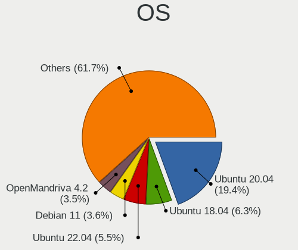

| Name              | Notebooks | Percent |
|-------------------|-----------|---------|
| Ubuntu 20.04      | 936       | 20.62%  |
| Ubuntu 18.04      | 306       | 6.74%   |
| Ubuntu 22.04      | 208       | 4.58%   |
| OpenMandriva 4.2  | 170       | 3.74%   |
| Debian 11         | 155       | 3.41%   |
| OpenMandriva 4.3  | 131       | 2.89%   |
| Linux Mint 20.3   | 110       | 2.42%   |
| Xubuntu 20.04     | 105       | 2.31%   |
| Arch              | 80        | 1.76%   |
| Ubuntu 21.10      | 70        | 1.54%   |
| Debian 10         | 69        | 1.52%   |
| Linux Mint 20.2   | 62        | 1.37%   |
| Ubuntu 19.10      | 59        | 1.3%    |
| Arch Rolling      | 59        | 1.3%    |
| Ubuntu 21.04      | 56        | 1.23%   |
| Ubuntu 20.10      | 53        | 1.17%   |
| Manjaro           | 50        | 1.1%    |
| Linux Mint 19.3   | 49        | 1.08%   |
| Xubuntu 18.04     | 48        | 1.06%   |
| Fedora 33         | 48        | 1.06%   |
| Fedora 34         | 44        | 0.97%   |
| Zorin 16          | 42        | 0.93%   |
| Linux Mint 20.1   | 42        | 0.93%   |
| Kubuntu 20.04     | 41        | 0.9%    |
| Fedora 32         | 40        | 0.88%   |
| Ubuntu 19.04      | 39        | 0.86%   |
| Linux Mint 21     | 37        | 0.81%   |
| KDE neon 20.04    | 37        | 0.81%   |
| Pop!_OS 20.04     | 36        | 0.79%   |
| Linux Mint 20     | 36        | 0.79%   |
| Fedora 36         | 36        | 0.79%   |
| Fedora 35         | 34        | 0.75%   |
| Ubuntu MATE 20.04 | 33        | 0.73%   |
| Lubuntu 20.04     | 32        | 0.7%    |
| Pop!_OS 20.10     | 29        | 0.64%   |
| Pop!_OS 22.04     | 28        | 0.62%   |
| Pop!_OS 21.04     | 28        | 0.62%   |
| Debian Testing    | 28        | 0.62%   |
| Fedora 31         | 27        | 0.59%   |
| Zorin 15          | 25        | 0.55%   |

OS Family
---------

OS without a version

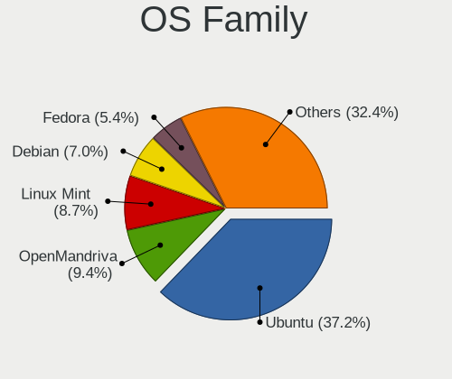

| Name          | Notebooks | Percent |
|---------------|-----------|---------|
| Ubuntu        | 1687      | 39.07%  |
| Linux Mint    | 354       | 8.2%    |
| OpenMandriva  | 339       | 7.85%   |
| Debian        | 279       | 6.46%   |
| Fedora        | 222       | 5.14%   |
| Xubuntu       | 187       | 4.33%   |
| Arch          | 137       | 3.17%   |
| Pop!_OS       | 131       | 3.03%   |
| Manjaro       | 125       | 2.89%   |
| Kubuntu       | 103       | 2.39%   |
| ROSA          | 73        | 1.69%   |
| Zorin         | 68        | 1.57%   |
| Ubuntu MATE   | 58        | 1.34%   |
| Lubuntu       | 52        | 1.2%    |
| KDE neon      | 46        | 1.07%   |
| openSUSE      | 40        | 0.93%   |
| Endless       | 40        | 0.93%   |
| Kali          | 35        | 0.81%   |
| Gentoo        | 31        | 0.72%   |
| ArcoLinux     | 26        | 0.6%    |
| Elementary    | 25        | 0.58%   |
| Ubuntu Budgie | 23        | 0.53%   |
| Ubuntu Unity  | 21        | 0.49%   |
| BlackPanther  | 19        | 0.44%   |
| Parrot        | 17        | 0.39%   |
| EndeavourOS   | 17        | 0.39%   |
| SteamOS       | 15        | 0.35%   |
| LMDE          | 14        | 0.32%   |
| Ubuntu Studio | 11        | 0.25%   |
| Kaisen        | 9         | 0.21%   |
| CentOS        | 9         | 0.21%   |
| NixOS         | 7         | 0.16%   |
| MX            | 7         | 0.16%   |
| Clear Linux   | 7         | 0.16%   |
| RHEL          | 5         | 0.12%   |
| Peppermint    | 5         | 0.12%   |
| Mageia        | 5         | 0.12%   |
| Linux Lite    | 5         | 0.12%   |
| Xero          | 4         | 0.09%   |
| LinuxFX       | 4         | 0.09%   |

Kernel
------

Version of the Linux kernel

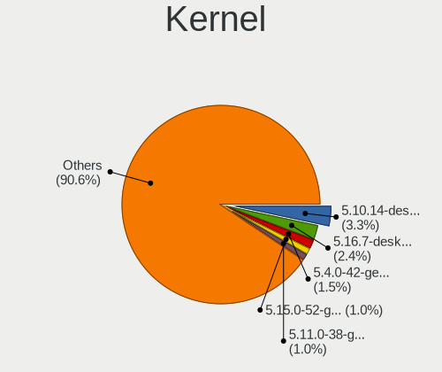

| Version                  | Notebooks | Percent |
|--------------------------|-----------|---------|
| 5.10.14-desktop-1omv4002 | 160       | 3.24%   |
| 5.16.7-desktop-1omv4003  | 126       | 2.55%   |
| 5.4.0-42-generic         | 73        | 1.48%   |
| 5.15.0-56-generic        | 55        | 1.11%   |
| 5.15.0-52-generic        | 52        | 1.05%   |
| 5.11.0-38-generic        | 50        | 1.01%   |
| 5.4.0-58-generic         | 44        | 0.89%   |
| 5.4.0-52-generic         | 44        | 0.89%   |
| 5.15.0-48-generic        | 44        | 0.89%   |
| 5.11.0-27-generic        | 42        | 0.85%   |
| 5.4.0-26-generic         | 39        | 0.79%   |
| 5.4.0-48-generic         | 36        | 0.73%   |
| 5.8.0-50-generic         | 35        | 0.71%   |
| 5.15.0-46-generic        | 35        | 0.71%   |
| 5.11.0-37-generic        | 35        | 0.71%   |
| 5.8.0-43-generic         | 33        | 0.67%   |
| 5.4.0-65-generic         | 33        | 0.67%   |
| 5.8.0-44-generic         | 32        | 0.65%   |
| 5.4.0-91-generic         | 32        | 0.65%   |
| 5.11.0-43-generic        | 32        | 0.65%   |
| 5.4.0-37-generic         | 31        | 0.63%   |
| 5.13.0-30-generic        | 31        | 0.63%   |
| 5.11.0-40-generic        | 31        | 0.63%   |
| 5.13.0-40-generic        | 30        | 0.61%   |
| 5.15.0-47-generic        | 29        | 0.59%   |
| 5.11.0-34-generic        | 29        | 0.59%   |
| 5.8.0-59-generic         | 28        | 0.57%   |
| 5.8.0-48-generic         | 28        | 0.57%   |
| 5.4.0-54-generic         | 27        | 0.55%   |
| 5.15.0-53-generic        | 27        | 0.55%   |
| 5.15.0-41-generic        | 27        | 0.55%   |
| 5.13.0-28-generic        | 27        | 0.55%   |
| 5.4.0-31-generic         | 26        | 0.53%   |
| 5.15.0-43-generic        | 26        | 0.53%   |
| 5.4.0-81-generic         | 25        | 0.51%   |
| 5.13.0-39-generic        | 25        | 0.51%   |
| 5.8.0-55-generic         | 24        | 0.49%   |
| 5.8.0-53-generic         | 24        | 0.49%   |
| 5.8.0-41-generic         | 24        | 0.49%   |
| 5.4.0-47-generic         | 24        | 0.49%   |

Kernel Family
-------------

Linux kernel without a distro release

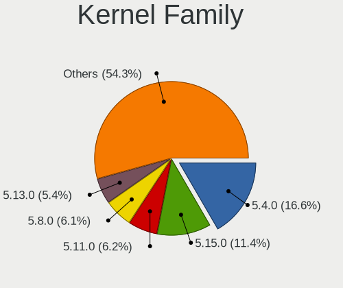

| Version | Notebooks | Percent |
|---------|-----------|---------|
| 5.4.0   | 927       | 19.92%  |
| 5.15.0  | 387       | 8.32%   |
| 5.11.0  | 352       | 7.57%   |
| 5.8.0   | 349       | 7.5%    |
| 5.13.0  | 302       | 6.49%   |
| 4.15.0  | 220       | 4.73%   |
| 5.10.0  | 189       | 4.06%   |
| 5.3.0   | 176       | 3.78%   |
| 5.10.14 | 161       | 3.46%   |
| 5.16.7  | 126       | 2.71%   |
| 5.0.0   | 99        | 2.13%   |
| 4.18.0  | 66        | 1.42%   |
| 4.19.0  | 64        | 1.38%   |
| 5.19.0  | 39        | 0.84%   |
| 5.14.0  | 27        | 0.58%   |
| 5.17.5  | 19        | 0.41%   |
| 5.16.0  | 19        | 0.41%   |
| 5.11.12 | 19        | 0.41%   |
| 4.18.16 | 18        | 0.39%   |
| 6.0.0   | 16        | 0.34%   |
| 4.9.20  | 15        | 0.32%   |
| 5.9.0   | 14        | 0.3%    |
| 5.6.0   | 14        | 0.3%    |
| 5.18.12 | 14        | 0.3%    |
| 5.18.0  | 14        | 0.3%    |
| 5.9.11  | 13        | 0.28%   |
| 4.4.0   | 12        | 0.26%   |
| 6.0.9   | 11        | 0.24%   |
| 5.19.12 | 11        | 0.24%   |
| 5.17.0  | 11        | 0.24%   |
| 5.14.9  | 11        | 0.24%   |
| 4.9.0   | 11        | 0.24%   |
| 5.9.16  | 10        | 0.21%   |
| 5.7.0   | 10        | 0.21%   |
| 5.17.1  | 10        | 0.21%   |
| 5.12.4  | 10        | 0.21%   |
| 5.8.18  | 9         | 0.19%   |
| 5.10.74 | 9         | 0.19%   |
| 6.0.6   | 8         | 0.17%   |
| 5.9.14  | 8         | 0.17%   |

Kernel Major Ver.
-----------------

Linux kernel major version

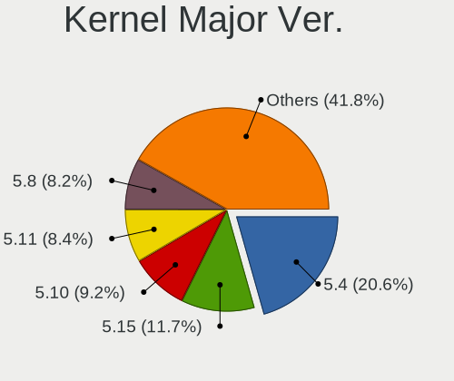

| Version | Notebooks | Percent |
|---------|-----------|---------|
| 5.4     | 975       | 21.22%  |
| 5.15    | 493       | 10.73%  |
| 5.10    | 430       | 9.36%   |
| 5.11    | 403       | 8.77%   |
| 5.8     | 390       | 8.49%   |
| 5.13    | 339       | 7.38%   |
| 4.15    | 220       | 4.79%   |
| 5.3     | 201       | 4.37%   |
| 5.16    | 190       | 4.13%   |
| 5.0     | 103       | 2.24%   |
| 5.19    | 89        | 1.94%   |
| 4.18    | 86        | 1.87%   |
| 5.14    | 82        | 1.78%   |
| 5.9     | 71        | 1.55%   |
| 4.19    | 70        | 1.52%   |
| 6.0     | 62        | 1.35%   |
| 5.18    | 62        | 1.35%   |
| 5.17    | 58        | 1.26%   |
| 5.6     | 50        | 1.09%   |
| 4.9     | 47        | 1.02%   |
| 5.7     | 42        | 0.91%   |
| 5.12    | 38        | 0.83%   |
| 5.5     | 23        | 0.5%    |
| 4.4     | 14        | 0.3%    |
| 4.1     | 11        | 0.24%   |
| 4.14    | 8         | 0.17%   |
| 6.1     | 7         | 0.15%   |
| 5.2     | 7         | 0.15%   |
| 4.13    | 5         | 0.11%   |
| 4.12    | 5         | 0.11%   |
| 4.10    | 4         | 0.09%   |
| 3.10    | 3         | 0.07%   |
| 5.1     | 2         | 0.04%   |
| 4.20    | 2         | 0.04%   |
| 4.8     | 1         | 0.02%   |
| 4.17    | 1         | 0.02%   |
| Unknown | 1         | 0.02%   |

Arch
----

OS architecture (x86_64, i586, etc.)

| Name    | Notebooks | Percent |
|---------|-----------|---------|
| x86_64  | 4097      | 97.27%  |
| i686    | 112       | 2.66%   |
| aarch64 | 2         | 0.05%   |
| Unknown | 1         | 0.02%   |

DE
--

Desktop Environment

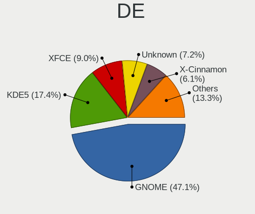

| Name              | Notebooks | Percent |
|-------------------|-----------|---------|
| GNOME             | 2050      | 46.95%  |
| KDE5              | 673       | 15.41%  |
| XFCE              | 410       | 9.39%   |
| Unknown           | 407       | 9.32%   |
| X-Cinnamon        | 228       | 5.22%   |
| MATE              | 163       | 3.73%   |
| Cinnamon          | 75        | 1.72%   |
| KDE               | 61        | 1.4%    |
| LXQt              | 55        | 1.26%   |
| i3                | 51        | 1.17%   |
| KDE4              | 50        | 1.15%   |
| Budgie            | 28        | 0.64%   |
| Pantheon          | 25        | 0.57%   |
| Unity             | 22        | 0.5%    |
| LXDE              | 19        | 0.44%   |
| GNOME Flashback   | 14        | 0.32%   |
| Deepin            | 8         | 0.18%   |
| GNOME Classic     | 6         | 0.14%   |
| i3-with-shmlog    | 3         | 0.07%   |
| Trinity           | 2         | 0.05%   |
| sway              | 2         | 0.05%   |
| bspwm             | 2         | 0.05%   |
| awesome           | 2         | 0.05%   |
| Yaru:ubuntu:GNOME | 1         | 0.02%   |
| xmonad            | 1         | 0.02%   |
| wmaker-common     | 1         | 0.02%   |
| qtile             | 1         | 0.02%   |
| openbox           | 1         | 0.02%   |
| Lubuntu           | 1         | 0.02%   |
| lightdm-xsession  | 1         | 0.02%   |
| ICEWM             | 1         | 0.02%   |
| Enlightenment     | 1         | 0.02%   |
| dwm-sc            | 1         | 0.02%   |

Display Server
--------------

X11 or Wayland

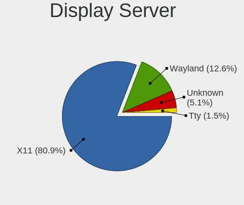

| Name    | Notebooks | Percent |
|---------|-----------|---------|
| X11     | 3442      | 79.38%  |
| Wayland | 618       | 14.25%  |
| Unknown | 211       | 4.87%   |
| Tty     | 65        | 1.5%    |

Display Manager
---------------

SDDM, LightDM, etc.

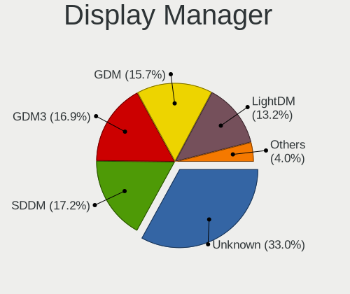

| Name    | Notebooks | Percent |
|---------|-----------|---------|
| Unknown | 1732      | 39.66%  |
| GDM     | 839       | 19.21%  |
| SDDM    | 669       | 15.32%  |
| LightDM | 473       | 10.83%  |
| GDM3    | 408       | 9.34%   |
| TDM     | 182       | 4.17%   |
| KDM     | 48        | 1.1%    |
| XDM     | 9         | 0.21%   |
| SLiM    | 3         | 0.07%   |
| Ly      | 2         | 0.05%   |
| NODM    | 1         | 0.02%   |
| MDM     | 1         | 0.02%   |

OS Lang
-------

Language

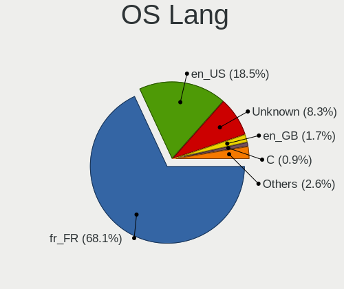

| Lang       | Notebooks | Percent |
|------------|-----------|---------|
| fr_FR      | 2902      | 67.79%  |
| en_US      | 764       | 17.85%  |
| Unknown    | 392       | 9.16%   |
| en_GB      | 72        | 1.68%   |
| C          | 37        | 0.86%   |
| ru_RU      | 11        | 0.26%   |
| pl_PL      | 10        | 0.23%   |
| it_IT      | 10        | 0.23%   |
| de_DE      | 9         | 0.21%   |
| es_ES      | 8         | 0.19%   |
| fr_CH      | 7         | 0.16%   |
| POSIX      | 5         | 0.12%   |
| nl_NL      | 5         | 0.12%   |
| fr_CA      | 5         | 0.12%   |
| fr_BE      | 4         | 0.09%   |
| pt_PT      | 3         | 0.07%   |
| pt_BR      | 3         | 0.07%   |
| en_IN      | 3         | 0.07%   |
| en_AU      | 3         | 0.07%   |
| ru_UA      | 2         | 0.05%   |
| hu_HU      | 2         | 0.05%   |
| en_IE      | 2         | 0.05%   |
| en_CA      | 2         | 0.05%   |
| cs_CZ      | 2         | 0.05%   |
| tr_TR      | 1         | 0.02%   |
| sv_SE      | 1         | 0.02%   |
| sk_SK      | 1         | 0.02%   |
| ro_RO      | 1         | 0.02%   |
| nb_NO      | 1         | 0.02%   |
| fr_LU      | 1         | 0.02%   |
| fr_FR.UTF8 | 1         | 0.02%   |
| es_VE      | 1         | 0.02%   |
| es_UY      | 1         | 0.02%   |
| es_AR      | 1         | 0.02%   |
| en_ZA      | 1         | 0.02%   |
| en_FR      | 1         | 0.02%   |
| en_AG      | 1         | 0.02%   |
| de_CH      | 1         | 0.02%   |
| de_BE      | 1         | 0.02%   |
| de_AT      | 1         | 0.02%   |

Boot Mode
---------

EFI or BIOS

| Mode | Notebooks | Percent |
|------|-----------|---------|
| EFI  | 2421      | 56.39%  |
| BIOS | 1872      | 43.61%  |

Filesystem
----------

Type of filesystem

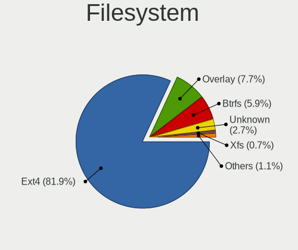

| Type     | Notebooks | Percent |
|----------|-----------|---------|
| Ext4     | 3491      | 81.62%  |
| Overlay  | 331       | 7.74%   |
| Btrfs    | 267       | 6.24%   |
| Unknown  | 109       | 2.55%   |
| Xfs      | 32        | 0.75%   |
| Zfs      | 21        | 0.49%   |
| F2fs     | 8         | 0.19%   |
| Ext2     | 8         | 0.19%   |
| Ext3     | 7         | 0.16%   |
| Tmpfs    | 1         | 0.02%   |
| Reiserfs | 1         | 0.02%   |
| Jfs      | 1         | 0.02%   |

Part. scheme
------------

Scheme of partitioning

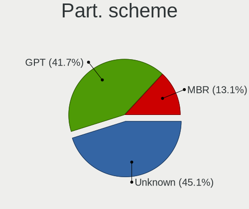

| Type    | Notebooks | Percent |
|---------|-----------|---------|
| Unknown | 1895      | 44.06%  |
| GPT     | 1838      | 42.73%  |
| MBR     | 568       | 13.21%  |

Dual Boot with Linux/BSD
------------------------

Hosting more than one Linux/BSD

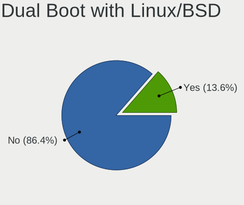

| Dual boot | Notebooks | Percent |
|-----------|-----------|---------|
| No        | 3689      | 86.21%  |
| Yes       | 590       | 13.79%  |

Dual Boot (Win)
---------------

Hosting Linux and Windows

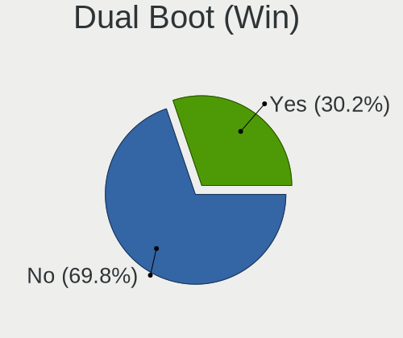

| Dual boot | Notebooks | Percent |
|-----------|-----------|---------|
| No        | 2962      | 69.48%  |
| Yes       | 1301      | 30.52%  |

Board
-----

Vendor
------

Motherboard manufacturer

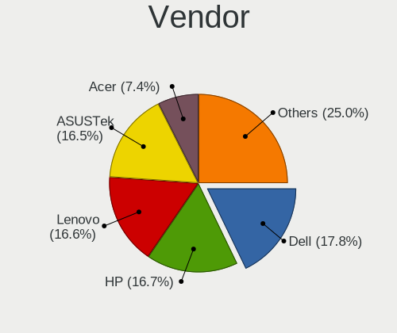

| Name                | Notebooks | Percent |
|---------------------|-----------|---------|
| Dell                | 754       | 17.91%  |
| Hewlett-Packard     | 710       | 16.86%  |
| Lenovo              | 692       | 16.43%  |
| ASUSTek Computer    | 685       | 16.27%  |
| Acer                | 310       | 7.36%   |
| MSI                 | 156       | 3.7%    |
| Toshiba             | 139       | 3.3%    |
| Apple               | 89        | 2.11%   |
| Notebook            | 79        | 1.88%   |
| HUAWEI              | 65        | 1.54%   |
| Samsung Electronics | 60        | 1.42%   |
| Packard Bell        | 53        | 1.26%   |
| Sony                | 52        | 1.23%   |
| TUXEDO              | 24        | 0.57%   |
| Timi                | 21        | 0.5%    |
| Clevo               | 20        | 0.47%   |
| Unknown             | 19        | 0.45%   |
| eMachines           | 18        | 0.43%   |
| UNOWHY              | 17        | 0.4%    |
| Thomson             | 17        | 0.4%    |
| Valve               | 16        | 0.38%   |
| Gigabyte Technology | 16        | 0.38%   |
| Fujitsu Siemens     | 15        | 0.36%   |
| Fujitsu             | 15        | 0.36%   |
| Alienware           | 14        | 0.33%   |
| PC Specialist       | 13        | 0.31%   |
| Razer               | 12        | 0.28%   |
| Medion              | 10        | 0.24%   |
| Chuwi               | 10        | 0.24%   |
| Google              | 9         | 0.21%   |
| Teclast             | 8         | 0.19%   |
| Intel               | 6         | 0.14%   |
| BESSTAR Tech        | 5         | 0.12%   |
| Panasonic           | 4         | 0.09%   |
| HONOR               | 4         | 0.09%   |
| AZW                 | 4         | 0.09%   |
| System76            | 3         | 0.07%   |
| SCHNEIDER           | 3         | 0.07%   |
| NEC Computers       | 3         | 0.07%   |
| LDLC                | 3         | 0.07%   |

Model
-----

Motherboard model

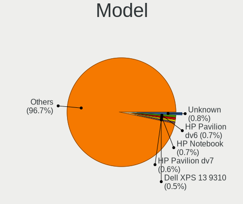

| Name                                   | Notebooks | Percent |
|----------------------------------------|-----------|---------|
| Unknown                                | 34        | 0.81%   |
| HP Notebook                            | 32        | 0.76%   |
| HP Pavilion dv6                        | 25        | 0.59%   |
| HP Pavilion dv7                        | 22        | 0.52%   |
| HP Pavilion 17                         | 21        | 0.5%    |
| HP Pavilion g7                         | 17        | 0.4%    |
| Dell XPS 13 9310                       | 17        | 0.4%    |
| Valve Jupiter                          | 16        | 0.38%   |
| HP Pavilion Notebook                   | 14        | 0.33%   |
| Dell XPS 13 9380                       | 14        | 0.33%   |
| Dell XPS 13 7390                       | 14        | 0.33%   |
| ASUS S551LN                            | 14        | 0.33%   |
| HP EliteBook 840 G2                    | 13        | 0.31%   |
| Dell XPS 15 7590                       | 13        | 0.31%   |
| Dell XPS 15 9570                       | 12        | 0.28%   |
| Dell Latitude E6420                    | 12        | 0.28%   |
| HUAWEI HVY-WXX9                        | 11        | 0.26%   |
| HP Pavilion g6                         | 11        | 0.26%   |
| HP Pavilion 15                         | 11        | 0.26%   |
| HP EliteBook 840 G3                    | 11        | 0.26%   |
| Dell Latitude 5420                     | 11        | 0.26%   |
| Lenovo G50-30 80G0                     | 10        | 0.24%   |
| HUAWEI NBLK-WAX9X                      | 10        | 0.24%   |
| HP ProBook 650 G1                      | 10        | 0.24%   |
| HP OMEN by Laptop                      | 10        | 0.24%   |
| Dell Latitude E6400                    | 10        | 0.24%   |
| Dell Latitude 7490                     | 9         | 0.21%   |
| Dell Latitude 5400                     | 9         | 0.21%   |
| Acer Aspire ES1-523                    | 9         | 0.21%   |
| UNOWHY Y13G010S4EI                     | 8         | 0.19%   |
| Lenovo G50-45 80E3                     | 8         | 0.19%   |
| HP ProBook 640 G1                      | 8         | 0.19%   |
| HP EliteBook 840 G1                    | 8         | 0.19%   |
| Dell XPS 15 9500                       | 8         | 0.19%   |
| Dell XPS 13 9370                       | 8         | 0.19%   |
| Dell Precision 5540                    | 8         | 0.19%   |
| Dell Latitude E6520                    | 8         | 0.19%   |
| Dell Latitude E5500                    | 8         | 0.19%   |
| ASUS VivoBook_ASUSLaptop X570ZD_X570ZD | 8         | 0.19%   |
| Toshiba Satellite C660                 | 7         | 0.17%   |

Model Family
------------

Motherboard model prefix

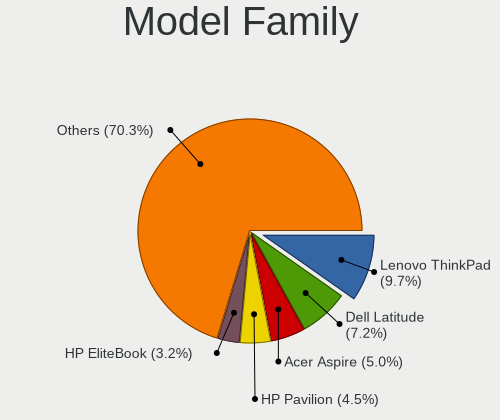

| Name                  | Notebooks | Percent |
|-----------------------|-----------|---------|
| Lenovo ThinkPad       | 404       | 9.59%   |
| Dell Latitude         | 309       | 7.34%   |
| Acer Aspire           | 211       | 5.01%   |
| HP Pavilion           | 197       | 4.68%   |
| Dell XPS              | 138       | 3.28%   |
| HP EliteBook          | 133       | 3.16%   |
| Lenovo IdeaPad        | 127       | 3.02%   |
| Toshiba Satellite     | 118       | 2.8%    |
| HP ProBook            | 114       | 2.71%   |
| Dell Inspiron         | 109       | 2.59%   |
| Dell Precision        | 108       | 2.56%   |
| ASUS VivoBook         | 97        | 2.3%    |
| HP Laptop             | 61        | 1.45%   |
| Packard Bell EasyNote | 46        | 1.09%   |
| ASUS ZenBook          | 43        | 1.02%   |
| Acer Swift            | 41        | 0.97%   |
| Dell Vostro           | 36        | 0.85%   |
| Unknown               | 34        | 0.81%   |
| Lenovo Legion         | 33        | 0.78%   |
| HP Compaq             | 33        | 0.78%   |
| ASUS ROG              | 33        | 0.78%   |
| HP Notebook           | 32        | 0.76%   |
| HP ZBook              | 29        | 0.69%   |
| HP ENVY               | 20        | 0.47%   |
| ASUS ASUS             | 20        | 0.47%   |
| Acer Nitro            | 20        | 0.47%   |
| HP OMEN               | 19        | 0.45%   |
| Dell G5               | 17        | 0.4%    |
| Valve Jupiter         | 16        | 0.38%   |
| MSI Modern            | 16        | 0.38%   |
| Lenovo ThinkBook      | 16        | 0.38%   |
| ASUS TUF              | 16        | 0.38%   |
| Acer TravelMate       | 15        | 0.36%   |
| Lenovo Yoga           | 14        | 0.33%   |
| ASUS S551LN           | 14        | 0.33%   |
| Fujitsu LIFEBOOK      | 13        | 0.31%   |
| Dell G3               | 13        | 0.31%   |
| Razer Blade           | 12        | 0.28%   |
| HUAWEI HVY-WXX9       | 11        | 0.26%   |
| Apple MacBookPro5     | 11        | 0.26%   |

MFG Year
--------

Motherboard manufacture year

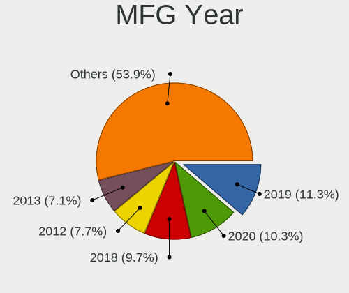

| Year    | Notebooks | Percent |
|---------|-----------|---------|
| 2020    | 448       | 10.64%  |
| 2019    | 445       | 10.57%  |
| 2018    | 375       | 8.91%   |
| 2012    | 313       | 7.43%   |
| 2021    | 295       | 7.01%   |
| 2013    | 294       | 6.98%   |
| 2015    | 288       | 6.84%   |
| 2011    | 274       | 6.51%   |
| 2017    | 246       | 5.84%   |
| 2016    | 226       | 5.37%   |
| 2014    | 215       | 5.11%   |
| 2010    | 213       | 5.06%   |
| 2008    | 197       | 4.68%   |
| 2009    | 155       | 3.68%   |
| 2007    | 88        | 2.09%   |
| 2022    | 85        | 2.02%   |
| 2006    | 31        | 0.74%   |
| 2005    | 14        | 0.33%   |
| Unknown | 4         | 0.09%   |
| 2004    | 3         | 0.07%   |
| 2003    | 1         | 0.02%   |
| 2002    | 1         | 0.02%   |

Form Factor
-----------

Physical design of the computer

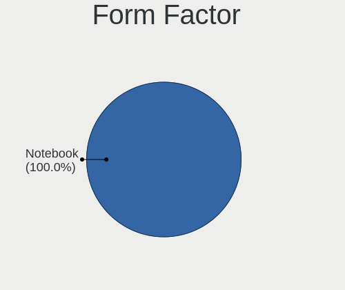

| Name     | Notebooks | Percent |
|----------|-----------|---------|
| Notebook | 4211      | 100%    |

Secure Boot
-----------

Enabled or disabled

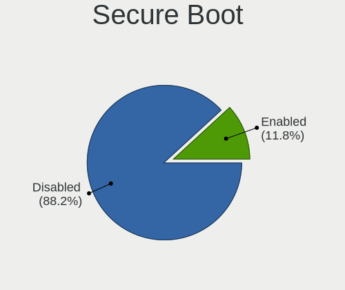

| State    | Notebooks | Percent |
|----------|-----------|---------|
| Disabled | 3754      | 88.39%  |
| Enabled  | 493       | 11.61%  |

Coreboot
--------

Have coreboot on board

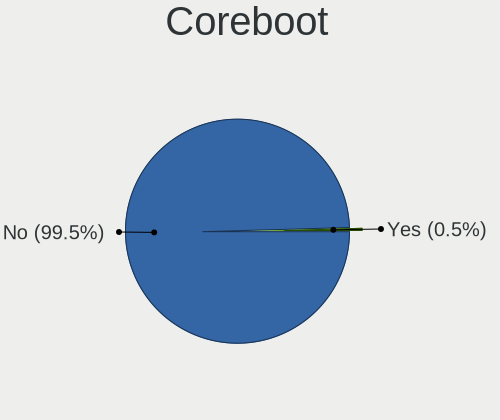

| Used | Notebooks | Percent |
|------|-----------|---------|
| No   | 4197      | 99.64%  |
| Yes  | 15        | 0.36%   |

RAM Size
--------

Total RAM memory

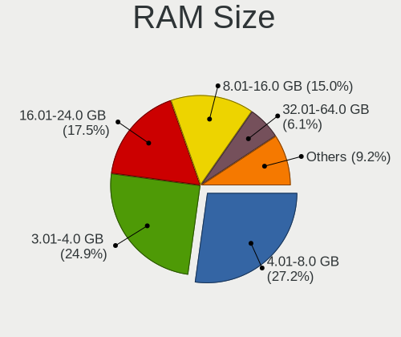

| Size in GB  | Notebooks | Percent |
|-------------|-----------|---------|
| 4.01-8.0    | 1167      | 27.47%  |
| 3.01-4.0    | 1047      | 24.65%  |
| 16.01-24.0  | 748       | 17.61%  |
| 8.01-16.0   | 641       | 15.09%  |
| 32.01-64.0  | 262       | 6.17%   |
| 1.01-2.0    | 187       | 4.4%    |
| 2.01-3.0    | 81        | 1.91%   |
| 64.01-256.0 | 41        | 0.97%   |
| 24.01-32.0  | 33        | 0.78%   |
| 0.51-1.0    | 33        | 0.78%   |
| 0.01-0.5    | 6         | 0.14%   |
| Unknown     | 2         | 0.05%   |

RAM Used
--------

Used RAM memory

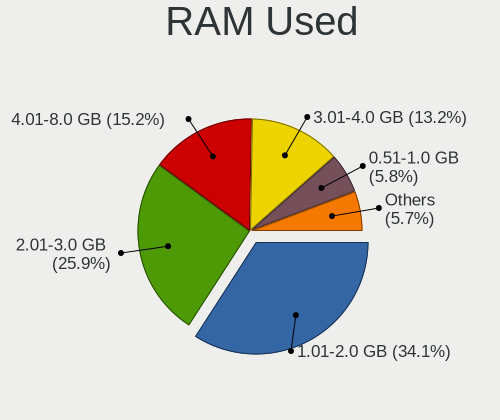

| Used GB    | Notebooks | Percent |
|------------|-----------|---------|
| 1.01-2.0   | 1651      | 36.04%  |
| 2.01-3.0   | 1177      | 25.69%  |
| 4.01-8.0   | 628       | 13.71%  |
| 3.01-4.0   | 573       | 12.51%  |
| 0.51-1.0   | 302       | 6.59%   |
| 8.01-16.0  | 183       | 3.99%   |
| 0.01-0.5   | 45        | 0.98%   |
| 16.01-24.0 | 13        | 0.28%   |
| 24.01-32.0 | 6         | 0.13%   |
| Unknown    | 2         | 0.04%   |
| 32.01-64.0 | 1         | 0.02%   |

Total Drives
------------

Number of drives on board

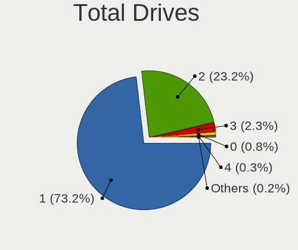

| Drives | Notebooks | Percent |
|--------|-----------|---------|
| 1      | 3150      | 73.79%  |
| 2      | 963       | 22.56%  |
| 3      | 98        | 2.3%    |
| 0      | 36        | 0.84%   |
| 4      | 14        | 0.33%   |
| 5      | 5         | 0.12%   |
| 6      | 2         | 0.05%   |
| 7      | 1         | 0.02%   |

Has CD-ROM
----------

Has CD-ROM on board

| Presented | Notebooks | Percent |
|-----------|-----------|---------|
| No        | 2564      | 60.59%  |
| Yes       | 1668      | 39.41%  |

Has Ethernet
------------

Has Ethernet on board

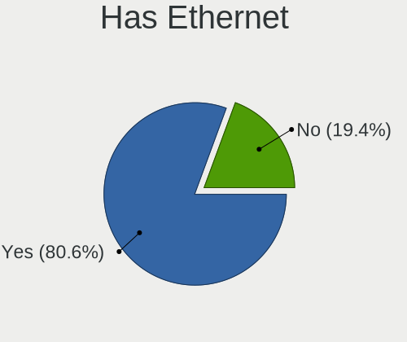

| Presented | Notebooks | Percent |
|-----------|-----------|---------|
| Yes       | 3468      | 82.08%  |
| No        | 757       | 17.92%  |

Has WiFi
--------

Has WiFi module

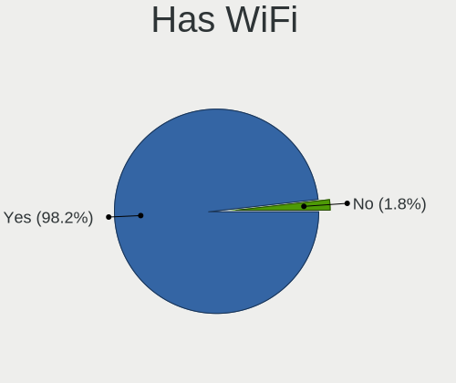

| Presented | Notebooks | Percent |
|-----------|-----------|---------|
| Yes       | 4137      | 98.15%  |
| No        | 78        | 1.85%   |

Has Bluetooth
-------------

Has Bluetooth module

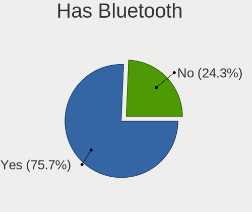

| Presented | Notebooks | Percent |
|-----------|-----------|---------|
| Yes       | 3208      | 75.29%  |
| No        | 1053      | 24.71%  |

Location
--------

Country
-------

Geographic location (country)

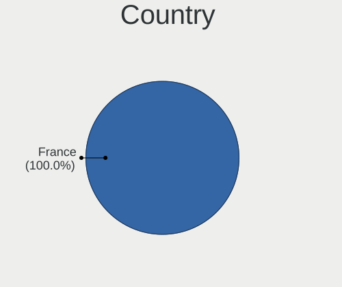

| Country | Notebooks | Percent |
|---------|-----------|---------|
| France  | 4211      | 100%    |

City
----

Geographic location (city)

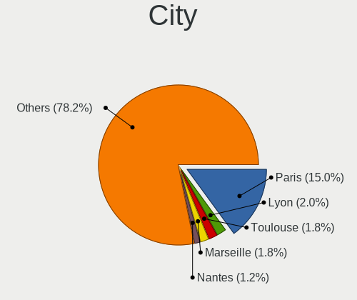

| City             | Notebooks | Percent |
|------------------|-----------|---------|
| Paris            | 725       | 15.98%  |
| Lyon             | 101       | 2.23%   |
| Toulouse         | 80        | 1.76%   |
| Marseille        | 78        | 1.72%   |
| Nantes           | 57        | 1.26%   |
| Montpellier      | 50        | 1.1%    |
| Lille            | 45        | 0.99%   |
| Bordeaux         | 39        | 0.86%   |
| Rennes           | 38        | 0.84%   |
| Strasbourg       | 37        | 0.82%   |
| Grenoble         | 33        | 0.73%   |
| Clichy-sous-Bois | 28        | 0.62%   |
| Brest            | 27        | 0.6%    |
| Roubaix          | 26        | 0.57%   |
| Villeurbanne     | 25        | 0.55%   |
| Nice             | 23        | 0.51%   |
| Rouen            | 19        | 0.42%   |
| Caen             | 19        | 0.42%   |
| Cergy            | 17        | 0.37%   |
| Poitiers         | 16        | 0.35%   |
| Nancy            | 16        | 0.35%   |
| Metz             | 16        | 0.35%   |
| Tours            | 15        | 0.33%   |
| Toulon           | 15        | 0.33%   |
| La Rochelle      | 15        | 0.33%   |
| Besançon        | 15        | 0.33%   |
| Aix-en-Provence  | 15        | 0.33%   |
| Saint-Denis      | 14        | 0.31%   |
| Villejuif        | 13        | 0.29%   |
| Versailles       | 13        | 0.29%   |
| Palaiseau        | 13        | 0.29%   |
| Orléans         | 13        | 0.29%   |
| Le Mans          | 13        | 0.29%   |
| Colmar           | 13        | 0.29%   |
| Clermont-Ferrand | 13        | 0.29%   |
| Valenciennes     | 12        | 0.26%   |
| Perpignan        | 12        | 0.26%   |
| Pau              | 12        | 0.26%   |
| Limoges          | 12        | 0.26%   |
| Ivry-sur-Seine   | 12        | 0.26%   |

Drives
------

Drive Vendor
------------

Hard drive vendors

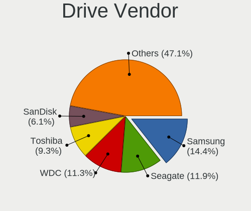

| Vendor                      | Notebooks | Drives | Percent |
|-----------------------------|-----------|--------|---------|
| Samsung Electronics         | 777       | 1052   | 15.08%  |
| WDC                         | 574       | 711    | 11.14%  |
| Seagate                     | 564       | 717    | 10.94%  |
| Toshiba                     | 448       | 561    | 8.69%   |
| SanDisk                     | 320       | 390    | 6.21%   |
| Crucial                     | 312       | 392    | 6.05%   |
| SK hynix                    | 260       | 312    | 5.04%   |
| Unknown                     | 249       | 329    | 4.83%   |
| Kingston                    | 243       | 286    | 4.71%   |
| HGST                        | 225       | 273    | 4.37%   |
| Hitachi                     | 167       | 187    | 3.24%   |
| Intel                       | 149       | 180    | 2.89%   |
| Micron Technology           | 142       | 167    | 2.76%   |
| KIOXIA                      | 65        | 73     | 1.26%   |
| PNY                         | 42        | 45     | 0.81%   |
| Apple                       | 42        | 56     | 0.81%   |
| LDLC                        | 40        | 56     | 0.78%   |
| Fujitsu                     | 37        | 45     | 0.72%   |
| LITEON                      | 33        | 38     | 0.64%   |
| Transcend                   | 31        | 35     | 0.6%    |
| Phison                      | 25        | 27     | 0.49%   |
| China                       | 23        | 26     | 0.45%   |
| LITEONIT                    | 21        | 21     | 0.41%   |
| JMicron Technology          | 20        | 22     | 0.39%   |
| SPCC                        | 16        | 18     | 0.31%   |
| Corsair                     | 16        | 19     | 0.31%   |
| Unknown                     | 16        | 17     | 0.31%   |
| Micron/Crucial Technology   | 15        | 16     | 0.29%   |
| A-DATA Technology           | 14        | 19     | 0.27%   |
| Silicon Motion              | 10        | 12     | 0.19%   |
| Kingston Technology Company | 10        | 10     | 0.19%   |
| Netac                       | 9         | 10     | 0.17%   |
| Lite-On                     | 9         | 13     | 0.17%   |
| BHT                         | 9         | 12     | 0.17%   |
| SSSTC                       | 8         | 10     | 0.16%   |
| YMTC                        | 7         | 8      | 0.14%   |
| Patriot                     | 7         | 8      | 0.14%   |
| OCZ                         | 7         | 11     | 0.14%   |
| Lenovo                      | 7         | 10     | 0.14%   |
| KingSpec                    | 7         | 8      | 0.14%   |

Drive Model
-----------

Hard drive models

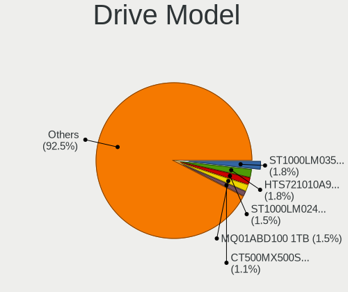

| Model                                  | Notebooks | Percent |
|----------------------------------------|-----------|---------|
| Seagate ST1000LM035-1RK172 1TB         | 88        | 1.65%   |
| HGST HTS721010A9E630 1TB               | 88        | 1.65%   |
| Toshiba MQ01ABD100 1TB                 | 76        | 1.42%   |
| Seagate ST1000LM024 HN-M101MBB 1TB     | 75        | 1.41%   |
| Crucial CT500MX500SSD1 500GB           | 61        | 1.14%   |
| Crucial CT240BX500SSD1 240GB           | 54        | 1.01%   |
| Unknown MMC Card  32GB                 | 51        | 0.96%   |
| Toshiba MQ04ABF100 1TB                 | 48        | 0.9%    |
| Samsung SSD 860 EVO 500GB              | 48        | 0.9%    |
| HGST HTS541010A9E680 1TB               | 44        | 0.82%   |
| Unknown MMC Card  64GB                 | 37        | 0.69%   |
| SanDisk NVMe SSD Drive 512GB           | 37        | 0.69%   |
| Samsung NVMe SSD Drive 512GB           | 37        | 0.69%   |
| Kingston SA400S37240G 240GB SSD        | 35        | 0.66%   |
| Seagate ST500LT012-1DG142 500GB        | 33        | 0.62%   |
| Seagate ST9500325AS 500GB              | 29        | 0.54%   |
| Seagate ST1000LM048-2E7172 1TB         | 28        | 0.52%   |
| Toshiba MQ01ABF050 500GB               | 26        | 0.49%   |
| HGST HTS725050A7E630 500GB             | 26        | 0.49%   |
| WDC WD10JPVX-22JC3T0 1TB               | 25        | 0.47%   |
| Toshiba NVMe SSD Drive 512GB           | 25        | 0.47%   |
| Crucial CT1000MX500SSD1 1TB            | 25        | 0.47%   |
| Samsung SSD 870 QVO 1TB                | 24        | 0.45%   |
| Samsung SM963 2.5" NVMe PCIe SSD 256GB | 24        | 0.45%   |
| Samsung SSD 850 EVO 500GB              | 23        | 0.43%   |
| KIOXIA KBG40ZNS512G NVMe 512GB         | 23        | 0.43%   |
| Intel NVMe SSD Drive 512GB             | 23        | 0.43%   |
| SK hynix NVMe SSD Drive 512GB          | 22        | 0.41%   |
| Seagate ST1000LM049-2GH172 1TB         | 22        | 0.41%   |
| Crucial CT120BX500SSD1 120GB           | 22        | 0.41%   |
| Samsung SSD 850 EVO 250GB              | 21        | 0.39%   |
| Crucial CT480BX500SSD1 480GB           | 21        | 0.39%   |
| Samsung SSD 860 EVO 1TB                | 20        | 0.37%   |
| Samsung NVMe SSD Drive 1TB             | 20        | 0.37%   |
| SanDisk NVMe SSD Drive 256GB           | 19        | 0.36%   |
| Unknown MMC Card  128GB                | 18        | 0.34%   |
| Seagate ST500LM021-1KJ152 500GB        | 18        | 0.34%   |
| Kingston SA400S37120G 120GB SSD        | 18        | 0.34%   |
| Intel SSDPEKNW512G8 512GB              | 18        | 0.34%   |
| Seagate Expansion 4TB                  | 17        | 0.32%   |

HDD Vendor
----------

Hard disk drive vendors

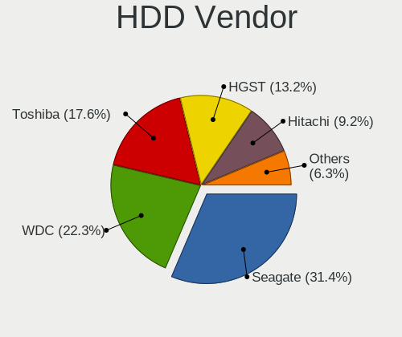

| Vendor              | Notebooks | Drives | Percent |
|---------------------|-----------|--------|---------|
| Seagate             | 558       | 706    | 31.63%  |
| WDC                 | 390       | 487    | 22.11%  |
| Toshiba             | 309       | 374    | 17.52%  |
| HGST                | 225       | 273    | 12.76%  |
| Hitachi             | 167       | 187    | 9.47%   |
| Samsung Electronics | 37        | 53     | 2.1%    |
| Fujitsu             | 36        | 44     | 2.04%   |
| Unknown             | 9         | 10     | 0.51%   |
| Apple               | 7         | 7      | 0.4%    |
| IBM/Hitachi         | 5         | 6      | 0.28%   |
| ASMT                | 5         | 6      | 0.28%   |
| JMicron Technology  | 3         | 4      | 0.17%   |
| HGST HTS            | 3         | 3      | 0.17%   |
| Inateck             | 2         | 2      | 0.11%   |
| SILICONMOTION       | 1         | 1      | 0.06%   |
| PHD 3.0             | 1         | 1      | 0.06%   |
| Magnetic Data       | 1         | 1      | 0.06%   |
| LaCie               | 1         | 1      | 0.06%   |
| Intenso             | 1         | 1      | 0.06%   |
| Generic-            | 1         | 1      | 0.06%   |
| ASMedia             | 1         | 1      | 0.06%   |
| APPLE HD            | 1         | 1      | 0.06%   |

SSD Vendor
----------

Solid state drive vendors

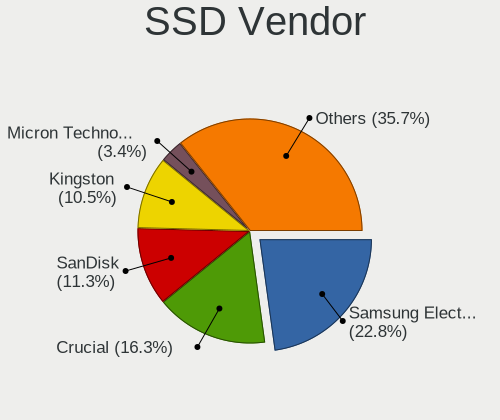

| Vendor              | Notebooks | Drives | Percent |
|---------------------|-----------|--------|---------|
| Samsung Electronics | 384       | 507    | 22.95%  |
| Crucial             | 290       | 368    | 17.33%  |
| SanDisk             | 206       | 252    | 12.31%  |
| Kingston            | 183       | 217    | 10.94%  |
| Micron Technology   | 58        | 77     | 3.47%   |
| SK hynix            | 57        | 71     | 3.41%   |
| WDC                 | 42        | 48     | 2.51%   |
| Intel               | 41        | 42     | 2.45%   |
| PNY                 | 37        | 40     | 2.21%   |
| LDLC                | 34        | 48     | 2.03%   |
| Apple               | 32        | 44     | 1.91%   |
| Transcend           | 29        | 33     | 1.73%   |
| LITEON              | 28        | 31     | 1.67%   |
| Toshiba             | 27        | 34     | 1.61%   |
| China               | 22        | 25     | 1.32%   |
| LITEONIT            | 21        | 21     | 1.26%   |
| SPCC                | 15        | 17     | 0.9%    |
| A-DATA Technology   | 11        | 16     | 0.66%   |
| JMicron Technology  | 9         | 9      | 0.54%   |
| BHT                 | 9         | 12     | 0.54%   |
| Corsair             | 8         | 10     | 0.48%   |
| Unknown             | 8         | 9      | 0.48%   |
| OCZ                 | 7         | 11     | 0.42%   |
| Netac               | 7         | 8      | 0.42%   |
| KingSpec            | 7         | 8      | 0.42%   |
| Dogfish             | 7         | 10     | 0.42%   |
| Patriot             | 6         | 6      | 0.36%   |
| Emtec               | 6         | 6      | 0.36%   |
| Plextor             | 5         | 6      | 0.3%    |
| KingDian            | 4         | 5      | 0.24%   |
| Unknown             | 3         | 4      | 0.18%   |
| Teclast             | 3         | 5      | 0.18%   |
| TCSUNBOW            | 3         | 4      | 0.18%   |
| Intenso             | 3         | 3      | 0.18%   |
| BAITITON            | 3         | 3      | 0.18%   |
| Verbatim            | 2         | 2      | 0.12%   |
| Union Memory        | 2         | 2      | 0.12%   |
| Seagate             | 2         | 2      | 0.12%   |
| ORICO               | 2         | 2      | 0.12%   |
| NMICRO              | 2         | 2      | 0.12%   |

Drive Kind
----------

HDD or SSD

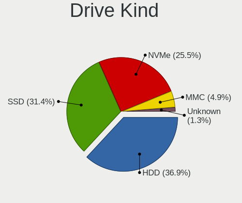

| Kind    | Notebooks | Drives | Percent |
|---------|-----------|--------|---------|
| HDD     | 1713      | 2170   | 34.6%   |
| SSD     | 1551      | 2075   | 31.33%  |
| NVMe    | 1379      | 1753   | 27.85%  |
| MMC     | 251       | 339    | 5.07%   |
| Unknown | 57        | 62     | 1.15%   |

Drive Connector
---------------

SATA, SAS, NVMe, etc.

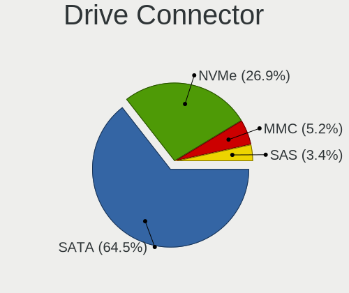

| Type | Notebooks | Drives | Percent |
|------|-----------|--------|---------|
| SATA | 2904      | 4117   | 61.92%  |
| NVMe | 1377      | 1746   | 29.36%  |
| MMC  | 251       | 339    | 5.35%   |
| SAS  | 158       | 197    | 3.37%   |

Drive Size
----------

Size of hard drive

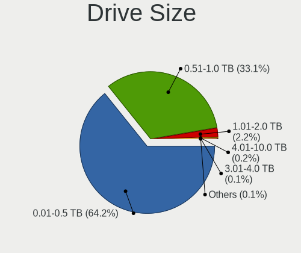

| Size in TB | Notebooks | Drives | Percent |
|------------|-----------|--------|---------|
| 0.01-0.5   | 2082      | 2761   | 64.02%  |
| 0.51-1.0   | 1064      | 1341   | 32.72%  |
| 1.01-2.0   | 77        | 107    | 2.37%   |
| 3.01-4.0   | 20        | 24     | 0.62%   |
| 4.01-10.0  | 7         | 9      | 0.22%   |
| 2.01-3.0   | 1         | 1      | 0.03%   |
| 10.01-20.0 | 1         | 2      | 0.03%   |

Space Total
-----------

Amount of disk space available on the file system

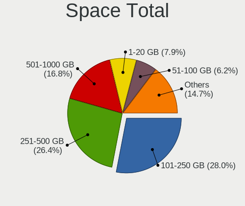

| Size in GB     | Notebooks | Percent |
|----------------|-----------|---------|
| 101-250        | 1235      | 28.11%  |
| 251-500        | 1154      | 26.26%  |
| 501-1000       | 744       | 16.93%  |
| 1-20           | 338       | 7.69%   |
| 51-100         | 275       | 6.26%   |
| 1001-2000      | 219       | 4.98%   |
| 21-50          | 195       | 4.44%   |
| Unknown        | 116       | 2.64%   |
| More than 3000 | 61        | 1.39%   |
| 2001-3000      | 57        | 1.3%    |

Space Used
----------

Amount of used disk space

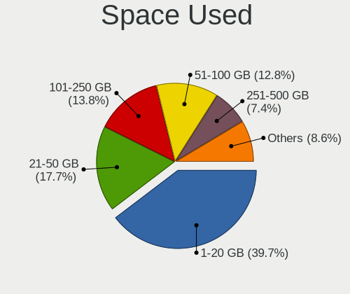

| Used GB        | Notebooks | Percent |
|----------------|-----------|---------|
| 1-20           | 1796      | 39.33%  |
| 21-50          | 811       | 17.76%  |
| 101-250        | 634       | 13.88%  |
| 51-100         | 587       | 12.85%  |
| 251-500        | 348       | 7.62%   |
| 501-1000       | 182       | 3.99%   |
| Unknown        | 116       | 2.54%   |
| 1001-2000      | 53        | 1.16%   |
| 2001-3000      | 25        | 0.55%   |
| More than 3000 | 13        | 0.28%   |
| 0              | 2         | 0.04%   |

Malfunc. Drives
---------------

Drive models with a malfunction

| Model                                            | Notebooks | Drives | Percent |
|--------------------------------------------------|-----------|--------|---------|
| HGST HTS721010A9E630 1TB                         | 16        | 19     | 4.24%   |
| HGST HTS541010A9E680 1TB                         | 11        | 11     | 2.92%   |
| Toshiba MQ01ABD100 1TB                           | 8         | 10     | 2.12%   |
| Seagate ST9500325AS 500GB                        | 8         | 9      | 2.12%   |
| Seagate ST500LM021-1KJ152 500GB                  | 8         | 10     | 2.12%   |
| Seagate ST1000LM024 HN-M101MBB 1TB               | 8         | 8      | 2.12%   |
| WDC WD10JPVX-22JC3T0 1TB                         | 6         | 6      | 1.59%   |
| Seagate ST1000LM035-1RK172 1TB                   | 6         | 6      | 1.59%   |
| Toshiba MQ01ABD050 500GB                         | 5         | 5      | 1.33%   |
| Toshiba MK3265GSX 320GB                          | 4         | 5      | 1.06%   |
| SK hynix HFS256G39TND-N210A 256GB SSD            | 4         | 4      | 1.06%   |
| Seagate ST500LT012-1DG142 500GB                  | 4         | 4      | 1.06%   |
| Hitachi HTS727575A9E364 752GB                    | 4         | 4      | 1.06%   |
| Hitachi HTS547575A9E384 752GB                    | 4         | 4      | 1.06%   |
| Hitachi HTS545050B9A300 500GB                    | 4         | 4      | 1.06%   |
| Hitachi HTS545050A7E380 500GB                    | 4         | 4      | 1.06%   |
| Hitachi HTS543232A7A384 320GB                    | 4         | 6      | 1.06%   |
| HGST HTS725050A7E630 500GB                       | 4         | 4      | 1.06%   |
| Crucial CT525MX300SSD1 528GB                     | 4         | 4      | 1.06%   |
| Toshiba MQ01ABF050 500GB                         | 3         | 3      | 0.8%    |
| Toshiba MK5055GSX 500GB                          | 3         | 3      | 0.8%    |
| Toshiba MK3261GSYN 320GB                         | 3         | 3      | 0.8%    |
| Seagate ST9250827AS 250GB                        | 3         | 3      | 0.8%    |
| Seagate ST320LT007-9ZV142 320GB                  | 3         | 4      | 0.8%    |
| Seagate ST1000LM048-2E7172 1TB                   | 3         | 3      | 0.8%    |
| Samsung Electronics MZNLH128HBHQ-000H1 128GB SSD | 3         | 3      | 0.8%    |
| Hitachi HTS547550A9E384 500GB                    | 3         | 3      | 0.8%    |
| WDC WD5000BEKT-75KA9T0 500GB                     | 2         | 2      | 0.53%   |
| WDC WD3200BPVT-80ZEST0 320GB                     | 2         | 2      | 0.53%   |
| WDC WD10JPCX-24UE4T0 1TB                         | 2         | 2      | 0.53%   |
| Toshiba THNSNK256GCS8 SATA 256GB SSD             | 2         | 2      | 0.53%   |
| Toshiba MQ01ABD075 752GB                         | 2         | 2      | 0.53%   |
| Toshiba MK8052GSX 80GB                           | 2         | 2      | 0.53%   |
| Toshiba MK7575GSX 752GB                          | 2         | 2      | 0.53%   |
| Toshiba MK5059GSXP 500GB                         | 2         | 2      | 0.53%   |
| Toshiba MK3252GSX 320GB                          | 2         | 2      | 0.53%   |
| Toshiba MK2552GSX 250GB                          | 2         | 2      | 0.53%   |
| Seagate ST9500420AS 500GB                        | 2         | 2      | 0.53%   |
| Seagate ST9320325AS 320GB                        | 2         | 2      | 0.53%   |
| Seagate ST9250410AS 250GB                        | 2         | 2      | 0.53%   |

Malfunc. Drive Vendor
---------------------

Vendors of faulty drives

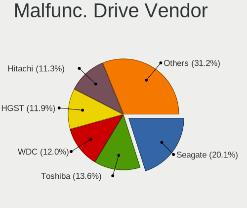

| Vendor              | Notebooks | Drives | Percent |
|---------------------|-----------|--------|---------|
| Seagate             | 77        | 87     | 20.48%  |
| Toshiba             | 49        | 53     | 13.03%  |
| Hitachi             | 47        | 49     | 12.5%   |
| WDC                 | 44        | 45     | 11.7%   |
| HGST                | 40        | 43     | 10.64%  |
| Samsung Electronics | 19        | 22     | 5.05%   |
| SK hynix            | 15        | 17     | 3.99%   |
| SanDisk             | 15        | 16     | 3.99%   |
| Crucial             | 15        | 15     | 3.99%   |
| Intel               | 12        | 12     | 3.19%   |
| Kingston            | 9         | 9      | 2.39%   |
| Fujitsu             | 6         | 6      | 1.6%    |
| Micron Technology   | 3         | 3      | 0.8%    |
| LITEONIT            | 2         | 2      | 0.53%   |
| LITEON              | 2         | 2      | 0.53%   |
| LDLC                | 2         | 4      | 0.53%   |
| Dogfish             | 2         | 2      | 0.53%   |
| Corsair             | 2         | 2      | 0.53%   |
| Unknown             | 1         | 1      | 0.27%   |
| TakeMS              | 1         | 1      | 0.27%   |
| Phison              | 1         | 1      | 0.27%   |
| OCZ                 | 1         | 1      | 0.27%   |
| Netac               | 1         | 1      | 0.27%   |
| Magnetic Data       | 1         | 1      | 0.27%   |
| KingSpec            | 1         | 1      | 0.27%   |
| JMicron Technology  | 1         | 1      | 0.27%   |
| Intenso             | 1         | 1      | 0.27%   |
| IBM/Hitachi         | 1         | 1      | 0.27%   |
| China               | 1         | 1      | 0.27%   |
| ASENNO              | 1         | 1      | 0.27%   |
| Apple               | 1         | 1      | 0.27%   |
| Apacer              | 1         | 1      | 0.27%   |
| A-DATA Technology   | 1         | 1      | 0.27%   |

Malfunc. HDD Vendor
-------------------

Vendors of faulty HDD drives

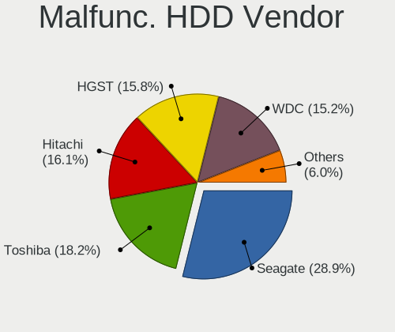

| Vendor              | Notebooks | Drives | Percent |
|---------------------|-----------|--------|---------|
| Seagate             | 77        | 87     | 28.62%  |
| Hitachi             | 47        | 49     | 17.47%  |
| Toshiba             | 45        | 49     | 16.73%  |
| WDC                 | 43        | 44     | 15.99%  |
| HGST                | 40        | 43     | 14.87%  |
| Samsung Electronics | 8         | 8      | 2.97%   |
| Fujitsu             | 6         | 6      | 2.23%   |
| Unknown             | 1         | 1      | 0.37%   |
| Magnetic Data       | 1         | 1      | 0.37%   |
| IBM/Hitachi         | 1         | 1      | 0.37%   |

Malfunc. Drive Kind
-------------------

Kinds of faulty drives

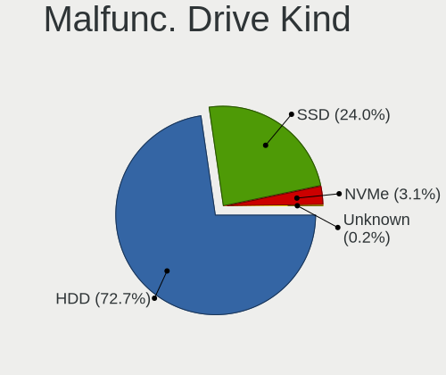

| Kind    | Notebooks | Drives | Percent |
|---------|-----------|--------|---------|
| HDD     | 266       | 289    | 71.51%  |
| SSD     | 95        | 101    | 25.54%  |
| NVMe    | 10        | 13     | 2.69%   |
| Unknown | 1         | 1      | 0.27%   |

Failed Drives
-------------

Failed drive models

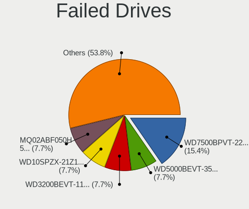

| Model                                 | Notebooks | Drives | Percent |
|---------------------------------------|-----------|--------|---------|
| WDC WD7500BPVT-22HXZT1 752GB          | 2         | 3      | 12.5%   |
| WDC WD3200BEVT-11ZCT0 320GB           | 2         | 2      | 12.5%   |
| WDC WD5000BEVT-35A0RT0 500GB          | 1         | 1      | 6.25%   |
| WDC WD10SPZX-21Z10T0 1TB              | 1         | 1      | 6.25%   |
| Toshiba MQ02ABF050H 500GB             | 1         | 1      | 6.25%   |
| Toshiba MQ01ABF050 500GB              | 1         | 1      | 6.25%   |
| Toshiba MQ01ABD075 752GB              | 1         | 1      | 6.25%   |
| Toshiba MK5055GSX 500GB               | 1         | 1      | 6.25%   |
| Toshiba MK3259GSXP 320GB              | 1         | 1      | 6.25%   |
| SK hynix HFS128G39TND-N210A 128GB SSD | 1         | 1      | 6.25%   |
| Seagate ST1000LM048-2E7172 1TB        | 1         | 1      | 6.25%   |
| Samsung Electronics HM251JI 250GB     | 1         | 1      | 6.25%   |
| HGST HTS721010A9E630 1TB              | 1         | 1      | 6.25%   |
| HGST HTS545050A7E380 500GB            | 1         | 1      | 6.25%   |

Failed Drive Vendor
-------------------

Failed drive vendors

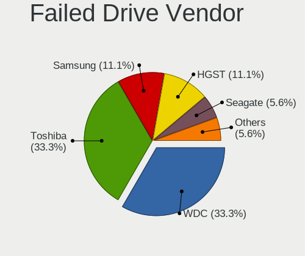

| Vendor              | Notebooks | Drives | Percent |
|---------------------|-----------|--------|---------|
| WDC                 | 6         | 7      | 37.5%   |
| Toshiba             | 5         | 5      | 31.25%  |
| HGST                | 2         | 2      | 12.5%   |
| SK hynix            | 1         | 1      | 6.25%   |
| Seagate             | 1         | 1      | 6.25%   |
| Samsung Electronics | 1         | 1      | 6.25%   |

Drive Status
------------

Number of failed and malfunc. drives

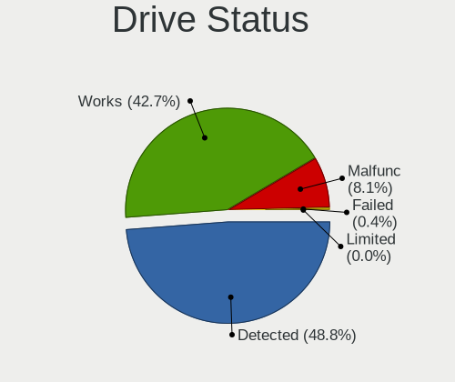

| Status   | Notebooks | Drives | Percent |
|----------|-----------|--------|---------|
| Detected | 2120      | 3337   | 47.09%  |
| Works    | 2001      | 2640   | 44.45%  |
| Malfunc  | 364       | 404    | 8.09%   |
| Failed   | 16        | 17     | 0.36%   |
| Limited  | 1         | 1      | 0.02%   |

Storage controller
------------------

Storage Vendor
--------------

Storage controller vendors

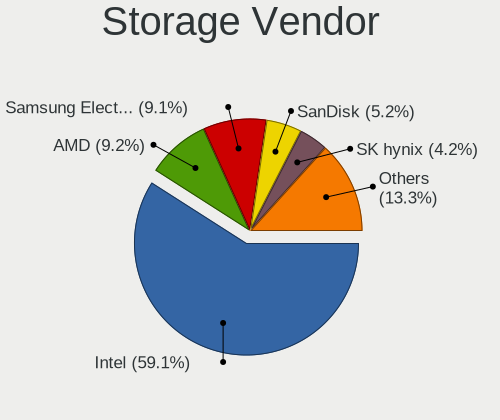

| Vendor                                  | Notebooks | Percent |
|-----------------------------------------|-----------|---------|
| Intel                                   | 3011      | 61.36%  |
| AMD                                     | 470       | 9.58%   |
| Samsung Electronics                     | 395       | 8.05%   |
| SanDisk                                 | 242       | 4.93%   |
| SK hynix                                | 198       | 4.04%   |
| Toshiba America Info Systems            | 129       | 2.63%   |
| Micron Technology                       | 85        | 1.73%   |
| Kingston Technology Company             | 71        | 1.45%   |
| KIOXIA                                  | 60        | 1.22%   |
| Nvidia                                  | 46        | 0.94%   |
| Phison Electronics                      | 45        | 0.92%   |
| Micron/Crucial Technology               | 37        | 0.75%   |
| Union Memory (Shenzhen)                 | 13        | 0.26%   |
| Silicon Motion                          | 13        | 0.26%   |
| Lite-On Technology                      | 13        | 0.26%   |
| Silicon Integrated Systems [SiS]        | 11        | 0.22%   |
| Marvell Technology Group                | 11        | 0.22%   |
| Solid State Storage Technology          | 9         | 0.18%   |
| JMicron Technology                      | 9         | 0.18%   |
| Yangtze Memory Technologies             | 8         | 0.16%   |
| Lenovo                                  | 6         | 0.12%   |
| Apple                                   | 4         | 0.08%   |
| ADATA Technology                        | 4         | 0.08%   |
| VIA Technologies                        | 3         | 0.06%   |
| Silicon Image                           | 3         | 0.06%   |
| Seagate Technology                      | 3         | 0.06%   |
| ASMedia Technology                      | 3         | 0.06%   |
| O2 Micro                                | 2         | 0.04%   |
| ULi Electronics                         | 1         | 0.02%   |
| Shenzhen Unionmemory Information System | 1         | 0.02%   |
| Realtek Semiconductor                   | 1         | 0.02%   |

Storage Model
-------------

Storage controller models

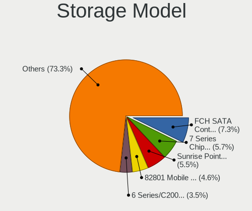

| Model                                                                            | Notebooks | Percent |
|----------------------------------------------------------------------------------|-----------|---------|
| AMD FCH SATA Controller [AHCI mode]                                              | 383       | 7.3%    |
| Intel 7 Series Chipset Family 6-port SATA Controller [AHCI mode]                 | 308       | 5.87%   |
| Intel Sunrise Point-LP SATA Controller [AHCI mode]                               | 294       | 5.61%   |
| Intel 82801 Mobile SATA Controller [RAID mode]                                   | 257       | 4.9%    |
| Intel 6 Series/C200 Series Chipset Family 6 port Mobile SATA AHCI Controller     | 192       | 3.66%   |
| Intel Cannon Lake Mobile PCH SATA AHCI Controller                                | 179       | 3.41%   |
| Samsung NVMe SSD Controller SM981/PM981/PM983                                    | 178       | 3.4%    |
| Intel 82801IBM/IEM (ICH9M/ICH9M-E) 4 port SATA Controller [AHCI mode]            | 176       | 3.36%   |
| Intel 8 Series/C220 Series Chipset Family 6-port SATA Controller 1 [AHCI mode]   | 153       | 2.92%   |
| Intel Volume Management Device NVMe RAID Controller                              | 142       | 2.71%   |
| Intel 8 Series SATA Controller 1 [AHCI mode]                                     | 136       | 2.59%   |
| Intel Wildcat Point-LP SATA Controller [AHCI Mode]                               | 132       | 2.52%   |
| Intel HM170/QM170 Chipset SATA Controller [AHCI Mode]                            | 116       | 2.21%   |
| Samsung NVMe SSD Controller 980                                                  | 114       | 2.17%   |
| Intel 5 Series/3400 Series Chipset 4 port SATA AHCI Controller                   | 107       | 2.04%   |
| Intel 82801HM/HEM (ICH8M/ICH8M-E) IDE Controller                                 | 91        | 1.74%   |
| Micron Non-Volatile memory controller                                            | 85        | 1.62%   |
| Intel 82801HM/HEM (ICH8M/ICH8M-E) SATA Controller [AHCI mode]                    | 79        | 1.51%   |
| SanDisk WD Black SN750 / PC SN730 NVMe SSD                                       | 72        | 1.37%   |
| Intel Celeron/Pentium Silver Processor SATA Controller                           | 70        | 1.34%   |
| AMD SB7x0/SB8x0/SB9x0 SATA Controller [AHCI mode]                                | 65        | 1.24%   |
| Toshiba America Info Systems XG6 NVMe SSD Controller                             | 62        | 1.18%   |
| SK hynix Gold P31/PC711 NVMe Solid State Drive                                   | 60        | 1.14%   |
| Intel Atom Processor E3800 Series SATA AHCI Controller                           | 59        | 1.13%   |
| SK hynix Non-Volatile memory controller                                          | 57        | 1.09%   |
| KIOXIA NVMe SSD Controller BG4                                                   | 54        | 1.03%   |
| Intel Comet Lake SATA AHCI Controller                                            | 53        | 1.01%   |
| Intel 5 Series/3400 Series Chipset 6 port SATA AHCI Controller                   | 52        | 0.99%   |
| Intel Cannon Point-LP SATA Controller [AHCI Mode]                                | 48        | 0.92%   |
| Samsung NVMe SSD Controller PM9A1/PM9A3/980PRO                                   | 47        | 0.9%    |
| SanDisk WD Blue SN550 NVMe SSD                                                   | 46        | 0.88%   |
| SanDisk WD Blue SN500 / PC SN520 NVMe SSD                                        | 46        | 0.88%   |
| Intel Tiger Lake-LP SATA Controller                                              | 45        | 0.86%   |
| Intel SSD 660P Series                                                            | 42        | 0.8%    |
| Intel Atom/Celeron/Pentium Processor x5-E8000/J3xxx/N3xxx Series SATA Controller | 42        | 0.8%    |
| Samsung NVMe SSD Controller SM961/PM961/SM963                                    | 40        | 0.76%   |
| Intel Celeron N3350/Pentium N4200/Atom E3900 Series SATA AHCI Controller         | 40        | 0.76%   |
| Intel Q170/Q150/B150/H170/H110/Z170/CM236 Chipset SATA Controller [AHCI Mode]    | 38        | 0.72%   |
| SanDisk Non-Volatile memory controller                                           | 36        | 0.69%   |
| Toshiba America Info Systems XG5 NVMe SSD Controller                             | 34        | 0.65%   |

Storage Kind
------------

Kind of storage controller (IDE, SATA, NVMe, SAS, ...)

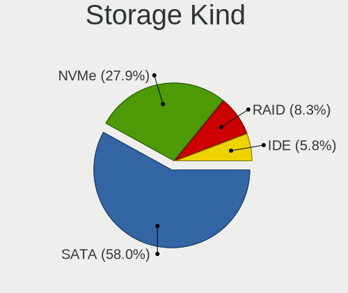

| Kind | Notebooks | Percent |
|------|-----------|---------|
| SATA | 2977      | 58.56%  |
| NVMe | 1393      | 27.4%   |
| RAID | 415       | 8.16%   |
| IDE  | 299       | 5.88%   |

Processor
---------

CPU Vendor
----------

Processor vendors

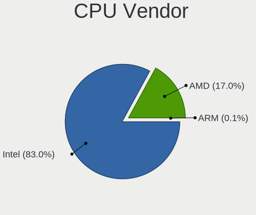

| Vendor | Notebooks | Percent |
|--------|-----------|---------|
| Intel  | 3541      | 84.09%  |
| AMD    | 668       | 15.86%  |
| ARM    | 2         | 0.05%   |

CPU Model
---------

Processor models

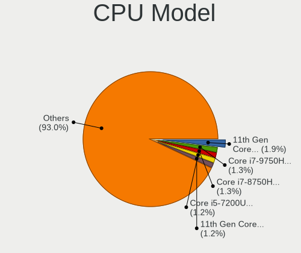

| Model                                         | Notebooks | Percent |
|-----------------------------------------------|-----------|---------|
| Intel 11th Gen Core i7-1165G7 @ 2.80GHz       | 88        | 2.09%   |
| Intel Core i7-8750H CPU @ 2.20GHz             | 65        | 1.54%   |
| Intel Core i7-9750H CPU @ 2.60GHz             | 61        | 1.45%   |
| Intel Core i5-7200U CPU @ 2.50GHz             | 58        | 1.38%   |
| Intel Core i5-8250U CPU @ 1.60GHz             | 57        | 1.35%   |
| Intel Core i7-8565U CPU @ 1.80GHz             | 55        | 1.3%    |
| Intel 11th Gen Core i5-1135G7 @ 2.40GHz       | 51        | 1.21%   |
| Intel Core i7-6700HQ CPU @ 2.60GHz            | 49        | 1.16%   |
| Intel Core i7-8550U CPU @ 1.80GHz             | 48        | 1.14%   |
| Intel Core i7-10510U CPU @ 1.80GHz            | 48        | 1.14%   |
| AMD Ryzen 5 3500U with Radeon Vega Mobile Gfx | 46        | 1.09%   |
| Intel Core i5-3320M CPU @ 2.60GHz             | 45        | 1.07%   |
| Intel Core i5-6200U CPU @ 2.30GHz             | 43        | 1.02%   |
| Intel Core i5-3210M CPU @ 2.50GHz             | 43        | 1.02%   |
| Intel Core i5-2520M CPU @ 2.50GHz             | 43        | 1.02%   |
| Intel Core i5-8265U CPU @ 1.60GHz             | 42        | 1%      |
| Intel Core i7-7700HQ CPU @ 2.80GHz            | 40        | 0.95%   |
| Intel Core i5-10210U CPU @ 1.60GHz            | 39        | 0.93%   |
| Intel Core i5-5200U CPU @ 2.20GHz             | 38        | 0.9%    |
| Intel Core i5-8300H CPU @ 2.30GHz             | 35        | 0.83%   |
| Intel Core i5-6300U CPU @ 2.40GHz             | 34        | 0.81%   |
| Intel Core i7-10750H CPU @ 2.60GHz            | 33        | 0.78%   |
| Intel Core i5-4210U CPU @ 1.70GHz             | 33        | 0.78%   |
| Intel 11th Gen Core i7-1185G7 @ 3.00GHz       | 30        | 0.71%   |
| Intel Core i7-7500U CPU @ 2.70GHz             | 29        | 0.69%   |
| Intel Core i7-3630QM CPU @ 2.40GHz            | 29        | 0.69%   |
| Intel Core i5-7300HQ CPU @ 2.50GHz            | 28        | 0.66%   |
| Intel Core i5-5300U CPU @ 2.30GHz             | 27        | 0.64%   |
| Intel 11th Gen Core i7-11800H @ 2.30GHz       | 27        | 0.64%   |
| AMD Ryzen 5 4600H with Radeon Graphics        | 27        | 0.64%   |
| Intel Core i5-3230M CPU @ 2.60GHz             | 26        | 0.62%   |
| AMD Ryzen 5 2500U with Radeon Vega Mobile Gfx | 26        | 0.62%   |
| Intel Core i5-1035G1 CPU @ 1.00GHz            | 25        | 0.59%   |
| Intel Core i3 CPU M 380 @ 2.53GHz             | 25        | 0.59%   |
| Intel Atom x5-Z8350 CPU @ 1.44GHz             | 25        | 0.59%   |
| AMD Ryzen 7 4800H with Radeon Graphics        | 24        | 0.57%   |
| Intel Core i3-5005U CPU @ 2.00GHz             | 23        | 0.55%   |
| Intel Core i3-4030U CPU @ 1.90GHz             | 23        | 0.55%   |
| Intel Core i7-2670QM CPU @ 2.20GHz            | 22        | 0.52%   |
| Intel Core i5-2410M CPU @ 2.30GHz             | 22        | 0.52%   |

CPU Model Family
----------------

Processor model prefix

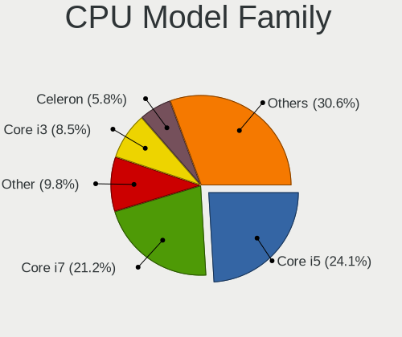

| Model                   | Notebooks | Percent |
|-------------------------|-----------|---------|
| Intel Core i5           | 1029      | 24.42%  |
| Intel Core i7           | 937       | 22.24%  |
| Intel Core i3           | 358       | 8.5%    |
| Other                   | 342       | 8.12%   |
| Intel Celeron           | 240       | 5.7%    |
| Intel Core 2 Duo        | 230       | 5.46%   |
| AMD Ryzen 5             | 147       | 3.49%   |
| Intel Pentium           | 125       | 2.97%   |
| AMD Ryzen 7             | 114       | 2.71%   |
| Intel Atom              | 91        | 2.16%   |
| Intel Pentium Dual-Core | 51        | 1.21%   |
| AMD E1                  | 48        | 1.14%   |
| AMD A4                  | 36        | 0.85%   |
| Intel Pentium Dual      | 31        | 0.74%   |
| AMD Ryzen 7 PRO         | 31        | 0.74%   |
| AMD E2                  | 31        | 0.74%   |
| AMD A6                  | 30        | 0.71%   |
| Intel Core 2            | 26        | 0.62%   |
| Intel Core i9           | 24        | 0.57%   |
| AMD E                   | 24        | 0.57%   |
| AMD Ryzen 9             | 23        | 0.55%   |
| Intel Genuine           | 21        | 0.5%    |
| AMD A8                  | 17        | 0.4%    |
| AMD Ryzen 3             | 16        | 0.38%   |
| AMD Ryzen 5 PRO         | 14        | 0.33%   |
| AMD Athlon              | 14        | 0.33%   |
| Intel Pentium Silver    | 13        | 0.31%   |
| Intel Xeon              | 12        | 0.28%   |
| Intel Celeron Dual-Core | 11        | 0.26%   |
| Intel Pentium M         | 9         | 0.21%   |
| Intel Core m3           | 9         | 0.21%   |
| AMD Athlon X2           | 9         | 0.21%   |
| AMD Athlon II           | 9         | 0.21%   |
| Intel Celeron M         | 8         | 0.19%   |
| AMD Athlon II Dual-Core | 8         | 0.19%   |
| AMD Turion 64 X2 Mobile | 7         | 0.17%   |
| AMD Athlon 64 X2        | 7         | 0.17%   |
| AMD A12                 | 7         | 0.17%   |
| AMD C-60                | 6         | 0.14%   |
| AMD A10                 | 6         | 0.14%   |

CPU Cores
---------

Number of processor cores

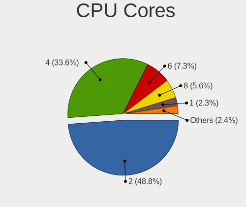

| Number  | Notebooks | Percent |
|---------|-----------|---------|
| 2       | 2101      | 49.87%  |
| 4       | 1446      | 34.32%  |
| 6       | 293       | 6.95%   |
| 8       | 213       | 5.06%   |
| 1       | 105       | 2.49%   |
| 12      | 22        | 0.52%   |
| 14      | 15        | 0.36%   |
| 10      | 9         | 0.21%   |
| Unknown | 9         | 0.21%   |

CPU Sockets
-----------

Number of sockets

| Number | Notebooks | Percent |
|--------|-----------|---------|
| 1      | 4209      | 99.93%  |
| 2      | 3         | 0.07%   |

CPU Threads
-----------

Threads per core (Hyper-Threading)

| Number  | Notebooks | Percent |
|---------|-----------|---------|
| 2       | 3007      | 71.27%  |
| 1       | 1203      | 28.51%  |
| Unknown | 9         | 0.21%   |

CPU Op-Modes
------------

CPU Operation Modes (32-bit, 64-bit)

| Op mode        | Notebooks | Percent |
|----------------|-----------|---------|
| 32-bit, 64-bit | 4128      | 97.87%  |
| Unknown        | 48        | 1.14%   |
| 32-bit         | 40        | 0.95%   |
| 64-bit         | 2         | 0.05%   |

CPU Microcode
-------------

Microcode number

| Number     | Notebooks | Percent |
|------------|-----------|---------|
| Unknown    | 758       | 17.48%  |
| 0x306a9    | 268       | 6.18%   |
| 0x206a7    | 255       | 5.88%   |
| 0x806ec    | 171       | 3.94%   |
| 0x806c1    | 171       | 3.94%   |
| 0x906ea    | 162       | 3.74%   |
| 0x1067a    | 159       | 3.67%   |
| 0x406e3    | 134       | 3.09%   |
| 0x306c3    | 134       | 3.09%   |
| 0x40651    | 132       | 3.04%   |
| 0x306d4    | 129       | 2.97%   |
| 0x806ea    | 125       | 2.88%   |
| 0x20655    | 111       | 2.56%   |
| 0x806e9    | 110       | 2.54%   |
| 0x6fd      | 82        | 1.89%   |
| 0x506e3    | 72        | 1.66%   |
| 0x906e9    | 66        | 1.52%   |
| 0xa0652    | 65        | 1.5%    |
| 0x08600106 | 62        | 1.43%   |
| 0x08108109 | 59        | 1.36%   |
| 0x10676    | 51        | 1.18%   |
| 0x30678    | 49        | 1.13%   |
| 0x706e5    | 48        | 1.11%   |
| 0x406c4    | 47        | 1.08%   |
| 0x806d1    | 43        | 0.99%   |
| 0x07030105 | 39        | 0.9%    |
| 0x806eb    | 38        | 0.88%   |
| 0x406c3    | 38        | 0.88%   |
| 0x706a1    | 37        | 0.85%   |
| 0x08108102 | 37        | 0.85%   |
| 0x506c9    | 34        | 0.78%   |
| 0x0a50000c | 34        | 0.78%   |
| 0x20652    | 33        | 0.76%   |
| 0x05000119 | 32        | 0.74%   |
| 0x906a3    | 31        | 0.71%   |
| 0x06006705 | 31        | 0.71%   |
| 0x906ed    | 29        | 0.67%   |
| 0x0700010f | 25        | 0.58%   |
| 0x706a8    | 23        | 0.53%   |
| 0x0810100b | 22        | 0.51%   |

CPU Microarch
-------------

Microarchitecture

| Name             | Notebooks | Percent |
|------------------|-----------|---------|
| KabyLake         | 855       | 20.29%  |
| Haswell          | 325       | 7.71%   |
| IvyBridge        | 309       | 7.33%   |
| SandyBridge      | 284       | 6.74%   |
| Skylake          | 249       | 5.91%   |
| Penryn           | 237       | 5.62%   |
| TigerLake        | 206       | 4.89%   |
| Silvermont       | 168       | 3.99%   |
| Westmere         | 163       | 3.87%   |
| Core             | 152       | 3.61%   |
| Broadwell        | 152       | 3.61%   |
| Zen 2            | 122       | 2.9%    |
| Zen+             | 107       | 2.54%   |
| Icelake          | 100       | 2.37%   |
| CometLake        | 88        | 2.09%   |
| Unknown          | 84        | 1.99%   |
| Goldmont plus    | 70        | 1.66%   |
| Puma             | 59        | 1.4%    |
| Bobcat           | 58        | 1.38%   |
| Zen 3            | 56        | 1.33%   |
| Excavator        | 52        | 1.23%   |
| Goldmont         | 42        | 1%      |
| Bonnell          | 39        | 0.93%   |
| Alderlake Hybrid | 35        | 0.83%   |
| Jaguar           | 34        | 0.81%   |
| Zen              | 32        | 0.76%   |
| K10              | 25        | 0.59%   |
| K8 Hammer        | 24        | 0.57%   |
| P6               | 21        | 0.5%    |
| Nehalem          | 18        | 0.43%   |
| Piledriver       | 14        | 0.33%   |
| K8 & K10 hybrid  | 12        | 0.28%   |
| K10 Llano        | 12        | 0.28%   |
| Tremont          | 4         | 0.09%   |
| NetBurst         | 3         | 0.07%   |
| Steamroller      | 2         | 0.05%   |
| K6               | 1         | 0.02%   |

Graphics
--------

GPU Vendor
----------

Vendors of graphics cards

| Vendor                           | Notebooks | Percent |
|----------------------------------|-----------|---------|
| Intel                            | 3173      | 58.41%  |
| Nvidia                           | 1315      | 24.21%  |
| AMD                              | 935       | 17.21%  |
| Silicon Integrated Systems [SiS] | 7         | 0.13%   |
| VIA Technologies                 | 2         | 0.04%   |

GPU Model
---------

Graphics card models

| Model                                                                                    | Notebooks | Percent |
|------------------------------------------------------------------------------------------|-----------|---------|
| Intel 3rd Gen Core processor Graphics Controller                                         | 286       | 5.11%   |
| Intel 2nd Generation Core Processor Family Integrated Graphics Controller                | 253       | 4.52%   |
| Intel CoffeeLake-H GT2 [UHD Graphics 630]                                                | 206       | 3.68%   |
| Intel TigerLake-LP GT2 [Iris Xe Graphics]                                                | 195       | 3.49%   |
| Intel Haswell-ULT Integrated Graphics Controller                                         | 154       | 2.75%   |
| Intel Mobile 4 Series Chipset Integrated Graphics Controller                             | 146       | 2.61%   |
| Intel Skylake GT2 [HD Graphics 520]                                                      | 145       | 2.59%   |
| Intel 4th Gen Core Processor Integrated Graphics Controller                              | 144       | 2.58%   |
| Intel UHD Graphics 620                                                                   | 135       | 2.41%   |
| Intel HD Graphics 5500                                                                   | 135       | 2.41%   |
| Intel WhiskeyLake-U GT2 [UHD Graphics 620]                                               | 133       | 2.38%   |
| Intel HD Graphics 620                                                                    | 130       | 2.32%   |
| Intel CometLake-U GT2 [UHD Graphics]                                                     | 121       | 2.16%   |
| AMD Renoir                                                                               | 119       | 2.13%   |
| AMD Picasso/Raven 2 [Radeon Vega Series / Radeon Vega Mobile Series]                     | 108       | 1.93%   |
| Intel Core Processor Integrated Graphics Controller                                      | 105       | 1.88%   |
| Intel Atom/Celeron/Pentium Processor x5-E8000/J3xxx/N3xxx Integrated Graphics Controller | 93        | 1.66%   |
| Nvidia GP107M [GeForce GTX 1050 Mobile]                                                  | 88        | 1.57%   |
| Intel HD Graphics 530                                                                    | 79        | 1.41%   |
| Intel Atom Processor Z36xxx/Z37xxx Series Graphics & Display                             | 75        | 1.34%   |
| Intel HD Graphics 630                                                                    | 72        | 1.29%   |
| Intel CometLake-H GT2 [UHD Graphics]                                                     | 71        | 1.27%   |
| Intel Mobile GM965/GL960 Integrated Graphics Controller (secondary)                      | 61        | 1.09%   |
| Intel Mobile GM965/GL960 Integrated Graphics Controller (primary)                        | 61        | 1.09%   |
| Intel GeminiLake [UHD Graphics 600]                                                      | 58        | 1.04%   |
| Intel TigerLake-H GT1 [UHD Graphics]                                                     | 51        | 0.91%   |
| AMD Cezanne [Radeon Vega Series / Radeon Vega Mobile Series]                             | 50        | 0.89%   |
| Nvidia GF117M [GeForce 610M/710M/810M/820M / GT 620M/625M/630M/720M]                     | 49        | 0.88%   |
| Nvidia TU117M [GeForce GTX 1650 Mobile / Max-Q]                                          | 48        | 0.86%   |
| Nvidia GM107M [GeForce GTX 950M]                                                         | 44        | 0.79%   |
| Nvidia GP107M [GeForce GTX 1050 Ti Mobile]                                               | 43        | 0.77%   |
| AMD Stoney [Radeon R2/R3/R4/R5 Graphics]                                                 | 42        | 0.75%   |
| Nvidia TU106M [GeForce RTX 2060 Mobile]                                                  | 41        | 0.73%   |
| Nvidia GM107M [GeForce GTX 960M]                                                         | 39        | 0.7%    |
| Nvidia GA106M [GeForce RTX 3060 Mobile / Max-Q]                                          | 38        | 0.68%   |
| AMD Park [Mobility Radeon HD 5430/5450/5470]                                             | 36        | 0.64%   |
| Nvidia GM108M [GeForce 840M]                                                             | 35        | 0.63%   |
| AMD Sun XT [Radeon HD 8670A/8670M/8690M / R5 M330 / M430 / Radeon 520 Mobile]            | 35        | 0.63%   |
| Intel Iris Plus Graphics G1 (Ice Lake)                                                   | 34        | 0.61%   |
| Intel Alder Lake-P Integrated Graphics Controller                                        | 34        | 0.61%   |

GPU Combo
---------

Combinations of graphics cards

| Name               | Notebooks | Percent |
|--------------------|-----------|---------|
| 1 x Intel          | 2024      | 47.94%  |
| Intel + Nvidia     | 985       | 23.33%  |
| 1 x AMD            | 638       | 15.11%  |
| 1 x Nvidia         | 252       | 5.97%   |
| Intel + AMD        | 159       | 3.77%   |
| AMD + Nvidia       | 71        | 1.68%   |
| 2 x AMD            | 68        | 1.61%   |
| 1 x SiS            | 7         | 0.17%   |
| 2 x Nvidia         | 6         | 0.14%   |
| 2 x Intel          | 5         | 0.12%   |
| Other              | 4         | 0.09%   |
| 1 x VIA            | 2         | 0.05%   |
| Intel + 2 x Nvidia | 1         | 0.02%   |

GPU Driver
----------

Free vs proprietary

| Driver      | Notebooks | Percent |
|-------------|-----------|---------|
| Free        | 3587      | 84.36%  |
| Proprietary | 558       | 13.12%  |
| Unknown     | 107       | 2.52%   |

GPU Memory
----------

Total video memory

| Size in GB | Notebooks | Percent |
|------------|-----------|---------|
| Unknown    | 2595      | 60.41%  |
| 0.01-0.5   | 582       | 13.55%  |
| 1.01-2.0   | 500       | 11.64%  |
| 0.51-1.0   | 250       | 5.82%   |
| 3.01-4.0   | 242       | 5.63%   |
| 5.01-6.0   | 69        | 1.61%   |
| 7.01-8.0   | 35        | 0.81%   |
| 2.01-3.0   | 21        | 0.49%   |
| 8.01-16.0  | 2         | 0.05%   |

Monitor
-------

Monitor Vendor
--------------

Monitor vendors

| Vendor                  | Notebooks | Percent |
|-------------------------|-----------|---------|
| AU Optronics            | 989       | 20.57%  |
| Chimei Innolux          | 636       | 13.23%  |
| LG Display              | 630       | 13.11%  |
| BOE                     | 565       | 11.75%  |
| Samsung Electronics     | 514       | 10.69%  |
| Sharp                   | 159       | 3.31%   |
| Chi Mei Optoelectronics | 132       | 2.75%   |
| Dell                    | 126       | 2.62%   |
| Iiyama                  | 100       | 2.08%   |
| Apple                   | 87        | 1.81%   |
| Lenovo                  | 81        | 1.69%   |
| PANDA                   | 64        | 1.33%   |
| Acer                    | 64        | 1.33%   |
| LG Philips              | 61        | 1.27%   |
| Hewlett-Packard         | 59        | 1.23%   |
| InfoVision              | 51        | 1.06%   |
| Goldstar                | 50        | 1.04%   |
| BenQ                    | 39        | 0.81%   |
| Ancor Communications    | 39        | 0.81%   |
| Philips                 | 35        | 0.73%   |
| AOC                     | 35        | 0.73%   |
| ViewSonic               | 28        | 0.58%   |
| CPT                     | 18        | 0.37%   |
| CSO                     | 17        | 0.35%   |
| ASUSTek Computer        | 15        | 0.31%   |
| HannStar                | 14        | 0.29%   |
| Sony                    | 13        | 0.27%   |
| Fujitsu Siemens         | 13        | 0.27%   |
| Vestel Elektronik       | 9         | 0.19%   |
| Analogix                | 9         | 0.19%   |
| Toshiba                 | 8         | 0.17%   |
| Seiko/Epson             | 8         | 0.17%   |
| LGD                     | 7         | 0.15%   |
| ANX                     | 7         | 0.15%   |
| Unknown                 | 6         | 0.12%   |
| TMX                     | 5         | 0.1%    |
| Panasonic               | 5         | 0.1%    |
| LPL                     | 5         | 0.1%    |
| Packard Bell            | 4         | 0.08%   |
| MSI                     | 4         | 0.08%   |

Monitor Model
-------------

Monitor models

| Model                                                                     | Notebooks | Percent |
|---------------------------------------------------------------------------|-----------|---------|
| AU Optronics LCD Monitor AUO38ED 1920x1080 344x193mm 15.5-inch            | 42        | 0.86%   |
| Chimei Innolux LCD Monitor CMN14D4 1920x1080 309x173mm 13.9-inch          | 34        | 0.7%    |
| Samsung Electronics LCD Monitor SEC5441 1366x768 344x194mm 15.5-inch      | 33        | 0.68%   |
| AU Optronics LCD Monitor AUO21ED 1920x1080 344x193mm 15.5-inch            | 28        | 0.58%   |
| AU Optronics LCD Monitor AUO61ED 1920x1080 344x194mm 15.5-inch            | 25        | 0.51%   |
| AU Optronics LCD Monitor AUO26EC 1366x768 344x193mm 15.5-inch             | 25        | 0.51%   |
| Samsung Electronics LCD Monitor SEC544B 1600x900 382x214mm 17.2-inch      | 24        | 0.49%   |
| AU Optronics LCD Monitor AUO5B2D 1920x1080 293x162mm 13.2-inch            | 24        | 0.49%   |
| Chimei Innolux LCD Monitor CMN15F5 1920x1080 344x193mm 15.5-inch          | 23        | 0.47%   |
| Chi Mei Optoelectronics LCD Monitor CMO1720 1920x1080 382x215mm 17.3-inch | 23        | 0.47%   |
| AU Optronics LCD Monitor AUO106C 1366x768 276x155mm 12.5-inch             | 23        | 0.47%   |
| Chimei Innolux LCD Monitor CMN1728 1600x900 382x215mm 17.3-inch           | 21        | 0.43%   |
| Chimei Innolux LCD Monitor CMN14D5 1920x1080 309x173mm 13.9-inch          | 21        | 0.43%   |
| AU Optronics LCD Monitor AUO403D 1920x1080 309x173mm 13.9-inch            | 21        | 0.43%   |
| LG Display LCD Monitor LGD033A 1366x768 344x194mm 15.5-inch               | 18        | 0.37%   |
| Chimei Innolux LCD Monitor CMN1735 1920x1080 382x215mm 17.3-inch          | 18        | 0.37%   |
| Chimei Innolux LCD Monitor CMN1734 1600x900 382x214mm 17.2-inch           | 18        | 0.37%   |
| AU Optronics LCD Monitor AUO159E 1600x900 382x214mm 17.2-inch             | 18        | 0.37%   |
| AU Optronics LCD Monitor AUO139E 1600x900 382x214mm 17.2-inch             | 18        | 0.37%   |
| Chi Mei Optoelectronics LCD Monitor CMO15A7 1366x768 344x193mm 15.5-inch  | 17        | 0.35%   |
| AU Optronics LCD Monitor AUO109E 1600x900 382x214mm 17.2-inch             | 17        | 0.35%   |
| LG Display LCD Monitor LGD02DC 1366x768 344x194mm 15.5-inch               | 16        | 0.33%   |
| Chi Mei Optoelectronics LCD Monitor CMO1592 1366x768 344x193mm 15.5-inch  | 16        | 0.33%   |
| Chimei Innolux LCD Monitor CMN15DC 1366x768 344x193mm 15.5-inch           | 15        | 0.31%   |
| AU Optronics LCD Monitor AUO45EC 1366x768 344x193mm 15.5-inch             | 15        | 0.31%   |
| Sharp LCD Monitor SHP14F9 1920x1200 288x180mm 13.4-inch                   | 14        | 0.29%   |
| Sharp LCD Monitor SHP149A 1920x1080 344x194mm 15.5-inch                   | 14        | 0.29%   |
| Samsung Electronics LCD Monitor SDC4852 1366x768 340x190mm 15.3-inch      | 14        | 0.29%   |
| Chimei Innolux LCD Monitor CMN1747 1920x1080 381x214mm 17.2-inch          | 14        | 0.29%   |
| AU Optronics LCD Monitor AUO70EC 1366x768 344x193mm 15.5-inch             | 14        | 0.29%   |
| AU Optronics LCD Monitor AUO36ED 1920x1080 344x193mm 15.5-inch            | 14        | 0.29%   |
| LG Display LCD Monitor LGD0456 1366x768 344x194mm 15.5-inch               | 13        | 0.27%   |
| Chimei Innolux LCD Monitor CMN15E8 1920x1080 344x193mm 15.5-inch          | 13        | 0.27%   |
| Chimei Innolux LCD Monitor CMN15DB 1366x768 344x193mm 15.5-inch           | 13        | 0.27%   |
| BOE LCD Monitor BOE069C 1920x1080 344x193mm 15.5-inch                     | 13        | 0.27%   |
| AU Optronics LCD Monitor AUO22EC 1366x768 344x193mm 15.5-inch             | 13        | 0.27%   |
| AU Optronics LCD Monitor AUO119E 1600x900 382x214mm 17.2-inch             | 13        | 0.27%   |
| Sharp LCD Monitor SHP14BA 1920x1080 344x194mm 15.5-inch                   | 12        | 0.25%   |
| LG Display LCD Monitor LGD0395 1366x768 344x194mm 15.5-inch               | 12        | 0.25%   |
| Chimei Innolux LCD Monitor CMN1738 1920x1080 381x214mm 17.2-inch          | 12        | 0.25%   |

Monitor Resolution
------------------

Monitor screen resolution

| Resolution         | Notebooks | Percent |
|--------------------|-----------|---------|
| 1920x1080 (FHD)    | 1930      | 43.3%   |
| 1366x768 (WXGA)    | 1117      | 25.06%  |
| 1600x900 (HD+)     | 432       | 9.69%   |
| 1280x800 (WXGA)    | 169       | 3.79%   |
| 3840x2160 (4K)     | 146       | 3.28%   |
| 1440x900 (WXGA+)   | 112       | 2.51%   |
| 1920x1200 (WUXGA)  | 105       | 2.36%   |
| 2560x1440 (QHD)    | 95        | 2.13%   |
| 1680x1050 (WSXGA+) | 54        | 1.21%   |
| 1024x600           | 31        | 0.7%    |
| 1280x1024 (SXGA)   | 28        | 0.63%   |
| 2560x1600          | 24        | 0.54%   |
| 2880x1800          | 21        | 0.47%   |
| 3440x1440          | 19        | 0.43%   |
| 2160x1440          | 18        | 0.4%    |
| 3840x2400          | 17        | 0.38%   |
| 800x1280           | 16        | 0.36%   |
| 3200x1800 (QHD+)   | 11        | 0.25%   |
| 2560x1080          | 11        | 0.25%   |
| Unknown            | 11        | 0.25%   |
| 1360x768           | 10        | 0.22%   |
| 3840x1080          | 7         | 0.16%   |
| 1920x540           | 7         | 0.16%   |
| 1600x1200          | 7         | 0.16%   |
| 3000x2000          | 6         | 0.13%   |
| 1680x945           | 6         | 0.13%   |
| 1024x768 (XGA)     | 5         | 0.11%   |
| 3840x1200          | 4         | 0.09%   |
| 2288x1287          | 4         | 0.09%   |
| 1920x515           | 4         | 0.09%   |
| 1400x1050          | 4         | 0.09%   |
| 3072x1920          | 3         | 0.07%   |
| 2256x1504          | 3         | 0.07%   |
| 5760x2160          | 2         | 0.04%   |
| 3840x1600          | 2         | 0.04%   |
| 3286x1080          | 2         | 0.04%   |
| 2048x1152          | 2         | 0.04%   |
| 720x1280           | 1         | 0.02%   |
| 4480x1600          | 1         | 0.02%   |
| 4480x1440          | 1         | 0.02%   |

Monitor Diagonal
----------------

Diagonal size in inches

| Inches  | Notebooks | Percent |
|---------|-----------|---------|
| 15      | 1786      | 37.21%  |
| 17      | 670       | 13.96%  |
| 13      | 666       | 13.88%  |
| 14      | 473       | 9.85%   |
| 24      | 205       | 4.27%   |
| 23      | 149       | 3.1%    |
| 27      | 134       | 2.79%   |
| 12      | 128       | 2.67%   |
| 21      | 100       | 2.08%   |
| Unknown | 81        | 1.69%   |
| 11      | 63        | 1.31%   |
| 16      | 46        | 0.96%   |
| 18      | 42        | 0.88%   |
| 10      | 42        | 0.88%   |
| 22      | 33        | 0.69%   |
| 19      | 33        | 0.69%   |
| 34      | 29        | 0.6%    |
| 20      | 19        | 0.4%    |
| 31      | 17        | 0.35%   |
| 84      | 13        | 0.27%   |
| 72      | 13        | 0.27%   |
| 25      | 8         | 0.17%   |
| 54      | 6         | 0.13%   |
| 32      | 6         | 0.13%   |
| 52      | 4         | 0.08%   |
| 33      | 4         | 0.08%   |
| 26      | 4         | 0.08%   |
| 49      | 3         | 0.06%   |
| 43      | 3         | 0.06%   |
| 40      | 3         | 0.06%   |
| 142     | 2         | 0.04%   |
| 48      | 2         | 0.04%   |
| 46      | 2         | 0.04%   |
| 74      | 1         | 0.02%   |
| 64      | 1         | 0.02%   |
| 50      | 1         | 0.02%   |
| 47      | 1         | 0.02%   |
| 41      | 1         | 0.02%   |
| 38      | 1         | 0.02%   |
| 37      | 1         | 0.02%   |

Monitor Width
-------------

Physical width

| Width in mm    | Notebooks | Percent |
|----------------|-----------|---------|
| 301-350        | 2530      | 53.21%  |
| 351-400        | 760       | 15.98%  |
| 201-300        | 593       | 12.47%  |
| 501-600        | 450       | 9.46%   |
| 401-500        | 210       | 4.42%   |
| Unknown        | 81        | 1.7%    |
| 701-800        | 38        | 0.8%    |
| 601-700        | 32        | 0.67%   |
| 1501-2000      | 27        | 0.57%   |
| 1001-1500      | 22        | 0.46%   |
| 801-900        | 7         | 0.15%   |
| More than 2000 | 2         | 0.04%   |
| 101-200        | 2         | 0.04%   |
| 901-1000       | 1         | 0.02%   |

Aspect Ratio
------------

Proportional relationship between the width and the height

| Ratio   | Notebooks | Percent |
|---------|-----------|---------|
| 16/9    | 3524      | 83.69%  |
| 16/10   | 493       | 11.71%  |
| Unknown | 41        | 0.97%   |
| 3/2     | 38        | 0.9%    |
| 21/9    | 32        | 0.76%   |
| 5/4     | 28        | 0.66%   |
| 4/3     | 22        | 0.52%   |
| 0.62    | 17        | 0.4%    |
| 32/9    | 5         | 0.12%   |
| 3.20    | 4         | 0.09%   |
| 3.73    | 3         | 0.07%   |
| 1.00    | 2         | 0.05%   |
| 3.88    | 1         | 0.02%   |
| 0.56    | 1         | 0.02%   |

Monitor Area
------------

Area in inch²

| Area in inch² | Notebooks | Percent |
|----------------|-----------|---------|
| 101-110        | 1803      | 37.64%  |
| 81-90          | 836       | 17.45%  |
| 121-130        | 557       | 11.63%  |
| 201-250        | 392       | 8.18%   |
| 71-80          | 304       | 6.35%   |
| 301-350        | 137       | 2.86%   |
| 61-70          | 121       | 2.53%   |
| 131-140        | 102       | 2.13%   |
| 151-200        | 84        | 1.75%   |
| Unknown        | 81        | 1.69%   |
| 251-300        | 67        | 1.4%    |
| 51-60          | 63        | 1.32%   |
| 351-500        | 58        | 1.21%   |
| 141-150        | 47        | 0.98%   |
| 41-50          | 43        | 0.9%    |
| More than 1000 | 41        | 0.86%   |
| 111-120        | 24        | 0.5%    |
| 501-1000       | 16        | 0.33%   |
| 91-100         | 12        | 0.25%   |
| 1-40           | 2         | 0.04%   |

Pixel Density
-------------

Pixels per inch

| Density       | Notebooks | Percent |
|---------------|-----------|---------|
| 121-160       | 1838      | 39.05%  |
| 101-120       | 1466      | 31.15%  |
| 51-100        | 854       | 18.14%  |
| 161-240       | 313       | 6.65%   |
| More than 240 | 122       | 2.59%   |
| Unknown       | 81        | 1.72%   |
| 1-50          | 33        | 0.7%    |

Multiple Monitors
-----------------

Total monitors connected

| Total | Notebooks | Percent |
|-------|-----------|---------|
| 1     | 3421      | 79.41%  |
| 2     | 681       | 15.81%  |
| 0     | 116       | 2.69%   |
| 3     | 84        | 1.95%   |
| 4     | 4         | 0.09%   |
| 6     | 1         | 0.02%   |
| 5     | 1         | 0.02%   |

Network
-------

Net Controller Vendor
---------------------

Controller vendors

| Vendor                            | Notebooks | Percent |
|-----------------------------------|-----------|---------|
| Intel                             | 2290      | 34.14%  |
| Realtek Semiconductor             | 2158      | 32.18%  |
| Qualcomm Atheros                  | 1047      | 15.61%  |
| Broadcom                          | 445       | 6.63%   |
| Broadcom Limited                  | 94        | 1.4%    |
| Marvell Technology Group          | 86        | 1.28%   |
| Ralink                            | 72        | 1.07%   |
| MediaTek                          | 66        | 0.98%   |
| Dell                              | 40        | 0.6%    |
| ASIX Electronics                  | 35        | 0.52%   |
| Nvidia                            | 31        | 0.46%   |
| Samsung Electronics               | 29        | 0.43%   |
| Ericsson Business Mobile Networks | 25        | 0.37%   |
| Xiaomi                            | 23        | 0.34%   |
| DisplayLink                       | 23        | 0.34%   |
| Sierra Wireless                   | 20        | 0.3%    |
| TP-Link                           | 19        | 0.28%   |
| Lenovo                            | 17        | 0.25%   |
| Huawei Technologies               | 17        | 0.25%   |
| JMicron Technology                | 16        | 0.24%   |
| Ralink Technology                 | 14        | 0.21%   |
| Qualcomm                          | 14        | 0.21%   |
| Attansic Technology               | 14        | 0.21%   |
| NetGear                           | 13        | 0.19%   |
| Hewlett-Packard                   | 11        | 0.16%   |
| Silicon Integrated Systems [SiS]  | 10        | 0.15%   |
| OPPO Electronics                  | 6         | 0.09%   |
| Google                            | 5         | 0.07%   |
| Toshiba                           | 4         | 0.06%   |
| OnePlus Technology (Shenzhen)     | 4         | 0.06%   |
| ICS Advent                        | 4         | 0.06%   |
| Fibocom                           | 4         | 0.06%   |
| D-Link                            | 4         | 0.06%   |
| Apple                             | 4         | 0.06%   |
| VIA Technologies                  | 3         | 0.04%   |
| U-Blox                            | 3         | 0.04%   |
| D-Link System                     | 3         | 0.04%   |
| Belkin Components                 | 3         | 0.04%   |
| Arduino SA                        | 3         | 0.04%   |
| Shenzhen Goodix Technology        | 2         | 0.03%   |

Net Controller Model
--------------------

Controller models

| Model                                                                   | Notebooks | Percent |
|-------------------------------------------------------------------------|-----------|---------|
| Realtek RTL8111/8168/8411 PCI Express Gigabit Ethernet Controller       | 1299      | 16.08%  |
| Realtek RTL810xE PCI Express Fast Ethernet controller                   | 353       | 4.37%   |
| Realtek RTL8153 Gigabit Ethernet Adapter                                | 230       | 2.85%   |
| Intel Wi-Fi 6 AX200                                                     | 203       | 2.51%   |
| Qualcomm Atheros QCA9377 802.11ac Wireless Network Adapter              | 175       | 2.17%   |
| Intel Wireless 8265 / 8275                                              | 172       | 2.13%   |
| Intel Wireless 7265                                                     | 160       | 1.98%   |
| Intel Wi-Fi 6 AX201                                                     | 157       | 1.94%   |
| Qualcomm Atheros AR9285 Wireless Network Adapter (PCI-Express)          | 154       | 1.91%   |
| Intel 82579LM Gigabit Network Connection (Lewisville)                   | 148       | 1.83%   |
| Qualcomm Atheros AR9485 Wireless Network Adapter                        | 135       | 1.67%   |
| Qualcomm Atheros QCA9565 / AR9565 Wireless Network Adapter              | 130       | 1.61%   |
| Intel Cannon Lake PCH CNVi WiFi                                         | 130       | 1.61%   |
| Intel Wireless 8260                                                     | 124       | 1.53%   |
| Intel Wireless 7260                                                     | 123       | 1.52%   |
| Realtek RTL8821CE 802.11ac PCIe Wireless Network Adapter                | 103       | 1.27%   |
| Qualcomm Atheros QCA6174 802.11ac Wireless Network Adapter              | 103       | 1.27%   |
| Intel Centrino Advanced-N 6205 [Taylor Peak]                            | 103       | 1.27%   |
| Intel Comet Lake PCH-LP CNVi WiFi                                       | 96        | 1.19%   |
| Realtek RTL8822CE 802.11ac PCIe Wireless Network Adapter                | 91        | 1.13%   |
| Realtek RTL8723BE PCIe Wireless Network Adapter                         | 87        | 1.08%   |
| Intel Cannon Point-LP CNVi [Wireless-AC]                                | 87        | 1.08%   |
| Broadcom BCM4313 802.11bgn Wireless Network Adapter                     | 83        | 1.03%   |
| Intel Comet Lake PCH CNVi WiFi                                          | 73        | 0.9%    |
| Realtek RTL8188CE 802.11b/g/n WiFi Adapter                              | 64        | 0.79%   |
| Intel Wireless 3165                                                     | 63        | 0.78%   |
| Qualcomm Atheros AR8151 v2.0 Gigabit Ethernet                           | 61        | 0.75%   |
| Broadcom BCM43142 802.11b/g/n                                           | 61        | 0.75%   |
| Intel Ethernet Connection (4) I219-LM                                   | 57        | 0.71%   |
| Qualcomm Atheros AR8161 Gigabit Ethernet                                | 56        | 0.69%   |
| Intel PRO/Wireless 3945ABG [Golan] Network Connection                   | 55        | 0.68%   |
| Intel Ethernet Connection (3) I218-LM                                   | 53        | 0.66%   |
| Qualcomm Atheros AR928X Wireless Network Adapter (PCI-Express)          | 50        | 0.62%   |
| Intel Wireless-AC 9260                                                  | 49        | 0.61%   |
| Intel WiFi Link 5100                                                    | 49        | 0.61%   |
| Intel Ethernet Connection I219-LM                                       | 48        | 0.59%   |
| Intel Wireless 3160                                                     | 46        | 0.57%   |
| Intel Ethernet Connection I217-LM                                       | 45        | 0.56%   |
| Intel Centrino Wireless-N 2230                                          | 44        | 0.54%   |
| Qualcomm Atheros AR242x / AR542x Wireless Network Adapter (PCI-Express) | 42        | 0.52%   |

Wireless Vendor
---------------

Wireless vendors

| Vendor                                | Notebooks | Percent |
|---------------------------------------|-----------|---------|
| Intel                                 | 2172      | 50.65%  |
| Qualcomm Atheros                      | 862       | 20.1%   |
| Realtek Semiconductor                 | 619       | 14.44%  |
| Broadcom                              | 322       | 7.51%   |
| Ralink                                | 72        | 1.68%   |
| Broadcom Limited                      | 63        | 1.47%   |
| MediaTek                              | 60        | 1.4%    |
| Dell                                  | 21        | 0.49%   |
| Sierra Wireless                       | 20        | 0.47%   |
| TP-Link                               | 15        | 0.35%   |
| Ralink Technology                     | 14        | 0.33%   |
| NetGear                               | 10        | 0.23%   |
| Qualcomm                              | 9         | 0.21%   |
| Hewlett-Packard                       | 5         | 0.12%   |
| Fibocom                               | 4         | 0.09%   |
| D-Link System                         | 3         | 0.07%   |
| D-Link                                | 3         | 0.07%   |
| Belkin Components                     | 3         | 0.07%   |
| ASUSTek Computer                      | 2         | 0.05%   |
| ZyDAS                                 | 1         | 0.02%   |
| Texas Instruments                     | 1         | 0.02%   |
| Sagem                                 | 1         | 0.02%   |
| Qualcomm Atheros Communications       | 1         | 0.02%   |
| Microsoft                             | 1         | 0.02%   |
| Guillemot                             | 1         | 0.02%   |
| Edimax Technology                     | 1         | 0.02%   |
| Accton Technology                     | 1         | 0.02%   |
| 802.11g Adapter [Linksys WUSB54GC v3] | 1         | 0.02%   |

Wireless Model
--------------

Wireless models

| Model                                                                   | Notebooks | Percent |
|-------------------------------------------------------------------------|-----------|---------|
| Intel Wi-Fi 6 AX200                                                     | 203       | 4.71%   |
| Qualcomm Atheros QCA9377 802.11ac Wireless Network Adapter              | 175       | 4.06%   |
| Intel Wireless 8265 / 8275                                              | 172       | 3.99%   |
| Intel Wireless 7265                                                     | 160       | 3.71%   |
| Intel Wi-Fi 6 AX201                                                     | 157       | 3.64%   |
| Qualcomm Atheros AR9285 Wireless Network Adapter (PCI-Express)          | 154       | 3.57%   |
| Qualcomm Atheros AR9485 Wireless Network Adapter                        | 135       | 3.13%   |
| Qualcomm Atheros QCA9565 / AR9565 Wireless Network Adapter              | 130       | 3.01%   |
| Intel Cannon Lake PCH CNVi WiFi                                         | 130       | 3.01%   |
| Intel Wireless 8260                                                     | 124       | 2.88%   |
| Intel Wireless 7260                                                     | 123       | 2.85%   |
| Realtek RTL8821CE 802.11ac PCIe Wireless Network Adapter                | 103       | 2.39%   |
| Qualcomm Atheros QCA6174 802.11ac Wireless Network Adapter              | 103       | 2.39%   |
| Intel Centrino Advanced-N 6205 [Taylor Peak]                            | 103       | 2.39%   |
| Intel Comet Lake PCH-LP CNVi WiFi                                       | 96        | 2.23%   |
| Realtek RTL8822CE 802.11ac PCIe Wireless Network Adapter                | 91        | 2.11%   |
| Realtek RTL8723BE PCIe Wireless Network Adapter                         | 87        | 2.02%   |
| Intel Cannon Point-LP CNVi [Wireless-AC]                                | 87        | 2.02%   |
| Broadcom BCM4313 802.11bgn Wireless Network Adapter                     | 83        | 1.92%   |
| Intel Comet Lake PCH CNVi WiFi                                          | 73        | 1.69%   |
| Realtek RTL8188CE 802.11b/g/n WiFi Adapter                              | 64        | 1.48%   |
| Intel Wireless 3165                                                     | 63        | 1.46%   |
| Broadcom BCM43142 802.11b/g/n                                           | 61        | 1.41%   |
| Intel PRO/Wireless 3945ABG [Golan] Network Connection                   | 55        | 1.28%   |
| Qualcomm Atheros AR928X Wireless Network Adapter (PCI-Express)          | 50        | 1.16%   |
| Intel Wireless-AC 9260                                                  | 49        | 1.14%   |
| Intel WiFi Link 5100                                                    | 49        | 1.14%   |
| Intel Wireless 3160                                                     | 46        | 1.07%   |
| Intel Centrino Wireless-N 2230                                          | 44        | 1.02%   |
| Qualcomm Atheros AR242x / AR542x Wireless Network Adapter (PCI-Express) | 42        | 0.97%   |
| Intel Alder Lake-P PCH CNVi WiFi                                        | 41        | 0.95%   |
| Qualcomm Atheros AR9462 Wireless Network Adapter                        | 38        | 0.88%   |
| MediaTek MT7921 802.11ax PCI Express Wireless Network Adapter           | 38        | 0.88%   |
| Realtek RTL8723DE Wireless Network Adapter                              | 37        | 0.86%   |
| Intel Tiger Lake PCH CNVi WiFi                                          | 37        | 0.86%   |
| Intel Ice Lake-LP PCH CNVi WiFi                                         | 37        | 0.86%   |
| Realtek RTL8188EE Wireless Network Adapter                              | 34        | 0.79%   |
| Intel PRO/Wireless 4965 AG or AGN [Kedron] Network Connection           | 32        | 0.74%   |
| Broadcom BCM43224 802.11a/b/g/n                                         | 32        | 0.74%   |
| Ralink RT3290 Wireless 802.11n 1T/1R PCIe                               | 30        | 0.7%    |

Ethernet Vendor
---------------

Ethernet vendors

| Vendor                           | Notebooks | Percent |
|----------------------------------|-----------|---------|
| Realtek Semiconductor            | 1941      | 53.29%  |
| Intel                            | 823       | 22.6%   |
| Qualcomm Atheros                 | 326       | 8.95%   |
| Broadcom                         | 169       | 4.64%   |
| Marvell Technology Group         | 86        | 2.36%   |
| ASIX Electronics                 | 35        | 0.96%   |
| Broadcom Limited                 | 34        | 0.93%   |
| Nvidia                           | 31        | 0.85%   |
| Samsung Electronics              | 28        | 0.77%   |
| Xiaomi                           | 23        | 0.63%   |
| DisplayLink                      | 23        | 0.63%   |
| Lenovo                           | 17        | 0.47%   |
| JMicron Technology               | 16        | 0.44%   |
| Attansic Technology              | 14        | 0.38%   |
| Huawei Technologies              | 11        | 0.3%    |
| Silicon Integrated Systems [SiS] | 10        | 0.27%   |
| OPPO Electronics                 | 6         | 0.16%   |
| MediaTek                         | 6         | 0.16%   |
| Qualcomm                         | 5         | 0.14%   |
| Google                           | 5         | 0.14%   |
| TP-Link                          | 4         | 0.11%   |
| ICS Advent                       | 4         | 0.11%   |
| Apple                            | 4         | 0.11%   |
| NetGear                          | 3         | 0.08%   |
| VIA Technologies                 | 2         | 0.05%   |
| OnePlus Technology (Shenzhen)    | 2         | 0.05%   |
| Cypress Semiconductor            | 2         | 0.05%   |
| Aquantia                         | 2         | 0.05%   |
| ZTE WCDMA Technologies MSM       | 1         | 0.03%   |
| ULi Electronics                  | 1         | 0.03%   |
| Motorola PCS                     | 1         | 0.03%   |
| Microchip Technology             | 1         | 0.03%   |
| Linksys                          | 1         | 0.03%   |
| Hisense                          | 1         | 0.03%   |
| Hewlett-Packard                  | 1         | 0.03%   |
| Davicom Semiconductor            | 1         | 0.03%   |
| D-Link                           | 1         | 0.03%   |
| Archos                           | 1         | 0.03%   |

Ethernet Model
--------------

Ethernet models

| Model                                                             | Notebooks | Percent |
|-------------------------------------------------------------------|-----------|---------|
| Realtek RTL8111/8168/8411 PCI Express Gigabit Ethernet Controller | 1299      | 35.33%  |
| Realtek RTL810xE PCI Express Fast Ethernet controller             | 353       | 9.6%    |
| Realtek RTL8153 Gigabit Ethernet Adapter                          | 230       | 6.26%   |
| Intel 82579LM Gigabit Network Connection (Lewisville)             | 148       | 4.03%   |
| Qualcomm Atheros AR8151 v2.0 Gigabit Ethernet                     | 61        | 1.66%   |
| Intel Ethernet Connection (4) I219-LM                             | 57        | 1.55%   |
| Qualcomm Atheros AR8161 Gigabit Ethernet                          | 56        | 1.52%   |
| Intel Ethernet Connection (3) I218-LM                             | 53        | 1.44%   |
| Intel Ethernet Connection I219-LM                                 | 48        | 1.31%   |
| Intel Ethernet Connection I217-LM                                 | 45        | 1.22%   |
| Intel Ethernet Connection I218-LM                                 | 39        | 1.06%   |
| Intel 82577LM Gigabit Network Connection                          | 37        | 1.01%   |
| Intel 82567LM Gigabit Network Connection                          | 34        | 0.92%   |
| Intel Ethernet Connection (6) I219-V                              | 31        | 0.84%   |
| ASIX AX88179 Gigabit Ethernet                                     | 31        | 0.84%   |
| Qualcomm Atheros Killer E2400 Gigabit Ethernet Controller         | 30        | 0.82%   |
| Qualcomm Atheros AR8131 Gigabit Ethernet                          | 30        | 0.82%   |
| Realtek RTL8152 Fast Ethernet Adapter                             | 27        | 0.73%   |
| Intel Ethernet Connection I219-V                                  | 27        | 0.73%   |
| Intel Ethernet Connection (7) I219-LM                             | 27        | 0.73%   |
| Intel Ethernet Connection I217-V                                  | 25        | 0.68%   |
| Qualcomm Atheros QCA8171 Gigabit Ethernet                         | 24        | 0.65%   |
| Qualcomm Atheros Killer E220x Gigabit Ethernet Controller         | 24        | 0.65%   |
| Broadcom NetLink BCM57785 Gigabit Ethernet PCIe                   | 24        | 0.65%   |
| Intel Ethernet Connection (6) I219-LM                             | 23        | 0.63%   |
| Intel Ethernet Connection (4) I219-V                              | 23        | 0.63%   |
| Marvell Group 88E8040 PCI-E Fast Ethernet Controller              | 22        | 0.6%    |
| Intel Ethernet Connection (13) I219-V                             | 22        | 0.6%    |
| Broadcom NetLink BCM57780 Gigabit Ethernet PCIe                   | 22        | 0.6%    |
| Samsung Galaxy series, misc. (tethering mode)                     | 21        | 0.57%   |
| Qualcomm Atheros AR8132 Fast Ethernet                             | 21        | 0.57%   |
| Nvidia MCP79 Ethernet                                             | 20        | 0.54%   |
| Xiaomi Mi/Redmi series (RNDIS)                                    | 17        | 0.46%   |
| Qualcomm Atheros QCA8172 Fast Ethernet                            | 17        | 0.46%   |
| Marvell Group 88E8055 PCI-E Gigabit Ethernet Controller           | 17        | 0.46%   |
| Broadcom NetXtreme BCM5764M Gigabit Ethernet PCIe                 | 17        | 0.46%   |
| JMicron JMC250 PCI Express Gigabit Ethernet Controller            | 16        | 0.44%   |
| Intel Ethernet Connection (13) I219-LM                            | 16        | 0.44%   |
| Intel Ethernet Connection (11) I219-LM                            | 16        | 0.44%   |
| Broadcom NetXtreme BCM57765 Gigabit Ethernet PCIe                 | 16        | 0.44%   |

Net Controller Kind
-------------------

Ethernet, WiFi or modem

| Kind     | Notebooks | Percent |
|----------|-----------|---------|
| WiFi     | 4137      | 53.79%  |
| Ethernet | 3463      | 45.03%  |
| Modem    | 85        | 1.11%   |
| Unknown  | 6         | 0.08%   |

Used Controller
---------------

Currently used network controller

| Kind     | Notebooks | Percent |
|----------|-----------|---------|
| WiFi     | 3330      | 74.53%  |
| Ethernet | 1138      | 25.47%  |

NICs
----

Total network controllers on board

| Total | Notebooks | Percent |
|-------|-----------|---------|
| 2     | 3113      | 73.84%  |
| 1     | 1003      | 23.79%  |
| 0     | 58        | 1.38%   |
| 3     | 42        | 1%      |

IPv6
----

IPv6 vs IPv4

| Used | Notebooks | Percent |
|------|-----------|---------|
| No   | 2913      | 67.31%  |
| Yes  | 1415      | 32.69%  |

Bluetooth
---------

Bluetooth Vendor
----------------

Controller vendors

| Vendor                          | Notebooks | Percent |
|---------------------------------|-----------|---------|
| Intel                           | 1675      | 51.87%  |
| Realtek Semiconductor           | 263       | 8.14%   |
| IMC Networks                    | 243       | 7.53%   |
| Qualcomm Atheros Communications | 222       | 6.88%   |
| Broadcom                        | 163       | 5.05%   |
| Lite-On Technology              | 119       | 3.69%   |
| Foxconn / Hon Hai               | 107       | 3.31%   |
| Apple                           | 87        | 2.69%   |
| Dell                            | 77        | 2.38%   |
| Cambridge Silicon Radio         | 51        | 1.58%   |
| Realtek                         | 39        | 1.21%   |
| Hewlett-Packard                 | 37        | 1.15%   |
| Toshiba                         | 34        | 1.05%   |
| Ralink                          | 30        | 0.93%   |
| ASUSTek Computer                | 21        | 0.65%   |
| Ralink Technology               | 19        | 0.59%   |
| Alps Electric                   | 13        | 0.4%    |
| Foxconn International           | 12        | 0.37%   |
| MediaTek                        | 5         | 0.15%   |
| Chicony Electronics             | 5         | 0.15%   |
| USI                             | 2         | 0.06%   |
| TP-Link                         | 1         | 0.03%   |
| Syntek                          | 1         | 0.03%   |
| Integrated System Solution      | 1         | 0.03%   |
| Fujitsu                         | 1         | 0.03%   |
| Corsair                         | 1         | 0.03%   |

Bluetooth Model
---------------

Controller models

| Model                                               | Notebooks | Percent |
|-----------------------------------------------------|-----------|---------|
| Intel Bluetooth wireless interface                  | 655       | 20.28%  |
| Intel AX201 Bluetooth                               | 352       | 10.9%   |
| Intel Bluetooth 9460/9560 Jefferson Peak (JfP)      | 271       | 8.39%   |
| Intel AX200 Bluetooth                               | 193       | 5.98%   |
| Realtek Bluetooth Radio                             | 164       | 5.08%   |
| IMC Networks Bluetooth Device                       | 100       | 3.1%    |
| Qualcomm Atheros  Bluetooth Device                  | 89        | 2.76%   |
| Realtek  Bluetooth 4.2 Adapter                      | 68        | 2.11%   |
| IMC Networks Bluetooth Radio                        | 68        | 2.11%   |
| Intel Centrino Bluetooth Wireless Transceiver       | 64        | 1.98%   |
| Foxconn / Hon Hai Bluetooth Device                  | 51        | 1.58%   |
| Cambridge Silicon Radio Bluetooth Dongle (HCI mode) | 51        | 1.58%   |
| Apple Bluetooth Host Controller                     | 46        | 1.42%   |
| Lite-On Qualcomm Atheros QCA9377 Bluetooth          | 45        | 1.39%   |
| Qualcomm Atheros AR3012 Bluetooth 4.0               | 42        | 1.3%    |
| Intel Wireless-AC 9260 Bluetooth Adapter            | 41        | 1.27%   |
| Realtek Bluetooth Radio                             | 39        | 1.21%   |
| Qualcomm Atheros QCA61x4 Bluetooth 4.0              | 37        | 1.15%   |
| Qualcomm Atheros AR3011 Bluetooth                   | 34        | 1.05%   |
| Lite-On Bluetooth Device                            | 34        | 1.05%   |
| Dell DW375 Bluetooth Module                         | 33        | 1.02%   |
| Intel Bluetooth Device                              | 31        | 0.96%   |
| Ralink RT3290 Bluetooth                             | 30        | 0.93%   |
| Intel Centrino Advanced-N 6230 Bluetooth adapter    | 27        | 0.84%   |
| Broadcom BCM2045B (BDC-2.1)                         | 26        | 0.8%    |
| Apple Bluetooth USB Host Controller                 | 25        | 0.77%   |
| IMC Networks Atheros AR3012 Bluetooth 4.0 Adapter   | 24        | 0.74%   |
| Intel AX210 Bluetooth                               | 23        | 0.71%   |
| Broadcom BCM20702 Bluetooth 4.0 [ThinkPad]          | 23        | 0.71%   |
| IMC Networks Wireless_Device                        | 21        | 0.65%   |
| Lite-On Atheros AR3012 Bluetooth                    | 20        | 0.62%   |
| HP Broadcom 2070 Bluetooth Combo                    | 20        | 0.62%   |
| Foxconn / Hon Hai Wireless_Device                   | 20        | 0.62%   |
| Intel Wireless-AC 3168 Bluetooth                    | 18        | 0.56%   |
| Realtek RTL8723B Bluetooth                          | 17        | 0.53%   |
| Dell BCM20702A0 Bluetooth Module                    | 17        | 0.53%   |
| Broadcom BCM2045B (BDC-2.1) [Bluetooth Controller]  | 16        | 0.5%    |
| IMC Networks Bluetooth                              | 14        | 0.43%   |
| HP Bluetooth 2.0 Interface [Broadcom BCM2045]       | 14        | 0.43%   |
| Broadcom HP Portable SoftSailing                    | 14        | 0.43%   |

Sound
-----

Sound Vendor
------------

Sound card vendors

| Vendor                                       | Notebooks | Percent |
|----------------------------------------------|-----------|---------|
| Intel                                        | 3439      | 65.96%  |
| AMD                                          | 787       | 15.09%  |
| Nvidia                                       | 642       | 12.31%  |
| Realtek Semiconductor                        | 56        | 1.07%   |
| GN Netcom                                    | 30        | 0.58%   |
| Logitech                                     | 28        | 0.54%   |
| C-Media Electronics                          | 28        | 0.54%   |
| Plantronics                                  | 22        | 0.42%   |
| Kingston Technology                          | 18        | 0.35%   |
| JMTek                                        | 18        | 0.35%   |
| Lenovo                                       | 15        | 0.29%   |
| Silicon Integrated Systems [SiS]             | 11        | 0.21%   |
| Corsair                                      | 11        | 0.21%   |
| Hewlett-Packard                              | 10        | 0.19%   |
| SteelSeries ApS                              | 6         | 0.12%   |
| Focusrite-Novation                           | 5         | 0.1%    |
| Texas Instruments                            | 4         | 0.08%   |
| VIA Technologies                             | 3         | 0.06%   |
| Sennheiser Communications                    | 3         | 0.06%   |
| M-Audio                                      | 3         | 0.06%   |
| Elitegroup Computer Systems (ECS)            | 3         | 0.06%   |
| Conexant Systems                             | 3         | 0.06%   |
| Blue Microphones                             | 3         | 0.06%   |
| Apple                                        | 3         | 0.06%   |
| ZOOM                                         | 2         | 0.04%   |
| XMOS                                         | 2         | 0.04%   |
| Sony                                         | 2         | 0.04%   |
| Razer USA                                    | 2         | 0.04%   |
| OnePlus Technology (Shenzhen)                | 2         | 0.04%   |
| No brand                                     | 2         | 0.04%   |
| Generalplus Technology                       | 2         | 0.04%   |
| DSEA A/S                                     | 2         | 0.04%   |
| Dell                                         | 2         | 0.04%   |
| Cambridge Audio                              | 2         | 0.04%   |
| BR25                                         | 2         | 0.04%   |
| Barco Display Systems                        | 2         | 0.04%   |
| Avid Technology                              | 2         | 0.04%   |
| Alesis                                       | 2         | 0.04%   |
| Zoran Co. Personal Media Division (Nogatech) | 1         | 0.02%   |
| Yealink Network Technology                   | 1         | 0.02%   |

Sound Model
-----------

Sound card models

| Model                                                                                             | Notebooks | Percent |
|---------------------------------------------------------------------------------------------------|-----------|---------|
| Intel Sunrise Point-LP HD Audio                                                                   | 442       | 7.06%   |
| Intel 7 Series/C216 Chipset Family High Definition Audio Controller                               | 364       | 5.82%   |
| AMD Family 17h/19h HD Audio Controller                                                            | 340       | 5.43%   |
| Intel Cannon Lake PCH cAVS                                                                        | 229       | 3.66%   |
| Intel 6 Series/C200 Series Chipset Family High Definition Audio Controller                        | 229       | 3.66%   |
| Intel 82801I (ICH9 Family) HD Audio Controller                                                    | 219       | 3.5%    |
| Intel Tiger Lake-LP Smart Sound Technology Audio Controller                                       | 205       | 3.28%   |
| Intel 5 Series/3400 Series Chipset High Definition Audio                                          | 181       | 2.89%   |
| AMD Renoir Radeon High Definition Audio Controller                                                | 179       | 2.86%   |
| Intel 8 Series/C220 Series Chipset High Definition Audio Controller                               | 171       | 2.73%   |
| Intel 8 Series HD Audio Controller                                                                | 155       | 2.48%   |
| Intel Haswell-ULT HD Audio Controller                                                             | 153       | 2.45%   |
| Intel Broadwell-U Audio Controller                                                                | 152       | 2.43%   |
| Intel Wildcat Point-LP High Definition Audio Controller                                           | 151       | 2.41%   |
| AMD FCH Azalia Controller                                                                         | 147       | 2.35%   |
| Intel Xeon E3-1200 v3/4th Gen Core Processor HD Audio Controller                                  | 145       | 2.32%   |
| Intel Cannon Point-LP High Definition Audio Controller                                            | 136       | 2.17%   |
| AMD Raven/Raven2/Fenghuang HDMI/DP Audio Controller                                               | 129       | 2.06%   |
| Intel Comet Lake PCH-LP cAVS                                                                      | 128       | 2.05%   |
| AMD Kabini HDMI/DP Audio                                                                          | 104       | 1.66%   |
| Intel 82801H (ICH8 Family) HD Audio Controller                                                    | 99        | 1.58%   |
| Intel CM238 HD Audio Controller                                                                   | 86        | 1.37%   |
| Intel 100 Series/C230 Series Chipset Family HD Audio Controller                                   | 85        | 1.36%   |
| Intel Comet Lake PCH cAVS                                                                         | 80        | 1.28%   |
| AMD SBx00 Azalia (Intel HDA)                                                                      | 77        | 1.23%   |
| Intel NM10/ICH7 Family High Definition Audio Controller                                           | 75        | 1.2%    |
| Intel Celeron/Pentium Silver Processor High Definition Audio                                      | 70        | 1.12%   |
| Nvidia GP107GL High Definition Audio Controller                                                   | 65        | 1.04%   |
| Nvidia GF108 High Definition Audio Controller                                                     | 65        | 1.04%   |
| Nvidia TU107 GeForce GTX 1650 High Definition Audio Controller                                    | 64        | 1.02%   |
| Intel Atom Processor Z36xxx/Z37xxx Series High Definition Audio Controller                        | 62        | 0.99%   |
| Nvidia TU106 High Definition Audio Controller                                                     | 57        | 0.91%   |
| Realtek Semiconductor USB Audio                                                                   | 55        | 0.88%   |
| Intel Atom/Celeron/Pentium Processor x5-E8000/J3xxx/N3xxx Series High Definition Audio Controller | 55        | 0.88%   |
| Intel Tiger Lake-H HD Audio Controller                                                            | 54        | 0.86%   |
| Intel Ice Lake-LP Smart Sound Technology Audio Controller                                         | 54        | 0.86%   |
| AMD Wrestler HDMI Audio                                                                           | 54        | 0.86%   |
| AMD Family 15h (Models 60h-6fh) Audio Controller                                                  | 52        | 0.83%   |
| Intel Alder Lake PCH-P High Definition Audio Controller                                           | 43        | 0.69%   |
| Intel Celeron N3350/Pentium N4200/Atom E3900 Series Audio Cluster                                 | 42        | 0.67%   |

Memory
------

Memory Vendor
-------------

Memory module vendors

| Vendor                                           | Notebooks | Percent |
|--------------------------------------------------|-----------|---------|
| Samsung Electronics                              | 942       | 29.98%  |
| SK hynix                                         | 828       | 26.35%  |
| Micron Technology                                | 383       | 12.19%  |
| Unknown                                          | 221       | 7.03%   |
| Kingston                                         | 217       | 6.91%   |
| Crucial                                          | 152       | 4.84%   |
| Elpida                                           | 64        | 2.04%   |
| Corsair                                          | 53        | 1.69%   |
| Ramaxel Technology                               | 52        | 1.65%   |
| A-DATA Technology                                | 40        | 1.27%   |
| Nanya Technology                                 | 39        | 1.24%   |
| G.Skill                                          | 36        | 1.15%   |
| Unknown (ABCD)                                   | 33        | 1.05%   |
| Transcend                                        | 10        | 0.32%   |
| Unknown                                          | 7         | 0.22%   |
| Patriot                                          | 5         | 0.16%   |
| ASint Technology                                 | 5         | 0.16%   |
| Apacer                                           | 4         | 0.13%   |
| V-Color                                          | 3         | 0.1%    |
| Toshiba                                          | 3         | 0.1%    |
| Timetec                                          | 3         | 0.1%    |
| SHARETRONIC                                      | 3         | 0.1%    |
| PNY                                              | 3         | 0.1%    |
| TEXTORM                                          | 2         | 0.06%   |
| Team                                             | 2         | 0.06%   |
| Goldkey                                          | 2         | 0.06%   |
| ChangXin Memory                                  | 2         | 0.06%   |
| Unknown (F301)                                   | 1         | 0.03%   |
| Unknown (0x8634)                                 | 1         | 0.03%   |
| Unknown (0x7301)                                 | 1         | 0.03%   |
| Unknown (0x4D3420373054353636334548332D43463720) | 1         | 0.03%   |
| Unknown (0x4D342037305432383634515A332D43463720) | 1         | 0.03%   |
| Unknown (0x36345431323830323145444C335342322020) | 1         | 0.03%   |
| Unknown (0x0C97)                                 | 1         | 0.03%   |
| Unknown (07FB)                                   | 1         | 0.03%   |
| Unknown (01F3)                                   | 1         | 0.03%   |
| Silicon Power                                    | 1         | 0.03%   |
| Qimonda                                          | 1         | 0.03%   |
| PKI                                              | 1         | 0.03%   |
| OnBoard                                          | 1         | 0.03%   |

Memory Model
------------

Memory module models

| Model                                                            | Notebooks | Percent |
|------------------------------------------------------------------|-----------|---------|
| Samsung RAM M471B5173DB0-YK0 4GB SODIMM DDR3 1600MT/s            | 47        | 1.42%   |
| Samsung RAM M471A5244CB0-CTD 4GB SODIMM DDR4 3266MT/s            | 46        | 1.39%   |
| SK hynix RAM HMA81GS6AFR8N-UH 8GB SODIMM DDR4 2667MT/s           | 45        | 1.36%   |
| Samsung RAM M471A1G44AB0-CWE 8GB SODIMM DDR4 3200MT/s            | 44        | 1.33%   |
| SK hynix RAM HMT451S6BFR8A-PB 4GB SODIMM DDR3 1600MT/s           | 43        | 1.3%    |
| SK hynix RAM HMT351S6CFR8C-PB 4GB SODIMM DDR3 1600MT/s           | 42        | 1.27%   |
| Samsung RAM M471B5173EB0-YK0 4GB SODIMM DDR3 1600MT/s            | 36        | 1.09%   |
| Samsung RAM M471B5173QH0-YK0 4GB SODIMM DDR3 1600MT/s            | 34        | 1.03%   |
| Unknown (ABCD) RAM 123456789012345678 2GB SODIMM LPDDR4 2400MT/s | 33        | 1%      |
| SK hynix RAM HMT41GS6BFR8A-PB 8GB SODIMM DDR3 1600MT/s           | 33        | 1%      |
| Samsung RAM M471B5273DH0-CH9 4096MB SODIMM DDR3 1334MT/s         | 32        | 0.97%   |
| Samsung RAM M471B1G73DB0-YK0 8GB SODIMM DDR3 1600MT/s            | 32        | 0.97%   |
| Samsung RAM M471A1K43CB1-CRC 8GB SODIMM DDR4 2667MT/s            | 32        | 0.97%   |
| Samsung RAM M471B5273CH0-CH9 4GB SODIMM DDR3 1334MT/s            | 31        | 0.94%   |
| Samsung RAM M471A1K43DB1-CWE 8GB SODIMM DDR4 3200MT/s            | 31        | 0.94%   |
| SK hynix RAM HMA81GS6DJR8N-XN 8GB SODIMM DDR4 3200MT/s           | 30        | 0.91%   |
| Samsung RAM M471A1K43CB1-CTD 8GB SODIMM DDR4 2667MT/s            | 29        | 0.88%   |
| SK hynix RAM HMAA1GS6CJR6N-XN 8GB SODIMM DDR4 3200MT/s           | 28        | 0.85%   |
| SK hynix RAM HMA81GS6JJR8N-VK 8GB SODIMM DDR4 2667MT/s           | 27        | 0.82%   |
| Samsung RAM M471A5244CB0-CRC 4GB SODIMM DDR4 2667MT/s            | 25        | 0.76%   |
| SK hynix RAM HMT451S6AFR8A-PB 4GB SODIMM DDR3 1600MT/s           | 24        | 0.73%   |
| SK hynix RAM HMA81GS6CJR8N-VK 8GB SODIMM DDR4 2667MT/s           | 23        | 0.7%    |
| Samsung RAM M471A1K43DB1-CTD 8GB SODIMM DDR4 2667MT/s            | 23        | 0.7%    |
| SK hynix RAM H9CCNNNCLGALAR-NVD 8GB Row Of Chips LPDDR3 2133MT/s | 18        | 0.54%   |
| Micron RAM 4ATF51264HZ-2G6E1 4GB SODIMM DDR4 2667MT/s            | 18        | 0.54%   |
| SK hynix RAM HMT41GS6AFR8A-PB 8GB SODIMM DDR3 1600MT/s           | 17        | 0.51%   |
| SK hynix RAM HMAA2GS6CJR8N-XN 16GB SODIMM DDR4 3200MT/s          | 16        | 0.48%   |
| SK hynix RAM HMA82GS6DJR8N-XN 16GB SODIMM DDR4 3200MT/s          | 16        | 0.48%   |
| Samsung RAM M471A2K43DB1-CWE 16GB SODIMM DDR4 3200MT/s           | 16        | 0.48%   |
| Samsung RAM M471A2K43CB1-CRC 16GB SODIMM DDR4 2667MT/s           | 16        | 0.48%   |
| Micron RAM 4ATF51264HZ-3G2J1 4GB SODIMM DDR4 3200MT/s            | 16        | 0.48%   |
| Unknown RAM Module 2GB SODIMM DDR2 667MT/s                       | 15        | 0.45%   |
| SK hynix RAM HMT351S6CFR8C-H9 4GB SODIMM DDR3 1333MT/s           | 15        | 0.45%   |
| Samsung RAM M471A1K43BB0-CPB 8GB SODIMM DDR4 2133MT/s            | 15        | 0.45%   |
| Samsung RAM M471A1G44AB0-CWE 8GB Row Of Chips DDR4 3200MT/s      | 14        | 0.42%   |
| Micron RAM 8KTF51264HZ-1G6E1 4GB SODIMM DDR3 1600MT/s            | 14        | 0.42%   |
| Micron RAM 8ATF1G64HZ-3G2J1 8GB SODIMM DDR4 3200MT/s             | 14        | 0.42%   |
| Crucial RAM CT102464BF160B.M16 8GB SODIMM DDR3 1600MT/s          | 14        | 0.42%   |
| SK hynix RAM HMA851S6CJR6N-VK 4GB Row Of Chips DDR4 2667MT/s     | 13        | 0.39%   |
| SK hynix RAM HMA82GS6CJR8N-VK 16GB SODIMM DDR4 2667MT/s          | 13        | 0.39%   |

Memory Kind
-----------

Memory module kinds

| Kind    | Notebooks | Percent |
|---------|-----------|---------|
| DDR4    | 1236      | 45.95%  |
| DDR3    | 968       | 35.99%  |
| DDR2    | 136       | 5.06%   |
| LPDDR4  | 124       | 4.61%   |
| LPDDR3  | 95        | 3.53%   |
| SDRAM   | 60        | 2.23%   |
| Unknown | 22        | 0.82%   |
| LPDDR5  | 17        | 0.63%   |
| DDR5    | 14        | 0.52%   |
| DDR     | 12        | 0.45%   |
| DRAM    | 6         | 0.22%   |

Memory Form Factor
------------------

Physical design of the memory module

| Name         | Notebooks | Percent |
|--------------|-----------|---------|
| SODIMM       | 2409      | 89.59%  |
| Row Of Chips | 249       | 9.26%   |
| Chip         | 14        | 0.52%   |
| DIMM         | 11        | 0.41%   |
| Unknown      | 6         | 0.22%   |

Memory Size
-----------

Memory module size

| Size  | Notebooks | Percent |
|-------|-----------|---------|
| 8192  | 1052      | 36.21%  |
| 4096  | 953       | 32.81%  |
| 2048  | 380       | 13.08%  |
| 16384 | 363       | 12.5%   |
| 1024  | 94        | 3.24%   |
| 32768 | 54        | 1.86%   |
| 512   | 8         | 0.28%   |
| 256   | 1         | 0.03%   |

Memory Speed
------------

Memory module speed

| Speed   | Notebooks | Percent |
|---------|-----------|---------|
| 1600    | 699       | 24.23%  |
| 2667    | 585       | 20.28%  |
| 3200    | 471       | 16.33%  |
| 2400    | 201       | 6.97%   |
| 2133    | 152       | 5.27%   |
| 1334    | 150       | 5.2%    |
| 1333    | 97        | 3.36%   |
| 667     | 79        | 2.74%   |
| 4267    | 58        | 2.01%   |
| Unknown | 48        | 1.66%   |
| 3266    | 46        | 1.59%   |
| 1067    | 42        | 1.46%   |
| 1867    | 38        | 1.32%   |
| 800     | 33        | 1.14%   |
| 4199    | 28        | 0.97%   |
| 2048    | 27        | 0.94%   |
| 1066    | 21        | 0.73%   |
| 4800    | 20        | 0.69%   |
| 6400    | 17        | 0.59%   |
| 975     | 16        | 0.55%   |
| 533     | 13        | 0.45%   |
| 4266    | 11        | 0.38%   |
| 8400    | 8         | 0.28%   |
| 1866    | 5         | 0.17%   |
| 2933    | 4         | 0.14%   |
| 3733    | 3         | 0.1%    |
| 3000    | 3         | 0.1%    |
| 1639    | 3         | 0.1%    |
| 333     | 3         | 0.1%    |
| 400     | 2         | 0.07%   |
| 933     | 1         | 0.03%   |
| 266     | 1         | 0.03%   |

Printers & scanners
-------------------

Printer Vendor
--------------

Printer device vendors

| Vendor              | Notebooks | Percent |
|---------------------|-----------|---------|
| Hewlett-Packard     | 15        | 38.46%  |
| Canon               | 9         | 23.08%  |
| Seiko Epson         | 4         | 10.26%  |
| Samsung Electronics | 4         | 10.26%  |
| Brother Industries  | 4         | 10.26%  |
| Xiaomi              | 1         | 2.56%   |
| STMicroelectronics  | 1         | 2.56%   |
| QinHeng Electronics | 1         | 2.56%   |

Printer Model
-------------

Printer device models

| Model                                                     | Notebooks | Percent |
|-----------------------------------------------------------|-----------|---------|
| HP DeskJet 2700 series                                    | 4         | 10.26%  |
| HP DeskJet 3630 series                                    | 3         | 7.69%   |
| Seiko Epson WF-2830 Series                                | 2         | 5.13%   |
| Canon PIXMA MG3600 Series                                 | 2         | 5.13%   |
| Canon PIXMA MG2500 Series                                 | 2         | 5.13%   |
| Xiaomi MiMouse 2                                          | 1         | 2.56%   |
| STMicroelectronics LED badge -- mini LED display -- 11x44 | 1         | 2.56%   |
| Seiko Epson XP-255 257 Series                             | 1         | 2.56%   |
| Seiko Epson XP-2150 Series                                | 1         | 2.56%   |
| Samsung SCX-3200 Series                                   | 1         | 2.56%   |
| Samsung ML-2010P Mono Laser Printer                       | 1         | 2.56%   |
| Samsung M2070 Series                                      | 1         | 2.56%   |
| Samsung M2020 Series                                      | 1         | 2.56%   |
| QinHeng CH340S                                            | 1         | 2.56%   |
| HP Photosmart B010 series                                 | 1         | 2.56%   |
| HP OfficeJet Pro 69                                       | 1         | 2.56%   |
| HP OfficeJet 3830 series                                  | 1         | 2.56%   |
| HP ENVY Photo 6200 series                                 | 1         | 2.56%   |
| HP ENVY 5540 series                                       | 1         | 2.56%   |
| HP ENVY 4500 series                                       | 1         | 2.56%   |
| HP Deskjet F4500 series                                   | 1         | 2.56%   |
| HP DeskJet 2620 All-in-One Printer                        | 1         | 2.56%   |
| Canon TS6100 series                                       | 1         | 2.56%   |
| Canon PIXMA MP495                                         | 1         | 2.56%   |
| Canon PIXMA MP270 All-In-One Printer                      | 1         | 2.56%   |
| Canon PIXMA MG3500 Series                                 | 1         | 2.56%   |
| Canon MG2100 series                                       | 1         | 2.56%   |
| Brother MFC-L8690CDW series                               | 1         | 2.56%   |
| Brother MFC-L2710DW series                                | 1         | 2.56%   |
| Brother MFC-1810                                          | 1         | 2.56%   |
| Brother DCP-L3550CDW series                               | 1         | 2.56%   |

Scanner Vendor
--------------

Scanner device vendors

| Vendor          | Notebooks | Percent |
|-----------------|-----------|---------|
| Canon           | 5         | 50%     |
| Seiko Epson     | 4         | 40%     |
| Hewlett-Packard | 1         | 10%     |

Scanner Model
-------------

Scanner device models

| Model                                         | Notebooks | Percent |
|-----------------------------------------------|-----------|---------|
| Canon CanoScan LiDE 110                       | 2         | 20%     |
| Seiko Epson Scanner                           | 1         | 10%     |
| Seiko Epson GT-X750 [Perfection 4490 Photo]   | 1         | 10%     |
| Seiko Epson GT-9300UF [Perfection 2400 PHOTO] | 1         | 10%     |
| Seiko Epson GT-7700U [Perfection 1240U]       | 1         | 10%     |
| HP ScanJet 3570c                              | 1         | 10%     |
| Canon CanoScan N670U/N676U/LiDE 20            | 1         | 10%     |
| Canon CanoScan N650U/N656U                    | 1         | 10%     |
| Canon CanoScan N1240U/LiDE 30                 | 1         | 10%     |

Camera
------

Camera Vendor
-------------

Camera device vendors

| Vendor                                 | Notebooks | Percent |
|----------------------------------------|-----------|---------|
| Chicony Electronics                    | 931       | 24.83%  |
| IMC Networks                           | 439       | 11.71%  |
| Microdia                               | 373       | 9.95%   |
| Realtek Semiconductor                  | 351       | 9.36%   |
| Acer                                   | 319       | 8.51%   |
| Sunplus Innovation Technology          | 233       | 6.21%   |
| Suyin                                  | 160       | 4.27%   |
| Cheng Uei Precision Industry (Foxlink) | 157       | 4.19%   |
| Quanta                                 | 132       | 3.52%   |
| Lite-On Technology                     | 103       | 2.75%   |
| Apple                                  | 80        | 2.13%   |
| Syntek                                 | 68        | 1.81%   |
| Alcor Micro                            | 50        | 1.33%   |
| Ricoh                                  | 43        | 1.15%   |
| Silicon Motion                         | 40        | 1.07%   |
| Logitech                               | 40        | 1.07%   |
| Luxvisions Innotech Limited            | 38        | 1.01%   |
| Samsung Electronics                    | 23        | 0.61%   |
| Lenovo                                 | 20        | 0.53%   |
| Primax Electronics                     | 18        | 0.48%   |
| Importek                               | 14        | 0.37%   |
| DigiTech                               | 13        | 0.35%   |
| Z-Star Microelectronics                | 11        | 0.29%   |
| ALi                                    | 11        | 0.29%   |
| Sonix Technology                       | 10        | 0.27%   |
| GEMBIRD                                | 7         | 0.19%   |
| OmniVision Technologies                | 6         | 0.16%   |
| USB Camera                             | 5         | 0.13%   |
| Y Media                                | 4         | 0.11%   |
| Denron                                 | 4         | 0.11%   |
| Pixart Imaging                         | 3         | 0.08%   |
| Microsoft                              | 3         | 0.08%   |
| Intel                                  | 3         | 0.08%   |
| Xiaomi                                 | 2         | 0.05%   |
| SunplusIT                              | 2         | 0.05%   |
| Sunplus Technology                     | 2         | 0.05%   |
| Novatek Microelectronics               | 2         | 0.05%   |
| Jieli Technology                       | 2         | 0.05%   |
| HD 2MP WEBCAM                          | 2         | 0.05%   |
| Guillemot                              | 2         | 0.05%   |

Camera Model
------------

Camera device models

| Model                                         | Notebooks | Percent |
|-----------------------------------------------|-----------|---------|
| Microdia Integrated_Webcam_HD                 | 208       | 5.52%   |
| Realtek Integrated_Webcam_HD                  | 162       | 4.3%    |
| Chicony Integrated Camera                     | 142       | 3.77%   |
| IMC Networks USB2.0 HD UVC WebCam             | 100       | 2.66%   |
| Chicony HD WebCam                             | 96        | 2.55%   |
| Acer Integrated Camera                        | 81        | 2.15%   |
| IMC Networks Integrated Camera                | 79        | 2.1%    |
| IMC Networks USB2.0 VGA UVC WebCam            | 78        | 2.07%   |
| Sunplus Integrated_Webcam_HD                  | 59        | 1.57%   |
| Acer HD Webcam                                | 47        | 1.25%   |
| Realtek USB Camera                            | 45        | 1.2%    |
| Chicony USB2.0 VGA UVC WebCam                 | 45        | 1.2%    |
| Chicony USB2.0 Camera                         | 43        | 1.14%   |
| Sunplus Asus Webcam                           | 39        | 1.04%   |
| Chicony USB2.0 HD UVC WebCam                  | 39        | 1.04%   |
| Microdia Integrated Webcam                    | 38        | 1.01%   |
| Chicony TOSHIBA Web Camera - HD               | 37        | 0.98%   |
| Chicony HP HD Camera                          | 36        | 0.96%   |
| Acer BisonCam,NB Pro                          | 36        | 0.96%   |
| Chicony HP HD Webcam                          | 34        | 0.9%    |
| Chicony USB 2.0 Camera                        | 32        | 0.85%   |
| Chicony HP Truevision HD                      | 32        | 0.85%   |
| Lite-On Integrated Camera                     | 31        | 0.82%   |
| Realtek USB2.0 HD UVC WebCam                  | 30        | 0.8%    |
| Suyin Acer/HP Integrated Webcam [CN0314]      | 29        | 0.77%   |
| Acer BisonCam, NB Pro                         | 29        | 0.77%   |
| Syntek Integrated Camera                      | 28        | 0.74%   |
| Chicony HP TrueVision HD Camera               | 28        | 0.74%   |
| Apple Built-in iSight                         | 28        | 0.74%   |
| Apple iPhone5/5C/5S/6                         | 27        | 0.72%   |
| Sunplus HD WebCam                             | 25        | 0.66%   |
| Chicony VGA Webcam                            | 25        | 0.66%   |
| Alcor Micro USB 2.0 Camera                    | 25        | 0.66%   |
| Acer Lenovo EasyCamera                        | 25        | 0.66%   |
| IMC Networks UVC VGA Webcam                   | 24        | 0.64%   |
| Samsung Galaxy A5 (MTP)                       | 23        | 0.61%   |
| Quanta HP HD Camera                           | 22        | 0.58%   |
| IMC Networks ov9734_azurewave_camera          | 22        | 0.58%   |
| IMC Networks USB2.0 HD IR UVC WebCam          | 21        | 0.56%   |
| Cheng Uei Precision Industry (Foxlink) Webcam | 21        | 0.56%   |

Security
--------

Fingerprint Vendor
------------------

Fingerprint sensor vendors

| Vendor                     | Notebooks | Percent |
|----------------------------|-----------|---------|
| Validity Sensors           | 253       | 36.3%   |
| Synaptics                  | 144       | 20.66%  |
| Shenzhen Goodix Technology | 135       | 19.37%  |
| AuthenTec                  | 56        | 8.03%   |
| Elan Microelectronics      | 37        | 5.31%   |
| LighTuning Technology      | 35        | 5.02%   |
| Upek                       | 27        | 3.87%   |
| STMicroelectronics         | 9         | 1.29%   |
| Focal-systems.Corp         | 1         | 0.14%   |

Fingerprint Model
-----------------

Fingerprint sensor models

| Model                                                                      | Notebooks | Percent |
|----------------------------------------------------------------------------|-----------|---------|
| Validity Sensors VFS495 Fingerprint Reader                                 | 72        | 10.33%  |
| Shenzhen Goodix  Fingerprint Device                                        | 71        | 10.19%  |
| Synaptics Prometheus MIS Touch Fingerprint Reader                          | 62        | 8.9%    |
| Shenzhen Goodix FingerPrint                                                | 37        | 5.31%   |
| Unknown                                                                    | 35        | 5.02%   |
| LighTuning EgisTec Touch Fingerprint Sensor                                | 32        | 4.59%   |
| Validity Sensors VFS 5011 fingerprint sensor                               | 29        | 4.16%   |
| Shenzhen Goodix Fingerprint Reader                                         | 27        | 3.87%   |
| Elan ELAN:Fingerprint                                                      | 27        | 3.87%   |
| Upek Biometric Touchchip/Touchstrip Fingerprint Sensor                     | 23        | 3.3%    |
| Synaptics Metallica MIS Touch Fingerprint Reader                           | 21        | 3.01%   |
| Validity Sensors VFS491                                                    | 20        | 2.87%   |
| AuthenTec AES2810                                                          | 20        | 2.87%   |
| Validity Sensors VFS5011 Fingerprint Reader                                | 17        | 2.44%   |
| Validity Sensors VFS471 Fingerprint Reader                                 | 16        | 2.3%    |
| Validity Sensors VFS301 Fingerprint Reader                                 | 16        | 2.3%    |
| Validity Sensors Fingerprint scanner                                       | 16        | 2.3%    |
| AuthenTec AES1600                                                          | 13        | 1.87%   |
| Validity Sensors VFS451 Fingerprint Reader                                 | 12        | 1.72%   |
| Validity Sensors Swipe Fingerprint Sensor                                  | 12        | 1.72%   |
| Validity Sensors Synaptics WBDI                                            | 11        | 1.58%   |
| AuthenTec Fingerprint Sensor                                               | 11        | 1.58%   |
| Validity Sensors Synaptics VFS7552 Touch Fingerprint Sensor with PurePrint | 10        | 1.43%   |
| Synaptics  VFS7552 Touch Fingerprint Sensor with PurePrint                 | 10        | 1.43%   |
| STMicroelectronics Fingerprint Reader                                      | 9         | 1.29%   |
| Elan ELAN:ARM-M4                                                           | 9         | 1.29%   |
| Validity Sensors VFS7500 Touch Fingerprint Sensor                          | 8         | 1.15%   |
| AuthenTec AES2501 Fingerprint Sensor                                       | 8         | 1.15%   |
| Synaptics  FS7604 Touch Fingerprint Sensor with PurePrint                  | 6         | 0.86%   |
| Validity Sensors VFS101 Fingerprint Reader                                 | 5         | 0.72%   |
| Validity Sensors VFS Fingerprint sensor                                    | 5         | 0.72%   |
| Synaptics WBDI Device                                                      | 5         | 0.72%   |
| Upek TCS5B Fingerprint sensor                                              | 4         | 0.57%   |
| Validity Sensors VFS300 Fingerprint Reader                                 | 3         | 0.43%   |
| Synaptics  WBDI                                                            | 3         | 0.43%   |
| AuthenTec AES1660 Fingerprint Sensor                                       | 3         | 0.43%   |
| Synaptics Metallica MOH Touch Fingerprint Reader                           | 2         | 0.29%   |
| LighTuning ES603 Swipe Fingerprint Sensor                                  | 2         | 0.29%   |
| Validity Sensors VFS7552 Touch Fingerprint Sensor                          | 1         | 0.14%   |
| LighTuning Fingerprint Reader                                              | 1         | 0.14%   |

Chipcard Vendor
---------------

Chipcard module vendors

| Vendor                    | Notebooks | Percent |
|---------------------------|-----------|---------|
| Broadcom                  | 200       | 56.82%  |
| Alcor Micro               | 76        | 21.59%  |
| O2 Micro                  | 32        | 9.09%   |
| Upek                      | 15        | 4.26%   |
| Lenovo                    | 12        | 3.41%   |
| Hewlett-Packard           | 5         | 1.42%   |
| Gemalto (was Gemplus)     | 4         | 1.14%   |
| Yubico.com                | 2         | 0.57%   |
| Clay Logic                | 2         | 0.57%   |
| SpringCard                | 1         | 0.28%   |
| OmniKey                   | 1         | 0.28%   |
| Chicony Electronics       | 1         | 0.28%   |
| Aladdin Knowledge Systems | 1         | 0.28%   |

Chipcard Model
--------------

Chipcard module models

| Model                                                                        | Notebooks | Percent |
|------------------------------------------------------------------------------|-----------|---------|
| Alcor Micro AU9540 Smartcard Reader                                          | 76        | 21.59%  |
| Broadcom BCM5880 Secure Applications Processor                               | 69        | 19.6%   |
| Broadcom 58200                                                               | 55        | 15.63%  |
| Broadcom 5880                                                                | 43        | 12.22%  |
| Broadcom BCM5880 Secure Applications Processor with fingerprint swipe sensor | 32        | 9.09%   |
| O2 Micro OZ776 CCID Smartcard Reader                                         | 29        | 8.24%   |
| Upek TouchChip Fingerprint Coprocessor (WBF advanced mode)                   | 15        | 4.26%   |
| Lenovo Integrated Smart Card Reader                                          | 12        | 3.41%   |
| Hewlett-Packard SC Keyboard - Apollo (Liteon)                                | 5         | 1.42%   |
| O2 Micro Oz776 SmartCard Reader                                              | 3         | 0.85%   |
| Yubico.com Yubikey 4/5 U2F+CCID                                              | 2         | 0.57%   |
| Gemalto (was Gemplus) GemPC Twin SmartCard Reader                            | 2         | 0.57%   |
| SpringCard Two                                                               | 1         | 0.28%   |
| OmniKey 3x21 Smart Card Reader                                               | 1         | 0.28%   |
| Gemalto (was Gemplus) GemPC Key SmartCard Reader                             | 1         | 0.28%   |
| Gemalto (was Gemplus) Compact Smart Card Reader Writer                       | 1         | 0.28%   |
| Clay Logic Nitrokey Start                                                    | 1         | 0.28%   |
| Clay Logic Nitrokey Pro                                                      | 1         | 0.28%   |
| Chicony Electronics HP Skylab USB Smartcard Keyboard                         | 1         | 0.28%   |
| Broadcom BCM5880 Secure Applications Processor with fingerprint touch sensor | 1         | 0.28%   |
| Aladdin Knowledge Systems Token JC                                           | 1         | 0.28%   |

Unsupported
-----------

Unsupported Devices
-------------------

Total unsupported devices on board

| Total | Notebooks | Percent |
|-------|-----------|---------|
| 0     | 2698      | 62.35%  |
| 1     | 1292      | 29.86%  |
| 2     | 271       | 6.26%   |
| 3     | 48        | 1.11%   |
| 4     | 7         | 0.16%   |
| 5     | 5         | 0.12%   |
| 6     | 3         | 0.07%   |
| 7     | 2         | 0.05%   |
| 8     | 1         | 0.02%   |

Unsupported Device Types
------------------------

Types of unsupported devices

| Type                     | Notebooks | Percent |
|--------------------------|-----------|---------|
| Fingerprint reader       | 688       | 34.68%  |
| Graphics card            | 398       | 20.06%  |
| Chipcard                 | 329       | 16.58%  |
| Net/wireless             | 170       | 8.57%   |
| Multimedia controller    | 77        | 3.88%   |
| Camera                   | 72        | 3.63%   |
| Bluetooth                | 61        | 3.07%   |
| Storage                  | 48        | 2.42%   |
| Communication controller | 41        | 2.07%   |
| Card reader              | 32        | 1.61%   |
| Sound                    | 21        | 1.06%   |
| Modem                    | 16        | 0.81%   |
| Net/ethernet             | 15        | 0.76%   |
| Network                  | 5         | 0.25%   |
| Flash memory             | 3         | 0.15%   |
| Unclassified device      | 2         | 0.1%    |
| Wireless                 | 1         | 0.05%   |
| Unassigned class         | 1         | 0.05%   |
| Storage/nvme             | 1         | 0.05%   |
| Storage/ata              | 1         | 0.05%   |
| Firewire controller      | 1         | 0.05%   |
| Dvb card                 | 1         | 0.05%   |

